[Contents](../../README.md) | [Next](02-对比分析.md) | [Visual website](https://weyumm.github.io/vlm-Wissen/interview.html#c=1)

# 1. <span style="color: rgb(36,91,219); background-color: inherit">模型原理</span>

## 1.1 <span style="color: rgb(36,91,219); background-color: inherit">视觉生成模型原理</span>

> 🥥 ### 1.1.1 <span style="color: rgb(36,91,219); background-color: inherit">Stable Diffusion的原理</span>

**<span style="color: rgb(36,91,219); background-color: inherit">技术精讲</span>**

> 🥥 Stable Diffusion是一种生成模型，它通过扩散过程从噪声中逐渐生成高分辨率图像。这种类型的模型属于扩散模型（Diffusion Models）的范畴，是近年来在生成模型领域取得显著成功的方法之一。Stable Diffusion尤其引人注目的是其在生成高质量图像时的效率和可控性。

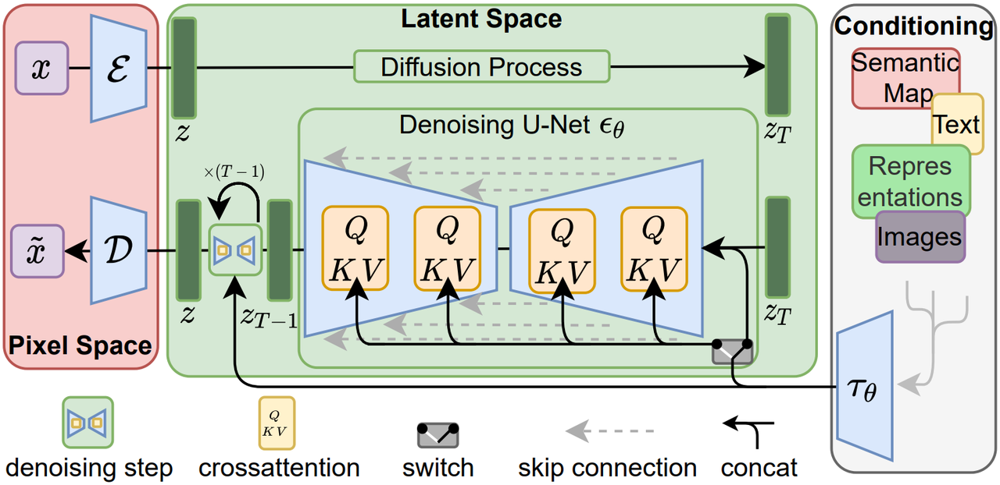

Stable Diffusion 核心在于<span style="color: rgb(100,37,208); background-color: inherit">将扩散过程发生在一个</span>**<span style="color: rgb(100,37,208); background-color: inherit">低维语义潜在空间</span>**<span style="color: rgb(100,37,208); background-color: inherit">中，而非直接在高维像素空间中操作，从而大幅提升效率与可控性</span>。整体流程如上图，可以概括为：

> 1. **<span style="color: rgb(216,57,49); background-color: inherit">VAE</span>**<span style="color: rgb(216,57,49); background-color: inherit">（</span>**<span style="color: rgb(216,57,49); background-color: inherit">V</span>**<span style="color: rgb(216,57,49); background-color: inherit">ariational </span>**<span style="color: rgb(216,57,49); background-color: inherit">A</span>**<span style="color: rgb(216,57,49); background-color: inherit">uto</span>**<span style="color: rgb(216,57,49); background-color: inherit">E</span>**<span style="color: rgb(216,57,49); background-color: inherit">ncoder）</span>：将图片压缩到潜在空间，&#x5982;**`4×64×64`**，再从潜在空间解码回像素画面
>
> 2. **<span style="color: rgb(216,57,49); background-color: inherit">UNet </span>+ <span style="color: rgb(216,57,49); background-color: inherit">Diffusion Scheduler</span>**：在潜在空间上进行去噪扩散，每个时间步预测噪声，逐步生成更清晰的潜在向量
>
> 💡 3. **<span style="color: rgb(216,57,49); background-color: inherit">Text Encoder</span>**（e.g. **`CLIP ViT‑L/14`**）：将用户文本转&#x4E3A;**`77×768`**&#x7684; token embedding，再通过 cross‑attention 引入到 UNet 里，用于条件生成

1. **<span style="color: rgb(36,91,219); background-color: inherit">VAE</span>**

VAE 主要分为两部分，编码器和解码器：

* **<span style="color: rgb(36,91,219); background-color: inherit">Encoder</span>**：输入高分辨率图片，&#x5982;**`512×512×3`**，生成潜在 latent 张量，&#x5982;**`4×64×64`**

* **<span style="color: rgb(36,91,219); background-color: inherit">Decoder</span>**：将潜在向量映射回像素图像。这一步只在推理时执行一次，用于将最终 latent 转为结果图

* <span style="color: rgb(46,161,33); background-color: inherit">潜在空间的尺寸比像素空间低约</span>**`48`**<span style="color: rgb(46,161,33); background-color: inherit">倍，显著提升计算效率</span>

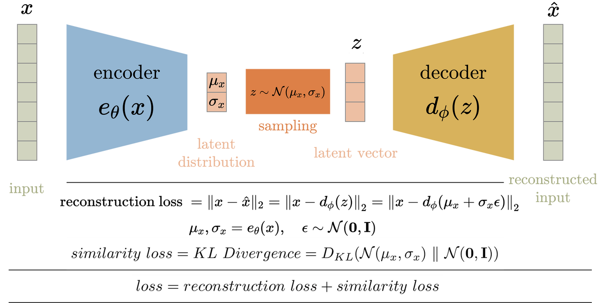

1. **<span style="color: rgb(36,91,219); background-color: inherit">Diffusion：UNet + Scheduler</span>**

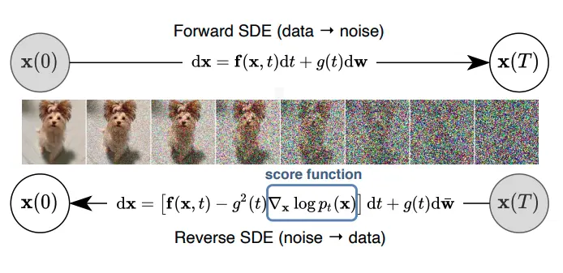

Diffusion 的整体思路如下：

* **<span style="color: rgb(36,91,219); background-color: inherit">正向扩散 forward diffusion</span>**：逐步给潜在向量加上 Gaussian 噪声，形成一系列带噪版本

* **<span style="color: rgb(36,91,219); background-color: inherit">反向去噪 reverse diffusion</span>**：UNet 模型在每一步预测噪声并反向去除，通过 scheduler 控制噪声比例，最终生成清晰潜在向量

**<span style="color: rgb(222,120,2); background-color: inherit">UNet 架构</span>**

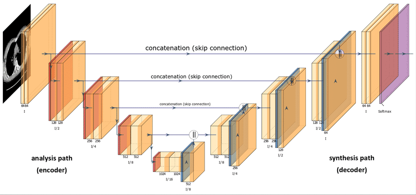

* 经典 Encoder-Decoder 结构，含多个<span style="color: rgb(100,37,208); background-color: inherit">卷积下采样和上采样块以及 skip-connection</span>

* 在潜在空间的每一步去噪中

  * 输入：当&#x524D;**`noisy latent`**、**`time step embedding`**&#x4EE5;&#x53CA;**`cross-attention text embedding`**

  * 输出：噪声预测

* skip-connection 的作用：<span style="color: rgb(100,37,208); background-color: inherit">帮助保留高频细节，确保生成图像质量</span>

**<span style="color: rgb(222,120,2); background-color: inherit">Scheduler</span>**

* 管理噪声衰减速度，一般&#x6709;**`DDPM`** schedule，也&#x6709;**`DDIM`**、**`PLMS`**&#x7B49;控制采样步长优化策略

1. **<span style="color: rgb(36,91,219); background-color: inherit">文本控制条件</span>**

> * **<span style="color: rgb(36,91,219); background-color: inherit">Text Encoder</span>**：使&#x7528;**`CLIP ViT‑L/14`**，将文本转&#x4E3A;**`77 tokens × 768 embeding`**
>
> * **<span style="color: rgb(36,91,219); background-color: inherit">Cross-Attention</span>**：在 UNet 中插入一些 cross‑attention 层，将每个潜在位置与文本 token 建立交互，指导图像生成
>
> * 这种机制<span style="color: rgb(100,37,208); background-color: inherit">允许模型对 prompt 内容进行语义对应，比如对象、动作、风格等生成对齐</span>

1. **<span style="color: rgb(36,91,219); background-color: inherit">训练与推理</span>**

**<span style="color: rgb(222,120,2); background-color: inherit">训练</span>**

* 训练数据集是 LAION‑5B，经过多轮筛选，如<span style="color: rgb(220,155,4); background-color: inherit">分辨率、NSFW 阈值、审美分数等</span>

* 对每个时间步$$t$$，UNet 预测噪声$$\epsilon_\theta(z_t, t, c)$$，目标是最小化重构误差$$\|\epsilon - \epsilon_\theta\|^2$$，这里通常优化目标为 MSE

**<span style="color: rgb(222,120,2); background-color: inherit">推理</span>**

> 💡 1. Text Encoder：prompt → text embedding
>
> 2. 粗随机生成 latent $$z_T$$
>
> 3. 对每个 step 从 t = T 到 0：
>
>    💡 * 将$$z_t$$、time embedding、text embedding 输入 UNet，预测噪声
>
>    * 用 scheduler 更新$$z_{t-1} = f(z_t, \hat{\epsilon}_t)$$
>
> 4. 最终将$$z_0$$用 VAE decoder 转为像素图

1. **<span style="color: rgb(36,91,219); background-color: inherit">后续改进</span>**

> 1) **`SDXL`**：三倍大的 UNet，双文本编码器，加入 refinement stage 提升高分辨率与多宽高比适配能力
>
> 🥛 2) **`Stable Diffusion 3`**：引入 **<span style="color: rgb(216,57,49); background-color: inherit">DiT</span>**<span style="color: rgb(216,57,49); background-color: inherit">（</span>**<span style="color: rgb(216,57,49); background-color: inherit">Di</span>**<span style="color: rgb(216,57,49); background-color: inherit">ffusion </span>**<span style="color: rgb(216,57,49); background-color: inherit">T</span>**<span style="color: rgb(216,57,49); background-color: inherit">ransformer）</span>架构和 **`Flow Matching`** 方法，替代 UNet，并且用 Transformer 更好捕捉远程依赖。除此之外还使用 timestamp weighting 提升中间步骤质量 ，如 **`Logit-Normal sampling`**
>
> 3) **`ControlNet`**：允许在 UNet 中注入结构化条件，如<span style="color: rgb(220,155,4); background-color: inherit">边缘、深度图、姿态图</span>等，通过双路径 fine‑tuning 控制生成形式&#x20;

**<span style="color: rgb(36,91,219); background-color: inherit">核心原理</span>**

> #### **<span style="color: inherit; background-color: rgba(147,90,246,0.55)">扩散过程</span>**
>
> 扩散模型基于两个过程：**正向扩散过程（forward diffusion process）和 逆向扩散过程（reverse diffusion process）**。
>
> * **<span style="color: inherit; background-color: rgb(255,233,40)">正向扩散过程</span>**<span style="color: inherit; background-color: rgb(255,233,40)">：</span>从一个真实数据分布开始，逐步添加噪声，生成一系列逐渐模糊的图像，最终得到一种标准正态分布。这一过程的数学表示可以用一个马尔可夫链来实现：$$q(x_t | x_{t-1}) = \mathcal{N}(x_t; \sqrt{1 - \beta_t} x_{t-1}, \beta_t \mathbf{I})$$
>
> &#x20; 其中，$$\beta_t$$是一组预先定义的小正值，这些值控制在每一步添加噪声的程度。
>
> * **<span style="color: inherit; background-color: rgb(255,233,40)">逆向扩散过程</span>**<span style="color: inherit; background-color: rgb(255,233,40)">：</span>利用一个参数化模型（如神经网络），学习从噪声分布逐步反向推演出数据分布。在这个过程中，模型学会如何一步步“去噪”，也就是从白噪声生成清晰的图像。
>
> &#x20; 逆向过程如下表示：$$p_\theta(x_{t-1} | x_t) = \mathcal{N}(x_{t-1}; \mu_\theta(x_t, t), \Sigma_\theta(x_t, t))$$
>
> &#x20; 这里的 $$\mu_\theta$$和 $$\Sigma_\theta$$是通过模型训练得到的。
>
> #### **<span style="color: inherit; background-color: rgba(147,90,246,0.55)">变分推断与损失函数</span>**
>
> 扩散模型的训练依赖于变分推断，目标是通过优化KL散度来最小化真实分布和模型分布之间的距离。常用的损失函数为重构损失，形式上可以表示为以下变分下界（ELBO）：
>
> $$L = \mathbb{E}_q \left[ \sum_{t=1}^T D_{KL}(q(x_t | x_{t-1}) || p_\theta(x_{t-1} | x_t)) \right]$$
>
> 换言之，模型的任务就是通过迭代训练不断降低这个损失值。

**<span style="color: rgb(36,91,219); background-color: inherit">应用</span>**

> 🥥 Stable Diffusion及其扩展模型具有广泛的应用空间：
>
> * **风格转换**：将一张图像转换为不同风格的图像。
>
> * **图像补全**：补全部分缺失的图像内容，使图像看起来完整。
>
> * **超分辨率**：生成较低分辨率图像的高分辨率版本。

**<span style="color: rgb(36,91,219); background-color: inherit">挑战</span>**

> 🥥 尽管Stable Diffusion取得了许多成功，但仍有一些挑战需要解决：
>
> * **计算成本高**：尽管比更早期的扩散模型有所优化，但生成每幅图像仍然需要大量计算。
>
> * **逆向过程的稳定性**：在一些情况下，逆向过程可能不稳定，生成图像的质量可能下降。
>
> * **训练数据需求大**：为了训练高质量的生成模型，通常需要大量高质量的数据。

**<span style="color: rgb(36,91,219); background-color: inherit">参考资料</span>**

> #### **<span style="color: inherit; background-color: rgba(147,90,246,0.55)">论文：</span>**
>
> * Ho, J., Jain, A., & Abbeel, P. (2020). \*Denoising Diffusion Probabilistic Models\*. arXiv preprint arXiv:2006.11239. [链接](https://arxiv.org/abs/2006.11239)
>
> 🥥 * Song, Y., & Ermon, S. (2019). \*Generative modeling by estimating gradients of the data distribution\*. arXiv preprint arXiv:1907.05600. [链接](https://arxiv.org/abs/1907.05600)
>
> **<span style="color: inherit; background-color: rgba(147,90,246,0.55)">博客：</span>**
>
> * Lil'Log: [What are Diffusion Models?](https://lilianweng.github.io/posts/2021-07-11-diffusion-models/)
>
> * 上面英文博客看着比较困难的话可以看这篇知乎大佬翻译的：https://zhuanlan.zhihu.com/p/525106459

### 1.1.2 <span style="color: rgb(36,91,219); background-color: inherit">DALL-E的原理是什么？</span>

**<span style="color: rgb(36,91,219); background-color: inherit">简介</span>**

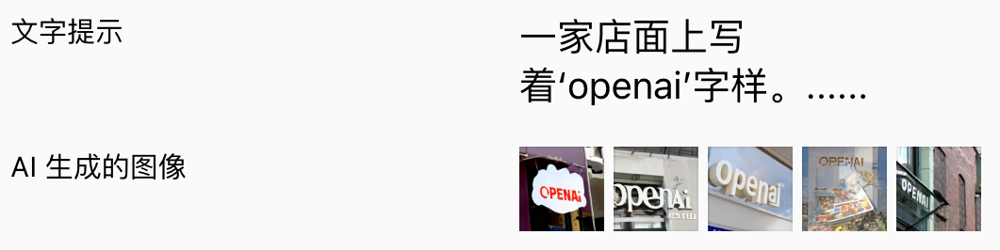

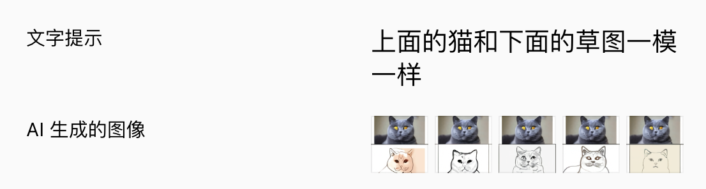

> 🥥 DALL-E &#x662F;**<span style="color: inherit; background-color: rgba(147,90,246,0.55)"> OpenAI 开发的</span>**&#x4E00;种图像生成模型，基于变体自回归（autoregressive）架构，通过理解和生成自然语言描述，创造出高质量、独特的图像。作为 GPT-3 的一个延伸，DALL-E 在图像生成领域展示了出色的能力，**<span style="color: inherit; background-color: rgba(147,90,246,0.55)">能够从一段文字描述中创作出视觉图像</span>**，突破了传统人工智能生成图像的局限。
>
> DALL-E 使用文本到图像的生成方式，能够将任何给定的文本描述（如“一个穿西装的橙色大象在海滩上”）转化为对应的图像，展示了文本和图像之间强大的跨模态关联能力。

**<span style="color: rgb(36,91,219); background-color: inherit">原理</span>**

> #### **<span style="color: inherit; background-color: rgba(147,90,246,0.55)">基本概念</span>**
>
> 🥥 DALL-E 是一种基于变体自回归架构的生成模型，核心功能是将自然语言文本转换为图像。它通过大规模训练，学习文本和图像之间的深度关系，能够生成高质量、细节丰富的图像。与 GPT-3 类似，DALL-E 也使用了自回归机制，但不同的是，它的目标是生成图像，而非单纯的文本。
>
> 自回归模型的特点是，每次生成一个部分时，都会依赖于前面已生成的部分，这使得图像生成过程逐步细化，最终呈现出完整的图像。

**<span style="color: inherit; background-color: rgba(147,90,246,0.55)">Transformer 架构</span>**

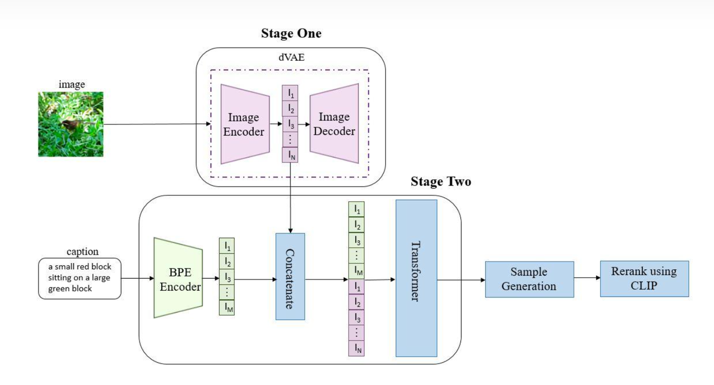

> 🥥 DALL·E的目标是把文本token和图像token当成一个数据序列，通过Transformer进行自回归。由于图片的分辨率很大，如果把单个pixel当成一个token处理，会导致计算量过于庞大，于是DALL·E引入了一个dVAE模型来降低图片的分辨率。

> #### **<span style="color: inherit; background-color: rgba(147,90,246,0.55)">DALL·E的整体流程</span>**
>
> 1.第一个阶段，先训练一个dVAE把每张256x256的RGB图片压缩成32x32的图片token，每个位置有8192种可能的取值(也就是说dVAE的encoder输出是维度为32x32x8192的logits，然后通过logits索引codebook的特征进行组合，codebook的embedding是可学习的)。
>
> 2.第二阶段，用BPE Encoder对文本进行编码，得到最多256个文本token，token数不满256的话padding到256，然后将256个文本token与1024个图像token进行拼接，得到长度为1280的数据，最后将拼接的数据输入Transformer中进行自回归训练。
>
> 🥥 3.推理阶段，给定一张候选图片和一条文本，通过transformer可以得到融合后的token，然后用dVAE的decoder生成图片，最后通过预训练好的CLIP计算出文本和生成图片的匹配分数，采样越多数量的图片，就可以通过CLIP得到不同采样图片的分数排序(详细过程可以看非官方实现（[DALLE-pytorch/dalle\_pytorch.py](https://link.zhihu.com/?target=https://github.com/lucidrains/DALLE-pytorch/blob/961bba948124a135120db477ef9a55329a7feac8/dalle_pytorch/dalle_pytorch.py#L447)）。

> #### **<span style="color: inherit; background-color: rgba(147,90,246,0.55)">DALL·E的整体流程</span>**
>
> 1.第一个阶段，先训练一个dVAE把每张256x256的RGB图片压缩成32x32的图片token，每个位置有8192种可能的取值(也就是说dVAE的encoder输出是维度为32x32x8192的logits，然后通过logits索引codebook的特征进行组合，codebook的embedding是可学习的)。
>
> 2.第二阶段，用BPE Encoder对文本进行编码，得到最多256个文本token，token数不满256的话padding到256，然后将256个文本token与1024个图像token进行拼接，得到长度为1280的数据，最后将拼接的数据输入Transformer中进行自回归训练。
>
> 3.推理阶段，给定一张候选图片和一条文本，通过transformer可以得到融合后的token，然后用dVAE的decoder生成图片，最后通过预训练好的CLIP计算出文本和生成图片的匹配分数，采样越多数量的图片，就可以通过CLIP得到不同采样图片的分数排序(详细过程可以看非官方实现（[DALLE-pytorch/dalle\_pytorch.py](https://link.zhihu.com/?target=https://github.com/lucidrains/DALLE-pytorch/blob/961bba948124a135120db477ef9a55329a7feac8/dalle_pytorch/dalle_pytorch.py#L447)）。

> #### **<span style="color: inherit; background-color: rgba(147,90,246,0.55)">dVAE</span>**
>
> 相比于普通的VAE，dVAE有两点区别：
>
> 1.和VQVAE方法相似，dVAE的encoder是将图像的patch映射到8192的词表中，论文中将其分布设为在词表向量上的均匀分类分布，这是一个离散分布，由于不可导的问题，此时不能采用重参数技巧，DALL·E使用Gumbel Softmax trick来解决这个问题(简单来说就是arg max不可导，可以用softmax来近似代替max，而arg softmax是可导的，可参考Gumbel Softmax的文章)。
>
> 2、在重建图像时，真实的像素值是在一个有界区间内，而VAE中使用的Gaussian
>
> 分布和Laplace分布都是在整个实数集上，这造成了不匹配的问题。为了解决这个问题，论文中提出了[<span style="color: rgb(36,91,219); background-color: inherit">logit-Laplace分布</span>](https://zhida.zhihu.com/search?content_id=175790054\&content_type=Article\&match_order=1\&q=logit-Laplace分布\&zhida_source=entity)，如下式所示：
>
> $$f(x|\mu, b)=\frac{1}{2bx(1 - x)}\exp\left(-\frac{\left|\text{logit}(x)-\mu\right|}{b}\right)$$

**<span style="color: rgb(36,91,219); background-color: inherit">应用</span>**

> DALL-E 在多个领域都有广泛的应用，包括但不限于：
>
> * **创意设计与广告**：DALL-E 能快速生成独特的设计草图、概念图，帮助创意人员在短时间内实现视觉构思，提升工作效率。
>
> * **数字艺术与艺术创作**：艺术家可以利用 DALL-E 从简单的文字描述中获取灵感，甚至将其作为艺术创作的起点，创造出前所未见的视觉效果。
>
> 🥥 * **教育与娱乐**：在教育中，DALL-E 可以用来生成教学图像，帮助学生更好地理解抽象概念；在娱乐中，DALL-E 可以为游戏、电影等内容提供视觉素材。
>
> * **产品设计**：DALL-E 可以帮助设计师和工程师在概念阶段快速生成产品原型和构思图，缩短产品从构想到设计的时间。

**<span style="color: rgb(36,91,219); background-color: inherit">挑战与局限性</span>**

> 尽管 DALL-E 在图像生成方面展现了强大的能力，但仍面临一些挑战和局限性：
>
> 🥥 * **数据偏见**：由于 DALL-E 的训练数据来源于网络，存在潜在的偏见问题。例如，模型可能会生成带有性别、种族或文化偏见的图像，反映出训练数据中的不平衡性。
>
> * **计算资源需求**：训练和运行 DALL-E 等大规模模型需要巨大的计算资源和存储空间，这对于资源有限的用户和组织来说是一个限制因素。
>
> * **内容控制**：生成的图像有时可能包含不适当或有害的内容。如何在保证生成多样性和创意性的同时，加强对内容的审查和控制，依然是一个重要课题。

**<span style="color: rgb(36,91,219); background-color: inherit">未来发展</span>**

> 未来 DALL-E 和类似模型可能会在以下几个方面得到进一步发展：
>
> * **提高生成图像的质量和多样性**：尽管当前的生成效果已经非常出色，但对于复杂场景的细节处理、生成图像的清晰度和真实感等方面，仍有进一步提升的空间。
>
> * **增强生成内容的控制能力**：随着技术的进步，开发者正在努力改进如何在生成过程中对内容进行更精确的控制，以避免生成不符合伦理标准的图像。
>
> * **优化训练效率与资源消耗**：未来的 DALL-E 模型可能会在减少计算资源消耗、提高训练效率方面取得进展，使其能够在更多应用场景下普及。
>
> 🥥 * **跨领域整合与应用**：随着技术的发展，DALL-E 可以与其他领域的模型（如文本生成、音频生成等）进行整合，实现更加多模态的生成能力。例如，结合声音或视频生成，为影视和广告制作带来创新机会。

**<span style="color: rgb(36,91,219); background-color: inherit">参考资料</span>**

> * [DALL-E: Creating Images from Text](https://openai.com/research/dall-e/)**<span style="color: inherit; background-color: rgba(147,90,246,0.55)">(官网的介绍，可以重点看看)</span>**
>
> * [Understanding the Transformer Model - Attention is All You Need](https://arxiv.org/abs/1706.03762)
>
> * [VQ-VAE-2: Generating Diverse High-Fidelity Images with VQ-VAE-2](https://arxiv.org/abs/1906.00446)

### 1.1.3 <span style="color: rgb(36,91,219); background-color: inherit">Imagen的原理是什么？</span>

> 🥥 Imagen是由谷歌研究团队开发的一种多模态生成模型（论文：Photorealistic Text-to-Image Diffusion Models with Deep Language Understanding，简称Imagen），专门用于生成高质量的图像。它结合了自然语言处理和计算机视觉领域的最新进展，通过文本提示生成逼真的图像。
>
> #### **<span style="color: inherit; background-color: rgba(147,90,246,0.55)">Imagen贡献点</span>**
>
> * 作者发现，仅使用文本数据训练的大型语言模型在text-to-image任务上，是一个相当有效的文本编码器。
>
> * 一种新的扩散采样技术，动态阈值（dynamic thresholding）。
>
> * 突出多个扩散结构设计选择，提出Efficient U-Net，更简单、收敛更快、内存占用更有效。
>
> * COCO FID：7.27，效果更好。
>
> * 提出了一个评价基准，DrawBench。

**<span style="color: rgb(36,91,219); background-color: inherit">Imagen的原理</span>**

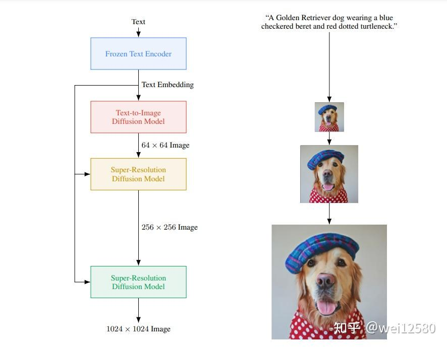

> #### **<span style="color: inherit; background-color: rgba(147,90,246,0.55)">模型结构</span>**
>
> * **Text Encoder：**&#x9884;训练好的文本编码器
>
> * **Text-to-Image Diffusion Model：**&#x901A;过扩散模型，实现文本到低分辨率图像的生成
>
> 🥥 * **Super-Resolution Diffusion Model**：将低分辨率图像进行两次超分，得到高分辨率图像

**<span style="color: rgb(36,91,219); background-color: inherit">模型设计</span>**

> #### **<span style="color: inherit; background-color: rgba(147,90,246,0.55)">预训练的文本编码器（Pretrained Text Encoder）</span>**
>
> 🥥 文本到图像生成模型，需要强有力的语义文本编码器，去捕捉任意自然语言文本输入的复杂性和组合性。
>
> 当前，使用成对的图像-文本数据对 训练文本编码器 成为了一种标准做法。可以重新训练，或是使用预训练权重模型，如CLIP。
>
> 近来，大型语言模型（BERT、GPT、T5）在文本理解和生成能力上得到了极大提升。仅使用文本语料训练的语言模型数量要比使用图像-文本数据对 训练的语言模型 多得多（纯文本数据更容易获取）。与此同时，这些模型的参数量也是相当惊人，**如PaLM有540B参数、CoCa有1B参数。**&#x4ECE;而，很自然地利用这些熟悉的文本编码器到文本图像生成任务上。
>
> #### **<span style="color: inherit; background-color: rgba(147,90,246,0.55)">扩散模型（Diffusion Model）</span>**
>
> 扩散模型是一种隐变量模型，其隐变量$$z = \{z_i | t \in [0,1]\}$$遵循一个以数据$$x \sim p(x)$$作为起点的前向过程。该前向过程$$q(z|x)$$是一个满足马尔科夫链结构的高斯过程。具体表示如下：$$q(z_i|x) = N(z_i; \alpha_t x, \sigma_t^2 I)$$、$$q(z_i|z_s) = N(z_i; (\alpha_t / \alpha_s) z_s, \sigma_t^2 I)$$
>
> 其中，$$0 \leq s < t \leq 1$$，$$\sigma_{t|s}^2 = (1 - e^{\lambda_t - \lambda_s}) \sigma_t^2$$，$$\lambda_t = \log[\alpha_t^2 / \sigma_t^2]$$，$$\alpha_t, \sigma_t$$指定为一个可微分的噪声，随着 $$t$$的逐渐减小，直至 $$q(z_1) \approx N(0,I)$$。
>
> 对于生成过程，扩散模型需要学习这个前向过程的逆过程。
>
> * **前向过程**：真实数据分布 -> 噪声分布
>
> * **逆向过程**：噪声分布 -> 真实数据分布，从随机噪声中生成图像。
>
> #### **<span style="color: inherit; background-color: rgba(147,90,246,0.55)">权重采样器（Weight Sampler）</span>**
>
> 在每个采样时间步$$t$$  ，训练数据$$x$$的预测值必须限定在\[-1, 1]之间。作者发现，指导权重（guidance weights）高，会造成$$x$$的预测值超过\[-1, 1]的范围。这就是train-test不匹配，因为扩散模型通过采样的方式迭代地应用于自己的输出。从而，采样过程容易生成不自然的图像，有时甚至是四不像的图像。为了解决这一问题，作者研究了静态阈值和动态阈值。
>
> * 静态阈值：\[-1, 1]
>
> * 动态阈值：\[-s, s]，s 是百分比的绝对像素值（\[0, 255]/100=\[0, 2.55]），如果 s 大于 1，会除以 s 。

**<span style="color: rgb(36,91,219); background-color: inherit">核心原理</span>**

> 🥥 Imagen基于扩散模型（Diffusion Models），这是一种潜在的生成建模方法。扩散模型通过逐步向图像中添加噪声来训练模型，然后学会反向逐步去除噪声，以生成新图像。这个过程类似于从一张逐渐模糊的图像中恢复出原始图像。
>
> * **文本编码器**: Imagen使用一个强大的文本编码器（如T5或BERT）来将自然语言提示转换成文本特征向量。
>
> * **扩散模型**: 扩散模型被用于图像生成。Imagen通常使用扩散模型的变体Denoising Diffusion Probabilistic Models (DDPM) 或Denoising Diffusion Implicit Models (DDIM)。
>
> * **训练过程**:&#x20;
>
>   1. 在训练阶段，模型学习通过添加逐渐增大的高斯噪声将图像模拟至标准正态分布。
>
>   2. 在生成阶段，模型从高斯噪声开始，应用反向扩散过程来生成图像。
>
> * **条件生成**: 结合文本编码器，Imagen能够将条件编码与扩散模型结合，以便生成符合文本描述的图像。

**<span style="color: rgb(36,91,219); background-color: inherit">应用</span>**

> Imagen的应用领域包括但不限于：
>
> * 艺术创作：可以根据用户输入的描述生成高质量的数字艺术。
>
> 🥥 * 广告：营销人员可以利用它来创建与广告文案相符的视觉内容。
>
> * 游戏开发：游戏设计师可以快速生成场景或角色。

**<span style="color: rgb(36,91,219); background-color: inherit">挑战</span>**

> 🥥 **计算资源**: 训练大型的扩散模型非常耗费计算资源。
>
> **语义理解**: 对复杂语言提示的准确理解仍然是一个挑战。
>
> **泛化能力**: 对未见过的领域或对象有时候难以生成令人满意的结果。

## 1.2 <span style="color: rgb(36,91,219); background-color: inherit">视觉语言基础模型原理</span>

### 1.2.1 <span style="color: rgb(36,91,219); background-color: inherit">BLIP的原理是什么？</span>

> 🍅 BLIP提出了一种基于预训练的方法，通过联合训练视觉和语言模型来提升多模态任务的性能。

**<span style="color: rgb(36,91,219); background-color: inherit">BLIP简介</span>**

> 🥥 BLIP(Bootstrapping Language-Image Pretraining)是salesforce在2022年提出的多模态框架，是理解和生成的统一，**<span style="color: inherit; background-color: rgba(147,90,246,0.55)">引入了跨模态的编码器和解码器，实现了跨模态信息流动</span>**，在多项视觉和语言任务取得SOTA。在AIGC中通常用来给图像生成prompt，好的prompt对交叉注意力的微调非常关键，例如ControlNet中的Automatic Prompt就是BLIP生成的。
>
> 为什么叫Bootstrapping，是因为训练数据来自网络图文对，包含大量噪声，所以增加了一个在线数据打标签和清理的任务，把处理好的数据继续用来迭代原模型。

**<span style="color: rgb(36,91,219); background-color: inherit">BLIP模型结构</span>**

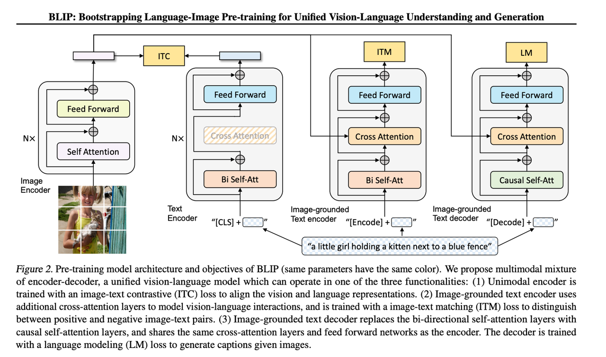

> 🥥 BLIP引入&#x4E86;**<span style="color: inherit; background-color: rgba(147,90,246,0.55)">编码器-解码器的多模态混合结构MED（ Multimodal mixture of Encoder-Decoder）</span>**，能够有效地进行多任务预学习和迁移学习。MED包括两个单模态编码器（lmage Encoder，Text Encoder），一个以图像为基础的编码器（image-grounded text encoder）和一个以图像为基础的解码器（image-grounded text decoder）。
>
> 该模型通过三个损失函数联合进行预训练：
>
> (i) **图像-文本对比损失 ITC（Image-Text Contrastive Loss）：**&#x9488;对图像编码器和文本编码器，通过正负图文对的对比学习，来对齐图像和文本的潜在特征空间。
>
> (ii) **图像-文本匹配损失 ITM（Image-Text Matching Loss）：**&#x9488;对以图像为基础的文本编码器，通过对图文匹配性进行二分类，建模图文多模态信息的相关性。
>
> (iii) **语言建模损失 LM（Language Modeling Loss ）：**&#x9488;对以图像为基础的文本解码器，通过交叉熵损失进行优化，训练模型以自回归的方式生成目标caption。

**<span style="color: rgb(36,91,219); background-color: inherit">训练方法</span>**

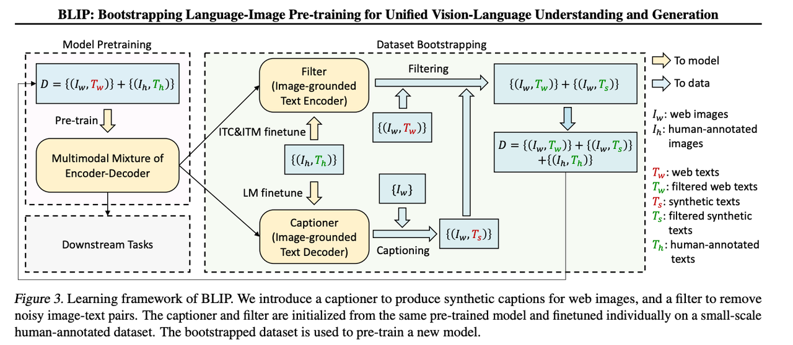

> 🥥 网络上获得的大量图文对，通常包含许多不准确甚至错误的信息，为了有效利用这种形态的数据，BLIP提出caption生成和过滤模块**CapFilt**（Captioning and Filtering），首先从噪声图文对中学习，然后生成和过滤产生新的数据集，再去迭代优化原模型。
>
> CapFilt包含两个模块：一个是captioner，给网络图像生成caption，另一个是Filter，过滤原始网络文本和合成文本中的噪声caption。实验结果表明，通过captioner和filter的协作，BLIP模型能够在各种下游任务上取得了稳定的性能提升，包括图像-文本检索、图像标题、视觉问答、视觉推理和视觉对话。
>
> Captioner和Filter都是从预训练的模型初始化的，并在人工标注数据集上单独进行微调。
>
> （i）**Captioner是image-grounded text decoder**，它在人工标注数据集上以LM为目标进行微调，对给定的图像进行文本解码，这里给定网络图片，Captioner生成合成caption&#x20;
>
> （ii）**Filter是image-grounded text encoder**，它根据ITC和ITM的目标进行微调，以学习文本是否与图像匹配，去除原始网络文本和合成文本中的噪音文本。
>
> （iii）**Bootstrap过程**，Captioner生成的图文对与Filter过滤后的网络图文，再加上人工标注的图文对结合起来，形成一个新的数据集，重新预训练一个新模型。

**<span style="color: rgb(36,91,219); background-color: inherit">参考资料</span>**

> Li, J., Zhang, M., et al. (2023). "BLIP: Bootstrapped Language-Image Pre-training for Unified Vision-Language Understanding and Generation". [arXiv:2201.12086](https://arxiv.org/abs/2201.12086)

### 1.2.2 <span style="color: rgb(36,91,219); background-color: inherit">BLIP-2的原理是什么？</span>

> 🍅 BLIP-2（Bootstrapped Language-Image Pre-training 2）是一种多模态模型，旨在高效结合视觉信息与语言信息。它是BLIP（初代）的继任者，通过设计先进的模块和训练策略，进一步改善了语言模型和图像特征提取器之间的协作。
>
> BLIP提出了一种基于预训练的方法，通过联合训练视觉和语言模型来提升多模态任务的性能。BLIP-2则提出了一种更简洁的预训练方法，利用现有的单模态视觉和文本预训练模型，以减少计算成本和避免灾难性遗忘问题。

**<span style="color: rgb(36,91,219); background-color: inherit">BLIP-2简介</span>**

> BLIP-2 采用了一种新的多模态学习框架，通过以下几个关键层次实现语言和视觉信息的高效融合：
>
> 1. **<span style="color: inherit; background-color: rgba(147,90,246,0.55)">视觉特征提取：</span>**&#x42;LIP-2使用预训练的视觉编码器（如Vision Transformer，ViT）来提取图像的视觉特征。这些特征描述了图像的底层视觉信息，并为后续的多模态处理提供基础。
>
> 🥥 2. **<span style="color: inherit; background-color: rgba(147,90,246,0.55)">模态桥接（Modal Bridging）：</span>**&#x8FD9;是BLIP-2的创新之处之一，采用了一个称为“模态桥接器”（Modal Bridger）的模块，负责在视觉特征和语言特征之间建立桥梁。这个桥接器对图像特征进行适当的调整，使得这些特征能够以更兼容的方式与语言模型结合。
>
> 3) **<span style="color: inherit; background-color: rgba(147,90,246,0.55)">语言模型的引导</span>**<span style="color: inherit; background-color: rgba(147,90,246,0.55)">：</span>BLIP-2将一个强大的预训练语言模型（如BERT或GPT系列）与视觉特征结合。通过这种结合，模型能够理解图像对应的自然语言描述或执行图像生成任务。
>
> 4) **<span style="color: inherit; background-color: rgba(147,90,246,0.55)">任务特定的微调</span>**<span style="color: inherit; background-color: rgba(147,90,246,0.55)">：</span>通过在特定任务数据集上进行微调，BLIP-2能够适应多种多模态任务，如图像生成、视觉问答、图像字幕生成等。

**<span style="color: rgb(36,91,219); background-color: inherit">模型结构</span>**

> 🥥 BLIP-2 由预训练的Image Encoder，预训练的Large Language Model，和一个可学习的 Q-Former 组成。整体结构代码块如下：


> 🥥 **<span style="color: inherit; background-color: rgba(147,90,246,0.55)">Image Encoder</span>**：负责从输入图片中提取视觉特征，本文试验了两种网络结构，CLIP 训练的 ViT-L/14和EVA-CLIP训练的 ViT-g/14。
>
> **<span style="color: inherit; background-color: rgba(147,90,246,0.55)">Large Language Model：</span>**&#x8D1F;责文本生成，本文试验了decoder-based LLM and encoder-decoder-based LLM。
>
> **<span style="color: inherit; background-color: rgba(147,90,246,0.55)">Q-Former</span>**：负责弥合视觉和语言两种模态的差距，由Image Transformer和Text Transformer两个子模块构成，它们共享相同自注意力层。
>
> Image Transformer通过与图像编码器进行交互提取视觉特征，它的输入是可学习的 Query，这些Query通过自注意力层相互交互，并通过交叉注意力层与冻结的图像特征交互，还可以通过共享的自注意力层与文本进行交互。
>
> Text Transformer作为文本编码器和解码器，它的自注意力层与Image Transformer共享，根据预训练任务，应用不同的自注意力掩码来控制Query和文本的交互方式。

**<span style="color: rgb(36,91,219); background-color: inherit">训练方式</span>**


> 🥥 为了减少计算成本并避免灾难性遗忘的问题，BLIP-2 在预训练时冻结预训练图像模型和语言模型，但是，简单地冻结预训练模型参数会导致视觉特征和文本特征难以对齐，为此BLIP-2提出两阶段预训练 Q-Former 来弥补模态差距：表示学习阶段和生成学习阶段。
>
> #### **<span style="color: inherit; background-color: rgba(147,90,246,0.55)">表示学习阶段</span>**
>
> 在表示学习阶段，将 Q-Former 连接到冻结的 Image Encoder，训练集为图像-文本对，通过联合优化三个预训练目标，在Query和Text之间分别采用不同的注意力掩码策略，从而控制Image Transformer和Text Transformer的交互方式。
>
> 1. **<span style="color: inherit; background-color: rgb(255,165,61)">ITC(Image-Text Contrastive Learning)</span>**
>
> ITC的优化目标是对齐图像嵌入和文本嵌入，将来自Image Transformer输出的Query嵌入与来自Text Transformer输出的文本嵌入对齐，为了避免信息泄漏，ITC采用了单模态自注意掩码，不允许Query和Text相互注意。具体来说，Text Transformer的文本嵌入是 \[CLS] 标记的输出嵌入，而Query嵌入则包含多个输出嵌入，因此首先计算每个Query输嵌入与文本嵌入之间的相似度，然后选择最高的一个作为图像-文本相似度。
>
> 1. **<span style="color: inherit; background-color: rgb(255,165,61)">ITG(Image-grounded Text Generation)</span>**
>
> ITG 是在给定输入图像作为条件的情况下，训练 Q-Former 生成文本，迫使Query提取包含文本信息的视觉特征。由于 Q-Former 的架构不允许冻结的图像编码器和文本标记之间的直接交互，因此生成文本所需的信息必须首先由Query提取，然后通过自注意力层传递给文本标记。ITG采用多模态Causal Attention掩码来控制Query和Text的交互，Query可以相互关注，但不能关注Text标记，每个Text标记都可以处理所有Query及其前面的Text标记。这里将 \[CLS] 标记替换为新的 \[DEC] 标记，作为第一个文本标记来指示解码任务。
>
> 1. **<span style="color: inherit; background-color: rgb(255,165,61)">ITM( Image-Text Matching)</span>**
>
> ITM是一个二元分类任务，通过预测图像-文本对是正匹配还是负匹配，学习图像和文本表示之间的细粒度对齐。这里将Image Transformer输出的每个Query嵌入输入到一个二类线性分类器中以获得对应的logit，然后将所有的logit平均，再计算匹配分数。ITM使用双向自注意掩码，所有Query和Text都可以相互关注。
>
> #### <span style="color: inherit; background-color: rgba(147,90,246,0.55)">生成学习阶段</span>
>
> 在生成预训练阶段，将 Q-Former连接到冻结的 LLM，以利用 LLM 的语言生成能力。这里使用全连接层将输出的Query嵌入线性投影到与 LLM 的文本嵌入相同的维度，然后将投影的Query嵌入添加到输入文本嵌入前面。由于 Q-Former 已经过预训练，可以提取包含语言信息的视觉表示，因此它可以有效地充当信息瓶颈，将最有用的信息提供给 LLM，同时删除不相关的视觉信息，减轻了 LLM 学习视觉语言对齐的负担。
>
> BLIP-2试验了两种类型的 LLM：基于解码器的 LLM 和基于编码器-解码器的 LLM。对于基于解码器的 LLM，使用语言建模损失进行预训练，其中冻结的 LLM 的任务是根据 Q-Former 的视觉表示生成文本。对于基于编码器-解码器的 LLM，使用前缀语言建模损失进行预训练，将文本分成两部分，前缀文本与视觉表示连接起来作为 LLM 编码器的输入，后缀文本用作 LLM 解码器的生成目标。

**<span style="color: rgb(36,91,219); background-color: inherit">应用案例</span>**

> BLIP-2的架构使其能够在多个任务中实现出色的表现：
>
> * **视觉问答（Visual Question Answering）**：回答与图像内容相关的问题。
>
> * **图像字幕生成（Image Captioning）**：创建与图像内容紧密相关的文本描述。
>
> 🥥 * **多模态翻译（Multimodal Translation）**：在不同模态之间实现信息的转换，比如从图像到文本。

**<span style="color: rgb(36,91,219); background-color: inherit">面临的挑战</span>**

> 🥥 **模态间信息不对称**：视觉和语言信息具有天然的异质性，如何有效地桥接这两种信息仍是一个研究热点。
>
> **计算资源需求**：预训练模型特别是大模型通常需要大量的计算资源和数据。
>
> **鲁棒性与泛化性**：如何使得模型在不同的数据分布和任务中表现均良好。

**<span style="color: rgb(36,91,219); background-color: inherit">参考资料</span>**

> 论文原文：https://arxiv.org/pdf/2301.12597


```python
# pretrained image encoder
self.vision_model = Blip2VisionModel(config.vision_config)
# input query
self.query_tokens = nn.Parameter(torch.zeros(1, config.num_query_tokens, config.qformer_config.hidden_size))
self.qformer = Blip2QFormerModel(config.qformer_config)
```

### 1.2.3 <span style="color: rgb(36,91,219); background-color: inherit">CLIP的原理是什么</span>

> 推荐阅读：https://openai.com/index/clip/

> 🌻 CLIP（Contrastive Language-Image Pre-training）是由 OpenAI 提出的多模态预训练模型，其核心目标是建立图像与文本之间的跨模态语义关联。**<span style="color: inherit; background-color: rgb(255,165,61)">通过大规模图文对的对比学习</span>**，CLIP 实现了零样本迁移能力，在图像分类、图文检索等任务中展现出卓越性能。以下从模型架构、训练目标、核心机制三个维度深入解析其原理。

**<span style="color: rgb(36,91,219); background-color: inherit">双塔架构：分离式模态编码器</span>**


> CLIP 采用 **<span style="color: inherit; background-color: rgba(147,90,246,0.55)">双编码器架构（Dual Encoder）</span>**，分别对图像和文本进行独立编码，最终通过对比学习对齐两个模态的语义空间。
>
> #### <span style="color: inherit; background-color: rgb(98,210,86)">图像编码器</span>
>
> 🥥 * **可选结构**：Image Encoder采用了两种的不同的架构，一是常用的CNN架构ResNet，二是基于transformer的ViT，其中ResNet包含5个不同大小的模型：ResNet50，ResNet101，RN50x4，RN50x16和RNx64（后面三个模型是按照EfficientNet缩放规则对ResNet分别增大4x，16x和64x得到），而ViT选择3个不同大小的模型：ViT-B/32，ViT-B/16和ViT-L/14
>
> * **特征提取**：将输入图像编码为固定维度的向量（如 ViT-B/32 输出 512 维），通过全局平均池化（GAP）或 \[CLS] token 获得全局特征。
>
> * **优化目标**：最大化与匹配文本特征的相似度，最小化与不匹配文本的相似度。
>
> #### <span style="color: inherit; background-color: rgb(98,210,86)">文本编码器</span>
>
> * **Transformer 架构**：论文中Text Encoder固定选择一个包含63M参数的text transformer模型
>
> * **文本嵌入**：输入文本通过 Byte Pair Encoding（BPE）分词后，经 Embedding 层转换为向量，最终通过 \[EOS] token 输出全局语义向量。
>
> * **动态对齐**：通过对比学习，使文本嵌入能够动态适配不同图像的语义粒度（如物体属性、场景描述等）。

**<span style="color: rgb(36,91,219); background-color: inherit">对比学习：跨模态语义对齐的核心</span>**


> CLIP 的训练过程基于噪声对比估计（Noise Contrastive Estimation, NCE），通过构造正负样本对优化模型参数。
>
> #### **<span style="color: inherit; background-color: rgba(147,90,246,0.55)">样本构造</span>**
>
> * **正样本对**：原始图文对（image-caption pair）的图像和文本。
>
> 🥥 * **负样本对**：同一批次（batch）内其他图文对的图像和文本。假设 batch size 为$$N$$，则每个样本会产生$$2(N-1)$$个负样本（图像与非配对文本、文本与非配对图像）。
>
> #### **<span style="color: inherit; background-color: rgba(147,90,246,0.55)">损失函数</span>**
>
> 采用 InfoNCE 损失（基于 softmax 的对比损失）：
>
> $$\mathcal{L}_{\text{CLIP}} = -\frac{1}{2N} \sum_{i=1}^N \left[ \log \frac{\exp(\text{sim}(\mathbf{v}_i, \mathbf{t}_i)/\tau)}{\sum_{j=1}^N \exp(\text{sim}(\mathbf{v}_i, \mathbf{t}_j)/\tau)} + \log \frac{\exp(\text{sim}(\mathbf{t}_i, \mathbf{v}_i)/\tau)}{\sum_{j=1}^N \exp(\text{sim}(\mathbf{t}_i, \mathbf{v}_j)/\tau)} \right]$$
>
> 其中：
>
> * $$\mathbf{v}_i, \mathbf{t}_i$$ 分别为第 $$i$$ 个图像和文本的归一化嵌入向量。
>
> * $$\text{sim}(\cdot,\cdot)$$ 为余弦相似度。
>
> * $$\tau$$ 为温度参数（控制分布陡峭程度，通常设为 0.07）。
>
> #### **<span style="color: inherit; background-color: rgba(147,90,246,0.55)">训练策略</span>**
>
> * **大规模数据**：训练数据来自互联网上的 4 亿图文对，覆盖丰富的语义场景。
>
> * **端到端优化**：图像和文本编码器联合训练，通过梯度反向传播同步更新参数。

**<span style="color: rgb(36,91,219); background-color: inherit">零样本迁移能力的实现机理</span>**

> CLIP 的核心创新在于通过预训练直接学习**模态无关的语义表示**，从而无需微调即可迁移到下游任务。
>
> #### **<span style="color: inherit; background-color: rgba(147,90,246,0.55)">文本驱动的分类逻辑</span>**
>
> 🥥 对于图像分类任务，CLIP 将类别标签转化为自然语言描述（如 "a photo of a dog"），计算图像嵌入与所有类别文本嵌入的相似度，取最高相似度作为预测结果。数学表达为：$$\hat{y} = \arg\max_{c \in \mathcal{C}} \text{sim}(\mathbf{v}, \mathbf{t}_c)
> $$
>
> 其中 $$\mathcal{C}$$ 为文本化的类别集合。
>
> #### <span style="color: inherit; background-color: rgba(147,90,246,0.55)">语义泛化能力</span>
>
> * **隐式知识迁移**：预训练阶段学习到的跨模态关联（如 "斑马" 与 "黑白条纹动物" 的联系）可直接用于新任务。
>
> * **上下文学习（In-Context Learning）**：通过设计文本提示（prompt）模板（如 "A photo of {}."），显式引导模型关注特定语义。
>
> #### <span style="color: inherit; background-color: rgba(147,90,246,0.55)">局限性</span>
>
> * **数据分布依赖**：对训练数据中未充分覆盖的类别（如细粒度物种）性能下降。
>
> * **计算复杂度**：双塔架构在推理时需同时计算图像和文本嵌入，实时性受限。

**<span style="color: rgb(36,91,219); background-color: inherit">技术优势与行业影响</span>**

> 🥥 **多模态统一表示**：首次实现图像与文本在统一空间的高效对齐，为后续模型（如 ALIGN、Florence）提供范式参考。
>
> **任务无关性**：无需任务特定的头部网络，仅通过文本提示即可适应新任务。
>
> **鲁棒性**：对比学习赋予模型对噪声和对抗样本的强抵抗能力。

**<span style="color: rgb(36,91,219); background-color: inherit">总结</span>**

> 🍇 CLIP 的突破性在于将对比学习与大规模多模态数据结合，通过双塔架构构建了图像与文本的共享语义空间。其零样本能力本质是预训练阶段积累的跨模态知识与文本提示工程的结合，为多模态理解与生成任务提供了新的技术路径。

> 💡 ### 1.2.4 <span style="color: rgb(36,91,219); background-color: inherit">ImageBind的原理是什么？</span>

> 论文原文：https://arxiv.org/pdf/2305.05665

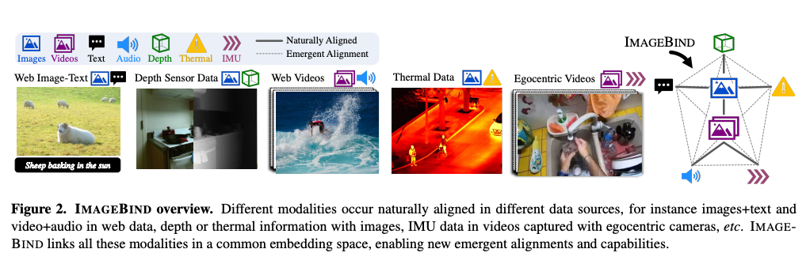

> 🍅 多模态学习在现代人工智能应用中尤为重要，因为人类日常所感知的信息是多源的，单一模态的信息通常不足以完整描述一个场景。IMAGEBIND是一种学习六种不同模态的联合嵌入的方法—images, text, audio, depth, thermal, and IMU data。

**<span style="color: rgb(36,91,219); background-color: inherit">ImageBind的原理</span>**

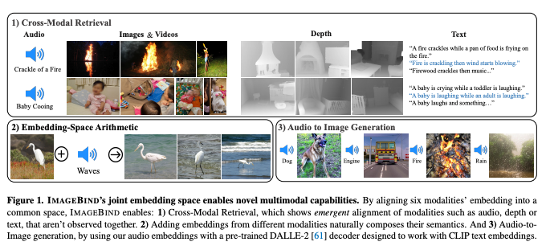

> 🍁 ImageBind 是一种创新的方法，**<span style="color: rgb(222,120,2); background-color: inherit">旨在学习六种不同模态（图像、文本、音频、深度、热成像和惯性测量单元(IMU)数据）的联合嵌入</span>**。它利用了大规模视觉语言模型，并通过与图像自然配对的数据扩展这些模型的zero-shot功能到新的模态。这种方法使得跨模态交互成为可能，即使在没有直接成对训练数据的情况下也能实现，从而解锁了一系列新颖的应用程序。
>
> 一张简单的沙滩图片可以唤起海浪的声音、沙子的质感、微风的感觉甚至是一首诗歌的记忆。理想情况下，我们希望视觉特征能够通过对齐所有这些模态的信息来学习，但这通常需要大量的多模态数据集，这在实践中往往是不可行的。ImageBind 则通过仅使用图像与其他模态的配对数据实现了这一目标，使得即使是未见过的模态之间的交互也成为可能。

**<span style="color: rgb(36,91,219); background-color: inherit">方法</span>**

> #### **<span style="color: inherit; background-color: rgba(147,90,246,0.55)">绑定模态与图像</span>**
>
> 💡 ImageBind 的核心在于通过图像将不同的模态绑定在一起，创建一个共享的嵌入空间。具体来说，它通过对比学习方法对每个模态的嵌入与图像嵌入进行对齐。这种策略允许模型在没有直接成对数据的情况下，仍然能够在模态之间建立联系。
>
> **<span style="color: inherit; background-color: rgb(255,165,61)">数据预处理与编码器设计</span>**
>
> * **图像与文本**：采用大规模网络数据集中的（图像、文本）对。
>
> * **音频、深度图、热成像和IMU**：利用各自与图像自然配对的数据（如视频-音频、图像-深度等）。
>
> * 编码器选择：对于不同模态，ImageBind 使用了Transformer架构，包括ViT用于图像和视频编码，一维卷积核用于IMU信号处理等。
>
> **<span style="color: inherit; background-color: rgb(255,165,61)">Emergent Alignment</span>**
>
> 即便只对某些特定模态进行了训练，ImageBind 也能够在未见的模态对之间实现隐式对齐。例如，尽管模型仅训练了（图像、文本）和（图像、音频），但它仍能通过文本提示生成音频内容。

**<span style="color: rgb(36,91,219); background-color: inherit">实验结果</span>**

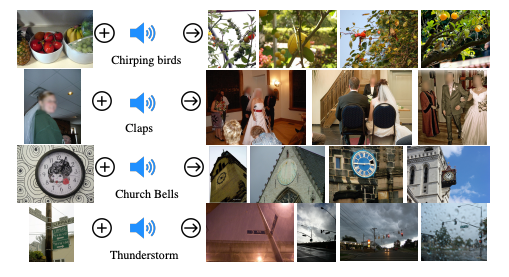

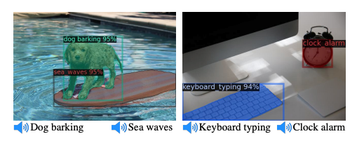

> #### <span style="color: inherit; background-color: rgba(147,90,246,0.55)">Zero-Shot 分类</span>
>
> 💡 ImageBind 在多个基准测试中展示了强大的zero-shot分类能力，尤其是在音频识别和检索任务上，其性能持平或优于那些专门针对语音-文本监督数据训练的模型。
>
> #### <span style="color: inherit; background-color: rgba(147,90,246,0.55)">Few-Shot 分类</span>
>
> 在少量样本评估中，ImageBind 显示出比特定监督模型更好的表现，特别是在音频和深度分类任务上。

**<span style="color: rgb(36,91,219); background-color: inherit">结论</span>**

> ImageBind 提供了一种简单而有效的方法来实现多模态信息的联合嵌入，极大地拓宽了跨模态应用的可能性。通过巧妙地利用图像作为桥梁，**<span style="color: rgb(100,37,208); background-color: inherit">ImageBind 能够在缺乏直接成对数据的情况下，依然实现在不同模态间的高效交互，为未来的多模态研究开辟了新的方向。</span>**
>
> 🥥 尽管 ImageBind 展示了在多种模态间进行有效交互的能力，但其性能仍受限于特定任务的专业模型。此外，该方法依赖于高质量的视觉表示，这意味着增强视觉特征可以间接提升非视觉模态的表现。未来的工作可能会探索如何通过更多的模态对齐数据或更复杂的训练策略进一步提升模型性能。

**<span style="color: rgb(36,91,219); background-color: inherit">挑战</span>**

> 🥥 **<span style="color: rgb(100,37,208); background-color: inherit">计算复杂度和资源需求</span>**<span style="color: rgb(100,37,208); background-color: inherit">: </span>多模态学习需要处理和存储大量的异构数据，其中计算和存储资源是一个关键制约因素。
>
> **<span style="color: rgb(100,37,208); background-color: inherit">模态非对称性</span>**<span style="color: rgb(100,37,208); background-color: inherit">: </span>不同模态之间的信息密度差异大，如何公平有效地整合这些信息是一个难题。
>
> **<span style="color: rgb(100,37,208); background-color: inherit">数据标注的困难</span>**<span style="color: rgb(100,37,208); background-color: inherit">:</span> 多模态数据难以标注和校对，尤其是涉及到视频和音频，需要大量的人工成本和时间。

### 1.2.5 <span style="color: rgb(36,91,219); background-color: inherit">Vit的原理是什么？</span>

> 【1】ViT论文： \[2010.11929] An Image is Worth 16x16 Words: Transformers for Image Recognition at Scale  [arxiv.org/abs/2010.1192](http://link.zhihu.com/?target=https://arxiv.org/abs/2010.11929)
> 【2】Paddle官网代码讲解：ViT( Vision Transformer) — PaddleEdu documentation
> [paddlepedia.readthedocs.io](http://link.zhihu.com/?target=https://paddlepedia.readthedocs.io/en/latest/tutorials/computer_vision/classification/ViT.html)
> 【3】李沐系列视频： ViT论文逐段精读【论文精读】
> youtube：[youtube.com/watch?](http://link.zhihu.com/?target=https://www.youtube.com/watch?v=FRFt3x0bO94\&list=PLFXJ6jwg0qW-7UM8iUTj3qKqdhbQULP5I\&index=38)
> bilibili：[bilibili.com/video/BV15](http://link.zhihu.com/?target=https://www.bilibili.com/video/BV15P4y137jb/?spm_id_from=333.999.0.0)
>
> 【4】Vision Transformer(vit)原理分析以及特征可视化https://blog.csdn.net/z240626191s/article/details/132504292

**<span style="color: rgb(36,91,219); background-color: inherit">原理：突破CNN的局部归纳偏置</span>**

> **<span style="color: rgb(100,37,208); background-color: inherit">ViT的核心思想是将Transformer架构直接应用于图像分类任务，通过全局注意力机制建模长程依赖，突破传统CNN的局部性限制。 </span>**&#x20;
>
> * **核心问题**：CNN依赖卷积核的局部感受野，需多层堆叠才能捕获全局信息，而Transformer通过自注意力机制直接建模任意两个位置的关系。 &#x20;
>
> * **理论基础**：论文《An Image is Worth 16x16 Words》提出，图像可视为“视觉词元（Patch）的序列”，通过Transformer编码器学习全局上下文。&#x20;
>
> * **关键创新**： &#x20;
>
>   * **图像序列化**：将图像分割为固定大小的非重叠块（如16×16像素），形成序列输入。 &#x20;
>
>   * **可学习分类Token**：引入额外的Token动态聚合全局信息，替代CNN的全局池化操作。 &#x20;

**<span style="color: rgb(36,91,219); background-color: inherit">具体方法：从图像到Transformer的适配</span>**

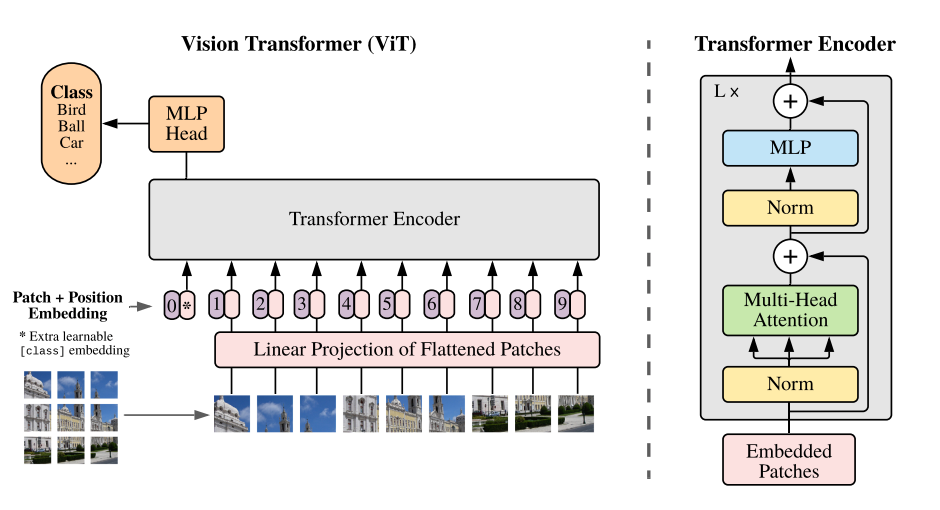

> ##### **<span style="color: inherit; background-color: rgba(147,90,246,0.55)">（1）图像分块与嵌入（Patch Embedding）</span>**
>
> * **分块策略**：将输入图像$$H \times W \times C$$分割为$$N$$个块（如16×16），每个块展平为一维向量，形成序列长度为$$N$$的输入。 &#x20;
>
> * **线性映射**：通过全连接层将每个块映射到嵌入维度$$D$$（如768），等效于学习“视觉词汇”的语义表示。 &#x20;
>
> 🥥 * **位置编码**：添加可学习的位置向量，弥补序列化丢失的空间信息。论文实验证明，位置编码对性能影响较小，但不可或缺。 &#x20;

**<span style="color: inherit; background-color: rgba(147,90,246,0.55)">论文中位置编码的实验：</span>**

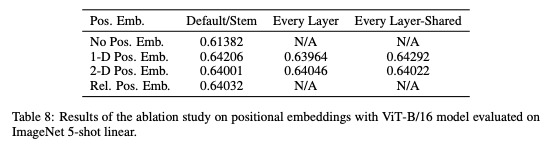

> * No Pos Emb：不采用位置嵌入
>
> * 1-D Pos Emb：例如3x3共9个patch，patch编码为1到9
>
> * 2-D Pos Emb：patch编码为11,12,13,21,22,23,31,32,33，即同时考虑X和Y轴的信息，每个轴的编码维度是D/2
>
> * Rel Pos Emb：考虑块之间的相对距离来嵌入空间信息，而不是它们的绝对位置。
>
> 🍇 实际实验结果表明，不管使用哪种位置编码方式，模型的精度都很接近，不使用位置编码，模型的性能损失也没有特别大。原因可能是ViT是作用在image patch上的，而不是image pixel，**<span style="color: inherit; background-color: rgba(147,90,246,0.55)">对网络来说这些patch之间的相对位置信息很容易理解，所以使用什么方式的位置编码影像都不大。</span>**

> ##### **<span style="color: inherit; background-color: rgba(147,90,246,0.55)">（2）Transformer编码器</span>**
>
> 💡 * **标准架构**：采用与NLP相同的Transformer编码器，包含多头自注意力和前馈网络（FFN）。 &#x20;
>
> * **计算流程**： &#x20;
>
>   * **自注意力**：每个块与其他块计算注意力权重，捕捉全局依赖（复杂度$$O(N^2)$$）。 &#x20;
>
>   * **残差连接与层归一化**：增强模型稳定性，加速训练。 &#x20;
>
> ##### **<span style="color: inherit; background-color: rgba(147,90,246,0.55)">（3）分类机制</span>**
>
> * **可学习的Class Token**：在序列前端添加一个可学习向量，通过多层编码器后直接输入分类头。 &#x20;
>
> * **优势**：与CNN的固定池化不同，Class Token通过注意力动态关注关键区域。 &#x20;

**<span style="color: rgb(36,91,219); background-color: inherit">实验结果：性能与效率的突破</span>**

> 🥥 **大规模预训练优势**：在JFT-300M数据集预训练后，ViT在ImageNet上达到88.55%的Top-1精度，超越ResNet等CNN模型。 &#x20;
>
> **小数据集挑战**：在ImageNet-1k上从头训练时，ViT性能低于ResNet，但通过蒸馏（如DeiT）可缩小差距。 &#x20;
>
> **计算效率**：ViT的预训练成本低于同等性能的CNN，尤其在大模型中表现更优。&#x20;

**<span style="color: rgb(36,91,219); background-color: inherit">结论：ViT的范式革新</span>**

> **<span style="color: inherit; background-color: rgba(147,90,246,0.55)">贡献</span>**<span style="color: inherit; background-color: rgba(147,90,246,0.55)">：  </span>
>
> * 首次验证Transformer可直接处理图像任务，无需依赖CNN的归纳偏置。 &#x20;
>
> 🥥 * 提出图像序列化与Class Token机制，为后续模型（如Swin Transformer）奠定基础。 &#x20;
>
> **<span style="color: inherit; background-color: rgba(147,90,246,0.55)">影响</span>**<span style="color: inherit; background-color: rgba(147,90,246,0.55)">：</span>
>
> 推动视觉模型从局部特征工程转向数据驱动的全局建模，成为现代多模态模型（如CLIP）的基石。 &#x20;

**<span style="color: rgb(36,91,219); background-color: inherit">挑战与改进方向</span>**

> **数据依赖**：ViT需大规模预训练才能发挥潜力，小数据场景表现受限。 &#x20;
>
> **计算复杂度**：注意力机制的$$O(N^2)$$复杂度限制高分辨率图像处理，需分层设计或稀疏注意力优化。 &#x20;
>
> 🥥 **局部性缺失**：论文指出，ViT需从数据中学习局部特征，而CNN天然具备此能力，导致训练效率差异。&#x20;

**<span style="color: rgb(36,91,219); background-color: inherit">总结</span>**

> 🍅 ViT通过序列化建模与全局注意力机制，重新定义了视觉任务的范式。其成功不仅在于性能突破，更在于证明了Transformer的通用性，为多模态学习与模型统一提供了理论支持。尽管面临数据与计算挑战，**<span style="color: inherit; background-color: rgb(247,105,100)">ViT的原理已成为现代视觉模型设计的核心参考。</span>**

> 🥥 ### 1.2.6 <span style="color: rgb(36,91,219); background-color: inherit">Flamingo的原理是什么？</span>

> 🍅 Flamingo是由DeepMind提出的一种用于多模态学习的大型语言模型，旨在以最少的样本进行视觉语义任务（如图像问答、视觉描述等）的Few-Shot Learning。Flamingo的设计集中在如何高效地将视觉信息与语言信息结合，以便在各种与视觉相关的任务中获得优异的表现。
>
> **<span style="color: inherit; background-color: rgb(247,105,100)">出自Deepmind在NeurIPS 2022的论文Flamingo: a Visual Language Model for Few-Shot Learning</span>**

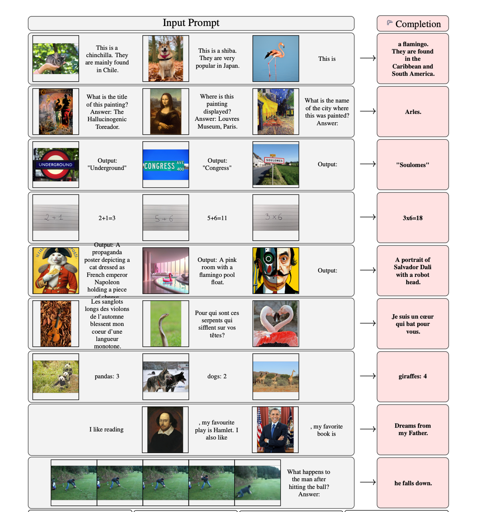

**<span style="color: rgb(36,91,219); background-color: inherit">模型简介</span>**

> 🥥 Flamingo模型和大部分VLM模型类似，由视觉编码器+图文对齐模块+LLM构成，Flamingo并不更新视觉编码器和LLM的参数
>
> 🥥 预训练过程中，参数会更新的部分是resampler模块和插入到LLM的cross-attention层

**<span style="color: rgb(36,91,219); background-color: inherit">模型结构</span>**

> **<span style="color: inherit; background-color: rgba(147,90,246,0.55)">模态嵌入</span>**
>
> Flamingo通过分别对图像和文本进行嵌入，将这些不同模态的信息转换到同一个特征空间。这通常使用预训练的视觉和文本编码器（如CLIP模型，OpenAI的DALL-E等）来生成模态特征。
>
> **<span style="color: inherit; background-color: rgba(147,90,246,0.55)">跨模态注意力机制</span>**
>
> 🥥 Flamingo模型采用了一种称为Perceiver AR的架构。这种架构通过集中式查询机制对输入数据进行处理，允许Flamingo在不改变其核心架构的同时处理不同类型的数据流（图像、文本）。跨模态注意力机制使得模型能够学习如何在模态之间传递信息并创建多模态表示。
>
> **<span style="color: inherit; background-color: rgba(147,90,246,0.55)">Few-Shot Learning</span>**
>
> 在进行Few-Shot Learning训练过程中，Flamingo利用了一种称为"对比性损失"的策略，以增强其在新任务上的适应性。这意味着即使只有少量的例子可以帮助微调模型，Flamingo也能够通过这种损失函数进行有效的学习，从而提高其生成质量。


> Flamingo模型和大部分VLM模型类似，由视觉编码器+图文对齐模块+LLM构成，Flamingo并不更新视觉编码器和LLM的参数
>
> 预训练过程中，参数会更新的部分是resampler模块和插入到LLM的cross-attention层

**<span style="color: inherit; background-color: rgba(147,90,246,0.55)">模型架构—Resampler</span>**

> 🥥 这个Resampler是一个Q-Former模块，训练过程中会更新query和transformer层，前面的BLIP-2的核心就是这个模块
>
> 如果输入很长，例如是一个视频，Q-Former可以实现对信息的压缩【输出大小只和query大小有关】

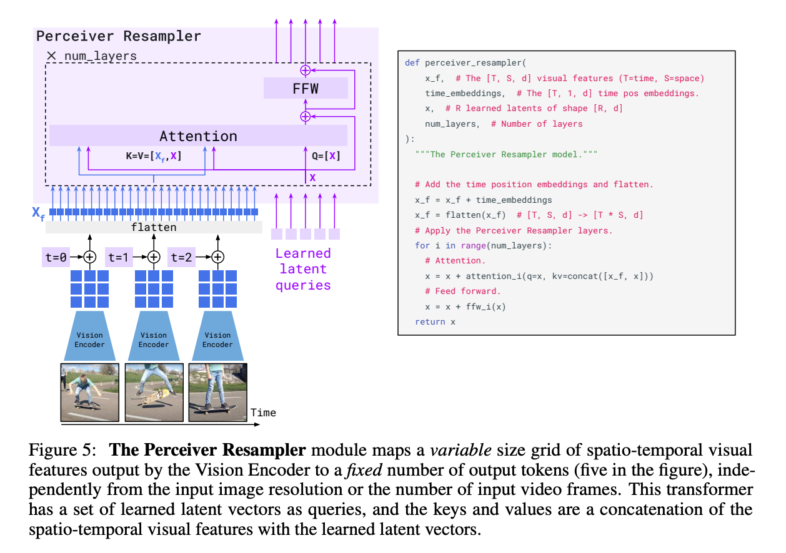

**<span style="color: inherit; background-color: rgba(147,90,246,0.55)">模型架构——插入到LLM的cross-attention层</span>**

> 预训练过程中，参数会更新的部分是resampler模块和插入到LLM的cross-attention层，这些层的权重参数初始化为0，在Flamingo的训练过程中更新
>
> **<span style="color: inherit; background-color: rgb(255,165,61)">值得注意的是，这些交叉注意力层前面的权重系数，层数越深，权重系数的绝对值越大</span>**

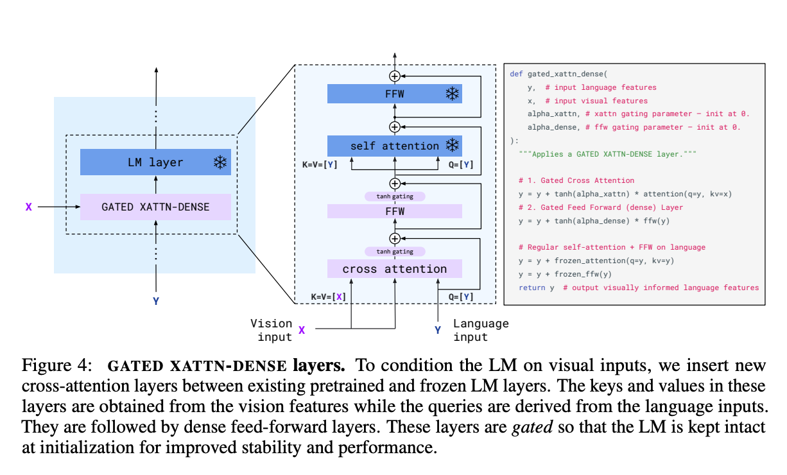

**<span style="color: rgb(36,91,219); background-color: inherit">应用领域</span>**

> Flamingo模型的设计初衷是能够应用于以下几个重要领域：
>
> 🥥 * **图像生成与编辑**：通过理解文本描述生成符合的图像，或者从原始图像生成变体。
>
> * **多模态对话**：在图像背景下进行上下文对话，如图像内容提问和回答。
>
> * **视觉问答**：理解文本提问并从图像中提取相关信息进行回答。

**<span style="color: rgb(36,91,219); background-color: inherit">挑战</span>**

> 尽管多模态模型如Flamingo有很大的潜力，但也面临着许多挑战：
>
> 🥥 * **数据需求量大**：多模态模型需要大量的视觉和语言数据支持，大部分小公司很难具备如此大规模的数据。
>
> * **跨模态对齐复杂**：如何有效地在不同模态之间建立上下文关联仍旧具有挑战。
>
> * **模型鲁棒性**：多模态模型需要在多种模态组合下保持鲁棒性和一致性。

**<span style="color: rgb(36,91,219); background-color: inherit">参考资料</span>**

> **"Flamingo: a Visual Text-Conditioned Model for OS Applications"** https://arxiv.org/pdf/2204.14198

## 1.3 <span style="color: rgb(36,91,219); background-color: inherit">Qwen-VL 系列原理</span>

> 🍅 ### 1.3.1 <span style="color: rgb(36,91,219); background-color: inherit">阿里系-Qwen1.0-VL的技术原理？</span>

> 论文标题：《Qwen-VL: A Versatile Vision-Language Model for Understanding, Localization, Text Reading, and Beyond》
>
> 论文链接：[https://arxiv.org/pdf/2308.12966.pdf](https://link.zhihu.com/?target=https://arxiv.org/pdf/2308.12966.pdf)
>
> 项目：[https://github.com/QwenLM/Qwen-VL/tree/master](https://link.zhihu.com/?target=https://github.com/QwenLM/Qwen-VL/tree/master)

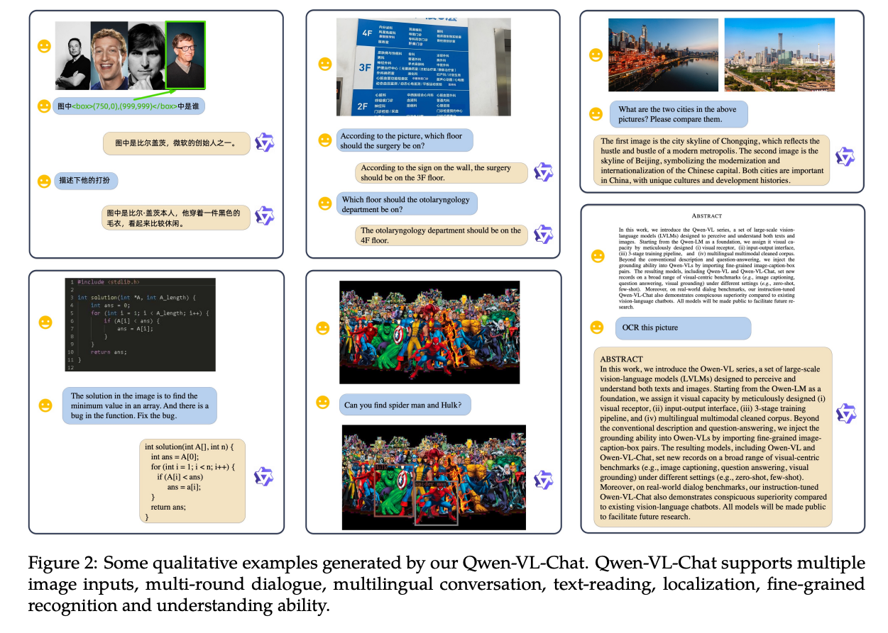

> 🍅 Qwen1.0-VL是千问团队发布的第一版多模态大模型，于2023年10月发布。

**<span style="color: rgb(36,91,219); background-color: inherit">主要特点</span>**

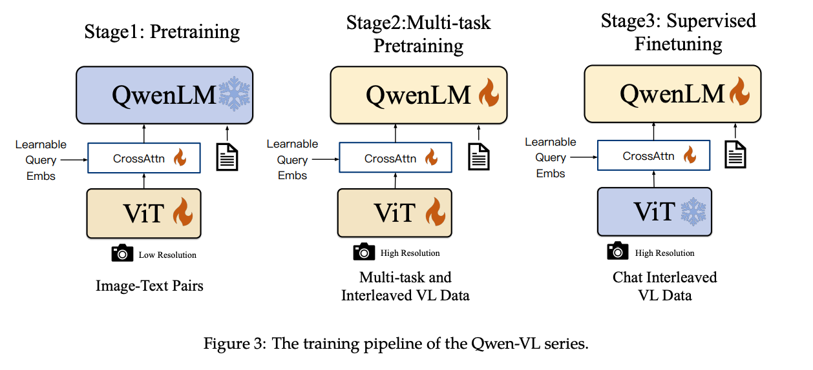

> 🍁 **<span style="color: inherit; background-color: rgb(255,165,61)">视觉-语言适配器</span>**<span style="color: inherit; background-color: rgb(255,165,61)">：</span>利用交叉注意力模块将长图像特征序列压缩到固定长度（256），并通过2D位置编码保持图像的位置信息。
>
> **<span style="color: inherit; background-color: rgb(255,165,61)">训练阶段：</span>**&#x5206;为三个阶段：1) 预训练，2) 多任务预训练，3) 指令微调，以提升模型的图文对理解能力和对话能力。
>
> **<span style="color: inherit; background-color: rgb(255,165,61)">数据来源与清理</span>**<span style="color: inherit; background-color: rgb(255,165,61)">：</span>模型使用大规模的图文对数据集，经过清洗和筛选，确保数据的质量和多样性。

**<span style="color: rgb(36,91,219); background-color: inherit">模型结构</span>**

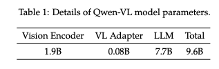

> **<span style="color: inherit; background-color: rgba(147,90,246,0.55)">Large Language Model（LLM）</span>**: Qwen-VL 采用了一个大型语言模型作为其基础组件，该模型以 Qwen-7B 的预训练权重进行初始化。
>
> **<span style="color: inherit; background-color: rgba(147,90,246,0.55)">Visual Encoder（视觉编码器）: </span>**&#x51;wen-VL 的视觉编码器采用了 Vision Transformer (ViT) 架构，并使用 Openclip 的 ViT-bigG 预训练权重进行初始化。在训练和推理过程中，输入图像会被调整到特定的分辨率。视觉编码器通过以步幅为 14 将图像分割成多个小块，从而生成一组图像特征。
>
> 🥥 **<span style="color: inherit; background-color: rgba(147,90,246,0.55)">Position-aware Vision-Language Adapter（位置感知的视觉-语言适配器）</span>**：为了解决长图像特征序列带来的效率问题（缩短图像token长度），Qwen-VL 引入了一个视觉-语言适配器来压缩图像特征。该适配器包括一个单层交叉注意力模块，随机初始化。该模块使用一组可训练向量（嵌入）作为查询向量，并将来自视觉编码器的图像特征作为键进行交叉注意力操作。这个机制将视觉特征序列压缩到固定长度 256。此外，考虑到位置信息对于细粒度图像理解的重要性，2D 绝对位置编码被纳入到交叉注意力机制的查询-键对中，以减轻在压缩过程中可能的位置信息丢失。压缩后的长度为 256 的图像特征序列随后被输入到大型语言模型中。

**<span style="color: rgb(36,91,219); background-color: inherit">输入与输出</span>**

> ##### **<span style="color: rgb(46,161,33); background-color: inherit">图像输入</span>**
>
> <span style="color: rgb(46,161,33); background-color: inherit">图像通过视觉编码器和适配器处理，生成固定长度的图像特征序列。为了区分图像特征输入和文本特征输入，在图像特征序列的开始和结束分别添加了两个特殊标记（</span>``<span style="color: rgb(46,161,33); background-color: inherit"> 和 </span>`</img>`<span style="color: rgb(46,161,33); background-color: inherit">），以表示图像内容的开始和结束。</span>
>
> ##### **<span style="color: rgb(46,161,33); background-color: inherit">边界框输入与输出</span>**
>
> 🌽 <span style="color: rgb(46,161,33); background-color: inherit">为增强模型对细粒度视觉理解与定位的能力，训练数据涉及区域描述、问题和检测形式的数据。对于任何给定的边界框，应用归一化过程（范围在[0, 1000)内），并转换为指定的字符串格式：“(Xtopleft, Ytopleft),(Xbottomright, Ybottomright)”。该字符串被作为文本进行分词，不需要额外的位置词汇表。为了区分检测字符串和普通文本字符串，在边界框字符串的开头和结尾分别添加了两个特殊标记（</span>**`<box>`**<span style="color: rgb(46,161,33); background-color: inherit"> 和 </span>**`</box>`**<span style="color: rgb(46,161,33); background-color: inherit">）。此外，引入另一组特殊标记（</span>**`<ref>`**<span style="color: rgb(46,161,33); background-color: inherit"> 和 </span>**`</ref>`**<span style="color: rgb(46,161,33); background-color: inherit">）用于将边界框与其对应的描述性词语或句子关联起来。</span>

**<span style="color: rgb(36,91,219); background-color: inherit">模型训练</span>**

> #### <span style="color: inherit; background-color: rgb(255,165,61)">第一阶段预训练</span>
>
> 🌻 * **数据集**：利用大规模、弱标记的网络爬取图文对数据集。原始数据集包含50亿个图文对，清理后剩下14亿个。
>
> * **语言分布**：77.3%英文，22.7%中文。
>
> * **细节**：
>
>   * 冻结大型语言模型，优化视觉编码器和视觉-语言适配器。
>
>   * 输入图像尺寸调整为224×224。
>
>   * 目标是最小化文本标记的交叉熵。
>
>   * 最大学习率为2e-4，批次大小为30720个图文对，持续50,000步。
>
> #### <span style="color: inherit; background-color: rgb(255,165,61)">第二阶段多任务预训练</span>
>
> * **任务**：同时在7个任务上训练。
>
>   * 文本生成、图像描述、视觉问答（VQA）、定位任务、参考定位和定位描述二元任务、文本任务。
>
> * **数据来源**：内部收集的语料库、公开可用的数据混合、GRIT数据集等。
>
> **<span style="color: rgb(36,91,219); background-color: inherit">第三阶段监督微调</span>**
>
> * **目标**：增强模型的指令跟随和对话能力。最终形成了交互式 Qwen-VL-Chat 模型。
>
> * **方法**：通过指令微调，主要来源于LLM自我指令生成的字幕数据或对话数据。
>
> * **特别措施**：添加“Picture id:”来适应多图像对话和输入；使用ChatML格式构建指令微调数据集，并用特殊标记（`<im_start>` 和 `<im_end>`）标记每次交互的语句。

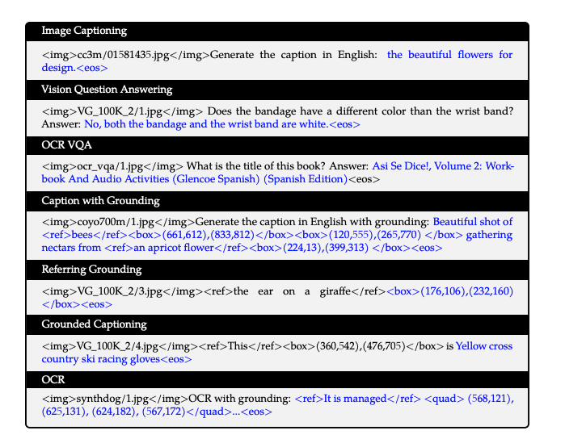

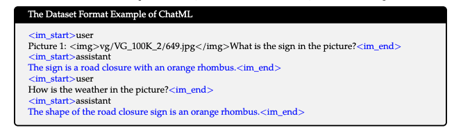

### 1.3.2 <span style="color: rgb(36,91,219); background-color: inherit">阿里系-Qwen 2.0-VL的技术原理？</span>

> 论文标题：《Qwen2-VL: Enhancing Vision-Language Model’s Perception of the World at Any Resolution》&#x20;
>
> 论文：[https://arxiv.org/pdf/2409.12191](https://link.zhihu.com/?target=https://arxiv.org/pdf/2409.12191)&#x20;
>
> 项目：[https://github.com/QwenLM/Qwen2](https://link.zhihu.com/?target=https://github.com/QwenLM/Qwen2-VL)

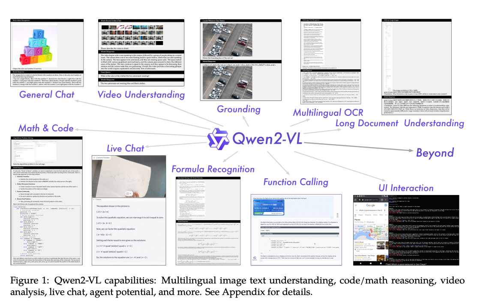

> 🍅 与上一代相比支持动态分辨率，视频理解，以及Agent能力。

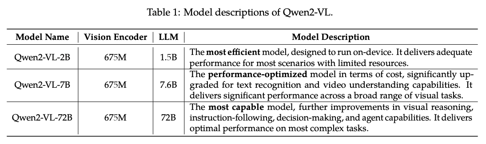

**<span style="color: rgb(36,91,219); background-color: inherit">模型特点</span>**

> **<span style="color: inherit; background-color: rgb(255,165,61)">简单动态分辨率机制</span>**<span style="color: inherit; background-color: rgb(255,165,61)">：</span>Qwen2-VL系列重新定义了传统的固定分辨率视觉处理方法，引入“Naive Dynamic Resolution”机制。该机制使模型能够动态处理不同分辨率的图像，突破了传统预定分辨率的限制。在处理图像时，模型可根据图像分辨率生成不同数量的视觉标记，从而显著提升视觉表示的效率和准确性，有效解决了在处理不同分辨率图像时的效率和准确性问题。
>
> 🍁 **<span style="color: inherit; background-color: rgb(255,165,61)">多模态旋转位置嵌入（M - RoPE）</span>**<span style="color: inherit; background-color: rgb(255,165,61)">：</span>与传统仅能编码一维位置信息的1D - RoPE不同，M - RoPE可有效地融合文本、图像和视频中的位置信息。它将原始旋转嵌入分解为时间、高度和宽度三个组成部分。对于文本输入，这三个组件使用相同的位置ID，功能上等同于1D - RoPE；处理图像时，每个视觉token的时间ID保持不变，高度和宽度组件则依据token在图像中的位置分配不同的ID；处理视频时，将视频视为一系列帧，每帧的时间ID递增，高度和宽度组件遵循与图像相同的ID分配模式。在输入包含多种模态的情况下，每种模态的位置编号通过将前一模态的最大位置ID +1来初始化。这一技术增强了模型对多模态输入的理解能力，还减少了图像和视频的位置ID值，使模型在推理时能够推断更长的序列。
>
> **<span style="color: inherit; background-color: rgb(255,165,61)">统一的图像和视频理解范式</span>**<span style="color: inherit; background-color: rgb(255,165,61)">：</span>采用混合训练方案，将图像和视频数据相结合。为了尽可能完整地保留视频信息，以每秒两帧的频率采样每个视频，并将3D卷积与深度为二的卷积结合，用于处理视频输入，使模型能够处理3D pipeline而非2D块，从而在不增加序列长度的情况下处理更多视频帧。同时，为保持一致性，每幅图像被视为由两个相同的帧组成的视频。为平衡长视频处理的计算需求与整体训练效率，动态调整每个视频帧的分辨率，将每个视频的总tokens数限制为16384。通过这种方式，确保模型在理解和处理图像与视频这两类数据上都具备较高的熟练度。

**<span style="color: rgb(36,91,219); background-color: inherit">模型结构</span>**

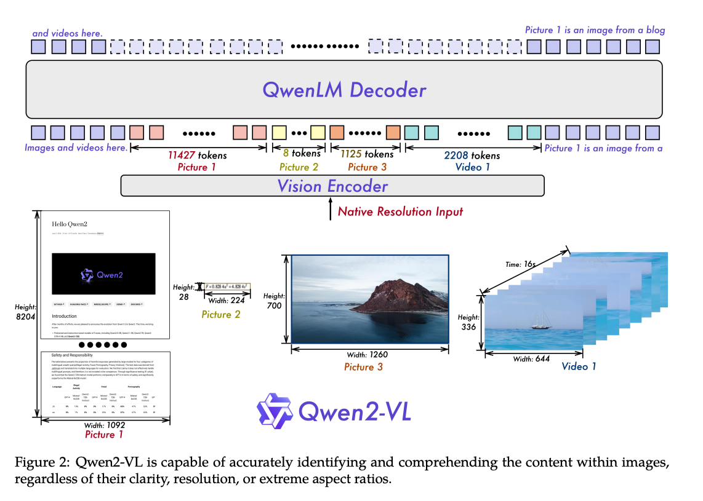

> #### **<u><span style="color: rgb(100,37,208); background-color: inherit">关键组件</span></u>**
>
> 🍇 **<span style="color: inherit; background-color: rgba(147,90,246,0.55)">Vision Transformer (ViT)</span>**<span style="color: inherit; background-color: rgba(147,90,246,0.55)">：</span>参数量约为675百万，具备强大的图像和视频输入处理能力。为支持动态分辨率调整，模型去除了原始的绝对位置嵌入，并引入2D - RoPE，以此捕捉图像的二维位置信息。这一改进使得ViT能够更好地适应不同分辨率的图像输入，提升了模型对视觉信息的处理效果。
>
> **<span style="color: inherit; background-color: rgba(147,90,246,0.55)">Qwen2语言模型</span>**<span style="color: inherit; background-color: rgba(147,90,246,0.55)">：</span>选择更为强大的Qwen2系列语言模型作为文本处理核心，显著提升了模型整体的文本处理能力。在与视觉编码器协同工作时，能够更有效地理解和生成与视觉信息相关的文本描述，增强了模型在视觉 - 语言任务中的表现。
>
> **<span style="color: inherit; background-color: rgba(147,90,246,0.55)">MLP层</span>**<span style="color: inherit; background-color: rgba(147,90,246,0.55)">：</span>在ViT之后采用了一个简单的多层感知器（MLP）层，其作用是将相邻的2×2个标记压缩为一个标记，以此减少每个图像的视觉标记数量。通过这种压缩方式，在推理阶段能够有效控制GPU内存使用，提高模型的运行效率。
>
> **<span style="color: inherit; background-color: rgba(147,90,246,0.55)">特殊标记</span>**<span style="color: inherit; background-color: rgba(147,90,246,0.55)">：</span><|vision\_start|>和<|vision\_end|>这两个特殊标记分别放置在压缩视觉标记的开始和结束位置。它们用于明确划定图像内容在序列中的范围，帮助模型准确区分视觉和文本输入，使得模型在处理多模态数据时能够更清晰地识别和处理图像相关信息。

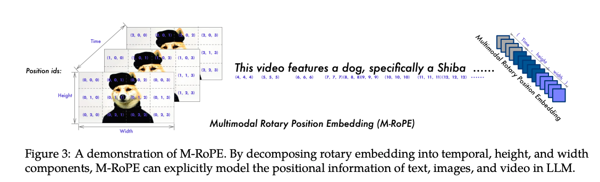

> 🍇 **<span style="color: inherit; background-color: rgba(147,90,246,0.55)">M - RoPE：</span>**
>
> * **<u><span style="color: rgb(100,37,208); background-color: inherit">时间、高度和宽度组件</span></u>**：M - RoPE将原始旋转嵌入分解为时间、高度和宽度这三个组件，以精准适应不同类型输入（文本、图像、视频）的位置信息编码需求。这种分解方式能够更细致地对多模态数据中的位置信息进行建模，相较于传统的单一位置编码方式，大大提升了编码的准确性和适应性。
>
> * **<u><span style="color: rgb(100,37,208); background-color: inherit">应用</span></u>**：在实际应用中，对于文本输入，时间、高度和宽度这三个组件使用相同的位置ID，此时M - RoPE在功能上与1D - RoPE一致；而在处理图像输入时，每个视觉token的时间ID保持不变，高度和宽度组件则根据token在图像中的具体位置分配不同的ID，从而准确捕捉图像中每个元素的位置信息；处理视频输入时，将视频看作一系列帧，每帧的时间ID依次递增，高度和宽度组件遵循与图像相同的ID分配模式，以此对视频中的动态位置信息进行有效编码。

**<span style="color: rgb(36,91,219); background-color: inherit">输入与输出</span>**

> #### <span style="color: inherit; background-color: rgba(147,90,246,0.55)">图像输入</span>
>
> 🥥 * **动态分辨率支持**：Qwen2 - VL允许处理任何分辨率的图像，能够将其动态转换为不同数量的视觉标记。这一特性使得模型在面对各种实际场景中的图像时，无需进行复杂的预处理来统一分辨率，即可直接进行高效处理，大大提高了模型的通用性和适应性。
>
> * **标记区分**：使用<|vision\_start|>和<|vision\_end|>标记来明确区分图片序列特征。这两个标记在模型处理多模态数据时，能够帮助模型准确识别图像数据在整个输入序列中的位置和范围，确保对图像信息的正确处理和理解。
>
> #### <span style="color: inherit; background-color: rgba(147,90,246,0.55)">视觉定位</span>
>
> * **边界框坐标处理**：为赋予模型视觉定位能力，将边界框坐标归一化到\[0, 1000)范围内进行处理。同时，使用Tokens <|box\_start|>和<|box\_end|>标记边界框文本，并引入<|object\_ref\_start|>和<|object\_ref\_end|>标记，用于指示边界框所引用的内容。通过这些方式，模型能够准确地将边界框与其文本描述联系起来，从而有效地解释和生成特定区域的精确描述，提升了模型在视觉定位任务上的表现。
>
> #### <span style="color: inherit; background-color: rgba(147,90,246,0.55)">Visual Agent</span>
>
> * **顺序决策处理**：将各种代理任务（如UI操作、机器人控制、游戏和导航）视为顺序决策问题。Qwen2 - VL能够通过多步行动执行来完成任务，具体过程为：对于每个任务，首先定义一组可允许的动作和关键词模式（下划线）以供功能调用。然后，Qwen2 - VL分析观察结果，进行推理和规划，执行所选动作，并与环境互动以获取新观察。这一循环不断重复，直到任务成功完成。这种处理方式使得Qwen2 - VL能够在复杂的实际应用场景中发挥作用，提高了模型的实际应用能力。

**<span style="color: rgb(36,91,219); background-color: inherit">模型训练</span>**

> **<span style="color: inherit; background-color: rgb(247,105,100)">继Qwen - VL之后，Qwen2 - VL同样采用了三阶段训练方法，具体如下：</span>**
>
> **<span style="color: inherit; background-color: rgb(255,165,61)">Stage1预训练</span>**<span style="color: inherit; background-color: rgb(255,165,61)">：</span>专注于训练ViT组件，利用大量图像 - 文本对提升大型语言模型（LLM）的语义理解。数据源主要来自清理过的网页、开源数据集和合成数据，数据截止日期为2023年6月。在此阶段，Qwen2 - VL接触到约6000亿个tokens，LLM组件使用Qwen2中的参数初始化，视觉编码器基于DFN的ViT初始化，原DFN ViT中的固定位置embedding被RoPE - 2D替代。此阶段主要让模型学习图像 - 文本关系、通过OCR进行文本内容识别、图像分类任务，为模型建立视觉 - 文本关联的扎实基础。
>
> 🌻 **<span style="color: inherit; background-color: rgb(255,165,61)">Stage2多任务预训练</span>**<span style="color: inherit; background-color: rgb(255,165,61)">：</span>涉及额外的8000亿个与图像相关的token。此阶段引入了更多混合图像 - 文本内容，促进了对视觉和文本信息之间相互作用的更细致理解。视觉问答数据集的纳入提升了模型对图像相关查询的响应能力，同时，多任务数据集的引入对模型同时处理多种任务的能力至关重要，这在处理复杂的现实世界数据集时尤为重要。纯文本数据继续在维持和提高模型语言能力方面发挥关键作用。在整个预训练阶段，Qwen2 - VL处理了总计1.4万亿个tokens，包括文本tokens和图像tokens，但训练过程中仅对文本tokens提供监督。
>
> 🥥 **<span style="color: inherit; background-color: rgb(255,165,61)">Stage3指令微调</span>**<span style="color: inherit; background-color: rgb(255,165,61)">：</span>采用ChatML格式构建指令跟随数据集，该数据集不仅包括纯文本对话数据，还包含多图像问答、文档解析、多图像比较、视频理解、视频流对话和基于代理的交互等多模态对话数据。通过这种方式，使模型能够更好地理解和执行各种指令，提升模型在实际应用中的表现。

**<span style="color: rgb(36,91,219); background-color: inherit">数据格式</span>**

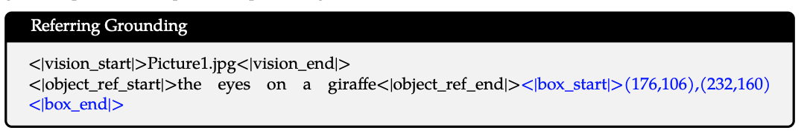

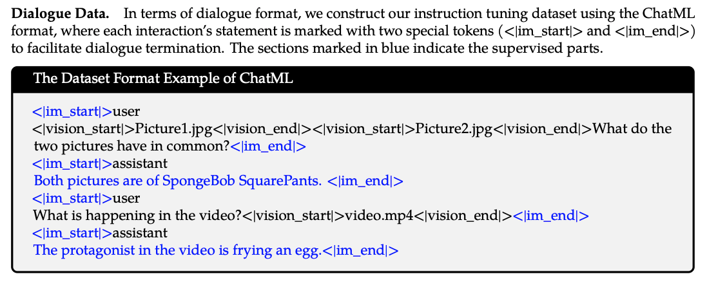

> 🥥 **ChatML格式**：用于构建指令微调数据集，新增Tokens <|vision\_start|>和<|vision\_end|>来区分图片序列特征。这种格式有助于模型在处理多模态对话数据时，清晰地识别和处理图像相关信息，提升模型对多模态指令的理解和执行能力。
>
> **对话数据**：主要来源于LLM自我指令生成的字幕数据或对话数据，这些数据为模型在对话场景中的训练提供了丰富的素材，使模型能够更好地适应自然语言对话的模式和需求。
>
> **视觉定位**：对边界框坐标进行归一化处理，增强了模型的视觉定位能力。通过标准化边界框坐标，并使用特定的Tokens标记边界框相关内容，模型能够更准确地理解和处理图像中特定区域的信息，提升了在视觉定位任务上的性能。
>
> **Visual Agent**：集成多种代理任务，如UI操作、机器人控制等，将这些任务视为顺序决策问题进行训练。通过这种方式，提高了模型的实际应用能力，使其能够在实际场景中通过多步行动执行来完成各种复杂任务。&#x20;

### 1.3.3 <span style="color: rgb(36,91,219); background-color: inherit">阿里系-Qwen 2.5-VL的技术原理？</span>

> 论文：https://arxiv.org/pdf/2502.13923
>
> 项目：https://github.com/QwenLM/Qwen2.5-VL

> 🍅 Qwen 团队2025 年 2 月发布了 Qwen2.5-VL，旨在提升大型视觉语言模型（LVLM）在细粒度视觉感知、文档解析、物体定位和长视频理解方面的能力。

> 🍁 **<span style="color: rgb(36,91,219); background-color: inherit">模型特点</span>**

> #### **<span style="color: rgb(100,37,208); background-color: inherit">三个改进</span>**
>
> Qwen2.5-VL的整体模型结构如下，主要在3个方面进行了改进。
>
> **<span style="color: inherit; background-color: rgba(147,90,246,0.55)">LLM版本：</span>**&#x5347;级大盘Qwen2.5版本。
>
> **<span style="color: inherit; background-color: rgba(147,90,246,0.55)">Dynamic Resolution扩展：</span>**&#x5C06;Dynamic Resolution的建模思路扩展到时间维度，以此支持不同帧采样率的视频粒度建模。
>
> 🥥 **<span style="color: inherit; background-color: rgba(147,90,246,0.55)">ViT结构对齐LLaMA：</span>**&#x5728;ViT模型中使用SwiGLU激活函数替换ReLU激活函数，使用RMSNorm替代LayerNorm，在模型结构上对齐LLaMA。

> #### **<span style="color: rgb(216,57,49); background-color: inherit">模型特点</span>**
>
> **<span style="color: inherit; background-color: rgb(255,165,61)">原生分辨率理解：</span>**&#x65E0;需压缩或扭曲图像，直接处理高分辨率画面（处理 4K 高清画面中的微小文字）。
>
> **<span style="color: inherit; background-color: rgb(255,165,61)">绝对时间编码</span>**<span style="color: inherit; background-color: rgb(255,165,61)">：</span>AI 可以精准把握视频中的关键时刻（让 AI 精准把握小时级视频中「第 23 分 15 秒」的关键时刻）。
>
> **<span style="color: inherit; background-color: rgb(255,165,61)">文档解析</span>**<span style="color: inherit; background-color: rgb(255,165,61)">：</span>自动识别表格、公式、乐谱等复杂元素并输出结构化数据。
>
> **<span style="color: inherit; background-color: rgb(255,165,61)">动态分辨率</span>**<span style="color: inherit; background-color: rgb(255,165,61)">：</span>支持不同分辨率图片的直接处理。

**<span style="color: rgb(36,91,219); background-color: inherit">模型结构</span>**

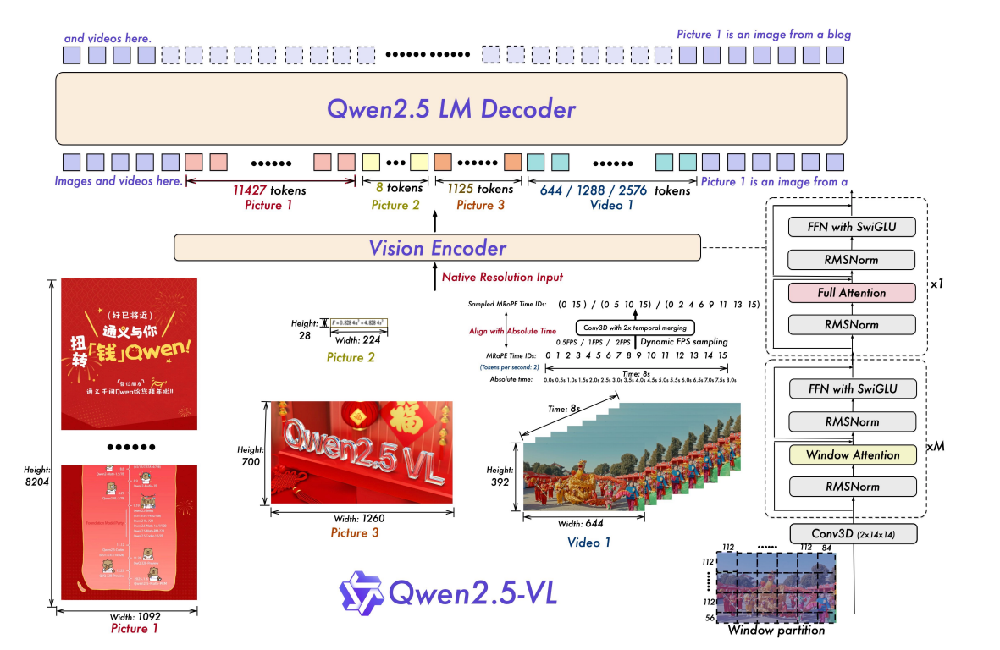

> #### **<span style="color: rgb(216,57,49); background-color: inherit">模型架构</span>**
>
> 🌻 **<span style="color: inherit; background-color: rgb(255,165,61)">LLM：</span>**&#x91C7;用 Qwen2.5 LLM 的预训练权重作为初始化，并修改了 1D RoPE 为多模态旋转位置嵌入（Multimodal Rotary Position Embedding Aligned to Absolute Time, MRoPE）。
>
> **<span style="color: inherit; background-color: rgb(255,165,61)">视觉编码器：</span>**&#x91CD;新设计的 Vision Transformer (ViT) 架构，集成了 2D-RoPE 和窗口注意力机制，以支持原生输入分辨率并加速计算。
>
> * 在大多数层中引入窗口注意力机制，确保计算成本与 patch 数量呈线性关系。
>
> * 采用 2D 旋转位置嵌入（RoPE）来有效捕获 2D 空间中的空间关系。
>
> * 对于视频数据，将连续两帧分组在一起，减少输入到语言模型的 tokens 数量。
>
> * 采用 RMSNorm 进行归一化，并使用 SwiGLU 作为激活函数，以提高计算效率和视觉与语言组件之间的兼容性。
>
> **<span style="color: inherit; background-color: rgb(255,165,61)">Vision-Language Merger：</span>**&#x91C7;用基于 MLP 的方法压缩图像特征序列，将空间相邻的四个 patch 特征组合并通过两层 MLP 投影到与 LLM 文本嵌入对齐的维度。
>
>

**<span style="color: rgb(36,91,219); background-color: inherit">大语言模型 LLM</span>**

Qwen2.5-VL 的语言模型部分是基于 Qwen2.5 LLM 构建的，其主要功能是处理文本输入和生成文本输出，同时与视觉编码器生成的视觉特征进行融合。<span style="color: rgb(100,37,208); background-color: inherit">LLM 部分从 Qwen2.5 LLM 的预训练权重开始，这些权重已经在大规模文本数据上进行了预训练，具备强大的语言理解与生成能力</span>。以下是一些关键点：

* **<span style="color: rgb(36,91,219); background-color: inherit">多模态旋转位置编码 MRoPE</span>**：为了更好地处理多模态输入，Qwen2.5-VL 将传统的 1D 旋转位置编码 RoPE 扩展为多模态旋转位置编码，并将其与绝对时间对齐。这种设计使得模型能够更好地处理时间序列数据和空间数据。

  * 在处理视频时，MRoPE 的<span style="color: rgb(100,37,208); background-color: inherit">时间 ID 会随着每一帧递增</span>，从而让模型能够感知视频的节奏和时间变化。

  * 对于图像，MRoPE 的时间 ID 保持不变，而<span style="color: rgb(100,37,208); background-color: inherit">高度和宽度 ID 则根据图像中每个 token 的空间位置进行分配</span>。

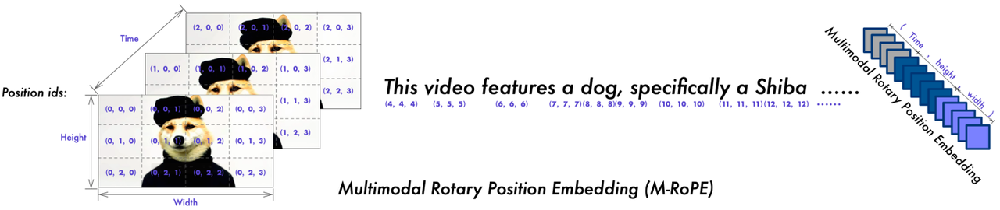

* **<span style="color: rgb(36,91,219); background-color: inherit">配置</span>**：


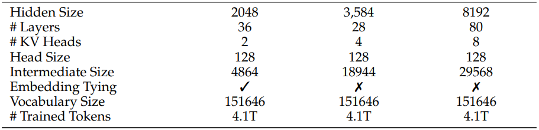

**<span style="color: rgb(36,91,219); background-color: inherit">视觉编码器 Vision Encoder</span>**

视觉编码器是 Qwen2.5-VL 的核心组件之一，负责将输入的图像或视频数据编码为特征序列，以便与语言模型进行融合。主要有以下几个要点：

* **<span style="color: rgb(36,91,219); background-color: inherit">架构基础</span>**：采用重新设计的 ViT 架构，引入了多项优化以提高效率和性能。

* **<span style="color: rgb(36,91,219); background-color: inherit">窗口注意力机制 Window Attention</span>**：为了降低计算复杂度，视觉编码器在大多数层中使用窗口注意力机制，而不是全注意力机制。具体来说：

  * **<span style="color: rgb(36,91,219); background-color: inherit">窗口大小</span>**：最大窗口大小为 **`112×112`**（对应 **`8×8`** 个 patch），这意味着每个窗口可以处理 **`112×112`** 像素的图像区域。

  * **<span style="color: rgb(36,91,219); background-color: inherit">计算优化</span>**：<span style="color: rgb(100,37,208); background-color: inherit">窗口注意力机制将计算复杂度从</span>$$O(n^2)$$<span style="color: rgb(100,37,208); background-color: inherit">降低到</span>$$O(n)$$<span style="color: rgb(100,37,208); background-color: inherit">，其中</span>$$n$$<span style="color: rgb(100,37,208); background-color: inherit">是 patch 的数量</span>。这使得模型能够处理不同分辨率的图像，同时保持计算效率。

  * **<span style="color: rgb(36,91,219); background-color: inherit">全注意力层</span>**：在 ViT 的某些特定层（如&#x7B2C;**`7`**、**`15`**、**`23`** &#x548C;**`31`**&#x5C42;）仍然使用全注意力机制，以确保模型能够捕捉到全局信息。

* **<span style="color: rgb(36,91,219); background-color: inherit">二维旋转位置嵌入2D-RoPE</span>**：为了更好地捕捉图像中的空间关系，视觉编码器采用了二维旋转位置嵌入。这种嵌入方式能够有效处理图像中的二维空间信息，使得模型能够更好地理解图像中的对象位置和布局。

* **<span style="color: rgb(36,91,219); background-color: inherit">3D Patch 分区</span>**：对于视频输入，<span style="color: rgb(100,37,208); background-color: inherit">视觉编码器采用了 3D Patch 分区策略</span>：

  * **<span style="color: rgb(36,91,219); background-color: inherit">图像 Patch</span>**：对于静态图像，使用 **`14×14`** 的图像块作为基本单元。

  * **<span style="color: rgb(36,91,219); background-color: inherit">视频帧组合</span>**：对于视频数据，将连续的两帧组合在一起作为一个单元，从而减少输入到语言模型的 token 数量，提高处理效率。

* **<span style="color: rgb(36,91,219); background-color: inherit">归一化与激活函数</span>**：为了提高计算效率和模型性能，视觉编码器采用了 RMSNorm 进行归一化，并使用 SwiGLU 作为激活函数。

* **<span style="color: rgb(36,91,219); background-color: inherit">输入处理</span>**：在输入图像或视频帧之前，会将其高度和宽度调整为 **`28`** 的倍数，以确保能够整除 patch 大&#x5C0F;**`14×14`**。

* **<span style="color: rgb(36,91,219); background-color: inherit">配置</span>**：


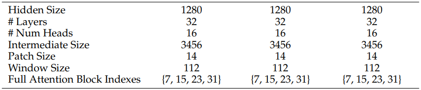

**<span style="color: rgb(36,91,219); background-color: inherit">基于 MLP 的视觉 - 语言融合器 Vision-Language Merger</span>**

视觉 - 语言融合器的作用是将视觉编码器生成的图像特征与语言模型的文本特征进行融合，以实现多模态信息的协同处理。详细设计如下：

* **<span style="color: rgb(36,91,219); background-color: inherit">特征压缩</span>**：由于视觉编码器生成的图像特征序列可能非常长，<span style="color: rgb(216,57,49); background-color: inherit">直接将其输入到语言模型中会导致计算成本过高</span>。因此，<span style="color: rgb(100,37,208); background-color: inherit">Qwen2.5-VL 采用了一种基于 MLP 的特征压缩方法</span>：

  * **<span style="color: rgb(36,91,219); background-color: inherit">分组与连接</span>**：将空间上相邻的四个 patch 特征分组，然后将这些分组的特征连接起来。

  * **<span style="color: rgb(36,91,219); background-color: inherit">MLP 投影</span>**：将<span style="color: rgb(100,37,208); background-color: inherit">连接后的特征通过一个两层的 MLP，将其投影到与语言模型的文本嵌入维度一致的空间中</span>。这种设计不仅减少了计算成本，还为动态压缩不同长度的图像特征序列提供了灵活性。

* **<span style="color: rgb(36,91,219); background-color: inherit">配置</span>**：

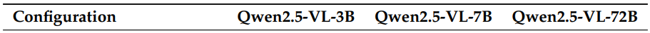

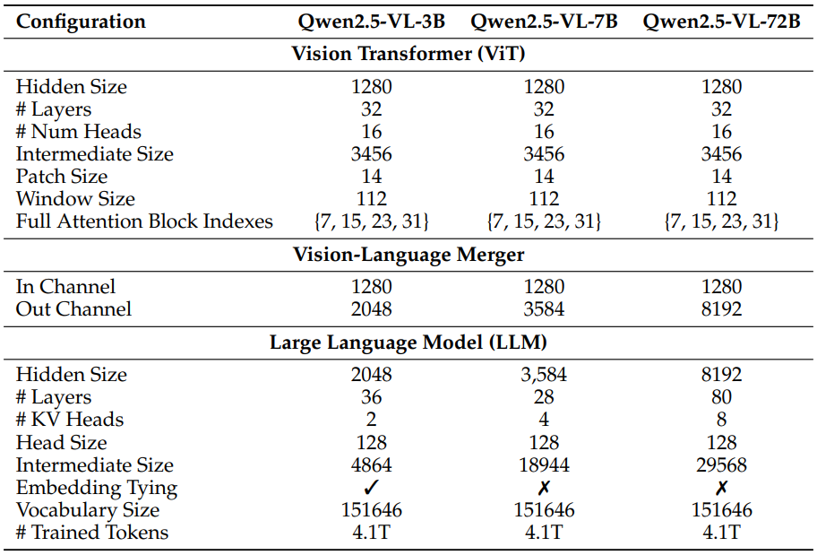

**<span style="color: rgb(36,91,219); background-color: inherit">数据</span>**

> **<span style="color: inherit; background-color: rgba(78,131,253,0.55)">预训练数据</span>**<span style="color: inherit; background-color: rgba(78,131,253,0.55)">：</span>包含约 4 万亿 tokens 的数据集（预训练数据量从 1.2 万亿 tokens 增加到约 4 万亿 tokens），涵盖图像描述、交错图像 - 文本数据等多种类型。
>
> 🍭 **<span style="color: inherit; background-color: rgba(78,131,253,0.55)">指令数据</span>**<span style="color: inherit; background-color: rgba(78,131,253,0.55)">：</span>使用 ChatML 格式构建指令遵循数据，包括纯文本数据和多模态数据（图像 - 文本和视频 - 文本组合），并采用双阶段优化范式，包括监督微调（SFT）和直接偏好优化（DPO）。

**<span style="color: rgb(36,91,219); background-color: inherit">模型训练</span>**

> 🍁 **<span style="color: inherit; background-color: rgb(255,165,61)">预训练：</span>**&#x5206;三个阶段训练，首先训练 ViT，然后训练所有模型参数，最后增加序列长度并加入视频和基于 agent 的数据。
>
> **<span style="color: inherit; background-color: rgb(255,165,61)">后训练：</span>**&#x91C7;用监督式微调（SFT）和直接偏好优化（DPO）的双阶段优化模式，冻结 ViT 参数。

**<span style="color: rgb(36,91,219); background-color: inherit">预训练</span>**

多模态预训练是 Qwen2.5-VL 训练过程中的核心环节，其目的是让模型学习到丰富的视觉和语言知识，并掌握它们之间的关联。预训练分为三个阶段：

**<span style="color: rgb(36,91,219); background-color: inherit">Step 1：视觉编码器训练</span>**

> 💡 * **<span style="color: rgb(36,91,219); background-color: inherit">数据来源</span>**：主要使用图像字幕、视觉知识和 OCR 数据。图像字幕数据可以帮助模型学习图像内容与自然语言描述之间的对应关系；视觉知识数据则涵盖了诸如名人、地标、动植物识别等多方面的视觉知识，使模型能够对各种常见的视觉对象和场景有基本的认知；OCR 数据则有助于模型理解和处理图像中的文本信息。
>
> * **<span style="color: rgb(36,91,219); background-color: inherit">训练目标</span>**：在这个阶段，重点是训练 ViT，使其能够提取出对语言模型有用的视觉特征。通过这些数据，ViT 学习如何将图像中的视觉信息编码成能够与语言模型进行有效交互的特征表示，为后续的多模态融合奠定基础。

**<span style="color: rgb(36,91,219); background-color: inherit">Step 2：多模态融合训练</span>**

> 💡 * **<span style="color: rgb(36,91,219); background-color: inherit">数据来源</span>**：引入了更多样化的多模态数据，包括交错数据（图像 - 文本交错排列的数据）、多任务学习数据集、视觉问答 VQA、多模态数学、基于代理的任务、视频理解和纯文本数据集等。这些数据涵盖了各种复杂的视觉 - 语言交互场景，能够促使模型学习更深层次的视觉 - 语言关联和推理能力。
>
> * **<span style="color: rgb(36,91,219); background-color: inherit">训练目标</span>**：解冻所有模型参数，让视觉编码器和语言模型能够协同学习。通过这些复杂的数据，模型不仅要学习如何更好地提取视觉特征和语言特征，还要学习如何将它们进行有效的融合和交互，从而能够处理更加复杂的多模态任务，如视觉问答、多模态数学问题求解等。

**<span style="color: rgb(36,91,219); background-color: inherit">Step 3：长序列推理能力提升</span>**

> 💡 * **<span style="color: rgb(36,91,219); background-color: inherit">数据来源</span>**：进一步引入视频和基于代理的数据，并增加序列长度。视频数据能够提供时间维度上的视觉信息，使模型能够理解和处理动态场景；基于代理的数据则涉及到模型与环境的交互，需要模型具备更强的推理和决策能力。同时，增加序列长度可以让模型能够处理更长的文本和视频内容，捕捉更长范围的依赖关系。
>
> * **<span style="color: rgb(36,91,219); background-color: inherit">训练目标</span>**：增强模型对长序列的推理能力，使其能够处理复杂的多模态任务，如长视频理解、多步推理的视觉问答等。通过扩展序列长度和引入更具挑战性的任务数据，模型能够学习到更复杂的语义和逻辑关系，提升其在多模态场景下的推理和理解能力。

三个阶段的数据、Token 数、序列长度以及训练的模型结构如下：

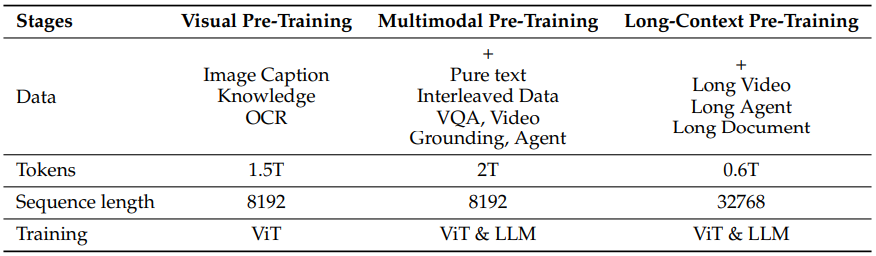

**<span style="color: rgb(36,91,219); background-color: inherit">后训练</span>**

后训练阶段主要采用 SFT 和直接偏好优化 DPO 两种方法，对模型进行进一步的优化和对齐

**<span style="color: rgb(36,91,219); background-color: inherit">Step 1：监督微调 SFT</span>**

* **<span style="color: rgb(36,91,219); background-color: inherit">数据来源</span>**：SFT 阶段使用了精心策划的数据集，包含约 200 万条数据，其中纯文本数据和多模态数据各占 50%。<span style="color: rgb(100,37,208); background-color: inherit">数据主要来源于开源仓库、购买的数据集和在线查询数据</span>，并针对<span style="color: rgb(100,37,208); background-color: inherit">通用视觉问答、图像字幕生成、数学问题求解、编程任务和安全相关查询</span>等特定应用场景构建了专门的子集，同时还包括文档和OCR、定位、视频分析和代理交互等领域的数据。

* **<span style="color: rgb(36,91,219); background-color: inherit">训练目标</span>**：通过 SFT，模型能够学习到如何更好地遵循指令，提高其在多模态任务中的性能。<span style="color: rgb(100,37,208); background-color: inherit">SFT 阶段采用 </span>**<span style="color: rgb(100,37,208); background-color: inherit">ChatML</span>**<span style="color: rgb(100,37,208); background-color: inherit"> 格式来结构化指令跟随数据</span>，与预训练数据模式不同，但与 Qwen2.5-VL 保持架构一致性。这种格式转换能够实现以下三个关键适应：

  > * **<span style="color: rgb(36,91,219); background-color: inherit">明确的对话角色</span>**：在多模态对话中，模型需要能够区分不同角色的输入和输出，如用户和助手，以便更好地理解和生成对话内容。
  >
  > * **<span style="color: rgb(36,91,219); background-color: inherit">结构化的视觉嵌入</span>**：将视觉特征与文本指令一起注入模型，使模型能够同时处理视觉和语言信息，从而更好地完成多模态任务。
  >
  > * **<span style="color: rgb(36,91,219); background-color: inherit">保持跨模态位置关系</span>**：通过格式感知的打包方式，确保视觉特征和文本特征在模型中的位置关系得到保留，这对于模型理解视觉和语言信息的上下文关系至关重要。

* **<span style="color: rgb(36,91,219); background-color: inherit">数据过滤 Pipeline</span>**：为了确保训练数据的质量，SFT 阶段采用了两阶段数据过滤 Pipeline：

  * **<span style="color: rgb(36,91,219); background-color: inherit">领域特定分类</span>**：<span style="color: rgb(100,37,208); background-color: inherit">使用 Qwen2-VL-Instag 模型对问答对进行分层分类，将其组织到八个主要领域和 30 个细分子领域中</span>。这种层次结构有助于针对每个类别的特定特征优化数据清理过程，从而提高监督微调数据集的质量和相关性。

  * **<span style="color: rgb(36,91,219); background-color: inherit">领域定制过滤</span>**：根据不同领域的特点，采用规则基础和模型基础相结合的方法进行数据过滤。规则基础过滤通过预定义的启发式规则来消除低质量或有问题的条目，例如<span style="color: rgb(220,155,4); background-color: inherit">去除重复模式、不完整或截断的响应，以及与查询无关或可能产生有害输出的查询和答案</span>。模型基础过滤则利用训练有素的奖励模型，从多个维度评估多模态问答对，包括<span style="color: rgb(100,37,208); background-color: inherit">查询的复杂性和相关性，以及答案的正确性、完整性、清晰度、相关性和有用性</span>。在视觉定位任务中，特别关注验证视觉信息的准确解释和利用。这种多维度评分确保只有高质量的数据能够进入 SFT 阶段。

* **<span style="color: rgb(36,91,219); background-color: inherit">拒绝采样增强推理能力</span>**：为了进一步提升模型的推理能力，特别是在需要复杂推理的任务中，如<span style="color: rgb(220,155,4); background-color: inherit">数学问题求解、代码生成和领域特定视觉问答</span>，采用了拒绝采样策略。拒绝采样的过程如下：

  > 1. <span style="color: rgb(100,37,208); background-color: inherit">使用 Qwen2.5-VL 的中间版本对带有真实注释的数据集进行评估</span>，只保留模型输出与真实答案匹配的样本，从而确保数据集中只包含高质量、准确的示例。
  >
  > 2. 为了进一步提高数据质量，还会<span style="color: rgb(100,37,208); background-color: inherit">排除那些表现出代码切换、过长或重复模式的回答</span>，以确保推理过程的清晰性和连贯性。
  >
  > 💡 3. 针对视觉和语言模态的融合问题，<span style="color: rgb(100,37,208); background-color: inherit">开发了基于规则和模型驱动的过滤策略</span>，以验证中间推理步骤的准确性。这些机制确保了在推理链的每一步中，视觉和文本模态都能被有效整合。
  >
  > 4. 通过拒绝采样生成的数据显著提高了模型的推理能力，通过迭代精炼数据集并去除低质量或错误的样本，使模型能够从高保真度的示例中学习，从而强调准确和连贯的推理。

**<span style="color: rgb(36,91,219); background-color: inherit">Step 2：直接偏好优化 DPO</span>**

* **<span style="color: rgb(36,91,219); background-color: inherit">数据来源</span>**：DPO 阶段主要使用图像 - 文本和纯文本数据，这些数据来源于人类标注的偏好数据，反映了人类对模型输出的偏好和期望。

* **<span style="color: rgb(36,91,219); background-color: inherit">训练目标</span>**：通过 DPO，模型能够学习到人类对不同输出的偏好，从而调整其生成行为，使其更符合人类的期望和需求。DPO 的优化过程

**<span style="color: rgb(36,91,219); background-color: inherit">不足之处</span>**

> 1. 极端长视频（>3 小时）处理时时序误差累积。
>
> 2. 化学公式解析依赖预定义 SMILES 格式，对非结构化手写公式识别较弱。
>
> 3. 动态分辨率训练需要特殊的数据打包策略，增加分布式训练复杂度。
>
> 🥥 4. 泛化性：Qwen2.5-VL 在标准界面任务中表现良好，但动态和非标准场景下的鲁棒性仍需提升，可能需要结合强化学习或在线适应机制。

## 1.4 <span style="color: rgb(36,91,219); background-color: inherit">新一代多模态模型与损失函数</span>

> 🥥 ### 1.4.1 <span style="color: rgb(36,91,219); background-color: inherit">LLaVA-o1的原理是什么？</span>

> 论文：https://arxiv.org/abs/2411.10440

**<span style="color: rgb(36,91,219); background-color: inherit">原理：多阶段结构化推理的范式革新</span>**

> 🥥 LLaVA-o1的核心贡献是在视觉语言模型（VLM）中实现类似OpenAI o1的“慢思考”推理能力，通过分阶段结构化输出突破传统VLM的单步预测局限。 &#x20;
>
> * **核心问题**：传统VLM（如LLaVA）依赖单步生成，难以处理复杂多模态推理任务（如需结合视觉细节与逻辑链的任务）。 &#x20;
>
> * **理论突破**：引入四阶段推理流程（总结→视觉解释→逻辑推理→结论），将复杂任务分解为可解释的中间步骤，提升模型对视觉与语言关联的建模能力。 &#x20;
>
> * **与o1的关联**：借鉴o1的“逐步推理”思想，但针对多模态任务优化，无需人工提示即可自主完成分阶段推理。 &#x20;

**<span style="color: rgb(36,91,219); background-color: inherit">具体方法：四阶段推理与阶段级束搜索</span>**


> ##### **<span style="color: inherit; background-color: rgba(147,90,246,0.55)">（1）四阶段推理流程</span>**
>
> 1. **总结阶段（Summary）**
>
>    * **目标**：模型快速理解任务目标，生成任务概述（如“判断图像中物体是否满足特定条件”）。 &#x20;
>
>    * **技术实现**：通过轻量级文本生成模块快速提取任务核心。 &#x20;
>
> 2. **视觉解释阶段（Visual Explanation）**
>
>    * **目标**：定位并描述图像中与任务相关的视觉元素（如“检测到左下角的红色物体”）。 &#x20;
>
>    🥥 * **技术实现**：结合视觉编码器（基于Llama-3.2-11B-Vision）与跨模态注意力，生成细粒度视觉描述。 &#x20;
>
> 3) **逻辑推理阶段（Logical Reasoning）**
>
>    * **目标**：基于视觉描述与任务目标，构建逻辑链条（如“红色物体是交通灯→交通灯在绿色状态→车辆需停车”）。 &#x20;
>
>    * **技术实现**：引入符号逻辑规则与概率推理模块，增强模型的因果推断能力。 &#x20;
>
> 4) **结论生成（Conclusion）**
>
>    * **目标**：综合所有中间结果，输出最终答案。 &#x20;
>
> ##### **<span style="color: inherit; background-color: rgba(147,90,246,0.55)">（2）阶段级束搜索（Stage-Level Beam Search）</span>**
>
> * **创新点**：在每个推理阶段生成多个候选输出，通过质量评估选择最优路径传递至下一阶段，避免误差累积。 &#x20;
>
> * **优势**：相比传统束搜索仅优化最终输出，阶段级搜索提升中间步骤的准确性，尤其在长链条推理任务中效果显著。 &#x20;

**<span style="color: rgb(36,91,219); background-color: inherit">实验结果：多模态推理性能突破</span>**

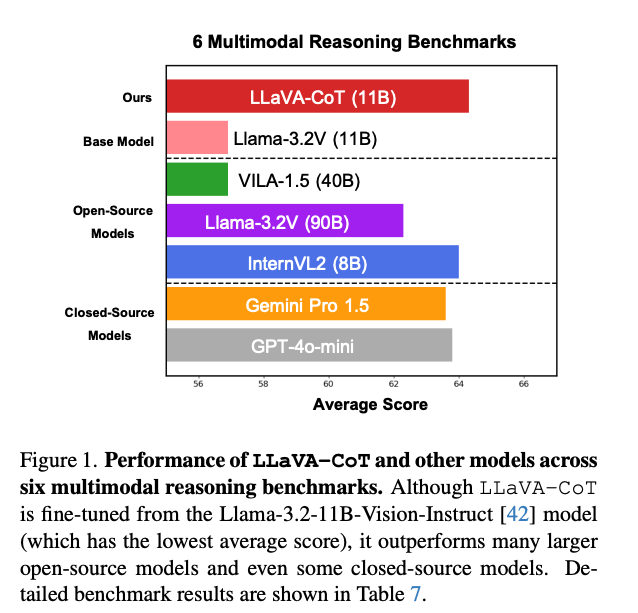

> **<span style="color: inherit; background-color: rgba(147,90,246,0.55)">基准测试表现</span>**<span style="color: inherit; background-color: rgba(147,90,246,0.55)">：</span> &#x20;
>
> 🥥 * **MMVet基准**：**<span style="color: rgb(46,161,33); background-color: inherit">LLaVA-o1在需要详细推理的任务中超越基础模型Llama-3.2-11B-Vision-Instruct8.9%，达到 82.3% 准确率</span>**。 &#x20;
>
> * **对比实验**：在视觉问答（VQA）任务中，四阶段推理比单步生成模型提升12.4%，证明结构化输出的有效性。 &#x20;
>
> **<span style="color: inherit; background-color: rgba(147,90,246,0.55)">消融实验</span>**<span style="color: inherit; background-color: rgba(147,90,246,0.55)">：</span> &#x20;
>
> * 移除阶段级束搜索后，性能下降5.2%，验证其对推理鲁棒性的贡献。 &#x20;
>
> * 视觉解释阶段的细粒度描述使模型在目标检测相关任务中提升7.8%。 &#x20;

**<span style="color: rgb(36,91,219); background-color: inherit">结论：多模态推理的新基准</span>**

> **<span style="color: inherit; background-color: rgba(147,90,246,0.55)">核心贡献</span>**<span style="color: inherit; background-color: rgba(147,90,246,0.55)">：  </span>
>
> * **首个开源“慢思考”VLM**：填补了多模态领域结构化推理模型的空白。 &#x20;
>
> * **方法通用性**：四阶段框架可扩展至其他任务（如图像描述生成、视觉常识推理）。 &#x20;
>
> 🥥 **影响**：推动VLM从“直觉式回答”转向“可解释推理”，为医疗诊断、自动驾驶等高风险场景提供更可靠的模型基础。 &#x20;

**<span style="color: rgb(36,91,219); background-color: inherit">挑战与未来方向</span>**

> 🥥 **计算复杂度**：阶段级束搜索增加推理时&#x95F4;**<span style="color: inherit; background-color: rgb(98,210,86)">（约 1.8倍 于单步生成）</span>**，需优化轻量化部署。 &#x20;
>
> **数据依赖**：模型需大量标注数据训练中间阶段，自监督预训练策略仍在探索中。 &#x20;
>
> **跨模态对齐**：视觉解释与逻辑推理的衔接仍存在语义鸿沟，需更强大的跨模态融合技术。 &#x20;

**<span style="color: rgb(36,91,219); background-color: inherit">总结</span>**

> 🥥 LLaVA-o1通过分阶段结构化推理与阶段级束搜索，重新定义了多模态模型的推理范式。**<span style="color: inherit; background-color: rgba(147,90,246,0.55)">其核心价值在于将“黑箱”式预测转化为可解释、可优化的中间步骤，为复杂任务提供更可靠的解决方案。</span>**&#x5C3D;管面临效率与数据挑战，LLaVA-o1的开源为多模态研究提供了重要基准，标志着VLM向人类级推理能力迈出关键一步。

> 🥥 ### 1.4.2 <span style="color: rgb(36,91,219); background-color: inherit">Gemini 2.0的原理是什么？</span>

> Thinking模型和O1一样，会有一个思考过程，但比O1好的是谷歌这里会直接显示思考过程。

**<span style="color: rgb(36,91,219); background-color: inherit">原理：分阶段推理与多模态协同</span>**

> 🥥 **<span style="color: inherit; background-color: rgba(147,90,246,0.55)">Gemini 2.0 的核心原理是通过分阶段推理（Staged Reasoning）与多模态协同机制</span>**，突破传统AI模型的单步预测局限，实现更接近人类的逻辑分析与创造性解决问题能力。 &#x20;
>
> * **核心问题**：传统模型（如早期Gemini）依赖端到端生成，难以处理复杂任务（如多步骤逻辑推理或跨模态关联分析）。 &#x20;
>
> * **理论突破**： &#x20;
>
>   * **<span style="color: inherit; background-color: rgb(98,210,86)">分阶段“思考提示”</span>**：将复杂任务分解为可管理的子任务（如问题理解→逻辑构建→多模态验证→结论生成），通过中间步骤的显式建模提升可解释性。 &#x20;
>
>   * **<span style="color: inherit; background-color: rgb(98,210,86)">多模态原生输出</span>**：支持文本、图像、音频的联合生成与交互，而非简单拼接。 &#x20;

**<span style="color: rgb(36,91,219); background-color: inherit">具体方法：Flash Thinking与代理架构</span>**

> ##### **<span style="color: inherit; background-color: rgba(147,90,246,0.55)">（1）Flash Thinking机制</span>**
>
> 🥥 * **动态推理路径**：Gemini 2.0 引入实验性Flash Thinking 模型，**<span style="color: rgb(222,120,2); background-color: inherit">通过生成“思考过程”（如逻辑链、假设验证）来模拟人类推理</span>**。例如： &#x20;
>
>   * **逻辑推理任务**：模型先列出可能的解决方案，再逐步排除错误选项（类似思维链，但更强调中间步骤的显式输出）。 &#x20;
>
>   * **多模态任务**：结合视觉输入（如图像中的物体位置）与文本逻辑（如因果关系）生成连贯回答。 &#x20;
>
> * **阶段级优化**：每个推理阶段独立生成候选输出，通过质量评估选择最优路径传递至下一阶段，避免误差累积。 &#x20;
>
> ##### **<span style="color: inherit; background-color: rgba(147,90,246,0.55)">（2）代理架构（Agent Framework）</span>**
>
> * **环境交互能力**：Gemini 2.0 不再是被动应答工具，而是&#x80FD;**<span style="color: rgb(222,120,2); background-color: inherit">主动调用工具（如数据库查询、代码执行）并与环境交互（如实时图像分析）</span>**。例如： &#x20;
>
>   * **职业预测场景**：结合用户简历文本与行业趋势数据，动态生成职业发展建议。 &#x20;
>
>   * **学术分析场景**：解析论文图表后，调用外部知识库验证假设。 &#x20;
>
> ##### **<span style="color: inherit; background-color: rgba(147,90,246,0.55)">（3）多模态融合</span>**
>
> * **跨模态注意力机制**：通过增强的跨模态编码器（基于Transformer架构），将文本、图像、音频嵌入到统一语义空间，支持实时交互（如根据语音指令生成图像）。&#x20;

**<span style="color: rgb(36,91,219); background-color: inherit">实验结果：推理能力与多模态表现</span>**

> **<span style="color: inherit; background-color: rgba(147,90,246,0.55)">基准测试表现：</span>** &#x20;
>
> 🥥 * **逻辑推理任务**：在MMVet等多模态基准上，Gemini 2.0 准确率较前代提升15.2%，接近DeepSeek R1水平。 &#x20;
>
> * **跨模态生成**：图像描述任务中，Gemini 2.0 的细粒度描述能力（如定位图像中的关键物体）比Llama-3.2-11B-Vision高8.7%。 &#x20;
>
> **<span style="color: inherit; background-color: rgba(147,90,246,0.55)">消融实验</span>**<span style="color: inherit; background-color: rgba(147,90,246,0.55)">：  </span>
>
> * 移除分阶段推理后，复杂任务（如需结合图表与文本的分析）性能下降12.4%，验证其必要性。 &#x20;
>
> * Flash Thinking 模型在创意任务（如广告文案生成）中多样性得分提升23%。 &#x20;

**<span style="color: rgb(36,91,219); background-color: inherit">结论：代理时代的核心引擎</span>**

> **核心贡献**： &#x20;
>
> * **首个原生多模态推理模型**：实现从“单一答案生成”到“可解释推理过程”的范式转变。 &#x20;
>
> * **代理能力标杆**：为AI智能体（如虚拟助手、自主机器人）提供高鲁棒性决策支持。 &#x20;
>
> **影响**：
>
> 🥥 推动AI从工具化&#x5411;**<span style="color: inherit; background-color: rgb(98,210,86)">“协作伙伴”</span>**&#x6F14;进，尤其在医疗诊断、教育辅导等需透明推理的场景。 &#x20;

**<span style="color: rgb(36,91,219); background-color: inherit">挑战与未来方向</span>**

> **计算效率**：**<span style="color: rgb(222,120,2); background-color: inherit">分阶段推理增加约 1.5-2倍 推理时间，需优化轻量化部署。</span>** &#x20;
>
> **数据依赖**：高质量中间步骤标注数据稀缺，需开发自监督预训练策略。 &#x20;
>
> 🥥 **跨模态一致性**：复杂任务中仍存在模态信息冲突（如文本描述与图像内容矛盾），需更鲁棒的融合算法。 &#x20;

**<span style="color: rgb(36,91,219); background-color: inherit">总结</span>**

> 🥥 Gemini 2.0 通过分阶段推理与多模态原生融合，重新定义了AI模型的智能边界。**<span style="color: inherit; background-color: rgba(147,90,246,0.55)">其核心价值在于将复杂任务分解为人类可理解的中间步骤，同时实现跨模态的无缝交互。</span>**&#x5C3D;管面临效率与数据挑战，Gemini 2.0 的开源与代理架构设计为下一代AI智能体奠定了技术基础，标志着AI从“回答问题”向“解决问题”的关键跃迁。

### 1.4.3 <span style="color: rgb(36,91,219); background-color: inherit">讲一下 InfoNCE Loss，代码实现一下</span>

**<span style="color: rgb(36,91,219); background-color: inherit">原理</span>**

在无监督和自监督学习中，我们<span style="color: rgb(100,37,208); background-color: inherit">希望模型能从没有标签的数据中学习到通用表达</span>。对比学习靠正样本相似与负样本相异间的对比，引导模型将相似样本拉近、异样样本推远。

> 💡 **<span style="color: rgb(216,57,49); background-color: inherit">InfoNCE Loss</span>**<span style="color: rgb(216,57,49); background-color: inherit">（</span>**<span style="color: rgb(216,57,49); background-color: inherit">Info</span>**<span style="color: rgb(216,57,49); background-color: inherit">rmation </span>**<span style="color: rgb(216,57,49); background-color: inherit">N</span>**<span style="color: rgb(216,57,49); background-color: inherit">oise-</span>**<span style="color: rgb(216,57,49); background-color: inherit">C</span>**<span style="color: rgb(216,57,49); background-color: inherit">ontrastive </span>**<span style="color: rgb(216,57,49); background-color: inherit">E</span>**<span style="color: rgb(216,57,49); background-color: inherit">stimation </span>**<span style="color: rgb(216,57,49); background-color: inherit">Loss</span>**<span style="color: rgb(216,57,49); background-color: inherit">）</span>通过<span style="color: rgb(100,37,208); background-color: inherit">辨别正负样本的方式，逼近互信息 Mutual Information 的最大化</span>。这一点可&#x5728;**`CPC`**、**`SimCLR`**、**`MoCo`**、**`CLIP`**&#x7B49;多个多自监督框架中使用，当然也有采用与 InfoNCE 类似的 <span style="color: rgb(216,57,49); background-color: inherit">NT-Xent Loss（</span>**<span style="color: rgb(216,57,49); background-color: inherit">N</span>**<span style="color: rgb(216,57,49); background-color: inherit">ormalized </span>**<span style="color: rgb(216,57,49); background-color: inherit">T</span>**<span style="color: rgb(216,57,49); background-color: inherit">emperature-scaled Cross-Entropy）</span>，两者在本质上等价。

在 CPC 情境中，给定一个上下文 context 向量$$\mathbf{c}$$，我们希望识别在一组样本$$X = \{ \mathbf{x}_1, \dots, \mathbf{x}_N\}$$中哪一个是来自该上下文的正样本，而其余是负样本。正选概率形式为：

$$p(\text{pos} \mid X, c) = \frac{f(x_{\text{pos}}, c)}{\sum_{j=1}^N f(x_j, c)}$$

其中$$f(x, c) \propto \frac{p(x|c)}{p(x)}$$，代表压缩后的密度比。

更进一步的，InfoNCE Loss 定义为：

$$\mathcal{L}_{\text{InfoNCE}} = -\mathbb{E} \left[ \log \frac{f(x, c)}{\sum_{x' \in X} f(x', c)} \right]$$

换言之，<span style="color: rgb(100,37,208); background-color: inherit">最大化正确识别正样本的对数概率，等价于最小化该负对数项</span>。

在 MoCo 或 SimCLR 中，若记 query 向量为$$q$$，正样本 key 为$$k_+$$，一组 key 包含多个负样本$$k_i$$，且引入温度调节参数$$\tau$$，则形式为 Softmax 对比损失：

$$\mathcal{L}_q = - \log \frac{\exp(q \cdot k_+ / \tau)}{\sum_i \exp(q \cdot k_i / \tau)}$$

这其实和 N-pair Loss 本质相同，都是 InfoNCE 的变体。

> * InfoNCE 优化的是<span style="color: rgb(100,37,208); background-color: inherit">将正样本的评分</span>$$f(x,c)$$<span style="color: rgb(100,37,208); background-color: inherit">放大、负样本总评分缩小</span>，从而提升互信息估计
>
> * 它可以理解为类别交叉熵：<span style="color: rgb(100,37,208); background-color: inherit">在多个候选样本中猜中正样本的概率</span>
>
> 💡 * SimCLR、MoCo 等通过数据增强生成正样本；MoCo 还特别采用动量编码器管理负样本队列

**<span style="color: rgb(36,91,219); background-color: inherit">代码实现</span>**

**<span style="color: rgb(36,91,219); background-color: inherit">总结</span>**

<table><colgroup><col width="179"><col width="641"></colgroup>
<thead>
<tr>
<th>理论意义</th>
<th>最大化互信息估计，增强正负样本判别能力</th>
</tr>
</thead>
<tbody>
<tr>
<td>关键公式</td>
<td>\mathcal{L} = -\log \frac{\exp(q \cdot k_+ / \tau)}{\sum \exp(q \cdot k_i / \tau)}</td>
</tr>
<tr>
<td>实践应用</td>
<td>SimCLR、MoCo、CLIP 等框架广泛使用</td>
</tr>
<tr>
<td>代码结构</td>
<td>特征标准化 → 相似度矩阵 → 正负样本区分 → Softmax CE 计算</td>
</tr>
<tr>
<td>扩展</td>
<td>支持多视图、动量编码、温度策略优化等</td>
</tr>
</tbody>
</table>


```python
import torch
import torch.nn.functional as F
```

---

[Contents](../../README.md) | [Next](02-对比分析.md) | [Visual website](https://weyumm.github.io/vlm-Wissen/interview.html#c=1)
