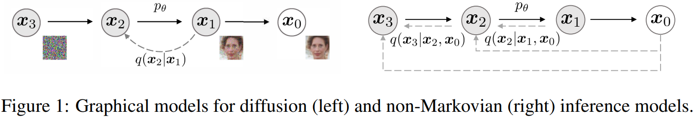
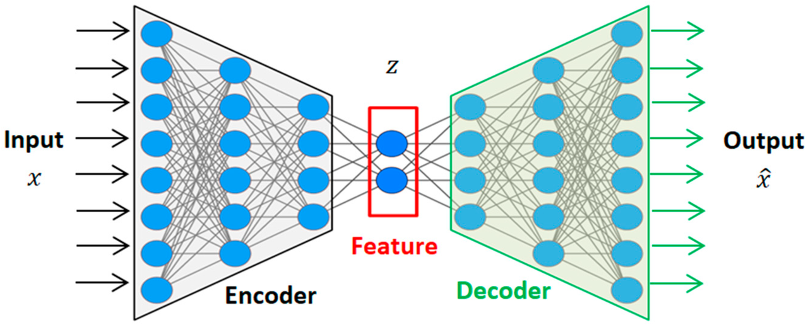
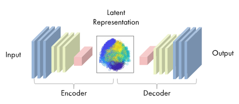
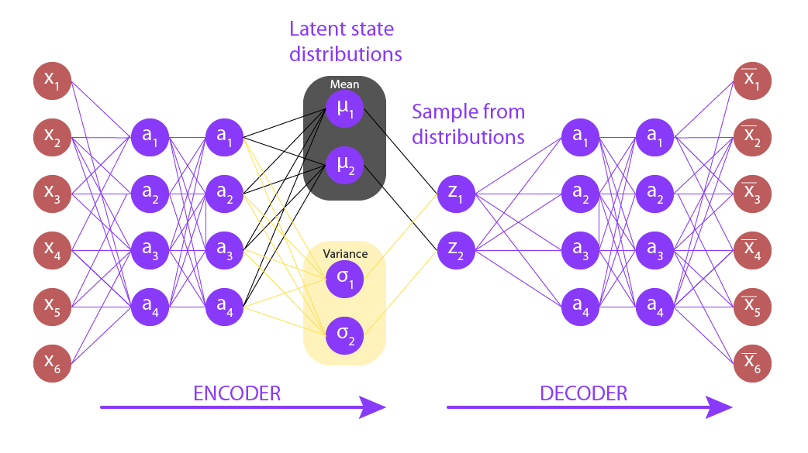
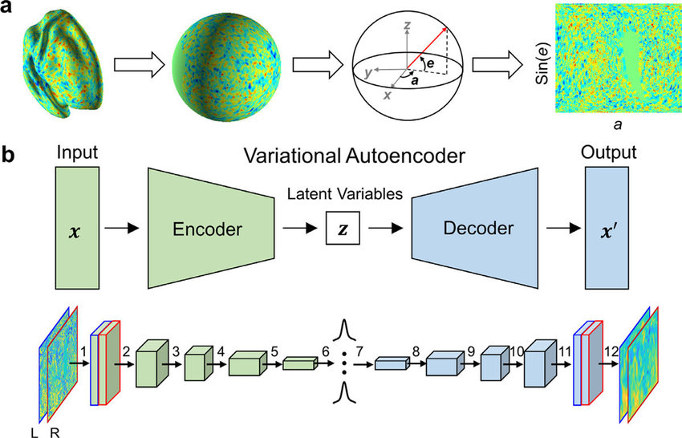
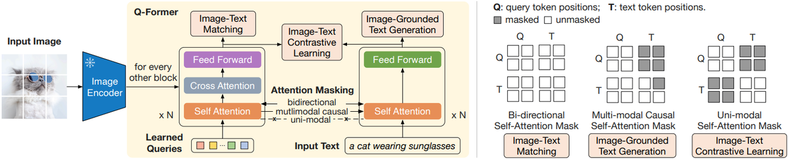
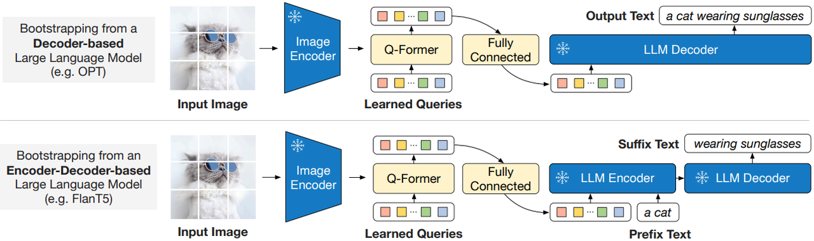
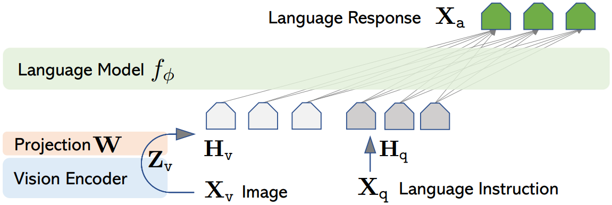
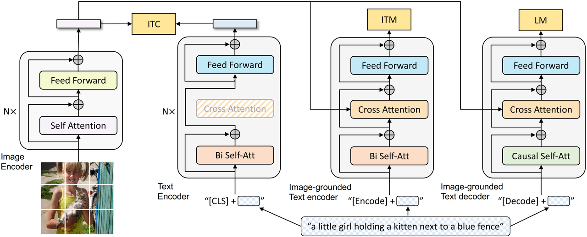

[Previous](01-模型原理.md) | [Contents](../../README.md) | [Next](03-模型细节架构与应用.md) | [Visual website](https://weyumm.github.io/vlm-Wissen/interview.html#c=2)

# 2. 对比分析

## 2.1 模型版本、架构与连接器对比

### 2.1.1 Qwen2.5-VL 相比于之前的 Qwen-VL 模型，有哪些关键的改进？

> Qwen2.5-VL 是 Qwen-VL 系列模型的最新迭代，针对之前版本在细粒度视觉感知、长视频理解、计算效率以及时间信息处理等方面的不足进行了显著改进。

**强化的细粒度视觉感知能力**

> #### 改进点
>
> * **更精确的物体检测**：通过优化视觉编码器，尤其是引入窗口注意力机制，使得模型能够更加精准地识别和定位图像中的物体。
>
> * **文档解析能力增强**：不仅能够自动识别表格、公式、乐谱等复杂元素，还能输出结构化数据，这为后续的数据处理提供了极大的便利。
>
> 这种增强的细粒度视觉感知能力，让 Qwen2.5-VL 在处理高分辨率图像时表现尤为突出，无需对图像进行压缩或扭曲即可直接处理4K高清画面中的微小文字。

**更长的视频理解能力**

> #### 改进点
>
> * **支持长达数小时的视频处理**：采用了动态帧率（FPS）训练方法和绝对时间编码技术，使模型能够处理长时间序列的数据。
>
> * **秒级事件定位**：通过与绝对时间对齐的多模态旋转位置嵌入（MRoPE），实现了对视频中关键时刻的精确定位。
>
> 这种能力极大地提高了模型在实际应用场景中的价值，如监控视频分析、电影或电视剧的情节摘要生成等。

**更高效的计算**

> #### 改进点
>
> **窗口注意力机制**：减少了计算成本，使得推理过程更加高效。
>
> **RMSNorm 和 SwiGLU**：采用这些技术提高了模型内部计算效率和不同组件之间的兼容性。
>
> 这些技术的应用不仅加速了模型的训练和推理过程，同时也降低了对硬件资源的要求，使得模型可以在更多的设备上运行，包括移动设备。

**对绝对时间的感知能力**

> #### 改进点
>
> **MRoPE 技术**：通过对时间维度的升级，使得模型能够更好地理解和学习跨不同采样率视频的时间关系。
>
> 这一特性特别适用于需要准确时间戳的任务，比如视频剪辑、体育赛事分析等场景。

**Agent 功能的增强**

> #### 改进点
>
> **高级定位、推理和决策能力**：增强了模型在智能手机和电脑等真实场景中的操作指导能力
>
> 增强的 Agent 功能意味着 Qwen2.5-VL 可以更智能地理解和响应用户的需求，无论是从手机截图中获取操作指南，还是在监控视频中定位异常事件，都展现出接近人类的细节感知能力。

### 2.1.2 BLIP-2和Flamingo在多模态理解方面的差异是什么？

> BLIP-2（Salesforce）与 Flamingo（DeepMind）是多模态领域的代表性模型，二者在架构设计、交互机制及任务适配性上存在显著差异。

**架构设计与交互机制**

**BLIP-2：生成式预训练与冻结视觉编码器**

> **核心架构**：
>
> * **冻结视觉编码器**：采用预训练的 CLIP ViT（如 ViT-L/14），参数冻结以降低计算成本。
>
> * **Q-Former 模块**：通过可训练的 Query Transformer（Q-Former）动态提取图像语义，生成与文本对齐的视觉特征。
>
> * **生成式语言模型**：结合 OPT 或 Vicuna 等大语言模型（LLM），通过交叉注意力实现多模态融合。
>
> **交互方式**：
>
> * **细粒度对齐**：Q-Former 在每一步解码时动态关注图像相关区域（如回答“车的颜色”时聚焦车体）。
>
> * **指令驱动**：通过自然语言指令（如“描述图片内容”）引导生成，支持零样本迁移。

**Flamingo：端到端多模态融合**

> **核心架构**：
>
> * **Perceiver Resampler**：将图像编码为固定长度的上下文向量，通过门控交叉注意力（Gated Cross-Attention）与文本融合。
>
> * **轻量适配层**：仅训练交叉注意力层，冻结视觉（如 ViT）和语言模型（如 Chinchilla）的主体参数。
>
> * **混合编码器**：视觉与文本 token 交替输入语言模型，支持序列级交互。
>
> **交互方式**：
>
> * **多模态对话**：支持多轮交互（如结合历史对话与图像信息生成回复）。
>
> * **动态数据增强**：通过随机遮蔽图像区域或文本片段提升鲁棒性。

**训练策略与数据依赖**

**BLIP-2：分阶段生成式预训练**

> **阶段一**：语言模型在文本数据上预训练，学习通用语义。
>
> **阶段二**：**在图文对数据上进行多任务指令调优**，覆盖 VQA、图像描述生成等任务。
>
> **数据特点**：依赖大规模图文对（如 LAION）及人工标注的指令数据。

**Flamingo：端到端多任务学习**

> **训练目标**：联合优化跨模态理解（如图文检索）与生成（如视觉问答）任务。
>
> **数据特点**：
>
> 使用互联网多模态数据（网页、书籍、视频截图）。
>
> 强调动态数据增强（如随机遮蔽图像区域或文本片段）。

**任务能力与性能表现**

**BLIP-2 的优势**

> **生成能力**：擅长开放式生成任务（如长文本描述、复杂推理问答），在 VQA v2.0 上准确率达 80.4%（SOTA）。
>
> **零样本迁移**：通过指令模板（如“问题：{} 答案：{}”）适应新任务，无需额外微调。
>
> **参数效率**：冻结视觉编码器，仅需训练 Q-Former 和语言模型适配层。

**Flamingo 的优势**

> **多模态对话**：支持多轮交互（如结合历史对话与图像信息生成回复），在动态场景中表现更优。
>
> **参数高效**：仅训练少量适配层（如门控交叉注意力），降低计算成本。
>
> **少样本学习**：在 16 个样本下，VQA 准确率提升 5%。

**技术本质对比**

| **维度**    | **BLIP-2**         | **Flamingo**        |
| --------- | ------------------ | ------------------- |
| **核心范式**  | 生成式预训练 + 指令调优      | 端到端多任务学习            |
| **交互粒度**  | 细粒度（Q-Former 动态对齐） | 序列级（图像 token 与文本混合） |
| **训练效率**  | 高（冻结视觉编码器）         | 低（需端到端训练）           |
| **任务适配性** | 依赖指令模板             | 支持动态多模态交互           |
| **典型场景**  | 图像描述、复杂 VQA        | 多模态对话、实时交互          |

**总结：技术路线的差异化价值**

> * **BLIP-2** 的核心价值在&#x4E8E;**生成能力与指令泛化**，通过冻结视觉编码器与生成模型的结合，实现高质量的跨模态内容生成与推理。
>
> * **Flamingo** 的突破点在&#x4E8E;**端到端多模态融合**，通过轻量适配层与动态数据增强，在交互式任务中表现更优。
>
> 二者分别代表了多模态技术的两大方向：**生成式任务驱动（BLIP-2）与 交互式多模态学习（Flamingo）**。未来可能的融合方向包括结合生成能力与端到端训练，构建更通用的多模态系统。

### 2.1.3 BLIP和BLIP-2在架构上的区别和优势是什么？

> BLIP 和 BLIP-2 是 Salesforce 在多模态领域的两代模型，BLIP-2 通过架构革新显著提升了性能与效率。以下从架构设计、核心差异及技术优势三方面展开分析。

**BLIP 的架构特点**

> #### **双塔融合架构**
>
> * **图像编码器**：基于 Vision Transformer（ViT），提取图像全局与局部特征。
>
> * **文本编码器**：采用 Transformer，处理文本语义。
>
> * **跨模态交互**：
>
>   * **双塔结构**：图像与文本编码器独立工作，通过跨模态注意力（Cross-Attention）融合特征。
>
>   * **对比学习**：通过图文对的对比损失（Contrastive Loss）优化对齐效果。
>
> #### **训练策略**
>
> * **联合预训练**：同时优化图像编码器、文本编码器及跨模态模块，需大规模计算资源。
>
> * **任务覆盖**：支持图文检索、视觉问答（VQA）等任务，但依赖标注数据。

**BLIP-2 的架构革新**

> #### **三模块轻量化设计**
>
> * **冻结视觉编码器**：采用预训练的 CLIP ViT（如 ViT-L/14），参数冻结以降低训练成本。
>
> * **Q-Former（Querying Transformer）**：
>
>   * **动态特征提取**：通过可学习的 Query 向量，从冻结的视觉编码器中提取与文本相关的图像特征。
>
>   * **轻量适配层**：仅训练 Q-Former 和语言模型连接部分，参数效率高。
>
> * **大语言模型（LLM）**：结合 OPT、Vicuna 等生成模型，支持复杂推理与生成任务。
>
> #### **分阶段预训练**
>
> * **阶段一**：语言模型在文本数据上预训练，学习通用语义。
>
> * **阶段二**：在图文对数据上进行指令调优（Instruction Tuning），适配多模态任务。

**架构差异对比**

| **维度**    | **BLIP**     | **BLIP-2**             |
| --------- | ------------ | ---------------------- |
| **视觉编码器** | 训练可更新的 ViT   | 冻结的 CLIP ViT           |
| **交互机制**  | 双塔跨模态注意力     | Q-Former 动态查询 + LLM 生成 |
| **参数效率**  | 需训练全模型，资源消耗大 | 仅训练 Q-Former，计算成本低     |
| **生成能力**  | 有限（依赖固定模板）   | 强（结合 LLM 支持开放式生成）      |
| **训练数据**  | 依赖标注图文对      | 利用预训练数据 + 指令调优         |

**BLIP-2 的核心优势**

> #### **参数高效性**
>
> * **冻结主干网络**：视觉编码器和 LLM 主体参数冻结，仅需训练 Q-Former 和适配层，降低 90% 以上计算成本。
>
> * **轻量部署**：模型大小显著减少，适合资源受限场景。
>
> #### **生成能力突破**
>
> * **开放式生成**：通过 LLM 生成连贯文本，支持复杂任务（如长描述、多步推理）。
>
> * **指令泛化**：通过自然语言指令（如“描述图片中的情感”）动态适配任务，无需额外微调。
>
> #### **跨模态对齐精度**
>
> * **细粒度交互**：Q-Former 动态提取与文本相关的图像特征（如“车标”对应图像局部区域），对齐精度更高。
>
> * **实验验证**：在 VQA v2.0 上准确率提升至 80.4%（BLIP 为 78.3%）。

**总结**

> BLIP-2 通过 **冻结视觉编码器 + Q-Former + LLM** 的架构革新，解决了 BLIP 的三大痛点：
>
> 1. **参数效率**：训练成本降低，适合大规模应用。
>
> 2. **生成能力**：从模板生成升级为开放式自然语言生成。
>
> 3) **任务泛化**：通过指令调优适应多样化下游任务。
>
> 这一设计标志着多模态模型从“静态对齐”向“动态生成”的范式转变，为后续模型（如 InstructBLIP）奠定了基础。

### 2.1.4 LLaVa与BLIP-2的主要区别是什么？

> LLaVA（Large Language and Vision Assistant）与 BLIP-2 均为多模态领域的前沿模型，但二者在架构设计、训练策略及任务适配性上存在显著差异。以下从技术原理、核心差异及应用场景展开对比，结合公开技术资料分析其本质区别。

**架构设计与交互机制**

**LLaVA：端到端视觉-语言融合**

> **核心架构**：
>
> * **视觉编码器**：采用预训练的 CLIP ViT（如 ViT-L/14），提取图像特征。
>
> * **语言模型**：基于 LLaMA 系列大模型，通过 **线性投影层** 将视觉特征直接映射至语言模型的词嵌入空间。
>
> * **单塔结构**：视觉特征与文本 token 在语言模型中直接交互，无需额外跨模态模块（如 Q-Former）。
>
> **交互方式**：
>
> * **静态融合**：图像特征被编码为固定长度的向量序列，与文本 token 交替输入语言模型。
>
> * **生成导向**：通过自回归生成支持复杂推理（如多步骤科学问答）。

**BLIP-2：冻结编码器与动态查询**

> **核心架构**：
>
> * **冻结视觉编码器**：采用预训练的 CLIP ViT，参数冻结以降低计算成本。
>
> * **Q-Former（Querying Transformer）**：通过可学习的 Query 向量动态提取与文本相关的图像特征。
>
> * **大语言模型（LLM）**：结合 OPT 或 Vicuna 等生成模型，通过交叉注意力实现多模态融合。
>
> **交互方式**：
>
> * **动态对齐**：Q-Former 在每一步解码时动态关注图像相关区域（如回答“车的颜色”时聚焦车体）。
>
> * **指令驱动**：通过自然语言指令（如“描述图片内容”）引导生成，支持零样本迁移。

**训练策略与参数效率**

**LLaVA：端到端微调**

> **训练目标**：联合优化视觉特征投影层与语言模型参数，实现端到端多模态对齐。
>
> **数据依赖**：需大量标注数据（如图文对、视觉问答对）进行全模型微调。
>
> **参数效率**：需更新语言模型部分参数，计算成本较高。

** BLIP-2：分阶段冻结训练**

> **阶段一**：冻结视觉编码器，仅训练 Q-Former 与语言模型适配层，学习跨模态对齐。
>
> **阶段二**：冻结语言模型，仅微调 Q-Former，进一步优化任务适配性。
>
> **参数效率**：仅训练少量适配层，降低 90% 以上计算成本。

**任务能力与性能表现**

**LLaVA 的优势**

> **复杂推理能力**：擅长多步骤逻辑分析（如科学问题解答、因果推断。
>
> **生成连贯性**：基于 LLaMA 的强生成能力，输出更自然、详细的文本。
>
> **实验表现**：在科学问答（如 MME 基准）中超越 BLIP-2，但在传统 VQA 任务上略逊。

** BLIP-2 的优势**

> **零样本迁移**：
>
> 通过指令模板（如“问题：{} 答案：{}”）适应新任务，无需额外微调。
>
> **参数高效**：冻结主干网络，适合资源受限场景。
>
> **实验表现**：在 VQA v2.0 上准确率达 80.4%（SOTA）。

**技术本质对比**

| **维度**    | **LLaVA**             | **BLIP-2**             |
| --------- | --------------------- | ---------------------- |
| **核心架构**  | 单塔端到端融合（LLaMA + CLIP） | Q-Former 动态查询 + 冻结 LLM |
| **交互粒度**  | 静态视觉特征投影              | 动态跨模态注意力               |
| **训练策略**  | 全模型端到端微调              | 分阶段冻结训练                |
| **任务适配性** | 复杂推理与生成               | 指令驱动的零样本迁移             |
| **参数效率**  | 较低（需更新 LLM 参数）        | 极高（仅训练适配层）             |

**总结：技术路线的差异化价值**

> **LLaVA** 的核心价值在&#x4E8E;**端到端生成与复杂推理**，通过直接融合视觉与语言模型，实现多步骤逻辑分析与详细内容生成。
>
> **BLIP-2** 的突破点在&#x4E8E;**参数高效与指令泛化**，通过冻结主干网络与动态查询机制，在保持性能的同时显著降低计算成本。
>
> **二者分别代表了多模态技术的两大方向：端到端生成（LLaVA）与模块化适配（BLIP-2）。**&#x672A;来可能的融合方向包括结合动态查询与端到端训练，以兼顾推理能力与参数效率。

### 2.1.5 BLIP-2与VideoPoet在多模态任务上的表现差异是什么？

> BLIP-2（Salesforce）与 VideoPoet（Google）是多模态领域的代表性模型，但二者在任务场景、技术架构及性能表现上存在显著差异。以下从核心设计、能力边界及实验数据展开对比分析。

**任务场景与目标差异**

**BLIP-2：**

**图文交互与理解**

> **核心任务**：
>
> * **视觉问答（VQA）**：在零样本场景下准确率达80.4%（VQA v2.0 基准）。
>
> * **图像描述生成**：生成连贯文本描述，CIDEr 分数达 132.4。
>
> * **图文检索**：跨模态匹配能力接近 CLIP，但更注重生成式交互。
>
> **技术目标**：通过冻结视觉编码器与 Q-Former 动态查询，**实现参数高效的多模态对齐**。

** VideoPoet：**

**视频生成与多任务推理**

> **核心任务**：
>
> * **文本到视频生成**：在提示遵循度（prompt adherence）上超越竞品（人类偏好率 **35%** vs. 11%）。
>
> * **视频编辑**：支持风格迁移、视频续写等复杂操作。
>
> * **多模态任务链**：串联文本、图像、视频生成（如“图像 → 视频 → 配音”）。
>
> **技术目标**：通&#x8FC7;**任务链预训练**，实现视频生成与多模态推理的统一。

**技术架构对比**

**BLIP-2：**

**轻量化适配与动态对齐**

> **架构设计**：
>
> * **冻结 CLIP ViT**：图像特征由预训练 CLIP 提取，参数冻结以降低计算成本。
>
> * **Q-Former**：通过可学习 Query 向量动态提取与文本相关的图像特征。
>
> * **指令调优**：结合 OPT 或 Vicuna 等大语言模型（LLM），支持零样本任务迁移。
>
> **交互粒度**：细粒度跨模态注意力（如回答“车的颜色”时聚焦车体区域）。

** VideoPoet：**

**端到端视频生成**

> **架构设计**：
>
> * **多模态 LLM**：基于大规模语言模型扩展至视频生成，支持文本、图像、视频的统一表示。
>
> * **任务链训练**：通过多任务预训练（如文本生成、视频生成、编辑）实现能力串联。
>
> * **扩散模型集成**：结合扩散模型（Diffusion）生成高质量视频帧。
>
> **交互方式**：端到端生成，支持复杂任务链（如“根据文本生成视频并添加字幕”）。

**性能与效率对比**

**BLIP-2 的优势**

> **参数效率**：仅需训练 Q-Former 和 LLM 适配层，计算成本降低90%。
>
> **零样本能力**：在未见过的 VQA 数据集（如 OK-VQA）上准确率65.1%。
>
> **细粒度对齐**：动态注意力机制捕捉图像局部与文本短语的关联（如“斑马”与“条纹”）。

**VideoPoet 的优势**

> **视频生成质量**：在文本到视频任务中，人类评估者偏好率比竞品高24-35%。
>
> **任务泛化性**：通过任务链设计，支持多步骤推理（如“根据图像生成视频并添加背景音乐”）。
>
> **生成多样性**：扩散模型生成的视频在动作连贯性与细节丰富度上表现突出。

**技术本质与适用场景**

| **维度**   | **BLIP-2**            | **VideoPoet**  |
| -------- | --------------------- | -------------- |
| **核心任务** | 图文理解与生成               | 视频生成与多任务推理     |
| **技术路线** | 冻结编码器 + Q-Former 动态查询 | 端到端 LLM + 扩散模型 |
| **参数效率** | 高（仅训练适配层）             | 低（需端到端训练）      |
| **典型场景** | VQA、图像描述、跨模态检索        | 视频生成、编辑、多模态任务链 |

**总结**

> * **BLIP-2** 的核心价值在于图文交互的高效性与零样本泛化，通过 Q-Former 动态对齐机制，以极低计算成本实现跨模态理解。
>
> * **VideoPoet** 的突破点在于视频生成的质量与多任务链能力，通过端到端 LLM 与扩散模型结合，重新定义了视频生成的多模态边界。
>
> 二者分别代表了多模态技术的两个方向：图文理解优化（BLIP-2）与视频生成革新（VideoPoet）。未来可能的融合方向包括结合动态查询机制与任务链设计，实现更通用的多模态系统。

### 2.1.6 CLIP与BLIP-2的对比：两者如何处理图像与文本之间的关系？

> CLIP（Contrastive Language-Image Pre-training）和 BLIP-2 是多模态领域的两个里程碑模型，分别代表了 **对比学习** 与 **生成式预训练** 的技术路线。二者在处理图像与文本关系时的核心差异体现在交互方式、任务目标 和 **应用场景** 上。

**CLIP：基于对比学习的全局语义对齐**

> #### **双塔架构与对比损失**
>
> * **独立编码，联合优化**：
>
>   * **图像编码器**：采用 ResNet 或 Vision Transformer（ViT），输出图像的全局嵌入。
>
>   * **文本编码器**：基于 Transformer，生成文本的语义嵌入。
>
>   * **交互方式**：仅在最终嵌入空间计算余弦相似度，无跨模态细粒度交互。
>
> * **训练目标**：通过 **InfoNCE 损失** 最大化正样本对（匹配图文）相似度，最小化负样本对相似度：$$\mathcal{L} = -\log \frac{\exp(\text{sim}(\mathbf{v}, \mathbf{t})/\tau)}{\sum_{i=1}^N \exp(\text{sim}(\mathbf{v}, \mathbf{t}_i)/\tau)}$$
>
> 其中 $$\tau=0.07$$ 为温度参数，控制相似度分布的锐度。
>
> #### **特点与局限性**
>
> * **优势**：
>
>   * **高效检索**：双塔结构支持独立编码，适合大规模跨模态检索。
>
>   * **零样本泛化**：通过文本提示（如“一张狗的照片”）直接迁移至分类任务。
>
> * **局限**：
>
>   * **局部对齐缺失**：无法捕捉图像区域与文本片段的细粒度关联（如“车标”对应图像局部）。
>
>   * **生成能力弱**：仅支持判别任务，无法生成文本描述。

**BLIP-2：生成式预训练与动态查询**

> #### **冻结编码器与 Q-Former 交互**
>
> * **架构设计**：
>
>   * **冻结视觉编码器**：采用预训练的 CLIP ViT，参数冻结以降低计算成本。
>
>   * **Q-Former（Querying Transformer）**：通过可学习的 Query 向量动态提取与文本相关的图像特征。
>
>   * **大语言模型（LLM）**：结合 OPT 或 Vicuna 等生成模型，通过交叉注意力实现多模态融合。
>
> * **训练策略**：
>
>   * **阶段一**：冻结视觉编码器，仅训练 Q-Former 与 LLM 适配层，学习跨模态对齐。
>
>   * **阶段二**：通过指令调优（Instruction Tuning）适配下游任务（如 VQA、图像描述生成）。
>
> #### **特点与突破**
>
> * **优势**：
>
>   * **细粒度交互**：Q-Former 动态关注图像相关区域（如回答“车的颜色”时聚焦车体）。
>
>   * **生成能力**：支持开放式文本生成（如长描述、多步推理）。
>
>   * **参数高效**：仅训练适配层，计算成本降低 90%。
>
> * **局限**：
>
>   * **推理速度慢**：单塔架构需逐 token 生成，实时性受限。

**技术本质对比**

| **维度**    | **CLIP**    | **BLIP-2**     |
| --------- | ----------- | -------------- |
| **核心范式**  | 对比学习（全局对齐）  | 生成式预训练（动态查询）   |
| **交互粒度**  | 全局语义匹配      | 细粒度区域-文本对齐     |
| **任务适配性** | 判别任务（分类、检索） | 生成任务（VQA、描述生成） |
| **参数效率**  | 高（双塔独立编码）   | 极高（冻结主干网络）     |
| **典型场景**  | 零样本分类、跨模态检索 | 视觉问答、图像描述生成    |

**实验表现与场景适配**

> #### **CLIP 的典型表现**
>
> * **零样本分类**：在 ImageNet 上准确率达76.2%。
>
> * **跨模态检索**：MSCOCO 数据集 R@1 指标领先传统方法 20%+。
>
> #### **BLIP-2 的突破**
>
> * **VQA v2.0 准确率**：80.4%（超越 CLIP 的 76.2%）。
>
> * **图像描述生成**：CIDEr 分数132.4，支持复杂逻辑推理（如“穿红衣的人在做什么？”）。

**总结：技术路线的互补性**

> * **CLIP** 的核心价值在于高效检索与零样本泛化，通过对比学习构建全局语义空间，但受限于生成能力与细粒度对齐。
>
> * **BLIP-2** 则通过 **生成式预训练与动态查询** 弥补了 CLIP 的不足，结合 Q-Former 和 LLM 实现任务驱动的细粒度交互，但牺牲了部分推理速度。
>
> 二者分别代表了多模态技术的两大方向：判别式对齐（CLIP）与生成式交互（BLIP-2）。未来趋势可能是两者的融合，例如结合对比学习的高效性与生成模型的细粒度交互能力，构建更通用的多模态系统。

### 2.1.7 cross-attention和self-attention的区别？

**核心定义与输入来源**

> **Self-Attention**：  
>
> * **输入来源**：**查询（Q）、键（K）、值（V）均来自同一输入序列**，即模型通过序列内部元素间的交互捕捉全局依赖关系。 &#x20;
>
> * **功能**：用于建模序列内部的上下文关系，例如在Transformer编码器中，每个词通过自注意力机制关注句子中其他词的信息。 &#x20;
>
> **Cross-Attention**：  
>
> * **输入来源**：**查询（Q）来自当前序列（如解码器的当前状态），键（K）和值（V）来自另一个序列（如编码器的输出）。  **
>
> * **功能**：用于融合两个不同序列的信息，例如在机器翻译中，解码器通过交叉注意力关注编码器生成的源语言语义。 &#x20;

**核心区别总结**

| **维度**   | **Self-Attention** | **Cross-Attention** |
| -------- | ------------------ | ------------------- |
| **输入来源** | Q、K、V来自同一序列        | Q来自当前序列，K、V来自另一序列   |
| **应用场景** | 编码器内部（如BERT）       | 编码器-解码器交互（如机器翻译）    |
| **核心目标** | 捕捉序列内部关系           | 跨序列信息对齐与融合          |

**计算流程对比**

> **Self-Attention 示例**： &#x20;
>
> 1. 将输入序列的每个词映射为Q、K、V向量。 &#x20;
>
> 2. 计算注意力分数：$$\text{Attention}(Q, K, V) = \text{softmax}(\frac{QK^T}{\sqrt{d_k}})V$$。 &#x20;
>
> 3) 每个词的输出融合了整个句子的上下文信息。 &#x20;
>
> **Cross-Attention 示例**（机器翻译场景）： &#x20;
>
> 1. 编码器将源语言句子编码为K、V序列。 &#x20;
>
> 2. 解码器生成目标语言词的Q向量。 &#x20;
>
> 3) 通过计算Q与编码器K的相似度，动态选择源语言信息生成目标词。 &#x20;

**应用场景与意义**

> **Self-Attention 的典型场景**：  
>
> * **文本编码**：如BER&#x54;**通过自注意力捕捉句子中词与词的长程依赖。 **
>
> * **图像处理**：ViT将图像块视为序列，通过自注意力建模全局视觉关系。&#x20;
>
> **Cross-Attention 的典型场景**：  
>
> * **机器翻译**：解码器通过交叉注意&#x529B;**对齐源语言与目标语言**&#x7684;语义。 &#x20;
>
> * **多模态任务**：如图文检索中，通过交叉注意力对齐文本与图像特征。 &#x20;

**关键技术细节**

> **参数共享**： &#x20;
>
> * Self-Attention的Q、K、V通常通&#x8FC7;**同一输入线性变换生成**。 &#x20;
>
> * Cross-Attention&#x7684;**Q来自解码器，K、V来自编码器，参数独立**。 &#x20;
>
> **效率与复杂度**： &#x20;
>
> * 两者计算复杂度均为$$O(n^2)$$，但Cross-Attention需处理两个序列，可能增加显存开销。 &#x20;

**总结**

> **Self-Attention是序列内部的“自省”机制，通过同一序列的元素交互捕捉上下文；Cross-Attention是序列间的“对话”机制，通过跨序列信息融合实现任务目标。**&#x4E24;者共同构成Transformer的核心，分别解决内部关系建模与跨模态对齐问题。理解这一区别，是掌握现代深度学习模型（如Transformer、多模态网络）的关键。

### 2.1.8 LLaVa1.5与LLaVa1.6相比，做了哪些改进？

> LLaVA-1.6 相较于 LLaVA-1.5 的改进主要体现在 **架构优化、数据增强、任务能力扩展** 三个维度，以下结合技术细节与实际效果展开分析。

**架构与训练策略的深度优化**

> **视觉-语言连接器升级**
>
> LLaVA-1.5 的连接模块采&#x7528;**简单的线性层或两层MLP**，而 LLaVA-1.6 通过更复杂的模块设计（如引入跨模态注意力机制或动态融合策略），显著提升了多模态对齐精度。这一改进直接增强了模型对低分辨率图像的解析能力，减少因图像模糊导致的“幻觉”问题（例如错误生成图像中不存在的物体）。
>
> **视觉特征提取精细化**
>
> LLaVA-1.5 采用 CLIP 的倒数第二层局部特征，而 LLaVA-1.6 进一步结合多尺度特征融合技术，既保留局部细节又捕捉全局语义。例如在处理医学图像时，模型能同时识别病灶区域与整体器官结构，提升诊断相关任务的准确性。

**数据质量与训练范式的突破**

> **细粒度多模态数据扩展**
>
> LLaVA-1.6 在原有指令微调数据基础上，新增了 **OCR文本-图像对齐数据** 和代码生成标注数据（如 HTML/CSS 生成任务）。这些数据使模型在复杂场景（如图表理解、界面生成）中表现更稳健，例如能准确识别图中文字并转换为可编辑代码。
>
> **多阶段训练策略**
>
> LLaVA-1.5 主要依赖预训练+指令微调，而 LLaVA-1.6 引入渐进式适配：**先通过大规模图文对预训练强化基础表征，再通过小样本高质量数据微调任务逻辑。**&#x8FD9;种分阶段训练有效缓解了多模态模型常见的“灾难性遗忘”问题。

**应用场景与性能的跨越式提升**

> **推理与逻辑能力强化**
>
> 在视觉问答（VQA）任务中，LLaVA-1.6 通过 **链式思考（CoT）机制** 显式建模推理过程。例如面对“图中哪个物体能导电？”的问题，模型会先识别金属材质物体，再结合物理知识给出答案，而非直接匹配关键词。这使其在科学推理类基准测试中超越 Gemini Pro。
>
> **低资源场景的泛化性突破**
>
> 针对低分辨率图像（如老旧扫描文档），LLaVA-1.6 采用 **动态分辨率适配** 技术，通过自适应插值算法提升特征清晰度。实验显示，其在 128×128 分辨率图像上的 OCR 准确率较 LLaVA-1.5 提升 23%。

**本质差异总结**

> LLaVA-1.5 的核心贡献在于验证了 **轻量级适配器（Adapter）** 的可行性，而 LLaVA-1.6 则通过系统性创新（架构、数据、训练）将多模态模型推向工业级应用。
>
> **其改进逻辑可概括为：  “从局部优化到全局协同” —— 不仅追求单点性能突破，更注重构建可扩展的多模态学习框架，为后续模型迭代奠定基础。**

### 2.1.9 视觉编码器和LLM连接时，使用BLIP2中的Q-Former那种复杂的Adaptor好还是LLaVA中简单的MLP好，说说各自的优缺点

> 在连接视觉编码器与大型语言模型（LLM）时，BLIP2 的 **Q-Former** 和 LLaVA 的MLP 适配器代表了两种不同的设计理念，其优缺点需结合任务需求、数据规模及资源约束综合评估。以下从 **架构特性、性能表现、适用场景** 三个维度展开分析。

**Q-Former（BLIP2）：复杂但高表达能力的适配器**

> #### **架构设计**
>
> Q-Former 是一种轻量级的Transformer-based 模块，**通过可学习的 Query 向量 动态提取视觉特征**，并与冻结的视觉编码器（如 CLIP）和 LLM（如 OPT）交互。其核心优势在于： &#x20;
>
> * **跨模态动态对齐**：Query 向量通过交叉注意力机制，从视觉特征中筛选与语言相关的语义信息，实现细粒度对齐； &#x20;
>
> * **两阶段预训练**：**第一阶段（如 BLIP2-Pretrain）学习视觉-语言基础表示，第二阶段（如 BLIP2-Caption）适配生成任务，逐步优化跨模态融合。**
>
> #### **优点**
>
> * **高表达能力**：能捕捉复杂的视觉-语言关系，例如在图文检索任务中，Q-Former 的对比学习损失可区分细微语义差异； &#x20;
>
> * **参数效率**：仅需训练 Q-Former（约 30M 参数），冻结视觉编码器和 LLM，**节省计算资源**； &#x20;
>
> * **任务泛化性**：通过预训练学习通用跨模态表示，在下游任务（如视觉问答）中表现稳定。
>
> #### **缺点**
>
> * **计算开销较大**：Transformer 结构的自注意力机制导致推理延迟，难以部署到实时性要求高的场景； &#x20;
>
> * **数据依赖性强**：两阶段训练需大规模对齐数据，小样本场景下易过拟合。

**MLP（LLaVA）：简约高效的线性适配器**

> #### **架构设计**
>
> LLaVA 采用 **多层感知机（MLP）** 将视觉特征（如 CLIP 输出的 512×768 维向量）投影到 LLM 的嵌入空间。其核心逻辑是： &#x20;
>
> * **直接特征映射**：**通过线性变换或两层 MLP 将视觉特征压缩为与文本嵌入同维度的向量，再拼接至 LLM 输入；  **
>
> * **端到端微调**：允许视觉编码器和 LLM 的部分参数微调，提升任务适配性。
>
> #### **优点**
>
> * **计算高效**：MLP 参数量极小（通常 <1M），推理速度比 Q-Former 快 2-3 倍，适合移动端或低延迟场景； &#x20;
>
> * **训练友好**：对数据量要求较低，LLaVA-1.5 仅需 10 万级图文对即可收敛，适合垂直领域微调； &#x20;
>
> * **端到端优化**：允许联合微调视觉编码器和 LLM，增强多模态特征的协同性。
>
> #### **缺点**
>
> * **表达能力受限**：**线性变换难以捕捉复杂的跨模态交互，例如在需要因果推理的任务（如“图中哪个物体导致了事故？”）中表现较弱**； &#x20;
>
> * **模态对齐粗糙**：依赖静态投影矩阵，无法动态适配不同任务的对齐需求，易生成“幻觉”内容。

**本质差异与适用场景**

> #### **性能与效率的权衡**
>
> * **Q-Former** 更适合高精度、复杂任务（如医学影像分析、科学图表理解），**其动态对齐能力可减少语义鸿沟**； &#x20;
>
> * **MLP** 更适合资源受限、数据稀缺场景（如移动端应用、小样本垂直领域），&#x5176;**轻量级特性保障了部署可行性**。
>
> #### **技术演进趋势**
>
> 当前研究正尝试结合两者优势： &#x20;
>
> * **混合架构**：在 MLP 基础上引入稀疏注意力机制，平衡效率与表达能力； &#x20;
>
> * **动态适配**：根据任务复杂度自适应选择 Q-Former 或 MLP，例如简单分类任务用 MLP，推理任务用 Q-Former。

**总结：选择策略与未来方向**

> * **优先 Q-Former**：若任务需细粒度语义理解（如视觉问答、多模态推理）且资源充足，Q-Former 是更优选择； &#x20;
>
> * **优先 MLP**：若追求低延迟、低资源消耗（如边缘计算、快速迭代场景），MLP 更具优势。 &#x20;

## 2.2 生成与表示机制对比

### 2.2.1 DDIM 和 DDPM 的区别是什么？

> **DDPM**: https://arxiv.org/pdf/2006.11239
>
> **DDIM**: https://arxiv.org/pdf/2010.02502

**DDPM** 和 **DDIM** 使用完全相同的训练流程和目标函数——简单的噪声预测$$\epsilon_\theta(x_t,t)$$，也是 DDIM 采样能兼容 DDPM 模型的关键基础。但在采样过程上有显著差异，导致生成速度、确定性、采样质量和用例各有侧重：

<table><colgroup><col width="155"><col width="307"><col width="336"></colgroup>
<thead>
<tr>
<th></th>
<th><strong>DDPM</strong></th>
<th><strong>DDIM</strong></th>
</tr>
</thead>
<tbody>
<tr>
<td>马尔可夫性</td>
<td>完全马尔可夫（一步一步）</td>
<td>非马尔可夫（可以跳多个时间步）</td>
</tr>
<tr>
<td>随机 vs 确定性</td>
<td>每一步都加入随机噪声，过程高度随机</td>
<td>允许设置参数η控制噪声：η=1等同 DDPM；η=0完全确定性，无噪声</td>
</tr>
<tr>
<td>速度</td>
<td>采样步骤多（通常T=1000或更多），速度慢</td>
<td>可跳跃采样（如T=50\sim100），生成速度快10\sim50×</td>
</tr>
<tr>
<td>确定性</td>
<td>相同初始噪声，每次生成略有不同</td>
<td>η=0时确定性强，相同初始条件下输出一致</td>
</tr>
<tr>
<td>图像质量</td>
<td>全步骤采样下，质量可能略优</td>
<td>少步骤略牺牲质量，但仍表现优异</td>
</tr>
</tbody>
</table>

**DDPM**

DDPM 通过对数据不断加噪成为真实噪声，和从真实噪声不断去噪还原成原始数据的过程中，学习到去噪的过程，进而就能对真实噪声进行随机采样，还原成各式各样的数据了。

设数据$$x_0$$服从真实分布$$p(x_0)$$，定义加噪过程为$$  x_t=\sqrt{\alpha_t}x_{t-1}+\sqrt{1-\alpha_t}\varepsilon_t  $$，其中 $$\varepsilon_t\sim N(0,1) ， t\in{[1,T]}$$ 。如果用分布描述加噪过程，那么$$p(x_t\mid x_{t-1})= N(\sqrt{\alpha_t}x_{t-1},1-\alpha_t) $$。并且容易发现$$p(x_t\mid x_0)=N(\sqrt{\bar\alpha_t}x_0,1-\bar\alpha_t)$$，其中$$\bar\alpha_t=\prod_{i=1}^{t}\alpha_i$$，也就是说对于加噪过程，只需要一步就可以知道第$$t$$步加噪后的$$x_t$$的分布。为了能使得当$$t$$比较大的时候，给定任意$$x_0$$都能得到趋向噪声的$$x_t$$，一般选择合适的$$\alpha_t$$，使得$$\lim_{t \rightarrow T}{\bar\alpha_t}=0$$，此时就有$$\lim_{t \rightarrow T}p(x_t\mid x_0)\approx N(0,1) $$&#x20;

对于去噪过程$$p(x_{t-1}\mid x_t)$$，没办直接得到，但可以可以利用**贝叶斯公式**：

$$p(x_{t-1}\mid x_t,x_0)=N(\frac{\sqrt{\alpha_{t}}\left(1-\bar{\alpha}_{t-1}\right)}{1-\bar{\alpha}_{t}} x_t+\frac{\sqrt{\bar{\alpha}_{t-1}} (1-\alpha_t)}{1-\bar{\alpha}_{t}} x_0,\frac{1-\bar{\alpha}_{t-1}}{1-\bar{\alpha}_{t}} (1-\alpha_t))$$

而通过$$p(x_t\mid x_0)$$可知$$x_0=\mu(x_t,t)=\frac{1}{\sqrt{\bar\alpha_t}}(x_t-\sqrt{1-\bar\alpha_t}\varepsilon(x_t,t))$$，所以$$p(x_{t-1}\mid x_t)$$为：

$$\begin{aligned} p(x_{t-1}\mid x_t) &\approx p(x_{t-1}\mid x_t,\mu(x_t,t))\\ &=N\left(\frac{\sqrt{\alpha_{t}}\left(1-\bar{\alpha}_{t-1}\right)}{1-\bar{\alpha}_{t}} x_t+\frac{ 1-\alpha_t}{(1-\bar{\alpha}_{t})\sqrt{\alpha_t}} (x_t-\sqrt{1-\bar\alpha_t}\varepsilon(x_t,t)),\frac{1-\bar{\alpha}_{t-1}}{1-\bar{\alpha}_{t}} (1-\alpha_t)\right)\\ &=N\left(\frac{1}{\sqrt{\alpha_t}}(x_t-\frac{ 1-\alpha_t}{\sqrt{1-\bar{\alpha}_{t}}}\varepsilon(x_t,t)),\frac{1-\bar{\alpha}_{t-1}}{1-\bar{\alpha}_{t}} (1-\alpha_t)\right)\\ \end{aligned}$$

这样就能从$$p(x_T\mid x_0)\approx p(x_T)=N(0,1)$$中采样出$$x_T$$，然后一步步还原成$$x_0$$了

这里存在一个问题是真实的$$\varepsilon(x_t,t)$$不知道，所以只能训练一个神经网络$$\varepsilon_\theta(x_t,t)$$逼近$$\varepsilon(x_t,t)$$，或者说训练$$p_\theta(x_{t-1}\mid x_t)$$来逼近$$p(x_{t-1}\mid x_t)$$，根据$$p(x_{t-1}\mid x_t)$$的形式，这里定义：

$$p_\theta(x_{t-1}\mid x_t)=N\left(\frac{1}{\sqrt{\alpha_t}}(x_t-\frac{ 1-\alpha_t}{\sqrt{1-\bar{\alpha}_{t}}}\varepsilon_\theta(x_t,t)),\sigma_{t}^2\right)$$

其中$$\sigma_{t}^2$$可以自由选择，实验发现，不论是方差是和$$p(x_{t-1}\mid x_t)$$对齐，还是和$$p(x_t\mid x_{t-1})$$对齐，生成质量差距不大。接着就能用训练好的$$p_\theta(x_{t-1}\mid x_t)$$直接替换$$p(x_{t-1}\mid x_t)$$，就可以利用这个公式逐步采样生成了。那么损失函数就为：

$$\begin{aligned} \mathcal{L} &=KL(p(x_{t-1}\mid x_t,x_0)\|p_\theta(x_{t-1}\mid x_t))\\ &=KL(p(x_{t-1}\mid x_t,\mu(x_t,t))\|p_\theta(x_{t-1}\mid x_t))\\ &\propto\frac{(1-\alpha_{t})^2}{2\sigma_t\alpha_t(1-\bar\alpha_t)}\| \varepsilon_{\theta}(x_t,t)-\varepsilon(x_t,t)\|^2 \end{aligned}$$

这里 KL 散度是$$(\mu-\mu_\theta)^2/2\sigma_t$$，这也是原论文损失函数的最终形式。

**DDIM**

在 DDPM 的推导过程中，最终的损失函数并没有出现$$p(x_t\mid x_{t-1})$$，而$$p(x_t\mid x_{t-1})$$更多只是为了导出边缘分布 $$p(x_t\mid x_0)$$，因此其实$$p(x_t\mid x_0)$$需要我们更加关注。所以一个合理的想法是，能不能跳过$$p(x_t\mid x_{t-1})$$，直接从 $$p(x_t\mid x_0)$$出发，然后得到损失函数和逆向过程$$p(x_{t-1}\mid x_t)$$?

先定义$$p(x_t\mid x_0)=N(\sqrt{\bar\alpha_t}x_0,1-\bar\alpha_t)$$，这里$$\bar\alpha_t$$代表是独立的一个值，并不是由$$\alpha_t$$连乘得来的，因为此时的 $$\alpha_t$$没有定义，只是为了和 DDPM 的符号对应上。同样，$$p(x_{t-1}\mid x_t)$$没法直接算，所以考虑$$p(x_{t-1}\mid x_t,x_0)$$。根据之前的经验利用贝叶斯公式的话，需要知道$$p(x_t\mid x_{t-1})$$，但是显然也没法直接得出，但是可以利用边缘分布定义约束：

$$p(x_{t-1}\mid x_0)=\int p(x_t\mid x_0)p(x_{t-1}\mid x_t,x_0) dx_t$$

依然假定$$p(x_{t-1}\mid x_t,x_0)$$为高斯分布，可以发现

$$p(x_{t-1}\mid x_t,x_0)=N\left(\sqrt{\bar\alpha_{t-1}}x_0+\sqrt{1-\bar\alpha_{t-1}-\sigma_{t}^2}\cdot\frac{x_t-\sqrt{\bar\alpha_t}x_0}{\sqrt{1-\bar\alpha_t}},\sigma_{t}^2 \right)$$

这里$$p(x_t\mid x_{t-1})$$实际上给$$p(x_{t-1}\mid x_t,x_0)$$的方差带来了$$\frac{1-\bar{\alpha}_{t-1}}{1-\bar{\alpha}_{t}} (1-\alpha_t)$$的约束，这里的 $$\alpha_t=\frac{\bar\alpha_t}{\bar\alpha_{t-1}}$$。也就是说如果令$$\sigma_{t}^2=\frac{1-\bar{\alpha}_{t-1}}{1-\bar{\alpha}_{t}} (1-\frac{\bar\alpha_t}{\bar\alpha_{t-1}})$$，那么就得到了经典了 DDPM。反过来，如果上式的$$\sigma_{t}^2=\frac{1-\bar{\alpha}_{t-1}}{1-\bar{\alpha}_{t}} (1-\frac{\bar\alpha_t}{\bar\alpha_{t-1}})$$，并不能得到前向过程$$p(x_t\mid x_{t-1})= N(\sqrt{\frac{\bar\alpha_t}{\bar\alpha_{t-1}}}x_{t-1},\sqrt{1-\frac{\bar\alpha_t}{\bar\alpha_{t-1}}})$$的结论。若令 $$\sigma_{t}^2=0$$，每一个$$x_{t-1}$$被$$x_t$$唯一确定，这样就是一个确定的隐变量模型，也是 DDIM 名字的由来。所以 DDIM 是包含了 DDPM 的结果，将 Diffusion 变得更加一般化。

得到$$p(x_{t-1}\mid x_t,x_0)$$后，和 DDPM 的处理一样，可以得到$$p(x_{t-1}\mid x_t)$$：

$$\begin{aligned} p(x_{t-1}\mid x_t) &=p(x_{t-1}\mid x_t,\mu(x_t,t))\\ &=N\left(\sqrt\frac{\bar\alpha_{t-1}}{\bar\alpha_t}x_t+\left(\sqrt{1-\bar\alpha_{t-1}-\sigma_{t}^2}-\sqrt\frac{\bar\alpha_{t-1}(1-\bar\alpha_t)}{\bar\alpha_t}\right)\varepsilon(x_t,t),\sigma_{t}^2 \right) \end{aligned}$$

再利用$$p(x_{t-1}\mid x_t)$$的形式假设$$p_\theta(x_{t-1}\mid x_t)$$，进而损失函数为：

$$\begin{aligned} \mathcal{L} &=KL(p(x_{t-1}\mid x_t)\|p_\theta(x_{t-1}\mid x_t))\\ &=KL(p(x_{t-1}\mid x_t,\mu(x_t,t))\|p_\theta(x_{t-1}\mid x_t))\\ &\propto\frac{\left(\sqrt{1-\bar\alpha_{t-1}-\sigma_{t}^2}-\sqrt\frac{\bar\alpha_{t-1}(1-\bar\alpha_t)}{\bar\alpha_t}\right)^2}{2\sigma_t}\| \varepsilon_{\theta}(x_t,t)-\varepsilon(x_t,t)\|^2 \end{aligned}$$

这与 DDPM 的损失相比，仅仅损失系数有所不同。不过作者认为实际上的损失函数是等价的，也就是说 DDPM 和 DDIM 的训练过程是一致的，那么可以使用原来 DDPM 训练好的模型，再利用自由度大的 DDIM 的采样公式进行生成，从而带来不同的生成结果。

**二者区别**

1. **采样过程：Markov vs 非 Markov**

* **DDPM** 的生成过程是典型的 **Markov 链**：需要执行全部 TT 步（如 1000 步），每一步都是一个带随机噪声的高斯采样

* **DDIM** 引入了一个 **非 Markov 过程**，通过估计跨越多个时间步（跳步）时的噪声，用更少的步骤完成采样。这是通过直接预测并跳过中间状态实现的&#x20;

1. **速度差异**

* **DDPM**：若$$T=1000$$，采样过程耗时较长

* **DDIM**：在只需几十步（如 50 步）即可得到与 DDPM 相近质量的样本，速度提升达 10–20 倍

> **例**：DDIM 用 50 步生成$$256×256$$图像约 2 秒，而 DDPM 需要约 20 秒

***

1. **随机性 vs 确定性**

* **DDPM** 的每一步都有随机噪声，引发整个过程的不确定性

* **DDIM** 设置一个超参数$$\eta$$：

  * 当$$\eta = 0$$时，采样完全**确定**，跳出随机性

  * 当$$\eta = 1$$时，行为等同于标准 DDPM，即全随机

  * 中间值则在两者之间取得平衡

1. **样本质量**

* **DDIM** 在多次不同步数采样下，保留了一致的高层语义结构，适合做图像插值和逆向映射等任务

* **DDPM** 虽质量略高，但对于加速或插值不够友好

### 2.2.2 VAE 相比 AE 有什么优点？

**AE（Auto-Encoder）**

* **AE 的概念**

**AE**（**A**uto-**E**ncoder）自编码器，由编码器 Encoder 和解码器 Decoder 构成。通常用于对输入的图片等高维特征数据进行降维特征表示以及数据恢复。

> * **编码器**：压缩数据，将高维的数据样本映射到低维空间的数值编码
>
> * **解码器**：还原数据，将低维空间确定的数值编码映射到高维空间

编码器和解码器都是非线性映射函数，在深度学习中可以使用 MLP 或 CNN。网络结构如下：

* **AE 的实现**

由于 AE 通常用于对高维数据样本进行特征提取，或者说压缩，因此其优化目标为解码器尽可能实现对原始数据的无损还原。损失函数为解码器的重构输出与原始数据输入的均方误差，即：

$$L=\frac{1}{M}\sum_{i=1}^{M}{\frac{1}{2}\left( x_{i}-\tilde{x}_{i} \right)^{2}}= \frac{1}{M}\sum_{i=1}^{M}{\frac{1}{2}(x_{i}-\mathcal{D}(\mathcal{E}(x_{i})))^{2}}$$

其中函数关系$$\mathcal{D}$$和$$\mathcal{E}$$均为通过神经网络实现的解码器和编码器。而潜在特征空间$$\left[ z_{1}, z_{2}, z_{3} , \cdot\cdot\cdot, z_{N}\right]$$为确定的$$N$$维数值编码。

> 这里$$M$$个样本的$$N$$维潜在空间特征满足什么分布并不清楚，AE 并没有通过网络去学习，因此无法知道通过解码器重构出的数据满足何种分布，也无法令解码器生成和输入样本$$X$$满足相同分布的数据。

* **AE 的缺点**

由于 AE 的潜在空间数据为确定的数值编码，因此在训练过程中随着损失函数不断减小，模型容易产生过拟合的现象，也就是在训练集中出现过的样本，解码器可以较好地进行重构，而对于潜在空间没有出现过的特征编码，解码器的生成效果较差

对于潜在空间中未曾在训练集中出现过的数值编码点，解码器通常无法很好地类似于输入样本的数据样本，生成效果不理想

**VAE（Variational Auto-Encoder）**

* **VAE 的概念**

**VAE**（**V**ariational **A**uto-**E**ncoder）变分自编码器，是对 AE 的一种改进。除了 AE 结构中的编码器和解码器外，其不同之处在于对潜在空间施加一种特征分布，并让潜在空间的数据样本尽可能地学习该特征分布，而不是映射到潜在空间一些确定的离散编码点。

> * **编码器**&#x5E76;非仅用于对输入数据进行编码，而是根据输入样本信息学习到每个样本每个特征对应的均值和方差；并且尽可能让根据这些均值和方差对应的分布$$p(Z|X)$$近似于标准正态分布
>
> * **解码器**&#x6839;据潜在空间特征分布采样的数据$$\left[ z_{1}, z_{2}, z_{3}, \cdot\cdot\cdot, z_{N} \right]$$生成的数据样本$$X^{'}$$近似输入数据样本$$X$$的分布，此时的解码器具有了一定的生成能力，可以对未曾在训练集中出现过的编码点生成较好的图片

VAE 的网络构造如下：

* **VAE 的实现**

VAE 的网络构造与 AE 的编码器和解码器相同，但除了要对输入样本进行数据重构，还要对潜在空间$$\left[ z_{1}, z_{2}, z_{3}, \cdot\cdot\cdot,z_{N} \right]$$的特征分布进行约束，让其尽可能接近正态分布。因此 VAE 的损失函数分为两部分：

> 1. 衡量潜在空间的特征分布$$p(Z|X)$$与标准正态分布$$N(0,1)$$之间的 **KL 散度**
>
> 2. 重构输出与原始输入之间&#x7684;**均方误差**

$$L=\text{KL}(p(Z|X),N(0,1))+\frac{1}{M}\sum_{i=1}^{M}{\frac{1}{2}(x_{i}-\tilde{x}_{i})^{2}}$$

其中，$$p(Z|X)$$是专属于输入样本$$X$$的后验分布，编码器学习到输入样本$$X$$对应的均值$$\mu$$和方差$$\sigma^{2}$$的信息，再根据重参数技巧，从$$N(\mu, \sigma^{2})$$中对$$Z$$进行采样，相当于从$$N(0,1)$$中采样一个$$\xi$$，然后让 $$Z=\mu+\xi\times\sigma$$。

* **VAE 的优点**

由于 VAE 相比于 AE，再损失函数中增加了一项对潜在空间的特征分布进行约束，当通过训练样本得到潜在空间的特征分布后，再从该分布中采样得到编码点，即便该编码点未曾出现过在训练集中，也可根据该分布生成类似于其输入样本的新样本，具有较强的生成能力。也就是说当测试样本对应的编码点满足训练样本的潜在空间特征分布时，解码器可以生成类似输入样本分布的新样本。

**总结**

* VAE 与 AE ，都可以实现对高维特征数据的降维和重构，但 AE 侧重于对已有的数据样本进行压缩和还原，VAE则更侧重于对未知数据的生成能力。

* AE 的损失函数仅由重构数据和原始数据的误差组成，其潜在空间的特征维度满足何种数据分布未知，也没有用神经网络对其特征分布进行训练；而 VAE 的损失函数由 KL 散度和重构误差组成，通过神经网络的训练，尽量使其潜在空间的特征分布近似于正态分布。因此，相比于 AE，VAE 对未知数据样本，生成效果更强。

### 2.2.3 多模态对齐用 Q-Former 还是 MLP？

**BLIP-2 中的 Q-Former**

* **结构设计**

1. **轻量级 Transformer 架构**

Q-Former 包含两个共享 Self-Attention 层的子模块：**`Image Transformer`**&#x548C;**`Text Transformer`**，通过可学习的 Query 向量（通常32个）从冻结的视觉编码器 ViT 提取特征。

2. **注意力掩码机制**

针对不同任务动态调整注意力交互模式：

**图文对比`ITC`**：单模态掩码，Query 与文本无交互，避免信息泄露。

**图文匹配`ITM`**：双向掩码，支持细粒度对齐

**图文生成`ITG`**：因果掩码，Query 作为条件引导文本生成

* **两阶段训练**

**Step 1：视觉-语言表征对齐**

联合优&#x5316;**`ITC`**、**`ITM`**、**`ITG`**&#x4E09;任务，迫使 Query 学习与文本强相关的视觉特征。例如，**`ITC`**任务计算`32`个 Query 与文本嵌入的相似度，仅取最高分计算损失

**Step 2：语言模型引导生成**

将 Query 输出投影&#x4E3A;**`Soft Visual Prompt`**，拼接至冻结 LLM（包&#x62EC;**`OPT`**、**`FlanT5`**）的输入，通过语言建模损&#x5931;**`LM`**&#x8BAD;练投影层

* **优势与局限**

**优势**

通过 Query 机制实现有损压缩，过滤视觉噪声，提升与 LLM 的兼容性。

**局限**

结构复杂，训练需两阶段迭代，计算成本高；视觉信息压缩可能导致细粒度细节丢失

***

**LLaVA 中的 MLP**

* **结构演进**

1. **LLaVA v1**

单层线性层将 CLIP-ViT 特征$$Z_v \in \mathbb{R}^{N \times d_v}$$投影至语言嵌入空间$$H_v \in \mathbb{R}^{N \times d_l}$$，公式为$$H_v = W \cdot Z_v$$

1. **LLaVA-1.5**

单层线性→两层 MLP+GELU 激活，增强非线性表征能力：

* **端到端训练**

**Step 1：特征对齐预训练**

&#x5728;**`CC3M`**&#x7B49;数据集上冻结视觉编码器和 LLM，仅训练 MLP，使图像特征适配语言模型空间

**Step 2：指令微调**

解冻 LLM，联合优化 MLP 和 LLM，使用 GPT-4 生成&#x7684;**`665K`**&#x6307;令数据提升多轮对话能力

* **优势与局限**

**优势**

结构简单高效，仅数万参数，保留原始视觉信息；支持高分辨率输入

**局限**

缺乏显式跨模态交互，依赖 LLM 隐含学习对齐，可能引发幻觉

***

**Q-Former 与 MLP 的核心区别**

|           | **Q-Former (BLIP-2)** | **MLP (LLaVA)** |
| --------- | ------------------------------------------------------------------------------------------- | ------------------------------------------------------------------------------------- |
| **结构类型**  | 轻量 Transformer（跨模态交互器）                                                                      | 全连接层（特征投影器）                                                                           |
| **参数量**   | 约188M（含 Query）                                                                              | 仅投影层参数（可忽略不计）                                                                         |
| **训练复杂度** | 两阶段预训练 + 多任务优化                                                                              | 两阶段端到端微调                                                                              |
| **跨模态交互** | 显式（**`ITC`**/**`ITM`**/**`ITG`**&#x4EFB;务动态对齐）                                              | 隐式（依赖 LLM 自注意力机制）                                                                     |
| **信息保留**  | 有损压缩（过滤非文本相关特征）                                                                             | 近似无损（保留原始网格特征）                                                                        |
| **计算效率**  | 低（需多次跨模态计算）                                                                                 | 高（仅单次线性变换）                                                                            |
| **典型应用**  | 需强对齐的检索/匹配任务（&#x5982;**`VQA`**）                                                             | 开放式对话/生成任务（如图像描述）                                                                     |

**Q-Former**

充&#x5F53;**信息瓶颈**，主动筛选与文本相关的视觉特征，减轻 LLM 处理负担

更适&#x5408;**精准感知任务**，如细粒度 VQA、图文匹配，但其复杂结构逐渐被简化方案替代

**MLP**

充&#x5F53;**信息通道**，最大化保留视觉细节，依赖 LLM 自行学习跨模态关联

凭借高效性成&#x4E3A;**生成式任务主流**，结合高质量指令数据实现 SOTA 性能

### 2.2.4 BLIP 中的 ITC、ITM 和 LM Loss 有什么区别？

在 BLIP 中，作者设计了 **三种预训练损失**来同时兼顾视觉-语言理解与生成任务，分别是 **ITC**（**I**mage-**T**ext **C**ontrastive Loss）、**ITM**（**I**mage-**T**ext **M**atching Loss）和 **LM**（**L**anguage **M**odeling Loss）

**ITC（Image-Text Contrastive Loss）**

主要用于将来自视觉编码器的图像特征和来自文本编码器的文本特征对齐至同一语义向量空间，如果一句话与一幅图像是匹配的，即正样本对，那么它们在嵌入空间中的距离应当高；反之，不匹配的对应当距离较远。这样做的好处是：可以支持图像-文本检索 image→text 或 text→image 等任务，因为正负样本在 embedding 空间表现区别明显。

* **计算方式**

对一批图像-文本对进行编码，得到图像向量$$v_i$$和文本向量$$t_i$$，对于第$$i$$个正匹配对$$(\text{image}_i, \text{text}_i)$$，希望它的$$v_i$$与$$t_i$$的相似度高；而对于其他$$v_i$$与某个$$t_j$$，其中$$j ≠ i$$要低。

损失形式类似于`交叉熵 + softmax`，或`双向 contrastive loss`:

$$L_{ITC} = - \frac1N \sum_{i=1}^N \Big( \log \frac{\exp(\mathrm{sim}(v_i, t_i)/\tau)}{\sum_{j=1}^N \exp(\mathrm{sim}(v_i, t_j)/\tau)} + \log \frac{\exp(\mathrm{sim}(v_i, t_i)/\tau)}{\sum_{j=1}^N \exp(\mathrm{sim}(v_j, t_i)/\tau)} \Big)$$

其中$$\tau$$是温度系数。

> 这一损失激活的&#x662F;**`unimodal encoder`**&#x6A21;式，即图像编码器与文本编码器分别编码，不考虑 cross-attention。模型在这一步中看不到 image 与 text 之间的交互，只是将它们各自编码，然后对齐。
>
> 在 BLIP 中，作者也使用了 momentum encoder 和 soft labels 来处理难负样&#x672C;**`hard negatives`**

* **优势与局限**

**优势**

简洁高效，能快速学习图像文本的粗粒度跨模态语义对齐

对&#x4E8E;**`image-text retrieval`**&#x68C0;索任务效果明显提升

**局限**

虽然对齐了向量空间，但并不学习图像 + 文本是否真的匹配的判别机制，只是 Embedding 靠近而已

不直接用于从图像生成文本的任务，因为它只是 Embedding 对齐，不生成

容易受到负样本选择和 batch size 限制的影响

**ITM（Image-Text Matching Loss）**

在 **ITC** 粗粒度对齐之后，**ITM** 进一步关注**细粒度图像与文本是否真实匹配”**的判别任务。也就是给定一&#x4E2A;**`image-text`**&#x5BF9;，模型预测它们是否是一个正确配对。这样能加强模型对图像与文字内容真实语义一致的理解，而不仅是向量距离靠近。

* **计算方式**

模型通过一个 image-grounded text encoder 模式：文本编码器加入 cross-attention 从视觉特征读取信息，将视觉信息通过 cross-attention 融入文本。

给定一对`(image, text)`，先编码得到 multimodal representation，然后加一个二分类头判断是否匹配，匹配为**`1`**，不匹配为**`0`**。损失一般为二元交叉熵:

$$L_{ITM} = - \frac1N \sum_{i=1}^N \big( y_i \log p_i + (1-y_i)\log(1-p_i) \big)$$

其中$$y_i \in {0,1}$$是匹配标签，$$p_i$$是模型预测的正匹配概率。

> 与 ITC 不同的是，这里 image 与 text 是交互之后才判断匹配。
>
> 使用困难负样本挖掘**`hard negative mining`**，从候选文本中选择那些与图像较为相似但实际上不匹配的作为负样本，提高判别任务难度。

* **优势与局限**

**优势**

能让模型学到更细粒度的图像-文本语义对应关系，比如是否提及图像中关键对象、场景一致性等

对下游需要判断匹配/对齐准确性的任务有帮助，比如图像-文本检索精排、VQA 前置判断等

**局限**

计算开销可能比纯对齐 ITC 更大，因为 cross-attention 需要额外计算

虽然学习到了匹配关系，但仍未直接涉及文本生成”的任务

**LM（Language Modeling Loss）**

用于图像条件下的文本生成，即模型在给定图像，以及可能的 prompt 后生成相应的文字描述或回答。这是生成能力的核心，是模型的从图像生成语言能力的训练目标。

* **计算方式**

模型切换&#x5230;**`image-grounded text decoder`**&#x6A21;式：文本 decoder 接收视觉编码器输出，通过 cross-attention 以及前文 token，然后生成后续 token。损失一般&#x662F;**交叉熵**或带 label smoothing 的版本：

$$L_{LM} = - \frac1M \sum_{t=1}^M \log P(w_t \mid image, w_{<t})$$

其中$$w_1,\dots,w_M$$是目标文本 tokens。,此外使用 label smoothing 可以增强泛化性。

> 用图像作为条件输入，启动 decoder，即将 text encoder 改为 causal self-attention形式，用于生成文本。模型内部 text decoder 与 text encoder 共享大部分参数，只是 self-attention 从 bidirectional → causal。此阶段强调生成任务，而不仅是对齐或匹配。

* **优势与局限**

**优势**

直接提升模型在 captioning、图像问答 VQA 中生成答案或描述的能力

提升可迁移性：生成能力通常对 downstream 任务，包括 caption, VQA, 对话等非常关键

**局限**

需要 decoder 生成语言，训练成本更高

有可能忽略对齐能力，在理解和匹配任务上不够强

生成任务可能引入歧义或噪声，即使对齐很好，也可能生成不精准或与图片细节脱节的文字

**总结**

|      | **ITC**                               | **ITM**                                                   | **LM**                                                         |
| ---- | ------------------------------------- | --------------------------------------------------------- | -------------------------------------------------------------- |
| 网络结构 | **`Unimodal encoder`**：图像编码器 + 文本编码器） | **`Image-grounded text encoder`**：文本编码器 + cross-attention | **`Image-grounded text decoder`**：文本 decoder + cross-attention |
| 训练   | 图像-文本对向量对齐                            | 判断 image & text 是否匹配                                      | 从图像生成文本                                                        |
| 输出   | 向量 embedding                          | 二分类：匹配、不匹配                                                | 自回归生成语言                                                        |
| 作用   | 粗粒度对齐／检索                              | 精粒度匹配／判别                                                  | 生成能力                                                           |
| 应用场景 | 图像→文本检索、文本→图像检索                       | 精排检索、过滤错误对齐对                                              | 图像描述、VQA、对话                                                    |
| 缺点   | 不判别是否真正匹配，不生成                         | 训练更复杂，生成能力缺失                                              | 训练成本高，可能忽略检索／匹配性能                                              |

**为什么同时使用这三种损失？**&#x89C6;觉-语言模型需要同时具备对齐和检索能力 + 匹配判别能力 + 生成能力，而单一损失无法覆盖所有能力：

> * **ITC 对齐**：快速建立起跨模态 embedding 空间的语义桥梁。为模型提供基础能力，让图像与文本靠近
>
> * **ITM 匹配**：建立更精细的图像-文本对应判别机制，区分虽然向量靠近但不匹配的情形。补强 ITC 的粗粒度对齐
>
> * **LM 生成**：赋予模型从图像生成文字的能力，是生成任务所必须的
>
> * 三者结合，则模型在理解、匹配、生成三个维度上都具备表现，三重损失也使得模型结构 **MED**（**M**ultimodal Mixture of **E**ncoder-**D**ecoder）可以被有效共用

> * 如果只有 ITC + LM：可能生成能力强，但判别精度差
>
> * 如果只有 ITC + ITM：理解和判别能力强，但生成能力弱

> 在实际训练中，对每个 training image-text 对，用一次前向 pass 计算三种损失以保持效率
>
> 三损失同时训练，在下游 fine-tune 时，可根据任务选择激活其中一个或几个路径。例如检索任务可能主要用 ITC + ITM；生成任务则主要用 LM。

---

[Previous](01-模型原理.md) | [Contents](../../README.md) | [Next](03-模型细节架构与应用.md) | [Visual website](https://weyumm.github.io/vlm-Wissen/interview.html#c=2)
