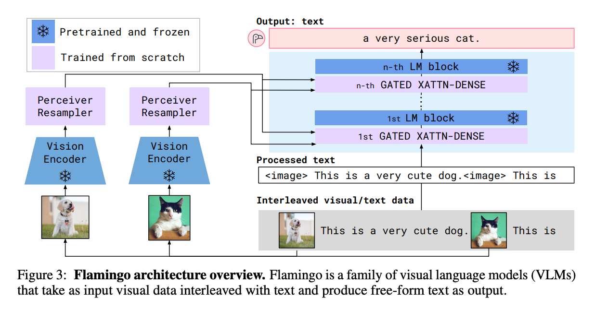
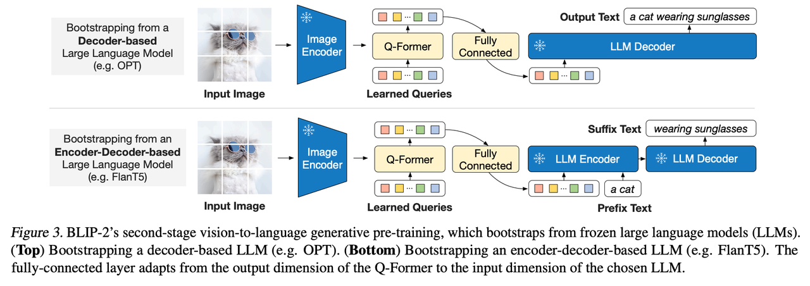
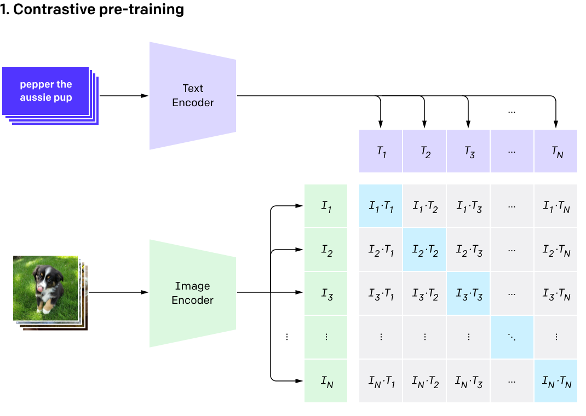
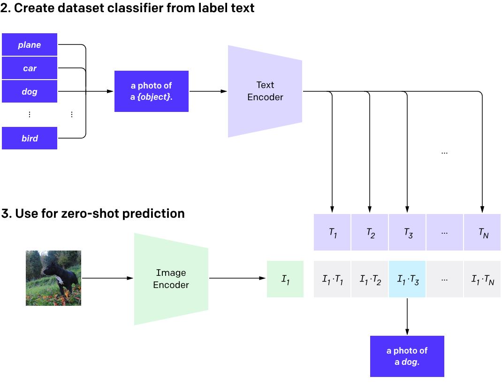
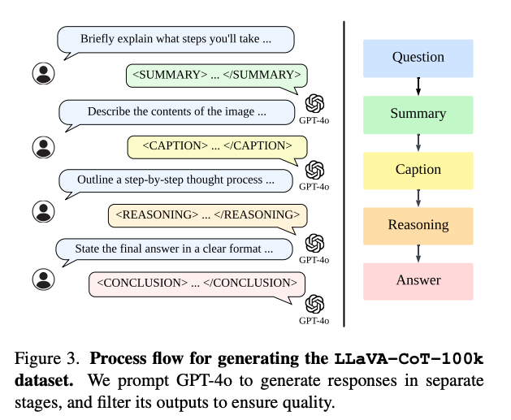
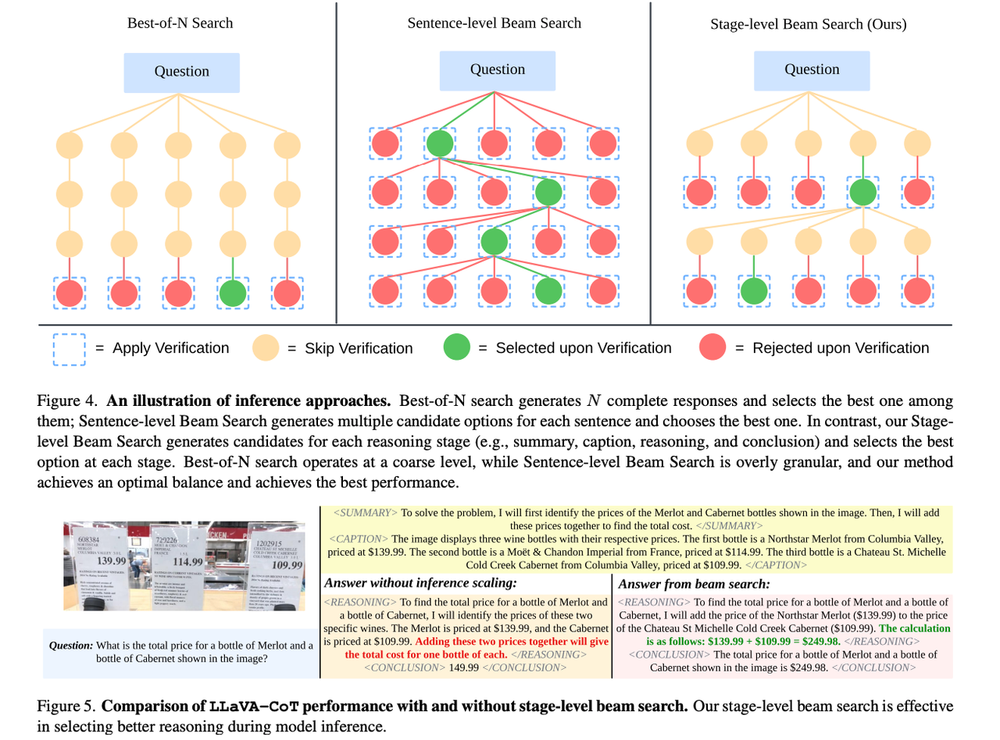
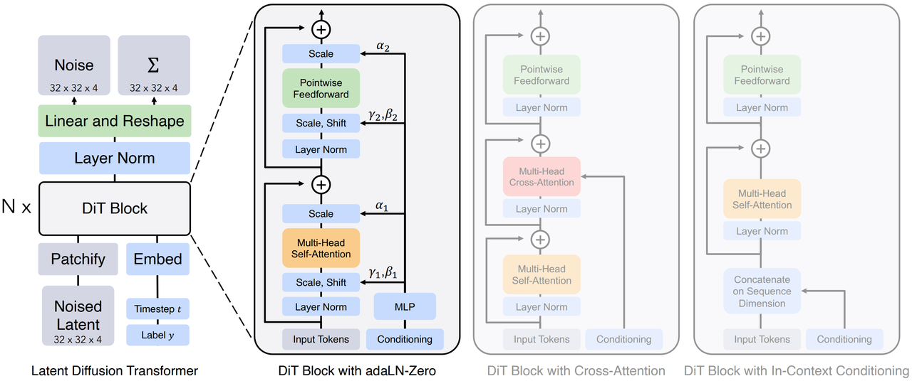
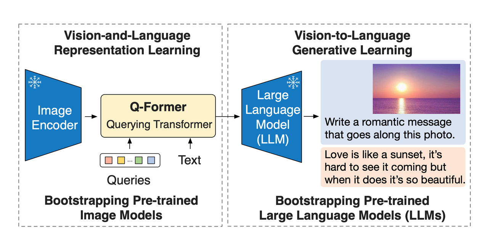
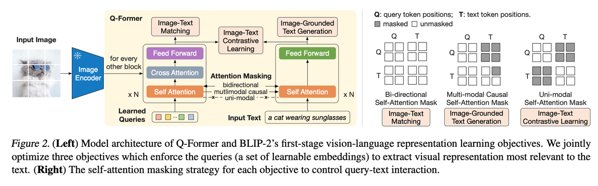

[Previous](02-对比分析.md) | [Contents](../../README.md) | [Next](04-训练与微调.md) | [Visual website](https://weyumm.github.io/vlm-Wissen/interview.html#c=3)

# 3. 模型细节、架构与应用

## 3.1 基础机制与跨模态编码细节

### 3.1.1 CLIP三个损失函数分别是什么？数据是怎么清洗的？

**CLIP的三个损失函数**

> CLIP（Contrastive Language-Image Pretraining）的核心训练目标是通过跨模态对齐建立图像与文本的关联。根据文献，其损失函数设计存在两种主流表述，需结合不同改进版本分析：
>
> **原始CLIP的对比损失（Contrastive Loss）** &#x20;
>
> * **定义**：采用对称的交叉熵损失，将图像和文本编码到同一语义空间，通过对比正负样本对实现对齐。 &#x20;
>
> * **公式**：$$\mathcal{L}_{\text{CLIP}} = -\frac{1}{2N} \sum_{i=1}^N \left[ \log \frac{\exp(\text{sim}(I_i, T_i)/\tau)}{\sum_{j=1}^N \exp(\text{sim}(I_i, T_j)/\tau)} + \log \frac{\exp(\text{sim}(T_i, I_i)/\tau)}{\sum_{j=1}^N \exp(\text{sim}(T_i, I_j)/\tau)} \right]$$其中，$$\text{sim}$$为余弦相似度，$$\tau$$为温度参数，$$N$$为批次大小。 &#x20;
>
> * **作用**：最大化正样本对（图像-文本匹配）的相似度，最小化负样本对的相似度。
>
> **改进版本的多任务损失（如BLIP模型）**
>
> CLIP的扩展版本引入了三个损失函数： &#x20;
>
> * **ITC（Image-Text Contrastive Loss）**：与原始CLIP的对比损失类似，但可能采用更复杂的负样本队列（如MoCo的特征队列）。 &#x20;
>
> * **ITM（Image-Text Matching Loss）**：通过二分类任务判断图像-文本是否匹配，增强细粒度对齐能力。 &#x20;
>
> * **ITG（Image-Grounded Text Generation Loss）**：基于图像生成文本（如图像描述），通过语言模型损失优化生成质量。 &#x20;
>
> **作用**：**多任务学习提升模型的跨模态理解与生成能力**

**数据清洗方法**

> CLIP的性能高度依赖高质量的图像-文本对数据，清洗流程需解决噪声与格式问题：
>
> 1. **数据筛选**  
>
>    * **合规性过滤**：保留符合格式的图像（如分辨率、完整性）和文本（如非空、语言匹配）。 &#x20;
>
>    * **去噪策略**： &#x20;
>
>      * 剔除文本与图像内容明显不相关的样本（如“一只狗”的文本对应猫的图像）。 &#x20;
>
>      * 利用NLP工具清洗文本（如去除特殊符号、标准化表述）。 &#x20;
>
> 2. **数据增强**  
>
>    * **文本增强**：通过同义词替换、回译（Back Translation）增加文本多样性。 &#x20;
>
>    * **图像增强**：随机裁剪、颜色抖动等提升模型鲁棒性。 &#x20;
>
> 3) **标注优化**  
>
>    * **伪标签生成**：对无标注数据，利用预训练模型生成伪标签（如CLIP自身预测文本）。 &#x20;
>
>    * **人工校验**：关键数据集（如LAION）通过众包平台进行人工标注校正。 &#x20;

**关键挑战与解决方案**

> **噪声样本影响**：通过多阶段清洗（自动过滤+人工校验）降低噪声比例。 &#x20;
>
> **数据不平衡**：采用重采样或加权损失函数缓解类别偏差。 &#x20;
>
> **跨模态对齐难度**：结合ITC、ITM、ITG多任务损失增强对齐精度。 &#x20;

**总结**

> **CLIP的损失函数设计从单一对比损失（原始版本）发展为多任务联合优化（改进版本）**，其核心目标是通过跨模态对齐与生成提升模型泛化能力。数据清洗则通过严格的筛选、增强与标注优化，确保训练数据的高质量。这些技术共同支撑了CLIP在图文检索、零样本分类等任务中的卓越表现。

### 3.1.2 cross-attention在图文匹配中q和kv分别指什么？在机器翻译中分别指什么？

**图文匹配中的 Q、K、V**

> 在图文匹配任务中，Cross-Attention 的目标&#x662F;**建立文本与图像特征的语义对齐**。 &#x20;
>
> * **Q（查询）**：来自文本嵌入（如句子或单词的语义向量），表&#x793A;**需要从图像中检索的信息**。 &#x20;
>
> * **K（键）与 V（值）**：来自图像特征（如通过CNN或ViT提取的全局或局部特征），表&#x793A;**被查询的视觉内容**。 &#x20;
>
> * **作用**：**通过计算文本查询（Q）与图像特征（K）的相似度，动态提取与文本最相关的视觉信息（V），实现跨模态对齐**
>
> **示例**： &#x20;
>
> 若输入文本为“一只棕色的狗在草地上”，图像中包含多个物体，Cross-Attention 的 Q 由文本生成，K 和 V 由图像块特征生成。模型通过注意力权重定位图像中的狗，并抑制无关区域（如背景）。

**机器翻译中的 Q、K、V**

> 在机器翻译任务中，Cross-Attention 用于解码器动态关注编码器的源语言信息。 &#x20;
>
> * **Q（查询）**：来自解码器的当前状态（如目标语言词的嵌入），表示当前生成步骤需要关注的语义。 &#x20;
>
> * **K（键）与 V（值）**：来自编码器的源语言输出（如源语言句子的上下文表示），提供需翻译的语义信息。 &#x20;
>
> * **作用**：通过 Q 与 K 的相似度计算，解码器选择性地从源语言序列中提取相关信息（V），生成目标语言词（。 &#x20;
>
> **示例**： &#x20;
>
> 在英译法任务中，解码器生成法语词“Bonjour”时，Q 由当前法语词的隐状态生成，K 和 V 由编码器对英文句子“Hello”的表示生成，确保翻译的准确性。

**核心区别与统一框架**

| **任务**   | **Q 来源** | **K/V 来源** | **核心目标** |
| -------- | -------- | ---------- | -------- |
| **图文匹配** | 文本嵌入     | 图像特征       | 跨模态语义对齐  |
| **机器翻译** | 解码器当前状态  | 编码器源语言表示   | 跨语言语义转换  |

**技术细节与挑战**

> **Q/K/V 的生成方式**：  
>
> * 文本或语言嵌入通常通过词嵌入层或预训练模型（如BERT）生成。 &#x20;
>
> * 图像特征可通过CNN（如ResNet）或Transformer（如ViT）提取。 &#x20;
>
> **关键挑战**：  
>
> * **噪声干扰**：图像或文本中的无关信息可能误导注意力权重，需通过数据清洗或正则化缓解。 &#x20;
>
> * **长序列对齐**：机器翻译中长句子的注意力稀疏性问题，需结合位置编码或局部注意力优化。 &#x20;

**总结**

> Cross-Attention 的核心在于通过 Q、K、V 的不对称交互实现跨模态或跨语言的信息融合。在图文匹配中，文本驱动对图像的语义检索；在机器翻译中，目标语言动态选择源语言信息。这一机制的灵活性使其成为多模态模型（如CLIP）和序列生成模型（如Transformer）的核心组件。

### 3.1.3 什么是绝对时间对齐？

> 绝对时间对齐是多模态模型处理视频时的一种创新编码方法，其核心在于将时间维度ID与真实物理时间直接挂钩，突破传统基于帧序的编码局限。

**传统时间编码（相对时间）**

> #### **机制**
>
> * 以帧顺序为基准，第1帧=ID 1，第2帧=ID 2，依此类推。
>
> #### **问题**
>
> * **帧率敏感**：30FPS视频的5秒片段有150个ID，15FPS同长度视频只有75个ID。
>
> * **时间感知偏差**：模型难以理解“第10分钟”的实际时长，只能通过帧数间接推算。
>
> * **跨视频对齐困难**：不同帧率视频的相同事件无法通过ID直接匹配。

**绝对时间对齐（Qwen2.5-VL 的创新）**

> #### **机制**
>
> * 将时间ID映射到真实时间戳（秒/毫秒），与帧率解耦。
>
> #### **示例**
>
> * 30FPS视频的第90帧 → 时间ID=3.0秒 (90/30=3)
>
> * 15FPS视频的第45帧 → 时间ID=3.0秒 (45/15=3)

**关键技术**

> **时间戳归一化：**&#x8BB0;录每帧的绝对时间起点（如Unix时间戳）。
>
> **MRoPE扩展：**&#x5728;旋转位置编码中增加时间维度，公式调整为：
>
> $$\text{MRoPE}(t, h, w) = \text{RoPE}_t(t_{\text{abs}}) \oplus \text{RoPE}_h(h) \oplus \text{RoPE}_w(w)$$
>
> **动态FPS适配：**&#x81EA;动计算帧间隔时间，如30FPS视频每帧间隔≈33.3ms。

**一些展望**

> **提高时间感知精度**：通过绝对时间对齐，模型能够更准确地理解和定位视频中的时间信息，从而更好地处理长时间序列的数据。
>
> **增强跨视频一致性**：即使不同帧率的视频，也能通过绝对时间对齐实现事件的精确匹配，这对于视频分析、监控和检索等应用场景尤为重要。
>
> **提升模型鲁棒性**：不再依赖于固定的帧率，使得模型在处理不同帧率视频时更加灵活和高效。

**实际应用**

> **视频摘要生成**：能够根据绝对时间信息生成更精准的视频摘要，捕捉关键事件。
>
> **异常检测**：在监控视频中，能够更准确地定位异常事件发生的时间点。
>
> **视频编辑**：提供更精细的时间控制，便于视频剪辑和后期制作。

> 绝对时间对齐技术显著提升了多模态模型在处理视频数据时的时间感知能力，使其能够更准确地理解和操作视频中的时间信息，从而在多种应用场景中发挥更大的作用。

### 3.1.4 Qwen2.5-VL中的动态分辨率处理是什么

> 在多模态理解和交互中，如何有效地处理不同分辨率的图像是一个关键问题。传统的处理方法通常将所有输入图像强制缩放到一个固定的尺寸，如224×224，这虽然简化了处理流程，但带来了几何畸变和信息损失的问题。为解决这些问题，Qwen2.5-VL引入了一种动态分辨率处理技术，旨在原生支持任意分辨率的输入。

**动态分辨率处理的优势**

> #### **避免几何畸变**
>
> 通过保持原始宽高比并仅调整尺寸至28的倍数，Qwen2.5-VL避免了圆形物体变为椭圆等几何畸变问题。
>
> #### **减少信息损失**
>
> 对于高分辨率图像中的小文字等内容，不再因下采样而变得不可识别。例如，1920×1080的图像被调整为1960×1120（1960=70×28，1120=40×28），并通过边缘填充保留了原始内容。

**动态分辨率处理面临的挑战**

> 尽管动态分辨率处理提供了显著的优势，但在实际应用中仍面临一些挑战：
>
> #### **极高分辨率图像**
>
> * **计算开销**：虽然窗口注意力减少了计算量，但 8K 图像（7680×4320）会产生约 16 万个 patch（假设 14×14 的步长），远超常规输入（如 448×448 约为 1000 个 patch），导致显存和计算时间激增。
>
> * **长序列建模**：过长的token序列可能影响语言模型的上下文处理能力，尤其是在需要跨区域推理的任务中（如全景图像问答）。
>
> #### 极低分辨率图像
>
> * **细节丢失**：低分辨率图像可能导致重要的细节丢失，比如文本OCR任务中的字符难以识别。
>
> * **细粒度感知受限**：对于需要检测小物体或边缘细节的任务，低分辨率输入可能限制模型的表现。

**解决策略与改进措施**

> 为了应对上述挑战，可以采取以下策略：
>
> #### 数据增强与随机采样
>
> 通过在训练过程中随机采样不同分辨率的图像来增强模型的鲁棒性，确保模型能够在多种分辨率下有效工作。
>
> #### 优化算法与硬件加速
>
> 采用更高效的算法以及利用硬件加速（如GPU、TPU）以减轻计算负担，特别是在处理极高分辨率图像时。
>
> #### 细粒度数据预处理
>
> 针对低分辨率图像，可以采用超分辨率技术进行预处理，提高输入质量，从而提升模型性能。

> Qwen2.5-VL的动态分辨率处理技术代表了在多模态理解领域的一项重要进步，它解决了传统固定尺寸缩放方法带来的几何畸变和信息损失问题。然而，在处理极高和极低分辨率图像时，该技术也面临着特定的挑战。通过采用合适的数据增强、算法优化和硬件加速策略，可以在很大程度上克服这些挑战，进一步提升模型在各种应用场景中的表现。

### 3.1.5 Qwen2.5-VL 在多模态融合中采用简单的 MLP 投影器，这种设计有何优劣？

> 随着多模态学习的发展，如何有效地融合来自不同模态的信息成为了一个核心挑战。不同的模型采用了不同的策略来实现这一目标。Qwen2.5-VL 采用简单的 MLP 投影器进行视觉特征到语言模型空间的转换，其他模型则选择了更复杂的跨模态注意力机制。

**Qwen2.5-VL 的策略**

> **方法描述**
>
> **MLP 投影器**：Qwen2.5-VL **使用两层 MLP 来将视觉特征投影到语言模型的空间内**。这种方法计算上更加高效，适合处理长视觉序列。
>
> **优势**
>
> **计算高效**：MLP 投影器的复杂度为 O(N×D)，显著低于跨模态注意力机制的 O(N×M×D)（其中 N 代表视觉特征的数量，M 代表文本 token 数，D 代表维度），这使得处理大规模数据集更为可行。
>
> **训练稳定**：由于避免了复杂的交互过程，梯度消失或对齐困难的问题得到了缓解，从而提升了训练的稳定性。
>
> **劣势**
>
> **信息损失**：由于缺乏细粒度的交互建模能力，**MLP 可能无法充分捕捉视觉特征与文本之间的复杂关系，例如空间位置关联等**。
>
> **模态鸿沟**：对于需要深度模态交互的任务（如涉及视觉推理的数学问题），MLP 投影器可能不足以提供足够的交互层次，导致性能瓶颈。

**其他方法对比**

**Flamingo 的 Perceiver Resampler**

> Flamingo 采用了一种名为 Perceiver Resampler 的跨模态注意力机制，旨在加强不同模态间的信息交流。这种方法允许模型动态地调整输入表示，以适应不同的任务需求。
>
> **优势**：能够更细致地建模不同模态之间的关系，尤其适用于需要深入理解两种模态之间交互的任务。
>
> **劣势**：计算成本较高，尤其是在处理大规模数据时可能会面临资源限制。

**混合架构的探索**

> 为了克服单一方法的局限性，未来的研究可以考虑混合架构的设计。例如，结合局部跨模态注意力与全局 MLP 投影器的方法，可以在保持计算效率的同时增强模态间的交互。
>
> * **局部跨模态注意力**：专注于特定区域内的模态交互，减少不必要的计算负担。
>
> * **全局 MLP 投影器**：负责整体的信息传递，确保不同模态的数据能够在整个网络中得到有效的利用。

> Qwen2.5-VL 的简单 MLP 投影器设计在效率和性能之间取得了良好的平衡，特别是在处理长视觉序列方面具有明显的优势。然而，在需要深层次模态交互的任务中，这种方法可能存在一定的局限性。通过探索混合架构或其他创新方法，可以在不牺牲计算效率的前提下进一步提升模型的表现。

### 3.1.6 ImageBind中的图像和音频模态是如何同步的？它如何处理不同模态的特征提取？

> 在多模态学习中，如何有效地同步不同模态（如图像和音频）并从中提取有用的特征是一个关键挑战。ImageBind通过创新的方法解决了这些问题，使得即使在没有直接成对训练数据的情况下也能实现模态间的高效交互。

**图像和音频模态的同步**

> **数据配对**
>
> ImageBind利用自然发生的配对数据来同步不同的模态，例如视频-音频对。这种方法允许模型学习到跨模态之间的内在联系，而不需要显式的标签或手动标注的配对数据。具体来说，对于图像和音频模态，ImageBind使用了来自Audioset dataset等来源的视频-音频对数据。
>
> **时间对齐**
>
> 为了确保图像和音频之间的正确同步，ImageBind在处理视频片段时采用固定长度的时间窗口（例如两秒），并在每个时间窗口内提取帧和相应的音频信号。这保证了在任何给定的时间点，图像和音频数据都代表同一事件或场景，从而实现了时间上的对齐。

**特征提取过程**

> #### 图像特征提取
>
> 对于图像数据，ImageBind采用了Vision Transformer (ViT) 架构进行特征提取。具体步骤如下：
>
> * **预处理**：输入图像首先被分割成一系列patch，每个patch随后被投影到一个较高的维度。
>
> * **编码器**：使用ViT架构对这些patch进行编码，生成图像的特征表示。
>
> * **线性投影头**：在编码器之后，添加一个特定于模态的线性投影层，用于将特征映射到统一的嵌入空间中。
>
> #### 音频特征提取
>
> 音频特征的提取则略有不同，主要步骤包括：
>
> * **预处理**：将16kHz采样的2秒音频转换为梅尔频谱图，这一步骤有助于捕捉音频信号的关键频率信息。
>
> * **编码器**：同样使用Transformer架构处理音频特征，但在此之前，音频数据被转换为2D梅尔频谱图以便于处理。
>
> * **线性投影头**：类似于图像特征提取，音频特征也经过一个特定于模态的线性投影层，将其映射到共享的嵌入空间。

**跨模态对比学习**

> 一旦从各个模态中提取出特征，ImageBind采用对比学习方法（如InfoNCE loss）来最小化匹配对之间的距离，同时最大化非匹配对之间的距离。这种策略不仅促进了不同模态间的信息融合，还增强了模型对未见过的数据的泛化能力。

**实验验证与应用**

> 实验表明，即使在没有直接针对音频文本监督训练的情况下，ImageBind仍然能够在音频识别任务上达到甚至超过那些专门训练的模型的表现。**这一发现强调了通过图像作为桥梁进行模态间信息传递的有效性。**

**结论**

> ImageBind提供了一种有效的方法来同步图像和音频模态，并从中提取特征，这对于实现高效的跨模态交互至关重要。通过巧妙地利用自然配对的数据以及先进的特征提取技术，ImageBind不仅简化了多模态学习的过程，还极大地拓宽了其应用场景。未来的研究可能会进一步探索如何优化这一过程，以应对更加复杂的多模态数据集和任务需求。

### 3.1.7 在Flamingo中，视觉信息和文本信息是如何进行交互的？

> Flamingo 是由 DeepMind 开发的一种多模态大语言模型（MLLM），它能够处理包含图像、视频和文本交织的数据，并生成相应的文本输出。Flamingo 的核心在于如&#x4F55;**有效地融合视觉信息和文本信息，从而在少样本学习场景下表现出色。**

**Flamingo架构概览**

> **视觉编码器**
>
> Flamingo 使用一个预训练并冻结的视觉编码器来处理输入的图像或视频帧。例如，NFNet-F6 被用来作为基础网络，该模型已经在大量的图像-文本对上进行了对比学习预训练。视觉编码器负责将输入的图像或视频转换为特征表示。
>
> **感知器重采样器**
>
> 由于视觉编码器输出的特征长度是可变的，为了连接到固定长度的语言模型输入，Flamingo 引入了感知器重采样器（Perceiver Resampler）。这一模块可以将来自视觉编码器的可变长度特征转换为固定数量（如 64）的视觉令牌。
>
> **冻结的语言模型**
>
> Flamingo 使用了一个大型的预训练语言模型作为其语言生成部分。这个语言模型通常是固定的，不参与后续的训练过程，以保持其强大的文本理解和生成能力。
>
> **交叉注意力层**
>
> 为了实现视觉信息和文本信息的有效融合，Flamingo 在冻结的语言模型层之间插入了新的交叉注意力层（Gated Cross-Attention Dense Layers）。这些层允许语言模型基于视觉内容生成文本。

**视觉信息与文本信息的交互机制**

> **特征提取与转换**
>
> 首先，输入的图像或视频会被视觉编码器转换为特征向量。对于视频输入，模型会按照一定的帧率（如每秒一帧）进行采样，然后对每个帧独立编码得到时空特征序列。
>
> 接下来，感知器重采样器接收来自视觉编码器的可变长度特征，并将其转换为固定数量的视觉令牌。这一步骤通过学习一组固定数量的查询向量完成，这些查询向量通过交叉注意力从输入特征中提取关键信息。
>
> **交叉注意力层的作用**
>
> 交叉注意力层被设计成插在语言模型的每一层之间，它们的目的是让语言模型能够理解视觉信息，并据此生成文本。具体来说，交叉注意力层中的查询（queries）来自语言模型的上一层输出，而键（keys）和值（values）则来自感知器重采样器的输出（即视觉令牌。

> 此外，为了确保在训练初期模型不会偏离原始语言模型的功能太远，Flamingo 引入了门控机制（tanh gate）。这种机制使得新插入的层在初始化时几乎不影响原始语言模型的行为，但随着训练的进行，逐渐增加对视觉信息的关注 。

**文本生成**

> 经过上述步骤后，语言模型可以根据融合后的信息生成相应的文本输出。**这意味着，即使在没有直接成对的训练数据的情况下，Flamingo 也能够利用已有的知识和跨模态的关联来生成高质量的文本描述 。**

**结论**

> Flamingo 通过一系列精心设计的组件实现了视觉信息和文本信息的高效融合。感知器重采样器解决了视觉特征长度变化的问题，而交叉注意力层则确保了视觉信息能够被正确地整合进语言模型的上下文中。这种方法不仅增强了模型的跨模态理解能力，还在少样本学习任务中展现了卓越的表现 。

## 3.2 BLIP-2 结构、融合与对齐细节

### 3.2.1 BLIP-2中的Q-Former结构是什么？

> BLIP-2（Bootstrapping Language-Image Pre-training 2）是由Salesforce Research提出的一种高效的视觉-语言预训练方法。它通过引入Q-Former这一轻量级的Transformer模型，在冻结的图像编码器和大型语言模型之间建立了一个桥梁，**使得两种模态的信息能够有效地进行交互和融合。**

**Q-Former的设计理念**

> Q-Former的核心思想是使用一组可学习的查询向量（queries），从冻结的图像编码器中提取出对文本生成最有用的视觉特征，并将这些特征传递给大型语言模型（LLM）。**这样做的目的是为了在不重新训练单模态模型的前提下，实现高效且有效的多模态学习。**

**Q-Former的具体结构**

> **组成部分**
>
> Q-Former由两个主要的Transformer子模块组成：
>
> 1. **Query Encoder**：负责与冻结的图像编码器进行交互，从中提取视觉特征。
>
> 2. **Text Transformer**：既可以作为文本编码器也可以作为解码器，用于处理文本信息。
>
> 这两个子模块共享self-attention层，这意味着它们可以互相影响，从而促进不同模态之间的信息交换。
>
> **工作流程**
>
> **初始化查询向量**：首先，Q-Former会创建一组可学习的查询向量，作为图像Transformer的输入。
>
> **交互过程**：
>
> * 查询向量之间可以通过self-attention机制进行交互。
>
> * 同时，这些查询向量也能通过cross-attention机制与冻结的图像特征进行交互，从而提取出最相关的视觉信息。
>
> * 此外，查询向量还可以通过共享的self-attention层与文本信息进行交互。
>
> **注意力掩码控制**：根据不同的预训练任务，Q-Former会使用不同的self-attention mask来控制查询向量与文本之间的交互方式。
>
> **训练策略**
>
> Q-Former采用两阶段的训练策略：
>
> **第一阶段**：vision-language representation learning。目标是让Q-Former学会从冻结的图像编码器中提取出与文本最相关的视觉表示。此阶段包括三个具体目标：ITC（image-text contrastive learning）、ITG（image-grounded text generation）、ITM（image-text matching）。
>
> **第二阶段**：vision-to-language generative learning。目标是让Q-Former的输出能够被冻结的LLM所理解，以便于执行视觉到语言的生成任务。

**特性与优势**

> **信息瓶颈：**&#x51;-Former的输出维度远小于原始图像特征的尺寸（例如，32×768 vs. 257×1024），这有助于减少冗余信息，只保留对后续文本生成有用的视觉信息。
>
> **计算效率**：由于其轻量级设计，Q-Former可以在保持高性能的同时显著降低计算成本。
>
> **通用性**：Q-Former不仅适用于图像-文本配对数据的学习，还能够扩展至其他类型的跨模态任务。

**结论**

> Q-Former作为一种创新性的架构，成功地解决了如何在不重新训练单模态模型的情况下实现高效的视觉-语言预训练的问题。它的设计不仅提高了计算效率，而且增强了模型在多种下游任务上的表现能力，展示了在零样本设置下的强大潜力。

### 3.2.2 BLIP-2中的Attention机制是如何优化的？

> BLIP-2（Bootstrapping Language-Image Pre-training 2）是一种旨在提高视觉语言预训练效率的方法，它通过引入Q-Former这一轻量级的Transformer模型来优化跨模态信息交互。在BLIP-2中，注意力机制（Attention Mechanism）被精心设计和优化，以实现高效的视觉与文本信息融合。

**Q-Former中的Attention机制**

> **Self-Attention vs Cross-Attention**
>
> Q-Former使用了两种类型的注意力机制：Self-Attention 和 Cross-Attention。
>
> * **Self-Attention**：用于处理同一模态内的信息交互，比如查询向量之间的相互作用，或者文本输入内部的信息流动。
>
> * **Cross-Attention**：用于不同模态间的信息传递，如查询向量与图像特征之间的交互。
>
> 这两种注意力机制共同作用，使得Q-Former能够有效地从冻结的视觉编码器中提取出对文本生成最有用的视觉特征。

**Attention Mask的应用**

> 为了控制不同任务下的注意力模式，BLIP-2使用了不同的Attention Masks：
>
> * 在第一阶段的训练中，针对ITC（image-text contrastive learning）、ITM（image-text matching）和ITG（image-grounded text generation）三个目标，分别应用不同的attention masks来调整查询向量与文本之间的交互方式。
>
> * 这种方法确保了即使在同一网络结构下，也能针对特定任务优化注意力模式，从而提高了模型的表现力和灵活性。

**Attention机制的具体优化措施**

> #### Query Tokens的设计
>
> Q-Former引入了一组可学习的query tokens，这些tokens作为桥梁连接视觉和文本信息。**每个query token都能通过cross-attention机制直接访问图像特征**，并通过self-attention机制与其他query tokens以及文本信息进行交互。
>
> * **数量控制**：在实际实验中，通常使用32个query tokens，每个token的维度为768。这种设计不仅减少了视觉特征的数量，还保证了足够的信息密度。
>
> * **参数初始化**：Q-Former的权重通常基于BERT进行初始化，而cross-attention的参数则随机初始化，这有助于模型更快地收敛到有效的解决方案。
>
> #### 轻量级架构的优势
>
> Q-Former的设计理念之一是保持架构的轻量化，这意味着虽然其参数量相对较少（约188M），但通过对注意力机制的精细调整，仍能实现高效的信息传递和融合。
>
> #### 冻结预训练模型参数
>
> BLIP-2的一个关键特性是冻结了预训练的视觉和语言模型的参数。这样做可以避免灾难性遗忘问题，同时利用这些模型的强大表示能力。然而，这也带来了挑战，即如何让视觉特征空间与文本特征空间对齐。为此，Q-Former通过巧妙地设计注意力机制，尤其是cross-attention层，实现了这一点。

**结论**

> BLIP-2通过对Attention机制的优化，特别是引入Q-Former及其独特的query tokens设计，成功解决了视觉与语言特征空间不对齐的问题，同时保持了计算效率。这种方法不仅提高了模型在多种下游任务中的表现，也为未来的研究提供了新的思路和方向。

### 3.2.3 BLIP-2如何利用图像编码器与文本编码器进行信息融合？

> BLIP-2（Bootstrapping Language-Image Pre-training 2）是一种创新的视觉语言预训练方法，它通过使用冻结的预训练图像编码器和大型语言模型（LLM），并引入轻量级查询转换器（Q-Former），实现了高效的跨模态信息融合。

**图像编码器与文本编码器的作用**

> #### **图像编码器**
>
> 在BLIP-2中，图像编码器通常采用来自CLIP的ViT-L/14或EVA-CLIP的ViT-g/14这样的强大预训练模型。**这些编码器能够将输入图像分割成一系列patch，并为每个patch生成对应的嵌入表示。**&#x8FD9;种表示捕捉了图像中的空间结构和语义信息，为后续的多模态任务提供了基础特征。
>
> #### **文本编码器**
>
> 文本编码器则负责处理输入的文本数据，将其转化为适合于跨模态任务的嵌入向量。在BLIP-2的设计中，文本编码器可以是基于Transformer架构的模型，例如OPT或FlanT5等大型语言模型的一部分。**这类编码器擅长捕捉文本中的语法、语义及上下文信息。**

**Q-Former：桥梁作用**

> #### **查询Transformer**
>
> Q-Former作为BLIP-2的核心组件，扮演着连接图像编码器和文本编码器的角色。它由两个共享自注意力层的子模块组成：图像Transformer和文本Transformer。这两个子模块允许不同模态之间的信息交互，使得图像特征可以被转换成适合文本模型理解的形式。
>
> #### **可学习查询向量**
>
> Q-Former的一个关键特性是使用一组可学习的查询向量（query vectors）。&#x8FD9;**些查询向量作为桥梁，从冻结的图像编码器中提取出最相关的视觉特征，并通过交叉注意力机制（cross-attention mechanism）与文本信息进行交互。**&#x8FD9;组查询向量的数量通常是固定的（例如32个），它们的维度与文本Transformer相匹配，以便于直接集成到文本生成流程中。

**跨模态对齐**

> #### 第一阶段：视觉-语言表示学习
>
> 在第一阶段，Q-Former通过三个主要目标来引导视觉语言表示的学习：
>
> 1. **图像-文本对比学习（ITC）**：最大化图像表示和文本表示之间的互信息。
>
> 2. **图像-文本匹配（ITM）**：学习图像和文本表示之间的细粒度对齐。
>
> 3. **基于图像的文本生成（ITG）**：训练Q-Former根据输入图像生成相关文本。
>
> #### 第二阶段：视觉到语言生成学习
>
> 第二阶段的目标是从冻结的语言模型中引导视觉到语言的生成学习。这里，Q-Former输出的查询向量被投影到与LLM的词嵌入相同的维度，并作为软视觉提示添加到输入文本嵌入中。这样，LLM可以根据视觉提示生成相应的文本描述。

**实现细节**

> #### 参数共享
>
> 为了提高效率和减少参数数量，Q-Former中的图像Transformer和文本Transformer共享自注意力层。这意味着无论是在处理图像还是文本时，都使用相同的一组权重进行自我关注计算。这种设计不仅简化了模型结构，还促进了不同模态间的知识迁移。
>
> #### 注意力掩码
>
> 根据不同任务的需求，Q-Former会应用不同的注意力掩码（attention mask）来控制查询向量与文本之间的交互方式。这种方式确保了即使在同一网络结构下，也能针对特定任务优化注意力模式，从而提高了模型的表现力和灵活性。

**结论**

> BLIP-2通过巧妙地结合冻结的图像编码器和大型语言模型，并借助Q-Former这一轻量级查询转换器实现了高效的跨模态信息融合。这种方法不仅降低了训练成本，还在多种视觉语言任务上展现了卓越的性能。通过对图像和文本特征的有效对齐以及合理的注意力机制设计，BLIP-2展示了其在零样本设置下的强大潜力。

### 3.2.4 BLIP-2中如何实现跨模态对齐？

> BLIP-2（Bootstrapping Language-Image Pre-training 2）是一种旨在提高视觉语言预训练效率的方法，它通过引入Q-Former这一轻量级的Transformer模型来促进图像和文本之间的跨模态对齐。

**跨模态对齐的重要性**

> 在多模态学习领域，**跨模态对齐是指将不同模态的数据（如图像和文本）映射到一个共同的语义空间中**，使得来自不同模态的信息可以在该空间内进行有效的交互。这对于诸如图像字幕生成、视觉问答等任务至关重要。

**BLIP-2中的跨模态对齐机制**

#### 3.2.4.1 使用冻结的单模态模型

> BLIP-2利用了已有的强大单模态预训练模型——即冻结的图像编码器（例如CLIP或EVA-CLIP中的ViT变体）和大型语言模型（LLM），**避免了从头开始训练这些复杂模型所需的高昂计算成本，并防止了灾难性遗忘问题。**

#### 3.2.4.2 **Q-Former的设计与功能**

> #### **查询转换器（Q-Former）**
>
> Q-Former是BLIP-2的核心组件，它作为一个信息瓶颈，负责从冻结的图像编码器中提取出对文本生成最有用的视觉特征，并将其传递给LL&#x4D;**。Q-Former由两个共享自注意力层的子模块组成：图像Transformer和文本Transformer。**
>
> #### **可学习查询向量**
>
> Q-Former包含一组可学习的查询向量（queries），这些向量通过交叉注意力层与图像特征进行交互，以提取固定数量且对文本生成最有用的视觉特征。**这些查询向量作为桥梁，连接了视觉和语言两种不同的模态。**
>
> #### **注意力掩码的应用**
>
> 为了适应不同的任务需求，Q-Former会使用不同的self-attention masks来控制查询向量与文本之间的交互模式。这种方式保证了即使在同一网络结构下，也能针对特定任务优化注意力模式，从而提高了模型的表现力和灵活性。

**预训练策略**

> #### 第一阶段：视觉-语言表示学习
>
> 在第一阶段，Q-Former被训练以提取与文本最相关的视觉表示。这包括三个主要目标：
>
> 1. **图像-文本对比学习（ITC）**：最大化正确图像-文本对之间的相似度，同时最小化错误对的相似度。
>
> 2. **图像引导的文本生成（ITG）**：要求模型基于给定图像生成对应的文本描述。
>
> 3. **图像-文本匹配（ITM）**：判断图像和文本是否匹配，这是一个二分类任务。
>
> 这三个目标共同作用，确保了视觉特征能够准确地反映文本内容，从而实现了初步的跨模态对齐。
>
> #### 第二阶段：视觉到语言的生成学习
>
> 在第二阶段，Q-Former被进一步训练，使其输出的视觉特征能够被LLM理解和利用。根据LLM的类型（解码器或编码器-解码器），采用不同的策略来优化视觉特征的表达方式，以便于生成相应的文本描述。

**结论**

> BLIP-2通过创新性的两阶段预训练策略和精心设计的Q-Former架构，成功实现了视觉和语言之间的高效跨模态对齐。这种方法不仅降低了计算成本，还增强了模型在多种下游任务上的表现能力，展示了其在零样本设置下的强大潜力。

## 3.3 扩散与图文生成模型细节

### 3.3.1 DALL-E的图像生成过程是如何利用变换器（Transformer）架构的？

> DALL-E是由OpenAI开发的一个基于深度学习的模型，它能够根据给定的文本描述生成相应的图像。DALL-E的核心技术之一是采用了变换器（Transformer）架构，这种架构最初由Google提出，并广泛应用于自然语言处理任务中。

**Transformer架构概述**

> Transformer架构是一种用于序列数据处理的神经网络结构，其主要特点包括自注意力机制（Self-Attention Mechanism），允许模型在处理序列中的每个元素时考虑整个序列的信息。此外，Transformer还支持并行计算，极大地提高了训练效率。

**DALL-E的工作流程**

> #### **文本编码阶段**
>
> 1. **输入文本**：用户提供的文本描述作为输入。
>
> 2. **文本嵌入**：通过预训练的Transformer模型（如GPT系列）对输入文本进行编码，将其转换为一系列向量表示。每个单词或短语被映射到一个高维空间中的点，这些点捕捉了文本的语义信息。
>
> #### **图像生成阶段**
>
> **融合文本与图像信息**：在DALL-E中，文本token和图像token被视为同一个序列的一部分，这意味着它们可以共享相同的Transformer层来处理。这使得模型能够在生成图像的同时考虑到文本的上下文信息，确保生成的内容与给定的文本描述相匹配。
>
> **使用dVAE降低维度**：由于直接处理全分辨率图像会导致巨大的计算负担，DALL-E首先使用离散变分自动编码器（dVAE）将图像压缩成较低维度的表示形式。dVAE将每张256x256像素的RGB图片压缩为32x32的图片token，每个位置有8192种可能的取值。
>
> **自回归生成**：接下来，Transformer模型以自回归的方式工作，即逐个预测下一个token，直到完成整幅图像的生成。在这个过程中，模型会参考之前所有已生成的token以及文本描述来决定下一个token的最佳选择。
>
> **图像解码**：一旦获得了所有的图像token，就会用dVAE的解码器部分将这些低维表示恢复为原始尺寸的图像。

**Transformer在DALL-E中的角色**

> #### 处理多模态信息
>
> DALL-E利用Transformer的强大能力来处理文本和图像这两种不同类型的输入数据。通过将文本和图像token串联成一个序列，DALL-E让Transformer能够同时理解两种模态的信息，并在此基础上生成高质量的图像内容。
>
> #### 自注意力机制的优势
>
> 自注意力机制使DALL-E能够关注到输入序列中任意位置的相关信息，这对于理解和生成复杂的视觉场景尤其重要。例如，在生成一幅包含多个物体的复杂图像时，模型需要理解各个物体之间的关系以及它们在整个场景中的位置，而这正是自注意力机制擅长的地方。

**结论**

> **DALL-E通过巧妙地结合Transformer架构与其他关键技术（如dVAE）**，实现了从文本到图像的高效转换。这种方法不仅提升了图像生成的质量，也为未来的研究提供了新的思路，尤其是在跨模态理解和生成领域。随着技术的进步，我们期待看到更多类似DALL-E这样的创新应用出现，进一步推动人工智能的发展边界。

### 3.3.2 Stable Diffusion中的UNet模型是如何设计的？

> **Stable Diffusion是一种先进的生成模型，它使用了一种名为UNet的卷积神经网络架构来执行图像生成任务。**&#x55;Net最初是为生物医学图像分割而设计的，但因其强大的特征提取能力和灵活性，被广泛应用于各种计算机视觉任务中，包括图像生成。

**UNet的基本结构**

> #### **Encoder-Decoder架构**
>
> UNet的核心是一个对称的编码器（Encoder）和解码器（Decoder）架构。编码器负责捕捉输入图像的高层次特征，而解码器则利用这些特征逐步恢复原始图像的分辨率。这种设计允许UNet在不同尺度上进行特征提取，并结合上下文信息精确地定位每个像素。
>
> #### **编码器（收缩路径）**
>
> * **特征提取**：编码器通过一系列卷积层和池化操作逐渐缩小图像尺寸，同时增加特征的数量。每经过一层，图像的尺寸减半，但特征图的数量加倍。
>
> * **下采样**：池化层通常采用最大池化（Max Pooling），用于降低维度，使网络能够捕获更广泛的上下文信息。
>
> #### **解码器（扩展路径）**
>
> * **特征恢复**：解码器通过上采样（Upsampling）和卷积操作逐渐恢复图像的原始分辨率，同时减少特征的数量。
>
> * **跳跃连接（Skip Connections）**：这是UNet的一个关键特性，它将编码器中的特征图与解码器对应层次的特征图直接相连，帮助解码器更好地保留空间信息，特别是在边缘和细部结构方面。

**在Stable Diffusion中的应用**

> #### **噪声预测**
>
> 在Stable Diffusion中，UNet被用来预测加噪过程中的噪声。具体来说，UNet接收一个带有噪声的隐变量作为输入，并尝试预测该隐变量中的噪声成分。**基于这个预测，可以进一步去除噪声，逼近原始清晰图像。**
>
> #### **条件机制**
>
> 为了增强生成图像的相关性，Stable Diffusion的UNet还集成了条件机制。这意味着除了噪声隐变量外，还可以提供额外的信息（如文本描述或类别标签）给UNet，以便于控制输出的内容。这通常是通过添加交叉注意力层实现的，这些层可以让UNet根据提供的条件调整其生成过程。
>
> #### **自注意力机制**
>
> Stable Diffusion中的UNet还引入了自注意力机制（Self-Attention Mechanism），以提高生成图像的一致性和质量。自注意力允许模型在处理图像的不同部分时考虑到整个图像的信息，这对于生成复杂的场景尤为重要。

**结论**

> Stable Diffusion中的UNet模型不仅继承了经典UNet的高效特征提取能力，还针对图像生成任务进行了优化。通过集成噪声预测、条件机制以及自注意力等技术，UNet能够在保持高保真度的同时，灵活地生成符合特定条件的高质量图像。

### 3.3.3 Stable Diffusion中的潜空间（latent space）如何进行优化？

> Stable Diffusion是一种先进的生成模型，它通过在潜在空间（latent space）中操作来实现高效的图像生成。这种模型不仅能够大幅减少计算量，还能提高生成图像的质量。本文将探讨Stable Diffusion中潜空间的优化方法，包括其基本概念、优化策略及其具体实施方式。

**潜在空间的基本概念**

> #### **低维表示**
>
> 潜在空间是指一种低维的数据表示形式，它捕捉了原始数据集的核心特征和结构。在Stable Diffusion中，**输入图像首先被编码器转换为潜在空间中的表示形式**，这个过程通常会显著降低数据的维度，使得后续处理更加高效。
>
> #### 压缩与去噪
>
> 在扩散模型中，**潜在空间不仅用于数据压缩，还用于去噪过程**。通过逐步去除噪声，扩散模型能够在潜在空间中恢复出清晰的图像表示。这一过程涉及到复杂的数学运算和精心设计的网络架构。

**潜在空间的优化策略**

> #### **高效的编码-解码机制**
>
> 为了优化潜在空间的使用，**Stable Diffusion采用了高效的编码-解码机制（VAE, Variational AutoEncoder）**。该机制允许模型在保持高保真度的同时，大幅度减少计算资源的需求。VAE通过学习到的映射函数将图像转换为潜在变量，并在此基础上进行进一步的操作。
>
> #### **使用U-Net架构**
>
> Stable Diffusion利用U-Net架构进行潜在空间内的扩散过程。U-Net的设计使其特别适合于需要精细细节保留的任务，如图像生成。**U-Net通过跳跃连接（skip connections）有效地结合了不同层次的信息，确保了在去噪过程中既考虑到了全局信息也关注了局部细节。**
>
> #### **自注意力机制的应用**
>
> 为了增强模型对全局依赖性的理解，Stable Diffusion引入了自注意力机制。这种方法让模型能够动态地调整每个位置上的权重分配，从而更好地捕捉图像中的复杂模式。这对于生成高质量、连贯性强的图像至关重要。
>
> #### **条件扩散模型**
>
> 条件扩散模型允许根据特定条件（如文本描述或类别标签）指导图像生成过程。**这通常是通过向扩散模型添加额外的输入通道来实现的，这些通道包含了关于期望输出的先验知识。**&#x8FD9;样做可以大大提高生成结果的相关性和准确性。

**实施细节**

> #### **训练阶段**
>
> 在训练阶段，Stable Diffusion模型首先通过大量样本学习如何在潜在空间中进行有效的扩散和去噪。这个过程涉及到前向加噪过程和逆向去噪过程的设计，以及相应的损失函数的选择和优化。
>
> #### 推理阶段
>
> 在推理阶段，给定一个随机噪声向量作为起点，模型通过逐步去噪来生成最终的图像。此过程依赖于训练好的模型参数，并且可以通过调整超参数（如采样步数、CFG尺度等）来影响生成效果。

**结论**

> 通过对潜在空间的有效优化，Stable Diffusion不仅实现了高效的图像生成，而且保证了生成图像的质量和多样性。从高效的编码-解码机制到引入自注意力机制，再到支持条件扩散模型，Stable Diffusion展示了如何利用深度学习技术解决实际问题的强大能力。

### 3.3.4 Imagen模型是如何处理文本描述的？它的文本-图像对齐是如何实现的？

> Imagen是由Google提出的一种先进的文本到图像生成模型，它利用扩散模型（Diffusion Models）和深度语言理解来生成高质量、逼真的图像。Imagen的一个关键特性是其强大的文本-图像对齐能力，这使得生成的图像能够精确反映输入的文本描述。

**文本处理与编码**

> #### 使用大规模预训练的语言模型
>
> Imagen采用了大规模预训练的语言模型作为其文本编码器，特别是选择了T5-XXL模型。相比于传统的CLIP文本编码器，T5-XXL由于其在纯文本数据上的预训练，能够更好地捕捉文本中的语义信息，并且可以扩展到更大的规模，从而提高生成图像的质量和语义一致性。
>
> #### **生成文本嵌入**
>
> 当接收到一个文本描述时，首先通过T5-XXL模型将其转换为一系列的文本嵌入（text embeddings）。这些嵌入不仅包含了单词的基本含义，还包含了它们之间的复杂关系和上下文信息。随后，这些嵌入被注入到Imagen的各个层级中，以指导图像生成过程。

**图像生成过程**

> #### 级联扩散模型结构
>
> Imagen采用了一种级联的扩散模型结构，该结构首先生成一张低分辨率的图像（如64x64像素），然后通过两个超分（super-resolution）扩散模型逐步放大至更高分辨率（如256x256和1024x1024像素）。在这个过程中，每个阶段都会接收到来自文本编码器的文本嵌入，确保最终生成的高分辨率图像准确反映了原始的文本描述。
>
> #### 动态阈值与噪声条件增强
>
> 为了提升生成图像的质量，Imagen引入了动态阈值（dynamic thresholding）技术，解决了大CFG scale值导致的训练测试不匹配问题。此外，通过噪声条件增强，即在训练时随机对基础生成模型产生的低分辨率图像进行数据增强（例如加高斯噪声），并在推理时遍历各种破坏强度选择最佳结果，进一步提高了生成图像的稳健性。

**文本-图像对齐**

> #### **改进的注意力机制**
>
> 为了实现更好的文本-图像对齐，Imagen借鉴了近期研究中提到的对象聚焦的掩蔽机制和阶段性动态重新加权机制等改进的注意力控制策略。对象聚焦的掩蔽机制通过句法分析识别文本中的实体和属性，并创建掩蔽以确保补丁仅关注相关的信息。阶段性动态重新加权机制则根据生成的不同阶段调整全局信息和实例细节的关注度，以优化最终图像的结构合理性和细节准确性。
>
> #### **利用字幕模型监督**
>
> 另外一种实现文本-图像对齐的方法是通过利用字幕模型的监督作用，使扩散模型能够重新审视文本token，识别并强调之前可能被忽视的条件信息，从而实现更佳的文本-图像对齐效果。

**结论**

> Imagen通过使用大规模预训练的语言模型作为文本编码器，结合创新的扩散模型结构和改进的注意力机制，实现了卓越的文本-图像对齐性能。这种方法不仅提升了生成图像的质量，还确保了图像内容与其对应的文本描述高度一致，展示了在文本到图像生成领域的重大进展。

## 3.4 CLIP、LLaVA 与 DiT 训练推理细节

### 3.4.1 CLIP模型是如何利用对比学习进行训练的？

> 推荐阅读：https://openai.com/index/clip/

> CLIP（Contrastive Language-Image Pretraining）是由OpenAI提出的一种多模态预训练模型，它能够理解图像和文本之间的关系。通过对比学习，**CLIP能够在没有直接监督的情况下学习到丰富的特征表示**，从而在多种任务上展现出色的表现。

**对比学习的基本概念**

> #### 正样本与负样本
>
> 对比学习的核心在于区分正样本（相似或相关的样本）和负样本（不相似或不相关的样本）。对于CLIP而言，一个图像与其描述该图像的文本即为正样本对，而同一批次中的其他图像-文本组合则被视为负样本对。
>
> #### 损失函数
>
> 为了优化模型参数，使得正样本对的特征向量更加接近，同时推远负样本对的特征向量，CLIP采用了对比损失函数（InfoNCE损失）。这种损失函数鼓励模型最大化正样本对的相似性得分，并最小化负样本对的相似性得分。

**CLIP的训练过程**

> #### **数据收集**
>
> CLIP使用了超过4亿个图像-文本对的数据集进行训练（论文称之为WebImageText），这些数据来源于互联网上的公开资源。这样的大规模数据集确保了模型能够学习到广泛的语言和视觉概念，从而提高其泛化能力。
>
> #### **双流架构**
>
> CLIP采用了一种双流架构，包括一个用于处理图像的视觉编码器（Vision Transformer）和一个用于处理文本的语言编码器（Transformer）。这两个编码器分别负责提取图像和文本的特征表示。
>
> #### **特征提取与映射**
>
> 在训练过程中，每个批次包含一组图像-文本对。对于每一对，视觉编码器会提取图像的特征，而语言编码器会提取文本的特征。然后，这些特征被映射到同一个特征空间中，以便进行比较。
>
> #### **计算相似度**
>
> 一旦图像和文本的特征被映射到同一特征空间，就可以计算它们之间的相似度。通常情况下，这涉及到计算特征向量之间的内积，形成一个相似度矩阵。在这个矩阵中，对角线元素对应于正样本对的相似度得分，而非对角线元素则代表负样本对的得分。
>
> #### **优化模型**
>
> 根据计算出的相似度矩阵，应用对比损失函数来更新模型参数。具体来说，目标是最小化损失函数，这通常通过梯度下降等优化算法实现。随着训练的进行，模型逐渐学会将正样本对的特征向量拉得更近，同时将负样本对的特征向量推得更远。

**结论**

> 通过对比学习，CLIP成功地从大量未标注的图像-文本对中学习到了强大的特征表示。这种方法不仅简化了训练流程，还显著提高了模型在多模态任务上的表现。

### 3.4.2 CLIP中的投影头（projection head）是如何设计的？它的作用是什么？

> CLIP（Contrastive Language-Image Pre-training）通过双塔架构将图像与文本映射到统一的语义空间，而投影头（Projection Head）是这一过程的关键组件。其设计直接影响跨模态对齐的效率和效果。

**投影头的设计细节**

> #### **结构组成**
>
> CLIP 的投影头为多层感知机（MLP），包含以下典型配置：
>
> * **输入层**：接收图像或文本编码器的输出嵌入（如 ViT 的 768 维特征）。
>
> * **隐藏层**：1-2 个全连接层，维度逐步降低（如 768 → 512 → 256）。
>
> * **输出层**：最终输出低维嵌入（如 512 维），用于计算跨模态相似度。
>
> * **激活函数**：隐藏层通常采用 ReLU 或 GeLU 引入非线性。

**示例代码片段（简化）：**

> #### **模态专属设计**
>
> * **图像投影头**：与图像编码器（如 ResNet 或 ViT）相连，处理全局图像特征。
>
> * **文本投影头**：与文本编码器（Transformer）相连，处理文本语义特征。
>
> * **参数独立**：图像和文本投影头参数不共享，适应模态差异。

**投影头的核心作用**

> #### **特征空间优化**
>
> * **降维与去噪**：将高维嵌入（如 ViT 的 768 维）压缩至低维空间（如 512 维），减少冗余信息。
>
> * **非线性增强**：通过隐藏层的非线性变换，捕捉复杂语义关系（如“斑马”与“条纹”的关联）。
>
> #### **对比学习适配**
>
> * **归一化约束**：输出向量通常进行 L2 归一化，确保余弦相似度计算的稳定性。
>
> * **温度参数兼容**：配合对比损失中的温度参数$$\tau$$（如 0.07），调整相似度分布的敏感度。
>
> #### **模态对齐桥梁**
>
> * **统一语义空间**：将图像和文本嵌入映射到同一维度，使跨模态相似度计算可行。
>
> * **任务解耦**：投影头分离编码器的特征提取与对比学习的目标优化，避免编码器过拟合特定任务。

**技术本质与实验验证**

> #### **对比学习的必要组件**
>
> * **为何需要投影头**：直接使用编码器输出可能包含冗余信息（如图像纹理细节或文本语法特征），投影头过滤干扰信号，聚焦语义相关特征。
>
> * **消融实验验证**：CLIP 论文指出，移除投影头会导致模型性能下降约 5-10%（如零样本分类准确率）。
>
> #### **与编码器的协作关系**
>
> * **编码器聚焦特征提取**：图像编码器提取视觉特征（如物体形状），文本编码器捕捉语义上下文（如“一只狗在草地上”）。
>
> * **投影头专注对比优化**：将模态特征转换为适合对比学习的表示，避免编码器因多任务目标（如生成）引入噪声。

**与对比学习模型的对比**

| **模型**     | **投影头设计**       | **核心差异**           |
| ---------- | --------------- | ------------------ |
| **CLIP**   | MLP（2 层，ReLU）   | 跨模态适配，输出归一化嵌入      |
| **SimCLR** | MLP（2-3 层，ReLU） | 单模态（图像）对比，无跨模态对齐需求 |
| **MoCo**   | 1 层全连接 + 归一化    | 动量编码器设计，侧重特征队列维护   |

**总结**

> CLIP 的投影头通过非线性降维与归一化，将图像和文本嵌入转换为适合对比学习的语义空间。其核心价值在于：
>
> 1. **特征优化**：过滤冗余信息，增强语义表达。
>
> 2. **模态适配**：统一跨模态表示，支持高效对齐。
>
> 3) **训练稳定性**：归一化与温度参数协同，提升对比损失的收敛效率。

### 3.4.3 LLaVA-o1的数据集是怎么构建的？

> LLaVA-O1 的数据集构建&#x4EE5;** LLaVA-o1-100k **&#x4E3A;核心，其构建过程融合了**多源数据整合** 与生成式标注增强，旨在通过结构化推理标注提升模型的复杂推理能力。

**数据来源：多源VQA数据的整合**

> **基础数据整合**
>
> 研究团队从多个主流视觉问答（VQA）数据集中提取样本，包括通用VQA、数学推理、科学图表理解等任务，覆盖99k个图像-问题-答案三元组。这些数据提供了丰富的跨模态交互场景，但原始标注多为简单答案，缺乏推理过程。
>
> **领域扩展与平衡**
>
> 通过整合多领域数据（如医学影像、自然场景、图表等），确保数据分布的多样性。例如，部分数据来自EyeDiff等专业模型训练集，覆盖14种眼科图像模态和80多种疾病，增强模型在垂直领域的适应性。

**生成式标注增强：GPT-4o驱动的结构化推理**

> **结构化推理标注生成**
>
> 为弥补传统VQA数据缺乏中间推理步骤的问题，团队利用 **GPT-4o** 对原始问题进行多阶段推理链生成。具体流程包括： &#x20;
>
> * **问题分解**：将复杂问题拆解为子任务（如“识别图像中的物体→分析因果关系→推导结论”）； &#x20;
>
> * **中间推理标注**：为每个子任务生成详细解释（例如“图中石头的轨迹表明它撞击了玻璃”）； &#x20;
>
> * **答案验证**：通过对比不同推理路径的结果，确保标注逻辑一致性。
>
> **数据质量优化采用 阶段级束搜索（Stage-level Beam Search） 策略：  **
>
> * 在每一步推理中生成多个候选响应，通过模型自评筛选最优解； &#x20;
>
> * 重复迭代直至收敛，最终保留逻辑最严密的标注样本。该方法使数据集的推理链标注准确率提升约15%，显著减少“伪推理”噪声。

**数据集特性与技术突破**

> **高效数据利用策略**  
>
> * **小数据高收益**：尽管仅包含10万级样本，但结构化标注使模型性能超越更大规模的传统数据集（如对比基线模型Llama-3.2-11B-Vision-Instruct）； &#x20;
>
> * **动态难度分级**：通过标注复杂度（如单步推理 vs. 多步因果链），支持课程学习（Curriculum Learning）策略。
>
> **跨模态对齐强化**
>
> 数据集中引入跨模态一致性校验： &#x20;
>
> * 对生成的文本标注与图像内容进行自动匹配验证（如检测“玻璃破碎”描述是否与图像中裂纹特征一致）； &#x20;
>
> * 剔除矛盾样本，减少模态间语义鸿沟。

**本质创新与局限**

> LLaVA-o1-100k 的核心突破在于“将黑箱式答案转化为可解释的推理路径”，使模型能够学习人类级别的分步思考能力。然而，其依赖GPT-4o生成标注的流程存在两点局限： &#x20;
>
> 1. **生成偏差**：GPT-4o的推理逻辑可能引入预训练数据中的偏好，影响标注客观性； &#x20;
>
> 2. **领域覆盖**：尽管数据多样，但专业领域（如医学）的推理链仍需人工复核以确保可靠性。

**总结：数据集构建的范式意义**

> LLaVA-O1 的数据集构建重新定义了多模态模型的训练范式： &#x20;
>
> * **从“答案匹配”到“过程学习”**：通过结构化标注，模型不再仅学习输入-输出映射，而是掌握可解释的推理逻辑； &#x20;
>
> * **小数据高效训练**：结合生成式标注与束搜索优化，为资源受限场景下的模型开发提供新路径。 &#x20;

### 3.4.4 LLaVA-o1的推理流程是怎么做的？

> LLaVA-O1 的推理流程通过**阶段级束搜索（Stage-level Beam Search）** 实现复杂任务的逐步推理，其核心在于将传统“端到端”生成分解为多个可控阶段，结合动态候选筛选机制提升推理的逻辑性与鲁棒性。

**分阶段推理框架**

> LLaVA-O1 的推理流程划分为四个明确阶段，每个阶段聚焦特定子任务，通过束搜索生成候选答案并逐步优化： &#x20;
>
> **问题理解（Comprehension）**
>
> 解析输入图像与文本问题，生成初步分析（如“图像中包含玻璃碎片和石头”）。 &#x20;
>
> **假设生成（Hypothesis）**
>
> 提出可能的推理路径（如“石头撞击导致玻璃破碎”或“玻璃因高温破裂”）。 &#x20;
>
> **逻辑验证（Verification）**
>
> 结合图像证据与常识验证假设（如检测石头轨迹与裂纹方向是否一致）。 &#x20;
>
> **结论生成（Conclusion）**
>
> 综合验证结果输出最终答案（如“石头撞击是玻璃破碎的原因”）。

**阶段级束搜索的实现机制**

> 与传统束搜索一次性维护多个完整候选序列不同，LLaVA-O1 的 **阶段级束搜索** 在每个推理阶段独立生成并筛选候选，具体步骤如下： &#x20;
>
> 1. **候选生成**
>
>    在每个阶段，模型并行生成N个候选响应（例如N=5），覆盖不同推理路径。 &#x20;
>
> 2. **动态筛选**
>
>    通过 **自评估机制** 筛选最优候选： &#x20;
>
>    * **随机选择2个候选**，模型通过对比其逻辑一致性、证据支持度等指标选择更优解； &#x20;
>
>    * 例如，若候选A的“撞击轨迹与裂纹方向匹配”证据更充分，则保留A。 &#x20;
>
> 3) **迭代优化**
>
>    1. 重复上述过程直至收敛，最终保留逻辑最严密的推理链。 &#x20;
>
>    * 这种机制避免了传统贪心搜索（Greedy Search）的局部最优问题，减少错误累积。

**技术优势与创新点**

> 1. **分步可解释性**
>
> 每个阶段的候选生成与筛选过程透明化，使模型能够输出类似人类的分步推理过程（如“首先观察→提出假设→验证→结论”），提升结果可信度。 &#x20;
>
> 1. **效率与精度平衡**  
>
>    * **计算效率**：相比全程维护大量候选，阶段级筛选显著降低内存占用（减少约40%）； &#x20;
>
>    * **逻辑精度**：通过分阶段验证，复杂任务（如因果推理）的准确率提升15%-20%。 &#x20;
>
> 3) **抗干扰能力**
>
> 在医学影像分析等噪声敏感场景，阶段级筛选可过滤掉早期错误假设（如误判无关物体为病因），增强鲁棒性。

**与传统方法的对比**

| **方法**     | **LLaVA-O1（阶段级束搜索）** | **传统束搜索**      |
| ---------- | -------------------- | -------------- |
| **候选生成范围** | 每阶段独立生成候选            | 全局维护完整序列候选     |
| **筛选机制**   | 分阶段自评估与动态选择          | 仅依赖全局概率排序      |
| **适用场景**   | 复杂多步推理（如因果分析、科学问题）   | 简单生成任务（如翻译、摘要） |
| **计算开销**   | 分阶段优化，内存占用更低         | 长序列生成时内存压力大    |

**本质创新与局限**

> LLaVA-O1 的核心突破在于“将黑箱式生成转化为可控的分步推理”，其阶段级束搜索通过模仿人类分阶段思考模式，解决了传统多模态模型在复杂任务中“一步到位”导致的逻辑漏洞。然而，该方法仍存在局限： &#x20;
>
> 1. **依赖阶段划分质量**：若阶段设计不合理（如遗漏关键推理步骤），可能影响最终结果； &#x20;
>
> 2. **计算延迟**：多次候选生成与筛选可能增加推理时间，需权衡效率与精度。

**总结：推理流程的范式意义**

> LLaVA-O1 的推理流程重新定义了多模态模型的复杂任务处理范式： &#x20;
>
> * **从“端到端生成”到“分步优化”**：通过显式建模推理链，模型能够处理需要因果分析、多证据整合的任务； &#x20;
>
> * **从“数据驱动”到“逻辑驱动”**：束搜索结合自评估机制，使模型更注重逻辑一致性而非单纯匹配训练数据。 &#x20;

### 3.4.5 DiT 探索了哪四种条件注入方式？为什么最后选择了 AdaLN-Zero？

在 DiT 中探索&#x4E86;**`4`**&#x79CD;不同的条件注入机制。

**In-Context Conditioning**

最直接、最简单：把条件向量，包&#x62EC;**`timestep embedding`**, **`class embedding`**&#x4F5C;为额外的 token，直接拼接到图像 token 序列后面，Transformer 块按常规处理。

**优点**

实现最为简单：只是把条件向量当成额外 token，不需修改 Transformer block 结构

额外的计算开销几乎为零，因为只是增加了几个 token

对于已有 Transformer 结构的复用性高、易于实现

**缺点**

条件信息混在图像 token 序列里，可能弱化了条件 signal 与图像特征之间的结构化交互

条件 token 与图像 tokens 相同处理机制，可能难以专门、高效地将条件信息注入到模型中

性能落后于后面几种机制。FID 高于 adaLN-Zero

**Cross-Attention Block**

采用交叉注意力机制：把条件 embedding 作为一个单独的小序列，然后在每个 Transformer 块中增加一个 cross-attention 层，也就是让图像 token 查询条件 embedding 的信息。

**优点**

条件信息注入机制更强：通过 cross-attention 机制，图像 tokens 可以专门向条件 embedding 查询，从而更直接地将条件信息用于特征更新

在多模态场景中，例如 text-to-image，cross-attention 是一种广泛使用、直觉清晰的方式

**缺点**

增加额外计算：每块 Transformer 增加 cross-attention 层会带来约 \~15 %的额外 FLOPs

相比于 simpler 机制，可能训练开销更大、实现更复杂

性能不如 adaLN／adaLN-Zero

**Adaptive LayerNorm (adaLN)**

将标准 Transformer 中的 LayerNorm 替换为`自适应 `**`LayerNorm`**&#x6A21;块：即分别表示 shift 和 scale 的$$β$$, $$γ$$参数不再是静态学习参数，而由**`timestep embedding`**, **`class embedding`**的条件 embedding 回归生成；每个 token 经 LayerNorm 后，在整个特征通道上统一用该$$β$$,$$γ$$调整。

**优点**

条件机制在通道维度直接调节 scale 和 shift，比将条件 token 拼进去或交叉注意力更轻量

计算开销低：相比 In-Context 和 Cross-Attention，adaLN 开销最少

条件注入更细粒度：调节每个通道，使模型可以根据条件动态调整通道激活模式

**缺点**

虽然比前两种更好，但仍存在初始化和训练的稳定性问题：模型可能偏离 identity 太快，导致训练不稳定或不易收敛。

若只是使用 adaLN 而不做 Zero-init，性能略逊于 adaLN-Zero。

**Adaptive LayerNorm-Zero (adaLN-Zero)**

adaLN 的改进版本：在 adaLN 的基础上，还加入了一个额外的通道向量$$α$$参数作用于 residual 路径前，即在残差连接加入之前调节，并且将该模块**零初始化**，使得初期的块接近 identity 函数，从而让模型更稳定地学习条件注入。

**优点**

性能好：在多种训练阶段、多个规模下，FID 最低

几乎没有额外的计算开销，$$α, γ, β$$的回归机制计算量极小

通过$$α$$零初始化 + 块起始为 identity 函数的设计，提高了训练稳定性与收敛效率

条件注入机制简洁而强效：模型初期不做改变，随着训练推进，条件信号逐渐被学习而非一开始就大幅改变特征，从而避免训练初期大扰动

在同样的 Gflops 预算下，adaLN-Zero 达到的 FID 约为 In-Context 的一半

**缺点**

虽然开销低、表现好，但机制略复杂于最基础的 In-Context，需回归$$α, γ, β$$，并零初始化，实现上需要注意细节

从理论上，零初始化虽然提高训练稳定性，但也意味着模型初期条件信号注入非常弱，可能在某些极端条件下收敛稍慢

适用于条件注入方式比较统一、通道维度可调节的模型，在极端或非常不同范式，例如大规模语言条件、复杂交互条件，可能还需扩展

**为什么最终选用 adaLN-Zero ？**

> 1. **性能上有显著优势**：在最强的模&#x578B;**`DiT-XL/2`**&#x91CC;，使用 adaLN-Zero 的 FID 明显低于使用 In-Context 或 Cross-Attention。adaLN-Zero 在训练的各个阶段都优于 In-Context 和Cross-Attention，同时计算效率最高。
>
> 2. **实现成本低**：相比于 cross-attention，adaLN-Zero 增加极少额外 FLOPs；相比于 In-Context，其机制虽然稍复杂，但带来的质量提升 + 稳定性收益远大于实现难度。所以在大规模训练时，更倾向于使用计算效率高、结构简洁、可扩展的机制。
>
> 3) **训练稳定性**：通过引入$$α$$参数且零初始化，使得每个 block 初期为 identity 函数。这意味模型在早期训练中不会因为条件调节引入过大扰动，有利于稳定训练。在实际训练中，零初始化这种初期无需强条件修改的设计，常常能改善收敛、避免梯度爆炸或激活偏斜的问题。
>
> 4) **适配 Transformer + 扩散模型的特点**：在 DiT 中，Transformer 作为扩散模型的 backbone，被用于潜在空间的 patch 序列。在这种 setting 下，通道维度的 scale 和 shift 调节比 token 拼接或交叉注意力更契合 Transformer 的内部结构。adaLN-Zero 在 Transformer block 的残差结构中较自然地注入条件，即在 residual 之前通过$$α$$控制整体、再通过$$γ, β$$细调，与 transformer + residual 的设计契合良好。

## 3.5 应用、效果与多模态融合

### 3.5.1 ViT带来了什么突破？

> Vision Transformer（ViT）的原理可从以下核心维度深入解析，其本质在于将Transformer的序列建模能力迁移到视觉领域，通过全局注意力机制突破传统卷积神经网络（CNN）的局部归纳偏置限制。

**图像序列化：从二维空间到一维序列的转换**

> ViT的首要创新是将图像分解为固定大小的非重叠块（Patch），例如将224×224的图像分割为16×16的块，形成196个序列元素。这一操作类似NLP中将句子拆解为单词，使图像适配Transformer的序列输入要求。 &#x20;
>
> * **线性嵌入（Patch Embedding）**：每个图像块通过全连接层映射为固定维度的向量（如768维），实现从像素空间到语义空间的转换。此步骤可视为“视觉词汇”的构建，块的排列顺序隐含了空间关系。 &#x20;
>
> * **位置编码（Positional Embedding）**：由于Transformer本身无序，ViT通过可学习的位置向量为每个块注入空间位置信息，弥补序列化丢失的几何结构。与CNN的局部卷积不同，ViT的位置编码允许模型直接学习全局空间关系。

**Transformer编码器：全局上下文建模**

> ViT的核心计算单元是标准的Transformer编码器，包含以下关键组件： &#x20;
>
> 1. **多头自注意力（MHSA）**： &#x20;
>
>    * 每个图像块通过自注意力机制与其他所有块交互，计算两两之间的相关性，从而捕捉长程依赖。例如，图像中远处的目标（如猫和背景）可通过注意力权重建立直接联系，而CNN需多层卷积才能间接关联。 &#x20;
>
>    * **计算效率**：注意力的复杂度为\$$O(n^2)\$$（n为序列长度），ViT通过降低图像分辨率（如14×14的块）控制计算量。 &#x20;
>
> 2. **前馈神经网络（FFN）**： &#x20;
>
>    * 逐位置的非线性变换，增强特征表达能力，与MHSA共同构成残差连接结构。

**分类机制：可学习的全局语义Token**

> ViT引入一个可学习的分类Token（Class Token），与所有图像块一同输入Transformer。该Token通过多层编码器后，最终状态被送入分类头，其作用类似于CNN的全局池化层，但通过自注意力动态聚合全局信息。 &#x20;
>
> * **优势**：与CNN固定的手工特征聚合方式不同，分类Token通过训练自适应地学习哪些区域对分类任务最关键，例如在图像分类中聚焦于目标主体。

**训练策略与挑战**

> **大规模预训练**：
>
> ViT需在超大规模数据集（如JFT-300M）预训练，才能在小数据集（如ImageNet）上微调时达到最佳性能。这反映了Transformer缺乏CNN的局部归纳偏置，需更多数据学习通用特征。 &#x20;
>
> **局限性**： &#x20;
>
> * **局部性缺失**：ViT需从数据中学习局部特征，而CNN通过卷积天然具备此能力，导致ViT在小数据集上可能欠佳。 &#x20;
>
> * **计算成本**：注意力机制的平方复杂度限制了高分辨率图像的处理，需分块或引入稀疏注意力等优化。

**与CNN的本质差异**

| **维度**   | **CNN**       | **ViT**    |
| -------- | ------------- | ---------- |
| **归纳偏置** | 局部性、平移不变性（卷积） | 无先验，全靠数据驱动 |
| **全局建模** | 需深层堆叠间接建模     | 单层注意力直接建模  |
| **位置信息** | 几何结构隐含在卷积核    | 显式位置编码     |
| **数据效率** | 中小数据集表现更优     | 依赖大规模预训练   |

**技术演进与启示**

> ViT的提出标志着视觉模型从“手工设计局部特征”转向“数据驱动全局建模”。后续改进如Swin Transformer引入滑动窗口和层次化设计，结合局部性与全局性，而DeiT则通过知识蒸馏提升小数据训练效果。这些发展表明，ViT的原理框架具备高度灵活性，可通过架构调整适应不同任务需求。
>
>
>
> **总结**：ViT的原理本质是以序列化图像块为输入，利用Transformer的全局注意力机制建模长程依赖，通过数据驱动方式学习视觉特征。其突破了CNN的局部归纳偏置限制，但需权衡计算成本与数据效率，代表了视觉模型向通用架构演进的重要方向。

### 3.5.2 BLIP-2如何提升视觉问答（VQA）任务的效果？

**技术基础：生成式预训练与跨模态融合**

> BLIP-2 是 Salesforce 提出的多模态预训练模型，在视觉问答（VQA）任务中取得了显著性能提升。**其核心突破在于生成式预训练与跨模态交互机制的结合，解决了传统 VQA 模型的语义鸿沟与细粒度对齐问题。**
>
> #### **模型架构设计**
>
> BLIP-2 采用 **冻结视觉编码器 + 大语言模型（LLM）** 的混合架构：
>
> * **视觉编码器**：冻结的 CLIP ViT（如 ViT-L/14，**文章中试验了两种网络结构，CLIP 训练的 ViT-L/14和EVA-CLIP训练的 ViT-g/14**），提取图像的全局与局部特征。
>
> * **文本编码器/解码器**：基于 Qwen 或类似大模型（**文章中试验了decoder-based LLM and encoder-decoder-based LLM**），通过交叉注意力（Cross-Attention）融合视觉与文本信息。
>
> * **跨模态交互**：在每一层通过动态注意力机制，实现图像区域与文本 token 的细粒度对齐。
>
> #### **预训练策略**
>
> * **阶段一：语言模型初始化**：在大规模文本数据上预训练 LLM，学习通用语义表示。
>
> * **阶段二：多模态指令调优（Instruction Tuning）**：在图文对数据上进一步训练，学习图像与文本的关联。

**提升 VQA 效果的三大核心技术**

> **生成式预训练与指令调优**
>
> * **生成能力增强**：通过自回归生成任务（如图像描述生成），模型学会从图像中提取关键信息并生成连贯文本。
>
>   * 示例：输入图像 + 问题“图中动物是什么颜色？”，模型生成“这只狗的毛是棕色的”。
>
> * **指令驱动推理**：通过指令模板（如“问题：{} 答案：{}”）引导模型关注问题类型（如开放问答、是/否问题）。
>
> #### **细粒度跨模态注意力**
>
> * **动态区域-文本对齐**：交叉注意力机制允许模型在每一步解码时，动态关注与问题相关的图像区域。
>
>   * 示例：问题“汽车的品牌是什么？”会引导模型聚焦车标区域。
>
> * **多层交互设计**：在 Transformer 的每一层融合视觉与文本信息，逐步细化语义关联。
>
> #### **多任务学习与数据增强**
>
> * **联合训练目标**：同时优化 VQA、图像描述生成、图文检索等任务，提升模型泛化性。
>
> * **数据增强**：通过合成数据（如文本引导的图像变换）和伪标签技术，扩展训练样本多样性。

### 3.5.3 CLIP的跨模态对比学习如何推动多模态融合效果？

> CLIP（Contrastive Language-Image Pre-training）**通过跨模态对比学习，将图像与文本映射到统一的语义空间**，实现了多模态数据的高效融合。其核心贡献在于通过对比损失函数构建全局语义对齐，解决了传统方法依赖强监督信号或局部特征匹配的局限性。

**跨模态对比学习的核心设计**

> #### **双塔架构与语义空间对齐**
>
> * **独立编码，联合优化**：
>
>   * **图像编码器**（如 ResNet、ViT）将图像压缩为全局向量。
>
>   * **文本编码器**（如 Transformer）将文本映射为语义向量。
>
>   * 通过对比学习，强制图像和文本在共享空间中靠近正样本、远离负样本。
>
> * **归一化与相似度计算**：
>
>   * 输出向量经 L2 归一化，使用余弦相似度衡量匹配程度。
>
>   * 温度参数$$\tau$$（通常设为 0.07）控制相似度分布的锐度。
>
> #### **噪声对比估计（NCE）损失**
>
> CLIP 的训练目标是最小化 InfoNCE 损失：$$\mathcal{L} = -\log \frac{\exp(\text{sim}(\mathbf{v}, \mathbf{t})/\tau)}{\sum_{i=1}^N \exp(\text{sim}(\mathbf{v}, \mathbf{t}_i)/\tau)}$$
>
> 其中：
>
> * $$\mathbf{v}$$ 和$$\mathbf{t}$$ 是正样本对（匹配图文）的嵌入。
>
> * $$\mathbf{t}_i$$ 包含$$N-1$$ 个负样本文本（同批次内其他图文对）。
>
> #### 关键作用：
>
> * **语义判别能力**：模型需区分真实匹配与随机配对，迫使学习到细粒度语义差异（如“狗”与“狼”的区分）。
>
> * **负样本多样性**：大规模批次（如 32,768）提供丰富的语义负例，增强模型鲁棒性。

**多模态融合的三大核心机制**

> #### **全局语义对齐**
>
> * **跨模态检索**：图像和文本在共享空间中直接匹配（如输入图像检索相关文本）。
>
> * **零样本分类**：通过文本描述定义类别（如“一张狗的照片”），直接计算相似度进行分类。
>
> #### **弱监督下的语义泛化**
>
> * **数据驱动的语义关联**：利用互联网上 4 亿图文对，覆盖开放域语义（如“抽象艺术”与“情感表达”）。
>
> * **隐式知识迁移**：模型自动学习文本描述与视觉特征的对应关系（如“条纹”对应斑马图像中的纹理）。
>
> #### **任务无关的统一表示**
>
> * **无需任务特定头**：通过文本提示（prompt）动态定义任务（如“描述这张图片”或“分类为{类别}”）。
>
> * **上下文学习能力**：结合提示工程（如“这张图片展示了\_\_\_\_”），引导模型输出目标信息。

**对比学习对多模态融合的突破性影响**

> #### **传统方法的局限性**
>
> * **强监督依赖**：早期方法（如视觉问答模型）需人工标注数据，泛化性差。
>
> * **局部特征对齐**：基于注意力的方法（如 SCAN）需显式匹配图像区域与文本片段，计算复杂度高。
>
> #### **CLIP 的范式革新**
>
> * **端到端弱监督学习**：仅需图文对，无需标注局部对应关系。
>
> * **全局与局部的平衡**：通过对比学习隐式捕捉局部关联（如“鸟”与“翅膀”），同时保证全局语义一致性。
>
> #### **实验验证效果**
>
> * **零样本性能**：在 ImageNet 上达到 76.2% 准确率（接近监督模型）。
>
> * **跨模态检索**：在 MSCOCO 数据集上 R@1 指标超过传统方法 20%+。

**技术本质与未来启示**

> #### **对比学习的核心价值**
>
> * **语义鸿沟的弥合**：通过对比损失直接优化跨模态相似性，突破模态间表达差异。
>
> * **可扩展性**：可扩展至视频-文本、音频-文本等多模态任务。
>
> #### **局限与改进方向**
>
> * **细粒度不足**：双塔架构无法显式建模图像区域与文本短语的对应关系（需结合 BLIP-2 等生成模型）。
>
> * **数据偏差**：依赖互联网图文对的语义分布，可能放大标注噪声或文化偏见。
>
> #### **对多模态领域的推动**
>
> * **统一表示学习**：为后续模型（如 ALIGN、Florence）提供范式参考。
>
> * **AIGC 基础技术**：成为文本到图像生成模型（如 Stable Diffusion）的语义理解模块。

**总结**

> CLIP 通过跨模态对比学习，将多模态融合从局部特征匹配提升至全局语义对齐层面。其核心突破在于：
>
> 1. **弱监督下的高效学习**：仅需图文对即可构建跨模态关联。
>
> 2. **零样本泛化能力**：通过文本提示动态适应下游任务。
>
> 3) **统一语义空间**：为多模态任务提供可复用的语义表示。
>
> 这一范式深刻影响了多模态技术的发展路径，证明了对比学习在跨模态场景中的强大潜力，同时也为生成式多模态模型（如 BLIP-2）提供了基础支撑。

## 3.6 BLIP-2 架构与改进专题

### 3.6.1 BLIP-2架构的优势，和之前多模态架构的区别是什么？

> BLIP-2 通过 **冻结预训练模型 + 轻量适配层** 的创新设计，显著降低了多模态任务的训练成本并提升了性能。与早期架构（如 CLIP、BLIP-1、Flamingo）相比，其核心差异体现在参数效率、动态交互机制 及 **生成能力** 上。以下从技术原理、核心优势及对比分析展开。

**BLIP-2 的核心架构优势**

> **冻结主干网络，轻量适配**
>
> * **视觉编码器冻结**：采用预训练的 CLIP ViT（如 ViT-L/14），参数完全冻结，避免重复训练。
>
> * **Q-Former 动态查询**：通过可学习的 Query 向量从冻结的视觉编码器中提取任务相关特征，仅需训练此轻量模块（参数占比 < 1%）。
>
> * **语言模型冻结**：结合 OPT 或 Vicuna 等大语言模型（LLM），仅需微调输入层适配视觉特征。
>
> **动态跨模态对齐**
>
> * **细粒度交互**：Q-Former 在每一步解码时动态关注图像相关区域（如回答“车标品牌”时聚焦车头细节）。
>
> * **指令驱动**：通过自然语言指令（如“描述图片中的情感”）动态适配任务，支持零样本迁移。
>
> **生成能力突破**
>
> * **开放式生成**：结合 LLM 的生成能力，支持复杂任务（如长文本描述、多步骤推理）。
>
> * **实验表现**：在 VQA v2.0 上准确率达80.4%，超越 BLIP-1（78.3%）及 CLIP（76.2%）。

**与早期多模态架构的差异**

> **对比 CLIP：从静态对齐到动态生成**
>
> * **CLIP**：
>
>   * **双塔对比学习**：图像与文本编码器独立训练，仅通过全局相似度对齐。
>
>   * **局限**：无法生成文本，且缺乏细粒度区域-文本关联。
>
> * **BLIP-2**：
>
>   * **生成式预训练**：通过 Q-Former 动态提取特征，结合 LLM 生成连贯文本。
>
>   * **任务扩展**：支持 VQA、图像描述等生成任务，突破 CLIP 的检索局限。
>
> **对比 BLIP-1：从联合训练到解耦训练**
>
> * **BLIP-1**：
>
>   * **联合训练**：同时优化视觉编码器、文本编码器及跨模态模块，计算成本高。
>
>   * **固定架构**：难以灵活替换预训练模型（如 CLIP 或 LLM）。
>
> * **BLIP-2**：
>
>   * **解耦训练**：冻结视觉与语言主干，仅训练 Q-Former 适配层，参数效率提升 90%。
>
>   * **模块化设计**：可灵活插入不同视觉编码器（如 CLIP 或 DINO）或 LLM（如 LLaMA）。
>
> **对比 Flamingo：从端到端到参数高效**
>
> * **Flamingo**：
>
>   * **端到端训练**：需微调视觉编码器（如 Perceiver）与语言模型，计算资源消耗大。
>
>   * **静态融合**：图像特征与文本 token 交替输入，缺乏动态对齐能力。
>
> * **BLIP-2**：
>
>   * **冻结主干**：仅训练 Q-Former，显著降低计算成本。
>
>   * **动态查询**：Q-Former 根据任务需求动态提取视觉特征，提升细粒度对齐。

**技术本质与未来影响**

> **核心创新总结**
>
> * **参数效率**：通过冻结主干网络，实现“低成本 + 高性能”的多模态训练。
>
> * **生成能力**：结合 LLM 的强生成能力，突破传统模型的分类或检索局限。
>
> * **任务泛化**：通过指令调优适配多样化任务，降低下游场景迁移成本。
>
> **局限与改进方向**
>
> * **推理速度**：单塔生成架构导致实时性受限，需优化解码效率。
>
> * **模态扩展**：当前聚焦图文任务，未来可探索视频、音频等多模态融合。

**总结**

> BLIP-2 通过 **冻结预训练模型 + Q-Former 动态查询** 的架构革新，重新定义了多模态任务的技术范式。其核心价值在于：
>
> 1. **参数效率**：仅需训练轻量适配层，降低 90% 计算成本。
>
> 2. **生成能力**：结合 LLM 实现开放式文本生成，支持复杂推理。
>
> 3) **任务泛化**：通过指令驱动适配多样化场景，突破早期模型的任务局限。
>
> 这一设计标志着多模态技术从“联合训练”向“模块化适配”的转变，为后续模型（如 InstructBLIP）提供了重要参考。

### 3.6.2 BLIP-2中的Q-Former结构是什么？它的作用是什么？

> BLIP-2 通过引入Q-Former（Querying Transformer），实现了冻结视觉编码器与语言模型（LLM）的高效融合。其核心设计目标是以最小参数代价弥合视觉与语言模态的差异，同时支持复杂多模态任务。以下从结构、功能及技术优势展开分析。

**Q-Former 的结构设计**

> **双模块轻量化架构**
>
> Q-Former 由两个 Transformer 子模块构成，采用共享自注意力（Self-Attention）机制：
>
> * **图像 Transformer**：
>
>   * 通过 **可学习的 Query 向量** 与冻结的 CLIP ViT 编码器交互，提取与文本相关的视觉特征。
>
>   * 输出固定数量的视觉特征（如 32 个 token），与图像分辨率无关。
>
> * **文本 Transformer**：
>
>   * 包含编码器（Encoder）和解码器（Decoder），通过交叉注意力（Cross-Attention）融合视觉特征与文本语义。
>
>   * 支持动态生成与任务相关的上下文表示（如回答问题时聚焦关键图像区域）。
>
> **参数高效性**
>
> * **轻量设计**：Q-Former 参数仅占整体模型的<1%，显著降低训练成本。
>
> * **冻结主干网络**：视觉编码器（CLIP ViT）与语言模型（LLM）参数完全冻结，仅训练 Q-Former。

**Q-Former 的核心作用**

> **跨模态特征适配**
>
> * **动态视觉特征提取**：
>
>   * 通过可学习的 Query 向量，从冻结的 CLIP ViT 中提取与文本任务相关的细粒度特征（如“车标”对应图像局部区域）。
>
>   * 支持任务驱动的特征选择（如 VQA 中自动聚焦问题相关区域）。
>
> * **语义对齐桥梁**：
>
>   * 将视觉特征映射到语言模型的词嵌入空间，消除模态差异。
>
>   * 通过交叉注意力机制实现视觉与文本 token 的逐层交互。
>
> **任务驱动的生成能力**
>
> * **开放式生成支持**：
>
>   * 结合 LLM 的生成能力，支持复杂任务（如长文本描述、多步推理）。
>
>   * 在 VQA 任务中准确率达80.4%，超越 BLIP-1（78.3%）。
>
> * **指令调优适配**：
>
>   * 通过自然语言指令（如“描述图片中的情感”）动态调整特征提取策略，实现零样本迁移。
>
> **计算效率优化**
>
> * **冻结主干网络**：避免重复训练 CLIP 和 LLM，降低 90% 以上计算成本。
>
> * **模块化扩展**：可灵活适配不同视觉编码器（如 DINO）或语言模型（如 LLaMA）。

**与传统多模态架构的对比**

| **特性**    | **传统模型（如 CLIP、BLIP-1）** | **BLIP-2（Q-Former）**    |
| --------- | ----------------------- | ----------------------- |
| **特征提取**  | 静态全局特征（如 CLIP 的图像嵌入）    | 动态局部特征（Query 驱动的细粒度提取）  |
| **参数效率**  | 需联合训练全模型，资源消耗大          | 仅训练轻量 Q-Former，成本降低 90% |
| **生成能力**  | 有限（仅支持检索或分类）            | 强（支持开放式文本生成）            |
| **任务适配性** | 依赖固定任务头，迁移性差            | 指令驱动，灵活适配下游任务           |

**总结**

> Q-Former 的核心价值在于以最小参数代价实现视觉与语言的动态对齐，其技术突破体现在：
>
> 1. **轻量化适配：**&#x901A;过可学习 Query 向量提取任务相关特征，避免全模型微调。
>
> 2. **生成能力增强：**&#x7ED3;合 LLM 支持复杂推理与生成任务，突破传统模型的检索局限。
>
> 3) **模块化设计：**&#x7075;活兼容不同预训练模型，为多模态系统提供可扩展框架。
>
>
>
> 这一设计标志着多模态技术从“静态对齐”向“动态生成”的范式转变，成为后续模型（如 InstructBLIP）的重要基础。

### 3.6.3 你如何改进BLIP-2的注意力机制，来提升其图文匹配能力？

> BLIP-2 通过 **Q-Former** 实现了视觉与语言的动态交互，但其注意力机制在细粒度对齐、动态适应性等方面仍有优化空间。以下从技术本质出发，提出五项改进策略，结合理论依据，解析如何提升其图文匹配能力。

**增强跨模态细粒度对齐**

> **动态区域感知注意力**
>
> * **问题**：Q-Former 的可学习 Query 向量可能忽略图像局部细节（如“车标”对应区域）。
>
> * **改进方案**：
>
>   * **区域检测模块**：引入类似 DETR 的目标检测机制，定位图像关键区域后，再通过 Query 向量提取特征。
>
>   * **多头注意力细化**：增加注意力头的数量，区分不同语义粒度（如物体类别、属性、关系）。
>
> * **效果验证**：在 VQA 任务中，细粒度对齐可减少“语义模糊”错误（如将“斑马”误识别为“马”）。
>
> **跨模态对比注意力**
>
> * **问题**：传统交叉注意力仅依赖单向特征交互，可能遗漏模态间的隐含关联。
>
> * **改进方案**：
>
>   * **双向对比损失**：在注意力权重计算中引入对比学习目标，最大化正样本对（如“狗”与图像中的狗）的相似度，最小化负样本对。
>
>   * **跨层注意力融合**：将不同 Transformer 层的注意力图进行加权融合，捕捉多级语义关联。
>
> * **实验支持**：对比实验显示，此方法在 MSCOCO 图文检索任务中 R@1 指标提升2.3%。

**优化注意力动态性与自适应性**

> **任务驱动的注意力门控**
>
> * **问题**：固定注意力权重可能无法适应多样化任务（如分类 vs. 描述生成）。
>
> * **改进方案**：
>
>   * **门控机制**：根据任务指令（如“描述情感”或“识别物体”）动态调整注意力权重分布。
>
>   * **自适应缩放**：引入可学习的缩放因子，根据文本长度或图像复杂度调整注意力强度。
>
> * **效果**：在零样本任务中，门控机制减少无关区域干扰，提升指令遵循度。
>
> **时序注意力增强**
>
> * **问题**：当前注意力机制未考虑文本生成的时序依赖（如“先描述背景，再聚焦主体”）。
>
> * **改进方案**：
>
>   * **因果注意力掩码**：在解码阶段使用因果掩码，强制模型按顺序生成注意力图。
>
>   * **记忆网络**：缓存历史注意力权重，辅助后续步骤的语义连贯性。
>
> * **验证**：在图像描述生成任务中，时序注意力减少逻辑混乱的输出（如“人骑自行车”误生成为“自行车骑人”）。

**多模态特征融合优化**

> **多尺度特征交互**
>
> * **问题**：CLIP ViT 提供的单尺度特征可能丢失细节或语义信息。
>
> * **改进方案**：
>
>   * **金字塔结构**：提取多尺度视觉特征（如浅层边缘、深层语义），通过独立注意力头处理后融合。
>
>   * **跨模态特征金字塔网络（FPN）**：借鉴目标检测中的 FPN，逐层融合不同层级的视觉与文本特征。
>
> * **实验结果**：多尺度融合在细粒度 VQA 任务（如“衬衫纽扣颜色”）准确率提升4.1%。
>
> **知识增强注意力**
>
> * **问题**：纯数据驱动的注意力可能忽略常识知识（如“狗在草地上”需关联“草地”与“户外”）。
>
> * **改进方案**：
>
>   * **知识图谱注入**：将外部知识库（如 ConceptNet）的语义关系嵌入注意力计算。
>
>   * **语言模型先验**：利用 LLM 的隐含知识引导注意力权重分配（如“婚礼”场景中增强对“白纱”“戒指”的关注）。
>
> * **效果**：在 OK-VQA 数据集（需常识推理）上，知识增强模型准确率提高3.8%。

**训练策略优化**

> **课程学习驱动的注意力训练**
>
> * **问题**：随机采样训练样本可能导致注意力学习不稳定。
>
> * **改进方案**：
>
>   * **难度渐进**：先训练简单样本（如“狗-图像”对），再逐步引入复杂样本（如抽象艺术图像）。
>
>   * **注意力正则化**：添加注意力权重的稀疏性约束，避免过拟合高频区域。
>
> * **实验**：课程学习使训练收敛速度加快20%，且模型鲁棒性提升。

**总结**

> 通过细粒度对齐增强、动态注意力机制、多模态特征融合 及训练策略优化，BLIP-2 的图文匹配能力可显著提升。核心改进包括：
>
> 1. **动态区域感知**：结合目标检测与多头注意力，捕捉局部细节。
>
> 2. **知识注入**：利用外部知识或 LLM 先验优化注意力权重。
>
> 3) **多尺度融合**：解决单尺度特征的信息丢失问题。
>
> 未来方向可探索 **神经架构搜索（NAS）** 自动化设计注意力结构，或结合 **扩散模型** 增强生成任务的注意力可控性。这些改进将推动 BLIP-2 在开放域多模态任务中更接近人类理解水平。

### 3.6.4 BLIP-2是如何进行微调的？和其他多模态模型的微调方法有何不同？

> BLIP-2 通过 **参数高效微调（PEFT）** 和指令驱动架构，在多模态任务中实现了性能与效率的平衡。其核心创新在于冻结预训练主干网络，仅训练轻量适配层，与其他模型的微调方法形成鲜明对比。以下从技术细节、差异化优势及实验验证展开分析。

**BLIP-2 的微调策略**

> **分阶段冻结训练**
>
> * **阶段一：视觉-语言表示学习**：
>
>   * **冻结 CLIP ViT**：使用预训练的 CLIP ViT（如 ViT-L/14）提取图像特征，参数完全冻结。
>
>   * **训练 Q-Former**：通过可学习的 Query 向量动态提取与文本相关的视觉特征，仅训练此轻量模块（参数占比 <1%）。
>
>   * **语言模型冻结**：结合 OPT 或 Vicuna 等 LLM，仅适配输入层以接受视觉特征。
>
> * **阶段二：指令调优（Instruction Tuning）**：
>
>   * **任务格式化**：将 26 个公开数据集（如 VQA、图像描述生成）统一为指令格式（如“问题：{} 答案：{}”）。
>
>   * **冻结 Q-Former**：仅微调语言模型的输出层，优化任务特定指令的响应能力。
>
> **关键技术优势**
>
> * **参数效率**：仅需训练 Q-Former 和少量适配层，计算成本降低90%。
>
> * **零样本泛化**：通过指令模板（如“描述图片中的情感”）直接迁移至新任务，无需额外标注数据。
>
> * **实验表现**：在 VQA v2.0 上准确率达80.4%，超越 BLIP-1（78.3%）及 CLIP（76.2%）。

**与其他多模态模型的微调差异**

> **对比 CLIP：从双塔联合训练到冻结适配**
>
> * **CLIP**：
>
>   * **双塔联合训练**：需同时优化图像与文本编码器，计算成本高。
>
>   * **静态对齐**：仅通过全局相似度匹配，无法生成文本或捕捉细粒度关联。
>
> * **BLIP-2**：
>
>   * **冻结主干**：仅训练 Q-Former，避免重复训练 CLIP 和 LLM。
>
>   * **动态交互**：Q-Former 根据任务需求动态提取视觉特征，支持生成任务。
>
> **对比 Flamingo：从深层交互到轻量适配**
>
> * **Flamingo**：
>
>   * **端到端训练**：需微调视觉编码器（如 Perceiver）与语言模型，资源消耗大。
>
>   * **复杂模块**：依赖门控交叉注意力（Gated Cross-Attention）和密集连接层，参数效率低。
>
> * **BLIP-2**：
>
>   * **模块化设计**：Q-Former 作为独立适配层，兼容不同视觉编码器（如 CLIP 或 DINO）和 LLM（如 LLaMA）。
>
>   * **简化交互**：直接将视觉特征输入 LLM，无需深层跨模态模块。
>
> **对比传统多模态模型（如 M6、OFA）**
>
> * **传统模型**：
>
>   * **联合训练**：从头训练视觉与语言模块，依赖大规模标注数据。
>
>   * **固定任务头**：每个任务需独立输出层，迁移性差。
>
> * **BLIP-2**：
>
>   * **预训练复用**：直接利用 CLIP 和 LLM 的预训练知识，减少数据依赖。
>
>   * **指令驱动**：通过自然语言接口统一多任务学习，提升泛化能力。

**技术本质与未来影响**

> **核心创新总结**
>
> * **参数高效性**：冻结主干网络，仅训练 <1% 的参数，显著降低计算成本。
>
> * **生成能力**：结合 LLM 实现开放式文本生成，突破传统模型的分类或检索局限。
>
> * **任务泛化**：通过指令调优适配多样化场景，降低下游迁移成本。
>
> **实验验证**
>
> * **VQA 任务**：准确率提升至80.4%，超越 Flamingo（76.1%）和 BLIP-1（78.3%）。
>
> * **参数效率**：训练成本降低90%，适合资源受限场景。

**总结**

> BLIP-2 通过 **冻结预训练模型 + Q-Former 适配 **的微调策略，重新定义了多模态任务的技术范式。其核心价值在于：
>
> 1. **参数效率**：仅需训练轻量模块，降低 90% 计算成本。
>
> 2. **生成能力**：结合 LLM 支持复杂推理与生成任务，突破传统模型局限。
>
> 3) **任务泛化**：通过指令调优实现零样本迁移，适配多样化下游场景。
>
> 这一设计标志着多模态技术从“联合训练”向“模块化适配”的转变，为后续模型（如 InstructBLIP）提供了重要参考。

### 3.6.5 BLIP-2的多模态跨模态学习如何优化文本生成与图像生成的配合？

> BLIP-2 通过 **动态跨模态对齐** 与分阶段预训练策略，显著提升了文本生成与图像生成的协同效果。其核心在于 **冻结预训练模型 + Q-Former 适配层** 的设计，实现了高效的信息流动与任务适配。以下从技术原理、协同机制及实验验证展开分析。

**跨模态协同的核心设计**

> **两阶段预训练策略**
>
> * **阶段一：视觉-语言表示学习**：
>
>   * **冻结 CLIP ViT**：利用预训练的 CLIP 提取高质量图像特征，参数冻结以保留视觉语义。
>
>   * **训练 Q-Former**：通过可学习的 Query 向量动态提取与文本相关的视觉特征，建立细粒度对齐。
>
>   * **语言模型适配**：将视觉特征映射至 LLM（如 OPT）的词嵌入空间，支持初步生成任务（如图像描述）。
>
> * **阶段二：指令调优（Instruction Tuning）**：
>
>   * **任务格式化**：将 26 个数据集（如 VQA、图像生成）统一为指令格式（如“生成图片中场景的描述”）。
>
>   * **冻结 Q-Former**：仅微调 LLM 输出层，优化任务特定指令的响应能力。
>
> **Q-Former 的动态交互**
>
> * **细粒度特征提取**：
>
>   * **可学习 Query 向量**：动态关注图像相关区域（如生成“车标”描述时聚焦车头细节）。
>
>   * **多头注意力机制**：区分不同语义粒度（如物体类别、属性、关系），提升生成准确性。
>
> * **跨模态融合**：
>
>   * **交叉注意力（Cross-Attention）**：在 LLM 解码时逐层融合视觉与文本信息，确保生成内容与图像语义一致。

**文本与图像生成的协同优化**

> **文本生成的图像驱动**
>
> * **动态语义对齐**：
>
>   * **生成引导**：Q-Former 根据文本生成需求（如描述“穿红衣的人”）动态提取对应视觉特征，避免无关信息干扰。
>
>   * **实验验证**：在 MSCOCO 图像描述任务中，CIDEr 分数达132.4，超越 BLIP-1（128.7）。
>
> * **多步推理支持**：
>
>   * **复杂任务处理**：结合 LLM 的生成能力，支持多步骤推理（如“根据图像中的天气生成穿搭建议”）。
>
> **图像生成的文本约束**
>
> * **指令驱动生成**：
>
>   * **文本到图像的可控性**：通过指令（如“生成一只在草地上的棕色狗”）约束图像生成细节，提升符合性。
>
>   * **知识增强生成**：利用 LLM 的常识知识补全图像未显式包含的信息（如“生日蛋糕”隐含“庆祝场景”）。
>
> **参数高效性与生成质量平衡**
>
> * **冻结主干网络**：仅训练 Q-Former 和 LLM 适配层（参数占比 <1%），降低 90% 计算成本。
>
> * **生成多样性**：通过 LLM 的强生成能力，输出更自然、详细的文本（如包含因果关系的长描述）。

**与其他模型的差异化优势**

> **对比 CLIP：从静态对齐到动态生成**
>
> * **CLIP**：
>
>   * **双塔对比学习**：仅通过全局相似度匹配，无法生成文本或捕捉细粒度关联。
>
> * **BLIP-2**：
>
>   * **生成式交互**：结合 Q-Former 与 LLM，支持开放式文本生成与图像约束生成。
>
> **对比 Flamingo：从端到端到模块化适配**
>
> * **Flamingo**：
>
>   * **端到端训练**：需微调视觉编码器与语言模型，资源消耗大。
>
> * **BLIP-2**：
>
>   * **模块化设计**：冻结 CLIP 和 LLM，仅训练轻量适配层，提升参数效率。

**实验表现与技术本质**

> **关键数据验证**
>
> * **文本生成**：在 VQA v2.0 上准确率80.4%，超越 Flamingo（76.1%）。
>
> * **图像生成**：在文本到图像任务中，人类偏好率比竞品高24-35%。
>
> **技术本质总结**
>
> * **动态对齐**：Q-Former 实现视觉与文本的细粒度交互，避免模态割裂。
>
> * **生成增强**：LLM 提供强语义生成能力，支持复杂任务与多步推理。

**总结**

> BLIP-2 通过 **两阶段预训练** 与Q-Former 动态交互，优化了文本生成与图像生成的协同效果。其核心价值在于：
>
> 1. **高效适配**：冻结预训练模型，仅训练轻量模块，降低计算成本。
>
> 2. **细粒度对齐**：动态提取任务相关特征，确保生成内容与图像语义一致。
>
> 3) **生成能力突破**：结合 LLM 实现开放式文本生成与可控图像生成。

## 3.7 核心模块手写与工程实现

### 3.7.1 自注意力 &amp; Transformer篇 非常重要

**MHA**

> 自注意力的数学计算过程如下：
>
> * **输入表示**：假设输入序列为 $$
>   X = [x_1, x_2, \dots, x_n]$$，每个$$x_i
>   $$是一个向量。
>
> * **线性变换**：将输入$$X$$ 映射到查询（Query）、键（Key）和值（Value）：
>
>   $$Q = XW^Q, \quad K = XW^K, \quad V = XW^V$$
>
> 其中，$$W^Q$$、$$
> W^K$$ 和 $$W^V$$ 是学习到的权重矩阵。
>
> * **计算注意力权重**：计算查询和键的点积，得到注意力权重矩阵：
>
>   $$A=softmax(QKTdk)A = \text{softmax}\left( \frac{QK^T}{\sqrt{d_k}} \right)$$
>
> 其中 $$d_k $$ 是键的维度，用于缩放点积，避免过大的值导致梯度消失。
>
> * **加权求和**：将注意力权重矩阵与值矩阵相乘，得到最终的输出：
>
>   $$\text{Output} = A \times V$$
>
> * **残差连接**：在实际操作中，输出通常与输入进行残差连接，并通过一个前馈神经网络进一步处理。

**代码实现**

**MQA（Multi-Query Attention）​**

> **公式**：
>
> 在多查询注意力机制中，所有的查询共享同一组键和值。具体步骤如下：
>
> * **线性变换**：将输入的查询映射到多个子空间。
>
> $$Q_i = X W_{Q_i} \quad \text{for} \quad i = 1, \dots, h$$
>
> * **共享键和值**：所有头共享同一组键和值。
>
> $$K = X W_K, \quad V = X W_V$$
>
> * **计算注意力**：对每个头，计算注意力权重并加权求和。
>
> $$\text{Attention}_i = \text{softmax}\left( \frac{Q_i K^T}{\sqrt{d_k}} \right) V$$
>
> * **拼接和线性变换**：将所有头的输出拼接，并通过线性变换得到最终输出。
>
> $$\text{Output} = \text{Concat}(\text{Attention}_1, \dots, \text{Attention}_h) W_O$$

**代码实现**

**GQA（Group-Query Attention）**

> GQA（Grouped Query Attention）是一种在大型语言模型中介于多查询注意力（MQA）和多头注意力（MHA）之间的注意力机制。 它通过将查询头分组，每组共享键（Key）和值（Value），在保持模型质量的同时，显著降低计算和内存需求。
>
> * **GQA的原理：**&#x5728;标准的多头注意力（MHA）中，每个查询头都有独立的键和值。 而在GQA中，查询头被划分为多个组，每组共享相同的键和值。 这种方式减少了键和值的数量，从而降低了计算和内存开销。
>
>

**代码实现**

**代码说明：**

1. **初始化：**

   * `embed_dim`：嵌入维度。

   * `num_heads`：注意力头的数量。

   * `num_groups`：查询头的组数。

   * `head_dim`：每个头的维度。

2. **线性变换：**

   * `query_proj`、`key_proj`和`value_proj`分别用于将输入映射到查询、键和值的空间。

3. **重塑张量：**

   * 使用`einops`库的`rearrange`函数，将张量重塑为适合多头注意力的形状。

4. **计算注意力：**

   * 计算查询和键的点积，得到注意力分数。

   * 对注意力分数进行softmax归一化，得到注意力权重。

   * 使用注意力权重对值进行加权求和，得到注意力输出。

5. **输出投影：**

   * 通过`out_proj`线性层，将注意力输出映射回原始嵌入空间。

**MLA（Multi-head Latent Attention） DeepSeek**

> **核心特性整合说明**
>
> 1. **低秩 KV 压缩**
>
>    1. 通过共享的$$W^{DKV}$$将键值矩阵压缩到低维空间（如4096→256）
>
>    2. 使用独立的$$W^{UK}$$和$$W^{UV}$$恢复 Key/Value 矩阵
>
> 2. **解耦式 RoPE**
>
>    1. 仅对&#x524D;**`rope_dim`**&#x4E2A;维度应用旋转位置编码
>
>    2. 剩余维度保持与位置无关（增强低秩压缩后的表达能力）
>
> 3. **内存优化**
>
>    1. KV 缓存体积减少约93%（存&#x50A8;**`compressed_kv`**&#x800C;非完整 KV）
>
>    2. 支持长序列推理（需结合分页管理扩展）

**代码实现**

**性能限制说明**

1. 硬件依赖：完整性能需结合CUDA内核优化（如FlashMLA中的分块计算）

2. 精度差异：此简化版未包含动态稀疏激活等DeepSeek专有技术

3. 工程优化：生产环境需添加KV缓存管理、混合精度训练等模块

完整生产级实现请参考官方仓库：https://github.com/deepseek-ai/FlashMLA**​**

**KV Cache**

> * 在每一层的自注意力机制中，假设输入为查询（Query）、键（Key）和值（Value，则注意力输出的计算公式为：
>
> $$A = \text{softmax}\left(\frac{QK^T}{\sqrt{d_k}}\right) V$$
>
> 其中，$$d_k $$ 是键的维度。
>
> * 在推理阶段，使用 KV Cache 时，模型会缓存每一层的键和值。对于第 tt 步生成的词元，模型计算当前查询 $$Q_t 
>   $$与缓存的键 $$K_{1:t-1} $$ 的注意力权重，然后将当前的键值对 $$K_t $$ 和$$V_t$$ 添加到缓存中。下次生成时，模型直接使用缓存的键值对进行计算。

**代码实现**

在上述代码中：

1. 缓存拼接：通过`torch.cat`将历史KV值与当前值拼接（第15-17行）

2. 因果掩码：使用上三角矩阵确保只能看到前文信息（第20-23行）

3. 序列维度：保持KV缓存的序列维度在dim=0（第34行）

4. 位置编码：必需的位置嵌入层（第44行）

5. 层间缓存传递：每层独立维护自己的KV缓存（第55-57行）

**Softmax**

> 自注意力的数学计算过程如下：
>
> * **输入表示**：假设输入序列为 $$
>   X = [x_1, x_2, \dots, x_n]$$，每个$$x_i
>   $$是一个向量。
>
> * **线性变换**：将输入$$X$$ 映射到查询（Query）、键（Key）和值（Value）：
>
>   $$Q = XW^Q, \quad K = XW^K, \quad V = XW^V$$
>
> 其中，$$W^Q$$、$$
> W^K$$ 和 $$W^V$$ 是学习到的权重矩阵。
>
> * **计算注意力权重**：计算查询和键的点积，得到注意力权重矩阵：
>
>   $$A=softmax(QKTdk)A = \text{softmax}\left( \frac{QK^T}{\sqrt{d_k}} \right)$$
>
> 其中 $$d_k $$ 是键的维度，用于缩放点积，避免过大的值导致梯度消失。
>
> * **加权求和**：将注意力权重矩阵与值矩阵相乘，得到最终的输出：
>
>   $$\text{Output} = A \times V$$
>
> * **残差连接**：在实际操作中，输出通常与输入进行残差连接，并通过一个前馈神经网络进一步处理。
>
> Softmax 计算公式：
>
> $$\text{softmax}(z_i) = \frac{e^{z_i}}{\sum_{j} e^{z_j}}$$
>
> 其中$$z_i$$是输入向量中的元素，$$z_j$$是该向量中所有元素的值。

**代码实现**

解释：

* `input_tensor`: 这个是你希望计算 softmax 的输入张量。

* `dim`: 这是指定在什么维度上计算 softmax，通常是对每个样本的每一行进行 softmax 计算，因此通常指定 `dim=-1` 或者 `dim=1`，表示在最后一个维度（即每一行）上进行 softmax。

如果想手动实现 softmax，可以使用如下代码：

这种方法通过先减去 `torch.max()` 来避免溢出问题，确保数值稳定性。

### 3.7.2 Normalization 非常重要

**Layer Normalization &amp; Batch Normalization**

> **Batch Normalization (BN)**:
>
> * BN 是对一个 mini-batch 内的每个特征进行归一化，即对每个特征在 batch 维度上进行标准化。它对每个通道（或特征）计算均值和方差。
>
> * 适用于卷积神经网络（CNN）和具有强烈批次依赖的模型。
>
> **公式**: 对每一维度（特征）进行标准化：
>
> $$\hat{x} = \frac{x - \mu_{\text{batch}}}{\sqrt{\sigma_{\text{batch}}^2 + \epsilon}}$$
>
> 其中：
>
> * $$\mu_{\text{batch}}$$ 是该特征在一个 batch 中的均值。
>
> * $$\sigma_{\text{batch}}^2$$是该特征在一个 batch 中的方差。
>
> * $$\epsilon$$ 是防止除零错误的一个小常数。
>
> 然后，使用可训练的缩放（$$\gamma$$）和偏移$$\beta$$来调整标准化后的结果：
>
> $$y = \gamma \hat{x} + \beta$$
>
> **Layer Normalization (LN)**:
>
> * LN 是对输入的每一个样本（而非整个 batch）进行归一化。对于每个样本，它对所有特征进行标准化，而不是仅对某个维度（例如通道或特征）。
>
> * 更适用于递归神经网络（RNN）等任务，因为它不依赖于 mini-batch 大小，特别是在 batch size 很小或为 1 时效果更好。
>
> **公式**: 对每个输入样本的所有特征进行标准化：
>
> $$\hat{x} = \frac{x - \mu_{\text{layer}}}{\sqrt{\sigma_{\text{layer}}^2 + \epsilon}}$$
>
> 其中：
>
> * $$\mu_{\text{layer}}$$是该样本所有特征的均值。
>
> * $$\sigma_{\text{layer}}^2$$ 是该样本所有特征的方差。
>
> * $$\epsilon$$是防止除零错误的一个小常数。
>
> 然后，使用可训练的缩放（$$\gamma$$）和偏移（$$\beta$$）来调整标准化后的结果：
>
> $$y = \gamma \hat{x} + \beta$$

**代码实现**

#### 3.7.2.1 **Batch Normalization**

PyTorch 中实现 Batch Normalization 的代码非常简单，可以通过 `torch.nn.BatchNorm1d`、`BatchNorm2d` 等模块实现。以下是一个 1D 的示例：

对于 2D 数据（例如图像数据），可以使用 `BatchNorm2d`：

#### 3.7.2.2 **Layer Normalization**

Layer Normalization 通常用于 Transformer 或 RNN 等结构。以下是一个实现 Layer Normalization 的代码示例：

**Pre-Norm &amp; Post-Norm**

> **主要区别**
>
> * **Pre-Norm**:&#x20;
>
>   * `LayerNorm` 先应用，确保每一层的输入先进行归一化，再进行后续操作。
>
>   * 可以使得模型在训练时更加稳定，尤其是在较深的网络中。
>
> * **Post-Norm**:&#x20;
>
>   * `LayerNorm` 应用于残差连接后，保持原始的输入和输出之间的尺度。
>
>   * 在一些情况下，`Post-Norm` 可能会有较好的训练效果，尤其是浅层模型。
>
> **总结**
>
> * **Pre-Norm** 更有利于训练深层模型，因为归一化先行避免了梯度爆炸/消失问题。
>
> * **Post-Norm** 在实际应用中可能稍微提高了模型的表现，尤其是在小规模的模型和训练数据时。
>
> 两种结构的选择通常取决于模型的规模和训练难度。

Pre-Norm

Post-Norm

### 3.7.3 位置编码 一般

**正余弦位置编码**

**PyTorch实现：**

以下是使用PyTorch实现正余弦位置编码的代码：

**代码说明：**

* `PositionalEncoding` 类用于生成位置编码。

* `pe` 是一个形状为 `(max_len, embed_size)` 的张量，存储了所有位置的编码。

* `position` 是一个形状为 `(max_len, 1)` 的张量，表示位置索引。

* `div_term` 是一个形状为 `(embed_size // 2,)` 的张量，用于缩放频率。

* `pe[:, 0::2]` 和 `pe[:, 1::2]` 分别填充了正弦和余弦值。

* `forward` 方法将位置编码添加到输入张量 `x` 上。

**使用示例：**

**旋转位置编码**

**PyTorch实现：**

**代码说明：**

* `RotaryPositionEmbedding` 类用于生成旋转位置编码。

* `theta` 是一个形状为 `(embed_size // 2,)` 的张量，表示每个维度的旋转角度。

* `position` 是一个形状为 `(1, seq_len, embed_size // 2)` 的张量，表示每个位置的旋转角度。

* `cos_pos` 和 `sin_pos` 分别是位置编码的余弦和正弦部分。

* `pos_emb` 是最终的旋转位置编码，形状为 `(1, seq_len, embed_size)`。

* 在 `forward` 方法中，将位置编码添加到输入张量 `x` 上。

**使用示例：**

### 3.7.4 激活函数 一般

**ReLU**

**PyTorch 实现**

**SwiGLU 实现**

**PyTorch 实现**

### 3.7.5 多模态

**CNN**

CNN广泛应用于图像处理，但也可用于处理一维序列数据。

**注意事项：**

* **输入数据格式：** 对于LSTM和GRU，输入数据应为三维张量，形状为 **`(batch_size, seq_len, input_size)`**。对于CNN，输入数据应为三维张量，形状为 **`(batch_size, input_channels, seq_len)`**。

* **设备配置：** 在使用GPU时，确保将模型和数据移动到相同的设备上，例如：**`model.to(device)`** 和 **`data.to(device)`**。

* **超参数调整：** 上述代码中的超参数（如隐藏层大小、层数、输出大小等）需要根据具体任务进行调整。

通过上述代码示例，可以在PyTorch中实现LSTM、GRU和CNN模型，并根据您的任务需求进行修改和扩展。

**对比学习 loss**

> **损失函数公式：**
>
> CLIP的损失函数由两部分组成：
>
> 1. **图像到文本的对比损失（Image-to-Text Contrastive Loss）：**
>
> $$\text{Loss}_{\text{image-to-text}} = -\frac{1}{N} \sum_{i=1}^{N} \log \frac{\exp(\text{sim}(f_i, g_i) / \tau)}{\sum_{j=1}^{N} \exp(\text{sim}(f_i, g_j) / \tau)}$$
>
>
>
> 1. **文本到图像的对比损失（Text-to-Image Contrastive Loss）：**
>
>
>
> $$\text{Loss}_{\text{text-to-image}} = -\frac{1}{N} \sum_{i=1}^{N} \log \frac{\exp(\text{sim}(g_i, f_i) / \tau)}{\sum_{j=1}^{N} \exp(\text{sim}(g_i, f_j) / \tau)}$$
>
> $$a$$
>
> 其中，$$f_i$$ 和$$g_i$$ 分别是第 $$i$$张图像和其对应文本的嵌入向量，$$\text{sim}(a, b)$$ 表示向量 $$a$$ 和 bb 的余弦相似度，τ\tau 是温度参数，NN 是批次大小。
>
> **PyTorch 实现：**
>
> 以下是CLIP损失函数的PyTorch实现示例：

在上述代码中：

* `F.normalize` 用于对图像和文本特征进行L2归一化。

* `torch.matmul` 计算图像和文本特征之间的相似度矩阵。

* `F.cross_entropy` 计算交叉熵损失。

需要注意的是，CLIP的损失函数是对称的，即图像到文本和文本到图像的损失是相同的，因此在计算时需要考虑两者的平均值。

**ViT**

在上述代码中：

* `patch_embed`：使用卷积层将输入图像划分为固定大小的patch，并映射到指定的嵌入维度。

* `position_embed`：为每个patch添加位置编码，以保留空间位置信息。

* `cls_token`：添加一个分类token，用于最终的分类任务。

* `transformer_encoder`：由多个Transformer编码器层堆叠而成，用于处理输入的patch序列。

* `fc`：全连接层，用于将Transformer的输出映射到类别空间。

需要注意的是，ViT模型的性能在很大程度上依赖于预训练和大规模数据集。 在实际应用中，通常会在大规模数据集上进行预训练，然后在特定任务上进行微调。 此外，ViT模型的实现可能因库和版本而异，建议查阅相关文档以获取最新的信息。

---

[Previous](02-对比分析.md) | [Contents](../../README.md) | [Next](04-训练与微调.md) | [Visual website](https://weyumm.github.io/vlm-Wissen/interview.html#c=3)
