[Previous](02-视觉基础--Transformer-骨干网络.md) | [Contents](../../README.md) | [Next](04-视觉基础--其他经典模型.md) | [Visual website](https://weyumm.github.io/vlm-Wissen/lecture-1.html#c=3)

## 1.3 对比学习

### 1.3.1 InstDisc

受有监督学习的启发，输入豹子的图片，分类中前几的都是和豹子有关的，因为图片很相似

**InstDisc** 的目标是学习一个无监督的 embedding 函数$$v = f_\theta(x)$$。其中，$$f_\theta$$是一个具有参数$$  \theta  $$的深度神经网络，它将图像$$  x  $$映射到特征$$v$$。这个嵌入会在图像空间上定义一个度量，表示为$$d_\theta(x, y) = \|f_\theta(x) - f_\theta(y)\|$$，用于衡量实例$$  x  $$和$$  y  $$之间的距离。一个好的 embedding 应该能够将视觉上相似的图像映射得更接近。

这里作者提出一种新的无监督特征学习方法——**实例判别**任务。也就是将每个图像实例视为一个独立的类别，并训练一个分类器来区分这些单独的实例类别。

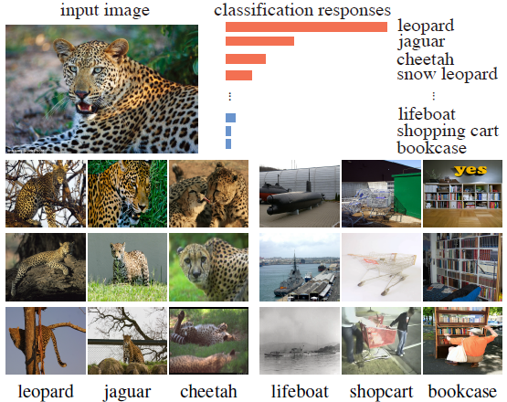

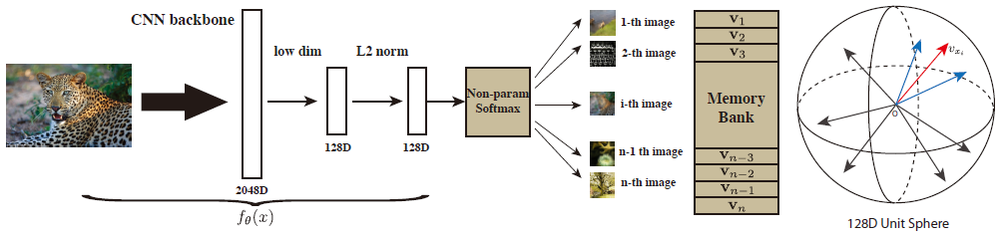

* **Softmax 分类器**

1. **参数化分类器**

**InstDisc** 使用 Softmax 来实现实例级别的分类目标。假设有$$  n  $$张图像$$x_1, \dots, x_n$$，对应于$$  n  $$个类别，它们的特征分别为$$v_1, \dots, v_n$$，其中$$v_i = f_\theta(x_i)$$。在参数化 Softmax 公式中，对于一张图像$$x$$，其特征为$$v = f_\theta(x)$$，它被识别为第$$  i  $$个示例的概率为：

$$P(i|v) = \frac{\exp(w_i^T v)}{\sum_{j=1}^n \exp(w_j^T v)}$$

这里，$$w_j$$是第$$  j  $$类的权重向量，$$w_j^T v$$衡量了特征$$  v  $$与第$$  j  $$类实例的匹配程度。

2. **非参数化分类器**

上述参数化 Softmax 公式的缺点在于，权重向量$$  w  $$被用作类别的共性特征，从而阻止了实例之间的显式比较。为了解决这个问题，作者提出了一种非参数化的变体，用$$  v_j^T v  $$替代$$w_j^T v$$，并通过 L2 归一化层强制$$\|v\| = 1$$。此时，概率$$  P(i|v)  $$变为：

$$P(i|v) = \frac{\exp(v_i^T v / \tau)}{\sum_{j=1}^n \exp(v_j^T v / \tau)}$$

其中，$$\tau$$是一个温度参数，用于控制分布的集中程度。$$\tau$$在监督特征学习中非常重要，同时在调整单位球面上$$  v  $$的集中程度时也是必要的。

学习目标是最大化联合概率$$\prod_{i=1}^n P_\theta(i|f_\theta(x_i))$$，或者等价地最小化训练集上的负对数似然，表示为：

$$J(\theta) = - \sum_{i=1}^n \log P(i|f_\theta(x_i))$$

从类别权重向量$$  w_j  $$转变为直接使用特征表示$$  v_j  $$是一个重要的概念变化。原始 Softmax 公式中的权重向量$$  \{w_j\}  $$仅对训练类别有效。因此，它们无法推广到新类别，或者说无法推广到新实例。当舍弃这些权重向量后，学习目标完全集中在特征表示及其度量上，这种度量可以应用于整个空间中的任何位置，并且在测试时能够处理任何新实例。在计算方面，非参数化公式消除了计算和存储$$  \{w_j\}  $$梯度的需求，使其在大数据应用场景中更具可扩展性。

* **记忆库 Memory Bank**

为了计算概率$$P(i|v)$$，需要所有图像的$$\{v_j\}$$。为了避免每次都计算这些表示，作者维护了一个存储它们的特征记忆库$$V$$。设$$  V = \{v_j\}  $$为记忆库，$$f_i = f_\theta(x_i)$$为$$  x_i  $$的特征。在每次学习迭代中，通过随机梯度下降优化表示$$  f_i  $$和网络参数$$\theta$$。然后将$$  f_i  $$更新到记忆库$$  V  $$中对应实例的位置，即$$f_i \to v_i$$。初始化记忆库$$  V  $$中的所有表示为单位随机向量。

* **噪声对比估计 NCE**

当类别数量$$  n  $$非常大时，例如达到百万级别，非参数化 Softmax 计算量是非常大的。类似的问题在学习词嵌入的相关文献中已经被很好地解决，其中词汇的数量也可能达到百万级别。减少计算量的常用技术包括**分层 Softmax**、**噪声对比估计`NCE`**和**负采样**。这里使用 **NCE** 来近似完整的 Softmax。

**NCE** 的基本思想是将多分类问题转化为一组二分类问题，其中二分类任务是区分数据样本和噪声样本。具体来说，记忆库中的特征表示$$  v  $$对应第$$  i  $$个示例的概率为：

$$P(i|v) = \frac{\exp(v^T f_i / \tau)}{Z_i}$$

其中$$  Z_i  $$是归一化常数，定义为：

$$Z_i = \sum_{j=1}^n \exp(v_j^T f_i / \tau)$$

这里将噪声分布形式化为均匀分布：$$P_n = \frac{1}{n}$$。根据先前的工作，假设噪声样本比数据样本多$$  m  $$倍，则对于具有特征$$  v  $$的样本$$i$$，其属于数据分布（记为$$D = 1$$）的后验概率为：

$$h(i, v) := P(D = 1|i, v) = \frac{P(i|v)}{P(i|v) + mP_n(i)}$$

**InstDisc** 的近似训练目标是最小化数据和噪声样本的负对数后验分布：

$$J_{\text{NCE}}(\theta) = -\mathbb{E}_{P_d}[\log h(i, v)] - m \cdot \mathbb{E}_{P_n}[\log(1 - h(i, v'))]$$

这里，$$P_d$$表示实际的数据分布。对于$$P_d$$，$$v$$是与$$  x_i  $$对应的特征；而对于$$P_n$$，$$v'$$是从另一张图像中随机采样的特征，按照噪声分布$$  P_n  $$进行采样。在 **InstDisc** 中，$$v$$和$$  v'  $$都是从非参数化的记忆库$$  V  $$中采样的。

因为计算归一化常数$$  Z_i  $$需要很大的计算量，因此 **InstDisc** 将其视为一个常数，并通过蒙特卡罗近似来估计其值：

$$Z \approx Z_i \approx n \cdot \mathbb{E}_j[\exp(v_j^T f_i / \tau)] = \frac{n}{m} \sum_{k=1}^m \exp(v_{j_k}^T f_i / \tau)$$

其中$$  \{j_k\}  $$是索引的一个随机子集。实验表明从初始批次中得到的近似已经足够在实践中表现良好。NCE 将每个样本的计算复杂度从$$  O(n)  $$降低到$$O(1)$$。尽管计算复杂度大幅减少，但仍能取得有竞争力的性能。

与典型的分类设置不同，在典型的分类设置中每个类别有许多样本，而 **InstDisc&#x20;**&#x6BCF;个类别只有一个样本。在每次训练周期中，每个类别只被访问一次。因此，学习过程会因随机采样的波动而产生较大的震荡。因此作者采用近端优化方法，并引入一个额外的项来鼓励训练动态过程的平滑性。在当前迭代$$  t  $$中，数据$$  x_i  $$的特征表示通过网络计算为$$v^{(t)}_i = f_\theta(x_i)$$，所有表示的记忆库存储在上一次迭代中记为$$V = \{v^{(t-1)}\}$$。对于来自$$  P_d  $$的正样本，其损失函数为：

$$-\log h(i, v^{(t-1)}_i) + \lambda \|v^{(t)}_i - v^{(t-1)}_i\|^2_2$$

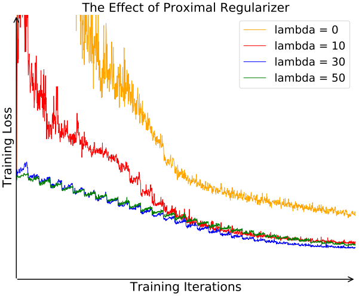

随着学习的收敛，训练步之间的差异$$v^{(t)}_i - v^{(t-1)}_i$$逐渐消失，增强的损失函数退化为原始的损失函数。通过引入近端正则化，最终目标变为：

$$J_{\text{NCE}}(\theta) = -\mathbb{E}_{P_d} \left[ \log h(i, v^{(t-1)}_i) - \lambda \|v^{(t)}_i - v^{(t-1)}_i\|^2_2 \right]  - m \cdot \mathbb{E}_{P_n} \left[ \log(1 - h(i, v'^{(t-1)})) \right]$$

如右图，近端正则化在实践中有助于稳定训练、加速收敛并改进学习到的表示，且额外开销可以忽略不计。

* **加权 k 近邻分类器**

为了对测试图像$$  \hat{x}  $$进行分类，首先计算其特征$$\hat{f} = f_\theta(\hat{x})$$，然后将其与记忆库中所有图像的 embedding 进行比较，使用余弦相似度$$s_i = \cos(v_i, \hat{f})$$。随后，利用前$$  k  $$个最近邻（记为$$N_k$$）通过加权投票进行预测。具体来说，类别$$  c  $$将获得总权重：

$$w_c = \sum_{i \in N_k} \alpha_i \cdot \mathbb{1}(c_i = c)$$

这里，$$\alpha_i$$是邻居$$  x_i  $$的贡献权重，依赖于相似度，定义为$$\alpha_i = \exp(s_i / \tau)$$。**InstDisc&#x20;**&#x9009;择$$\tau = 0.07$$，与训练时保持一致，并设置$$k = 200$$。

**总结**

**InstDisc&#x20;**&#x63D0;出个体判别的任务，把按照类别走的有监督信号推到极致：把每一张图片，即 instance，看作是一个类别，目标是学一个特征，能把每张图像都区分开

通过一个卷积神经网络，把每张图像都表示成一个特征，并让每个特征在特征空间中都尽可能分开，每个图片都是自己的类

把所有图片特征存到记忆库 memory bank 中，其实是一个字典

每个 batc&#x68;**`256`**&#x5F20;图，每次&#x62BD;**`4096`**&#x4E2A;负样本，训&#x7EC3;**`200`**&#x65;poch，学习率设&#x4E3A;**`0.03`**。每个 step 动量更新memory bank

### 1.3.2 CPC

**CPC** 的主要直觉是学习能够编码高维信号不同部分之间潜在共享信息的表示。同时，它会丢弃局部的低级信息和噪声。在时间序列和高维建模中，使用下一步预测的方法利用了信号的局部平滑性。当预测更远的未来时，共享信息的数量显著减少，模型需要推断出更多的全局结构。。 &#x20;

预测高维数据的一个挑战是，单模态损失并不十分有用，如均方误差和交叉熵，通常需要强大的条件生成模型来重建数据中的每一个细节。但这些模型计算成本高昂，并且在建模数据$$  x  $$的复杂关系时浪费了资源，往往忽略了上下文$$c$$。例如，图像可能包含数千比特的信息，而 high-level 的潜在变量（如类别标签）包含的信息要少得多（1024个类别只需10比特）。这表明直接建模$$  p(x|c)  $$不是提取$$  x  $$和$$  c  $$之间共享信息的最佳方法。 &#x20;

在预测未来信息时，**CPC** 将未来的目标$$x$$和当前上下文$$c$$编码为紧凑的分布式向量表示，这里通过非线性可学习映射，以最大程度地保留原始信号$$  x  $$和$$  c  $$的互信息，定义如下： &#x20;

$$I(x; c) = \sum_{x,c} p(x, c) \log \frac{p(x|c)}{p(x)}$$

通过最大化编码表示之间的互信息，其上限由输入信号之间的互信息决定，提取出输入信号共有的底层潜在变量。

* **对比预测编码**

右图展示了对比预测编码模型的架构。首先，一个非线性编码器$$  g_{\text{enc}}  $$将观测序列$$  x_t  $$映射到潜在表示序列$$z_t = g_{\text{enc}}(x_t)$$，其具有较低的时间分辨率。接下来，一个自回归模型$$  g_{\text{ar}}  $$在潜在空间中总结所有$$  z_{\leq t}  $$并生成上下文潜在表示$$c_t = g_{\text{ar}}(z_{\leq t})$$。 &#x20;

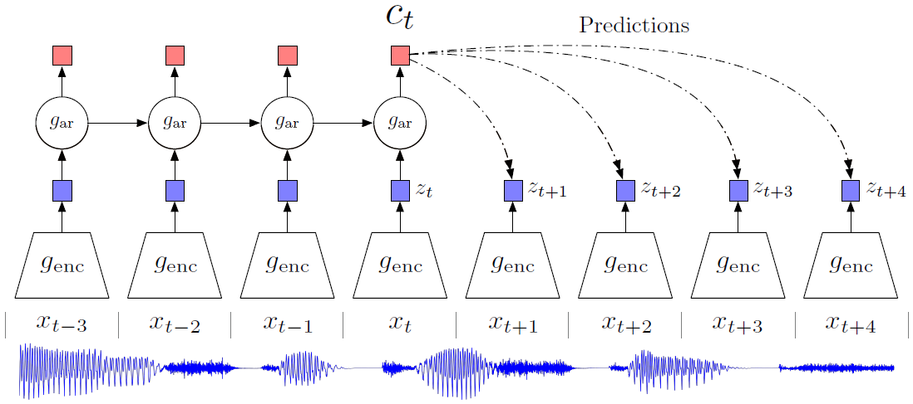

如前所述，这里不直接用生成模型$$  p_k(x_{t+k}|c_t)  $$来预测未来的观测值$$x_{t+k}$$，而是建模一个密度比，该密度比保留了$$  x_{t+k}  $$和$$  c_t  $$之间的互信息，即： &#x20;

$$f_k(x_{t+k}, c_t) \propto \frac{p(x_{t+k}|c_t)}{p(x_{t+k})}$$

其中$$  \propto  $$表示“成比例于”，密度比$$  f  $$可以是非归一化的，即和不必为1。这里可以使用任何正实数分数，CPC 采用了一个简单的双线性对数模型： &#x20;

$$f_k(x_{t+k}, c_t) = \exp(z_{t+k}^T W_k c_t)$$

对于每一步$$  k  $$使用不同的$$W_k$$，通过线性变换$$  W_k^T c_t  $$进行预测。当然也可以使用非线性网络或循环神经网络。 &#x20;

通过使用密度比$$  f(x_{t+k}, c_t)  $$并用编码器推断$$z_{t+k}$$，使模型免于建模高维分布$$x_{t+k}$$。我们无法直接评估$$  p(x)  $$或$$p(x|c)$$，但可以从这些分布中采样，从而使用基于将目标值与随机采样的负值进行比较的技术，例如噪声对比估计和重要性采样。 &#x20;

$$z_t$$和$$  c_t  $$都可以用作下游任务的表示。如果过去的额外上下文有用，可以使用自回归模型输出$$c_t$$。例如语音识别，其中$$  z_t  $$的感受野可能不足以捕捉语音内容。在其他情况下，如果没有额外的上下文需求，$$z_t$$可能更好。如果下游任务需要整个序列的一个表示，例如图像分类，可以通过对所有位置的$$  z_t  $$或$$  c_t  $$进行池化来获得。 &#x20;

**CPC** 可以使用任何类型的编码器和自回归模型。为了简单起见，选择了标准架构，例如带有残差块的步幅卷积层作为编码器，以及门控循环单元**`GRU`**作为自回归模型。自回归建模的最新进展，例如掩码卷积架构或自注意力网络，可能会进一步提升结果。

* **InfoNCE 损失与互信息估计**

编码器和自回归模型都被联合优化，以基于噪声对比估&#x8BA1;**`NCE`**&#x7684;损失进行训练，这种损失称&#x4E3A;**`InfoNCE`**。给定一个包含$$  N  $$个随机样本的集合$$X = \{x_1, \dots, x_N\}$$，其中有一个正样本来自$$p(x_{t+k}|c_t)$$，其余$$  N-1  $$个负样本来自候选分布$$p(x_{t+k})$$，然后优化以下目标： &#x20;

$$L_N = - \mathbb{E}_X \left[ \log \frac{f_k(x_{t+k}, c_t)}{\sum_{x_j \in X} f_k(x_j, c_t)} \right]$$

优化这一损失将使得$$  f_k(x_{t+k}, c_t)  $$能够估计密度比$$  f  $$。这可以通过以下推导证明。

上式中的损失是正确分类正样本的分类交叉熵，其中 $$  \frac{f_k}{\sum_{X} f_k}  $$ 是模型的预测概率。将该损失的最优概率表示为 $$p(d = i | X, c_t)$$，其中$$  [d = i]  $$表示样本$$  x_i  $$是正样本的指示变量。样本$$  x_i  $$来自条件分布$$  p(x_{t+k}|c_t)  $$而非候选分布$$  p(x_{t+k})  $$的概率可以推导如下： &#x20;

$$p(d = i | X, c_t) = \frac{p(x_i | c_t)\prod_{l \neq i} p(x_l)}

{\sum_{j=1}^N p(x_j | c_t)\prod_{l \neq j} p(x_l)}
 = \frac{\frac{p(x_i | c_t)}{p(x_i)}}{\sum_{j=1}^N \frac{p(x_j | c_t)}{p(x_j)}}$$

可以看到，$$  f(x_{t+k}, c_t)  $$的最优值与$$  \frac{p(x_{t+k}|c_t)}{p(x_{t+k})}  $$成比例，并且这一结果与负样本数量$$  N-1  $$的选择无关。

尽管在训练过程中不需要显式计算互信息，但可以通过以下方式评估变量$$  c_t  $$和$$  x_{t+k}  $$之间的互信息： &#x20;

$$I(x_{t+k}, c_t) \geq \log(N) - L_N$$

当$$  N  $$增大时，这一下界会变得更紧。同时也可以观察到，最小化 InfoNCE 损失$$  L_N  $$等价于最大化互信息的一个下界。

**总结**

* **CPC** 是生成式任务

* 未来时刻的输入为预测的正样本，其他任意输入为负样本

### 1.3.3 InvaSpread

**InvaSpread** 的目标是从一组未标注的图像$$  X = \{x_1, x_2, \dots, x_n\}  $$中学习一个特征嵌入网络$$f_\theta(\cdot)$$。函数$$  f_\theta(\cdot)  $$将输入图像$$  x_i  $$映射到一个低维嵌入特征$$f_\theta(x_i) \in \mathbb{R}^d$$，其中$$  d  $$是特征维度。为简单记，$$  f_\theta(x_i)  $$用$$  f_i  $$表示，并假设所有特征都进行了$$\ell_2$$-归一化，即$$\|f_i\|_2 = 1$$。一个好的特征嵌入应满足两个性质：

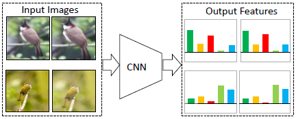

> 视觉上相似的图像的 embedding 特征彼此接近
>
> 不相似图像实例的 embedding 特征彼此分离

在没有类别标签的情况下，作者利用实例级别的监督来近似这些正样本聚集和负样本分离的性质。同一实例在不同数据增强下的嵌入特征应保持不变，而不同实例的特征应尽可能分散。

* **实例级 Softmax 嵌入**

1. **使用分类器权重的 Softmax Embedding**

**`Exemplar CNN`**&#x5C06;每个图像视为一个独立的类别。按照传统的分类器训练方式，它定义了一个矩阵$$W = [w_1, w_2, \dots, w_n]^T \in \mathbb{R}^{n \times d}$$，其中第$$  j  $$列$$  w_j  $$是对应于第$$  j  $$个实例的分类器权重。Exemplar CNN 确保在不同图像变换下，图像实例可以被正确分类为其原始实例。基于 softmax 函数，样本$$  x_j  $$被识别为第$$  i  $$个实例的概率表示为：

$$P(i|x_j) = \frac{\exp(w_i^T f_j)}{\sum_{k=1}^n \exp(w_k^T f_j)}$$

在每一步中，网络将样本特征$$  f_i  $$拉向其对应的权重$$w_i$$，同时将其推离其他实例的分类器权重$$w_k$$。然而，依赖分类器权重阻碍了特征之间的显式比较，导致效率和判别能力有限。

* **使用记忆库的 Softmax Embedding**

为了提高效率，一些工作提出设置一个记忆库来存储前一步计算出的实例特征$$f_i$$。记忆库中存储的特征记为$$v_i$$，它作为下一步中对应实例的分类器权重。因此样本$$  x_j  $$被识别为第$$  i  $$个实例的概率可以写为：

$$P(i|x_j) = \frac{\exp(v_i^T f_j / \tau)}{\sum_{k=1}^n \exp(v_k^T f_j / \tau)}$$

其中$$  \tau  $$是控制样本分布集中程度的温度参数。$$v_i^T f_j$$测量了特征$$  f_j  $$和第$$  i  $$个记忆特征$$  v_i  $$之间的余弦相似度。对于每一步中的实例$$x_i$$，网络将其特征$$  f_i  $$拉向其对应的记忆向量$$v_i$$，同时将其推离其他实例的记忆向量。由于效率问题，与实例$$  x_i  $$对应的记忆特征$$  v_i  $$仅在以$$  x_i  $$为输入的迭代中更新，即每个 epoch $$v_i$$只更新一次。然而，网络本身在每次迭代中都会更新。将实时的实例特征$$  f_i  $$与过时的记忆特征$$  v_i  $$进行比较会阻碍训练过程，因此记忆库方案仍然效率低下。

一个直接提高效率的方法是直接对特征本身进行优化，即用$$  f_i  $$替代权重$$  \{w_i\}  $$或记忆库$$\{v_i\}$$。然而，这种方法却不可行：

> 考虑将$$  x_i  $$识别为自身的概率$$P(i|x_i)$$，由于$$f_i^T f_i = 1$$，特征和特征本身始终完美对齐，优化网络不会提供任何正样本聚集的性质
>
> 在大规模数据集上，实时计算所有样本的特征$$  \{f_k, k = 1, \dots, n\}  $$以上述公式中的分母开销巨大

* **基于真实实例特征的 Softmax Embedding**

为了解决上述问题，**InvaSpread** 提出了一种用于无监督嵌入学习的 Softmax Embedding 变体，该方法直接优化真实的实例特征，而不是分类器权重或记忆库。为了实现同一实例在不同数据增强下的特征不变性，同时使不同实例的特征尽可能分散，并且：

> 同时考虑原始图像及其增强后的图像
>
> 使用一个小批量随机选择的样本，而非整个数据集

在每次迭代中，从数据集中随机采样$$  m  $$个实例，记为$$\{x_1, x_2, \dots, x_m\}$$。对于每个实例，应用一个随机的数据增强操作$$  T(\cdot)  $$对原始图像进行轻微修改。增强后的样本$$  T(x_i)  $$记为$$\hat{x}_i$$，其嵌入特征$$  f_\theta(\hat{x}_i)  $$记为$$\hat{f}_i$$。然后将实例特征学习问题视为二分类问题，通过最大似然估&#x8BA1;**`MLE`**&#x6765;解决，而不是多分类问题。对于实例$$x_i$$，增强样本$$  \hat{x}_i  $$应被分类为实例$$i$$，而其他实例$$  x_j, j \neq i  $$不应被分类为实例$$i$$。增强样本$$  \hat{x}_i  $$被识别为实例$$  i  $$的概率定义为：

$$P(i|\hat{x}_i) = \frac{\exp(f_i^T \hat{f}_i / \tau)}{\sum_{k=1}^m \exp(f_k^T \hat{f}_i / \tau)}$$

另一方面，样本$$  x_j  $$被识别为实例$$  i  $$的概率定义为：

$$P(i|x_j) = \frac{\exp(f_i^T f_j / \tau)}{\sum_{k=1}^m \exp(f_k^T f_j / \tau)}, \quad j \neq i$$

相应地，样本$$  x_j  $$不被识别为实例的概率为$$1 - P(i|x_j)$$。

假设不同实例被识别为实例$$  i  $$是相互独立的，则增强样本$$  \hat{x}_i  $$被识别为实例$$i$$，且其他样本$$  x_j, j \neq i  $$不被分类为实例$$  i  $$的联合概率为：

$$P_i = P(i|\hat{x}_i) \prod_{j \neq i} (1 - P(i|x_j))$$

负对数似然函数为：

$$J_i = -\log P(i|\hat{x}_i) - \sum_{j \neq i} \log(1 - P(i|x_j))$$

通过最小化批次内所有实例的负对数似然和来解决此问题，其形式为：

$$J = -\sum_i \log P(i|\hat{x}_i) - \sum_i \sum_{j \neq i} \log(1 - P(i|x_j))$$

* **理论分析**

最小$$J_i$$可被视为最大化$$P(i|\hat{x}_i)$$和最小化$$P(i|x_j)$$。$$P(i|\hat{x}_i)$$可以重写为：

$$P(i|\hat{x}_i) = \frac{\exp(f_i^T \hat{f}_i / \tau)}{\exp(f_i^T \hat{f}_i / \tau) + \sum_{k \neq i} \exp(f_k^T \hat{f}_i / \tau)}$$

最大化$$P(i|\hat{x}_i)$$需要最大化$$  \exp(f_i^T \hat{f}_i / \tau)  $$并最小化$$\exp(f_k^T \hat{f}_i / \tau), k \neq i$$。由于所有特征都进行了$$  \ell_2  $$归一化，最大化$$  \exp(f_i^T \hat{f}_i / \tau)  $$需要增加$$  f_i  $$和$$  \hat{f}_i  $$之间的内积，从而使得特征对数据增强保持不变。另一方面，最小化$$  \exp(f_k^T \hat{f}_i / \tau)  $$确保$$  \hat{f}_i  $$与其他实例$$  \{f_k\}  $$分离。考虑到批次内的所有实例，这些实例被迫彼此分离，从而实现了分散特性。

类似地，$$P(i|x_j)$$可以重写为：

$$P(i|x_j) = \frac{\exp(f_i^T f_j / \tau)}{\exp(f_j^T f_j / \tau) + \sum_{k \neq j} \exp(f_k^T f_j / \tau)}$$

由于$$f_j^T f_j = 1$$，且$$  \tau  $$的值通常较小，因此$$\exp(f_j^T f_j / \tau)$$通常决定了整个分母的值。最小化$$P(i|x_j)$$意味着$$  \exp(f_i^T f_j / \tau)  $$应被最小化，这旨在将$$  f_j  $$与$$  f_i  $$分离，从而进一步增强了分散特性。

* **使用孪生网络进行训练**

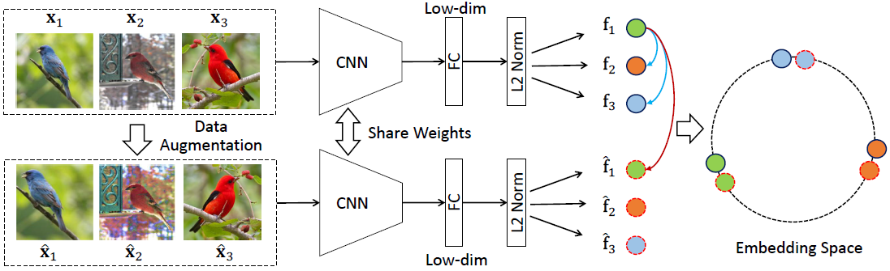

**InvaSpread** 提出了一个孪生网络来实现所提出的算法，如上图。在每个 batch 中，$$m$$个随机选择的图像实例输入到第一个分支，而相应的增强样本输入到第二个分支。除此之外，第一个分支也应用数据增强以丰富训练样本。在实现中，每个样本有一个随机增强的正样本和$$  2N-2  $$个负样本，其中$$  N  $$是批次大小。所提出的训练策略大大降低了计算成本。同时，这种训练策略充分利用了小批量中所有实例之间的关系。

**总结**

* **`SimCLR`**&#x524D;身，没有额外存负样本，正负样本都来自同一个minibatch，只使用一个编码器进行端到端的学习

* 代理任务也是个体判别任务

### 1.3.4 CMC

**CMC** 的目标是学习能够捕捉多个感官视角之间共享信息的表示，且无需人工监督。

* **预测学习**

设$$V_1$$和$$V_2$$表示数据集的两个视角。例如，$$V_1$$可能是某张图像的亮度，而$$V_2$$是色度。**CMC** 将预测学习定义为从$$v_1$$到$$v_2$$的深度非线性变换，通过潜在变量$$z$$实现，如右图所示。形式上，$$z = f(v_1)$$且$$\hat{v}_2 = g(z)$$，其中$$f$$和$$g$$分别表示编码器和解码器，而$$\hat{v}_2$$是在给定$$v_1$$情况下对$$v_2$$的预测。编码器和解码器模型的参数通过一个目标函数进行训练，该函数使$$\hat{v}_2$$接近$$v_2$$。这种目标函数可以是$$L_1$$或$$L_2$$损失函数。这些目标函数假设在给定$$v_1$$的情况下，$$v_2$$的每个像素或元素是独立的，即$$p(v_2|v_1) = \prod_i p(v_{2i}|v_1)$$，从而降低了它们对相关性或复杂结构建模的能力。预测方法在表示学习中得到了广泛应用，例如图像着色和从视觉预测声音。

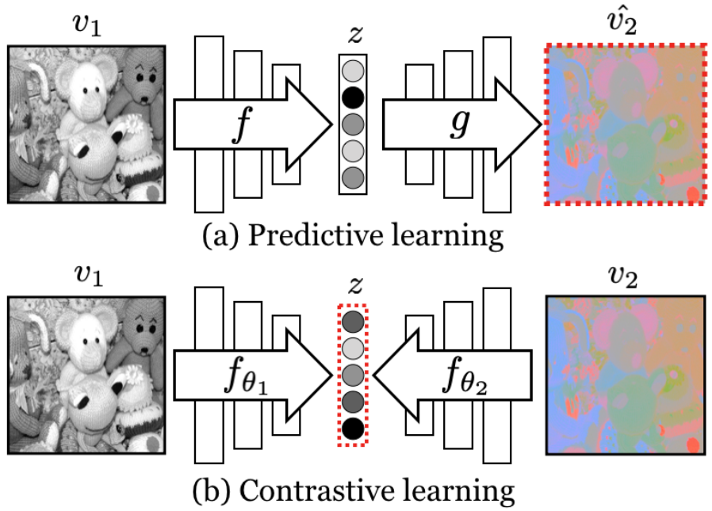

* **两视角的对比学习**

对比学习的核心思想是学习一种 Embedding，使得来自两个不同分布的样本分离。给定由样本集合$$  \{v_1^i, v_2^i\}_{i=1}^N  $$组成的数据集$$  V_1  $$和$$V_2$$，通过对比一致对和不一致对，即

> * 来自联合分布$$  x \sim p(v_1, v_2)  $$或$$  x = \{v_1^i, v_2^i\}  $$的样本称之&#x4E3A;**正样本**
>
> * 来自边缘分布乘积$$  y \sim p(v_1)p(v_2)  $$或$$  y = \{v_1^i, v_2^j\}  $$的样本称之&#x4E3A;**负样本**

这里学习一个评判器$$h_\theta(\cdot)$$，对正样本对赋予高值，对负样本对赋予低值。类似于对比学习设置，从包含$$  k  $$个负样本的集合$$  S = \{x, y_1, y_2, \dots, y_k\}  $$中正确选择单个正样本$$x$$：

$$L_{\text{contrast}} = - \mathbb{E}_S \left[ \log \frac{h_\theta(x)}{h_\theta(x) + \sum_{i=1}^k h_\theta(y_i)} \right]$$

为了构造$$S$$，固定一个视角，从另一个视角枚举正样本和负样本，从而可以将目标重写为：

$$L^{V_1,V_2}_{\text{contrast}} = - \mathbb{E}_{\{v_1^1, v_2^1, \dots, v_2^{k+1}\}} \left[ \log \frac{h_\theta(\{v_1^1, v_2^1\})}{\sum_{j=1}^{k+1} h_\theta(\{v_1^1, v_2^j\})} \right]$$

其中$$  k  $$是给定样本$$  v_1^1  $$的负样本$$  v_2^j  $$的数量。在实践中，$$k$$可能非常大，例&#x5982;**`ImageNet`**中的**`1.2M`**，因此直接最小化上述公式是不可行的。下面给出高效计算的近似方法。

**对比损失优化**

通过使用许多负样本，可以更好地学习$$L^{V_1,V_2}_{\text{contrast}}$$。在极端情况下，可以将数据集中每个样本都包含在分母中。然而，对于像 ImageNet 这样的大型数据集，计算完整的 softmax 损失是非常消耗资源的。一种近似完整 softmax 分布的方法是使用噪声对比估计 NCE。另一种解决方案是随机采样$$  m  $$个负样本，进行简单的$$  (m+1)  $$分类 softmax，**CMC** 也使用这种方法。并且维护一个记忆库 Memory Bank 来存储每个训练样本的潜在特征。因此可以高效地从内存缓冲区中检索$$  m  $$个负样本，与每个正样本配对，而无需重新计算它们的特征。内存库会动态更新，使用实时计算的特征。记忆库的好处是可以允许与更多负样本对进行对比，但代价是特征稍微过时。

**实现判别器**

**CMC** 通过神经网络实现判别器$$h_\theta(\cdot)$$。为了提取$$  v_1  $$和$$  v_2  $$的紧凑潜在表示，使用两个编码器$$  f_{\theta_1}(\cdot)  $$和$$f_{\theta_2}(\cdot)$$，分别带有参数$$  \theta_1  $$和$$\theta_2$$。潜在表示被提取为$$  z_1 = f_{\theta_1}(v_1)  $$和$$z_2 = f_{\theta_2}(v_2)$$。然后计算余弦相似性作为评分，并通过超参数$$  \tau  $$调整其动态范围：

$$h_\theta(\{v_1, v_2\}) = \exp\left(\frac{f_{\theta_1}(v_1) \cdot f_{\theta_2}(v_2)}{\|f_{\theta_1}(v_1)\| \cdot \|f_{\theta_2}(v_2)\|} \cdot \frac{1}{\tau}\right)$$

$$  L^{V_1,V_2}_{\text{contrast}}  $$将视角$$  V_1  $$作为锚点，并在$$  V_2  $$上枚举。对称地，可以通过将$$  V_2  $$作为锚点得到 $$L^{V_2,V_1}_{\text{contrast}}$$。然后将它们相加作为两视角损失：

$$L(V_1, V_2) = L^{V_1,V_2}_{\text{contrast}} + L^{V_2,V_1}_{\text{contrast}}$$

在对比学习阶段之后，可以选择使用$$z_1$$、$$z_2$$或它们的拼接$$[z_1, z_2]$$。如右图所示。

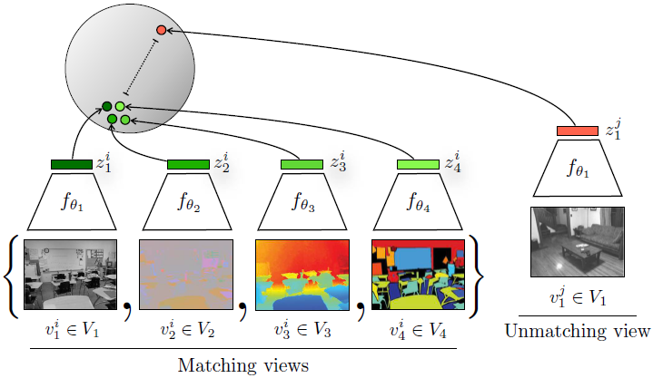

**连接互信息**

可以证明，最优判别器$$  h_\theta^*  $$与联合分布$$  p(z_1, z_2)  $$和边缘分布乘积$$  p(z_1)p(z_2)  $$之间的密度比成正比：

$$h_\theta^*(\{v_1, v_2\}) \propto \frac{p(z_1, z_2)}{p(z_1)p(z_2)} \propto \frac{p(z_1|z_2)}{p(z_1)}$$

该量是逐点互信息，其期望值在$$L^{V_1,V_2}_{\text{contrast}}$$中生成一个与互信息相关的估计量，且有：

$$I(z_i; z_j) \geq \log(k) - L_{\text{contrast}}$$

其中$$  k  $$是样本集$$  S  $$中负样本对的数量。因此，$$  L  $$最大化了互信息$$  I(z_i; z_j)  $$的下界，该下界由数据处理不等式限制为$$I(v_i; v_j)$$。对$$  k  $$的依赖还表明，使用更多负样本可以提高表示质量。

* **多视角对比学习**

除了两个视角的对比学习，作者还提出了更通用的对比损失形式，能够处理任意数量的视角，并称它们为核心视&#x89D2;**`Core View`**&#x548C;全&#x56FE;**`Full Graph`**&#x8303;式，它们在效率和效果之间提供了不同的权衡，如右图所示。

假设有$$  M  $$个视角$$V_1, \dots, V_M$$。核心视角 Core View 将一个视角分离出来，如$$V_1$$，并通过优化一组成对目标的总和，在$$  V_1  $$和其他每个视角$$V_j$$（$$j > 1$$）之间构建成对表示：

$$L_C = \sum_{j=2}^M L(V_1, V_j)$$

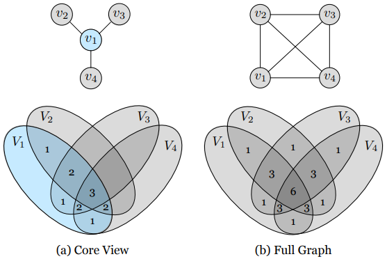

第二种更通用的公式是全图 Full Graph，考虑所有对$$(i, j)$$（$$i \neq j$$），并构建所有$$  \binom{n}{2}  $$种关系。通过包含所有对，优化的目标函数为：

$$L_F = \sum_{1 \leq i < j \leq M} L(V_i, V_j)$$

这两种公式的共同效果是，信息的重要性与共享该信息的视角数量成正比。这可以从上图的信息图中看出。图中每个分区的数字表示该分区对多少个成对目标$$  L(V_i, V_j)  $$作出贡献。

全图公式中二元评分函数的计算成本随视角数量呈组合增长。然而，从上图可以看出，这使得全图公式能够捕获不同视角之间的更多信息，这对下游任务可能很有用。例如，在核心视角范式中，$$V_2$$和$$  V_3  $$或$$  V_2  $$和$$  V_4  $$之间的互信息完全被忽略。全图公式的另一个好处是，它可以自然地处理缺失信息，例如缺失视角。

**总结**

* 证明了对比学习的灵活性，也证明了多视角多模态的可行性，这启发了 CLIP

* 一个物体的很多视角都可以当作正样本，学习强大的特征，有视角不变性

* 增大所有视角间的互信息，抓住所有视角下的关键因素

### 1.3.5 MoCo

在深度学习领域，无监督学习在自然语言处理（NLP）中取得了显著成功，如 GPT 和 BERT，但在计算机视觉领域，无监督方法与监督预训练相比仍存在较大差距。主要原因是计算机视觉任务缺乏像语言任务中那样的离散信号空间（如单词）。近年来，一些基于对比损失的研究在无监督视觉表示学习中取得了有希望的结果，这些方法可以被视为构建动态字典的过程，其中字典的“键”是从数据（如图像或图像块）中采样得到的，并由编码器网络表示。

* **字典查找**

考虑一个编码后的 Query $$  q  $$和一组编码样本$$\{k_0, k_1, k_2, \dots\}$$，这些样本构成了字典的 Key。假设字典中存在一个与$$  q  $$匹配的 Key，记为$$k^+$$。对比损失是一种函数，当$$  q  $$与其正样本 Key $$  k^+  $$相似且与其他 Key（即$$  q  $$的负样本 Key）不相似时，其值较低。MoCo 使用点积来衡量相似性，并采用 InfoNCE 的对比损失函数形式：

$$L_q = -\log \frac{\exp(q \cdot k^+ / \tau)}{\sum_{i=0}^K \exp(q \cdot k_i / \tau)}$$

其中，$$\tau$$是一个温度超参数。求和部分包括一个正样本和 $$  K  $$个负样本。该损失可以理解为一个基于$$  (K+1)  $$分类的 softmax 分类器的对数损失，这个分类器试图将$$  q  $$分类为$$k^+$$。对比损失函数也可以基于其他形式，例如margin-based loss 和 NCE 损失的变体。

对比损失作为一种无监督目标函数，用于训练表示 Query 和 Key 的编码器网络。通常情况下，Query 表示为$$q = f_q(x^q)$$，其中$$  f_q  $$是编码器网络，$$x^q$$是 Query 样本，类似地，$$k = f_k(x^k)$$。它们的具体实现取决于特定的预训练任务。输入$$  x^q  $$和$$  x^k  $$可以是图像、图像块或由一组图像块组成的上下文。网络$$  f_q  $$和$$  f_k  $$可以是相同的、部分共享的或完全不同的。

* **动量对比 Momentum Contrast**

对比学习是一种在高维连续输入（如图像）上构建离散字典的方法。该字典是动态的，因为 Key 是从数据中随机采样的，并且 Key 编码器在训练过程中不断演变。作者假设通过一个包含丰富负样本的大字典可以学习到良好的特征，尽管编码器会演变，但用于字典 Key 的编码器应尽可能保持一致。基于这一动机，作者提&#x51FA;**动量对比 Momentum Contrast** 的方法：

1. **字典作为队列**

MoCo 是将字典维护为一个数据样本队列。这可以重用来自前几个小批量的编码 Key。引入队列将字典大小与小批量大小解耦。这里的字典大小可以远大于典型的小批量大小，并且可以灵活地、独立地设置为超参数。字典中的样本逐步替换：当前小批量被加入队列，而队列中最旧的小批量被移除。字典始终表示所有数据的一个采样子集，而维护该字典所需的额外计算量是可以管理的。此外，移除最旧的小批量是有益的，因为其编码键是最过时的，与最新的 Key 最不一致。

* **动量更新**

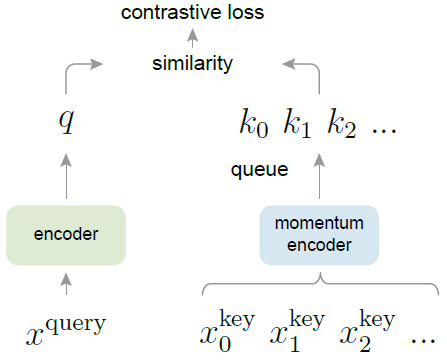

使用队列可以使字典变大，但也会使通过反向传播更新 Key 编码器变得不可行，因为梯度需要传播到队列中的所有样本。一种简单的解决方案是将 Key 编码器$$  f_k  $$从 Query 编码器$$  f_q  $$中复制过来，忽略此梯度。然而，实验结果表明这种方法效果较差，这是因为快速变化的编码器降低了 Key 表示的一致性。因此提出了动量更新方法。

记$$  f_k  $$的参数为$$\theta_k$$，$$f_q$$的参数为$$\theta_q$$，通过以下方式更新$$\theta_k$$：

$$\theta_k \leftarrow m\theta_k + (1 - m)\theta_q$$

其中，$$m \in [0, 1)$$是动量系数。只有参数$$  \theta_q  $$通过反向传播更新。公式中的动量更新使得$$  \theta_k  $$的变化比$$  \theta_q  $$更加平滑。因此，尽管队列中的 Key 由不同的编码器编码，但这些编码器之间的差异可以被减小。实验表明，较大的动量值（例如$$m = 0.999$$，这也是 MoCo 的默认值）比较小的值（例如$$m = 0.9$$）表现得更好，这表明缓慢变化的 Key 编码器是利用队列的关键。

* **与先前机制的关系**

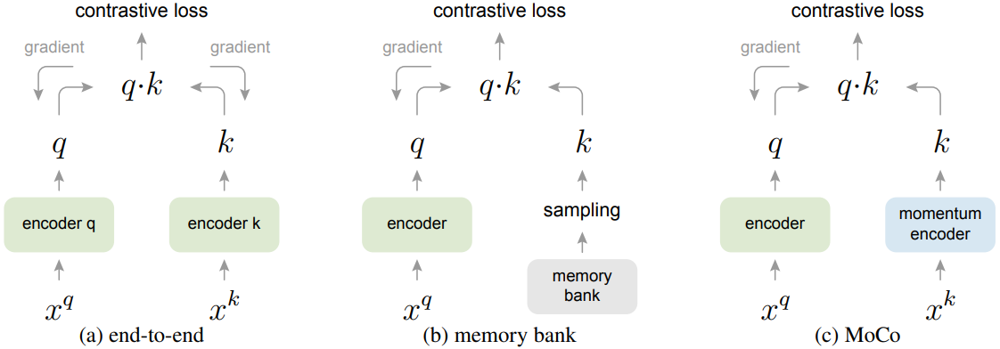

MoCo 是使用对比损失的通用机制。上图将其与两种通用机制进行了比较。它们在字典大小和一致性方面表现出不同的特性。

通过反向传播进行端到端更新是一种自然的机制，如上图(a)。它使用当前小批量中的样本作为字典，因此 Key 是一致编码的，由同一组编码器参数完成。但是字典大小与小批量大小耦合，受限于 GPU 内存大小，而且还受到大批量优化的挑战。一些方法基于局部位置驱动的预训练任务，其中字典大小可以通过多个位置增大。但这些预训练任务需要特殊的网络设计，例如对输入进行分块或定制感受野大小，这可能会使这些网络迁移到下游任务变得更加复杂。

另一种机制是记忆库方法，如图(b)。记忆库存储了数据集中所有样本的表示。每个小批量的字典是从记忆库中随机采样的，且没有反向传播，因此可以支持较大的字典大小。然而，记忆库中样本的表示是在其最后一次被看到时更新的，因此采样的 Key 本质上反映了过去多个时间步的不同编码器，导致其一致性较低。其动量更新是对同一样本的表示，而不是编码器本身。相比之下，**MoCo** 更加节省内存，并且可以在数十亿规模的数据上进行训练，这对于记忆库来说可能是难以处理的。

* **代理任务**

按照之前工作的做法，如果 Query 和 Key 来自同一图像，则将其视为正样本对；否则视为负样本对。MoCo 也是类似的，通过对同一图像进行随机数据增强生成两个随机视图以构成正样本对。Query 和 Key 分别由它们的编码器$$  f_q  $$和$$  f_k  $$编码。编码器可以是任何卷积神经网络。

右图是 MoCo 在此预训练任务中的伪代码。对于当前小批量，编码 Query 及其对应的 Key，从而形成正样本对。负样本则来自队列。

MoCo 采&#x7528;**`ResNet`**&#x4F5C;为编码器，其最后一个全连接层具有固定维度的输出，&#x5373;**`128`**&#x7EF4;。这个输出向量通&#x8FC7;**`L2`**&#x8303;数进行归一化。这就是 Query 或 Key 的表示。温度参数$$  \tau  $$设置为 0.07。数据增强流程为：从随机调整大小的图像中裁剪&#x51FA;**`224×224`**&#x50CF;素区域，然后进行随机**颜色抖动**、**随机水平翻转**和**随机灰度转换**。

**乱序 BN**

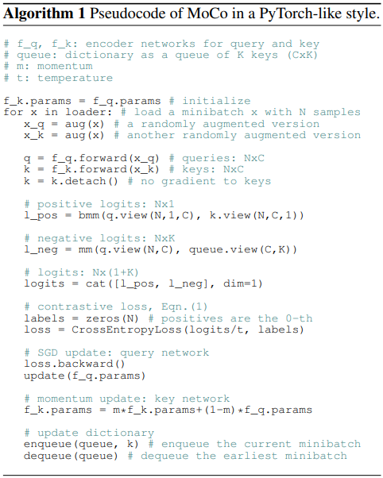

MoCo 的编码器$$  f_q  $$和$$  f_k  $$都包含批归一化 BN，这与标准 ResNet 中的做法一致。在实验中，作者发现使用 BN 会阻止模型学习良好的表示，模型作弊完成了预训练任务，并轻易找到了低损失解。这可能是因为样本之间由 BN 引起的批内通信泄露了信息。

作者我们通过乱序 BN 解决了这一问题。使用多个 GPU 进行训练，并对每个 GPU 上的样本独立执行 BN，这是常见做法。对于 Key 编码器$$f_k$$，在将当前小批量分布到 GPU 之前打乱样本顺序，并在编码后恢复顺序；而 Query 编码器$$  f_q  $$的小批量样本顺序保持不变。这确保了计算 Query 及其正样本 Key 所用的批统计量来自两个不同的子集。这有效地解决了作弊问题，并使训练能够从 BN 中受益。

**总结**

* MoCo 是 InstDisc 的改进工作，把之前对比学习方法归纳为字典查询的问题

* 提出两个结构：队列和动量编码器，形成大字典

MoCo 通过创新的动态字典和动量更新机制，为无监督视觉表示学习提供了一个强大而通用的框架。它不仅在理论上解决了字典规模与一致性的矛盾，还在实践中证明了其超越监督预训练的潜力。

### 1.3.6 SimCLR

* **对比学习框架**

受对比学习算法的启发，**SimCLR&#x20;**&#x901A;过在潜在空间中使用对比损失来最大化同一数据样本的不同增强视图之间的一致性，从而学习表示。如右图所示，该框架包括以下四个主要组件：

> 1. **一个随机数据增强模块**：将任何给定的数据样本进行随机变换，生成同一示例的两个相关视图，记为$$\tilde{x}_i$$和$$\tilde{x}_j$$，并将其视为正样本对。**SimCLR** 用三种简单的增强方法：**随机裁剪并调整回原始大小**、**随机颜色失真**和**随机高斯模糊**。其中随机裁剪和颜色失真的组合对于实现良好的性能至关重要。
>
> 2. **一个神经网络基础编码器$$f(\cdot)$$**：从增强后的数据样本中提取表示向量，**SimCLR** 可以选择各种网络架构而不施加任何限制。为简单起见，采用了经典&#x7684;**`ResNet`**&#x6765;获得$$h_i = f(\tilde{x}_i) = \text{ResNet}(\tilde{x}_i)$$，其中$$h_i \in \mathbb{R}^d$$是经过平均池化层后的输出。
>
> 3. **一个小的神经网络投影头$$g(\cdot)$$**：将表示映射到应用对比损失的空间。**SimCLR** 使用具有一个隐藏层&#x7684;**`MLP`**&#x6765;获得$$z_i = g(h_i) = W^{(2)} \sigma(W^{(1)} h_i)$$，其中$$\sigma$$&#x662F;**`ReLU`**&#x975E;线性激活函数。因为作者发现定义在$$z_i$$上的对比损失比在$$h_i$$上更有效。
>
> 4. **对比损失函数**：给定一个包含正样本对$$\tilde{x}_i$$和$$\tilde{x}_j$$的集合$$\{\tilde{x}_k\}$$，对比预测任务旨在根据给定的$$\tilde{x}_i$$识别$$\{\tilde{x}_k\}_{k \neq i}$$中的$$\tilde{x}_j$$。

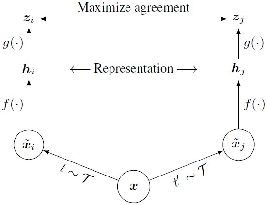

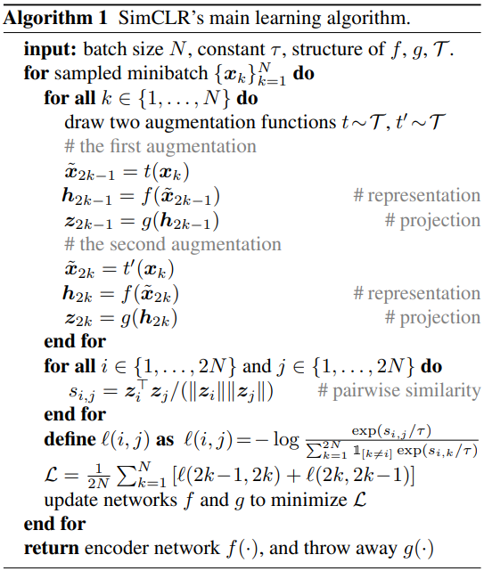

在实现中，随机采样一个包含$$N$$个样本的小批量，然后在这个小批量中进行数据增强，从而得到$$2N$$个数据点，并在这些样本上定义对比预测任务。**SimCLR** 不显式地采样负样本。而是给定一个正样本对，将小批量内的其他$$2(N-1)$$个增强样本视为负样本。令$$\text{sim}(u, v) = \frac{u^\top v}{\|u\| \|v\|}$$表示$$L_2$$归一化的$$u$$和$$v$$的点积，即余弦相似度。然后，正样本对$$(i, j)$$的损失函数定义为：

$$\ell_{i,j} = -\log \frac{\exp(\text{sim}(z_i, z_j)/\tau)}{\sum_{k=1}^{2N} \mathbf{1}_{[k \neq i]} \exp(\text{sim}(z_i, z_k)/\tau)}$$

其中$$\mathbf{1}_{[k \neq i]} \in \{0, 1\}$$是一个指示函数，当且仅当$$k \neq i$$时取值为$$1$$，$$\tau$$表示温度参数。最终损失是针对小批量中的所有正样本对计算的，包括$$(i, j)$$和$$(j, i)$$。这种损失函数已在先前的工作中被使用，这里作者称其&#x4E3A;**`NT-Xent`**，即归一化温度缩放的交叉熵损失。

* **训练**

为了保持简单，SimCLR 不使用记忆库 Memory Bank 来训练模型，而是将训练批量大小$$N$$&#x4ECE;**`256`**&#x8C03;整&#x5230;**`8192`**。一个批量大小为 **8192&#x20;**&#x7684;训练过程，由于每个样本都&#x6709;**`8191`**&#x4E2A;不与其对应的样本，因此每对正样本可以对应$$8191\times2=16382$$个负样本。当使用标准的随机梯度下降 SGD 或动量法以及线性学习率缩放时，大批量训练可能会不稳定，为了稳定训练，**SimCLR** 对所有批量大小均使&#x7528;**`LARS`**&#x4F18;化器。作者使&#x7528;**`Cloud TPU`**&#x8BAD;练模型，根据批量大小使&#x7528;**`32`**&#x5230;**`128`**&#x4E2A;核心。

标准&#x7684;**`ResNet`**&#x4F7F;用批归一&#x5316;**`BN`**，在分布式数据并行训练中，BN 的均值和方差通常在每个设备上局部聚合。在 SimCLR 的对比学习中，由于正样本对是在同一设备中计算的，模型可能利用本地信息泄露来提高预测精度，而不会改善表示质量。因此通过在训练过程中跨所有设备聚合 **BN** 的均值和方差来解决这一问题。其他方法包括**跨设备打乱数据样本**，或**将 BN 替换为层归一化 LN**。

* **评估**

1. **数据集与指标**

大多数关于无监督预训练的研究是基&#x4E8E;**`ImageNet ILSVRC-2012`**&#x6570;据集进行的，除此之外还测试了预训练结果在多种迁移学习数据集上的表现。为了评估学到的表示，遵循大家广泛使用的线性评估协议，即在线性分类器顶部冻结基础网络进行训练，并使用测试准确率作为表示质量的代理指标。除了线性评估外，**SimCLR** 还在半监督学习和迁移学习任务上与当前最先进的方法进行了比较。

* **默认设置**

对于数据增强，**SimCLR** 使用**随机裁剪**和**调整大小**（包括**随机翻转**）、**颜色失真**和**高斯模糊**。使&#x7528;**`ResNet-50`**&#x4F5C;为基础编码器网络，并使用两层MLP投影头将表示投影&#x5230;**`128`**&#x7EF4;的潜在空间。损失函数使用 NT-Xent，优化时采用LARS优化器，学习率为$$4.8$$（即$$0.3 × \frac{\text{Batch Size}}{256}$$），权重衰减为$$10^{-6}$$。以批量大&#x5C0F;**`4096`**&#x8BAD;&#x7EC3;**`100`**&#x4E2A;Epoch。此外在&#x524D;**`10`**&#x4E2A; Epoch 使用线性学习率预&#x70ED;**`warmup`**，并在余弦退火调度器下衰减学习率，且不重启。

* **数据增强**

尽管数据增强已经在监督和无监督表示学习中被广泛使用，但它尚未被视为定义对比预测任务的系统性方法。许多现有方法通过改变网络架构来定义对比预测任务。例如，一些工作通过限制网络架构中的感受野实现了全局到局部视图的预测，还有工作通过固定的图像分割过程和上下文聚合网络实现了邻近视图的预测。

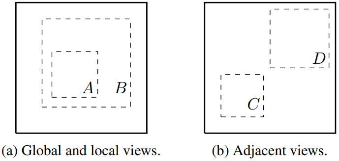

**SimCLR** 证明这种复杂性可以通过对目标图像进行简单的随机裁剪并调整大小来避免，这可以创建一系列预测任务，涵盖了上述两种方法，如右图所示。这一简单的设计选择方便将预测任务与其他组件解耦，如神经网络架构。通过扩展增强方法的集合并以随机方式组合它们，可以定义更广泛的对比预测任务。

**总结**

* 对输入图像做两种数据增强，这两个作为一个正样本对，剩下的为负样本

* 在特征$$h$$之后加入投影层$$g$$，即1个全连接层和激活函&#x6570;**`ReLU`**，**直接提10个点**

* &#x4E0E;**`InvaSpread`**&#x533A;别：

  * 更多的数据增强，对比学习需要很强的数据增强技术，如右图

  * 加入线性变化函数$$g(·)$$

  * 用了更大的batch size，训练时间更久

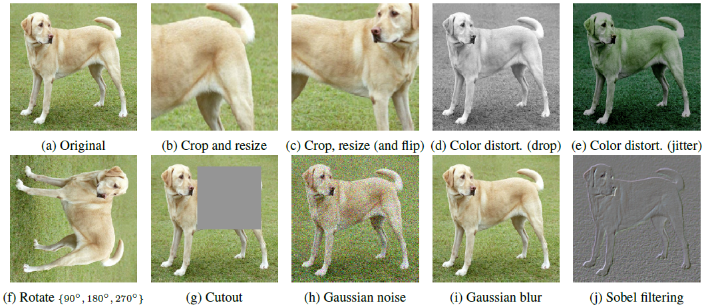

### 1.3.7 MoCo v2

对比学习作为一种无监督学习方法，近年来取得了显著进展，尤其&#x662F;**`MoCo`**&#x548C;**`SimCLR`**&#x8FD9;两个框架。MoCo 通过维护一个动态的负样本队列，能够在小批量训练中实现有效的对比学习，而 SimCLR 则依赖于大批次训练来提供更多的负样本，但需要强大的计算资源支持。作者的目标是将 SimCLR 中的一些改进设计，如 MLP 投影头和更强的数据增强技术，引入 MoCo 框架，从而在不需要大批次训练的情况下建立更强的基线模型。

* **方法**

作者首先对 MoCo 框架进行了两项关键改进：

> 1. **引入 MLP 投影头**，将原有的全连接投影头替换为两层 MLP，这一改变显著提升了模型在 ImageNet 线性分类任务上的性能。通过调整对比损失函数中的温度参数$$τ$$，模型的准确率进一步提高。
>
> 2. **引入了更强的数据增强技术**，包&#x62EC;**高斯模糊**和更强的**颜色失真**，这些技术在 MoCo 框架中也表现出了良好的效果。这些改进不仅提升了模型在 ImageNet 线性分类上的表现，还在 VOC 目标检测任务中展示了更好的迁移学习能力。

* **性能**

MoCo v2 使用了 ImageNet 训练集进行无监督学习，并采用了两种评估方法：

> 1. ImageNet 线性分类，通过冻结特征并训练一个监督线性分类器来评估模型性能
>
> 2. 将学习到的特征用于 VOC 数据集上的目标检测任务，使用 Faster R-CNN 进行微调

**MoCo v2** 在相同的训练条件下，其性能显著超过了 **SimCLR**。例如，在**`200`**个训练周期和**`256`**的批量大小下，MoCo v2 的 ImageNet 线性分类准确率达到了**`67.5%`**，比 SimCLR 高出**`5.6%`**。此外，MoCo v2 在**`800`**个训练周期下的准确率达到了**`71.1%`**，超过了 SimCLR 在**`1000`**个训练周期下的**`69.3%`**。

MoCo框架在处理大量负样本时不需要大批次训练，因此在内存和时间成本上更具优势。例如，SimCLR 在**`4k`**批次大小下需要**`93GB`**的内存，而 MoCo 在**`256`**批次大小下仅需要**`5GB`**的内存。这说明 MoCo v2 不仅性能更强，而且在计算资源需求上也更加高效，使得无监督学习的研究更加容易实现和推广。

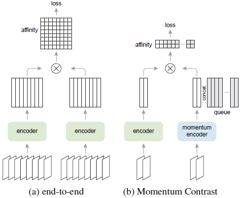

### 1.3.8 SimCLRv2

v2 相对于 v1 的改进点在于，提出的半监督学习框架以任务无关和任务特定的方式利用无标签数据。首先使用无标签数据时，通过无监督预训练以任务无关的方式学习通用视觉表示。然后这些通用表示通过有监督微调适配到特定任务。第二次使用无标签数据时，则是以任务特定的方式进一步提升预测性能并获得紧凑模型。因此 SimCLRv2 利用经过微调的教师网络生成的预测标签，在无标签数据上训练学生网络。

总的来说，可以总结为三个主要步骤，如右图所示：

> 1. **预训练**
>
> 2. **微调**
>
> 3. **蒸馏**

* **预训练**

1. **SimCLR 回顾**

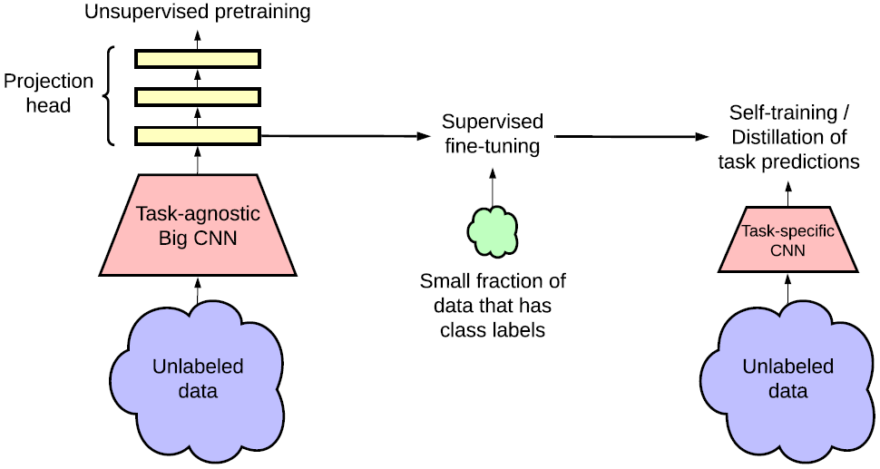

**`SimCLR`**&#x901A;过在潜在空间中最大化同一数据样本的不同增强视图之间的一致性来学习表示。即给定一个随机采样的图像小批量，每张图像$$x_i$$通过**随机裁剪**、**颜色扭曲**和**高斯模糊**进行两次增强，生成同一样本的两个视图$$x_{2k-1}$$和 $$x_{2k}$$。这两个图像通过编码器$$f(\cdot)$$（**SimCLR** 使用 一&#x4E2A;**`ResNet`**）生成表示$$h_{2k-1}$$和$$h_{2k}$$。然后，这些表示通过非线性变换网络$$g(\cdot)$$（**SimCLR** 使用一个多层感知机映射层）再次转换，得到用于对比损失的$$z_{2k-1}$$和$$z_{2k}$$。对于这个小批量内的增强样本，正样本对$$(i, j)$$之间的对比损失定义如下：

$$\mathcal{L}^{\text{NT-Xent}}_{i,j} = -\log \frac{\exp(\text{sim}(z_i, z_j)/\tau)}{\sum_{k=1}^{2N} \mathbf{1}_{[k \neq i]} \exp(\text{sim}(z_i, z_k)/\tau)}$$

其中 $$\text{sim}(\cdot, \cdot)$$ 是两个向量之间的余弦相似度，$$\tau$$是温度标量。

2. **SimCLRv2 改进**

SimCLRv2 主要在三个方面改进了 SimCLR：

> 1. **更大规模的 ResNet 模型**：使用了更大&#x7684;**`ResNet`**&#x6A21;型。与 **SimCLRv1** 及之前工作使&#x7528;**`ResNet-50`**&#x4E0D;同，v2 训练了更深更窄的模型。最大的模型&#x662F;**`152`**&#x5C42;&#x7684;**`ResNet`**，通道宽度&#x4E3A;**`3`**&#x500D;，并引入**选择性核**，即通道注意力机制，提升了网络的参数效率。将模型从ResNet-50扩展到ResNet-152 ，在使&#x7528;**`1%`**&#x6807;记样本微调时，top-1准确率相对提升&#x4E86;**`29%`**。
>
> 2. **更深的投影头**：增加了投影层$$g(\cdot)$$的深度。v2 在微调时从投影头的中间层开始微调，这与 SimCLR 完全丢弃$$g(\cdot)$$不同。这一改动提升了少标记样本下的线性评估和微调效果。与使&#x7528;**`2`**&#x5C42;投影头的 SimCLR 相比，使用3层投影头并从第1层投影头微调时，&#x5728;**`1%`**&#x6807;记样本微调下，top-1准确率相对提升&#x4E86;**`14%`**。
>
> 3) **引入记忆机制**：&#x53D7;**`MoCo`**&#x7684;启发，SimCLRv2 引入了记忆机制，指定一个记忆网络，其权重进行移动平均，用于稳定化，然后网络输出作为负样本缓存。由于是基于大批次训练的，提供了许多对比负样本，因此这一改动在线性评估和**`1%`**标记样本微调时仅分别带来了约**`1%`**的提升。

* **微调**

在SimCLR中，MLP投影头$$g(\cdot)$$在预训练后被完全丢弃，仅保留ResNet编码器$$f(\cdot)$$用于微调。与 v1 不同的是，v2 在微调期间将部分 MLP 投影头整合到 ResNet 编码器中。即从投影头的中间层开始微调，而不是从投影层的输入层开始。这里从 MLP 头的第一层微调相当于在基础网络上添加一个全连接层并从头中移除一个全连接层，这一额外层的影响取决于微调期间标记样本的数量。

* **知识蒸馏**

为进一步优化网络，SimCLRv2 直接利用无标签数据进行知识蒸馏。受之前工作的启发，v2 使用微调后的网络作为教师模型，为学生网络生成推断标签。最小化以下蒸馏损失，这里不使用真实标签：

$$\mathcal{L}^{\text{distill}} = -\sum_{x_i \in D} \sum_y P^T(y|x_i; \tau) \log P^S(y|x_i; \tau)$$

其中$$P(y|x_i) = \frac{\exp(f^{\text{task}}(x_i)[y]/\tau)}{\sum_{y'} \exp(f^{\text{task}}(x_i)[y']/\tau)}$$，$$\tau$$是温度。教师网络生成的概率分布$$P^T(y|x_i)$$在蒸馏过程中固定，而训练学生网络生成的概率分布$$P_S(y|x_i)$$。

这里是使用无标签样本进行蒸馏的，但是如果标记样本数量较多时，也可以将蒸馏损失与真实标签结合，使用加权组合：

$$\mathcal{L} = -(1-\alpha) \sum_{(x_i, y_i) \in D^L} \log P^S(y_i|x_i) - \alpha \sum_{x_i \in D} \sum_y P^T(y|x_i; \tau) \log P^S(y|x_i; \tau)$$

这可以使用相同架构的学生网络进行自蒸馏，从而进一步提升任务特定性能；或者使用更小的模型架构，从而生成紧凑的模型。

**总结**

* 更大的模型：152层的残差网络，还有 selective kernels

* MLP projection head 由一层变成两层，效果最好

* 使用了动量编码器，但不是很有用，因为 batch 本来就很大了，提供了很多负样本

### 1.3.9 SwAV

无监督学习旨在不依赖手动标注的情况下学习图像特征，近年来在计算机视觉领域取得了显著进展，逐渐缩小了与监督学习的性能差距。传统的对比学习方法通常依赖于成对的特征比较，这在计算上具有挑战性，尤其是在处理大规模数据集时。此外，这些方法通常需要大量的内存来存储特征或使用特殊的动量网络。

* **方法**

作者的出发点是以在线的方式无监督地学习视觉特征。为此，提出了一种基于在线聚类的自监督方法。典型的基于聚类的方法是离线的，因为它们是在簇分配步骤和训练步骤之间交替进行：在簇分配步骤中，对整个数据集的图像特征进行聚类；在训练步骤中，预测不同图像视图的簇分配，即编码。然而，这些方法不适合在线学习，因为它们需要多次遍历数据集以计算用于聚类的图像特征。这里作者实现了一种替代方法，强制同一图像的不同增强视图之间的编码一致性。这一解决方案受到对比实例学习的启发，因为并未将编码视为目标，而是仅强制同一图像的不同视图之间的一致映射。这可以被解释为通过比较簇分配而不是特征来对比多个图像视图。

**SwAV** 从图像的一个增强版本计算一个编码，并通过其他增强版本预测该编码。给定来自同一图像的两个不同增强版本的图像特征$$z_t$$和$$z_s$$，通过将这些特征与一组$$K$$个原型$$\{c_1, \dots, c_K\}$$进行匹配来计算它们的编码$$q_t$$和$$q_s$$。然后设置了一个交换预测问题，其损失函数如下：

$$L(z_t, z_s) = \ell(z_t, q_s) + \ell(z_s, q_t)$$

其中，函数$$\ell(z, q)$$衡量特征$$z$$和编码$$q$$之间的拟合程度。这里通过中间编码$$q_t$$和$$q_s$$比较特征$$z_t$$和$$z_s$$。如果这两个特征捕获了相同的信息，则应该能够通过一个特征预测另一个特征的编码。类似的比较方法在对比学习中也很常见，其中特征直接进行比较。下图展示了对比学习与 **SwAV** 之间的关系：

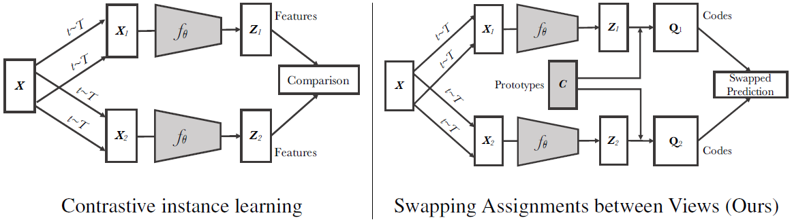

* **在线聚类**

每张图像$$x_n$$通过从图像变换集合$$T$$中采样的变换$$t$$转换为增强视图$$x_n^t$$。增强视图通过非线性映射$$f_\theta$$映射为向量表示。然后将特征投影到单位球面上，即$$z_{nt} = \frac{f_\theta(x_{nt})} {\|f_\theta(x_{nt})\|_2}$$。接着通过将$$z_{nt}$$映射到一组$$K$$个可训练的原型向量$$\{c_1, \dots, c_K\}$$来计算编码$$q_n^t$$。然后将这些原型向量组成的矩阵记为$$C$$，列向量分别为$$c_1, \dots, c_K$$。

**交换预测**

上式中的损失函数包含两项，这实现了一个交换预测问题：从特征$$z_s$$预测编码$$q_t$$，以及从$$z_t$$预测$$q_s$$。每一项表示编码与通过对$$z_i$$和所有原型$$C$$的点积取 softmax 得到的概率之间的交叉熵损失，即：

$$\ell(z_t, q_s) = -\sum_k q_s^{(k)} \log p_t^{(k)}$$

其中$$p_t^{(k)} = \frac{\exp\left(\frac{1}{\tau} z_t^\top c_k\right)}{\sum_{k'} \exp\left(\frac{1}{\tau} z_t^\top c_{k'}\right)}$$

这里$$\tau$$是一个温度参数。对所有图像及其数据增强对应用该损失，得到以下交换预测问题的损失函数：

$$-\frac{1}{N} \sum_{n=1}^N \sum_{s,t \sim T} \left[
\frac{1}{\tau} z_{nt}^\top C q_{ns} + \frac{1}{\tau} z_{ns}^\top C q_{nt} - \log \sum_{k=1}^K \exp\left(\frac{z_{nt}^\top c_k}{\tau}\right) - \log \sum_{k=1}^K \exp\left(\frac{z_{ns}^\top c_k}{\tau}\right)
\right]$$

这个损失函数联合最小化原型$$C$$和用于生成特征$$(z_{nt})_{n,t}$$的图像编码器$$f_\theta$$的参数$$\theta$$。

**在线计算编码**

为了变为在线化的模式，这里仅使用批次内的图像特征来计算编码。由于原型$$C$$在不同批次之间共享，**SwAV** 将多个实例聚类到原型中。SwAV 使用原型$$C$$计算编码，使得批次中的所有样本被原型均匀划分。这种均分约束确保了批次中不同图像的编码是不同的，从而避免了所有图像都具有相同编码的平凡解。给定$$B$$个特征向量$$Z = [z_1, \dots, z_B]$$，希望将其映射到原型$$C = [c_1, \dots, c_K]$$。将此映射或编码记为$$Q = [q_1, \dots, q_B]$$，并通过优化$$Q$$来最大化特征与原型之间的相似性，即：

$$\max_{Q \in \mathcal{Q}} \text{Tr}(Q^\top C^\top Z) + \varepsilon H(Q)$$

其中$$H$$是熵函数，定义为$$H(Q) = -\sum_{ij} Q_{ij} \log Q_{ij}$$，$$\varepsilon$$是控制映射平滑度的参数。作者注意到，使用较强的熵正则化，即使用较大的$$\varepsilon$$，通常会导致所有样本坍缩为单一表示，并均匀分配给所有原型的平凡解。因此在实践中让$$\varepsilon$$取较小的值。之前的一些工作通过把矩阵$$Q$$约束在 Transportation Polytope 来强制均分。他们在整个数据集上工作，而 **SwAV** 提出了一种适应小批量的方法，将 Transportation Polytope 限制在小批量内：

$$Q = \left\{
Q \in \mathbb{R}_+^{K \times B} \mid Q \mathbf{1}_B = \frac{1}{K} \mathbf{1}_K, Q^\top \mathbf{1}_K = \frac{1}{B} \mathbf{1}_B
\right\}$$

其中$$\mathbf{1}_K$$表示维度为$$K$$的全一向量。这些约束确保每个原型在批次中平均至少被选择$$\frac{B}{K}$$次。

当找到上述优化问题的连续解$$Q^*$$，可以通过舍入过程获得离散编码。一般来说在完整数据集上以离线方式计算编码时发现离散编码效果良好。然而使用小批量的在线设置中，使用离散编码的效果比使用连续编码更差。这是因为用于获得离散编码的舍入是一种比梯度更新更具侵略性的优化步骤。虽然它使模型快速收敛，但导致了较差的解。因此 SwAV 保留软编码$$Q^*$$而不进行舍入。这些软编码$$Q^*$$是上述优化问题在集合$$\mathcal{Q}$$上的解，并具有归一化指数矩阵的形式：

$$Q^* = \text{Diag}(u) \exp\left(\frac{C^\top Z}{\varepsilon}\right) \text{Diag}(v)$$

其中$$u$$和$$v$$分别是$$\mathbb{R}^K$$和$$\mathbb{R}^B$$中的重归一化向量。这些重归一化向量可以使用迭代 Sinkhorn-Knopp 算法通过少量矩阵乘法计算得到。这里使用 3 次迭代就足够快且能获得良好的性能。

**处理小批量**

当批量特征数$$B$$相较于原型数$$K$$过小时，无法将批次均匀划分为$$K$$个原型。因此，在处理小批量时，使用前几个批次的特征来扩充上述优化问题中$$Z$$的大小。然后在训练损失中仅使用该批次特征的编码。SwAV 存储&#x7EA6;**`3K`**&#x4E2A;特征，即与编码向量的数量相当。这可以只保留最&#x540E;**`15`**&#x4E2A;批次的特征，其中批大小&#x4E3A;**`256`**，而对比方法通常需要存储来自最后**`250`**个批次的**`65K`**个实例。

* **Multi-Crop：通过小图像增强视图**

比较图像的随机裁剪在捕获场景或对象部分之间的关系信息方面起着核心作用。然而，增加裁剪或视图的数量会呈平方地增加内存和计算需求。这里作者提出了一种 **Multi-Crop** 策略，其中使用两个标准分辨率的裁剪，并额外采样$$V$$个低分辨率裁剪，这些裁剪仅覆盖图像的一小部分。使用低分辨率图像确保了计算成本仅有小幅增加。具体来说，将损失函数推广为：

$$L(z^{t_1}, z^{t_2}, \dots, z^{t_{V+2}}) = \sum_{i \in \{1, 2\}} \sum_{v=1}^{V+2} \mathbf{1}_{v \neq i} \ell(z^{t_v}, q^{t_i})$$

这里仅使用全分辨率裁剪来计算编码。实际上，为所有裁剪计算编码会增加计算时间，并且还会降低所得网络的迁移性能。这是因为仅使用部分信息（即小裁剪仅覆盖图像的一小部分区域）会降低分配质量。

**总结**

**贡献1**：把对比学习和聚类结合在一起（***Deep Claster论文***）

直接拿原始图片的特征与特征做对比比较原始且废资源，**SwAV** 借助一些先验信息，不去跟大量的负样本比，跟更简洁的聚类中心比，文章选了 3k 聚类中心，这是之前方法常用的参数

得到特征 z 之后，通过clastering 的方法，让特征 z 和 prototype c 生成目标 Q，Q 相当于ground truth。Z 含有相似的特征，按道理可以相互预测：$$z_1$$点乘$$c$$可以预测$$Q_2$$，$$z_2$$点乘$$c$$可以预测$$Q_1$$，然后通过换位预测进行训练

优点：省去了成千上万的负样本的对比，仅需要几千个聚类中心。聚类中心有明确的语义信息，随机抽负样本可能会抽到正样的，而且类别可能不均衡

**贡献2**：**Multi-Crop**

之前的做法：随机一个图像 Resize 到**`256x256`**，随机 Crop 两个**`224x224`**的图片当$$x_1$$和$$x_2$$，因为重叠区域较多，是一个正样本

**SwAV**：如何学习更局部的特征？多 Crop 一些小区域，可以关注局部物体，但是正样本数变多，计算成本增加，折中考量：**`2`**&#x4E2A;**`160x160`**&#x7684;裁剪图像学全局，**`4`**&#x4E2A;**`96x96`**&#x7684;裁剪图像学局部，&#x5171;**`6`**&#x4E2A;视角

### 1.3.10 BYOL

自监督学习是一种无监督学习方法，旨在通过学习数据的内在结构来生成有用的表示，而无需依赖外部标签。传统的对比学习方法通过最小化同一图像不同增强视图之间的表示距离（正样本对），并最大化不同图像之间的表示距离（负样本对）来学习表示。然而，这些方法依赖于大量的负样本对，这在计算和内存上可能非常昂贵。

BYOL的核心思想是通过引导自己的潜在表示来学习图像表示。具体来说，BYOL 依赖于两个神经网络：在线网络和目标网络。在线网络负责预测目标网络对同一图像的不同增强视图的表示，而目标网络则通过在线网络的参数的指数移动平均来更新。这种方法避免了使用负样本对，同时通过预测机制来防止表示的坍塌，即所有图像的表示都相同。

> 全新的方法，自己跟自己学，没有负样本

* **方法**

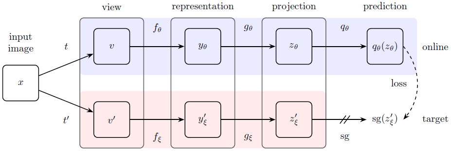

BYOL 的目标是学习一个表示$$y_\theta$$，以用于下游任务。BYOL 使用两个神经网络进行学习：**在线网络**和**目标网络**。在线网络由一组权重$$\theta$$定义，并包含三个阶段：编码器$$f_\theta$$、投影器$$g_\theta$$和预测器$$q_\theta$$，如上图所示。目标网络与在线网络具有相同的架构，但使用不同的权重集$$\xi$$。目标网络为在线网络提供回归目标，其参数$$\xi$$是在线参数$$\theta$$的指数移动平均值。也就是说，给定目标衰减率$$\tau \in [0, 1]$$，在每次训练步骤后，执行以下更新：

$$\xi \leftarrow \tau \xi + (1 - \tau)\theta$$

给定一组图像$$D$$、从$$D$$中均匀采样的图像$$x \sim D$$，以及两种图像增强分布$$T$$和$$T'$$，BYOL 通过分别应用图像增强$$t \sim T$$和$$t' \sim T'$$从$$x$$生成两个数据增强的视图$$v = t(x)$$和$$v' = t'(x)$$。输入第一个视图$$v$$，在线网络输出表示$$y_\theta \triangleq f_\theta(v)$$和投影$$z_\theta \triangleq g_\theta(y)$$。目标网络从第二个视图$$v'$$输出表示$$y'_\xi \triangleq f_\xi(v')$$和目标投影$$z'_\xi \triangleq g_\xi(y')$$。然后输出$$z'_\xi$$的预测$$q_\theta(z_\theta)$$，并对$$q_\theta(z_\theta)$$和$$z'_\xi$$进行$$\ell_2$$归一化，得到：

$$\overline{q_\theta}(z_\theta) \triangleq q_\theta(z_\theta) / \|q_\theta(z_\theta)\|_2, \quad \overline{z}'_\xi \triangleq z'_\xi / \|z'_\xi\|_2$$

需要注意的是，这个预测器仅应用于在线分支，这使得在线和目标流程之间的架构不对称。最后，归一化预测与目标投影之间的均方误差如下：

$$L_{\theta,\xi} \triangleq \|\overline{q_\theta}(z_\theta) - \overline{z}'_\xi\|_2^2 = 2 - 2 \cdot \frac{\langle q_\theta(z_\theta), z'_\xi \rangle}{\|q_\theta(z_\theta)\|_2 \cdot \|z'_\xi\|_2}$$

这里将上式中的损失$$L_{\theta,\xi}$$对称化，方法是分别将$$v'$$输入在线网络、将$$v$$输入目标网络以计算$$L'_{\theta,\xi}$$。在每次训练步骤中，执行一个随机优化步骤，仅针对$$\theta$$而非$$\xi$$最小化$$L^{\text{BYOL}}_{\theta,\xi} = L_{\theta,\xi} + L'_{\theta,\xi}$$，如上图中的停止梯度所示。BYOL 的动态过程总结如下：

$$\theta \leftarrow \text{optimizer}(\theta, \nabla_\theta L^{\text{BYOL}}_{\theta,\xi}, \eta)$$

$$\xi \leftarrow \tau \xi + (1 - \tau)\theta$$

其中$$\text{optimizer}$$是优化器，$$\eta$$是学习率。在训练结束时，只保留编码器$$f_\theta$$；这类似于之前的方法。

* **原理解释**

> 如果没有负样本的话，模型会有捷径解，都输出同样的内容

在 BYOL 中，最小化损失函数$$L_{\text{BYOL}}^{\theta, \xi}$$时并未使用显式的防止坍缩的项，例如使用负样本，但 BYOL 并未收敛到该损失函数关于$$(\theta, \xi)$$的最小值，例如坍缩为常数表示。这是因为 BYOL 的目标参数$$\xi$$的更新方向并非沿着 $$\nabla_\xi L_{\text{BYOL}}^{\theta, \xi}$$。这里假设不存在一个损失函数$$L^{\theta, \xi}$$，使得 BYOL 的动态过程可以被解释为对$$\theta$$和$$\xi$$的联合梯度下降。这与生成对抗网络类似，在 GAN 中，不存在同时关于判别器和生成器参数联合最小化的单一损失函数。因此没有先验理由认为 BYOL 的参数会收敛到$$L_{\text{BYOL}}^{\theta, \xi}$$的最小值。

此外，当假设 BYOL 的预测器最佳时，即$$q_\theta = q^*$$，其中

$$q^* \triangleq \arg\min_q \mathbb{E} \left[ \|q(z_\theta) - z_\xi'\|_2^2 \right]$$

其中$$q^*(z_\theta) = \mathbb{E}[z_\xi' \mid z_\theta]$$，这些不理想的平衡点是不稳定的。实际上，在最佳预测器的情况下，BYOL 关于$$\theta$$的更新等价于期望条件方差的梯度：

$$\nabla_\theta \mathbb{E} \left[ \|q^*(z_\theta) - z_\xi'\|_2^2 \right] = \nabla_\theta \mathbb{E} \left[ \|\mathbb{E}[z_\xi' \mid z_\theta] - z_\xi'\|_2^2 \right] = \nabla_\theta \mathbb{E} \left[ \sum_i \text{Var}(z_{\xi,i}' \mid z_\theta) \right]$$

其中$$z_{\xi,i}'$$是$$z_\xi'$$的第$$i$$个特征。

> **注**：对于任意随机变量$$X, Y, Z$$，有$$\text{Var}(X \mid Y, Z) \leq \text{Var}(X \mid Y)$$。令$$X$$为目标投影，$$Y$$为当前在线投影，$$Z$$为由训练动态中的随机性引起的在线投影上的额外变化：单纯丢弃在线投影的信息无法减少条件方差。

而且 BYOL 避免了$$z_\theta$$中的常数特征，因为对于任意常数$$c$$和随机变量$$z_\theta$$、$$z_\xi'$$，有$$\text{Var}(z_\xi' \mid z_\theta) \leq \text{Var}(z_\xi' \mid c)$$；因此这些坍缩为常数的平衡点是不稳定的。如果最小化$$\mathbb{E}\left[\sum_i \text{Var}(z_{\xi,i}' \mid z_\theta)\right]$$关于$$\xi$$的值，则会得到一个坍缩的$$z_\xi'$$，因为当$$z_\xi'$$为常数时方差达到最小值。然而，BYOL 将$$\xi$$向$$\theta$$靠近，将在线投影所捕捉的变化性融入目标投影中。

* **实现细节**

BYOL 使用了&#x4E0E;**`SimCLR`**&#x76F8;同的图像增强方法。首先，随机选择图像的一个区域，并通过随机水平翻转将其调整&#x4E3A;**`224 × 224`**&#x7684;大小，随后进行颜色失真处理，包括**亮度**、**对比度**、**饱和度**、**色调调整的随机序列**以及可选的**灰度转换**。最后，对这些图像块应用高斯模糊和色彩反转。

对于网络结构，使用&#x4E86;**`ResNet-50(1×) v1`**，并采&#x7528;**`post-activation`**&#x65B9;式作为基础参数化编码器$$f_\theta$$和$$f_\xi$$。此外也使用了更深（**`50`**、**`101`**、**`152`**&#x548C;**`200`**&#x5C42;）和更宽（&#x4ECE;**`1×`**&#x5230;**`4×`**）的 ResNet 架构。$$y$$对应于最终平均池化层的输出，在宽度乘数&#x4E3A;**`1×`**&#x65F6;其特征维度&#x4E3A;**`2048`**。与 SimCLR 类似，$$y$$通过一个 MLP $$g_\theta$$投影到一个更小的空间，目标投影$$g_\xi$$也采用相同的方式。这个 MLP 包括一个输出大小&#x4E3A;**`4096`**&#x7684;线性层，随后是 BN、ReLU，以及一个输出维度&#x4E3A;**`256`**&#x7684;最终线性层。与 SimCLR 不同的是，这个 MLP 的输出不进行批归一化。预测器$$q_\theta$$的架构与$$g_\theta$$相同。

在训练时使&#x7528;**`LARS`**&#x4F18;化器，并采用余弦衰减学习率调度策略，&#x5728;**`1000`**&#x4E2A;训练周期内进行优化，&#x524D;**`10`**&#x4E2A;周期为预热阶段。基础学习率设置&#x4E3A;**`0.2`**，并根据批量大小线性缩放，即$$\text{LearningRate} = 0.2 \times \text{BatchSize}/256$$。使用全局权重衰减参数$$1.5 \cdot 10^{-6}$$，同时将偏置项和批归一化参数排除在 LARS 自适应和权重衰减之外。对于目标网络，指数移动平均参数$$\tau$$从初始值$$\tau_{\text{base}} = 0.996$$开始，并在训练过程中逐渐增加至 1。这里设定$$\tau \triangleq 1 - (1 - \tau_{\text{base}}) \cdot (\cos(\pi k / K) + 1)/2$$，其中$$k$$是当前训练步数，$$K$$是最大训练步数。使用的批量大小为 **`4096`**，并分布&#x5728;**`512`**&#x4E2A; Cloud TPU v3 核心上。在此设置下，训练一个 ResNet-50(×1) 模型大约需&#x8981;**`8`**&#x5C0F;时。

**总结**

> 运行 BYOL 时，用的 MoCo v2 的代码，没加 BN
>
> 使用 BatchNorm 时是全部样本的平均，相当于其他图像是隐式的负样本，类似于 SwAV 的聚类中心

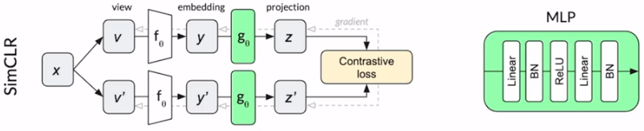

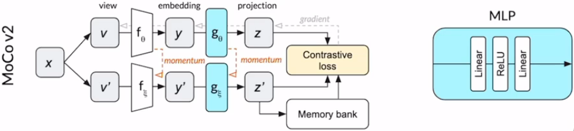

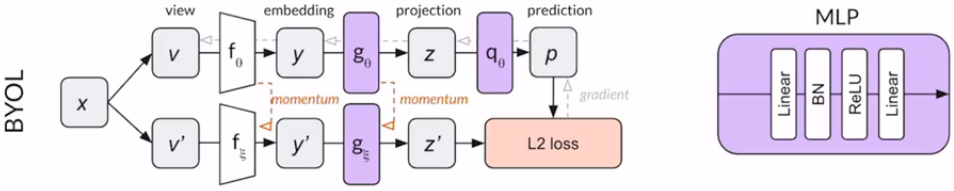

BYOL 作为一种新的自监督学习方法，在不使用负样本对的情况下，通过引导自己的潜在表示来学习图像表示。它在多个基准测试中表现出色，特别是在 ImageNet 数据集上，其性能接近于监督学习方法。BYOL 的鲁棒性和高效性使其成为自监督学习领域的一个重要进展。

### 1.3.11 SimSiam

**SimSiam** 是一种无监督视觉表示学习方法，基于简单的 Siamese 网络架构。它通过最大化同一图像的两个增强视图之间的相似性来学习特征表示，而无需依赖于负样本对、大批次训练或动量编码器等常见策略。这种方法的核心在于通过停止梯度操作来防止模型输出坍塌到常数，同时利用预测器MLP和对称化损失函数来优化表示学习。SimSiam在ImageNet等基准任务上表现出色，验证了其在无监督表示学习中的有效性。

* **方法**

SimSiam 接收来自图像$$  x  $$的两个随机增强视图$$  x_1  $$和$$  x_2  $$作为输入。这两个视图由编码器网络$$  f  $$处理，该网络包括一个主干网络 ResNet 和一个投影 MLP 头。编码器$$  f  $$在两个视图之间共享权重。一个预测 MLP 头，记作$$h$$，将一个视图的输出进行变换，并将其与另一个视图匹配。将两个输出向量记为$$  p_1 = h(f(x_1))  $$ 和 $$z_2 = f(x_2)$$，并最小化它们的负余弦相似度：

$$D(p_1, z_2) = -\frac{p_1}{\|p_1\|_2} \cdot \frac{z_2}{\|z_2\|_2}$$

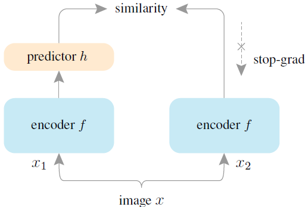

其中$$\|\cdot\|_2$$表示$$\ell_2$$-范数。这等价于对$$\ell_2$$-归一化向量的均方误差，并且相差一个比例因&#x5B50;**`2`**。然后遵循 BYOL 工作定义对称化的损失为：

$$L = \frac{1}{2} D(p_1, z_2) + \frac{1}{2} D(p_2, z_1)$$

这是针对每张图像定义的，总损失是对所有图像取平均值。

另一个重要的组件是停止梯度 stop-gradient 操作。我公式表示为：

$$D(p_1, \text{stopgrad}(z_2))$$

这意味着$$  z_2  $$在该项中被视为常量。类似地，对称化损失表示为：

$$L = \frac{1}{2} D(p_1, \text{stopgrad}(z_2)) + \frac{1}{2} D(p_2, \text{stopgrad}(z_1))$$

这里，$$x_2$$上的编码器在第一项中不从$$  z_2  $$接收梯度，但在第二项中会从$$  p_2  $$接收梯度，$$x_1$$也同理。

右图是 SimSiam 的伪代码

* **实验设置**  

1. **优化器**：使用 SGD 进行预训练。SimSiam 不需要 LARS 这样的大批量优化器。学习率设为$$\text{lr} \times \text{BatchSize}/256$$，即线性缩放，基础学习率&#x4E3A;**`0.05`**。学习率采用余弦衰减调度策略。权重衰减&#x4E3A;**`0.0001`**，SGD 动量&#x4E3A;**0.9**。默认批量大小为 **`512`**，并且使用跨设备同步的批归一化。

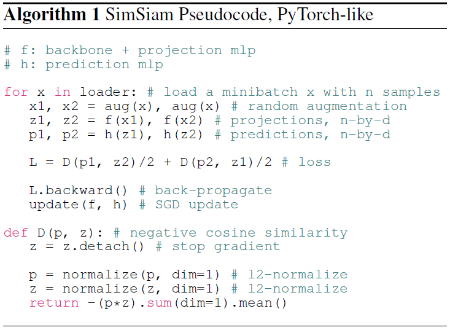

2. **投影 MLP**：在$$  f  $$中投影 MLP 对每个全连接层应用 BN，包括其输出全连接层，但输出全连接层没有 ReLU。隐藏层维度为 **`2048`**。这个 MLP 一共&#x6709;**`3`**&#x5C42;。

3. **预测 MLP**：预测 MLP $$h$$对其隐藏层应用 BN。其输出全连接层没有 BN 或者 ReLU。这个 MLP 有 2 层。$$h$$的输入和输出$$z$$和$$p$$维度为$$d = 2048$$，隐藏层维度&#x4E3A;**`512`**，这使$$  h  $$成为瓶颈结构。

4. **主干网络**：使用 ResNet-50 作为默认主干网络。

SimSiam 在包含 1000 类的 ImageNet 训练集上进行无监督预训练，不使用标签。在训练集上训练一个监督线性分类器，基于冻结的表示，然后在验证集上测试。

* **理论分析**

* **方法对比**

SimSiam 还比较了其他方法，并且充当了一个连接这些方法的枢纽。下图展示了这些方法。编码器表示可以被两个分支共享的所有层，例如主干网络、投影层 MLP、原型。图中红色的部分是 SimSiam 中去掉的组件。

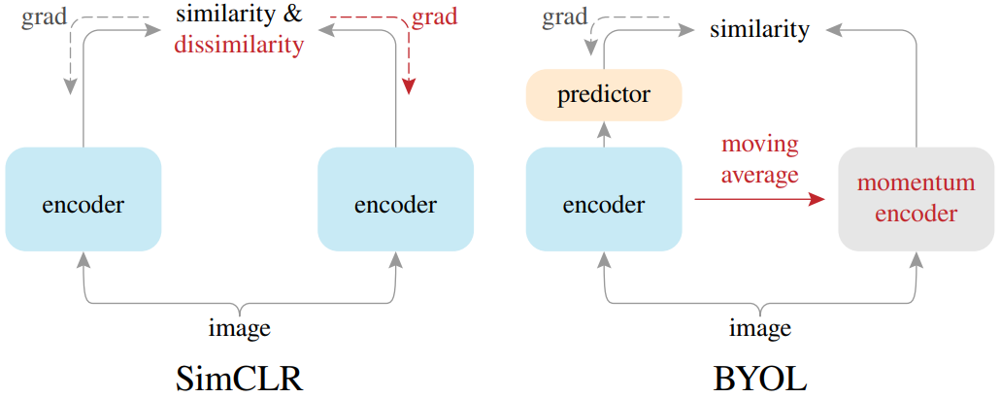

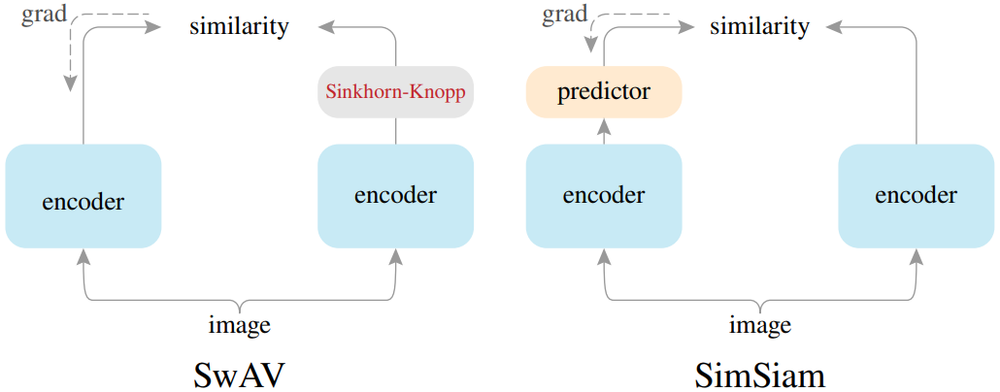

1. **与 SimCLR 的关系** &#x20;

SimCLR 依赖负样本来防止模型坍塌。SimSiam 可以被认为是一种**没有负样本的 SimCLR**。

为了全面比较，作者在 SimCLR 上添加了预测 MLP $$  h  $$和停止梯度操作结果： &#x20;

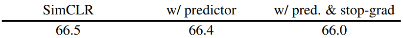

对于 SimCLR 来说，停止梯度或额外的预测器既不是必要的，也没有帮助。这也证明引入停止梯度和额外预测器可能是另一个潜在优化问题的结果。这个问题不同于对比学习问题，因此这些额外的组件可能并没有帮助。

* **与 BYOL 的关系**  

SimSiam 可以被视为**没有动量编码器的 BYOL**。动量编码器可能有助于提高准确性，但并不是防止模型坍塌所必需的。如理论分析中所说，$$\eta$$可以通过其他优化器求解，例如基于梯度的优化器。这可能导致$$\eta$$的更新更加平滑。虽然两者并无直接关联，但动量编码器也会生成一个更平滑版本的$$\eta$$。

* **与 SwAV 的关系**  

SimSiam 类似于**没有在线聚类的 SwAV**。通过重新组织 SwAV 中的一些组件建立了这种联系： &#x20;

> * SwAV 中的共享原型层可以被吸收到 Siamese 编码器中
>
> * SwAV 中原型在梯度传播之外进行了权重归一化；而 SimSiam 改为通过完整梯度计算来实现&#x20;
>
> * SwAV 中的相似性函数是交叉熵&#x20;

SwAV 在目标分支上应用了 Sinkhorn-Knopp (SK) 变换，并且该分支也对称化了。SK 变换源于在线聚类：它是对当前批次进行聚类的结果，并受到平衡分区约束。平衡分区可以避免模型坍塌。但 SimSiam 不涉及这种变换。 &#x20;

作者研究了预测 MLP $$  h  $$ 和停止梯度对 SwAV 的影响。由于 SwAV 在 SK 变换上应用了停止梯度操作，因此通过移除它来进行消融实验。实验结果：

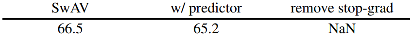

从结果可以看出，添加预测器并没有帮助。移除停止梯度操作会导致发散。作为一种基于聚类的方法，SwAV 本质上是一个交替优化公式。这可以解释为什么不能从 SwAV 中移除停止梯度。

**总结**

对比学习一路走来靠堆 trick，不好分析，因此SimSiam 构造了统一的结构：

> * 不需要负样本对，这借鉴了 BYOL 的思想
>
> * 不需要大的 batch size
>
> * 不需要动量编码器，这与 BYOL 不同

之所以可以成功训练，不坍塌，是因为stop gradient，可以看作是 EM 算法，通过逐步更新避免模型坍塌

### 1.3.12 MoCo v3

近年来，自监督学习在自然语言处理中取得了巨大成功，但在计算机视觉领域，尤其是基于 Transformer 架构的模型训练方面，仍面临诸多挑战。MoCo v3 指出，尽管标准卷积网络的训练方法已经非常成熟，但 ViT 模型的训练策略尚未完善，尤其是在自监督场景下。作者通过实验分析了影响 ViT 自监督训练的关键因素，如批量大小、学习率和优化器，并探讨了如何通过改进训练稳定性来提升模型性能。

* **方法**

MoCo v3 是对 MoCo v1/2 的增量改进，在简单性、准确性和可扩展性之间取得更好的平衡。MoCo v3 的伪代码如右图，首先在随机数据增强下对每张图像取两个裁剪区域。它们由两个编码器$$  f_q  $$和$$  f_k  $$进行编码，输出向量分别为$$  q  $$和$$k$$。直观上，$$q$$类似于一个 Query，而学习的目标是检索对应的 Key。这一过程可以转化为最小化对比损失函数，这里采用 InfoNCE 的形式：

$$L_q = -\log \frac{\exp(q \cdot k^+ / \tau)}{\exp(q \cdot k^+ / \tau) + \sum_{k^-} \exp(q \cdot k^- / \tau)}$$

其中，$$k^+$$是$$  f_k  $$在与$$  q  $$相同图像上的输出，称为$$  q  $$的正样本。集合$$  \{k^-\}  $$包含$$  f_k  $$在其他图像上的输出，称为$$  q  $$的负样本。$$\tau$$是一个温度超参数，用于$$\ell_2$$-归一化的$$  q  $$和$$k$$。

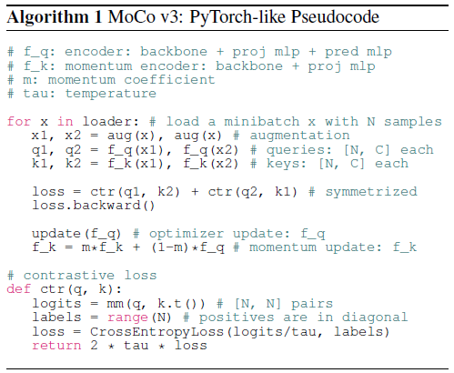

在 **MoCo v3** 中，使用同一批次中自然共存的键值。作者放弃了记忆队列，因为发现当批次大小足够大时，例&#x5982;**`4096`**，记忆队列的收益逐渐减小。通过这种简化，对比损失可以用几行代码实现，即伪代码中的$$\text{ctr}(q, k)$$。这里采用对称化的损失形式：$$\text{ctr}(q_1, k_2) + \text{ctr}(q_2, k_1)$$。

编码器$$  f_q  $$包括一个主干网络， 例如**`ResNet`**或**`ViT`**、一个投影头和一个额外的预测头；编码器$$  f_k  $$包含主干网络和投影头，但没有预测头。$$f_k$$通过$$  f_q  $$的移动平均更新，但不包括预测头。

作者评估了 MoCo v3 使用 ResNet-50 在 ImageNet 上的线性探测准确性。这里的改进主要归因于额外的预测头以&#x53CA;**`4096`**&#x5927;批量训练。

| R50, 800-ep | MoCo v2 | SimSiam | MoCo v3 |
| ----------- | ------- | ------- | ------- |
| 线性准确率       | 71.1    | 72.2    | 73.8    |

* **ViT 训练不稳定探究**

原则上，在对比学习框架中用 ViT 替换 ResNet 主干网络看似直接，但实践中面临的主要挑战是训练的不稳定性。

而且作者发现，这种不稳定性难以通过准确率反映。即使训练表面上正常，也可能隐藏潜在问题。为了找出这个问题，监控了训练中的 kNN 曲线。

**基本因素的观察**

1. **批量大小**

ViT 模型计算量大，大批次训练是理想选择。右图显&#x793A;**`1k`**&#x548C;**`2k`**&#x6279;量生成平滑曲线，准确率分别&#x4E3A;**`71.5%`**&#x548C;**`72.6%`**。更大的批量，&#x5982;**`4k`**，虽然提供了更多负样本，但曲线出现不稳定现象，准确&#x7387;**`72.2%`**&#x7565;有下降。当批量进一步增大&#x5230;**`6k`**&#x65F6;，曲线波动更剧烈，准确率降&#x81F3;**`69.7%`**。尽管结果看似合理，但这种部分失败对研究有害，因其退化不易察觉。

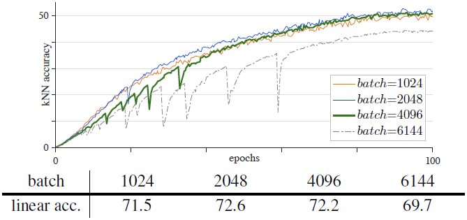

此外，轻微不稳定性不会导致显著波动。在多次实验中，相同配置的重复试验通常仅带&#x6765;**`0.1%~0.3%`**&#x7684;差异，这也掩盖了潜在问题。

2. **学习率**

学习率通常随批量增大而调整。这里采用线性缩放规则：$$\text{lr} \times \text{BatchSize}/256$$。右图显示，较小学习率，如$$\text{lr}=0.5 \times 10^{-4}$$，训练稳定但易欠拟合，准确率较低，**`70.4%`** vs. **`72.2%`**）。较大学习率，如$$\text{lr}=1.5 \times 10^{-4}$$，虽提升负样本效果，但曲线不稳定，准确率下降。

* **优化器**

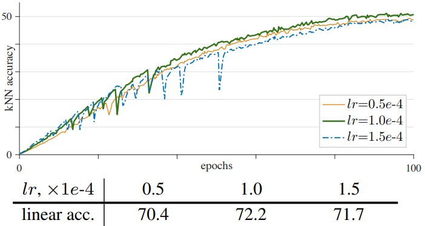

默认使用 AdamW 优化器，这是训练 ViT 的常见选择。作者也尝试&#x4E86;**`LAMB`**&#x4F18;化器，&#x5373;**`LARS`**&#x7684;**`AdamW`**&#x7248;本。在合适学习率$$\text{lr}=5 \times 10^{-4}$$下，LAMB 略优于 AdamW，达&#x5230;**`72.5%`**，但对学习率敏感，稍高值会导致准确率迅速下降。此外，LAMB 曲线虽平滑，但中期逐渐退化。考虑到 LAMB 对学习率的敏感性，在其他实验中继续使用 AdamW。

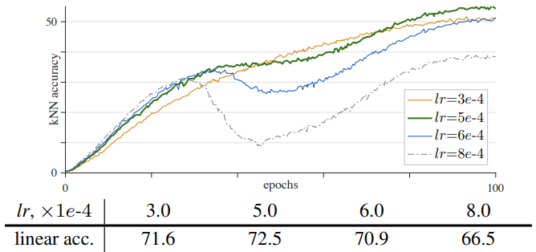

**提高稳定性的方法**

训练不稳定性是一个主要问题。右图中梯度的突然变化会导致训练曲线出现凹陷。进一步观察发现，这种不稳定性在较浅层中更早发生，如第一层 patch 投影层。因此尝试在训练中冻结 patch 投影层，使用固定的随机投影来嵌入 patch，而不对其进行学习。这可以通过简单&#x7684;**`stop-gradient`**&#x64CD;作实现。

**对比实验**

如右图，随机 Patch 投影显著提升了 MoCo v3 的稳定性，训练曲线更加平滑，最终准确率在$$\text{lr}=1.5 \times 10^{-4}$$时提高&#x4E86;**`1.7%`**，达&#x5230;**`73.4%`**。对于更大的学习率，提升更为明显。类似地，在**`SimCLR`**和**`BYOL`**中，随机 Patch 投影也提升了稳定性和准确率，分别提高**`0.8%`**和**`1.3%`**。在**`SwAV`**中，这一技巧避免了损失发散，并将准确率从**`65.8%`**提升至**`66.4%`**。该技巧在多种自监督框架中均有效。

除此之外还尝试&#x4E86;**`BatchNorm`**、**`WeightNorm`**&#x6216;梯度裁剪，但这些方法对稳定性改善有限。极端情况下，梯度裁剪等同于冻结第一层。

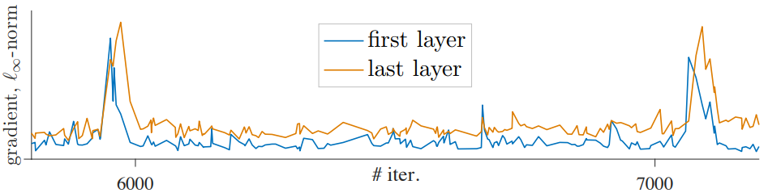

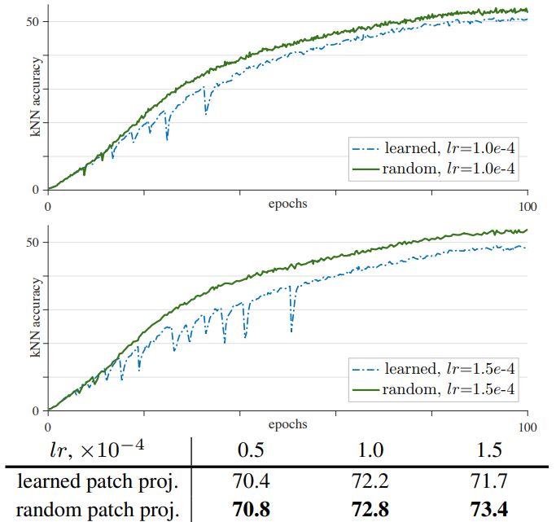

比较违反直觉的是，Patch 投影层并不需要训练。对于标准 ViT 的 Patch 大小，随机投影足以保留原始信息。冻结第一层虽缩小了解空间，但并未改变架构，表明问题本质在于优化。尽管这一技巧缓解了不稳定性，但它并未彻底解决，模型在过大学习率下仍可能不稳定。第一层只是更容易单独处理，问题实际上涉及所有层。

**总结**

* 一个小改动，让自监督 ViT 更稳定：当 batch size 变大后，突然准确率会下降，通过观察梯度回传发现是发生在 patch projection 层，通过随机初始化 patch projection层然后冻住，效果变好

* MoCo v2 和 SimSiam 的结合

### 1.3.13 DINO

近年来，Transformer 架构在自然语言处理中取得了巨大成功，并逐渐被应用于计算机视觉任务。然而，与自然语言处理中广泛采用自监督预训练不同，视觉领域的 ViT 大多依赖于监督学习进行预训练。作者质疑这种依赖是否限制了 ViT 在视觉任务中的潜力，认为自监督学习可能为 ViT 带来独特优势，例如更丰富的语义信息和更好的特征泛化能力，从而使其在某些任务中超越传统的卷积神经网络。因此，本文旨在通过自监督学习方法，挖掘 ViT 在视觉任务中的潜力，并探索其与自监督学习结合后可能出现的新特性。

* **方法**

DINO 与最近的自监督方法具有相同的整体结构，并且也与知识蒸馏有相似之处，下图展示了 DINO 的结构以及伪代码实现。

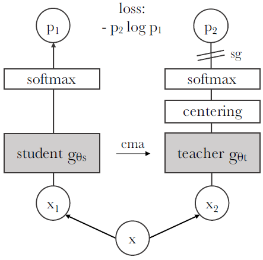

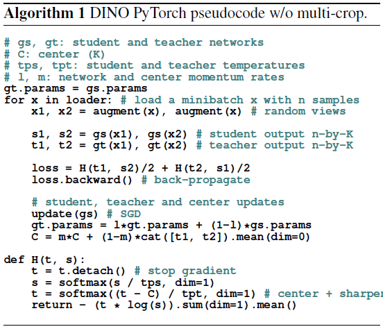

知识蒸馏是一种学习范式，DINO 训练一个学生网络$$g_{\theta_s}$$来匹配给定教师网络$$g_{\theta_t}$$的输出，分别由参数$$\theta_s$$和$$\theta_t$$参数化。给定输入图像$$x$$，两个网络都会输出$$K$$维的概率分布，分别记为$$P_s$$和$$P_t$$。概率$$P$$是通过对网络$$g$$的输出应用 softmax 函数归一化得到的。更

$$P_s(x)^{(i)} = \frac{\exp(g_{\theta_s}(x)^{(i)}/\tau_s)}{\sum_{k=1}^K \exp(g_{\theta_s}(x)^{(k)}/\tau_s)}$$

其中$$\tau_s > 0$$是控制输出分布尖锐程度的温度参数，$$P_t$$的公式类似，温度参数为$$\tau_t$$。给定固定的教师网络$$g_{\theta_t}$$，通过最小化交叉熵损失来学习匹配这些分布：

$$\min_{\theta_s} H(P_t(x), P_s(x))$$

其中$$H(a, b) = -a \log b$$。

首先使用多裁剪策略构造图像的不同扭曲视图或裁剪，即从给定图像生成一组不同的视图$$V$$。该集合包含两个全局视图$$x_1^g$$和$$x_2^g$$以及若干低分辨率的局部视图。所有裁剪都通过学生网络，而只有全局视图通过教师网络，从而鼓励局部到全局的对应关系。最小化的损失为：

$$\min_{\theta_s} \sum_{x \in \{x_1^g, x_2^g\}} \sum_{x' \in V, x' \neq x} H(P_t(x), P_s(x'))$$

这个损失是通用的，可以用于任意数量的视图，甚至仅使用两个视图。作者遵循 Multi-Crop 的标准设置，使用分辨率为$$224^2$$的两个全局视图，覆盖原始图像的大面积区域，例如大于**`50%`**，以及分辨率为$$96^2$$的若干局部视图，仅覆盖小范围区域，例如小于**`50%`**。两个网络共享相同的架构$$g$$，但具有不同的参数集$$\theta_s$$和$$\theta_t$$。通过随机梯度下降最小化上述损失函数来学习参数$$\theta_s$$。

**教师网络**  

与知识蒸馏不同，DINO 没有预先给定的教师网络$$g_{\theta_t}$$，而是从学生网络的迭代中构建。研究发现冻结教师网络在一个 epoch 内表现得非常出色，而直接复制学生的权重作为教师则无法收敛。而且对学生网络权重使用指数移动平均 EMA，即动量编码器，非常适合我们的框架。更新规则为

$$\theta_t \leftarrow \lambda \theta_t + (1 - \lambda) \theta_s$$

其中$$\lambda$$在训练过程中按照余弦调度&#x4ECE;**`0.996`**&#x589E;加&#x5230;**`1`**。最初，动量编码器被引入作为对比学习中队列的替代方案。但在 DINO 中的作用有所不同，因为我们没有队列或对比损失，这可能更接近于自训练中使用的均值教师的角色。这里教师网络执行了类似于**`Polyak-Ruppert`**平均的模型集成形式，而且是指数衰减的，这是提高模型性能的标准做法。教师模型在整个训练过程中表现优于学生，从而通过提供更高质量的目标特征来指导学生的训练。这种动态在之前的工作中都没有提到。

**网络架构**  

神经网络$$g$$由主干网络$$f$$（**`ViT`**&#x6216;**`ResNet`**）和投影头$$h$$组成：$$g = h \circ f$$。下游任务使用的特征是主干网络$$f$$的输出。投影头由一个 3 层 MLP 组成，隐藏维度&#x4E3A;**`2048`**，后接$$\ell_2$$归一化和一个权重归一化的全连接层，维度为 $$K$$，这&#x4E0E;**`SwAV`**&#x7684;设计类似。作者也测试了其他投影头，发现这种特定设计对 DINO 表现最佳。DINO 不使用预测器，学生和教师网络具有完全相同的架构。与 CNN 不同的是，ViT 架构默认不使用 BN。因此当用 ViT 时，也不在投影头中使用任何 BN，从而使整个系统完全无 BN。

**避免坍缩** &#x20;

之前提到的几种自监督方法都通过不同的操作来避免坍缩，包括**对比损失**、**聚类约束**、**预测器**或**批量归一化**等。DINO 也可以通过多种归一化来稳定训练，但也可以仅通过动量教师输出的中心化和锐化来避免模型坍缩。具体来说，**中心化**防止某一维度占主导地位，但会鼓励坍缩到均匀分布，而**锐化**具有相反的效果。应用这两种操作平衡了它们的效果，这足以在动量教师存在的情况下避免坍缩。选择这种方法避免坍缩是以稳定性换取更少的批次依赖性：中心化操作仅依赖于一阶批次统计量，可以解释为向教师添加偏置项$$c$$：

$$g_t(x) \leftarrow g_t(x) + c$$

中心$$c$$使用指数移动平均更新，这可以在不同批量大小下都能很好地工作：

$$c \leftarrow m c + (1 - m) \frac{1}{B} \sum_{i=1}^B g_{\theta_t}(x_i)$$

其中$$m > 0$$是速率参数，$$B$$是批量大小。锐化操作通过在教师的 softmax 归一化中使用较低的温度$$\tau_t$$实现。

* **实现细节**

DINO 遵&#x5FAA;**`DeiT`**&#x4E2D;的实现方式。右图是 DINO 使用的不同网络的配置。ViT 以$$N \times N$$分辨率的非重叠连续图像块网格作为输入。在 DINO 中使用$$N = 16$$或$$N = 8$$。这些图像块通过一个线性层形成一组嵌入向量。并在序列中添加了一个额外的可学习 token **`[CLS]`**，从整个序列中聚合信息，然后将其输出连接到投影头$$h$$。图像块 token &#x548C;**`[CLS]`** token 被输入到一个标准的 Transformer 网络中，使用 pre-norm 层归一化。

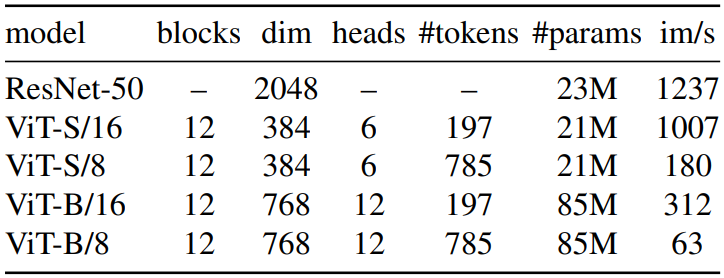

DINO 在 ImageNet 数据集上进行无标签预训练。使&#x7528;**`AdamW`**&#x4F18;化器和批量大小&#x4E3A;**`1024`**，当使&#x7528;**`ViT-S/16`**&#x65F6;分布在 16 个 GPU 上。学习率在前 10 个 epoch 内线性增加到以下线性缩放规则确定的基本值：

$$\text{lr} = 0.0005 \times \frac{\text{batchsize}}{256}$$

在此预热阶段之后，使用余弦调度衰减学习率。权重衰减也是&#x4ECE;**`0.04`**&#x5230;**`0.4`**&#x7684;余弦调度。温度参数$$\tau_s$$设置为 **`0.1`**，而$$\tau_t$$在&#x524D;**`30`**&#x4E2A; epoch 内使用&#x4ECE;**`0.04`**&#x5230;**`0.07`**&#x7684;线性预热。这里使&#x7528;**`BYOL`**&#x7684;数据增强方法**颜色抖动**、**高斯模糊**和**曝光增强**以&#x53CA;**`Multi-Crop`**&#x7B56;略，并使用双三次插值来适应位置嵌入的不同尺度。

**总结**

* 自监督的 ViT 有一些非常有趣的特性，自注意力图可以抓住每个物体的轮廓

* 和 **BYOL** 一样，自己跟自己学，自己预测自己，自蒸馏，Teacher 看作 ground truth&#x20;

* 编码器也有 **`Projection Head`** 和 **`Prediction Head`**

* 为了避免模型坍塌，在 Teacher 后进行 Centering：整个样本减去样本的均值，类似 **BYOL&#x20;**&#x5BF9; BN 的理解。为了解决模型训练不稳定的问题

### 1.3.14 DINOv2

近年来，自然语言处理领域通过在大量数据上进行预训练取得了巨大成功，这种成功促使计算机视觉领域也探索类似的基础模型。然而，以往的视觉预训练方法大多依赖于文本引导的监督或未经过筛选的原始数据，导致特征质量受限。DINOv2 通过改进自监督学习方法，结合数据和模型规模的扩展，提出了一种新的训练策略，通过构建多样化的图像数据集和优化训练流程，显著提升了自监督学习的性能，使其在多个基准测试中超越了现有的自监督方法，并接近甚至超过了弱监督学习的性能。

* **数据处理**

从大量未整理的数据中检索与多个已整理数据集中的图像相似的图像，构建&#x4E86;**`LVD-142M`**&#x6570;据集。LVD-142M 数据集的来源共包含两部分，即公开数据集和网络数据集。网络数据集简单理解就是通过爬虫将网页的图片下载下来。但是直接扒下来的数据有噪声。DINO v2 的做法是分三步清洗：

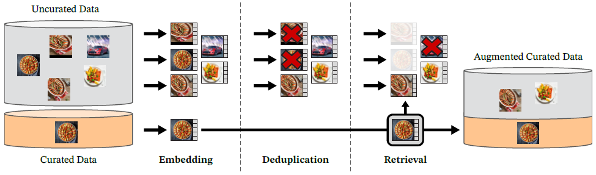

1. **数据源**  

已整理数据集包&#x62EC;**`ImageNet-22k`**、**`ImageNet-1k`**&#x7684;训练集、**`Google Landmarks`**&#x4EE5;及若干细粒度数据集。对于未整理数据源，从一个公开的网络爬取数据存储库中收集了一个未经筛选的原始图像数据集。从存储库中的每个网页中，提&#x53D6;**``**&#x6807;签中的图像 URL 链接。这里丢弃了不安全或受域名限制的 URL，并对下载的图像进行后处理，包括 **PCA 哈希去重**、**NSFW 过滤**以及**模糊可识别的人脸**。最终得&#x5230;**`1.2B`**&#x5F20;独一无二的图像。

* **去重**  

对未整理数据应用复制检测流&#x7A0B;**`Copy Detection Pipeline`**（[**Paper link**](https://arxiv.org/pdf/2202.10261)），移除了近似重复的图像。减少了冗余并增加了图像的多样性。本质是通过深度学习的方法计算相似度，而且还移除了 DINO v2 中使用的任何基准测试集的测试集或验证集中包含的图像的近似重复项。

* **自监督图像检索** &#x20;

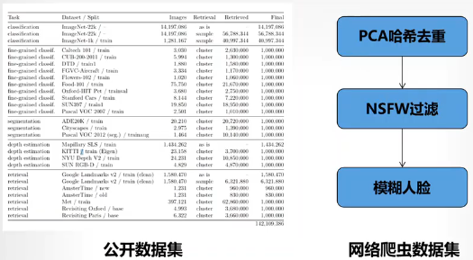

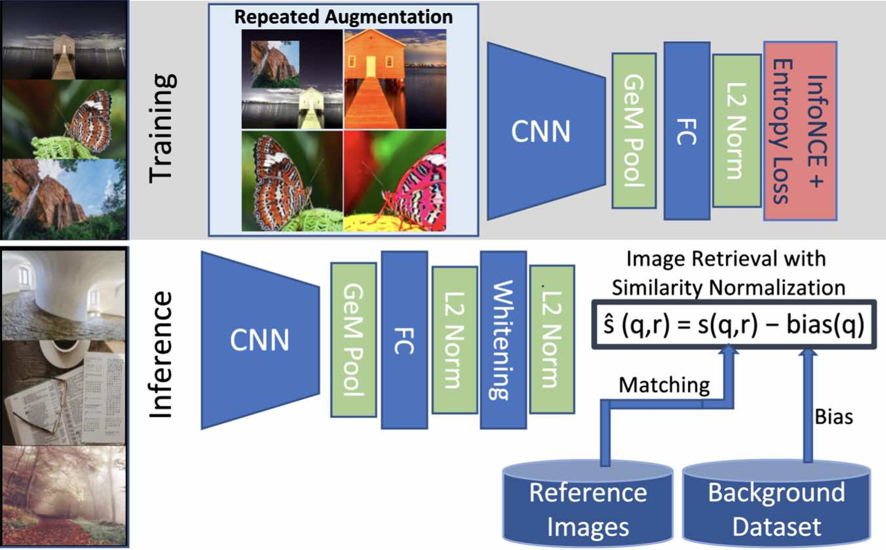

通过从未整理数据源中检索与已整理数据源中的图像接近的图像，构建预训练数据集。首先使用&#x5728;**`ImageNet-22k`**&#x4E0A;预训练的自监&#x7763;**`ViT-H/16`**&#x7F51;络计算图像 Embedding，并使用余弦相似性作为图像之间的距离度量。然后对未整理数据进&#x884C;**`k-means`**&#x805A;类。对于检索查询数据集

> * 如果规模足够大，就为每个查询图像检索$$N$$个最近邻图像，将这些相似的图像和查询图像一起用于预训练，这里$$N$$通常&#x4E3A;**`4`**，实验表明当$$N$$远大于 4 时检索质量较好，但这会导致更多的冲突，即某些图像是多个查询的最近邻检索结果。DINO v2 最后选择$$N=4$$，因为它在此意义上提供了良好的权衡。
>
> * 如果查询数据集较小，则从与每个查询图像对应的聚类中采样$$M$$张图像。

4. **实现细节**  

去重和检索阶段依赖&#x4E8E;**`Faiss`**&#x5E93;来高效索引和批量计算最近嵌入搜索。充分利用了其对 GPU 加速索引的支持，使用带有乘积量化码的倒排文件索引。整个处理过程分布在一个由20个节点组成的计算集群上，每个节点配备8块V100-32GB GPU，并在不到两天的时间内生成了 LVD-142M 数据集。

* **损失函数**

DINO v2 通过判别性自监督方法学习特征，可以看作&#x662F;**`DINO`**&#x548C;**`iBOT`**&#x635F;失的结合，并引入&#x4E86;**`SwAV`**&#x7684;中心化方法。此外还添加了一个正则化项以扩展特征空间，并在训练末尾加入一个短时间的高分辨率训练阶段。

1. **Image-Level 的目标**：沿用 DINO 交叉熵损失函数

DINO v2 利用从学生网络和教师网络提取的特征之间的交叉熵损失。两种特征都来自 ViT 的 class token，并通过对同一图像的不同裁剪获得。将学生的 class token 通过学生 DINO 头处理。该头是一个输出分数向量的 MLP 模型，称为原型分数。然后对其应用 softmax 操作以得到$$p_s$$。类似地将教师 DINO 头应用于教师 class token 以获得教师原型分数，并应用 softmax 操作，随后使用移动平均进行中心化，或使用 Sinkhorn-Knopp 中心化，从而得到$$p_t$$。DINO 损失项定义为：

$$L_{\text{DINO}} = -\sum p_t \log p_s$$

这里通过指数移动平均更新学生参数，并构建教师头。

* **Patch-Level 的目标**

随机 mask 输入的一部分 Patch，这里仅对学生的输入进行 mask，不 mask 教师的输入。然后将学生**`iBOT`**头应用于学生的 mask token。类似地将教师**`iBOT`**头应用于教师的可见 Patch Token，这对应于学生中被遮掩的部分。随后，应用 softmax 和中心化步骤，得到 **iBOT&#x20;**&#x635F;失项：

$$L_{\text{iBOT}} = -\sum_i p_{t,i} \log p_{si}$$

其中$$i$$是被遮掩标记的补丁索引。与上述类似，通过指数移动平均更新学生参数，并构建教师头。

> 使用交叉熵损失函数来衡量学生和教师网络在每个被遮盖的 Patch 上的特征表示的相似性和差异性，从而训练学生网络。

* **解耦两个目标**  

**`DINO`**&#x548C;**`iBOT`**&#x635F;失均使用一个可学习的 MLP 投影头。该头应用于输出 Token，并在其上计算损失。在 DINO v2 的大规模实验中，在 **DINO **和 **iBOT **头之间共享参数会降低性能，因此其在所有实验中使用两个独立的头。

> 当两个级别的损失函数共享同样的参数时，模型在 Patch-Level 会欠拟合，在 Image-Level 会过拟合。因此使用不同的 head

* **Sinkhorn-Knopp 中心化**  

&#x7528;**`SwAV`**&#x4E2D;的 **SK**（**S**inkhorn-**K**nopp）批归一化替代 **DINO** &#x548C;**&#x20;iBOT** 中的教师 softmax 中心化步骤。在实验中运行 Sinkhorn-Knopp 算&#x6CD5;**`3`**&#x6B21;。对于学生应用 softmax 归一化。

* **KoLeo 正则化项**  

**`KoLeo`**&#x6B63;则化项鼓励在一个批次内特征的均匀分布。给定一组$$n$$个向量$$(x_1, \dots, x_n)$$，其定义为：

$$L_{\text{koleo}} = -\frac{1}{n} \sum_{i=1}^n \log(d_{n,i})$$

其中$$d_{n,i} = \min_{j \neq i} \|x_i - x_j\|$$是$$x_i$$与批次中任何其他点之间的最小距离。在计算此正则化项之前，对特征进行$$\ell_2$$归一化。

> 通过计算特征向量之间的差异来确保它们在批次内均匀分布。作用是减少特征向量之间的差异，从而使它们在整个批次内均匀分布

* **调整分辨率**  

提高图像分辨率对于像素级下游任务至关重要，如分割或检测，因为在低分辨率下小物体可能会消失。然而，高分辨率训练需要耗费大量时间和内存，因此 DINO v2 在预训练末尾短暂地将图像分辨率提高到$$518 \times 518$$，兼顾精度和速度。这&#x4E0E;**`UniViT`**&#x8BAD;练&#x548C;**`FlexiViT`**&#x8BAD;练方法相似。

### 1.3.15 DINOv3

* **方法总览**

1. **训练目标**

DINOv3 的目标是用不依赖人工标签的自监督训练，得到同时具备强全局语义与高质量 dense feature map 的视觉 Backbone。全局表示服务于分类、检索和跨域识别，Patch 表示服务于分割、深度估计、对应关系与视频跟踪。下游使用时，Backbone 通常保持冻结，只训练轻量线性层、Attention Probe 或任务 Decoder。

2. **扩展时出现的核心矛盾**

扩大模型与训练时长会持续改善 CLS Token 的全局识别能力，但 ViT-g 和 ViT-7B 在大约 **`200k`** 次迭代后开始出现 dense task 性能下降。Patch 之间的余弦相似度图逐渐失去局部性，无关位置获得较高相似度；继续训练到 **`1M`** 次迭代时，这种噪声更加明显。

问题不是 Patch Norm 异常增大。模型已经使用 Register Token，Patch Norm 在训练过程中保持稳定；真正退化的是 Patch 之间的相对相似性结构。

3. **完整训练 Pipeline**

训练分为四个连续阶段：先从大规模无标注图像中构建经过聚类与检索整理的数据混合；再用 DINO、iBOT 和 KoLeo 目标训练 **`6.7B`** 参数的 ViT-7B；随后加入 Gram anchoring 修复 dense feature map；最后执行高分辨率适配、Model Distillation 和文本对齐。

4. **输出表示**

ViT-7B 使用 Patch Size **`16×16`**。CLS Token 提供全局图像表示，Patch Token 保留空间布局并形成 dense feature map，Register Token 用于吸收全局计算中的异常信息。分辨率提高时，Patch 网格随输入增大；RoPE 与高分辨率适配使表示在训练分辨率之外仍保持稳定。

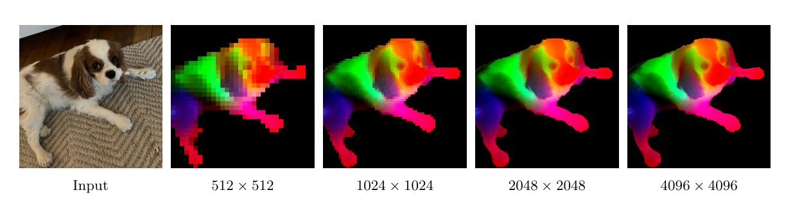

* **预训练数据**

1. **原始数据池**

预训练数据从公开 Instagram 帖子中的网络图像开始构建，初始数据池约为 **`17B`** 张图像。数据在进入训练混合前已经经过平台级内容审核。后续处理不是直接从原始池均匀采样，而是分别构建覆盖性数据、任务相关数据和公共视觉数据三部分。

2. **层次聚类与平衡采样**

第一部分使用 DINOv2 Embedding 表示图像，再执行 **`5`** 层层次 k-means。由低到高的聚类数量依次为 **`200M`**、**`8M`**、**`800k`**、**`100k`** 和 **`25k`**。建立聚类层次后执行平衡采样，得到包含 **`1,689M`** 张图像的 LVD-1689M，使网络数据中不同视觉概念获得更均衡的覆盖。

3. **基于 Seed Dataset 的检索整理**

第二部分以选定的 Seed Dataset 为查询集合，从原始数据池中检索与 Seed 图像相似的样本。这一部分不追求覆盖所有网络概念，而是提高训练数据与常见下游视觉任务之间的相关性。层次聚类主要改善多样性与平衡，检索整理主要提高任务相关性，两者承担不同作用。

4. **公共视觉数据**

第三部分直接加入 ImageNet-1K、ImageNet-22K 和 Mapillary Street-level Sequences。公共数据只占训练混合的一部分，用来稳定常见视觉概念与街景场景的学习，不替代大规模网络图像。

5. **Batch 级数据混合**

每次迭代在两种 Batch 之间随机选择：一种是只来自 ImageNet-1K 的同质 Batch，另一种是按比例混合其余数据部分的异质 Batch。ImageNet-1K 同质 Batch 占训练迭代的 **`10%`**。这种设置沿用了小规模高质量数据组成同质 Batch 时更有利的训练方式，其余迭代仍使用大规模混合数据。

6. **Data Ablation**

数据实验使用相同的模型与训练目标，只改变预训练数据。为了降低计算开销，训练长度从主实验的 **`1M`** 次迭代缩短为 **`200k`** 次迭代。对比项包括未经整理的原始数据、只用层次聚类整理的数据、只用 Seed Dataset 检索整理的数据，以及完整的数据混合。

| **Dataset** | **IN1k k-NN** | **IN1k Linear** | **ObjectNet** | **iNaturalist 2021** | **Paris Retrieval** |
| --------------------------------------------------------------------------------- | ----------------------------------------------------------------------------------- | ------------------------------------------------------------------------------------- | ----------------------------------------------------------------------------------- | ------------------------------------------------------------------------------------------ | ----------------------------------------------------------------------------------------- |
| Raw                                                                               | **`80.1`**                                                                          | **`84.8`**                                                                            | **`70.3`**                                                                          | **`70.1`**                                                                                 | **`63.3`**                                                                                |
| Clustering                                                                        | **`79.4`**                                                                          | **`85.4`**                                                                            | **`72.3`**                                                                          | **`81.3`**                                                                                 | **`85.2`**                                                                                |
| Retrieval                                                                         | **`84.0`**                                                                          | **`86.7`**                                                                            | **`70.7`**                                                                          | **`86.0`**                                                                                 | **`82.7`**                                                                                |
| LVD-1689M                                                                         | **`84.6`**                                                                          | **`87.2`**                                                                            | **`72.8`**                                                                          | **`87.0`**                                                                                 | **`85.9`**                                                                                |

未经整理的数据在常见分类任务上可以工作，但在细粒度自然类别与图像检索上明显落后。层次聚类提高了数据的多样性与均衡性，因此 iNaturalist 2021 和 Paris Retrieval 的增幅更大；基于 Seed Dataset 的检索整理更有利于 ImageNet。完整数据混合同时使用两种整理方式，在五项评估上都取得最高结果。

* **自监督学习目标**

1. **Teacher-Student 与 Multi-Crop**

Student 同时处理每张图像的 **`2`** 个 global crop 和 **`8`** 个 local crop；Teacher 是 Student 参数的 EMA，只处理两个 global crop。不同视角共享图像语义，但包含的局部内容与尺度不同，因此训练信号同时覆盖全局不变性和局部 Patch 预测。

2. **DINO 图像级目标**

DINO Head 读取 CLS Token，并把输出映射到 prototype 分布。Student 的全部 local crop 和两个 global crop 都参与 DINO loss；Teacher 只提供 global crop 的目标。global-to-local 配对要求局部视角与全局视角对同一图像形成一致语义，不同 global crop 之间也进行交叉匹配。

3. **iBOT Patch 级目标**

iBOT Head 在 Patch Token 上执行 latent reconstruction。Student 的 global crop 随机选择 **`0.1～0.5`** 的 Patch Token 作为 mask 比例，并以 **`50%`** 的概率启用 masking；Teacher 看到对应位置的可见 Token。Student 需要根据未被 mask 的上下文，预测 Teacher 在被 mask 位置产生的 prototype 分布。

DINO 约束图像级语义一致性，iBOT 约束 Patch 级语义恢复。两者分别作用于 CLS Token 和 Patch Token，但共享同一个 Backbone。

4. **Sinkhorn-Knopp 分配**

DINOv3 在 DINO 与 iBOT 两个目标中都使用 Sinkhorn-Knopp，替代 DINO 原来的 centering。两个目标都通过这种方式处理 Teacher 的输出分配。

5. **Distributed KoLeo Regularizer**

KoLeo Regularizer 作用于 Student 第一个 global crop 的 CLS Token，鼓励同一 Batch 内的全局表示在特征空间中均匀展开。实现时把样本划分为每组 **`16`** 个 CLS Token 的小 Batch，小组可以跨 GPU 组成。

6. **初始训练目标**

第一阶段的总目标由 DINO、iBOT 和 Distributed KoLeo 三部分组成：

$$\mathcal{L}_{\mathrm{Pre}}=\mathcal{L}_{\mathrm{DINO}}+\mathcal{L}_{\mathrm{iBOT}}+0.1\,\mathcal{L}_{\mathrm{DKoleo}}$$

DINO Head 与 iBOT Head 相互独立，使全局目标和 Patch 目标可以在进入 loss 前形成各自的投影空间。local crop 与 global crop 的 Backbone 输出还会经过专用 LayerNorm。这个改动使训练后期的 ImageNet k-NN accuracy 提高 **`0.2`**，ADE20K 分割提高约 **`1 mIoU`**，NYUv2 深度估计的 RMSE 降低 **`0.02`**。

* **ViT-7B Backbone**

1. **ViT-7B 结构**

| **配置项** | **DINOv2 ViT-giant** | **DINOv3 ViT-7B** |
| ----------------------------------------------------------------------------- | ------------------------------------------------------------------------------------------ | --------------------------------------------------------------------------------------- |
| 参数量                                                                           | **`1.1B`**                                                                                 | **`6.7B`**                                                                              |
| Transformer Block                                                             | **`40`**                                                                                   | **`40`**                                                                                |
| Patch Size                                                                    | **`14×14`**                                                                                | **`16×16`**                                                                             |
| Position Embedding                                                            | Learnable                                                                                  | RoPE                                                                                    |
| Register Token                                                                | **`4`**                                                                                    | **`4`**                                                                                 |
| Embedding 维度                                                                  | **`1536`**                                                                                 | **`4096`**                                                                              |
| FFN Type                                                                      | SwiGLU                                                                                     | SwiGLU                                                                                  |
| FFN 隐藏维度                                                                      | **`4096`**                                                                                 | **`8192`**                                                                              |
| Attention Head                                                                | **`24`**                                                                                   | **`32`**                                                                                |
| 单个 Head 维度                                                                    | **`64`**                                                                                   | **`128`**                                                                               |
| DINO Head MLP                                                                 | **`4096-4096-256`**                                                                        | **`8192-8192-512`**                                                                     |
| DINO Prototype                                                                | **`128k`**                                                                                 | **`256k`**                                                                              |
| iBOT Head MLP                                                                 | **`4096-4096-256`**                                                                        | **`8192-8192-384`**                                                                     |
| iBOT Prototype                                                                | **`128k`**                                                                                 | **`96k`**                                                                               |

2. **DINO Head 与 iBOT Head**

DINO Head 使用 **`8192-8192-512`** 的 MLP，并输出到 **`256k`** 个 prototype。iBOT Head 使用 **`8192-8192-384`** 的 MLP，并输出到 **`96k`** 个 prototype。两个目标在 Backbone 之上使用各自独立的 Head，使表示在进入 loss 计算前可以分别适配图像级目标和 Patch 级目标。

3. **RoPE 坐标系统**

每个 Patch 先被分配到归一化坐标框 **`[-1, 1]`** 中，RoPE 在 Multi-Head Attention 中根据两个 Patch 的相对位置施加 bias。坐标由输入网格动态生成，因此模型不依赖固定长度的可学习 Position Embedding，能够直接处理不同分辨率和长宽比。

4. **RoPE-Box Jittering**

训练时把归一化坐标框随机缩放为由缩放因子控制的新坐标范围：

$$[-1,1]\longrightarrow[-s,s],\qquad s\in[0.5,2]$$

缩放因子 $$s$$ 每次从 **`[0.5, 2]`** 范围内随机取值。同一 Patch 网格会对应不同的坐标尺度，用来提高模型对分辨率、尺度和图像长宽比变化的鲁棒性。

5. **Register Token**

输入序列包含 **`4`** 个 Register Token。Register Token 为全局计算提供专用存储位置，抑制高 Norm 信息被迫写入普通 Patch Token 的现象。DINOv3 仍会出现少量 feature dimension outlier，但最终 LayerNorm 会显著压低这些维度。

* **训练设置**

1. **Multi-Crop 计算规模**

global crop 分辨率为 **`256×256`**，local crop 分辨率为 **`112×112`**。总 batch size 为 **`4096`** 张图像，分布在 **`256`** 个 GPU 上。Patch Size 改为 **`16×16`** 后，每张图像的有效序列长度与 DINOv2 的设置接近，每个 Batch 合计约 **`3.7M`** 个 Token。

2. **恒定超参数 Schedule**

主训练持续 **`1M`** 次迭代。除启动阶段外，learning rate、weight decay 和 Teacher EMA factor 都保持恒定，不使用预先绑定总训练步数的余弦 schedule。这样可以在下游指标仍改善时继续训练，而不必在开始前确定最终优化时长。

启动阶段仍保留两条 linear warmup：一条用于 learning rate，另一条用于 Teacher temperature。learning rate 的 warmup 持续 **`100k`** 次迭代；warmup 结束后，learning rate、weight decay 和 Teacher EMA factor 都不再随训练进度变化。DINOv2 使用多条余弦 schedule，DINOv3 改成恒定设置后，可以在下游性能继续改善时直接延长训练。

3. **优化超参数**

| **配置项** | **设置** |
| ----------------------------------------------------------------------------- | ---------------------------------------------------------------------------- |
| Optimizer                                                                     | AdamW                                                                        |
| Learning rate                                                                 | 恒定 **`0.0004`**                                                              |
| Warmup                                                                        | **`100k`** 次迭代                                                               |
| Weight decay                                                                  | **`0.04`**                                                                   |
| Layer-wise learning-rate decay                                                | 每层 **`0.98`**                                                                |
| Stochastic depth                                                              | **`0.4`**                                                                    |
| Teacher EMA factor                                                            | **`0.999`**                                                                  |

4. **Teacher 更新**

Teacher 不参与梯度反向传播，它的参数由 Student 参数的 EMA 更新。较大的 EMA factor 让 Teacher 变化更慢，为 DINO 与 iBOT 提供平滑目标；Student 则直接通过三个自监督 loss 更新。

5. **分布式与数值精度**

ViT-7B 使用 PyTorch Fully Sharded Data Parallel 训练，以 bfloat16 保存主要激活和参数计算，并使用 **`8-bit`** floating-point matrix multiplication 降低大矩阵乘法的开销。Teacher 只处理 global crop，避免对全部 local crop 重复执行 **`6.7B`** 参数前向计算。

* **Gram Anchoring**

1. **Dense Feature 退化**

训练早期的 Patch 余弦相似度图平滑且局部化：参考 Patch 只与同一对象或相邻区域保持高相似度。训练继续到 **`600k`** 及更晚时，越来越多无关 Patch 获得高相似度。与此同时，ImageNet-1K 线性分类继续上升，VOC 分割却在约 **`200k`** 次迭代后下降。

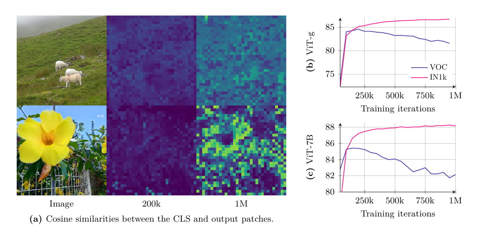

退化过程通过两个轻量评估跟踪。全局表示使用 CLS Token，在 ImageNet-1K 上训练线性分类器并记录 top-1 accuracy；dense feature 使用输出 Patch feature，在 Pascal VOC 上训练线性分割层并记录 mIoU。ViT-g 和 ViT-7B 的分类准确率在整个训练过程中持续提高，分割性能却都在大约 **`200k`** 次迭代后开始下降，ViT-7B 最终低于训练早期的水平。

**`200k`** 次迭代时，参考 Patch 与其他 Patch 的余弦相似度图平滑而且集中在局部区域。到 **`600k`** 次迭代以后，越来越多无关位置获得较高相似度。Patch feature 的局部性减弱，与 dense task 性能下降同步出现。

这种现象与高 Norm Patch outlier 不同。Register Token 已经使 Patch Norm 在训练期间保持稳定，但 CLS Token 与输出 Patch 之间的余弦相似度会逐渐升高，Patch feature 的局部性也随之减弱。

2. **Gram Matrix 表示什么**

设一张图像产生 $$P$$ 个 Patch，每个 Patch 的特征维度为 $$d$$。把 Student 与 Gram Teacher 的 L2 归一化 Patch 特征分别排成矩阵 $$X_S,X_G\in\mathbb{R}^{P\times d}$$。两个 Gram Matrix 分别是 $$X_SX_S^{\top}$$ 和 $$X_GX_G^{\top}$$，其中第 $$i,j$$ 个元素就是两个 Patch 特征的余弦相似度。

3. **Gram Loss**

Gram anchoring 不要求 Student 直接复制 Gram Teacher 的特征向量，而是要求两者保留相同的 Patch 两两相似性结构：

$$\mathcal{L}_{\mathrm{Gram}}=\left\|X_SX_S^{\top}-X_GX_G^{\top}\right\|_F^2$$

特征向量仍可旋转或重新组织，只要 Patch 之间的关系保持一致。因此 Gram loss 约束的是 dense structure，而不是把 Student 固定到早期 checkpoint 的绝对特征空间。

4. **Gram Teacher**

Gram Teacher 从 dense feature 尚未退化的早期 EMA Teacher checkpoint 初始化。主训练先运行 **`1M`** 次迭代，再启动 refinement；Gram Teacher 每隔 **`10k`** 次迭代更新为当前 EMA Teacher，最多更新 **`3`** 次。Gram loss 只在 global crop 上计算，loss weight 为 **`2`**。

5. **Refinement 目标**

加入 Gram anchoring 后，refinement 阶段继续保留 DINO、iBOT 和 Distributed KoLeo：

$$\mathcal{L}_{\mathrm{Ref}}=w_D\mathcal{L}_{\mathrm{DINO}}+\mathcal{L}_{\mathrm{iBOT}}+w_{DK}\mathcal{L}_{\mathrm{DKoleo}}+w_{\mathrm{Gram}}\mathcal{L}_{\mathrm{Gram}}$$

Gram loss 加入后，iBOT loss 会更快下降，而 DINO global loss 变化不大。这说明 Gram anchoring 与 iBOT 都主要改变 Patch 表示，DINO 则主要控制全局表示。

6. **Refinement 阶段的训练动态**

Gram anchoring 加入后，iBOT loss 很快下降，DINO global loss 的整体水平变化很小。Gram Teacher 提供的稳定相似性结构主要影响 Patch 级目标，因此 Gram loss 与 iBOT 对特征的作用方向接近；DINO loss 仍然主要约束全局表示。

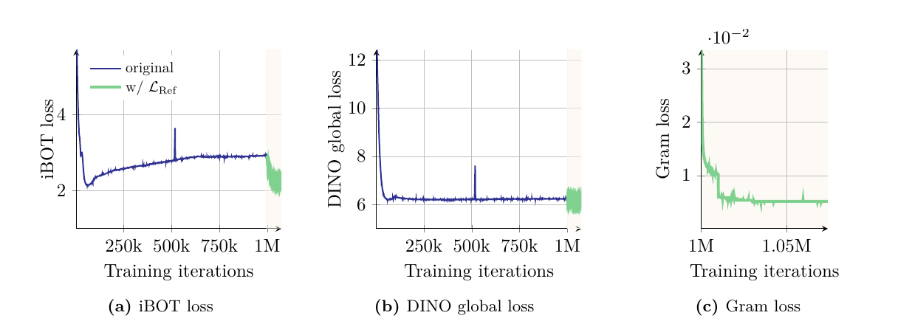

dense task 的恢复在 refinement 开始后的前 **`10k`** 次迭代内就能观察到。Gram Teacher 每次更新后，ADE20K 的 mIoU 还会继续上升。延长 refinement 对 ObjectNet 也有帮助，其他全局评估只出现轻微变化。

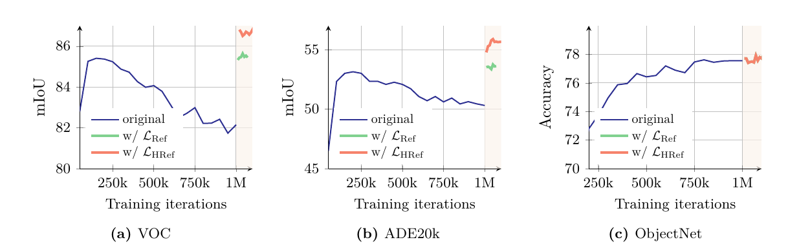

7. **High-Resolution Gram Teacher**

Gram Teacher 接收 Student global crop 的 **`2×`** 分辨率输入。Teacher 先产生更细的 dense feature map，再通过 bicubic interpolation 下采样 **`2×`**，使空间尺寸与 Student 输出一致。下采样后的特征替代 $$X_G$$ 计算 $$\mathcal{L}_{\mathrm{Gram}}$$，所得 refinement 目标记为 $$\mathcal{L}_{\mathrm{HRef}}$$。

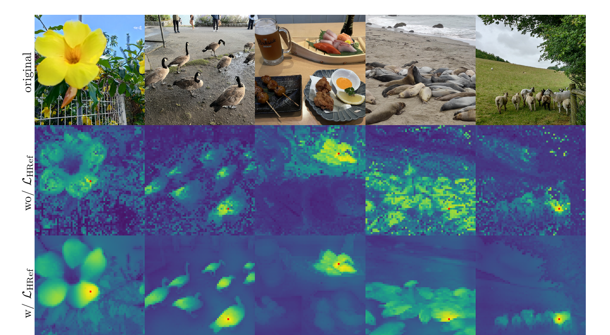

8. **为什么不用晚期 Teacher**

使用 **`100k`** 或 **`200k`** checkpoint 作为 Gram Teacher 时，dense task 表现接近；使用已经训练到 **`1M`** 次迭代的 Teacher 会变差，因为它自身的 Patch 一致性已经退化。Gram anchoring 的锚点必须来自 dense structure 仍然清晰的阶段。

| **Method** | **Teacher checkpoint** | **Teacher resolution** | **IN1k Linear** | **ADE mIoU** | **NYU RMSE** |
| -------------------------------------------------------------------------------- | -------------------------------------------------------------------------------------------- | -------------------------------------------------------------------------------------------- | ------------------------------------------------------------------------------------- | ---------------------------------------------------------------------------------- | ---------------------------------------------------------------------------------- |
| Baseline                                                                         | —                                                                                            | —                                                                                            | **`88.2`**                                                                            | **`50.3`**                                                                         | **`0.307`**                                                                        |
| GRAM                                                                             | **`200k`**                                                                                   | **`×1`**                                                                                     | **`88.0`**                                                                            | **`53.6`**                                                                         | **`0.285`**                                                                        |
| GRAM                                                                             | **`200k`**                                                                                   | **`×2`**                                                                                     | **`88.0`**                                                                            | **`55.7`**                                                                         | **`0.281`**                                                                        |
| GRAM                                                                             | **`100k`**                                                                                   | **`×2`**                                                                                     | **`87.9`**                                                                            | **`55.7`**                                                                         | **`0.284`**                                                                        |
| GRAM                                                                             | **`1M`**                                                                                     | **`×2`**                                                                                     | **`88.1`**                                                                            | **`54.9`**                                                                         | **`0.290`**                                                                        |

标准分辨率的 Gram Teacher 已经把 ADE20K 从 **`50.3`** 提高到 **`53.6`**。改用 **`2×`** 分辨率并下采样后，ADE20K 进一步达到 **`55.7`**，NYUv2 RMSE 从 **`0.307`** 降到 **`0.281`**。IN1k 线性分类基本保持不变，ADE20K 与 NYUv2 的 dense task 结果得到改善。

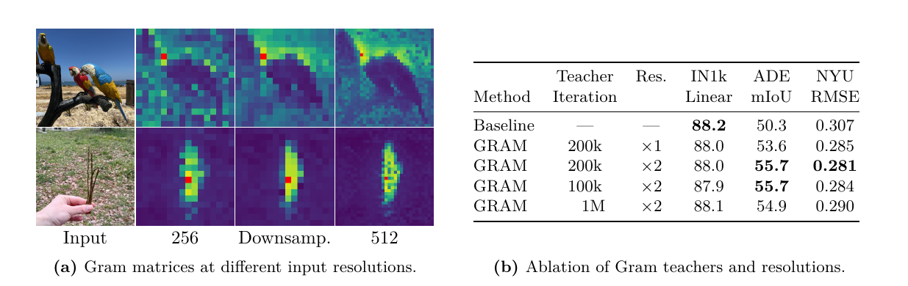

* **Post-Training**

1. **High-Resolution Adaptation**

主训练使用 **`256×256`** global crop。Post-Training 再运行 **`10k`** 次迭代，在同一个 mini-batch 内混合不同分辨率：global crop 从 **`512`** 和 **`768`** 中采样，local crop 从 **`112`**、**`168`**、**`224`** 和 **`336`** 中采样。

2. **分辨率组合与采样概率**

| **Global Crop** | **Local Crop** | **Gram Teacher Crop** | **概率** |
| ------------------------------------------------------------------------------------- | ------------------------------------------------------------------------------------ | ------------------------------------------------------------------------------------------- | ---------------------------------------------------------------------------- |
| **`512`**                                                                             | **`112`**                                                                            | **`768`**                                                                                   | **`0.30`**                                                                   |
| **`768`**                                                                             | **`112`**                                                                            | **`1152`**                                                                                  | **`0.30`**                                                                   |
| **`768`**                                                                             | **`168`**                                                                            | **`1152`**                                                                                  | **`0.30`**                                                                   |
| **`768`**                                                                             | **`224`**                                                                            | **`1152`**                                                                                  | **`0.05`**                                                                   |
| **`768`**                                                                             | **`336`**                                                                            | **`1152`**                                                                                  | **`0.05`**                                                                   |

High-Resolution Adaptation 仍使用 Gram anchoring。缺少这一约束时，高分辨率训练会再次破坏 dense feature；加入约束后，模型在超过最大训练分辨率 **`768`** 的输入上仍能维持稳定特征。

3. **不同输入分辨率下的变化**

High-Resolution Adaptation 对 ImageNet-1K 线性分类只有小幅改善，模型在 **`256`**、**`512`** 和 **`768`** 输入下的准确率都比较稳定。ObjectNet 的变化与输入大小有关：低分辨率下略有下降，高分辨率下则优于 adaptation 之前。

ADE20K 分割和 DAVIS tracking 的趋势更明显。adaptation 之前，输入继续增大时性能会下降；adaptation 之后，分辨率越高，Patch feature 能利用的空间细节越多，dense task 结果也随之提高。模型训练时最大只使用 **`768`** 分辨率，但在超过 **`4k`** 的输入上仍能产生稳定 feature map。

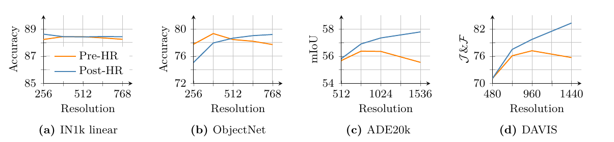

4. **固定 ViT-7B Teacher 的 Model Distillation**

ViT-S、ViT-S+、ViT-B、ViT-L 和 ViT-H+ 都由最终 ViT-7B 蒸馏得到。蒸馏沿用初始训练阶段的 DINO、iBOT 与 KoLeo 信号，但不再用 Student EMA 生成 Teacher；Teacher 固定为 ViT-7B。固定 Teacher 不会随 Student 训练发生 Patch 一致性退化，因此蒸馏阶段不使用 Gram anchoring。

| **Student** | **参数量** |
| --------------------------------------------------------------------------------- | ----------------------------------------------------------------------------- |
| ViT-S                                                                             | **`21M`**                                                                     |
| ViT-S+                                                                            | **`29M`**                                                                     |
| ViT-B                                                                             | **`86M`**                                                                     |
| ViT-L                                                                             | **`0.3B`**                                                                    |
| ViT-H+                                                                            | **`0.8B`**                                                                    |

5. **Multi-Student Distillation**

多个 Student 共享一次 ViT-7B Teacher inference。全部 GPU 先组成全局 inference group，各自读取一部分输入并执行 Teacher 前向；随后通过 NCCL all-gather collective 交换输入与 Teacher 输出。每个 Student 再使用独立 GPU group 训练，并按模型计算量调整 group 大小，使不同 Student 的单次迭代耗时接近。

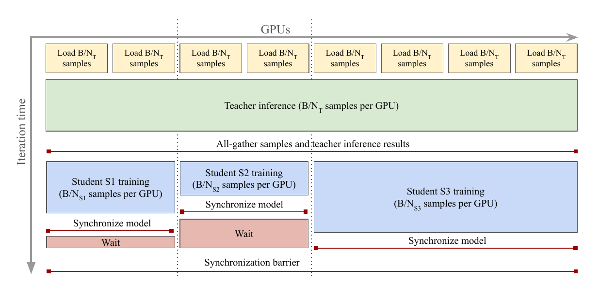

设一次 Teacher inference 的单样本计算成本为 $$C_T$$，Student 的单样本训练成本为 $$C_S$$，global batch size 为 $$B$$。单 Teacher、单 Student 使用 $$N$$ 个 GPU 时，每个 GPU 分别承担：

$$\frac{B}{N}C_T,\qquad\frac{B}{N}C_S$$

并行训练多个 Student 时，第 $$i$$ 个 Student 使用 $$N_{S_i}$$ 个 GPU，全部 GPU 构成 Teacher inference group：

$$N_T=\sum_i N_{S_i}$$

Teacher inference 被分摊到整个 group，每个 GPU 的 Teacher 计算成本变为 $$\frac{B}{N_T}C_T$$；第 $$i$$ 个 Student group 内，每个 GPU 的训练成本为：

$$\frac{B}{N_{S_i}}C_{S_i}$$

增加一个 Student 会扩大 Teacher inference group，因此每个 GPU 分担的 Teacher 计算反而减少。总计算量只增加新 Student 自身的训练部分，Teacher 前向不再重复执行。不同 Student group 的 GPU 数量按照单次训练耗时配置，尽量让所有 group 同时到达 synchronization barrier。

新增 Student 只增加该 Student 自身的训练开销，Teacher inference 不需要重复执行。同步屏障之前的等待时间通过调整每个 Student 的 GPU 数量来压缩。

6. **Student 训练 Schedule**

每个 Student 先训练 **`1M`** 次迭代，再执行 **`250k`** 次迭代的 learning-rate cooldown，cooldown 使用余弦 schedule。最后执行 High-Resolution Adaptation，但不加入 Gram anchoring。

* **文本对齐与特征使用**

1. **LiT 式文本对齐**

文本对齐阶段保持 DINOv3 Vision Encoder 冻结，从头训练 Text Encoder，并使用图文对比目标匹配图像与 caption。视觉侧不是完全没有可训练参数：冻结 Backbone 之上增加 **`2`** 层 Transformer，为跨模态对齐提供有限的视觉适配能力。

2. **全局与局部特征联合对齐**

视觉表示不是只取 CLS Token。全部 Patch Embedding 先做 mean pooling，再与 CLS Token 拼接，拼接结果用于匹配 Text Embedding。这样可以同时把全局与局部视觉特征对齐到文本，并在不增加额外 heuristic 的情况下改善 dense prediction。

图文训练沿用 dino.txt 的 data curation protocol。训练样本仍由图像与 caption 组成，Text Encoder 从随机初始化开始学习；冻结的 DINOv3 Backbone 只提供视觉特征，新增的两层 Transformer 负责视觉侧的可训练适配。

3. **Dense Task 的特征读取**

语义分割、深度估计、3D correspondence 和 tracking 直接使用冻结 Backbone 最后一层的 Patch feature。线性评估先应用最终 LayerNorm，再用可训练 BatchNorm 归一化特征，最后连接线性层。复杂的 segmentation 或 depth 系统可以读取多个中间层，但需要额外处理 feature dimension outlier。

4. **Feature Dimension Outlier**

ViT-7B 训练后，少数 feature dimension 会在不同图像与不同 Patch 上持续出现较大激活，并随网络深度与训练进度增大。这些维度与高 Norm Patch 不是同一问题。最终 LayerNorm 会显著压低它们，因此处理最后一层特征时应应用最终 LayerNorm。

5. **中间层特征**

最终 LayerNorm 的参数是针对最后一层学习的，直接把它应用到早期层不一定合适。需要组合中间层时，可使用 BatchNorm 或 PCA 进行 feature scaling。DINOv3 的完整语义分割与深度估计实验都在中间层特征之后加入了可学习 BatchNorm。

---

[Previous](02-视觉基础--Transformer-骨干网络.md) | [Contents](../../README.md) | [Next](04-视觉基础--其他经典模型.md) | [Visual website](https://weyumm.github.io/vlm-Wissen/lecture-1.html#c=3)
