[Previous](03-视觉基础--对比学习.md) | [Contents](../../README.md) | [Next](05-Vision-Language-Model--前期探索.md) | [Visual website](https://weyumm.github.io/vlm-Wissen/lecture-1.html#c=4)

## 1.4 其他经典模型

### 1.4.1 U-Net

* **从局部分类改成整图到整图的像素预测**

U-Net 是一个完全卷积网络，输入图像经过连续卷积、下采样、上采样与逐像素分类后，直接输出分割图。它不包含全连接层，因此网络并不绑定于固定的输入尺寸。与逐像素滑窗分类相比，整张特征图只需计算一次；同时，收缩路径负责扩大感受野并提取上下文，扩张路径负责恢复空间分辨率，来自收缩路径的高分辨率特征再通过跳跃连接补回定位信息。

U-Net 的完整网络结构如下。图中的蓝色框表示多通道特征图，框上方数字是通道数，左下角数字是空间尺寸；白色框是从收缩路径复制并裁剪后的特征图。

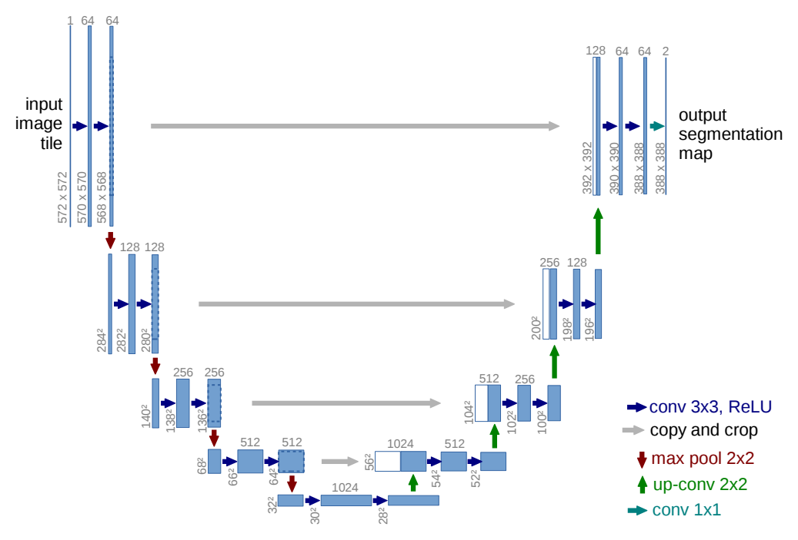

* **收缩路径与扩张路径**

1. **收缩路径**

每个尺度连续执行两次 **`3×3`** 无填充卷积，每次卷积后接 ReLU；随后使用 **`2×2`**、步幅为 **`2`** 的最大池化完成下采样。每经过一次下采样，特征图的宽高减半，通道数翻倍。连续的无填充卷积会逐层丢失边界像素，但保证每个输出像素都拥有完整有效的输入上下文。

2. **扩张路径**

每个尺度先对特征图上采样，再用 **`2×2`** 上卷积将通道数减半。随后，把收缩路径中相同尺度的特征图裁剪到匹配尺寸，并沿通道维拼接。拼接结果再通过两次 **`3×3`** 无填充卷积和 ReLU。裁剪并不是可选的实现细节，而是由无填充卷积造成的尺寸收缩决定的；只有裁剪后，编码端与解码端的空间位置才能对齐。

扩张路径保留了较多通道，因此可以把低分辨率层积累的上下文逐步传播回高分辨率层。网络整体近似左右对称，由此形成 U 形结构。最后使用 **`1×1`** 卷积，把每个位置的 **`64`** 维特征映射到目标类别数。原始配置总计包含 **`23`** 个卷积层。

* **Overlap-tile 无缝拼接推理**

由于卷积不做 padding，输出分割图比输入小一个固定边界宽度。对任意大的图像，推理时把图像切成相互重叠的输入块，只保留每个块中心区域的预测，再把中心预测无缝拼接。边缘位置缺少的上下文通过镜像输入图像补齐。为了让多层 **`2×2`** 最大池化都作用在偶数尺寸的特征图上，输入块宽高需要与下采样层级匹配。

右图给出重叠分块的完整几何关系：黄色区域是当前输出块，蓝色区域是得到该输出所需的输入上下文。

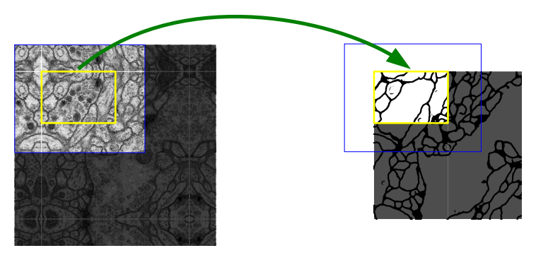

> **注**：U-Net 输出块周围被裁掉的边界不是浪费，而是对“完整感受野”的显式约束。重叠分块把这个约束转化为可扩展推理方式，使可处理图像尺寸不再由单次 GPU 显存决定。

* **像素级 softmax 与边界加权交叉熵**

设像素位置为 $$x\in\Omega$$，最后一层第 $$k$$ 个通道的激活为 $$a_k(x)$$，类别数为 $$K$$。逐像素 softmax 为：

$$p_k(x)=\frac{\exp(a_k(x))}{\sum_{k'=1}^{K}\exp(a_{k'}(x))}$$

真实标签函数记为 $$\ell:\Omega\rightarrow\{1,\ldots,K\}$$，像素权重图记为 $$w:\Omega\rightarrow\mathbb{R}$$。训练目标使用带权交叉熵：

$$E=\sum_{x\in\Omega}w(x)\log p_{\ell(x)}(x)$$

权重图同时解决两类问题：一是用类别权重 $$w_c(x)$$ 补偿不同类别的像素频率，二是对相互接触的目标之间的狭窄背景边界施加额外权重。设 $$d_1(x)$$、$$d_2(x)$$ 分别是像素到最近和第二近细胞边界的距离，则：

$$w(x)=w_c(x)+w_0\exp\left(-\frac{(d_1(x)+d_2(x))^2}{2\sigma^2}\right)$$

原始设置取 $$w_0=10$$、$$\sigma\approx5$$ 像素。两个目标越接近，$$d_1+d_2$$ 越小，指数项越大，网络就越强烈地惩罚把粘连边界误判为前景。这使“分开相邻实例”直接进入损失函数，而不是留给后处理。

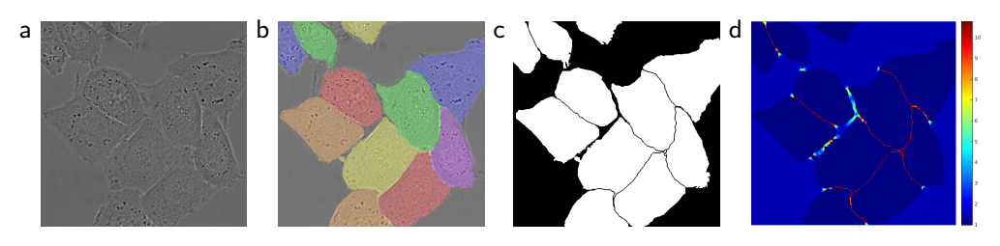

右图从原始显微图、实例标注、前景掩码到像素权重图，完整展示了边界加权的构造结果。

* **小样本训练、初始化与弹性形变**

无填充卷积使输出小于输入。为减少边界开销并尽量占满显存，训练时优先选择大输入块，而不是大 batch，原始实现把 batch size 设为 **`1`**。为了让一次参数更新仍能综合较长时间范围内的样本信息，随机梯度下降使用 **`0.99`** 的高动量。

交替堆叠卷积和 ReLU 时，权重按零均值高斯分布初始化，标准差取：

$$\operatorname{std}(W)=\sqrt{\frac{2}{N}}$$

其中 $$N$$ 是一个神经元的输入连接数。例如，前一层有 $$64$$ 个通道的 $$3\times3$$ 卷积对应 $$N=9\times64=576$$。该初始化让不同路径上的特征图方差维持在合理范围，避免部分路径激活过大、另一些路径几乎不参与训练。

在标注样本很少时，最关键的数据增强是随机弹性形变。先在粗糙的 **`3×3`** 网格上采样二维位移向量，位移来自标准差为 **`10`** 像素的高斯分布，再用双三次插值计算每个像素的平滑位移。这样可以模拟组织的连续形变，并让网络学习平移、旋转、灰度变化与非刚性形变鲁棒性。收缩路径末端的 dropout 还会提供额外的隐式增强。

### 1.4.2 MAE

* **预训练任务：只看少量 patch，重建被遮挡像素**

MAE 把图像划分为不重叠的规则 patch，从全部 patch 中均匀、无放回地随机采样一小部分作为可见 patch，其余 patch 直接从编码器输入中删除。编码器只处理可见 patch；编码完成后才补入 mask token，并由轻量解码器恢复完整图像。预训练结束后，解码器被丢弃，编码器使用完整、未遮挡的 patch 序列执行下游视觉任务。

右图是 MAE 的非对称编码器—解码器结构。注意 mask token 位于编码器之后，而不是与可见 token 一起进入编码器。

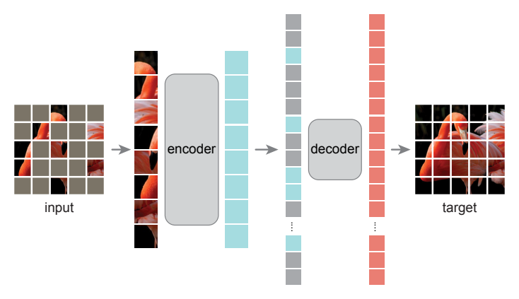

* **高比例随机掩码**

掩码操作采用最简单的均匀随机采样：先为每个 patch 产生 token，再随机打乱 token 列表，按照掩码率删除列表尾部。这个过程等价于无放回采样。均匀采样不会偏向图像中心，也不需要设计规则形状的遮挡区域。

默认掩码率为 **`75%`**，编码器因此只处理剩余的 **`25%`** patch。高掩码率有两个直接作用：

> * 它消除了图像局部的空间冗余，使模型不能仅靠相邻纹理或边缘延拓完成重建，而必须理解对象与场景的整体结构。
>
> * 它把编码器序列长度大幅压缩，使大容量 ViT 的预训练计算和显存消耗显著下降。

下图在固定 **`75%`** 掩码率预训练后，把推理掩码率提高到 **`85%`** 和 **`95%`**，用于直观看清模型重建的是结构与语义，而不只是复制邻域像素。

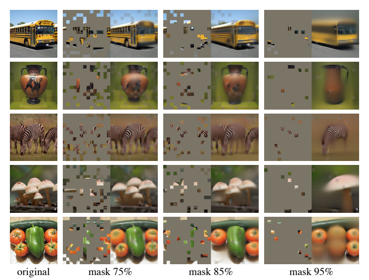

* **非对称编码器—解码器**

1. **MAE 编码器**

编码器采用标准 ViT。每个可见 patch 经过线性投影并加上位置编码，然后进入一系列 Transformer 块。被遮挡 patch 完全不进入编码器，也不使用 mask token 占位。编码器的计算复杂度因此由完整 patch 数量决定，变成只对可见子集计算。

2. **MAE 解码器**

解码器输入包含两部分：编码后的可见 patch token，以及共享、可学习的 mask token。所有 token 都要加入位置编码，否则多个相同的 mask token 无法知道自己对应图像中的哪个位置。然后，完整长度的序列进入另一组 Transformer 块。

解码器只在预训练重建阶段使用，因此可以独立于编码器设计得更窄、更浅。默认解码器每个 token 的计算量不到编码器的 **`10%`**。完整 token 序列只经过轻量解码器，而昂贵的主干编码器只处理可见 token，这就是 MAE 训练效率的核心来源。

* **像素重建目标**

解码器对每个被遮挡 patch 预测一个像素向量。最后一层是线性投影，输出维度等于一个 patch 内全部像素值的数量；随后把 patch 向量重新排列为图像。设被遮挡 patch 集合为 $$\mathcal{M}$$，真实 patch 像素向量为 $$y_i$$，预测为 $$\hat y_i$$，则损失只计算在遮挡位置：

$$\mathcal{L}_{\mathrm{MAE}}=\frac{1}{|\mathcal{M}|}\sum_{i\in\mathcal{M}}\left\|\hat y_i-y_i\right\|_2^2$$

一种更有效的目标是对每个 patch 独立做像素归一化：先计算该 patch 内像素的均值与标准差，再用归一化像素作为重建目标。这样降低了绝对亮度和对比度对损失的支配，使模型更关注 patch 内部结构。

损失只作用在被遮挡 patch 上。这不同于在全部像素上计算误差的传统去噪自编码器，也避免模型把大量优化能力花在直接复制已经可见的输入上。

* **无需稀疏算子的实现流程**

1. **随机打乱并裁短序列**

为每个输入 patch 生成嵌入并加入位置编码；随机打乱 token 顺序；按照掩码率截去列表尾部。保留下来的短序列送入编码器。

2. **补回 mask token 并逆置换**

编码后，在可见 token 末尾补入所需数量的 mask token，再执行随机打乱的逆置换，使完整序列恢复到原始二维 patch 顺序。随后加入解码器位置编码并完成重建。

整个过程只用稠密张量的打乱、截断、拼接与逆置换，不依赖专门的稀疏卷积或稀疏注意力算子。打乱与逆置换的开销相对 Transformer 很小，因此不会抵消高掩码率带来的计算收益。

### 1.4.3 SAM

SAM 把 promptable segmentation task、Model 和 data engine 设计成同一个闭环：Model 负责根据 prompt 输出 valid mask，也参与标注数据；新增数据再用于训练更强的 Model，最终得到 SA-1B。

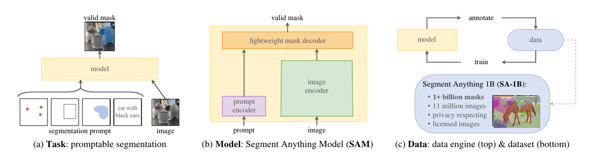

* **Promptable Segmentation Task**

1. **Segmentation Prompt 的定义**

Promptable segmentation task 接受任意能够指出“要分割什么”的信息，并返回一个 valid segmentation mask。prompt 可以是一组 foreground / background point、粗略 box、粗略 mask、free-form text，也可以是其他带有目标指向的信息。这里没有把 prompt 限制为某一种交互形式，因此同一套预训练目标可以服务于交互式标注、自动数据生成和下游任务组合。

2. **Valid Mask 与歧义**

Valid mask 的要求不是让 Model 在每次输入下都猜中唯一的语义答案，而是保证输出至少对应一个合理对象。一个 point 落在衬衫上时，它既可以指向衬衫，也可以指向穿衬衫的人；一个 point 落在局部结构上时，还可能同时对应 subpart、part 和 whole object。

如果 Model 只有一个输出，它会在多个正确 mask 之间求平均，结果往往不再对应任何真实对象。 SAM 因此把歧义当成任务本身的一部分，而不是依赖更多交互后再消除歧义。

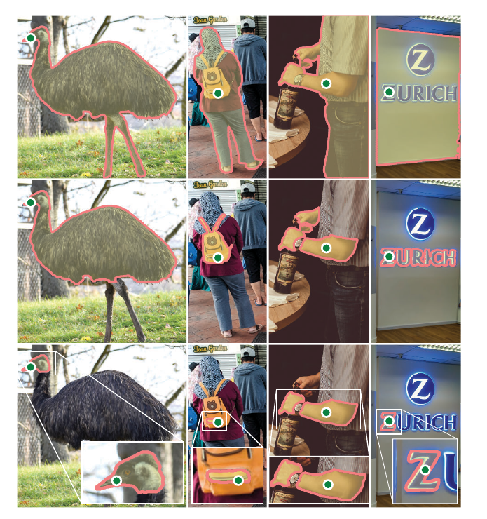

* **Pre-training 算法**

每个训练样本都会模拟一串 prompt，包括 point、box 和 mask。Model 根据当前 prompt 预测 mask，再把输出与 ground truth 比较。这个过程沿用了 interactive segmentation 的迭代方式，但训练目标不同：interactive segmentation 通常允许用户不断补充输入，直到获得正确结果；SAM 要求每一步都返回 valid mask，即使当前 prompt 仍然有歧义。

这项约束使同一个预训练目标同时覆盖单次 point prompt、逐步纠错、box-to-mask 和自动标注。

4. **Zero-Shot Transfer**

推理时可以把下游任务改写为 prompt。已有 cat detector 时，把 detector 输出的 box 交给 SAM，就能得到 cat instance mask；object proposal generation 可以通过规则 point grid 产生大量候选 mask；其他系统也可以把自己的空间预测结果作为 SAM 的输入。SAM 不需要为这些任务重新训练 segmentation head，而是作为更大系统中的 segmentation component 工作。

5. **与固定 Multi-Task 系统的区别**

Multi-task segmentation Model 通常在训练和测试阶段执行同一组固定任务，例如 semantic、instance 和 panoptic segmentation。Promptable segmentation 的任务集合在训练时不需要预先穷举；推理阶段可以通过 prompt engineering 和系统组合得到新的任务。这个差异对应 task generalization，而不是在固定任务集合上的 parameter sharing。

Prompt 和可组合接口把 segmentation Model 从单一任务网络变成可复用的基础组件。

* **Segment Anything Model**

1. **总体结构与 Amortized Real-Time**

SAM 由 Image Encoder、Prompt Encoder 和轻量 Mask Decoder 组成。Image Encoder 对每张图只运行一次，产生可缓存的 image embedding；每次更换 prompt 时，只需要运行 Prompt Encoder 和 Mask Decoder。给定预计算的 image embedding，后两部分在浏览器 CPU 上的运行时间约为 **`50 ms`**。

重计算成本被限制在轻量模块中，同一张图可以连续接收 point、box、mask 或 text prompt，而无需重复执行 ViT。

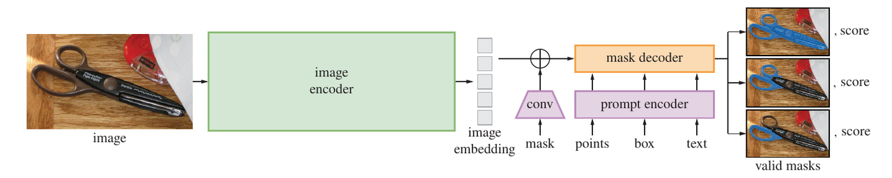

2. **Image Encoder**

Image Encoder 使用 MAE 预训练的 ViT-H/16。输入图像先等比例缩放，再对短边补齐到 **`1024×1024`**。ViT 采用 **`14×14`** windowed attention，并在网络中均匀放置 **`4`** 个 global attention block。输出相对输入下采样 **`16×`**，因此 image embedding 的空间尺寸为 **`64×64`**。

ViT 输出先经过 **`1×1`** convolution，把通道数降到 **`256`**；随后再经过一个 **`3×3`**、**`256`** 通道的 convolution。两个 convolution 后都使用 LayerNorm。Image Encoder 的计算量较大，但它不随 prompt 数量重复增长。

3. **Sparse Prompt Encoder**

Point 和 box 被编码为 **`256`** 维向量。一个 point 的 Embedding 是位置的 positional encoding 与 prompt 类型 Embedding 之和，foreground point 和 background point 使用不同的可学习 Embedding。一个 box 被拆成两个角点：左上角 positional encoding 加“top-left”类型 Embedding，右下角使用对应的“bottom-right”类型 Embedding。

Free-form text 使用 CLIP Text Encoder 得到 Embedding。SAM 的主要训练仍以 geometric prompt 为主，text prompt 只用于初步的 text-to-mask 实验。

4. **Dense Mask Prompt Encoder**

Mask prompt 与图像有逐位置对应关系，因此保留空间布局。输入 mask 的分辨率先设为原图的 **`1/4`**，再用两个 **`2×2`**、stride 为 **`2`** 的 convolution 继续下采样，输出通道依次为 **`4`** 和 **`16`**。最后通过 **`1×1`** convolution 映射到 **`256`** 通道。

各层之间使用 GELU 和 LayerNorm，得到的 mask Embedding 与 image embedding 逐元素相加。没有 mask prompt 时，Model 在每个 image embedding 位置加入一个可学习的“no mask” Embedding。

5. **Two-Way Transformer Mask Decoder**

Mask Decoder 先把可学习 output Token 加到 prompt Token 集合中。每个 Decoder layer 依次执行四步：Token self-attention；以 Token 为 query、image embedding 为 key/value 的 cross-attention；逐 Token MLP；以 image embedding 为 query、Token 为 key/value 的反向 cross-attention。最后一步把 prompt 信息写回 image embedding，因此这里是 two-way interaction。

Decoder 使用 **`2`** 层、**`256`** 维 Embedding、**`8`** 个 Attention Head，Token MLP 的内部维度为 **`2048`**。处理 **`64×64`** image embedding 的 cross-attention 会把 query、key、value 通道降到 **`128`**，以降低计算量。训练时各 Attention 与 MLP 使用 residual connection、LayerNorm 和 **`0.1`** dropout。

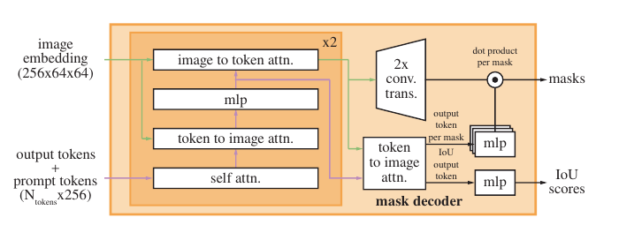

每次 Attention 使用 image embedding 时都会重新加入 positional encoding；更新后的 Token 再次进入 Attention 时，也会重新加入原始 prompt Token 及其 positional encoding。这让几何位置和 prompt 类型不会在多层更新中被稀释。

6. **Dynamic Mask Prediction Head**

Decoder 输出的 image embedding 通过两个 **`2×2`**、stride 为 **`2`** 的 transposed convolution 上采样 **`4×`**，通道数依次为 **`64`** 和 **`32`**，中间使用 LayerNorm 和 GELU。Output Token 再对上采样后的 image embedding 做一次 Attention，并经过 **`3`** 层 MLP 生成与上采样特征通道数相同的向量。

最终 mask 来自这个向量与每个空间位置特征的点积。MLP 输出相当于由当前 prompt 动态生成的线性分类器权重，而不是固定的 segmentation classifier。

7. **Ambiguity-Aware Multi-Mask Output**

单个 prompt 默认预测 **`3`** 个 mask，用于覆盖常见的 whole、part 和 subpart 三层嵌套关系。训练时分别计算每个预测与 ground truth 的 loss，只对 loss 最小的输出反向传播。另一个 output Token 驱动 IoU prediction head，为每个 mask 预测质量分数，以便推理时排序。

多个 prompt 通常已经消除了歧义，三个输出会趋于相同。为避免重复计算退化的 loss，Model 增加第 **`4`** 个 mask output Token：单 prompt 时不返回它，多 prompt 时只返回它对应的单一 mask。

8. **Loss**

Mask supervision 使用 focal loss 与 dice loss 的线性组合，权重比为 **`20:1`**。Decoder 中间层不使用 auxiliary deep supervision。IoU prediction head 使用 predicted IoU 与真实 IoU 之间的 mean squared error，加入总 loss 时的缩放系数为 **`1.0`**。

9. **Simulated Interactive Training**

每个 ground-truth mask 的第一轮 prompt 以相同概率选择 foreground point 或 box。Foreground point 从 ground-truth mask 内均匀采样；box 从 ground-truth bounding box 出发，对每个坐标加入标准差为边长 **`10%`**、最大 **`20 pixels`** 的随机噪声。

第一次预测后，后续 point 从当前预测与 ground truth 的 error region 中均匀采样。False negative 区域产生 foreground point，false positive 区域产生 background point；上一轮未 threshold 的 mask logits 也作为新的 dense prompt 输入。多 mask 输出时，预测 IoU 最高的 mask 用于下一轮。

训练一共执行 **`11`** 轮：**`1`** 个初始 prompt、**`8`** 个根据误差迭代采样的 point，以及 **`2`** 轮不增加新 point 的 refinement。后一种轮次迫使 Model 学会利用自己上一轮的 mask logits 继续修正结果。

10. **Training Recipe**

优化器为 AdamW，**`β₁=0.9`**、**`β₂=0.999`**。Learning rate 经过 **`250`** 次迭代的 linear warmup 后达到 **`8×10⁻⁴`**。总训练长度为 **`90k`** 次迭代，约等于 **`2`** 个 SA-1B epoch；在 **`60k`** 和 **`86,666`** 次迭代时分别把 learning rate 降低 **`10×`**。

Global batch size 为 **`256`** 张图像，weight decay 为 **`0.1`**，drop path rate 为 **`0.4`**，layer-wise learning-rate decay 为 **`0.8`**。默认训练不使用 data augmentation，从 MAE 预训练的 ViT-H 初始化，在 **`256`** 个 GPU 上训练。每个 GPU 最多随机采样 **`64`** 个 mask，并过滤覆盖图像面积超过 **`90%`** 的 mask。

* **Segment Anything Data Engine**

1. **为什么需要 Data Engine**

Segmentation mask 不像自然语言或图文对那样大量存在于互联网中，无法直接收集 web-scale 标注。SAM 的 data engine 让 Model 参与数据标注，再用新增 mask 继续训练 Model。整个过程分为 assisted-manual、semi-automatic 和 fully automatic 三个阶段，人工参与度逐步下降。

2. **Assisted-Manual Stage**

专业标注员在浏览器工具中点击 foreground / background point，SAM 利用预计算的 image embedding 实时生成 mask；必要时再用像素级 brush 和 eraser 修正。标注不限定 semantic category，既可以标注 thing，也可以标注 stuff。标注员按对象显著程度推进，单个 mask 超过 **`30 seconds`** 仍难以完成时就切换到下一张图。

阶段开始时，SAM 使用公共 segmentation dataset 训练；收集到足够新 mask 后，训练数据改为新标注 mask。Image Encoder 从 ViT-B 扩展到 ViT-H，Model 总共重新训练 **`6`** 次。单 mask 平均标注时间从 **`34 seconds`** 降到 **`14 seconds`**，每张图平均 mask 数从 **`20`** 增加到 **`44`**。该阶段在 **`120k`** 张图上收集 **`4.3M`** 个 mask。

最终的 14 seconds 比 COCO 的 mask 标注快 6.5×，只比 extreme-point box 标注慢 2×。

3. **Semi-Automatic Stage**

这一阶段先自动填入高置信 mask，再让标注员只处理未被覆盖的对象。自动 mask 来自在第一阶段全部 mask 上训练的 bounding-box detector，类别统一为 generic object。标注重点从显著对象转向不显著、难发现的对象，用来增加 mask diversity。

该阶段在 **`180k`** 张图上新增收集 **`5.9M`** 个 mask，累计达到 **`10.2M`**；Model 重新训练 **`5`** 次。排除自动 mask 后，人工标注时间回到 **`34 seconds`**，因为剩余对象更难。把自动 mask 计入后，每张图的平均 mask 数从 **`44`** 增加到 **`72`**。

4. **Fully Automatic Stage**

最后阶段不再需要标注员。SAM 接收 **`32×32`** regular point grid，每个 point 生成多组 valid mask。Ambiguity-aware 输出让落在局部结构上的 point 能同时得到 subpart、part 和 whole object。IoU prediction module 用于保留 confident mask，stability test 用于保留对 threshold 变化不敏感的 mask，NMS 再删除重复结果。

主流程把同一 soft mask 分别在 **`0.5−δ`** 和 **`0.5+δ`** 处 threshold；两个结果接近时才认为 mask 稳定。为了提高小对象质量，还会处理多组相互重叠的 zoomed-in crop。这个阶段处理全部 **`11M`** 张图，得到 **`1.1B`** 个 mask。

5. **Automatic Mask Generation 细节**

完整图像使用 **`32×32`** point grid；另外从 **`2×2`** 和 **`4×4`** 的部分重叠窗口产生 **`20`** 个 zoomed-in crop，分别使用 **`16×16`** 和 **`8×8`** point grid。触及 crop 内边界的 mask 被删除。NMS 分为 crop 内和跨 crop 两轮，阈值均为 **`0.7`**；crop 内按 predicted IoU 排序，跨 crop 优先保留更高 zoom level 的结果。

Quality filter 包含三项：predicted IoU score 至少为 **`88.0`**；同一 logits 在 **`−1`** 和 **`+1`** threshold 下得到的两个 mask，其 IoU 至少为 **`95.0`**；覆盖整张图 **`95%`** 或更多面积的 mask 被删除。Post-processing 还会删除面积小于 **`100 pixels`** 的孤立 component，并填充面积小于 **`100 pixels`** 的小孔洞。

用于 fully automatic generation 的 SAM 与默认版本略有不同：只在 manual 和 semi-automatic 数据上训练；训练 **`177,656`** 次迭代并使用 large-scale jitter；模拟交互时只使用 point 和 mask prompt，不使用 box；每个 mask 只采样 **`4`** 个 point；Mask Decoder 从 **`2`** 层增加到 **`3`** 层。

这个版本牺牲了一部分 inference speed，以换取更适合大规模自动生成的 mask quality。

* **Segment Anything Dataset（SA-1B）**

1. **SA-1B 的规模**

SA-1B 包含 **`11M`** 张授权并做隐私处理的高分辨率图像，以及 **`1.1B`** 个 segmentation mask。图像来自直接与摄影师合作的供应方，原始分辨率平均为 **`3300×4950`**。公开版本把短边下采样到 **`1500 pixels`**，并模糊人脸和车辆牌照。

Data engine 生成的 mask 中，**`99.1%`** 来自 fully automatic stage。最终发布的 SA-1B 只包含自动生成 mask，不混入 assisted-manual 或 semi-automatic 阶段的人工 mask。

* **Mask Quality**

质量评估随机抽取 **`500`** 张图，包含约 **`50k`** 个 mask。专业标注员使用 SAM、brush 和 eraser 把每个自动 mask 修正到更高质量，再计算自动结果与人工修正结果的 IoU。

**`94%`** 的 mask pair 的 IoU 高于 **`90%`**，**`97%`** 高于 **`75%`**。已有 segmentation dataset 的 inter-annotator consistency 估计约为 **`85%～91%`** IoU。

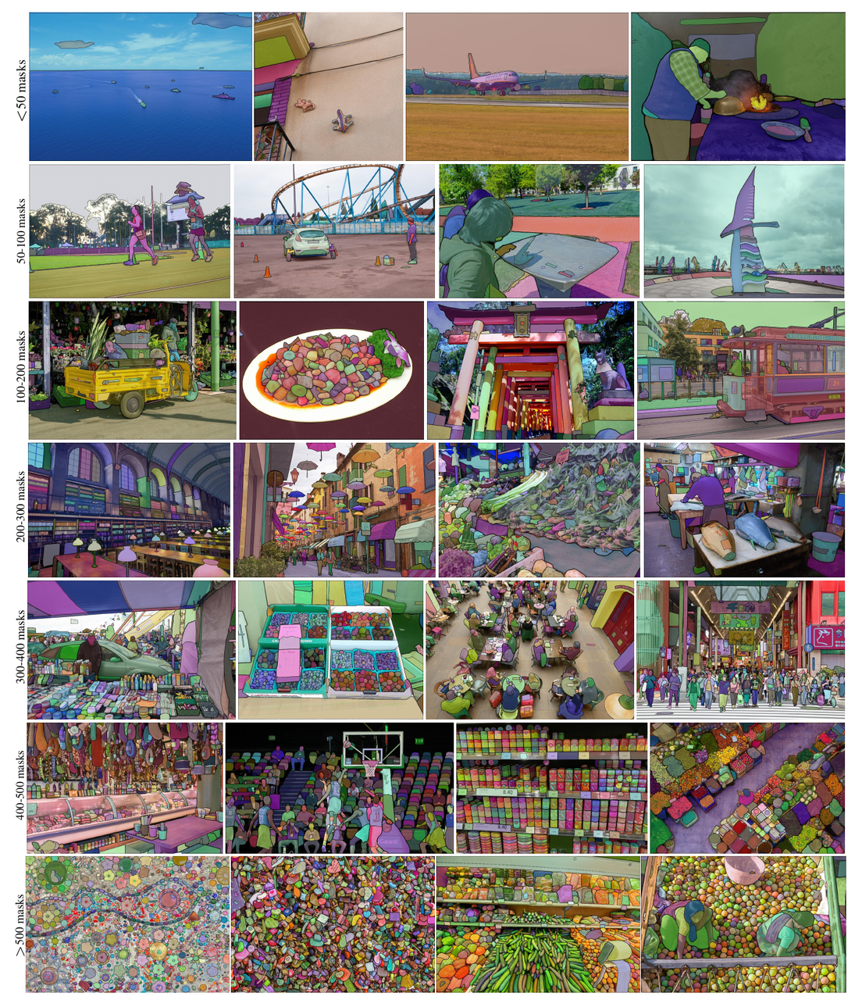

3. **Mask Center 分布**

摄影图像普遍存在 center bias，但不同数据集程度不同。SA-1B 的 mask center 对图像四角覆盖更多，分布更接近 LVIS v1 和 ADE20K；COCO 与 Open Images V5 的中心聚集更明显。这说明 SA-1B 中被分割对象的位置分布没有只集中在构图中心。

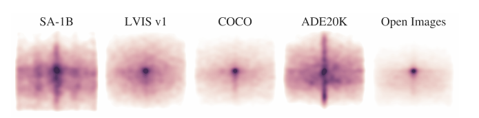

4. **Masks per Image**

SA-1B 的图像数量约为第二大 segmentation dataset Open Images 的 **`11×`**，mask 数量约为其 **`400×`**。平均每张图的 mask 数比 Open Images 多 **`36×`**；在这一指标上最接近的 ADE20K 仍少 **`3.5×`**。

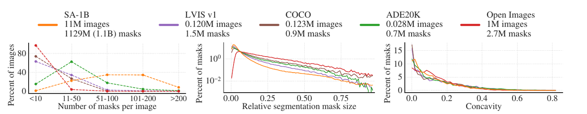

5. **Relative Mask Size**

Relative mask size 定义为 mask area 占 image area 比例的平方根。由于每张图包含更多 mask，SA-1B 中 small 和 medium relative-size mask 的比例更高。密集场景里的局部物体、物体部件和小结构不会像只标少量显著对象的数据集那样被系统性省略。

6. **Shape Complexity**

Shape complexity 使用 concavity 衡量：

$$1-\frac{A_{\text{mask}}}{A_{\text{convex hull}}}$$

Concavity 与 mask size 相关，因此比较前先按 mask size 分桶，并从各桶做 stratified sampling，使不同数据集的 size distribution 对齐。控制 size 之后，SA-1B 的 concavity distribution 与其他 segmentation dataset 大体相似。

大规模自动生成没有把 SA-1B 退化成只包含简单轮廓的 mask 集合。

### 1.4.4 SAM 2

SAM 2 把图像视为只有一帧的视频，在同一套 Model 中统一处理 image segmentation 与 video segmentation。输入可以是任意帧上的 point、box 或 mask，输出是目标在整段视频中的时空 mask 序列，也就是 masklet。新增的 streaming memory 让当前帧预测能够利用过去帧、prompted frame 和历史交互中的目标信息。

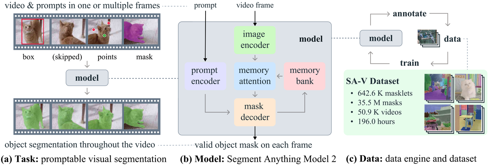

这套统一结构不需要把 SAM 与外部 tracker 串联；prompt、传播、纠错和记忆更新都在一个 Model 内完成。对应的数据引擎再把 SAM 2 放进标注环路，通过人工选择困难目标、交互修正和独立质量验证收集 SA-V。

* **Promptable Visual Segmentation Task**

1. **任务输入与 Masklet 输出**

Promptable Visual Segmentation（PVS）把 Segment Anything Task 从静态图像扩展到视频。Model 接收一段视频，以及施加在任意帧上的 positive point、negative point、box 或 mask prompt。prompt 用来指定需要分割的目标，也可以用来修正已有预测。

Model 在收到某一帧上的 prompt 后，必须立即返回该帧上的 valid segmentation mask；随后把目标传播到整段视频，在每一帧输出对应 mask。按时间排列的整组 mask 构成 masklet。PVS 的基本输出不是单帧 mask，而是目标在视频中的完整时空范围。

2. **Selection 与 Refinement**

第一次交互负责 selection。用户可以在一个或多个帧上给出初始 prompt，SAM 2 先确定目标的空间范围，再沿时间方向传播。传播过程中，目标可能因为形变、遮挡、出画或外观变化而丢失，此时可以直接在出错帧上追加 prompt。

追加 prompt 负责 refinement。新交互不仅修正当前帧，还会与已经存入 memory 的目标信息一起重新传播，从而更新整条 masklet。图中的舌头在第二帧后丢失，只需要在第三帧补充一个 positive point，Model 就能恢复目标并继续向后传播。

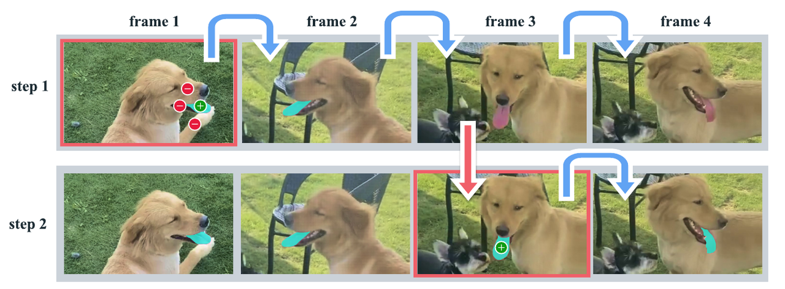

与“单帧 SAM + video tracker”相比，SAM 2 不需要在错误帧上从零重建完整 mask；历史 memory 已经保留目标语义和此前交互，一个纠错 click 就可以恢复目标。

3. **Prompt 可以出现在任意时间位置**

PVS 不要求 prompt 只出现在第一帧，也不要求交互严格按照视频时间顺序发生。prompted frame 可以位于当前处理帧之前，也可以在重新传播时相对当前帧来自“未来”。这使 Model 可以从任何容易辨认目标的帧开始标注，再向前或向后传播。

同一帧也可以连续接收多个 prompt。每次新增 point、box 或 mask 后，Model 都重新计算该帧的 mask，并把新的结果写入后续传播所使用的 memory。这个交互接口同时支持首次目标选择、局部边界修正和遮挡后的目标恢复。

4. **PVS 与 SA、VOS 的关系**

Segment Anything（SA）可以看作 PVS 的单帧特例：视频长度为一，Model 不需要使用历史 memory。Semi-supervised Video Object Segmentation（VOS）也是 PVS 的特例，它只在第一帧提供 ground-truth mask，之后要求 Model 在整段视频中传播目标。

Interactive VOS 通常允许在多个帧提供 scribble 或其他修正输入，但不同方法往往把单帧交互和时间传播拆成独立模块。PVS 统一 point、box、mask 与跨帧传播，并要求每次交互都能即时返回当前帧结果。SA 与传统 VOS 被包含在同一个任务定义中，差别只在视频长度、prompt 类型和 prompt 出现的位置。

5. **Valid Object 与边界要求**

PVS 继续沿用 valid object 的约束：目标需要具有能够在像素空间识别的视觉边界，可以是完整物体，也可以是部件或 subpart。没有明确视觉边界的抽象区域不属于这个任务的默认目标。

视频中的 valid object 可能暂时不可见。遮挡、出画或镜头变化会让某些帧不存在有效 mask，因此 Model 还必须判断目标在当前帧是否出现，而不是强制每一帧都输出前景区域。这一点直接影响 SAM 2 的 Mask Decoder 与 occlusion head 设计。

* **Segment Anything Model 2**

1. **Streaming Architecture 总览**

SAM 2 逐帧处理视频。Image Encoder 为每一帧生成不依赖目标的视觉特征；Memory Attention 读取 Memory Bank 中的空间 memory 与 object pointer，把当前帧特征条件化为与目标相关的 frame embedding；Prompt Encoder 编码当前帧上的 point、box 或 mask；Mask Decoder 输出当前帧的 mask、IoU score、object pointer 和 occlusion score。

预测完成后，Memory Encoder 把当前 mask 与未条件化的图像特征融合成新的 memory feature，并写入 Memory Bank。后续帧再通过 cross-attention 读取这些 memory。整个循环是“读取历史 memory → 预测当前 mask → 把当前结果编码为新 memory”，因此可以在固定大小的 memory 上流式处理任意长度视频。

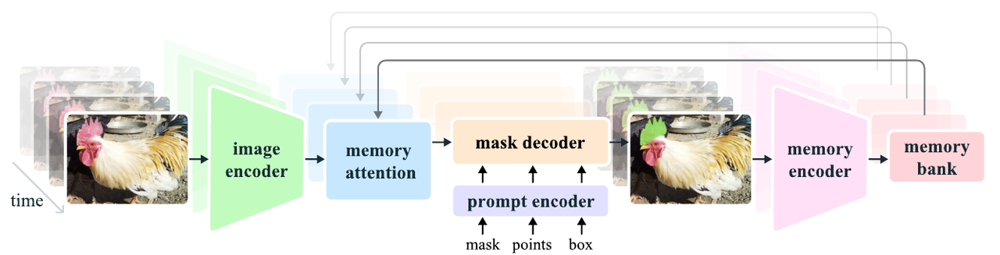

2. **Hiera Image Encoder 与多尺度特征**

Image Encoder 使用经过 MAE 预训练的 Hiera。Hiera 具有分层结构，可以直接提供多尺度特征。Stage 3 和 Stage 4 的 stride **`16`**、stride **`32`** 特征通过 Feature Pyramid Network 融合，得到每一帧的 image embedding。

Stage 1 和 Stage 2 的 stride **`4`**、stride **`8`** 高分辨率特征不进入 Memory Attention，而是通过 skip connection 直接送入 Mask Decoder 的上采样层，用来恢复细边界。Memory Attention 只处理低分辨率语义特征，高分辨率细节绕过 memory 模块，减少计算量的同时保留 mask 边缘。

Hiera 使用 windowed absolute positional embedding。全局位置 Embedding 通过插值跨越不同 window，不再在 Image Encoder 中使用 relative positional bias。Model 提供 T、S、B+ 和 L 四种 Image Encoder 规模；global attention layer 分别位于 **`5/7/9`**、**`7/10/13`**、**`12/16/20`**、**`23/33/43`**。

3. **Memory Attention**

Memory Attention 默认堆叠 **`4`** 个 Transformer block。第一层接收当前帧的 image embedding；每个 block 依次执行 self-attention、对 Memory Bank 的 cross-attention 和 MLP。cross-attention 的 key/value 同时包含 prompted frame、unprompted recent frame 的空间 memory，以及 object pointer token。

self-attention 与 cross-attention 使用标准 attention 运算，可以直接使用高效 attention kernel。位置表示由 sinusoidal absolute positional embedding 与二维 Rotary Positional Embedding（2D RoPE）共同提供。object pointer 没有固定空间坐标，因此不施加 RoPE。

Memory Attention 的作用不是再次提取图像特征，而是把当前帧视觉特征与“这个目标在历史中是什么样、此前出现在哪里、是否被 prompt 修正过”对齐。

4. **Prompt Encoder 与 Two-Way Mask Decoder**

Prompt Encoder 沿用 SAM 的设计。positive point、negative point 和 box corner 使用 positional encoding 与对应 prompt type 的可学习 Embedding 相加；mask prompt 经过 convolution 编码，并与当前 frame embedding 逐元素相加。

Mask Decoder 继续使用 two-way Transformer block，在 prompt token 与 frame embedding 之间双向交换信息。Decoder 先执行 token self-attention，再执行 token-to-image attention、逐 token MLP 和 image-to-token attention。更新后的 output token 通过 MLP 生成动态权重，与上采样后的空间特征做点积，得到每个候选 mask。

上采样阶段额外接收 Image Encoder 的 stride **`4`** 和 stride **`8`** 特征。相比只依赖低分辨率 image embedding，这两级 skip feature 能补回细小结构与边界信息。

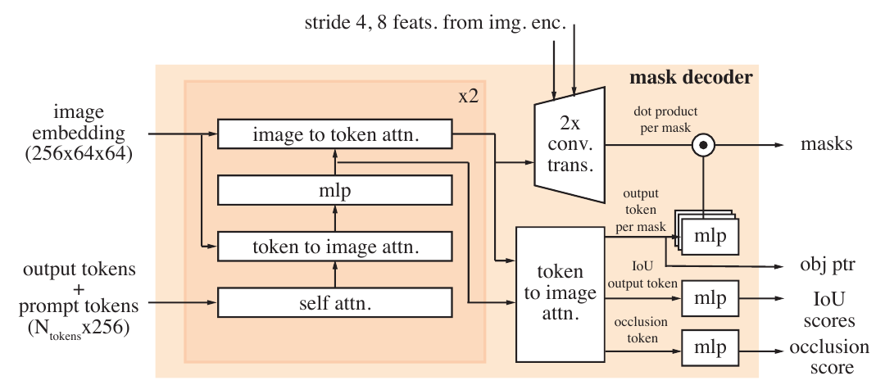

5. **跨帧歧义、Object Pointer 与 Occlusion Head**

单个 click 在视频中同样可能存在歧义。click 落在自行车轮胎上时，目标可能是轮胎，也可能是整辆自行车；某些帧只显示局部结构，后续帧才出现完整物体。SAM 2 因此在每一帧预测多个 valid mask。如果后续 prompt 没有消除歧义，传播时选择当前帧 predicted IoU 最高的 mask。

与最终 mask 对应的 mask token 同时作为当前帧的 object pointer。object pointer 是高层目标语义的紧凑向量，后续 Memory Attention 会同时读取它和空间 memory。Decoder 还增加一个 occlusion token 及其 MLP head，输出目标在当前帧是否可见的 score。

视频帧中可能根本不存在目标，例如目标被完全遮挡或已经离开画面；如果仍强制输出 mask，错误区域会继续写入 memory 并在后续传播中累积。Occlusion Head 用来显式表示“当前帧无目标”，被判断为不可见的帧还会在 memory feature 中加入一个可学习的 occlusion Embedding。

6. **Memory Encoder**

Memory Encoder 不使用第二套 Image Encoder。当前预测 mask 先通过 convolution module 下采样，再与 Hiera 产生的未条件化 frame embedding 逐元素相加，随后经过轻量 convolution layer 融合，得到可写入 Memory Bank 的空间 memory feature。

复用 Hiera 特征让 memory 直接继承主 Image Encoder 的表示能力，同时避免为每个历史帧重复维护另一套高成本 Encoder。Memory feature 最终投影到 **`64`** 维，降低 Memory Bank 的存储和 cross-attention 成本。

7. **Memory Bank 与时间位置**

Memory Bank 使用 FIFO 结构保存两类空间 memory。第一类来自最近的 unprompted frame，最多保留 **`6`** 帧；第二类来自用户提供过 prompt 的 frame，按独立队列保存。VOS 只有第一帧 mask prompt 时，第一帧 memory 会持续保留，同时队列滚动保存最近帧预测。

最近帧 memory 加入 temporal position 信息，让 Model 表示短期运动顺序。Prompted frame 不加入 temporal position，因为它们在训练中出现得更稀疏，推理时也可能与当前帧相距很远。除了空间 memory，Memory Bank 还保存 object pointer；**`256`** 维 pointer 被拆成 **`4`** 个 **`64`** 维 token，与 memory feature 使用相同通道维度。

8. **多目标视频的处理方式**

同一视频存在多个目标时，SAM 2 共享每一帧的 Hiera visual feature，但为每个目标独立运行 Memory Attention、Mask Decoder、Memory Encoder 和 Memory Bank。每个目标拥有自己的 prompt、object pointer、occlusion 状态和历史 mask。

这种设计没有 object-to-object communication，相似目标之间不能直接交换上下文。它的优点是状态隔离清楚，新增目标不需要重建其他目标的 memory，单目标逻辑也可以直接复用到多目标场景。

9. **SA-1B Pre-training**

SAM 2 先在静态图像 SA-1B 上预训练。Image Encoder 从 MAE 预训练的 Hiera 初始化；覆盖图像面积超过 **`90%`** 的 mask 被过滤，每张图最多随机采样 **`64`** 个 mask。输入统一缩放到 **`1024×1024`**，并使用 horizontal flip augmentation。

第一次 click 的 multi-mask 输出只对 segmentation loss 最小的 mask logits 反向传播，但所有候选 mask 的 IoU prediction 都接受监督。IoU logits 经过 sigmoid，被限制在 **`0～1`**；IoU head 使用 L1 loss。交互模拟使用 **`7`** 次 correction click，不再插入只输入上一轮 mask logits、却不增加新 prompt 的空轮次。

10. **Full Training 的数据混合与 Optimization**

完成图像预训练后，Model 联合训练 PVS 与 SA 两个任务。每个 iteration 只从 image dataset 或 video dataset 中采一个完整 batch，数据源被采样的概率与其规模成比例。这样可以为图像与视频使用不同 batch 组织，同时避免同一 batch 内混合不同序列长度。

发布 Model 的主要 data mix 约为 SA-1B **`15.2%`**、SA-V **`70%`**、Internal **`14.8%`**。训练 SA-V 与其他视频集时只使用人工标注 masklet，不加入自动生成 masklet。

| **配置** | **SA-1B Pre-training** | **Full Training** |
| ---------------------------------------------------------------------------- | -------------------------------------------------------------------------------------------- | --------------------------------------------------------------------------------------- |
| Training steps                                                               | **`约 90k`**                                                                                  | **`约 150k`**                                                                            |
| Resolution / precision                                                       | **`1024`** / bfloat16                                                                        | **`1024`** / bfloat16                                                                   |
| Optimizer                                                                    | AdamW，β₁=**`0.9`**，β₂=**`0.999`**                                                            | AdamW，β₁=**`0.9`**，β₂=**`0.999`**                                                       |
| Gradient clipping / weight decay                                             | L2 max **`0.1`** / **`0.1`**                                                                 | L2 max **`0.1`** / **`0.1`**                                                            |
| Learning rate                                                                | **`4×10⁻⁴`**                                                                                 | Image Encoder **`6×10⁻⁵`**；其他模块 **`3×10⁻⁴`**                                            |
| LR schedule                                                                  | reciprocal square-root；warmup **`1k`**；cooldown **`5k`**                                     | cosine；warmup **`7.5k`**                                                                |
| Global batch size                                                            | **`256`**                                                                                    | **`256`**                                                                               |
| Correction points                                                            | **`7`**                                                                                      | **`7`**                                                                                 |

11. **Video Augmentation 与交互模拟**

Video augmentation 包括 horizontal flip、random affine、color jitter、grayscale 和 per-frame color jitter。以 **`10%`** 概率启用的 mosaic transform 会把同一训练视频平铺成 **`2×2`** 网格，并只选择其中一个象限的 masklet 作为目标。四个象限包含外观相同的对象，Model 必须依赖运动和时间连续性区分正确目标，同时也会看到缩小后的目标。

每个训练样本包含 **`8`** 帧，随机选择最多 **`2`** 个 prompted frame。初始 prompt 为 ground-truth mask、positive point 或 box 的概率分别是 **`50%`**、**`25%`**、**`25%`**。每个序列最多随机选择 **`3`** 条 masklet，时间顺序以 **`50%`** 概率反转。

Correction click 通常根据 ground truth 与当前预测的 error region 采样；另有 **`10%`** 概率直接从 ground-truth mask 随机采样，不依赖当前错误。这让 Model 不只适应“点在最大错误处”的理想交互。

12. **Loss 与 16-frame Fine-tuning**

Mask prediction 使用 focal loss 与 dice loss，IoU prediction 使用 mean absolute error，occlusion prediction 使用 cross-entropy。四项 loss 的权重依次为 **`20:1:1:1`**。Multi-mask 模式只监督 segmentation loss 最小的 mask logits；如果某帧 ground truth 中不存在目标，则不监督 mask 输出，但仍监督 occlusion prediction。

只用 8-frame sequence 训练会让 Model 很少接触长时间遮挡和长视频中的 memory 漂移。因此还增加一个 **`16-frame`** fine-tuning 阶段，只选择 SA-V 与 Internal 中 edited frame 数最高的前 **`50%`** 困难 masklet。Fine-tuning 运行 **`50k`** iteration，learning rate 减半，并冻结 Image Encoder，以便在 **`80 GB`** A100 显存中容纳更长序列。

* **Data Engine 与 SA-V Dataset**

1. **Data Engine 的目标与标注范围**

Video segmentation 数据不能像互联网图文对那样直接获得。SAM 2 的 Data Engine 把交互式 Model 放进人工标注环路：Model 先传播 masklet，标注员集中修正失败帧，新数据再用于更新 Model。这个循环逐步降低每帧标注成本，同时把失败案例纳入训练数据。

标注不限定 semantic category。目标可以是完整物体，也可以是 part 或 subpart，只要具有清楚、可一致跟踪的视觉边界。Data Engine 追求的是 open-world masklet 覆盖，而不是为预先定义的类别集合补齐标签。

2. **Phase 1：SAM Per Frame**

第一阶段使用图像版 SAM 辅助逐帧标注。视频按 **`6 FPS`** 取帧，标注员在每一帧重新使用 SAM、brush 和 eraser 生成像素级 mask；没有 tracker，也没有跨帧传播。

这种方式能得到高质量空间标注，但每一帧都从零开始，平均耗时为 **`37.8 seconds/frame`**。该阶段在 **`1.4K`** 个视频上收集 **`16K`** 条 masklet。SA-V val 和 test 也采用这套逐帧流程，避免用 SAM 2 自己生成的结果评估 SAM 2。

3. **Phase 2：SAM + SAM 2 Mask**

第二阶段把只接收 mask prompt 的 SAM 2 Mask 加入环路。标注员先在第一帧用 SAM 和手工工具得到精确 mask，再由 SAM 2 Mask 向其他帧传播。中间帧出错时，标注员仍需从零绘制一个新 mask，然后重新传播。

SAM 2 Mask 最初使用 Phase 1 数据与公开 VOS dataset 训练，在 Phase 2 期间根据新增标注重新训练并更新 **`2`** 次。该阶段收集 **`63.5K`** 条 masklet，平均标注时间降到 **`7.4 seconds/frame`**，相对 Phase 1 加速约 **`5.1×`**。

Phase 2 已经解决重复传播问题，但中间帧修正仍没有利用旧 memory；一旦 propagation 失败，标注员必须重新制作完整 mask。

4. **Phase 3：完整 SAM 2**

第三阶段使用支持 point、mask 与 streaming memory 的完整 SAM 2。标注员可以在任意失败帧添加 refinement click，Model 利用历史 memory 修正当前结果并重新传播，不再要求从零绘制中间帧 mask。

Phase 3 中根据新增数据重新训练并更新 SAM 2 **`5`** 次，共收集 **`197.0K`** 条 masklet。平均耗时降到 **`4.5 seconds/frame`**，相对 Phase 1 加速约 **`8.4×`**。

完整 SAM 2 同时减少 edited frame 比例和每个 edited frame 的 click 数，并在受控实验中保持与逐帧人工标注相当的 mask alignment。

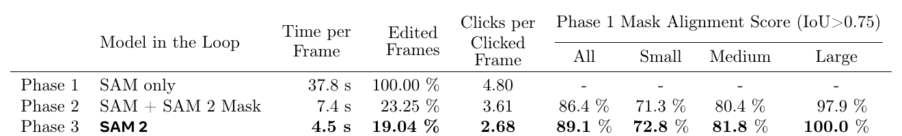

5. **受控阶段对比与 Quality Verification**

三阶段效率对比使用 **`169`** 个视频和 **`452`** 条 masklet，让三组标注员分别用不同阶段的流程处理同一批目标。Phase 1 结果作为质量参考，因为它逐帧进行高质量人工修正。

Phase 3 只编辑 **`19.04%`** 的帧，每个 edited frame 平均 **`2.68`** 次 click。以 IoU 大于 **`0.75`** 作为对齐标准时，总体 Mask Alignment 为 **`89.1%`**；small、medium、large mask 分别为 **`72.8%`**、**`81.8%`**、**`100.0%`**。

每条 masklet 还必须由另一组标注员独立验证。验证结果分为 satisfactory、unsatisfactory 和 reject。Satisfactory 表示目标在所有帧中被正确、一致地跟踪；unsatisfactory 表示目标本身清楚，但 masklet 存在错误，需要返回标注流水线继续修正；目标边界不清楚或无法稳定定义时直接 reject。

6. **Auto Masklet Generation**

人工标注员通常优先选择显著的大目标，容易漏掉背景物体、部件和小结构。自动 masklet 用来扩展位置与尺度覆盖，也用来主动发现 Model 的失败案例。SAM 2 在第一帧接收规则 point grid，生成候选 masklet，再交给独立验证流程。

被判断为 satisfactory 的自动 masklet 直接加入 SA-V；unsatisfactory 结果代表 SAM 2 的真实失败模式，从中采样后交给 Phase 3 标注员用交互 prompt 修正。自动结果既补充训练标签，也把 Model 最不稳定的对象送回人工环路。

7. **五步 Annotation Protocol**

完整 protocol 把目标选择、masklet tracking 和质量验证交给不同标注员。Annotator A 先播放视频并选择需要跟踪的对象，再用 SAM 2 尝试传播，专门寻找 tracking failure。已有 manual 或 auto masklet 会预先覆盖在视频上，帮助标注员避开已经处理的显著对象。

Annotator B 接收选定目标，运行 SAM 2 传播并逐帧检查；发现错误时添加 refinement prompt，再次向后传播。完成后从头播放视频进行 final check 并提交。Annotator C 不参与前面的选择与修正，只负责把结果判为 satisfactory、unsatisfactory 或 reject。

为了把预算集中到困难对象，目标通常需要至少 **`2`** 个 edited frame。edited frame 数也被用作目标难度的代理指标。把 object selection 与 masklet annotation 解耦后，一组人负责发现失败案例，另一组人负责一致地修完整条时序标注。

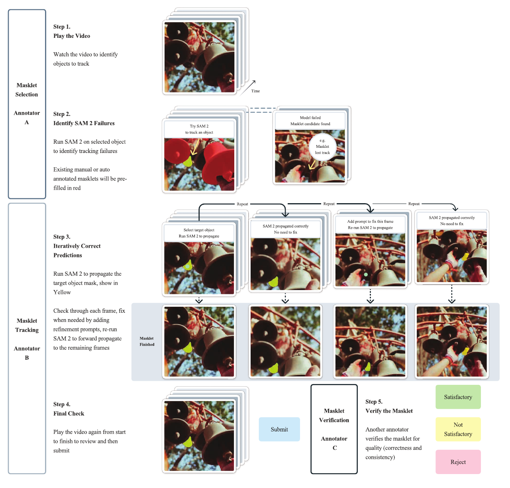

8. **SA-V 的规模与组成**

SA-V 包含 **`50.9K`** 个视频、**`642.6K`** 条 masklet 和 **`35.5M`** 个逐帧 mask。其中 **`190.9K`** 条 masklet 来自人工标注，**`451.7K`** 条来自经过人工验证的自动生成结果。

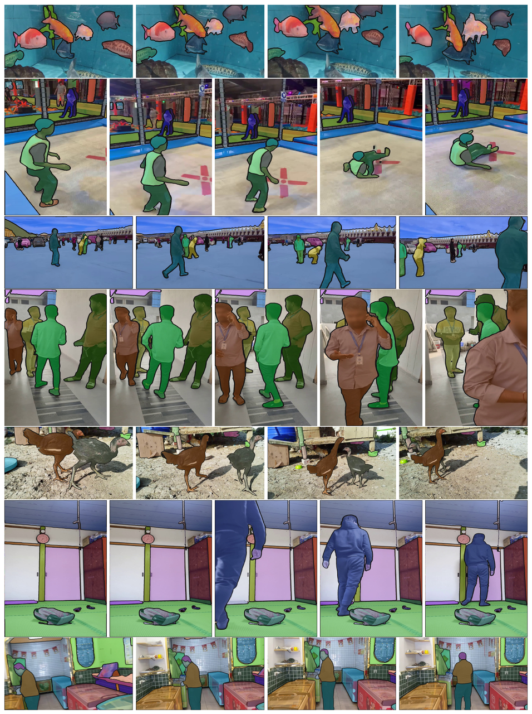

只计算 manual annotation 时，SA-V 仍包含 **`10.0M`** 个 mask；加入 Auto 后达到 **`35.5M`**，相当于当时最大公开 VOS dataset 的 **`53×`**。SA-V Manual 中有 **`42.5%`** 的 masklet 至少消失一次后重新出现，覆盖了长遮挡与 re-appearance。

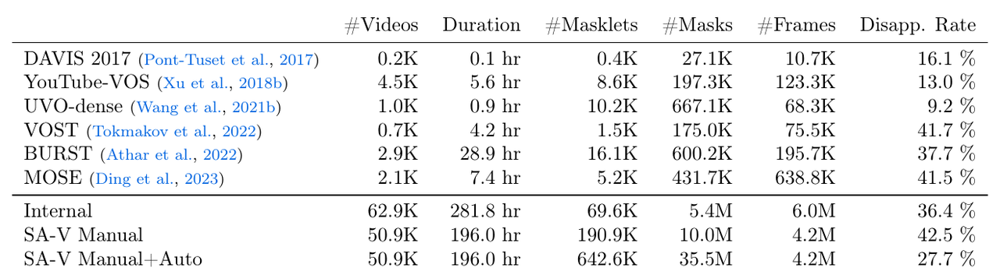

9. **视频属性与 Dataset Split**

视频分辨率从 **`240p`** 到 **`4K`**，平均为 **`1401×1037`**。时长从 **`4 seconds`** 到 **`2.3 minutes`**，平均 **`13.8 seconds`**；总计 **`4.2M`** 帧、**`196 hours`**。场景约 **`54%`** 室内、**`46%`** 室外。

Train、val、test 按视频拍摄者及地理位置划分，减少相似对象跨 split 泄漏。SA-V val 包含 **`155`** 个视频和 **`293`** 条 masklet；SA-V test 包含 **`150`** 个视频和 **`278`** 条 masklet。两者专门选择快速运动、复杂遮挡和消失后重现的困难目标，并使用 Phase 1 逐帧标注。

训练还使用一个授权的 Internal dataset，包含 **`62.9K`** 个视频和 **`69.6K`** 条 Phase 2/3 masklet；Internal-test 使用 Phase 1 标注 **`96`** 个视频、**`189`** 条 masklet。

10. **Automatic Masklet 的生成细节**

第一帧先使用 **`32×32`** point grid；随后把第一帧按重叠 window 裁成 **`2×2`** 的 **`4`** 个 zoomed crop，每个 crop 使用 **`16×16`** grid；再按 **`4×4`** window 得到 **`16`** 个 crop，每个使用 **`4×4`** grid。

所有候选 masklet 在每一帧执行两项 post-processing：删除面积小于 **`200 pixels`** 的孤立 component，并填充面积小于 **`200 pixels`** 的孔洞。自动标注加入后，同一帧中背景物体和小结构的覆盖明显增加。

* **数据分布**

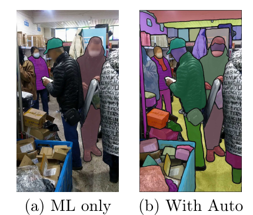

SA-V 视频来自 **`47`** 个国家。按视频分辨率归一化后，超过 **`88%`** 的 mask 面积小于整帧的 **`0.1`**，说明数据中包含大量中小目标，而不是只保留画面中心的大物体。

SA-V 的难度主要来自目标尺度、遮挡、消失后重现和部件级标注，这些分布直接对应 SAM 2 的 Memory Bank、occlusion prediction 与交互修正能力。

### 1.4.5 SAM 3

* **Promptable Concept Segmentation（PCS）**

1. **任务定义与输出**

Promptable Concept Segmentation（PCS）接收一张图像或一段不超过 **`30 秒`**&#x7684;短视频，以及描述视觉概念的 prompt。Model 需要找出所有符合该概念的 object instance，为每个 instance 输出 mask；输入是视频时，还要保持 identity 并生成跨帧 masklet。

PCS 的目标不是根据一个 click 分割单个 object，而是根据一个 concept 找全图像或视频中属于该 concept 的全部 instance。因此输出同时包含 open-vocabulary recognition、instance localization、pixel-level segmentation 和视频 identity tracking。

2. **Noun Phrase 与 Image Exemplar**

Concept prompt 可以是 short noun phrase（NP）、image exemplar，或者二者组合。NP 由一个 noun 和可选 modifier 构成，例如 **`yellow school bus`**、**`striped cat`**。NP 对图像或视频的全部 frame 全局生效，用来定义需要寻找的 category。

Image exemplar 是某个 frame 上的 bounding box 与正负 label。Positive exemplar 表示框内 object 属于目标 concept，negative exemplar 表示不属于。Exemplar 只在指定 frame 上提供，但会改变后续对整个输入的 concept 判断。文本也可以省略，此时 Model 只根据 exemplar 的外观与正负关系寻找同类 instance。

3. **Concept-level Interactive Refinement**

第一次推理给出所有匹配 instance 后，用户可以针对 false negative 添加 positive exemplar，也可以针对 false positive 添加 negative exemplar。新 exemplar 不是只修正框中的一个 object；它会更新 concept prompt，使 Model 一次性增加或移除其他相似 instance。

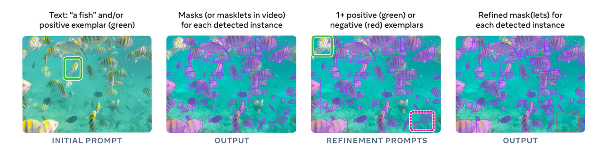

当一个罕见 concept 难以仅靠文字准确表达，或者 Model 漏掉了一组外观相似的 instance 时，少量 exemplar 可以把修正从单个 object 推广到整个 concept。

4. **Prompt 的 Category Consistency**

同一次交互中的所有 prompt 必须保持 category definition 一致。例如 text prompt 是 **`fish`**，后续不能用只框住鱼尾的 exemplar 把目标偷偷改成“tail”。如果真正想找鱼尾，应直接更新 text prompt。

Text 与 exemplar 指向不同粒度、不同部件或不同 category 时，Model behavior 没有定义。Concept-level refinement 只能补充同一 category 的正负证据，不能承担 category 重命名。

5. **PCS 与 PVS 的边界**

PCS 使用 concept prompt 找到全部匹配 instance。Promptable Visual Segmentation（PVS）则使用 point、box 或 mask 定义一个具体 object，并只修正该 instance 的 mask 或 masklet。SAM 3 同时支持两种 task：先用 PCS 建立 instance 集合，再切换到 PVS，用 positive/negative click 精修某一个 instance。

二者的 interaction scope 不同。PCS prompt 会影响 concept 下的多个 instance；PVS prompt 只影响被选中的单个 identity。为了避免一个 instance 的局部 click 改写整个 concept，Model 在 concept mode 与 instance mode 之间执行明确的 mode switch。

6. **Open Vocabulary 带来的歧义**

只要一个 simple NP 能在视觉场景中落地，它就可以进入 PCS vocabulary。这个定义天然包含歧义：polysemy 会让 **`mouse`** 同时指设备和动物；**`large`**、**`cozy`** 等 subjective descriptor 依赖上下文；**`mirror`** 是否包含边框属于 boundary ambiguity；遮挡与模糊还会改变可见范围。

SA-Co/Gold 为同一个 image-NP pair 收集 **`3`** 份独立 expert annotation，evaluation 允许多个有效解释。Model 侧再使用 Ambiguity Head 学习互相冲突但都合理的解释，避免把它们同时堆叠成重合 mask。

* **Segment Anything Model 3**

1. **Unified Detector-Tracker Architecture**

SAM 3 在一个 Model 中组合 image-level Detector 与 memory-based Tracker，二者共享 Perception Encoder（PE）Backbone。Detector 负责根据 concept prompt 发现当前 frame 中的全部 instance；Tracker 负责延续已有 identity，并把新 detection 与历史 masklet 合并。PVS 分支继续接受 point、box 和 mask，用于单个 instance 的精修。

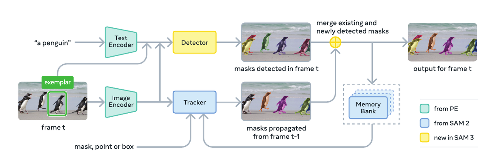

Model 约有 **`850M`** parameters，其中 vision Encoder 约 **`450M`**、text Encoder 约 **`300M`**，Detector 与 Tracker 合计约 **`100M`**。PE 提供共享视觉语义底座，Detector 解决“当前有哪些目标”，Tracker 解决“这些目标在时间上是谁”。

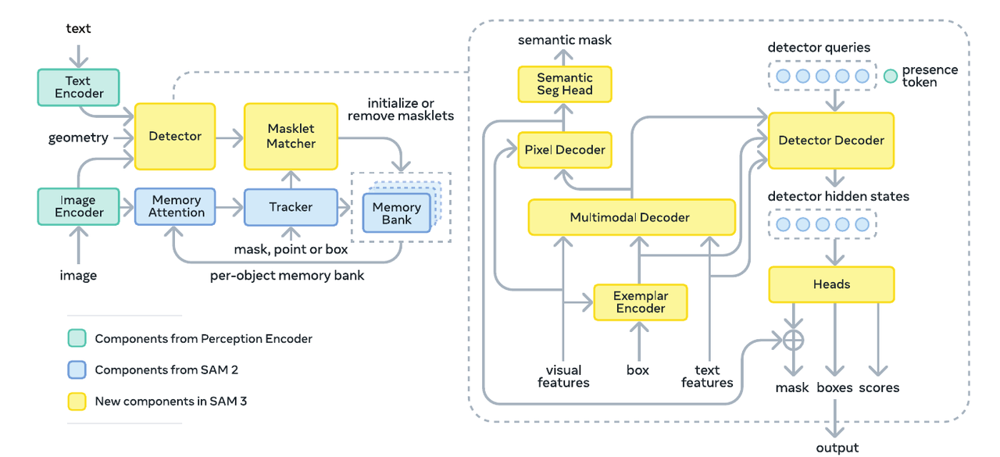

2. **PE Image Encoder 与 Text Encoder**

Image Encoder 与 Text Encoder 先在 **`5.4B`** image-text pairs 上做 contrastive vision-language pre-training。Vision Encoder 使用 windowed attention，只在 **`32`** 层中的 **`4`** 层执行 global attention。默认输入边长为 **`1008`** pixels，并切成 **`3×3`** 个互不重叠的 **`336×336`** window。

每一层使用 RoPE，同时保留 windowed absolute positional Embedding。Text Encoder 使用 causal attention，最大 context length 为 **`32`**。视频推理时，每个 frame 只运行一次 PE Backbone；后续 Detector、Tracker 和多轮交互复用这份 unconditioned frame token，避免重复计算视觉 Backbone。

3. **Geometry 与 Exemplar Encoder**

每个 image exemplar 由 bounding box、positive/negative label 和 ROI-pooled visual feature 共同表示。Position Embedding、label Embedding 与视觉特征拼接成 exemplar token，再由一个小型 Transformer 处理。多个 exemplar token 先做 self-attention，并 cross-attend 到对应 frame 的 unconditioned visual token。

同一模块也编码 PVS 的 point 与 box，得到 geometry token。只有 text prompt 时，geometry token 与 exemplar token 都可以为空；只有 exemplar 时，也允许没有 text token。这让 PCS 的 text-only、image-only 与 text-plus-image 三种 prompt 共享同一条 Detector 路径。

4. **Fusion Encoder**

Text token 与 geometry/exemplar token 合称 prompt token。Fusion Encoder 接收未经 concept 条件化的 frame Embedding，通过 **`6`** 个 Transformer block 逐层执行 visual self-attention、对 prompt token 的 cross-attention 和 MLP，把输入变成 conditioned frame Embedding。

Fusion Encoder 的职责是把“图里有什么”转换为“与当前 concept 有关的视觉表示”；object query 还没有进入这一步，因此 concept conditioning 与 instance proposal 被拆开处理。

5. **DETR-like Decoder 与 Object Query**

Detector Decoder 由 **`6`** 个 Transformer block 构成，默认使用 **`200`** 个 learned object query。Query 先 self-attend，再 cross-attend 到 prompt token 和 conditioned frame Embedding。对视觉特征的 cross-attention 加入 box-to-pixel relative position bias，使 query 更集中于自己正在回归的 spatial region。

每一层都输出 classification logit 与相对上一层 box 的 refinement delta。Training 同时使用 iterative box refinement、look-forward-twice、hybrid matching 和 DAC-DETR dual supervision；attention 本身仍采用 vanilla attention。Box 使用独立 MLP 预测，classification head 判断 query 是否与 prompt 匹配。

6. **Presence Token：分离 Recognition 与 Localization**

单个 object query 天然偏向局部定位，却又被要求理解整个画面的 context 来判断 NP 是否存在，这两个目标会互相干扰。SAM 3 增加一个 learned global presence token，只预测目标 NP 是否存在于当前 image/frame；每个 object query 只学习“已知 NP 存在时，这个 proposal 是否匹配”。

$$\Pr(q_i\ \text{matches NP})=\Pr(q_i\ \text{matches NP}\mid\text{NP present})\cdot\Pr(\text{NP present})$$

最终 query score 是 local score 与共享 presence score 的乘积。Per-query classification loss 只在正样本上计算，presence loss 同时利用 positive 与 hard negative image-NP pair。全局 recognition 与局部 localization 解耦后，hard negative 不再迫使每个 query 独自学习整图语义，false positive 更容易被压制。

7. **Instance Mask 与 Semantic Mask Head**

Segmentation Head 从 MaskFormer 攨写而来，instance segmentation 与 semantic segmentation 共享同一组 conditioned feature。Instance mask 还使用 Detector Decoder 的 object query；semantic head 直接为每个 pixel 预测其是否属于当前 prompt，并复用 presence score 作为全局 gate。

PE Vision Encoder 是 single-scale ViT，因此 segmentation head 使用 SimpleFPN 构造 multi-scale feature。Detector 同时输出 mask、box 和 score；semantic branch 则输出一个覆盖该 concept 全部 pixel 的 binary mask。

8. **Ambiguity Head 与 Winner-Takes-All**

同一个 NP 在训练数据中可能对应多个互相冲突的合理解释。如果直接最小化平均 loss，Model 容易把两种解释都以中等置信度输出，形成重合 mask。SAM 3 并行训练 K 个 expert，只让 loss 最低的 expert 接收当前样本的 gradient。

$$k^{\star}=\arg\min_k L_k,\qquad L_{\mathrm{WTA}}=L_{k^{\star}}$$

默认 **`K=2`**；K 大于 **`3`** 时更容易出现 mode collapse。另一个 classification head 学习预测哪位 expert 更可能正确，inference 时只调整 classification logit，不改变 mask、box 与 presence score。嵌套 instance 通过 Intersection-over-Minimum（IoM）检测；加入 Ambiguity Head 后，overlapping instance 减少约 **`15%`**。

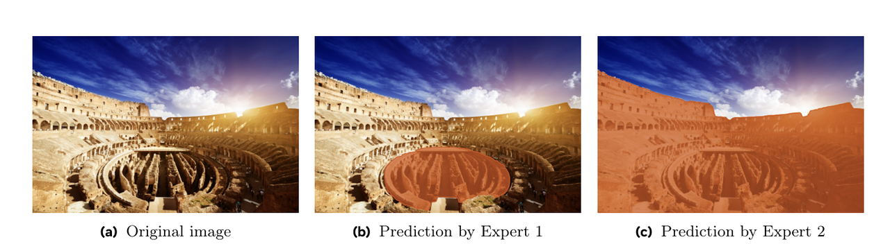

9. **Detector-Tracker Video Loop**

视频中每个 frame 同时运行两条路径。Detector 根据当前图像与 concept prompt 产生新 object mask 集合；Tracker 把上一时刻已有 masklet 传播到当前 frame。Masklet Matcher 再把传播结果与新 detection 关联，更新已有 identity，并为未匹配的新 object 建立 masklet。

$$\widehat{M}_t=\operatorname{propagate}(M_{t-1}),\quad O_t=\operatorname{detect}(I_t,P),\quad M_t=\operatorname{match\_and\_update}(\widehat{M}_t,O_t)$$

Detector 允许任意时刻出现新 object，Tracker 维持跨帧 identity；二者的合并使 video PCS 不再假设所有目标都必须出现在第一帧。

10. **SAM 2-style Tracker 与 Memory Bank**

Tracker 复用 SAM 2 的 Prompt Encoder、Mask Decoder、Memory Encoder 与 Memory Bank，但使用与 Detector 共享的 PE Image Encoder，并通过独立 neck 接收 unconditioned visual token。Memory Attention 对当前 frame token 做 self-attention，再 cross-attend 到 spatial memory 与 object pointer。

Memory Encoder 把当前 mask prediction 与 PE visual token 融合后写入每个 object 独立的 Memory Bank。Inference 只保留 Model 高置信判断 object 存在的 frame。Mask Decoder 仍是 hidden state 与 output token 之间的 two-way Transformer；每个 tracked object 在每帧预测 **`3`** 个候选 mask，并选择置信度最高者继续传播。

11. **IoU Matching 与 New Masklet Spawning**

传播 mask 与当前 detection 使用简单 IoU matching。成功匹配时，identity 沿用已有 masklet；未被任何传播 mask 匹配的 detection 会初始化新的 masklet。这个机制适合处理 object 中途进入画面，但 crowded scene 中的遮挡与高度重叠会产生 duplicate 或错误 association。

只依赖逐帧 IoU 无法稳定区分短暂消失、重新出现和相似 distractor，也可能在 Tracker 漏一帧后为同一 object 重复创建新 identity。

12. **Masklet Detection Score 与 Confirmation Delay**

对 object i，若 frame τ 上的传播 mask 与任一 detection 的 IoU 超过阈值，则 frame-wise match 记为 +1，否则记为 −1。Masklet Detection Score（MDS）是时间窗口内这些结果的累加：

$$S_i(t,t^{\prime})=\sum_{\tau=t}^{t^{\prime}}\Delta_i(\tau)$$

Model 默认延迟 **`T=15`** 个 frame 输出，在 **`30 FPS`** 视频上约等于半秒。Confirmation window 内，MDS 低于 **`V=0`** 且刚出现的 candidate masklet 被删除；这等价于要求它至少在窗口的一半 frame 中匹配到 detection。

13. **Duplicate Removal、Suppression 与 Re-prompting**

若两个 masklet 在至少一半 confirmation frame 中同时匹配同一个 detection，后出现者被视为 duplicate 并删除；判断 duplicate 的默认 IoU threshold 为 **`0.1`**。已经确认的 masklet 若 lifetime MDS 降到 0 以下，输出 mask 暂时清零，但状态仍保留，以便后续 detection 重新确认。

每隔 **`N=16`** 个 frame，Detector 与 Tracker 都达到 **`0.8`** 置信度且 mask IoU 至少为 **`0.8`** 时，Detector mask 会重新初始化 Tracker。若 detection 与 Tracker prediction 的 bounding-box IoU 低于 **`0.85`**，还会触发 detection-guided re-prompting，抑制 drift 与 leaky mask。

14. **Instance-level PVS Refinement**

PCS 得到初始 mask 或 masklet 后，可以切换到 PVS，对单个 identity 添加 positive/negative click。Prompt Encoder 编码 click，Mask Decoder 更新当前 frame 的 mask，视频中再把修正传播到完整 masklet。

Concept-level exemplar 与 instance-level click 的影响范围不同，因此当前架构采用 hard mode switch。这种切换避免局部 click 误改全部 instance，但 concept prompt 与 instance prompt 还不能在同一状态中无缝交织。

15. **Stage 1 与 Stage 2：PE 和 Detector Pre-training**

Stage 1 使用 **`5.4B`** image-text pairs 训练 PE，采用 L+ 规模的 vision/text Encoder，不使用 distillation，也不在这一阶段进行视频微调。Stage 2 联合训练 Detector 与两侧 Encoder，数据包含大规模 pseudo label、human annotation 和按 frame 使用的视频数据，目标是获得广泛的 open-vocabulary detection、instance segmentation 与 semantic segmentation 能力。

Stage 2 以 **`0.2`** 概率丢弃 NP 改成 visual query，又以 **`0.2`** 概率附加 input box；PVS 只模拟 **`4`** 轮交互。训练约 **`95K`** iterations，batch size 为 **`896`**，AdamW、weight decay **`0.1`**，warmup 与 cooldown 均为 **`5K`** steps。

Initial learning rate 为 **`5×10⁻⁴`**，vision/text Encoder 使用 **`1×10⁻⁴`**，其他模块使用 **`1×10⁻³`**。Vision Encoder 的 layer-wise learning-rate decay 为 **`0.9`**。

16. **Stage 3：High-quality Fine-tuning 与 Interactivity**

Stage 3 只保留经过 exhaustivity verification 的高质量数据，移除 SA-Co/SYN，并加入 Presence Token。PVS 交互轮数从 **`4`** 增加到 **`7`**；PCS 则根据 Model error 采样 exemplar：false negative 提供对应 ground-truth box 作为 positive，high-confidence false positive 提供 negative box，累计执行 **`5`** 轮。

Presence loss 使用 binary cross-entropy，权重为 **`20`**。全部 learning rate 缩小为 Stage 2 的 **`0.025`** 倍，训练约 **`5K`** iterations，batch size 为 **`512`**。Stage 2 先铺开 concept coverage，Stage 3 再用短而密集的高质量交互训练校正 precision 与 prompt response。

17. **Stage 4：Frozen Backbone Tracker Training**

最后冻结 PE Backbone，只训练视频 Tracker。Batch size 为 **`512`**，训练约 **`190K`** iterations，cosine schedule 的 peak learning rate 为 **`5×10⁻⁴`**，linear warmup 为 **`1K`** iterations。

Mask focal loss、dice loss、IoU MAE 与 occlusion cross-entropy 的权重为 **`20:1:1:1`**。Multi-mask 只监督 segmentation loss 最低的候选；无目标 frame 不监督 mask，但始终监督 occlusion。之后再用 **`16-frame`** 与 **`32-frame`** 视频微调 **`60K`** iterations，learning rate 缩小到 **`0.1`** 倍。

18. **Data Augmentation、Ontology Constraint 与 Safety**

PCS 输入固定为 **`1008×1008`**。Training 使用 crop、resize、随机分布到四边的 padding，以及在不涉及左右语义时的 horizontal flip。Closed-vocabulary dataset 通过 Wikidata mapping 扩展 synonym、采样 negative，并补齐 hierarchy closure，例如标注 canoe 时同步保证 boat 的父类 annotation 完整。

Unsafe concept 与主观、非视觉、针对人的 adjective 会作为 negative 加入训练，避免 Model 对这些 phrase 随机输出。部分 dataset 使用最大 **`3×3`** mosaic；只有 annotation 缺失风险较低的数据才允许拼接，防止一个子图中未标注的同类 object 变成 label noise。

* **Data Engine**

1. **Human、AI 与 SAM 3 的 Feedback Loop**

Data Engine 从大规模 media pool 中挖掘 image/video 与 noun phrase，使用当前版本的 SAM 3 生成 candidate mask，再由 human verifier 或 AI verifier 检查质量与 exhaustivity。通过 verification 的结果直接进入 final annotation；失败样本交给 human correction，并回流到后续 Model 和 verifier 训练。

这条 pipeline 的核心是主动寻找当前 Model 的失败 media-NP pair，把 human effort 集中到缺 mask、错 mask、hard negative 和复杂 tracking，而不是平均地重新标注所有样本。Phase 1–3 处理图像，Phase 4 扩展到视频。

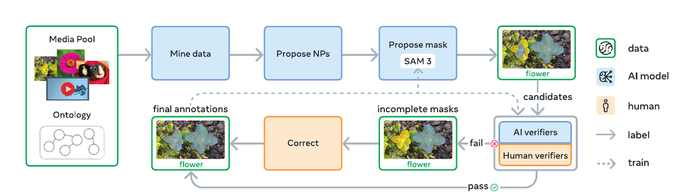

2. **Media Pool 与 SA-Co Ontology**

Media pool 覆盖 web image、art、food、driving、robotics、medical imaging、wildlife camera 与视频等 domain。Web image 与 alt-text 主要来自 MetaCLIP；targeted mining 再从 specialized dataset 中补充长尾视觉分布，最终覆盖 **`12`** 类 media domain。

SA-Co ontology 从 Wikidata 构建。人工选择 Human、Mammals 等 high-level node，再递归纳入 descendant，得到 **`22.4M`** nodes、**`17`** 个 top-level category 与 **`72`** 个 sub-category。任意 NP 先由 Sentence-BERT retrieval 找 candidate node，再由 Llama 3.2 judge 选择最接近的 mapping，用于统计覆盖、hierarchy closure 与 negative mining。

3. **NP、Mask、MV、EV 与 Correction**

Candidate generation 先由 captioner 和 parser 提出 NP，再由 SAM 3 为每个 NP 生成 instance mask 与 semantic mask。Mask Verification（MV）逐个判断 mask 是否与 NP 对应、boundary 是否完整；Exhaustivity Verification（EV）检查所有符合 NP 的 instance 是否都已覆盖。

EV 发现遗漏后进入 correction。Human annotator 可以使用 SAM 1 browser tool 添加、删除或编辑 mask；crowded object 无法逐个分离时允许使用 group mask。NP 如果只是 **`it`**、**`blue`** 等无法落地的表达，或者精细 category 无法确认，可以直接标记为 ungroundable、ambiguous 或 unsure 并退出当前 job。

4. **Phase 1：Human Verification**

Phase 1 从 MetaCLIP 随机采样 image。BLIP-2 生成 caption，spaCy 抽取 NP；FIBER 或 OWLv2 根据 NP 产生 box，再把 box 交给 SAM 2 生成 mask proposal。MV 与 EV 完全由不同的 human verifier 完成，correction 也由 human annotator 执行。

这一阶段获得 **`1.2M`** images 和 **`4.3M`** image-NP pairs，构成初始 SA-Co/HQ。随后用它训练第一版 SAM 3，并在 Phase 2 中替代 SAM 2 plus open-vocabulary Detector 的 proposal chain。

5. **Phase 2：Targeted Mining 与 Domain Balancing**

Phase 2 不再只依赖随机 web sample。PE、DINOv2 或 MetaCLIPv2 retrieval 根据 SA-Co ontology 定向寻找 caption 中不常见、当前 Model 容易失败的 concept。Wiki-Common 选择普通人可识别但频率较低的 node；Wiki-FG 从 sports equipment 与 food and drink 子图中选择 kefir、pastille、kettlebell 等 fine-grained concept。

每个 concept 的 Wikimedia reference image 先离线聚合成 embedding index，在线阶段再用 image KNN 与 text-image similarity 检索。Llama 3.2 还把输入划分为 ad、product photo、indoor、outdoor、infographic 等 image type，采样时按 type-agnostic probability 做 balancing，避免 web data 被少数画面类型占满。

6. **NP Proposal、Cleaning 与 Difficulty Filtering**

Captioner 升级为 Llama 3.2，phrase parser 使用为 NP extraction 微调的 Llama 3.1。另一个 MLLM verifier 过滤 **`them`**、**`middle`** 等 non-groundable phrase。剩余 NP 做 singularization、near-duplicate removal 与 possessive removal。

已经积累足够 annotation 的高频 NP、SAM 3 已经很准确的 easy NP，以及 fixed restricted list 中的 phrase 会被降采样或移除。Phase 3 开始，difficulty filtering 主要依赖 AI verifier，把数据预算留给罕见、细粒度、small object 和 crowded case。

7. **Hard Negative Generation**

Hard negative 是图中不存在、但在语义或视觉上与 positive concept 接近，并且能诱导当前 SAM 3 产生错误 prediction 的 NP。第一条 proposal 路径从 ontology 中选择 positive node 的 sibling、cousin 或 uncle，例如 Siamese cat 的 negative candidate 可以是 tabby cat、dog 或 Chihuahua；第二条路径让 Llama 4 提出 visually similar negative。

每个 candidate 都必须通过 adversariality check。若 SAM 3 对它完全没有 prediction，则样本太容易而被丢弃；若产生 prediction，再检查它与原 positive mask 的 overlap。只有确实触发错误且经过 presence verification 的 phrase 才进入 hard negative annotation。Ontology proximity 本身不能证明 concept 不存在于图中，未经二次核验的“相近 category”不能直接当 negative。

8. **AI Verifier 的输入与 Training**

Phase 1 的 human accept/reject label 用来 fine-tune Llama 3.2，分别构造 MV 与 EV AI verifier。MV 输入 image、phrase 和单个 mask：一张 crop 显示目标在全图中的位置，另一张 zoom-in crop 叠加 mask，Model 输出 Accept、Reject、Accept as text、Flag label 或 Whole image。EV 输入 image、phrase 与全部 candidate box，输出是否 exhaustive、是否有可分离遗漏、是否只有不可分离 group，或 phrase 是否 vague/unsafe。

Correction task 也提供 training signal：human 新增的 mask 是高质量 MV positive；完成 exhaustivity correction 的 job 是 EV positive。两个 task 的数据合并后，先用超过 **`200M`** image-text pairs 预训练基础 verifier，再用约 **`10M`** 高质量 human labels 分别 fine-tune 两个 verifier。

9. **Human 与 AI Verification 的分工**

AI verifier 在 MV 上平均达到 **`77.7`** accuracy，高于 human 的 **`75.0`**；EV 平均为 **`81.1`**，接近 human 的 **`81.8`**。新 domain 上，MV 通常可以 Zero-Shot 接近 human，EV 则需要几千条 domain-specific label 才能追平。

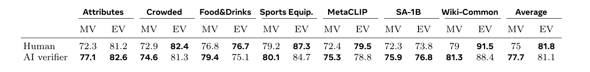

AI verifier 自动放行高置信 easy case，并把 poor mask 或 missing mask 送给 human correction，使 Data Engine throughput 相比 human-only pipeline 提升超过两倍。Phase 2 中 SAM 3 更新 **`6`** 次，并新增 **`122.2M`** image-NP pairs。

10. **Phase 3：Scaling 与 Domain Expansion**

Phase 3 把 SA-Co/HQ 扩展到 **`15`** 个 annotation domain。除了沿用 targeted mining，还从 SA-1B mask 计算 crowdedness、mask count 和 mask area，专门寻找高 object count、强重叠和 small object image。Alt-text 与 ontology 则补充 long-tail、fine-grained NP。

这一阶段以 AI verifier 为主，human 只处理 verifier 判定需要 correction 的样本。SAM 3 迭代 **`7`** 次，AI verifier 迭代 **`3`** 次，SA-Co/HQ 新增 **`19.5M`** image-NP pairs；同时自动生成 SA-Co/SYN，并把外部 dataset 映射到 SA-Co ontology。

11. **Phase 4：Video Mining**

Video media pool 约有 O(**`1M`**) 小时，来自 SA-V、内部 SA-V、YT-Temporal-1B 与 SA-FARI。Pipeline 先寻找 **`5–30 秒`**&#x7684; single-shot clip；scene-boundary detector、FFmpeg VMAF motion score 与 PySceneDetect 排除静止片段、剪辑跳切和难以定义连续 identity 的视频。

Video ontology 偏向 human activity、animal、transportation 与高 motion NP。PE retrieval 做 content balancing，MLLM judge 根据遮挡、快速运动、crowded object 等问题筛选 challenging track；已经在 human annotation 中发现的失败视频还会作为 seed，继续进行 targeted similarity search。

12. **Video NP 与 Masklet Proposal**

Captioner 与 parser 在每个 frame 上运行，而不是只生成 video-level caption，以提高 NP 数量和时间覆盖。Scene concept、background concept、不可 mask phrase、restricted NP 与已积累过多样本的 easy NP 会被过滤。候选 phrase 再经过 cleaning 与 super-category filtering。

早期 pipeline 先用 image-level SAM 3 逐帧 detection，再用 SAM 2 传播 mask；未被现有 masklet 覆盖的新 detection 会启动额外传播。Video SAM 3 超过这条 decoupled system 后，proposal 改为单独使用 SAM 3。Masklet 经过 IoU deduplication、whole-scene filtering，并要求每个 NP 至少有 **`3`** 个 object、每个视频至少有 **`2`** 个这类 NP，集中保留 multi-object case。

13. **Video Verification、Correction 与 Exhaustivity**

第一组 human annotator 检查预处理、scene cut、split screen、explicit content、phrase groundability 与 tracking difficulty。目标应当有快速运动或明显遮挡，但仍能由人稳定识别，过度模糊或跨 shot identity 不清的样本会被拒绝。

第二组 annotator 删除错误 masklet，并使用 online SAM 2 correction；随后检查遗漏并新增 masklet。结果可以是 fully exhaustive，也可以标记为因背景 object 不可分离而 partially exhaustive。最后再执行一轮 exhaustivity confirmation。Phase 4 最终得到 **`52.5K`** videos、**`134.3K`** video-NP pairs 与 **`467.1K`** masklets。

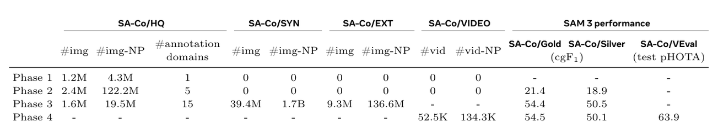

* **Segment Anything with Concepts（SA-Co）Dataset**

1. **四类 Training Data**

SAM 3 的 PCS training data 由三类 image data 与一类 video data 构成。SA-Co/HQ 来自包含 human verification 的 Data Engine；SA-Co/SYN 由成熟的 Phase 3 pipeline 全自动生成；SA-Co/EXT 把 external detection/segmentation dataset 统一到 SA-Co ontology；SA-Co/VIDEO 则来自 Phase 4，并由 human 完成 verification 与 correction。

HQ 提供高精度与真实 failure case，SYN 扩展 concept 和 media 规模，EXT 补充 specialized domain，VIDEO 增加跨帧 identity、遮挡和 re-appearance。四类数据在训练阶段承担的角色不同，不能只按 mask 总量合并理解。

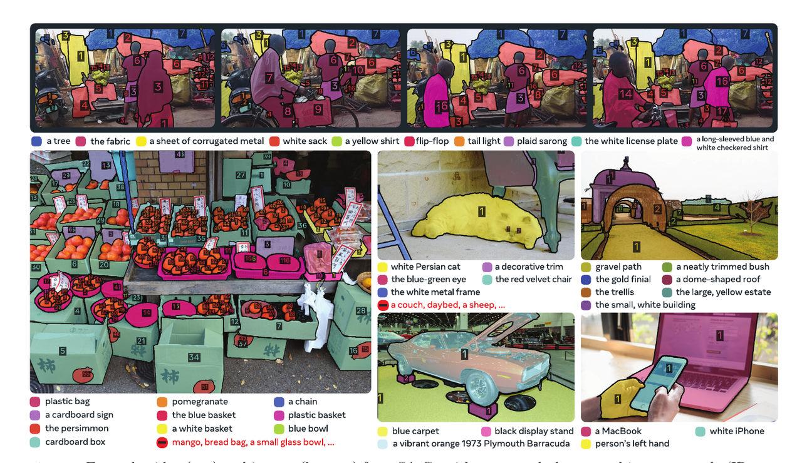

2. **SA-Co/HQ**

SA-Co/HQ 由 Data Engine 的 Phase 1–3 收集，annotation 经过 human 或达到 human-level accuracy 的 AI verifier 检查。它包含 **`5.2M`** images、**`4.0M`** unique NPs、**`146.1M`** image-NP pairs 与 **`52.3M`** instance masks。

其中 negative image-NP pair 占 **`88.5%`**。每个 positive pair 平均包含 **`3.10`** 个 mask。大量 verified negative 直接训练 Presence Token 与 open-vocabulary calibration，使“图中不存在该 concept”成为显式 supervision。

3. **SA-Co/SYN**

SA-Co/SYN 使用 MetaCLIP image，NP 来自 alt-text 与 Llama 4 caption。SAM 3 产生 mask proposal，MV/EV AI verifier 清洗 positive 与 hard negative，全程不需要 human correction。最终包含 **`39.4M`** images、**`38.0M`** unique NPs、**`1.7B`** image-NP pairs 与 **`1.4B`** masks。

Negative 占 **`74.0%`**，每个 positive pair 平均 **`3.17`** 个 mask。SYN 依赖当时的 SAM 3 与 AI verifier，适合扩展 Stage 2 的 concept coverage，但 Stage 3 high-quality fine-tuning 会将其移除，避免把 teacher error 带入最终 precision 校正。

4. **SA-Co/EXT**

SA-Co/EXT 汇总 external dataset 中已有的 instance mask 或 bounding box。只有 box 的 dataset 先用 SAM 2 转成 instance mask，原 label 再映射到 SA-Co ontology，并利用 Wikidata hierarchy 补充 negative label。详细统计包含 **`9.3M`** images、**`497.4K`** NPs、**`136.6M`** image-NP pairs 与 **`70.5M`** masks。

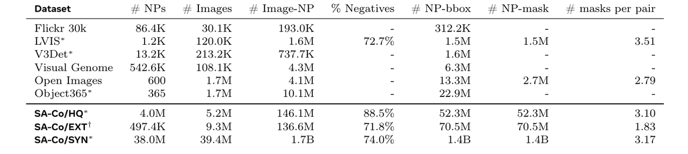

Negative 占 **`71.8%`**，每个 positive pair 平均 **`1.83`** 个 mask。数据覆盖 driving、food、fashion、medical imaging、microscopy、body part、wildlife 等 specialized domain，但部分 source 只做到 partial exhaustivity。

5. **SA-Co/VIDEO**

SA-Co/VIDEO 包含 **`52.5K`** videos、**`24.8K`** unique NPs、**`134.3K`** video-NP pairs 与 **`467.1K`** NP-masklets。Negative video-NP pair 占 **`26.7%`**，每个 positive pair 平均 **`4.75`** 条 masklet。

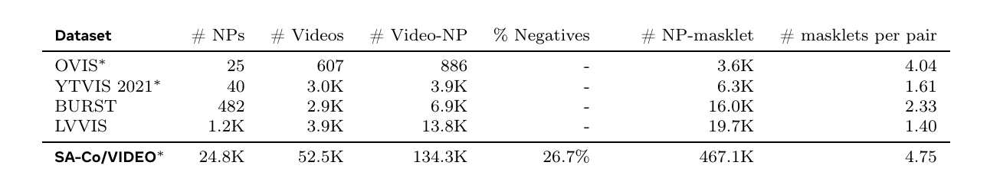

视频平均包含 **`84.1`** 个 frame，采样率为 **`6 FPS`**。全部 SA-Co/VIDEO annotation 经过 human verification，数据重点覆盖 crowded object、fast motion、occlusion 和 Tracker failure。

6. **Training Data 的规模与分布**

在 image data 中，SA-Co/HQ 的 unique NP 数量达到 **`4.0M`**，SA-Co/SYN 达到 **`38.0M`**，远高于 LVIS 的 **`1.2K`** classes。Video data 中，SA-Co/VIDEO 的 **`24.8K`** NPs 与 **`52.5K`** videos 同样明显超过常用 video instance segmentation dataset。

Ontology distribution 还显示 HQ 与 EXT 的 domain 互补：HQ 覆盖 common object、object part、building、fashion、food 等开放世界概念；EXT 额外增加 medical imaging 和 specialized visual domain。这种组合同时扩展 vocabulary、视觉 domain 与 instance density，而不是只增加同一 web distribution 中的重复 mask。

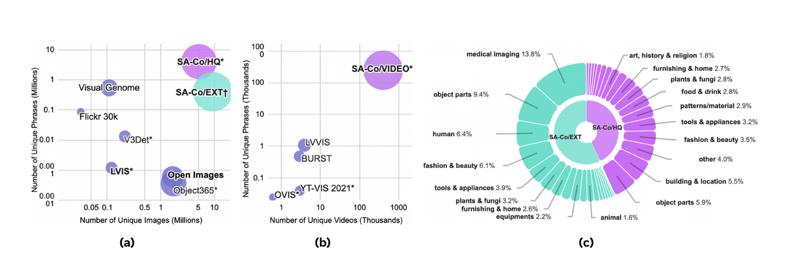

7. **SA-Co Evaluation Benchmark**

SA-Co benchmark 用于评估 image 与 video PCS。总计包含约 **`207K`** unique phrases、**`121K`** images/videos，以及超过 **`3M`** media-phrase pairs。每个已标注 phrase 都要求对匹配 instance 做 exhaustive mask annotation，同时加入大量 hard negative，测试 Model 是否会在超大 open vocabulary 下误报。

Benchmark 采用 federated annotation：每个 image 不会穷举全部 vocabulary，只验证少量 positive 与 negative phrase。因此“某个 phrase 没有出现在这个 image 的 annotation 中”不能自动解释为 negative；只有经过验证的 media-NP pair 才能进入 evaluation。

8. **Gold、Silver、Bronze、Bio 与 VEval**

SA-Co/Gold 包含 **`51.8K`** NPs、**`15.8K`** images 与 **`168.9K`** image-NP pairs，覆盖 MetaCLIP、SA-1B、attribute、crowded scene、Wiki-Common、Wiki-Food\&Drink 和 Wiki-Sports Equipment 七个 domain。每个 positive pair 由 **`3`** 位 annotator 独立标注。

SA-Co/Silver 有 **`54.6K`** NPs 和 **`66.1K`** images，每个 pair 只有一份 human annotation；Bronze 汇总多个现有 image dataset，包含 **`105.3K`** NPs；Bio 聚焦 biological 与 medical image。SA-Co/VEval 包含 **`5.2K`** NPs、**`1.7K`** videos 与 **`10.3K`** video-NP pairs，domain 来自 SA-V、YT-Temporal-1B 与 SmartGlasses。

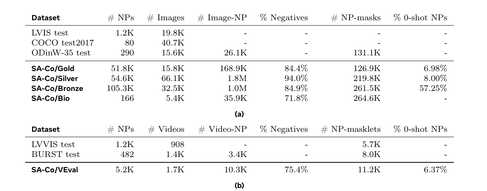

9. **Localization：Positive Micro F1**

Localization 只在至少有一个 ground-truth mask 的 positive media-NP pair 上计算。对 N 个 prediction mask 与 M 个 ground-truth mask，先构造 IoU matrix，再求最大化总 IoU 的 optimal bipartite matching。给定 IoU threshold τ，匹配且 IoU 达标的 prediction 计为 TP，其余 prediction 计为 FP，未匹配 ground truth 计为 FN。

$$\mathrm{pmF1}_{\tau}=\frac{2\,\mathrm{TP}_{\tau}^{\mathrm{total}}}{2\,\mathrm{TP}_{\tau}^{\mathrm{total}}+\mathrm{FP}_{\tau}^{\mathrm{total}}+\mathrm{FN}_{\tau}^{\mathrm{total}}}$$

τ 从 **`0.50`** 到 **`0.95`**，步长 **`0.05`**，共计算 **`10`** 个 pmF1τ，再取平均得到最终 pmF1。Micro aggregation 先跨 datapoint 累加 TP、FP、FN，因此大 instance group 会贡献更多统计量；positive macro F1 则先计算每个 pair 的 local F1 再平均。

10. **Classification：IL_MCC 与 cgF1**

Classification 不看 mask quality，只判断 image/frame 中是否存在目标 concept。Prediction confidence 高于 **`0.5`** 且至少输出一个 mask，就视为 image-level positive。Positive pair 无 mask 是 IL\_FN；negative pair 产生 mask 是 IL\_FP；正确拒绝 hard negative 是 IL\_TN。

$$\mathrm{IL\_MCC}=\frac{\mathrm{IL\_TP}\cdot\mathrm{IL\_TN}-\mathrm{IL\_FP}\cdot\mathrm{IL\_FN}}{\sqrt{(\mathrm{IL\_TP}+\mathrm{IL\_FP})(\mathrm{IL\_TP}+\mathrm{IL\_FN})(\mathrm{IL\_TN}+\mathrm{IL\_FP})(\mathrm{IL\_TN}+\mathrm{IL\_FN})}}$$

Main metric 把 localization 与 classification 相乘：

$$\mathrm{cgF1}=100\cdot\mathrm{pmF1}\cdot\mathrm{IL\_MCC}$$

pmF1 衡量 positive sample 上的 instance mask 是否完整准确，IL_MCC 衡量 concept presence 与 hard-negative rejection；cgF1 只有在两者同时较高时才会提高。

11. **Ambiguity-aware Oracle Protocol**

PCS 的有效答案可能不止一个。SA-Co/Gold 为 positive pair 收集三份从零开始、互不查看 SAM 3 prediction 的 annotation。Oracle evaluation 分别把 Model output 与三份 ground truth 比较，并选择 local F1 最高的一份；human upper bound 也在三份 annotation 的所有 pair 中选择最匹配组合。

Random Pair protocol 则随机抽取两份 annotation，重复 **`1000`** 次并报告 **`0.5 quantile`**。SA-Co/Gold 的 human cgF1 从 Random Pair 的 **`55.5`** 上升到 Oracle 的 **`76.2`**；视频 subset 也存在同样差距。这个差距反映的是 annotation interpretation ambiguity，不能简单当作 annotator error。

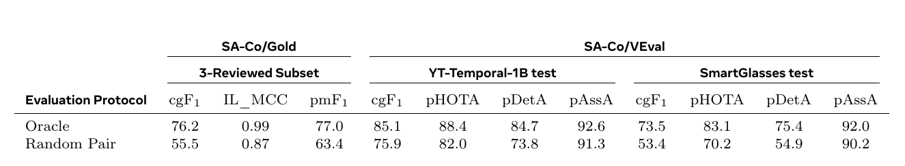

---

[Previous](03-视觉基础--对比学习.md) | [Contents](../../README.md) | [Next](05-Vision-Language-Model--前期探索.md) | [Visual website](https://weyumm.github.io/vlm-Wissen/lecture-1.html#c=4)
