[Previous](05-Vision-Language-Model--前期探索.md) | [Contents](../../README.md) | [Next](07-Vision-Language-Model--结构优化.md) | [Visual website](https://weyumm.github.io/vlm-Wissen/lecture-1.html#c=6)

## 2.2 BLIP 家族

### 2.2.1 ALBEF

在多模态学习领域，如何有效地对齐和融合图像与文本信息一直是研究的核心问题。传统的视觉-语言预训练模型 **VLP**（**V**ision-and-**L**anguage **P**re-training）通常依赖于一个预训练的图像检测器来提取图像特征，并通过多模态编码器将图像和文本特征进行联合建模。然而，这种方法存在两个主要问题：

> 一是对图像检测器的依赖增加了计算复杂度
>
> 二是从互联网上爬取的大规模图文对数据通常包含噪声，导致模型难以有效学习高质量的跨模态表示

为了解决这些问题，**ALBEF**（**AL**ign **BE**fore **F**use）应运而生。**ALBEF **提出了一种全新的训练框架，通过**先对齐再融合**的策略，显著提升了多模态模型的性能。此外，**ALBEF&#x20;**&#x5F15;入了动量蒸馏 **MoD**（**Mo**mentum **D**istillation）技术，使得模型能够更好地利用带噪声的数据集，从而在大规模弱监督数据上取得突破性进展。

**ALBEF** 总结&#x4E86;**`ViLT`**&#x548C;**`CLIP`**：

> * 更大的视觉编码器，要比文本编码器大，因&#x4E3A;**`ViLT`**&#x4E0D;如范&#x5F0F;**`3`**&#x7684;结果，并且模态交互网络要尽可能大
>
> * **`CLIP`**&#x4E2D;&#x7684;**`ITC` **&#x4C;oss &#x548C;**`ViLT`**&#x4E2D;&#x7684;**`ITM`**、**`MLM` **&#x4C;oss 的学习任务比较好

> **注**：ALBEF 和 ViLT 都舍弃目标检测器提特征。后者只是因为推理慢，前者认为预训练好的目标检测器抽的特征与文本空间不对齐，没有进行 end to end 的训练，对多模态编码器有挑战
>
> 解决：用对比学习，即 CLIP Loss，在 Fuse 之前就能 Align。这也是本文的**核心贡献**

* **模型结构**

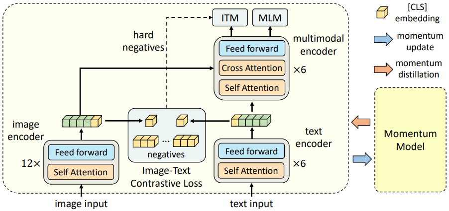

如上图所示，**ALBEF **包含一个**图像编码器**、一个**文本编码器**和一个**多模态编码器**。**图像编码器**使用**`12`**层的视觉Transformer **`ViT-B/16`**作为图像编码器，并用在 ImageNet-1k 上预训练的 DEiT 权重进行初始化。输入图像$$I$$被编码为一系列嵌入向量：$$\{v_\text{cls}, v_1, \cdots, v_N\}$$，其中$$v_\text{cls}$$&#x662F;**`[CLS]`**&#x6807;记的嵌入向量。**文本编码器**和**多模态编码器**均采用**`6`**层的 Transformer 结构。**文本编码器**通过$$\text{BERT}_\text{base}$$模型的&#x524D;**`6`**&#x5C42;进行初始化，而**多模态编码器**则通过$$\text{BERT}_\text{base}$$的&#x540E;**`6`**&#x5C42;进行初始化。文本编码器将输入文本T转换为嵌入序列$$\{w_\text{cls}, w_1, \cdots, w_N\}$$，然后将其传递到多模态编码器中。在多模态编码器的每一层中，图像特征通过交叉注意力机制与文本特征进行融合。

> **注**：一共是两份参数，Momentum Model 有一份，通过左边训练的参数通过 moving average 得到，这&#x4E0E;**`MoCo`**&#x76F8;同。其中加权参数设置很&#x5927;**`0.995`**，保证 Momentum Model 参数更新慢，产生特征稳定，一可以得到更稳定的 negative sample，二可以做 Momentum Distillation

**目标函数**

**ALBEF&#x20;**&#x901A;过三个目标对进行预训练：单模态编码器上的图文对比学习**`ITC`**、多模态编码器上的掩码语言建模**`MLM`**&#x548C;图文匹配**`ITM`**。并且通过在线对比硬负样本挖掘改进了 **ITM**。

1. **图文对比学习 ITC**

**ITC** 旨在融合之前学习到更好的单模态表示。它学习一个相似度函数$$s = g_v(v_{\text{cls}})^\top g_w(w_{\text{cls}})$$，使得平行的图文对具有更高的相似度得分。$$g_v$$和$$  g_w  $$是线性变换，&#x5C06;**`[CLS]`**&#x5D4C;入映射到归一化的低维表示，一般&#x4E3A;**`256`**&#x7EF4;。&#x53D7;**`MoCo`**&#x542F;发，**ALBEF **维护两个队列以存储来自动量单模态编码器的最近**`M`**个图文表示。动量编码器生成的归一化特征记为 $$  g_v'(v_{\text{cls}}')  $$ 和$$g_w'(w_{\text{cls}}')$$。这里定义：

$$s(I, T) = g_v(v_{\text{cls}})^\top g_w'(w_{\text{cls}}'), \quad s(T, I) = g_w(w_{\text{cls}})^\top g_v'(v_{\text{cls}}')$$

对于每个图像和文本，计算 softmax 归一化的**图像到文本**和**文本到图像**的相似度：

$$p_m^{\text{i2t}}(I) = \frac{\exp(s(I, T_m)/\tau)}{\sum_{m=1}^M \exp(s(I, T_m)/\tau)}, \quad p_m^{\text{t2i}}(T) = \frac{\exp(s(T, I_m)/\tau)}{\sum_{m=1}^M \exp(s(T, I_m)/\tau)}$$

其中$$\tau$$是可学习的温度参数。设$$  y^{\text{i2t}}(I)  $$和$$  y^{\text{t2i}}(T)  $$表示真实的 one-hot 相似度分布，其中负样本的概率&#x4E3A;**`0`**，正样本的概率&#x4E3A;**`1`**。图文对比损失定义为$$  p  $$和$$  y  $$之间的交叉熵$$H$$：

$$\mathcal{L}_{\text{itc}} = \frac{1}{2} \mathbb{E}_{(I,T)\sim D} \left[ H(y^{\text{i2t}}(I), p^{\text{i2t}}(I)) + H(y^{\text{t2i}}(T), p^{\text{t2i}}(T)) \right]$$

* **掩码语言建模 MLM**

**MLM&#x20;**&#x5229;用图像和上下文文本预测被遮掩的单词。这里&#x4EE5;**`15%`**&#x7684;概率随机遮掩输入标记，并将其替换为特殊 Token **`[MASK]`**。设$$\hat{T}$$表示被遮掩的文本，$$p_{\text{msk}}(I, \hat{T})$$表示模型对遮掩标记的预测概率。**MLM&#x20;**&#x6700;小化交叉熵损失：

$$\mathcal{L}_{\text{mlm}} = \mathbb{E}_{(I,\hat{T})\sim D} H(y_{\text{msk}}, p_{\text{msk}}(I, \hat{T}))$$

其中$$  y_{\text{msk}}  $$是词汇表分布的真实 one-hot 向量，真实标记的概率&#x4E3A;**`1`**。

* **图文匹配 ITM**

**ITM&#x20;**&#x9884;测一对图像和文本是正样本还是负样本，即匹配还是不匹配。**ALBEF&#x20;**&#x4F7F;用多模态编码器输出&#x7684;**`[CLS]`**&#x6807;记嵌入作为图文对的联合表示，并附加一个全连接 FC 层和 softmax 来预测二分类概率$$p_{\text{itm}}$$。**ITM&#x20;**&#x635F;失定义为：

$$\mathcal{L}_{\text{itm}} = \mathbb{E}_{(I,T)\sim D} H(y_{\text{itm}}, p_{\text{itm}}(I, T))$$

其中 $$  y_{\text{itm}}  $$ 是表示真实标签的二维 one-hot 向量。

> **注**：**ALBEF **提出了一种无需额外计算开销的策略，用于为 **ITM **任务采样硬负样本：如果一个负样本它们共享相似的语义但在细粒度细节上不同，那么称这个图文对是 hard 的。**ALBEF&#x20;**&#x5229;用 **ITC&#x20;**&#x4E2D;的对比相似度在批次内寻找硬负样本。对于小批量中的每个图像，根据对比相似度分布从同一批次中采样一个负文本，与图像更相似的文本有更高的采样概率。同样，我们也为每个文本采样一个硬负样本图像。也就是说图文对比相似度最高的是正样本，第二高的是硬负样本。

**ALBEF&#x20;**&#x7684;完整预训练目标为：

$$\mathcal{L} = \mathcal{L}_{\text{itc}} + \mathcal{L}_{\text{mlm}} + \mathcal{L}_{\text{itm}}$$

**动量蒸馏**

用于预训练的图文对大多是从网络上收集的，因此往往带有噪声。正样本对通常是弱相关的：文本可能包含与图像无关的词语，或者图像可能包含未在文本中描述的实体。对于图文对比学习 **ITC**，负样本文本可能也与图像内容匹配。对于掩码语言建模 **MLM**，可能存在其他不同于标注但同样能描述图像的词语，甚至可能那更好。然而，ITC 和 MLM 的 one-hot 标签会惩罚所有负预测，而不论其正确性。

为了解决这一问题，**ALBEF&#x20;**&#x63D0;出从动量模型生成的伪目标中学习。动量模型是一个持续演化的教师模型，由单模态和多模态编码器的指数移动平均版本组成。在训练过程中，目标是训练基础模型，使其预测结果与动量模型的预测结果一致。

1. **图文对比学习 ITC**

对于 **ITC**，我们首先使用动量单模态编码器的特征计算图像-文本相似度：

$$s'(I, T) = g_v'(v_{\text{cls}}')^\top g_w'(w_{\text{cls}}'), \quad s'(T, I) = g_w'(w_{\text{cls}}')^\top g_v'(v_{\text{cls}}')$$

然后通过将之前 **ITC&#x20;**&#x516C;式中的$$  s  $$替换为$$  s'  $$来计算软伪目标$$  q^{\text{i2t}}  $$和$$q^{\text{t2i}}$$。$$\text{ITC}_\text{MoD}$$损失定义为：

$$\mathcal{L}_{\text{itc}}^{\text{mod}} = (1 - \alpha)\mathcal{L}_{\text{itc}} + \frac{\alpha}{2} \mathbb{E}_{(I,T)\sim D} \left[ \text{KL}(q^{\text{i2t}}(I) \| p^{\text{i2t}}(I)) + \text{KL}(q^{\text{t2i}}(T) \| p^{\text{t2i}}(T)) \right]$$

其中 $$\text{KL}$$ 表示 KL 散度。

* **掩码语言建模 MLM**

对于 **MLM**，设$$  q_{\text{msk}}(I, \hat{T})  $$表示动量模型对遮掩标记的预测概率，$$\text{MLM}_\text{MoD}$$损失定义为：

$$\mathcal{L}_{\text{mlm}}^{\text{mod}} = (1 - \alpha)\mathcal{L}_{\text{mlm}} + \alpha \mathbb{E}_{(I,\hat{T})\sim D} \text{KL}(q_{\text{msk}}(I, \hat{T}) \| p_{\text{msk}}(I, \hat{T}))$$

下图展示了伪目标中&#x524D;**`5`**&#x4E2A;候选词/文本的例子，这些伪目标有效地捕捉了与图像相关的内容：

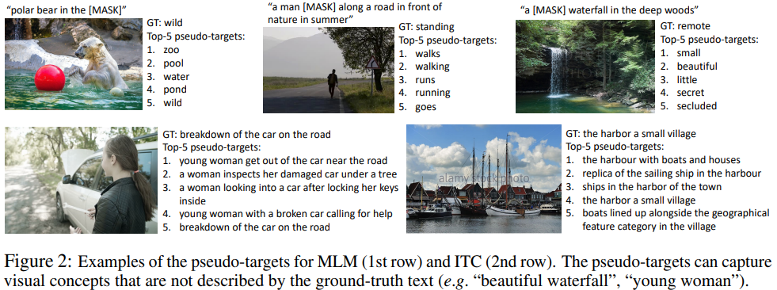

除此之外，**ALBEF&#x20;**&#x8FD8;将 **MoD&#x20;**&#x5E94;用于下游任务。每个任务的最终损失是原始任务损失与模型预测和伪目标之间的 KL 散度的加权组合。为了简化，我们将权重$$\alpha$$设置&#x4E3A;**`0.4`**，适用于所有预训练和下游任务。

> **注**：**为什么 ITM loss 没有动量版本**
>
> 因为本身基于 ground truth，必须要知道是不是一个 pair，就是一个二分类任务。而且有困难负样本，与动量冲突

**总结**

为了从噪声的数据更有效的学习图像和文本特征，ALBEF 采用额外的监督信号，即伪标签的自训练的方式

* ALBEF 借&#x9274;**`MoCo`**&#x8BBA;文里的 Momentum Encoder 的方式，用 Momentum Model 生成伪标签，即 softmax score，不再是 one-hot label。具体做法是使用 **EMA**（**E**xponential **M**oving **A**verage）

* 最后的结果是达到一个很好的平均，很多的信息可以从 one hot label 里面学习，当它是错误或噪声的时候，稳定的 Momentum Model 可以提供一些改进

* 多个目标函数，&#x5982;**`ITM`**、**`MLM`**、**`Momentum Distillation`**&#x90FD;是为了同一个图像文本对生成不同的视角，变相的数据增强，让训练后的模型具备 semantic preserving 的功能，即只要是语义匹配的图像文本对，应该被当作一对

**数据集**

**版本 1**：**`Conceptual captions 3M`**+**`SBU caption`**+**`COCO`**+**`Visual Genome`**&#x5171;**`4M`**

**版本2**：加&#x5165;**`Conceptual captions 12M`**，&#x5171;**`14.1M`**

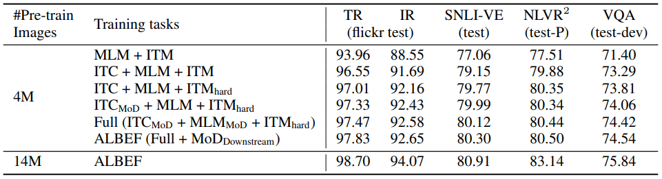

* **另一个角度的 ALBEF**

形式上，定义两个随机变量$$a$$和$$b$$作为数据点的两种不同视图。在自监督学习中，$$a$$和$$b$$是同一图像的两种增强版本。在视觉-语言表示学习中，将$$a$$和$$b$$视为捕捉图文对语义意义的不同变体。目标是学习对视图变化具有不变性的表示。这可以通过最大化$$a$$和$$b$$之间的互信&#x606F;**`MI`**&#x6765;实现。在实践中，通过最小&#x5316;**`InfoNCE`**&#x635F;失来最大化$$\text{MI}(a, b)$$的下界，**InfoNCE&#x20;**&#x635F;失定义为：

$$L_{\text{NCE}} = -\mathbb{E}_{p(a,b)} \left[ \log \frac{\exp(s(a, b))}{\sum_{\hat{b} \in \hat{B}} \exp(s(a, \hat{b}))} \right]$$

其中 $$s(a, b)$$是一个评分函数，例如两个表示之间的点积，$$\hat{B}$$包含正样本$$b$$和$$|\hat{B}| - 1$$个从分布中采样的负样本。

然后使用 one-hot 标签的 **ITC&#x20;**&#x635F;失可以重写为：

$$\mathcal{L}_{\text{itc}} = -\frac{1}{2} \mathbb{E}_{p(I,T)} \left[ \log \frac{\exp(s(I, T)/\tau)}{\sum_{m=1}^M \exp(s(I, T_m)/\tau)} + \log \frac{\exp(s(T, I)/\tau)}{\sum_{m=1}^M \exp(s(T, I_m)/\tau)} \right]$$

最小化 $$\mathcal{L}_{\text{itc}}$$ 可以被视为最大化 **InfoNCE **的对称版本。因此，ITC 将两个单独模态：图像$$I$$和文本$$T$$，视为图文对的两个视图，并训练单模态编码器以最大化正样本对的图像视图和文本视图之间的互信息。

一些文献指出，可以将 **MLM **解释为最大化被 Mask Token 与其 Mask 上下文，即图像+Mask 文本之间的互信息。具体来说，可以将使用 one-hot 标签的 MLM 损失重写为：

$$\mathcal{L}_{\text{mlm}} = -\mathbb{E}_{p(I,\hat{T})} \left[ \log \frac{\exp(\psi(y_{\text{msk}})^\top f(I, \hat{T}))}{\sum_{y \in V} \exp(\psi(y)^\top f(I, \hat{T}))} \right]$$

其中$$\psi(y): V \to \mathbb{R}^d$$是多模态编码器输出层中的查找函数，它将词标记$$y$$映射到一个向量，$$V$$是完整词汇表集合，$$f(I, \hat{T})$$是返回与遮掩上下文对应的多模态编码器最终隐藏状态的函数。因此，MLM 将图文对的两个视图视为：

> 1. 一个随机选择的 Token
>
> 2. 图像+该词被 Mask 的上下文文本

ITC 和 MLM 都通过从图文对中提取部分信息来生成视图，前者通过模态分离，后者通过词遮掩。动量蒸馏可以被视为从整个提议分布中生成替代视图。以$$\text{ITC}_\text{MoD}$$为例，最小化 $$\text{KL}(p^{\text{i2t}}(I), q^{\text{i2t}}(I))$$ 等价于最小化以下目标：

$$-\sum_m q_m^{\text{i2t}}(I) \log p_m^{\text{i2t}}(I) = -\sum_m \frac{\exp(s'(I, T_m)/\tau)}{\sum_{m=1}^M \exp(s'(I, T_m)/\tau)} \log \frac{\exp(s(I, T_m)/\tau)}{\sum_{m=1}^M \exp(s(I, T_m)/\tau)}$$

它最大化了与图像$$I$$具有相似语义的文本的$$\text{MI}(I, T_m)$$，因为这些文本会有更大的$$q_m^{\text{i2t}}(I)$$。类似地，$$\text{ITC}_\text{MoD}$$还最大化了与文本$$T$$相似的图像的$$\text{MI}(I_m, T)$$。可以用同样的方法证明，$$\text{MLM}_\text{MoD}$$为被 Mask 的词$$y_{\text{msk}}$$生成了替代视图$$y' \in V$$，并最大化了$$y'$$与$$(I, \hat{T})$$之间的互信息。因此，动量蒸馏可以被视为对原始视图进行数据增强。动量模型生成了一组多样化的视图，这些视图在原始图文对中并不存在，并促使基础模型学习能够捕捉视图不变语义信息的表示。

总的来说，这里从另一个角度解读了 **ALBEF**，并证明它最大化了图文对不同视图之间的互信息的下界。**`ITC`**、**`MLM`**&#x548C;**`MoD`**&#x53EF;以被解释为生成这些视图的不同方式。

**总结**

**ALBEF&#x20;**&#x7684;出现标志着多模态学习进入了一个新的阶段。它通过**先对齐再融合**的策略，解决了传统模型在图文对齐和噪声数据处理上的难题。动量蒸馏技术的引入使得 ALBEF 能够充分利用大规模弱监督数据集，从而在多种下游任务中表现出色。

然而，**ALBEF&#x20;**&#x4E5F;存在一些局限性。例如，在处理细粒度分类任务或复杂场景时，其性能可能有所下降。此外，动量蒸馏的计算开销较大，可能限制其在实时任务中的应用。

### 2.2.2 BLIP

多模态学习始终是一个令人兴奋且充满挑战的领域。视觉和语言作为人类感知世界的核心方式，其结合为机器理解和生成跨模态信息提供了新的可能性。2022年，Salesforce 的研究团队提出了一个名为 **BLIP**（**B**ootstrapping **L**anguage-**I**mage **P**re-training）的框架，这一工作不仅统一了视觉语言任务的理解与生成能力，还在广泛的下游任务中展现了卓越的性能。

传统的视觉语言预训练模型通常专注于特定的任务，例如图像描述生成或视觉问答 VQA。然而，这些模型往往缺乏通用性，难以同时处理理解型任务，如分类、检索，和生成型任务，如描述生成。此外，许多模型依赖于高质量的标注数据，而这些数据的获取成本高昂且容易引入偏差。**BLIP&#x20;**&#x7684;提出正是为了应对这些挑战，它通过一种新颖的预训练框架，实现了对多样任务的支持，同时减少了对昂贵标注数据的依赖。

> **注**：两个主要贡献
>
> * 统一的框架，同时完成理解 encoder-only 和生成 encoder-decoder 的任务
>
> * 清洗数据集

* **模型架构**

**BLIP&#x20;**&#x4F7F;&#x7528;**`ViT`**&#x4F5C;为图像编码器，它将输入图像划分为若干小块，并将它们编码为嵌入序列，同时添加一&#x4E2A;**`[CLS]`**&#x6807;记以表示全局图像特征。与使用预训练目标检测器进行视觉特征提取相比，**ViT&#x20;**&#x8BA1;算效率更高，已被最近的方法广泛采用。

为了预训练一个兼具理解和生成能力的统一模型，**BLIP&#x20;**&#x63D0;出了多模态编码器-解码器混合架&#x6784;**MED**（**M**ultimodal mixture of **E**ncoder-**D**ecoder），这是一种多任务模型，结&#x5408;**`ALBEF`**&#x548C;**`VLMo`**&#x7684;思想，如下图，可以在以下三种功能之一中运行：

> 1. **单模态编码器**：分别对图像和文本进行编码。文本编码器与 **BERT&#x20;**&#x76F8;同，在文本输入开头添加一&#x4E2A;**`[CLS]`**&#x6807;记以总结句子。
>
> 2. **基于图像的文本编码器**：通过在每个 Transformer 块的自注意力层和前馈网络之间插入额外的跨注意力层，注入视觉信息。在文本末尾添加一个特定任务&#x7684;**`[Encode]` **&#x54;oken，其输出嵌入用作图文对的多模态表示。
>
> 3. **基于图像的文本解码器**：将基于图像的文本编码器中的双向自注意力层替换为因果自注意力层。使&#x7528;**`[Decode]`** Token 表示序列开始，使用结束标记表示序列结束。

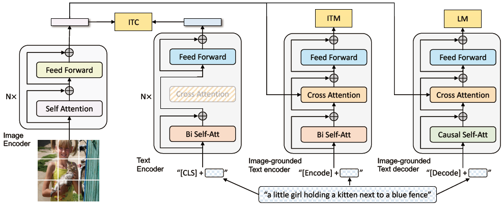

* **预训练目标**

在预训练过程中联合优化三个目标，包括两个理解目标和一个生成目标。每对图文只需通过计算密集的视觉 Transformer 一次，而文本 Transformer 则需要三次前向传播，每次激活不同功能以计算三种损失。

> 1. **图文对比损失 ITC**：激活单模态编码器，旨在通过对齐视觉 Transformer 和文本 Transformer 的特征空间，使正样本图文对的表示相似，而负样本对的表示不同。BLIP 仍然采用动量编码器和软标签策略来改进对比学习，使用**动量编码器**生成 soft label，防止错过 negative pairs 中潜在的正样本。
>
> 2. **图文匹配损失 ITM**：激活基于图像的文本编码器，旨在学习捕捉视觉和语言细粒度对齐的多模态表示。ITM 是一个二分类任务，模型通过 ITM 头预测图文对是否匹配。这里也采用硬负样本挖掘策略以提高训练效果，即 ITC 中分数除自身最高的，一个批次中具有较高对比相似性的负对更有可能被选择来计算损失。
>
> 3. **语言建模损失 LM**：激活基于图像的文本解码器，旨在根据图像生成文本描述。LM 优化交叉熵损失，以自回归方式最大化文本生成的可能性。BLIP 应用&#x4E86;**`0.1`**&#x7684;标签平滑。与广泛使用的 MLM 损失相比，LM 增强了模型将视觉信息转化为连贯描述的能力。

为了实现高效预训练并利用多任务学习，文本编码器和文本解码器共享除自注意力层外的所有参数。这是因为编码和解码任务的差异主要体现在自注意力层上，特别是，编码器使用双向自注意来构建当前输入 Token 的表示，而解码器使用因果自注意来预测下一个 Token。另一方面，其他层在两种任务中功能相似，因此共享这些层可以提高训练效率，同时受益于多任务学习。

* **CapFlit**

由于高昂的标注成本，高质量的人工标注图文对数量有限，例&#x5982;**`COCO`**数据集。有一些工作工作利用从网页自动收集的大规模图像和替代文本对，但这些替代文本往往不能准确描述图像内容，导致信号嘈杂，不利于视觉-语言对齐学习。

BLIP 提出了 **CapFilt**（**Cap**tioning and **Filt**ering），一种提升文本语料质量的新方法。CapFilt引入两个模块：

> * 一&#x4E2A;**生成器**&#x7528;于为网页图像生成描述
>
> * 一&#x4E2A;**过滤器**&#x7528;于去除噪声图文对

生成器和过滤器均从相同的预训练 **MED **模型初始化，并在 **COCO **数据集上分别微调，微调过程轻量化。

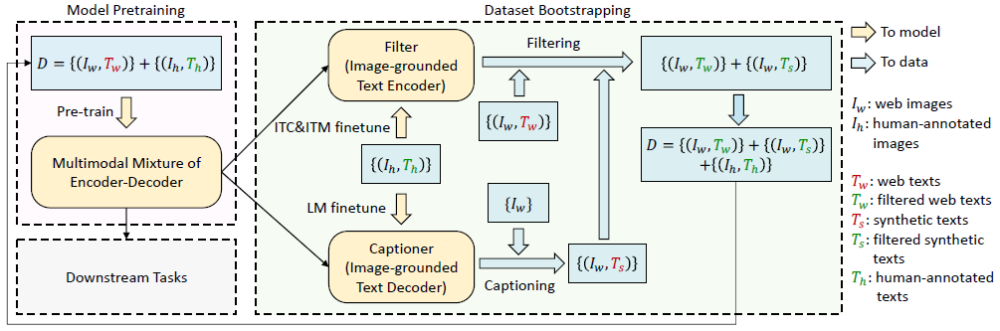

> Tw: `CC12M` Th: `COCO` Tw: `Filtered CC12M` Ts: `synthetic CC12M` Ts: `filtered synthetic CC12M`&#x20;

具体而言，生成器是一个基于图像的文本解码器，通过 LM 目标微调以生成图像描述。给定网页图像$$I_w$$，生成器为每张图像生成一条合成描述$$T_s$$。过滤器是一个基于图像的文本编码器，通过 ITC 和 ITM 目标微调以判断文本是否匹配图像。过滤器会移除原始网页文本$$T_w$$和合成文本$$T_s$$中的噪声文本，若 ITM 头预测某文本与图像不匹配，则认为该文本为噪声。最后将过滤后的图文对与人工标注对结合形成新数据集，用于预训练新模型。

下图展示了一些示例描述及其对应的图像，定性地展示了生成器生成新文本描述的效果，以及过滤器从原始网页文本和合成文本中去除噪声描述的作用。

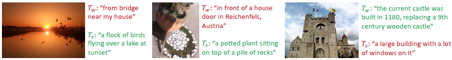

**总结**

**BLIP&#x20;**&#x5728;多个视觉语言任务上取得了显著的成果，包括但不限于图像描述生成、视觉问答、图像-文本检索等。实验结果表明，**BLIP&#x20;**&#x5728;这些任务上的性能优于当时的大多数现有方法，尤其是在生成型任务中表现出色。此外，**BLIP**的灵活性使其能够轻松迁移到新的任务和领域，为实际应用提供了广泛的可能性。

**BLIP&#x20;**&#x7684;提出标志着多模态学习领域的一个重要事件。它不仅展示了视觉语言预训练的强大潜力，还为未来的研究提供了丰富的思路和方法。无论是从模型架构还是数据处理的角度来看，**BLIP&#x20;**&#x90FD;为我们提供了一个值得深入研究和借鉴的范例。

### 2.2.3 BLIP-2

在人工智能领域，视觉与语言的结合一直是研究的热点。从早期的图文匹配任务到如今的多模态推理、视觉对话等复杂场景，技术的演进不断推动着我们对多模态智能的理解。**BLIP-2** 作为这一领域的最新成果，以其创新的设计和高效的性能，成为连接视觉与语言的新一代桥梁。

随着深度学习的发展，预训练模型已经成为解决多模态任务的核心工具。然而，传统的多模态模型通常需要从头开始联合训练视觉编码器和语言模型，这不仅计算成本高昂，还难以充分利用现有的高质量单模态预训练模型。为了解决这一问题，**BLIP-2** 提出了一种全新的范式：通过冻结预训练的图像编码器和大型语言模型，并引入一个轻量级的模块**`Q-Former`**来实现高效且高性能的视觉-语言预训练，如右图。

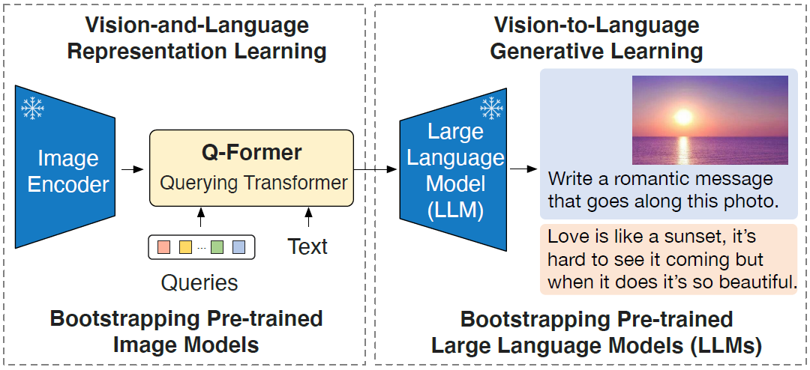

这种方法的核心思想是**解耦**——将视觉编码器和语言模型的训练过程分开，从而避免了重复训练的冗余性。同时，通过引入 **Q-Former**，**BLIP-2** 能够在保持高效率的同时，灵活地融合视觉和语言信息。这借鉴了目前常见的做法：冻结一些预训练好的模型，如冻结 Image Encoder，另一些冻结 LLM，但挑战是需要把视觉特征对齐到文本空间。

> **注**：总的来说，BLIP-2 提出从现成的冻结预训练图像编码器和冻结的大型语言模型中引导视觉语言预训练。使用轻量级 **Q-Former** 弥补了模式上的差距，该转换器分两个阶段进行预训练：
>
> 1. 第一阶段从固定图像编码器中引导视觉语言表示学习
>
> 2. 第二阶段从一个固定的语言模型中引导视觉到语言的生成学习

* **模型架构**

**BLIP-2** 提出 **Q-Former** 作为连接冻结图像编码器和冻结 LLM 之间差距的可训练模块。它从图像编码器中提取固定数量的输出特征，与输入图像分辨率无关。如右图所示，Q-Former 由两个共享相同自注意力层的转换器子模块组成：

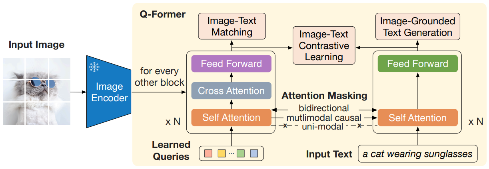

> 1. 一个与冻结图像编码器交互以提取视觉特征&#x7684;**图像转换器**
>
> 2. 一个可以同时作为文本编码器和文本解码器&#x7684;**文本转换器**

**BLIP-2&#x20;**&#x521B;建了一组可学习的 Query Embedding 作为图像转换器的输入。这些 Query 通过自注意力层相互作用，并通过交叉注意力层与冻结的图像特征交互。此外，Query 还可以通过相同的自注意力层与文本交互。根据预训练任务的不同，应用不同的自注意力掩码来控制 Query 与文本的交互。Q-Former 使用$$\text{BERT}_\text{base}$$的预训练权重初始化，而交叉注意力层则随机初始化。Q-Former 总计包&#x542B;**`188M`**&#x4E2A;参数。需要注意的是，Query 被视为模型参数。在实验中，**BLIP-2&#x20;**&#x4F7F;用&#x4E86;**`32`**&#x4E2A; Query，每个 Query 的维度&#x4E3A;**`768`**，这与 Q-Former 的隐藏维度保持一致。这里用$$Z$$表示输出的 Query 表示。$$Z$$的大&#x5C0F;**`32 × 768`**&#x8FDC;小于冻结图像特征的大小，例&#x5982;**`ViT-L/14`**&#x7684;**`257 × 1024`**。这种瓶颈架构与我们的预训练目标相结合，迫使查询提取与文本最相关的视觉信息。

* **视觉-语言表示学习**

在表示学习阶段，将 **Q-Former** 连接到冻结的图像编码器，并使用图文对进行预训练。目标是训练 Q-Former，使 Query 能够学习提取对文本最具信息量的视觉表示，即挖掘视觉编码器的潜力。受 BLIP 启发，**BLIP-2 **联合优化三个共享相同输入格式和模型参数的预训练目标。每个目标采用不同的注意力掩码策略来控制 Query 与文本的交互，如右图。

1. **图文对比学习 ITC**

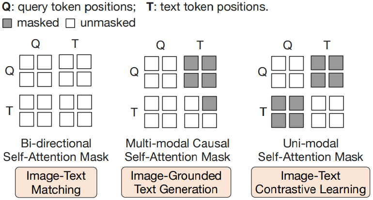

**ITC** 学习对齐图像表示和文本表示，以最大化它们的互信息。通过对正样本对的图文相似度与负样本对的相似度进行对比实现。**BLIP-2&#x20;**&#x5C06;图像转换器输出的查询表示$$Z$$与文本转换器输出的文本表示$$t$$对齐，其中$$t$$&#x662F;**`[CLS]`** Token 的输出 Embedding。由于$$Z$$包含多个输出 Embedding，每个 Query 一个，因此首先计算每个 Query 输出与$$t$$之间的成对相似度，然后选择最高的一个作为图文相似度。为了避免信息泄露，使用单模态自注意力掩码，Query 和文本不允许看到彼此。由于使用了冻结的图像编码器，相比端到端方法，可以在每块 GPU 上容纳更多样本。因此，**BLIP-2&#x20;**&#x4F7F;用批量内的负样本，而不是 **BLIP&#x20;**&#x4E2D;的动量队列。

2. **基于图像的文本生成 ITG 损失**

**ITG&#x20;**&#x635F;失训练 Q-Former 根据输入图像生成文本。由于 Q-Former 的架构不允许冻结的图像编码器与文本标记直接交互，生成文本所需的信息必须首先由 Query 提取，然后通过自注意力层传递给文本标记。因此，Query 被迫提取包含所有文本相关信息的视觉特征。**BLIP-2&#x20;**&#x91C7;用多模态因果自注意力掩码来控制 Query 与文本的交互。Query 可以相互关注，但不能关注文本 Token。每个文本 Token 可以关注所有查询及其之前的文本标记。**BLIP-2&#x20;**&#x8FD8;&#x5C06;**`[CLS]`** Token 替换为新&#x7684;**`[DEC]`** Token 作为第一个文本标记，以指示解码任务。

* **图文匹配 ITM**

ITM 旨在学习图像与文本表示之间的细粒度对齐。这是一个二分类任务，要求模型预测图文对是否为正样本或负样本，即匹配或不匹配。这里使用双向自注意力掩码，所有 Query 和文本都可以相互关注。输出的 Query Embedding$$Z$$因此捕获了多模态信息。**BLIP-2&#x20;**&#x5C06;每个输出 Query Embedding 输入到两类线性分类器中以获得logits，并将所有 Query 的 logits 平均作为输出匹配分数。除此之外还采用困难负样本挖掘策略来生成信息丰富的负样本对。

* **视觉到语言生成学习**

在生成式预训练阶段，将连接冻结图像编码器的 Q-Former 与一个冻结的 LLM 相连，以利用 LLM 的生成语言能力。如下图所示，使用一个全连接 FC 层将输出的 Query Embedding $$Z$$线性投影到与 LLM 文本嵌入相同的维度。投影后的 Query Embedding 被添加到输入文本嵌入的前面。它们充当软视觉提示，使 LLM 基于 Q-Former 提取的视觉表示进行条件化处理。由于 Q-Forme r已经过预训练，能够提取对语言有信息量的视觉表示，因此它有效地充当了一个信息瓶颈，在向 LLM 传递最有用的信息的同时过滤掉无关的视觉信息。这减轻了 LLM 学习视觉-语言对齐的负担，从而缓解了灾难性遗忘问题。

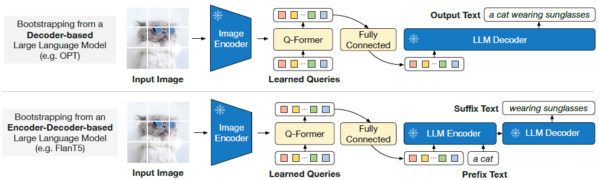

**BLIP-2&#x20;**&#x5C1D;试了两种类型的 LLM：

> 1. **基于解码器的 LLM**：使用语言建模损失进行预训练，其中冻结的 LLM 根据 Q-Former 提供的视觉表示生成文本。
>
> 2. **基于编码器-解码器的 LLM**：我们使用前缀语言建模损失进行预训练，其中将文本分为两部分。前缀文本与视觉表示拼接后作为 LLM 编码器的输入，而后缀文本则用作 LLM 解码器的生成目标。

* **模型训练**

在第一阶段预训&#x7EC3;**`250k`**&#x6B65;，在第二阶段预训&#x7EC3;**`80k`**&#x6B65;。

第一阶段中，对&#x4E8E;**`ViT-L/ViT-g`**，分别使&#x7528;**`2320/1680`**&#x7684;批量大小

第二阶段中，对&#x4E8E;**`OPT/FlanT5`**，分别使&#x7528;**`1920/1520`**&#x7684;批量大小

在预训练期间，将冻结的 ViT 和 LLM 的参数转换&#x4E3A;**`FP16`**&#x683C;式，其&#x4E2D;**`FlanT5`**&#x9664;外，它使&#x7528;**`BFloat16`**。作者发现与使用32位模型相比，没有性能下降。由于使用了冻结模型，预训练比现有的大规模视觉-语言预训练 **VLP** 方法更加计算友好。例如，使用一台配备**`16`**块**`40G A100`**显卡的机器，最大模型**`ViT-g`**和**`FlanT5-XXL`**在第一阶段不到**`6`**天完成，在第二阶段不到**`3`**天完成。

所有模型均使用相同的预训练超参数。优化器使&#x7528;**`AdamW`**，参数设置为$$β1 = 0.9$$、$$β2 = 0.98$$，权重衰减&#x4E3A;**`0.05`**。学习率采用余弦衰减策略，峰值学习率&#x4E3A;**`1e-4`**，并使&#x7528;**`2000`**&#x6B65;的线性预热。第二阶段的最低学习率&#x4E3A;**`5e-5`**。图像使&#x7528;**`224×224`**&#x7684;大小，并通过随机调整裁剪和水平翻转进行数据增强。

**总结**

**BLIP-2** 是一种高效且灵活的视觉-语言预训练模型，通过冻结的预训练视觉编码器和语言模型，结合轻量级 **Q-Former&#x20;**&#x5B9E;现跨模态融合，在图生文任务，如字幕生成、视觉问答中表现出色。其模块化设计支持灵活替换视觉编码器和语言模型，适应不同任务需求。除此之外，**BLIP-2&#x20;**&#x53EF;进一步扩展： &#x20;

> 1. **支持更多模态**：如音频、视频等，迈向通用多模态框架 &#x20;
>
> 2. **提升细粒度识别**：优化查询机制，减少信息丢失，增强细节捕捉能力
>
> 3. **拓展任务范围**：尝试图像分类、检测、分割及生成等计算机视觉任务 &#x20;

**BLIP-2** 不仅是一项技术突破，更是一种连接视觉与语言的新理念，为多模态的发展提供了一种新的思路。

### 2.2.4 InstructBLIP

在多模态的大背景下，视觉与语言的融合一直是研究者们不断追求的目标。从早期的简单图文匹配任务，到如今复杂的跨模态推理与生成任务，可谓是技术的飞速进步。作为 BLIP 系列工作的延续，**InstructBLIP&#x20;**&#x4E0D;仅继承了前作的技术积淀，还通过引入指令微调 Instruction Tuning 的方法，开创了一个全新的研究方向。

在多模态模型的研究中，如何让模型能够更好地理解图像与文本之间的关联，并在此基础上完成多样化的任务，是一个核心问题。尽管早期的模型如 CLIP 和 BLIP 已经展示了强大的能力，但它们在面对复杂指令或未见过的任务时，往往表现得力不从心。这是因为这些模型大多依赖于预训练数据中的隐式对齐，缺乏显式的任务导向性训练。

> **注**：目前通用语言模型使用预训练加指令微调的范式。但是通用的视觉-语言模型具有挑战，因为不同任务之间差距过大。虽然 VLP 被广泛探索，但目&#x524D;**&#x20;Vision-Language Instruction Tuning** 探索的比较少。

正是基于这样的背景，InstructBLIP 应运而生。它的主要目标是解决视觉-语言模型在指令微调中的挑战，并显著提升模型在未见数据和任务上的泛化能力。通过引入指令微调机制，**InstructBLIP **不仅能够看懂图像，还能根据指令进行推理并生成相应的回答，从而实现了更深层次的多模态理解。

* **数据集**

为了确保指令调优数据的多样性并兼顾其可获取性，**InstructBLIP&#x20;**&#x6536;集了全面的公开视觉-语言数据集，并将其转换为指令调优格式。如右图所示，最终的数据集涵盖&#x4E86;**`11`**&#x4E2A;任务类别&#x548C;**`26`**&#x4E2A;数据集

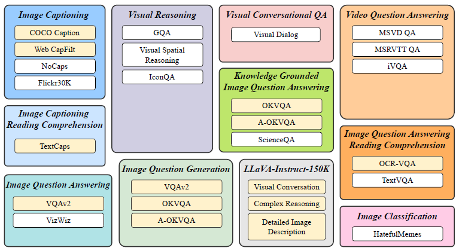

包括`图像描述生成`、`结合阅读理解的图像描述生成`、`视觉推理`、`图像问答`、`基于知识的图像问答`、`结合阅读理解的图像问答`、`图像问题生成`、`视频问答`、`视觉对话式问答`、`图像分类`和**`LLaVA-Instruct-150K`**。

对于每个任务，**InstructBLIP&#x20;**&#x7CBE;心设计&#x4E86;**`10`**&#x5230;**`15`**&#x4E2A;不同的自然语言指令模板。这些模板构成了指令调优数据的基础，明确了任务及其目标。对于那些天然倾向于简短回答的公共数据集，在部分对应的指令模板中加入了诸如`简短`或`简洁`等词汇，以降低模型过度拟合生成简短输出的风险。对于 LLaVA-Instruct-150K 数据集，由于其本身已经是指令格式，因此未添加额外的指令模板。

* **训练评估策略**

为了确保训练和零样本评估时有充足的数据和任务，**InstructBLIP **将**`26`**个数据集分为**`13`**个**`held-in`**数据集和**`13`**个**`held-out`**数据集，在上图中分别用黄色和白色表示。**InstructBLIP&#x20;**&#x4F7F;用 **held-in** 数据集的训练集进行指令调优，并使用其验证集或测试集进行 **held-in** 评估。

对于 **held-out** 评估，**InstructBLIP&#x20;**&#x7684;目标是了解指令调优如何提升模型在未见数据上的 Zero-Shot 性能。这里定义了两种类型的 **held-out** 数据：

> 1. 训练期间未暴露给模型，但其任务类型存在于 **held-in** 集群中的数据集（数据集在训练时没见过但任务见过，用于测试数据分布的泛化性）
>
> 2. 训练期间完全未见过的数据集及其相关任务（任务也没有见过，用于测试模型通用性）

处理第一种 **held-out** 评估由于 **held-in** 和 **held-out** 数据集之间的数据分布差异而变得复杂。对于第二种类型，完全保留了多个任务，包括视觉推理、视频问答、视觉对话式问答和图像分类。

为避免数据污染，**InstructBLIP **仔细选择了数据集，以确保没有任何评估数据出现在不同数据集的 **held-in** 训练集群中。在指令调优过程中，将所有 **held-in** 训练集混合，并对每个数据集均匀采样指令模板。模型通过标准的语言建模损失进行训练，直接根据指令生成回答。此外，对于涉及场景文本的数据集，在指令中添加 OCR 标记作为补充信息。

* **视觉特征提取**

现有的 Zero-Shot 图像到文本生成方法在提取视觉特征时采用了一种与指令无关的方法，包&#x62EC;**`BLIP-2`**&#x7B49;。这导致无论任务如何，都有一组静态的视觉表示被输入到 LLM 中。相比之下，一个指令感知的视觉模型可以适应任务指令，并生成最有利于当前任务的视觉表示。如果期望同一输入图像的任务指令存在显著差异，这种方法显然具有优势。

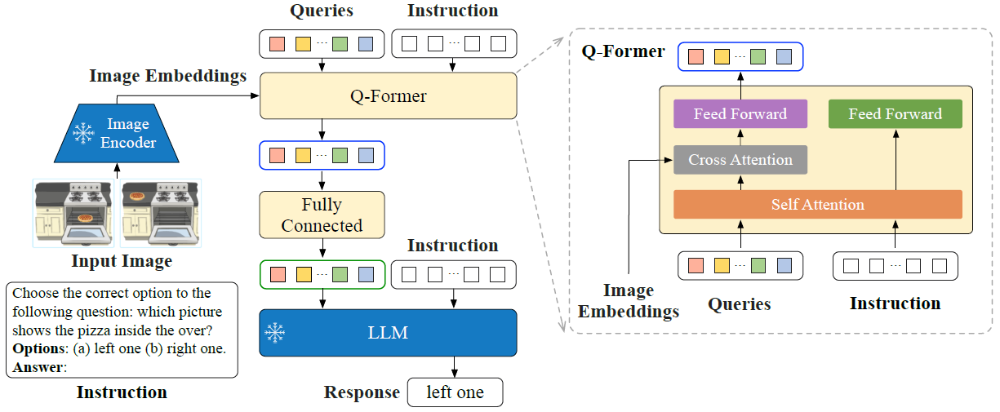

上图展示了 **InstructBLIP&#x20;**&#x7684;架构。与 BLIP-2 类似，**InstructBLIP **使用 Q-Former 从冻结的图像编码器中提取视觉特征。Q-Former 的输入包含一组 $$K$$ 个可学习的 Query Embedding，它们通过交叉注意力机制与图像编码器的输出交互。Q-Former 的输出由 $$K$$ 个编码后的视觉向量组成，每个 Query Embedding 对应一个向量，这些向量经过线性投影后被输入到冻结的 LLM 中。与 BLIP-2 类似，Q-Former 在指令调优之前分两个阶段进行预训练：

> 1. **第一阶段**&#x5C06; Q-Former 与冻结的图像编码器一起预训练，用于视觉-语言表示学习
>
> 2. **第二阶段**&#x5C06; Q-Former 的输出适配为软视觉提示，以支持冻结 LLM 的文本生成

预训练完成后，使用指令调优对 Q-Former 进行微调，其中 LLM 接收来自 Q-Former 的视觉编码和任务指令作为输入。

在 BLIP-2 的基础上，**InstructBLIP **提出了一个指令感知的 Q-Former 模块，该模块将指令文本 Token 作为额外输入。指令通过 Q-Former 的自注意力层与 Query Embedding 交互，促进任务相关图像特征的提取。通过如此操作，LLM 接收到更有利于遵循指令的视觉信息。当然实验也证明，指令感知的视觉特征提取在 **held-in** 和 **held-out** 评估中均带来了显著的性能提升。

> **注**：以下几点需要注意
>
> 1. 与 BLIP-2 不同的是在 Q-Former 和 LLM 中加入 Instruction
>
> 2. 在 Instruction Tuning 过程中冻结图像编码器和 LLM
>
> 3. Instruction Tuning 使用标准 Language Modeling Loss

* **平衡数据集**

由于训练数据集数量众多且各数据集规模差异较大，均匀混合这些数据可能导致模型对较小数据集过拟合，而对较大数据集欠拟合。为了解决这一问题，**InstructBLIP&#x20;**&#x63D0;出按数据集大小的平方根比例采样数据集。具体来说，给定$$D$$个数据集，其大小分别为$$\{S_1, S_2, \dots, S_D\}$$，从数据集$$d$$中选择一个样本的概率为：

$$p_d = \frac{\sqrt{S_d}}{\sum_{i=1}^D \sqrt{S_i}}$$

在此公式的基础上，**InstructBLIP&#x20;**&#x5BF9;手动调整某些数据集的权重以优化训练效果，因为不同数据集和任务即使规模相似，也可能需要不同的训练强度。例如降低多选题数据集**`A-OKVQA`**的权重，增加需要开放式文本生成的数据集**`OKVQA`**的权重。

* **推理**

在推理阶段，**InstructBLIP&#x20;**&#x9488;对不同数据集采用了两种略有不同的生成方法：

1. 对&#x4E8E;**大多数数据集**，如图像描述生成和开放式视觉问答，指令调优模型直接根据 prompt 生成回答，随后将其与真实值进行比较以计算指标。

2. 对&#x4E8E;**分类和多选视觉问答任务**，采用词汇排名方法。具体来说，仍然提示模型生成答案，但将其词汇限制在一个候选列表中。然后计算每个候选的对数似然 log-likelihood，并选择值最高的候选作为最终预测。该排名方法应用于 **`ScienceQA`**、**`IconQA`**、**`A-OKVQA`**、**`HatefulMemes`**、**`Visual Dialog`**、**`MSVD`**&#x548C;**`MSRVTT`**&#x6570;据集。此外，对于二分类任务，将正负标签扩展为一组稍宽泛的表达词，以利用自然文本中的词频，例如正类用**`yes`**和**`true`**，负类用**`no`**和**`false`**。对于视频问答任务，每段视频使用四个均匀采样的帧。每个帧单独通过图像编码器和 Q-Former 处理，提取的视觉特征在输入 LLM 之前被拼接。

* **实现细节**

得益于 BLIP-2 模块化架构设计的灵活性，可以快速将模型适配到各种 LLM。在实验中采用了四种 BLIP-2 变体，使用相同的图像编码&#x5668;**`ViT-g/14`**&#x4F46;不同的冻结 LLM，包&#x62EC;**`FlanT5-XL-3B`**、**`FlanT5-XXL-11B`**、**`Vicuna-7B`**&#x548C;**`Vicuna-13B`**。**FlanT5** 是基于编码器-解码器 Transformer T5 的指令调优模型。**Vicuna** 则是一个最近发布的仅解码器 Transformer 模型，基于 LLaMA 指令调优而来。在视觉-语言指令调优过程中，从预训练的 BLIP-2 Checkpoint 初始化模型，仅微调 Q-Former 的参数，同时保持图像编码器和 LLM 冻结。由于原始 BLIP-2 模型未提供 Vicuna 的 Checkpoint，**InstructBLIP&#x20;**&#x4F7F;用与 BLIP-2 相同的流程对 Vicuna 进行预训练。

所有模型均通过最&#x591A;**`60,000`**&#x6B65;指令调优，&#x6BCF;**`3,000`**&#x6B65;验证一次性能。对于每个模型，选择单个最佳 Checkpoint 用于所有数据集的评估。这里分别&#x4E3A;**`3B`**、**`7B`**&#x548C;**`11/13B`**&#x6A21;型设置了批量大小&#x4E3A;**`192`**、**`128`**&#x548C;**`64`**。优化器采&#x7528;**`AdamW`**，设置$$\beta_1 = 0.9$$、$$\beta_2 = 0.999$$和权重衰减&#x4E3A;**`0.05`**。此外，在&#x524D;**`1,000`**&#x6B65;中应用学习率的线性预热，从$$10^{-8}$$增加到$$10^{-5}$$，随后使用余弦衰减，最小学习率&#x4E3A;**`0`**。所有模型均使&#x7528;**`16`**&#x5757;**`40G A100`** GPU 进行训练，并&#x5728;**`1.5`**&#x5929;内完成训练。

**总结**

为了验证 InstructBLIP 的有效性，作者团队在多个公开数据集上进行了广泛的实验。结果显示，InstructBLIP 在几乎所有任务上的表现都优于现有的多模态模型，包括 BLIP-2、CLIP 等。尤其是在零样本场景下，InstructBLIP 展现出了卓越的泛化能力，证明了指令微调机制的强大潜力。

此外，InstructBLIP 还在一些新兴任务上取得了突破性的进展。例如，在视觉推理任务中，它能够准确地根据图像内容回答复杂的逻辑问题；在跨模态翻译任务中，它能够生成流畅且语义准确的目标语言文本。这些成果充分体现了 InstructBLIP 在多模态领域的领先地位。

InstructBLIP 的成功不仅在于其技术上的创新，更在于它为多模态模型的研究指明了一个新的方向。通过引入指令微调机制，InstructBLIP 成功地将视觉与语言的理解能力提升到了一个新的高度。

### 2.2.5 BLIP-3

在人工智能领域，多模态模型正成为连接视觉与语言的重要桥梁。**BLIP-3**，作&#x4E3A;**`xGen-MM`**&#x6846;架的核心成果之一，不仅延续了 **BLIP&#x20;**&#x7CFB;列在多模态领域的深厚积累，更在开放性、轻量化和性能上取得了显著突破。

多模态模型的目标是让机器能够同时理解图像、视频和文本等多源信息，并在此基础上完成复杂的任务，例如视觉问&#x7B54;**`VQA`**、图像描述生&#x6210;**`Captioning`**&#x4EE5;及指令跟&#x8E2A;**`Instruction Following`**。然而，这一领域仍面临诸多挑战：

> 1. **资源获取的差异**：开源模型与专有模型之间的差距显著，尤其是在权重、训练配方和数据集方面
>
> 2. **高质量数据的需求**：多模态模型需要大量高质量的图像-文本对数据，而这些数据的获取和标注成本高昂
>
> 3. **计算资源的限制**：训练大规模多模态模型需要强大的硬件支持，如何在有限资源下实现高性能成为一个难题

虽然过去 BLIP 系列对多模态大模型发展起到至关重要的作用，但从效果上来说，已经远落后于当下的 SOTA 模型，**BLIP-3** 正是在这样的背景下诞生，它通过一系列创新设计，试图解决上述问题，并推动多模态模型的发展。主要贡献有以三点：

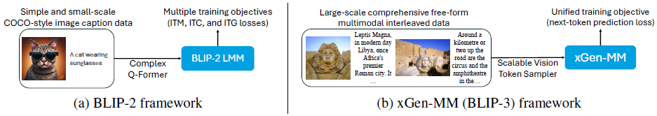

**数据上**

**改进前**

之前训练数据数量少、质量不高、多样性不强

**改进后**

构造了更大的、质量更高、多样性更强的数据集

**训练策略上**

**改进前**

多个 stage，包&#x62EC;**`ITM`**，**`ITC`**， **`ITG`**，训练流程冗长，而且 up scale 的训练开销大

**改进后**

提出 3 stage 的训练范式，并统一用 next token prediction作为训练目标目标，提升训练效率和模型效果

**模型结构上**

**改进前**

BLIP系列仅支持单图输入，应用范围相对较窄

**改进后**

支持交错图文输入

* **模型结构**

架构概述。如右图所示，BLIP-3 框架采用了一种由 **ViT** **`ViT-SO400M-14-SigLIP-384`**、**`Vision Token Sampler`**&#x548C;预训练的 **LLM** **`phi3-mini`**&#x7EC4;成的架构。**ViT **用于提取图像特征，**Vision Token Sampler **用于对图像 Embedding 进行下采样，而 **LLM **则负责处理多模态输入。模型的输入可以是来自不同多模态数据源的自由形式的交错文本和视觉 Token。在 BLIP-3 中，ViT 不参与训练，但 LLM 参与训练。

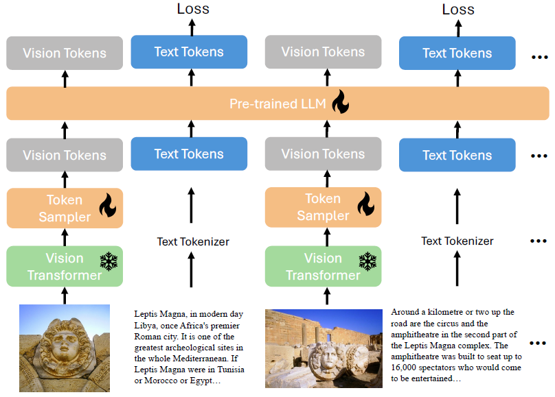

**任意分辨率视觉 Token 采样**

正如在 LLaVA-NeXT 等工作中证明的，动态高分辨率图像编码策略在微调和后训练阶段非常有效。BLIP-3 通过基于图像块的编码实现了更高分辨率的图像理解。这种块级编码通过将单张图像分割为多个小块并分别编码，尽可能保留原始图像的分辨率。遵循以往的经验，BLIP-3 将编码后的图像块与缩小尺寸的原始图像连接起来，后者提供了全局信息。

> **注**：**`Any-Resolution Vision Token Sampling`**&#x7B56;略可以强化模型对细粒度信息的捕获能力

具体流程如下：

1. **找到最优分辨率**

预设了一些模版，通过下面的目标找到输入图片最适合的分辨率

$$\begin{aligned} &\mathrm{Objection:} \mathrm{Arg} \min_{t} (\mathrm{wasted\_resolution}), t=1,2, \cdots N \\ \end{aligned}$$

其中$$t$$为模版的索引，一共有$$N$$个预设模版

$$\begin{aligned} r_{t} &= \min( \frac{w_t} {w_{\rm ori}}, \frac{h_t} {h_{\rm ori}}) \\ \mathrm{wasted\,resolution} &= w_t * h_t - \min (w{\rm ori} * h_{\rm ori}, \mathrm{INT}(w_{\rm ori} * r_{t}) * \mathrm{INT} (h_{\rm ori} * r_{t}) ) \\\end{aligned}$$

示例代码如下：

* **切 Patch**

每个 Patch 的 Size 为 ViT 的输入Size，**`BLIP-3`**&#x6240;用&#x7684;**`ViT-SO400M-14-SigLIP-384`** 的输入 Size &#x4E3A;**`384x384`**。假设输入图片所映射的模板 Size 为**`768x768`**，将图片 Resize 到**`768x768`**后进行切分，得到**`5`**个Patch：**`4`**个切分 Patch 加上一个包含全局信息的 Patch，如下图所示。

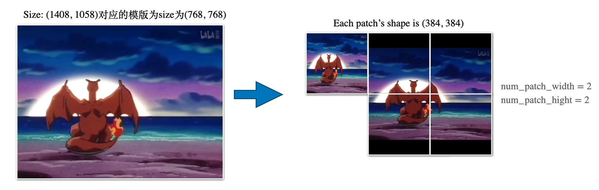

* **计算每个 Patch 的 Image Embedding**

一&#x4E2A;**`384x384`**&#x7684;图片经&#x8FC7;**`ViT-SO400M-14-SigLIP-384`**&#x540E;得&#x5230;**`576`**&#x4E2A;token：$$(\frac{384}{16})^2 = 576$$

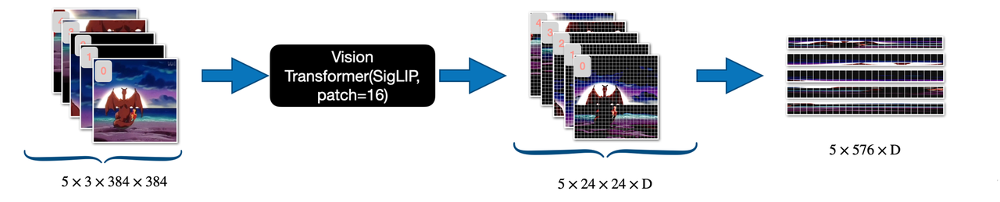

* **分别提取每个 Patch 的 Vision Token 再拼接**

如下图，不同模版分辨率的 Image Token是不同的。通常来说，Token 数越多，包含的细粒度信息就越多。对于下游感知密集型的推理任务会有更大优势，&#x5982;**`DocQA`**

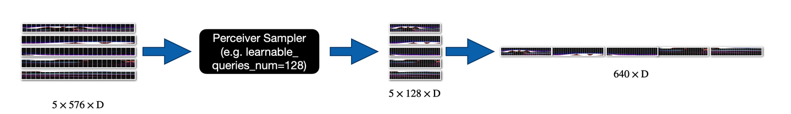

**视觉语言连接器 VL-connector**

在视觉语言连接器中，BLIP-3 使&#x7528;**`perceiver resampler`**&#x5BF9;视觉 Token 进行下采样。通过任意分辨率图像编码，对每个图像 Patch，包括缩小的原始图像，独立执行下采样操作。随后，这些下采样的视觉 Token 被合并并传递给 LLM。通过视觉语言连接器中的下采样，可以根据 **perceiver resampler&#x20;**&#x4E2D; Query Token 的数量，将视觉 Token 的序列长度减少五倍或更多。

BLIP-3 中没有沿用 BLIP-2 &#x7684;**`Q-Former`**，而是用&#x4E86;**`Flamingo`**&#x7684;**`Perceiver Resampler`**，如右图所示。二者核心思路其实都差不多——以 Learnable Queries 的方式，将Image Encoder 提取的 Image Embedding 转为固定长度的 Image Token。

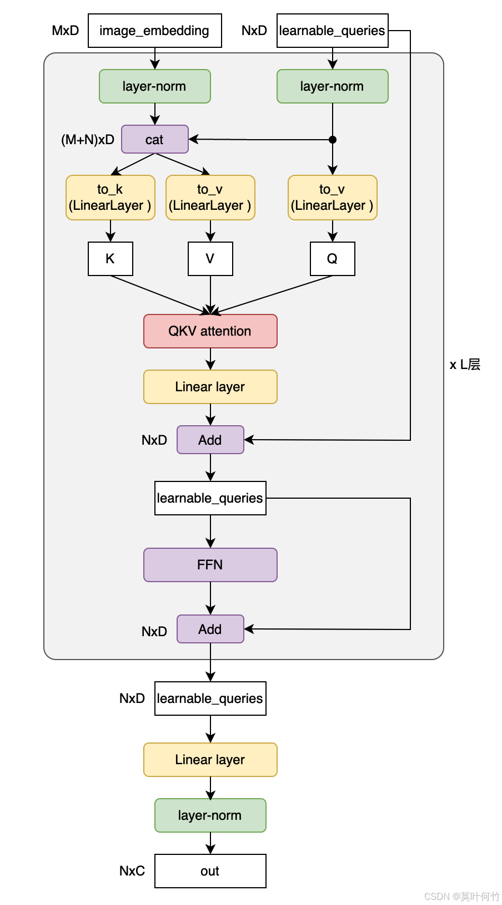

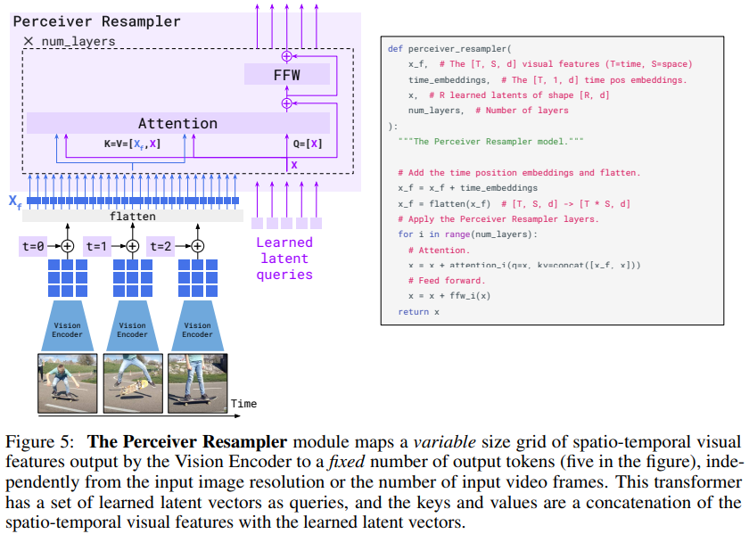

* **训练**

**预训练**

预训练的目标是预测在混合数据集上训练时的下一个文本 Token。总体而言，最终的基础模&#x578B;**`xGen-MM-Phi3-mini-base-r`**&#x5728;组合数据集上预训练了大&#x7EA6;**`100B`**&#x4E2A;多模态 Token，预训练的图像分辨率&#x4E3A;**`384x384`**&#x50CF;素，&#x4E0E;**`SigLIP`**&#x4FDD;持一致。

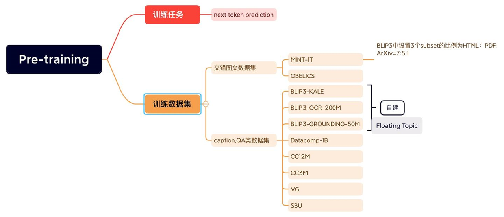

三个自建数据集：

> 1. **BLIP3-KALE**：大规模高质量描述数据集
>
> 2. **BLIP3-OCR-200M**：&#x4ECE;**`Datacomp-1B`**&#x4E2D;搜集&#x4E86;**`200M`**&#x5F20;高分辨率图片。&#x7528;**`PaddleOCR`**&#x63D0;取里面的文字信息。虽&#x7136;**`BLIP-3`**&#x4E2D;并没有用到文本的 **bounding box**，但是使用的话会提升 OCR QA 类任务的效果
>
> 3. **BLIP3-GROUNDING-50M**：&#x4ECE;**`Datacomp-1B`**&#x4E2D;搜&#x96C6;**`50M`**&#x56FE;片，图文信息都要。用开源的开集目标检测模&#x578B;**`Grounding-DINO`**&#x548C;**`Recognize Anything`**&#x8FDB;行识别。将 caption 中的对应的 object 替换为包含位置信息的 object

**监督微调 SFT**

进一步在遵循指令的示例数据集上对预训练模型进行微调，使其能够更好地理解和回答用户问题。在微调阶段，使用了一系列公开可用的指令跟随数据集。这里采用了任意分辨率视觉 Token 采样策略，以便更好地理解高分辨率图像，例如包含大量文本的文档数据。

> **注**：微调&#x4E86;**`1`**&#x4E2A;epoch
>
> 开源数据集包括：多模态会话，image caption，VQA，document QA，science and math understand

**交错多图像监督微调**

在已经过指令微调的模型上进行第二阶段的微调，使用混合了多图像和单图像指令跟随样本的数据集。这一阶段的目标是增强模型对交错图文输入的理解能力，这对多模态上下文学习、多图像问答以及许多实际应用场景非常有帮助。在多图像微调中，同样采用了与之前 SFT 阶段相同的任意分辨率视觉 Token 采样策略。

> **注**：用多图交错图文数据&#x96C6;**`MANTIS`**，**`Mmdu`**&#x7ED3;合之前微调的单图交错图片数据对模型进行进一步微调

**后训练 Post-training**

最后通过两个阶段的后训练来提升模型的实用性，同时减少幻觉和毒性等有害特性。

1. **通过`DPO`提升模型的`Truthfulness`**

> * **训练数据**：该阶段利用了开源&#x7684;**`VLFeedback`**&#x6570;据集的指令，**VLFeedback** 是一个用 GPT4-v 构造多模态偏好数据集，总&#x8BA1;**`80K`**。
>
> * **构造方式**：给定指令，让多个 VLM 模型做生成，随后 GPT4-v &#x4ECE;**`helpfulness`**, **`visual faithfulness`**,  **`ethics`**&#x5BF9;生成的结果进行打分。分值高的输出作为 **preferred responses**，分值低的输出作为 **dispreferred responses**。**BLIP-3&#x20;**&#x8FDB;一步过滤掉首选响应得分较低的sample，最终得&#x5230;**`62.6K`**&#x6570;据。
>
> * **训练方式**：**BLIP-3&#x20;**&#x91C7;&#x7528;**`DPO`**&#x4F5C;为训练目标，&#x7528;**`LoRA`**&#x5FAE;调 LLM **`2.5%`**&#x53C2;数，总计训&#x7EC3;**`1`**&#x4E2A;epoch。

* **通过`Safty-SFT`提升模型的`Harmlessness`**

> - **训练数据**：&#x7528;**`VLGuard`**&#x6570;据集+随&#x673A;**`5K`** SFT数据集对 BLIP-3 再次进行微调，在保&#x7559;**`helpfulness`**&#x7684;同时提&#x5347;**`harmlessness`**。
>
> - **训练方式**：**`LoRA`**&#x5FAE;调 LLM **`2.5%`**&#x53C2;数

最后，模型在训练和推理方面的流程如下：

**训练阶段**

图片用 visual tokenizer 转为 visual token，文本用 text tokenizer 转为 text token，最后按序拼接起来送入 LLM，用 causal mask 做并行，仅对文本 token 处计算自回归损失。

**推理阶段**

图片用 visual tokenizer 转为 visual token，文本用 text tokenizer 转为 text token，最后按序拼接起来送入 LLM，按照 next token prediction 的范式做生成。

**总结**

BLIP-3 在多个公开基准测试中表现出色，其性能可与当前最先进的专有模型相媲美：

> * **视觉问答 VQA**：&#x5728;**`COCO-VQA`**&#x6570;据集上，BLIP-3 的准确率达到&#x4E86;**`92.5%`**，比前代模型提升了&#x7EA6;**`5%`**。
>
> * **图像描述生成 Image Captioning**：&#x5728;**`Flickr30K`**&#x6570;据集上，BLIP-3 的BLEU-4得分达&#x5230;**`71.3%`**，远超同类开源模型。
>
> * **指令跟踪 Instruction Following**：在 **MME**（**M**ulti-**M**odal **E**valuation）基准测试中，BLIP-3 在多项任务中均取得了领先成绩。

这些结果表明，BLIP-3 不仅在学术研究中具有重要意义，也为实际应用提供了坚实的技术支撑。

但 BLIP-3 也还存在一些缺点，就是只能解决多模态图文交错输入，单模态文本输出。

---

[Previous](05-Vision-Language-Model--前期探索.md) | [Contents](../../README.md) | [Next](07-Vision-Language-Model--结构优化.md) | [Visual website](https://weyumm.github.io/vlm-Wissen/lecture-1.html#c=6)
