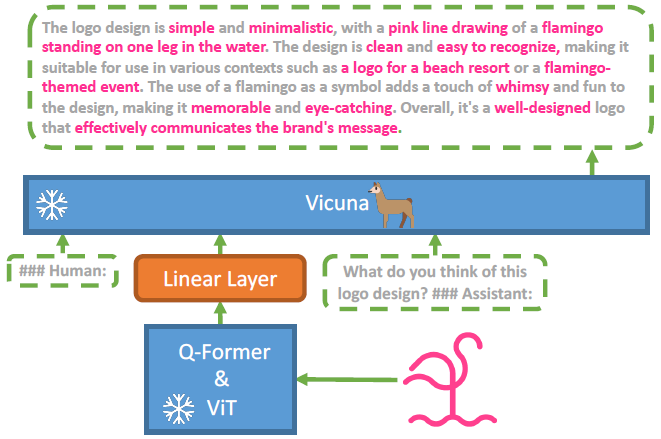
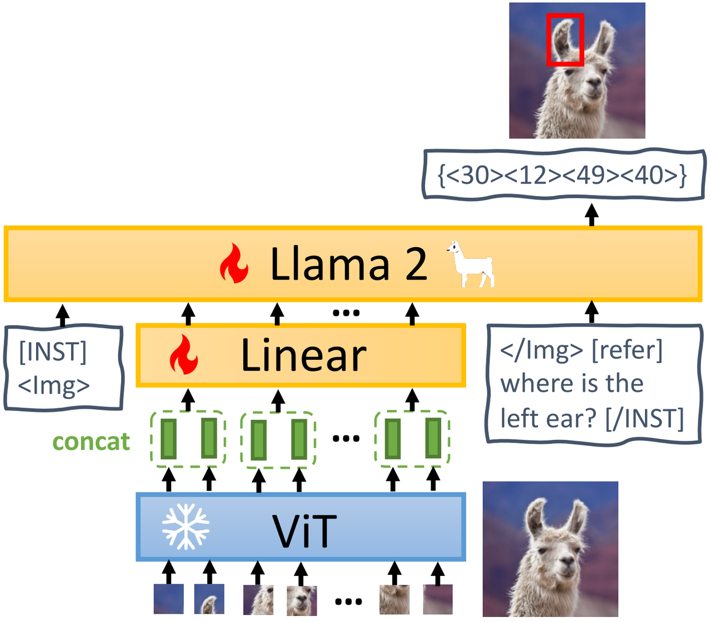

[Previous](08-Vision-Language-Model--LLaVA-系列.md) | [Contents](../../README.md) | [Next](10-Vision-Language-Model--Qwen-系列.md) | [Visual website](https://weyumm.github.io/vlm-Wissen/lecture-1.html#c=9)

## 2.5 MiniGPT 系列

### 2.5.1 MiniGPT-4

传统的语言模型擅长处理纯文本数据，但当面对图像等多模态输入时，其局限性便显现出来。如何让模型同时理解视觉信息并生成连贯的语言描述，是跨模态研究的核心问题之一。**MiniGPT-4** 的出现正是为了解决这一难题。它基于两个关键组件构建：一个超大规模的语言模&#x578B;**`Vicuna`**&#x548C;一个高效&#x7684;**`BLIP-2`**&#x89C6;觉编码器。这种结合不仅充分利用了现有大语言模型的知识库，还通过视觉编码器提取丰富的图像特征，从而实现多模态任务的高效执行。

> **`注`**：目标是**图像理解 + 文本生成**，要利用大模型的**涌现能力**，即最&#x5C11;**`50B`**&#x53C2;数

**MiniGPT-4** 的目标是将来自预训练视觉编码器的视觉信息与先进的 LLM 对齐。具体来说，使&#x7528;**`Vicuna`**&#x4F5C;为语言解码器，它基&#x4E8E;**`LLaMA`**&#x6784;建，能够执行多种复杂的语言任务。对于视觉感知，采用了&#x4E0E;**`BLIP-2`**&#x76F8;同的视觉编码器，&#x5373;**`ViT`**&#x4E3B;干网络，结合了其预训练&#x7684;**`Q-Former`**。语言和视觉模型都是开源的。**MiniGPT-4** 通过一个线性投影层弥合视觉编码器与 LLM 之间的差距，如右图所示。为了实现有效的 MiniGPT-4，作者提出了一种两阶段训练方法：

> 1. **第一阶段**&#x6D89;及在大量对齐的图文对上预训练模型以获取视觉-语言知识。
>
> 2. **第二阶段**&#x5219;使用更小但高质量的图文数据集，结合设计好的对话模板对预训练模型进行微调，以提高生成的可靠性和可用性。

* **预训练**

在初始预训练阶段，模型从大量的对齐图文对中学习视觉-语言知识。**MiniGPT-4** 将注入的投影层输出视为 LLM 的软提示，促使它生成相应的标准文本。在整个预训练过程中，预训练的视觉编码器和 LLM 始终保持冻结状态，仅对线性投影层进行预训练。预训练使&#x7528;**`Conceptual Caption`**、**`SBU`**&#x548C;**`LAION`**&#x6570;据集来训练模型。模型经&#x8FC7;**`20,000`**&#x6B65;训练，批量大小&#x4E3A;**`256`**，覆盖了大&#x7EA6;**`5M`**&#x5F20;图文对。整个过程约&#x9700;**`10`**&#x5C0F;时，使&#x7528;**`4`**&#x5F20;**`80GB A100`** GPU。

尽管 **MiniGPT-4** 在第一阶段后展现出丰富的知识储备并能对人类提问给出合理回应，但它有时会产生不连贯的语言输出，例如重复的单词或句子、片段化的句子或无关内容。这些问题阻碍了 **MiniGPT-4** 与人类进行流畅的视觉对话的能力。类似的问题也出现在 GPT-3 中。尽管 GPT-3 在大规模语言数据集上进行了预训练，但它仍然难以生成与用户意图完全一致的语言输出。通过指令微调和基于人类反馈的强化学习，GPT-3 演化为 GPT-3.5，能够生成更符合人类需求的输出。这一现象&#x4E0E;**&#x20;MiniGPT-4&#x20;**&#x5F53;前的状态相似，因此在现阶段可能难以生成流畅自然的人类语言输出并不令人意外。

* **数据集构建**

为了提高生成语言的自然度并增强模型的可用性，第二阶段的对齐过程至关重要。在 NLP 领域，指令微调数据集和对话数据集较易获得，但在视觉-语言领域却没有类似的高质量数据集。为了解决这一问题，作者精心策划了一个专门用于视觉-语言对齐的详细图像描述数据集，并在第二阶段对 MiniGPT-4 进行微调。

1. **初始对齐图文生成**

在初始阶段，利用第一阶段预训练得到的模型生成输入图像的详细描述。为了使模型生成更详细的图像描述，作者设计了一个符合 **Vicuna&#x20;**&#x5BF9;话格式的提示，如下所示。其&#x4E2D;**`<ImageFeature>`**&#x8868;示线性投影层生成的视觉特征：

**`###Human:`**` `**`<ImageFeature></Img> `**`Describe this image in detail. Give as many details as possible. Say everything you see. `**`###Assistant:`**

> **注**：设计了一个遵循 **Vicuna&#x20;**&#x8BED;言模型会话格式的 prompt，让模型生成尽可能多的描述

为了识别不完整的句子，检查生成的句子是否超&#x8FC7;**`80`**&#x4E2A; Token。如果未达到，会加入额外的提&#x793A;**`###Human: `**`Continue`**` ###Assistant:`**，促使 MiniGPT-4 扩展生成过程。通过合并两步的输出，可以生成更全面的图像描述。这种方法能够生成具有详细且信息丰富的图像描述的图文对。作者从 **Conceptual Caption** 数据集中随机选择&#x4E86;**`5,000`**&#x5F20;图像，并使用预训练模型为每张图像生成对应的描述。

* **数据后处理**

上述自动生成的图像描述中包含噪声或不连贯的内容，例如重复的单词或句子、片段化的句子或无关内容。为了解决这些问题，使用 ChatGPT 修复这些描述，采用以下提示：

`Fix the error in the given paragraph. Remove any repeating sentences, meaningless characters, not English sentences, and so on. Remove unnecessary repetition. Rewrite any incomplete sentences. Return directly the results without explanation. Return directly the input paragraph if it is already correct without explanation.`

完成后处理阶段后，手动验证每个图像描述的准确性，以确保其高质量。具体来说，首先识别一些频繁出现的错误，如`I’m sorry I made a mistake...`或`I apologize for that ...`，然后编写硬规则自动过滤掉它们。除此之外还手动优化生成的标题，删除 ChatGPT 未能检测到的冗余单词或句子。最终，仅有&#x7EA6;**`3,500`**&#x5BF9;图文满足要求，这些数据随后被用于第二阶段对齐过程。

* **微调**

在第二阶段，使用精选的高质量图文对对预训练模型进行微调。在微调过程中，使用以下模板中的预定义提示：

**`###Human: <ImageFeature></Img> `**`<Instruction> `**`###Assistant:`**

其&#x4E2D;**`<Instruction>`**&#x8868;示从预定义指令集中随机采样的指令，例如`Describe this image in detail`或`Could you describe the contents of this image for me`。这里不对特定文本-图像提示计算回归损失。

经过微调，**MiniGPT-4** 能够生成更自然、更可靠的语言输出。此外，这一微调过程效率极高，仅&#x9700;**`400`**&#x6B65;训练，批量大小&#x4E3A;**`12`**，使用单&#x5F20;**`A100`** GPU 大约需&#x8981;**`7`**&#x5206;钟。

**总结**

**MiniGPT-4** 是一种先进的多模态模型，结合了预训练的视觉编码器和大型语言模型，通过轻量化的线性投影层实现视觉与语言的对齐。它能够生成高质量的图像描述、识别复杂视觉内容，并完成从手写文本生成网站等创造性任务 。相比以往的视觉-语言模型，**MiniGPT-4** 展现了更强的理解和生成能力。

### 2.5.2 MiniGPT-v2

* **模型结构：EVA ViT、线性投影与 LLaMA-2-chat**

MiniGPT-v2 由冻结的 EVA 视觉主干、可训练线性投影层和 LLaMA-2-chat 7B 组成。图像以 **`448×448`** 分辨率输入，视觉主干的位置编码通过插值适配更高分辨率；视觉主干在全部训练阶段保持冻结。语言模型作为统一输出接口，视觉问答、描述、指代表达和定位结果都由 LLaMA-2 token 序列生成。

右图给出完整架构：视觉 token 经相邻合并和线性投影后，与任务标识和文本指令一起进入 LLaMA-2。

* **四邻视觉 token 合并**

直接把 **`448×448`** 图像的全部视觉 token 投影到语言模型空间，会产生约 **`1024`** 个输入 token。为缩短序列，MiniGPT-v2 在嵌入空间中把每 **`4`** 个空间相邻视觉 token 沿特征维拼接，再通过一个线性层把拼接向量映射为一个 LLaMA-2 维度的视觉 token。

若相邻 token 为 $$v_{i,1},v_{i,2},v_{i,3},v_{i,4}\in\mathbb{R}^{d_v}$$，拼接与投影可以写为：

$$h_i=W_p[v_{i,1};v_{i,2};v_{i,3};v_{i,4}]+b_p$$

输出视觉 token 数减少为原来的 **`1/4`**。这里压缩的是局部相邻 token，而不是先把输入图像整体降采样，因此仍可利用 448×448 输入中的细粒度目标和文字信息。

* **多任务指令模板**

仅把视觉 token 与自然语言问题对齐时，不同任务可能共享同一问法却要求不同输出格式。例如“红色外套的人在哪里”既可以回答自然语言方位，也可以输出边界框。MiniGPT-v2 在指令中加入显式任务标识，把“要解决什么任务”作为条件 token 输入。

通用输入格式为：

**`[INST]`** 表示用户角色，**`[/INST]`** 表示助手角色。用户输入由图像特征、任务标识和自然语言指令三部分组成。视觉无关的纯语言指令不添加任务标识。

六个任务标识与输出职责如下：

| 任务         | 标识            | 期望输出          |
| ---------- | ------------- | ------------- |
| 视觉问答 VQA   | `[vqa]`       | 问题答案          |
| 图像描述       | `[caption]`   | 普通图像描述        |
| 带定位描述      | `[grounding]` | 描述文本与对应边界框    |
| 指代表达理解 REC | `[refer]`     | 给定短语对应的边界框    |
| 指代表达生成 REG | `[identify]`  | 给定边界框对应的短语    |
| 目标解析与定位    | `[detection]` | 从文本解析目标并给出边界框 |

* **边界框的文本表示**

定位任务不引入独立检测头，而是让 LLaMA-2 直接生成边界框的文本 token：

$$\{\langle X_{\mathrm{left}}\rangle\langle Y_{\mathrm{top}}\rangle\langle X_{\mathrm{right}}\rangle\langle Y_{\mathrm{bottom}}\rangle\}$$

$$X$$、$$Y$$ 坐标被归一化并离散到整数区间 **`[0,100]`**。前两个 token 表示左上角，后两个表示右下角。这样，描述、问答与视觉定位都可在同一自回归语言建模接口中训练和解码。

* **三阶段多任务训练**

**Stage 1：预训练**

第一阶段混合弱标注和细粒度数据，并提高弱标注数据的采样率以扩大视觉—语言知识覆盖。弱标注来源包括 LAION、CC3M、SBU 以及用于 REC、REG 和带定位描述的 GRIT-20M。细粒度数据包括 COCO Caption、TextCaps、RefCOCO/RefCOCO+/RefCOCOg、Visual Genome，以及 GQA、VQAv2、OCR-VQA、OK-VQA、AOK-VQA。

REG 数据由 REC 数据反向构造：把“短语 → 边界框”改为“边界框 → 短语”，从而让同一数据同时训练理解与生成两个方向。

**Stage 2：多任务训练**

第二阶段移除 GRIT-20M、LAION 等弱监督数据，只保留对齐质量较高的图像描述、REC、REG 和 VQA 数据，并根据任务出现频率重新设置采样比例。目标是从广覆盖转向各任务的精细对齐。

**Stage 3：多模态指令微调**

第三阶段继续使用第二阶段的细粒度任务数据，但降低其采样比例，同时提高新加入的多模态指令与语言数据比例。新增数据包括 LLaVA 详细描述约 **`2.3 万`** 条、复杂推理约 **`5.8 万`** 条，以及 Flickr30k、多任务多轮对话和 Unnatural Instructions。

Flickr30k 被重组为两类监督：一类选择至少含 **`5`** 个 grounded phrase 的描述，训练带定位图像描述；另一类让模型从输入描述中解析全部目标，再用 `[detection]` 输出每个目标的边界框。多轮混合数据把不同单轮任务拼入同一对话，缓解模型只会在孤立轮次完成单一任务的问题；纯语言 Unnatural Instructions 则用于恢复长期视觉语言训练后可能下降的语言生成能力。

> **参数更新**
>
> 视觉主干始终冻结；训练集中在视觉投影层和语言模型。语言模型通过 LoRA 调整注意力中的 $$W_q$$ 与 $$W_v$$，同时保留统一的任务模板和边界框 token 接口。

---

[Previous](08-Vision-Language-Model--LLaVA-系列.md) | [Contents](../../README.md) | [Next](10-Vision-Language-Model--Qwen-系列.md) | [Visual website](https://weyumm.github.io/vlm-Wissen/lecture-1.html#c=9)
