[Previous](10-Vision-Language-Model--Qwen-系列.md) | [Contents](../../README.md) | [Next](12-Vision-Language-Model--DeepSeek-系列.md) | [Visual website](https://weyumm.github.io/vlm-Wissen/lecture-1.html#c=11)

## 2.7 Intern 系列

### 2.7.1 InternVL

InternVL 是由上海 AI Lab 和相关研究机构开发的一系列开源多模态大模型，旨在结合视觉和语言能力以解决复杂的多模态任务。该系列模型在多个视觉-语言基准测试中展现了卓越性能，逐步成为 GPT-4V 等闭源模型的有力竞争者。

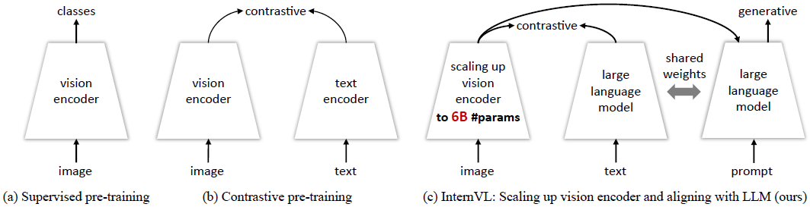

近年来，随着多模态任务需求的快速增长，VLM 的研究取得了显著进展。然而，与 LLM 相比，视觉编码器的进展相对缓慢，成为多模态模型性能提升的主要瓶颈之一。为了解决这一问题，作者提出了一种新的方法，设计了大型的视觉语言基础模型 VL Foundation Model，通过将视觉编码器的参数规模扩展至**`6B`**，显著增强了其表示能力。在此基础上，模型通过逐步与大型语言模型对齐，提升了在多种视觉和语言任务中的表现，为多模态学习提供了更强大的技术支持。

* **总体架构**

如下图所示，与传统的仅视觉主干网络和双编码器模型不同，**InternVL** 设计了一个视觉编码&#x5668;**`InternViT-6B`**&#x548C;一个语言中间&#x4EF6;**`QLLaMA`**。

> * **InternViT-6B** 是一个具&#x6709;**`6B`**&#x53C2;数的视觉 Transformer，经过定制以在性能和效率之间实现良好的权衡。
>
> * **QLLaMA&#x20;**&#x662F;一种具&#x6709;**`8B`**&#x53C2;数的语言中间件，初始化时使用了多语言增强版的 **LLaMA**。它可以为图像-文本对比学习提供强大的多语言表示，或者作为连接视觉编码器和现成的 LLM 解码器的桥梁。

为了弥合两个大规模组件在模态和结构上的显著差距，**InternVL** 引入了一种渐进对齐训练策略。该训练策略逐步进行，从大规模噪声数据上的对比学习开始，逐渐转向精致高质量数据上的生成式学习。通过这种方式，确保了来自各种来源的网络规模图像-文本数据的有效组织和充分利用。然后，借助对齐的视觉编码器和语言中间件，**InternVL** 就像一把瑞士军刀。它具有灵活的组合能力，可以适应各种通用的视觉-语言任务。这些任务包括视觉感知、图像/视频-文本检索、图像描述生成、视觉问答以及多模态对话等。

* **模型设计**

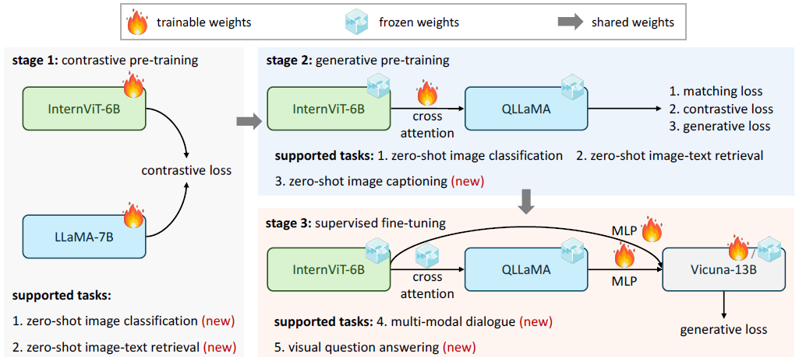

> **注**：之前方法的问题 1）参数规模不匹配，导致 LLM 的能力没有被充分利用 2）表示的不一致 3）连接效率低下，连接层轻量且随机初始化
>
> * 参数平衡的视觉和语言组件：包&#x62EC;**`6B`**&#x7684;视觉编码器 **InternViT-6B**，**`8B`**&#x7684; LLM 中间件 QLLaMA
>
> * 渐进式的图像文本对齐策略：1）Q-Former 2）线性投影层 MLP

1. **视觉编码器 InternViT-6B**

作者使用标准的视觉 Transformer 实现了 **InternVL** 的视觉编码器。为了匹配 LLM 的规模，将视觉编码器扩展&#x5230;**`6B`**&#x53C2;数，从而得到&#x4E86;**`InternViT-6B`**&#x6A21;型。为了在准确性、速度和稳定性之间取得良好的权衡，作者对 **InternViT-6B** 进行了超参数搜索，在以下范围内调整了模型深度$$\{32, 48, 64, 80\}$$、头维度$$\{64, 128\}$$和 MLP 比率$$\{4, 8\}$$。模型宽度和头数量根据给定的模型规模和其他超参数计算得出。

**InternVL** &#x5728;**`LAION-en`**&#x6570;据集&#x7684;**`100M`**&#x5B50;集上进行了对比学习实验，以评估不同配置下 **InternViT-6B** 变体的准确性、速度和稳定性。以下是主要发现。基于这些发现，确定最终模型的最稳定配置如右表所示：

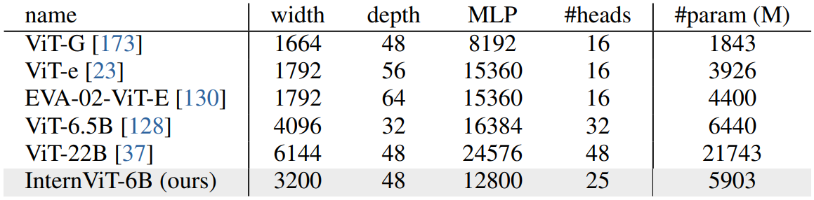

> 1. **速度**：对于不同的模型设置，当计算资源未饱和时，较浅的模型在每张图像上的处理速度更快。然而，当 GPU 计算资源被充分利用时，速度差异变得微不足道。
>
> 2. **准确性**：在相同参数量的情况下，模型深度、头维度和 MLP 比率对性能的影响较小。

2. **语言中间件 QLLaMA**

语言中间件 QLLaMA 旨在对齐视觉和语言特征。如上图所示，QLLaMA 基于预训练的多语言 LLaMA 开发，并新增了**`96`**个可学习 Query 和交叉注意力层，总计**`1B`**参数，这些参数是随机初始化的。这种方式使得 QLLaMA 能够平滑地将视觉元素集成到语言模型中，从而增强组合特征的连贯性和有效性。

与流行的使用轻量级连接层的方法相比，QLLaMA 具有三个优势：

> 1. 通过使&#x7528;**`Chinese LLaMA`**&#x9884;训练权重初始化，QLLaMA 可以将 InternViT-6B 生成的图像 token 转换为与 LLM 对齐的表示
>
> 2. QLLaMA 拥&#x6709;**`8B`**&#x53C2;数用于视觉-语言对齐，其规模是 Q-Former &#x7684;**`42`**&#x500D;。因此，即使 LLM 解码器被冻结，InternVL 仍能在多模态对话任务中表现出色
>
> 3) 可以应用于对比学习，为图像-文本对齐任务提供强大的文本表示，例如 Zero-Shot 图像分类和图像-文本检索。

3. **瑞士军刀 InternVL**

通过灵活组合视觉编码器和语言中间件，InternVL 可以支持多种视觉或视觉-语言任务：

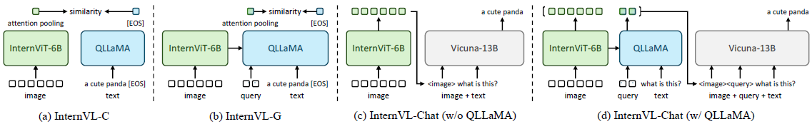

> 1. **视觉感知任务**：InternVL 的视觉编码器 InternViT-6B 可以用作视觉任务的主干网络。给定输入图像$$I \in \mathbb{R}^{H \times W \times 3}$$，模型可以生成特征图$$F \in \mathbb{R}^{\frac{H}{14} \times \frac{W}{14} \times D}$$用于密集预测任务，或者结合全局平均池化和线性投影进行图像分类。
>
> 2. **对比任务**：如上图(a)(b)所示，可以组合出两种推理模式：**`InternVL-C`**&#x548C;**`InternVL-G`**，分别使用视觉编码器或将 InternViT 与 QLLaMA 结合来编码视觉特征。具体来说，对 InternViT 的视觉特征或 QLLaMA 的 Query 特征应用注意力池化，以计算全局视觉特征$$I_f$$。此外，通过对 QLLaMA &#x7684;**`[EOS]`**&#x6807;记提取特征，将文本编码为$$T_f$$。通过计算$$I_f$$和$$T_f$$之间的相似性得分，支持各种对比任务，例如图像-文本检索。
>
> 3) **生成任务**：与 Q-Former 不同，得益于参数规模增大，QLLaMA 本身具备出色的图像描述生成能力。QLLaMA 的 Query 重新组织来自 InternViT-6B 的视觉表示，并作为 QLLaMA 的前缀文本。随后的文本 Token 则逐个顺序生成。
>
> 4) **多模态对话**：另一种模式称&#x4E3A;**`InternVL-Chat`**，利用 InternVL 作为视觉组件与 LLM 连接。为此，有两种配置方案：
>
>    1. 独立使用 InternViT-6B，如上图(c)所示
>
>    2. 同时使用完整的 InternVL 模型，如上图(d)所示

* **对齐策略**

如上所述，**InternVL** 的训练分为三个渐进阶段，包括**视觉-语言对比训练**、**视觉-语言生成训练**和**监督微调**。这些阶段有效利用了来自不同来源的公开数据，从网络上的噪声图像-文本对到高质量的字幕、视觉问答 VQA 和多模态对话数据集。

1. **视觉-语言对比训练**

在第一阶段进行对比学习，以在大规模、噪声较大的图像-文本对上&#x5C06;**`InternViT-6B`**&#x4E0E;多语&#x8A00;**`LLaMA-7B`**&#x5BF9;齐。所有数据均为公开可用，并包含多语言内容，例&#x5982;**`LAION-en`**、**`LAION-multi`**、**`LAION-COCO`**、**`COYO`**、**`Wukong`**等。作者使用这些数据集的组合，并过滤掉一些极低质量的数据来训练模型。如下表所示，原始数据集包&#x542B;**`6.03B`**&#x4E2A;图像-文本对，清洗后剩&#x4F59;**`4.98B`**&#x5BF9;。

在训练过程中，使用 LLaMA-7B 对文本进行编码为$$T_f$$，并用 InternViT-6B 提取视觉特征$$I_f$$。这里使用 CLIP 的目标函数，在批次中的图像-文本对相似性得分上最小化对称交叉熵损失。这一阶段使 InternVL 在 Zero-Shot 图像分类和图像-文本检索等对比任务中表现出色，同时该阶段的视觉编码器在语义分割等视觉感知任务中也表现良好。

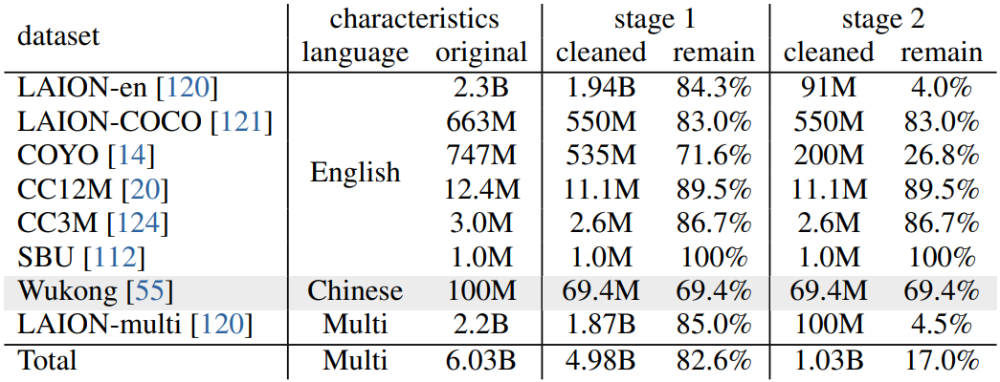

* **视觉-语言生成训练**

第二阶段将 InternViT-6B 与 QLLaMA 连接，并采用生成式训练策略。具体来说，QLLaMA 使用第一阶段 LLaMA-7B 的权重，并保持 InternViT-6B 和 QLLaMA 冻结状态，仅使用经过筛选的高质量数据训练新增的可学习 Query 和交叉注意力层。从上表可以看出，这一阶段进一步过滤掉了低质量 caption 数据，将数据量从第一阶段&#x7684;**`4.98B`**&#x51CF;少&#x5230;**`1.03B`**。

这一阶段使用 BLIP-2 的损失函数，计算为三个组成部分的总和：图像-文本对&#x6BD4;**`ITC`**&#x635F;失、图像-文本匹&#x914D;**`ITM`**&#x635F;失和基于图像的文本生&#x6210;**`ITG`**&#x635F;失。这使得 Query 能够提取强大的视觉表示，并进一步与 LLM 对齐，得益于有效的训练目标以及大规模、基于 LLM 初始化的 QLLaMA 的使用。

1. **监督微调**

为了展示 InternVL 在构建多模态对话系统中的优势，作者通过一&#x4E2A;**`MLP`**&#x5C42;将其与现成的大语言模型解码器连接，例&#x5982;**`Vicuna`**或**`InternLM`**，并进行监督微调 SFT。如右表所示，作者收集了广泛的高质量指令数据，总计&#x7EA6;**`4M`**&#x6837;本。

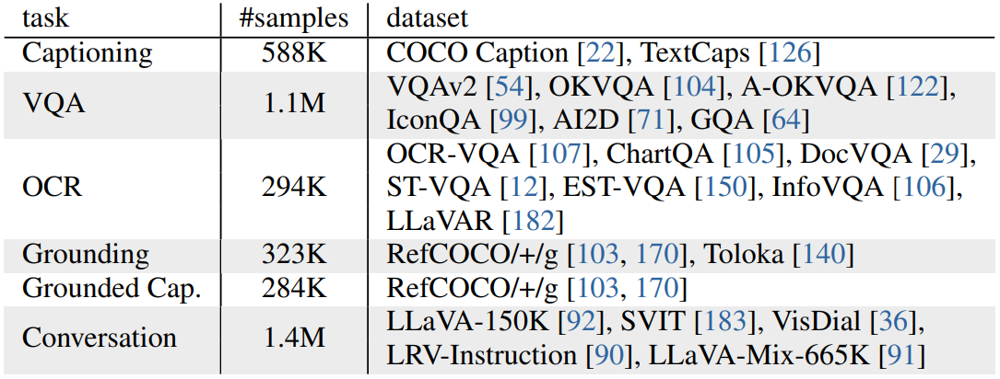

由于 QLLaMA 和 LLM 的特征空间相似，即使冻结 LLM 解码器，也可以通过仅训练 MLP 层或同时训练 MLP 层和 QLLaMA 来实现稳健的性能。这种方法不仅加速了 SFT 过程，还保留了 LLM 的原始语言能力。

**总结**

InternVL 是由上海 AI Lab 开发的开源多模态大模型系列，参数规模达6B，具备强大的视觉和语言理解能力。它在OCR、文档理解、视觉问答 VQA 等任务中表现卓越，并支持 Zero-Shot 学习和高分辨率图像处理。通过持续优化和与 LLM 对齐，InternVL 在性能上逐步比肩 GPT-4V 等闭源模型，成为多模态领域的领先开源解决方案。

### 2.7.2 InternVL1.5

InternVL 1.5 是由上海人工智能实验室发布的一款开源多模态大语言模型，旨在缩小开源模型与专有商业模型（如 GPT-4V）在多模态理解能力上的性能差距 。该模型通过整合强大的视觉编码器 InternViT-6B 和持续学习能力，结合动态高分辨率策略以及高质量的双语数据集，显著提升了其在跨模态任务中的表现 。此外，InternVL 1.5 还采用了渐进式的图像-文本对齐策略，利用海量带噪声的图文数据进行对比学习预训练，并在第二阶段使用过滤后的高质量数据完成生成式预训练。总的来说，InternVL 1.5 相比 InternVL 有以下三个改进：

> 1. 更强的视觉编码器
>
> 2. 动态高分辨率，支持最高4K
>
> 3. 高质量双语数据集，增强了 OCR 能力和中文能力

* **整体架构**

如右图所示，InternVL1.5 采用了一种类似于广泛使用的多模态模型架构，具体来说&#x662F;**`ViT-MLP-LLM`**&#x67B6;构。具体实现是将预训练&#x7684;**`InternViT-6B`**&#x4E0E;预训练&#x7684;**`InternLM2-20B`**&#x901A;过一个随机初始化&#x7684;**`MLP`**&#x6295;影层集成在一起。

在训练过程中，实施了一种动态分辨率策略，根据输入图像的宽高比和分辨率，将图像划分为大小&#x4E3A;**`448×448`**&#x50CF;素的块，数量&#x4ECE;**`1`**&#x5230;**`12`**&#x4E0D;等。在测试阶段，这种方法可以扩展&#x5230;**`40`**&#x4E2A;块，&#x5373;**`4K`**&#x5206;辨率。

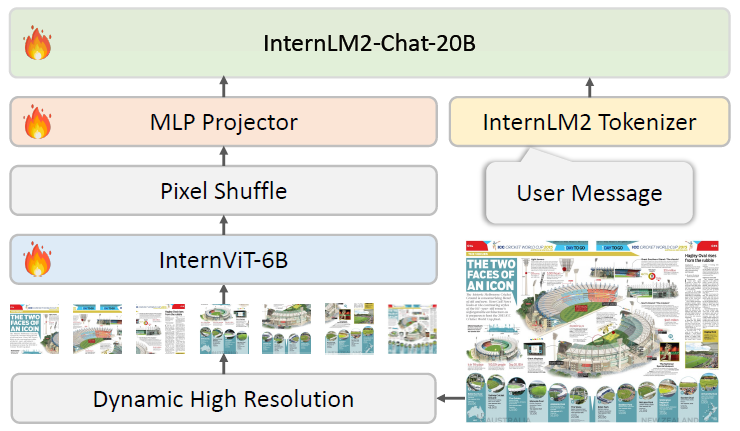

为了增强对高分辨率的支持，这里使用了像素重排操作，将视觉 token 的数量减少到原来的四分之一。因此一&#x4E2A;**`448×448`**&#x7684;图像&#x7531;**`256`**&#x4E2A;视觉 token 表示。

* **更强的视觉编码器**

在现有的多模态大语言模型中，最常用的视觉基础模型通常是对比预训练的 ViT。然而，这些 ViT 通常是在从互联网抓取的固定低分辨率图像-文本对上进行训练的，例如**`224×224`**，因此在处理高分辨率图像或来自非互联网来源的图像时，如 文档图像 ，其性能会下降。

1. **InternViT-6B-448px-V1.2**  

为了解决这一问题，**`InternVL 1.2`**&#x5BF9;**`InternViT-6B`**&#x6301;续预训练。首先，作者发现倒数第四层的特征在多模态任务中表现最佳，因此直接丢弃了最后三层的权重，将 InternViT-6B &#x4ECE;**`48`**&#x5C42;减少&#x5230;**`45`**&#x5C42;。然后将 InternViT-6B 的分辨率&#x4ECE;**`224`**&#x63D0;升&#x5230;**`448`**，并将其&#x4E0E;**`Nous-Hermes-2-Yi-34B`**&#x96C6;成。为了使模型具备高分辨率处理和 OCR 能力，在训练中同时激活了视觉编码器和 MLP，利用了图像描述和 OCR 特定数据集。此过程生成的新 InternViT 权重被发布&#x4E3A;**`InternViT-6B-448px-V1.2`**。

* **InternViT-6B-448px-V1.5**  

**`InternVL 1.5`**&#x57FA;&#x4E8E;**`InternViT-6B-448px-V1.2`**&#x8FDB;行预训练。训练图像的分辨率从固定的**`448×448`**&#x6269;展为动态的**`448×448`**，其中基本块大小为 448×448，块的数量范围为 1 到 12。除此之外还增强了预训练数据集的规模、质量和多样性，从而使得 1.5 版本模型具有强大的鲁棒性、OCR 能力和高分辨率处理能力。

InternVL 1.5 中的 LLM &#x4ECE;**`Nous-Hermes-2-Yi-34B`**&#x66F4;换&#x4E3A;**`InternLM2-20B`**，并与其保持了兼容性和可移植性。这说明 InternViT-6B 在多模态大语言模型预训练阶段学习到的视觉特征具有广泛的适用性，而不仅仅局限于特定的 LLM。

* **动态高分辨率**

InternVL 1.5 采用了一种动态高分辨率训练方法，能够有效适应输入图像的不同分辨率和宽高比。该方法利用了将图像分割为块的灵活性，增强了模型处理细节视觉信息的能力，同时适应多样化的图像分辨率。它主要包含以下步骤：

1. **动态宽高比匹配**  

如右图所示，为了在处理过程中保持自然的宽高比，作者动态匹配一组预定义宽高比中的最佳值。由于计算资源有限，在训练期间最多允许**`12`**个块。因此，这组宽高比包括由**`1`**到**`12`**个块形成的所有**`35`**种可能的组合，例&#x5982;**`{1:1, 1:2, 2:1, 3:1, ..., 2:6}`**。在匹配过程中，对于每个输入图像，计算其宽高比，并通过测量绝对差值与35个预定义宽高比进行比较。如果有多个预定义宽高比匹配，例&#x5982;**`1:1`**&#x548C;**`2:2`**，会优先选择不超过输入图像面积两倍的宽高比，从而避免低分辨率图像过度放大。

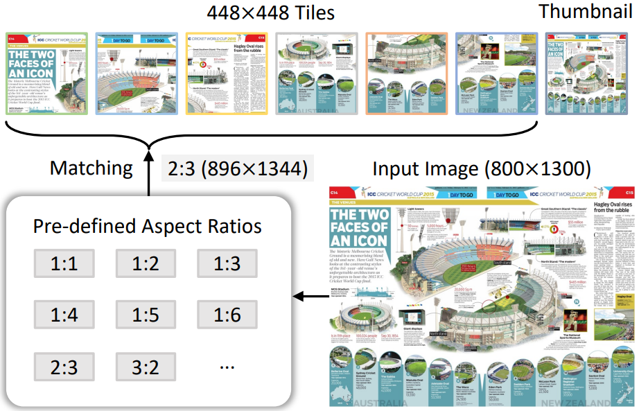

* **图像分割与缩略图**  

一旦确定了合适的宽高比，图像将被调整为相应的分辨率。例如一张**`800×1300`**的图像将被调整为**`896×1344`**。调整后的图像随后被划分&#x4E3A;**`448×448`**&#x50CF;素的块。除了这些块外，输入还包含整个图像的缩略图以捕捉全局上下文。该缩略图被缩小&#x5230;**`448×448`**，帮助模型理解整体场景。因此，在训练期间，视觉 token 的数量范围&#x4E3A;**`256`**&#x5230;**`3,328`**。在测试阶段，块的数量可以增加到最&#x591A;**`40`**&#x4E2A;，从而产&#x751F;**`10,496`**&#x4E2A;视觉 token。

* **高质量双语数据集**

1. **预训练数据集**  

InternVL 1.5 的预训练数据集来自多种公开资源，涵盖多个任务领域。

> * **图像描述任务**：&#x5360;**`53.9%`**，主要使用 Laion-EN、Laion-ZH、COYO 和 GRIT 等数据集
>
> * **检测与定位任务**：&#x5360;**`5.2%`**，包括 Objects365、GRIT 和 All-Seeing 等数据集
>
> * **OCR 任务**：&#x5360;**`40.9%`**，通过 Wukong-OCR、LaionCOCO-OCR 和 Common Crawl PDFs 等大规模数据集，以及 MMC-Inst、LSVT、ST-VQA 等小规模数据集进行训练

这种多样化的数据组合确保了模型在多模态任务中的鲁棒性。

* **微调数据集**  

在微调阶段，作者精心挑选数据集以提升模型性能。以下是主要任务及其对应的数据集：

> **图像描述**：TextCaps、双语 ShareGPT4V

> **通用问答**：VQAv2、GQA、VisualDialog

> **科学图像理解**：AI2D、ScienceQA、TQA

> **图表理解**：ChartQA、MMC-Inst、PlotQA

> **数学问题**：GeoQA+、TabMWP、MathQA&#x20;

> **知识问答**：KVQA、双语维基百科

> **OCR 任务**：OCRVQA、TextVQA、SynthDoG &#x20;

> **文档理解**：DocVQA、Common Crawl PDFs

> **视觉定位**：RefCOCO、Visual Genome

> **多模态对话**：LLaVA-150K、ALLaVA

> **纯文本任务**：OpenHermes2.5、AlpacaGPT4 等用于保留语言能力

这些数据集为模型提供了丰富的多模态训练基础，使其能够应对多样化任务并适应实际应用需求。

3. **数据翻译流程**

为了增强模型的多语言能力，作者设计了一个自动化翻译流程。该流程利用开源大语言模型或 GPT-3.5 将英文数据集翻译为中文，确保双语标注的一致性和准确性。通过调整语言提示，这一流程还可以扩展到其他语言，无需人工干预。 &#x20;

例如，在上面提到的数据集种，有一部分原本为英文，如**`COYO`**和**`GRIT`**，会通过翻译流程转换为中文。这显著提升了InternVL 1.5在中文任务中的表现。

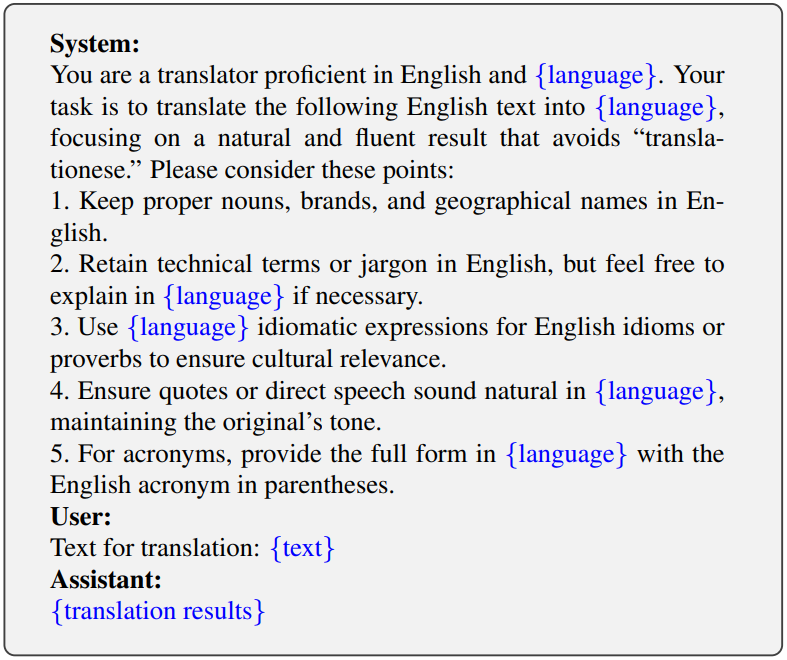

**总结**

InternVL 1.5 在多模态理解领域展现了卓越的能力，特别是在文本与图像结合的任务中表现出色，如阅读理解和文档理解。其灵活的分辨率支持、动态图块划分技术以及针对中文优化的理解能力，使其成为一款性能比肩商业模型的开源黑马。通过多项改进，InternVL 1.5 不仅提升了任务完成的准确度和效率，还为开源社区提供了探索多模态大模型成长的重要参考。

### 2.7.3 InternVL2

InternVL 2 是 OpenGVLab 推出的多模态大型语言模型系列中的一个重要版本，标志着在多模态处理能力上的显著进步。该模型通过结合视觉编码器和语言模型，能够高效处理图像、文本等多种模态数据。其设计目标是为学术研究和产业应用提供一个强大的开源多模态基座模型。InternVL 2.0 的推出奠定了后续版本的基础，特别是在动态高分辨率训练方法的引入上，显著提升了模型对复杂多模态任务的适应能力。

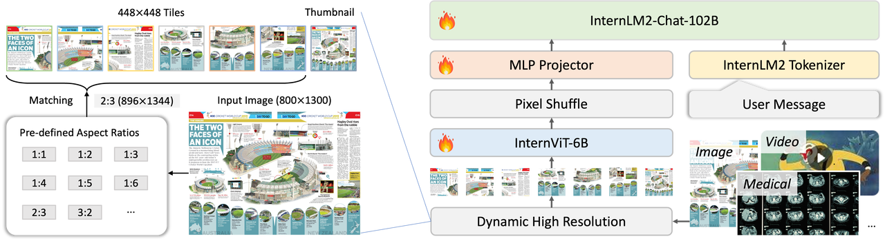

InternVL2 系列包括从适用于边缘设备&#x7684;**`1B`**&#x6A21;型到功能更强大&#x7684;**`108B`**&#x6A21;型。 凭借更大规模的语言模型，InternVL2-Pro 展现出出色的多模态理解能力，在各种基准测试中与商业闭源模型的性能相当。

* **模型结构**

InternVL2 系列基于以下设计：

> 1. **渐进式地与大型语言模型对齐**：引入了渐进式对齐训练策略，从而实现了第一个与大型语言模型原生对齐的视觉基础模型。通过采用渐进式训练策略，模型从小到大，数据从粗到细，以相对较低的成本完成了大型模型的训练。这种方法在有限的资源下表现出色。
>
> 2. **多模式输入**：通过一组参数，InternVL2 支持多种输入模式，包括文本、图像、视频和医疗数据。
>
> 3. **多任务输出**：InternVL2 支持各种输出格式，例如图像、边界框和蒙版，展现出广泛的多功能性。通过将 MLLM 与多个下游任务解码器连接起来，InternVL2 可以推广到数百个视觉语言任务，同时实现与专家模型相当的性能。

* **性能**

InternVL2 在处理复杂多模态数据方面表现出色，在数学、科学图表、通用图表、文档、信息图表和 OCR 等任务中表现出色。例如，InternVL2 在 MathVista 基准上实现了**`66.3%`**的准确率，大幅超越其他闭源商业模型和开源模型。此外，InternVL2 在通用图表基准 ChartQA、文档基准 DocVQA、信息图表基准 InfographicVQA 和通用视觉问答基准 MMBench 等一系列基准测试中均取得了最佳性能。

AI2D 基准测试中有两种评估设置：

> 1. 设置一，将图片中矩形框内的内容替换为选项的字母。InternVL2 获得&#x4E86;**`87.3`**&#x7684;性能
>
> 2. 设置二，将矩形框内的内容替换为选项的字母和选项的值。InternVL2 获得&#x4E86;**`96.0`**&#x7684;性能

**总结**

InternVL 2 是一个多模态大型语言模型的承上启下的工作，通过优化视觉与语言的融合能力，为后续版本的迭代提供了坚实的技术基础。它的开源特性也推动了多模态领域的研究与发展。

### 2.7.4 InternVL2.5

InternVL 2.5 是 InternVL 系列的进一步升级版本，代表了当前开源多模态模型的顶尖水平。相比于 InternVL 2.0，2.5 版本在训练和测试策略、数据质量以及模型性能上进行了显著增强。InternVL 2.5 在处理多图像和视频数据集方面表现尤为突出，得益于扩展的动态高分辨率训练方法。此外，它是首个在 MMMU 多模态理解基准上得分超过**`70%`**的开源模型，展现了其在多模态任务中的卓越性能。

* **模型结构**

**整体架构**

如下图所示，InternVL 2.5 保留了与其前代模&#x578B;**`InternVL 1.5`**&#x548C;**`InternVL 2.0`**&#x76F8;同的模型架构，遵循在多种多模态研究中广泛采用&#x7684;**`ViT-MLP-LLM`**&#x8303;式。 &#x20;

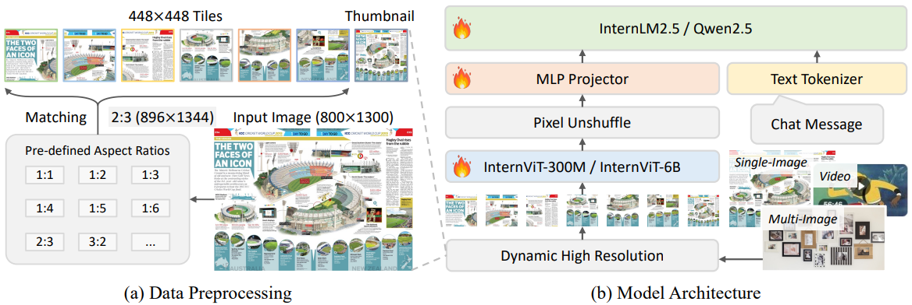

在这一新版本中，作者对该架构的实现整合了一个新近增量预训练的**`InternViT-6B`**和**`InternViT-300M`**，并结合了各种不同大小和类型的预训练 LLM，包括**`InternLM 2.5`**和**`Qwen 2.5`**，通过一个随机初始化的两层**`MLP`**投影层进行连接。与之前的版本一样，为了增强高分辨率处理的可扩展性，简单地应用了像素重排操作，将视觉 token 的数量减少到原始数量的四分之一。因此一&#x4E2A;**`448×448`**&#x7684;图像块&#x7531;**`256`**&#x4E2A;视觉 token 表示。 &#x20;

在输入数据预处理方面，采用了与 InternVL 1.5 类似的动态分辨率策略，根据输入图像的宽高比和分辨率将图像划分&#x4E3A;**`448×448`**&#x50CF;素的块。关键的区别在于，从 InternVL 2.0 开始，额外引入了对多图像和视频数据的支持，如图上图所示。

**视觉编码器**

InternVL 使用 InternViT 作为视觉编码器。目前，InternViT 有两种不同的模型规模，分别&#x662F;**`InternViT-6B`**&#x548C;**`InternViT-300M`**。&#x20;

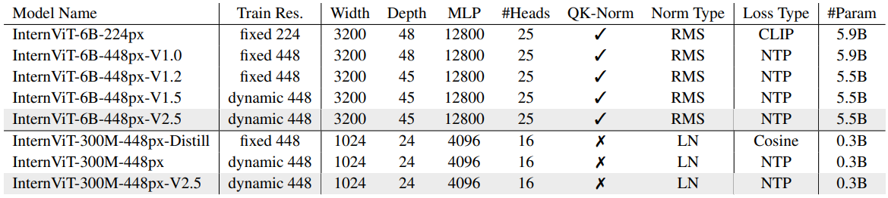

1. **InternViT-6B**  

**`InternViT-6B-224px`**&#x7ED3;构基于标准的 ViT，仅做了一些小调整，包括引&#x5165;**`QK-Norm`**&#x548C;**`RMSNorm`**。该模型拥&#x6709;**`5.9B`**&#x53C2;数、**`48`**&#x5C42;、隐藏层大小&#x4E3A;**`3200`**、**`25`**&#x4E2A;注意力头，并使用对比损失进行训练。由于当时收益有限，因此采用了增量预训练策略以持续优化其权重。具体来说，将 InternViT-6B 通过一个 MLP 投影层连接到一个 LLM，通过 **NTP（N**ext Token Prediction） 损失联合训练 InternViT-6B，以增强其视觉特征提取能力。&#x5728;**`V1.0`**&#x548C;**`V1.2`**&#x7248;本中，作者使用了固定&#x7684;**`448×448`**&#x5206;辨率进行训练，但在后续版本中切换为动态分辨率训练，以提升高分辨率处理能力。这里延续 InternVL 1.5 的设定，移除了**`InternViT-6B-448px-V1.2`**的最后三层，将其深度从**`48`**层减少到**`45`**层，因为这些层更倾向于适应 CLIP 损失目标，优先考虑全局对齐而非局部信息。因此，所有后续版本都具&#x6709;**`45`**&#x5C42;&#x548C;**`5.5B`**&#x53C2;数，包括最新&#x7684;**`InternViT-6B-448px-V2.5`**。 &#x20;

* **InternViT-300M**  

**`InternViT-300M-448px-Distill`**&#x662F;教师模&#x578B;**`InternViT-6B-448px-V1.5`**&#x7684;蒸馏变体，使用余弦蒸馏损失进行训练。该模型包&#x542B;**`0.3B`**&#x53C2;数、**`24`**&#x5C42;、隐藏层大小&#x4E3A;**`1024`**&#x4EE5;&#x53CA;**`16`**&#x4E2A;注意力头。与 6B 版本不同，**`0.3B`**版本使用标准的**`LayerNorm`**而未采用QK-Norm。为了降低蒸馏成本，使用**`CLIP-ViT-Large-336px`**初始化该模型，尽管存在一些架构差异。蒸馏完成后，将该模型与一个 LLM 集成，并按照类似上述的流程，通过动态高分辨率和 NTP 损失训练视觉编码器。随后，提取了视觉编码器并将其发布&#x4E3A;**`InternViT-300M-448px`**。在这个基础上，通过在更多样化的数据上进一步增量预训练之前的权重，使用 NTP 损失优化了 InternViT-300M，从而生成了增强版**`InternViT-300M-448px-V2.5`**。 &#x20;

**大语言模型**

在 InternVL 2.5 系列中，将语言模型骨干网络更新为最先进模型，包&#x62EC;**`InternLM 2.5`**&#x548C;**`Qwen 2.5`**。

* **训练**

**多模态数据的动态高分辨率处理**

在 InternVL 2.0 和 2.5 中，作者扩展了 InternVL 1.5 中引入的动态高分辨率训练方法，增强了其处理多图像和视频数据集的能力。该过程主要包括以下步骤： &#x20;

1. **匹配最接近的宽高比** &#x20;

给定输入图像$$I$$的尺寸为$$W \times H$$，宽高比计算为$$r = \frac{W}{H}$$。目标是将图像调整为大小为$$S \times S$$（其中$$S = 448$$）的块，同时选择使失真最小化的最接近的宽高比。块的数量$$n_{\text{tiles}}$$被限制在预定义范围$$[n_{\text{min}}, n_{\text{max}}]$$内。 &#x20;

为了找到最佳的宽高比进行调整，将目标宽高比集合$$R$$定义为： &#x20;

$$R = \left\{ \frac{i}{j} \mid 1 \leq i, j \leq n, \, i \times j \in [n_{\text{min}}, n_{\text{max}}] \right\}$$

通过最小化原始宽高比$$r$$与每个目标宽高比$$r_{\text{target}}$$的差异，选择最接近的宽高比$$r_{\text{best}}$$： &#x20;

$$r_{\text{best}} = \arg\min_{r_{\text{target}} \in R} |r - r_{\text{target}}|$$

如果多个宽高比产生相同的差异，例如，$$1:2$$和$$2:4$$，则优先选择面积小于或等于原图像两倍的宽高比。这在一定程度上防止了低分辨率图像的过度放大。 &#x20;

* **图像调整和分割** &#x20;

一旦确定了最佳宽高比，图像将被调整为新的尺寸$$W_{\text{new}} \times H_{\text{new}}$$，其中$$i_{\text{best}}$$和$$j_{\text{best}}$$是对应于$$r_{\text{best}}$$的因子： &#x20;

$$W_{\text{new}} = S \times i_{\text{best}}, \quad H_{\text{new}} = S \times j_{\text{best}}$$

然后将图像分割为大小为$$S \times S$$的块，块的数量计算为$$n_{\text{tiles}} = i_{\text{best}} \times j_{\text{best}}$$。每个块从调整后的图像中裁剪出来以确保尺寸一致。 &#x20;

* **缩略图生成**

如果块的数量$$n_{\text{tiles}} > 1$$，则将原始图像$$I$$调整为$$S \times S$$的正方形以生成额外的缩略图$$I_{\text{thumb}}$$。该缩略图附加到块列表中，提供全局视图以补充局部块。如果$$n_{\text{tiles}} = 1$$，则无需生成缩略图，此步骤自然跳过。 &#x20;

* **不同数据类型的数据格式** &#x20;

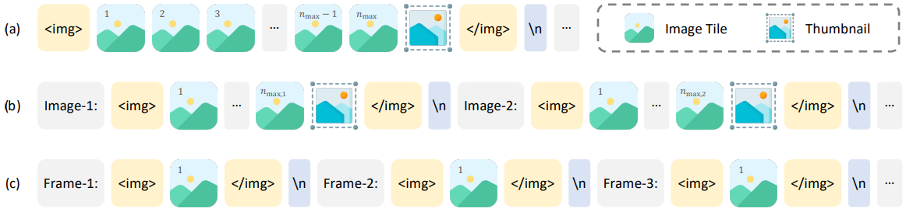

如上图所示，InternVL 2.0 和 2.5 中的动态高分辨率方法不仅支持单图像数据集，还扩展到了多图像和视频数据集。 &#x20;

> * **单图像数据集**：最大块数$$n_{\text{max}}$$分配给单个图像，确保其以尽可能高的分辨率处理。在此场景中，视觉标记被包裹&#x5728;**``**&#x548C;**`</img>`**&#x6807;签内，未使用其他辅助标签。 &#x20;
>
> * **多图像数据集**：总块数$$n_{\text{max}}$$分布在样本内的所有图像中。每张图像由辅助标签标识，&#x5982;**`Image-1`**，以清楚地标记各个图像。图像本身被包裹&#x5728;**``**&#x548C;**`</img>`**&#x6807;签中，表示图像数据的开始和结束。分配给每张图像$$I_i$$的块数$$n_{\text{max},i}$$与总图像数$$N_{\text{image}}$$成比例，遵循公式： &#x20;
>
> $$n_{\text{max},i} = \max \left( 1, \left\lfloor \frac{n_{\text{max}}}{N_{\text{image}}} \right\rfloor \right)$$
>
> * **视频数据**：此方法通过设置$$n_{\text{max}} = 1$$进行简化。每个视频帧被调整为固定分辨率$$448 \times 448$$，无需分块。这是因为在训练过程中，通常会从单个视频中提取大量帧，例&#x5982;**`32`**帧或**`64`**帧。即使没有高分辨率输入，也会产&#x751F;**`8192`**&#x6216;**`16384`**&#x4E2A;视觉 token。每个视频帧（标记&#x4E3A;**`Frame-1`**&#x7B49;）被包裹&#x5728;**``**&#x548C;**`</img>`**&#x6807;签中，类似于图像数据。 &#x20;

**单模型训练流程**

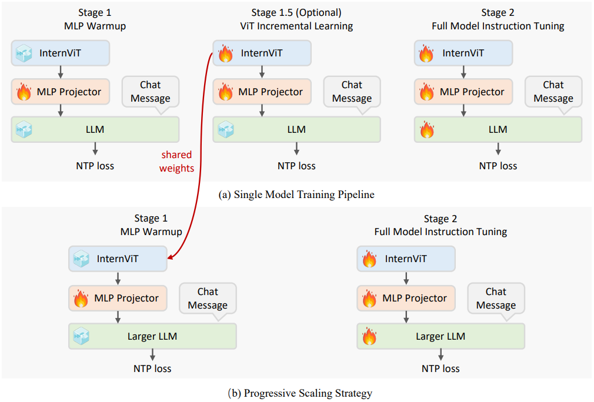

InternVL 2.5 中单模型的训练流程分为三个阶段，旨在增强模型的视觉感知能力和多模态能力。每个阶段逐步整合视觉和语言模态，在性能优化和训练效率之间取得平衡。 &#x20;

1. **Stage 1：MLP热身**

如上图(a)所示，训练从 MLP 的热身开始，MLP 是视觉和语言表示之间的初始桥梁。在此阶段，仅训练 MLP，而视觉编码器 InternViT 和 LLM 保持冻结状态。为了达到最佳性能，从这一阶段开始使用动态高分辨率训练策略。 &#x20;

在此阶段，数据以结构化的**`ChatML`**格式组织，并使用 NTP 损失进行优化。此外，应用较高的学习率以加速收敛，使 MLP 能够快速适应 LLM 的输入空间并建立强大的跨模态对齐。MLP 热身阶段确保模型在解锁后续可训练组件之前已准备好处理多模态任务，从而提高训练稳定性。 &#x20;

* **Stage 1.5：ViT增量学习** &#x20;

阶段 1.5 引入了视觉编码器的增量学习。在此阶段，视觉编码器和 MLP 均可训练，并使用与阶段 1 相同的预训练数据混合和 NTP 损失进行训练。此阶段的目标是增强视觉编码器提取视觉特征的能力，使其能够捕捉更全面的信息，尤其是针对网络规模数据集中相对稀有的领域，例如LAION-5B，如多语言 OCR 数据和数学图表等。 &#x20;

如下表所示，此阶段使用较低的学习率以防止灾难性遗忘，确保编码器不会丢失先前学到的能力。此外，视觉编码器只需训练一次，除非引入新的领域需求或数据。训练完成后，它可以与不同的 LLM 结合使用而无需重新训练，因此阶段 1.5 是可选的。当编码器已经针对某些特定任务进行了优化时，这一点尤其有益，使其能够以较低的额外成本与不同大小的LLM集成。 &#x20;

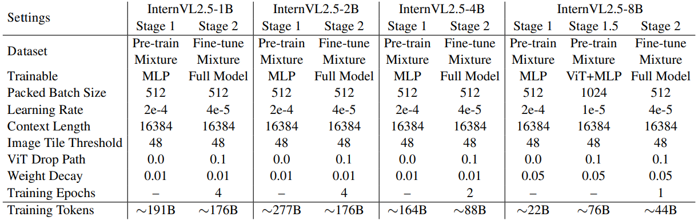

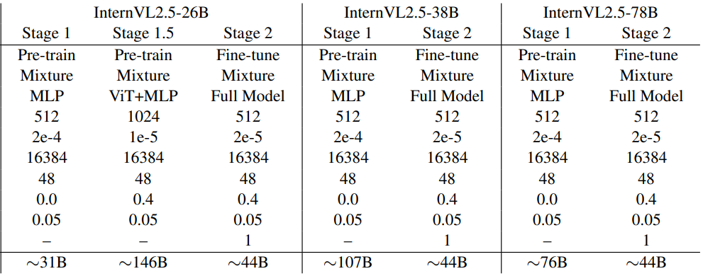

* **Stage 2：全模型指令微调** &#x20;

在最后阶段，如上图(a)所示，整个模型，包括 **ViT**、**MLP** 和 **LLM** 在高质量的多模态指令数据集上进行训练。数据质量在此阶段尤为重要，因为负责生成最终用户输出的 LLM 现在是可训练的。即使是少量噪声数据也可能导致模型行为异常，例如几千个样本，如重复输出或特定错误结果。为了减轻 LLM 的退化，在这一阶段实施严格的数据质量控制。 &#x20;

此外，此阶段的训练超参数保持简单，整个模型使用统一的学习率，而不是针对不同组件使用不同的学习率。完成此阶段后，InternVL 2.5 的完整训练过程结束。

**渐进式扩展策略**

如上图所示，作者提出了一种渐进式扩展策略，以高效地将视觉编码器 InternViT 与 LLM 对齐。之前在 InternVL 1.5 和 2.0 的训练中曾采用过类似的策略，这里沿用这个方法。此策略采用分阶段训练方法，从较小且资源高效的 LLM 开始，逐步扩展到更大的 LLM。使用这一方法是因为，即使 ViT 和 LLM 通过 NTP 损失联合训练，生成的视觉特征仍然是通用表示，可以被其他 LLM 轻松理解。 &#x20;

具体来说，在阶段 1.5 中，InternViT 与一个较小的 LLM 一起训练，例&#x5982;**`20B`**参数规模，重点优化基础视觉能力和跨模态对齐。这一阶段避免了直接使用大型 LLM 进行训练所带来的高计算成本。通过共享权重机制，训练好的 InternViT 可以轻松迁移到更大的 LLM，例&#x5982;**`72B`**参数规模，而无需重新训练。因此，在训练更大模型时，可以跳过阶段 1.5，因为之前优化的 InternViT 模块会被复用。这不仅加速了训练过程，还确保了视觉编码器学到的表示得以保留并有效集成到更大的模型中。 &#x20;

通过采用这种渐进式扩展策略，可以以大规模模型训练成本的一小部分实现可扩展的模型更新。例如，**`Qwen2-VL`**处理的累积标记总数达到**`1.4T`**个，而**`InternVL2.5-78B`**仅在约**`120B`**个 token 上训练——不到**`Qwen2-VL`**的十分之一。这种方法在资源受限的情况下特别有利，它通过最大化预训练组件的复用、最小化冗余计算，实现了能够应对复杂视觉-语言任务的模型高效训练。 &#x20;

**训练增强**

为了增强模型在真实场景中的适应性和整体性能，作者引入了两项关键技术。这些优化对于提升用户体验和模型基准性能至关重要。 &#x20;

1. **随机 JPEG 压缩** &#x20;

为了避免训练过程中过拟合并增强模型在现实世界中的表现，作者应用了一种保留空间信息的数据增强技术：**`JPEG `**`压缩`。具体来说，应用质量等级&#x5728;**`75`**&#x5230;**`100`**&#x4E4B;间的随机 JPEG 压缩，以模拟互联网图像中常见的退化现象。这种数据增强提高了模型对噪声和压缩图像的鲁棒性，并通过确保在不同图像质量下的更一致表现，提升了用户体验。&#x20;

* **损失重加权** &#x20;

Token 平均和 Sample 平均是两种广泛应用于 NTP 损失加权的策略。

> **Token 平均**&#x8BA1;算所有 token 上的 NTP 损失均值，
>
> **Sample 平均**&#x9996;先计算每个样本内的 NTP 损失均值，然后在样本数量上取平均

这两种策略可以用统一的形式表达为：

$$L = \sum \frac{w_i}{\sum w_j} \cdot L_i, \quad w_i =
\begin{cases} 
\frac{1}{x^0}, & \text{for token averaging} \\ 
\frac{1}{x^1}, & \text{for sample averaging}
\end{cases}$$

其中$$L_i$$和$$w_i$$分别表示 token $$i$$的损失和权重，$$x$$表示 token $$i$$所属回答中的 token 数量。 &#x20;

在使用 Token 平均时，每个 token 对最终损失的贡献相等，这可能导致梯度偏向于包含更多 token 的回答，从而导致基准性能下降。相比之下，Sample 平均确保每个样本的贡献相等，但它可能使模型偏好较短的回答，对用户体验产生负面影响。为了在训练期间减轻对较长或较短回答的偏向，作者采用了一种重加权策略，其中$$w_i = \frac{1}{x^{0.5}}$$。这种方法被称为平方平均，平衡了不同长度回答的贡献。

**总结**

InternVL 2.5 通过一系列技术改进和性能优化，成为目前最强大的开源多模态大型语言模型之一。它不仅在学术界引发了广泛关注，还为实际应用场景提供了更高效、更精准的解决方案。

### 2.7.5 InternVL3

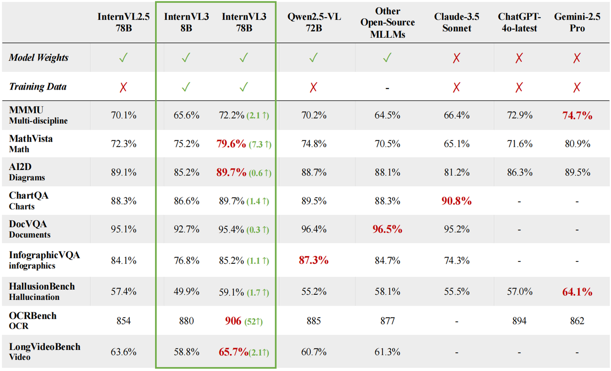

* **模型架构**

InternVL3 的架构延续了前代模型的框架，遵&#x5FAA;**`ViT-MLP-LLM`**&#x8303;式。并且使用预训练模型权重来初始化 ViT 和 LLM 部分，以降低计算成本。

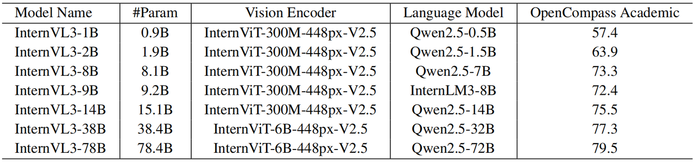

> * ViT 有两种配置：**`InternViT-300M`**&#x548C;**`InternViT-6B`**
>
> * 采用预训练的 LLM，包&#x62EC;**`Qwen2.5`**&#x7CFB;列&#x548C;**`InternLM3-8B`**。LLM 仅从预训练的基础模型初始化，不使用经过指令微调的变体
>
> * MLP 是一个两层网络，采用随机初始化

> &#x4E0E;**`InternVL2.5`**&#x4E00;致，**`InternVL3`**&#x5F15;入了像素逆重&#x6392;**`pixel unshuffle`**，以提升处理高分辨率图像的可扩展性。逆重排将视觉 token 数量减少为原始值的四分之一，每&#x4E2A;**`448×448`**&#x7684;图像块&#x7528;**`256`**&#x4E2A;视觉 token 表示。

**可变视觉位置编码 V2PE** 

**InternVL3** 集成了可变视觉位置编码 **V2PE**（**V**ariable **V**isual **P**osition **E**ncoding），使视觉 token 使用更小且更灵活的位置增量。这一改进有助于在不显著扩展位置窗口的前提下处理更长的多模态上下文。

具体而言，多模态模型每个训练样本可以表示为：

$$x = (x_1, x_2, \cdots, x_L)$$

其中每个 token $$  x_i  $$ 可以是文本 token embedding、visual enbedding，或其他模态表示，例如视频图像块 embedding。任意 token $$  x_i  $$ 的位置索引 $$  p_i  $$ 可按如下顺序计算：

$$p_i = 
\begin{cases}
0, & \text{if } i = 1 \\
f_{\text{pos}}(p_{i-1}, x_i), & \text{for } i = 2, 3, \cdots, N
\end{cases}$$

传统多模态大模型中无论模态如何，每个 token 的位置索引均以 1 为固定步长递增不同，而 **V2PE** 采用一种模态特定的递归函数来计算位置索引。这导致文本 token 和视觉 token 具有不同的位置索引分配方式：

$$p_i = p_{i-1} + 
\begin{cases}
1, & \text{if } x_i \text{ is textual token}, \\
\delta, & \text{if } x_i \text{ is visual token},
\end{cases}$$

其中$$  \delta  $$是一个较小的增量，即$$\delta < 1$$，用于降低视觉 token 的位置索引增长速率。文本 token 仍保持单位增量 1，用来保留其位置区分性。按照原始 **V2PE** 的设计，需要在单张图像内保持$$  \delta  $$恒定，以维护相对位置关系。

在训练过程中，每张图像对应的$$  \delta  $$从一组预定义的分数值中随机选取：

$$\delta \in \Delta = \left\{1, \frac{1}{2}, \frac{1}{4}, \frac{1}{8}, \frac{1}{16}, \frac{1}{32}, \frac{1}{64}, \frac{1}{128}, \frac{1}{256}\right\}$$

在推理阶段，根据输入序列长度灵活选择$$\delta$$，从而在任务性能与位置索引不超出模型有效上下文范围之间取得平衡。

> 当$$  \delta = 1  $$时，V2PE 退化&#x4E3A;**`InternVL2.5`**&#x4E2D;使用的传统位置编码

* **预训练**

**InternVL3&#x20;**&#x63D0;出一种原生多模态预训练方法，将语言预训练和多模态对齐训练统一到单一预训练阶段中。也就是说在预训练过程中将多模态数据，如图像-文本、视频-文本或交错的图文序列，与大规模文本语料交织使用，进行端到端的联合优化。

> 传统范式：先训练一个纯 LLM，包括预训练和后训练，再引入其他模态进行适配——我们的方法

这种统一的训练方案使预训练模型能够同时学习语言能力和多模态理解能力，从而在无需引入额外桥接模块或后续跨模型对齐步骤的情况下，显著提升其在视觉-语言任务上的表现。

1. **多模态自回归建模** &#x20;

设$$  M  $$是一个基于 Transformer 的模型，参数为$$\theta$$，能够同时处理文本、图像和视频。对于任意训练样本：

$$x = (x_1, x_2, \cdots, x_L)$$

其中每个$$  x_i  $$表示第$$  i  $$个输入元素，$$  L  $$是序列长度。然后采用标准的从左到右自回归目标函数：

$$\mathcal{L}_{\text{full}}(\theta) = -\sum_{i=2}^{L} w_i \cdot \log p_\theta(x_i \mid x_{<i})$$

其中 $$  w_i  $$ 表示第 $$  i  $$ 个 token 的损失权重。这会在所有模态的 token 上传播梯度，但是 **InternVL3&#x20;**&#x4EC5;对文本 token 计算损失，得到：

$$\mathcal{L}_{\text{text-only}}(\theta) = -\sum_{\substack{i=2 \\ x_i \in \text{Text}}}^{L} w_i \cdot \log p_\theta(x_i \mid x_{<i})$$

在此选择性目标下，视觉 token 仅作为文本生成的条件上下文，而不被直接预测。因此，模型学习以有利于下游语言解码任务的方式嵌入多模态信息。

和之&#x524D;**`InternVL2.5`**&#x8BF4;的一样，常用的 token 平均和样本平均策略分别倾向于偏向长响应和短响应。为缓解此问题，**InternVL3&#x20;**&#x91C7;用平方平均策略：

$$w_i = 
\begin{cases}
\frac{1}{l^0}, & \text{token average} \\
\frac{1}{l^{0.5}}, & \text{square average} \\
\frac{1}{l^1}, & \text{sample average}
\end{cases}$$

其中$$  l  $$表示当前训练样本中需要计算损失的 token 数量。

* **联合参数优化** &#x20;

**InternVL3&#x20;**&#x5728;多模态预训练过程中联合更新所有模型参数，令：

$$\theta^* = \arg\min_\theta \mathbb{E}_{x \in \mathcal{D}_{\text{multi}}} \left[ \mathcal{L}_{\text{text-only}}(\theta) \right]$$

其中 $$  \mathcal{D}_{\text{multi}}  $$ 是大规模纯文本数据与多模态语料的并集，如图像-文本或视频-文本对。由此优化单一模型以处理这些混合数据源。这种多任务联合优化可以使文本表征与视觉特征协同学习，增强跨模态对齐。

这种一体化优化方式联合训练每一层，所有参数都能在大规模多模态语料上共同优化，确保语言和视觉特征同步演化。最终参数因此在纯语言任务和多模态任务上均具备高性能，无需额外的调优步骤。

> 传统流程：在适配多模态大模型时常冻结或部分微调 LLM 甚至 ViT 中的某些层。

* **数据**  

**InternVL3&#x20;**&#x4F7F;用的预训练数据主要分为两类：多模态数据和纯语言数据。

> * **多模态数据**：由现有数据集整合而成，并加入了新采集的真实世界数据。**InternVL3&#x20;**&#x6CBF;用&#x4E86;**`InternVL2.5`**&#x7684;预训练语料，涵盖图像描述生成、通用问答、数学、图表理解、OCR、知识接地、文档理解、多轮对话以及医学数据等多个领域。其实这里整体数据规模未增加，但是通过同时更新 MLP、ViT 和 LLM，提升了数据利用率。为了增强模型在真实应用场景中的泛化能力，还引入了与 GUI、工具使用、3D 场景理解和视频理解相关的额外数据。
>
> * **纯语言数据**：由于多模态数据中的文本内容通常较短且多样性不足，因此引入纯语言数据，增强模型的语言理解与生成能力。语言语料主要基&#x4E8E;**`InternLM2.5`**&#x7684;预训练数据，并进一步融合多种开源文本数据集进行扩充。这一增强可以提升模型在知识密集型任务、数学及推理任务上的表现。

由于这些异构数据源之间很难平衡，确定合适的采样策略比较困难。在 InternVL3 中，采用两阶段策略来确定多模态数据与语言数据之间的最优采样比例：

> 1. 在多模态和语言数据集上分别训练独立模型，并在相应基准上评估其性能，从而确定各模态内部的最优采样比例
>
> 2. 在固定总训练预算的前提下，我们将两种模态合并，并确定它们之间的相对采样比例

论文实验展示了语言数据与多模态数据&#x4EE5;**`1:3`**&#x7684;比例进行采样时，在单模态和多模态基准测试中均能取得最佳整体性能。此时总训练 token 数约&#x4E3A;**`200B`**，语言数&#x636E;**`50B`** token，多模态数&#x636E;**`150B`** token。

* **后训练**

**InternVL3&#x20;**&#x91C7;用两阶段后训练策略，进一步提升模型的多模态对话与推理能力。包括 SFT 和混合偏好优化 **MPO**（**M**ixed **P**reference **O**ptimization）。

1. **监督微调 SFT**

**InternVL3** 使用了 InternVL2.5 中的随机 JPEG 压缩、平方损失重加权和多模态数据打包等。相较于 InternVL2.5，InternVL3 在 SFT 阶段的主要改进在于使用了质量更高、多样性更强的训练数据。SFT 进一步扩展了工具使用、3D 场景理解、GUI 操作、长上下文任务、视频理解、科学图表、创意写作以及多模态推理等方面的训练样本。

* **混合偏好优化 MPO**  

> 在预训练和 SFT 阶段，模型基于前序真实标签 token 进行下一 token 预测。但在推理过程中，模型依赖自身生成的历史 token 进行预测。这种真实标签 token与模型生成 token之间的差异会导致分布偏移，削弱模型的 CoT 推理能力。

为了缓解这个问题，**InternVL3&#x20;**&#x4F7F;&#x7528;**`MPO`**，通过引入正负样本的联合监督，使模型输出分布更贴近真实分布，从而提升推理性能。

MPO 的训练目标由偏好损失$$\mathcal{L}_p$$、质量损失$$  \mathcal{L}_q  $$和生成损失$$  \mathcal{L}_g  $$组合而成：

$$\mathcal{L} = w_p \mathcal{L}_p + w_q \mathcal{L}_q + w_g \mathcal{L}_g$$

其中 $$  w_*  $$ 表示各损失项的权重。

> * **偏好损失**$$\mathcal{L}_p$$：采用**`DPO`**损失作为偏好学习目标，使模型学会区分优选回答与被拒回答的相对偏好：
>
>   $$\mathcal{L}_p = -\log \sigma\left( \beta \log \frac{\pi_\theta(y_c \mid x)}{\pi_0(y_c \mid x)} - \beta \log \frac{\pi_\theta(y_r \mid x)}{\pi_0(y_r \mid x)} \right)$$
>
>   其中 $$  \beta  $$ 为 KL 正则系数，$$x$$为用户 Query，$$y_c$$和$$  y_r  $$分别为好回答和差回答，策略模型$$  \pi_\theta  $$由初始模型$$  \pi_0  $$初始化
>
> * **质量损失**$$\mathcal{L}_q$$：采用**`BCO`**损失作为质量评估目标，帮助模型判断单个回答的绝对质量：
>
>   $$\mathcal{L}_q = \mathcal{L}_q^+ + \mathcal{L}_q^-$$
>
>   其中 $$  \mathcal{L}_q^+  $$ 和 $$  \mathcal{L}_q^-  $$ 分别对应好回答和差回答的损失，独立计算，促使模型区分单个回答的绝对质量水平：
>
>   $$\mathcal{L}_q^+ = -\log \sigma\left( \beta \log \frac{\pi_\theta(y_c \mid x)}{\pi_0(y_c \mid x)} - \delta \right)$$
>
>   $$\mathcal{L}_q^- = -\log \sigma\left( -\left( \beta \log \frac{\pi_\theta(y_r \mid x)}{\pi_0(y_r \mid x)} - \delta \right) \right)$$
>
>   其中 $$  \delta  $$ 为奖励偏移量，取历史奖励的滑动平均值，用于稳定训练过程。
>
> * **生成损失**$$\mathcal{L}_g$$：帮助模型学习生成优选回答的过程：
>
> $$\mathcal{L}_g = -\sum_{\substack{i=2 \\ x_i \in \text{Text}}}^{L} w_i \cdot \log p_\theta(x_i \mid x_{<i})$$

* **数据**

对于 SFT 数据，在 InternVL2.5 使用的数据基础上，新增了工具使用、3D 场景理解、GUI 操作、科学图表、创意写作和多模态推理等样本。最终训练样本数量从 InternVL2.5 &#x7684;**`16.3M`**&#x589E;长至 InternVL3 &#x7684;**`21.7M`**。

对于 MPO 数据，基于 MMPR v1.2 提出的数据流程和样本构建偏好对，包括 VQA、科学、图表、数学、OCR 和文档理解等。使用 InternVL3-8B、38B 和 78B 的 SFT 版本生成推理轨迹。在 MPO 阶段，所有模型均在&#x7EA6;**`300K`**&#x6837;本的统一数据集上进行训练。

* **Test-Time Scaling**

**InternVL3&#x20;**&#x91C7;&#x7528;**`Best-of-N`**&#x63A8;理策略，使用 VisualPRM-8B 作为 critic model，在推理和数学任务中选择最优回答。

1. **VisualPRM**&#x20;

VisualPRM 首先为给定解法的每一步分配一个质量得分，然后对这些得分取平均，得到该解法的总体评分。这个过程被建模为一个多轮对话任务，以便有效利用多模态大模型的生成能力。在第一轮中输入图像$$I$$、问题$$  q  $$以及逐步解法$$  s = \{s_0, s_1, \cdots, s_n\} \in S  $$的第一步$$s_0$$，后续每一轮依次展示新的步骤。

在训练阶段，模型需在每一轮预测当前步骤的正确性：

$$c_i \sim M(y_i \mid I, q, s_{\leq i})$$

其中$$  c_i \in \{+, -\}  $$表示第$$  i  $$步的正确与否。在推理阶段，每一步的得分定义为模型生&#x6210;**`+`**&#x7684;概率。

* **数据**  

使&#x7528;**`VisualPRM400K`**&#x6570;据集训练 **VisualPRM**，这个数据集基于 MMPR v1.2 收集的多模态问题构建。作者按照 VisualPRM400K 的数据流程，进一步通过 InternVL3 的 8B 和 38B 版本生成推理轨迹，对 VisualPRM400K 进行了扩展。

* **训练框架**

&#x5BF9;**`InternEVO`**&#x6846;架进行了扩展。InternEVO 最初用于优化大规模 LLM 训练中的 ZeRO，现在支持 InternVL 系列模型的训练。这个扩展使模型能够在数千张 GPU 上高效扩展至数千亿参数规模。

增强后的框架为 ViT、MLP 和 LLM 引入了灵活且解耦的分片策略，提升了训练效率，实现了通信与计算的重叠。而且也全面支持数据并行、张量并行、序列并行和流水线并行等多种并行策略及其任意组合。

多模态大模型训练中的一个难点是视觉 token 与文本 token 比例不均导致计算负载失衡，这种失衡可能使 ViT 或 LLM 模块过载。为了解决这个难题，作者引入一系列技术，动态平衡各模块间的计算负载，确保资源的高效与均衡利用。

对于不同规模的 InternVL ，扩展后的 InternEVO 框架构建了一个优化目标，可以在不同模块维度上寻找最优配置，以最小化内存占用和通信开销。为了支持最长 32K token 的序列，结合了头并行 head-parallel 和序列并行 sequence-parallel，在保持计算效率的同时有效克服了可扩展性瓶颈。相比 InternVL2.5 的训练过程，在相同计算预算下，InternEVO 在 InternVL3 上的应用使同等规模模型的训练速度提升了**`50%`**至**`200%`**

### 2.7.6 InternVL3.5

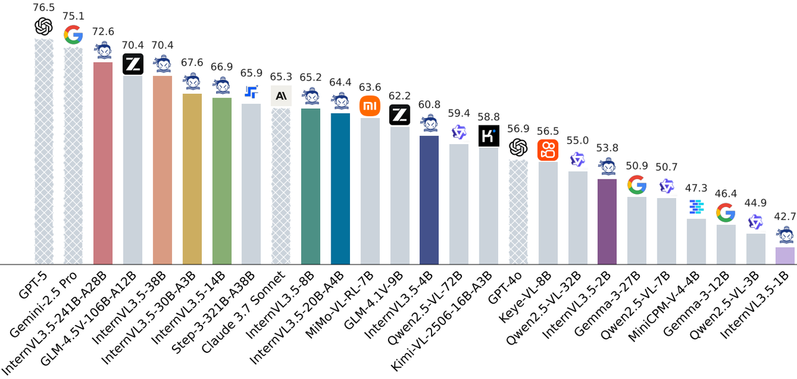

* **动机**

多模态大模型正在从基础的图文理解转变为更具挑战性的任务，如复杂推理、文本生成和具身智能等。然而，当前开源模型在这些方面与领先商业模型之间仍存在显著差距，尤其在强化学习框架的稳定性、可扩展性以及高分辨率多模态处理带来的高昂计算成本等方面都比不了。

为了解决这些问题，商汤推出 InternVL3.5，在通用性、推理能力和系统效率方面实现了全面升级。核心在于提出了一种新颖&#x7684;**`Cascade RL`**&#x6846;架，结合离线与在线强化学习两个互补阶段，并引入了两项关键技术——视觉分辨率路由器 **ViR**（**Vi**sual **R**esolution Router）和解耦的视觉-语言部署 **DvD**（**D**ecoupled **V**ision-Language **D**eployment）。

* **模型结构**

1. **InternVL3.5**

沿用之前 InternVL 系列所采用&#x7684;**`ViT–MLP–LLM`**&#x67B6;构范式，配置如下表。LLM 基&#x4E8E;**`Qwen3`**&#x7CFB;列&#x548C;**`GPT-OSS`**&#x521D;始化，视觉编码器采&#x7528;**`InternViT-300M`**&#x548C;**`InternViT-6B`**。此外使用了 InternVL1.5 中提出的动态高分辨率策略，以支持灵活的多尺度视觉理解。

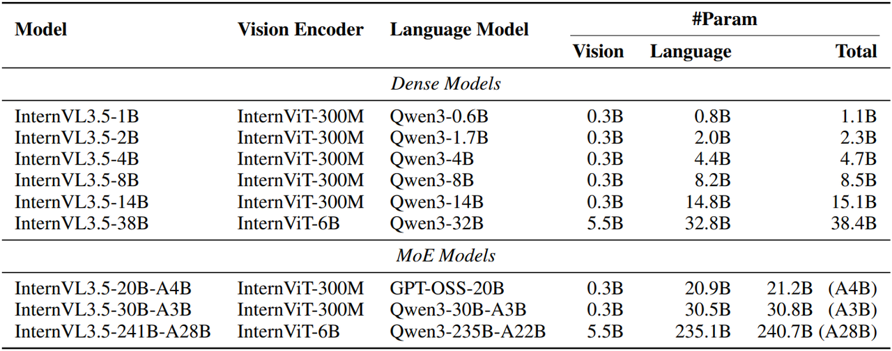

* **InternVL3.5-Flash **

在 InternVL3.5 的基础上进一步集成了视觉分辨率路由器 ViR 模块，构建出一系列适用于资源受限场景的高效变体。每个图像块最初被表示为**`1024`**个视觉 token，随后通过像素打乱 pixel shuffle 模块压缩至**`256`**个 token，再传入 LLM。在 InternVL3.5-Flash 中，引入了更高压缩率的额外像素打乱模块，可将视觉 token 进一步压缩&#x81F3;**`64`**&#x4E2A;，如下图。对于每一个图像块，路由模块会根据其语义丰富程度判断合适的压缩级别，并将其分配至相应的压缩路径。得益于这种基于图像块语义感知的压缩机制，InternVL3.5-Flash 能在几乎不损失性能的前提下将视觉 token 数量减少**`50%`**。

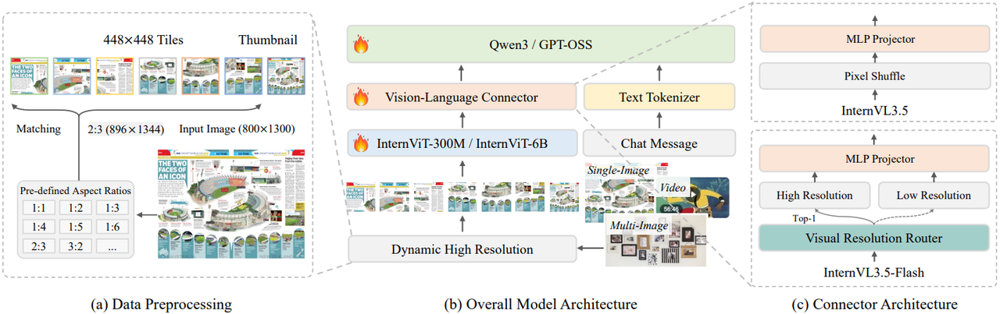

* **预训练**

使用大规模文本与多模态语料进行训练，联合更新所有模型参数。给定一个包含多模态 token 序列 $$  x = (x_1, x_2, \ldots, x_L)  $$ 的训练样本，对每个文本 token 计算下一 token 预&#x6D4B;**`NTP`**&#x635F;失：

$$L_i = -\log p_\theta (x_i \mid x_1, \ldots, x_{i-1})$$

其中$$  x_i  $$是待预测的 token，前缀$$  \{x_1, x_2, \ldots, x_{i-1}\}  $$可包含文本或图像 token。对于对话类样本，仅回答部分的 token 参与损失计算。为缓解训练过程中对长或短回答的偏好偏差，采用平方平均法对 NTP 损失进行重加权：

$$L'_i = \frac{w_i}{\sum_j w_j} \cdot L_i, \quad w_i = \frac{1}{N^{0.5}}$$

其中$$  N  $$表示当前样本中参与损失计算的 token 总数。此外还引入随机 JPEG 压缩增强，以提升模型在真实场景中的鲁棒性。

预训练语料分为两类：

> * **多模态数据**：主要来源于 InternVL3 的训练语料，涵盖图像描述、通用问答、数学、科学、图表理解、OCR、知识 grounding、文档理解、多轮对话及医学等多个领域
>
> * **纯文本数据**：基于 InternLM 系列的训练语料，并进一步融合多个开源文本数据集。整体预训练语料包含&#x7EA6;**`116M`**&#x6837;本，总计&#x7EA6;**`250B`** token，文本与多模态数据的比例约&#x4E3A;**`1:2.5`**。最大序列长度设&#x4E3A;**`32K`** token，以支持长上下文的理解与推理。

* **后训练**

采用三阶段后训练策略：

> 1. **SFT**：保持与预训练相同的训练目标，但使用更高品质的对话数据进一步提升模型能力
>
> 2. **级联强化学习 Cascade RL**：结合离线与在线 RL 的优势，提升模型的推理能力
>
> 3. **视觉一致性学习 ViCO**：用于将 ViR 模块集成至 InternVL3.5，构建高效版本 InternVL3.5-Flash，目标是最小化不同视觉压缩率下的输出差异

1. **SFT**

采用与预训练相同的损失目标，并使用平方平均策略计算最终损失。上下文窗口仍设&#x4E3A;**`32K`** token。InternVL3.5 的 SFT 数据在质量与多样性上均有提升，主要来自三类来源：

> 1. 沿用 InternVL3 的指令跟随数据，确保对视觉-语言任务的广泛覆盖
>
> 2. 思考模式下的多模态推理数据，通过大规模推理模型生成包含详细推理过程的回答样本，经过严格筛选（包括评估推理清晰度、去除冗余、统一格式）确保推理质量，问题覆盖数学、科学等专业领域
>
> 3. 能力扩展数据集，赋予模型新技能，如基于 GUI 的交互、具身智能交互、SVG 的理解与生成

SFT 阶段使用&#x7EA6;**`56M`**&#x6837;本，&#x5373;**`130B`** token，文本与多模态数据比例约&#x4E3A;**`1:3.5`**

* **级联强化学习 Cascade RL**

强化学习的核心优势在于引入负样本，抑制低质量输出区域，从而提升整体质量。DPO 等方法作&#x4E3A;**`offline RL`**，训练效率高，但性能上限较低；而**`online RL`**虽有效，但计算开销大、耗时长。结合这两者的优点，作者提&#x51FA;**`Cascade RL`**，融合两者优势，实现高效、渐进的 MLLM 后训练。具体流程为：

> 1. 使用 **offline RL** 进行高效微调，作为热身阶段，获得高质量的 rollout 输出
>
> 2. 采用 **online RL**，基于模型自身生成的 rollout 进一步优化输出分布

相比单一 RL 阶段，Cascade RL 在显著提升性能的同时，大幅降低 GPU 训练成本。

**offline RL**：采用混合偏好优化 MPO 进行微调。其训练目标为偏好损失$$L_p$$、质量损失$$  L_q  $$和生成损失$$  L_g  $$的加权组合：

$$L_{\text{MPO}} = w_p L_p + w_q L_q + w_g L_g$$

其中$$  w_*  $$为各损失项的权重。DPO 损失作为偏好损失，BCO 损失作为质量损失，LM loss 作为生成损失。

**online RL**：采用无参考模型约束的 GSPO 作为 online RL 算法，因为在训练 Dense 模型和 MoE 模型时更为有效。类似 GRPO，优势函数定义为同一 query 下多个 response 奖励的标准化结果：

$$\hat{A}_{i} = \frac{r(x, y_i) - \text{mean}\left(\{r(x, y_i)\}_{i=1}^G\right)}{\text{std}\left(\{r(x, y_i)\}_{i=1}^G\right)}$$

其中$$  y_i  $$是针对 Query $$  x  $$生成的第$$  i  $$个回答，$$G$$为生成的总回答数，$$r(x, y_i)$$表示该回答的奖励值。GSPO 的训练目标为：

$$L_{\text{GSPO}}(\theta) = \mathbb{E}_{x \sim D, \{y_i\}_{i=1}^G \sim \pi_{\theta_{\text{old}}}(\cdot|x)} \left[ \frac{1}{G} \sum_{i=1}^G \min\left( s_i(\theta) \hat{A}_{i}, \text{clip}(s_i(\theta), 1 - \varepsilon, 1 + \varepsilon) \hat{A}_{i} \right) \right]$$

其中重要性采样比$$  s_i(\theta)  $$定义为逐 token 比值的几何平均：

$$s_i(\theta) = \left( \frac{\pi_\theta(y_i \mid x)}{\pi_{\theta_{\text{old}}}(y_i \mid x)} \right)^{1/|y_i|} = \exp\left( \frac{1}{|y_i|} \sum_{t=1}^{|y_i|} \log \frac{\pi_\theta(y_{i,t} \mid x, y_{i,<t})}{\pi_{\theta_{\text{old}}}(y_{i,t} \mid x, y_{i,<t})} \right)$$

其中$$  \pi_\theta(y_i \mid x, y_{i,<t})  $$和$$  \pi_\theta(y_{i,t} \mid x, y_{i,<t})  $$分别表示策略模型在参数$$  \theta  $$下生成完整回答$$  y_i  $$和第$$  t  $$个 token 的概率。

Cascade RL 具有三大优势：

> 1. **训练更稳定**：离线阶段解耦 rollout 收集与参数更新，有效缓解奖励作弊等问题；在线阶段中，更强的初始模型表现出更稳定的训练动态，MPO 阶段的性能增益进一步提升了 GSPO 阶段的鲁棒性
>
> 2. **训练更高效**：MPO 阶段的 rollout 可跨模型共享，摊薄在线 RL 的采样成本
>
> 3. **性能上限更高**：经 MPO 微调的模型在后续在线 RL 阶段以更少训练步数达到更高性能，显著降低总体训练开销

Cascade RL 阶段 offline RL 使&#x7528;**`MMPR-v1.2`**&#x6570;据集，&#x7EA6;**`200K`**&#x6837;本对，online RL 从中筛选模型准确率&#x5728;**`0.2`**&#x81F3;**`0.8`**&#x4E4B;间的 query ，并融合多个新近多模态数据集，构建&#x7EA6;**`70K`** query &#x7684;**`MMPR-Tiny`**&#x6570;据集。rollout 数据直接复用 MMPR-v1.2，避免额外采样开销。

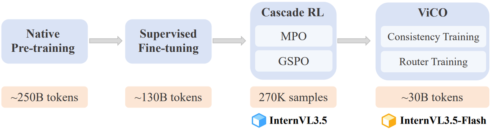

* **视觉一致性学习 ViCO**

ViCO 用于将 ViR 模块集成至 InternVL3.5，构建高效推理版本 InternVL3.5-Flash。ViCO 包含两个子阶段

**一致性训练**：整个模型训练目标为最小化不同压缩率下回答分布的差异。引入冻结的参考模型 InternVL3.5，对同一输入图像分别&#x4EE5;**`256`**&#x74;oken（压缩率$$\xi = \frac{1}{4}$$）&#x548C;**`64`**&#x74;oken（$$\xi = \frac{1}{16}$$）表示，训练目标为：

$$L_{\text{ViCO}} = \mathbb{E}_{\xi \sim R} \left[ \frac{1}{N} \sum_{i=1}^N \text{KL}\left( \pi_{\theta_{\text{ref}}}(y_i \mid y_{<i}, I) \parallel \pi_{\theta_{\text{policy}}}(y_i \mid y_{<i}, I_\xi) \right) \right]$$

其中$$\xi$$从$$  \left\{ \frac{1}{4}, \frac{1}{16} \right\}  $$中均匀采样，参考模型始终使用$$  \xi = \frac{1}{4}  $$推理。

**路由训练**：训练 ViR 模块为不同输入选择合适的压缩分辨率。ViR 是一个二分类器，使用标准交叉熵损失进行训练。路由标签通过计算压缩前后输出的 KL 散度比值得到。令：

$$r_i = \frac{L_{\text{ViCO}}(y_i \mid I_{1/16})}{L_{\text{ViCO}}(y_i \mid I_{1/4})}$$

表示压缩带来的相对损失增长。路由标签定义为：

$$y^{\text{router}}_i = 
\begin{cases}
0, & r_i < \tau\\
1, & r_i \geq \tau
\end{cases}$$

其中$$r_i < \tau$$表示压缩影响小，反之压缩影响大；$$  y^{\text{router}}_i = 0  $$ 对应$$\xi = \frac{1}{16}$$，$$y^{\text{router}}_i = 1$$对应$$\xi = \frac{1}{4}$$。阈值$$  \tau  $$为滑动窗口内历史$$  r_i  $$值的第$$  k  $$百分位数，确保标签分布均衡。一致性训练阶段，同一图像的所有 patch 使用随机压缩率，以保留无压缩下的模型能力。InternVL3.5-Flash 在减少**`50%`**视觉 token 的同时，保持了接近**`100%`**的原始性能。

ViCO 阶段的一致性训练使用与 SFT 相同的数据，路由训练则选用 OCR 和 VQA 等视觉信息密集的子集，帮助 ViR 学习基于内容动态决策压缩策略。

* **Test-Time Scaling**

InternVL3.5 实现了一套综合性的测试时扩展策略，同时提升模型的推理深度（即深度思考）和推理广度（即并行思考）：

> * **深度思考 Deep Thinking**：通过激活思考模式，引导模型在生成最终答案前进行有意识的逐步推理，将复杂问题分解为逻辑步骤，并验证中间结论。改善了解决复杂问题时的逻辑结构，尤其对依赖多步推理的任务效果显著，从而增强了推理的深度。
>
> * **并行思考 Parallel Thinking**：延续 InternVL3 的做法，在推理任务中采用 **BoN**（**B**est-**o**f-**N**）策略，使&#x7528;**`VisualPRM-v1.1`**&#x4F5C;为 critic model，从多个推理候选中选择最优回答。该方法通过生成多样化的推理路径并筛选最佳结果，有效提升了推理的广度。

* **训练硬件**

1. **训练框架**

模型训练主要基于 XTuner 框架，针对 Dense 和 MoE 架构集成了一系列高效训练优化技术。采用 **`FSDP`** 对模型参数进行跨 GPU 分片，降低显存占用；通过数据打包减少填充 token，均衡各设备负载，提升训练效率。引入 FP8 精度训练，结&#x5408;**`DeepGEMM`**&#x548C;**`liger-kernel`**&#x7684;融合交叉熵算子，显著加快训练速度。注意力计算采用 **`FlashAttention-3`**，支持打包序列输入，进一步提升计算效率。针对 MoE 模型，使&#x7528;**`TMA-Adaptive FP8`**&#x5206;组 GEMM 内核进行优化。在强化学习阶段，基于 verl 框架实现高效策略更新。对于特定模型如 InternVL3.5-20B-A4B，还在 GPT-OSS-20B 中通&#x8FC7;**`Triton`**&#x5B9E;现了带 sink 机制的窗口注意力加速，以支持长上下文高效推理。

* **推理架构**

解耦视觉-语言部署 DvD：考虑到视觉编码器和语言模型在计算特性上的显著差异，即前者高度并行、无状态依赖，后者自回归、依赖历史状态，作者提出 **DvD**（**D**ecoupled **V**ision-Language **D**eployment）架构，将视觉与语言处理解耦部署。具体地，视觉模块（包括 ViT、MLP，以及 InternVL3.5-Flash 中的 ViR）部署在独立的视觉服务器上，负责批量处理图像并生成紧凑的视觉特征；语言模型则单独运行在语言服务器上，接收来自视觉侧的 BF16 格式特征，与文本输入融合后进行自回归解码。通信通过 TCP 单向传输，支持可选 RDMA 以提升传输带宽。

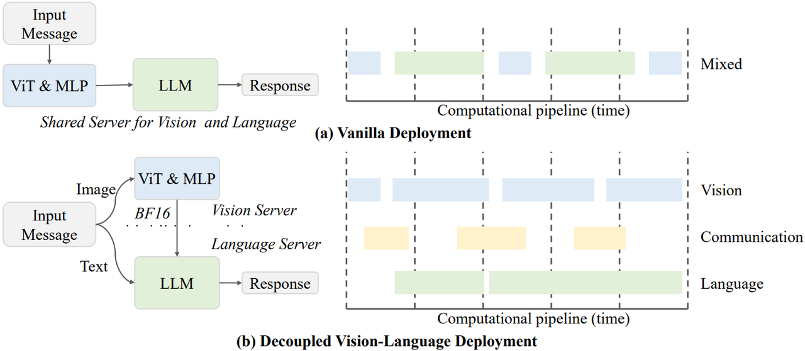

该架构将视觉处理、特征传输和语言推理组织为异步三阶段流水线，实现各阶段重叠执行，有效减少等待和阻塞，尤其在处理高分辨率图像或大规模批量请求时优势明显。DvD 不仅提升了视觉侧的 GPU 利用率，也使语言服务器能专注 LLM 推理，显著提高整体吞吐量和响应速度。此外，该设计支持对视觉和语言模块分别进行硬件资源配置与成本优化，并便于未来新模块的接入，如更高分辨率 ViT 或新路由策略，无需改动语言模型部署结构，具备良好的可扩展性。

---

[Previous](10-Vision-Language-Model--Qwen-系列.md) | [Contents](../../README.md) | [Next](12-Vision-Language-Model--DeepSeek-系列.md) | [Visual website](https://weyumm.github.io/vlm-Wissen/lecture-1.html#c=11)
