[Previous](12-Vision-Language-Model--DeepSeek-系列.md) | [Contents](../../README.md) | [Visual website](https://weyumm.github.io/vlm-Wissen/lecture-1.html#c=13)

## 2.9 其他

### 2.9.1 Kimi K2.5

* **联合多模态训练**

Kimi K2.5 是原生多模态模型。以 Kimi K2 为基础，通过对大&#x7EA6;**`15T`**&#x4E2A;图文混合 Token 进行大规模的联合预训练打造而来。K2.5 不是为了适配视觉而不得不割裂或牺牲语言及视觉能力的模型，而是采用联合预训练模式，能够同时增强这两种模态的表现。

1. **原生多模态预训练**

设计多模态预训练时的一个关键问题是：在固定的视觉-文本 token 总预算下，什么是最佳的联合训练策略？传统的做法倾向于在语言模型训练的后期，以高比例引入视觉 token，例&#x5982;**`50%`**或更高，认为这样能更快获得多模态能力，把多模态能力视为语言能力的一种附加品。

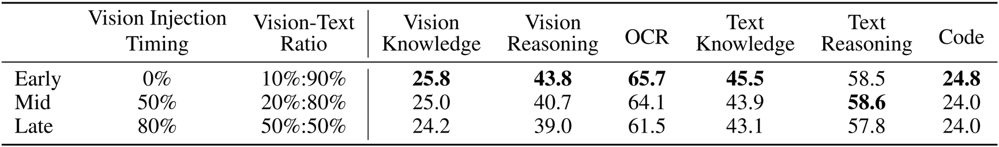

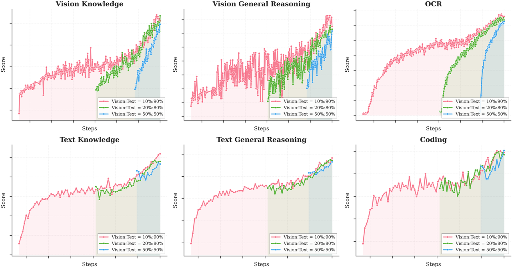

但作者的实验揭示了不同的结论。他们在固定总 token 预算下，改变视觉数据比例和引入时机进行消融实验。结果发现，视觉比例对最终多模态性能的影响其实很小。并且在固定总预算下，更早地融合视觉数据并采用较低的视觉比例，效果反而更好。这个结论促使他们采用了原生多模态预训练策略：不是在训练尾声集中进行高比例的视觉训练，而是在训练早期就引入中等比例的视觉数据。这让模型能在长期的文本-视觉协同优化中，自然发展出更平衡的多模态表征。

* **无需视觉的监督微调**

预训练后的视觉-语言模型并不会天然具备基于视觉的工具调用能力，这对多模态强化学习来说是个冷启动难题。传统方法是用人工标注或提示工程生成的思维链数据来引导，但这种数据多样性有限，常局限于简单图表和基础工具操作，如裁剪、旋转、翻转。

作者团队的一个发现是：高质量的纯文本 SFT 数据相对丰富且多样。因此，他们提出了一种新方&#x6CD5;**`zero-vision SFT`**，即完全只用文本 SFT 数据来激活模型的视觉和智能体能力。在这个过程中，所有的图像操作都通过 IPython 中的编程方式来代理执行，这实际上是传统视觉工具使用的一种泛化。这&#x79CD;**`zero-vision`**&#x6FC0;活方式催生了多样的推理行为，包括像素级的操作，如通过二值化估算物体大小、计数，并泛化到了视觉定位、计数、OCR等任务。

> **核心结论**：zero-vision SFT 足以激活视觉能力，同时确保跨模态的泛化性。这归功于文本与视觉数据的联合预训练。实验表明，与 zero-vision SFT 相比，使用包含视觉数据的 SFT 在视觉和智能体任务上表现差很多，可能是因为缺乏高质量视觉数据。
>
> RL 训练曲线如右图，从 zero-vision SFT 的起点开始，模型在视觉基准上的性能持续提升，证明了 zero-vision 激活配合长周期 RL，就足以获得鲁棒的视觉能力。

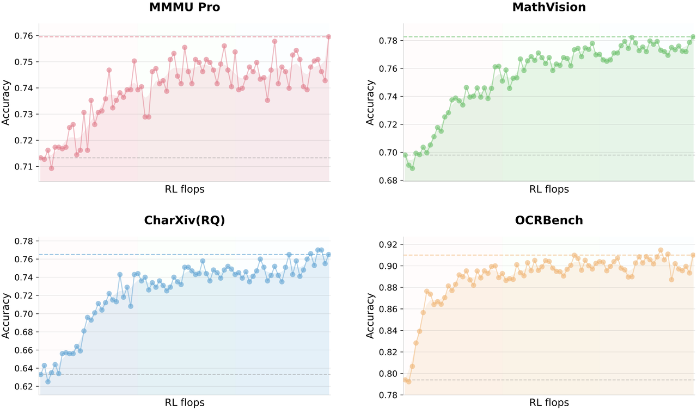

* **联合多模态强化学习**

**基于结果的视觉 RL**

在 zero-vision SFT 之后，模型需要进一步优化，才能可靠地将视觉输入融入推理。仅靠文本激活存在明显的失败模式：有时会忽略视觉输入，或在需要时未关注图像。作者在明确需要视觉理解才能得出正确答案的任务上，采用基于结果的 RL。这些任务分三类：

> * **视觉定位与计数**：准确定位和清点图中物体
>
> * **图表与文档理解**：解读结构化视觉信息并提取文本
>
> * **视觉关键的 STEMM问题**：筛选出的必须依赖视觉输入的数学和科学问题

在这些任务上进行基于结果的 RL，不仅提升了基础视觉能力，还催生了更复杂的智能体行为。将这些轨迹提取出来用于拒绝采样微调，形成了一个自我改进的数据闭环，让后续的联合 RL 阶段能利用更丰富的多模态推理轨迹。

**视觉 RL 提升文本性能**

为研究视觉与文本性能间是否存在此消彼长的关系，作者团队评估了视觉 RL 前后模型在纯文本基准上的表现。结果非常好：基于结果的视觉 RL 在文本任务上带来了巨大提升，例如：

> * MMLU-Pro: $$84.7\% \rightarrow 86.4\%$$
>
> * GPQA-Diamond: $$84.3\% \rightarrow 86.4\%$$
>
> * LongBench v2: $$56.7\% \rightarrow 58.9\%$$

这是因为，视觉 RL 增强了模型在结构化信息提取方面的校准能力，降低了在处理与视觉推理（如计数、OCR）相似的查询时的不确定性。这表明视觉 RL 能促进跨模态泛化，在提升文本推理能力的同时，并未观察到语言能力的退化。

**联合多模态 RL**

由上可知，从 zero-vision SFT 配合视觉 RL 可以涌现鲁棒的视觉能力，并且视觉 RL 还能反过来增强通用文本能力，因此作者团队在 Kimi K2.5 的后训练中采用了一种联合多模态 RL 范式。他们并没有按输入模态（文本、图像）来划分不同的专家模型，而是按能力领域（知识、推理、编程、智能体等）来组织 RL。这些领域专家模型同时从纯文本和多模态 Query 中学习，而生成式奖励模型 GRM 也同样在无模态障碍的异构轨迹上进行优化。这个范式确保了通过文本或视觉输入获得的任何能力提升，都能内在的泛化到另一模态的相关能力上，从而最大化跨模态能力的迁移。

> **总结**：这套方法不仅包含基于结果导向的视觉强化学习，还引出了能够反哺并提升文本能力的涌现式跨模态迁移现象。

* **智能体系统**

现有智能体系统面临的主要挑战在于，它们依赖顺序执行推理和工具调用的步骤。虽然这种结构对简单的短期任务可能有效，但随着任务复杂性的增加和累积上下文的增长，它就变得力不从心。当任务演变为需要广泛的信息收集和复杂、多分支的推理时，顺序系统往往会遇到显著的瓶颈。单个智能体逐步处理每个步骤的能力有限，可能导致实际推理深度和工具调用预算的耗尽，最终阻碍系统处理更复杂的场景。

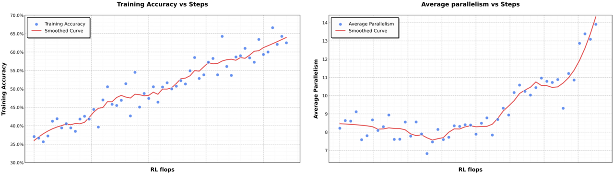

为了解决这个问题，K2.5 引入了智能体集&#x7FA4;**`Agent Swarm`**&#x548C;并行智能体强化学&#x4E60;**&#x20;PARL**（**P**arallel **A**gent **R**einforcement **L**earning）。K2.5 并不是将任务作为一条推理链来执行，也不是依赖预先指定的并行化启发式规则，而是通过动态任务分解、子智能体实例化和并行子任务调度来启动一个智能体集群。这里的并行性并未被预设为固有优势；关于是否、何时以及如何并行化的决策，是通过环境反馈和强化学习驱动的探索显式学习到的。如上图，性能的提升证明了这种自适应能力，随着训练过程中编排器不断优化其并行化策略，累积奖励平稳增长。

1. **架构设计**

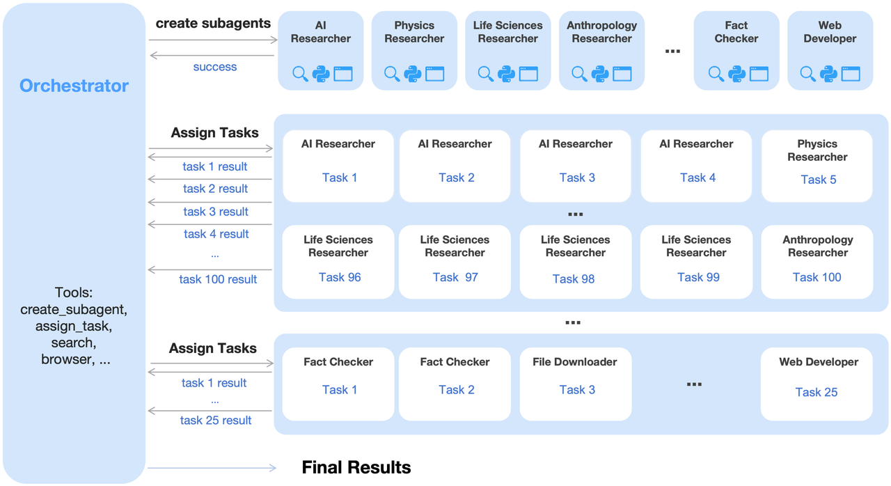

PARL 采用了一种解耦架构，包含一个可训练的编排器和多个从固定的中间策略检查点实例化而来的冻结子智能体。这种设计有意避免了端到端的协同优化，从而规避了两个难题：功劳分配模糊和训练不稳定性。在这种多智能体设定中，基于结果的奖励本质上是稀疏且有噪声的；一个正确的最终答案并不能保证子智能体的执行完美无缺，而一次失败也并不意味着所有子智能体都有错。通过冻结子智能体并将其输出视为环境观察而非可微分的决策点，将高层的协调逻辑与底层的执行能力分离开，从而实现更稳健的收敛。为提高效率，K2.5 先使用小规模的子智能体来训练编排器，然后再过渡到更大的模型。此外，这个强化学习框架还支持动态调整子智能体与编排器之间的推理实例比例，从而最大化整个集群的资源利用率。

* **PARL 奖励函数**

由于独立子智能体执行过程中固有的延迟、稀疏和非平稳反馈，训练一个可靠的并行编排器具有挑战性。为了解决这个问题，PARL 奖励函数为：

$$r_{\text{PARL}}(x,y)=\lambda_{1} \cdot r_{\text{parallel}} + \lambda_{2} \cdot r_{\text{finish}} + r_{\text{perf}}(x,y)$$

其中，性能奖励$$r_{\text{perf}}$$评估了给定任务$$x$$的解决方案$$y$$的整体成功度和质量。这个奖励由两个辅助奖励来增强，每个都旨在解决学习并行编排时的一个特定难题：

> * **$$r_{\text{parallel}}$$**&#x662F;为了减轻串行坍缩，一种编排器退化到默认单智能体执行的局部最优解。通过激励子智能体的实例化，鼓励对并发调度空间的探索。
>
> * **$$r_{\text{finish}}$$**&#x4E13;注于成功完成所分配的子任务。它被用来防止伪并行，这是一种奖励黑客行为，即编排器通过生成大量子智能体而不进行有意义的任务分解，来大幅提高并行性指标。通过奖励已完成的子任务，$$r_{\text{finish}}$$ 确保了可行性，并引导策略走向有效且合理的分解。

为确保最终策略优化的是主要目标，超参数$$\lambda_{1}$$和$$\lambda_{2}$$会在训练过程中逐步退火至零。

* **关键步骤**

为了衡量并行智能体设置下的计算时间成本，类比计算图中的关键路径**`Critical Path`**&#x6765;定义关键步骤**`Critical Steps`**。这里将一个回合建模为一系列执行阶段，索引为$$t=1,\ldots,T$$。在每个阶段，主智能体执行一个动作，这对应着直接的工具调用，或是并行运行的一组子智能体的实例化。设$$S^{(t)}_{\text{main}}$$表示主智能体在阶段$$t$$采取的步骤数，通常$$S^{(t)}_{\text{main}}=1$$，$$S^{(t)}_{\text{sub},i}$$表示该并行组中第$$i$$个子智能体采取的步骤数。阶段$$t$$的持续时间由该组中运行时间最长的子智能体决定。因此，一个回合的总关键步骤定义为：

$$\text{CriticalSteps}=\sum_{t=1}^{T}\left(S^{(t)}_{\text{main}}+\max_i S^{(t)}_{\text{sub},i}\right)$$

通过使用关键步骤而非总步骤来约束训练和评估，这个框架显式地激励了有效的并行化。不能缩短并行组最大执行时间的过度子任务创建，在此度量下几乎没什么好处，而能缩短最长并行分支的良好均衡的任务分解，则直接减少了关键步骤。如此一来，就鼓励了编排器以最小化端到端延迟的方式来分配工作给子智能体，而非仅仅最大化并发数或总工作量。

* **Prompt 构建**

为了激励编排器利用并行化的优势，K2.5 构建了一套合成 Prompt，旨在压迫顺序智能体执行的极限。这些 Prompt 强调广度搜索**`wide search`**&#x6216;深度搜索**`deep search`**，前者需要同时探索许多独立信息源，后者则需要多个推理分支并进行延迟聚合。此外还额外加入了受现实世界工作负载启发的任务，如长文档分析和大规模文件下载。当顺序执行时，这些任务很难在固定的推理步骤和工具调用预算内完成。通过设计，它们鼓励编排器并行分配子任务，从而以比单个顺序智能体更少的关键步骤来完成。这些 Prompt 并没有明确指示模型去并行化。相反，它们塑造了任务分布，使得并行分解和调度策略自然受到青睐。

* **方法概述**

1. **基座**

Kimi K2.5 基于 Kimi K2，一个万亿参数的 MoE Transformer 模型，&#x5728;**`15T`**&#x9AD8;质量文本 Token 上预训练而成。Kimi K2 采用了 Token 高效的 MuonClip 优化器，并结合 QK-Clip 来保证训练稳定性。该模型总参数量&#x4E3A;**`1.04T`**，激活参数为 **`32B`**，使用了 **`384`** 个专家，每个 Token 激活其&#x4E2D;**`8`**&#x4E2A;，即稀疏度&#x4E3A;**`48`**。

* **模型架构**

Kimi K2.5 的多模态架构由三个组件构成：一个三维原生分辨率视觉编码器**`MoonViT-3D`**、一个 MLP 投影器，以及 Kimi K2 MoE 语言模型，按照 Kimi-VL 中确立的设计原则。

> **MoonViT-3D：图像和视频的统一嵌入空间**
>
> 在 Kimi-VL 中，使用 MoonViT 以原始分辨率原生处理图像，消除了复杂的子图分割和拼接操作。MoonViT &#x7531;**`SigLIP-SO-400M`**&#x521D;始化，并采用&#x4E86;**`NaViT`**&#x7684; patch 打包策略，将单张图像分割成 patch，展平后按顺序连接成一维序列，从而能高效地同时在各种分辨率的图像上进行训练。

为了将图像理解能力最大限度地迁移到视频上，K2.5 引入了 MoonViT-3D，它具有统一的架构、完全共享的参数和一致的嵌入空间。通过将 patch 打包的理念推广到时序维度，将最多四个连续帧视为一个时空体：这些帧的二维 patch 被联合展平并打包成一个单一的一维序列，使得相同的注意力机制可以在空间和时间上无缝运作。额外的时序注意力增强了对高速运动和视觉效果的理解，而参数共享则最大化了从静态图像到动态视频的知识泛化，无需专门的视频模块或架构分叉就实现了强大的视频理解性能。在进入 MLP 投影器之前，轻量级的时序池化会聚合每个时序块内的 patch ，实现$$4\times$$的时序压缩，显著扩展了可处理的视频长度。其结果是一个统一的流程，图像预训练中获得的知识和能力，通过一个共享的参数空间和特征表示，整体迁移到视频领域。

* **预训练**

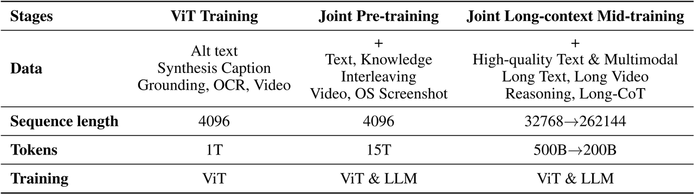

如上表，Kimi K2.5 的预训练建立在 Kimi K2 语言模型 checkpoint 之上，分三个阶段处理&#x7EA6;**`15T`** Token：

> 1. **独立 ViT 训练**：建立一个鲁棒的原生分辨率视觉编码器
>
> 2. **联合预训练**：同时增强语言和多模态能力
>
> 3) **中期训练**：使用高质量数据和长上下文激活，以优化能力并扩展上下文窗口

**ViT 训练阶段**

MoonViT-3D &#x4ECE;**`SigLIP`**&#x5F00;始，在图像-文本和视频-文本对上进行持续预训练，文本部分由多种目标组成：图像替代文本、图像和视频的合成描述、边界框定位及 OCR 文本。与 Kimi-VL 的实现不同，这次持续预训练不包含对比损失，仅采用交叉熵损失$$L_{caption}$$，用于根据输入图像和视频生成描述。这里采用两阶段对齐策略：

> * **Stage 1**：更新 MoonViT-3D，通过描述损失使其&#x4E0E;**`Moonlight-16B-A3B`**&#x5BF9;齐，消耗&#x7EA6;**`1T`** Token 和极少的训练 FLOPs。此阶段让 MoonViT-3D 初步理解高分辨率图像和视频。
>
> * **Stage 2**：仅更新 MLP 投影器，在 ViT &#x548C;**`1T`**&#x53C2;数的 LLM 之间架桥，以实现更平滑的联合预训练。

**联合训练阶段**

联合预训练阶段从一个接近训练结束的 Kimi K2 检查点开始，在**`4K`**序列长度下，额外处理**`15T`**视觉-文本 Token。数据方面扩展了 Kimi K2 的预训练分布，引入了独特的 Token，调整了数据比例并增加了编程相关内容的权重，同时控制了每个数据源的最大训练轮数。

第三阶段进行长上下文激活，并整合了更高质量的中期训练数据，通&#x8FC7;**`YaRN`**&#x63D2;值法逐步扩展上下文长度。这在长文本理解和长视频理解方面都带来了显著的泛化提升。

* **后训练**

**监督微调**

遵循 Kimi K2 的 SFT 流程，通过从 K2、K2 Thinking 以及一系列自研内部专家模型中合成高质量的候选回答，来开发 K2.5。数据生成策略采用特定领域定制的专门流程，将人工标注与高级提示工程和多阶段验证相结合。这产出了一个大规模指令微调数据集，包含多样的 Prompt 和复杂的推理轨迹，最终训练模型在复杂的现实世界应用中优先进行交互式推理和精确的工具调用。

**强化学习**

为了促进文本与视觉模态的联合优化，并实现用于智能体集群的 PARL，K2.5 开发了一个统一智能体强化学习环境，并对 RL 算法进行了优化。文本-视觉联合 RL 和 PARL 都建立在下面所述算法的基础上。

**策略优化**：对于从数据集$$\mathcal{D}$$中采样的每个问题$$x$$，使用旧策略$$\pi_{\text{old}}$$生成$$K$$个回答$$\{y_1,\ldots,y_K\}$$。根据以下目标优化模型$$\pi_{\bm{\theta}}$$：

$$\begin{split}
L_{\text{RL}}(\bm{\theta}) = \mathbb{E}_{x\sim\mathcal{D}} \left[ \frac{1}{N}\sum_{j=1}^{K}\sum_{i=1}^{|y_j|} 
\text{Clip}\left( \frac{\pi_{\bm{\theta}}(y_j^i|x, y_j^{0:i})}{\pi_{\text{old}}(y_j^i|x, y_j^{0:i})}, \alpha, \beta \right) (r(x, y_j) - \bar{r}(x)) 
\tau \left( \log \frac{\pi_{\bm{\theta}}(y_j^i|x, y_j^{0:i})}{\pi_{\text{old}}(y_j^i|x, y_j^{0:i})} \right)^2 \right]
\end{split}$$

这里$$\alpha, \beta, \tau > 0$$是超参数，$$y_j^{0:i}$$是第$$j$$个回答直到第$$i$$个 Token 的前缀，$$N = \sum_{i=1}^{K}|y_i|$$是一个批次中生成的 Token 总数，$$\bar{r}(x) = \frac{1}{K}\sum_{j=1}^{K} r(x, y_j)$$是所有生成回答的平均奖励。

这个损失函数与 K1.5 中使用的策略优化算法不同，它引入了一个 Token 级别的裁剪机制，旨在减轻因训练和推理框架间差异而被放大的离线策略分歧。这相当于一个简单的梯度掩码方案：

> 对于对数概率比在区间$$[\alpha, \beta]$$内的 Token，正常计算策略梯度
>
> 在此区间外的 Token 的梯度则被置零

与标准 PPO 裁剪的一个关键区别是，这个方法严格基于对数比来显式约束离线策略漂移，而不管优势项的符号正负。这种方法与近期为稳定大规模 RL 训练而提出的策略一致。在需要长周期、多步骤工具使用推理的复杂领域中，这种机制对于维持训练稳定性至关重要。K2.5 使&#x7528;**`MuonClip`**&#x4F18;化器来最小化这个目标。

**奖励函数**：对于有可验证解决方案的任务，如推理和智能体任务，应用基于规则的结局奖励。为优化资源消耗，还加入了预算控制奖励，旨在提高 Token 效率。对于通用任务，采用生成式奖励模型 GRM，它们能提供与 Kimi 内部价值标准对齐的细粒度评估。对于视觉任务，作者团队设计了特定任务的奖励函数以提供细粒度监督：

> * **视觉定位和点位任务**：采用基于 F1 的奖励和软匹配。定位任务通过交并比 IoU 获得软匹配分数，点任务则在最优匹配下通过高斯加权距离获得软匹配分数。
>
> * **多边形分割任务**：将预测多边形光栅化为二值掩码，计算其与真实掩码的分割 IoU 来分配奖励。
>
> * **OCR 任务**：采用归一化编辑距离来量化预测与真实文本间的字符级对齐度。
>
> * **计数任务**：基于预测与真实值之间的绝对差分配奖励。

作者团队还合成了复杂的视觉谜题，并利用一个 Kimi K2 的 LLM 验证器提供反馈。

**生成式奖励模型**：Kimi K2 对开放式生成采用了自我批评的评分标准奖励 ，而 K2.5 扩展了这一工作，系统性地在广泛的智能体行为和多模态轨迹上部署了生成式奖励模型** **GRM。这里 GRM 的应用范围不仅限于对话输出，而是在已验证的奖励信号之上，将其应用于多样化的环境，包括聊天助手、编程智能体、搜索智能体和生成人工制品的智能体。GRM 并不是充当二元的裁判，而是作为与 Kimi 价值观对齐的细粒度评估器，这些价值观对用户体验至关重要，例如：有用性、回答就绪度、上下文相关性、适当的详细程度、生成人工制品的美学质量，以及严格的指令遵循。这种设计使得奖励信号能够捕捉到微妙的偏好梯度，而这些梯度很难用纯规则或特定任务验证器来编码。为减轻奖励黑客行为和过拟合单一偏好信号，我们采用了多种针对不同任务上下文定制的备选 GRM 评分标准。

**Token 高效的强化学习**：Token 效率对于具备测试时扩展能力的 LLM 至关重要。虽然测试时扩展本质上是用计算换取推理质量，但实际的收益需要能主动平衡这种权衡的算法创新。之前研究表明，施加一个问题相关预算可以有效约束推理时的计算量，激励模型生成更简洁的思维链推理模式，避免不必要的 Token 膨胀。但会存在长度过拟合现象：在严格预算约束下训练的模型，通常无法泛化到更高的计算规模。结果，它们不能有效利用额外的推理时 Token 来解决复杂问题，反而退化到截断的推理模式。为此作者团队提出&#x4E86;**`Toggle`**，一种在推理时扩展和预算约束优化之间交替的训练启发式方法。对于学习迭代$$t$$，奖励函数定义为：

$$\tilde{r}(x, y) = 
\begin{cases}
r(x, y) \cdot \mathbb{I} \left\{ \frac{1}{K}\sum_{i=1}^{K} r(x, y_i) < \lambda \text{ or } |y_i| \leq \text{budget}(x) \right\}, & \text{if } \lfloor t/m \rfloor \pmod{2} = 0 \text{ (Phase0)} \\
r(x, y), & \text{if } \lfloor t/m \rfloor \pmod{2} = 1 \text{ (Phase1)}
\end{cases}$$

其中$$\lambda$$和$$m$$是算法超参数，$$K$$是每个问题的 rollout 次数。算法每$$m$$次迭代在两个优化阶段之间交替：

> * **Phase0（预算限制阶段）**：训练模型在任务相关的 Token 预算内解决问题。为了防止过早地为追求效率而牺牲质量，该约束是有条件应用的：仅当模型在某个问题上的平均准确率超过阈值$$\lambda$$时才执行。
>
> * **Phase1（标准扩展阶段）**：模型生成回答直到达到最大 Token 限制，鼓励模型利用更多计算来获得更好的推理时扩展效果。

问题相关预算由正确回答子集的 Token 长度的第$$\rho$$百分位数估算得出：

$$\text{budget}(x) = \text{Percentile}\left( \{|y_j| \mid r(x, y_i) = 1, i = 1, \ldots, K\}, \rho \right)$$

这个预算在训练开始时估算一次，之后保持不变。Toggle 作为一个双目标问题的随机交替优化算法，其专门设计就是为了调和推理能力与计算效率。

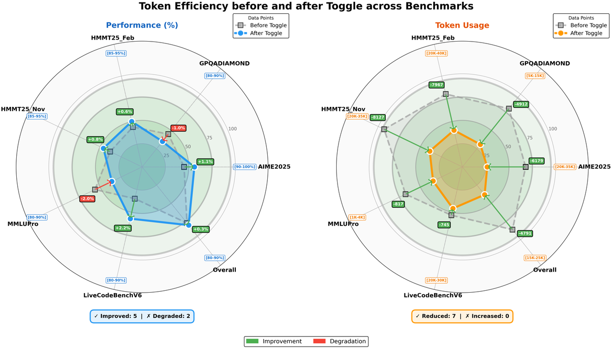

作者团队在 K2 Thinking 上评估了 Toggle 的有效性。如上图，有几个结论：

> 1. 几乎所有基准上的输出长度都持续减少，平均而言，Toggle 减少&#x4E86;**`25~30%`**&#x7684;输出 Token，同时对性能的影响微乎其微
>
> 2. 思维链中的冗余模式，如重复验证和机械计算，大幅减少
>
> 3. Toggle 表现出很强的领域泛化能力，例如，仅在数学和编程任务上训练，模型在 GPQA 和 MMLU-Pro 上同样实现了稳定的 Token 减少，且性能仅有边际下降

### 2.9.2 Kimi K3

* **技术总览**

Kimi K3 是一个面向百万上下文与长程 Agent 训练的原生多模态稀疏模型系统。主干共有 **`93`** 层，包含 **`2.78T`** 总参数和 **`104.2B`** 激活参数；训练上下文扩展到 **`1M`** tokens。它不是把 K2 单纯放大，而是同时重构 sequence mixing、depth mixing、sparse channel mixing、multimodal input、post-training 与 distributed runtime。

整套技术路线围绕同一个目标展开：让超长轨迹在训练时可并行、可恢复，在推理时可缓存、可调度。KDA 与 Gated MLA 处理 token 维信息流，AttnRes 处理 layer 维信息流，Stable LatentMoE 处理 channel 维容量；Native Vision、SFT/RL/MOPD、MXFP4/MXFP8 QAT 和基础设施共同把这些结构变成可训练、可部署的系统。

| **技术维度** | **核心实现** | **解决的问题** |
| ------------------------------------------------------------------------------ | ------------------------------------------------------------------------------ | ------------------------------------------------------------------------------- |
| Token mixing                                                                   | **`69 KDA + 24 Gated MLA`**                                                    | KDA 用固定 recurrent state 承担高频长序列计算，周期性 MLA 保留全局内容交互。                             |
| Depth mixing                                                                   | **`8×12`** Block AttnRes，含 embedding 共 **`9`** 个 source                        | 把深度残差从顺序累加改成对历史 block 表示的选择性检索。                                                 |
| Channel mixing                                                                 | **`896`** routed experts，激活 **`16`**，另有 **`2`** 个 shared experts               | 以 3584 维 latent expert path 扩大容量，并用 RMSNorm、SiTU-GLU、QB 控制稳定性与负载。               |
| Native Vision                                                                  | **`401M`** MoonViT-V2，27 层，patch 14                                            | 图像、视频与文本从训练起点共享 next-token prediction Backbone，避免后接视觉 Encoder 的优化尖峰。            |
| Post-Training                                                                  | SFT → 9 个 RL experts → MOPD，贯穿 MXFP4/MXFP8 QAT                                 | 把 domain 与 reasoning effort 专家合并为单一 policy，并让训练数值路径与部署量化路径一致。                   |
| Infrastructure                                                                 | KCP、MoonEP、Pipeline ZeRO-2、AgentENV、KDA-aware prefix cache                     | 支撑 3T 级稀疏多模态训练、1M Agentic RL 和百万上下文在线服务。                                        |

* **模型架构**

1. **整体结构**

Kimi K3 的架构目标是同时扩展 sequence length、network depth 和 model width 三条信息流。模型共有 **`93`** 层、**`2.78T`** 总参数和 **`104.2B`** 激活参数。Hidden Dimension 保持 **`7168`**，但 attention heads 从 K2 的 **`64`** 增加到 **`96`**，模型宽度主要通过 Stable LatentMoE 的 expert pool 扩展，而不是继续放大主干 hidden size。

每个主干 block 由 **`3`** 层 KDA 和 **`1`** 层 Gated MLA 组成，每个 attention layer 后接一层 Stable LatentMoE。整网包含 **`69`** 层 KDA 与 **`24`** 层 MLA，主干末尾再放置 Gated MLA，保证最终层执行 global attention。AttnRes 在深度方向选择 embedding、当前 block partial sum 和历史 block 表示；MoonViT-V2 则把图像与视频特征投到共享 Embedding 空间。

这套设计把长序列 mixing、跨层检索、稀疏 channel mixing 和视觉输入放进同一个 next-token prediction Backbone，整体 scaling efficiency 相比 K2 提升约 **`2.5×`**。这张总览图把 token、channel 与 layer 三条信息流放在同一张图里。

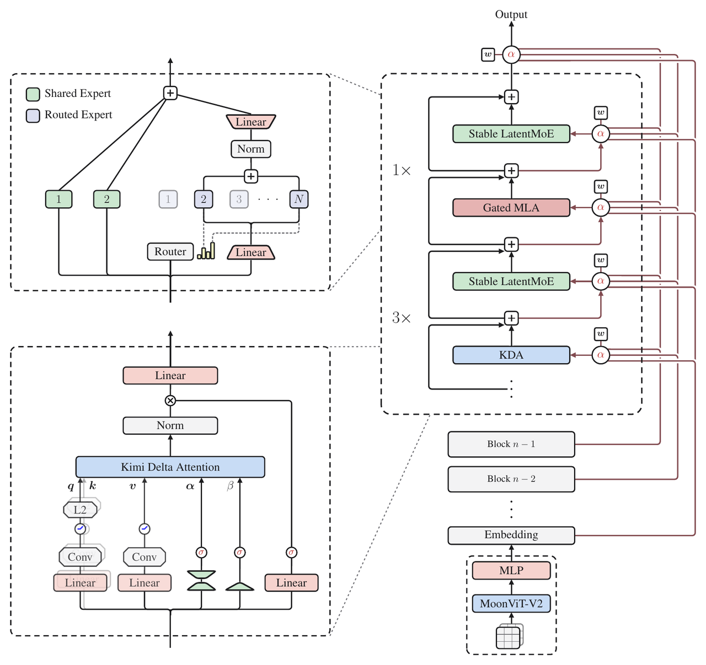

2. **Hybrid Attention**

Hybrid Attention 用 KDA 负责高频、低成本的长序列 mixing，用周期性的 Gated MLA 提供不受局部递推限制的全局内容交互。KDA 的单头 recurrent state 为固定大小矩阵，状态更新遵循 delta rule，并在写入前对 key channel 施加逐通道 retention：

$$\mathbf{S}_t=(\mathbf{I}-\beta_t\mathbf{k}_t\mathbf{k}_t^{\top})\operatorname{Diag}(\boldsymbol{\alpha}_t)\mathbf{S}_{t-1}+\beta_t\mathbf{k}_t\mathbf{v}_t^{\top},\quad \widetilde{\mathbf{o}}_t=\mathbf{S}_t^{\top}\mathbf{q}_t$$

其中 $$\boldsymbol{\alpha}_t$$ 是逐 key channel 的 retention factor，$$\beta_t$$ 控制写入强度。query、key 与 value 先经过 ShortConv 和 Swish，query 与 key 再做 L2Norm；decay logit 由共享 low-rank projection 加 head-specific bias 生成。训练和 prefill 采用 chunkwise 形式：chunk 内并行，chunk 间只传递固定大小 state。输出由 inter-chunk state 读取与 intra-chunk causal interaction 两部分组成。

KDA 的各 head 先显式生成 query、key、value、write strength 与逐通道 decay logit。$$\mathbf{W}_{\alpha}^{\downarrow}$$ 和 $$\mathbf{W}_{\alpha}^{\uparrow}$$ 在 head 间共享低秩通路，$$\mathbf{b}_{\alpha}^{h}$$ 保留 head-specific 偏置；$$A_h$$ 是可学习的 per-head log-scale，初始化为 **`0`**：

$$\begin{aligned}\mathbf{q}_t^h,\mathbf{k}_t^h &=\operatorname{L_2Norm}(\operatorname{Swish}(\operatorname{ShortConv}(\mathbf{W}_{q/k}^h\mathbf{x}_t))),\\ \mathbf{v}_t^h &=\operatorname{Swish}(\operatorname{ShortConv}(\mathbf{W}_v^h\mathbf{x}_t)),\\ \beta_t^h &=\operatorname{Sigmoid}(\mathbf{W}_{\beta}^h\mathbf{x}_t),\qquad \mathbf{z}_t^h=\mathbf{W}_{\alpha}^{\uparrow}\mathbf{W}_{\alpha}^{\downarrow}\mathbf{x}_t+\mathbf{b}_{\alpha}^h.\end{aligned}$$

设 chunk size 为 C，$$\boldsymbol{\Gamma}_{[t]}^{1\rightarrow C}$$ 按行堆叠累计 decay，UT transform 产生 $$\mathbf{U}_{[t]}$$ 与 $$\mathbf{W}_{[t]}$$，pseudo-value 为 $$\widetilde{\mathbf{V}}_{[t]}=\mathbf{U}_{[t]}-\mathbf{W}_{[t]}\mathbf{S}_{[t]}$$。chunk 内所有位置可以一次并行计算：

$$\begin{aligned}\boldsymbol{\gamma}_{[t]}^{i\rightarrow j}&=\prod_{r=i}^{j}\boldsymbol{\alpha}_{[t]}^r,\\ \mathbf{A}_{[t]}&=\operatorname{Tril}[(\mathbf{Q}_{[t]}\odot\boldsymbol{\Gamma}_{[t]})(\mathbf{K}_{[t]}/\boldsymbol{\Gamma}_{[t]})^{\top}],\\ \mathbf{O}_{[t]}&=(\boldsymbol{\Gamma}_{[t]}\odot\mathbf{Q}_{[t]})\mathbf{S}_{[t]}+\mathbf{A}_{[t]}\widetilde{\mathbf{V}}_{[t]}.\end{aligned}$$

$$\operatorname{Tril}$$ 保留对角线，因为当前位置读取的是完成当前 token update 后的 state。KDA 与 MLA 最后都使用 input-dependent full-rank channel gate；区别是 KDA 在 gate 前先对 recurrent output 做 head-wise RMSNorm，MLA 直接门控 global-attention output：

$$\mathbf{y}_t^{\mathrm{KDA}}=\mathbf{W}_o[\operatorname{Sigmoid}(\mathbf{W}_g\mathbf{x}_t)\odot\operatorname{RMSNorm}(\widetilde{\mathbf{o}}_t)],\qquad \mathbf{y}_t^{\mathrm{MLA}}=\mathbf{W}_o[\operatorname{Sigmoid}(\mathbf{W}_g\mathbf{x}_t)\odot\widetilde{\mathbf{o}}_t]$$

普通负 Softplus decay 会让 chunk 内累计 retention 的倒数无限增大，对角 tile 因而需要显式 position-pair 计算，既慢又容易在低精度下溢出或溢出。K3 把 log-decay 改成有下界的 scaled sigmoid：

$$\mathbf{g}_t^h=g_{\min}\operatorname{Sigmoid}(e^{A_h}\mathbf{z}_t^h),\quad \boldsymbol{\alpha}_t^h=\exp(\mathbf{g}_t^h),\quad g_{\min}=-5$$

每一步 retention 因而大于 **`e^-5≈6.7×10^-3`**。在 **`16`**-token tile 内，累计 log-decay 被限制在 **`(-80,0)`**，倒数小于 **`e^80`**，仍处于 BF16 动态范围。对角与非对角 causal tile 都可以直接走 Tensor Core dense GEMM，原来的 position-pair 对角路径被移除。下界 decay 对数值范围和 tile kernel 的影响如下。

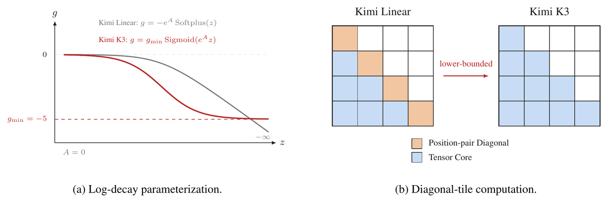

KDA 输出先做 head-wise RMSNorm，再使用 input-dependent full-rank gate；Gated MLA 也使用同构的 channel-wise full-rank output gate。MLA 只缓存低维 latent KV，并在计算时上投影恢复各 head 的内容 key/value。所有 MLA layer 使用 NoPE，位置敏感性由中间 KDA 的递推 gate 与 decay 提供，因此扩展 context 不需要重设 RoPE base 或引入 YaRN。训练时 attention output 保持 FP32，以修正 flash attention 的偏置舍入误差；kernel 把较大的 output tile 与 KV staging buffer 重叠，释放 shared memory 给更深的 KV pipeline。

3. **Attention Residuals**

AttnRes 把“沿深度累加残差”改成“沿深度做内容选择”。Full AttnRes 为每一层学习 pseudo-query，用 embedding 与所有前序层输出作为 key/value，RMSNorm 防止大模长层输出凭幅值垄断权重：

$$\alpha_{i\rightarrow l}=\frac{\exp(\mathbf{w}_l^{\top}\operatorname{RMSNorm}(\mathbf{k}_i))}{\sum_{j=0}^{l-1}\exp(\mathbf{w}_l^{\top}\operatorname{RMSNorm}(\mathbf{k}_j))},\quad \mathbf{h}_l=\sum_{i=0}^{l-1}\alpha_{i\rightarrow l}\mathbf{v}_i$$

Full 形式的算术量为 $$O(L^2d)$$，在深度小于 **`100`** 时可以接受，真正昂贵的是保存全部 layer output 带来的 $$O(Ld)$$ 显存和跨 PP stage 通信。Block AttnRes 把层划为 N 个 block，block 内输出先做 partial sum，block 间只对 N 个表示执行 full attention，显存和通信降到 $$O(Nd)$$。

K3 采用 **`8`** 个完整 block、每个 **`12`** 层，末尾保留 partial block；把 embedding 也作为独立源后，一共形成 **`9`** 个可检索 block 表示。推理时 inter-block 结果可与 block 内 sequential partial sum 用 online softmax 合并，避免把跨层检索变成明显的 decode 延迟。

Full AttnRes 的 source 定义也包含 token embedding：layer-specific pseudo-query 为 $$\mathbf{q}_l=\mathbf{w}_l$$，第 **`0`** 个 key/value 是 $$\mathbf{h}_1$$，其余 key/value 是各前序层的模块输出：

$$\mathbf{k}_i=\mathbf{v}_i=\begin{cases}\mathbf{h}_1,&i=0,\\ f_i(\mathbf{h}_i),&1\le i\le l-1.\end{cases}$$

Block AttnRes 在 block 内先求 $$\mathbf{b}_n=\sum_{j\in\mathcal{B}_n}f_j(\mathbf{h}_j)$$。block 首层只能访问 embedding 与已完成的历史 block，后续层再加入当前 block 的 partial sum；最终输出层聚合全部 N 个 block：

$$\mathbf{V}=\begin{cases}[\mathbf{b}_0,\mathbf{b}_1,\ldots,\mathbf{b}_{n-1}]^{\top},&i=1,\\ [\mathbf{b}_0,\mathbf{b}_1,\ldots,\mathbf{b}_{n-1},\mathbf{b}_n^{i-1}]^{\top},&i\ge2.\end{cases}$$

4. **Stable LatentMoE**

Stable LatentMoE 把 full model width 与 routed-expert width 解耦。共享 expert 在 **`7168`** 维主空间处理通用变换，routed expert 在 **`3584`** 维 latent space 工作；每层有 **`2`** 个共享 expert、**`896`** 个 routed expert，每个 token 激活 **`16`** 个 routed expert，对应 sparsity **`56`**。

$$\mathbf{u}=\sum_{i\in\mathcal{T}_k(\mathbf{x})}p_iE_i^{\mathrm{routed}}(\mathbf{W}^{\downarrow}\mathbf{x}),\quad \mathbf{y}=\sum_{j=1}^{2}E_j^{\mathrm{shared}}(\mathbf{x})+\mathbf{W}^{\uparrow}\operatorname{RMSNorm}(\mathbf{u})$$

极端稀疏会放大两类故障：routed path 连续经过近四次矩阵乘，内部 activation 容易爆炸；近千个 expert 的 load balancing 也会让固定步长 bias update 出现适应过慢或振荡。Normalized LatentMoE 在 expert aggregate 与 up-projection 之间插入 RMSNorm，先消除不同 expert 组合造成的 scale 漂移。

SiTU-GLU 对 gate branch 与 up branch 分别施加 smooth cap。K3 设置 **`β1=4`**、**`β2=25`**，近原点保持接近 SwiGLU 的线性响应，大输入区间则把乘积上界控制在 **`100`**：

$$\operatorname{SiTU\text{-}GLU}(\mathbf{x})=\left[\beta_1\tanh\left(\frac{\mathbf{W}_g\mathbf{x}}{\beta_1}\right)\odot\operatorname{Sigmoid}(\mathbf{W}_g\mathbf{x})\right]\odot\left[\beta_2\tanh\left(\frac{\mathbf{W}_u\mathbf{x}}{\beta_2}\right)\right]$$

GLU、SwiGLU 与 SiTU-GLU 的分支定义及标量响应如下。

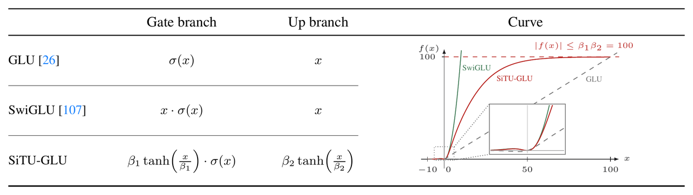

Quantile Balancing 不把 balance bias 写入 mixture weight，只用它改变 Top-k dispatch。对 batch 中 m 个 token、n 个 routed expert、每 token 选择 k 个 expert，目标 load 为 $$q=mk/n$$。先对 biased score 取 Top-(k+1)，第 k+1 个值形成 token cutoff；再从每个 expert 的 score margin 中取 $$1-k/n$$ 分位数，直接求下一步 bias：

auxiliary-loss-free router 先计算 $$\mathbf{s}_i=\operatorname{Sigmoid}(\mathbf{W}_r\mathbf{x}_i)$$。balance bias 只参与集合选择，真正的 mixture weight 仍由原始 score 归一化，因此 load control 不会直接篡改 expert output 的加权比例：

$$\mathcal{T}_i=\operatorname{argtop}_k(\mathbf{s}_i+\mathbf{b}),\qquad p_{i,j}=\frac{s_{i,j}}{\sum_{r\in\mathcal{T}_i}s_{i,r}},\quad j\in\mathcal{T}_i$$

固定步长方案使用 $$b_j^{(t+1)}=b_j^{(t)}+\gamma\operatorname{sign}(\bar{\ell}-\ell_j^{(t)})$$：$$\gamma$$ 小时适应慢，大时会围绕目标 load 振荡。QB 把这个手工步长换成目标 quantile。图中的例子取 **`m=8、n=4、k=1`**，初始 load **`(4,3,1,0)`** 经列级 bias 调整后变为 **`(2,2,2,2)`**。

$$\widehat{b}_j^{(t+1)}=-\operatorname{quantile}_{1-k/n}(\mathbf{s}_{:,j}-\boldsymbol{\alpha}^{(t)}),\quad \mathbf{b}^{(t+1)}=\widehat{\mathbf{b}}^{(t+1)}-\operatorname{mean}(\widehat{\mathbf{b}}^{(t+1)})\mathbf{1}$$

bias 只在下一 training step 生效，避免当前 batch 使用由自身统计得到的 bias。真实训练不能 gather 数百万 margin，系统为每个 expert 建 histogram，通过一次 all-reduce 汇总 bin count，再从全局 histogram 估计 quantile；通信量只有数百 bins/expert，inference 时冻结最终 bias。Quantile Balancing 从失衡 dispatch 恢复目标 expert load 的过程如下。

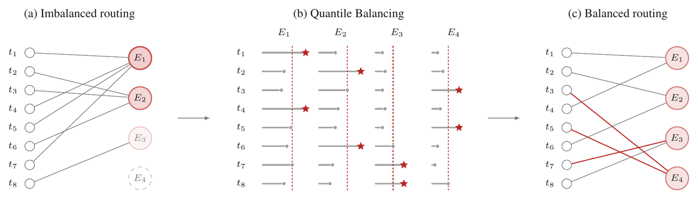

5. **Native Vision**

K3 从训练起点就把文本、图像和视频放入同一 Backbone 和同一 next-token prediction 目标，没有先训练纯语言模型、再做 modality alignment 的阶段。MoonViT-V2 也不再从 SigLIP 初始化，而是用语言建模目标从头训练。这样既避免预训练视觉 Encoder 接入超大语言 Backbone 后的梯度尖峰，也让视觉表示直接适配 OCR、布局、代码渲染和细粒度结构。梯度范数对比如下。

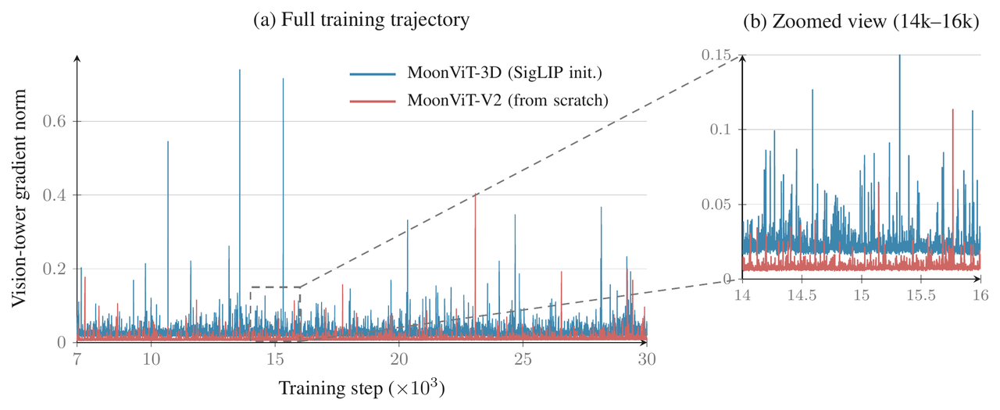

MoonViT-V2 有 **`27`** 层、约 **`401M`** 参数、patch size **`14`** 和 **`12`** 个 attention heads，使用 RMSNorm 并移除 linear 与 attention projection 的 bias。图像与视频共享参数；attention 分为空间 intra-frame 与时间 inter-frame 两次 pass，并用 temporal pooling 压缩视频 token。进入 projector 前执行 **`2×2`** pixel shuffle，视觉 token 数降为四分之一，使最高 **`3584×3584`** 像素输入仍能进入 1M context。

从头训练并没有牺牲视觉能力：MoonViT-V2 在视觉评测上匹配 SigLIP 初始化基线。区别在于 next-token prediction 会让视觉表示直接服务语言建模，保留文本、布局和局部结构线索；contrastive pre-training 更偏向全局语义。视觉路径先经 MoonViT-V2，再由轻量 MLP projector 映射到 LLM hidden space。

6. **Per-Head Muon**

K3 延续 Muon 优化矩阵参数，但 Q/K/V projection 不再对完整 momentum matrix 统一做 Newton-Schulz orthogonalization，而是按 attention head 切块后分别正交化。完整矩阵方案会让 gradient 或 momentum 较大的 head 主导共同更新方向，小尺度 head 得不到充分归一化。Per-Head Muon 把各 head 的 update scale 拉回同一数量级，并降低 tall per-head block 上 Newton-Schulz iteration 的开销。

* **预训练**

1. **预训练数据**

文本 corpus 覆盖 Web Text、Code、Mathematics 和 Knowledge 四个主域；视觉 corpus 包含 caption、interleaved image-text document、OCR、perception、video 与 visual coding。各文本域分别执行规则过滤、classifier quality scoring 和去重，domain sampling rate 由小模型 ablation 决定。Knowledge 与 Mathematics 数据沿用 rephrasing 流程：多风格、多视角 prompt，chunk-wise autoregressive generation，再与源文档做 fidelity verification。

视觉数据结合开源集合和内部过滤、合成、去重 pipeline。定位监督同时使用绝对坐标和归一化 **`[0,1]`** 坐标，兼顾精确定位与分辨率泛化。programmatic multimodal data 把代码与渲染结果绑定，覆盖 SVG、3D asset、Webpage、Game 和 CAD schematic。这部分数据直接服务“写代码→看渲染→继续修改”的视觉闭环，而不是只扩充普通图文问答。

2. **Scaling Law**

架构、数据与 training recipe 同时变化后，旧模型的最优超参数不能直接平移。K3 重新搜索 batch size、peak learning rate、tokens-per-parameter ratio 和 model shape，并在 held-out OOD validation 上拟合 scaling law。曲线相对 K2 整体下移，对应约 **`2.5×`** scaling efficiency。拟合结果如下。

learning-rate schedule 也单独比较 cosine decay 与 WSD。两者即使模型规模和 token budget 相同，最优 peak learning rate 与 batch size 仍明显不同，因此不能共用一组超参数做横向比较。分别做 scaling-law search 后，cosine decay 的 final loss 更低，最终采用 cosine schedule。

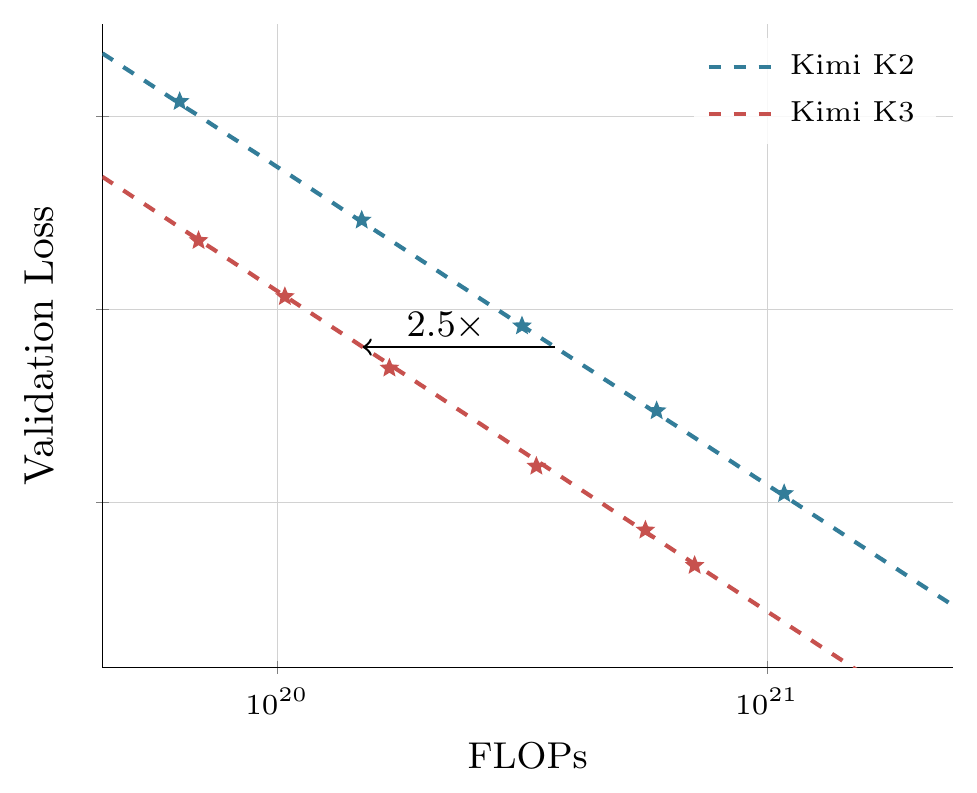

| **配置** | **Kimi K2** | **Kimi K3** | **变化** |
| ---------------------------------------------------------------------------- | --------------------------------------------------------------------------------- | --------------------------------------------------------------------------------- | ---------------------------------------------------------------------------- |
| Layers                                                                       | 61                                                                                | 93                                                                                | +52%                                                                         |
| Total Parameters                                                             | 1.04T                                                                             | 2.78T                                                                             | +167%                                                                        |
| Activated Parameters                                                         | 32.6B                                                                             | 104.2B                                                                            | +220%                                                                        |
| Hidden Dimension                                                             | 7168                                                                              | 7168                                                                              | 不变                                                                           |
| Latent MoE Dimension                                                         | 无                                                                                 | 3584                                                                              | 主宽度的 0.5×                                                                    |
| Expert Hidden Dimension                                                      | 2048                                                                              | 3072                                                                              | +50%                                                                         |
| Routed / Active / Shared Experts                                             | 384 / 8 / 1                                                                       | 896 / 16 / 2                                                                      | expert pool 与激活数同步扩大                                                         |
| Attention Heads                                                              | 64                                                                                | 96                                                                                | +50%                                                                         |
| Vocabulary / Dense / MTP                                                     | 160K / 1 / 1                                                                      | 160K / 1 / 1                                                                      | 不变                                                                           |
| Training Context                                                             | 128K                                                                              | 1M                                                                                | 8×                                                                           |
| Attention                                                                    | 61 MLA                                                                            | 69 KDA + 24 MLA                                                                   | Hybrid KDA-MLA                                                               |
| Activation                                                                   | SwiGLU                                                                            | SiTU-GLU                                                                          | 大值区间有界                                                                       |
| ViT                                                                          | 无                                                                                 | 401M，27 层，patch 14，12 heads                                                       | Native Vision                                                                |

3. **Training Recipe**

语言与视觉从训练开始就共同优化，visual token 与 text token 交错进入统一 next-token prediction objective。优化器使用 Per-Head Muon，配合 K2 的 weight clipping 与 Quantile Balancing。learning rate 采用 cosine decay，前 **`1%`** 线性 warmup，weight decay 全程为 **`0.1`**。预训练 context 从 **`8K`** 起步，随后扩到 **`64K`**。

4. **长上下文扩展**

NoPE 让位置关系隐式进入 KDA 的 recurrent gating 与 decay，扩到 1M 时不需要修改 positional encoding。长文档和长视频先经过 exact/fuzzy dedup、视频 frame perceptual hash、规则与 classifier 质量过滤、结构校验；真正连贯的长样本数量不足，因此在 cooldown 阶段上采样，防止被短样本淹没。

只把短文拼长不会自动产生 long-range capability。训练数据还会对多模态文档和子任务做有约束的 permutation 与 concatenation，把解题证据分散在整个 1M context，使任务必须跨远距离检索才能完成。context curriculum 分四阶段：预训练从 **`8K→64K`**，cooldown 再从 **`256K→1M`**；昂贵的长序列计算只占总 token budget 的小部分，KCP 负责把 sequence dimension 分摊到多设备。

* **后训练**

1. **三阶段流程**

后训练按 SFT 冷启动、domain RL 专家化、MOPD 统一蒸馏三阶段推进。SFT 建立可用的 Agent policy；RL 在 general tasks、general agents、coding agents 三个大域分别训练 low、high、max 三档 reasoning effort；最后用 Multi-Teacher On-Policy Distillation 把 **`9`** 个 expert policy 合并为同一个可控模型。

2. **Supervised Fine-Tuning**

SFT trajectory 由上一代 Kimi 的 domain-specialized model 合成，再经过多阶段 verification 与 human-in-the-loop annotation。所有复杂 Agent 轨迹用 XTML chat template 序列化，统一表达 reasoning、tool call、tool result 与多轮环境状态。SFT 目标不是只提高 instruction following，而是为后续 RL 准备 adaptive reasoning、精确 tool calling 和 long-horizon execution 的 cold-start policy。

QAT 从 SFT 就开始：MoE expert weight 目标格式为 MXFP4，expert input activation 使用 MXFP8；attention projection、latent MoE projection、shared expert 和 router 保持更高精度。 低精度误差在整个后训练阶段被 policy 直接适应，而不是部署前临时量化。

3. **Reinforcement Learning**

三个 RL 大域分别覆盖：general tasks 包含通用体验、视觉、推理、faithfulness、search 与 knowledge work；general agents 包含长程 assistant、deep research 与 paragraph-level writing；coding agents 包含 SWE、coding experience、kernel 与 web development。每个域训练 low、high、max 三档 effort，共形成 **`9`** 个 teacher expert。随着 RL FLOPs 增长，多类任务的 score 与平均 assistant steps 同时上升。

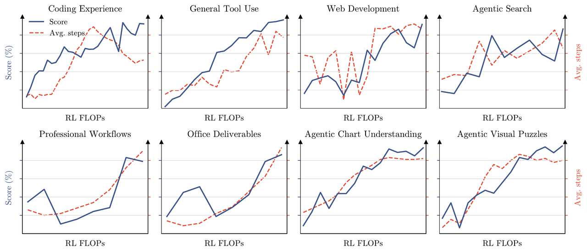

长程 rollout 的尾延迟由 partial rollout 处理。每轮对 N 个 prompt 各采样 K 条轨迹，active workload 为 $$N\times K$$；当完成比例达到 $$\lambda$$ 时立即暂停 generation 并开始 policy optimization，未完成轨迹进入队列，在下一 iteration 优先 resume。单条轨迹可能跨越多轮更新，产生极端 off-policy staleness，训练用 per-token regularization 把更新限制在局部 policy neighborhood 内。

reasoning effort 用 per-problem budget 控制。每个问题先从 cold-start model 估计初始 budget $$b_0(x)$$，若轨迹 token 消耗 $$T(y)$$ 超过 $$\tau b_0(x)$$，task reward 直接改为 **`-1`**。普通任务只统计 thinking token，Agent task 统计 reasoning trace 与 tool-call argument 的累计输出。训练先使用较大的 τ 得到 max expert，再逐步 anneal τ 形成 high 与 low expert，并按 domain 由人工调整。

不可程序验证的 general task 使用 Agentic GRM。judge 必须执行固定协议：读取最终产物、生成 rubric、逐项评分、把 rubric score 写入 scorepad。为抑制“越长越高分”的 reward hacking，输出长度超过 cold-start verbosity $$\ell_0$$ 的 $$\sigma\ell_0$$ 倍时，在 binary comparison 中自动判负。

4. **Multi-Teacher Distillation**

MOPD 每次采样 domain d 与 reasoning effort e，由对应 teacher 指导 student 的 on-policy token。per-token reward 是 teacher/student log-prob ratio 的 stop-gradient，并截断到固定范围：

$$r_{\mathrm{opd}}^d(y_t\mid e,x,y_{<t})=\operatorname{clip}\left(\operatorname{sg}\left(\log\frac{\pi_{\mathrm{teacher}}^{(d,e)}(y_t\mid x,y_{<t})}{\pi_\theta(y_t\mid e,x,y_{<t})}\right),-R_{\max},R_{\max}\right)$$

dense token reward 可直接复用 partial rollout 基础设施。 更细粒度的 top-k distillation 在收敛速度和最终性能上都没有清晰优势，因此没有进入最终方案。

5. **部署感知训练**

整个 SFT 与 RL 都使用一致的 MXFP4/MXFP8 scheme，rollout 与 training 不存在 quantization mismatch。speculative decoding 则把预训练 MTP layer 微调成 EAGLE-3 draft model：target model 冻结，只更新单层 draft decoder 与 feature-fusion projection；训练展开 **`7`** 步，第一步之后 draft 使用自己的历史输出，模拟 inference recurrent drafting。

draft 输入融合第 **`1`**、第 **`4`** 和最终 AttnRes block 的低、中、高层特征。projection 初始化为 $$[\mathbf{0}\ \mathbf{0}\ \mathbf{I}]$$，起点等价于 MTP 预训练时使用的高层表示，再逐渐学习低中层信息。优化目标不是普通 KL surrogate，而是直接最大化 lossless speculative sampling acceptance rate：

$$\mathcal{L}_{\mathrm{LK}}=-\log\sum_{x\in\mathcal{V}}\min(p(x),q(x))$$

p 与 q 在 temperature **`1`** 下计算，不附加 ground-truth cross-entropy；draft 也沿用 expert MXFP4、activation MXFP8 的 QAT 设置。

6. **统一 Agent 环境**

固定单一 Agent harness 会让 policy 过拟合某套 tool schema、system prompt、context management 或 interaction protocol。 white-box RL environment 把 harness 表示成可组合模块：tool interface、system prompt、context strategy、skill、memory、subagent 等都由配置选择。训练时动态组合出 Kimi Code、Claude Code、Codex、OpenClaw、Hermes 等主流形态，也能生成全新 harness，减少跨 scaffold 迁移时的脆弱性。

7. **任务合成**

task synthesis 由自演化层级知识图谱控制粒度与覆盖。图谱从 coarse seed node 开始，每个 node 分配 Agent 做多轮 web search；新增概念前先查已有 DAG，复用等价或相关 node，edge 始终从 coarse concept 指向 fine-grained concept；当节点足够 atomic 时停止扩展。采样时可选单节点或相关节点组合，并把 ancestor context 一起转成 query keyword，检索真实材料，再按目标 task type 合成训练任务。概念扩展、材料检索与任务合成的关系如下。

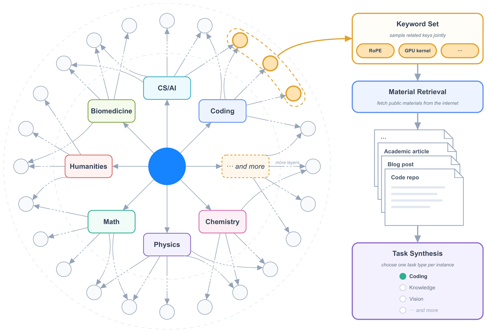

8. **可验证任务**

> **Agentic environment 中的主要任务族**
>
> 1. **信息与专业工作**：多步 web research、投行、data analysis、legal practice 等任务要求数十到数百步操作，并交付可核验产物。
>
> 2. **视觉推理**：STEM、visual puzzle 与 chart understanding 在隔离 Python sandbox 中迭代 crop、zoom、transform、compute，再把新图像作为 observation 返回。
>
> 3. **Kernel 优化**：覆盖 CUDA、Triton、CuTe DSL、Gluon、ThunderKittens、TileLang 与 BF16/FP8/FP4。数值误差越界 reward 为 0，匹配 expert implementation 得 0.5，逼近 roofline 逐渐趋近 1，并检测 CUDA graph replay、input caching、precision reduction 等作弊。
>
> 4. **Personal Assistant**：Gmail、Notion、Slack、Canvas 等 mock app 组成持续多日环境，单次 rollout 可达数千 tool calls 与数百万 context tokens，每个事件由 deterministic rule 或 LLM evaluator 评分。

Kernel task 从单算子扩展到 fused mega-kernel，材料来自 Flash Linear Attention 等高质量 GitHub 仓库；Personal Assistant 的初始 workspace 也不是固定模板，而是由 Agent 搜索公开材料并构造成一致的任务环境。RL runtime 还要持续建模跨应用 event stream 与 world-state transition，使多日任务在 Gmail、Notion、Slack、Canvas 之间保持状态连续。

AET 的 verifier 不只覆盖黑盒系统复现，也覆盖 quantitative factor discovery 与 tax auditing。Camera Repair Management System 案例要求 Agent 通过 oracle query 反推隐藏的 3D-camera repair system，并重建成 Web 应用；训练循环反复执行 hypothesis、action、verifier feedback 与 adaptation。

Autonomous Execution Task 只给 initial state、约束目标、tool action space、execution budget 和 independent verifier，不提供 reference trajectory。Agent 自己做 decomposition、tool selection、planning、error recovery 与 termination；reward 取决于最终 environment state，不接受自报完成。public verifier 提供诊断，hidden verifier 检查 held-out case；limited submission budget 与 penalty reward 共同压制 reward hacking。黑盒 Camera Repair Management System 的完成曲线如下。

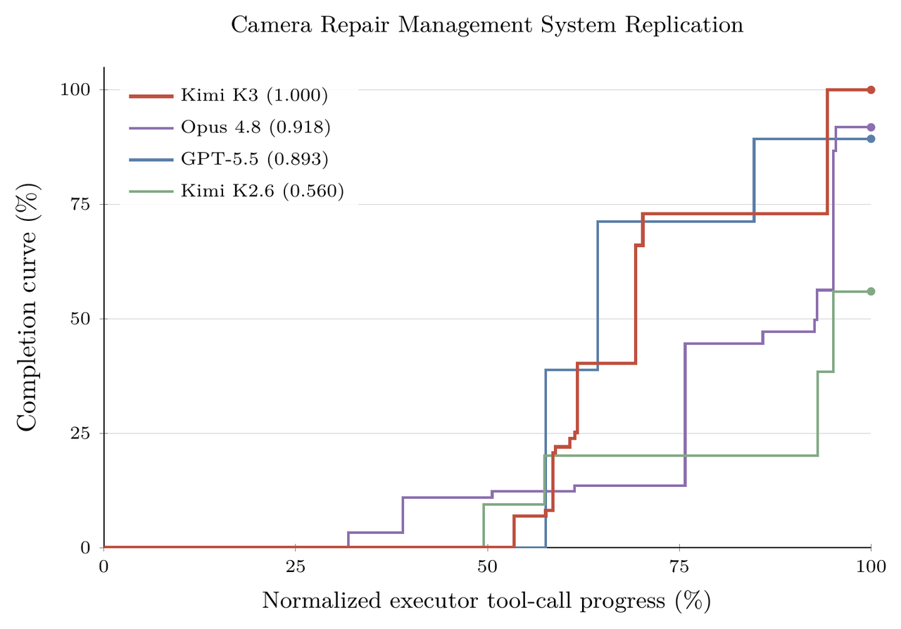

Web development task 从一句 scene description 到多段 specification，产物覆盖 website、interactive game、3D/WebGL、data visualization、SVG 和 full-stack app。每个任务在 container sandbox 中运行，并随机化 Agent scaffold。reward 同时包含 deterministic functional test、结构与 pixel similarity、source inspection 和可交互 model judging；build 失败、runtime error 或伪造结果时总 reward 直接归零。

* **基础设施**

1. **KDA 协同设计**

KDA 用固定大小 recurrent state 替代随序列增长的 softmax KV cache，但 state update 有串行依赖。 FlashKDA 把 chunk 内 token-parallel 计算与跨 chunk head-parallel state propagation 重叠，分别调度和 autotune，服务 training 与 prefill，并作为 flash-linear-attention backend 自动分派。

FlashKDA 是基于 CUTLASS 的 chunkwise kernel，token-parallel stage 与 head-parallel recurrence 各自调度和 autotune，性能明显高于 Triton reference。training、prefill 与 decode 的瓶颈不同，因此 decode 不复用同一条 kernel 路径，而是在 serving 侧单独处理 in-place state 与 speculative verification。

KCP 的跨 rank payload 是两块固定大小 tensor：累计 transition 与 zero-state local contribution。它们通过一次 all-gather 交换，再按 document order 执行 prefix composition；通信量不随 sequence length 增长。对应 KDA context-parallel implementation 已进入 Flash Linear Attention 的公开实现路径。

单卡 ultra-long prefill 下，纯 TP 只切 attention head，不能缩短 recurrence；当每个 rank 只剩少数 head 时，大量 SM 空闲。intra-device CP planner 把 sequence segment 分到同一 rank 的多个 SM，各 segment 独立计算 transition，再精确 compose 初始 state，全程不做跨设备通信。

跨设备 KCP 不能照搬 vanilla linear attention 的 state summation，因为 KDA 的 token-dependent transition matrix 会作用在 incoming state 上。每个 rank 先独立计算累计 transition $$\mathbf{M}_{[i]}^{T_i\leftarrow1}$$ 与 zero-state local contribution $$\widetilde{\mathbf{S}}_{[i]}^{T_i}$$，rank update 具有结合律，可用 prefix scan 复合。所有 rank 只做一次固定大小 all-gather，再按文档顺序恢复 incoming state，compute 随 CP size 线性扩展。局部 transition 与 state composition 的矩阵关系如下。

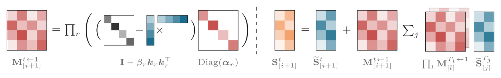

2. **3T 预训练拓扑**

3T 级训练同时使用带 virtual stage 的 PP、EP、ZeRO-1 DP、Pipeline ZeRO-2 gradient sharding 和 CP。shared expert 在 EP rank 间复制，routed expert dispatch/combine 的 all-to-all 与计算重叠。执行时还要同时隐藏 DataLoader、ViT forward/backward、activation offload/onload、gradient reduce、parameter gather 与 EP communication。整体 PP phase overlap 如下。

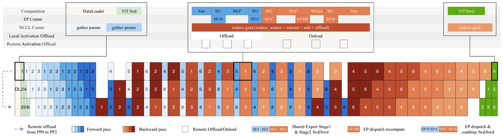

3. **MoonEP**

MoonEP 用动态 redundant expert 把每个 EP rank 的 token load 强制变成完全相同的 $$S\times K$$。forward 根据当前 micro-batch 与 layer 的 router output 在线规划并预取 redundant expert；backward 先把其 gradient 写入本地 reduce buffer，计算完成后再归并到 home rank。

理论上每个 rank 预留不超过 $$E/R$$ 个 redundant-expert slot 就总能找到平衡方案，这个上界近似 tight。系统离线用 ILP 生成代表性最优解，在线 GPU planner 追求 near-optimal 且始终满足上界。planning kernel 直接预计算每个 token 的远端 expert-grouped 目标位置，实现 fused permute/unpermute zero-copy；最坏失衡时 DeepEP 需要 $$S\times K\times R$$ 通信 buffer，MoonEP 只需要固定 $$S\times K$$。

完全平衡使所有 layer 的 compute shape 静态已知，host 不再逐层同步 token count。rank 内 expert token count 仍有偏斜，因此 routed-expert GEMM 使用 workload-aware scheduler 和离线校准的硬件 cost model；shared expert GEMM 放到独立 stream，与其他 kernel 重叠。

MoonEP 的可行性保证与预设冗余上限的方法不同。ECHO、UltraEP 一类方案预先固定 redundant expert 数量或 per-rank token cap，遇到 cap 内无解时训练会停，而且 cap 仍需手工调节；MoonEP 的 $$E/R$$ 上界保证每一步都存在完全平衡方案。online planner 不追求每步精确 ILP 最优，而是在 GPU 上以可忽略开销给出 near-optimal 解。

4. **内存优化**

> **训练内存的六层处理**
>
> 1. **Activation manager**：recomputation、block-wise FP8 quantization、CPU offload 与 remote offload 作为 tensor-level storage policy 组合，统一 memory pool 避免 multi-stream fragmentation。
>
> 2. **MoE activation**：重写 permuted probability gradient，使其不依赖 forward output；backward 通过重新 dispatch 恢复 group-GEMM input，并把通信藏进 GEMM backward。
>
> 3. **Block AttnRes**：boundary representation 只生成一次，layer 内 checkpointing 保持与普通 residual 相同的 saved activation；PP stage 只增量发送新 block。
>
> 4. **PP rank 平衡**：interleaved 1F1B warmup 导致不同 rank activation 驻留量不均，Mooncake Transfer Engine 把 activation 远端 offload 到空闲 PP rank。
>
> 5. **Pipeline ZeRO-2**：gradient 在 DP rank 间分片并存入 CPU，GPU 只保留 double grad buffer。
>
> 6. **Muon 参数收集**：每个 rank 只用 P2P 拉取自己拥有参数对应的 shard，按 model-chunk buffer pipeline 通信与 orthogonalization，避免全量 all-gather。

Activation manager 的 recomputation 以 function 为粒度，因此可以跨 layer；存储策略通过 tensor annotation 声明，与模型代码解耦。activation 按 layer prefetch 回 GPU 并与 compute 重叠，element-wise operator 主要走 recomputation，其他大张量通常组合 block-wise FP8 与 CPU/remote offload。Block AttnRes 的 cache-based PP communication 只传新增 block，micro-batch 结束立即释放，达到该结构的理论最低通信驻留内存。

5. **视觉 Encoder 优化**

大图和长视频让 ViT compute 极不均衡。dynamic CP 按 patch dimension 把单个大样本切到多设备，通过 gather-KV 完成 attention；一个 CP group 还可拆成多个 sub-CP group，把多张大图按负载分配，避免 communication fraction 随 scale 一起放大。

这一方案是在 K2.5 的 Decoupled Encoder Process 基础上继续拆分：DEP 已把 ViT 与 text training 分成独立阶段并在 PP stage 间平衡视觉前后向；K3 再把剩余 ViT work 填进 interleaved 1F1B bubble。dynamic CP 先降低单个大样本的 encoder latency 和跨设备失衡，bubble scheduling 才能真正把余下视觉计算从 critical path 隐藏掉。

interleaved 1F1B 中，最早 micro-batch 的 text forward 集中在 pipeline 开头，最后 micro-batch 的 text backward 集中在结尾。系统把 ViT forward/backward 进一步拆分：首批 forward 同步执行，其余 ViT compute 填入 PP bubble，backward 同理，绝大部分视觉 Encoder 开销不再落在 critical path。

6. **1M Agentic RL**

co-located RL training 把单次 1M-context 实验控制在几百张 GPU 内，partial rollout 减少 ultra-long trajectory 的尾延迟，但未完成轨迹的 KV cache 要跨 iteration 保存，与训练显存竞争。external KV cache pool 采用 write-back：active decode block 保留在 GPU，只有被 GPU 驱逐但未来可复用的 idle prefix 才写入 CPU DRAM；KDA state 与 MLA KV block 同步 offload/prefetch。training iteration 结束后，model weight 与 optimizer state 转存 NVMe 给 external pool 腾出 DRAM；rollout 结束后释放 pool。

partial rollout 会让上一 iteration 的大量未完成 prefill 在下一轮同时返回，speculative decoding 又会加快固定 tool-call 间隔内的 request turnover，两者共同增加 prefix-block churn 与 preemption 风险。 write-back 相比 write-through 只搬运已被 GPU 驱逐且仍可复用的 idle prefix，不为仍在 active decode path 的 block 制造冗余 CPU 副本和带宽开销。

non-policy weight materialize 到 policy FP32 gradient buffer 是安全的，因为真正计算 gradient 时该 buffer 会被覆盖；双 slot pipeline 让当前 VPP chunk 做 forward 的同时预取下一 chunk，不增加新的 GPU allocation，也避免额外 fragmentation。

rollout auto-throttling scheduler 根据 active request、queue length 和 KV cache utilization 动态控制发往 inference engine 的并发数：早期 context 短时提高利用率，后期 cache pressure 上升时自动降并发。reference model 等 forward-only non-policy model 常驻 CPU，需要时把 weight materialize 到 policy FP32 gradient buffer；K3 每卡只保留两个 VPP chunk 的 gradient slot，一个计算当前 chunk，另一个预取下一 chunk。

7. **Sandbox**

运行时同时包含传统 container、GPU sandbox 与基于 Firecracker microVM 的 AgentENV。microVM 允许 mount disk、run container 甚至 launch VM，同时把 Agent 的高风险探索隔离在虚拟机边界内；传统 container 在早期实验中曾被意外操作触发 kernel panic 与 deadlock。

AgentENV 只保存 checkpoint 后被写脏的 memory page，checkpoint latency 低至 **`133 ms`**，resume 低至 **`49 ms`**。Pause 后 sandbox 不占 CPU/内存，而等待模型 inference 可占生命周期的 **`98%`**；Fork 复制精确状态供 reward judging 且不影响原环境；Snapshot 周期保存用于 error recovery。

OverlayBD image、custom ublk driver、storage sharing 与 P2P transport 支撑数万 sandbox 秒级批量创建，单 sandbox launch 达到 sub-second。copy-on-write memory 与 page-cache optimization 在真实 workload 中达到 **`6.5×`** memory overcommit。整个训练和评测共创建 **`51,219,741`** 个 sandbox，覆盖 **`1,505,678`** 个 image。

8. **Prefix Cache**

Hybrid KDA-MLA 同时维护两种生命周期不同的 cache：MLA KV cache 随 sequence length 增长并按 token 分页；KDA recurrent state 大小固定，每个 request 只有一份。系统把 KDA state pack 进 MLA KV 使用的同一 paged block pool，并统一 page byte size、allocation、reference count 与 eviction。每个 head 的 state byte stream 连续存放；prefill/decode disaggregation 使用不同 TP degree 时，在 transfer path 完成 re-layout，不做 GPU 端二次 shuffle。

每个 KDA head 的 state byte stream 是独立的最小跨节点传输单元。统一 pool 还带来一个零开销调试特性：KDA page 与 MLA page 的 payload 形态高度不对称，若发生 type-confused access，结果会直接变成无意义数据，而不会悄悄产生“看似合理”的错误值。

如果 hash granularity 被 KDA checkpoint granularity 绑定，physical block 会被迫放大到 **`1024–6144`** tokens，短请求无法命中，chunked prefill 也要等整块填满才可复用。K3 把两种粒度拆开：physical block 为 **`6144`** tokens，内部再切 **`512`**-token hash block；KDA checkpoint 只在 hash endpoint 的稀疏子集保存，通常保留 conversation-turn boundary。

部分填充 MLA page 会按最后一个完整 hash block 的 chained hash 注册。每次 prefill 后，KDA kernel 保存最后一个 hash-aligned position 的 state；被后续 checkpoint 覆盖的中间 snapshot 回收，公开 snapshot 只读，cache hit 时先 copy 到 request-private running state，再写 fresh slot。lookup 先匹配完整 physical block，再在首个 miss block 内匹配 hash endpoint；随后要求每个 KDA cache group 在同一 boundary 都有 checkpoint，最终选择两阶段共同满足的最长 prefix。**`2800`**-token 请求可以在 **`B=2560=5×512`** 处命中，不必重算 **`[0,B)`**。细粒度 prefix reuse 如下。

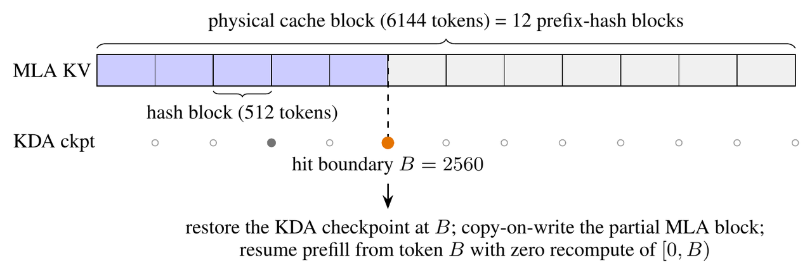

并发一致性靠三条约束维持：所有 cache group 先 pin hit block，再做任何 private allocation；当前 scheduling step 内刚分配或刚注册的 block 在 GPU copy 完成前不能参与 match；任一 KDA group 的 checkpoint 被 evict 时，其他 group 的 sibling checkpoint 同步失效，保证 boundary 要么对全部 group 可恢复，要么完全不可见。

9. **高性能 Kernel**

KDA decode 的问题是 recurrent state 每步原地更新，speculative verification 拒绝部分 draft token 后无法直接回滚。系统不保存每个 draft position 的巨型 state snapshot，只缓存小得多的 projected input；verification 后在片上 replay accepted prefix，写回 verified token 与 bonus token state。replay token、bonus token 和下一 draft window 共用一个 fused recurrent loop，覆盖 ShortConv、input normalization、gating、KDA recurrence 与 output normalization。

replay 只缓存 projected input，这些张量远小于 recurrent state。verification latency 随验证 token 数次线性增长，并低于逐位置 state snapshot baseline；projection cache 不离开 decode stage，因此 prefix cache 与 prefill/decode disaggregation 的传输 payload 与非 speculative serving 保持一致。

Block AttnRes prefill 把 TP all-reduce 拆成 reduce-scatter 与 all-gather，在中间 sequence-sharded activation 上执行 intra-block kernel，使每个 token 的 block representation 只 materialize 在一个 rank。decode 时 inter-block kernel 放 side stream，与 main stream 独立计算重叠；intra-block merge、partial-sum update 与 RMSNorm 融进前序 TP all-reduce。

Stable LatentMoE 把 latent down-projection 与 router 融成一个 GEMM，latent weight 按 rank sharding，并用 multimem store 把 output all-gather 融进 GEMM epilogue，再与 shared-expert compute 重叠。小 batch decode 时 routed-expert GEMM 变成 memory-bound weight streaming，kernel 采用 WarpDecode 的 token-centric 设计：每个 warp 负责一个 output neuron，lane team 分担不同 expert，最后 warp-wide reduction；weight layout 离线 permute，减少 runtime dequantization。

10. **集群调度**

1M coding request 的典型输入带有 **`400K`** prefix，但每轮新增 prefill 可能只有 **`4K`**。cache-aware affinity 把 session 路由到持有 prefix cache 的 cluster；consistent hashing 为每个 session 固定 primary 与 secondary，正常流量只走 primary，故障后 secondary 重新 prefill。secondary assignment 在全 fleet 均匀分布，单 cluster failure 的重算压力不会集中到一个接管节点。

production request 从小于 **`2K`** 到 **`1M`**，单请求成本跨度约三个数量级。按平均请求做 capacity planning、queueing 或 rate limit 会在长请求突发时失效，并拖垮短请求 TTFT。budget-based admission control 为不同 request class 分配独立 resource budget，长 context burst 只能消耗自己的 capacity share，不能越过预算破坏其他流量的 SLO。

**技术总结**

K3 的核心不是某一个新算子，而是三条信息流的协同扩展。sequence 维用 Hybrid KDA-MLA 在固定 recurrent state 与 global attention 之间分工；depth 维用 Block AttnRes 从 embedding、历史 block 和当前 partial sum 中选择信息；channel 维用 Stable LatentMoE 在 full-width shared path 与 latent routed path 之间分工。三者分别控制长上下文、深层网络和超大稀疏容量。

训练侧形成了完整闭环：文本与视觉从头联合预训练，context 按 **`8K→64K→256K→1M`** 渐进扩展；SFT 建立 Agent cold start，RL 在 domain × reasoning effort 上训练 **`9`** 个 expert policy，MOPD 再把这些策略蒸馏回单一模型。MXFP4 expert weight、MXFP8 activation 与 EAGLE-3 draft model 都在后训练阶段直接适配，避免训练精度路径和上线执行路径脱节。

系统侧同样围绕模型结构定制：FlashKDA 与 KCP 解决 recurrent state 的设备内和跨设备并行；MoonEP 把每个 EP rank 的 token load 固定为 $$S\times K$$；activation manager、Pipeline ZeRO-2 与 P2P Muon 控制训练内存；external KV pool、AgentENV checkpoint、细粒度 KDA prefix cache 和 fleet-level admission control 负责保存并恢复超长 Agent 状态。

编译器、Web、EDA、科研和个人助理任务在机制上不是彼此独立的能力模块，而是同一套 Agent learning loop 的不同环境实例：white-box harness 组织工具与上下文，知识图谱生成任务，verifier 提供可学习 reward，sandbox 保存环境状态，partial rollout 与 1M runtime 支撑跨 iteration 执行。

> **注：`2.78T`** 总参数和 **`1M`** context 只是容量上限。真正决定系统能否训练和服务的，是每 token **`104.2B`** 激活参数、KDA/MLA cache 的联合恢复、专家负载是否完全平衡，以及长请求能否在 GPU、CPU DRAM、NVMe 和集群之间稳定迁移。

---

[Previous](12-Vision-Language-Model--DeepSeek-系列.md) | [Contents](../../README.md) | [Visual website](https://weyumm.github.io/vlm-Wissen/lecture-1.html#c=13)
