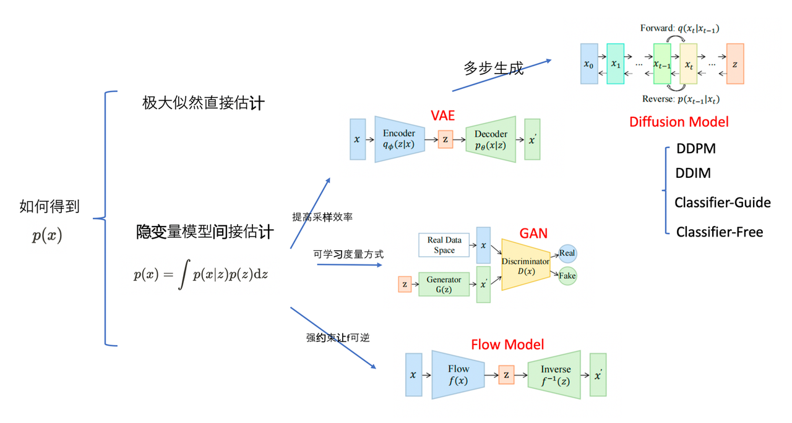
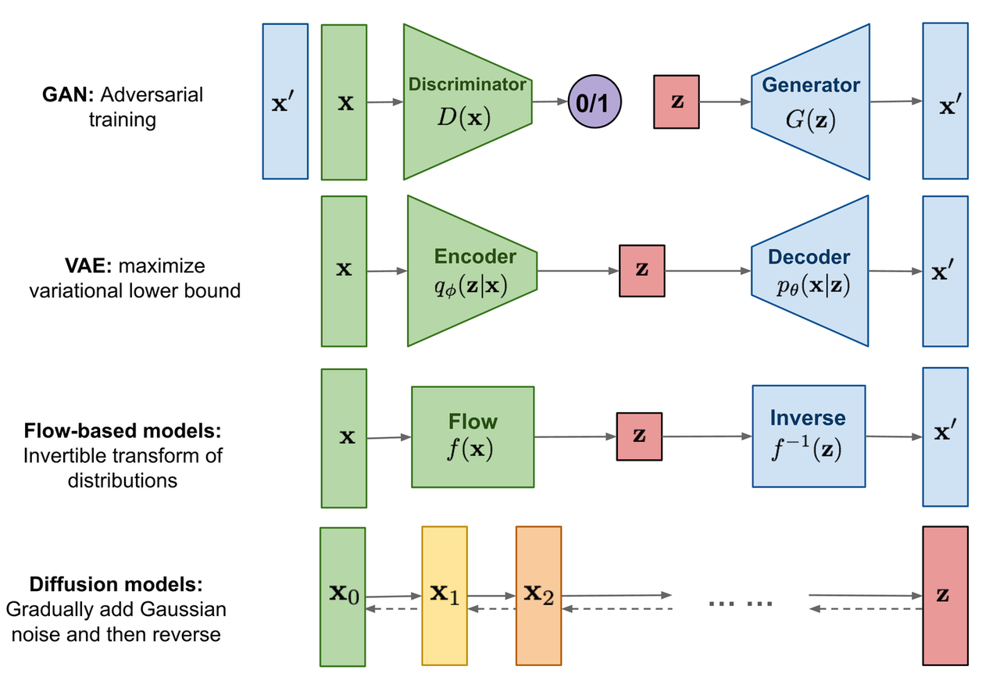
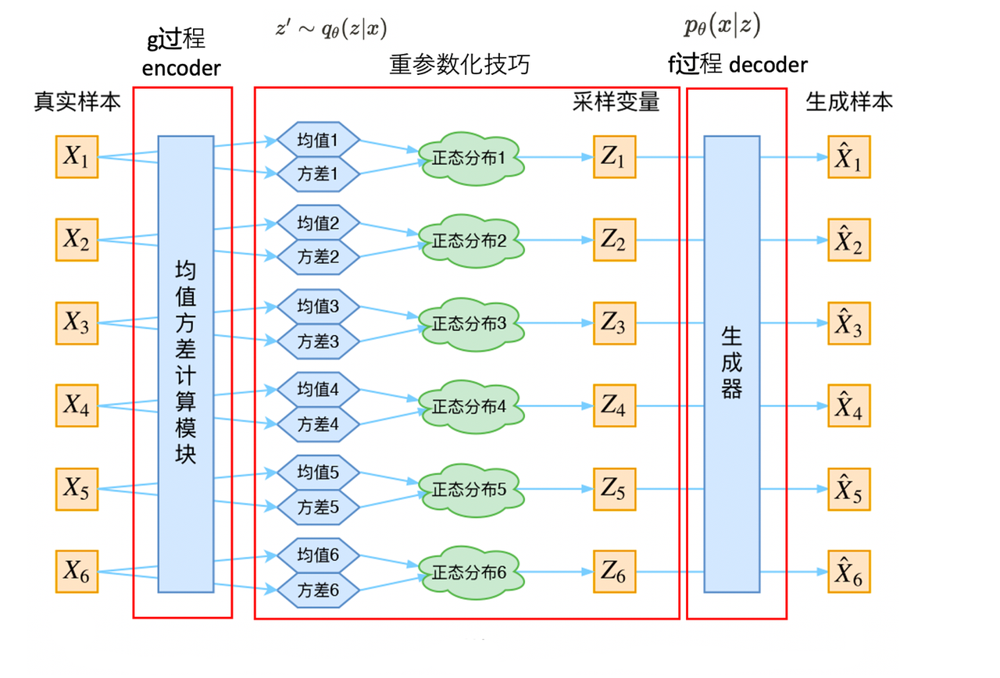
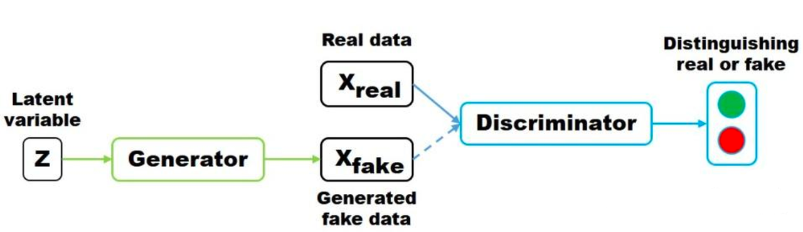
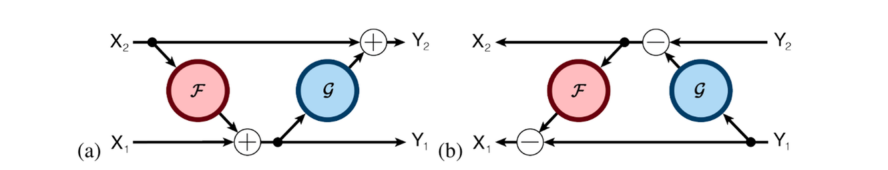
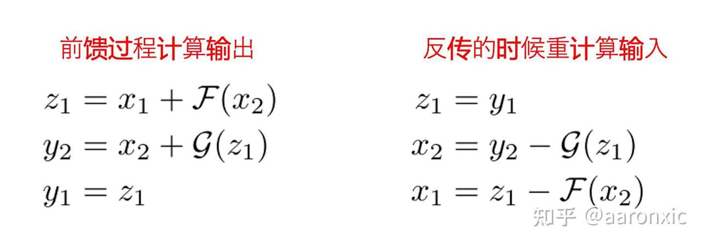
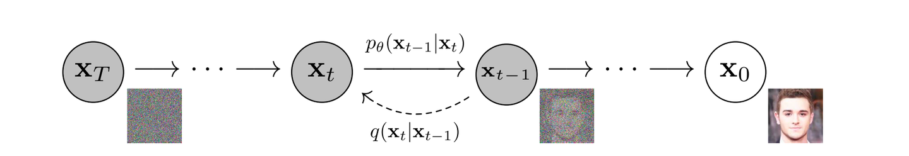
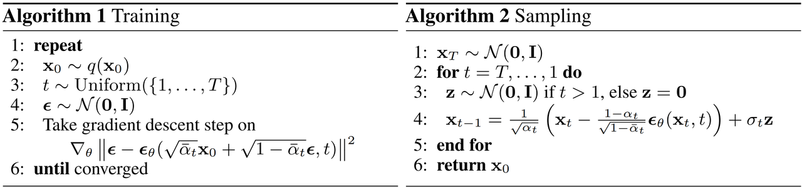

[Contents](../../README.md) | [Next](02-Diffusion-Model.md) | [Visual website](https://weyumm.github.io/vlm-Wissen/lecture-2.html#c=1)

# 3. GAN &amp; AE &amp; Flow

## 3.1 基础知识

### 3.1.1 数学知识

* **雅可比矩阵与行列式**

给定一个将$$n$$维输入向量$$\mathbf{x}$$映射到$$m$$维输出向量的函数$$\mathbf{f}: \mathbb{R}^n \mapsto \mathbb{R}^m$$，该函数所有一阶偏导数构成的矩阵称为**雅可比矩阵**$$\mathbf{J}$$，其中第$$i$$行第$$j$$列的元素为：

$$\mathbf{J}_{ij} = \frac{\partial f_i}{\partial x_j}$$

即：

$$\mathbf{J} =
\begin{bmatrix}
\frac{\partial f_1}{\partial x_1} & \cdots & \frac{\partial f_1}{\partial x_n} \\
\vdots & \ddots & \vdots \\
\frac{\partial f_m}{\partial x_1} & \cdots & \frac{\partial f_m}{\partial x_n}
\end{bmatrix}$$

行列式是一个实数，它是对一个方阵中所有元素计算得到的函数。行列式都是方阵。行列式的绝对值可以理解为**矩阵在乘法过程中对空间的拉伸或压缩程度的度量**。

一个 $$n \times n$$ 矩阵 $$M$$ 的行列式定义为：

$$\det M = \det
\begin{bmatrix}
a_{11} & a_{12} & \cdots & a_{1n} \\
a_{21} & a_{22} & \cdots & a_{2n} \\
\vdots & \vdots & \ddots & \vdots \\
a_{n1} & a_{n2} & \cdots & a_{nn}
\end{bmatrix} = \sum_{j_1 j_2 \ldots j_n} (-1)^{\tau(j_1 j_2 \ldots j_n)} a_{1j_1} a_{2j_2} \ldots a_{nj_n}$$

其中，求和下标$$j_1 j_2 \ldots j_n$$是集合$$\{1, 2, \ldots, n\}$$的所有排列，共有$$n!$$项；$$\tau(\cdot)$$表示排列。

一个方阵$$M$$的行列式可用于判断其是否可逆：

> * 若$$\det(M) = 0$$，则$$M$$不可逆，即为奇异矩阵，其行或列线性相关，或某行/列为全零
>
> * 若$$\det(M) \neq 0$$，则$$M$$可逆

矩阵乘积的行列式等于各矩阵行列式的乘积：

$$\det(AB) = \det(A)\det(B)$$

* **变量替换定理**

1. **单变量版本**

给定一个随机变量$$z$$及其已知的概率密度函数$$z \sim \pi(z)$$，然后希望使用一个一一映射函数$$x = f(z)$$构造一个新的随机变量。函数$$f$$是可逆的，因此有$$z = f^{-1}(x)$$。现在的问题是：如何推导新变量的未知概率密度函数 $$p(x)$$？

根据概率分布的定义：

$$\int p(x)\,dx = \int \pi(z)\,dz = 1$$

通过变量替换可得：

$$p(x) = \pi(z) \left| \frac{dz}{dx} \right| = \pi(f^{-1}(x)) \left| \frac{df^{-1}}{dx} \right| = \pi(f^{-1}(x)) \left| (f^{-1})'(x) \right|$$

根据定义，积分$$\int \pi(z)\,dz$$是无限多个无穷小宽度$$\Delta z$$的矩形面积之和。在位置$$z$$处，矩形的高度是密度函数$$\pi(z)$$的值。当进行变量替换$$z = f^{-1}(x)$$时，有：

$$\frac{\Delta z}{\Delta x} = (f^{-1}(x))' \quad \text{且} \quad \Delta z = (f^{-1}(x))' \Delta x$$

这里$$\left|(f^{-1}(x))'\right|$$表示在变量$$z$$和$$x$$的两个不同坐标系下，矩形面积之间的比例关系。

* **多变量版本**

设$$z \sim \pi(z)$$，$$x = f(z)$$，$$z = f^{-1}(x)$$，则：

$$p(x) = \pi(z) \left| \det \frac{dz}{dx} \right| = \pi(f^{-1}(x)) \left| \det \frac{df^{-1}}{dx} \right|$$

其中$$\det \frac{\partial f}{\partial x}$$是函数$$f$$的雅可比行列式。

### 3.1.2 GAN 基础

生成对抗网络 **GAN**（**G**enerative **A**dversarial **N**etwork）是深度生成模型中的一项里程碑式工作，由 Ian Goodfellow 等人在 2014 年提出。其核心思想源于博弈论中&#x7684;**零和博弈**，通过两个神经网络——生成器 Generator 与判别器 Discriminator 之间的动态对抗，实现对复杂数据分布的建模与采样。这种对抗式的训练机制赋予了 GAN 强大的生成能力，广泛应用于图像生成、风格迁移、数据增强等领域。

GAN 的本质是一场由生成器$$G$$和判别器$$D$$共同参与&#x7684;**极小极大博弈** minimax game。二者在训练过程中不断博弈、相互促进，最终趋于一个理想的平衡状态。

> * **判别器**$$D$$：扮演侦探角色，接收一个数据样本$$x$$，输出一个标量值$$D(x) \in [0, 1]$$，表示该样本为真实数据的概率。其目标是尽可能准确地区分真实样本与生成样本。
>
> * **生成器**$$G$$：扮演伪造者角色，接收一个从先验分布$$z \sim p_z(z)$$中采样的随机噪声向量$$z$$，将其映射为一个合成样本$$G(z)$$。其目标是生成逼真的数据，使判别器难以分辨真伪。

这两个网络在对抗中共同进化：生成器越强，生成的样本越真实；判别器越强，识别能力越精准。整个过程其实是一场猫鼠游戏，推动双方性能不断提升。

* **目标函数**

GAN 的训练目标由一个统一的价值函数 $$V(D, G)$$ 来刻画，同时反映了判别器的判别能力和生成器的欺骗能力：

$$\min_G \max_D V(D, G) = \mathbb{E}_{x \sim p_{\text{data}}(x)}[\log D(x)] + \mathbb{E}_{z \sim p_z(z)}[\log(1 - D(G(z)))]$$

这一目标函数包含两个关键项：

> * 第一项$$\mathbb{E}_{x \sim p_{\text{data}}(x)}[\log D(x)]$$鼓励判别器对真实样本赋予高置信度，即$$D(x) \to 1$$，从而提升其识别真实数据的能力
>
> * 第二项$$\mathbb{E}_{z \sim p_z(z)}[\log(1 - D(G(z)))]$$鼓励判别器将生成样本识别为假，即$$D(G(z)) \to 0$$

从博弈角度理解：

> * 判别器$$D$$试图最大化$$V(D, G)$$，以增强其辨别能力
>
> * 生成器$$G$$试图最小化$$V(D, G)$$，从而欺骗判别器

整个学习过程可形式化为一个极小极大优化问题：

$$\min_G \max_D V(D, G)$$

这正是 GAN 对抗机制的数学核心。

* **训练过程**

GAN 的训练采&#x7528;**交替优化** alternating optimization 的方式，分别更新判别器和生成器的参数，通常使用基于梯度的优化算法，&#x5982;**`Adam`**。

> * **固定生成器，优化判别器**
>
> 在每一轮迭代中，首先固定生成器$$G$$，通过梯度上升法最大化价值函数，以增强判别器的判别能力：
>
> $$\nabla_{\theta_d} \frac{1}{m} \sum_{i=1}^m \left[ \log D(x^{(i)}) + \log(1 - D(G(z^{(i)}))) \right]$$
>
> 其中，$$x^{(i)} \sim p_{\text{data}}$$为真实样本，$$z^{(i)} \sim p_z$$为噪声输入。此时，判别器执行一个标准的二分类任务：真实样本标签为 1，生成样本标签为 0。

> * **固定判别器，优化生成器**
>
> 随后固定判别器$$D$$，通过梯度下降法更新生成器参数$$\theta_g$$，使其生成的样本更接近真实分布：
>
> $$\nabla_{\theta_g} \frac{1}{m} \sum_{i=1}^m \log(1 - D(G(z^{(i)})))$$
>
> 然而，在训练初期，若生成样本质量较差，导致$$D(G(z)) \approx 0$$，则$$\log(1 - D(G(z)))$$的梯度极小，生成器难以有效学习，即梯度消失问题。
>
> 为缓解这一问题，实践中常采用替代目标函数：
>
> $$\max_G \mathbb{E}_{z \sim p_z(z)}[\log D(G(z))]$$
>
> 即鼓励生成器直接最大化判别器对其输出样本的真实性评分。这一策略在训练早期能提供更强的梯度信号，显著提升收敛速度和稳定性。

* **理论分析**

Goodfellow 等人在原始论文中从理论上证明了 GAN 的收敛性质：在理想条件下，即模型容量足够、优化充分，GAN 的训练过程将收敛至唯一&#x7684;**纳什均衡** Nash equilibrium，此时系统达到全局最优。

**最优判别器的形式**

对于任意固定的生成器$$G$$，存在一个最优判别器$$D^*(x)$$，解析表达式为：

$$D^*(x) = \frac{p_{\text{data}}(x)}{p_{\text{data}}(x) + p_g(x)}$$

该公式表明，最优判别器根据真实数据与生成数据在点$$x$$处的概率密度之比进行决策。当$$p_{\text{data}}(x) = p_g(x)$$时，$$D^*(x) = 0.5$$，说明判别器无法做出判断。

**最优生成器的目标**

当生成器成功学习到真实数据分布时，即满足：

$$p_g = p_{\text{data}}$$

此时，生成样本与真实样本在统计上完全一致，判别器对任何输入都输出$$D^*(x) = 0.5$$，意味着它已完全被欺骗，系统达到理想状态。

**GAN 与 JS 散度的联系**

一个关键的理论是：当判别器处于最优状态$$D^*(x)$$时，GAN 的训练目标可转化为对某种概率距离的最小化。

将 $$D^*(x)$$ 代入原价值函数，并对判别器部分取最大值，得到：

$$\max_D V(D, G) = \int p_{\text{data}}(x) \log D^*(x) \, dx + \int p_g(x) \log(1 - D^*(x)) \, dx$$

化简后可得：

$$\min_G V(D^*, G) = -\log 4 + 2 \cdot \text{JSD}(p_{\text{data}} \parallel p_g)$$

其中，Jensen-Shannon 散度 **JSD**（**J**ensen-**S**hannon **D**ivergence）定义为：

$$\text{JSD}(P \parallel Q) = \frac{1}{2} \text{KL}\left(P \parallel M\right) + \frac{1}{2} \text{KL}\left(Q \parallel M\right), \quad M = \frac{1}{2}(P + Q)$$

这里 $$\text{KL}(\cdot \parallel \cdot)$$ 表示 KL 散度。

这一结果说明生成器的优化过程等价于最小化真实数据分&#x5E03;**$$p_{\text{data}}$$**&#x4E0E;生成分&#x5E03;**$$p_g$$**&#x4E4B;间的 Jensen-Shannon 散度。当两个分布完全一致时，$$\text{JSD} = 0$$，价值函数达到最小值，系统收敛至纳什均衡。

## 3.2 GAN 系列

### 3.2.1 CGAN

* **GAN**

GAN 由两个对抗模型组成：一个生成模型$$G$$，用于捕捉数据分布；以及一个判别模型$$D$$，用于估计样本来自训练数据而非$$G$$的概率。$$G$$和$$D$$都可以是非线性映射函数，例如多层感知机。

为了学习数据$$x$$上的生成分布$$p_g$$，生成器构建了一个从先验噪声分布$$p_z(z)$$到数据空间的映射函数$$G(z; \theta_g)$$。而判别器$$D(x; \theta_d)$$输出一个标量，表示$$x$$来自训练数据而非$$p_g$$的概率。

$$G$$和$$D$$是同时训练的：调整$$G$$的参数以最小化$$\log(1 - D(G(z)))$$，并调整$$D$$的参数以最小化$$\log D(X)$$，这可以想象成一个 two-player minimax 博弈，其价值函数为$$V(G, D)$$：

$$\min_G \max_D V(D, G) = \mathbb{E}_{x \sim p_{\text{data}}(x)}[\log D(x)] + \mathbb{E}_{z \sim p_z(z)}[\log(1 - D(G(z)))]$$

* **条件生成对抗网络 CGAN**

如果生成器和判别器都基于某些额外信息$$y$$进行条件化，生成对抗网络可以扩展为条件模型。$$y$$可以是任何类型的辅助信息，例如类别标签或其他模态的数据。可以通过将$$y$$作为额外输入层提供给判别器和生成器来实现条件化。

> * &#x5728;**生成器**&#x4E2D;，先验噪声输入$$p_z(z)$$和$$y$$被组合成联合隐表示，对抗训练框架允许这种隐表示的构成具有相当大的灵活性
>
> * &#x5728;**判别器**&#x4E2D;，$$x$$和$$y$$被作为输入提供给判别函数，在此情况下，该函数由一个多层感知机实现

two-player minimax 博弈的目标函数如下：

$$\min_G \max_D V(D, G) = \mathbb{E}_{x \sim p_{\text{data}}(x)}[\log D(x|y)] + \mathbb{E}_{z \sim p_z(z)}[\log(1 - D(G(z|y)))]$$

### 3.2.2 DCGAN

近年来，CNN 在监督学习任务中取得了巨大成功，但在无监督学习领域的发展相对滞后。无监督学习的目标是从大量未标记的数据中学习通用的特征表示，这些表示可以用于多种下游任务，如图像分类。然而，传统的无监督学习方法（如自编码器、聚类等）在学习图像的层次化特征方面存在局限性。 GAN 作为一种新兴的无监督学习方法，通过生成器和判别器的对抗训练，能够学习数据的分布，但其训练过程常常不稳定，生成的图像质量也难以保证。因此，DCGAN 被提出，这是一种深度卷积生成对抗网络，通过引入特定的架构约束，使其在训练过程中更加稳定，并能够学习到从物体部件到场景的层次化特征表示，从而为无监督学习提供一种更强大的解决方案。

总的来说，DCGAN 采用并修改了在 CNN 中提出的三项改进：

1. **全卷积网络**：DCGAN 用步幅卷积 strided convolutions 取代了确定性的空间池化函数，如最大池化，从而使网络能够学习自己的空间下采样。而且在生成器中也采用了这种方法，使其能够学习自己的空间上采样，判别器也同样适用。

2. **消除卷积特征之上的全连接层**：最典型的例子是全局平均池化，这经常被用在图像分类模型中。全局平均池化提高了模型的稳定性，但降低了收敛速度。一个折中的方法是将最高层的卷积特征分别直接连接到生成器和判别器的输入和输出。GAN 的第一层可以被称为全连接层，因为它只是矩阵乘法，但结果会被重塑为 4 维张量，并作为卷积堆栈的起点。对于判别器，最后一层卷积层被展平后输入到单个 Sigmoid 输出中，如上图所示。

3. **批量归一化 BN**：通过对每个单元的输入进行归一化，即零均值和单位方差，从而稳定了学习过程。这有助于解决由于初始化不当而导致的训练问题，并改善了深层模型中的梯度流动。这对于让深层生成器开始学习至关重要，防止生成器将所有样本坍缩到一个点上，这也是 GAN 中最常见的训练失败现象。然而，对所有层直接应用批量归一化会导致样本振荡和模型不稳定。通过不在生成器的输出层和判别器的输入层应用批量归一化可以避免这一问题。

除此之外，在生成器中使用 ReLU 激活函数，但输出层使用 Tanh 函数。因为作者发现使用有界激活函数使模型能够更快地学习饱和并覆盖训练分布的颜色空间。在判别器中，实验发现 Leaky ReLU 效果很好，尤其是在高分辨率建模时。这与最初的 GAN 论文中使用的 Maxout 激活函数形成了对比。

总的来说，稳定的深度卷积 GAN 的搭建有以下几个可以参考的点：

> * 用步幅卷积（判别器）和分数步幅卷积（生成器）替换所有池化层
>
> * 在生成器和判别器中都使用批量归一化
>
> * 对于深层架构，移除全连接隐藏层
>
> * 在生成器的所有层中使用 ReLU 激活函数，但输出层使用 Tanh
>
> * 在判别器的所有层中使用 LeakyReLU 激活函数

### 3.2.3 InfoGAN

无监督学习的目标是从大量未标记数据中提取有价值的信息，而表示学习是无监督学习的一个重要方向。表示学习的目的是通过无标记数据学习一种表示，能够以易于解码的方式暴露重要的语义特征。这种表示对于许多下游任务非常有用，如分类、回归、可视化和强化学习中的策略学习。无监督学习的一个重要挑战是数据的解耦表示，即将数据的重要属性明确地表示出来。例如，在人脸数据集中，理想的解耦表示可能会将面部表情、眼睛颜色、发型、是否戴眼镜以及对应人物的身份分别分配到不同的维度。这种解耦表示对于需要了解数据重要属性的任务非常有用，如人脸识别和目标识别。

InfoGAN 通过最大化生成器的噪声变量与观测数据之间的互信息，学习可解释且解耦的表示。作者通过引入一个辅助分布$$Q(c∣x)$$来近似后验分布$$P(c∣x)$$，从而得到了一个互信息的下界，并设计了一个简单高效的算法来优化这个下界。

* **问题引入**

GAN 是通过极小化极大博弈来训练深度生成模型的框架。其目标是学习一个生成器分布$$P_G(x)$$，使其与真实数据分布$$P_{\text{data}}(x)$$相匹配。GAN 不是对数据分布中的每个$$x$$显式地分配概率，而是学习一个生成器网络$$G$$，通过将噪声变量$$z \sim P_{\text{noise}}(z)$$转换为样本$$G(z)$$，即从生成器$$P_G$$生成样本。这个生成器通过与一个对抗性的判别器网络$$D$$进行博弈来训练，判别器的目标是区分来自真实数据分布$$P_{\text{data}}$$和生成器分布$$P_G$$的样本。对于给定的生成器，最优判别器为：

$$D(x) = \frac{P_{\text{data}}(x)}{P_{\text{data}}(x) + P_G(x)}$$

具体的，该极小化极大博弈由以下表达式给出：

$$\min_G \max_D V(D, G) = \mathbb{E}_{x \sim P_{\text{data}}}[\log D(x)] + \mathbb{E}_{z \sim P_{\text{noise}}}[\log (1 - D(G(z)))]$$

但是 GAN 的这种形式化方法使用一个简单的连续输入噪声向量$$z$$，但对生成器如何使用噪声没有施加任何限制。因此，生成器可能会以耦合的方式使用噪声，导致$$z$$的各个维度无法对应于数据的语义特征。

然而，许多领域可以自然地分解为一组具有语义意义的变化因子。例如，在生成 MNIST 数据集图像时，理想情况下，模型能够自动选择一个离散随机变量来表示数字类别**`0-9`**，并选择两个额外的连续变量来分别表示数字的角度和笔画粗细。这些属性是独立且显著的，能在没有任何监督的情况下恢复这些概念。

* **InfoGAN**

InfoGAN 借鉴这个思想，将输入噪声向量分解为两部分，而不是使用单一无结构的噪声向量：

> * $$z$$：作为不可压缩噪声的来源
>
> * $$c$$：潜在编码 latent code，用于捕捉数据分布中的显著结构化语义特征

数学上，将结构化潜在变量记为$$c_1, c_2, \ldots, c_L$$。最简单的情况下，可以假设一个 factored 分布：

$$P(c_1, c_2, \ldots, c_L) = \prod_{i=1}^L P(c_i)$$

这里一般用潜在代码$$c$$表示所有潜在变量$$c_i$$的拼接。

除此之外 InfoGAN 提出一种以无监督方式挖掘这些潜在因子的方法：同时向生成器提供不可压缩噪声$$z$$和潜在代码$$c$$，因此生成器的形式变为$$G(z, c)$$。但在标准 GAN 中，生成器可以通过找到满足$$P_G(x|c) = P_G(x)$$的解来忽略附加的潜在代码$$c$$，从而导致潜在代码失去意义。为了解决这个问题，InfoGAN 提出一种基于信息论的正则化方法：潜在代码$$c$$与生成器分布$$G(z, c)$$之间应具有较高的互信息，即$$I(c; G(z, c))$$应尽可能大。

> **注**：在信息论中，随机变量$$X$$与$$Y$$之间的互信息$$I(X; Y)$$衡量了一个随机变量$$X$$，从已知$$Y$$中获得的信息量。互信息可以表示为两个熵项的差值：
>
> $$I(X; Y) = H(X) - H(X|Y) = H(Y) - H(Y|X)$$
>
> 也就是说$$I(X; Y)$$是在观察到$$Y$$后$$X$$的不确定性减少的量。如果$$X$$和$$Y$$是独立的，则$$I(X; Y) = 0$$，因为知道其中一个变量不会揭示关于另一个变量的任何信息；相反，如果$$X$$和$$Y$$之间存在确定性、可逆的函数关系，则互信息达到最大值。

这使得构造损失函数变得容易：给定任意$$x \sim P_G(x)$$，希望$$P_G(c|x)$$具有较小的熵。或者说潜在代码$$c$$中的信息不应在生成过程中丢失。因此作者提出求解如下带有信息正则化的极小化极大博弈问题：

$$\min_G \max_D V_I(D, G) = V(D, G) - \lambda I(c; G(z, c))$$

* **进一步推导**

在实际中，互信息$$I(c; G(z, c))$$很难直接最大化，因为它需要知道后验分布$$P(c|x)$$。这里可以通过定义一个辅助分布$$Q(c|x)$$来近似$$P(c|x)$$，从而获得下界：

$$\begin{aligned}
I(c; G(z, c)) &= H(c) - H(c|G(z, c)) \\
&= \mathbb{E}_{x \sim G(z,c)} \left[ \mathbb{E}_{c' \sim P(c|x)} \left[ \log P(c'|x) \right] \right] + H(c) \\
&= \mathbb{E}_{x \sim G(z,c)} \left[ D_{\text{KL}}(P(\cdot|x) \| Q(\cdot|x)) + \mathbb{E}_{c' \sim P(c|x)} \left[ \log Q(c'|x) \right] \right] + H(c) \\
&\geq \mathbb{E}_{x \sim G(z,c)} \left[ \mathbb{E}_{c' \sim P(c|x)} \left[ \log Q(c'|x) \right] \right] + H(c)
\end{aligned}$$

这种对互信息进行下界逼近被称为`变分信息最大化`。此外，潜在代码的熵$$H(c)$$也可以优化，因为对于常见的分布形式，具有简单的解析表达式。为了简化起见，InfoGAN 固定了潜在代码的分布，并将$$H(c)$$视为常数。

到目前为止，InfoGAN 都通过这个下界避开了显式计算后验$$P(c|x)$$，但内部期望中仍需从后验中采样。这里需要再介绍一个定理，可以消除对后验采样的需求：

> **注**：对于随机变量$$X, Y$$和函数$$f(x, y)$$，在适当的正则条件下有：
>
> $$\mathbb{E}_{x \sim X, y \sim Y|x}[f(x, y)] = \mathbb{E}_{x \sim X, y \sim Y|x, x' \sim X|y}[f(x', y)]$$

通过这个定理，可以定义互信息$$I(c; G(z, c))$$的一个变分下界$$L_I(G, Q)$$：

$$\begin{aligned}
L_I(G, Q) &= \mathbb{E}_{c \sim P(c), x \sim G(z,c)}[\log Q(c|x)] + H(c) \\
&= \mathbb{E}_{x \sim G(z,c)} \left[ \mathbb{E}_{c' \sim P(c|x)} [\log Q(c'|x)] \right] + H(c) \\
&\leq I(c; G(z, c))
\end{aligned}$$

$$L_I(G, Q)$$可以通过蒙特卡洛模拟来近似。并且可以直接对$$Q$$进行最大化，并通过重参数化技巧对$$G$$进行优化。因此可以将$$L_I(G, Q)$$直接添加到 GAN 的目标函数中，而无需改变其训练过程。

并且从$$I(c; G(z, c))$$计算公式可以看出，当辅助分布$$Q$$接近真实后验分布时，下界变得紧致，即： &#x20;

$$\mathbb{E}_x [D_{\text{KL}}(P(\cdot|x) \| Q(\cdot|x))] \to 0$$

并且当变分下界达到最大值$$L_I(G, Q) = H(c)$$时，互信息也达到了最大值。

因此，InfoGAN 被定义为以下带有互信息变分正则化的极小化极大博弈问题，其中$$\lambda$$是超参数：

$$\min_{G,Q} \max_D V_{\text{InfoGAN}}(D, G, Q) = V(D, G) - \lambda L_I(G, Q)$$

* **实现细节**

在实践中，InfoGAN 将辅助分布$$Q$$参数化为一个神经网络。在大多数情况下，$$Q$$与判别器$$D$$共享所有卷积层，最后一层全连接层用于输出条件分布$$Q(c|x)$$的参数。这意味着 InfoGAN 相比标准 GAN 仅增加了很小的计算成本。

除此之外，$$L_I(G, Q)$$比标准 GAN 的目标收敛得更快，因此 InfoGAN 几乎是在不增加代价的情况下实现的。

> * 对于**分类型潜在代码**$$c_i$$，使用 softmax 非线性作为自然选择来表示$$Q(c_i|x)$$
>
> * 对于**连续型潜在代码**$$c_j$$，具体的选择取决于真实后验$$P(c_j|x)$$。在 InfoGAN 的实验中，将$$Q(c_j|x)$$设定为独立高斯分布效果就非常好了

这里 InfoGAN 引入了一个额外的超参数$$\lambda$$，但是非常容易调节：

> 对于离散潜在代码，设置$$\lambda = 1$$即可
>
> 对于包含连续变量的潜在代码，通常使用较小的$$\lambda$$，确保$$\lambda L_I(G, Q)$$与 GAN 的目标处于同一数量级

由于 GAN 本身训练较为困难，因此 InfoGAN 在实验设计上借鉴了 DC-GAN 中提出的技术，这可以稳定 InfoGAN 的训练过程。

### 3.2.4 LSGAN 

* **LSGAN 的定义**

GAN 的学习过程是同时训练一个判别器$$  D  $$和一个生成器$$G$$。生成器$$  G  $$的目标是学习数据$$  x  $$的分布$$p_g$$。$$  G  $$从均匀分布或高斯分布$$  p_z(z)  $$中采样输入变量$$z$$，然后通过一个可微分的网络将输入变量$$  z  $$映射到数据空间，即$$G(z; \theta_g)$$。判别器$$  D  $$是一个分类器$$D(x; \theta_d)$$，目标是识别一张图像来自训练数据还是来自生成器$$G$$。GAN 的极小极大目标函数可以表示为：

$$\min_G \max_D V_{\text{GAN}}(D, G) = \mathbb{E}_{x \sim p_{\text{data}}(x)} [\log D(x)] + \mathbb{E}_{z \sim p_z(z)} [\log(1 - D(G(z)))]$$

将判别器视为一个分类器时，GAN 使用的是 sigmoid 交叉熵损失函数，在更新生成器时，这种损失函数会导致位于决策边界正确一侧但距离真实数据较远的样本出现梯度消失的问题。LSGAN 的提出正是为了解决这个问题。 &#x20;

假设对判别器采&#x7528;**`a-b`**&#x7F16;码方案，其中$$  a  $$和$$  b  $$分别代表假数据和真实数据的标签。那么，LSGAN 的目标函数可以定义如下：

$$\quad\quad\quad\quad \min_D V_{\text{LSGAN}}(D) = \frac{1}{2} \mathbb{E}_{x \sim p_{\text{data}}(x)} \left[ (D(x) - b)^2 \right] + \frac{1}{2} \mathbb{E}_{z \sim p_z(z)} \left[ (D(G(z)) - a)^2 \right]$$

$$\quad\quad\quad\quad\min_G V_{\text{LSGAN}}(G) = \frac{1}{2} \mathbb{E}_{z \sim p_z(z)} \left[ (D(G(z)) - c)^2 \right]$$

其中$$  c  $$表示生成器希望判别器相信假数据的值。

* **公式推导**

考虑对上述LSGAN 的目标函数进行扩展：

$$\min_D V_{\text{LSGAN}}(D) = \frac{1}{2} \mathbb{E}_{x \sim p_{\text{data}}(x)} \left[ (D(x) - b)^2 \right] + \frac{1}{2} \mathbb{E}_{z \sim p_z(z)} \left[ (D(G(z)) - a)^2 \right]$$

$$\min_G V_{\text{LSGAN}}(G) = \frac{1}{2} \mathbb{E}_{x \sim p_{\text{data}}(x)} \left[ (D(x) - c)^2 \right] + \frac{1}{2} \mathbb{E}_{z \sim p_z(z)} \left[ (D(G(z)) - c)^2 \right]$$

这里将$$  \mathbb{E}_{x \sim p_{\text{data}}} \left[ (D(x) - c)^2 \right]  $$加入到$$  V_{\text{LSGAN}}(G)  $$中并不会改变最优值，因为该部分不包含生成器的参数。

首先推导对于固定生成器$$  G  $$的最优判别器$$D^*$$，如下所示：

$$D^*(x) = \frac{b p_{\text{data}}(x) + a p_g(x)}{p_{\text{data}}(x) + p_g(x)}$$

为简化表示，在以下公式中用$$  p_d  $$表示$$p_{\text{data}}$$。接着可以继续将目标函数改写为：

$$\begin{aligned}
2C(G) &= \mathbb{E}_{x \sim p_d} \left[ (D^*(x) - c)^2 \right] + \mathbb{E}_{x \sim p_g} \left[ (D^*(x) - c)^2 \right] \\
&= \mathbb{E}_{x \sim p_d} \left[ \left( \frac{b p_d(x) + a p_g(x)}{p_d(x) + p_g(x)} - c \right)^2 \right] + \mathbb{E}_{x \sim p_g} \left[ \left( \frac{b p_d(x) + a p_g(x)}{p_d(x) + p_g(x)} - c \right)^2 \right] \\
&= \int_\mathcal{X} p_d(x) \left( \frac{(b - c)p_d(x) + (a - c)p_g(x)}{p_d(x) + p_g(x)} \right)^2 dx   + \int_\mathcal{X} p_g(x) \left( \frac{(b - c)p_d(x) + (a - c)p_g(x)}{p_d(x) + p_g(x)} \right)^2 dx \\
&= \int_\mathcal{X} \frac{ \left( (b - c)p_d(x) + (a - c)p_g(x) \right)^2 }{p_d(x) + p_g(x)} dx \\
&= \int_\mathcal{X} \frac{ \left( (b - c)(p_d(x) + p_g(x)) - (b - a)p_g(x) \right)^2 }{p_d(x) + p_g(x)} dx.
\end{aligned}$$

如果设定$$  b - c = 1  $$及$$b - a = 2$$ ，则有：

$$\begin{aligned}
2C(G) &= \int_\mathcal{X} \frac{ \left( 2p_g(x) - (p_d(x) + p_g(x)) \right)^2 }{p_d(x) + p_g(x)} dx \\
&= \chi^2_{\text{Pearson}}(p_d + p_g \,\|\, 2p_g)
\end{aligned}$$

其中$$  \chi^2_{\text{Pearson}}  $$是 Pearson $$χ²$$散度。因此，当$$  a, b, c  $$满足条件$$  b - c = 1  $$和$$  b - a = 2  $$时，最小化上述目标函数等价于最小化$$  p_d + p_g  $$与$$  2p_g  $$之间的 Pearson $$χ²$$散度。

* **参数选择**

确定目标函数中$$  a, b, c  $$的一种方法是使其满足$$  b - c = 1  $$和 $$b - a = 2$$，从而使得最小化目标函数对应于最小化$$  p_d + p_g  $$与$$  2p_g  $$之间的 Pearson $$χ²$$散度。例如，设$$a=-1$$、$$b = 1$$、$$c = 0$$，可得目标函数如下：

$$\begin{aligned}
\min_D V_{\text{LSGAN}}(D) &= \frac{1}{2} \mathbb{E}_{x \sim p_{\text{data}}} \left[ (D(x) - 1)^2 \right] + \frac{1}{2} \mathbb{E}_{z \sim p_z} \left[ (D(G(z)) + 1)^2 \right] \\
\min_G V_{\text{LSGAN}}(G) &= \frac{1}{2} \mathbb{E}_{z \sim p_z} \left[ (D(G(z)))^2 \right]
\end{aligned}$$

另一种方法是通过设置$$c = b$$，使生成器生成尽可能接近真实的样本。例如，使&#x7528;**`0-1`**&#x4E8C;元编码方案，可得目标函数如下：

$$\begin{aligned}
\min_D V_{\text{LSGAN}}(D) &= \frac{1}{2} \mathbb{E}_{x \sim p_{\text{data}}} \left[ (D(x) - 1)^2 \right] + \frac{1}{2} \mathbb{E}_{z \sim p_z} \left[ (D(G(z)))^2 \right] \\
\min_G V_{\text{LSGAN}}(G) &= \frac{1}{2} \mathbb{E}_{z \sim p_z} \left[ (D(G(z)) - 1)^2 \right]
\end{aligned}$$

作者发现在实践中，上述两种方法性能相近，因此可以任选其一。作者使用后者来训练模型。

* **模型架构**

第一种模型如右图所示，设计灵感来自于 VGG，&#x4E0E;**`DCGAN`**&#x76F8;比，在顶部的两个反卷积层之后各增加了一个步长&#x4E3A;**`1`**&#x7684;反卷积层。判别器的结构与 DCGAN 完全相同，只是改用了最小二乘损失函数。遵循 DCGAN 的设计，生成器中使用 ReLU 激活函数，而判别器中使用 LeakyReLU 激活函数。

第二种模型适用于多类别任务，例如汉字生成。对于汉字来说，对多个类别同时训练 GAN 并不能生成可读的字符。

原因是输入包含多个类别，但输出只有一个类别。之前的工作发现，输入与输出之间应存在确定性关系。解决这个问题的一种方法是使&#x7528;**`CGAN`**，因为基于标签信息的条件设定可以建立输入与输出之间的确定性关系。然而，当类别数量达到几千甚至更多时，使用 one-hot 编码来对标签向量进行条件设定在内存消耗和计算时间上都是不可行的。LSGAN 使用的的方法是：首先使用一个线性映射层将大规模的标签向量映射为小维度的向量，然后再将这些小向量拼接到模型的各个层中。模型架构如下图所示，其中需要拼接的层是通过经验确定的。

对于这种条件 LSGAN，其目标函数可以定义如下：

$$\begin{aligned}
\min_D \quad V_{\text{LSGAN}}(D) &= \frac{1}{2} \mathbb{E}_{x \sim p_{\text{data}}(x)} \left[ (D(x \mid \Phi(\mathbf{y})) - 1)^2 \right] + \frac{1}{2} \mathbb{E}_{z \sim p_z(z)} \left[ (D(G(z) \mid \Phi(\mathbf{y})))^2 \right] \\
\min_G \quad V_{\text{LSGAN}}(G) &= \frac{1}{2} \mathbb{E}_{z \sim p_z(z)} \left[ (D(G(z) \mid \Phi(\mathbf{y})) - 1)^2 \right]
\end{aligned}$$

其中$$  \Phi(\cdot)  $$表示线性映射函数，$$\mathbf{y}$$表示标签向量。

* **LSGAN 的优势**

1. 常规 GAN 对于那些位于决策边界正确一侧但远离真实数据的样本几乎不造成损失，而 LSGAN 即使这些样本被正确分类也会对其进行惩罚。当更新生成器时，判别器的参数是固定的，即决策边界是固定的。因此，这种惩罚机制会促使生成器生成靠近决策边界的样本。另一方面，对于 GAN 学习而言，决策边界应当穿过真实数据流形。否则，学习过程将会饱和。因此，将生成的样本向决策边界移动，意味着使其更接近真实数据的流形结构。

2. 对远离决策边界的样本进行惩罚可以在更新生成器时产生更多的梯度，从而缓解梯度消失问题。这使得 LSGAN 在学习过程中更加稳定。如右图所示，最小二乘损失函数仅在一个点上是平坦的，而 sigmoid 交叉熵损失函数在 $$  x  $$ 相对较大时会趋于饱和。

### 3.2.5 WGAN

* **基础知识**

设$$X$$是一个紧致度量空间，例如图像空间$$[0, 1]^d$$，$$\Sigma$$表示$$X$$的所有 Borel 子集构成的集合。令$$\mathrm{Prob}(X)$$表示定义在$$X$$上的概率测度空间。然后可以定义两个分布$$P_r, P_g \in \mathrm{Prob}(X)$$之间的基本距离和散度：

> 1. **全变差 TV**（**T**otal **V**ariation）**距离**：
>
>    $$\delta(P_r, P_g) = \sup_{A \in \Sigma} |P_r(A) - P_g(A)|$$
>
> 2. **KL**（**K**ullback-**L**eibler）**散度**：
>
>    $$\mathrm{KL}(P_r \| P_g) = \int \log\left(\frac{P_r(x)}{P_g(x)}\right) P_r(x) d\mu(x)$$
>
>    其中$$P_r$$和$$P_g$$都被假设为关于某个在$$X$$上定义的测度$$\mu$$绝对连续，因此可以表示为密度函数。KL 散度是不对称的，并且当存在某些点使得$$P_g(x) = 0$$而$$P_r(x) > 0$$时，可能取值为无穷大。
>
> 3. **JS**（**J**ensen-**S**hannon）**散度**：
>
>    $$\mathrm{JS}(P_r, P_g) = \mathrm{KL}(P_r \| P_m) + \mathrm{KL}(P_g \| P_m)$$
>
>    其中$$P_m = \frac{P_r + P_g}{2}$$是混合分布。这个散度是对称的，并且总是有定义的，因为可以选择$$\mu = P_m$$。
>
> 4. **EM**（**E**arth-**M**over）**距离** 或 **Wasserstein-1** 距离：
>
>    $$W(P_r, P_g) = \inf_{\gamma \in \Pi(P_r, P_g)} \mathbb{E}_{(x,y)\sim\gamma}[\|x - y\|]
>    \tag{1}$$
>
>    其中$$\Pi(P_r, P_g)$$表示所有边缘分布分别为$$P_r$$和$$P_g$$的联合分布$$\gamma(x, y)$$构成的集合。直观上，$$\gamma(x, y)$$表示从$$x$$到$$y$$需要运输多少“质量”来将分布$$P_r$$转变为$$P_g$$。那么 EM 距离就是最优传输计划的“代价”。

下面的例子说明在 EM 距离下看似简单的概率分布序列收敛，但在其他距离和散度下并不收敛。

> **例**：设$$Z \sim U[0, 1]$$是单位区间上的均匀分布。令$$P_0$$是$$(0, Z) \in \mathbb{R}^2$$的分布，即 x 轴为 0，y 轴为随机变量$$Z$$，它在通过原点的垂直直线上是均匀分布的。再令$$g_\theta(z) = (\theta, z)$$，其中$$\theta$$是一个实参数。在这种情况下很容易看出：
>
> 1. $$W(P_0, P_\theta) = |\theta|$$,
>
> 2. $$\mathrm{JS}(P_0, P_\theta) = 
>    \begin{cases}
>      \log 2 & \text{如果 } \theta \neq 0, \\
>      0 & \text{如果 } \theta = 0,
>    \end{cases}$$
>
> 3. $$\mathrm{KL}(P_\theta \| P_0) = \mathrm{KL}(P_0 \| P_\theta) = 
>    \begin{cases}
>      +\infty & \text{如果 } \theta \neq 0, \\
>      0 & \text{如果 } \theta = 0,
>    \end{cases}$$
>
> 4) $$\delta(P_0, P_\theta) = 
>    \begin{cases}
>      1 & \text{如果 } \theta \neq 0, \\
>      0 & \text{如果 } \theta = 0.
>    \end{cases}$$
>
> 当$$\theta_t \to 0$$时，序列 $$(P_{\theta_t})_{t \in \mathbb{N}}$$ 在 EM 距离下收敛于$$P_0$$，但在 JS、KL、反向 KL 或 TV 散度下都不收敛。右图展示了 EM 和 JS 距离的情况。
>
> 

上例表明可以通过对 EM 距离进行梯度下降来学习低维流形上的概率分布。而使用其他距离和散度则无法做到这一点，因为相应的损失函数甚至不连续。虽然这个简单例子中的分布具有不相交的支撑集，但即使它们的支撑集在某个零测集内相交，结论仍然成立。这正是当两个低维流形以一般位置相交时的情形。

由于 Wasserstein 距离比 JS 距离弱得多，那么在温和的假设下，$$W(P_r, P_\theta)$$是否是关于$$\theta$$的连续损失函数呢？下面的定理证明了这一点：

> **定理 1**：设$$P_r$$是$$X$$上的一个固定分布，$$Z$$是另一个空间$$\mathcal{Z}$$上的随机变量，如高斯分布。令$$g : \mathcal{Z} \times \mathbb{R}^d \to X$$ 是一个函数，记作$$g_\theta(z)$$，其中$$z$$是第一个坐标，$$\theta$$是第二个坐标。令$$P_\theta$$表示$$g_\theta(Z)$$的分布。那么：
>
> 1. 如果$$g$$关于$$\theta$$连续，则$$W(P_r, P_\theta)$$也连续
>
> 2. 如果$$g$$是局部 Lipschitz 并满足正则性假设 1，则$$W(P_r, P_\theta)$$处处连续且几乎处处可微
>
> 3) 对于 Jensen-Shannon 散度$$\mathrm{JS}(P_r, P_\theta)$$和所有 KL 散度，以上结论 1–2 均不成立

从以下推论可以知道，通过最小化 EM 距离来进行学习在理论上是合理的，尤其是在神经网络中：

> **推论 1**：设$$g_\theta$$是任意由$$\theta$$参数化的前馈神经网络，$$p(z)$$是关于$$z$$的先验分布，使得$$\mathbb{E}_{z \sim p(z)}[\|z\|] < \infty$$，如高斯分布、均匀分布等。那么假设 1 成立，因此$$W(P_r, P_\theta)$$处处连续且几乎处处可微。

这表明，EM 是比至少 Jensen-Shannon 散度更合理的损失函数。下面的定理描述了这些距离和散度所诱导拓扑的相对强弱关系，其中 KL 最强，其次是 JS 和 TV，而 EM 最弱。

> **定理 2**：设$$P$$是紧致空间$$X$$上的分布，$$(P_n)_{n \in \mathbb{N}}$$是$$X$$上的一列分布。考虑所有极限当$$n \to \infty$$时：
>
> 1. 以下陈述等价：
>
>    * $$\delta(P_n, P) \to 0$$，其中$$\delta$$是全变差距离；
>
>    * $$\mathrm{JS}(P_n, P) \to 0$$，其中$$\mathrm{JS}$$是 Jensen-Shannon 散度。
>
> 2. 以下陈述等价：
>
>    * $$W(P_n, P) \to 0$$；
>
>    * $$P_n \xrightarrow{D} P$$，其中 $$\xrightarrow{D}$$ 表示随机变量的依分布收敛。
>
> 3) $$\mathrm{KL}(P_n \| P) \to 0$$ 或 $$\mathrm{KL}(P \| P_n) \to 0$$ 可推出 (1) 中的陈述。
>
> 4) (1) 中的陈述可推出 (2) 中的陈述。

这突出了这样一个事实：当学习低维流形上支撑的分布时，KL、JS 和 TV 距离并不是合理的损失函数。然而 EM 距离在这种设置下是合理的。

* **Wasserstein GAN**

定理 2 指出在优化时$$W(P_r, P_\theta)$$可能比$$\mathrm{JS}(P_r, P_\theta)$$具有更优良的性质。然而，上述 EM 式中的下确界是高度难以计算的。另一方面，Kantorovich-Rubinstein 对偶性表明：

$$W(P_r, P_\theta) = \sup_{\|f\|_L \leq 1} \mathbb{E}_{x \sim P_r}[f(x)] - \mathbb{E}_{x \sim P_\theta}[f(x)]
\tag{2}$$

其中上确界是对所有 1-Lipschitz 函数$$f : X \to \mathbb{R}$$取的。如果把 $$\|f\|_L \leq 1$$ 替换为$$\|f\|_L \leq K$$，即考虑某个常数 $$K$$ 下的 K-Lipschitz 函数，那么会得到$$K \cdot W(P_r, P_g)$$。

因此，如果有一个参数化的函数族$$\{f_w\}_{w \in W}$$，它们都是某个$$K$$-Lipschitz 的函数，因此可以考虑求解如下问题：

$$\max_{w \in W} \mathbb{E}_{x \sim P_r}[f_w(x)] - \mathbb{E}_{z \sim p(z)}[f_w(g_\theta(z))]$$

如果上式中的上确界确实由某个$$w \in W$$达到，那么这个过程将能够以一个乘法常数误差来计算$$W(P_r, P_\theta)$$。进一步地，可以通过对上式进行反向传播来考虑对$$W(P_r, P_\theta)$$求导，具体方法是估计：

$$\mathbb{E}_{z \sim p(z)}[\nabla_\theta f_w(g_\theta(z))]$$

> **定理 3**：设$$P_r$$是任意分布，$$P_\theta$$是$$g_\theta(Z)$$的分布，其中$$Z$$是一个具有密度$$p$$的随机变量，且$$g_\theta$$是满足假设 1 的函数。那么存在一个函数 $$f : X \to \mathbb{R}$$ 满足：
>
> $$\max_{\|f\|_L \leq 1} \mathbb{E}_{x \sim P_r}[f(x)] - \mathbb{E}_{x \sim P_\theta}[f(x)]$$
>
> 并且有：
>
> $$\nabla_\theta W(P_r, P_\theta) = -\mathbb{E}_{z \sim p(z)}[\nabla_\theta f(g_\theta(z))]$$

现在的问题是如何找到解决上式(2)中最大化问题的函数$$f$$。为了粗略逼近这一点，可以训练一个神经网络，其权重参数$$w$$属于一个紧致空间$$W$$，然后与之前一样通过$$\mathbb{E}_{z \sim p(z)}[\nabla_\theta f_w(g_\theta(z))]$$进行反向传播。

由于$$W$$是紧致的，这意味着所有的函数$$f_w$$都是某个$$K$$-Lipschitz 的函数，其中$$K$$仅依赖于$$W$$而不是具体的权重值。因此，这种近似可以在忽略比例因子和判别器$$f_w$$的容量限制的情况下逼近公式(2)。为了让参数$$w$$始终落在一个紧致空间内，一种简单的方法是在每次梯度更新后将权重裁剪到一个固定的区间，例如$$W = [-0.01, 0.01]^l$$。Wasserstein GAN 的过程如右图所示。

权重裁剪是一个非常差的方式来施加 Lipschitz 约束。

> 如果裁剪参数太大，权重可能需要很长时间才能达到极限，从而使得训练判别器至最优变得困难
>
> 如果裁剪太小，则在层数较多或未使用批归一化时容易导致梯度消失

作者发现一些简单的变体，如将权重投影到球面上，效果差异不大，因此仍采用权重裁剪方法，因为简单且表现不错。

EM 距离几乎处处连续且可微，因此可以将判别器训练至最优。因为训练判别器越充分，所获得的 Wasserstein 梯度就越可靠。而对于 JS 散度来说，随着判别器的提升，梯度会变得更可靠，但由于 JS 是局部饱和的，真实梯度其实是 0，会导致梯度消失，如上例中图像所示。右图展示了这一现象的概念验证实验：将 GAN 判别器和 WGAN 判别器都训练至最优。GAN 判别器很快学会了区分真假样本，且无法提供可靠的梯度信息。而 WGAN 的判别器不会饱和，收敛到一个线性函数，在整个空间中提供了非常清晰的梯度。之所以对权重进行约束，是因为它限制了函数在不同区域的增长最多只能是线性的，从而迫使最优判别器呈现出这种行为。

### 3.2.6 CycleGAN

* **目标函数**

CycleGAN 的目标是在给定训练样本$$\{x_i\}_{i=1}^N, x_i \in X$$和$$\{y_j\}_{j=1}^M, y_j \in Y$$的情况下，学习两个域$$X$$和$$Y$$之间的映射函数。记数据分布为$$x \sim p_{\text{data}}(x)$$和$$y \sim p_{\text{data}}(y)$$。如下图所示，CycleGAN 模型包含两个映射函数：$$G : X \to Y$$和$$F : Y \to X$$。此外引入了两个对抗判别器$$D_X$$和$$D_Y$$，其中$$D_X$$的目标是区分真实图像$$\{x\}$$和经过转换的图像$$\{F(y)\}$$；同理，$$D_Y$$的目标是区分$$\{y\}$$和$$\{G(x)\}$$。CycleGAN 的目标函数包含两项：

> * **对抗损失**：用于使生成图像的分布与目标域的数据分布匹配
>
> * **循环一致性损失**：防止所学映射$$G$$和$$F$$相互矛盾

1. **对抗损失**

CycleGAN 将对抗损失应用于两个映射函数。对于映射函数$$G : X \to Y$$及其判别器$$D_Y$$，其目标函数表示为：

$$\mathcal{L}_{\text{GAN}}(G, D_Y, X, Y) = \mathbb{E}_{y \sim p_{\text{data}}(y)}[\log D_Y(y)] + \mathbb{E}_{x \sim p_{\text{data}}(x)}[\log(1 - D_Y(G(x)))]$$

其中，$$G$$试图生成看起来像域$$Y$$中图像的输出$$G(x)$$，而$$D_Y$$则试图区分这些生成的图像$$G(x)$$和真实图像$$y$$。$$G$$的目标是最小化该损失，而$$D_Y$$则最大化它，即：

$$\min_G \max_{D_Y} \mathcal{L}_{\text{GAN}}(G, D_Y, X, Y)$$

同理，对映射函数$$F : Y \to X$$及其判别器$$D_X$$也定义类似的对抗损失：

$$\min_F \max_{D_X} \mathcal{L}_{\text{GAN}}(F, D_X, Y, X)$$

* **循环一致性损失**

理论上，对抗训练可以学习出使得输出图像分布与目标域一致的映射$$G$$和$$F$$，严格来说，这要求$$G$$和$$F$$是随机函数。然而，只要网络容量足够大，它可以将一组输入图像映射为目标域中任意排列的图像，从而满足目标分布，但未必能保证每个输入$$x_i$$被映射到对应的期望输出$$y_i$$。因此，仅靠对抗损失无法确保学到的函数能够实现个体输入到期望输出的一一对应。为了进一步限制可能的映射函数空间，要求映射函数具&#x6709;**循环一致性**。

如上图(b)所示，对于每个来自域$$X$$的图像$$x$$，图像转换过程应能将其还原回原始图像，即：

$$x \to G(x) \to F(G(x)) \approx x$$

这种性质&#x4E3A;**前向循环一致性**。类似地，如上图(c)所示，对于每个来自域$$Y$$的图像$$y$$，应有：

$$y \to F(y) \to G(F(y)) \approx y$$

通&#x8FC7;**循环一致性损失**&#x6765;鼓励这种行为：

$$\mathcal{L}_{\text{cyc}}(G, F) = \mathbb{E}_{x \sim p_{\text{data}}(x)}\left[ \|F(G(x)) - x\|_1 \right] + \mathbb{E}_{y \sim p_{\text{data}}(y)}\left[ \|G(F(y)) - y\|_1 \right]$$

作者也尝试用对抗损失代替上述损失中的$$L_1$$范数，即分别比较$$F(G(x))$$与$$x$$、以及$$G(F(y))$$与$$y$$，但并未观察到性能提升。

* **完整目标函数**

完整目标函数如下：

$$\mathcal{L}(G, F, D_X, D_Y) = \mathcal{L}_{\text{GAN}}(G, D_Y, X, Y) + \mathcal{L}_{\text{GAN}}(F, D_X, Y, X) + \lambda \mathcal{L}_{\text{cyc}}(G, F)$$

其中，$$\lambda$$控制循环一致性损失相对于对抗损失的重要性。优化目标为：

$$G^*, F^* = \arg\min_{G,F} \max_{D_X,D_Y} \mathcal{L}(G, F, D_X, D_Y)$$

这里模型可以看作是在训练两个自编码器：联合学习一个自编码器$$F \circ G : X \to X$$和另一个$$G \circ F : Y \to Y$$。但这些自编码器具有特殊的内部结构：它们通过将图像转换到另一个域的中间表示来重建原图。这种设置也可以视为**对抗自编码器**的一种特例，它使用对抗损失来训练自编码器的瓶颈层以匹配任意目标分布。$$X \to X$$自编码器的目标分布就是域$$Y$$的分布。

* **网络结构**

生成网络的架构借鉴自 Johnson 等人的[**工作**](https://arxiv.org/pdf/1603.08155)，如下图，他们在神经风格迁移和超分辨率任务中取得了出色的结果。该网络结构包括：三个卷积层、若干残差块、两个步长为 $$\frac{1}{2}$$ 的分数步长卷积层，以及一个将特征映射到 RGB 图像的卷积层。

对于 $$128 \times 128$$ 分辨率的图像，使用 6 个残差块；对于 $$256 \times 256$$ 及更高分辨率的训练图像，则使用 9 个残差块。与上述工作相同，在网络中使用实例归一化 instance normalization。

对于判别器网络，采&#x7528;**`70×70 PatchGAN`**。这里判别器的目标是对图像中$$70 \times 70$$大小的重叠图像块进行分类，判断其是真实的还是生成的。这种基于图像块的判别器架构相比全图判别器具有更少的参数，并且能够以全卷积的方式处理任意尺寸的图像。

### 3.2.7 SAGAN

大多数基于 GAN 的图像生成模型通常使用卷积层构建。卷积操作只处理局部邻域的信息，因此仅依赖卷积层在建模图像中的长距离依赖关系时效率较低。作者借鉴了凯明提出的非局部模型 [**Non-local model**](https://arxiv.org/pdf/1711.07971)，将其引入到 GAN 框架中，从而使得生成器和判别器都能高效地建模空间上相距较远区域之间的关系。称为自注意力生成对抗网络 **SAGAN**（**S**elf-**A**ttention **G**enerative **A**dversarial **N**etworks）。

设前一层的隐藏特征为$$x \in \mathbb{R}^{C \times N}$$，其中$$C$$是通道数，$$N$$是特征图的空间位置总数。首先，将特征映射到两个不同的特征空间$$f(x)$$和$$g(x)$$来计算注意力权重：

$$f(x) = W_f x,\quad g(x) = W_g x$$

注意力系数 $$\beta_{j,i}$$ 定义如下：

$$\beta_{j,i} = \frac{\exp(s_{ij})}{\sum_{i=1}^N \exp(s_{ij})}, \quad \text{其中 } s_{ij} = f(x_i)^T g(x_j)$$

$$\beta_{j,i}$$ 表示在合成第$$j$$个区域时模型对第$$i$$个位置的关注程度。

注意力层的输出为$$o = (o_1, o_2, \ldots, o_j, \ldots, o_N) \in \mathbb{R}^{C \times N}$$，其定义为：

$$o_j = W_v \left( \sum_{i=1}^N \beta_{j,i} h(x_i) \right), \quad \text{其中 } h(x_i) = W_h x_i$$

上述公式中，$$W_g \in \mathbb{R}^{\bar{C} \times C}$$、$$W_f \in \mathbb{R}^{\bar{C} \times C}$$、$$W_h \in \mathbb{R}^{\bar{C} \times C}$$、$$W_v \in \mathbb{R}^{C \times \bar{C}}$$是可学习的权重矩阵，实现方式为 1×1 卷积。作者发现当将$$\bar{C}$$设为$$C/k, k = 1, 2, 4, 8$$时，性能没有明显下降。为了节省内存，SAGAN 在所有实验中取$$k = 8$$，即$$\bar{C} = C / 8$$。

此外，作者还对注意力层的输出乘以一个可学习的缩放参数$$\gamma$$，并将原始输入特征加回来：

$$y_i = \gamma o_i + x_i$$

其中$$\gamma$$是一个初始化为 0 的可学习标量。通过这种方式，网络可以先依赖局部信息，因为这更容易，然后逐步学会赋予非局部信息更多权重。这种设计背后的直觉是：先学习简单的任务，再逐渐增加任务复杂度。在 SAGAN 中，上述注意力模块被同时应用于生成器和判别器。它们通过交替最小化以下 hinge 版本的对抗损失函数进行训练：

$$\quad\quad\quad\quad L_D = - \mathbb{E}_{(x,y)\sim p_{\text{data}}} [\min(0, -1 + D(x, y))] - \mathbb{E}_{z\sim p_z, y\sim p_{\text{data}}} [\min(0, -1 - D(G(z), y))]$$

$$\quad\quad\quad\quad L_G = - \mathbb{E}_{z\sim p_z, y\sim p_{\text{data}}} D(G(z), y)$$

* **训练技巧**

作者研究了两种稳定 GAN 在复杂数据集上训练的技术：

> 一是对生成器和判别器都使用谱归一化 **Spectral Normalization**
>
> 二是采用双时间尺度更新规则 **TTUR**（**T**wo-**Ti**mescale **U**pdate **R**ule），用于解决正则化判别器导致的学习缓慢问题

1. **生成器与判别器的谱归一化**

之前有工作提出通过对判别器应用谱归一化来稳定 GAN 的训练过程。这种方法通过限制每一层的谱范数来控制判别器的 Lipschitz 常数。与其他归一化方法相比，谱归一化不需要额外的超参数调优，在实践中将所有层的谱范数统一设置为 1 效果良好，且计算开销较小。

作者发现生成器也可以从谱归一化中受益。最近的工作发现，生成器的条件数是影响 GAN 性能的重要因素之一。在生成器中使用谱归一化有助于防止参数幅值的失控以及梯度异常。对生成器和判别器同时使用谱归一化后，可以在每个生成器更新步骤中使用更少的判别器更新步骤，从而显著降低训练成本，同时训练过程更加稳定。

* **生成器与判别器更新的不平衡学习率**

以往的工作中，判别器的正则化往往会导致 GAN 的学习速度变慢。实际中，使用正则化判别器的方法通常需要在每次生成器更新时进行多次判别器更新。

除此之外，一些工作提出双时间尺度更新规则 TTUR，为生成器和判别器分别设置不同的学习率。作者使用 TTUR 来补偿正则化判别器导致的学习缓慢问题，从而使每个生成器更新步骤所需的判别器更新次数减少。实践表明，使用该方法可以在相同的时间内获得更好的结果。

### 3.2.8 BigGAN

BigGAN 主要是探索如何扩展 GAN 训练以利用更大模型和更大批量带来的性能优势。Baseline 采&#x7528;**`SA-GAN`**&#x67B6;构，其使&#x7528;**`hinge loss GAN`**&#x76EE;标函数。BigGAN 首先将类别信息通过类别条件 BatchNorm 提供给生成器$$G$$，并通过投影方法提供给判别器$$D$$。优化设置也遵循 SAGAN 的方法，特别是对$$G$$使用谱归一化，但将学习率减半，并且每个$$G$$步骤执行两个$$D$$步骤。在评估时对$$G$$的权重使用移动平均，衰减系数为`0.9999`。并且使用正交初始化 **Orthogonal Initialization**，而以往工作使用的是$$  \mathcal{N}(0, 0.02I)  $$初始化或 Xavier 初始化。每个模型都&#x5728;**`Google TPUv3 Pod`**&#x7684;**`128`**&#x5230;**`512`**&#x4E2A;核心上训练，并在所有设备之间计算$$G$$中的 BatchNorm 统计信息，而不是按设备单独计算。这里作者发现即使对&#x4E8E;**`512×512`**&#x7684;模型，也不需要采用渐进式增长 progressive growing 策略。

首先增加基线模型的批量大小，可以观察到显著的提升效果。如右表，仅将批量大小增&#x52A0;**`8`**&#x500D;就使 IS 指标提高&#x4E86;**`46%`**。这是因为更大的批次覆盖了更多的数据模式，从而为两个网络提供了更好的梯度。

> **注**：这种扩展的副作用是模型在更少的迭代次数内达到了更高的最终性能，但随后变得不稳定并出现完全的训练崩溃。作者这里展示的是崩溃前保存的 checkpoint 得分。

接着将每一层的宽度（通道数）增加&#x4E86;**`50%`**，使模型参数总数大约翻倍。这进一步将 IS 提高&#x4E86;**`21%`**，这是由于模型容量相对于数据集复杂度的提升所致。但最初增加深度并未带来改善，因此作者&#x5728;**`BigGAN-deep`**&#x4E2D;使用了不同的残差块结构解决了这个问题。

由于$$G$$中条件 BatchNorm 层的类别嵌入$$c$$包含大量权重。因此作者选择使用共享嵌入，而不是为每个嵌入使用单独的层，然后将其线性投影到每层中。这种方法降低了计算和内存开销，并将训练速度提升&#x4E86;**`37%`**。然后不仅是在初始层，而是从噪声向量$$z$$到$$G$$多个层添加跳跃连接。这种设计让$$G$$能够使用潜在空间直接影响不同分辨率和层次上的特征。在 BigGAN 中，这通过将$$z$$分割成每个分辨率一个块，并将每个块与条件向量$$c$$拼接实现，后者会被投影到 BatchNorm 中。在 BigGAN-deep 中，作者采用更简单的方案：将整个$$z$$向量与条件向量拼接而不进行分割。这是对该设计的轻微修改。直接跳跃连接带来了&#x7EA6;**`4%`**&#x7684;性能提升，并进一步加快&#x4E86;**`18%`**&#x8BAD;练速度。

* **模型结构**

1. **BigGAN**

BigGAN 使用 ResNet GAN 结构，这与之前工作中使用的结构相同，但对判别器$$D$$中的通道模式进行了修改：每个残差块的第一个卷积层中的卷积核数量等于输出卷积核的数量，而不是输入卷积核的数量。并且在生成器$$G$$中使用了一个共享的类别嵌入，并对潜向量$$z$$使用跳跃连接 skip-z。具体来说，采用分层潜空间结构，将潜向量$$z$$按通道维度划分为大小相等的块，这里采用$$20D$$，每个块与共享的类别嵌入拼接后，作为条件向量传入对应的残差块。每个块的条件信息会经过线性投影，生成该块中 BatchNorm 层的逐样本 gains 和 biases。其中，bias 投影以零为中心，而 gain 投影以 1 为中心。由于残差块的数量取决于图像分辨率，因此$$z$$的总维度为：**`128×128`**&#x56FE;像时为 **`120`**，**`256×256`**&#x56FE;像时&#x4E3A;**`140`**，**`512×512`**&#x56FE;像时&#x4E3A;**`160`**。

* **BigGAN-deep**

BigGAN-deep 与 BigGAN 有所不同，使用了一种更简单的 skip-z 条件机制：不再将$$  z  $$分块，而是将整个$$  z  $$向量与类别嵌入拼接，并通过跳跃连接将该向量传递给每个残差块。BigGAN-deep 基于具有瓶颈结构的残差块，每个残差块包含两个额外的$$  1 \times 1  $$卷积：第一个在的$$  3 \times 3  $$卷积之前将通道数减少**`4`**倍；第二个恢复所需的输出通道数。在需要改变通道数的跳跃连接中，BigGAN 使用$$  1 \times 1  $$卷积，而 BigGAN-deep 则采用一种不同的策略，保持跳跃连接中的恒等映射。

> 在生成器$$  G  $$中，当需要减少通道数时，仅保留前几组通道，其余舍弃
>
> 在判别器$$  D  $$中，当需要增加通道数时，将输入通道原样保留，并将其与由$$  1 \times 1  $$卷积生成的剩余通道拼接

在网络配置方面，判别器是生成器的镜像结构。每个分辨率下都有两个残差块，而 BigGAN 中只有一个，因此 BigGAN-deep 的深度是 BigGAN 的四倍。尽管深度更大，但由于其残差块采用了瓶颈结构，BigGAN-deep 的参数数量显著减少。例如，**`128×128`**的 BigGAN-deep 的$$  G  $$和$$  D  $$分别有**`50.4M`**和**`34.6M`**参数，而原始 BigGAN 对应模型分别为**`70.4M`**和**`88.0M`**参数。所有 BigGAN-deep 模型都在$$  64 \times 64  $$分辨率处使用注意力机制，通道宽度乘子$$\text{ch} = 128$$，潜向量$$z \in \mathbb{R}^{128}$$。

* **截断策略**

GAN 可以使用任意先验分布$$p(z)$$，但绝大多数之前的工作都选择从$$  \mathcal{N}(0, I)  $$或$$  U[-1, 1]  $$中采样$$z$$。这里作者发现最好的结果来自于使用与训练阶段不同的潜在分布进行采样。具体来说，对于一个使用$$  z \sim \mathcal{N}(0, I)  $$训练的模型，若在采样时使&#x7528;**截断正态分布**，即重新采样超出某个范围的值使其落在范围内，可以立即提升 IS 和 FID 指标。这称为截断技巧 Truncation Trick：通过重新采样超过某个阈值的$$z$$元素，使其接近零，即潜在分布的众数，可以在牺牲整体样本多样性的同时提高单个样本的质量。随着阈值降低，$$z$$中的元素被截断趋近于零，单个样本逐渐接近$$G$$输出分布的众数。

这种技术允许在给定$$G$$的情况下，后验地精细选择样本质量与多样性的平衡点。并且可以为一系列阈值计算 FID 和 IS，得到类似于精确率-召回率曲线&#x7684;**多样性-保真度曲线**，如右图所示。由于 IS 并不惩罚类别条件模型中的多样性缺失，因此降低截断阈值会直接导致 IS 上升，这类似于精确率。FID 既惩罚多样性缺失，类似于召回率，又奖励精确率，因此最初 FID 有适度改善，但当截断趋近于零、多样性下降时，FID 急剧恶化。使用与训练阶段不同的潜变量进行采样会导致分布偏移，这对许多模型是有问题的。在 BigGAN 中的一些较大模型无法很好地处理截断，在输入截断噪声时会出现饱和伪影。为缓解这一问题，作者尝试通过正则化使$$G$$的输出更加平滑，使得整个$$z$$空间都能映射到高质量的输出样本。为此，BigGAN 采用正交正则化 **Orthogonal Regularization**：

$$R_\beta(W) = \beta \|W^\top W - I\|_F^2$$

其中$$W$$是权重矩阵，$$\beta$$是超参数。这种正则化通常过于严格，因此作者探索了几种变体，旨在放松约束的同时仍赋予模型期望的平滑性。这里作者发现最有效的一种变体去除了正则化中的对角项，旨在最小化滤波器之间的成对余弦相似度，但不对它们的范数进行约束：

$$R_\beta(W) = \beta \|W^\top W \odot (1 - I)\|_F^2$$

其中$$1$$表示全为1的矩阵。BigGAN 遍历$$\beta$$值并选择$$10^{-4}$$，这个小的惩罚项足以显著提高模型对截断的适应性。从上表的结果可以看出，在未使用正交正则化的情况下，只&#x6709;**`16%`**&#x7684;模型能够适应截断，而在使用正则化后这一比例上升&#x81F3;**`60%`**。

现有的 GAN 技术足以支持扩展到大型模型和分布式的大批量训练。作者显著提升了当前的 SOTA 性能，并训练出&#x4E86;**`512×512`**&#x5206;辨率的模型，而无需依赖显式的多尺度方法。尽管如此，BigGAN 仍然会出现训练崩溃，实践中需要提前停止。

### 3.2.9 StyleGAN

* **设计动机与整体架构**

1. **为什么要重做 Generator**

传统的 Progressive GAN 把 latent code 只送入 Generator 的第一层，后续层必须从这一份输入中同时组织姿态、身份、颜色、纹理和随机细节。这样的生成过程可以得到高分辨率图像，但 latent space 与各层特征之间没有清晰接口：想只改变发丝而不改变身份，或只改变姿态而保留配色，都很难直接控制。

StyleGAN 的核心不是更换 GAN loss，而是重写 Generator 的信息入口：全局属性由逐层 style 控制，局部随机性由逐层 noise 控制，Discriminator 与对抗训练目标保持不变。因此，它可以与不同的 GAN loss、正则化方法和训练策略组合。

> **生成过程被拆成三条信息路径**
>
> * **内容分布**：输入 latent code $$z$$ 先进入 Mapping Network，得到中间 latent code $$w$$。
>
> * **分尺度控制**：每一层用独立的 affine transform 把 $$w$$ 变成该层的 style，再调制对应 feature map。
>
> * **随机细节**：每一层接收独立的单通道 Gaussian noise，用于发丝、毛孔和背景纹理等空间随机变化。

2. **Generator 的总体数据流**

输入 $$z \in Z$$ 先经过归一化，再由 Mapping Network $$f:Z\rightarrow W$$ 映射为 $$w\in W$$。每个 synthesis layer 都有自己的 affine transform $$A$$，把同一个 $$w$$ 转换为该层的 style 参数。Synthesis Network 不再接收传统的 latent input，而是从一个可学习的常量张量开始，连续上采样并卷积，最终通过独立的 **`1×1`** convolution 转换为 RGB 图像。

完整模型包含 **`8`** 层 Mapping Network 和 **`18`** 个 synthesis layer；从 **`4×4`** 到 **`1024×1024`**，每个 resolution 使用两个 convolution。Generator 共约 **`26.2M`** 个可训练参数，传统 Progressive GAN Generator 约为 **`23.1M`**。

架构对照图完整展示了传统 latent input 与 StyleGAN 三路径注入方式的差别。

3. **Mapping Network：从 Z 到 W**

$$Z$$ 和 $$W$$ 的维度都设为 **`512`**。Mapping Network 是一个 **`8`** 层 MLP，各层使用 equalized learning rate 与 Leaky ReLU。它既不输出图像，也不承担 reconstruction；它只负责把受固定先验约束的 $$z$$ 重新参数化为更适合 Synthesis Network 使用的 $$w$$。

引入 $$W$$ 的关键价值，是把“如何采样”与“如何组织图像属性”分开：$$Z$$ 继续服从预先规定的分布，$$W$$ 的分布则由可学习映射 $$f$$ 决定。

默认生成时，同一个 $$w$$ 会广播到所有 synthesis layer；进行 Style Mixing 时，不同 resolution 的层可以接收不同的 $$w$$。因此，$$w$$ 不是某一层的最终 style，真正作用于 feature map 的参数还要经过每层独立的 affine transform。

4. **Affine Transform 与 AdaIN**

第 $$l$$ 个 synthesis layer 用自己的 affine transform 把 $$w$$ 映射成 $$y^{(l)}=(y_s^{(l)},y_b^{(l)})$$。如果该层有 $$C_l$$ 个 feature map，那么 style 向量需要同时给出每个通道的缩放量和偏置量，因此维度为 $$2C_l$$。

AdaIN 先对每个 feature map 单独计算空间均值与标准差，再执行通道级缩放和平移：

$$\operatorname{AdaIN}(x_i,y)=y_{s,i}\frac{x_i-\mu(x_i)}{\sigma(x_i)}+y_{b,i}$$

同一组缩放和平移参数作用于整个 feature map，因此 style 是空间不变的全局调制；它改变各通道对下一次 convolution 的相对贡献，却不直接指定某一个像素的内容。后一层 AdaIN 会重新设定统计量，使每一层的 style 影响集中在相邻的生成阶段。

> **注**：AdaIN 中的“style”不是从参考图像提取的视觉风格，而是由 $$w$$ 经过可学习 affine transform 得到的调制参数。

5. **Learned Constant 为什么能生成不同图像**

Synthesis Network 的起点是一个可学习的 **`4×4×512`** 常量，并不意味着所有样本会得到相同结果。样本差异不再由首层 activation 携带，而是由后续每一层的 style 与 noise 持续写入。常量负责提供稳定的空间基底，style 决定跨样本的主要属性，noise 决定同一主要属性下的随机实现。

消除传统 latent input 后，Synthesis Network 仍能只依靠逐层 style 生成有意义的图像，这说明样本级语义信息已经可以通过调制路径完整传递。这种接口也让同一张图的不同尺度属性第一次可以在网络层级上被单独替换。

* **分尺度控制与 Style Mixing**

1. **为什么不同 Resolution 对应不同属性尺度**

Synthesis Network 从低 resolution 逐步生成高 resolution feature map。低 resolution 层的一个 activation 会覆盖最终图像中的较大区域，因此更容易影响姿态、脸型和整体发型；高 resolution 层的 receptive field 相对更小，更适合调整颜色、皮肤纹理和细小边缘。

AdaIN 会先清除当前 feature map 的均值和方差，再写入新的通道统计量。后一层继续执行同样操作，因此某一层 style 对通道统计量的直接控制只维持到下一次调制。“resolution 对应属性尺度”来自生成层级与局部 style 接口的共同作用，不是人工标注出来的属性表。

> **人脸生成中常见的三段式控制**
>
> * **Coarse style**：**`4×4 至 8×8`**，主要控制 pose、整体发型、face shape 和眼镜。
>
> * **Middle style**：**`16×16 至 32×32`**，主要控制较小尺度的面部特征、发型细节和眼睛开合。
>
> * **Fine style**：**`64×64 至 1024×1024`**，主要控制眼睛与头发颜色、光照色调和微观纹理。

这些对应关系是统计上的主要倾向，不是严格隔离的语义通道。跨尺度属性仍可能同时依赖多层 style，换层边界也不保证只改变一个概念。

2. **Style Mixing 的推理过程**

给定两个 latent code $$z_1$$ 与 $$z_2$$，先分别经过 Mapping Network 得到 $$w_1$$ 与 $$w_2$$。选择一个 crossover point 后，较早的 synthesis layer 使用 $$w_1$$，较晚的 synthesis layer 改用 $$w_2$$。因为每一层都有独立 affine transform，切换的是该层接收的 $$w$$，而不是直接复制另一张图的像素或 feature map。

> **读取混合结果的方法**
>
> 1. 先固定 Source A 作为各行的基础身份，并把 Source B 放在各列顶部。
>
> 2. 只替换 coarse style 时，结果会继承 Source B 的 pose、脸型和眼镜，同时保留 Source A 的配色和细节。
>
> 3. 只替换 middle style 时，较小的面部结构与发型来自 Source B，Source A 的 pose 和整体脸型继续保留。
>
> 4. 只替换 fine style 时，身份和几何结构基本不动，颜色方案与微观纹理向 Source B 靠近。

完整的 Style Mixing 矩阵同时保留了 Source A、Source B 与三种 resolution 区间，便于逐行、逐列比较属性来自哪一侧。

3. **Mixing Regularization**

如果训练时所有层始终共享同一个 $$w$$，网络可能默认相邻层的 style 总是相关，推理时突然切换 latent code 就会产生分布外组合。Mixing Regularization 会让一部分训练样本使用两个随机 latent code，并在随机层位置完成 crossover，使 Synthesis Network 不能依赖相邻 style 的固定相关性。

最终配置对 **`90%`** 的训练样本启用 mixing。这个比例不是要求推理时必须混合，而是训练阶段的鲁棒性约束。测试时把一张图随机拆成多个 latent segment，能直接检验网络是否真正适应分层替换。

在四个 latent code 的压力测试中，不使用 Mixing Regularization 的 FID 从单 latent 的 **`4.42`** 恶化到 **`17.41`**；使用 **`90%`** mixing 后，对应结果降到 **`9.03`**。

把 mixing 比例继续提高到 **`100%`**，多 latent 压力测试会更稳，但单 latent FID 变为 **`4.83`**，低于 **`90%`** 配置的 **`4.40`**。因此，最终比例是在正常生成质量与混合鲁棒性之间取得的折中。

4. **Style Mixing 能说明什么**

Style Mixing 不是单纯的可视化技巧，它同时验证了两个结构假设：低、中、高 resolution 的 style 确实偏向控制不同尺度；在 Mixing Regularization 约束下，不同尺度的 style 可以来自不同 latent code，而不会让图像立即失去一致性。

这种按层交换 style 的能力把 latent editing 从“整条向量一起移动”推进到“按生成尺度组合属性”，并为后续的 latent inversion、属性编辑与风格迁移提供了清晰接口。

它仍然属于无监督发现：网络没有收到 pose、identity 或 hair color 标签，因此不能保证每个属性始终落在固定 resolution，也不能保证任意两张图的 style 都可以无冲突地组合。

* **随机细节与 Noise Injection**

1. **Noise 如何进入每一层**

StyleGAN 为每个 synthesis layer 准备一张独立的单通道 Gaussian noise map。Noise map 与当前 feature map 具有相同的空间 resolution，先通过可学习的逐通道缩放系数 $$B$$ 广播到所有通道，再加到对应 convolution 的输出。原始架构中的顺序是 convolution、noise addition、bias、Leaky ReLU，随后执行 instance normalization 与 style modulation。

每个通道都可以独立决定是否使用 noise 以及使用多大强度。Noise scaling factor 初始化为 **`0`**，只有当这种随机输入能帮助对抗训练时，它的幅度才会被学大。Noise 提供的是“在哪里发生随机变化”，learned scaling 决定的是“当前通道需要多少随机变化”。

> **Style 与 Noise 的职责不同**
>
> * **Style**：对整个 feature map 使用相同缩放和平移，适合控制 pose、identity、lighting 与整体配色等空间一致属性。
>
> * **Noise**：每个像素独立采样，适合控制发丝、胡茬、雀斑、毛孔、轮廓边缘和背景纹理等局部随机实现。
>
> * **Convolution**：把两条输入路径与已有 feature 结合，学习哪些随机变化符合当前对象与局部结构。

2. **固定 Style，只改变 Noise**

保持所有层的 $$w$$ 不变，只重新采样 noise，生成图像的 identity、pose 和整体构图基本保持一致，但具体发丝位置、皮肤细节、背景纹理与眼睛反光会变化。像素标准差图进一步显示，高方差区域集中在头发、轮廓和部分背景，而面部几何与姿态几乎不受影响。

显式 noise 让网络不必从早期 activation 中自行制造伪随机信号，可以把容量用于更稳定的结构建模，也减少传统 Generator 中容易出现的周期性重复纹理。

3. **不同 Resolution 的 Noise 控制什么**

Noise 的作用尺度同样由注入层的 resolution 决定。低 resolution noise 经过后续多次上采样，会传播为较大范围的随机结构；高 resolution noise 接近最终输出，只能改变较细的局部纹理。

> **四种 Noise 设置的可见差别**
>
> * **全部启用**：同时生成大尺度发卷、细发丝、皮肤纹理和背景细节。
>
> * **全部关闭**：图像会出现缺少随机纹理的平滑、绘画感外观。
>
> * **仅 Fine Noise**：使用 **`64×64 至 1024×1024`** 层，主要恢复细发卷、细背景纹理和毛孔。
>
> * **仅 Coarse Noise**：使用 **`4×4 至 32×32`** 层，主要形成较大尺度的头发弯曲和背景结构。

分层 noise 对照保留了全部四种设置，可以直接比较关闭 noise 与只在特定 resolution 注入 noise 的差别。

4. **为什么职责分离会自然出现**

Style 对整张 feature map 做空间一致的调制。如果网络用它改变姿态或光照，所有空间位置可以获得一致方向的变化。Noise 在每个像素独立，如果网络试图用独立噪声决定 pose，不同位置会给出互相冲突的结构决策，Discriminator 很容易把这种不一致判为假图。

与此同时，每一层都有一份新的 noise。既然当前 resolution 可以直接获得合适尺度的随机信号，网络就没有必要在早期层提前编码所有随机细节。全局 style 与局部 noise 的分工不是额外监督得到的，而是由空间不变调制、逐像素随机输入和对抗判别共同塑造出来的。

5. **Noise 路径的边界**

Noise 不是显式语义控制接口。重新采样 noise 不能可靠地指定“增加雀斑”或“改变某一束头发”，只能在模型已经学到的随机细节分布中重新取样。某个通道如果不需要随机性，对应 scaling factor 也可以保持接近零。

Style 与 noise 的分离同样不是绝对的。某些跨尺度纹理可能同时依赖 style 和 noise；不同数据集上，网络会把随机性分配给不同对象。例如卧室中的布料、汽车的背景与车灯、猫的毛发和爪子位置都可能由 noise 影响，而车轮旋转并没有表现出同样的随机控制。

* **潜空间解耦与采样控制**

1. **Z 为什么容易发生纠缠**

输入 latent space $$Z$$ 通常服从固定的 Gaussian 或 hypersphere 分布，而真实数据中的属性组合并不均匀。例如训练集中可能几乎没有某一种“性别与发长”组合。Generator 若要避免在高概率区域生成这种缺失组合，就必须把从 $$Z$$ 到图像属性的映射弯曲起来，结果是一个方向很难始终只对应一个属性。

中间 latent space $$W$$ 不需要服从预先规定的采样密度，它的分布由 $$w=f(z)$$ 诱导。Mapping Network 可以把 $$Z$$ 中为了匹配数据密度而产生的弯曲部分展开，使 Synthesis Network 接收到更线性、更易分离的表示。

这并不是把 $$W$$ 变成均匀空间，而是允许 $$f$$ 同时学习密度变换和坐标重排，从而降低 Synthesis Network 组织属性的难度。

潜空间示意图展示了固定先验如何被迫弯曲，以及 Mapping Network 如何在 $$W$$ 中恢复更规则的属性坐标。

2. **Perceptual Path Length**

如果 latent space 足够平滑，在 latent code 上走一个很小的步长，生成图像也应只发生小而连续的感知变化。若插值中途突然出现端点都没有的属性，说明生成流形在该区域高度弯曲。Perceptual Path Length 使用 VGG16 feature 上校准过的人类感知距离 $$d(\cdot,\cdot)$$，度量这种局部变化速度。

在归一化的 $$Z$$ 中使用 spherical interpolation：

$$l_Z=\mathbb{E}\left[\frac{1}{\epsilon^2}d\left(G(\operatorname{slerp}(z_1,z_2;t)),G(\operatorname{slerp}(z_1,z_2;t+\epsilon))\right)\right]$$

在没有单位范数约束的 $$W$$ 中使用 linear interpolation：

$$l_W=\mathbb{E}\left[\frac{1}{\epsilon^2}d\left(g(\operatorname{lerp}(f(z_1),f(z_2);t)),g(\operatorname{lerp}(f(z_1),f(z_2);t+\epsilon))\right)\right]$$

计算时取 **`ε=10⁻⁴`**，用 **`100,000`** 个样本估计期望，并先裁出人脸区域，避免背景主导感知距离。Full-path 在整条插值路径上采样 $$t$$；endpoint 版本只在两端附近采样，更少受到 $$W$$ 中非输入流形区域的影响。指标越低，局部映射越平滑。

3. **PPL 的消融结果**

传统 Generator 在 $$Z$$ 中的 full-path 与 endpoint PPL 分别为 **`412.0`** 和 **`415.3`**。加入 style 架构但尚未加入 noise 时，$$W$$ 的 endpoint PPL 已降到 **`376.6`**；继续加入 noise 后，full-path 与 endpoint 分别降到 **`200.5`** 和 **`160.6`**。

显式 noise 把随机细节从 $$W$$ 中分离出去后，style 不再需要为每根发丝和每个毛孔编码精确位置，潜空间路径因此明显变短。

使用 **`90%`** Mixing Regularization 后，full-path 与 endpoint PPL 回升到 **`234.0`** 和 **`195.9`**。这说明 mixing 提升了跨层替换的鲁棒性，但也会让需要跨多个 resolution 的因素更难在 $$W$$ 中紧凑编码。路径长度与线性可分性消融表完整保留了 traditional、style、noise 和 mixing 配置之间的变化。

4. **Linear Separability**

Linear Separability 检查一个二元属性能否由 latent space 中的单个线性超平面分开。先使用 CelebA 的 **`40`** 个二元属性训练辅助 classifier；对每个 Generator 生成 **`200,000`** 张图，按 classifier 置信度排序并丢弃较不确定的一半，得到 **`100,000`** 个带标签的 latent code。

随后为每个属性训练 linear SVM。令 $$X_i$$ 表示 SVM 根据 latent code 预测的类别，$$Y_i$$ 表示图像 classifier 给出的类别，最终分数为：

$$\exp\left(\sum_i H(Y_i\mid X_i)\right)$$

条件熵越低，知道样本位于超平面的哪一侧后，确定真实属性所需的额外信息越少；最终 separability score 越低，说明属性方向越接近线性。传统 $$Z$$ 的分数为 **`10.78`**，最终 StyleGAN 的 $$W$$ 为 **`3.79`**。

该指标依赖预训练属性 classifier，并且只检查二元属性是否可由线性边界分开；低分不等于所有语义因素都相互独立，也不能覆盖 classifier 未定义的属性。

5. **Mapping Network 深度为什么重要**

Mapping Network 的深度从 **`0`** 增加到 **`1、2、8`** 层时，FID、PPL 与 separability 总体持续改善。最终 **`8`** 层 style-based 配置达到 FID **`4.40`**、endpoint PPL **`195.9`** 和 separability **`3.79`**。

把同样的 **`8`** 层 Mapping Network 放到传统 Generator 前面，若在 $$W$$ 中测量，FID 为 **`4.87`**、separability 为 **`6.52`**；若仍在 $$Z$$ 中测量，separability 会恶化到 **`170.29`**。这恰好说明 $$f$$ 可以任意扭曲 $$Z$$，而更适合生成的坐标系存在于映射后的 $$W$$。

Mapping Network 深度消融表同时列出了传统与 style-based 架构在 $$Z$$、$$W$$ 中测量的差别。

6. **Truncation Trick in W**

数据分布的低密度区域训练样本少，Generator 在这些区域更容易产生异常图像。先用大量随机 $$z$$ 估计 $$W$$ 的中心：

$$\bar{w}=\mathbb{E}_{z\sim P(z)}[f(z)]$$

采样时把 $$w$$ 向中心收缩：

$$w'=\bar{w}+\psi(w-\bar{w})$$

当 $$0\leq\psi<1$$ 时，样本离平均区域更近，平均质量通常提高，但 variation 会减少。展示高质量 FFHQ 样本时使用 **`ψ=0.7`**，并且只对 **`4×4 至 32×32`** 的低 resolution style 应用 truncation，从而尽量保留高 resolution 随机细节。

StyleGAN 可以按层选择 truncation 的作用范围，因此质量与多样性的折中不必同时压缩所有尺度。所有正式 FID 都在关闭 truncation 时计算，truncation 只用于样本展示。

当 $$\psi=0$$ 时，不同 latent code 都收缩到接近平均人脸；负值会沿相反方向外推，产生“anti-face”效果。Truncation 改变的是采样分布，而不是修复 Generator。它用 diversity 换取平均视觉质量，也不能保证低密度方向上仍有可靠语义。

* **训练配置、实验结果与能力边界**

1. **训练数据与任务设置**

核心实验使用 FFHQ、CelebA-HQ 与 LSUN。FFHQ 包含 **`70,000`** 张 **`1024×1024`** 人脸图像，覆盖更广的年龄、族裔、视角、光照、背景与配饰。图像来自 Flickr，经自动对齐、裁剪、质量过滤与人工清理后形成训练集。

FFHQ 仍会继承 Flickr 的人群、拍摄与上传偏差；高分辨率和较广表观变化不等于真实世界人口分布无偏。训练数据中的结构与频率会直接决定 Generator 能生成什么，也会影响 $$W$$ 中哪些方向更容易线性化。

FFHQ 的多样性样本横跨年龄、族裔、装饰、妆容与摄影条件，说明数据集本身为解耦研究提供了比 CelebA-HQ 更复杂的属性组合。

2. **基础架构与训练目标**

训练系统继承 Progressive GAN 的 Discriminator、resolution-dependent minibatch、Adam 超参数和 Generator exponential moving average。Progressive growing 从 **`8×8`** 开始，而不是原始配置的 **`4×4`**；上采样与下采样改为 bilinear sampling，并使用可分离的二阶 binomial low-pass filter 抑制重采样伪影。

FFHQ 在改进配置中使用 non-saturating GAN loss 与 R1 regularization，R1 系数 **`γ=10`**；CelebA-HQ 使用 WGAN-GP。CelebA-HQ 与 FFHQ 启用 mirror augmentation，LSUN 不启用。训练长度从 **`12M`** 个 Discriminator 已见样本增加到 **`25M`**。

StyleGAN 的贡献集中在 Generator 接口，loss 的选择属于各数据集上的训练配置；不能把 non-saturating loss 或 R1 当成 style-based architecture 本身。

3. **关键初始化与优化细节**

> **最终配置的实现要点**
>
> * 所有层使用 Leaky ReLU，负半轴系数为 **`0.2`**，并使用 equalized learning rate。
>
> * Mapping Network 学习率是主网络学习率的 **`0.01`** 倍，避免深 MLP 在较高学习率下不稳定。
>
> * Convolution、fully-connected 与 affine transform 权重从标准 Gaussian 初始化；learned constant 初始化为 **`1`**。
>
> * 普通 bias 与 noise scaling factor 初始化为 **`0`**，style scale 对应的 bias 初始化为 **`1`**。
>
> * Generator 与 Discriminator 都不使用 batch normalization、spectral normalization、attention 或 dropout；StyleGAN Generator 也移除了传统的 pixelwise feature normalization。

完整的 **`1024×1024`** FFHQ 配置使用 **`8`** 张 Tesla V100，在 DGX-1 上训练约一周。这个计算量对应当时的完整实验配置，不代表减少 GPU 后只会按比例延长时间；minibatch 与训练动态也会变化。

4. **逐步消融：质量提升来自哪里**

从 Baseline Progressive GAN 开始，CelebA-HQ 与 FFHQ 的 FID 分别为 **`7.79`** 和 **`8.04`**。加入 bilinear up/downsampling、延长训练并调整超参数后，FFHQ FID 降到 **`5.25`**；再加入 Mapping Network 与逐层 style 后降到 **`4.85`**。

移除 traditional input 后，FFHQ FID 为 **`4.88`**，说明 learned constant 不会破坏生成能力；加入 noise 后进一步降到 **`4.42`**；最终 **`90%`** Mixing Regularization 得到 **`4.40`**。从改进 baseline 的 **`5.25`** 到最终配置，相对下降约 **`16%`**。

消融结果同时说明，质量提升不是简单来自参数量增加：Mapping Network、style、noise 与 mixing 分别改变了属性组织、随机细节和跨层鲁棒性。

消融实验统一使用 **`50,000`** 张生成图与从训练集随机抽取的 **`50,000`** 张真实图计算 FID，并报告训练过程中出现的最低值。正式 FID 全部关闭 truncation，避免把采样收缩带来的质量提升混入架构比较。

FID 消融表按 A 到 F 的顺序保留了每一步的 CelebA-HQ 与 FFHQ 结果，便于区分训练调优与架构组件的贡献。

5. **跨数据集表现**

同一架构也在 LSUN Bedroom、Car 和 Cat 上训练。Bedroom 使用 **`256×256`** resolution，FID 为 **`2.65`**；Car 使用 **`512×384`**，FID 为 **`3.27`**；Cat 使用 **`256×256`**，FID 为 **`8.53`**。

不同数据集上的层级语义会随对象改变：Bedroom 的 coarse style 偏向相机视角，middle style 偏向家具，fine style 偏向颜色和材质；Car 的分层大致类似；Cat 的 noise 会影响毛发、背景，甚至爪子位置。StyleGAN 提供的是尺度接口，不是只适用于人脸的固定属性模板。

6. **能力边界与第一代架构缺陷**

> **使用 StyleGAN 时必须保留的边界**
>
> * 它是 unconditional Generator，没有文本、类别或结构条件；style direction 也不是人工命名的可控参数。
>
> * 控制范围受训练分布限制。对真实图像进行编辑需要先做 GAN inversion，而且 inversion 误差会限制重建与编辑质量。
>
> * $$W$$ 更线性、更可分不等于完全解耦；跨尺度属性、数据偏差与未观测组合仍会造成纠缠。
>
> * Truncation 用多样性换平均质量，Mixing Regularization 用部分潜空间平滑性换跨层组合鲁棒性。
>
> * 训练成本高，完整高分辨率配置依赖大规模数据、长训练和多 GPU；FID 也不能覆盖所有感知伪影。

第一代 AdaIN 会分别归一化每个 feature map 的均值和方差，可能破坏通道相对幅度信息。Generator 会通过局部强峰值绕过这种约束，形成从约 **`64×64`** resolution 开始、随 resolution 增强的水滴状 blob artifact。后续版本用 weight modulation 与 demodulation 取代这种 data-dependent normalization。

Progressive growing 还会产生明显的位置偏好：牙齿、眼睛等细节在姿态变化时可能黏在固定像素位置，随后突然跳到新的位置。这类 phase artifact 与中间层被迫在不同训练阶段临时承担最高输出频率有关。后续架构改为固定拓扑并使用多尺度 skip/residual 路径，避免训练过程中不断改变网络结构。

因此，StyleGAN 第一代的重要价值是建立了 Mapping Network、逐层 style、noise 和 scale-specific control 这一套生成接口，而不是给出一个没有伪影、完全解耦或可直接条件控制的最终 Generator。

**总结**

StyleGAN 把高分辨率生成从“把 latent code 塞进首层”改造成一条可解释的分层合成链：$$Z$$ 负责采样，Mapping Network 产生更适合生成的 $$W$$，affine transform 与 AdaIN 负责逐层 style，noise 负责局部随机性，progressive synthesis 负责从整体结构走向细节。

这套设计同时提升了图像质量、插值平滑性和属性可组合性，并把后续 GAN inversion、latent editing 和条件控制需要操作的接口明确下来。理解 StyleGAN 时，最关键的是把 Mapping Network、style、noise 与 resolution 四者放在同一条生成链中，而不是把 AdaIN 当成一个孤立的归一化技巧。

## 3.3 Autoencoder 系列

### 3.3.1 Autoencoder 家族

* **AE**

自编码器 **AE**（**A**uto**e**ncoder）首先是一种神经网络，以无监督的方式学习一种恒等函数，以重构原始输入，同时在过程中压缩数据，从而发现一种更高效且更紧凑的数据表示形式。

自编码器由两个网络组成：

> * **Encoder**：将原始的高维输入转换为低维的隐编码 latent code，输入维度大于输出维度。
>
> * **Decoder**：从该编码中恢复数据，通过逐层增大的输出层来实现。

编码器实质上实现了降维，类似于主成分分析 **PCA**（**P**rincipal **C**omponent **A**nalysis）或矩阵分解 **MF**（**M**atrix **F**actorization）。此外，自编码器被显式地优化用于从编码中重建数据。一个良好的中间表示不仅能够捕捉潜在变量，还能有利于完整的解压缩过程。

自编码器包含一个由参数$$\phi$$控制的编码器函数$$g(\cdot)$$和一个由参数$$\theta$$控制的解码器函数$$f(\cdot)$$。在 bottleneck 层中学习到的低维编码为$$\mathbf{z} = g_\phi(\mathbf{x})$$，重构后的输入为$$\mathbf{x}' = f_\theta(g_\phi(\mathbf{x}))$$。

参数$$(\theta, \phi)$$联合学习，以输出与原始输入$$\mathbf{x}$$相同的重构数据样本，即$$\mathbf{x} \approx f_\theta(g_\phi(\mathbf{x}))$$，换句话说，就是学习一个恒等函数。存在多种度量方法来量化两个向量之间的差异，例如当激活函数为 sigmoid 时使用交叉熵，或者简单地使用均方误差 MSE 损失：

$$L_\text{AE}(\theta, \phi) = \frac{1}{n} \sum_{i=1}^{n} \left( \mathbf{x}^{(i)} - f_\theta(g_\phi(\mathbf{x}^{(i)})) \right)^2$$

* **DAE**

由于自编码器学习的是恒等函数，当网络参数数量超过数据点数量时，会有过拟合的风险。

为了避免过拟合并提高模型的鲁棒性，去噪自编码器 **DAE**（**D**enoising **A**uto**e**ncoder）对基础自编码器提出了一种改进。通过在输入向量中随机添加噪声或遮蔽部分值被部分破坏，即$$\tilde{\mathbf{x}}^{(i)} \sim \mathcal{M}_D(\tilde{\mathbf{x}}^{(i)} | \mathbf{x}^{(i)})$$。然后模型被训练用来恢复原始输入：

$$\tilde{\mathbf{x}}^{(i)} \sim \mathcal{M}_D(\tilde{\mathbf{x}}^{(i)} | \mathbf{x}^{(i)})$$

$$L_\text{DAE}(\theta, \phi) = \frac{1}{n} \sum_{i=1}^{n} \left( \mathbf{x}^{(i)} - f_\theta(g_\phi(\tilde{\mathbf{x}}^{(i)})) \right)^2$$

其中，$$\mathcal{M}_D$$定义了从真实数据样本到含噪声或被破坏样本的映射。

这种设计的动机来源于这样一个事实：人类即使在视图部分被遮挡或损坏的情况下，也能轻易识别出一个物体或场景。为了修复部分被破坏的输入，去噪自编码器必须发现并捕捉输入各维度之间的关系，从而推断缺失的部分。

对于具有高度冗余性的高维输入，例如图像，模型倾向于依赖来自多个输入维度组合的信息来恢复去噪后的版本，而不是过度依赖单一维度。这为学习鲁棒的潜在表示 latent representation 奠定了良好基础。

噪声由一个随机映射$$\mathcal{M}_D(\tilde{\mathbf{x}} | \mathbf{x})$$控制，且不局限于特定类型的破坏过程，如遮蔽噪声、高斯噪声、椒盐噪声等。也就是说，破坏过程可以结合先验知识进行设计。

在原始 DAE 论文的实验中，噪声的引入方式如下：随机选择固定比例的输入维度，并将其值强制设为 0。这其实有点像 dropout

* **SAE**

稀疏自编码器 **SAE**（**S**parse **A**uto**e**ncoder） 通过对隐藏单元的激活施加稀疏约束，以避免过拟合并提高模型的鲁棒性。它迫使模型在任意时刻仅有少量隐藏单元被激活，即每个隐藏神经元大部分时间应处于非激活状态。

常见的激活函数包括 sigmoid、tanh、ReLU、Leaky ReLU 等，当神经元的输出值接近 1 时，表示被激活；当值接近 0 时，表示其处于非激活状态。

假设第$$l$$层隐藏层中有$$s_l$$个神经元，该层中第$$j$$个神经元的激活函数记为$$a_j^{(l)}(\cdot)$$，其中$$j = 1, \dots, s_l$$。此时期望该神经元的平均激活率 $$\hat{\rho}_j^{(l)}$$ 是一个较小的数值$$\rho$$，这个参数被称为稀疏性参数 sparsity parameter，通常设置为 $$\rho = 0.05$$：

$$\hat{\rho}_j^{(l)} = \frac{1}{n} \sum_{i=1}^{n} [a_j^{(l)}(\mathbf{x}^{(i)})] \approx \rho$$

这一约束通过在损失函数中加入一个惩罚项来实现。KL 散度$$D_{\text{KL}}$$用于衡量两个伯努利分布之间的差异：一个分布的均值为$$\rho$$，另一个为$$\hat{\rho}_j^{(l)}$$。超参数$$\beta$$控制对稀疏性损失施加的惩罚强度。

最终的稀疏自编码器损失函数为：

$$L_{\text{SAE}}(\theta) = L(\theta) + \beta \sum_{l=1}^{L} \sum_{j=1}^{s_l} D_{\text{KL}}(\rho \| \hat{\rho}_j^{(l)})= L(\theta) + \beta \sum_{l=1}^{L} \sum_{j=1}^{s_l} \rho \log \frac{\rho}{\hat{\rho}_j^{(l)}} + (1 - \rho) \log \frac{1 - \rho}{1 - \hat{\rho}_j^{(l)}}$$

* **k-Sparse Autoencoder**

在 k-稀疏自编码器中，稀疏性是通过仅保留瓶颈层中激活值最高的前$$k$$个值来强制实现的，且该层使用线性激活函数。具体步骤如下：

> 1. 通过编码器进行前向传播，得到压缩后的编码$$\mathbf{z} = g(\mathbf{x})$$。然后对编码向量$$\mathbf{z}$$中的值进行排序，仅保留最大的$$k$$个值，其余神经元的值设为 0。这可以在 ReLU 层中通过调节阈值实现。此时得到一个稀疏化的编码：$$\mathbf{z}' = \text{Sparsify}(\mathbf{z})$$。
>
> 2. 基于稀疏化后的编码计算输出和损失：$$L = \|\mathbf{x} - f(\mathbf{z}')\|_2^2$$。反向传播过程仅通过激活值最高的前$$k$$个隐藏单元进行。

* **CAE**

类似于稀疏自编码器，收缩自编码器 **CAE**（**C**ontractive **A**uto**e**ncoder）通过鼓励学习到的表示保持在收缩空间中，从而提升模型的鲁棒性。

它在损失函数中加入一个惩罚项，以惩罚表示对输入过于敏感的情况，从而增强模型对训练数据点附近微小扰动的鲁棒性。这种敏感性由编码器激活值相对于输入的雅可比矩阵的 Frobenius 范数来衡量：

$$\|J_f(\mathbf{x})\|_F^2 = \sum_{ij} \left( \frac{\partial h_j(\mathbf{x})}{\partial x_i} \right)^2$$

其中，$$h_j$$是压缩编码$$\mathbf{z} = f(\mathbf{x})$$中的一个输出单元。

这个惩罚项是学习到的编码对输入各维度偏导数的平方和。作者说这一惩罚项能够促使模型学习到一种对应于低维非线性流形的表示，同时在垂直于该流形的大多数方向上保持更高的不变性。

### 3.3.2 VAE

变分自编码器 **VAE**（**V**ariational **A**uto**e**ncoder）的思想实际上与上述所有自编码器模型的相似度较低，是基于变分贝叶斯方法和图模型。

现在不再将输入映射为一个固定的向量，而是希望将其映射为一个分布。把这个分布标记为$$p_{\theta}(\mathbf{z})$$，其参数由$$\theta$$决定。数据输入$$\mathbf{x}$$与潜在编码向量$$\mathbf{z}$$之间的关系可以完全由以下三个部分定义：

> * **先验分布 $$p_{\theta}(\mathbf{z})$$**
>
> * **似然函数 $$p_{\theta}(\mathbf{x}|\mathbf{z})$$**
>
> * **后验分布 $$p_{\theta}(\mathbf{z}|\mathbf{x})$$**

假设知道该分布的真实参数$$\theta^*$$。为了生成一个看起来像真实数据点$$\mathbf{x}^{(i)}$$的样本，需要遵循以下步骤：

> 1. 从先验分布$$p_{\theta^*}(\mathbf{z})$$中采样一个$$\mathbf{z}^{(i)}$$
>
> 2. 从条件分布$$p_{\theta^*}(\mathbf{x}|\mathbf{z} = \mathbf{z}^{(i)})$$中生成一个值$$\mathbf{x}^{(i)}$$

最优参数 $$\theta^*$$ 是使生成真实数据样本的概率最大化的那个参数：

$$\theta^* = \arg\max_{\theta} \prod_{i=1}^{n} p_{\theta}(\mathbf{x}^{(i)})$$

这里通常使用对数概率将右侧的乘积转换为求和：

$$\theta^* = \arg\max_{\theta} \sum_{i=1}^{n} \log p_{\theta}(\mathbf{x}^{(i)})$$

现在更新方程，展示数据生成过程，并引入编码向量：

$$p_{\theta}(\mathbf{x}^{(i)}) = \int p_{\theta}(\mathbf{x}^{(i)}|\mathbf{z}) p_{\theta}(\mathbf{z}) d\mathbf{z}$$

但用这种方式计算$$p_{\theta}(\mathbf{x}^{(i)})$$并不容易，因为检查所有可能的$$\mathbf{z}$$值并求和非常耗时。为了缩小值空间以加快搜索速度，希望引入一个新的近似函数，该函数以输入$$\mathbf{x}$$为输入，输出一个可能的编码，记作$$q_{\phi}(\mathbf{z}|\mathbf{x})$$，其参数为$$\phi$$。

现在，这个结构看起来非常类似于自编码器：

> * 条件概率$$p_{\theta}(\mathbf{x}|\mathbf{z})$$定义了一个生成模型，类似于前面解码器$$f_{\theta}(\mathbf{z})$$。$$p_{\theta}(\mathbf{x}|\mathbf{z})$$ 也被称为概率性解码器 probabilistic decoder
>
> * 近似函数$$q_{\phi}(\mathbf{z}|\mathbf{x})$$是概率性编码器 probabilistic encoder，作用类似于之前提到的$$g_{\phi}(\mathbf{z}|\mathbf{x})$$

* **损失函数：ELBO**

估计的后验分布$$q_{\phi}(\mathbf{z}|\mathbf{x})$$应当尽可能接近真实的后验分布$$p_{\theta}(\mathbf{z}|\mathbf{x})$$。可以用 KL 散度来量化这两个分布之间的距离。KL 散度$$D_{\mathrm{KL}}(X \| Y)$$衡量了当用分布$$Y$$来表示$$X$$时信息丢失的程度。

在这种情况下，希望关于$$\phi$$最小化$$D_{\mathrm{KL}}(q_{\phi}(\mathbf{z}|\mathbf{x}) \| p_{\theta}(\mathbf{z}|\mathbf{x}))$$。

> **注**：为什么使用反向 KL：$$D_{\mathrm{KL}}(q_{\phi} \| p_{\theta})$$而不是正向 KL：$$D_{\mathrm{KL}}(p_{\theta} \| q_{\phi})$$？Eric Jang 进行了解释：
>
> **正向 KL 散度**：$$D_{\mathrm{KL}}(P \| Q) = \mathbb{E}_{z \sim P(z)} \log \frac{P(z)}{Q(z)}$$，必须确保$$Q(z) > 0$$只要在$$P(z) > 0$$处成立。优化后的变分分布$$q(z)$$必须覆盖整个$$p(z)$$的支持域
>
> 
>
> **反向 KL 散度**：$$D_{\mathrm{KL}}(Q \| P) = \mathbb{E}_{z \sim Q(z)} \log \frac{Q(z)}{P(z)}$$，最小化反向 KL 散度会将$$Q(z)$$压缩在$$P(z)$$的下方

现在展开方程：

$$\begin{aligned}
&D_{\mathrm{KL}}(q_{\phi}(\mathbf{z}|\mathbf{x}) \| p_{\theta}(\mathbf{z}|\mathbf{x})) \\
&= \int q_{\phi}(\mathbf{z}|\mathbf{x}) \log \frac{q_{\phi}(\mathbf{z}|\mathbf{x})}{p_{\theta}(\mathbf{z}|\mathbf{x})} d\mathbf{z} \\
&= \int q_{\phi}(\mathbf{z}|\mathbf{x}) \log \frac{q_{\phi}(\mathbf{z}|\mathbf{x}) p_{\theta}(\mathbf{x})}{p_{\theta}(\mathbf{z}, \mathbf{x})} d\mathbf{z} \quad ; \text{因为 } p(z|x) = p(z,x)/p(x) \\
&= \int q_{\phi}(\mathbf{z}|\mathbf{x}) \left( \log p_{\theta}(\mathbf{x}) + \log \frac{q_{\phi}(\mathbf{z}|\mathbf{x})}{p_{\theta}(\mathbf{z}, \mathbf{x})} \right) d\mathbf{z} \\
&= \log p_{\theta}(\mathbf{x}) + \int q_{\phi}(\mathbf{z}|\mathbf{x}) \log \frac{q_{\phi}(\mathbf{z}|\mathbf{x})}{p_{\theta}(\mathbf{z}, \mathbf{x})} d\mathbf{z} \quad ; \text{因为 } \int q(z|x) dz = 1 \\
&= \log p_{\theta}(\mathbf{x}) + \int q_{\phi}(\mathbf{z}|\mathbf{x}) \log \frac{q_{\phi}(\mathbf{z}|\mathbf{x})}{p_{\theta}(\mathbf{x}|\mathbf{z}) p_{\theta}(\mathbf{z})} d\mathbf{z} \quad ; \text{因为 } p(z,x) = p(x|z)p(z) \\
&= \log p_{\theta}(\mathbf{x}) + \mathbb{E}_{\mathbf{z} \sim q_{\phi}(\mathbf{z}|\mathbf{x})} \left[ \log \frac{q_{\phi}(\mathbf{z}|\mathbf{x})}{p_{\theta}(\mathbf{z})} - \log p_{\theta}(\mathbf{x}|\mathbf{z}) \right] \\
&= \log p_{\theta}(\mathbf{x}) + D_{\mathrm{KL}}(q_{\phi}(\mathbf{z}|\mathbf{x}) \| p_{\theta}(\mathbf{z})) - \mathbb{E}_{\mathbf{z} \sim q_{\phi}(\mathbf{z}|\mathbf{x})} \log p_{\theta}(\mathbf{x}|\mathbf{z})
\end{aligned}$$

因此有：

$$D_{\mathrm{KL}}(q_{\phi}(\mathbf{z}|\mathbf{x}) \| p_{\theta}(\mathbf{z}|\mathbf{x})) = \log p_{\theta}(\mathbf{x}) + D_{\mathrm{KL}}(q_{\phi}(\mathbf{z}|\mathbf{x}) \| p_{\theta}(\mathbf{z})) - \mathbb{E}_{\mathbf{z} \sim q_{\phi}(\mathbf{z}|\mathbf{x})} \log p_{\theta}(\mathbf{x}|\mathbf{z})$$

将等式两边重新排列：

$$\log p_{\theta}(\mathbf{x}) - D_{\mathrm{KL}}(q_{\phi}(\mathbf{z}|\mathbf{x}) \| p_{\theta}(\mathbf{z}|\mathbf{x})) = \mathbb{E}_{\mathbf{z} \sim q_{\phi}(\mathbf{z}|\mathbf{x})} \log p_{\theta}(\mathbf{x}|\mathbf{z}) - D_{\mathrm{KL}}(q_{\phi}(\mathbf{z}|\mathbf{x}) \| p_{\theta}(\mathbf{z}))$$

等式左边正是在学习真实分布时想要最大化的量：预期是最大化生成真实数据的对数似然，即$$\log p_{\theta}(\mathbf{x})$$，同时最小化真实后验与估计后验之间的差异，其中$$D_{\mathrm{KL}}$$起到正则化的作用。$$p_{\theta}(\mathbf{x})$$相对于$$q_{\phi}$$是固定的。

上述表达式的负值定义了损失函数：

$$\begin{aligned}
L_{\mathrm{VAE}}(\theta, \phi) &= -\log p_{\theta}(\mathbf{x}) + D_{\mathrm{KL}}(q_{\phi}(\mathbf{z}|\mathbf{x}) \| p_{\theta}(\mathbf{z})) \\
&= -\mathbb{E}_{\mathbf{z} \sim q_{\phi}(\mathbf{z}|\mathbf{x})} \log p_{\theta}(\mathbf{x}|\mathbf{z}) + D_{\mathrm{KL}}(q_{\phi}(\mathbf{z}|\mathbf{x}) \| p_{\theta}(\mathbf{z}))
\end{aligned}$$

$$\theta^*, \phi^* = \arg\min_{\theta, \phi} L_{\mathrm{VAE}}$$

在变分贝叶斯方法中，这个损失函数被称为变分下界 variational lower bound 或证据下界 evidence lower bound。名称中的下界来源于 KL 散度始终非负，因此$$-L_{\mathrm{VAE}}$$是$$\log p_{\theta}(\mathbf{x})$$的一个下界：

$$-L_{\mathrm{VAE}} = \log p_{\theta}(\mathbf{x}) - D_{\mathrm{KL}}(q_{\phi}(\mathbf{z}|\mathbf{x}) \| p_{\theta}(\mathbf{z}|\mathbf{x})) \leq \log p_{\theta}(\mathbf{x})$$

因此通过最小化损失，实际上是在最大化生成真实数据样本的概率的下界。

* **重参数化技巧 Reparameterization**

损失函数中的期望项需要从$$\mathbf{z} \sim q_{\phi}(\mathbf{z}|\mathbf{x})$$中采样。采样是一个随机过程，因此无法直接反向传播梯度。为了使其可训练，引入了重参数化技巧：通常可以将随机变量$$\mathbf{z}$$表示为确定性变量$$\mathbf{z} = T_{\phi}(\mathbf{x}, \boldsymbol{\epsilon})$$，其中$$\boldsymbol{\epsilon}$$是一个辅助的独立随机变量，变换函数$$T_{\phi}$$由$$\phi$$参数化，将$$\boldsymbol{\epsilon}$$映射为$$\mathbf{z}$$。

> **例**：常见的 $$q_{\phi}(\mathbf{z}|\mathbf{x}^{(i)})$$ 形式是具有对角协方差结构的多元高斯分布：
>
> $$\begin{aligned}
> \mathbf{z} &\sim q_{\phi}(\mathbf{z}|\mathbf{x}^{(i)}) = \mathcal{N}(\mathbf{z}; \boldsymbol{\mu}^{(i)}, \boldsymbol{\sigma}^{2(i)} \mathbf{I}) \\
> \mathbf{z} &= \boldsymbol{\mu} + \boldsymbol{\sigma} \odot \boldsymbol{\epsilon}, \quad \text{where } \boldsymbol{\epsilon} \sim \mathcal{N}(0, \mathbf{I})
> \end{aligned}$$
>
> 其中 $$\odot$$ 表示逐元素乘积。
>
> 

重参数化技巧不仅适用于高斯分布，也适用于其他类型的分布。在多元高斯情况下，通过学习分布的均值$$\boldsymbol{\mu}$$和标准差$$\boldsymbol{\sigma}$$来使模型可训练，而随机性保留在随机变量$$\boldsymbol{\epsilon} \sim \mathcal{N}(0, \mathbf{I})$$中。

### 3.3.3 CAVE

基础的 VAE 其实有一些局限：无法控制生成的属性。由于基础 VAE 的隐空间$$z$$是完全无监督学习的，其各个维度的物理意义无法预知，因此只能通过在标准高斯分布中进行随机采样来生成图像，而无法指定“生成一张写着数字 5 的图片” 。

为了解决这一痛点，Kihyuk Sohn、Honglak Lee 和 Xinchen Yan 于 2015 年在 NIPS 上提出了条件变分自编码器 **CVAE**（**C**onditional **VAE**）。CVAE 通过在编码器和解码器中同时引入**辅助条件**$$c$$，例如类别标签、文本 Embedding 或图像掩码，将无监督生成扩展为受控的条件生成。

* **概率图模型与条件化改造**

在基础 VAE 中建模的是联合概率分布$$p(x,z)$$ 。在 CVAE 中，引入观测到的条件变量$$c$$。因此核心优化目标从最大化边缘似然$$\log p(x)$$转变为了**最大化条件边缘似然**$$\log p_\theta(y|x)$$ 。

> **注**：为了与 Sohn 等人的 NIPS 2015 论文以及主流统计物理文献保持高度一致，这里使用$$x$$表示输入的条件/观测，使用$$y$$表示要生成的结构化目标数据，使用$$z$$表示隐变量。

给定输入条件$$x$$，目标数据$$y$$的生成通过对隐空间$$z$$进行积分得到：

$$p_\theta(y|x)=\int_z p_\theta(y|x,z)p_\theta(z|x)dz$$

> * **条件先验分布$$p_\theta(z|x)$$：** 隐空间$$z$$的先验分布此时不再是各向同性的标准高斯分布，而是依赖于输入条件$$x$$的条件高斯分布。
>
> * **条件似然分布$$p_\theta(y|x,z)$$：** 由神经网络参数化的概率解码器，它同时接收条件$$x$$和隐变量$$z$$，并解码输出目标$$y$$。

* **条件证据下界的数学推导**

真实的条件后验分布$$p_\theta(z|x,y)$$同样是不可积的 。因此，CVAE 引入了一个依赖于条件$$x$$和目标$$y$$的近似后验分布$$q_\phi(z|x,y)$$ 。

通过最小化两者之间的 KL 散度来逼近真实后验 ：

$$D_{\text{KL}}(q_\phi(z|x,y)\parallel p_\theta(z|x,y))=-\int_z q_\phi(z|x,y)\log\left(\frac{p_\theta(z|x,y)}{q_\phi(z|x,y)}\right)dz$$

根据条件概率关系：

> 1. **联合条件概率**：$$p_\theta(y,z|x)=p_\theta(z|x,y)p_\theta(y|x)$$
>
> 2. **变形得到真实条件后验**：$$p_\theta(z|x,y)=\frac{p_\theta(y,z|x)}{p_\theta(y|x)}$$

将第 2 步的等式代入 KL 散度公式中 ：

$$\begin{aligned}
D_{\text{KL}}(q_\phi(z|x,y)\parallel p_\theta(z|x,y))&=-\int_z q_\phi(z|x,y)\log\left(\frac{p_\theta(y,z|x)}{p_\theta(y|x)q_\phi(z|x,y)}\right)dz \\ &=-\int_z q_\phi(z|x,y)\left[\log\left(\frac{p_\theta(y,z|x)}{q_\phi(z|x,y)}\right)-\log p_\theta(y|x)\right]dz \\ &=-\int_z q_\phi(z|x,y)\log\left(\frac{p_\theta(y,z|x)}{q_\phi(z|x,y)}\right)dz+\log p_\theta(y|x)\int_z q_\phi(z|x,y)dz
\end{aligned}$$

由 $$\int_z q_\phi(z|x,y)dz=1$$ ，上式可简化为：

$$D_{\text{KL}}(q_\phi(z|x,y)\parallel p_\theta(z|x,y))=-\int_z q_\phi(z|x,y)\log\left(\frac{p_\theta(y,z|x)}{q_\phi(z|x,y)}\right)dz+\log p_\theta(y|x)$$

整理并移项，得到目标优化项$$\log p_\theta(y|x)$$的等式 ：

$$\log p_\theta(y|x)=\int_z q_\phi(z|x,y)\log\left(\frac{p_\theta(y,z|x)}{q_\phi(z|x,y)}\right)dz+D_{\text{KL}}(q_\phi(z|x,y)\parallel p_\theta(z|x,y))$$

由于$$D_{\text{KL}}\ge 0$$，定义等式右侧第一项为**条件证据下界 Conditional ELBO**：

$$\mathcal{L}_{\text{CVAE}}(\theta,\phi;y,x)=\int_z q_\phi(z|x,y)\log\left(\frac{p_\theta(y,z|x)}{q_\phi(z|x,y)}\right)dz$$

利用概率乘法公式$$p_\theta(y,z|x)=p_\theta(y|x,z)p_\theta(z|x)$$，将$$\mathcal{L}_{\text{CVAE}}$$进一步展开：

$$\begin{aligned}
\mathcal{L}_{\text{CVAE}}(\theta,\phi;y,x)&=\int_z q_\phi(z|x,y)\log\left(\frac{p_\theta(y|x,z)p_\theta(z|x)}{q_\phi(z|x,y)}\right)dz \\ &=\int_z q_\phi(z|x,y)\left[\log p_\theta(y|x,z)+\log\left(\frac{p_\theta(z|x)}{q_\phi(z|x,y)}\right)\right]dz \\ &=\int_z q_\phi(z|x,y)\log p_\theta(y|x,z)dz-\int_z q_\phi(z|x,y)\log\left(\frac{q_\phi(z|x,y)}{p_\theta(z|x)}\right)dz \\ &=\mathbb{E}_{z\sim q_\phi(z|x,y)}\left[\log p_\theta(y|x,z)\right]-D_{\text{KL}}(q_\phi(z|x,y)\parallel p_\theta(z|x))
\end{aligned}$$

这就是 **CVAE 的核心控制公式** 。

* **CVAE 的两大变体**

在实际工程落地时，根据对先验分布$$p(z|x)$$处理方式的不同，CVAE 衍生出了两种最经典的网络架构：

> **架构 A：Sohn 原始分层架构**
>
> 这是 Sohn 等人在 2015 年论文中提出的标准架构
>
> * **特点：**&#x9690;空间的先验分布$$p_\theta(z|x)$$是通过一个先验网络动态学习出来的，该网络仅输入条件$$x$$。
>
> * **训练阶段**
>
>   * 推断网络（Encoder）输入$$x$$和$$y$$，拟合后验分布$$q_\phi(z|x,y)$$。
>
>   * 先验网络根据条件$$x$$独立拟合条件先验$$p_\theta(z|x)$$。
>
>   * 损失函数迫使近似后验$$q_\phi(z|x,y)$$与条件先验$$p_\theta(z|x)$$在 KL 散度上对齐 。
>
> * **推理生成阶段**
>
>   * 由于$$y$$在推理时缺失，直接将$$x$$输入先验网络，采样$$z\sim p_\theta(z|x)$$。
>
>   * 将$$(x,z)$$一起送入解码器，生成$$\hat{y}$$。

> **架构 B：简化版属性受控生成架构**
>
> 这是目前图像生成中最常用的工业级简化方案
>
> * **特点：**&#x5C06;条件先验分布直接强行退化简化为与条件无关的标准高斯先验，即$$p(z|x)=p(z)=\mathcal{N}(0,I)$$ 。条件$$c$$被以拼接的形式注入编码器和解码器中。
>
> * **训练阶段**
>
>   * 将训练图像$$x$$与条件$$c$$拼接，输入编码器，得到后验分布$$q_\phi(z|x,c)=\mathcal{N}(\mu(x,c), \text{diag}(\sigma^2(x,c)))$$。
>
>   * 从该分布中重参数化采样得到隐编码$$z$$。
>
>   * 将$$z$$与条件$$c$$拼接，输入解码器$$p_\theta(x|z,c)$$进行重构 。
>
> * **推理生成阶段**
>
>   * 直接从标准高斯中采样隐编码$$z\sim\mathcal{N}(0,I)$$。
>
>   * 将$$z$$与**想要指定的条件**$$c$$，例如数字 &quot;5&quot; 的 One-Hot 编码拼接，输入解码器，直接生成指定属性的图像。

* **CVAE 损失函数**

在最小化负 Conditional ELBO 时，CVAE 的最终训练损失函数表达式如下 ：

$$\text{Loss}_{\text{CVAE}}=\mathcal{L}_{\text{Recon}}+\mathcal{L}_{\text{KL}}$$

**连续图像重构项：$$\mathcal{L}_{\text{Recon}}$$**

在生成连续图像时，假设解码器输出满足高斯似然，损失项等价于条件均方误差：

$$\mathcal{L}_{\text{Recon}}=\frac{1}{2}\|x-f_\theta(z,c)\|^2_2$$

其中$$z$$是通过包含条件的重参数化得到的：$$z=\mu_\phi(x,c)+\exp\left(\frac{1}{2}\log\sigma^2_\phi(x,c)\right)\odot\epsilon$$。

**条件隐空间正则化项：$$\mathcal{L}_{\text{KL}}$$**

在简化架构中，由于先验分布被设为$$\mathcal{N}(0,I)$$ ，其闭式解具有极其优雅的形式：

$$\mathcal{L}_{\text{KL}}=D_{\text{KL}}(q_\phi(z|x,c)\parallel\mathcal{N}(0,I))=-\frac{1}{2}\sum_{j=1}^J\left(1+\log(\sigma_j^2(x,c))-\mu_j^2(x,c)-\sigma_j^2(x,c)\right)$$

* **核心工程设计：条件注入**

在代码实现中，如何将条件$$c$$与数据$$x$$/ 隐编码$$z$$进行融合是决定生成质量的关键。

**维度匹配与拼接**

若输入图像$$x$$的张量大小为$$B\times C\times H\times W$$，条件$$c$$为 One-Hot 编码，大小为$$B\times K$$。

> * **编码器端：**&#x5148;将$$c$$扩展为与图像空间尺寸一致的张量$$B\times C\times H\times W$$，然后在通道维度进行拼接，形成$$B\times (C + K)\times H\times W$$维度的张量输入卷积网络。
>
> * **解码器端：**&#x9690;向量$$z$$维度为$$B\times 64$$（例如隐空间大小设为 64），可直接在特征维度与$$c$$的 One-Hot 向量拼接，得到$$B\times 74$$维度的向量，输入解码器的全连接层或转置卷积层。

**可学习条件 Embedding**

在现代工业级 CVAE 中，研究者倾向于摒弃硬编码的 One-Hot 编码，而是在网络前端设计一个可学习的 Embedding 层：

$$e_c = \text{Embedding}(c)$$

该层将离散的条件标签$$c$$映射为一个稠密的连续向量$$e_c \in \mathbb{R}^d$$ 。这样做有两大核心优势：

> * **语义空间泛化**：模型在训练中能够自动学习到条件之间的语义关联，例如数字 "3" 和数字 "8" 的 Embedding 向量在欧氏空间中距离更近，从而生成过渡更加平滑的重构样本。
>
> * **动态增量扩展**：当遇到训练集中从未出现过的新类别条件时，可以冻结已经训练好的编码器和解码器权重，仅针对新条件的 Embedding 向量进行增量参数微调，从而在不破坏已有生成效果的前提下，赋予模型生成新事物的能力。

* **CVAE 条件后验崩溃**

正如 VAE 存在后验崩溃一样，CVAE 的理论框架也存在其独特的崩溃形态：**条件后验崩溃**。

在训练过程中，如果条件信号$$c$$本身承载了极其丰富的信息，例如高维的稠密属性特征，或者解码器网络的拟合容量过大，模型会产生一条捷径策略：解码器完全依赖条件信号$$c$$就可以完美重构出图像，而选择完全忽略隐表征 $$z$$**。**

从数学表现上看，此时有：$$q_\phi(z|x,c)\to p(z)\quad (\mathcal{L}_{\text{KL}}\to 0)$$这意味着隐空间通道的有效容量收缩为零，隐变量$$z$$彻底丧失了表达能力 。在 Sohn 2015 架构中，研究表&#x660E;**输入与输出之间的强相关性**是触发条件后验崩溃的底层数学诱因。为了应对这一问题，在工程上通常需要采用 KL 预热、隐通道容量硬限制，或者对条件通道注入适当的结构化噪声等技术手段进行干预。

### 3.3.4 Beta-VAE v1 &amp; v2

* **Beta-VAE v1**

如果在潜在表示$$\mathbf{z}$$中，每个变量仅对单一生成因子敏感，并且相对于其他因子相对独立，将称这种表示是解耦的 disentangled 或因子化的 factorized。 &#x20;

这种解耦表示的一个显著优势是具有良好的可解释性以及在多种任务中易于泛化。

> **例**：一个在人脸照片上训练的模型可能会在不同的维度上分别捕捉到温和程度、肤色、发色、头发长度、情绪、是否戴眼镜等许多相对独立的因子。这种解耦表示对于人脸图像生成非常有益。

$$\beta$$-VAE 是对 VAE 的一种改进，特别强调发现解耦的潜在因子。遵循与 VAE 相同的目标，希望最大化生成真实数据的概率，同时保持真实后验分布$$p_{\theta}(\mathbf{z}|\mathbf{x})$$与估计后验分布$$q_{\phi}(\mathbf{z}|\mathbf{x})$$之间的距离尽可能小，即在某个小常数$$\delta$$下：

$$\begin{aligned}
&\max_{\theta,\phi} \mathbb{E}_{\mathbf{x} \sim p(\mathbf{x})} \mathbb{E}_{\mathbf{z} \sim q_{\phi}(\mathbf{z}|\mathbf{x})} \log p_{\theta}(\mathbf{x}|\mathbf{z}) \\
&\text{subject to } D_{\mathrm{KL}}(q_{\phi}(\mathbf{z}|\mathbf{x}) \| p_{\theta}(\mathbf{z})) < \delta
\end{aligned}$$

可以将其重写为带有拉格朗日乘子$$\beta$$的拉格朗日函数，在 KKT 条件下成立。上述只有一个不等式约束的优化问题等价于最大化以下目标函数$$\mathcal{F}(\theta, \phi, \beta)$$：

$$\begin{aligned}
\mathcal{F}(\theta, \phi, \beta) &= \mathbb{E}_{\mathbf{x} \sim p(\mathbf{x})} \mathbb{E}_{\mathbf{z} \sim q_{\phi}(\mathbf{z}|\mathbf{x})} \log p_{\theta}(\mathbf{x}|\mathbf{z}) - \beta \left(D_{\mathrm{KL}}(q_{\phi}(\mathbf{z}|\mathbf{x}) \| p_{\theta}(\mathbf{z})) - \delta\right) \\
&= \mathbb{E}_{\mathbf{x} \sim p(\mathbf{x})} \mathbb{E}_{\mathbf{z} \sim q_{\phi}(\mathbf{z}|\mathbf{x})} \log p_{\theta}(\mathbf{x}|\mathbf{z}) - \beta D_{\mathrm{KL}}(q_{\phi}(\mathbf{z}|\mathbf{x}) \| p_{\theta}(\mathbf{z})) + \beta\delta \\
&\geq \mathbb{E}_{\mathbf{x} \sim p(\mathbf{x})} \mathbb{E}_{\mathbf{z} \sim q_{\phi}(\mathbf{z}|\mathbf{x})} \log p_{\theta}(\mathbf{x}|\mathbf{z}) - \beta D_{\mathrm{KL}}(q_{\phi}(\mathbf{z}|\mathbf{x}) \| p_{\theta}(\mathbf{z}))
\quad ; \text{因为 } \beta, \delta \geq 0
\end{aligned}$$

$$\beta$$-VAE 的损失函数定义为：

$$L_{\mathrm{BETA}}(\phi, \beta) = -\mathbb{E}_{\mathbf{x} \sim p(\mathbf{x})} \mathbb{E}_{\mathbf{z} \sim q_{\phi}(\mathbf{z}|\mathbf{x})} \log p_{\theta}(\mathbf{x}|\mathbf{z}) + \beta D_{\mathrm{KL}}(q_{\phi}(\mathbf{z}|\mathbf{x}) \| p_{\theta}(\mathbf{z}))$$

其中拉格朗日乘子 $$\beta$$ 被视为一个超参数。

由于$$L_{\mathrm{BETA}}(\phi, \beta)$$是拉格朗日函数$$\mathcal{F}(\theta, \phi, \beta)$$的负值，因此它也是该拉格朗日函数的下界。最小化该损失等价于最大化拉格朗日函数，从而对应于原始的优化问题。

当$$\beta = 1$$时，$$\beta$$-VAE 与标准 VAE 相同。当$$\beta > 1$$时，它对潜在瓶颈施加了更强的约束，限制了表示容量，使得保持解耦成为最有效的表示方式。因此，更高的$$\beta$$值鼓励更高效的潜在编码，并进一步促进解耦。然而，更高的$$\beta$$可能会在重构质量与解耦程度之间产生权衡。

* **Beta-VAE v2**

为了打破上述瓶颈，Christopher P. Burgess 等人于 2018 年提出了改进的 $$\beta$$-VAE2。

1. **损失函数公式重塑**

Burgess 认为，不应该惩罚全部的 KL 散度，而应该只惩罚那些超出系统所需容量的部分。他们引入了一个可调节的信息容量指标$$C$$：

$$\mathcal{L}_{\text{Burgess}}(\theta, \phi) = -\mathbb{E}_{z \sim q_\phi(z|x)} [ \log p_\theta(x|z) ] + \gamma \left| D_{\text{KL}}(q_\phi(z|x) \parallel p(z)) - C \right|$$

其中$$\gamma$$是一个极大的比例乘子，而$$C$$是在训练过程中手动演进控制的隐通道最大容量限制。

> **注**：在具体工程中，这个公式通常也写为偏向约束项的单向惩罚形式：
>
> ` `

* **动态退火调度机制**

在实际训练中，采用一个动态退火策略：让容量上限$$C$$随着训练进行，从 0 线性递增到最大值$$C_{\max}$$：

$$C(t) = \min \left( C_{\max}, \frac{t}{T_{\text{anneal}}} \cdot C_{\max} \right)$$

其中$$t$$为当前 Epoch， $$T_{\text{anneal}}$$为退火完成所需的总 Epoch 数。

隐通道容量$$C$$的演进过程:

<table><colgroup><col width="274"><col width="274"><col width="274"></colgroup>
<thead>
<tr>
<th>C=0</th>
<th>极限制</th>
<th>只建模位置</th>
</tr>
</thead>
<tbody>
<tr>
<td>C=10</td>
<td>解锁粗特征</td>
<td>建模形状、边缘</td>
</tr>
<tr>
<td>C=25</td>
<td>解锁中度特征</td>
<td>建模颜色纹理</td>
</tr>
<tr>
<td>C=50</td>
<td>满保真度</td>
<td>保留全部微观高频</td>
</tr>
</tbody>
</table>

* **高保真与解耦兼得**

> - **第一阶段$$C=0$$**：信道处于几乎闭合的状态。由于没有任何带宽去承载复杂的纹理，网络为了尽可能挣扎着降低重构误差，会被迫选择使用极其珍贵的一点带宽去建模对重构贡献最大、信息量占比最高的最粗糙全局几何因子**，**&#x4F8B;如物体的空间$$x, y$$坐标轴位置。 &#x20;
>
> - **第二阶段$$C$$ 逐渐变大**：粗糙的全局因子已经稳定占据了前几个隐通道。随着信道变宽，多余的带宽被释放出来，网络开始腾出空间去逐层建模中高频的局部因子，如旋转角度、比例大小、微观细节。 &#x20;
>
> - **最终状态：**所有的物理因子已经按照信息量的大小，在隐空间中排好队、依次对齐并占领了不同的维度。当$$C$$达到最大时，高频细节得以完美恢复，而且由于前期依次占位的设计，原有的解耦格局没有被破坏。 &#x20;

这种渐进式的信息注入方法，近乎完美地平衡了表征解耦与高清重构。

### 3.3.5 NVAE

在 VQ-VAE 诞生后，由于其强大的高频细节重建能力，整个生成模型学界一度认为连续高斯隐空间的 VAE 无法生成高清图像。然而，NVIDIA 的 Arash Vahdat 与 Jan Kautz 于 NeurIPS 2020 提出了 **NVAE**（**N**ouveau **VAE**）。NVAE 在不引入对抗损失和任何离散瓶颈的前提下，单纯依靠极深层分层架构的工程优化与数学规整，在自然图像生成与高保真度重建上达到了与 VQ-VAE 并驾齐驱的巅峰表现。

* **深层分层概率模型**

传统的 VAE 通常只包含一个单一的、扁平的隐变量$$z$$。NVAE 则通过将隐空间划分为$$L$$个不相交的、具有串联依赖关系的随机层级组$$z = \{z_1, z_2, \dots, z_L\}$$，极大增强了隐空间的表达容量。

**自顶向下的生成先验 Top-down Prior**

NVAE 的先验分布并非简单的标准高斯，而是自顶向下、层层条件依赖的 Moving 高斯分布 `：  其中，最顶层的先验为标准高斯分布： 而对于后续的每一层级  ，其先验由更顶层的隐变量   通过解码器路径（自顶向下网络）进行参数化预测 `：

$$p(z_l \vert z_{<l}) = \mathcal{N}\left(\mu_p^{(l)}(z_{<l}), \, \text{diag}(\sigma_p^{(l)2}(z_{<l}))\right)$$

**双向推断近似后验 Bidirectional Posterior**

为了推理隐变量，NVAE 采用双向推断模型（Bidirectional Inference） `[9, 7]`：

$$q(z \vert x) = \prod_{l=1}^L q(z_l \vert z_{<l}, x)$$后验分布在自底向上的特征流 $$x$$ 引导下，同时接收自顶向下路径产生的条件先验，同样被建模为对角高斯分布 \`\`：

$$q(z_l \vert z_{<l}, x) = \mathcal{N}\left(\mu_q^{(l)}(z_{<l}, x), \, \text{diag}(\sigma_q^{(l)2}(z_{<l}, x))\right)$$

**层次化证据下界 Hierarchical ELBO**

在这种多级串联结构下，NVAE 的负 ELBO 损失函数在数学上可精确分解为逐层 KL 散度之和：

$$\mathcal{L}_{\text{NVAE}}(\theta, \phi; x) = -\mathbb{E}_{q(z \vert x)}[\log p_\theta(x \vert z_L)] + \text{KL}(q(z_1 \vert x) \parallel p(z_1)) + \sum_{l=2}^L \mathbb{E}_{q(z_{<l} \vert x)}\left[\text{KL}\left(q(z_l \vert z_{<l}, x) \parallel p(z_l \vert z_{<l})\right)\right]$$

通过堆叠数十个此类随机层（一般来说，NVAE 在高分辨率下通常使用多达 30 个以上的$$z$$组），模型具备了对复杂、多模态真实图像空间进行极精细概率拟合的能力。

* **正态分布残差参数化**

在分层连续 VAE 的梯度传播中，最严重的痛点是训练不稳定与严重的后验崩溃。当层数极深时，编码器很难在初始阶段将后验分布的均值$$\mu_q^{(l)}$$和方差$$\sigma_q^{(l)}$$约束到靠近先验$$\mu_p^{(l)}, \sigma_p^{(l)}$$的合理范围内，极易导致 KL 项溢出爆炸或直接归零崩溃。为了解决此难题，NVAE 提出了突破性的残差参数化机制。

**数学重塑**

对于任意第$$l$$个随机组层，编码器不再直接输出绝对的后验均值$$\mu_q^{(l)}$$和方差$$\sigma_q^{(l)}$$。相反，它仅预测后验相对于先验分布的相对偏差$$\Delta\mu^{(l)}$$和$$\Delta\sigma^{(l)}$$：

$$\mu_q^{(l)}(z_{<l}, x) = \mu_p^{(l)}(z_{<l}) + \Delta\mu^{(l)}(z_{<l}, x)$$

$$\sigma_q^{(l)}(z_{<l}, x) = \sigma_p^{(l)}(z_{<l}) \odot \Delta\sigma^{(l)}(z_{<l}, x)$$

其中$$\mu_p^{(l)}(z_{<l})$$和$$\sigma_p^{(l)}(z_{<l})$$是自顶向下先验生成路径已经输出的均值与方差；$$\Delta\mu^{(l)}(z_{<l}, x)$$和$$\Delta\sigma^{(l)}(z_{<l}, x)$$是结合自底向上特征$$x$$预测出的残差修正项。

**为什么残差参数化能极大稳定训练？**

> * **天然的先验贴合初始化**：在训练初始阶段，当神经网络权重初始化为接近 0 的随机值时，相对偏差项$$\Delta\mu \approx 0$$且$$\Delta\sigma \approx 1$$。此时，后验分布在数学上极其自然地贴合了移动先验分布，即$$q(z_l \vert \cdot) \approx p(z_l \vert \cdot)$$。这使得在最不稳定的训练初期，变分 KL 散度项天然接近 0，彻底规避了训练初期的数值溢出。
>
> * **减小缺口**：由于后验分布的预测基准直接锚定在先验上，推断网络只需要专注于学习数据与先验之间最难对齐的细微相对偏差，极大地降低了摊销梯度估计的变益，保证了极深分层自编码器在端到端联合训练时的数学鲁棒性。

* **KL Balancing 与 Free Bits**

在极深分层连续 VAE 的训练中，另一个顽疾是层级停用：由于 ELBO 损失中对 KL 项施加了惩罚，某些特定层级（特别是靠近底部的、负责建模高频细节的层级）极易为了讨好 KL 正则化，而直接将其后验输出设为与先验完全一致，即$$D_{\text{KL}} \to 0$$，导致该随机层被永久关闭。为了确保每个层级都积极参与图像重构，NVAE 引入了 KL Balancing &#x4E0E;**&#x20;**&#x46;ree Bits 策略。

**尺度加权 KL Balancing**

NVAE 在训练的前期，即 KL 散度系数$$\beta$$从 0 退火到 1 的阶段，通过对各层级的 local KL 损失施加专门的平衡系数$$\gamma_l$$来控制不同空间尺度上的信息流：

$$\text{KL}_{\text{balanced}}(q \parallel p) = \sum_{l=1}^L \gamma_l \mathbb{E}_{q(z_{<l} \vert x)}\left[\text{KL}\left(q(z_l \vert z_{<l}, x) \parallel p(z_l \vert z_{<l})\right)\right]$$

在具体工程中，平衡权重$$\gamma_l$$并非固定，而是不仅与该层当前 Epoch 的实测平均 KL 散度有关，还与该随机组所在的空间尺度大小$$s_l$$（即通道与分辨率乘积）成正比 ：

$$\gamma_l \propto s_l \cdot \mathbb{E}_{x \sim \mathcal{M}}\left[\mathbb{E}_{q(z_{<l} \vert x)}\left[\text{KL}\left(q(z_l \vert z_{<l}, x) \parallel p(z_l \vert z_{<l})\right)\right]\right]$$

> * **小 KL 组**：分配到较小的平衡系数$$\gamma_l$$，降低对其信息压缩的惩罚，迫使模型在该层开始活跃地注入信息。
>
> * **大 KL 组**：分配到较大的平衡系数，加强压缩惩罚，防止其在单一尺度上过度纠缠。在 KL 温控预热完成后，所有$$\gamma_l$$均重置为 1，以严格维护证据下界的概率严谨性。

* **物理与几何平滑：谱正则化**

随着神经网络层数的堆叠，即使有残差参数化，网络的输入与输出之间依然可能存在强烈的非线性放大，导致模型的 Jacobian 矩阵奇异值发生指数级膨胀，即所谓的 Spectral Explosion 谱爆炸。这不仅导致 KL 梯度震荡，还会严重伤害 VAE 在高维数据流形上的泛化和重构稳定性。NVAE 为此引入了数学上的谱正则化 Spectral Regularization，强行保证整个深度自编码器在数学上的 Lipschitz 连续性。

**Lipschitz 限制**

已知 Lipschitz 连续性要求网络函数$$f$$满足：

$$\|f(x_1) - f(x_2)\| \le K \|x_1 - x_2\|$$

若使网络满足 Lipschitz 约束，其核心在于将网络中所有权重矩阵$$W_i$$的谱范数（最大奇异值）限制在可控常数范围内。

**谱正则化 Loss 表达式**

与 GAN 中使用的直接截断归一化的硬性 **SN**（**S**pectral **N**ormalization）不同，NVAE 采用了一种更加温和的软性正则罚项，不破坏反向传播的原始权重物理表达：

$$\mathcal{L}_{\text{SR}} = \lambda \sum_{i} \sigma(W_i)$$

其中$$\lambda$$是正则化乘子超参数；$$\sigma(W_i)$$代表第$$i$$层的权重矩阵$$W_i$$的最大奇异值，即谱范数 ，定义为：&#x20;

$$\sigma(W_i) = \max_{v \ne 0} \frac{\|W_i v\|_2}{\|v\|_2}$$&#x20;

在计算中，NVAE 在每次前向传播时，利用计算开销极小的幂迭代算法，在线快速估算每一卷积层或全连接层对应权重矩阵的最大奇异值，并将这些奇异值的加权和作为惩罚项直接累加到最终的损失函数中进行梯度下降。

谱正则化通过约束每一层对特征的缩放能力，极大平滑了 VAE 的 ELBO 优化曲面，为 30 层以上连续 VAE 的稳定收敛筑牢了数值底座。

* **神经网络架构设计的突破**

除了上述数学和概率学约束，NVAE 的成功很大程度上归功于其针对 VAE 生成式任务量身定制的神经网络骨干设计：

> 1. **深度可分离卷积**
>
>    由于 VAE 在处理高清重构时需要捕捉大尺度的空间长程关联，必须拥有极大的感受野。NVAE 在生成模型中全面采用$$5\times5$$的深度可分离卷积。这使得网络感受野得以呈指数级迅速扩张，而参数量和计算量相比标准卷积仅有极小部分的增加，从而极大地缓解了深层 VAE 内存爆炸的瓶颈。
>
> 2. **批归一化的平反**
>
>    在此前的 SOTA 自编码器中，研究者为了避免 BN 引入的采样噪声干扰 KL 散度的数值稳定性，普遍选择弃用 BN，转而使用 Weight Normalization。然而，NVAE 证明：只要配合谱正则化与残差参数化，BN 能够极强地加速深层 VAE 的平稳收敛。
>
> 3. **先进机制整合**
>
>    NVAE 在残差单元内融入了 Swish 激活函数，提供平滑的非线性梯度边界，以及 SE 通道注意力块，通过自适应重校准通道间依赖，迫使生成特征更具全局语义一致性。

### 3.3.6 VQ-VAE v1 &amp; v2

* **VQ-VAE v1**

VQ-VAE 通过编码器学习一个离散的潜在变量，因为离散表示可能更适合于诸如语言、语音、图像等离散数据。

向量量化 VQ 是一种将$$K$$维向量映射到有限个 code 向量的方法。该过程与$$K$$均值算法非常相似。最优的 code 向量是与样本具有最小欧氏距离的那个。

设 $$\mathbf{e}_i \in \mathbb{R}^{D}, i = 1, \ldots, K$$ 是 VQ-VAE 中的潜在嵌入空间（即 codebook），其中$$K$$是潜在变量的类别数，$$D$$ 是嵌入维度。单个嵌入向量为$$\mathbf{e}_i \in \mathbb{R}^D, i = 1, \ldots, K$$。

编码器输出$$E(\mathbf{x}) = \mathbf{z}_e$$会经过最近邻查找，匹配到其中一个$$K$$个嵌入向量，然后这个匹配的 code 向量作为解码器 $$D(\cdot)$$ 的输入：

$$\mathbf{z}_q(\mathbf{x}) = \text{Quantize}(E(\mathbf{x})) = \mathbf{e}_k \quad \text{where } k = \arg\min_k \|\mathbf{z}_e - \mathbf{e}_k\|_2$$

> 注：离散潜在变量在不同应用中可以有不同的形状：例如，语音为 1D，图像为 2D，视频为 3D。

由于$$\arg\min()$$在离散空间上不可微，因此从解码器输入$$\mathbf{z}_q$$得到的梯度$$\nabla_z L$$被复制到编码器输出 $$\mathbf{z}_e$$。除了重建损失外，VQ-VAE 还优化以下两个部分：

> * **VQ 损失**：嵌入空间与编码器输出之间的 L2 误差
>
> * **Commitment 损失**：用于鼓励编码器输出保持接近嵌入空间，并防止其在不同码向量之间频繁波动

总损失函数如下：

$$L = \underbrace{\|\mathbf{x} - D(\mathbf{e}_k)\|_2^2}_{\text{reconstruction loss}} + \underbrace{\|\mathrm{sg}[E(\mathbf{x})] - \mathbf{e}_k\|_2^2}_{\text{VQ loss}} + \underbrace{\beta \|E(\mathbf{x}) - \mathrm{sg}[\mathbf{e}_k]\|_2^2}_{\text{commitment loss}}$$

其中$$\mathrm{sg}[\cdot]$$是 stop\_gradient 操作符。

Codebook 中的嵌入向量通过指数移动平均 EMA进行更新。给定一个 code 向量$$\mathbf{e}_i$$，假设有$$n_i$$个编码器输出向量 $$\{\mathbf{z}_{i,j}\}_{j=1}^{n_i}$$ 被量化到$$\mathbf{e}_i$$：

$$N_i^{(t)} = \gamma N_i^{(t-1)} + (1 - \gamma) n_i^{(t)}, \quad
\mathbf{m}_i^{(t)} = \gamma \mathbf{m}_i^{(t-1)} + (1 - \gamma) \sum_{j=1}^{n_i^{(t)}} \mathbf{z}_{i,j}^{(t)}, \quad
\mathbf{e}_i^{(t)} = \mathbf{m}_i^{(t)} / N_i^{(t)}$$

其中$$(t)$$表示时间上的批序列。$$N_i$$和$$\mathbf{m}_i$$分别是累积的向量计数和体积。

* **VQ-VAE-2**

VQ-VAE-2 是一个结合了自注意力自回归模型的两层层次化 VQ-VAE。

> 1. **Step 1**：训练一个层次化的 VQ-VAE。设计层次化潜在变量的目的是将局部模式（如纹理）与全局信息（如物体形状）分离。较大底层 codebook 的训练依赖于较小的顶层 code，因此它不需要从头开始学习所有内容。
>
> 2. **Step 2**：在潜在离散码本上学习一个先验分布，以便从中采样并生成图像。解码器接收来自与训练时相似分布的输入向量。一个强大的自回归模型，结合多头自注意力层，用于捕捉先验分布

由于 VQ-VAE-2 依赖于在一个简单层次结构中配置的离散潜在变量，其生成图像的质量非常出色。

### 3.3.7 RQ/SQ/HQ-VAE

* **RQ-VAE**

RQ-VAE 是由 Kakao Brain 团队于 CVPR 2022 提出的离散自编码器变体，它是对传统 VQ-VAE 的重要泛化与升级 。在自回归图像生成领域，将连续的图像特征转换为离散 Token 是必经之路。传统的 VQ-VAE 面临一个两难：为了降低量化误差并保持重构保真度，要么必须维持一个庞大的 Codebook，导致自回归模型的词表过大、难以训练，要么必须保留较大的空间分辨率，导致自回归模型需要预测的序列极长，计算开销呈二次方爆炸。

RQ-VAE 创新地引入了残差量化 **RQ**（**R**esidual **Q**uantization）机制，它可以在不增加 Codebook 大小$$K$$且极度压缩空间分辨率的前提下，通过对量化残差进行逐级递归量化，实现高精度、高保真度的重构。

1. **RQ 算法流程**

假设输入图像$$X$$经过编码器$$E$$提取出空间连续特征图$$Z = E(X) \in \mathbb{R}^{H \times W \times n_z}$$。在某一个具体的空间网格点$$(h, w)$$处，其连续特征向量为$$z \in \mathbb{R}^{n_z}$$。RQ-VAE 维护一个大小为$$K$$的单一共享 Codebook  $$\mathcal{C} = \{(k, e(k))\}_{k \in [K]}$$，其中$$e(k) \in \mathbb{R}^{n_z}$$为 Codebook 中的实数向量，设递归量化最大深度为$$D$$。

**递归前向编码算法**

对向量$$z$$的残差量化过程是在深度$$d = 1, \dots, D$$上逐级迭代进行的：

> * **初始化**：设初始累计重构向量为$$\hat{z}^{(0)} = 0$$。初始输入残差向量为$$r_1 = z$$。
>
> * **在每一级深度$$d$$处**：
>
>   1. 计算当前级需要被量化的残差向量：
>
> $$r_d = z - \hat{z}^{(d-1)}$$
>
> 2. 在同一个共享 Codebook $$\mathcal{C}$$中，通过欧氏距离最近邻查找最匹配的离散代码索引$$k_d$$：
>
> $$k_d = \arg\min_{k \in [K]} \| r_d - e(k) \|_2^2$$
>
> 3. 提取该索引对应的 Codebook 向量：
>
> $$\hat{z}_d = e(k_d)$$
>
> 4. 将新提取的残差向量累加到总重构向量中：
>
> $$\hat{z}^{(d)} = \hat{z}^{(d-1)} + \hat{z}_d$$
>
> * 经过$$D$$步迭代后，该空间点上的连续特征向量$$z$$被转换为了一个包含$$D$$个离散代码的代码栈：
>
> $$\text{RQ}(z; \mathcal{C}, D) = (k_1, k_2, \dots, k_D) \in [K]^D$$

**指数级的表征容量**

在几何学上，最终的重建特征向量$$\hat{z}^{(D)}$$可以看作是选中的$$D$$个 Codebook 向量的线性超叠加：

$$\hat{z}^{(D)} = \sum_{d=1}^D e(k_d)$$

这种层层逼近的残差设计在空间中创建了一个 Minkowski-sum Codebook。这意味着，尽管实体 Codebook 的大小仅为$$K$$，但通过$$D$$级叠加组合，RQ-VAE 能够表达出多达$$K^D$$种不同的虚拟向量。这使得模型可以用极其微小的 Codebook 规格和极低的空间分辨率，还原极其细腻的细节。

* **重建与解码**

对于整张输入图像$$X$$，RQ-VAE 会在空间分辨率大幅降低的格点上进行残差量化：

> 1. **下采样**：例如，对于$$256\times256$$像素的输入图像，通过包含 aggressive 跨步卷积的编码器，下采样 32 倍，输出仅为$$8\times8$$分辨率的特征图$$Z$$。
>
> 2. **空间矢量量化**：对$$8\times8$$上的每一个格点进行$$D$$深度的残差量化，得到三维代码图$$M \in [K]^{8 \times 8 \times 4}$$。
>
> 3. **特征图重组**：解码时，解码器通过直接查表并对每个位置的代码栈进行求和来复原量化特征图：
>
> $$\hat{Z}_{h, w} = \sum_{d=1}^D e(M_{h, w, d})$$
>
> * **重建图像**：送入解码器$$G$$复原图像：
>
> $$\hat{X} = G(\hat{Z})$$

因为代码长度得到了大幅度缩减，从传统 VQ-VAE 的$$32\times32=1024$$缩减为$$8\times8=64$$个空间格点，第二阶段自回归模型处理的序列长度骤降了 16 倍，从而实现了超快速的图像采样与生成。

* **损失函数**

RQ-VAE 采用两大类训练更新方案，二者对 tripartite 损失函数的处理略有不同。

> **方案一：带 stop-gradient 的联合梯度优化**
>
> 若通过梯度下降直接优化 Codebook，则每一级深度$$d$$上的残差量化都需要计算各自对应的 Codebook 损失和 Commitment 损失：
>
> $$\mathcal{L}_{\text{RQ-VAE}} = \mathcal{L}_{\text{rec}} + \sum_{d=1}^D \left( \| \text{sg}[r_d] - e(k_d) \|_2^2 + \beta \| r_d - \text{sg}[e(k_d)] \|_2^2 \right)$$
>
> * **$$\mathcal{L}_{\text{rec}}$$ 重构损失**：通常为 MSE 损失$$\| X - \hat{X} \|_2^2$$，用于训练编码器和解码器。
>
> * **Codebook 损失**：通过 stop-gradient 算&#x5B50;**`sg`**&#x51BB;结编码器产生的残差$$r_d$$，梯度仅流向选中的 Codebook 向量$$e(k_d)$$，用于将其拉向编码残差。
>
> * **Commitment 损失**：冻结选中的 Codebook 向量，梯度流向编码器，迫使编码器输出稳定且不频繁波动的残差。$$\beta$$是控制该约束强度的超参数。

> **方案二：基于指数移动平均 EMA 的无梯度优化，最常用**
>
> 在工业界和官方开源实现中，为了保证超深递归下的数值稳定性， Codebook 通常通过 EMA 无梯度更新。此时，直接对所有深度处的中间重构求和并施加整体承诺约束：
>
> $$\mathcal{L}_{\text{EMA-RQ-VAE}} = \| X - G(\hat{Z}^{(D)}) \|_2^2 + \beta \sum_{d=1}^D \| Z - \text{sg}[\hat{Z}^{(d)}] \|_2^2$$

> **注**：梯度直通估计 STE 在 RQ 中的实现
>
> 由于硬检索$$k_d$$不可微，在反向传播时，RQ-VAE 使用 Straight-Through Estimato&#x72;**&#x20;**&#x62F7;贝梯度。它将最后一级量化累计值$$\hat{Z}^{(D)}$$的梯度原封不动地直接传导给编码器的原始连续输出$$Z$$：
>
> $$\frac{\partial \mathcal{L}}{\partial Z} \approx \frac{\partial \mathcal{L}}{\partial \hat{Z}^{(D)}}$$

* **SQ-VAE**

VAE 的演进在经历了从连续到离散的范式转移后，随机量化变分自编码器** SQ-VAE**（Stochastically Quantized VAE）的诞生为离散自编码器奠定了严谨的变分贝叶斯理论根基。SQ-VAE 由索尼 AI 团队于 ICML 2022 提出。它最核心的学术贡献在于：将原本充满工程启发式技巧的 VQ-VAE 重新纳入了纯粹、严谨的变分贝叶斯推断框架中，并通过数学本能驱动的自退火机制，从根本上消除了 Codebook 崩溃问题。

1. **VQ-VAE 数学困境**

在传统的 VQ-VAE 中，编码器输出的连续特征$$\hat{z}$$通过硬性最近邻检索投影到 Codebook 向量$$b_k$$上：

$$z_q = \arg\min_{b_k \in \mathcal{B}} \|\hat{z} - b_k\|_2^2$$

这种硬性的$$\arg\min$$操作在数学上产生了两个致命问题：

> 1. **不可微性**：其导数处处为 0，反向传播不得不依赖直通估计器 STE 进行硬性复制，引入了极大的梯度偏差。
>
> 2. **Codebook 崩溃**：由于硬性划分，初始状态下未被选中的代码向量永远无法获得梯度，从而迅速沦为死代码。为了维持训练，研究者不得不诉诸于指数移动平均更新、死码随机重置等工程 trick。

SQ-VAE 提出，量化和逆量化在本质上是一对互逆的随机概率过程。通过在隐空间引入随机概率瓶颈，SQ-VAE 成功让离散自编码器摆脱了对所有非贝叶斯启发式技巧的依赖。

* **SQ-VAE 的概率图模型**

SQ-VAE 建立在连续隐变量$$z \in \mathbb{R}^D$$与离散隐变量$$z_q \in \mathcal{B}$$联合分布的概率生成框架上。其 Codebook 定义为$$\mathcal{B} = \{b_1, b_2, \dots, b_K\} \subset \mathbb{R}^D$$：

> * **生成路径**
>
> 离散先验$$z_q$$ $$\rightarrow$$ 随机反量化$$p_φ(z|z_q)$$ $$\rightarrow$$ 连续$$z$$ $$\rightarrow$$ 概率解码器$$p_θ(x|z)$$ $$\rightarrow$$ $$x$$
>
> * **推断路径**
>
> 观测输入$$x$$ $$\rightarrow$$ 概率编码器$$q_ω(z|x)$$ $$\rightarrow$$ 连续$$z$$ $$\rightarrow$$ 随机量化$$q_φ(z_q|z)$$ $$\rightarrow$$ $$z_q$$

**概率生成模型**

在生成路径中，数据的联合分布被定义为：

$$p_{\theta, \phi}(x, z, z_q) = p_\theta(x | z) p_\phi(z | z_q) p(z_q)$$

> * **离散先验分布$$p(z_q)$$**：假定每个 Codebook 向量被抽取的概率是均匀的：
>
> $$p(z_q = b_k) = \frac{1}{K}$$
>
> * **随机反量化分布$$p_\phi(z | z_q)$$**：这是一个参数为$$\phi$$的概率映射分布，用于将离散的符号$$z_q$$还原为连续的隐变量$$z$$。
>
> * **概率解码器$$p_\theta(x | z)$$**：接收连续隐变量$$z$$，并将其解码重构为观测数据$$x$$。

**变分推断模型**

由于真实后验分布$$p(z, z_q | x)$$不可积，SQ-VAE 引入变分分布进行摊销推断：

$$q_{\omega, \phi}(z, z_q | x) = q_\phi(z_q | z) q_\omega(z | x)$$

> * **概率编码器$$q_\omega(z | x)$$**：将输入$$x$$映射为连续隐变量$$z$$的高斯分布。
>
> * **随机量化分布$$q_\phi(z_q | z)$$**：
>
>   在贝叶斯框架下，量化过程$$q_\phi(z_q | z)$$并不是随意指定的，它必须是反量化分布$$p_\phi(z | z_q)$$的贝叶斯后验形式：
>
> $$q_\phi(z_q = b_k | z) = \frac{p_\phi(z | z_q = b_k) p(z_q = b_k)}{\sum_{j=1}^K p_\phi(z | z_q = b_j) p(z_q = b_j)}$$

* **ELBO 的推导**

通过构建上述双向概率通道，可以写出数据边缘对数似然$$\log p(x)$$的变分证据下界：

$$\log p_{\theta, \phi}(x) \ge \text{ELBO}_{\text{SQ-VAE}} = \mathbb{E}_{q_{\omega, \phi}(z, z_q | x)} \left[ \log \frac{p_{\theta, \phi}(x, z, z_q)}{q_{\omega, \phi}(z, z_q | x)} \right]$$

将分子与分母的概率表达展开：

$$\text{ELBO} = \mathbb{E}_{q_\omega(z|x) q_\phi(z_q|z)} \left[ \log \frac{p_\theta(x|z) p_\phi(z|z_q) p(z_q)}{q_\phi(z_q|z) q_\omega(z|x)} \right] \\ = \mathbb{E}_{q_\omega(z|x) q_\phi(z_q|z)} [\log p_\theta(x|z)] + \mathbb{E}_{q_\omega(z|x) q_\phi(z_q|z)} \left[ \log \frac{p_\phi(z|z_q) p(z_q)}{q_\phi(z_q|z)} \right] - \mathbb{E}_{q_\omega(z|x)} [\log q_\omega(z|x)]$$

现在重点看中间项。根据随机量化分布$$q_\phi(z_q | z)$$的贝叶斯定义：

$$q_\phi(z_q = b_k | z) = \frac{p_\phi(z | z_q = b_k) p(z_q = b_k)}{p_\phi(z)}$$

其中，分母$$p_\phi(z) = \sum_{j=1}^K p_\phi(z|z_q = b_j) p(z_q = b_j)$$是关于$$z$$的边际分布。对数两边取变形：

$$\log \frac{p_\phi(z | z_q) p(z_q)}{q_\phi(z_q | z)} = \log p_\phi(z)$$

将此项代回 ELBO 公式中，中间项关于$$q_\phi(z_q | z)$$的积分积积为 1，于是 ELBO 简化为 ：

$$\text{ELBO} = \mathbb{E}_{q_\omega(z|x)} [\log p_\theta(x|z)] + \mathbb{E}_{q_\omega(z|x)} [\log p_\phi(z)] - \mathbb{E}_{q_\omega(z|x)} [\log q_\omega(z|x)]$$

为了使正则化项更加清晰，将最后一项与连续先验$$p(z)$$关联，重塑为常规的 KL 散度，最终得到 SQ-VAE 的核心 ELBO 损失目标：

$$\text{Loss}_{\text{SQ-VAE}} = -\mathbb{E}_{q_\omega(z|x)} [\log p_\theta(x|z)] + D_{\text{KL}}(q_\omega(z|x) \parallel p(z)) - \mathbb{E}_{q_\omega(z|x)} [\log p_\phi(z)]$$

> **注**：损失项的贝叶斯学物理解析
>
> 1. **第一项（重构误差）**：促使解码器完美重建输入数据。
>
> 2. **第二项（连续隐空间正则化）**：约束连续自编码器输出的特征空间分布，使其逼近连续先验，如标准高斯。
>
> 3. **第三项（边际对数似然项$$-\log p_\phi(z)$$）**：这是 SQ-VAE 的灵魂项。它迫使编码特征$$z$$的分布在整体上与反量化分布产生的混合边际分布$$p_\phi(z)$$发生重合。这一项代替了 VQ-VAE 中不具备贝叶斯意义的 Codebook 损失和承诺损失，在数学上实现了优雅的自监督对齐。

* **两大变体**

针对连续和离散的不同数据特性，Takida 等人设计了两种经典的分布参数化形式：

**Gaussian SQ-VAE**

在高斯变体中，假设反量化概率分布满足各向同性的高斯分布 ： $$p_\phi(z | z_q = b_k) = \mathcal{N}(z; b_k, \sigma_\phi^2 I)$$根据贝叶斯关系，由于先验 $$p(z_q)$$ 是均匀的，可以求得其随机量化后验分布的闭式解 ：

$$q_\phi(z_q = b_k | z) = \frac{\exp\left( -\frac{1}{2\sigma_\phi^2} \|z - b_k\|_2^2 \right)}{\sum_{j=1}^K \exp\left( -\frac{1}{2\sigma_\phi^2} \|z - b_j\|_2^2 \right)}$$

> **梯度反向传播实现**
>
> 这是一个关于负欧氏距离的 Softmax 分&#x5E03;**，**&#x5728;工程实现中，将其视作一个多分类概率，通过引入 Gumbel-Softmax 重参数化技巧，实现连续可微的离散采样与端到端梯度回传：
>
> $$w_k = \frac{\exp\left( \frac{-\|z - b_k\|_2^2 / 2\sigma_\phi^2 + g_k}{\tau} \right)}{\sum_{j=1}^K \exp\left( \frac{-\|z - b_j\|_2^2 / 2\sigma_\phi^2 + g_j}{\tau} \right)}, \quad \text{其中 } g_k \sim \text{Gumbel}(0, 1)$$

**vMF SQ-VAE**

当隐表征被投影到单位超球面上时，即$$\|z\|_2 = \|b_k\|_2 = 1$$，使用高斯分布无法刻画其流形边界，且极易面临模长爆炸问题。vMF SQ-VAE 采用 von Mises-Fisher 球形高斯分布对反量化进行建模：

$$p_\phi(z | z_q = b_k) = \mathcal{C}_D(\kappa) \exp\left( \kappa z^T b_k \right)$$

其中，$$\kappa \ge 0$$是分布的集中度，$$\mathcal{C}_D(\kappa)$$是归一化常数。

其对应的**球形随机量化后验分布**直接简化为关于余弦相似度的 Softmax 映射：

$$q_\phi(z_q = b_k | z) = \frac{\exp\left( \kappa z^T b_k \right)}{\sum_{j=1}^K \exp\left( \kappa z^T b_j \right)}$$&#x20;

vMF 变体将量化尺度完全限制在单位球面内，从而消除了尺度震荡，对自回归大模型的下游 Token 生成展现出极佳的数值相容性。

* **自退火效应**

SQ-VAE 最具美感的设计在于其无需手动调节的自退火机制。

在训练初级阶段，量化过程$$q_\phi(z_q|z)$$呈现出高 stochasticity，即温度较高，接近均匀分布，使每个 Codebook 向量都参与梯度更新，消除死码。随着训练进行，量化分布$$q_\phi(z_q|z)$$的熵自动收缩，最终无缝过渡到确定性的最近邻硬量化：

$$\lim_{t \to \infty} q_\phi(z_q = b_k | z) \to \delta(k - k^*)$$

**数学证明**

观察 SQ-VAE 的变分优化目标。对于 Gaussian SQ-VAE，反量化方差$$\sigma_\phi^2$$是一个可学习的变分参数。

在 ELBO 中，重建误差项被写为：

$$\mathcal{L}_{\text{Recon}} = \mathbb{E}_{q_\omega(z|x) q_\phi(z_q|z) p_\phi(z'|z_q)} \left[ \frac{1}{2\sigma_x^2} \|x - f_\theta(z')\|_2^2 \right]$$

在训练过程中，为了将重构误差压到极致，模型会迫使反量化输出$$z'$$与量化中心$$z_q$$的偏离降到最低，这自然驱动了其变分分布的方差收缩：

$$\sigma_\phi^2 \to 0 \quad (\text{或在 vMF 中 } \kappa \to \infty)$$

当$$\sigma_\phi^2$$减小时，观察随机量化后验：

$$\lim_{\sigma_\phi^2 \to 0} q_\phi(z_q = b_k | z) = \lim_{\sigma_\phi^2 \to 0} \frac{\exp\left( -\frac{1}{2\sigma_\phi^2} \|z - b_k\|_2^2 \right)}{\sum_{j=1}^K \exp\left( -\frac{1}{2\sigma_\phi^2} \|z - b_j\|_2^2 \right)}$$

这是一个标准的物理学玻尔兹曼分布，其中$$\sigma_\phi^2$$扮演了系统温度的角色。随着重构精度的提升，温度$$\sigma_\phi^2$$被系统本能自发地推向绝对零度，使得原本平滑的 Softmax 概率分布无缝、平滑地凝聚成了确定性的$$\arg\min$$狄拉克分布。

因此，SQ-VAE 在训练初期的概率属性消除了 Codebook 崩溃，而在训练后期的确定性收拢则保证了生成重构的高保真度，这一完美的演进完全是由贝叶斯证据下界自发驱动的，不需要任何人手动设计退火调度表**。**

* **HQ-VAE**

由索尼 AI 团队提出的 HQ-VAE，最根本的学术贡献在于：将此前相互独立的、依赖于工程启发式技巧的分层离散模型，如 VQ-VAE-2 和 RQ-VAE，统一收拢到严谨的变分贝叶斯理论框架中。

1. **核心痛点**

在传统的分层离散模型中，由于采用硬性的、确定性的最近邻检索$$\arg\min$$，计算图梯度在量化算子处断裂，不得不引入直通估计器 STE 进行硬性梯度复制。这种非概率的设计导致了两个严重瓶颈：

> 1. **Codebook/Layer Collapse**：靠近顶部的层级极易为了逃避训练惩罚而彻底停用，或者只更新 Codebook 中极小的一部分向量。
>
> 2. **重度依赖启发式 Trick**：为了维持训练，模型极度依赖于指数移动平均 EMA 更新、死码随机重置、手动调节的通道容量等工程 Trick。

**随机量化 SQ 的引入**

为了恢复离散自编码器的变分推断本能，HQ-VAE 继承并扩展了单层 **SQ-VAE** 的设计 。它抛弃了确定性检索，将量化建模为一个随机概率通道。

设编码器产生的连续特征为$$\tilde{z} \in \mathbb{R}^D$$， Codebook 为$$\mathcal{B} = \{b_1, \dots, b_K\} \subset \mathbb{R}^D$$。在训练中，连续变量$$\tilde{z}$$被量化为 Codebook 中第$$k$$个离散代码$$b_k$$的后验概率，是通过一个基于负欧氏距离的 Categorical 分布来定义的：

$$q(Z = k \vert \tilde{z}) = \frac{\exp(-\beta \|\tilde{z} - b_k\|_2^2)}{\sum_{j=1}^K \exp(-\beta \|\tilde{z} - b_j\|_2^2)}$$

其中，逆温度参数$$\beta$$控制分配的随机性。

**贝叶斯驱动的自退火效应**

> * **训练初期**：$$\beta$$较小，分布熵较高，量化呈现高度随机的软选择状态。这保证了 Codebook 中的每一个向量在初始阶段都能均匀分得概率，并获得充足的变分梯度滋养，从而在物理上天然杜绝了死码的产生。
>
> * **训练后期**：在最大化变分下界 ELBO 的梯度本能驱使下，网络会自发收缩量化方差，即$$\beta \to \infty$$。后验概率分布自动凝敛为狄拉克$$\delta$$分布，平滑地过渡到确定性硬量化。这种退火过程是完全自动且无损的，不需要任何人手动设定复杂的退火调度表。

* **统一变分贝叶斯框架**

HQ-VAE 在数学上设计了一套完备的双向推断流，将上述随机量化推广到了极深、多层的离散隐变量空间中。

**生成概率与变分后验的定义**

对于包含$$L$$层离散隐变量的系统，引入连续辅助变量$$\tilde{Z}_{1:L}$$，将生成路径与推断路径参数化为：

> * **生成先验模型 Top-down Path**：
>
> $$\mathcal{P}(Z_{1:L}, \tilde{Z}_{1:L}) = \prod_{l=1}^L P(Z_l) p(\tilde{Z}_l \vert Z_{1:l-1})$$
>
> * **近似后验模型 Bottom-up Path**：
>
> $$Q(Z_{1:L}, \tilde{Z}_{1:L} \vert x) = \prod_{l=1}^L Q(Z_l \vert \tilde{Z}_l) q(\tilde{Z}_l \vert x, Z_{1:l-1})$$

在推断 Bottom-up 过程中，连续特征$$\tilde{Z}_l$$的生成由自底向上的输入特征$$x$$和之前层级已经量化完的离散变量$$Z_{1:l-1}$$共同决定。

**统一目标函数**

整个分层系统通过最小化以下负证据下界$$\mathcal{J}_{\text{HQ-VAE}}$$进行端到端联合训练：

$$\mathcal{J}_{\text{HQ-VAE}}(x; \theta, \phi, \sigma^2, \mathcal{B}) = \mathbb{E}_{Q(Z_{1:L}, \tilde{Z}_{1:L} \vert x)} \left[ -\log p_\theta(x \vert Z_{1:L}) + \log \frac{Q(Z_{1:L}, \tilde{Z}_{1:L} \vert x)}{\mathcal{P}(Z_{1:L}, \tilde{Z}_{1:L})} \right]$$

通过这种辅助概率积分，HQ-VAE 抛弃了 VQ-VAE 那套不具备变分严谨性的`重构 + 代码对齐 + 承诺` tripartite 损失函数，转而采用纯粹的`最大似然重构 + 分层自适应 KL 信息正则`。由于不再需要对每一层单独配置复杂的承诺权重超参数，系统的训练复杂度降到了最低。

* **两大经典实例化**

HQ-VAE 通过引入两种不同的自顶向下 Top-down 层设计，成功将独立发展的 VQ-VAE-2 与 RQ-VAE 统合为了该变分框架下的两个特例：

**自顶向下 SQ-VAE-2**

SQ-VAE-2 是分层空间多分辨率离散网络 VQ-VAE-2 在概率变分框架下的无偏差推广。

> **机制**：它沿空间物理尺寸划分层级。
>
> * **编码端**：输入图像先提取细分辨率特&#x5F81;**`Bottom Level`**，再进一步下采样提取粗糙全局特&#x5F81;**`Top Level`**，各层执行独立的随机量化。
>
> * **解码端**：顶层量化特征$$Z_{\text{top}}$$作为先验，被上采样并通道拼接注入到底层的连续后验中，以此约束底层仅聚焦于高频细节重建。

**损失**：

$$\mathcal{J}_{\text{SQ-VAE-2}} = -\mathbb{E}_Q[\log p_\theta(x \vert Z_{1:L})] + \sum_{l=1}^L \mathbb{E}_Q \left[ \cdot \right]$$

这在不伤害局部纹理的前提下，对顶层和底层的离散信道进行了最优的多尺度信息分配。

**自顶向下 RSQ-VAE**

RSQ-VA&#x45;**&#x20;**&#x662F; Kakao Brain CVPR 2022 提出的 RQ-VAE 在变分框架下的泛化。

> **机制：**&#x5B83;不改变空间分辨率，而是沿隐通道深度逐层逼近。对于当前层$$l$$，输入编码器是前$$l-1$$层的累积量化误差，即残差$$R_{l-1}$$：
>
> $$R_{l-1} = E_\phi(x) - \sum_{i=1}^{l-1} Z_i$$
>
> 连续残差$$R_{l-1}$$通过随机 Softmax 采样得到第$$l$$级的离散特征$$Z_l$$。

相比于 RQ-VAE 硬检索导致的误差累积，RSQ-VAE 利用期望加权和进行软残差逼近，允许梯度以概率路径无损流回，在极高压缩比下取得了极其精准的视觉与音频重建质量。

### 3.3.8 TD-VAE

时间差分变分自编码器 TD-VAE 用于处理序列数据。它依赖于以下三个主要思想，具体描述如下。

1. **状态空间模型 State-Space Models**

在潜在状态空间模型中，一串未观测的隐藏状态 $$\mathbf{z} = (z_1, \ldots, z_T)$$ 决定了观测状态$$\mathbf{x} = (x_1, \ldots, x_T)$$。右图马尔可夫链模型的每一步可以进行训练，其中不可处理的后验分布$$p(z|x)$$由函数$$q(z|x)$$近似。

2. **信念状态 Belief State**

智能体应学会编码所有过去的观测状态，以便对未来进行推理，这被称为信念状态，记为：

$$b_t = \text{belief}(x_1, \ldots, x_t) = \text{belief}(b_{t-1}, x_t)$$

基于此，未来状态在给定过去条件下的分布可写为：

$$p(x_{t+1}, \ldots, x_T | x_1, \ldots, x_t) \approx p(x_{t+1}, \ldots, x_T | b_t)$$

在递归策略中，隐藏状态被用作智能体的信念状态。因此有：

$$b_t = \mathrm{RNN}(b_{t-1}, x_t)$$

3. **跳跃预测 Jumpy Prediction**

智能体应能基于迄今为止收集的所有信息，想象遥远的未来，即具备跳跃预测的能力，即预测若干步之后的状态。

之前在方差下界中提到：

$$\begin{aligned}
\log p(x) &\geq \log p(x) - D_{\mathrm{KL}}(q(z|x) \| p(z|x)) \\
&= \mathbb{E}_{z \sim q} \log p(x|z) - D_{\mathrm{KL}}(q(z|x) \| p(z)) \\
&= \mathbb{E}_{z \sim q} \log p(x|z) - \mathbb{E}_{z \sim q} \log \frac{q(z|x)}{p(z)} \\
&= \mathbb{E}_{z \sim q} [\log p(x|z) - \log q(z|x) + \log p(z)] \\
&= \mathbb{E}_{z \sim q} [\log p(x,z) - \log q(z|x)] \\
\Rightarrow \log p(x) &\geq \mathbb{E}_{z \sim q} [\log p(x,z) - \log q(z|x)]
\end{aligned}$$

现在，对当前时刻$$t$$和前一时刻的状态$$z_t$$、$$z_{t-1}$$，以及所有过去观测$$x_{<t}$$，建模状态$$x_t$$的分布为一个概率函数：

$$\log p(x_t | x_{<t}) \geq \mathbb{E}_{(z_{t-1}, z_t) \sim q} \left[ \log p(x_t, z_t, z_{t-1} | x_{<t}) - \log q(z_{t-1}, z_t | x_{\leq t}) \right]$$

展开该等式：

$$\begin{aligned}
\log p(x_t | x_{<t}) &\geq \mathbb{E}_{(z_{t-1}, z_t) \sim q} \left[ \log p(x_t, z_t, z_{t-1} | x_{<t}) - \log q(z_{t-1}, z_t | x_{\leq t}) \right] \\
&\geq \mathbb{E}_{(z_{t-1}, z_t) \sim q} \left[ \log p(x_t | \textcolor{red}{z_t, z_{t-1}, x_{<t}}) + \textcolor{blue}{\log p(z_t | z_{t-1}, x_{<t})} - \textcolor{blue}{\log q(z_{t-1}, z_t | x_{\leq t})} \right] \\
&\geq \mathbb{E}_{(z_{t-1}, z_t) \sim q} \left[ \log p(x_t | z_t) + \textcolor{blue}{\log p(z_{t-1} | x_{<t})} + \textcolor{blue}{\log p(z_t | z_{t-1})} - \textcolor{green}{\log q(z_{t-1}, z_t | x_{\leq t})} \right] \\
&\geq \mathbb{E}_{(z_{t-1}, z_t) \sim q} \left[ \log p(x_t | z_t) + \log p(z_{t-1} | x_{<t}) + \log p(z_t | z_{t-1}) - \textcolor{green}{\log q(z_t | x_{\leq t})} - \textcolor{green}{\log q(z_{t-1} | z_t, x_{\leq t})} \right]
\end{aligned}$$

其中：

> * **红色项**：根据马尔可夫假设可以忽略
>
> * **蓝色项**：根据马尔可夫假设进行展开
>
> * **绿色项**：扩展以包含向过去的一步预测作为平滑分布

展开讲就是需要学习四种类型的分布：

$$p_D(\cdot)$$ **：decoder distribution**

* $$p(x_t \mid z_t)$$ 是按常规定义的编码器

* $$p(x_t \mid z_t) \to p_D(x_t \mid z_t)$$

&#x20;$$p_T(\cdot)$$ ：**transition distribution**

* $$p(z_t \mid z_{t-1})$$ 捕捉潜在变量之间的序列依赖性

* $$p(z_t \mid z_{t-1}) \to p_T(z_t \mid z_{t-1})$$

**$$p_B(\cdot)$$：belief distribution**

* $$p(z_{t-1} \mid x_{<t})$$ 和 $$q(z_t \mid x_{\leq t})$$ 都可以利用信念状态来预测潜在变量

* $$p(z_{t-1} \mid x_{<t}) \to p_B(z_{t-1} \mid b_{t-1})$$

* $$q(z_t \mid x_{\leq t}) \to p_B(z_t \mid b_t)$$

**$$p_S(\cdot)$$ ：smoothing distribution**

* 回溯平滑项 $$q(z_{t-1} \mid z_t, x_{\leq t})$$ 可重写为依赖于信念状态

* $$q(z_{t-1} \mid z_t, x_{\leq t}) \to p_S(z_{t-1} \mid z_t, b_{t-1}, b_t)$$

为了引入跳跃预测的思想，序列 ELBO 不仅需作用于时间步$$t$$和$$t+1$$，还需考虑两个较远的时间戳$$t_1 < t_2$$。最终的 TD-VAE 目标函数如下，用于最大化：

$$J_{t_1,t_2} = \mathbb{E} \left[ \log p_D(x_{t_2} | z_{t_2}) + \log p_B(z_{t_1} | b_{t_1}) + \log p_T(z_{t_2} | z_{t_1}) - \log p_B(z_{t_2} | b_{t_2}) - \log p_S(z_{t_1} | z_{t_2}, b_{t_1}, b_{t_2}) \right]$$

## 3.4 Flow-based model

### 3.4.1 Normalizing Flow

进行良好的概率密度估计非常困难。例如，由于需要在深度学习模型中执行反向传播，因此嵌入的概率分布，即后验分布$$p(\mathbf{z}|\mathbf{x})$$需要足够简单，以便能够高效且容易地计算其导数。这正是高斯分布常被用于潜在变量生成模型的原因，但大多数真实世界的数据分布要复杂得多。

现在引入一种更强大、更优的分布逼近方法——归一化流 **NF**（**N**ormalizing **F**low）模型。归一化流通过一系列可逆变换函数，将一个简单的分布逐步转换为复杂的分布。在一系列变换过程中，根据变量替换定理反复对变量进行替换，最终得到目标变量的概率分布。

$$\mathbf{z}_{i-1} \sim p_{i-1}(\mathbf{z}_{i-1})$$

$$\mathbf{z}_i = f_i(\mathbf{z}_{i-1}), \quad \text{so} \quad \mathbf{z}_{i-1} = f_i^{-1}(\mathbf{z}_i)$$

$$p_i(\mathbf{z}_i) = p_{i-1}(f_i^{-1}(\mathbf{z}_i)) \left| \det \frac{df_i^{-1}}{d\mathbf{z}_i} \right|$$

接下来将方程转换为关于$$\mathbf{z}_i$$的函数，以便基于基础分布进行推理：

$$\begin{aligned}
p_i(\mathbf{z}_i) &= p_{i-1}(f_i^{-1}(\mathbf{z}_i)) \left| \det \frac{df_i^{-1}}{d\mathbf{z}_i} \right| \\
&= p_{i-1}(\mathbf{z}_{i-1}) \left| \det \textcolor{red}{\left( \frac{df_i}{d\mathbf{z}_{i-1}} \right)^{-1}} \right| \quad \text{(根据反函数定理)} \\
&= p_{i-1}(\mathbf{z}_{i-1}) \textcolor{red}{\left| \det \frac{df_i}{d\mathbf{z}_{i-1}} \right|^{-1}} \quad \text{(根据可逆函数雅可比矩阵的性质)}
\end{aligned}$$

然后进行变换，取对数形式：

$$\log p_i(\mathbf{z}_i) = \log p_{i-1}(\mathbf{z}_{i-1}) - \log \left| \det \frac{df_i}{d\mathbf{z}_{i-1}} \right|$$

> **反函数定理**：若 $$y = f(x)$$ 且$$x = f^{-1}(y)$$，则有：
>
> $$\frac{df^{-1}(y)}{dy} = \frac{dx}{dy} = \left( \frac{dy}{dx} \right)^{-1} = \left( \frac{df(x)}{dx} \right)^{-1}$$
>
> **可逆函数的雅可比行列式**：一个可逆矩阵的逆矩阵的行列式等于原行列式的倒数，即：
>
> $$\det(M^{-1}) = (\det M)^{-1}$$
>
> 因为：$$\det(M) \cdot \det(M^{-1}) = \det(M \cdot M^{-1}) = \det(I) = 1$$

给定这样一串概率密度函数，就可以知道每一对连续变量之间的关系。可以逐步展开输出$$\mathbf{x}$$的表达式，直到追溯到初始分布$$\mathbf{z}_0$$：

$$\mathbf{x} = \mathbf{z}_K = f_K \circ f_{K-1} \circ \cdots \circ f_1(\mathbf{z}_0)$$

$$\begin{aligned}
\log p(\mathbf{x}) = \log \pi_K(\mathbf{z}_K) &= \log \pi_{K-1}(\mathbf{z}_{K-1}) - \log \left| \det \frac{df_K}{d\mathbf{z}_{K-1}} \right| \\
&= \log \pi_{K-2}(\mathbf{z}_{K-2}) - \log \left| \det \frac{df_{K-1}}{d\mathbf{z}_{K-2}} \right| - \log \left| \det \frac{df_{K}}{d\mathbf{z}_{K-1}} \right| \\
&= \cdots \\
&= \log \pi_0(\mathbf{z}_0) - \sum_{i=1}^{K} \log \left| \det \frac{df_i}{d\mathbf{z}_{i-1}} \right|
\end{aligned}$$

随机变量$$\mathbf{z}_i = f_i(\mathbf{z}_{i-1})$$所经过的路径称为流 Flow，由一系列分布$$\pi_i$$构成的完整链被称为归一化流 NF（Normalizing Flow）。为了在上述公式中进行计算，变换函数$$f_i$$必须满足以下两个性质：

> 1. 必须易于求逆
>
> 2. 雅可比行列式必须易于计算

在引入归一化流后，输入数据的精确对数似然$$\log p(\mathbf{x})$$变得可计算。因此，基于流的生成模型的训练准则就是训练数据集 $$\mathcal{D}$$ 上的负对数似然**`NLL`**：

$$\mathcal{L}(\mathcal{D}) = -\frac{1}{|\mathcal{D}|} \sum_{\mathbf{x} \in \mathcal{D}} \log p(\mathbf{x})$$

* **RealNVP**

**RealNVP** 通过堆叠一系列可逆的双射变换函数来实现归一化流。在每个双射$$f : \mathbf{x} \mapsto \mathbf{y}$$中，即仿射耦合层，输入维度被分为两部分：

> * 前$$d$$个维度保持不变
>
> * 从$$d+1$$到$$D$$的维度，进行仿射变换，即**缩放和平移**，并且缩放和平移参数都是前$$d$$个维度的函数

也就是说：

$$\begin{aligned}
\mathbf{y}_{1:d} &= \mathbf{x}_{1:d} \\
\mathbf{y}_{d+1:D} &= \mathbf{x}_{d+1:D} \odot \exp(s(\mathbf{x}_{1:d})) + t(\mathbf{x}_{1:d})
\end{aligned}$$

其中$$s(.)$$和$$t(.)$$分别是缩放和翻译函数，并且都映射$$\mathbb{R}^d \mapsto \mathbb{R}^{D-d}$$。$$\odot$$操作是逐元素乘积。

这个变换是满足流变换的两个基本性质的：

> **条件1：**&#x5B83;容易逆变换，因为有如下结论
>
> $$\begin{cases}
> \mathbf{y}_{1:d} = \mathbf{x}_{1:d} \\
> \mathbf{y}_{d+1:D} = \mathbf{x}_{d+1:D} \odot \exp(s(\mathbf{x}_{1:d})) + t(\mathbf{x}_{1:d})
> \end{cases}
> \Leftrightarrow
> \begin{cases}
> \mathbf{x}_{1:d} = \mathbf{y}_{1:d} \\
> \mathbf{x}_{d+1:D} = (\mathbf{y}_{d+1:D} - t(\mathbf{y}_{1:d})) \odot \exp(-s(\mathbf{y}_{1:d}))
> \end{cases}$$
>
> **条件2：**&#x5B83;的雅可比行列式易于计算
>
> 首先可以得到这个变换的雅可比矩阵和行列式，雅可比矩阵是一个下三角矩阵：
>
> $$\mathbf{J} =
> \begin{bmatrix}
> \mathbf{I}_d & \mathbf{0}_{d\times(D-d)} \\
> \frac{\partial \mathbf{y}_{d+1:D}}{\partial \mathbf{x}_{1:d}} & \mathrm{diag}(\exp(s(\mathbf{x}_{1:d})))
> \end{bmatrix}$$
>
> 因此，行列式仅仅是对角线上项的乘积：
>
> $$\det(\mathbf{J}) = \prod_{j=1}^{D-d} \exp(s(\mathbf{x}_{1:d}))_j = \exp\left(\sum_{j=1}^{D-d} s(\mathbf{x}_{1:d})_j\right)$$

从目前的结论可以发现，仿射耦合层非常适合构建归一化流

由于计算$$f^{-1}$$不需要计算$$s$$或$$t$$的逆，以及计算雅可比行列式不涉及计算$$s$$或$$t$$的雅可比，这些函数可以任意复杂，即$$s$$和$$t$$都可以由深度神经网络建模。

在一个仿射耦合层中，某些维度（通道）保持不变。为了确保所有输入都有机会被改变，模型在每个层中反转了顺序，以便不同的模块保持不变。遵循这种交替模式，在一次变换层中保持相同的单元集合在下一层被修改。作者发现批量归一化有助于训练具有非常深层耦合层堆叠的模型。

此外，RealNVP可以应用在多尺度架构中，以构建更高效的大型输入模型。多尺度架构将几种采样操作应用于正常的仿射层，包括空间棋盘图案掩码、挤压操作和通道掩码。**`TODO`**

* **NICE**

NICE &#x662F;**`RealNVP`**&#x7684;前身。NICE 中的变换是仿射耦合层，但没有缩放项称为加法耦合层。

$$\begin{cases}
\mathbf{y}_{1:d} = \mathbf{x}_{1:d} \\
\mathbf{y}_{d+1:D} = \mathbf{x}_{d+1:D} + m(\mathbf{x}_{1:d})
\end{cases}
\Leftrightarrow
\begin{cases}
\mathbf{x}_{1:d} = \mathbf{y}_{1:d} \\
\mathbf{x}_{d+1:D} = \mathbf{y}_{d+1:D} - m(\mathbf{y}_{1:d})
\end{cases}$$

* **Glow**

Glow 扩展了之前的可逆生成模型，如 NICE 和 RealNVP，并通过用可逆的$$1\times1$$卷积替换通道顺序中的反向排列操作来简化架构。

在Glow的每一步流中包含三个子步骤：

1. **Step 1**：激活归一化，简&#x79F0;**`actnorm`**

它对每个通道使用一个缩放和偏置参数进行仿射变换，类似于批归一化，但适用于最小批量大小为`1`的情况。这些参数是可训练的，但初始化使得经过 actnorm 后，第一个数据 mini-batch 的均值&#x4E3A;**`0`**，标准差&#x4E3A;**`1`**。

2. **Step 2**：可逆$$1\times1$$卷积

在 RealNVP 流的各层之间，翻转了通道的顺序，确保所有数据维度都有机会被改变。一个输入和输出通道数量相等的$$1\times1$$卷积是对通道顺序任意排列的一种泛化。

假设有一个可逆的$$1\times1$$卷积，输入是一个大小为$$h \times w \times c$$的张量$$\mathbf{h}$$，权重矩阵$$\mathbf{W}$$的大小为$$c \times c$$。输出是一个大小为$$h \times w \times c$$的张量，记作$$f = \text{conv2d}(\mathbf{h}; \mathbf{W})$$。为了应用变量规则，需要计算雅可比行列式$$\left|\det \frac{\partial f}{\partial \mathbf{h}}\right|$$。

这里，$$1\times1$$卷积的输入和输出都可以看作是一个大小为$$h \times w$$的矩阵。每个元素$$\mathbf{x}_{ij}$$（其中$$i=1,\dots,h, j=1,\dots,w$$）在$$\mathbf{h}$$中是一个长度为$$c$$的向量，每个元素乘以权重矩阵$$\mathbf{W}$$，以得到输出张量中对应的元素$$y_{ij}$$。因此，每个元素的导数为$$\partial \mathbf{x}_{ij}/\partial \mathbf{x}_{ij} = \mathbf{W}$$，总共有$$h \times w$$个这样的矩阵。

$$\log \left| \det \frac{\partial \text{conv2d}(\mathbf{h}; \mathbf{W})}{\partial \mathbf{h}} \right| = \log \left( |\det \mathbf{W}|^{h \cdot w} \right) = h \cdot w \cdot \log |\det \mathbf{W}|$$

反向的$$1\times1$$卷积依赖于逆矩阵$$\mathbf{W}^{-1}$$。由于权重矩阵相对较小，计算矩阵行列式和矩阵求逆的计算量仍然可控。

* **Step 3**：仿射耦合层

设计与RealNVP相同：

### 3.4.2 Autoregressive Flow

**自回归约束**是一种建模序列数据$$\mathbf{x} = [x_1, \ldots, x_D]$$的方法：每个输出仅依赖于过去观察到的数据，而不依赖于未来数据。换句话说，观察到$$x_i$$的概率是基于$$x_1, \ldots, x_{i-1}$$的条件概率，这些条件概率的乘积给出了观察完整序列的概率：

$$p(\mathbf{x}) = \prod_{i=1}^{D} p(x_i | x_1, \ldots, x_{i-1}) = \prod_{i=1}^{D} p(x_i | x_{1:i-1})$$

如何建模条件密度是自己定义的：它可以是一个均值和标准差作为$$x_{1:i-1}$$函数计算的单变量高斯分布，或者是一个以$$x_{1:i-1}$$作为输入的多层神经网络。

如果归一化流中的流变换被构建为自回归模型，也就是说向量变量的每个维度都依赖于前几个维度，那么这就是一个自回归流。

* **MADE**

**MADE&#x20;**&#x662F;一种专门设计的架构，为了高效地在自动编码器中强制实现自回归属性。当使用自动编码器预测条件概率时，MADE 不是将不同观察窗口的输入用来输入自动编码器$$D$$次，而是通过乘以二进制掩码矩阵来消除某些隐藏单元的贡献，使得每个输入维度在一次通过中仅从前一维度重建。

在一个多层全连接神经网络中，假设有$$L$$个隐藏层，权重矩阵为$$\mathbf{W}^1, \ldots, \mathbf{W}^L$$，以及一个输出层，权重矩阵为$$\mathbf{V}$$。输出$$\hat{\mathbf{x}}$$的每个维度$$\hat{x}_i = p(x_i | x_{1:i-1})$$。

如果没有掩码，层间的计算如下：

$$\begin{aligned}
\mathbf{h}^0 &= \mathbf{x} \\
\mathbf{h}^l &= \text{activation}^l(\mathbf{W}^l \mathbf{h}^{l-1} + \mathbf{b}^l) \\
\hat{\mathbf{x}} &= \sigma(\mathbf{V} \mathbf{h}^L + \mathbf{c})
\end{aligned}$$

为了消除层间的一些连接，可以简单地将每个权重矩阵与一个二进制掩码矩阵进行逐元素相乘。每个隐藏节点被分配一个介于1和$$D-1$$之间的随机连接整数；第$$l$$层第$$k$$个单元的分配值记为$$m_k^l$$。二进制掩码矩阵通过逐元素比较两层中两个节点的值来确定。

$$\begin{aligned}
\mathbf{h}^l &= \text{activation}^l((\mathbf{W}^l \textcolor{red}{\odot \mathbf{M}^{\mathbf{W}^l}) \mathbf{h}^{l-1} + \mathbf{b}^l)} \\
\hat{\mathbf{x}} &= \sigma((\mathbf{V} \textcolor{red}{\odot \mathbf{M}^{\mathbf{V}}) \mathbf{h}^L + \mathbf{c})}
\end{aligned}$$

其中：

$$M^{\mathbf{W}^l}_{k',k} = 
\begin{cases}
1, & \text{if } m_{k'}^l \geq m_k^{l-1} \\
0, & \text{otherwise}
\end{cases}$$

$$M^{\mathbf{V}}_{d,k} = 
\begin{cases}
1, & \text{if } d > m_k^L \\
0, & \text{otherwise}
\end{cases}$$

当前层中的一个单元只能连接到前一层中编号相等或更小的其他单元，这种依赖性很容易通过网络传播到输出层。一旦分配了所有单元和层的编号，输入维度的顺序就固定了，并且条件概率是相对于这个顺序生成的。为了使所有隐藏单元通过某些路径连接到输入和输出层，采样$$m_k^l$$为等于或大于前一层的最小连接整数$$\min_{k'} m_{k'}^{l-1}$$。

MADE 训练可以通过以下方式进一步促进：

> * **顺序无关训练 Order-agnostic training**：打乱输入维度，使 MADE 能够建模任意顺序；这可以在运行时创建一个自回归模型的集合。
>
> * **连接无关训练 Connectivity-agnostic training**：为了避免模型被特定的连接模式约束，为每个训练小批量重新采样$$m_k^l$$。

* **PixelRNN**

PixelRNN 是用于图像的深度生成模型。图像逐像素生成，每个新像素都基于之前已观察到的像素进行条件采样。

假设一个大小为$$n \times n$$的图像$$\mathbf{x} = \{x_1, \ldots, x_{n^2}\}$$，模型从左上角开始生成像素，从左到右、从上到下依次生成。如右图：

每个像素$$x_i$$从一个条件概率分布中采样，该分布基于过去的上下文：即其上方或同一行左侧的像素。这种上下文的定义好像看起来有些任意，因为视觉注意力在图像上的关注方式是高度并行化的。但反直觉的是具有如此强假设的生成模型竟然能有效工作。

一种能够捕捉整个上下文的实现方法&#x662F;**对角双向 LSTM**（Diagonal BiLSTM）。首先，通过将输入特征图的每一行相对于前一行偏移一个位置来应用 skewing 操作，从而使得每个像素的计算可以相对于当前像素及其左侧的像素进行。

然后，LSTM 的状态根据当前像素和左侧像素进行计算。其核心计算公式如下：

$$\begin{aligned} [\mathbf{o}_t, \mathbf{f}_t, \mathbf{i}_t, \mathbf{g}_t] &= \sigma(\mathbf{K}^{ss} \otimes \mathbf{h}_{t-1} + \mathbf{K}^{is} \otimes \mathbf{x}_t) \\

\mathbf{c}_t &= \mathbf{f}_t \odot \mathbf{c}_{t-1} + \mathbf{i}_t \odot \mathbf{g}_t \\
\mathbf{h}_t &= \mathbf{o}_t \odot \tanh(\mathbf{c}_t)
\end{aligned}$$

其中，$$\otimes$$表示卷积操作，$$\odot$$表示逐元素乘法。input-to-state 模块$$\mathbf{K}^{is}$$是一个$$1\times1$$卷积，而 state-to-state 的递归模块通过一个列方向的卷积$$\mathbf{K}^{ss}$$计算，卷积核大小为$$2\times1$$。

对角 BiLSTM 层能够处理无界的上下文区域，但由于状态之间的顺序依赖性，计算成本较高。一种更快的实现方法使用多个卷积层而不使用池化，以定义一个有界上下文区域。卷积核被掩码，使得未来上下文不可见，类似于 MADE。这种卷积版本被称为 PixelCNN。

* **WaveNet**

WaveNet 与 PixelCNN 非常相似，但应用于一维音频信号。WaveNet 由一系列因果卷积 causal convolution 堆叠而成，这是一种设计用于尊重时间顺序的卷积操作：在某个时间戳上的预测只能使用过去已观测到的数据，不能依赖未来数据。在 PixelCNN 中，因果卷积通过掩码卷积核实现；而在 WaveNet 中，因果卷积则简单地将输出向后偏移若干时间步，使得输出与最后一个输入元素对齐。

卷积层的一个主要缺点是其感受野 receptive field 非常有限。输出很难依赖于数百甚至数千个时间步前的输入，而这对于建模长序列来说可能是一个关键要求。因此，WaveNet 采用了膨胀卷积 dilated convolution，其中卷积核作用于输入中一个均匀分布的子集，从而在更大的感受野内进行操作。

WaveNet 使用带门控的激活单元作为非线性层，因为发现它在建模一维音频数据方面显著优于 ReLU。残差连接在门控激活之后应用。其计算公式如下：

$$\mathbf{z} = \tanh(\mathbf{W}_{f,k} \otimes \mathbf{x}) \odot \sigma(\mathbf{W}_{g,k} \otimes \mathbf{x})$$

其中，$$\mathbf{W}_{f,k}$$和$$\mathbf{W}_{g,k}$$分别是第$$k$$层的卷积滤波器和门控权重矩阵；两者都是可学习的参数。$$\otimes$$表示卷积操作，$$\odot$$表示逐元素乘法。

* **Masked Autoregressive Flow**

**掩码自回归流 MAF**（**M**asked **A**utoregressive **F**low）是归一化流模型，其变换层构建为一个自回归神经网络。

> MAF 与后续介绍&#x7684;**逆自回归流 IAF**（**I**nverse **A**utoregressive **F**low）非常相似。关于 MAF 与 IAF 之间关系的更多讨论将在下一节中展开。

给定两个随机变量$$\mathbf{z} \sim \pi(\mathbf{z})$$和$$\mathbf{x} \sim p(\mathbf{x})$$，且概率密度函数$$\pi(\mathbf{z})$$已知，MAF 的目标是学习$$p(\mathbf{x})$$。MAF 通过条件生成每个$$x_i$$，其中条件基于前$$i-1$$维输入$$\mathbf{x}_{1:i-1}$$。

具体来说，条件概率是$$\mathbf{z}$$的仿射变换，其中缩放和偏移项是已观测部分$$\mathbf{x}$$的函数：

> * **数据生成**：生成一个新的$$\mathbf{x}$$：
>
> $$x_i \sim p(x_i | \mathbf{x}_{1:i-1}) = z_i \odot \sigma_i(\mathbf{x}_{1:i-1}) + \mu_i(\mathbf{x}_{1:i-1}), \quad \text{其中 } \mathbf{z} \sim \pi(\mathbf{z})$$
>
> * **密度估计**：给定已知的$$\mathbf{x}$$：
>
>   $$p(\mathbf{x}) = \prod_{i=1}^{D} p(x_i | \mathbf{x}_{1:i-1})$$

生成过程是顺序的，因此设计上较慢。而密度估计只需一次前向传播即可完成，例如使用 MADE 架构。变换函数易于求逆，雅可比行列式也容易计算。

* **Inverse Autoregressive Flow**

类似于 MAF，**逆自回归流 IAF**（**I**nverse **A**utoregressive **F**low）也将目标变量的条件概率建模为自回归模型，但采用反向流，从而实现更高效的采样过程。

首先，对 MAF 中的仿射变换进行反转：

$$z_i = \frac{x_i - \mu_i(\mathbf{x}_{1:i-1})}{\sigma_i(\mathbf{x}_{1:i-1})} = -\frac{\mu_i(\mathbf{x}_{1:i-1})}{\sigma_i(\mathbf{x}_{1:i-1})} + x_i \odot \frac{1}{\sigma_i(\mathbf{x}_{1:i-1})}$$

如果令：

$$\tilde{\mathbf{x}} = \mathbf{z},\ \tilde{p}(.) = \pi(.),\ \tilde{\mathbf{x}} \sim \tilde{p}(\tilde{\mathbf{x}})$$

$$\tilde{\mathbf{z}} = \mathbf{x},\ \tilde{\pi}(.) = p(.),\ \tilde{\mathbf{z}} \sim \tilde{\pi}(\tilde{\mathbf{z}})$$

$$\tilde{\mu}_i(\tilde{\mathbf{z}}_{1:i-1}) = \tilde{\mu}_i(\mathbf{x}_{1:i-1}) = -\frac{\mu_i(\mathbf{x}_{1:i-1})}{\sigma_i(\mathbf{x}_{1:i-1})}$$

$$\tilde{\sigma}(\tilde{\mathbf{z}}_{1:i-1}) = \tilde{\sigma}(\mathbf{x}_{1:i-1}) = \frac{1}{\sigma_i(\mathbf{x}_{1:i-1})}$$

那么有：

$$\tilde{x}_i \sim p(\tilde{x}_i | \tilde{\mathbf{z}}_{1:i}) = \tilde{z}_i \odot \tilde{\sigma}_i(\tilde{\mathbf{z}}_{1:i-1}) + \tilde{\mu}_i(\tilde{\mathbf{z}}_{1:i-1}), \quad \text{其中 } \tilde{\mathbf{z}} \sim \tilde{\pi}(\tilde{\mathbf{z}})$$

IAF 的目标是估计在已知$$\tilde{\pi}(\tilde{\mathbf{z}})$$的条件下$$\tilde{\mathbf{x}}$$的概率密度函数。逆流也是一个自回归仿射变换，与 MAF 类似，但缩放和偏移项是已知分布$$\tilde{\pi}(\tilde{\mathbf{z}})$$中观测变量的自回归函数。

MAF 与 IAF 对比如下：

<table><colgroup><col width="108"><col width="118"><col width="300"><col width="154"><col width="140"></colgroup>
<thead>
<tr>
<th>基础分布</th>
<th>目标分布</th>
<th>模型</th>
<th>数据生成</th>
<th>密度估计</th>
</tr>
</thead>
<tbody>
<tr>
<td>\mathbf{z} \sim \pi(\mathbf{z})</td>
<td>\mathbf{x} \sim p(\mathbf{x})</td>
<td>x_i = z_i \odot \sigma_i(\mathbf{x}_{1:i-1}) + \mu_i(\mathbf{x}_{1:i-1})</td>
<td>顺序生成；慢</td>
<td>一次前向传播；快</td>
</tr>
<tr>
<td>\tilde{\mathbf{z}} \sim \tilde{\pi}(\tilde{\mathbf{z}})</td>
<td>\tilde{\mathbf{x}} \sim \tilde{p}(\tilde{\mathbf{x}})</td>
<td>\tilde{x}_i = \tilde{z}_i \odot \tilde{\sigma}_i(\tilde{\mathbf{z}}_{1:i-1}) + \tilde{\mu}_i(\tilde{\mathbf{z}}_{1:i-1})</td>
<td>一次前向传播；快</td>
<td>顺序计算；慢</td>
</tr>
</tbody>
</table>

> * MAF 中各个元素$$\tilde{x}_i$$的计算彼此独立，因此可以轻松并行化，仅需一次前向传播，如使用 MADE 架构
>
> * 但对于已知$$\tilde{\mathbf{x}}$$的密度估计，效率较低，因为需要按顺序恢复$$\tilde{z}_i$$的值：
>
>   $$\tilde{z}_i = \frac{(\tilde{x}_i - \tilde{\mu}_i(\tilde{\mathbf{z}}_{1:i-1}))}{\tilde{\sigma}_i(\tilde{\mathbf{z}}_{1:i-1})}$$
>
>   总共需要 $$D$$ 次迭代。

## 3.5 总结

### 3.5.1 四种方法区别

假设有一批大小为$$N$$的真实图片数据集合，$$S_x=\{x_1, x_2, \cdots, x_N\}$$

> * 如果有一个完美的分布$$p(x)$$能生成集合$$S_x$$中的元素，就意味着要求每次采样出来的$$x' \sim p(x)$$都满足$$x' \in S_x$$
>
> * 当集合元素$$N$$比较小的时候，$$p(x)$$可以强行背下来即可；但是当$$N$$变得非常大的时候，完美分布$$p(x)$$就几乎不可能获取了

而 AIGC 的任务就是逼近这个完美分布$$p(x)$$，这里的$$x$$可以是图像，可以是视频，可以是音频等。那具体如何逼近这个完美分布$$p(x)$$呢？主要有以下几种方法：

* **极大似然估计**

估计分布$$p(x)$$有个最直接的方法，就是极大似然估计。先假设$$p(x)$$的形式为$$p_\theta(x)$$，然后待定其中的参数$$\theta$$。例如假设$$x$$来自多元高斯分布$$\mathcal{N}(\mu, \Sigma)$$，即$$x \sim \mathcal{N}(\mu, \Sigma)$$，其中高斯分布的维度和图片的像素个数一致。于是这里的待定参数就是$$\theta=(\mu, \Sigma)$$，此时似然估计函数为

$$L_\theta(S_x)=p(S_x;\theta)=\prod_{i=1}^N p(x_i;\theta)$$

做最大似然估计，用梯度下降或者公式推导求解出最佳参数$$\hat{\theta}$$

$$(\hat{\mu}, \hat{\Sigma})=\hat{\theta}=\text{argmax}_\theta L_\theta(S_x)=\text{argmax}_\theta(-\sum_{i=1}^N \ln p(x_i;\theta))$$

这样就求得了$$p(x)$$的分布为$$\mathcal{N}(\hat{\mu}, \hat{\Sigma})$$。这样做简单直观，但是弊端也很明显：

> * **$$p(x)$$形式未知**：需要丰富的领域知识才能笃定$$p(x)$$就是某个形式，其实对于复杂问题来说没人知道分布的参数化表达式是啥
>
> * **参数量$$\theta$$的空间太大**：多元高斯分布的维度跟图片像素数一样大，例如 ImageNet 是$$\mathbb{R}^{3 \times 224 \times 224}$$维度，那么意味着&#x662F;**`150528`**&#x5143;高斯分布，那需要海量的数据才能估计得准确

* **隐变量估计**

为了解决上述两个问题，更加广泛使用的方式是隐变量估计法，目前生成模型主流的 4 大类方法本质上都是生成模型：

首先来说一下什么是隐变量模型，就是引入隐变量$$z$$，期望从简单的分布$$p(z)$$出发，用积分公式来间接求出复杂的$$p(x)$$：

$$p(x)=\int p(x|z) p(z) \text{d}z$$

> **注**：
>
> * 这里的隐变量满足两个性质：
>
>   1. **$$p(z)$$分布表达式简单**，例如是普通的多元高斯分布
>
>   2. **$$z$$自由度低**，例如对于多元高斯分布，维度为$$d$$，其中$$d \ll 3 \times 224 \times 224$$
>
> * $$p(x|z)$$可以是个确定性的过程$$p_\theta(x|z)$$，即$$x=f(z)$$，$$f$$用神经网络来表示
>
> * 有了万能拟合函数$$f$$，从简单分布$$p(z)$$生成任意分布$$p(x)$$过程为
>
>   * **Step 1**: 假设想得到$$p(x=x')$$的概率，那么就先研究$$f$$找到所有$$z$$使得$$x'=f(z)$$
>
>   * **Step 2**: 假设$$z$$的解集合为$$\{z_1, z_2, \cdots, z_M\}$$，则把这些$$z$$出现的概率全部加起来就是$$x'$$出现的概率，即可以得到$$p(x=x')=\sum_{i=1}^Mp(z=z_i)$$

但是要找到 Step 2 里面$$z$$的解集合是很难的，所以虽然$$p(z)$$很简单，$$f$$是个确定过程，但由于$$f$$不一定可逆，$$p(x)$$仍然很难直接算出表达式。目前能做的是数值模拟的方式采样出$$x' \sim p(x)$$，常用的为蒙特卡洛方法：

> 1. 首先依$$p(z)$$的分布采样$$K$$次$$z$$，得到数组$$T_z=[z_1, z_2, \cdots, z_K]$$，其中$$z_i \sim p(z)$$
>
> 2. 根据$$x=f(z)$$计算得到数组$$T_x=[x_1, x_2, \cdots, x_K]$$
>
> 3. 注意如果$$p(z_i)$$概率更高，那么$$z_i$$出现在$$T_z$$的次数会越多，相应的$$x_i$$出现在$$T_x$$的概率就会高
>
> 4. 只需要简单对$$T_x$$取均值即可得到本次采样最终的$$x'=\frac{1}{K}\sum_{i=1}^Kx_i$$

蒙特卡洛方法简单，但是也有 2 个可改进方向：

> * **提高采样效率（VAE 方向）**：这里的$$K$$可能需要非常大才能得到对应满意的结果，也就是生成一个$$x’$$需要很多次$$z$$的采样。因此一种思路是提高$$z$$的采样效率，最好采样一次就能完成任务
>
> * **改变损失误差（GAN 方向）**：在实际网络训练中，蒙特卡洛采样过程每次得到的$$x'$$会启发式地和真实图片$$x$$做均方误差。但没有证据表明均方误差就是最优度量，因此另外一种思路是用神经网络$$D(x, x')$$来隐式学这个度量方式

* **VAE**

在隐变量的积分式中：

$$p(x)=\int p(x|z) p(z) \text{d}z$$

如何提高$$z$$的采样效率呢？一种思路是用$$p(z|x)$$来估计$$p(z)$$，因为有了$$x$$的信息，$$z$$怎么着都应该变得确定一点。这里研究的变量是$$z$$，因此**$$p(z)$$是先验分布，$$p(z|x)$$是后验分布**。但即便如此，**无中生有出$$p(z|x)$$会陷入鸡生蛋和蛋生鸡的窘境**，因此需要一个具体可优化模型来逼近$$p(z|x)$$，于是引入新的概率分布$$q_\theta(z|x)$$：

> * **Step 1**：先想办法构造一个新的分布$$q_\theta(z|x)$$，使得$$z' \sim q_\theta(z|x)$$
>
> * **Step 2**：然后不断优化$$q_\theta(z|x)$$靠近$$p(z|x)$$，使得最终近似满足$$z'\sim p(z|x)$$

引入的$$q_\theta(z|x)$$是一系列的分布家族，并且需要在里面做优化，选择最合适的$$q_{\theta^*}(z|x)$$分布，这个过程就是**变分**。这里用 KL 衡量一下这两个分布的差距

$$\begin{aligned}\text{KL}(q_\theta(z|x) ||p(z|x))&=\int q_\theta(z|x)\ln \frac{q_\theta(z|x)}{p(z|x)} \text{d}z \\&= \mathbb{E}_{z\sim q_\theta(z|x)}[\ln q_\theta(z|x) - \ln p(z|x)]\\&= \mathbb{E}_{z\sim q_\theta(z|x)}[\ln q_\theta(z|x) - \ln \frac{p(x|z)p(z)}{p(x)}]\\&= \mathbb{E}_{z\sim q_\theta(z|x)}[\ln q_\theta(z|x) - \ln p(x|z) - \ln p(z) + \ln p(x)]\\&=\text{KL}(q_\theta(z|x)||p(z))-\mathbb{E}_{z\sim q_\theta(z|x)}\ln p(x|z) + \ln p(x)\end{aligned}$$

可以看到，**通过变分绕过了虚无缥缈的$$p(z|x)$$**，留下的 3 项都是可以分析的对象。目标&#x662F;**希望左侧的 KL 距离越来越小，并且要重点关注$$q_\theta(z|x)$$要怎么变才能逼近$$p(z|x)$$**，那就可以逐项分析：

> * 右边第一项$$\text{KL}(q_\theta(z|x)||p(z))$$，希望尽可能小，也就是新引入的采样过程得到的$$z'$$不能离原来的标准多元高斯分布假设$$p(z)$$太远。这里是希望$$z'$$的方差变小，而不是完全变个样。这就是正则项要尽可能小
>
> * 右边第二项$$-\mathbb{E}_{z\sim q_\theta(z|x)}\ln p(x|z)$$，希望尽可能小，也就是$$\mathbb{E}_{z\sim q_\theta(z|x)}\ln p(x|z)$$要尽可能大，含义就是每张图的似然$$\ln p(x|z)$$在所有$$z$$采样中要尽可能解释观测数据$$x$$，这就是重建误差要尽可能小
>
> * 右边第三项$$\ln p(x)$$，是个跟$$q_\theta(z|x)$$没啥关系的常数，不随$$q_\theta(z|x)$$变化而变化，忽略

上式也常常写成这个形式：

$$\begin{aligned}\ln p(x) &=\text{KL}(q_\theta(z|x) ||p(z|x)) -\text{KL}(q_\theta(z|x)||p(z))+\mathbb{E}_{z\sim q_\theta(z|x)}\ln p(x|z)\\&\ge -\text{KL}(q_\theta(z|x)||p(z))+\mathbb{E}_{z\sim q_\theta(z|x)}\ln p(x|z) \\&= \text{Variational Lower Bound}\end{aligned}$$

要最大化$$p(x)$$，只需要不断提&#x9AD8;**`Variational Lower Bound`**&#x5373;可，即最大&#x5316;**`VLB`**。由此知道了第一项就是正则项，第二项就是重建误差，整个 VAE 的网络也就得出来了：

> $$q_\theta(z|x)$$过程是采样过程。而神经网络$$g$$是个确定性过程，本身没有随机性，因此为了让网络参数可学习，需要引入重参数化技巧：
>
> * $$g$$过程直接预测每个维度的均值$$\mu_i$$和方差$$\sigma_i$$，然后叠加随机数发生器$$\epsilon_i \sim \mathcal{N}(0, 1)$$，得到采样结果$$z'_i = \sigma_i \cdot \epsilon_i+ \mu_i$$
>
> * 每个维度$$i$$都操作完之后得到$$z'=[z'_1, z'_2, \cdots, z'_d]$$
>
> * 所有$$\mu_i$$组成$$\mu$$，所有$$\sigma_i$$组成$$\Sigma$$，则$$z' \sim \mathcal{N}(\mu, \Sigma)$$

> $$p_\theta(x|z)$$过程是个确定性过程，当$$z'$$被采样出来之后，直接调用 decoder 网络就能得到重建的$$\hat{X}$$

对 VAE 网络有了认识，再回到 VAE 的 loss，包含两项：

> * **最小化正则项**：从$$\text{KL}(q_\theta(z|x)||p(z))$$转为$$\text{KL}(\mathcal{N}(\mu,\Sigma)||\mathcal{N}(0, I))$$，有闭式解，即最小化$$\sum_{j=1}^d\frac{1}{2}(-\ln \sigma_j^2 + \sigma_j^2 + \mu_j^2 -1)$$
>
> * **最小化重建误差项**：$$\mathbb{E}_{z\sim q_\theta(z|x)}\ln p(x|z)$$可以转换为要求$$x_i$$和$$\hat{x}_i$$的均方误差尽可能小，即最小化$$\sum_{i=1}^N||x_i - \hat{x}^i||^2_2$$

最终 VAE 的 loss 为：

$$\sum_{i=1}^N (\frac{1}{2}\sum_{j=1}^d(\sigma_{i,j}^2 +\ln \frac{1}{\sigma_{i,j}^2} + \mu_{i,j}^2 -1) + ||x_i - \hat{x}^i||^2_2)$$

模型收敛之后把 encoder 网络丢弃，每次按标准多元高斯分布采样$$z$$，然后经过 decoder 网络输出$$\hat{x}$$，完成一次采样。

* **GAN**

VAE 的思路是提高$$p(z)$$采样效率，参数化后验分布$$q_\theta(z|x)$$，引入数据依赖直接得到均值$$\mu$$和方差$$\Sigma$$，使得$$q_\theta(z|x)=\mathcal{N}(\mu, \Sigma)$$

GAN 的思路&#x662F;**保留$$p(z)$$是固定的标准多元高斯分布，额外引入新网络$$D(x', x)$$对生成的$$x'$$和真实的$$x$$做分类**，而不是用固定的均方误差损失

GAN的数学化表达如下：

$$-\mathbb{E}_{x\sim P_r}[\log D(x)]-\mathbb{E}_{x\sim P_g}[\log(1- D(x))]$$

* **Flow Model**

前面是如何用神经网络$$f$$来表示$$p_\theta(x|z)$$来建立$$z$$和$$x$$的关系，方法如下

> * **Step 1**: 假设想得到$$p(x=x')$$的概率，那么就先研究$$f$$找到所有$$z$$使得$$x'=f(z)$$
>
> * **Step 2**: 假设$$z$$的解集合为$$\{z_1, z_2, \cdots, z_M\}$$，则把这些$$z$$出现的概率全部加起来就是$$x'$$出现的概率，即可以得到$$p(x=x')=\sum_{i=1}^Mp(z=z_i)$$

但想得到 Step 2 里面$$z$$的解集合是很难的，所以虽然$$p(z)$$很简单，$$f$$是个确定过程，但由于$$f$$不一定可逆， $$p(x)$$仍然很难直接算出表达式。于是退而求其次，不求$$p(x)$$的表达式了，只求蒙特卡洛的方式能采样出$$x' \sim p(x)$$就好。但如果想硬上求出表达式呢，其实也可以，只是需要满足

> * $$f$$函数是可逆的，即知道了$$x=f(z)$$，那么容易推导出来$$z =f^{-1}(x)$$
>
> * 因此$$f$$是一一映射的，同时$$x$$和$$z$$要求是维度一样的，如果$$x \in \mathbb{R}^{D}$$那么$$z \in \mathbb{R}^{D}$$
>
> * 既然$$f$$是一一映射的，也用不着积分了，直接变量替换$$z=f^{-1}(x) \sim \mathcal{N}(0, I)$$

变量替换后概率密度为：

$$p(x)=\frac{1}{(2\pi)^{D/2}}\exp(-\frac{1}{2}||f^{-1}(x)||^2)\bigg |\det[\frac{\partial {f^{-1}}}{\partial x}]\bigg|$$

可见除了要求$$f$$可逆，还要求逆函数$$f^{-1}(x)$$的行列式计算也要简单。一个比较经典的使用 flow model 的工作&#x662F;**`RevNet`**：

> * 把$$x$$分成两部分$$x_1$$和$$x_2$$，把$$y$$也分成两部分$$y_1$$和$$y_2$$
>
> * 输入和输出 tensor shape 一样的函数$$\mathcal{F}$$和$$\mathcal{G}$$

那么可以计算前馈和反传，如右图：

* **Diffusion**

VAE 的思路是提高$$p(z)$$采样效率：

> * **Encoder**：用参数化的后验分布模型$$q_\theta(z|x)$$，直接预测均值$$\mu$$和方差$$\Sigma$$，使得$$q_\theta(z|x)=\mathcal{N}(\mu, \Sigma)$$
>
> * **Decoder**：采样得到$$z$$之后，经过参数化的$$p_\theta(x|z)$$生成最后的$$\hat{x}$$

如果$$q_\theta(z|x)$$不是一步生成的，而是经过$$T$$步，那么 Encoder 会变为：

$$q_\theta(z|x)=q_\theta(z|x_{T-1})\cdot q_\theta(x_{T-1}|x_{T-2})\cdots q_\theta(x_{t}|x_{t-1}) \cdots q_\theta(x_2|x_1) \cdot q_\theta(x_1|x)$$

Decoder 会变成：

$$p_\theta(x|z)=p_\theta(x|x_1)\cdot p_\theta(x_1|x_2)\cdots p_\theta(x_{t-1}|x_t) \cdots p_\theta(x_{T-2}|x_{T-1})\cdot p_\theta(x_{T-1}|z)$$

这个就是 diffusion model 的思想

> * 从右往左的 encoder 是无参数的$$q(x_t|x_{t-1})$$。不像 VAE 是带超参数的，这是人为定义的过程，从原始清晰图$$x_0$$开始，每次转换成新的高斯噪声，逐渐变成标准多元高斯变量$$x_T$$。
>
> * 从左往右的 decoder 是带参数的$$p_\theta(x_{t-1}|x_t)$$。不是像 VAE 一样直接预测$$\hat{x}$$，而是预测高斯噪声，并且会减去这个高斯噪声得到更清晰的图片
>
> * 另外中间隐变量$$x_T$$的维度变成了跟原始图片$$x_0$$一样大

首先定义递增的常量序列$$\beta_t$$，满足$$0<\beta_1 \lt \beta_2 \lt \cdots \lt \beta_T<1$$。定义观测原图为随机变量$$x_0$$，然后定义从随机变量$$x_{t-1}$$到随机变量$$x_t$$的分布关系为：

$$q(x_t|x_{t-1})=\mathcal{N}(x_t;\sqrt{1-\beta_t}x_{t-1}, \beta_t )$$

即$$x_t$$是均值$$\sqrt{1-\beta_t}x_{t-1}$$且方差为$$\beta_t$$的高斯分布，用类似重参数分解可以得到：

$$x_t = \sqrt{1-\beta_t}x_{t-1} + \sqrt{\beta_t} \epsilon_{t-1}, \ \epsilon_i \sim \mathcal{N}(0, 1)$$

其中$$x_{t-1}$$和$$\epsilon_{t-1}$$前面的两个系数平方和等于$$1$$，$$\beta_t$$单调递增且$$\beta_t \in (0, 1)$$，则可以保证$$t=0$$时候方差几乎为$$0$$，$$t=T$$时方差几乎为$$1$$。如果定义$$\alpha_t=1-\beta_t$$，$$\bar{\alpha}_t=\prod_{i=1}^t \alpha_i$$，$$\bar{\epsilon}_k \sim \mathcal{N}(0, 1)$$，代表$$k$$个高斯分布合并之后的新高斯分布，那么递推展开可以得到：

$$\begin{aligned}x_t&=\sqrt{\alpha_t} x_{t-1} + \sqrt{1-\alpha_t} \epsilon_{t-1} \\ &=\sqrt{\alpha_t \alpha_{t-1}} x_{t-2} + \sqrt{1-\alpha_t \alpha_{t-1}} \bar{\epsilon}_2 \\&= \cdots \\&=\sqrt{\bar{\alpha_t}}x_0 +\sqrt{1-\bar{\alpha_t}}\bar{\epsilon}_t\end{aligned}$$

> **注**：
>
> * 这里用了方差的性质，即两个高斯分布的和还是高斯分布，并且新方差等于这两个高斯分布的方差
>
> * $$\bar{\epsilon}_k$$是$$k$$个高斯分布合并之后的新高斯分布
>
> * $$x_0$$和$$\bar{\epsilon}_t$$前面两个系数的平方和仍然是$$1$$

观察$$x_t$$可以发现

> * 随着$$t \rightarrow T，\sqrt{\bar{\alpha_t}} \rightarrow 0$$且$$\sqrt{1-\bar{\alpha_t}} \rightarrow 1$$，因此$$x_t \rightarrow \mathcal{N}(0, 1)$$，逐渐变成标准高斯分布，极端情况下$$x_T =\mathcal{N}(0, 1)$$
>
> * 不仅$$q(x_t|x_{t-1})=\mathcal{N}(\sqrt{1-\beta_t}x_{t-1}, \beta_t )$$可以直接计算，并且$$q(x_t|x_0)=\mathcal{N}(\sqrt{\bar{\alpha_t}}x_0 , 1-\bar{\alpha_t})$$也可以直接计算
>
> * 整个 Encoder 过程的是完全透明的，可以高效的计算中间任意分布$$q(x_t|x_0)$$的方式

有了 Encoder 过程后，可以寻找优化目标，这里有两种方法：

> * **方法 1**：最小化$$D_{\text{KL}}(q(x_{1:T}|x_0)||p_\theta(x_{1:T}|x_0))$$，和前面的 VAE 一样
>
> * **方法 2**：最小化 CE 损失$$-\mathbb{E}_{q(x_0)}\log p_\theta(x_0)$$

这其实都是要最小化$$L_{t-1}$$：

$$L_{t-1}=\text{KL}(q(x_{t-1}|x_t, x_0) || p_\theta(x_{t-1}|x_t))$$

其中$$q(x_{t-1}|x_t, x_0)$$可以用贝叶斯公式求得，$$p_\theta(x_{t-1}|x_t)$$是$$q(x_{t-1}|x_t)$$的参数化建模，假设也符合高斯分布，只需关注均值和方差即可

1. **分析$$\mathbf{q(x_{t-1}|x_t, x_0)}$$**

可以使用使用贝叶斯公式

$$\begin{aligned}q(x_{t-1}|x_t, x_0)&=q(x_t|x_{t-1},x_0) \frac{q(x_{t-1}|x_0)}{q(x_t|x_0)} \\&=q(x_t|x_{t-1}) \frac{q(x_{t-1}|x_0)}{q(x_t|x_0)}\end{aligned}$$

每个$$q(\cdot)$$代表的是高斯函数的密度函数，因此可以带入得到$$q(x_{t-1}|x_t, x_0)$$的密度函数，并且也是高斯分布。此时是可以用待定系数的方式推导求出$$q(x_{t-1}|x_t, x_0)$$的均值$$\mu_t(x_t, x_0)$$和方差$$\sigma_t^2(x_t, x_0)$$的，如下所示

$$\begin{aligned}\mu_t(x_t,x_0)&=\frac{\sqrt{\alpha_t}(1-\bar{\alpha}_{t-1})}{1-\bar{\alpha}_t}x_t+\frac{\sqrt{\bar{\alpha}_{t-1}}(1-\alpha_t)}{1-\bar{\alpha}_t}x_0\\\sigma_t^2(x_t, x_0)&=\frac{1-\bar{\alpha}_{t-1}}{1-\bar{\alpha}_t} \cdot \beta_t\end{aligned}$$

把式中的$$x_0$$代换掉，可以得

$$\begin{aligned}\mu_t(x_t,x_0)&=\frac{1}{\sqrt{\alpha_t}} (x_t-\frac{1-\alpha_t}{\sqrt{1-\bar{\alpha}_t}} \bar{\epsilon}_t)\\\sigma_t^2(x_t, x_0)&=\frac{1-\bar{\alpha}_{t-1}}{1-\bar{\alpha}_t} \cdot \beta_t\end{aligned}$$

分析这个方差公式$$\sigma_t^2(x_t, x_0)$$，其实有好几种选择

> * **选择 1**：$$\bar{\alpha}_{t-1}$$和$$\bar{\alpha}_t$$是通过预先设置$$\beta_t$$直接计算而来，运算结果是常量
>
> * **选择 2**：DDPM 里面进一步发现可以简化成$$\sigma_t^2(x_t, x_0)=\beta_t$$
>
> * **选择 3**：Improved DDPM 里面发现也可以设置成可学

这里使用第 2 种选择$$\sigma_t^2(x_t, x_0)=\beta_t$$，因此

$$q(x_{t-1}|x_t, x_0)=\mathcal{N}(x_{t-1};\mu_t(x_t, x_0), \beta_t)$$

* **分析$$\mathbf{p_\theta(x_{t-1}|x_t)}$$**

由于已经假设$$p_\theta(x_{t-1}|x_t)$$是高斯分布且满足

$$p_\theta(x_{t-1}|x_t)=\mathcal{N}(x_{t-1}; \mu_\theta(x_t, t), \beta_t)$$

那么当计算两个高斯分布的 KL 散度，利用现成结论公式可以得到

$$\begin{aligned}L_{t-1}&=\text{KL}(\mathcal{N}(x_{t-1};\mu_t(x_t, x_0), \beta_t)||\mathcal{N}(x_{t-1}; \mu_\theta(x_t, t), \beta_t))\\&\propto||\mu_t(x_t, x_0)-\mu_\theta(x_t, t)||^2\end{aligned}$$

DDPM 的贡献点之一，就是发现与其让网络输出$$\mu_\theta(x_t, t)$$预测$$\mu_t(x_t, x_0)$$，不如让网络输出$$\epsilon_\theta(x_t,t)$$预测$$\bar{\epsilon}_t$$。$$\mu_\theta(x_t, t)$$和$$\epsilon_\theta(x_t,t)$$关系如下

$$\mu_\theta(x_t, t)= \frac{1}{\sqrt{\alpha_t}} (x_t-\frac{1-\alpha_t}{\sqrt{1-\bar{\alpha}_t}} \epsilon_\theta(x_t,t))$$

于是终于得到了最终的 Loss 表达式

$$\begin{aligned}L_{t-1} &\propto ||\bar{\epsilon}_t-\epsilon_\theta(x_t,t)||^2 \\&= ||\bar{\epsilon}_t-\epsilon_\theta(\sqrt{\bar{\alpha_t}}x_0 +\sqrt{1-\bar{\alpha_t}}\bar{\epsilon}_t,t)||^2\end{aligned}$$

这里$$\epsilon_\theta(\sqrt{\bar{\alpha_t}}x_0 +\sqrt{1-\bar{\alpha_t}}\bar{\epsilon}_t,t)$$是个U-Net网络，并且时间步t需要做 embedding 灌入网络

整体的训练和推理流程如下：

这里再完整梳理一下核心逻辑：

> * 首先建模 Encoder 过程为清晰图$$x_0$$到标准高斯分布$$x_T$$的扩散过程，相应的 Decoder 过程为标准高斯分布$$x_T$$到清晰图$$x_0$$的采样过程。最后需要的是 Decoder 过程。
>
> * 定义单调递增的序列$$\beta_t$$，并定义$$q(x_t|x_{t-1})$$的递推表达式
>
> * 利用递推式可以求出 Encoder 的每一步$$x_t$$的分布$$q(x_t|x_0)$$
>
> * 利用贝叶斯公式可以求出分布$$q(x_{t-1}|x_t, x_0)$$，并且满足$$\mathcal{N}(x_{t-1};\mu_t(x_t, x_0),\sigma_t^2(x_t, x_0))$$
>
> * 变分分析得出最终的优化 loss 目标为$$L_{t-1}=\text{KL}(q(x_{t-1}|x_t, x_0) || p_\theta(x_{t-1}|x_t))$$
>
> * 设置$$p_\theta(x_{t-1}|x_t)$$为高斯分布，并且满足$$\mathcal{N}(x_{t-1}; \mu_\theta(x_t, t), \beta_t)$$
>
> * 带入$$L_{t-1}$$求解，化简表达式，最终发现网络预测噪声$$\epsilon_\theta(x_t,t)$$来逼近$$\bar{\epsilon}_t$$即可

---

[Contents](../../README.md) | [Next](02-Diffusion-Model.md) | [Visual website](https://weyumm.github.io/vlm-Wissen/lecture-2.html#c=1)
