[Previous](01-GAN--AE--Flow.md) | [Contents](../../README.md) | [Next](03-UMM-统一理解生成模型.md) | [Visual website](https://weyumm.github.io/vlm-Wissen/lecture-2.html#c=2)

# 4. Diffusion Model

## 4.1 Diffusion 基础

### 4.1.1 **DDPM**

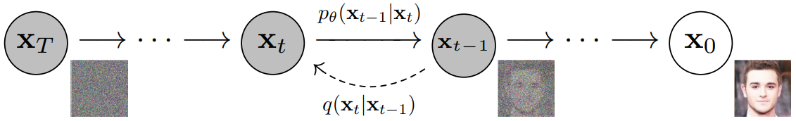

* **理论基础**

扩散模型是一种潜在变量模型，形式为$$p_\theta(\mathbf{x}_0) = \int p_\theta(\mathbf{x}_{0:T}) \, d\mathbf{x}_{1:T}$$，其中，$$\mathbf{x}_1, \dots, \mathbf{x}_T$$是与数据$$\mathbf{x}_0 \sim q(\mathbf{x}_0)$$具有相同维度的潜在变量。联合分布$$p_\theta(\mathbf{x}_{0:T})$$被称为**逆过程**，被定义为一个具有学习到的高斯转移的马尔可夫链，从初始分布 $$p(\mathbf{x}_T) = \mathcal{N}(\mathbf{x}_T; \mathbf{0}, \mathbf{I})$$ 开始：

$$p_\theta(\mathbf{x}_{0:T}) := p(\mathbf{x}_T) \prod_{t=1}^T p_\theta(\mathbf{x}_t | \mathbf{x}_{t-1})$$

$$p_\theta(\mathbf{x}_t | \mathbf{x}_{t-1}) := \mathcal{N}(\mathbf{x}_t; \boldsymbol{\mu}_\theta(\mathbf{x}_{t-1}, t), \boldsymbol{\Sigma}_\theta(\mathbf{x}_{t-1}, t))$$

扩散模型与其他类型的潜在变量模型的区别在于，近似后验分布$$q(\mathbf{x}_{1:T} | \mathbf{x}_0)$$，称为 **前向过程** 或 **扩散过程**，被固定为一个马尔可夫链，该链根据方差调度 $$\beta_1, \dots, \beta_T$$ 逐渐向数据添加高斯噪声：

$$q(\mathbf{x}_{1:T} | \mathbf{x}_0) := \prod_{t=1}^T q(\mathbf{x}_t | \mathbf{x}_{t-1}), \quad q(\mathbf{x}_t | \mathbf{x}_{t-1}) := \mathcal{N}(\mathbf{x}_t; \sqrt{1 - \beta_t} \mathbf{x}_{t-1}, \beta_t \mathbf{I})$$

训练通过优化通常的变分下界（负对数似然）进行：

$$\mathbb{E}\left[-\log p_\theta(\mathbf{x}_0)\right] \leq \mathbb{E}_q\left[-\log \frac{p_\theta(\mathbf{x}_{0:T})}{q(\mathbf{x}_{1:T} | \mathbf{x}_0)}\right] = \mathbb{E}_q\left[-\log p(\mathbf{x}_T) - \sum_{t \geq 1} \log \frac{p_\theta(\mathbf{x}_{t-1} | \mathbf{x}_t)}{q(\mathbf{x}_t | \mathbf{x}_{t-1})}\right] =: L$$

前向过程中的参数$$\beta_t$$可以通过重新参数化学习，也可以作为超参数保持不变。逆过程的表达能力部分由$$p_\theta(\mathbf{x}_{t-1} | \mathbf{x}_t)$$中高斯条件的选择保证，因为当$$\beta_t$$较小时，两个过程具有相同的函数形式。前向过程的一个显著性质是，它允许在任意时间步$$t$$以闭式采样$$\mathbf{x}_t$$：使用记号$$\alpha_t := 1 - \beta_t$$和$$\bar{\alpha}_t := \prod_{s=1}^t \alpha_s$$，因此有：

$$q(\mathbf{x}_t | \mathbf{x}_0) = \mathcal{N}(\mathbf{x}_t; \sqrt{\bar{\alpha}_t} \mathbf{x}_0, (1 - \bar{\alpha}_t) \mathbf{I})$$

因此，通过随机梯度下降优化$$L$$的随机项可以实现高效的训练。进一步的改进可以通过重写$$L$$来减少方差：

$$\mathbb{E}_q \left[ \frac{D_{\text{KL}}(q(\mathbf{x}_{T} | \mathbf{x}_0) \| p(\mathbf{x}_T))}{L_T} + \sum_{t > 1} \frac{D_{\text{KL}}(q(\mathbf{x}_{t-1} | \mathbf{x}_t, \mathbf{x}_0) \| p_\theta(\mathbf{x}_{t-1} | \mathbf{x}_t))}{L_{t-1}} - \log p_\theta(\mathbf{x}_0 | \mathbf{x}_1) \right]$$

> **注**：公式推导
>
> $$\begin{aligned}
> L &= \mathbb{E}_q \left[ -\log \frac{p_\theta(\mathbf{x}_{0:T})}{q(\mathbf{x}_{1:T} | \mathbf{x}_0)} \right] \\
> &= \mathbb{E}_q \left[ -\log p(\mathbf{x}_T) - \sum_{t > 1} \log \frac{p_\theta(\mathbf{x}_{t-1} | \mathbf{x}_t)}{q(\mathbf{x}_t | \mathbf{x}_{t-1})} \right] \\
> &= \mathbb{E}_q \left[ -\log p(\mathbf{x}_T) - \sum_{t > 1} \log \frac{p_\theta(\mathbf{x}_{t-1} | \mathbf{x}_t)}{q(\mathbf{x}_t | \mathbf{x}_{t-1})} - \log \frac{p_\theta(\mathbf{x}_0 | \mathbf{x}_1)}{q(\mathbf{x}_1 | \mathbf{x}_0)} \right] \\
> &= \mathbb{E}_q \left[ -\log \frac{p(\mathbf{x}_T)}{q(\mathbf{x}_T | \mathbf{x}_0)} - \sum_{t > 1} \log \frac{p_\theta(\mathbf{x}_{t-1} | \mathbf{x}_t)}{q(\mathbf{x}_{t-1} | \mathbf{x}_t, \mathbf{x}_0)} - \log p_\theta(\mathbf{x}_0 | \mathbf{x}_1) \right] \\
> &= \mathbb{E}_q \left[ D_{\text{KL}}(q(\mathbf{x}_T | \mathbf{x}_0) \| p(\mathbf{x}_T)) + \sum_{t > 1} D_{\text{KL}}(q(\mathbf{x}_{t-1} | \mathbf{x}_t, \mathbf{x}_0) \| p_\theta(\mathbf{x}_{t-1} | \mathbf{x}_t)) - \log p_\theta(\mathbf{x}_0 | \mathbf{x}_1) \right]
> \end{aligned}$$

这里使用 KL 散度直接比较$$p_\theta(\mathbf{x}_{t-1} | \mathbf{x}_t)$$和前向过程的后验分布，后者在条件化于$$\mathbf{x}_0$$时是可处理的：

$$q(\mathbf{x}_{t-1} | \mathbf{x}_t, \mathbf{x}_0) = \mathcal{N}\left(\mathbf{x}_{t-1}; \boldsymbol{\tilde{\mu}}_t(\mathbf{x}_t, \mathbf{x}_0), \tilde{\beta}_t \mathbf{I}\right)$$

其中$$\boldsymbol{\tilde{\mu}}_t(\mathbf{x}_t, \mathbf{x}_0) := \frac{\sqrt{\bar{\alpha}_{t-1}} \beta_t}{1 - \bar{\alpha}_t} \mathbf{x}_0 + \frac{\sqrt{1 - \bar{\alpha}_{t-1}}}{1 - \bar{\alpha}_t} \mathbf{x}_t$$，$$\tilde{\beta}_t := \frac{1 - \bar{\alpha}_{t-1}}{1 - \bar{\alpha}_t} \beta_t$$

因此，上式中的所有 KL 散度都是高斯分布之间的比较，因此它们可以通过闭式表达式的方式计算。

* **模型结构**

扩散模型看似是一类受限的隐变量模型，但它们在实现过程中允许很大的自由度。因此需要选择前向过程的方差 $$\beta_t$$以及反向过程的模型架构和高斯分布参数化形式。

**前向过程**

作者没有重新参数化学习前向过程的方差$$\beta_t$$，而是将其固定为常数。因此在实现中，近似后验分布$$q$$没有可学习的参数，所以$$L_T$$在训练过程中是常数，可以忽略。

**反向过程**

在反向过程中，需要在$$1 < t \leq T$$时选择$$p_\theta(\mathbf{x}_{t-1} | \mathbf{x}_t)$$，其中$$p_\theta(\mathbf{x}_{t-1} | \mathbf{x}_t) = \mathcal{N}(\mathbf{x}_{t-1}; \boldsymbol{\mu}_\theta(\mathbf{x}_t, t), \boldsymbol{\Sigma}_\theta(\mathbf{x}_t, t))$$。首先将$$\boldsymbol{\Sigma}_\theta(\mathbf{x}_t, t)$$设置为与时间相关的常数矩阵$$\sigma_t^2 \mathbf{I}$$。实验表明，两种选择$$\sigma_t^2 = \beta_t$$ 和 $$\sigma_t^2 = \frac{1 - \bar{\alpha}_{t-1}}{1 - \bar{\alpha}_t} \beta_t$$ 的结果相似。第一种选择对于 $$\mathbf{x}_0 \sim \mathcal{N}(\mathbf{0}, \mathbf{I})$$ 是最优的，而第二种选择对于确定性地设置为一个点的 $$\mathbf{x}_0$$ 是最优的。这两种选择分别对应于具有坐标独立单位方差的数据在逆过程熵上的上界和下界。

其次，为了表示均值$$\boldsymbol{\mu}_\theta(\mathbf{x}_t, t)$$，作者提出了一种特定的参数化方法，该方法受到以下对$$L_t$$的分析的启发。对于 $$p_\theta(\mathbf{x}_{t-1} | \mathbf{x}_t) = \mathcal{N}(\mathbf{x}_{t-1}; \boldsymbol{\mu}_\theta(\mathbf{x}_t, t), \sigma_t^2 \mathbf{I})$$，可以写出：

$$L_{t-1} = \mathbb{E}_q \left[ \frac{1}{2 \sigma_t^2} \| \tilde{\boldsymbol{\mu}}_t(\mathbf{x}_t, \mathbf{x}_0) - \boldsymbol{\mu}_\theta(\mathbf{x}_t, t) \|^2 \right] + C$$

其中$$C$$是一个不依赖于$$\theta$$的常数。因此可以看到$$\boldsymbol{\mu}_\theta$$的最直接参数化是一个预测$$\tilde{\boldsymbol{\mu}}_t$$的模型，即前向过程后验均值。然而可以通过重新参数化上述$$q(\mathbf{x}_t | \mathbf{x}_0)$$，令$$\mathbf{x}_t(\mathbf{x}_0, \boldsymbol{\epsilon}) = \sqrt{\bar{\alpha}_t} \mathbf{x}_0 + \sqrt{1 - \bar{\alpha}_t} \boldsymbol{\epsilon}$$，其中 $$\boldsymbol{\epsilon} \sim \mathcal{N}(\mathbf{0}, \mathbf{I})$$，并应用前向过程进一步扩展上式：

$$\begin{aligned}
L_{t-1} - C &= \mathbb{E}_{\mathbf{x}_0, \boldsymbol{\epsilon}} \left[ \frac{1}{2 \sigma_t^2} \left\| \tilde{\boldsymbol{\mu}}_t \left( \mathbf{x}_t(\mathbf{x}_0, \boldsymbol{\epsilon}), \frac{1}{\sqrt{\bar{\alpha}_t}} (\mathbf{x}_t(\mathbf{x}_0, \boldsymbol{\epsilon}) - \sqrt{1 - \bar{\alpha}_t} \boldsymbol{\epsilon}) \right) - \boldsymbol{\mu}_\theta(\mathbf{x}_t(\mathbf{x}_0, \boldsymbol{\epsilon}), t) \right\|^2 \right] \\
&= \mathbb{E}_{\mathbf{x}_0, \boldsymbol{\epsilon}} \left[ \frac{1}{2 \sigma_t^2} \left\| \frac{1}{\sqrt{\bar{\alpha}_t}} \left( \mathbf{x}_t(\mathbf{x}_0, \boldsymbol{\epsilon}) - \frac{\beta_t}{\sqrt{1 - \bar{\alpha}_t}} \boldsymbol{\epsilon} \right) - \boldsymbol{\mu}_\theta(\mathbf{x}_t(\mathbf{x}_0, \boldsymbol{\epsilon}), t) \right\|^2 \right]
\end{aligned}$$

这表明，$$\boldsymbol{\mu}_\theta$$必须根据$$\mathbf{x}_t$$预测$$\frac{1}{\sqrt{\bar{\alpha}_t}} \left( \mathbf{x}_t - \frac{\beta_t}{\sqrt{1 - \bar{\alpha}_t}} \boldsymbol{\epsilon} \right)$$。由于$$\mathbf{x}_t$$可以作为模型的输入，因此可以选择以下参数化：

$$\boldsymbol{\mu}_\theta(\mathbf{x}_t, t) = \tilde{\boldsymbol{\mu}}_t \left( \mathbf{x}_t, \frac{1}{\sqrt{\bar{\alpha}_t}} \left( \mathbf{x}_t - \sqrt{1 - \bar{\alpha}_t} \boldsymbol{\epsilon}_\theta(\mathbf{x}_t) \right) \right) = \frac{1}{\sqrt{\bar{\alpha}_t}} \left( \mathbf{x}_t - \frac{\beta_t}{\sqrt{1 - \bar{\alpha}_t}} \boldsymbol{\epsilon}_\theta(\mathbf{x}_t, t) \right)$$

其中是一个函数逼近器，旨在根据$$\mathbf{x}_t$$预测$$\boldsymbol{\epsilon}$$。为了从$$p_\theta(\mathbf{x}_{t-1} | \mathbf{x}_t)$$中采样$$\mathbf{x}_{t-1}$$，需要计算$$\mathbf{x}_{t-1} = \frac{1}{\sqrt{\bar{\alpha}_t}} \left( \mathbf{x}_t - \frac{\beta_t}{\sqrt{1 - \bar{\alpha}_t}} \boldsymbol{\epsilon}_\theta(\mathbf{x}_t, t) \right) + \sigma_t \mathbf{z}$$，其中$$\mathbf{z} \sim \mathcal{N}(\mathbf{0}, \mathbf{I})$$。此外，通过参数化上式，$$L_{t-1} - C$$可以简化为：

$$\mathbb{E}_{\mathbf{x}_0, \boldsymbol{\epsilon}} \left[ \frac{\beta_t^2}{2 \sigma_t^2 \bar{\alpha}_t (1 - \bar{\alpha}_t)} \left\| \boldsymbol{\epsilon} - \boldsymbol{\epsilon}_\theta(\sqrt{\bar{\alpha}_t} \mathbf{x}_0 + \sqrt{1 - \bar{\alpha}_t} \boldsymbol{\epsilon}, t) \right\|^2 \right]$$

这类似于在多个噪声尺度上进行去噪评分匹配，其中这些尺度由$$t$$索引。

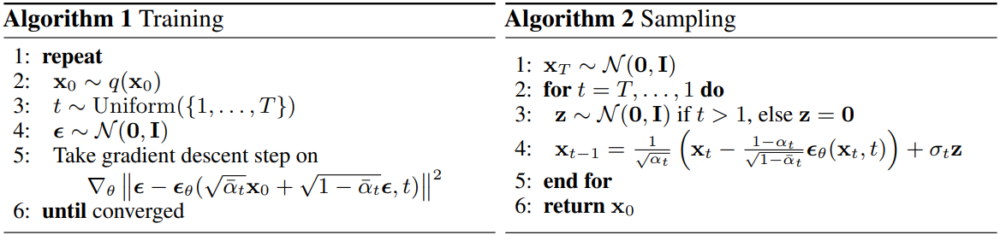

总结来说，可以训练逆过程均值逼近器$$\boldsymbol{\mu}_\theta$$来预测$$\tilde{\boldsymbol{\mu}}_t$$，或者通过修改其参数化，可以训练它来预测 $$\boldsymbol{\epsilon}$$。当然也可以预测$$\mathbf{x}_0$$，但效果会比较差。$$\boldsymbol{\epsilon}$$-预测简化了扩散模型的变分下界，使其类似于去噪评分匹配目标。

**反向过程解码**

假设图像数据由整数$$\{0, 1, \dots, 255\}$$组成，并线性缩放到区间$$[-1, 1]$$。这确保了神经网络的逆过程从标准正态先验$$p(\mathbf{x}_T)$$开始，对一致缩放后的输入进行操作。为了获得离散对数似然，将逆过程的最后一项设置为一个独立的离散解码器，该解码器由高斯分布$$\mathcal{N}(\mathbf{x}_0; \boldsymbol{\mu}_\theta(\mathbf{x}_1, 1), \sigma^2 \mathbf{I})$$衍生而来：

$$p_\theta(\mathbf{x}_0 | \mathbf{x}_1) = \prod_{i=1}^D \int_{\delta_-(x_i^0)}^{\delta_+(x_i^0)} \mathcal{N}(x; \mu_\theta^i(\mathbf{x}_1, 1), \sigma^2) \, dx$$

其中

$$\delta_+(x) =
\begin{cases}
\infty & \text{if } x = 1 \\
x + \frac{1}{255} & \text{if } x < 1
\end{cases}, \quad
\delta_-(x) =
\begin{cases}
-\infty & \text{if } x = -1 \\
x - \frac{1}{255} & \text{if } x > -1
\end{cases}$$

这里，$$D$$是数据的维度，上标$$i$$表示提取一个坐标分量。类似于变分自编码&#x5668;**`VAE`**&#x7684;解码器和自回归模型中使用的离散化连续分布，确保变分下界是一个离散数据的无损码长，无需向数据添加噪声，也无需将缩放操作的雅可比行列式纳入对数似然中。在采样结束时，可以无噪声地输出$$\boldsymbol{\mu}_\theta(\mathbf{x}_1, 1)$$。

**简化的训练目标**

通过上述定义的反向过程和解码器，变分下界显然可以关于$$\theta$$求导，并且可以直接用于训练。然而训练以下变种的变分下界对采样质量是有益的：

$$L_{\text{simple}}(\theta) := \mathbb{E}_{t, \mathbf{x}_0, \boldsymbol{\epsilon}} \left[ \left\| \boldsymbol{\epsilon} - \boldsymbol{\epsilon}_\theta \left( \sqrt{\bar{\alpha}_t} \mathbf{x}_0 + \sqrt{1 - \bar{\alpha}_t} \boldsymbol{\epsilon}, t \right) \right\|^2 \right]$$

其中$$t$$在$$1$$和$$T$$之间均匀分布。当$$t = 1$$时，该情况对应于$$p_\theta(\mathbf{x}_0 | \mathbf{x}_1)$$中离散解码器定义中的积分被高斯概率密度函数乘以区间宽度近似，这里忽略了$$\sigma_1^2$$和边缘效应。上图 Algorithm 1 显示了使用此简化目标的完整训练过程。

由于上述简化目标舍弃了$$\mathbb{E}_{\mathbf{x}_0, \boldsymbol{\epsilon}} \left[ \frac{\beta_t^2}{2 \sigma_t^2 \bar{\alpha}_t (1 - \bar{\alpha}_t)} \left\| \boldsymbol{\epsilon} - \boldsymbol{\epsilon}_\theta(\sqrt{\bar{\alpha}_t} \mathbf{x}_0 + \sqrt{1 - \bar{\alpha}_t} \boldsymbol{\epsilon}, t) \right\|^2 \right]$$中的权重，它是一个加权的变分下界，强调了重建的不同方面。

**代码实现**

首先实现时间步嵌入的功能

然后实现 U-Net 中&#x7684;**`ResidualBlock`**&#x548C;**`AttentionBlock`**，以及上采样和下采样的过程

然后将这几个组件组装为 U-Net：

实现调度逻辑：

最后实现高斯扩散过程：

训练

### 4.1.2 **DDIM**

* **背景知识**

给定来自数据分布$$q(x_0)$$的样本，目标是学习一个模型分布$$p_\theta(x_0)$$，使其逼近$$q(x_0)$$并且易于采样。DDPM 是隐变量模型，形式为：

$$p_\theta(x_0) = \int p_\theta(x_{0:T}) \, dx_{1:T}, \quad\quad p_\theta(x_{0:T}) := p_\theta(x_T) \prod_{t=1}^T p_\theta^{(t)}(x_{t-1}|x_t)$$

其中$$x_1, \dots, x_T$$是与$$x_0$$处于同一样本空间的隐变量，记为$$\mathcal{X}$$。参数$$\theta$$通过最大化一个变分下界来拟合数据分布 $$q(x_0)$$：

$$\max_\theta \mathbb{E}_{q(x_0)}[\log p_\theta(x_0)] \leq \max_\theta \mathbb{E}_{q(x_0,x_{1:T})}[\log p_\theta(x_{0:T}) - \log q(x_{1:T}|x_0)]$$

其中$$q(x_{1:T}|x_0)$$是隐变量上的某种推理分布。与 VAE 等典型的隐变量模型不同的是，DDPM 使用固定的推理过程 $$q(x_{1:T}|x_0)$$，而不是可训练的过程，且隐变量维度相对较高。

如下是具有高斯转移的马尔可夫链，其参数由递减序列$$\alpha_{1:T} \in (0, 1]^T$$控制：

$$q(x_{1:T}|x_0) := \prod_{t=1}^T q(x_t|x_{t-1}), \quad\quad q(x_t|x_{t-1}) := \mathcal{N}\left( \sqrt{\frac{\alpha_t}{\alpha_{t-1}}} x_{t-1}, \left(1 - \frac{\alpha_t}{\alpha_{t-1}}\right) I \right)$$

其中协方差矩阵对角线元素保证为正。由于采样过程具有自回归性质，即从$$x_0$$到$$x_T$$，被称为前向过程。这里将隐变量模型$$p_\theta(x_{0:T})$$称为生成过程，即从$$x_T$$向$$x_0$$采样的马尔可夫链。因为它近似了难以计算的逆过程$$q(x_{t-1}|x_t)$$。

直观上，前向过程逐步向观测$$x_0$$添加噪声，而生成过程则逐步对含噪观测进行去噪，如右图所示：

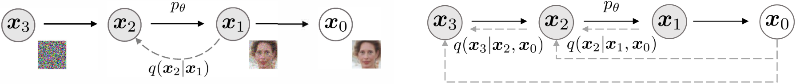

> **注**：前向过程的一个特殊性质是
>
> $$q(x_t|x_0) := \int q(x_{1:t}|x_0) \, dx_{1:(t-1)} = \mathcal{N}(x_t; \sqrt{\alpha_t} x_0, (1 - \alpha_t) I)$$

因此可以将$$x_t$$表示为$$x_0$$与噪声变量$$\epsilon$$的线性组合：

$$x_t = \sqrt{\alpha_t} x_0 + \sqrt{1 - \alpha_t} \epsilon, \quad\quad \epsilon \sim \mathcal{N}(0, I)$$

当$$\alpha_T$$足够接近 0 时，$$q(x_T|x_0)$$对所有$$x_0$$均收敛为标准高斯分布，因此设定$$p_\theta(x_T) := \mathcal{N}(0, I)$$。若所有条件分布均建模为高斯分布，则均值函数可以训练并保证方差固定，因此上述优化$$\theta$$的目标可简化为：

$$L_\gamma(\epsilon_\theta) := \sum_{t=1}^T \gamma_t \mathbb{E}_{x_0 \sim q(x_0), \epsilon_t \sim \mathcal{N}(0,I)} \left[ \left\| \epsilon_\theta^{(t)}(\sqrt{\alpha_t} x_0 + \sqrt{1 - \alpha_t} \epsilon_t) - \epsilon_t \right\|_2^2 \right]$$

其中$$\epsilon_\theta := \{ \epsilon_\theta^{(t)} \}_{t=1}^T$$是一组$$T$$个函数，每个$$\epsilon_\theta^{(t)}: \mathcal{X} \to \mathcal{X}$$是具有可训练参数$$\theta^{(t)}$$的函数，$$\gamma := [\gamma_1, \dots, \gamma_T]$$是依赖于$$\alpha_{1:T}$$的正系数向量。一些工作为最大化训练模型的生成性能，优化$$\gamma = 1$$的目标，这与基于分数匹配的噪声条件分数网络所使用的目标一致。从训练好的模型中采样$$x_0$$时，首先从先验$$p_\theta(x_T)$$中采样$$x_T$$，然后依次从生成过程中采样$$x_{t-1}$$。

> **注**：前向过程的长度$$T$$是 DDPM 中的一个重要超参数。从变分角度看，较大的$$T$$使得逆过程更接近高斯分布，从而使用高斯条件分布建模的生成过程成为良好近似，这促使选择较大的$$T$$值，如$$T=1000$$。但是由于所有$$T$$步必须顺序执行才能获得样本$$x_0$$，DDPM 的采样速度远慢于其他深度生成模型，这使其在计算资源有限或延迟敏感的任务中不具实用性。

* **非马尔可夫前向过程**

由于生成模型近似推理过程的逆过程，需要重新看推理过程，减少生成模型所需的迭代次数。从之前描述可以看出，DDPM 目标$$L_\gamma$$的形式仅依赖于边缘分布$$q(x_t|x_0)$$，而不直接依赖联合分布$$q(x_{1:T}|x_0)$$。

因为存在许多具有相同边缘分布的推理分布，这里作者探索非马尔可夫的替代推理过程，从而导出新的生成过程，如右图所示。

> **注**：这些非马尔可夫推理过程其实是与 DDPM 具有相同的代理目标函数。并且非马尔可夫视角也适用于高斯情形之外，如离散数据：
>
> 对于一个类别型变量$$x_0$$，其具有$$K$$个可能取值的 one-hot 向量，首先，令$$q(x_t|x_0)$$为如下类别分布：
>
> $$q(x_t|x_0) = \text{Cat}(\alpha_t x_0 + (1 - \alpha_t) \mathbf{1}_K)$$
>
> 其中$$\mathbf{1}_K \in \mathbb{R}^K$$是所有元素均为$$1/K$$的向量，$$\alpha_t$$从$$t=0$$时的$$\alpha_0 = 1$$递减至$$t=T$$时的$$\alpha_T = 0$$。然后定义$$q(x_{t-1}|x_t, x_0)$$为混合分布：
>
> $$q(x_{t-1}|x_t, x_0) = 
> \begin{cases}
> \text{Cat}(x_t) & \text{概率为 } \sigma_t \\
> \text{Cat}(x_0) & \text{概率为 } (\alpha_{t-1} - \sigma_t \alpha_t) \\
> \text{Cat}(\mathbf{1}_K) & \text{概率为 } (1 - \alpha_{t-1}) - (1 - \alpha_t)\sigma_t
> \end{cases}$$
>
> 或等价表示为：
>
> $$q(x_{t-1}|x_t, x_0) = \text{Cat}\left( \sigma_t x_t + (\alpha_{t-1} - \sigma_t \alpha_t) x_0 + \left((1 - \alpha_{t-1}) - (1 - \alpha_t)\sigma_t\right) \mathbf{1}_K \right)$$
>
> 这和之前$$q(x_t|x_0)$$的定义相同。
>
> 类似地，定义逆向过程 $$p_\theta(x_{t-1}|x_t)$$ 为：
>
> $$p_\theta(x_{t-1}|x_t) = \text{Cat}\left( \sigma_t x_t + (\alpha_{t-1} - \sigma_t \alpha_t) f_\theta^{(t)}(x_t) + \left((1 - \alpha_{t-1}) - (1 - \alpha_t)\sigma_t\right) \mathbf{1}_K \right)$$
>
> 其中$$f_\theta^{(t)}(x_t)$$将$$x_t$$映射为一个$$K$$维向量。当$$(1 - \alpha_{t-1}) - (1 - \alpha_t)\sigma_t \to 0$$时，采样过程的随机性将降低，即它将以高概率选择$$x_t$$或预测的$$x_0$$。
>
> $$D_{\text{KL}}(q(x_{t-1}|x_t, x_0) \,\|\, p_\theta(x_{t-1}|x_t))$$是两个类别分布之间的 KL 散度。因此所得的变分目标函数也易于优化。由于 KL 散度是凸函数，因此有上界：
>
> $$D_{\text{KL}}(q(x_{t-1}|x_t, x_0) \,\|\, p_\theta(x_{t-1}|x_t)) \leq (\alpha_{t-1} - \sigma_t \alpha_t) D_{\text{KL}}(\text{Cat}(x_0) \,\|\, \text{Cat}(f_\theta^{(t)}(x_t)))$$
>
> 当右侧趋近于零时该上界是紧的
>
> 右侧本质上是一个多类分类损失，因此可以得出类似结论：**$$\sigma_t$$的变化不会影响目标函数**。

**非马尔可夫前向过程**

假设一组由实向量$$\sigma \in \mathbb{R}_{\geq 0}^T$$索引的推理分布：

$$q_\sigma(x_{1:T}|x_0) := q_\sigma(x_T|x_0) \prod_{t=2}^T q_\sigma(x_{t-1}|x_t, x_0)$$

其中$$q_\sigma(x_T|x_0) = \mathcal{N}(\sqrt{\alpha_T} x_0, (1 - \alpha_T) I)$$，且对所有$$t > 1$$，

$$q_\sigma(x_{t-1}|x_t, x_0) = \mathcal{N}\left( \sqrt{\alpha_{t-1}} x_0 + \sqrt{1 - \alpha_{t-1} - \sigma_t^2} \cdot \frac{x_t - \sqrt{\alpha_t} x_0}{\sqrt{1 - \alpha_t}}, \sigma_t^2 I \right)$$

均值函数的选择保证了对所有$$t$$，有$$q_\sigma(x_t|x_0) = \mathcal{N}(\sqrt{\alpha_t} x_0, (1 - \alpha_t) I)$$

> **注**：证明
>
> 假设对任意$$t \leq T$$，$$q_\sigma(x_t|x_0) = \mathcal{N}(\sqrt{\alpha_t} x_0, (1 - \alpha_t) I)$$成立，若：
>
> $$q_\sigma(x_{t-1}|x_0) = \mathcal{N}(\sqrt{\alpha_{t-1}} x_0, (1 - \alpha_{t-1}) I)$$
>
> 则可对$$t$$从$$T$$到$$1$$进行归纳证明，因为基础情形$$t = T$$已成立。
>
> 首先，有：
>
> $$q_\sigma(x_{t-1}|x_0) := \int_{x_t} q_\sigma(x_t|x_0) q_\sigma(x_{t-1}|x_t, x_0) \, dx_t$$
>
> 且
>
> $$q_\sigma(x_t|x_0) = \mathcal{N}(\sqrt{\alpha_t} x_0, (1 - \alpha_t) I) $$
>
> $$q_\sigma(x_{t-1}|x_t, x_0) = \mathcal{N}\left( \sqrt{\alpha_{t-1}} x_0 + \sqrt{1 - \alpha_{t-1} - \sigma_t^2} \cdot \frac{x_t - \sqrt{\alpha_t} x_0}{\sqrt{1 - \alpha_t}}, \sigma_t^2 I \right)$$
>
> 由前人的工作可知$$q_\sigma(x_{t-1}|x_0)$$为高斯分布，这里记作$$\mathcal{N}(\mu_{t-1}, \Sigma_{t-1})$$，其中
>
> $$\begin{aligned}
> \mu_{t-1} &= \sqrt{\alpha_{t-1}} x_0 + \sqrt{1 - \alpha_{t-1} - \sigma_t^2} \cdot \frac{\sqrt{\alpha_t} x_0 - \sqrt{\alpha_t} x_0}{\sqrt{1 - \alpha_t}} \\
> &= \sqrt{\alpha_{t-1}} x_0
> \end{aligned}$$
>
> 且
>
> $$\Sigma_{t-1} = \sigma_t^2 I + \frac{1 - \alpha_{t-1} - \sigma_t^2}{1 - \alpha_t} (1 - \alpha_t) I = (1 - \alpha_{t-1}) I $$
>
> 因此，
>
> $$q_\sigma(x_{t-1}|x_0) = \mathcal{N}(\sqrt{\alpha_{t-1}} x_0, (1 - \alpha_{t-1}) I)$$

从而定义了一个符合所需边缘分布的联合推理分布。前向过程可通过贝叶斯规则推导：

$$q_\sigma(x_t|x_{t-1}, x_0) = \frac{q_\sigma(x_{t-1}|x_t, x_0) q_\sigma(x_t|x_0)}{q_\sigma(x_{t-1}|x_0)}$$

这个分布也是高斯的，但前向过程不再是马尔可夫的，因为每个$$x_t$$可能同时依赖于$$x_{t-1}$$和$$x_0$$。$$\sigma$$的大小控制前向过程的随机性程度，当$$\sigma \to 0$$时，达到极端情形：只要由$$x_0$$和某个$$t$$对应的$$x_t$$，则$$x_{t-1}$$即被确定。

**统一的变分推理目标**

定义一个可训练的生成过程$$p_\theta(x_{0:T})$$，其中每个$$p_\theta^{(t)}(x_{t-1}|x_t)$$利用了对$$q_\sigma(x_{t-1}|x_t, x_0)$$的认知。直观上，给定含噪观测$$x_t$$，首先预测对应的$$x_0$$，然后通过已定义的逆条件分布$$q_\sigma(x_{t-1}|x_t, x_0)$$采样$$x_{t-1}$$。

对于某些$$x_0 \sim q(x_0)$$和$$\epsilon_t \sim \mathcal{N}(0, I)$$，可通过$$x_t = \sqrt{\alpha_t} x_0 + \sqrt{1 - \alpha_t} \epsilon$$得到$$x_t$$。模型$$\epsilon_\theta^{(t)}(x_t)$$在无$$x_0$$信息的情况下仅根据$$x_t$$预测$$\epsilon_t$$。重写$$x_t = \sqrt{\alpha_t} x_0 + \sqrt{1 - \alpha_t} \epsilon$$即可预测去噪后的观测值，也就是给定$$x_t$$对$$x_0$$的预测：

$$f_\theta^{(t)}(x_t) := \left( x_t - \sqrt{1 - \alpha_t} \cdot \epsilon_\theta^{(t)}(x_t) \right) / \sqrt{\alpha_t}$$

然后定义生成过程：固定先验$$p_\theta(x_T) = \mathcal{N}(0, I)$$，且

$$p_\theta^{(t)}(x_{t-1}|x_t) = 
\begin{cases}
\mathcal{N}(f_\theta^{(1)}(x_1), \sigma_1^2 I) & \text{if } t = 1 \\
q_\sigma(x_{t-1}|x_t, f_\theta^{(t)}(x_t)) & \text{otherwise}
\end{cases}$$

其中 $$q_\sigma(x_{t-1}|x_t, f_\theta^{(t)}(x_t))$$ 的定义与$$q_\sigma(x_{t-1}|x_t, x_0) = \mathcal{N}\left( \sqrt{\alpha_{t-1}} x_0 + \sqrt{1 - \alpha_{t-1} - \sigma_t^2} \cdot \frac{x_t - \sqrt{\alpha_t} x_0}{\sqrt{1 - \alpha_t}}, \sigma_t^2 I \right)$$相同，仅将$$x_0$$替换为$$f_\theta^{(t)}(x_t)$$。为确保生成过程在整个空间有支撑，在$$t=1$$时额外添加高斯噪声，其协方差为$$\sigma_1^2 I$$。

然后通过以下变分推理目标优化$$\theta$$，这个目标是$$\epsilon_\theta$$的泛函：

$$J_\sigma(\epsilon_\theta) := \mathbb{E}_{x_{0:T} \sim q_\sigma(x_{0:T})} [\log q_\sigma(x_{1:T}|x_0) - \log p_\theta(x_{0:T})]$$

$$= \mathbb{E}_{x_{0:T} \sim q_\sigma(x_{0:T})} \left[ \log q_\sigma(x_T|x_0) + \sum_{t=2}^T \log q_\sigma(x_{t-1}|x_t, x_0) - \sum_{t=1}^T \log p_\theta^{(t)}(x_{t-1}|x_t) - \log p_\theta(x_T) \right]$$

这里根据$$q_\sigma(x_{1:T}|x_0) := q_\sigma(x_T|x_0) \prod_{t=2}^T q_\sigma(x_{t-1}|x_t, x_0)$$分解$$q_\sigma(x_{1:T}|x_0)$$，根据$$p_\theta(x_0) = \int p_\theta(x_{0:T}) \, dx_{1:T}$$分解$$p_\theta(x_{0:T})$$。

从$$J_\sigma$$的定义看，对每个$$\sigma$$的选择都需要训练不同的模型，因为其对应不同的变分目标。但其实$$J_\sigma$$等价于某个权重$$\gamma$$下的$$L_\gamma$$，因为：

> **定理**：对任意$$\sigma > 0$$，存在$$\gamma \in \mathbb{R}_{>0}^T$$和$$C \in \mathbb{R}$$，使得$$J_\sigma = L_\gamma + C$$

目标$$L_\gamma$$的特殊之处在于：若模型$$\epsilon_\theta^{(t)}$$的参数$$\theta$$在不同$$t$$间不共享，则$$\epsilon_\theta$$的最优解不依赖于权重$$\gamma$$，因为全局最优可通过独立最大化求和中的每一项实现。这一性质具有双重含义：

> 证明了在 DDPM 中使用$$L_1$$作为变分下界的代理目标是合理的
>
> 上述定理表明$$J_\sigma$$等价于某个$$L_\gamma$$，故$$J_\sigma$$的最优解也与$$L_1$$相同

因此若模型$$\epsilon_\theta$$中不同$$t$$的参数不共享，则使用$$L_1$$目标也可作为变分目标$$J_\sigma$$的代理目标。

* **从广义生成过程中采样**

以$$L_1$$为目标函数，如上所述，本质上可以将预训练好的 DDPM 模型直接作为这些新目标的解，只需通过调整$$\sigma$$来寻找更符合需求的生成过程，而无需重新训练模型。

**去噪扩散隐式模型  DDIM（Denoising Diffusion Implicit Model）**

由$$p_\theta^{(t)}(x_{t-1}|x_t) = 
\begin{cases}
\mathcal{N}(f_\theta^{(1)}(x_1), \sigma_1^2 I) & \text{if } t = 1 \\
q_\sigma(x_{t-1}|x_t, f_\theta^{(t)}(x_t)) & \text{otherwise}
\end{cases}$$中的$$p_\theta(x_{1:T})$$，可以从样本$$x_t$$生成样本$$x_{t-1}$$，更新公式如下：

$$x_{t-1} = \underbrace{ \sqrt{\alpha_{t-1}} \left( \frac{x_t - \sqrt{1 - \alpha_t} \epsilon_\theta^{(t)}(x_t)}{\sqrt{\alpha_t}} \right) }_{\text{“预测的 } x_0\text{”}} + \underbrace{ \sqrt{1 - \alpha_{t-1} - \sigma_t^2} \cdot \epsilon_\theta^{(t)}(x_t) }_{\text{“指向 } x_t \text{ 的方向”}} + \underbrace{ \sigma_t \epsilon_t }_{\text{随机噪声}} $$

其中$$\epsilon_t \sim \mathcal{N}(0, I)$$是与$$x_t$$独立的标准高斯噪声，这里定义$$\alpha_0 := 1$$。不同的$$\sigma$$取值对应不同的生成过程，但均可使用同一个模型$$\epsilon_\theta$$，因此无需重新训练模型。当对所有$$t$$取$$\sigma_t = \sqrt{(1 - \alpha_{t-1})/(1 - \alpha_t)} \cdot \sqrt{1 - \alpha_t / \alpha_{t-1}}$$时，前向过程恢复为马尔可夫过程，生成过程则退化为标准 DDPM。

当对所有$$t$$取$$\sigma_t = 0$$时，前向过程在给定$$x_{t-1}$$和$$x_0$$的条件下变为确定性过程，这里$$t=1$$除外。在生成过程中，随机噪声$$\epsilon_t$$前的系数变为零。此时模型成为一个隐式概率模型 Implicit Probabilistic Model，即样本通过一个固定过程从隐变量生成，即从$$x_T$$到$$x_0$$。作者将其命名为去噪扩散隐式模型 **DDIM**（**D**enoising **D**iffusion **I**mplicit **M**odel），因为它是使用 DDPM 目标训练的隐式概率模型（前向过程不再是扩散过程）。

**加速生成**

之前将生成过程视为对逆过程的近似，由于前向过程有$$T$$步，生成过程也被迫执行$$T$$步采样。但由于去噪目标$$L_1$$不依赖于具体的前向过程，只要$$q_\sigma(x_t|x_0)$$保持不变，因此可以考虑长度小于$$T$$的前向过程，从而在不重新训练模型的前提下加速生成过程。

这里不再定义前向过程在全部隐变量$$x_{1:T}$$上，而是定义在一个子集$$\{x_{\tau_1}, \dots, x_{\tau_S}\}$$上，其中$$\tau$$是$$[1, \dots, T]$$的一个长度为$$S$$的递增子序列。

这里要特别定义$$x_{\tau_1}, \dots, x_{\tau_S}$$上的顺序前向过程，使得$$q(x_{\tau_i}|x_0) = \mathcal{N}(\sqrt{\alpha_{\tau_i}} x_0, (1 - \alpha_{\tau_i}) I)$$保持与原始边缘分布一致，如右图。

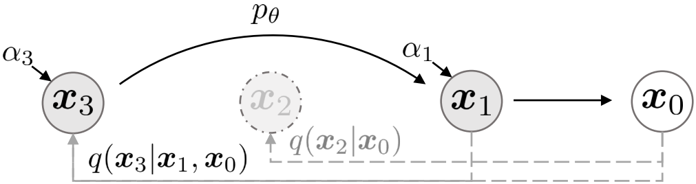

生成过程现在根据$$\text{reversed}(\tau)$$对隐变量进行采样，称此为采样轨迹。当采样轨迹长度远小于$$T$$时，由于采样过程是迭代的，计算效率将获得显著提升。由上面得到的结论，可以直接使用通过$$L_1$$目标训练的模型，训练过程无需任何改动。只需对上述 DDIM 公式中的更新步骤稍作调整，即可获得新的、更快的生成过程，这适用于 DDPM、DDIM 以及$$p_\theta^{(t)}(x_{t-1}|x_t) = 
\begin{cases}
\mathcal{N}(f_\theta^{(1)}(x_1), \sigma_1^2 I) & \text{if } t = 1 \\
q_\sigma(x_{t-1}|x_t, f_\theta^{(t)}(x_t)) & \text{otherwise}
\end{cases}$$中所有考虑的生成过程。这意味着可以用任意多步的前向过程训练模型，但在生成过程中仅采样其中部分步骤。

> **注**：在加速情形下，可以将推理过程分解为：
>
> $$q_{\sigma,\tau}(x_{1:T}|x_0) = q_{\sigma,\tau}(x_{\tau_S}|x_0) \prod_{i=1}^S q_{\sigma,\tau}(x_{\tau_{i-1}}|x_{\tau_i}, x_0) \prod_{t \in \bar{\tau}} q_{\sigma,\tau}(x_t|x_0) $$
>
> 其中$$\tau$$是$$[1, \dots, T]$$的一个长度为$$S$$的子序列，且满足$$\tau_S = T$$，令$$\bar{\tau} := \{1, \dots, T\} \setminus \tau$$为其补集。$$\{x_{\tau_i}\}_{i=1}^S$$与$$x_0$$构成一个链式图模型，而$$\{x_t\}_{t \in \bar{\tau}}$$与$$x_0$$构成一个星型图模型。这里定义：
>
> $$q_{\sigma,\tau}(x_t|x_0) = \mathcal{N}(\sqrt{\alpha_t} x_0, (1 - \alpha_t) I) \quad \forall t \in \bar{\tau} \cup \{T\} $$
>
> $$q_{\sigma,\tau}(x_{\tau_{i-1}}|x_{\tau_i}, x_0) = \mathcal{N}\left( \sqrt{\alpha_{\tau_{i-1}}} x_0 + \sqrt{1 - \alpha_{\tau_{i-1}} - \sigma_{\tau_i}^2} \cdot \frac{x_{\tau_i} - \sqrt{\alpha_{\tau_i}} x_0}{\sqrt{1 - \alpha_{\tau_i}}}, \sigma_{\tau_i}^2 I \right) \quad \forall i \in [S]$$
>
> 系数的选择满足：
>
> $$q_{\sigma,\tau}(x_{\tau_i}|x_0) = \mathcal{N}(\sqrt{\alpha_{\tau_i}} x_0, (1 - \alpha_{\tau_i}) I) \quad \forall i \in [S]$$
>
> 即保持边缘分布一致。对应的生成过程定义为：
>
> $$p_\theta(x_{0:T}) := p_\theta(x_T) \prod_{i=1}^S \underbrace{p_\theta^{(\tau_i)}(x_{\tau_{i-1}}|x_{\tau_i})}_{\text{用于生成样本}} \times \prod_{t \in \bar{\tau}} \underbrace{p_\theta^{(t)}(x_0|x_t)}_{\text{用于变分目标}}$$
>
> 其中仅部分模型实际用于生成样本。各条件分布为：
>
> $$p_\theta^{(\tau_i)}(x_{\tau_{i-1}}|x_{\tau_i}) = q_{\sigma,\tau}(x_{\tau_{i-1}}|x_{\tau_i}, f_\theta^{(\tau_i)}(x_{\tau_i})) \quad \text{if } i \in [S], i > 1$$
>
> $$p_\theta^{(t)}(x_0|x_t) = \mathcal{N}(f_\theta^{(t)}(x_t), \sigma_t^2 I) \quad \text{otherwise}$$
>
> 这里利用了推理过程中的$$q_{\sigma,\tau}(x_{\tau_{i-1}}|x_{\tau_i}, x_0)$$。最终的变分目标函数为：
>
> $$J(\epsilon_\theta) = \mathbb{E}_{x_{0:T} \sim q_{\sigma,\tau}(x_{0:T})} [\log q_{\sigma,\tau}(x_{1:T}|x_0) - \log p_\theta(x_{0:T})]$$
>
> $$= \mathbb{E}_{x_{0:T} \sim q_{\sigma,\tau}(x_{0:T})} \left[ \sum_{t \in \bar{\tau}} D_{\text{KL}}(q_{\sigma,\tau}(x_t|x_0) \,\|\, p_\theta^{(t)}(x_0|x_t)) + \sum_{i=1}^L D_{\text{KL}}(q_{\sigma,\tau}(x_{\tau_{i-1}}|x_{\tau_i}, x_0) \,\|\, p_\theta^{(\tau_i)}(x_{\tau_{i-1}}|x_{\tau_i})) \right]$$
>
> 这里为简洁起见，定义$$x_{\tau_{L+1}} = \emptyset$$。其中每个 KL 散度均在两个方差与$$\theta$$无关的高斯分布之间计算。可证明该变分目标$$J$$可转化为形如$$L_\gamma$$的目标函数。

**Neural ODE**

此外，可以根据 DDIM 公式重写 DDIM 的迭代步骤，其与求解常微分方程 ODE 的欧拉积分形式的相似性变得更加明显：

$$\frac{x_{t-\Delta t}}{\sqrt{\alpha_{t-\Delta t}}} = \frac{x_t}{\sqrt{\alpha_t}} + \left( \sqrt{\frac{1 - \alpha_{t-\Delta t}}{\alpha_{t-\Delta t}}} - \sqrt{\frac{1 - \alpha_t}{\alpha_t}} \right) \cdot \epsilon_\theta^{(t)}(x_t)$$

为推导对应的 ODE，可以用$$\sigma$$重参数化$$\sqrt{1 - \alpha}/\sqrt{\alpha}$$，用$$\bar{x}$$重参数化$$x/\sqrt{\alpha}$$。在连续情形下，$$\sigma$$和$$\bar{x}$$均为$$t$$的函数，其中$$\sigma: \mathbb{R}_{\geq 0} \to \mathbb{R}_{\geq 0}$$是连续递增函数，且满足$$\sigma(0) = 0$$。上式可视为 ODE 的欧拉方法近似：

$$d\bar{x}(t) = \epsilon_\theta^{(t)}\left( \bar{x}(t) \sqrt{\sigma^2(t) + 1} \right) d\sigma(t)$$

初始条件为$$x(T) \sim \mathcal{N}(0, \sigma(T))$$，其中$$\sigma(T)$$非常大，对应$$\alpha \approx 0$$的情形。这表明若离散化步数足够多，可逆向执行生成过程，从$$t=0$$到$$T$$，将$$x_0$$编码为$$x_T$$，并模拟上式中 ODE 的逆过程。这与 DDPM 不同，DDIM 可用于获取观测数据的编码，形式为$$x_T$$，这对需要模型隐表示的下游任务非常有用。

**代码实现**

这里&#x4EE5;**`cifar10`**&#x6570;据集为例，首先构&#x9020;**`dataset`**&#x7C7B;

这里和 **DDPM&#x20;**&#x4E00;样的，实现一个包&#x542B;**`ResNet Block`**&#x548C;**`Attention Block`**&#x7684;**`U-Net`**

1. **首先实现时间步的编码以及激活函数和归一化**：

2. **实现上采样和下采样的过程**：

3. **实现 Resnet Block**：

4. **实现 Attention Block**：

5. **完整的 UNet 模型**：

用于扩散模型DDIM中预测噪声$$\epsilon$$。包&#x62EC;**`time embedding`**、下采&#x6837;**`down`**、中间 **`bottleneck`**、上采&#x6837;**`up`**&#x4E09;部分 + **`skip connections`** + **`attention`**。

最后是训练部分，要实现优化&#x5668;**`optimizer`**&#x548C;**`schedule`**

然后构造训练类：

### 4.1.3 Flow Matching

* **连续归一化流 Continuous Normalizing Flow**

设$$\mathbb{R}^d$$表示数据空间，其中数据点为$$x = (x_1, \dots, x_d) \in \mathbb{R}^d$$这里介绍两个重要概念：

> * **概率密度路径 probability density path** $$p : [0, 1] \times \mathbb{R}^d \to \mathbb{R}_{>0}$$，它是一个时间依赖的概率密度函数，即$$\int p_t(x)\,dx = 1$$
>
> * **时间依赖的向量场 time-dependent vector field** $$v : [0, 1] \times \mathbb{R}^d \to \mathbb{R}^d$$

向量场$$v_t$$可用于构造一个时间依赖的微分同胚映射，称为流 Flow，记作$$\phi : [0, 1] \times \mathbb{R}^d \to \mathbb{R}^d$$，由如下常微分方程 ODE 定义：

$$\frac{d}{dt}\phi_t(x) = v_t(\phi_t(x))$$

$$\phi_0(x) = x$$

之前一些工作使用神经网络$$v_t(x; \theta)$$对向量场$$v_t$$建模，其中$$\theta \in \mathbb{R}^p$$为可学习参数，从而得到流$$\phi_t$$的深度参数化模型，称为**连续归一化流 CNF**。CNF 用于将简单的先验密度$$p_0$$（例如纯噪声）通过前推方程重塑为更复杂的密度 $$p_1$$：

$$p_t = [\phi_t]_* p_0$$

其中前推算子$$*$$定义为：

$$[\phi_t]_* p_0(x) = p_0(\phi_t^{-1}(x)) \det\left( \frac{\partial \phi_t^{-1}}{\partial x}(x) \right) $$

若向量场$$v_t$$的流$$\phi_t$$满足方程$$p_t = [\phi_t]_* p_0$$，则称该向量场生成概率密度路径$$p_t$$。检验一个向量场是否生成概率路径的一种实用方法是使用连续性方程。

> **注**：检验一个向量场$$v_t$$是否生成概率路径$$p_t$$的一种方法是使用连续性方程。它是一个偏微分方程 PDE，提供了向量场$$v_t$$生成$$p_t$$的充要条件：
>
> $$\frac{d}{dt} p_t(x) + \text{div}(p_t(x) v_t(x)) = 0$$
>
> 其中散度算子$$\text{div}$$是关于空间变量$$x = (x_1, \dots, x_d)$$定义的，即$$\text{div} = \sum_{i=1}^d \frac{\partial}{\partial x_i}$$

* **流匹配 Flow Matching**

设$$x_1$$为服从某个未知数据分布$$q(x_1)$$的随机变量。假设仅能访问来自$$q(x_1)$$的数据样本，而无法访问其密度函数本身。设$$p_t$$为概率路径，满足$$p_0 = p$$为简单分布，例如标准正态分布$$p(x) = \mathcal{N}(x|0, I)$$，且$$p_1$$在分布上近似等于$$q$$。流匹配目标旨在匹配这一目标概率路径，从而实现从$$p_0$$到$$p_1$$的流动。

给定目标概率密度路径$$p_t(x)$$及其对应的生成该路径的向量场$$u_t(x)$$，定义流匹配 FM 目标为：

$$L_{\text{FM}}(\theta) = \mathbb{E}_{t, p_t(x)} \left[ \| v_t(x) - u_t(x) \|^2 \right]$$

其中$$\theta$$表示 CNF 向量场$$v_t$$的可学习参数，$$t \sim \mathcal{U}[0, 1]$$为均匀分布，且$$x \sim p_t(x)$$。也就是说 FM 损失使用神经网络$$v_t$$回归向量场$$u_t$$。当损失为零时，所学 CNF 模型将生成$$p_t(x)$$。

流匹配看起来很完美，但在实践中直接使用是不行的，因为事先不知道合适的$$p_t$$和$$u_t$$是什么。存在许多满足$$p_1(x) \approx q(x)$$的概率路径选择，更重要的是无法获得生成所需$$p_t$$的闭式$$u_t$$。

1. **从条件概率路径与向量场构造$$p_t$$与$$u_t$$**

构造目标概率路径的一种简单方法是通过更简单概率路径的混合：对于特定数据样本$$x_1$$，记$$p_t(x|x_1)$$为条件概率路径，满足在$$t=0$$时$$p_0(x|x_1) = p(x)$$，并在$$t=1$$时设计$$p_1(x|x_1)$$为集中在$$x=x_1$$附近的分布，例如 $$p_1(x|x_1) = \mathcal{N}(x|x_1, \sigma^2 I)$$，即均值为$$x_1$$、标准差$$\sigma > 0$$足够小的正态分布。对条件概率路径关于$$q(x_1)$$边缘化，得到边缘概率路径：

$$p_t(x) = \int p_t(x|x_1) q(x_1)\, dx_1$$

特别地，在$$t=1$$时，边缘概率$$p_1$$是一个混合分布，近似于数据分布$$q$$：

$$p_1(x) = \int p_1(x|x_1) q(x_1)\, dx_1 \approx q(x)$$

当然也可以边缘化条件向量场，定义边缘向量场，假设对所有$$t$$和$$x$$有$$p_t(x) > 0$$：

$$u_t(x) = \int u_t(x|x_1) \frac{p_t(x|x_1) q(x_1)}{p_t(x)}\, dx_1$$

其中$$u_t(\cdot|x_1) : \mathbb{R}^d \to \mathbb{R}^d$$是生成条件概率路径$$p_t(\cdot|x_1)$$的条件向量场。以这种方式聚合条件向量场实际上能得到建模边缘概率路径的正确向量场。

> **结论 1**：边缘向量场$$u_t(x)$$可以生成边缘概率路径$$p_t(x)$$

这在条件向量场（生成条件概率路径）与边缘向量场（生成边缘概率路径）之间建立了联系，能够将未知且难以处理的边缘向量场分解为更简单的条件向量场，后者仅依赖于单个数据样本，因而更容易定义。

> **定理 1**：给定生成条件概率路径$$p_t(x|x_1)$$的向量场$$u_t(x|x_1)$$，对任意分布$$q(x_1)$$，方&#x7A0B;**$$u_t(x) = \int u_t(x|x_1) \frac{p_t(x|x_1) q(x_1)}{p_t(x)}\, dx_1$$**&#x4E2D;的边缘向量场$$u_t$$生成方&#x7A0B;**$$p_t(x) = \int p_t(x|x_1) q(x_1)\, dx_1$$**&#x4E2D;的边缘概率路径$$p_t$$，即$$u_t$$与$$p_t$$满足连续性方程$$\frac{d}{dt} p_t(x) + \text{div}(p_t(x) v_t(x)) = 0$$。

* **条件流匹配 Conditional Flow Matching**

由于边缘概率路径和向量场定义中存在难以处理的积分，即**$$u_t(x) = \int u_t(x|x_1) \frac{p_t(x|x_1) q(x_1)}{p_t(x)}\, dx_1$$**和**$$p_t(x) = \int p_t(x|x_1) q(x_1)\, dx_1$$**，直接计算$$u_t$$仍不可行，进而无法直接计算原始流匹配目标的无偏估计。因此作者提出一个更简单的替代目标，它与原始目标具有相同的最优解。

具体来说，条件流匹配 CFM 目标：

$$L_{\text{CFM}}(\theta) = \mathbb{E}_{t, q(x_1), p_t(x|x_1)} \left[ \| v_t(x) - u_t(x|x_1) \|^2 \right]$$

其中$$t \sim \mathcal{U}[0, 1]$$，$$x_1 \sim q(x_1)$$，且现在$$x \sim p_t(x|x_1)$$。与 FM 目标不同，只要能高效地从$$p_t(x|x_1)$$采样并计算$$u_t(x|x_1)$$，CFM 目标就能轻松采样无偏估计，而这二者均可轻松实现，因为它们是基于单样本定义的。

> **结论 2**：流匹配目标$$L_{\text{FM}}(\theta)$$与条件流匹配目标$$L_{\text{CFM}}(\theta)$$关于$$\theta$$具有相同的梯度

这也就是说优化 CFM 目标等价于优化 FM 目标。因此可以在无需访问边缘概率路径或边缘向量场的情况下，训练 CNF 以生成边缘概率路径$$p_t$$，在$$t=1$$时近似未知数据分布$$q$$。这里只需设计合适的条件概率路径与向量场：

> **定理 2**：假设对所有$$x \in \mathbb{R}^d$$和$$t \in [0, 1]$$有$$p_t(x) > 0$$，则$$L_{\text{CFM}}$$与$$L_{\text{FM}}$$在相差一个与$$\theta$$无关的常数下相等。因此$$\nabla_\theta L_{\text{FM}}(\theta) = \nabla_\theta L_{\text{CFM}}(\theta)$$

* **条件概率路径与向量场**

条件流匹配目标适用于任意选择的条件概率路径和条件向量场。假设有如下形式的条件概率路径：

$$p_t(x|x_1) = \mathcal{N}(x \mid \mu_t(x_1), \sigma_t(x_1)^2 I)$$

其中$$\mu : [0, 1] \times \mathbb{R}^d \to \mathbb{R}^d$$是高斯分布的时间依赖均值，$$\sigma : [0, 1] \times \mathbb{R} \to \mathbb{R}_{>0}$$是时间依赖的标量标准差。设$$\mu_0(x_1) = 0$$、$$\sigma_0(x_1) = 1$$，使得所有条件概率路径在$$t=0$$时均收敛到相同的标准化高斯噪声分布$$p(x) = \mathcal{N}(x|0, I)$$。在$$t=1$$时，设$$\mu_1(x_1) = x_1$$、$$\sigma_1(x_1) = \sigma_{\min}$$，使得$$p_1(x|x_1)$$为以$$x_1$$为中心的集中高斯分布。

对于任意特定概率路径，存在无穷多个生成它的向量场，例如通过在连续性方程中添加无散度分量，但绝大多数向量场包含不改变底层分布的成分，例如当分布具有旋转不变性时的旋转分量，导致不必要的额外计算。这里选择使用对应于高斯分布规范变换的最简单向量场。具体而言，以$$x_1$$为条件的流：

$$\psi_t(x) = \sigma_t(x_1) x + \mu_t(x_1)$$

当$$x$$服从标准高斯分布时，$$\psi_t(x)$$是将$$x$$映射到均值为$$\mu_t(x_1)$$、标准差为$$\sigma_t(x_1)$$的正态分布随机变量的仿射变换。也就是说，根据方程$$[\phi_t]_* p_0(x) = p_0(\phi_t^{-1}(x)) \det\left( \frac{\partial \phi_t^{-1}}{\partial x}(x) \right) $$，$$\psi_t$$将噪声分布$$p_0(x|x_1) = p(x)$$前推至 $$p_t(x|x_1)$$，即：

$$[\psi_t]_* p(x) = p_t(x|x_1)$$

进而提供了生成条件概率路径的向量场：

$$\frac{d}{dt} \psi_t(x) = u_t(\psi_t(x) | x_1)$$

将$$p_t(x|x_1)$$用$$x_0$$重新参数化，并将上式代入 CFM 损失，得到：

$$L_{\text{CFM}}(\theta) = \mathbb{E}_{t, q(x_1), p(x_0)} \left[ \left\| v_t(\psi_t(x_0)) - \frac{d}{dt} \psi_t(x_0) \right\|^2 \right] $$

由于$$\psi_t$$是一个简单可逆的仿射映射，可以利用方程$$\frac{d}{dt} \psi_t(x) = u_t(\psi_t(x) | x_1)$$闭式求解$$u_t$$。记$$f'$$表示关于时间的导数，即$$f' = \frac{d}{dt} f$$，其中$$f$$为时间依赖函数。

> **定理 3**：设$$p_t(x|x_1)$$为方程$$p_t(x|x_1) = \mathcal{N}(x \mid \mu_t(x_1), \sigma_t(x_1)^2 I)$$所示的高斯概率路径，$$\psi_t$$为对应的流映射$$\psi_t(x) = \sigma_t(x_1) x + \mu_t(x_1)$$。则定义$$\psi_t$$的唯一向量场形式为：
>
> $$u_t(x|x_1) = \frac{\sigma_t'(x_1)}{\sigma_t(x_1)} (x - \mu_t(x_1)) + \mu_t'(x_1)$$
>
> 因此，$$u_t(x|x_1)$$可以生成高斯路径$$p_t(x|x_1)$$

上述公式对任意函数$$\mu_t(x_1)$$和$$\sigma_t(x_1)$$均完全通用，只要满足边界条件的可微函数即可。但是还存在一些特殊情形，恢复了先前扩散过程中使用的概率路径。由于直接处理概率路径可以完全脱离扩散过程的推理框架，因此可以直接基&#x4E8E;**`Wasserstein-2`**&#x6700;优传输解构造一个概率路径。

> **例**：**扩散条件向量场 Diffusion conditional VFs**
>
> 扩散模型从数据点开始，逐步添加噪声直至近似纯噪声。这可表述为随机过程，为了在任意时间$$t$$获得闭式表达，需满足严格条件，从而导出具有特定均值$$\mu_t(x_1)$$和标准差$$\sigma_t(x_1)$$的高斯条件概率路径$$p_t(x|x_1)$$。例如反向（噪声→数据）的 **VE**（**V**ariance **E**xploding）路径形式为：
>
> $$p_t(x) = \mathcal{N}(x|x_1, \sigma_{1-t}^2 I)$$
>
> 其中$$\sigma_t$$为递增函数，$$\sigma_0 = 0$$，$$\sigma_1 \gg 1$$。由上式可得$$\mu_t(x_1) = x_1$$，$$\sigma_t(x_1) = \sigma_{1-t}$$。代入定理 3 的方程$$u_t(x|x_1) = \frac{\sigma_t'(x_1)}{\sigma_t(x_1)} (x - \mu_t(x_1)) + \mu_t'(x_1)$$，得到：
>
> $$u_t(x|x_1) = -\frac{\sigma_{1-t}'}{\sigma_{1-t}} (x - x_1)$$
>
> 反向（噪声→数据）&#x7684;**&#x20;VP**（**V**ariance **P**reserving）扩散路径形式为：
>
> $$p_t(x|x_1) = \mathcal{N}\left( x \mid \alpha_{1-t} x_1, \sqrt{1 - \alpha_{1-t}^2} I \right), \quad \alpha_t = e^{-\frac{1}{2} T(t)}, \quad T(t) = \int_0^t \beta(s)\, ds $$
>
> 其中$$\beta$$为噪声尺度函数。由上式可得$$\mu_t(x_1) = \alpha_{1-t} x_1$$，$$\sigma_t(x_1) = \sqrt{1 - \alpha_{1-t}^2}$$。代入定理 3 的方程$$u_t(x|x_1) = \frac{\sigma_t'(x_1)}{\sigma_t(x_1)} (x - \mu_t(x_1)) + \mu_t'(x_1)$$，得到：
>
> $$u_t(x|x_1) = \frac{\alpha_{1-t}'}{1 - \alpha_{1-t}^2} (\alpha_{1-t} x - x_1) = -\frac{T'(1 - t)}{2} \left[ \frac{e^{-T(1-t)} x - e^{-\frac{1}{2} T(1-t)} x_1}{1 - e^{-T(1-t)}} \right] $$

这里构造的条件向量场$$u_t(x|x_1)$$实际上与此前在确定性概率流中使用的向量场在这些条件扩散过程下完全一致。但是将扩散条件向量场与流匹配目标结合，提供了一种更具吸引力的训练替代方案。相较于现有的分数匹配方法，其更稳定、鲁棒。

由于这些概率路径此前是从扩散过程推导而来，它们实际上并未在有限时间内达到真正的噪声分布。$$p_0(x)$$仅由合适的高斯分布近似用于采样和似然评估。相比之下，构造对概率路径具有完全控制权，可直接设定$$\mu_t$$和 $$\sigma_t$$。

> **例**：**最优传输条件向量场 Optimal Transport conditional VFs**
>
> &#x20;一种更自然的条件概率路径选择是让均值和标准差随时间线性变化，即：
>
> $$\mu_t(x) = t x_1, \quad \sigma_t(x) = 1 - (1 - \sigma_{\min}) t$$
>
> 根据定理 3，该路径由如下向量场生成：
>
> $$u_t(x|x_1) = \frac{x_1 - (1 - \sigma_{\min}) x}{1 - (1 - \sigma_{\min}) t}$$
>
> 与扩散条件向量场$$u_t(x|x_1) = \frac{\alpha_{1-t}'}{1 - \alpha_{1-t}^2} (\alpha_{1-t} x - x_1) = -\frac{T'(1 - t)}{2} \left[ \frac{e^{-T(1-t)} x - e^{-\frac{1}{2} T(1-t)} x_1}{1 - e^{-T(1-t)}} \right] $$不同，该向量场对所有$$t \in [0, 1]$$均有定义。对应的条件流为：
>
> $$\psi_t(x) = (1 - (1 - \sigma_{\min}) t) x + t x_1$$
>
> 此时，CFM 损失$$L_{\text{CFM}}(\theta)$$形式为：
>
> $$L_{\text{CFM}}(\theta) = \mathbb{E}_{t, q(x_1), p(x_0)} \left[ \left\| v_t(\psi_t(x_0)) - \left( x_1 - (1 - \sigma_{\min}) x_0 \right) \right\|^2 \right]$$
>
> 允许均值和标准差线性变化不仅可以产生简单直观的路径，而且在如下意义上是最优的：条件流$$\psi_t(x)$$实际上是两个高斯分布$$p_0(x|x_1)$$与$$p_1(x|x_1)$$之间的**最优传输** **OT**（**O**ptimal **T**ransport） 位移映射。OT interpolant 定义为：
>
> $$p_t = [(1 - t) \text{id} + t \psi]_* p_0$$
>
> 其中$$\psi : \mathbb{R}^d \to \mathbb{R}^d$$是将$$p_0$$推送至$$p_1$$的 OT 映射，$$\text{id}$$表示恒等映射，即$$\text{id}(x) = x$$，$$(1 - t)\text{id} + t\psi$$称为 OT 位移映射。

直观上，粒子在 OT 位移映射下始终沿直线轨迹以恒定速度移动。右图是 Diffusion 与 OT 条件向量场的采样路径。Diffusion 路径的采样轨迹可能超出最终样本，导致不必要的回溯，而 OT 路径则保证保持直线。

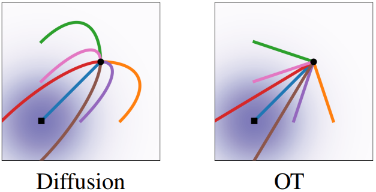

下图展示了扩散条件分数函数，即$$\nabla \log p_t(x|x_1)$$，其中$$p_t(x|x_1) = \mathcal{N}\left( x \mid \alpha_{1-t} x_1, \sqrt{1 - \alpha_{1-t}^2} I \right)$$，与 OT 条件向量场$$u_t(x|x_1) = \frac{x_1 - (1 - \sigma_{\min}) x}{1 - (1 - \sigma_{\min}) t}$$。两例中的起始$$p_0$$与终止$$p_1$$高斯分布完全相同。OT 向量场在时间上方向恒定，可能使回归任务更简单。这一性质也可直接由方程$$u_t(x|x_1) = \frac{x_1 - (1 - \sigma_{\min}) x}{1 - (1 - \sigma_{\min}) t}$$验证，因为该向量场可写为$$u_t(x|x_1) = g(t) h(x|x_1)$$的形式。

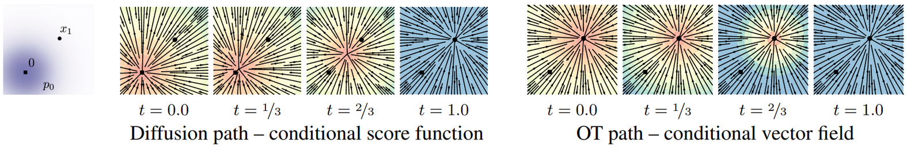

右图展示了扩散向量场的可视化。尽管条件流是最优的，但这并不能说明边缘向量场是最优传输 OT 解。但还是希望边缘向量场能尽可能保持相对简单。

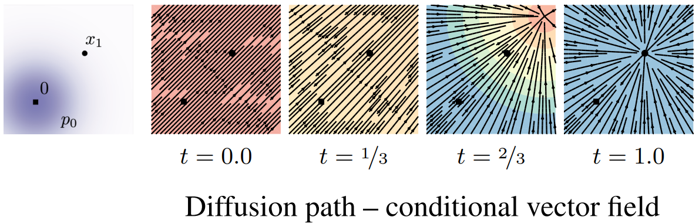

### 4.1.4 **DiT**

* **扩散模型基础**

1. **扩散模型**

高斯扩散模型假设一个前向加噪过程，该过程逐渐对真实数据$$x_0$$添加噪声：$$q(x_t|x_0) = \mathcal{N}(x_t; \sqrt{\bar{\alpha}_t}x_0, (1 - \bar{\alpha}_t)I)$$，其中常数$$\bar{\alpha}_t$$是超参数。通过应用重参数化技巧，可以采样$$x_t = \sqrt{\bar{\alpha}_t}x_0 + \sqrt{1 - \bar{\alpha}_t}\epsilon_t$$，其中$$\epsilon_t \sim \mathcal{N}(0, I)$$。

扩散模型学习反向过程，这个过程反转前向过程的损坏：$$p_\theta(x_{t-1}|x_t) = \mathcal{N}(\mu_\theta(x_t), \Sigma_\theta(x_t))$$，其中神经网络用于预测$$p_\theta$$的统计量。反向过程模型使用变分下界来训练$$x_0$$的对数似然，这可以写为$$L(\theta) = -p(x_0|x_1) + \sum_t D_{KL}(q^*(x_{t-1}|x_t, x_0)||p_\theta(x_{t-1}|x_t))$$。由于$$q^*$$和$$p_\theta$$都是高斯分布，$$D_{KL}$$可以通过两个分布的均值和协方差来计算。通过将$$\mu_\theta$$重新参数化为噪声预测网络$$\epsilon_\theta$$，模型可以使用预测噪声$$\epsilon_\theta(x_t)$$和真实采样的高斯噪声$$\epsilon_t$$之间的简单均方误差进行训练：$$L_{\text{simple}}(\theta) = ||\epsilon_\theta(x_t) - \epsilon_t||_2^2$$。然而，为了训练具有学习到的反向过程协方差$$\Sigma_\theta$$的扩散模型，需要优化完整的$$D_{KL}$$项。即用$$L_{\text{simple}}$$训练$$\epsilon_\theta$$，并用完整的$$L$$训练$$\Sigma_\theta$$。当$$p_\theta$$被训练完成，可以通过初始化$$x_{t_{\text{max}}} \sim \mathcal{N}(0, I)$$并通过重参数化技巧采样 $$x_{t-1} \sim p_\theta(x_{t-1}|x_t)$$ 来生成新图像。

* **无分类器引导 Classifier-free guidance**

条件扩散模型接受额外信息作为输入，例如类别标签$$c$$。在这种情况下，反向过程变为$$p_\theta(x_{t-1}|x_t, c)$$，其中$$\epsilon_\theta$$和$$\Sigma_\theta$$均以$$c$$为条件。在此设置中，无分类器引导鼓励采样过程找到使$$\log p(c|x)$$较高的$$x$$。根据贝叶斯规则，$$\log p(c|x) \propto \log p(x|c) - \log p(x)$$，因此$$\nabla_x \log p(c|x) \propto \nabla_x \log p(x|c) - \nabla_x \log p(x)$$。通过将扩散模型的输出解释为得分函数，**DDPM** 采样过程可以通过以下方式引导采样具有较高$$p(x|c)$$的$$x$$：

$$\hat{\epsilon}_\theta(x_t, c) = \epsilon_\theta(x_t, \emptyset) + s \cdot \nabla_x \log p(x|c) \propto \epsilon_\theta(x_t, \emptyset) + s \cdot (\epsilon_\theta(x_t, c) - \epsilon_\theta(x_t, \emptyset))$$

其中$$s > 1$$表示引导的尺度（当$$s = 1$$时恢复标准采样）。通过在训练期间随机丢弃$$c$$并将其替换为学习到的空嵌入$$\emptyset$$，可以评估$$c = \emptyset$$的扩散模型。无分类器引导广泛被认为比通用采样技术显著提高了样本质量。

* **潜在扩散模型 Latent Diffusion Models**

直接在高分辨率像素空间中训练扩散模型可能会计算成本过高。潜在扩散模型通过两阶段方法解决了这一问题：

> 学习一个**自编码器**，该编码器使用学习到的编码器$$E$$将图像压缩为较小的空间表示
>
> 训练图像编码$$z = E(x)$$的扩散模型，而不是原始图像$$x$$的扩散模型。然后可以通过从扩散模型中采样$$z$$并随后使用学习到的解码器将其解码为图像$$x = D(z)$$来生成新图像

潜在扩散模型在性能良好的同时，使用的浮点运算量仅为像素空间扩散模型的一小部分。由于计算效率十分重要，这使它们成为架构探索的一个有吸引力的起点。作者就是&#x5C06;**`DiT`**&#x5E94;用于潜在空间，使其图像生成流程成为一种混合方法：使用现成的卷&#x79EF;**`VAE`**&#x548C;基&#x4E8E;**`Transformer`**&#x7684; **DDPM**。

* **Diffusion Transformer 设计**

**DiT**（**Di**ffusion **T**ransformer）是用于扩散模型的新架构。他遵循标准 Transformer 架构，以保留其扩展特性。由于重点是训练图像的 DDPM，特别是图像的空间表示，DiT 基于 ViT 架构，作用在图像块序列上。DiT 保留了许多 ViT 的优点。

1. **图像分块**

**DiT&#x20;**&#x7684;输入是一个空间表示$$z$$，例如，对于$$256 \times 256 \times 3$$的图像，$$z$$的形状为$$32 \times 32 \times 4$$。DiT 的第一层是分块，它通过线性层编码输入中的每个块，将空间输入转换为长度为$$T$$的 token 序列，每个 token 的维度为$$d$$。在分块之后，对所有输入 token 应用标准 ViT 正余弦位置编码。分块操作创建的 token 数量$$T$$由块大小超参数$$p$$决定。如右图，将$$p$$减半会使$$T$$增加四倍，因此至少会使 Transformer 的总运算量增加四倍。这里虽然 对浮点运算量有显著影响，但改变$$p$$对下游参数计数没有明显影响。

实践中作者设定$$p = 2, 4, 8$$。

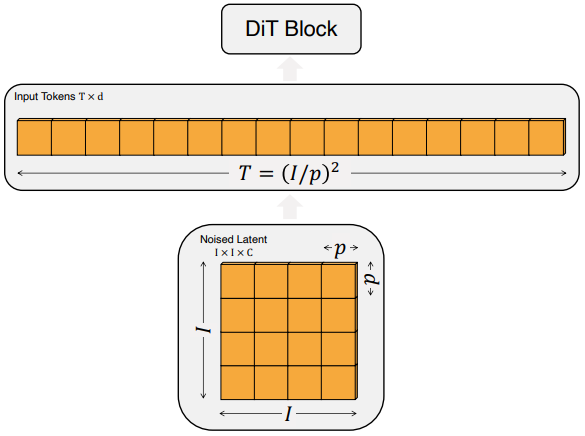

* **DiT 块设计**

在分块之后，输入 token 由一系列 Transformer 块处理。除了噪声图像输入外，扩散模型还会处理额外的条件信息，例如噪声时间步$$t$$、类别标签$$c$$、自然语言等。作者探索了四种不同的 Transformer 块变体，它们以不同的方式处理条件输入。这些设计对标准 ViT 块设计进行了小修改，如下图。

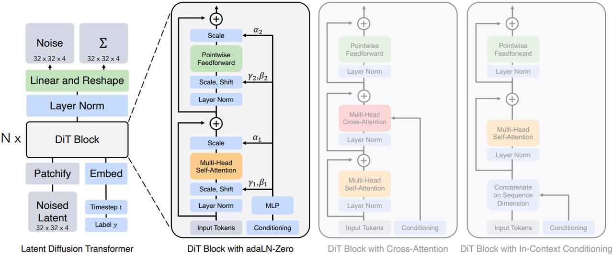

> * **In-context conditioning**：简单地将$$t$$和$$c$$的向量嵌入作为两个附加 token 追加到输入序列中，并将它们与图像 token 同等对待。这类似于 ViT 中&#x7684;**`[CLS]`** token，可以直接使用标准 ViT 块。在最后一个块之后，从序列中移除条件 token。这种方法对模型的浮点运算量几乎没有影响。
>
> * **Cross-attention block**：将$$t$$和$$c$$的嵌入连接成一个长度为**`2`**的序列，与图像 token 序列分开。Transformer 块修改为在多头自注意力块之后包含一个额外的多头交叉注意力层，这与 Transformer 原始解码器设计类似，交叉注意力对模型的浮点运算量影响最大，大约增加了**`15%`**的开销。
>
> * **Adaptive layer norm (adaLN) block**：鉴于自适应归一化层在 GAN 和使用 UNet 主干的扩散模型中的广泛应用，作者探索了用自适应层归一化 adaLN 替换 Transformer 块中的标准层归一化。这里不是直接学习逐维的缩放和偏移参数$$\gamma$$和$$\beta$$，而是从$$t$$和$$c$$的嵌入向量之和中学习它们。adaLN 增加的浮点运算量最少，因此计算效率最高。且它是唯一一种对所有 token 应用相同函数的条件化机制。
>
> * **adaLN-Zero block**：ResNet 展示了将每个残差块初始化为恒等函数是有益的，将每个块中的最终批量归一化缩放因子$$\gamma$$初始化为零可以加速训练。以 U-Net 为主干的扩散模型也采用了类似的初始化策略，在任何残差连接之前将每个块中的最终卷积层初始化为零。遵循这个设计理念，作者对 adaLN DiT 块进行修改，实现了相同的效果。除了学习$$\gamma$$和$$\beta$$外，还学习了应用于 DiT 块内任何残差连接之前的逐维缩放参数$$\alpha$$。这里将 MLP 初始化为输出全零向量$$\alpha$$；这将整个 DiT 块初始化为恒等函数。与普通的 adaLN 块一样，adaLN-Zero 对模型的浮点运算量几乎没有影响。

* **模型规模**

应用$$N$$个 DiT 块，每个块隐藏维度大小为$$d$$，并且使用标准 Transformer 配置，联合缩放$$N$$、$$d$$和注意力头的数量。论文使用四种配置：**`DiT-S`**、**`DiT-B`**、**`DiT-L`**&#x548C;**`DiT-XL`**。覆盖了广泛的模型规模和运算量，范围&#x4ECE;**`0.3`**&#x5230;**`118.6`**&#x47;flops。

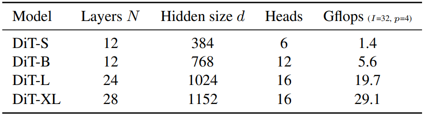

* **Transformer 解码器**

在最后一个 DiT 块之后，将图像 token 序列解码为输出噪声预测和输出对角协方差预测。这两个输出的形状等于原始空间输入，这里使用标准线性解码器来输出；最终应用层归一化，并线性解码每个 token 为$$p \times p \times 2C$$张量，其中$$C$$是输入到 DiT 的空间输入的通道数。最后，将解码后的标记重新排列为其原始空间布局，以获得预测的噪声和协方差。

## 4.2 Stable Diffusion 系列

### 4.2.1 Stable Diffusion 1

尽管扩散模型可以通过对相应的损失项进行欠采样来忽略感知上无关的细节，但它们仍然需要在像素空间中进行昂贵的函数评估，这导致了巨大的计算时间和能源消耗。

因此通过引入压缩学习阶段与生成学习阶段的显式分离来规避这一缺点，如右图。为实现这一点，作者利用了一种自编码模型，该模型学习了一个与图像空间感知等价但计算复杂度显著降低的空间。

这种方法具有以下几个优势：

> 1. 通过离开高维图像空间，获得了计算效率更高的扩散模型，因为采样是在低维空间中进行的
>
> 2. 利用了扩散模型从&#x5176;**`UNet`**&#x67B6;构继承的归纳偏置，这使得它们特别适合处理具有空间结构的数据，从而避免了先前方法所需的激进且降低质量的压缩级别
>
> 3. 获得了通用的压缩模型，其潜在空间可用于训练多个生成模型，也可用于其他下游应用，例如单图&#x50CF;**`CLIP`**&#x5F15;导的合成

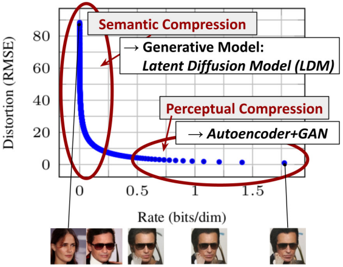

* **感知图像压缩**

感知压缩模型是基于先前的工作，并由一个结合了感知损失和基于  patch 的对抗目标训练的自编码器组成。这确保了重建结果被限制在图像流中，通过强制局部真实感避免了仅依赖像素空间损失（如$$L_2$$或$$L_1$$目标）带来的模糊。

更具体地说，给定RGB空间中的图像$$x \in \mathbb{R}^{H \times W \times 3}$$，编码器$$\mathcal{E}$$将$$x$$编码为潜在表示$$z = \mathcal{E}(x)$$，解码器$$\mathcal{D}$$从潜在表示重建图像，得到$$\tilde{x} = \mathcal{D}(z) = \mathcal{D}(\mathcal{E}(x))$$，其中$$z \in \mathbb{R}^{h \times w \times c}$$。编码器还通过因子$$f = H/h = W/w$$对图像进行下采样，作者研究了不同的下采样因子$$f = 2^m$$，其中$$m \in \mathbb{N}$$。

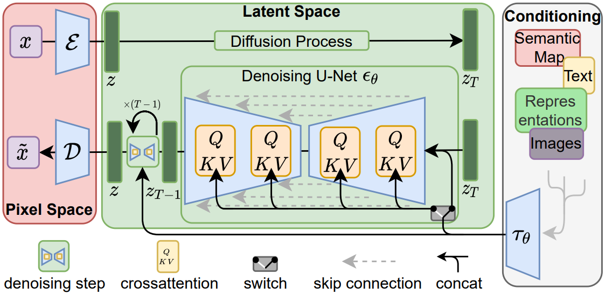

为了避免潜在空间的方差过高，作者尝试了两种不同的正则化方法：

> 1. **KL 正则化**：它对学习到的潜在变量施加轻微的 KL 惩罚，使其接近标准正态分布，类似于变分自编码器 VAE
>
> 2. **VQ 正则化**：在解码器中使用矢量量化层。该模型可以解释为一种 VQGAN，但量化层被解码器吸收

由于后续的扩散模型设计为与学习到的二维潜在空间$$z = \mathcal{E}(x)$$一起工作，因此可以使用相对温和的压缩率实现非常好的重建效果。这与之前的工作形成对比，依赖于对学习空间$$z$$的任意一维排序来对其分布进行自回归建模，从而忽略了$$z$$的大部分内在结构。因此更好地保留了$$x$$的细节 。

* **潜在扩散模型**

扩散模型是概率模型，旨在通过逐步去噪一个正态分布变量来学习数据分布$$p(x)$$，这相当于学习固定长度为$$T$$的马尔可夫链的逆过程。对于图像合成，最成功的模型依赖于$$p(x)$$的重加权变分下界，这反映了去噪得分匹配。

这些模型可以理解为一系列权重相等的去噪自编码器$$\epsilon_\theta(x_t, t); t = 1, \dots, T$$，它们预测输入$$x_t$$的去噪情况，其中$$x_t$$是输入$$x$$加噪声得到的。相应的目标函数可以简化为：

$$L_{\text{DM}} = \mathbb{E}_{x, \epsilon \sim \mathcal{N}(0,1), t} \left[ \|\epsilon - \epsilon_\theta(x_t, t)\|_2^2 \right]$$

其中$$t$$从$$\{1, \dots, T\}$$中均匀采样。

1. **潜在表示的生成模型**

通过训练好的感知压缩模型$$\mathcal{E}$$和$$\mathcal{D}$$，可以访问一个高效的低维潜在空间，在该空间中高频、不可感知的细节被抽象化。与高维像素空间相比，该空间更适合基于似然的生成模型，因为它们现在可以专注于数据中重要的语义部分，并且在维度更低、计算效率更高的空间中进行训练。

与之前高度压缩离散潜在空间中依赖自回归、基于注意力的 Transformer 模型的工作不同，扩散模型可以利用模型提供的图像特定归纳偏置。这包括能够主要使用 2D 卷积层构建底&#x5C42;**`UNet`**，并进一步聚焦于感知上最重要的部分，使用重加权边界，现在表示为：

$$L_{\text{LDM}} := \mathbb{E}_{\mathcal{E}(x), \epsilon \sim \mathcal{N}(0,1), t} \left[ \|\epsilon - \epsilon_\theta(z_t, t)\|_2^2 \right]$$

模型的神经主干$$\epsilon_\theta(\cdot, t)$$是以时间为条件&#x7684;**`UNet`**。由于前向过程是固定的，$$z_t$$可以在训练期间从$$\mathcal{E}$$获得，而来自$$p(z)$$的样本可以通过$$\mathcal{D}$$一次解码到图像空间。

* **条件机制**

与其他类型的生成模型类似，扩散模型原则上能够建模形式为$$p(z|y)$$的条件分布。这可以通过条件去噪自编码器$$\epsilon_\theta(z_t, t, y)$$实现，并通过输入$$y$$控制合成过程，如`文本`、`语义图`或其他图像到图像的翻译任务。

通过在扩散模型底层的**`UNet`**主干中引入交叉注意力机制，将其转变为更加灵活的条件图像生成器。该机制对于学习各种输入模态的注意力模型非常有效。为了从不同模态预处理$$y$$，例如语言 prompt，作者引入了一个特定领域的编码器$$\tau_\theta$$，它将$$y$$投影到一个中间表示$$\tau_\theta(y) \in \mathbb{R}^{M \times d_\tau}$$，然后通过一个交叉注意力层将其映射到**`UNet`**的中间层。该交叉注意力层实现了以下公式：

$$\text{Attention}(Q, K, V) = \text{softmax} \left( \frac{QK^T}{\sqrt{d}} \right) \cdot V$$

其中$$Q = W_Q^{(i)} \cdot \phi_i(z_t), \quad K = W_K^{(i)} \cdot \tau_\theta(y), \quad V = W_V^{(i)} \cdot \tau_\theta(y).$$

在这里，$$\phi_i(z_t) \in \mathbb{R}^{N \times d_\epsilon^i}$$为实现$$\epsilon_\theta$$&#x7684;**`UNet`**&#x7684;一个中间表示，而$$W_V^{(i)} \in \mathbb{R}^{d \times d_\epsilon^i}$$、$$W_Q^{(i)} \in \mathbb{R}^{d \times d_\tau}$$和$$W_K^{(i)} \in \mathbb{R}^{d \times d_\tau}$$是可学习的投影矩阵，如上图所示。

基于图像-条件对，通过以下公式学习条件潜在扩散模&#x578B;**`LDM`**：

$$L_{\text{LDM}} := \mathbb{E}_{\mathcal{E}(x), y, \epsilon \sim \mathcal{N}(0,1), t} \left[ \|\epsilon - \epsilon_\theta(z_t, t, \tau_\theta(y))\|_2^2 \right]$$

其中$$\tau_\theta$$和$$\epsilon_\theta$$进行联合优化。这种条件机制非常灵活，因为$$\tau_\theta$$可以用特定领域的专家参数化，例如当$$y$$为文本提示时可以使用不带 mask 的 Transformer。

### 4.2.2 Stable Diffusion 2

* **整体结构**

1. **技术定位**

Stable Diffusion 2 不是另一套独立的生成范式，而是 Latent Diffusion Model 的一组具体实现。它保留 VAE、时序条件 U-Net 和 cross-attention 三段式结构，把文本条件、训练数据、预测目标与可用分辨率更新为第二代配置。

模型不在 RGB pixel space 中直接执行完整扩散过程，而是先把图像压缩到较小的 latent space，再让 U-Net 学习 latent 的去噪方向，最后只调用一次 Decoder 恢复图像。

SD 2.0 的核心变化包括 OpenCLIP ViT-H/14 Text Encoder、原生 **`512×512`** 与 **`768×768`** 两种文生图 checkpoint，以及 Depth2Img、Inpainting 和 ×4 Upscaler。SD 2.1 沿用 2.0 的模型结构，在同一代数据和 checkpoint 上继续训练。

2. **端到端计算链**

文本 prompt 先经过 Tokenizer，再由冻结的 OpenCLIP ViT-H/14 Text Encoder 产生 token Embedding。SD 2 使用 Text Encoder 倒数第二层的输出，单个 token 的上下文维度为 **`1024`**。这些 Embedding 不直接变成图像，而是作为 cross-attention 的 Key 和 Value 注入 U-Net。

训练时，RGB 图像由 VAE Encoder 下采样 **`8`** 倍。尺寸为 **`512×512`** 的图像对应 **`64×64×4`** latent，尺寸为 **`768×768`** 的图像对应 **`96×96×4`** latent。U-Net 接收带噪 latent、timestep 与文本 Embedding，预测当前去噪步骤需要的量。

推理从高斯噪声开始，scheduler 反复调用 U-Net，把 latent 从高噪声状态逐步更新到低噪声状态。最后，VAE Decoder 把结果映射回 RGB 图像。Text Encoder 和 VAE 通常保持冻结，生成阶段的主要迭代计算集中在 U-Net。

3. **SD 2.0 模型家族**

**`stable-diffusion-2-base`** 是 **`512×512`** 文生图模型，使用标准 noise prediction，也就是预测加入 latent 的噪声。它是 768 模型、Depth2Img 和 Inpainting 的起点。

**`stable-diffusion-2`** 面向 **`768×768`** 生成，从 512-base 继续训练，并切换到 v-prediction。它与 SD 1.5 的 U-Net 参数规模接近，但使用不同的 Text Encoder、cross-attention 上下文宽度和预测目标，checkpoint 不能按同一配置直接混用。

**`stable-diffusion-2-depth`** 增加单目相对深度条件；**`stable-diffusion-2-inpainting`** 增加 mask 与 masked-image latent；**`stable-diffusion-x4-upscaler`** 根据低分辨率图像和文本生成四倍尺寸结果。

4. **SD 2.0 与 SD 2.1 的关系**

SD 2.1 没有更换 VAE、U-Net 或 OpenCLIP 路线，512-base 与 768-v 的参数量和结构都与 2.0 相同。变化发生在继续训练阶段：使用更多数据，并把训练集的 NSFW 过滤阈值放宽。

2.1-base 从 2.0 的 512-base 继续训练 **`220k`** steps，数据过滤阈值改为 **`punsafe=0.98`**。2.1 的 768-v 先在 **`punsafe=0.1`** 数据上继续 **`55k`** steps，再在 **`punsafe=0.98`** 数据上训练 **`155k`** steps。

因此，“Stable Diffusion 2”通常表示 2.0 与 2.1 共享的架构代际；2.1 更接近一组在 2.0 checkpoint 上追加训练得到的更新权重。

* **Latent Diffusion 核心方法**

1. **VAE 与 perceptual compression**

第一阶段是 KL-regularized VAE。Encoder 把图像 $$x$$ 映射为二维 latent，Decoder 再把 latent 重建为图像：

$$z_0=s\,\mathcal{E}(x),\qquad \hat{x}=\mathcal{D}(z_0/s)$$

其中 $$s$$ 是 latent 的缩放系数，SD 2 的配置取 **`0.18215`**。缩放后的 latent 具有更稳定的数值范围，后续 diffusion Backbone 在这一空间中训练。

VAE 的目标不是逐像素无损压缩。它结合 perceptual loss、patch-based adversarial loss 与很弱的 KL regularization，优先保留能影响人类感知的结构、颜色和纹理，同时允许微小的高频细节损失。

将空间尺寸缩小 8 倍后，U-Net 处理的空间位置数量约降为 pixel space 的六十四分之一，训练和逐步采样都明显更省计算。

VAE 是有损模块。细小文字、极细线条、规则纹理和人脸局部可能在编码或解码阶段发生变化，即使 U-Net 已经生成了合理的 latent。

2. **前向加噪过程**

diffusion 的前向过程固定不学习。它按照预设 noise schedule，在每个 timestep 向干净 latent $$z_0$$ 加入高斯噪声：

$$q(z_t\mid z_0)=\mathcal{N}\!\left(\sqrt{\bar{\alpha}_t}\,z_0,\left(1-\bar{\alpha}_t\right)I\right)$$

利用重参数化，可以直接从任意 timestep 采样带噪 latent，而不需要真的执行前面所有加噪步骤：

$$z_t=\sqrt{\bar{\alpha}_t}\,z_0+\sqrt{1-\bar{\alpha}_t}\,\epsilon,\qquad \epsilon\sim\mathcal{N}(0,I)$$

$$\bar{\alpha}_t$$ 控制信号保留比例。较小的 $$t$$ 保留更多图像结构，较大的 $$t$$ 更接近纯噪声。训练时随机采样 timestep，使同一个 U-Net 学会处理整个噪声区间。

3. **时序条件 U-Net**

U-Net 是 diffusion 的主 Backbone。输入先在 Encoder 路径逐级下采样，低分辨率层建立大范围语义关系；Decoder 路径逐级上采样，并通过 skip connection 取回早期层保存的局部空间细节。

timestep 会编码成向量并注入多个 residual block，使同一套参数在高噪声阶段学习整体布局，在低噪声阶段修复边缘、纹理和局部形状。SD 2 的 U-Net 约有 **`865M`** 参数，基础通道数为 **`320`**，通道倍率为 **`1、2、4、4`**，每个尺度包含 **`2`** 个 residual blocks。

U-Net 并不是一次输出完整图像，而是在每个 timestep 给出一个局部反向更新方向；scheduler 决定如何把这一预测转换为下一时刻的 latent。

4. **cross-attention 文本条件**

OpenCLIP 产生的文本 token Embedding 通过 cross-attention 进入 U-Net。某一层的图像特征提供 Query，文本特征提供 Key 和 Value：

$$\operatorname{Attention}(Q,K,V)=\operatorname{softmax}\!\left(\frac{QK^{\mathsf{T}}}{\sqrt{d}}\right)V$$

$$Q=W_Q\varphi_i(z_t),\qquad K=W_K\tau(y),\qquad V=W_V\tau(y)$$

$$\varphi_i(z_t)$$ 是 U-Net 第 $$i$$ 个空间层的特征，$$\tau(y)$$ 是文本 Encoder 输出。每个空间位置都可以根据当前图像状态选择不同的文本 token，因此主体、属性、风格和位置描述能够在不同区域产生不同影响。

SD 2 在多个分辨率层中放置 Spatial Transformer。self-attention 负责图像位置之间的关系，cross-attention 负责图像位置与文本 token 之间的关系，MLP 则完成逐位置的非线性变换。

下图完整展示了 latent diffusion 的两阶段结构、U-Net skip connection、concat conditioning 和 cross-attention conditioning。

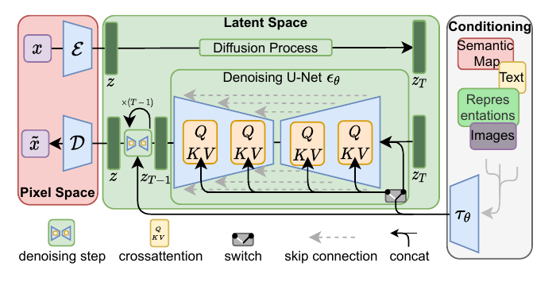

5. **noise prediction 目标**

512-base 使用标准 noise prediction。给定图像、文本、随机 timestep 和噪声，U-Net 预测加到 latent 中的 $$\epsilon$$：

$$\mathcal{L}_{\epsilon}=\mathbb{E}_{x,y,t,\epsilon}\!\left[\left\|\epsilon-\epsilon_{\theta}(z_t,t,\tau(y))\right\|_2^2\right]$$

这个损失可以只在 latent space 中计算。VAE Encoder 提供干净 latent，前向过程直接构造 $$z_t$$，U-Net 的输出与真实噪声做均方误差。Decoder 不需要参与每一步 U-Net 训练。

6. **v-prediction 目标**

768-v 不直接预测噪声，而是预测由干净 latent 与噪声共同构成的 velocity。令 $$\alpha_t^2+\sigma_t^2=1$$ 且 $$z_t=\alpha_tz_0+\sigma_t\epsilon$$，目标定义为：

$$v_t=\alpha_t\epsilon-\sigma_tz_0$$

得到 $$v_t$$ 后，可以同时恢复干净 latent 与噪声估计：

$$\hat{z}_0=\alpha_tz_t-\sigma_tv_{\theta}(z_t,t,c),\qquad \hat{\epsilon}=\sigma_tz_t+\alpha_tv_{\theta}(z_t,t,c)$$

v-prediction 改变的是 U-Net 输出的参数化方式，不是把 diffusion 换成另一种生成模型。scheduler 必须知道 checkpoint 使用 epsilon prediction 还是 v-prediction，否则反向更新的含义会错位。

7. **Classifier-Free Guidance**

Classifier-Free Guidance 同时计算有条件预测与无条件预测，再沿两者之差放大文本条件：

$$\hat{\epsilon}_{\mathrm{cfg}}=\epsilon_{\theta}(z_t,t,c_{\varnothing})+w\left[\epsilon_{\theta}(z_t,t,c)-\epsilon_{\theta}(z_t,t,c_{\varnothing})\right]$$

$$c$$ 是 prompt Embedding，$$c_{\varnothing}$$ 通常来自空文本；使用 negative prompt 时，无条件分支改为负向文本的 Embedding。$$w$$ 是 guidance scale。

增大 guidance scale 通常会提升 prompt 对齐程度，让主体和属性更明确。 guidance 过强会牺牲多样性，并可能带来过饱和、边缘发硬、重复纹理和构图失真。

* **训练与配置**

1. **Autoencoder 与 latent 配置**

SD 2 使用下采样因子为 **`8`** 的 AutoencoderKL，RGB 输入通道为 **`3`**，latent 通道为 **`4`**。Autoencoder 只负责图像与 latent 之间的双向映射，不接收文本条件。

配置中的 latent scale factor 为 **`0.18215`**。因此，外部工具在加载 checkpoint 时不仅要匹配 U-Net 和 Text Encoder，还要保持相同的 VAE 缩放约定；漏掉缩放会使 U-Net 接收到与训练分布不同的数值范围。

2. **OpenCLIP ViT-H/14 Text Encoder**

SD 2 将 SD 1.x 的 OpenAI CLIP Text Encoder 换成 OpenCLIP ViT-H/14。Text Encoder 固定不训练，U-Net 读取倒数第二层 token Embedding，cross-attention 的 context dimension 为 **`1024`**。

更换 Text Encoder 会同时改变 Tokenizer、词语 Embedding 空间和 prompt 对生成结果的作用方式，所以 SD 1.x 上形成的 prompt 习惯不一定能原样迁移到 SD 2。

文本条件保留 token 序列，而不是先压成单个句向量。这样，U-Net 中不同空间位置可以关注不同词语。倒数第二层输出比最终对比学习投影更适合作为细粒度 token 条件。

3. **512-base 的两阶段训练**

512-base 从头训练。第一阶段在 LAION-5B 子集上以 **`256×256`** 分辨率训练 **`550k`** steps。训练数据要求 aesthetic score 不低于 **`4.5`**，并使用 LAION NSFW classifier，以 **`punsafe=0.1`** 过滤显式成人内容。

第二阶段继续训练 **`850k`** steps，裁剪分辨率提高到 **`512×512`**，只使用原始宽高均不低于 **`512`** 的图像。这个阶段让模型在保持已学语义的同时适应更大的 latent 网格和更细的局部结构。

512-base 使用 epsilon prediction。训练完成后，它既可直接生成 512 图像，也可作为其他 512 分支的初始化权重。

4. **768-v 的继续训练**

768-v 从 512-base 恢复权重，先在相同数据上用 v-objective 训练 **`150k`** steps，使 U-Net 从 epsilon prediction 迁移到 v-prediction。之后在 **`768×768`** 数据子集上继续训练 **`140k`** steps。

原生 768 训练意味着 U-Net 在 **`96×96`** latent 网格上学习布局和细节。它可以生成其他宽高比，但总像素量、长宽边界和构图稳定性仍受训练分辨率影响。

512-base 与 768-v 的 prediction type 不同。仅修改输出宽高而不切换配置，不能把 512 epsilon checkpoint 等价地变成 768 v-prediction checkpoint。

5. **U-Net 结构配置**

SD 2 的 U-Net 输入和输出都是 **`4`** 通道 latent。基础通道数为 **`320`**，四个尺度的 channel multiplier 为 **`1、2、4、4`**，每个尺度包含 **`2`** 个 residual blocks。cross-attention 的 context dimension 是 **`1024`**，与 OpenCLIP token Embedding 对齐。

Spatial Transformer 使用 self-attention、cross-attention 与 MLP。相较 SD 1.x，SD 2 打开 linear projection 形式的 Transformer，并调整 attention head 的配置，以容纳 1024 维文本条件。

卷积路径保留图像的局部归纳偏置，attention 路径建立远距离空间关系并接收文本条件，两类模块在同一个 U-Net 中协作。

6. **优化器、批量与计算资源**

模型训练使用 AdamW。学习率先在 **`10,000`** steps 内 warmup 到 **`0.0001`**，之后保持恒定。Gradient accumulation 为 **`1`**，全局 batch size 为 **`2048`**。

训练资源记录为 **`32×8`** 张 A100 GPU。大批量训练让每一步覆盖更多图文对，但数据过滤、caption 质量和视觉概念分布仍会直接限制模型学到的语义边界。

7. **2.1 的追加训练与数据过滤**

2.1-base 在 2.0 512-base 上继续 **`220k`** steps。2.1 的 768-v 在 2.0 768-v 上先继续 **`55k`** steps，再以放宽后的过滤阈值训练 **`155k`** steps。

这里的 **`punsafe=0.98`** 表示只剔除被 NSFW classifier 判为极高风险的样本，相比 2.0 使用的 **`0.1`** 阈值，保留的数据范围更广。

数据过滤不是只影响安全边界，它还会改变人物、艺术风格、服装、姿态和词语共现关系的覆盖范围，因此 2.1 即使架构不变，prompt 响应也可能明显不同。

* **推理与使用**

1. **Text-to-Image 推理**

Text-to-Image 从 $$z_T\sim\mathcal{N}(0,I)$$ 开始。每个 timestep 都执行 Text Encoder 条件下的 U-Net 预测，scheduler 根据 epsilon 或 velocity 估计更新 latent。经过预设步数后，VAE Decoder 只运行一次。

采样步数决定 U-Net 调用次数，guidance scale 决定文本条件的放大程度，随机 seed 决定初始噪声。相同 prompt、checkpoint、scheduler、步数、guidance scale 与 seed 才能严格复现同一条采样轨迹。

官方评测使用 **`50`** 个 DDIM steps，并比较 **`1.5、2、3、4、5、6、7、8`** 的 guidance scale。不同 scheduler 会产生不同的离散反向路径，不能只看 step 数量判断质量。

2. **Image-to-Image**

Image-to-Image 不从纯噪声开始。输入图像先由 VAE Encoder 变成 $$z_0$$，再根据 strength 对应的 timestep 加噪得到 $$z_t$$，随后执行文本条件去噪。

较低 strength 保留更多原图构图、颜色和边缘，较高 strength 让 latent 更接近噪声，模型拥有更大的重绘空间。它使用同一个文生图 checkpoint，不需要额外的 Image-to-Image 训练分支。

strength 实际控制的是反向过程从哪个噪声阶段开始，而不是简单调节原图与结果图的像素混合比例。

3. **Depth2Img**

Depth2Img 从 512-base 继续微调 **`200k`** steps。MiDaS 的 **`dpt_hybrid`** 先估计输入图像的相对深度，深度图作为额外通道送入 U-Net。

新增输入通道的权重使用零初始化，因此训练开始时仍保持 base checkpoint 的行为，再逐步学习如何利用深度条件。文本决定主体与风格，深度条件约束前后关系、轮廓和大体几何。

与普通 Image-to-Image 相比，Depth2Img 可以大幅改变纹理和对象类别，同时更稳定地保留原图的三维布局。 单目深度只有相对尺度，透明物体、镜面、遮挡和非常规透视会把 MiDaS 的误差一并传给生成模型。

4. **Inpainting**

Inpainting 从 512-base 继续训练 **`200k`** steps。训练 mask 采用 LaMa 的合成策略，U-Net 除了接收 **`4`** 通道带噪 latent，还接收 **`1`** 通道 mask 和 **`4`** 通道 masked-image latent，因此输入通道总数为 **`9`**。

新增的 **`5`** 个通道使用零初始化。mask 指出允许修改的区域，masked-image latent 提供未遮挡区域的上下文，文本则描述填充内容。去噪过程中，模型需要同时满足边界连续性、全局语义和 prompt。

Inpainting 不是先生成一张完整图片再贴回原图，而是在每个去噪步骤中持续读取 mask 与上下文条件。

5. **×4 Upscaler**

×4 Upscaler 是 text-guided latent upscaling diffusion model。它在 LAION 中约 **`10M`** 张原始尺寸大于 **`2048×2048`** 的图像上训练 **`1.25M`** steps，训练 crop 为 **`512×512`**。

模型同时接收低分辨率图像、文本条件和 **`noise_level`**。noise level 按预设 schedule 扰动低分辨率条件，使模型能够适应不同强度的压缩、模糊和噪声，而不是机械执行插值。

这一分支也使用 v-objective。U-Net 预测 velocity，scheduler 再把 velocity 转换为当前 step 所需的干净 latent 与噪声估计。

它可以从低分辨率条件生成清晰纹理，并将宽高各放大 4 倍。 新增细节来自生成分布，不等于恢复了输入中真实存在但被删除的信息；在文字、人脸和规则图案上可能生成看似清楚却不准确的内容。

### 4.2.3 SDXL

SDXL 主要是对 Stable Diffusion 架构的改进。这些改进是模块化的，可以单独使用或组合使用以扩展任何模型。这些策略虽然说是潜在扩散模型 LDM 的扩展，但其中大多数也适用于像素空间的对应模型。

* **模型架构**

之前的工作证明了扩散模&#x578B;**`DM`**&#x662F;强大的图像生成模型，卷&#x79EF;**`UNet`**&#x67B6;构一直是基于扩散的图像合成的主导架构。然而，随着基础 **DM&#x20;**&#x7684;发展，底层架构不断演进：从添加自注意力和改进的上采样层，到用于文本到图像合成的交叉注意力，再到纯基于 Transformer 的架构。

SDXL 遵循这一趋势，将大部分 Transformer 计算转移到 UNet 中的低级特征。特别是，与原始的 Stable Diffusion 架构相比，在 UNet 内使用异构分布的 Transformer 块：出于效率原因，在最高特征级别省略了 Transformer 块，在较低级别分别使用**`2`**和**`10`**个块，并完全移除了 UNet 中最低级别，即**`8×`**下采样。Stable Diffusion 1.x、2.x 和 SDXL 架构的比较如右表。

SDXL 选择了一个更强大的预训练文本编码器来进行文本条件化：结合使&#x7528;**`OpenCLIP ViT-bigG`**&#x548C;**`CLIP ViT-L`**，将倒数第二层文本编码器输出沿通道轴连接。

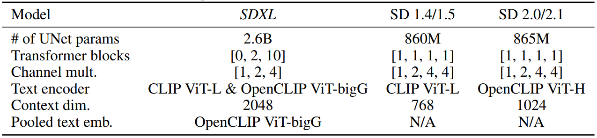

除了使用交叉注意力层对模型进行文本输入条件化外，还根&#x636E;**`OpenCLIP`**&#x6A21;型池化文本 Embedding 来调整模型。这些更改使得 UNet 中的模型参数量达&#x5230;**`2.6B`**，文本编码器的总参数量&#x4E3A;**`817M`**。

* **条件化**

**图像大小的条件化**

LDM 范式的缺点之一是由于其两阶段架构，训练模型需要最小图像尺寸。解决此问题的两种主要方法是：丢弃所有低于某个最小分辨率的训练图像，例如，**`Stable Diffusion 1.4/1.5`**丢弃了所有尺寸低于**`512`**像素的图像，或者放大过小的图像。然而，根据所需图像分辨率的不同，前一种方法可能导致大量训练数据被丢弃，从而导致性能损失并损害泛化能力。如右图，对于这种特定的数据选择，丢弃所有低于分辨率$$256^2$$像素的样本会导&#x81F4;**`39%`**&#x6570;据被丢弃。另一方面，第二种方法通常会引入放大的图像，这可能泄漏到最终模型输出中，导致样本模糊等问题。

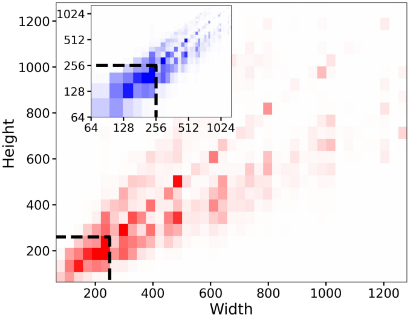

相反，SDXL 在 UNet 模型中对原始图像分辨率进行条件化，这在训练期间很容易获得。具体来说，将原始图像的高度和宽度作为额外条件提供给模型，表示为$$c_\text{size} = (h_{\text{original}}, w_{\text{original}})$$。每个组件都通过傅里叶特征编码独立嵌入，这些编码被连接成一个向量，并通过将其添加到 Timestep Embedding 中馈送到模型。

SDXL 通过在空间大小为$$512^2$$的 ImageNet 上训练和评估三个 LDM 来定量评估这种简单但有效的条件化技术的效果：

> 1. 对于第一个模&#x578B;**`CIN-512-only`**，丢弃所有至少一边小于**`512`**像素的训练样本，结果得到仅包&#x542B;**`7`**&#x4E07;张图像的训练数据集。
>
> 2. 对&#x4E8E;**`CIN-nocond`**，使用所有训练样本，但不进行大小条件化。训练完成后，使&#x7528;**`50`**&#x6B65;**`DDIM`**&#x548C;比例&#x4E3A;**`5`**&#x7684;无分类器引导，为每个模型生&#x6210;**`5000`**&#x4E2A;样本，并计&#x7B97;**`IS`**&#x548C;**`FID`**。
>
> 3. 对&#x4E8E;**`CIN-size-cond`**，始终以$$c_\text{size} = (512, 512)$$进行条件化生成样本。

右表总结了结果，并验证&#x4E86;**`CIN-size-cond`**&#x5728;两项指标上均优于基线模型。**`CIN-512-only`**&#x7684;性能下降可能是因为对小型训练数据集的过拟合，&#x800C;**`CIN-nocond`**&#x6837;本分布中模糊样本模式的影响导致 FID 分数降低。

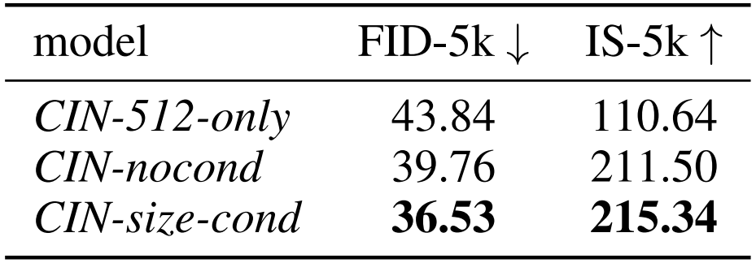

**裁剪参数的条件化**

右图前两行展示了先前 SD 模型的典型失败模式：合成对象被裁剪，例如 SD 1-5 和 SD 2-1 的猫头被切断。这是因为模型训练期间使用了随机裁剪：在深度学习框架中一个批次需要相同大小的张量，因此典型的处理流程是：调整图像大小，使最短边匹配目标尺寸，然后沿较长轴随机裁剪图像。虽然随机裁剪是一种自然的数据增强形式，但它可能泄漏到生成样本中，导致上述恶意效果。

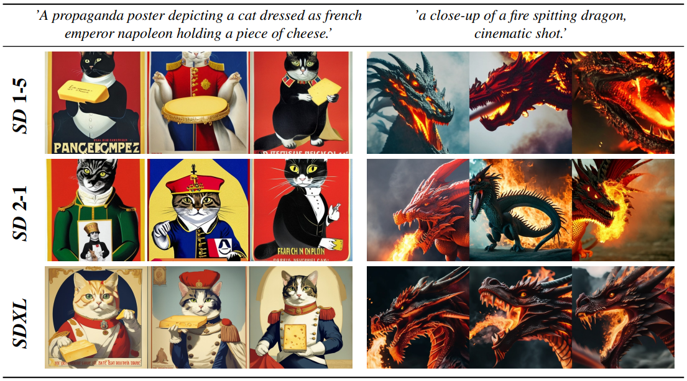

为了解决这个问题，SDXL 提出了另一种简单而有效的条件化方法：在数据加载期间，均匀采样裁剪坐标$$c_\text{top}$$和 $$c_\text{left}$$，分别指定沿高度和宽度轴从左上角裁剪的像素数量，并通过傅里叶特征嵌入将其作为条件参数馈送到模型中，类似于上述大小条件化。连接后的嵌入$$c_\text{crop}$$用作附加条件参数。这种技术不仅限于 LDM，还可用于任何 DM。这里裁剪和大小条件化可以轻松组合，在添加到 UNet 的 timestep 之前，沿通道维度连接特征 Embedding 。右图伪代码展示了如何在训练期间如何采样 $$c_\text{crop}$$ 和 $$c_\text{size}$$。

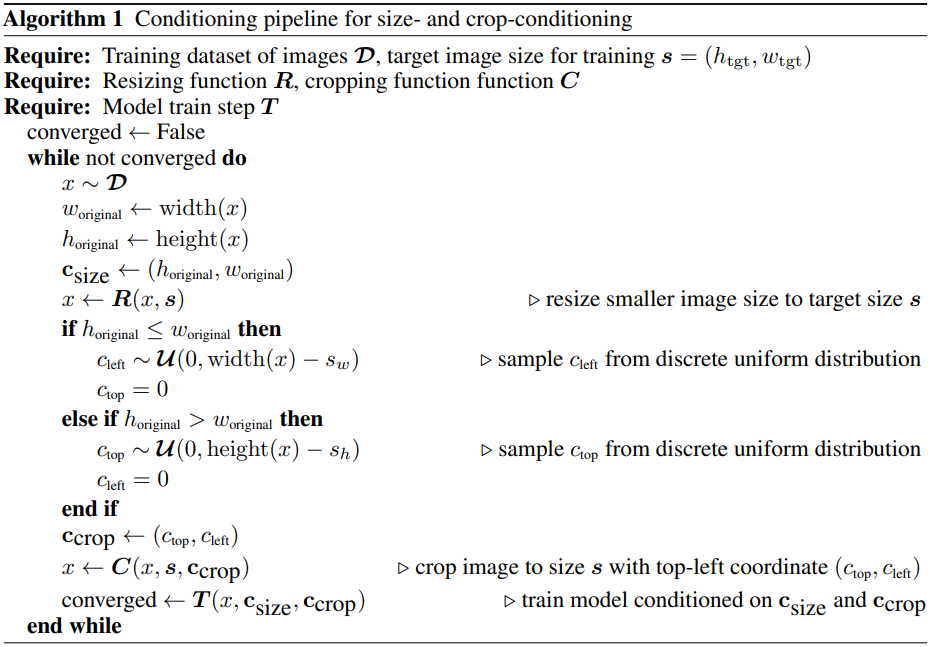

由于大规模数据集通常内容是在中心的，因此在推理期间设置$$(c_\text{top}, c_\text{left}) = (0, 0)$$，从训练模型中获得对象居中的样本。通过调整$$(c_\text{top}, c_\text{left})$$，可以成功模拟推理期间的裁剪量。这是一种条件增强形式，已在各种自回归模型和扩散模型中以多种形式使用。

SDXL 受益于裁剪引起的数据增强，同时确保它不会泄漏到生成过程中，并且可以利用它来更好地控制图像合成过程。此外，它易于实现，可以在训练期间在线应用，无需额外的数据预处理。

* **多长宽比的训练**

现实世界的数据集包含尺寸和宽高比变化极大的图像，如上所述。尽管文本到图像模型的常见输出分辨率是 $$512 \times 512$$或$$1024 \times 1024$$的方形图像，但这是一个很不自然的选择，因为例如$$16:9$$的照片或长方形屏幕广泛分布和使用。

基于这一想法，作者对模型进行微调以同时处理多种宽高比：遵循常见的做法，将数据按不同宽高比分成多个桶，尽量使像素总数接近$$1024^2$$像素，并根据需要调整高度和宽度，且调整步长为**`64`**的倍数，所有长宽比如右图。在优化过程中，一个训练批次由来自同一桶的图像组成，并在每个训练步骤中交替切换桶大小。此外，模型接收目标大小作为条件输入，表示为整数元组$$c_\text{ar} = (h_{\text{tgt}}, w_{\text{tgt}})$$，这些值通过傅里叶空间嵌入，类似于上述大小和裁剪条件化。SDXL 将多纵横比训练作为预训练阶段后的微调步骤，预训练阶段是在固定长宽比和分辨率下完成的，并通过沿通道连接的方式与条件化技术结合使用。裁剪条件化和多长宽比训练是互补的操作。

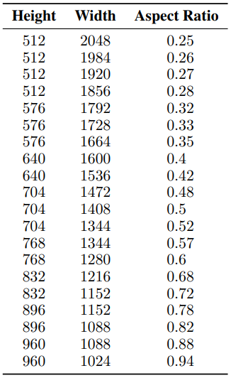

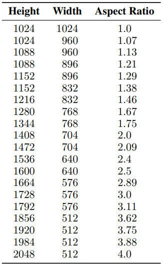

* **改进的自编码器**

Stable Diffusion 是一种 LDM，运行在预训练、可学习的和固定的自编码器潜在空间中。虽然大部分语义合成是由 LDM 完成的，但通过改进自编码器可以提升生成图像中的局部高频细节。

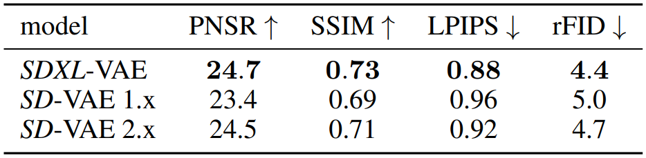

为此，SDXL 使用更大的批量大小，&#x5C06;**`9`**&#x6539;&#x4E3A;**`256`**，训练与原始 Stable Diffusion 相同的自编码器架构，并额外使用指数移动平均跟踪权重。由此产生的自编码器在所有评估的重建指标上均优于原始模型，如右表。

* **整体结构**

通过多阶段过程训练最终模型 SDXL。SDXL 使用上述提到的自编码器和离散时间扩散步骤，&#x5373;**`1000`**&#x6B65;。然后使用多阶段训练：

> 1. 在内部数据集上预训练一个基础模型，然后在$$256 \times 256$$分辨率下进&#x884C;**`60`**&#x4E07;次优化步骤，批量大小&#x4E3A;**`2048`**，并使用大小和裁剪条件化。
>
> 2. 在$$512 \times 512$$分辨率的图像上继续训&#x7EC3;**`20`**&#x4E07;次优化步骤，
>
> 3. 利用多长宽比训练结合$$0.05$$的偏移噪声水平，在约$$1024 \times 1024$$像素面积的不同长宽比下训练模型。

**精修阶段**

为了提高样本质量，作者在同一潜在空间中训练了一个单独的 LDM，该模型专注于高质量、高分辨率数据，并对基础模型的样本应用 SDEdit 引入的噪声-去噪过程。这里遵循之前的工作，并将此精修模型专门用于前 200 个噪声尺度。在推理时，从基础 SDXL 渲染潜在变量，并在潜在空间中直接使用精修模型对其进行扩散和去噪，使用相同的文本输入。这一步骤是可选的，但它显著提升了详细背景和人脸的样本质量。

为了评估模型有无精修阶段的性能，作者进行了用户研究，让用户从以下四个模型中选择他们最喜欢的生成结果：SDXL、带精修的 SDXL、Stable Diffusion 1.5 和 Stable Diffusion 2.1。

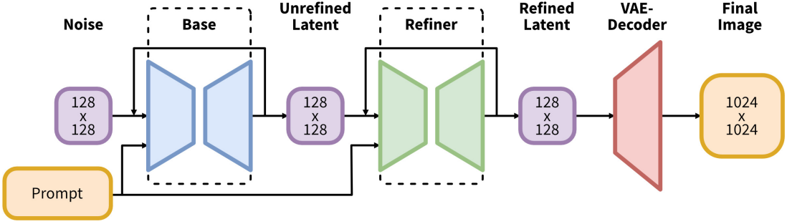

结果显示，带有精修阶段的 SDXL 是最受欢迎的选择，显著优于 Stable Diffusion 1.5 和 2.1：SDXL 带精修：**`48.44%`**，SDXL 基础：**`36.93%`**，Stable Diffusion 1.5：**`7.91%`**，Stable Diffusion 2.1：**`6.71%`**）。

### 4.2.4 Stable Diffusion 3

* **流模型训练**

生成模型通过一个常微分方程 ODE 定义从噪声分布$$p_1$$中采样得到的样本$$x_1$$到数据分布$$p_0$$中采样得到的样本$$x_0$$之间的映射：

$$dy_t = v_\Theta(y_t, t) dt$$

其中速度场$$v$$由神经网络的参数$$\Theta$$参数化。先前的工作是直接通过可微分 ODE 求解器求解该方程，但计算代价高，尤其当$$v_\Theta(y_t, t)$$由大型网络架构参数化时。一种更高效的替代方法是直接回归一个向量场$$u_t$$，生成$$p_0$$与$$p_1$$之间的概率路径。

为构造这样的$$u_t$$，要定义一个前向过程，对应于$$p_0$$与$$p_1 = \mathcal{N}(0, I)$$之间的概率路径$$p_t$$：

$$z_t = a_t x_0 + b_t \epsilon, \quad  \quad \epsilon \sim \mathcal{N}(0, I)$$

当$$a_0 = 1, b_0 = 0, a_1 = 0, b_1 = 1$$时，边缘分布

$$p_t(z_t) = \mathbb{E}_{\epsilon \sim \mathcal{N}(0,I)} p_t(z_t|\epsilon)$$

与数据分布和噪声分布一致。

这里为了表达$$z_t$$、$$x_0$$与$$\epsilon$$之间的关系，引入$$\psi_t$$和$$u_t$$：

$$\psi_t(\cdot|\epsilon) : x_0 \mapsto a_t x_0 + b_t \epsilon$$

$$u_t(z|\epsilon) := \psi'_t(\psi^{-1}_t(z|\epsilon)|\epsilon)$$

由于$$z_t$$可写作 ODE $$z'_t = u_t(z_t|\epsilon)$$的解，且初始值$$z_0 = x_0$$，因此$$u_t(\cdot|\epsilon)$$生成条件概率路径 $$p_t(\cdot|\epsilon)$$。这里可以利用条件向量场$$u_t(\cdot|\epsilon)$$构造一个边缘向量场$$u_t$$，生成边缘概率路径$$p_t$$：

$$u_t(z) = \mathbb{E}_{\epsilon \sim \mathcal{N}(0,I)} u_t(z|\epsilon) \frac{p_t(z|\epsilon)}{p_t(z)}$$

由于上式中的边缘化，直接通过流匹配目标

$$L_{\text{FM}} = \mathbb{E}_{t,p_t(z)} \|v_\Theta(z, t) - u_t(z)\|_2^2$$

回归$$u_t$$是不可行的，但条件流匹配 Conditional Flow Matching 目标

$$L_{\text{CFM}} = \mathbb{E}_{t,p_t(z|\epsilon),p(\epsilon)} \|v_\Theta(z, t) - u_t(z|\epsilon)\|_2^2$$

使用条件向量场$$u_t(z|\epsilon)$$提供了一个等价且可计算的目标。

为将损失显式化，将$$\psi'_t(x_0|\epsilon) = a'_t x_0 + b'_t \epsilon$$和$$\psi^{-1}_t(z|\epsilon) = \frac{z - b_t \epsilon}{a_t}$$代入$$u_t(z|\epsilon) := \psi'_t(\psi^{-1}_t(z|\epsilon)|\epsilon)$$，得到：

$$z'_t = u_t(z_t|\epsilon) = \frac{a'_t}{a_t} z_t - \epsilon b_t \left( \frac{a'_t}{a_t} - \frac{b'_t}{b_t} \right)$$

> **注**：信噪比为$$\lambda_t := \log \frac{a_t^2}{b_t^2}$$

由于 $$\lambda'_t = 2\left( \frac{a'_t}{a_t} - \frac{b'_t}{b_t} \right)$$，可以将上式重写为：

$$u_t(z_t|\epsilon) = \frac{a'_t}{a_t} z_t - \frac{b_t}{2} \lambda'_t \epsilon$$

然后用上式将$$L_{\text{CFM}} = \mathbb{E}_{t,p_t(z|\epsilon),p(\epsilon)} \|v_\Theta(z, t) - u_t(z|\epsilon)\|_2^2$$重新参数化为噪声预测目标：

$$L_{\text{CFM}} = \mathbb{E}_{t,p_t(z|\epsilon),p(\epsilon)} \left\| v_\Theta(z, t) - \frac{a'_t}{a_t} z + \frac{b_t}{2} \lambda'_t \epsilon \right\|_2^2 = \mathbb{E}_{t,p_t(z|\epsilon),p(\epsilon)} \left( -\frac{b_t}{2} \lambda'_t \right)^2 \| \epsilon_\Theta(z, t) - \epsilon \|_2^2$$

这里定义$$\epsilon_\Theta := -\frac{2}{\lambda'_t b_t} \left( v_\Theta - \frac{a'_t}{a_t} z \right)$$

> **注**：这个目标的最优解在引入时间相关权重后不会改变。因此，可以推导出各种加权损失函数，它们均指向期望解，但可能影响优化轨迹。为了能分析不同方法，包括经典扩散模型，可以将目标写成：
>
> $$L_w(x_0) = -\frac{1}{2} \mathbb{E}_{t \sim U(t), \epsilon \sim \mathcal{N}(0,I)} \left[ w_t \lambda'_t \| \epsilon_\Theta(z_t, t) - \epsilon \|^2 \right]$$
>
> 其中 $$w_t = -\frac{1}{2} \lambda'_t b_t^2$$&#x20;

* **Flow Trajectories**

上述形式有很多不同变体：

> 1. **Rectified Flow（RF）**：定义前向过程为数据分布与标准正态分布之间的直线路径，即：
>
> $$z_t = (1 - t) x_0 + t \epsilon$$
>
> 并使用条件流匹配目标$$L_{\text{CFM}}$$，此时对应的权重为$$w_t^{\text{RF}} = \frac{t}{1 - t}$$。网络输出直接参数化速度场$$v_\Theta$$。
>
> * **EDM**：使用如下形式的前向过程：
>
> $$z_t = x_0 + b_t \epsilon$$
>
> 其中$$b_t = \exp F_N^{-1}(t|P_m, P_s^2)$$，$$F_N^{-1}$$为均值$$P_m$$、方差$$P_s^2$$的正态分布的分位函数。这会导致：
>
> $$\lambda_t \sim \mathcal{N}(-2P_m, (2P_s)^2), \quad\quad t \sim U(0,1)$$
>
> 网络通&#x8FC7;**`F-prediction`**&#x53C2;数化，损失可写为$$L_{w_t}^{\text{EDM}}$$，其中：
>
> $$w_t^{\text{EDM}} = \mathcal{N}(\lambda_t | -2P_m, (2P_s)^2) \left( e^{-\lambda_t} + 0.5^2 \right)$$
>
> * **Cosine**：前向过程如下：
>
> $$z_t = \cos\left( \frac{\pi}{2} t \right) x_0 + \sin\left( \frac{\pi}{2} t \right) \epsilon$$
>
> 结&#x5408;**`ϵ-parameterization`**&#x4E0E;损失函数，其对应权重为$$w_t = \text{sech}(\lambda_t / 2)$$。若结&#x5408;**`v-prediction`**&#x635F;失，则权重为$$w_t = e^{-\lambda_t / 2}$$。
>
> * **LDM-Linear**：LDM 使用对 DDPM 调度的修改。两者均为方差保持调度，即$$b_t = \sqrt{1 - a_t^2}$$，并基于扩散系数$$\beta_t$$定义离散时间步$$t = 0, \dots, T-1$$下的$$a_t = \left( \prod_{s=0}^t (1 - \beta_s) \right)^{1/2}$$。给定边界值$$\beta_0$$和$$\beta_{T-1}$$，DDPM 使用线性插值 $$\beta_t = \beta_0 + \frac{t}{T-1} (\beta_{T-1} - \beta_0)$$，而 LDM 使用平方根插值$$\beta_t = \left( \sqrt{\beta_0} + \frac{t}{T-1} (\sqrt{\beta_{T-1}} - \sqrt{\beta_0}) \right)^2$$。

RF 损失在区间$$[0,1]$$上对所有时间步均匀训练速度场$$v_\Theta$$。然而速度预测目标$$\epsilon - x_0$$在中间时间步更难预测：当$$t=0$$时最优预测为$$p_1$$的均值，当$$t=1$$时为$$p_0$$的均值。将时间步分布从均匀分布$$U(t)$$改为密度为$$\pi(t)$$的分布，等价于加权损失$$L_{w_t^\pi}$$，其中：

$$w_t^\pi = \frac{t}{1 - t} \pi(t)$$

因此通过对中间时间步更高频采样来赋予其更大权重。以下是用于训练模型的时间步密度$$π(t)$$ ：

> **Logit-Normal Sampling**：在中间步骤赋予更高权重的分布。密度为：
>
> $$\pi_{\text{ln}}(t; m, s) = \frac{1}{s \sqrt{2\pi}} \frac{1}{t(1 - t)} \exp\left( -\frac{(\text{logit}(t) - m)^2}{2s^2} \right)$$
>
> 其中$$\text{logit}(t) = \log \frac{t}{1 - t}$$，$$m$$为位置参数，$$s$$为尺度参数。位置参数使训练时间步偏向数据$$p_0$$（此时$$m<0$$）或噪声$$p_1$$（此时$$m>0$$）。如下图，尺度参数控制分布宽度。一般从正态分布$$u \sim \mathcal{N}(m, s)$$中采样，并通过标&#x51C6;**`Logistic`**&#x51FD;数映射。

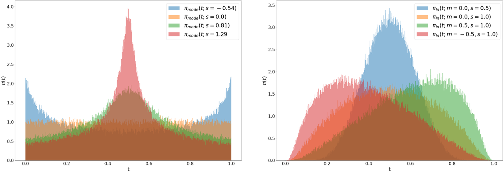

> **Mode Sampling with Heavy Tails**：logit-normal density 在端点$$0$$和$$1$$处始终为零。这里作者研究这是否对性能有负面影响，因此使用在$$[0,1]$$上严格为正的 density。对尺度参数$$s$$，定义：
>
> $$f_{\text{mode}}(u; s) = 1 - u - s \cdot \left( \cos^2\left( \frac{\pi}{2} u \right) - 1 + u \right)$$
>
> 当$$-1 \leq s \leq \frac{2}{\pi - 2}$$时，该函数单调，可从中采样 implied density：
>
> $$\pi_{\text{mode}}(t; s) = \left| \frac{d}{dt} f_{\text{mode}}^{-1}(t) \right|$$
>
> 上图中尺度参数控制采样时偏向中点$$s>0$$或端点$$s<0$$。当$$s=0$$时，该公式退化为均匀权重 $$\pi_{\text{mode}}(t; 0) = U(t)$$，这&#x5728;**`Rectified Flow`**&#x5E7F;泛使用。

> **CosMap**：在 RF 设定下尝&#x8BD5;**`Cosine`**&#x4F59;弦调度。这里作者寻找映射$$f: u \mapsto t = f(u)$$，$$u \in [0,1]$$，使得对数信噪比匹配余弦调度：$$2 \log \frac{\cos(\frac{\pi}{2} u)}{\sin(\frac{\pi}{2} u)} = 2 \log \frac{1 - f(u)}{f(u)}$$。求解$$f$$，对$$u \sim U(u)$$得：
>
> $$t = f(u) = 1 - \frac{1}{\tan(\frac{\pi}{2} u) + 1}$$
>
> 由此得到密度：
>
> $$\pi_{\text{CosMap}}(t) = \left| \frac{d}{dt} f^{-1}(t) \right| = \frac{2}{\pi - 2\pi t + 2\pi t^2}$$

* **模型结构**

为了实现文本条件图像生成，模型需同时处理文本与图像两种模态。作者使用预训练模型提取表征，整体结构如下图：

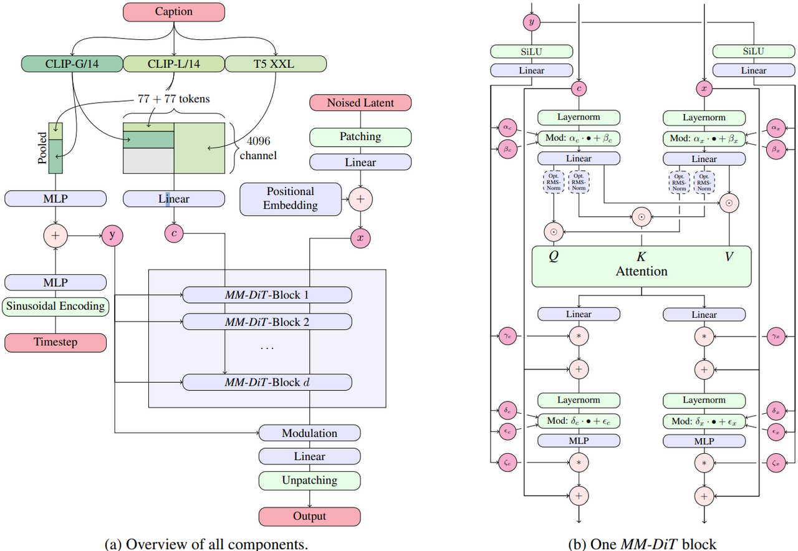

MMDiT 最初是 Stable Diffusion 3 的核心架构，后来成为很多出色扩散模型的核心架构。其目标是用 Transformer 来进行扩散去噪，同时支持图像 + 文本两个模态。它将**`text token`**、**`image latent token`**映射到一个统一 embedding 空间，通过 Transformer 的 self-attention 来处理模态间以及模态内交互。

1. **双流设计**

> * MMDiT 对文本和图像采用分支结构：图像 token 和文本 token 各自有自己的$$Q/K/V$$投影，以及 MLP 子层。这样可以让每个模态有自己的特征变换路径
>
> * 在 attention 层中，将图像 token 序列和文本 token 序列两种模态拼接，然后执行 self-attention，从而实现跨模态的信息交互
>
> * attention 输出后，再分别送回图像分支和文本分支的 MLP，以保持每个模态特有的表示能力

这种设计的好处是：**既能通过各自 MLP 和各自的 QKV 保留模态专属变换能力，又能通过拼接 attention 实现跨模态融合**。

* **Attention 分块**

在 MMDiT 的 self-attention 中，由于拼接了文本和图像 token，因此 attention 矩阵可以被视为四种子类型：

> * **I→I**：image-to-image
>
> * **T→T**：text-to-text
>
> * **I→T**：image-to-text
>
> * **T→I**：text-to-image

这种分块结构非常重要，因为它明确地建模了跨模态（**文本 ↔ 图像**）和模态内（**文本 ↔ 文本、图像 ↔ 图像**）的交互。**I→T** / **T→I** 使得图像 token 可以关注文本 token，同样文本 token 也可以关注图像 token，从而实现更强的语义对齐与控制。同时，保留 **I→I** 自注意力可以维持图像内部结构的一致性。

* **条件控制**

> - 使用时间&#x6B65;**`timestep`**&#x4F5C;为条件注入模型，也就是扩散模型中时间嵌&#x5165;**`time embedding`**&#x4F1A;被引入到 Transformer 层中
>
> - 文本条&#x4EF6;**`prompt embedding`**&#x901A;过 attention 影响图像 token
>
> - 为了融合不同模态的信息，在 Transformer 层里用归一化，&#x5982;**`LayerNorm`**、**`AdaLN`**&#x6765;调节各 token 的表示

> 注：在一些实现里，如 PyPI &#x7684;**`mmdit-pytorch`**，可以看&#x5230;**`MMDiTBlock(dim_cond, dim_text, dim_image)`** 这样的模块，其&#x4E2D;**`dim_cond`**&#x53EF;用于时间条件注入。&#x20;

* **位置编码**

> - 对于图像 token，由于它们是从 VAE latent 空间里提取出的 patch，MMDiT 通常对这些 patch 使用 **`2×2`&#x20;**&#x70;atch &#x7684;**绝对位置编码**&#x6765;保留图像空间结构
>
> - 对文本 token 则使用 Transformer 常见的位置编码：类似 T5 &#x7684;**相对位置编码**&#x6765;保持文本顺序语义
>
> - 不同模态的位置编码需要尺度对齐，以避免数值上的冲突

整体网络结构遵循 LDM，在预训练自编码器的潜在空间中训练文本到图像模型。与图像编码类似，遵循先前方法，使用预训练、冻结的文本模型编码文本条件$$c$$。细节如下：

> **图像表征**：遵循 LDM 的方法，使用预训练的自编码器将 RGB 图像$$X \in \mathbb{R}^{H \times W \times 3}$$映射到一个更小的潜在空间$$x = E(X) \in \mathbb{R}^{h \times w \times d}$$。采用空间下采样因子$$8$$，即$$h = \frac{H}{8}$$、$$w = \frac{W}{8}$$。这里在潜在空间中应用$$z_t = a_t x_0 + b_t \epsilon$$的前向过程，当通过$$dy_t = v_\Theta(y_t, t) dt$$采样得到潜在表示$$x$$后，再通过解码器$$D$$将其解码回像素空间$$X = D(x)$$。然后对潜在变量进行全局归一化，均值和标准差基于训练数据的一个子集计算得出。右图是在不同$$d$$值下，训练随模型容量变化的趋势
>
> 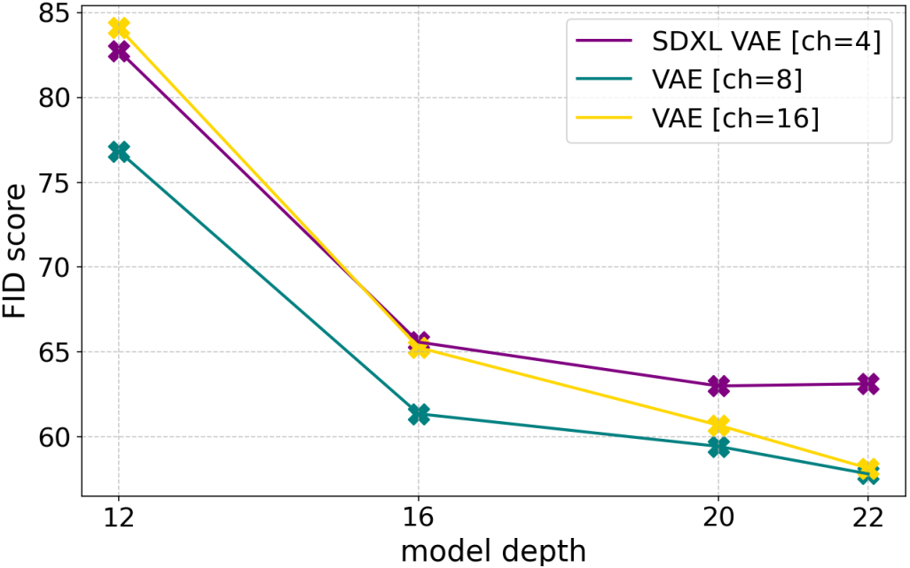
>
> **文本表征**：使用预训练且冻结的文本模型对文本条件$$c$$进行编码，即结合使用 CLIP 与 T5。
>
> 1. 使&#x7528;**`CLIP L/14`**&#x548C;**`OpenCLIP bigG/14`**&#x7684;文本编码器对$$c$$进行编码，然后将两个模型的池化输出拼接，其维度分别&#x4E3A;**`768`**&#x548C;**`1280`**，得到向量条件$$c_{\text{vec}} \in \mathbb{R}^{2048}$$
>
> 2. 将两个模型倒数第二层的隐藏表示沿通道维度拼接，得到 CLIP 上下文条件$$c^{\text{CLIP}}_{\text{ctxt}} \in \mathbb{R}^{77 \times 2048}$$
>
> 3. 使&#x7528;**`T5-v1.1-XXL`**&#x7684;编码器将$$c$$编码为最终表示$$c^{\text{T5}}_{\text{ctxt}} \in \mathbb{R}^{77 \times 4096}$$
>
> 4. 将 $$c_{\text{CLIP}}^{\text{ctxt}}$$ 沿通道维度零填充至 4096 维，以匹配 T5 表示，并沿序列维度与$$c^{\text{T5}}_{\text{ctxt}}$$拼接，得到最终的上下文表示$$c_{\text{ctxt}} \in \mathbb{R}^{154 \times 4096}$$

SD3 的架构是基&#x4E8E;**`DiT`**&#x7684;，其仅考虑类别条件图像生成，使用调制机制将扩散时间步和类别标签作为网络条件。类似地，作者使用时间步$$t$$和$$c_{\text{vec}}$$的嵌入作为调制机制的输入。然而，由于池化文本表征仅保留文本输入的粗粒度信息，网络还需序列表征$$c_{\text{ctxt}}$$的信息。因此构建了一个包含文本与图像输入嵌入的序列，为潜在像素表征$$x \in \mathbb{R}^{h \times w \times c}$$添加位置编码，将其展平为$$2 \times 2$$的图块序列，长度为$$\frac{1}{2} h \cdot \frac{1}{2} w$$。将该图块编码与文本编码$$c_{\text{ctxt}}$$嵌入至共同维度后，将两个序列拼接。然后和 DiT 相同的，应用一系列注意力和 MLP 模块。

由于文本与图像嵌入概念差异较大，作者为两种模态使用两组独立权重，这等价于为每种模态使用独立的Transformer，在注意力操作中合并两个模态的序列，使得两种表征既可在各自空间中运作，又能相互参考。

在 scaling 实验中，以模型深度$$d$$，即注意力块数量，参数化模型规模：隐藏层大小设为$$64 \cdot d$$，MLP 块中扩展为 $$4 \cdot 64 \cdot d$$ 通道，注意力头数设为$$d$$。

### 4.2.5 FLUX.1

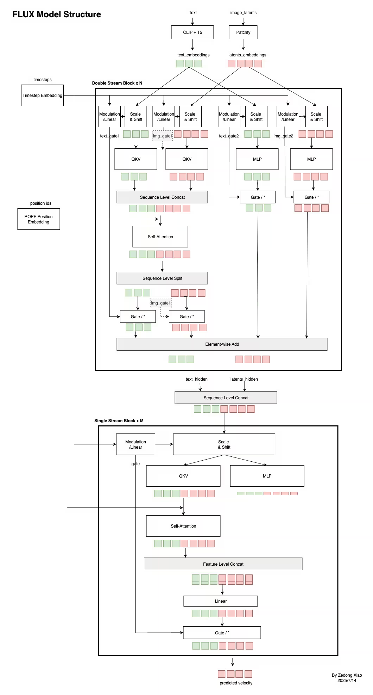

在扩散模型的发展过程中，**FLUX.1** 是非常有代表性的作品，其来自 **BFL**（**B**lack **F**orest **L**abs），由 Stable Diffusion 3 的核心团队打造，可以看作是 SD3 的下一代。与一般的文本到图像扩散模型不同的是，**FLUX.1** 在架构、训练方式等方面做了大量工程优化，目标是同时兼顾**高质量**与**高效率**。

目前 FLUX.1 有三个规模的模型：**`FLUX.1-pro`**、**`FLUX.1-dev`**、**`FLUX.1-schnell`**，效果逐渐变差，但速度逐渐变快。

* **模型结构**

**FLUX.1** 的核心是一&#x4E2A;**流匹配驱动的扩散网络**，整体上由三部分组成：文本编码器 **Text Encoder**、图像 **VAE**、网络主体 **DiT**。

1. **Text Encoder**

**Stable Diffusion 3&#x20;**&#x7684; **Text Encoder&#x20;**&#x4E00;共使用&#x4E86;**`CLIP ViT-L`**、**`OpenCLIP ViT-bigG`**、**`T5-XXL Encoder`**&#x4E09;&#x4E2A;**&#x20;Text Encoder** 模型。

> * 两个 **CLIP Encoder** 提取&#x7684;**`Pooling Text Embedding`**&#x7279;征拼接在一起后&#x4E0E;**`Time Embedding`**&#x76F8;加。
>
> * 两个 **CLIP Encoder** &#x7684;**`Text Embedding`**&#x7279;征进行拼接，在 **Token&#x20;**&#x7EF4;度与 **T5-XXL&#x20;**&#x7684;**`Text Embedding`**&#x62FC;接后送入 **`MM-DiT`** 中

**FLUX.1** 对 **SD3** 的 **Text Encoder** 部分进行了精简优化，只使用了**`CLIP ViT-L`**和**`T5-XXL Encoder`**两个 **Text Encoder** 模型，没有用**`OpenCLIP ViT-bigG`**模型：**FLUX.1 **将 **CLIP ViT-L** 的**`Pooling Text Embeddings`**特征与**`Time Embedding`**相加，同时 **T5-XXL** 提取的**`Text Embedding`**特征直接送入 **MM-DiT** 中。

> **SD3&#x20;**&#x4E2D;**`CLIP Encoder`**&#x7684;特征有较大的作用，可以去掉** T5-XXL** 只用 **CLIP Encoder **提取文本特征信息来生成图像。但是 FLUX.1 的改进使得 **FLUX.1** 比 **SD3** 更依赖 **T5-XXL** 提取的文本特征信息。
>
> **`FLUX.1-dev`**&#x548C;**`FLUX.1-schnell`**&#x4E24;个版本的 **Text Encoder** 部分的结构完全一致。

这里使用 **@Rocky Ding** 大佬的图来说明：

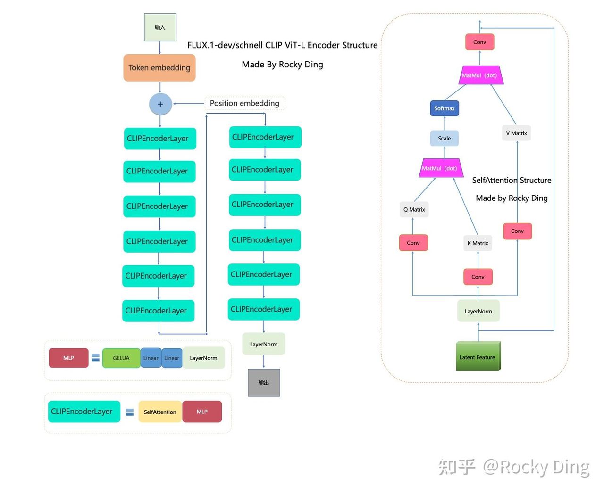

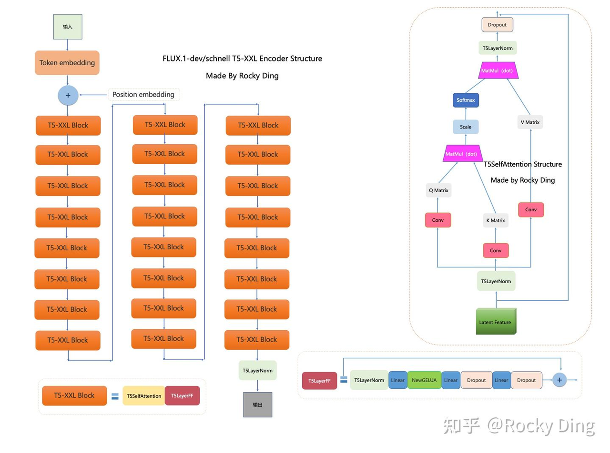

* **VAE**

**FLUX.1 VAE** 架构继承了 **SD3 VAE** 的**`8`**倍下采样，但在 **FLUX.1 VAE** 输出的 Latent 特征输入扩散模型前，进行了**`Pack Latent`**操作，将 **Latent** 特征通道数由**`16`**提高到**`64`**，即 **FLUX.1&#x20;**&#x6269;散模型输入通道数是 **64**，是 **SD3** &#x7684;**`4`**&#x500D;。也就是说 **FLUX.1&#x20;**&#x8981;学习拟合的内容是 **SD3** &#x7684;**`4`**&#x500D;，即 **FLUX.1** 增加了模型参数量级来提升模型容量。

> **注**：**`Pack Latent`**&#x64CD;作如下：
>
> * **SD3** 使用下采样卷积来实现 Latent 特征 Patch 化，会通过卷积减少空间分辨率损失一定的特征信息。
>
> * **FLUX.1** 将像素块直接在通道维度上堆叠实现 Latent 特征 Patch 化。保留了每个像素块的原始分辨率，只将它们从空间维度移动到了通道维度。

**FLUX.1** 在过扩散模型之前将$$2\times2$$特征 Patch 化，这与 **SD3** 的风格是一样的，并在此基础上进行了继承与优化。

> **注**：**`FLUX.1-dev`**&#x548C;**`FLUX.1-schnell`**&#x4E24;个版本&#x7684;**&#x20;VAE** 结构完全一致。
>
> **FLUX.1 VAE** 没有直接沿用 **SD3 VAE**，而是基于相同结构进行了重新训练，权重不一样。
>
> **SD3** 和 **FLUX.1 **的 **VAE** 会对编码后的 **Latent **特征做平移和缩放：（之前的 **SD** 系列中 **VAE** 仅做缩放）
>
> 平移和缩放操作能将 Latent 特征分布的均值和方差归一化到**`0`**和**`1`**，和扩散过程加的高斯噪声在同一范围内，更加严谨和合理。

**`FLUX.1-dev`**/**`FLUX.1-schnell`**&#x7CFB;列模型的 **VAE** 完整结构图如下：

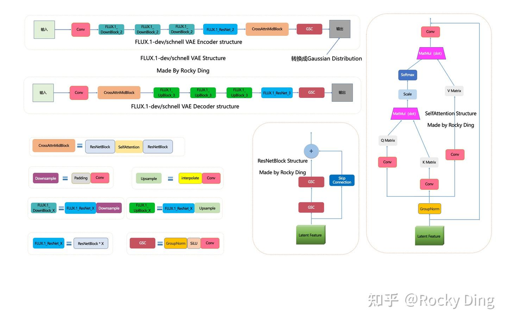

* **DiT**

**FLUX.1** &#x7684;**`DiT`**&#x5728; **SD3** 的基础上进一步优化，除了有和 **SD3** 一样的双流 DiT **`MM-DiT`**，还有单流 DiT **`Single-DiT`**。在单流 DiT 中，文本信息和图像信息拼接融合在一起，再送入 Attention 中处理，也就是经典的 DiT 架构。同时在额外条件部分会输入完整&#x7684;**`Text Embedding`**&#x548C;池化过&#x7684;**`Pooled Text Embedding`**。

> **注**：先使用 **MM-DiT block&#x20;**&#x5B9E;现两个模态信息融合，然后再接 **Single-DiT Block&#x20;**&#x52A0;深模型深度，增强模型的整体学习能力的同时，还可以节省一些参数。

**FLUX.1** 的**`MM-Single-DiT`**包含**`19`**层 **MM-DiT** Block 和**`38`**层** Single-DiT** Block，详细结构：

> 1. **MM-DiT Block**：包含两&#x4E2A;**`AdaLayerNormZero`**&#x5C42;、一&#x4E2A;**`MM-DiT Attention`**&#x6A21;块、两&#x4E2A;**`LayerNorm`**&#x5C42;、两&#x4E2A;**`FeedForward`**&#x5C42;
>
> 2. **Single-DiT Block**：包含一&#x4E2A;**`AdaLayerNormZero`**&#x5C42;、一&#x4E2A;**`Single-DiT Attention`**&#x6A21;块、两&#x4E2A;**`Linear`**&#x5C42;、一&#x4E2A;**`GELU`**&#x6FC0;活函数
>
> 3. **MM-DiT Attention**：与 **SD3** 相同，将文本和图像看作同等重要的信息送入 **Attention**
>
> 4. **Single-DiT Attention**：将文本信息和图像信息融合后，送入经典的 DiT 中的** Attention**
>
> 5. **FeedForward**：包&#x62EC;**`GELU`**&#x6FC0;活函数、**`Dropout`**&#x5C42;、**`Linear`**&#x5C42;

**`FLUX.1-dev`**/**`FLUX.1-schnell`**&#x7684;**`MM-Single-DiT`**&#x7684;完整结构图如下：

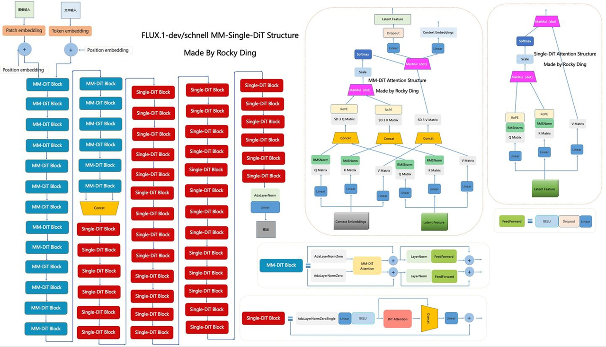

**FLUX.1** 将得到&#x7684;**`Patch Embedding`**&#x4E0E;**`Positional Embedding`**&#x76F8;加，然后输入到 Transformer 的主架构中。 同时通&#x8FC7;**`adaLN-Zero`**&#x5C42;将文本全局语义信息特&#x5F81;**`CLIP pooled embedding`**&#x548C;**`Timestep Embedding`**&#x52A0;在一起的融合特征作为额外条件注入到 Transformer Block 中。

**FLUX.1&#x20;**&#x7684; Transformer 引入了**并行注意力机制**，主要是在 Single-DiT 中使用，进一步优化模型整体的性能。

并行注意力机制把注意力和线性层之间的串联结构转变成并联结构。

> 常规注意力机制需要在计算注意力的前后各经过一次线性层的特征提取，

转换成并联结构后，注意力在计算完成后与 MLP 进行了 add 操作，将特征融合，整体的计算并行度更高，运行效率也随之提升。

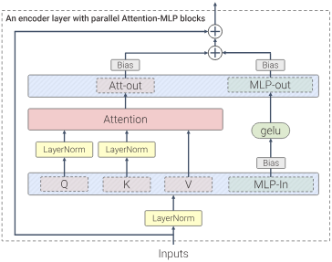

* **位置编码**

SD3 中采用绝对位置编码方式，但 **FLUX.1** 采用了**旋转位置编码 RoPE**，RoPE 使得每个位置的 Token 保留了相邻位置的相对关系。相比传统的绝对位置编码，RoPE 更注重局部关系的建模，这种增强的局部敏感性有助于模型捕获图像局部区域之间的细节关联，从而提升模型的生成质量和泛化性能。

具体的操作是将文本的位置编号设为**`(0, 0, 0)`**，图像的位置编号设为**`(0, i, j)`**，之后用标准的旋转位置编码对三个维度的编号编码，再把三组编码拼接。

> **例**：假设位于**`(i, j)`**的图像像素的位置编号是**`(0, i, j)`**，经过特征编码，位置编号会转换成**`[16, 56, 56]`**维度的矩阵，表示第一个维度用长度**`16`**的位置编码，后两维用长度 **`56`** 的位置编码。再经 RoPE 计算得到旋转式位置编码后拼接到一起，形&#x6210;**`128`**&#x7EF4;的位置编码。前 **16** 个通道是第一维位置编号的位置编码，后面两组 **56** 个通道分别是第二维、第三维位置编号的位置编码。这表示在进行注意力运算时，特征的前 **16** 个通道不知道位置信息，中间 **56** 个通道知道垂直的位置信息，最后 **56** 个通道知道水平的位置信息。

* **训练方法**

1. **time_shift**

**FLUX.1** 系列模型和 SD3 一样使用了基于**`Rectified Flow`**采样方法来生成图像，FLUX.1 也设置了一&#x4E2A;**`time_shift`**&#x503C;来平移 Time Step。

在 Rectified Flow 采样中，图像沿着某条高维路线从纯高斯噪声运动到训练集分布中，标准差用于控制不同时刻图像的不确定性。

> 时刻为**`0`**时，图像为纯噪声，标准差为**`1`**
>
> 时刻为**`1`**时，图像趋近训练集图像分布，此时标准差要尽可能趋于**`0`**

原本对于中间时刻，标准差默认按照时刻线性变化。而 **FLUX.1** 中设置了**`time_shift`**是**`0.5 ~ 1.16`**之间的数，控制的是中间时刻的噪声均值。如右图，&#x5F53;**`time_shift`**&#x503C;越大时，运动线路逐渐上凸：

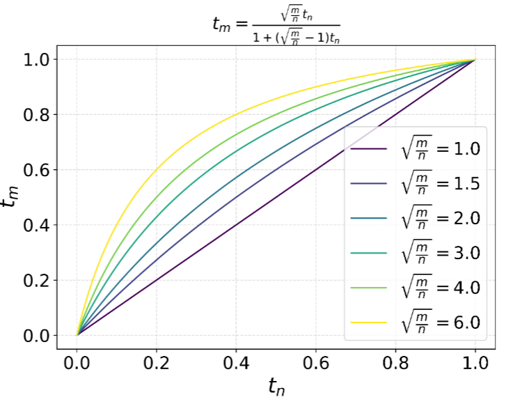

当输入的图像分辨率越大，对应的 tokens 越多，time\_shift 越大，这时要加的噪声就越大。对于分辨率越高的图像，需要加更多噪声来摧毁原图像的分布特征。这与 SD3 中的策略一致。

* **多分辨率**

**FLUX.1** 系列能够对多种图像分辨率和图像长宽比进行灵活生成，能够适&#x5E94;**`0.1-2.0MP`**&#x7684;图像生成任务。图像像素数量越多，图像的分辨率越高，细节表现越丰富。**FLUX.1** 能够很好的适配各种分辨率的图像生成，这主要得益于 **FLUX.1** 采用了**多尺度训练 **+ **RoPE 位置编码 **+ **动态 time shift** 的组合策略。

### 4.2.6 FLUX.2

FLUX.2 系列目前发布了4款模型：**FLUX.2 [pro]、FLUX.2 [flex]、FLUX.2 [dev]、FLUX.2 [klein]**

> * **FLUX.2 [pro]**：闭源商用版本，图像质量对标顶级闭源模型，生成速度更快、成本更低
>
> * **FLUX.2 [flex]**：允许调整步数、引导规模等参数，平衡质量与速度，擅长文本与细节渲染
>
> * **FLUX.2 [dev]**：32B 参数开源版本，集成文生图、多图编辑功能，支持本地部署
>
> * **FLUX.2 [klein]**：开源轻量版，通过蒸馏保留核心能力

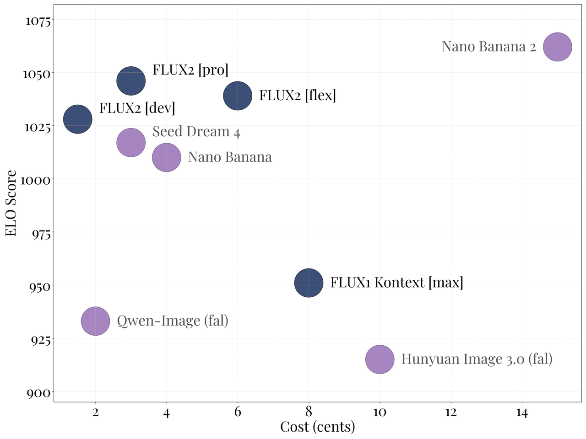

* **text encoder**

**FLUX.1** 的 text encoder 采用的&#x662F;**`T5-XXL`**&#x548C;**`CLIP`**，**FLUX.2&#x20;**&#x7528;的是一&#x4E2A;**`VLM`**&#x6A21;型：**`24B`**&#x7684;**`Mistral-Small-3.2-24B-Instruct-2506`**，不过这里只用它来编码文本特征，对于图像输入，不会像 Qwen-Image-Edit 那样还对输入图像进行特征编码。

* **VAE**

FLUX.2 的 VAE 在可学习性、质量和压缩率之间进行探索：

> * **可学习性**：DiT 在 VAE 的 latent 特征空间中学习生成新样本的难易程度，如果 latent 特征具有语义化表征可以简化建模任务，因为生成模型只需要捕捉高层语义关系，而不必建模低层感知细节，比如最近的工&#x4F5C;**`RAE`**。但这种方式可能会降低图像质量，同时降低压缩效率。
>
> * **质量**：VAE Decoder 能多忠实地从压缩的 latent 中重建原始图像，过度压缩会带来感知失真并丢失细节。通过加入感知损失与对抗训练可以提高重建质量，但压缩比越高，保真度必然下降。如果 VAE 在训练中只追求高保真重建，而不对潜空间进行语义约束，则可能产生包含高频噪声或结构不规则的潜空间，使生成模型难以学习。
>
> * **压缩率**：latent 的特征维度，更高的压缩率有助于提高建模效率，但可能同时损害重建质量以及生成模型对真实数据分布的刻画能力。

这三个目标本质上存在冲突：提高压缩率往往会损害重建质量，并可能降低可学习性；为了实现完美的重建，需要降低压缩程度；而为了通过语义结构最大化可学习性，则可能需要牺牲低层次的感知保真度。最佳的折中方式在&#x4E8E;**舍弃不可感知的信息，同时保留生成模型能够高效学习的、语义上有意义的结构**。这个也是 **FLUX.2** 的 VAE 的设计目标，其在保持图像重建质量的基础上提升了可学习性：FLUX.2 的 VAE 进一步提升了 latent 的特征维度，但空间压缩率还是**`8x`**

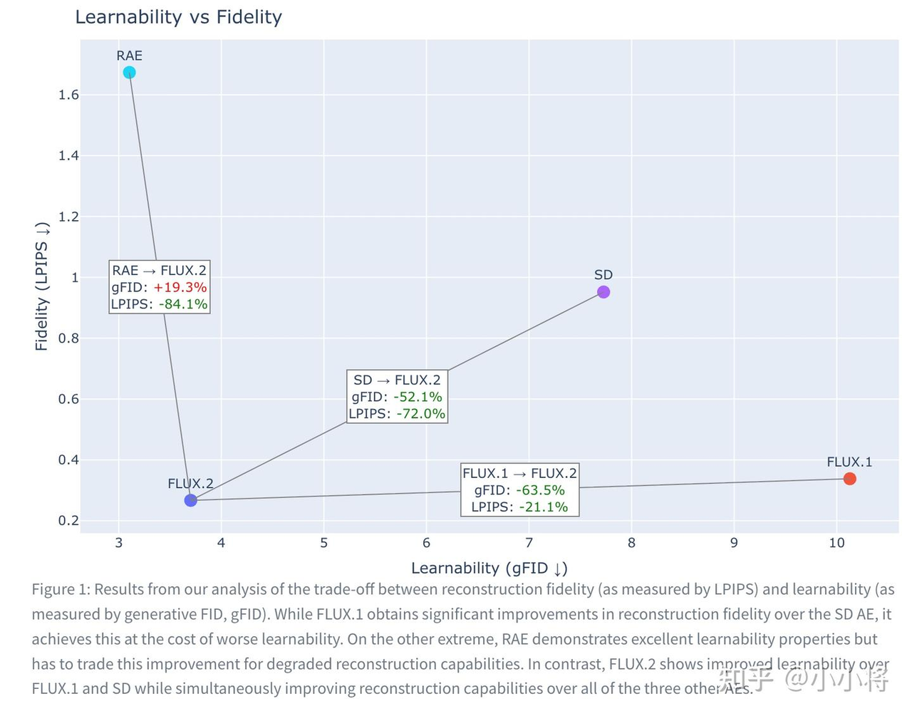

> **注**：**`SD-VAE`**&#x7684; latent 维度&#x662F;**`4`**，**`FLUX.1 VAE`**&#x7684; latent 维度&#x662F;**`16`**，**`FLUX.2 VAE`**&#x7684; latent 维度增加&#x81F3;**`32`**，latent 维度的增加不影响 DiT 的 token 数量，所以不会增加计算量，同时在训练 VAE 时引入了语义正则化来提升可学习性。

* **DiT**

FLUX.2 的 DiT 也进行了 scaling，参数量从原来&#x7684;**`12B`**&#x589E;&#x52A0;**`32B`**。FLUX.2 延续了与 FLUX.1 相同&#x7684;**`MM-DiT`** + 并行 DiT 架构。MM-DiT 块首先在独立的通道中处理图像 latent 表征和文本条件特征（**双流**），仅在注意力操作时将两者结合，并行块则在拼接后的图像和文本通道上操作（**单流**）。

**FLUX.1** 与 **FLUX.2&#x20;**&#x4E2D; DiT 的主要区别如下：

> 1. timestep 和控制条件分别在所有双流和单流 Transformer 块之间共享，不像 FLUX.1 为每个块设置独立的调制参数，这可以降低参数量
>
> 2. 模型中所有层都不使用 bias，包括注意力和前馈网络
>
> 3. 在 FLUX.1 中，单流 Transformer 块将注意力输出与前馈网络输出进行了融合。FLUX.2 的单流块还将注意力的 QKV 与前馈网络输入融合，形成一个完全并行的 Transformer 块

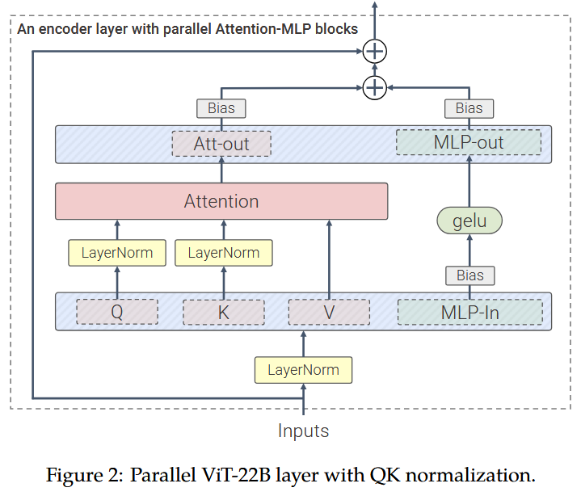

> **注**：FLUX.2 中单流 Transformer 块占比更大：包&#x62EC;**`8`**&#x4E2A;双流块&#x548C;**`48`**&#x4E2A;单流块，FLUX.1 分别&#x4E3A;**`19`**/**`38`**。即单流块在 DiT 参数中占比更高：**`Flux.1[dev]-12B`**大约有**`54%`**的总参数位于双流块中，而**`FLUX.2[dev]-32B`**大约有**`24%`**的参数在双流块中，约**`73%`**的参数在单流块中

* **位置编码**

**FLUX.1** 的位置编码采&#x7528;**`3D RoPE`**，两个维度分别编码图像的 **w** 和 **h**，第三维度&#x4E3A;**&#x20;t**，固定&#x4E3A;**`0`**。FLUX.2 的位置编码采&#x7528;**`4D RoPE`**，第一个维度是 **t**，用来区分目标图和输入的条件图，其中目标图设定为 0，而输入条件图会进行依次偏移，分别是10、20、...，这里偏移 scale 是**`10`**，第二和第三维度分别编码图像的 **w** 和 **h**，最后一个维度是 **l**，用来编码文本 token 的序列号，对于 image latents 固定&#x4E3A;**`0`**。**新增的一个维度主要是给文本 token 增加了位置编码**，之前的 FLUX.1 文本 token 的位置编码都固定为**`0`**，是不区分各个 token 的。

* **新特点**

1. 支持输入结构化的 JSON prompt，可以精确控制图像的各个方面，对于生产流程和自动化比较有用。支持输入场景描述、主体描述、艺术风格、颜色调色板、光照、背景、构图以及相机参数等来精确控制生成的图像。

2. 支持使用十六进制颜色代码进行精确配色，对于品牌一致性和设计工作比较重要。可以直接使用关键词如 **`color`**或**`hex`**&#x6307;示十六进制颜色代码。

3. 多语言理解能力，可以使用母语 prompt，获得更符合文化特色的生成结果

### 4.2.7 FLUX.3

FLUX.3 的核心变化不是在 FLUX.2 上继续堆叠图像生成能力，而是把图像、视频、音频和动作预测放进同一个多模态 Flow Backbone，让内容生成与 Physical AI 共用一套世界表征。

* **模型定位**

FLUX.3 的技术跨度和产品成熟度并不同步：统一多模态能力已经进入 Early Access，正式接口、权重和商业条件仍在展开。先区分“模型能够做什么”和“用户现在能够拿到什么”，后续判断才不会把演示能力当成交付能力。

1. **背景**

FLUX.1 和 FLUX.2 的主产品形态是图像生成与图像编辑。FLUX.3 把产品边界扩展为图像、视频、音频和 Action Prediction，并用统一 Transformer 表达这些模态之间的联系。文本仍然承担指令与语义条件的作用，图像提供空间结构，视频补上时间与动力学，音频补充事件与声学因果，动作序列则把内部世界表征连接到真实执行。

统一 Backbone 的工程收益是：同一对象、风格、运动状态和因果关系不需要在多个独立模型之间反复对齐，跨模态条件可以在共享特征空间里传递。 这不等于 FLUX.3 已经成为一个可直接下载、可本地部署、接口稳定的通用世界模型。当前能确认的是 Early Access 计划和公开展示的能力边界，不能确认的部分必须继续留空。这种能力扩张是否属于真正的代际变化，要看模型的训练对象和输出空间是否随之改变。把 FLUX.1、FLUX.2 与 FLUX.3 放在一起，差异就不再只是多了视频功能，而是 Backbone 开始承担跨模态建模。

* **从 FLUX.1、FLUX.2 到 FLUX.3**

| **代际** | **核心输出** | **主要条件** | **架构定位**                           |
| ---------------------------------------------------------------------------- | ------------------------------------------------------------------------------ | ------------------------------------------------------------------------------ | -------------------------------------------------------------------------------------------------------- |
| FLUX.1                                                                       | 图像                                                                             | 文本，部分版本支持图像条件与局部控制                                                             | 高质量文生图与可控图像生成                                                                                            |
| FLUX.2                                                                       | 图像                                                                             | 文本与多张参考图，强调 in-context 生成和编辑                                                   | 图像生成、编辑、角色与风格一致性                                                                                         |
| FLUX.3                                                                       | 图像、视频、音频、动作                                                                    | 文本、图像、视频、音频与机器人状态                                                              | 统一多模态 Flow Backbone，同时服务内容生成与动作预测 |

> **注**：代际方向明确以后，仍要把架构路线与产品可用性拆开。统一 Backbone 可以支撑多个输出头，但 Video、Image、Action 和开放权重会按不同节奏落地。

* **产品线**

| **名称** | **能力** | **计划访问方式** | **当前状态**         |
| ---------------------------------------------------------------------------- | ---------------------------------------------------------------------------- | -------------------------------------------------------------------------------- | -------------------------------------------------------------------------------------- |
| FLUX 3 Video                                                                 | 视频与原生音频生成、编辑、续写                                                              | API 与 Private Weights                                                            | Early Access 已启动 |
| FLUX 3 Image                                                                 | 图像生成与编辑                                                                      | API 与 Private Weights                                                            | 计划在随后数周开放 Early Access                                                                 |
| FLUX-mimic / Action                                                          | 视频与机器人动作联合预测                                                                 | 研究与商业合作伙伴                                                                        | 与 mimic robotics 联合验证                                                                  |
| FLUX 3 Dev                                                                   | 面向内容生成与 Action Prediction 的多模态 Backbone                                      | Open Weights                                                                     | 尚未公开下载           |

* **统一多模态架构**

上面解释了哪些能力会先开放，统一架构则解释这些能力为什么能够共享对象、运动和因果信息。核心问题不是把四类数据简单拼接，而是哪些表征应该共享、哪些输入输出必须保留模态差异。

1. **从不同模态进入同一 Transformer**

每种输入先通过自己的 Encoder 进入对应 Token 空间，再送入共享的 Multimodal Transformer。输出端仍然保留模态专用 Decoder：图像 Decoder 还原空间像素，视频 Decoder 还原时空序列，音频 Decoder 还原波形或声学表示，Action Decoder 输出机器人状态转移或控制序列。

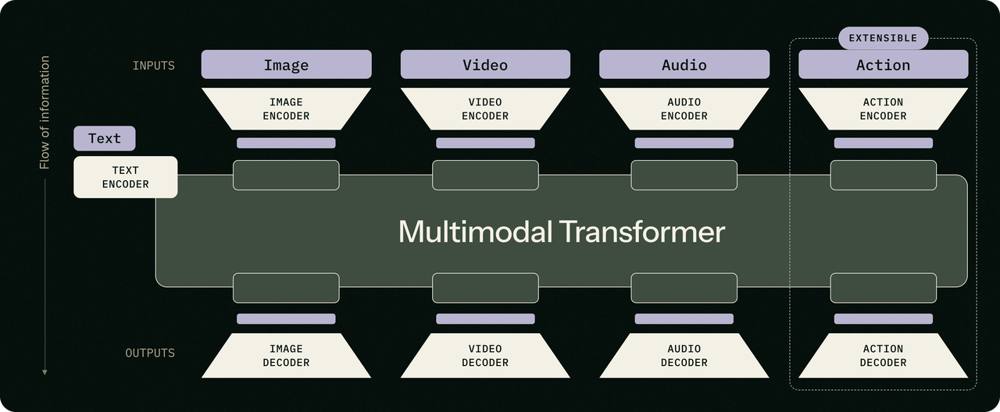

> **统一 Backbone 中的四类信息流**
>
> 1. **Image Token**：表达对象、材质、文字、构图和空间关系。
>
> 2. **Video Token**：表达跨帧运动、遮挡、接触、惯性和事件顺序。
>
> 3. **Audio Token**：表达语音、环境声，以及撞击、摩擦等事件与声学结果之间的联系。
>
> 4. **Action Token**：表达机器人状态和低维控制信号，把预测出的未来状态映射为可执行动作。

共享 Transformer 解决跨模态交互，算力分配却不会因此平均。视频 Token 同时沿空间和时间展开，训练预算很快被时空建模主导。

* **为什么视频是训练主成本**

视频同时包含空间分辨率和时间长度，模型必须处理运动连续性、物体恒常性、接触关系与因果结果。FLUX.3 的训练成本中，视频预测占比超过 **`95%`**。这说明“统一多模态”并不意味着每种模态的计算权重相同，真正昂贵的是时空建模。在带音频的 **`720p`** 视频表示里，音频 Token 少于总 Token 的 **`0.5%`**。音频维度低得多，但它能提供视觉里没有的因果约束：嘴型要对应语音，撞击时刻要对应声音，环境声要与空间和材质一致。

训练逻辑可以概括为：视频负责逼迫模型学习物理变化，音频负责补充事件因果，图像负责提供高密度空间细节，动作负责把内部预测投射到控制空间。不同模态对训练的贡献并不相同，这也意味着“统一”不能理解成所有组件完全一样。真正共享的是中间世界表征，重建像素、波形和控制量仍需不同的 I/O 路径。

* **统一并不等于完全共享**

共享 Transformer 负责跨模态关系，Encoder 与 Decoder 仍然保留模态差异。这是更现实的工程折中：图像、视频、音频和动作的采样率、局部结构、损失尺度都不同，强行使用完全相同的输入输出头会把表示对齐问题转化为重建瓶颈。共享中间表征、保留模态专用 I/O，使 FLUX.3 可以在统一语义空间中迁移能力，同时避免让一个 Decoder 同时承担像素、波形和控制序列的重建任务。

* **Self-Flow 技术机制**

架构给出了信息在哪里交互，Self-Flow 决定这些表征怎样学出来。它试图在一次 pretraining 中同时提高生成质量和中间特征的可迁移性，因此需要从标准 Flow Matching 的局限出发。

1. **标准 Flow Matching 的学习目标**

Flow Matching 从数据样本 $$x_0$$ 与高斯噪声 $$x_1$$ 之间构造连续路径。最直接的 rectified flow 使用线性插值：

$$x_t=(1-t)x_0+t x_1,\quad t\in[0,1]$$

网络 $$f_\theta$$ 预测路径上的速度场，生成损失写成：

$$\mathcal{L}_{\text{gen}}=\mathbb{E}_{x_0,x_1,t}\left\lVert f_\theta(x_t,t)-(x_1-x_0)\right\rVert_2^2$$

单一噪声强度作用于全部 Token 时，网络可以依赖局部纹理与邻域相关性完成去噪，却没有足够压力学习全局语义、长程结构和跨模态因果。问题落在噪声的组织方式上：当所有 Token 处在同一噪声强度，局部线索往往足以完成去噪，模型未必需要建立长程关系。Dual-Timestep Scheduling 在同一样本内引入异质噪声，让训练输入变得更难，也更丰富。

* **Dual-Timestep Scheduling**

Self-Flow 对同一个样本采样两个 timestep，并用随机 mask 把不同 Token 分配到两个噪声强度。较干净的 Token 提供上下文，噪声更重的 Token 迫使网络利用全局关系恢复信息。

> **Dual-Timestep 的训练过程**
>
> 1. **采样 timestep**：独立采样 $$t,s\sim p(t)$$。
>
> 2. **采样 mask**：mask 比例不超过 **`0.5`**，避免大多数 Token 同时落入第二种噪声状态。
>
> 3. **逐 Token 加噪**：mask 内使用 $$s$$，其余 Token 使用 $$t$$。
>
> 4. **保持边缘分布**：任意单个 Token 的 timestep 仍来自同一个 $$p(t)$$，减少与统一 timestep 推理过程之间的分布偏移。

$$\tau_i=\begin{cases}s,&i\in M\\t,&i\notin M\end{cases}$$

$$x_\tau=\operatorname{diag}(\mathbf{1}-\tau)x_0+\operatorname{diag}(\tau)x_1$$

下面的机制图把 mixed-noise student 路径、cleaner EMA teacher 路径、生成损失和表征损失放在同一视图里。

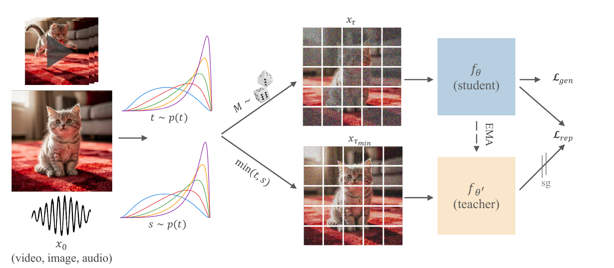

混合噪声改变了 Student 看到的输入，却还没有约束中间特征应该表达什么。EMA Teacher 提供更干净的表征目标，把“恢复数据”和“学习可迁移特征”合进同一次优化。

* **EMA Teacher 与自表征对齐**

Student 接收混合噪声输入 $$x_\tau$$，EMA Teacher 接收两个 timestep 中更干净的那一个 $$x_{\tau_{\min}}$$。Teacher 不需要额外的 DINO、CLIP 或 V-JEPA，它来自 Student 参数的指数滑动平均。表征损失让 Student 的中间特征逼近 Teacher 在干净视图上的深层特征：

$$\mathcal{L}_{\text{rep}}=-\mathbb{E}\,\cos\left(h_\theta^{(l)}(x_\tau,\tau),f_{\theta'}^{(k)}(x_{\tau_{\min}},\tau_{\min})\right)$$

最终目标把生成与表征学习放在同一次 pretraining 中：

$$\mathcal{L}=\mathcal{L}_{\text{gen}}+\gamma\mathcal{L}_{\text{rep}}$$

Self-Flow 的价值不只是提高采样质量，它还让中间特征更适合下游理解与控制任务，并避免把生成模型绑定到固定的外部 Encoder。生成指标和下游特征同时改善，并不意味着机制解释已经唯一确定。区分跨 Token 信息传递与噪声增强效应，才能避免把实验相关性写成因果结论。

* **机制解释需要保留的边界**

Dual-Timestep Scheduling 的收益不能只归因于“干净 Token 帮助噪声 Token”。后续受控实验在阻断不同 timestep Token 之间的 attention 后，生成指标没有下降，部分设置反而提高。这说明异质噪声本身也像一种沿噪声轴展开的数据增强。

更稳妥的结论是：Self-Flow 同时改变了训练样本的噪声组合和表征对齐目标。现有证据足以支持它提高生成与表征质量，但还不足以把全部增益归结为单一的跨 Token 信息传递机制。

* **生成与编辑能力矩阵**

训练机制最终要落到可见的输入输出上。FLUX.3 的能力可以沿时间维度理解：图像处理单帧空间结构，视频扩展到连续状态，音频再把事件与声学结果绑定在同一条时间线上。

1. **视频与原生音频**

单次生成最长可达 **`20 秒`**，视频输出自带原生音频。公开的初步评测使用 **`10 秒`**、**`720p`**、带音频的视频。两组数字对应不同语境，不能把评测设置误写成最大能力。

> **FLUX 3 Video 的输入输出组合**
>
> 1. **Text-to-Video**：从文本直接生成视频与音频。
>
> 2. **Image-to-Video**：把起始帧动画化，或把参考图中的人物、对象和风格迁移到视频。
>
> 3. **Video-to-Video**：保留参考片段中的主体身份或核心元素，改变场景和叙事语境。
>
> 4. **Video-Audio Continuation**：在输入视频和音频后继续生成。
>
> 5. **Keyframe-to-Video**：用多个关键时刻约束中间过渡。
>
> 6. **Multilingual Dialogue**：同步生成多语言对话、口型与场景声。
>
> 7. **Typography and Motion Design**：生成带文字和动态排版的视频设计。
>
> 8. **Agentic Chaining**：由外部工作流串联多个短片段，构成长镜头或多镜头序列。

Agentic Chaining 是片段编排能力，不代表基础模型一次即可原生生成数分钟、全程一致的长视频。长序列仍然依赖参考图、状态管理、镜头规划和失败重试。视频能力检验跨帧连续性，图像能力则更集中地暴露文字、构图、材质和参考条件的一致性。两者共用 Backbone，但失败模式与评测方法并不相同。

* **图像生成与编辑**

FLUX 3 Image 延续 FLUX.2 的生成与编辑路线，但底层已换成统一多模态 Backbone。中期训练结果覆盖摄影、产品设计、绘画、平面插画和动态影像帧，重点提升复杂 prompt、跨语言文字渲染、风格跨度和参考条件一致性。

| **能力** | **输入条件** | **工程关注点** |
| ---------------------------------------------------------------------------- | ------------------------------------------------------------------------------ | ------------------------------------------------------------------------------- |
| 图像合成                                                                         | 文本，可扩展参考图                                                                      | 复杂 prompt 遵循、文字正确率、长尾对象与细节稳定性                                                   |
| 图像编辑                                                                         | 原图、参考图与编辑指令                                                                    | 未编辑区域保持、身份一致、局部几何与材质连续性                                                         |
| 风格迁移                                                                         | 文本风格描述或视觉参考                                                                    | 内容结构与风格特征解耦，避免只做颜色滤镜                                                            |
| 多语言文字                                                                        | 包含文本的 prompt 或参考图                                                              | 字形、拼写、排版、透视与遮挡关系                                                                |

图像和视频解释了视觉输出，原生音频决定这套系统能否把事件时间、声源位置和可见动作统一起来。若音频只是生成完成后的配音，共享时空表征的价值就体现不出来。

* **音频不是独立外挂**

视频、音频联合生成的关键不在于“视频生成后再配音”，而在于两种模态同时受同一个事件状态约束。口型同步、物体撞击声、空间混响和镜头内声源位置都可以从共享时空表征中取得条件。联合生成减少了离线 TTS、音效检索、时间轴对齐和后期重混的人工步骤，尤其适合需要大量短视频变体的生产链路。

公开展示仍不足以证明复杂多说话人对话、长时间声学一致性、歌词级文本控制或专业混音质量。音频能力需要单独评测，不能由画面观感代替。

* **评测**

能力展示只能说明模型会生成什么，评测才回答它在什么条件下更好。训练机制实验、Early Access 偏好比较和真实生产指标必须分开看，因为它们对应的结论强度完全不同。

1. **Self-Flow 的研究结果**

Self-Flow 的小规模实验使用图像、视频和音频专用 autoencoder，在统一 Flow Transformer 上比较 vanilla Flow Matching、外部表征对齐和内部自表征对齐。它验证的是训练机制，不是 FLUX.3 产品模型的最终绝对分数。

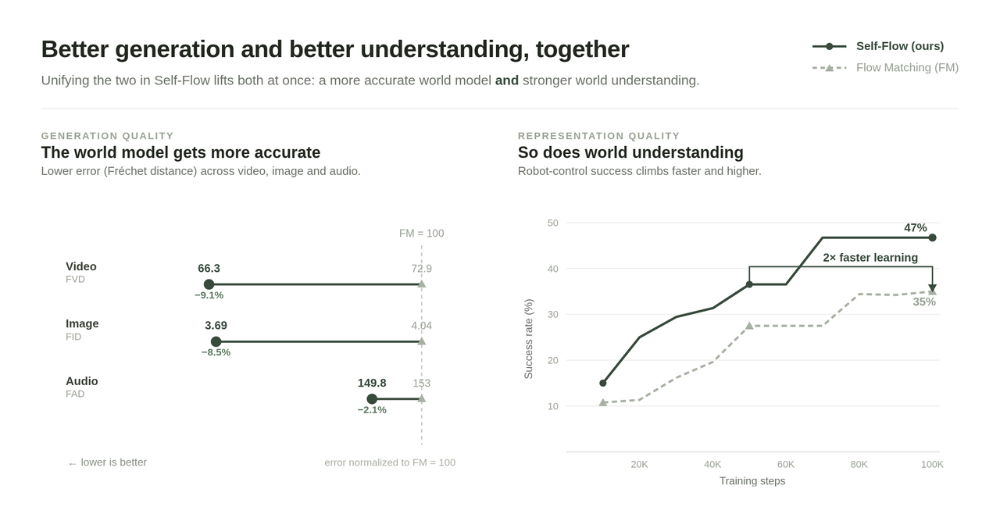

| **任务** | **Flow Matching** | **Self-Flow** | **解读** |
| ---------------------------------------------------------------------------- | --------------------------------------------------------------------------------------- | ----------------------------------------------------------------------------------- | ---------------------------------------------------------------------------- |
| 视频 FVD                                                                       | 72.9                                                                                    | 66.3          | 下降 **`9.1%`**，时序生成误差更低                                                       |
| 图像 FID                                                                       | 4.04                                                                                    | 3.69          | 下降 **`8.5%`**，图像分布更接近真实数据                                                    |
| 音频 FAD                                                                       | 153.0                                                                                   | 149.8         | 下降 **`2.1%`**，提升存在但幅度较小                                                      |
| 机器人成功率                                                                       | 35%                                                                                     | 47%           | 在相同微调步数下学习更快，复杂任务差距更明显                                                       |

Self-Flow 的实验支持训练方法有效，却不能直接替代 FLUX.3 产品评测。转向 Early Access 结果时，比较对象从受控研究模型变成候选产品，指标也从 FID、FVD 变成人类偏好。

* **FLUX.3 Early Access 的偏好评测**

FLUX.3 Video 的初步人类偏好评测比较了多家同期视频模型。得分表示二选一时选择 FLUX.3 的比例，**`50%`** 代表双方持平，不是综合质量分。

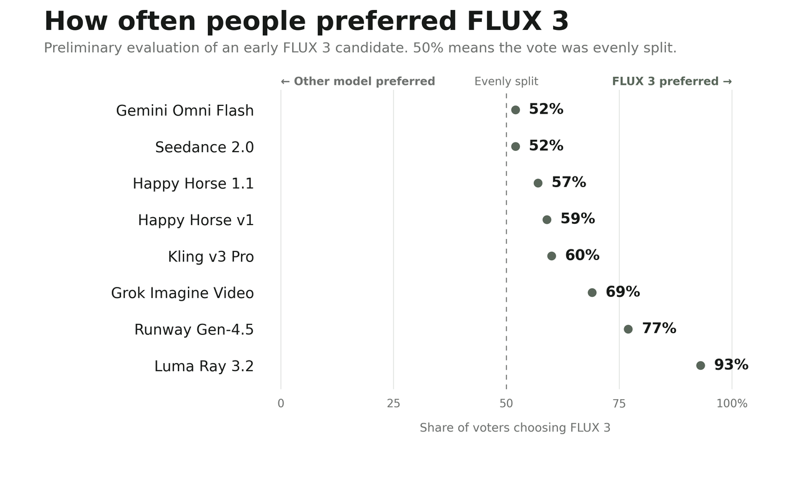

> **这张偏好图不能证明什么**
>
> 1. **不是独立榜单**：评测由模型开发方组织，尚未看到完整 prompt 集、样本量、随机化和评审细则。
>
> 2. **不是同一差距**：**`52%`** 接近持平，**`93%`** 才是很强的单边偏好，不能都写成“领先”。
>
> 3. **不是生产指标**：人类偏好没有覆盖延迟、价格、失败率、可重复性、并发和审核成本。
>
> 4. **不是最终版本**：测试对象是 Early Access 候选模型，后续接口和模型可能继续变化。

人类偏好适合回答“哪段结果更讨喜”，不能覆盖稳定性、成本和失败恢复。真正的接入判断需要一套贴合业务分布的评测集，把主观质量和工程约束放进同一个记录体系。

* **真正需要建立的评测集**

| **维度** | **测试对象** | **失败定义** |
| ---------------------------------------------------------------------------- | ------------------------------------------------------------------------------ | ------------------------------------------------------------------------------ |
| Prompt 遵循                                                                    | 对象数量、空间关系、动作顺序、禁用元素                                                            | 遗漏约束、对象交换、事件顺序错误                                                               |
| 人物一致性                                                                        | 跨镜头脸部、服装、配饰、体型                                                                 | 身份漂移、局部重绘、正侧脸不一致                                                               |
| 物理合理性                                                                        | 重力、接触、遮挡、刚柔体运动                                                                 | 穿模、瞬移、质量感错误、因果顺序错                                                              |
| 音画同步                                                                         | 口型、撞击、脚步、环境声                                                                   | 时间偏移、错误声源、场景切换后残留                                                              |
| 文字与排版                                                                        | 多语言拼写、动态文字、透视                                                                  | 错字、字形崩坏、帧间闪烁                                                                   |
| 工程成本                                                                         | 端到端延迟、重试次数、价格、审核                                                               | 达到可用结果的总成本超过现有 pipeline                                                        |

* **FLUX-mimic 与 Physical AI**

前面的评测仍围绕内容生成，FLUX-mimic 把同一套世界表征推进到动作预测。判断这条路线是否成立，要看 Future Feature 能否被轻量 Action Decoder 读取，也要看加入控制信号后是否会持续损害原有视频能力。

1. **从视频 Backbone 解码机器人动作**

FLUX-mimic 不需要重新训练一套与视频无关的机器人 foundation model。文本 Encoder 生成 Task Token，视频 Encoder 把历史观测转成 History Token，FLUX Backbone 预测 Future Feature；轻量 Action Decoder 再结合机器人状态，输出后续动作序列。

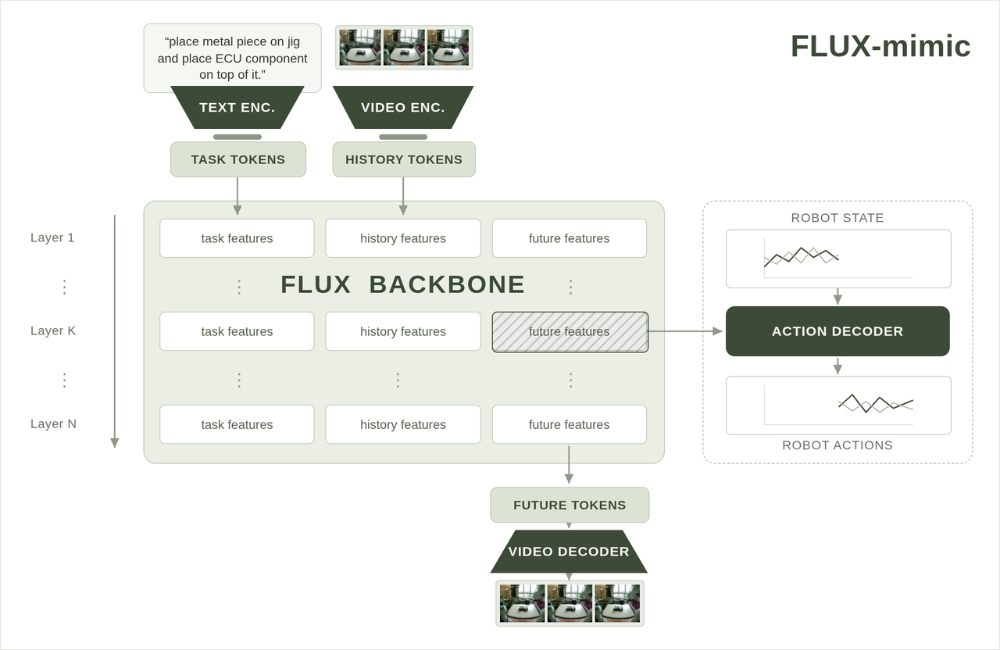

这条路径的关键不是把像素直接映射成控制量，而是从视频预测过程中抽取包含任务、历史状态和未来变化的中间特征，再用 Action Decoder 读取可执行部分。有了从 Future Feature 到动作序列的解码路径，紧接着的问题是多一种模态会不会扰乱已经学好的生成分布。训练初期的质量回落和后续恢复，正好检验 Backbone 是否真的容纳了动作信息。

* **加入 Action Prediction 后的适应过程**

把动作模态加入训练 curriculum 后，Text-to-Video 与 Image-to-Video 的人类评分一度下降最多 **`10%`**。经过 **`3500 steps`**，视频质量恢复到加入动作前的水平，同时模型已经具备 Action Prediction。

这个结果支持“动作是同一物理过程的另一种观测”这一架构假设：模型可以在不永久牺牲视频生成质量的前提下吸收低维控制信号。

视频质量能够恢复，只说明多模态训练在当前设置下没有造成永久冲突；它还不能回答开放环境中的可靠性。数据规模、机器人本体差异和安全控制决定了这条路线离通用部署还有多远。

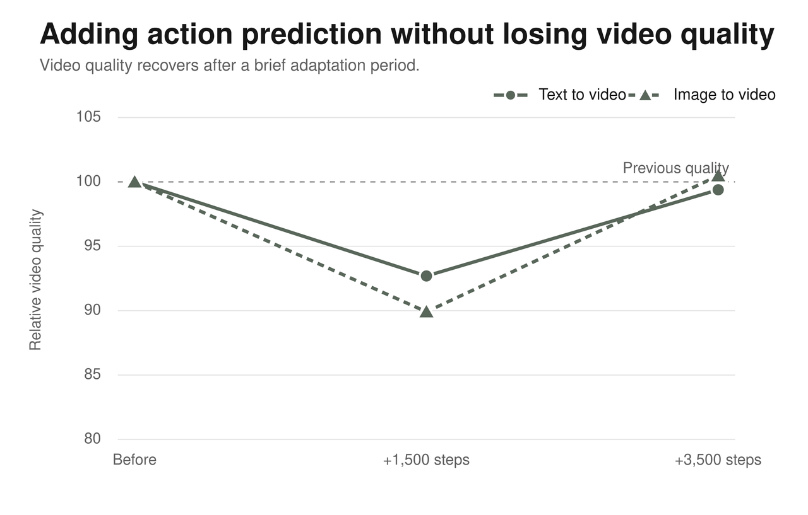

* **训练规模与现实边界**

FLUX.3 使用数千万小时通用视频学习广泛的世界动力学，并使用数十万小时面向人类与机器人操作的视频强化 manipulation 表征。FLUX-mimic 进一步在工业机器人任务上做适配，并进入 Audi 生产环境中的测试与部署链路。

> **Physical AI 结论不能外推过度**
>
> 1. **场景边界**：工业工位通常具有固定相机、固定工作区和受控对象分布，不能直接代表开放家庭环境。
>
> 2. **硬件边界**：不同机器人本体的关节、夹爪、控制频率和安全约束不同，Action Decoder 需要适配。
>
> 3. **安全边界**：视频预测合理不等于控制动作安全，仍需碰撞检测、速度限制、急停与独立安全控制器。
>
> 4. **评测边界**：公开曲线说明特征可迁移，不等于已经解决长时任务、异常恢复与零样本部署。

## 4.3 Diffusion 的应用

### 4.3.1 SDEdit

* **用预训练 SDE 直接处理用户引导图**

SDEdit 接收一张已经在 RGB 像素空间表达意图的引导图 $$x^{(g)}$$，例如粗线稿、在真实图像上涂改的笔触，或贴入目标图像的局部图块。它不训练新的条件网络，也不需要已编辑/未编辑图像对，而是先向引导图加入适量高斯噪声，抹平笔触、拼接边缘等不自然细节，再从中间时刻启动预训练生成 SDE 的逆过程。

同一过程可以覆盖笔触生成、局部编辑和图像合成。完整输入—输出形式如下。

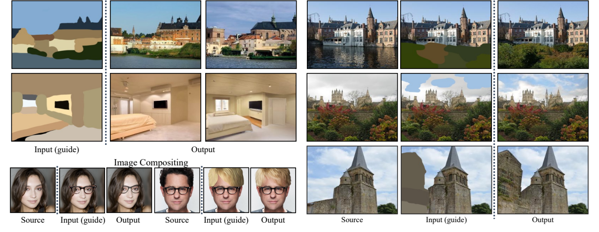

* **前向 SDE 与噪声扰动**

设 $$x(0)\sim p_0=p_{\mathrm{data}}$$ 是真实图像，连续时间 $$t\in[0,1]$$。前向 SDE 把数据分布逐步变成高斯噪声。给定 $$x(0)$$，任意时刻的扰动样本可以写为：

$$x(t)=\alpha(t)x(0)+\sigma(t)z,\qquad z\sim\mathcal{N}(0,I)$$

$$\alpha(t)$$ 控制保留的数据信号强度，$$\sigma(t)$$ 控制噪声强度。常见形式包括：

> * **VE-SDE**：$$\alpha(t)=1$$，$$\sigma(1)$$ 足够大，使终点分布接近 $$\mathcal{N}(0,\sigma^2(1)I)$$。
>
> * **VP-SDE**：$$\alpha^2(t)+\sigma^2(t)=1$$，并且 $$t\rightarrow1$$ 时 $$\alpha(t)\rightarrow0$$，终点分布为 $$\mathcal{N}(0,I)$$。

两种 SDE 的具体形式不同，但都把图像分布连续推向高斯分布。SDEdit 的主过程可以在二者上实现；核心推导以 VE-SDE 为例。

* **逆 SDE 与 score 模型**

图像生成等价于从噪声状态反向积分到数据状态。VE-SDE 的逆过程为：

$$dx(t)=\left[-\frac{d\sigma^2(t)}{dt}\nabla_x\log p_t(x)\right]dt+\sqrt{\frac{d\sigma^2(t)}{dt}}\,d\bar w$$

$$\bar w$$ 是时间从 $$1$$ 流向 $$0$$ 时的 Wiener 过程，$$\nabla_x\log p_t(x)$$ 是噪声扰动分布的 score。用参数模型 $$s_\theta(x(t),t)$$ 逼近 score 时，单个时刻的去噪 score matching 目标为：

$$\mathcal{L}_t=\mathbb{E}_{x(0)\sim p_{\mathrm{data}},\,z\sim\mathcal{N}(0,I)}\left[\left\|\sigma_t s_\theta(x(t),t)-z\right\|_2^2\right]$$

整体训练目标是不同 $$t$$ 上损失的加权和。训练完成后，用 Euler–Maruyama 离散化逆 SDE。由 $$t+\Delta t$$ 更新到 $$t$$：

$$x(t)=x(t+\Delta t)+\left(\sigma^2(t)-\sigma^2(t+\Delta t)\right)s_\theta(x(t),t)+\sqrt{\sigma^2(t)-\sigma^2(t+\Delta t)}\,z$$

普通无条件生成从 $$t=1$$ 的高斯噪声开始。SDEdit 的关键变化是：逆过程不必从 $$1$$ 开始，可以从任意中间时刻 $$t_0\in(0,1)$$ 开始。

* **SDEdit 采样过程**

对用户引导图 $$x^{(g)}$$ 和选定的起始时刻 $$t_0$$，先采样：

$$x^{(g)}(t_0)\sim\mathcal{N}\!\left(x^{(g)},\sigma^2(t_0)I\right)$$

然后以 $$x^{(g)}(t_0)$$ 作为逆 SDE 初值，从 $$t_0$$ 迭代到 $$0$$ 得到 $$x(0)$$。记作：

$$x(0)=\operatorname{SDEdit}(x^{(g)};t_0,\theta)$$

加噪把引导图从非自然图像空间推向模型熟悉的噪声数据分布；逆 SDE 再沿 score 场逐步投影回自然图像流形。该路径完整示意如下。

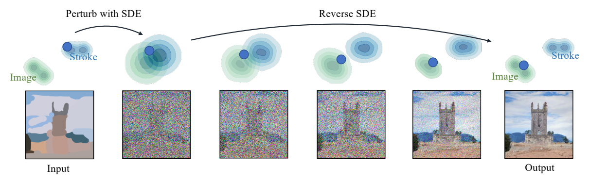

* **起始时刻控制真实感与忠实度**

$$t_0$$ 是除求解器离散步数外最关键的超参数：

> * $$t_0$$ 较小：加入噪声较少，逆过程较短，结果更接近引导图，但笔触、粘贴边缘和不自然结构可能被保留。
>
> * $$t_0$$ 较大：引导信息被破坏得更多，逆过程有更大自由度回到自然图像流形，结果更真实，但可能偏离用户给定的布局、颜色或局部内容。

$$t_0=0$$ 等价于直接保留引导图，$$t_0=1$$ 则接近忽略引导的随机无条件采样。应在二者之间选择兼顾 realism 与 faithfulness 的中间区间。下图完整展示了 $$t_0$$ 增大时的连续变化。

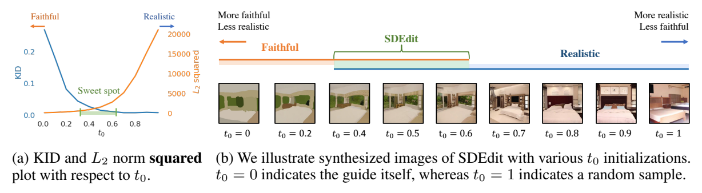

SDEdit 不知道“真实图像如何被用户操作变成引导图”的测量函数，因此它不是常规已知退化算子的逆问题求解。方法成立的条件是：用户意图已经以可直接扰动的 RGB 引导图表达，且预训练 SDE 的数据分布覆盖目标图像域。

### 4.3.2 Textual Inversion

Textual Inversion 的目标是实现由语言引导的、针对用户指定新概念的生成。因此作者希望将这些概念编码进一个预训练文本到图像模型的中间表示中。理想情况下，这一过程应能充分利用此类模型所蕴含的丰富语义与视觉先验，并利用它来指导对这些概念进行直观的视觉变换。

很直观的一个想法是考虑在文本到图像模型常用的文本编码器的词嵌入阶段寻找合适的候选表征。在此阶段，离散的输入文本首先被转换为连续的向量表示，这种形式便于直接优化。

之前已经有工作表明该嵌入空间具有足够的表达能力以捕捉基本的图像语义。但是这些方法依赖的是对比学习或语言补全目标，二者均不要求对图像有深入的视觉理解。这些方法无法准确捕捉概念的外观特征，若尝试将其用于图像合成，会导致明显的视觉失真。作者的目标是找到能够指导生成的伪词，而生成本质上是一个视觉任务。因此，作者提出通过视觉重建目标来寻找这样的伪词。

有了这个想法，作者将其应用于潜在扩散模型 **LDM**（**L**atent **D**iffusion **M**odel）的核心细节。

LDM 包含两个核心组件。

> * **自编码器**：在大量图像数据上进行预训练。编码器$$E$$学习将图像$$x \in \mathcal{D}_x$$映射为一个空间潜在码$$z = E(x)$$，并通过 KL 散度损失或向量量化进行正则化。解码器$$D$$学习将这些潜在码还原为图像，使得$$D(E(x)) \approx x$$。
>
> * **扩散模型**：用于在学习到的潜在空间中生成代码。该扩散模型可以以类别标签、分割掩码等作为条件。令$$c_\theta(y)$$表示将条件输入$$y$$映射为条件向量的模型，则 LDM 的损失函数定义为：
>
> $$\mathcal{L}_{\text{LDM}} := \mathbb{E}_{z \sim E(x), y, \epsilon \sim \mathcal{N}(0,I), t} \left[ \|\epsilon - \epsilon_\theta(z_t, t, c_\theta(y))\|^2_2 \right]$$
>
> 其中$$t$$是时间步，$$z_t$$是在时间$$t$$被加入噪声的潜在表示，$$\epsilon$$是未缩放的噪声样本，$$\epsilon_\theta$$是去噪网络。直观上，该目标是正确去除添加到图像潜在表示上的噪声。训练过程中，$$c_\theta$$和$$\epsilon_\theta$$联合优化以最小化 LDM 损失。在推理阶段，从随机噪声张量开始，通过迭代去噪生成新的潜在码$$z_0$$，最终通过预训练解码器将其转换为图像：$$x' = D(z_0)$$。

作者采用 Rombach 等人公开发布&#x7684;**`1.4B`**&#x6A21;型，该模型&#x5728;**`LAION-400M`**&#x6570;据集上进行了预训练。在此模型中，$$c_\theta$$由 BERT 文本编码器实现，$$y$$为文本 prompt。

* **Text embedding**

文本编码器模型首先进行文本处理。输入字符串中的每个词或子词被转换为一个token，即某个预定义词典中的索引。每个 token 对应一个唯一的嵌入向量，可通过索引查找获得。这些嵌入向量通常作为文本编码器 $$c_\theta$$ 训练的一部分被学习。

作者选择该嵌入空间作为反演的目标空间。设定一个占位符字符串$$S^*$$，用于表示作者希望学习的新概念。然后在嵌入过程中进行干预，将该 token 对应的向量替换为一个新的可学习嵌入$$v^*$$，实质上是将该概念注入词汇表中。这样一来就可以像使用普通词汇一样，构造包含该概念的新句子。

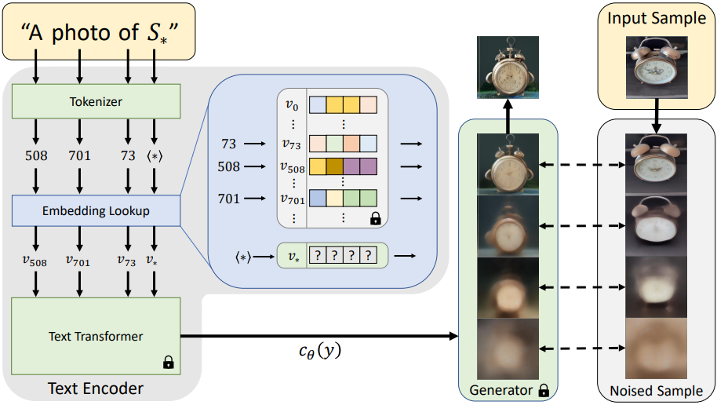

* **Textual Inversion**

为了找到这些新的嵌入，作者使用一小组图像，通常&#x4E3A;**`3`**&#x81F3;**`5`**&#x5F20;，这些图像在不同背景或姿态下展示了目标概念。作者通过直接优化来求解$$v^*$$，即在从该小样本集中采样的图像上最小化 LDM 损失：

$$v^* = \arg\min_v \mathbb{E}_{z \sim E(x), y, \epsilon \sim \mathcal{N}(0,I), t} \left[ \|\epsilon - \epsilon_\theta(z_t, t, c_\theta(y))\|^2_2 \right]$$

该优化过程复用了原始 LDM 模型的训练方案，但保持$$c_\theta$$和$$\epsilon_\theta$$固定不变。这是一个重建任务，因此需要促使所学习的嵌入捕捉到该概念独有的精细视觉特征。

* **实现细节**

作者沿用 LDM 的原始超参数设置。词嵌入使用目标对象的单字粗略描述词的嵌入进行初始化。实验&#x5728;**`2`**&#x5757;V100 GPU上进行，批大小&#x4E3A;**`4`**。基础学习率设&#x4E3A;**`0.005`**，并根据GPU数量和批量大小进行缩放，得到实际学习率&#x4E3A;**`0.04`**。所有结果均通&#x8FC7;**`5000`**&#x6B65;优化生成。作者发现这些参数在大多数情况下表现良好。但对于某些概念，减少优化步数或提高学习率可能获得更优结果。

### 4.3.3 DreamBooth

给定仅少数随意拍摄的某一特定主体的图像，&#x5373;**`3`**&#x5230;**`5`**&#x5F20;，且无任何文本描述，DreamBooth 的目标是生成该主体的新图像，要求细节保真度高，并能根据文本 prompt 进行可控变化。可能的变化包括改变主体所处的场景、颜色或形状等属性，调整主体的姿态、视角，以及其他语义层面的修改。并且不对输入图像的拍摄条件做任何限制，主体图像可具有不同的上下文环境。

* **扩散模型**

扩散模型通过逐步去噪从高斯分布中采样的变量来学习数据分布。这里关注预训练的文本到图像扩散模型 $$\hat{x}_\theta$$，该模型接收初始噪声图$$\epsilon \sim \mathcal{N}(0, I)$$和一个由文本编码器$$\Gamma$$根据文本 prompt $$P$$生成的条件向量$$c = \Gamma(P)$$，并生成图像$$x_{\text{gen}} = \hat{x}_\theta(\epsilon, c)$$。模型通过平方误差损失函数进行训练，用于对不同程度加噪的图像或潜在编码 $$z_t := \alpha_t x + \sigma_t \epsilon$$ 进行去噪：

$$\mathbb{E}_{x,c,\epsilon,t} \left[ w_t \left\| \hat{x}_\theta(\alpha_t x + \sigma_t \epsilon, c) - x \right\|^2_2 \right]$$

其中$$x$$为真实图像，$$c$$为条件向量，一般来自文本 prompt，$$\alpha_t$$、$$\sigma_t$$、$$w_t$$为控制噪声调度和样本质量的系数，是扩散过程时间$$t \sim U([0, 1])$$的函数。

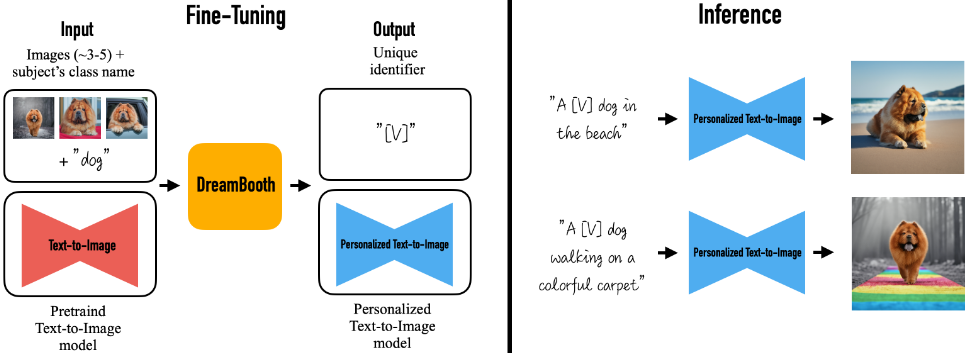

* **扩散模型的个性化**

**DreamBooth&#x20;**&#x7684;首要任务是将特定主体实例植入模型的输出域中，从而能够通过查询模型生成该主体在不同情境下的新图像。一个自然的想法是使用该主体的少量样本数据集对模型进行微调。然而，在少样本场景下微调生成模型如 GAN 需格外谨慎，容易导致过拟合、模式坍缩，或未能充分捕捉目标分布。之前一些工作提出若干方法避免这些问题，但这些方法主要目标是生成符合目标分布的图像，而不要求保持主体一致性。

> 作者发现一个有趣的现象：若采用扩散损失并精心设计微调方案，大型文本到图像扩散模型能够在不遗忘原有知识、也不过拟合于少量训练图像的前提下，有效融合新信息。

1. **prompt 设计**

**DreamBooth&#x20;**&#x7684;目标是将一个新&#x7684;**`(unique identifier, subject)`**&#x5BF9;植入扩散模型的词典中。为了避免详细描述每组图像的繁琐过程，采用简化策略：将所有主体图像统一标注&#x4E3A;**`a [identifier] [class noun]`**，其&#x4E2D;**`[identifier]`**&#x662F;与该主体关联的唯一标识符，**`[class noun]`**&#x662F;主体的粗粒度类别描述，&#x5982;**`cat`**、**`dog`**、**`watch`**&#x7B49;。类别描述可由用户指定，或通过分类器自动获取。在 prompt 中引入类别描述，是为了将该类别的先验知识与唯一标识符绑定。若使用错误或缺失类别描述，会导致训练时间增加、语言漂移加剧，且性能下降。本质上是利用模型对该类别的已有先验，并将其与主体唯一标识符的嵌入耦合，从而在不同上下文中生成主体的新姿态和形态。

* **稀有 token 标识符**

作者发现常见的英文词汇，&#x5982;**`unique`**、**`special`**&#x4F5C;为标识符效果不佳，因为模型需学习将其原始语义解耦，并重新关联至主体。因此，理想的标识符应在语言模型和扩散模型中均具有较弱的先验。一种做法是随机拼接英文字母生成罕见标识符，&#x5982;**`xxy5syt00`**，但实际上分词器可能将每个字母单独切分，而这些字母本身在模型中已有较强先验，导致类似常见词的问题。

**DreamBooth&#x20;**&#x7684;方法是：在词汇表中查找稀有 token ，再将其逆映射回文本空间，以最小化标识符具有强先验的概率。在词汇表中查找稀有 token 序列$$f(\hat{V})$$，其中$$f$$为分词器，将字符序列映射为 token，$$\hat{V}$$为这些 token 解码后的文本。该序列长度可变，较短的序列$$k = \{1, ..., 3\}$$效果良好。然后通过分词器的逆操作作用于$$f(\hat{V})$$，得到一组字符序列作为唯一标识符$$\hat{V}$$。对&#x4E8E;**`Imagen`**&#x6A21;型，作者发现使用均匀随机采样、对应不超&#x8FC7;**`3`**&#x4E2A;Unicode字符、且位&#x4E8E;**`T5-XXL`**&#x5206;词器范围 $$\{5000, ..., 10000\}$$ 内的 token ，效果较好。

* **损失函数**

为最大化主体保真度，最佳策略是微调模型的所有层，包括依赖文本嵌入的层。但这会引发语言漂移问题：一个在大规模语料上预训练的模型，在特定任务微调后，会逐渐丧失语言的语法和语义知识。这是首次发现扩散模型中存在类似现象——模型在微调后会逐渐遗忘如何生成与目标主体同类的其他实例。

另一个问题是输出多样性下降。文本到图像扩散模型天然具有高度的输出多样性。在少量图像上微调时，仍希望模型能生成主体在新视角、新姿态下的图像。然而，存在输出姿态和视角趋于训练图像的风险。尤其在训练轮数过多时，这种情况尤为明显。

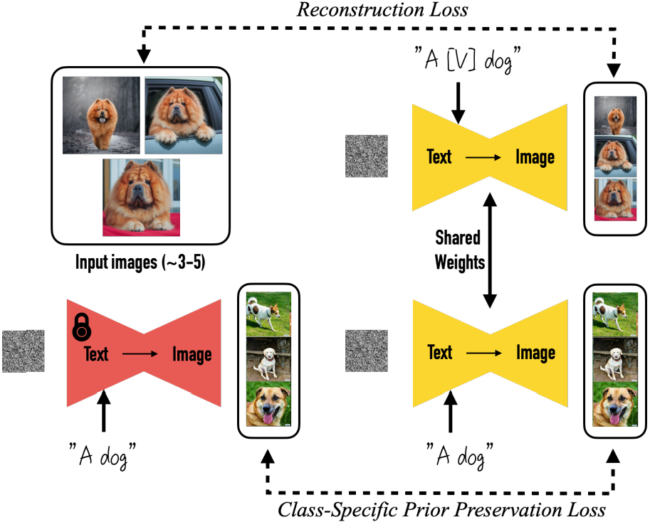

为缓解上述两个问题，提出一种自生成&#x7684;**类别特定先验保持损失** class-specific prior preservation loss，以促进多样性并抑制语言漂移。核心思想是：利用模型自身生成的样本来监督微调过程，使其在开始少样本微调后仍能保留类别先验知识。使用冻结的预训练扩散模型，通过采样器生成先验数据$$x_{\text{pr}} = \hat{x}(z_{t_1}, c_{\text{pr}})$$，其中初始噪声 $$z_{t_1} \sim \mathcal{N}(0, I)$$，条件向量$$c_{\text{pr}} := \Gamma(f(\text{``a [class noun]''}))$$。损失函数变为：

$$\mathbb{E}_{x,c,\epsilon,\epsilon',t} \left[ w_t \left\| \hat{x}_\theta(\alpha_t x + \sigma_t \epsilon, c) - x \right\|^2_2 + \lambda w_{t'} \left\| \hat{x}_\theta(\alpha_{t'} x_{\text{pr}} + \sigma_{t'} \epsilon', c_{\text{pr}}) - x_{\text{pr}} \right\|^2_2 \right]$$

其中第二项为先验保持项，用于以模型自生成图像监督训练；$$\lambda$$控制该项的相对权重。该损失在提升输出多样性和缓解语言漂移方面非常有效。此外可以在不引发过拟合的前提下进行更多轮次的训练。

> * **Imagen**：使用$$\lambda = 1$$、学习率$$10^{-5}$$，在单块 TPUv4 上，Imagen 的训练耗时约5分钟
>
> * **Stable Diffusion**：使用$$5 \times 10^{-6}$$，训练约1000轮，输入3-5张图像，即可获得良好效果。在 NVIDIA A100 上，Stable Diffusion 的训练约需5分钟

在此过程中，约生成1000&#x4E2A;**`a [class noun]`**&#x6837;本。

### 4.3.4 InstructPix2Pix

* **两阶段方法：合成编辑数据，再训练前向编辑模型**

InstructPix2Pix 把指令式图像编辑写成监督学习问题。第一阶段自动构造“编辑前图像、编辑指令、编辑后图像”三元组；第二阶段用这些三元组训练条件扩散模型。推理时只需一张真实输入图和一条自然语言编辑指令，不需要用户提供掩码、目标图像完整描述，也不需要对单个输入执行优化或微调。

完整数据生成与模型训练管线如下。

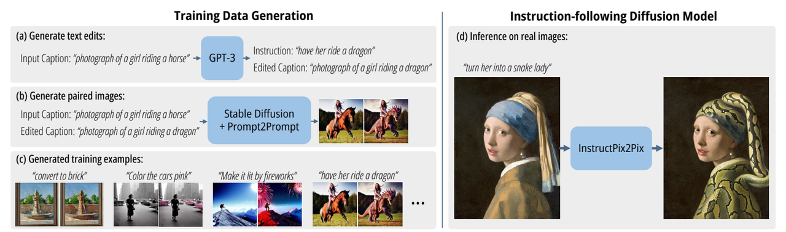

* **用 GPT-3 生成指令与成对描述**

文本阶段的输入是一条真实图像描述 $$c_{\mathrm{before}}$$，输出是编辑指令 $$c_T$$ 和编辑后的描述 $$c_{\mathrm{after}}$$。监督数据先由人工构造 **`700`** 个三元组：

$$\left(c_{\mathrm{before}},\;c_T,\;c_{\mathrm{after}}\right)$$

输入描述来自 LAION-Aesthetics V2 6.5+，人工编写对应编辑指令和编辑后描述。GPT-3 Davinci 用默认参数微调 **`1`** 个 epoch，然后对去重后的 LAION 图像描述批量生成文本三元组，最终得到 **`454,445`** 条指令与描述对。

只在文本域生成编辑计划有两个好处：编辑类型可以覆盖对象、属性、背景、风格和布局变化；同时，编辑前后描述与指令由同一次生成保持语义对应。LAION 的噪声则在后续图像配对过滤和条件引导中进一步抑制。

* **用 Prompt-to-Prompt 生成配对图像**

若分别用 Stable Diffusion 对 $$c_{\mathrm{before}}$$ 和 $$c_{\mathrm{after}}$$ 独立采样，即使两条描述只改了一个词，构图、人物身份和背景也可能完全变化。这种图像对无法监督“编辑”，只会让模型学习重新生成。

因此，生成编辑后图像时使用 Prompt-to-Prompt，在部分去噪步骤共享编辑前后两次生成的 cross-attention 权重。共享比例记为 $$p$$：较大的 $$p$$ 保持更强的空间一致性，较小的 $$p$$ 允许更大结构变化。

下图对比独立生成与共享 cross-attention 后的配对结果。

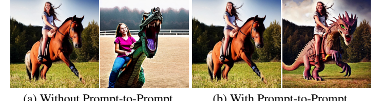

不同编辑所需的共享比例不同，无法只根据文本可靠预测最佳 $$p$$。对每个描述对，方法生成 **`100`** 组候选图像，且每组的共享比例从以下分布随机采样：

$$p\sim\mathcal{U}(0.1,0.9)$$

随后用 CLIP 方向相似度过滤。设图像编码为 $$E_I(\cdot)$$，文本编码为 $$E_T(\cdot)$$，图像变化方向与文本变化方向分别为：

$$\Delta I=E_I(x_{\mathrm{after}})-E_I(x_{\mathrm{before}}),\qquad \Delta T=E_T(c_{\mathrm{after}})-E_T(c_{\mathrm{before}})$$

按 $$\Delta I$$ 与 $$\Delta T$$ 的余弦相似度选择候选，使图像发生的语义变化与文本要求的变化一致。该过滤既控制图像对质量，也缓解 Prompt-to-Prompt 或 Stable Diffusion 偶发失败。

* **基于 Stable Diffusion 的编辑网络**

编辑模型从预训练 Stable Diffusion 初始化，在 VAE 潜空间工作。输入图像 $$c_I$$ 经 VAE 编码器 $$\mathcal{E}$$ 得到条件潜变量 $$\mathcal{E}(c_I)$$；目标编辑图像 $$x$$ 的潜变量 $$z=\mathcal{E}(x)$$ 在时刻 $$t$$ 加噪得到 $$z_t$$。U-Net 同时接收噪声潜变量、输入图像潜变量和文本指令：

$$\epsilon_\theta\!\left(z_t,t,\mathcal{E}(c_I),c_T\right)$$

训练目标是预测加入目标潜变量的噪声：

$$\mathcal{L}=\mathbb{E}_{\mathcal{E}(x),\mathcal{E}(c_I),c_T,\epsilon,t}\left[\left\|\epsilon-\epsilon_\theta(z_t,t,\mathcal{E}(c_I),c_T)\right\|_2^2\right]$$

为了加入图像条件，第一层卷积增加输入通道，把 $$z_t$$ 与 $$\mathcal{E}(c_I)$$ 沿通道维拼接。原有通道权重继承预训练 Stable Diffusion；新增通道对应的权重初始化为零。这样初始化时模型仍保持原有去噪函数，图像条件的影响从零开始学习。文本条件接口保持不变，但输入从完整图像描述改为编辑指令 $$c_T$$。

* **双条件 classifier-free guidance**

普通 classifier-free guidance 在条件预测与无条件预测之间外推：

$$\tilde\epsilon_\theta(z_t,c)=\epsilon_\theta(z_t,\varnothing)+s\left(\epsilon_\theta(z_t,c)-\epsilon_\theta(z_t,\varnothing)\right)$$

InstructPix2Pix 有输入图像 $$c_I$$ 和文本指令 $$c_T$$ 两个条件。训练时，**`5%`** 样本只丢弃图像条件，**`5%`** 只丢弃文本条件，另有 **`5%`** 同时丢弃两个条件。模型因此能估计三个必要状态：完全无条件、仅图像条件、图像加文本条件。

推理时使用两个独立引导尺度：

$$\begin{aligned}\tilde\epsilon_\theta(z_t,c_I,c_T)=&\;\epsilon_\theta(z_t,\varnothing,\varnothing)\\&+s_I\left(\epsilon_\theta(z_t,c_I,\varnothing)-\epsilon_\theta(z_t,\varnothing,\varnothing)\right)\\&+s_T\left(\epsilon_\theta(z_t,c_I,c_T)-\epsilon_\theta(z_t,c_I,\varnothing)\right)\end{aligned}$$

$$s_I$$ 放大输入图像条件相对于无条件预测的方向，值越大，输出越保持原图空间结构；$$s_T$$ 放大文本指令在给定输入图基础上的增量方向，值越大，编辑越强。两者分别控制“保留多少原图”和“执行多强编辑”。

右图完整展示两个引导尺度的独立作用。

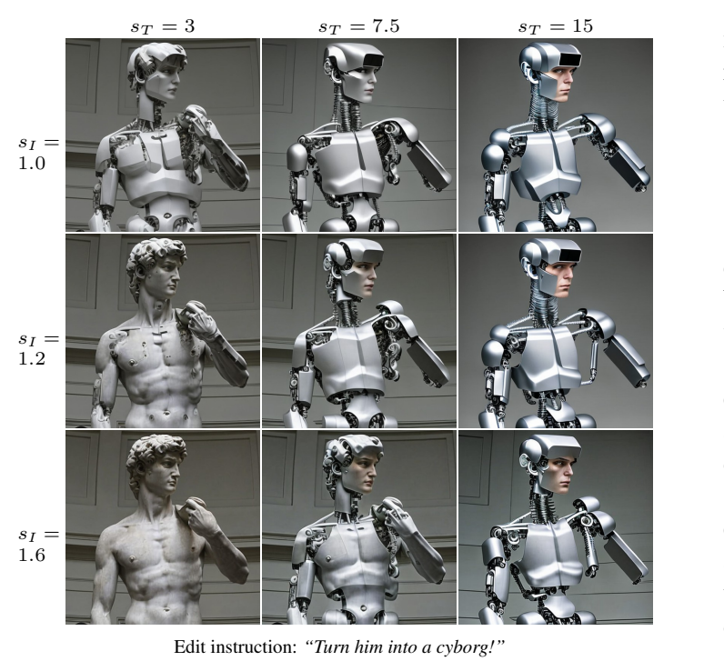

### 4.3.5 ControlNet

* **动机**

在 Stable Diffusion 这样的生成模型风靡后，创作者面临了一个难题：虽然写下的文字可以帮助 AI 生成图像，但想要精准控制画面结构、姿态或布局，单靠一句 prompt 往往得经过反复调整，效率低且缺乏直觉反馈。

为了解决这个问题，**ControlNet** 被提出。它的核心思路是在**冻结预训练生成模型**的基础上，增添**可训练的控制分支**，通过**零卷积** zero convolution  将控制信息稳定注入生成流程中。这样设计既保留了原始模型的表达能力，也避免了因微调导致的破坏性干扰，并且使得多个类型的条件输入都能被自然整合进图像生成过程，如边缘图、深度图、人体骨架、分割图等，从而实现对图像结构、姿势和场景布局的细致掌控

* **网络结构**

ControlNet 将额外的条件注入神经网络的各个模块中。网络模块指 ResNet 模块、conv-bn-relu 模块、多头注意力模块、Transformer 模块等。假设$$  F(\cdot; \Theta)  $$是一个已训练好的神经模块，其参数为$$\Theta$$，它将输入特征图$$  x  $$映射为输出特征图$$y$$，即：

$$y = F(x; \Theta)$$

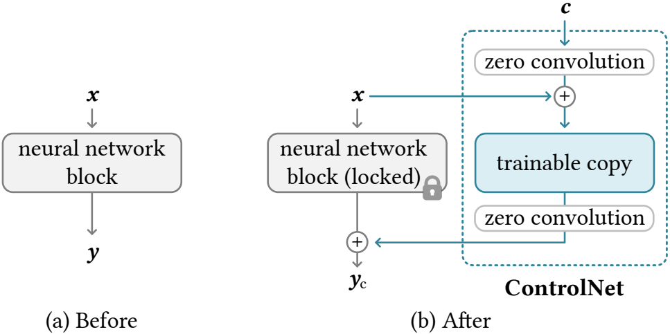

$$x$$和$$  y  $$通常是二维特征图，即$$x \in \mathbb{R}^{h \times w \times c}$$，其中$$  h, w, c  $$分别表示特征图的高度、宽度和通道数。

为了向这样一个预训练的神经模块添加 ControlNet，一般将原始模块的参数$$  \Theta  $$冻住，同时复制一个可训练的网络模块，设参数为$$\Theta_c$$。这个可训练的网络模块接收一个外部的条件向量$$  c  $$作为输入。当这种结构应用于 Stable Diffusion时，冻住的参数保留了用数十亿图像训练出的、可用于生产的模型；而复制出的可训练部分则复用这一大规模预训练模型，建立起一个深层、鲁棒且强大的主干网络，以处理多样化的输入条件。

可训练的网络模块通过零卷积层 zero convolution layers 与锁定的模型相连，一般记作$$Z(\cdot; \cdot)$$，**其是一个$$  1 \times 1  $$卷积层，权重和偏置均初始化为零**。为了构建 ControlNet，作者使用两个零卷积，参数分别记为$$  \Theta_{z1}  $$和$$\Theta_{z2}$$。完整的 ControlNet 计算如下：

$$y_c = F(x; \Theta) + Z\left(F\left(x + Z(c; \Theta_{z1}); \Theta_c\right); \Theta_{z2}\right)$$

其中 $$  y_c  $$ 是 ControlNet 模块的输出。

在训练的第一步中，由于零卷积层的权重和偏置均初始化为零，则两个$$  Z(\cdot; \cdot)  $$项均为零，因此：

$$y_c = y.$$

这样，**在训练初期，有害的噪声不会影响可训练模块中神经网络层的隐藏状态**。由于$$Z(c; \Theta_{z1}) = 0$$，且可训练模块仍然接收原始输入图像$$x$$，因此这个可训练模块是功能完整的，且保留了大规模预训练模型的能力，可作为后续学习的主干网络。**零卷积通过在训练初期消除梯度中的随机噪声来保护这个主干结构**。

* **ControlNet 的用法**

Stable Diffusion 本质上是一个带有编码器、中间模块和残差连接解码器的 U-Net。编码器和解码器各包含**`12`**个模块，算上中间模块一共包含**`25`**个模块。这**`25`**个模块中，有**`8`**个是下采样或上采样卷积层，其余**`17`**个是主模块，每个主模块包含**`4`**个**`ResNet`**层和**`2`**个**`ViT`**。每个**`ViT`**包含多个交叉注意力和自注意力机制。如右图，**`SD Encoder Block A`**包含 4 个 ResNet 层和 2 个 ViT，而**`×3`**表示该模块重复三次。文本 prompt 通过 CLIP 文本编码器编码，扩散时间步则通过位置编码的时间编码器进行编码。

ControlNet 应用在 U-Net 的每一级编码器，即为 Stable Diffusion 的 12 个编码模块和 1 个中间模块分别复制出一个可训练的网络模块。这 12 个编码模块分布在 4 种分辨率上：**`64×64`**、**`32×32`**、**`16×16`**、**`8×8`**，每种分辨率重复 3 次。这些模块的输出被加到 U-Net 的 12 个跳跃连接和 1 个中间模块上。由于ControlNet 是一种即插即用的模块，因此很容易适用于其他模型。

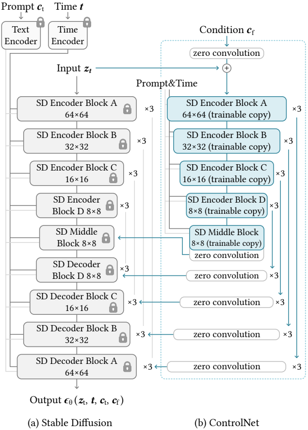

由于原始模型的参数是被冻结的，微调过程中不需要在原始编码器中进行梯度计算，加快了训练速度并节省了 GPU 内存。在单张 A100 40GB 显卡上使用 ControlNet 优化 Stable Diffusion 时，训练仅需多出约**`23%`**的 GPU 内存和**`34%`**的时间。

为了将 ControlNet 添加到 Stable Diffusion 中，首先要将每个输入条件图像，如 边缘、姿态、深度 等，从$$  512 \times 512  $$的输入尺寸转换为与 Stable Diffusion 匹配的$$  64 \times 64  $$特征空间向量。这里作者使用一个小型网络 $$E(\cdot)$$，包含 4 个卷积层，卷积核为$$4 \times 4$$，步幅为$$2 \times 2$$，激活函数为 ReLU，通道数分别&#x4E3A;**`16`**、**`32`**、**`64`**、**`128`**，权重使用高斯初始化，并与整个模型一起联合训练，将图像空间中的条件$$  c_i  $$编码为特征空间中的条件向量$$c_f$$：

$$c_f = E(c_i)$$

这个条件向量 $$  c_f  $$ 被送入 ControlNet。

> **注**：Stable Diffusion 使用潜在空间作为训练域，即使用 VAE 将$$  512 \times 512  $$的像素空间图像转换为更小的$$  64 \times 64  $$潜在图像。

* **训练**

**ControlNet** 学习目标：给定输入图像$$z_0$$，逐步向图像添加噪声，生成带噪图像$$z_t$$，其中$$  t  $$表示噪声添加的次数。给定一组条件，包括时间步$$t$$、文本prompt $$  c_t  $$以及任务特定的条件$$c_f$$，要学习一个网络$$  \epsilon_\theta  $$来预测添加到带噪图像$$  z_t  $$上的噪声，损失函数为：

$$L = \mathbb{E}_{z_0, t, c_t, c_f, \epsilon \sim \mathcal{N}(0,1)} \left[ \left\| \epsilon - \epsilon_\theta(z_t, t, c_t, c_f) \right\|_2^2 \right]$$

其中 $$  L  $$ 是整个扩散模型的总体学习目标，也是 ControlNet 的学习目标。

在训练过程中，作者团队随机&#x5C06;**`50%`**&#x7684;文本 prompt  $$  c_t  $$ 替换为空字符串。这种方法增强了 ControlNet 直接从输入条件图像，如边缘、姿态、深度等，识别语义信息的能力，从而替代文本 prompt 的作用。

> **注**：有意思的观察
>
> ControlNet 并非逐步学习控制条件，而是突然较好地遵循输入条件图像，如下图，作者将这一现象称&#x4E3A;**突然收敛现象** sudden convergence phenomenon。

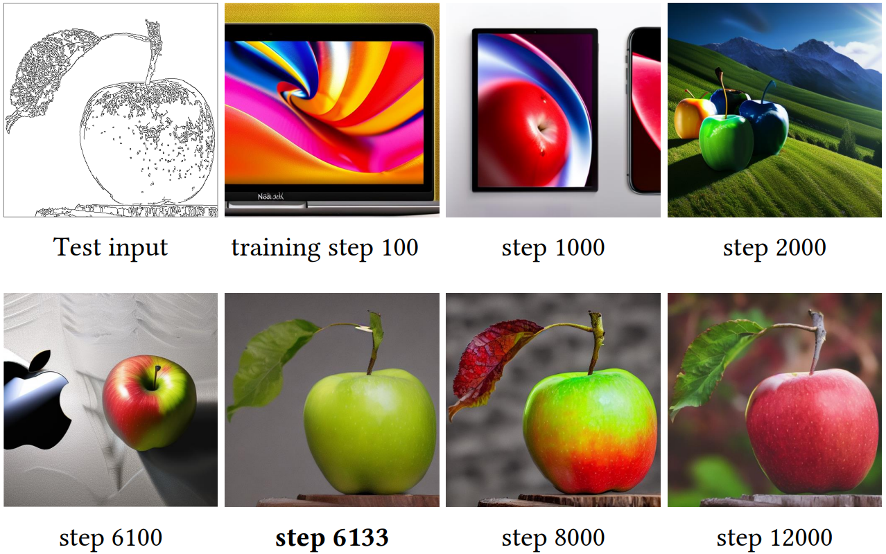

* **推理**

作者通过多种方式进一步控制 ControlNet 的额外条件影响去噪扩散过程：

1. **Classifier-free guidance 的分辨率加权**

Stable Diffusion 通常使用 **CFG**（**C**lassifier-**F**ree **G**uidance）来生成高质量图像。公式为：

$$\epsilon_{\text{prd}} = \epsilon_{\text{uc}} + \beta_{\text{cfg}} (\epsilon_c - \epsilon_{\text{uc}})$$

其中$$  \epsilon_{\text{prd}}  $$是模型的最终输出，$$\epsilon_{\text{uc}}$$是无条件输出，$$\epsilon_c$$是条件输出，$$\beta_{\text{cfg}}$$是用户指定的权重。

当通过 ControlNet 添加条件图像时，可以被同时添加到$$  \epsilon_{\text{uc}}  $$和$$  \epsilon_c  $$中，也可以只添加到$$  \epsilon_c  $$中。在一些挑战性场景中,例如无文本 prompt，

> * 若同时添加到两者中，会完全消除 CFG 引导，如右图(b)
>
> * 若仅添加到$$\epsilon_c$$，则引导会过强，如右图(c)

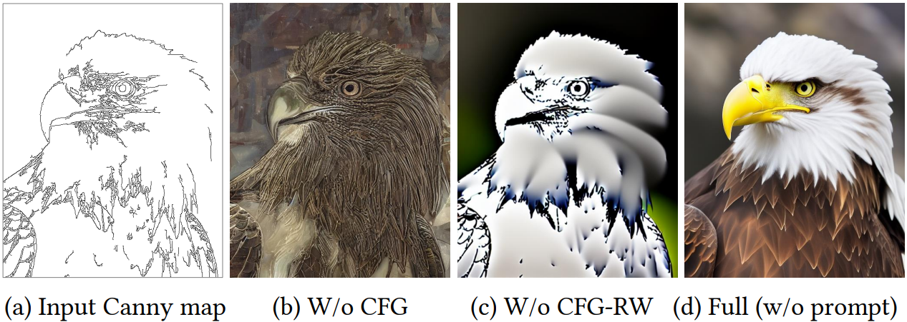

作者的解决方案是：首先将条件图像仅添加到$$  \epsilon_c  $$中，然后根据每个模块的分辨率，对 Stable Diffusion 与 ControlNet 之间的每条连接乘以一个权重$$w_i$$：

$$w_i = \frac{64}{h_i}$$

其中$$  h_i  $$是第$$  i  $$个模块的空间尺寸，例如$$h_1 = 8, h_2 = 16, \dots, h_{13} = 64$$。通过降低 CFG 引导的强度，可以实现上图(d)所示的效果，作者将这种方法称为 **CFG 分辨率加权**。

* **组合多个 ControlNet**

为了将多个条件图像应用于同一个 Stable Diffusion 实例，例如 Canny 边缘和姿态，可以直接将对应 ControlNet 的输出相加到 Stable Diffusion 模型中，并且无需额外的加权或线性插值。

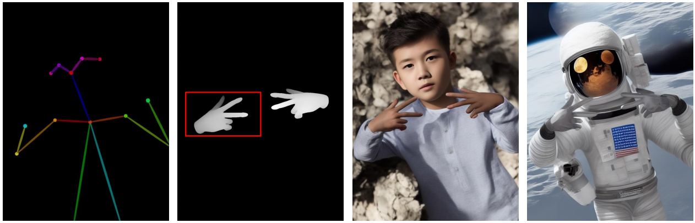

### 4.3.6 IP-Adapter

* **冻结文生图模型，只增加图像提示分支**

IP-Adapter 让预训练文生图扩散模型在保留文本提示能力的同时，额外接收一张图像提示。基础模型以 Stable Diffusion 为例：文本经冻结的 CLIP 文本编码器得到文本特征，带 cross-attention 的 U-Net 在潜空间预测噪声。训练 IP-Adapter 时，原始文本编码器、U-Net 和 VAE 全部冻结，只更新图像投影网络和新增的图像 cross-attention 参数。

整体架构如下。蓝色模块是冻结的基础模型，红色模块是新增并训练的 IP-Adapter。

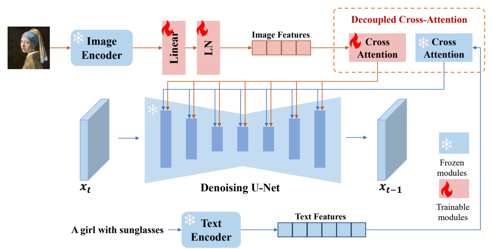

* **基础扩散目标**

给定真实潜变量 $$x_0$$、条件 $$c$$、时间步 $$t$$ 与高斯噪声 $$\epsilon$$，前向加噪写为：

$$x_t=\alpha_t x_0+\sigma_t\epsilon$$

噪声预测模型 $$\epsilon_\theta$$ 的简化训练目标为：

$$\mathcal{L}_{\mathrm{simple}}=\mathbb{E}_{x_0,\epsilon\sim\mathcal{N}(0,I),c,t}\left[\left\|\epsilon-\epsilon_\theta(x_t,c,t)\right\|_2^2\right]$$

条件生成通常使用 classifier-free guidance，把条件预测和无条件预测线性组合：

$$\hat\epsilon_\theta(x_t,c,t)=w\epsilon_\theta(x_t,c,t)+(1-w)\epsilon_\theta(x_t,t)$$

$$w$$ 控制采样结果与条件的一致程度。IP-Adapter 保留这一扩散训练和采样框架，只改变图像条件进入 U-Net 的方式。

* **图像提示编码器**

图像提示先经过冻结的 CLIP 图像编码器。方法使用 CLIP 的全局图像嵌入，因为它与图像描述语义对齐，并同时包含内容与风格信息。一个小型可训练投影网络把全局嵌入分解为长度为 $$N$$ 的图像特征序列：

$$c_i=\operatorname{LN}(W_i e_{\mathrm{CLIP}}+b_i)$$

原始实现取 **`N=4`**。图像特征维度与基础扩散模型的文本特征维度相同；投影网络由线性层和 Layer Normalization 构成。

* **解耦 cross-attention**

原始 Stable Diffusion 的 cross-attention 使用 U-Net 特征 $$Z$$ 产生 query，用文本特征 $$c_t$$ 产生 key 与 value：

$$Z'=\operatorname{Softmax}\left(\frac{QK^\top}{\sqrt d}\right)V$$

$$Q=ZW_q,\qquad K=c_tW_k,\qquad V=c_tW_v$$

如果直接把图像特征与文本特征拼接后送入同一个冻结 cross-attention，二者会共享同一组 key/value 投影，图像特征难以充分嵌入预训练 U-Net。IP-Adapter 为每个原始文本 cross-attention 并联一个新的图像 cross-attention：

$$Z''=\operatorname{Softmax}\left(\frac{Q(K')^\top}{\sqrt d}\right)V'$$

$$K'=c_iW'_k,\qquad V'=c_iW'_v$$

文本分支与图像分支共享同一个 query $$Q$$，但拥有独立的 key/value 投影。最终输出是两条注意力分支之和：

$$Z_{\mathrm{new}}=\operatorname{Softmax}\left(\frac{QK^\top}{\sqrt d}\right)V+\operatorname{Softmax}\left(\frac{Q(K')^\top}{\sqrt d}\right)V'$$

每个 U-Net cross-attention 层只新增 $$W'_k$$ 和 $$W'_v$$ 两组参数。它们从原始文本分支的 $$W_k$$、$$W_v$$ 初始化，以加快收敛；训练时原始 $$W_q,W_k,W_v$$ 全部冻结。

> **解耦的含义**
>
> 文本与图像不在输入 token 维度提前拼接，而是分别完成 cross-attention，再在输出特征上相加。这样既不破坏原有文本注意力，又给图像提示独立的投影空间。

* **训练目标与条件丢弃**

训练数据是图像—文本对。文本条件为 $$c_t$$，图像提示条件为 $$c_i$$，只优化 IP-Adapter 参数：

$$\mathcal{L}_{\mathrm{IP}}=\mathbb{E}_{x_0,\epsilon,c_t,c_i,t}\left[\left\|\epsilon-\epsilon_\theta(x_t,c_t,c_i,t)\right\|_2^2\right]$$

为支持 classifier-free guidance，训练时随机丢弃图像条件；丢弃时直接把 CLIP 图像嵌入置零。条件与无条件预测组合为：

$$\hat\epsilon_\theta(x_t,c_t,c_i,t)=w\epsilon_\theta(x_t,c_t,c_i,t)+(1-w)\epsilon_\theta(x_t,t)$$

* **推理时独立调节图像提示强度**

由于文本和图像 cross-attention 已经解耦，推理时可以只缩放图像分支：

$$Z_{\mathrm{new}}=\operatorname{Attention}(Q,K,V)+\lambda\operatorname{Attention}(Q,K',V')$$

$$\lambda$$ 是图像提示权重。$$\lambda=0$$ 时，新增分支完全关闭，模型退化为原始文生图扩散模型；提高 $$\lambda$$ 会增强参考图像内容或风格对生成结果的约束。文本条件与图像条件可以在同一 U-Net 中独立控制，而不需要重新训练基础模型。

## 4.4 OpenAI 工作

### 4.4.1 DALL-E 1

* **模型定位**

1. **任务定义**

DALL-E 1 的任务是根据自然语言描述生成图像。训练样本由 caption 与图像组成，模型学习两种离散 token 的联合分布；推理时先给定 caption token，再继续生成图像 token。

核心做法不是为文本和图像分别设计两个生成器，而是把两种模态排成一条序列，用同一个 decoder-only Transformer 自回归地预测下一个 token。

直接把 RGB 像素作为 token 会产生极长上下文，而且最大似然目标容易把大量容量用于相邻像素的高频变化。DALL-E 先用 dVAE 把图像压缩到离散 latent grid，再让 Transformer 主要建模物体、布局、颜色和语义之间的低频结构。

2. **两阶段训练**

Stage 1 单独训练 dVAE。输入图像大小为 **`256×256×3`**，Encoder 输出 **`32×32`** 个离散位置，每个位置从 **`8192`** 个类别中选择一个 image token。空间边长缩小 8 倍，Transformer 需要处理的图像上下文由 196,608 个通道值降为 1,024 个 token，相当于缩短 **`192`** 倍。

Stage 2 冻结 dVAE 的 Encoder 与 Decoder。caption 被编码为最多 **`256`** 个 BPE token，图像被编码为 **`1024`** 个 image token，两者拼成最长 **`1280`** 的序列，再训练 **`12B`** 参数的 sparse Transformer。

两个阶段各自解决一个困难：dVAE 把连续像素变成可建模的离散符号，Transformer 再学习文本符号与图像符号之间的长程依赖。

3. **联合概率模型**

记 RGB 图像为 $$x$$，caption 为 $$y$$，dVAE 产生的 image token 为 $$z$$。整体生成分布分解为：

$$p_{\theta,\psi}(x,y,z)=p_{\theta}(x\mid y,z)\,p_{\psi}(y,z)$$

$$q_{\phi}(z\mid x)$$ 是 dVAE Encoder，$$p_{\theta}(x\mid y,z)$$ 是 dVAE Decoder，$$p_{\psi}(y,z)$$ 是 Transformer 对 text token 与 image token 的联合先验。训练目标可以写为联合似然的下界：

$$\log p_{\theta,\psi}(x,y)\geq \mathbb{E}_{z\sim q_{\phi}(z\mid x)}\!\left[\log p_{\theta}(x\mid y,z)-\beta D_{\mathrm{KL}}\!\left(q_{\phi}(y,z\mid x)\,\|\,p_{\psi}(y,z)\right)\right]$$

严格的 evidence lower bound 在 $$\beta=1$$ 时成立；实际训练 dVAE 时使用更大的 KL 权重改善 codebook 使用率。因此这里的 $$\beta$$ 同时承担正则强度调节作用，不能把 $$\beta>1$$ 仍解释为严格不变的概率下界。

4. **token 与序列布局**

文本词表大小为 **`16,384`**，图像词表大小为 **`8192`**。两套词表属于不同模态，Embedding 参数和输出 Logit 也按 text/image 位置分别处理。

序列开头放置 **`start of text`**，文本不足 256 个位置时使用按位置学习的 **`padding token`**，随后放置 **`start of image`**，最后按 raster order 展平 32×32 image token。

文本位置使用一维位置 Embedding；image token 的词表 Embedding 与 row Embedding、column Embedding 相加：

$$h_i^{\mathrm{text}}=e_{\mathrm{text}}(y_i)+p_i$$

$$h_{r,c}^{\mathrm{image}}=e_{\mathrm{image}}(z_{r,c})+e_{\mathrm{row}}(r)+e_{\mathrm{col}}(c)$$

下面的结构图展示了文本 Embedding、逐位置 padding Embedding、image vocabulary Embedding 以及 row/column Embedding 如何相加为 Transformer state。

5. **训练与推理边界**

训练 Transformer 时，image token 来自 dVAE Encoder Logit 的 argmax，不加入 Gumbel noise。Transformer 学到的是离散 token 的条件分布，而不是直接预测 RGB 像素。

推理时只提供 caption 部分，Transformer 从第一个 image token 开始逐位置采样，生成完整 32×32 token grid，再由 dVAE Decoder 一次性还原为 256×256 RGB 图像。

DALL-E 1 不是 diffusion model，也没有 U-Net、反向去噪或 CLIP text Encoder。CLIP 只在生成多个候选之后离线打分并重排，不参与 DALL-E 的两阶段训练。

* **Stage 1：dVAE 图像 tokenization**

1. **Encoder 与 Decoder 结构**

dVAE 的 Encoder 和 Decoder 都是 convolutional ResNet，基本单元采用 bottleneck-style residual block。主干卷积以 3×3 为主；当 residual block 的输入与输出通道数不一致时，skip connection 使用 1×1 卷积完成通道投影。

Encoder 的第一层是 **`7×7`** 卷积，最后一层是 **`1×1`** 卷积，并输出形状为 **`32×32×8192`** 的 Logit。Encoder 使用 max pooling 下采样；同样配置下，max pooling 得到的 ELB 优于 average pooling。

Decoder 的第一层和最后一层都使用 1×1 卷积，中间通过 nearest-neighbor upsampling 恢复空间分辨率。靠近离散松弛位置的卷积保持较小感受野，可以缩小 relaxed ELB 与真实离散 ELB 之间的泛化差距。

2. **离散 latent 与均匀先验**

每个空间位置的 Encoder 输出 **`8192`** 个 Logit，参数化一个 categorical distribution：

$$q_{\phi}(z_{r,c}=k\mid x)=\operatorname{softmax}(l_{r,c})_k,\qquad k\in\{1,\ldots,8192\}$$

Stage 1 的先验设置为均匀 categorical distribution：

$$p(z_{r,c}=k)=\frac{1}{8192}$$

KL 项约束各位置的后验不要长期塌缩到很小的 token 子集。较大的 codebook 提高单个位置的表达容量，用来缓解 8 倍空间下采样导致的信息损失。

3. **Gumbel-Softmax 连续松弛**

categorical sample 不可直接使用普通重参数化梯度。dVAE 不采用在线聚类、straight-through estimator、EMA codebook loss 或 dead-code revival，而是用 Gumbel-Softmax 把 one-hot sample 松弛为连续向量。

对每个类别采样均匀随机数 $$u_k$$ 并构造 Gumbel noise：

$$g_k=-\log\!\left(-\log u_k\right),\qquad u_k\sim\operatorname{Uniform}(0,1)$$

松弛后的类别权重为：

$$\tilde{z}_k=\frac{\exp\!\left((l_k+g_k)/\tau\right)}{\sum_j\exp\!\left((l_j+g_j)/\tau\right)}$$

$$\tau$$ 越小，分布越接近 one-hot；$$\tau\to 0$$ 时松弛趋近离散 sample。训练并不把温度降到 0，而是从 **`1`** 以 cosine schedule 退火到 **`1/16`**，在可反向传播与离散近似之间取得平衡。

4. **relaxed ELB 与 KL 权重**

Stage 1 只在图像上优化 Encoder 参数 $$\phi$$ 与 Decoder 参数 $$\theta$$。将离散后验替换为温度为 $$\tau$$ 的连续松弛后，最小化的负目标可以写成：

$$\mathcal{L}_{\mathrm{dVAE}}=-\mathbb{E}_{z\sim q_{\phi}^{\tau}(z\mid x)}\!\left[\log p_{\theta}(x\mid z)\right]+\beta D_{\mathrm{KL}}\!\left(q_{\phi}(z\mid x)\,\|\,p(z)\right)$$

KL 权重在前 **`5000`** 次更新内从 0 以 cosine schedule 增加到 **`6.6`**。这个数值大于 1，会推动更充分的 codebook 使用，并在最终训练中得到更小的重建误差。

温度退火决定连续 sample 与真实离散 token 的接近程度，KL 权重决定 Encoder 是否愿意使用整个 token 词表；两者共同影响重建质量和 Stage 2 可学习性。

5. **logit-Laplace 重建分布**

普通 Laplace 或 Gaussian 分布的支撑集是整条实数轴，而像素值位于有界区间。dVAE 对 Laplace 随机变量应用 sigmoid，得到定义在 $$(0,1)$$ 上的 logit-Laplace 分布：

$$f(x\mid\mu,b)=\frac{1}{2b\,x(1-x)}\exp\!\left(-\frac{\left|\operatorname{logit}(x)-\mu\right|}{b}\right)$$

Decoder 输出 **`6`** 张 feature map：前三张是 RGB 三个通道的 $$\mu$$，后三张是对应的 $$\log b$$。训练时用上式的对数似然作为重建项。

输入像素先从整数区间 $$[0,255]$$ 映射到 $$(\epsilon,1-\epsilon)$$：

$$\varphi(x)=\frac{1-2\epsilon}{255}x+\epsilon,\qquad \epsilon=0.1$$

重建图像时忽略尺度参数 $$\log b$$，使用 $$\hat{x}=\varphi^{-1}(\operatorname{sigmoid}(\mu))$$。这种处理避免了 $$x(1-x)$$ 在区间端点附近引起的数值问题。

6. **训练日程与优化器**

温度 $$\tau$$ 在前 **`150,000`** 次更新内从 1 降到 1/16；使用线性温度退火通常会导致发散。学习率在 **`1,200,000`** 次更新内从 **`1×10⁻⁴`** 以 cosine schedule 降到 **`1.25×10⁻⁶`**。

优化器为 AdamW，参数是 $$\beta_1=0.9$$、$$\beta_2=0.999$$、$$\epsilon=10^{-8}$$，weight decay multiplier 为 **`1×10⁻⁴`**。参数使用 decay coefficient 为 **`0.999`** 的 exponentially weighted iterate averaging。

重建项覆盖 256×256×3 个像素值，KL 项覆盖 32×32 个离散位置。总 loss 除以 256×256×3 后，KL 项的有效权重变为 $$\beta/192$$。

训练使用 **`64`** 张 16 GB NVIDIA V100，每张卡 batch size 为 8，总 batch size 为 **`512`**，共训练 **`3,000,000`** 次更新。

7. **图像增强与重建损失**

dVAE 训练时先从原图随机裁出正方形，再把边长随机缩放到目标分辨率的约 9/8 至 12/8，随后随机裁成 256×256，并执行随机水平翻转。这样既保留完整局部结构，又让 Encoder 适应尺度与位置变化。

Encoder 和 Decoder residual block 的输出 activation 在初始化阶段乘以较小常数，避免很深的残差网络刚开始训练时 activation 累积过大。

右图上排是原图，下排是 dVAE 重建。主体与整体布局通常能够保留，但毛发、店铺文字和细线会被模糊或扭曲。

离散压缩是有损的：Stage 2 即使预测了正确的 image token，也无法恢复 Stage 1 已经丢弃的高频细节。

* **Stage 2：自回归 Transformer**

1. **输入 token 的构造**

caption 先转为小写，再用 BPE 编码为最多 **`256`** 个 text token，词表大小为 **`16,384`**。训练阶段应用 **`10%`** BPE dropout，使相同词语能够以不同 subword 切分出现，增强对分布外 caption 的适应性。

图像经过冻结的 dVAE Encoder，直接对每个位置的 8192 维 Logit 取 argmax，不加入 Gumbel noise：

$$z_{r,c}=\underset{k}{\operatorname{argmax}}\;l_{r,c,k}$$

严格的联合 ELB 需要从 categorical posterior 采样，但 12B Transformer 在当前数据规模下仍处于 underparameterized regime，随机 sample 与 soft target 并未带来更好的权衡，因此训练数据采用确定性的 argmax token。

2. **decoder-only sparse Transformer**

Stage 2 使用 **`12B`** 参数的 decoder-only sparse Transformer。模型包含 **`64`** 个 attention layer，每层有 **`62`** 个 attention head，每个 head 的 state size 为 **`64`**，因此 hidden size 为 **`3968`**。

text token 使用标准 causal mask，只能读取当前及之前的文本位置。任意 image token 在每一层都可以读取全部 text token，同时只能按当前 sparse attention pattern 读取允许的历史 image token。

文本不是经过独立 Encoder 后以 cross-attention 注入；text token 与 image token 在同一条 causal sequence 中共同经过 self-attention。

3. **逐位置 padding Embedding**

caption 长度不足 256 时，最后一个 text token 与 start-of-image 之间存在空位。直接把这些位置从 attention 中屏蔽，会改变模型在短 caption 下看到的序列结构。

DALL-E 为 256 个文本位置分别学习专用 padding token。只有对应位置没有真实 text token 时才使用这个 Embedding。Conceptual Captions 上的早期实验显示，这种做法会提高 validation loss，却能改善分布外 caption 的生成表现。

前面的 Embedding 示意图中，四个真实 text token 后接两个位置不同的 pad Embedding，再进入 start-of-image 与 image token。

4. **三类 sparse attention mask**

image-to-image attention 使用 row、column 与 convolutional 三类 mask，避免对 1024 个 image token 在每层都执行 dense causal attention。

**row attention** 让当前 token 读取 raster order 中相邻的历史 token。示意图的 4×4 grid 中，每个位置读取前 5 个 image token，使窗口能够覆盖上一行的同列位置。

**column attention** 沿列连接历史 token。为了提高 GPU 利用率，实际实现会转置 image state 的 row/column 维度，再使用与 row attention 形状更接近的 mask。

**convolutional attention** 使用 causal local neighborhood 并带有与 row attention 相似的 wraparound。论文示意图用 3×3 kernel，实际最后一层使用 **`11×11`** kernel。

前 **`63`** 个 attention layer 中，当 $$(i-2)\bmod 4=0$$ 时使用 column mask，其余使用 row mask，因此前四层的顺序为 row、column、row、row。第 64 层单独使用 convolutional mask。

交替的 row 与 column pattern 让局部计算逐层传播为二维长程依赖，最后的 convolutional mask 再加强邻域一致性。

下图完整展示 text-to-text causal 区域以及 row、column、转置 column 和 convolutional 四种图像区域形状。

5. **单一 attention 归一化**

text-to-text、image-to-text 和 image-to-image 三种交互共享一次 attention operation，而不是拆成三个独立 Softmax。对 image query 来说，可访问的 text key 与 image key 被放在同一个归一化分母中：

$$\operatorname{Attention}(Q,K,V)=\operatorname{softmax}\!\left(\frac{QK^{\mathsf{T}}+M}{\sqrt{d_h}}\right)V$$

$$M$$ 同时编码 causal 限制与当前 image sparse pattern。共享归一化让模型直接在文本条件和图像历史之间分配 attention mass，早期实验优于分别计算三次 attention 后再合并。

6. **自回归目标与 loss 权重**

拼接后的序列记为 $$s=(y_1,\ldots,y_{256},z_1,\ldots,z_{1024})$$，Transformer 按顺序分解联合分布：

$$p_{\psi}(y,z)=\prod_{i=1}^{256}p_{\psi}(y_i\mid y_{<i})\prod_{j=1}^{1024}p_{\psi}(z_j\mid y,z_{<j})$$

text token 与 image token 的 cross-entropy 分别按 batch 内各自 token 总数归一化，再组合为：

$$\mathcal{L}_{\mathrm{prior}}=\frac{1}{8}\mathcal{L}_{\mathrm{text}}+\frac{7}{8}\mathcal{L}_{\mathrm{image}}$$

图像生成是主要目标，因此 image loss 占 7/8。保留 1/8 text loss 使同一模型仍然学习 caption 内部的自回归结构，并稳定联合序列建模。

7. **训练配置**

优化器为 AdamW，参数为 $$\beta_1=0.9$$、$$\beta_2=0.96$$、$$\epsilon=10^{-8}$$，weight decay multiplier 为 **`4.5×10⁻²`**。解压后的梯度在 Adam update 前按 norm clip 到 **`4`**，但 clipping 只在训练开头的 warm-up 阶段被触发。

为节省显存，大多数 Adam moment 采用自定义 16-bit 格式：running mean 使用 **`1-6-9`**，分别表示 1 个 sign bit、6 个 exponent bit 和 9 个 significand bit；running variance 使用 **`0-6-10`**。variance estimate 在更新参数或 moment 前按值截断到 **`5`**。

学习率在前 **`5000`** 次更新内线性升到 **`4.5×10⁻⁴`**。之后每当 training loss 进入平台期便减半，共减半 5 次，最终学习率是峰值的 1/32。

训练使用 **`1024`** 张 16 GB NVIDIA V100，总 batch size 为 **`1024`**，共训练 **`430,000`** 次更新。约 **`606,000`** 张图像留作 validation，训练结束前没有观察到过拟合。

参数每 25 次更新从 GPU 异步复制到 CPU，并用 decay coefficient **`0.99`** 做 exponentially weighted iterate averaging。

8. **候选生成与 CLIP reranking**

给定 caption 后，Transformer 以 temperature $$t$$ 从 image token 分布逐位置采样。生成一个 token grid 就得到一个候选，而不是对多个输出取均值：

$$z_j\sim p_{\psi}(z_j\mid y,z_{<j}),\qquad j=1,\ldots,1024$$

对同一 caption 独立生成 $$N$$ 个候选图像后，预训练 contrastive model 根据 image-caption 匹配程度打分，再选 Top-$$k$$：

$$\mathcal{I}_{\mathrm{top}\text{-}k}=\underset{\mathcal{I}\subseteq\{1,\ldots,N\},\,|\mathcal{I}|=k}{\operatorname{argmax}}\sum_{i\in\mathcal{I}}s_{\mathrm{CLIP}}(x_i,y)$$

定量与定性实验通常使用 **`N=512`**、temperature **`t=1`**；官方交互展示从 512 个候选中展示 CLIP 排名前 32 的结果。这个流程属于离线 language-guided search，不改变 DALL-E 的概率模型。

下图按 best of 1、8、64、512 比较同一批 caption。候选数增加后，CLIP 更容易找到同时匹配文本且视觉合理的样本，但收益在较大 $$N$$ 后逐渐变小。

* **训练工程、评测与能力边界**

1. **250M 图文数据**

12B Transformer 使用从互联网收集的 **`250 million`** 个 text-image pair。数据包含 Conceptual Captions、Wikipedia 图文对与经过过滤的 YFCC100M 子集；早期不超过 1.2B 参数的实验使用 3.3 million 对 Conceptual Captions。

数据过滤会删除 caption 过短、由 cld3 判为非英语、主要由日期等 boilerplate 组成的样本，同时删除宽高比不在 **`[1/2, 2]`** 内的图像。极端宽高比在 square crop 后容易丢掉 caption 中提到的主体。

Transformer 训练的图像增强不做水平翻转，因为图像中可能包含文字；先在原图中央附近选择完整 square crop，再缩放到 256 至 288 之间并随机裁成 256×256。

2. **mixed-precision 稳定性**

12B 参数仅用 16-bit 保存权重就约占 **`24 GB`**，超过单张 16 GB V100 的显存。大多数参数、Adam moment 与 activation 使用 16-bit，同时启用 activation checkpointing，在 backward 时重新计算 residual block 内的 activation。

训练超过 1B 参数后，后部 residual block 的 activation gradient 量级持续减小，可能低于 16-bit 最小指数并被舍入为 0。单一 global loss scale 无法同时覆盖最小与最大的梯度，因此每个 residual block 使用独立 gradient scale。

模型一共维护 **`128`** 个 gradient scale。设 data-parallel GPU 数为 $$M$$，每个 scale 初始化为 $$M\cdot 2^{13}$$；一次更新没有非有限值时乘以 $$2^{1/1000}$$，出现非有限值时除以 $$\sqrt{2}$$ 并跳过该 block 的更新。相同 scale 在连续 **`125`** 次更新内不允许再次下降，并被限制在 $$[M\cdot2^7,M\cdot2^{24}]$$。

forward path 在 block 内临时转换到 float16 执行主要算子，再回到 float32；backward path 先 scale 并检查非有限值，计算后 unscale。若某个 block 出现 Inf 或 NaN，只过滤该 block 的 activation gradient，避免让所有更早 block 的 scale 一起下降。

per-resblock gradient scaling 的目标不是放大最终更新，而是在 16-bit 运算前把每一层的梯度移动到可表示区间，离开低精度路径后再还原尺度。

右图实线是 forward，虚线是 backward，完整保留了 identity path、精度转换、scale、unscale 与 filter 的位置。

3. **参数分片与通信重叠**

每台机器的参数阵列分片到 **`8`** 张 GPU。forward 计算当前 residual block 时，以 all-gather 预取下一个 block 的参数分片；计算完成后立即丢弃来自其他 GPU 的临时分片，降低峰值显存。

backward 以相反方向预取前一个 block 的参数。每张 GPU 计算对完整参数的局部梯度后，reduce-scatter 只保留属于本卡的平均梯度切片。这样把同机通信延迟与矩阵计算重叠起来。

下面的通信图展示了单机内部的 all-gather/reduce-scatter，以及不同机器对应 parameter shard 之间的 all-reduce。

* **PowerSGD 梯度压缩**

跨机器带宽远低于同机 GPU 带宽，all-reduce 成为主要瓶颈。PowerSGD 用两个 rank 为 $$r$$ 的低秩因子近似梯度矩阵：

$$G\approx P Q^{\mathsf{T}}$$

每台机器只 all-reduce 较小的 $$P$$ 与 $$Q$$，再重建梯度。对每台机器 8 张 GPU、Transformer hidden size $$d_{\mathrm{model}}$$ 的配置，通信压缩率为：

$$1-\frac{5r}{8d_{\mathrm{model}}}$$

12B 模型使用总 compression rank **`896`**，每张 GPU 的 parameter shard 使用 rank 112，通信量约压缩 **`86%`**。Embedding、unembedding、gain 与 bias 不做 PowerSGD 压缩，并保持 32-bit 参数、梯度和 Adam moment；text/image Logit 也用 32-bit 计算和保存。

error buffer 保存真实梯度与低秩重建的残差。Householder orthogonalization 代替 Gram-Schmidt，并在输入加小的 identity multiple；固定随机 Gaussian $$Q$$ 可以得到与 warm-start 接近的 training loss，而每次更新重采样 $$Q$$ 会明显降低性能。

5. **MS-COCO zero-shot 评测**

DALL-E 在 MS-COCO caption 上直接 zero-shot 生成，没有使用该数据集的 caption 训练。比较对象包括 AttnGAN、DM-GAN 与 DF-GAN，生成样本由 CLIP 从候选集中重排。

人工评测采用 best-of-five vote。与 DF-GAN 对比时，DALL-E 的样本在 **`90.0%`** 的 caption 上被多数人选为更真实，在 **`93.3%`** 的 caption 上被选为更符合文字。

右图把每个 caption 获得 0/5 至 5/5 票的比例堆叠显示，黑框以上表示获得多数票。

未加 blur 时，DALL-E 的 MS-COCO FID 与当时最好方法相差不到 2 分。对真实图和生成图同时施加 radius 1 的轻微 Gaussian blur 后，DALL-E 的 FID 反而领先约 6 分；blur radius 增大时差距继续扩大，说明 dVAE 主要损失的是高频信息，而整体低频结构具有竞争力。

下面的三组曲线分别比较 MS-COCO 与 CUB 在不同 blur radius 下的 FID/IS，以及 reranking sample size 对 MS-COCO 指标的影响。

6. **数据重叠控制与 CUB 结果**

训练数据没有直接包含 MS-COCO，但 YFCC100M 子集与 MS-COCO validation image 存在来源重叠。使用专门训练的 contrastive model 找最近训练图，并人工选择保守阈值后，约 **`21%`** 的 MS-COCO validation image 被判为重叠；移除这些图后，FID 没有显著变化。

CUB 的 image overlap 约为 **`12%`**，移除后同样没有显著变化。但 DALL-E 在 CUB 上与领先专用模型仍有接近 **`40`** 个 FID point 的差距。

大规模通用 zero-shot 能力不等于在细粒度专门分布上自动占优。CUB 的结果表明，领域微调与高频细节建模仍然重要。

7. **组合生成与 image-to-image**

模型能够在不同可靠度下组合低频共现的概念，例如把 tapir 与 accordion 融成一个对象、让穿圣诞毛衣的 hedgehog 遛 dog、生成带指定单词的 neon sign。

给定 caption 与图像 token grid 顶部 **`15×32`** 的已知前缀，模型可以继续生成底部区域，把上方照片改画成 sketch。相同机制也能做灰度化、上下翻转、颜色变化，以及把主体转成 greeting card、stamp 或 phone case 风格。

这种 image-to-image 能力来自自回归条件补全：已知区域必须对应序列前缀，所以可直接重生成的矩形需要延伸到图像右下角。

下图依次展示概念融合、多个对象与属性绑定、文字渲染，以及以顶部 token 为前缀的照片到 sketch 转换。

8. **能力限制与正确理解**

复杂 variable binding 不稳定。对象数量增加后，颜色、服饰和主体的对应关系容易混淆；语义等价的 caption 改写也可能导致完全不同的成功率。

文字渲染只在部分短词上可辨认，不能把生成图中的字符串当作可靠文本。dVAE 的有损压缩还会进一步破坏细字、线条、毛发和规则纹理。

CLIP reranking 提升的是从有限候选中选出与 caption 更匹配的结果，并没有修正生成分布本身。best-of-512 指标也不能直接等同于只采样一次的用户体验。

模型会从互联网数据继承职业、地理、文化与身份偏差，也可能生成与真实世界不一致的对象、文字和关系。生成结果不能作为事实记录；实际部署仍需单独处理输入审核、输出审核、版权、隐私、偏差评估与内容标识。

### 4.4.2 DALL-E 2

DALL-E 2 的训练数据集由图像$$x$$和其对应标题$$y$$的对$$(x, y)$$组成。给定一幅图像$$x$$，设$$z_i$$和$$z_t$$分别为其 CLIP 图像嵌入和文本嵌入。作者设计了一个生成流程，通过以下两个组件从标题生成图像：

> * **一个 Prior **$$P(z_i | y)$$，它根据标题$$y$$生成 CLIP 图像嵌入$$z_i$$
>
> * **一个 Decoder **$$P(x | z_i, y)$$，它根据 CLIP 图像嵌入$$z_i$$，以及可选的文本标题$$y$$，生成图像$$x$$

Decoder 可以在给定 CLIP 图像嵌入的情况下反转图像，而 Prior 则可以训练一个图像嵌入的生成模型。将这两个组件叠加起来，就可以得到一个从标题$$y$$生成图像$$x$$的生成模型$$P(x | y)$$：

$$P(x | y) = P(x, z_i | y) = P(x | z_i, y) P(z_i | y)$$

第一个等式成立是因为$$z_i$$是$$x$$的确定性函数，第二个等式成立是由于链式法则。因此，可以通过先使用 Prior 采样$$z_i$$，然后使用 Decoder 采样$$x$$，从真实的条件分布$$P(x | y)$$中采样。

* **Decoder**

作者使用扩散模型来生成基于 CLIP image embedding 的图像。具体来说，通过将 CLIP Embedding 添加到现有的timestep Embedding 中，并将 CLIP Embedding 投影为四个额外的上下文 token，这些 token 被连接到文本编码器输出的序列中。

虽然可以直接从解码器的条件分布中采样，但过去使用扩散模型的工作表明，利用对条件信息的指导可以显著提高样本质量。因此通过在**`10%`**的时间随机将 CLIP 嵌入设置为零或学习到的嵌入，并在训练过程中在**`50%`**的时间随机丢弃文本标题，实现了无分类器指导。

为了生成高分辨率图像，作者训练了两个扩散上采样模型：一个用于将图像从$$64 \times 64$$上采样到$$256 \times 256$$分辨率，另一个进一步将图像上采样到$$1024 \times 1024$$分辨率。为了提高上采样器的鲁棒性，在训练期间稍微破坏了条件图像。对于第一阶段的上采样，使用高斯模糊；对于第二阶段，使用更复杂的 BSR 退化方法。为了减少训练计算量并提高数值稳定性，在目标尺寸四分之一大小的随机裁剪图像上进行训练。并且在模型中仅使用空间卷积，不使用注意力层，并在推理时直接以目标分辨率应用模型，观察到它能够很好地泛化到更高分辨率。

* **Prior**

虽然 Decoder 可以从 CLIP 图像嵌入 $$z_i$$ 反转生成图像$$x$$，但还需要一个 Prior 模型，从标题$$y$$生成$$z_i$$，以实现从文本生成图像的功能。这里探索了两种不同的先验模型类别：

> * **自回归 AR Prior**：CLIP 图像嵌入$$z_i$$被转换为离散代码序列，并根据标题$$y$$自回归地预测
>
> * **扩散 Prior**：连续向量$$z_i$$直接用基于标题$$y$$的高斯扩散模型建模

除了标题外，还可以基于 CLIP 文本嵌入$$z_t$$条件化 Prior，因为它是标题的确定性函数。为了提高样本质量，还通过在训练过程中&#x5728;**`10%`**&#x7684;时间随机丢弃文本条件信息 ，为 AR 和扩散 Prior 启用了无分类器指导。

为了更高效地训练和采样 AR 先验，首先通过主成分分析 PCA 降低 CLIP 图像嵌入 $$z_i$$ 的维度。当使用 SAM 训练 CLIP 时，CLIP 表示空间的秩显著降低，同时略微提高了评估指标。通过仅保留原&#x59CB;**`1,024`**&#x4E2A;主成分中&#x7684;**`319`**&#x4E2A;，几乎保留了所有信息。应用 PCA 后，按特征值大小降序排列主成分，将每个维度量化&#x4E3A;**`1,024`**&#x4E2A;离散桶，并使用因果注意掩码的 Transformer 模型预测生成的序列。这使得推理期间预测的标记数量减少了三倍，并提高了训练稳定性。

作者通过对序列前缀编码文本标题和 CLIP 文本嵌入来条件化 AR 先验。此外，在序列前附加一个 token，表示文本 Embedding 和图像 Embedding 之间的点积$$z_i \cdot z_t$$。这能够对更高的点积进行条件化，因为更高的文本-图像点积对应于更好地描述图像的标题。在实践中，从点积分布的上半部分采样是有益的。

对于扩散 Prior，作者在一个序列上训练了一个仅解码器的 Transformer，该序列依次包括：编码后的文本、CLIP 文本嵌入、扩散时间步嵌入、噪声化的 CLIP 图像嵌入，以及一个最终嵌入，其 Transformer 输出用于预测未噪声化的 CLIP 图像嵌入。与 AR 先验不同，作者选择不在扩散先验中基于 $$z_i \cdot z_t$$ 进行条件化；相反，在采样时通过生成两个 $$z_i$$ 样本并选择与 $$z_t$$ 点积更高的样本来提高质量。这里直接训练模型预测未噪声化的 $$z_i$$ 并在其预测上使用均方误差损失：

$$L_{\text{prior}} = \mathbb{E}_{t \sim [1,T], z_i^{(t)} \sim q_t} \left[ \| f_\theta(z_i^{(t)}, t, y) - z_i \|^2 \right]$$

### 4.4.3 DALL-E 3

* **问题定义与总体思路**

DALL·E 3 的出发点不是继续追求更高的像素质量，而是处理文本条件没有被完整执行的问题。要解释这个变化，需要先把 Prompt following 的失败追溯到训练数据：模型没有从 Caption 中见过的关系，推理时通常也很难稳定生成出来。

1. **Prompt following 的核心问题**

文本到图像模型不仅要生成清晰、自然的图像，还要让图像中的对象、属性、数量、位置关系与用户输入一致。早期系统经常忽略 Prompt 中的词语、混淆词序，或者把同一个词错误地绑定到多个对象上。 这类问题统一称为 Prompt following 不足。

如果训练 Caption 只写“一个人在房间里”，模型就很难从数据中学会“红色外套”“左侧窗户”“桌上有三本书”等细粒度绑定关系。DALL·E 3 的主线不是单纯扩大生成模型，而是先提高训练文本对图像内容的覆盖率，再让生成模型学习这些更完整的图文对应关系。

2. **Caption 质量为什么限制生成控制力**

大规模图文数据中的文本通常来自网页标题、Alt Text 或页面附近的短句。它们往往只描述主体，省略背景、对象数量、空间关系、颜色、尺寸以及画面内文字；更糟糕的情况是文本与图像只存在页面层面的关联，并不真正描述图像。

> **低质量 Caption 带来的训练偏差**
>
> 1. **监督缺失**：图像里存在的信息没有进入文本条件，生成模型无法建立对应关系。
>
> 2. **错误绑定**：无关网页文本被当作 Caption，模型会把错误语义与图像特征绑定。
>
> 3) **表达分布过窄**：训练文本普遍短而模糊，推理时输入长 Prompt 就会落到训练分布之外。

一旦把问题定位到监督信号，改进路径就清楚了。训练端先重写 Caption，并用新的文本分布训练生成模型；到了推理端，用户的短请求还要映射到同一种描述风格。这样看，recaptioning 与 Prompt upsampling 不是两个孤立技巧，而是训练端和推理端的一前一后。

3. **从数据重标注到模型训练**

完整 pipeline 可以概括为：训练专用 Image Captioner → 为训练集中的每张图像生成高描述性 Caption → 将 synthetic Caption 与原始 Caption 混合 → 训练文本条件扩散模型 → 推理时用 LLM 把短 Prompt 扩写到训练时熟悉的描述分布。

这一设计把生成控制力拆成两个相互衔接的问题：训练阶段提高图文监督的信息密度，推理阶段降低用户短 Prompt 与训练长 Caption 之间的分布差异。前者解决“模型学到了什么”，后者解决“怎样把用户意图送进模型”。

4. **三类文本不能混为一谈**

> **三个文本阶段**
>
> 1. **原始 Caption**：来自网页或人类书写的配对文本，语言分布自然，但经常短、漏信息或不准确。
>
> 2. **Synthetic Caption**：由 Image Captioner 根据训练图像自动生成，用来重标注训练集。
>
> 3) **Upsampled Prompt**：推理时由 GPT-4 根据用户请求生成的详细图像描述，直接作为 DALL·E 3 的条件输入。

训练集重标注不是在用户每次调用时重新看图生成 Caption，Prompt upsampling 也不是训练数据清洗。 两者都在改善文本条件，但发生时间、输入信息和作用完全不同。

三种文本的角色理顺之后，还要把方法逻辑与具体实现边界分开。Recaptioning 的因果关系和实验设置可以明确说明，但完整生产架构并未全部披露，不能用 ablation 模型的结构去补齐正式版本。

5. **可验证的实现边界**

DALL·E 3 的完整生产架构、参数量、完整训练数据规模、optimizer 与全部训练细节没有被披露。 可以确认的是：DALL·E 3 是 synthetic Caption ablation 模型的放大和改进版本，训练使用 **`95%`** synthetic Caption 与 **`5%`** 原始 Caption；实验模型采用 T5 XXL 条件的三阶段 latent diffusion，DALL·E 3 还使用了单独训练的 latent-to-pixel diffusion Decoder。

> **注：**&#x5B9E;验模型与生产版 DALL·E 3 不能画等号。实验结构可以说明技术家族和 ablation 条件，但不能据此补出生产模型未披露的 stage 宽度、block 数量或参数规模。

* **Dataset Recaptioning 与 Image Captioner**

前面的总体流程把 Captioner 放在了生成模型之前。它不直接参与画图，而是负责重新组织监督信号：先从图像中恢复网页 Caption 漏掉的信息，再把这种描述能力扩展到整套训练数据。模型训练方式决定它能写出什么，数据混合方式则决定这些机器描述会怎样影响后续生成器。

1. **原始图文对中的信息缺口**

训练样本写成图文对 $$(t,i)$$，其中 $$i$$ 是图像，$$t$$ 是描述图像的文本。网页 Caption 最常漏掉四类信息：场景中常见但不显眼的对象、对象的位置与数量、颜色和尺寸等常识属性，以及图像内部实际出现的文字。

例如，浴室图片的 Alt Text 可能是一段商城广告，短 Caption 只写“白色浴缸放在木地板上”，高描述性 Caption 则会继续覆盖木质墙面、吊灯、窗户、盆栽、材质与整体氛围。同一张图提供更密集的文本监督后，模型能在不增加图像样本数的前提下学习更多条件绑定。

2. **Captioner 的自回归目标**

Captioner 先用 tokenizer 把文本拆成 token 序列，再预测当前 token 在历史 token、图像表示与模型参数条件下的概率。图像本身包含大量像素，直接把全部像素送入语言模型成本过高，因此先用预训练 CLIP Image Encoder 得到压缩表示 $$F(i)$$。

$$\mathcal{L}(t,i)=\sum_j \log P(t_j \mid t_{j-k},\ldots,t_{j-1},z_j,F(i);\Theta)$$

这里 $$t_j$$ 是当前目标 token，$$t_{j-k},\ldots,t_{j-1}$$ 是可见文本上下文，$$z_j$$ 表示当前文本位置的内部表示，$$F(i)$$ 提供图像条件，$$\Theta$$ 是 Captioner 参数。这个目标把普通语言建模改造成“看图续写”，使每一步 token 预测都同时依赖文本上下文和图像语义。

目标函数只说明了每一步怎样预测 token，还没有回答 Image Captioner 从哪里获得稳定的图文对齐能力。这个能力来自联合预训练，而 Caption 风格由后续 fine-tuning 决定，两者分工不同。

3. **联合预训练与基础 Captioner**

基础 Captioner 同时采用 CLIP 对比学习目标和语言建模目标，在大规模图文对上联合预训练。这种训练让图像表示和文本表示对齐，同时保留自回归生成 Caption 的能力。

仅靠大规模预训练仍会复现原始数据的问题：模型倾向于只写主体，不愿主动描述背景、位置、画面内文字和细节。 因此，决定 Caption 风格的关键步骤不是继续无差别扩充网页数据，而是用专门标注的小数据集做定向 fine-tuning。

4. **Short 与 Descriptive 两种 fine-tuning**

第一组 fine-tuning 数据只描述图像主对象，得到 Short Synthetic Caption（SSC）。第二组数据使用长而细致的描述，覆盖主体、周边环境、背景、画面文字、风格、色彩与其他可见细节，得到 Descriptive Synthetic Caption（DSC）。

SSC 主要改善 Caption 与主体的直接对应，DSC 则扩大每张图像携带的监督信息，并更接近复杂 Prompt 所需要的组合描述。 两种 Captioner fine-tune 完成后，都会对完整训练图像集合执行推理，为每张图像生成对应的 synthetic Caption。

到这里，Captioner 已经从“能看图续写”变成“能按指定粒度描述图像”。当它被用于整套训练集时，关注点不再只是单条 Caption 是否更丰富，而是大规模统一改写会给生成模型带来哪些收益和系统性偏差。

5. **Synthetic Caption 的价值与偏差**

Recaptioning 可以理解为对网页文本噪声的一次重新估计：Captioner 根据图像本身生成描述，减少广告、文件名和页面上下文等无关文字的影响；相似图像也会得到更统一的表达方式，使训练信号的方差下降。

在使用原始 Caption 计算 CLIP score 时，Synthetic Caption 训练并没有表现出明显损失；在使用 DSC 计算时，优势更加显著，而且训练曲线更平稳。 这说明 synthetic Caption 不只是“写得更长”，而是与图像绑定得更紧。

统一的 Captioner 也会把自己的固定句式、大小写、标点、长度习惯和事实幻觉注入整个训练集。 一旦所有样本都遵循同一种机器文本分布，生成模型会把这些规律当成数据本身的属性。

6. **为什么仍然保留原始 Caption**

训练时不是先固定一份最终文本，而是在 data sampling 阶段按固定概率选择原始 Caption 或 synthetic Caption。原始 Caption 来自真实人类文本分布，能为大小写、标点、句长和表达习惯提供正则化；synthetic Caption 则提供更完整的视觉描述。

两者混合的本质是信息密度与文本分布多样性之间的平衡。 完全依赖原始 Caption 会损失细节监督，完全依赖 synthetic Caption 又会让模型过度适应 Captioner 的固定表达方式。

这个权衡最终落到一个可操作的变量上：训练时以多大概率采样 synthetic Caption。下一步需要在相同模型和相同图像数据下做 ablation，先确认 Caption 类型与混合比例的独立影响，再讨论 DALL·E 3 本身。

* **训练、Prompt upsampling 与生成架构**

数据重标注给出了更密集的监督，但还需要回答两个问题：这种改变能否在受控实验中稳定带来收益，用户的短 Prompt 又怎样接入由长 Caption 训练出来的模型。前一个问题由 recaptioning ablation 解决，后一个问题由 Prompt upsampling 补上，生成架构则说明这些条件最终在哪里进入扩散过程。

1. **Recaptioning ablation 的统一设置**

Caption 类型实验固定图像数据和生成模型结构，只改变训练时使用的 Caption。实验模型都是 T5 条件的文本到图像扩散模型，训练 **`500,000`** steps，batch size 为 **`2,048`**，累计处理约 **`1B`** 个图像样本。

每个模型生成 **`50,000`** 张评测图像。图像通过公开 CLIP ViT-B/32 Image Encoder 得到 $$z_i$$，Caption 通过 Text Encoder 得到 $$z_t$$，两者计算余弦相似度：

$$C(z_i,z_t)=\frac{z_i\cdot z_t}{\lVert z_i\rVert\lVert z_t\rVert}$$

所有图文对的相似度取平均后乘以 **`100`**，并在多个 checkpoint 上用参数的指数滑动平均版本进行评测。这个控制变量设计使 Caption 质量的影响能与模型结构变化分离。

控制住图像数据、模型结构与训练步数后，Caption 才成为唯一主要变量。先比较不同 Caption 类型，可以确认描述性重标注是否真的提高图文对齐；随后再改变采样比例，寻找信息密度与文本多样性的平衡点。

2. **Caption 类型 ablation**

三组模型分别使用原始 Caption、**`95%`** SSC 和 **`95%`** DSC。评测又分为两种文本：原始 Caption 与 DSC。这样可以同时观察模型是否保留对人类短文本的兼容性，以及是否真正学会更细的图像描述。

SSC 和 DSC 在原始 Caption 评测上略优于基线，在 DSC 评测上的提升更明显；DSC 训练曲线同时具有更低方差。 这排除了“长 Caption 只会让模型对长文本过拟合、却损害普通 Prompt”的简单解释。

3. **Synthetic Caption 混合比例**

混合比例实验比较 **`65%`**、**`80%`**、**`90%`** 和 **`95%`** DSC。**`65%`** 组在中途明显落后而被停止，剩余组中 synthetic Caption 比例越高，原始 Caption 上的 CLIP score 也越高。

最终选择 **`95%`** synthetic Caption 与 **`5%`** 原始 Caption，是因为高信息密度带来的收益占主导，同时少量人类文本仍能约束文本分布。

4. **DALL·E 3 的训练 Caption**

DALL·E 3 使用 **`95%`** synthetic Caption 与 **`5%`** 原始 Caption 训练。它是 ablation 模型的放大和改进版本，但还包含多项没有单独 ablate 的变化。

因此，DALL·E 3 相对 DALL·E 2 的全部提升不能归因于 recaptioning 一个变量。 Recaptioning 的独立收益由相同结构的 ablation 支撑；最终系统的跨模型比较同时包含规模、架构和其他训练改进的影响。

训练端的问题到这里基本闭合：模型已经适应信息更密集的 Caption。推理端却出现了新的错位，用户通常不会主动写出同样长度和细节密度的描述，所以还需要在 Prompt 进入生成器之前做一次分布对齐。

5. **Prompt upsampling**

高比例 DSC 会让生成模型适应长而具体的 Caption 分布。用户却常用短句提需求，直接把短 Prompt 输入模型就会形成 train-inference mismatch。GPT-4 负责把短 Prompt “upsample”为包含主体、动作、环境、构图、材质、光照与风格的详细描述。

> **关系消歧示例**
>
> 1. **原始请求**：**`一只鸟吓唬稻草人`**。
>
> 2. **扩写重点**：明确鸟从空中俯冲、稻草人在田野中因恐惧而颤抖，并补充环境、服装与动作状态。
>
> 3) **作用**：把主客体关系写进条件文本，降低生成模型把关系反过来的概率。

用于 upsampling 的描述长度被限制在 **`15–80`** words，并要求一次只输出一条图像描述。用户提出修改时，GPT-4 会重写整条描述以整合新要求，而不是只在末尾追加句子。这使对话式修改仍能保持完整、连贯的图像条件。

Prompt upsampling 负责准备条件文本，却不改变扩散模型内部怎样消费这些条件。把输入侧对齐清楚后，再看文本 Embedding、latent diffusion 与像素 Decoder 的连接方式，完整生成链路才会闭合。

6. **生成模型与 latent Decoder**

用于 synthetic Caption ablation 的图像生成器是三阶段、文本条件的 U-Net latent diffusion。图像先进入 Rombach 等人训练的 VAE，空间尺寸下采样 **`8×`**；在 **`256×256`** 图像实验中，扩散模型处理 **`32×32`** latent。timestep 条件通过 modulated GroupNorm 注入：GroupNorm 输出再乘以由 timestep 学得的 scale，并加上对应 bias。

文本先由 T5 XXL Encoder 编码，生成的文本 latent 通过 xfnet 的 cross-attention 进入扩散网络。可以确认 DALL·E 3 沿用了这条模型家族主线，但生产模型的完整三阶段配置没有展开。

DALL·E 3 还在同一个 VAE latent space 上训练了单独的 latent-to-pixel diffusion Decoder。这个 Decoder 使用与 DDPM 相同类型的卷积 U-Net，再通过 consistency distillation 压缩到 **`2`** 个 denoising steps，用于改善文字和人脸等精细像素结构。

> **注：**&#x8FD9;个 diffusion Decoder 没有用于 recaptioning ablation。它属于 DALL·E 3 的像素解码改进，不能拿来解释不同 Caption 类型实验中的性能差异。

至此，数据、条件文本和生成网络已经连成一条链。方法是否有效，不能只看单个 CLIP score，还要分别检验短 Prompt 兼容性、长描述利用能力、属性绑定和主观画面质量。

* **评测方法与实验结果**

评测要回答的不是“哪一个总分更高”，而是 DALL·E 3 的改动究竟改善了哪类能力。自动指标先覆盖整体相似度与组合属性，Human evaluation 再补上 VLM judge 难以稳定判断的风格偏好和结构连贯性。

1. **自动评测矩阵**

自动评测同时覆盖整体图文相似度、复杂 Prompt following 与属性绑定。对比对象包括 DALL·E 2 生产版本和启用 Refiner 的 Stable Diffusion XL **`1.0`**。

| **Metric** | **DALL·E 3** | **DALL·E 2** | **SDXL** |
| -------------------------------------------------------------------------------- | ---------------------------------------------------------------------------------- | ---------------------------------------------------------------------------------- | ------------------------------------------------------------------------------ |
| MSCOCO CLIP Score                                                                | **`32.0`**                                                                         | 31.4                                                                               | 30.5                                                                           |
| DrawBench short                                                                  | **`70.4%`**                                                                        | 49.0%                                                                              | 46.9%                                                                          |
| DrawBench long                                                                   | **`81.0%`**                                                                        | 52.4%                                                                              | 51.1%                                                                          |
| T2I-CompBench Color                                                              | **`81.1%`**                                                                        | 59.2%                                                                              | 61.9%                                                                          |
| T2I-CompBench Shape                                                              | **`67.5%`**                                                                        | 54.7%                                                                              | 61.9%                                                                          |
| T2I-CompBench Texture                                                            | **`80.7%`**                                                                        | 63.7%                                                                              | 55.2%                                                                          |

上表先给出总体结果，下面按评测目标拆开理解。MSCOCO 检查短 Caption 下的基础对齐，DrawBench 测试复杂指令和扩写后的长 Prompt，T2I-CompBench 则把问题收窄到属性是否绑定到正确对象。

2. **MSCOCO CLIP Score**

MSCOCO 2014 evaluation set 抽取 **`4,096`** 条短 Caption 生成图像，再用公开 CLIP ViT-B/32 计算图文相似度。这个设置刻意使用短 Caption，检验模型是否只对长 synthetic Caption 有效。

DALL·E 3 得到 **`32.0`**，高于 DALL·E 2 的 **`31.4`** 与 SDXL 的 **`30.5`**。 但训练数据没有对 MSCOCO 做去重，存在数据泄漏的可能，因此这个结果更适合作为辅助证据，而不是单独证明泛化能力。

3. **DrawBench 的短 Prompt 与长 Prompt**

每条 DrawBench Prompt 对每个模型生成 **`4`** 张图。视觉版 GPT-4 同时读取图像和原始 Prompt，输出“正确/错误”判断与解释。第二轮把 GPT-4 upsampled Prompt 送给生成模型，但判分时仍使用原始 DrawBench Prompt，避免扩写文本改变评测目标。

短 Prompt 下 DALL·E 3 的正确率为 **`70.4%`**，长 Prompt 下升至 **`81.0%`**；DALL·E 2 与 SDXL 在长 Prompt 下只达到约 **`52%`**。 差距随 Prompt upsampling 扩大，说明 DALL·E 3 更能利用新增细节，而不仅是由 LLM 生成了一段更长文本。

4. **T2I-CompBench 的属性绑定**

T2I-CompBench 选取 color binding、shape binding 与 texture binding 三类组合 Prompt，并用 Disentangled BLIP-VQA 判分。颜色和纹理结果超过 **`80%`**，shape binding 为 **`67.5%`**。

这组评测直接对应 recaptioning 的目标：Caption 中写清“哪个对象具有什么属性”，生成模型才能把颜色、形状和纹理绑定到正确对象。

这些自动评测能够定位文本对齐问题，却不能可靠判断人体结构、对象位置、画面文字是否自然，也很难代表真实使用偏好。于是评测从“图文是否相似”转向成对比较，让人直接判断哪张图更符合描述、风格更好、结构更连贯。

5. **Human evaluation 设计**

Human evaluation 分为 Prompt following、Style 和 Coherence。Prompt following 让评测者查看完整 upsampled Caption，并选择哪张图更符合描述；Style 只比较使用偏好；Coherence 重点检查人体部位、脸、姿态、对象位置、文字和其他不合理结构。

Prompt following 与 Style 使用 **`170`** 条生产场景 Prompt，覆盖人物、商品、地点、概念融合、文字渲染与艺术创作。Coherence 使用 **`250`** 条 MSCOCO Caption，避免虚构场景天然被误判为不连贯。每个图像对和问题收集 **`3`** 个回答，每个模型、每个问题累计 **`2,040`** 次评分。

6. **Human evaluation 结果**

| **Dataset** | **DALL·E 3** | **MJ 5.2** | **SDXL** | **DALL·E 2** |
| --------------------------------------------------------------------------------- | ---------------------------------------------------------------------------------- | -------------------------------------------------------------------------------- | ------------------------------------------------------------------------------ | ---------------------------------------------------------------------------------- |
| Prompt following                                                                  | **`153.3`**                                                                        | -104.8                                                                           | -189.5                                                                         | -                                                                                  |
| Style                                                                             | **`74.0`**                                                                         | 30.9                                                                             | -95.7                                                                          | -                                                                                  |
| MSCOCO Coherence                                                                  | **`71.0`**                                                                         | 48.9                                                                             | -84.2                                                                          | -                                                                                  |
| DrawBench                                                                         | **`61.7`**                                                                         | -                                                                                | -34.0                                                                          | -79.3                                                                              |

ELO 结果显示，DALL·E 3 在 Prompt following 上的优势最大，同时在 Style 与 Coherence 上也领先。这说明提高 Caption 监督没有用画面质量换取文本对齐，最终系统在三类主观维度上都取得正向结果。

视觉版 GPT-4 在对象计数任务上没有稳定超过随机判断，因此 DrawBench 还需要 Human evaluation 补足。 自动指标和 Human evaluation 的结论一致时更可信，单一 VLM judge 不能替代人工评测。

能力评测说明 recaptioning 与 Prompt upsampling 确实改善了指令执行，但部署系统面对的并不只是正常 Prompt。模型还要处理敏感内容、身份人物、偏见与误导性使用，因此生成 pipeline 必须把安全控制放在模型前后，而不是等图像生成完再统一过滤。

* **安全系统、部署控制与局限**

安全系统与生成模型是同一条产品链路上的不同层。输入侧决定哪些请求可以继续、怎样改写条件文本，输出侧负责识别生成结果中的风险；两端之间还可以通过 classifier guidance 影响再次采样。理解这条链路后，才能区分拒绝请求、改写 Prompt 和修正生成结果三种控制方式。

1. **多层 Mitigation Stack**

DALL·E 3 的安全控制不是单一分类器，而是覆盖数据、对话、Prompt 和生成图像的多层系统。训练前过滤明显的色情、暴力与部分仇恨符号；推理时由 ChatGPT refusal、Prompt input classifier、blocklist、Prompt transformation 和 image output classifier 共同拦截风险。

> **推理时的安全链路**
>
> 1. **用户请求**：ChatGPT 先根据敏感内容策略决定是否拒绝。
>
> 2. **输入检查**：Moderation 类 classifier 与文本 blocklist 检查对话和 Prompt。
>
> 3) **Prompt transformation**：扩写描述，同时删除 public figure 名称、补足人物属性，并把品牌对象改写成泛化描述。
>
> 4) **图像生成**：DALL·E 3 接收变换后的详细 Prompt。
>
> 5. **输出检查**：图像 classifier 在结果展示前检测并拦截风险图像。

多层设计的原因是视觉同义替换会绕过纯文本检查，例如用“红色液体”代替“血液”。 输入 classifier 无法穷举所有视觉表达，输出 classifier 和生成过程中的干预仍然必要。

多层 Mitigation Stack 给出了全局结构，最具体的技术难点落在输出图像分类上：同一个不安全 Prompt 可能生成安全图像，违规区域也可能只占画面很小一部分。Racy output classifier 的数据构造和推理裁剪正是围绕这两个问题展开。

2. **Racy output classifier**

Racy output classifier 使用冻结的 CLIP Image Encoder 提取特征，再由小型辅助模型预测安全分数。最初直接用文本 Moderation 结果给生成图像打标签，但 unsafe Prompt 也可能生成 safe 图像，导致标签噪声。

数据清洗先用 Microsoft Cognitive Service API 给图像打 racy confidence，再从每一类均匀采样 **`1,024`** 张进行人工核验，以确定重新标注阈值。针对“小区域违规、其余区域正常”的 hard case，又各准备 **`100K`** racy 与 non-racy 图像，并把一张 racy 图像随机裁成占画面 **`20%`** 的区域，粘贴到 non-racy 图像中；对应 negative sample 则粘贴 non-racy 区域。

Cut-paste 数据迫使 classifier 检查局部内容，而不是记住整张图的全局模式；non-square 图像再使用左/中/右或上/中/下的 **`3`** crops 取最大安全分数。 hard64 true positive rate 从 baseline 的 **`1.6`** 提升到 **`78.1`**。

3. **Classifier guidance 的二次生成**

当 output classifier 检出 racy 图像时，系统不会只做拒绝，而是把原 Prompt 重新提交，并设置一个特殊 flag。这个 flag 让 diffusion sampling 使用 racy classifier 的方向，从可能触发风险的图像区域“推开”，生成更合适的替代结果。

在用于触发非预期或边界 racy 内容的对抗 Prompt 集上，DALL·E 3 launch 的此类输出比例降到 **`0.7%`**。 这种方法适合“用户请求本身正常，但模型默认生成不当内容”的场景；如果用户请求已经违反策略，仍由 refusal 和输入检查直接处理。

Racy safety 主要约束内容类别，人物生成还会暴露另一类问题：当 Prompt 没写身份属性时，模型会用训练分布中的默认模式补全空白。Grounding 与 Prompt transformation 由此进入 pipeline，它们不只是安全过滤，也会主动改变生成条件。

4. **Bias、Grounding 与 Prompt transformation**

未做缓解时，人物图像偏向白人、年轻和女性，也更容易采用西方视角。对未指定人物属性的 Prompt，ChatGPT 会补充更具体的性别、种族或其他身份描述，让 DALL·E 3 在生成时看到 grounded Prompt。

Grounding 能提高人物多样性，并减少模型用训练分布中的默认人群填补空白。 系统指令与二次 Prompt transformation 的组合测试中，最高 aggregate accuracy 达到 **`77.1`**。

Prompt transformation 也可能改变用户原意：轻微增加一个身份词会同时改变人物、背景和文化语境，过度 Grounding 还可能向场景中添加原本不存在的人，或给非人对象附加人类属性。 部署时需要在多样性、忠实度、latency 与用户控制之间取舍。

5. **Public figure 生成控制**

Public figure 风险通过 ChatGPT refusal、扩展 blocklist、Prompt transformation 和输出 classifier 共同处理。对 **`500`** 条明确请求 public figure 的 synthetic Prompt，DALL·E 3 early 有 **`2.5%`** 的结果包含目标人物；launch mitigation 下没有检出 public figure。

另一组 **`500`** 条来自 alpha 使用数据的 adversarial Prompt 更隐晦。Launch 版本仍有约 **`0.7%`** 生成 public figure，**`33.8%`** 被 ChatGPT 拒绝，**`29.0%`** 被图像生成组件拒绝，其余结果不含 public figure。

用职业、外貌、事件和文化符号间接描述某人，仍可能绕过姓名 blocklist。 这说明 public figure 控制不能只依赖人名匹配，必须结合语义改写与图像身份检测。

Public figure 控制关注的是可识别身份，Artist style、版权对象和误导性内容则涉及不同的风险边界。它们不能共用一条简单的“关键词命中即拒绝”规则，还要结合对象类型、生成风格和传播语境判断。

6. **Artist style、版权与误导性内容**

对“模仿在世艺术家风格”的请求，系统使用 refusal 与可更新的艺术家姓名 blocklist。品牌与受版权保护的角色则通过输入改写和部分拒绝降低风险，但常见物体可能天然带有强品牌关联，无法覆盖所有组合。

误导性内容的风险取决于真实性、生成规模、效率和传播上下文。特定视觉风格会显著改变可信度，例如 CCTV、新闻摄影或官方文件外观。DALL·E 3 可以生成虚构事件的写实图像，视觉风格还可能绕过对普通 photorealistic 请求的限制。

CBRN red teaming 覆盖化学、生物、放射性与核领域的示意图和视觉说明。生成内容普遍存在科学错误，且受到 refusal 与现实材料、设备获取门槛限制。这类错误输出不能当作安全保障，也不能作为科学说明使用。

安全控制讨论到这里，剩下的是模型本身的能力边界。空间关系、文字渲染和特定实体识别即使不触发任何安全策略，也可能因为 Captioner 观察错误或生成器绑定失败而出错。

7. **空间关系、文字与特定实体**

> **主要能力边界**
>
> 1. **Spatial awareness**：left of、underneath、behind 等关系仍不稳定，因为 Captioner 自己也不能可靠描述对象位置。
>
> 2. **Text rendering**：能生成画面文字，但容易漏字、多字或拼写错误；T5 以整词 token 表示文本，再映射到逐字符像素结构，存在表示粒度不匹配。
>
> 3) **Specific entity**：Captioner 会臆测植物或鸟类的属种名称，错误会传递给生成模型，使特定物种和专名生成不可靠。
>
> 4) **Counting**：对象数量仍是薄弱项，视觉版 GPT-4 对计数型结果的判分也不稳定。

这些局限揭示了 recaptioning 的上限：生成模型能学到的条件关系，受 Captioner 能否准确观察、命名和表达这些关系直接限制。 继续提升 Captioner 的空间描述、OCR 与细粒度识别能力，才可能进一步改善下游生成。

**总结**

DALL·E 3 的关键贡献是把 Prompt following 从“只改生成器”转化为“训练文本质量、生成模型与推理 Prompt 分布共同优化”的系统问题。 Synthetic Caption 提高训练监督的信息密度，少量原始 Caption 保留人类文本多样性，Prompt upsampling 再把用户短请求映射到模型熟悉的长描述分布。

这条路线在 CLIP score、DrawBench、属性绑定和 Human evaluation 上同时带来收益，并保持 Style 与 Coherence 的竞争力。 工程上最重要的边界是：数据改进效果有受控 ablation 支撑，但完整生产架构没有全部披露；产品能力还依赖 ChatGPT transformation、分类器、blocklist 与二次采样等系统级组件。

## 4.5 其他工作

### 4.5.1 Imagen

Imagen 由一个将文本映射为 Embedding 序列的 Text Encoder，以及一系列级联的条件扩散模型组成，这些扩散模型将 Embedding 逐步转换为分辨率逐渐升高的图像。

* **Text Encoder **

文本到图像模型需要强大的语义 Text Encoder，从而可以捕捉任意自然语言输入的复杂性和组合性。

当前的文本到图像模型通常采用在图像-文本配对数据上训练的 Text Encoder；这类编码器可以从头开始训练，也可以在图像-文本数据上进行预训练，例如**`CLIP`**。这种图像-文本联合训练的一些工作表明，这些 Text Encoder 可能学习到了与视觉相关的、具有语义意义的表示，特别适用于文本到图像生成任务。

LLM 是另一种用于文本编码的候选模型。最近，LLM &#x5982;**`BERT`**、**`GPT`**、**`T5`**&#x5728;文本理解与生成能力方面取得了显著进展。这些模型仅在纯文本语料库上训练，其规模远大于图像-文本配对数据，因此能够接触到更加丰富和广泛的文本分布。此外，这些模型的参数量通常也远大于当前图像-文本模型中的 Text Encoder。

Imagen 探索了多种预训练 Text Encoder ：**`BERT`**、**`T5`**&#x548C;**`CLIP`**。Imagen 冻结了这些 Text Encoder 的权重。权重冻结带来多个优势，例如可以预先离线计算文本 Embedding ，从而在文本到图像模型训练过程中几乎不产生额外的计算或内存开销。

增大 Text Encoder 的规模能显著提升文本到图像生成的质量。此外，尽&#x7BA1;**`T5-XXL`**&#x4E0E;**`CLIP Text Encoder`**&#x5728; MS-COCO 等简单基准上表现相近，但在 DrawBench上的评估中，人类评测者更偏好 T5-XXL 编码器，无论是在图像与文本的对齐程度还是图像保真度方面。

* **无分类器引导**

扩散模型$$\hat{x}_\theta$$通常通过如下去噪目标进行训练：

$$\mathbb{E}_{x,c,\epsilon,t} \left[ w_t \left\| \hat{x}_\theta(\alpha_t x + \sigma_t \epsilon, c) - x \right\|^2_2 \right]$$

其中$$(x, c)$$是数据与条件的配对，$$t \sim \mathcal{U}([0, 1])$$，$$\epsilon \sim \mathcal{N}(0, I)$$，而$$\alpha_t$$、$$\sigma_t$$、$$w_t$$是关于$$t$$的函数，影响生成样本的质量。直观上，$$\hat{x}_\theta$$被训练为使用平方误差损失将带噪输入$$z_t := \alpha_t x + \sigma_t \epsilon$$恢复为原始数据$$x$$，并通过权重 $$w_t$$强调某些时间步$$t$$的重要性。

采样从纯噪声$$z_1 \sim \mathcal{N}(0, I)$$开始，迭代生成一系列点$$z_{t_1}, \ldots, z_{t_T}$$，其中$$1 = t_1 > \cdots > t_T = 0$$，噪声逐渐减少。这些中间状态依赖于模型对原始数据的预测$$x'_t := \hat{x}_\theta(z_t, c)$$。

**分类器引导 classifier guidance** 是在采样过程中利用预训练模型$$p(c|z_t)$$的梯度来提升生成质量但牺牲多样性的技术。**无分类器引导 classifier-free guidance** 则提供了一种替代方案：不使用额外的分类器模型，而是通过在训练时以一定概率随机丢弃条件$$c$$，使同一个扩散模型同时学习有条件和无条件的生成目标。

在采样时，使用调整后的$$x$$-预测：

$$\frac{z_t - \sigma\tilde{\epsilon}_\theta}{\alpha_t}$$

其中

$$\tilde{\epsilon}_\theta(z_t, c) = w \epsilon_\theta(z_t, c) + (1 - w) \epsilon_\theta(z_t)$$

这里$$\epsilon_\theta(z_t, c)$$和$$\epsilon_\theta(z_t)$$分别表示有条件和无条件的噪声预测，定义为$$\epsilon_\theta := (z_t - \alpha_t \hat{x}_\theta)/\sigma_t$$，$$w$$是引导权重。

> * 当 $$w=1$$时，等价于关闭无分类器引导
>
> * 当$$w > 1$$时则增强引导效果

Imagen 的文本条件生成严重依赖无分类器引导机制。

* **采样策略**

作者发现增大无分类器引导权重有助于提升图像与文本的对齐程度，但会损害图像保真度，导致图像颜色过度饱和且不自然。这一问题源于训练与测试阶段的不匹配：在高引导权重下，每一步的$$x$$-预测$$\hat{x}_t'$$应保持在与训练数据相同的范围内，即$$[-1, 1]$$，但高引导权重会导致预测值超出该范围。由于扩散模型在采样过程中反复将其自身输出作为输入，这种越界行为会累积并最终导致生成异常甚至发散的图像。

为解决此问题，作者研究了静态阈值法和动态阈值法（参见附录图 A.31 的实现参考及图 A.9 的效果可视化）。

**静态阈值法**

逐元素地将$$x$$-预测裁剪至$$[-1, 1]$$区间，这种做法在早期工作中已被使用，但没有掀起什么浪花。作者发现，在使用大引导权重时，静态阈值至关重要，可防止生成全白或无效图像。然而，随着引导权重进一步增加，图像仍会出现过度饱和、细节丢失的问题。

**动态阈值法**

在每一步采样中，令$$s$$为$$\hat{x}_t'$$中像素绝对值的某个百分位数，例&#x5982;**`99.5%`**，若$$s > 1$$，则将$$\hat{x}_t'$$截断至$$[-s, s]$$，并整体除$$s$$。这主动将接近$$-1$$或$$1$$的饱和像素向内压缩，有效防止每一步中像素值达到饱和极限，提升了图像的真实感和图像-文本对齐质量，在使用极大引导权重时效果更为明显。

* **级联扩散模型**

Imagen 采用一个级联系统：首先是一个基础的$$64 \times 64$$扩散模型，随后接两个文本条件的超分辨率扩散模型，分别将$$64 \times 64$$图像上采样至$$256 \times 256$$，再进一步升至$$1024 \times 1024$$。

通过引入 noise level conditioning，使超分辨率模型感知所添加噪声的强度，可显著提升生成质量，并增强模型对低分辨率模型产生的伪影的鲁棒性。Imagen 在两个超分辨率模型中均采用了噪声条件增强，对生成高质量图像至关重要。

具体而言，给定一个低分辨率条件图像和增强级别，记作$$\text{aug\_level}$$，例如 高斯噪声强度或模糊程度 ，使用对应$$\text{aug\_level}$$的噪声对低分辨率图像进行扰动，并将$$\text{aug\_level}$$作为扩散模型的输入条件。

> * 训练时$$\text{aug\_level}$$随机选取
>
> * 推理时，遍历不同取值以寻找最佳生成效果

作者采用高斯噪声作为增强方式，并使用类似扩散模型前向过程的方差保持型高斯噪声增强。增强级别由 $$\text{aug\_level} \in [0, 1]$$ 表示。伪代码如下：

* **神经网络架构**

1. **基础模型**

基于文献中的 U-Net 架构构建$$64 \times 64$$的文本到图像扩散模型。模型通过一个池化后的文本 Embedding 向量接收文本条件，并将其与扩散时间步 Embedding 相加。此外在多个分辨率层级上引入交叉注意力机制，使得模型能够关注整个文本 Embedding 序列。并且在注意力层和池化层中对文本 Embedding 应用 Layer Normalization 能显著提升性能。

* **超分辨率模型**

对于$$64 \times 64 \to 256 \times 256$$的超分辨率任务，采用改进版的 U-Net 模型。并对该结构进行了多项优化，以提升内存效率、推理速度和收敛速度，在**`step/second`**指标上比原始 U-Net 快**`2–3`**倍：

> * **参数从高分辨率向低分辨率转移**：通过在低分辨率层级增加更多的残差块，将模型参数从高分辨率块转移到低分辨率块。由于低分辨率特征图通常具有更多通道，这种设计可以在不显著增加内存和计算开销的前提下，有效提升模型容量。
>
> * **跳跃连接的缩放**：当在低分辨率层级使用大量残差块时，例如在低分辨率层级使用**`8`**个残差块，而标准 U-Net 架构通常仅使用**`2–3`**个，将跳跃连接乘以$$\frac{1}{\sqrt{2}}$$能显著加快模型收敛速度。
>
> * **下采样与上采样顺序的反转**：在典型的 U-Net 中，下采样位于卷积之后；上采样位于卷积之前。作者在这两类模块中均反转了该顺序——即先下采样再卷积，或先上采样再卷积。这一调整显著提升了 U-Net 的前向推理速度，且未带来任何性能下降。

对于$$256 \times 256 \to 1024 \times 1024$$的超分辨率模型，训练时使用从$$1024 \times 1024$$图像中裁剪出的$$64 \times 64 \to 256 \times 256$$区域进行训练。移除了自注意力层，但保留了文本交叉注意力层，这对生成质量至关重要。在推理阶段，模型接收完整的$$256 \times 256$$低分辨率图像作为输入，并输出上采样后的$$1024 \times 1024$$图像。

### 4.5.2 Z-Image

* **模型架构**

**Z-Image** &#x7528;**`Qwen3-4B`**&#x4F5C;为文本编码器，利用其双语能力将复杂指令与视觉内容对齐。图像编码&#x7528;**`FLUX VAE`**，因为已被验证有高质量重建能力。对于编辑任务，引&#x5165;**`SigLIP 2`**，从参考图像中提取抽象的视觉语义信息。由于 Decoder-only 模式在扩展性方面有很多好处，**Z-Image** 采用 **Single-Stream 的 MM-DiT 范式**，其中文本、视觉语义分词和 VAE 图像分词在序列层面被拼接为统一的输入流，相较于双流方法能最大化参数效率。

位置编码采&#x7528;**`3D Unified RoPE`**：图像 token 在空间维度上展开，文本 token 沿时间维度递增。在编辑任务中，会给参考图像 token 与目标图像 token 对齐的空间 RoPE 坐标，但在时间维度上通过一个单位间隔偏移加以区分。此外参考图像和目标图像分别施加不同的时间条件值，以区分干净图像与含噪图像。

**S3-DiT**（**S**calable **S**ingle-**S**tream **DiT**）使用轻量级的模态专用 Processor，每个 Processor 由两个 Transformer 块组成，用于初步的模态对齐。随后，所有 token 进入统一的 Single-Stream 主干网络。为确保训练稳定性，**Z-Image** 对注意力激活值使用 QK-Norm，并使用 Sandwich-Norm 约束每个 Attention 和 FFN 块输入与输出处的信号幅度。对于条件信息注入，**输入条件向量被投影为`Scale`与门控`Gate`参数**，用于调节 Attention 层和 FFN 层归一化后的输入与输出。为降低参数开销，这&#x4E2A;**投影被分解为一个低秩对**：一个共享的、与层无关的下投影层，后接各层专用的上投影层。这里所有归一化操作统一采用 RMSNorm。

* **训练**

1. **预训练**

**Z-Image** 采用流匹配目标进行训练，其中含噪输入通过高斯噪声$$x_0$$与原始图像$$x_1$$之间的线性插值得到： &#x20;

$$x_t = t \cdot x_1 + (1 - t) \cdot x_0$$

训练模型用于预测定义二者路径的向量场速度： &#x20;

$$v_t = x_1 - x_0$$

训练目标可表示为： &#x20;

$$\mathcal{L} = \mathbb{E}_{t, x_0, x_1, y} \left[ \| u(x_t, y, t; \theta) - (x_1 - x_0) \|^2 \right]$$

其中$$\theta$$为可学习参数，$$y$$为条件 Embedding。&#x548C;**`SD3`**&#x505A;法类似的，这里也采用**`logit-normal`**噪声采样器，将训练集中在中间时间步。为了应对多分辨率训练设置下信噪比 SNR 的变化，采用 FLUX 中的动态时间位移策略，确保不同图像分辨率下的噪声水平得到适当缩放，从而实现更有效的训练。**Z-Image** 的预训练可分为两个阶段：**低分辨率预训练**与**全模态预训练**：

> **低分辨率预训练**：仅在$$256×256$$分辨率下进行，专注于文生图任务，高效实现跨模态对齐与知识注入，使模型具备生成多样化概念、风格与构图的能力，这和之前工作的多阶段训练的初始阶段一致。这个阶段占总预训练计算量的一半以上，因为模型的大部分基础视觉知识在此阶段获得，如中文文本渲染。
>
> **全模态预训练**：
>
> * **任意分辨率训练**：**Z-Image** 设计了一种任意分辨率训练策略，通过分辨率映射函数将原始图像分辨率映射到预定义训练范围，使模型在多样化分辨率与宽高比的图像上训练。这有助于学习跨尺度视觉信息，缓解固定分辨率下采样导致的信息损失，并提升数据效率。 &#x20;
>
> * **文生图与图生图联合训练**：将图生图任务整合进预训练框架。借助预训练阶段充足的计算资源，可有效利用大规模、自然出现且弱对齐的图像对。学习自然图像对之间的关系，为图像编辑等下游任务提供了很好的基础。另一个重要原因是联合预训练方案对文生图任务性能无明显损害。 &#x20;
>
> * **多粒度双语字幕训练**：为确保双语理解与母语指令遵循能力，使用 Z-Captioner 生成双语、多粒度合成字幕，包括长、中、短描述、标签及模拟用户 prompt。以小概率纳入每张图像原有的文本元数据，增强模型的世界知识获取。不同粒度与视角的字幕提供了广泛的模式覆盖，有利于后续训练阶段。对于图生图任务，以一定概率随机采样目标图像字幕或成对差异字幕，分别对应参考引导图像生成与多任务图像编辑。

* **SFT**

全模态预训练建立了广泛的世界认知与模式覆盖，但输出分布不可避免地具有高方差，反映了网络规模数据的噪声特性。因此，SFT 的主要目标不仅是修正局部伪影，更是将生成分布收窄至一个聚焦的高保真 sub-manifold，即快速收敛至一个具有统一视觉美学与精准指令遵循能力的固定分布。为此从预训练中的噪声监督切换至由数据基础设施筛选的高精度图像与超细粒度、具体化字幕主导的 curriculum。这种严格监督作为锚点，迫使模型摒弃低质量模式，如不稳定的风格化或不一致的渲染，严格对齐详细文本描述，使模型从**多样性最大化**转向**质量最大化**。

分布收窄过程中，关键挑战是灾难性遗忘，尤其是长尾概念在收敛过程中易被主导模式掩盖。因此在 SFT 全程实施严格类别平衡。这里采用基于世界知识拓扑图的动态重采样策略：维护一个概念目标先验，并利用基于 BM25 的检索实时计算训练样本的稀有度得分。在构建小批量时，**对代表性不足的概念进行上采样**，如稀有实体或特定艺术风格，&#x800C;**对过度代表的概念进行下采样**。这确保模型在收敛至目标高质量分布的同时，概念边际分布保持均匀，有效保留了预训练模型的语义多样性。

此外但在特定高质量数据集上的 SFT 仍可能引入微小偏差或能力权衡，如写实性与风格灵活性。为在不引入复杂推理路由的前提下实现帕累托最优解，在最后阶段采用**模型合并**进一步优化。这里从同一主干初始化多个 SFT 变体，每个变体在不同能力维度上略有偏向，如严格指令遵循或美学渲染，然&#x540E;**在参数空间中对它们的权重进行线性插值**： &#x20;

$$\theta_{\text{final}} = \sum_i \alpha_i \theta_i$$

这种轻量级合并策略有效平滑了损失曲面，中和了个体偏差，最终模型在面对多样化 prompt 时展现出优于任一 SFT checkpoint 的稳定性与鲁棒性。

* **蒸馏**

蒸馏阶段的目标是降低基础 SFT 模型的推理时间，以满足实际应用与大规模部署对效率的需求。虽然 6B 模型相比更大模型有显著效率提升，但推理成本仍比较大。由于扩散模型固有的迭代特性，标准 SFT 模型使用 **CFG**（**C**lassifier-**F**ree **G**uidance）生成高质量样本需约 100 **NFEs**（**N**umber of **F**unction **E**valuations）。

本质上，蒸馏过程是让学生模型在更少的时间步上模仿教师模型的去噪动态。核心挑战在于降低该轨迹的内在不确定性，使学生模型能将其概率路径转换为确定且高效的推理过程。因此，实现稳定少步积分器的关键在于对蒸馏过程进行精细控制。通过对蒸馏机制的深入探索，**Z-Image** 对 **DMD**（**D**istribution **M**atching **D**istillation）做出两个改进：**`Decoupled DMD`**&#x4E0E;**`DMDR`**：

**Decoupled DMD：解决细节与色彩退化  **

现有 DMD 方法的有效性不是一个因素决定的，而是两个独立但协同机制的结果： &#x20;

> * **CFG-Augmentation(CA)**：可以高效构建学生模型的少步生成能力
>
> * **Distribution Matching(DM)**：主要作为强正则项，确保训练稳定性并消除新 artifacts

**Z-Image** 分别研究与优化它们，提出 Decoupled DMD，**核心是对 CA 与 DM 项分别采用定制化的 renoising 调度**，其有效解决了传统 DMD 的痛点，确保细节锐利与色彩保真。所得蒸馏模型不仅匹配原始多步教师模型，甚至在写实性与视觉冲击力上超越后者。

**DMDR：通过强化学习与正则化提升 Capacity**

为进一步突破少步模型的性能边界，**Z-Image** 将强化学习融入蒸馏过程，但将 RL 应用于生成模型有可能会存在 **reward hacking** 风险，即模型通过利用奖励函数生成高分但视觉无意义的图像。通常需引入外部正则化加以缓解。**Z-Image** 从 Decoupled DMD 的改进中想到了解决方案：**既然 DM 项本身即为高质量正则项，便可与 RL 目标有机融合**。这催生了 **DMDR**（**D**istribution **M**atching **D**istillation meets **R**einforcement Learning）。在此框架中，RL 释放学生模型对齐人类偏好的能力，而 DM 项则作为鲁棒约束，有效防止 reward hacking。这种协同使 **Z-Image** 在保持严格生成稳定性的同时，实现更优的美学对齐与语义忠实度。

* **RLHF**

经过之前的阶段后，模型已具备强大基础能力，但在对齐细腻人类偏好方面仍可能存在不一致。因此 RLHF，这依赖一个强大的多维奖励模型，为在线优化提供定向反馈。在这些信号引导下，训练分为两个连续阶段：**首先通过 DPO 进行离线对齐，随后通过 GRPO 进行在线精调**。这两个阶段能先高效灌输对客观标准的严格遵循，再利用奖励模型的细粒度信号优化更主观的品质。

**奖励模型**

奖励模型沿三个维度评估模型表现：**指令遵循能力**、**AI 内容检测感知**与**美学质量**。奖励模型专门针对这些维度提供定向反馈。对于指令遵循，将 prompt 进行句法与语义分解，构建结构化层次，包括：核心主体实体、属性规格、动作或交互要求、空间或构图约束、风格或渲染条件。标注时需要模型输出不满足的点，据此计算满足元素的比例，得到最终指令遵循得分，作为目标奖励。

**Stage 1：基于客观维度的 DPO 离线对齐  **

为 DPO 手动构建偏好对可用于捕捉人类美学判断，但将其扩展至大规模高质量数据集是比较困难的。在主观维度（如美学、风格）上持续获取信息丰富的偏好对速度慢且需大量标注。为此 DPO 专注于客观、可验证的维度。这些维度具有清晰的二元正确性标准，如文本渲染、物体计数，非常适合由 VLM 自动评估。例如，给定要求特定文本的 prompt ，准确渲染字符的图像被标记为正样本，而存在拼写错误的图像为负样本。这里利用 VLM 自动生成大量此类候选偏好对，并对其进行简化的人工验证与清洗，确保高保真度。这种 VLM 与人工结合的混合流程相比纯人工标注大幅提升了标注吞吐量与一致性。

为平滑学习曲线，**Z-Image** 对 DPO 训练实施课程学习策略：从低复杂度 prompt （如渲染单个词、生成少量物体）开始，逐步过渡到涉及多元素、复杂布局或困难风格的更具挑战性的指令。由于 DPO 的收敛对正负样本间的差异敏感，为最大化训练效率，课程初期优先选择差异适中的样本对，随后逐步引入差异更大或更细微的挑战性样本对，这可加速收敛并提升最终性能。

**Stage 2：基于 GRPO 的在线优化** 

在奖励模型引导下，这个阶段显著提升模型的写实图像生成能力，并改善美学质量与细腻指令遵循能力。在 GRPO 训练循环中，通过聚合奖励模型各项得分（如写实性、美学、指令遵循等）计算复合优势函数。这种多维反馈机制支持定向、细粒度优化。通过为生成的不同方面提供独立信号，GRPO 可同步增强写实图像生成、美学质量、语义准确性，并减少不良伪影。这远优于单一奖励优化，使模型在多个常相互冲突的质量维度间实现更好平衡。

* **图像编辑持续预训练**

面向图像编辑的持续预训练包含两个阶段。在持续预训练阶段，使用构建的编辑对与文生图 SFT 数据联合训练，以确保高图像质量。首先在$$512×512$$分辨率下对全部编辑数据进行数千步训练，以快速适应编辑任务；随后将分辨率提升至$$1024×1024$$，以实现高生成质量。由于图像编辑数据对获取成本高、难度大，其总量远小于且多样性远低于文生图数据。因此采用相对更高的文生图数据比例，例如文生图:图生图 = 4:1，以避免训练过程中的性能下降。

在后续 SFT 阶段，人工构建一个任务平衡、高质量的训练子集，以进一步提升模型整体性能，尤其是指令遵循能力。但合成数据（如用于文本编辑的渲染文本数据）虽易于获取且指令遵循准确率达 100%，但其分布与真实用户输入相去甚远，因此在此最终训练阶段被大幅下采样。

* **进一步优化**

1. **Prompt Enhancer**

由于模型规模有限，**Z-Image** 在世界知识、意图理解与复杂推理方面存在局限。但它是一个强大的文本解码器，能将详细 prompt 转化为逼真图像。为弥补差距，**Z-Image** 使用了一&#x4E2A;**&#x20;PE**（**P**rompt **E**nhancer），由系统 prompt 与预训练 VLM 驱动，以提升其推理与知识能力。

这里在对齐过程中保持大型 VLM 固定。在 SFT 阶段将所有输入 prompt 通过 PE 模型处理，确保 **Z-Image** 在 SFT 过程中有效对齐 Prompt Enhancer。结构化推理链是注入推理与世界知识的关键因素：无推理时，PE 仅将坐标文本渲染到图像上；有推理时，它能推断位置并生成正确场景。类似地，在生成期刊风格指令时，缺乏推理导致输出单调，而推理增强模型则通过为每一步生成具体插图来丰富结果。

* **训练效率优化**

在分布式训练方面，采&#x7528;**混合并行策略**。对于 VAE 与文本编码器，因其在训练中冻结且内存占用极小，应用标准的数据并行**`DP`**。而对于大型 DiT 模型，其优化器状态与梯度占用大量内存，采用**`FSDP2`**，将这些开销有效分片至多个 GPU。此外，在所有 DiT 层上使用梯度检查点，以可接受的计算开销换取显著的内存节省，从而支持更大的批量大小并提升整体吞吐量。为进一步加速计算并优化内存使用，DiT 块通&#x8FC7;**`torch.compile`**&#x8FDB;行编译。

除系统级优化外，**Z-Image** 还解决了混合分辨率训练带来的效率问题。将序列长度差异显著的样本打包至同一批次通常导致大量填充，严重拖慢训练速度。因此设计了一种感知序列长度的批构建策略：在训练前，基于元数据中记录的图像分辨率预估每个样本的序列长度；采样器随后将序列长度相近的样本分组至同一批次，以最小化计算浪费。此外引入动态批大小机制：为长序列批次分配较小的批大小以避免显存溢出，而为短序列批次分配更大的批大小以避免资源闲置。这确保在不同分辨率下均能实现硬件资源的最大化利用。

## 4.6 视频生成

### 4.6.1 CogVideo

CogVideo 引&#x5165;**多帧率分层训练**，以更好地对齐文本与视频语义，以&#x53CA;**双通道注意力机制**，用于从预训练的文本-图像模型中继承知识以进行视频生成。为克服大模型和长序列带来的巨大内存与时间开销，参&#x8003;**`Swin Attention`**&#x7684;思想，将其扩展至自回归视频生成场景。

* **多帧率分层训练**

多帧率分层训练与生成遵循 VQVAE 框架，首先将每一帧图像转化为图像 token。每个训练样本包&#x542B;**`5`**&#x5E27;的 token 序列，但这里 CogVideo 的训练方法在训练序列构建和生成过程上有所不同：

1. **训练**

核心设计是在文本前添加一个**帧率 token**，并按此帧率采样视频帧，以构成固定长度的训练序列。这个设计的动机有两点：

> 1. **语义不匹配问题**：直接以固定帧率将长视频切分为片段，往往导致语义不完整。虽然仍使用全文本描述，但截取的片段可能仅包含不完整的动作。
>
> 2. **相邻帧高度相似性**：相邻帧通常非常相似，若模型在预测时发生剧烈变化，将导致较大的损失。这会使得模型倾向于“复制”前一帧（作为捷径），从而削弱其探索长程依赖的能力。

因此在每个训练样本中，作者希望文本与所选帧尽可能语义一致。为此预定义了一系列帧率，并为每对文本-视频选择**最低可行帧率**，只要能在该视频中以该帧率采样到至少**`5`**帧即可。虽然这种方法提升了文本-视频对齐度，但低帧率生成的视频可能缺乏连贯性。为此，额外训练一个**帧插值模型**，用于在序列生成模型输出的关键帧之间插入过渡帧。得益&#x4E8E;**`CogLM`**&#x7684;通用性，这两个模型可共享相同结构，仅通过不同的注意力掩码实现不同功能。

2. **生成**

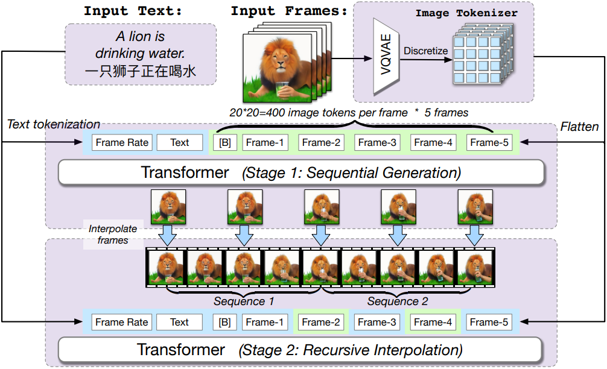

多帧率分层生成是一个递归过程，如上图，包含两个阶段：

> * **Stage 1：序列生成**。基于低帧率和文本，顺序生成$$T_s$$个关键帧。输入序列为
>
> $$[\text{\{Frame Rate\}}\ \text{\{Text\}}\ [\text{B}]\ \text{\{Frame}_1\} \dots \text{\{Frame}_{T_s}\}]$$
>
> 实际中设$$T_s = 5$$，最小采样帧率为 1 FPS。
>
> * **Stage 2：递归插值**。基于文本、帧率及已知帧，递归地进行帧插值。每轮插值中，将当前帧序列划分为多个长度为$$\left\lceil \frac{T_s}{2} \right\rceil$$的重叠块，保证首尾重叠，并在每个块内相邻帧之间插入新帧。输入序列形式同上，其中偶数位置的帧，即$$\text{Frame} \ 2i \ (i=1,2,\dots,\left\lfloor \frac{T_s}{2} \right\rfloor)$$，需通过自回归方式生成。通过不断将帧率减半，即$$\text{\{Frame Rate\}} \leftarrow \frac{1}{2} \times \text{\{Frame Rate\}}$$，可实现越来越精细的插值，最终生成高帧率视频。

> **注**：CogLM 的作用
>
> 帧插值等任务严重依赖**双向上下文信息**。但以往多数工作采用 GPT 这类单向模型。为利用双向上下文，这里采用**跨模态通用语言模型 **CogLM，它通过将 token 划分为**单向区域**与**双向区域**，统一了双向上下文感知的掩码预测与自回归生成：
>
> * 双向区域内的 token 可相互关注
>
> * 单向区域内的 token 可关注所有双向区域及先前的单向区域
>
> 在上图中：
>
> * Stage 1 的所有帧，以及 Stage 2 中的第 2、4 帧属于**单向区域**；
>
> * $$\text{\{Frame Rate\}}$$、$$\text{\{Text\}}$$及其他帧属于**双向区域**。
>
> 如此设计可在不干扰自回归帧预测的前提下，充分挖掘文本与已知帧中的双向上下文信息。

* **双通道注意力**

对于开放域文本到视频生成，理想情况下需覆盖足够多的文本-视频对，以学习视频与文本之间的空间与时间关联。然而高质量文本-视频对的收集往往困难、昂贵且耗时。因此一个自然的想法是利用图像数据辅助学习**空间语义**。**`Video Diffusion Model`**&#x548C;**`NÜWA`**&#x5C1D;试在文本-视频训练中加入文本-图像对，在多项指标上取得了更好效果。但对于纯视频生成模型而言，引入图像数据会显著增加训练成本，尤其在大规模预训练场景下。

CogVideo 提&#x51FA;**不使用图像数据，而是利用预训练的图像生成模型**。例如，CogView2 等模型已充分掌握文本-图像关系，且其训练数据覆盖范围远大于视频数据。作者提出**双通道注意力机制**：在预训练的 CogView2 每一层Transformer中，新增一个**时空注意力通道**。CogView2 的所有原始参数在训练中**冻结**，仅新增注意力层**`Attention-plus`**的参数可训练。这里将 CogView2 原有的注意力块记&#x4E3A;**`Attention-base`**。

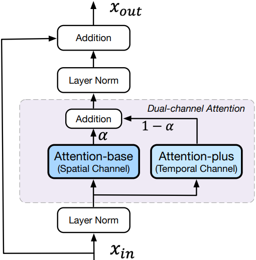

> **注**：若直接微调 CogView2 用于文本到视频生成，难以有效继承其知识，因为时间注意力具有不同的模式，且在训练初期的大梯度会迅速破坏预训练权重。

结&#x5408;**`Sandwich-LN`**&#x7684;双通道注意力块计算如下：

$$\tilde{x} = \alpha \cdot \text{attention-base}(\text{LayerNorm}(\mathbf{x}_{\text{in}})) + (1 - \alpha) \cdot \text{attention-plus}(\text{LayerNorm}(\mathbf{x}_{\text{in}}))$$

$$\mathbf{x}_{\text{out}} = \mathbf{x}_{\text{in}} + \text{LayerNorm}(\tilde{x})$$

其中混合因子$$\alpha \in (0,1)^d$$，$$d$$为输入特征$$\mathbf{x}_{\text{in}}$$的隐藏维度。为约束$$\alpha$$在$$(0,1)$$范围内，将其重参数化为：

$$\alpha = \sigma(\mathbf{a}), \quad \mathbf{a} \in \mathbb{R}^d$$

其中$$\sigma$$为 sigmoid 函数，$$\mathbf{a}$$为可学习参数。

**`Attention-plus`**&#x6A21;块与标准多头注意&#x529B;**`Attention-base`**&#x5177;有相同的参数形状，但在计算过程上有所不同。在训练中，作者尝试了两种 attention-plus 结构：**3D 局部注意力**与**3D 移位窗口注意力**。

* **3D 局部注意力**

位于时空坐标$$(t, x, y)$$（分别对应时间、高度、宽度）的 token 的感受&#x91CE;**`RF`**&#x4E3A;一个三维块，其时空范围由$$l_t, l_x, l_y \in \mathbb{N}^+$$决定：

$$\text{RF}(t,x,y) = \left\{ (k, i, j) \,\middle|\, |x - i| < l_x,\ |y - j| < l_y,\ |t - k| < l_t,\ (k, i, j) \notin \text{Mask}(t,x,y) \right\}$$

其中$$\text{Mask}(t,x,y)$$为 token $$(t,x,y)$$的注意力掩码：

> * 在 **Stage 1** **序列生成模型**&#x4E2D;，掩码确保自回归顺序
>
> * 在 **Stage 2** **插值模型**&#x4E2D;，掩码按 CogLM 设计，使所有已知帧对其他帧可见

两个通道在每层融合后**共享同一个 FFN**。这是因为 FFN 包含大量视觉知识且参数量大。鉴于图像与视频的相似性，将图像知识迁移到时序通道有助于视频建模；同时，共享 FFN 可减少参数量，加速训练并降低内存开销。

* **3D 移位窗口注意力（Swin Attention）**

为进一步缓解训练与推理中时序通道带来的时间与内存开销，借&#x9274;**`Swin Attention`**&#x7684;思想。原始 Swin Attention 仅适用于非自回归场景，CogVideo 通过在移位窗口内施加**自回归注意力掩码**，将其扩展至自回归及时序场景。

> **注**：Swin Attention 允许**不同帧中相距较远的区域并行生成**，从而进一步加速自回归生成。token 的生成依赖于：
>
> * **自回归掩码**：token 仅能关注当前帧中其之前的 token，或之前帧的所有 token
>
> * **移位窗口**：仅能直接关注宽度和高度维度上距离不超过窗口大小的 token

如右图，可以在未完成前一帧全部生成的情况下，提前开始后续帧部分 token 的生成，也就是实现并行。设每帧高宽为$$X, Y$$，移位窗口高宽为$$A_x, A_y$$。对于两个token $$(t_1, x_1, y_1)$$与$$(t_2, x_2, y_2)$$，其中$$t_1 < t_2$$，若满足

$$(x_1 - x_2)Y + (y_1 - y_2) \geq (t_2 - t_1 + 1)(A_x Y + A_y)$$

则后者无法直接或间接关注前者。

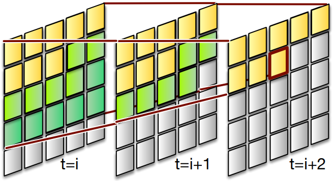

这意味着：第$$t$$帧的第$$i$$个 token 可与第$$t+1$$帧的第$$(i - A_x Y - A_y)$$个 token **并行生成**。由此，最多可并行生成$$\left\lfloor \frac{XY}{A_x Y + A_y} \right\rfloor$$个 token，相比每次仅生成一个 token 的标准自回归注意力，显著提升了并行度并加速了推理。

### 4.6.2 Imagen Video

* **整体生成链路**

1. **七级级联如何把难题拆开**

Imagen Video 不直接在高清、长序列的像素空间里完成一次生成，而是把任务拆成 **`7`** 个连续扩散模型。冻结的 T5-XXL 先提供文本表示；Base Video Model 生成 **`16×40×24`**、**`3 FPS`** 的低清视频，之后交替经过 **`3`** 个 Temporal Super-Resolution 与 **`3`** 个 Spatial Super-Resolution，最终得到 **`128`** 帧、**`1280×768`**、**`24 FPS`**、约 **`5.3 秒`** 的视频。

> **级联结构的核心取舍**
>
> Base Model 负责“画什么、怎么动”，TSR 负责“中间帧怎么补”，SSR 负责“细节怎么长出来”。每一级只解决一个相对受控的问题，因此训练更稳定，也能把不同分辨率的算力分开配置。代价是链路长，而且早期阶段的构图或运动错误会被后续放大。

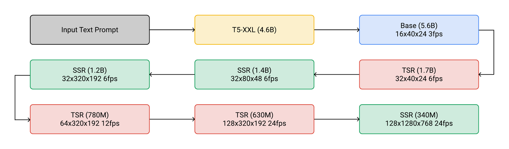

2. **文本条件贯穿全部分辨率**

文本只在低清阶段出现会带来一个问题：超分模块可能把错误纹理放大，却无法根据 Prompt 修正对象属性。这里每一级都通过 Cross-Attention 接收同一组文本 Embedding，使“红色汽车”“水彩风格”“从左向右奔跑”等语义在补帧和增清时仍然有效。T5-XXL 保持冻结，训练重点集中在视频扩散网络本身。

* **Video U-Net：把空间计算和时间计算分开**

1. **先处理单帧，再沿时间轴混合**

Video U-Net 沿用图像 U-Net 的多尺度 Encoder-Decoder 结构，但在空间模块之后增加时间模块。空间卷积与 Spatial Attention 先在每一帧内部建模物体、纹理和布局；时间模块再把同一空间位置在不同帧上的特征连起来。这是一种 factorized space-time 设计：不把整个视频一次性展平成超长 Token 序列，而是让空间与时间各自承担更合适的计算。

Base Model 面对的是低分辨率但完整时长的视频，使用 Temporal Attention 捕捉跨帧的长距离关系。进入 TSR 和 SSR 后，输入已经有较强的结构先验，主要改用 Temporal Convolution 维持局部连续性并节省显存；最高分辨率 SSR 甚至移除 Spatial Attention，改成全卷积网络，避免注意力在大画布上的二次方开销。

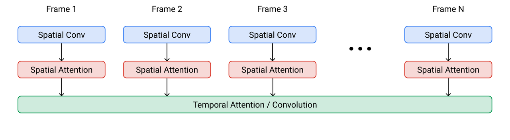

2. **超分模型怎样接收上一级结果**

每个超分模型先把上一级视频插值到目标尺寸或目标帧率，再与当前时间步的 noisy input 沿 Channel 维拼接。这样扩散网络不是从零生成，而是在“已有低清结果 + 当前噪声状态”的条件下恢复目标视频。训练时会额外给条件视频加噪，噪声强度也作为条件输入模型。

> **注**：为什么要给条件视频加噪
>
> 训练阶段的低清条件来自真实视频下采样，通常比推理阶段上一级生成结果更干净。若完全不处理，超分模型会在训练时依赖“过于完美”的条件，部署时一遇到生成噪点就失稳。Noise Conditioning Augmentation 主动制造这种误差，使各级模型能够独立训练，同时缩小训练与推理的输入分布差距。

* **扩散目标与采样**

1. **v-prediction 统一不同噪声区间**

连续时间扩散过程使用 cosine noise schedule。与直接预测噪声 ε 或干净样本 x 不同，网络预测由两者组合得到的 velocity：

$$v_t=\alpha_t\epsilon-\sigma_t x$$

在低噪声与高噪声区间，v 的数值尺度更均衡，便于同一网络覆盖完整扩散轨迹。七个阶段都采用这一参数化，因此不同分辨率模型可以复用相近的训练和采样逻辑。

2. **Classifier-Free Guidance 与动态阈值**

训练时随机丢弃文本条件，得到同一个网络的 conditional 与 unconditional 分支；推理时用两者差值把结果推向 Prompt：

$$\tilde{x}_{\theta}(z_t,c)=(1+w)\hat{x}_{\theta}(z_t,c)-w\hat{x}_{\theta}(z_t)$$

Guidance 越大，文本一致性通常越强，但像素也更容易饱和。Dynamic Thresholding 会按当前样本的分位数裁剪并重新缩放预测结果。Base Model 和前两个超分阶段还使用 Oscillating Guidance，在高 Guidance 与低 Guidance 之间交替：高值强化语义，低值缓解过饱和。更高分辨率阶段不继续使用这项技巧，因为容易引入可见闪烁和纹理伪影。

3. **Progressive Distillation 缩短七级采样**

原始级联若每一级都运行大量 DDIM 步，累积延迟会非常高。蒸馏先把 conditional 与 unconditional 的 Guidance 结果吸收到一个学生模型中，再反复让学生用一半步数逼近教师的两步更新。经过多轮迭代，每个子模型都能压到 **`8 步`** 左右，视觉差异仍较小。

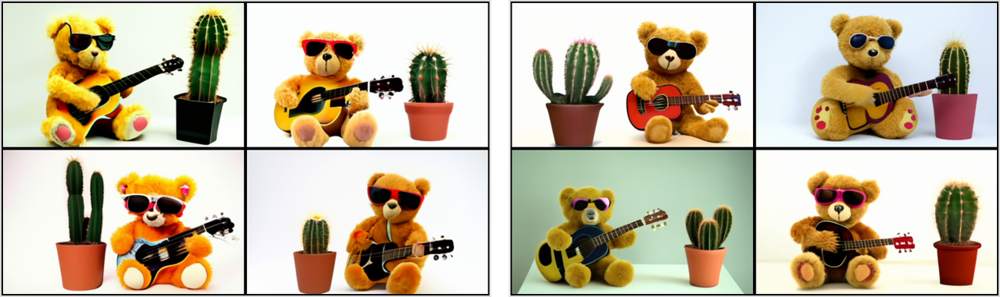

* **训练组织与边界**

1. **图像与视频联合训练**

静态图像被视为只有一帧的视频。遇到图像样本时，时间卷积分支和跨帧 Attention 会被 Mask，空间 U-Net 仍然正常更新。这样可以利用规模更大的图像数据补足物体、风格与构图知识，同时不让不存在的时间维参与梯度。

2. **各级独立训练**

条件噪声增强使七个阶段不必端到端联合训练，工程上可以按分辨率拆分数据、显存和训练任务。但这也意味着整条链路缺少统一的全局目标：后一级擅长把局部细节做清楚，却无法彻底改正 Base Model 的错误动作、错误计数或物体消失。

* **连续时间扩散与两类采样器**

每个级联模型都把干净视频 *x* 映射到连续时间 *t* 的带噪状态。cosine schedule 决定信号系数与噪声系数，且二者满足平方和为 1：

$$q(z_t\mid x)=\mathcal{N}(z_t;\alpha_t x,\sigma_t^2 I),\qquad z_t=\alpha_t x+\sigma_t\epsilon$$

$$\alpha_t^2+\sigma_t^2=1,\qquad \lambda_t=\log\frac{\alpha_t^2}{\sigma_t^2}$$

连续时间写法让训练可以随机抽取任意噪声强度，而不是把网络绑定到某个固定的离散步数。七个模型虽然分辨率和输入条件不同，但共享同一套时间条件和扩散参数化。

标准噪声目标要求网络从带噪状态 z\_t 中恢复采样噪声：

$$\mathcal{L}_{\epsilon}=\mathbb{E}_{t,x,\epsilon}\left[\left\lVert\epsilon-\hat{\epsilon}_{\theta}(z_t,t,c)\right\rVert_2^2\right]$$

Imagen Video 实际使用 v-parameterization。由网络输出的 v\_t 可以同时解出干净样本和噪声，因此在接近纯数据与接近纯噪声的两端都保持较稳定的目标尺度：

$$v_t=\alpha_t\epsilon-\sigma_t x,\qquad \hat{x}=\alpha_t z_t-\sigma_t\hat{v}_{\theta},\qquad \hat{\epsilon}=\sigma_t z_t+\alpha_t\hat{v}_{\theta}$$

训练目标确定后，采样端有两条路径。Ancestral sampler 按学习到的反向条件分布逐步采样，每一步都可以重新注入随机噪声，适合保留随机性；DDIM 把同一个训练模型改写为近似确定性的轨迹，同一初始噪声会给出更稳定的结果，也更适合做 progressive distillation。最终的蒸馏模型仍可接入随机采样器，在少步数下恢复一定的样本多样性，而不是把整个生成过程锁死为单一路径。

* **级联条件、联合训练与蒸馏细节**

生成侧由 **`1`** 个 Base、**`3`** 个 SSR 和 **`3`** 个 TSR 组成，扩散网络总参数量约 **`11.6B`**；冻结的 T5-XXL 只负责文本编码，不计入这组可训练扩散参数。每一级一次性生成完整的视频块，并不是逐帧自回归，因此不会把前一帧的采样误差机械地滚到下一帧。

级联开始放大时，SSR 先对低分辨率条件做双线性空间上采样，再与目标分辨率的 noisy video 沿通道维拼接；TSR 则在时间轴上重复已有帧，或在待补位置放入空帧，再与目标帧率的 noisy video 拼接。两者都把条件帧显式送进 U-Net，因此超分任务不是“重新生成”，而是受上一级结果约束的条件去噪。

分辨率走到最后一级后，SSR 改用全卷积结构，训练时只取高清目标视频中的随机低分辨率空间裁剪。卷积权重与画布绝对尺寸无关，推理时可以把同一网络滑到完整的 **`1280×768`** 画面上。这一步把显存消耗从“整张高清帧”降到“局部高清块”，也是级联能够落到最终分辨率的重要工程条件。

各级能够独立训练，关键在条件噪声增强。训练时随机采样条件噪声的 SNR，并把噪声级别一并输入超分网络；推理时不再随机，而是给对应级联使用固定 SNR，典型取值为 **`3`** 或 **`5`**。固定非零噪声相当于主动削弱上一级的局部瑕疵，避免下一级把伪影当成必须忠实保留的高置信度结构。

静态图像也沿用同一接口。一个训练样本需要固定长度的视频块时，可以把多张彼此独立的图像打包到同一序列。图像样本经过空间模块，但绕过 temporal convolution，并用 attention mask 阻止不同图像之间发生时间注意力。这样既保持批处理形状一致，又不会把两张无关图片误学成连续动作。

训练链路确定以后，推理端再控制 guidance 与步数。采样开始阶段先使用高 guidance，之后在约 **`15`** 与约 **`1`** 之间振荡：高值拉紧文本语义，低值释放过度饱和。该策略只用在 Base 和前两个超分阶段，空间分辨率超过 **`80×48`** 后停止。蒸馏则先把 CFG 的双分支合成单一 guided model，再反复把两次 DDIM 更新压成一次；完成步数折半后切回随机采样器，每个阶段最终约用 **`8 步`**。

> **主要局限**
>
> * **部署复杂**：需要维护 **`7`** 套扩散权重与采样配置，显存调度和故障定位都比单一主干困难。
>
> * **误差逐级传递**：低清阶段一旦确定了错误的主体或运动，超分阶段通常只能清晰地重现错误。
>
> * **缺少端到端效率**：蒸馏降低了每一级步数，但没有消除多模型串行执行本身的时延。

### 4.6.3 Stable Video Diffusion

在 SVD 之前，有许多视频生成模型都是在图像生成模型 SD 的基础上，添加和视频时序相关的模块，并在小规模高质量视频数据集上微调新模型。而 SVD 作者认为，该领域在训练方法及精制数据集的策略上并未达成统一。这篇文章的主要贡献，也正是提出了一套训练方法与精制数据集的方法。具体而言，SVD 的训练由三个阶段组成：文生图预训练、视频预训练、高质量视频微调。同时，SVD 提出了一种系统性的数据精制流程，包含数据的标注与过滤这两部分的策略。论文会分享诸多的实验成果，包括验证精心构建的数据集对生成高质量视频的必要性、探究视频预训练与微调这两步的重要性、展示基础模型如何为图生视频等下游任务提供强大的运动表示、演示模型如何提供多视角三维先验并可以作为微调多视角扩散模型的基础模型在一轮神经网络推理中同时生成多视角的图片。

总结一下，SVD 并没有强调在模型设计或者采样算法上的创新，而主要宣传了该工作在数据集精制及训练策略上的创新。对于大部分普通研究人员来说，由于没有训练大视频模型的需求，该文章的很多内容都价值不大。这里来大致过一遍这篇文章的主要内容。

* **模型架构**

1. **Video-LDM 与 SVD**

在阅读正文之前，我们先来回顾一下此前视频生成模型的开发历程，并重点探究 SVD 的模型架构——Video LDM 的具体组成。绝大多数工作在训练一个基于扩散模型的视频生成模型时，都是在预训练的 SD 上加入时序模块，如  3D 卷积 ，并通过微调把一个图像生成模型转换成视频生成模型。由于 SD 是一种 LDM (Latent Diffusion Model)，所以这些视频模型都可以归类为 Video-LDM。所谓 LDM，就是一种先生成压缩图像，再用解码模型把压缩图像还原成真实图像的模型。而对于视频，Video-LDM 则会先生成边长压缩过的视频，再把压缩视频还原。

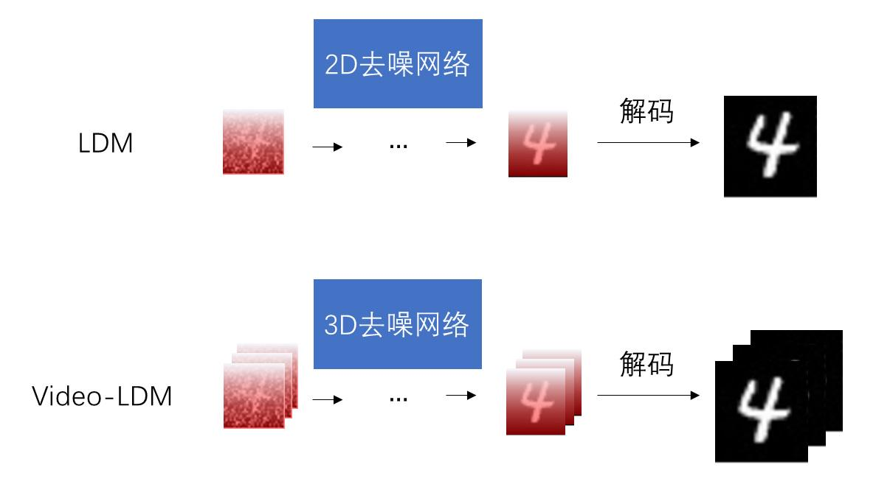

虽然 Video-LDM 严格上来说是一个视频扩散模型的种类，但大家一般会用 Video LDM （没有横杠） 来指代 [Align your Latents: High-Resolution Video Synthesis with Latent Diffusion Models](https://arxiv.org/pdf/2304.08818)*&#x20;*&#x8FD9;篇工作。这篇论文已在 CVPR 2023 上发布，两个主要作者正是前一年在 CVPR 上发表 SD 论文的主要作者，也是现在这篇 SVD 论文的主要作者。论文中也讲到，SVD 完全复用了 Video LDM 的结构。为了了解 SVD 的模型结构，我们再来回顾一下 Video LDM 的结构。

在 SD 的基础上，Video LDM 做对模型结构了两项改动：**在扩散模型的去噪模型 U-Net 中加入时序层、在对图像压缩和解压的 VAE 的解码器中加入时序层**。

* **添加时序层**

Video LDM 在 U-Net 中加入时序层的方法与多数同期方法相同，是在每个原来处理图像的空间层后面加上处理视频的时序层。Video LDM 加入的时序层包括 3D 卷积层与时序注意力层。这些新模块本身不难理解，但我们需要着重关注这些新模块是怎么与原模型兼容的。

要兼容各个模块，其实就是要兼容数据的形状。本来，图像生成模型的 U-Net 的输入形状&#x4E3A;**`B C H W`**，分别表示图像数、通道数、高、宽。而视频数据的形状&#x662F;**`B T C H W`** ，即视频数、视频长度、通道数、高、宽。要让视频数据复用之前的图像模型的结构，只要把数据前两维合并，变&#x6210;**`(B T) C H W`**&#x5373;可。这种做法就是把$$B$$组长度为$$T$$的视频看成了$$B \cdot T$$张图片。

对于之前已有的空间层，只要把数据形状变&#x6210;**`(B T) C H W`**&#x5C31;没问题了。而 SVD 又新加入了两种时序层：3D 卷积和时序注意力。我们来看一下数据是怎么经过这些新的时序层的。2D 卷积会&#x5BF9;**`B C H W`**&#x7684;数据的后两个高、宽维度做卷积。类似地，3D 卷积会对数据最后三个时间、高、宽维度做卷积。所以，过 3D 卷积前，要把形状&#x4ECE;**`(B T) C H W`**&#x53D8;&#x6210;**`B C T H W`**，做完卷积再还原。

接下来我们来看新的时序注意力。这个地方稍微有点难理解，我们从最简单的注意力开始一点一点学习。最早的 NLP 中的注意力层的输入形状&#x4E3A;**`B L C`**，表示数据数、token 长度、token 通道数。 $$L$$这一维最为重要，它表示了$$L$$个 token 之间互相交换信息。如果把其拓展成图像空间注意力，则 token 表示图像的每一个像素。在这种注意力层中，$$L$$&#x662F;**`(H W)`**，**`B C H W`**&#x7684;数据会被转换&#x6210;**`B (H W) C`**&#x8F93;入进注意力层。这表示同一组图像中，每个像素两两之间交换信息。而让视频数据过空间注意力层时，只需要把$$B$$换&#x6210;**`(B T)`**&#x5373;可，即把数据形状&#x4ECE;**`(B T) C H W`**&#x53D8;&#x4E3A;**`(B T) (H W) C`**。这表示同一组、同一帧的图像的每个像素之间，两两交换信息。

在 SVD 新加入的时序注意力层中，token 依旧指代是某一组、某一帧上的一个像素。然而，这次我们不是让同一张图像的像素互相交换信息，而是让不同时刻的像素互相交换信息。因此，这次 token 长度$$L$$是$$T$$，它表示要像素在时间维度上交换信息。这样，在视频数据过时序层里的自注意力层时，要把数据形状&#x4ECE;**`(B T) C H W`**&#x53D8;&#x6210;**`(B H W) T C`** 。这表示每一组、图像每一处的像素独立处理，它们仅与同一位置不同时间的像素进行信息交换。

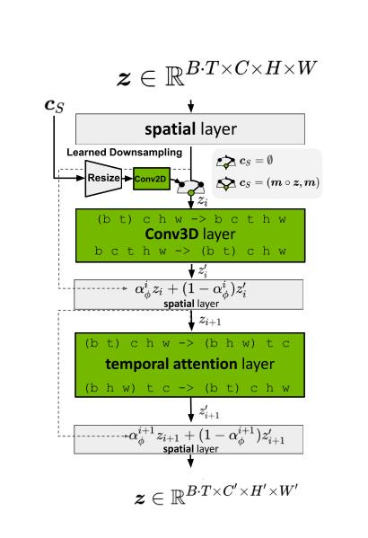

* **微调 VAE 解码器**

Video LDM 的另一项改动是修改了图像压缩模型 VAE 的解码器。具体来说就是先在 VAE 的解码器中加入类似的时序层，并在 VAE 配套的 GAN 的判别器里也加入了时序层，随后开始微调。在微调时，编码器不变，仅训练解码器和判别器。

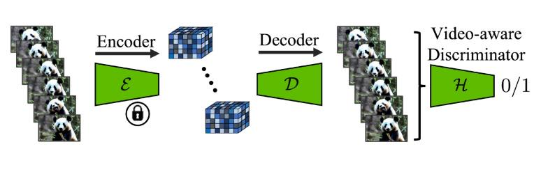

以上就是 Video LDM 的模型结构。SVD 对其没有做任何更改，所以也没有在论文里对模型结构做详细介绍。稍有不同的是，Video LDM 仅微调了新加入的模块，而 SVD 在加入新模块后对模型的所有参数都进行了重新训练。

* **训练细节**

SVD 分四节介绍了模型训练过程。第一节介绍了数据精制的过程，后三节分别介绍了训练的三个阶段：文生图预训练、视频预训练、高质量视频微调。

获取了一个大规模视频数据集后，SVD 的数据精制主要由预处理和标注这两步组成。由于视频生成模型主要关注生成同一个场景的视频，而不考虑转场的问题，每段训练视频也应该尽量只包含一个场景。为此，预处理主要是在用一些自动化视频剪切工具把收集到的视频进一步切成连续的片段。经切片后，视频片段数变为原来的4倍。标注主要是给视频加上文字描述，以训练一个文生视频的模型。SVD 在添加文字描述时用到了多个标注模型，并使用 LLM 来润色描述。经预处理和标注后，得到的数据集被称作 **LVD**（**L**arge **V**ideo **D**ataset）。

SVD 数据精制的细节中，比较值得注意的是有关视频帧数的处理。由于开发团队发现视频数据的播放速度快慢不一，于是他们使用光流预测模型来大致估计每段视频的播放速度（以帧率 FPS 表示），并将视频的帧率也作为标注。这样，在训练时，视频的帧率也可以作为一种约束信息。这样的好处是，在我们在生成视频时，可以用该约束来指定视频的播放速度。

之后我们来看 SVD 模型训练的三个阶段。对于第一个文生图预训练阶段，论文没有对模型结构做过多修改，因为他们在这一步使用了之前训练好的 SD 2.1。不过，SVD 在这一步做了一个非常重要的改进：**SVD 的噪声调度器从原版的 DDPM 改成了 EDM，采样方法也改成了 EDM 的**。

> **注**：EDM 的论文全称为 [Elucidating the Design Space of Diffusion-Based Generative Models](https://arxiv.org/pdf/2206.00364)*&#x20;*。这篇论文用一种概括性较强的数学模型统一表示了此前各种各样的扩散模型结构，并提出了改进版模型的训练及采样策略。简单来说，EDM 把扩散模型不同时刻的噪声强度表示成$$\sigma_t$$，它表示在$$t$$时刻时，对来自数据集的图像加了标准差为$$\sigma_t$$的高斯噪声$$\mathcal{N}(\mathbf{0}, \sigma_t^2\mathbf{I})$$。一开始，对于没加噪声的图像，$$\sigma_0=0$$。对于最后一个时刻$$T$$的图像，$$\sigma_T$$要足够大，使得原图像的内容被完全破坏。这里时刻$$0$$与时刻$$T$$的定义与 DDPM 论文相同，与 EDM 论文相反。

有了这样一种统一的表示后，EDM 对扩散模型的训练和采样都做了不少改进。这里我们仅关注其中最重要的一条改进：将离散噪声改进成连续噪声。原来 DDPM 的去噪模型会输入时刻$$t$$这个参数。EDM 论文指出，$$t$$实际上表示了噪声强度$$\sigma_t$$，应该把$$\sigma_t$$输入进模型。与其用离散的$$t$$训练一个只认识离散噪声强度的去噪模型，不如训练一个认识连续噪声强度$$\sigma$$的模型。这样，在采样$$n$$步时，我们不再是选择离散去噪时&#x523B;**`[timestep[n], timestep[n - 1], ..., 0]`**，而是可以选择连续噪声强&#x5EA6;**`[sigma[n], sigma[n - 1], ..., 0]`** 。这样采样更灵活，效果也更好。在第一个训练阶段中，SVD 照搬了 EDM 的这种训练方法，改进了原来的 DDPM。SVD 的默认采样策略也使用了 EDM 的 。我们会在之后的代码实践文章中详细学习这种新采样方法。

对于第二个视频预训练阶段，或许是因为视频模型和图像模型的训练过程毫无区别，论文的介绍重点依然放在了这一阶段的数据处理上，而没有强调训练方法上的创新。简单来看，这一阶段的目标是得到一个过滤后的高质量数据集**`LVD-F`**。为了找到这样一种合适的过滤方案，开发团队先用排列组合生成了大量的过滤方案：对每类指标（文本视频匹配度、美学分数、帧率等）都设&#x7F6E;**`12.5%`**, **`25%`**&#x6216;**`50%`**&#x7684;过滤条件，然后不同指标的条件之间排列组合。之后，开发团队抽取原数据集的一个子集 LVD-10M，用各个方案得到过滤后的视频子集 LVD-10-F。最后，用这样得到的子数据集分别训练模型，比较模型输出的好坏，以决定在完整数据集上使用的最优过滤方案。

在第三个阶段，参考以往多阶段训练图像模型的经验，SVD 也在另一个小而精的视频数据集上进行微调。此数据集的获取方法并没有在论文中给出，大概率是人工手动收集并标注。

* **总结**

Stable Video Diffusion 是在文生图模型 Stable Diffusion 2.1 的基础上添加了和 Video LDM 相同的视频模块微调而成的一套视频生成模型。SVD 的论文主要介绍了其精制数据集的细节，并展示了几个微调基础模型能实现的应用。通过微调基础低分辨率文生视频模型，SVD 可以用于高分辨率文生视频、高分辨率图生视频、视频插帧、多视角生成。

### 4.6.4 Sora

Sora 的关键技术是使用&#x4E86;**`DiT`**，包含三个部分：

> * 一个时空压缩器将原始视频映射到潜在空间
>
> * 一&#x4E2A;**`ViT`**&#x5904;理分词后的潜在表示，并输出去噪后的潜在表示
>
> * 一个类&#x4F3C;**`CLIP`**&#x7684;条件机制接收经 LLM 增强的用户指令以及可能的视觉 prompt ，以引导扩散模型生成具有特定风格或主题的视频

经过多次去噪步骤后，生成视频的潜在表示，然后通过相应的解码器映射回像素空间。

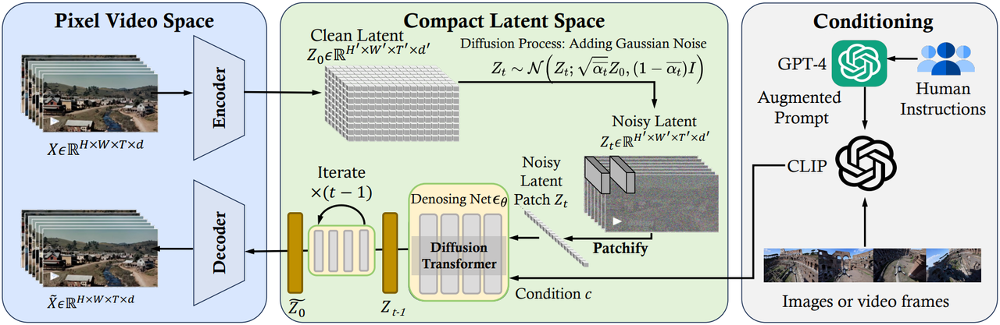

* **数据预处理  **

1. **可变时长、分辨率与宽高比  **

Sora 的一个显著特点是能够在原始尺寸下训练、理解并生成视频和图像，如下图。传统方法一般会对视频进行缩放、裁剪或调整宽高比，以适应统一的标准，一般是固定低分辨率下的方形短片段。这些样本以较大的时间步长生成，并依赖于单独训练的帧插值和分辨率渲染模型，导致视频内部不一致。 &#x20;

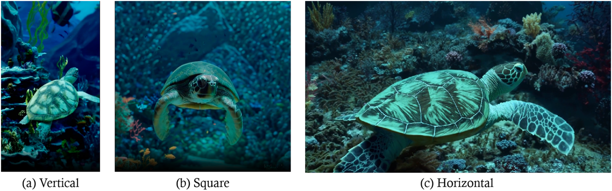

Sora 是首个利用视觉数据多样性的模型，能够以多样化的视频和图像格式进行采样，涵盖从宽屏$$1920\times1080\text{p}$$视频到竖屏$$1080\times1920\text{p}$$视频以及其间所有格式，且不损害其原始尺寸。在原始尺寸数据上训练显著提升了生成视频的构图与取景质量。通过保持原始宽高比，Sora 能够实现更自然、连贯的视觉叙事。如右图，Sora 生成的视频取景更佳，确保主体完整呈现在画面中，而非因方形裁剪而出现部分截断的情况。 &#x20;

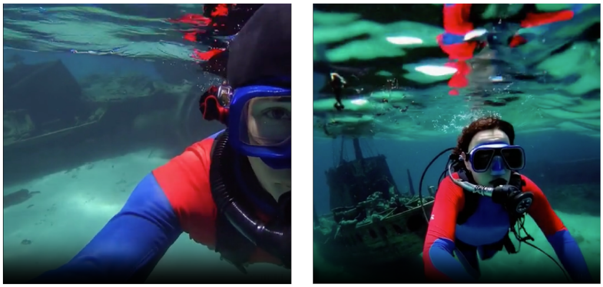

* **视觉编码 **

为了有效处理包括图像和视频在内的多样化视觉输入，即时长、分辨率和宽高比各异，关键方法是将所有形式的视觉数据转换为统一表示，从而便于生成模型大规模训练。Sora 通过对视频进行分&#x5757;**`patchify`**&#x6765;做：首先将视频压缩到低维潜在空间，然后将该表示分解为时空&#x5757;**`spacetime patches`**。&#x20;

Sora 的压缩网络主要是降低输入数据的维度，输出在时间和空间上均被压缩的潜在表示，如下图。编码器基&#x4E8E;**`VAE`**&#x6216;**`VQ-VAE`**。但若不采用缩放或裁剪，VAE 很难将任意尺寸的视觉数据映射到统一且固定大小的潜在空间。这里有两种不同的实现方案可以应对该问题：

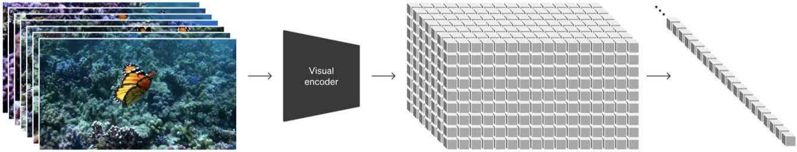

**空间分块压缩**

将视频帧转换为固定大小的 patch ，类似于**`ViT`**和**`MAE`**中的方法，再将其编码到潜在空间，如右图。这适用于处理不同分辨率和宽高比的视频，因为它通过对单个 patch 进行处理来编码完整帧。随后，这些空间 token 按时间顺序组织，形成时空潜在表示。这里有多个因素需要考虑：&#x20;

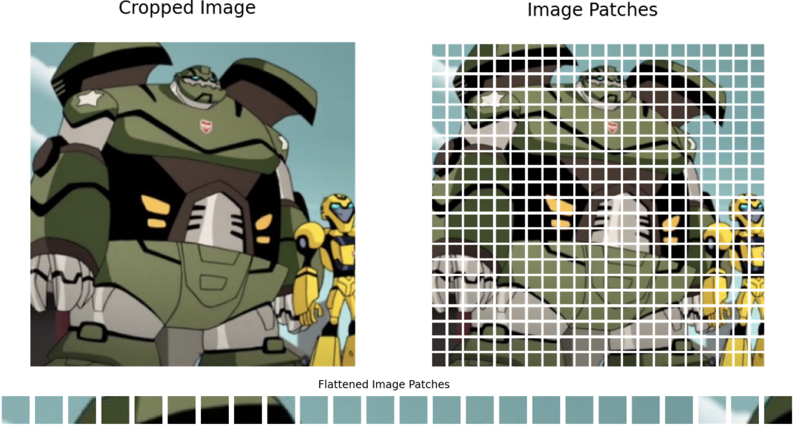

> * **时间维度可变性**：由于训练视频时长各异，潜在表示的时间维度无法固定。解决方法一般是采样固定帧数，对于极短视频可能需要填充或时间插值，或定义一个统一的超长输入长度以供后续处理&#x20;
>
> * **训练压缩网络**：对于高分辨率视频，可借助现有预训练压缩网络，&#x5982;**`Stable Diffusion`**中的**`VAE`**；但 Sora 采用潜在扩散模型的训练方式从头训练了压缩网络，包含编码器和解码器。这些编码器能高效压缩大尺寸 patch，便于大规模数据管理&#x20;
>
> * **时间信息聚合**：之前的操作主要关注空间分块压缩，模型内部需额外机制来聚合时间信息，这对捕捉动态变化很重要

**时空分块压缩**

同时封装视频数据的空间与时间维度，提供更全面的表示，不仅分析静态帧，还考虑帧间运动与变化，从而捕捉视频的动态特性。这里使用 3D 卷积来整合。下图展示时空分块压缩与纯空间分块的对比。与空间分块压缩类似，若采用预设的卷积核参数，如固定核大小、步长和输出通道数，由于输入视频特性不同，潜在空间维度仍会变化，主要受视频时长和分辨率多样性驱动。这其实前面提到的空间分块策略同样适用且有效。Sora 采用时空分块，因其易于实现，且能通过高信息密度 token 有效缩短上下文长度，降低后续时间信息建模的复杂度。

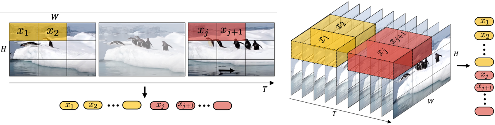

* **时空潜在块  **

压缩网络仍存在一个关键问题是：在将 patch 输入扩散 Transformer 的输入层之前，如何处理潜在空间维度的可变性，即不同视频类型产生的潜在特征 patch 或 patch 的数量差异。Sora 采用 **PNP**（**P**atch **n**’ **P**ack） 方法，将来自不同图像的多个 patch 打包到单一序列中，如下图。这其实和自然语言处理中&#x7684;**`example packing`**&#x7C7B;似，通过丢弃部分 token 来高效训练可变长度输入。这里分块与 token 编码需在压缩网络中完成；然后 Sora 对潜在表示进一步分块以生成 Transformer token。这里需解决两个问题：如何紧凑地打包这些 token，以及如何控制哪些 token 应被丢弃。 &#x20;

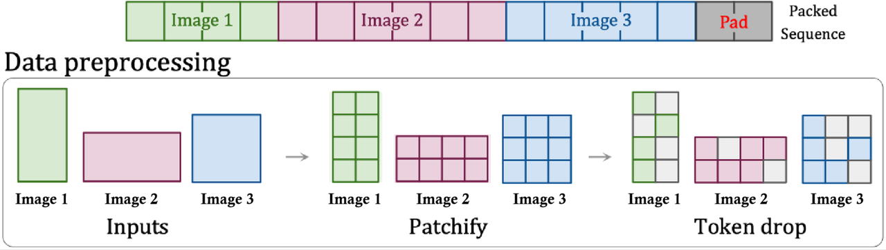

> * **问题 1**：采用简单的贪心策略，将样本依次加入首个仍有足够剩余空间的序列；当无法再容纳新样本时，用填充 token 补全序列，以满足批处理所需的固定序列长度。这种简单打包算法可能导致大量填充，具体取决于输入长度的分布。当然也可通过调节采样分辨率与帧数、优化序列长度并限制填充，以实现高效打包。 &#x20;
>
> * **问题 2**：丢弃相似 token，或使用 PNP 的方法应用丢弃率调度器。但三维一致&#x6027;**`3D Consistency`**&#x662F; Sora 的重要特性之一，丢弃 token 可能在训练中忽略细粒度细节。因此 Sora 应该采用了超长上下文窗口，将所有视频 token 全部打包，长视频的时空潜在块可打包进一个序列，而多个短视频的patch 则拼接至另一序列，但是这在计算上代价高昂，例如多头注意力算子的计算复杂度随序列长度呈平方增长。

* **模型结构**

1. **图像扩散 Transformer**

传统扩散模型主要采用包含下采样和上采样模块的卷积 U-Net 作为去噪网络主干。但 U-Net 架构并非扩散模型表现好的关键。通过引入更灵活的 Transformer 架构，基于 Transformer 的扩散模型能够利用更多训练数据和更大规模的模型参数，DiT 和 U-ViT 是第一次将 Vision Transformer 应用于潜在扩散模型的工作。 &#x20;

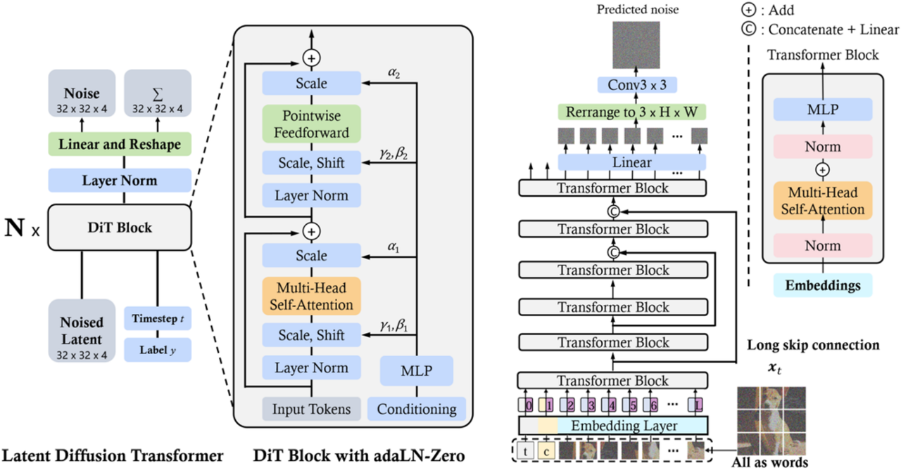

**DiT**

采用多头自注意力层与逐点前馈网络，并穿插**`LayerNorm`**和缩放层。此外，DiT 通过自适应层归一化**`AdaLN`**引入条件信息，并附加一个 MLP 层用于零初始化**`zero-initializing`**，使得每个残差块初始为恒等函数，从而极大提升了训练稳定性。DiT 的可扩展性与灵活性都很好，现已成为扩散模型的新主干架构。 &#x20;

**U-ViT**

所有输入，包括时间步、条件信息和带噪图像块，均被视为 token，并在浅层与深层 Transformer 层之间引入长的跳跃连接。作者表明基于 CNN 的 U-Net 中的下采样与上采样操作并非总是必要的，U-ViT 在图像生成和文本到图像生成任务中取得了创纪录的 FID 分数。 &#x20;

**MDT**（**M**asked **D**iffusion **T**ransformer） 将掩码潜在建模引入扩散过程，以显式增强图像合成中对象语义部分之间的上下文关系学习。MDT 在训练过程中引入一个侧插值分支，用于额外的掩码 token 预测任务，从而提升训练效率，并学习强大的上下文感知位置 Embedding 以用于推理。相比 DiT，MDT 实现了更优性能和更快的学习速度。  &#x5728;**`MDTv2`**&#x4E2D;，作者进一步改进 MDT，采用更高效的宏观网络结构：编码器中引入 U 形长短连接，解码器中则从编码器输入引入密集跳跃连接。此外还结合多种训练策略，包括**`Adan`**优化器、**`Min-SNR`**加权、动态掩码率，以及改进的 power-cosine 加权用于无分类器引导**`classifier-free guidance`**。MDTv2 在合成性能和学习速度上均取得显著提升。 &#x20;

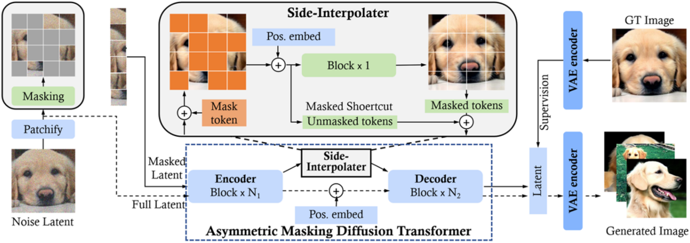

**DiffiT**（**Diff**usion V**i**sion **T**ransformers） 不再使用**`AdaLN`**进行时间条件建模，而是引入时间依赖自注意力**`TMSA`**模块，以建模采样时间步上的动态去噪行为。此外，DiffiT 采用两种混合层次架构，分别在像素空间和潜在空间中实现高效去噪，并在多种生成任务中达到新的 SOTA 水平。这些研究在图像潜在扩散中采用 Vision Transformer 取得了显著成果，为其他模态的扩散建模铺平了道路。

* **视频扩散 Transformer**  

扩散 Transformer 在文本到视频生成任务中的也十分有用。由于视频具有时间维度，将 DiT 应用于视频领域面临三个问题：

> 1. 如何在空间和时间上将视频压缩到潜在空间以实现高效去噪
>
> 2. 如何将压缩后的潜在表示转换为块并输入 Transformer
>
> 3. 如何处理长程时空依赖并确保内容一致性

**Imagen Video** 采用级联扩散模型结构，包含**`7`**个子模型，分别执行文本条件视频生成、空间超分辨率和时间超分辨率，将文本 prompt 转化为高清视频：

> 1. 冻结的**`T5`**文本编码器从输入文本 prompt 生成上下文 Embedding。这些 Embedding 可以帮助视频与文本对齐，并注入包括基础模型在内的所有级联模型
>
> 2. Embedding 被送入基础模型生成低分辨率视频，再由级联扩散模型逐步提升分辨率。基础视频模型和超分辨率模型均采用**`3D U-Net`**架构，以时空分离方式实现：将时间注意力与卷积层与空间对应模块交织，高效捕捉帧间依赖。架构采用**`v-prediction`**参数化以提升数值稳定性，并使用条件增强支持模型间的并行训练。训练过程联合使用图像和视频数据，将每张图像视为单帧以利用更大规模数据集，并采用无分类器引导提升 prompt 保真度。
>
> 3. 应用渐进蒸馏降低采样计算开销，同时保持感知质量。这些方法的结合使 Imagen Video 不仅能生成高保真视频，还展现出卓越的可控性，例如生成多样化视频、文字动画及多种艺术风格内容。

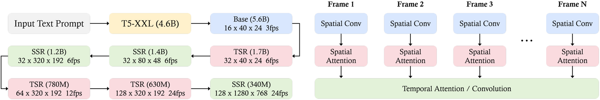

**Video LDM** 将 2D 潜在扩散模型LDM扩展为视频潜在扩散模型。通过在现有空间层之间插入**`post-hoc temporal layers`**，分别应用于 U-Net 主干和 VAE 解码器，使模型学会对齐各帧。这些时间层在编码后的视频数据上训练，而空间层保持冻结，从而可利用大规模图像数据集进行预训练。LDM 的解码器经微调以在像素空间中实现时间一致性，并对扩散模型上采样器进行时间对齐以提升空间分辨率。为生成超长视频，模型被训练为根据若干上下文帧预测未来帧，从而在采样时支持无分类器引导。为实现高时间分辨率，视频合成分为**关键帧生成**与**关键帧间插值**两个阶段。沿用级联 LDM 思路，扩散模型将 Video LDM 输出进一步放大四倍，在保持时间一致性的同时确保高空间分辨率，这以计算高效的方式生成全局一致的长视频。此外仅在训练时间对齐层即可将预训练图像**`LDM`**转化为文本到视频模型，生成分辨率高达$$1280\times2048$$像素的视频。

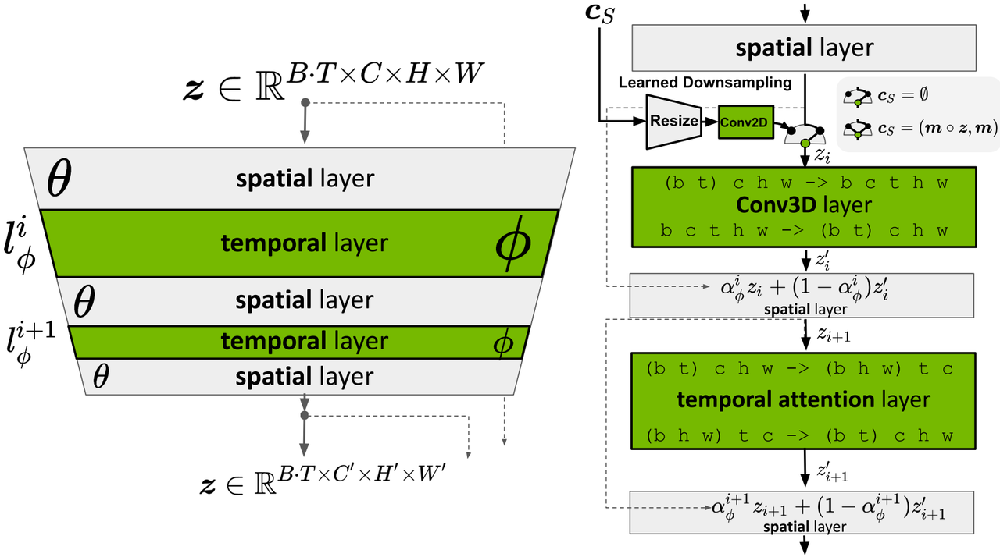

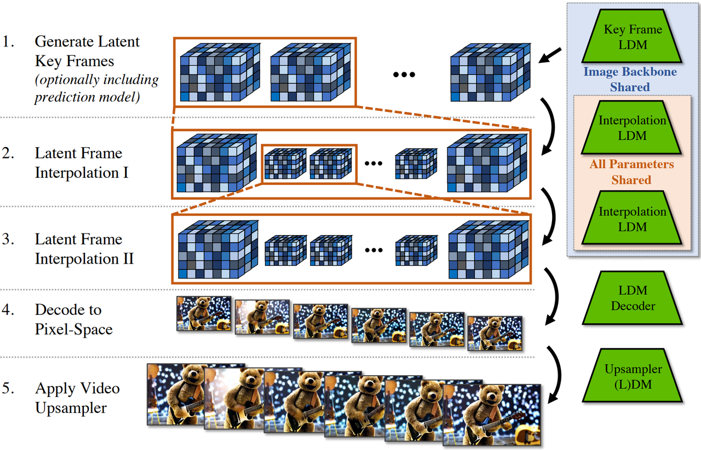

**Sora** 能生成高分辨率视频，采用级联扩散模型架构，包含一个基础模型和多个时空精炼模型。由于在高分辨率情况下使用注意力机制计算成本高昂且性能增益有限，基础扩散模型和低分辨率扩散模型中不太可能大量使用注意力模块。为保证时空场景一致性，并且时间一致性对视频生成比空间一致性更重要，Sora 采用一种高效训练策略：使用更长但分辨率较低的视频以强化时间一致性。由于**`v-parameterization`**扩散模型在预测原始潜在$$x$$或噪声$$\epsilon$$的各类方法中表现更优，Sora 采用 v-parameterization 扩散模型。

为提升训练效率，大多数现有工作利用 Stable Diffusion 的预训练 VAE 编码器初始化。然而，该编码器缺乏时间压缩能力。尽管一些工作提出仅微调解码器以处理时间信息，但其在压缩潜在空间中处理视频时间数据的性能仍不理想。因此 Sora 并未使用现有预训练图像 VAE 编码器进行调优，而是采用了一个时空 VAE 编码器，在图像和视频数据上联合训练，以同时压缩空间与时间信息。

* **指令遵循 **&#x20;

用户主要通过自然语言指令与生成式 AI 模型交互。模型指令微调旨在提升 AI 模型准确遵循 prompt 的能力。这种增强的 prompt 遵循能力使模型生成的输出更贴近人类对自然语言查询的回答。为增强文本到视频模型的指令遵循能力，Sora 采用了与**`DALL·E 3`**类似的方法：训练一个描述性字幕生成器**`captioner`**，并利用其生成的数据进行微调。通过指令微调，Sora 能够细致关注指令中的细节，并生成精准符合用户需求的视频。

1. **文本到图像  **

**DALL·E 3** 通过字幕改进方法解决指令遵循问题，其核心假设是：**模型训练所用文本-图像对的质量决定了最终文本到图像模型的性能**。低质量数据尤其是噪声数据和省略大量视觉信息的简短字幕会导致诸多问题，如忽略关键词、词序错误以及误解用户意图。字幕改进方法通过为现有图像重新生成详细描述性字幕来解决这些问题：首先训练一个视觉-语言模型作为图像字幕生成器，生成精确且描述性强的图像字幕；然后利用这些字幕微调文本到图像模型：DALL·E 3 借鉴对比字幕生成&#x5668;**`CoCa`**&#x65B9;法，结&#x5408;**`CLIP`**&#x67B6;构与语言模型目标联合训练一个图像字幕生成器。字幕生成器包含图像编码器、用于提取语言信息的单模态文本编码器和多模态文本解码器。训练首先在单模态图像与文本 Embedding 之间施加对比损失，随后对多模态解码器输出施加字幕生成损失。该字幕生成器进一步在覆盖主体对象、环境、背景、文字、风格和色彩的高细节图像描述上微调，从而能为图像生成详细描述性字幕。文本到图像模型的训练数据混合了字幕生成器重新标注的数据与人工撰写的真实数据，以确保模型能准确捕捉用户输入。  但这样的改进方法引入一个潜在问题：训练数据中的描述性图像描述与实际用户 prompt 之间可能存在不匹配。DALL·E 3 通过上采样解决此问题：利用 LLM 将简短用户 prompt 重写为详细且冗长的指令，确保推理时模型接收的文本输入与训练时一致。

* **文本到视频  **

为增强指令遵循能力，Sora 采用了类似的字幕改进方法：首先训练一个能为视频生成详细描述的视频字幕生成器，然后将其应用于所有训练视频，生成高质量的`视频，描述性字幕`对，用于微调 Sora 以提升其指令遵循能力。这里采&#x7528;**`CoCa`**&#x67B6;构进行视频字幕生成，&#x5373;**`VideoCoCa`**：将视频多帧分别输入图像编码器。VideoCoCa 基于 CoCa，复用预训练图像编码器权重，并独立应用于采样视频帧。所得帧的 token Embedding 被展平并拼接为长序列视频表示，再经生成池化器与对比池化器处理，联合使用对比损失与字幕损失进行训练。为确保用户 prompt 与训练数据中描述性字幕格式一致，Sora 使用额外的 prompt 扩展步骤：使用**`GPT-4V`**将用户输入扩展为详细描述性 prompt。

* **prompt 工程 **&#x20;

1. **文本 prompt   **

文本 prompt 工程对引导文本到视频模型生成既视觉震撼又精准满足用户需求的视频至关重要。这涉及精心构造详细描述，以有效弥补人类创造力与 AI 执行能力之间的差距。Sora 的 prompt 涵盖广泛场景。prompt 工程可利用模型的自然语言理解能力，解码复杂指令并渲染为连贯、生动且高质量的视频叙事。如下图，**`a stylish woman walking down a neon-lit Tokyo street...`**&#x8FD9;类精心构造的文本 prompt ，能确保 Sora 生成与预期愿景高度一致的视频。 prompt 工程的质量取决于词汇的精心选择、所提供细节的具体程度，以及对这些细节如何影响模型输出的理解。下图中的 prompt 详细指定了动作、场景、角色外观，甚至场景所需的氛围与情绪。

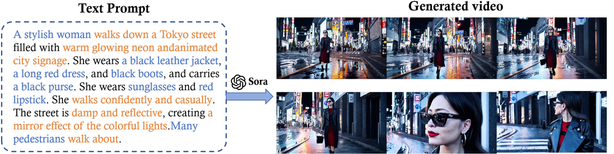

* **图像 prompt ** &#x20;

图像 prompt 为待生成视频的内容及其他元素，如 角色、场景和情绪等 ，提供视觉锚点。此外，文本 prompt 可指导模型通过添加运动层次、交互和叙事进展，使静态图像活起来。图像 prompt 的使用使 Sora 能结合视觉与文本信息，将静态图像转化为动态、叙事驱动的视频。下图是使用 DALL·E 生成图像作为 prompt 的 AI 视频示例：**`a Shiba Inu wearing a beret and turtleneck`**、**`a unique monster family`**、**`a cloud forming the word SORA`**&#x4EE5;&#x53CA;**`surfers navigating a tidal wave inside a historic hall`**。这通过 DALL·E 生成图像来指导 Sora 达到效果。

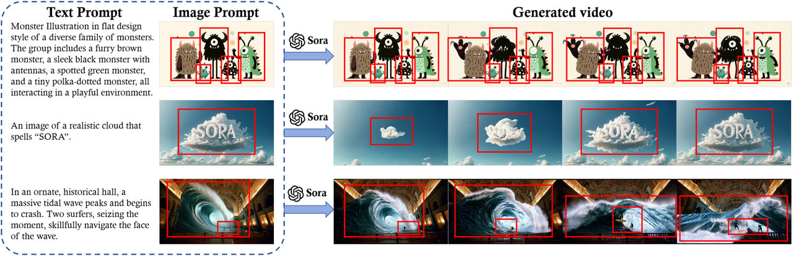

* **视频 prompt   **

视频 prompt 也可用于视频生成。近期工作展示了优质的视频 prompt 需兼具具体性与灵活性：既为模型提供清晰目标，如 特定对象和视觉主题的呈现 ，又允许最终输出具有想象性变化。例如，在视频扩展任务中， prompt 可指定时间向前或向后的扩展方向及扩展的上下文或主题。下图中视频 prompt 让 Sora 将视频向时间反向扩展，以探索原始起点之前的事件。下图(b)所示的视频到视频编辑任务中，模型需清晰理解期望的变换，如改变视频风格、场景或氛围，或调整光照、情绪等细微方面。图(c)中 prompt 令 Sora 连接多个视频，并确保不同场景间对象过渡平滑。

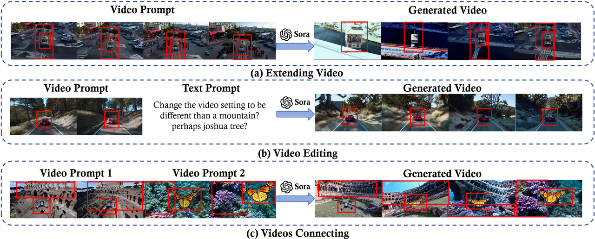

### 4.6.5 CogVideoX

* **整体架构：3D Latent 与文本在同一主干中交互**

1. **从像素视频到 Transformer Token**

输入视频先经过 3D Causal VAE Encoder，压缩成时空 Latent；Latent 再执行 patchify 与线性映射，形成视频 Token。文本侧使用 T5 Encoder 得到文本 Token。两类 Token 拼接后进入 Expert Transformer，在 3D Full Attention 中直接互相读取，最后经过 unpatchify 与 VAE Decoder 还原成视频。

> **Expert 的含义**
>
> “Expert”不是额外的路由器，也不是 MoE；它指文本与视频共用 Attention 交互，但在 AdaLN 调制等位置保留各自参数。文本 Token 与视频 Token 的统计分布不同，完全共享同一组 Scale、Shift 容易互相牵制。Text Expert AdaLN 与 Vision Expert AdaLN 先分别归一化和调制，再把结果送入统一 Attention。

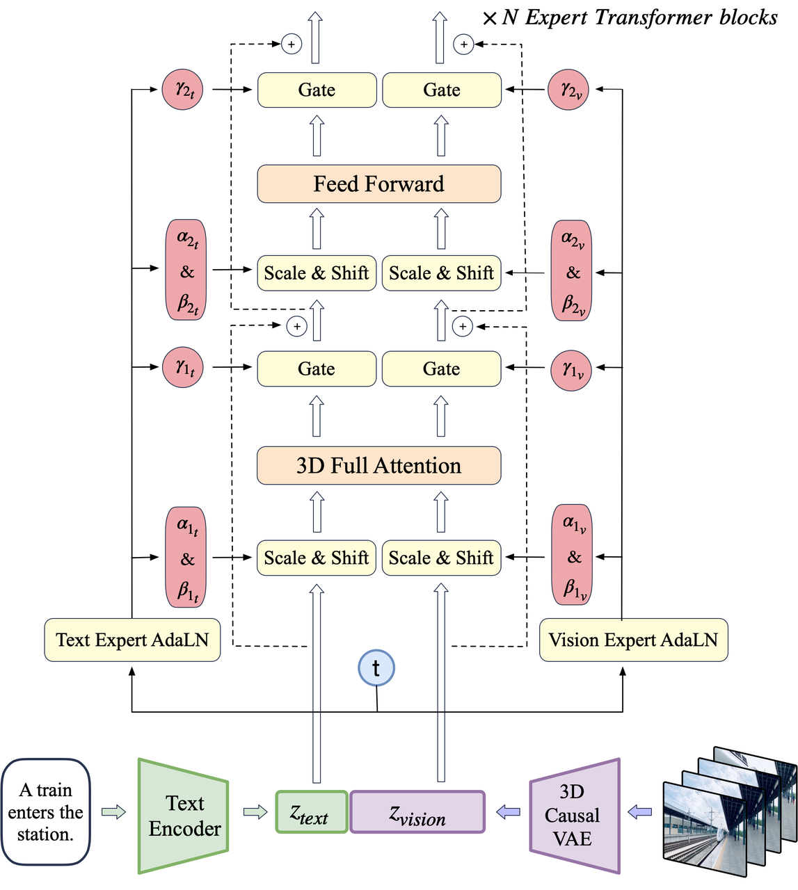

* **3D Causal VAE**

1. **8×8×4 压缩与 16 Channel Latent**

VAE 在空间维把高度和宽度各压缩 **`8×`**，在时间维压缩 **`4×`**，Latent Channel 数为 **`16`**。Encoder 与 Decoder 使用对称的多阶段结构，并混合 3D 与 2D Downsample/Upsample：需要跨帧建模的地方用 3D 运算，纯空间缩放则尽量用成熟的 2D 模块控制成本。

2. **时间因果卷积与 Context Parallel**

Causal Convolution 只读取当前帧与历史帧，时间 Padding 放在序列开头，不让未来信息泄漏到过去。长视频训练时，时间维被切给多个设备；每个 rank 只需把卷积核所需的最后 **`k-1`** 个历史切片传给下一个 rank，便能保持因果卷积连续，而不必复制完整视频。

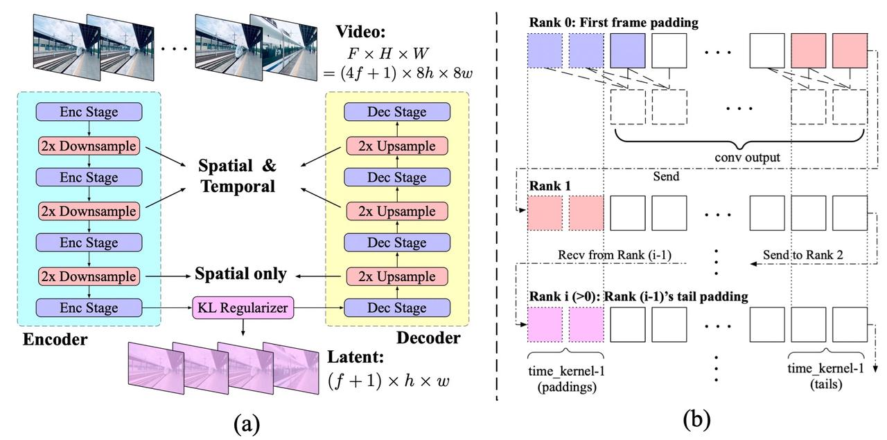

3. **VAE 的训练阶段与损失**

第一阶段使用 **`256×256`**、**`17 帧`** 的短片段训练，并在 **`8 FPS`** 与 **`16 FPS`** 之间随机采样；随后扩展到 **`161 帧`** 进行长视频微调。重建目标由加权 L1、LPIPS 与 KL 组成，训练稳定后再加入 3D Discriminator 的 GAN Loss，强化纹理和运动边缘。

* **Expert Transformer 的时空建模**

1. **3D RoPE 分配时间、高度和宽度坐标**

视频 Token 的位置由时间 t、高度 y、宽度 x 三个轴共同决定。注意力 Channel 按 **`2/8`**、**`3/8`**、**`3/8`** 分给时间、垂直和水平 RoPE。时间轴占比略小，是因为空间纹理需要更高的位置频率；三轴旋转编码又能让不同分辨率和帧数共享同一主干。

2. **为什么使用 3D Full Attention**

空间 Attention 与时间 Attention 分开计算虽然便宜，但一次只能沿一个轴交换信息，处理镜头平移、主体快速穿越画面或大幅形变时需要多层间接传播。CogVideoX 让所有时空 Token 在同一 Attention 中交互，直接建立跨时间、跨位置的对应关系。这提高了大运动建模能力，也让序列长度成为主要算力瓶颈。

* **Diffusion Transformer 的训练策略**

1. **v-prediction 与 Zero-SNR**

主干使用 v-prediction，并把噪声调度的末端信噪比压到零。终点若仍残留图像信息，模型在训练中几乎看不到真正的纯噪声，却要在推理第一步从纯噪声开始，容易造成曝光和亮度偏差；Zero-SNR 让训练终点与推理起点一致。

2. **图像与视频联合训练**

图像作为单帧视频进入同一训练管线，补足构图、物体和细粒度纹理。为避免模型在海量图像数据上忽略运动，训练会逐步提高视频比例、长度和分辨率，并在不同阶段控制样本质量门槛。

3. **Multi-Resolution Frame Pack**

传统 batch 往往把视频裁成统一尺寸和帧数，既破坏构图，也产生大量 Padding。Frame Pack 按 Token 预算，把不同时长、分辨率、宽高比的图像与视频拼成一个训练 batch；Attention Mask 隔开样本，3D RoPE 保留各自坐标。这样一个 batch 能同时利用短横屏、长竖屏和静态图像。

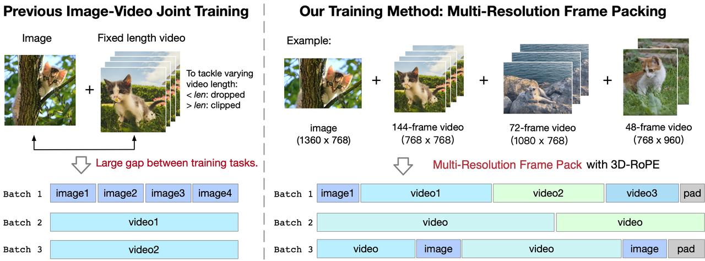

4. **分辨率课程与时间步均衡**

训练从 **`256`** 级分辨率开始，随后进入 **`512`** 与 **`768`** 阶段，最后用高质量数据微调。位置编码在高分辨率阶段采用 RoPE extrapolation，保持局部位置频率，不用插值把纹理频率整体压低。Explicit Uniform Sampling 则把 diffusion timestep 区间均匀分给不同 rank，避免某个 batch 恰好集中在极高噪声或极低噪声区间，降低跨设备 Loss 波动。

* **数据与 Caption 管线**

1. **从原始视频到单镜头片段**

清洗后保留约 **`3500 万`** 个单镜头片段，平均时长约 **`6 秒`**，并混合约 **`20 亿`** 张过滤图像。过滤器同时检查清晰度、美学、光流运动、字幕和水印等属性，避免静止画面、强压缩或剪辑跳变污染运动学习。

2. **Dense Caption 不只描述首帧**

先生成短视频摘要，再对关键帧做 CogVLM 细粒度描述，最后整合主体属性、动作过程、镜头语言与场景变化。规模化阶段把这套结果蒸馏给专用 Caption 模型。Caption 越能区分“谁在何时做了什么”，Transformer 的跨帧 Attention 才越容易学到与语言一致的运动轨迹。

* **3D Causal VAE 与 Expert Transformer 的完整实现**

Encoder 与 Decoder 都由 **`4`** 个对称 stage 组成。空间轴累计下采样 **`8×`**；前两个下采样 stage 同时压缩时间轴，后一个只压空间，时间轴累计压缩 **`4×`**。所有时间卷积保持因果性，使第 *t* 个 latent 只依赖当前与过去帧，既能编码视频，也能把单张图像当作长度为 1 的视频处理。

$$z=E(x)\in\mathbb{R}^{T/4\times H/8\times W/8\times C},\qquad \hat{x}=D(z)$$

完成时空压缩后，VAE latent 进入 Transformer 前只在 *H*、*W* 上做 patchify，不额外合并相邻时间 latent。这让图像与视频共用同一种 token 组织：图像只是时间长度为 1，视频则保留真实的时间序列。如果再做 temporal patchify，单图与短视频会落入不同的 token 拓扑，统一训练反而更难。

Token 的组织方式统一后，再给每个视频 token 注入时间、纵向和横向三组旋转坐标。3D RoPE 比固定的 sinusoidal position embedding 收敛更快；在 3D RoPE 之外继续叠加可学习的绝对位置向量没有带来稳定收益。真正需要保留的是三轴相对位移，而不是把训练分辨率下的每个绝对格点背下来。

位置编码确定后，文本 token 和视频 token 进入共享 attention，并共用 FFN 参数，但分别使用由 timestep 调制的 Expert AdaLN。这样在进入共享算子前，两个模态已经拥有不同的尺度、偏置和门控。进一步为两个模态拆分独立 MLP 会明显增加参数，却没有加快收敛，因此最终只保留归一化层上的 expert 路由。

最终，两类 token 被拼成一个序列，直接做 full attention，并通过 FlashAttention 控制显存。分离式做法需要文本先影响某些视频 token，再靠下一层把信息传给更远位置；full attention 允许任意文本 token 在同一层直接作用于任意时空位置，且更容易沿序列并行。代价是序列长度增大后仍有二次方计算，因此 VAE 压缩与 Frame Pack 必须一起工作。

* **完整训练课程、数据清洗与 I2V 条件**

第一类浪费来自图像与视频 token 数相差巨大，若按样本数固定 batch，显存负载会剧烈波动；第二类浪费来自视频时长不一，强行裁成固定帧数会丢数据或填充大量空位。Frame Pack 先把样本按 token 数分桶，再把多个短样本装入同一个接近定长的 token 包，通过 attention mask 隔离不同样本。优化器看到的是近似恒定的 token 预算，而不是恒定的视频条数。

Frame Pack 稳定了单步 token 数，多机采样还要避免各 rank 看到偏置数据。训练时先把候选样本划成与 data-parallel rank 数相同的区间，第 *r* 个 rank 从自己的区间均匀抽样；每轮重新打乱区间映射，避免某个 rank 长期只见到一种分辨率。扩散训练仍使用标准的随机 timestep 回归：

$$\mathcal{L}_{\mathrm{simple}}=\mathbb{E}_{x_0,\epsilon,t,c}\left[\left\lVert\epsilon-\epsilon_{\theta}(x_t,t,c)\right\rVert_2^2\right]$$

基础训练先用规模更大的混合数据学习物体、动作与镜头分布，再把最高质量子集用于最后阶段；高质量 fine-tuning 子集约占原训练集的 **`20%`**。这一步会过滤水印、字幕、低清和异常运动，视觉质量提升明显，但过度过滤也会轻微损伤语义覆盖，因此它被放在训练末段，而不是从头只训“干净小集”。

最后阶段使用的高质量子集，先由自动标签筛选。标签不仅判断清晰度，还覆盖 Editing、Lack of Motion Connectivity、Low Quality、Lecture Type、Text Dominated、Noisy Screenshots 等失败类型。先人工标注约 **`20k`** 视频，再训练 Video-LLaMA 分类器批量过滤。这样能把“画面清楚但并非自然连续视频”的样本从训练分布中剔除。

过滤解决样本质量后，还要补足文本监督。原始短 caption 先来自 Panda-70M；随后每隔约 **`2 秒`** 抽帧，用 CogVLM 生成逐帧稠密描述，再让 GPT-4 汇总为包含主体、动作、背景和镜头的信息完整 caption。用约 **`50k`** 组样本微调 Llama2 后，批量替代昂贵的在线汇总；后续版本进一步使用基于 CogVLM2-Video 与 Llama3 的 CogVLM2-Caption。

同一套表示也可以接入 I2V。首帧先经过 3D Causal VAE，得到与视频 latent 通道和空间尺度一致的条件；条件 latent 与 noisy video latent 沿通道维拼接。训练时还会给首帧条件加入较强噪声，主动缩小“真实首帧编码”与“生成视频 latent”之间的分布差。I2V 的长 Prompt 可由视觉语言模型结合首帧扩写，T2V 则由 caption upsampler 扩展短文本。

> **主要局限**
>
> * **Full Attention 成本高**：帧数和分辨率增长会同时拉长 Token 序列，显存与计算量上升很快。
>
> * **VAE 决定细节上限**：小字、快速纹理和小目标若在 3D 压缩时丢失，Transformer 很难准确恢复。
>
> * **Caption 误差会变成监督误差**：自动描述若写错动作顺序、主体或镜头，模型会把错误文本与视频绑定。

### 4.6.6 HunyuanVideo

* **整体链路**

1. **像素、文本与 Flow Matching 主干**

像素视频先由 Causal 3D VAE 压缩为 Latent Token；Prompt 同时进入 MLLM 与 CLIP-Large，分别提供细粒度序列表示和全局语义向量。视频 Token、文本 Token 与 timestep 条件进入 Diffusion Backbone，网络预测从噪声流向真实视频的速度场，最后由 VAE Decoder 把 Latent 还原到像素空间。

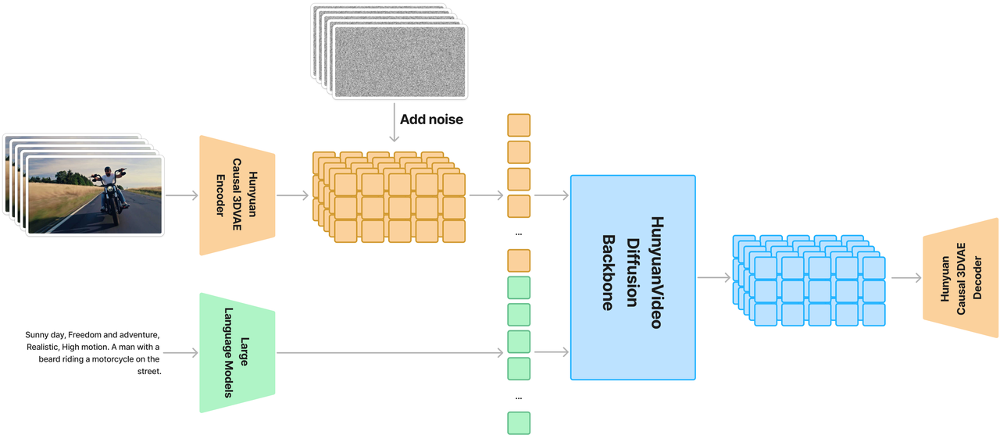

> **13B 模型不是一次拍脑袋定出来的**
>
> 先在图像 DiT 上训练多个规模，拟合参数量、训练计算量与 Loss 的 scaling law；再把图像权重迁移到视频模型，观察视频阶段的缩放趋势。最终选择约 **`13B`** 参数，是训练收益、推理速度和部署成本之间的折中，而不是单纯追求更大。

* **视频数据与结构化 Caption**

1. **单镜头切分、去重与概念覆盖**

长视频先用 PySceneDetect 切成单镜头片段，再用 Laplacian 清晰度从片头附近选择较清楚的起始帧。内部 VideoCLIP 负责近重复检测和语义 Embedding；Embedding 进一步聚成约 **`1 万`** 个概念中心，用来检查数据是否过度集中在少数人物、场景或风格。

2. **分层质量数据集**

数据按 **`256p`**、**`360p`**、**`540p`**、**`720p`** 与最终 SFT 集逐级收紧。过滤指标包括美学、清晰度、光流运动强度、场景边界、OCR 字幕、水印、Logo 与黑边。最后约 **`100 万`** 条视频再经过人工审查，用于高质量微调。

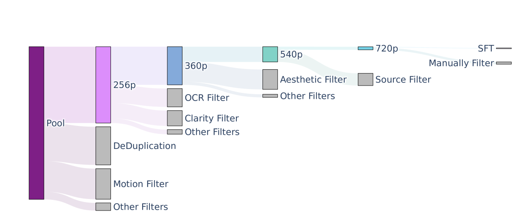

3. **JSON Caption 把镜头语言变成监督信号**

Caption 不只是自然语言段落，而是包含短描述、密集描述、转场与运镜、背景、风格、景别、光线、氛围和元数据标签的结构化 JSON。训练时对字段做 dropout 和随机重排，使模型既能接受简短 Prompt，也能接受完整摄影描述。镜头运动分类器覆盖推近、拉远、上下左右平移、上下左右摇摄、左右环绕、静止与手持等 **`14 类`**。

* **Causal 3D VAE**

1. **4×8×8 时空压缩**

形状为 **`(T+1)×3×H×W`** 的视频，经 Encoder 变成 **`(T/4+1)×16×H/8×W/8`** 的 Latent。首帧单独保留因果起点，后续帧按时间块压缩。所有跨时间卷积都只读取当前与历史帧，因此同一 VAE 可以自然支持图像样本、不同视频长度和流式分块。

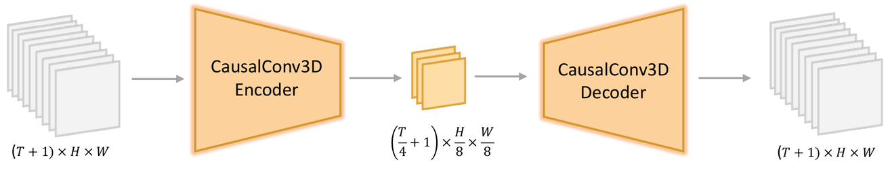

2. **VAE 损失与课程训练**

VAE 从头训练，视频与图像采样比约为 **`4:1`**。总目标由 L1 Reconstruction、LPIPS、Adversarial Loss 与 KL 组成，对应权重约为 **`1`**、**`0.1`**、**`0.05`**、**`10⁻⁶`**。训练从低分辨率短片段逐步增加到高分辨率长片段，并随机使用 **`1～8`** 的帧采样间隔，让相邻 Latent 覆盖不同速度的运动。

3. **Tiling 解决超大视频解码**

推理时把时间和空间划成有重叠的 Tile，分别编码或解码后在重叠区混合。若模型只在完整画面上训练，Tile 边界会产生接缝；因此 VAE 微调阶段随机打开或关闭 Tiling，让网络提前见到分块上下文不足的情况。

* **Dual-Stream to Single-Stream Hybrid DiT**

1. **先分开理解，再合并生成**

前 **`20`** 个 Dual-Stream Block 保留两条参数路径：文本与视频分别做 Norm、Scale & Shift、QK-Norm 和 MLP，但 Attention 中允许两种模态交换信息。后 **`40`** 个 Single-Stream Block 把文本 Token 与视频 Token 合并为一个序列，使用统一参数继续深度融合。

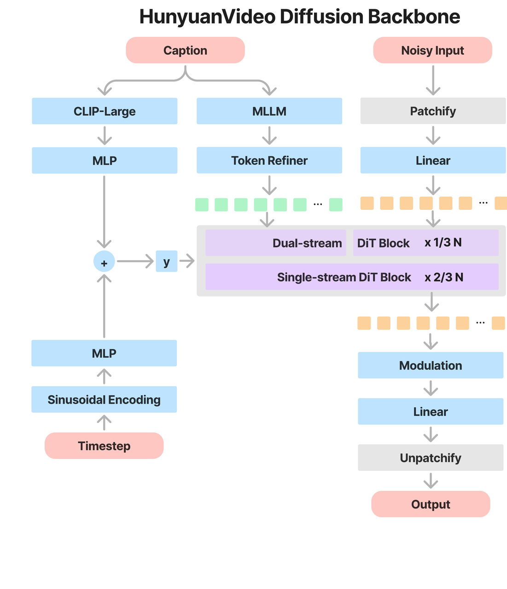

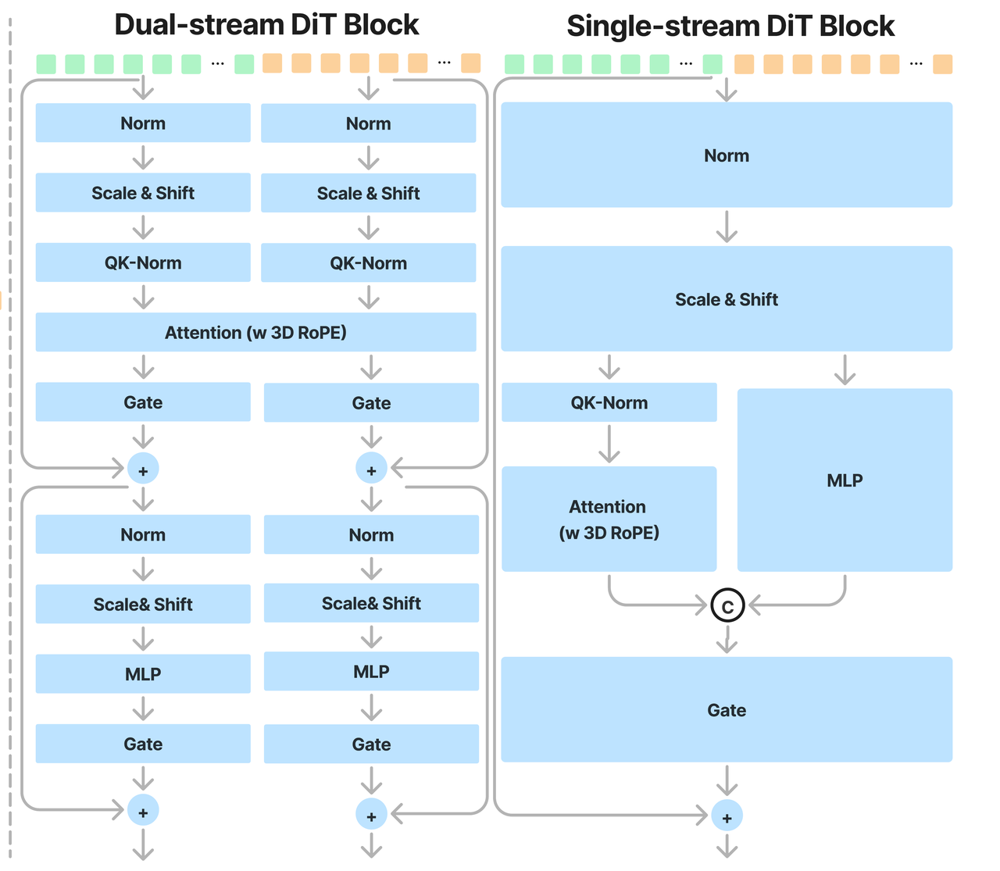

2. **Full Attention 与 3D RoPE**

图像被视为单帧视频，不单独维护图像主干。视频 Token 在时间、高度和宽度三个轴使用 3D RoPE，Full Attention 直接连接任意帧、任意空间位置。主干隐藏维度为 **`3072`**，FFN 为 **`12288`**，Attention 使用 **`24`** 个 Head、每个 Head **`128`** 维。

* **文本条件：MLLM、Token Refiner 与 CLIP**

1. **用 MLLM 代替单一 T5**

Decoder-Only MLLM 经过图文对齐，更擅长解析长 Prompt 中的主体属性、动作关系和摄影细节。System Instruction 会要求模型关注视觉可见内容，减少把抽象修辞直接当成画面元素。与只提供语言统计的文本 Encoder 相比，这种表示更贴近生成任务需要的视觉语义。

2. **Token Refiner 补回右侧上下文**

Decoder-Only MLLM 使用 causal attention，一个 Token 看不到后面的词；但视频条件更适合双向理解。Token Refiner 在 MLLM 输出之上再做双向 Attention，使“一个穿红衣服的人骑着白马”中的早期主体 Token 也能吸收后面的颜色和动作信息。CLIP-Large 的 pooled embedding 经过 MLP 后加入 timestep 条件，为各层提供全局风格与语义约束。

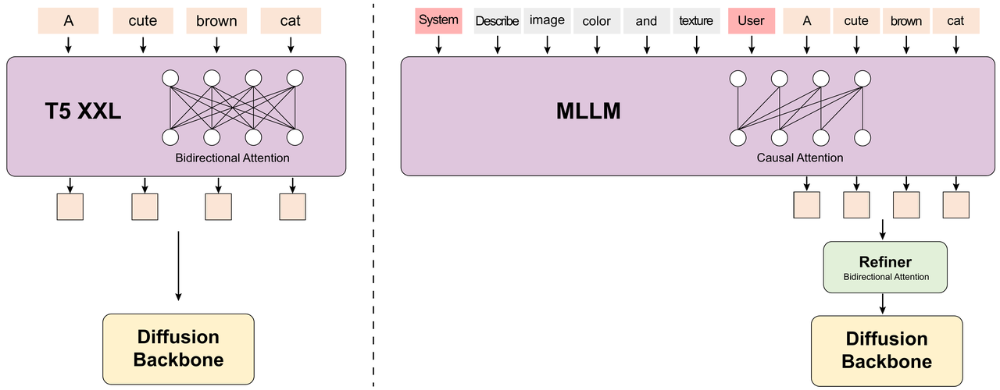

* **Flow Matching 与渐进式训练**

1. **直接预测速度场**

令 x₀ 为噪声、x₁ 为真实视频 Latent，线性插值得到中间状态：

$$x_t=(1-t)x_0+t x_1,\quad u_t=\frac{d x_t}{dt}$$

网络输入 xₜ、t 与文本条件，预测速度 vₜ，并最小化：

$$\mathcal{L}_{\text{generation}}=\mathbb{E}_{t,x_0,x_1}\left\lVert v_t-u_t\right\rVert_2^2$$

t 使用 logit-normal 分布采样，把更多训练预算放在信息变化较大的中间区域。推理时从纯噪声出发，用 Euler ODE Solver 沿预测速度积分到数据端。

2. **从图像到长视频的课程**

先在 **`256p`** 图像上建立视觉先验，再混合 **`256p/512p`** 图像；视频阶段按“低分辨率短视频 → 低分辨率长视频 → 高分辨率长视频”推进。图像数据始终保留在 batch 中，防止模型在学习运动后遗忘静态构图与世界知识。

3. **时长与宽高比分桶**

样本按时长、分辨率和宽高比进入不同 Bucket，每个 Bucket 根据 Token 数设置独立 micro-batch size。短低清视频一次装得更多，长高清视频一次装得更少，在不统一裁切画面的前提下尽量打满显存。

* **Prompt Rewrite 与推理加速**

1. **把用户短提示改成可生成描述**

Hunyuan-Large 先统一多语言表达，补充主体、动作、环境和镜头，再执行 self-revision，检查是否添加了与原意冲突的细节。规模化部署时把这套能力蒸馏到 LoRA 版本，降低在线改写成本。

2. **Timestep Shifting 与 Guidance Distillation**

少步采样时，简单均匀时间步会在高噪声阶段走得过快。Timestep Shifting 把更多步数移向早期去噪：约 **`50 步`** 时可用 shift **`7`**，低于 **`20 步`** 时可提高到 **`17`**。Guidance Distillation 在训练中随机采样 **`1～8`** 的 Guidance Scale，让单次前向逼近 CFG 的双分支结果，推理吞吐可提升约 **`1.9×`**。

* **Scaling Law 与完整预训练课程**

Scaling 实验构造 **`7`** 个 DiT-T2X(I) 规模，参数量从约 **`92M`** 到 **`6.6B`**。各模型固定使用 T5-XXL、同一 3D VAE、Cross-Attention、DDPM 与 v-prediction，并在同一批 **`256px`** 数据上训练。只有主干规模变化，loss-compute 曲线的差异才能归因于参数量，而不是数据或目标函数。

对每个计算预算，取七条训练曲线中 loss 最低的点组成 envelope，再拟合 compute、参数量与最优 loss 的幂律关系。视频 scaling 以对应的图像 checkpoint 初始化，减少从零训练全部视频尺度的成本。最终 **`13B`** 不是单纯追求最大参数量，而是联合考虑拟合趋势、推理成本和训练吞吐后的选择。

模型规模确定后，预训练先从多宽高比的 **`256px`** 图像上学习对象、构图和文本对齐；第二阶段混合 **`256px`** 与 **`512px`**，而不是直接切到纯 512 数据，避免模型在提高细节时遗忘低分辨率能力。不同 bucket 使用动态 micro-batch，使单步 token 与显存负载大致稳定。

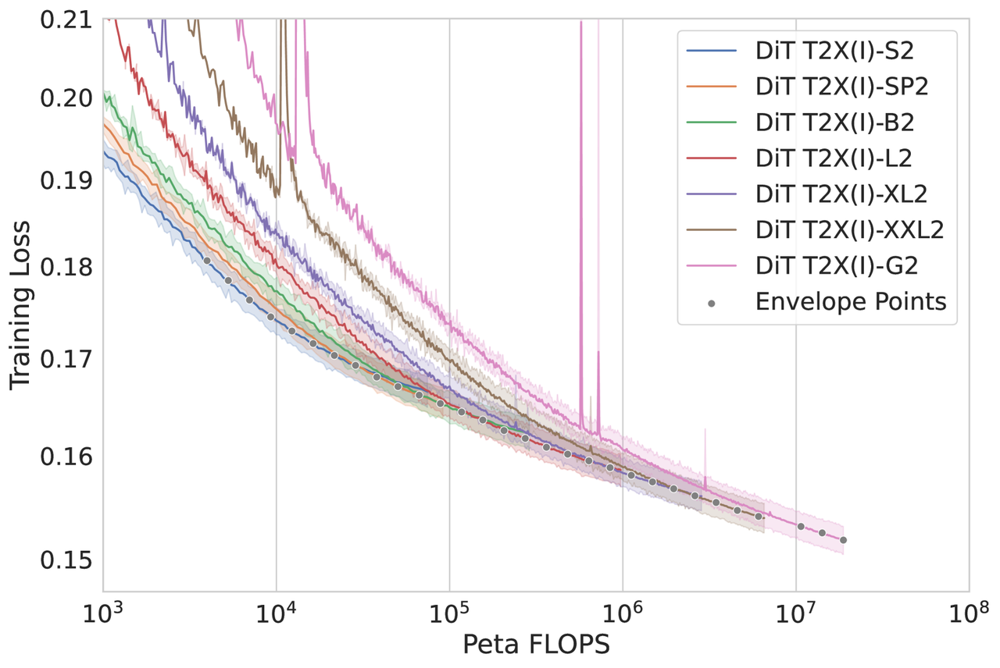

图像能力稳定后，再进入视频阶段。样本按分辨率、宽高比和帧数建立 bucket，并从低分辨率、短片段逐步推进到更高分辨率和更长片段。每个阶段仍混入图像样本：视频负责运动与镜头，图像维持主体细节和构图。如果完全切断图像数据，大模型会在长视频训练中出现明显的静态视觉能力遗忘。

完整预训练结束后，再从自动过滤结果中建立四组高质量子集，再进行人工复核，用较小学习率做空间质量微调。这个阶段不再扩展知识覆盖，目标是提高纹理、主体完整性和高审美样本上的稳定度，因此样本规模可以小，但标签、画质和运动必须更严格。

* **少步推理与大规模训练系统**

线性时间表先定义 *t*=1−*q*/*Q*，再通过 shifting factor *s* 映射为模型真正接收的时间条件：

$$t^{\prime}=\frac{s\,t}{1+(s-1)t}$$

当 *s*>1 时，采样点向高噪声区域集中。**`50 步`** 时经验取 *s*=**`7`**；少于 **`20 步`** 时提高到 *s*=**`17`**。少步采样优先修正大结构，再在后段快速落到干净视频，**`10 步`** 下优于 linear-quadratic scheduler。

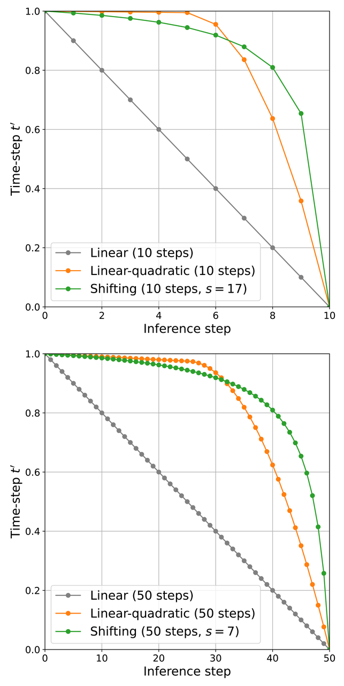

时间步压缩解决了迭代次数，CFG 的双分支成本则由 distillation 处理。学生模型与教师使用相同架构和参数量，并从教师权重初始化；训练时把 guidance scale 作为额外条件，覆盖约 **`1–8`** 的范围，使单次前向直接逼近 CFG 组合后的速度。推理不再分别计算 conditional 与 unconditional 分支，吞吐约提升 **`1.9×`**，同时保留按 guidance scale 调整文本约束强度的能力。

推理侧压缩完成后，还要解决 13B 模型怎样训稳。瓶颈不只是参数量，更是超长时空序列产生的 activation。AngelPTM 负责模型并行与训练算子编排，XingMai 高速互联支撑跨卡通信；二者共同把单模型训练拆成可扩展的集群任务。

训练系统把长序列计算拆成五个并行维度。Tensor Parallel 切分矩阵乘，Sequence Parallel 切分非 attention 序列算子，Context Parallel 通过 Ring Attention 切分长时空 attention，Data Parallel 复制模型处理不同样本，ZeroCache 再分摊优化器状态与梯度。五个维度不是同时盲目开大，而是按分辨率、帧数和集群拓扑选择组合，避免通信量超过算力收益。

并行划分之外，FusedAttention 减少中间张量落显存，activation recomputation 用额外计算换显存，layer-based activation offload 把暂时不用的层激活移出 GPU。训练系统还集成自动故障检测、任务恢复与坏卡隔离，使大规模长周期训练有效运行时间达到约 **`99.5%`**；这部分工程能力与模型结构同样决定 13B 视频模型能否真正训完。

> **主要局限**
>
> * **计算门槛高**：13B 主干、长序列 Full Attention 与高分辨率 VAE 解码共同抬高显存和延迟。
>
> * **数据链路很重**：质量过滤、结构化 Caption、Prompt Rewrite 与人工 SFT 缺一项都可能明显影响最终表现。
>
> * **物理一致性仍有限**：复杂接触、遮挡后身份保持、手部细节和快速镜头下的几何关系仍可能跳变。

### 4.6.7 LTX-Video

* **Holistic Latent Diffusion**

1. **Transformer 与 VAE 共同完成去噪**

传统 Latent Diffusion 把职责切得很清楚：Transformer 在 Latent 空间完成所有去噪，VAE Decoder 只负责把最终干净 Latent 还原成像素。LTX-Video 改成两段协作：Transformer 先完成多步 Latent-to-Latent 去噪，最后一步由带 timestep 条件的 VAE Decoder 在解码时直接完成。

这样设计是为了补偿高压缩 Latent 无法显式保存的高频细节。Decoder 不必机械重建所有纹理，而是根据接近干净的 Latent 生成合理的发丝、树叶、皮肤和运动边缘，也不需要额外串联一套像素空间超分模型。

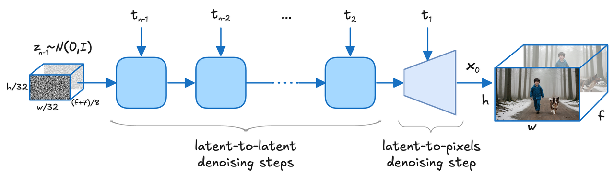

2. **1:192 压缩把效率问题前移**

Video-VAE 直接执行 **`32×32×8`** 的空间与时间 Downsample，并输出 **`128`** Channel Latent，总压缩比约为 **`1:192`**。Patchify 被移到 VAE Encoder 入口，Transformer 不再把 **`2×2×1`** Latent Patch 重新打包；最终每个 Transformer Token 对应约 **`8192`** 个输入像素位置。

> **为什么高压缩能换来 Full Attention**
>
> Attention 的主要成本随 Token 数近似二次增长。把视频在进入 Transformer 前压得更短，**`1.9B`** 级主干也能让全部时空 Token 直接互相注意，省掉分块 Attention 或单独的时间模块。效率不是只靠少走几步，而是从 Token 数、主干规模和 Decoder 职责一起优化。

* **高压缩 Video-VAE**

1. **Causal Encoder 与 Denoising Decoder**

Encoder 使用 CausalConv3D，首帧单独编码，后续帧按 **`8`** 帧时间块压缩。多级 ResBlock 与 Downsample 逐步降低分辨率，避免 Transformer 入口再做 patchify。Decoder 使用带 timestep Embedding 的 Conditional ResBlock，在各层注入可学习强度的噪声，并逐级 Upsample 到像素视频。

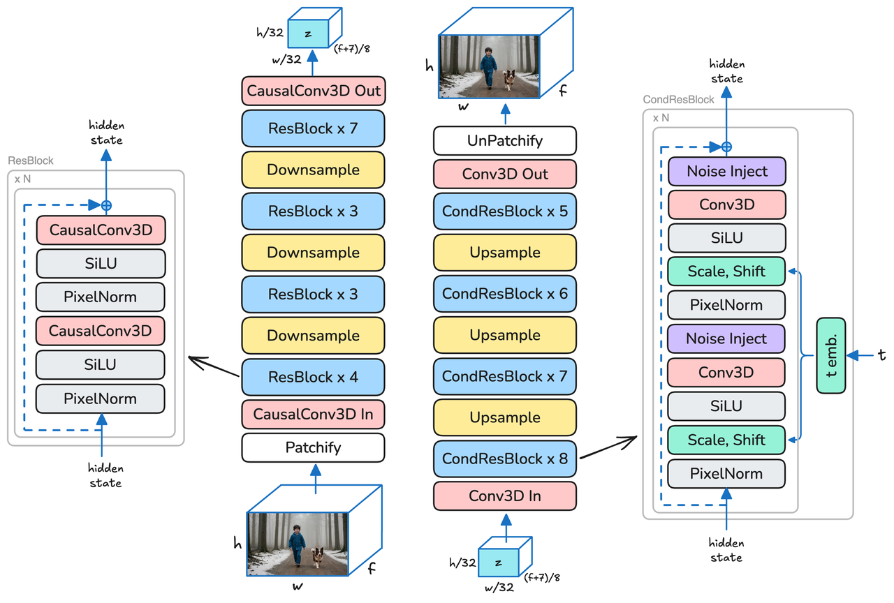

2. **Shared Diffusion Objective**

Decoder 接收带少量噪声的 Latent zₜ 与时间步 t，直接预测干净像素视频：

$$x_0=D(z_t,t),\quad t\in[0,0.2]$$

t 的范围只覆盖扩散末端，表示 Transformer 已经完成主要结构去噪，Decoder 专注于最后一段细节恢复。训练时若只给 t=0 的干净 Latent，Decoder 会退化成普通重建器；随机小噪声让它真正学会从不完整 Latent 中生成高频信息。

3. **Reconstruction GAN**

普通 GAN Discriminator 只看一张图，必须同时判断内容是否合理和纹理是否真实。Reconstruction GAN 把原图与重建图作为一对输入，让判别器直接比较“哪个是原始样本”。在高压缩重建中，这种相对判断更容易聚焦模糊、运动纹理错位和局部伪影，也比无条件判别更稳定。

4. **噪声注入、统一方差与 3D DWT**

Decoder 不只在 Latent 入口加噪，还在多层按 Channel 注入独立噪声，为高频细节留下随机自由度。宽 Latent 若逐 Channel 预测 log-variance，KL Loss 容易让部分 Channel 退化到接近标准高斯而不承载重建信息；这里让所有 Channel 共享一个 log-variance，避免“牺牲通道”。此外对输入和重建视频计算 **`8`** 个 3D Discrete Wavelet Transform 分量，并使用 L1 距离约束时空高频。

最终 VAE Loss 组合 MSE Reconstruction、Video-DWT L1、LPIPS 与 Reconstruction-GAN。Causal 3D Convolution 的重建上限略低于非因果结构，但能统一图像/视频训练，并自然支持首帧条件生成，因此工程收益更大。

* **3D Diffusion Transformer**

1. **PixArt 主干上的稳定性改造**

主干沿用 PixArt-α 的文本条件 Transformer 结构，改用 RMSNorm 与 QK-Norm，并在 Self-Attention 中加入 3D RoPE。AdaLN 根据 timestep 生成 Scale 与 Shift，Cross-Attention 读取 T5-XXL 文本 Embedding，FFN 继续处理每个视频 Token。文本采用 Cross-Attention，而不是把文本与视频合并为 MM-DiT 序列，减少主序列长度。

* **Fractional Coordinate RoPE**

位置坐标不直接使用整数 Token Index，而是用像素位置与真实秒数除以预设最大分辨率和时长，得到归一化小数坐标。时间坐标显式使用原始 FPS，因此同样 **`24 帧`** 在 **`8 FPS`** 和 **`24 FPS`** 下代表不同持续时间。RoPE 频率采用指数间隔，使局部与长距离位置都能获得有效分辨率。

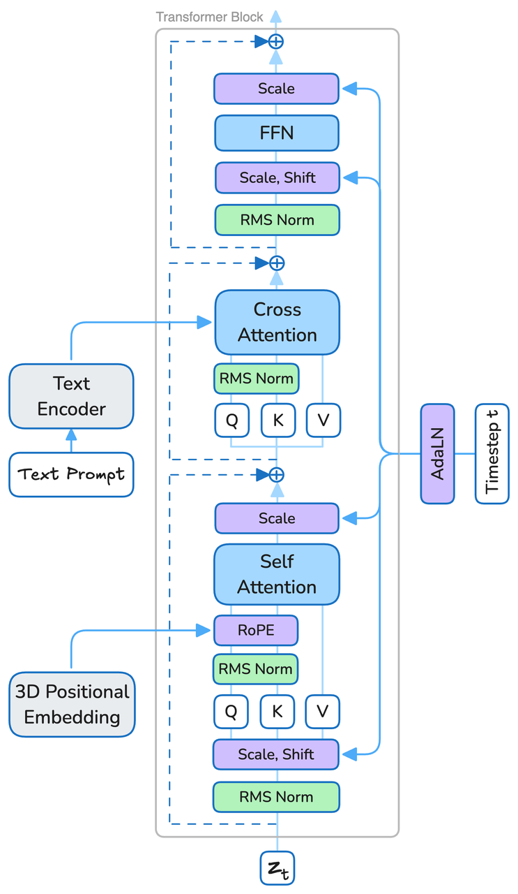

* **Image-to-Video 的逐 Token 时间步**

1. **条件帧和待生成帧不必处在同一噪声水平**

训练时偶尔把首帧对应 Token 的 timestep 设为较小随机值，其余 Token 仍使用当前扩散时间步。模型由此学会：低噪声 Token 是可信条件，高噪声 Token 是需要生成的区域。推理时，输入图像经 Causal VAE 编成时间长度为 **`1`** 的 Latent，与随机噪声 Latent 拼接；首帧 Token 使用 t\_c≈0，其他 Token 从 t=1 开始。

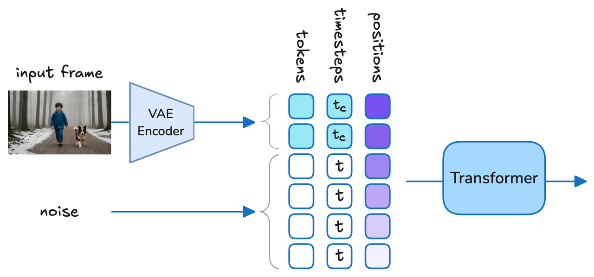

> **同一主干为何能兼容 T2V 与 I2V**
>
> 区别不在于增加第二个 Encoder 或 Control 分支，而在于给每个 Token 独立的 timestep 与位置。没有条件帧时，全部视频 Token 从高噪声开始；有条件帧时，仅首帧 Token 接近干净状态。Transformer 看到的是同一种序列接口。

* **Rectified Flow 与训练采样**

1. **线性路径与 velocity 目标**

干净 Latent z₀ 与高斯噪声 ε 之间使用线性插值，网络预测整条路径的速度：

$$z_t=(1-t)z_0+t\epsilon,\quad v=\epsilon-z_0$$

t 从 log-normal 分布采样，并根据当前样本 Token 数向高噪声区域平移：分辨率越高、时长越长，早期去噪越难，需要更多训练概率。分布两端按约 **`0.5%`** 和 **`99.9%`** 分位裁剪，避免极端 timestep 主导梯度。

2. **多分辨率、时长与 Token Drop**

不同分辨率和时长的样本被配置为接近的 Token 预算，图像只是“时长为一帧”的一种组合。训练时随机丢弃 **`0～20%`** 的视频 Token，降低计算量，并迫使 Attention 利用更远的上下文补全缺失位置。

3. **数据过滤与重写**

美学过滤器使用带标签的样本对训练 Siamese Model，学习哪一条视频在构图与观感上更好；同时过滤低运动、黑边、重复和低质量片段，并重新生成细粒度 Caption。低延迟结构降低了模型计算，但最终的文本一致性和运动质量仍高度依赖这条数据管线。

* **高压缩 Video VAE 的完整论证**

对 **`128`** 个视频样本的 latent pixel 做 PCA：训练早期，少数主成分就解释了大部分方差，通道之间还有明显的非对角相关；训练结束时，方差被更均匀地分配到各通道，相关矩阵接近对角。真正降低冗余的是 VAE 的 pixels-to-latents 压缩；在 Transformer 前简单 patchify 只减少 token 数，不会让 latent 自身更有信息密度。

PCA 说明压缩确实在利用通道。具体实现上，空间与时间的高倍下采样直接由 VAE Encoder 学习，Transformer 接收的已经是高压缩 token，而不是先产生冗余 latent、再靠外部 patchify 打包。这使扩散主干的序列长度从源头下降，也让 Decoder 对每个 token 承担更多可学习的像素重建工作。

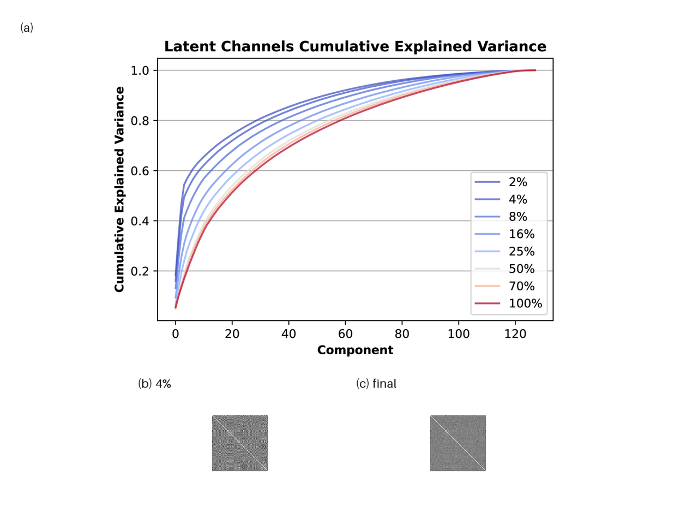

高压缩降低了 token 数，也把一部分去噪压力留给 Decoder。有限步 Transformer 不可能把 noisy latent 完全推回训练 VAE 时的干净 latent 流形；若 Decoder 只见过干净的 z\_0，推理时残留的扩散噪声就会变成纹理和颜色伪影。训练 Decoder 时额外输入 *t*，并让它直接从轻度加噪的 z\_t 恢复干净像素：

$$\hat{x}=D(z_t,t),\qquad t\sim\mathcal{U}(0,0.2)$$

这相当于把最后一小段去噪职责交给 Decoder，使 VAE 与 diffusion 共用一个重建目标，而不是把两者当成互不相干的模块。

Decoder 能处理轻度噪声后，还要保证重建纹理不发糊。传统 discriminator 分别接收真实或重建样本，需要判断某个局部模糊究竟来自景深还是生成失败；rGAN 把同一样本的原图与重建图成对送入，并随机交换顺序，让判别器只需判断哪一个是真实版本。比较条件被严格对齐后，Patch-GAN 也能把梯度集中到重建差异上，训练比普通 GAN 更稳定。

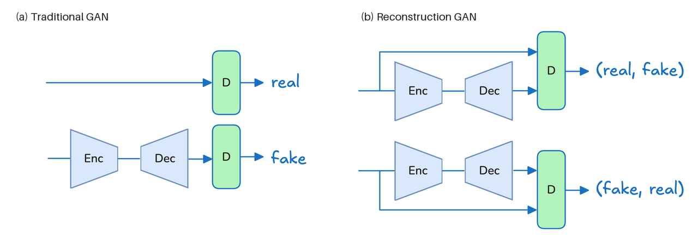

rGAN 之外，VAE 还用了几项稳定化设计。Encoder 多层注入按通道学习的噪声，避免少数通道塌缩；所有 latent 位置共享统一的 log-variance，防止局部方差成为信息旁路；**`8 级`** DWT loss 同时约束低频轮廓和高频纹理。因果 3D 卷积便于 I2V 和流式使用，非因果版本重建略好但会看到未来帧；完整 3D convolution 的质量也略高于 2D+1D 分解卷积，但计算更重。

* **Transformer、RoPE 与条件注入补全**

视频 Transformer 约 **`1.9B`** 参数，hidden size 为 **`2048`**，堆叠 **`28`** 个 block。每个 block 先做 video self-attention，再通过 cross-attention 读取文本。实验中这种分工清晰的结构优于把文本与视频混入同一序列的 MM-DiT：文本提供条件，视频 token 之间单独完成时空传播。

主干结构确定后，位置编码负责适配可变分辨率和时长。绝对坐标会把模型绑定到训练网格；普通 fractional coordinates 把位置归一化，但不同分辨率和时长的物理尺度仍不一致；最终采用 normalized fractional coordinates：空间坐标以像素相对预设最大分辨率归一化，时间坐标以秒相对最大时长归一化，并显式纳入原始 FPS。这样同一个运动速度在不同帧率下拥有一致的时间位置变化。

坐标归一化只是第一步。频率排布上，常见实现从高频到低频使用 inverse-exponential spacing；受控实验显示，LTX-Video 的 exponential spacing 更有效，相当于截掉一部分过低频率，让有限维度优先覆盖能够区分局部位置变化的频段。最终组合是“归一化分数坐标 + 指数频率”，二者缺一不可。

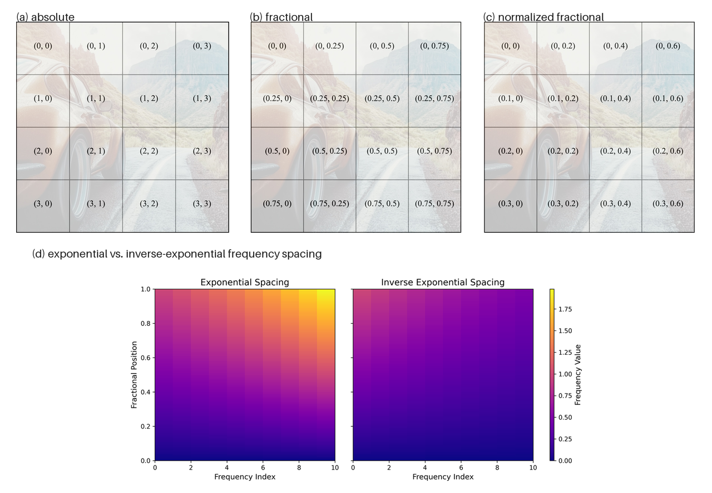

位置问题解决后，attention 数值稳定性仍需单独处理。高压缩 token 包含的信息量更大，query/key 的范数容易随训练放大，使 softmax 退化成几乎 one-hot 的注意力。对 Q、K 分别做 RMSNorm 后，点积尺度受控，attention entropy 不会过早坍缩；RMSNorm 比 LayerNorm 更合适，因为它只规范幅度，不额外减去均值，也少一组统计与计算。

* **Rectified Flow 与数据管线补全**

Rectified Flow 直接在数据 latent 与高斯噪声之间定义直线路径，目标速度在理想配对下为常量：

$$z_t=(1-t)z_0+t\epsilon,\qquad v=\epsilon-z_0$$

网络学习条件速度场 v\_θ，推理从 *t*=1 的噪声向 *t*=0 积分，Euler 离散更新为：

$$z_{t-\Delta t}=z_t-\Delta t\,v_{\theta}(z_t,t,c)$$

速度目标确定后，训练效率主要取决于 timestep 如何采样。这里不再均匀抽 *t*，而是从 log-normal 分布分配更多样本给速度预测更难的区间；分辨率、帧数和 token 数越大，调度越向高噪声端平移，以维持有效 SNR。概率密度在 **`0.5`** 与 **`99.9`** 分位处截断，避免分布尾部几乎永远采不到而形成训练盲区。

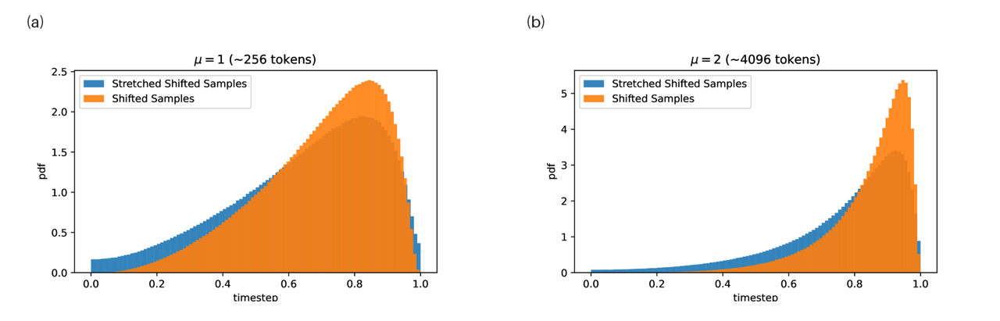

timestep 分布会随 token 数变化，因此同一模型可以按 token budget 混合不同宽高比、分辨率和帧数；图像被视为单帧视频，不另建图像分支。位置坐标使用像素和秒的物理量，timestep 分布又按 token 数修正，因此分辨率变化不会同时破坏位置尺度与噪声尺度。

模型侧的 training recipe 确定后，数据侧先处理审美偏差。审美模型由数万组人工二选一图像对训练。为了避免“漂亮图与普通图内容类别完全不同”造成捷径，每一对候选先通过多标签网络提取标签，只在 top-3 标签有重合的样本之间配对。模型必须学习构图、清晰度和视觉质量，而不能仅凭题材猜审美分数。

审美分数之外，完整处理顺序还包括裁除黑边、估计运动强度、生成缩略图、提取中帧 CLIP embedding、预测审美、聚类去重、过滤低运动与异常片段，再按 bucket resize。最终对全量保留样本重新生成细粒度 caption，并在高审美子集上继续 fine-tuning。数据管线先保证“能动、清楚、不重复”，再通过 recaption 提高文本对齐。

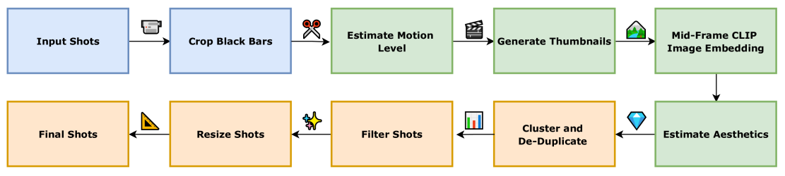

> **主要局限**
>
> * **高压缩是信息瓶颈**：细小文字、密集纹理、快速运动和小物体最容易在 VAE 阶段丢失。
>
> * **Decoder 需要“生成”细节**：补出的高频可能视觉合理，却不一定与输入或真实世界精确一致。
>
> * **速度不能脱离硬件解释**：采样步数、精度、显卡、分辨率和版本变化都会显著影响端到端延迟。

**模型对比：**&#x56DB;项工作的技术重点分别落在级联放大、长视频语义对齐、大规模开放训练和高压缩低延迟推理。

| **模型** | **生成主干** | **关键设计** | **适合强调的知识点** |
| ---------------------------------------------------------------------------- | ------------------------------------------------------------------------------ | ------------------------------------------------------------------------------ | ---------------------------------------------------------------------------------- |
| Imagen Video                                                                 | 级联 Video Diffusion                                                             | 时间超分与空间超分交替                                                                    | 早期高清视频生成如何拆解复杂度                                                                    |
| CogVideoX                                                                    | 3D Causal VAE + DiT                                                            | Expert Transformer、3D RoPE                                                     | 开放模型中的长序列与文本对齐                                                                     |
| HunyuanVideo                                                                 | Hybrid DiT + Flow Matching                                                     | MLLM 文本 Encoder、双流到单流                                                          | 大规模视频模型的结构与数据工程                                                                    |
| LTX-Video                                                                    | Holistic Latent Diffusion                                                      | 1:192 压缩、Decoder 参与去噪                                                          | 用高压缩换取低延迟的工程路线                                                                     |

### 4.6.8 Wan

* **Wan-VAE**

VAE 可以从高维视觉数据中学习紧凑的潜在表示，尤其是视频数据，有助于扩散模型的可扩展和高效训练。但是为视频生成任务设计有效的 VAE 有很多困难：

> 1. 视频本质上同时具有空间和时间维度，这要求 VAE 能够捕捉复杂的时空依赖关系
>
> 2. 视频包含多个高分辨率像素帧，这种固有的高维特性显著增加了内存消耗和计算成本，使得将 VAE 扩展到长视频序列变得困难
>
> 3. 确保时间因果性对于生成真实连贯的视频内容至关重要，但这一约束引入了额外的架构复杂性

Wan 提出了一种专为视频生成设计的新型三维因果 VAE 架构，解决了这些问题：其结合多种策略以提升时空压缩效率、降低内存占用，并确保时间因果性。这些改进使 Wan-VAE 更高效、更具可扩展性，并更适于与 DiT 等基于 diffusion 的生成模型集成。

1. **模型结构**

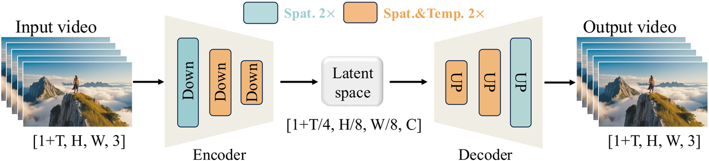

为实现高维像素空间与低维潜在空间之间的双向映射， Wan 设计了一个三维因果 VAE，给定输入视频$$V \in \mathbb{R}^{(1+T) \times H \times W \times 3}$$，Wan-VAE 将其时空维度压缩至$$[1 + T/4, H/8, W/8]$$，同时将通道数$$C$$扩展至$$16$$。在模型架构方面，将所有 **GroupNorm** 层替换为 **RMSNorm** 层，以保留时间因果性。这可以使&#x7528;**特征缓存机制**，显著提升了推理效率。在空间上采样层中，将输入特征通道数减半，使推理阶段的内存消耗降低**`33%`**。通过精细调整基础通道数，Wan-VAE 是仅&#x6709;**`127M`**&#x53C2;数的紧凑模型，降低了编码时间和内存占用，从而有利于后续 **DiT** 的训练。

> **注**：首帧仅进行空间压缩以更好地处理图像数据，这一设计参考了 MagViT-v2

* **特征缓存机制**

为高效支持任意长度视频的编码与解码，Wan-VAE 在因果卷积模块中实现了特征缓存机制：

视频序列帧数采用$$1 + T$$的输入格式，首先将视频划分为$$1 + T/4$$个块，与潜在特征数量一致。在处理输入视频序列时，模型采用分块策略，每次编码解码仅处理对应单个潜在表示的视频块。基于时间压缩比，每个处理块最多包含**`4`**帧，有效防止内存溢出。为确保上下文块之间的时间连续性，模型会保留前一块的帧级特征缓存，并将这些缓存特征融入后续块的因果卷积计算中。上图展示了特征缓存机制的两种典型场景：

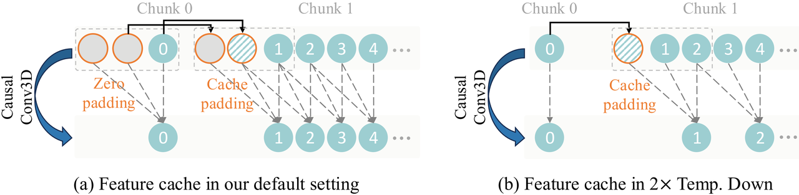

特征缓存机制不仅优化了内存使用，还保持了块边界间的特征一致性，从而支持对无限长度视频的稳定推理。

* **训练**

采用三阶段策略训练 Wan-VAE：

> 1. 构建结构相同的二维图像 VAE 并在图像数据上进行训练
>
> 2. 将训练好的二维 VAE 膨胀为三维因果 Wan-VAE，以提供初始的空间压缩先验，提升训练速度。此阶段在低分辨率$$128 \times 128$$&#x548C;**`5`**&#x5E27;的短帧数视频上进行训练以加速收敛。训练损失包括 **L1 重建损失**、**KL 散度损失**和 **LPIPS 感知损失**，加权系数分别为$$3$$、$$3 \times 10^{-6}$$和$$3$$
>
> 3. 在不同分辨率和帧数的高质量视频上对模型进行微调，引入三维判别器的 GAN 损失

* **模型性能**

<table><colgroup><col width="100"><col width="124"><col width="75"></colgroup>
<thead>
<tr>
<th>模型</th>
<th>压缩率</th>
<th>潜在维度</th>
</tr>
</thead>
<tbody>
<tr>
<td>Open Sora</td>
<td>4 \times 8 \times 8</td>
<td>4</td>
</tr>
<tr>
<td>SVD</td>
<td>1 \times 8 \times 8</td>
<td>4</td>
</tr>
<tr>
<td>Step Video</td>
<td>8 \times 16 \times 16</td>
<td>64</td>
</tr>
<tr>
<td>Mochi</td>
<td>6 \times 8 \times 8</td>
<td>12</td>
</tr>
<tr>
<td>Wan-VAE</td>
<td>4 \times 8 \times 8</td>
<td>16</td>
</tr>
</tbody>
</table>

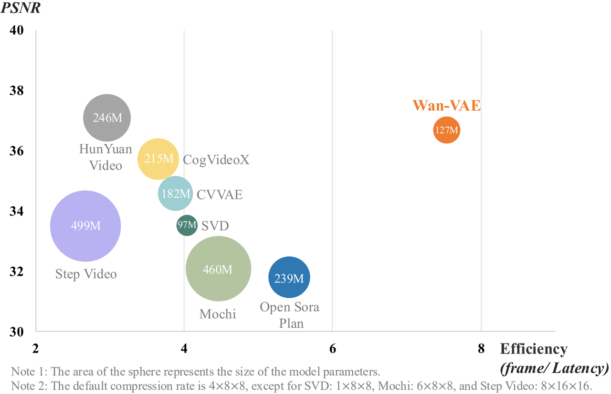

一共测试了 200 个视频，每个视频包含 25 帧，分辨率为$$720 \times 720$$。圆圈大小与模型参数量正相关。从图中可以看出，Wan-VAE 在两项指标上均表现良好，兼具优越的视频质量和高处理效率。在相同硬件环境下， VAE 重建速度比现有 SOTA 方法 HunYuan Video 快**`2.5`**倍。由于模型的小规模设计和特征缓存机制，这一速度优势在更高分辨率下将进一步放大。总的来说，Wan-VAE 为视频重建任务和视频生成训练奠定了基础，验证了该模型设计的有效性。

* **Wan**

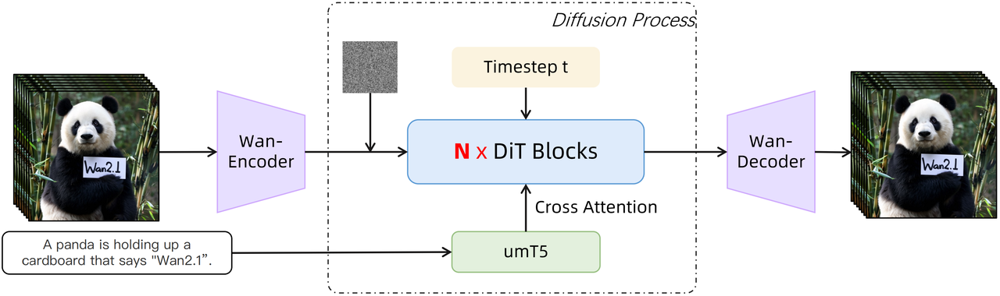

Wan 的架构基于 DiT 结构，包含三个核心组件：**Wan-VAE**、**DiT** 和**文本编码器**。对于给定视频$$V \in \mathbb{R}^{(1+T) \times H \times W \times 3}$$，Wan-VAE 的编码器将其从像素空间映射到潜在空间$$x \in \mathbb{R}^{(1 + T/4) \times H/8 \times W/8}$$，随后送入 DiT 结构进行处理。

1. **视频 DiT**

DiT 主要由三部分组成：**patchify 模块**、**Transformer 块**和 **unpatchify 模块**。在每个 Transformer 块中，重点建模时空上下文关系，并嵌入文本条件和时间步信息。

> 1. **Patchify 模块**：中使用核大小为$$(1, 2, 2)$$的三维卷积，并进行展平操作，将$$x$$转换为形状为$$(B, L, D)$$的特征序列，其中$$B$$为批量大小，$$L = (1 + \frac{T}{4}) \times \frac{H}{16}
>     \times \frac{W}{16}$$为序列长度，$$D$$为潜在维度。
>
> 2. **Transformer 块**：采用交叉注意力融入文本条件，确保模型在长上下文建模下仍具备良好的指令遵循能力；使用带 SiLU 激活函数的 MLP 来处理时间编码，并分别预测六个参数，这个 MLP 在所有 Transformer 块间共享，每个块学习一组独立的偏置。在相同参数规模下，可减少&#x7EA6;**`25%`**&#x7684;参数量，提升性能。

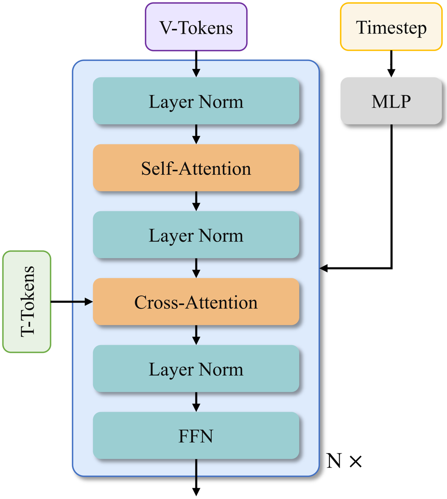

文本编码器：Wan 采&#x7528;**`umT5`**&#x5BF9;输入文本进行编码。**umT5** 优点：

> 1. 强大的多语言编码能力，能有效理解中英文及输入的视觉文本
>
> 2. 相同条件下，在组合能力上优于其他采用单向注意力机制的大语言模型
>
> 3. 收敛更快，在相同参数规模下训练更高效

* **训练**

采用 Flow Matching 框架，在图像与视频域中建模统一的去噪扩散过程。**首先在低分辨率图像上进行预训练，随后进行多阶段的图像-视频联合优化**。联合训练过程中，数据的空间分辨率和时间长度随训练阶段逐步提升。

**训练目标**：流匹配为扩散模型中的连续时间生成过程提供了理论支撑，通过常微分方程 ODE 实现稳定训练，避免了迭代速度预测，同时保持与最大似然目标等价。训练时，给定图像或视频潜在变量$$x_1$$、随机噪声$$x_0 \sim \mathcal{N}(0, I)$$，以及从 logit-normal 分布中采样的时间步$$t \in [0, 1]$$，中间潜在变量$$x_t$$作为模型输入。根据 Rectified Flows，$$x_t$$ 定义为$$x_0$$与$$x_1$$的线性插值：

$$x_t = t x_1 + (1 - t) x_0$$

真实速度$$v_t$$为：

$$v_t = \frac{d x_t}{d t} = x_1 - x_0$$

训练模型来预测速度，因此损失函数可表示为模型输出与$$v_t$$之间的均方误差：

$$\mathcal{L} = \mathbb{E}_{x_0, x_1, c_{\text{txt}}, t} \left\| u(x_t, c_{\text{txt}}, t; \theta) - v_t \right\|^2$$

其中$$c_{\text{txt}}$$是长度为$$512$$&#x7684;**`umT5`**&#x6587;本 Embedding 序列，$$\theta$$为模型参数，$$u(x_t, c_{\text{txt}}, t; \theta)$$表示模型预测的速度。

**图像预训练**：直接在高分辨率图像与长视频序列上进行联合训练比较困难：

> 1. 序列长度显著增加，如$$1280 \times 720$$视频包含$$81$$帧，降低了训练吞吐量，在固定 GPU 小时预算下导致数据吞吐不足，阻碍模型收敛
>
> 2. GPU 内存消耗过高，迫使使用次优批量大小，引发梯度方差激增，导致训练不稳定

为缓解这些问题，**Wan** 首先在$$256$$像素低分辨率文本到图像任务上进行预训练，以强制模型在引入高分辨率视频模态前，建立跨模态语义-文本对齐和几何结构保真能力。

**图像-视频联合训练**：在大规模 256 像素文本到图像预训练后，通过分辨率逐步提升的课程学习策略，实施图像与视频数据的分阶段联合训练。训练包含三个阶段，按空间分辨率区分：

> **Stage 1**：联合训练$$256$$像素图像与$$5$$秒视频片段，视频片段为$$192$$像素，$$16$$FPS
>
> **Stage 2**：将图像与视频分辨率均提升至$$480$$像素，保持$$5$$秒视频时长不变
>
> **Stage 3**：将两者分辨率进一步提升至$$720$$像素

> **训练配置**：采用 **BF16** 混合精度进行训练，优化器为 AdamW，权重衰减系数为$$10^{-3}$$。初始学习率设为 $$10^{-4}$$，并根据 FID 和 CLIP Score 指标的平台期动态衰减。

---

[Previous](01-GAN--AE--Flow.md) | [Contents](../../README.md) | [Next](03-UMM-统一理解生成模型.md) | [Visual website](https://weyumm.github.io/vlm-Wissen/lecture-2.html#c=2)
