[Previous](01-GAN--AE--Flow--基础知识.md) | [Contents](../../README.md) | [Next](03-GAN--AE--Flow--Autoencoder-系列.md) | [Visual website](https://weyumm.github.io/vlm-Wissen/lecture-2.html#c=2)

## 3.2 GAN 系列

### 3.2.1 CGAN

* **GAN**

GAN 由两个对抗模型组成：一个生成模型$$G$$，用于捕捉数据分布；以及一个判别模型$$D$$，用于估计样本来自训练数据而非$$G$$的概率。$$G$$和$$D$$都可以是非线性映射函数，例如多层感知机。

为了学习数据$$x$$上的生成分布$$p_g$$，生成器构建了一个从先验噪声分布$$p_z(z)$$到数据空间的映射函数$$G(z; \theta_g)$$。而判别器$$D(x; \theta_d)$$输出一个标量，表示$$x$$来自训练数据而非$$p_g$$的概率。

$$G$$和$$D$$是同时训练的：调整$$G$$的参数以最小化$$\log(1 - D(G(z)))$$，并调整$$D$$的参数以最小化$$\log D(X)$$，这可以想象成一个 two-player minimax 博弈，其价值函数为$$V(G, D)$$：

$$\min_G \max_D V(D, G) = \mathbb{E}_{x \sim p_{\text{data}}(x)}[\log D(x)] + \mathbb{E}_{z \sim p_z(z)}[\log(1 - D(G(z)))]$$

* **条件生成对抗网络 CGAN**

如果生成器和判别器都基于某些额外信息$$y$$进行条件化，生成对抗网络可以扩展为条件模型。$$y$$可以是任何类型的辅助信息，例如类别标签或其他模态的数据。可以通过将$$y$$作为额外输入层提供给判别器和生成器来实现条件化。

> * &#x5728;**生成器**&#x4E2D;，先验噪声输入$$p_z(z)$$和$$y$$被组合成联合隐表示，对抗训练框架允许这种隐表示的构成具有相当大的灵活性
>
> * &#x5728;**判别器**&#x4E2D;，$$x$$和$$y$$被作为输入提供给判别函数，在此情况下，该函数由一个多层感知机实现

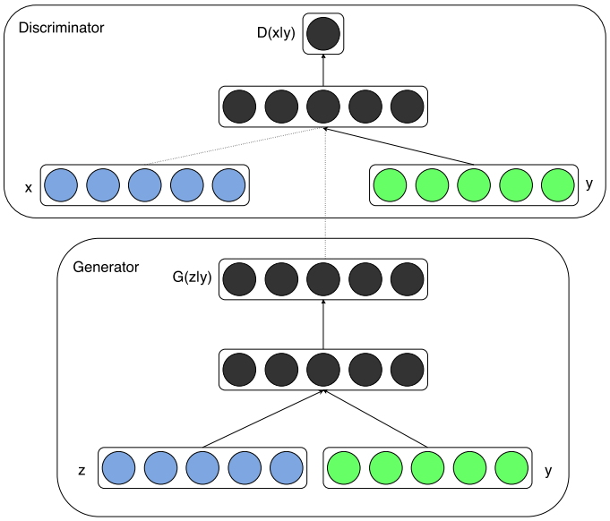

two-player minimax 博弈的目标函数如下：

$$\min_G \max_D V(D, G) = \mathbb{E}_{x \sim p_{\text{data}}(x)}[\log D(x|y)] + \mathbb{E}_{z \sim p_z(z)}[\log(1 - D(G(z|y)))]$$

### 3.2.2 DCGAN

近年来，CNN 在监督学习任务中取得了巨大成功，但在无监督学习领域的发展相对滞后。无监督学习的目标是从大量未标记的数据中学习通用的特征表示，这些表示可以用于多种下游任务，如图像分类。然而，传统的无监督学习方法（如自编码器、聚类等）在学习图像的层次化特征方面存在局限性。 GAN 作为一种新兴的无监督学习方法，通过生成器和判别器的对抗训练，能够学习数据的分布，但其训练过程常常不稳定，生成的图像质量也难以保证。因此，DCGAN 被提出，这是一种深度卷积生成对抗网络，通过引入特定的架构约束，使其在训练过程中更加稳定，并能够学习到从物体部件到场景的层次化特征表示，从而为无监督学习提供一种更强大的解决方案。

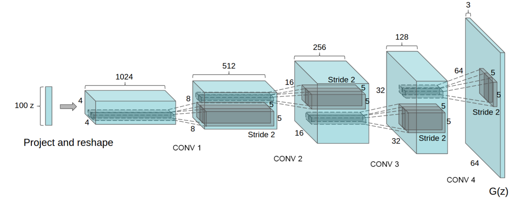

总的来说，DCGAN 采用并修改了在 CNN 中提出的三项改进：

1. **全卷积网络**：DCGAN 用步幅卷积 strided convolutions 取代了确定性的空间池化函数，如最大池化，从而使网络能够学习自己的空间下采样。而且在生成器中也采用了这种方法，使其能够学习自己的空间上采样，判别器也同样适用。

2. **消除卷积特征之上的全连接层**：最典型的例子是全局平均池化，这经常被用在图像分类模型中。全局平均池化提高了模型的稳定性，但降低了收敛速度。一个折中的方法是将最高层的卷积特征分别直接连接到生成器和判别器的输入和输出。GAN 的第一层可以被称为全连接层，因为它只是矩阵乘法，但结果会被重塑为 4 维张量，并作为卷积堆栈的起点。对于判别器，最后一层卷积层被展平后输入到单个 Sigmoid 输出中，如上图所示。

3. **批量归一化 BN**：通过对每个单元的输入进行归一化，即零均值和单位方差，从而稳定了学习过程。这有助于解决由于初始化不当而导致的训练问题，并改善了深层模型中的梯度流动。这对于让深层生成器开始学习至关重要，防止生成器将所有样本坍缩到一个点上，这也是 GAN 中最常见的训练失败现象。然而，对所有层直接应用批量归一化会导致样本振荡和模型不稳定。通过不在生成器的输出层和判别器的输入层应用批量归一化可以避免这一问题。

除此之外，在生成器中使用 ReLU 激活函数，但输出层使用 Tanh 函数。因为作者发现使用有界激活函数使模型能够更快地学习饱和并覆盖训练分布的颜色空间。在判别器中，实验发现 Leaky ReLU 效果很好，尤其是在高分辨率建模时。这与最初的 GAN 论文中使用的 Maxout 激活函数形成了对比。

总的来说，稳定的深度卷积 GAN 的搭建有以下几个可以参考的点：

> * 用步幅卷积（判别器）和分数步幅卷积（生成器）替换所有池化层
>
> * 在生成器和判别器中都使用批量归一化
>
> * 对于深层架构，移除全连接隐藏层
>
> * 在生成器的所有层中使用 ReLU 激活函数，但输出层使用 Tanh
>
> * 在判别器的所有层中使用 LeakyReLU 激活函数

### 3.2.3 InfoGAN

无监督学习的目标是从大量未标记数据中提取有价值的信息，而表示学习是无监督学习的一个重要方向。表示学习的目的是通过无标记数据学习一种表示，能够以易于解码的方式暴露重要的语义特征。这种表示对于许多下游任务非常有用，如分类、回归、可视化和强化学习中的策略学习。无监督学习的一个重要挑战是数据的解耦表示，即将数据的重要属性明确地表示出来。例如，在人脸数据集中，理想的解耦表示可能会将面部表情、眼睛颜色、发型、是否戴眼镜以及对应人物的身份分别分配到不同的维度。这种解耦表示对于需要了解数据重要属性的任务非常有用，如人脸识别和目标识别。

InfoGAN 通过最大化生成器的噪声变量与观测数据之间的互信息，学习可解释且解耦的表示。作者通过引入一个辅助分布$$Q(c∣x)$$来近似后验分布$$P(c∣x)$$，从而得到了一个互信息的下界，并设计了一个简单高效的算法来优化这个下界。

* **问题引入**

GAN 是通过极小化极大博弈来训练深度生成模型的框架。其目标是学习一个生成器分布$$P_G(x)$$，使其与真实数据分布$$P_{\text{data}}(x)$$相匹配。GAN 不是对数据分布中的每个$$x$$显式地分配概率，而是学习一个生成器网络$$G$$，通过将噪声变量$$z \sim P_{\text{noise}}(z)$$转换为样本$$G(z)$$，即从生成器$$P_G$$生成样本。这个生成器通过与一个对抗性的判别器网络$$D$$进行博弈来训练，判别器的目标是区分来自真实数据分布$$P_{\text{data}}$$和生成器分布$$P_G$$的样本。对于给定的生成器，最优判别器为：

$$D(x) = \frac{P_{\text{data}}(x)}{P_{\text{data}}(x) + P_G(x)}$$

具体的，该极小化极大博弈由以下表达式给出：

$$\min_G \max_D V(D, G) = \mathbb{E}_{x \sim P_{\text{data}}}[\log D(x)] + \mathbb{E}_{z \sim P_{\text{noise}}}[\log (1 - D(G(z)))]$$

但是 GAN 的这种形式化方法使用一个简单的连续输入噪声向量$$z$$，但对生成器如何使用噪声没有施加任何限制。因此，生成器可能会以耦合的方式使用噪声，导致$$z$$的各个维度无法对应于数据的语义特征。

然而，许多领域可以自然地分解为一组具有语义意义的变化因子。例如，在生成 MNIST 数据集图像时，理想情况下，模型能够自动选择一个离散随机变量来表示数字类别**`0-9`**，并选择两个额外的连续变量来分别表示数字的角度和笔画粗细。这些属性是独立且显著的，能在没有任何监督的情况下恢复这些概念。

* **InfoGAN**

InfoGAN 借鉴这个思想，将输入噪声向量分解为两部分，而不是使用单一无结构的噪声向量：

> * $$z$$：作为不可压缩噪声的来源
>
> * $$c$$：潜在编码 latent code，用于捕捉数据分布中的显著结构化语义特征

数学上，将结构化潜在变量记为$$c_1, c_2, \ldots, c_L$$。最简单的情况下，可以假设一个 factored 分布：

$$P(c_1, c_2, \ldots, c_L) = \prod_{i=1}^L P(c_i)$$

这里一般用潜在代码$$c$$表示所有潜在变量$$c_i$$的拼接。

除此之外 InfoGAN 提出一种以无监督方式挖掘这些潜在因子的方法：同时向生成器提供不可压缩噪声$$z$$和潜在代码$$c$$，因此生成器的形式变为$$G(z, c)$$。但在标准 GAN 中，生成器可以通过找到满足$$P_G(x|c) = P_G(x)$$的解来忽略附加的潜在代码$$c$$，从而导致潜在代码失去意义。为了解决这个问题，InfoGAN 提出一种基于信息论的正则化方法：潜在代码$$c$$与生成器分布$$G(z, c)$$之间应具有较高的互信息，即$$I(c; G(z, c))$$应尽可能大。

> **注**：在信息论中，随机变量$$X$$与$$Y$$之间的互信息$$I(X; Y)$$衡量了一个随机变量$$X$$，从已知$$Y$$中获得的信息量。互信息可以表示为两个熵项的差值：
>
> $$I(X; Y) = H(X) - H(X|Y) = H(Y) - H(Y|X)$$
>
> 也就是说$$I(X; Y)$$是在观察到$$Y$$后$$X$$的不确定性减少的量。如果$$X$$和$$Y$$是独立的，则$$I(X; Y) = 0$$，因为知道其中一个变量不会揭示关于另一个变量的任何信息；相反，如果$$X$$和$$Y$$之间存在确定性、可逆的函数关系，则互信息达到最大值。

这使得构造损失函数变得容易：给定任意$$x \sim P_G(x)$$，希望$$P_G(c|x)$$具有较小的熵。或者说潜在代码$$c$$中的信息不应在生成过程中丢失。因此作者提出求解如下带有信息正则化的极小化极大博弈问题：

$$\min_G \max_D V_I(D, G) = V(D, G) - \lambda I(c; G(z, c))$$

* **进一步推导**

在实际中，互信息$$I(c; G(z, c))$$很难直接最大化，因为它需要知道后验分布$$P(c|x)$$。这里可以通过定义一个辅助分布$$Q(c|x)$$来近似$$P(c|x)$$，从而获得下界：

$$\begin{aligned}
I(c; G(z, c)) &= H(c) - H(c|G(z, c)) \\
&= \mathbb{E}_{x \sim G(z,c)} \left[ \mathbb{E}_{c' \sim P(c|x)} \left[ \log P(c'|x) \right] \right] + H(c) \\
&= \mathbb{E}_{x \sim G(z,c)} \left[ D_{\text{KL}}(P(\cdot|x) \| Q(\cdot|x)) + \mathbb{E}_{c' \sim P(c|x)} \left[ \log Q(c'|x) \right] \right] + H(c) \\
&\geq \mathbb{E}_{x \sim G(z,c)} \left[ \mathbb{E}_{c' \sim P(c|x)} \left[ \log Q(c'|x) \right] \right] + H(c)
\end{aligned}$$

这种对互信息进行下界逼近被称为`变分信息最大化`。此外，潜在代码的熵$$H(c)$$也可以优化，因为对于常见的分布形式，具有简单的解析表达式。为了简化起见，InfoGAN 固定了潜在代码的分布，并将$$H(c)$$视为常数。

到目前为止，InfoGAN 都通过这个下界避开了显式计算后验$$P(c|x)$$，但内部期望中仍需从后验中采样。这里需要再介绍一个定理，可以消除对后验采样的需求：

> **注**：对于随机变量$$X, Y$$和函数$$f(x, y)$$，在适当的正则条件下有：
>
> $$\mathbb{E}_{x \sim X, y \sim Y|x}[f(x, y)] = \mathbb{E}_{x \sim X, y \sim Y|x, x' \sim X|y}[f(x', y)]$$

通过这个定理，可以定义互信息$$I(c; G(z, c))$$的一个变分下界$$L_I(G, Q)$$：

$$\begin{aligned}
L_I(G, Q) &= \mathbb{E}_{c \sim P(c), x \sim G(z,c)}[\log Q(c|x)] + H(c) \\
&= \mathbb{E}_{x \sim G(z,c)} \left[ \mathbb{E}_{c' \sim P(c|x)} [\log Q(c'|x)] \right] + H(c) \\
&\leq I(c; G(z, c))
\end{aligned}$$

$$L_I(G, Q)$$可以通过蒙特卡洛模拟来近似。并且可以直接对$$Q$$进行最大化，并通过重参数化技巧对$$G$$进行优化。因此可以将$$L_I(G, Q)$$直接添加到 GAN 的目标函数中，而无需改变其训练过程。

并且从$$I(c; G(z, c))$$计算公式可以看出，当辅助分布$$Q$$接近真实后验分布时，下界变得紧致，即： &#x20;

$$\mathbb{E}_x [D_{\text{KL}}(P(\cdot|x) \| Q(\cdot|x))] \to 0$$

并且当变分下界达到最大值$$L_I(G, Q) = H(c)$$时，互信息也达到了最大值。

因此，InfoGAN 被定义为以下带有互信息变分正则化的极小化极大博弈问题，其中$$\lambda$$是超参数：

$$\min_{G,Q} \max_D V_{\text{InfoGAN}}(D, G, Q) = V(D, G) - \lambda L_I(G, Q)$$

* **实现细节**

在实践中，InfoGAN 将辅助分布$$Q$$参数化为一个神经网络。在大多数情况下，$$Q$$与判别器$$D$$共享所有卷积层，最后一层全连接层用于输出条件分布$$Q(c|x)$$的参数。这意味着 InfoGAN 相比标准 GAN 仅增加了很小的计算成本。

除此之外，$$L_I(G, Q)$$比标准 GAN 的目标收敛得更快，因此 InfoGAN 几乎是在不增加代价的情况下实现的。

> * 对于**分类型潜在代码**$$c_i$$，使用 softmax 非线性作为自然选择来表示$$Q(c_i|x)$$
>
> * 对于**连续型潜在代码**$$c_j$$，具体的选择取决于真实后验$$P(c_j|x)$$。在 InfoGAN 的实验中，将$$Q(c_j|x)$$设定为独立高斯分布效果就非常好了

这里 InfoGAN 引入了一个额外的超参数$$\lambda$$，但是非常容易调节：

> 对于离散潜在代码，设置$$\lambda = 1$$即可
>
> 对于包含连续变量的潜在代码，通常使用较小的$$\lambda$$，确保$$\lambda L_I(G, Q)$$与 GAN 的目标处于同一数量级

由于 GAN 本身训练较为困难，因此 InfoGAN 在实验设计上借鉴了 DC-GAN 中提出的技术，这可以稳定 InfoGAN 的训练过程。

### 3.2.4 LSGAN 

* **LSGAN 的定义**

GAN 的学习过程是同时训练一个判别器$$  D  $$和一个生成器$$G$$。生成器$$  G  $$的目标是学习数据$$  x  $$的分布$$p_g$$。$$  G  $$从均匀分布或高斯分布$$  p_z(z)  $$中采样输入变量$$z$$，然后通过一个可微分的网络将输入变量$$  z  $$映射到数据空间，即$$G(z; \theta_g)$$。判别器$$  D  $$是一个分类器$$D(x; \theta_d)$$，目标是识别一张图像来自训练数据还是来自生成器$$G$$。GAN 的极小极大目标函数可以表示为：

$$\min_G \max_D V_{\text{GAN}}(D, G) = \mathbb{E}_{x \sim p_{\text{data}}(x)} [\log D(x)] + \mathbb{E}_{z \sim p_z(z)} [\log(1 - D(G(z)))]$$

将判别器视为一个分类器时，GAN 使用的是 sigmoid 交叉熵损失函数，在更新生成器时，这种损失函数会导致位于决策边界正确一侧但距离真实数据较远的样本出现梯度消失的问题。LSGAN 的提出正是为了解决这个问题。 &#x20;

假设对判别器采&#x7528;**`a-b`**&#x7F16;码方案，其中$$  a  $$和$$  b  $$分别代表假数据和真实数据的标签。那么，LSGAN 的目标函数可以定义如下：

$$\quad\quad\quad\quad \min_D V_{\text{LSGAN}}(D) = \frac{1}{2} \mathbb{E}_{x \sim p_{\text{data}}(x)} \left[ (D(x) - b)^2 \right] + \frac{1}{2} \mathbb{E}_{z \sim p_z(z)} \left[ (D(G(z)) - a)^2 \right]$$

$$\quad\quad\quad\quad\min_G V_{\text{LSGAN}}(G) = \frac{1}{2} \mathbb{E}_{z \sim p_z(z)} \left[ (D(G(z)) - c)^2 \right]$$

其中$$  c  $$表示生成器希望判别器相信假数据的值。

* **公式推导**

考虑对上述LSGAN 的目标函数进行扩展：

$$\min_D V_{\text{LSGAN}}(D) = \frac{1}{2} \mathbb{E}_{x \sim p_{\text{data}}(x)} \left[ (D(x) - b)^2 \right] + \frac{1}{2} \mathbb{E}_{z \sim p_z(z)} \left[ (D(G(z)) - a)^2 \right]$$

$$\min_G V_{\text{LSGAN}}(G) = \frac{1}{2} \mathbb{E}_{x \sim p_{\text{data}}(x)} \left[ (D(x) - c)^2 \right] + \frac{1}{2} \mathbb{E}_{z \sim p_z(z)} \left[ (D(G(z)) - c)^2 \right]$$

这里将$$  \mathbb{E}_{x \sim p_{\text{data}}} \left[ (D(x) - c)^2 \right]  $$加入到$$  V_{\text{LSGAN}}(G)  $$中并不会改变最优值，因为该部分不包含生成器的参数。

首先推导对于固定生成器$$  G  $$的最优判别器$$D^*$$，如下所示：

$$D^*(x) = \frac{b p_{\text{data}}(x) + a p_g(x)}{p_{\text{data}}(x) + p_g(x)}$$

为简化表示，在以下公式中用$$  p_d  $$表示$$p_{\text{data}}$$。接着可以继续将目标函数改写为：

$$\begin{aligned}
2C(G) &= \mathbb{E}_{x \sim p_d} \left[ (D^*(x) - c)^2 \right] + \mathbb{E}_{x \sim p_g} \left[ (D^*(x) - c)^2 \right] \\
&= \mathbb{E}_{x \sim p_d} \left[ \left( \frac{b p_d(x) + a p_g(x)}{p_d(x) + p_g(x)} - c \right)^2 \right] + \mathbb{E}_{x \sim p_g} \left[ \left( \frac{b p_d(x) + a p_g(x)}{p_d(x) + p_g(x)} - c \right)^2 \right] \\
&= \int_\mathcal{X} p_d(x) \left( \frac{(b - c)p_d(x) + (a - c)p_g(x)}{p_d(x) + p_g(x)} \right)^2 dx   + \int_\mathcal{X} p_g(x) \left( \frac{(b - c)p_d(x) + (a - c)p_g(x)}{p_d(x) + p_g(x)} \right)^2 dx \\
&= \int_\mathcal{X} \frac{ \left( (b - c)p_d(x) + (a - c)p_g(x) \right)^2 }{p_d(x) + p_g(x)} dx \\
&= \int_\mathcal{X} \frac{ \left( (b - c)(p_d(x) + p_g(x)) - (b - a)p_g(x) \right)^2 }{p_d(x) + p_g(x)} dx.
\end{aligned}$$

如果设定$$  b - c = 1  $$及$$b - a = 2$$ ，则有：

$$\begin{aligned}
2C(G) &= \int_\mathcal{X} \frac{ \left( 2p_g(x) - (p_d(x) + p_g(x)) \right)^2 }{p_d(x) + p_g(x)} dx \\
&= \chi^2_{\text{Pearson}}(p_d + p_g \,\|\, 2p_g)
\end{aligned}$$

其中$$  \chi^2_{\text{Pearson}}  $$是 Pearson $$χ²$$散度。因此，当$$  a, b, c  $$满足条件$$  b - c = 1  $$和$$  b - a = 2  $$时，最小化上述目标函数等价于最小化$$  p_d + p_g  $$与$$  2p_g  $$之间的 Pearson $$χ²$$散度。

* **参数选择**

确定目标函数中$$  a, b, c  $$的一种方法是使其满足$$  b - c = 1  $$和 $$b - a = 2$$，从而使得最小化目标函数对应于最小化$$  p_d + p_g  $$与$$  2p_g  $$之间的 Pearson $$χ²$$散度。例如，设$$a=-1$$、$$b = 1$$、$$c = 0$$，可得目标函数如下：

$$\begin{aligned}
\min_D V_{\text{LSGAN}}(D) &= \frac{1}{2} \mathbb{E}_{x \sim p_{\text{data}}} \left[ (D(x) - 1)^2 \right] + \frac{1}{2} \mathbb{E}_{z \sim p_z} \left[ (D(G(z)) + 1)^2 \right] \\
\min_G V_{\text{LSGAN}}(G) &= \frac{1}{2} \mathbb{E}_{z \sim p_z} \left[ (D(G(z)))^2 \right]
\end{aligned}$$

另一种方法是通过设置$$c = b$$，使生成器生成尽可能接近真实的样本。例如，使&#x7528;**`0-1`**&#x4E8C;元编码方案，可得目标函数如下：

$$\begin{aligned}
\min_D V_{\text{LSGAN}}(D) &= \frac{1}{2} \mathbb{E}_{x \sim p_{\text{data}}} \left[ (D(x) - 1)^2 \right] + \frac{1}{2} \mathbb{E}_{z \sim p_z} \left[ (D(G(z)))^2 \right] \\
\min_G V_{\text{LSGAN}}(G) &= \frac{1}{2} \mathbb{E}_{z \sim p_z} \left[ (D(G(z)) - 1)^2 \right]
\end{aligned}$$

作者发现在实践中，上述两种方法性能相近，因此可以任选其一。作者使用后者来训练模型。

* **模型架构**

第一种模型如右图所示，设计灵感来自于 VGG，&#x4E0E;**`DCGAN`**&#x76F8;比，在顶部的两个反卷积层之后各增加了一个步长&#x4E3A;**`1`**&#x7684;反卷积层。判别器的结构与 DCGAN 完全相同，只是改用了最小二乘损失函数。遵循 DCGAN 的设计，生成器中使用 ReLU 激活函数，而判别器中使用 LeakyReLU 激活函数。

第二种模型适用于多类别任务，例如汉字生成。对于汉字来说，对多个类别同时训练 GAN 并不能生成可读的字符。

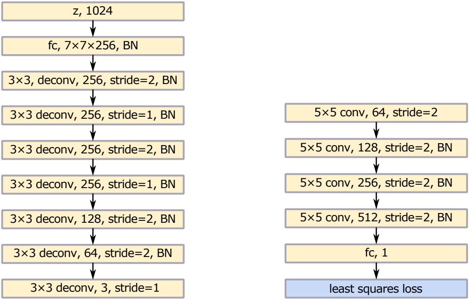

原因是输入包含多个类别，但输出只有一个类别。之前的工作发现，输入与输出之间应存在确定性关系。解决这个问题的一种方法是使&#x7528;**`CGAN`**，因为基于标签信息的条件设定可以建立输入与输出之间的确定性关系。然而，当类别数量达到几千甚至更多时，使用 one-hot 编码来对标签向量进行条件设定在内存消耗和计算时间上都是不可行的。LSGAN 使用的的方法是：首先使用一个线性映射层将大规模的标签向量映射为小维度的向量，然后再将这些小向量拼接到模型的各个层中。模型架构如下图所示，其中需要拼接的层是通过经验确定的。

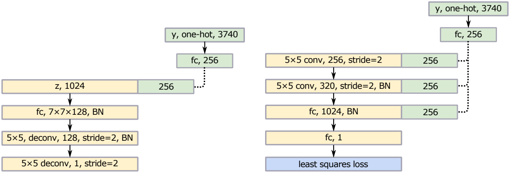

对于这种条件 LSGAN，其目标函数可以定义如下：

$$\begin{aligned}
\min_D \quad V_{\text{LSGAN}}(D) &= \frac{1}{2} \mathbb{E}_{x \sim p_{\text{data}}(x)} \left[ (D(x \mid \Phi(\mathbf{y})) - 1)^2 \right] + \frac{1}{2} \mathbb{E}_{z \sim p_z(z)} \left[ (D(G(z) \mid \Phi(\mathbf{y})))^2 \right] \\
\min_G \quad V_{\text{LSGAN}}(G) &= \frac{1}{2} \mathbb{E}_{z \sim p_z(z)} \left[ (D(G(z) \mid \Phi(\mathbf{y})) - 1)^2 \right]
\end{aligned}$$

其中$$  \Phi(\cdot)  $$表示线性映射函数，$$\mathbf{y}$$表示标签向量。

* **LSGAN 的优势**

1. 常规 GAN 对于那些位于决策边界正确一侧但远离真实数据的样本几乎不造成损失，而 LSGAN 即使这些样本被正确分类也会对其进行惩罚。当更新生成器时，判别器的参数是固定的，即决策边界是固定的。因此，这种惩罚机制会促使生成器生成靠近决策边界的样本。另一方面，对于 GAN 学习而言，决策边界应当穿过真实数据流形。否则，学习过程将会饱和。因此，将生成的样本向决策边界移动，意味着使其更接近真实数据的流形结构。

2. 对远离决策边界的样本进行惩罚可以在更新生成器时产生更多的梯度，从而缓解梯度消失问题。这使得 LSGAN 在学习过程中更加稳定。如右图所示，最小二乘损失函数仅在一个点上是平坦的，而 sigmoid 交叉熵损失函数在 $$  x  $$ 相对较大时会趋于饱和。

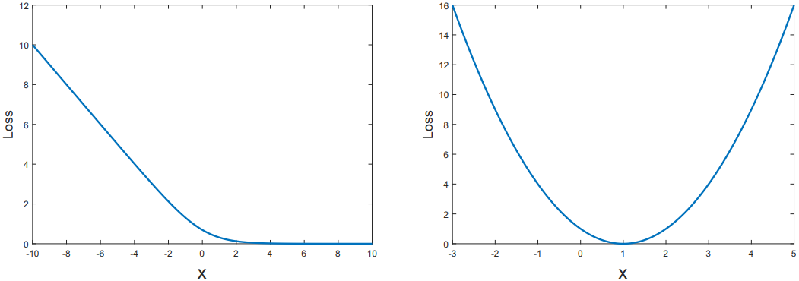

### 3.2.5 WGAN

* **基础知识**

设$$X$$是一个紧致度量空间，例如图像空间$$[0, 1]^d$$，$$\Sigma$$表示$$X$$的所有 Borel 子集构成的集合。令$$\mathrm{Prob}(X)$$表示定义在$$X$$上的概率测度空间。然后可以定义两个分布$$P_r, P_g \in \mathrm{Prob}(X)$$之间的基本距离和散度：

> 1. **全变差 TV**（**T**otal **V**ariation）**距离**：
>
>    $$\delta(P_r, P_g) = \sup_{A \in \Sigma} |P_r(A) - P_g(A)|$$
>
> 2. **KL**（**K**ullback-**L**eibler）**散度**：
>
>    $$\mathrm{KL}(P_r \| P_g) = \int \log\left(\frac{P_r(x)}{P_g(x)}\right) P_r(x) d\mu(x)$$
>
>    其中$$P_r$$和$$P_g$$都被假设为关于某个在$$X$$上定义的测度$$\mu$$绝对连续，因此可以表示为密度函数。KL 散度是不对称的，并且当存在某些点使得$$P_g(x) = 0$$而$$P_r(x) > 0$$时，可能取值为无穷大。
>
> 3. **JS**（**J**ensen-**S**hannon）**散度**：
>
>    $$\mathrm{JS}(P_r, P_g) = \mathrm{KL}(P_r \| P_m) + \mathrm{KL}(P_g \| P_m)$$
>
>    其中$$P_m = \frac{P_r + P_g}{2}$$是混合分布。这个散度是对称的，并且总是有定义的，因为可以选择$$\mu = P_m$$。
>
> 4. **EM**（**E**arth-**M**over）**距离** 或 **Wasserstein-1** 距离：
>
>    $$W(P_r, P_g) = \inf_{\gamma \in \Pi(P_r, P_g)} \mathbb{E}_{(x,y)\sim\gamma}[\|x - y\|]
>    \tag{1}$$
>
>    其中$$\Pi(P_r, P_g)$$表示所有边缘分布分别为$$P_r$$和$$P_g$$的联合分布$$\gamma(x, y)$$构成的集合。直观上，$$\gamma(x, y)$$表示从$$x$$到$$y$$需要运输多少“质量”来将分布$$P_r$$转变为$$P_g$$。那么 EM 距离就是最优传输计划的“代价”。

下面的例子说明在 EM 距离下看似简单的概率分布序列收敛，但在其他距离和散度下并不收敛。

> **例**：设$$Z \sim U[0, 1]$$是单位区间上的均匀分布。令$$P_0$$是$$(0, Z) \in \mathbb{R}^2$$的分布，即 x 轴为 0，y 轴为随机变量$$Z$$，它在通过原点的垂直直线上是均匀分布的。再令$$g_\theta(z) = (\theta, z)$$，其中$$\theta$$是一个实参数。在这种情况下很容易看出：
>
> 1. $$W(P_0, P_\theta) = |\theta|$$,
>
> 2. $$\mathrm{JS}(P_0, P_\theta) = 
>    \begin{cases}
>      \log 2 & \text{如果 } \theta \neq 0, \\
>      0 & \text{如果 } \theta = 0,
>    \end{cases}$$
>
> 3. $$\mathrm{KL}(P_\theta \| P_0) = \mathrm{KL}(P_0 \| P_\theta) = 
>    \begin{cases}
>      +\infty & \text{如果 } \theta \neq 0, \\
>      0 & \text{如果 } \theta = 0,
>    \end{cases}$$
>
> 4) $$\delta(P_0, P_\theta) = 
>    \begin{cases}
>      1 & \text{如果 } \theta \neq 0, \\
>      0 & \text{如果 } \theta = 0.
>    \end{cases}$$
>
> 当$$\theta_t \to 0$$时，序列 $$(P_{\theta_t})_{t \in \mathbb{N}}$$ 在 EM 距离下收敛于$$P_0$$，但在 JS、KL、反向 KL 或 TV 散度下都不收敛。右图展示了 EM 和 JS 距离的情况。
>
> 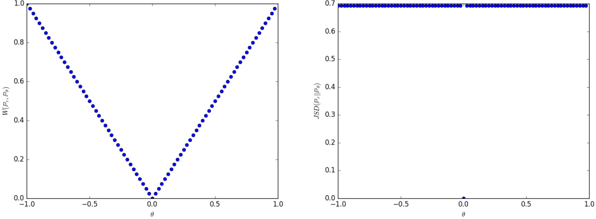

上例表明可以通过对 EM 距离进行梯度下降来学习低维流形上的概率分布。而使用其他距离和散度则无法做到这一点，因为相应的损失函数甚至不连续。虽然这个简单例子中的分布具有不相交的支撑集，但即使它们的支撑集在某个零测集内相交，结论仍然成立。这正是当两个低维流形以一般位置相交时的情形。

由于 Wasserstein 距离比 JS 距离弱得多，那么在温和的假设下，$$W(P_r, P_\theta)$$是否是关于$$\theta$$的连续损失函数呢？下面的定理证明了这一点：

> **定理 1**：设$$P_r$$是$$X$$上的一个固定分布，$$Z$$是另一个空间$$\mathcal{Z}$$上的随机变量，如高斯分布。令$$g : \mathcal{Z} \times \mathbb{R}^d \to X$$ 是一个函数，记作$$g_\theta(z)$$，其中$$z$$是第一个坐标，$$\theta$$是第二个坐标。令$$P_\theta$$表示$$g_\theta(Z)$$的分布。那么：
>
> 1. 如果$$g$$关于$$\theta$$连续，则$$W(P_r, P_\theta)$$也连续
>
> 2. 如果$$g$$是局部 Lipschitz 并满足正则性假设 1，则$$W(P_r, P_\theta)$$处处连续且几乎处处可微
>
> 3) 对于 Jensen-Shannon 散度$$\mathrm{JS}(P_r, P_\theta)$$和所有 KL 散度，以上结论 1–2 均不成立

从以下推论可以知道，通过最小化 EM 距离来进行学习在理论上是合理的，尤其是在神经网络中：

> **推论 1**：设$$g_\theta$$是任意由$$\theta$$参数化的前馈神经网络，$$p(z)$$是关于$$z$$的先验分布，使得$$\mathbb{E}_{z \sim p(z)}[\|z\|] < \infty$$，如高斯分布、均匀分布等。那么假设 1 成立，因此$$W(P_r, P_\theta)$$处处连续且几乎处处可微。

这表明，EM 是比至少 Jensen-Shannon 散度更合理的损失函数。下面的定理描述了这些距离和散度所诱导拓扑的相对强弱关系，其中 KL 最强，其次是 JS 和 TV，而 EM 最弱。

> **定理 2**：设$$P$$是紧致空间$$X$$上的分布，$$(P_n)_{n \in \mathbb{N}}$$是$$X$$上的一列分布。考虑所有极限当$$n \to \infty$$时：
>
> 1. 以下陈述等价：
>
>    * $$\delta(P_n, P) \to 0$$，其中$$\delta$$是全变差距离；
>
>    * $$\mathrm{JS}(P_n, P) \to 0$$，其中$$\mathrm{JS}$$是 Jensen-Shannon 散度。
>
> 2. 以下陈述等价：
>
>    * $$W(P_n, P) \to 0$$；
>
>    * $$P_n \xrightarrow{D} P$$，其中 $$\xrightarrow{D}$$ 表示随机变量的依分布收敛。
>
> 3) $$\mathrm{KL}(P_n \| P) \to 0$$ 或 $$\mathrm{KL}(P \| P_n) \to 0$$ 可推出 (1) 中的陈述。
>
> 4) (1) 中的陈述可推出 (2) 中的陈述。

这突出了这样一个事实：当学习低维流形上支撑的分布时，KL、JS 和 TV 距离并不是合理的损失函数。然而 EM 距离在这种设置下是合理的。

* **Wasserstein GAN**

定理 2 指出在优化时$$W(P_r, P_\theta)$$可能比$$\mathrm{JS}(P_r, P_\theta)$$具有更优良的性质。然而，上述 EM 式中的下确界是高度难以计算的。另一方面，Kantorovich-Rubinstein 对偶性表明：

$$W(P_r, P_\theta) = \sup_{\|f\|_L \leq 1} \mathbb{E}_{x \sim P_r}[f(x)] - \mathbb{E}_{x \sim P_\theta}[f(x)]
\tag{2}$$

其中上确界是对所有 1-Lipschitz 函数$$f : X \to \mathbb{R}$$取的。如果把 $$\|f\|_L \leq 1$$ 替换为$$\|f\|_L \leq K$$，即考虑某个常数 $$K$$ 下的 K-Lipschitz 函数，那么会得到$$K \cdot W(P_r, P_g)$$。

因此，如果有一个参数化的函数族$$\{f_w\}_{w \in W}$$，它们都是某个$$K$$-Lipschitz 的函数，因此可以考虑求解如下问题：

$$\max_{w \in W} \mathbb{E}_{x \sim P_r}[f_w(x)] - \mathbb{E}_{z \sim p(z)}[f_w(g_\theta(z))]$$

如果上式中的上确界确实由某个$$w \in W$$达到，那么这个过程将能够以一个乘法常数误差来计算$$W(P_r, P_\theta)$$。进一步地，可以通过对上式进行反向传播来考虑对$$W(P_r, P_\theta)$$求导，具体方法是估计：

$$\mathbb{E}_{z \sim p(z)}[\nabla_\theta f_w(g_\theta(z))]$$

> **定理 3**：设$$P_r$$是任意分布，$$P_\theta$$是$$g_\theta(Z)$$的分布，其中$$Z$$是一个具有密度$$p$$的随机变量，且$$g_\theta$$是满足假设 1 的函数。那么存在一个函数 $$f : X \to \mathbb{R}$$ 满足：
>
> $$\max_{\|f\|_L \leq 1} \mathbb{E}_{x \sim P_r}[f(x)] - \mathbb{E}_{x \sim P_\theta}[f(x)]$$
>
> 并且有：
>
> $$\nabla_\theta W(P_r, P_\theta) = -\mathbb{E}_{z \sim p(z)}[\nabla_\theta f(g_\theta(z))]$$

现在的问题是如何找到解决上式(2)中最大化问题的函数$$f$$。为了粗略逼近这一点，可以训练一个神经网络，其权重参数$$w$$属于一个紧致空间$$W$$，然后与之前一样通过$$\mathbb{E}_{z \sim p(z)}[\nabla_\theta f_w(g_\theta(z))]$$进行反向传播。

由于$$W$$是紧致的，这意味着所有的函数$$f_w$$都是某个$$K$$-Lipschitz 的函数，其中$$K$$仅依赖于$$W$$而不是具体的权重值。因此，这种近似可以在忽略比例因子和判别器$$f_w$$的容量限制的情况下逼近公式(2)。为了让参数$$w$$始终落在一个紧致空间内，一种简单的方法是在每次梯度更新后将权重裁剪到一个固定的区间，例如$$W = [-0.01, 0.01]^l$$。Wasserstein GAN 的过程如右图所示。

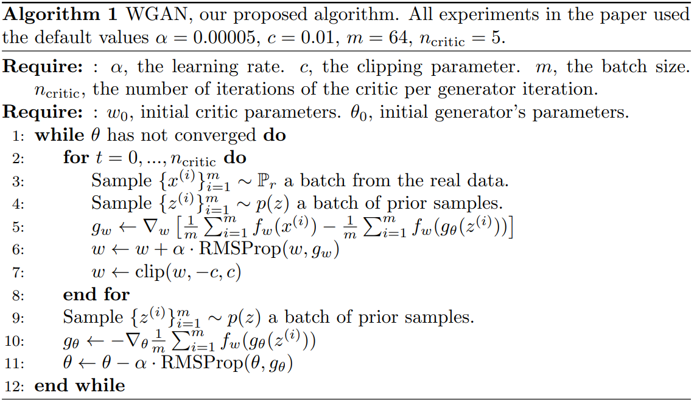

权重裁剪是一个非常差的方式来施加 Lipschitz 约束。

> 如果裁剪参数太大，权重可能需要很长时间才能达到极限，从而使得训练判别器至最优变得困难
>
> 如果裁剪太小，则在层数较多或未使用批归一化时容易导致梯度消失

作者发现一些简单的变体，如将权重投影到球面上，效果差异不大，因此仍采用权重裁剪方法，因为简单且表现不错。

EM 距离几乎处处连续且可微，因此可以将判别器训练至最优。因为训练判别器越充分，所获得的 Wasserstein 梯度就越可靠。而对于 JS 散度来说，随着判别器的提升，梯度会变得更可靠，但由于 JS 是局部饱和的，真实梯度其实是 0，会导致梯度消失，如上例中图像所示。右图展示了这一现象的概念验证实验：将 GAN 判别器和 WGAN 判别器都训练至最优。GAN 判别器很快学会了区分真假样本，且无法提供可靠的梯度信息。而 WGAN 的判别器不会饱和，收敛到一个线性函数，在整个空间中提供了非常清晰的梯度。之所以对权重进行约束，是因为它限制了函数在不同区域的增长最多只能是线性的，从而迫使最优判别器呈现出这种行为。

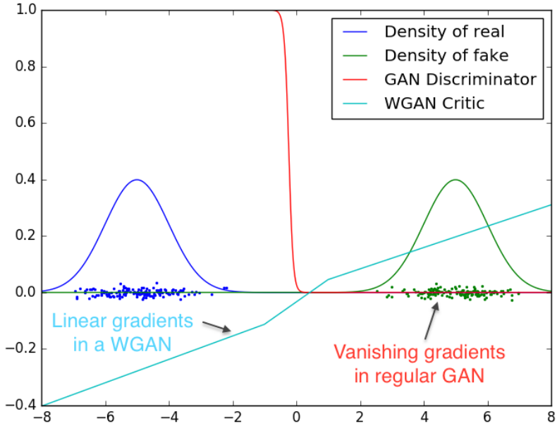

### 3.2.6 CycleGAN

* **目标函数**

CycleGAN 的目标是在给定训练样本$$\{x_i\}_{i=1}^N, x_i \in X$$和$$\{y_j\}_{j=1}^M, y_j \in Y$$的情况下，学习两个域$$X$$和$$Y$$之间的映射函数。记数据分布为$$x \sim p_{\text{data}}(x)$$和$$y \sim p_{\text{data}}(y)$$。如下图所示，CycleGAN 模型包含两个映射函数：$$G : X \to Y$$和$$F : Y \to X$$。此外引入了两个对抗判别器$$D_X$$和$$D_Y$$，其中$$D_X$$的目标是区分真实图像$$\{x\}$$和经过转换的图像$$\{F(y)\}$$；同理，$$D_Y$$的目标是区分$$\{y\}$$和$$\{G(x)\}$$。CycleGAN 的目标函数包含两项：

> * **对抗损失**：用于使生成图像的分布与目标域的数据分布匹配
>
> * **循环一致性损失**：防止所学映射$$G$$和$$F$$相互矛盾

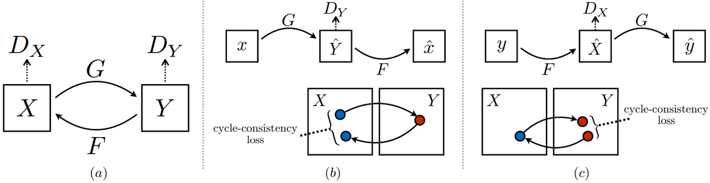

1. **对抗损失**

CycleGAN 将对抗损失应用于两个映射函数。对于映射函数$$G : X \to Y$$及其判别器$$D_Y$$，其目标函数表示为：

$$\mathcal{L}_{\text{GAN}}(G, D_Y, X, Y) = \mathbb{E}_{y \sim p_{\text{data}}(y)}[\log D_Y(y)] + \mathbb{E}_{x \sim p_{\text{data}}(x)}[\log(1 - D_Y(G(x)))]$$

其中，$$G$$试图生成看起来像域$$Y$$中图像的输出$$G(x)$$，而$$D_Y$$则试图区分这些生成的图像$$G(x)$$和真实图像$$y$$。$$G$$的目标是最小化该损失，而$$D_Y$$则最大化它，即：

$$\min_G \max_{D_Y} \mathcal{L}_{\text{GAN}}(G, D_Y, X, Y)$$

同理，对映射函数$$F : Y \to X$$及其判别器$$D_X$$也定义类似的对抗损失：

$$\min_F \max_{D_X} \mathcal{L}_{\text{GAN}}(F, D_X, Y, X)$$

* **循环一致性损失**

理论上，对抗训练可以学习出使得输出图像分布与目标域一致的映射$$G$$和$$F$$，严格来说，这要求$$G$$和$$F$$是随机函数。然而，只要网络容量足够大，它可以将一组输入图像映射为目标域中任意排列的图像，从而满足目标分布，但未必能保证每个输入$$x_i$$被映射到对应的期望输出$$y_i$$。因此，仅靠对抗损失无法确保学到的函数能够实现个体输入到期望输出的一一对应。为了进一步限制可能的映射函数空间，要求映射函数具&#x6709;**循环一致性**。

如上图(b)所示，对于每个来自域$$X$$的图像$$x$$，图像转换过程应能将其还原回原始图像，即：

$$x \to G(x) \to F(G(x)) \approx x$$

这种性质&#x4E3A;**前向循环一致性**。类似地，如上图(c)所示，对于每个来自域$$Y$$的图像$$y$$，应有：

$$y \to F(y) \to G(F(y)) \approx y$$

通&#x8FC7;**循环一致性损失**&#x6765;鼓励这种行为：

$$\mathcal{L}_{\text{cyc}}(G, F) = \mathbb{E}_{x \sim p_{\text{data}}(x)}\left[ \|F(G(x)) - x\|_1 \right] + \mathbb{E}_{y \sim p_{\text{data}}(y)}\left[ \|G(F(y)) - y\|_1 \right]$$

作者也尝试用对抗损失代替上述损失中的$$L_1$$范数，即分别比较$$F(G(x))$$与$$x$$、以及$$G(F(y))$$与$$y$$，但并未观察到性能提升。

* **完整目标函数**

完整目标函数如下：

$$\mathcal{L}(G, F, D_X, D_Y) = \mathcal{L}_{\text{GAN}}(G, D_Y, X, Y) + \mathcal{L}_{\text{GAN}}(F, D_X, Y, X) + \lambda \mathcal{L}_{\text{cyc}}(G, F)$$

其中，$$\lambda$$控制循环一致性损失相对于对抗损失的重要性。优化目标为：

$$G^*, F^* = \arg\min_{G,F} \max_{D_X,D_Y} \mathcal{L}(G, F, D_X, D_Y)$$

这里模型可以看作是在训练两个自编码器：联合学习一个自编码器$$F \circ G : X \to X$$和另一个$$G \circ F : Y \to Y$$。但这些自编码器具有特殊的内部结构：它们通过将图像转换到另一个域的中间表示来重建原图。这种设置也可以视为**对抗自编码器**的一种特例，它使用对抗损失来训练自编码器的瓶颈层以匹配任意目标分布。$$X \to X$$自编码器的目标分布就是域$$Y$$的分布。

* **网络结构**

生成网络的架构借鉴自 Johnson 等人的[**工作**](https://arxiv.org/pdf/1603.08155)，如下图，他们在神经风格迁移和超分辨率任务中取得了出色的结果。该网络结构包括：三个卷积层、若干残差块、两个步长为 $$\frac{1}{2}$$ 的分数步长卷积层，以及一个将特征映射到 RGB 图像的卷积层。

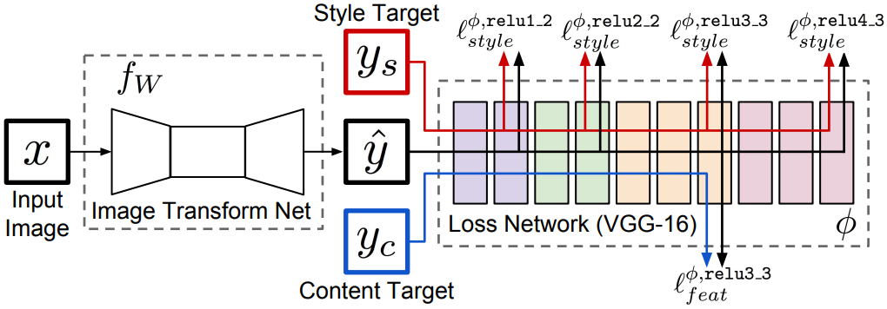

对于 $$128 \times 128$$ 分辨率的图像，使用 6 个残差块；对于 $$256 \times 256$$ 及更高分辨率的训练图像，则使用 9 个残差块。与上述工作相同，在网络中使用实例归一化 instance normalization。

对于判别器网络，采&#x7528;**`70×70 PatchGAN`**。这里判别器的目标是对图像中$$70 \times 70$$大小的重叠图像块进行分类，判断其是真实的还是生成的。这种基于图像块的判别器架构相比全图判别器具有更少的参数，并且能够以全卷积的方式处理任意尺寸的图像。

### 3.2.7 SAGAN

大多数基于 GAN 的图像生成模型通常使用卷积层构建。卷积操作只处理局部邻域的信息，因此仅依赖卷积层在建模图像中的长距离依赖关系时效率较低。作者借鉴了凯明提出的非局部模型 [**Non-local model**](https://arxiv.org/pdf/1711.07971)，将其引入到 GAN 框架中，从而使得生成器和判别器都能高效地建模空间上相距较远区域之间的关系。称为自注意力生成对抗网络 **SAGAN**（**S**elf-**A**ttention **G**enerative **A**dversarial **N**etworks）。

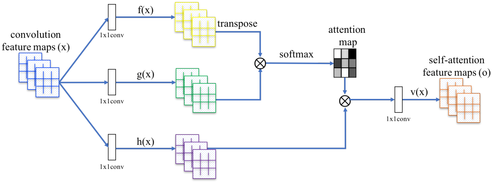

设前一层的隐藏特征为$$x \in \mathbb{R}^{C \times N}$$，其中$$C$$是通道数，$$N$$是特征图的空间位置总数。首先，将特征映射到两个不同的特征空间$$f(x)$$和$$g(x)$$来计算注意力权重：

$$f(x) = W_f x,\quad g(x) = W_g x$$

注意力系数 $$\beta_{j,i}$$ 定义如下：

$$\beta_{j,i} = \frac{\exp(s_{ij})}{\sum_{i=1}^N \exp(s_{ij})}, \quad \text{其中 } s_{ij} = f(x_i)^T g(x_j)$$

$$\beta_{j,i}$$ 表示在合成第$$j$$个区域时模型对第$$i$$个位置的关注程度。

注意力层的输出为$$o = (o_1, o_2, \ldots, o_j, \ldots, o_N) \in \mathbb{R}^{C \times N}$$，其定义为：

$$o_j = W_v \left( \sum_{i=1}^N \beta_{j,i} h(x_i) \right), \quad \text{其中 } h(x_i) = W_h x_i$$

上述公式中，$$W_g \in \mathbb{R}^{\bar{C} \times C}$$、$$W_f \in \mathbb{R}^{\bar{C} \times C}$$、$$W_h \in \mathbb{R}^{\bar{C} \times C}$$、$$W_v \in \mathbb{R}^{C \times \bar{C}}$$是可学习的权重矩阵，实现方式为 1×1 卷积。作者发现当将$$\bar{C}$$设为$$C/k, k = 1, 2, 4, 8$$时，性能没有明显下降。为了节省内存，SAGAN 在所有实验中取$$k = 8$$，即$$\bar{C} = C / 8$$。

此外，作者还对注意力层的输出乘以一个可学习的缩放参数$$\gamma$$，并将原始输入特征加回来：

$$y_i = \gamma o_i + x_i$$

其中$$\gamma$$是一个初始化为 0 的可学习标量。通过这种方式，网络可以先依赖局部信息，因为这更容易，然后逐步学会赋予非局部信息更多权重。这种设计背后的直觉是：先学习简单的任务，再逐渐增加任务复杂度。在 SAGAN 中，上述注意力模块被同时应用于生成器和判别器。它们通过交替最小化以下 hinge 版本的对抗损失函数进行训练：

$$\quad\quad\quad\quad L_D = - \mathbb{E}_{(x,y)\sim p_{\text{data}}} [\min(0, -1 + D(x, y))] - \mathbb{E}_{z\sim p_z, y\sim p_{\text{data}}} [\min(0, -1 - D(G(z), y))]$$

$$\quad\quad\quad\quad L_G = - \mathbb{E}_{z\sim p_z, y\sim p_{\text{data}}} D(G(z), y)$$

* **训练技巧**

作者研究了两种稳定 GAN 在复杂数据集上训练的技术：

> 一是对生成器和判别器都使用谱归一化 **Spectral Normalization**
>
> 二是采用双时间尺度更新规则 **TTUR**（**T**wo-**Ti**mescale **U**pdate **R**ule），用于解决正则化判别器导致的学习缓慢问题

1. **生成器与判别器的谱归一化**

之前有工作提出通过对判别器应用谱归一化来稳定 GAN 的训练过程。这种方法通过限制每一层的谱范数来控制判别器的 Lipschitz 常数。与其他归一化方法相比，谱归一化不需要额外的超参数调优，在实践中将所有层的谱范数统一设置为 1 效果良好，且计算开销较小。

作者发现生成器也可以从谱归一化中受益。最近的工作发现，生成器的条件数是影响 GAN 性能的重要因素之一。在生成器中使用谱归一化有助于防止参数幅值的失控以及梯度异常。对生成器和判别器同时使用谱归一化后，可以在每个生成器更新步骤中使用更少的判别器更新步骤，从而显著降低训练成本，同时训练过程更加稳定。

* **生成器与判别器更新的不平衡学习率**

以往的工作中，判别器的正则化往往会导致 GAN 的学习速度变慢。实际中，使用正则化判别器的方法通常需要在每次生成器更新时进行多次判别器更新。

除此之外，一些工作提出双时间尺度更新规则 TTUR，为生成器和判别器分别设置不同的学习率。作者使用 TTUR 来补偿正则化判别器导致的学习缓慢问题，从而使每个生成器更新步骤所需的判别器更新次数减少。实践表明，使用该方法可以在相同的时间内获得更好的结果。

### 3.2.8 BigGAN

BigGAN 主要是探索如何扩展 GAN 训练以利用更大模型和更大批量带来的性能优势。Baseline 采&#x7528;**`SA-GAN`**&#x67B6;构，其使&#x7528;**`hinge loss GAN`**&#x76EE;标函数。BigGAN 首先将类别信息通过类别条件 BatchNorm 提供给生成器$$G$$，并通过投影方法提供给判别器$$D$$。优化设置也遵循 SAGAN 的方法，特别是对$$G$$使用谱归一化，但将学习率减半，并且每个$$G$$步骤执行两个$$D$$步骤。在评估时对$$G$$的权重使用移动平均，衰减系数为`0.9999`。并且使用正交初始化 **Orthogonal Initialization**，而以往工作使用的是$$  \mathcal{N}(0, 0.02I)  $$初始化或 Xavier 初始化。每个模型都&#x5728;**`Google TPUv3 Pod`**&#x7684;**`128`**&#x5230;**`512`**&#x4E2A;核心上训练，并在所有设备之间计算$$G$$中的 BatchNorm 统计信息，而不是按设备单独计算。这里作者发现即使对&#x4E8E;**`512×512`**&#x7684;模型，也不需要采用渐进式增长 progressive growing 策略。

首先增加基线模型的批量大小，可以观察到显著的提升效果。如右表，仅将批量大小增&#x52A0;**`8`**&#x500D;就使 IS 指标提高&#x4E86;**`46%`**。这是因为更大的批次覆盖了更多的数据模式，从而为两个网络提供了更好的梯度。

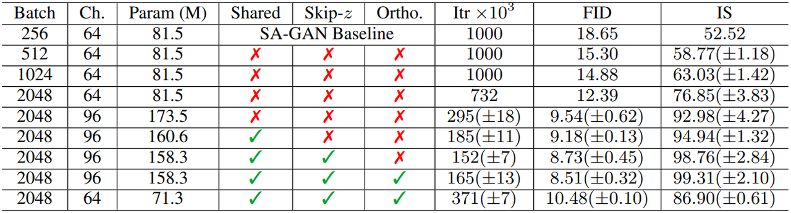

> **注**：这种扩展的副作用是模型在更少的迭代次数内达到了更高的最终性能，但随后变得不稳定并出现完全的训练崩溃。作者这里展示的是崩溃前保存的 checkpoint 得分。

接着将每一层的宽度（通道数）增加&#x4E86;**`50%`**，使模型参数总数大约翻倍。这进一步将 IS 提高&#x4E86;**`21%`**，这是由于模型容量相对于数据集复杂度的提升所致。但最初增加深度并未带来改善，因此作者&#x5728;**`BigGAN-deep`**&#x4E2D;使用了不同的残差块结构解决了这个问题。

由于$$G$$中条件 BatchNorm 层的类别嵌入$$c$$包含大量权重。因此作者选择使用共享嵌入，而不是为每个嵌入使用单独的层，然后将其线性投影到每层中。这种方法降低了计算和内存开销，并将训练速度提升&#x4E86;**`37%`**。然后不仅是在初始层，而是从噪声向量$$z$$到$$G$$多个层添加跳跃连接。这种设计让$$G$$能够使用潜在空间直接影响不同分辨率和层次上的特征。在 BigGAN 中，这通过将$$z$$分割成每个分辨率一个块，并将每个块与条件向量$$c$$拼接实现，后者会被投影到 BatchNorm 中。在 BigGAN-deep 中，作者采用更简单的方案：将整个$$z$$向量与条件向量拼接而不进行分割。这是对该设计的轻微修改。直接跳跃连接带来了&#x7EA6;**`4%`**&#x7684;性能提升，并进一步加快&#x4E86;**`18%`**&#x8BAD;练速度。

* **模型结构**

1. **BigGAN**

BigGAN 使用 ResNet GAN 结构，这与之前工作中使用的结构相同，但对判别器$$D$$中的通道模式进行了修改：每个残差块的第一个卷积层中的卷积核数量等于输出卷积核的数量，而不是输入卷积核的数量。并且在生成器$$G$$中使用了一个共享的类别嵌入，并对潜向量$$z$$使用跳跃连接 skip-z。具体来说，采用分层潜空间结构，将潜向量$$z$$按通道维度划分为大小相等的块，这里采用$$20D$$，每个块与共享的类别嵌入拼接后，作为条件向量传入对应的残差块。每个块的条件信息会经过线性投影，生成该块中 BatchNorm 层的逐样本 gains 和 biases。其中，bias 投影以零为中心，而 gain 投影以 1 为中心。由于残差块的数量取决于图像分辨率，因此$$z$$的总维度为：**`128×128`**&#x56FE;像时为 **`120`**，**`256×256`**&#x56FE;像时&#x4E3A;**`140`**，**`512×512`**&#x56FE;像时&#x4E3A;**`160`**。

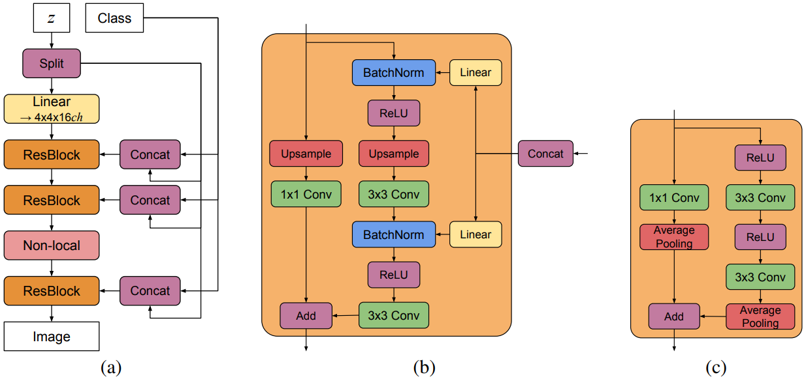

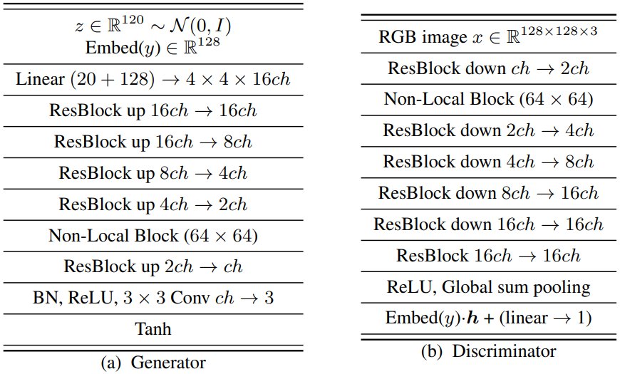

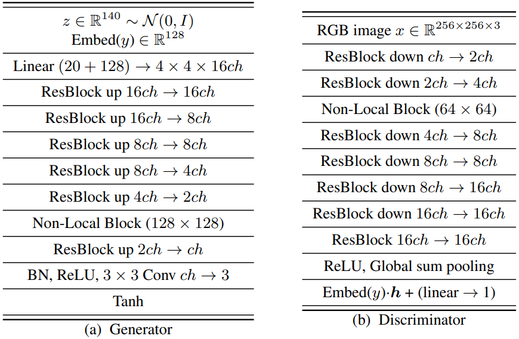

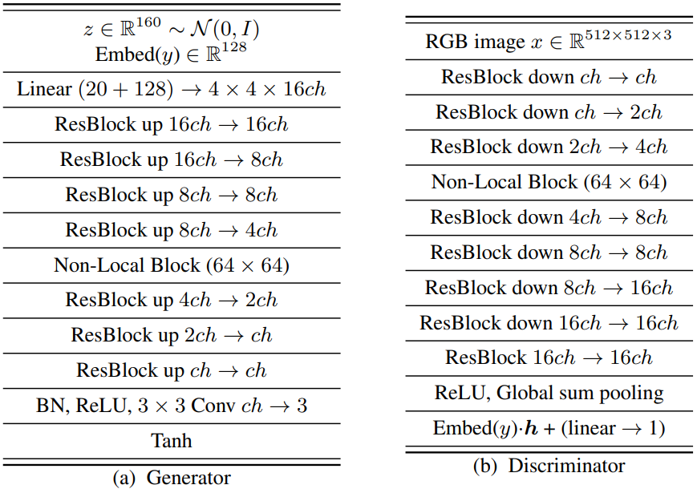

* **BigGAN-deep**

BigGAN-deep 与 BigGAN 有所不同，使用了一种更简单的 skip-z 条件机制：不再将$$  z  $$分块，而是将整个$$  z  $$向量与类别嵌入拼接，并通过跳跃连接将该向量传递给每个残差块。BigGAN-deep 基于具有瓶颈结构的残差块，每个残差块包含两个额外的$$  1 \times 1  $$卷积：第一个在的$$  3 \times 3  $$卷积之前将通道数减少**`4`**倍；第二个恢复所需的输出通道数。在需要改变通道数的跳跃连接中，BigGAN 使用$$  1 \times 1  $$卷积，而 BigGAN-deep 则采用一种不同的策略，保持跳跃连接中的恒等映射。

> 在生成器$$  G  $$中，当需要减少通道数时，仅保留前几组通道，其余舍弃
>
> 在判别器$$  D  $$中，当需要增加通道数时，将输入通道原样保留，并将其与由$$  1 \times 1  $$卷积生成的剩余通道拼接

在网络配置方面，判别器是生成器的镜像结构。每个分辨率下都有两个残差块，而 BigGAN 中只有一个，因此 BigGAN-deep 的深度是 BigGAN 的四倍。尽管深度更大，但由于其残差块采用了瓶颈结构，BigGAN-deep 的参数数量显著减少。例如，**`128×128`**的 BigGAN-deep 的$$  G  $$和$$  D  $$分别有**`50.4M`**和**`34.6M`**参数，而原始 BigGAN 对应模型分别为**`70.4M`**和**`88.0M`**参数。所有 BigGAN-deep 模型都在$$  64 \times 64  $$分辨率处使用注意力机制，通道宽度乘子$$\text{ch} = 128$$，潜向量$$z \in \mathbb{R}^{128}$$。

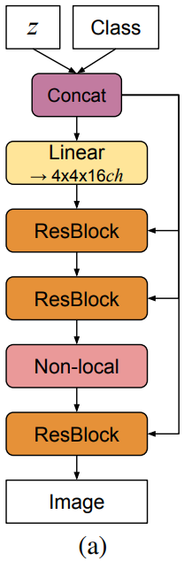

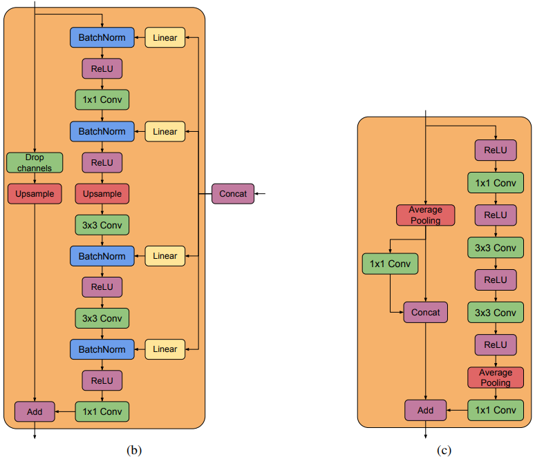

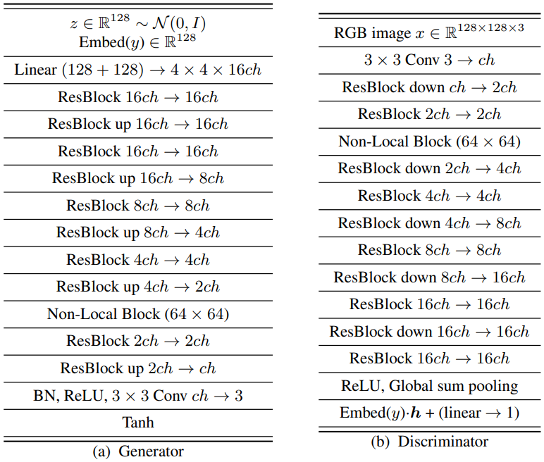

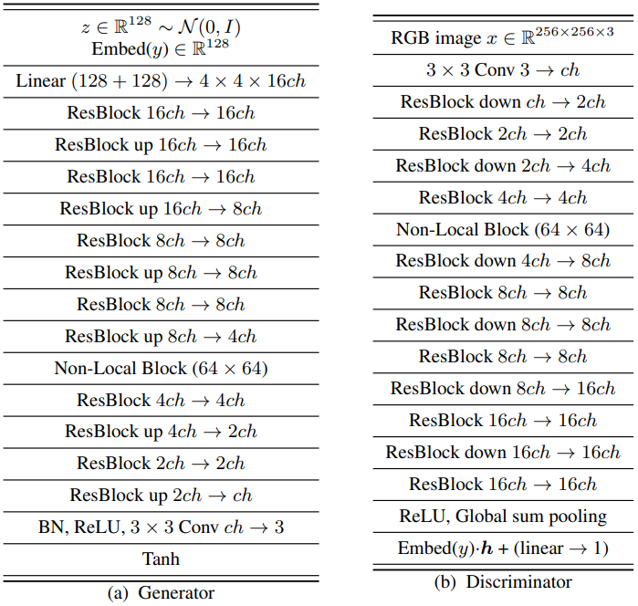

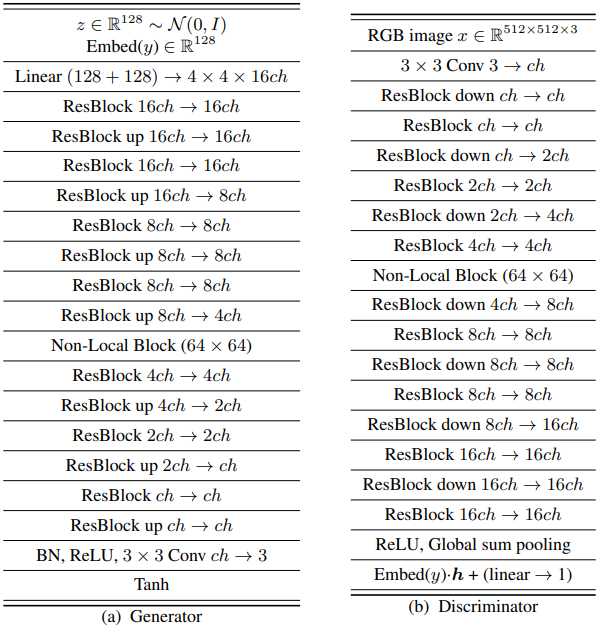

* **截断策略**

GAN 可以使用任意先验分布$$p(z)$$，但绝大多数之前的工作都选择从$$  \mathcal{N}(0, I)  $$或$$  U[-1, 1]  $$中采样$$z$$。这里作者发现最好的结果来自于使用与训练阶段不同的潜在分布进行采样。具体来说，对于一个使用$$  z \sim \mathcal{N}(0, I)  $$训练的模型，若在采样时使&#x7528;**截断正态分布**，即重新采样超出某个范围的值使其落在范围内，可以立即提升 IS 和 FID 指标。这称为截断技巧 Truncation Trick：通过重新采样超过某个阈值的$$z$$元素，使其接近零，即潜在分布的众数，可以在牺牲整体样本多样性的同时提高单个样本的质量。随着阈值降低，$$z$$中的元素被截断趋近于零，单个样本逐渐接近$$G$$输出分布的众数。

这种技术允许在给定$$G$$的情况下，后验地精细选择样本质量与多样性的平衡点。并且可以为一系列阈值计算 FID 和 IS，得到类似于精确率-召回率曲线&#x7684;**多样性-保真度曲线**，如右图所示。由于 IS 并不惩罚类别条件模型中的多样性缺失，因此降低截断阈值会直接导致 IS 上升，这类似于精确率。FID 既惩罚多样性缺失，类似于召回率，又奖励精确率，因此最初 FID 有适度改善，但当截断趋近于零、多样性下降时，FID 急剧恶化。使用与训练阶段不同的潜变量进行采样会导致分布偏移，这对许多模型是有问题的。在 BigGAN 中的一些较大模型无法很好地处理截断，在输入截断噪声时会出现饱和伪影。为缓解这一问题，作者尝试通过正则化使$$G$$的输出更加平滑，使得整个$$z$$空间都能映射到高质量的输出样本。为此，BigGAN 采用正交正则化 **Orthogonal Regularization**：

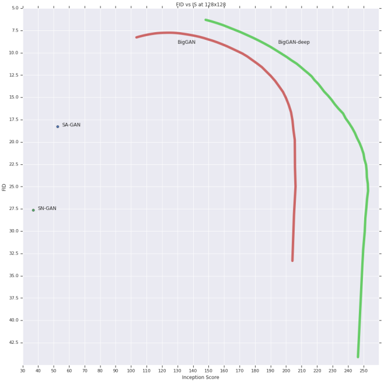

$$R_\beta(W) = \beta \|W^\top W - I\|_F^2$$

其中$$W$$是权重矩阵，$$\beta$$是超参数。这种正则化通常过于严格，因此作者探索了几种变体，旨在放松约束的同时仍赋予模型期望的平滑性。这里作者发现最有效的一种变体去除了正则化中的对角项，旨在最小化滤波器之间的成对余弦相似度，但不对它们的范数进行约束：

$$R_\beta(W) = \beta \|W^\top W \odot (1 - I)\|_F^2$$

其中$$1$$表示全为1的矩阵。BigGAN 遍历$$\beta$$值并选择$$10^{-4}$$，这个小的惩罚项足以显著提高模型对截断的适应性。从上表的结果可以看出，在未使用正交正则化的情况下，只&#x6709;**`16%`**&#x7684;模型能够适应截断，而在使用正则化后这一比例上升&#x81F3;**`60%`**。

现有的 GAN 技术足以支持扩展到大型模型和分布式的大批量训练。作者显著提升了当前的 SOTA 性能，并训练出&#x4E86;**`512×512`**&#x5206;辨率的模型，而无需依赖显式的多尺度方法。尽管如此，BigGAN 仍然会出现训练崩溃，实践中需要提前停止。

### 3.2.9 StyleGAN

* **设计动机与整体架构**

1. **为什么要重做 Generator**

传统的 Progressive GAN 把 latent code 只送入 Generator 的第一层，后续层必须从这一份输入中同时组织姿态、身份、颜色、纹理和随机细节。这样的生成过程可以得到高分辨率图像，但 latent space 与各层特征之间没有清晰接口：想只改变发丝而不改变身份，或只改变姿态而保留配色，都很难直接控制。

StyleGAN 的核心不是更换 GAN loss，而是重写 Generator 的信息入口：全局属性由逐层 style 控制，局部随机性由逐层 noise 控制，Discriminator 与对抗训练目标保持不变。因此，它可以与不同的 GAN loss、正则化方法和训练策略组合。

> **生成过程被拆成三条信息路径**
>
> * **内容分布**：输入 latent code $$z$$ 先进入 Mapping Network，得到中间 latent code $$w$$。
>
> * **分尺度控制**：每一层用独立的 affine transform 把 $$w$$ 变成该层的 style，再调制对应 feature map。
>
> * **随机细节**：每一层接收独立的单通道 Gaussian noise，用于发丝、毛孔和背景纹理等空间随机变化。

2. **Generator 的总体数据流**

输入 $$z \in Z$$ 先经过归一化，再由 Mapping Network $$f:Z\rightarrow W$$ 映射为 $$w\in W$$。每个 synthesis layer 都有自己的 affine transform $$A$$，把同一个 $$w$$ 转换为该层的 style 参数。Synthesis Network 不再接收传统的 latent input，而是从一个可学习的常量张量开始，连续上采样并卷积，最终通过独立的 **`1×1`** convolution 转换为 RGB 图像。

完整模型包含 **`8`** 层 Mapping Network 和 **`18`** 个 synthesis layer；从 **`4×4`** 到 **`1024×1024`**，每个 resolution 使用两个 convolution。Generator 共约 **`26.2M`** 个可训练参数，传统 Progressive GAN Generator 约为 **`23.1M`**。

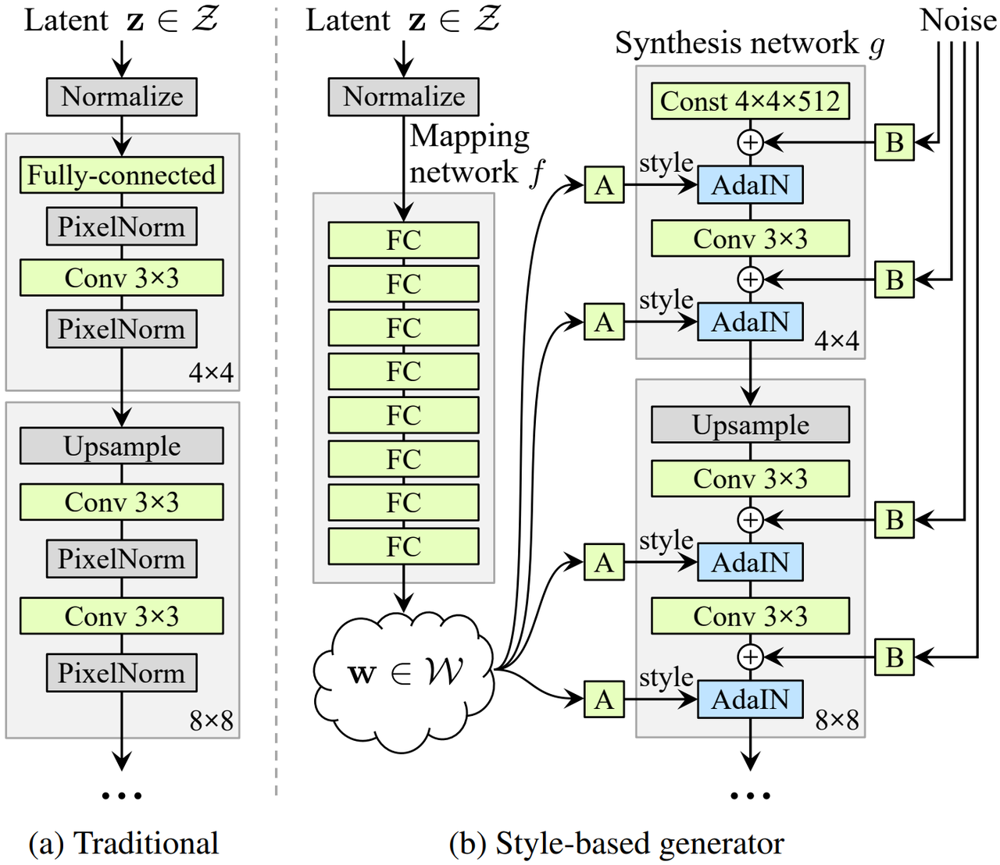

架构对照图完整展示了传统 latent input 与 StyleGAN 三路径注入方式的差别。

3. **Mapping Network：从 Z 到 W**

$$Z$$ 和 $$W$$ 的维度都设为 **`512`**。Mapping Network 是一个 **`8`** 层 MLP，各层使用 equalized learning rate 与 Leaky ReLU。它既不输出图像，也不承担 reconstruction；它只负责把受固定先验约束的 $$z$$ 重新参数化为更适合 Synthesis Network 使用的 $$w$$。

引入 $$W$$ 的关键价值，是把“如何采样”与“如何组织图像属性”分开：$$Z$$ 继续服从预先规定的分布，$$W$$ 的分布则由可学习映射 $$f$$ 决定。

默认生成时，同一个 $$w$$ 会广播到所有 synthesis layer；进行 Style Mixing 时，不同 resolution 的层可以接收不同的 $$w$$。因此，$$w$$ 不是某一层的最终 style，真正作用于 feature map 的参数还要经过每层独立的 affine transform。

4. **Affine Transform 与 AdaIN**

第 $$l$$ 个 synthesis layer 用自己的 affine transform 把 $$w$$ 映射成 $$y^{(l)}=(y_s^{(l)},y_b^{(l)})$$。如果该层有 $$C_l$$ 个 feature map，那么 style 向量需要同时给出每个通道的缩放量和偏置量，因此维度为 $$2C_l$$。

AdaIN 先对每个 feature map 单独计算空间均值与标准差，再执行通道级缩放和平移：

$$\operatorname{AdaIN}(x_i,y)=y_{s,i}\frac{x_i-\mu(x_i)}{\sigma(x_i)}+y_{b,i}$$

同一组缩放和平移参数作用于整个 feature map，因此 style 是空间不变的全局调制；它改变各通道对下一次 convolution 的相对贡献，却不直接指定某一个像素的内容。后一层 AdaIN 会重新设定统计量，使每一层的 style 影响集中在相邻的生成阶段。

> **注**：AdaIN 中的“style”不是从参考图像提取的视觉风格，而是由 $$w$$ 经过可学习 affine transform 得到的调制参数。

5. **Learned Constant 为什么能生成不同图像**

Synthesis Network 的起点是一个可学习的 **`4×4×512`** 常量，并不意味着所有样本会得到相同结果。样本差异不再由首层 activation 携带，而是由后续每一层的 style 与 noise 持续写入。常量负责提供稳定的空间基底，style 决定跨样本的主要属性，noise 决定同一主要属性下的随机实现。

消除传统 latent input 后，Synthesis Network 仍能只依靠逐层 style 生成有意义的图像，这说明样本级语义信息已经可以通过调制路径完整传递。这种接口也让同一张图的不同尺度属性第一次可以在网络层级上被单独替换。

* **分尺度控制与 Style Mixing**

1. **为什么不同 Resolution 对应不同属性尺度**

Synthesis Network 从低 resolution 逐步生成高 resolution feature map。低 resolution 层的一个 activation 会覆盖最终图像中的较大区域，因此更容易影响姿态、脸型和整体发型；高 resolution 层的 receptive field 相对更小，更适合调整颜色、皮肤纹理和细小边缘。

AdaIN 会先清除当前 feature map 的均值和方差，再写入新的通道统计量。后一层继续执行同样操作，因此某一层 style 对通道统计量的直接控制只维持到下一次调制。“resolution 对应属性尺度”来自生成层级与局部 style 接口的共同作用，不是人工标注出来的属性表。

> **人脸生成中常见的三段式控制**
>
> * **Coarse style**：**`4×4 至 8×8`**，主要控制 pose、整体发型、face shape 和眼镜。
>
> * **Middle style**：**`16×16 至 32×32`**，主要控制较小尺度的面部特征、发型细节和眼睛开合。
>
> * **Fine style**：**`64×64 至 1024×1024`**，主要控制眼睛与头发颜色、光照色调和微观纹理。

这些对应关系是统计上的主要倾向，不是严格隔离的语义通道。跨尺度属性仍可能同时依赖多层 style，换层边界也不保证只改变一个概念。

2. **Style Mixing 的推理过程**

给定两个 latent code $$z_1$$ 与 $$z_2$$，先分别经过 Mapping Network 得到 $$w_1$$ 与 $$w_2$$。选择一个 crossover point 后，较早的 synthesis layer 使用 $$w_1$$，较晚的 synthesis layer 改用 $$w_2$$。因为每一层都有独立 affine transform，切换的是该层接收的 $$w$$，而不是直接复制另一张图的像素或 feature map。

> **读取混合结果的方法**
>
> 1. 先固定 Source A 作为各行的基础身份，并把 Source B 放在各列顶部。
>
> 2. 只替换 coarse style 时，结果会继承 Source B 的 pose、脸型和眼镜，同时保留 Source A 的配色和细节。
>
> 3. 只替换 middle style 时，较小的面部结构与发型来自 Source B，Source A 的 pose 和整体脸型继续保留。
>
> 4. 只替换 fine style 时，身份和几何结构基本不动，颜色方案与微观纹理向 Source B 靠近。

完整的 Style Mixing 矩阵同时保留了 Source A、Source B 与三种 resolution 区间，便于逐行、逐列比较属性来自哪一侧。

3. **Mixing Regularization**

如果训练时所有层始终共享同一个 $$w$$，网络可能默认相邻层的 style 总是相关，推理时突然切换 latent code 就会产生分布外组合。Mixing Regularization 会让一部分训练样本使用两个随机 latent code，并在随机层位置完成 crossover，使 Synthesis Network 不能依赖相邻 style 的固定相关性。

最终配置对 **`90%`** 的训练样本启用 mixing。这个比例不是要求推理时必须混合，而是训练阶段的鲁棒性约束。测试时把一张图随机拆成多个 latent segment，能直接检验网络是否真正适应分层替换。

在四个 latent code 的压力测试中，不使用 Mixing Regularization 的 FID 从单 latent 的 **`4.42`** 恶化到 **`17.41`**；使用 **`90%`** mixing 后，对应结果降到 **`9.03`**。

把 mixing 比例继续提高到 **`100%`**，多 latent 压力测试会更稳，但单 latent FID 变为 **`4.83`**，低于 **`90%`** 配置的 **`4.40`**。因此，最终比例是在正常生成质量与混合鲁棒性之间取得的折中。

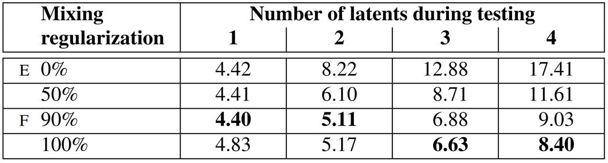

4. **Style Mixing 能说明什么**

Style Mixing 不是单纯的可视化技巧，它同时验证了两个结构假设：低、中、高 resolution 的 style 确实偏向控制不同尺度；在 Mixing Regularization 约束下，不同尺度的 style 可以来自不同 latent code，而不会让图像立即失去一致性。

这种按层交换 style 的能力把 latent editing 从“整条向量一起移动”推进到“按生成尺度组合属性”，并为后续的 latent inversion、属性编辑与风格迁移提供了清晰接口。

它仍然属于无监督发现：网络没有收到 pose、identity 或 hair color 标签，因此不能保证每个属性始终落在固定 resolution，也不能保证任意两张图的 style 都可以无冲突地组合。

* **随机细节与 Noise Injection**

1. **Noise 如何进入每一层**

StyleGAN 为每个 synthesis layer 准备一张独立的单通道 Gaussian noise map。Noise map 与当前 feature map 具有相同的空间 resolution，先通过可学习的逐通道缩放系数 $$B$$ 广播到所有通道，再加到对应 convolution 的输出。原始架构中的顺序是 convolution、noise addition、bias、Leaky ReLU，随后执行 instance normalization 与 style modulation。

每个通道都可以独立决定是否使用 noise 以及使用多大强度。Noise scaling factor 初始化为 **`0`**，只有当这种随机输入能帮助对抗训练时，它的幅度才会被学大。Noise 提供的是“在哪里发生随机变化”，learned scaling 决定的是“当前通道需要多少随机变化”。

> **Style 与 Noise 的职责不同**
>
> * **Style**：对整个 feature map 使用相同缩放和平移，适合控制 pose、identity、lighting 与整体配色等空间一致属性。
>
> * **Noise**：每个像素独立采样，适合控制发丝、胡茬、雀斑、毛孔、轮廓边缘和背景纹理等局部随机实现。
>
> * **Convolution**：把两条输入路径与已有 feature 结合，学习哪些随机变化符合当前对象与局部结构。

2. **固定 Style，只改变 Noise**

保持所有层的 $$w$$ 不变，只重新采样 noise，生成图像的 identity、pose 和整体构图基本保持一致，但具体发丝位置、皮肤细节、背景纹理与眼睛反光会变化。像素标准差图进一步显示，高方差区域集中在头发、轮廓和部分背景，而面部几何与姿态几乎不受影响。

显式 noise 让网络不必从早期 activation 中自行制造伪随机信号，可以把容量用于更稳定的结构建模，也减少传统 Generator 中容易出现的周期性重复纹理。

3. **不同 Resolution 的 Noise 控制什么**

Noise 的作用尺度同样由注入层的 resolution 决定。低 resolution noise 经过后续多次上采样，会传播为较大范围的随机结构；高 resolution noise 接近最终输出，只能改变较细的局部纹理。

> **四种 Noise 设置的可见差别**
>
> * **全部启用**：同时生成大尺度发卷、细发丝、皮肤纹理和背景细节。
>
> * **全部关闭**：图像会出现缺少随机纹理的平滑、绘画感外观。
>
> * **仅 Fine Noise**：使用 **`64×64 至 1024×1024`** 层，主要恢复细发卷、细背景纹理和毛孔。
>
> * **仅 Coarse Noise**：使用 **`4×4 至 32×32`** 层，主要形成较大尺度的头发弯曲和背景结构。

分层 noise 对照保留了全部四种设置，可以直接比较关闭 noise 与只在特定 resolution 注入 noise 的差别。

4. **为什么职责分离会自然出现**

Style 对整张 feature map 做空间一致的调制。如果网络用它改变姿态或光照，所有空间位置可以获得一致方向的变化。Noise 在每个像素独立，如果网络试图用独立噪声决定 pose，不同位置会给出互相冲突的结构决策，Discriminator 很容易把这种不一致判为假图。

与此同时，每一层都有一份新的 noise。既然当前 resolution 可以直接获得合适尺度的随机信号，网络就没有必要在早期层提前编码所有随机细节。全局 style 与局部 noise 的分工不是额外监督得到的，而是由空间不变调制、逐像素随机输入和对抗判别共同塑造出来的。

5. **Noise 路径的边界**

Noise 不是显式语义控制接口。重新采样 noise 不能可靠地指定“增加雀斑”或“改变某一束头发”，只能在模型已经学到的随机细节分布中重新取样。某个通道如果不需要随机性，对应 scaling factor 也可以保持接近零。

Style 与 noise 的分离同样不是绝对的。某些跨尺度纹理可能同时依赖 style 和 noise；不同数据集上，网络会把随机性分配给不同对象。例如卧室中的布料、汽车的背景与车灯、猫的毛发和爪子位置都可能由 noise 影响，而车轮旋转并没有表现出同样的随机控制。

* **潜空间解耦与采样控制**

1. **Z 为什么容易发生纠缠**

输入 latent space $$Z$$ 通常服从固定的 Gaussian 或 hypersphere 分布，而真实数据中的属性组合并不均匀。例如训练集中可能几乎没有某一种“性别与发长”组合。Generator 若要避免在高概率区域生成这种缺失组合，就必须把从 $$Z$$ 到图像属性的映射弯曲起来，结果是一个方向很难始终只对应一个属性。

中间 latent space $$W$$ 不需要服从预先规定的采样密度，它的分布由 $$w=f(z)$$ 诱导。Mapping Network 可以把 $$Z$$ 中为了匹配数据密度而产生的弯曲部分展开，使 Synthesis Network 接收到更线性、更易分离的表示。

这并不是把 $$W$$ 变成均匀空间，而是允许 $$f$$ 同时学习密度变换和坐标重排，从而降低 Synthesis Network 组织属性的难度。

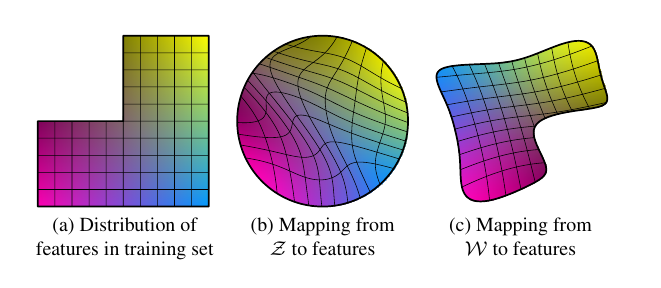

潜空间示意图展示了固定先验如何被迫弯曲，以及 Mapping Network 如何在 $$W$$ 中恢复更规则的属性坐标。

2. **Perceptual Path Length**

如果 latent space 足够平滑，在 latent code 上走一个很小的步长，生成图像也应只发生小而连续的感知变化。若插值中途突然出现端点都没有的属性，说明生成流形在该区域高度弯曲。Perceptual Path Length 使用 VGG16 feature 上校准过的人类感知距离 $$d(\cdot,\cdot)$$，度量这种局部变化速度。

在归一化的 $$Z$$ 中使用 spherical interpolation：

$$l_Z=\mathbb{E}\left[\frac{1}{\epsilon^2}d\left(G(\operatorname{slerp}(z_1,z_2;t)),G(\operatorname{slerp}(z_1,z_2;t+\epsilon))\right)\right]$$

在没有单位范数约束的 $$W$$ 中使用 linear interpolation：

$$l_W=\mathbb{E}\left[\frac{1}{\epsilon^2}d\left(g(\operatorname{lerp}(f(z_1),f(z_2);t)),g(\operatorname{lerp}(f(z_1),f(z_2);t+\epsilon))\right)\right]$$

计算时取 **`ε=10⁻⁴`**，用 **`100,000`** 个样本估计期望，并先裁出人脸区域，避免背景主导感知距离。Full-path 在整条插值路径上采样 $$t$$；endpoint 版本只在两端附近采样，更少受到 $$W$$ 中非输入流形区域的影响。指标越低，局部映射越平滑。

3. **PPL 的消融结果**

传统 Generator 在 $$Z$$ 中的 full-path 与 endpoint PPL 分别为 **`412.0`** 和 **`415.3`**。加入 style 架构但尚未加入 noise 时，$$W$$ 的 endpoint PPL 已降到 **`376.6`**；继续加入 noise 后，full-path 与 endpoint 分别降到 **`200.5`** 和 **`160.6`**。

显式 noise 把随机细节从 $$W$$ 中分离出去后，style 不再需要为每根发丝和每个毛孔编码精确位置，潜空间路径因此明显变短。

使用 **`90%`** Mixing Regularization 后，full-path 与 endpoint PPL 回升到 **`234.0`** 和 **`195.9`**。这说明 mixing 提升了跨层替换的鲁棒性，但也会让需要跨多个 resolution 的因素更难在 $$W$$ 中紧凑编码。路径长度与线性可分性消融表完整保留了 traditional、style、noise 和 mixing 配置之间的变化。

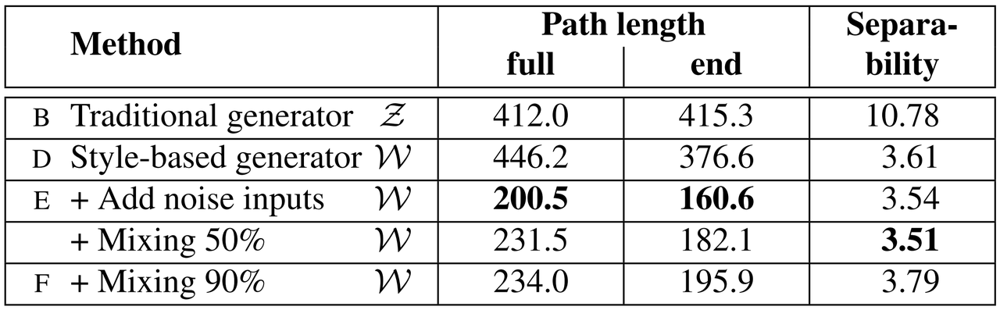

4. **Linear Separability**

Linear Separability 检查一个二元属性能否由 latent space 中的单个线性超平面分开。先使用 CelebA 的 **`40`** 个二元属性训练辅助 classifier；对每个 Generator 生成 **`200,000`** 张图，按 classifier 置信度排序并丢弃较不确定的一半，得到 **`100,000`** 个带标签的 latent code。

随后为每个属性训练 linear SVM。令 $$X_i$$ 表示 SVM 根据 latent code 预测的类别，$$Y_i$$ 表示图像 classifier 给出的类别，最终分数为：

$$\exp\left(\sum_i H(Y_i\mid X_i)\right)$$

条件熵越低，知道样本位于超平面的哪一侧后，确定真实属性所需的额外信息越少；最终 separability score 越低，说明属性方向越接近线性。传统 $$Z$$ 的分数为 **`10.78`**，最终 StyleGAN 的 $$W$$ 为 **`3.79`**。

该指标依赖预训练属性 classifier，并且只检查二元属性是否可由线性边界分开；低分不等于所有语义因素都相互独立，也不能覆盖 classifier 未定义的属性。

5. **Mapping Network 深度为什么重要**

Mapping Network 的深度从 **`0`** 增加到 **`1、2、8`** 层时，FID、PPL 与 separability 总体持续改善。最终 **`8`** 层 style-based 配置达到 FID **`4.40`**、endpoint PPL **`195.9`** 和 separability **`3.79`**。

把同样的 **`8`** 层 Mapping Network 放到传统 Generator 前面，若在 $$W$$ 中测量，FID 为 **`4.87`**、separability 为 **`6.52`**；若仍在 $$Z$$ 中测量，separability 会恶化到 **`170.29`**。这恰好说明 $$f$$ 可以任意扭曲 $$Z$$，而更适合生成的坐标系存在于映射后的 $$W$$。

Mapping Network 深度消融表同时列出了传统与 style-based 架构在 $$Z$$、$$W$$ 中测量的差别。

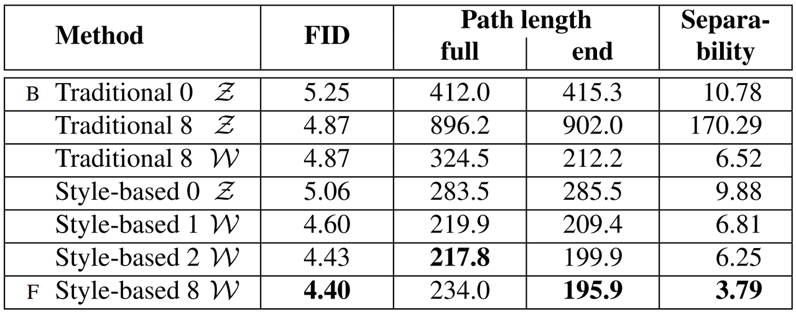

6. **Truncation Trick in W**

数据分布的低密度区域训练样本少，Generator 在这些区域更容易产生异常图像。先用大量随机 $$z$$ 估计 $$W$$ 的中心：

$$\bar{w}=\mathbb{E}_{z\sim P(z)}[f(z)]$$

采样时把 $$w$$ 向中心收缩：

$$w'=\bar{w}+\psi(w-\bar{w})$$

当 $$0\leq\psi<1$$ 时，样本离平均区域更近，平均质量通常提高，但 variation 会减少。展示高质量 FFHQ 样本时使用 **`ψ=0.7`**，并且只对 **`4×4 至 32×32`** 的低 resolution style 应用 truncation，从而尽量保留高 resolution 随机细节。

StyleGAN 可以按层选择 truncation 的作用范围，因此质量与多样性的折中不必同时压缩所有尺度。所有正式 FID 都在关闭 truncation 时计算，truncation 只用于样本展示。

当 $$\psi=0$$ 时，不同 latent code 都收缩到接近平均人脸；负值会沿相反方向外推，产生“anti-face”效果。Truncation 改变的是采样分布，而不是修复 Generator。它用 diversity 换取平均视觉质量，也不能保证低密度方向上仍有可靠语义。

* **训练配置、实验结果与能力边界**

1. **训练数据与任务设置**

核心实验使用 FFHQ、CelebA-HQ 与 LSUN。FFHQ 包含 **`70,000`** 张 **`1024×1024`** 人脸图像，覆盖更广的年龄、族裔、视角、光照、背景与配饰。图像来自 Flickr，经自动对齐、裁剪、质量过滤与人工清理后形成训练集。

FFHQ 仍会继承 Flickr 的人群、拍摄与上传偏差；高分辨率和较广表观变化不等于真实世界人口分布无偏。训练数据中的结构与频率会直接决定 Generator 能生成什么，也会影响 $$W$$ 中哪些方向更容易线性化。

FFHQ 的多样性样本横跨年龄、族裔、装饰、妆容与摄影条件，说明数据集本身为解耦研究提供了比 CelebA-HQ 更复杂的属性组合。

2. **基础架构与训练目标**

训练系统继承 Progressive GAN 的 Discriminator、resolution-dependent minibatch、Adam 超参数和 Generator exponential moving average。Progressive growing 从 **`8×8`** 开始，而不是原始配置的 **`4×4`**；上采样与下采样改为 bilinear sampling，并使用可分离的二阶 binomial low-pass filter 抑制重采样伪影。

FFHQ 在改进配置中使用 non-saturating GAN loss 与 R1 regularization，R1 系数 **`γ=10`**；CelebA-HQ 使用 WGAN-GP。CelebA-HQ 与 FFHQ 启用 mirror augmentation，LSUN 不启用。训练长度从 **`12M`** 个 Discriminator 已见样本增加到 **`25M`**。

StyleGAN 的贡献集中在 Generator 接口，loss 的选择属于各数据集上的训练配置；不能把 non-saturating loss 或 R1 当成 style-based architecture 本身。

3. **关键初始化与优化细节**

> **最终配置的实现要点**
>
> * 所有层使用 Leaky ReLU，负半轴系数为 **`0.2`**，并使用 equalized learning rate。
>
> * Mapping Network 学习率是主网络学习率的 **`0.01`** 倍，避免深 MLP 在较高学习率下不稳定。
>
> * Convolution、fully-connected 与 affine transform 权重从标准 Gaussian 初始化；learned constant 初始化为 **`1`**。
>
> * 普通 bias 与 noise scaling factor 初始化为 **`0`**，style scale 对应的 bias 初始化为 **`1`**。
>
> * Generator 与 Discriminator 都不使用 batch normalization、spectral normalization、attention 或 dropout；StyleGAN Generator 也移除了传统的 pixelwise feature normalization。

完整的 **`1024×1024`** FFHQ 配置使用 **`8`** 张 Tesla V100，在 DGX-1 上训练约一周。这个计算量对应当时的完整实验配置，不代表减少 GPU 后只会按比例延长时间；minibatch 与训练动态也会变化。

4. **逐步消融：质量提升来自哪里**

从 Baseline Progressive GAN 开始，CelebA-HQ 与 FFHQ 的 FID 分别为 **`7.79`** 和 **`8.04`**。加入 bilinear up/downsampling、延长训练并调整超参数后，FFHQ FID 降到 **`5.25`**；再加入 Mapping Network 与逐层 style 后降到 **`4.85`**。

移除 traditional input 后，FFHQ FID 为 **`4.88`**，说明 learned constant 不会破坏生成能力；加入 noise 后进一步降到 **`4.42`**；最终 **`90%`** Mixing Regularization 得到 **`4.40`**。从改进 baseline 的 **`5.25`** 到最终配置，相对下降约 **`16%`**。

消融结果同时说明，质量提升不是简单来自参数量增加：Mapping Network、style、noise 与 mixing 分别改变了属性组织、随机细节和跨层鲁棒性。

消融实验统一使用 **`50,000`** 张生成图与从训练集随机抽取的 **`50,000`** 张真实图计算 FID，并报告训练过程中出现的最低值。正式 FID 全部关闭 truncation，避免把采样收缩带来的质量提升混入架构比较。

FID 消融表按 A 到 F 的顺序保留了每一步的 CelebA-HQ 与 FFHQ 结果，便于区分训练调优与架构组件的贡献。

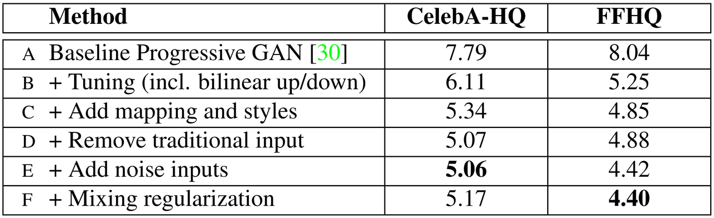

5. **跨数据集表现**

同一架构也在 LSUN Bedroom、Car 和 Cat 上训练。Bedroom 使用 **`256×256`** resolution，FID 为 **`2.65`**；Car 使用 **`512×384`**，FID 为 **`3.27`**；Cat 使用 **`256×256`**，FID 为 **`8.53`**。

不同数据集上的层级语义会随对象改变：Bedroom 的 coarse style 偏向相机视角，middle style 偏向家具，fine style 偏向颜色和材质；Car 的分层大致类似；Cat 的 noise 会影响毛发、背景，甚至爪子位置。StyleGAN 提供的是尺度接口，不是只适用于人脸的固定属性模板。

6. **能力边界与第一代架构缺陷**

> **使用 StyleGAN 时必须保留的边界**
>
> * 它是 unconditional Generator，没有文本、类别或结构条件；style direction 也不是人工命名的可控参数。
>
> * 控制范围受训练分布限制。对真实图像进行编辑需要先做 GAN inversion，而且 inversion 误差会限制重建与编辑质量。
>
> * $$W$$ 更线性、更可分不等于完全解耦；跨尺度属性、数据偏差与未观测组合仍会造成纠缠。
>
> * Truncation 用多样性换平均质量，Mixing Regularization 用部分潜空间平滑性换跨层组合鲁棒性。
>
> * 训练成本高，完整高分辨率配置依赖大规模数据、长训练和多 GPU；FID 也不能覆盖所有感知伪影。

第一代 AdaIN 会分别归一化每个 feature map 的均值和方差，可能破坏通道相对幅度信息。Generator 会通过局部强峰值绕过这种约束，形成从约 **`64×64`** resolution 开始、随 resolution 增强的水滴状 blob artifact。后续版本用 weight modulation 与 demodulation 取代这种 data-dependent normalization。

Progressive growing 还会产生明显的位置偏好：牙齿、眼睛等细节在姿态变化时可能黏在固定像素位置，随后突然跳到新的位置。这类 phase artifact 与中间层被迫在不同训练阶段临时承担最高输出频率有关。后续架构改为固定拓扑并使用多尺度 skip/residual 路径，避免训练过程中不断改变网络结构。

因此，StyleGAN 第一代的重要价值是建立了 Mapping Network、逐层 style、noise 和 scale-specific control 这一套生成接口，而不是给出一个没有伪影、完全解耦或可直接条件控制的最终 Generator。

**总结**

StyleGAN 把高分辨率生成从“把 latent code 塞进首层”改造成一条可解释的分层合成链：$$Z$$ 负责采样，Mapping Network 产生更适合生成的 $$W$$，affine transform 与 AdaIN 负责逐层 style，noise 负责局部随机性，progressive synthesis 负责从整体结构走向细节。

这套设计同时提升了图像质量、插值平滑性和属性可组合性，并把后续 GAN inversion、latent editing 和条件控制需要操作的接口明确下来。理解 StyleGAN 时，最关键的是把 Mapping Network、style、noise 与 resolution 四者放在同一条生成链中，而不是把 AdaIN 当成一个孤立的归一化技巧。

---

[Previous](01-GAN--AE--Flow--基础知识.md) | [Contents](../../README.md) | [Next](03-GAN--AE--Flow--Autoencoder-系列.md) | [Visual website](https://weyumm.github.io/vlm-Wissen/lecture-2.html#c=2)
