[Previous](02-GAN--AE--Flow--GAN-系列.md) | [Contents](../../README.md) | [Next](04-GAN--AE--Flow--Flow-based-model.md) | [Visual website](https://weyumm.github.io/vlm-Wissen/lecture-2.html#c=3)

## 3.3 Autoencoder 系列

### 3.3.1 Autoencoder 家族

* **AE**

自编码器 **AE**（**A**uto**e**ncoder）首先是一种神经网络，以无监督的方式学习一种恒等函数，以重构原始输入，同时在过程中压缩数据，从而发现一种更高效且更紧凑的数据表示形式。

自编码器由两个网络组成：

> 👍 * **Encoder**：将原始的高维输入转换为低维的隐编码 latent code，输入维度大于输出维度。
>
> * **Decoder**：从该编码中恢复数据，通过逐层增大的输出层来实现。

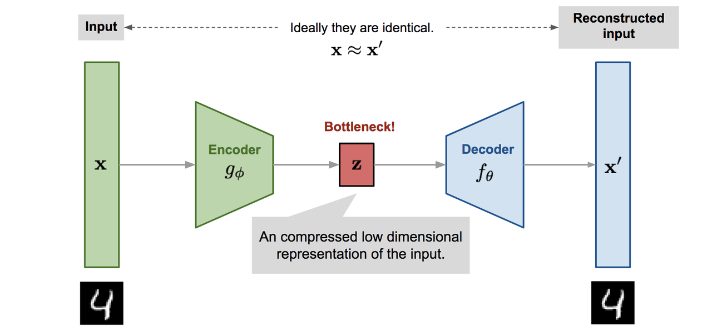

编码器实质上实现了降维，类似于主成分分析 **PCA**（**P**rincipal **C**omponent **A**nalysis）或矩阵分解 **MF**（**M**atrix **F**actorization）。此外，自编码器被显式地优化用于从编码中重建数据。一个良好的中间表示不仅能够捕捉潜在变量，还能有利于完整的解压缩过程。

自编码器包含一个由参数$$\phi$$控制的编码器函数$$g(\cdot)$$和一个由参数$$\theta$$控制的解码器函数$$f(\cdot)$$。在 bottleneck 层中学习到的低维编码为$$\mathbf{z} = g_\phi(\mathbf{x})$$，重构后的输入为$$\mathbf{x}' = f_\theta(g_\phi(\mathbf{x}))$$。

参数$$(\theta, \phi)$$联合学习，以输出与原始输入$$\mathbf{x}$$相同的重构数据样本，即$$\mathbf{x} \approx f_\theta(g_\phi(\mathbf{x}))$$，换句话说，就是学习一个恒等函数。存在多种度量方法来量化两个向量之间的差异，例如当激活函数为 sigmoid 时使用交叉熵，或者简单地使用均方误差 MSE 损失：

$$L_\text{AE}(\theta, \phi) = \frac{1}{n} \sum_{i=1}^{n} \left( \mathbf{x}^{(i)} - f_\theta(g_\phi(\mathbf{x}^{(i)})) \right)^2$$

* **DAE**

由于自编码器学习的是恒等函数，当网络参数数量超过数据点数量时，会有过拟合的风险。

为了避免过拟合并提高模型的鲁棒性，去噪自编码器 **DAE**（**D**enoising **A**uto**e**ncoder）对基础自编码器提出了一种改进。通过在输入向量中随机添加噪声或遮蔽部分值被部分破坏，即$$\tilde{\mathbf{x}}^{(i)} \sim \mathcal{M}_D(\tilde{\mathbf{x}}^{(i)} | \mathbf{x}^{(i)})$$。然后模型被训练用来恢复原始输入：

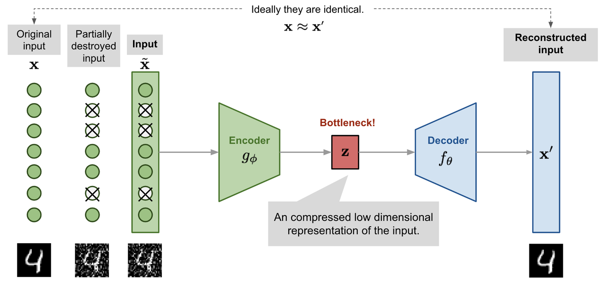

$$\tilde{\mathbf{x}}^{(i)} \sim \mathcal{M}_D(\tilde{\mathbf{x}}^{(i)} | \mathbf{x}^{(i)})$$

$$L_\text{DAE}(\theta, \phi) = \frac{1}{n} \sum_{i=1}^{n} \left( \mathbf{x}^{(i)} - f_\theta(g_\phi(\tilde{\mathbf{x}}^{(i)})) \right)^2$$

其中，$$\mathcal{M}_D$$定义了从真实数据样本到含噪声或被破坏样本的映射。

这种设计的动机来源于这样一个事实：人类即使在视图部分被遮挡或损坏的情况下，也能轻易识别出一个物体或场景。为了修复部分被破坏的输入，去噪自编码器必须发现并捕捉输入各维度之间的关系，从而推断缺失的部分。

对于具有高度冗余性的高维输入，例如图像，模型倾向于依赖来自多个输入维度组合的信息来恢复去噪后的版本，而不是过度依赖单一维度。这为学习鲁棒的潜在表示 latent representation 奠定了良好基础。

噪声由一个随机映射$$\mathcal{M}_D(\tilde{\mathbf{x}} | \mathbf{x})$$控制，且不局限于特定类型的破坏过程，如遮蔽噪声、高斯噪声、椒盐噪声等。也就是说，破坏过程可以结合先验知识进行设计。

在原始 DAE 论文的实验中，噪声的引入方式如下：随机选择固定比例的输入维度，并将其值强制设为 0。这其实有点像 dropout

* **SAE**

稀疏自编码器 **SAE**（**S**parse **A**uto**e**ncoder） 通过对隐藏单元的激活施加稀疏约束，以避免过拟合并提高模型的鲁棒性。它迫使模型在任意时刻仅有少量隐藏单元被激活，即每个隐藏神经元大部分时间应处于非激活状态。

常见的激活函数包括 sigmoid、tanh、ReLU、Leaky ReLU 等，当神经元的输出值接近 1 时，表示被激活；当值接近 0 时，表示其处于非激活状态。

假设第$$l$$层隐藏层中有$$s_l$$个神经元，该层中第$$j$$个神经元的激活函数记为$$a_j^{(l)}(\cdot)$$，其中$$j = 1, \dots, s_l$$。此时期望该神经元的平均激活率 $$\hat{\rho}_j^{(l)}$$ 是一个较小的数值$$\rho$$，这个参数被称为稀疏性参数 sparsity parameter，通常设置为 $$\rho = 0.05$$：

$$\hat{\rho}_j^{(l)} = \frac{1}{n} \sum_{i=1}^{n} [a_j^{(l)}(\mathbf{x}^{(i)})] \approx \rho$$

这一约束通过在损失函数中加入一个惩罚项来实现。KL 散度$$D_{\text{KL}}$$用于衡量两个伯努利分布之间的差异：一个分布的均值为$$\rho$$，另一个为$$\hat{\rho}_j^{(l)}$$。超参数$$\beta$$控制对稀疏性损失施加的惩罚强度。

最终的稀疏自编码器损失函数为：

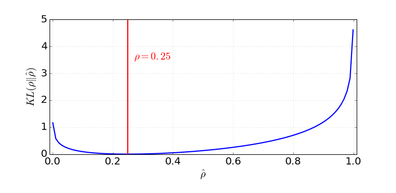

$$L_{\text{SAE}}(\theta) = L(\theta) + \beta \sum_{l=1}^{L} \sum_{j=1}^{s_l} D_{\text{KL}}(\rho \| \hat{\rho}_j^{(l)})= L(\theta) + \beta \sum_{l=1}^{L} \sum_{j=1}^{s_l} \rho \log \frac{\rho}{\hat{\rho}_j^{(l)}} + (1 - \rho) \log \frac{1 - \rho}{1 - \hat{\rho}_j^{(l)}}$$

* **k-Sparse Autoencoder**

在 k-稀疏自编码器中，稀疏性是通过仅保留瓶颈层中激活值最高的前$$k$$个值来强制实现的，且该层使用线性激活函数。具体步骤如下：

> 👍 1. 通过编码器进行前向传播，得到压缩后的编码$$\mathbf{z} = g(\mathbf{x})$$。然后对编码向量$$\mathbf{z}$$中的值进行排序，仅保留最大的$$k$$个值，其余神经元的值设为 0。这可以在 ReLU 层中通过调节阈值实现。此时得到一个稀疏化的编码：$$\mathbf{z}' = \text{Sparsify}(\mathbf{z})$$。
>
> 2. 基于稀疏化后的编码计算输出和损失：$$L = \|\mathbf{x} - f(\mathbf{z}')\|_2^2$$。反向传播过程仅通过激活值最高的前$$k$$个隐藏单元进行。

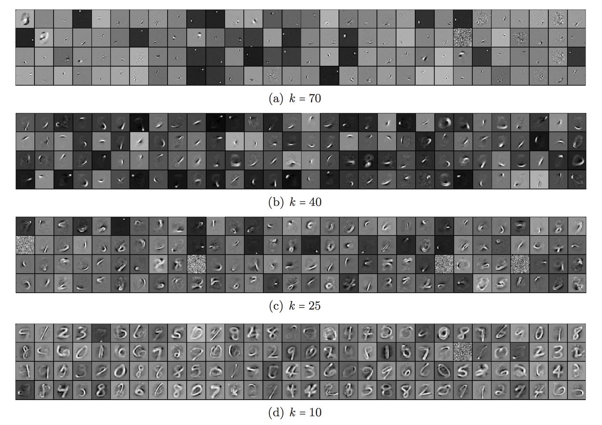

* **CAE**

类似于稀疏自编码器，收缩自编码器 **CAE**（**C**ontractive **A**uto**e**ncoder）通过鼓励学习到的表示保持在收缩空间中，从而提升模型的鲁棒性。

它在损失函数中加入一个惩罚项，以惩罚表示对输入过于敏感的情况，从而增强模型对训练数据点附近微小扰动的鲁棒性。这种敏感性由编码器激活值相对于输入的雅可比矩阵的 Frobenius 范数来衡量：

$$\|J_f(\mathbf{x})\|_F^2 = \sum_{ij} \left( \frac{\partial h_j(\mathbf{x})}{\partial x_i} \right)^2$$

其中，$$h_j$$是压缩编码$$\mathbf{z} = f(\mathbf{x})$$中的一个输出单元。

这个惩罚项是学习到的编码对输入各维度偏导数的平方和。作者说这一惩罚项能够促使模型学习到一种对应于低维非线性流形的表示，同时在垂直于该流形的大多数方向上保持更高的不变性。

### 3.3.2 VAE

变分自编码器 **VAE**（**V**ariational **A**uto**e**ncoder）的思想实际上与上述所有自编码器模型的相似度较低，是基于变分贝叶斯方法和图模型。

现在不再将输入映射为一个固定的向量，而是希望将其映射为一个分布。把这个分布标记为$$p_{\theta}(\mathbf{z})$$，其参数由$$\theta$$决定。数据输入$$\mathbf{x}$$与潜在编码向量$$\mathbf{z}$$之间的关系可以完全由以下三个部分定义：

> * **先验分布 $$p_{\theta}(\mathbf{z})$$**
>
> * **似然函数 $$p_{\theta}(\mathbf{x}|\mathbf{z})$$**
>
> * **后验分布 $$p_{\theta}(\mathbf{z}|\mathbf{x})$$**

假设知道该分布的真实参数$$\theta^*$$。为了生成一个看起来像真实数据点$$\mathbf{x}^{(i)}$$的样本，需要遵循以下步骤：

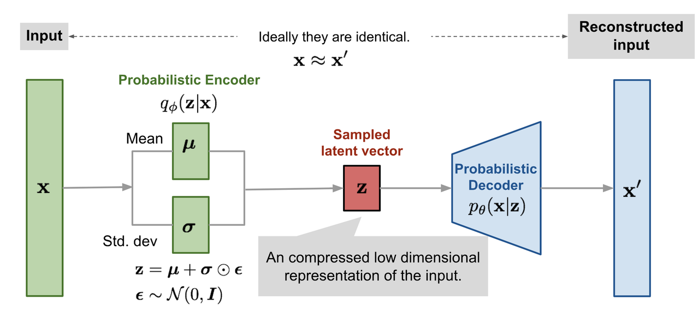

> 1. 从先验分布$$p_{\theta^*}(\mathbf{z})$$中采样一个$$\mathbf{z}^{(i)}$$
>
> 2. 从条件分布$$p_{\theta^*}(\mathbf{x}|\mathbf{z} = \mathbf{z}^{(i)})$$中生成一个值$$\mathbf{x}^{(i)}$$

最优参数 $$\theta^*$$ 是使生成真实数据样本的概率最大化的那个参数：

$$\theta^* = \arg\max_{\theta} \prod_{i=1}^{n} p_{\theta}(\mathbf{x}^{(i)})$$

这里通常使用对数概率将右侧的乘积转换为求和：

$$\theta^* = \arg\max_{\theta} \sum_{i=1}^{n} \log p_{\theta}(\mathbf{x}^{(i)})$$

现在更新方程，展示数据生成过程，并引入编码向量：

$$p_{\theta}(\mathbf{x}^{(i)}) = \int p_{\theta}(\mathbf{x}^{(i)}|\mathbf{z}) p_{\theta}(\mathbf{z}) d\mathbf{z}$$

但用这种方式计算$$p_{\theta}(\mathbf{x}^{(i)})$$并不容易，因为检查所有可能的$$\mathbf{z}$$值并求和非常耗时。为了缩小值空间以加快搜索速度，希望引入一个新的近似函数，该函数以输入$$\mathbf{x}$$为输入，输出一个可能的编码，记作$$q_{\phi}(\mathbf{z}|\mathbf{x})$$，其参数为$$\phi$$。

现在，这个结构看起来非常类似于自编码器：

> * 条件概率$$p_{\theta}(\mathbf{x}|\mathbf{z})$$定义了一个生成模型，类似于前面解码器$$f_{\theta}(\mathbf{z})$$。$$p_{\theta}(\mathbf{x}|\mathbf{z})$$ 也被称为概率性解码器 probabilistic decoder
>
> * 近似函数$$q_{\phi}(\mathbf{z}|\mathbf{x})$$是概率性编码器 probabilistic encoder，作用类似于之前提到的$$g_{\phi}(\mathbf{z}|\mathbf{x})$$

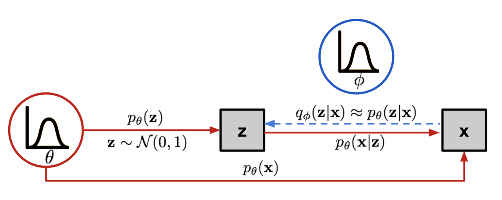

* **损失函数：ELBO**

估计的后验分布$$q_{\phi}(\mathbf{z}|\mathbf{x})$$应当尽可能接近真实的后验分布$$p_{\theta}(\mathbf{z}|\mathbf{x})$$。可以用 KL 散度来量化这两个分布之间的距离。KL 散度$$D_{\mathrm{KL}}(X \| Y)$$衡量了当用分布$$Y$$来表示$$X$$时信息丢失的程度。

在这种情况下，希望关于$$\phi$$最小化$$D_{\mathrm{KL}}(q_{\phi}(\mathbf{z}|\mathbf{x}) \| p_{\theta}(\mathbf{z}|\mathbf{x}))$$。

> **注**：为什么使用反向 KL：$$D_{\mathrm{KL}}(q_{\phi} \| p_{\theta})$$而不是正向 KL：$$D_{\mathrm{KL}}(p_{\theta} \| q_{\phi})$$？Eric Jang 进行了解释：
>
> **正向 KL 散度**：$$D_{\mathrm{KL}}(P \| Q) = \mathbb{E}_{z \sim P(z)} \log \frac{P(z)}{Q(z)}$$，必须确保$$Q(z) > 0$$只要在$$P(z) > 0$$处成立。优化后的变分分布$$q(z)$$必须覆盖整个$$p(z)$$的支持域
>
> 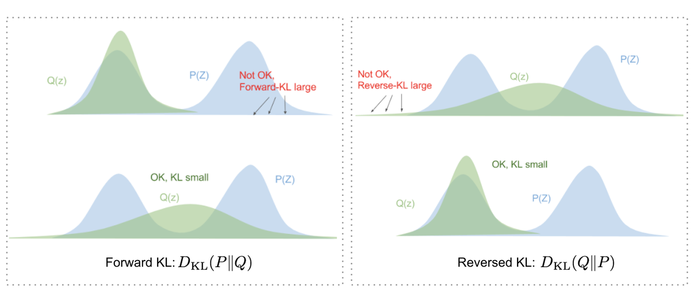
>
> **反向 KL 散度**：$$D_{\mathrm{KL}}(Q \| P) = \mathbb{E}_{z \sim Q(z)} \log \frac{Q(z)}{P(z)}$$，最小化反向 KL 散度会将$$Q(z)$$压缩在$$P(z)$$的下方

现在展开方程：

$$\begin{aligned}
&D_{\mathrm{KL}}(q_{\phi}(\mathbf{z}|\mathbf{x}) \| p_{\theta}(\mathbf{z}|\mathbf{x})) \\
&= \int q_{\phi}(\mathbf{z}|\mathbf{x}) \log \frac{q_{\phi}(\mathbf{z}|\mathbf{x})}{p_{\theta}(\mathbf{z}|\mathbf{x})} d\mathbf{z} \\
&= \int q_{\phi}(\mathbf{z}|\mathbf{x}) \log \frac{q_{\phi}(\mathbf{z}|\mathbf{x}) p_{\theta}(\mathbf{x})}{p_{\theta}(\mathbf{z}, \mathbf{x})} d\mathbf{z} \quad ; \text{因为 } p(z|x) = p(z,x)/p(x) \\
&= \int q_{\phi}(\mathbf{z}|\mathbf{x}) \left( \log p_{\theta}(\mathbf{x}) + \log \frac{q_{\phi}(\mathbf{z}|\mathbf{x})}{p_{\theta}(\mathbf{z}, \mathbf{x})} \right) d\mathbf{z} \\
&= \log p_{\theta}(\mathbf{x}) + \int q_{\phi}(\mathbf{z}|\mathbf{x}) \log \frac{q_{\phi}(\mathbf{z}|\mathbf{x})}{p_{\theta}(\mathbf{z}, \mathbf{x})} d\mathbf{z} \quad ; \text{因为 } \int q(z|x) dz = 1 \\
&= \log p_{\theta}(\mathbf{x}) + \int q_{\phi}(\mathbf{z}|\mathbf{x}) \log \frac{q_{\phi}(\mathbf{z}|\mathbf{x})}{p_{\theta}(\mathbf{x}|\mathbf{z}) p_{\theta}(\mathbf{z})} d\mathbf{z} \quad ; \text{因为 } p(z,x) = p(x|z)p(z) \\
&= \log p_{\theta}(\mathbf{x}) + \mathbb{E}_{\mathbf{z} \sim q_{\phi}(\mathbf{z}|\mathbf{x})} \left[ \log \frac{q_{\phi}(\mathbf{z}|\mathbf{x})}{p_{\theta}(\mathbf{z})} - \log p_{\theta}(\mathbf{x}|\mathbf{z}) \right] \\
&= \log p_{\theta}(\mathbf{x}) + D_{\mathrm{KL}}(q_{\phi}(\mathbf{z}|\mathbf{x}) \| p_{\theta}(\mathbf{z})) - \mathbb{E}_{\mathbf{z} \sim q_{\phi}(\mathbf{z}|\mathbf{x})} \log p_{\theta}(\mathbf{x}|\mathbf{z})
\end{aligned}$$

因此有：

$$D_{\mathrm{KL}}(q_{\phi}(\mathbf{z}|\mathbf{x}) \| p_{\theta}(\mathbf{z}|\mathbf{x})) = \log p_{\theta}(\mathbf{x}) + D_{\mathrm{KL}}(q_{\phi}(\mathbf{z}|\mathbf{x}) \| p_{\theta}(\mathbf{z})) - \mathbb{E}_{\mathbf{z} \sim q_{\phi}(\mathbf{z}|\mathbf{x})} \log p_{\theta}(\mathbf{x}|\mathbf{z})$$

将等式两边重新排列：

$$\log p_{\theta}(\mathbf{x}) - D_{\mathrm{KL}}(q_{\phi}(\mathbf{z}|\mathbf{x}) \| p_{\theta}(\mathbf{z}|\mathbf{x})) = \mathbb{E}_{\mathbf{z} \sim q_{\phi}(\mathbf{z}|\mathbf{x})} \log p_{\theta}(\mathbf{x}|\mathbf{z}) - D_{\mathrm{KL}}(q_{\phi}(\mathbf{z}|\mathbf{x}) \| p_{\theta}(\mathbf{z}))$$

等式左边正是在学习真实分布时想要最大化的量：预期是最大化生成真实数据的对数似然，即$$\log p_{\theta}(\mathbf{x})$$，同时最小化真实后验与估计后验之间的差异，其中$$D_{\mathrm{KL}}$$起到正则化的作用。$$p_{\theta}(\mathbf{x})$$相对于$$q_{\phi}$$是固定的。

上述表达式的负值定义了损失函数：

$$\begin{aligned}
L_{\mathrm{VAE}}(\theta, \phi) &= -\log p_{\theta}(\mathbf{x}) + D_{\mathrm{KL}}(q_{\phi}(\mathbf{z}|\mathbf{x}) \| p_{\theta}(\mathbf{z})) \\
&= -\mathbb{E}_{\mathbf{z} \sim q_{\phi}(\mathbf{z}|\mathbf{x})} \log p_{\theta}(\mathbf{x}|\mathbf{z}) + D_{\mathrm{KL}}(q_{\phi}(\mathbf{z}|\mathbf{x}) \| p_{\theta}(\mathbf{z}))
\end{aligned}$$

$$\theta^*, \phi^* = \arg\min_{\theta, \phi} L_{\mathrm{VAE}}$$

在变分贝叶斯方法中，这个损失函数被称为变分下界 variational lower bound 或证据下界 evidence lower bound。名称中的下界来源于 KL 散度始终非负，因此$$-L_{\mathrm{VAE}}$$是$$\log p_{\theta}(\mathbf{x})$$的一个下界：

$$-L_{\mathrm{VAE}} = \log p_{\theta}(\mathbf{x}) - D_{\mathrm{KL}}(q_{\phi}(\mathbf{z}|\mathbf{x}) \| p_{\theta}(\mathbf{z}|\mathbf{x})) \leq \log p_{\theta}(\mathbf{x})$$

因此通过最小化损失，实际上是在最大化生成真实数据样本的概率的下界。

* **重参数化技巧 Reparameterization**

损失函数中的期望项需要从$$\mathbf{z} \sim q_{\phi}(\mathbf{z}|\mathbf{x})$$中采样。采样是一个随机过程，因此无法直接反向传播梯度。为了使其可训练，引入了重参数化技巧：通常可以将随机变量$$\mathbf{z}$$表示为确定性变量$$\mathbf{z} = T_{\phi}(\mathbf{x}, \boldsymbol{\epsilon})$$，其中$$\boldsymbol{\epsilon}$$是一个辅助的独立随机变量，变换函数$$T_{\phi}$$由$$\phi$$参数化，将$$\boldsymbol{\epsilon}$$映射为$$\mathbf{z}$$。

> **例**：常见的 $$q_{\phi}(\mathbf{z}|\mathbf{x}^{(i)})$$ 形式是具有对角协方差结构的多元高斯分布：
>
> $$\begin{aligned}
> \mathbf{z} &\sim q_{\phi}(\mathbf{z}|\mathbf{x}^{(i)}) = \mathcal{N}(\mathbf{z}; \boldsymbol{\mu}^{(i)}, \boldsymbol{\sigma}^{2(i)} \mathbf{I}) \\
> \mathbf{z} &= \boldsymbol{\mu} + \boldsymbol{\sigma} \odot \boldsymbol{\epsilon}, \quad \text{where } \boldsymbol{\epsilon} \sim \mathcal{N}(0, \mathbf{I})
> \end{aligned}$$
>
> 其中 $$\odot$$ 表示逐元素乘积。
>
> 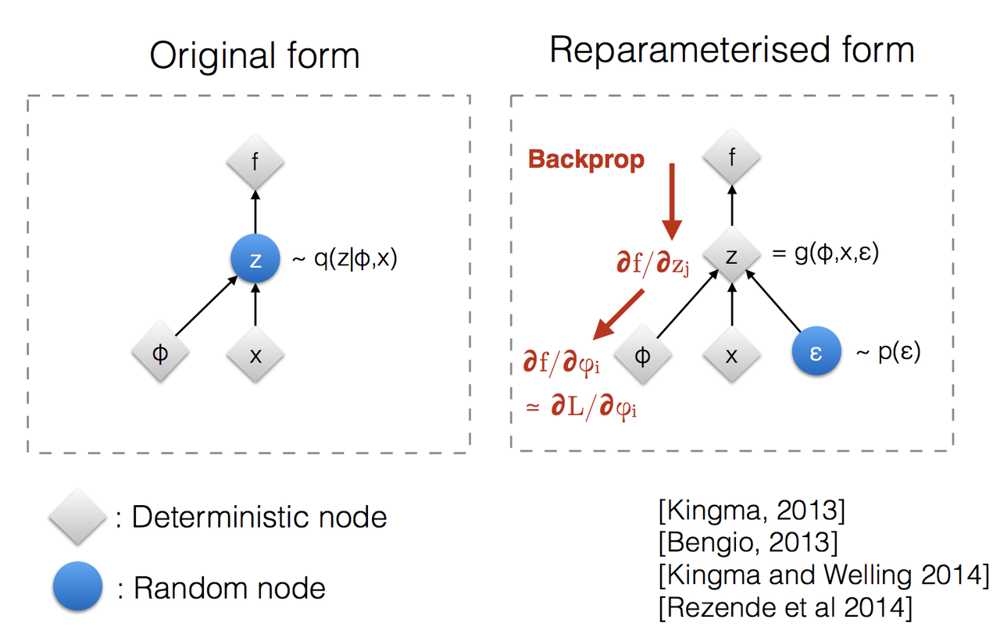

重参数化技巧不仅适用于高斯分布，也适用于其他类型的分布。在多元高斯情况下，通过学习分布的均值$$\boldsymbol{\mu}$$和标准差$$\boldsymbol{\sigma}$$来使模型可训练，而随机性保留在随机变量$$\boldsymbol{\epsilon} \sim \mathcal{N}(0, \mathbf{I})$$中。

### 3.3.3 CAVE

基础的 VAE 其实有一些局限：无法控制生成的属性。由于基础 VAE 的隐空间$$z$$是完全无监督学习的，其各个维度的物理意义无法预知，因此只能通过在标准高斯分布中进行随机采样来生成图像，而无法指定“生成一张写着数字 5 的图片” 。

为了解决这一痛点，Kihyuk Sohn、Honglak Lee 和 Xinchen Yan 于 2015 年在 NIPS 上提出了条件变分自编码器 **CVAE**（**C**onditional **VAE**）。CVAE 通过在编码器和解码器中同时引入**辅助条件**$$c$$，例如类别标签、文本 Embedding 或图像掩码，将无监督生成扩展为受控的条件生成。

* **概率图模型与条件化改造**

在基础 VAE 中建模的是联合概率分布$$p(x,z)$$ 。在 CVAE 中，引入观测到的条件变量$$c$$。因此核心优化目标从最大化边缘似然$$\log p(x)$$转变为了**最大化条件边缘似然**$$\log p_\theta(y|x)$$ 。

> **注**：为了与 Sohn 等人的 NIPS 2015 论文以及主流统计物理文献保持高度一致，这里使用$$x$$表示输入的条件/观测，使用$$y$$表示要生成的结构化目标数据，使用$$z$$表示隐变量。

给定输入条件$$x$$，目标数据$$y$$的生成通过对隐空间$$z$$进行积分得到：

$$p_\theta(y|x)=\int_z p_\theta(y|x,z)p_\theta(z|x)dz$$

> * **条件先验分布$$p_\theta(z|x)$$：** 隐空间$$z$$的先验分布此时不再是各向同性的标准高斯分布，而是依赖于输入条件$$x$$的条件高斯分布。
>
> * **条件似然分布$$p_\theta(y|x,z)$$：** 由神经网络参数化的概率解码器，它同时接收条件$$x$$和隐变量$$z$$，并解码输出目标$$y$$。

* **条件证据下界的数学推导**

真实的条件后验分布$$p_\theta(z|x,y)$$同样是不可积的 。因此，CVAE 引入了一个依赖于条件$$x$$和目标$$y$$的近似后验分布$$q_\phi(z|x,y)$$ 。

通过最小化两者之间的 KL 散度来逼近真实后验 ：

$$D_{\text{KL}}(q_\phi(z|x,y)\parallel p_\theta(z|x,y))=-\int_z q_\phi(z|x,y)\log\left(\frac{p_\theta(z|x,y)}{q_\phi(z|x,y)}\right)dz$$

根据条件概率关系：

> 1. **联合条件概率**：$$p_\theta(y,z|x)=p_\theta(z|x,y)p_\theta(y|x)$$
>
> 🥇 2. **变形得到真实条件后验**：$$p_\theta(z|x,y)=\frac{p_\theta(y,z|x)}{p_\theta(y|x)}$$

将第 2 步的等式代入 KL 散度公式中 ：

$$\begin{aligned}
D_{\text{KL}}(q_\phi(z|x,y)\parallel p_\theta(z|x,y))&=-\int_z q_\phi(z|x,y)\log\left(\frac{p_\theta(y,z|x)}{p_\theta(y|x)q_\phi(z|x,y)}\right)dz \\ &=-\int_z q_\phi(z|x,y)\left[\log\left(\frac{p_\theta(y,z|x)}{q_\phi(z|x,y)}\right)-\log p_\theta(y|x)\right]dz \\ &=-\int_z q_\phi(z|x,y)\log\left(\frac{p_\theta(y,z|x)}{q_\phi(z|x,y)}\right)dz+\log p_\theta(y|x)\int_z q_\phi(z|x,y)dz
\end{aligned}$$

由 $$\int_z q_\phi(z|x,y)dz=1$$ ，上式可简化为：

$$D_{\text{KL}}(q_\phi(z|x,y)\parallel p_\theta(z|x,y))=-\int_z q_\phi(z|x,y)\log\left(\frac{p_\theta(y,z|x)}{q_\phi(z|x,y)}\right)dz+\log p_\theta(y|x)$$

整理并移项，得到目标优化项$$\log p_\theta(y|x)$$的等式 ：

$$\log p_\theta(y|x)=\int_z q_\phi(z|x,y)\log\left(\frac{p_\theta(y,z|x)}{q_\phi(z|x,y)}\right)dz+D_{\text{KL}}(q_\phi(z|x,y)\parallel p_\theta(z|x,y))$$

由于$$D_{\text{KL}}\ge 0$$，定义等式右侧第一项为**条件证据下界 Conditional ELBO**：

$$\mathcal{L}_{\text{CVAE}}(\theta,\phi;y,x)=\int_z q_\phi(z|x,y)\log\left(\frac{p_\theta(y,z|x)}{q_\phi(z|x,y)}\right)dz$$

利用概率乘法公式$$p_\theta(y,z|x)=p_\theta(y|x,z)p_\theta(z|x)$$，将$$\mathcal{L}_{\text{CVAE}}$$进一步展开：

$$\begin{aligned}
\mathcal{L}_{\text{CVAE}}(\theta,\phi;y,x)&=\int_z q_\phi(z|x,y)\log\left(\frac{p_\theta(y|x,z)p_\theta(z|x)}{q_\phi(z|x,y)}\right)dz \\ &=\int_z q_\phi(z|x,y)\left[\log p_\theta(y|x,z)+\log\left(\frac{p_\theta(z|x)}{q_\phi(z|x,y)}\right)\right]dz \\ &=\int_z q_\phi(z|x,y)\log p_\theta(y|x,z)dz-\int_z q_\phi(z|x,y)\log\left(\frac{q_\phi(z|x,y)}{p_\theta(z|x)}\right)dz \\ &=\mathbb{E}_{z\sim q_\phi(z|x,y)}\left[\log p_\theta(y|x,z)\right]-D_{\text{KL}}(q_\phi(z|x,y)\parallel p_\theta(z|x))
\end{aligned}$$

这就是 **CVAE 的核心控制公式** 。

* **CVAE 的两大变体**

在实际工程落地时，根据对先验分布$$p(z|x)$$处理方式的不同，CVAE 衍生出了两种最经典的网络架构：

> **架构 A：Sohn 原始分层架构**
>
> 这是 Sohn 等人在 2015 年论文中提出的标准架构
>
> 🎼 * **特点：**&#x9690;空间的先验分布$$p_\theta(z|x)$$是通过一个先验网络动态学习出来的，该网络仅输入条件$$x$$。
>
> * **训练阶段**
>
>   * 推断网络（Encoder）输入$$x$$和$$y$$，拟合后验分布$$q_\phi(z|x,y)$$。
>
>   * 先验网络根据条件$$x$$独立拟合条件先验$$p_\theta(z|x)$$。
>
>   * 损失函数迫使近似后验$$q_\phi(z|x,y)$$与条件先验$$p_\theta(z|x)$$在 KL 散度上对齐 。
>
> * **推理生成阶段**
>
>   * 由于$$y$$在推理时缺失，直接将$$x$$输入先验网络，采样$$z\sim p_\theta(z|x)$$。
>
>   * 将$$(x,z)$$一起送入解码器，生成$$\hat{y}$$。

> **架构 B：简化版属性受控生成架构**
>
> 这是目前图像生成中最常用的工业级简化方案
>
> 📍 * **特点：**&#x5C06;条件先验分布直接强行退化简化为与条件无关的标准高斯先验，即$$p(z|x)=p(z)=\mathcal{N}(0,I)$$ 。条件$$c$$被以拼接的形式注入编码器和解码器中。
>
> * **训练阶段**
>
>   * 将训练图像$$x$$与条件$$c$$拼接，输入编码器，得到后验分布$$q_\phi(z|x,c)=\mathcal{N}(\mu(x,c), \text{diag}(\sigma^2(x,c)))$$。
>
>   * 从该分布中重参数化采样得到隐编码$$z$$。
>
>   * 将$$z$$与条件$$c$$拼接，输入解码器$$p_\theta(x|z,c)$$进行重构 。
>
> * **推理生成阶段**
>
>   * 直接从标准高斯中采样隐编码$$z\sim\mathcal{N}(0,I)$$。
>
>   * 将$$z$$与**想要指定的条件**$$c$$，例如数字 &quot;5&quot; 的 One-Hot 编码拼接，输入解码器，直接生成指定属性的图像。

* **CVAE 损失函数**

在最小化负 Conditional ELBO 时，CVAE 的最终训练损失函数表达式如下 ：

$$\text{Loss}_{\text{CVAE}}=\mathcal{L}_{\text{Recon}}+\mathcal{L}_{\text{KL}}$$

**连续图像重构项：$$\mathcal{L}_{\text{Recon}}$$**

在生成连续图像时，假设解码器输出满足高斯似然，损失项等价于条件均方误差：

$$\mathcal{L}_{\text{Recon}}=\frac{1}{2}\|x-f_\theta(z,c)\|^2_2$$

其中$$z$$是通过包含条件的重参数化得到的：$$z=\mu_\phi(x,c)+\exp\left(\frac{1}{2}\log\sigma^2_\phi(x,c)\right)\odot\epsilon$$。

**条件隐空间正则化项：$$\mathcal{L}_{\text{KL}}$$**

在简化架构中，由于先验分布被设为$$\mathcal{N}(0,I)$$ ，其闭式解具有极其优雅的形式：

$$\mathcal{L}_{\text{KL}}=D_{\text{KL}}(q_\phi(z|x,c)\parallel\mathcal{N}(0,I))=-\frac{1}{2}\sum_{j=1}^J\left(1+\log(\sigma_j^2(x,c))-\mu_j^2(x,c)-\sigma_j^2(x,c)\right)$$

* **核心工程设计：条件注入**

在代码实现中，如何将条件$$c$$与数据$$x$$/ 隐编码$$z$$进行融合是决定生成质量的关键。

**维度匹配与拼接**

若输入图像$$x$$的张量大小为$$B\times C\times H\times W$$，条件$$c$$为 One-Hot 编码，大小为$$B\times K$$。

> * **编码器端：**&#x5148;将$$c$$扩展为与图像空间尺寸一致的张量$$B\times C\times H\times W$$，然后在通道维度进行拼接，形成$$B\times (C + K)\times H\times W$$维度的张量输入卷积网络。
>
> ⚽ * **解码器端：**&#x9690;向量$$z$$维度为$$B\times 64$$（例如隐空间大小设为 64），可直接在特征维度与$$c$$的 One-Hot 向量拼接，得到$$B\times 74$$维度的向量，输入解码器的全连接层或转置卷积层。

**可学习条件 Embedding**

在现代工业级 CVAE 中，研究者倾向于摒弃硬编码的 One-Hot 编码，而是在网络前端设计一个可学习的 Embedding 层：

$$e_c = \text{Embedding}(c)$$

该层将离散的条件标签$$c$$映射为一个稠密的连续向量$$e_c \in \mathbb{R}^d$$ 。这样做有两大核心优势：

> * **语义空间泛化**：模型在训练中能够自动学习到条件之间的语义关联，例如数字 "3" 和数字 "8" 的 Embedding 向量在欧氏空间中距离更近，从而生成过渡更加平滑的重构样本。
>
> 👍 * **动态增量扩展**：当遇到训练集中从未出现过的新类别条件时，可以冻结已经训练好的编码器和解码器权重，仅针对新条件的 Embedding 向量进行增量参数微调，从而在不破坏已有生成效果的前提下，赋予模型生成新事物的能力。

* **CVAE 条件后验崩溃**

正如 VAE 存在后验崩溃一样，CVAE 的理论框架也存在其独特的崩溃形态：**条件后验崩溃**。

在训练过程中，如果条件信号$$c$$本身承载了极其丰富的信息，例如高维的稠密属性特征，或者解码器网络的拟合容量过大，模型会产生一条捷径策略：解码器完全依赖条件信号$$c$$就可以完美重构出图像，而选择完全忽略隐表征 $$z$$**。**

从数学表现上看，此时有：$$q_\phi(z|x,c)\to p(z)\quad (\mathcal{L}_{\text{KL}}\to 0)$$这意味着隐空间通道的有效容量收缩为零，隐变量$$z$$彻底丧失了表达能力 。在 Sohn 2015 架构中，研究表&#x660E;**输入与输出之间的强相关性**是触发条件后验崩溃的底层数学诱因。为了应对这一问题，在工程上通常需要采用 KL 预热、隐通道容量硬限制，或者对条件通道注入适当的结构化噪声等技术手段进行干预。

### 3.3.4 Beta-VAE v1 &amp; v2

* **Beta-VAE v1**

如果在潜在表示$$\mathbf{z}$$中，每个变量仅对单一生成因子敏感，并且相对于其他因子相对独立，将称这种表示是解耦的 disentangled 或因子化的 factorized。 &#x20;

这种解耦表示的一个显著优势是具有良好的可解释性以及在多种任务中易于泛化。

> **例**：一个在人脸照片上训练的模型可能会在不同的维度上分别捕捉到温和程度、肤色、发色、头发长度、情绪、是否戴眼镜等许多相对独立的因子。这种解耦表示对于人脸图像生成非常有益。

$$\beta$$-VAE 是对 VAE 的一种改进，特别强调发现解耦的潜在因子。遵循与 VAE 相同的目标，希望最大化生成真实数据的概率，同时保持真实后验分布$$p_{\theta}(\mathbf{z}|\mathbf{x})$$与估计后验分布$$q_{\phi}(\mathbf{z}|\mathbf{x})$$之间的距离尽可能小，即在某个小常数$$\delta$$下：

$$\begin{aligned}
&\max_{\theta,\phi} \mathbb{E}_{\mathbf{x} \sim p(\mathbf{x})} \mathbb{E}_{\mathbf{z} \sim q_{\phi}(\mathbf{z}|\mathbf{x})} \log p_{\theta}(\mathbf{x}|\mathbf{z}) \\
&\text{subject to } D_{\mathrm{KL}}(q_{\phi}(\mathbf{z}|\mathbf{x}) \| p_{\theta}(\mathbf{z})) < \delta
\end{aligned}$$

可以将其重写为带有拉格朗日乘子$$\beta$$的拉格朗日函数，在 KKT 条件下成立。上述只有一个不等式约束的优化问题等价于最大化以下目标函数$$\mathcal{F}(\theta, \phi, \beta)$$：

$$\begin{aligned}
\mathcal{F}(\theta, \phi, \beta) &= \mathbb{E}_{\mathbf{x} \sim p(\mathbf{x})} \mathbb{E}_{\mathbf{z} \sim q_{\phi}(\mathbf{z}|\mathbf{x})} \log p_{\theta}(\mathbf{x}|\mathbf{z}) - \beta \left(D_{\mathrm{KL}}(q_{\phi}(\mathbf{z}|\mathbf{x}) \| p_{\theta}(\mathbf{z})) - \delta\right) \\
&= \mathbb{E}_{\mathbf{x} \sim p(\mathbf{x})} \mathbb{E}_{\mathbf{z} \sim q_{\phi}(\mathbf{z}|\mathbf{x})} \log p_{\theta}(\mathbf{x}|\mathbf{z}) - \beta D_{\mathrm{KL}}(q_{\phi}(\mathbf{z}|\mathbf{x}) \| p_{\theta}(\mathbf{z})) + \beta\delta \\
&\geq \mathbb{E}_{\mathbf{x} \sim p(\mathbf{x})} \mathbb{E}_{\mathbf{z} \sim q_{\phi}(\mathbf{z}|\mathbf{x})} \log p_{\theta}(\mathbf{x}|\mathbf{z}) - \beta D_{\mathrm{KL}}(q_{\phi}(\mathbf{z}|\mathbf{x}) \| p_{\theta}(\mathbf{z}))
\quad ; \text{因为 } \beta, \delta \geq 0
\end{aligned}$$

$$\beta$$-VAE 的损失函数定义为：

$$L_{\mathrm{BETA}}(\phi, \beta) = -\mathbb{E}_{\mathbf{x} \sim p(\mathbf{x})} \mathbb{E}_{\mathbf{z} \sim q_{\phi}(\mathbf{z}|\mathbf{x})} \log p_{\theta}(\mathbf{x}|\mathbf{z}) + \beta D_{\mathrm{KL}}(q_{\phi}(\mathbf{z}|\mathbf{x}) \| p_{\theta}(\mathbf{z}))$$

其中拉格朗日乘子 $$\beta$$ 被视为一个超参数。

由于$$L_{\mathrm{BETA}}(\phi, \beta)$$是拉格朗日函数$$\mathcal{F}(\theta, \phi, \beta)$$的负值，因此它也是该拉格朗日函数的下界。最小化该损失等价于最大化拉格朗日函数，从而对应于原始的优化问题。

当$$\beta = 1$$时，$$\beta$$-VAE 与标准 VAE 相同。当$$\beta > 1$$时，它对潜在瓶颈施加了更强的约束，限制了表示容量，使得保持解耦成为最有效的表示方式。因此，更高的$$\beta$$值鼓励更高效的潜在编码，并进一步促进解耦。然而，更高的$$\beta$$可能会在重构质量与解耦程度之间产生权衡。

* **Beta-VAE v2**

为了打破上述瓶颈，Christopher P. Burgess 等人于 2018 年提出了改进的 $$\beta$$-VAE2。

1. **损失函数公式重塑**

Burgess 认为，不应该惩罚全部的 KL 散度，而应该只惩罚那些超出系统所需容量的部分。他们引入了一个可调节的信息容量指标$$C$$：

$$\mathcal{L}_{\text{Burgess}}(\theta, \phi) = -\mathbb{E}_{z \sim q_\phi(z|x)} [ \log p_\theta(x|z) ] + \gamma \left| D_{\text{KL}}(q_\phi(z|x) \parallel p(z)) - C \right|$$

其中$$\gamma$$是一个极大的比例乘子，而$$C$$是在训练过程中手动演进控制的隐通道最大容量限制。

> **注**：在具体工程中，这个公式通常也写为偏向约束项的单向惩罚形式：
>
> ` `

* **动态退火调度机制**

在实际训练中，采用一个动态退火策略：让容量上限$$C$$随着训练进行，从 0 线性递增到最大值$$C_{\max}$$：

$$C(t) = \min \left( C_{\max}, \frac{t}{T_{\text{anneal}}} \cdot C_{\max} \right)$$

其中$$t$$为当前 Epoch， $$T_{\text{anneal}}$$为退火完成所需的总 Epoch 数。

隐通道容量$$C$$的演进过程:

<table><colgroup><col width="274"><col width="274"><col width="274"></colgroup>
<thead>
<tr>
<th>C=0</th>
<th>极限制</th>
<th>只建模位置</th>
</tr>
</thead>
<tbody>
<tr>
<td>C=10</td>
<td>解锁粗特征</td>
<td>建模形状、边缘</td>
</tr>
<tr>
<td>C=25</td>
<td>解锁中度特征</td>
<td>建模颜色纹理</td>
</tr>
<tr>
<td>C=50</td>
<td>满保真度</td>
<td>保留全部微观高频</td>
</tr>
</tbody>
</table>

* **高保真与解耦兼得**

> 🥇 - **第一阶段$$C=0$$**：信道处于几乎闭合的状态。由于没有任何带宽去承载复杂的纹理，网络为了尽可能挣扎着降低重构误差，会被迫选择使用极其珍贵的一点带宽去建模对重构贡献最大、信息量占比最高的最粗糙全局几何因子**，**&#x4F8B;如物体的空间$$x, y$$坐标轴位置。 &#x20;
>
> - **第二阶段$$C$$ 逐渐变大**：粗糙的全局因子已经稳定占据了前几个隐通道。随着信道变宽，多余的带宽被释放出来，网络开始腾出空间去逐层建模中高频的局部因子，如旋转角度、比例大小、微观细节。 &#x20;
>
> 🥇 - **最终状态：**所有的物理因子已经按照信息量的大小，在隐空间中排好队、依次对齐并占领了不同的维度。当$$C$$达到最大时，高频细节得以完美恢复，而且由于前期依次占位的设计，原有的解耦格局没有被破坏。 &#x20;

这种渐进式的信息注入方法，近乎完美地平衡了表征解耦与高清重构。

### 3.3.5 NVAE

在 VQ-VAE 诞生后，由于其强大的高频细节重建能力，整个生成模型学界一度认为连续高斯隐空间的 VAE 无法生成高清图像。然而，NVIDIA 的 Arash Vahdat 与 Jan Kautz 于 NeurIPS 2020 提出了 **NVAE**（**N**ouveau **VAE**）。NVAE 在不引入对抗损失和任何离散瓶颈的前提下，单纯依靠极深层分层架构的工程优化与数学规整，在自然图像生成与高保真度重建上达到了与 VQ-VAE 并驾齐驱的巅峰表现。

* **深层分层概率模型**

传统的 VAE 通常只包含一个单一的、扁平的隐变量$$z$$。NVAE 则通过将隐空间划分为$$L$$个不相交的、具有串联依赖关系的随机层级组$$z = \{z_1, z_2, \dots, z_L\}$$，极大增强了隐空间的表达容量。

**自顶向下的生成先验 Top-down Prior**

NVAE 的先验分布并非简单的标准高斯，而是自顶向下、层层条件依赖的 Moving 高斯分布 `：  其中，最顶层的先验为标准高斯分布： 而对于后续的每一层级  ，其先验由更顶层的隐变量   通过解码器路径（自顶向下网络）进行参数化预测 `：

$$p(z_l \vert z_{<l}) = \mathcal{N}\left(\mu_p^{(l)}(z_{<l}), \, \text{diag}(\sigma_p^{(l)2}(z_{<l}))\right)$$

**双向推断近似后验 Bidirectional Posterior**

为了推理隐变量，NVAE 采用双向推断模型（Bidirectional Inference） `[9, 7]`：

$$q(z \vert x) = \prod_{l=1}^L q(z_l \vert z_{<l}, x)$$后验分布在自底向上的特征流 $$x$$ 引导下，同时接收自顶向下路径产生的条件先验，同样被建模为对角高斯分布 \`\`：

$$q(z_l \vert z_{<l}, x) = \mathcal{N}\left(\mu_q^{(l)}(z_{<l}, x), \, \text{diag}(\sigma_q^{(l)2}(z_{<l}, x))\right)$$

**层次化证据下界 Hierarchical ELBO**

在这种多级串联结构下，NVAE 的负 ELBO 损失函数在数学上可精确分解为逐层 KL 散度之和：

$$\mathcal{L}_{\text{NVAE}}(\theta, \phi; x) = -\mathbb{E}_{q(z \vert x)}[\log p_\theta(x \vert z_L)] + \text{KL}(q(z_1 \vert x) \parallel p(z_1)) + \sum_{l=2}^L \mathbb{E}_{q(z_{<l} \vert x)}\left[\text{KL}\left(q(z_l \vert z_{<l}, x) \parallel p(z_l \vert z_{<l})\right)\right]$$

通过堆叠数十个此类随机层（一般来说，NVAE 在高分辨率下通常使用多达 30 个以上的$$z$$组），模型具备了对复杂、多模态真实图像空间进行极精细概率拟合的能力。

* **正态分布残差参数化**

在分层连续 VAE 的梯度传播中，最严重的痛点是训练不稳定与严重的后验崩溃。当层数极深时，编码器很难在初始阶段将后验分布的均值$$\mu_q^{(l)}$$和方差$$\sigma_q^{(l)}$$约束到靠近先验$$\mu_p^{(l)}, \sigma_p^{(l)}$$的合理范围内，极易导致 KL 项溢出爆炸或直接归零崩溃。为了解决此难题，NVAE 提出了突破性的残差参数化机制。

**数学重塑**

对于任意第$$l$$个随机组层，编码器不再直接输出绝对的后验均值$$\mu_q^{(l)}$$和方差$$\sigma_q^{(l)}$$。相反，它仅预测后验相对于先验分布的相对偏差$$\Delta\mu^{(l)}$$和$$\Delta\sigma^{(l)}$$：

$$\mu_q^{(l)}(z_{<l}, x) = \mu_p^{(l)}(z_{<l}) + \Delta\mu^{(l)}(z_{<l}, x)$$

$$\sigma_q^{(l)}(z_{<l}, x) = \sigma_p^{(l)}(z_{<l}) \odot \Delta\sigma^{(l)}(z_{<l}, x)$$

其中$$\mu_p^{(l)}(z_{<l})$$和$$\sigma_p^{(l)}(z_{<l})$$是自顶向下先验生成路径已经输出的均值与方差；$$\Delta\mu^{(l)}(z_{<l}, x)$$和$$\Delta\sigma^{(l)}(z_{<l}, x)$$是结合自底向上特征$$x$$预测出的残差修正项。

**为什么残差参数化能极大稳定训练？**

> 🍞 * **天然的先验贴合初始化**：在训练初始阶段，当神经网络权重初始化为接近 0 的随机值时，相对偏差项$$\Delta\mu \approx 0$$且$$\Delta\sigma \approx 1$$。此时，后验分布在数学上极其自然地贴合了移动先验分布，即$$q(z_l \vert \cdot) \approx p(z_l \vert \cdot)$$。这使得在最不稳定的训练初期，变分 KL 散度项天然接近 0，彻底规避了训练初期的数值溢出。
>
> * **减小缺口**：由于后验分布的预测基准直接锚定在先验上，推断网络只需要专注于学习数据与先验之间最难对齐的细微相对偏差，极大地降低了摊销梯度估计的变益，保证了极深分层自编码器在端到端联合训练时的数学鲁棒性。

* **KL Balancing 与 Free Bits**

在极深分层连续 VAE 的训练中，另一个顽疾是层级停用：由于 ELBO 损失中对 KL 项施加了惩罚，某些特定层级（特别是靠近底部的、负责建模高频细节的层级）极易为了讨好 KL 正则化，而直接将其后验输出设为与先验完全一致，即$$D_{\text{KL}} \to 0$$，导致该随机层被永久关闭。为了确保每个层级都积极参与图像重构，NVAE 引入了 KL Balancing &#x4E0E;**&#x20;**&#x46;ree Bits 策略。

**尺度加权 KL Balancing**

NVAE 在训练的前期，即 KL 散度系数$$\beta$$从 0 退火到 1 的阶段，通过对各层级的 local KL 损失施加专门的平衡系数$$\gamma_l$$来控制不同空间尺度上的信息流：

$$\text{KL}_{\text{balanced}}(q \parallel p) = \sum_{l=1}^L \gamma_l \mathbb{E}_{q(z_{<l} \vert x)}\left[\text{KL}\left(q(z_l \vert z_{<l}, x) \parallel p(z_l \vert z_{<l})\right)\right]$$

在具体工程中，平衡权重$$\gamma_l$$并非固定，而是不仅与该层当前 Epoch 的实测平均 KL 散度有关，还与该随机组所在的空间尺度大小$$s_l$$（即通道与分辨率乘积）成正比 ：

$$\gamma_l \propto s_l \cdot \mathbb{E}_{x \sim \mathcal{M}}\left[\mathbb{E}_{q(z_{<l} \vert x)}\left[\text{KL}\left(q(z_l \vert z_{<l}, x) \parallel p(z_l \vert z_{<l})\right)\right]\right]$$

> * **小 KL 组**：分配到较小的平衡系数$$\gamma_l$$，降低对其信息压缩的惩罚，迫使模型在该层开始活跃地注入信息。
>
> 🥇 * **大 KL 组**：分配到较大的平衡系数，加强压缩惩罚，防止其在单一尺度上过度纠缠。在 KL 温控预热完成后，所有$$\gamma_l$$均重置为 1，以严格维护证据下界的概率严谨性。

* **物理与几何平滑：谱正则化**

随着神经网络层数的堆叠，即使有残差参数化，网络的输入与输出之间依然可能存在强烈的非线性放大，导致模型的 Jacobian 矩阵奇异值发生指数级膨胀，即所谓的 Spectral Explosion 谱爆炸。这不仅导致 KL 梯度震荡，还会严重伤害 VAE 在高维数据流形上的泛化和重构稳定性。NVAE 为此引入了数学上的谱正则化 Spectral Regularization，强行保证整个深度自编码器在数学上的 Lipschitz 连续性。

**Lipschitz 限制**

已知 Lipschitz 连续性要求网络函数$$f$$满足：

$$\|f(x_1) - f(x_2)\| \le K \|x_1 - x_2\|$$

若使网络满足 Lipschitz 约束，其核心在于将网络中所有权重矩阵$$W_i$$的谱范数（最大奇异值）限制在可控常数范围内。

**谱正则化 Loss 表达式**

与 GAN 中使用的直接截断归一化的硬性 **SN**（**S**pectral **N**ormalization）不同，NVAE 采用了一种更加温和的软性正则罚项，不破坏反向传播的原始权重物理表达：

$$\mathcal{L}_{\text{SR}} = \lambda \sum_{i} \sigma(W_i)$$

其中$$\lambda$$是正则化乘子超参数；$$\sigma(W_i)$$代表第$$i$$层的权重矩阵$$W_i$$的最大奇异值，即谱范数 ，定义为：&#x20;

$$\sigma(W_i) = \max_{v \ne 0} \frac{\|W_i v\|_2}{\|v\|_2}$$&#x20;

在计算中，NVAE 在每次前向传播时，利用计算开销极小的幂迭代算法，在线快速估算每一卷积层或全连接层对应权重矩阵的最大奇异值，并将这些奇异值的加权和作为惩罚项直接累加到最终的损失函数中进行梯度下降。

谱正则化通过约束每一层对特征的缩放能力，极大平滑了 VAE 的 ELBO 优化曲面，为 30 层以上连续 VAE 的稳定收敛筑牢了数值底座。

* **神经网络架构设计的突破**

除了上述数学和概率学约束，NVAE 的成功很大程度上归功于其针对 VAE 生成式任务量身定制的神经网络骨干设计：

> 1. **深度可分离卷积**
>
>    🎁 由于 VAE 在处理高清重构时需要捕捉大尺度的空间长程关联，必须拥有极大的感受野。NVAE 在生成模型中全面采用$$5\times5$$的深度可分离卷积。这使得网络感受野得以呈指数级迅速扩张，而参数量和计算量相比标准卷积仅有极小部分的增加，从而极大地缓解了深层 VAE 内存爆炸的瓶颈。
>
> 2. **批归一化的平反**
>
>    在此前的 SOTA 自编码器中，研究者为了避免 BN 引入的采样噪声干扰 KL 散度的数值稳定性，普遍选择弃用 BN，转而使用 Weight Normalization。然而，NVAE 证明：只要配合谱正则化与残差参数化，BN 能够极强地加速深层 VAE 的平稳收敛。
>
> 3. **先进机制整合**
>
>    NVAE 在残差单元内融入了 Swish 激活函数，提供平滑的非线性梯度边界，以及 SE 通道注意力块，通过自适应重校准通道间依赖，迫使生成特征更具全局语义一致性。

### 3.3.6 VQ-VAE v1 &amp; v2

* **VQ-VAE v1**

VQ-VAE 通过编码器学习一个离散的潜在变量，因为离散表示可能更适合于诸如语言、语音、图像等离散数据。

向量量化 VQ 是一种将$$K$$维向量映射到有限个 code 向量的方法。该过程与$$K$$均值算法非常相似。最优的 code 向量是与样本具有最小欧氏距离的那个。

设 $$\mathbf{e}_i \in \mathbb{R}^{D}, i = 1, \ldots, K$$ 是 VQ-VAE 中的潜在嵌入空间（即 codebook），其中$$K$$是潜在变量的类别数，$$D$$ 是嵌入维度。单个嵌入向量为$$\mathbf{e}_i \in \mathbb{R}^D, i = 1, \ldots, K$$。

编码器输出$$E(\mathbf{x}) = \mathbf{z}_e$$会经过最近邻查找，匹配到其中一个$$K$$个嵌入向量，然后这个匹配的 code 向量作为解码器 $$D(\cdot)$$ 的输入：

$$\mathbf{z}_q(\mathbf{x}) = \text{Quantize}(E(\mathbf{x})) = \mathbf{e}_k \quad \text{where } k = \arg\min_k \|\mathbf{z}_e - \mathbf{e}_k\|_2$$

> 注：离散潜在变量在不同应用中可以有不同的形状：例如，语音为 1D，图像为 2D，视频为 3D。

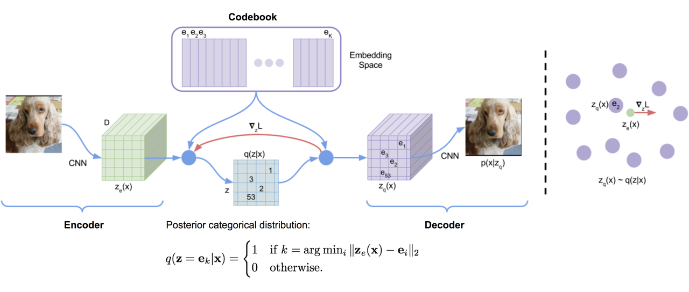

由于$$\arg\min()$$在离散空间上不可微，因此从解码器输入$$\mathbf{z}_q$$得到的梯度$$\nabla_z L$$被复制到编码器输出 $$\mathbf{z}_e$$。除了重建损失外，VQ-VAE 还优化以下两个部分：

> * **VQ 损失**：嵌入空间与编码器输出之间的 L2 误差
>
> 👍 * **Commitment 损失**：用于鼓励编码器输出保持接近嵌入空间，并防止其在不同码向量之间频繁波动

总损失函数如下：

$$L = \underbrace{\|\mathbf{x} - D(\mathbf{e}_k)\|_2^2}_{\text{reconstruction loss}} + \underbrace{\|\mathrm{sg}[E(\mathbf{x})] - \mathbf{e}_k\|_2^2}_{\text{VQ loss}} + \underbrace{\beta \|E(\mathbf{x}) - \mathrm{sg}[\mathbf{e}_k]\|_2^2}_{\text{commitment loss}}$$

其中$$\mathrm{sg}[\cdot]$$是 stop\_gradient 操作符。

Codebook 中的嵌入向量通过指数移动平均 EMA进行更新。给定一个 code 向量$$\mathbf{e}_i$$，假设有$$n_i$$个编码器输出向量 $$\{\mathbf{z}_{i,j}\}_{j=1}^{n_i}$$ 被量化到$$\mathbf{e}_i$$：

$$N_i^{(t)} = \gamma N_i^{(t-1)} + (1 - \gamma) n_i^{(t)}, \quad
\mathbf{m}_i^{(t)} = \gamma \mathbf{m}_i^{(t-1)} + (1 - \gamma) \sum_{j=1}^{n_i^{(t)}} \mathbf{z}_{i,j}^{(t)}, \quad
\mathbf{e}_i^{(t)} = \mathbf{m}_i^{(t)} / N_i^{(t)}$$

其中$$(t)$$表示时间上的批序列。$$N_i$$和$$\mathbf{m}_i$$分别是累积的向量计数和体积。

* **VQ-VAE-2**

VQ-VAE-2 是一个结合了自注意力自回归模型的两层层次化 VQ-VAE。

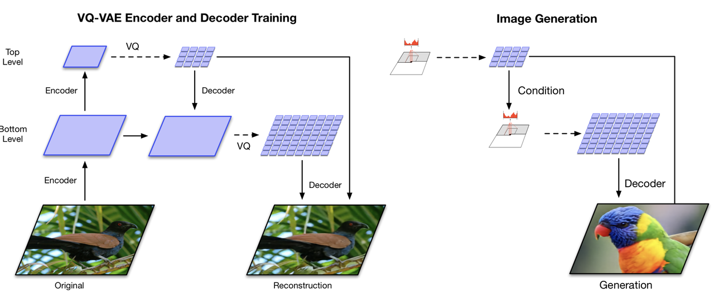

> 👍 1. **Step 1**：训练一个层次化的 VQ-VAE。设计层次化潜在变量的目的是将局部模式（如纹理）与全局信息（如物体形状）分离。较大底层 codebook 的训练依赖于较小的顶层 code，因此它不需要从头开始学习所有内容。
>
> 2. **Step 2**：在潜在离散码本上学习一个先验分布，以便从中采样并生成图像。解码器接收来自与训练时相似分布的输入向量。一个强大的自回归模型，结合多头自注意力层，用于捕捉先验分布

由于 VQ-VAE-2 依赖于在一个简单层次结构中配置的离散潜在变量，其生成图像的质量非常出色。

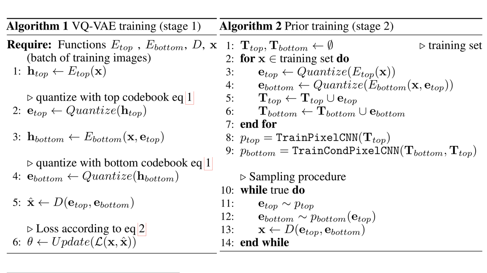

### 3.3.7 RQ/SQ/HQ-VAE

* **RQ-VAE**

RQ-VAE 是由 Kakao Brain 团队于 CVPR 2022 提出的离散自编码器变体，它是对传统 VQ-VAE 的重要泛化与升级 。在自回归图像生成领域，将连续的图像特征转换为离散 Token 是必经之路。传统的 VQ-VAE 面临一个两难：为了降低量化误差并保持重构保真度，要么必须维持一个庞大的 Codebook，导致自回归模型的词表过大、难以训练，要么必须保留较大的空间分辨率，导致自回归模型需要预测的序列极长，计算开销呈二次方爆炸。

RQ-VAE 创新地引入了残差量化 **RQ**（**R**esidual **Q**uantization）机制，它可以在不增加 Codebook 大小$$K$$且极度压缩空间分辨率的前提下，通过对量化残差进行逐级递归量化，实现高精度、高保真度的重构。

1. **RQ 算法流程**

假设输入图像$$X$$经过编码器$$E$$提取出空间连续特征图$$Z = E(X) \in \mathbb{R}^{H \times W \times n_z}$$。在某一个具体的空间网格点$$(h, w)$$处，其连续特征向量为$$z \in \mathbb{R}^{n_z}$$。RQ-VAE 维护一个大小为$$K$$的单一共享 Codebook  $$\mathcal{C} = \{(k, e(k))\}_{k \in [K]}$$，其中$$e(k) \in \mathbb{R}^{n_z}$$为 Codebook 中的实数向量，设递归量化最大深度为$$D$$。

**递归前向编码算法**

对向量$$z$$的残差量化过程是在深度$$d = 1, \dots, D$$上逐级迭代进行的：

> 📍 * **初始化**：设初始累计重构向量为$$\hat{z}^{(0)} = 0$$。初始输入残差向量为$$r_1 = z$$。
>
> * **在每一级深度$$d$$处**：
>
>   1. 计算当前级需要被量化的残差向量：
>
> $$r_d = z - \hat{z}^{(d-1)}$$
>
> 2. 在同一个共享 Codebook $$\mathcal{C}$$中，通过欧氏距离最近邻查找最匹配的离散代码索引$$k_d$$：
>
> $$k_d = \arg\min_{k \in [K]} \| r_d - e(k) \|_2^2$$
>
> 3. 提取该索引对应的 Codebook 向量：
>
> $$\hat{z}_d = e(k_d)$$
>
> 4. 将新提取的残差向量累加到总重构向量中：
>
> $$\hat{z}^{(d)} = \hat{z}^{(d-1)} + \hat{z}_d$$
>
> * 经过$$D$$步迭代后，该空间点上的连续特征向量$$z$$被转换为了一个包含$$D$$个离散代码的代码栈：
>
> $$\text{RQ}(z; \mathcal{C}, D) = (k_1, k_2, \dots, k_D) \in [K]^D$$

**指数级的表征容量**

在几何学上，最终的重建特征向量$$\hat{z}^{(D)}$$可以看作是选中的$$D$$个 Codebook 向量的线性超叠加：

$$\hat{z}^{(D)} = \sum_{d=1}^D e(k_d)$$

这种层层逼近的残差设计在空间中创建了一个 Minkowski-sum Codebook。这意味着，尽管实体 Codebook 的大小仅为$$K$$，但通过$$D$$级叠加组合，RQ-VAE 能够表达出多达$$K^D$$种不同的虚拟向量。这使得模型可以用极其微小的 Codebook 规格和极低的空间分辨率，还原极其细腻的细节。

* **重建与解码**

对于整张输入图像$$X$$，RQ-VAE 会在空间分辨率大幅降低的格点上进行残差量化：

> 🍞 1. **下采样**：例如，对于$$256\times256$$像素的输入图像，通过包含 aggressive 跨步卷积的编码器，下采样 32 倍，输出仅为$$8\times8$$分辨率的特征图$$Z$$。
>
> 2. **空间矢量量化**：对$$8\times8$$上的每一个格点进行$$D$$深度的残差量化，得到三维代码图$$M \in [K]^{8 \times 8 \times 4}$$。
>
> 3. **特征图重组**：解码时，解码器通过直接查表并对每个位置的代码栈进行求和来复原量化特征图：
>
> $$\hat{Z}_{h, w} = \sum_{d=1}^D e(M_{h, w, d})$$
>
> * **重建图像**：送入解码器$$G$$复原图像：
>
> $$\hat{X} = G(\hat{Z})$$

因为代码长度得到了大幅度缩减，从传统 VQ-VAE 的$$32\times32=1024$$缩减为$$8\times8=64$$个空间格点，第二阶段自回归模型处理的序列长度骤降了 16 倍，从而实现了超快速的图像采样与生成。

* **损失函数**

RQ-VAE 采用两大类训练更新方案，二者对 tripartite 损失函数的处理略有不同。

> **方案一：带 stop-gradient 的联合梯度优化**
>
> 若通过梯度下降直接优化 Codebook，则每一级深度$$d$$上的残差量化都需要计算各自对应的 Codebook 损失和 Commitment 损失：
>
> $$\mathcal{L}_{\text{RQ-VAE}} = \mathcal{L}_{\text{rec}} + \sum_{d=1}^D \left( \| \text{sg}[r_d] - e(k_d) \|_2^2 + \beta \| r_d - \text{sg}[e(k_d)] \|_2^2 \right)$$
>
> * **$$\mathcal{L}_{\text{rec}}$$ 重构损失**：通常为 MSE 损失$$\| X - \hat{X} \|_2^2$$，用于训练编码器和解码器。
>
> ⚽ * **Codebook 损失**：通过 stop-gradient 算&#x5B50;**`sg`**&#x51BB;结编码器产生的残差$$r_d$$，梯度仅流向选中的 Codebook 向量$$e(k_d)$$，用于将其拉向编码残差。
>
> * **Commitment 损失**：冻结选中的 Codebook 向量，梯度流向编码器，迫使编码器输出稳定且不频繁波动的残差。$$\beta$$是控制该约束强度的超参数。

> **方案二：基于指数移动平均 EMA 的无梯度优化，最常用**
>
> 🌟 在工业界和官方开源实现中，为了保证超深递归下的数值稳定性， Codebook 通常通过 EMA 无梯度更新。此时，直接对所有深度处的中间重构求和并施加整体承诺约束：
>
> $$\mathcal{L}_{\text{EMA-RQ-VAE}} = \| X - G(\hat{Z}^{(D)}) \|_2^2 + \beta \sum_{d=1}^D \| Z - \text{sg}[\hat{Z}^{(d)}] \|_2^2$$

> **注**：梯度直通估计 STE 在 RQ 中的实现
>
> 由于硬检索$$k_d$$不可微，在反向传播时，RQ-VAE 使用 Straight-Through Estimato&#x72;**&#x20;**&#x62F7;贝梯度。它将最后一级量化累计值$$\hat{Z}^{(D)}$$的梯度原封不动地直接传导给编码器的原始连续输出$$Z$$：
>
> $$\frac{\partial \mathcal{L}}{\partial Z} \approx \frac{\partial \mathcal{L}}{\partial \hat{Z}^{(D)}}$$

* **SQ-VAE**

VAE 的演进在经历了从连续到离散的范式转移后，随机量化变分自编码器** SQ-VAE**（Stochastically Quantized VAE）的诞生为离散自编码器奠定了严谨的变分贝叶斯理论根基。SQ-VAE 由索尼 AI 团队于 ICML 2022 提出。它最核心的学术贡献在于：将原本充满工程启发式技巧的 VQ-VAE 重新纳入了纯粹、严谨的变分贝叶斯推断框架中，并通过数学本能驱动的自退火机制，从根本上消除了 Codebook 崩溃问题。

1. **VQ-VAE 数学困境**

在传统的 VQ-VAE 中，编码器输出的连续特征$$\hat{z}$$通过硬性最近邻检索投影到 Codebook 向量$$b_k$$上：

$$z_q = \arg\min_{b_k \in \mathcal{B}} \|\hat{z} - b_k\|_2^2$$

这种硬性的$$\arg\min$$操作在数学上产生了两个致命问题：

> 1. **不可微性**：其导数处处为 0，反向传播不得不依赖直通估计器 STE 进行硬性复制，引入了极大的梯度偏差。
>
> 🥛 2. **Codebook 崩溃**：由于硬性划分，初始状态下未被选中的代码向量永远无法获得梯度，从而迅速沦为死代码。为了维持训练，研究者不得不诉诸于指数移动平均更新、死码随机重置等工程 trick。

SQ-VAE 提出，量化和逆量化在本质上是一对互逆的随机概率过程。通过在隐空间引入随机概率瓶颈，SQ-VAE 成功让离散自编码器摆脱了对所有非贝叶斯启发式技巧的依赖。

* **SQ-VAE 的概率图模型**

SQ-VAE 建立在连续隐变量$$z \in \mathbb{R}^D$$与离散隐变量$$z_q \in \mathcal{B}$$联合分布的概率生成框架上。其 Codebook 定义为$$\mathcal{B} = \{b_1, b_2, \dots, b_K\} \subset \mathbb{R}^D$$：

> * **生成路径**
>
> 离散先验$$z_q$$ $$\rightarrow$$ 随机反量化$$p_φ(z|z_q)$$ $$\rightarrow$$ 连续$$z$$ $$\rightarrow$$ 概率解码器$$p_θ(x|z)$$ $$\rightarrow$$ $$x$$
>
> * **推断路径**
>
> 观测输入$$x$$ $$\rightarrow$$ 概率编码器$$q_ω(z|x)$$ $$\rightarrow$$ 连续$$z$$ $$\rightarrow$$ 随机量化$$q_φ(z_q|z)$$ $$\rightarrow$$ $$z_q$$

**概率生成模型**

在生成路径中，数据的联合分布被定义为：

$$p_{\theta, \phi}(x, z, z_q) = p_\theta(x | z) p_\phi(z | z_q) p(z_q)$$

> 🍞 * **离散先验分布$$p(z_q)$$**：假定每个 Codebook 向量被抽取的概率是均匀的：
>
> $$p(z_q = b_k) = \frac{1}{K}$$
>
> * **随机反量化分布$$p_\phi(z | z_q)$$**：这是一个参数为$$\phi$$的概率映射分布，用于将离散的符号$$z_q$$还原为连续的隐变量$$z$$。
>
> * **概率解码器$$p_\theta(x | z)$$**：接收连续隐变量$$z$$，并将其解码重构为观测数据$$x$$。

**变分推断模型**

由于真实后验分布$$p(z, z_q | x)$$不可积，SQ-VAE 引入变分分布进行摊销推断：

$$q_{\omega, \phi}(z, z_q | x) = q_\phi(z_q | z) q_\omega(z | x)$$

> * **概率编码器$$q_\omega(z | x)$$**：将输入$$x$$映射为连续隐变量$$z$$的高斯分布。
>
> * **随机量化分布$$q_\phi(z_q | z)$$**：
>
>   🌅 在贝叶斯框架下，量化过程$$q_\phi(z_q | z)$$并不是随意指定的，它必须是反量化分布$$p_\phi(z | z_q)$$的贝叶斯后验形式：
>
> $$q_\phi(z_q = b_k | z) = \frac{p_\phi(z | z_q = b_k) p(z_q = b_k)}{\sum_{j=1}^K p_\phi(z | z_q = b_j) p(z_q = b_j)}$$

* **ELBO 的推导**

通过构建上述双向概率通道，可以写出数据边缘对数似然$$\log p(x)$$的变分证据下界：

$$\log p_{\theta, \phi}(x) \ge \text{ELBO}_{\text{SQ-VAE}} = \mathbb{E}_{q_{\omega, \phi}(z, z_q | x)} \left[ \log \frac{p_{\theta, \phi}(x, z, z_q)}{q_{\omega, \phi}(z, z_q | x)} \right]$$

将分子与分母的概率表达展开：

$$\text{ELBO} = \mathbb{E}_{q_\omega(z|x) q_\phi(z_q|z)} \left[ \log \frac{p_\theta(x|z) p_\phi(z|z_q) p(z_q)}{q_\phi(z_q|z) q_\omega(z|x)} \right] \\ = \mathbb{E}_{q_\omega(z|x) q_\phi(z_q|z)} [\log p_\theta(x|z)] + \mathbb{E}_{q_\omega(z|x) q_\phi(z_q|z)} \left[ \log \frac{p_\phi(z|z_q) p(z_q)}{q_\phi(z_q|z)} \right] - \mathbb{E}_{q_\omega(z|x)} [\log q_\omega(z|x)]$$

现在重点看中间项。根据随机量化分布$$q_\phi(z_q | z)$$的贝叶斯定义：

$$q_\phi(z_q = b_k | z) = \frac{p_\phi(z | z_q = b_k) p(z_q = b_k)}{p_\phi(z)}$$

其中，分母$$p_\phi(z) = \sum_{j=1}^K p_\phi(z|z_q = b_j) p(z_q = b_j)$$是关于$$z$$的边际分布。对数两边取变形：

$$\log \frac{p_\phi(z | z_q) p(z_q)}{q_\phi(z_q | z)} = \log p_\phi(z)$$

将此项代回 ELBO 公式中，中间项关于$$q_\phi(z_q | z)$$的积分积积为 1，于是 ELBO 简化为 ：

$$\text{ELBO} = \mathbb{E}_{q_\omega(z|x)} [\log p_\theta(x|z)] + \mathbb{E}_{q_\omega(z|x)} [\log p_\phi(z)] - \mathbb{E}_{q_\omega(z|x)} [\log q_\omega(z|x)]$$

为了使正则化项更加清晰，将最后一项与连续先验$$p(z)$$关联，重塑为常规的 KL 散度，最终得到 SQ-VAE 的核心 ELBO 损失目标：

$$\text{Loss}_{\text{SQ-VAE}} = -\mathbb{E}_{q_\omega(z|x)} [\log p_\theta(x|z)] + D_{\text{KL}}(q_\omega(z|x) \parallel p(z)) - \mathbb{E}_{q_\omega(z|x)} [\log p_\phi(z)]$$

> **注**：损失项的贝叶斯学物理解析
>
> 1. **第一项（重构误差）**：促使解码器完美重建输入数据。
>
> 2. **第二项（连续隐空间正则化）**：约束连续自编码器输出的特征空间分布，使其逼近连续先验，如标准高斯。
>
> 3. **第三项（边际对数似然项$$-\log p_\phi(z)$$）**：这是 SQ-VAE 的灵魂项。它迫使编码特征$$z$$的分布在整体上与反量化分布产生的混合边际分布$$p_\phi(z)$$发生重合。这一项代替了 VQ-VAE 中不具备贝叶斯意义的 Codebook 损失和承诺损失，在数学上实现了优雅的自监督对齐。

* **两大变体**

针对连续和离散的不同数据特性，Takida 等人设计了两种经典的分布参数化形式：

**Gaussian SQ-VAE**

在高斯变体中，假设反量化概率分布满足各向同性的高斯分布 ： $$p_\phi(z | z_q = b_k) = \mathcal{N}(z; b_k, \sigma_\phi^2 I)$$根据贝叶斯关系，由于先验 $$p(z_q)$$ 是均匀的，可以求得其随机量化后验分布的闭式解 ：

$$q_\phi(z_q = b_k | z) = \frac{\exp\left( -\frac{1}{2\sigma_\phi^2} \|z - b_k\|_2^2 \right)}{\sum_{j=1}^K \exp\left( -\frac{1}{2\sigma_\phi^2} \|z - b_j\|_2^2 \right)}$$

> **梯度反向传播实现**
>
> 📌 这是一个关于负欧氏距离的 Softmax 分&#x5E03;**，**&#x5728;工程实现中，将其视作一个多分类概率，通过引入 Gumbel-Softmax 重参数化技巧，实现连续可微的离散采样与端到端梯度回传：
>
> $$w_k = \frac{\exp\left( \frac{-\|z - b_k\|_2^2 / 2\sigma_\phi^2 + g_k}{\tau} \right)}{\sum_{j=1}^K \exp\left( \frac{-\|z - b_j\|_2^2 / 2\sigma_\phi^2 + g_j}{\tau} \right)}, \quad \text{其中 } g_k \sim \text{Gumbel}(0, 1)$$

**vMF SQ-VAE**

当隐表征被投影到单位超球面上时，即$$\|z\|_2 = \|b_k\|_2 = 1$$，使用高斯分布无法刻画其流形边界，且极易面临模长爆炸问题。vMF SQ-VAE 采用 von Mises-Fisher 球形高斯分布对反量化进行建模：

$$p_\phi(z | z_q = b_k) = \mathcal{C}_D(\kappa) \exp\left( \kappa z^T b_k \right)$$

其中，$$\kappa \ge 0$$是分布的集中度，$$\mathcal{C}_D(\kappa)$$是归一化常数。

其对应的**球形随机量化后验分布**直接简化为关于余弦相似度的 Softmax 映射：

$$q_\phi(z_q = b_k | z) = \frac{\exp\left( \kappa z^T b_k \right)}{\sum_{j=1}^K \exp\left( \kappa z^T b_j \right)}$$&#x20;

vMF 变体将量化尺度完全限制在单位球面内，从而消除了尺度震荡，对自回归大模型的下游 Token 生成展现出极佳的数值相容性。

* **自退火效应**

SQ-VAE 最具美感的设计在于其无需手动调节的自退火机制。

在训练初级阶段，量化过程$$q_\phi(z_q|z)$$呈现出高 stochasticity，即温度较高，接近均匀分布，使每个 Codebook 向量都参与梯度更新，消除死码。随着训练进行，量化分布$$q_\phi(z_q|z)$$的熵自动收缩，最终无缝过渡到确定性的最近邻硬量化：

$$\lim_{t \to \infty} q_\phi(z_q = b_k | z) \to \delta(k - k^*)$$

**数学证明**

观察 SQ-VAE 的变分优化目标。对于 Gaussian SQ-VAE，反量化方差$$\sigma_\phi^2$$是一个可学习的变分参数。

在 ELBO 中，重建误差项被写为：

$$\mathcal{L}_{\text{Recon}} = \mathbb{E}_{q_\omega(z|x) q_\phi(z_q|z) p_\phi(z'|z_q)} \left[ \frac{1}{2\sigma_x^2} \|x - f_\theta(z')\|_2^2 \right]$$

在训练过程中，为了将重构误差压到极致，模型会迫使反量化输出$$z'$$与量化中心$$z_q$$的偏离降到最低，这自然驱动了其变分分布的方差收缩：

$$\sigma_\phi^2 \to 0 \quad (\text{或在 vMF 中 } \kappa \to \infty)$$

当$$\sigma_\phi^2$$减小时，观察随机量化后验：

$$\lim_{\sigma_\phi^2 \to 0} q_\phi(z_q = b_k | z) = \lim_{\sigma_\phi^2 \to 0} \frac{\exp\left( -\frac{1}{2\sigma_\phi^2} \|z - b_k\|_2^2 \right)}{\sum_{j=1}^K \exp\left( -\frac{1}{2\sigma_\phi^2} \|z - b_j\|_2^2 \right)}$$

这是一个标准的物理学玻尔兹曼分布，其中$$\sigma_\phi^2$$扮演了系统温度的角色。随着重构精度的提升，温度$$\sigma_\phi^2$$被系统本能自发地推向绝对零度，使得原本平滑的 Softmax 概率分布无缝、平滑地凝聚成了确定性的$$\arg\min$$狄拉克分布。

因此，SQ-VAE 在训练初期的概率属性消除了 Codebook 崩溃，而在训练后期的确定性收拢则保证了生成重构的高保真度，这一完美的演进完全是由贝叶斯证据下界自发驱动的，不需要任何人手动设计退火调度表**。**

* **HQ-VAE**

由索尼 AI 团队提出的 HQ-VAE，最根本的学术贡献在于：将此前相互独立的、依赖于工程启发式技巧的分层离散模型，如 VQ-VAE-2 和 RQ-VAE，统一收拢到严谨的变分贝叶斯理论框架中。

1. **核心痛点**

在传统的分层离散模型中，由于采用硬性的、确定性的最近邻检索$$\arg\min$$，计算图梯度在量化算子处断裂，不得不引入直通估计器 STE 进行硬性梯度复制。这种非概率的设计导致了两个严重瓶颈：

> 🎹 1. **Codebook/Layer Collapse**：靠近顶部的层级极易为了逃避训练惩罚而彻底停用，或者只更新 Codebook 中极小的一部分向量。
>
> 2. **重度依赖启发式 Trick**：为了维持训练，模型极度依赖于指数移动平均 EMA 更新、死码随机重置、手动调节的通道容量等工程 Trick。

**随机量化 SQ 的引入**

为了恢复离散自编码器的变分推断本能，HQ-VAE 继承并扩展了单层 **SQ-VAE** 的设计 。它抛弃了确定性检索，将量化建模为一个随机概率通道。

设编码器产生的连续特征为$$\tilde{z} \in \mathbb{R}^D$$， Codebook 为$$\mathcal{B} = \{b_1, \dots, b_K\} \subset \mathbb{R}^D$$。在训练中，连续变量$$\tilde{z}$$被量化为 Codebook 中第$$k$$个离散代码$$b_k$$的后验概率，是通过一个基于负欧氏距离的 Categorical 分布来定义的：

$$q(Z = k \vert \tilde{z}) = \frac{\exp(-\beta \|\tilde{z} - b_k\|_2^2)}{\sum_{j=1}^K \exp(-\beta \|\tilde{z} - b_j\|_2^2)}$$

其中，逆温度参数$$\beta$$控制分配的随机性。

**贝叶斯驱动的自退火效应**

> * **训练初期**：$$\beta$$较小，分布熵较高，量化呈现高度随机的软选择状态。这保证了 Codebook 中的每一个向量在初始阶段都能均匀分得概率，并获得充足的变分梯度滋养，从而在物理上天然杜绝了死码的产生。
>
> 🌰 * **训练后期**：在最大化变分下界 ELBO 的梯度本能驱使下，网络会自发收缩量化方差，即$$\beta \to \infty$$。后验概率分布自动凝敛为狄拉克$$\delta$$分布，平滑地过渡到确定性硬量化。这种退火过程是完全自动且无损的，不需要任何人手动设定复杂的退火调度表。

* **统一变分贝叶斯框架**

HQ-VAE 在数学上设计了一套完备的双向推断流，将上述随机量化推广到了极深、多层的离散隐变量空间中。

**生成概率与变分后验的定义**

对于包含$$L$$层离散隐变量的系统，引入连续辅助变量$$\tilde{Z}_{1:L}$$，将生成路径与推断路径参数化为：

> * **生成先验模型 Top-down Path**：
>
> $$\mathcal{P}(Z_{1:L}, \tilde{Z}_{1:L}) = \prod_{l=1}^L P(Z_l) p(\tilde{Z}_l \vert Z_{1:l-1})$$
>
> 💡 * **近似后验模型 Bottom-up Path**：
>
> $$Q(Z_{1:L}, \tilde{Z}_{1:L} \vert x) = \prod_{l=1}^L Q(Z_l \vert \tilde{Z}_l) q(\tilde{Z}_l \vert x, Z_{1:l-1})$$

在推断 Bottom-up 过程中，连续特征$$\tilde{Z}_l$$的生成由自底向上的输入特征$$x$$和之前层级已经量化完的离散变量$$Z_{1:l-1}$$共同决定。

**统一目标函数**

整个分层系统通过最小化以下负证据下界$$\mathcal{J}_{\text{HQ-VAE}}$$进行端到端联合训练：

$$\mathcal{J}_{\text{HQ-VAE}}(x; \theta, \phi, \sigma^2, \mathcal{B}) = \mathbb{E}_{Q(Z_{1:L}, \tilde{Z}_{1:L} \vert x)} \left[ -\log p_\theta(x \vert Z_{1:L}) + \log \frac{Q(Z_{1:L}, \tilde{Z}_{1:L} \vert x)}{\mathcal{P}(Z_{1:L}, \tilde{Z}_{1:L})} \right]$$

通过这种辅助概率积分，HQ-VAE 抛弃了 VQ-VAE 那套不具备变分严谨性的`重构 + 代码对齐 + 承诺` tripartite 损失函数，转而采用纯粹的`最大似然重构 + 分层自适应 KL 信息正则`。由于不再需要对每一层单独配置复杂的承诺权重超参数，系统的训练复杂度降到了最低。

* **两大经典实例化**

HQ-VAE 通过引入两种不同的自顶向下 Top-down 层设计，成功将独立发展的 VQ-VAE-2 与 RQ-VAE 统合为了该变分框架下的两个特例：

**自顶向下 SQ-VAE-2**

SQ-VAE-2 是分层空间多分辨率离散网络 VQ-VAE-2 在概率变分框架下的无偏差推广。

> **机制**：它沿空间物理尺寸划分层级。
>
> 🍞 * **编码端**：输入图像先提取细分辨率特&#x5F81;**`Bottom Level`**，再进一步下采样提取粗糙全局特&#x5F81;**`Top Level`**，各层执行独立的随机量化。
>
> * **解码端**：顶层量化特征$$Z_{\text{top}}$$作为先验，被上采样并通道拼接注入到底层的连续后验中，以此约束底层仅聚焦于高频细节重建。

**损失**：

$$\mathcal{J}_{\text{SQ-VAE-2}} = -\mathbb{E}_Q[\log p_\theta(x \vert Z_{1:L})] + \sum_{l=1}^L \mathbb{E}_Q \left[ \cdot \right]$$

这在不伤害局部纹理的前提下，对顶层和底层的离散信道进行了最优的多尺度信息分配。

**自顶向下 RSQ-VAE**

RSQ-VA&#x45;**&#x20;**&#x662F; Kakao Brain CVPR 2022 提出的 RQ-VAE 在变分框架下的泛化。

> 💡 **机制：**&#x5B83;不改变空间分辨率，而是沿隐通道深度逐层逼近。对于当前层$$l$$，输入编码器是前$$l-1$$层的累积量化误差，即残差$$R_{l-1}$$：
>
> $$R_{l-1} = E_\phi(x) - \sum_{i=1}^{l-1} Z_i$$
>
> 连续残差$$R_{l-1}$$通过随机 Softmax 采样得到第$$l$$级的离散特征$$Z_l$$。

相比于 RQ-VAE 硬检索导致的误差累积，RSQ-VAE 利用期望加权和进行软残差逼近，允许梯度以概率路径无损流回，在极高压缩比下取得了极其精准的视觉与音频重建质量。

### 3.3.8 TD-VAE

时间差分变分自编码器 TD-VAE 用于处理序列数据。它依赖于以下三个主要思想，具体描述如下。

1. **状态空间模型 State-Space Models**

在潜在状态空间模型中，一串未观测的隐藏状态 $$\mathbf{z} = (z_1, \ldots, z_T)$$ 决定了观测状态$$\mathbf{x} = (x_1, \ldots, x_T)$$。右图马尔可夫链模型的每一步可以进行训练，其中不可处理的后验分布$$p(z|x)$$由函数$$q(z|x)$$近似。

2. **信念状态 Belief State**

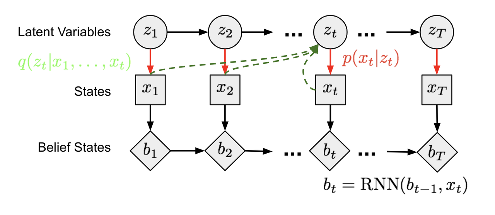

智能体应学会编码所有过去的观测状态，以便对未来进行推理，这被称为信念状态，记为：

$$b_t = \text{belief}(x_1, \ldots, x_t) = \text{belief}(b_{t-1}, x_t)$$

基于此，未来状态在给定过去条件下的分布可写为：

$$p(x_{t+1}, \ldots, x_T | x_1, \ldots, x_t) \approx p(x_{t+1}, \ldots, x_T | b_t)$$

在递归策略中，隐藏状态被用作智能体的信念状态。因此有：

$$b_t = \mathrm{RNN}(b_{t-1}, x_t)$$

3. **跳跃预测 Jumpy Prediction**

智能体应能基于迄今为止收集的所有信息，想象遥远的未来，即具备跳跃预测的能力，即预测若干步之后的状态。

之前在方差下界中提到：

$$\begin{aligned}
\log p(x) &\geq \log p(x) - D_{\mathrm{KL}}(q(z|x) \| p(z|x)) \\
&= \mathbb{E}_{z \sim q} \log p(x|z) - D_{\mathrm{KL}}(q(z|x) \| p(z)) \\
&= \mathbb{E}_{z \sim q} \log p(x|z) - \mathbb{E}_{z \sim q} \log \frac{q(z|x)}{p(z)} \\
&= \mathbb{E}_{z \sim q} [\log p(x|z) - \log q(z|x) + \log p(z)] \\
&= \mathbb{E}_{z \sim q} [\log p(x,z) - \log q(z|x)] \\
\Rightarrow \log p(x) &\geq \mathbb{E}_{z \sim q} [\log p(x,z) - \log q(z|x)]
\end{aligned}$$

现在，对当前时刻$$t$$和前一时刻的状态$$z_t$$、$$z_{t-1}$$，以及所有过去观测$$x_{<t}$$，建模状态$$x_t$$的分布为一个概率函数：

$$\log p(x_t | x_{<t}) \geq \mathbb{E}_{(z_{t-1}, z_t) \sim q} \left[ \log p(x_t, z_t, z_{t-1} | x_{<t}) - \log q(z_{t-1}, z_t | x_{\leq t}) \right]$$

展开该等式：

$$\begin{aligned}
\log p(x_t | x_{<t}) &\geq \mathbb{E}_{(z_{t-1}, z_t) \sim q} \left[ \log p(x_t, z_t, z_{t-1} | x_{<t}) - \log q(z_{t-1}, z_t | x_{\leq t}) \right] \\
&\geq \mathbb{E}_{(z_{t-1}, z_t) \sim q} \left[ \log p(x_t | \textcolor{red}{z_t, z_{t-1}, x_{<t}}) + \textcolor{blue}{\log p(z_t | z_{t-1}, x_{<t})} - \textcolor{blue}{\log q(z_{t-1}, z_t | x_{\leq t})} \right] \\
&\geq \mathbb{E}_{(z_{t-1}, z_t) \sim q} \left[ \log p(x_t | z_t) + \textcolor{blue}{\log p(z_{t-1} | x_{<t})} + \textcolor{blue}{\log p(z_t | z_{t-1})} - \textcolor{green}{\log q(z_{t-1}, z_t | x_{\leq t})} \right] \\
&\geq \mathbb{E}_{(z_{t-1}, z_t) \sim q} \left[ \log p(x_t | z_t) + \log p(z_{t-1} | x_{<t}) + \log p(z_t | z_{t-1}) - \textcolor{green}{\log q(z_t | x_{\leq t})} - \textcolor{green}{\log q(z_{t-1} | z_t, x_{\leq t})} \right]
\end{aligned}$$

其中：

> * **红色项**：根据马尔可夫假设可以忽略
>
> * **蓝色项**：根据马尔可夫假设进行展开
>
> 👍 * **绿色项**：扩展以包含向过去的一步预测作为平滑分布

展开讲就是需要学习四种类型的分布：

$$p_D(\cdot)$$ **：decoder distribution**

* $$p(x_t \mid z_t)$$ 是按常规定义的编码器

* $$p(x_t \mid z_t) \to p_D(x_t \mid z_t)$$

&#x20;$$p_T(\cdot)$$ ：**transition distribution**

* $$p(z_t \mid z_{t-1})$$ 捕捉潜在变量之间的序列依赖性

* $$p(z_t \mid z_{t-1}) \to p_T(z_t \mid z_{t-1})$$

**$$p_B(\cdot)$$：belief distribution**

* $$p(z_{t-1} \mid x_{<t})$$ 和 $$q(z_t \mid x_{\leq t})$$ 都可以利用信念状态来预测潜在变量

* $$p(z_{t-1} \mid x_{<t}) \to p_B(z_{t-1} \mid b_{t-1})$$

* $$q(z_t \mid x_{\leq t}) \to p_B(z_t \mid b_t)$$

**$$p_S(\cdot)$$ ：smoothing distribution**

* 回溯平滑项 $$q(z_{t-1} \mid z_t, x_{\leq t})$$ 可重写为依赖于信念状态

* $$q(z_{t-1} \mid z_t, x_{\leq t}) \to p_S(z_{t-1} \mid z_t, b_{t-1}, b_t)$$

为了引入跳跃预测的思想，序列 ELBO 不仅需作用于时间步$$t$$和$$t+1$$，还需考虑两个较远的时间戳$$t_1 < t_2$$。最终的 TD-VAE 目标函数如下，用于最大化：

$$J_{t_1,t_2} = \mathbb{E} \left[ \log p_D(x_{t_2} | z_{t_2}) + \log p_B(z_{t_1} | b_{t_1}) + \log p_T(z_{t_2} | z_{t_1}) - \log p_B(z_{t_2} | b_{t_2}) - \log p_S(z_{t_1} | z_{t_2}, b_{t_1}, b_{t_2}) \right]$$

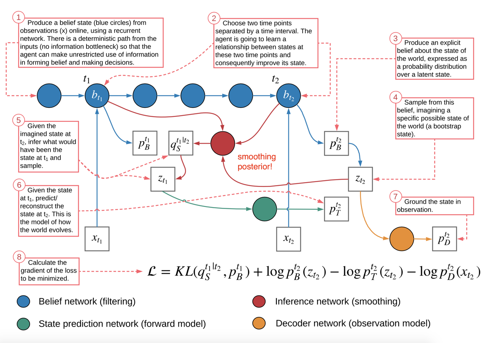

---

[Previous](02-GAN--AE--Flow--GAN-系列.md) | [Contents](../../README.md) | [Next](04-GAN--AE--Flow--Flow-based-model.md) | [Visual website](https://weyumm.github.io/vlm-Wissen/lecture-2.html#c=3)
