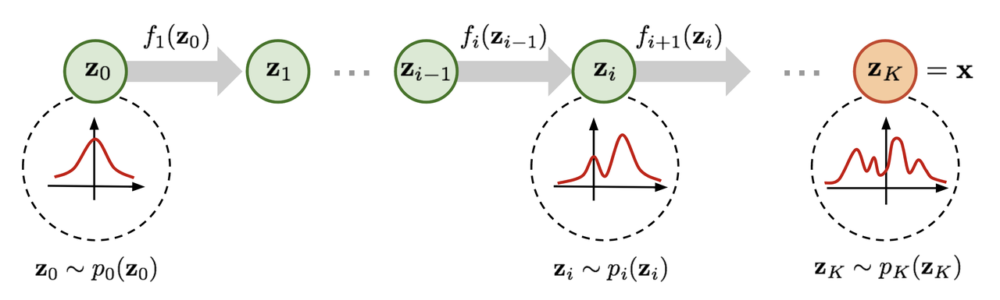
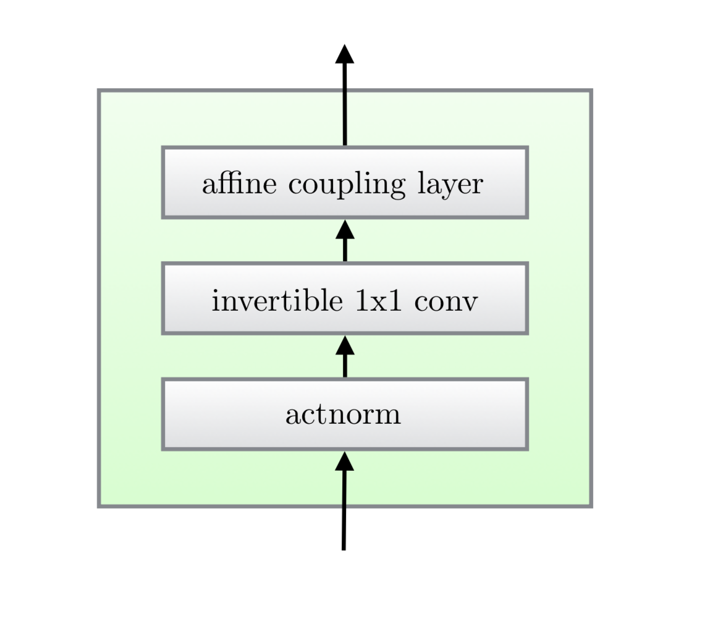
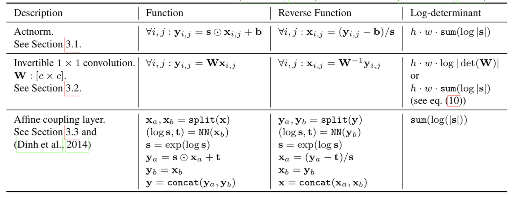
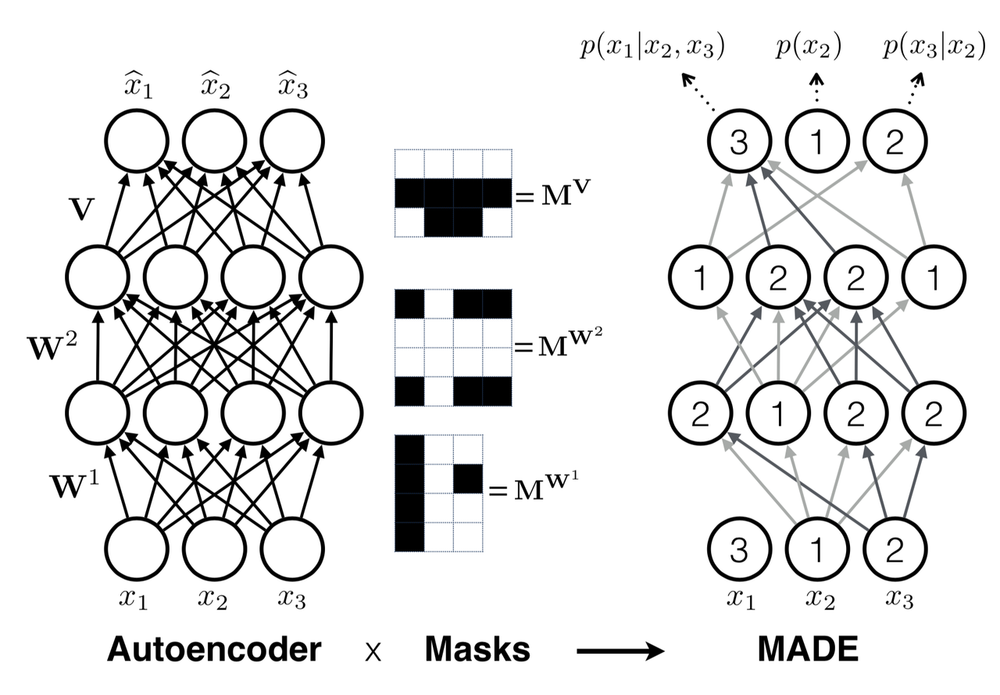
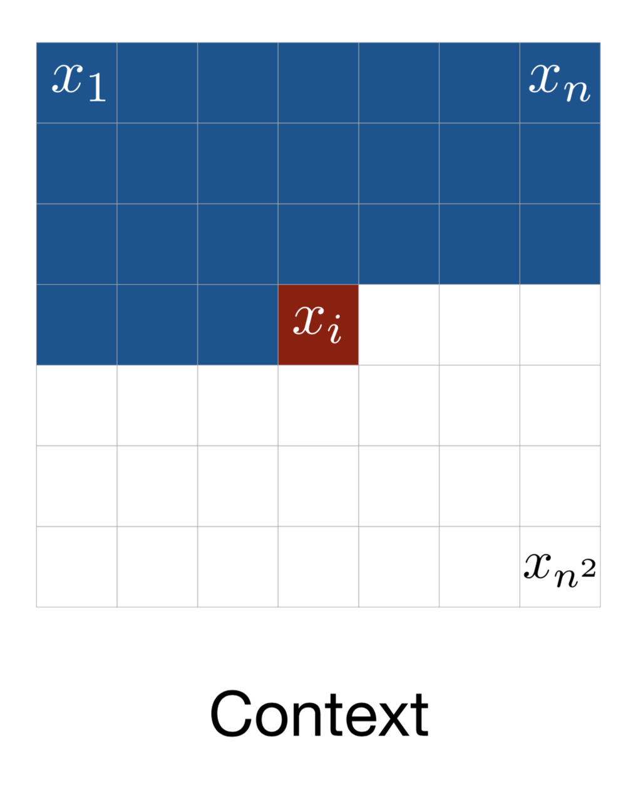
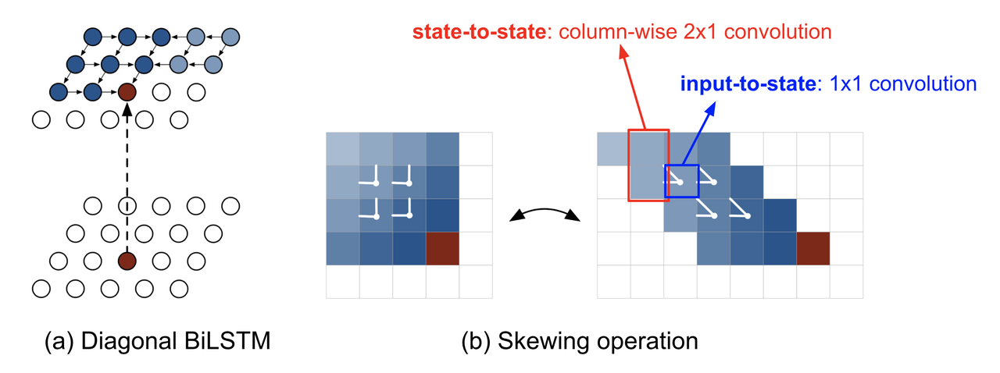
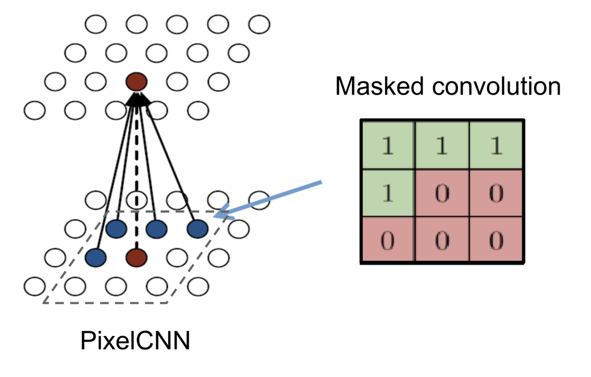
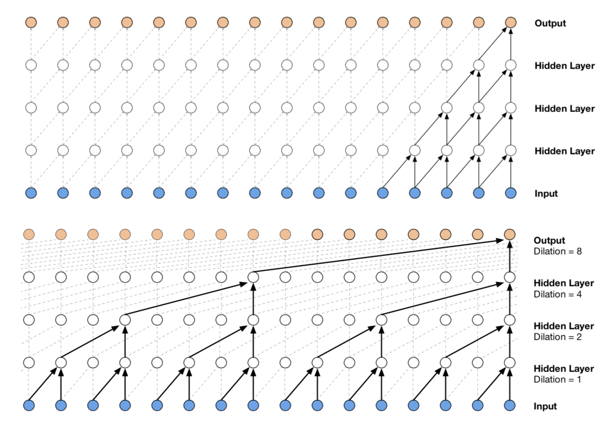

[Previous](03-GAN--AE--Flow--Autoencoder-系列.md) | [Contents](../../README.md) | [Next](05-GAN--AE--Flow--总结.md) | [Visual website](https://weyumm.github.io/vlm-Wissen/lecture-2.html#c=4)

## 3.4 Flow-based model

### 3.4.1 Normalizing Flow

进行良好的概率密度估计非常困难。例如，由于需要在深度学习模型中执行反向传播，因此嵌入的概率分布，即后验分布$$p(\mathbf{z}|\mathbf{x})$$需要足够简单，以便能够高效且容易地计算其导数。这正是高斯分布常被用于潜在变量生成模型的原因，但大多数真实世界的数据分布要复杂得多。

现在引入一种更强大、更优的分布逼近方法——归一化流 **NF**（**N**ormalizing **F**low）模型。归一化流通过一系列可逆变换函数，将一个简单的分布逐步转换为复杂的分布。在一系列变换过程中，根据变量替换定理反复对变量进行替换，最终得到目标变量的概率分布。

$$\mathbf{z}_{i-1} \sim p_{i-1}(\mathbf{z}_{i-1})$$

$$\mathbf{z}_i = f_i(\mathbf{z}_{i-1}), \quad \text{so} \quad \mathbf{z}_{i-1} = f_i^{-1}(\mathbf{z}_i)$$

$$p_i(\mathbf{z}_i) = p_{i-1}(f_i^{-1}(\mathbf{z}_i)) \left| \det \frac{df_i^{-1}}{d\mathbf{z}_i} \right|$$

接下来将方程转换为关于$$\mathbf{z}_i$$的函数，以便基于基础分布进行推理：

$$\begin{aligned}
p_i(\mathbf{z}_i) &= p_{i-1}(f_i^{-1}(\mathbf{z}_i)) \left| \det \frac{df_i^{-1}}{d\mathbf{z}_i} \right| \\
&= p_{i-1}(\mathbf{z}_{i-1}) \left| \det \textcolor{red}{\left( \frac{df_i}{d\mathbf{z}_{i-1}} \right)^{-1}} \right| \quad \text{(根据反函数定理)} \\
&= p_{i-1}(\mathbf{z}_{i-1}) \textcolor{red}{\left| \det \frac{df_i}{d\mathbf{z}_{i-1}} \right|^{-1}} \quad \text{(根据可逆函数雅可比矩阵的性质)}
\end{aligned}$$

然后进行变换，取对数形式：

$$\log p_i(\mathbf{z}_i) = \log p_{i-1}(\mathbf{z}_{i-1}) - \log \left| \det \frac{df_i}{d\mathbf{z}_{i-1}} \right|$$

> **反函数定理**：若 $$y = f(x)$$ 且$$x = f^{-1}(y)$$，则有：
>
> $$\frac{df^{-1}(y)}{dy} = \frac{dx}{dy} = \left( \frac{dy}{dx} \right)^{-1} = \left( \frac{df(x)}{dx} \right)^{-1}$$
>
> **可逆函数的雅可比行列式**：一个可逆矩阵的逆矩阵的行列式等于原行列式的倒数，即：
>
> $$\det(M^{-1}) = (\det M)^{-1}$$
>
> 因为：$$\det(M) \cdot \det(M^{-1}) = \det(M \cdot M^{-1}) = \det(I) = 1$$

给定这样一串概率密度函数，就可以知道每一对连续变量之间的关系。可以逐步展开输出$$\mathbf{x}$$的表达式，直到追溯到初始分布$$\mathbf{z}_0$$：

$$\mathbf{x} = \mathbf{z}_K = f_K \circ f_{K-1} \circ \cdots \circ f_1(\mathbf{z}_0)$$

$$\begin{aligned}
\log p(\mathbf{x}) = \log \pi_K(\mathbf{z}_K) &= \log \pi_{K-1}(\mathbf{z}_{K-1}) - \log \left| \det \frac{df_K}{d\mathbf{z}_{K-1}} \right| \\
&= \log \pi_{K-2}(\mathbf{z}_{K-2}) - \log \left| \det \frac{df_{K-1}}{d\mathbf{z}_{K-2}} \right| - \log \left| \det \frac{df_{K}}{d\mathbf{z}_{K-1}} \right| \\
&= \cdots \\
&= \log \pi_0(\mathbf{z}_0) - \sum_{i=1}^{K} \log \left| \det \frac{df_i}{d\mathbf{z}_{i-1}} \right|
\end{aligned}$$

随机变量$$\mathbf{z}_i = f_i(\mathbf{z}_{i-1})$$所经过的路径称为流 Flow，由一系列分布$$\pi_i$$构成的完整链被称为归一化流 NF（Normalizing Flow）。为了在上述公式中进行计算，变换函数$$f_i$$必须满足以下两个性质：

> 1. 必须易于求逆
>
> 👍 2. 雅可比行列式必须易于计算

在引入归一化流后，输入数据的精确对数似然$$\log p(\mathbf{x})$$变得可计算。因此，基于流的生成模型的训练准则就是训练数据集 $$\mathcal{D}$$ 上的负对数似然**`NLL`**：

$$\mathcal{L}(\mathcal{D}) = -\frac{1}{|\mathcal{D}|} \sum_{\mathbf{x} \in \mathcal{D}} \log p(\mathbf{x})$$

* **RealNVP**

**RealNVP** 通过堆叠一系列可逆的双射变换函数来实现归一化流。在每个双射$$f : \mathbf{x} \mapsto \mathbf{y}$$中，即仿射耦合层，输入维度被分为两部分：

> * 前$$d$$个维度保持不变
>
> 👍 * 从$$d+1$$到$$D$$的维度，进行仿射变换，即**缩放和平移**，并且缩放和平移参数都是前$$d$$个维度的函数

也就是说：

$$\begin{aligned}
\mathbf{y}_{1:d} &= \mathbf{x}_{1:d} \\
\mathbf{y}_{d+1:D} &= \mathbf{x}_{d+1:D} \odot \exp(s(\mathbf{x}_{1:d})) + t(\mathbf{x}_{1:d})
\end{aligned}$$

其中$$s(.)$$和$$t(.)$$分别是缩放和翻译函数，并且都映射$$\mathbb{R}^d \mapsto \mathbb{R}^{D-d}$$。$$\odot$$操作是逐元素乘积。

这个变换是满足流变换的两个基本性质的：

> **条件1：**&#x5B83;容易逆变换，因为有如下结论
>
> $$\begin{cases}
> \mathbf{y}_{1:d} = \mathbf{x}_{1:d} \\
> \mathbf{y}_{d+1:D} = \mathbf{x}_{d+1:D} \odot \exp(s(\mathbf{x}_{1:d})) + t(\mathbf{x}_{1:d})
> \end{cases}
> \Leftrightarrow
> \begin{cases}
> \mathbf{x}_{1:d} = \mathbf{y}_{1:d} \\
> \mathbf{x}_{d+1:D} = (\mathbf{y}_{d+1:D} - t(\mathbf{y}_{1:d})) \odot \exp(-s(\mathbf{y}_{1:d}))
> \end{cases}$$
>
> **条件2：**&#x5B83;的雅可比行列式易于计算
>
> 首先可以得到这个变换的雅可比矩阵和行列式，雅可比矩阵是一个下三角矩阵：
>
> $$\mathbf{J} =
> \begin{bmatrix}
> \mathbf{I}_d & \mathbf{0}_{d\times(D-d)} \\
> \frac{\partial \mathbf{y}_{d+1:D}}{\partial \mathbf{x}_{1:d}} & \mathrm{diag}(\exp(s(\mathbf{x}_{1:d})))
> \end{bmatrix}$$
>
> 因此，行列式仅仅是对角线上项的乘积：
>
> $$\det(\mathbf{J}) = \prod_{j=1}^{D-d} \exp(s(\mathbf{x}_{1:d}))_j = \exp\left(\sum_{j=1}^{D-d} s(\mathbf{x}_{1:d})_j\right)$$

从目前的结论可以发现，仿射耦合层非常适合构建归一化流

由于计算$$f^{-1}$$不需要计算$$s$$或$$t$$的逆，以及计算雅可比行列式不涉及计算$$s$$或$$t$$的雅可比，这些函数可以任意复杂，即$$s$$和$$t$$都可以由深度神经网络建模。

在一个仿射耦合层中，某些维度（通道）保持不变。为了确保所有输入都有机会被改变，模型在每个层中反转了顺序，以便不同的模块保持不变。遵循这种交替模式，在一次变换层中保持相同的单元集合在下一层被修改。作者发现批量归一化有助于训练具有非常深层耦合层堆叠的模型。

此外，RealNVP可以应用在多尺度架构中，以构建更高效的大型输入模型。多尺度架构将几种采样操作应用于正常的仿射层，包括空间棋盘图案掩码、挤压操作和通道掩码。**`TODO`**

* **NICE**

NICE &#x662F;**`RealNVP`**&#x7684;前身。NICE 中的变换是仿射耦合层，但没有缩放项称为加法耦合层。

$$\begin{cases}
\mathbf{y}_{1:d} = \mathbf{x}_{1:d} \\
\mathbf{y}_{d+1:D} = \mathbf{x}_{d+1:D} + m(\mathbf{x}_{1:d})
\end{cases}
\Leftrightarrow
\begin{cases}
\mathbf{x}_{1:d} = \mathbf{y}_{1:d} \\
\mathbf{x}_{d+1:D} = \mathbf{y}_{d+1:D} - m(\mathbf{y}_{1:d})
\end{cases}$$

* **Glow**

Glow 扩展了之前的可逆生成模型，如 NICE 和 RealNVP，并通过用可逆的$$1\times1$$卷积替换通道顺序中的反向排列操作来简化架构。

在Glow的每一步流中包含三个子步骤：

1. **Step 1**：激活归一化，简&#x79F0;**`actnorm`**

它对每个通道使用一个缩放和偏置参数进行仿射变换，类似于批归一化，但适用于最小批量大小为`1`的情况。这些参数是可训练的，但初始化使得经过 actnorm 后，第一个数据 mini-batch 的均值&#x4E3A;**`0`**，标准差&#x4E3A;**`1`**。

2. **Step 2**：可逆$$1\times1$$卷积

在 RealNVP 流的各层之间，翻转了通道的顺序，确保所有数据维度都有机会被改变。一个输入和输出通道数量相等的$$1\times1$$卷积是对通道顺序任意排列的一种泛化。

假设有一个可逆的$$1\times1$$卷积，输入是一个大小为$$h \times w \times c$$的张量$$\mathbf{h}$$，权重矩阵$$\mathbf{W}$$的大小为$$c \times c$$。输出是一个大小为$$h \times w \times c$$的张量，记作$$f = \text{conv2d}(\mathbf{h}; \mathbf{W})$$。为了应用变量规则，需要计算雅可比行列式$$\left|\det \frac{\partial f}{\partial \mathbf{h}}\right|$$。

这里，$$1\times1$$卷积的输入和输出都可以看作是一个大小为$$h \times w$$的矩阵。每个元素$$\mathbf{x}_{ij}$$（其中$$i=1,\dots,h, j=1,\dots,w$$）在$$\mathbf{h}$$中是一个长度为$$c$$的向量，每个元素乘以权重矩阵$$\mathbf{W}$$，以得到输出张量中对应的元素$$y_{ij}$$。因此，每个元素的导数为$$\partial \mathbf{x}_{ij}/\partial \mathbf{x}_{ij} = \mathbf{W}$$，总共有$$h \times w$$个这样的矩阵。

$$\log \left| \det \frac{\partial \text{conv2d}(\mathbf{h}; \mathbf{W})}{\partial \mathbf{h}} \right| = \log \left( |\det \mathbf{W}|^{h \cdot w} \right) = h \cdot w \cdot \log |\det \mathbf{W}|$$

反向的$$1\times1$$卷积依赖于逆矩阵$$\mathbf{W}^{-1}$$。由于权重矩阵相对较小，计算矩阵行列式和矩阵求逆的计算量仍然可控。

* **Step 3**：仿射耦合层

设计与RealNVP相同：

### 3.4.2 Autoregressive Flow

**自回归约束**是一种建模序列数据$$\mathbf{x} = [x_1, \ldots, x_D]$$的方法：每个输出仅依赖于过去观察到的数据，而不依赖于未来数据。换句话说，观察到$$x_i$$的概率是基于$$x_1, \ldots, x_{i-1}$$的条件概率，这些条件概率的乘积给出了观察完整序列的概率：

$$p(\mathbf{x}) = \prod_{i=1}^{D} p(x_i | x_1, \ldots, x_{i-1}) = \prod_{i=1}^{D} p(x_i | x_{1:i-1})$$

如何建模条件密度是自己定义的：它可以是一个均值和标准差作为$$x_{1:i-1}$$函数计算的单变量高斯分布，或者是一个以$$x_{1:i-1}$$作为输入的多层神经网络。

如果归一化流中的流变换被构建为自回归模型，也就是说向量变量的每个维度都依赖于前几个维度，那么这就是一个自回归流。

* **MADE**

**MADE&#x20;**&#x662F;一种专门设计的架构，为了高效地在自动编码器中强制实现自回归属性。当使用自动编码器预测条件概率时，MADE 不是将不同观察窗口的输入用来输入自动编码器$$D$$次，而是通过乘以二进制掩码矩阵来消除某些隐藏单元的贡献，使得每个输入维度在一次通过中仅从前一维度重建。

在一个多层全连接神经网络中，假设有$$L$$个隐藏层，权重矩阵为$$\mathbf{W}^1, \ldots, \mathbf{W}^L$$，以及一个输出层，权重矩阵为$$\mathbf{V}$$。输出$$\hat{\mathbf{x}}$$的每个维度$$\hat{x}_i = p(x_i | x_{1:i-1})$$。

如果没有掩码，层间的计算如下：

$$\begin{aligned}
\mathbf{h}^0 &= \mathbf{x} \\
\mathbf{h}^l &= \text{activation}^l(\mathbf{W}^l \mathbf{h}^{l-1} + \mathbf{b}^l) \\
\hat{\mathbf{x}} &= \sigma(\mathbf{V} \mathbf{h}^L + \mathbf{c})
\end{aligned}$$

为了消除层间的一些连接，可以简单地将每个权重矩阵与一个二进制掩码矩阵进行逐元素相乘。每个隐藏节点被分配一个介于1和$$D-1$$之间的随机连接整数；第$$l$$层第$$k$$个单元的分配值记为$$m_k^l$$。二进制掩码矩阵通过逐元素比较两层中两个节点的值来确定。

$$\begin{aligned}
\mathbf{h}^l &= \text{activation}^l((\mathbf{W}^l \textcolor{red}{\odot \mathbf{M}^{\mathbf{W}^l}) \mathbf{h}^{l-1} + \mathbf{b}^l)} \\
\hat{\mathbf{x}} &= \sigma((\mathbf{V} \textcolor{red}{\odot \mathbf{M}^{\mathbf{V}}) \mathbf{h}^L + \mathbf{c})}
\end{aligned}$$

其中：

$$M^{\mathbf{W}^l}_{k',k} = 
\begin{cases}
1, & \text{if } m_{k'}^l \geq m_k^{l-1} \\
0, & \text{otherwise}
\end{cases}$$

$$M^{\mathbf{V}}_{d,k} = 
\begin{cases}
1, & \text{if } d > m_k^L \\
0, & \text{otherwise}
\end{cases}$$

当前层中的一个单元只能连接到前一层中编号相等或更小的其他单元，这种依赖性很容易通过网络传播到输出层。一旦分配了所有单元和层的编号，输入维度的顺序就固定了，并且条件概率是相对于这个顺序生成的。为了使所有隐藏单元通过某些路径连接到输入和输出层，采样$$m_k^l$$为等于或大于前一层的最小连接整数$$\min_{k'} m_{k'}^{l-1}$$。

MADE 训练可以通过以下方式进一步促进：

> 👍 * **顺序无关训练 Order-agnostic training**：打乱输入维度，使 MADE 能够建模任意顺序；这可以在运行时创建一个自回归模型的集合。
>
> * **连接无关训练 Connectivity-agnostic training**：为了避免模型被特定的连接模式约束，为每个训练小批量重新采样$$m_k^l$$。

* **PixelRNN**

PixelRNN 是用于图像的深度生成模型。图像逐像素生成，每个新像素都基于之前已观察到的像素进行条件采样。

假设一个大小为$$n \times n$$的图像$$\mathbf{x} = \{x_1, \ldots, x_{n^2}\}$$，模型从左上角开始生成像素，从左到右、从上到下依次生成。如右图：

每个像素$$x_i$$从一个条件概率分布中采样，该分布基于过去的上下文：即其上方或同一行左侧的像素。这种上下文的定义好像看起来有些任意，因为视觉注意力在图像上的关注方式是高度并行化的。但反直觉的是具有如此强假设的生成模型竟然能有效工作。

一种能够捕捉整个上下文的实现方法&#x662F;**对角双向 LSTM**（Diagonal BiLSTM）。首先，通过将输入特征图的每一行相对于前一行偏移一个位置来应用 skewing 操作，从而使得每个像素的计算可以相对于当前像素及其左侧的像素进行。

然后，LSTM 的状态根据当前像素和左侧像素进行计算。其核心计算公式如下：

$$\begin{aligned} [\mathbf{o}_t, \mathbf{f}_t, \mathbf{i}_t, \mathbf{g}_t] &= \sigma(\mathbf{K}^{ss} \otimes \mathbf{h}_{t-1} + \mathbf{K}^{is} \otimes \mathbf{x}_t) \\

\mathbf{c}_t &= \mathbf{f}_t \odot \mathbf{c}_{t-1} + \mathbf{i}_t \odot \mathbf{g}_t \\
\mathbf{h}_t &= \mathbf{o}_t \odot \tanh(\mathbf{c}_t)
\end{aligned}$$

其中，$$\otimes$$表示卷积操作，$$\odot$$表示逐元素乘法。input-to-state 模块$$\mathbf{K}^{is}$$是一个$$1\times1$$卷积，而 state-to-state 的递归模块通过一个列方向的卷积$$\mathbf{K}^{ss}$$计算，卷积核大小为$$2\times1$$。

对角 BiLSTM 层能够处理无界的上下文区域，但由于状态之间的顺序依赖性，计算成本较高。一种更快的实现方法使用多个卷积层而不使用池化，以定义一个有界上下文区域。卷积核被掩码，使得未来上下文不可见，类似于 MADE。这种卷积版本被称为 PixelCNN。

* **WaveNet**

WaveNet 与 PixelCNN 非常相似，但应用于一维音频信号。WaveNet 由一系列因果卷积 causal convolution 堆叠而成，这是一种设计用于尊重时间顺序的卷积操作：在某个时间戳上的预测只能使用过去已观测到的数据，不能依赖未来数据。在 PixelCNN 中，因果卷积通过掩码卷积核实现；而在 WaveNet 中，因果卷积则简单地将输出向后偏移若干时间步，使得输出与最后一个输入元素对齐。

卷积层的一个主要缺点是其感受野 receptive field 非常有限。输出很难依赖于数百甚至数千个时间步前的输入，而这对于建模长序列来说可能是一个关键要求。因此，WaveNet 采用了膨胀卷积 dilated convolution，其中卷积核作用于输入中一个均匀分布的子集，从而在更大的感受野内进行操作。

WaveNet 使用带门控的激活单元作为非线性层，因为发现它在建模一维音频数据方面显著优于 ReLU。残差连接在门控激活之后应用。其计算公式如下：

$$\mathbf{z} = \tanh(\mathbf{W}_{f,k} \otimes \mathbf{x}) \odot \sigma(\mathbf{W}_{g,k} \otimes \mathbf{x})$$

其中，$$\mathbf{W}_{f,k}$$和$$\mathbf{W}_{g,k}$$分别是第$$k$$层的卷积滤波器和门控权重矩阵；两者都是可学习的参数。$$\otimes$$表示卷积操作，$$\odot$$表示逐元素乘法。

* **Masked Autoregressive Flow**

**掩码自回归流 MAF**（**M**asked **A**utoregressive **F**low）是归一化流模型，其变换层构建为一个自回归神经网络。

> MAF 与后续介绍&#x7684;**逆自回归流 IAF**（**I**nverse **A**utoregressive **F**low）非常相似。关于 MAF 与 IAF 之间关系的更多讨论将在下一节中展开。

给定两个随机变量$$\mathbf{z} \sim \pi(\mathbf{z})$$和$$\mathbf{x} \sim p(\mathbf{x})$$，且概率密度函数$$\pi(\mathbf{z})$$已知，MAF 的目标是学习$$p(\mathbf{x})$$。MAF 通过条件生成每个$$x_i$$，其中条件基于前$$i-1$$维输入$$\mathbf{x}_{1:i-1}$$。

具体来说，条件概率是$$\mathbf{z}$$的仿射变换，其中缩放和偏移项是已观测部分$$\mathbf{x}$$的函数：

> 👍 * **数据生成**：生成一个新的$$\mathbf{x}$$：
>
> $$x_i \sim p(x_i | \mathbf{x}_{1:i-1}) = z_i \odot \sigma_i(\mathbf{x}_{1:i-1}) + \mu_i(\mathbf{x}_{1:i-1}), \quad \text{其中 } \mathbf{z} \sim \pi(\mathbf{z})$$
>
> * **密度估计**：给定已知的$$\mathbf{x}$$：
>
>   $$p(\mathbf{x}) = \prod_{i=1}^{D} p(x_i | \mathbf{x}_{1:i-1})$$

生成过程是顺序的，因此设计上较慢。而密度估计只需一次前向传播即可完成，例如使用 MADE 架构。变换函数易于求逆，雅可比行列式也容易计算。

* **Inverse Autoregressive Flow**

类似于 MAF，**逆自回归流 IAF**（**I**nverse **A**utoregressive **F**low）也将目标变量的条件概率建模为自回归模型，但采用反向流，从而实现更高效的采样过程。

首先，对 MAF 中的仿射变换进行反转：

$$z_i = \frac{x_i - \mu_i(\mathbf{x}_{1:i-1})}{\sigma_i(\mathbf{x}_{1:i-1})} = -\frac{\mu_i(\mathbf{x}_{1:i-1})}{\sigma_i(\mathbf{x}_{1:i-1})} + x_i \odot \frac{1}{\sigma_i(\mathbf{x}_{1:i-1})}$$

如果令：

$$\tilde{\mathbf{x}} = \mathbf{z},\ \tilde{p}(.) = \pi(.),\ \tilde{\mathbf{x}} \sim \tilde{p}(\tilde{\mathbf{x}})$$

$$\tilde{\mathbf{z}} = \mathbf{x},\ \tilde{\pi}(.) = p(.),\ \tilde{\mathbf{z}} \sim \tilde{\pi}(\tilde{\mathbf{z}})$$

$$\tilde{\mu}_i(\tilde{\mathbf{z}}_{1:i-1}) = \tilde{\mu}_i(\mathbf{x}_{1:i-1}) = -\frac{\mu_i(\mathbf{x}_{1:i-1})}{\sigma_i(\mathbf{x}_{1:i-1})}$$

$$\tilde{\sigma}(\tilde{\mathbf{z}}_{1:i-1}) = \tilde{\sigma}(\mathbf{x}_{1:i-1}) = \frac{1}{\sigma_i(\mathbf{x}_{1:i-1})}$$

那么有：

$$\tilde{x}_i \sim p(\tilde{x}_i | \tilde{\mathbf{z}}_{1:i}) = \tilde{z}_i \odot \tilde{\sigma}_i(\tilde{\mathbf{z}}_{1:i-1}) + \tilde{\mu}_i(\tilde{\mathbf{z}}_{1:i-1}), \quad \text{其中 } \tilde{\mathbf{z}} \sim \tilde{\pi}(\tilde{\mathbf{z}})$$

IAF 的目标是估计在已知$$\tilde{\pi}(\tilde{\mathbf{z}})$$的条件下$$\tilde{\mathbf{x}}$$的概率密度函数。逆流也是一个自回归仿射变换，与 MAF 类似，但缩放和偏移项是已知分布$$\tilde{\pi}(\tilde{\mathbf{z}})$$中观测变量的自回归函数。

MAF 与 IAF 对比如下：

<table><colgroup><col width="108"><col width="118"><col width="300"><col width="154"><col width="140"></colgroup>
<thead>
<tr>
<th>基础分布</th>
<th>目标分布</th>
<th>模型</th>
<th>数据生成</th>
<th>密度估计</th>
</tr>
</thead>
<tbody>
<tr>
<td>\mathbf{z} \sim \pi(\mathbf{z})</td>
<td>\mathbf{x} \sim p(\mathbf{x})</td>
<td>x_i = z_i \odot \sigma_i(\mathbf{x}_{1:i-1}) + \mu_i(\mathbf{x}_{1:i-1})</td>
<td>顺序生成；慢</td>
<td>一次前向传播；快</td>
</tr>
<tr>
<td>\tilde{\mathbf{z}} \sim \tilde{\pi}(\tilde{\mathbf{z}})</td>
<td>\tilde{\mathbf{x}} \sim \tilde{p}(\tilde{\mathbf{x}})</td>
<td>\tilde{x}_i = \tilde{z}_i \odot \tilde{\sigma}_i(\tilde{\mathbf{z}}_{1:i-1}) + \tilde{\mu}_i(\tilde{\mathbf{z}}_{1:i-1})</td>
<td>一次前向传播；快</td>
<td>顺序计算；慢</td>
</tr>
</tbody>
</table>

> 👍 * MAF 中各个元素$$\tilde{x}_i$$的计算彼此独立，因此可以轻松并行化，仅需一次前向传播，如使用 MADE 架构
>
> * 但对于已知$$\tilde{\mathbf{x}}$$的密度估计，效率较低，因为需要按顺序恢复$$\tilde{z}_i$$的值：
>
>   $$\tilde{z}_i = \frac{(\tilde{x}_i - \tilde{\mu}_i(\tilde{\mathbf{z}}_{1:i-1}))}{\tilde{\sigma}_i(\tilde{\mathbf{z}}_{1:i-1})}$$
>
>   总共需要 $$D$$ 次迭代。

---

[Previous](03-GAN--AE--Flow--Autoencoder-系列.md) | [Contents](../../README.md) | [Next](05-GAN--AE--Flow--总结.md) | [Visual website](https://weyumm.github.io/vlm-Wissen/lecture-2.html#c=4)
