[Previous](08-Diffusion-Model--Diffusion-的应用.md) | [Contents](../../README.md) | [Next](10-Diffusion-Model--其他工作.md) | [Visual website](https://weyumm.github.io/vlm-Wissen/lecture-2.html#c=9)

## 4.4 OpenAI 工作

### 4.4.1 DALL-E 1

* **模型定位**

1. **任务定义**

DALL-E 1 的任务是根据自然语言描述生成图像。训练样本由 caption 与图像组成，模型学习两种离散 token 的联合分布；推理时先给定 caption token，再继续生成图像 token。

核心做法不是为文本和图像分别设计两个生成器，而是把两种模态排成一条序列，用同一个 decoder-only Transformer 自回归地预测下一个 token。

直接把 RGB 像素作为 token 会产生极长上下文，而且最大似然目标容易把大量容量用于相邻像素的高频变化。DALL-E 先用 dVAE 把图像压缩到离散 latent grid，再让 Transformer 主要建模物体、布局、颜色和语义之间的低频结构。

2. **两阶段训练**

Stage 1 单独训练 dVAE。输入图像大小为 **`256×256×3`**，Encoder 输出 **`32×32`** 个离散位置，每个位置从 **`8192`** 个类别中选择一个 image token。空间边长缩小 8 倍，Transformer 需要处理的图像上下文由 196,608 个通道值降为 1,024 个 token，相当于缩短 **`192`** 倍。

Stage 2 冻结 dVAE 的 Encoder 与 Decoder。caption 被编码为最多 **`256`** 个 BPE token，图像被编码为 **`1024`** 个 image token，两者拼成最长 **`1280`** 的序列，再训练 **`12B`** 参数的 sparse Transformer。

两个阶段各自解决一个困难：dVAE 把连续像素变成可建模的离散符号，Transformer 再学习文本符号与图像符号之间的长程依赖。

3. **联合概率模型**

记 RGB 图像为 $$x$$，caption 为 $$y$$，dVAE 产生的 image token 为 $$z$$。整体生成分布分解为：

$$p_{\theta,\psi}(x,y,z)=p_{\theta}(x\mid y,z)\,p_{\psi}(y,z)$$

$$q_{\phi}(z\mid x)$$ 是 dVAE Encoder，$$p_{\theta}(x\mid y,z)$$ 是 dVAE Decoder，$$p_{\psi}(y,z)$$ 是 Transformer 对 text token 与 image token 的联合先验。训练目标可以写为联合似然的下界：

$$\log p_{\theta,\psi}(x,y)\geq \mathbb{E}_{z\sim q_{\phi}(z\mid x)}\!\left[\log p_{\theta}(x\mid y,z)-\beta D_{\mathrm{KL}}\!\left(q_{\phi}(y,z\mid x)\,\|\,p_{\psi}(y,z)\right)\right]$$

严格的 evidence lower bound 在 $$\beta=1$$ 时成立；实际训练 dVAE 时使用更大的 KL 权重改善 codebook 使用率。因此这里的 $$\beta$$ 同时承担正则强度调节作用，不能把 $$\beta>1$$ 仍解释为严格不变的概率下界。

4. **token 与序列布局**

文本词表大小为 **`16,384`**，图像词表大小为 **`8192`**。两套词表属于不同模态，Embedding 参数和输出 Logit 也按 text/image 位置分别处理。

序列开头放置 **`start of text`**，文本不足 256 个位置时使用按位置学习的 **`padding token`**，随后放置 **`start of image`**，最后按 raster order 展平 32×32 image token。

文本位置使用一维位置 Embedding；image token 的词表 Embedding 与 row Embedding、column Embedding 相加：

$$h_i^{\mathrm{text}}=e_{\mathrm{text}}(y_i)+p_i$$

$$h_{r,c}^{\mathrm{image}}=e_{\mathrm{image}}(z_{r,c})+e_{\mathrm{row}}(r)+e_{\mathrm{col}}(c)$$

下面的结构图展示了文本 Embedding、逐位置 padding Embedding、image vocabulary Embedding 以及 row/column Embedding 如何相加为 Transformer state。

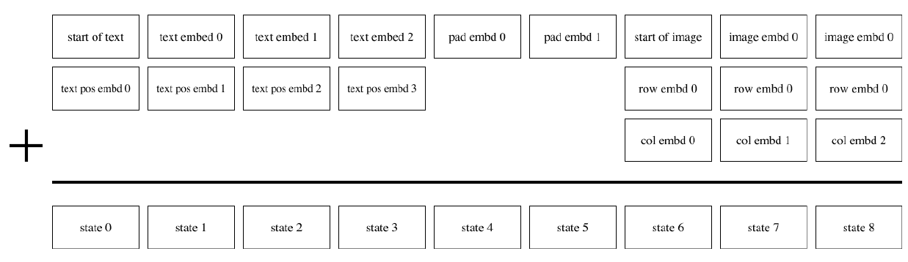

5. **训练与推理边界**

训练 Transformer 时，image token 来自 dVAE Encoder Logit 的 argmax，不加入 Gumbel noise。Transformer 学到的是离散 token 的条件分布，而不是直接预测 RGB 像素。

推理时只提供 caption 部分，Transformer 从第一个 image token 开始逐位置采样，生成完整 32×32 token grid，再由 dVAE Decoder 一次性还原为 256×256 RGB 图像。

DALL-E 1 不是 diffusion model，也没有 U-Net、反向去噪或 CLIP text Encoder。CLIP 只在生成多个候选之后离线打分并重排，不参与 DALL-E 的两阶段训练。

* **Stage 1：dVAE 图像 tokenization**

1. **Encoder 与 Decoder 结构**

dVAE 的 Encoder 和 Decoder 都是 convolutional ResNet，基本单元采用 bottleneck-style residual block。主干卷积以 3×3 为主；当 residual block 的输入与输出通道数不一致时，skip connection 使用 1×1 卷积完成通道投影。

Encoder 的第一层是 **`7×7`** 卷积，最后一层是 **`1×1`** 卷积，并输出形状为 **`32×32×8192`** 的 Logit。Encoder 使用 max pooling 下采样；同样配置下，max pooling 得到的 ELB 优于 average pooling。

Decoder 的第一层和最后一层都使用 1×1 卷积，中间通过 nearest-neighbor upsampling 恢复空间分辨率。靠近离散松弛位置的卷积保持较小感受野，可以缩小 relaxed ELB 与真实离散 ELB 之间的泛化差距。

2. **离散 latent 与均匀先验**

每个空间位置的 Encoder 输出 **`8192`** 个 Logit，参数化一个 categorical distribution：

$$q_{\phi}(z_{r,c}=k\mid x)=\operatorname{softmax}(l_{r,c})_k,\qquad k\in\{1,\ldots,8192\}$$

Stage 1 的先验设置为均匀 categorical distribution：

$$p(z_{r,c}=k)=\frac{1}{8192}$$

KL 项约束各位置的后验不要长期塌缩到很小的 token 子集。较大的 codebook 提高单个位置的表达容量，用来缓解 8 倍空间下采样导致的信息损失。

3. **Gumbel-Softmax 连续松弛**

categorical sample 不可直接使用普通重参数化梯度。dVAE 不采用在线聚类、straight-through estimator、EMA codebook loss 或 dead-code revival，而是用 Gumbel-Softmax 把 one-hot sample 松弛为连续向量。

对每个类别采样均匀随机数 $$u_k$$ 并构造 Gumbel noise：

$$g_k=-\log\!\left(-\log u_k\right),\qquad u_k\sim\operatorname{Uniform}(0,1)$$

松弛后的类别权重为：

$$\tilde{z}_k=\frac{\exp\!\left((l_k+g_k)/\tau\right)}{\sum_j\exp\!\left((l_j+g_j)/\tau\right)}$$

$$\tau$$ 越小，分布越接近 one-hot；$$\tau\to 0$$ 时松弛趋近离散 sample。训练并不把温度降到 0，而是从 **`1`** 以 cosine schedule 退火到 **`1/16`**，在可反向传播与离散近似之间取得平衡。

4. **relaxed ELB 与 KL 权重**

Stage 1 只在图像上优化 Encoder 参数 $$\phi$$ 与 Decoder 参数 $$\theta$$。将离散后验替换为温度为 $$\tau$$ 的连续松弛后，最小化的负目标可以写成：

$$\mathcal{L}_{\mathrm{dVAE}}=-\mathbb{E}_{z\sim q_{\phi}^{\tau}(z\mid x)}\!\left[\log p_{\theta}(x\mid z)\right]+\beta D_{\mathrm{KL}}\!\left(q_{\phi}(z\mid x)\,\|\,p(z)\right)$$

KL 权重在前 **`5000`** 次更新内从 0 以 cosine schedule 增加到 **`6.6`**。这个数值大于 1，会推动更充分的 codebook 使用，并在最终训练中得到更小的重建误差。

温度退火决定连续 sample 与真实离散 token 的接近程度，KL 权重决定 Encoder 是否愿意使用整个 token 词表；两者共同影响重建质量和 Stage 2 可学习性。

5. **logit-Laplace 重建分布**

普通 Laplace 或 Gaussian 分布的支撑集是整条实数轴，而像素值位于有界区间。dVAE 对 Laplace 随机变量应用 sigmoid，得到定义在 $$(0,1)$$ 上的 logit-Laplace 分布：

$$f(x\mid\mu,b)=\frac{1}{2b\,x(1-x)}\exp\!\left(-\frac{\left|\operatorname{logit}(x)-\mu\right|}{b}\right)$$

Decoder 输出 **`6`** 张 feature map：前三张是 RGB 三个通道的 $$\mu$$，后三张是对应的 $$\log b$$。训练时用上式的对数似然作为重建项。

输入像素先从整数区间 $$[0,255]$$ 映射到 $$(\epsilon,1-\epsilon)$$：

$$\varphi(x)=\frac{1-2\epsilon}{255}x+\epsilon,\qquad \epsilon=0.1$$

重建图像时忽略尺度参数 $$\log b$$，使用 $$\hat{x}=\varphi^{-1}(\operatorname{sigmoid}(\mu))$$。这种处理避免了 $$x(1-x)$$ 在区间端点附近引起的数值问题。

6. **训练日程与优化器**

温度 $$\tau$$ 在前 **`150,000`** 次更新内从 1 降到 1/16；使用线性温度退火通常会导致发散。学习率在 **`1,200,000`** 次更新内从 **`1×10⁻⁴`** 以 cosine schedule 降到 **`1.25×10⁻⁶`**。

优化器为 AdamW，参数是 $$\beta_1=0.9$$、$$\beta_2=0.999$$、$$\epsilon=10^{-8}$$，weight decay multiplier 为 **`1×10⁻⁴`**。参数使用 decay coefficient 为 **`0.999`** 的 exponentially weighted iterate averaging。

重建项覆盖 256×256×3 个像素值，KL 项覆盖 32×32 个离散位置。总 loss 除以 256×256×3 后，KL 项的有效权重变为 $$\beta/192$$。

训练使用 **`64`** 张 16 GB NVIDIA V100，每张卡 batch size 为 8，总 batch size 为 **`512`**，共训练 **`3,000,000`** 次更新。

7. **图像增强与重建损失**

dVAE 训练时先从原图随机裁出正方形，再把边长随机缩放到目标分辨率的约 9/8 至 12/8，随后随机裁成 256×256，并执行随机水平翻转。这样既保留完整局部结构，又让 Encoder 适应尺度与位置变化。

Encoder 和 Decoder residual block 的输出 activation 在初始化阶段乘以较小常数，避免很深的残差网络刚开始训练时 activation 累积过大。

右图上排是原图，下排是 dVAE 重建。主体与整体布局通常能够保留，但毛发、店铺文字和细线会被模糊或扭曲。

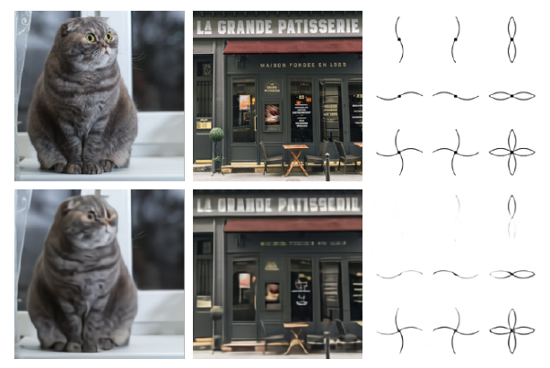

离散压缩是有损的：Stage 2 即使预测了正确的 image token，也无法恢复 Stage 1 已经丢弃的高频细节。

* **Stage 2：自回归 Transformer**

1. **输入 token 的构造**

caption 先转为小写，再用 BPE 编码为最多 **`256`** 个 text token，词表大小为 **`16,384`**。训练阶段应用 **`10%`** BPE dropout，使相同词语能够以不同 subword 切分出现，增强对分布外 caption 的适应性。

图像经过冻结的 dVAE Encoder，直接对每个位置的 8192 维 Logit 取 argmax，不加入 Gumbel noise：

$$z_{r,c}=\underset{k}{\operatorname{argmax}}\;l_{r,c,k}$$

严格的联合 ELB 需要从 categorical posterior 采样，但 12B Transformer 在当前数据规模下仍处于 underparameterized regime，随机 sample 与 soft target 并未带来更好的权衡，因此训练数据采用确定性的 argmax token。

2. **decoder-only sparse Transformer**

Stage 2 使用 **`12B`** 参数的 decoder-only sparse Transformer。模型包含 **`64`** 个 attention layer，每层有 **`62`** 个 attention head，每个 head 的 state size 为 **`64`**，因此 hidden size 为 **`3968`**。

text token 使用标准 causal mask，只能读取当前及之前的文本位置。任意 image token 在每一层都可以读取全部 text token，同时只能按当前 sparse attention pattern 读取允许的历史 image token。

文本不是经过独立 Encoder 后以 cross-attention 注入；text token 与 image token 在同一条 causal sequence 中共同经过 self-attention。

3. **逐位置 padding Embedding**

caption 长度不足 256 时，最后一个 text token 与 start-of-image 之间存在空位。直接把这些位置从 attention 中屏蔽，会改变模型在短 caption 下看到的序列结构。

DALL-E 为 256 个文本位置分别学习专用 padding token。只有对应位置没有真实 text token 时才使用这个 Embedding。Conceptual Captions 上的早期实验显示，这种做法会提高 validation loss，却能改善分布外 caption 的生成表现。

前面的 Embedding 示意图中，四个真实 text token 后接两个位置不同的 pad Embedding，再进入 start-of-image 与 image token。

4. **三类 sparse attention mask**

image-to-image attention 使用 row、column 与 convolutional 三类 mask，避免对 1024 个 image token 在每层都执行 dense causal attention。

**row attention** 让当前 token 读取 raster order 中相邻的历史 token。示意图的 4×4 grid 中，每个位置读取前 5 个 image token，使窗口能够覆盖上一行的同列位置。

**column attention** 沿列连接历史 token。为了提高 GPU 利用率，实际实现会转置 image state 的 row/column 维度，再使用与 row attention 形状更接近的 mask。

**convolutional attention** 使用 causal local neighborhood 并带有与 row attention 相似的 wraparound。论文示意图用 3×3 kernel，实际最后一层使用 **`11×11`** kernel。

前 **`63`** 个 attention layer 中，当 $$(i-2)\bmod 4=0$$ 时使用 column mask，其余使用 row mask，因此前四层的顺序为 row、column、row、row。第 64 层单独使用 convolutional mask。

交替的 row 与 column pattern 让局部计算逐层传播为二维长程依赖，最后的 convolutional mask 再加强邻域一致性。

下图完整展示 text-to-text causal 区域以及 row、column、转置 column 和 convolutional 四种图像区域形状。

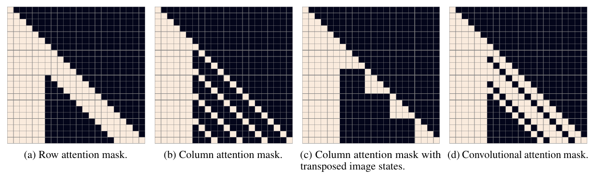

5. **单一 attention 归一化**

text-to-text、image-to-text 和 image-to-image 三种交互共享一次 attention operation，而不是拆成三个独立 Softmax。对 image query 来说，可访问的 text key 与 image key 被放在同一个归一化分母中：

$$\operatorname{Attention}(Q,K,V)=\operatorname{softmax}\!\left(\frac{QK^{\mathsf{T}}+M}{\sqrt{d_h}}\right)V$$

$$M$$ 同时编码 causal 限制与当前 image sparse pattern。共享归一化让模型直接在文本条件和图像历史之间分配 attention mass，早期实验优于分别计算三次 attention 后再合并。

6. **自回归目标与 loss 权重**

拼接后的序列记为 $$s=(y_1,\ldots,y_{256},z_1,\ldots,z_{1024})$$，Transformer 按顺序分解联合分布：

$$p_{\psi}(y,z)=\prod_{i=1}^{256}p_{\psi}(y_i\mid y_{<i})\prod_{j=1}^{1024}p_{\psi}(z_j\mid y,z_{<j})$$

text token 与 image token 的 cross-entropy 分别按 batch 内各自 token 总数归一化，再组合为：

$$\mathcal{L}_{\mathrm{prior}}=\frac{1}{8}\mathcal{L}_{\mathrm{text}}+\frac{7}{8}\mathcal{L}_{\mathrm{image}}$$

图像生成是主要目标，因此 image loss 占 7/8。保留 1/8 text loss 使同一模型仍然学习 caption 内部的自回归结构，并稳定联合序列建模。

7. **训练配置**

优化器为 AdamW，参数为 $$\beta_1=0.9$$、$$\beta_2=0.96$$、$$\epsilon=10^{-8}$$，weight decay multiplier 为 **`4.5×10⁻²`**。解压后的梯度在 Adam update 前按 norm clip 到 **`4`**，但 clipping 只在训练开头的 warm-up 阶段被触发。

为节省显存，大多数 Adam moment 采用自定义 16-bit 格式：running mean 使用 **`1-6-9`**，分别表示 1 个 sign bit、6 个 exponent bit 和 9 个 significand bit；running variance 使用 **`0-6-10`**。variance estimate 在更新参数或 moment 前按值截断到 **`5`**。

学习率在前 **`5000`** 次更新内线性升到 **`4.5×10⁻⁴`**。之后每当 training loss 进入平台期便减半，共减半 5 次，最终学习率是峰值的 1/32。

训练使用 **`1024`** 张 16 GB NVIDIA V100，总 batch size 为 **`1024`**，共训练 **`430,000`** 次更新。约 **`606,000`** 张图像留作 validation，训练结束前没有观察到过拟合。

参数每 25 次更新从 GPU 异步复制到 CPU，并用 decay coefficient **`0.99`** 做 exponentially weighted iterate averaging。

8. **候选生成与 CLIP reranking**

给定 caption 后，Transformer 以 temperature $$t$$ 从 image token 分布逐位置采样。生成一个 token grid 就得到一个候选，而不是对多个输出取均值：

$$z_j\sim p_{\psi}(z_j\mid y,z_{<j}),\qquad j=1,\ldots,1024$$

对同一 caption 独立生成 $$N$$ 个候选图像后，预训练 contrastive model 根据 image-caption 匹配程度打分，再选 Top-$$k$$：

$$\mathcal{I}_{\mathrm{top}\text{-}k}=\underset{\mathcal{I}\subseteq\{1,\ldots,N\},\,|\mathcal{I}|=k}{\operatorname{argmax}}\sum_{i\in\mathcal{I}}s_{\mathrm{CLIP}}(x_i,y)$$

定量与定性实验通常使用 **`N=512`**、temperature **`t=1`**；官方交互展示从 512 个候选中展示 CLIP 排名前 32 的结果。这个流程属于离线 language-guided search，不改变 DALL-E 的概率模型。

下图按 best of 1、8、64、512 比较同一批 caption。候选数增加后，CLIP 更容易找到同时匹配文本且视觉合理的样本，但收益在较大 $$N$$ 后逐渐变小。

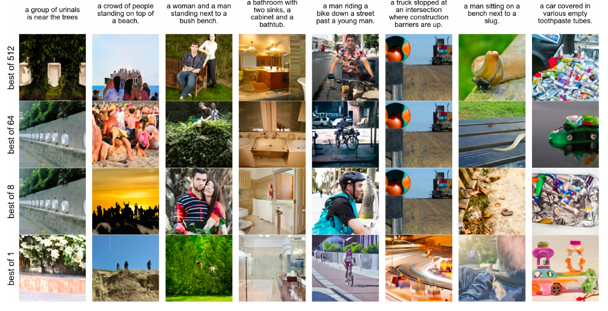

* **训练工程、评测与能力边界**

1. **250M 图文数据**

12B Transformer 使用从互联网收集的 **`250 million`** 个 text-image pair。数据包含 Conceptual Captions、Wikipedia 图文对与经过过滤的 YFCC100M 子集；早期不超过 1.2B 参数的实验使用 3.3 million 对 Conceptual Captions。

数据过滤会删除 caption 过短、由 cld3 判为非英语、主要由日期等 boilerplate 组成的样本，同时删除宽高比不在 **`[1/2, 2]`** 内的图像。极端宽高比在 square crop 后容易丢掉 caption 中提到的主体。

Transformer 训练的图像增强不做水平翻转，因为图像中可能包含文字；先在原图中央附近选择完整 square crop，再缩放到 256 至 288 之间并随机裁成 256×256。

2. **mixed-precision 稳定性**

12B 参数仅用 16-bit 保存权重就约占 **`24 GB`**，超过单张 16 GB V100 的显存。大多数参数、Adam moment 与 activation 使用 16-bit，同时启用 activation checkpointing，在 backward 时重新计算 residual block 内的 activation。

训练超过 1B 参数后，后部 residual block 的 activation gradient 量级持续减小，可能低于 16-bit 最小指数并被舍入为 0。单一 global loss scale 无法同时覆盖最小与最大的梯度，因此每个 residual block 使用独立 gradient scale。

模型一共维护 **`128`** 个 gradient scale。设 data-parallel GPU 数为 $$M$$，每个 scale 初始化为 $$M\cdot 2^{13}$$；一次更新没有非有限值时乘以 $$2^{1/1000}$$，出现非有限值时除以 $$\sqrt{2}$$ 并跳过该 block 的更新。相同 scale 在连续 **`125`** 次更新内不允许再次下降，并被限制在 $$[M\cdot2^7,M\cdot2^{24}]$$。

forward path 在 block 内临时转换到 float16 执行主要算子，再回到 float32；backward path 先 scale 并检查非有限值，计算后 unscale。若某个 block 出现 Inf 或 NaN，只过滤该 block 的 activation gradient，避免让所有更早 block 的 scale 一起下降。

per-resblock gradient scaling 的目标不是放大最终更新，而是在 16-bit 运算前把每一层的梯度移动到可表示区间，离开低精度路径后再还原尺度。

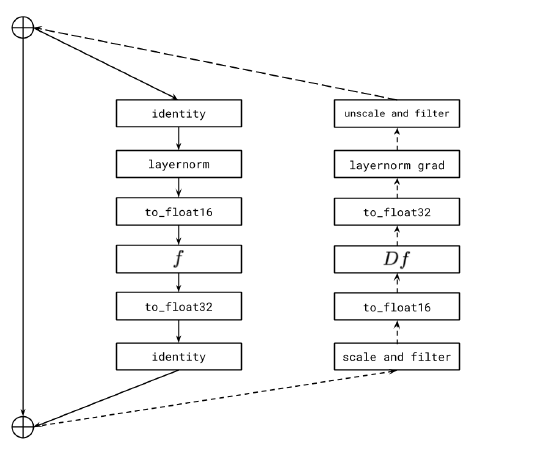

右图实线是 forward，虚线是 backward，完整保留了 identity path、精度转换、scale、unscale 与 filter 的位置。

3. **参数分片与通信重叠**

每台机器的参数阵列分片到 **`8`** 张 GPU。forward 计算当前 residual block 时，以 all-gather 预取下一个 block 的参数分片；计算完成后立即丢弃来自其他 GPU 的临时分片，降低峰值显存。

backward 以相反方向预取前一个 block 的参数。每张 GPU 计算对完整参数的局部梯度后，reduce-scatter 只保留属于本卡的平均梯度切片。这样把同机通信延迟与矩阵计算重叠起来。

下面的通信图展示了单机内部的 all-gather/reduce-scatter，以及不同机器对应 parameter shard 之间的 all-reduce。

* **PowerSGD 梯度压缩**

跨机器带宽远低于同机 GPU 带宽，all-reduce 成为主要瓶颈。PowerSGD 用两个 rank 为 $$r$$ 的低秩因子近似梯度矩阵：

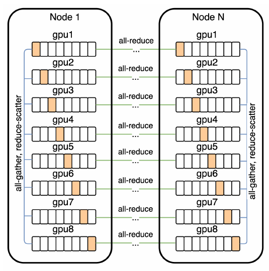

$$G\approx P Q^{\mathsf{T}}$$

每台机器只 all-reduce 较小的 $$P$$ 与 $$Q$$，再重建梯度。对每台机器 8 张 GPU、Transformer hidden size $$d_{\mathrm{model}}$$ 的配置，通信压缩率为：

$$1-\frac{5r}{8d_{\mathrm{model}}}$$

12B 模型使用总 compression rank **`896`**，每张 GPU 的 parameter shard 使用 rank 112，通信量约压缩 **`86%`**。Embedding、unembedding、gain 与 bias 不做 PowerSGD 压缩，并保持 32-bit 参数、梯度和 Adam moment；text/image Logit 也用 32-bit 计算和保存。

error buffer 保存真实梯度与低秩重建的残差。Householder orthogonalization 代替 Gram-Schmidt，并在输入加小的 identity multiple；固定随机 Gaussian $$Q$$ 可以得到与 warm-start 接近的 training loss，而每次更新重采样 $$Q$$ 会明显降低性能。

5. **MS-COCO zero-shot 评测**

DALL-E 在 MS-COCO caption 上直接 zero-shot 生成，没有使用该数据集的 caption 训练。比较对象包括 AttnGAN、DM-GAN 与 DF-GAN，生成样本由 CLIP 从候选集中重排。

人工评测采用 best-of-five vote。与 DF-GAN 对比时，DALL-E 的样本在 **`90.0%`** 的 caption 上被多数人选为更真实，在 **`93.3%`** 的 caption 上被选为更符合文字。

右图把每个 caption 获得 0/5 至 5/5 票的比例堆叠显示，黑框以上表示获得多数票。

未加 blur 时，DALL-E 的 MS-COCO FID 与当时最好方法相差不到 2 分。对真实图和生成图同时施加 radius 1 的轻微 Gaussian blur 后，DALL-E 的 FID 反而领先约 6 分；blur radius 增大时差距继续扩大，说明 dVAE 主要损失的是高频信息，而整体低频结构具有竞争力。

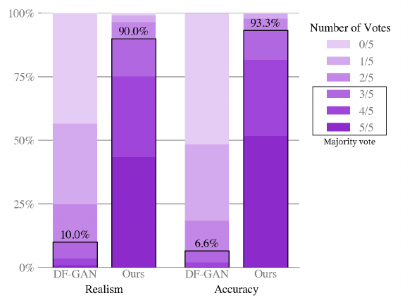

下面的三组曲线分别比较 MS-COCO 与 CUB 在不同 blur radius 下的 FID/IS，以及 reranking sample size 对 MS-COCO 指标的影响。

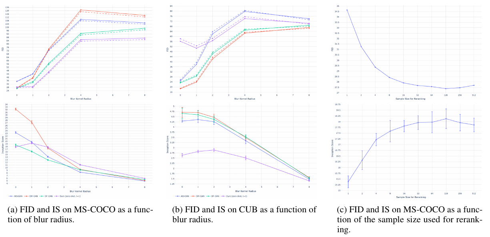

6. **数据重叠控制与 CUB 结果**

训练数据没有直接包含 MS-COCO，但 YFCC100M 子集与 MS-COCO validation image 存在来源重叠。使用专门训练的 contrastive model 找最近训练图，并人工选择保守阈值后，约 **`21%`** 的 MS-COCO validation image 被判为重叠；移除这些图后，FID 没有显著变化。

CUB 的 image overlap 约为 **`12%`**，移除后同样没有显著变化。但 DALL-E 在 CUB 上与领先专用模型仍有接近 **`40`** 个 FID point 的差距。

大规模通用 zero-shot 能力不等于在细粒度专门分布上自动占优。CUB 的结果表明，领域微调与高频细节建模仍然重要。

7. **组合生成与 image-to-image**

模型能够在不同可靠度下组合低频共现的概念，例如把 tapir 与 accordion 融成一个对象、让穿圣诞毛衣的 hedgehog 遛 dog、生成带指定单词的 neon sign。

给定 caption 与图像 token grid 顶部 **`15×32`** 的已知前缀，模型可以继续生成底部区域，把上方照片改画成 sketch。相同机制也能做灰度化、上下翻转、颜色变化，以及把主体转成 greeting card、stamp 或 phone case 风格。

这种 image-to-image 能力来自自回归条件补全：已知区域必须对应序列前缀，所以可直接重生成的矩形需要延伸到图像右下角。

下图依次展示概念融合、多个对象与属性绑定、文字渲染，以及以顶部 token 为前缀的照片到 sketch 转换。

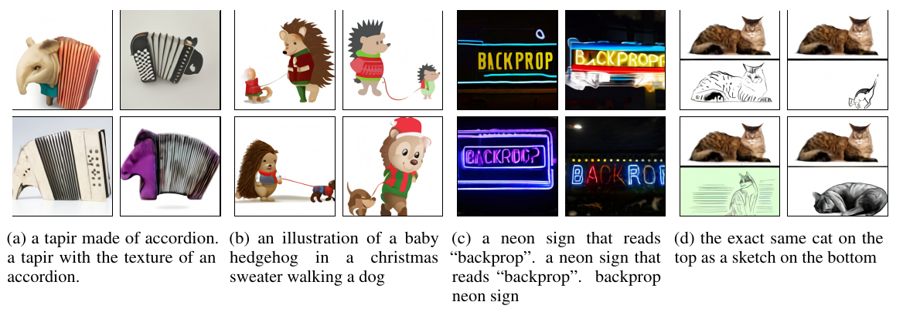

8. **能力限制与正确理解**

复杂 variable binding 不稳定。对象数量增加后，颜色、服饰和主体的对应关系容易混淆；语义等价的 caption 改写也可能导致完全不同的成功率。

文字渲染只在部分短词上可辨认，不能把生成图中的字符串当作可靠文本。dVAE 的有损压缩还会进一步破坏细字、线条、毛发和规则纹理。

CLIP reranking 提升的是从有限候选中选出与 caption 更匹配的结果，并没有修正生成分布本身。best-of-512 指标也不能直接等同于只采样一次的用户体验。

模型会从互联网数据继承职业、地理、文化与身份偏差，也可能生成与真实世界不一致的对象、文字和关系。生成结果不能作为事实记录；实际部署仍需单独处理输入审核、输出审核、版权、隐私、偏差评估与内容标识。

### 4.4.2 DALL-E 2

DALL-E 2 的训练数据集由图像$$x$$和其对应标题$$y$$的对$$(x, y)$$组成。给定一幅图像$$x$$，设$$z_i$$和$$z_t$$分别为其 CLIP 图像嵌入和文本嵌入。作者设计了一个生成流程，通过以下两个组件从标题生成图像：

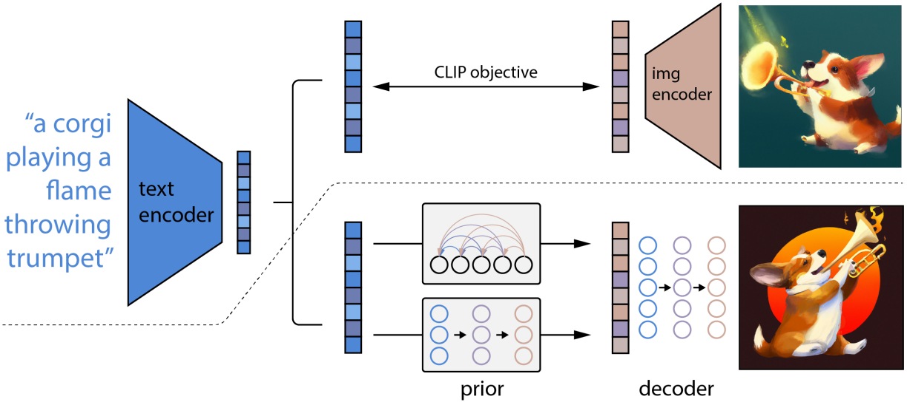

> * **一个 Prior **$$P(z_i | y)$$，它根据标题$$y$$生成 CLIP 图像嵌入$$z_i$$
>
> * **一个 Decoder **$$P(x | z_i, y)$$，它根据 CLIP 图像嵌入$$z_i$$，以及可选的文本标题$$y$$，生成图像$$x$$

Decoder 可以在给定 CLIP 图像嵌入的情况下反转图像，而 Prior 则可以训练一个图像嵌入的生成模型。将这两个组件叠加起来，就可以得到一个从标题$$y$$生成图像$$x$$的生成模型$$P(x | y)$$：

$$P(x | y) = P(x, z_i | y) = P(x | z_i, y) P(z_i | y)$$

第一个等式成立是因为$$z_i$$是$$x$$的确定性函数，第二个等式成立是由于链式法则。因此，可以通过先使用 Prior 采样$$z_i$$，然后使用 Decoder 采样$$x$$，从真实的条件分布$$P(x | y)$$中采样。

* **Decoder**

作者使用扩散模型来生成基于 CLIP image embedding 的图像。具体来说，通过将 CLIP Embedding 添加到现有的timestep Embedding 中，并将 CLIP Embedding 投影为四个额外的上下文 token，这些 token 被连接到文本编码器输出的序列中。

虽然可以直接从解码器的条件分布中采样，但过去使用扩散模型的工作表明，利用对条件信息的指导可以显著提高样本质量。因此通过在**`10%`**的时间随机将 CLIP 嵌入设置为零或学习到的嵌入，并在训练过程中在**`50%`**的时间随机丢弃文本标题，实现了无分类器指导。

为了生成高分辨率图像，作者训练了两个扩散上采样模型：一个用于将图像从$$64 \times 64$$上采样到$$256 \times 256$$分辨率，另一个进一步将图像上采样到$$1024 \times 1024$$分辨率。为了提高上采样器的鲁棒性，在训练期间稍微破坏了条件图像。对于第一阶段的上采样，使用高斯模糊；对于第二阶段，使用更复杂的 BSR 退化方法。为了减少训练计算量并提高数值稳定性，在目标尺寸四分之一大小的随机裁剪图像上进行训练。并且在模型中仅使用空间卷积，不使用注意力层，并在推理时直接以目标分辨率应用模型，观察到它能够很好地泛化到更高分辨率。

* **Prior**

虽然 Decoder 可以从 CLIP 图像嵌入 $$z_i$$ 反转生成图像$$x$$，但还需要一个 Prior 模型，从标题$$y$$生成$$z_i$$，以实现从文本生成图像的功能。这里探索了两种不同的先验模型类别：

> * **自回归 AR Prior**：CLIP 图像嵌入$$z_i$$被转换为离散代码序列，并根据标题$$y$$自回归地预测
>
> * **扩散 Prior**：连续向量$$z_i$$直接用基于标题$$y$$的高斯扩散模型建模

除了标题外，还可以基于 CLIP 文本嵌入$$z_t$$条件化 Prior，因为它是标题的确定性函数。为了提高样本质量，还通过在训练过程中&#x5728;**`10%`**&#x7684;时间随机丢弃文本条件信息 ，为 AR 和扩散 Prior 启用了无分类器指导。

为了更高效地训练和采样 AR 先验，首先通过主成分分析 PCA 降低 CLIP 图像嵌入 $$z_i$$ 的维度。当使用 SAM 训练 CLIP 时，CLIP 表示空间的秩显著降低，同时略微提高了评估指标。通过仅保留原&#x59CB;**`1,024`**&#x4E2A;主成分中&#x7684;**`319`**&#x4E2A;，几乎保留了所有信息。应用 PCA 后，按特征值大小降序排列主成分，将每个维度量化&#x4E3A;**`1,024`**&#x4E2A;离散桶，并使用因果注意掩码的 Transformer 模型预测生成的序列。这使得推理期间预测的标记数量减少了三倍，并提高了训练稳定性。

作者通过对序列前缀编码文本标题和 CLIP 文本嵌入来条件化 AR 先验。此外，在序列前附加一个 token，表示文本 Embedding 和图像 Embedding 之间的点积$$z_i \cdot z_t$$。这能够对更高的点积进行条件化，因为更高的文本-图像点积对应于更好地描述图像的标题。在实践中，从点积分布的上半部分采样是有益的。

对于扩散 Prior，作者在一个序列上训练了一个仅解码器的 Transformer，该序列依次包括：编码后的文本、CLIP 文本嵌入、扩散时间步嵌入、噪声化的 CLIP 图像嵌入，以及一个最终嵌入，其 Transformer 输出用于预测未噪声化的 CLIP 图像嵌入。与 AR 先验不同，作者选择不在扩散先验中基于 $$z_i \cdot z_t$$ 进行条件化；相反，在采样时通过生成两个 $$z_i$$ 样本并选择与 $$z_t$$ 点积更高的样本来提高质量。这里直接训练模型预测未噪声化的 $$z_i$$ 并在其预测上使用均方误差损失：

$$L_{\text{prior}} = \mathbb{E}_{t \sim [1,T], z_i^{(t)} \sim q_t} \left[ \| f_\theta(z_i^{(t)}, t, y) - z_i \|^2 \right]$$

### 4.4.3 DALL-E 3

* **问题定义与总体思路**

DALL·E 3 的出发点不是继续追求更高的像素质量，而是处理文本条件没有被完整执行的问题。要解释这个变化，需要先把 Prompt following 的失败追溯到训练数据：模型没有从 Caption 中见过的关系，推理时通常也很难稳定生成出来。

1. **Prompt following 的核心问题**

文本到图像模型不仅要生成清晰、自然的图像，还要让图像中的对象、属性、数量、位置关系与用户输入一致。早期系统经常忽略 Prompt 中的词语、混淆词序，或者把同一个词错误地绑定到多个对象上。 这类问题统一称为 Prompt following 不足。

如果训练 Caption 只写“一个人在房间里”，模型就很难从数据中学会“红色外套”“左侧窗户”“桌上有三本书”等细粒度绑定关系。DALL·E 3 的主线不是单纯扩大生成模型，而是先提高训练文本对图像内容的覆盖率，再让生成模型学习这些更完整的图文对应关系。

2. **Caption 质量为什么限制生成控制力**

大规模图文数据中的文本通常来自网页标题、Alt Text 或页面附近的短句。它们往往只描述主体，省略背景、对象数量、空间关系、颜色、尺寸以及画面内文字；更糟糕的情况是文本与图像只存在页面层面的关联，并不真正描述图像。

> **低质量 Caption 带来的训练偏差**
>
> 1. **监督缺失**：图像里存在的信息没有进入文本条件，生成模型无法建立对应关系。
>
> 2. **错误绑定**：无关网页文本被当作 Caption，模型会把错误语义与图像特征绑定。
>
> 3) **表达分布过窄**：训练文本普遍短而模糊，推理时输入长 Prompt 就会落到训练分布之外。

一旦把问题定位到监督信号，改进路径就清楚了。训练端先重写 Caption，并用新的文本分布训练生成模型；到了推理端，用户的短请求还要映射到同一种描述风格。这样看，recaptioning 与 Prompt upsampling 不是两个孤立技巧，而是训练端和推理端的一前一后。

3. **从数据重标注到模型训练**

完整 pipeline 可以概括为：训练专用 Image Captioner → 为训练集中的每张图像生成高描述性 Caption → 将 synthetic Caption 与原始 Caption 混合 → 训练文本条件扩散模型 → 推理时用 LLM 把短 Prompt 扩写到训练时熟悉的描述分布。

这一设计把生成控制力拆成两个相互衔接的问题：训练阶段提高图文监督的信息密度，推理阶段降低用户短 Prompt 与训练长 Caption 之间的分布差异。前者解决“模型学到了什么”，后者解决“怎样把用户意图送进模型”。

4. **三类文本不能混为一谈**

> **三个文本阶段**
>
> 1. **原始 Caption**：来自网页或人类书写的配对文本，语言分布自然，但经常短、漏信息或不准确。
>
> 2. **Synthetic Caption**：由 Image Captioner 根据训练图像自动生成，用来重标注训练集。
>
> 3) **Upsampled Prompt**：推理时由 GPT-4 根据用户请求生成的详细图像描述，直接作为 DALL·E 3 的条件输入。

训练集重标注不是在用户每次调用时重新看图生成 Caption，Prompt upsampling 也不是训练数据清洗。 两者都在改善文本条件，但发生时间、输入信息和作用完全不同。

三种文本的角色理顺之后，还要把方法逻辑与具体实现边界分开。Recaptioning 的因果关系和实验设置可以明确说明，但完整生产架构并未全部披露，不能用 ablation 模型的结构去补齐正式版本。

5. **可验证的实现边界**

DALL·E 3 的完整生产架构、参数量、完整训练数据规模、optimizer 与全部训练细节没有被披露。 可以确认的是：DALL·E 3 是 synthetic Caption ablation 模型的放大和改进版本，训练使用 **`95%`** synthetic Caption 与 **`5%`** 原始 Caption；实验模型采用 T5 XXL 条件的三阶段 latent diffusion，DALL·E 3 还使用了单独训练的 latent-to-pixel diffusion Decoder。

> **注：**&#x5B9E;验模型与生产版 DALL·E 3 不能画等号。实验结构可以说明技术家族和 ablation 条件，但不能据此补出生产模型未披露的 stage 宽度、block 数量或参数规模。

* **Dataset Recaptioning 与 Image Captioner**

前面的总体流程把 Captioner 放在了生成模型之前。它不直接参与画图，而是负责重新组织监督信号：先从图像中恢复网页 Caption 漏掉的信息，再把这种描述能力扩展到整套训练数据。模型训练方式决定它能写出什么，数据混合方式则决定这些机器描述会怎样影响后续生成器。

1. **原始图文对中的信息缺口**

训练样本写成图文对 $$(t,i)$$，其中 $$i$$ 是图像，$$t$$ 是描述图像的文本。网页 Caption 最常漏掉四类信息：场景中常见但不显眼的对象、对象的位置与数量、颜色和尺寸等常识属性，以及图像内部实际出现的文字。

例如，浴室图片的 Alt Text 可能是一段商城广告，短 Caption 只写“白色浴缸放在木地板上”，高描述性 Caption 则会继续覆盖木质墙面、吊灯、窗户、盆栽、材质与整体氛围。同一张图提供更密集的文本监督后，模型能在不增加图像样本数的前提下学习更多条件绑定。

2. **Captioner 的自回归目标**

Captioner 先用 tokenizer 把文本拆成 token 序列，再预测当前 token 在历史 token、图像表示与模型参数条件下的概率。图像本身包含大量像素，直接把全部像素送入语言模型成本过高，因此先用预训练 CLIP Image Encoder 得到压缩表示 $$F(i)$$。

$$\mathcal{L}(t,i)=\sum_j \log P(t_j \mid t_{j-k},\ldots,t_{j-1},z_j,F(i);\Theta)$$

这里 $$t_j$$ 是当前目标 token，$$t_{j-k},\ldots,t_{j-1}$$ 是可见文本上下文，$$z_j$$ 表示当前文本位置的内部表示，$$F(i)$$ 提供图像条件，$$\Theta$$ 是 Captioner 参数。这个目标把普通语言建模改造成“看图续写”，使每一步 token 预测都同时依赖文本上下文和图像语义。

目标函数只说明了每一步怎样预测 token，还没有回答 Image Captioner 从哪里获得稳定的图文对齐能力。这个能力来自联合预训练，而 Caption 风格由后续 fine-tuning 决定，两者分工不同。

3. **联合预训练与基础 Captioner**

基础 Captioner 同时采用 CLIP 对比学习目标和语言建模目标，在大规模图文对上联合预训练。这种训练让图像表示和文本表示对齐，同时保留自回归生成 Caption 的能力。

仅靠大规模预训练仍会复现原始数据的问题：模型倾向于只写主体，不愿主动描述背景、位置、画面内文字和细节。 因此，决定 Caption 风格的关键步骤不是继续无差别扩充网页数据，而是用专门标注的小数据集做定向 fine-tuning。

4. **Short 与 Descriptive 两种 fine-tuning**

第一组 fine-tuning 数据只描述图像主对象，得到 Short Synthetic Caption（SSC）。第二组数据使用长而细致的描述，覆盖主体、周边环境、背景、画面文字、风格、色彩与其他可见细节，得到 Descriptive Synthetic Caption（DSC）。

SSC 主要改善 Caption 与主体的直接对应，DSC 则扩大每张图像携带的监督信息，并更接近复杂 Prompt 所需要的组合描述。 两种 Captioner fine-tune 完成后，都会对完整训练图像集合执行推理，为每张图像生成对应的 synthetic Caption。

到这里，Captioner 已经从“能看图续写”变成“能按指定粒度描述图像”。当它被用于整套训练集时，关注点不再只是单条 Caption 是否更丰富，而是大规模统一改写会给生成模型带来哪些收益和系统性偏差。

5. **Synthetic Caption 的价值与偏差**

Recaptioning 可以理解为对网页文本噪声的一次重新估计：Captioner 根据图像本身生成描述，减少广告、文件名和页面上下文等无关文字的影响；相似图像也会得到更统一的表达方式，使训练信号的方差下降。

在使用原始 Caption 计算 CLIP score 时，Synthetic Caption 训练并没有表现出明显损失；在使用 DSC 计算时，优势更加显著，而且训练曲线更平稳。 这说明 synthetic Caption 不只是“写得更长”，而是与图像绑定得更紧。

统一的 Captioner 也会把自己的固定句式、大小写、标点、长度习惯和事实幻觉注入整个训练集。 一旦所有样本都遵循同一种机器文本分布，生成模型会把这些规律当成数据本身的属性。

6. **为什么仍然保留原始 Caption**

训练时不是先固定一份最终文本，而是在 data sampling 阶段按固定概率选择原始 Caption 或 synthetic Caption。原始 Caption 来自真实人类文本分布，能为大小写、标点、句长和表达习惯提供正则化；synthetic Caption 则提供更完整的视觉描述。

两者混合的本质是信息密度与文本分布多样性之间的平衡。 完全依赖原始 Caption 会损失细节监督，完全依赖 synthetic Caption 又会让模型过度适应 Captioner 的固定表达方式。

这个权衡最终落到一个可操作的变量上：训练时以多大概率采样 synthetic Caption。下一步需要在相同模型和相同图像数据下做 ablation，先确认 Caption 类型与混合比例的独立影响，再讨论 DALL·E 3 本身。

* **训练、Prompt upsampling 与生成架构**

数据重标注给出了更密集的监督，但还需要回答两个问题：这种改变能否在受控实验中稳定带来收益，用户的短 Prompt 又怎样接入由长 Caption 训练出来的模型。前一个问题由 recaptioning ablation 解决，后一个问题由 Prompt upsampling 补上，生成架构则说明这些条件最终在哪里进入扩散过程。

1. **Recaptioning ablation 的统一设置**

Caption 类型实验固定图像数据和生成模型结构，只改变训练时使用的 Caption。实验模型都是 T5 条件的文本到图像扩散模型，训练 **`500,000`** steps，batch size 为 **`2,048`**，累计处理约 **`1B`** 个图像样本。

每个模型生成 **`50,000`** 张评测图像。图像通过公开 CLIP ViT-B/32 Image Encoder 得到 $$z_i$$，Caption 通过 Text Encoder 得到 $$z_t$$，两者计算余弦相似度：

$$C(z_i,z_t)=\frac{z_i\cdot z_t}{\lVert z_i\rVert\lVert z_t\rVert}$$

所有图文对的相似度取平均后乘以 **`100`**，并在多个 checkpoint 上用参数的指数滑动平均版本进行评测。这个控制变量设计使 Caption 质量的影响能与模型结构变化分离。

控制住图像数据、模型结构与训练步数后，Caption 才成为唯一主要变量。先比较不同 Caption 类型，可以确认描述性重标注是否真的提高图文对齐；随后再改变采样比例，寻找信息密度与文本多样性的平衡点。

2. **Caption 类型 ablation**

三组模型分别使用原始 Caption、**`95%`** SSC 和 **`95%`** DSC。评测又分为两种文本：原始 Caption 与 DSC。这样可以同时观察模型是否保留对人类短文本的兼容性，以及是否真正学会更细的图像描述。

SSC 和 DSC 在原始 Caption 评测上略优于基线，在 DSC 评测上的提升更明显；DSC 训练曲线同时具有更低方差。 这排除了“长 Caption 只会让模型对长文本过拟合、却损害普通 Prompt”的简单解释。

3. **Synthetic Caption 混合比例**

混合比例实验比较 **`65%`**、**`80%`**、**`90%`** 和 **`95%`** DSC。**`65%`** 组在中途明显落后而被停止，剩余组中 synthetic Caption 比例越高，原始 Caption 上的 CLIP score 也越高。

最终选择 **`95%`** synthetic Caption 与 **`5%`** 原始 Caption，是因为高信息密度带来的收益占主导，同时少量人类文本仍能约束文本分布。

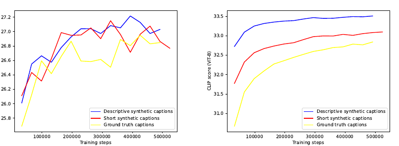

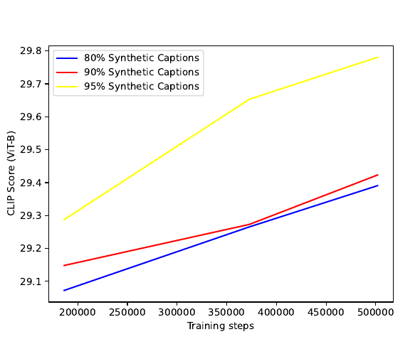

4. **DALL·E 3 的训练 Caption**

DALL·E 3 使用 **`95%`** synthetic Caption 与 **`5%`** 原始 Caption 训练。它是 ablation 模型的放大和改进版本，但还包含多项没有单独 ablate 的变化。

因此，DALL·E 3 相对 DALL·E 2 的全部提升不能归因于 recaptioning 一个变量。 Recaptioning 的独立收益由相同结构的 ablation 支撑；最终系统的跨模型比较同时包含规模、架构和其他训练改进的影响。

训练端的问题到这里基本闭合：模型已经适应信息更密集的 Caption。推理端却出现了新的错位，用户通常不会主动写出同样长度和细节密度的描述，所以还需要在 Prompt 进入生成器之前做一次分布对齐。

5. **Prompt upsampling**

高比例 DSC 会让生成模型适应长而具体的 Caption 分布。用户却常用短句提需求，直接把短 Prompt 输入模型就会形成 train-inference mismatch。GPT-4 负责把短 Prompt “upsample”为包含主体、动作、环境、构图、材质、光照与风格的详细描述。

> **关系消歧示例**
>
> 1. **原始请求**：**`一只鸟吓唬稻草人`**。
>
> 2. **扩写重点**：明确鸟从空中俯冲、稻草人在田野中因恐惧而颤抖，并补充环境、服装与动作状态。
>
> 3) **作用**：把主客体关系写进条件文本，降低生成模型把关系反过来的概率。

用于 upsampling 的描述长度被限制在 **`15–80`** words，并要求一次只输出一条图像描述。用户提出修改时，GPT-4 会重写整条描述以整合新要求，而不是只在末尾追加句子。这使对话式修改仍能保持完整、连贯的图像条件。

Prompt upsampling 负责准备条件文本，却不改变扩散模型内部怎样消费这些条件。把输入侧对齐清楚后，再看文本 Embedding、latent diffusion 与像素 Decoder 的连接方式，完整生成链路才会闭合。

6. **生成模型与 latent Decoder**

用于 synthetic Caption ablation 的图像生成器是三阶段、文本条件的 U-Net latent diffusion。图像先进入 Rombach 等人训练的 VAE，空间尺寸下采样 **`8×`**；在 **`256×256`** 图像实验中，扩散模型处理 **`32×32`** latent。timestep 条件通过 modulated GroupNorm 注入：GroupNorm 输出再乘以由 timestep 学得的 scale，并加上对应 bias。

文本先由 T5 XXL Encoder 编码，生成的文本 latent 通过 xfnet 的 cross-attention 进入扩散网络。可以确认 DALL·E 3 沿用了这条模型家族主线，但生产模型的完整三阶段配置没有展开。

DALL·E 3 还在同一个 VAE latent space 上训练了单独的 latent-to-pixel diffusion Decoder。这个 Decoder 使用与 DDPM 相同类型的卷积 U-Net，再通过 consistency distillation 压缩到 **`2`** 个 denoising steps，用于改善文字和人脸等精细像素结构。

> **注：**&#x8FD9;个 diffusion Decoder 没有用于 recaptioning ablation。它属于 DALL·E 3 的像素解码改进，不能拿来解释不同 Caption 类型实验中的性能差异。

至此，数据、条件文本和生成网络已经连成一条链。方法是否有效，不能只看单个 CLIP score，还要分别检验短 Prompt 兼容性、长描述利用能力、属性绑定和主观画面质量。

* **评测方法与实验结果**

评测要回答的不是“哪一个总分更高”，而是 DALL·E 3 的改动究竟改善了哪类能力。自动指标先覆盖整体相似度与组合属性，Human evaluation 再补上 VLM judge 难以稳定判断的风格偏好和结构连贯性。

1. **自动评测矩阵**

自动评测同时覆盖整体图文相似度、复杂 Prompt following 与属性绑定。对比对象包括 DALL·E 2 生产版本和启用 Refiner 的 Stable Diffusion XL **`1.0`**。

| **Metric** | **DALL·E 3** | **DALL·E 2** | **SDXL** |
| -------------------------------------------------------------------------------- | ---------------------------------------------------------------------------------- | ---------------------------------------------------------------------------------- | ------------------------------------------------------------------------------ |
| MSCOCO CLIP Score                                                                | **`32.0`**                                                                         | 31.4                                                                               | 30.5                                                                           |
| DrawBench short                                                                  | **`70.4%`**                                                                        | 49.0%                                                                              | 46.9%                                                                          |
| DrawBench long                                                                   | **`81.0%`**                                                                        | 52.4%                                                                              | 51.1%                                                                          |
| T2I-CompBench Color                                                              | **`81.1%`**                                                                        | 59.2%                                                                              | 61.9%                                                                          |
| T2I-CompBench Shape                                                              | **`67.5%`**                                                                        | 54.7%                                                                              | 61.9%                                                                          |
| T2I-CompBench Texture                                                            | **`80.7%`**                                                                        | 63.7%                                                                              | 55.2%                                                                          |

上表先给出总体结果，下面按评测目标拆开理解。MSCOCO 检查短 Caption 下的基础对齐，DrawBench 测试复杂指令和扩写后的长 Prompt，T2I-CompBench 则把问题收窄到属性是否绑定到正确对象。

2. **MSCOCO CLIP Score**

MSCOCO 2014 evaluation set 抽取 **`4,096`** 条短 Caption 生成图像，再用公开 CLIP ViT-B/32 计算图文相似度。这个设置刻意使用短 Caption，检验模型是否只对长 synthetic Caption 有效。

DALL·E 3 得到 **`32.0`**，高于 DALL·E 2 的 **`31.4`** 与 SDXL 的 **`30.5`**。 但训练数据没有对 MSCOCO 做去重，存在数据泄漏的可能，因此这个结果更适合作为辅助证据，而不是单独证明泛化能力。

3. **DrawBench 的短 Prompt 与长 Prompt**

每条 DrawBench Prompt 对每个模型生成 **`4`** 张图。视觉版 GPT-4 同时读取图像和原始 Prompt，输出“正确/错误”判断与解释。第二轮把 GPT-4 upsampled Prompt 送给生成模型，但判分时仍使用原始 DrawBench Prompt，避免扩写文本改变评测目标。

短 Prompt 下 DALL·E 3 的正确率为 **`70.4%`**，长 Prompt 下升至 **`81.0%`**；DALL·E 2 与 SDXL 在长 Prompt 下只达到约 **`52%`**。 差距随 Prompt upsampling 扩大，说明 DALL·E 3 更能利用新增细节，而不仅是由 LLM 生成了一段更长文本。

4. **T2I-CompBench 的属性绑定**

T2I-CompBench 选取 color binding、shape binding 与 texture binding 三类组合 Prompt，并用 Disentangled BLIP-VQA 判分。颜色和纹理结果超过 **`80%`**，shape binding 为 **`67.5%`**。

这组评测直接对应 recaptioning 的目标：Caption 中写清“哪个对象具有什么属性”，生成模型才能把颜色、形状和纹理绑定到正确对象。

这些自动评测能够定位文本对齐问题，却不能可靠判断人体结构、对象位置、画面文字是否自然，也很难代表真实使用偏好。于是评测从“图文是否相似”转向成对比较，让人直接判断哪张图更符合描述、风格更好、结构更连贯。

5. **Human evaluation 设计**

Human evaluation 分为 Prompt following、Style 和 Coherence。Prompt following 让评测者查看完整 upsampled Caption，并选择哪张图更符合描述；Style 只比较使用偏好；Coherence 重点检查人体部位、脸、姿态、对象位置、文字和其他不合理结构。

Prompt following 与 Style 使用 **`170`** 条生产场景 Prompt，覆盖人物、商品、地点、概念融合、文字渲染与艺术创作。Coherence 使用 **`250`** 条 MSCOCO Caption，避免虚构场景天然被误判为不连贯。每个图像对和问题收集 **`3`** 个回答，每个模型、每个问题累计 **`2,040`** 次评分。

6. **Human evaluation 结果**

| **Dataset** | **DALL·E 3** | **MJ 5.2** | **SDXL** | **DALL·E 2** |
| --------------------------------------------------------------------------------- | ---------------------------------------------------------------------------------- | -------------------------------------------------------------------------------- | ------------------------------------------------------------------------------ | ---------------------------------------------------------------------------------- |
| Prompt following                                                                  | **`153.3`**                                                                        | -104.8                                                                           | -189.5                                                                         | -                                                                                  |
| Style                                                                             | **`74.0`**                                                                         | 30.9                                                                             | -95.7                                                                          | -                                                                                  |
| MSCOCO Coherence                                                                  | **`71.0`**                                                                         | 48.9                                                                             | -84.2                                                                          | -                                                                                  |
| DrawBench                                                                         | **`61.7`**                                                                         | -                                                                                | -34.0                                                                          | -79.3                                                                              |

ELO 结果显示，DALL·E 3 在 Prompt following 上的优势最大，同时在 Style 与 Coherence 上也领先。这说明提高 Caption 监督没有用画面质量换取文本对齐，最终系统在三类主观维度上都取得正向结果。

视觉版 GPT-4 在对象计数任务上没有稳定超过随机判断，因此 DrawBench 还需要 Human evaluation 补足。 自动指标和 Human evaluation 的结论一致时更可信，单一 VLM judge 不能替代人工评测。

能力评测说明 recaptioning 与 Prompt upsampling 确实改善了指令执行，但部署系统面对的并不只是正常 Prompt。模型还要处理敏感内容、身份人物、偏见与误导性使用，因此生成 pipeline 必须把安全控制放在模型前后，而不是等图像生成完再统一过滤。

* **安全系统、部署控制与局限**

安全系统与生成模型是同一条产品链路上的不同层。输入侧决定哪些请求可以继续、怎样改写条件文本，输出侧负责识别生成结果中的风险；两端之间还可以通过 classifier guidance 影响再次采样。理解这条链路后，才能区分拒绝请求、改写 Prompt 和修正生成结果三种控制方式。

1. **多层 Mitigation Stack**

DALL·E 3 的安全控制不是单一分类器，而是覆盖数据、对话、Prompt 和生成图像的多层系统。训练前过滤明显的色情、暴力与部分仇恨符号；推理时由 ChatGPT refusal、Prompt input classifier、blocklist、Prompt transformation 和 image output classifier 共同拦截风险。

> **推理时的安全链路**
>
> 1. **用户请求**：ChatGPT 先根据敏感内容策略决定是否拒绝。
>
> 2. **输入检查**：Moderation 类 classifier 与文本 blocklist 检查对话和 Prompt。
>
> 3) **Prompt transformation**：扩写描述，同时删除 public figure 名称、补足人物属性，并把品牌对象改写成泛化描述。
>
> 4) **图像生成**：DALL·E 3 接收变换后的详细 Prompt。
>
> 5. **输出检查**：图像 classifier 在结果展示前检测并拦截风险图像。

多层设计的原因是视觉同义替换会绕过纯文本检查，例如用“红色液体”代替“血液”。 输入 classifier 无法穷举所有视觉表达，输出 classifier 和生成过程中的干预仍然必要。

多层 Mitigation Stack 给出了全局结构，最具体的技术难点落在输出图像分类上：同一个不安全 Prompt 可能生成安全图像，违规区域也可能只占画面很小一部分。Racy output classifier 的数据构造和推理裁剪正是围绕这两个问题展开。

2. **Racy output classifier**

Racy output classifier 使用冻结的 CLIP Image Encoder 提取特征，再由小型辅助模型预测安全分数。最初直接用文本 Moderation 结果给生成图像打标签，但 unsafe Prompt 也可能生成 safe 图像，导致标签噪声。

数据清洗先用 Microsoft Cognitive Service API 给图像打 racy confidence，再从每一类均匀采样 **`1,024`** 张进行人工核验，以确定重新标注阈值。针对“小区域违规、其余区域正常”的 hard case，又各准备 **`100K`** racy 与 non-racy 图像，并把一张 racy 图像随机裁成占画面 **`20%`** 的区域，粘贴到 non-racy 图像中；对应 negative sample 则粘贴 non-racy 区域。

Cut-paste 数据迫使 classifier 检查局部内容，而不是记住整张图的全局模式；non-square 图像再使用左/中/右或上/中/下的 **`3`** crops 取最大安全分数。 hard64 true positive rate 从 baseline 的 **`1.6`** 提升到 **`78.1`**。

3. **Classifier guidance 的二次生成**

当 output classifier 检出 racy 图像时，系统不会只做拒绝，而是把原 Prompt 重新提交，并设置一个特殊 flag。这个 flag 让 diffusion sampling 使用 racy classifier 的方向，从可能触发风险的图像区域“推开”，生成更合适的替代结果。

在用于触发非预期或边界 racy 内容的对抗 Prompt 集上，DALL·E 3 launch 的此类输出比例降到 **`0.7%`**。 这种方法适合“用户请求本身正常，但模型默认生成不当内容”的场景；如果用户请求已经违反策略，仍由 refusal 和输入检查直接处理。

Racy safety 主要约束内容类别，人物生成还会暴露另一类问题：当 Prompt 没写身份属性时，模型会用训练分布中的默认模式补全空白。Grounding 与 Prompt transformation 由此进入 pipeline，它们不只是安全过滤，也会主动改变生成条件。

4. **Bias、Grounding 与 Prompt transformation**

未做缓解时，人物图像偏向白人、年轻和女性，也更容易采用西方视角。对未指定人物属性的 Prompt，ChatGPT 会补充更具体的性别、种族或其他身份描述，让 DALL·E 3 在生成时看到 grounded Prompt。

Grounding 能提高人物多样性，并减少模型用训练分布中的默认人群填补空白。 系统指令与二次 Prompt transformation 的组合测试中，最高 aggregate accuracy 达到 **`77.1`**。

Prompt transformation 也可能改变用户原意：轻微增加一个身份词会同时改变人物、背景和文化语境，过度 Grounding 还可能向场景中添加原本不存在的人，或给非人对象附加人类属性。 部署时需要在多样性、忠实度、latency 与用户控制之间取舍。

5. **Public figure 生成控制**

Public figure 风险通过 ChatGPT refusal、扩展 blocklist、Prompt transformation 和输出 classifier 共同处理。对 **`500`** 条明确请求 public figure 的 synthetic Prompt，DALL·E 3 early 有 **`2.5%`** 的结果包含目标人物；launch mitigation 下没有检出 public figure。

另一组 **`500`** 条来自 alpha 使用数据的 adversarial Prompt 更隐晦。Launch 版本仍有约 **`0.7%`** 生成 public figure，**`33.8%`** 被 ChatGPT 拒绝，**`29.0%`** 被图像生成组件拒绝，其余结果不含 public figure。

用职业、外貌、事件和文化符号间接描述某人，仍可能绕过姓名 blocklist。 这说明 public figure 控制不能只依赖人名匹配，必须结合语义改写与图像身份检测。

Public figure 控制关注的是可识别身份，Artist style、版权对象和误导性内容则涉及不同的风险边界。它们不能共用一条简单的“关键词命中即拒绝”规则，还要结合对象类型、生成风格和传播语境判断。

6. **Artist style、版权与误导性内容**

对“模仿在世艺术家风格”的请求，系统使用 refusal 与可更新的艺术家姓名 blocklist。品牌与受版权保护的角色则通过输入改写和部分拒绝降低风险，但常见物体可能天然带有强品牌关联，无法覆盖所有组合。

误导性内容的风险取决于真实性、生成规模、效率和传播上下文。特定视觉风格会显著改变可信度，例如 CCTV、新闻摄影或官方文件外观。DALL·E 3 可以生成虚构事件的写实图像，视觉风格还可能绕过对普通 photorealistic 请求的限制。

CBRN red teaming 覆盖化学、生物、放射性与核领域的示意图和视觉说明。生成内容普遍存在科学错误，且受到 refusal 与现实材料、设备获取门槛限制。这类错误输出不能当作安全保障，也不能作为科学说明使用。

安全控制讨论到这里，剩下的是模型本身的能力边界。空间关系、文字渲染和特定实体识别即使不触发任何安全策略，也可能因为 Captioner 观察错误或生成器绑定失败而出错。

7. **空间关系、文字与特定实体**

> **主要能力边界**
>
> 1. **Spatial awareness**：left of、underneath、behind 等关系仍不稳定，因为 Captioner 自己也不能可靠描述对象位置。
>
> 2. **Text rendering**：能生成画面文字，但容易漏字、多字或拼写错误；T5 以整词 token 表示文本，再映射到逐字符像素结构，存在表示粒度不匹配。
>
> 3) **Specific entity**：Captioner 会臆测植物或鸟类的属种名称，错误会传递给生成模型，使特定物种和专名生成不可靠。
>
> 4) **Counting**：对象数量仍是薄弱项，视觉版 GPT-4 对计数型结果的判分也不稳定。

这些局限揭示了 recaptioning 的上限：生成模型能学到的条件关系，受 Captioner 能否准确观察、命名和表达这些关系直接限制。 继续提升 Captioner 的空间描述、OCR 与细粒度识别能力，才可能进一步改善下游生成。

**总结**

DALL·E 3 的关键贡献是把 Prompt following 从“只改生成器”转化为“训练文本质量、生成模型与推理 Prompt 分布共同优化”的系统问题。 Synthetic Caption 提高训练监督的信息密度，少量原始 Caption 保留人类文本多样性，Prompt upsampling 再把用户短请求映射到模型熟悉的长描述分布。

这条路线在 CLIP score、DrawBench、属性绑定和 Human evaluation 上同时带来收益，并保持 Style 与 Coherence 的竞争力。 工程上最重要的边界是：数据改进效果有受控 ablation 支撑，但完整生产架构没有全部披露；产品能力还依赖 ChatGPT transformation、分类器、blocklist 与二次采样等系统级组件。

---

[Previous](08-Diffusion-Model--Diffusion-的应用.md) | [Contents](../../README.md) | [Next](10-Diffusion-Model--其他工作.md) | [Visual website](https://weyumm.github.io/vlm-Wissen/lecture-2.html#c=9)
