[Previous](09-Diffusion-Model--OpenAI-工作.md) | [Contents](../../README.md) | [Next](11-Diffusion-Model--视频生成.md) | [Visual website](https://weyumm.github.io/vlm-Wissen/lecture-2.html#c=10)

## 4.5 其他工作

### 4.5.1 Imagen

Imagen 由一个将文本映射为 Embedding 序列的 Text Encoder，以及一系列级联的条件扩散模型组成，这些扩散模型将 Embedding 逐步转换为分辨率逐渐升高的图像。

* **Text Encoder **

文本到图像模型需要强大的语义 Text Encoder，从而可以捕捉任意自然语言输入的复杂性和组合性。

当前的文本到图像模型通常采用在图像-文本配对数据上训练的 Text Encoder；这类编码器可以从头开始训练，也可以在图像-文本数据上进行预训练，例如**`CLIP`**。这种图像-文本联合训练的一些工作表明，这些 Text Encoder 可能学习到了与视觉相关的、具有语义意义的表示，特别适用于文本到图像生成任务。

LLM 是另一种用于文本编码的候选模型。最近，LLM &#x5982;**`BERT`**、**`GPT`**、**`T5`**&#x5728;文本理解与生成能力方面取得了显著进展。这些模型仅在纯文本语料库上训练，其规模远大于图像-文本配对数据，因此能够接触到更加丰富和广泛的文本分布。此外，这些模型的参数量通常也远大于当前图像-文本模型中的 Text Encoder。

Imagen 探索了多种预训练 Text Encoder ：**`BERT`**、**`T5`**&#x548C;**`CLIP`**。Imagen 冻结了这些 Text Encoder 的权重。权重冻结带来多个优势，例如可以预先离线计算文本 Embedding ，从而在文本到图像模型训练过程中几乎不产生额外的计算或内存开销。

增大 Text Encoder 的规模能显著提升文本到图像生成的质量。此外，尽&#x7BA1;**`T5-XXL`**&#x4E0E;**`CLIP Text Encoder`**&#x5728; MS-COCO 等简单基准上表现相近，但在 DrawBench上的评估中，人类评测者更偏好 T5-XXL 编码器，无论是在图像与文本的对齐程度还是图像保真度方面。

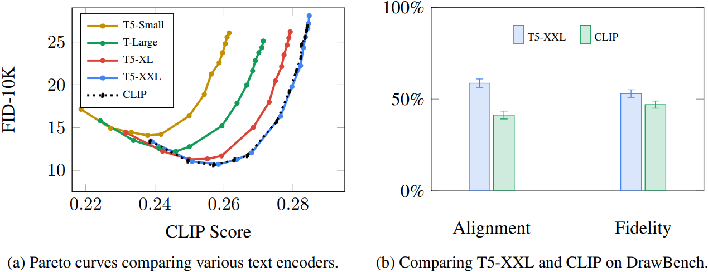

* **无分类器引导**

扩散模型$$\hat{x}_\theta$$通常通过如下去噪目标进行训练：

$$\mathbb{E}_{x,c,\epsilon,t} \left[ w_t \left\| \hat{x}_\theta(\alpha_t x + \sigma_t \epsilon, c) - x \right\|^2_2 \right]$$

其中$$(x, c)$$是数据与条件的配对，$$t \sim \mathcal{U}([0, 1])$$，$$\epsilon \sim \mathcal{N}(0, I)$$，而$$\alpha_t$$、$$\sigma_t$$、$$w_t$$是关于$$t$$的函数，影响生成样本的质量。直观上，$$\hat{x}_\theta$$被训练为使用平方误差损失将带噪输入$$z_t := \alpha_t x + \sigma_t \epsilon$$恢复为原始数据$$x$$，并通过权重 $$w_t$$强调某些时间步$$t$$的重要性。

采样从纯噪声$$z_1 \sim \mathcal{N}(0, I)$$开始，迭代生成一系列点$$z_{t_1}, \ldots, z_{t_T}$$，其中$$1 = t_1 > \cdots > t_T = 0$$，噪声逐渐减少。这些中间状态依赖于模型对原始数据的预测$$x'_t := \hat{x}_\theta(z_t, c)$$。

**分类器引导 classifier guidance** 是在采样过程中利用预训练模型$$p(c|z_t)$$的梯度来提升生成质量但牺牲多样性的技术。**无分类器引导 classifier-free guidance** 则提供了一种替代方案：不使用额外的分类器模型，而是通过在训练时以一定概率随机丢弃条件$$c$$，使同一个扩散模型同时学习有条件和无条件的生成目标。

在采样时，使用调整后的$$x$$-预测：

$$\frac{z_t - \sigma\tilde{\epsilon}_\theta}{\alpha_t}$$

其中

$$\tilde{\epsilon}_\theta(z_t, c) = w \epsilon_\theta(z_t, c) + (1 - w) \epsilon_\theta(z_t)$$

这里$$\epsilon_\theta(z_t, c)$$和$$\epsilon_\theta(z_t)$$分别表示有条件和无条件的噪声预测，定义为$$\epsilon_\theta := (z_t - \alpha_t \hat{x}_\theta)/\sigma_t$$，$$w$$是引导权重。

> * 当 $$w=1$$时，等价于关闭无分类器引导
>
> * 当$$w > 1$$时则增强引导效果

Imagen 的文本条件生成严重依赖无分类器引导机制。

* **采样策略**

作者发现增大无分类器引导权重有助于提升图像与文本的对齐程度，但会损害图像保真度，导致图像颜色过度饱和且不自然。这一问题源于训练与测试阶段的不匹配：在高引导权重下，每一步的$$x$$-预测$$\hat{x}_t'$$应保持在与训练数据相同的范围内，即$$[-1, 1]$$，但高引导权重会导致预测值超出该范围。由于扩散模型在采样过程中反复将其自身输出作为输入，这种越界行为会累积并最终导致生成异常甚至发散的图像。

为解决此问题，作者研究了静态阈值法和动态阈值法（参见附录图 A.31 的实现参考及图 A.9 的效果可视化）。

**静态阈值法**

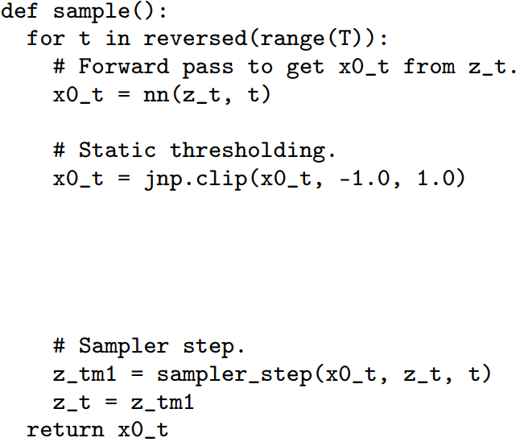

逐元素地将$$x$$-预测裁剪至$$[-1, 1]$$区间，这种做法在早期工作中已被使用，但没有掀起什么浪花。作者发现，在使用大引导权重时，静态阈值至关重要，可防止生成全白或无效图像。然而，随着引导权重进一步增加，图像仍会出现过度饱和、细节丢失的问题。

**动态阈值法**

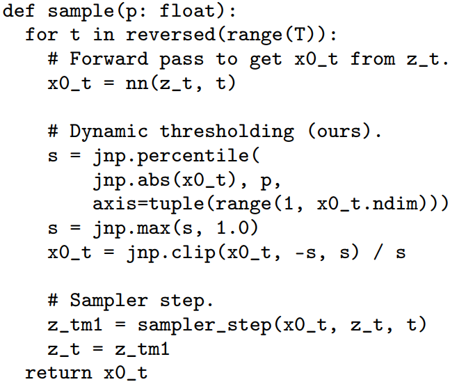

在每一步采样中，令$$s$$为$$\hat{x}_t'$$中像素绝对值的某个百分位数，例&#x5982;**`99.5%`**，若$$s > 1$$，则将$$\hat{x}_t'$$截断至$$[-s, s]$$，并整体除$$s$$。这主动将接近$$-1$$或$$1$$的饱和像素向内压缩，有效防止每一步中像素值达到饱和极限，提升了图像的真实感和图像-文本对齐质量，在使用极大引导权重时效果更为明显。

* **级联扩散模型**

Imagen 采用一个级联系统：首先是一个基础的$$64 \times 64$$扩散模型，随后接两个文本条件的超分辨率扩散模型，分别将$$64 \times 64$$图像上采样至$$256 \times 256$$，再进一步升至$$1024 \times 1024$$。

通过引入 noise level conditioning，使超分辨率模型感知所添加噪声的强度，可显著提升生成质量，并增强模型对低分辨率模型产生的伪影的鲁棒性。Imagen 在两个超分辨率模型中均采用了噪声条件增强，对生成高质量图像至关重要。

具体而言，给定一个低分辨率条件图像和增强级别，记作$$\text{aug\_level}$$，例如 高斯噪声强度或模糊程度 ，使用对应$$\text{aug\_level}$$的噪声对低分辨率图像进行扰动，并将$$\text{aug\_level}$$作为扩散模型的输入条件。

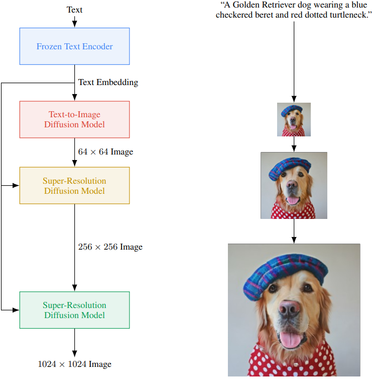

> * 训练时$$\text{aug\_level}$$随机选取
>
> * 推理时，遍历不同取值以寻找最佳生成效果

作者采用高斯噪声作为增强方式，并使用类似扩散模型前向过程的方差保持型高斯噪声增强。增强级别由 $$\text{aug\_level} \in [0, 1]$$ 表示。伪代码如下：

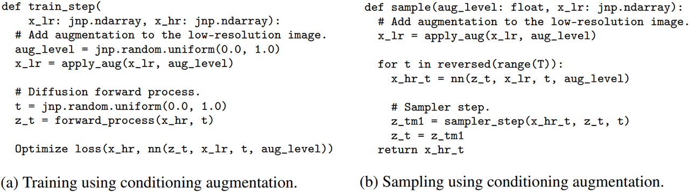

* **神经网络架构**

1. **基础模型**

基于文献中的 U-Net 架构构建$$64 \times 64$$的文本到图像扩散模型。模型通过一个池化后的文本 Embedding 向量接收文本条件，并将其与扩散时间步 Embedding 相加。此外在多个分辨率层级上引入交叉注意力机制，使得模型能够关注整个文本 Embedding 序列。并且在注意力层和池化层中对文本 Embedding 应用 Layer Normalization 能显著提升性能。

* **超分辨率模型**

对于$$64 \times 64 \to 256 \times 256$$的超分辨率任务，采用改进版的 U-Net 模型。并对该结构进行了多项优化，以提升内存效率、推理速度和收敛速度，在**`step/second`**指标上比原始 U-Net 快**`2–3`**倍：

> * **参数从高分辨率向低分辨率转移**：通过在低分辨率层级增加更多的残差块，将模型参数从高分辨率块转移到低分辨率块。由于低分辨率特征图通常具有更多通道，这种设计可以在不显著增加内存和计算开销的前提下，有效提升模型容量。
>
> * **跳跃连接的缩放**：当在低分辨率层级使用大量残差块时，例如在低分辨率层级使用**`8`**个残差块，而标准 U-Net 架构通常仅使用**`2–3`**个，将跳跃连接乘以$$\frac{1}{\sqrt{2}}$$能显著加快模型收敛速度。
>
> * **下采样与上采样顺序的反转**：在典型的 U-Net 中，下采样位于卷积之后；上采样位于卷积之前。作者在这两类模块中均反转了该顺序——即先下采样再卷积，或先上采样再卷积。这一调整显著提升了 U-Net 的前向推理速度，且未带来任何性能下降。

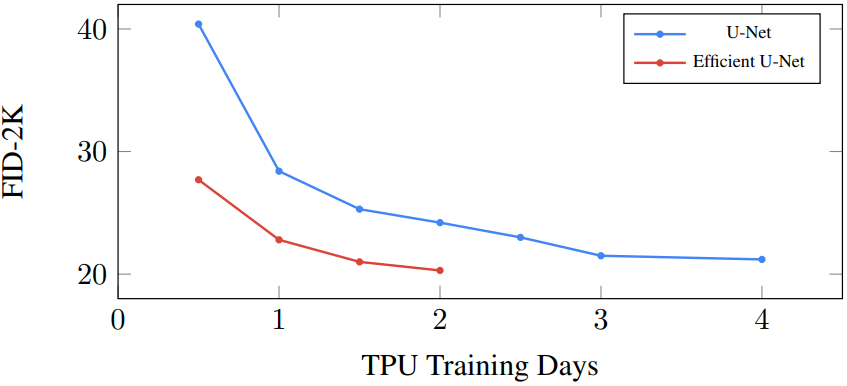

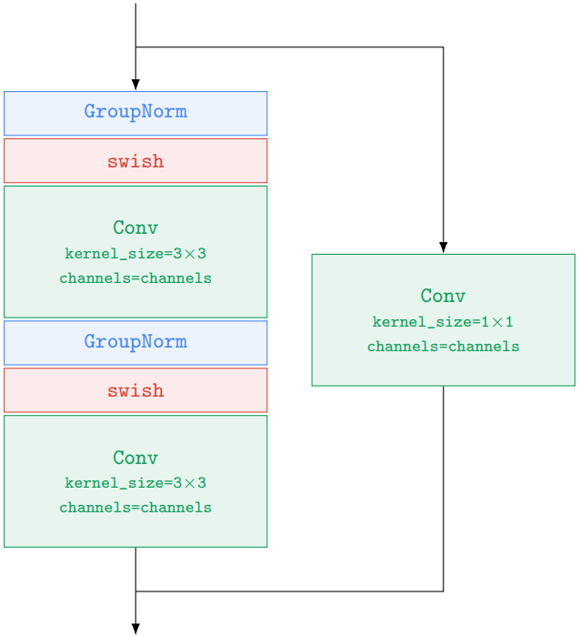

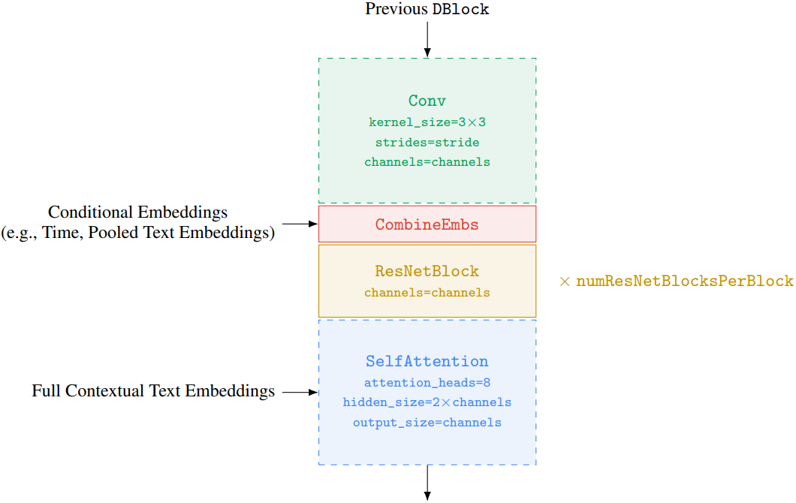

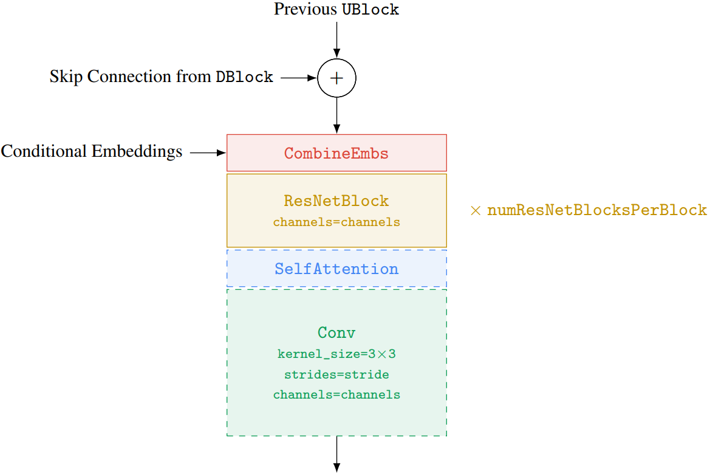

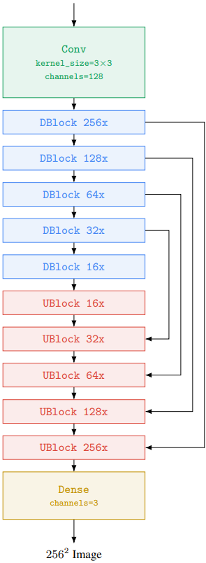

对于$$256 \times 256 \to 1024 \times 1024$$的超分辨率模型，训练时使用从$$1024 \times 1024$$图像中裁剪出的$$64 \times 64 \to 256 \times 256$$区域进行训练。移除了自注意力层，但保留了文本交叉注意力层，这对生成质量至关重要。在推理阶段，模型接收完整的$$256 \times 256$$低分辨率图像作为输入，并输出上采样后的$$1024 \times 1024$$图像。

### 4.5.2 Z-Image

* **模型架构**

**Z-Image** &#x7528;**`Qwen3-4B`**&#x4F5C;为文本编码器，利用其双语能力将复杂指令与视觉内容对齐。图像编码&#x7528;**`FLUX VAE`**，因为已被验证有高质量重建能力。对于编辑任务，引&#x5165;**`SigLIP 2`**，从参考图像中提取抽象的视觉语义信息。由于 Decoder-only 模式在扩展性方面有很多好处，**Z-Image** 采用 **Single-Stream 的 MM-DiT 范式**，其中文本、视觉语义分词和 VAE 图像分词在序列层面被拼接为统一的输入流，相较于双流方法能最大化参数效率。

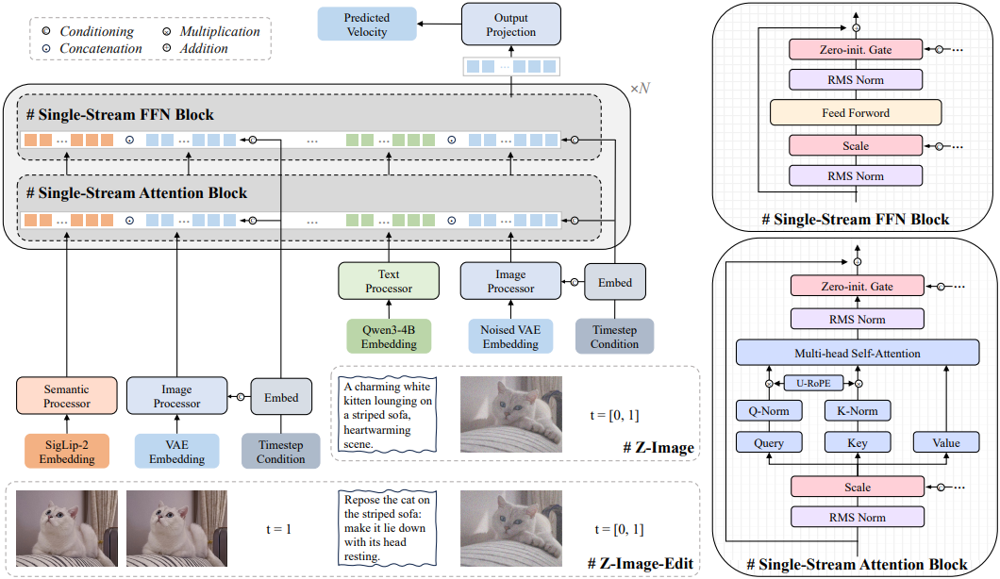

位置编码采&#x7528;**`3D Unified RoPE`**：图像 token 在空间维度上展开，文本 token 沿时间维度递增。在编辑任务中，会给参考图像 token 与目标图像 token 对齐的空间 RoPE 坐标，但在时间维度上通过一个单位间隔偏移加以区分。此外参考图像和目标图像分别施加不同的时间条件值，以区分干净图像与含噪图像。

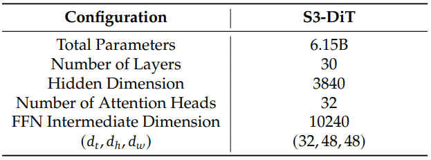

**S3-DiT**（**S**calable **S**ingle-**S**tream **DiT**）使用轻量级的模态专用 Processor，每个 Processor 由两个 Transformer 块组成，用于初步的模态对齐。随后，所有 token 进入统一的 Single-Stream 主干网络。为确保训练稳定性，**Z-Image** 对注意力激活值使用 QK-Norm，并使用 Sandwich-Norm 约束每个 Attention 和 FFN 块输入与输出处的信号幅度。对于条件信息注入，**输入条件向量被投影为`Scale`与门控`Gate`参数**，用于调节 Attention 层和 FFN 层归一化后的输入与输出。为降低参数开销，这&#x4E2A;**投影被分解为一个低秩对**：一个共享的、与层无关的下投影层，后接各层专用的上投影层。这里所有归一化操作统一采用 RMSNorm。

* **训练**

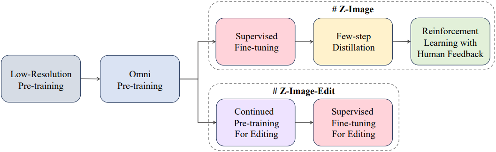

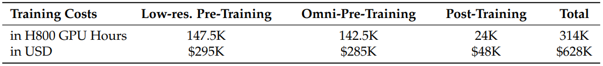

1. **预训练**

**Z-Image** 采用流匹配目标进行训练，其中含噪输入通过高斯噪声$$x_0$$与原始图像$$x_1$$之间的线性插值得到： &#x20;

$$x_t = t \cdot x_1 + (1 - t) \cdot x_0$$

训练模型用于预测定义二者路径的向量场速度： &#x20;

$$v_t = x_1 - x_0$$

训练目标可表示为： &#x20;

$$\mathcal{L} = \mathbb{E}_{t, x_0, x_1, y} \left[ \| u(x_t, y, t; \theta) - (x_1 - x_0) \|^2 \right]$$

其中$$\theta$$为可学习参数，$$y$$为条件 Embedding。&#x548C;**`SD3`**&#x505A;法类似的，这里也采用**`logit-normal`**噪声采样器，将训练集中在中间时间步。为了应对多分辨率训练设置下信噪比 SNR 的变化，采用 FLUX 中的动态时间位移策略，确保不同图像分辨率下的噪声水平得到适当缩放，从而实现更有效的训练。**Z-Image** 的预训练可分为两个阶段：**低分辨率预训练**与**全模态预训练**：

> **低分辨率预训练**：仅在$$256×256$$分辨率下进行，专注于文生图任务，高效实现跨模态对齐与知识注入，使模型具备生成多样化概念、风格与构图的能力，这和之前工作的多阶段训练的初始阶段一致。这个阶段占总预训练计算量的一半以上，因为模型的大部分基础视觉知识在此阶段获得，如中文文本渲染。
>
> **全模态预训练**：
>
> * **任意分辨率训练**：**Z-Image** 设计了一种任意分辨率训练策略，通过分辨率映射函数将原始图像分辨率映射到预定义训练范围，使模型在多样化分辨率与宽高比的图像上训练。这有助于学习跨尺度视觉信息，缓解固定分辨率下采样导致的信息损失，并提升数据效率。 &#x20;
>
> * **文生图与图生图联合训练**：将图生图任务整合进预训练框架。借助预训练阶段充足的计算资源，可有效利用大规模、自然出现且弱对齐的图像对。学习自然图像对之间的关系，为图像编辑等下游任务提供了很好的基础。另一个重要原因是联合预训练方案对文生图任务性能无明显损害。 &#x20;
>
> * **多粒度双语字幕训练**：为确保双语理解与母语指令遵循能力，使用 Z-Captioner 生成双语、多粒度合成字幕，包括长、中、短描述、标签及模拟用户 prompt。以小概率纳入每张图像原有的文本元数据，增强模型的世界知识获取。不同粒度与视角的字幕提供了广泛的模式覆盖，有利于后续训练阶段。对于图生图任务，以一定概率随机采样目标图像字幕或成对差异字幕，分别对应参考引导图像生成与多任务图像编辑。

* **SFT**

全模态预训练建立了广泛的世界认知与模式覆盖，但输出分布不可避免地具有高方差，反映了网络规模数据的噪声特性。因此，SFT 的主要目标不仅是修正局部伪影，更是将生成分布收窄至一个聚焦的高保真 sub-manifold，即快速收敛至一个具有统一视觉美学与精准指令遵循能力的固定分布。为此从预训练中的噪声监督切换至由数据基础设施筛选的高精度图像与超细粒度、具体化字幕主导的 curriculum。这种严格监督作为锚点，迫使模型摒弃低质量模式，如不稳定的风格化或不一致的渲染，严格对齐详细文本描述，使模型从**多样性最大化**转向**质量最大化**。

分布收窄过程中，关键挑战是灾难性遗忘，尤其是长尾概念在收敛过程中易被主导模式掩盖。因此在 SFT 全程实施严格类别平衡。这里采用基于世界知识拓扑图的动态重采样策略：维护一个概念目标先验，并利用基于 BM25 的检索实时计算训练样本的稀有度得分。在构建小批量时，**对代表性不足的概念进行上采样**，如稀有实体或特定艺术风格，&#x800C;**对过度代表的概念进行下采样**。这确保模型在收敛至目标高质量分布的同时，概念边际分布保持均匀，有效保留了预训练模型的语义多样性。

此外但在特定高质量数据集上的 SFT 仍可能引入微小偏差或能力权衡，如写实性与风格灵活性。为在不引入复杂推理路由的前提下实现帕累托最优解，在最后阶段采用**模型合并**进一步优化。这里从同一主干初始化多个 SFT 变体，每个变体在不同能力维度上略有偏向，如严格指令遵循或美学渲染，然&#x540E;**在参数空间中对它们的权重进行线性插值**： &#x20;

$$\theta_{\text{final}} = \sum_i \alpha_i \theta_i$$

这种轻量级合并策略有效平滑了损失曲面，中和了个体偏差，最终模型在面对多样化 prompt 时展现出优于任一 SFT checkpoint 的稳定性与鲁棒性。

* **蒸馏**

蒸馏阶段的目标是降低基础 SFT 模型的推理时间，以满足实际应用与大规模部署对效率的需求。虽然 6B 模型相比更大模型有显著效率提升，但推理成本仍比较大。由于扩散模型固有的迭代特性，标准 SFT 模型使用 **CFG**（**C**lassifier-**F**ree **G**uidance）生成高质量样本需约 100 **NFEs**（**N**umber of **F**unction **E**valuations）。

本质上，蒸馏过程是让学生模型在更少的时间步上模仿教师模型的去噪动态。核心挑战在于降低该轨迹的内在不确定性，使学生模型能将其概率路径转换为确定且高效的推理过程。因此，实现稳定少步积分器的关键在于对蒸馏过程进行精细控制。通过对蒸馏机制的深入探索，**Z-Image** 对 **DMD**（**D**istribution **M**atching **D**istillation）做出两个改进：**`Decoupled DMD`**&#x4E0E;**`DMDR`**：

**Decoupled DMD：解决细节与色彩退化  **

现有 DMD 方法的有效性不是一个因素决定的，而是两个独立但协同机制的结果： &#x20;

> * **CFG-Augmentation(CA)**：可以高效构建学生模型的少步生成能力
>
> * **Distribution Matching(DM)**：主要作为强正则项，确保训练稳定性并消除新 artifacts

**Z-Image** 分别研究与优化它们，提出 Decoupled DMD，**核心是对 CA 与 DM 项分别采用定制化的 renoising 调度**，其有效解决了传统 DMD 的痛点，确保细节锐利与色彩保真。所得蒸馏模型不仅匹配原始多步教师模型，甚至在写实性与视觉冲击力上超越后者。

**DMDR：通过强化学习与正则化提升 Capacity**

为进一步突破少步模型的性能边界，**Z-Image** 将强化学习融入蒸馏过程，但将 RL 应用于生成模型有可能会存在 **reward hacking** 风险，即模型通过利用奖励函数生成高分但视觉无意义的图像。通常需引入外部正则化加以缓解。**Z-Image** 从 Decoupled DMD 的改进中想到了解决方案：**既然 DM 项本身即为高质量正则项，便可与 RL 目标有机融合**。这催生了 **DMDR**（**D**istribution **M**atching **D**istillation meets **R**einforcement Learning）。在此框架中，RL 释放学生模型对齐人类偏好的能力，而 DM 项则作为鲁棒约束，有效防止 reward hacking。这种协同使 **Z-Image** 在保持严格生成稳定性的同时，实现更优的美学对齐与语义忠实度。

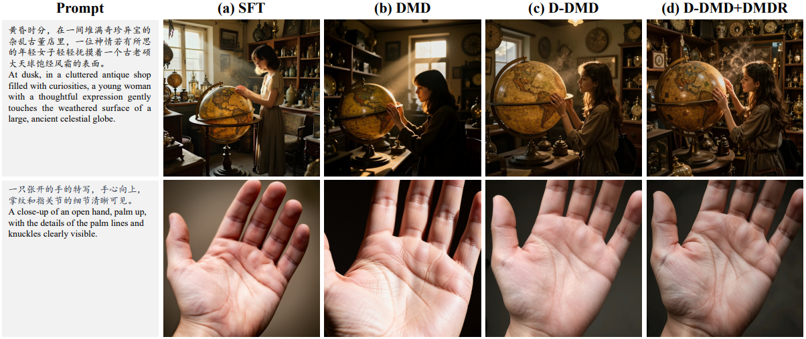

* **RLHF**

经过之前的阶段后，模型已具备强大基础能力，但在对齐细腻人类偏好方面仍可能存在不一致。因此 RLHF，这依赖一个强大的多维奖励模型，为在线优化提供定向反馈。在这些信号引导下，训练分为两个连续阶段：**首先通过 DPO 进行离线对齐，随后通过 GRPO 进行在线精调**。这两个阶段能先高效灌输对客观标准的严格遵循，再利用奖励模型的细粒度信号优化更主观的品质。

**奖励模型**

奖励模型沿三个维度评估模型表现：**指令遵循能力**、**AI 内容检测感知**与**美学质量**。奖励模型专门针对这些维度提供定向反馈。对于指令遵循，将 prompt 进行句法与语义分解，构建结构化层次，包括：核心主体实体、属性规格、动作或交互要求、空间或构图约束、风格或渲染条件。标注时需要模型输出不满足的点，据此计算满足元素的比例，得到最终指令遵循得分，作为目标奖励。

**Stage 1：基于客观维度的 DPO 离线对齐  **

为 DPO 手动构建偏好对可用于捕捉人类美学判断，但将其扩展至大规模高质量数据集是比较困难的。在主观维度（如美学、风格）上持续获取信息丰富的偏好对速度慢且需大量标注。为此 DPO 专注于客观、可验证的维度。这些维度具有清晰的二元正确性标准，如文本渲染、物体计数，非常适合由 VLM 自动评估。例如，给定要求特定文本的 prompt ，准确渲染字符的图像被标记为正样本，而存在拼写错误的图像为负样本。这里利用 VLM 自动生成大量此类候选偏好对，并对其进行简化的人工验证与清洗，确保高保真度。这种 VLM 与人工结合的混合流程相比纯人工标注大幅提升了标注吞吐量与一致性。

为平滑学习曲线，**Z-Image** 对 DPO 训练实施课程学习策略：从低复杂度 prompt （如渲染单个词、生成少量物体）开始，逐步过渡到涉及多元素、复杂布局或困难风格的更具挑战性的指令。由于 DPO 的收敛对正负样本间的差异敏感，为最大化训练效率，课程初期优先选择差异适中的样本对，随后逐步引入差异更大或更细微的挑战性样本对，这可加速收敛并提升最终性能。

**Stage 2：基于 GRPO 的在线优化** 

在奖励模型引导下，这个阶段显著提升模型的写实图像生成能力，并改善美学质量与细腻指令遵循能力。在 GRPO 训练循环中，通过聚合奖励模型各项得分（如写实性、美学、指令遵循等）计算复合优势函数。这种多维反馈机制支持定向、细粒度优化。通过为生成的不同方面提供独立信号，GRPO 可同步增强写实图像生成、美学质量、语义准确性，并减少不良伪影。这远优于单一奖励优化，使模型在多个常相互冲突的质量维度间实现更好平衡。

* **图像编辑持续预训练**

面向图像编辑的持续预训练包含两个阶段。在持续预训练阶段，使用构建的编辑对与文生图 SFT 数据联合训练，以确保高图像质量。首先在$$512×512$$分辨率下对全部编辑数据进行数千步训练，以快速适应编辑任务；随后将分辨率提升至$$1024×1024$$，以实现高生成质量。由于图像编辑数据对获取成本高、难度大，其总量远小于且多样性远低于文生图数据。因此采用相对更高的文生图数据比例，例如文生图:图生图 = 4:1，以避免训练过程中的性能下降。

在后续 SFT 阶段，人工构建一个任务平衡、高质量的训练子集，以进一步提升模型整体性能，尤其是指令遵循能力。但合成数据（如用于文本编辑的渲染文本数据）虽易于获取且指令遵循准确率达 100%，但其分布与真实用户输入相去甚远，因此在此最终训练阶段被大幅下采样。

* **进一步优化**

1. **Prompt Enhancer**

由于模型规模有限，**Z-Image** 在世界知识、意图理解与复杂推理方面存在局限。但它是一个强大的文本解码器，能将详细 prompt 转化为逼真图像。为弥补差距，**Z-Image** 使用了一&#x4E2A;**&#x20;PE**（**P**rompt **E**nhancer），由系统 prompt 与预训练 VLM 驱动，以提升其推理与知识能力。

这里在对齐过程中保持大型 VLM 固定。在 SFT 阶段将所有输入 prompt 通过 PE 模型处理，确保 **Z-Image** 在 SFT 过程中有效对齐 Prompt Enhancer。结构化推理链是注入推理与世界知识的关键因素：无推理时，PE 仅将坐标文本渲染到图像上；有推理时，它能推断位置并生成正确场景。类似地，在生成期刊风格指令时，缺乏推理导致输出单调，而推理增强模型则通过为每一步生成具体插图来丰富结果。

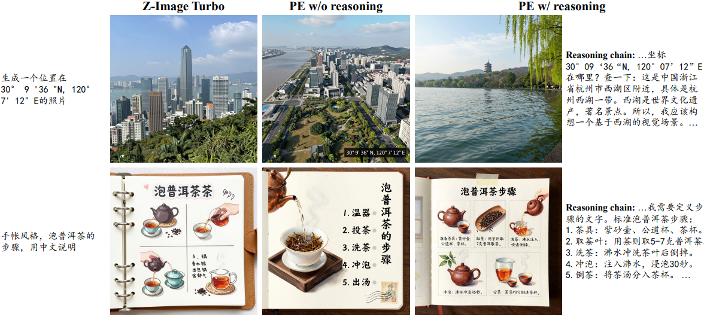

* **训练效率优化**

在分布式训练方面，采&#x7528;**混合并行策略**。对于 VAE 与文本编码器，因其在训练中冻结且内存占用极小，应用标准的数据并行**`DP`**。而对于大型 DiT 模型，其优化器状态与梯度占用大量内存，采用**`FSDP2`**，将这些开销有效分片至多个 GPU。此外，在所有 DiT 层上使用梯度检查点，以可接受的计算开销换取显著的内存节省，从而支持更大的批量大小并提升整体吞吐量。为进一步加速计算并优化内存使用，DiT 块通&#x8FC7;**`torch.compile`**&#x8FDB;行编译。

除系统级优化外，**Z-Image** 还解决了混合分辨率训练带来的效率问题。将序列长度差异显著的样本打包至同一批次通常导致大量填充，严重拖慢训练速度。因此设计了一种感知序列长度的批构建策略：在训练前，基于元数据中记录的图像分辨率预估每个样本的序列长度；采样器随后将序列长度相近的样本分组至同一批次，以最小化计算浪费。此外引入动态批大小机制：为长序列批次分配较小的批大小以避免显存溢出，而为短序列批次分配更大的批大小以避免资源闲置。这确保在不同分辨率下均能实现硬件资源的最大化利用。

---

[Previous](09-Diffusion-Model--OpenAI-工作.md) | [Contents](../../README.md) | [Next](11-Diffusion-Model--视频生成.md) | [Visual website](https://weyumm.github.io/vlm-Wissen/lecture-2.html#c=10)
