* **<span style="color: rgb(36,91,219); background-color: inherit">笔记标题样式及颜色含义</span>**


# 1. <span style="color: rgb(36,91,219); background-color: inherit">视觉基础</span>

## 1.1 <span style="color: rgb(36,91,219); background-color: inherit">CNN 骨干网络</span>

### 1.1.1 <span style="color: rgb(36,91,219); background-color: inherit">卷积与池化</span>

<span style="color: rgb(36,91,219); background-color: inherit">卷积神经网络 </span>CNN 是一种特殊类型的深度神经网络，其结构如右图，<span style="color: rgb(100,37,208); background-color: inherit">由卷积层，池化层，全连接层等各种类型的结构构成</span>。在图像处理等领域，与普通的深度神经网络相比，CNN拥有更好的处理效果。<span style="color: rgb(100,37,208); background-color: inherit">CNN 中有两层结构是其特有的：</span>**<span style="color: rgb(100,37,208); background-color: inherit">卷积</span>**<span style="color: rgb(100,37,208); background-color: inherit">和</span>**<span style="color: rgb(100,37,208); background-color: inherit">池化</span>**。

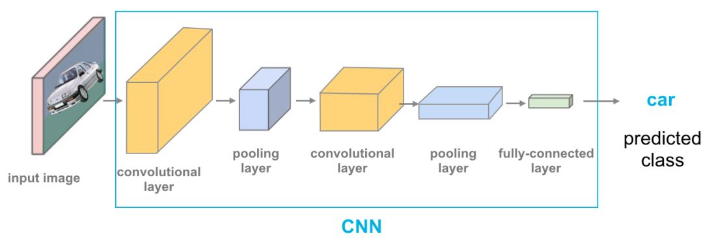

* **<span style="color: rgb(36,91,219); background-color: inherit">卷积层</span>**

卷积层是 CNN 网络中独立的一层，用来进行一种称之为卷积操作，该操作的示意图右图：

**<span style="color: rgb(222,120,2); background-color: inherit">例</span>**：原始图像用一&#x4E2A;**`8x8`**&#x7684;矩阵表示，对于这个矩阵，使用一&#x4E2A;**`3X3`**&#x7684;矩阵对其进行映射运算，图中的红色光柱标记了第一个九宫格的中心&#x70B9;**`6`**，映射的过程其实是取&#x4EE5;**`6`**&#x4E3A;中心&#x7684;**`3×3`**&#x56FE;像区域，将区域内每个元素&#x4E0E;**`3×3`**&#x5377;积核对应位置的元素相乘，再&#x5C06;**`9`**&#x4E2A;乘积求和，最后总得到的值&#x4E3A;**`-3`**。

只需要定义移动的步长，就可以遍历图像中的所有点，比如定义步长为`1`，遍历过程如下图所示

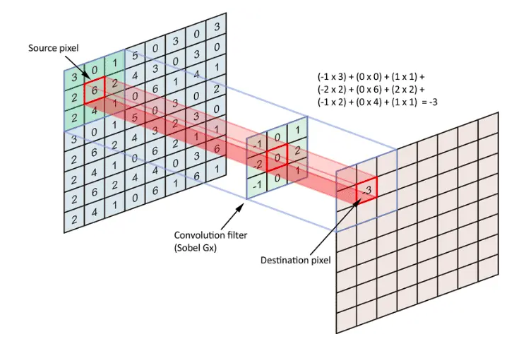

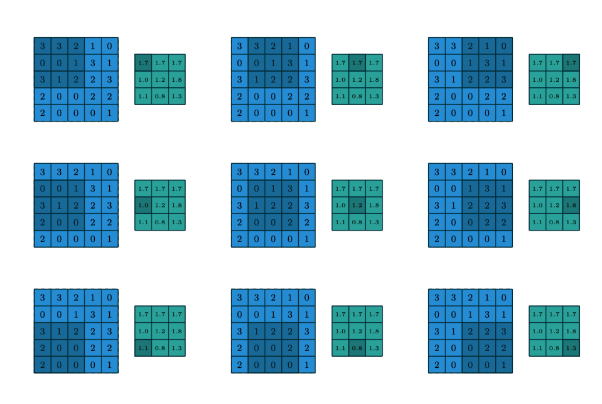

上述过程是基于无填充的情况，在有填充的情况下，对于图像边缘的点，会&#x7528;**`0`**&#x586B;充，如右图

遍历所有点可以得到一张新的图，这样的图称之为特征图，示例如下

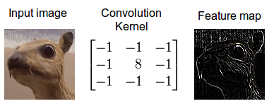

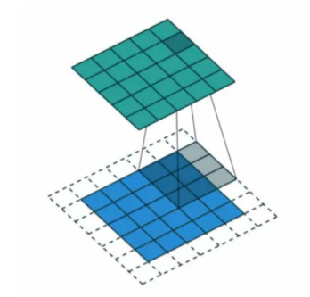

所以卷积层是用来做特征提取的。

* **<span style="color: rgb(36,91,219); background-color: inherit">池化层</span>**

池化是一种下采样技术，本质是基于滑动窗口的思想，可以去除特征图中的冗余信息，降低特征图的维度。事先定义好窗口和步长，然后对原始图像进行分割，对于分割的子窗口，采取某种策略取一个样本点出来，常用的有两种策略

> 1. &#x53D6;**<span style="color: rgb(36,91,219); background-color: inherit">最大值</span>**，对应max pooling
>
> ✍️ 2. &#x53D6;**<span style="color: rgb(36,91,219); background-color: inherit">平均值</span>**，对应average pooling

**<span style="color: rgb(222,120,2); background-color: inherit">例</span>**：定义窗口大小&#x4E3A;**`2X2`**, 步长&#x4E3A;**`2`**，两种策略的结果如右图

图像被分割成&#x4E86;**`4`**&#x4E2A;子窗口，然后每个子窗口内取最大值或者平均值，就构成了一幅新图像。新图像的维度比原始图像小，达到了降维的目的。

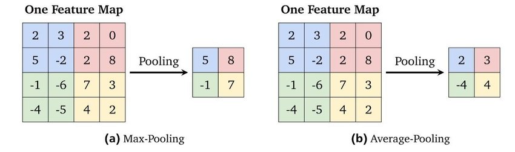

### 1.1.2 <span style="color: rgb(36,91,219); background-color: inherit">LeNet</span>

卷积神经网络 **<span style="color: rgb(216,57,49); background-color: inherit">CNN</span>**<span style="color: rgb(216,57,49); background-color: inherit">（</span>**<span style="color: rgb(216,57,49); background-color: inherit">C</span>**<span style="color: rgb(216,57,49); background-color: inherit">onvolutional </span>**<span style="color: rgb(216,57,49); background-color: inherit">N</span>**<span style="color: rgb(216,57,49); background-color: inherit">eural </span>**<span style="color: rgb(216,57,49); background-color: inherit">N</span>**<span style="color: rgb(216,57,49); background-color: inherit">etwork）</span>是深度学习领域中最具影响力的模型之一，而 **LeNet** 则是 CNN 的开山之作。这一节将详细介绍 LeNet。

LeNet 由 **Yann LeCun** 于 1998 年在 **AT\&T** 贝尔实验室提出，最初被应用于手写字符识别任务。<span style="color: rgb(100,37,208); background-color: inherit">这篇工作标志着卷积神经网络首次通过反向传播算法成功训练，并在实际应用中展现了卓越的性能</span>。LeCun 的研究不仅奠定了 CNN 的基础，还为后续的深度学习发展提供了重要的理论支持。

尽管当时的计算资源有限，但 LeNet 的设计理念却极具前瞻性。它通过引入卷积层和池化层的层次结构，实现了高效的特征提取与分类任务。这一创新使得 LeNet 在手写数字识别任务中表现优异，尤其是在 MNIST 数据集上的应用广受关注。

* **<span style="color: rgb(36,91,219); background-color: inherit">核心思想</span>**

**<span style="color: rgb(100,37,208); background-color: inherit">LeNet-5</span>**<span style="color: rgb(100,37,208); background-color: inherit"> 的设计体现了卷积神经网络的三大核心思想：</span>**<span style="color: rgb(100,37,208); background-color: inherit">局部感受野</span>**<span style="color: rgb(100,37,208); background-color: inherit"> 、</span>**<span style="color: rgb(100,37,208); background-color: inherit">权值共享</span>**<span style="color: rgb(100,37,208); background-color: inherit">和</span>**<span style="color: rgb(100,37,208); background-color: inherit">池化操作</span>**：

1. **<span style="color: rgb(36,91,219); background-color: inherit">局部感受野</span>**：局部感受野的思想来源于生物视觉系统的研究，尤其是猫的视觉神经元实验。在 LeNet-5 中，每个神经元只对输入图像的局部区域敏感，而不是对整个图像进行处理。这种设计显著减少了参数数量，并使网络能够专注于提取局部特征，例如边缘、角点等。

   > 🏖️ 1. **<span style="color: rgb(36,91,219); background-color: inherit">实现方式</span>**：通过卷积核（滤波器）对输入图像进行滑动窗口操作，提取局部特征。
   >
   > 2. **<span style="color: rgb(36,91,219); background-color: inherit">优点</span>**：降低了计算复杂度，增强了模型的可解释性。

2. **<span style="color: rgb(36,91,219); background-color: inherit">权值共享</span>**：权值共享是卷积神经网络的核心特性之一，它允许同一个卷积核在整个输入图像上重复使用。这种机制不仅减少了模型的参数数量，还提高了特征提取的一致性。

   > 🥛 1. **<span style="color: rgb(36,91,219); background-color: inherit">实现方式</span>**：卷积层中的每个卷积核在输入图像的不同位置上共享相同的权重和偏置。
   >
   > 2. **<span style="color: rgb(36,91,219); background-color: inherit">优点</span>**：大幅减少了模型的存储需求，同时增强了模型对平移不变性的鲁棒性。

3. **<span style="color: rgb(36,91,219); background-color: inherit">池化操作</span>**：池化操作通过对特征图进行下采样，降低其空间维度，从而减少计算量并增强模型的鲁棒性。LeNet-5 中采用的是平均池化 Average Pooling，但现在 CNN 更常用最大池化 Max Pooling 以保留更显著的特征。

   > 📌 1. **<span style="color: rgb(36,91,219); background-color: inherit">实现方式</span>**：将特征图划分为若干个 2×2 的区域，取每个区域的平均值或最大值作为输出。
   >
   > 2. **<span style="color: rgb(36,91,219); background-color: inherit">优点</span>**：减少了特征图的空间尺寸，缓解了过拟合问题。

* **<span style="color: rgb(36,91,219); background-color: inherit">网络结构</span>**

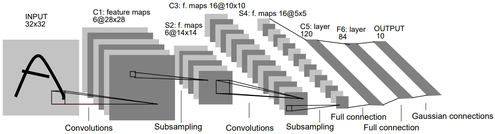

**LeNet-5** 的设计体现了卷积、池化和全连接层的有机结合。以下是对 **LeNet-5** 的网络结构详解：

> 🌟 1. **<span style="color: rgb(36,91,219); background-color: inherit">输入层</span>**：**LeNet-5** 的输入层接受大小&#x4E3A;**`32×32`**&#x7684;灰度图像。尽管 MNIST 数据集中的手写数字图像原始尺寸&#x4E3A;**`28×28`**，但在输入到网络之前，这些图像会被填充&#x5230;**`32×32`**，以便更好地适应卷积操作的需求。

> 2. **<span style="color: rgb(36,91,219); background-color: inherit">第一卷积块</span>**：**LeNet-5** 的第一个卷积块由一个卷积层和一个池化层组成。
>
>    🌰 1. **<span style="color: rgb(36,91,219); background-color: inherit">卷积层</span>**：第一卷积层使&#x7528;**`6`**&#x4E2A;**`5×5`**&#x7684;卷积核对输入图像进行卷积操作，生&#x6210;**`6`**&#x4E2A;特征图。每个卷积核通过滑动窗口的方式提取局部特征，例如边缘、角点等。由于输入图像是单通道的灰度图像，因此卷积核的深度&#x4E3A;**`1`**。
>
>       1. 输出特征图的尺寸&#x4E3A;**`28×28`**，这是通过公式$$(W−F+2P)/S+1$$计算得出的，其中$$W=32$$是输入尺寸，$$F=5$$是卷积核尺寸，$$P=0$$是填充，$$S=1$$是步幅。
>
>       2. 参数数量为$$5×5×1×6+6=156$$，包括卷积核权重和偏置项。
>
>    2. **<span style="color: rgb(36,91,219); background-color: inherit">池化层</span>**：池化层采用平均池化 Average Pooling，将每&#x4E2A;**`2×2`**&#x7684;区域映射为一个值，从而将特征图的空间尺寸减半。输出特征图的尺寸&#x4E3A;**`14×14`**。
>
>       1. 池化操作不仅减少了计算量，还增强了模型对输入图像平移和缩放的鲁棒性。

> 3. **<span style="color: rgb(36,91,219); background-color: inherit">第二卷积块</span>**：第二个卷积块进一步提取更高级的特征。
>
>    🍞 1. **<span style="color: rgb(36,91,219); background-color: inherit">卷积层</span>**：第二卷积层使&#x7528;**`16`**&#x4E2A;**`5×5`**&#x7684;卷积核对前一层&#x7684;**`6`**&#x4E2A;特征图进行卷积操作，生&#x6210;**`16`**&#x4E2A;新的特征图。为了减少参数数量，这里采用了部分连接的方式：并非所有输入特征图都与所有输出特征图相连。
>
>       1. 输出特征图的尺寸&#x4E3A;**`10×10`**，计算方式同上。
>
>       2. 参数数量为$$5×5×6×16+16=2,416$$。
>
>    2. **<span style="color: rgb(36,91,219); background-color: inherit">池化层</span>**：再次使用平均池化，将特征图的空间尺寸减半。输出特征图的尺寸&#x4E3A;**`5×5`**。

> 4. **<span style="color: rgb(36,91,219); background-color: inherit">全连接层</span>**：在经过两个卷积块后，LeNet-5 将高维特征映射到低维空间，并通过全连接层完成分类任务：
>
>    1. **<span style="color: rgb(36,91,219); background-color: inherit">展平操作</span>**：在进入全连接层之前，特征图被展平为一维向量。展平后的向量长度为$$16×5×5=400$$。
>
>    🎹 2. **<span style="color: rgb(36,91,219); background-color: inherit">第一全连接层</span>**：第一全连接层&#x6709;**`120`**&#x4E2A;神经元，用于整合卷积层提取的特征。参数数量为 $$400×120+120=48,120$$。
>
>    3. **<span style="color: rgb(36,91,219); background-color: inherit">第二全连接层</span>**：第二全连接层&#x6709;**`84`**&#x4E2A;神经元，进一步压缩特征表示。参数数量为$$120×84+84=10,164$$。

> 🎉 5. **<span style="color: rgb(36,91,219); background-color: inherit">输出层</span>**：输出层&#x6709;**`10`**&#x4E2A;神经元，对应于 **MNIST** 数据集中的 0 到 9 &#x5171;**`10`**&#x4E2A;类别。使用 **Softmax** 激活函数输出每个类别的概率分布。参数数量为$$84×10+10=850$$。

**<span style="color: rgb(36,91,219); background-color: inherit">激活函数</span>**：**LeNet-5** 使用非线性激活函数增强模型的表达能力。早期版本中通常采用 **Sigmoid** 或 **Tanh** 函数，但现在实现中更倾向于使用 **ReLU** 以加速训练并缓解梯度消失问题。

**<span style="color: rgb(222,120,2); background-color: inherit">代码实现</span>**

以下是一个简单的基于 PyTorch 的 LeNet实现：

```python
LeNet-5
Pythonimport torch
import torch.nn as nn
import torch.nn.functional as F

class LeNet(nn.Module):
    def __init__(self):
        super(LeNet, self).__init__()
        self.conv1 = nn.Conv2d(1, 6, kernel_size=5)  # 第一层卷积
        self.pool1 = nn.AvgPool2d(kernel_size=2, stride=2)  # 第一层池化
        self.conv2 = nn.Conv2d(6, 16, kernel_size=5)  # 第二层卷积
        self.pool2 = nn.AvgPool2d(kernel_size=2, stride=2)  # 第二层池化
        self.fc1 = nn.Linear(16 * 4 * 4, 120)  # 全连接层1
        self.fc2 = nn.Linear(120, 84)  # 全连接层2
        self.fc3 = nn.Linear(84, 10)  # 输出层
```


**<span style="color: rgb(222,120,2); background-color: inherit">总结</span>**

LeNet 作为卷积神经网络的奠基之作，不仅在技术上开创了先河，还在实际应用中取得了显著成效。它的设计理念至今仍然影响着深度学习的发展方向。通过学习 LeNet，可以更好地理解卷积神经网络的工作原理，并为进一步探索复杂的深度学习模型打下坚实的基础。

### 1.1.3 <span style="color: rgb(36,91,219); background-color: inherit">AlexNet</span>

在深度学习的发展历程中，2012 年是一个重要的年份。这一年，**<span style="color: rgb(100,37,208); background-color: inherit">AlexNet</span>**<span style="color: rgb(100,37,208); background-color: inherit"> 的出现彻底改变了计算机视觉领域，并为深度学习的复兴奠定了坚实的基础</span>。AlexNet 是由 Alex Krizhevsky、Ilya Sutskever 以及他们的导师 Geoffrey Hinton 共同设计并提出的。<span style="color: rgb(46,161,33); background-color: inherit">这一模型在 ImageNet 大规模视觉识别挑战赛 ILSVRC 中取得了突破性的成绩</span>，将错误率从此前&#x7684;**`26.2%`**&#x5927;幅降低&#x81F3;**`15.3%`**，震惊了整个学术界。

* **<span style="color: rgb(36,91,219); background-color: inherit">网络架构</span>**

**AlexNet** 的架构可以看作是 **LeNet** 的扩展版本，但其规模和复杂性远远超过了当时的其他模型。**AlexNet** 包&#x542B;**`5`**&#x4E2A;卷积层、**`3`**&#x4E2A;全连接层，以及一些关键的设计创新，使其成为深度学习历史上的经典之作。

**<span style="color: rgb(36,91,219); background-color: inherit">整体结构</span>**

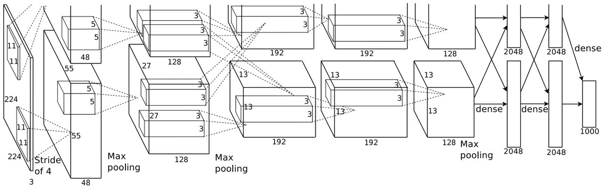

**AlexNet** 的整体结构包括： &#x20;

> * **<span style="color: rgb(36,91,219); background-color: inherit">输入层</span>**：接&#x6536;**`224×224`**&#x5927;小的 RGB 图像作为输入。为了增强数据多样性，输入图像会经过随机裁剪和水平翻转等数据增强操作。
>
> * **<span style="color: rgb(36,91,219); background-color: inherit">卷积层</span>**：&#x5171;**`5`**&#x4E2A;卷积层，其中前两个卷积层后接局部响应归一&#x5316;**`LRN`**&#x548C;最大池&#x5316;**`Max-Pooling`**，后续卷积层则直接堆叠。这些卷积层通过不同的滤波器逐步提取图像特征。
>
> 🚅 * **<span style="color: rgb(36,91,219); background-color: inherit">全连接层</span>**：包&#x542B;**`3`**&#x4E2A;全连接层，其中前两个全连接层使&#x7528;**`ReLU`**&#x6FC0;活函数，并结&#x5408;**`Dropout`**&#x8FDB;行正则化。最后一个全连接层输&#x51FA;**`1000`**&#x4E2A;类别的概率分布，对应于ImageNet数据集的分类任务。
>
> * **<span style="color: rgb(36,91,219); background-color: inherit">输出层</span>**：通&#x8FC7;**`Softmax`**&#x51FD;数计算每个类别的概率值。

**<span style="color: rgb(36,91,219); background-color: inherit">卷积层的设计</span>**

**AlexNet** 的卷积层设计体现了当时的技术创新，以下是各层的具体参数和功能：

> 🌟 * **<span style="color: rgb(36,91,219); background-color: inherit">C1 层</span>**：第一个卷积层使&#x7528;**`96`**&#x4E2A;大小&#x4E3A;**`11×11`**、步长&#x4E3A;**`4`**&#x7684;卷积核，生&#x6210;**`96`**&#x4E2A;特征图。由于卷积核较大，**<span style="color: rgb(100,37,208); background-color: inherit">C1</span>**<span style="color: rgb(100,37,208); background-color: inherit"> 层主要捕捉图像中的低级特征，例如边缘和纹理</span>。
>
> * **<span style="color: rgb(36,91,219); background-color: inherit">C2 层</span>**：第二个卷积层使&#x7528;**`256个5×5`**&#x7684;卷积核，步长&#x4E3A;**`1`**，并<span style="color: rgb(100,37,208); background-color: inherit">采用零填充 </span>**<span style="color: rgb(100,37,208); background-color: inherit">Zero Padding</span>**<span style="color: rgb(100,37,208); background-color: inherit"> 以保持特征图的尺寸不变。</span>**<span style="color: rgb(100,37,208); background-color: inherit">C2</span>**<span style="color: rgb(100,37,208); background-color: inherit"> 层进一步组合低级特征，形成更复杂的模式</span>。
>
> * **<span style="color: rgb(36,91,219); background-color: inherit">C3-C5 层</span>**：后续的三个卷积层分别使&#x7528;**`3×3`**&#x7684;小卷积核，逐步提取更高层次的特征，例如物体的部分结构或整体形状。这种<span style="color: rgb(46,161,33); background-color: inherit">逐层抽象的方式使得 </span>**<span style="color: rgb(46,161,33); background-color: inherit">AlexNet</span>**<span style="color: rgb(46,161,33); background-color: inherit"> 能够有效地处理复杂的视觉任务</span>。

**<span style="color: rgb(36,91,219); background-color: inherit">激活函数</span>**

在 **AlexNet** 之前，<span style="color: rgb(216,57,49); background-color: inherit">大多数神经网络使用的是</span>**`Sigmoid`**<span style="color: rgb(216,57,49); background-color: inherit">或</span>**`Tanh`**<span style="color: rgb(216,57,49); background-color: inherit">激活函数。然而，这些函数在深层网络中容易导致梯度消失问题</span>。**<span style="color: rgb(46,161,33); background-color: inherit">AlexNet</span>**<span style="color: rgb(46,161,33); background-color: inherit"> 首次引入了 </span>**<span style="color: rgb(216,57,49); background-color: inherit">ReLU</span>**<span style="color: rgb(216,57,49); background-color: inherit">（</span>**<span style="color: rgb(216,57,49); background-color: inherit">Re</span>**<span style="color: rgb(216,57,49); background-color: inherit">ctified </span>**<span style="color: rgb(216,57,49); background-color: inherit">L</span>**<span style="color: rgb(216,57,49); background-color: inherit">inear </span>**<span style="color: rgb(216,57,49); background-color: inherit">U</span>**<span style="color: rgb(216,57,49); background-color: inherit">nit）</span> <span style="color: rgb(46,161,33); background-color: inherit">作为激活函数，显著加速了训练过程，并缓解了梯度消失的问题</span>。 &#x20;

**ReLU** 的公式为$$f(x) = \max(0, x)$$，<span style="color: rgb(46,161,33); background-color: inherit">它通过将负值直接置零的方式避免了梯度饱和现象，从而提高了网络的收敛速度。此外，</span>**<span style="color: rgb(46,161,33); background-color: inherit">ReLU</span>**<span style="color: rgb(46,161,33); background-color: inherit"> 的计算效率较高，因为它只涉及简单的比较和赋值操作</span>。

**<span style="color: rgb(36,91,219); background-color: inherit">局部响应归一化 LRN</span>**

AlexNet 在前两个卷积层之后引入了局部响应归一化 **<span style="color: rgb(216,57,49); background-color: inherit">LRN</span>**<span style="color: rgb(216,57,49); background-color: inherit">（</span>**<span style="color: rgb(216,57,49); background-color: inherit">L</span>**<span style="color: rgb(216,57,49); background-color: inherit">ocal </span>**<span style="color: rgb(216,57,49); background-color: inherit">R</span>**<span style="color: rgb(216,57,49); background-color: inherit">esponse </span>**<span style="color: rgb(216,57,49); background-color: inherit">N</span>**<span style="color: rgb(216,57,49); background-color: inherit">ormalization）</span>。这一技术的灵感来源于生物学中的侧抑制现象，旨在<span style="color: rgb(46,161,33); background-color: inherit">增强对高激活值的响应，同时抑制邻近区域的低激活值</span>。 &#x20;

具体来说，**LRN** 通过对同一位置不同通道的激活值进行归一化，使得某些通道的响应更加突出。尽管 **LRN** 在后来的研究中逐渐被批归一化 Batch Normalization 等技术取代，但在当时，它确实为提升模型性能提供了一定的帮助。

**<span style="color: rgb(36,91,219); background-color: inherit">池化层</span>**

**AlexNet** 在前两个卷积层后使用了最大池化 Max-Pooling 操作，窗口大小&#x4E3A;**`3×3`**，步长&#x4E3A;**`2`**。<span style="color: rgb(46,161,33); background-color: inherit">最大池化通过对局部区域取最大值的方式，减少了特征图的尺寸，同时保留了最重要的信息</span>。 &#x20;

池化层的主要作用是<span style="color: rgb(46,161,33); background-color: inherit">降低特征图的空间维度，从而减少计算量，并增强模型的鲁棒性</span>。例如，<span style="color: rgb(220,155,4); background-color: inherit">池化操作可以忽略图像中小的平移变化，使模型更具泛化能力</span>。

**<span style="color: rgb(36,91,219); background-color: inherit">全连接层与 Dropout</span>**

**AlexNet** 的全连接层包含两个隐藏层和一个输出层，其中前两个全连接层各&#x6709;**`4096`**&#x4E2A;神经元。为了防止过拟合，**AlexNet** 在全连接层中引入了 **Dropout** 技术。 &#x20;

**<span style="color: rgb(100,37,208); background-color: inherit">Dropout</span>**<span style="color: rgb(100,37,208); background-color: inherit"> 的核心思想是在训练过程中随机丢弃一部分神经元，使得每次训练时模型只能依赖部分神经元完成任务</span>。这种方法有效地<span style="color: rgb(46,161,33); background-color: inherit">避免了模型对特定神经元的过度依赖，从而增强了模型的泛化能力</span>。在 AlexNet 中，Dropout 的概率通常设置&#x4E3A;**`0.5`**。

**<span style="color: rgb(36,91,219); background-color: inherit">多 GPU 训练</span>**

由于当时的硬件限制，单个 GPU 无法支持如此庞大的模型训练。**<span style="color: rgb(100,37,208); background-color: inherit">AlexNet</span>**<span style="color: rgb(100,37,208); background-color: inherit"> 巧妙地将网络分为两路，分别在两个 GPU 上并行计算，并在特定层进行通信和合并</span>。这种设计不仅<span style="color: rgb(46,161,33); background-color: inherit">解决了硬件瓶颈，还启发了后续分布式训练的研究</span>。 &#x20;

具体而言，<span style="color: rgb(100,37,208); background-color: inherit">网络的前几层分别在两个 GPU 上独立运行，而在第三卷积层后才进行跨 GPU 的信息交换</span>。这种分而治之的策略极大地提高了训练效率，同时也展示了如何利用有限资源实现复杂模型的能力。

```python
import torch
import torch.nn as nn

class AlexNet(nn.Module):
    def __init__(self, num_classes: int = 1000) -> None:
        super(AlexNet, self).__init__()

        # 定义卷积层部分
        self.features = nn.Sequential(
            # 第一层卷积：输入通道3（RGB图像），输出通道96，卷积核大小11x11，步长4，无填充
            nn.Conv2d(3, 96, kernel_size=11, stride=4, padding=2),
            nn.ReLU(inplace=True),  # 使用ReLU激活函数
```


**<span style="color: rgb(222,120,2); background-color: inherit">代码实现</span>**

**<span style="color: rgb(222,120,2); background-color: inherit">总结</span>**

**AlexNet** 的成功不仅仅体现在其卓越的性能上，更在于它推动了深度学习的普及和应用。在 ImageNet 竞赛中，**AlexNet** 的表现远超传统方法，证明了深度卷积神经网络在处理复杂视觉任务中的巨大潜力。此后，基于深度学习的计算机视觉技术迅速崛起，**AlexNet** 也被广泛应用于图像分类、目标检测、语义分割等多个领域。

**AlexNet** 标志着深度学习时代的到来。它的成功不仅归功于强大的硬件支持和大规模数据集 ImageNet，还得益于一系列创新的设计理念。<span style="color: rgb(100,37,208); background-color: inherit">从 ReLU 激活函数到 Dropout 正则化，从多 GPU 训练到深层网络结构，</span>**<span style="color: rgb(100,37,208); background-color: inherit">AlexNet</span>**<span style="color: rgb(100,37,208); background-color: inherit"> 为后续的深度学习研究提供了宝贵的经验和启示</span>。

### 1.1.4 <span style="color: rgb(36,91,219); background-color: inherit">VGG</span>

在深度学习的发展历程中，**VGG**（Very Deep Convolutional Networks for Large-Scale Image Recognition）是另一座重要的里程碑。这一模型由牛津大学的视觉几何组 **<span style="color: rgb(216,57,49); background-color: inherit">VGG</span>**<span style="color: rgb(216,57,49); background-color: inherit">（</span>**<span style="color: rgb(216,57,49); background-color: inherit">V</span>**<span style="color: rgb(216,57,49); background-color: inherit">isual </span>**<span style="color: rgb(216,57,49); background-color: inherit">G</span>**<span style="color: rgb(216,57,49); background-color: inherit">eometry </span>**<span style="color: rgb(216,57,49); background-color: inherit">G</span>**<span style="color: rgb(216,57,49); background-color: inherit">roup）</span>于 2014 年提出，它以其简洁的设计和卓越的性能迅速成为当时最受欢迎的卷积神经网络之一。**VGG** 不仅推动了图像分类和目标检测领域的发展，还为后续的研究者提供了宝贵的架构设计经验。

在 **VGG** 之前，卷积神经网络的设计往往倾向于使用较大的卷积核，&#x5982;**`7×7`**&#x6216;**`11×11`**，以捕捉更大的感受野。然而，随着计算资源的限制以及对更深层次网络的需求增加，研究者们开始思考如何在保持高性能的同时简化网络结构。**<span style="color: rgb(100,37,208); background-color: inherit">VGG</span>**<span style="color: rgb(100,37,208); background-color: inherit"> 的核心思想是通过堆叠多个小尺寸的</span>**`3×3`**<span style="color: rgb(100,37,208); background-color: inherit">卷积核来构建更深的网络</span>。这种设计利用了小卷积核的优势，<span style="color: rgb(46,161,33); background-color: inherit">即能够减少参数数量、增强非线性表达能力，并逐步扩大感受野</span>。

此外，**VGG** 的研究团队希望通过实验验证一个假设：**<span style="color: rgb(100,37,208); background-color: inherit">加深网络深度是否能持续提升模型性能？</span>**&#x8FD9;一问题的答案在 **VGG** 的工作中得到了明确的肯定回应，同时也揭示了深层网络在实际应用中的潜力。

* **<span style="color: rgb(36,91,219); background-color: inherit">网络结构</span>**

VGG的主要贡献在于其系统化的网络设计方法。作者提出了多个不同深度的网络配置，其中最著名的两个版本分别&#x662F;**`VGG-16`**&#x548C;**`VGG-19`**，分别包&#x542B;**`16`**&#x5C42;&#x548C;**`19`**&#x5C42;可训练的权重层。这些网络的共同特点包括：

1. **<span style="color: rgb(36,91,219); background-color: inherit">小卷积核的堆叠</span>**：所有的卷积层均采&#x7528;**`3×3`**&#x7684;小型滤波器，步幅&#x4E3A;**`1`**，填充&#x4E3A;**`1`**，从而<span style="color: rgb(100,37,208); background-color: inherit">确保输入和输出的空间维度保持一致。通过连续堆叠多个这样的卷积层，模型能够在不显著增加参数量的情况下扩展感受野</span>。例如，<span style="color: rgb(220,155,4); background-color: inherit">两个</span>**`3×3`**<span style="color: rgb(220,155,4); background-color: inherit">的卷积层相当于一个</span>**`5×5`**<span style="color: rgb(220,155,4); background-color: inherit">的感受野，参数量分别是</span>$$2\times3\times3=18$$<span style="color: rgb(220,155,4); background-color: inherit">和</span>$$5\times5=25$$<span style="color: rgb(220,155,4); background-color: inherit">；而三个</span>**`3×3`**<span style="color: rgb(220,155,4); background-color: inherit">的卷积层则等效于一个</span>**`7×7`**<span style="color: rgb(220,155,4); background-color: inherit">的感受野，参数量分别是</span>$$3\times3\times3=27$$<span style="color: rgb(220,155,4); background-color: inherit">和</span>$$7\times7=49$$。这种设计<span style="color: rgb(100,37,208); background-color: inherit">不仅减少了参数数量，还通过多次激活函数的非线性变换增强了特征的表达能力</span>。

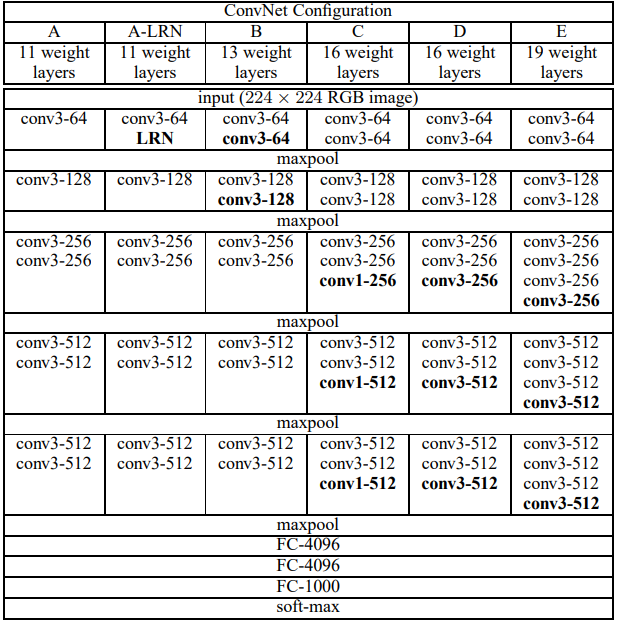

2. **<span style="color: rgb(36,91,219); background-color: inherit">规则的网络结构</span>**：每个卷积块通常包&#x542B;**`2`**&#x5230;**`4`**&#x4E2A;卷积层，随后接一个最大池化层，用于下采样特征图的空间分辨率。具体来说，**VGG** 的网络结构可以分为五个主要的卷积块，每个块的输出通道数逐渐增加：&#x4ECE;**`64`**&#x5230;**`512`**。最大池化层的核大小&#x4E3A;**`2×2`**，步幅&#x4E3A;**`2`**，这使得特征图的空间尺寸在每个块后减半。<span style="color: rgb(46,161,33); background-color: inherit">这种模块化的设计使得网络易于实现和扩展</span>。

3. **<span style="color: rgb(36,91,219); background-color: inherit">通道数的增长</span>**：随着网络的加深，每个卷积块的输出通道数逐渐增加，&#x4ECE;**`64`**&#x5230;**`512`**，<span style="color: rgb(46,161,33); background-color: inherit">以便提取更高层次的抽象特征</span>。第一个卷积块的输出通道数&#x4E3A;**`64`**，第二个&#x4E3A;**`128`**，第三个和第四个&#x4E3A;**`256`**，第五个&#x4E3A;**`512`**。这种逐层增加通道数的设计策略，<span style="color: rgb(46,161,33); background-color: inherit">使得网络能够逐步捕捉从低级到高级的特征表示</span>。

4) **<span style="color: rgb(36,91,219); background-color: inherit">全连接层的使用</span>**：在最后的卷积层之后，**VGG** 引入了三个全连接层，其中前两个包&#x542B;**`4096`**&#x4E2A;神经元，最后一个用于分类任务的输出。尽管全连接层增加了模型的参数量，但它们在当时被认为是<span style="color: rgb(100,37,208); background-color: inherit">提取全局信息的关键组件</span>。为了防止过拟合，全连接层之间通常会加&#x5165;**`Dropout`**&#x6B63;则化，丢弃率&#x4E3A;**`0.5`**。

5) **<span style="color: rgb(36,91,219); background-color: inherit">ReLU激活函数</span>**：所有隐藏层均采&#x7528;**`ReLU`**&#x4F5C;为激活函数，这不仅加速了训练过程，还有效缓解了梯度消失问题。相比于传统的 Sigmoid 或 Tanh 函数，**<span style="color: rgb(46,161,33); background-color: inherit">ReLU</span>**<span style="color: rgb(46,161,33); background-color: inherit"> 在深层网络中表现出了更强的鲁棒性和效率</span>。

6. **<span style="color: rgb(36,91,219); background-color: inherit">Softmax输出层</span>**：最后一层是一&#x4E2A;**`Softmax`**&#x5C42;，用于多类别分类任务。通过 **Softmax** 函数，模型<span style="color: rgb(46,161,33); background-color: inherit">将输出转化为概率分布，便于评估每个类别的置信度</span>。

* **<span style="color: rgb(36,91,219); background-color: inherit">参数计算与复杂性分析</span>**

**VGG-16** 的参数量高达&#x7EA6;**`1.38`**&#x4EBF;，而 **VGG-19** 的参数量更是达到了&#x7EA6;**`1.44`**&#x4EBF;。这些<span style="color: rgb(100,37,208); background-color: inherit">参数主要集中在全连接层中，尤其是最后三个全连接层占据了大部分的计算开销</span>。例如，<span style="color: rgb(220,155,4); background-color: inherit">在</span>**`VGG-16`**<span style="color: rgb(220,155,4); background-color: inherit">中，仅最后三个全连接层就包含了超过</span>**`1`**<span style="color: rgb(220,155,4); background-color: inherit">亿个参数</span>。相比之下，卷积层的参数量相对较少，但由于其需要处理高分辨率的特征图，计算成本仍然很高。

为了进一步说明这一点，我们可以通过公式计算每一层的参数量。

1. **对于卷积层**，其参数量由以下公式决定：

$$\text{参数量} = (\text{卷积核宽度} \times \text{卷积核高度} \times \text{输入通道数} + 1) \times \text{输出通道数}$$

例如，<span style="color: rgb(220,155,4); background-color: inherit">第一层卷积层的参数量为：</span>$$(3 \times 3 \times 3 + 1) \times 64 = 1792$$

* **对于全连接层**，其参数量则由输入神经元数和输出神经元数决定：

$$\text{参数量} = \text{输入神经元数} \times \text{输出神经元数} + \text{偏置项}$$

例如，<span style="color: rgb(220,155,4); background-color: inherit">第一个全连接层的参数量为：</span>$$(7 \times 7 \times 512 + 1) \times 4096 = 102764544$$

由此可见，<span style="color: rgb(100,37,208); background-color: inherit">全连接层是 </span>**<span style="color: rgb(100,37,208); background-color: inherit">VGG</span>**<span style="color: rgb(100,37,208); background-color: inherit"> 模型参数量的主要来源</span>。

* **<span style="color: rgb(36,91,219); background-color: inherit">计算复杂度分析</span>**

除了参数量，VGG  的计算复杂度也值得关注。计算复杂度通常用浮点运算次数 FLOPs 来衡量，主要包括卷积操作和全连接操作的计算量。

1. **卷积层的计算复杂度**卷积层的计算复杂度由以下公式决定：

   $$\text{FLOPs} = \text{输出高度} \times \text{输出宽度} \times \text{输出通道数} \times (\text{卷积核宽度} \times \text{卷积核高度} \times \text{输入通道数} + 1)$$

   例如，<span style="color: rgb(220,155,4); background-color: inherit">第一层卷积层的FLOPs为：</span>$$(224 \times 224) \times 64 \times (3 \times 3 \times 3 + 1) = 118M$$

2. **全连接层的计算复杂度**全连接层的计算复杂度由以下公式决定：

   $$\text{FLOPs} = \text{输入神经元数} \times \text{输出神经元数} + \text{偏置项}$$

   例如，<span style="color: rgb(220,155,4); background-color: inherit">第一个全连接层的FLOPs为：</span>$$(7 \times 7 \times 512) \times 4096 = 102764544$$

* **<span style="color: rgb(36,91,219); background-color: inherit">VGG的局限性与改进方向</span>**

尽管VGG在理论和实践上都取得了巨大的成功，但它也存在一些明显的局限性：

> 1. **<span style="color: rgb(36,91,219); background-color: inherit">计算成本高昂</span>**：**VGG** 的深层结构和大量参数使其<span style="color: rgb(216,57,49); background-color: inherit">在训练和推理过程中需要消耗大量的计算资源</span>。例如，**<span style="color: rgb(220,155,4); background-color: inherit">VGG-16</span>**<span style="color: rgb(220,155,4); background-color: inherit"> 的参数量超过 1 亿</span>，这在当时的硬件条件下是一个不小的挑战。
>
> 2. **<span style="color: rgb(36,91,219); background-color: inherit">梯度消失问题</span>**：随着网络深度的增加，<span style="color: rgb(216,57,49); background-color: inherit">传统的激活函数，如 ReLU，可能会导致梯度消失问题，从而阻碍模型的进一步优化</span>。这一问题在后来的 ResNet 中通过引入残差连接得到了有效解决。
>
> 🍰 3) **<span style="color: rgb(36,91,219); background-color: inherit">全连接层的冗余性</span>**：<span style="color: rgb(216,57,49); background-color: inherit">全连接层占据了大部分的参数量，但其作用却相对有限</span>。后续的研究表明，通过全局平均池化 Global Average Pooling 可以替代全连接层，从而显著降低模型的复杂度。
>
> 4) **<span style="color: rgb(36,91,219); background-color: inherit">内存瓶颈</span>**：在训练过程中，**VGG** 的深层结构可能导致显存不足的问题。尤其是在早期的硬件环境下，这种限制更加明显\[\[7]]。

为了克服这些局限性，后续的研究提出了多种改进方案，例如<span style="color: rgb(220,155,4); background-color: inherit">使用更高效的卷积操作：</span>**<span style="color: rgb(220,155,4); background-color: inherit">深度可分离卷积</span>**<span style="color: rgb(220,155,4); background-color: inherit">、引入</span>**<span style="color: rgb(220,155,4); background-color: inherit">跳跃连接</span>**<span style="color: rgb(220,155,4); background-color: inherit">以及设计</span>**<span style="color: rgb(220,155,4); background-color: inherit">轻量级网络架构</span>**<span style="color: rgb(220,155,4); background-color: inherit">等</span>。

**<span style="color: rgb(222,120,2); background-color: inherit">代码实现</span>**

这里以构建 VGG-16为例

```python
import torch
import torch.nn as nn

# 定义VGG块
def make_vgg_block(in_channels, out_channels, num_conv_layers, use_batchnorm=False):
    """
    构建VGG块，包含多个卷积层和一个最大池化层。
    :param in_channels: 输入通道数
    :param out_channels: 输出通道数
    :param num_conv_layers: 卷积层数量
    :param use_batchnorm: 是否使用BatchNorm
    :return: 一个VGG块（nn.Sequential）
    """
```


**<span style="color: rgb(222,120,2); background-color: inherit">总结</span>**

**VGG** &#x5728;**`ILSVRC-2014`**&#x7ADE;赛中取得了优异的成绩，其 Top-5 错误率仅&#x4E3A;**`7.3%`**，仅次于同年提出&#x7684;**`GoogLeNet`**。虽然 **VGG** 的计算复杂度较高，但它凭借简单的架构和强大的性能赢得了广泛的认可。更重要的是，**<span style="color: rgb(100,37,208); background-color: inherit">VGG</span>**<span style="color: rgb(100,37,208); background-color: inherit"> 的成功证明了</span>**<span style="color: rgb(100,37,208); background-color: inherit">增加网络深度</span>**<span style="color: rgb(100,37,208); background-color: inherit">可以显著提升模型的表现力，这一发现为后续 ResNet 等更深层次网络的发展奠定了基础</span>。

除了在图像分类领域的成就，**VGG** 还在其他任务中展现了其价值。例如，<span style="color: rgb(220,155,4); background-color: inherit">在风格迁移技术中，预训练的 VGG 模型被广泛用于提取图像的内容和风格特征</span>。此外，由于其模块化的设计，**<span style="color: rgb(100,37,208); background-color: inherit">VGG</span>**<span style="color: rgb(100,37,208); background-color: inherit"> 的中间层特征可以直接迁移到新的任务上，极大地促进了迁移学习的发展</span>。

**VGG** 以其简洁而深刻的设计理念，为深度卷积神经网络的研究开辟了新的道路。<span style="color: rgb(100,37,208); background-color: inherit">它不仅展示了深度网络在图像识别任务中的巨大潜力，还启发了无数后续工作</span>。正如科学研究中的许多经典案例一样，**VGG** 的意义不仅在于其本身，更在于它为整个领域带来的深远影响。

### 1.1.5 <span style="color: rgb(36,91,219); background-color: inherit">GoogLeNet</span>

**GoogLeNet** 是由 Google 团队于 2014 年提出的另一个具有里程碑意义的网络，并在当年的 ImageNet 大规模视觉识别挑战赛 ILSVRC 中一举夺魁。**<span style="color: rgb(46,161,33); background-color: inherit">GoogLeNet</span>**<span style="color: rgb(46,161,33); background-color: inherit"> 不仅以其卓越的性能闻名，更因其创新的设计理念和高效的计算架构成为卷积神经网络领域的经典之作</span>。

随着深度学习技术的快速发展，Google 的作者团队逐渐意识到，增加网络深度可以显著提升模型的表达能力。然而，简单的堆叠卷积层会导致参数量急剧膨胀，从而引发计算资源消耗过大和过拟合问题。为了解决这些问题，GoogLeNet 的设计者们提出了一个核心思想：<span style="color: rgb(100,37,208); background-color: inherit">通过稀疏连接和多尺度特征提取来优化网络结构，同时保持较高的计算效率</span>。

传统的卷积神经网络通常采用逐层堆叠的方式，每一层都对输入特征图进行密集的卷积操作。这种设计虽然简单直观，但随着网络层数的增加，计算复杂度和参数量会迅速增长。例如，<span style="color: rgb(220,155,4); background-color: inherit">VGG 网络通过堆叠多个</span>**`3×3`**<span style="color: rgb(220,155,4); background-color: inherit">卷积层实现了高性能，但其参数量高达</span>**`1.4`**<span style="color: rgb(220,155,4); background-color: inherit">亿，这对硬件资源提出了极高的要求</span>。**GoogLeNet** 的目标是设计一种既能保持高性能，又能大幅降低参数量的网络结构。

GoogLeNet的名字也颇具深意。它不仅是对 LeNet 的致敬，还象征着深度学习领域的传承与发展。这一命名方式体现了研究者对历史的尊重以及对未来探索的期待。

* **<span style="color: rgb(36,91,219); background-color: inherit">Inception 模块</span>**

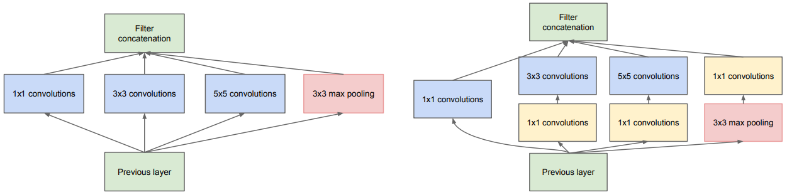

**GoogLeNet** 的最大亮点在于其引入&#x4E86;**`Inception`**&#x6A21;块，如上图所示，这是一种全新的卷积网络设计范式。Inception 模块的核心思想是通过并行计算多个不同尺度的卷积操作，从而捕获图像中的多层次特征。具体来说，每个Inception模块包含以下几种操作：

> 1. **<span style="color: rgb(36,91,219); background-color: inherit">1×1 卷积</span>**：<span style="color: rgb(100,37,208); background-color: inherit">用于降维和减少计算量</span>。1×1卷积的主要作用是对输入特征图的通道数进行压缩，从而降低后续卷积操作的计算复杂度。例如，假设输入特征图的尺寸为$$H \times W \times C$$，其中$$C$$表示通道数，那&#x4E48;**`1×1`**&#x5377;积可以将通道数从$$C$$降到$$C'$$，从而显著减少后续卷积操作的计算量。
>
> 2. **<span style="color: rgb(36,91,219); background-color: inherit">3×3 卷积</span>**：<span style="color: rgb(100,37,208); background-color: inherit">捕捉局部特征</span>。**`3×3`**&#x5377;积核是卷积神经网络中最常用的卷积核尺寸之一，能够有效提取局部空间信息。相比于更大的卷积核，**3×3** 卷积核的感受野较小，但计算成本较低，适合提取细粒度特征。
>
> 🌟 3) **<span style="color: rgb(36,91,219); background-color: inherit">5×5 卷积</span>**：<span style="color: rgb(100,37,208); background-color: inherit">捕获更大范围的空间信息</span>。相比于 **3×3&#x20;**&#x5377;积，**`5×5`**&#x5377;积核的感受野更大，适合提取全局特征。然而，**5×5** 卷积的计算成本较高，因此 GoogLeNet 采用了瓶颈层 Bottleneck Layer 的设计，先通过 **1×1** 卷积降低输入通道数，再进行 **5×5** 卷积操作。
>
> 4) **<span style="color: rgb(36,91,219); background-color: inherit">3×3 最大池化</span>**：<span style="color: rgb(100,37,208); background-color: inherit">提取全局特征</span>。最大池化操作通过对特征图进行下采样，保留最显著的特征，同时降低特征图的分辨率。这种操作不仅减少了计算量，还能增强模型对输入变化的鲁棒性。

这些操作的结果会被拼接在一起，形成一个多通道的输出特征图。这种设计既保留了网络的稀疏性，又利用了密集矩阵的高计算性能。

为了进一步优化 Inception 模块的性能，GoogLeNet还采用了瓶颈层 Bottleneck Layer 的设计。<span style="color: rgb(46,161,33); background-color: inherit">通过在大尺寸卷积操作前加入 </span>**<span style="color: rgb(46,161,33); background-color: inherit">1×1</span>**<span style="color: rgb(46,161,33); background-color: inherit"> 卷积层，模型能够有效降低输入特征图的维度，从而大幅减少计算开销</span>。例如，<span style="color: rgb(220,155,4); background-color: inherit">在处理</span>**`5×5`**<span style="color: rgb(220,155,4); background-color: inherit">卷积时，先通过</span>**`1×1`**<span style="color: rgb(220,155,4); background-color: inherit">卷积将输入通道数从</span>**`256`**<span style="color: rgb(220,155,4); background-color: inherit">降到</span>**`64`**<span style="color: rgb(220,155,4); background-color: inherit">，然后再进行</span>**`5×5`**<span style="color: rgb(220,155,4); background-color: inherit">卷积操作</span>。这种设计使得计算量从原本的$$256 \times 5 \times 5 = 6400$$降低到$$64 \times 5 \times 5 + 256 \times 1 \times 1 = 1600 + 256 = 1856$$，显著提升了计算效率。

此外，**<span style="color: rgb(100,37,208); background-color: inherit">Inception</span>**<span style="color: rgb(100,37,208); background-color: inherit"> 模块的设计还体现了</span>**<span style="color: rgb(100,37,208); background-color: inherit">分而治之</span>**<span style="color: rgb(100,37,208); background-color: inherit">的思想</span>。通过并行计算不同尺度的卷积操作，<span style="color: rgb(46,161,33); background-color: inherit">模型能够在不增加参数数量的情况下提高网络的深度和表征能力</span>。

* **<span style="color: rgb(36,91,219); background-color: inherit">辅助分类器：提升训练稳定性</span>**

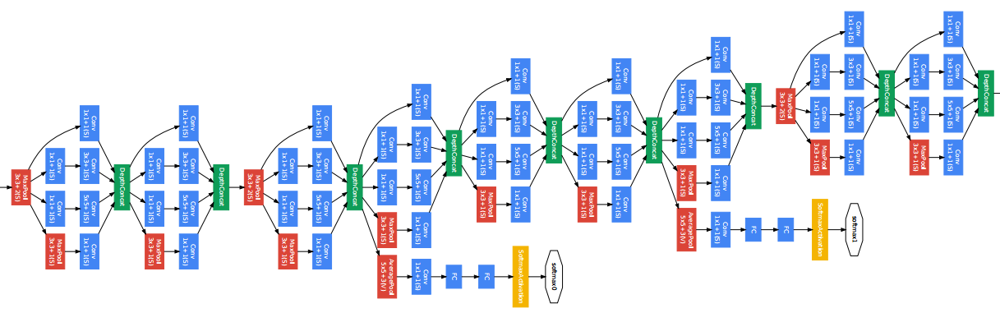

除了 **Inception** 模块外，**GoogLeNet** 还引入&#x4E86;**<span style="color: rgb(216,57,49); background-color: inherit">辅助分类器</span>**<span style="color: rgb(216,57,49); background-color: inherit"> Auxiliary Classifier</span> 的设计，如上图分支所示。<span style="color: rgb(216,57,49); background-color: inherit">在深层网络中，梯度消失问题常常导致训练困难</span>。为了解决这一问题，**<span style="color: rgb(46,161,33); background-color: inherit">GoogLeNet </span>**<span style="color: rgb(46,161,33); background-color: inherit">在网络的中间层添加了两个辅助分类器。这些分类器能够提供额外的监督信号，帮助网络更好地收敛</span>。

辅助分类器的具体实现如下：

> 1. 在网络的中间层，通常是倒数第二个和第三个 Inception 模块之后，分别添加一个辅助分类器
>
> 🍰 2. 每个辅助分类器包含一&#x4E2A;**`5×5`**&#x7684;平均池化层、一&#x4E2A;**`1×1`**&#x5377;积层用于降维、两个全连接层以及一&#x4E2A;**`Softmax`**&#x5206;类器
>
> 3) 在训练阶段，<span style="color: rgb(100,37,208); background-color: inherit">辅助分类器的损失函数与主分类器的损失函数按一定权重相加，共同指导网络的优化过程</span>

辅助分类器仅在训练阶段使用，在测试阶段会被移除。这种设计<span style="color: rgb(46,161,33); background-color: inherit">不仅提高了模型的训练效率，还增强了模型的泛化能力</span>。

* **<span style="color: rgb(36,91,219); background-color: inherit">网络结构</span>**

**GoogLeNet** 的整体架构由多个 **Inception** 模块串联而成，如下表所示，总共&#x6709;**`22`**&#x5C42;，<span style="color: rgb(100,37,208); background-color: inherit">包括</span>**<span style="color: rgb(100,37,208); background-color: inherit">卷积层</span>**<span style="color: rgb(100,37,208); background-color: inherit">、</span>**<span style="color: rgb(100,37,208); background-color: inherit">池化层</span>**<span style="color: rgb(100,37,208); background-color: inherit">和</span>**<span style="color: rgb(100,37,208); background-color: inherit">全连接层</span>**。<span style="color: rgb(46,161,33); background-color: inherit">相比之前的 VGG 网络，</span>**<span style="color: rgb(46,161,33); background-color: inherit">GoogLeNet</span>**<span style="color: rgb(46,161,33); background-color: inherit"> 的参数量显著减少，仅为</span>**`500`**<span style="color: rgb(46,161,33); background-color: inherit">万左右，而 VGG 的参数量则高达</span>**`1.4`**<span style="color: rgb(46,161,33); background-color: inherit">亿</span>。这种参数量的大幅降低使得 **GoogLeNet** 在实际应用中更加高效。

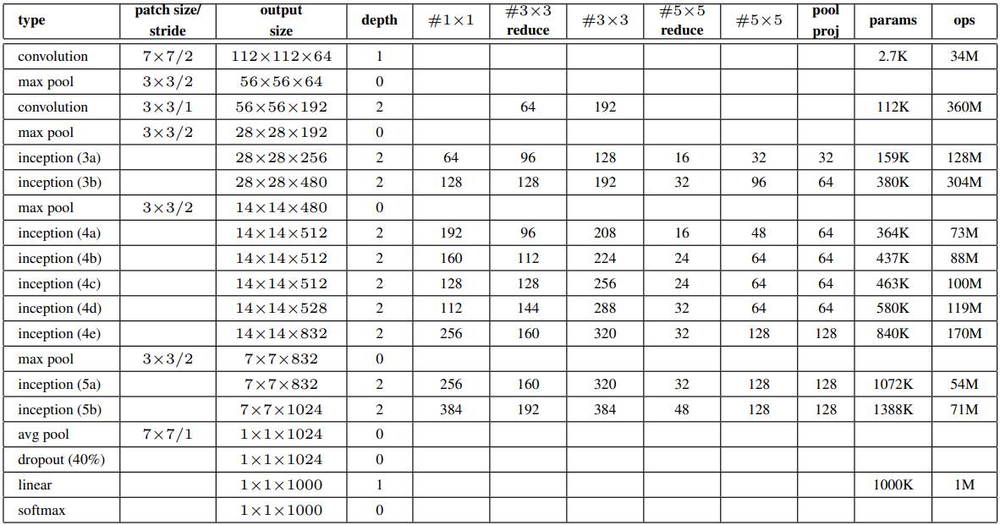

以下是 GoogLeNet 的详细结构设计：

> 1. **<span style="color: rgb(36,91,219); background-color: inherit">输入层</span>**：接&#x53D7;**`224×224`**&#x5927;小的RGB图像作为输入
>
> 📚 2. **<span style="color: rgb(36,91,219); background-color: inherit">卷积层 1</span>**：包含一&#x4E2A;**`7×7`**&#x7684;卷积层，步长&#x4E3A;**`2`**，输出通道数&#x4E3A;**`64`**，后接一&#x4E2A;**`3×3`**&#x7684;最大池化层，步长&#x4E3A;**`2`**
>
> 3) **<span style="color: rgb(36,91,219); background-color: inherit">卷积层 2</span>**：包含一&#x4E2A;**`1×1`**&#x5377;积层和一&#x4E2A;**`3×3`**&#x7684;卷积层，输出通道数&#x4E3A;**`192`**，用于进一步提取低级特征
>
> 4) **<span style="color: rgb(36,91,219); background-color: inherit">Inception 模块</span>**：包&#x542B;**`9`**&#x4E2A; **Inception** 模块，分为三个主要部分：
>
>    * <span style="color: rgb(36,91,219); background-color: inherit">第一部分</span>：**`2`**&#x4E2A; **Inception** 模块，逐步增加网络深度
>
>    * <span style="color: rgb(36,91,219); background-color: inherit">第二部分</span>：**`5`**&#x4E2A; **Inception** 模块，结合辅助分类器
>
>    * <span style="color: rgb(36,91,219); background-color: inherit">第三部分</span>：**`2`**&#x4E2A; **Inception** 模块，进一步提升特征表达能力
>
> 5. **<span style="color: rgb(36,91,219); background-color: inherit">全局平均池化层</span>**：取代传统的全连接层，通过全局平均池化操作将特征图转换为固定长度的向量
>
> 6. **<span style="color: rgb(36,91,219); background-color: inherit">输出层</span>**：包含一个 **Softmax** 分类器，用于生成最终的分类结果

**<span style="color: rgb(222,120,2); background-color: inherit">代码实现</span>**

以下是基于 PyTorch 实现 **GoogLeNet&#x20;**&#x7684;完整代码：

```python
import torch
import torch.nn as nn
import torch.nn.functional as F

# 定义Inception模块
class Inception(nn.Module):
    def __init__(self, in_channels, ch1x1, ch3x3red, ch3x3, ch5x5red, ch5x5, pool_proj):
        """
```


**<span style="color: rgb(222,120,2); background-color: inherit">总结</span>**

在 2014 年的 ImageNet 竞赛中，**<span style="color: rgb(46,161,33); background-color: inherit">GoogLeNet</span>**<span style="color: rgb(46,161,33); background-color: inherit"> 以</span>**`6.67%`**<span style="color: rgb(46,161,33); background-color: inherit">的 Top-5 错误率夺得冠军，远超第二名的表现。这一成绩充分证明了 </span>**<span style="color: rgb(46,161,33); background-color: inherit">GoogLeNet </span>**<span style="color: rgb(46,161,33); background-color: inherit">在图像分类任务中的优越性</span>。此外，**GoogLeNet&#x20;**&#x7684;成功也启发了后续许多研究工作，例如 ResNet 等。

**GoogLeNet&#x20;**&#x7684;提出标志着卷积神经网络设计进入了一个新的阶段。<span style="color: rgb(46,161,33); background-color: inherit">通过引入 </span>**<span style="color: rgb(46,161,33); background-color: inherit">Inception </span>**<span style="color: rgb(46,161,33); background-color: inherit">模块、辅助分类器以及全局平均池化等创新技术，</span>**<span style="color: rgb(46,161,33); background-color: inherit">GoogLeNet </span>**<span style="color: rgb(46,161,33); background-color: inherit">不仅实现了更高的计算效率，还显著提升了模型的性能</span>。它的设计理念深刻影响了后续的研究，并为深度学习领域的发展奠定了坚实的基础。

### 1.1.6 <span style="color: rgb(36,91,219); background-color: inherit">ResNet</span>

在深度学习的发展历程中，神经网络的深度一直是研究的核心问题之一。理论上，更深的网络能够捕捉更复杂的特征，从而提升模型性能。然而，实际训练中，<span style="color: rgb(216,57,49); background-color: inherit">随着网络深度的增加，梯度消失和梯度爆炸等问题逐渐显现，导致模型难以收敛</span>。此外，当网络达到一定深度时，甚至会<span style="color: rgb(216,57,49); background-color: inherit">出现退化现象——即更深的网络反而表现得比浅层网络更差</span>。如右图所示

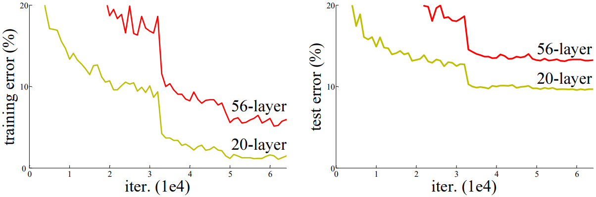

为了解决这些问题，凯明在 2015 年提出了深度残差网络 **<span style="color: rgb(216,57,49); background-color: inherit">ResNet</span>**<span style="color: rgb(216,57,49); background-color: inherit">（</span>**<span style="color: rgb(216,57,49); background-color: inherit">Res</span>**<span style="color: rgb(216,57,49); background-color: inherit">idual </span>**<span style="color: rgb(216,57,49); background-color: inherit">Net</span>**<span style="color: rgb(216,57,49); background-color: inherit">work）</span>，并在 ImageNet 竞赛中取得了突破性成果。

* **<span style="color: rgb(36,91,219); background-color: inherit">核心思想：残差学习</span>**

**<span style="color: rgb(100,37,208); background-color: inherit">ResNet</span>**<span style="color: rgb(100,37,208); background-color: inherit"> 的核心思想是引入</span>**<span style="color: rgb(100,37,208); background-color: inherit">残差学习框架</span>**<span style="color: rgb(100,37,208); background-color: inherit">，通过构建</span>**<span style="color: rgb(100,37,208); background-color: inherit">残差块</span>**<span style="color: rgb(100,37,208); background-color: inherit">来缓解深层网络的训练困难</span>。传统的神经网络试图直接拟合目标函数$$H(x)$$，而 **<span style="color: rgb(100,37,208); background-color: inherit">ResNet</span>**<span style="color: rgb(100,37,208); background-color: inherit"> 则通过引入一个恒等映射，将目标变为拟合残差</span>$$F(x) = H(x) - x$$<span style="color: rgb(100,37,208); background-color: inherit">。也就是说网络不再需要直接学习输出，而是学习输入与输出之间的差异，即残差</span>。这种设计使得即使在网络较深的情况下，信息也能更容易地通过网络传播。

为了实现这一目标，**ResNet&#x20;**&#x5728;每个残差块中加入&#x4E86;**<span style="color: rgb(216,57,49); background-color: inherit">跳跃连接</span>**<span style="color: rgb(216,57,49); background-color: inherit"> skip connection</span>，也称为捷径连接。跳跃连接将输入直接加到输出上，形成如下形式的表达式：

$$y = F(x, \{W_i\}) + x$$

其中，$$x$$是输入，$$F(x, \{W_i\})$$是残差函数，$$y$$是输出。这种结构不仅简化了优化过程，还有效缓解了梯度消失问题。

* **<span style="color: rgb(36,91,219); background-color: inherit">网络结构</span>**

**ResNet** 的基本单元是残差块，其结构如右图所示。<span style="color: rgb(100,37,208); background-color: inherit">每个残差块通常由两到三个卷积层组成，并通过跳跃连接将输入直接传递到输出</span>。如果输入和输出的维度不一致，则可以通过线性投影（通常&#x662F;**`1x1`**&#x5377;积）来调整维度。

> 🌟 **ResNet&#x20;**&#x7684;设计非常灵活，可以根据任务需求堆叠不同数量的残差块。例如，经典&#x7684;**`ResNet-18`**、**`ResNet-34`**、**`ResNet-50`**、**`ResNet-101`**&#x548C;**`ResNet-152`**&#x5206;别包&#x542B;**`18`**&#x5C42;、**`34`**&#x5C42;、**`50`**&#x5C42;、**`101`**&#x5C42;&#x548C;**`152`**&#x5C42;网络。尽管这些网络的深度差异显著，但它们都基于相同的残差学习框架。

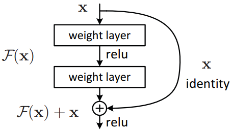

1. **<span style="color: rgb(36,91,219); background-color: inherit">输入</span>**：ResNet 的输入部分通常由一&#x4E2A;**`7x7`**&#x7684;卷积层组成，步长&#x4E3A;**`2`**，填充&#x4E3A;**`3`**，用于对输入图像进行初步特征提取。随后是一个最大池化层 Max Pooling，进一步压缩特征图的空间尺寸。这一部分的设计可以快速降低输入数据的空间分辨率，同时保留重要的低级特征。

2. **<span style="color: rgb(36,91,219); background-color: inherit">卷积</span>**：中间卷积部分是 ResNet 的核心，由多个阶段组成，每个阶段包含若干个残差块。根据网络深度的不同，这些阶段的数量和每个阶段中的残差块数量也会有所不同。例如，**<span style="color: rgb(220,155,4); background-color: inherit">ResNet-18</span>**<span style="color: rgb(220,155,4); background-color: inherit"> 和 </span>**<span style="color: rgb(220,155,4); background-color: inherit">ResNet-34</span>**<span style="color: rgb(220,155,4); background-color: inherit"> 使用的是</span>**<span style="color: rgb(220,155,4); background-color: inherit">基本残差块</span>**<span style="color: rgb(220,155,4); background-color: inherit">，而 ResNet-50 及更深的网络则使用</span>**<span style="color: rgb(220,155,4); background-color: inherit">瓶颈残差块</span>**。

   > ⛱️ **<span style="color: rgb(36,91,219); background-color: inherit">基本残差块</span>**：基本残差块由两&#x4E2A;**`3x3`**&#x7684;卷积层组成，每个卷积层后接批量归一化 **BN** 和 **ReLU** 激活函数。跳跃连接直接将输入添加到输出上。如果输入和输出的通道数不一致，则通&#x8FC7;**`1x1`**&#x5377;积调整维度。

   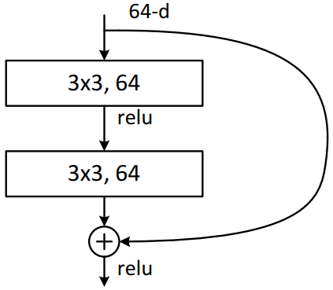

   > 🍞 **<span style="color: rgb(36,91,219); background-color: inherit">瓶颈残差块</span>**：瓶颈残差块是 ResNet-50 及更深网络的核心组件。它由三个卷积层组成：第一&#x4E2A;**`1x1`**&#x5377;积层用于降维，减少计算量；第二&#x4E2A;**`3x3`**&#x5377;积层用于提取特征；第三&#x4E2A;**`1x1`**&#x5377;积层用于升维，恢复通道数。跳跃连接同样直接将输入添加到输出上，必要时通&#x8FC7;**`1x1`**&#x5377;积调整维度

   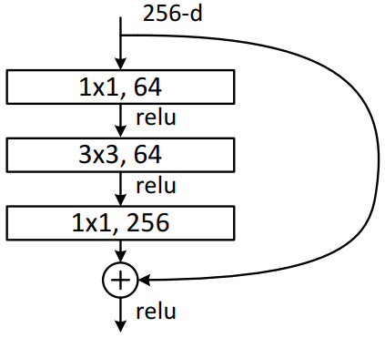

   不同深度的 ResNet 在中间卷积部分的设计上有所区别。以下是几种经典 ResNet 的结构特点：

   > * **<span style="color: rgb(36,91,219); background-color: inherit">ResNet-18 和 ResNet-34</span>**：使用基本残差块，分别包&#x542B;**`18`**&#x5C42;&#x548C;**`34`**&#x5C42;网络。这两个网络适用于较小的数据集或计算资源有限的场景。
   >
   > * **<span style="color: rgb(36,91,219); background-color: inherit">ResNet-50、ResNet-101 和 ResNet-152</span>**：使用瓶颈残差块，分别包&#x542B;**`50`**&#x5C42;、**`101`**&#x5C42;&#x548C;**`152`**&#x5C42;网络。这些网络在大规模数据集上表现出色，但计算成本较高

3. **<span style="color: rgb(36,91,219); background-color: inherit">跳跃连接</span>**：跳跃连接是ResNet的关键创新点之一。对于输入和输出维度一致的情况，跳跃连接可以直接将输入添加到输出上。而对于维度不一致的情况，如通道数变化或空间分辨率变化，可以通过以下两种方式实现跳跃连接：

   > **<span style="color: rgb(36,91,219); background-color: inherit">零填充</span>**：在通道维度上用零填充输入，使其与输出的维度一致。
   >
   > 🎨 **<span style="color: rgb(36,91,219); background-color: inherit">1x1卷积</span>**：通&#x8FC7;**`1x1`**&#x5377;积调整输入的通道数和空间分辨率，使其与输出匹配

   第二种方法更为常用，因为它能够在调整维度的同时引入额外的非线性变换，从而增强模型的表达能力。

4. **<span style="color: rgb(36,91,219); background-color: inherit">输出</span>**：ResNet 的输出部分通常由全局平均池化 Global Average Pooling 和全连接层组成。全局平均池化将每个特征图的空间尺寸压缩&#x4E3A;**`1x1`**，从而大幅减少参数数量。最后，全连接层将特征映射到类别空间，完成分类任务。

ResNet 的5种规格如右图所示。

**<span style="color: rgb(222,120,2); background-color: inherit">例</span>**：ResNet-50具体结构如下

**`Stage 1`**：1&#x4E2A;**`7x7`**&#x5377;积层和最大池化层

**`Stage 2`**：3个瓶颈残差块

**`Stage 3`**：4个瓶颈残差块

**`Stage 4`**：6个瓶颈残差块

**`Stage 5`**：3个瓶颈残差块

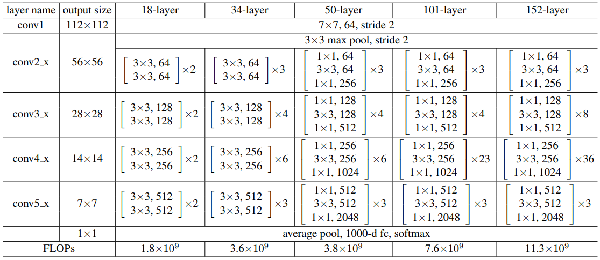

每个阶段的输出特征图的<span style="color: rgb(100,37,208); background-color: inherit">空间分辨率逐级减半，而通道数逐级加倍</span>。

* **<span style="color: rgb(36,91,219); background-color: inherit">训练技巧</span>**

除了创新的网络结构，**ResNet** 的成功还得益于一些关键的训练技巧。首先，<span style="color: rgb(100,37,208); background-color: inherit">批量归一化 </span>**<span style="color: rgb(100,37,208); background-color: inherit">BN</span>**<span style="color: rgb(100,37,208); background-color: inherit"> 被广泛应用于每一层卷积之后</span>，以加速训练并提高模型的泛化能力。其次，**<span style="color: rgb(100,37,208); background-color: inherit">ReLU</span>**<span style="color: rgb(100,37,208); background-color: inherit"> 激活函数作为非线性变换的主要手段</span>，进一步提升了网络的表达能力。最后，<span style="color: rgb(100,37,208); background-color: inherit">全局平均池化 Global Average Pooling 替代了全连接层</span>，从而减少了模型参数的数量，降低了过拟合的风险。

此外，**ResNet** 的训练过程中还采用了数据增强技术，如<span style="color: rgb(100,37,208); background-color: inherit">随机裁剪、水平翻转</span>等，以提高模型的鲁棒性。这些技术的结合使得 **ResNet** 能够在大规模数据集，如 ImageNet 上取得优异的表现。

**<span style="color: rgb(222,120,2); background-color: inherit">代码实现</span>**

以下是一个使用 PyTorch 实现的 **ResNet-50** 代码：

这展示了一个基本的残差块。通过堆叠多个这样的模块，可以搭建出完整的 ResNet 模型。

**<span style="color: rgb(222,120,2); background-color: inherit">总结</span>**

自 **ResNet** 提出以来，在计算机视觉领域产生了深远的影响。它不仅在图像分类任务中表现出色，还在目标检测、语义分割等任务中展现了强大的潜力。ResNet 的成功证明了深度神经网络的潜力，并启发了许多后续工作，&#x5982;**`DenseNet`**、**`EfficientNet`**&#x7B49;。

在实际应用中，**ResNet&#x20;**&#x7684;预训练模型被广泛使用。通过迁移学习，研究人员可以利用在大规模数据集，如ImageNet 上预训练的 **ResNet** 模型，快速适应新的任务或领域。例如，<span style="color: rgb(220,155,4); background-color: inherit">在医学图像分析、自动驾驶等领域，ResNet 的变体已经被成功应用于解决实际问题</span>。

**ResNet** 通过引入残差学习框架和跳跃连接，成功解决了深层神经网络的训练难题，成为深度学习领域的里程碑之一。它的设计理念不仅推动了计算机视觉技术的进步，也为其他领域的研究提供了宝贵的借鉴。

### 1.1.7 <span style="color: rgb(36,91,219); background-color: inherit">DenseNet</span>

**<span style="color: rgb(216,57,49); background-color: inherit">DenseNet</span>**<span style="color: rgb(216,57,49); background-color: inherit">（</span>**<span style="color: rgb(216,57,49); background-color: inherit">Dense</span>**<span style="color: rgb(216,57,49); background-color: inherit">ly Connected Convolutional </span>**<span style="color: rgb(216,57,49); background-color: inherit">Net</span>**<span style="color: rgb(216,57,49); background-color: inherit">works）</span>是一种具有开创性的深度学习架构，其通过引入密集连接机制，显著提升了特征传播效率和参数利用率。

* **<span style="color: rgb(36,91,219); background-color: inherit">核心思想</span>**

**DenseNet&#x20;**&#x7684;核心创新在于密集连接 dense connections 的设计。<span style="color: rgb(216,57,49); background-color: inherit">在传统的卷积神经网络中，信息在层与层之间逐级传递，每一层只能利用前一层的输出</span>。然而，在 **DenseNet&#x20;**&#x4E2D;，<span style="color: rgb(46,161,33); background-color: inherit">每一层不仅接收其前一层的输出，还直接连接到所有之前层的输出。这种设计使得每一层的输入是由前面所有层的特征图拼接而成的，从而实现了特征的高效复用</span>。

具体来说，假设第$$l$$层的输入为$$[x_0, x_1, ..., x_{l-1}]$$，其中$$x_i$$表示第$$i$$层的输出特征图，那么第$$l$$层的输出可以表示为：

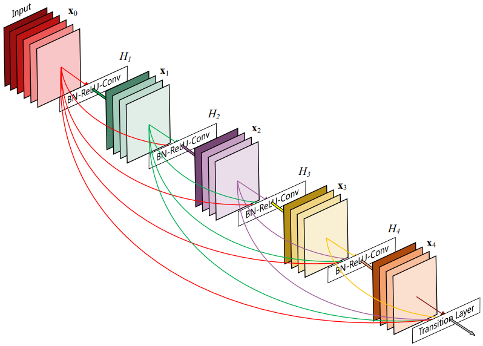

$$x_l = H_l([x_0, x_1, ..., x_{l-1}])$$

其中$$H_l$$是一个非线性变换，通常由<span style="color: rgb(100,37,208); background-color: inherit">批量归一化 Batch Normalization、ReLU 激活函数和</span>**`3×3`**<span style="color: rgb(100,37,208); background-color: inherit">卷积组成</span>。这种密集连接机制<span style="color: rgb(46,161,33); background-color: inherit">不仅增强了特征传播，还缓解了梯度消失问题，因为梯度可以直接通过短连接传播到浅层</span>。

此外，由于每一层都可以直接访问前面所有层的特征图，**<span style="color: rgb(46,161,33); background-color: inherit">DenseNet</span>**<span style="color: rgb(46,161,33); background-color: inherit"> 在训练过程中能够更好地保留低层特征，这对于需要多层次上下文信息的任务尤为重要</span>。

* **<span style="color: rgb(36,91,219); background-color: inherit">网络结构</span>**

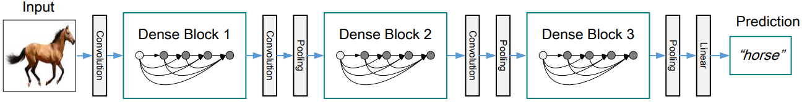

**<span style="color: rgb(100,37,208); background-color: inherit">DenseNet </span>**<span style="color: rgb(100,37,208); background-color: inherit">的网络结构由多个</span>**<span style="color: rgb(100,37,208); background-color: inherit">密集块</span>**<span style="color: rgb(100,37,208); background-color: inherit"> Dense Block 和</span>**<span style="color: rgb(100,37,208); background-color: inherit">过渡层</span>**<span style="color: rgb(100,37,208); background-color: inherit"> Transition Layer 交替组成</span>。每个密集块内部实现了层与层之间的密集连接，而过渡层则用于控制模型的复杂度。

1. **<span style="color: rgb(36,91,219); background-color: inherit">密集块 Dense Block</span>**：<span style="color: rgb(100,37,208); background-color: inherit">在密集块中，每一层的输入是由前面所有层的输出特征图拼接而成的</span>。这种拼接操作<span style="color: rgb(46,161,33); background-color: inherit">不仅保留了原始信息，还允许网络动态地选择性利用这些特征，从而提高了模型的表达能力</span>。为了控制模型的规模，**DenseNet&#x20;**&#x5F15;入了一个超参数——增长率$$k$$，它表示每一层输出的特征图数量。较小的增长率可以显著减少模型的参数量，同时保持较高的性能。例如，**`DenseNet-121`**<span style="color: rgb(220,155,4); background-color: inherit">的增长率为</span>**`32`**<span style="color: rgb(220,155,4); background-color: inherit">，那么每一层只增加</span>$$32$$<span style="color: rgb(220,155,4); background-color: inherit">个新的特征图，而不会显著增加计算成本；</span>**`DenseNet-201`**<span style="color: rgb(220,155,4); background-color: inherit">的增长率为</span>**`48`**<span style="color: rgb(220,155,4); background-color: inherit">，每一层只增加</span>$$48$$<span style="color: rgb(220,155,4); background-color: inherit">个新的特征图</span>。<span style="color: rgb(100,37,208); background-color: inherit">密集块中的每一层通常采用</span>**<span style="color: rgb(100,37,208); background-color: inherit">批量归一化</span>**<span style="color: rgb(100,37,208); background-color: inherit"> Batch Normalization、ReLU </span>**<span style="color: rgb(100,37,208); background-color: inherit">激活函数</span>**<span style="color: rgb(100,37,208); background-color: inherit">和</span>**`3×3`<span style="color: rgb(100,37,208); background-color: inherit">卷积</span>**<span style="color: rgb(100,37,208); background-color: inherit">的组合结构</span>。这种简单的层设计<span style="color: rgb(46,161,33); background-color: inherit">进一步简化了网络结构，同时确保了每一层都能专注于提取新的特征</span>。

2. **<span style="color: rgb(36,91,219); background-color: inherit">过渡层 Transition Layer</span>**：<span style="color: rgb(100,37,208); background-color: inherit">过渡层位于两个密集块之间，用于降维操作，控制过渡层中特征图数量的缩减比例</span>。过渡层通常由一&#x4E2A;**`1×1`**&#x5377;积和一&#x4E2A;**`2×2`**&#x5E73;均池化组成。**<span style="color: rgb(100,37,208); background-color: inherit">1×1 </span>**<span style="color: rgb(100,37,208); background-color: inherit">卷积用于减少特征图的数量，而平均池化则用于降低特征图的空间尺寸</span>。通过设置压缩因子$$θ$$，可以进一步控制特征图数量的缩减比例。通过设置$$θ<1$$，可以在不显著影响性能的情况下进一步压缩模型规模。例如，<span style="color: rgb(220,155,4); background-color: inherit">当</span>$$θ=0.5$$<span style="color: rgb(220,155,4); background-color: inherit">时，过渡层会将特征图数量减半</span>。<span style="color: rgb(46,161,33); background-color: inherit">过渡层的作用不仅仅是降维，它还在一定程度上起到了正则化的效果，有助于防止过拟合</span>。

**DenseNet&#x20;**&#x7F51;络也具有多种参数配置，如下表所示：

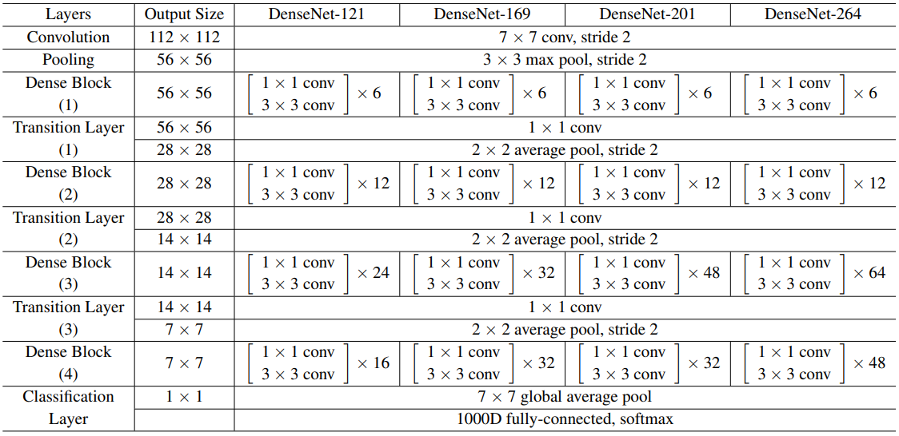

* **<span style="color: rgb(36,91,219); background-color: inherit">技术优势</span>**

**DenseNet&#x20;**&#x7684;设计带来了多方面的技术优势：

> ⛱️ 1. **<span style="color: rgb(36,91,219); background-color: inherit">参数效率高</span>**：在 ImageNet 分类任务上，**<span style="color: rgb(46,161,33); background-color: inherit">DenseNet </span>**<span style="color: rgb(46,161,33); background-color: inherit">在达到与 ResNet 相当准确率的同时，所需的参数量不到 ResNet 的一半</span>。这得益于密集连接机制对特征的充分利用，避免了冗余计算。
>
> 2. **<span style="color: rgb(36,91,219); background-color: inherit">隐式正则化效果</span>**：通过拼接不同层的特征图，**<span style="color: rgb(100,37,208); background-color: inherit">DenseNet </span>**<span style="color: rgb(100,37,208); background-color: inherit">在训练过程中自然地引入了一种隐式的正则化效果</span>。这种正则化有助于提高模型的稳定性，尤其是在小样本数据集上表现尤为突出。
>
> 3) **<span style="color: rgb(36,91,219); background-color: inherit">梯度流动更顺畅</span>**：密集连接的设计使得梯度可以直接传播到浅层，<span style="color: rgb(46,161,33); background-color: inherit">有效缓解了深度网络训练中的梯度消失问题</span>。此外，每一层都可以获得来自损失函数的更多监督信息，类似于 **<span style="color: rgb(216,57,49); background-color: inherit">DSN</span>**<span style="color: rgb(216,57,49); background-color: inherit">（</span>**<span style="color: rgb(216,57,49); background-color: inherit">D</span>**<span style="color: rgb(216,57,49); background-color: inherit">eeply </span>**<span style="color: rgb(216,57,49); background-color: inherit">S</span>**<span style="color: rgb(216,57,49); background-color: inherit">upervised </span>**<span style="color: rgb(216,57,49); background-color: inherit">N</span>**<span style="color: rgb(216,57,49); background-color: inherit">ets）</span>的设计。
>
> 4) **<span style="color: rgb(36,91,219); background-color: inherit">特征多样性增强</span>**：每一层的输入是由前面所有层的特征图拼接而成的，因此<span style="color: rgb(46,161,33); background-color: inherit">每一层都能接触到更丰富的特征组合</span>。这种多样性增强了模型的表达能力，使其能够更好地捕捉复杂的模式。
>
> 5. **<span style="color: rgb(36,91,219); background-color: inherit">抗过拟合能力强</span>**：由于密集连接机制能够更好地利用特征，并且<span style="color: rgb(46,161,33); background-color: inherit">通过过渡层实现了特征图数量的压缩，</span>**<span style="color: rgb(46,161,33); background-color: inherit">DenseNet </span>**<span style="color: rgb(46,161,33); background-color: inherit">在小样本场景下表现出更强的泛化能力</span>。

* **<span style="color: rgb(36,91,219); background-color: inherit">性能表现</span>**

**DenseNet&#x20;**&#x5728;多个基准数据集上展现了出色的性能。例如，<span style="color: rgb(220,155,4); background-color: inherit">在 ImageNet 分类任务中，</span>**`DenseNet-121`**<span style="color: rgb(220,155,4); background-color: inherit">以</span>**`121`**<span style="color: rgb(220,155,4); background-color: inherit">层的深度达到了与</span>**`ResNet-152`**<span style="color: rgb(220,155,4); background-color: inherit">相当的准确率，但参数量仅为后者的一半</span>。此外，在 CIFAR-10 和 CIFAR-100 数据集上，**DenseNet&#x20;**&#x540C;样表现出色，证明了其<span style="color: rgb(46,161,33); background-color: inherit">在小样本场景下的强大泛化能力</span>。除此之外，**<span style="color: rgb(46,161,33); background-color: inherit">DenseNet </span>**<span style="color: rgb(46,161,33); background-color: inherit">在相同的数据集上不仅参数量更少，而且训练时间更短</span>。

**DenseNet&#x20;**&#x7684;独特结构使其在多种应用场景中表现出色。例如，<span style="color: rgb(220,155,4); background-color: inherit">在迁移学习中，</span>**<span style="color: rgb(220,155,4); background-color: inherit">DenseNet </span>**<span style="color: rgb(220,155,4); background-color: inherit">的预训练模型可以通过微调快速适应新的任务</span>。此外，**<span style="color: rgb(100,37,208); background-color: inherit">DenseNet </span>**<span style="color: rgb(100,37,208); background-color: inherit">在需要多层次上下文信息的任务中也展现了强大的能力，如图像分割、目标检测，因为密集连接能够更好地保留和传递上下文信息</span>。

在实际应用中，**DenseNet&#x20;**&#x8FD8;被广泛用于无人机高分辨率影像处理领域。例如，<span style="color: rgb(220,155,4); background-color: inherit">基于</span>**`DenseNet121_BL`**<span style="color: rgb(220,155,4); background-color: inherit">和</span>**`DenseNet169_BL`**<span style="color: rgb(220,155,4); background-color: inherit">网络模型的树种分类研究在验证集上取得了</span>**`89.17%`**<span style="color: rgb(220,155,4); background-color: inherit">的分类正确率</span>。

**<span style="color: rgb(222,120,2); background-color: inherit">代码实现</span>**

以下是一个基于 PyTorch 的 **DenseNet&#x20;**&#x5B9E;现：

```python
import torch
import torch.nn as nn
import torch.nn.functional as F

class DenseLayer(nn.Module):
    def __init__(self, in_channels, growth_rate):
        super(DenseLayer, self).__init__()
        self.bn1 = nn.BatchNorm2d(in_channels)
```


**<span style="color: rgb(222,120,2); background-color: inherit">总结</span>**

**<span style="color: rgb(100,37,208); background-color: inherit">DenseNet </span>**<span style="color: rgb(100,37,208); background-color: inherit">通过引入密集连接机制，开创了一种全新的网络设计范式。它以高效的特征复用、优异的参数效率和强大的泛化能力，成为深度学习领域的重要网络结构</span>。无论是理论研究还是实际应用，**DenseNet&#x20;**&#x90FD;为我们提供了宝贵的启示，展示了如何通过巧妙的设计实现性能与效率的双赢。

### 1.1.8 <span style="color: rgb(36,91,219); background-color: inherit">SENet</span>

深度学习领域中，卷积神经网络作为计算机视觉任务的核心工具，其设计初衷是通过局部感受野提取空间和通道维度的特征。然而，<span style="color: rgb(216,57,49); background-color: inherit">在 </span>**<span style="color: rgb(216,57,49); background-color: inherit">SENet </span>**<span style="color: rgb(216,57,49); background-color: inherit">提出之前，研究者们更多关注于如何优化空间维度的特征提取，而对通道维度的建模能力却鲜有系统性的探索</span>。**<span style="color: rgb(216,57,49); background-color: inherit">SENet</span>**<span style="color: rgb(216,57,49); background-color: inherit">（</span>**<span style="color: rgb(216,57,49); background-color: inherit">S</span>**<span style="color: rgb(216,57,49); background-color: inherit">queeze-and-</span>**<span style="color: rgb(216,57,49); background-color: inherit">E</span>**<span style="color: rgb(216,57,49); background-color: inherit">xcitation </span>**<span style="color: rgb(216,57,49); background-color: inherit">Net</span>**<span style="color: rgb(216,57,49); background-color: inherit">works）</span>的出现填补了这一空白，它通过引入一种全新的模块——**<span style="color: rgb(216,57,49); background-color: inherit">SE</span>**<span style="color: rgb(216,57,49); background-color: inherit">（</span>**<span style="color: rgb(216,57,49); background-color: inherit">S</span>**<span style="color: rgb(216,57,49); background-color: inherit">queeze-and-</span>**<span style="color: rgb(216,57,49); background-color: inherit">E</span>**<span style="color: rgb(216,57,49); background-color: inherit">xcitation）</span>块，为通道间的关系建模提供了强有力的工具。

* **<span style="color: rgb(36,91,219); background-color: inherit">核心思想</span>**

**SENet&#x20;**&#x7684;核心思想是<span style="color: rgb(100,37,208); background-color: inherit">通过显式地建模通道间的依赖关系，实现对特征图的自适应重新校准</span>。在<span style="color: rgb(216,57,49); background-color: inherit">传统的卷积操作中，每个通道的特征图被视为独立的单元，忽略了它们之间的潜在关联</span>。**SENet&#x20;**&#x5219;通过引入 **SE&#x20;**&#x5757;，动态地调整每个通道的重要性，从而增强网络对关键特征的关注能力。这种机制可以看作是一种通道注意力机制，它让网络能够根据输入数据自适应地分配资源，提升模型的表示能力。

具体而言，**<span style="color: rgb(100,37,208); background-color: inherit">SE </span>**<span style="color: rgb(100,37,208); background-color: inherit">块的工作流程分为三个步骤：</span>**`Squeeze`<span style="color: rgb(100,37,208); background-color: inherit">压缩</span>**<span style="color: rgb(100,37,208); background-color: inherit">、</span>**`Excitation`<span style="color: rgb(100,37,208); background-color: inherit">激励</span>**<span style="color: rgb(100,37,208); background-color: inherit">和</span>**`Scale`<span style="color: rgb(100,37,208); background-color: inherit">缩放</span>**。 &#x20;

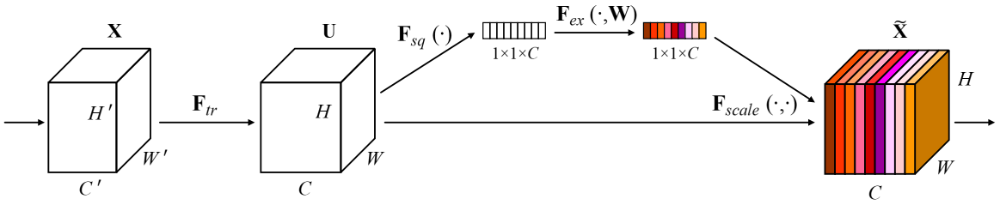

1. **<span style="color: rgb(36,91,219); background-color: inherit">Squeeze 压缩</span>**：在这一步骤中，**<span style="color: rgb(100,37,208); background-color: inherit">SE </span>**<span style="color: rgb(100,37,208); background-color: inherit">块通过对每个通道的特征图进行全局平均池化 </span>**<span style="color: rgb(216,57,49); background-color: inherit">GAP</span>**<span style="color: rgb(216,57,49); background-color: inherit">（</span>**<span style="color: rgb(216,57,49); background-color: inherit">G</span>**<span style="color: rgb(216,57,49); background-color: inherit">lobal </span>**<span style="color: rgb(216,57,49); background-color: inherit">A</span>**<span style="color: rgb(216,57,49); background-color: inherit">verage </span>**<span style="color: rgb(216,57,49); background-color: inherit">P</span>**<span style="color: rgb(216,57,49); background-color: inherit">ooling）</span> <span style="color: rgb(100,37,208); background-color: inherit">，将空间维度的信息压缩为一个标量，得到每个通道的全局描述</span>。全局平均池化的公式如下：

$$z_c = \frac{1}{H \times W} \sum_{i=1}^{H} \sum_{j=1}^{W} x_c(i,j)$$

其中，$$z_c$$表示第$$c$$个通道的压缩值，$$x_c(i,j)$$是第$$c$$个通道在位置$$(i,j)$$的特征值，$$H$$和$$W$$分别是特征图的高度和宽度。这种操作不仅有效地捕捉了全局上下文信息，还避免了引入过多的参数。

2. **<span style="color: rgb(36,91,219); background-color: inherit">Excitation 激励</span>**：在这一步骤中，**<span style="color: rgb(100,37,208); background-color: inherit">SE </span>**<span style="color: rgb(100,37,208); background-color: inherit">块利用两层全连接网络（或等价的卷积操作）生成通道权重，捕捉通道间的非线性依赖关系</span>。第一层通过降维减少通道数，第二层通过升维恢复原始通道数。具体公式如下：

$$s = \sigma(W_2 \delta(W_1 z))$$

其中，$$z$$是经过 **Squeeze&#x20;**&#x6B65;骤得到的通道描述向量，$$W_1$$和$$W_2$$分别是降维和升维的权重矩阵，$$\delta$$是激活函数，如 ReLU，$$\sigma$$是 Sigmoid 函数。通过这种瓶颈结构，**SE&#x20;**&#x5757;能够在保持轻量化的同时，捕捉到通道间的复杂依赖关系 。

3. **<span style="color: rgb(36,91,219); background-color: inherit">Scale 缩放</span>**：最后，**<span style="color: rgb(100,37,208); background-color: inherit">SE </span>**<span style="color: rgb(100,37,208); background-color: inherit">块将生成的通道权重</span>$$s$$<span style="color: rgb(100,37,208); background-color: inherit">与原始特征图相乘，实现对通道特征的重新校准</span>。公式如下：

$$\hat{x}_c = s_c \cdot x_c$$

其中，$$\hat{x}_c$$是重新校准后的特征图，$$s_c$$是第$$c$$个通道的权重，$$x_c$$是原始特征图。通过这种方式，**SE&#x20;**&#x5757;能够增强重要通道的特征表达，同时抑制不重要的通道。

* **<span style="color: rgb(36,91,219); background-color: inherit">网络结构</span>**

**SENet** 的一个重要特点是其模块化的特性，使得 **SE&#x20;**&#x5757;可以无缝嵌入到现有的卷积神经网络架构中。以下&#x662F;**`SE-Inception Module`**&#x548C;**`SE-ResNet Module`**&#x7684;具体构造。

**<span style="color: rgb(36,91,219); background-color: inherit">SE-Inception Module</span>**

**Inception&#x20;**&#x6A21;块核心思想是通过并行地使用不同尺度的卷积核，&#x5982;**`1×1`**、**`3×3`**、**`5×5`**，以及最大池化操作来捕捉多尺度的特征信息。**<span style="color: rgb(100,37,208); background-color: inherit">SE-Inception Module</span>**<span style="color: rgb(100,37,208); background-color: inherit"> 在标准 Inception 模块的基础上引入了 </span>**<span style="color: rgb(100,37,208); background-color: inherit">SE</span>**<span style="color: rgb(100,37,208); background-color: inherit"> 块</span>，具体构造如下：

> 1. **<span style="color: rgb(36,91,219); background-color: inherit">原始 Inception 模块</span>**&#x7531;四个分支组成：
>
>    * 一&#x4E2A;**`1×1`**&#x5377;积分支
>
>    * 一&#x4E2A;**`3×3`**&#x5377;积分支，前&#x63A5;**`1×1`**&#x5377;积降维
>
>    * 一&#x4E2A;**`5×5`**&#x5377;积分支，前&#x63A5;**`1×1`**&#x5377;积降维
>
>    * 一&#x4E2A;**`3×3`**&#x6700;大池化分支，后&#x63A5;**`1×1`**&#x5377;积升维
>
> ❤️ 2. **<span style="color: rgb(36,91,219); background-color: inherit">嵌入 SE 块</span>**：在 **Inception&#x20;**&#x6A21;块的输出特征图上添加 **SE&#x20;**&#x5757;，通过对每个通道进行全局平均池化（**`Squeeze`**）、两层全连接网络生成通道权重（**`Excitation`**），最后通过缩放操作（**`Scale`**）重新校准特征图

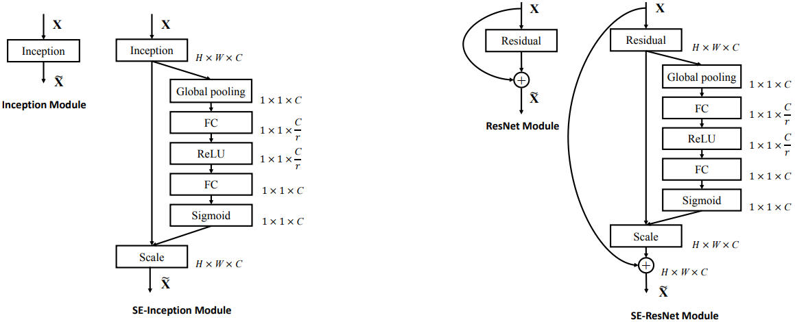

这种设计使得 **SE-Inception Module** 能够<span style="color: rgb(46,161,33); background-color: inherit">在保持原有结构优势的同时，增强通道间的依赖关系建模能力</span>。

**<span style="color: rgb(36,91,219); background-color: inherit">SE-ResNet Module</span>**

**ResNet&#x20;**&#x662F;深度学习领域的重要突破，其核心是通过跳跃连接解决了深层网络中的梯度消失问题。**SE-ResNet Module&#x20;**&#x5728; **ResNet&#x20;**&#x7684;基础上引入了SE块，具体构造如下：

> 1. **<span style="color: rgb(36,91,219); background-color: inherit">原始 ResNet 模块</span>**&#x7531;三个卷积层组成：
>
>    * 第一层&#x4E3A;**`1×1`**&#x5377;积，用于降维
>
>    * 第二层&#x4E3A;**`3×3`**&#x5377;积，用于提取空间特征
>
>    * 第三层&#x4E3A;**`1×1`**&#x5377;积，用于升维
>
>    最终输出通过跳跃连接与输入相加，形成残差结构。
>
> 📌 2. **<span style="color: rgb(36,91,219); background-color: inherit">嵌入 SE 块</span>**：在 ResNet 模块的输出特征图上添加 **SE&#x20;**&#x5757;，<span style="color: rgb(100,37,208); background-color: inherit">通过 </span>**<span style="color: rgb(100,37,208); background-color: inherit">Squeeze-Excitation-Scale</span>**<span style="color: rgb(100,37,208); background-color: inherit"> 三步操作对通道特征进行重新校准</span>。具体而言，**SE** 块被放置在残差连接之后，即：
>
>    $$y=F(x,{W_i})+x$$
>
>    其中$$F(x,{W_i})$$表示经过 **SE&#x20;**&#x5757;重新校准后的特征图


**<span style="color: rgb(36,91,219); background-color: inherit">结构设计</span>**

为了更直观地理解 **SENet** 对经典网络的改进效果，这里&#x4EE5;**`ResNet-50`**、**`SE-ResNet-50`**&#x548C;**`SE-ResNeXt-50`**&#x4E3A;例，&#x4ECE;**<span style="color: rgb(100,37,208); background-color: inherit">参数量</span>**<span style="color: rgb(100,37,208); background-color: inherit">、</span>**<span style="color: rgb(100,37,208); background-color: inherit">计算复杂度</span>**<span style="color: rgb(100,37,208); background-color: inherit">和</span>**<span style="color: rgb(100,37,208); background-color: inherit">性能</span>**<span style="color: rgb(100,37,208); background-color: inherit">三个方面进行对比</span>。

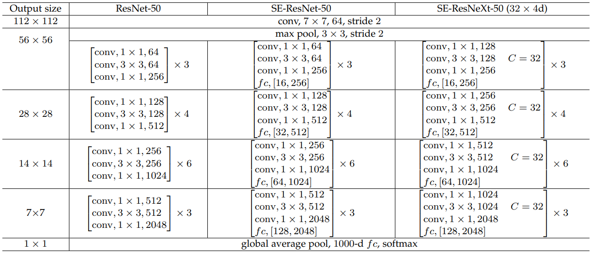

**<span style="color: rgb(222,120,2); background-color: inherit">ResNet-50</span>**

**ResNet-50** 是一个经典的深度残差网络，包&#x542B;**`50`**&#x5C42;卷积层，分&#x4E3A;**`4`**&#x4E2A;阶段，每个阶段通过重复堆叠基本残差模块构建。

* 参数量：&#x7EA6;**`25.6M`**

* 计算量（FLOPs）：&#x7EA6;**`4.1G`**

* 性能：在 ImageNet 数据集上的 Top-1 准确率&#x4E3A;**`76.1%`**&#x20;


**<span style="color: rgb(222,120,2); background-color: inherit">SE-ResNet-50</span>**

**SE-ResNet-50** 在 **ResNet-50** 的基础上，在每个残差模块中嵌入了 **SE** 块。

* 参数量：增加至&#x7EA6;**`28.1M`**，增加了&#x7EA6;**`10%`**

* 计算量：仅增加了不&#x5230;**`1%`**，约&#x4E3A;**`4.14G`**

* 性能：在 ImageNet 数据集上的 Top-1 准确率达&#x5230;**`76.9%`**，相比 ResNet-50 提高&#x4E86;**`0.8%`**

**<span style="color: rgb(222,120,2); background-color: inherit">SE-ResNeXt-50</span>**

**ResNeXt** 是一种<span style="color: rgb(100,37,208); background-color: inherit">基于分组卷积的改进版 </span>**<span style="color: rgb(100,37,208); background-color: inherit">ResNet</span>**<span style="color: rgb(100,37,208); background-color: inherit">，其核心思想是通过基数 cardinality 来扩展网络宽度</span>，从而提高模型的表示能力。

* 参数量：&#x7EA6;**`25.0M`**

* 计算量：&#x7EA6;**`4.2G`**

* 性能：在 ImageNet 数据集上的 Top-1 准确率达&#x5230;**`77.5%`**，相比ResNeXt-50提高&#x4E86;**`0.7%`**


* **<span style="color: rgb(36,91,219); background-color: inherit">技术要点</span>**

尽管 **SENet&#x20;**&#x5F15;入了额外的计算步骤，但其设计非常注重效率。**SE&#x20;**&#x5757;的计算开销相对较小，尤其在大规模数据集和复杂任务中，性能提升远超额外计算成本。以下是 **SENet&#x20;**&#x5728;技术实现上的几个关键点：

> 1. **<span style="color: rgb(36,91,219); background-color: inherit">全局平均池化的巧妙应用</span>**：全局平均池化操作不仅有效地压缩了空间信息，还避免了引入过多的参数。这使得<span style="color: rgb(100,37,208); background-color: inherit"> </span>**<span style="color: rgb(100,37,208); background-color: inherit">SE </span>**<span style="color: rgb(100,37,208); background-color: inherit">块能够在保持轻量化的同时，捕捉到全局上下文信息</span>
>
> ❤️ 2. **<span style="color: rgb(36,91,219); background-color: inherit">瓶颈结构的设计</span>**：在 **Excitation&#x20;**&#x9636;段，**SE&#x20;**&#x5757;采用了瓶颈结构 Bottleneck Structure，即先通过降维减少通道数，再通过升维恢复原始通道数。假设原始通道数为$$C$$，降维比例为$$r$$，则中间层的通道数为$$C/r$$。这种设计<span style="color: rgb(46,161,33); background-color: inherit">大幅降低了计算复杂度，同时保留了足够的表达能力</span>
>
> 3) **<span style="color: rgb(36,91,219); background-color: inherit">可嵌入性与普适性</span>**：**SE** 块是一种高度模块化的组件，可以无缝嵌入到现有的卷积神经网络架构中。无论&#x662F;**`ResNet`**、**`Inception`**&#x8FD8;&#x662F;**`DenseNet`**，只需在每个卷积块后添加一个 **SE&#x20;**&#x5757;，即可显著提升模型性能。这种普适性使得 **SENet&#x20;**&#x6210;为一种极具吸引力的通用工具
>
> 4) **<span style="color: rgb(36,91,219); background-color: inherit">参数与计算量的权衡</span>**：基础模型增加 **SE&#x20;**&#x6A21;块后会使得整体模型的参数增加&#x7EA6;**`10%`**，但计算量增加不多。例如，<span style="color: rgb(220,155,4); background-color: inherit">在</span>**`ResNet-50`**<span style="color: rgb(220,155,4); background-color: inherit">上添加 </span>**<span style="color: rgb(220,155,4); background-color: inherit">SE </span>**<span style="color: rgb(220,155,4); background-color: inherit">模块后，参数量从</span>**`25.6M`**<span style="color: rgb(220,155,4); background-color: inherit">增加到</span>**`28.1M`**<span style="color: rgb(220,155,4); background-color: inherit">，而 FLOPs 仅增加了不到</span>**`1%`**。这种轻量化设计使得 **SENet&#x20;**&#x5728;实际应用中具有很高的性价比

**<span style="color: rgb(222,120,2); background-color: inherit">代码实现</span>**

这里以 SE-ResNet-50 为例

首先，定义一个通用的 **SE** 块，它将被嵌入到 **ResNet-50** 的残差模块中：

```python
import torch
import torch.nn as nn

class SEBlock(nn.Module):
    def __init__(self, channel, reduction=16):
        """
        SE Block的实现
        :param channel: 输入特征图的通道数
        :param reduction: 降维比例，默认为16
        """
        super(SEBlock, self).__init__()
        self.squeeze = nn.AdaptiveAvgPool2d(1)  # 全局平均池化
        self.excitation = nn.Sequential(
```


然后基于 ResNet-50 的结构，嵌入 SE 块以构建 **SE-ResNet-50**：

```python
class SEBasicBlock(nn.Module):
    expansion = 1

    def __init__(self, in_channels, out_channels, stride=1, downsample=None, reduction=16):
```


**<span style="color: rgb(222,120,2); background-color: inherit">总结</span>**

**SENet&#x20;**&#x7684;主要创新点可以总结为以下几点： &#x20;

> 🚅 1. **<span style="color: rgb(36,91,219); background-color: inherit">通道注意力机制的引入</span>**：**SENet&#x20;**&#x9996;次系统性地提出了通道注意力机制，通过显式建模通道间的依赖关系，增强了网络对重要特征的聚焦能力
>
> 2. **<span style="color: rgb(36,91,219); background-color: inherit">自适应特征重新校准</span>**：通过动态调整每个通道的重要性，**SENet&#x20;**&#x5B9E;现了对特征图的自适应重新校准，从而提升了模型的表示能力
>
> 3) **<span style="color: rgb(36,91,219); background-color: inherit">轻量化与高效性</span>**：尽管引入了额外的计算步骤，**SE&#x20;**&#x5757;的设计非常注重效率，能够在不显著增加计算开销的情况下带来显著的性能提升

自 **SENet&#x20;**&#x63D0;出以来，其思想已被广泛应用于各类计算机视觉任务中，包括<span style="color: rgb(220,155,4); background-color: inherit">图像分类、目标检测、语义分割</span>等。例如，<span style="color: rgb(220,155,4); background-color: inherit">在 ImageNet 图像分类任务中，基于 </span>**<span style="color: rgb(220,155,4); background-color: inherit">SENet </span>**<span style="color: rgb(220,155,4); background-color: inherit">的模型 </span>**<span style="color: rgb(220,155,4); background-color: inherit">SE-ResNet </span>**<span style="color: rgb(220,155,4); background-color: inherit">以显著的优势赢得了 2017 年 ILSVRC 竞赛的冠军</span>。此外，**SENet&#x20;**&#x7684;思想也被后续许多工作所借鉴，例如 **<span style="color: rgb(220,155,4); background-color: inherit">EfficientNet</span>**<span style="color: rgb(220,155,4); background-color: inherit">、</span>**<span style="color: rgb(220,155,4); background-color: inherit">MobileNetV3 </span>**<span style="color: rgb(220,155,4); background-color: inherit">等轻量化网络，均采用了类似的</span>**<span style="color: rgb(100,37,208); background-color: inherit">通道注意力机制</span>**。

**<span style="color: rgb(100,37,208); background-color: inherit">SENet </span>**<span style="color: rgb(100,37,208); background-color: inherit">的提出标志着</span>**<span style="color: rgb(100,37,208); background-color: inherit">通道注意力机制</span>**<span style="color: rgb(100,37,208); background-color: inherit">在深度学习领域的兴起</span>。它通过一种简单而优雅的方式，显著提升了卷积神经网络的性能，同时保持了较低的计算开销。随着深度学习技术的不断发展，通道注意力机制有望与其他注意力机制，如<span style="color: rgb(220,155,4); background-color: inherit">空间注意力、时间注意力</span>相结合，进一步推动神经网络架构的演进。就像 SENet 作者展示的，<span style="color: rgb(100,37,208); background-color: inherit">关注细节并深入挖掘潜在的优化空间，往往能够带来意想不到的突破</span>。

## 1.2 <span style="color: rgb(36,91,219); background-color: inherit">Transformer 骨干网络</span>

### 1.2.1 <span style="color: rgb(36,91,219); background-color: inherit">Vision Transformer</span>

卷积神经网络长期主导计算机视觉，其<span style="color: rgb(100,37,208); background-color: inherit">核心假设是</span>**<span style="color: rgb(100,37,208); background-color: inherit">局部性先验</span>**<span style="color: rgb(100,37,208); background-color: inherit"> locality prior 和</span>**<span style="color: rgb(100,37,208); background-color: inherit">平移等变性</span>**<span style="color: rgb(100,37,208); background-color: inherit"> translation equivariance</span>。然而，<span style="color: rgb(216,57,49); background-color: inherit">这种</span>**<span style="color: rgb(216,57,49); background-color: inherit">归纳偏置</span>**<span style="color: rgb(216,57,49); background-color: inherit"> inductive bias 限制了模型对全局上下文关系的建模能力</span>。

近年来，深度学习领域的发展日新月异，尤其是 Transformer 模型的崛起，彻底改变了自然语言处理的研究范式。然而，Transformer 的强大能力并不仅限于文本数据，它同样可以扩展到其他模态的任务中。2020年，Google Brain 团队提出了一种开创性的工作——<span style="color: rgb(100,37,208); background-color: inherit">Vision Transformer (ViT)，将 Transformer 架构成功应用于计算机视觉任务。这一工作不仅标志着 Transformer 在图像分类任务中的首次大规模应用，还为后续的视觉研究奠定了基础</span>。

* **<span style="color: rgb(36,91,219); background-color: inherit">核心思想</span>**

> 🥖 **ViT&#x20;**&#x7684;核心命题是：<span style="color: rgb(100,37,208); background-color: inherit">抛弃卷积操作，将图像视为由图像块 patch 组成的序列，通过自注意力机制实现全局交互</span>。其突破性在于证明：<span style="color: rgb(46,161,33); background-color: inherit">当训练数据足够庞大时，如</span>**`JFT-300M`**<span style="color: rgb(46,161,33); background-color: inherit">，无空间先验的纯 Transformer 架构可超越 CNN</span>。

传统的卷积神经网络通过局部感受野和权重共享机制来提取图像特征，而 **ViT&#x20;**&#x5219;另辟蹊径，采用了一种全新的思路：<span style="color: rgb(100,37,208); background-color: inherit">将图像视为</span>**<span style="color: rgb(100,37,208); background-color: inherit">词序列</span>**。具体来说，**<span style="color: rgb(100,37,208); background-color: inherit">ViT</span>**<span style="color: rgb(100,37,208); background-color: inherit"> 首先将输入图像分割成固定大小的小块 Patches，每个小块被视为一个</span>**<span style="color: rgb(100,37,208); background-color: inherit">词</span>**<span style="color: rgb(100,37,208); background-color: inherit">或 </span>**<span style="color: rgb(100,37,208); background-color: inherit">token</span>**。例如，<span style="color: rgb(220,155,4); background-color: inherit">对于一张分辨率为</span>**`224×224`**<span style="color: rgb(220,155,4); background-color: inherit">的RGB图像，若每个 Patch 的大小为</span>**`16×16`**<span style="color: rgb(220,155,4); background-color: inherit">，则整张图像会被划分为</span>**`196`**<span style="color: rgb(220,155,4); background-color: inherit">个 Patch</span>。<span style="color: rgb(100,37,208); background-color: inherit">这些 Patch 随后被展平并嵌入到高维空间中，形成一个类似于 NLP 中词嵌入的表示形式</span>。

这种<span style="color: rgb(46,161,33); background-color: inherit">非重叠的 Patch Embedding 方法是 ViT 的核心设计之一，它使得 Transformer 能够直接处理图像数据，而无需依赖复杂的卷积操作</span>。此外，<span style="color: rgb(100,37,208); background-color: inherit">为了保留图像的空间信息，</span>**<span style="color: rgb(100,37,208); background-color: inherit">ViT</span>**<span style="color: rgb(100,37,208); background-color: inherit"> 还在每个 patch 的嵌入中添加了位置编码 positional encoding，以显式地引入 Patch 的位置信息</span>。

位置编码的设计有多种实现方式，主要分为两类：

> ⛱️ 1. 基于固定算法生成的<span style="color: rgb(100,37,208); background-color: inherit">正余弦函数编码</span>，类似于原始 Transformer 中的实现
>
> 2. <span style="color: rgb(100,37,208); background-color: inherit">可学习的位置编码</span>

**ViT** 选择了后者，即通过训练优化位置编码参数，从而更好地适应图像数据的特性。

* **<span style="color: rgb(36,91,219); background-color: inherit">架构设计</span>**

**ViT** 的整体架构与标准的 Transformer 模型非常相似，但针对图像数据的特点进行了适当的调整，如下图所示。其主要组成部分包括以下几个模块：

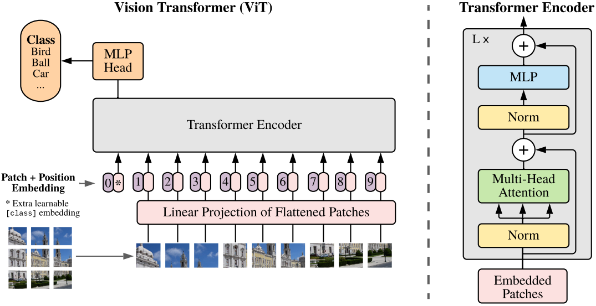

> 1. **<span style="color: rgb(36,91,219); background-color: inherit">Patch Embedding层</span>**：**<span style="color: rgb(100,37,208); background-color: inherit">ViT</span>**<span style="color: rgb(100,37,208); background-color: inherit"> 首先将图像分割为多个 patch，并通过一个线性投影层将其映射到高维空间</span>。这一过程可以看作是对图像的初步特征提取。假设输入图像的尺寸为$$H \times W \times C$$（高度、宽度和通道数），每个Patch 的大小为$$P \times P$$，则经过分割后，图像被转换为一个长度为$$N = \frac{H}{P} \cdot \frac{W}{P}$$的序列，每个 Patch 的维度为$$P^2 \cdot C$$。线性投影层进一步将每个 Patch 映射到一个固定维度的 embedding 向量。
>
> 2. **<span style="color: rgb(36,91,219); background-color: inherit">位置编码</span>**：由于 Transformer 本身不具备对输入顺序的感知能力，**ViT** 引入了可学习的位置编码，用于捕捉 Patch 之间的空间关系。这些位置编码与 Patch embedding 相加后，作为 Transformer 的输入。这里需要注意的是，<span style="color: rgb(100,37,208); background-color: inherit">位置编码的长度与 patch 的数量相同，因此它的维度也受到图像分辨率的影响</span>。
>
> 👍 3) **<span style="color: rgb(36,91,219); background-color: inherit">Transformer Encoder</span>**：**ViT** 的核心是一个标准的 Transformer Encoder，包含多头自注意力机制 **<span style="color: rgb(216,57,49); background-color: inherit">MHSA</span>**<span style="color: rgb(216,57,49); background-color: inherit">（</span>**<span style="color: rgb(216,57,49); background-color: inherit">M</span>**<span style="color: rgb(216,57,49); background-color: inherit">ulti-</span>**<span style="color: rgb(216,57,49); background-color: inherit">H</span>**<span style="color: rgb(216,57,49); background-color: inherit">ead </span>**<span style="color: rgb(216,57,49); background-color: inherit">S</span>**<span style="color: rgb(216,57,49); background-color: inherit">elf-</span>**<span style="color: rgb(216,57,49); background-color: inherit">A</span>**<span style="color: rgb(216,57,49); background-color: inherit">ttention）</span>和前馈神经网络 **<span style="color: rgb(216,57,49); background-color: inherit">FFN</span>**<span style="color: rgb(216,57,49); background-color: inherit">（</span>**<span style="color: rgb(216,57,49); background-color: inherit">F</span>**<span style="color: rgb(216,57,49); background-color: inherit">eed-</span>**<span style="color: rgb(216,57,49); background-color: inherit">F</span>**<span style="color: rgb(216,57,49); background-color: inherit">orward </span>**<span style="color: rgb(216,57,49); background-color: inherit">N</span>**<span style="color: rgb(216,57,49); background-color: inherit">etwork）</span>。<span style="color: rgb(100,37,208); background-color: inherit">通过多层堆叠，Transformer 能够捕捉图像全局的上下文信息，从而实现对复杂模式的学习</span>。每一层的输出都会通过残差连接 Residual Connection 和层归一化 Layer Normalization 进行优化，以提高训练的稳定性和收敛速度。
>
> 4) **<span style="color: rgb(36,91,219); background-color: inherit">分类头</span>**：在 Transformer 的最后一层输出中，ViT 引入了一个特殊的分类 Token：**`Class Token`**，用于汇总整个图像的信息。这个 Token 在输入时被插入到 Patch 序列的最前端，并与其他 Patch 一起参与 Transformer 的计算。最终，分类 Token 的输出经过一个全连接层后，生成最终的分类预测结果。

整个网络的公式化表示如下：

$$\begin{aligned}
z_0 &= [\mathbf{x}_{\text{class}}; \mathbf{x}_p^1 \mathbf{E}; \mathbf{x}_p^2 \mathbf{E}; \cdots; \mathbf{x}_p^N \mathbf{E}] + \mathbf{E}_{pos},  \quad 
\mathbf{E} \in \mathbb{R}^{(P^2 \cdot C) \times D}, \quad \mathbf{E}_{pos} \in \mathbb{R}^{(N+1) \times D}, \\
z_{\ell}' &= \text{MSA}(\text{LN}(z_{\ell-1})) + z_{\ell-1}, \quad \ell = 1 \ldots L, \\
z_{\ell} &= \text{MLP}(\text{LN}(z_{\ell}')) + z_{\ell}', \quad \ell = 1 \ldots L, \\
\mathbf{y} &= \text{LN}(\mathbf{z}_L^0).
\end{aligned}$$

其中$$\mathbf{x}_{\text{class}}$$表示类别标记；$$\mathbf{x}_p^i$$是第$$i$$个图像块的标记；$$\mathbf{E}$$表示嵌入矩阵，用于将输入转换为模型可以处理的形式；$$\mathbf{E}_{pos}$$则是位置嵌入，用于提供序列中元素的位置信息；$$D$$表示嵌入维度；$$L$$表示 Transformer 编码器中的层数。 MSA，LN，MLP 分别表示：多头自注意力机制，层归一化以及多层感知机。

* **<span style="color: rgb(36,91,219); background-color: inherit">技术亮点</span>**

1. **<span style="color: rgb(36,91,219); background-color: inherit">全局建模能力</span>**：传统的 CNN 通过局部感受野逐步扩大视野范围，而 **<span style="color: rgb(46,161,33); background-color: inherit">ViT </span>**<span style="color: rgb(46,161,33); background-color: inherit">通过自注意力机制直接建模图像的全局依赖关系。这种特性使得 </span>**<span style="color: rgb(46,161,33); background-color: inherit">ViT </span>**<span style="color: rgb(46,161,33); background-color: inherit">在处理需要长距离上下文信息的任务时表现出色</span>，例如<span style="color: rgb(220,155,4); background-color: inherit">细粒度图像分类和目标检测</span>。具体来说，自注意力机制允许模型动态地关注图像中不同区域的重要性，从而避免了手工设计特征的问题。

2. **<span style="color: rgb(36,91,219); background-color: inherit">简单而有效的设计</span>**：**ViT&#x20;**&#x7684;架构相对简洁，几乎完全复用了 NLP 领域的 Transformer 模型，仅需少量改动即可适应图像数据。这种设计<span style="color: rgb(46,161,33); background-color: inherit">不仅降低了实现难度，还提高了模型的可扩展性</span>。此外，**<span style="color: rgb(100,37,208); background-color: inherit">ViT </span>**<span style="color: rgb(100,37,208); background-color: inherit">的成功表明，Transformer 作为一种通用的架构，具有跨模态的潜力，可以在不同的任务中展现出强大的性能</span>。

3) **<span style="color: rgb(36,91,219); background-color: inherit">数据驱动的性能提升</span>**：尽管 **ViT&#x20;**&#x5728;小规模数据集上的表现可能不如 CNN，但在大规模数据集上预训练后，&#x5982;**`ImageNet-21k`**&#x6216;**`JFT-300M`**，**ViT&#x20;**&#x80FD;够展现出超越 CNN 的性能。这一现象表明，**<span style="color: rgb(100,37,208); background-color: inherit">ViT </span>**<span style="color: rgb(100,37,208); background-color: inherit">的潜力更多依赖于数据量和计算资源的支持</span>。事实上，**ViT&#x20;**&#x5728; ImageNet 上的实验结果表明，<span style="color: rgb(46,161,33); background-color: inherit">当数据量足够大时，</span>**<span style="color: rgb(46,161,33); background-color: inherit">ViT </span>**<span style="color: rgb(46,161,33); background-color: inherit">的性能甚至可以媲美最先进的 CNN 模型</span>。

4) **<span style="color: rgb(36,91,219); background-color: inherit">可解释性强</span>**：**<span style="color: rgb(100,37,208); background-color: inherit">ViT </span>**<span style="color: rgb(100,37,208); background-color: inherit">的注意力权重可以直观地展示模型在图像中关注的重点区域，这为模型的可解释性提供了新的途径</span>。通过对注意力图的分析，研究人员可以更好地理解模型的决策过程，从而改进模型的设计。

* **<span style="color: rgb(36,91,219); background-color: inherit">局限性</span>**

尽管 **ViT&#x20;**&#x53D6;得了显著的成功，但它也暴露了一些局限性：

> **ViT&#x20;**&#x5BF9;大规模预训练数据的需求较高，在小数据集上容易过拟合
>
> ⛱️ **ViT&#x20;**&#x7684;计算复杂度随着图像分辨率的增加而急剧上升，这限制了其在高分辨率图像任务中的应用

为了解决这些问题，研究者们提出了多种改进方案。例如，**<span style="color: rgb(216,57,49); background-color: inherit">PVT</span>**<span style="color: rgb(216,57,49); background-color: inherit">（</span>**<span style="color: rgb(216,57,49); background-color: inherit">P</span>**<span style="color: rgb(216,57,49); background-color: inherit">yramid </span>**<span style="color: rgb(216,57,49); background-color: inherit">V</span>**<span style="color: rgb(216,57,49); background-color: inherit">ision </span>**<span style="color: rgb(216,57,49); background-color: inherit">T</span>**<span style="color: rgb(216,57,49); background-color: inherit">ransformer）</span>和 <span style="color: rgb(216,57,49); background-color: inherit">Swin Transformer</span> <span style="color: rgb(220,155,4); background-color: inherit">等模型通过引入金字塔结构和局部窗口注意力机制，显著降低了计算开销，同时提升了模型的灵活性</span>。此外，<span style="color: rgb(100,37,208); background-color: inherit">结合 CNN 和 Transformer 的混合架构也被证明是一种有效的策略，能够在保持 </span>**<span style="color: rgb(100,37,208); background-color: inherit">ViT </span>**<span style="color: rgb(100,37,208); background-color: inherit">全局建模能力的同时，利用 CNN 的局部特征提取优势</span>。

**<span style="color: rgb(222,120,2); background-color: inherit">代码实现</span>**

作者一共设计&#x4E86;**`3`**&#x79CD;规格的模&#x578B;**`Base`**，**`Large`**，**`Huge`**，如右图所示。这里展示一个 pytorch 搭建&#x7684;**`ViT-base`**&#x6A21;型：

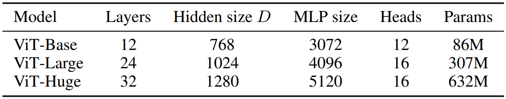

**<span style="color: rgb(222,120,2); background-color: inherit">总结</span>**

**ViT&#x20;**&#x7684;提出不仅推动了 Transformer 在计算机视觉领域的广泛应用，还启发了一系列后续研究，包括目标检测、语义分割和视频理解等任务。随着硬件性能的提升和数据规模的扩大，**ViT&#x20;**&#x53CA;其变体有望在更多实际场景中发挥作用。

总的来说，<span style="color: rgb(100,37,208); background-color: inherit">Vision Transformer 在计算机视觉领域是一项很有意义的工作，它打破了传统 CNN 在视觉领域的主导地位，为深度学习研究开辟了新的方向</span>。

```python
class MultiHeadSelfAttention(nn.Module):
    def __init__(self, dim, num_heads=8, dropout=0.0):
        super().__init__()
        assert dim % num_heads == 0, "dim must divisible by num_heads"
        self.num_heads = num_heads
        self.head_dim = dim // num_heads

        # q, k, v 的线性变换
        self.qkv = nn.Linear(dim, dim * 3)
        self.dropout = nn.Dropout(dropout)
```


**<span style="color: rgb(222,120,2); background-color: inherit">代码实现</span>**


```python
import torch

# 假设你的 ViT 类名是 VisionTransformer，已经定义好
# from your_vit_module import VisionTransformer

# 先创建一个随机图像张量
# 假设输入图像大小是 224x224，3 通道 (RGB)，batch 大小是 1
img = torch.randn(1, 3, 224, 224)  # torch.randn 生成标准正态分布的随机数 :contentReference[oaicite:0]{index=0}

# 创建 ViT 模型实例
```


```python
class VisionTransformer(nn.Module):
    def __init__(self, *, img_size=224, patch_size=16, num_classes=1000,
                 dim=768, depth=12, num_heads=12, mlp_dim=3072, dropout=0.0):
        super().__init__()
        # patch embedding
        self.patch_embed = PatchEmbedding(img_size, patch_size, in_channels=3, embed_dim=dim)
        num_patches = (img_size // patch_size) ** 2

        # learnable class token
        self.cls_token = nn.Parameter(torch.zeros(1, 1, dim))
        # position embedding
        self.pos_embed = nn.Parameter(torch.zeros(1, 1 + num_patches, dim))  # +1 for cls token
        self.pos_dropout = nn.Dropout(dropout)
```


```python
class TransformerEncoderBlock(nn.Module):
    def __init__(self, dim, num_heads, mlp_dim, dropout=0.0):
        super().__init__()
        self.norm1 = nn.LayerNorm(dim)
        self.attn = MultiHeadSelfAttention(dim, num_heads, dropout)
        self.norm2 = nn.LayerNorm(dim)
        self.ff = FeedForward(dim, mlp_dim, dropout)
```


```python
class FeedForward(nn.Module):
    def __init__(self, dim, hidden_dim, dropout=0.0):
        super().__init__()
        self.net = nn.Sequential(
```

### 1.2.2 <span style="color: rgb(36,91,219); background-color: inherit">DeiT</span>

传统的卷积神经网络在图像分类任务中表现出色，但其设计<span style="color: rgb(216,57,49); background-color: inherit">依赖于手工构造的特征提取机制，难以适应多样化的应用场景</span>。而 Transformer，尤其是基于自注意力机制的架构，因其强大的全局建模能力，<span style="color: rgb(46,161,33); background-color: inherit">在自然语言处理领域取得了巨大成功</span>。

**ViT&#x20;**&#x7684;提出首次将 Transformer 引入图像分类任务，并在大规模数据集上展现了卓越的性能。**<span style="color: rgb(216,57,49); background-color: inherit">ViT</span>**<span style="color: rgb(216,57,49); background-color: inherit">（</span>**<span style="color: rgb(216,57,49); background-color: inherit">Vi</span>**<span style="color: rgb(216,57,49); background-color: inherit">sion </span>**<span style="color: rgb(216,57,49); background-color: inherit">T</span>**<span style="color: rgb(216,57,49); background-color: inherit">ransformer）</span>的出现为图像分类任务提供了一种全新的视角。然而，**<span style="color: rgb(216,57,49); background-color: inherit">ViT</span>**<span style="color: rgb(216,57,49); background-color: inherit"> 的成功依赖于海量的训练数据和强大的计算资源：数百万张标注图像和大量 GPU，这使得其在实际应用中面临诸多限制，对于许多实际场景来说是不现实的</span>。

针对这一问题，**`Facebook AI`**&#x56E2;队提出了 **<span style="color: rgb(216,57,49); background-color: inherit">DeiT</span>**<span style="color: rgb(216,57,49); background-color: inherit">（</span>**<span style="color: rgb(216,57,49); background-color: inherit">D</span>**<span style="color: rgb(216,57,49); background-color: inherit">ata-</span>**<span style="color: rgb(216,57,49); background-color: inherit">e</span>**<span style="color: rgb(216,57,49); background-color: inherit">fficient </span>**<span style="color: rgb(216,57,49); background-color: inherit">i</span>**<span style="color: rgb(216,57,49); background-color: inherit">mage </span>**<span style="color: rgb(216,57,49); background-color: inherit">T</span>**<span style="color: rgb(216,57,49); background-color: inherit">ransformers）</span>，**<span style="color: rgb(100,37,208); background-color: inherit">DeiT</span>**<span style="color: rgb(100,37,208); background-color: inherit"> 的核心目标是解决 </span>**<span style="color: rgb(100,37,208); background-color: inherit">ViT </span>**<span style="color: rgb(100,37,208); background-color: inherit">的问题，通过改进训练方法和引入知识蒸馏策略，使得 Transformer 能够在较小的数据集上达到与 </span>**<span style="color: rgb(100,37,208); background-color: inherit">ViT </span>**<span style="color: rgb(100,37,208); background-color: inherit">相当甚至更高的性能</span>。这种数据高效的特性使得 **DeiT&#x20;**&#x6210;为资源受限环境下的理想选择。<span style="color: rgb(46,161,33); background-color: inherit">这项工作不仅推动了 Transformer 在计算机视觉领域的普及，还为模型优化和知识蒸馏技术提供了重要的启示</span>。

* **<span style="color: rgb(36,91,219); background-color: inherit">核心方法</span>**

**DeiT&#x20;**&#x5047;设可以使用一个强大的图像分类器作为教师模型。这个教师模型可以是一个卷积神经网络，也可以是多个分类器的混合。**DeiT&#x20;**&#x901A;过比较准确率与图像吞吐量之间的权衡，用 Transformer 替换卷积神经网络可能是有益的。这里首先介绍蒸馏的两个维度：硬蒸馏与软蒸馏，以及经典蒸馏与蒸馏 Token。 &#x20;

**<span style="color: rgb(36,91,219); background-color: inherit">软蒸馏</span>**

软蒸馏旨在最小化教师模型的 softmax 输出与学生模型的 softmax 输出之间的 KL 散度。 &#x20;

设 $$Z_t$$ 表示教师模型的 logits，$$Z_s$$表示学生模型的 logits。用$$\tau$$表示蒸馏的温度参数，$$\lambda$$表示平衡 KL 散度损失和基于真实标签 $$y$$ 的交叉熵损失$$\mathcal{L}_{CE}$$的系数，$$\psi$$表示 softmax 函数。蒸馏的目标函数为： &#x20;

$$\mathcal{L}_{\text{global}} = (1 - \lambda) \mathcal{L}_{\text{CE}}(\psi(Z_s), y) + \lambda \tau^2 \text{KL}(\psi(Z_s / \tau), \psi(Z_t / \tau))$$

其中，第一项是学生模型对真实标签的预测误差，通过交叉熵损失计算。第二项则衡量教师模型和学生模型输出分布之间的差异，通过KL散度计算。

**<span style="color: rgb(36,91,219); background-color: inherit">硬蒸馏 </span>**

DeiT 引入了一种蒸馏的变体，在这种方法中，将教师模型的硬决策 hard decision 视为真实标签。设$$y_t = \arg\max_c Z_t(c)$$为教师模型的硬决策，则与这种硬标签蒸馏相关的目标函数为： &#x20;

$$\mathcal{L}_{\text{hardDistill}}^{\text{global}} = \frac{1}{2} \mathcal{L}_{\text{CE}}(\psi(Z_s), y) + \frac{1}{2} \mathcal{L}_{\text{CE}}(\psi(Z_s), y_t)$$

对于给定的图像，与教师模型相关的硬标签可能会因特定的数据增强而发生变化。这种选择优于传统方法，同时它无需额外参数且概念上更简单：教师模型的预测$$y_t$$在此方法中扮演了与真实标签$$y$$相同的角色。还需注意的是，硬标签也可以通过标签平滑 label smoothing 转换为软标签。在标签平滑中，真实标签被认为具有$$1 - \epsilon$$的概率，而剩余的$$\epsilon$$则均匀分配到其他类别上。在所有使用真实标签的实验中，将该参数固定为$$\epsilon = 0.1$$。

**<span style="color: rgb(36,91,219); background-color: inherit">蒸馏 Token</span>**

如右图所示，在包括图像&#x5757;**`patch tokens`**&#x4EE5;及类别 Toke&#x6E;**`class token`**&#x7684;初始嵌入中添加了一个新的标记，即蒸馏 Token **`distillation token`**。蒸馏 Token 与类别 Token 的使用方式类似：<span style="color: rgb(100,37,208); background-color: inherit">它通过自注意力机制与其他嵌入进行交互，并在网络的最后一层输出</span>。它的目标由损失函数中的蒸馏部分决定。蒸馏嵌入使 DeiT 能够像常规蒸馏一样从教师模型的输出中学习，同时仍然与类别嵌入保持互补性。 &#x20;

DeiT 团队观察到学习到的类别标记和蒸馏标记会收敛到不同的向量：<span style="color: rgb(100,37,208); background-color: inherit">它们之间的平均余弦相似度仅为</span>**`0.06`**<span style="color: rgb(100,37,208); background-color: inherit">。由于类别嵌入和蒸馏嵌入在每一层都会被计算，它们在网络中逐渐变得更加相似，直到最后一层时它们的相似度变得非常高，余弦相似度到了</span>**`0.93`**。这是符合预期的，因为它们的目标是生成相似但不完全相同的输出。

DeiT 验证了蒸馏 Token 确实为模型带来了额外的价值：作者尝试了一种带有两个类别 Token 的 Transformer 模型，其中一个类别标记替代了教师伪标签。即使这两个标记在初始化时是随机且独立的，在训练过程中它们会收敛到几乎相同的向量，余弦相似度达&#x5230;**`0.999`**，并且输出嵌入也几乎是完全一致的。这种额外的类别标记对分类性能没有任何提升。相比之下，蒸馏策略相较于普通的蒸馏基线方法有显著改进。

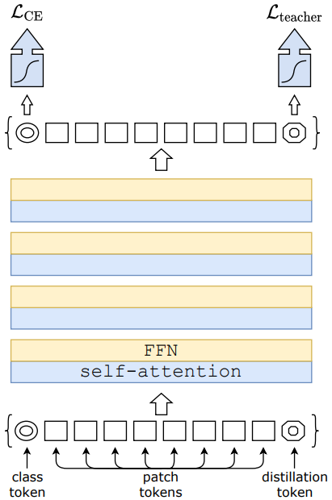

**<span style="color: rgb(36,91,219); background-color: inherit">使用蒸馏进行微调</span>**<span style="color: rgb(36,91,219); background-color: inherit"> </span>&#x20;

<span style="color: rgb(100,37,208); background-color: inherit">在更高分辨率下的微调阶段，同时使用真实标签和教师模型的预测结果，并且使用的教师模型具有相同的目标分辨率</span>。**DeiT&#x20;**&#x4E5F;尝试过仅使用真实标签进行微调，但这减少了教师模型的作用，导致性能下降。

**<span style="color: rgb(36,91,219); background-color: inherit">联合分类器</span>**<span style="color: rgb(36,91,219); background-color: inherit">  </span>

在测试阶段，Transformer 生成的类别嵌入和蒸馏嵌入都可以与线性分类器结合，用于推断图像标签。然而 **DeiT&#x20;**<span style="color: rgb(100,37,208); background-color: inherit">将这两个独立的分类头进行后期融合，具体做法是将两个分类器的 softmax 输出相加以做出最终预测</span>。

**<span style="color: rgb(36,91,219); background-color: inherit">模型规模</span>**

较大的模&#x578B;**`DeiT-B`**&#x5177;有&#x4E0E;**`ViT-B`**&#x76F8;同的架构。不同模型之间唯一变化的参数是嵌入维度和注意力头的数量，DeiT 保持每个头的维度恒定，即等&#x4E8E;**`64`**。

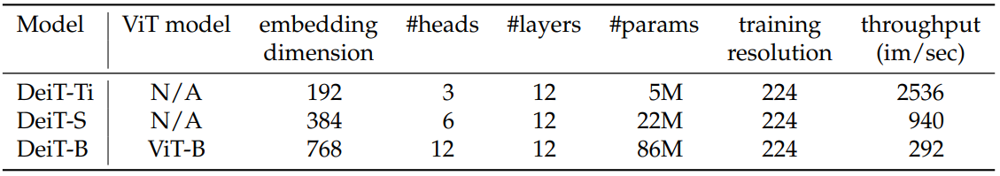

较小的模型具有更少的参数量和更快的吞吐量。吞吐量是在分辨率&#x4E3A;**`224×224`**&#x7684;图像上测量的。

* **<span style="color: rgb(36,91,219); background-color: inherit">性能分析</span>**

**DeiT&#x20;**&#x5728;多个基准数据集上的实验结果充分证明了其有效性。在 ImageNet-1k 数据集上，**`DeiT-B`**&#x5728; Top-1 准确率上达到&#x4E86;**`81.8%`**，<span style="color: rgb(46,161,33); background-color: inherit">与 ViT-B 相当，但训练所需的数据量和计算资源却大幅减少</span>。此外，通过蒸馏训练，**`DeiT-Distilled`**&#x7248;本进一步将准确率提升&#x81F3;**`83.4%`**，超越了许多经典的卷积网络模型。这些结果表明，**<span style="color: rgb(46,161,33); background-color: inherit">DeiT </span>**<span style="color: rgb(46,161,33); background-color: inherit">不仅在数据效率上具有优势，还在性能上达到了行业领先水平</span>。

进一步的消融实验显示，<span style="color: rgb(100,37,208); background-color: inherit">基于 Token 的蒸馏方法对模型性能的提升起到了关键作用</span>。<span style="color: rgb(216,57,49); background-color: inherit">在未使用蒸馏 Token 的情况下，</span>**<span style="color: rgb(216,57,49); background-color: inherit">DeiT </span>**<span style="color: rgb(216,57,49); background-color: inherit">的 Top-1 准确率下降了约</span>**`1.5%`**。这表明蒸馏 Token 在捕获教师模型知识方面的重要性。

* **<span style="color: rgb(36,91,219); background-color: inherit">核心创新点</span>**

**DeiT&#x20;**&#x7684;技术亮点主要体现在以下几个方面：

> 🍞 1. **<span style="color: rgb(36,91,219); background-color: inherit">基于 Token 的知识蒸馏</span>**：**DeiT&#x20;**&#x901A;过引入一个特殊的**蒸馏 Token** 来捕获教师模型的知识。**DeiT&#x20;**&#x5728;输入序列中添加了一个额外的 Token，用于表示教师模型的预测分布。这种方法<span style="color: rgb(46,161,33); background-color: inherit">不仅保留了原始 Transformer 的结构，还显著提高了模型的泛化能力</span>。相比于传统的软标签蒸馏方法，基于 Token 的蒸馏更加灵活，能够更好地适应 Transformer 的架构特点。
>
> 2. **<span style="color: rgb(36,91,219); background-color: inherit">混合教师模型</span>**：在蒸馏过程中，**DeiT&#x20;**&#x91C7;用了一种混合教师模型的策略。它结合了卷积神经网络和 Transformer 模型的优点，利用卷积网络的局部特征提取能力和 Transformer 的全局建模能力，生成高质量的指导信号。这种跨模态的蒸馏方式<span style="color: rgb(46,161,33); background-color: inherit">不仅提升了学生模型的性能，还为多模态学习提供了新的思路</span>。
>
> 3) **<span style="color: rgb(36,91,219); background-color: inherit">数据高效的训练策略</span>**：**DeiT&#x20;**&#x901A;过优化训练流程，大幅减少了对大规模标注数据的依赖。例如，<span style="color: rgb(220,155,4); background-color: inherit">它仅需 ImageNet-1k 数据集即可达到 SOTA 性能，而无需像 </span>**<span style="color: rgb(220,155,4); background-color: inherit">ViT </span>**<span style="color: rgb(220,155,4); background-color: inherit">那样依赖 JFT-300M 等超大规模数据集</span>。此外，DeiT 的训练过程可以&#x5728;**`4`**&#x5757;GPU上完成，耗时仅三天，相较于ViT的训练成本显著降低。这种高效性使其在学术研究和工业应用中都具有广泛的适用性。
>
> 4) **<span style="color: rgb(36,91,219); background-color: inherit">模型压缩与加速</span>**：为了进一步提升 DeiT 的实用性，研究者还探索了模型压缩和加速技术。例如，<span style="color: rgb(220,155,4); background-color: inherit">通过多准则 Token 融合方法，</span>**<span style="color: rgb(220,155,4); background-color: inherit">DeiT </span>**<span style="color: rgb(220,155,4); background-color: inherit">成功将计算复杂度 FLOPs 减少了</span>**`44%`**<span style="color: rgb(220,155,4); background-color: inherit">，同时保持了较高的分类精度</span>。这种即插即用的优化策略为 Transformer 模型的实际部署提供了重要支持。
>
> 5) **<span style="color: rgb(36,91,219); background-color: inherit">正则化与数据增强</span>**：为了提高模型的泛化能力，DeiT 采用了多种正则化技术，&#x5982;**`Mixup`**<span style="color: rgb(220,155,4); background-color: inherit">、</span>**`CutMix`**<span style="color: rgb(220,155,4); background-color: inherit">和随机深度</span>**`Stochastic Depth`**。这些技术通过引入噪声或随机性，增强了模型对不同输入分布的适应能力。此外，**<span style="color: rgb(46,161,33); background-color: inherit">DeiT</span>**<span style="color: rgb(46,161,33); background-color: inherit"> 还结合了</span>**`AutoAugment`**<span style="color: rgb(46,161,33); background-color: inherit">和</span>**`RandAugment`**<span style="color: rgb(46,161,33); background-color: inherit">等数据增强方法，进一步提升了模型的鲁棒性和准确性</span>。

**<span style="color: rgb(222,120,2); background-color: inherit">总结</span>**

**<span style="color: rgb(46,161,33); background-color: inherit">DeiT </span>**<span style="color: rgb(46,161,33); background-color: inherit">的成功为 Transformer 在计算机视觉领域的广泛应用铺平了道路。其数据高效的特性使其特别适合于医疗影像、卫星图像分析等标注数据稀缺的领域</span>。然而，**<span style="color: rgb(216,57,49); background-color: inherit">DeiT </span>**<span style="color: rgb(216,57,49); background-color: inherit">也面临着一些挑战。例如，如何在更复杂的任务中进一步优化 Transformer 的性能，如目标检测和语义分割，仍然是一个开放性问题</span>。此外，随着模型规模的增大，如何平衡计算效率与性能也是一个亟待解决的难题。

**<span style="color: rgb(46,161,33); background-color: inherit">DeiT </span>**<span style="color: rgb(46,161,33); background-color: inherit">作为数据高效图像 Transformer 的代表作，不仅展示了 Transformer 在图像分类任务中的潜力，还为知识蒸馏和模型优化提供了宝贵的实践经验</span>。它的创新之处在于<span style="color: rgb(46,161,33); background-color: inherit">通过改进训练方法和引入蒸馏 Token，显著降低了 Transformer 对大规模数据和计算资源的依赖</span>。

### 1.2.3 <span style="color: rgb(36,91,219); background-color: inherit">Swin Transformer</span>

在深度学习的发展历程中，Transformer 模型最初因其在自然语言处理领域的卓越表现而声名鹊起。然而，微软亚洲研究院的研究团队在 2021 年提出了一种全新的视觉架构——**Swin Transformer**，将 Transformer 的强大能力引入计算机视觉领域。<span style="color: rgb(100,37,208); background-color: inherit">这一工作不仅为视觉任务提供了新的解决方案，还成功地结合了卷积神经网络和 Transformer的优势，成为图像分类、目标检测、语义分割等任务中的标杆模型</span>。

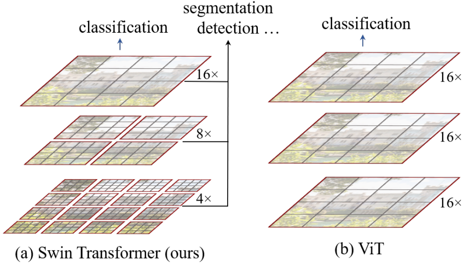

传统的卷积神经网络在计算机视觉领域长期占据主导地位，其通过局部感受野和权重共享机制有效地提取图像的局部特征。然而，<span style="color: rgb(216,57,49); background-color: inherit">随着数据规模的增长和任务复杂度的提升，CNN 在全局建模和多尺度特征提取方面的局限性逐渐显现</span>。与此同时，Transformer 凭借自注意力机制在捕捉长距离依赖关系和全局信息方面表现出色，但其<span style="color: rgb(216,57,49); background-color: inherit">直接应用于高分辨率图像时计算成本过高，限制了其在视觉领域的广泛应用</span>。

**Swin Transformer** 的提出正是为了弥合这一鸿沟。<span style="color: rgb(46,161,33); background-color: inherit">它借鉴了 CNN 的分层结构思想，同时引入了 Transformer 的核心特性——自注意力机制，从而实现了对图像的高效建模</span>。通过这些创新，**<span style="color: rgb(46,161,33); background-color: inherit">Swin Transformer </span>**<span style="color: rgb(46,161,33); background-color: inherit">不仅能够处理超分辨率图像，还能在不同尺度上提取丰富的特征表示，为视觉任务带来了革命性的变化</span>。

* **<span style="color: rgb(36,91,219); background-color: inherit">模型结构</span>**


**Swin Transformer** 架构的总体结构如上图(a)所示，其中展示了其微型版&#x672C;**`Swin-T`**。<span style="color: rgb(100,37,208); background-color: inherit">该架构首先通过一个</span>**<span style="color: rgb(100,37,208); background-color: inherit">图像块分割</span>**<span style="color: rgb(100,37,208); background-color: inherit">模块将输入的 RGB 图像划分为不重叠的图像块，类似于 ViT</span>。每个图像块被视为一个 Token，其特征设置为原始像素 RGB 值的拼接。在论文中使用&#x4E86;**`4×4`**&#x7684;图像块大小，因此每个图像块的特征维度为$$4×4×3=48$$。然后，通过一个线性嵌入层将这些原始特征投影到任意维度，记作$$C$$。

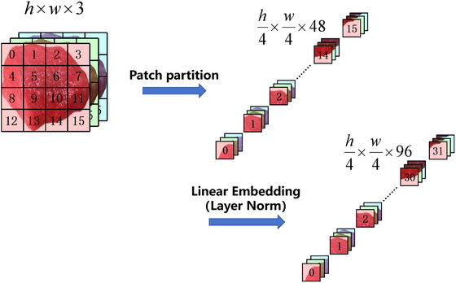

接着，对这些图像块 Token 应用若干经过修改自注意力计算的 Transformer 块，这些块称为 **Swin Transformer** 块。这些 Transformer 块保持 Token 的数量不变，即$$\frac{H}{4} \times \frac{W}{4}$$，与线性嵌入层一起被称&#x4E3A;**<span style="color: rgb(216,57,49); background-color: inherit">阶段1</span>**。

为了生成分层表示，随着网络深度的增加，通过**图像块合并层**减少 Token 的数量。第一个图像块合并层将每&#x7EC4;**`2×2`**&#x76F8;邻图像块的特征拼接起来，并在线性层上对这&#x4E9B;**`4C`**&#x7EF4;的拼接特征进行处理。

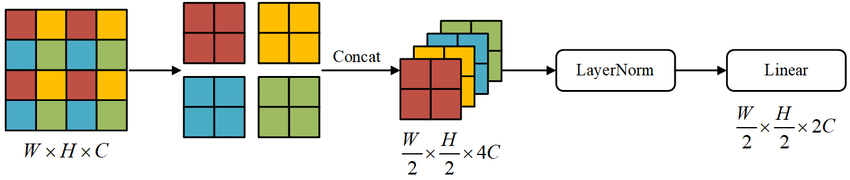

这使得 Token 数量减少了$$2×2=4$$倍，即分辨率下采&#x6837;**`2`**&#x500D;，输出维度被设置&#x4E3A;**`2C`**。随后，应用 **Swin Transformer** 块进行特征变换，分辨率保持在$$\frac{H}{8} \times \frac{W}{8}$$。这一阶段的图像块合并和特征变换被记&#x4F5C;**<span style="color: rgb(216,57,49); background-color: inherit">阶段2</span>**。

该过程重复两次，分别对&#x5E94;**<span style="color: rgb(216,57,49); background-color: inherit">阶段3</span>**&#x548C;**<span style="color: rgb(216,57,49); background-color: inherit">阶段4</span>**，输出分辨率分别为$$\frac{H}{16} \times \frac{W}{16}$$和$$\frac{H}{32} \times \frac{W}{32}$$。这些阶段共同生成了一个分层表示，其特征图分辨率与典型的卷积网络一致，例&#x5982;**`VGG`**&#x548C;**`ResNet`**。因此，<span style="color: rgb(100,37,208); background-color: inherit">Swin Transformer 可以方便地替代现有方法中的骨干网络，用于各种视觉任务</span>。

**<span style="color: rgb(36,91,219); background-color: inherit">Swin Transformer 块</span>**<span style="color: rgb(36,91,219); background-color: inherit"> </span>&#x20;

**Swin Transformer** 通过用基于**滑动窗口**的模块替换 Transformer 块中的标准多头自注意力 MSA 模块构建而成，其他层保持不变。如右图所示，一个 Swin Transformer 块由一个基于滑动窗口的 MSA 模块组成，后接一个两层 MLP，中间使&#x7528;**`GELU`**&#x975E;线性激活函数。在每个 **MSA** 模块和每个 **MLP&#x20;**&#x4E4B;前应用 **LN** 层，并在每个模块之后添加残差连接。


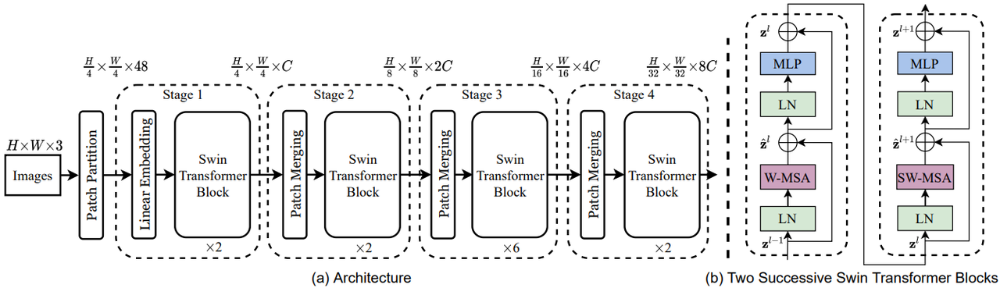

* **<span style="color: rgb(36,91,219); background-color: inherit">基于滑动窗口的自注意力机制</span>**<span style="color: rgb(36,91,219); background-color: inherit">  </span>

标准的 Transformer 架构及其在图像分类中的改进版本都采用了全局自注意力机制，其中计算了每个 Token 与所有其他 Token 之间的关系。这种全局计算的复杂度相对于 Token 数量呈平方增长，使得它不适合许多需要大量 Token 进行密集预测或表示高分辨率图像的视觉任务。

**<span style="color: rgb(36,91,219); background-color: inherit">非重叠窗口内的自注意力机制</span>**

为了实现高效的建模，**Swin Transformer** 提出在局部窗口内计算自注意力。这些窗口被均匀地划分为非重叠区域，以覆盖整个图像。假设每个窗口包含$$M \times M$$个图像块，则对于一个大小为$$h \times w$$的图像块，全局多头自注意力 MSA 模块和基于窗口的自注意力模块的计算复杂度分别为： &#x20;

$$\Omega(\text{MSA}) = 4hwC^2 + 2(hw)^2C$$

$$\Omega(\text{W-MSA}) = 4hwC^2 + 2M^2hwC$$

其中前者的复杂度与图像块数量$$hw$$呈平方关系，而后者在$$M$$固定时呈线性关系，$$M$$默认设置&#x4E3A;**`7`**。对于较大的$$hw$$，全局自注意力计算通常难以承受，而基于窗口的自注意力机制具有良好的可扩展性。

**<span style="color: rgb(36,91,219); background-color: inherit">连续块中的滑动窗口划分</span>** &#x20;

基于窗口的自注意力模块缺乏跨窗口的连接，这限制了其建模能力。为了在保持非重叠窗口高效计算的同时引入跨窗口连接，**Swin Transformer&#x20;**&#x63D0;出了一种滑动窗口划分方法，在连续的 **Swin Transformer** 块中交替使用两种划分配置。

如右图所示，第一个模块采用常规的窗口划分策略，<span style="color: rgb(220,155,4); background-color: inherit">从左上角像素开始，将</span>$$8 \times 8$$<span style="color: rgb(220,155,4); background-color: inherit">的特征图均匀划分为</span>$$2 \times 2$$<span style="color: rgb(220,155,4); background-color: inherit">个大小为</span>$$4 \times 4$$<span style="color: rgb(220,155,4); background-color: inherit">的窗口（</span>$$M = 4$$<span style="color: rgb(220,155,4); background-color: inherit">）。接着，下一个模块采用一种滑动窗口配置，该配置相对于前一层的窗口划分进行了位移，具体是沿两个方向各移动</span>$$(\lfloor \frac{M}{2} \rfloor, \lfloor \frac{M}{2} \rfloor)$$<span style="color: rgb(220,155,4); background-color: inherit">像素</span>。通过这种滑动窗口划分方法，连续的 **Swin Transformer** 块的计算如下：

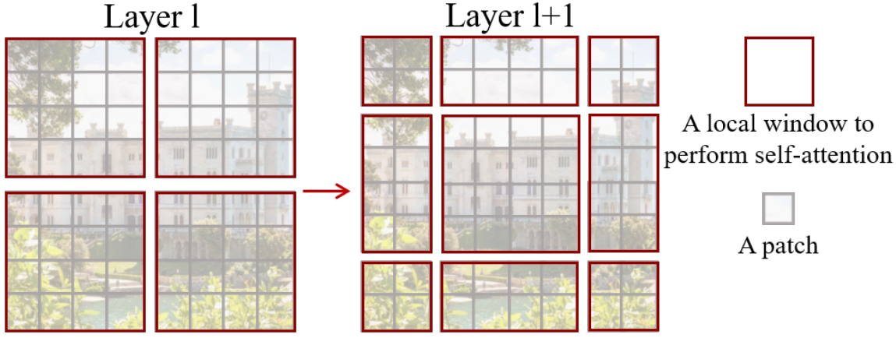

$$\hat{z}^l = \text{W-MSA}\left(\text{LN}(z^{l-1})\right) + z^{l-1}$$

$$z^l = \text{MLP}\left(\text{LN}(\hat{z}^l)\right) + \hat{z}^l$$

$$\hat{z}^{l+1} = \text{SW-MSA}\left(\text{LN}(z^l)\right) + z^l$$

$$z^{l+1} = \text{MLP}\left(\text{LN}(\hat{z}^{l+1})\right) + \hat{z}^{l+1}$$

其中$$\hat{z}^l$$和$$z^l$$分别表示第$$l$$个块&#x4E2D;**`(S)W-MSA`**&#x6A21;块&#x548C;**`MLP`**&#x6A21;块的输出特征；**`W-MSA`**&#x548C;**`SW-MSA`**&#x5206;别表示使用常规窗口划分和滑动窗口划分配置的基于窗口的多头自注意力机制。滑动窗口划分方法在前一层中引入了相邻非重叠窗口之间的连接，结果表明它在图像分类、目标检测和语义分割任务中都非常有效。

**<span style="color: rgb(36,91,219); background-color: inherit">针对滑动配置的高效批量计算</span>** &#x20;

滑动窗口划分的一个问题是，<span style="color: rgb(216,57,49); background-color: inherit">它会导致窗口数量增加，从常规配置中的</span>$$\lceil \frac{h}{M} \rceil \times \lceil \frac{w}{M} \rceil$$<span style="color: rgb(216,57,49); background-color: inherit">增加到滑动配置中的</span>$$(\lceil \frac{h}{M} \rceil + 1) \times (\lceil \frac{w}{M} \rceil + 1)$$，并且某些窗口会小于$$M \times M$$。一个简单的解决方案是将较小的窗口填充到$$M \times M$$的大小，并在计算注意力时屏蔽掉填充的部分。然而，当常规划分的窗口数量较小时，例如$$2 \times 2$$<span style="color: rgb(220,155,4); background-color: inherit">，这种简单方法带来的计算量增加是显著的，从</span>$$2 \times 2$$<span style="color: rgb(220,155,4); background-color: inherit">增加到</span>$$3 \times 3$$<span style="color: rgb(220,155,4); background-color: inherit">，增加了</span>**`2.25`**<span style="color: rgb(220,155,4); background-color: inherit">倍</span>。 &#x20;

为了解决这一问题，**Swin Transformer&#x20;**&#x63D0;出了一种更高效的批量计算方法，<span style="color: rgb(100,37,208); background-color: inherit">通过对特征图进行向左上角方向的</span>**<span style="color: rgb(100,37,208); background-color: inherit">循环移位</span>**，如右图所示。经过这种移位后，<span style="color: rgb(216,57,49); background-color: inherit">一个批量窗口可能由特征图中不相邻的多个子窗口组成</span>。

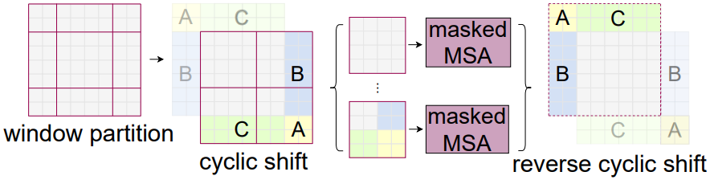

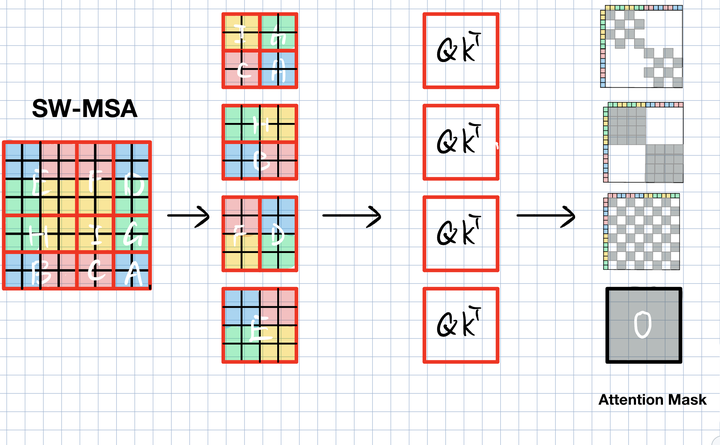

因此<span style="color: rgb(100,37,208); background-color: inherit">需要引入一种屏蔽机制，将自注意力计算限制在每个子窗口内部</span>。通过这种循环移位，<span style="color: rgb(46,161,33); background-color: inherit">批量窗口的数量与常规窗口划分保持一致，从而保证了计算效率</span>。

**<span style="color: rgb(36,91,219); background-color: inherit">相对位置偏置</span>**<span style="color: rgb(36,91,219); background-color: inherit">  </span>

在计算自注意力时，遵循之前工作的做法，<span style="color: rgb(100,37,208); background-color: inherit">在计算相似性时为每个注意力头引入一个相对位置偏置矩阵</span>$$B \in \mathbb{R}^{M^2 \times M^2}$$：

$$\text{Attention}(Q, K, V) = \text{SoftMax}\left(\frac{QK^T}{\sqrt{d}} + B\right)V$$

其中$$Q, K, V \in \mathbb{R}^{M^2 \times d}$$分别是查询、键和值矩阵；$$d$$是 Query / Key 的维度，$$M^2$$是窗口内的图像块数量。<span style="color: rgb(100,37,208); background-color: inherit">由于每个轴上的相对位置范围为</span>$$[-M+1, M-1]$$<span style="color: rgb(100,37,208); background-color: inherit">，作者参数化了一个更小的偏置矩阵</span>$$\hat{B} \in \mathbb{R}^{(2M-1) \times (2M-1)}$$<span style="color: rgb(100,37,208); background-color: inherit">，并从中提取值填充到</span>$$B$$<span style="color: rgb(100,37,208); background-color: inherit">中</span>。 &#x20;

与没有使用该偏置项或使用绝对位置嵌入的方法相比，<span style="color: rgb(46,161,33); background-color: inherit">这种方法带来了显著的性能提升</span>。实验还证明在输入中添加绝对位置嵌入会略微降低性能，因此在实现中未采用这种方法。 &#x20;

预训练中学到的相对位置偏置可以通过双三次插值用于初始化不同窗口大小的微调模型。

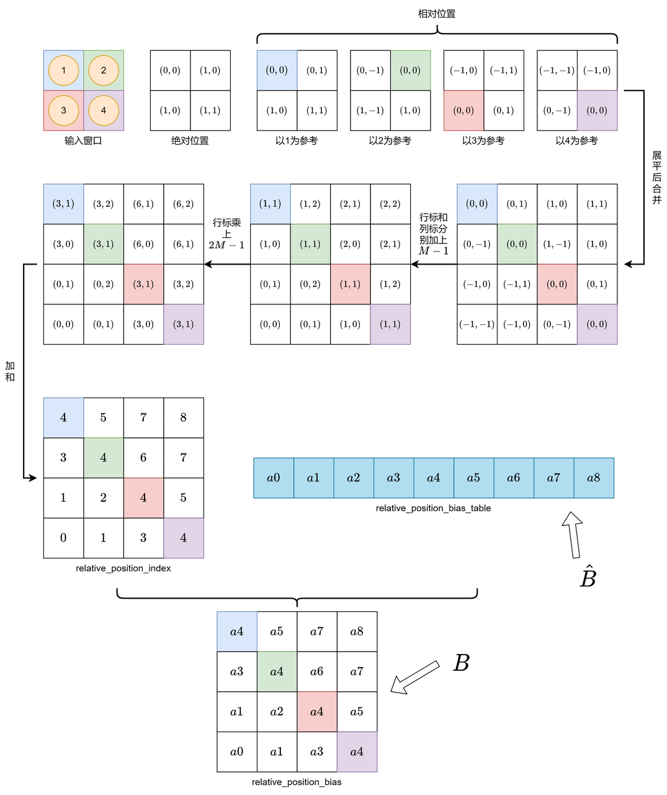

* **<span style="color: rgb(36,91,219); background-color: inherit">模型规格</span>**&#x20;

**Swin Transformer&#x20;**&#x6784;建了基础模型，称&#x4E3A;**`Swin-B`**，其模型规模和计算复杂度&#x4E0E;**`ViT-B`**/**`DeiT-B`**&#x76F8;似。除此之外还引入&#x4E86;**`Swin-T`**、**`Swin-S`**&#x548C;**`Swin-L`**，分别是基础模型规模和计算复杂度的&#x7EA6;**`0.25×`**、**`0.5×`**&#x548C;**`2×`**&#x7248;本。需要注意的是，**Swin-T** 和 **Swin-S** 的复杂度分别&#x4E0E;**`ResNet-50`**/**`DeiT-S`**&#x548C;**`ResNet-101`**&#x7C7B;似。默认情况下，窗口大小设置为$$M = 7$$。每个注意力头的查询维度为$$d = 32$$，每个 MLP 层的扩展系数为$$\alpha = 4$$，所有实验均保持一致。这些模型变体的架构超参数如下： &#x20;

> * **<span style="color: rgb(36,91,219); background-color: inherit">Swin-T</span>**：$$C = 96$$，层数 = {2, 2, 6, 2} &#x20;
>
> * **<span style="color: rgb(36,91,219); background-color: inherit">Swin-S</span>**：$$C = 96$$，层数 = {2, 2, 18, 2} &#x20;
>
> * **<span style="color: rgb(36,91,219); background-color: inherit">Swin-B</span>**：$$C = 128$$，层数 = {2, 2, 18, 2} &#x20;
>
> * **<span style="color: rgb(36,91,219); background-color: inherit">Swin-L</span>**：$$C = 192$$，层数 = {2, 2, 18, 2} &#x20;

其中$$C$$是第一阶段隐藏层的通道数。更加详细的模型规模参数如下表：

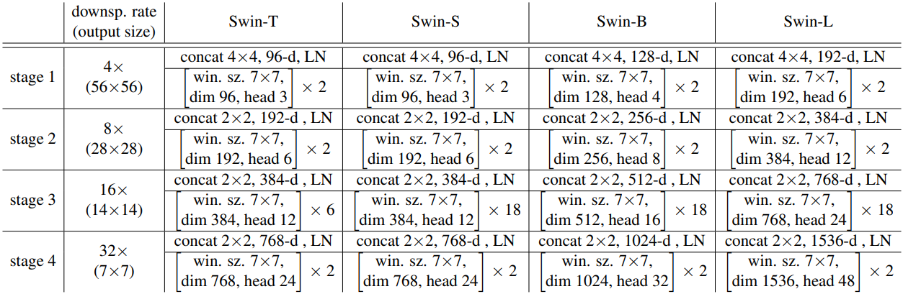

**<span style="color: rgb(222,120,2); background-color: inherit">总结</span>**

**Swin Transformer** 一经推出便在多个视觉任务中取得了突破性进展。<span style="color: rgb(46,161,33); background-color: inherit">在图像分类任务中，它在 ImageNet 数据集上的表现超越了众多经典模型；在目标检测和语义分割任务中，</span>**<span style="color: rgb(46,161,33); background-color: inherit">Swin Transformer</span>**<span style="color: rgb(46,161,33); background-color: inherit"> 同样展现了强大的性能，成为 COCO 和 ADE20K 等数据集上的领先方法</span>。此外，其分层结构和高效的计算设计也为超分辨率图像处理提供了新的可能性。

值得一提的是，**Swin Transformer** 的成功不仅限于学术界，其<span style="color: rgb(46,161,33); background-color: inherit">开源实现和预训练权重文件也为工业界提供了极大的便利</span>。无论是研究者还是开发者，都可以基于 **Swin Transformer** 快速构建高效的视觉应用。

尽管 Swin Transformer 已经在多个领域取得了显著成果，但其潜力远未被完全挖掘。例如，<span style="color: rgb(220,155,4); background-color: inherit">如何进一步优化滑动窗口机制以适应更复杂的场景？如何将 Swin Transformer 与其他模态相结合，如文本或语音，构建多模态学习框架？</span>这些问题都为未来的研究指明了方向。

总之，**Swin Transformer&#x20;**&#x4E0D;仅是 Transformer 在视觉领域的一次成功尝试，更是深度学习发展历程中的一个重要角色。<span style="color: rgb(100,37,208); background-color: inherit">它证明了 Transformer 可以作为一种普适的视觉骨干网络，为后续的研究和应用开阔了思路</span>。对于希望深入了解现代视觉模型的读者来说，**Swin Transformer** 是一个不可忽视的经典案例。

### 1.2.4 <span style="color: rgb(36,91,219); background-color: inherit">BEiT</span>

* **<span style="color: rgb(36,91,219); background-color: inherit">方法总览</span>**

<span style="color: rgb(100,37,208); background-color: inherit">BEiT 同时构造图像块与离散视觉 token 两种表示：图像块作为 Transformer 的输入，原始图像对应的视觉 token 作为被遮挡位置的分类目标。</span>预训练时先对图像块执行块状掩码，再根据未被遮挡的上下文恢复原始视觉 token；完成预训练后，在 Encoder 之上接入任务层，并对整套网络进行端到端微调。

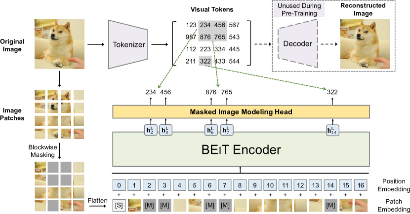

* **<span style="color: rgb(36,91,219); background-color: inherit">图像表示</span>**

1. **<span style="color: rgb(36,91,219); background-color: inherit">图像块</span>**

为了让标准 Transformer 直接接收二维图像，先把输入图像划分为互不重叠的规则图像块。设输入图像为 $$x\in\mathbb{R}^{H\times W\times C}$$，其中 $$H$$ 和 $$W$$ 分别表示图像的高和宽，$$C$$ 表示通道数；每个图像块的空间分辨率为 $$P\times P$$。图像被重排为 $$N$$ 个图像块：

$$N=\frac{HW}{P^2},\qquad x^p\in\mathbb{R}^{N\times(P^2C)}$$

每个图像块先展平为一个长度为 $$P^2C$$ 的向量，再通过线性投影转换为 Transformer 使用的 Patch Embedding。这一路径保留原始像素信息，充当 BEiT Encoder 的输入表示。在标准设置中，分辨率为 **`224×224`** 的图像被划分为 **`14×14`** 个图像块，每个图像块的大小为 **`16×16`**，因此输入序列包含 **`196`** 个图像块。

2. **<span style="color: rgb(36,91,219); background-color: inherit">离散视觉 token </span>**

第二种表示不是像素向量，而是由图像 tokenizer 产生的离散索引序列。对输入图像 $$x$$，tokenizer 输出：

$$z=[z_1,\ldots,z_N]\in\mathcal{V}^{h\times w},\qquad \mathcal{V}=\{1,\ldots,|\mathcal{V}|\}$$

视觉 token 学习采用离散变分自 Encoder。tokenizer $$q_\phi(z\mid x)$$ 根据视觉码本把图像像素映射为离散潜变量 $$z$$；decoder $$p_\psi(x\mid z)$$ 再根据这些视觉 token 重建输入图像。重建目标为：

$$\mathbb{E}_{z\sim q_\phi(z\mid x)}\left[\log p_\psi(x\mid z)\right]$$

由于潜变量是离散索引，直接采样会阻断梯度，因此训练 tokenizer 与 decoder 时使用 Gumbel-Softmax relaxation，并在 dVAE 训练中对 $$q_\phi$$ 施加均匀先验。BEiT 直接使用已经训练好的 DALL-E dVAE 图像 tokenizer，而不是在 MIM 阶段同时更新 tokenizer。

每幅图像被转换为 **`14×14`** 的视觉 token 网格， token 数量与图像块数量一一对应；视觉词表大小为 **`8192`**。这种一一对齐使第 $$i$$ 个图像块被遮挡后，可以直接把同一位置的离散视觉 token  $$z_i$$ 作为分类标签。

* **<span style="color: rgb(36,91,219); background-color: inherit">图像 Transformer  backbone 网络</span>**

1. **<span style="color: rgb(36,91,219); background-color: inherit">输入向量</span>**

&#x20;backbone 网络沿用标准 ViT 的 Transformer  Encoder 。第 $$i$$ 个展平图像块 $$x_i^p$$ 先经过线性投影矩阵 $$E$$：

$$E\in\mathbb{R}^{(P^2C)\times D},\qquad x_i^pE\in\mathbb{R}^{D}$$

序列开头加入一个可学习的特殊 token **`[S]`**，并把可学习的一维位置 Embedding 加到序列上。输入第一个 Transformer 层的表示写为：

$$H^0=[e_{[S]},x_1^pE,\ldots,x_N^pE]+E_{\mathrm{pos}}$$

这里 $$e_{[S]}$$ 是特殊 token 的 Embedding，$$E_{\mathrm{pos}}$$ 提供各图像块在展平序列中的位置信息。图像块内容与位置编码相加后共同进入 Transformer。

2. **<span style="color: rgb(36,91,219); background-color: inherit">多层 Transformer 编码</span>**

&#x20;Encoder 包含 $$L$$ 层 Transformer Block。每一层接收前一层的完整序列表示：

$$H^l=\operatorname{Transformer}(H^{l-1}),\qquad l=1,\ldots,L$$

最后一层输出为：

$$H^L=[h_{[S]}^L,h_1^L,\ldots,h_N^L]$$

其中 $$h_i^L$$ 是第 $$i$$ 个图像块经过全局上下文编码后的表示。MIM 预测头只在被遮挡位置读取相应的 $$h_i^L$$，并据此预测原始图像在该位置上的视觉 token。

* **<span style="color: rgb(36,91,219); background-color: inherit">掩码图像建模</span>**

1. **<span style="color: rgb(36,91,219); background-color: inherit">构造被遮挡的图像块序列</span>**

给定图像 $$x$$，一条路径把它划分为 $$N$$ 个图像块 $$\{x_i^p\}_{i=1}^{N}$$，另一条路径把同一图像编码为 $$N$$ 个视觉 token  $$\{z_i\}_{i=1}^{N}$$。随机选取约 **`40%`** 的位置组成掩码集合：

$$\mathcal{M}\subseteq\{1,\ldots,N\},\qquad |\mathcal{M}|\approx0.4N$$

所有位于 $$\mathcal{M}$$ 中的图像块都被替换为同一个可学习的 Mask Embedding **`[M]`**，其向量维度与隐藏维度 $$D$$ 相同。损坏后的输入可以写为：

$$x^{\mathcal{M}}=\{x_i^p:i\notin\mathcal{M}\}\cup\{e_{[M]}:i\in\mathcal{M}\}$$

<span style="color: rgb(100,37,208); background-color: inherit">掩码只作用于送入 Transformer 的图像块分支；作为监督信号的视觉 token 始终由未被破坏的原始图像产生。</span>因此模型看不到被遮挡位置的像素，却仍然拥有这些位置的离散目标标签。

2. **<span style="color: rgb(36,91,219); background-color: inherit">预测被遮挡位置的视觉 token </span>**

损坏后的序列经过 $$L$$ 层 Transformer 后，在每个被遮挡位置得到上下文化表示 $$h_i^L$$。一个带 Softmax 的线性分类器把该向量映射到整个视觉词表：

$$p_{\mathrm{MIM}}(z'\mid x^{\mathcal{M}})=\operatorname{softmax}_{z'}(W_ch_i^L+b_c)$$

分类矩阵与偏置的形状分别为：

$$W_c\in\mathbb{R}^{|\mathcal{V}|\times D},\qquad b_c\in\mathbb{R}^{|\mathcal{V}|}$$

预训练目标是在训练语料 $$\mathcal{D}$$ 上，对随机掩码集合取期望，并最大化所有被遮挡位置正确视觉 token 的对数似然：

$$\max_{\theta}\sum_{x\in\mathcal{D}}\mathbb{E}_{\mathcal{M}}\left[\sum_{i\in\mathcal{M}}\log p_{\mathrm{MIM}}(z_i\mid x^{\mathcal{M}})\right]$$

实现时等价于只在 $$i\in\mathcal{M}$$ 的位置计算对 **`8192`** 类视觉 token 的交叉熵；未被遮挡位置参与上下文编码，但不计入该项预测损失。

3. **<span style="color: rgb(36,91,219); background-color: inherit">块状掩码</span>**

掩码位置不是逐块独立采样，而是通过多个矩形区域逐步扩充。初始化 $$\mathcal{M}=\varnothing$$。每次先从区间 $$[16,0.4N-|\mathcal{M}|]$$ 中采样目标面积 $$s$$，再从 $$[0.3,1/0.3]$$ 中采样宽高比 $$r$$，矩形的高和宽由下式确定：

$$a=\sqrt{sr},\qquad b=\sqrt{\frac{s}{r}}$$

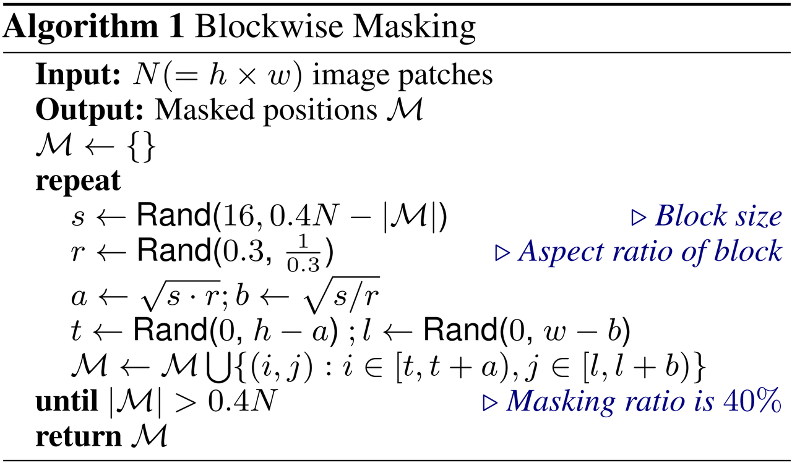

随后在 $$h\times w$$ 的图像块网格上随机采样左上角 $$(t,l)$$，把矩形 $$[t,t+a)\times[l,l+b)$$ 覆盖的位置并入 $$\mathcal{M}$$。这一过程不断重复，直到掩码数量达到约 $$0.4N$$。单个候选矩形最少包含 **`16`** 个图像块；在 **`14×14`** 的网格上，实际最多遮挡 **`75`** 个位置。

<span style="color: rgb(216,57,49); background-color: inherit">如果直接回归被遮挡图像块的原始像素，训练目标容易被局部相关性和高频细节主导。</span>

<span style="color: rgb(46,161,33); background-color: inherit">把目标改为 dVAE 视觉 token 后，预测空间变成离散分类空间，视觉 token 同时形成信息瓶颈，把像素细节压缩为更高层的视觉抽象。</span>

* **<span style="color: rgb(36,91,219); background-color: inherit">变分自 Encoder 视角</span>**

1. **<span style="color: rgb(36,91,219); background-color: inherit">条件生成的 ELBO</span>**

设 $$x$$ 为原始图像，$$\tilde{x}$$ 为被遮挡后的图像，$$z$$ 为离散视觉 token。目标可以理解为根据损坏图像恢复原始图像，即建模条件似然 $$p(x\mid\tilde{x})$$。其证据下界写为：

$$\sum_{(x_i,\tilde{x}_i)\in\mathcal{D}}\log p(x_i\mid\tilde{x}_i)\geq\sum_{(x_i,\tilde{x}_i)\in\mathcal{D}}\left(\mathbb{E}_{z_i\sim q_\phi(z\mid x_i)}[\log p_\psi(x_i\mid z_i)]-D_{\mathrm{KL}}[q_\phi(z\mid x_i)\Vert p_\theta(z\mid\tilde{x}_i)]\right)$$

这个下界中，$$q_\phi(z\mid x)$$ 是把原始图像转换为视觉 token 的 tokenizer；$$p_\psi(x\mid z)$$ 是从视觉 token 重建原始图像的 decoder；$$p_\theta(z\mid\tilde{x})$$ 则根据被遮挡图像恢复视觉 token ，对应 BEiT 的 MIM 模型。

2. **<span style="color: rgb(36,91,219); background-color: inherit">第一阶段：学习视觉 tokenizer</span>**

第一阶段训练离散变分自 Encoder，在均匀先验下最小化重建损失：

$$-\mathbb{E}_{z_i\sim q_\phi(z\mid x_i)}[\log p_\psi(x_i\mid z_i)]$$

完成后得到固定的 tokenizer $$q_\phi$$ 和 decoder $$p_\psi$$。这一阶段解决的是如何把连续像素变成离散视觉 token，以及如何验证这些 token 仍保留足够的图像信息。

3. **<span style="color: rgb(36,91,219); background-color: inherit">第二阶段：学习条件先验</span>**

第二阶段保持 $$q_\phi$$ 与 $$p_\psi$$ 不变，只更新根据被遮挡图像预测视觉 token 的 $$p_\theta$$。tokenizer 的分布被简化为集中在最大概率 token 上的单点分布：

$$\hat{z}_i=\arg\max_z q_\phi(z\mid x_i)$$

在这一近似下，两阶段目标可以写成视觉 token 重建项与掩码图像建模项之和：

$$\sum_{(x_i,\tilde{x}_i)\in\mathcal{D}}\left(\underbrace{\mathbb{E}_{z_i\sim q_\phi(z\mid x_i)}[\log p_\psi(x_i\mid z_i)]}_{\text{Stage 1: Visual Token Reconstruction}}+\underbrace{\log p_\theta(\hat{z}_i\mid\tilde{x}_i)}_{\text{Stage 2: Masked Image Modeling}}\right)$$

<span style="color: rgb(100,37,208); background-color: inherit">因此，BEiT 的 MIM 训练不是重新学习图像重建器，而是在固定离散视觉表示的前提下，学习一个从被遮挡图像到原始视觉 token 的条件先验。</span>

* **<span style="color: rgb(36,91,219); background-color: inherit">预训练设置</span>**

1. **<span style="color: rgb(36,91,219); background-color: inherit">网络配置</span>**

backbone 网络采用 ViT-Base 配置：Transformer 深度为 **`12`** 层，隐藏维度为 **`768`**，每层包含 **`12`** 个注意力头，前馈网络的中间维度为 **`3072`**。输入图像块大小固定为 **`16×16`**，视觉词表大小为 **`8192`**。

2. **<span style="color: rgb(36,91,219); background-color: inherit">数据与增强</span>**

预训练数据使用 ImageNet-1K 训练集，约包含 **`1.2M`** 幅图像，但不使用类别标签。数据增强包括随机尺度裁剪、水平翻转和颜色抖动。输入分辨率为 **`224×224`**，对应 **`14×14`** 个图像块和相同数量的视觉 token；每幅图像最多遮挡 **`75`** 个图像块，约占全部位置的 **`40%`**。

3. **<span style="color: rgb(36,91,219); background-color: inherit">优化设置</span>**

预训练共运行约 **`500k`** 个更新步骤，相当于 **`800`** 个 epoch，全局 batch size 为 **`2k`**。优化器使用 Adam，参数为 $$\beta_1=0.9$$、$$\beta_2=0.999$$；基础学习率为$$1.5×10^{-3}$$，先进行 **`10`** 个 epoch 的 warmup，再使用余弦学习率衰减。weight decay 为 **`0.05`**，stochastic depth rate 为 **`0.1`**，普通 dropout 关闭。

这套配置在 **`16`** 张 Nvidia Tesla V100 32GB GPU 上训练约 **`5`** 天。

4. **<span style="color: rgb(36,91,219); background-color: inherit">参数初始化与深层残差缩放</span>**

所有参数先在较小区间内随机初始化，例如 **`[-0.02,0.02]`**。随后对第 $$l$$ 个 Transformer 层的两类输出矩阵进行缩放：一类是 Self-Attention 子层最后的线性投影，另一类是前馈网络子层最后的线性投影。缩放系数为$$\sqrt{\frac{1}{2l}}$$，层数越深，残差分支末端投影的初始幅度越小，用于稳定大规模 Transformer 预训练。

* **<span style="color: rgb(36,91,219); background-color: inherit">下游视觉任务微调</span>**

1. **<span style="color: rgb(36,91,219); background-color: inherit">图像分类</span>**

图像分类只在预训练 Encoder 之后增加一个线性分类器。BEiT 不直接使用特殊 token **`[S]`** 作为全局表示，而是对全部图像块的最后一层表示进行平均池化，再输入 Softmax 分类器：

$$p(y\mid x)=\operatorname{softmax}\left(\operatorname{avg}(\{h_i^L\}_{i=1}^{N})W_c\right)$$

其中 $$W_c\in\mathbb{R}^{D\times C}$$，$$C$$ 是类别数。训练时同时更新 BEiT Encoder 和线性分类器，通过最大化有标签数据的类别似然完成端到端微调。

2. **<span style="color: rgb(36,91,219); background-color: inherit">语义分割</span>**

语义分割使用预训练 BEiT 作为 backbone Encoder，并接入 SETR-PUP 的任务层。Decoder 由若干反卷积层组成，把图像块级表示逐步上采样到像素级分割结果。 Encoder 与 Decoder 共同进行端到端微调。

3. **<span style="color: rgb(36,91,219); background-color: inherit">中间微调</span>**

在自监督预训练与目标任务微调之间，还可以加入一次有监督的中间微调。完整顺序是：先用 MIM 学习 BEiT Encoder，再在数据量较大的 ImageNet-1K 上使用类别标签训练，最后把得到的参数继续微调到目标视觉任务。

### 1.2.5 <span style="color: rgb(36,91,219); background-color: inherit">BEiT v2</span>

* **<span style="color: rgb(36,91,219); background-color: inherit">方法总览</span>**

<span style="color: rgb(100,37,208); background-color: inherit">BEiT v2 保留 BEiT 的掩码图像建模框架，但把监督目标从偏向低层图像细节的离散 Token，替换为经过语义知识蒸馏得到的视觉 Token。</span>训练分成两个阶段：先通过 VQ-KD 把 Teacher 的连续语义特征压缩到离散 Codebook，再冻结视觉 Tokenizer，用这些语义 Token 监督 BEiT v2 Backbone 恢复被遮挡的 image Patch。Patch Aggregation 额外训练 \[CLS] Token，使 Patch 级重建目标同时形成可用于图像级任务的全局表示。

* **<span style="color: rgb(36,91,219); background-color: inherit">图像表示</span>**

1. **<span style="color: rgb(36,91,219); background-color: inherit">Image Patch 序列</span>**

BEiT v2 使用 ViT 作为 Backbone。设输入图像为 $$x\in\mathbb{R}^{H\times W\times C}$$，其中 $$H$$、$$W$$ 和 $$C$$ 分别表示图像高度、宽度和通道数；每个 image Patch 的空间大小为 $$P\times P$$。图像被重排为 $$N$$ 个互不重叠的 image Patch：

$$N=\frac{HW}{P^2},\qquad x^p\in\mathbb{R}^{N\times(P^2C)}$$

标准输入分辨率为 **`224×224`**，Patch Size 为 **`16×16`**，因此得到 **`14×14`** 的 Patch 网格，共 **`196`** 个位置。

2. **<span style="color: rgb(36,91,219); background-color: inherit">Patch Embedding</span>**

每个 image Patch 展平为长度 $$P^2C$$ 的向量，再经过线性投影转换为 Transformer 的输入 Embedding。Backbone 为全部 Patch 产生一一对应的上下文化表示$$\{h_i\}_{i=1}^{N}$$，这组表示既是视觉 Tokenizer 执行向量量化的输入，也是 BEiT v2 MIM Head 预测被遮挡视觉 Token 的依据。

* **<span style="color: rgb(36,91,219); background-color: inherit">VQ-KD 视觉 Tokenizer</span>**

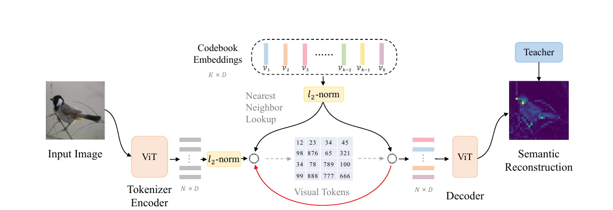

1. **<span style="color: rgb(36,91,219); background-color: inherit">Tokenizer 的输出空间</span>**

视觉 Tokenizer 把图像映射为离散 Token 序列：

$$z=[z_1,z_2,\ldots,z_N]\in\mathcal{V}^{(H/P)\times(W/P)}$$

视觉词表就是可学习的 Codebook。设 Codebook 包含 $$K$$ 个、每个维度为 $$D$$ 的 Embedding：

$$\mathcal{V}\in\mathbb{R}^{K\times D},\qquad \mathcal{V}=\{v_1,v_2,\ldots,v_K\}$$

Tokenizer 由 ViT Encoder 和向量量化器组成。Encoder 先把输入图像转换为 Patch 表示 $$h_i$$，量化器再为每个位置选择一个 Codebook 索引 $$z_i$$。

2. **<span style="color: rgb(36,91,219); background-color: inherit">最近邻量化</span>**

Encoder 输出和 Codebook Embedding 都先进行 L2 归一化，然后按欧氏距离查找最近的 Code。第 $$i$$ 个 image Patch 的离散索引为：

$$z_i=\arg\min_{j\in\{1,\ldots,K\}}\left\|\ell_2(h_i)-\ell_2(v_j)\right\|_2$$

归一化后的向量模长相同，因此最小化该距离等价于最大化余弦相似度。量化结果不再保留连续特征值，只保留最接近的 Codebook 索引。

3. **<span style="color: rgb(36,91,219); background-color: inherit">语义重建</span>**

量化完成后，Transformer Decoder 接收归一化的 Codebook Embedding 序列：

$$\{\ell_2(v_{z_i})\}_{i=1}^{N}$$

Decoder 为每个位置输出 $$o_i$$。监督信号不是原始像素，而是 Teacher 在同一 Patch 位置产生的语义特征 $$t_i$$；默认 Teacher 为 OpenAI CLIP-B/16。训练直接最大化 $$o_i$$ 与 $$t_i$$ 的余弦相似度。

<span style="color: rgb(216,57,49); background-color: inherit">像素重建会把大量建模能力消耗在颜色、纹理和局部高频细节上，这些信息不一定对应下游识别需要的高层语义。</span>

<span style="color: rgb(46,161,33); background-color: inherit">VQ-KD 改为重建 Teacher 的 Patch 级语义特征，使每个离散 Token 更接近一个压缩后的语义概念，而不是像素模板。</span>

4. **<span style="color: rgb(36,91,219); background-color: inherit">Straight-Through Gradient</span>**

最近邻索引是离散操作，无法直接求导。反向传播时，Decoder 输入端的梯度被直接复制到 Encoder 输出端，绕过最近邻查找；前向过程仍使用真实的离散 Code。这样既保持离散 Token，又能更新 Tokenizer Encoder。

5. **<span style="color: rgb(36,91,219); background-color: inherit">VQ-KD 训练目标</span>**

设 $$\operatorname{sg}[\cdot]$$ 为 stop-gradient：前向传播保持恒等，反向传播梯度为零。VQ-KD 的完整目标为：

$$\max\sum_{x\in\mathcal{D}}\sum_{i=1}^{N}\left(\cos(o_i,t_i)-\left\|\operatorname{sg}[\ell_2(h_i)]-\ell_2(v_{z_i})\right\|_2^2-\left\|\ell_2(h_i)-\operatorname{sg}[\ell_2(v_{z_i})]\right\|_2^2\right)$$

第一项让 Decoder 输出逼近 Teacher 语义特征；第二项只更新被选中的 Codebook Embedding，使它靠近当前 Encoder 输出；第三项只更新 Encoder，使其输出靠近选中的 Codebook Embedding。两个 stop-gradient 把 Codebook 更新与 Encoder 的 commitment 约束分开。

* **<span style="color: rgb(36,91,219); background-color: inherit">Codebook 利用率</span>**

1. **<span style="color: rgb(36,91,219); background-color: inherit">Codebook Collapse</span>**

<span style="color: rgb(216,57,49); background-color: inherit">向量量化训练容易出现 Codebook Collapse：大量输入持续落到少数 Code 上，其余 Code 几乎不被使用。</span>这会缩小离散语义空间的有效容量，也会让不同视觉概念共享过于粗糙的目标。

2. **<span style="color: rgb(36,91,219); background-color: inherit">低维归一化查找</span>**

最近邻查找只在 **`32`** 维的归一化 Codebook 空间中完成。低维 Codebook Embedding 在送入 Transformer Decoder 之前，再映射回较高维的隐藏空间。

<span style="color: rgb(46,161,33); background-color: inherit">低维查找降低了最近邻分配的难度，L2 归一化又消除了向量模长差异，两者共同提高 Codebook 的有效使用率。</span>

3. **<span style="color: rgb(36,91,219); background-color: inherit">EMA 更新</span>**

Codebook Embedding 使用指数移动平均更新，而不是完全依赖普通梯度更新。EMA 根据分配到每个 Code 的 Encoder 输出逐步移动 Codebook 中心，使 VQ-KD 训练更稳定。

* **<span style="color: rgb(36,91,219); background-color: inherit">BEiT v2 掩码图像建模</span>**

1. **<span style="color: rgb(36,91,219); background-color: inherit">块状掩码与损坏输入</span>**

预训练沿用 BEiT 的块状掩码。每幅图像约有 **`40%`** 的 image Patch 被选中，通常约为 **`75`** 个位置，掩码集合记为 $$\mathcal{M}$$。这些位置共享同一个可学习的 Mask Embedding **`[M]`**：

$$x_i^{\mathcal{M}}=\delta(i\in\mathcal{M})\odot e_{[M]}+\left(1-\delta(i\in\mathcal{M})\right)\odot x_i^p$$

其中 $$\delta(\cdot)$$ 是指示函数。序列开头再加入可学习的 **`[CLS]`** Token，完整输入为：

$$[e_{\mathrm{CLS}},\{x_i^{\mathcal{M}}\}_{i=1}^{N}]$$

2. **<span style="color: rgb(36,91,219); background-color: inherit">MIM Head</span>**

Vision Transformer 输出 $$\{h_i\}_{i=0}^{N}$$，其中 $$h_0$$ 对应 \[CLS] Token。MIM Head 是一个全连接分类层，只在被遮挡位置预测视觉 Token：

$$p(z_i\mid h_i)=\operatorname{softmax}_{z_i}(W_ch_i+b_c),\qquad i\in\mathcal{M}$$

目标 Token $$z_i$$ 由已经训练完成并冻结的 VQ-KD Tokenizer 从原始图像中产生。视觉 Token 与 image Patch 的位置数量相同，因此监督可以逐位置对齐。

3. **<span style="color: rgb(36,91,219); background-color: inherit">MIM 损失</span>**

损失只在被遮挡位置计算，对正确视觉 Token 的负对数似然求和：

$$\mathcal{L}_{\mathrm{MIM}}=-\sum_{x\in\mathcal{D}}\sum_{i\in\mathcal{M}}\log p(z_i\mid x_i^{\mathcal{M}})$$

<span style="color: rgb(100,37,208); background-color: inherit">Backbone 必须利用未被遮挡 Patch 的上下文推断缺失位置对应的语义 Token，而不是直接复制输入像素。</span>

* **<span style="color: rgb(36,91,219); background-color: inherit">Patch Aggregation</span>**

![Patch Aggregation 把最终层 \[CLS\] Token 与中间层 Patch Token 组合，通过第二个 MIM 目标训练全局表示](images/视觉多模态讲义（上）-image-31.png)

1. **<span style="color: rgb(36,91,219); background-color: inherit">Patch 目标与全局表示的差距</span>**

<span style="color: rgb(216,57,49); background-color: inherit">标准 MIM 把每个被遮挡 Patch 的恢复放在首位，[CLS] Token 本身没有直接训练目标，因此 Patch 级预训练与图像级表示之间存在差距。</span>Patch Aggregation 通过一个只在预训练阶段存在的信息瓶颈，迫使最终层 \[CLS] Token 汇总全局信息。

2. **<span style="color: rgb(36,91,219); background-color: inherit">聚合序列</span>**

设 Backbone 共包含 $$L$$ 层，第 $$l$$ 层的 Patch Token 为 $$\{h_i^l\}_{i=1}^{N}$$，最终层 \[CLS] Token 为 $$h_{\mathrm{CLS}}^L$$。Patch Aggregation 把两者拼成新的序列：

$$S=[h_{\mathrm{CLS}}^L,h_1^l,h_2^l,\ldots,h_N^l]$$

中间层 Patch Token 提供局部内容，但从第 $$l+1$$ 层到第 $$L$$ 层的信息只能通过最终 \[CLS] Token 进入第二条预测路径，因而形成显式的信息瓶颈。

3. **<span style="color: rgb(36,91,219); background-color: inherit">浅层 Transformer Decoder</span>**

序列 $$S$$ 输入一个浅层 Transformer Decoder，默认深度为 **`2`** 层，并再次预测被遮挡位置的视觉 Token：

$$p(z\mid S)=\operatorname{softmax}_{z}(W_cS+b_c)$$

Patch Aggregation 分支与 Backbone 最后一层的原始 MIM Head 共享分类参数 $$W_c$$ 和 $$b_c$$，第二项损失仍只在掩码位置计算。

4. **<span style="color: rgb(36,91,219); background-color: inherit">总损失与训练后移除</span>**

最终训练目标是两条 MIM 损失之和：

$$\mathcal{L}=\mathcal{L}_{\mathrm{MIM}}+\mathcal{L}_{\mathrm{MIM}}^{c}$$

<span style="color: rgb(100,37,208); background-color: inherit">额外分支让后半段 Backbone 更愿意把跨 Patch 的全局信息压入最终 [CLS] Token。</span>浅层 Transformer Decoder 只用于预训练，完成训练后被丢弃，不增加下游推理开销。

* **<span style="color: rgb(36,91,219); background-color: inherit">训练设置</span>**

1. **<span style="color: rgb(36,91,219); background-color: inherit">VQ-KD 架构</span>**

| **<span style="color: rgb(36,91,219); background-color: inherit">配置项</span>** | **<span style="color: rgb(36,91,219); background-color: inherit">设置</span>**                       |
| ----------------------------------------------------------------------------- | -------------------------------------------------------------------------------------------------- |
| Tokenizer Encoder                                                             | ViT-B/16，**`12`** 层，隐藏维度 **`768`**，FFN 维度 **`3072`**，**`12`** 个 Attention Head，每个 Head 维度 **`64`** |
| Transformer Decoder                                                           | 实验使用 **`1`** 层或 **`3`** 层，默认设置采用 **`3`** 层；隐藏维度和 Attention Head 数与 Tokenizer Encoder 相同            |
| Teacher                                                                       | OpenAI CLIP-B/16                                                                                   |
| Codebook                                                                      | **`8192×32`**                                                                                      |
| 输入                                                                            | 分辨率 **`224×224`**，Patch Size **`16×16`**                                                           |

2. **<span style="color: rgb(36,91,219); background-color: inherit">VQ-KD 优化设置</span>**

VQ-KD 在 ImageNet-1K 上训练 `100` 个 epoch，batch size 为 `512`。优化器使用 Adam，β 为 `(0.9, 0.99)`；峰值学习率为 `2e-4`，最低学习率为 `1e-5`，先 warmup `5` 个 epoch，再执行余弦衰减。weight decay 为 `1e-4`，关闭 gradient clipping、dropout 和 stochastic depth，数据增强使用 RandomResizeAndCrop。

3. **<span style="color: rgb(36,91,219); background-color: inherit">BEiT v2 Backbone 配置</span>**

| **<span style="color: rgb(36,91,219); background-color: inherit">配置项</span>** | **<span style="color: rgb(36,91,219); background-color: inherit">ViT-B/16</span>** | **<span style="color: rgb(36,91,219); background-color: inherit">ViT-L/16</span>** |
| ----------------------------------------------------------------------------- | ---------------------------------------------------------------------------------- | ---------------------------------------------------------------------------------- |
| Transformer 层数                                                                | **`12`**                                                                           | **`24`**                                                                           |
| 隐藏维度                                                                          | **`768`**                                                                          | **`1024`**                                                                         |
| FFN 中间维度                                                                      | **`3072`**                                                                         | **`4096`**                                                                         |
| Attention Head                                                                | **`12`**                                                                           | **`16`**                                                                           |
| Layer Scale                                                                   | **`0.1`**                                                                          | **`1e-5`**                                                                         |
| Patch Aggregation 取层                                                          | 第 **`9`** 层                                                                        | 第 **`21`** 层                                                                       |

两种模型都使用 **`16×16`** Patch Size、Relative Position Embedding 和共享的 Relative Position Embedding。VQ-KD Tokenizer 和 Teacher 始终使用 base-size 配置，即使目标 Backbone 是 ViT-L/16。

4. **<span style="color: rgb(36,91,219); background-color: inherit">BEiT v2 预训练优化设置</span>**

自监督数据为不使用标签的 ImageNet-1K，输入分辨率为 `224×224`。训练周期为 `300` 或 `1600` 个 epoch，batch size 为 `2048`。Adam 的 β₁ 为 `0.9`；β₂ 在 `300` epoch 设置下为 `0.98`，在长训练中为 `0.999`。峰值学习率为 `1.5e-3`，最低学习率为 `1e-5`，warmup `10` 个 epoch 后使用余弦衰减。gradient clipping 为 `3.0`，weight decay 为 `0.05`，关闭 dropout；drop path 在短训练中为 `0`，长训练中为 `0.1`，color jitter 为 `0.4`。

* **<span style="color: rgb(36,91,219); background-color: inherit">下游任务适配</span>**

1. **<span style="color: rgb(36,91,219); background-color: inherit">图像分类微调</span>**

图像分类在预训练 Backbone 上接入分类 Head，并端到端更新全部参数。ViT-B/16 和 ViT-L/16 的峰值学习率都为 `5e-4`，batch size 为 `1024`；微调周期分别为 `100` 和 `50` 个 epoch，warmup 分别为 `20` 和 `5` 个 epoch，layer-wise learning rate decay 分别为 `0.65` 和 `0.8`。

优化器使用 Adam，ε 为 `1e-8`，β 为 `(0.9, 0.999)`；最低学习率为 `1e-6`，学习率按余弦衰减。weight decay 为 `0.05`，label smoothing 为 `0.1`，stochastic depth 对 base/large 分别为 `0.1` 和 `0.2`。数据增强包含 RandAugment `9/0.5`、Mixup `0.8`、CutMix `1.0` 和 random erasing `0.25`。

2. **<span style="color: rgb(36,91,219); background-color: inherit">Linear Probing</span>**

Linear Probing 冻结整个 Backbone，只训练顶部的线性分类 Head。启用 Patch Aggregation 时使用 \[CLS] Token 作为全局图像表示；不启用 Patch Aggregation 的基线模型则对所有 Patch Token 做平均池化。

3. **<span style="color: rgb(36,91,219); background-color: inherit">语义分割微调</span>**

语义分割在 ADE20K 上接入 UperNet，并对 Backbone 与任务 Head 进行端到端微调。输入分辨率为 `512×512`，训练 `160K` 个 step，batch size 为 `16`。候选峰值学习率为 `{0.5, 0.8, 1.0}e-4`，layer-wise learning rate decay 为 `{0.75, 0.8, 0.85}`，warmup 为 `1500` 个 step，随后使用线性学习率衰减到 `0`。

Adam 的 ε 为 `1e-8`，β 为 `(0.9, 0.999)`，weight decay 为 `0.05`；ViT-B/16 与 ViT-L/16 的 stochastic depth 分别为 `0.1` 和 `0.2`。微调使用 Relative Position Embedding，但不共享 Relative Position Embedding。

## 1.3 <span style="color: rgb(36,91,219); background-color: inherit">对比学习</span>

### 1.3.1 <span style="color: rgb(36,91,219); background-color: inherit">InstDisc</span>

受有监督学习的启发，输入豹子的图片，分类中前几的都是和豹子有关的，因为图片很相似

**InstDisc** 的目标是学习一个无监督的 embedding 函数$$v = f_\theta(x)$$。其中，$$f_\theta$$是一个具有参数$$  \theta  $$的深度神经网络，它将图像$$  x  $$映射到特征$$v$$。这个嵌入会在图像空间上定义一个度量，表示为$$d_\theta(x, y) = \|f_\theta(x) - f_\theta(y)\|$$，用于衡量实例$$  x  $$和$$  y  $$之间的距离。<span style="color: rgb(100,37,208); background-color: inherit">一个好的 embedding 应该能够将视觉上相似的图像映射得更接近</span>。

这里作者<span style="color: rgb(100,37,208); background-color: inherit">提出一种新的无监督特征学习方法——</span>**<span style="color: rgb(100,37,208); background-color: inherit">实例判别</span>**<span style="color: rgb(100,37,208); background-color: inherit">任务</span>。也就是将每个图像实例视为一个独立的类别，并训练一个分类器来区分这些单独的实例类别。


* **<span style="color: rgb(36,91,219); background-color: inherit">Softmax 分类器</span>**

1. **<span style="color: rgb(36,91,219); background-color: inherit">参数化分类器</span>**

**InstDisc** 使用 Softmax 来实现实例级别的分类目标。假设有$$  n  $$张图像$$x_1, \dots, x_n$$，对应于$$  n  $$个类别，它们的特征分别为$$v_1, \dots, v_n$$，其中$$v_i = f_\theta(x_i)$$。在参数化 Softmax 公式中，对于一张图像$$x$$，其特征为$$v = f_\theta(x)$$，它被识别为第$$  i  $$个示例的概率为：

$$P(i|v) = \frac{\exp(w_i^T v)}{\sum_{j=1}^n \exp(w_j^T v)}$$

这里，$$w_j$$是第$$  j  $$类的权重向量，$$w_j^T v$$衡量了特征$$  v  $$与第$$  j  $$类实例的匹配程度。

2. **<span style="color: rgb(36,91,219); background-color: inherit">非参数化分类器</span>**

上述参数化 Softmax 公式的缺点在于，权重向量$$  w  $$被用作类别的共性特征，从而阻止了实例之间的显式比较。为了解决这个问题，作者提出了一种非参数化的变体，用$$  v_j^T v  $$替代$$w_j^T v$$，并通过 L2 归一化层强制$$\|v\| = 1$$。此时，概率$$  P(i|v)  $$变为：

$$P(i|v) = \frac{\exp(v_i^T v / \tau)}{\sum_{j=1}^n \exp(v_j^T v / \tau)}$$

其中，$$\tau$$是一个温度参数，用于控制分布的集中程度。$$\tau$$在监督特征学习中非常重要，同时在调整单位球面上$$  v  $$的集中程度时也是必要的。

学习目标是最大化联合概率$$\prod_{i=1}^n P_\theta(i|f_\theta(x_i))$$，或者等价地最小化训练集上的负对数似然，表示为：

$$J(\theta) = - \sum_{i=1}^n \log P(i|f_\theta(x_i))$$

从类别权重向量$$  w_j  $$转变为直接使用特征表示$$  v_j  $$是一个重要的概念变化。<span style="color: rgb(216,57,49); background-color: inherit">原始 Softmax 公式中的权重向量</span>$$  \{w_j\}  $$<span style="color: rgb(216,57,49); background-color: inherit">仅对训练类别有效。因此，它们无法推广到新类别，或者说无法推广到新实例</span>。当舍弃这些权重向量后，<span style="color: rgb(46,161,33); background-color: inherit">学习目标完全集中在特征表示及其度量上，这种度量可以应用于整个空间中的任何位置，并且在测试时能够处理任何新实例</span>。在计算方面，非参数化公式<span style="color: rgb(46,161,33); background-color: inherit">消除了计算和存储</span>$$  \{w_j\}  $$<span style="color: rgb(46,161,33); background-color: inherit">梯度的需求，使其在大数据应用场景中更具可扩展性</span>。

* **<span style="color: rgb(36,91,219); background-color: inherit">记忆库 Memory Bank</span>**

为了计算概率$$P(i|v)$$，需要所有图像的$$\{v_j\}$$。为了避免每次都计算这些表示，作者维护了一个存储它们的特征记忆库$$V$$。设$$  V = \{v_j\}  $$为记忆库，$$f_i = f_\theta(x_i)$$为$$  x_i  $$的特征。在<span style="color: rgb(100,37,208); background-color: inherit">每次学习迭代中，通过随机梯度下降优化表示</span>$$  f_i  $$<span style="color: rgb(100,37,208); background-color: inherit">和网络参数</span>$$\theta$$<span style="color: rgb(100,37,208); background-color: inherit">。然后将</span>$$  f_i  $$<span style="color: rgb(100,37,208); background-color: inherit">更新到记忆库</span>$$  V  $$<span style="color: rgb(100,37,208); background-color: inherit">中对应实例的位置，即</span>$$f_i \to v_i$$。初始化记忆库$$  V  $$中的所有表示为单位随机向量。

* **<span style="color: rgb(36,91,219); background-color: inherit">噪声对比估计 NCE</span>**

当类别数量$$  n  $$非常大时，例如<span style="color: rgb(220,155,4); background-color: inherit">达到百万级别</span>，非参数化 Softmax 计算量是非常大的。类似的问题在学习词嵌入的相关文献中已经被很好地解决，其中词汇的数量也可能达到百万级别。<span style="color: rgb(100,37,208); background-color: inherit">减少计算量的常用技术包括</span>**<span style="color: rgb(100,37,208); background-color: inherit">分层 Softmax</span>**<span style="color: rgb(100,37,208); background-color: inherit">、</span>**<span style="color: rgb(100,37,208); background-color: inherit">噪声对比估计</span>`NCE`**<span style="color: rgb(100,37,208); background-color: inherit">和</span>**<span style="color: rgb(100,37,208); background-color: inherit">负采样</span>**。这里使用 **NCE** 来近似完整的 Softmax。

**<span style="color: rgb(100,37,208); background-color: inherit">NCE</span>**<span style="color: rgb(100,37,208); background-color: inherit"> 的基本思想是将多分类问题转化为一组二分类问题，其中二分类任务是区分数据样本和噪声样本</span>。具体来说，记忆库中的特征表示$$  v  $$对应第$$  i  $$个示例的概率为：

$$P(i|v) = \frac{\exp(v^T f_i / \tau)}{Z_i}$$

其中$$  Z_i  $$是归一化常数，定义为：

$$Z_i = \sum_{j=1}^n \exp(v_j^T f_i / \tau)$$

这里将噪声分布形式化为均匀分布：$$P_n = \frac{1}{n}$$。根据先前的工作，假设噪声样本比数据样本多$$  m  $$倍，则对于具有特征$$  v  $$的样本$$i$$，其属于数据分布（记为$$D = 1$$）的后验概率为：

$$h(i, v) := P(D = 1|i, v) = \frac{P(i|v)}{P(i|v) + mP_n(i)}$$

**<span style="color: rgb(100,37,208); background-color: inherit">InstDisc</span>**<span style="color: rgb(100,37,208); background-color: inherit"> 的近似训练目标是最小化数据和噪声样本的负对数后验分布</span>：

$$J_{\text{NCE}}(\theta) = -\mathbb{E}_{P_d}[\log h(i, v)] - m \cdot \mathbb{E}_{P_n}[\log(1 - h(i, v'))]$$

这里，$$P_d$$表示实际的数据分布。对于$$P_d$$，$$v$$是与$$  x_i  $$对应的特征；而对于$$P_n$$，$$v'$$是从另一张图像中随机采样的特征，按照噪声分布$$  P_n  $$进行采样。在 **InstDisc** 中，$$v$$和$$  v'  $$都是从非参数化的记忆库$$  V  $$中采样的。

因为计算归一化常数$$  Z_i  $$需要很大的计算量，因此 **InstDisc** 将其视为一个常数，并通过蒙特卡罗近似来估计其值：

$$Z \approx Z_i \approx n \cdot \mathbb{E}_j[\exp(v_j^T f_i / \tau)] = \frac{n}{m} \sum_{k=1}^m \exp(v_{j_k}^T f_i / \tau)$$

其中$$  \{j_k\}  $$是索引的一个随机子集。实验表明从初始批次中得到的近似已经足够在实践中表现良好。<span style="color: rgb(46,161,33); background-color: inherit">NCE 将每个样本的计算复杂度从</span>$$  O(n)  $$<span style="color: rgb(46,161,33); background-color: inherit">降低到</span>$$O(1)$$<span style="color: rgb(46,161,33); background-color: inherit">。尽管计算复杂度大幅减少，但仍能取得有竞争力的性能</span>。

与典型的分类设置不同，在典型的分类设置中每个类别有许多样本，而 **InstDisc&#x20;**&#x6BCF;个类别只有一个样本。在每次训练周期中，每个类别只被访问一次。因此，学习过程会因随机采样的波动而产生较大的震荡。因此作者采用近端优化方法，并引入一个额外的项来鼓励训练动态过程的平滑性。在当前迭代$$  t  $$中，数据$$  x_i  $$的特征表示通过网络计算为$$v^{(t)}_i = f_\theta(x_i)$$，所有表示的记忆库存储在上一次迭代中记为$$V = \{v^{(t-1)}\}$$。对于来自$$  P_d  $$的正样本，其损失函数为：

$$-\log h(i, v^{(t-1)}_i) + \lambda \|v^{(t)}_i - v^{(t-1)}_i\|^2_2$$


随着学习的收敛，训练步之间的差异$$v^{(t)}_i - v^{(t-1)}_i$$逐渐消失，增强的损失函数退化为原始的损失函数。通过引入近端正则化，最终目标变为：

$$J_{\text{NCE}}(\theta) = -\mathbb{E}_{P_d} \left[ \log h(i, v^{(t-1)}_i) - \lambda \|v^{(t)}_i - v^{(t-1)}_i\|^2_2 \right]  - m \cdot \mathbb{E}_{P_n} \left[ \log(1 - h(i, v'^{(t-1)})) \right]$$

如右图，近端正则化在实践中有助于稳定训练、加速收敛并改进学习到的表示，且额外开销可以忽略不计。

* **<span style="color: rgb(36,91,219); background-color: inherit">加权 k 近邻分类器</span>**

为了对测试图像$$  \hat{x}  $$进行分类，首先计算其特征$$\hat{f} = f_\theta(\hat{x})$$，然后将其与记忆库中所有图像的 embedding 进行比较，使用余弦相似度$$s_i = \cos(v_i, \hat{f})$$。随后，利用前$$  k  $$个最近邻（记为$$N_k$$）通过加权投票进行预测。具体来说，类别$$  c  $$将获得总权重：

$$w_c = \sum_{i \in N_k} \alpha_i \cdot \mathbb{1}(c_i = c)$$

这里，$$\alpha_i$$是邻居$$  x_i  $$的贡献权重，依赖于相似度，定义为$$\alpha_i = \exp(s_i / \tau)$$。**InstDisc&#x20;**&#x9009;择$$\tau = 0.07$$，与训练时保持一致，并设置$$k = 200$$。

**<span style="color: rgb(222,120,2); background-color: inherit">总结</span>**

**InstDisc&#x20;**&#x63D0;出个体判别的任务，把按照类别走的有监督信号推到极致：<span style="color: rgb(100,37,208); background-color: inherit">把每一张图片，即 instance，看作是一个类别，目标是学一个特征，能把每张图像都区分开</span>

通过一个卷积神经网络，把每张图像都表示成一个特征，并让每个特征在特征空间中都尽可能分开，每个图片都是自己的类

<span style="color: rgb(100,37,208); background-color: inherit">把所有图片特征存到记忆库 memory bank 中</span>，其实是一个字典

每个 batc&#x68;**`256`**&#x5F20;图，每次&#x62BD;**`4096`**&#x4E2A;负样本，训&#x7EC3;**`200`**&#x65;poch，学习率设&#x4E3A;**`0.03`**。每个 step 动量更新memory bank

### 1.3.2 <span style="color: rgb(36,91,219); background-color: inherit">CPC</span>

**CPC** 的主要直觉是<span style="color: rgb(100,37,208); background-color: inherit">学习能够编码高维信号不同部分之间潜在共享信息的表示。同时，它会丢弃局部的低级信息和噪声</span>。在时间序列和高维建模中，使用下一步预测的方法利用了信号的局部平滑性。当预测更远的未来时，共享信息的数量显著减少，模型需要推断出更多的全局结构。。 &#x20;

预测高维数据的一个挑战是，<span style="color: rgb(216,57,49); background-color: inherit">单模态损失并不十分有用，如均方误差和交叉熵，通常需要强大的条件生成模型来重建数据中的每一个细节。但这些模型计算成本高昂，并且在建模数据</span>$$  x  $$<span style="color: rgb(216,57,49); background-color: inherit">的复杂关系时浪费了资源</span>，往往忽略了上下文$$c$$。例如，<span style="color: rgb(220,155,4); background-color: inherit">图像可能包含数千比特的信息，而 high-level 的潜在变量（如类别标签）包含的信息要少得多（1024个类别只需10比特）</span>。这表明直接建模$$  p(x|c)  $$不是提取$$  x  $$和$$  c  $$之间共享信息的最佳方法。 &#x20;

在预测未来信息时，**<span style="color: rgb(100,37,208); background-color: inherit">CPC</span>**<span style="color: rgb(100,37,208); background-color: inherit"> 将未来的目标</span>$$x$$<span style="color: rgb(100,37,208); background-color: inherit">和当前上下文</span>$$c$$<span style="color: rgb(100,37,208); background-color: inherit">编码为紧凑的分布式向量表示</span>，这里通过非线性可学习映射，以最大程度地保留原始信号$$  x  $$和$$  c  $$的互信息，定义如下： &#x20;

$$I(x; c) = \sum_{x,c} p(x, c) \log \frac{p(x|c)}{p(x)}$$

通过最大化编码表示之间的互信息，其上限由输入信号之间的互信息决定，提取出输入信号共有的底层潜在变量。

* **<span style="color: rgb(36,91,219); background-color: inherit">对比预测编码</span>**

右图展示了对比预测编码模型的架构。首先，<span style="color: rgb(100,37,208); background-color: inherit">一个非线性编码器</span>$$  g_{\text{enc}}  $$<span style="color: rgb(100,37,208); background-color: inherit">将观测序列</span>$$  x_t  $$<span style="color: rgb(100,37,208); background-color: inherit">映射到潜在表示序列</span>$$z_t = g_{\text{enc}}(x_t)$$，其具有较低的时间分辨率。接下来，<span style="color: rgb(100,37,208); background-color: inherit">一个自回归模型</span>$$  g_{\text{ar}}  $$<span style="color: rgb(100,37,208); background-color: inherit">在潜在空间中总结所有</span>$$  z_{\leq t}  $$<span style="color: rgb(100,37,208); background-color: inherit">并生成上下文潜在表示</span>$$c_t = g_{\text{ar}}(z_{\leq t})$$。 &#x20;


如前所述，这里<span style="color: rgb(100,37,208); background-color: inherit">不直接用生成模型</span>$$  p_k(x_{t+k}|c_t)  $$<span style="color: rgb(100,37,208); background-color: inherit">来预测未来的观测值</span>$$x_{t+k}$$<span style="color: rgb(100,37,208); background-color: inherit">，而是建模一个密度比，该密度比保留了</span>$$  x_{t+k}  $$<span style="color: rgb(100,37,208); background-color: inherit">和</span>$$  c_t  $$<span style="color: rgb(100,37,208); background-color: inherit">之间的互信息</span>，即： &#x20;

$$f_k(x_{t+k}, c_t) \propto \frac{p(x_{t+k}|c_t)}{p(x_{t+k})}$$

其中$$  \propto  $$表示“成比例于”，密度比$$  f  $$可以是非归一化的，即和不必为1。这里可以使用任何正实数分数，<span style="color: rgb(100,37,208); background-color: inherit">CPC 采用了一个简单的双线性对数模型</span>： &#x20;

$$f_k(x_{t+k}, c_t) = \exp(z_{t+k}^T W_k c_t)$$

对于每一步$$  k  $$使用不同的$$W_k$$，通过线性变换$$  W_k^T c_t  $$进行预测。当然也可以使用非线性网络或循环神经网络。 &#x20;

通过使用密度比$$  f(x_{t+k}, c_t)  $$并用编码器推断$$z_{t+k}$$，使模型免于建模高维分布$$x_{t+k}$$。我们无法直接评估$$  p(x)  $$或$$p(x|c)$$，但可以从这些分布中采样，从而使用基于将目标值与随机采样的负值进行比较的技术，例如<span style="color: rgb(220,155,4); background-color: inherit">噪声对比估计和重要性采样</span>。 &#x20;

$$z_t$$和$$  c_t  $$都可以用作下游任务的表示。如果过去的额外上下文有用，可以使用自回归模型输出$$c_t$$。例如<span style="color: rgb(220,155,4); background-color: inherit">语音识别，其中</span>$$  z_t  $$<span style="color: rgb(220,155,4); background-color: inherit">的感受野可能不足以捕捉语音内容</span>。在其他情况下，<span style="color: rgb(100,37,208); background-color: inherit">如果没有额外的上下文需求，</span>$$z_t$$<span style="color: rgb(100,37,208); background-color: inherit">可能更好</span>。如果下游任务需要整个序列的一个表示，例如<span style="color: rgb(220,155,4); background-color: inherit">图像分类，可以通过对所有位置的</span>$$  z_t  $$<span style="color: rgb(220,155,4); background-color: inherit">或</span>$$  c_t  $$<span style="color: rgb(220,155,4); background-color: inherit">进行池化来获得</span>。 &#x20;

**CPC** 可以使用任何类型的编码器和自回归模型。为了简单起见，选择了标准架构，例如<span style="color: rgb(220,155,4); background-color: inherit">带有残差块的步幅卷积层作为编码器，以及门控循环单元</span>**`GRU`**<span style="color: rgb(220,155,4); background-color: inherit">作为自回归模型</span>。自回归建模的最新进展，例如掩码卷积架构或自注意力网络，可能会进一步提升结果。

* **<span style="color: rgb(36,91,219); background-color: inherit">InfoNCE 损失与互信息估计</span>**

编码器和自回归模型都被联合优化，以基于噪声对比估&#x8BA1;**`NCE`**&#x7684;损失进行训练，这种损失称&#x4E3A;**`InfoNCE`**。给定一个包含$$  N  $$个随机样本的集合$$X = \{x_1, \dots, x_N\}$$，其中有一个正样本来自$$p(x_{t+k}|c_t)$$，其余$$  N-1  $$个负样本来自候选分布$$p(x_{t+k})$$，然后优化以下目标： &#x20;

$$L_N = - \mathbb{E}_X \left[ \log \frac{f_k(x_{t+k}, c_t)}{\sum_{x_j \in X} f_k(x_j, c_t)} \right]$$

优化这一损失将使得$$  f_k(x_{t+k}, c_t)  $$能够估计密度比$$  f  $$。这可以通过以下推导证明。

上式中的损失是正确分类正样本的分类交叉熵，其中 $$  \frac{f_k}{\sum_{X} f_k}  $$ 是模型的预测概率。将该损失的最优概率表示为 $$p(d = i | X, c_t)$$，其中$$  [d = i]  $$表示样本$$  x_i  $$是正样本的指示变量。样本$$  x_i  $$来自条件分布$$  p(x_{t+k}|c_t)  $$而非候选分布$$  p(x_{t+k})  $$的概率可以推导如下： &#x20;

$$p(d = i | X, c_t) = \frac{p(x_i | c_t)\prod_{l \neq i} p(x_l)}

{\sum_{j=1}^N p(x_j | c_t)\prod_{l \neq j} p(x_l)}
 = \frac{\frac{p(x_i | c_t)}{p(x_i)}}{\sum_{j=1}^N \frac{p(x_j | c_t)}{p(x_j)}}$$

可以看到，$$  f(x_{t+k}, c_t)  $$的最优值与$$  \frac{p(x_{t+k}|c_t)}{p(x_{t+k})}  $$成比例，并且这一结果与负样本数量$$  N-1  $$的选择无关。

尽管在训练过程中不需要显式计算互信息，但可以通过以下方式评估变量$$  c_t  $$和$$  x_{t+k}  $$之间的互信息： &#x20;

$$I(x_{t+k}, c_t) \geq \log(N) - L_N$$

当$$  N  $$增大时，这一下界会变得更紧。同时也可以观察到，最小化 InfoNCE 损失$$  L_N  $$等价于最大化互信息的一个下界。

**<span style="color: rgb(222,120,2); background-color: inherit">总结</span>**

* **CPC** 是生成式任务

* 未来时刻的输入为预测的正样本，其他任意输入为负样本

### 1.3.3 <span style="color: rgb(36,91,219); background-color: inherit">InvaSpread</span>

**InvaSpread** 的目标是从一组未标注的图像$$  X = \{x_1, x_2, \dots, x_n\}  $$中学习一个特征嵌入网络$$f_\theta(\cdot)$$。函数$$  f_\theta(\cdot)  $$将输入图像$$  x_i  $$映射到一个低维嵌入特征$$f_\theta(x_i) \in \mathbb{R}^d$$，其中$$  d  $$是特征维度。为简单记，$$  f_\theta(x_i)  $$用$$  f_i  $$表示，并假设所有特征都进行了$$\ell_2$$-归一化，即$$\|f_i\|_2 = 1$$。一个好的特征嵌入应满足两个性质：


> 🎼 视觉上相似的图像的 embedding 特征彼此接近
>
> 不相似图像实例的 embedding 特征彼此分离

在没有类别标签的情况下，作者利用实例级别的监督来近似这些正样本聚集和负样本分离的性质。同一实例在不同数据增强下的嵌入特征应保持不变，而不同实例的特征应尽可能分散。

* **<span style="color: rgb(36,91,219); background-color: inherit">实例级 Softmax 嵌入</span>**

1. **<span style="color: rgb(36,91,219); background-color: inherit">使用分类器权重的 Softmax Embedding</span>**

**`Exemplar CNN`**&#x5C06;每个图像视为一个独立的类别。按照传统的分类器训练方式，它定义了一个矩阵$$W = [w_1, w_2, \dots, w_n]^T \in \mathbb{R}^{n \times d}$$，其中第$$  j  $$列$$  w_j  $$是对应于第$$  j  $$个实例的分类器权重。<span style="color: rgb(100,37,208); background-color: inherit">Exemplar CNN 确保在不同图像变换下，图像实例可以被正确分类为其原始实例</span>。基于 softmax 函数，样本$$  x_j  $$被识别为第$$  i  $$个实例的概率表示为：

$$P(i|x_j) = \frac{\exp(w_i^T f_j)}{\sum_{k=1}^n \exp(w_k^T f_j)}$$

在每一步中，<span style="color: rgb(100,37,208); background-color: inherit">网络将样本特征</span>$$  f_i  $$<span style="color: rgb(100,37,208); background-color: inherit">拉向其对应的权重</span>$$w_i$$<span style="color: rgb(100,37,208); background-color: inherit">，同时将其推离其他实例的分类器权重</span>$$w_k$$。然而，<span style="color: rgb(216,57,49); background-color: inherit">依赖分类器权重阻碍了特征之间的显式比较，导致效率和判别能力有限</span>。

* **<span style="color: rgb(36,91,219); background-color: inherit">使用记忆库的 Softmax Embedding</span>**

为了提高效率，一些工作提出设置一个记忆库来存储前一步计算出的实例特征$$f_i$$。记忆库中存储的特征记为$$v_i$$，它作为下一步中对应实例的分类器权重。因此样本$$  x_j  $$被识别为第$$  i  $$个实例的概率可以写为：

$$P(i|x_j) = \frac{\exp(v_i^T f_j / \tau)}{\sum_{k=1}^n \exp(v_k^T f_j / \tau)}$$

其中$$  \tau  $$是控制样本分布集中程度的温度参数。$$v_i^T f_j$$测量了特征$$  f_j  $$和第$$  i  $$个记忆特征$$  v_i  $$之间的余弦相似度。对于每一步中的实例$$x_i$$，<span style="color: rgb(100,37,208); background-color: inherit">网络将其特征</span>$$  f_i  $$<span style="color: rgb(100,37,208); background-color: inherit">拉向其对应的记忆向量</span>$$v_i$$<span style="color: rgb(100,37,208); background-color: inherit">，同时将其推离其他实例的记忆向量</span>。由于效率问题，与实例$$  x_i  $$对应的记忆特征$$  v_i  $$仅在以$$  x_i  $$为输入的迭代中更新，即每个 epoch $$v_i$$只更新一次。然而，<span style="color: rgb(216,57,49); background-color: inherit">网络本身在每次迭代中都会更新。将实时的实例特征</span>$$  f_i  $$<span style="color: rgb(216,57,49); background-color: inherit">与过时的记忆特征</span>$$  v_i  $$<span style="color: rgb(216,57,49); background-color: inherit">进行比较会阻碍训练过程，因此记忆库方案仍然效率低下</span>。

一个直接提高效率的方法是直接对特征本身进行优化，即用$$  f_i  $$替代权重$$  \{w_i\}  $$或记忆库$$\{v_i\}$$。然而，这种方法却不可行：

> 考虑将$$  x_i  $$识别为自身的概率$$P(i|x_i)$$，由于$$f_i^T f_i = 1$$，特征和特征本身始终完美对齐，优化网络不会提供任何正样本聚集的性质
>
> 🎹 在大规模数据集上，实时计算所有样本的特征$$  \{f_k, k = 1, \dots, n\}  $$以上述公式中的分母开销巨大

* **<span style="color: rgb(36,91,219); background-color: inherit">基于真实实例特征的 Softmax Embedding</span>**

为了解决上述问题，**InvaSpread** 提出了一种用于无监督嵌入学习的 Softmax Embedding 变体，该方法直接优化真实的实例特征，而不是分类器权重或记忆库。为了实现同一实例在不同数据增强下的特征不变性，同时使不同实例的特征尽可能分散，并且：

> 🏖️ 同时考虑原始图像及其增强后的图像
>
> 使用一个小批量随机选择的样本，而非整个数据集

在每次迭代中，从数据集中随机采样$$  m  $$个实例，记为$$\{x_1, x_2, \dots, x_m\}$$。对于每个实例，应用一个随机的数据增强操作$$  T(\cdot)  $$对原始图像进行轻微修改。增强后的样本$$  T(x_i)  $$记为$$\hat{x}_i$$，其嵌入特征$$  f_\theta(\hat{x}_i)  $$记为$$\hat{f}_i$$。然后将实例特征学习问题视为二分类问题，通过最大似然估&#x8BA1;**`MLE`**&#x6765;解决，而不是多分类问题。对于实例$$x_i$$，增强样本$$  \hat{x}_i  $$应被分类为实例$$i$$，而其他实例$$  x_j, j \neq i  $$不应被分类为实例$$i$$。增强样本$$  \hat{x}_i  $$被识别为实例$$  i  $$的概率定义为：

$$P(i|\hat{x}_i) = \frac{\exp(f_i^T \hat{f}_i / \tau)}{\sum_{k=1}^m \exp(f_k^T \hat{f}_i / \tau)}$$

另一方面，样本$$  x_j  $$被识别为实例$$  i  $$的概率定义为：

$$P(i|x_j) = \frac{\exp(f_i^T f_j / \tau)}{\sum_{k=1}^m \exp(f_k^T f_j / \tau)}, \quad j \neq i$$

相应地，样本$$  x_j  $$不被识别为实例的概率为$$1 - P(i|x_j)$$。

假设不同实例被识别为实例$$  i  $$是相互独立的，则增强样本$$  \hat{x}_i  $$被识别为实例$$i$$，且其他样本$$  x_j, j \neq i  $$不被分类为实例$$  i  $$的联合概率为：

$$P_i = P(i|\hat{x}_i) \prod_{j \neq i} (1 - P(i|x_j))$$

负对数似然函数为：

$$J_i = -\log P(i|\hat{x}_i) - \sum_{j \neq i} \log(1 - P(i|x_j))$$

通过最小化批次内所有实例的负对数似然和来解决此问题，其形式为：

$$J = -\sum_i \log P(i|\hat{x}_i) - \sum_i \sum_{j \neq i} \log(1 - P(i|x_j))$$

* **<span style="color: rgb(36,91,219); background-color: inherit">理论分析</span>**

最小$$J_i$$可被视为最大化$$P(i|\hat{x}_i)$$和最小化$$P(i|x_j)$$。$$P(i|\hat{x}_i)$$可以重写为：

$$P(i|\hat{x}_i) = \frac{\exp(f_i^T \hat{f}_i / \tau)}{\exp(f_i^T \hat{f}_i / \tau) + \sum_{k \neq i} \exp(f_k^T \hat{f}_i / \tau)}$$

最大化$$P(i|\hat{x}_i)$$需要最大化$$  \exp(f_i^T \hat{f}_i / \tau)  $$并最小化$$\exp(f_k^T \hat{f}_i / \tau), k \neq i$$。由于所有特征都进行了$$  \ell_2  $$归一化，最大化$$  \exp(f_i^T \hat{f}_i / \tau)  $$需要增加$$  f_i  $$和$$  \hat{f}_i  $$之间的内积，从而使得特征对数据增强保持不变。另一方面，最小化$$  \exp(f_k^T \hat{f}_i / \tau)  $$确保$$  \hat{f}_i  $$与其他实例$$  \{f_k\}  $$分离。考虑到批次内的所有实例，这些实例被迫彼此分离，从而实现了分散特性。

类似地，$$P(i|x_j)$$可以重写为：

$$P(i|x_j) = \frac{\exp(f_i^T f_j / \tau)}{\exp(f_j^T f_j / \tau) + \sum_{k \neq j} \exp(f_k^T f_j / \tau)}$$

由于$$f_j^T f_j = 1$$，且$$  \tau  $$的值通常较小，因此$$\exp(f_j^T f_j / \tau)$$通常决定了整个分母的值。最小化$$P(i|x_j)$$意味着$$  \exp(f_i^T f_j / \tau)  $$应被最小化，这旨在将$$  f_j  $$与$$  f_i  $$分离，从而进一步增强了分散特性。

* **<span style="color: rgb(36,91,219); background-color: inherit">使用孪生网络进行训练</span>**


**InvaSpread** 提出了一个孪生网络来实现所提出的算法，如上图。在每个 batch 中，$$m$$个随机选择的图像实例输入到第一个分支，而相应的增强样本输入到第二个分支。除此之外，第一个分支也应用数据增强以丰富训练样本。在实现中，每个样本有一个随机增强的正样本和$$  2N-2  $$个负样本，其中$$  N  $$是批次大小。所提出的训练策略大大降低了计算成本。同时，这种训练策略充分利用了小批量中所有实例之间的关系。

**<span style="color: rgb(222,120,2); background-color: inherit">总结</span>**

* **`SimCLR`**&#x524D;身，没有额外存负样本，正负样本都来自同一个minibatch，只使用一个编码器进行端到端的学习

* 代理任务也是个体判别任务

### 1.3.4 <span style="color: rgb(36,91,219); background-color: inherit">CMC</span>

**CMC** 的目标是<span style="color: rgb(100,37,208); background-color: inherit">学习能够捕捉多个感官视角之间共享信息的表示，且无需人工监督</span>。

* **<span style="color: rgb(36,91,219); background-color: inherit">预测学习</span>**

设$$V_1$$和$$V_2$$表示数据集的两个视角。例如，$$V_1$$可能是某张图像的亮度，而$$V_2$$是色度。**CMC** 将预测学习定义为从$$v_1$$到$$v_2$$的深度非线性变换，通过潜在变量$$z$$实现，如右图所示。形式上，$$z = f(v_1)$$且$$\hat{v}_2 = g(z)$$，其中$$f$$和$$g$$分别表示编码器和解码器，而$$\hat{v}_2$$是在给定$$v_1$$情况下对$$v_2$$的预测。编码器和解码器模型的参数通过一个目标函数进行训练，该函数使$$\hat{v}_2$$接近$$v_2$$。这种目标函数可以是$$L_1$$或$$L_2$$损失函数。这些目标函数假设在给定$$v_1$$的情况下，$$v_2$$的每个像素或元素是独立的，即$$p(v_2|v_1) = \prod_i p(v_{2i}|v_1)$$，从而降低了它们对相关性或复杂结构建模的能力。预测方法在表示学习中得到了广泛应用，例如<span style="color: rgb(220,155,4); background-color: inherit">图像着色和从视觉预测声音</span>。


* **<span style="color: rgb(36,91,219); background-color: inherit">两视角的对比学习</span>**

对比学习的核心思想是学习一种 Embedding，使得来自两个不同分布的样本分离。给定由样本集合$$  \{v_1^i, v_2^i\}_{i=1}^N  $$组成的数据集$$  V_1  $$和$$V_2$$，通过对比一致对和不一致对，即

> * 来自联合分布$$  x \sim p(v_1, v_2)  $$或$$  x = \{v_1^i, v_2^i\}  $$的样本称之&#x4E3A;**<span style="color: rgb(36,91,219); background-color: inherit">正样本</span>**
>
> * 来自边缘分布乘积$$  y \sim p(v_1)p(v_2)  $$或$$  y = \{v_1^i, v_2^j\}  $$的样本称之&#x4E3A;**<span style="color: rgb(36,91,219); background-color: inherit">负样本</span>**

这里学习一个评判器$$h_\theta(\cdot)$$，对正样本对赋予高值，对负样本对赋予低值。类似于对比学习设置，从包含$$  k  $$个负样本的集合$$  S = \{x, y_1, y_2, \dots, y_k\}  $$中正确选择单个正样本$$x$$：

$$L_{\text{contrast}} = - \mathbb{E}_S \left[ \log \frac{h_\theta(x)}{h_\theta(x) + \sum_{i=1}^k h_\theta(y_i)} \right]$$

为了构造$$S$$，<span style="color: rgb(100,37,208); background-color: inherit">固定一个视角，从另一个视角枚举正样本和负样本</span>，从而可以将目标重写为：

$$L^{V_1,V_2}_{\text{contrast}} = - \mathbb{E}_{\{v_1^1, v_2^1, \dots, v_2^{k+1}\}} \left[ \log \frac{h_\theta(\{v_1^1, v_2^1\})}{\sum_{j=1}^{k+1} h_\theta(\{v_1^1, v_2^j\})} \right]$$

其中$$  k  $$是给定样本$$  v_1^1  $$的负样本$$  v_2^j  $$的数量。在实践中，$$k$$可能非常大，例&#x5982;**`ImageNet`**<span style="color: rgb(220,155,4); background-color: inherit">中的</span>**`1.2M`**，因此直接最小化上述公式是不可行的。下面给出高效计算的近似方法。

**<span style="color: rgb(36,91,219); background-color: inherit">对比损失优化</span>**

通过使用许多负样本，可以更好地学习$$L^{V_1,V_2}_{\text{contrast}}$$。在极端情况下，可以将数据集中每个样本都包含在分母中。然而，<span style="color: rgb(216,57,49); background-color: inherit">对于像 ImageNet 这样的大型数据集，计算完整的 softmax 损失是非常消耗资源的</span>。一种近似完整 softmax 分布的方法是<span style="color: rgb(100,37,208); background-color: inherit">使用噪声对比估计 NCE</span>。另一种解决方案是<span style="color: rgb(100,37,208); background-color: inherit">随机采样</span>$$  m  $$<span style="color: rgb(100,37,208); background-color: inherit">个负样本，进行简单的</span>$$  (m+1)  $$<span style="color: rgb(100,37,208); background-color: inherit">分类 softmax，</span>**<span style="color: rgb(100,37,208); background-color: inherit">CMC</span>**<span style="color: rgb(100,37,208); background-color: inherit"> 也使用这种方法</span>。并且维护一个记忆库 Memory Bank 来存储每个训练样本的潜在特征。因此可以<span style="color: rgb(46,161,33); background-color: inherit">高效地从内存缓冲区中检索</span>$$  m  $$<span style="color: rgb(46,161,33); background-color: inherit">个负样本，与每个正样本配对，而无需重新计算它们的特征</span>。内存库会动态更新，使用实时计算的特征。记忆库的好处是可以允许与更多负样本对进行对比，但代价是特征稍微过时。

**<span style="color: rgb(36,91,219); background-color: inherit">实现判别器</span>**

**CMC** 通过神经网络实现判别器$$h_\theta(\cdot)$$。为了提取$$  v_1  $$和$$  v_2  $$的紧凑潜在表示，使用两个编码器$$  f_{\theta_1}(\cdot)  $$和$$f_{\theta_2}(\cdot)$$，分别带有参数$$  \theta_1  $$和$$\theta_2$$。潜在表示被提取为$$  z_1 = f_{\theta_1}(v_1)  $$和$$z_2 = f_{\theta_2}(v_2)$$。然后计算余弦相似性作为评分，并通过超参数$$  \tau  $$调整其动态范围：

$$h_\theta(\{v_1, v_2\}) = \exp\left(\frac{f_{\theta_1}(v_1) \cdot f_{\theta_2}(v_2)}{\|f_{\theta_1}(v_1)\| \cdot \|f_{\theta_2}(v_2)\|} \cdot \frac{1}{\tau}\right)$$

$$  L^{V_1,V_2}_{\text{contrast}}  $$将视角$$  V_1  $$作为锚点，并在$$  V_2  $$上枚举。对称地，可以通过将$$  V_2  $$作为锚点得到 $$L^{V_2,V_1}_{\text{contrast}}$$。然后将它们相加作为两视角损失：

$$L(V_1, V_2) = L^{V_1,V_2}_{\text{contrast}} + L^{V_2,V_1}_{\text{contrast}}$$

在对比学习阶段之后，可以选择使用$$z_1$$、$$z_2$$或它们的拼接$$[z_1, z_2]$$。如右图所示。


**<span style="color: rgb(36,91,219); background-color: inherit">连接互信息</span>**

可以证明，最优判别器$$  h_\theta^*  $$与联合分布$$  p(z_1, z_2)  $$和边缘分布乘积$$  p(z_1)p(z_2)  $$之间的密度比成正比：

$$h_\theta^*(\{v_1, v_2\}) \propto \frac{p(z_1, z_2)}{p(z_1)p(z_2)} \propto \frac{p(z_1|z_2)}{p(z_1)}$$

该量是逐点互信息，其期望值在$$L^{V_1,V_2}_{\text{contrast}}$$中生成一个与互信息相关的估计量，且有：

$$I(z_i; z_j) \geq \log(k) - L_{\text{contrast}}$$

其中$$  k  $$是样本集$$  S  $$中负样本对的数量。因此，$$  L  $$最大化了互信息$$  I(z_i; z_j)  $$的下界，该下界由数据处理不等式限制为$$I(v_i; v_j)$$。对$$  k  $$的依赖还表明，使用更多负样本可以提高表示质量。

* **<span style="color: rgb(36,91,219); background-color: inherit">多视角对比学习</span>**

除了两个视角的对比学习，作者还提出了更通用的对比损失形式，能够处理任意数量的视角，并称它们为核心视&#x89D2;**`Core View`**&#x548C;全&#x56FE;**`Full Graph`**&#x8303;式，它们在效率和效果之间提供了不同的权衡，如右图所示。

假设有$$  M  $$个视角$$V_1, \dots, V_M$$。核心视角 Core View 将一个视角分离出来，如$$V_1$$，并通过优化一组成对目标的总和，在$$  V_1  $$和其他每个视角$$V_j$$（$$j > 1$$）之间构建成对表示：

$$L_C = \sum_{j=2}^M L(V_1, V_j)$$


第二种更通用的公式是全图 Full Graph，考虑所有对$$(i, j)$$（$$i \neq j$$），并构建所有$$  \binom{n}{2}  $$种关系。通过包含所有对，优化的目标函数为：

$$L_F = \sum_{1 \leq i < j \leq M} L(V_i, V_j)$$

这两种公式的共同效果是，<span style="color: rgb(100,37,208); background-color: inherit">信息的重要性与共享该信息的视角数量成正比</span>。这可以从上图的信息图中看出。图中每个分区的数字表示该分区对多少个成对目标$$  L(V_i, V_j)  $$作出贡献。

全图公式中二元评分函数的计算成本随视角数量呈组合增长。然而，从上图可以看出，这使得<span style="color: rgb(46,161,33); background-color: inherit">全图公式能够捕获不同视角之间的更多信息，这对下游任务可能很有用</span>。例如，<span style="color: rgb(220,155,4); background-color: inherit">在核心视角范式中，</span>$$V_2$$<span style="color: rgb(220,155,4); background-color: inherit">和</span>$$  V_3  $$<span style="color: rgb(220,155,4); background-color: inherit">或</span>$$  V_2  $$<span style="color: rgb(220,155,4); background-color: inherit">和</span>$$  V_4  $$<span style="color: rgb(220,155,4); background-color: inherit">之间的互信息完全被忽略</span>。全图公式的另一个好处是，它<span style="color: rgb(46,161,33); background-color: inherit">可以自然地处理缺失信息</span>，例如<span style="color: rgb(220,155,4); background-color: inherit">缺失视角</span>。

**<span style="color: rgb(222,120,2); background-color: inherit">总结</span>**

* 证明了对比学习的灵活性，也证明了多视角多模态的可行性，这启发了 CLIP

* 一个物体的很多视角都可以当作正样本，学习强大的特征，有视角不变性

* 增大所有视角间的互信息，抓住所有视角下的关键因素

### 1.3.5 <span style="color: rgb(36,91,219); background-color: inherit">MoCo</span>

在深度学习领域，无监督学习在自然语言处理（NLP）中取得了显著成功，如 GPT 和 BERT，但<span style="color: rgb(216,57,49); background-color: inherit">在计算机视觉领域，无监督方法与监督预训练相比仍存在较大差距。主要原因是计算机视觉任务缺乏像语言任务中那样的离散信号空间（如单词）</span>。近年来，一些基于对比损失的研究在无监督视觉表示学习中取得了有希望的结果，这些方法可以被视为构建动态字典的过程，其中字典的“键”是从数据（如图像或图像块）中采样得到的，并由编码器网络表示。

* **<span style="color: rgb(36,91,219); background-color: inherit">字典查找</span>**

考虑一个编码后的 Query $$  q  $$和一组编码样本$$\{k_0, k_1, k_2, \dots\}$$，这些样本构成了字典的 Key。假设字典中存在一个与$$  q  $$匹配的 Key，记为$$k^+$$。<span style="color: rgb(100,37,208); background-color: inherit">对比损失是一种函数，当</span>$$  q  $$<span style="color: rgb(100,37,208); background-color: inherit">与其正样本 Key </span>$$  k^+  $$<span style="color: rgb(100,37,208); background-color: inherit">相似且与其他 Key（即</span>$$  q  $$<span style="color: rgb(100,37,208); background-color: inherit">的负样本 Key）不相似时，其值较低</span>。MoCo 使用点积来衡量相似性，并采用 InfoNCE 的对比损失函数形式：

$$L_q = -\log \frac{\exp(q \cdot k^+ / \tau)}{\sum_{i=0}^K \exp(q \cdot k_i / \tau)}$$

其中，$$\tau$$是一个温度超参数。求和部分包括一个正样本和 $$  K  $$个负样本。<span style="color: rgb(100,37,208); background-color: inherit">该损失可以理解为一个基于</span>$$  (K+1)  $$<span style="color: rgb(100,37,208); background-color: inherit">分类的 softmax 分类器的对数损失，这个分类器试图将</span>$$  q  $$<span style="color: rgb(100,37,208); background-color: inherit">分类为</span>$$k^+$$。对比损失函数也可以基于其他形式，例如margin-based loss 和 NCE 损失的变体。

对比损失作为一种无监督目标函数，用于训练表示 Query 和 Key 的编码器网络。通常情况下，<span style="color: rgb(100,37,208); background-color: inherit">Query 表示为</span>$$q = f_q(x^q)$$<span style="color: rgb(100,37,208); background-color: inherit">，其中</span>$$  f_q  $$<span style="color: rgb(100,37,208); background-color: inherit">是编码器网络，</span>$$x^q$$<span style="color: rgb(100,37,208); background-color: inherit">是 Query 样本，类似地，</span>$$k = f_k(x^k)$$。它们的具体实现取决于特定的预训练任务。<span style="color: rgb(100,37,208); background-color: inherit">输入</span>$$  x^q  $$<span style="color: rgb(100,37,208); background-color: inherit">和</span>$$  x^k  $$<span style="color: rgb(100,37,208); background-color: inherit">可以是图像、图像块或由一组图像块组成的上下文。网络</span>$$  f_q  $$<span style="color: rgb(100,37,208); background-color: inherit">和</span>$$  f_k  $$<span style="color: rgb(100,37,208); background-color: inherit">可以是相同的、部分共享的或完全不同的</span>。

* **<span style="color: rgb(36,91,219); background-color: inherit">动量对比 Momentum Contrast</span>**

对比学习是一种在高维连续输入（如图像）上构建离散字典的方法。该字典是动态的，因为 Key 是从数据中随机采样的，并且 Key 编码器在训练过程中不断演变。作者假设通过一个包含丰富负样本的大字典可以学习到良好的特征，尽管编码器会演变，但用于字典 Key 的编码器应尽可能保持一致。基于这一动机，作者提&#x51FA;**<span style="color: rgb(216,57,49); background-color: inherit">动量对比 Momentum Contrast</span>** 的方法：

1. **<span style="color: rgb(36,91,219); background-color: inherit">字典作为队列</span>**

MoCo 是将字典维护为一个数据样本队列。这可以重用来自前几个小批量的编码 Key。引入队列将字典大小与小批量大小解耦。这里的字典大小可以远大于典型的小批量大小，并且可以灵活地、独立地设置为超参数。<span style="color: rgb(100,37,208); background-color: inherit">字典中的样本逐步替换：当前小批量被加入队列，而队列中最旧的小批量被移除</span>。字典始终表示所有数据的一个采样子集，而维护该字典所需的额外计算量是可以管理的。此外，<span style="color: rgb(100,37,208); background-color: inherit">移除最旧的小批量是有益的，因为其编码键是最过时的，与最新的 Key 最不一致</span>。

* **<span style="color: rgb(36,91,219); background-color: inherit">动量更新</span>**


使用队列可以使字典变大，但也会<span style="color: rgb(216,57,49); background-color: inherit">使通过反向传播更新 Key 编码器变得不可行，因为梯度需要传播到队列中的所有样本</span>。一种简单的解决方案是将 Key 编码器$$  f_k  $$从 Query 编码器$$  f_q  $$中复制过来，忽略此梯度。然而，实验结果表明<span style="color: rgb(216,57,49); background-color: inherit">这种方法效果较差，这是因为快速变化的编码器降低了 Key 表示的一致性</span>。因此提出了动量更新方法。

记$$  f_k  $$的参数为$$\theta_k$$，$$f_q$$的参数为$$\theta_q$$，通过以下方式更新$$\theta_k$$：

$$\theta_k \leftarrow m\theta_k + (1 - m)\theta_q$$

其中，$$m \in [0, 1)$$是动量系数。只有参数$$  \theta_q  $$通过反向传播更新。公式中的动量更新使得$$  \theta_k  $$的变化比$$  \theta_q  $$更加平滑。因此，尽管队列中的 Key 由不同的编码器编码，但这些编码器之间的差异可以被减小。实验表明，<span style="color: rgb(100,37,208); background-color: inherit">较大的动量值（例如</span>$$m = 0.999$$<span style="color: rgb(100,37,208); background-color: inherit">，这也是 MoCo 的默认值）比较小的值（例如</span>$$m = 0.9$$<span style="color: rgb(100,37,208); background-color: inherit">）表现得更好，这表明缓慢变化的 Key 编码器是利用队列的关键</span>。

* **<span style="color: rgb(36,91,219); background-color: inherit">与先前机制的关系</span>**


MoCo 是使用对比损失的通用机制。上图将其与两种通用机制进行了比较。它们在字典大小和一致性方面表现出不同的特性。

通过反向传播进行端到端更新是一种自然的机制，如上图(a)。它使用当前小批量中的样本作为字典，因此 Key 是一致编码的，由同一组编码器参数完成。但是<span style="color: rgb(216,57,49); background-color: inherit">字典大小与小批量大小耦合，受限于 GPU 内存大小，而且还受到大批量优化的挑战</span>。一些方法基于局部位置驱动的预训练任务，其中字典大小可以通过多个位置增大。但这些预训练任务<span style="color: rgb(216,57,49); background-color: inherit">需要特殊的网络设计</span>，例如<span style="color: rgb(220,155,4); background-color: inherit">对输入进行分块或定制感受野大小</span>，这可能会使这些网络迁移到下游任务变得更加复杂。

另一种机制是记忆库方法，如图(b)。记忆库存储了数据集中所有样本的表示。每个小批量的字典是从记忆库中随机采样的，且没有反向传播，因此可以支持较大的字典大小。然而，<span style="color: rgb(216,57,49); background-color: inherit">记忆库中样本的表示是在其最后一次被看到时更新的，因此采样的 Key 本质上反映了过去多个时间步的不同编码器，导致其一致性较低</span>。其动量更新是对同一样本的表示，而不是编码器本身。相比之下，**<span style="color: rgb(46,161,33); background-color: inherit">MoCo</span>**<span style="color: rgb(46,161,33); background-color: inherit"> 更加节省内存，并且可以在数十亿规模的数据上进行训练，这对于记忆库来说可能是难以处理的</span>。

* **<span style="color: rgb(36,91,219); background-color: inherit">代理任务</span>**

按照之前工作的做法，如果 Query 和 Key 来自同一图像，则将其视为正样本对；否则视为负样本对。MoCo 也是类似的，<span style="color: rgb(100,37,208); background-color: inherit">通过对同一图像进行随机数据增强生成两个随机视图以构成正样本对</span>。Query 和 Key 分别由它们的编码器$$  f_q  $$和$$  f_k  $$编码。编码器可以是任何卷积神经网络。

右图是 MoCo 在此预训练任务中的伪代码。对于当前小批量，编码 Query 及其对应的 Key，从而形成正样本对。负样本则来自队列。

MoCo 采&#x7528;**`ResNet`**&#x4F5C;为编码器，其最后一个全连接层具有固定维度的输出，&#x5373;**`128`**&#x7EF4;。这个输出向量通&#x8FC7;**`L2`**&#x8303;数进行归一化。这就是 Query 或 Key 的表示。温度参数$$  \tau  $$设置为 0.07。数据增强流程为：从随机调整大小的图像中裁剪&#x51FA;**`224×224`**&#x50CF;素区域，然后进行随机**颜色抖动**、**随机水平翻转**和**随机灰度转换**。


**<span style="color: rgb(36,91,219); background-color: inherit">乱序 BN</span>**


MoCo 的编码器$$  f_q  $$和$$  f_k  $$都包含批归一化 BN，这与标准 ResNet 中的做法一致。在实验中，作者发现<span style="color: rgb(216,57,49); background-color: inherit">使用 BN 会阻止模型学习良好的表示，模型作弊完成了预训练任务，并轻易找到了低损失解</span>。这可能是因为样本之间由 BN 引起的批内通信泄露了信息。

作者我们通过乱序 BN 解决了这一问题。使用多个 GPU 进行训练，并对每个 GPU 上的样本独立执行 BN，这是常见做法。<span style="color: rgb(100,37,208); background-color: inherit">对于 Key 编码器</span>$$f_k$$<span style="color: rgb(100,37,208); background-color: inherit">，在将当前小批量分布到 GPU 之前打乱样本顺序，并在编码后恢复顺序；而 Query 编码器</span>$$  f_q  $$<span style="color: rgb(100,37,208); background-color: inherit">的小批量样本顺序保持不变</span>。这<span style="color: rgb(46,161,33); background-color: inherit">确保了计算 Query 及其正样本 Key 所用的批统计量来自两个不同的子集。这有效地解决了作弊问题，并使训练能够从 BN 中受益</span>。

**<span style="color: rgb(222,120,2); background-color: inherit">总结</span>**

* MoCo 是 InstDisc 的改进工作，把之前对比学习方法归纳为字典查询的问题

* 提出两个结构：队列和动量编码器，形成大字典

MoCo 通过创新的动态字典和动量更新机制，为无监督视觉表示学习提供了一个强大而通用的框架。它不仅在理论上解决了字典规模与一致性的矛盾，还在实践中证明了其超越监督预训练的潜力。

### 1.3.6 <span style="color: rgb(36,91,219); background-color: inherit">SimCLR</span>

* **<span style="color: rgb(36,91,219); background-color: inherit">对比学习框架</span>**

受对比学习算法的启发，**SimCLR&#x20;**&#x901A;过在潜在空间中使用对比损失来最大化同一数据样本的不同增强视图之间的一致性，从而学习表示。如右图所示，该框架包括以下四个主要组件：

> 🍞 1. **<span style="color: rgb(36,91,219); background-color: inherit">一个随机数据增强模块</span>**<span style="color: rgb(100,37,208); background-color: inherit">：将任何给定的数据样本进行随机变换，生成同一示例的两个相关视图</span>，记为$$\tilde{x}_i$$和$$\tilde{x}_j$$，并将其视为正样本对。**<span style="color: rgb(100,37,208); background-color: inherit">SimCLR</span>**<span style="color: rgb(100,37,208); background-color: inherit"> 用三种简单的增强方法：</span>**<span style="color: rgb(100,37,208); background-color: inherit">随机裁剪并调整回原始大小</span>**<span style="color: rgb(100,37,208); background-color: inherit">、</span>**<span style="color: rgb(100,37,208); background-color: inherit">随机颜色失真</span>**<span style="color: rgb(100,37,208); background-color: inherit">和</span>**<span style="color: rgb(100,37,208); background-color: inherit">随机高斯模糊</span>**。其中随机裁剪和颜色失真的组合对于实现良好的性能至关重要。
>
> 2. **<span style="color: rgb(36,91,219); background-color: inherit">一个神经网络基础编码器</span>$$f(\cdot)$$**<span style="color: rgb(100,37,208); background-color: inherit">：从增强后的数据样本中提取表示向量，</span>**<span style="color: rgb(100,37,208); background-color: inherit">SimCLR</span>**<span style="color: rgb(100,37,208); background-color: inherit"> 可以选择各种网络架构而不施加任何限制</span>。为简单起见，采用了经典&#x7684;**`ResNet`**&#x6765;获得$$h_i = f(\tilde{x}_i) = \text{ResNet}(\tilde{x}_i)$$，其中$$h_i \in \mathbb{R}^d$$是经过平均池化层后的输出。
>
> 3. **<span style="color: rgb(36,91,219); background-color: inherit">一个小的神经网络投影头</span>$$g(\cdot)$$**：将表示映射到应用对比损失的空间。**SimCLR** 使用具有一个隐藏层&#x7684;**`MLP`**&#x6765;获得$$z_i = g(h_i) = W^{(2)} \sigma(W^{(1)} h_i)$$，其中$$\sigma$$&#x662F;**`ReLU`**&#x975E;线性激活函数。因为作者发现定义在$$z_i$$上的对比损失比在$$h_i$$上更有效。
>
> 4. **<span style="color: rgb(36,91,219); background-color: inherit">对比损失函数</span>**：给定一个包含正样本对$$\tilde{x}_i$$和$$\tilde{x}_j$$的集合$$\{\tilde{x}_k\}$$，对比预测任务旨在根据给定的$$\tilde{x}_i$$识别$$\{\tilde{x}_k\}_{k \neq i}$$中的$$\tilde{x}_j$$。


在实现中，<span style="color: rgb(100,37,208); background-color: inherit">随机采样一个包含</span>$$N$$<span style="color: rgb(100,37,208); background-color: inherit">个样本的小批量，然后在这个小批量中进行数据增强，从而得到</span>$$2N$$<span style="color: rgb(100,37,208); background-color: inherit">个数据点</span>，并在这些样本上定义对比预测任务。**<span style="color: rgb(100,37,208); background-color: inherit">SimCLR</span>**<span style="color: rgb(100,37,208); background-color: inherit"> 不显式地采样负样本。而是给定一个正样本对，将小批量内的其他</span>$$2(N-1)$$<span style="color: rgb(100,37,208); background-color: inherit">个增强样本视为负样本</span>。令$$\text{sim}(u, v) = \frac{u^\top v}{\|u\| \|v\|}$$表示$$L_2$$归一化的$$u$$和$$v$$的点积，即余弦相似度。然后，正样本对$$(i, j)$$的损失函数定义为：

$$\ell_{i,j} = -\log \frac{\exp(\text{sim}(z_i, z_j)/\tau)}{\sum_{k=1}^{2N} \mathbf{1}_{[k \neq i]} \exp(\text{sim}(z_i, z_k)/\tau)}$$

其中$$\mathbf{1}_{[k \neq i]} \in \{0, 1\}$$是一个指示函数，当且仅当$$k \neq i$$时取值为$$1$$，$$\tau$$表示温度参数。<span style="color: rgb(100,37,208); background-color: inherit">最终损失是针对小批量中的所有正样本对计算的</span>，包括$$(i, j)$$和$$(j, i)$$。这种损失函数已在先前的工作中被使用，这里作者称其&#x4E3A;**`NT-Xent`**，即归一化温度缩放的交叉熵损失。

* **<span style="color: rgb(36,91,219); background-color: inherit">训练</span>**

为了保持简单，SimCLR 不使用记忆库 Memory Bank 来训练模型，而是将训练批量大小$$N$$&#x4ECE;**`256`**&#x8C03;整&#x5230;**`8192`**。一个批量大小为 **8192&#x20;**&#x7684;训练过程，由于每个样本都&#x6709;**`8191`**&#x4E2A;不与其对应的样本，因此每对正样本可以对应$$8191\times2=16382$$个负样本。<span style="color: rgb(216,57,49); background-color: inherit">当使用标准的随机梯度下降 SGD 或动量法以及线性学习率缩放时，大批量训练可能会不稳定</span>，为了稳定训练，**SimCLR** 对所有批量大小均使&#x7528;**`LARS`**&#x4F18;化器。作者使&#x7528;**`Cloud TPU`**&#x8BAD;练模型，根据批量大小使&#x7528;**`32`**&#x5230;**`128`**&#x4E2A;核心。

标准&#x7684;**`ResNet`**&#x4F7F;用批归一&#x5316;**`BN`**，在分布式数据并行训练中，BN 的均值和方差通常在每个设备上局部聚合。在 SimCLR 的对比学习中，由于<span style="color: rgb(216,57,49); background-color: inherit">正样本对是在同一设备中计算的，模型可能利用本地信息泄露来提高预测精度，而不会改善表示质量</span>。因此<span style="color: rgb(100,37,208); background-color: inherit">通过在训练过程中跨所有设备聚合 </span>**<span style="color: rgb(100,37,208); background-color: inherit">BN</span>**<span style="color: rgb(100,37,208); background-color: inherit"> 的均值和方差来解决这一问题。其他方法包括</span>**<span style="color: rgb(100,37,208); background-color: inherit">跨设备打乱数据样本</span>**<span style="color: rgb(100,37,208); background-color: inherit">，或</span>**<span style="color: rgb(100,37,208); background-color: inherit">将 BN 替换为层归一化 LN</span>**。

* **<span style="color: rgb(36,91,219); background-color: inherit">评估</span>**

1. **<span style="color: rgb(36,91,219); background-color: inherit">数据集与指标</span>**

大多数关于无监督预训练的研究是基&#x4E8E;**`ImageNet ILSVRC-2012`**&#x6570;据集进行的，除此之外还测试了预训练结果在多种迁移学习数据集上的表现。为了评估学到的表示，遵循大家广泛使用的线性评估协议，即在线性分类器顶部冻结基础网络进行训练，并使用测试准确率作为表示质量的代理指标。除了线性评估外，**SimCLR** 还在半监督学习和迁移学习任务上与当前最先进的方法进行了比较。

* **<span style="color: rgb(36,91,219); background-color: inherit">默认设置</span>**

对于数据增强，**SimCLR** 使用**随机裁剪**和**调整大小**（包括**随机翻转**）、**颜色失真**和**高斯模糊**。使&#x7528;**`ResNet-50`**&#x4F5C;为基础编码器网络，并使用两层MLP投影头将表示投影&#x5230;**`128`**&#x7EF4;的潜在空间。损失函数使用 NT-Xent，优化时采用LARS优化器，学习率为$$4.8$$（即$$0.3 × \frac{\text{Batch Size}}{256}$$），权重衰减为$$10^{-6}$$。以批量大&#x5C0F;**`4096`**&#x8BAD;&#x7EC3;**`100`**&#x4E2A;Epoch。此外在&#x524D;**`10`**&#x4E2A; Epoch 使用线性学习率预&#x70ED;**`warmup`**，并在余弦退火调度器下衰减学习率，且不重启。

* **<span style="color: rgb(36,91,219); background-color: inherit">数据增强</span>**

尽管数据增强已经在监督和无监督表示学习中被广泛使用，但它尚未被视为定义对比预测任务的系统性方法。许多现有方法通过改变网络架构来定义对比预测任务。例如，<span style="color: rgb(216,57,49); background-color: inherit">一些工作通过限制网络架构中的感受野实现了全局到局部视图的预测，还有工作通过固定的图像分割过程和上下文聚合网络实现了邻近视图的预测</span>。


**<span style="color: rgb(100,37,208); background-color: inherit">SimCLR</span>**<span style="color: rgb(100,37,208); background-color: inherit"> 证明这种复杂性可以通过对目标图像进行简单的随机裁剪并调整大小来避免，这可以创建一系列预测任务</span>，涵盖了上述两种方法，如右图所示。这一简单的设计选择方便将预测任务与其他组件解耦，如<span style="color: rgb(220,155,4); background-color: inherit">神经网络架构</span>。通过扩展增强方法的集合并以随机方式组合它们，可以定义更广泛的对比预测任务。

**<span style="color: rgb(222,120,2); background-color: inherit">总结</span>**

* 对输入图像做两种数据增强，这两个作为一个正样本对，剩下的为负样本

* 在特征$$h$$之后加入投影层$$g$$，即1个全连接层和激活函&#x6570;**`ReLU`**，**<span style="color: rgb(100,37,208); background-color: inherit">直接提10个点</span>**

* &#x4E0E;**`InvaSpread`**&#x533A;别：

  * 更多的数据增强，对比学习需要很强的数据增强技术，如右图

  * 加入线性变化函数$$g(·)$$

  * 用了更大的batch size，训练时间更久


### 1.3.7 <span style="color: rgb(36,91,219); background-color: inherit">MoCo v2</span>

对比学习作为一种无监督学习方法，近年来取得了显著进展，尤其&#x662F;**`MoCo`**&#x548C;**`SimCLR`**&#x8FD9;两个框架。<span style="color: rgb(100,37,208); background-color: inherit">MoCo 通过维护一个动态的负样本队列，能够在小批量训练中实现有效的对比学习，而 SimCLR 则依赖于大批次训练来提供更多的负样本，但需要强大的计算资源支持</span>。作者的目标是<span style="color: rgb(100,37,208); background-color: inherit">将 SimCLR 中的一些改进设计，如 MLP 投影头和更强的数据增强技术，引入 MoCo 框架，从而在不需要大批次训练的情况下建立更强的基线模型</span>。

* **<span style="color: rgb(36,91,219); background-color: inherit">方法</span>**

作者首先对 MoCo 框架进行了两项关键改进：

> 1. **引入 MLP 投影头**，<span style="color: rgb(100,37,208); background-color: inherit">将原有的全连接投影头替换为两层 MLP</span>，这一改变显著提升了模型在 ImageNet 线性分类任务上的性能。通过调整对比损失函数中的温度参数$$τ$$，模型的准确率进一步提高。
>
> 2. **引入了更强的数据增强技术**，包&#x62EC;**<span style="color: rgb(100,37,208); background-color: inherit">高斯模糊</span>**<span style="color: rgb(100,37,208); background-color: inherit">和更强的</span>**<span style="color: rgb(100,37,208); background-color: inherit">颜色失真</span>**，这些技术在 MoCo 框架中也表现出了良好的效果。这些改进不仅提升了模型在 ImageNet 线性分类上的表现，还在 VOC 目标检测任务中展示了更好的迁移学习能力。

* **<span style="color: rgb(36,91,219); background-color: inherit">性能</span>**

MoCo v2 使用了 ImageNet 训练集进行无监督学习，并采用了两种评估方法：

> 1. ImageNet 线性分类，通过冻结特征并训练一个监督线性分类器来评估模型性能
>
> 2. 将学习到的特征用于 VOC 数据集上的目标检测任务，使用 Faster R-CNN 进行微调

**<span style="color: rgb(46,161,33); background-color: inherit">MoCo v2</span>**<span style="color: rgb(46,161,33); background-color: inherit"> 在相同的训练条件下，其性能显著超过了 </span>**<span style="color: rgb(46,161,33); background-color: inherit">SimCLR</span>**。例如，<span style="color: rgb(220,155,4); background-color: inherit">在</span>**`200`**<span style="color: rgb(220,155,4); background-color: inherit">个训练周期和</span>**`256`**<span style="color: rgb(220,155,4); background-color: inherit">的批量大小下，MoCo v2 的 ImageNet 线性分类准确率达到了</span>**`67.5%`**<span style="color: rgb(220,155,4); background-color: inherit">，比 SimCLR 高出</span>**`5.6%`**<span style="color: rgb(220,155,4); background-color: inherit">。此外，MoCo v2 在</span>**`800`**<span style="color: rgb(220,155,4); background-color: inherit">个训练周期下的准确率达到了</span>**`71.1%`**<span style="color: rgb(220,155,4); background-color: inherit">，超过了 SimCLR 在</span>**`1000`**<span style="color: rgb(220,155,4); background-color: inherit">个训练周期下的</span>**`69.3%`**。

MoCo框架在处理大量负样本时不需要大批次训练，因此在内存和时间成本上更具优势。例如，<span style="color: rgb(220,155,4); background-color: inherit">SimCLR 在</span>**`4k`**<span style="color: rgb(220,155,4); background-color: inherit">批次大小下需要</span>**`93GB`**<span style="color: rgb(220,155,4); background-color: inherit">的内存，而 MoCo 在</span>**`256`**<span style="color: rgb(220,155,4); background-color: inherit">批次大小下仅需要</span>**`5GB`**<span style="color: rgb(220,155,4); background-color: inherit">的内存</span>。这说明 <span style="color: rgb(46,161,33); background-color: inherit">MoCo v2 不仅性能更强，而且在计算资源需求上也更加高效，使得无监督学习的研究更加容易实现和推广</span>。


### 1.3.8 <span style="color: rgb(36,91,219); background-color: inherit">SimCLRv2</span>

v2 相对于 v1 的改进点在于，提出的半监督学习框架以任务无关和任务特定的方式利用无标签数据。首先<span style="color: rgb(100,37,208); background-color: inherit">使用无标签数据时，通过无监督预训练以任务无关的方式学习通用视觉表示。然后这些通用表示通过有监督微调适配到特定任务</span>。第二次使用无标签数据时，则是<span style="color: rgb(100,37,208); background-color: inherit">以任务特定的方式进一步提升预测性能并获得紧凑模型</span>。因此 SimCLRv2 利用经过微调的教师网络生成的预测标签，在无标签数据上训练学生网络。

总的来说，可以总结为三个主要步骤，如右图所示：

> 1. **<span style="color: rgb(36,91,219); background-color: inherit">预训练</span>**
>
> 2. **<span style="color: rgb(36,91,219); background-color: inherit">微调</span>**
>
> 3. **<span style="color: rgb(36,91,219); background-color: inherit">蒸馏</span>**

* **<span style="color: rgb(36,91,219); background-color: inherit">预训练</span>**

1. **<span style="color: rgb(36,91,219); background-color: inherit">SimCLR 回顾</span>**


**`SimCLR`**&#x901A;过在潜在空间中最大化同一数据样本的不同增强视图之间的一致性来学习表示。即给定一个随机采样的图像小批量，每张图像$$x_i$$通过**随机裁剪**、**颜色扭曲**和**高斯模糊**进行两次增强，生成同一样本的两个视图$$x_{2k-1}$$和 $$x_{2k}$$。这两个图像通过编码器$$f(\cdot)$$（**SimCLR** 使用 一&#x4E2A;**`ResNet`**）生成表示$$h_{2k-1}$$和$$h_{2k}$$。然后，这些表示通过非线性变换网络$$g(\cdot)$$（**SimCLR** 使用一个多层感知机映射层）再次转换，得到用于对比损失的$$z_{2k-1}$$和$$z_{2k}$$。对于这个小批量内的增强样本，正样本对$$(i, j)$$之间的对比损失定义如下：

$$\mathcal{L}^{\text{NT-Xent}}_{i,j} = -\log \frac{\exp(\text{sim}(z_i, z_j)/\tau)}{\sum_{k=1}^{2N} \mathbf{1}_{[k \neq i]} \exp(\text{sim}(z_i, z_k)/\tau)}$$

其中 $$\text{sim}(\cdot, \cdot)$$ 是两个向量之间的余弦相似度，$$\tau$$是温度标量。

2. **<span style="color: rgb(36,91,219); background-color: inherit">SimCLRv2 改进</span>**

SimCLRv2 主要在三个方面改进了 SimCLR：

> 1. **<span style="color: rgb(36,91,219); background-color: inherit">更大规模的 ResNet 模型</span>**：使用了更大&#x7684;**`ResNet`**&#x6A21;型。与 **SimCLRv1** 及之前工作使&#x7528;**`ResNet-50`**&#x4E0D;同，v2 训练了更深更窄的模型。最大的模型&#x662F;**`152`**&#x5C42;&#x7684;**`ResNet`**，通道宽度&#x4E3A;**`3`**&#x500D;，并引入**选择性核**，即通道注意力机制，提升了网络的参数效率。将模型从ResNet-50扩展到ResNet-152 ，在使&#x7528;**`1%`**&#x6807;记样本微调时，top-1准确率相对提升&#x4E86;**`29%`**。
>
> 2. **<span style="color: rgb(36,91,219); background-color: inherit">更深的投影头</span>**：增加了投影层$$g(\cdot)$$的深度。v2 在微调时从投影头的中间层开始微调，这与 SimCLR 完全丢弃$$g(\cdot)$$不同。这一改动提升了少标记样本下的线性评估和微调效果。与使&#x7528;**`2`**&#x5C42;投影头的 SimCLR 相比，使用3层投影头并从第1层投影头微调时，&#x5728;**`1%`**&#x6807;记样本微调下，top-1准确率相对提升&#x4E86;**`14%`**。
>
> 3) **<span style="color: rgb(36,91,219); background-color: inherit">引入记忆机制</span>**：&#x53D7;**`MoCo`**&#x7684;启发，SimCLRv2 引入了记忆机制，指定一个记忆网络，其权重进行移动平均，用于稳定化，然后网络输出作为负样本缓存。<span style="color: rgb(216,57,49); background-color: inherit">由于是基于大批次训练的，提供了许多对比负样本，因此这一改动在线性评估和</span>**`1%`**<span style="color: rgb(216,57,49); background-color: inherit">标记样本微调时仅分别带来了约</span>**`1%`**<span style="color: rgb(216,57,49); background-color: inherit">的提升</span>。

* **<span style="color: rgb(36,91,219); background-color: inherit">微调</span>**

在SimCLR中，MLP投影头$$g(\cdot)$$在预训练后被完全丢弃，仅保留ResNet编码器$$f(\cdot)$$用于微调。与 v1 不同的是，v2 <span style="color: rgb(100,37,208); background-color: inherit">在微调期间将部分 MLP 投影头整合到 ResNet 编码器中。即从投影头的中间层开始微调</span>，而不是从投影层的输入层开始。这里<span style="color: rgb(100,37,208); background-color: inherit">从 MLP 头的第一层微调相当于在基础网络上添加一个全连接层并从头中移除一个全连接层，这一额外层的影响取决于微调期间标记样本的数量</span>。

* **<span style="color: rgb(36,91,219); background-color: inherit">知识蒸馏</span>**

为进一步优化网络，SimCLRv2 直接利用无标签数据进行知识蒸馏。受之前工作的启发，v2 使用微调后的网络作为教师模型，为学生网络生成推断标签。最小化以下蒸馏损失，这里不使用真实标签：

$$\mathcal{L}^{\text{distill}} = -\sum_{x_i \in D} \sum_y P^T(y|x_i; \tau) \log P^S(y|x_i; \tau)$$

其中$$P(y|x_i) = \frac{\exp(f^{\text{task}}(x_i)[y]/\tau)}{\sum_{y'} \exp(f^{\text{task}}(x_i)[y']/\tau)}$$，$$\tau$$是温度。教师网络生成的概率分布$$P^T(y|x_i)$$在蒸馏过程中固定，而训练学生网络生成的概率分布$$P_S(y|x_i)$$。

这里是使用无标签样本进行蒸馏的，但是如果标记样本数量较多时，也可以将蒸馏损失与真实标签结合，使用加权组合：

$$\mathcal{L} = -(1-\alpha) \sum_{(x_i, y_i) \in D^L} \log P^S(y_i|x_i) - \alpha \sum_{x_i \in D} \sum_y P^T(y|x_i; \tau) \log P^S(y|x_i; \tau)$$

这可以使用相同架构的学生网络进行自蒸馏，从而进一步提升任务特定性能；或者使用更小的模型架构，从而生成紧凑的模型。

**<span style="color: rgb(222,120,2); background-color: inherit">总结</span>**

* 更大的模型：152层的残差网络，还有 selective kernels

* MLP projection head 由一层变成两层，效果最好

* 使用了动量编码器，但不是很有用，因为 batch 本来就很大了，提供了很多负样本

### 1.3.9 <span style="color: rgb(36,91,219); background-color: inherit">SwAV</span>

无监督学习旨在不依赖手动标注的情况下学习图像特征，近年来在计算机视觉领域取得了显著进展，逐渐缩小了与监督学习的性能差距。传统的对比学习方法通常依赖于成对的特征比较，这在计算上具有挑战性，尤其是在处理大规模数据集时。此外，这些方法通常需要大量的内存来存储特征或使用特殊的动量网络。

* **<span style="color: rgb(36,91,219); background-color: inherit">方法</span>**

作者的出发点是以在线的方式无监督地学习视觉特征。为此，提出了一种<span style="color: rgb(100,37,208); background-color: inherit">基于在线聚类的自监督方法</span>。典型的基于聚类的方法是离线的，因为它们是在簇分配步骤和训练步骤之间交替进行：在簇分配步骤中，对整个数据集的图像特征进行聚类；在训练步骤中，预测不同图像视图的簇分配，即编码。然而，这些方法<span style="color: rgb(216,57,49); background-color: inherit">不适合在线学习，因为它们需要多次遍历数据集以计算用于聚类的图像特征</span>。这里作者实现了一种替代方法，<span style="color: rgb(100,37,208); background-color: inherit">强制同一图像的不同增强视图之间的编码一致性。这一解决方案受到对比实例学习的启发，因为并未将编码视为目标，而是仅强制同一图像的不同视图之间的一致映射</span>。这可以被解释为通过比较簇分配而不是特征来对比多个图像视图。

**SwAV** 从图像的一个增强版本计算一个编码，并通过其他增强版本预测该编码。给定来自同一图像的两个不同增强版本的图像特征$$z_t$$和$$z_s$$，<span style="color: rgb(100,37,208); background-color: inherit">通过将这些特征与一组</span>$$K$$<span style="color: rgb(100,37,208); background-color: inherit">个原型</span>$$\{c_1, \dots, c_K\}$$<span style="color: rgb(100,37,208); background-color: inherit">进行匹配来计算它们的编码</span>$$q_t$$<span style="color: rgb(100,37,208); background-color: inherit">和</span>$$q_s$$。然后设置了一个交换预测问题，其损失函数如下：

$$L(z_t, z_s) = \ell(z_t, q_s) + \ell(z_s, q_t)$$

其中，<span style="color: rgb(100,37,208); background-color: inherit">函数</span>$$\ell(z, q)$$<span style="color: rgb(100,37,208); background-color: inherit">衡量特征</span>$$z$$<span style="color: rgb(100,37,208); background-color: inherit">和编码</span>$$q$$<span style="color: rgb(100,37,208); background-color: inherit">之间的拟合程度。这里通过中间编码</span>$$q_t$$<span style="color: rgb(100,37,208); background-color: inherit">和</span>$$q_s$$<span style="color: rgb(100,37,208); background-color: inherit">比较特征</span>$$z_t$$<span style="color: rgb(100,37,208); background-color: inherit">和</span>$$z_s$$。如果这两个特征捕获了相同的信息，则应该能够通过一个特征预测另一个特征的编码。类似的比较方法在对比学习中也很常见，其中特征直接进行比较。下图展示了对比学习与 **SwAV** 之间的关系：


* **<span style="color: rgb(36,91,219); background-color: inherit">在线聚类</span>**

每张图像$$x_n$$通过从图像变换集合$$T$$中采样的变换$$t$$转换为增强视图$$x_n^t$$。增强视图通过非线性映射$$f_\theta$$映射为向量表示。然后将特征投影到单位球面上，即$$z_{nt} = \frac{f_\theta(x_{nt})} {\|f_\theta(x_{nt})\|_2}$$。接着通过将$$z_{nt}$$映射到一组$$K$$个可训练的原型向量$$\{c_1, \dots, c_K\}$$来计算编码$$q_n^t$$。然后将这些原型向量组成的矩阵记为$$C$$，列向量分别为$$c_1, \dots, c_K$$。

**<span style="color: rgb(36,91,219); background-color: inherit">交换预测</span>**

上式中的损失函数包含两项，这实现了一个交换预测问题：从特征$$z_s$$预测编码$$q_t$$，以及从$$z_t$$预测$$q_s$$。每一项表示编码与通过对$$z_i$$和所有原型$$C$$的点积取 softmax 得到的概率之间的交叉熵损失，即：

$$\ell(z_t, q_s) = -\sum_k q_s^{(k)} \log p_t^{(k)}$$

其中$$p_t^{(k)} = \frac{\exp\left(\frac{1}{\tau} z_t^\top c_k\right)}{\sum_{k'} \exp\left(\frac{1}{\tau} z_t^\top c_{k'}\right)}$$

这里$$\tau$$是一个温度参数。对所有图像及其数据增强对应用该损失，得到以下交换预测问题的损失函数：

$$-\frac{1}{N} \sum_{n=1}^N \sum_{s,t \sim T} \left[
\frac{1}{\tau} z_{nt}^\top C q_{ns} + \frac{1}{\tau} z_{ns}^\top C q_{nt} - \log \sum_{k=1}^K \exp\left(\frac{z_{nt}^\top c_k}{\tau}\right) - \log \sum_{k=1}^K \exp\left(\frac{z_{ns}^\top c_k}{\tau}\right)
\right]$$

这个损失函数联合最小化原型$$C$$和用于生成特征$$(z_{nt})_{n,t}$$的图像编码器$$f_\theta$$的参数$$\theta$$。

**<span style="color: rgb(36,91,219); background-color: inherit">在线计算编码</span>**

为了变为在线化的模式，这里仅使用批次内的图像特征来计算编码。由于原型$$C$$在不同批次之间共享，**SwAV** 将多个实例聚类到原型中。<span style="color: rgb(100,37,208); background-color: inherit">SwAV 使用原型</span>$$C$$<span style="color: rgb(100,37,208); background-color: inherit">计算编码，使得批次中的所有样本被原型均匀划分。这种均分约束确保了批次中不同图像的编码是不同的，从而避免了所有图像都具有相同编码的平凡解</span>。给定$$B$$个特征向量$$Z = [z_1, \dots, z_B]$$，希望将其映射到原型$$C = [c_1, \dots, c_K]$$。将此映射或编码记为$$Q = [q_1, \dots, q_B]$$，并通过优化$$Q$$来最大化特征与原型之间的相似性，即：

$$\max_{Q \in \mathcal{Q}} \text{Tr}(Q^\top C^\top Z) + \varepsilon H(Q)$$

其中$$H$$是熵函数，定义为$$H(Q) = -\sum_{ij} Q_{ij} \log Q_{ij}$$，$$\varepsilon$$是控制映射平滑度的参数。作者注意到，<span style="color: rgb(216,57,49); background-color: inherit">使用较强的熵正则化，即使用较大的</span>$$\varepsilon$$<span style="color: rgb(216,57,49); background-color: inherit">，通常会导致所有样本坍缩为单一表示，并均匀分配给所有原型的平凡解</span>。因此在实践中让$$\varepsilon$$取较小的值。之前的一些工作通过把矩阵$$Q$$约束在 Transportation Polytope 来强制均分。他们在整个数据集上工作，而 **<span style="color: rgb(100,37,208); background-color: inherit">SwAV</span>**<span style="color: rgb(100,37,208); background-color: inherit"> 提出了一种适应小批量的方法，将 Transportation Polytope 限制在小批量内</span>：

$$Q = \left\{
Q \in \mathbb{R}_+^{K \times B} \mid Q \mathbf{1}_B = \frac{1}{K} \mathbf{1}_K, Q^\top \mathbf{1}_K = \frac{1}{B} \mathbf{1}_B
\right\}$$

其中$$\mathbf{1}_K$$表示维度为$$K$$的全一向量。这些约束<span style="color: rgb(100,37,208); background-color: inherit">确保每个原型在批次中平均至少被选择</span>$$\frac{B}{K}$$<span style="color: rgb(100,37,208); background-color: inherit">次</span>。

当找到上述优化问题的连续解$$Q^*$$，可以通过舍入过程获得离散编码。一般来说在完整数据集上以离线方式计算编码时发现离散编码效果良好。然而<span style="color: rgb(216,57,49); background-color: inherit">使用小批量的在线设置中，使用离散编码的效果比使用连续编码更差</span>。这是因为用于获得离散编码的舍入是一种比梯度更新更具侵略性的优化步骤。虽然它使模型快速收敛，但导致了较差的解。因此 <span style="color: rgb(100,37,208); background-color: inherit">SwAV 保留软编码</span>$$Q^*$$<span style="color: rgb(100,37,208); background-color: inherit">而不进行舍入</span>。这些软编码$$Q^*$$是上述优化问题在集合$$\mathcal{Q}$$上的解，并具有归一化指数矩阵的形式：

$$Q^* = \text{Diag}(u) \exp\left(\frac{C^\top Z}{\varepsilon}\right) \text{Diag}(v)$$

其中$$u$$和$$v$$分别是$$\mathbb{R}^K$$和$$\mathbb{R}^B$$中的重归一化向量。这些重归一化向量可以使用迭代 Sinkhorn-Knopp 算法通过少量矩阵乘法计算得到。这里使用 3 次迭代就足够快且能获得良好的性能。

**<span style="color: rgb(36,91,219); background-color: inherit">处理小批量</span>**

当批量特征数$$B$$相较于原型数$$K$$过小时，无法将批次均匀划分为$$K$$个原型。因此，在处理小批量时，使用前几个批次的特征来扩充上述优化问题中$$Z$$的大小。然后在训练损失中仅使用该批次特征的编码。SwAV 存储&#x7EA6;**`3K`**&#x4E2A;特征，即与编码向量的数量相当。这可以只保留最&#x540E;**`15`**&#x4E2A;批次的特征，其中批大小&#x4E3A;**`256`**，而<span style="color: rgb(216,57,49); background-color: inherit">对比方法通常需要存储来自最后</span>**`250`**<span style="color: rgb(216,57,49); background-color: inherit">个批次的</span>**`65K`**<span style="color: rgb(216,57,49); background-color: inherit">个实例</span>。

* **<span style="color: rgb(36,91,219); background-color: inherit">Multi-Crop：通过小图像增强视图</span>**

比较图像的随机裁剪在捕获场景或对象部分之间的关系信息方面起着核心作用。然而，增加裁剪或视图的数量会呈平方地增加内存和计算需求。这里作者提出了一种 **<span style="color: rgb(100,37,208); background-color: inherit">Multi-Crop</span>**<span style="color: rgb(100,37,208); background-color: inherit"> 策略，其中使用两个标准分辨率的裁剪，并额外采样</span>$$V$$<span style="color: rgb(100,37,208); background-color: inherit">个低分辨率裁剪，这些裁剪仅覆盖图像的一小部分</span>。使用低分辨率图像确保了计算成本仅有小幅增加。具体来说，将损失函数推广为：

$$L(z^{t_1}, z^{t_2}, \dots, z^{t_{V+2}}) = \sum_{i \in \{1, 2\}} \sum_{v=1}^{V+2} \mathbf{1}_{v \neq i} \ell(z^{t_v}, q^{t_i})$$

这里仅使用全分辨率裁剪来计算编码。实际上，为所有裁剪计算编码会增加计算时间，并且还会降低所得网络的迁移性能。这是因为仅使用部分信息（即小裁剪仅覆盖图像的一小部分区域）会降低分配质量。

**<span style="color: rgb(222,120,2); background-color: inherit">总结</span>**

**<span style="color: rgb(36,91,219); background-color: inherit">贡献1</span>**：把对比学习和聚类结合在一起（***Deep Claster论文***）

<span style="color: rgb(216,57,49); background-color: inherit">直接拿原始图片的特征与特征做对比比较原始且废资源</span>，**SwAV** 借助一些先验信息，不去跟大量的负样本比，跟更简洁的聚类中心比，文章选了 3k 聚类中心，这是之前方法常用的参数

得到特征 z 之后，通过clastering 的方法，让特征 z 和 prototype c 生成目标 Q，Q 相当于ground truth。Z 含有相似的特征，按道理可以相互预测：$$z_1$$点乘$$c$$可以预测$$Q_2$$，$$z_2$$点乘$$c$$可以预测$$Q_1$$，然后通过换位预测进行训练

优点：省去了成千上万的负样本的对比，仅需要几千个聚类中心。聚类中心有明确的语义信息，随机抽负样本可能会抽到正样的，而且类别可能不均衡

**<span style="color: rgb(36,91,219); background-color: inherit">贡献2</span>**：**Multi-Crop**

之前的做法：<span style="color: rgb(216,57,49); background-color: inherit">随机一个图像 Resize 到</span>**`256x256`**<span style="color: rgb(216,57,49); background-color: inherit">，随机 Crop 两个</span>**`224x224`**<span style="color: rgb(216,57,49); background-color: inherit">的图片当</span>$$x_1$$<span style="color: rgb(216,57,49); background-color: inherit">和</span>$$x_2$$<span style="color: rgb(216,57,49); background-color: inherit">，因为重叠区域较多，是一个正样本</span>

**SwAV**：如何学习更局部的特征？<span style="color: rgb(100,37,208); background-color: inherit">多 Crop 一些小区域，可以关注局部物体</span>，但是正样本数变多，计算成本增加，折中考量：**`2`**&#x4E2A;**`160x160`**&#x7684;裁剪图像学全局，**`4`**&#x4E2A;**`96x96`**&#x7684;裁剪图像学局部，&#x5171;**`6`**&#x4E2A;视角

### 1.3.10 <span style="color: rgb(36,91,219); background-color: inherit">BYOL</span>

自监督学习是一种无监督学习方法，旨在通过学习数据的内在结构来生成有用的表示，而无需依赖外部标签。传统的对比学习方法通过最小化同一图像不同增强视图之间的表示距离（正样本对），并最大化不同图像之间的表示距离（负样本对）来学习表示。然而，<span style="color: rgb(216,57,49); background-color: inherit">这些方法依赖于大量的负样本对，这在计算和内存上可能非常昂贵</span>。

BYOL的核心思想是<span style="color: rgb(100,37,208); background-color: inherit">通过引导自己的潜在表示来学习图像表示</span>。具体来说，<span style="color: rgb(100,37,208); background-color: inherit">BYOL 依赖于两个神经网络：在线网络和目标网络。在线网络负责预测目标网络对同一图像的不同增强视图的表示，而目标网络则通过在线网络的参数的指数移动平均来更新</span>。这种方法避免了使用负样本对，同时通过预测机制来防止表示的坍塌，即所有图像的表示都相同。

> 全新的方法，自己跟自己学，没有负样本

* **<span style="color: rgb(36,91,219); background-color: inherit">方法</span>**


BYOL 的目标是学习一个表示$$y_\theta$$，以用于下游任务。<span style="color: rgb(100,37,208); background-color: inherit">BYOL 使用两个神经网络进行学习：</span>**<span style="color: rgb(100,37,208); background-color: inherit">在线网络</span>**<span style="color: rgb(100,37,208); background-color: inherit">和</span>**<span style="color: rgb(100,37,208); background-color: inherit">目标网络</span>**。在线网络由一组权重$$\theta$$定义，并<span style="color: rgb(100,37,208); background-color: inherit">包含三个阶段：编码器</span>$$f_\theta$$<span style="color: rgb(100,37,208); background-color: inherit">、投影器</span>$$g_\theta$$<span style="color: rgb(100,37,208); background-color: inherit">和预测器</span>$$q_\theta$$，如上图所示。目标网络与在线网络具有相同的架构，但使用不同的权重集$$\xi$$。<span style="color: rgb(100,37,208); background-color: inherit">目标网络为在线网络提供回归目标，其参数</span>$$\xi$$<span style="color: rgb(100,37,208); background-color: inherit">是在线参数</span>$$\theta$$<span style="color: rgb(100,37,208); background-color: inherit">的指数移动平均值</span>。也就是说，给定目标衰减率$$\tau \in [0, 1]$$，在每次训练步骤后，执行以下更新：

$$\xi \leftarrow \tau \xi + (1 - \tau)\theta$$

给定一组图像$$D$$、从$$D$$中均匀采样的图像$$x \sim D$$，以及两种图像增强分布$$T$$和$$T'$$，BYOL 通过分别应用图像增强$$t \sim T$$和$$t' \sim T'$$从$$x$$生成两个数据增强的视图$$v = t(x)$$和$$v' = t'(x)$$。输入第一个视图$$v$$，在线网络输出表示$$y_\theta \triangleq f_\theta(v)$$和投影$$z_\theta \triangleq g_\theta(y)$$。目标网络从第二个视图$$v'$$输出表示$$y'_\xi \triangleq f_\xi(v')$$和目标投影$$z'_\xi \triangleq g_\xi(y')$$。然后输出$$z'_\xi$$的预测$$q_\theta(z_\theta)$$，并对$$q_\theta(z_\theta)$$和$$z'_\xi$$进行$$\ell_2$$归一化，得到：

$$\overline{q_\theta}(z_\theta) \triangleq q_\theta(z_\theta) / \|q_\theta(z_\theta)\|_2, \quad \overline{z}'_\xi \triangleq z'_\xi / \|z'_\xi\|_2$$

需要注意的是，<span style="color: rgb(100,37,208); background-color: inherit">这个预测器仅应用于在线分支</span>，这使得在线和目标流程之间的架构不对称。最后，<span style="color: rgb(100,37,208); background-color: inherit">归一化预测与目标投影之间的均方误差</span>如下：

$$L_{\theta,\xi} \triangleq \|\overline{q_\theta}(z_\theta) - \overline{z}'_\xi\|_2^2 = 2 - 2 \cdot \frac{\langle q_\theta(z_\theta), z'_\xi \rangle}{\|q_\theta(z_\theta)\|_2 \cdot \|z'_\xi\|_2}$$

这里将上式中的损失$$L_{\theta,\xi}$$对称化，方法是分别将$$v'$$输入在线网络、将$$v$$输入目标网络以计算$$L'_{\theta,\xi}$$。在每次训练步骤中，执行一个随机优化步骤，仅针对$$\theta$$而非$$\xi$$最小化$$L^{\text{BYOL}}_{\theta,\xi} = L_{\theta,\xi} + L'_{\theta,\xi}$$，如上图中的停止梯度所示。BYOL 的动态过程总结如下：

$$\theta \leftarrow \text{optimizer}(\theta, \nabla_\theta L^{\text{BYOL}}_{\theta,\xi}, \eta)$$

$$\xi \leftarrow \tau \xi + (1 - \tau)\theta$$

其中$$\text{optimizer}$$是优化器，$$\eta$$是学习率。在训练结束时，只保留编码器$$f_\theta$$；这类似于之前的方法。

* **<span style="color: rgb(36,91,219); background-color: inherit">原理解释</span>**

> 如果没有负样本的话，模型会有捷径解，都输出同样的内容

在 BYOL 中，最小化损失函数$$L_{\text{BYOL}}^{\theta, \xi}$$时并未使用显式的防止坍缩的项，例如使用负样本，<span style="color: rgb(100,37,208); background-color: inherit">但 BYOL 并未收敛到该损失函数关于</span>$$(\theta, \xi)$$<span style="color: rgb(100,37,208); background-color: inherit">的最小值，例如坍缩为常数表示。这是因为 BYOL 的目标参数</span>$$\xi$$<span style="color: rgb(100,37,208); background-color: inherit">的更新方向并非沿着 </span>$$\nabla_\xi L_{\text{BYOL}}^{\theta, \xi}$$。这里假设不存在一个损失函数$$L^{\theta, \xi}$$，使得 BYOL 的动态过程可以被解释为对$$\theta$$和$$\xi$$的联合梯度下降。这与生成对抗网络类似，<span style="color: rgb(100,37,208); background-color: inherit">在 GAN 中，不存在同时关于判别器和生成器参数联合最小化的单一损失函数。因此没有先验理由认为 BYOL 的参数会收敛到</span>$$L_{\text{BYOL}}^{\theta, \xi}$$<span style="color: rgb(100,37,208); background-color: inherit">的最小值</span>。

此外，当假设 BYOL 的预测器最佳时，即$$q_\theta = q^*$$，其中

$$q^* \triangleq \arg\min_q \mathbb{E} \left[ \|q(z_\theta) - z_\xi'\|_2^2 \right]$$

其中$$q^*(z_\theta) = \mathbb{E}[z_\xi' \mid z_\theta]$$，这些不理想的平衡点是不稳定的。实际上，在最佳预测器的情况下，BYOL 关于$$\theta$$的更新等价于期望条件方差的梯度：

$$\nabla_\theta \mathbb{E} \left[ \|q^*(z_\theta) - z_\xi'\|_2^2 \right] = \nabla_\theta \mathbb{E} \left[ \|\mathbb{E}[z_\xi' \mid z_\theta] - z_\xi'\|_2^2 \right] = \nabla_\theta \mathbb{E} \left[ \sum_i \text{Var}(z_{\xi,i}' \mid z_\theta) \right]$$

其中$$z_{\xi,i}'$$是$$z_\xi'$$的第$$i$$个特征。

> **<span style="color: rgb(222,120,2); background-color: inherit">注</span>**：对于任意随机变量$$X, Y, Z$$，有$$\text{Var}(X \mid Y, Z) \leq \text{Var}(X \mid Y)$$。令$$X$$为目标投影，$$Y$$为当前在线投影，$$Z$$为由训练动态中的随机性引起的在线投影上的额外变化：单纯丢弃在线投影的信息无法减少条件方差。

而且 BYOL 避免了$$z_\theta$$中的常数特征，因为对于任意常数$$c$$和随机变量$$z_\theta$$、$$z_\xi'$$，有$$\text{Var}(z_\xi' \mid z_\theta) \leq \text{Var}(z_\xi' \mid c)$$；因此这些坍缩为常数的平衡点是不稳定的。如果最小化$$\mathbb{E}\left[\sum_i \text{Var}(z_{\xi,i}' \mid z_\theta)\right]$$关于$$\xi$$的值，则会得到一个坍缩的$$z_\xi'$$，因为当$$z_\xi'$$为常数时方差达到最小值。然而，BYOL 将$$\xi$$向$$\theta$$靠近，将在线投影所捕捉的变化性融入目标投影中。

* **<span style="color: rgb(36,91,219); background-color: inherit">实现细节</span>**

BYOL 使用了&#x4E0E;**`SimCLR`**&#x76F8;同的图像增强方法。首先，随机选择图像的一个区域，并通过随机水平翻转将其调整&#x4E3A;**`224 × 224`**&#x7684;大小，随后进行颜色失真处理，包括**亮度**、**对比度**、**饱和度**、**色调调整的随机序列**以及可选的**灰度转换**。最后，对这些图像块应用高斯模糊和色彩反转。

对于网络结构，使用&#x4E86;**`ResNet-50(1×) v1`**，并采&#x7528;**`post-activation`**&#x65B9;式作为基础参数化编码器$$f_\theta$$和$$f_\xi$$。此外也使用了更深（**`50`**、**`101`**、**`152`**&#x548C;**`200`**&#x5C42;）和更宽（&#x4ECE;**`1×`**&#x5230;**`4×`**）的 ResNet 架构。$$y$$对应于最终平均池化层的输出，在宽度乘数&#x4E3A;**`1×`**&#x65F6;其特征维度&#x4E3A;**`2048`**。与 SimCLR 类似，$$y$$通过一个 MLP $$g_\theta$$投影到一个更小的空间，目标投影$$g_\xi$$也采用相同的方式。这个 MLP 包括一个输出大小&#x4E3A;**`4096`**&#x7684;线性层，随后是 BN、ReLU，以及一个输出维度&#x4E3A;**`256`**&#x7684;最终线性层。与 SimCLR 不同的是，这个 MLP 的输出不进行批归一化。预测器$$q_\theta$$的架构与$$g_\theta$$相同。

在训练时使&#x7528;**`LARS`**&#x4F18;化器，并采用余弦衰减学习率调度策略，&#x5728;**`1000`**&#x4E2A;训练周期内进行优化，&#x524D;**`10`**&#x4E2A;周期为预热阶段。基础学习率设置&#x4E3A;**`0.2`**，并根据批量大小线性缩放，即$$\text{LearningRate} = 0.2 \times \text{BatchSize}/256$$。使用全局权重衰减参数$$1.5 \cdot 10^{-6}$$，同时将偏置项和批归一化参数排除在 LARS 自适应和权重衰减之外。对于目标网络，指数移动平均参数$$\tau$$从初始值$$\tau_{\text{base}} = 0.996$$开始，并在训练过程中逐渐增加至 1。这里设定$$\tau \triangleq 1 - (1 - \tau_{\text{base}}) \cdot (\cos(\pi k / K) + 1)/2$$，其中$$k$$是当前训练步数，$$K$$是最大训练步数。使用的批量大小为 **`4096`**，并分布&#x5728;**`512`**&#x4E2A; Cloud TPU v3 核心上。在此设置下，训练一个 ResNet-50(×1) 模型大约需&#x8981;**`8`**&#x5C0F;时。

**<span style="color: rgb(222,120,2); background-color: inherit">总结</span>**

> 运行 BYOL 时，用的 MoCo v2 的代码，没加 BN
>
> 使用 BatchNorm 时是全部样本的平均，相当于其他图像是隐式的负样本，类似于 SwAV 的聚类中心


BYOL 作为一种新的自监督学习方法，在不使用负样本对的情况下，通过引导自己的潜在表示来学习图像表示。它在多个基准测试中表现出色，特别是在 ImageNet 数据集上，其性能接近于监督学习方法。BYOL 的鲁棒性和高效性使其成为自监督学习领域的一个重要进展。

### 1.3.11 <span style="color: rgb(36,91,219); background-color: inherit">SimSiam</span>

**SimSiam** 是一种无监督视觉表示学习方法，基于简单的 Siamese 网络架构。它通过最大化同一图像的两个增强视图之间的相似性来学习特征表示，而无需依赖于负样本对、大批次训练或动量编码器等常见策略。这种方法的核心在于通过停止梯度操作来防止模型输出坍塌到常数，同时利用预测器MLP和对称化损失函数来优化表示学习。SimSiam在ImageNet等基准任务上表现出色，验证了其在无监督表示学习中的有效性。

* **<span style="color: rgb(36,91,219); background-color: inherit">方法</span>**

SimSiam 接收来自图像$$  x  $$的两个随机增强视图$$  x_1  $$和$$  x_2  $$作为输入。这两个视图由编码器网络$$  f  $$处理，该网络<span style="color: rgb(100,37,208); background-color: inherit">包括一个主干网络 ResNet 和一个投影 MLP 头</span>。编码器$$  f  $$在两个视图之间共享权重。一个<span style="color: rgb(100,37,208); background-color: inherit">预测 MLP 头，记作</span>$$h$$<span style="color: rgb(100,37,208); background-color: inherit">，将一个视图的输出进行变换，并将其与另一个视图匹配</span>。将两个输出向量记为$$  p_1 = h(f(x_1))  $$ 和 $$z_2 = f(x_2)$$，并最小化它们的负余弦相似度：

$$D(p_1, z_2) = -\frac{p_1}{\|p_1\|_2} \cdot \frac{z_2}{\|z_2\|_2}$$


其中$$\|\cdot\|_2$$表示$$\ell_2$$-范数。这等价于对$$\ell_2$$-归一化向量的均方误差，并且相差一个比例因&#x5B50;**`2`**。然后遵循 BYOL 工作定义对称化的损失为：

$$L = \frac{1}{2} D(p_1, z_2) + \frac{1}{2} D(p_2, z_1)$$

这是针对每张图像定义的，总损失是对所有图像取平均值。

另一个重要的组件是<span style="color: rgb(216,57,49); background-color: inherit">停止梯度 stop-gradient</span> 操作。我公式表示为：

$$D(p_1, \text{stopgrad}(z_2))$$

这意味着$$  z_2  $$在该项中被视为常量。类似地，对称化损失表示为：

$$L = \frac{1}{2} D(p_1, \text{stopgrad}(z_2)) + \frac{1}{2} D(p_2, \text{stopgrad}(z_1))$$

这里，$$x_2$$上的编码器在第一项中不从$$  z_2  $$接收梯度，但在第二项中会从$$  p_2  $$接收梯度，$$x_1$$也同理。

右图是 SimSiam 的伪代码

* **<span style="color: rgb(36,91,219); background-color: inherit">实验设置</span>**<span style="color: rgb(36,91,219); background-color: inherit">  </span>

1. **<span style="color: rgb(36,91,219); background-color: inherit">优化器</span>**：使用 SGD 进行预训练。SimSiam 不需要 LARS 这样的大批量优化器。学习率设为$$\text{lr} \times \text{BatchSize}/256$$，即线性缩放，基础学习率&#x4E3A;**`0.05`**。学习率采用余弦衰减调度策略。权重衰减&#x4E3A;**`0.0001`**，SGD 动量&#x4E3A;**<span style="color: rgb(216,57,49); background-color: inherit">0.9</span>**。默认批量大小为 **`512`**，并且使用跨设备同步的批归一化。


2. **<span style="color: rgb(36,91,219); background-color: inherit">投影 MLP</span>**：在$$  f  $$中投影 MLP 对每个全连接层应用 BN，包括其输出全连接层，但输出全连接层没有 ReLU。隐藏层维度为 **`2048`**。这个 MLP 一共&#x6709;**`3`**&#x5C42;。

3. **<span style="color: rgb(36,91,219); background-color: inherit">预测 MLP</span>**：预测 MLP $$h$$对其隐藏层应用 BN。其输出全连接层没有 BN 或者 ReLU。这个 MLP 有 2 层。$$h$$的输入和输出$$z$$和$$p$$维度为$$d = 2048$$，隐藏层维度&#x4E3A;**`512`**，这使$$  h  $$成为瓶颈结构。

4. **<span style="color: rgb(36,91,219); background-color: inherit">主干网络</span>**：使用 ResNet-50 作为默认主干网络。

SimSiam 在包含 1000 类的 ImageNet 训练集上进行无监督预训练，不使用标签。在训练集上训练一个监督线性分类器，基于冻结的表示，然后在验证集上测试。

* **<span style="color: rgb(36,91,219); background-color: inherit">理论分析</span>**

* **<span style="color: rgb(36,91,219); background-color: inherit">方法对比</span>**

SimSiam 还比较了其他方法，并且充当了一个连接这些方法的枢纽。下图展示了这些方法。编码器表示可以被两个分支共享的所有层，例如<span style="color: rgb(220,155,4); background-color: inherit">主干网络、投影层 MLP、原型</span>。图中红色的部分是 SimSiam 中去掉的组件。


1. **<span style="color: rgb(36,91,219); background-color: inherit">与 SimCLR 的关系</span>** &#x20;

SimCLR 依赖负样本来防止模型坍塌。<span style="color: rgb(100,37,208); background-color: inherit">SimSiam 可以被认为是一种</span>**<span style="color: rgb(100,37,208); background-color: inherit">没有负样本的 SimCLR</span>**。

为了全面比较，作者在 SimCLR 上添加了预测 MLP $$  h  $$和停止梯度操作结果： &#x20;


对于 SimCLR 来说，停止梯度或额外的预测器既不是必要的，也没有帮助。这也证明引入停止梯度和额外预测器可能是另一个潜在优化问题的结果。这个问题不同于对比学习问题，因此这些额外的组件可能并没有帮助。

* **<span style="color: rgb(36,91,219); background-color: inherit">与 BYOL 的关系</span>**<span style="color: rgb(36,91,219); background-color: inherit">  </span>

<span style="color: rgb(100,37,208); background-color: inherit">SimSiam 可以被视为</span>**<span style="color: rgb(100,37,208); background-color: inherit">没有动量编码器的 BYOL</span>**。动量编码器可能有助于提高准确性，但并不是防止模型坍塌所必需的。如理论分析中所说，$$\eta$$可以通过其他优化器求解，例如基于梯度的优化器。这可能导致$$\eta$$的更新更加平滑。虽然两者并无直接关联，但动量编码器也会生成一个更平滑版本的$$\eta$$。

* **<span style="color: rgb(36,91,219); background-color: inherit">与 SwAV 的关系</span>**<span style="color: rgb(36,91,219); background-color: inherit">  </span>

<span style="color: rgb(100,37,208); background-color: inherit">SimSiam 类似于</span>**<span style="color: rgb(100,37,208); background-color: inherit">没有在线聚类的 SwAV</span>**。通过重新组织 SwAV 中的一些组件建立了这种联系： &#x20;

> * SwAV 中的共享原型层可以被吸收到 Siamese 编码器中
>
> * SwAV 中原型在梯度传播之外进行了权重归一化；而 SimSiam 改为通过完整梯度计算来实现&#x20;
>
> * SwAV 中的相似性函数是交叉熵&#x20;

SwAV 在目标分支上应用了 Sinkhorn-Knopp (SK) 变换，并且该分支也对称化了。SK 变换源于在线聚类：它是对当前批次进行聚类的结果，并受到平衡分区约束。平衡分区可以避免模型坍塌。但 SimSiam 不涉及这种变换。 &#x20;

作者研究了预测 MLP $$  h  $$ 和停止梯度对 SwAV 的影响。由于 SwAV 在 SK 变换上应用了停止梯度操作，因此通过移除它来进行消融实验。实验结果：


从结果可以看出，添加预测器并没有帮助。移除停止梯度操作会导致发散。作为一种基于聚类的方法，SwAV 本质上是一个交替优化公式。这可以解释为什么不能从 SwAV 中移除停止梯度。

**<span style="color: rgb(222,120,2); background-color: inherit">总结</span>**

对比学习一路走来靠堆 trick，不好分析，因此SimSiam 构造了统一的结构：

> * 不需要负样本对，这借鉴了 BYOL 的思想
>
> * 不需要大的 batch size
>
> * 不需要动量编码器，这与 BYOL 不同

之所以可以成功训练，不坍塌，是因为stop gradient，可以看作是 EM 算法，通过逐步更新避免模型坍塌

### 1.3.12 <span style="color: rgb(36,91,219); background-color: inherit">MoCo v3</span>

近年来，自监督学习在自然语言处理中取得了巨大成功，但在计算机视觉领域，尤其是基于 Transformer 架构的模型训练方面，仍面临诸多挑战。MoCo v3 指出，尽管标准卷积网络的训练方法已经非常成熟，但 ViT 模型的训练策略尚未完善，尤其是在自监督场景下。作者通过实验分析了影响 ViT 自监督训练的关键因素，如批量大小、学习率和优化器，并探讨了如何通过改进训练稳定性来提升模型性能。

* **<span style="color: rgb(36,91,219); background-color: inherit">方法</span>**

MoCo v3 是对 MoCo v1/2 的增量改进，在简单性、准确性和可扩展性之间取得更好的平衡。MoCo v3 的伪代码如右图，首先在随机数据增强下对每张图像取两个裁剪区域。它们由两个编码器$$  f_q  $$和$$  f_k  $$进行编码，输出向量分别为$$  q  $$和$$k$$。直观上，$$q$$类似于一个 Query，而学习的目标是检索对应的 Key。这一过程可以转化为最小化对比损失函数，这里采用 InfoNCE 的形式：

$$L_q = -\log \frac{\exp(q \cdot k^+ / \tau)}{\exp(q \cdot k^+ / \tau) + \sum_{k^-} \exp(q \cdot k^- / \tau)}$$

其中，$$k^+$$是$$  f_k  $$在与$$  q  $$相同图像上的输出，称为$$  q  $$的正样本。集合$$  \{k^-\}  $$包含$$  f_k  $$在其他图像上的输出，称为$$  q  $$的负样本。$$\tau$$是一个温度超参数，用于$$\ell_2$$-归一化的$$  q  $$和$$k$$。


在 **MoCo v3** 中，<span style="color: rgb(100,37,208); background-color: inherit">使用同一批次中自然共存的键值</span>。作者放弃了记忆队列，因为发现当批次大小足够大时，例&#x5982;**`4096`**，记忆队列的收益逐渐减小。通过这种简化，对比损失可以用几行代码实现，即伪代码中的$$\text{ctr}(q, k)$$。这里采用对称化的损失形式：$$\text{ctr}(q_1, k_2) + \text{ctr}(q_2, k_1)$$。

<span style="color: rgb(100,37,208); background-color: inherit">编码器</span>$$  f_q  $$<span style="color: rgb(100,37,208); background-color: inherit">包括一个主干网络，</span> <span style="color: rgb(220,155,4); background-color: inherit">例如</span>**`ResNet`**<span style="color: rgb(220,155,4); background-color: inherit">或</span>**`ViT`**<span style="color: rgb(100,37,208); background-color: inherit">、一个投影头和一个额外的预测头；编码器</span>$$  f_k  $$<span style="color: rgb(100,37,208); background-color: inherit">包含主干网络和投影头，但没有预测头。</span>$$f_k$$<span style="color: rgb(100,37,208); background-color: inherit">通过</span>$$  f_q  $$<span style="color: rgb(100,37,208); background-color: inherit">的移动平均更新，但不包括预测头</span>。

作者评估了 MoCo v3 使用 ResNet-50 在 ImageNet 上的线性探测准确性。这里的改进主要归因于额外的预测头以&#x53CA;**`4096`**&#x5927;批量训练。

| R50, 800-ep | MoCo v2 | SimSiam | MoCo v3 |
| ----------- | ------- | ------- | ------- |
| 线性准确率       | 71.1    | 72.2    | 73.8    |

* **<span style="color: rgb(36,91,219); background-color: inherit">ViT 训练不稳定探究</span>**

原则上，在对比学习框架中用 ViT 替换 ResNet 主干网络看似直接，但实践中面临的主要挑战是训练的不稳定性。

而且作者发现，这种不稳定性难以通过准确率反映。即使训练表面上正常，也可能隐藏潜在问题。为了找出这个问题，监控了训练中的 kNN 曲线。

**<span style="color: rgb(36,91,219); background-color: inherit">基本因素的观察</span>**

1. **<span style="color: rgb(36,91,219); background-color: inherit">批量大小</span>**

ViT 模型计算量大，大批次训练是理想选择。右图显&#x793A;**`1k`**&#x548C;**`2k`**&#x6279;量生成平滑曲线，准确率分别&#x4E3A;**`71.5%`**&#x548C;**`72.6%`**。更大的批量，&#x5982;**`4k`**，虽然提供了更多负样本，但曲线出现不稳定现象，准确&#x7387;**`72.2%`**&#x7565;有下降。当批量进一步增大&#x5230;**`6k`**&#x65F6;，曲线波动更剧烈，准确率降&#x81F3;**`69.7%`**。尽管结果看似合理，但这种部分失败对研究有害，因其退化不易察觉。


此外，轻微不稳定性不会导致显著波动。在多次实验中，相同配置的重复试验通常仅带&#x6765;**`0.1%~0.3%`**&#x7684;差异，这也掩盖了潜在问题。

2. **<span style="color: rgb(36,91,219); background-color: inherit">学习率</span>**

学习率通常随批量增大而调整。这里采用线性缩放规则：$$\text{lr} \times \text{BatchSize}/256$$。右图显示，较小学习率，如$$\text{lr}=0.5 \times 10^{-4}$$，训练稳定但易欠拟合，准确率较低，**`70.4%`** vs. **`72.2%`**）。较大学习率，如$$\text{lr}=1.5 \times 10^{-4}$$，虽提升负样本效果，但曲线不稳定，准确率下降。

* **<span style="color: rgb(36,91,219); background-color: inherit">优化器</span>**


默认使用 AdamW 优化器，这是训练 ViT 的常见选择。作者也尝试&#x4E86;**`LAMB`**&#x4F18;化器，&#x5373;**`LARS`**&#x7684;**`AdamW`**&#x7248;本。在合适学习率$$\text{lr}=5 \times 10^{-4}$$下，LAMB 略优于 AdamW，达&#x5230;**`72.5%`**，但对学习率敏感，稍高值会导致准确率迅速下降。此外，LAMB 曲线虽平滑，但中期逐渐退化。考虑到 LAMB 对学习率的敏感性，在其他实验中继续使用 AdamW。


**<span style="color: rgb(36,91,219); background-color: inherit">提高稳定性的方法</span>**

训练不稳定性是一个主要问题。右图中梯度的突然变化会导致训练曲线出现凹陷。进一步观察发现，<span style="color: rgb(216,57,49); background-color: inherit">这种不稳定性在较浅层中更早发生，如第一层 patch 投影层</span>。因此尝试在训练中冻结 patch 投影层，使用固定的随机投影来嵌入 patch，而不对其进行学习。这可以通过简单&#x7684;**`stop-gradient`**&#x64CD;作实现。

**<span style="color: rgb(36,91,219); background-color: inherit">对比实验</span>**

如右图，<span style="color: rgb(100,37,208); background-color: inherit">随机 Patch 投影显著提升了 MoCo v3 的稳定性，训练曲线更加平滑</span>，最终准确率在$$\text{lr}=1.5 \times 10^{-4}$$时提高&#x4E86;**`1.7%`**，达&#x5230;**`73.4%`**。对于更大的学习率，提升更为明显。类似地，<span style="color: rgb(100,37,208); background-color: inherit">在</span>**`SimCLR`**<span style="color: rgb(100,37,208); background-color: inherit">和</span>**`BYOL`**<span style="color: rgb(100,37,208); background-color: inherit">中，随机 Patch 投影也提升了稳定性和准确率，分别提高</span>**`0.8%`**<span style="color: rgb(100,37,208); background-color: inherit">和</span>**`1.3%`**<span style="color: rgb(100,37,208); background-color: inherit">。在</span>**`SwAV`**<span style="color: rgb(100,37,208); background-color: inherit">中，这一技巧避免了损失发散，并将准确率从</span>**`65.8%`**<span style="color: rgb(100,37,208); background-color: inherit">提升至</span>**`66.4%`**。该技巧在多种自监督框架中均有效。

除此之外还尝试&#x4E86;**`BatchNorm`**、**`WeightNorm`**&#x6216;梯度裁剪，但这些方法对稳定性改善有限。极端情况下，梯度裁剪等同于冻结第一层。


比较违反直觉的是，Patch 投影层并不需要训练。<span style="color: rgb(100,37,208); background-color: inherit">对于标准 ViT 的 Patch 大小，随机投影足以保留原始信息</span>。冻结第一层虽缩小了解空间，但并未改变架构，表明问题本质在于优化。<span style="color: rgb(216,57,49); background-color: inherit">尽管这一技巧缓解了不稳定性，但它并未彻底解决，模型在过大学习率下仍可能不稳定。第一层只是更容易单独处理，问题实际上涉及所有层</span>。

**<span style="color: rgb(222,120,2); background-color: inherit">总结</span>**

* 一个小改动，让自监督 ViT 更稳定：当 batch size 变大后，突然准确率会下降，通过观察梯度回传发现是发生在 patch projection 层，通过随机初始化 patch projection层然后冻住，效果变好

* MoCo v2 和 SimSiam 的结合

### 1.3.13 <span style="color: rgb(36,91,219); background-color: inherit">DINO</span>

近年来，Transformer 架构在自然语言处理中取得了巨大成功，并逐渐被应用于计算机视觉任务。然而，与自然语言处理中广泛采用自监督预训练不同，视觉领域的 ViT 大多依赖于监督学习进行预训练。作者质疑这种依赖是否限制了 ViT 在视觉任务中的潜力，认为自监督学习可能为 ViT 带来独特优势，例如更丰富的语义信息和更好的特征泛化能力，从而使其在某些任务中超越传统的卷积神经网络。因此，本文旨在通过自监督学习方法，挖掘 ViT 在视觉任务中的潜力，并探索其与自监督学习结合后可能出现的新特性。

* **<span style="color: rgb(36,91,219); background-color: inherit">方法</span>**

DINO 与最近的自监督方法具有相同的整体结构，并且也与知识蒸馏有相似之处，下图展示了 DINO 的结构以及伪代码实现。


知识蒸馏是一种学习范式，DINO <span style="color: rgb(100,37,208); background-color: inherit">训练一个学生网络</span>$$g_{\theta_s}$$<span style="color: rgb(100,37,208); background-color: inherit">来匹配给定教师网络</span>$$g_{\theta_t}$$<span style="color: rgb(100,37,208); background-color: inherit">的输出，分别由参数</span>$$\theta_s$$<span style="color: rgb(100,37,208); background-color: inherit">和</span>$$\theta_t$$<span style="color: rgb(100,37,208); background-color: inherit">参数化</span>。给定输入图像$$x$$，两个网络都会输出$$K$$维的概率分布，分别记为$$P_s$$和$$P_t$$。概率$$P$$是通过对网络$$g$$的输出应用 softmax 函数归一化得到的。更

$$P_s(x)^{(i)} = \frac{\exp(g_{\theta_s}(x)^{(i)}/\tau_s)}{\sum_{k=1}^K \exp(g_{\theta_s}(x)^{(k)}/\tau_s)}$$

其中$$\tau_s > 0$$是控制输出分布尖锐程度的温度参数，$$P_t$$的公式类似，温度参数为$$\tau_t$$。给定固定的教师网络$$g_{\theta_t}$$，通过最小化交叉熵损失来学习匹配这些分布：

$$\min_{\theta_s} H(P_t(x), P_s(x))$$

其中$$H(a, b) = -a \log b$$。

首先使用多裁剪策略构造图像的不同扭曲视图或裁剪，即从给定图像生成一组不同的视图$$V$$。该集合包含两个全局视图$$x_1^g$$和$$x_2^g$$以及若干低分辨率的局部视图。<span style="color: rgb(100,37,208); background-color: inherit">所有裁剪都通过学生网络，而只有全局视图通过教师网络，从而鼓励局部到全局的对应关系</span>。最小化的损失为：

$$\min_{\theta_s} \sum_{x \in \{x_1^g, x_2^g\}} \sum_{x' \in V, x' \neq x} H(P_t(x), P_s(x'))$$

这个损失是通用的，可以用于任意数量的视图，甚至仅使用两个视图。作者<span style="color: rgb(100,37,208); background-color: inherit">遵循 Multi-Crop 的标准设置，使用分辨率为</span>$$224^2$$<span style="color: rgb(100,37,208); background-color: inherit">的两个全局视图，覆盖原始图像的大面积区域</span>，例如<span style="color: rgb(220,155,4); background-color: inherit">大于</span>**`50%`**<span style="color: rgb(100,37,208); background-color: inherit">，以及分辨率为</span>$$96^2$$<span style="color: rgb(100,37,208); background-color: inherit">的若干局部视图，仅覆盖小范围区域，</span>例如<span style="color: rgb(220,155,4); background-color: inherit">小于</span>**`50%`**。两个网络共享相同的架构$$g$$，但具有不同的参数集$$\theta_s$$和$$\theta_t$$。通过随机梯度下降最小化上述损失函数来学习参数$$\theta_s$$。

**<span style="color: rgb(36,91,219); background-color: inherit">教师网络</span>**<span style="color: rgb(36,91,219); background-color: inherit">  </span>

与知识蒸馏不同，<span style="color: rgb(100,37,208); background-color: inherit">DINO 没有预先给定的教师网络</span>$$g_{\theta_t}$$<span style="color: rgb(100,37,208); background-color: inherit">，而是从学生网络的迭代中构建</span>。研究发现冻结教师网络在一个 epoch 内表现得非常出色，而直接复制学生的权重作为教师则无法收敛。而且对学生网络权重使用<span style="color: rgb(216,57,49); background-color: inherit">指数移动平均 EMA</span>，即动量编码器，非常适合我们的框架。更新规则为

$$\theta_t \leftarrow \lambda \theta_t + (1 - \lambda) \theta_s$$

其中$$\lambda$$在训练过程中按照余弦调度&#x4ECE;**`0.996`**&#x589E;加&#x5230;**`1`**。最初，动量编码器被引入作为对比学习中队列的替代方案。但在 DINO 中的作用有所不同，因为我们没有队列或对比损失，这可能更接近于自训练中使用的均值教师的角色。这里<span style="color: rgb(100,37,208); background-color: inherit">教师网络执行了类似于</span>**`Polyak-Ruppert`**<span style="color: rgb(100,37,208); background-color: inherit">平均的模型集成形式，而且是指数衰减的，这是提高模型性能的标准做法</span>。教师模型在整个训练过程中表现优于学生，从而通过提供更高质量的目标特征来指导学生的训练。这种动态在之前的工作中都没有提到。

**<span style="color: rgb(36,91,219); background-color: inherit">网络架构</span>**<span style="color: rgb(36,91,219); background-color: inherit">  </span>

神经网络$$g$$由主干网络$$f$$（**`ViT`**&#x6216;**`ResNet`**）和投影头$$h$$组成：$$g = h \circ f$$。下游任务使用的特征是主干网络$$f$$的输出。投影头由一个 3 层 MLP 组成，隐藏维度&#x4E3A;**`2048`**，后接$$\ell_2$$归一化和一个权重归一化的全连接层，维度为 $$K$$，这&#x4E0E;**`SwAV`**&#x7684;设计类似。作者也测试了其他投影头，发现这种特定设计对 DINO 表现最佳。DINO 不使用预测器，学生和教师网络具有完全相同的架构。与 CNN 不同的是，ViT 架构默认不使用 BN。因此<span style="color: rgb(100,37,208); background-color: inherit">当用 ViT 时，也不在投影头中使用任何 BN，从而使整个系统完全无 BN</span>。

**<span style="color: rgb(36,91,219); background-color: inherit">避免坍缩</span>**<span style="color: rgb(36,91,219); background-color: inherit"> </span>&#x20;

之前提到的几种自监督方法都通过不同的操作来避免坍缩，包括**对比损失**、**聚类约束**、**预测器**或**批量归一化**等。DINO 也可以通过多种归一化来稳定训练，但也<span style="color: rgb(100,37,208); background-color: inherit">可以仅通过动量教师输出的中心化和锐化来避免模型坍缩</span>。具体来说，**<span style="color: rgb(46,161,33); background-color: inherit">中心化</span>**<span style="color: rgb(46,161,33); background-color: inherit">防止某一维度占主导地位，但会鼓励坍缩到均匀分布，而</span>**<span style="color: rgb(46,161,33); background-color: inherit">锐化</span>**<span style="color: rgb(46,161,33); background-color: inherit">具有相反的效果。应用这两种操作平衡了它们的效果，这足以在动量教师存在的情况下避免坍缩</span>。选择这种方法避免坍缩是以稳定性换取更少的批次依赖性：中心化操作仅依赖于一阶批次统计量，可以解释为向教师添加偏置项$$c$$：

$$g_t(x) \leftarrow g_t(x) + c$$

中心$$c$$使用指数移动平均更新，这可以在不同批量大小下都能很好地工作：

$$c \leftarrow m c + (1 - m) \frac{1}{B} \sum_{i=1}^B g_{\theta_t}(x_i)$$

其中$$m > 0$$是速率参数，$$B$$是批量大小。锐化操作通过在教师的 softmax 归一化中使用较低的温度$$\tau_t$$实现。

* **<span style="color: rgb(36,91,219); background-color: inherit">实现细节</span>**

DINO 遵&#x5FAA;**`DeiT`**&#x4E2D;的实现方式。右图是 DINO 使用的不同网络的配置。ViT 以$$N \times N$$分辨率的非重叠连续图像块网格作为输入。在 DINO 中使用$$N = 16$$或$$N = 8$$。这些图像块通过一个线性层形成一组嵌入向量。并在序列中添加了一个额外的可学习 token **`[CLS]`**，从整个序列中聚合信息，然后将其输出连接到投影头$$h$$。图像块 token &#x548C;**`[CLS]`** token 被输入到一个标准的 Transformer 网络中，使用 pre-norm 层归一化。


DINO 在 ImageNet 数据集上进行无标签预训练。使&#x7528;**`AdamW`**&#x4F18;化器和批量大小&#x4E3A;**`1024`**，当使&#x7528;**`ViT-S/16`**&#x65F6;分布在 16 个 GPU 上。学习率在前 10 个 epoch 内线性增加到以下线性缩放规则确定的基本值：

$$\text{lr} = 0.0005 \times \frac{\text{batchsize}}{256}$$

在此预热阶段之后，使用余弦调度衰减学习率。权重衰减也是&#x4ECE;**`0.04`**&#x5230;**`0.4`**&#x7684;余弦调度。温度参数$$\tau_s$$设置为 **`0.1`**，而$$\tau_t$$在&#x524D;**`30`**&#x4E2A; epoch 内使用&#x4ECE;**`0.04`**&#x5230;**`0.07`**&#x7684;线性预热。这里使&#x7528;**`BYOL`**&#x7684;数据增强方法**颜色抖动**、**高斯模糊**和**曝光增强**以&#x53CA;**`Multi-Crop`**&#x7B56;略，并使用双三次插值来适应位置嵌入的不同尺度。

**<span style="color: rgb(222,120,2); background-color: inherit">总结</span>**

* 自监督的 ViT 有一些非常有趣的特性，自注意力图可以抓住每个物体的轮廓

* 和 **BYOL** 一样，自己跟自己学，自己预测自己，自蒸馏，Teacher 看作 ground truth&#x20;

* 编码器也有 **`Projection Head`** 和 **`Prediction Head`**

* 为了避免模型坍塌，在 Teacher 后进行 Centering：整个样本减去样本的均值，类似 **BYOL&#x20;**&#x5BF9; BN 的理解。为了解决模型训练不稳定的问题

### 1.3.14 <span style="color: rgb(36,91,219); background-color: inherit">DINOv2</span>

近年来，自然语言处理领域通过在大量数据上进行预训练取得了巨大成功，这种成功促使计算机视觉领域也探索类似的基础模型。然而，以往的视觉预训练方法大多依赖于文本引导的监督或未经过筛选的原始数据，导致特征质量受限。DINOv2 通过改进自监督学习方法，结合数据和模型规模的扩展，提出了一种新的训练策略，通过构建多样化的图像数据集和优化训练流程，显著提升了自监督学习的性能，使其在多个基准测试中超越了现有的自监督方法，并接近甚至超过了弱监督学习的性能。

* **<span style="color: rgb(36,91,219); background-color: inherit">数据处理</span>**

从大量未整理的数据中检索与多个已整理数据集中的图像相似的图像，构建&#x4E86;**`LVD-142M`**&#x6570;据集。LVD-142M 数据集的来源共包含两部分，即公开数据集和网络数据集。网络数据集简单理解就是通过爬虫将网页的图片下载下来。但是直接扒下来的数据有噪声。DINO v2 的做法是分三步清洗：


1. **<span style="color: rgb(36,91,219); background-color: inherit">数据源</span>**<span style="color: rgb(36,91,219); background-color: inherit">  </span>

已整理数据集包&#x62EC;**`ImageNet-22k`**、**`ImageNet-1k`**&#x7684;训练集、**`Google Landmarks`**&#x4EE5;及若干细粒度数据集。对于未整理数据源，<span style="color: rgb(100,37,208); background-color: inherit">从一个公开的网络爬取数据存储库中收集了一个未经筛选的原始图像数据集</span>。从存储库中的每个网页中，提&#x53D6;**``**&#x6807;签中的图像 URL 链接。这里<span style="color: rgb(100,37,208); background-color: inherit">丢弃了不安全或受域名限制的 URL，并对下载的图像进行后处理，包括 </span>**<span style="color: rgb(100,37,208); background-color: inherit">PCA 哈希去重</span>**<span style="color: rgb(100,37,208); background-color: inherit">、</span>**<span style="color: rgb(100,37,208); background-color: inherit">NSFW 过滤</span>**<span style="color: rgb(100,37,208); background-color: inherit">以及</span>**<span style="color: rgb(100,37,208); background-color: inherit">模糊可识别的人脸</span>**。最终得&#x5230;**`1.2B`**&#x5F20;独一无二的图像。

* **<span style="color: rgb(36,91,219); background-color: inherit">去重</span>**<span style="color: rgb(36,91,219); background-color: inherit">  </span>

对未整理数据应用复制检测流&#x7A0B;**`Copy Detection Pipeline`**（[**<span style="color: rgb(216,57,49); background-color: inherit">Paper link</span>**](https://arxiv.org/pdf/2202.10261)），<span style="color: rgb(46,161,33); background-color: inherit">移除了近似重复的图像。减少了冗余并增加了图像的多样性</span>。本质是通过深度学习的方法计算相似度，而且还移除了 DINO v2 中使用的任何基准测试集的测试集或验证集中包含的图像的近似重复项。

* **<span style="color: rgb(36,91,219); background-color: inherit">自监督图像检索</span>** &#x20;


通过从未整理数据源中检索与已整理数据源中的图像接近的图像，构建预训练数据集。首先使用&#x5728;**`ImageNet-22k`**&#x4E0A;预训练的自监&#x7763;**`ViT-H/16`**&#x7F51;络计算图像 Embedding，并使用余弦相似性作为图像之间的距离度量。然后对未整理数据进&#x884C;**`k-means`**&#x805A;类。对于检索查询数据集

> * 如果规模足够大，就为每个查询图像检索$$N$$个最近邻图像，将这些相似的图像和查询图像一起用于预训练，这里$$N$$通常&#x4E3A;**`4`**，实验表明当$$N$$远大于 4 时检索质量较好，但这会导致更多的冲突，即某些图像是多个查询的最近邻检索结果。DINO v2 最后选择$$N=4$$，因为它在此意义上提供了良好的权衡。
>
> * 如果查询数据集较小，则从与每个查询图像对应的聚类中采样$$M$$张图像。

4. **<span style="color: rgb(36,91,219); background-color: inherit">实现细节</span>**<span style="color: rgb(36,91,219); background-color: inherit">  </span>

去重和检索阶段依赖&#x4E8E;**`Faiss`**&#x5E93;来高效索引和批量计算最近嵌入搜索。充分利用了其对 GPU 加速索引的支持，使用带有乘积量化码的倒排文件索引。整个处理过程分布在一个由20个节点组成的计算集群上，每个节点配备8块V100-32GB GPU，并在不到两天的时间内生成了 LVD-142M 数据集。

* **<span style="color: rgb(36,91,219); background-color: inherit">损失函数</span>**

DINO v2 通过判别性自监督方法学习特征，可以看作&#x662F;**`DINO`**&#x548C;**`iBOT`**&#x635F;失的结合，并引入&#x4E86;**`SwAV`**&#x7684;中心化方法。此外还添加了一个正则化项以扩展特征空间，并在训练末尾加入一个短时间的高分辨率训练阶段。

1. **<span style="color: rgb(36,91,219); background-color: inherit">Image-Level 的目标</span>**：沿用 DINO 交叉熵损失函数

DINO v2 利用从学生网络和教师网络提取的特征之间的交叉熵损失。两种特征都来自 ViT 的 class token，并通过对同一图像的不同裁剪获得。<span style="color: rgb(100,37,208); background-color: inherit">将学生的 class token 通过学生 DINO 头处理。该头是一个输出分数向量的 MLP 模型，称为原型分数。然后对其应用 softmax 操作以得到</span>$$p_s$$。类似地<span style="color: rgb(100,37,208); background-color: inherit">将教师 DINO 头应用于教师 class token 以获得教师原型分数，并应用 softmax 操作，随后使用移动平均进行中心化，或使用 Sinkhorn-Knopp 中心化，从而得到</span>$$p_t$$。DINO 损失项定义为：

$$L_{\text{DINO}} = -\sum p_t \log p_s$$

这里通过指数移动平均更新学生参数，并构建教师头。

* **<span style="color: rgb(36,91,219); background-color: inherit">Patch-Level 的目标</span>**

随机 mask 输入的一部分 Patch，这里<span style="color: rgb(100,37,208); background-color: inherit">仅对学生的输入进行 mask，不 mask 教师的输入</span>。然后<span style="color: rgb(100,37,208); background-color: inherit">将学生</span>**`iBOT`**<span style="color: rgb(100,37,208); background-color: inherit">头应用于学生的 mask token</span>。类似地<span style="color: rgb(100,37,208); background-color: inherit">将教师</span>**`iBOT`**<span style="color: rgb(100,37,208); background-color: inherit">头应用于教师的可见 Patch Token，这对应于学生中被遮掩的部分</span>。随后，应用 softmax 和中心化步骤，得到 **iBOT&#x20;**&#x635F;失项：

$$L_{\text{iBOT}} = -\sum_i p_{t,i} \log p_{si}$$

其中$$i$$是被遮掩标记的补丁索引。与上述类似，通过指数移动平均更新学生参数，并构建教师头。

> 使用交叉熵损失函数来衡量学生和教师网络在每个被遮盖的 Patch 上的特征表示的相似性和差异性，从而训练学生网络。

* **<span style="color: rgb(36,91,219); background-color: inherit">解耦两个目标</span>**<span style="color: rgb(36,91,219); background-color: inherit">  </span>

**`DINO`**&#x548C;**`iBOT`**&#x635F;失均使用一个可学习的 MLP 投影头。该头应用于输出 Token，并在其上计算损失。在 DINO v2 的大规模实验中，<span style="color: rgb(100,37,208); background-color: inherit">在 </span>**<span style="color: rgb(100,37,208); background-color: inherit">DINO </span>**<span style="color: rgb(100,37,208); background-color: inherit">和 </span>**<span style="color: rgb(100,37,208); background-color: inherit">iBOT </span>**<span style="color: rgb(100,37,208); background-color: inherit">头之间共享参数会降低性能，因此其在所有实验中使用两个独立的头</span>。

> 当两个级别的损失函数共享同样的参数时，模型在 Patch-Level 会欠拟合，在 Image-Level 会过拟合。因此使用不同的 head

* **<span style="color: rgb(36,91,219); background-color: inherit">Sinkhorn-Knopp 中心化</span>**<span style="color: rgb(36,91,219); background-color: inherit">  </span>

&#x7528;**`SwAV`**&#x4E2D;的 **<span style="color: rgb(216,57,49); background-color: inherit">SK</span>**<span style="color: rgb(216,57,49); background-color: inherit">（</span>**<span style="color: rgb(216,57,49); background-color: inherit">S</span>**<span style="color: rgb(216,57,49); background-color: inherit">inkhorn-</span>**<span style="color: rgb(216,57,49); background-color: inherit">K</span>**<span style="color: rgb(216,57,49); background-color: inherit">nopp）</span>批归一化替代 **DINO** &#x548C;**&#x20;iBOT** 中的教师 softmax 中心化步骤。在实验中运行 Sinkhorn-Knopp 算&#x6CD5;**`3`**&#x6B21;。对于学生应用 softmax 归一化。

* **<span style="color: rgb(36,91,219); background-color: inherit">KoLeo 正则化项</span>**<span style="color: rgb(36,91,219); background-color: inherit">  </span>

**`KoLeo`**&#x6B63;则化项鼓励在一个批次内特征的均匀分布。给定一组$$n$$个向量$$(x_1, \dots, x_n)$$，其定义为：

$$L_{\text{koleo}} = -\frac{1}{n} \sum_{i=1}^n \log(d_{n,i})$$

其中$$d_{n,i} = \min_{j \neq i} \|x_i - x_j\|$$是$$x_i$$与批次中任何其他点之间的最小距离。在计算此正则化项之前，对特征进行$$\ell_2$$归一化。

> 通过计算特征向量之间的差异来确保它们在批次内均匀分布。作用是减少特征向量之间的差异，从而使它们在整个批次内均匀分布

* **<span style="color: rgb(36,91,219); background-color: inherit">调整分辨率</span>**<span style="color: rgb(36,91,219); background-color: inherit">  </span>

提高图像分辨率对于像素级下游任务至关重要，如<span style="color: rgb(220,155,4); background-color: inherit">分割或检测</span>，因为在低分辨率下小物体可能会消失。然而，高分辨率训练需要耗费大量时间和内存，因此 <span style="color: rgb(100,37,208); background-color: inherit">DINO v2 在预训练末尾短暂地将图像分辨率提高到</span>$$518 \times 518$$，兼顾精度和速度。这&#x4E0E;**`UniViT`**&#x8BAD;练&#x548C;**`FlexiViT`**&#x8BAD;练方法相似。

### 1.3.15 <span style="color: rgb(36,91,219); background-color: inherit">DINOv3</span>

* **<span style="color: rgb(36,91,219); background-color: inherit">方法总览</span>**

1. **<span style="color: rgb(36,91,219); background-color: inherit">训练目标</span>**

DINOv3 的目标是用不依赖人工标签的自监督训练，得到同时具备强全局语义与高质量 dense feature map 的视觉 Backbone。全局表示服务于分类、检索和跨域识别，Patch 表示服务于分割、深度估计、对应关系与视频跟踪。下游使用时，Backbone 通常保持冻结，只训练轻量线性层、Attention Probe 或任务 Decoder。

2. **<span style="color: rgb(36,91,219); background-color: inherit">扩展时出现的核心矛盾</span>**

扩大模型与训练时长会持续改善 CLS Token 的全局识别能力，但 ViT-g 和 ViT-7B 在大约 **`200k`** 次迭代后开始出现 dense task 性能下降。Patch 之间的余弦相似度图逐渐失去局部性，无关位置获得较高相似度；继续训练到 **`1M`** 次迭代时，这种噪声更加明显。

<span style="color: rgb(216,57,49); background-color: inherit">问题不是 Patch Norm 异常增大。模型已经使用 Register Token，Patch Norm 在训练过程中保持稳定；真正退化的是 Patch 之间的相对相似性结构。</span>

3. **<span style="color: rgb(36,91,219); background-color: inherit">完整训练 Pipeline</span>**

训练分为四个连续阶段：先从大规模无标注图像中构建经过聚类与检索整理的数据混合；再用 DINO、iBOT 和 KoLeo 目标训练 **`6.7B`** 参数的 ViT-7B；随后加入 Gram anchoring 修复 dense feature map；最后执行高分辨率适配、Model Distillation 和文本对齐。

4. **<span style="color: rgb(36,91,219); background-color: inherit">输出表示</span>**

ViT-7B 使用 Patch Size **`16×16`**。CLS Token 提供全局图像表示，Patch Token 保留空间布局并形成 dense feature map，Register Token 用于吸收全局计算中的异常信息。分辨率提高时，Patch 网格随输入增大；RoPE 与高分辨率适配使表示在训练分辨率之外仍保持稳定。


* **<span style="color: rgb(36,91,219); background-color: inherit">预训练数据</span>**

1. **<span style="color: rgb(36,91,219); background-color: inherit">原始数据池</span>**

预训练数据从公开 Instagram 帖子中的网络图像开始构建，初始数据池约为 **`17B`** 张图像。数据在进入训练混合前已经经过平台级内容审核。后续处理不是直接从原始池均匀采样，而是分别构建覆盖性数据、任务相关数据和公共视觉数据三部分。

2. **<span style="color: rgb(36,91,219); background-color: inherit">层次聚类与平衡采样</span>**

第一部分使用 DINOv2 Embedding 表示图像，再执行 **`5`** 层层次 k-means。由低到高的聚类数量依次为 **`200M`**、**`8M`**、**`800k`**、**`100k`** 和 **`25k`**。建立聚类层次后执行平衡采样，得到包含 **`1,689M`** 张图像的 LVD-1689M，使网络数据中不同视觉概念获得更均衡的覆盖。

3. **<span style="color: rgb(36,91,219); background-color: inherit">基于 Seed Dataset 的检索整理</span>**

第二部分以选定的 Seed Dataset 为查询集合，从原始数据池中检索与 Seed 图像相似的样本。这一部分不追求覆盖所有网络概念，而是提高训练数据与常见下游视觉任务之间的相关性。层次聚类主要改善多样性与平衡，检索整理主要提高任务相关性，两者承担不同作用。

4. **<span style="color: rgb(36,91,219); background-color: inherit">公共视觉数据</span>**

第三部分直接加入 ImageNet-1K、ImageNet-22K 和 Mapillary Street-level Sequences。公共数据只占训练混合的一部分，用来稳定常见视觉概念与街景场景的学习，不替代大规模网络图像。

5. **<span style="color: rgb(36,91,219); background-color: inherit">Batch 级数据混合</span>**

每次迭代在两种 Batch 之间随机选择：一种是只来自 ImageNet-1K 的同质 Batch，另一种是按比例混合其余数据部分的异质 Batch。ImageNet-1K 同质 Batch 占训练迭代的 **`10%`**。这种设置沿用了小规模高质量数据组成同质 Batch 时更有利的训练方式，其余迭代仍使用大规模混合数据。

6. **<span style="color: rgb(36,91,219); background-color: inherit">Data Ablation</span>**

数据实验使用相同的模型与训练目标，只改变预训练数据。为了降低计算开销，训练长度从主实验的 **`1M`** 次迭代缩短为 **`200k`** 次迭代。对比项包括未经整理的原始数据、只用层次聚类整理的数据、只用 Seed Dataset 检索整理的数据，以及完整的数据混合。

| **<span style="color: rgb(36,91,219); background-color: inherit">Dataset</span>** | **<span style="color: rgb(36,91,219); background-color: inherit">IN1k k-NN</span>** | **<span style="color: rgb(36,91,219); background-color: inherit">IN1k Linear</span>** | **<span style="color: rgb(36,91,219); background-color: inherit">ObjectNet</span>** | **<span style="color: rgb(36,91,219); background-color: inherit">iNaturalist 2021</span>** | **<span style="color: rgb(36,91,219); background-color: inherit">Paris Retrieval</span>** |
| --------------------------------------------------------------------------------- | ----------------------------------------------------------------------------------- | ------------------------------------------------------------------------------------- | ----------------------------------------------------------------------------------- | ------------------------------------------------------------------------------------------ | ----------------------------------------------------------------------------------------- |
| Raw                                                                               | **`80.1`**                                                                          | **`84.8`**                                                                            | **`70.3`**                                                                          | **`70.1`**                                                                                 | **`63.3`**                                                                                |
| Clustering                                                                        | **`79.4`**                                                                          | **`85.4`**                                                                            | **`72.3`**                                                                          | **`81.3`**                                                                                 | **`85.2`**                                                                                |
| Retrieval                                                                         | **`84.0`**                                                                          | **`86.7`**                                                                            | **`70.7`**                                                                          | **`86.0`**                                                                                 | **`82.7`**                                                                                |
| LVD-1689M                                                                         | **`84.6`**                                                                          | **`87.2`**                                                                            | **`72.8`**                                                                          | **`87.0`**                                                                                 | **`85.9`**                                                                                |

未经整理的数据在常见分类任务上可以工作，但在细粒度自然类别与图像检索上明显落后。层次聚类提高了数据的多样性与均衡性，因此 iNaturalist 2021 和 Paris Retrieval 的增幅更大；基于 Seed Dataset 的检索整理更有利于 ImageNet。<span style="color: rgb(46,161,33); background-color: inherit">完整数据混合同时使用两种整理方式，在五项评估上都取得最高结果。</span>

* **<span style="color: rgb(36,91,219); background-color: inherit">自监督学习目标</span>**

1. **<span style="color: rgb(36,91,219); background-color: inherit">Teacher-Student 与 Multi-Crop</span>**

Student 同时处理每张图像的 **`2`** 个 global crop 和 **`8`** 个 local crop；Teacher 是 Student 参数的 EMA，只处理两个 global crop。不同视角共享图像语义，但包含的局部内容与尺度不同，因此训练信号同时覆盖全局不变性和局部 Patch 预测。

2. **<span style="color: rgb(36,91,219); background-color: inherit">DINO 图像级目标</span>**

DINO Head 读取 CLS Token，并把输出映射到 prototype 分布。Student 的全部 local crop 和两个 global crop 都参与 DINO loss；Teacher 只提供 global crop 的目标。global-to-local 配对要求局部视角与全局视角对同一图像形成一致语义，不同 global crop 之间也进行交叉匹配。

3. **<span style="color: rgb(36,91,219); background-color: inherit">iBOT Patch 级目标</span>**

iBOT Head 在 Patch Token 上执行 latent reconstruction。Student 的 global crop 随机选择 **`0.1～0.5`** 的 Patch Token 作为 mask 比例，并以 **`50%`** 的概率启用 masking；Teacher 看到对应位置的可见 Token。Student 需要根据未被 mask 的上下文，预测 Teacher 在被 mask 位置产生的 prototype 分布。

<span style="color: rgb(46,161,33); background-color: inherit">DINO 约束图像级语义一致性，iBOT 约束 Patch 级语义恢复。两者分别作用于 CLS Token 和 Patch Token，但共享同一个 Backbone。</span>

4. **<span style="color: rgb(36,91,219); background-color: inherit">Sinkhorn-Knopp 分配</span>**

DINOv3 在 DINO 与 iBOT 两个目标中都使用 Sinkhorn-Knopp，替代 DINO 原来的 centering。两个目标都通过这种方式处理 Teacher 的输出分配。

5. **<span style="color: rgb(36,91,219); background-color: inherit">Distributed KoLeo Regularizer</span>**

KoLeo Regularizer 作用于 Student 第一个 global crop 的 CLS Token，鼓励同一 Batch 内的全局表示在特征空间中均匀展开。实现时把样本划分为每组 **`16`** 个 CLS Token 的小 Batch，小组可以跨 GPU 组成。

6. **<span style="color: rgb(36,91,219); background-color: inherit">初始训练目标</span>**

第一阶段的总目标由 DINO、iBOT 和 Distributed KoLeo 三部分组成：

$$\mathcal{L}_{\mathrm{Pre}}=\mathcal{L}_{\mathrm{DINO}}+\mathcal{L}_{\mathrm{iBOT}}+0.1\,\mathcal{L}_{\mathrm{DKoleo}}$$

DINO Head 与 iBOT Head 相互独立，使全局目标和 Patch 目标可以在进入 loss 前形成各自的投影空间。local crop 与 global crop 的 Backbone 输出还会经过专用 LayerNorm。这个改动使训练后期的 ImageNet k-NN accuracy 提高 **`0.2`**，ADE20K 分割提高约 **`1 mIoU`**，NYUv2 深度估计的 RMSE 降低 **`0.02`**。

* **<span style="color: rgb(36,91,219); background-color: inherit">ViT-7B Backbone</span>**

1. **<span style="color: rgb(36,91,219); background-color: inherit">ViT-7B 结构</span>**

| **<span style="color: rgb(36,91,219); background-color: inherit">配置项</span>** | **<span style="color: rgb(36,91,219); background-color: inherit">DINOv2 ViT-giant</span>** | **<span style="color: rgb(36,91,219); background-color: inherit">DINOv3 ViT-7B</span>** |
| ----------------------------------------------------------------------------- | ------------------------------------------------------------------------------------------ | --------------------------------------------------------------------------------------- |
| 参数量                                                                           | **`1.1B`**                                                                                 | **`6.7B`**                                                                              |
| Transformer Block                                                             | **`40`**                                                                                   | **`40`**                                                                                |
| Patch Size                                                                    | **`14×14`**                                                                                | **`16×16`**                                                                             |
| Position Embedding                                                            | Learnable                                                                                  | RoPE                                                                                    |
| Register Token                                                                | **`4`**                                                                                    | **`4`**                                                                                 |
| Embedding 维度                                                                  | **`1536`**                                                                                 | **`4096`**                                                                              |
| FFN Type                                                                      | SwiGLU                                                                                     | SwiGLU                                                                                  |
| FFN 隐藏维度                                                                      | **`4096`**                                                                                 | **`8192`**                                                                              |
| Attention Head                                                                | **`24`**                                                                                   | **`32`**                                                                                |
| 单个 Head 维度                                                                    | **`64`**                                                                                   | **`128`**                                                                               |
| DINO Head MLP                                                                 | **`4096-4096-256`**                                                                        | **`8192-8192-512`**                                                                     |
| DINO Prototype                                                                | **`128k`**                                                                                 | **`256k`**                                                                              |
| iBOT Head MLP                                                                 | **`4096-4096-256`**                                                                        | **`8192-8192-384`**                                                                     |
| iBOT Prototype                                                                | **`128k`**                                                                                 | **`96k`**                                                                               |

2. **<span style="color: rgb(36,91,219); background-color: inherit">DINO Head 与 iBOT Head</span>**

DINO Head 使用 **`8192-8192-512`** 的 MLP，并输出到 **`256k`** 个 prototype。iBOT Head 使用 **`8192-8192-384`** 的 MLP，并输出到 **`96k`** 个 prototype。两个目标在 Backbone 之上使用各自独立的 Head，使表示在进入 loss 计算前可以分别适配图像级目标和 Patch 级目标。

3. **<span style="color: rgb(36,91,219); background-color: inherit">RoPE 坐标系统</span>**

每个 Patch 先被分配到归一化坐标框 **`[-1, 1]`** 中，RoPE 在 Multi-Head Attention 中根据两个 Patch 的相对位置施加 bias。坐标由输入网格动态生成，因此模型不依赖固定长度的可学习 Position Embedding，能够直接处理不同分辨率和长宽比。

4. **<span style="color: rgb(36,91,219); background-color: inherit">RoPE-Box Jittering</span>**

训练时把归一化坐标框随机缩放为由缩放因子控制的新坐标范围：

$$[-1,1]\longrightarrow[-s,s],\qquad s\in[0.5,2]$$

缩放因子 $$s$$ 每次从 **`[0.5, 2]`** 范围内随机取值。同一 Patch 网格会对应不同的坐标尺度，用来提高模型对分辨率、尺度和图像长宽比变化的鲁棒性。

5. **<span style="color: rgb(36,91,219); background-color: inherit">Register Token</span>**

输入序列包含 **`4`** 个 Register Token。Register Token 为全局计算提供专用存储位置，抑制高 Norm 信息被迫写入普通 Patch Token 的现象。DINOv3 仍会出现少量 feature dimension outlier，但最终 LayerNorm 会显著压低这些维度。

* **<span style="color: rgb(36,91,219); background-color: inherit">训练设置</span>**

1. **<span style="color: rgb(36,91,219); background-color: inherit">Multi-Crop 计算规模</span>**

global crop 分辨率为 **`256×256`**，local crop 分辨率为 **`112×112`**。总 batch size 为 **`4096`** 张图像，分布在 **`256`** 个 GPU 上。Patch Size 改为 **`16×16`** 后，每张图像的有效序列长度与 DINOv2 的设置接近，每个 Batch 合计约 **`3.7M`** 个 Token。

2. **<span style="color: rgb(36,91,219); background-color: inherit">恒定超参数 Schedule</span>**

主训练持续 **`1M`** 次迭代。除启动阶段外，learning rate、weight decay 和 Teacher EMA factor 都保持恒定，不使用预先绑定总训练步数的余弦 schedule。这样可以在下游指标仍改善时继续训练，而不必在开始前确定最终优化时长。

启动阶段仍保留两条 linear warmup：一条用于 learning rate，另一条用于 Teacher temperature。learning rate 的 warmup 持续 **`100k`** 次迭代；warmup 结束后，learning rate、weight decay 和 Teacher EMA factor 都不再随训练进度变化。DINOv2 使用多条余弦 schedule，DINOv3 改成恒定设置后，可以在下游性能继续改善时直接延长训练。

3. **<span style="color: rgb(36,91,219); background-color: inherit">优化超参数</span>**

| **<span style="color: rgb(36,91,219); background-color: inherit">配置项</span>** | **<span style="color: rgb(36,91,219); background-color: inherit">设置</span>** |
| ----------------------------------------------------------------------------- | ---------------------------------------------------------------------------- |
| Optimizer                                                                     | AdamW                                                                        |
| Learning rate                                                                 | 恒定 **`0.0004`**                                                              |
| Warmup                                                                        | **`100k`** 次迭代                                                               |
| Weight decay                                                                  | **`0.04`**                                                                   |
| Layer-wise learning-rate decay                                                | 每层 **`0.98`**                                                                |
| Stochastic depth                                                              | **`0.4`**                                                                    |
| Teacher EMA factor                                                            | **`0.999`**                                                                  |

4. **<span style="color: rgb(36,91,219); background-color: inherit">Teacher 更新</span>**

Teacher 不参与梯度反向传播，它的参数由 Student 参数的 EMA 更新。较大的 EMA factor 让 Teacher 变化更慢，为 DINO 与 iBOT 提供平滑目标；Student 则直接通过三个自监督 loss 更新。

5. **<span style="color: rgb(36,91,219); background-color: inherit">分布式与数值精度</span>**

ViT-7B 使用 PyTorch Fully Sharded Data Parallel 训练，以 bfloat16 保存主要激活和参数计算，并使用 **`8-bit`** floating-point matrix multiplication 降低大矩阵乘法的开销。Teacher 只处理 global crop，避免对全部 local crop 重复执行 **`6.7B`** 参数前向计算。

* **<span style="color: rgb(36,91,219); background-color: inherit">Gram Anchoring</span>**

1. **<span style="color: rgb(36,91,219); background-color: inherit">Dense Feature 退化</span>**

训练早期的 Patch 余弦相似度图平滑且局部化：参考 Patch 只与同一对象或相邻区域保持高相似度。训练继续到 **`600k`** 及更晚时，越来越多无关 Patch 获得高相似度。与此同时，ImageNet-1K 线性分类继续上升，VOC 分割却在约 **`200k`** 次迭代后下降。


退化过程通过两个轻量评估跟踪。全局表示使用 CLS Token，在 ImageNet-1K 上训练线性分类器并记录 top-1 accuracy；dense feature 使用输出 Patch feature，在 Pascal VOC 上训练线性分割层并记录 mIoU。ViT-g 和 ViT-7B 的分类准确率在整个训练过程中持续提高，分割性能却都在大约 **`200k`** 次迭代后开始下降，ViT-7B 最终低于训练早期的水平。

**`200k`** 次迭代时，参考 Patch 与其他 Patch 的余弦相似度图平滑而且集中在局部区域。到 **`600k`** 次迭代以后，越来越多无关位置获得较高相似度。Patch feature 的局部性减弱，与 dense task 性能下降同步出现。

<span style="color: rgb(216,57,49); background-color: inherit">这种现象与高 Norm Patch outlier 不同。Register Token 已经使 Patch Norm 在训练期间保持稳定，但 CLS Token 与输出 Patch 之间的余弦相似度会逐渐升高，Patch feature 的局部性也随之减弱。</span>

2. **<span style="color: rgb(36,91,219); background-color: inherit">Gram Matrix 表示什么</span>**

设一张图像产生 $$P$$ 个 Patch，每个 Patch 的特征维度为 $$d$$。把 Student 与 Gram Teacher 的 L2 归一化 Patch 特征分别排成矩阵 $$X_S,X_G\in\mathbb{R}^{P\times d}$$。两个 Gram Matrix 分别是 $$X_SX_S^{\top}$$ 和 $$X_GX_G^{\top}$$，其中第 $$i,j$$ 个元素就是两个 Patch 特征的余弦相似度。

3. **<span style="color: rgb(36,91,219); background-color: inherit">Gram Loss</span>**

Gram anchoring 不要求 Student 直接复制 Gram Teacher 的特征向量，而是要求两者保留相同的 Patch 两两相似性结构：

$$\mathcal{L}_{\mathrm{Gram}}=\left\|X_SX_S^{\top}-X_GX_G^{\top}\right\|_F^2$$

<span style="color: rgb(46,161,33); background-color: inherit">特征向量仍可旋转或重新组织，只要 Patch 之间的关系保持一致。因此 Gram loss 约束的是 dense structure，而不是把 Student 固定到早期 checkpoint 的绝对特征空间。</span>

4. **<span style="color: rgb(36,91,219); background-color: inherit">Gram Teacher</span>**

Gram Teacher 从 dense feature 尚未退化的早期 EMA Teacher checkpoint 初始化。主训练先运行 **`1M`** 次迭代，再启动 refinement；Gram Teacher 每隔 **`10k`** 次迭代更新为当前 EMA Teacher，最多更新 **`3`** 次。Gram loss 只在 global crop 上计算，loss weight 为 **`2`**。

5. **<span style="color: rgb(36,91,219); background-color: inherit">Refinement 目标</span>**

加入 Gram anchoring 后，refinement 阶段继续保留 DINO、iBOT 和 Distributed KoLeo：

$$\mathcal{L}_{\mathrm{Ref}}=w_D\mathcal{L}_{\mathrm{DINO}}+\mathcal{L}_{\mathrm{iBOT}}+w_{DK}\mathcal{L}_{\mathrm{DKoleo}}+w_{\mathrm{Gram}}\mathcal{L}_{\mathrm{Gram}}$$

Gram loss 加入后，iBOT loss 会更快下降，而 DINO global loss 变化不大。这说明 Gram anchoring 与 iBOT 都主要改变 Patch 表示，DINO 则主要控制全局表示。

6. **<span style="color: rgb(36,91,219); background-color: inherit">Refinement 阶段的训练动态</span>**

Gram anchoring 加入后，iBOT loss 很快下降，DINO global loss 的整体水平变化很小。Gram Teacher 提供的稳定相似性结构主要影响 Patch 级目标，因此 Gram loss 与 iBOT 对特征的作用方向接近；DINO loss 仍然主要约束全局表示。


dense task 的恢复在 refinement 开始后的前 **`10k`** 次迭代内就能观察到。Gram Teacher 每次更新后，ADE20K 的 mIoU 还会继续上升。延长 refinement 对 ObjectNet 也有帮助，其他全局评估只出现轻微变化。


7. **<span style="color: rgb(36,91,219); background-color: inherit">High-Resolution Gram Teacher</span>**

Gram Teacher 接收 Student global crop 的 **`2×`** 分辨率输入。Teacher 先产生更细的 dense feature map，再通过 bicubic interpolation 下采样 **`2×`**，使空间尺寸与 Student 输出一致。下采样后的特征替代 $$X_G$$ 计算 $$\mathcal{L}_{\mathrm{Gram}}$$，所得 refinement 目标记为 $$\mathcal{L}_{\mathrm{HRef}}$$。


8. **<span style="color: rgb(36,91,219); background-color: inherit">为什么不用晚期 Teacher</span>**

使用 **`100k`** 或 **`200k`** checkpoint 作为 Gram Teacher 时，dense task 表现接近；使用已经训练到 **`1M`** 次迭代的 Teacher 会变差，因为它自身的 Patch 一致性已经退化。Gram anchoring 的锚点必须来自 dense structure 仍然清晰的阶段。

| **<span style="color: rgb(36,91,219); background-color: inherit">Method</span>** | **<span style="color: rgb(36,91,219); background-color: inherit">Teacher checkpoint</span>** | **<span style="color: rgb(36,91,219); background-color: inherit">Teacher resolution</span>** | **<span style="color: rgb(36,91,219); background-color: inherit">IN1k Linear</span>** | **<span style="color: rgb(36,91,219); background-color: inherit">ADE mIoU</span>** | **<span style="color: rgb(36,91,219); background-color: inherit">NYU RMSE</span>** |
| -------------------------------------------------------------------------------- | -------------------------------------------------------------------------------------------- | -------------------------------------------------------------------------------------------- | ------------------------------------------------------------------------------------- | ---------------------------------------------------------------------------------- | ---------------------------------------------------------------------------------- |
| Baseline                                                                         | —                                                                                            | —                                                                                            | **`88.2`**                                                                            | **`50.3`**                                                                         | **`0.307`**                                                                        |
| GRAM                                                                             | **`200k`**                                                                                   | **`×1`**                                                                                     | **`88.0`**                                                                            | **`53.6`**                                                                         | **`0.285`**                                                                        |
| GRAM                                                                             | **`200k`**                                                                                   | **`×2`**                                                                                     | **`88.0`**                                                                            | **`55.7`**                                                                         | **`0.281`**                                                                        |
| GRAM                                                                             | **`100k`**                                                                                   | **`×2`**                                                                                     | **`87.9`**                                                                            | **`55.7`**                                                                         | **`0.284`**                                                                        |
| GRAM                                                                             | **`1M`**                                                                                     | **`×2`**                                                                                     | **`88.1`**                                                                            | **`54.9`**                                                                         | **`0.290`**                                                                        |

标准分辨率的 Gram Teacher 已经把 ADE20K 从 **`50.3`** 提高到 **`53.6`**。改用 **`2×`** 分辨率并下采样后，ADE20K 进一步达到 **`55.7`**，NYUv2 RMSE 从 **`0.307`** 降到 **`0.281`**。<span style="color: rgb(46,161,33); background-color: inherit">IN1k 线性分类基本保持不变，ADE20K 与 NYUv2 的 dense task 结果得到改善。</span>


* **<span style="color: rgb(36,91,219); background-color: inherit">Post-Training</span>**

1. **<span style="color: rgb(36,91,219); background-color: inherit">High-Resolution Adaptation</span>**

主训练使用 **`256×256`** global crop。Post-Training 再运行 **`10k`** 次迭代，在同一个 mini-batch 内混合不同分辨率：global crop 从 **`512`** 和 **`768`** 中采样，local crop 从 **`112`**、**`168`**、**`224`** 和 **`336`** 中采样。

2. **<span style="color: rgb(36,91,219); background-color: inherit">分辨率组合与采样概率</span>**

| **<span style="color: rgb(36,91,219); background-color: inherit">Global Crop</span>** | **<span style="color: rgb(36,91,219); background-color: inherit">Local Crop</span>** | **<span style="color: rgb(36,91,219); background-color: inherit">Gram Teacher Crop</span>** | **<span style="color: rgb(36,91,219); background-color: inherit">概率</span>** |
| ------------------------------------------------------------------------------------- | ------------------------------------------------------------------------------------ | ------------------------------------------------------------------------------------------- | ---------------------------------------------------------------------------- |
| **`512`**                                                                             | **`112`**                                                                            | **`768`**                                                                                   | **`0.30`**                                                                   |
| **`768`**                                                                             | **`112`**                                                                            | **`1152`**                                                                                  | **`0.30`**                                                                   |
| **`768`**                                                                             | **`168`**                                                                            | **`1152`**                                                                                  | **`0.30`**                                                                   |
| **`768`**                                                                             | **`224`**                                                                            | **`1152`**                                                                                  | **`0.05`**                                                                   |
| **`768`**                                                                             | **`336`**                                                                            | **`1152`**                                                                                  | **`0.05`**                                                                   |

High-Resolution Adaptation 仍使用 Gram anchoring。缺少这一约束时，高分辨率训练会再次破坏 dense feature；加入约束后，模型在超过最大训练分辨率 **`768`** 的输入上仍能维持稳定特征。

3. **<span style="color: rgb(36,91,219); background-color: inherit">不同输入分辨率下的变化</span>**

High-Resolution Adaptation 对 ImageNet-1K 线性分类只有小幅改善，模型在 **`256`**、**`512`** 和 **`768`** 输入下的准确率都比较稳定。ObjectNet 的变化与输入大小有关：低分辨率下略有下降，高分辨率下则优于 adaptation 之前。

ADE20K 分割和 DAVIS tracking 的趋势更明显。adaptation 之前，输入继续增大时性能会下降；adaptation 之后，分辨率越高，Patch feature 能利用的空间细节越多，dense task 结果也随之提高。模型训练时最大只使用 **`768`** 分辨率，但在超过 **`4k`** 的输入上仍能产生稳定 feature map。


4. **<span style="color: rgb(36,91,219); background-color: inherit">固定 ViT-7B Teacher 的 Model Distillation</span>**

ViT-S、ViT-S+、ViT-B、ViT-L 和 ViT-H+ 都由最终 ViT-7B 蒸馏得到。蒸馏沿用初始训练阶段的 DINO、iBOT 与 KoLeo 信号，但不再用 Student EMA 生成 Teacher；Teacher 固定为 ViT-7B。固定 Teacher 不会随 Student 训练发生 Patch 一致性退化，因此蒸馏阶段不使用 Gram anchoring。

| **<span style="color: rgb(36,91,219); background-color: inherit">Student</span>** | **<span style="color: rgb(36,91,219); background-color: inherit">参数量</span>** |
| --------------------------------------------------------------------------------- | ----------------------------------------------------------------------------- |
| ViT-S                                                                             | **`21M`**                                                                     |
| ViT-S+                                                                            | **`29M`**                                                                     |
| ViT-B                                                                             | **`86M`**                                                                     |
| ViT-L                                                                             | **`0.3B`**                                                                    |
| ViT-H+                                                                            | **`0.8B`**                                                                    |

5. **<span style="color: rgb(36,91,219); background-color: inherit">Multi-Student Distillation</span>**

多个 Student 共享一次 ViT-7B Teacher inference。全部 GPU 先组成全局 inference group，各自读取一部分输入并执行 Teacher 前向；随后通过 NCCL all-gather collective 交换输入与 Teacher 输出。每个 Student 再使用独立 GPU group 训练，并按模型计算量调整 group 大小，使不同 Student 的单次迭代耗时接近。


设一次 Teacher inference 的单样本计算成本为 $$C_T$$，Student 的单样本训练成本为 $$C_S$$，global batch size 为 $$B$$。单 Teacher、单 Student 使用 $$N$$ 个 GPU 时，每个 GPU 分别承担：

$$\frac{B}{N}C_T,\qquad\frac{B}{N}C_S$$

并行训练多个 Student 时，第 $$i$$ 个 Student 使用 $$N_{S_i}$$ 个 GPU，全部 GPU 构成 Teacher inference group：

$$N_T=\sum_i N_{S_i}$$

Teacher inference 被分摊到整个 group，每个 GPU 的 Teacher 计算成本变为 $$\frac{B}{N_T}C_T$$；第 $$i$$ 个 Student group 内，每个 GPU 的训练成本为：

$$\frac{B}{N_{S_i}}C_{S_i}$$

增加一个 Student 会扩大 Teacher inference group，因此每个 GPU 分担的 Teacher 计算反而减少。总计算量只增加新 Student 自身的训练部分，Teacher 前向不再重复执行。不同 Student group 的 GPU 数量按照单次训练耗时配置，尽量让所有 group 同时到达 synchronization barrier。

<span style="color: rgb(46,161,33); background-color: inherit">新增 Student 只增加该 Student 自身的训练开销，Teacher inference 不需要重复执行。同步屏障之前的等待时间通过调整每个 Student 的 GPU 数量来压缩。</span>

6. **<span style="color: rgb(36,91,219); background-color: inherit">Student 训练 Schedule</span>**

每个 Student 先训练 **`1M`** 次迭代，再执行 **`250k`** 次迭代的 learning-rate cooldown，cooldown 使用余弦 schedule。最后执行 High-Resolution Adaptation，但不加入 Gram anchoring。

* **<span style="color: rgb(36,91,219); background-color: inherit">文本对齐与特征使用</span>**

1. **<span style="color: rgb(36,91,219); background-color: inherit">LiT 式文本对齐</span>**

文本对齐阶段保持 DINOv3 Vision Encoder 冻结，从头训练 Text Encoder，并使用图文对比目标匹配图像与 caption。视觉侧不是完全没有可训练参数：冻结 Backbone 之上增加 **`2`** 层 Transformer，为跨模态对齐提供有限的视觉适配能力。

2. **<span style="color: rgb(36,91,219); background-color: inherit">全局与局部特征联合对齐</span>**

视觉表示不是只取 CLS Token。全部 Patch Embedding 先做 mean pooling，再与 CLS Token 拼接，拼接结果用于匹配 Text Embedding。这样可以同时把全局与局部视觉特征对齐到文本，并在不增加额外 heuristic 的情况下改善 dense prediction。

图文训练沿用 dino.txt 的 data curation protocol。训练样本仍由图像与 caption 组成，Text Encoder 从随机初始化开始学习；冻结的 DINOv3 Backbone 只提供视觉特征，新增的两层 Transformer 负责视觉侧的可训练适配。

3. **<span style="color: rgb(36,91,219); background-color: inherit">Dense Task 的特征读取</span>**

语义分割、深度估计、3D correspondence 和 tracking 直接使用冻结 Backbone 最后一层的 Patch feature。线性评估先应用最终 LayerNorm，再用可训练 BatchNorm 归一化特征，最后连接线性层。复杂的 segmentation 或 depth 系统可以读取多个中间层，但需要额外处理 feature dimension outlier。

4. **<span style="color: rgb(36,91,219); background-color: inherit">Feature Dimension Outlier</span>**

ViT-7B 训练后，少数 feature dimension 会在不同图像与不同 Patch 上持续出现较大激活，并随网络深度与训练进度增大。这些维度与高 Norm Patch 不是同一问题。最终 LayerNorm 会显著压低它们，因此处理最后一层特征时应应用最终 LayerNorm。

5. **<span style="color: rgb(36,91,219); background-color: inherit">中间层特征</span>**

最终 LayerNorm 的参数是针对最后一层学习的，直接把它应用到早期层不一定合适。需要组合中间层时，可使用 BatchNorm 或 PCA 进行 feature scaling。DINOv3 的完整语义分割与深度估计实验都在中间层特征之后加入了可学习 BatchNorm。

## 1.4 <span style="color: rgb(36,91,219); background-color: inherit">其他经典模型</span>

### 1.4.1 <span style="color: rgb(36,91,219); background-color: inherit">U-Net</span>

* **<span style="color: rgb(36,91,219); background-color: inherit">从局部分类改成整图到整图的像素预测</span>**

U-Net 是一个完全卷积网络，输入图像经过连续卷积、下采样、上采样与逐像素分类后，直接输出分割图。它不包含全连接层，因此网络并不绑定于固定的输入尺寸。与逐像素滑窗分类相比，整张特征图只需计算一次；同时，<span style="color: rgb(100,37,208); background-color: inherit">收缩路径负责扩大感受野并提取上下文，扩张路径负责恢复空间分辨率，来自收缩路径的高分辨率特征再通过跳跃连接补回定位信息</span>。

U-Net 的完整网络结构如下。图中的蓝色框表示多通道特征图，框上方数字是通道数，左下角数字是空间尺寸；白色框是从收缩路径复制并裁剪后的特征图。


* **<span style="color: rgb(36,91,219); background-color: inherit">收缩路径与扩张路径</span>**

1. **<span style="color: rgb(36,91,219); background-color: inherit">收缩路径</span>**

每个尺度连续执行两次 **`3×3`** 无填充卷积，每次卷积后接 ReLU；随后使用 **`2×2`**、步幅为 **`2`** 的最大池化完成下采样。每经过一次下采样，特征图的宽高减半，通道数翻倍。连续的无填充卷积会逐层丢失边界像素，但保证每个输出像素都拥有完整有效的输入上下文。

2. **<span style="color: rgb(36,91,219); background-color: inherit">扩张路径</span>**

每个尺度先对特征图上采样，再用 **`2×2`** 上卷积将通道数减半。随后，把收缩路径中相同尺度的特征图裁剪到匹配尺寸，并沿通道维拼接。拼接结果再通过两次 **`3×3`** 无填充卷积和 ReLU。<span style="color: rgb(100,37,208); background-color: inherit">裁剪并不是可选的实现细节，而是由无填充卷积造成的尺寸收缩决定的；只有裁剪后，编码端与解码端的空间位置才能对齐</span>。

扩张路径保留了较多通道，因此可以把低分辨率层积累的上下文逐步传播回高分辨率层。网络整体近似左右对称，由此形成 U 形结构。最后使用 **`1×1`** 卷积，把每个位置的 **`64`** 维特征映射到目标类别数。原始配置总计包含 **`23`** 个卷积层。

* **<span style="color: rgb(36,91,219); background-color: inherit">Overlap-tile 无缝拼接推理</span>**

由于卷积不做 padding，输出分割图比输入小一个固定边界宽度。对任意大的图像，推理时把图像切成相互重叠的输入块，只保留每个块中心区域的预测，再把中心预测无缝拼接。边缘位置缺少的上下文通过镜像输入图像补齐。为了让多层 **`2×2`** 最大池化都作用在偶数尺寸的特征图上，输入块宽高需要与下采样层级匹配。

右图给出重叠分块的完整几何关系：黄色区域是当前输出块，蓝色区域是得到该输出所需的输入上下文。


> **<span style="color: rgb(222,120,2); background-color: inherit">注</span>**：U-Net 输出块周围被裁掉的边界不是浪费，而是对“完整感受野”的显式约束。重叠分块把这个约束转化为可扩展推理方式，使可处理图像尺寸不再由单次 GPU 显存决定。

* **<span style="color: rgb(36,91,219); background-color: inherit">像素级 softmax 与边界加权交叉熵</span>**

设像素位置为 $$x\in\Omega$$，最后一层第 $$k$$ 个通道的激活为 $$a_k(x)$$，类别数为 $$K$$。逐像素 softmax 为：

$$p_k(x)=\frac{\exp(a_k(x))}{\sum_{k'=1}^{K}\exp(a_{k'}(x))}$$

真实标签函数记为 $$\ell:\Omega\rightarrow\{1,\ldots,K\}$$，像素权重图记为 $$w:\Omega\rightarrow\mathbb{R}$$。训练目标使用带权交叉熵：

$$E=\sum_{x\in\Omega}w(x)\log p_{\ell(x)}(x)$$

权重图同时解决两类问题：一是用类别权重 $$w_c(x)$$ 补偿不同类别的像素频率，二是对相互接触的目标之间的狭窄背景边界施加额外权重。设 $$d_1(x)$$、$$d_2(x)$$ 分别是像素到最近和第二近细胞边界的距离，则：

$$w(x)=w_c(x)+w_0\exp\left(-\frac{(d_1(x)+d_2(x))^2}{2\sigma^2}\right)$$

原始设置取 $$w_0=10$$、$$\sigma\approx5$$ 像素。两个目标越接近，$$d_1+d_2$$ 越小，指数项越大，网络就越强烈地惩罚把粘连边界误判为前景。<span style="color: rgb(100,37,208); background-color: inherit">这使“分开相邻实例”直接进入损失函数，而不是留给后处理</span>。


右图从原始显微图、实例标注、前景掩码到像素权重图，完整展示了边界加权的构造结果。

* **<span style="color: rgb(36,91,219); background-color: inherit">小样本训练、初始化与弹性形变</span>**

无填充卷积使输出小于输入。为减少边界开销并尽量占满显存，训练时优先选择大输入块，而不是大 batch，原始实现把 batch size 设为 **`1`**。为了让一次参数更新仍能综合较长时间范围内的样本信息，随机梯度下降使用 **`0.99`** 的高动量。

交替堆叠卷积和 ReLU 时，权重按零均值高斯分布初始化，标准差取：

$$\operatorname{std}(W)=\sqrt{\frac{2}{N}}$$

其中 $$N$$ 是一个神经元的输入连接数。例如，前一层有 $$64$$ 个通道的 $$3\times3$$ 卷积对应 $$N=9\times64=576$$。该初始化让不同路径上的特征图方差维持在合理范围，避免部分路径激活过大、另一些路径几乎不参与训练。

在标注样本很少时，最关键的数据增强是随机弹性形变。先在粗糙的 **`3×3`** 网格上采样二维位移向量，位移来自标准差为 **`10`** 像素的高斯分布，再用双三次插值计算每个像素的平滑位移。这样可以模拟组织的连续形变，并让网络学习平移、旋转、灰度变化与非刚性形变鲁棒性。收缩路径末端的 dropout 还会提供额外的隐式增强。

### 1.4.2 <span style="color: rgb(36,91,219); background-color: inherit">MAE</span>

* **<span style="color: rgb(36,91,219); background-color: inherit">预训练任务：只看少量 patch，重建被遮挡像素</span>**

MAE 把图像划分为不重叠的规则 patch，从全部 patch 中均匀、无放回地随机采样一小部分作为可见 patch，其余 patch 直接从编码器输入中删除。编码器只处理可见 patch；编码完成后才补入 mask token，并由轻量解码器恢复完整图像。预训练结束后，解码器被丢弃，编码器使用完整、未遮挡的 patch 序列执行下游视觉任务。

右图是 MAE 的非对称编码器—解码器结构。注意 mask token 位于编码器之后，而不是与可见 token 一起进入编码器。


* **<span style="color: rgb(36,91,219); background-color: inherit">高比例随机掩码</span>**

掩码操作采用最简单的均匀随机采样：先为每个 patch 产生 token，再随机打乱 token 列表，按照掩码率删除列表尾部。这个过程等价于无放回采样。均匀采样不会偏向图像中心，也不需要设计规则形状的遮挡区域。

默认掩码率为 **`75%`**，编码器因此只处理剩余的 **`25%`** patch。高掩码率有两个直接作用：

> * <span style="color: rgb(100,37,208); background-color: inherit">它消除了图像局部的空间冗余，使模型不能仅靠相邻纹理或边缘延拓完成重建，而必须理解对象与场景的整体结构。</span>
>
> * <span style="color: rgb(46,161,33); background-color: inherit">它把编码器序列长度大幅压缩，使大容量 ViT 的预训练计算和显存消耗显著下降。</span>

下图在固定 **`75%`** 掩码率预训练后，把推理掩码率提高到 **`85%`** 和 **`95%`**，用于直观看清模型重建的是结构与语义，而不只是复制邻域像素。


* **<span style="color: rgb(36,91,219); background-color: inherit">非对称编码器—解码器</span>**

1. **<span style="color: rgb(36,91,219); background-color: inherit">MAE 编码器</span>**

编码器采用标准 ViT。每个可见 patch 经过线性投影并加上位置编码，然后进入一系列 Transformer 块。<span style="color: rgb(100,37,208); background-color: inherit">被遮挡 patch 完全不进入编码器，也不使用 mask token 占位</span>。编码器的计算复杂度因此由完整 patch 数量决定，变成只对可见子集计算。

2. **<span style="color: rgb(36,91,219); background-color: inherit">MAE 解码器</span>**

解码器输入包含两部分：编码后的可见 patch token，以及共享、可学习的 mask token。所有 token 都要加入位置编码，否则多个相同的 mask token 无法知道自己对应图像中的哪个位置。然后，完整长度的序列进入另一组 Transformer 块。

解码器只在预训练重建阶段使用，因此可以独立于编码器设计得更窄、更浅。默认解码器每个 token 的计算量不到编码器的 **`10%`**。<span style="color: rgb(46,161,33); background-color: inherit">完整 token 序列只经过轻量解码器，而昂贵的主干编码器只处理可见 token，这就是 MAE 训练效率的核心来源</span>。

* **<span style="color: rgb(36,91,219); background-color: inherit">像素重建目标</span>**

解码器对每个被遮挡 patch 预测一个像素向量。最后一层是线性投影，输出维度等于一个 patch 内全部像素值的数量；随后把 patch 向量重新排列为图像。设被遮挡 patch 集合为 $$\mathcal{M}$$，真实 patch 像素向量为 $$y_i$$，预测为 $$\hat y_i$$，则损失只计算在遮挡位置：

$$\mathcal{L}_{\mathrm{MAE}}=\frac{1}{|\mathcal{M}|}\sum_{i\in\mathcal{M}}\left\|\hat y_i-y_i\right\|_2^2$$

一种更有效的目标是对每个 patch 独立做像素归一化：先计算该 patch 内像素的均值与标准差，再用归一化像素作为重建目标。这样降低了绝对亮度和对比度对损失的支配，使模型更关注 patch 内部结构。

<span style="color: rgb(216,57,49); background-color: inherit">损失只作用在被遮挡 patch 上</span>。这不同于在全部像素上计算误差的传统去噪自编码器，也避免模型把大量优化能力花在直接复制已经可见的输入上。

* **<span style="color: rgb(36,91,219); background-color: inherit">无需稀疏算子的实现流程</span>**

1. **<span style="color: rgb(36,91,219); background-color: inherit">随机打乱并裁短序列</span>**

为每个输入 patch 生成嵌入并加入位置编码；随机打乱 token 顺序；按照掩码率截去列表尾部。保留下来的短序列送入编码器。

2. **<span style="color: rgb(36,91,219); background-color: inherit">补回 mask token 并逆置换</span>**

编码后，在可见 token 末尾补入所需数量的 mask token，再执行随机打乱的逆置换，使完整序列恢复到原始二维 patch 顺序。随后加入解码器位置编码并完成重建。

整个过程只用稠密张量的打乱、截断、拼接与逆置换，不依赖专门的稀疏卷积或稀疏注意力算子。打乱与逆置换的开销相对 Transformer 很小，因此不会抵消高掩码率带来的计算收益。

### 1.4.3 <span style="color: rgb(36,91,219); background-color: inherit">SAM</span>

<span style="color: rgb(100,37,208); background-color: inherit">SAM 把 promptable segmentation task、Model 和 data engine 设计成同一个闭环：Model 负责根据 prompt 输出 valid mask，也参与标注数据；新增数据再用于训练更强的 Model，最终得到 SA-1B。</span>


* **<span style="color: rgb(36,91,219); background-color: inherit">Promptable Segmentation Task</span>**

1. **<span style="color: rgb(36,91,219); background-color: inherit">Segmentation Prompt 的定义</span>**

Promptable segmentation task 接受任意能够指出“要分割什么”的信息，并返回一个 valid segmentation mask。prompt 可以是一组 foreground / background point、粗略 box、粗略 mask、free-form text，也可以是其他带有目标指向的信息。这里没有把 prompt 限制为某一种交互形式，因此同一套预训练目标可以服务于交互式标注、自动数据生成和下游任务组合。

2. **<span style="color: rgb(36,91,219); background-color: inherit">Valid Mask 与歧义</span>**

Valid mask 的要求不是让 Model 在每次输入下都猜中唯一的语义答案，而是保证输出至少对应一个合理对象。一个 point 落在衬衫上时，它既可以指向衬衫，也可以指向穿衬衫的人；一个 point 落在局部结构上时，还可能同时对应 subpart、part 和 whole object。

<span style="color: rgb(216,57,49); background-color: inherit">如果 Model 只有一个输出，它会在多个正确 mask 之间求平均，结果往往不再对应任何真实对象。</span> SAM 因此把歧义当成任务本身的一部分，而不是依赖更多交互后再消除歧义。


* **<span style="color: rgb(36,91,219); background-color: inherit">Pre-training 算法</span>**

每个训练样本都会模拟一串 prompt，包括 point、box 和 mask。Model 根据当前 prompt 预测 mask，再把输出与 ground truth 比较。这个过程沿用了 interactive segmentation 的迭代方式，但训练目标不同：interactive segmentation 通常允许用户不断补充输入，直到获得正确结果；SAM 要求每一步都返回 valid mask，即使当前 prompt 仍然有歧义。

<span style="color: rgb(100,37,208); background-color: inherit">这项约束使同一个预训练目标同时覆盖单次 point prompt、逐步纠错、box-to-mask 和自动标注。</span>

4. **<span style="color: rgb(36,91,219); background-color: inherit">Zero-Shot Transfer</span>**

推理时可以把下游任务改写为 prompt。已有 cat detector 时，把 detector 输出的 box 交给 SAM，就能得到 cat instance mask；object proposal generation 可以通过规则 point grid 产生大量候选 mask；其他系统也可以把自己的空间预测结果作为 SAM 的输入。SAM 不需要为这些任务重新训练 segmentation head，而是作为更大系统中的 segmentation component 工作。

5. **<span style="color: rgb(36,91,219); background-color: inherit">与固定 Multi-Task 系统的区别</span>**

Multi-task segmentation Model 通常在训练和测试阶段执行同一组固定任务，例如 semantic、instance 和 panoptic segmentation。Promptable segmentation 的任务集合在训练时不需要预先穷举；推理阶段可以通过 prompt engineering 和系统组合得到新的任务。这个差异对应 task generalization，而不是在固定任务集合上的 parameter sharing。

<span style="color: rgb(46,161,33); background-color: inherit">Prompt 和可组合接口把 segmentation Model 从单一任务网络变成可复用的基础组件。</span>

* **<span style="color: rgb(36,91,219); background-color: inherit">Segment Anything Model</span>**

1. **<span style="color: rgb(36,91,219); background-color: inherit">总体结构与 Amortized Real-Time</span>**

SAM 由 Image Encoder、Prompt Encoder 和轻量 Mask Decoder 组成。Image Encoder 对每张图只运行一次，产生可缓存的 image embedding；每次更换 prompt 时，只需要运行 Prompt Encoder 和 Mask Decoder。给定预计算的 image embedding，后两部分在浏览器 CPU 上的运行时间约为 **`50 ms`**。

<span style="color: rgb(46,161,33); background-color: inherit">重计算成本被限制在轻量模块中，同一张图可以连续接收 point、box、mask 或 text prompt，而无需重复执行 ViT。</span>


2. **<span style="color: rgb(36,91,219); background-color: inherit">Image Encoder</span>**

Image Encoder 使用 MAE 预训练的 ViT-H/16。输入图像先等比例缩放，再对短边补齐到 **`1024×1024`**。ViT 采用 **`14×14`** windowed attention，并在网络中均匀放置 **`4`** 个 global attention block。输出相对输入下采样 **`16×`**，因此 image embedding 的空间尺寸为 **`64×64`**。

ViT 输出先经过 **`1×1`** convolution，把通道数降到 **`256`**；随后再经过一个 **`3×3`**、**`256`** 通道的 convolution。两个 convolution 后都使用 LayerNorm。Image Encoder 的计算量较大，但它不随 prompt 数量重复增长。

3. **<span style="color: rgb(36,91,219); background-color: inherit">Sparse Prompt Encoder</span>**

Point 和 box 被编码为 **`256`** 维向量。一个 point 的 Embedding 是位置的 positional encoding 与 prompt 类型 Embedding 之和，foreground point 和 background point 使用不同的可学习 Embedding。一个 box 被拆成两个角点：左上角 positional encoding 加“top-left”类型 Embedding，右下角使用对应的“bottom-right”类型 Embedding。

Free-form text 使用 CLIP Text Encoder 得到 Embedding。SAM 的主要训练仍以 geometric prompt 为主，text prompt 只用于初步的 text-to-mask 实验。

4. **<span style="color: rgb(36,91,219); background-color: inherit">Dense Mask Prompt Encoder</span>**

Mask prompt 与图像有逐位置对应关系，因此保留空间布局。输入 mask 的分辨率先设为原图的 **`1/4`**，再用两个 **`2×2`**、stride 为 **`2`** 的 convolution 继续下采样，输出通道依次为 **`4`** 和 **`16`**。最后通过 **`1×1`** convolution 映射到 **`256`** 通道。

各层之间使用 GELU 和 LayerNorm，得到的 mask Embedding 与 image embedding 逐元素相加。没有 mask prompt 时，Model 在每个 image embedding 位置加入一个可学习的“no mask” Embedding。

5. **<span style="color: rgb(36,91,219); background-color: inherit">Two-Way Transformer Mask Decoder</span>**

Mask Decoder 先把可学习 output Token 加到 prompt Token 集合中。每个 Decoder layer 依次执行四步：Token self-attention；以 Token 为 query、image embedding 为 key/value 的 cross-attention；逐 Token MLP；以 image embedding 为 query、Token 为 key/value 的反向 cross-attention。最后一步把 prompt 信息写回 image embedding，因此这里是 two-way interaction。

Decoder 使用 **`2`** 层、**`256`** 维 Embedding、**`8`** 个 Attention Head，Token MLP 的内部维度为 **`2048`**。处理 **`64×64`** image embedding 的 cross-attention 会把 query、key、value 通道降到 **`128`**，以降低计算量。训练时各 Attention 与 MLP 使用 residual connection、LayerNorm 和 **`0.1`** dropout。


每次 Attention 使用 image embedding 时都会重新加入 positional encoding；更新后的 Token 再次进入 Attention 时，也会重新加入原始 prompt Token 及其 positional encoding。这让几何位置和 prompt 类型不会在多层更新中被稀释。

6. **<span style="color: rgb(36,91,219); background-color: inherit">Dynamic Mask Prediction Head</span>**

Decoder 输出的 image embedding 通过两个 **`2×2`**、stride 为 **`2`** 的 transposed convolution 上采样 **`4×`**，通道数依次为 **`64`** 和 **`32`**，中间使用 LayerNorm 和 GELU。Output Token 再对上采样后的 image embedding 做一次 Attention，并经过 **`3`** 层 MLP 生成与上采样特征通道数相同的向量。

最终 mask 来自这个向量与每个空间位置特征的点积。MLP 输出相当于由当前 prompt 动态生成的线性分类器权重，而不是固定的 segmentation classifier。

7. **<span style="color: rgb(36,91,219); background-color: inherit">Ambiguity-Aware Multi-Mask Output</span>**

单个 prompt 默认预测 **`3`** 个 mask，用于覆盖常见的 whole、part 和 subpart 三层嵌套关系。训练时分别计算每个预测与 ground truth 的 loss，只对 loss 最小的输出反向传播。另一个 output Token 驱动 IoU prediction head，为每个 mask 预测质量分数，以便推理时排序。

多个 prompt 通常已经消除了歧义，三个输出会趋于相同。为避免重复计算退化的 loss，Model 增加第 **`4`** 个 mask output Token：单 prompt 时不返回它，多 prompt 时只返回它对应的单一 mask。

8. **<span style="color: rgb(36,91,219); background-color: inherit">Loss</span>**

Mask supervision 使用 focal loss 与 dice loss 的线性组合，权重比为 **`20:1`**。Decoder 中间层不使用 auxiliary deep supervision。IoU prediction head 使用 predicted IoU 与真实 IoU 之间的 mean squared error，加入总 loss 时的缩放系数为 **`1.0`**。

9. **<span style="color: rgb(36,91,219); background-color: inherit">Simulated Interactive Training</span>**

每个 ground-truth mask 的第一轮 prompt 以相同概率选择 foreground point 或 box。Foreground point 从 ground-truth mask 内均匀采样；box 从 ground-truth bounding box 出发，对每个坐标加入标准差为边长 **`10%`**、最大 **`20 pixels`** 的随机噪声。

第一次预测后，后续 point 从当前预测与 ground truth 的 error region 中均匀采样。False negative 区域产生 foreground point，false positive 区域产生 background point；上一轮未 threshold 的 mask logits 也作为新的 dense prompt 输入。多 mask 输出时，预测 IoU 最高的 mask 用于下一轮。

训练一共执行 **`11`** 轮：**`1`** 个初始 prompt、**`8`** 个根据误差迭代采样的 point，以及 **`2`** 轮不增加新 point 的 refinement。后一种轮次迫使 Model 学会利用自己上一轮的 mask logits 继续修正结果。

10. **<span style="color: rgb(36,91,219); background-color: inherit">Training Recipe</span>**

优化器为 AdamW，**`β₁=0.9`**、**`β₂=0.999`**。Learning rate 经过 **`250`** 次迭代的 linear warmup 后达到 **`8×10⁻⁴`**。总训练长度为 **`90k`** 次迭代，约等于 **`2`** 个 SA-1B epoch；在 **`60k`** 和 **`86,666`** 次迭代时分别把 learning rate 降低 **`10×`**。

Global batch size 为 **`256`** 张图像，weight decay 为 **`0.1`**，drop path rate 为 **`0.4`**，layer-wise learning-rate decay 为 **`0.8`**。默认训练不使用 data augmentation，从 MAE 预训练的 ViT-H 初始化，在 **`256`** 个 GPU 上训练。每个 GPU 最多随机采样 **`64`** 个 mask，并过滤覆盖图像面积超过 **`90%`** 的 mask。

* **<span style="color: rgb(36,91,219); background-color: inherit">Segment Anything Data Engine</span>**

1. **<span style="color: rgb(36,91,219); background-color: inherit">为什么需要 Data Engine</span>**

Segmentation mask 不像自然语言或图文对那样大量存在于互联网中，无法直接收集 web-scale 标注。SAM 的 data engine 让 Model 参与数据标注，再用新增 mask 继续训练 Model。整个过程分为 assisted-manual、semi-automatic 和 fully automatic 三个阶段，人工参与度逐步下降。

2. **<span style="color: rgb(36,91,219); background-color: inherit">Assisted-Manual Stage</span>**

专业标注员在浏览器工具中点击 foreground / background point，SAM 利用预计算的 image embedding 实时生成 mask；必要时再用像素级 brush 和 eraser 修正。标注不限定 semantic category，既可以标注 thing，也可以标注 stuff。标注员按对象显著程度推进，单个 mask 超过 **`30 seconds`** 仍难以完成时就切换到下一张图。

阶段开始时，SAM 使用公共 segmentation dataset 训练；收集到足够新 mask 后，训练数据改为新标注 mask。Image Encoder 从 ViT-B 扩展到 ViT-H，Model 总共重新训练 **`6`** 次。单 mask 平均标注时间从 **`34 seconds`** 降到 **`14 seconds`**，每张图平均 mask 数从 **`20`** 增加到 **`44`**。该阶段在 **`120k`** 张图上收集 **`4.3M`** 个 mask。

<span style="color: rgb(46,161,33); background-color: inherit">最终的 14 seconds 比 COCO 的 mask 标注快 6.5×，只比 extreme-point box 标注慢 2×。</span>

3. **<span style="color: rgb(36,91,219); background-color: inherit">Semi-Automatic Stage</span>**

这一阶段先自动填入高置信 mask，再让标注员只处理未被覆盖的对象。自动 mask 来自在第一阶段全部 mask 上训练的 bounding-box detector，类别统一为 generic object。标注重点从显著对象转向不显著、难发现的对象，用来增加 mask diversity。

该阶段在 **`180k`** 张图上新增收集 **`5.9M`** 个 mask，累计达到 **`10.2M`**；Model 重新训练 **`5`** 次。排除自动 mask 后，人工标注时间回到 **`34 seconds`**，因为剩余对象更难。把自动 mask 计入后，每张图的平均 mask 数从 **`44`** 增加到 **`72`**。

4. **<span style="color: rgb(36,91,219); background-color: inherit">Fully Automatic Stage</span>**

最后阶段不再需要标注员。SAM 接收 **`32×32`** regular point grid，每个 point 生成多组 valid mask。Ambiguity-aware 输出让落在局部结构上的 point 能同时得到 subpart、part 和 whole object。IoU prediction module 用于保留 confident mask，stability test 用于保留对 threshold 变化不敏感的 mask，NMS 再删除重复结果。

主流程把同一 soft mask 分别在 **`0.5−δ`** 和 **`0.5+δ`** 处 threshold；两个结果接近时才认为 mask 稳定。为了提高小对象质量，还会处理多组相互重叠的 zoomed-in crop。这个阶段处理全部 **`11M`** 张图，得到 **`1.1B`** 个 mask。

5. **<span style="color: rgb(36,91,219); background-color: inherit">Automatic Mask Generation 细节</span>**

完整图像使用 **`32×32`** point grid；另外从 **`2×2`** 和 **`4×4`** 的部分重叠窗口产生 **`20`** 个 zoomed-in crop，分别使用 **`16×16`** 和 **`8×8`** point grid。触及 crop 内边界的 mask 被删除。NMS 分为 crop 内和跨 crop 两轮，阈值均为 **`0.7`**；crop 内按 predicted IoU 排序，跨 crop 优先保留更高 zoom level 的结果。

Quality filter 包含三项：predicted IoU score 至少为 **`88.0`**；同一 logits 在 **`−1`** 和 **`+1`** threshold 下得到的两个 mask，其 IoU 至少为 **`95.0`**；覆盖整张图 **`95%`** 或更多面积的 mask 被删除。Post-processing 还会删除面积小于 **`100 pixels`** 的孤立 component，并填充面积小于 **`100 pixels`** 的小孔洞。

用于 fully automatic generation 的 SAM 与默认版本略有不同：只在 manual 和 semi-automatic 数据上训练；训练 **`177,656`** 次迭代并使用 large-scale jitter；模拟交互时只使用 point 和 mask prompt，不使用 box；每个 mask 只采样 **`4`** 个 point；Mask Decoder 从 **`2`** 层增加到 **`3`** 层。

<span style="color: rgb(216,57,49); background-color: inherit">这个版本牺牲了一部分 inference speed，以换取更适合大规模自动生成的 mask quality。</span>

* **<span style="color: rgb(36,91,219); background-color: inherit">Segment Anything Dataset（SA-1B）</span>**

1. **<span style="color: rgb(36,91,219); background-color: inherit">SA-1B 的规模</span>**

SA-1B 包含 **`11M`** 张授权并做隐私处理的高分辨率图像，以及 **`1.1B`** 个 segmentation mask。图像来自直接与摄影师合作的供应方，原始分辨率平均为 **`3300×4950`**。公开版本把短边下采样到 **`1500 pixels`**，并模糊人脸和车辆牌照。

Data engine 生成的 mask 中，**`99.1%`** 来自 fully automatic stage。最终发布的 SA-1B 只包含自动生成 mask，不混入 assisted-manual 或 semi-automatic 阶段的人工 mask。

* **<span style="color: rgb(36,91,219); background-color: inherit">Mask Quality</span>**

质量评估随机抽取 **`500`** 张图，包含约 **`50k`** 个 mask。专业标注员使用 SAM、brush 和 eraser 把每个自动 mask 修正到更高质量，再计算自动结果与人工修正结果的 IoU。

**`94%`** 的 mask pair 的 IoU 高于 **`90%`**，**`97%`** 高于 **`75%`**。已有 segmentation dataset 的 inter-annotator consistency 估计约为 **`85%～91%`** IoU。


3. **<span style="color: rgb(36,91,219); background-color: inherit">Mask Center 分布</span>**

摄影图像普遍存在 center bias，但不同数据集程度不同。SA-1B 的 mask center 对图像四角覆盖更多，分布更接近 LVIS v1 和 ADE20K；COCO 与 Open Images V5 的中心聚集更明显。这说明 SA-1B 中被分割对象的位置分布没有只集中在构图中心。


4. **<span style="color: rgb(36,91,219); background-color: inherit">Masks per Image</span>**

SA-1B 的图像数量约为第二大 segmentation dataset Open Images 的 **`11×`**，mask 数量约为其 **`400×`**。平均每张图的 mask 数比 Open Images 多 **`36×`**；在这一指标上最接近的 ADE20K 仍少 **`3.5×`**。


5. **<span style="color: rgb(36,91,219); background-color: inherit">Relative Mask Size</span>**

Relative mask size 定义为 mask area 占 image area 比例的平方根。由于每张图包含更多 mask，SA-1B 中 small 和 medium relative-size mask 的比例更高。密集场景里的局部物体、物体部件和小结构不会像只标少量显著对象的数据集那样被系统性省略。

6. **<span style="color: rgb(36,91,219); background-color: inherit">Shape Complexity</span>**

Shape complexity 使用 concavity 衡量：

$$1-\frac{A_{\text{mask}}}{A_{\text{convex hull}}}$$

Concavity 与 mask size 相关，因此比较前先按 mask size 分桶，并从各桶做 stratified sampling，使不同数据集的 size distribution 对齐。控制 size 之后，SA-1B 的 concavity distribution 与其他 segmentation dataset 大体相似。

<span style="color: rgb(46,161,33); background-color: inherit">大规模自动生成没有把 SA-1B 退化成只包含简单轮廓的 mask 集合。</span>

### 1.4.4 <span style="color: rgb(36,91,219); background-color: inherit">SAM 2</span>

<span style="color: rgb(100,37,208); background-color: inherit">SAM 2 把图像视为只有一帧的视频，在同一套 Model 中统一处理 image segmentation 与 video segmentation。</span>输入可以是任意帧上的 point、box 或 mask，输出是目标在整段视频中的时空 mask 序列，也就是 masklet。新增的 streaming memory 让当前帧预测能够利用过去帧、prompted frame 和历史交互中的目标信息。


<span style="color: rgb(46,161,33); background-color: inherit">这套统一结构不需要把 SAM 与外部 tracker 串联；prompt、传播、纠错和记忆更新都在一个 Model 内完成。</span>对应的数据引擎再把 SAM 2 放进标注环路，通过人工选择困难目标、交互修正和独立质量验证收集 SA-V。

* **<span style="color: rgb(36,91,219); background-color: inherit">Promptable Visual Segmentation Task</span>**

1. **<span style="color: rgb(36,91,219); background-color: inherit">任务输入与 Masklet 输出</span>**

Promptable Visual Segmentation（PVS）把 Segment Anything Task 从静态图像扩展到视频。Model 接收一段视频，以及施加在任意帧上的 positive point、negative point、box 或 mask prompt。prompt 用来指定需要分割的目标，也可以用来修正已有预测。

Model 在收到某一帧上的 prompt 后，必须立即返回该帧上的 valid segmentation mask；随后把目标传播到整段视频，在每一帧输出对应 mask。按时间排列的整组 mask 构成 masklet。<span style="color: rgb(100,37,208); background-color: inherit">PVS 的基本输出不是单帧 mask，而是目标在视频中的完整时空范围。</span>

2. **<span style="color: rgb(36,91,219); background-color: inherit">Selection 与 Refinement</span>**

第一次交互负责 selection。用户可以在一个或多个帧上给出初始 prompt，SAM 2 先确定目标的空间范围，再沿时间方向传播。传播过程中，目标可能因为形变、遮挡、出画或外观变化而丢失，此时可以直接在出错帧上追加 prompt。

追加 prompt 负责 refinement。新交互不仅修正当前帧，还会与已经存入 memory 的目标信息一起重新传播，从而更新整条 masklet。图中的舌头在第二帧后丢失，只需要在第三帧补充一个 positive point，Model 就能恢复目标并继续向后传播。


<span style="color: rgb(46,161,33); background-color: inherit">与“单帧 SAM + video tracker”相比，SAM 2 不需要在错误帧上从零重建完整 mask；历史 memory 已经保留目标语义和此前交互，一个纠错 click 就可以恢复目标。</span>

3. **<span style="color: rgb(36,91,219); background-color: inherit">Prompt 可以出现在任意时间位置</span>**

PVS 不要求 prompt 只出现在第一帧，也不要求交互严格按照视频时间顺序发生。prompted frame 可以位于当前处理帧之前，也可以在重新传播时相对当前帧来自“未来”。这使 Model 可以从任何容易辨认目标的帧开始标注，再向前或向后传播。

同一帧也可以连续接收多个 prompt。每次新增 point、box 或 mask 后，Model 都重新计算该帧的 mask，并把新的结果写入后续传播所使用的 memory。这个交互接口同时支持首次目标选择、局部边界修正和遮挡后的目标恢复。

4. **<span style="color: rgb(36,91,219); background-color: inherit">PVS 与 SA、VOS 的关系</span>**

Segment Anything（SA）可以看作 PVS 的单帧特例：视频长度为一，Model 不需要使用历史 memory。Semi-supervised Video Object Segmentation（VOS）也是 PVS 的特例，它只在第一帧提供 ground-truth mask，之后要求 Model 在整段视频中传播目标。

Interactive VOS 通常允许在多个帧提供 scribble 或其他修正输入，但不同方法往往把单帧交互和时间传播拆成独立模块。PVS 统一 point、box、mask 与跨帧传播，并要求每次交互都能即时返回当前帧结果。<span style="color: rgb(100,37,208); background-color: inherit">SA 与传统 VOS 被包含在同一个任务定义中，差别只在视频长度、prompt 类型和 prompt 出现的位置。</span>

5. **<span style="color: rgb(36,91,219); background-color: inherit">Valid Object 与边界要求</span>**

PVS 继续沿用 valid object 的约束：目标需要具有能够在像素空间识别的视觉边界，可以是完整物体，也可以是部件或 subpart。没有明确视觉边界的抽象区域不属于这个任务的默认目标。

视频中的 valid object 可能暂时不可见。遮挡、出画或镜头变化会让某些帧不存在有效 mask，因此 Model 还必须判断目标在当前帧是否出现，而不是强制每一帧都输出前景区域。这一点直接影响 SAM 2 的 Mask Decoder 与 occlusion head 设计。

* **<span style="color: rgb(36,91,219); background-color: inherit">Segment Anything Model 2</span>**

1. **<span style="color: rgb(36,91,219); background-color: inherit">Streaming Architecture 总览</span>**

SAM 2 逐帧处理视频。Image Encoder 为每一帧生成不依赖目标的视觉特征；Memory Attention 读取 Memory Bank 中的空间 memory 与 object pointer，把当前帧特征条件化为与目标相关的 frame embedding；Prompt Encoder 编码当前帧上的 point、box 或 mask；Mask Decoder 输出当前帧的 mask、IoU score、object pointer 和 occlusion score。

预测完成后，Memory Encoder 把当前 mask 与未条件化的图像特征融合成新的 memory feature，并写入 Memory Bank。后续帧再通过 cross-attention 读取这些 memory。<span style="color: rgb(100,37,208); background-color: inherit">整个循环是“读取历史 memory → 预测当前 mask → 把当前结果编码为新 memory”，因此可以在固定大小的 memory 上流式处理任意长度视频。</span>


2. **<span style="color: rgb(36,91,219); background-color: inherit">Hiera Image Encoder 与多尺度特征</span>**

Image Encoder 使用经过 MAE 预训练的 Hiera。Hiera 具有分层结构，可以直接提供多尺度特征。Stage 3 和 Stage 4 的 stride **`16`**、stride **`32`** 特征通过 Feature Pyramid Network 融合，得到每一帧的 image embedding。

Stage 1 和 Stage 2 的 stride **`4`**、stride **`8`** 高分辨率特征不进入 Memory Attention，而是通过 skip connection 直接送入 Mask Decoder 的上采样层，用来恢复细边界。<span style="color: rgb(46,161,33); background-color: inherit">Memory Attention 只处理低分辨率语义特征，高分辨率细节绕过 memory 模块，减少计算量的同时保留 mask 边缘。</span>

Hiera 使用 windowed absolute positional embedding。全局位置 Embedding 通过插值跨越不同 window，不再在 Image Encoder 中使用 relative positional bias。Model 提供 T、S、B+ 和 L 四种 Image Encoder 规模；global attention layer 分别位于 **`5/7/9`**、**`7/10/13`**、**`12/16/20`**、**`23/33/43`**。

3. **<span style="color: rgb(36,91,219); background-color: inherit">Memory Attention</span>**

Memory Attention 默认堆叠 **`4`** 个 Transformer block。第一层接收当前帧的 image embedding；每个 block 依次执行 self-attention、对 Memory Bank 的 cross-attention 和 MLP。cross-attention 的 key/value 同时包含 prompted frame、unprompted recent frame 的空间 memory，以及 object pointer token。

self-attention 与 cross-attention 使用标准 attention 运算，可以直接使用高效 attention kernel。位置表示由 sinusoidal absolute positional embedding 与二维 Rotary Positional Embedding（2D RoPE）共同提供。object pointer 没有固定空间坐标，因此不施加 RoPE。

<span style="color: rgb(100,37,208); background-color: inherit">Memory Attention 的作用不是再次提取图像特征，而是把当前帧视觉特征与“这个目标在历史中是什么样、此前出现在哪里、是否被 prompt 修正过”对齐。</span>

4. **<span style="color: rgb(36,91,219); background-color: inherit">Prompt Encoder 与 Two-Way Mask Decoder</span>**

Prompt Encoder 沿用 SAM 的设计。positive point、negative point 和 box corner 使用 positional encoding 与对应 prompt type 的可学习 Embedding 相加；mask prompt 经过 convolution 编码，并与当前 frame embedding 逐元素相加。

Mask Decoder 继续使用 two-way Transformer block，在 prompt token 与 frame embedding 之间双向交换信息。Decoder 先执行 token self-attention，再执行 token-to-image attention、逐 token MLP 和 image-to-token attention。更新后的 output token 通过 MLP 生成动态权重，与上采样后的空间特征做点积，得到每个候选 mask。

上采样阶段额外接收 Image Encoder 的 stride **`4`** 和 stride **`8`** 特征。相比只依赖低分辨率 image embedding，这两级 skip feature 能补回细小结构与边界信息。


5. **<span style="color: rgb(36,91,219); background-color: inherit">跨帧歧义、Object Pointer 与 Occlusion Head</span>**

单个 click 在视频中同样可能存在歧义。click 落在自行车轮胎上时，目标可能是轮胎，也可能是整辆自行车；某些帧只显示局部结构，后续帧才出现完整物体。SAM 2 因此在每一帧预测多个 valid mask。如果后续 prompt 没有消除歧义，传播时选择当前帧 predicted IoU 最高的 mask。

与最终 mask 对应的 mask token 同时作为当前帧的 object pointer。object pointer 是高层目标语义的紧凑向量，后续 Memory Attention 会同时读取它和空间 memory。Decoder 还增加一个 occlusion token 及其 MLP head，输出目标在当前帧是否可见的 score。

<span style="color: rgb(216,57,49); background-color: inherit">视频帧中可能根本不存在目标，例如目标被完全遮挡或已经离开画面；如果仍强制输出 mask，错误区域会继续写入 memory 并在后续传播中累积。</span>Occlusion Head 用来显式表示“当前帧无目标”，被判断为不可见的帧还会在 memory feature 中加入一个可学习的 occlusion Embedding。

6. **<span style="color: rgb(36,91,219); background-color: inherit">Memory Encoder</span>**

Memory Encoder 不使用第二套 Image Encoder。当前预测 mask 先通过 convolution module 下采样，再与 Hiera 产生的未条件化 frame embedding 逐元素相加，随后经过轻量 convolution layer 融合，得到可写入 Memory Bank 的空间 memory feature。

<span style="color: rgb(46,161,33); background-color: inherit">复用 Hiera 特征让 memory 直接继承主 Image Encoder 的表示能力，同时避免为每个历史帧重复维护另一套高成本 Encoder。</span>Memory feature 最终投影到 **`64`** 维，降低 Memory Bank 的存储和 cross-attention 成本。

7. **<span style="color: rgb(36,91,219); background-color: inherit">Memory Bank 与时间位置</span>**

Memory Bank 使用 FIFO 结构保存两类空间 memory。第一类来自最近的 unprompted frame，最多保留 **`6`** 帧；第二类来自用户提供过 prompt 的 frame，按独立队列保存。VOS 只有第一帧 mask prompt 时，第一帧 memory 会持续保留，同时队列滚动保存最近帧预测。

最近帧 memory 加入 temporal position 信息，让 Model 表示短期运动顺序。Prompted frame 不加入 temporal position，因为它们在训练中出现得更稀疏，推理时也可能与当前帧相距很远。除了空间 memory，Memory Bank 还保存 object pointer；**`256`** 维 pointer 被拆成 **`4`** 个 **`64`** 维 token，与 memory feature 使用相同通道维度。

8. **<span style="color: rgb(36,91,219); background-color: inherit">多目标视频的处理方式</span>**

同一视频存在多个目标时，SAM 2 共享每一帧的 Hiera visual feature，但为每个目标独立运行 Memory Attention、Mask Decoder、Memory Encoder 和 Memory Bank。每个目标拥有自己的 prompt、object pointer、occlusion 状态和历史 mask。

<span style="color: rgb(216,57,49); background-color: inherit">这种设计没有 object-to-object communication，相似目标之间不能直接交换上下文。</span>它的优点是状态隔离清楚，新增目标不需要重建其他目标的 memory，单目标逻辑也可以直接复用到多目标场景。

9. **<span style="color: rgb(36,91,219); background-color: inherit">SA-1B Pre-training</span>**

SAM 2 先在静态图像 SA-1B 上预训练。Image Encoder 从 MAE 预训练的 Hiera 初始化；覆盖图像面积超过 **`90%`** 的 mask 被过滤，每张图最多随机采样 **`64`** 个 mask。输入统一缩放到 **`1024×1024`**，并使用 horizontal flip augmentation。

第一次 click 的 multi-mask 输出只对 segmentation loss 最小的 mask logits 反向传播，但所有候选 mask 的 IoU prediction 都接受监督。IoU logits 经过 sigmoid，被限制在 **`0～1`**；IoU head 使用 L1 loss。交互模拟使用 **`7`** 次 correction click，不再插入只输入上一轮 mask logits、却不增加新 prompt 的空轮次。

10. **<span style="color: rgb(36,91,219); background-color: inherit">Full Training 的数据混合与 Optimization</span>**

完成图像预训练后，Model 联合训练 PVS 与 SA 两个任务。每个 iteration 只从 image dataset 或 video dataset 中采一个完整 batch，数据源被采样的概率与其规模成比例。这样可以为图像与视频使用不同 batch 组织，同时避免同一 batch 内混合不同序列长度。

发布 Model 的主要 data mix 约为 SA-1B **`15.2%`**、SA-V **`70%`**、Internal **`14.8%`**。训练 SA-V 与其他视频集时只使用人工标注 masklet，不加入自动生成 masklet。

| **<span style="color: rgb(36,91,219); background-color: inherit">配置</span>** | **<span style="color: rgb(36,91,219); background-color: inherit">SA-1B Pre-training</span>** | **<span style="color: rgb(36,91,219); background-color: inherit">Full Training</span>** |
| ---------------------------------------------------------------------------- | -------------------------------------------------------------------------------------------- | --------------------------------------------------------------------------------------- |
| Training steps                                                               | **`约 90k`**                                                                                  | **`约 150k`**                                                                            |
| Resolution / precision                                                       | **`1024`** / bfloat16                                                                        | **`1024`** / bfloat16                                                                   |
| Optimizer                                                                    | AdamW，β₁=**`0.9`**，β₂=**`0.999`**                                                            | AdamW，β₁=**`0.9`**，β₂=**`0.999`**                                                       |
| Gradient clipping / weight decay                                             | L2 max **`0.1`** / **`0.1`**                                                                 | L2 max **`0.1`** / **`0.1`**                                                            |
| Learning rate                                                                | **`4×10⁻⁴`**                                                                                 | Image Encoder **`6×10⁻⁵`**；其他模块 **`3×10⁻⁴`**                                            |
| LR schedule                                                                  | reciprocal square-root；warmup **`1k`**；cooldown **`5k`**                                     | cosine；warmup **`7.5k`**                                                                |
| Global batch size                                                            | **`256`**                                                                                    | **`256`**                                                                               |
| Correction points                                                            | **`7`**                                                                                      | **`7`**                                                                                 |

11. **<span style="color: rgb(36,91,219); background-color: inherit">Video Augmentation 与交互模拟</span>**

Video augmentation 包括 horizontal flip、random affine、color jitter、grayscale 和 per-frame color jitter。以 **`10%`** 概率启用的 mosaic transform 会把同一训练视频平铺成 **`2×2`** 网格，并只选择其中一个象限的 masklet 作为目标。四个象限包含外观相同的对象，Model 必须依赖运动和时间连续性区分正确目标，同时也会看到缩小后的目标。

每个训练样本包含 **`8`** 帧，随机选择最多 **`2`** 个 prompted frame。初始 prompt 为 ground-truth mask、positive point 或 box 的概率分别是 **`50%`**、**`25%`**、**`25%`**。每个序列最多随机选择 **`3`** 条 masklet，时间顺序以 **`50%`** 概率反转。

Correction click 通常根据 ground truth 与当前预测的 error region 采样；另有 **`10%`** 概率直接从 ground-truth mask 随机采样，不依赖当前错误。这让 Model 不只适应“点在最大错误处”的理想交互。

12. **<span style="color: rgb(36,91,219); background-color: inherit">Loss 与 16-frame Fine-tuning</span>**

Mask prediction 使用 focal loss 与 dice loss，IoU prediction 使用 mean absolute error，occlusion prediction 使用 cross-entropy。四项 loss 的权重依次为 **`20:1:1:1`**。Multi-mask 模式只监督 segmentation loss 最小的 mask logits；如果某帧 ground truth 中不存在目标，则不监督 mask 输出，但仍监督 occlusion prediction。

<span style="color: rgb(216,57,49); background-color: inherit">只用 8-frame sequence 训练会让 Model 很少接触长时间遮挡和长视频中的 memory 漂移。</span>因此还增加一个 **`16-frame`** fine-tuning 阶段，只选择 SA-V 与 Internal 中 edited frame 数最高的前 **`50%`** 困难 masklet。Fine-tuning 运行 **`50k`** iteration，learning rate 减半，并冻结 Image Encoder，以便在 **`80 GB`** A100 显存中容纳更长序列。

* **<span style="color: rgb(36,91,219); background-color: inherit">Data Engine 与 SA-V Dataset</span>**

1. **<span style="color: rgb(36,91,219); background-color: inherit">Data Engine 的目标与标注范围</span>**

Video segmentation 数据不能像互联网图文对那样直接获得。SAM 2 的 Data Engine 把交互式 Model 放进人工标注环路：Model 先传播 masklet，标注员集中修正失败帧，新数据再用于更新 Model。这个循环逐步降低每帧标注成本，同时把失败案例纳入训练数据。

标注不限定 semantic category。目标可以是完整物体，也可以是 part 或 subpart，只要具有清楚、可一致跟踪的视觉边界。<span style="color: rgb(100,37,208); background-color: inherit">Data Engine 追求的是 open-world masklet 覆盖，而不是为预先定义的类别集合补齐标签。</span>

2. **<span style="color: rgb(36,91,219); background-color: inherit">Phase 1：SAM Per Frame</span>**

第一阶段使用图像版 SAM 辅助逐帧标注。视频按 **`6 FPS`** 取帧，标注员在每一帧重新使用 SAM、brush 和 eraser 生成像素级 mask；没有 tracker，也没有跨帧传播。

这种方式能得到高质量空间标注，但每一帧都从零开始，平均耗时为 **`37.8 seconds/frame`**。该阶段在 **`1.4K`** 个视频上收集 **`16K`** 条 masklet。SA-V val 和 test 也采用这套逐帧流程，避免用 SAM 2 自己生成的结果评估 SAM 2。

3. **<span style="color: rgb(36,91,219); background-color: inherit">Phase 2：SAM + SAM 2 Mask</span>**

第二阶段把只接收 mask prompt 的 SAM 2 Mask 加入环路。标注员先在第一帧用 SAM 和手工工具得到精确 mask，再由 SAM 2 Mask 向其他帧传播。中间帧出错时，标注员仍需从零绘制一个新 mask，然后重新传播。

SAM 2 Mask 最初使用 Phase 1 数据与公开 VOS dataset 训练，在 Phase 2 期间根据新增标注重新训练并更新 **`2`** 次。该阶段收集 **`63.5K`** 条 masklet，平均标注时间降到 **`7.4 seconds/frame`**，相对 Phase 1 加速约 **`5.1×`**。

<span style="color: rgb(216,57,49); background-color: inherit">Phase 2 已经解决重复传播问题，但中间帧修正仍没有利用旧 memory；一旦 propagation 失败，标注员必须重新制作完整 mask。</span>

4. **<span style="color: rgb(36,91,219); background-color: inherit">Phase 3：完整 SAM 2</span>**

第三阶段使用支持 point、mask 与 streaming memory 的完整 SAM 2。标注员可以在任意失败帧添加 refinement click，Model 利用历史 memory 修正当前结果并重新传播，不再要求从零绘制中间帧 mask。

Phase 3 中根据新增数据重新训练并更新 SAM 2 **`5`** 次，共收集 **`197.0K`** 条 masklet。平均耗时降到 **`4.5 seconds/frame`**，相对 Phase 1 加速约 **`8.4×`**。

<span style="color: rgb(46,161,33); background-color: inherit">完整 SAM 2 同时减少 edited frame 比例和每个 edited frame 的 click 数，并在受控实验中保持与逐帧人工标注相当的 mask alignment。</span>


5. **<span style="color: rgb(36,91,219); background-color: inherit">受控阶段对比与 Quality Verification</span>**

三阶段效率对比使用 **`169`** 个视频和 **`452`** 条 masklet，让三组标注员分别用不同阶段的流程处理同一批目标。Phase 1 结果作为质量参考，因为它逐帧进行高质量人工修正。

Phase 3 只编辑 **`19.04%`** 的帧，每个 edited frame 平均 **`2.68`** 次 click。以 IoU 大于 **`0.75`** 作为对齐标准时，总体 Mask Alignment 为 **`89.1%`**；small、medium、large mask 分别为 **`72.8%`**、**`81.8%`**、**`100.0%`**。

每条 masklet 还必须由另一组标注员独立验证。验证结果分为 satisfactory、unsatisfactory 和 reject。Satisfactory 表示目标在所有帧中被正确、一致地跟踪；unsatisfactory 表示目标本身清楚，但 masklet 存在错误，需要返回标注流水线继续修正；目标边界不清楚或无法稳定定义时直接 reject。

6. **<span style="color: rgb(36,91,219); background-color: inherit">Auto Masklet Generation</span>**

人工标注员通常优先选择显著的大目标，容易漏掉背景物体、部件和小结构。自动 masklet 用来扩展位置与尺度覆盖，也用来主动发现 Model 的失败案例。SAM 2 在第一帧接收规则 point grid，生成候选 masklet，再交给独立验证流程。

被判断为 satisfactory 的自动 masklet 直接加入 SA-V；unsatisfactory 结果代表 SAM 2 的真实失败模式，从中采样后交给 Phase 3 标注员用交互 prompt 修正。<span style="color: rgb(46,161,33); background-color: inherit">自动结果既补充训练标签，也把 Model 最不稳定的对象送回人工环路。</span>

7. **<span style="color: rgb(36,91,219); background-color: inherit">五步 Annotation Protocol</span>**

完整 protocol 把目标选择、masklet tracking 和质量验证交给不同标注员。Annotator A 先播放视频并选择需要跟踪的对象，再用 SAM 2 尝试传播，专门寻找 tracking failure。已有 manual 或 auto masklet 会预先覆盖在视频上，帮助标注员避开已经处理的显著对象。

Annotator B 接收选定目标，运行 SAM 2 传播并逐帧检查；发现错误时添加 refinement prompt，再次向后传播。完成后从头播放视频进行 final check 并提交。Annotator C 不参与前面的选择与修正，只负责把结果判为 satisfactory、unsatisfactory 或 reject。

为了把预算集中到困难对象，目标通常需要至少 **`2`** 个 edited frame。edited frame 数也被用作目标难度的代理指标。<span style="color: rgb(100,37,208); background-color: inherit">把 object selection 与 masklet annotation 解耦后，一组人负责发现失败案例，另一组人负责一致地修完整条时序标注。</span>


8. **<span style="color: rgb(36,91,219); background-color: inherit">SA-V 的规模与组成</span>**

SA-V 包含 **`50.9K`** 个视频、**`642.6K`** 条 masklet 和 **`35.5M`** 个逐帧 mask。其中 **`190.9K`** 条 masklet 来自人工标注，**`451.7K`** 条来自经过人工验证的自动生成结果。


只计算 manual annotation 时，SA-V 仍包含 **`10.0M`** 个 mask；加入 Auto 后达到 **`35.5M`**，相当于当时最大公开 VOS dataset 的 **`53×`**。SA-V Manual 中有 **`42.5%`** 的 masklet 至少消失一次后重新出现，覆盖了长遮挡与 re-appearance。


9. **<span style="color: rgb(36,91,219); background-color: inherit">视频属性与 Dataset Split</span>**

视频分辨率从 **`240p`** 到 **`4K`**，平均为 **`1401×1037`**。时长从 **`4 seconds`** 到 **`2.3 minutes`**，平均 **`13.8 seconds`**；总计 **`4.2M`** 帧、**`196 hours`**。场景约 **`54%`** 室内、**`46%`** 室外。

Train、val、test 按视频拍摄者及地理位置划分，减少相似对象跨 split 泄漏。SA-V val 包含 **`155`** 个视频和 **`293`** 条 masklet；SA-V test 包含 **`150`** 个视频和 **`278`** 条 masklet。两者专门选择快速运动、复杂遮挡和消失后重现的困难目标，并使用 Phase 1 逐帧标注。

训练还使用一个授权的 Internal dataset，包含 **`62.9K`** 个视频和 **`69.6K`** 条 Phase 2/3 masklet；Internal-test 使用 Phase 1 标注 **`96`** 个视频、**`189`** 条 masklet。

10. **<span style="color: rgb(36,91,219); background-color: inherit">Automatic Masklet 的生成细节</span>**

第一帧先使用 **`32×32`** point grid；随后把第一帧按重叠 window 裁成 **`2×2`** 的 **`4`** 个 zoomed crop，每个 crop 使用 **`16×16`** grid；再按 **`4×4`** window 得到 **`16`** 个 crop，每个使用 **`4×4`** grid。

所有候选 masklet 在每一帧执行两项 post-processing：删除面积小于 **`200 pixels`** 的孤立 component，并填充面积小于 **`200 pixels`** 的孔洞。自动标注加入后，同一帧中背景物体和小结构的覆盖明显增加。

* **<span style="color: rgb(36,91,219); background-color: inherit">数据分布</span>**


SA-V 视频来自 **`47`** 个国家。按视频分辨率归一化后，超过 **`88%`** 的 mask 面积小于整帧的 **`0.1`**，说明数据中包含大量中小目标，而不是只保留画面中心的大物体。

<span style="color: rgb(100,37,208); background-color: inherit">SA-V 的难度主要来自目标尺度、遮挡、消失后重现和部件级标注，这些分布直接对应 SAM 2 的 Memory Bank、occlusion prediction 与交互修正能力。</span>

### 1.4.5 <span style="color: rgb(36,91,219); background-color: inherit">SAM 3</span>

* **<span style="color: rgb(36,91,219); background-color: inherit">Promptable Concept Segmentation（PCS）</span>**

1. **<span style="color: rgb(36,91,219); background-color: inherit">任务定义与输出</span>**

Promptable Concept Segmentation（PCS）接收一张图像或一段不超过 **`30 秒`**&#x7684;短视频，以及描述视觉概念的 prompt。Model 需要找出所有符合该概念的 object instance，为每个 instance 输出 mask；输入是视频时，还要保持 identity 并生成跨帧 masklet。

<span style="color: rgb(100,37,208); background-color: inherit">PCS 的目标不是根据一个 click 分割单个 object，而是根据一个 concept 找全图像或视频中属于该 concept 的全部 instance。</span>因此输出同时包含 open-vocabulary recognition、instance localization、pixel-level segmentation 和视频 identity tracking。

2. **<span style="color: rgb(36,91,219); background-color: inherit">Noun Phrase 与 Image Exemplar</span>**

Concept prompt 可以是 short noun phrase（NP）、image exemplar，或者二者组合。NP 由一个 noun 和可选 modifier 构成，例如 **`yellow school bus`**、**`striped cat`**。NP 对图像或视频的全部 frame 全局生效，用来定义需要寻找的 category。

Image exemplar 是某个 frame 上的 bounding box 与正负 label。Positive exemplar 表示框内 object 属于目标 concept，negative exemplar 表示不属于。Exemplar 只在指定 frame 上提供，但会改变后续对整个输入的 concept 判断。文本也可以省略，此时 Model 只根据 exemplar 的外观与正负关系寻找同类 instance。

3. **<span style="color: rgb(36,91,219); background-color: inherit">Concept-level Interactive Refinement</span>**

第一次推理给出所有匹配 instance 后，用户可以针对 false negative 添加 positive exemplar，也可以针对 false positive 添加 negative exemplar。新 exemplar 不是只修正框中的一个 object；它会更新 concept prompt，使 Model 一次性增加或移除其他相似 instance。


<span style="color: rgb(46,161,33); background-color: inherit">当一个罕见 concept 难以仅靠文字准确表达，或者 Model 漏掉了一组外观相似的 instance 时，少量 exemplar 可以把修正从单个 object 推广到整个 concept。</span>

4. **<span style="color: rgb(36,91,219); background-color: inherit">Prompt 的 Category Consistency</span>**

同一次交互中的所有 prompt 必须保持 category definition 一致。例如 text prompt 是 **`fish`**，后续不能用只框住鱼尾的 exemplar 把目标偷偷改成“tail”。如果真正想找鱼尾，应直接更新 text prompt。

<span style="color: rgb(216,57,49); background-color: inherit">Text 与 exemplar 指向不同粒度、不同部件或不同 category 时，Model behavior 没有定义。Concept-level refinement 只能补充同一 category 的正负证据，不能承担 category 重命名。</span>

5. **<span style="color: rgb(36,91,219); background-color: inherit">PCS 与 PVS 的边界</span>**

PCS 使用 concept prompt 找到全部匹配 instance。Promptable Visual Segmentation（PVS）则使用 point、box 或 mask 定义一个具体 object，并只修正该 instance 的 mask 或 masklet。SAM 3 同时支持两种 task：先用 PCS 建立 instance 集合，再切换到 PVS，用 positive/negative click 精修某一个 instance。

二者的 interaction scope 不同。PCS prompt 会影响 concept 下的多个 instance；PVS prompt 只影响被选中的单个 identity。为了避免一个 instance 的局部 click 改写整个 concept，Model 在 concept mode 与 instance mode 之间执行明确的 mode switch。

6. **<span style="color: rgb(36,91,219); background-color: inherit">Open Vocabulary 带来的歧义</span>**

只要一个 simple NP 能在视觉场景中落地，它就可以进入 PCS vocabulary。这个定义天然包含歧义：polysemy 会让 **`mouse`** 同时指设备和动物；**`large`**、**`cozy`** 等 subjective descriptor 依赖上下文；**`mirror`** 是否包含边框属于 boundary ambiguity；遮挡与模糊还会改变可见范围。

SA-Co/Gold 为同一个 image-NP pair 收集 **`3`** 份独立 expert annotation，evaluation 允许多个有效解释。Model 侧再使用 Ambiguity Head 学习互相冲突但都合理的解释，避免把它们同时堆叠成重合 mask。

* **<span style="color: rgb(36,91,219); background-color: inherit">Segment Anything Model 3</span>**

1. **<span style="color: rgb(36,91,219); background-color: inherit">Unified Detector-Tracker Architecture</span>**

SAM 3 在一个 Model 中组合 image-level Detector 与 memory-based Tracker，二者共享 Perception Encoder（PE）Backbone。Detector 负责根据 concept prompt 发现当前 frame 中的全部 instance；Tracker 负责延续已有 identity，并把新 detection 与历史 masklet 合并。PVS 分支继续接受 point、box 和 mask，用于单个 instance 的精修。


Model 约有 **`850M`** parameters，其中 vision Encoder 约 **`450M`**、text Encoder 约 **`300M`**，Detector 与 Tracker 合计约 **`100M`**。<span style="color: rgb(100,37,208); background-color: inherit">PE 提供共享视觉语义底座，Detector 解决“当前有哪些目标”，Tracker 解决“这些目标在时间上是谁”。</span>


2. **<span style="color: rgb(36,91,219); background-color: inherit">PE Image Encoder 与 Text Encoder</span>**

Image Encoder 与 Text Encoder 先在 **`5.4B`** image-text pairs 上做 contrastive vision-language pre-training。Vision Encoder 使用 windowed attention，只在 **`32`** 层中的 **`4`** 层执行 global attention。默认输入边长为 **`1008`** pixels，并切成 **`3×3`** 个互不重叠的 **`336×336`** window。

每一层使用 RoPE，同时保留 windowed absolute positional Embedding。Text Encoder 使用 causal attention，最大 context length 为 **`32`**。视频推理时，每个 frame 只运行一次 PE Backbone；后续 Detector、Tracker 和多轮交互复用这份 unconditioned frame token，避免重复计算视觉 Backbone。

3. **<span style="color: rgb(36,91,219); background-color: inherit">Geometry 与 Exemplar Encoder</span>**

每个 image exemplar 由 bounding box、positive/negative label 和 ROI-pooled visual feature 共同表示。Position Embedding、label Embedding 与视觉特征拼接成 exemplar token，再由一个小型 Transformer 处理。多个 exemplar token 先做 self-attention，并 cross-attend 到对应 frame 的 unconditioned visual token。

同一模块也编码 PVS 的 point 与 box，得到 geometry token。只有 text prompt 时，geometry token 与 exemplar token 都可以为空；只有 exemplar 时，也允许没有 text token。这让 PCS 的 text-only、image-only 与 text-plus-image 三种 prompt 共享同一条 Detector 路径。

4. **<span style="color: rgb(36,91,219); background-color: inherit">Fusion Encoder</span>**

Text token 与 geometry/exemplar token 合称 prompt token。Fusion Encoder 接收未经 concept 条件化的 frame Embedding，通过 **`6`** 个 Transformer block 逐层执行 visual self-attention、对 prompt token 的 cross-attention 和 MLP，把输入变成 conditioned frame Embedding。

<span style="color: rgb(100,37,208); background-color: inherit">Fusion Encoder 的职责是把“图里有什么”转换为“与当前 concept 有关的视觉表示”；object query 还没有进入这一步，因此 concept conditioning 与 instance proposal 被拆开处理。</span>

5. **<span style="color: rgb(36,91,219); background-color: inherit">DETR-like Decoder 与 Object Query</span>**

Detector Decoder 由 **`6`** 个 Transformer block 构成，默认使用 **`200`** 个 learned object query。Query 先 self-attend，再 cross-attend 到 prompt token 和 conditioned frame Embedding。对视觉特征的 cross-attention 加入 box-to-pixel relative position bias，使 query 更集中于自己正在回归的 spatial region。

每一层都输出 classification logit 与相对上一层 box 的 refinement delta。Training 同时使用 iterative box refinement、look-forward-twice、hybrid matching 和 DAC-DETR dual supervision；attention 本身仍采用 vanilla attention。Box 使用独立 MLP 预测，classification head 判断 query 是否与 prompt 匹配。

6. **<span style="color: rgb(36,91,219); background-color: inherit">Presence Token：分离 Recognition 与 Localization</span>**

单个 object query 天然偏向局部定位，却又被要求理解整个画面的 context 来判断 NP 是否存在，这两个目标会互相干扰。SAM 3 增加一个 learned global presence token，只预测目标 NP 是否存在于当前 image/frame；每个 object query 只学习“已知 NP 存在时，这个 proposal 是否匹配”。

$$\Pr(q_i\ \text{matches NP})=\Pr(q_i\ \text{matches NP}\mid\text{NP present})\cdot\Pr(\text{NP present})$$

最终 query score 是 local score 与共享 presence score 的乘积。Per-query classification loss 只在正样本上计算，presence loss 同时利用 positive 与 hard negative image-NP pair。<span style="color: rgb(46,161,33); background-color: inherit">全局 recognition 与局部 localization 解耦后，hard negative 不再迫使每个 query 独自学习整图语义，false positive 更容易被压制。</span>

7. **<span style="color: rgb(36,91,219); background-color: inherit">Instance Mask 与 Semantic Mask Head</span>**

Segmentation Head 从 MaskFormer 攨写而来，instance segmentation 与 semantic segmentation 共享同一组 conditioned feature。Instance mask 还使用 Detector Decoder 的 object query；semantic head 直接为每个 pixel 预测其是否属于当前 prompt，并复用 presence score 作为全局 gate。

PE Vision Encoder 是 single-scale ViT，因此 segmentation head 使用 SimpleFPN 构造 multi-scale feature。Detector 同时输出 mask、box 和 score；semantic branch 则输出一个覆盖该 concept 全部 pixel 的 binary mask。

8. **<span style="color: rgb(36,91,219); background-color: inherit">Ambiguity Head 与 Winner-Takes-All</span>**

同一个 NP 在训练数据中可能对应多个互相冲突的合理解释。如果直接最小化平均 loss，Model 容易把两种解释都以中等置信度输出，形成重合 mask。SAM 3 并行训练 K 个 expert，只让 loss 最低的 expert 接收当前样本的 gradient。

$$k^{\star}=\arg\min_k L_k,\qquad L_{\mathrm{WTA}}=L_{k^{\star}}$$

默认 **`K=2`**；K 大于 **`3`** 时更容易出现 mode collapse。另一个 classification head 学习预测哪位 expert 更可能正确，inference 时只调整 classification logit，不改变 mask、box 与 presence score。嵌套 instance 通过 Intersection-over-Minimum（IoM）检测；加入 Ambiguity Head 后，overlapping instance 减少约 **`15%`**。


9. **<span style="color: rgb(36,91,219); background-color: inherit">Detector-Tracker Video Loop</span>**

视频中每个 frame 同时运行两条路径。Detector 根据当前图像与 concept prompt 产生新 object mask 集合；Tracker 把上一时刻已有 masklet 传播到当前 frame。Masklet Matcher 再把传播结果与新 detection 关联，更新已有 identity，并为未匹配的新 object 建立 masklet。

$$\widehat{M}_t=\operatorname{propagate}(M_{t-1}),\quad O_t=\operatorname{detect}(I_t,P),\quad M_t=\operatorname{match\_and\_update}(\widehat{M}_t,O_t)$$

<span style="color: rgb(100,37,208); background-color: inherit">Detector 允许任意时刻出现新 object，Tracker 维持跨帧 identity；二者的合并使 video PCS 不再假设所有目标都必须出现在第一帧。</span>

10. **<span style="color: rgb(36,91,219); background-color: inherit">SAM 2-style Tracker 与 Memory Bank</span>**

Tracker 复用 SAM 2 的 Prompt Encoder、Mask Decoder、Memory Encoder 与 Memory Bank，但使用与 Detector 共享的 PE Image Encoder，并通过独立 neck 接收 unconditioned visual token。Memory Attention 对当前 frame token 做 self-attention，再 cross-attend 到 spatial memory 与 object pointer。

Memory Encoder 把当前 mask prediction 与 PE visual token 融合后写入每个 object 独立的 Memory Bank。Inference 只保留 Model 高置信判断 object 存在的 frame。Mask Decoder 仍是 hidden state 与 output token 之间的 two-way Transformer；每个 tracked object 在每帧预测 **`3`** 个候选 mask，并选择置信度最高者继续传播。

11. **<span style="color: rgb(36,91,219); background-color: inherit">IoU Matching 与 New Masklet Spawning</span>**

传播 mask 与当前 detection 使用简单 IoU matching。成功匹配时，identity 沿用已有 masklet；未被任何传播 mask 匹配的 detection 会初始化新的 masklet。这个机制适合处理 object 中途进入画面，但 crowded scene 中的遮挡与高度重叠会产生 duplicate 或错误 association。

<span style="color: rgb(216,57,49); background-color: inherit">只依赖逐帧 IoU 无法稳定区分短暂消失、重新出现和相似 distractor，也可能在 Tracker 漏一帧后为同一 object 重复创建新 identity。</span>

12. **<span style="color: rgb(36,91,219); background-color: inherit">Masklet Detection Score 与 Confirmation Delay</span>**

对 object i，若 frame τ 上的传播 mask 与任一 detection 的 IoU 超过阈值，则 frame-wise match 记为 +1，否则记为 −1。Masklet Detection Score（MDS）是时间窗口内这些结果的累加：

$$S_i(t,t^{\prime})=\sum_{\tau=t}^{t^{\prime}}\Delta_i(\tau)$$

Model 默认延迟 **`T=15`** 个 frame 输出，在 **`30 FPS`** 视频上约等于半秒。Confirmation window 内，MDS 低于 **`V=0`** 且刚出现的 candidate masklet 被删除；这等价于要求它至少在窗口的一半 frame 中匹配到 detection。

13. **<span style="color: rgb(36,91,219); background-color: inherit">Duplicate Removal、Suppression 与 Re-prompting</span>**

若两个 masklet 在至少一半 confirmation frame 中同时匹配同一个 detection，后出现者被视为 duplicate 并删除；判断 duplicate 的默认 IoU threshold 为 **`0.1`**。已经确认的 masklet 若 lifetime MDS 降到 0 以下，输出 mask 暂时清零，但状态仍保留，以便后续 detection 重新确认。

每隔 **`N=16`** 个 frame，Detector 与 Tracker 都达到 **`0.8`** 置信度且 mask IoU 至少为 **`0.8`** 时，Detector mask 会重新初始化 Tracker。若 detection 与 Tracker prediction 的 bounding-box IoU 低于 **`0.85`**，还会触发 detection-guided re-prompting，抑制 drift 与 leaky mask。

14. **<span style="color: rgb(36,91,219); background-color: inherit">Instance-level PVS Refinement</span>**

PCS 得到初始 mask 或 masklet 后，可以切换到 PVS，对单个 identity 添加 positive/negative click。Prompt Encoder 编码 click，Mask Decoder 更新当前 frame 的 mask，视频中再把修正传播到完整 masklet。

Concept-level exemplar 与 instance-level click 的影响范围不同，因此当前架构采用 hard mode switch。<span style="color: rgb(216,57,49); background-color: inherit">这种切换避免局部 click 误改全部 instance，但 concept prompt 与 instance prompt 还不能在同一状态中无缝交织。</span>

15. **<span style="color: rgb(36,91,219); background-color: inherit">Stage 1 与 Stage 2：PE 和 Detector Pre-training</span>**

Stage 1 使用 **`5.4B`** image-text pairs 训练 PE，采用 L+ 规模的 vision/text Encoder，不使用 distillation，也不在这一阶段进行视频微调。Stage 2 联合训练 Detector 与两侧 Encoder，数据包含大规模 pseudo label、human annotation 和按 frame 使用的视频数据，目标是获得广泛的 open-vocabulary detection、instance segmentation 与 semantic segmentation 能力。

Stage 2 以 **`0.2`** 概率丢弃 NP 改成 visual query，又以 **`0.2`** 概率附加 input box；PVS 只模拟 **`4`** 轮交互。训练约 **`95K`** iterations，batch size 为 **`896`**，AdamW、weight decay **`0.1`**，warmup 与 cooldown 均为 **`5K`** steps。

Initial learning rate 为 **`5×10⁻⁴`**，vision/text Encoder 使用 **`1×10⁻⁴`**，其他模块使用 **`1×10⁻³`**。Vision Encoder 的 layer-wise learning-rate decay 为 **`0.9`**。

16. **<span style="color: rgb(36,91,219); background-color: inherit">Stage 3：High-quality Fine-tuning 与 Interactivity</span>**

Stage 3 只保留经过 exhaustivity verification 的高质量数据，移除 SA-Co/SYN，并加入 Presence Token。PVS 交互轮数从 **`4`** 增加到 **`7`**；PCS 则根据 Model error 采样 exemplar：false negative 提供对应 ground-truth box 作为 positive，high-confidence false positive 提供 negative box，累计执行 **`5`** 轮。

Presence loss 使用 binary cross-entropy，权重为 **`20`**。全部 learning rate 缩小为 Stage 2 的 **`0.025`** 倍，训练约 **`5K`** iterations，batch size 为 **`512`**。<span style="color: rgb(46,161,33); background-color: inherit">Stage 2 先铺开 concept coverage，Stage 3 再用短而密集的高质量交互训练校正 precision 与 prompt response。</span>

17. **<span style="color: rgb(36,91,219); background-color: inherit">Stage 4：Frozen Backbone Tracker Training</span>**

最后冻结 PE Backbone，只训练视频 Tracker。Batch size 为 **`512`**，训练约 **`190K`** iterations，cosine schedule 的 peak learning rate 为 **`5×10⁻⁴`**，linear warmup 为 **`1K`** iterations。

Mask focal loss、dice loss、IoU MAE 与 occlusion cross-entropy 的权重为 **`20:1:1:1`**。Multi-mask 只监督 segmentation loss 最低的候选；无目标 frame 不监督 mask，但始终监督 occlusion。之后再用 **`16-frame`** 与 **`32-frame`** 视频微调 **`60K`** iterations，learning rate 缩小到 **`0.1`** 倍。

18. **<span style="color: rgb(36,91,219); background-color: inherit">Data Augmentation、Ontology Constraint 与 Safety</span>**

PCS 输入固定为 **`1008×1008`**。Training 使用 crop、resize、随机分布到四边的 padding，以及在不涉及左右语义时的 horizontal flip。Closed-vocabulary dataset 通过 Wikidata mapping 扩展 synonym、采样 negative，并补齐 hierarchy closure，例如标注 canoe 时同步保证 boat 的父类 annotation 完整。

Unsafe concept 与主观、非视觉、针对人的 adjective 会作为 negative 加入训练，避免 Model 对这些 phrase 随机输出。部分 dataset 使用最大 **`3×3`** mosaic；只有 annotation 缺失风险较低的数据才允许拼接，防止一个子图中未标注的同类 object 变成 label noise。

* **<span style="color: rgb(36,91,219); background-color: inherit">Data Engine</span>**

1. **<span style="color: rgb(36,91,219); background-color: inherit">Human、AI 与 SAM 3 的 Feedback Loop</span>**

Data Engine 从大规模 media pool 中挖掘 image/video 与 noun phrase，使用当前版本的 SAM 3 生成 candidate mask，再由 human verifier 或 AI verifier 检查质量与 exhaustivity。通过 verification 的结果直接进入 final annotation；失败样本交给 human correction，并回流到后续 Model 和 verifier 训练。

<span style="color: rgb(100,37,208); background-color: inherit">这条 pipeline 的核心是主动寻找当前 Model 的失败 media-NP pair，把 human effort 集中到缺 mask、错 mask、hard negative 和复杂 tracking，而不是平均地重新标注所有样本。</span>Phase 1–3 处理图像，Phase 4 扩展到视频。


2. **<span style="color: rgb(36,91,219); background-color: inherit">Media Pool 与 SA-Co Ontology</span>**

Media pool 覆盖 web image、art、food、driving、robotics、medical imaging、wildlife camera 与视频等 domain。Web image 与 alt-text 主要来自 MetaCLIP；targeted mining 再从 specialized dataset 中补充长尾视觉分布，最终覆盖 **`12`** 类 media domain。

SA-Co ontology 从 Wikidata 构建。人工选择 Human、Mammals 等 high-level node，再递归纳入 descendant，得到 **`22.4M`** nodes、**`17`** 个 top-level category 与 **`72`** 个 sub-category。任意 NP 先由 Sentence-BERT retrieval 找 candidate node，再由 Llama 3.2 judge 选择最接近的 mapping，用于统计覆盖、hierarchy closure 与 negative mining。

3. **<span style="color: rgb(36,91,219); background-color: inherit">NP、Mask、MV、EV 与 Correction</span>**

Candidate generation 先由 captioner 和 parser 提出 NP，再由 SAM 3 为每个 NP 生成 instance mask 与 semantic mask。Mask Verification（MV）逐个判断 mask 是否与 NP 对应、boundary 是否完整；Exhaustivity Verification（EV）检查所有符合 NP 的 instance 是否都已覆盖。

EV 发现遗漏后进入 correction。Human annotator 可以使用 SAM 1 browser tool 添加、删除或编辑 mask；crowded object 无法逐个分离时允许使用 group mask。NP 如果只是 **`it`**、**`blue`** 等无法落地的表达，或者精细 category 无法确认，可以直接标记为 ungroundable、ambiguous 或 unsure 并退出当前 job。

4. **<span style="color: rgb(36,91,219); background-color: inherit">Phase 1：Human Verification</span>**

Phase 1 从 MetaCLIP 随机采样 image。BLIP-2 生成 caption，spaCy 抽取 NP；FIBER 或 OWLv2 根据 NP 产生 box，再把 box 交给 SAM 2 生成 mask proposal。MV 与 EV 完全由不同的 human verifier 完成，correction 也由 human annotator 执行。

这一阶段获得 **`1.2M`** images 和 **`4.3M`** image-NP pairs，构成初始 SA-Co/HQ。随后用它训练第一版 SAM 3，并在 Phase 2 中替代 SAM 2 plus open-vocabulary Detector 的 proposal chain。

5. **<span style="color: rgb(36,91,219); background-color: inherit">Phase 2：Targeted Mining 与 Domain Balancing</span>**

Phase 2 不再只依赖随机 web sample。PE、DINOv2 或 MetaCLIPv2 retrieval 根据 SA-Co ontology 定向寻找 caption 中不常见、当前 Model 容易失败的 concept。Wiki-Common 选择普通人可识别但频率较低的 node；Wiki-FG 从 sports equipment 与 food and drink 子图中选择 kefir、pastille、kettlebell 等 fine-grained concept。

每个 concept 的 Wikimedia reference image 先离线聚合成 embedding index，在线阶段再用 image KNN 与 text-image similarity 检索。Llama 3.2 还把输入划分为 ad、product photo、indoor、outdoor、infographic 等 image type，采样时按 type-agnostic probability 做 balancing，避免 web data 被少数画面类型占满。

6. **<span style="color: rgb(36,91,219); background-color: inherit">NP Proposal、Cleaning 与 Difficulty Filtering</span>**

Captioner 升级为 Llama 3.2，phrase parser 使用为 NP extraction 微调的 Llama 3.1。另一个 MLLM verifier 过滤 **`them`**、**`middle`** 等 non-groundable phrase。剩余 NP 做 singularization、near-duplicate removal 与 possessive removal。

已经积累足够 annotation 的高频 NP、SAM 3 已经很准确的 easy NP，以及 fixed restricted list 中的 phrase 会被降采样或移除。Phase 3 开始，difficulty filtering 主要依赖 AI verifier，把数据预算留给罕见、细粒度、small object 和 crowded case。

7. **<span style="color: rgb(36,91,219); background-color: inherit">Hard Negative Generation</span>**

Hard negative 是图中不存在、但在语义或视觉上与 positive concept 接近，并且能诱导当前 SAM 3 产生错误 prediction 的 NP。第一条 proposal 路径从 ontology 中选择 positive node 的 sibling、cousin 或 uncle，例如 Siamese cat 的 negative candidate 可以是 tabby cat、dog 或 Chihuahua；第二条路径让 Llama 4 提出 visually similar negative。

每个 candidate 都必须通过 adversariality check。若 SAM 3 对它完全没有 prediction，则样本太容易而被丢弃；若产生 prediction，再检查它与原 positive mask 的 overlap。只有确实触发错误且经过 presence verification 的 phrase 才进入 hard negative annotation。<span style="color: rgb(216,57,49); background-color: inherit">Ontology proximity 本身不能证明 concept 不存在于图中，未经二次核验的“相近 category”不能直接当 negative。</span>

8. **<span style="color: rgb(36,91,219); background-color: inherit">AI Verifier 的输入与 Training</span>**

Phase 1 的 human accept/reject label 用来 fine-tune Llama 3.2，分别构造 MV 与 EV AI verifier。MV 输入 image、phrase 和单个 mask：一张 crop 显示目标在全图中的位置，另一张 zoom-in crop 叠加 mask，Model 输出 Accept、Reject、Accept as text、Flag label 或 Whole image。EV 输入 image、phrase 与全部 candidate box，输出是否 exhaustive、是否有可分离遗漏、是否只有不可分离 group，或 phrase 是否 vague/unsafe。

Correction task 也提供 training signal：human 新增的 mask 是高质量 MV positive；完成 exhaustivity correction 的 job 是 EV positive。两个 task 的数据合并后，先用超过 **`200M`** image-text pairs 预训练基础 verifier，再用约 **`10M`** 高质量 human labels 分别 fine-tune 两个 verifier。

9. **<span style="color: rgb(36,91,219); background-color: inherit">Human 与 AI Verification 的分工</span>**

AI verifier 在 MV 上平均达到 **`77.7`** accuracy，高于 human 的 **`75.0`**；EV 平均为 **`81.1`**，接近 human 的 **`81.8`**。新 domain 上，MV 通常可以 Zero-Shot 接近 human，EV 则需要几千条 domain-specific label 才能追平。


<span style="color: rgb(46,161,33); background-color: inherit">AI verifier 自动放行高置信 easy case，并把 poor mask 或 missing mask 送给 human correction，使 Data Engine throughput 相比 human-only pipeline 提升超过两倍。</span>Phase 2 中 SAM 3 更新 **`6`** 次，并新增 **`122.2M`** image-NP pairs。

10. **<span style="color: rgb(36,91,219); background-color: inherit">Phase 3：Scaling 与 Domain Expansion</span>**

Phase 3 把 SA-Co/HQ 扩展到 **`15`** 个 annotation domain。除了沿用 targeted mining，还从 SA-1B mask 计算 crowdedness、mask count 和 mask area，专门寻找高 object count、强重叠和 small object image。Alt-text 与 ontology 则补充 long-tail、fine-grained NP。

这一阶段以 AI verifier 为主，human 只处理 verifier 判定需要 correction 的样本。SAM 3 迭代 **`7`** 次，AI verifier 迭代 **`3`** 次，SA-Co/HQ 新增 **`19.5M`** image-NP pairs；同时自动生成 SA-Co/SYN，并把外部 dataset 映射到 SA-Co ontology。

11. **<span style="color: rgb(36,91,219); background-color: inherit">Phase 4：Video Mining</span>**

Video media pool 约有 O(**`1M`**) 小时，来自 SA-V、内部 SA-V、YT-Temporal-1B 与 SA-FARI。Pipeline 先寻找 **`5–30 秒`**&#x7684; single-shot clip；scene-boundary detector、FFmpeg VMAF motion score 与 PySceneDetect 排除静止片段、剪辑跳切和难以定义连续 identity 的视频。

Video ontology 偏向 human activity、animal、transportation 与高 motion NP。PE retrieval 做 content balancing，MLLM judge 根据遮挡、快速运动、crowded object 等问题筛选 challenging track；已经在 human annotation 中发现的失败视频还会作为 seed，继续进行 targeted similarity search。

12. **<span style="color: rgb(36,91,219); background-color: inherit">Video NP 与 Masklet Proposal</span>**

Captioner 与 parser 在每个 frame 上运行，而不是只生成 video-level caption，以提高 NP 数量和时间覆盖。Scene concept、background concept、不可 mask phrase、restricted NP 与已积累过多样本的 easy NP 会被过滤。候选 phrase 再经过 cleaning 与 super-category filtering。

早期 pipeline 先用 image-level SAM 3 逐帧 detection，再用 SAM 2 传播 mask；未被现有 masklet 覆盖的新 detection 会启动额外传播。Video SAM 3 超过这条 decoupled system 后，proposal 改为单独使用 SAM 3。Masklet 经过 IoU deduplication、whole-scene filtering，并要求每个 NP 至少有 **`3`** 个 object、每个视频至少有 **`2`** 个这类 NP，集中保留 multi-object case。

13. **<span style="color: rgb(36,91,219); background-color: inherit">Video Verification、Correction 与 Exhaustivity</span>**

第一组 human annotator 检查预处理、scene cut、split screen、explicit content、phrase groundability 与 tracking difficulty。目标应当有快速运动或明显遮挡，但仍能由人稳定识别，过度模糊或跨 shot identity 不清的样本会被拒绝。

第二组 annotator 删除错误 masklet，并使用 online SAM 2 correction；随后检查遗漏并新增 masklet。结果可以是 fully exhaustive，也可以标记为因背景 object 不可分离而 partially exhaustive。最后再执行一轮 exhaustivity confirmation。Phase 4 最终得到 **`52.5K`** videos、**`134.3K`** video-NP pairs 与 **`467.1K`** masklets。


* **<span style="color: rgb(36,91,219); background-color: inherit">Segment Anything with Concepts（SA-Co）Dataset</span>**

1. **<span style="color: rgb(36,91,219); background-color: inherit">四类 Training Data</span>**

SAM 3 的 PCS training data 由三类 image data 与一类 video data 构成。SA-Co/HQ 来自包含 human verification 的 Data Engine；SA-Co/SYN 由成熟的 Phase 3 pipeline 全自动生成；SA-Co/EXT 把 external detection/segmentation dataset 统一到 SA-Co ontology；SA-Co/VIDEO 则来自 Phase 4，并由 human 完成 verification 与 correction。

<span style="color: rgb(100,37,208); background-color: inherit">HQ 提供高精度与真实 failure case，SYN 扩展 concept 和 media 规模，EXT 补充 specialized domain，VIDEO 增加跨帧 identity、遮挡和 re-appearance。</span>四类数据在训练阶段承担的角色不同，不能只按 mask 总量合并理解。


2. **<span style="color: rgb(36,91,219); background-color: inherit">SA-Co/HQ</span>**

SA-Co/HQ 由 Data Engine 的 Phase 1–3 收集，annotation 经过 human 或达到 human-level accuracy 的 AI verifier 检查。它包含 **`5.2M`** images、**`4.0M`** unique NPs、**`146.1M`** image-NP pairs 与 **`52.3M`** instance masks。

其中 negative image-NP pair 占 **`88.5%`**。每个 positive pair 平均包含 **`3.10`** 个 mask。大量 verified negative 直接训练 Presence Token 与 open-vocabulary calibration，使“图中不存在该 concept”成为显式 supervision。

3. **<span style="color: rgb(36,91,219); background-color: inherit">SA-Co/SYN</span>**

SA-Co/SYN 使用 MetaCLIP image，NP 来自 alt-text 与 Llama 4 caption。SAM 3 产生 mask proposal，MV/EV AI verifier 清洗 positive 与 hard negative，全程不需要 human correction。最终包含 **`39.4M`** images、**`38.0M`** unique NPs、**`1.7B`** image-NP pairs 与 **`1.4B`** masks。

Negative 占 **`74.0%`**，每个 positive pair 平均 **`3.17`** 个 mask。<span style="color: rgb(216,57,49); background-color: inherit">SYN 依赖当时的 SAM 3 与 AI verifier，适合扩展 Stage 2 的 concept coverage，但 Stage 3 high-quality fine-tuning 会将其移除，避免把 teacher error 带入最终 precision 校正。</span>

4. **<span style="color: rgb(36,91,219); background-color: inherit">SA-Co/EXT</span>**

SA-Co/EXT 汇总 external dataset 中已有的 instance mask 或 bounding box。只有 box 的 dataset 先用 SAM 2 转成 instance mask，原 label 再映射到 SA-Co ontology，并利用 Wikidata hierarchy 补充 negative label。详细统计包含 **`9.3M`** images、**`497.4K`** NPs、**`136.6M`** image-NP pairs 与 **`70.5M`** masks。


Negative 占 **`71.8%`**，每个 positive pair 平均 **`1.83`** 个 mask。数据覆盖 driving、food、fashion、medical imaging、microscopy、body part、wildlife 等 specialized domain，但部分 source 只做到 partial exhaustivity。

5. **<span style="color: rgb(36,91,219); background-color: inherit">SA-Co/VIDEO</span>**

SA-Co/VIDEO 包含 **`52.5K`** videos、**`24.8K`** unique NPs、**`134.3K`** video-NP pairs 与 **`467.1K`** NP-masklets。Negative video-NP pair 占 **`26.7%`**，每个 positive pair 平均 **`4.75`** 条 masklet。


视频平均包含 **`84.1`** 个 frame，采样率为 **`6 FPS`**。全部 SA-Co/VIDEO annotation 经过 human verification，数据重点覆盖 crowded object、fast motion、occlusion 和 Tracker failure。

6. **<span style="color: rgb(36,91,219); background-color: inherit">Training Data 的规模与分布</span>**

在 image data 中，SA-Co/HQ 的 unique NP 数量达到 **`4.0M`**，SA-Co/SYN 达到 **`38.0M`**，远高于 LVIS 的 **`1.2K`** classes。Video data 中，SA-Co/VIDEO 的 **`24.8K`** NPs 与 **`52.5K`** videos 同样明显超过常用 video instance segmentation dataset。

Ontology distribution 还显示 HQ 与 EXT 的 domain 互补：HQ 覆盖 common object、object part、building、fashion、food 等开放世界概念；EXT 额外增加 medical imaging 和 specialized visual domain。<span style="color: rgb(46,161,33); background-color: inherit">这种组合同时扩展 vocabulary、视觉 domain 与 instance density，而不是只增加同一 web distribution 中的重复 mask。</span>


7. **<span style="color: rgb(36,91,219); background-color: inherit">SA-Co Evaluation Benchmark</span>**

SA-Co benchmark 用于评估 image 与 video PCS。总计包含约 **`207K`** unique phrases、**`121K`** images/videos，以及超过 **`3M`** media-phrase pairs。每个已标注 phrase 都要求对匹配 instance 做 exhaustive mask annotation，同时加入大量 hard negative，测试 Model 是否会在超大 open vocabulary 下误报。

Benchmark 采用 federated annotation：每个 image 不会穷举全部 vocabulary，只验证少量 positive 与 negative phrase。<span style="color: rgb(216,57,49); background-color: inherit">因此“某个 phrase 没有出现在这个 image 的 annotation 中”不能自动解释为 negative；只有经过验证的 media-NP pair 才能进入 evaluation。</span>

8. **<span style="color: rgb(36,91,219); background-color: inherit">Gold、Silver、Bronze、Bio 与 VEval</span>**

SA-Co/Gold 包含 **`51.8K`** NPs、**`15.8K`** images 与 **`168.9K`** image-NP pairs，覆盖 MetaCLIP、SA-1B、attribute、crowded scene、Wiki-Common、Wiki-Food\&Drink 和 Wiki-Sports Equipment 七个 domain。每个 positive pair 由 **`3`** 位 annotator 独立标注。

SA-Co/Silver 有 **`54.6K`** NPs 和 **`66.1K`** images，每个 pair 只有一份 human annotation；Bronze 汇总多个现有 image dataset，包含 **`105.3K`** NPs；Bio 聚焦 biological 与 medical image。SA-Co/VEval 包含 **`5.2K`** NPs、**`1.7K`** videos 与 **`10.3K`** video-NP pairs，domain 来自 SA-V、YT-Temporal-1B 与 SmartGlasses。


9. **<span style="color: rgb(36,91,219); background-color: inherit">Localization：Positive Micro F1</span>**

Localization 只在至少有一个 ground-truth mask 的 positive media-NP pair 上计算。对 N 个 prediction mask 与 M 个 ground-truth mask，先构造 IoU matrix，再求最大化总 IoU 的 optimal bipartite matching。给定 IoU threshold τ，匹配且 IoU 达标的 prediction 计为 TP，其余 prediction 计为 FP，未匹配 ground truth 计为 FN。

$$\mathrm{pmF1}_{\tau}=\frac{2\,\mathrm{TP}_{\tau}^{\mathrm{total}}}{2\,\mathrm{TP}_{\tau}^{\mathrm{total}}+\mathrm{FP}_{\tau}^{\mathrm{total}}+\mathrm{FN}_{\tau}^{\mathrm{total}}}$$

τ 从 **`0.50`** 到 **`0.95`**，步长 **`0.05`**，共计算 **`10`** 个 pmF1τ，再取平均得到最终 pmF1。Micro aggregation 先跨 datapoint 累加 TP、FP、FN，因此大 instance group 会贡献更多统计量；positive macro F1 则先计算每个 pair 的 local F1 再平均。

10. **<span style="color: rgb(36,91,219); background-color: inherit">Classification：IL_MCC 与 cgF1</span>**

Classification 不看 mask quality，只判断 image/frame 中是否存在目标 concept。Prediction confidence 高于 **`0.5`** 且至少输出一个 mask，就视为 image-level positive。Positive pair 无 mask 是 IL\_FN；negative pair 产生 mask 是 IL\_FP；正确拒绝 hard negative 是 IL\_TN。

$$\mathrm{IL\_MCC}=\frac{\mathrm{IL\_TP}\cdot\mathrm{IL\_TN}-\mathrm{IL\_FP}\cdot\mathrm{IL\_FN}}{\sqrt{(\mathrm{IL\_TP}+\mathrm{IL\_FP})(\mathrm{IL\_TP}+\mathrm{IL\_FN})(\mathrm{IL\_TN}+\mathrm{IL\_FP})(\mathrm{IL\_TN}+\mathrm{IL\_FN})}}$$

Main metric 把 localization 与 classification 相乘：

$$\mathrm{cgF1}=100\cdot\mathrm{pmF1}\cdot\mathrm{IL\_MCC}$$

<span style="color: rgb(100,37,208); background-color: inherit">pmF1 衡量 positive sample 上的 instance mask 是否完整准确，IL_MCC 衡量 concept presence 与 hard-negative rejection；cgF1 只有在两者同时较高时才会提高。</span>

11. **<span style="color: rgb(36,91,219); background-color: inherit">Ambiguity-aware Oracle Protocol</span>**

PCS 的有效答案可能不止一个。SA-Co/Gold 为 positive pair 收集三份从零开始、互不查看 SAM 3 prediction 的 annotation。Oracle evaluation 分别把 Model output 与三份 ground truth 比较，并选择 local F1 最高的一份；human upper bound 也在三份 annotation 的所有 pair 中选择最匹配组合。

Random Pair protocol 则随机抽取两份 annotation，重复 **`1000`** 次并报告 **`0.5 quantile`**。SA-Co/Gold 的 human cgF1 从 Random Pair 的 **`55.5`** 上升到 Oracle 的 **`76.2`**；视频 subset 也存在同样差距。这个差距反映的是 annotation interpretation ambiguity，不能简单当作 annotator error。


# 2. <span style="color: rgb(36,91,219); background-color: inherit">Vision-Language Model </span>

## 2.1 <span style="color: rgb(36,91,219); background-color: inherit">前期探索</span>

### 2.1.1 <span style="color: rgb(36,91,219); background-color: inherit">CLIP</span>

在人工智能领域，视觉与语言的结合一直是研究的热点。传统的计算机视觉模型往往专注于单一模态的任务，例如图像分类、目标检测等，而自然语言处理则主要集中在文本生成、语义理解等领域。然而，人类的认知能力天生是多模态的：我们可以通过阅读一段文字想象出相应的画面，也可以通过观察一幅画联想到相关的描述。这种跨模态的理解能力正是多模态学习的核心目标之一。

**<span style="color: rgb(216,57,49); background-color: inherit">CLIP</span>**<span style="color: rgb(216,57,49); background-color: inherit">（</span>**<span style="color: rgb(216,57,49); background-color: inherit">C</span>**<span style="color: rgb(216,57,49); background-color: inherit">ontrastive </span>**<span style="color: rgb(216,57,49); background-color: inherit">L</span>**<span style="color: rgb(216,57,49); background-color: inherit">anguage-</span>**<span style="color: rgb(216,57,49); background-color: inherit">I</span>**<span style="color: rgb(216,57,49); background-color: inherit">mage </span>**<span style="color: rgb(216,57,49); background-color: inherit">P</span>**<span style="color: rgb(216,57,49); background-color: inherit">re-training）</span>模型，由 OpenAI 于 2021 年提出，是一个划时代的多模态预训练模型。它通过将图像和文本映射到同一个嵌入空间，实现了视觉与语言之间的无缝连接。**<span style="color: rgb(100,37,208); background-color: inherit">CLIP</span>**<span style="color: rgb(100,37,208); background-color: inherit"> 的核心思想是利用互联网上大量的弱监督图文对数据，即图片及其对应的描述性文本，通过对比学习的方式训练一个联合的图像-文本嵌入模型</span>。这一设计<span style="color: rgb(46,161,33); background-color: inherit">不仅突破了传统视觉模型对标注数据的依赖，还为下游任务的 Zero-Shot迁移提供了强大的支持</span>。

* **<span style="color: rgb(36,91,219); background-color: inherit">自然语言监督</span>**

**CLIP&#x20;**&#x7684;核心思想是利用自然语言中包含的监督信息来学习感知能力。其实<span style="color: rgb(100,37,208); background-color: inherit">这一思想并不新颖，但在这一领域的研究中，使用的术语多种多样，甚至看似矛盾，研究者的动机也各不相同</span>。一些研究提出了从与图像配对的文本中学习视觉表示的方法，但分别将其描述为无监督、自监督、弱监督和有监督的方法。

需要强调的是，这些工作的共同点并不在于具体方法的细节，而在于它们都将自然语言视为一种训练信号。所有这些方法都在从自然语言监督中学习。尽管早期研究在使用主题模型&#x548C;**`n-gram`**&#x8868;示时曾因自然语言的复杂性而遇到困难，但<span style="color: rgb(216,57,49); background-color: inherit">深度上下文表示学习的进步表明，现在已具备有效利用这一丰富监督来源的工具</span>。

与其他训练方法相比，自然语言学习具有若干潜在优势。<span style="color: rgb(100,37,208); background-color: inherit">扩展自然语言监督比扩展标准的众包标注更容易，因为后者需要以经典的</span>**<span style="color: rgb(100,37,208); background-color: inherit">机器学习兼容格式</span>**<span style="color: rgb(100,37,208); background-color: inherit">进行标注</span>，例如<span style="color: rgb(220,155,4); background-color: inherit">典型的</span>**`1-of-N `**`多数投票`<span style="color: rgb(220,155,4); background-color: inherit">的</span>**`gold label`**。相比之下，基于自然语言的方法可以从互联网上大量文本中被动地学习其中包含的监督信息。此外，自然语言学习相较于大多数无监督或自监督学习方法还有一个重要优势：<span style="color: rgb(46,161,33); background-color: inherit">它不仅学习到一种表示，还将这种表示与语言连接起来，从而实现灵活的 Zero-Shot 迁移能力</span>。

* **<span style="color: rgb(36,91,219); background-color: inherit">数据集创建</span>**

现有的研究主要使用了三个数据集：**`MS-COCO`**、**`Visual Genome`**&#x548C;**`YFCC100M`**。尽管 **MS-COCO** 和 **Visual Genome** 是高质量的众包标注数据集，但按照现代标准来看，它们的<span style="color: rgb(216,57,49); background-color: inherit">规模较小，每个数据集仅有大约</span>**`100k`**<span style="color: rgb(216,57,49); background-color: inherit">张训练照片</span>。相比之下，其他计算机视觉系统可以使用多&#x8FBE;**`3.5B`**&#x5F20; Instagram 照片进行训练。**YFCC100M&#x20;**&#x6570;据集虽然包&#x542B;**`100M`**&#x5F20;照片，是一个可能的替代方案，但<span style="color: rgb(216,57,49); background-color: inherit">每张图像的元数据稀疏且质量参差不齐。许多图像使用自动生成的文件名作为标题，或包含相机曝光设置的描述</span>。经过筛选，仅保留具有自然语言标题和/或英文描述的图像后，数据集规模缩小了六倍，仅&#x5269;**`15M`**&#x5F20;照片，这与 ImageNet 的规模大致相同。

自然语言监督的一个主要动机是互联网上公开可用的大量此类形式的数据。由于现有数据集未能充分反映这种可能性，仅基于这些数据集的结果会低估这一研究方向的潜力。为了解决这个问题，CLIP 构建了一个新的数据集，包含从互联网上各种公开来源收集&#x7684;**`400M`**&#x4E2A;**`(Image，Text)`**&#x5BF9;。为了尽可能覆盖广泛的视觉概念，在构建过程中搜索那些文本包&#x542B;**`500k`**&#x4E2A;查询词之一&#x7684;**`(Image，Text)`**&#x5BF9;。CLIP 通过为每个查询词最多包含 20,000 &#x4E2A;**`(Image，Text)`**&#x5BF9;来近似实现类别平衡。最终得到的数据集在总词数上与用于训练 GPT-2 的 WebText 数据集相当。我们将这个数据集称为 **<span style="color: rgb(216,57,49); background-color: inherit">WIT</span>**<span style="color: rgb(216,57,49); background-color: inherit">（</span>**<span style="color: rgb(216,57,49); background-color: inherit">W</span>**<span style="color: rgb(216,57,49); background-color: inherit">eb</span>**<span style="color: rgb(216,57,49); background-color: inherit">I</span>**<span style="color: rgb(216,57,49); background-color: inherit">mage</span>**<span style="color: rgb(216,57,49); background-color: inherit">T</span>**<span style="color: rgb(216,57,49); background-color: inherit">ext）</span>。

* **<span style="color: rgb(36,91,219); background-color: inherit">模型选择</span>**

最先进的计算机视觉系统需要使用大量的计算资源。考虑到这些系统通常仅针对 1000 个 ImageNet 类别进行训练，从自然语言中学习开放的视觉概念的任务显得尤为艰巨。但是 **<span style="color: rgb(100,37,208); background-color: inherit">CLIP </span>**<span style="color: rgb(100,37,208); background-color: inherit">发现训练效率是成功扩展自然语言监督的关键，因此基于这一指标选择了最终的预训练方法</span>。

最初的方法类似&#x4E8E;**`VirTex`**，即<span style="color: rgb(100,37,208); background-color: inherit">从零开始联合训练一个图像卷积神经网络和文本 Transformer，以预测图像的标题</span>。然而，**CLIP&#x20;**&#x5728;扩展这种方法时遇到了困难，如右图所示，<span style="color: rgb(216,57,49); background-color: inherit">一个拥有</span>**`63M`**<span style="color: rgb(216,57,49); background-color: inherit">个参数的 Transformer 语言模型，其计算量已经是其 ResNet-50 图像编码器的两倍，但其识别 ImageNet 类别的速度却比一个更简单的基线方法慢三倍</span>，而该基线方法仅预测相同文本的词袋编码。


这两种方法有一个关键的相似点：它们都试图预测与每张图像相关联的文本的确切词汇。<span style="color: rgb(216,57,49); background-color: inherit">由于图像伴随的描述、评论和相关文本种类繁多，这是一项非常困难的任务</span>。最近，在图像对比表示学习领域的研究表明，相比等效的预测目标，对比目标可以学习到更好的表示。其他研究也发现，<span style="color: rgb(216,57,49); background-color: inherit">尽管生成式图像模型可以学习高质量的图像表示，但它们所需的计算量比具有相同性能的对比模型高出一个数量级</span>。基于这些发现，**<span style="color: rgb(100,37,208); background-color: inherit">CLIP</span>**<span style="color: rgb(100,37,208); background-color: inherit"> 探索了一种潜在更简单的代理任务，即仅预测哪些文本整体与哪些图像配对，而不是预测文本的确切词汇</span>。从相同的词袋编码基线出发，**<span style="color: rgb(46,161,33); background-color: inherit">CLIP </span>**<span style="color: rgb(46,161,33); background-color: inherit">在上图中将预测目标替换为对比目标，并观察到在 Zero-Shot 迁移到 ImageNet 的速率上进一步提高了 4 倍</span>。

给定一批包&#x542B;**`N`**&#x4E2A;**`(Image，Text)`**&#x5BF9;的数据，**CLIP&#x20;**&#x88AB;训练来预测这批数据中实际发生&#x7684;**`N × N`**&#x79CD;可能&#x7684;**`(Image，Text)`**&#x914D;对中的正确组合。为此，**<span style="color: rgb(100,37,208); background-color: inherit">CLIP </span>**<span style="color: rgb(100,37,208); background-color: inherit">学习一个多模态嵌入空间，通过联合训练图像编码器和文本编码器，最大化批次中</span>**`N`**<span style="color: rgb(100,37,208); background-color: inherit">对真实配对的图像和文本嵌入之间的余弦相似度，同时最小化</span>**`N² − N`**<span style="color: rgb(100,37,208); background-color: inherit">个错误配对的嵌入之间的余弦相似度</span>。**CLIP&#x20;**&#x5BF9;这些相似度分数优化了一个对称交叉熵损失。右图包含了 **CLIP&#x20;**&#x6838;心实现的伪代码。这种批量构建技术和目标最早在深度度量学习领域被提出，称&#x4E3A;**<span style="color: rgb(216,57,49); background-color: inherit">多类 N-pair 损失</span>**，随后被推广用于对比表示学习，称&#x4E3A;**`InfoNCE`**&#x635F;失，并最近被改编用于医学影像领域的对&#x6BD4;**`(Image，Text)`**&#x8868;示学习。


由于预训练数据集规模庞大，过拟合并不是一个主要问题，因此 **CLIP&#x20;**&#x7684;训练细节得到了简化：<span style="color: rgb(100,37,208); background-color: inherit">从零开始训练 CLIP，既没有用 ImageNet 权重初始化图像编码器，也没有用预训练权重初始化文本编码器。</span>**<span style="color: rgb(100,37,208); background-color: inherit">CLIP </span>**<span style="color: rgb(100,37,208); background-color: inherit">没有使用表示与对比嵌入空间之间的非线性投影，而是仅使用线性投影将每个编码器的表示映射到多模态嵌入空间</span>。**CLIP&#x20;**&#x63A8;测非线性投影可能仅在当前自监督表示学习方法中与图像相关的细节共同适应。此外，**<span style="color: rgb(100,37,208); background-color: inherit">CLIP </span>**<span style="color: rgb(100,37,208); background-color: inherit">移除了之前工作实现中的文本转换函数</span>$$t_u$$，该函数从文本中均匀采样单个句子，因为 **CLIP&#x20;**&#x9884;训练数据集中的许&#x591A;**`(Image，Text)`**&#x5BF9;仅包含单个句子。**<span style="color: rgb(100,37,208); background-color: inherit">CLIP </span>**<span style="color: rgb(100,37,208); background-color: inherit">还简化了图像转换函数</span>$$t_v$$。随机方形裁剪是从调整大小后的图像中提取的唯一数据增强方式。最后，控制 softmax 中 logits 范围的温度参数$$τ$$在训练过程中直接作为对数参数化的乘法标量进行优化，以避免将其作为一个超参数进行调整。

* **<span style="color: rgb(36,91,219); background-color: inherit">模型选择与缩放</span>**

**CLIP&#x20;**&#x8003;虑了两种不同的图像编码器架构：

> * 对于第一种架构，选&#x62E9;**`ResNet-50`**&#x4F5C;为图像编码器的基础架构，因为它被广泛采用且性能优异。**CLIP&#x20;**&#x5728;原始版本的基础上进行了几项改进：<span style="color: rgb(100,37,208); background-color: inherit">使用了凯明提出的 ResNet-D 改进方法，以及抗锯齿 rect-2 模糊池化技术</span>。此外，<span style="color: rgb(100,37,208); background-color: inherit">将全局平均池化层替换为注意力池化机制。这种注意力池化通过一个 Transformer 风格的多头 QKV 注意力层实现，其中 query 基于图像的全局平均池化表示进行条件化</span>。
>
> * 对于第二种架构，尝试了最近引&#x5165;**`ViT`**。**CLIP&#x20;**&#x57FA;本遵循其原始实现，仅做了少量修改：<span style="color: rgb(100,37,208); background-color: inherit">在 Transformer 之前对组合的 patch 和位置嵌入添加了一个额外的层归一化，并采用了稍微不同的初始化方案</span>。


文本编码器是一个 Transformer，基础模型是一个包&#x542B;**`63M`**&#x4E2A;参数&#x7684;**`12`**&#x5C42;、宽度&#x4E3A;**`512`**&#x7684;模型，具&#x6709;**`8`**&#x4E2A;注意力头。该 Transformer 使用小写字节对编&#x7801;**`BPE`**&#x8868;示，词汇表大小&#x4E3A;**`49,152`**。为了提高计算效率，最大序列长度被限制&#x4E3A;**`76`**。文本序列&#x4EE5;**`[SOS]`**&#x548C;**`[EOS]`**&#x6807;记始末，Transformer 最高层&#x5728;**`[EOS]`**&#x6807;记处的激活被视为文本的特征表示，经过层归一化后线性投影到多模态嵌入空间中。文本编码器中使用了掩码自注意力机制，以保留通过预训练语言模型初始化或添加语言建模作为辅助目标的能力，但对此的进一步探索留作未来工作。

过去计算机视觉研究通常通过单独增加模型的宽度或深度来扩展模型规模。<span style="color: rgb(100,37,208); background-color: inherit">对于 ResNet 图像编码器，</span>**<span style="color: rgb(100,37,208); background-color: inherit">CLIP </span>**<span style="color: rgb(100,37,208); background-color: inherit">采用了</span>**`EfficientNet`**<span style="color: rgb(100,37,208); background-color: inherit">的思想，因为他们发现将额外的计算资源分配到宽度、深度和分辨率的所有维度上，比仅分配到单一维度上效果更好</span>。虽然 EfficientNet 在架构中调整了每个维度的计算资源分配比例，但是 **<span style="color: rgb(100,37,208); background-color: inherit">CLIP </span>**<span style="color: rgb(100,37,208); background-color: inherit">采用了一种简单的基线方法：将额外的计算资源平均分配到宽度、深度和分辨率的扩展上</span>。对于文本编码器，仅<span style="color: rgb(100,37,208); background-color: inherit">按比例增加模型的宽度，使其与 ResNet 宽度的增加量成正比，而不改变深度</span>，因为实验表明 **CLIP&#x20;**&#x7684;性能对文本编码器容量的变化不太敏感。

* **<span style="color: rgb(36,91,219); background-color: inherit">训练</span>**

CLIP 训练了一系&#x5217;**`5`**&#x4E2A; ResNet &#x548C;**`3`**&#x4E2A; ViT：

> * **<span style="color: rgb(36,91,219); background-color: inherit">对于 ResNet</span>**，**CLIP&#x20;**&#x8BAD;练了一个 **`ResNet-50`**、一个 **`ResNet-101`**，以及另外三个遵循 EfficientNet 风格模型扩展的变体，分别使用了大&#x7EA6;**`4`**&#x500D;、**`16`**&#x500D;&#x548C;**`64`**&#x500D;于 ResNet-50 的计算量。它们分别被标记为 **`RN50x4`**、**`RN50x16`**&#x548C;**`RN50x64`**。
>
> * **<span style="color: rgb(36,91,219); background-color: inherit">对于 ViT</span>**，CLIP 训练&#x4E86;**`ViT-B/32`**、**`ViT-B/16`**&#x548C;**`ViT-L/14`**。

所有模型都训练&#x4E86;**`32`**&#x4E2A; epoch，使用 Adam 优化器，并对所有非增益或偏置的权重应用解耦权重衰减正则化，学习率通过余弦调度进行衰减。<span style="color: rgb(100,37,208); background-color: inherit">初始超参数是通过对基线 ResNet-50 模型在单个 epoch 训练中的网格搜索、随机搜索和手动调整组合设置的</span>。由于计算资源限制，<span style="color: rgb(100,37,208); background-color: inherit">针对更大的模型，超参数通过启发式方法进行了调整</span>。可学习的温度参数$$τ$$初始化为等效&#x4E8E;**`0.07`**&#x7684;值，并对其进行裁剪以防止 logits 的缩放超&#x8FC7;**`100`**，这可以防止训练不稳定。

CLIP 使用了非常大的批量大小，&#x4E3A;**`32,768`**。<span style="color: rgb(100,37,208); background-color: inherit">为了加速训练并节省内存，采用了混合精度训练技术。为了进一步节省内存，还使用了梯度检查点、半精度 Adam 统计信息以及半精度随机舍入的文本编码器权重</span>。嵌入相似度的计算也被分片处理，每个 GPU 仅计算其局部嵌入批次所需的部分成对相似度。<span style="color: rgb(100,37,208); background-color: inherit">最大的 ResNet 模型</span>**`RN50x64`**<span style="color: rgb(100,37,208); background-color: inherit">在</span>**`592`**<span style="color: rgb(100,37,208); background-color: inherit">个 V100 GPU 上训练了</span>**`18`**<span style="color: rgb(100,37,208); background-color: inherit">天，而最大的</span>**`ViT`**<span style="color: rgb(100,37,208); background-color: inherit">模型在</span>**`256`**<span style="color: rgb(100,37,208); background-color: inherit">个 V100 GPU 上训练了</span>**`12`**<span style="color: rgb(100,37,208); background-color: inherit">天</span>。对&#x4E8E;**`ViT-L/14`**，CLIP 还以更高的 336 像素分辨率额外训练了一个 epoch，以类似于 FixRes 的方式提升性能，将此模型标记&#x4E3A;**`ViT-L/14@336px`**。

**<span style="color: rgb(222,120,2); background-color: inherit">总结</span>**

**<span style="color: rgb(46,161,33); background-color: inherit">优点</span>**

* **<span style="color: rgb(36,91,219); background-color: inherit">强大的 Zero-Shot 迁移能力</span>**

**<span style="color: rgb(100,37,208); background-color: inherit">CLIP </span>**<span style="color: rgb(100,37,208); background-color: inherit">在未见过的任务上表现出色，能够直接应用于多种下游任务而无需额外微调</span>。例如，<span style="color: rgb(220,155,4); background-color: inherit">在图像分类任务中，用户只需提供类别名称，</span>**<span style="color: rgb(220,155,4); background-color: inherit">CLIP </span>**<span style="color: rgb(220,155,4); background-color: inherit">即可通过计算图像与文本嵌入的相似度完成分类</span>。这种灵活性使其成为一种通用的多模态工具，适用于从图像检索到视频分析的广泛场景。

* **<span style="color: rgb(36,91,219); background-color: inherit">多模态学习能力</span>**

**<span style="color: rgb(100,37,208); background-color: inherit">CLIP </span>**<span style="color: rgb(100,37,208); background-color: inherit">能够同时处理图像和文本两种模态的数据</span>，捕捉图像中的物体特征，如<span style="color: rgb(220,155,4); background-color: inherit">形状、颜色、空间关系</span>，以及文本中的语义信息。这种多模态的学习方式使得 **CLIP&#x20;**&#x5728;图文匹配、图像生成等任务中展现出卓越性能。

* **<span style="color: rgb(36,91,219); background-color: inherit">灵活和通用性</span>**

由于 **CLIP&#x20;**&#x76F4;接从自然语言中学习广泛的视觉概念，其<span style="color: rgb(100,37,208); background-color: inherit">泛化能力远超传统的 ImageNet 预训练模型</span>。无论是细粒度分类还是开放式任务，**CLIP&#x20;**&#x90FD;能轻松应对。此外，**CLIP&#x20;**&#x53EF;以跨越多个视觉和语言任务，表现出极高的适应性。

* **<span style="color: rgb(36,91,219); background-color: inherit">性能好</span>**

**CLIP&#x20;**&#x4ECE;互联网上采集了超&#x8FC7;**`400M`**&#x4E2A;图文对进行预训练，这种大规模的弱监督学习方式不仅降低了标注成本，还使模型接触到更加多样化的内容。这<span style="color: rgb(46,161,33); background-color: inherit">为 </span>**<span style="color: rgb(46,161,33); background-color: inherit">CLIP </span>**<span style="color: rgb(46,161,33); background-color: inherit">提供了强大的泛化能力和鲁棒性</span>。

**<span style="color: rgb(216,57,49); background-color: inherit">缺点</span>**

* **<span style="color: rgb(36,91,219); background-color: inherit">细粒度分类能力不足</span>**

尽管 **CLIP&#x20;**&#x5728;许多任务上表现出色，但在需要高精度区分的任务中，如<span style="color: rgb(220,155,4); background-color: inherit">区分汽车型号、花卉种类或飞机变体，其表现相对较弱</span>。这表明 **CLIP&#x20;**&#x5728;处理复杂或专业领域时可能存在局限性。

* **<span style="color: rgb(36,91,219); background-color: inherit">对未见类别的敏感性</span>**

**CLIP&#x20;**&#x5728;面对未出现在训练数据中的类别时，可能无法输出正确的结果。例如，<span style="color: rgb(220,155,4); background-color: inherit">如果训练集中只有动物图片，而在推理阶段输入一张汽车图片，模型的表现会显著下降</span>。这种<span style="color: rgb(216,57,49); background-color: inherit">局限性反映了 </span>**<span style="color: rgb(216,57,49); background-color: inherit">CLIP </span>**<span style="color: rgb(216,57,49); background-color: inherit">对训练数据分布的高度依赖</span>。

* **<span style="color: rgb(36,91,219); background-color: inherit">视觉缺陷</span>**

研究表明，CLIP存在一些视觉理解上的短板，例如<span style="color: rgb(220,155,4); background-color: inherit">难以准确区分方向、数量、颜色和结构等基本视觉属性</span>。<span style="color: rgb(216,57,49); background-color: inherit">这些缺陷限制了其在某些应用场景中的可靠性</span>。

* **<span style="color: rgb(36,91,219); background-color: inherit">效率问题</span>**

虽然 CLIP 在 Zero-Shot 和 Few-Shot 任务上表现出色，但其<span style="color: rgb(216,57,49); background-color: inherit">推理效率仍是一个挑战</span>。尤其是在处理大规模数据集或实时任务时，双塔架构的计算开销可能成为一个瓶颈。


总体而言，**<span style="color: rgb(46,161,33); background-color: inherit">CLIP </span>**<span style="color: rgb(46,161,33); background-color: inherit">作为一种创新性的多模态模型，凭借其零样本迁移能力、多模态学习能力和大规模数据驱动的优势，在学术界和工业界都产生了深远的影响</span>。然而，其<span style="color: rgb(216,57,49); background-color: inherit">在细粒度分类、未见类别处理以及视觉缺陷等方面的不足也提醒我们，</span>**<span style="color: rgb(216,57,49); background-color: inherit">CLIP </span>**<span style="color: rgb(216,57,49); background-color: inherit">并非万能的解决方案</span>。未来的研究方向可能包括优化对比学习框架、提升细粒度分类能力，以及探索更多模态的融合方法，如<span style="color: rgb(220,155,4); background-color: inherit">音频、3D数据</span>。CLIP 的成功不仅展示了大规模预训练模型的潜力，也为多模态人工智能的发展奠定了坚实的基础。

**<span style="color: rgb(222,120,2); background-color: inherit">代码实现</span>**

### 2.1.2 <span style="color: rgb(36,91,219); background-color: inherit">ViLT</span>

在多模态学习领域，视觉和语言的融合一直是研究的核心问题之一。传统的多模态模型往往依赖于复杂的视觉特征提取器，如目标检测模型，以及独立的语言处理模块，这不仅增加了计算开销，还限制了模型的灵活性。随着 Transformer 架构的广泛应用，一种全新的多模态融合方式应运而生——**<span style="color: rgb(216,57,49); background-color: inherit">ViLT</span>**<span style="color: rgb(216,57,49); background-color: inherit">（</span>**<span style="color: rgb(216,57,49); background-color: inherit">Vi</span>**<span style="color: rgb(216,57,49); background-color: inherit">sion-and-</span>**<span style="color: rgb(216,57,49); background-color: inherit">L</span>**<span style="color: rgb(216,57,49); background-color: inherit">anguage </span>**<span style="color: rgb(216,57,49); background-color: inherit">T</span>**<span style="color: rgb(216,57,49); background-color: inherit">ransformer）</span>，它以其极简的设计理念和高效的性能表现，成为了多模态领域不可忽视的工作。

* **<span style="color: rgb(36,91,219); background-color: inherit">动机</span>**

预训练和微调的方案已经扩展到视觉和语言联合的多模态，催生了视觉与语言预训练 VLP 模型的类别。这些模型<span style="color: rgb(100,37,208); background-color: inherit">通过图像文本匹配和掩码语言建模目标在图像及其对齐的描述上进行预训练，并在涉及双模态输入的视觉-语言下游任务上进行微调</span>。

为了被输入到 VLP 模型中，图像像素需要与语言标记一起以密集的形式进行嵌入。以往深度卷积网络一直被认为是这一视觉嵌入步骤的核心。大多数 VLP 模型采用了一种&#x5728;**`Visual Genome`**&#x6570;据集上预训练的检测器，该数据集标注&#x4E86;**`1600`**&#x4E2A;对象类别&#x548C;**`400`**&#x4E2A;属性类别。

迄今为止，大多数 VLP 研究都集中在通过增强视觉嵌入器的能力来提升性能。然而，在学术实验中，<span style="color: rgb(216,57,49); background-color: inherit">由于区域特征通常在训练时提前缓存以减轻特征提取的负担，因此拥有一个庞大的视觉嵌入器的缺点往往被忽视</span>。但在实际应用中，这种局限性仍然显而易见，因为 Query 必须经历一个缓慢的提取过程。为此，**ViLT&#x20;**&#x5C06;注意力转向轻量级且快速的视觉输入嵌入方法。由&#x4E8E;**`ViT`**&#x4EE5;&#x53CA;**`DeiT`**&#x5DE5;作的出现证明了，使用简单的线性投影对图像块进行嵌入足以将像素输入到 Transformer 中。因此<span style="color: rgb(100,37,208); background-color: inherit"> </span>**<span style="color: rgb(100,37,208); background-color: inherit">ViLT </span>**<span style="color: rgb(100,37,208); background-color: inherit">认为 VLP 模型中用于模态交互的 Transformer 模块也可以像处理文本特征一样，直接处理视觉特征，而无需依赖卷积视觉嵌入器</span>。

**ViLT&#x20;**&#x662F;一种以统一方式处理两种模态的模型。<span style="color: rgb(46,161,33); background-color: inherit">它与以往的 VLP 模型的主要区别在于其浅层、无卷积的像素级输入嵌入方法。移除专门为视觉输入设计的深层嵌入器显著减少了模型的大小和运行时间</span>。如右图，**<span style="color: rgb(100,37,208); background-color: inherit">ViLT </span>**<span style="color: rgb(100,37,208); background-color: inherit">比使用区域特征的 VLP 模型快几十倍，比使用网格特征的模型至少快四倍</span>，同时在视觉-语言下游任务上表现出相似甚至更好的性能。


**<span style="color: rgb(36,91,219); background-color: inherit">一句话总结</span>**：**<span style="color: rgb(100,37,208); background-color: inherit">将目标检测从视觉端拿掉</span>**

* **<span style="color: rgb(36,91,219); background-color: inherit">VLP 模型分类</span>**

VLP 模型可以根据两个关键点对视觉与语言模型进行分类：

> 1. 两种模态在专用参数和/或计算资源上的表达能力是否均衡
>
> 2. 两种模态是否在深度网络中进行交互

这两个维度的组合衍生出了下图中的四种典型架构：


1. 视觉语义嵌入 **VSE** 模型，&#x5982;**`VSE++`**&#x548C;**`SCAN`**，属&#x4E8E;**`a`**&#x7C7B;别。它们<span style="color: rgb(100,37,208); background-color: inherit">分别使用独立的嵌入器处理图像和文本，其中图像嵌入器的复杂度远高于文本嵌入器</span>。随后，这些模型<span style="color: rgb(100,37,208); background-color: inherit">通过简单的点积或浅层注意力机制来表示两种模态嵌入特征之间的相似性</span>。

2. **`CLIP`**&#x6A21;型属&#x4E8E;**`b`**&#x7C7B;别，因为<span style="color: rgb(100,37,208); background-color: inherit">它为每种模态使用了独立但同样复杂的 Transformer 嵌入器。虽然图像向量和文本向量的交互仍然较浅，只使用了点积</span>，但是 **CLIP&#x20;**&#x5728;图像到文本检索任务中表现出卓越的零样本性能。然而，<span style="color: rgb(216,57,49); background-color: inherit">在其他视觉-语言下游任务上，其表现并不理想</span>。例如，<span style="color: rgb(220,155,4); background-color: inherit">在</span>**`NLVR2`**<span style="color: rgb(220,155,4); background-color: inherit">数据集上微调 </span>**<span style="color: rgb(220,155,4); background-color: inherit">CLIP </span>**<span style="color: rgb(220,155,4); background-color: inherit">的 MLP 头部时，将池化后的视觉和文本向量的点积作为多模态表示，仅能达到</span>**`50.99 ± 0.38`**<span style="color: rgb(220,155,4); background-color: inherit">的开发集准确率</span>。由于随机水平准确率只有0.5，因此这种表示无法胜任该任务。这一结果也印证了所有简单融合多模态表示的模型都无法有效学习 NLVR2 的结论。

   > **<span style="color: rgb(222,120,2); background-color: inherit">注</span>**：这些结果表明即使来自高性能单模态嵌入器的输出，其简单融合也可能不足以学习复杂的视觉-语言任务，这进一步凸显了更严格跨模态交互方案的重要性。

3. 近年来的 VLP 模型大多属&#x4E8E;**`c`**&#x7C7B;别，与浅层交互模型不同，它们<span style="color: rgb(100,37,208); background-color: inherit">利用深度 Transformer 建模图像和文本特征的交互</span>。然而，除了交互模块外，<span style="color: rgb(100,37,208); background-color: inherit">卷积神经网络仍被用于提取和嵌入图像特征</span>，之前说过这占据了大部分计算资源。

4. **ViLT&#x20;**&#x662F;首个属&#x4E8E;**`d`**&#x7C7B;别的模型，其原始像素的嵌入层与文本标记一样浅层且计算高效。这种架构将大部分计算集中在模态交互建模上。

**<span style="color: rgb(36,91,219); background-color: inherit">模态交互模式</span>**

VLP 模型的核心在于 Transformer。它们接收视觉和文本嵌入序列作为输入，通过各层建模跨模态交互，有时还包括模态内的交互，并最终输出上下文化特征序列。

领域内的研究学者一般将交互模式分为两类：

> 1. 单流方法：&#x5982;**`VisualBERT`**、**`UNITER`**，其中各层共同操作图像和文本输入的拼接序列
>
> 2. 双流方法：&#x5982;**`ViLBERT`**、**`LXMERT`**，其中两种模态在输入层并未拼接

**ViLT&#x20;**&#x9009;择单流方法作为交互 Transformer 模块的基础，因为<span style="color: rgb(100,37,208); background-color: inherit">双流方法会引入额外参数</span>。

**<span style="color: rgb(36,91,219); background-color: inherit">视觉嵌入模式</span>**

尽管所有高性能 VLP 模型共享相同的文本嵌入器，即来自预训练 BERT 的分词器及其类似 BERT 的词嵌入和位置嵌入，但它们在视觉嵌入器上存在显著差异。然而，在大多数情况下，<span style="color: rgb(100,37,208); background-color: inherit">视觉嵌入仍是现有 VLP 模型的瓶颈。ViLT 通过引入图像块投影来简化这一过程，而非依赖区域或网格特征，因为这些特征通常需要复杂的提取模块</span>。

1. **<span style="color: rgb(36,91,219); background-color: inherit">区域特征</span>**


VLP 模型主要使用区域特征，也称为自下而上特征，这些特征通常由现成的检测器生成，&#x5982;**`Faster R-CNN`**。

生成区域特征的一般流程如下：

> 1. 区域提议网络 RPN 基于从 CNN 主干提取的网格特征提出感兴趣区域 RoI
>
> 2. 非极大值抑制 NMS 将 RoI 数量减少到数千个
>
> 3. 通过 RoI Align 等操作池化后，RoI 经过 RoI 头部处理并转化为区域特征
>
> 4. 对每个类别再次应用NMS，最终将特征数量减少到数百个

上述过程涉及多个影响性能和运行时间的因素：<span style="color: rgb(100,37,208); background-color: inherit">主干网络、NMS 风格、RoI 头部。以往的研究对这些因素的控制较为宽松，导致不同工作做出不同选择</span>。 &#x20;

> * **<span style="color: rgb(36,91,219); background-color: inherit">主干网络</span>**：**`ResNet-101`**&#x548C;**`ResNeXt-152`**&#x662F;两种常用主干网络。&#x20;
>
> * **<span style="color: rgb(36,91,219); background-color: inherit">NMS</span>**：NMS 通常按类别进行。当类别数量庞大时，如 VG 数据集中&#x7684;**`1.6K`**&#x4E2A;类别，逐类别应用 NMS 会成为主要运行时间瓶颈。新的一些工作引入的类别无关 NMS 主要在解决这一问题。 &#x20;
>
> * **<span style="color: rgb(36,91,219); background-color: inherit">RoI头部</span>**：最初使用的&#x662F;**`C4`**&#x5934;部，后来引入&#x4E86;**`FPN-MLP`**&#x5934;部。由于 RoI 头部针对每个 RoI 操作，因此带来了显著的运行负担。 &#x20;

尽管目标检测器本身较为轻量，但其速度通常仍慢于主干网络或单层卷积。冻结视觉主干并在训练前缓存区域特征仅能在训练阶段节省时间，而在推理阶段无效，更不用说这可能限制性能。

2. **<span style="color: rgb(36,91,219); background-color: inherit">网格特征</span>**

除了检测器头部，<span style="color: rgb(100,37,208); background-color: inherit">卷积神经网络的输出特征网格也可用作视觉-语言预训练的视觉特征。直接使用网格特征最早由专用于 VQA 任务的模型提出</span>，主要是为了避免耗时的区域选择操作。

> **<span style="color: rgb(222,120,2); background-color: inherit">例</span>**：
>
> * **`X-LXMERT`**&#x91CD;新审视了网格特征，将区域提议固定为网格而非来自区域提议网络的区域。然而，其特征缓存排除了对主干网络的进一步微调。
>
> * **`Pixel-BERT`**&#x662F;唯一一个用 ImageNet 分类任务预训练的ResNet变体主干替代 VG 预训练对象检测器的 VLP 模型。与基于区域特征的 VLP 模型中冻结的检测器不同，Pixel-BERT 的主干在视觉-语言预训练期间可调。尽管 Pixel-BERT 的下游性能低于基于区域特征的 VLP 模型，但使用更重&#x7684;**`ResNeXt-152`**&#x65F6;，其性能与其他竞争者相当。

然而，**ViLT&#x20;**&#x8BA4;为网格特征并非最佳选择，因为深度 CNN 仍然计算量很大，占整体计算的很大一部分。

* **<span style="color: rgb(36,91,219); background-color: inherit">图像块投影</span>**

为了最小化开销，**<span style="color: rgb(100,37,208); background-color: inherit">ViLT </span>**<span style="color: rgb(100,37,208); background-color: inherit">采用了最简单的视觉嵌入方案：对图像块进行线性投影。图像块投影嵌入最早由 ViT 引入用于图像分类任务</span>。图像块投影极大地简化了视觉嵌入步骤，使其与文本嵌入一样简单。 &#x20;

具体来说，**ViLT&#x20;**&#x4F7F;&#x7528;**`32 × 32`**&#x7684;图像块投影，仅&#x9700;**`2.4M`**&#x53C2;数。这与复杂&#x7684;**`ResNe(X)t`**&#x4E3B;干和检测组件形成鲜明对比。此外，其运行时间可以忽略不计。

* **<span style="color: rgb(36,91,219); background-color: inherit">模型结构</span>**

如下图所示，**ViLT&#x20;**&#x4F5C;为一种 VLP 模型，具有简洁的架构，采用最小化的视觉嵌入 pipeline，并遵循单流方法。 &#x20;

与之前工作的不同之处在于，<span style="color: rgb(46,161,33); background-color: inherit">交互 Transformer 权重从预训练的 ViT 初始化，而非 BERT。这种初始化方式利用了交互层处理视觉特征的能力，同时避免了独立的深层视觉嵌入器</span>。


公式化描述如下：

> 1. **<span style="color: rgb(36,91,219); background-color: inherit">文本嵌入</span>**：$$\bar{t} = [t_{\text{class}}; t_1^T; \cdots; t_L^T] + T_{\text{pos}}$$
>
> 2. **<span style="color: rgb(36,91,219); background-color: inherit">图像嵌入</span>**：$$\bar{v} = [v_{\text{class}}; v_1^V; \cdots; v_N^V] + V_{\text{pos}}$$
>
> 3) **<span style="color: rgb(36,91,219); background-color: inherit">模态类型嵌入</span>**：$$z^0 = [\bar{t} + t_{\text{type}}; \bar{v} + v_{\text{type}}]$$
>
> 4) **<span style="color: rgb(36,91,219); background-color: inherit">Transformer 层更新</span>**：
>
> $$\hat{z}^d = \text{MSA}(\text{LN}(z^{d-1})) + z^{d-1}, \quad d = 1 \ldots D$$
>
> $$z^d = \text{MLP}(\text{LN}(\hat{z}^d)) + \hat{z}^d, \quad d = 1 \ldots D$$
>
> 5. **<span style="color: rgb(36,91,219); background-color: inherit">多模态池化表示</span>**：$$p = \tanh(z_0^D W_{\text{pool}})$$

ViT由堆叠的模块组成，每个模块包括一个多头自注意力 MSA 层和一个 MLP 层。ViT 与 BERT 的主要区别在于层归一化 LN 的位置：<span style="color: rgb(100,37,208); background-color: inherit">在 BERT 中，LN 位于 MSA 和 MLP 之后，即</span>**<span style="color: rgb(100,37,208); background-color: inherit">后归一化</span>**<span style="color: rgb(100,37,208); background-color: inherit">，而在 ViT 中则位于之前，即</span>**<span style="color: rgb(100,37,208); background-color: inherit">前归一化</span>**。输入文本$$t \in \mathbb{R}^{L \times |V|}$$通过词嵌入矩阵$$T \in \mathbb{R}^{|V| \times H}$$和位置嵌入矩阵$$T_{\text{pos}} \in \mathbb{R}^{(L+1) \times H}$$嵌入为$$\bar{t} \in \mathbb{R}^{L \times H}$$。 &#x20;

输入图像$$I \in \mathbb{R}^{C \times H \times W}$$被分割成图像块并展平为$$v \in \mathbb{R}^{N \times (P^2 \cdot C)}$$，其中$$(P, P)$$是图像块分辨率，$$N = HW/P^2$$。随后通过线性投影$$V \in \mathbb{R}^{(P^2 \cdot C) \times H}$$和位置嵌入$$V_{\text{pos}} \in \mathbb{R}^{(N+1) \times H}$$，将$$v$$嵌入为$$\bar{v} \in \mathbb{R}^{N \times H}$$。 &#x20;

文本和图像嵌入分别与其对应的模态类型嵌入向量$$t_{\text{type}}, v_{\text{type}} \in \mathbb{R}^H$$相加，然后拼接为组合序列$$z^0$$。通过$$D$$层 Transformer 迭代更新上下文化向量$$z$$，最终得到上下文化序列$$z^D$$。多模态输入的池化表示$$p$$通过对$$z^D$$的第一个索引应用线性投影$$W_{\text{pool}} \in \mathbb{R}^{H \times H}$$和双曲正切函数获得。 &#x20;

**ViLT&#x20;**&#x4F7F;用从 ImageNet 预训练&#x7684;**`ViT-B/32`**&#x6743;重，因此命名&#x4E3A;**`ViLT-B/32`**。隐藏层大小$$H=768$$，层数$$D=12$$，图像块大小$$P=32$$，MLP 大小为 3072，注意力头数为 12。

**<span style="color: rgb(36,91,219); background-color: inherit">预训练目标</span>**

**ViLT&#x20;**&#x4F7F;用两个常用于训练 VLP 模型的目标来训练 **ViLT**：<span style="color: rgb(100,37,208); background-color: inherit">图像文本匹配</span>**`ITM`**<span style="color: rgb(100,37,208); background-color: inherit">和掩码语言建模</span>**`MLM`**。

1. **<span style="color: rgb(36,91,219); background-color: inherit">图像文本匹配 ITM</span>**<span style="color: rgb(36,91,219); background-color: inherit"> </span>

**ViLT&#x20;**&#x4EE5;**`0.5`**&#x7684;概率随机用另一张不相关的图像替换对齐的图像。一个单层线性 **ITM&#x20;**&#x5934;部将池化输出特征$$p$$投影到二分类的 logits 上，并计算负对数似然损失作为 **ITM&#x20;**&#x635F;失。 &#x20;

此外，**ViLT&#x20;**&#x8BBE;计了词-图像块对&#x9F50;**`WPA`**，使用近似近端点&#x6CD5;**`IPOT`**&#x8BA1;算$$z^D$$的两个子集之间的对齐分数：文本子集 $$z^D|t$$和视觉子集$$z^D|v$$。**ViLT&#x20;**&#x6309;照经验值选择 **IPOT&#x20;**&#x7684;超参数$$beta = 0.5, N = 50$$，并将近似 Wasserstein 距离乘&#x4EE5;**`0.1`**&#x52A0;入 ITM 损失。

* **<span style="color: rgb(36,91,219); background-color: inherit">掩码语言建模 MLM</span>**<span style="color: rgb(36,91,219); background-color: inherit"> </span>

该目标是通过上下文化向量$$z^D|t$$预测被掩码的文本标记$$t_{\text{masked}}$$的真实标签。根据经验，&#x4EE5;**`0.15`**&#x7684;概率随机掩码文本$$t$$。 &#x20;

**ViLT&#x20;**&#x4F7F;用一个两层 MLP MLM 头部，输入$$z^D|t$$并输出词汇表上的 logits，类似于BERT的MLM目标。然后计算被掩码标记的负对数似然损失作为 MLM 损失。

**<span style="color: rgb(36,91,219); background-color: inherit">全词掩码</span>**

全词掩码是一种掩码技术，它会掩码构成整个单词的所有连续子词标记。研究表明，当应用于原始BERT和中文BERT时，这种方法在下游任务中非常有效。 &#x20;

**ViLT&#x20;**&#x8BA4;为全词掩码对于 VLP 尤为重要，因为它可以充分利用来自其他模态的信息。例如，<span style="color: rgb(220,155,4); background-color: inherit">单词“</span>**`giraffe`**<span style="color: rgb(220,155,4); background-color: inherit">”会被预训练的 bert-base-uncased 分词器分解为三个子词标记 [&quot;</span>**`gi`**<span style="color: rgb(220,155,4); background-color: inherit">&quot;, &quot;</span>**`##raf`**<span style="color: rgb(220,155,4); background-color: inherit">&quot;, &quot;</span>**`##fe`**<span style="color: rgb(220,155,4); background-color: inherit">&quot;]。如果未完全掩码这些标记，比如 [&quot;</span>**`gi`**<span style="color: rgb(220,155,4); background-color: inherit">&quot;, &quot;</span>**`[MASK]`**<span style="color: rgb(220,155,4); background-color: inherit">&quot;, &quot;</span>**`##fe`**<span style="color: rgb(220,155,4); background-color: inherit">&quot;]，模型可能会仅依赖附近的两个语言标记 [&quot;</span>**`gi`**<span style="color: rgb(220,155,4); background-color: inherit">&quot;, &quot;</span>**`##fe"] 来预测被掩码的 "##raf`**<span style="color: rgb(220,155,4); background-color: inherit">&quot;，而不是利用来自图像的信息</span>。 &#x20;

**ViLT&#x20;**&#x5728;预训练期间&#x4EE5;**`0.15`**&#x7684;概率对整个单词进行掩码。

**<span style="color: rgb(222,120,2); background-color: inherit">总结</span>**

**ViLT** 以其极简的设计理念、高效的性能表现和广泛的应用前景，重新定义了视觉与语言融合的可能性。通过摒弃复杂的视觉特征提取器、采用单塔结构和共享 Transformer 编码器，ViLT 不仅大幅降低了模型的计算开销，还开创了一种全新的多模态学习范式。

但是 **ViLT** 仍存在一些缺点：

> * 性能不够好，比不过范式3，<span style="color: rgb(100,37,208); background-color: inherit">应该需要更强的视觉部分，且视觉模型应该要比文本模型更大</span>
>
> * Visual Embedding 是随机初始化，效果很差
>
> * 推理快但训练很慢

尽管仍存在一些改进空间，但 **ViLT** 无疑为未来的多模态研究奠定了坚实的基础。**ViLT** 的成功不仅仅在于其技术上的突破，更在于它为多模态学习领域提供了一个全新的视角：<span style="color: rgb(100,37,208); background-color: inherit">简单的设计未必意味着性能的妥协，反而可能带来意想不到的高效与灵活</span>。

## 2.2 <span style="color: rgb(36,91,219); background-color: inherit">BLIP 家族</span>

### 2.2.1 <span style="color: rgb(36,91,219); background-color: inherit">ALBEF</span>

在多模态学习领域，如何有效地对齐和融合图像与文本信息一直是研究的核心问题。传统的视觉-语言预训练模型 **<span style="color: rgb(216,57,49); background-color: inherit">VLP</span>**<span style="color: rgb(216,57,49); background-color: inherit">（</span>**<span style="color: rgb(216,57,49); background-color: inherit">V</span>**<span style="color: rgb(216,57,49); background-color: inherit">ision-and-</span>**<span style="color: rgb(216,57,49); background-color: inherit">L</span>**<span style="color: rgb(216,57,49); background-color: inherit">anguage </span>**<span style="color: rgb(216,57,49); background-color: inherit">P</span>**<span style="color: rgb(216,57,49); background-color: inherit">re-training）</span>通常依赖于一个预训练的图像检测器来提取图像特征，并通过多模态编码器将图像和文本特征进行联合建模。然而，这种方法存在两个主要问题：

> 一是对<span style="color: rgb(216,57,49); background-color: inherit">图像检测器的依赖增加了计算复杂度</span>
>
> 二是<span style="color: rgb(216,57,49); background-color: inherit">从互联网上爬取的大规模图文对数据通常包含噪声</span>，导致模型难以有效学习高质量的跨模态表示

为了解决这些问题，**<span style="color: rgb(216,57,49); background-color: inherit">ALBEF</span>**<span style="color: rgb(216,57,49); background-color: inherit">（</span>**<span style="color: rgb(216,57,49); background-color: inherit">AL</span>**<span style="color: rgb(216,57,49); background-color: inherit">ign </span>**<span style="color: rgb(216,57,49); background-color: inherit">BE</span>**<span style="color: rgb(216,57,49); background-color: inherit">fore </span>**<span style="color: rgb(216,57,49); background-color: inherit">F</span>**<span style="color: rgb(216,57,49); background-color: inherit">use）</span>应运而生。**<span style="color: rgb(100,37,208); background-color: inherit">ALBEF </span>**<span style="color: rgb(100,37,208); background-color: inherit">提出了一种全新的训练框架，通过</span>**<span style="color: rgb(100,37,208); background-color: inherit">先对齐再融合</span>**<span style="color: rgb(100,37,208); background-color: inherit">的策略，显著提升了多模态模型的性能</span>。此外，**ALBEF&#x20;**&#x5F15;入了动量蒸馏 **<span style="color: rgb(216,57,49); background-color: inherit">MoD</span>**<span style="color: rgb(216,57,49); background-color: inherit">（</span>**<span style="color: rgb(216,57,49); background-color: inherit">Mo</span>**<span style="color: rgb(216,57,49); background-color: inherit">mentum </span>**<span style="color: rgb(216,57,49); background-color: inherit">D</span>**<span style="color: rgb(216,57,49); background-color: inherit">istillation）</span>技术，使得模型能够更好地利用带噪声的数据集，从而在大规模弱监督数据上取得突破性进展。

**ALBEF** 总结&#x4E86;**`ViLT`**&#x548C;**`CLIP`**：

> * 更大的视觉编码器，要比文本编码器大，因&#x4E3A;**`ViLT`**&#x4E0D;如范&#x5F0F;**`3`**&#x7684;结果，并且模态交互网络要尽可能大
>
> * **`CLIP`**&#x4E2D;&#x7684;**`ITC`<span style="color: rgb(216,57,49); background-color: inherit"> </span>**&#x4C;oss &#x548C;**`ViLT`**&#x4E2D;&#x7684;**`ITM`**、**`MLM`<span style="color: rgb(216,57,49); background-color: inherit"> </span>**&#x4C;oss 的学习任务比较好

> **<span style="color: rgb(222,120,2); background-color: inherit">注</span>**：ALBEF 和 ViLT 都舍弃目标检测器提特征。后者只是因为推理慢，前者认为预训练好的目标检测器抽的特征与文本空间不对齐，没有进行 end to end 的训练，对多模态编码器有挑战
>
> 解决：用对比学习，即 CLIP Loss，在 Fuse 之前就能 Align。这也是本文的**核心贡献**

* **<span style="color: rgb(36,91,219); background-color: inherit">模型结构</span>**


如上图所示，**<span style="color: rgb(100,37,208); background-color: inherit">ALBEF </span>**<span style="color: rgb(100,37,208); background-color: inherit">包含一个</span>**<span style="color: rgb(100,37,208); background-color: inherit">图像编码器</span>**<span style="color: rgb(100,37,208); background-color: inherit">、一个</span>**<span style="color: rgb(100,37,208); background-color: inherit">文本编码器</span>**<span style="color: rgb(100,37,208); background-color: inherit">和一个</span>**<span style="color: rgb(100,37,208); background-color: inherit">多模态编码器</span>**。**<span style="color: rgb(100,37,208); background-color: inherit">图像编码器</span>**<span style="color: rgb(100,37,208); background-color: inherit">使用</span>**`12`**<span style="color: rgb(100,37,208); background-color: inherit">层的视觉Transformer </span>**`ViT-B/16`**<span style="color: rgb(100,37,208); background-color: inherit">作为图像编码器，并用在 ImageNet-1k 上预训练的 DEiT 权重进行初始化</span>。输入图像$$I$$被编码为一系列嵌入向量：$$\{v_\text{cls}, v_1, \cdots, v_N\}$$，其中$$v_\text{cls}$$&#x662F;**`[CLS]`**&#x6807;记的嵌入向量。**<span style="color: rgb(100,37,208); background-color: inherit">文本编码器</span>**<span style="color: rgb(100,37,208); background-color: inherit">和</span>**<span style="color: rgb(100,37,208); background-color: inherit">多模态编码器</span>**<span style="color: rgb(100,37,208); background-color: inherit">均采用</span>**`6`**<span style="color: rgb(100,37,208); background-color: inherit">层的 Transformer 结构</span>。**文本编码器**通过$$\text{BERT}_\text{base}$$模型的&#x524D;**`6`**&#x5C42;进行初始化，而**多模态编码器**则通过$$\text{BERT}_\text{base}$$的&#x540E;**`6`**&#x5C42;进行初始化。文本编码器将输入文本T转换为嵌入序列$$\{w_\text{cls}, w_1, \cdots, w_N\}$$，然后将其传递到多模态编码器中。在<span style="color: rgb(100,37,208); background-color: inherit">多模态编码器的每一层中，图像特征通过交叉注意力机制与文本特征进行融合</span>。

> **<span style="color: rgb(222,120,2); background-color: inherit">注</span>**：一共是两份参数，Momentum Model 有一份，通过左边训练的参数通过 moving average 得到，这&#x4E0E;**`MoCo`**&#x76F8;同。其中加权参数设置很&#x5927;**`0.995`**，保证 Momentum Model 参数更新慢，产生特征稳定，<span style="color: rgb(100,37,208); background-color: inherit">一可以得到更稳定的 negative sample，二可以做 Momentum Distillation</span>

**<span style="color: rgb(36,91,219); background-color: inherit">目标函数</span>**

**ALBEF&#x20;**&#x901A;过三个目标对进行预训练：<span style="color: rgb(100,37,208); background-color: inherit">单模态编码器上的图文对比学习</span>**`ITC`**、<span style="color: rgb(100,37,208); background-color: inherit">多模态编码器上的掩码语言建模</span>**`MLM`**&#x548C;<span style="color: rgb(100,37,208); background-color: inherit">图文匹配</span>**`ITM`**。并且<span style="color: rgb(100,37,208); background-color: inherit">通过在线对比硬负样本挖掘改进了 </span>**<span style="color: rgb(100,37,208); background-color: inherit">ITM</span>**。

1. **<span style="color: rgb(36,91,219); background-color: inherit">图文对比学习 ITC</span>**

**ITC** 旨在融合之前学习到更好的单模态表示。它学习一个相似度函数$$s = g_v(v_{\text{cls}})^\top g_w(w_{\text{cls}})$$，使得平行的图文对具有更高的相似度得分。$$g_v$$和$$  g_w  $$是线性变换，&#x5C06;**`[CLS]`**&#x5D4C;入映射到归一化的低维表示，一般&#x4E3A;**`256`**&#x7EF4;。&#x53D7;**`MoCo`**&#x542F;发，**<span style="color: rgb(100,37,208); background-color: inherit">ALBEF </span>**<span style="color: rgb(100,37,208); background-color: inherit">维护两个队列以存储来自动量单模态编码器的最近</span>**`M`**<span style="color: rgb(100,37,208); background-color: inherit">个图文表示</span>。动量编码器生成的归一化特征记为 $$  g_v'(v_{\text{cls}}')  $$ 和$$g_w'(w_{\text{cls}}')$$。这里定义：

$$s(I, T) = g_v(v_{\text{cls}})^\top g_w'(w_{\text{cls}}'), \quad s(T, I) = g_w(w_{\text{cls}})^\top g_v'(v_{\text{cls}}')$$

对于每个图像和文本，<span style="color: rgb(100,37,208); background-color: inherit">计算 softmax 归一化的</span>**<span style="color: rgb(100,37,208); background-color: inherit">图像到文本</span>**<span style="color: rgb(100,37,208); background-color: inherit">和</span>**<span style="color: rgb(100,37,208); background-color: inherit">文本到图像</span>**<span style="color: rgb(100,37,208); background-color: inherit">的相似度</span>：

$$p_m^{\text{i2t}}(I) = \frac{\exp(s(I, T_m)/\tau)}{\sum_{m=1}^M \exp(s(I, T_m)/\tau)}, \quad p_m^{\text{t2i}}(T) = \frac{\exp(s(T, I_m)/\tau)}{\sum_{m=1}^M \exp(s(T, I_m)/\tau)}$$

其中$$\tau$$是可学习的温度参数。设$$  y^{\text{i2t}}(I)  $$和$$  y^{\text{t2i}}(T)  $$表示真实的 one-hot 相似度分布，其中负样本的概率&#x4E3A;**`0`**，正样本的概率&#x4E3A;**`1`**。图文对比损失定义为$$  p  $$和$$  y  $$之间的交叉熵$$H$$：

$$\mathcal{L}_{\text{itc}} = \frac{1}{2} \mathbb{E}_{(I,T)\sim D} \left[ H(y^{\text{i2t}}(I), p^{\text{i2t}}(I)) + H(y^{\text{t2i}}(T), p^{\text{t2i}}(T)) \right]$$

* **<span style="color: rgb(36,91,219); background-color: inherit">掩码语言建模 MLM</span>**

**MLM&#x20;**&#x5229;用图像和上下文文本预测被遮掩的单词。这里&#x4EE5;**`15%`**&#x7684;概率随机遮掩输入标记，并将其替换为特殊 Token **`[MASK]`**。设$$\hat{T}$$表示被遮掩的文本，$$p_{\text{msk}}(I, \hat{T})$$表示模型对遮掩标记的预测概率。**MLM&#x20;**&#x6700;小化交叉熵损失：

$$\mathcal{L}_{\text{mlm}} = \mathbb{E}_{(I,\hat{T})\sim D} H(y_{\text{msk}}, p_{\text{msk}}(I, \hat{T}))$$

其中$$  y_{\text{msk}}  $$是词汇表分布的真实 one-hot 向量，真实标记的概率&#x4E3A;**`1`**。

* **<span style="color: rgb(36,91,219); background-color: inherit">图文匹配 ITM</span>**

**ITM&#x20;**&#x9884;测一对图像和文本是正样本还是负样本，即匹配还是不匹配。**ALBEF&#x20;**&#x4F7F;用多模态编码器输出&#x7684;**`[CLS]`**&#x6807;记嵌入作为图文对的联合表示，并附加一个全连接 FC 层和 softmax 来预测二分类概率$$p_{\text{itm}}$$。**ITM&#x20;**&#x635F;失定义为：

$$\mathcal{L}_{\text{itm}} = \mathbb{E}_{(I,T)\sim D} H(y_{\text{itm}}, p_{\text{itm}}(I, T))$$

其中 $$  y_{\text{itm}}  $$ 是表示真实标签的二维 one-hot 向量。

> **<span style="color: rgb(222,120,2); background-color: inherit">注</span>**：**<span style="color: rgb(100,37,208); background-color: inherit">ALBEF </span>**<span style="color: rgb(100,37,208); background-color: inherit">提出了一种无需额外计算开销的策略，用于为 </span>**<span style="color: rgb(100,37,208); background-color: inherit">ITM </span>**<span style="color: rgb(100,37,208); background-color: inherit">任务采样硬负样本</span>：如果一个负样本它们共享相似的语义但在细粒度细节上不同，那么称这个图文对是 hard 的。**ALBEF&#x20;**&#x5229;用 **ITC&#x20;**&#x4E2D;的对比相似度在批次内寻找硬负样本。对于小批量中的每个图像，根据对比相似度分布从同一批次中采样一个负文本，与图像更相似的文本有更高的采样概率。同样，我们也为每个文本采样一个硬负样本图像。<span style="color: rgb(100,37,208); background-color: inherit">也就是说图文对比相似度最高的是正样本，第二高的是硬负样本</span>。

**ALBEF&#x20;**&#x7684;完整预训练目标为：

$$\mathcal{L} = \mathcal{L}_{\text{itc}} + \mathcal{L}_{\text{mlm}} + \mathcal{L}_{\text{itm}}$$

**<span style="color: rgb(36,91,219); background-color: inherit">动量蒸馏</span>**

用于预训练的图文对大多是从网络上收集的，因此往往带有噪声。正样本对通常是弱相关的：<span style="color: rgb(216,57,49); background-color: inherit">文本可能包含与图像无关的词语，或者图像可能包含未在文本中描述的实体</span>。对于图文对比学习 **ITC**，<span style="color: rgb(216,57,49); background-color: inherit">负样本文本可能也与图像内容匹配</span>。对于掩码语言建模 **MLM**，<span style="color: rgb(216,57,49); background-color: inherit">可能存在其他不同于标注但同样能描述图像的词语，甚至可能那更好</span>。然而，<span style="color: rgb(216,57,49); background-color: inherit">ITC 和 MLM 的 one-hot 标签会惩罚所有负预测，而不论其正确性</span>。

为了解决这一问题，**ALBEF&#x20;**&#x63D0;出从动量模型生成的伪目标中学习。<span style="color: rgb(100,37,208); background-color: inherit">动量模型是一个持续演化的教师模型，由单模态和多模态编码器的指数移动平均版本组成</span>。在训练过程中，目标是<span style="color: rgb(100,37,208); background-color: inherit">训练基础模型，使其预测结果与动量模型的预测结果一致</span>。

1. **<span style="color: rgb(36,91,219); background-color: inherit">图文对比学习 ITC</span>**

对于 **ITC**，我们首先使用动量单模态编码器的特征计算图像-文本相似度：

$$s'(I, T) = g_v'(v_{\text{cls}}')^\top g_w'(w_{\text{cls}}'), \quad s'(T, I) = g_w'(w_{\text{cls}}')^\top g_v'(v_{\text{cls}}')$$

然后通过将之前 **ITC&#x20;**&#x516C;式中的$$  s  $$替换为$$  s'  $$来计算软伪目标$$  q^{\text{i2t}}  $$和$$q^{\text{t2i}}$$。$$\text{ITC}_\text{MoD}$$损失定义为：

$$\mathcal{L}_{\text{itc}}^{\text{mod}} = (1 - \alpha)\mathcal{L}_{\text{itc}} + \frac{\alpha}{2} \mathbb{E}_{(I,T)\sim D} \left[ \text{KL}(q^{\text{i2t}}(I) \| p^{\text{i2t}}(I)) + \text{KL}(q^{\text{t2i}}(T) \| p^{\text{t2i}}(T)) \right]$$

其中 $$\text{KL}$$ 表示 KL 散度。

* **<span style="color: rgb(36,91,219); background-color: inherit">掩码语言建模 MLM</span>**

对于 **MLM**，设$$  q_{\text{msk}}(I, \hat{T})  $$表示动量模型对遮掩标记的预测概率，$$\text{MLM}_\text{MoD}$$损失定义为：

$$\mathcal{L}_{\text{mlm}}^{\text{mod}} = (1 - \alpha)\mathcal{L}_{\text{mlm}} + \alpha \mathbb{E}_{(I,\hat{T})\sim D} \text{KL}(q_{\text{msk}}(I, \hat{T}) \| p_{\text{msk}}(I, \hat{T}))$$

下图展示了伪目标中&#x524D;**`5`**&#x4E2A;候选词/文本的例子，<span style="color: rgb(100,37,208); background-color: inherit">这些伪目标有效地捕捉了与图像相关的内容</span>：


除此之外，**ALBEF&#x20;**&#x8FD8;将 **MoD&#x20;**&#x5E94;用于下游任务。每个任务的最终损失是原始任务损失与模型预测和伪目标之间的 KL 散度的加权组合。为了简化，我们将权重$$\alpha$$设置&#x4E3A;**`0.4`**，适用于所有预训练和下游任务。

> **<span style="color: rgb(222,120,2); background-color: inherit">注</span>**：**为什么 ITM loss 没有动量版本**
>
> 因为本身基于 ground truth，必须要知道是不是一个 pair，就是一个二分类任务。而且有困难负样本，与动量冲突

**<span style="color: rgb(222,120,2); background-color: inherit">总结</span>**

为了从噪声的数据更有效的学习图像和文本特征，ALBEF 采用额外的监督信号，即伪标签的自训练的方式

* ALBEF 借&#x9274;**`MoCo`**&#x8BBA;文里的 Momentum Encoder 的方式，用 Momentum Model 生成伪标签，即 softmax score，不再是 one-hot label。具体做法是使用 **<span style="color: rgb(216,57,49); background-color: inherit">EMA</span>**<span style="color: rgb(216,57,49); background-color: inherit">（</span>**<span style="color: rgb(216,57,49); background-color: inherit">E</span>**<span style="color: rgb(216,57,49); background-color: inherit">xponential </span>**<span style="color: rgb(216,57,49); background-color: inherit">M</span>**<span style="color: rgb(216,57,49); background-color: inherit">oving </span>**<span style="color: rgb(216,57,49); background-color: inherit">A</span>**<span style="color: rgb(216,57,49); background-color: inherit">verage）</span>

* 最后的结果是达到一个很好的平均，很多的信息可以从 one hot label 里面学习，当它是错误或噪声的时候，稳定的 Momentum Model 可以提供一些改进

* 多个目标函数，&#x5982;**`ITM`**、**`MLM`**、**`Momentum Distillation`**&#x90FD;是为了同一个图像文本对生成不同的视角，变相的数据增强，让训练后的模型具备 semantic preserving 的功能，即只要是语义匹配的图像文本对，应该被当作一对

**<span style="color: rgb(36,91,219); background-color: inherit">数据集</span>**

**<span style="color: rgb(36,91,219); background-color: inherit">版本 1</span>**：**`Conceptual captions 3M`**+**`SBU caption`**+**`COCO`**+**`Visual Genome`**&#x5171;**`4M`**

**<span style="color: rgb(36,91,219); background-color: inherit">版本2</span>**：加&#x5165;**`Conceptual captions 12M`**，&#x5171;**`14.1M`**


* **<span style="color: rgb(36,91,219); background-color: inherit">另一个角度的 ALBEF</span>**

形式上，定义两个随机变量$$a$$和$$b$$作为数据点的两种不同视图。<span style="color: rgb(100,37,208); background-color: inherit">在自监督学习中，</span>$$a$$<span style="color: rgb(100,37,208); background-color: inherit">和</span>$$b$$<span style="color: rgb(100,37,208); background-color: inherit">是同一图像的两种增强版本。在视觉-语言表示学习中，将</span>$$a$$<span style="color: rgb(100,37,208); background-color: inherit">和</span>$$b$$<span style="color: rgb(100,37,208); background-color: inherit">视为捕捉图文对语义意义的不同变体。目标是学习对视图变化具有不变性的表示</span>。这可以通过最大化$$a$$和$$b$$之间的互信&#x606F;**`MI`**&#x6765;实现。在实践中，通过最小&#x5316;**`InfoNCE`**&#x635F;失来最大化$$\text{MI}(a, b)$$的下界，**InfoNCE&#x20;**&#x635F;失定义为：

$$L_{\text{NCE}} = -\mathbb{E}_{p(a,b)} \left[ \log \frac{\exp(s(a, b))}{\sum_{\hat{b} \in \hat{B}} \exp(s(a, \hat{b}))} \right]$$

其中 $$s(a, b)$$是一个评分函数，例如<span style="color: rgb(220,155,4); background-color: inherit">两个表示之间的点积</span>，$$\hat{B}$$包含正样本$$b$$和$$|\hat{B}| - 1$$个从分布中采样的负样本。

然后使用 one-hot 标签的 **ITC&#x20;**&#x635F;失可以重写为：

$$\mathcal{L}_{\text{itc}} = -\frac{1}{2} \mathbb{E}_{p(I,T)} \left[ \log \frac{\exp(s(I, T)/\tau)}{\sum_{m=1}^M \exp(s(I, T_m)/\tau)} + \log \frac{\exp(s(T, I)/\tau)}{\sum_{m=1}^M \exp(s(T, I_m)/\tau)} \right]$$

<span style="color: rgb(100,37,208); background-color: inherit">最小化 </span>$$\mathcal{L}_{\text{itc}}$$<span style="color: rgb(100,37,208); background-color: inherit"> 可以被视为最大化 </span>**<span style="color: rgb(100,37,208); background-color: inherit">InfoNCE </span>**<span style="color: rgb(100,37,208); background-color: inherit">的对称版本</span>。因此，ITC 将两个单独模态：图像$$I$$和文本$$T$$，视为图文对的两个视图，并训练单模态编码器以最大化正样本对的图像视图和文本视图之间的互信息。

一些文献指出，<span style="color: rgb(100,37,208); background-color: inherit">可以将 </span>**<span style="color: rgb(100,37,208); background-color: inherit">MLM </span>**<span style="color: rgb(100,37,208); background-color: inherit">解释为最大化被 Mask Token 与其 Mask 上下文，即图像+Mask 文本之间的互信息</span>。具体来说，可以将使用 one-hot 标签的 MLM 损失重写为：

$$\mathcal{L}_{\text{mlm}} = -\mathbb{E}_{p(I,\hat{T})} \left[ \log \frac{\exp(\psi(y_{\text{msk}})^\top f(I, \hat{T}))}{\sum_{y \in V} \exp(\psi(y)^\top f(I, \hat{T}))} \right]$$

其中$$\psi(y): V \to \mathbb{R}^d$$是多模态编码器输出层中的查找函数，它将词标记$$y$$映射到一个向量，$$V$$是完整词汇表集合，$$f(I, \hat{T})$$是返回与遮掩上下文对应的多模态编码器最终隐藏状态的函数。因此，MLM 将图文对的两个视图视为：

> 1. 一个随机选择的 Token
>
> 2. 图像+该词被 Mask 的上下文文本

ITC 和 MLM 都通过从图文对中提取部分信息来生成视图，前者通过模态分离，后者通过词遮掩。动量蒸馏可以被视为从整个提议分布中生成替代视图。以$$\text{ITC}_\text{MoD}$$为例，最小化 $$\text{KL}(p^{\text{i2t}}(I), q^{\text{i2t}}(I))$$ 等价于最小化以下目标：

$$-\sum_m q_m^{\text{i2t}}(I) \log p_m^{\text{i2t}}(I) = -\sum_m \frac{\exp(s'(I, T_m)/\tau)}{\sum_{m=1}^M \exp(s'(I, T_m)/\tau)} \log \frac{\exp(s(I, T_m)/\tau)}{\sum_{m=1}^M \exp(s(I, T_m)/\tau)}$$

它最大化了与图像$$I$$具有相似语义的文本的$$\text{MI}(I, T_m)$$，因为这些文本会有更大的$$q_m^{\text{i2t}}(I)$$。类似地，$$\text{ITC}_\text{MoD}$$还最大化了与文本$$T$$相似的图像的$$\text{MI}(I_m, T)$$。可以用同样的方法证明，$$\text{MLM}_\text{MoD}$$为被 Mask 的词$$y_{\text{msk}}$$生成了替代视图$$y' \in V$$，并最大化了$$y'$$与$$(I, \hat{T})$$之间的互信息。因此，<span style="color: rgb(100,37,208); background-color: inherit">动量蒸馏可以被视为对原始视图进行数据增强。动量模型生成了一组多样化的视图，这些视图在原始图文对中并不存在，并促使基础模型学习能够捕捉视图不变语义信息的表示</span>。

总的来说，这里从另一个角度解读了 **ALBEF**，并证明它最大化了图文对不同视图之间的互信息的下界。**`ITC`**、**`MLM`**&#x548C;**`MoD`**&#x53EF;以被解释为生成这些视图的不同方式。

**<span style="color: rgb(222,120,2); background-color: inherit">总结</span>**

**ALBEF&#x20;**&#x7684;出现标志着多模态学习进入了一个新的阶段。<span style="color: rgb(46,161,33); background-color: inherit">它通过</span>**<span style="color: rgb(46,161,33); background-color: inherit">先对齐再融合</span>**<span style="color: rgb(46,161,33); background-color: inherit">的策略，解决了传统模型在图文对齐和噪声数据处理上的难题。动量蒸馏技术的引入使得 ALBEF 能够充分利用大规模弱监督数据集，从而在多种下游任务中表现出色</span>。

然而，**ALBEF&#x20;**&#x4E5F;存在一些局限性。例如，<span style="color: rgb(222,120,2); background-color: inherit">在处理细粒度分类任务或复杂场景时，其性能可能有所下降</span>。此外，<span style="color: rgb(216,57,49); background-color: inherit">动量蒸馏的计算开销较大，可能限制其在实时任务中的应用</span>。

### 2.2.2 <span style="color: rgb(36,91,219); background-color: inherit">BLIP</span>

多模态学习始终是一个令人兴奋且充满挑战的领域。视觉和语言作为人类感知世界的核心方式，其结合为机器理解和生成跨模态信息提供了新的可能性。2022年，Salesforce 的研究团队提出了一个名为 **<span style="color: rgb(216,57,49); background-color: inherit">BLIP</span>**<span style="color: rgb(216,57,49); background-color: inherit">（</span>**<span style="color: rgb(216,57,49); background-color: inherit">B</span>**<span style="color: rgb(216,57,49); background-color: inherit">ootstrapping </span>**<span style="color: rgb(216,57,49); background-color: inherit">L</span>**<span style="color: rgb(216,57,49); background-color: inherit">anguage-</span>**<span style="color: rgb(216,57,49); background-color: inherit">I</span>**<span style="color: rgb(216,57,49); background-color: inherit">mage </span>**<span style="color: rgb(216,57,49); background-color: inherit">P</span>**<span style="color: rgb(216,57,49); background-color: inherit">re-training）</span>的框架，这一工作不仅统一了视觉语言任务的理解与生成能力，还在广泛的下游任务中展现了卓越的性能。

传统的视觉语言预训练模型通常专注于特定的任务，例如<span style="color: rgb(220,155,4); background-color: inherit">图像描述生成或视觉问答 VQA</span>。然而，<span style="color: rgb(216,57,49); background-color: inherit">这些模型往往缺乏通用性，难以同时处理理解型任务</span>，如<span style="color: rgb(220,155,4); background-color: inherit">分类、检索</span>，和生成型任务，如<span style="color: rgb(220,155,4); background-color: inherit">描述生成</span>。此外，<span style="color: rgb(216,57,49); background-color: inherit">许多模型依赖于高质量的标注数据，而这些数据的获取成本高昂且容易引入偏差</span>。**BLIP&#x20;**&#x7684;提出正是为了应对这些挑战，它<span style="color: rgb(46,161,33); background-color: inherit">通过一种新颖的预训练框架，实现了对多样任务的支持，同时减少了对昂贵标注数据的依赖</span>。

> **<span style="color: rgb(222,120,2); background-color: inherit">注</span>**：两个主要贡献
>
> * 统一的框架，同时完成理解 encoder-only 和生成 encoder-decoder 的任务
>
> * 清洗数据集

* **<span style="color: rgb(36,91,219); background-color: inherit">模型架构</span>**

**BLIP&#x20;**&#x4F7F;&#x7528;**`ViT`**&#x4F5C;为图像编码器，它将输入图像划分为若干小块，并将它们编码为嵌入序列，同时添加一&#x4E2A;**`[CLS]`**&#x6807;记以表示全局图像特征。与使用预训练目标检测器进行视觉特征提取相比，**ViT&#x20;**&#x8BA1;算效率更高，已被最近的方法广泛采用。

为了预训练一个兼具理解和生成能力的统一模型，**BLIP&#x20;**&#x63D0;出了多模态编码器-解码器混合架&#x6784;**<span style="color: rgb(216,57,49); background-color: inherit">MED</span>**<span style="color: rgb(216,57,49); background-color: inherit">（</span>**<span style="color: rgb(216,57,49); background-color: inherit">M</span>**<span style="color: rgb(216,57,49); background-color: inherit">ultimodal mixture of </span>**<span style="color: rgb(216,57,49); background-color: inherit">E</span>**<span style="color: rgb(216,57,49); background-color: inherit">ncoder-</span>**<span style="color: rgb(216,57,49); background-color: inherit">D</span>**<span style="color: rgb(216,57,49); background-color: inherit">ecoder）</span>，这是一种多任务模型，结&#x5408;**`ALBEF`**&#x548C;**`VLMo`**&#x7684;思想，如下图，可以在以下三种功能之一中运行：

> 1. **<span style="color: rgb(36,91,219); background-color: inherit">单模态编码器</span>**：分别对图像和文本进行编码。文本编码器与 **BERT&#x20;**&#x76F8;同，在文本输入开头添加一&#x4E2A;**`[CLS]`**&#x6807;记以总结句子。
>
> 2. **<span style="color: rgb(36,91,219); background-color: inherit">基于图像的文本编码器</span>**：通过在每个 Transformer 块的自注意力层和前馈网络之间插入额外的跨注意力层，注入视觉信息。在文本末尾添加一个特定任务&#x7684;**`[Encode]`<span style="color: rgb(216,57,49); background-color: inherit"> </span>**&#x54;oken，其输出嵌入用作图文对的多模态表示。
>
> 3. **<span style="color: rgb(36,91,219); background-color: inherit">基于图像的文本解码器</span>**：将基于图像的文本编码器中的双向自注意力层替换为因果自注意力层。使&#x7528;**`[Decode]`** Token 表示序列开始，使用结束标记表示序列结束。


* **<span style="color: rgb(36,91,219); background-color: inherit">预训练目标</span>**

在预训练过程中联合优化三个目标，包括<span style="color: rgb(100,37,208); background-color: inherit">两个理解目标和一个生成目标。每对图文只需通过计算密集的视觉 Transformer 一次，而文本 Transformer 则需要三次前向传播，每次激活不同功能以计算三种损失</span>。

> 1. **<span style="color: rgb(36,91,219); background-color: inherit">图文对比损失 ITC</span>**：激活单模态编码器，旨在<span style="color: rgb(100,37,208); background-color: inherit">通过对齐视觉 Transformer 和文本 Transformer 的特征空间，使正样本图文对的表示相似，而负样本对的表示不同</span>。BLIP 仍然采用动量编码器和软标签策略来改进对比学习，使用**动量编码器**生成 soft label，防止错过 negative pairs 中潜在的正样本。
>
> 2. **<span style="color: rgb(36,91,219); background-color: inherit">图文匹配损失 ITM</span>**：激活基于图像的文本编码器，旨在<span style="color: rgb(100,37,208); background-color: inherit">学习捕捉视觉和语言细粒度对齐的多模态表示</span>。ITM 是一个二分类任务，模型通过 ITM 头预测图文对是否匹配。这里也采用硬负样本挖掘策略以提高训练效果，即 ITC 中分数除自身最高的，一个批次中具有较高对比相似性的负对更有可能被选择来计算损失。
>
> 3. **<span style="color: rgb(36,91,219); background-color: inherit">语言建模损失 LM</span>**：激活基于图像的文本解码器，旨在根据图像生成文本描述。LM 优化交叉熵损失，以自回归方式最大化文本生成的可能性。BLIP 应用&#x4E86;**`0.1`**&#x7684;标签平滑。<span style="color: rgb(46,161,33); background-color: inherit">与广泛使用的 MLM 损失相比，LM 增强了模型将视觉信息转化为连贯描述的能力</span>。

为了实现高效预训练并利用多任务学习，<span style="color: rgb(100,37,208); background-color: inherit">文本编码器和文本解码器共享除自注意力层外的所有参数</span>。这是因为<span style="color: rgb(100,37,208); background-color: inherit">编码和解码任务的差异主要体现在自注意力层上</span>，特别是，编码器使用双向自注意来构建当前输入 Token 的表示，而解码器使用因果自注意来预测下一个 Token。另一方面，<span style="color: rgb(46,161,33); background-color: inherit">其他层在两种任务中功能相似，因此共享这些层可以提高训练效率，同时受益于多任务学习</span>。

* **<span style="color: rgb(36,91,219); background-color: inherit">CapFlit</span>**

由于高昂的标注成本，高质量的人工标注图文对数量有限，例&#x5982;**`COCO`**<span style="color: rgb(220,155,4); background-color: inherit">数据集</span>。有一些工作工作利用从网页自动收集的大规模图像和替代文本对，但<span style="color: rgb(216,57,49); background-color: inherit">这些替代文本往往不能准确描述图像内容，导致信号嘈杂，不利于视觉-语言对齐学习</span>。

BLIP 提出了 **<span style="color: rgb(216,57,49); background-color: inherit">CapFilt</span>**<span style="color: rgb(216,57,49); background-color: inherit">（</span>**<span style="color: rgb(216,57,49); background-color: inherit">Cap</span>**<span style="color: rgb(216,57,49); background-color: inherit">tioning and </span>**<span style="color: rgb(216,57,49); background-color: inherit">Filt</span>**<span style="color: rgb(216,57,49); background-color: inherit">ering）</span>，一种提升文本语料质量的新方法。CapFilt引入两个模块：

> * 一&#x4E2A;**<span style="color: rgb(36,91,219); background-color: inherit">生成器</span>**&#x7528;于为网页图像生成描述
>
> * 一&#x4E2A;**<span style="color: rgb(36,91,219); background-color: inherit">过滤器</span>**&#x7528;于去除噪声图文对

<span style="color: rgb(216,57,49); background-color: inherit">生成器和过滤器均从相同的预训练 </span>**<span style="color: rgb(216,57,49); background-color: inherit">MED </span>**<span style="color: rgb(216,57,49); background-color: inherit">模型初始化，并在 </span>**<span style="color: rgb(216,57,49); background-color: inherit">COCO </span>**<span style="color: rgb(216,57,49); background-color: inherit">数据集上分别微调</span>，微调过程轻量化。


> <span style="color: rgb(216,57,49); background-color: inherit">Tw</span>: `CC12M` <span style="color: rgb(46,161,33); background-color: inherit">Th</span>: `COCO` <span style="color: rgb(46,161,33); background-color: inherit">Tw: </span>`Filtered CC12M` <span style="color: rgb(216,57,49); background-color: inherit">Ts</span>: `synthetic CC12M` <span style="color: rgb(46,161,33); background-color: inherit">Ts</span>: `filtered synthetic CC12M`&#x20;

具体而言，<span style="color: rgb(100,37,208); background-color: inherit">生成器是一个基于图像的文本解码器，通过 LM 目标微调以生成图像描述。给定网页图像</span>$$I_w$$<span style="color: rgb(100,37,208); background-color: inherit">，生成器为每张图像生成一条合成描述</span>$$T_s$$。<span style="color: rgb(100,37,208); background-color: inherit">过滤器是一个基于图像的文本编码器，通过 ITC 和 ITM 目标微调以判断文本是否匹配图像</span>。过滤器会移除原始网页文本$$T_w$$和合成文本$$T_s$$中的噪声文本，<span style="color: rgb(100,37,208); background-color: inherit">若 ITM 头预测某文本与图像不匹配，则认为该文本为噪声</span>。最后将过滤后的图文对与人工标注对结合形成新数据集，用于预训练新模型。

下图展示了一些示例描述及其对应的图像，定性地展示了生成器生成新文本描述的效果，以及过滤器从原始网页文本和合成文本中去除噪声描述的作用。


**<span style="color: rgb(222,120,2); background-color: inherit">总结</span>**

**BLIP&#x20;**&#x5728;多个视觉语言任务上取得了显著的成果，包括但不限于<span style="color: rgb(220,155,4); background-color: inherit">图像描述生成、视觉问答、图像-文本检索等</span>。实验结果表明，**BLIP&#x20;**&#x5728;这些任务上的性能优于当时的大多数现有方法，尤其是在生成型任务中表现出色。此外，**BLIP**的灵活性使其能够轻松迁移到新的任务和领域，为实际应用提供了广泛的可能性。

**BLIP&#x20;**&#x7684;提出标志着多模态学习领域的一个重要事件。它不仅展示了视觉语言预训练的强大潜力，还为未来的研究提供了丰富的思路和方法。无论是从模型架构还是数据处理的角度来看，**BLIP&#x20;**&#x90FD;为我们提供了一个值得深入研究和借鉴的范例。

### 2.2.3 <span style="color: rgb(36,91,219); background-color: inherit">BLIP-2</span>

在人工智能领域，视觉与语言的结合一直是研究的热点。从早期的图文匹配任务到如今的多模态推理、视觉对话等复杂场景，技术的演进不断推动着我们对多模态智能的理解。**<span style="color: rgb(46,161,33); background-color: inherit">BLIP-2</span>**<span style="color: rgb(46,161,33); background-color: inherit"> 作为这一领域的最新成果，以其创新的设计和高效的性能，成为连接视觉与语言的新一代桥梁</span>。

随着深度学习的发展，预训练模型已经成为解决多模态任务的核心工具。然而，<span style="color: rgb(216,57,49); background-color: inherit">传统的多模态模型通常需要从头开始联合训练视觉编码器和语言模型，这不仅计算成本高昂，还难以充分利用现有的高质量单模态预训练模型</span>。为了解决这一问题，**<span style="color: rgb(100,37,208); background-color: inherit">BLIP-2</span>**<span style="color: rgb(100,37,208); background-color: inherit"> 提出了一种全新的范式：通过冻结预训练的图像编码器和大型语言模型，并引入一个轻量级的模块</span>**`Q-Former`**<span style="color: rgb(100,37,208); background-color: inherit">来实现高效且高性能的视觉-语言预训练</span>，如右图。


这种方法的<span style="color: rgb(100,37,208); background-color: inherit">核心思想是</span>**<span style="color: rgb(100,37,208); background-color: inherit">解耦</span>**<span style="color: rgb(100,37,208); background-color: inherit">——将视觉编码器和语言模型的训练过程分开，从而避免了重复训练的冗余性</span>。同时，通过引入 **Q-Former**，**BLIP-2** 能够在保持高效率的同时，灵活地融合视觉和语言信息。这借鉴了目前常见的做法：<span style="color: rgb(220,155,4); background-color: inherit">冻结一些预训练好的模型，如冻结 Image Encoder，另一些冻结 LLM，但挑战是需要把视觉特征对齐到文本空间</span>。

> **<span style="color: rgb(222,120,2); background-color: inherit">注</span>**：总的来说，BLIP-2 提出从现成的冻结预训练图像编码器和冻结的大型语言模型中引导视觉语言预训练。使用轻量级 **Q-Former** 弥补了模式上的差距，该转换器分两个阶段进行预训练：
>
> 1. 第一阶段从固定图像编码器中引导视觉语言表示学习
>
> 2. 第二阶段从一个固定的语言模型中引导视觉到语言的生成学习

* **<span style="color: rgb(36,91,219); background-color: inherit">模型架构</span>**

**BLIP-2** 提出 **Q-Former** 作为连接冻结图像编码器和冻结 LLM 之间差距的可训练模块。它从图像编码器中提取固定数量的输出特征，与输入图像分辨率无关。如右图所示，<span style="color: rgb(100,37,208); background-color: inherit">Q-Former 由两个共享相同自注意力层的转换器子模块组成</span>：


> 1. 一个与冻结图像编码器交互以提取视觉特征&#x7684;**<span style="color: rgb(36,91,219); background-color: inherit">图像转换器</span>**
>
> 2. 一个可以同时作为文本编码器和文本解码器&#x7684;**<span style="color: rgb(36,91,219); background-color: inherit">文本转换器</span>**

**BLIP-2&#x20;**&#x521B;建了一组可学习的 Query Embedding 作为图像转换器的输入。<span style="color: rgb(100,37,208); background-color: inherit">这些 Query 通过自注意力层相互作用，并通过交叉注意力层与冻结的图像特征交互</span>。此外，<span style="color: rgb(100,37,208); background-color: inherit">Query 还可以通过相同的自注意力层与文本交互。根据预训练任务的不同，应用不同的自注意力掩码来控制 Query 与文本的交互</span>。Q-Former 使用$$\text{BERT}_\text{base}$$的预训练权重初始化，而交叉注意力层则随机初始化。Q-Former 总计包&#x542B;**`188M`**&#x4E2A;参数。需要注意的是，Query 被视为模型参数。在实验中，**BLIP-2&#x20;**&#x4F7F;用&#x4E86;**`32`**&#x4E2A; Query，每个 Query 的维度&#x4E3A;**`768`**，这与 Q-Former 的隐藏维度保持一致。这里用$$Z$$表示输出的 Query 表示。$$Z$$的大&#x5C0F;**`32 × 768`**&#x8FDC;小于冻结图像特征的大小，例&#x5982;**`ViT-L/14`**&#x7684;**`257 × 1024`**。这种瓶颈架构与我们的预训练目标相结合，迫使查询提取与文本最相关的视觉信息。

* **<span style="color: rgb(36,91,219); background-color: inherit">视觉-语言表示学习</span>**

在表示学习阶段，将 **Q-Former** 连接到冻结的图像编码器，并使用图文对进行预训练。目标是<span style="color: rgb(100,37,208); background-color: inherit">训练 Q-Former，使 Query 能够学习提取对文本最具信息量的视觉表示，即挖掘视觉编码器的潜力</span>。受 BLIP 启发，**<span style="color: rgb(100,37,208); background-color: inherit">BLIP-2 </span>**<span style="color: rgb(100,37,208); background-color: inherit">联合优化三个共享相同输入格式和模型参数的预训练目标</span>。每个目标采用不同的注意力掩码策略来控制 Query 与文本的交互，如右图。


1. **<span style="color: rgb(36,91,219); background-color: inherit">图文对比学习 ITC</span>**


**<span style="color: rgb(100,37,208); background-color: inherit">ITC</span>**<span style="color: rgb(100,37,208); background-color: inherit"> 学习对齐图像表示和文本表示，以最大化它们的互信息</span>。通过对正样本对的图文相似度与负样本对的相似度进行对比实现。**BLIP-2&#x20;**&#x5C06;图像转换器输出的查询表示$$Z$$与文本转换器输出的文本表示$$t$$对齐，其中$$t$$&#x662F;**`[CLS]`** Token 的输出 Embedding。由于$$Z$$包含多个输出 Embedding，每个 Query 一个，因此<span style="color: rgb(100,37,208); background-color: inherit">首先计算每个 Query 输出与</span>$$t$$<span style="color: rgb(100,37,208); background-color: inherit">之间的成对相似度，然后选择最高的一个作为图文相似度</span>。为了避免信息泄露，使用单模态自注意力掩码，Query 和文本不允许看到彼此。由于使用了冻结的图像编码器，相比端到端方法，可以在每块 GPU 上容纳更多样本。因此，**BLIP-2&#x20;**&#x4F7F;用批量内的负样本，而不是 **BLIP&#x20;**&#x4E2D;的动量队列。

2. **<span style="color: rgb(36,91,219); background-color: inherit">基于图像的文本生成 ITG 损失</span>**

**ITG&#x20;**&#x635F;失训练 Q-Former 根据输入图像生成文本。由于 Q-Former 的架构不允许冻结的图像编码器与文本标记直接交互，<span style="color: rgb(100,37,208); background-color: inherit">生成文本所需的信息必须首先由 Query 提取，然后通过自注意力层传递给文本标记。因此，Query 被迫提取包含所有文本相关信息的视觉特征</span>。**BLIP-2&#x20;**&#x91C7;用多模态因果自注意力掩码来控制 Query 与文本的交互。Query 可以相互关注，但不能关注文本 Token。每个文本 Token 可以关注所有查询及其之前的文本标记。**BLIP-2&#x20;**&#x8FD8;&#x5C06;**`[CLS]`** Token 替换为新&#x7684;**`[DEC]`** Token 作为第一个文本标记，以指示解码任务。

* **<span style="color: rgb(36,91,219); background-color: inherit">图文匹配 ITM</span>**

ITM 旨在学习图像与文本表示之间的细粒度对齐。这是一个二分类任务，<span style="color: rgb(100,37,208); background-color: inherit">要求模型预测图文对是否为正样本或负样本，即匹配或不匹配</span>。这里使用<span style="color: rgb(100,37,208); background-color: inherit">双向自注意力掩码，所有 Query 和文本都可以相互关注</span>。输出的 Query Embedding$$Z$$因此捕获了多模态信息。**BLIP-2&#x20;**&#x5C06;每个输出 Query Embedding 输入到两类线性分类器中以获得logits，并将所有 Query 的 logits 平均作为输出匹配分数。除此之外还采用困难负样本挖掘策略来生成信息丰富的负样本对。

* **<span style="color: rgb(36,91,219); background-color: inherit">视觉到语言生成学习</span>**

在生成式预训练阶段，<span style="color: rgb(100,37,208); background-color: inherit">将连接冻结图像编码器的 Q-Former 与一个冻结的 LLM 相连，以利用 LLM 的生成语言能力</span>。如下图所示，<span style="color: rgb(100,37,208); background-color: inherit">使用一个全连接 FC 层将输出的 Query Embedding </span>$$Z$$<span style="color: rgb(100,37,208); background-color: inherit">线性投影到与 LLM 文本嵌入相同的维度</span>。投影后的 Query Embedding 被添加到输入文本嵌入的前面。它们充当软视觉提示，使 LLM 基于 Q-Former 提取的视觉表示进行条件化处理。<span style="color: rgb(46,161,33); background-color: inherit">由于 Q-Forme r已经过预训练，能够提取对语言有信息量的视觉表示，因此它有效地充当了一个信息瓶颈，在向 LLM 传递最有用的信息的同时过滤掉无关的视觉信息</span>。这<span style="color: rgb(46,161,33); background-color: inherit">减轻了 LLM 学习视觉-语言对齐的负担，从而缓解了灾难性遗忘问题</span>。


**BLIP-2&#x20;**&#x5C1D;试了两种类型的 LLM：

> 1. **<span style="color: rgb(36,91,219); background-color: inherit">基于解码器的 LLM</span>**：使用语言建模损失进行预训练，其中冻结的 LLM 根据 Q-Former 提供的视觉表示生成文本。
>
> 2. **<span style="color: rgb(36,91,219); background-color: inherit">基于编码器-解码器的 LLM</span>**：我们使用前缀语言建模损失进行预训练，其中将文本分为两部分。前缀文本与视觉表示拼接后作为 LLM 编码器的输入，而后缀文本则用作 LLM 解码器的生成目标。

* **<span style="color: rgb(36,91,219); background-color: inherit">模型训练</span>**

在第一阶段预训&#x7EC3;**`250k`**&#x6B65;，在第二阶段预训&#x7EC3;**`80k`**&#x6B65;。

第一阶段中，对&#x4E8E;**`ViT-L/ViT-g`**，分别使&#x7528;**`2320/1680`**&#x7684;批量大小

第二阶段中，对&#x4E8E;**`OPT/FlanT5`**，分别使&#x7528;**`1920/1520`**&#x7684;批量大小

在预训练期间，将冻结的 ViT 和 LLM 的参数转换&#x4E3A;**`FP16`**&#x683C;式，其&#x4E2D;**`FlanT5`**&#x9664;外，它使&#x7528;**`BFloat16`**。作者发现<span style="color: rgb(46,161,33); background-color: inherit">与使用32位模型相比，没有性能下降。由于使用了冻结模型，预训练比现有的大规模视觉-语言预训练 </span>**<span style="color: rgb(46,161,33); background-color: inherit">VLP</span>**<span style="color: rgb(46,161,33); background-color: inherit"> 方法更加计算友好</span>。例如，<span style="color: rgb(220,155,4); background-color: inherit">使用一台配备</span>**`16`**<span style="color: rgb(220,155,4); background-color: inherit">块</span>**`40G A100`**<span style="color: rgb(220,155,4); background-color: inherit">显卡的机器，最大模型</span>**`ViT-g`**<span style="color: rgb(220,155,4); background-color: inherit">和</span>**`FlanT5-XXL`**<span style="color: rgb(220,155,4); background-color: inherit">在第一阶段不到</span>**`6`**<span style="color: rgb(220,155,4); background-color: inherit">天完成，在第二阶段不到</span>**`3`**<span style="color: rgb(220,155,4); background-color: inherit">天完成</span>。

所有模型均使用相同的预训练超参数。优化器使&#x7528;**`AdamW`**，参数设置为$$β1 = 0.9$$、$$β2 = 0.98$$，权重衰减&#x4E3A;**`0.05`**。学习率采用余弦衰减策略，峰值学习率&#x4E3A;**`1e-4`**，并使&#x7528;**`2000`**&#x6B65;的线性预热。第二阶段的最低学习率&#x4E3A;**`5e-5`**。图像使&#x7528;**`224×224`**&#x7684;大小，并通过随机调整裁剪和水平翻转进行数据增强。

**<span style="color: rgb(222,120,2); background-color: inherit">总结</span>**

**BLIP-2** 是一种高效且灵活的视觉-语言预训练模型，通过冻结的预训练视觉编码器和语言模型，结合轻量级 **Q-Former&#x20;**&#x5B9E;现跨模态融合，在图生文任务，如<span style="color: rgb(220,155,4); background-color: inherit">字幕生成、视觉问答</span>中表现出色。其模块化设计支持灵活替换视觉编码器和语言模型，适应不同任务需求。除此之外，**BLIP-2&#x20;**&#x53EF;进一步扩展： &#x20;

> 1. **<span style="color: rgb(36,91,219); background-color: inherit">支持更多模态</span>**：如音频、视频等，迈向通用多模态框架 &#x20;
>
> 2. **<span style="color: rgb(36,91,219); background-color: inherit">提升细粒度识别</span>**：优化查询机制，减少信息丢失，增强细节捕捉能力
>
> 3. **<span style="color: rgb(36,91,219); background-color: inherit">拓展任务范围</span>**：尝试图像分类、检测、分割及生成等计算机视觉任务 &#x20;

**BLIP-2** 不仅是一项技术突破，更是一种连接视觉与语言的新理念，为多模态的发展提供了一种新的思路。

### 2.2.4 <span style="color: rgb(36,91,219); background-color: inherit">InstructBLIP</span>

在多模态的大背景下，视觉与语言的融合一直是研究者们不断追求的目标。从早期的简单图文匹配任务，到如今复杂的跨模态推理与生成任务，可谓是技术的飞速进步。作为 BLIP 系列工作的延续，**InstructBLIP&#x20;**&#x4E0D;仅继承了前作的技术积淀，还通过引入<span style="color: rgb(216,57,49); background-color: inherit">指令微调 Instruction Tuning </span>的方法，开创了一个全新的研究方向。

在多模态模型的研究中，如何让模型能够更好地理解图像与文本之间的关联，并在此基础上完成多样化的任务，是一个核心问题。<span style="color: rgb(216,57,49); background-color: inherit">尽管早期的模型如 CLIP 和 BLIP 已经展示了强大的能力，但它们在面对复杂指令或未见过的任务时，往往表现得力不从心</span>。这是因为<span style="color: rgb(216,57,49); background-color: inherit">这些模型大多依赖于预训练数据中的隐式对齐，缺乏显式的任务导向性训练</span>。

> **<span style="color: rgb(222,120,2); background-color: inherit">注</span>**：目前通用语言模型使用预训练加指令微调的范式。但是通用的视觉-语言模型具有挑战，因为不同任务之间差距过大。虽然 VLP 被广泛探索，但目&#x524D;**&#x20;Vision-Language Instruction Tuning** 探索的比较少。

正是基于这样的背景，InstructBLIP 应运而生。<span style="color: rgb(100,37,208); background-color: inherit">它的主要目标是解决视觉-语言模型在指令微调中的挑战，并显著提升模型在未见数据和任务上的泛化能力</span>。通过<span style="color: rgb(46,161,33); background-color: inherit">引入指令微调机制，</span>**<span style="color: rgb(46,161,33); background-color: inherit">InstructBLIP </span>**<span style="color: rgb(46,161,33); background-color: inherit">不仅能够看懂图像，还能根据指令进行推理并生成相应的回答，从而实现了更深层次的多模态理解</span>。

* **<span style="color: rgb(36,91,219); background-color: inherit">数据集</span>**

为了确保指令调优数据的多样性并兼顾其可获取性，**InstructBLIP&#x20;**&#x6536;集了全面的公开视觉-语言数据集，并将其转换为指令调优格式。如右图所示，最终的数据集涵盖&#x4E86;**`11`**&#x4E2A;任务类别&#x548C;**`26`**&#x4E2A;数据集


包括`图像描述生成`<span style="color: rgb(216,57,49); background-color: inherit">、</span>`结合阅读理解的图像描述生成`<span style="color: rgb(216,57,49); background-color: inherit">、</span>`视觉推理`<span style="color: rgb(216,57,49); background-color: inherit">、</span>`图像问答`<span style="color: rgb(216,57,49); background-color: inherit">、</span>`基于知识的图像问答`<span style="color: rgb(216,57,49); background-color: inherit">、</span>`结合阅读理解的图像问答`<span style="color: rgb(216,57,49); background-color: inherit">、</span>`图像问题生成`<span style="color: rgb(216,57,49); background-color: inherit">、</span>`视频问答`<span style="color: rgb(216,57,49); background-color: inherit">、</span>`视觉对话式问答`<span style="color: rgb(216,57,49); background-color: inherit">、</span>`图像分类`<span style="color: rgb(216,57,49); background-color: inherit">和</span>**`LLaVA-Instruct-150K`**。

对于每个任务，**InstructBLIP&#x20;**&#x7CBE;心设计&#x4E86;**`10`**&#x5230;**`15`**&#x4E2A;不同的自然语言指令模板。这些模板构成了指令调优数据的基础，明确了任务及其目标。对于那些天然倾向于简短回答的公共数据集，在部分对应的指令模板中加入了诸如`简短`或`简洁`等词汇，以降低模型过度拟合生成简短输出的风险。对于 LLaVA-Instruct-150K 数据集，由于其本身已经是指令格式，因此未添加额外的指令模板。

* **<span style="color: rgb(36,91,219); background-color: inherit">训练评估策略</span>**

为了确保训练和零样本评估时有充足的数据和任务，**<span style="color: rgb(100,37,208); background-color: inherit">InstructBLIP </span>**<span style="color: rgb(100,37,208); background-color: inherit">将</span>**`26`**<span style="color: rgb(100,37,208); background-color: inherit">个数据集分为</span>**`13`**<span style="color: rgb(100,37,208); background-color: inherit">个</span>**`held-in`**<span style="color: rgb(100,37,208); background-color: inherit">数据集和</span>**`13`**<span style="color: rgb(100,37,208); background-color: inherit">个</span>**`held-out`**<span style="color: rgb(100,37,208); background-color: inherit">数据集，在上图中分别用黄色和白色表示</span>。**InstructBLIP&#x20;**&#x4F7F;用 **held-in** 数据集的训练集进行指令调优，并使用其验证集或测试集进行 **held-in** 评估。

对于 **held-out** 评估，**InstructBLIP&#x20;**&#x7684;目标是了解指令调优如何提升模型在未见数据上的 Zero-Shot 性能。这里定义了两种类型的 **held-out** 数据：

> 1. 训练期间未暴露给模型，但其任务类型存在于 **held-in** 集群中的数据集（数据集在训练时没见过但任务见过，用于测试数据分布的泛化性）
>
> 2. 训练期间完全未见过的数据集及其相关任务（任务也没有见过，用于测试模型通用性）

<span style="color: rgb(100,37,208); background-color: inherit">处理第一种 </span>**<span style="color: rgb(100,37,208); background-color: inherit">held-out</span>**<span style="color: rgb(100,37,208); background-color: inherit"> 评估由于 </span>**<span style="color: rgb(100,37,208); background-color: inherit">held-in</span>**<span style="color: rgb(100,37,208); background-color: inherit"> 和 </span>**<span style="color: rgb(100,37,208); background-color: inherit">held-out</span>**<span style="color: rgb(100,37,208); background-color: inherit"> 数据集之间的数据分布差异而变得复杂</span>。对于第二种类型，完全保留了多个任务，包括<span style="color: rgb(220,155,4); background-color: inherit">视觉推理、视频问答、视觉对话式问答和图像分类</span>。

为避免数据污染，**<span style="color: rgb(100,37,208); background-color: inherit">InstructBLIP </span>**<span style="color: rgb(100,37,208); background-color: inherit">仔细选择了数据集，以确保没有任何评估数据出现在不同数据集的 </span>**<span style="color: rgb(100,37,208); background-color: inherit">held-in</span>**<span style="color: rgb(100,37,208); background-color: inherit"> 训练集群中</span>。在指令调优过程中，<span style="color: rgb(100,37,208); background-color: inherit">将所有 </span>**<span style="color: rgb(100,37,208); background-color: inherit">held-in</span>**<span style="color: rgb(100,37,208); background-color: inherit"> 训练集混合，并对每个数据集均匀采样指令模板</span>。模型通过标准的语言建模损失进行训练，直接根据指令生成回答。此外，<span style="color: rgb(100,37,208); background-color: inherit">对于涉及场景文本的数据集，在指令中添加 OCR 标记作为补充信息</span>。

* **<span style="color: rgb(36,91,219); background-color: inherit">视觉特征提取</span>**

现有的 Zero-Shot 图像到文本生成方法在提取视觉特征时采用了一种与指令无关的方法，包&#x62EC;**`BLIP-2`**&#x7B49;。这导致<span style="color: rgb(216,57,49); background-color: inherit">无论任务如何，都有一组静态的视觉表示被输入到 LLM 中</span>。相比之下，<span style="color: rgb(46,161,33); background-color: inherit">一个指令感知的视觉模型可以适应任务指令，并生成最有利于当前任务的视觉表示</span>。如果期望同一输入图像的任务指令存在显著差异，这种方法显然具有优势。


上图展示了 **InstructBLIP&#x20;**&#x7684;架构。与 BLIP-2 类似，**<span style="color: rgb(100,37,208); background-color: inherit">InstructBLIP </span>**<span style="color: rgb(100,37,208); background-color: inherit">使用 Q-Former 从冻结的图像编码器中提取视觉特征</span>。Q-Former 的输入包含一组 $$K$$ 个可学习的 Query Embedding，它们通过交叉注意力机制与图像编码器的输出交互。<span style="color: rgb(100,37,208); background-color: inherit">Q-Former 的输出由 </span>$$K$$<span style="color: rgb(100,37,208); background-color: inherit"> 个编码后的视觉向量组成，每个 Query Embedding 对应一个向量，这些向量经过线性投影后被输入到冻结的 LLM 中</span>。与 BLIP-2 类似，Q-Former 在指令调优之前分两个阶段进行预训练：

> 1. **<span style="color: rgb(36,91,219); background-color: inherit">第一阶段</span>**&#x5C06; Q-Former 与冻结的图像编码器一起预训练，用于视觉-语言表示学习
>
> 2. **<span style="color: rgb(36,91,219); background-color: inherit">第二阶段</span>**&#x5C06; Q-Former 的输出适配为软视觉提示，以支持冻结 LLM 的文本生成

预训练完成后，使用指令调优对 Q-Former 进行微调，其中 LLM 接收来自 Q-Former 的视觉编码和任务指令作为输入。

在 BLIP-2 的基础上，**<span style="color: rgb(100,37,208); background-color: inherit">InstructBLIP </span>**<span style="color: rgb(100,37,208); background-color: inherit">提出了一个指令感知的 Q-Former 模块，该模块将指令文本 Token 作为额外输入。指令通过 Q-Former 的自注意力层与 Query Embedding 交互，促进任务相关图像特征的提取</span>。通过如此操作，LLM 接收到更有利于遵循指令的视觉信息。当然实验也证明，指令感知的视觉特征提取在 **held-in** 和 **held-out** 评估中均带来了显著的性能提升。

> **<span style="color: rgb(222,120,2); background-color: inherit">注</span>**：以下几点需要注意
>
> 1. 与 BLIP-2 不同的是在 Q-Former 和 LLM 中加入 Instruction
>
> 2. 在 Instruction Tuning 过程中冻结图像编码器和 LLM
>
> 3. Instruction Tuning 使用标准 Language Modeling Loss

* **<span style="color: rgb(36,91,219); background-color: inherit">平衡数据集</span>**

由于训练数据集<span style="color: rgb(216,57,49); background-color: inherit">数量众多且各数据集规模差异较大，均匀混合这些数据可能导致模型对较小数据集过拟合，而对较大数据集欠拟合</span>。为了解决这一问题，**InstructBLIP&#x20;**&#x63D0;出<span style="color: rgb(100,37,208); background-color: inherit">按数据集大小的平方根比例采样数据集</span>。具体来说，给定$$D$$个数据集，其大小分别为$$\{S_1, S_2, \dots, S_D\}$$，从数据集$$d$$中选择一个样本的概率为：

$$p_d = \frac{\sqrt{S_d}}{\sum_{i=1}^D \sqrt{S_i}}$$

在此公式的基础上，**InstructBLIP&#x20;**&#x5BF9;手动调整某些数据集的权重以优化训练效果，因为不同数据集和任务即使规模相似，也可能需要不同的训练强度。例如<span style="color: rgb(220,155,4); background-color: inherit">降低多选题数据集</span>**`A-OKVQA`**<span style="color: rgb(220,155,4); background-color: inherit">的权重，增加需要开放式文本生成的数据集</span>**`OKVQA`**<span style="color: rgb(220,155,4); background-color: inherit">的权重</span>。

* **<span style="color: rgb(36,91,219); background-color: inherit">推理</span>**

在推理阶段，**InstructBLIP&#x20;**&#x9488;对不同数据集采用了两种略有不同的生成方法：

1. 对&#x4E8E;**<span style="color: rgb(36,91,219); background-color: inherit">大多数数据集</span>**，如图像描述生成和开放式视觉问答，指令调优模型直接根据 prompt 生成回答，随后将其与真实值进行比较以计算指标。

2. 对&#x4E8E;**<span style="color: rgb(36,91,219); background-color: inherit">分类和多选视觉问答任务</span>**，采用词汇排名方法。具体来说，仍然提示模型生成答案，但将其词汇限制在一个候选列表中。然后计算每个候选的对数似然 log-likelihood，并选择值最高的候选作为最终预测。该排名方法应用于 **`ScienceQA`**、**`IconQA`**、**`A-OKVQA`**、**`HatefulMemes`**、**`Visual Dialog`**、**`MSVD`**&#x548C;**`MSRVTT`**&#x6570;据集。此外，对于二分类任务，将正负标签扩展为一组稍宽泛的表达词，以利用自然文本中的词频，例如<span style="color: rgb(220,155,4); background-color: inherit">正类用</span>**`yes`**<span style="color: rgb(220,155,4); background-color: inherit">和</span>**`true`**<span style="color: rgb(220,155,4); background-color: inherit">，负类用</span>**`no`**<span style="color: rgb(220,155,4); background-color: inherit">和</span>**`false`**。对于视频问答任务，每段视频使用四个均匀采样的帧。每个帧单独通过图像编码器和 Q-Former 处理，提取的视觉特征在输入 LLM 之前被拼接。

* **<span style="color: rgb(36,91,219); background-color: inherit">实现细节</span>**

得益于 BLIP-2 模块化架构设计的灵活性，可以快速将模型适配到各种 LLM。在实验中采用了四种 BLIP-2 变体，使用相同的图像编码&#x5668;**`ViT-g/14`**&#x4F46;不同的冻结 LLM，包&#x62EC;**`FlanT5-XL-3B`**、**`FlanT5-XXL-11B`**、**`Vicuna-7B`**&#x548C;**`Vicuna-13B`**。**FlanT5** 是基于编码器-解码器 Transformer T5 的指令调优模型。**Vicuna** 则是一个最近发布的仅解码器 Transformer 模型，基于 LLaMA 指令调优而来。<span style="color: rgb(100,37,208); background-color: inherit">在视觉-语言指令调优过程中，从预训练的 BLIP-2 Checkpoint 初始化模型，仅微调 Q-Former 的参数，同时保持图像编码器和 LLM 冻结</span>。由于原始 BLIP-2 模型未提供 Vicuna 的 Checkpoint，**InstructBLIP&#x20;**&#x4F7F;用与 BLIP-2 相同的流程对 Vicuna 进行预训练。

所有模型均通过最&#x591A;**`60,000`**&#x6B65;指令调优，&#x6BCF;**`3,000`**&#x6B65;验证一次性能。对于每个模型，选择单个最佳 Checkpoint 用于所有数据集的评估。这里分别&#x4E3A;**`3B`**、**`7B`**&#x548C;**`11/13B`**&#x6A21;型设置了批量大小&#x4E3A;**`192`**、**`128`**&#x548C;**`64`**。优化器采&#x7528;**`AdamW`**，设置$$\beta_1 = 0.9$$、$$\beta_2 = 0.999$$和权重衰减&#x4E3A;**`0.05`**。此外，在&#x524D;**`1,000`**&#x6B65;中应用学习率的线性预热，从$$10^{-8}$$增加到$$10^{-5}$$，随后使用余弦衰减，最小学习率&#x4E3A;**`0`**。所有模型均使&#x7528;**`16`**&#x5757;**`40G A100`** GPU 进行训练，并&#x5728;**`1.5`**&#x5929;内完成训练。

**<span style="color: rgb(222,120,2); background-color: inherit">总结</span>**

为了验证 InstructBLIP 的有效性，作者团队在多个公开数据集上进行了广泛的实验。结果显示，<span style="color: rgb(100,37,208); background-color: inherit">InstructBLIP 在几乎所有任务上的表现都优于现有的多模态模型，包括 BLIP-2、CLIP 等。尤其是在零样本场景下，InstructBLIP 展现出了卓越的泛化能力，证明了指令微调机制的强大潜力</span>。

此外，InstructBLIP 还在一些新兴任务上取得了突破性的进展。例如，<span style="color: rgb(220,155,4); background-color: inherit">在视觉推理任务中，它能够准确地根据图像内容回答复杂的逻辑问题；在跨模态翻译任务中，它能够生成流畅且语义准确的目标语言文本</span>。这些成果充分体现了 InstructBLIP 在多模态领域的领先地位。

InstructBLIP 的成功不仅在于其技术上的创新，更在于它为多模态模型的研究指明了一个新的方向。通过引入指令微调机制，InstructBLIP 成功地将视觉与语言的理解能力提升到了一个新的高度。

### 2.2.5 <span style="color: rgb(36,91,219); background-color: inherit">BLIP-3</span>

在人工智能领域，多模态模型正成为连接视觉与语言的重要桥梁。**BLIP-3**，作&#x4E3A;**`xGen-MM`**&#x6846;架的核心成果之一，不仅延续了 **BLIP&#x20;**&#x7CFB;列在多模态领域的深厚积累，更在开放性、轻量化和性能上取得了显著突破。

多模态模型的目标是让机器能够同时理解图像、视频和文本等多源信息，并在此基础上完成复杂的任务，例如视觉问&#x7B54;**`VQA`**、图像描述生&#x6210;**`Captioning`**&#x4EE5;及指令跟&#x8E2A;**`Instruction Following`**。然而，这一领域仍面临诸多挑战：

> 1. **<span style="color: rgb(36,91,219); background-color: inherit">资源获取的差异</span>**：<span style="color: rgb(216,57,49); background-color: inherit">开源模型与专有模型之间的差距显著</span>，尤其是在权重、训练配方和数据集方面
>
> 2. **<span style="color: rgb(36,91,219); background-color: inherit">高质量数据的需求</span>**：多模态模型需要大量高质量的图像-文本对数据，而<span style="color: rgb(216,57,49); background-color: inherit">这些数据的获取和标注成本高昂</span>
>
> 3. **<span style="color: rgb(36,91,219); background-color: inherit">计算资源的限制</span>**：训练大规模多模态模型需要强大的硬件支持，<span style="color: rgb(216,57,49); background-color: inherit">如何在有限资源下实现高性能</span>成为一个难题

虽然过去 BLIP 系列对多模态大模型发展起到至关重要的作用，但从效果上来说，已经远落后于当下的 SOTA 模型，**BLIP-3** 正是在这样的背景下诞生，它通过一系列创新设计，试图解决上述问题，并推动多模态模型的发展。主要贡献有以三点：


**<span style="color: rgb(222,120,2); background-color: inherit">数据上</span>**

**<span style="color: rgb(216,57,49); background-color: inherit">改进前</span>**

之前训练数据数量少、质量不高、多样性不强

**<span style="color: rgb(46,161,33); background-color: inherit">改进后</span>**

构造了更大的、质量更高、多样性更强的数据集

**<span style="color: rgb(222,120,2); background-color: inherit">训练策略上</span>**

**<span style="color: rgb(216,57,49); background-color: inherit">改进前</span>**

多个 stage，包&#x62EC;**`ITM`**，**`ITC`**， **`ITG`**，训练流程冗长，而且 up scale 的训练开销大

**<span style="color: rgb(46,161,33); background-color: inherit">改进后</span>**

提出 3 stage 的训练范式，并统一用 next token prediction作为训练目标目标，提升训练效率和模型效果

**<span style="color: rgb(222,120,2); background-color: inherit">模型结构上</span>**

**<span style="color: rgb(216,57,49); background-color: inherit">改进前</span>**

BLIP系列仅支持单图输入，应用范围相对较窄

**<span style="color: rgb(46,161,33); background-color: inherit">改进后</span>**

支持交错图文输入

* **<span style="color: rgb(36,91,219); background-color: inherit">模型结构</span>**

架构概述。如右图所示，BLIP-3 框架采用了一种由 **ViT** **`ViT-SO400M-14-SigLIP-384`**、**`Vision Token Sampler`**&#x548C;预训练的 **LLM** **`phi3-mini`**&#x7EC4;成的架构。**<span style="color: rgb(100,37,208); background-color: inherit">ViT </span>**<span style="color: rgb(100,37,208); background-color: inherit">用于提取图像特征，</span>**<span style="color: rgb(100,37,208); background-color: inherit">Vision Token Sampler </span>**<span style="color: rgb(100,37,208); background-color: inherit">用于对图像 Embedding 进行下采样，而 </span>**<span style="color: rgb(100,37,208); background-color: inherit">LLM </span>**<span style="color: rgb(100,37,208); background-color: inherit">则负责处理多模态输入</span>。模型的输入可以是来自不同多模态数据源的自由形式的交错文本和视觉 Token。在 BLIP-3 中，ViT 不参与训练，但 LLM 参与训练。


**<span style="color: rgb(36,91,219); background-color: inherit">任意分辨率视觉 Token 采样</span>**

正如在 LLaVA-NeXT 等工作中证明的，动态高分辨率图像编码策略在微调和后训练阶段非常有效。BLIP-3 通过基于图像块的编码实现了更高分辨率的图像理解。这种块级编码通过将单张图像分割为多个小块并分别编码，尽可能保留原始图像的分辨率。遵循以往的经验，BLIP-3 将编码后的图像块与缩小尺寸的原始图像连接起来，后者提供了全局信息。

> **<span style="color: rgb(222,120,2); background-color: inherit">注</span>**：**`Any-Resolution Vision Token Sampling`**&#x7B56;略可以强化模型对细粒度信息的捕获能力

具体流程如下：

1. **<span style="color: rgb(36,91,219); background-color: inherit">找到最优分辨率</span>**

<span style="color: rgb(100,37,208); background-color: inherit">预设了一些模版，通过下面的目标找到输入图片最适合的分辨率</span>

$$\begin{aligned} &\mathrm{Objection:} \mathrm{Arg} \min_{t} (\mathrm{wasted\_resolution}), t=1,2, \cdots N \\ \end{aligned}$$

其中$$t$$为模版的索引，一共有$$N$$个预设模版

$$\begin{aligned} r_{t} &= \min( \frac{w_t} {w_{\rm ori}}, \frac{h_t} {h_{\rm ori}}) \\ \mathrm{wasted\,resolution} &= w_t * h_t - \min (w{\rm ori} * h_{\rm ori}, \mathrm{INT}(w_{\rm ori} * r_{t}) * \mathrm{INT} (h_{\rm ori} * r_{t}) ) \\\end{aligned}$$

示例代码如下：

* **<span style="color: rgb(36,91,219); background-color: inherit">切 Patch</span>**

每个 Patch 的 Size 为 ViT 的输入Size，**`BLIP-3`**&#x6240;用&#x7684;**`ViT-SO400M-14-SigLIP-384`** 的输入 Size &#x4E3A;**`384x384`**。假设<span style="color: rgb(220,155,4); background-color: inherit">输入图片所映射的模板 Size 为</span>**`768x768`**<span style="color: rgb(220,155,4); background-color: inherit">，将图片 Resize 到</span>**`768x768`**<span style="color: rgb(220,155,4); background-color: inherit">后进行切分，得到</span>**`5`**<span style="color: rgb(220,155,4); background-color: inherit">个Patch：</span>**`4`**<span style="color: rgb(220,155,4); background-color: inherit">个切分 Patch 加上一个包含全局信息的 Patch</span>，如下图所示。


* **<span style="color: rgb(36,91,219); background-color: inherit">计算每个 Patch 的 Image Embedding</span>**

一&#x4E2A;**`384x384`**&#x7684;图片经&#x8FC7;**`ViT-SO400M-14-SigLIP-384`**&#x540E;得&#x5230;**`576`**&#x4E2A;token：$$(\frac{384}{16})^2 = 576$$


* **<span style="color: rgb(36,91,219); background-color: inherit">分别提取每个 Patch 的 Vision Token 再拼接</span>**

如下图，不同模版分辨率的 Image Token是不同的。通常来说，Token 数越多，包含的细粒度信息就越多。对于下游感知密集型的推理任务会有更大优势，&#x5982;**`DocQA`**


**<span style="color: rgb(36,91,219); background-color: inherit">视觉语言连接器 VL-connector</span>**

在视觉语言连接器中，BLIP-3 使&#x7528;**`perceiver resampler`**&#x5BF9;视觉 Token 进行下采样。通过任意分辨率图像编码，对每个图像 Patch，包括缩小的原始图像，独立执行下采样操作。随后，这些下采样的视觉 Token 被合并并传递给 LLM。通过视觉语言连接器中的下采样，可以根据 **perceiver resampler&#x20;**&#x4E2D; Query Token 的数量，将视觉 Token 的序列长度减少五倍或更多。

BLIP-3 中没有沿用 BLIP-2 &#x7684;**`Q-Former`**，而是用&#x4E86;**`Flamingo`**&#x7684;**`Perceiver Resampler`**，如右图所示。二者核心思路其实都差不多——以 Learnable Queries 的方式，将Image Encoder 提取的 Image Embedding 转为固定长度的 Image Token。


* **<span style="color: rgb(36,91,219); background-color: inherit">训练</span>**

**<span style="color: rgb(36,91,219); background-color: inherit">预训练</span>**

预训练的目标是预测在混合数据集上训练时的下一个文本 Token。总体而言，最终的基础模&#x578B;**`xGen-MM-Phi3-mini-base-r`**&#x5728;组合数据集上预训练了大&#x7EA6;**`100B`**&#x4E2A;多模态 Token，预训练的图像分辨率&#x4E3A;**`384x384`**&#x50CF;素，&#x4E0E;**`SigLIP`**&#x4FDD;持一致。


三个自建数据集：

> 1. **<span style="color: rgb(36,91,219); background-color: inherit">BLIP3-KALE</span>**：大规模高质量描述数据集
>
> 2. **<span style="color: rgb(36,91,219); background-color: inherit">BLIP3-OCR-200M</span>**：&#x4ECE;**`Datacomp-1B`**&#x4E2D;搜集&#x4E86;**`200M`**&#x5F20;高分辨率图片。&#x7528;**`PaddleOCR`**&#x63D0;取里面的文字信息。虽&#x7136;**`BLIP-3`**&#x4E2D;并没有用到文本的 **bounding box**，但是使用的话会提升 OCR QA 类任务的效果
>
> 3. **<span style="color: rgb(36,91,219); background-color: inherit">BLIP3-GROUNDING-50M</span>**：&#x4ECE;**`Datacomp-1B`**&#x4E2D;搜&#x96C6;**`50M`**&#x56FE;片，图文信息都要。用开源的开集目标检测模&#x578B;**`Grounding-DINO`**&#x548C;**`Recognize Anything`**&#x8FDB;行识别。将 caption 中的对应的 object 替换为包含位置信息的 object

**<span style="color: rgb(36,91,219); background-color: inherit">监督微调 SFT</span>**

进一步在遵循指令的示例数据集上对预训练模型进行微调，使其能够更好地理解和回答用户问题。在微调阶段，<span style="color: rgb(100,37,208); background-color: inherit">使用了一系列公开可用的指令跟随数据集</span>。这里<span style="color: rgb(100,37,208); background-color: inherit">采用了任意分辨率视觉 Token 采样策略，以便更好地理解高分辨率图像</span>，例如<span style="color: rgb(220,155,4); background-color: inherit">包含大量文本的文档数据</span>。

> **<span style="color: rgb(222,120,2); background-color: inherit">注</span>**：微调&#x4E86;**`1`**&#x4E2A;epoch
>
> 开源数据集包括：多模态会话，image caption，VQA，document QA，science and math understand

**<span style="color: rgb(36,91,219); background-color: inherit">交错多图像监督微调</span>**

在已经过指令微调的模型上进行第二阶段的微调，使用混合了多图像和单图像指令跟随样本的数据集。这一阶段的<span style="color: rgb(46,161,33); background-color: inherit">目标是增强模型对交错图文输入的理解能力，这对多模态上下文学习、多图像问答以及许多实际应用场景非常有帮助</span>。在多图像微调中，<span style="color: rgb(100,37,208); background-color: inherit">同样采用了与之前 SFT 阶段相同的任意分辨率视觉 Token 采样策略</span>。

> **<span style="color: rgb(222,120,2); background-color: inherit">注</span>**：用多图交错图文数据&#x96C6;**`MANTIS`**，**`Mmdu`**&#x7ED3;合之前微调的单图交错图片数据对模型进行进一步微调

**<span style="color: rgb(36,91,219); background-color: inherit">后训练 Post-training</span>**

最后通过两个阶段的后训练来提升模型的实用性，同时减少幻觉和毒性等有害特性。

1. **<span style="color: rgb(36,91,219); background-color: inherit">通过</span>`DPO`<span style="color: rgb(36,91,219); background-color: inherit">提升模型的</span>`Truthfulness`**

> * **<span style="color: rgb(36,91,219); background-color: inherit">训练数据</span>**：该阶段利用了开源&#x7684;**`VLFeedback`**&#x6570;据集的指令，**VLFeedback** 是一个用 GPT4-v 构造多模态偏好数据集，总&#x8BA1;**`80K`**。
>
> * **<span style="color: rgb(36,91,219); background-color: inherit">构造方式</span>**：给定指令，让多个 VLM 模型做生成，随后 GPT4-v &#x4ECE;**`helpfulness`**, **`visual faithfulness`**,  **`ethics`**&#x5BF9;生成的结果进行打分。分值高的输出作为 **preferred responses**，分值低的输出作为 **dispreferred responses**。**BLIP-3&#x20;**&#x8FDB;一步过滤掉首选响应得分较低的sample，最终得&#x5230;**`62.6K`**&#x6570;据。
>
> * **<span style="color: rgb(36,91,219); background-color: inherit">训练方式</span>**：**BLIP-3&#x20;**&#x91C7;&#x7528;**`DPO`**&#x4F5C;为训练目标，&#x7528;**`LoRA`**&#x5FAE;调 LLM **`2.5%`**&#x53C2;数，总计训&#x7EC3;**`1`**&#x4E2A;epoch。

* **<span style="color: rgb(36,91,219); background-color: inherit">通过</span>`Safty-SFT`<span style="color: rgb(36,91,219); background-color: inherit">提升模型的</span>`Harmlessness`**

> - **<span style="color: rgb(36,91,219); background-color: inherit">训练数据</span>**：&#x7528;**`VLGuard`**&#x6570;据集+随&#x673A;**`5K`** SFT数据集对 BLIP-3 再次进行微调，在保&#x7559;**`helpfulness`**&#x7684;同时提&#x5347;**`harmlessness`**。
>
> - **<span style="color: rgb(36,91,219); background-color: inherit">训练方式</span>**：**`LoRA`**&#x5FAE;调 LLM **`2.5%`**&#x53C2;数

最后，模型在训练和推理方面的流程如下：

**<span style="color: rgb(222,120,2); background-color: inherit">训练阶段</span>**

图片用 visual tokenizer 转为 visual token，文本用 text tokenizer 转为 text token，最后按序拼接起来送入 LLM，用 causal mask 做并行，仅对文本 token 处计算自回归损失。

**<span style="color: rgb(222,120,2); background-color: inherit">推理阶段</span>**

图片用 visual tokenizer 转为 visual token，文本用 text tokenizer 转为 text token，最后按序拼接起来送入 LLM，按照 next token prediction 的范式做生成。

**<span style="color: rgb(222,120,2); background-color: inherit">总结</span>**

BLIP-3 在多个公开基准测试中表现出色，其性能可与当前最先进的专有模型相媲美：

> * **<span style="color: rgb(36,91,219); background-color: inherit">视觉问答 VQA</span>**：&#x5728;**`COCO-VQA`**&#x6570;据集上，BLIP-3 的准确率达到&#x4E86;**`92.5%`**，比前代模型提升了&#x7EA6;**`5%`**。
>
> * **<span style="color: rgb(36,91,219); background-color: inherit">图像描述生成 Image Captioning</span>**：&#x5728;**`Flickr30K`**&#x6570;据集上，BLIP-3 的BLEU-4得分达&#x5230;**`71.3%`**，远超同类开源模型。
>
> * **<span style="color: rgb(36,91,219); background-color: inherit">指令跟踪 Instruction Following</span>**：在 **<span style="color: rgb(216,57,49); background-color: inherit">MME</span>**<span style="color: rgb(216,57,49); background-color: inherit">（</span>**<span style="color: rgb(216,57,49); background-color: inherit">M</span>**<span style="color: rgb(216,57,49); background-color: inherit">ulti-</span>**<span style="color: rgb(216,57,49); background-color: inherit">M</span>**<span style="color: rgb(216,57,49); background-color: inherit">odal </span>**<span style="color: rgb(216,57,49); background-color: inherit">E</span>**<span style="color: rgb(216,57,49); background-color: inherit">valuation）</span>基准测试中，BLIP-3 在多项任务中均取得了领先成绩。

这些结果表明，BLIP-3 不仅在学术研究中具有重要意义，也为实际应用提供了坚实的技术支撑。

但 BLIP-3 也还存在一些缺点，就是只能解决多模态图文交错输入，单模态文本输出。

## 2.3 <span style="color: rgb(36,91,219); background-color: inherit">结构优化</span>

### 2.3.1 <span style="color: rgb(36,91,219); background-color: inherit">VLMo</span>

**VLMo&#x20;**&#x7684;核心在于其创新性的混合模态专家 **<span style="color: rgb(216,57,49); background-color: inherit">MoME</span>**<span style="color: rgb(216,57,49); background-color: inherit">（</span>**<span style="color: rgb(216,57,49); background-color: inherit">M</span>**<span style="color: rgb(216,57,49); background-color: inherit">ixture-</span>**<span style="color: rgb(216,57,49); background-color: inherit">o</span>**<span style="color: rgb(216,57,49); background-color: inherit">f-</span>**<span style="color: rgb(216,57,49); background-color: inherit">M</span>**<span style="color: rgb(216,57,49); background-color: inherit">odality-</span>**<span style="color: rgb(216,57,49); background-color: inherit">E</span>**<span style="color: rgb(216,57,49); background-color: inherit">xperts）</span>框架，以及灵活的模型结构设计。相比于传统的单一结构模型，**VLMo&#x20;**&#x80FD;够根据任务需求动态切换双编码器和单塔编码器模式，从而在不同的应用场景中表现出色。总的来说，**VLMo** 的贡献主要有两个：

> * **<span style="color: rgb(36,91,219); background-color: inherit">模型结构的改进</span>**：**MoME**
>
> * **<span style="color: rgb(36,91,219); background-color: inherit">训练方式的改进</span>**：分阶段的预训练

* **<span style="color: rgb(36,91,219); background-color: inherit">模型结构</span>**

具体而言，**<span style="color: rgb(46,161,33); background-color: inherit">VLMo </span>**<span style="color: rgb(46,161,33); background-color: inherit">通过引入一种名为 MoME-Transformer 的架构，解决了传统双编码器模型在特征融合上的不足，同时兼顾了高效性和灵活性</span>。这种架构允许模型在训练阶段针对不同模态选择性地更新参数，如图像、文本或混合模态，而在推理阶段则可以根据任务需求选择最优的计算路径。

目前多模态有两种主流的模型结构

> * **<span style="color: rgb(36,91,219); background-color: inherit">Dual Encoder</span>**：例&#x5982;**`CLIP`**、**`ALIGN`**，双塔模型，余弦相似度做交互，适合大规模图文检索，但<span style="color: rgb(216,57,49); background-color: inherit">交互太简单，无法处理比较复杂的场景</span>
>
> * **<span style="color: rgb(36,91,219); background-color: inherit">Fusion Encoder</span>**：用 Transformer Encoder 做多模态交互，弥补双塔模型的缺陷，&#x5728;**`VR`**，**`VE`**，**`VQA`**&#x4EFB;务效果较好，但是<span style="color: rgb(216,57,49); background-color: inherit">不适合检索，所有可能的图像文本都要编码</span>

**VLMo&#x20;**&#x7ED3;合两者优点，设计 MoME 结构：


给定图文对，VLMo 通过 MoME Transformer 网络获得仅图像、仅文本以及图文对的表示。如上图所示，<span style="color: rgb(46,161,33); background-color: inherit">统一的预训练过程优化了共享的 MoME Transformer</span>。<span style="color: rgb(100,37,208); background-color: inherit">在仅图像和仅文本的表示上进行图文对比学习，在图文对的表示上进行图文匹配和掩码语言建模。由于模型的灵活性，该模型可以用作双编码器以处理检索任务，在微调阶段分别对图像和文本进行编码；也可以作为融合编码器进行微调，以对图像和文本的深度模态交互进行建模，从而完成分类任务</span>。

* **<span style="color: rgb(36,91,219); background-color: inherit">输入表示</span>**

<span style="color: rgb(100,37,208); background-color: inherit">给定一个图文对，将该对编码为图像、文本以及图文向量表示。这些表示随后被输入到 MoME Transformer 中，以学习上下文化的表示并对齐图像和文本的特征向量</span>。

1. **<span style="color: rgb(36,91,219); background-color: inherit">图像表示</span>**

遵循视觉 Transformer 的做法，二维图像$$v \in \mathbb{R}^{H \times W \times C}$$被分割并重塑为$$N = HW / P^2$$个图像块$$v_p \in \mathbb{R}^{N \times (P^2C)}$$，其中$$C$$是通道数，$$(H, W)$$是输入图像的分辨率，$$(P, P)$$是图像块的分辨率。这些图像块被展平为向量并通过线性投影得到嵌入表示。然后在序列前添加一个可学习的特殊 Token **`[I_CLS]`**。最终，图像输入表示通过将图像块嵌入、可学习的一维位置嵌入$$V_{\text{pos}} \in \mathbb{R}^{(N+1) \times D}$$和图像类型嵌入$$V_{\text{type}} \in \mathbb{R}^D$$相加得到： &#x20;

$$H_0^v = [v_{[\text{I\_CLS}]}, V v_i^p, \dots, V v_N^p] + V_{\text{pos}} + V_{\text{type}}$$

其中$$H_0^v \in \mathbb{R}^{(N+1) \times D}$$，线性投影$$V \in \mathbb{R}^{(P^2C) \times D}$$。

* **<span style="color: rgb(36,91,219); background-color: inherit">文本表示</span>**

遵循 BERT 的做法，使用 WordPiece 将文本分词为子词单元。在文本序列中添加序列起始 Token **`[T_CLS]`**&#x548C;特殊边界 Token **`[T_SEP]`**。文本输入表示$$H_0^w \in \mathbb{R}^{(M+2) \times D}$$通过对相应的词嵌入、文本位置嵌入和文本类型嵌入求和得到： &#x20;

$$H_0^w = [w_{[\text{T\_CLS}]}, w_i, \dots, w_M, w_{[T\_SEP]}] + T_{\text{pos}} + T_{\text{type}}$$

其中$$M$$表示分词后子词单元的长度。

* **<span style="color: rgb(36,91,219); background-color: inherit">图文表示</span>**

将图像和文本输入向量拼接起来，形成图文输入表示： &#x20;

$$H^{vl}_0 = [H_0^w; H_0^v]$$

* **<span style="color: rgb(36,91,219); background-color: inherit">MoME Transformer</span>**

受混合专家网络 mixture-of-experts networks 的启发，VLMo 提出了一种通用的多模态 Transformer 模型用于视觉-语言任务，称为MoME Transformer，以编码不同的模态。 &#x20;

MoME Transformer 引入了模态专家混合 mixture of modality experts 来替代标准 Transformer 中的前馈网络 FFN。给定上一层的输出向量$$H_{l-1}$$，其中$$l \in [1, L]$$，每个 MoME Transformer 块通过切换到不同的模态专家捕获特定模态的信息，并使用跨模态共享的多头自注意力机制 MSA 对齐视觉和语言内容。LN 表示层归一化：

$$H_l' = \text{MSA}(\text{LN}(H_{l-1})) + H_{l-1}$$

$$H_l = \text{MoME-FFN}(\text{LN}(H_l')) + H_l'$$

MoME-FFN 根据输入向量$$H_l'$$的模态以及 Transformer 层的索引，从多个模态专家中选择一个专家来处理输入。具体来说，<span style="color: rgb(100,37,208); background-color: inherit">有三种模态专家：视觉专家</span>**`V-FFN`**<span style="color: rgb(100,37,208); background-color: inherit">、语言专家</span>**`L-FFN`**<span style="color: rgb(100,37,208); background-color: inherit">以及视觉-语言专家</span>**`VL-FFN`**。如果输入是仅图像或仅文本向量，则分别使用视觉专家编码图像，语言专家编码文本。如果输入包含多模态向量，例如<span style="color: rgb(220,155,4); background-color: inherit">图文对的向量，则在底层的 Transformer 层中分别使用视觉专家和语言专家编码各自的模态向量，在顶层使用视觉-语言专家捕获更多的模态交互</span>。针对这三种输入向量，可以获得仅图像、仅文本以及图文对的上下文表示。

* **<span style="color: rgb(36,91,219); background-color: inherit">预训练任务</span>**

**VLMo&#x20;**&#x901A;过在图像和文本表示上进行图文对比学习，在图文对表示上进行掩码语言建模和图文匹配来进行联合预训练，所有任务共享参数。

1. **<span style="color: rgb(36,91,219); background-color: inherit">图文对比学习</span>**

给定一批大小为$$N$$的图文对，图文对比学习的目标是从$$N \times N$$个可能的图文对中预测匹配的图文对。在一个训练批次中，存在$$N^2 - N$$个负样本图文对。 &#x20;

最终输出&#x7684;**`[I_CLS]`<span style="color: rgb(216,57,49); background-color: inherit"> </span>**&#x54;oken &#x548C;**`[T_CLS]`** Token 的向量分别作为图像和文本的聚合表示。经过线性投影和归一化后，得到训练批次中的图像向量$$\{\hat{h}_i^v\}_{i=1}^N$$和文本向量$$\{\hat{h}_i^w\}_{i=1}^N$$，用于计算图像到文本和文本到图像的相似度： &#x20;

$$s^{i2t}_{i,j} = \hat{h}_i^{v\top} \hat{h}_j^w, \quad s^{t2i}_{i,j} = \hat{h}_i^{w\top} \hat{h}_j^v$$

$$p^{i2t}_i = \frac{\exp(s^{i2t}_{i,i} / \sigma)}{\sum_{j=1}^N \exp(s^{i2t}_{i,j} / \sigma)}, \quad p^{t2i}_i = \frac{\exp(s^{t2i}_{i,i} / \sigma)}{\sum_{j=1}^N \exp(s^{t2i}_{i,j} / \sigma)}$$

其中，$$s^{i2t}_{i,j}$$表示第$$i$$个图像与第$$j$$个文本之间的图像到文本相似度，$$s^{t2i}_{i,j}$$表示文本到图像相似度。$$\hat{h}_i^w \in \mathbb{R}^D$$和$$\hat{h}_j^v \in \mathbb{R}^D$$分别表示第$$i$$个文本和第$$j$$个图像的归一化向量，$$\sigma$$是一个可学习的温度参数。$$p^{i2t}_i$$和$$p^{t2i}_i$$是经过 softmax 归一化的相似度值。 &#x20;

通过图像到文本和文本到图像相似度的交叉熵损失来训练模型。

* **<span style="color: rgb(36,91,219); background-color: inherit">掩码语言建模</span>**

遵循 BERT 的做法，在文本序列中随机选择一些 Token，并将其替换&#x4E3A;**`[MASK]`** Token。模型被训练通过其他未被遮盖的 Token 和视觉线索来预测这些被遮盖的 Token。**VLMo&#x20;**&#x4F7F;用与 BERT 相同&#x7684;**`15%`**&#x906E;盖概率。被遮盖 Token 的最终输出向量通过一个分类器在整个文本词汇表上进行预测，损失函数为交叉熵损失。

* **<span style="color: rgb(36,91,219); background-color: inherit">图文匹配</span>**

图文匹配的目标是预测图像和文本是否匹配。**VLMo&#x20;**&#x4F7F;&#x7528;**`[T_CLS]`** Token 的最终隐藏向量表示图文对，并将该向量输入一个二分类分类器，损失函数为交叉熵损失。&#x53D7;**`ALBEF`**&#x7684;启发，基于对比学习中的图像到文本和文本到图像相似度采样难负样本图文对。与 **ALBEF&#x20;**&#x4E0D;同的是，后者从单个 GPU 的训练样本中采样难负样本，这称之为局部难负样本挖掘。**<span style="color: rgb(100,37,208); background-color: inherit">VLMo </span>**<span style="color: rgb(100,37,208); background-color: inherit">提出了全局难负样本挖掘方法，从所有 GPU 收集的更多训练样本中采样难负样本图文对。全局难负样本挖掘能够找到更具信息量的图文对，从而显著提升模型性能</span>。

* **<span style="color: rgb(36,91,219); background-color: inherit">分阶段预训练</span>**

**VLMo&#x20;**&#x63D0;出了一种分阶段预训练策略，该策略利用大规模的仅图像和仅文本语料库来改进视觉-语言模型。如下图所示：


> 1. **<span style="color: rgb(36,91,219); background-color: inherit">视觉预训练</span>**：在仅图像数据上进行视觉预训练，训练 MoME Transformer 的注意力模块和视觉专家，方法类似&#x4E8E;**`BEiT`**，使&#x7528;**`Mask Image Modeling`**。**VLMo&#x20;**&#x76F4;接使用 BEiT 的预训练参数来初始化注意力模块和视觉专家。
>
> 2. **<span style="color: rgb(36,91,219); background-color: inherit">语言预训练</span>**：在仅文本数据上进行语言预训练，冻结注意力模块和视觉专家的参数，并使用掩码语言建&#x6A21;**`Mask Language Modeling`**&#x5728;仅文本数据上优化语言专家。以学习通用的图像和文本表示。
>
> 3. **<span style="color: rgb(36,91,219); background-color: inherit">视觉-语言预训练</span>**：上面预训练的模型被用于初始化模型，使用&#x548C;**`ALBEF`**&#x4E00;样&#x7684;**`ITC`**、**`ITM`**、**`MLM`**&#x7684;预训练任务，以学习视觉信息和语言信息的对齐。<span style="color: rgb(46,161,33); background-color: inherit">与图文对相比，仅图像和仅文本数据更容易收集</span>。此外，图文对中的文本通常较短且简单。在仅图像和仅文本语料库上的预训练提高了模型在复杂图文对上的泛化能力。

> **<span style="color: rgb(222,120,2); background-color: inherit">注</span>**：多模态的数据比较少，但是单模态的数据很多，进行单一模态预训练可以提供更好的模型初始化，因此使用分阶段预训练的办法
>
> ***先在 Vision 上训练，把自注意力参数冻住训 Language 可以有很好的效果，但反过来不行（有趣）***

* **<span style="color: rgb(36,91,219); background-color: inherit">下游任务微调</span>**

如下图所示，**VLMo** 可以通过微调适应各种视觉-语言检索和分类任务。


**<span style="color: rgb(222,120,2); background-color: inherit">视觉-语言检索</span>**

对于检索任务，**VLMo&#x20;**&#x53EF;以作为双编码器分别对图像和文本进行编码。<span style="color: rgb(100,37,208); background-color: inherit">在微调阶段，模型通过优化图文对比损失进行训练。在推理阶段，首先计算所有图像和文本的表示，然后使用点积获得所有可能图文对的图像到文本和文本到图像的相似度分数</span>。相比于基于融合编码器的模型，分离编码显著提升了推理速度。


**<span style="color: rgb(222,120,2); background-color: inherit">视觉-语言分类</span>**

对于诸如视觉问答和视觉推理等分类任务，VLMo 被用作融合编码器，以建模图像和文本之间的模态交互。**VLMo&#x20;**&#x4F7F;&#x7528;**`[T_CLS]`**&#x6807;记的最终编码向量作为图文对的表示，并将其输入任务特定的分类器层以预测标签。

**<span style="color: rgb(222,120,2); background-color: inherit">总结</span>**

**VLMo&#x20;**&#x901A;过引入混合模态专家框架和可切换的模型结构，成功地解决了多模态预训练中的诸多挑战。其灵活的设计和强大的性能使其在图像-文本检索、跨模态分类和 Zero-Shot 学习等多个任务中表现出色。

### 2.3.2 <span style="color: rgb(36,91,219); background-color: inherit">CoCa</span>

随着人工智能的发展，单模态模型已经无法满足复杂场景下的需求。为了实现更自然的人机交互，研究人员开始探索多模态模型，即将图像、文本等多种信息融合起来进行理解和生成。**CoCa&#x20;**&#x6B63;是在这一背景下诞生的，它的设计灵感来源&#x4E8E;**`ALBEF`**&#x6A21;型，但在架构和训练目标上进行了显著改进。

**CoCa&#x20;**&#x7684;名字来源于其核心训练方法：<span style="color: rgb(216,57,49); background-color: inherit">对比学习 </span>**<span style="color: rgb(216,57,49); background-color: inherit">Co</span>**<span style="color: rgb(216,57,49); background-color: inherit">ntrastive Learning</span> 和<span style="color: rgb(100,37,208); background-color: inherit">字幕生成 </span>**<span style="color: rgb(100,37,208); background-color: inherit">Ca</span>**<span style="color: rgb(100,37,208); background-color: inherit">ptioning</span>。通过结合这两个目标函数，**CoCa&#x20;**&#x80FD;够在统一框架下实现视觉-语言的理解与生成能力。

* **<span style="color: rgb(36,91,219); background-color: inherit">自然语言监督</span>**


1. **<span style="color: rgb(36,91,219); background-color: inherit">单编码器分类</span>**

经典的单编码器方法<span style="color: rgb(100,37,208); background-color: inherit">通过在大规模众包图像标注数据集上进行图像分类来预训练视觉编码器</span>，&#x5982;**`ImageNet`**、**`Instagram`**&#x6216;**`JFT`**，其中标注文本的词汇表通常是固定的。这些<span style="color: rgb(100,37,208); background-color: inherit">图像标注通常被映射为离散的类别向量</span>，并通过交叉熵损失进行学习：

$$\mathcal{L}_{\text{Cls}} = -p(y) \log q_\theta(x)$$

其中$$p(y)$$是来自真实标签$$y$$的 one-hot、multi-hot 或平滑后的标签分布。预训练的图像编码器随后作为通用视觉表示提取器用于下游任务。

* **<span style="color: rgb(36,91,219); background-color: inherit">双编码器对比学习</span>**

与需要人工标注标签和数据清洗的单编码器分类预训练相比，<span style="color: rgb(100,37,208); background-color: inherit">双编码器方法利用噪声较大的网络规模文本描述，并引入可学习的文本塔来编码自由形式的文本</span>。两个编码器通过对样本批次中的配对文本与其他文本进行对比优化：

$$\mathcal{L}_{\text{Con}} = -\frac{1}{N} \left( \sum_{i=1}^N \log \frac{\exp(x_i^\top y_i / \sigma)}{\sum_{j=1}^N \exp(x_i^\top y_j / \sigma)} + \sum_{i=1}^N \log \frac{\exp(y_i^\top x_i / \sigma)}{\sum_{j=1}^N \exp(y_i^\top x_j / \sigma)} \right)$$

其中$$x_i$$和$$y_j$$分别是第$$i$$对图像和第$$j$$对文本的归一化 Embedding，$$N$$是批次大小，$$\sigma$$是缩放 logits 的温度参数。除了图像编码器外，双编码器方法还学习了一个对齐的文本编码器，从而支持跨模态对齐应用，例如图文检索和零样本图像分类。实验证明，<span style="color: rgb(46,161,33); background-color: inherit">零样本分类在损坏或分布外图像上表现更鲁棒</span>。

* **<span style="color: rgb(36,91,219); background-color: inherit">编码器-解码器描述生成</span>**

虽然双编码器方法将文本整体编码，但<span style="color: rgb(100,37,208); background-color: inherit">生成式方法 captioner 追求更细粒度的建模，并要求模型自回归地预测</span>$$y$$<span style="color: rgb(100,37,208); background-color: inherit">的精确分词文本</span>。遵循标准的编码器-解码器架构，图像编码器提供潜在编码特征，例如使用 Vision Transformer 或 ConvNets，而文本解码器则学习最大化配对文本$$y$$在前向自回归分解下的条件似然：

$$\mathcal{L}_{\text{Cap}} = -\sum_{t=1}^T \log P_\theta(y_t | y_{<t}, x)$$

编码器-解码器通过 teacher-forcing 进行训练，以并行化计算并提高学习效率。与以往方法不同，<span style="color: rgb(100,37,208); background-color: inherit">描述生成方法产生了一种联合的图像-文本表示，可用于视觉-语言理解，同时也能通过自然语言生成应用于图像描述生成任务</span>。

* **<span style="color: rgb(36,91,219); background-color: inherit">CoCa 预训练</span>**

下图展示了所提出的对比描述生成模型 **<span style="color: rgb(216,57,49); background-color: inherit">CoCa</span>**<span style="color: rgb(216,57,49); background-color: inherit">（</span>**<span style="color: rgb(216,57,49); background-color: inherit">Co</span>**<span style="color: rgb(216,57,49); background-color: inherit">ntrastive </span>**<span style="color: rgb(216,57,49); background-color: inherit">Ca</span>**<span style="color: rgb(216,57,49); background-color: inherit">ptioners）</span>，这是一种简单的编码器-解码器方法，无缝结合了三种训练范式。与标准的图文编码器-解码器模型类似，**<span style="color: rgb(100,37,208); background-color: inherit">CoCa </span>**<span style="color: rgb(100,37,208); background-color: inherit">通过神经网络编码器将图像编码为潜在表示</span>，例&#x5982;**`ViT`**&#x6216;**`ConvNets`**，并<span style="color: rgb(100,37,208); background-color: inherit">通过因果掩码 Transformer 解码器生成文本</span>。与标准解码器 Transformer 不同的是，**<span style="color: rgb(100,37,208); background-color: inherit">CoCa </span>**<span style="color: rgb(100,37,208); background-color: inherit">在解码器的前半部分省略了交叉注意力机制以编码单模态文本表示，并在后半部分级联剩余的解码器层，通过交叉注意力机制与图像编码器交互以生成多模态图文表示</span>。因此，**CoCa&#x20;**&#x89E3;码器同时生成单模态和多模态文本表示，可以同时应用对比目标和生成目标：

$$\mathcal{L}_{\text{CoCa}} = \lambda_{\text{Con}} \cdot \mathcal{L}_{\text{Con}} + \lambda_{\text{Cap}} \cdot \mathcal{L}_{\text{Cap}}$$

其中$$\lambda_{\text{Con}}$$和$$\lambda_{\text{Cap}}$$是损失权重超参数。单编码器的交叉熵分类目标可以解释为一种生成方法的特例，应用于图像标注数据时，词汇表是所有标签名称的集合。


**<span style="color: rgb(36,91,219); background-color: inherit">解耦文本解码器与 CoCa 架构</span>**

描述生成方法优化文本的条件似然，而对比方法则使用无条件文本表示。为了解决这一矛盾并将两种方法结合到单一模型中，**CoCa&#x20;**&#x63D0;出了一种简单的解耦解码器设计，将解码器分为单模态和多模态组件，通过在单模态解码器层中跳过交叉注意力机制实现。具体来说，<span style="color: rgb(100,37,208); background-color: inherit">底部</span>$$n_{\text{uni}}$$<span style="color: rgb(100,37,208); background-color: inherit">层单模态解码器通过因果掩码自注意力机制将输入文本编码为潜在向量，顶部</span>$$n_{\text{multi}}$$<span style="color: rgb(100,37,208); background-color: inherit">层多模态解码器进一步应用因果掩码自注意力机制，并结合交叉注意力机制处理视觉编码器的输出</span>。所有解码器层都禁止对未来的 Token 进行注意力操作，因此可以直接使用多模态文本解码器的输出作为描述生成目标$$\mathcal{L}_{\text{Cap}}$$。对于对比目标$$\mathcal{L}_{\text{Con}}$$，**<span style="color: rgb(100,37,208); background-color: inherit">CoCa </span>**<span style="color: rgb(100,37,208); background-color: inherit">在输入句子末尾添加一个可学习的</span>**`[CLS]`<span style="color: rgb(100,37,208); background-color: inherit"> </span>**<span style="color: rgb(100,37,208); background-color: inherit">Token，并使用单模态解码器对应的输出作为文本 Embedding。</span>**<span style="color: rgb(100,37,208); background-color: inherit">CoCa </span>**<span style="color: rgb(100,37,208); background-color: inherit">将解码器平分为两部分，使得</span>$$n_{\text{uni}} = n_{\text{multi}}$$。按&#x7167;**`ALIGN`**&#x7684;设置，使用分辨率为$$288 \times 288$$、patch 大小为$$18 \times 18$$的图像进行预训练，总共生&#x6210;**`256`**&#x4E2A;图像 Token。最大的 **CoCa&#x20;**&#x6A21;型遵&#x5FAA;**`ViT-giant`**&#x8BBE;置，图像编码器包&#x542B;**`1B`**&#x53C2;数，整个模型总&#x8BA1;**`2.1B`**&#x53C2;数。此外，还有两个较小的变&#x4F53;**`CoCa-Base`**&#x548C;**`CoCa-Large`**。

**<span style="color: rgb(36,91,219); background-color: inherit">注意力池化</span>**

对比损失为每个图像使用单一 Embedding，而解码器通常会关注编码器-解码器描述生成模型中的一系列图像输出 Token。初步实验表明，<span style="color: rgb(100,37,208); background-color: inherit">单一池化的图像 Embedding 作为全局表示有助于视觉识别任务，而更多的视觉 Token 则对需要区域级特征的多模态理解任务有益</span>。因此，**CoCa&#x20;**&#x91C7;用任务特定的注意力池化来定制用于不同类型训练目标和下游任务的视觉表示。在这里，池化器是一个具有$$n_{\text{query}}$$可学习 Query 的单个多头注意力层，编码器输出作为键和值。通过这种方式，模型可以学习为两种训练目标生成不同长度的嵌入，如上图所示。任务特定池化的使用不仅满足了不同任务的需求，还引入了池化器作为自然的任务适配器。**CoCa&#x20;**&#x5728;预训练中为生成损失使用$$n_{\text{query}} = 256$$，为对比损失使用$$n_{\text{query}} = 1$$。

**<span style="color: rgb(36,91,219); background-color: inherit">预训练效率</span>**

解耦自回归解码器设计的一个关键优势在于它能够高效计算两种训练损失。由于单向语言模型在完整句子上使用因果掩码进行训练，<span style="color: rgb(100,37,208); background-color: inherit">解码器可以通过一次前向传播高效生成对比损失和生成损失的输出，相比双向方法需要两次前向传播</span>。因此，<span style="color: rgb(100,37,208); background-color: inherit">这两种损失之间的大部分计算是共享的，</span>**<span style="color: rgb(100,37,208); background-color: inherit">CoCa </span>**<span style="color: rgb(100,37,208); background-color: inherit">相比标准编码器-解码器模型仅引入了最小的开销</span>。另一方面，尽管许多现有方法在多种数据源和/或模态上分多个阶段训练模型组件，**CoCa&#x20;**&#x901A;过将所有标签视为文本，直接从零开始端到端预训练于各种数据源，即标注图像和噪声替代文本图像，同时服务于对比目标和生成目标。

* **<span style="color: rgb(36,91,219); background-color: inherit">下游任务</span>**

1. **<span style="color: rgb(36,91,219); background-color: inherit">Zero-Shot 迁移</span>**

预训练的 CoCa 模型通过结合图像和文本输入，能够以 Zero-Shot 方式执行多种任务，包括 Zero-Shot 图像分类、 Zero-Shot 图文跨模态检索以及 Zero-Shot 视频-文本跨模态检索。遵循以往的做法， Zero-Shot 在这里与经典的 Zero-Shot 学习有所不同，因为在预训练期间，模型可能会接触到相关的监督信息，但在迁移中不会使用任何监督样本。对于预训练数据，<span style="color: rgb(100,37,208); background-color: inherit">CoCa 遵循以往工作引入的严格去重程序，过滤掉所有接近下游任务领域的样本</span>。

* **<span style="color: rgb(36,91,219); background-color: inherit">冻结特征评估</span>**

CoCa 采用任务特定的注意力池化来为不同类型的下游任务定制视觉表示，同时共享主干编码器。这<span style="color: rgb(100,37,208); background-color: inherit">使得模型作为冻结编码器时能够获得强大的性能，这里只需学习一个新的池化器来聚合特征即可</span>。这种方法也适用于多任务问题，其中共享相同的冻结图像编码器计算，但使用不同的任务特定头部。正如之前工作所验证的，线性评估难以准确衡量学习到的表示，而注意力池化在实际应用中更具实用性。

* **<span style="color: rgb(36,91,219); background-color: inherit">CoCa 在视频动作识别中的应用</span>**

**CoCa&#x20;**&#x91C7;用一种简单的方法使预训练模型适用于视频动作识别任务。首先，<span style="color: rgb(100,37,208); background-color: inherit">提取视频的多帧图像，并将每一帧单独输入共享的图像编码器</span>，如右图所示。对于冻结特征评估或微调，在空间和时间特征 Token 之上学习一个额外的池化器，并使用 softmax 交叉熵损失进行优化。<span style="color: rgb(100,37,208); background-color: inherit">池化器只有一个 Query Token，因此对所有空间和时间标记进行池化的计算开销并不高</span>。对于 Zero-Shot 视频-文本检索，采用了一种更简单的方法，即通过对视频&#x7684;**`16`**&#x5E27;计算平均 Embedding，<span style="color: rgb(100,37,208); background-color: inherit">帧从视频中均匀采样</span>。在计算检索指标时，还将每个视频的字幕编码为目标 Embedding。


**<span style="color: rgb(222,120,2); background-color: inherit">总结</span>**

CoCa 展现了令人印象深刻的能力。<span style="color: rgb(100,37,208); background-color: inherit">无论是在图像分类、跨模态检索还是图文生成任务中，CoCa 都取得了领先的成绩。尤其是在需要兼顾理解与生成的任务中，其 Encoder-Decoder 架构展现出了无可比拟的优势</span>。

然而，挑战依然存在。例如，<span style="color: rgb(220,155,4); background-color: inherit">如何进一步降低模型的计算成本？如何在小样本或低质量数据的情况下保持高性能？</span>这些都是未来研究需要解决的问题。

### 2.3.3 <span style="color: rgb(36,91,219); background-color: inherit">BEiT-3</span>

传统的深度学习模型通常针对特定的任务进行设计，例如图像分类、目标检测或自然语言处理。然而，这种单一任务驱动的设计方法在面对复杂现实场景时显得力不从心。<span style="color: rgb(100,37,208); background-color: inherit">如何构建一个通用的框架，使其既能独立处理不同模态的数据，又能实现跨模态的协同工作，成为了学术界和工业界共同关注的问题</span>。

**BEiT-3** 的出现正是为了应对这一挑战。其核心思想是<span style="color: rgb(100,37,208); background-color: inherit">将不同模态的数据视为同一种</span>`语言`<span style="color: rgb(100,37,208); background-color: inherit">，通过自监督学习的方式，让模型从大量无标签数据中提取出丰富的特征表示</span>。这种方法不仅提高了模型的泛化能力，还使得它能够灵活地应用于各种下游任务。


如上图所示，**<span style="color: rgb(100,37,208); background-color: inherit">BEiT-3</span>**<span style="color: rgb(100,37,208); background-color: inherit"> 通过在单模态和多模态数据上进行掩码数据建模预训练，使用共享的多路 Transformer 网络。该模型可以迁移到各种视觉和视觉-语言下游任务中</span>。

> **<span style="color: rgb(222,120,2); background-color: inherit">注</span>**：目前无论是视觉、语言还是多模态，都有大一统的趋势，把模型做大做强，**BEiT-3** 采用大一统的思想，使用<span style="color: rgb(100,37,208); background-color: inherit">更大一统的框架，模型结构统一，目标函数统一，模型大小统一，模型大小和数据集大小整体变大</span>。作者把大一统再往前推一步，彻底把 **VLP** 做得更好
>
> 之前的模型结构：
>
> * Dual Encoder 方式&#x7684;**`CLIP`**，做检索
>
> * Encoder-Decoder 做生成任务
>
> * Fusion Encoder，只用 Encoder 且多模态融合，&#x5982;**`ALBEF`**，**`VLMo`**，做图像文本理解
>
> 但是<span style="color: rgb(216,57,49); background-color: inherit">这些都需要根据下游任务做改变</span>，因此提出 BEiT-3

* **<span style="color: rgb(36,91,219); background-color: inherit">模型结构</span>**

**BEiT-3** 使用多路 Transformer 作为骨干模型来编码不同模态的数据。如上图所示，<span style="color: rgb(100,37,208); background-color: inherit">每个多路 Transformer 块包含一个共享的自注意力模块和一组前馈网络，即模态专家，用于处理不同的模态</span>。**BEiT-3** 将每个输入 Token 根据其模态路由到相应的专家。在实现中，<span style="color: rgb(100,37,208); background-color: inherit">每一层包含一个视觉专家和一个语言专家。此外，顶层的三层还设计了用于融合编码器的视觉-语言专家</span>，如下图所示。使用一组模态专家鼓励模型捕获更多模态特定的信息。共享的自注意力模块学习不同模态之间的对齐，并为多模态任务提供深度融合。


如上图所示，统一的架构使 **BEiT-3&#x20;**&#x80FD;够支持广泛的下游任务。例如，**<span style="color: rgb(220,155,4); background-color: inherit">BEiT-3</span>**<span style="color: rgb(220,155,4); background-color: inherit"> 可以用作各种视觉任务的图像骨干网络，包括图像分类、目标检测、实例分割和语义分割。它还可以微调为双编码器以实现高效的图文检索，或作为多模态理解和生成任务的融合模型</span>。

> **<span style="color: rgb(222,120,2); background-color: inherit">注</span>**：模型使&#x7528;**`VLMo`**&#x63D0;出的 MoME，即 Multway Transformer，结&#x5408;**`BEiT`**，**`BEiT v2`**，**`VLBEiT`**，做大做强

* **<span style="color: rgb(36,91,219); background-color: inherit">预训练任务</span>**

**<span style="color: rgb(100,37,208); background-color: inherit">BEiT-3 </span>**<span style="color: rgb(100,37,208); background-color: inherit">通过统一的掩码数据建模目标，在图像和文本单模态和图文对多模态数据上进行预训练</span>。在预训练过程中，随机遮蔽一定比例的文本 Token 或图像 Patch，并训练模型恢复被遮蔽的 Token。统一的先掩码再预测任务不仅学习表示，还学习不同模态之间的对齐。具体而言，文本数据通&#x8FC7;**`SentencePiece`**&#x5206;词器进行分词。图像数据通&#x8FC7;**`BEiT v2`**&#x7684;分词器获得离散的视觉 Token 作为重建目标。**<span style="color: rgb(100,37,208); background-color: inherit">BEiT-3 </span>**<span style="color: rgb(100,37,208); background-color: inherit">随机遮蔽单模态文本的</span>**`15%`**<span style="color: rgb(100,37,208); background-color: inherit"> Token 和图文对中文本的</span>**`50%`**<span style="color: rgb(100,37,208); background-color: inherit"> Token。对于图像，使用类似于</span>**`BEiT`**<span style="color: rgb(100,37,208); background-color: inherit">的分块掩码策略遮蔽</span>**`40%`**<span style="color: rgb(100,37,208); background-color: inherit">的图像 Patch</span>。

**<span style="color: rgb(46,161,33); background-color: inherit">BEiT-3 </span>**<span style="color: rgb(46,161,33); background-color: inherit">仅使用一个预训练任务，这使得训练过程更容易扩展</span>。相比之下，之前的视觉-语言模型通常采用多个预训练任务，例如<span style="color: rgb(220,155,4); background-color: inherit">图文对比、图文匹配和词-块/区域对齐</span>。<span style="color: rgb(46,161,33); background-color: inherit">使用</span>**<span style="color: rgb(46,161,33); background-color: inherit">先掩码再预测</span>**<span style="color: rgb(46,161,33); background-color: inherit">任务时，可以使用更小的预训练批次大小</span>。相比之下，<span style="color: rgb(216,57,49); background-color: inherit">基于对比的模型通常需要非常大的批次大小进行预训练，这带来了更多的工程挑战</span>，例如 <span style="color: rgb(220,155,4); background-color: inherit">GPU 内存消耗</span>。

> **<span style="color: rgb(222,120,2); background-color: inherit">注</span>**：Mask Data Modeling 已应用到各个模态，&#x5982;**`BERT`**，**`BEiT`**，**`VLBEiT`**&#x7B49;，<span style="color: rgb(46,161,33); background-color: inherit">用掩码学习可以学到很好的图像、文本、多模态特征</span>。但是多个目标函数存在训练慢、优化和调参、loss互补和互斥的问题。因此作者只用一个目标函数，把图像看作一种语言：图像&#x662F;**`Imglish`**，文本&#x662F;**`English`**，图像文本对&#x662F;**`Parallel Sentence`**，都&#x7528;**`Mask Modeling Loss`**&#x6765;训练

* **<span style="color: rgb(36,91,219); background-color: inherit">BEiT-3 预训练</span>**

1. **<span style="color: rgb(36,91,219); background-color: inherit">骨干网络</span>**

**BEiT-3** 是一个巨大的基础模型，遵&#x5FAA;**`ViT-giant`**&#x7684;设置


**BEiT-3** &#x7531;**`40`**&#x5C42;多路 Transformer 组成，具&#x6709;**`1408`**&#x7684;隐藏大小、**`6144`**&#x7684;中间大小&#x548C;**`16`**&#x4E2A;注意力头。所有层都包含视觉专家和语言专家。视觉-语言专家也被部署在顶层的三个多路 Transformer 层中。自注意力模块在不同模态之间共享。**BEiT-3** 总共包&#x542B;**`1.9B`**&#x53C2;数，其中视觉专家&#x5360;**`692M`**&#x53C2;数，语言专家&#x5360;**`692M`**&#x53C2;数，视觉-语言专家&#x5360;**`52M`**&#x53C2;数，共享的自注意力模块&#x5360;**`317M`**&#x53C2;数。需要注意的是，当模型用作视觉编码器时，只有与视觉相关的参数被激活，即与 **ViT-giant** 相媲美的规模，&#x7EA6;**`1B`**。

* **<span style="color: rgb(36,91,219); background-color: inherit">预训练数据</span>**

**BEiT-3** 在单模态和多模态数据上进行预训练，如右表所示。


对于多模态数据，从五个公共数据集中收集了&#x7EA6;**`15M`**&#x5F20;图像&#x548C;**`21M`**&#x56FE;文对，这些数据集包括Conceptual 12M **`CC12M`**、Conceptual Captions **`CC3M`**、SBU Captions **`SBU`**、**`COCO`**&#x548C; Visual Genome **`VG`**。对于单模态数据，使用来自 ImageNet-21K &#x7684;**`14M`**&#x5F20;图像和来自英文维基百科、BookCorpus、OpenWebText、CC-News 和 Stories &#x7684;**`160GB`**&#x6587;本语料库。

> **<span style="color: rgb(222,120,2); background-color: inherit">注</span>**：模型和数据集全部 Scale Up，把模型大小扩展到B量级，数据集也很大，但&#x548C;**`CoCa`**&#x6BD4;数据少很多，因为数据质量很关键

* **<span style="color: rgb(36,91,219); background-color: inherit">预训练设置</span>**

**BEiT-3** 进行&#x4E86;**`1M`**&#x6B65;的预训练。每个批次总共包&#x542B;**`6144`**&#x4E2A;样本，其中包&#x62EC;**`2048`**&#x5F20;图像、**`2048`**&#x6BB5;文本&#x548C;**`2048`**&#x4E2A;图文对。批次大小比对比模型小得多。**BEiT-3** 使&#x7528;**`14×14`**&#x7684;块大小，并&#x5728;**`224×224`**&#x5206;辨率下进行预训练。这里使用&#x4E0E;**`BEiT`**&#x76F8;同的图像增强技术，包括随机调整裁剪、水平翻转和颜色抖动。文本数据使用词汇量&#x4E3A;**`64k`**&#x7684;**`SentencePiece`**&#x5206;词器进行分词。使&#x7528;**`AdamW`**&#x4F18;化器进行优化，$$β1=0.9，β2=0.98，ε=1e-6$$。采用余弦学习率衰减调度器，峰值学习率&#x4E3A;**`1e-3`**，并进&#x884C;**`10k`**&#x6B65;的线性热启动。权重衰减&#x4E3A;**`0.05`**。，并且使用速率&#x4E3A;**`0.1`**&#x7684;随机深度技术。为了稳定 Transformer 训练，使用 **BEiT&#x20;**&#x521D;始化算法。

**<span style="color: rgb(222,120,2); background-color: inherit">总结</span>**

**BEiT-3** 有以下几个关键技术要点：

> 1. **<span style="color: rgb(36,91,219); background-color: inherit">统一的 Transformer 架构</span>**：通过将不同模态的数据编码为统一的序列形式，BEiT-3 实现了真正的多模态融合
>
> 2. **<span style="color: rgb(36,91,219); background-color: inherit">掩码数据建模</span>**：作为核心训练方法，掩码数据建模使模型能够从大量无标签数据中学习到丰富的特征表示
>
> 3. **<span style="color: rgb(36,91,219); background-color: inherit">多任务联合训练</span>**：结合多种辅助任务，进一步增强了模型的表示能力
>
> 4. **<span style="color: rgb(36,91,219); background-color: inherit">广泛的适用性</span>**：无论是视觉任务还是视觉-语言任务，BEiT-3 都展现出了卓越的迁移性能

## 2.4 <span style="color: rgb(36,91,219); background-color: inherit">LLaVA 系列</span>

### 2.4.1 <span style="color: rgb(36,91,219); background-color: inherit">LLaVA</span>

**<span style="color: rgb(216,57,49); background-color: inherit">LLaVA</span>**<span style="color: rgb(216,57,49); background-color: inherit">（</span>**<span style="color: rgb(216,57,49); background-color: inherit">L</span>**<span style="color: rgb(216,57,49); background-color: inherit">arge </span>**<span style="color: rgb(216,57,49); background-color: inherit">L</span>**<span style="color: rgb(216,57,49); background-color: inherit">anguage </span>**<span style="color: rgb(216,57,49); background-color: inherit">a</span>**<span style="color: rgb(216,57,49); background-color: inherit">nd </span>**<span style="color: rgb(216,57,49); background-color: inherit">V</span>**<span style="color: rgb(216,57,49); background-color: inherit">ision </span>**<span style="color: rgb(216,57,49); background-color: inherit">A</span>**<span style="color: rgb(216,57,49); background-color: inherit">ssistant）</span>是一个多模态大模型，它<span style="color: rgb(100,37,208); background-color: inherit">通过结合视觉编码器和语言模型，实现了对图像和文本数据的联合理解与生成</span>。作为开源领域的新兴力量，**LLaVA&#x20;**&#x4E0D;仅展示了强大的多模态能力，还以其模块化架构和高效的训练方法吸引了广泛的关注。

现在有很多图像文本配对数据，但是<span style="color: rgb(216,57,49); background-color: inherit">基于图像和文本间的联系相对较浅</span>，因此目前研究者希望更进一步让模型去图像中挖掘详细信息。但是这种期望基于现有数据集很难达成。因此 **<span style="color: rgb(100,37,208); background-color: inherit">LLaVA </span>**<span style="color: rgb(100,37,208); background-color: inherit">使用 GPT 等语言模型内部存在的常识去强化数据集中文字部分。相当于把语言模型的各种信息灌注到 Image-Text数据集，从而取得好的数据集，做更多详细的下游任务</span>。

* **<span style="color: rgb(36,91,219); background-color: inherit">数据生成</span>**

目前公共多模态数据数量的激增，&#x4ECE;**`CC`**&#x5230;**`LAION`**。然而，<span style="color: rgb(216,57,49); background-color: inherit">当涉及到多模态指令跟随数据时，可用的数据量有限，部分原因是创建此类数据的过程耗时且在考虑人工众包时定义不够明确</span>。受最近 GPT 模型在文本标注任务中成功的启发，**LLaVA&#x20;**&#x5229;用 GPT 基于广泛存在的图像对数据进行多模态指令跟随数据收集。对于一张图像 $$X_v$$ 及其相关标题$$X_c$$，很自然地可以创建一组问题$$X_q$$，指示助手描述图像内容。**LLaVA&#x20;**&#x63D0;示 GPT 整理出这样的问题列表。因此，将图文对扩展为其指令跟随版本的一种简单方法是：

$$\text{Human}: X_q X_v\langle\text{STOP}\rangle \quad\text{Assistant}: X_c\langle\text{STOP}\rangle$$

尽管这种简单的扩展版本构建成本低廉，但<span style="color: rgb(216,57,49); background-color: inherit">在指令和回答方面缺乏多样性和深入推理</span>。

为缓解这一问题，**LLaVA&#x20;**&#x5229;用仅支持文本输入的 GPT 作为强大的教师模型，以创建涉及视觉内容的指令跟随数据。具体来说，为了将图像编码为其视觉特征以提示纯文本的 GPT，使用两种符号表示：

> 1. **<span style="color: rgb(36,91,219); background-color: inherit">标题</span>**&#x901A;常从不同角度描述视觉场景
>
> 2. **<span style="color: rgb(36,91,219); background-color: inherit">边界框</span>**&#x901A;常定位场景中的对象，每个框编码了对象概念及其空间位置。


> **<span style="color: rgb(222,120,2); background-color: inherit">注</span>**：
>
> * 拿到图像数据集后，可以拿到图像的标注，语言模型可以以这些为基础扩充数据集，生成想要的数据格式
>
> * Caption & Bounding Box + 人工设计的几个例子，让语言模型根据这几个样本，不断地生成数据集，从而训练自己的模型

这种符号表示能够将图像编码为大语言模型可识别的序列。**LLaVA&#x20;**&#x4F7F;&#x7528;**`COCO`**&#x56FE;像并生成三种类型的指令跟随数据。对于每种类型，首先手动设计一些示例。这些是数据收集中唯一的人工标注，并用作上下文学习中的种子示例来查询 GPT-4。

> * **<span style="color: rgb(36,91,219); background-color: inherit">对话</span>**：**<span style="color: rgb(100,37,208); background-color: inherit">LLaVA </span>**<span style="color: rgb(100,37,208); background-color: inherit">设计了一个助理与一个人之间关于这张照片提问的对话</span>。回答的语气按照助理正在看图像并回答问题。提出的问题涵盖了图像视觉内容的多样性，<span style="color: rgb(100,37,208); background-color: inherit">包括物体类型、物体计数、物体动作、物置、物体之间的相对位置等</span>。只有具有明确答案的问题被考虑。
>
> * **<span style="color: rgb(36,91,219); background-color: inherit">详细描述</span>**：为了包含丰富而全面的图像描述，**<span style="color: rgb(100,37,208); background-color: inherit">LLaVA </span>**<span style="color: rgb(100,37,208); background-color: inherit">创建了一个带有此意图的问题列表。并提示 GPT-4 扩展该列表</span>。对于每张图像，随机从列表中抽取一个问题，要求 GPT-4 生成详细描述。
>
> * **<span style="color: rgb(36,91,219); background-color: inherit">复杂推理</span>**：上述两种类型关注于视觉内容本身，在此基础上，进一步创建了深度推理问题。回答通常需要通过严格的逻辑逐步推理。


> **<span style="color: rgb(222,120,2); background-color: inherit">注</span>**：数据格式
>
> 1. 根据 Caption 和 Box 信息生成一些对话，一问一答的形式
>
> 2. 生成更详细的对图像的总结，问题列表如下
>
> 3. 结合前两种问题，提出一些需要思考的问题

**<span style="color: rgb(36,91,219); background-color: inherit">图像问题列表</span>**


**LLaVA&#x20;**&#x603B;共收集&#x4E86;**`158K`**&#x4E2A;独特的语言-图像指令跟随样本，其中包&#x62EC;**`58K`**&#x4E2A;对话样本、**`23K`**&#x4E2A;详细描述样本&#x548C;**`77K`**&#x4E2A;复杂推理样本。实验中对比了 ChatGPT 和 GPT-4 的使用，发现 GPT-4 始终提供更高质量的指令跟随数据，例如空间推理。

* **<span style="color: rgb(36,91,219); background-color: inherit">模型结构</span>**

主要目标是有效利用预训练 LLM 和视觉模型的能力。网络架构如右图所示。**LLaVA&#x20;**&#x9009;&#x62E9;**`Vicuna`**&#x4F5C;为参数化为$$\phi$$的 LLM $$f_\phi(\cdot)$$，因为它在公开可用的 Checkpoint 中具有最佳的指令跟随能力。


对于输入图像$$X_v$$，使用预训练&#x7684;**`CLIP`**&#x89C6;觉编码&#x5668;**`ViT-L/14`**，它提供视觉特征$$Z_v = g(X_v)$$。**<span style="color: rgb(100,37,208); background-color: inherit">LLaVA </span>**<span style="color: rgb(100,37,208); background-color: inherit">使用一个简单的线性层将图像特征连接到词嵌入空间</span>。具体来说，应用一个可训练的投影矩阵$$W$$将$$Z_v$$转换为语言Embedding Token $$H_v$$，其维度与语言模型中的词嵌入空间相同：

$$H_v = W \cdot Z_v$$

$$Z_v = g(X_v)$$

因此得到了一系列视觉Token $$H_v$$。需要注意的是，这里简单投影方案非常轻量级，这能够快速进行以数据为中心的实验。当然也可以考虑更复杂的方案来连接图像和语言表示，例&#x5982;**`Flamingo`**&#x4E2D;的门控交叉注意力&#x548C;**`BLIP-2`**&#x4E2D;&#x7684;**`Q-former`**。

* **<span style="color: rgb(36,91,219); background-color: inherit">训练</span>**

对于每个图像$$X_v$$，生成多轮对话数据$$(X_q^1, X_a^1, \dots, X_q^T, X_a^T)$$，其中$$T$$是总轮数。**LLaVA&#x20;**&#x5C06;它们组织为一个序列，将所有答案视为助手的回答，并将第$$t$$轮的指令$$X_{\text{instruct}}^t$$定义为：

$$X_{\text{instruct}}^t =
\begin{cases}
\text{Randomly choose}[X_q^1, X_v] \text{or} [X_v, X_q^1], & \text{ first turn} \; t = 1 \\
X_q^t, & \text{remaining turns} \; t > 1
\end{cases}$$

这生成了右表中所示的多模态指令跟随序列的统一格式。在预测 Token 上对 LLM 进行指令微调，使用其原始的自回归训练目标。


具体来说，对于长度为$$L$$的序列，通过以下公式计算目标答案$$X_a$$的概率：

$$p(X_a | X_v, X_{\text{instruct}}) = \prod_{i=1}^L p_\theta({\color{green}x_i} | X_v, X_{\text{instruct},<i}, X_{a,<i})$$

其中$$\theta$$是可训练参数，$$X_{\text{instruct},<i}$$和$$X_{a,<i}$$分别是当前预测 Token $$x_i$$之前所有轮次的指令和答案 Token。对于公式中的条件分布，显式添加$$X_v$$以强调图像在所有答案中都被对齐。对于 **LLaVA** 模型训练，采用<span style="color: rgb(100,37,208); background-color: inherit">两阶段指令微调过程</span>：

1. **<span style="color: rgb(36,91,219); background-color: inherit">特征对齐的预训练</span>**

&#x4ECE;**`CC3M`**&#x4E2D;筛选&#x51FA;**`595K`**&#x4E2A;图像-文本对。这些数据使用上面生成的指令跟随数据。每个样本可以被视为单轮对话。为了构建输入$$X_{\text{instruct}}$$，对于图像$$X_v$$，随机采样一个问题$$X_q$$，这是一个语言指令，要求助手简要描述图像。真实预测答案$$X_a$$是原始标题。在训练过程中，<span style="color: rgb(100,37,208); background-color: inherit">冻结视觉编码器和 LLM 的权重，仅通过最大化上述公式的似然来更新可训练参数</span>$$\theta = W$$<span style="color: rgb(100,37,208); background-color: inherit">，即投影矩阵</span>。通过这种方式，图像特征$$H_v$$可以与预训练 LLM 的词嵌入对齐。这一阶段可以理解为为冻结的 LLM 训练一个兼容的视觉分词器。

* **<span style="color: rgb(36,91,219); background-color: inherit">端到端微调</span>**

始终<span style="color: rgb(100,37,208); background-color: inherit">冻结视觉编码器的权重，并继续更新 </span>**<span style="color: rgb(100,37,208); background-color: inherit">LLaVA </span>**<span style="color: rgb(100,37,208); background-color: inherit">中投影层和 LLM 的预训练权重</span>；即上述公式中的可训练参数为 $$\theta = \{W, \phi\}$$。这里使用两种特定的使用场景：

* **<span style="color: rgb(36,91,219); background-color: inherit">多模态聊天机器人</span>**：通过构造&#x7684;**`158K`**&#x4E2A;语言-图像指令跟随数据进行微调来开发聊天机器人。在三种类型的回答中，对话是多轮的，而其他两种是单轮的。它们在训练中均匀采样。

* **<span style="color: rgb(36,91,219); background-color: inherit">科学问答</span>**：&#x5728;**`ScienceQA`**&#x57FA;准测试上测试 LLaVA，这是第一个大规模多模态科学问题数据集，其答案标注包含详细的讲解和解释。每个问题都提供自然语言或图像形式的上下文。助手以自然语言提供推理过程，并从多个选项中选择答案。这里将数据组织为单轮对话，问题和上下文作为$$X_{\text{instruct}}$$，推理和答案作为$$X_a$$。

**<span style="color: rgb(222,120,2); background-color: inherit">总结</span>**

**LLaVA&#x20;**&#x662F;一种创新的多模态大模型，结合了视觉编码器 ViT-L/14 和语言模型 Vicuna，能够高效处理图像与文本数据的联合理解与生成任务。通过端到端训练和指令微调技术，<span style="color: rgb(46,161,33); background-color: inherit">LLaVA 在图像描述、视觉问答及多模态对话等任务中表现出色，同时具备高效性与可扩展性</span>。其轻量化版&#x672C;**`LLaVA-Mini`**&#x8FDB;一步优化了性能，适用于高分辨率图像、视频理解及医学影像分析等多样化应用场景。

### 2.4.2 <span style="color: rgb(36,91,219); background-color: inherit">LLaVA-1.5</span>

LLaVA 系列模型由微软研究团队提出，旨在将视觉与语言的理解和生成能力结合在一起。最初的 <span style="color: rgb(46,161,33); background-color: inherit">LLaVA 通过整合视觉编码器和语言模型，展现了在图像描述、视觉问答等任务上的卓越性能</span>。然而，随着多模态任务需求的不断增长，研究人员意识到需要进一步提升模型的效率与性能。于是，在 2023 年 10 月，**LLaVA-1.5** 被提出，核心目标是通过简单的架构调整和更高效的数据利用，达到甚至超越现有最先进模型的效果。它不仅在多个基准测试中刷新了记录，还以极小的数据量实现了令人瞩目的性能提升。

作为视觉指令调优的开创性工作，<span style="color: rgb(46,161,33); background-color: inherit">LLaVA 展现了在视觉推理能力上的卓越表现，甚至在多样化的基准测试中超越了许多近期模型，特别是在现实生活中涉及视觉指令跟随的任务上</span>。<span style="color: rgb(100,37,208); background-color: inherit">LLaVA 使用一个线性层将视觉特征映射到语言空间，并对整个 LLM 进行优化以实现视觉指令调优</span>。然而，<span style="color: rgb(216,57,49); background-color: inherit">LLaVA 在学术基准测试中表现欠佳，这些测试通常需要简短的回答</span>，例如<span style="color: rgb(220,155,4); background-color: inherit">单个词</span>，并且由于训练数据分布中缺乏此类数据，它倾向于在是非问题中回答`是`。

另一方面，**`InstructBLIP`**&#x662F;首个结合面向学术任务的数据&#x96C6;**`VQA-v2`**&#x548C;**`LLaVA`**&#x7684;模型，并&#x5728;**`VQA`**&#x57FA;准测试中表现出性能提升。它&#x5728;**`129M`**&#x5F20;图像-文本对上预训练&#x4E86;**`Q-Former`**，并仅对指令感知型 **Q-Former** 进行微调以实现视觉指令调优。然而，最近的研究表明，<span style="color: rgb(216,57,49); background-color: inherit">它在参与现实生活中的视觉对话任务时不如 LLaVA 表现良好。具体来说，即使面对需要详细回答的请求，它也可能过度拟合到具有简短回答的 VQA 训练集</span>。如右图


* **<span style="color: rgb(36,91,219); background-color: inherit">Prompt 格式</span>**

像 InstructBLIP 这样的方法无法在长篇和短篇视觉问答 VQA 之间取得平衡，主要是由于以下原因：

> 1. 回答格式的模糊提示。例如，**`Q: {Question} A: {Answer}`**。<span style="color: rgb(216,57,49); background-color: inherit">这样的提示没有明确指出所需的输出格式，可能导致大语言模型行为上过度适配为短篇回答，即使是在自然的视觉对话中也是如此</span>。
>
> 2. 未对大语言模型进行微调。这一问题因 InstructBLIP 仅对 Q-Forme&#x72;**&#x20;**&#x8FDB;行指令调优而加剧。它要求 Q-Forme&#x72;**&#x20;**&#x7684;视觉输出 Token 控制大语言模型输出的长度，使其可以是长篇或短篇，类似于前缀调优，但 <span style="color: rgb(216,57,49); background-color: inherit">Q-Former</span>**<span style="color: rgb(216,57,49); background-color: inherit"> </span>**<span style="color: rgb(216,57,49); background-color: inherit">可能由于其容量有限而无法正确执行此操作，尤其是在与 LLaMA 等大语言模型相比时</span>。

为了使 LLaVA 能够更好地处理短篇回答，同时解决 InstructBLIP 的问题，**LLaVA-1.5** 使用单一的回答格式提示，该提示清楚地表明输出格式。<span style="color: rgb(100,37,208); background-color: inherit">当鼓励短篇回答时，该提示会附加在 VQA 问题的末尾：用一个单词或短语回答问题</span>。当大语言模型使用此类提示进行微调时，LLaVA 能够根据用户的指令适当调整输出格式，如右图，并且<span style="color: rgb(46,161,33); background-color: inherit">不需要使用 ChatGPT 对 VQA 回答进行额外处理，这进一步使得扩展到各种数据源成为可能</span>。这个改进仅通过在训练中加入 VQAv2，<span style="color: rgb(46,161,33); background-color: inherit">LLaVA 在 MME 上的表现显著提高，</span>**`1323.8`**<span style="color: rgb(46,161,33); background-color: inherit">对</span>**`809.6`**<span style="color: rgb(46,161,33); background-color: inherit">，并以</span>**`111`**<span style="color: rgb(46,161,33); background-color: inherit">分的优势超越了 InstructBLIP</span>。


* **<span style="color: rgb(36,91,219); background-color: inherit">数据模型扩展</span>**

1. **<span style="color: rgb(36,91,219); background-color: inherit">MLP vision-language connector</span>**<span style="color: rgb(36,91,219); background-color: inherit">  </span>

受到自监督学&#x4E60;**`SimCLR v2`**&#x4E2D;通过将线性投影替换为多层感知机 MLP 而提升性能的启发，作者发现使用两层 MLP 增强视觉-语言连接器的表征能力，相较于原始的线性投影，可以显著提升 LLaVA 的多模态能力。

* **<span style="color: rgb(36,91,219); background-color: inherit">面向学术任务的数据</span>**<span style="color: rgb(36,91,219); background-color: inherit">  </span>


进一步<span style="color: rgb(100,37,208); background-color: inherit">引入了更多面向学术任务的 VQA 数据集，包括视觉问答 VQA、光学字符识别 OCR 以及区域级感知任务</span>，以多种方式增强模型的能力。首先，加入了 InstructBLIP 中使用的四个额外数据集：

> 开放知识型 **<span style="color: rgb(36,91,219); background-color: inherit">VQA</span>**：**`OKVQA`**&#x548C;**`A-OKVQA`**
>
> **<span style="color: rgb(36,91,219); background-color: inherit">OCR</span>**：**`OCRVQA`**&#x548C;**`TextCaps`**

A-OKVQA 被转换为多项选择题，并使用特定的回答格式提示：直接从给定选项中回答选项字母。即使仅使用 InstructBLIP 使用的部分数据集，<span style="color: rgb(46,161,33); background-color: inherit">LLaVA 在三项任务中均超越了 InstructBLIP</span>，这表明 LLaVA 设计的有效性。此外，<span style="color: rgb(46,161,33); background-color: inherit">加入区域级 VQA 数据集能够提升模型对细粒度视觉细节的定位能力</span>，&#x5982;**`Visual Genome`**&#x548C;**`RefCOCO`**。

* **<span style="color: rgb(36,91,219); background-color: inherit">进一步扩展</span>**<span style="color: rgb(36,91,219); background-color: inherit">  </span>

进一步将输入图像分辨率提升&#x81F3;**`336²`**，使大语言模型能够更清晰地看到图像的细节。为此，将视觉编码器替换为 **`CLIP-ViT-L-336px`**。此外，添加了 GQA 数据集作为额外的视觉知识来源，并引入 ShareGPT 数据，同时将大语言模型扩展&#x81F3;**`13B`**&#x53C2;数规模。**`MM-Vet`**&#x7684;结果显示，在将大语言模型扩展至 **13B** 时，性能提升最为显著，这表明基础大语言模型的能力对于视觉对话的重要性。由于输入图像分辨率提升至 **336²**，LLaVA-1.5 的训练时间约为 LLaVA 的两倍：大约需&#x8981;**`6`**&#x5C0F;时进行预训练，**`20`**&#x5C0F;时进行视觉指令调优，使&#x7528;**`8`**&#x5757;**`A100`** GPU。

* **<span style="color: rgb(36,91,219); background-color: inherit">扩展到更高分辨率</span>**

由上一节可知提升输入图像分辨率能够显著增强模型的能力。然而，<span style="color: rgb(216,57,49); background-color: inherit">现有的开源 CLIP 视觉编码器的图像分辨率限制在</span>**`336²`**<span style="color: rgb(216,57,49); background-color: inherit">，无法通过简单替换视觉编码器支持更高分辨率的图像</span>。

当使用 ViT 作为视觉编码器时，为了扩展分辨率，以往的方法通常选择进行位置嵌入插值，并在微调过程中调整 ViT 主干网络以适应新的分辨率。然而，<span style="color: rgb(216,57,49); background-color: inherit">这种方法通常需要模型在大规模图像-文本配对数据集上进行微调，并且会将推理时模型可接受的图像分辨率限制为固定大小</span>。


相比之下，如上图所示，<span style="color: rgb(100,37,208); background-color: inherit">LLaVA-1.5 通过将图像分割为更小的图像块来克服这一限制，这些图像块的分辨率与视觉编码器最初训练的分辨率一致，并独立对其进行编码</span>。在获得各个图像块的特征图后，将它们合并为一个目标分辨率的大特征图，并将其输入大语言模型。<span style="color: rgb(100,37,208); background-color: inherit">为了向大语言模型提供全局上下文信息并减少分割-编码-合并操作带来的伪影，还额外将下采样图像的特征与合并后的特征图拼接在一起</span>。这种方法可以将输入扩展到任意分辨率，同时保持 LLaVA-1.5 的数据效率。这一新模型命名&#x4E3A;**`LLaVA-1.5-HD`**。

**<span style="color: rgb(222,120,2); background-color: inherit">总结</span>**

LLaVA 在视觉推理任务中表现出色，超越了许多现有方法，但<span style="color: rgb(216,57,49); background-color: inherit">在需要简短回答（如单个词）的学术基准测试中表现欠佳</span>。这主要是因为 LLaVA 没有在大规模数据上进行预训练，而其他方法通常通过大量数据预训练来提升性能。为了解决这一问题，<span style="color: rgb(46,161,33); background-color: inherit">LLaVA-1.5 通过改进 Vision-Language 连接器、增加多层感知机 MLP 以及优化回答格式等技术调整，显著提升了性能</span>。它以极简的架构和高效的数据利用，<span style="color: rgb(46,161,33); background-color: inherit">在 11 个基准测试中达到最先进的水平，支持高分辨率图像输入，并在视觉问答、图像描述等任务中表现出色。此外，LLaVA-1.5 开源且训练效率高，仅需约一天即可完成训练</span>。

### 2.4.3 <span style="color: rgb(36,91,219); background-color: inherit">LLaVA-NeXT</span>

LLaVA 系列模型自问世以来，便以其强大的语言与视觉跨模态理解能力吸引了广泛关注。然而，早期版本在处理高分辨率图像、视频序列以及大规模多模态数据时，仍存在一定的局限性。为了解决这些问题，2024 年 1 月，**LLaVA-NeXT** 应运而生，旨在通过技术创新进一步提升模型的性能和适用性。**<span style="color: rgb(46,161,33); background-color: inherit">LLaVA-NeXT</span>**<span style="color: rgb(46,161,33); background-color: inherit"> 的推理、OCR 和世界知识功能均有所改进</span>，并在多个基准测试中超越了 Gemini Pro。

与 LLLaVA-1.5相比，**LLaVA-NeXT** 有几个改进：

> 1. **<span style="color: rgb(36,91,219); background-color: inherit">将输入图像分辨率提高</span>**&#x5230; 4 倍像素。这使其能够掌握更多视觉细节。它支持三种宽高比，最高分辨率&#x4E3A;**`672x672`**、**`336x1344`**、**`1344x336`**。
>
> 2. 通过改进的视觉指令调整数据混合，**<span style="color: rgb(36,91,219); background-color: inherit">实现更好的视觉推理和 OCR 能力</span>。**
>
> 3. **<span style="color: rgb(36,91,219); background-color: inherit">更好的视觉对话，适用于更多场景</span>**，涵盖不同的应用。更好的世界知识和逻辑推理。
>
> 4. 使用SGLang进&#x884C;**<span style="color: rgb(36,91,219); background-color: inherit">高效部署和推理</span>**。

除了性能改进外，<span style="color: rgb(100,37,208); background-color: inherit">LLaVA-NeXT 还保留了 LLaVA-1.5 的简约设计和数据效率</span>。它重新使用了 LLaVA-1.5 的预训练连接器，并且仍然使用&#x4E0D;**`1M`** 个视觉指令微调样本。最大&#x7684;**`34B`**&#x53D8;体在&#x7EA6;**`1`**&#x5929;内使&#x7528;**`32`**&#x4E2A;**`A100`**&#x5B8C;成训练。

**LLaVA-NeXT** 有以下几个亮点:

> * **<span style="color: rgb(36,91,219); background-color: inherit">SoTA 性能</span>**：**LLaVA-NeXT 与`CogVLM`**&#x6216;**`Yi-VL`**&#x7B49;开源多模态大模型相比实现了最佳性能。与商业产品相比，它在选定的基准测试中赶上&#x4E86;**`Gemini Pro`**&#x5E76;优&#x4E8E;**`Qwen-VL-Plus`**。
>
> * **<span style="color: rgb(36,91,219); background-color: inherit">Zero-Shot 中文能力</span>**：**LLaVA-NeXT** 的 Zero-Shot 中文能力显著增强。其在中文多模态场景上的表现很好，例&#x5982;**`MMBench-CN`**<span style="color: rgb(220,155,4); background-color: inherit">上的 SoTA</span>。
>
> * **<span style="color: rgb(36,91,219); background-color: inherit">训练成本低</span>**：**LLaVA-NeXT** 使用 **32** 个 GPU 进行训练，耗时约 **1** 天，总共&#x6709;**`1.3M`**&#x4E2A;数据样本。训练成本比其他方法&#x4F4E;**`100-1000`**&#x500D;。

* **<span style="color: rgb(36,91,219); background-color: inherit">技术改进</span>**

1. **<span style="color: rgb(36,91,219); background-color: inherit">动态高分辨率</span>**

**<span style="color: rgb(100,37,208); background-color: inherit">LLaVA-NeXT</span>**<span style="color: rgb(100,37,208); background-color: inherit"> 以高分辨率设计模型，旨在</span>**<span style="color: rgb(100,37,208); background-color: inherit">保持其数据效率</span>**。当提供高分辨率图像和保留这些细节的表示时，模型感知图像中复杂细节的能力会显著提高。它减少了模型在面对低分辨率图像时猜测想象的视觉内容的幻觉。其设计&#x7684;**`AnyRes`**&#x6280;术旨在适应各种高分辨率的图像。并且采用网格配&#x7F6E;**`{2×2,1×{2,3,4},{2,3,4}×1}`**&#x5E73;衡性能效率和成本。


* **<span style="color: rgb(36,91,219); background-color: inherit">数据混合</span>**

**<span style="color: rgb(36,91,219); background-color: inherit">高质量用户指令数据</span>**：对高质量视觉指令遵循数据的定义取决于两个主要标准：

> 1. 任务指令的多样性，确保充分代表在现实场景中可能遇到的广泛用户意图，特别是在模型的部署阶段。
>
> 2. 响应的优越性至关重要，目的是征求有利的用户反馈。

为此，**LLaVA-NeXT** 使用了两个数据源：

> 1. 现有的 GPT-V 数据。**`LAION-GPT-V`**&#x548C;**`ShareGPT-4V`**
>
> 2. 为了进一步促进更多场景的更好的视觉对话，收集了一个涵盖不同应用程序的小&#x578B;**`15K`**&#x89C6;觉指令调整数据集。指令和图像来自 LLaVA 收集的真实用户的请求。并且仔细过滤可能存在隐私问题或潜在有害的样本，并使用 GPT-4V 生成回答。

**<span style="color: rgb(36,91,219); background-color: inherit">多模态文档/图表数据</span>**：

> 1. 从训练数据中删除&#x4E86;**`TextCaps`** ，因为 **TextCaps&#x20;**&#x4F7F;用&#x4E0E;**`TextVQA`**&#x76F8;同的训练图像集。这可以在评估 **TextVQA&#x20;**&#x65F6;更好地了解 Zero-Shot OCR 能力。为了保持并进一步提高模型的 OCR 能力，&#x7528;**`DocVQA`**&#x548C;**`SynDog-EN`**&#x66FF;换了 **TextCaps**。
>
> 2. &#x53D7;**`Qwen-VL-7B-Chat`**&#x7684;启发，进一步添加&#x4E86;**`ChartQA`**、**`DVQA`**&#x548C;**`AI2D`**，以便更好地理解图表和示意图。

* **<span style="color: rgb(36,91,219); background-color: inherit">扩展 LLM 主干</span>**

除&#x4E86;**`Vicuna-7B-1.5`**&#x548C;**`Vicuna-13B-1.5`**，使用了更多 LLM，包&#x62EC;**`Mistral-7B`**&#x548C;**`Nous-Hermes-2-Yi-34B`**。这些 LLM 具有良好的性能、灵活的商业使用条件、强大的双语支持和更大的语言模型容量。它使 LLaVA 能够支持社区中更广泛的用户和更多场景。LLaVA 可与各种 LLM 配合良好，并可顺利扩展&#x5230;**`34B`**&#x7684; LLM。

**<span style="color: rgb(222,120,2); background-color: inherit">总结</span>**

**LLaVA-NeXT** 是先进的大型多模态模型，采用经济高效的训练方法利用开放资源开发而成。它使用当时领先的 LLM Yi-34B 增强了多模态能力中的推理、OCR 和世界知识。**<span style="color: rgb(46,161,33); background-color: inherit">LLaVA-NeXT</span>**<span style="color: rgb(46,161,33); background-color: inherit"> 在各种多模态理解任务中表现出色，甚至在 MMMU 和 MathVista 等基准测试中超越了 Gemini-Pro</span>。

***

在 LLaVA-NeXT 发布 4 个月的时间内，具有更强大语言能力的开源 LLM 陆续的出现，例&#x5982;**`LLaMA3`**<span style="color: rgb(220,155,4); background-color: inherit">和</span>**`Qwen-1.5`**<span style="color: rgb(220,155,4); background-color: inherit">系列</span>。同时，OpenAI GPT-V 等专有 LMM 得到了 GPT-4 等更强大的 LLM 的支持。因此，在 2024 年 5 月，**LLaVA-NeXT** 原作者利用最近更强大的开放式 LLM 扩展了 LLaVA-NeXT，并有以下规律：

> 1. **<span style="color: rgb(36,91,219); background-color: inherit">通过更强大、更大的语言模型增强多模态能力</span>**：这使得 LMM 能够呈现从 LLM 继承的更好的视觉世界知识和逻辑推理。这包&#x62EC;**`LLaMA3-8B`**&#x548C;**`Qwen-1.5-72B`**&#x548C;**`Qwen-1.5-110B`**
>
> 2. **<span style="color: rgb(36,91,219); background-color: inherit">更好的视觉聊天适用于更多现实场景，涵盖不同的应用</span>**：为了在野外评估改进的多模态能力，**LLaVA-NeXT** 收集并开发了新的评估数据&#x96C6;**`LLaVA-Bench (Wilder)`**，用于研究日常生活中的视觉聊天并扩大数据量以进行全面评估。

为了清楚地突出 LLM 在增强多模态性能改进方面的影响，LLaVA-NeXT 重复使用相同的训练方法，从而保持了 LLaVA 系列的简约设计和数据效率。最大&#x7684;**`110B`**&#x7248;本&#x5728;**`18`**&#x5C0F;时内使&#x7528;**`128`**&#x4E2A;**`H800`**&#x5B8C;成训练。

新版 **LLaVA-NeXT&#x20;**&#x7684;亮点：

> 1. **<span style="color: rgb(36,91,219); background-color: inherit">SoTA 性能</span>**：**LLaVA-NeXT&#x20;**<span style="color: rgb(100,37,208); background-color: inherit">只需增加 LLM 功能，就能与之前的开源 LMM 相比实现持续更好的性能</span>。它在选定的基准上赶上了 GPT4-V。
>
> 2. **<span style="color: rgb(36,91,219); background-color: inherit">低训练成本</span>**：<span style="color: rgb(100,37,208); background-color: inherit">保持了与之前的 LLaVA 模型一样高效的训练策略</span>。在与旧版 **LLaVA-NeXT `7B`**/**`13B`**/**`34B`** 模型相同的数据上进行了监督微调。<span style="color: rgb(46,161,33); background-color: inherit">目前最大的模型</span>**`LLaVA-NeXT-110B`**<span style="color: rgb(46,161,33); background-color: inherit">在 128 个 H800-80G 上训练了 </span>**<span style="color: rgb(46,161,33); background-color: inherit">18 </span>**<span style="color: rgb(46,161,33); background-color: inherit">个小时</span>。

* **<span style="color: rgb(36,91,219); background-color: inherit">能力探索</span>**

在对 **LLaVA-NeXT** 的探索中，作者见证了将 LLM 从 13B 扩展到 34B 时显著的性能飞跃。随着更强大的 LLM 的出现，一个自然的想法就是突破多模态性能的界限，为了衡量 LLM 的语言能力，作者采用了大规模多任务语言理&#x89E3;**`MMLU`**&#x57FA;准的评估分数。为了衡量应用相同 **LLaVA-NeXT** 训练方案后的多模态能力，检查了四个关键基准：用于多学科理解&#x7684;**`MMMU`**、用于视觉数学推理&#x7684;**`Mathvista`**、用于科学图表理解&#x7684;**`AI2D`**&#x548C;用于日常视觉聊天场景&#x7684;**`LLaVA-W`**。这些基准涵盖了 LMM 在现实世界中的各种应用。

右图描绘了多模态和语言能力之间的相关性，利用回归线来说明每个基准的趋势。

1. **<span style="color: rgb(36,91,219); background-color: inherit">提高语言能力</span>**：在规模相当的 LLM 中，&#x5982;**`7B Mistral`**<span style="color: rgb(220,155,4); background-color: inherit">、</span>**`7B Vicuna`**<span style="color: rgb(220,155,4); background-color: inherit">、</span>**`7B Qwen`**<span style="color: rgb(220,155,4); background-color: inherit">、</span>**`8B LLaMA3`**，存在一个一致的模式：<span style="color: rgb(100,37,208); background-color: inherit">以 </span>**<span style="color: rgb(100,37,208); background-color: inherit">MMMU </span>**<span style="color: rgb(100,37,208); background-color: inherit">分数衡量的更高语言能力对应于改进的多模式能力</span>。

2. **<span style="color: rgb(36,91,219); background-color: inherit">模型大小的影响</span>**：在同一个 LLM 系列中，如 **<span style="color: rgb(220,155,4); background-color: inherit">Qwen LLM</span>**<span style="color: rgb(220,155,4); background-color: inherit">：</span>**`7B`**<span style="color: rgb(220,155,4); background-color: inherit">、</span>**`72B`**<span style="color: rgb(220,155,4); background-color: inherit">、</span>**`110B`**，较大的模型在多模态基准上始终表现出优异的性能。这说明<span style="color: rgb(100,37,208); background-color: inherit">较大的模型往往具有增强的语言能力，从而提高了多模态任务的性能</span>。


在上述两种分析中，更强大的 LLM 可能会产生更出色的多模态能力。这种现象可以归因于<span style="color: rgb(100,37,208); background-color: inherit">更强大的 LLM 通常具有的更广泛的世界知识、强大的逻辑推理和对话能力</span>。通过应用 **LLaVA-NeXT** 的轻量级训练，这些语言能力得到了很好的维持，并可以在视觉语言领域中迁移，这可能是因为跨模态概念的一致性以及在视觉指令微调中与人类意图的一致性。

* **<span style="color: rgb(36,91,219); background-color: inherit">LLaVA-Bench (Wilder)</span>**

开发 LLM 的最终目标之一是构建通用助手，帮助人类完成日常生活中的各种多模式任务。因此，拥有强大的基准来精确衡量相关进展非常重要。**`LLaVA-Bench (In-the-Wild)`**，也称&#x4E3A;**`LLaVA-W`**，用于衡量 LMM 的日常生活视觉聊天能力。然而，<span style="color: rgb(216,57,49); background-color: inherit">由于只有</span>**`60`**<span style="color: rgb(216,57,49); background-color: inherit">个示例可用，因此需要更广泛的数据集</span>。为了改进这一缺点，作者推出了 **`LLaVA-Bench (Wilder)`**，它包含两个版本：

> 一个较小的版本，包&#x542B;**`120`**&#x4E2A;示例，用于快速评估
>
> 一个中等大小的版本，包&#x542B;**`1020`**&#x4E2A;示例，用于全面测量

这些数据集涵盖了各种场景，例如<span style="color: rgb(220,155,4); background-color: inherit">数学问题解决、图像理解、代码生成、视觉 AI 辅助和基于图像的推理</span>。为了构建这些数据集，从在线服务中收集了反映真实用户请求的指令和图像。随后，通过精心筛选样本，以解决隐私问题并减轻潜在危害，这些提示的回答是使用 GPT4-V 生成的。

1. **<span style="color: rgb(36,91,219); background-color: inherit">与其他基准的比较</span>**

右图展示了 **LLaVA-Bench (Wider)** 与现有 LMM 评估基准的视觉比较。<span style="color: rgb(100,37,208); background-color: inherit">许多当前基准都采用固定形式的问答 QA 格式，因为它易于评估指标和呈现模型比较</span>。为了反映这一趋势，**MMMU**、**Mathvista&#x20;**&#x548C; **AI2D&#x20;**&#x7B49;基准经过量身定制，以评估 LMM 在特定知识密集型领域的性能。相比之下，**`RealWorldQA`**&#x4E13;注于日常场景，但仅限于简答格式。然而，作为助手模型，拥有让用户参与自由形式对话的能力至关重要。


因此，在日常生活中的视觉聊天场景中加入自由形式的对话变得至关重要。 **<span style="color: rgb(100,37,208); background-color: inherit">LLaVA-W</span>**<span style="color: rgb(100,37,208); background-color: inherit"> 率先引入了这样的基准原型，而 </span>**<span style="color: rgb(100,37,208); background-color: inherit">LLaVA-Bench-Wilder</span>**<span style="color: rgb(100,37,208); background-color: inherit"> 则致力于在此基准的基础上，纳入更多的日常生活场景，涵盖不同的应用</span>。

2. **<span style="color: rgb(36,91,219); background-color: inherit">构建和评估指标</span>**

对于来自在线服务的大量查询，**LLaVA-NeXT&#x20;**&#x4F7F;&#x7528;**`ONE-PEACE`**&#x5D4C;入模型来生成 Embedding。接下来应用加&#x6743;**`K-Means`**&#x805A;类，<span style="color: rgb(100,37,208); background-color: inherit">使用图像的最小-最大归一化总像素值作为权重，确保像素值较高的图像更有可能包含在测试集中</span>。删除重复项后，得到了一个包含 **120&#x20;**&#x4E2A;问题的小版本和一个包含 **1020&#x20;**&#x4E2A;问题的中等版本。此外还<span style="color: rgb(100,37,208); background-color: inherit">进行了净化检查，以确保数据集干净且未受污染</span>。两个版本的图像重叠率均小&#x4E8E;**`2%`**。相比之下，原始 **LLaVA-W** 的图像重叠率&#x4E3A;**`5%`**。

* **<span style="color: rgb(36,91,219); background-color: inherit">参考答案构建</span>**

对于每个筛选的问题，首先使用 GPT4V 生成参考答案，并让人工注释者手动验证问题和参考答案的准确性。<span style="color: rgb(216,57,49); background-color: inherit">相当一部分用户的询问比较模糊，涉及图像分辨率、语法错误或与上传的图像无关的问题</span>。在这些情况下，GPT4V 可能会拒绝回应，或者提供的参考答案可能不正确。为了保持评估数据的质量，<span style="color: rgb(46,161,33); background-color: inherit">手动审查和修改了有问题的答案，确保准确性和可靠性</span>。

* **<span style="color: rgb(36,91,219); background-color: inherit">评分方法</span>**

**LLaVA-Bench (Wilder)&#x20;**&#x91C7;用了与 LLaVA-W 相同的评估流程，但用 GPT4-V 代替了 GPT-4。而且没有像 LLaVA-W 那样使用多个类别，而是简单地计算了 GPT4-V 参考答案与模型响应之间的总体得分比率。在作者的评估中，注意到<span style="color: rgb(216,57,49); background-color: inherit">分数不能很好地显示不同模型中的问题，并且可能会不公平地降低参考答案的分数，导致模型的坏情况无法正确反映在总体得分中</span>。为了解决这个问题，作者<span style="color: rgb(46,161,33); background-color: inherit">让 GPT4-V 总是认为正确的答案是完美的，并给它们十分。这意味着其他模型的分数更低，并因其错误受到更多的惩罚。这有助于更好地评估模型在现实生活中的能力</span>。

**<span style="color: rgb(222,120,2); background-color: inherit">总结</span>**

LLaVA-NeXT 是一个大型多模态模型，展示了在不同视觉模态上的强大联合训练能力。它<span style="color: rgb(46,161,33); background-color: inherit">引入了动态高分辨率技术支持和高效的特征提取方法，显著提升了对高清及复杂数据的处理性能</span>。此外，LLaVA-NeXT 在指令微调阶段采用了自动化生成的多模态样本，增强了上下文学习能力，并在多项基准测试中表现出接近甚至超越商业模型的水平。

### 2.4.4 <span style="color: rgb(36,91,219); background-color: inherit">LLaVA-OneVision</span>

* **<span style="color: rgb(36,91,219); background-color: inherit">极简视觉—语言主干</span>**

LLaVA-OneVision 延续 LLaVA 的三段式结构：大语言模型、视觉编码器与视觉投影器。具体实例使用 Qwen-2 作为语言模型 $$f_\phi(\cdot)$$，使用 SigLIP 作为视觉编码器 $$g_\psi(\cdot)$$，再用两层 MLP 投影器 $$p_\theta(\cdot)$$ 把视觉特征映射到语言模型的词嵌入空间。

对输入视觉信号 $$X_v$$，视觉编码器产生网格特征：

$$Z_v=g_\psi(X_v)$$

投影器把网格特征变成视觉 token 序列：

$$H_v=p_\theta(Z_v)$$

实现中同时考虑 SigLIP 最后一层 Transformer 之前与之后的网格特征。映射后的视觉 token 与语言指令 token 共同进入 Qwen-2，自回归预测目标答案。对长度为 $$L$$ 的答案序列 $$X_a$$：

$$p(X_a\mid X_v,X_q)=\prod_{i=1}^{L}p\!\left(x_i\mid X_v,X_{q,<i},X_{a,<i}\right)$$

视觉信号在每个答案 token 的条件中持续存在。单图场景的基本视觉单元是图像 crop，多图场景是序列中的单张图像，视频场景则是单帧；三者共用同一视觉编码器、投影器和语言模型。

下面给出当前模型实例及其可扩展到单图、多图和视频信号的通用结构。


* **<span style="color: rgb(36,91,219); background-color: inherit">Higher AnyRes：先保留分辨率，再控制 token</span>**

视觉表示由两个互相独立的尺度决定：像素空间分辨率和特征空间 token 数。高分辨率能保留 OCR、图表、细粒度物体等局部信息，但如果每个 crop 都完整保留 token，长宽比复杂或分辨率很高的图像会产生过长序列。LLaVA-OneVision 因此采用 <span style="color: rgb(100,37,208); background-color: inherit">Higher AnyRes 加双线性插值</span>：图像仍以较高分辨率切块编码，编码后的二维特征网格再插值到受控尺寸，最后展平为视觉 token。

对空间配置 $$(a,b)$$，图像被划分为 $$a\times b$$ 个 crop，同时保留一张缩放后的 base image。若每个视觉输入原本产生 $$T$$ 个 token，则总视觉 token 数为：

$$L=(a\times b+1)T$$

给定 token 阈值 $$\tau$$，当总长度超出预算时，每个 crop 的 token 数调整为：

$$T_{\mathrm{new}}=\begin{cases}\dfrac{\tau}{a\times b+1},&L>\tau\\T,&L\le\tau\end{cases}$$

系统预先定义一组可选空间配置 $$(a,b)$$，根据输入分辨率和长宽比选择满足要求且 crop 数最少的配置。<span style="color: rgb(100,37,208); background-color: inherit">这里不是在像素空间先强制压小整张图，而是在视觉编码之后压缩特征网格，因此能够以更少 token 保留更高分辨率的视觉细节</span>。

下图对比 Higher AnyRes 与原始 AnyRes：上半部分把高分辨率图像切块编码后再对特征做双线性插值；下半部分先缩放图像，细节在进入视觉编码器之前就已经丢失。


* **<span style="color: rgb(36,91,219); background-color: inherit">按场景分配视觉 token</span>**

三类视觉输入需要不同的 token 分配方式，但总预算被设计在相近数量级，使能力可以在单图、多图与视频之间迁移。SigLIP 对 **`384×384`** 输入产生 **`729`** 个视觉 token。

1. **<span style="color: rgb(36,91,219); background-color: inherit">单图</span>**

单图允许较大的 AnyRes 空间配置，尽量保持原始分辨率。base image 与多个高分辨率 crop 都进入视觉编码器，单张图可以使用较长序列。示例预算为 $$(1+9)\times729=7290$$ 个 token。单图训练数据数量多、质量高，长单图序列还可以模拟多帧序列的长度，为视频理解提供更平滑的能力迁移。

2. **<span style="color: rgb(36,91,219); background-color: inherit">多图</span>**

每张图只使用 base image 分辨率，不再做高分辨率多 crop，从而把计算预算留给图像数量。示例最多处理 **`12`** 张图，对应 $$12\times729=8748$$ 个 token。

3. **<span style="color: rgb(36,91,219); background-color: inherit">视频</span>**

每帧缩放到 base image 分辨率并独立编码，再对每帧特征网格做双线性插值以减少 token。示例把每帧压缩为 **`196`** 个 token，最多使用 **`32`** 帧，总计 $$32\times196=6272$$ 个 token。<span style="color: rgb(46,161,33); background-color: inherit">减少每帧 token 可以在固定预算下覆盖更长时间范围</span>。

三种场景的完整 token 配额如下。


* **<span style="color: rgb(36,91,219); background-color: inherit">高质量知识数据</span>**

高质量知识学习阶段不继续盲目扩大低质量网页图文对，而是把预训练 LLM 与 ViT 已有知识作为起点，用经过生成和筛选的数据补充细节描述、文档 OCR、中文与纯语言能力。数据分为三类：

1. **<span style="color: rgb(36,91,219); background-color: inherit">重描述的细粒度图像数据</span>**

用 LLaVA-NeXT-34B 为 COCO118K、BLIP558K 和 CC3M 图像重新生成详细描述，合并得到约 **`350 万`** 样本。它把较短或噪声较多的网页文本替换为面向视觉细节的长描述。

2. **<span style="color: rgb(36,91,219); background-color: inherit">文档与 OCR 数据</span>**

使用 UReader 的 Text Reading 子集约 **`10 万`** 样本，并与 SynDOG 英文/中文合并成约 **`110 万`** 文档 OCR 数据。PDF 渲染提供了可扩展的文本—页面配对来源。

3. **<span style="color: rgb(36,91,219); background-color: inherit">中文与语言数据</span>**

使用 GPT-4V 为 ShareGPT4V 原始图像生成约 **`9.2 万`** 条中文详细描述，并加入约 **`14.3 万`** Evo-Instruct 纯语言样本，防止大量图像描述训练削弱通用语言理解。高质量知识数据中约 **`99.8%`** 是合成数据。

* **<span style="color: rgb(36,91,219); background-color: inherit">视觉指令数据的三级组织</span>**

视觉指令数据按“视觉输入—语言指令—语言Response”三级结构整理，而不是只按数据集名称拼接。

1. **<span style="color: rgb(36,91,219); background-color: inherit">视觉输入</span>**

明确区分单图、多图和视频，保证采样比例与 token 配置能够和实际场景对应。

2. **<span style="color: rgb(36,91,219); background-color: inherit">语言指令</span>**

按 General QA、General OCR、Doc/Chart/Screen、Math Reasoning、Language 五类能力组织，用任务类别维持技能分布的平衡。

3. **<span style="color: rgb(36,91,219); background-color: inherit">语言Response</span>**

Response分为自由格式和固定格式。自由格式回答保留 GPT-4V、GPT-4o、Gemini 等模型的原始标注；固定格式学术数据需要统一检查问题和答案格式，多选、短答案、OCR 等任务沿用 LLaVA-1.5 的提示模板，避免不同数据源对回答行为施加冲突约束。

单图阶段汇总约 **`320 万`** 样本，覆盖 General、Doc/Chart/Screen、Math/Reasoning、General OCR 和 Language 五类能力。完整分布如下。


OneVision 阶段使用约 **`160 万`** 混合样本，其中约 **`56 万`** 为多图数据、**`35 万`** 为视频数据、**`80 万`** 为从单图集合中重新采样的高质量平衡子集。这个阶段不再引入新的单图数据，而是让已有单图能力向多图和视频场景迁移。


* **<span style="color: rgb(36,91,219); background-color: inherit">课程式四段训练</span>**

训练按难度和序列长度逐步增加，前一阶段的检查点直接作为下一阶段起点。

> 1. **<span style="color: rgb(36,91,219); background-color: inherit">Stage 1：Language-Image Alignment</span>**
>
> 使用约 **`55.8 万`** LCS 图文样本，只训练投影器，把视觉特征对齐到语言模型词嵌入空间。输入分辨率为 **`384`**，视觉长度为 **`729`** token；投影器学习率为 $$10^{-3}$$。
>
> 2. **<span style="color: rgb(36,91,219); background-color: inherit">Stage 1.5：High-Quality Knowledge Learning</span>**
>
> 使用约 **`400 万`** 高质量图像知识样本，开始更新完整模型。AnyRes 最大视觉长度提高到 $$729\times5$$。视觉编码器学习率为 $$2\times10^{-6}$$，投影器和 LLM 学习率为 $$10^{-5}$$。
>
> 3. **<span style="color: rgb(36,91,219); background-color: inherit">Stage 2A：Single-Image Visual Instruction Tuning</span>**
>
> 先在 **`320 万`** 单图指令上训练完整模型，最大视觉长度提高到 $$729\times10$$。这一阶段优先建立强单图指令跟随、OCR、图表和视觉推理能力。
>
> 4. **<span style="color: rgb(36,91,219); background-color: inherit">Stage 2B：OneVision Training</span>**
>
> 再用 **`160 万`** 单图、多图和视频混合数据继续训练完整模型。每类场景使用前述独立 token 策略，但最大视觉预算维持在相近范围。视觉编码器学习率仍比 LLM 与投影器小 **`5`** 倍，以较慢速度调整视觉表征，同时让语言模型学习跨场景的指令格式与推理行为。

**<span style="color: rgb(36,91,219); background-color: inherit">训练逻辑</span>**

<span style="color: rgb(100,37,208); background-color: inherit">先完成模态对齐，再注入高质量知识；先把单图能力做强，再用统一接口迁移到多图与视频。</span>分辨率、视觉 token 数、可训练模块和任务复杂度都随阶段递增，因此长序列训练不会在最早阶段一次性压到模型上。

## 2.5 <span style="color: rgb(36,91,219); background-color: inherit">MiniGPT 系列</span>

### 2.5.1 <span style="color: rgb(36,91,219); background-color: inherit">MiniGPT-4</span>

传统的语言模型擅长处理纯文本数据，但当面对图像等多模态输入时，其局限性便显现出来。如何让模型同时理解视觉信息并生成连贯的语言描述，是跨模态研究的核心问题之一。**MiniGPT-4** 的出现正是为了解决这一难题。它基于两个关键组件构建：一个超大规模的语言模&#x578B;**`Vicuna`**&#x548C;一个高效&#x7684;**`BLIP-2`**&#x89C6;觉编码器。这种结合<span style="color: rgb(46,161,33); background-color: inherit">不仅充分利用了现有大语言模型的知识库，还通过视觉编码器提取丰富的图像特征，从而实现多模态任务的高效执行</span>。

> **`注`**：目标是**图像理解 + 文本生成**，要利用大模型的**涌现能力**，即最&#x5C11;**`50B`**&#x53C2;数

**MiniGPT-4** 的目标是将来自预训练视觉编码器的视觉信息与先进的 LLM 对齐。具体来说，使&#x7528;**`Vicuna`**&#x4F5C;为语言解码器，它基&#x4E8E;**`LLaMA`**&#x6784;建，能够执行多种复杂的语言任务。对于视觉感知，采用了&#x4E0E;**`BLIP-2`**&#x76F8;同的视觉编码器，&#x5373;**`ViT`**&#x4E3B;干网络，结合了其预训练&#x7684;**`Q-Former`**。语言和视觉模型都是开源的。**<span style="color: rgb(100,37,208); background-color: inherit">MiniGPT-4</span>**<span style="color: rgb(100,37,208); background-color: inherit"> 通过一个线性投影层弥合视觉编码器与 LLM 之间的差距</span>，如右图所示。为了实现有效的 MiniGPT-4，作者提出了一种两阶段训练方法：


> 1. **<span style="color: rgb(36,91,219); background-color: inherit">第一阶段</span>**&#x6D89;及在大量对齐的图文对上预训练模型以获取视觉-语言知识。
>
> 2. **<span style="color: rgb(36,91,219); background-color: inherit">第二阶段</span>**&#x5219;使用更小但高质量的图文数据集，结合设计好的对话模板对预训练模型进行微调，以提高生成的可靠性和可用性。

* **<span style="color: rgb(36,91,219); background-color: inherit">预训练</span>**

在初始预训练阶段，模型从大量的对齐图文对中学习视觉-语言知识。**<span style="color: rgb(100,37,208); background-color: inherit">MiniGPT-4</span>**<span style="color: rgb(100,37,208); background-color: inherit"> 将注入的投影层输出视为 LLM 的软提示</span>，促使它生成相应的标准文本。<span style="color: rgb(100,37,208); background-color: inherit">在整个预训练过程中，预训练的视觉编码器和 LLM 始终保持冻结状态，仅对线性投影层进行预训练</span>。预训练使&#x7528;**`Conceptual Caption`**、**`SBU`**&#x548C;**`LAION`**&#x6570;据集来训练模型。模型经&#x8FC7;**`20,000`**&#x6B65;训练，批量大小&#x4E3A;**`256`**，覆盖了大&#x7EA6;**`5M`**&#x5F20;图文对。整个过程约&#x9700;**`10`**&#x5C0F;时，使&#x7528;**`4`**&#x5F20;**`80GB A100`** GPU。

尽管 **MiniGPT-4** 在第一阶段后展现出丰富的知识储备并能对人类提问给出合理回应，但它<span style="color: rgb(216,57,49); background-color: inherit">有时会产生不连贯的语言输出</span>，例如<span style="color: rgb(220,155,4); background-color: inherit">重复的单词或句子、片段化的句子或无关内容</span>。这些问题阻碍了 **MiniGPT-4** 与人类进行流畅的视觉对话的能力。类似的问题也出现在 GPT-3 中。<span style="color: rgb(216,57,49); background-color: inherit">尽管 GPT-3 在大规模语言数据集上进行了预训练，但它仍然难以生成与用户意图完全一致的语言输出</span>。通过指令微调和基于人类反馈的强化学习，GPT-3 演化为 GPT-3.5，能够生成更符合人类需求的输出。这一现象&#x4E0E;**&#x20;MiniGPT-4&#x20;**&#x5F53;前的状态相似，因此在现阶段可能难以生成流畅自然的人类语言输出并不令人意外。

* **<span style="color: rgb(36,91,219); background-color: inherit">数据集构建</span>**

为了提高生成语言的自然度并增强模型的可用性，第二阶段的对齐过程至关重要。在 NLP 领域，指令微调数据集和对话数据集较易获得，但<span style="color: rgb(216,57,49); background-color: inherit">在视觉-语言领域却没有类似的高质量数据集</span>。为了解决这一问题，<span style="color: rgb(100,37,208); background-color: inherit">作者精心策划了一个专门用于视觉-语言对齐的详细图像描述数据集，并在第二阶段对 MiniGPT-4 进行微调</span>。

1. **<span style="color: rgb(36,91,219); background-color: inherit">初始对齐图文生成</span>**

在初始阶段，<span style="color: rgb(100,37,208); background-color: inherit">利用第一阶段预训练得到的模型生成输入图像的详细描述</span>。为了使模型生成更详细的图像描述，作者设计了一个符合 **Vicuna&#x20;**&#x5BF9;话格式的提示，如下所示。其&#x4E2D;**`<ImageFeature>`**&#x8868;示线性投影层生成的视觉特征：

**`###Human:`**` `**`<ImageFeature></Img> `**`Describe this image in detail. Give as many details as possible. Say everything you see. `**`###Assistant:`**

> **<span style="color: rgb(222,120,2); background-color: inherit">注</span>**：设计了一个遵循 **Vicuna&#x20;**&#x8BED;言模型会话格式的 prompt，让模型生成尽可能多的描述

为了识别不完整的句子，检查生成的句子是否超&#x8FC7;**`80`**&#x4E2A; Token。如果未达到，会加入额外的提&#x793A;**`###Human: `**`Continue`**` ###Assistant:`**，促使 MiniGPT-4 扩展生成过程。通过合并两步的输出，可以生成更全面的图像描述。这种方法能够生成具有详细且信息丰富的图像描述的图文对。作者从 **Conceptual Caption** 数据集中随机选择&#x4E86;**`5,000`**&#x5F20;图像，并使用预训练模型为每张图像生成对应的描述。

* **<span style="color: rgb(36,91,219); background-color: inherit">数据后处理</span>**

上述自动生成的图像描述中包含噪声或不连贯的内容，例如<span style="color: rgb(220,155,4); background-color: inherit">重复的单词或句子、片段化的句子或无关内容</span>。为了解决这些问题，<span style="color: rgb(100,37,208); background-color: inherit">使用 ChatGPT 修复这些描述</span>，采用以下提示：

`Fix the error in the given paragraph. Remove any repeating sentences, meaningless characters, not English sentences, and so on. Remove unnecessary repetition. Rewrite any incomplete sentences. Return directly the results without explanation. Return directly the input paragraph if it is already correct without explanation.`

完成后处理阶段后，<span style="color: rgb(100,37,208); background-color: inherit">手动验证每个图像描述的准确性，以确保其高质量</span>。具体来说，首先识别一些频繁出现的错误，如`I’m sorry I made a mistake...`<span style="color: rgb(220,155,4); background-color: inherit">或</span>`I apologize for that ...`，然后<span style="color: rgb(100,37,208); background-color: inherit">编写硬规则自动过滤掉它们</span>。除此之外还<span style="color: rgb(100,37,208); background-color: inherit">手动优化生成的标题，删除 ChatGPT 未能检测到的冗余单词或句子</span>。最终，仅有&#x7EA6;**`3,500`**&#x5BF9;图文满足要求，这些数据随后被用于第二阶段对齐过程。

* **<span style="color: rgb(36,91,219); background-color: inherit">微调</span>**

在第二阶段，使用精选的高质量图文对对预训练模型进行微调。在微调过程中，使用以下模板中的预定义提示：

**`###Human: <ImageFeature></Img> `**`<Instruction> `**`###Assistant:`**

其&#x4E2D;**`<Instruction>`**&#x8868;示从预定义指令集中随机采样的指令，例如`Describe this image in detail`<span style="color: rgb(220,155,4); background-color: inherit">或</span>`Could you describe the contents of this image for me`。这里不对特定文本-图像提示计算回归损失。

经过微调，**MiniGPT-4** 能够生成更自然、更可靠的语言输出。此外，这一微调过程效率极高，仅&#x9700;**`400`**&#x6B65;训练，批量大小&#x4E3A;**`12`**，使用单&#x5F20;**`A100`** GPU 大约需&#x8981;**`7`**&#x5206;钟。

**<span style="color: rgb(222,120,2); background-color: inherit">总结</span>**

**MiniGPT-4** 是一种先进的多模态模型，<span style="color: rgb(100,37,208); background-color: inherit">结合了预训练的视觉编码器和大型语言模型，通过轻量化的线性投影层实现视觉与语言的对齐</span>。它能够生成高质量的图像描述、识别复杂视觉内容，并完成从手写文本生成网站等创造性任务 。相比以往的视觉-语言模型，**MiniGPT-4** 展现了更强的理解和生成能力。

### 2.5.2 <span style="color: rgb(36,91,219); background-color: inherit">MiniGPT-v2</span>

* **<span style="color: rgb(36,91,219); background-color: inherit">模型结构：EVA ViT、线性投影与 LLaMA-2-chat</span>**

MiniGPT-v2 由冻结的 EVA 视觉主干、可训练线性投影层和 LLaMA-2-chat 7B 组成。图像以 **`448×448`** 分辨率输入，视觉主干的位置编码通过插值适配更高分辨率；视觉主干在全部训练阶段保持冻结。语言模型作为统一输出接口，视觉问答、描述、指代表达和定位结果都由 LLaMA-2 token 序列生成。

右图给出完整架构：视觉 token 经相邻合并和线性投影后，与任务标识和文本指令一起进入 LLaMA-2。

* **<span style="color: rgb(36,91,219); background-color: inherit">四邻视觉 token 合并</span>**

直接把 **`448×448`** 图像的全部视觉 token 投影到语言模型空间，会产生约 **`1024`** 个输入 token。为缩短序列，MiniGPT-v2 在嵌入空间中把每 **`4`** 个空间相邻视觉 token 沿特征维拼接，再通过一个线性层把拼接向量映射为一个 LLaMA-2 维度的视觉 token。


若相邻 token 为 $$v_{i,1},v_{i,2},v_{i,3},v_{i,4}\in\mathbb{R}^{d_v}$$，拼接与投影可以写为：

$$h_i=W_p[v_{i,1};v_{i,2};v_{i,3};v_{i,4}]+b_p$$

输出视觉 token 数减少为原来的 **`1/4`**。<span style="color: rgb(100,37,208); background-color: inherit">这里压缩的是局部相邻 token，而不是先把输入图像整体降采样，因此仍可利用 448×448 输入中的细粒度目标和文字信息</span>。

* **<span style="color: rgb(36,91,219); background-color: inherit">多任务指令模板</span>**

仅把视觉 token 与自然语言问题对齐时，不同任务可能共享同一问法却要求不同输出格式。例如“红色外套的人在哪里”既可以回答自然语言方位，也可以输出边界框。MiniGPT-v2 在指令中加入显式任务标识，把“要解决什么任务”作为条件 token 输入。

通用输入格式为：

**`[INST]`** 表示用户角色，**`[/INST]`** 表示助手角色。用户输入由图像特征、任务标识和自然语言指令三部分组成。视觉无关的纯语言指令不添加任务标识。

六个任务标识与输出职责如下：

| 任务         | 标识            | 期望输出          |
| ---------- | ------------- | ------------- |
| 视觉问答 VQA   | `[vqa]`       | 问题答案          |
| 图像描述       | `[caption]`   | 普通图像描述        |
| 带定位描述      | `[grounding]` | 描述文本与对应边界框    |
| 指代表达理解 REC | `[refer]`     | 给定短语对应的边界框    |
| 指代表达生成 REG | `[identify]`  | 给定边界框对应的短语    |
| 目标解析与定位    | `[detection]` | 从文本解析目标并给出边界框 |

* **<span style="color: rgb(36,91,219); background-color: inherit">边界框的文本表示</span>**

定位任务不引入独立检测头，而是让 LLaMA-2 直接生成边界框的文本 token：

$$\{\langle X_{\mathrm{left}}\rangle\langle Y_{\mathrm{top}}\rangle\langle X_{\mathrm{right}}\rangle\langle Y_{\mathrm{bottom}}\rangle\}$$

$$X$$、$$Y$$ 坐标被归一化并离散到整数区间 **`[0,100]`**。前两个 token 表示左上角，后两个表示右下角。这样，描述、问答与视觉定位都可在同一自回归语言建模接口中训练和解码。

* **<span style="color: rgb(36,91,219); background-color: inherit">三阶段多任务训练</span>**

**<span style="color: rgb(36,91,219); background-color: inherit">Stage 1：预训练</span>**

第一阶段混合弱标注和细粒度数据，并提高弱标注数据的采样率以扩大视觉—语言知识覆盖。弱标注来源包括 LAION、CC3M、SBU 以及用于 REC、REG 和带定位描述的 GRIT-20M。细粒度数据包括 COCO Caption、TextCaps、RefCOCO/RefCOCO+/RefCOCOg、Visual Genome，以及 GQA、VQAv2、OCR-VQA、OK-VQA、AOK-VQA。

REG 数据由 REC 数据反向构造：把“短语 → 边界框”改为“边界框 → 短语”，从而让同一数据同时训练理解与生成两个方向。

**<span style="color: rgb(36,91,219); background-color: inherit">Stage 2：多任务训练</span>**

第二阶段移除 GRIT-20M、LAION 等弱监督数据，只保留对齐质量较高的图像描述、REC、REG 和 VQA 数据，并根据任务出现频率重新设置采样比例。目标是从广覆盖转向各任务的精细对齐。

**<span style="color: rgb(36,91,219); background-color: inherit">Stage 3：多模态指令微调</span>**

第三阶段继续使用第二阶段的细粒度任务数据，但降低其采样比例，同时提高新加入的多模态指令与语言数据比例。新增数据包括 LLaVA 详细描述约 **`2.3 万`** 条、复杂推理约 **`5.8 万`** 条，以及 Flickr30k、多任务多轮对话和 Unnatural Instructions。

Flickr30k 被重组为两类监督：一类选择至少含 **`5`** 个 grounded phrase 的描述，训练带定位图像描述；另一类让模型从输入描述中解析全部目标，再用 `[detection]` 输出每个目标的边界框。多轮混合数据把不同单轮任务拼入同一对话，缓解模型只会在孤立轮次完成单一任务的问题；纯语言 Unnatural Instructions 则用于恢复长期视觉语言训练后可能下降的语言生成能力。

> **<span style="color: rgb(36,91,219); background-color: inherit">参数更新</span>**
>
> 视觉主干始终冻结；训练集中在视觉投影层和语言模型。语言模型通过 LoRA 调整注意力中的 $$W_q$$ 与 $$W_v$$，同时保留统一的任务模板和边界框 token 接口。

## 2.6 <span style="color: rgb(36,91,219); background-color: inherit">Qwen 系列</span>

### 2.6.1 <span style="color: rgb(36,91,219); background-color: inherit">Qwen-VL</span>

传统的单模态模型在处理复杂任务时存在局限性，尤其是在需要同时理解图像和文本的场景中。为了突破这一瓶颈，**Qwen-VL** 应运而生。作为 Qwe&#x6E;**&#x20;**&#x7CFB;列大模型的分支，**<span style="color: rgb(100,37,208); background-color: inherit">Qwen-VL</span>**<span style="color: rgb(100,37,208); background-color: inherit"> 旨在通过融合视觉与语言能力，解决图像描述、OCR、文档理解和视觉问答等任务中的挑战</span>。

> **<span style="color: rgb(222,120,2); background-color: inherit">注</span>**：总共包&#x62EC;**`Qwen-VL`**&#x548C;**`Qwen-VL-Chat`**&#x4E24;个模型。
>
> 1. **Qwen-VL** 是预训练版本，通过连接 Vision Encoder 扩展了 LLM 的视觉能力。
>
> 2. **Qwen-VL-Chat&#x20;**&#x662F;交互式视觉语言模型，支持图像描述，视觉问答，视觉定位和灵活的交互能力。可以感知和理解多层次的视觉信号

* **<span style="color: rgb(36,91,219); background-color: inherit">模型结构</span>**

Qwen-VL 的整体网络架构由三个组件组成，模型参数的详细信息如右表所示：


> 1. **<span style="color: rgb(36,91,219); background-color: inherit">LLM</span>**：Qwen-VL 使用 Qwen-7B 作为大模型核心组件，并用其预训练权重进行初始化。
>
> 2. **<span style="color: rgb(36,91,219); background-color: inherit">Vision Encoder</span>**：Qwen-VL 的视觉编码器基于 ViT 架构，并使用 OpenCLIP &#x7684;**`ViT-bigG`**&#x9884;训练权重初始化。在训练和推理过程中，<span style="color: rgb(100,37,208); background-color: inherit">输入图像会被调整为特定分辨率</span>。视觉编码器通过将图像分割为步长&#x4E3A;**`14`**&#x7684;小块，生成一组图像特征。
>
> 3. **<span style="color: rgb(36,91,219); background-color: inherit">位置感知的 VL Adapter</span>**：为了缓解长图像特征序列带来的效率问题，Qwen-VL 引入了一&#x4E2A;**`VL Adapter`**&#x6765;压缩图像特征。Adapter 包含一个<span style="color: rgb(100,37,208); background-color: inherit">随机初始化的单层交叉注意力模块，使用一组可训练向量作为 Query，并使用来自视觉编码器的图像特征作为 Key 和 Value 进行交叉注意力操作</span>。这种机制<span style="color: rgb(100,37,208); background-color: inherit">将视觉特征序列压缩到固定长度</span>**`256`**。由于位置信息对细粒度图像理解十分重要，因此<span style="color: rgb(100,37,208); background-color: inherit">在交叉注意力机制的 Query-Key 对中引入了</span>**`2D`<span style="color: rgb(100,37,208); background-color: inherit">绝对位置编码</span>**，以减少压缩过程中可能的位置细节损失。压缩后的长度为 **256&#x20;**&#x7684;图像特征序列随后被送入 LLM。

> **<span style="color: rgb(222,120,2); background-color: inherit">注</span>**：**<span style="color: rgb(36,91,219); background-color: inherit">VL Adapter </span>**&#x53EA;使用了<span style="color: rgb(100,37,208); background-color: inherit">单层交叉注意力模块</span>，&#x548C;**`InstructBLIP`**&#x76F8;比说明模型结构不是越复杂越好

* **<span style="color: rgb(36,91,219); background-color: inherit">模型输入输出</span>**

> 1. **<span style="color: rgb(36,91,219); background-color: inherit">图像输入</span>**：图像通过 Visual Encoder 和 Adapter 处理后，生成固定长度的图像特征序列。<span style="color: rgb(100,37,208); background-color: inherit">为了区分图像特征输入和文本特征输入，在图像特征序列的开头和结尾分别添加两个特殊 Token：</span>**``**<span style="color: rgb(100,37,208); background-color: inherit">和</span>**`</img>`**，表示图像内容的起始和结束。
>
> 2. **<span style="color: rgb(36,91,219); background-color: inherit">边界框输入输出</span>**：为了增强模型在细粒度视觉理解和定位方面的能力，**Qwen-VL** 的训练数据包括区域描述、问题和检测结果。与传统的图文描述或问答任务不同，**Qwen-VL** 要求模型能够准确理解和生成指定格式的区域描述，即 Box 坐标。对于任意给定的边界框，<span style="color: rgb(100,37,208); background-color: inherit">首先进行标准化处理，调整到</span>**`[0, 1000)`**<span style="color: rgb(100,37,208); background-color: inherit">的范围</span>，然后转换为指定的字符串格式：$$(X_\text{topleft}, Y_\text{topleft}),(X_\text{bottomright}, Y_\text{bottomright})$$。<span style="color: rgb(100,37,208); background-color: inherit">该字符串以文本形式进行分词，无需额外的位置词汇表。为了区分 Box 字符串和普通文本字符串，在 Box 字符串的开头和结尾分别添加两个特殊 Token：</span>**`<box>`**<span style="color: rgb(100,37,208); background-color: inherit">和</span>**`</box>`**。此外，为了将边界框与其对应的描述性词语或句子正确关联，还<span style="color: rgb(100,37,208); background-color: inherit">引入了另一组特殊 Token：</span>**`<ref>`**<span style="color: rgb(100,37,208); background-color: inherit">和</span>**`</ref>`**<span style="color: rgb(100,37,208); background-color: inherit">，用于标记边界框所引用的内容</span>。

* **<span style="color: rgb(36,91,219); background-color: inherit">训练</span>**

Qwen-VL 模型的训练过程分为三个阶段：<span style="color: rgb(100,37,208); background-color: inherit">两个预训练阶段和一个最终的指令微调阶段</span>。


**<span style="color: rgb(36,91,219); background-color: inherit">Stage1：预训练</span>**

在第一阶段的预训练中，主要利用了一个<span style="color: rgb(100,37,208); background-color: inherit">大规模、弱标注、从网络爬取的图文对数据集</span>。**Qwen-VL** 的预训练数据集由多个公开来源和部分内部数据组成。并且对数据集中某些模式进行了清洗。如下表左所示，原始数据集包含总&#x8BA1;**`5B`**&#x4E2A;图文对，清洗后剩&#x4F59;**`1.4B`**&#x6761;数据，其&#x4E2D;**`77.3%`**&#x4E3A;英文数据，**`22.7%`**&#x4E3A;中文数据。

在此阶&#x6BB5;**<span style="color: rgb(100,37,208); background-color: inherit">冻结 LLM，仅优化 ViT 和 VL Adapter</span>**。输入图像被调整&#x4E3A;**`224 × 224`**&#x7684;分辨率。训练目标是最小化文本 Token 的交叉熵损失。优化器&#x4E3A;**`AdamW`**，余弦学习率，最大学习率&#x4E3A;**`2e−4`**，**`500`**&#x6B65;**`warm-up`**，训练过程使用了批量大小&#x4E3A;**`30720`**&#x7684;图文对数据。整个第一阶段的预训练持&#x7EED;**`50,000`**&#x6B65;，消耗了&#x7EA6;**`1.5B`**&#x4E2A;图文样本。

> **<span style="color: rgb(222,120,2); background-color: inherit">注</span>**：此阶段将 Vision Encoder 和冻结的 LLM 对齐，使用大量低分辨率图像文本对，因为<span style="color: rgb(100,37,208); background-color: inherit">数据规模比较重要</span>
>
> 冻住 LLM 是为了<span style="color: rgb(100,37,208); background-color: inherit">保证 LLM 的理解和生成能力</span>，避免数据对 LLM 造成不利的影响


**<span style="color: rgb(36,91,219); background-color: inherit">Stage2：多任务预训练</span>**

在第二阶段的多任务预训练中，<span style="color: rgb(100,37,208); background-color: inherit">引入了高质量且细粒度的视觉-语言标注数据，并使用更大的输入分辨率以及交错排列的图文数据</span>。如上表右所示，&#x5728;**`7`**&#x4E2A;任务上同时训练 **Qwen-VL**。

> * 对&#x4E8E;**<span style="color: rgb(36,91,219); background-color: inherit">文本生成任务</span>**，使用内部收集的语料库以保持大语言模型的能力。描述生成数据与预训练相同，但样本数量更少，且不包&#x62EC;**`LAION-COCO`**。
>
> * 对&#x4E8E;**<span style="color: rgb(36,91,219); background-color: inherit">视觉问答 VQA 任务</span>**，我们使用公开可用的数据集混合，包&#x62EC;**`GQA`**、**`VGQA`**、**`VQAv2`**、**`DVQA`**、**`OCRVQA`**&#x548C;**`DocVQA`**。
>
> * 对&#x4E8E;**<span style="color: rgb(36,91,219); background-color: inherit">定位任务</span>**，基&#x4E8E;**`GRIT`**&#x6570;据集进行轻微修改。
>
> * 对&#x4E8E;**<span style="color: rgb(36,91,219); background-color: inherit">参考定位和定位描述的双重任务</span>**，我们&#x4ECE;**`GRIT`**、**`Visual Genome`**、**`RefCOCO`**、**`RefCOCO+`**&#x548C;**`RefCOCOg`**&#x4E2D;构建训练样本。
>
> * 为了改&#x8FDB;**<span style="color: rgb(36,91,219); background-color: inherit">面向文本的任务</span>**，&#x4ECE;**`Common Crawl`**&#x4E2D;收集 PDF 和 HTML 格式数据，并生成具有自然风景背景的中英双语文本合成 OCR 数据。

最后，通过将相同任务的数据打包成长度&#x4E3A;**`2048`**&#x7684;序列，简单构造交错排列的图文数据。这一阶段使&#x7528;**`AdamW`**&#x4F18;化器，使用 <span style="color: rgb(100,37,208); background-color: inherit">ViT 和 LLM 的模型并行技巧</span>。共训&#x7EC3;**`19k`**&#x6B65;，余弦学习率，**`400`**&#x6B65;**`warm-up`**。

在此阶段 **Qwen-VL&#x20;**&#x5C06; ViT 的输入分辨率&#x4ECE;**`224 × 224`**&#x63D0;高&#x5230;**`448 × 448`**，以<span style="color: rgb(100,37,208); background-color: inherit">减少因图像下采样导致的信息损失</span>。这个阶段 **<span style="color: rgb(100,37,208); background-color: inherit">LLM 也加入训练，即对整个模型进行训练</span>**，训练目标与预训练阶段相同。

> **<span style="color: rgb(222,120,2); background-color: inherit">注</span>**：此阶段赋予 **Qwen-VL** 多种下游任务的能力，包括视觉问答，图像描述等。<span style="color: rgb(100,37,208); background-color: inherit">由于需要细粒度的位置信息，图像分辨率变为 448x448，减少图像下采样带来的信息损失</span>，引入高质量细粒度图文标注数据。

**<span style="color: rgb(36,91,219); background-color: inherit">Stage3：监督微调</span>**

此阶段将 Qwen-VL 与人类偏好对齐，对 Qwen-VL 预训练模型进行指令微调，增强其指令跟随和对话能力，从而得到交互式的 Qwen-VL-Chat 模型。多模态指令微调<span style="color: rgb(100,37,208); background-color: inherit">数据主要来源于 Caption 数据或通过大语言模型自指令生成的对话数据</span>（LLM Self-Instruction方式生成），<span style="color: rgb(100,37,208); background-color: inherit">这些数据通常仅针对单图像对话和推理，并局限于图像内容理解</span>。作者通过<span style="color: rgb(100,37,208); background-color: inherit">人工标注、模型生成和策略拼接构建了一组额外的对话数据，以将定位能力和多图像理解能力融入 Qwen-VL 模型</span>。此外在训练过程中<span style="color: rgb(100,37,208); background-color: inherit">混合了多模态和纯文本对话数据，以确保模型在对话能力上的通用性</span>。指令微调数据量总计&#x4E3A;**`350k`**&#x6761;。

在此阶&#x6BB5;**<span style="color: rgb(100,37,208); background-color: inherit">冻结 ViT 并优化 LLM 和 VL Adapter</span>**。输入图像同样采用高分辨率图像，批量大小&#x4E3A;**`128`**，**`3000`**&#x6B65;**`warm-up`**。指令微调格式为 OpenAI 的 ChatML 格式，如右图


**<span style="color: rgb(222,120,2); background-color: inherit">总结</span>**

Qwen-VL 通过整合大型语言模型、视觉编码器和位置感知适配器，<span style="color: rgb(46,161,33); background-color: inherit">在多模态任务中展现了卓越性能</span>。其三阶段训练流程<span style="color: rgb(46,161,33); background-color: inherit">确保了模型的强大泛化能力，使其在高分辨率识别、文本分析和图像推理等方面取得重大突破</span>。目前，Qwen-VL 已在智能客服、医疗影像分析、自动化办公和教育辅助等领域展现出广泛应用潜力。

### 2.6.2 <span style="color: rgb(36,91,219); background-color: inherit">Qwen2-VL</span>

目前多模态模型逐渐成为连接视觉与语言的重要工具。传统的视觉语言模型在处理不同分辨率图像和视频时面临效率与精度的挑战。为了解决这一问题，Qwen2-VL 被提出。<span style="color: rgb(46,161,33); background-color: inherit">该模型引入了</span>**<span style="color: rgb(46,161,33); background-color: inherit">动态分辨率适应</span>**<span style="color: rgb(46,161,33); background-color: inherit">技术和</span>**<span style="color: rgb(46,161,33); background-color: inherit">多模态旋转位置嵌入</span>`M-RoPE`**<span style="color: rgb(46,161,33); background-color: inherit">，显著提升了对复杂视觉信息的理解能力</span>。此外，Qwen2-VL 在多模态任务中的高效表现，使其在医学影像分析、智能客服等领域展现了巨大潜力。Qwen2-VL 的能力如右图


Qwen2-VL 系列包含三种不同规模的模型，分别&#x662F;**`Qwen2-VL-2B`**、**`Qwen2-VL-7B`**&#x548C;**`Qwen2-VL-72B`**。下表列出了超参数和重要信息。<span style="color: rgb(100,37,208); background-color: inherit">Qwen2-VL 在各种规模的 LLM 中均采用了一个</span>**`675M`**<span style="color: rgb(100,37,208); background-color: inherit">参数的 ViT，确保 ViT 的计算负载在 LLM 不同规模下保持恒定</span>。


* **<span style="color: rgb(36,91,219); background-color: inherit">模型架构</span>**


上图展示了 Qwen2-VL 的整体结构。模型<span style="color: rgb(100,37,208); background-color: inherit">保留了 Qwen-VL 的框架，集成视觉编码器和语言模型</span>。为了适应不同规模的需求，实现了一个 **`675M`**&#x53C2;数的 ViT，能够高效处理图像和视频输入。在语言处理方面，选择了更强大&#x7684;**`Qwen2`**&#x7CFB;列语言模型。为进一步增强模型对视频中视觉信息的感知和理解能力，引入了几项关键升级：

1. **<span style="color: rgb(36,91,219); background-color: inherit">动态分辨率</span>**

Qwen2-VL 的一项关键架构改进是<span style="color: rgb(100,37,208); background-color: inherit">引入了动态分辨率</span>。与 Qwen-VL 不同，Qwen2-VL 可以处理任意分辨率的图像，并将其动态转换为可变数量的视觉 Token。为了支持这一功能，Qwen 团队修改了 ViT，<span style="color: rgb(100,37,208); background-color: inherit">移除了原始的绝对位置嵌入，并引入了</span>**`2D-RoPE`**<span style="color: rgb(100,37,208); background-color: inherit">来捕捉图像的二维位置信息</span>。在推理阶段，不同分辨率的图像被打包成单个序列，通过控制打包长度来限制 GPU 内存使用。此外，<span style="color: rgb(100,37,208); background-color: inherit">为了减少每张图像的视觉 Token 数量，在 ViT 后添加了一层简单的 MLP，将相邻的</span>**`2 × 2`**<span style="color: rgb(100,37,208); background-color: inherit"> Token 压缩为一个 Token，并在压缩后的视觉 Token 序列的开头和结尾分别插入特殊 Token：</span>**`<|vision_start|>`**<span style="color: rgb(100,37,208); background-color: inherit">和</span>**`<|visition_end|>`**。因此，一张分辨率&#x4E3A;**`224 × 224`**&#x7684;图像，使&#x7528;**`patch_size=14`**&#x7684; ViT 编码后，会被压缩&#x4E3A;**`66`**&#x4E2A; Token，随后进入大语言模型。

> **<span style="color: rgb(222,120,2); background-color: inherit">注</span>**：这一版本的 Qwen2-VL 并没有采用当下流行的大图切分方式，比&#x5982;**`LLaVA-NeXT`**<span style="color: rgb(220,155,4); background-color: inherit">，</span>**`InternVL 2.5`**<span style="color: rgb(220,155,4); background-color: inherit">，以及</span>**`MiniCPM-V`**，而是直接对图像进行 patch 化，然后直接过 Image Encoder 进行特征提取，最后对齐到 LLM 之前，使&#x7528;**`PatchMerger`**&#x5C42;进行视觉 token 数的压缩与进一步提取特征

* **<span style="color: rgb(36,91,219); background-color: inherit">多模态旋转位置嵌入 M-RoPE</span>**

另一项关键架构改进&#x662F;**<span style="color: rgb(100,37,208); background-color: inherit">多模态旋转位置嵌入</span>`M-RoPE`**。与传统大语言模型中&#x7684;**`1D-RoPE`**&#x53EA;能编码一维位置信息不同，**<span style="color: rgb(100,37,208); background-color: inherit">M-RoPE</span>**<span style="color: rgb(100,37,208); background-color: inherit"> 能够有效建模多模态输入的位置信息</span>。这是<span style="color: rgb(100,37,208); background-color: inherit">通过将原始旋转嵌入分解为三个组成部分实现的：</span>`时间`<span style="color: rgb(100,37,208); background-color: inherit">、</span>`高度`<span style="color: rgb(100,37,208); background-color: inherit">和</span>`宽度`。

> 1. **<span style="color: rgb(36,91,219); background-color: inherit">文本输入</span>**：这三个部分使用相同的位置 ID，使得 <span style="color: rgb(100,37,208); background-color: inherit">M-RoPE 在功能上等同于 1D-RoPE</span>
>
> 2. **<span style="color: rgb(36,91,219); background-color: inherit">图像输入</span>**：每个视觉 Token 的时间 ID 保持不变，而高度和宽度组件则根据标记在图像中的位置分配不同的 ID
>
> 3. **<span style="color: rgb(36,91,219); background-color: inherit">视频输入</span>**：视频被视为帧序列，每帧的时间 ID 递增，而高度和宽度组件遵循与图像相同的 ID 分配模式

<span style="color: rgb(100,37,208); background-color: inherit">在模型输入包含多种模态的情况下，每种模态的位置编号通过将前一模态的最大位置 ID 加一进行初始化</span>。M-RoPE 的示意图如下图所示。<span style="color: rgb(46,161,33); background-color: inherit">M-RoPE 不仅增强了位置信息的建模能力，还减少了图像和视频的位置 ID 值，使模型能够在推理阶段外推到更长的序列</span>。


* **<span style="color: rgb(36,91,219); background-color: inherit">统一的图像与视频理解</span>**

Qwen2-VL 采用混合训练方案，同时包含图像和视频数据，从而确保在图像理解和视频理解方面的熟练度。为了<span style="color: rgb(100,37,208); background-color: inherit">尽可能完整地保留视频信息，以每秒两帧的频率对视频进行采样</span>。此外<span style="color: rgb(46,161,33); background-color: inherit">引入深度为 2 的 3D 卷积来处理视频输入，使模型能够处理 3D tube 而非 2D 图像 patch，从而在不增加序列长度的情况下处理更多视频帧</span>。为了保持一致性，每张图像被视为两个相同的帧。为了<span style="color: rgb(100,37,208); background-color: inherit">平衡长视频处理的计算需求与整体训练效率，动态调整每帧视频的分辨率，将每段视频的 Token 总数限制为</span>**`16,384`**。这种训练方法<span style="color: rgb(46,161,33); background-color: inherit">在模型理解长视频的能力和训练效率之间取得了平衡</span>。

> **<span style="color: rgb(222,120,2); background-color: inherit">注</span>**：Qwen2-VL 对视觉编码器及其处理部分做了较大的改变：
>
> * 第一&#x5C42;**`patch_embed`**&#x5C42;，使用了一&#x4E2A;**`3D`**&#x5377;积层，其中卷积核大小&#x4E3A;**`(2, 14, 14)`**，步长同样&#x4E3A;**`(2, 14, 14)`**，表示卷积核在时间维度上的大小&#x4E3A;**`2`**，在空间维度上的大小&#x4E3A;**`14x14`**
>
> * 定制化设计&#x4E86;**`rotary_pos_emb`**&#x5C42;，用于<span style="color: rgb(100,37,208); background-color: inherit">对视觉输入做时间和空间上的旋转位置编码</span>
>
> * 对齐&#x5C42;**`PatchMerger`**&#x4F7F;用了普通的 MLP 层，包含两层 Linear，与 Qwen-VL 使用&#x7684;**`Cross-attention`**&#x4E0D;同，这里并不是通过可学习的 Query 来减少视觉 token 数，而是<span style="color: rgb(100,37,208); background-color: inherit">在 </span>**<span style="color: rgb(100,37,208); background-color: inherit">PatchMerger </span>**<span style="color: rgb(100,37,208); background-color: inherit">层中，对相邻的视觉 token 进行合并来实现的，即减少 token 数，同时会增加每个 token 的特征维度</span>。

* **<span style="color: rgb(36,91,219); background-color: inherit">训练</span>**

沿用 Qwen-VL 的方法，采用三阶段训练策略：

> 1. **<span style="color: rgb(36,91,219); background-color: inherit">第一阶段</span>**，专注于训练 ViT 组件，利用海量图文对数据增强 LLM 的语义理解能力
>
> 2. **<span style="color: rgb(36,91,219); background-color: inherit">第二阶段</span>**，解冻所有参数，并使用更广泛的数据进行训练以实现更全面的学习
>
> 3. **<span style="color: rgb(36,91,219); background-color: inherit">最后阶段</span>**，锁定 ViT 参数，仅对 LLM 使用指令数据集进行微调

模型在多样化的数据集上进行预训练，包括<span style="color: rgb(100,37,208); background-color: inherit">图文对、OCR 数据、交错排列的图文文章、视觉问答数据集、视频对话和图像知识数据集</span>。数据来源主要包括<span style="color: rgb(100,37,208); background-color: inherit">清洗后的网页、开源数据集和合成数据</span>。这种多样化的数据构成对于开发强大的多模态理解能力至关重要。

1. **<span style="color: rgb(36,91,219); background-color: inherit">初始预训练阶段</span>**

Qwen2-VL 使用&#x4E86;**`600B`**&#x4E2A;标记。Qwen2-VL 的 LLM 组件使用 Qwen2 的参数初始化，而其<span style="color: rgb(100,37,208); background-color: inherit">视觉编码器则使用 DFN 中的 ViT 初始化</span>。然而，原始 DFN 的 ViT 中的固定位置嵌入被替换为 RoPE-2D。<span style="color: rgb(100,37,208); background-color: inherit">这一预训练阶段主要集中在学习图文关系、通过 OCR 进行图像中的文本内容识别以及图像分类任务</span>。这种<span style="color: rgb(46,161,33); background-color: inherit">基础训练有助于模型建立对核心视觉-文本关联和对齐的理解</span>。

* **<span style="color: rgb(36,91,219); background-color: inherit">第二阶段预训练</span>**

这一阶段额外引入&#x4E86;**`800B`**&#x4E2A;与图像相关的 Token。此阶段引入了<span style="color: rgb(46,161,33); background-color: inherit">更高比例的混合图文内容，促进了对视觉与文本信息交互的理解。视觉问答数据集的加入提升了模型对图像相关问题的回答能力</span>。此外，<span style="color: rgb(46,161,33); background-color: inherit">多任务数据集的引入对于提升模型处理多样化任务的能力至关重要</span>，尤其是处理复杂数据时。与此同时，<span style="color: rgb(46,161,33); background-color: inherit">纯文本数据在提升模型语言能力方面也有重要作用</span>。

在整个预训练阶段，Qwen2-VL 累计处理&#x4E86;**`1.4T`**&#x4E2A; Token。不仅包括文本 Token，还包括图像 Token。然而，在训练过程中，仅对文本 Token 提供监督信号。这<span style="color: rgb(46,161,33); background-color: inherit">确保了模型能够深入理解视觉与文本信息之间的复杂关系，从而为各种多模态任务奠定了坚实的基础</span>。

* **<span style="color: rgb(36,91,219); background-color: inherit">指令微调阶段</span>**

采用 ChatML 格式构建指令跟随数据。该数据集不仅包含纯文本对话数据，还包括多模态对话数据。<span style="color: rgb(100,37,208); background-color: inherit">多模态部分涵盖图像问答、文档解析、多图像比较、视频理解、视频流对话以及基于代理的交互</span>。全面的数据构建方法增强了模型在多种模态下理解和执行指令的能力。通过引入多样化的数据类型，作者开发出一种<span style="color: rgb(46,161,33); background-color: inherit">更加通用且强大的语言模型，能够处理复杂的多模态任务以及传统的文本交互</span>。

**<span style="color: rgb(36,91,219); background-color: inherit">数据格式</span>**

与 Qwen-VL 一致，Qwen2-VL 也使用特殊 Token 来区分视觉和文本输入。**`<|vision_start|>`**&#x548C;**`<|vision_end|>`**&#x88AB;插入到图像特征序列的开头和结尾，以标识图像内容。

1. **<span style="color: rgb(36,91,219); background-color: inherit">对话数据</span>**

使用 ChatML 格式构建指令微调数据集，其中每个交互的语句用两个特殊 Token：**`<|im_start|>`**&#x548C;**`<|im_end|>`**，以便于对话终止。蓝色标记的部分表示监督部分。


* **<span style="color: rgb(36,91,219); background-color: inherit">视觉定位</span>**

为了赋予模型视觉定位能力，边界框坐标被标准化&#x5230;**`[0, 1000)`**&#x8303;围内，并表示为


$$(X_\text{top left}, Y_\text{top left}),(X_\text{bottom right}, Y_\text{bottom right})$$。**`<|box_start|>`**&#x548C;**`<|box_end|>`**&#x7528;于标识边界框文本。为了将边界框与其文本描述准确关联，引入&#x4E86;**`<|object_ref_start|>`**&#x548C;**`<|object_ref_end|>`**&#x4EE5;指示边界框引用的内容，从而使模型能够有效解释并生成特定区域的精确描述。

* **<span style="color: rgb(36,91,219); background-color: inherit">视觉 Agent</span>**

为了将 Qwen2-VL 开发为通用的视觉-语言智能体 VL-Agent，作者将各种代理任务视为序列决策问题，如 <span style="color: rgb(220,155,4); background-color: inherit">UI 操作、机器人控制、游戏和导航</span>，使 Qwen2-VL 能够通过多步动作执行完成任务。对于每个任务，<span style="color: rgb(100,37,208); background-color: inherit">首先定义一组允许的动作和函数调用的关键字模式</span>，即带下划线的部分。Qwen2-VL <span style="color: rgb(100,37,208); background-color: inherit">随后分析观察结果，进行推理和规划，执行选定的动作，并与环境交互以获取新的观察结果</span>。这一循环迭代进行，直到任务成功完成。通过集成各种工具并利用大型视觉-语言模型的视觉感知能力，Qwen2-VL 能够逐步执行涉及真实世界视觉交互的越来越复杂的任务。


* **<span style="color: rgb(36,91,219); background-color: inherit">并行训练</span>**

采用了数据并&#x884C;**`DP`**、张量并&#x884C;**`TP`**&#x548C;流水线并&#x884C;**`PP`**&#x7684;三维并行策略来扩展 Qwen2-VL 模型的训练规模。同时利用 DeepSpeed &#x7684;**`ZeRO-1`**&#x5BF9;状态进行分片以节省内存。除此之外还结合了序列并&#x884C;**`SP`**&#x548C;选择性激活检查点技术来进一步减少内存使用。<span style="color: rgb(100,37,208); background-color: inherit">在启用 </span>**<span style="color: rgb(100,37,208); background-color: inherit">TP</span>**<span style="color: rgb(100,37,208); background-color: inherit"> 训练时，将视觉编码器和大语言模型一起分片，但不对视觉合并模块进行分片，因为其参数较少</span>。由于卷积操作的非确定性行为，**TP&#x20;**&#x8BAD;练会导致共享权重的不同。<span style="color: rgb(46,161,33); background-color: inherit">通过离线归约共享权重解决了这一问题，从而避免了额外的全归约通信步骤，且对性能的影响微乎其微</span>。对于 Qwen2-VL 72B 的训练，采用&#x4E86;**`1F1B`**&#x6D41;水线并行策略。<span style="color: rgb(100,37,208); background-color: inherit">将视觉编码器、视觉适配器和若干大语言模型的解码层组合为一个阶段，并将剩余的解码层均匀划分</span>。由于视觉和文本序列长度对于每个数据点都是动态的，因此在启动 **1F1B&#x20;**&#x6D41;程之前广播动态序列长度，并通过批量索引访问形状信息。

**<span style="color: rgb(222,120,2); background-color: inherit">总结</span>**

**Qwen2-VL** 通过创新的技术架构和训练方法，在视觉与语言融合领域取得了重要突破。<span style="color: rgb(46,161,33); background-color: inherit">其</span>**<span style="color: rgb(46,161,33); background-color: inherit">动态分辨率</span>**<span style="color: rgb(46,161,33); background-color: inherit">适应和 </span>**<span style="color: rgb(46,161,33); background-color: inherit">M-RoPE</span>**<span style="color: rgb(46,161,33); background-color: inherit"> 技术大幅提升了模型的性能，使其能够高效处理不同分辨率的图像和视频</span>。目前，**Qwen2-VL** 已在多个实际场景中展现出广泛应用价值，包括自动化办公、医疗影像分析和教育辅助等。

### 2.6.3 <span style="color: rgb(36,91,219); background-color: inherit">Qwen2.5-VL</span>

随着大型视觉语言模&#x578B;**`LVLM`**&#x7684;快速发展，现有模型在细粒度感知、长视频理解以及多分辨率处理等方面仍存在显著不足。例如，<span style="color: rgb(216,57,49); background-color: inherit">传统模型在处理高分辨率图像或长时间视频时，往往面临计算复杂度高、性能不稳定等问题</span>。为应对这些挑战，Qwen2.5-VL 应运而生。该模型<span style="color: rgb(46,161,33); background-color: inherit">通过引入动态分辨率适应和时间感知编码等创新技术，提升了对复杂视觉信息的理解能力，并扩展其在文档解析、物体定位和事件检测等任务中的应用</span>。

* **<span style="color: rgb(36,91,219); background-color: inherit">模型架构</span>**

Qwen2.5-VL 的整体模型架构由三个主要组件构成：


> 1. **<span style="color: rgb(36,91,219); background-color: inherit">大语言模型</span>**：Qwen2.5-VL 系列采&#x7528;**`Qwen2.5`** LLM 作为其基础组件，并使用其预训练权重初始化。为了更好地满足多模态理解的需求，将<span style="color: rgb(100,37,208); background-color: inherit">一维 RoPE 修改为对齐绝对时间的多模态旋转位置嵌入</span>。
>
> 2. **<span style="color: rgb(36,91,219); background-color: inherit">视觉编码器</span>**：Qwen2.5-VL 的视觉编码器采用了重新设计的 ViT 架构。在结构上引&#x5165;**`2D-RoPE`**&#x548C;窗口注意力机制，以支持原生输入分辨率并加速整个视觉编码器的计算。在训练和推理过程中，<span style="color: rgb(100,37,208); background-color: inherit">输入图像的高度和宽度会被调整为</span>**`28`**<span style="color: rgb(100,37,208); background-color: inherit">的倍数，然后送入 ViT。视觉编码器通过步幅为</span>**`14`**<span style="color: rgb(100,37,208); background-color: inherit">的方式将图像分割成小块，生成一组图像特征</span>。我们在第2.1.1节中详细介绍了视觉编码器。
>
> 3. **<span style="color: rgb(36,91,219); background-color: inherit">基于 MLP 的视觉-语言融合模块</span>**：为了解决图像特征长序列带来的效率挑战，采用了一种简单而有效的方法：<span style="color: rgb(100,37,208); background-color: inherit">在将特征序列送入 LLM 之前对其进行压缩</span>。具体来说，并不是直接使用 ViT 提取的原始小块特征，而是<span style="color: rgb(100,37,208); background-color: inherit">首先将空间相邻的四组小块特征分组。这些分组后的特征被连接并通过一个两层多层感知机 MLP 进行投影，使其维度与 LLM 中使用的文本 Embedding 对齐</span>。这种方法<span style="color: rgb(46,161,33); background-color: inherit">不仅降低了计算成本，还提供了一种灵活的方式来动态压缩不同长度的图像特征序列</span>。

**<span style="color: rgb(36,91,219); background-color: inherit">快速高效的视觉编码器</span>**

视觉编码器在多模态大模型中起着关键作用。为了解决由于原生分辨率输入导致的训练和推理过程中计算负载不平衡的问题，Qwen2.5-VL 重新设计了 ViT 架构。一个关键问题是<span style="color: rgb(216,57,49); background-color: inherit">处理不同尺寸图像时带来的二次计算复杂度</span>。为缓解这一问题，<span style="color: rgb(100,37,208); background-color: inherit">在大多数层中引入了窗口注意力机制，确保计算成本随小块数量线性增长，而非二次增长</span>。在 ViT 架构中，只有四层使用全自注意力，其余层则使用最大窗口大小&#x4E3A;**`112×112`**（对&#x5E94;**`8×8`**&#x5C0F;块）的窗口注意力。小&#x4E8E;**`112×112`**&#x7684;区域无需填充即可保留其原始分辨率。这种设计使模型能够在输入分辨率下原生运行，避免不必要的缩放或失真。

对于位置编码，采&#x7528;**`2D RoPE`**&#x6765;有效捕捉二维空间中的空间关系。此外，为了更好地处理视频输入，将方法扩展&#x5230;**`3D`**&#x5C0F;块。具体来说，使&#x7528;**`14×14`**&#x56FE;像小块作为基本单位，与传统的静态图像 ViT 一致。对于<span style="color: rgb(100,37,208); background-color: inherit">视频数据，将两帧连续帧组合在一起，显著减少了送入语言模型的 token 数量</span>。这种设计不仅保持了与现有架构的兼容性，还提高了处理顺序视频数据的效率。

为了简化整体网络结构，将 ViT 架构更加紧密地与 LLM 对齐，<span style="color: rgb(46,161,33); background-color: inherit">采用</span>**`RMSNorm`**<span style="color: rgb(46,161,33); background-color: inherit">进行归一化，并使用</span>**`SwiGLU`**<span style="color: rgb(46,161,33); background-color: inherit">作为激活函数。这些选择增强了计算效率以及视觉和语言组件之间的兼容性</span>。

在训练方面，wen2.5-VL 从头开始训练重新设计的 ViT。训练过程包括多个阶段，例&#x5982;**`CLIP`**<span style="color: rgb(220,155,4); background-color: inherit">预训练、视觉-语言对齐和端到端微调</span>。为了确保在不同输入分辨率下的鲁棒性，<span style="color: rgb(100,37,208); background-color: inherit">在训练期间使用动态采样以适应原生分辨率</span>。图像根据其原始宽高比随机采样，这使模型能够有效地泛化到不同分辨率的输入。这种方法<span style="color: rgb(46,161,33); background-color: inherit">不仅提高了模型的适应性，还确保了在不同大小的视觉数据上的稳定高效训练</span>。

**<span style="color: rgb(36,91,219); background-color: inherit">动态分辨率和帧率</span>**

Qwen2.5-VL 在空间和时间维度上都进行了改进：

在空间域中，Qwen2.5-VL 动态地将不同大小的图像转换为相应长度的 token 序列。与传统方法对坐标进行归一化不同，<span style="color: rgb(46,161,33); background-color: inherit">Qwen2.5-VL 直接使用输入图像的实际尺寸来表示边界框、点和其他空间特征。这使模型能够学习固有的尺度信息，从而提高其在不同分辨率下处理图像的能力</span>。

对于视频输入，<span style="color: rgb(100,37,208); background-color: inherit">Qwen2.5-VL 结合了动态帧率训练和绝对时间编码</span>。通过适应可变帧率，模型可以更好地捕捉视频内容的时间动态。与其他方法通过引入文本时间戳或使用额外头来实现时间对齐不同，作者提出了一种新颖且高效的策略，<span style="color: rgb(46,161,33); background-color: inherit">将</span>**`MRoPE`**<span style="color: rgb(46,161,33); background-color: inherit">的</span>**`ID`**<span style="color: rgb(46,161,33); background-color: inherit">直接与时间戳对齐。这种方法使模型能够通过时间维度 ID 之间的时间间隔理解时间节奏，而无需增加额外的计算开销</span>。

**<span style="color: rgb(36,91,219); background-color: inherit">对齐绝对时间的多模态 RoPE</span>**

基于 Qwen2-VL 中引入的多模态旋转位置嵌&#x5165;**`MRoPE`**，Qwen2.5-VL 扩展了其能力，以更好地处理视频中的时间信息。Qwen2-VL 中的 **MRoPE** 将位置嵌入分解为三个不同的组成部分：`时间`、`高度`和`宽度`，以有效建模多模态输入：

> **<span style="color: rgb(36,91,219); background-color: inherit">文本输入</span>**：这三个组成部分使用相同的位置 ID，使 MRoPE 在功能上等同于传统的 1D RoPE。
>
> **<span style="color: rgb(36,91,219); background-color: inherit">图像输入</span>**：时间 ID 在所有视觉标记中保持不变，而高度和宽度部分则根据每个标记在图像中的空间位置分配唯一 ID。
>
> **<span style="color: rgb(36,91,219); background-color: inherit">视频输入</span>**：在处理被视为帧序列的视频时，时间 ID 会随着每一帧递增，而高度和宽度部分遵循与静态图像相同的分配模式。

然而，在 Qwen2-VL 中，**<span style="color: rgb(216,57,49); background-color: inherit">MRoPE </span>**<span style="color: rgb(216,57,49); background-color: inherit">中的时间位置 ID 与输入帧的数量绑定，未考虑内容变化速度或视频中事件的绝对时间</span>。为解决这一限制，Qwen2.5-VL 引入了一项关键改进：**<span style="color: rgb(100,37,208); background-color: inherit">将 MRoPE 的时间部分与绝对时间对齐</span>**。如下图所示，<span style="color: rgb(100,37,208); background-color: inherit">通过利用时间 ID 之间的时间间隔，模型能够跨不同 FPS 采样率的视频学习一致的时间对齐</span>。


* **<span style="color: rgb(36,91,219); background-color: inherit">预训练</span>**

**<span style="color: rgb(36,91,219); background-color: inherit">数据</span>**

与 Qwen2-VL 相比，Qwen2.5-VL 显著扩展了预训练数据的规模，&#x4ECE;**`1.2T`**&#x4E2A; token 增加到&#x7EA6;**`4T`**&#x4E2A; token。预训练数据集通过多种方法构建，包括<span style="color: rgb(220,155,4); background-color: inherit">清理原始网络数据、合成数据</span>等，并且涵盖了广泛的多模态数据类型，例如<span style="color: rgb(220,155,4); background-color: inherit">图像描述、图文交错数据、OCR 数据、视觉知识，如名人、地标、动植物识别、多模态学术问题、定位数据、文档解析数据、视频描述、视频定位以及基于代理的交互数据</span>。在整个训练过程中，根据不同阶段的需求调整这些数据类型的组成和比例，以优化学习效果。

1. **<span style="color: rgb(36,91,219); background-color: inherit">图文交错数据</span>**

图文交错数据对于多模态学习至关重要，具有三个主要优势：

> 1. 支持结合视觉和文本线索进行上下文学习
>
> 2. 在图像缺失时仍能保持强大的纯文本能力
>
> 3. 包含广泛的一般信息

然而，许多<span style="color: rgb(216,57,49); background-color: inherit">现有的图文交错数据存在噪声大、图文关联性弱的问题，限制了其在复杂推理和创造性生成中的实用性</span>。为了解决这些问题，Qwen2.5-VL 设计了一套评分和清理流程，确保只使用高质量且相关的图文交错数据。该流程包括<span style="color: rgb(100,37,208); background-color: inherit">标准数据清理和四阶段评分，评分标准涵盖：纯文本质量、图文相关性、信息互补性和信息密度平衡</span>。通过这种方法，模型能够更高效地执行复杂推理任务，并生成连贯的多模态内容。

> 1. **<span style="color: rgb(36,91,219); background-color: inherit">图文相关性</span>**：衡量图像与文本之间的联系强度，高分表示图像能有意义地补充或解释文本内容
>
> 2. **<span style="color: rgb(36,91,219); background-color: inherit">信息互补性</span>**：强调图像和文本各自提供独特信息的能力，避免冗余
>
> 3. **<span style="color: rgb(36,91,219); background-color: inherit">信息密度平衡</span>**：则确保图像和文本之间的信息分布均衡，避免某一方信息过载

这种细致的数据评估方法显著提升了模型的多模态理解能力。

* **<span style="color: rgb(36,91,219); background-color: inherit">定位数据（绝对位置坐标）</span>**

为了实现对世界的更准确感知，<span style="color: rgb(100,37,208); background-color: inherit">Qwen2.5-VL 采用基于输入图像实际尺寸的绝对坐标来表示边界框和点的位置</span>。与相对坐标相比，这种方法<span style="color: rgb(46,161,33); background-color: inherit">能更好地捕捉对象的真实世界尺度和空间关系，从而提升目标检测和定位任务的性能</span>。为增强定位能力的泛化性，Qwen2.5-VL 构建了一个全面的数据集，涵盖带有引用表达式的边界框和点数据。这些数据来源于公开可用数据集和专有数据，并通过多种格式进行合成，&#x5982;**`XML`**<span style="color: rgb(220,155,4); background-color: inherit">、</span>**`JSON`**<span style="color: rgb(220,155,4); background-color: inherit">等</span>。

为了进一步提升模型在开放词汇检测中的表现，<span style="color: rgb(100,37,208); background-color: inherit">将训练数据扩展到超过</span>**`10,000`**<span style="color: rgb(100,37,208); background-color: inherit">个对象类别，并合成了不存在的对象类别以及包含多个实例的图像数据</span>。此外，为了提高基于点的对象定位能力，构建了一个指代数据集，包括公开数据（&#x5982;**`PixMo`**&#x63D0;供的指代和计数数据）和自动化流水线生成的精确指向数据。通过这些方法，模型在极端场景下的目标检测和定位能力得到了显著提升。

3. **<span style="color: rgb(36,91,219); background-color: inherit">文档全能解析数据</span>**

为了赋予 Qwen2.5-VL 全面解析和理解文档的能力，作者<span style="color: rgb(100,37,208); background-color: inherit">合成了大量包含多样化元素的文档数据</span>。传统方法通常依赖单独的模型处理布局分析、文本提取和图表解释，而 <span style="color: rgb(100,37,208); background-color: inherit">Qwen2.5-VL 通过统一的</span>**`HTML`**<span style="color: rgb(100,37,208); background-color: inherit">格式实现了多模态文档元素的无缝集成</span>。具体来说，<span style="color: rgb(100,37,208); background-color: inherit">文档中的</span>`表格`<span style="color: rgb(100,37,208); background-color: inherit">、</span>`图表`<span style="color: rgb(100,37,208); background-color: inherit">、</span>`公式`<span style="color: rgb(100,37,208); background-color: inherit">、</span>`自然或合成图像`<span style="color: rgb(100,37,208); background-color: inherit">、</span>`乐谱`<span style="color: rgb(100,37,208); background-color: inherit">和</span>`化学公式`<span style="color: rgb(100,37,208); background-color: inherit">等元素被标准化为 </span>**<span style="color: rgb(100,37,208); background-color: inherit">HTML </span>**<span style="color: rgb(100,37,208); background-color: inherit">结构</span>，并将布局框信息和插图描述嵌入到 **HTML&#x20;**&#x6807;签中。


除此之外还根据典型阅读顺序优化了文档布局，并在 HTML 标注中加入了每个模块（如<span style="color: rgb(220,155,4); background-color: inherit">段落和图表</span>）的坐标信息。这种创新方法<span style="color: rgb(46,161,33); background-color: inherit">使得任何文档的完整信息（包括</span> <span style="color: rgb(220,155,4); background-color: inherit">布局、文本、图表和插图</span> <span style="color: rgb(46,161,33); background-color: inherit">）都能以标准化和统一的方式表示，从而显著提升了模型在文档理解和转换任务中的效率和准确性</span>。

4. **<span style="color: rgb(36,91,219); background-color: inherit">OCR 数据</span>**

为了增强 OCR 性能，<span style="color: rgb(100,37,208); background-color: inherit">Qwen2.5-VL 整合了来自不同来源的数据，包括合成数据、开源数据和内部收集数据</span>。合成数据通过视觉文本生成引擎生成高质量的野外文本图像，确保模型能适应多样化的文本环境。同时引入了一个大规模多语言 OCR 数据集，支持<span style="color: rgb(220,155,4); background-color: inherit">法语、德语、意大利语、西班牙语、葡萄牙语、阿拉伯语、俄语、日语、韩语和越南语等多种语言</span>。数据集经过精心策划，结合了高质量的合成图像和真实场景图像，以确保多样性和质量。

此外，作者通过可视化库合成&#x4E86;**`1M`**&#x56FE;表样本，&#x5982;**`matplotlib`**<span style="color: rgb(220,155,4); background-color: inherit">、</span>**`seaborn`**<span style="color: rgb(220,155,4); background-color: inherit">和</span>**`plotly`**，<span style="color: rgb(100,37,208); background-color: inherit">涵盖条形图、关系图和热力图等类型</span>。对于表格数据，利用<span style="color: rgb(100,37,208); background-color: inherit">离线端到端表格识别模型处理了</span>**`6M`**<span style="color: rgb(100,37,208); background-color: inherit">真实样本，并过滤掉低置信度表格、重叠表格和单元格密度过低的表格</span>。这些方法确保了模型在各种语言环境和复杂文档场景下的强大性能。

* **<span style="color: rgb(36,91,219); background-color: inherit">视频数据</span>**

为了提升模型在处理不同帧率视频数据时的鲁棒性，Qwen2.5-VL 在训练期间动态采样 FPS，以实现训练数据集中 FPS 的均匀分布。<span style="color: rgb(100,37,208); background-color: inherit">对于长度超过半小时的长视频，通过定向合成流水线生成多帧描述，专门构建了一组长视频描述数据</span>。时间戳以秒 second 或 **<span style="color: rgb(216,57,49); background-color: inherit">hmsf</span>**<span style="color: rgb(216,57,49); background-color: inherit">（</span>**<span style="color: rgb(216,57,49); background-color: inherit">h</span>**<span style="color: rgb(216,57,49); background-color: inherit">our-</span>**<span style="color: rgb(216,57,49); background-color: inherit">m</span>**<span style="color: rgb(216,57,49); background-color: inherit">inute-</span>**<span style="color: rgb(216,57,49); background-color: inherit">s</span>**<span style="color: rgb(216,57,49); background-color: inherit">econd-</span>**<span style="color: rgb(216,57,49); background-color: inherit">f</span>**<span style="color: rgb(216,57,49); background-color: inherit">rame）</span>格式标注，确保模型能够准确理解和输出各种格式的时间信息。

这种方法不仅提高了模型对不同帧率视频的适应能力，还增强了其在长视频场景中的表现。通过动态采样和时间戳标注，模型能够更精准地理解和处理复杂的视频内容。

* **<span style="color: rgb(36,91,219); background-color: inherit">智能体数据</span>**

为了构建 Qwen2.5-VL 的智能体能力，从感知和决策两个方面入手：

> 1. **<span style="color: rgb(36,91,219); background-color: inherit">感知方面</span>**：收集了移动设备、网页和桌面平台的截图，并通过合成数据引擎生成描述和 UI 元素定位标注。<span style="color: rgb(100,37,208); background-color: inherit">描述任务帮助模型理解图形界面，而定位任务则使其能够对齐 UI 元素的外观和功能</span>。
>
> 2. **<span style="color: rgb(36,91,219); background-color: inherit">决策方面</span>**：将移动设备、网页和桌面平台上的操作统一为函数调用格式，共享动作空间。一组从开源数据收集并由 Agent 框架在虚拟环境中合成的多步轨迹被重新格式化为函数形式。作者进一步通过人工和模型标注者为每一步生成推理内容，解释操作背后的意图。例如，<span style="color: rgb(220,155,4); background-color: inherit">给定一个真实操作，将其在截图上高亮显示，并将全局查询及操作前后的截图提供给标注者，要求他们撰写推理内容</span>。基于模型的过滤器用于筛选低质量的推理内容，防止模型过度拟合真实操作，从而提升其在现实场景中的稳健性。

**<span style="color: rgb(36,91,219); background-color: inherit">训练阶段</span>**

Qwen2.5-VL 从零开始训练了一个 ViT，使&#x7528;**`DataComp`**&#x548C;一些内部数据集作为视觉编码器的初始化，同时利用预训练&#x7684;**`Qwen2.5`**&#x4F5C;为 LLM 组件的初始化。


如右表，预训练过程分为三个不同的阶段，每个阶段采用不同的数据配置和训练策略，逐步增强模型的能力。

**<span style="color: rgb(222,120,2); background-color: inherit">第一阶段</span>**

**<span style="color: rgb(100,37,208); background-color: inherit">仅训练 ViT</span>**<span style="color: rgb(100,37,208); background-color: inherit">，以提高其与语言模型的对齐能力</span>。此阶段的主要数据来源包括<span style="color: rgb(220,155,4); background-color: inherit">图像描述、视觉知识和 OCR 数据</span>。这些数据集经过精心挑选，旨在培养 ViT 提取有意义视觉表示的能力，使其能够有效与文本信息集成。

**<span style="color: rgb(222,120,2); background-color: inherit">第二阶段</span>**

所有模型参数被解冻，并在多样化的多模态图像数据上进行训练，以<span style="color: rgb(100,37,208); background-color: inherit">增强其处理复杂视觉信息的能力</span>。此阶段引入了更复杂且需要推理的数据集，例如<span style="color: rgb(220,155,4); background-color: inherit">交错数据、多任务学习数据集、视觉问答 VQA、多模态数学、基于代理的任务、视频理解和纯文本数据集</span>。这些数据集增强了模型在视觉和语言模态之间建立更深层次联系的能力，使其能够处理日益复杂的任务。

**<span style="color: rgb(222,120,2); background-color: inherit">第三阶段</span>**

为了<span style="color: rgb(100,37,208); background-color: inherit">进一步提升模型在更长序列上的推理能力</span>，加入了<span style="color: rgb(220,155,4); background-color: inherit">视频和基于 Agent 的数据</span>，并增加了序列长度。这使得模型能够以更高的精度处理更高级和复杂的多模态任务。通过扩展序列长度，模型获得了处理扩展上下文的能力，这对需要长距离依赖性和复杂推理的任务尤其有益。

为了解决图像尺寸和文本长度变化带来的挑战，即可能导致训练期间计算负载不平衡的问题，<span style="color: rgb(100,37,208); background-color: inherit">采用了优化训练效率的策略</span>。训练时主要的计算成本来自 LLM 和视觉编码器。鉴于<span style="color: rgb(100,37,208); background-color: inherit">视觉编码器的参数相对较少，并且引入了窗口注意力机制以进一步降低其计算需求，因此作者更专注于在不同 GPU 之间平衡 LLM 的计算负载</span>。具体来说，根据输入序列长度动态打包数据样本，确保计算负载的一致性。在第一和第二阶段，数据被统一打包&#x5230;**`8,192`**&#x7684;序列长度，而在第三阶段，序列长度增加&#x5230;**`32,768`**，以适应模型处理更长序列的增强能力。

* **<span style="color: rgb(36,91,219); background-color: inherit">后训练</span>**

Qwen2.5-VL 的后训练对齐框架采用双阶段优化范式，包括<span style="color: rgb(100,37,208); background-color: inherit">监督微调 </span>**<span style="color: rgb(100,37,208); background-color: inherit">SFT </span>**<span style="color: rgb(100,37,208); background-color: inherit">和直接偏好优化 </span>**<span style="color: rgb(100,37,208); background-color: inherit">DPO</span>**。这种分层对齐策略结合了参数高效的领域适应和人类偏好蒸馏，通过不同的优化目标解决表征基础和行为精细化问题。监督微调是通过有针对性的指令优化弥合预训练表征与下游任务需求之间的差距。在此阶段，采&#x7528;**`ChatML`**&#x683C;式来构建指令跟随数据，并且尽量与预训练数据模式不同，同时保持&#x4E0E;**`Qwen2-VL`**&#x67B6;构的一致性。这种格式转换实现了三项关键调整：

> 1. 明确标记多模态对话中的角色
>
> 2. 将视觉 Embedding 与文本指令结构化注入
>
> 3. 通过格式感知打包的方式保留跨模态的位置关系

通过在这一增强模式下向模型输入精心策划的多模态指令-响应对，SFT 实现了高效的知识迁移，同时保持了预训练特征的完整性。

**<span style="color: rgb(36,91,219); background-color: inherit">指令数据</span>**

SFT 阶段使用精心策划的数据集，旨在增强模型在不同模态下的指令跟随能力。该数据集包含&#x7EA6;**`2M`**&#x6570;据，均匀分布在纯文本数&#x636E;**`50%`**&#x548C;多模态数&#x636E;**`50%`**&#x4E4B;间，后者包括图像-文本和视频-文本组合。<span style="color: rgb(100,37,208); background-color: inherit">多模态数据的引入使模型能够有效处理复杂输入</span>。值得注意的是，<span style="color: rgb(100,37,208); background-color: inherit">尽管纯文本和多模态条目数量相等，但由于嵌入的视觉和时间信息，多模态条目在训练期间消耗更多的标记和计算资源</span>。该数据集主要由中文和英文数据组成，并补充了多语言条目以支持更广泛的语言多样性。

数据集的设计反映了不同层次的对话复杂性，包括单轮和多轮交互。这些交互进一步通过从单张图像输入到多图像序列的情景进行上下文化，从而模拟真实的对话动态。<span style="color: rgb(100,37,208); background-color: inherit">Query 主要来自开源存储库，辅以精选的数据集和在线 Query 数据。这种组合确保了广泛的覆盖范围，增强了数据集的代表性</span>。

为了应对广泛的应用场景，数据集包括专门的子集，用于<span style="color: rgb(220,155,4); background-color: inherit">通用视觉问答 VQA、图像描述、数学问题求解、编码任务和安全相关的 Query</span>。此外，还构建了专门针对<span style="color: rgb(220,155,4); background-color: inherit">文档和 OCR、定位、视频分析和 Agent 交互</span>的数据集，以增强特定领域的专业能力。这种<span style="color: rgb(100,37,208); background-color: inherit">结构化和多样化的组成确保了 SFT 阶段有效地将预训练表征与下游多模态任务的细微需求对齐，促进模型在鲁棒性和情境感知方面的性能提升</span>。

**<span style="color: rgb(36,91,219); background-color: inherit">数据过滤</span>**

训练数据的质量是影响视觉-语言模型性能的关键因素。<span style="color: rgb(216,57,49); background-color: inherit">开源和合成数据集通常表现出显著的变异性，往往包含噪声、冗余或低质量样本</span>。因此，严格的清理和过滤过程对于解决这些问题至关重要。低质量数据可能导致预训练表征与下游任务需求之间的对齐不理想，从而削弱模型有效处理复杂多模态任务的能力。因此，<span style="color: rgb(100,37,208); background-color: inherit">确保高质量数据对于实现稳健可靠的模型性能至关重要</span>。

为了解决这些挑战，Qwen2.5-VL 构造了一个两阶段的数据过滤流程，旨在系统性地提高监督微调 SFT 数据集的质量。该流程包括以下阶段：

1. **<span style="color: rgb(36,91,219); background-color: inherit">第一阶段：领域特定分类</span>**<span style="color: rgb(36,91,219); background-color: inherit">  </span>

在初始阶段，使用&#x4ECE;**`Qwen2-VL-72B`**&#x884D;生的专用分类模&#x578B;**`Qwen2-VL-Instag`**&#x5BF9;问答 QA 对进&#x884C;**<span style="color: rgb(100,37,208); background-color: inherit">分层分类</span>**。该模型将 QA 对<span style="color: rgb(100,37,208); background-color: inherit">组织为八个主要领域</span>，例如<span style="color: rgb(220,155,4); background-color: inherit">编码和规划</span>，<span style="color: rgb(100,37,208); background-color: inherit">这些领域进一步细分为</span>**`30`**<span style="color: rgb(100,37,208); background-color: inherit">个细粒度子类别</span>。例如，<span style="color: rgb(220,155,4); background-color: inherit">编码领域被细分为代码调试、代码生成、代码翻译和代码理解等子类别</span>。这种分层结构促进了针对领域和子领域的过滤策略，使这个流程能够根据每个类别的特性优化数据清理过程，从而提高 SFT 数据集的质量和相关性。

* **<span style="color: rgb(36,91,219); background-color: inherit">第二阶段：领域定制过滤</span>**<span style="color: rgb(36,91,219); background-color: inherit">  </span>

第二阶段涉及领域定制过滤，<span style="color: rgb(100,37,208); background-color: inherit">结合基于规则和基于模型的方法，全面提高数据质量</span>。鉴于文档处理、光学字符识别 OCR 和视觉定位等领域具有多样性，每个领域可能需要独特的过滤策略。以下是这些领域中应用的一般过滤策略：

**<span style="color: rgb(222,120,2); background-color: inherit">基于规则的过滤</span>**

基于规则的过滤采用预定义的启发式方法消除低质量或有问题的条目。具体来说，<span style="color: rgb(100,37,208); background-color: inherit">对于与文档处理、OCR 和视觉定位任务相关的数据集，重复模式被识别并移除，以防止扭曲模型的学习过程并确保最佳性能</span>。此外，<span style="color: rgb(100,37,208); background-color: inherit">包含不完整、截断或格式不正确的回答的条目被排除</span>，这在合成数据集和多模态环境中常见。为了保持相关性并遵守道德标准，<span style="color: rgb(100,37,208); background-color: inherit">无关或可能导致有害输出的 Query 和答案也被丢弃</span>。这种结构化方法确保数据集符合道德准则并满足任务特定要求。

**<span style="color: rgb(222,120,2); background-color: inherit">基于模型的过滤</span>**

基于模型的过滤进一步通过利用在 **Qwen2.5-VL** 系列上训练的奖励模型来精炼数据集。这些模型从多个维度评估多模态问答对。<span style="color: rgb(100,37,208); background-color: inherit">Query 根据复杂性和相关性进行评估，仅保留那些适当具有挑战性且上下文相关性强的示例。回答则根据正确性、完整性、清晰度、与查询的相关性和帮助性进行评估</span>。在视觉定位任务中，特别关注验证视觉信息的准确解释和使用。这种多维评分确保只有高质量的数据进入 SFT 阶段。

**<span style="color: rgb(36,91,219); background-color: inherit">拒绝采样</span>**

为了补充结构化数据过滤流程，作者<span style="color: rgb(100,37,208); background-color: inherit">采用拒绝采样作为优化数据集并增强视觉-语言模型推理能力的策略</span>。这种方法对需要复杂推理的任务尤为重要，例如<span style="color: rgb(220,155,4); background-color: inherit">数学问题求解、代码生成和领域特定的视觉问答 VQA</span>。先前的研究表明，引入 CoT 推理显著提高了模型的推理性能，突显了结构化推理过程对于实现高质量结果的重要性。

拒绝采样过程从包含真实标注的数据集开始。这些<span style="color: rgb(100,37,208); background-color: inherit">数据集经过精心策划，包含需要多步推理的任务</span>，例如<span style="color: rgb(220,155,4); background-color: inherit">数学问题求解、代码生成和领域特定的VQA</span>。使用 Qwen2.5-VL 模型的中间版本，<span style="color: rgb(100,37,208); background-color: inherit">将生成的回答与真实标注进行对比。只有模型输出与预期答案匹配的样本被保留，从而确保数据集仅由高质量、准确的示例组成</span>。

为进一步提高数据质量，应用额外的约束条件过滤掉不良输出。具体来说，<span style="color: rgb(100,37,208); background-color: inherit">排除表现出代码切换、过长或重复模式的回答</span>。这些标准确保了链式思维推理过程中的清晰性和连贯性，这对下游应用至关重要。

将链式思维推理应用于视觉-语言模型的一个关键挑战是其对文本和视觉模态的依赖。<span style="color: rgb(216,57,49); background-color: inherit">中间推理步骤可能未能充分整合视觉信息，要么忽略相关视觉线索，要么误解它们</span>。为了解决这个问题，作者<span style="color: rgb(100,37,208); background-color: inherit">设计了基于规则和模型驱动的过滤策略，以验证中间推理步骤的准确性</span>。这些机制确保链式思维过程中的每一步都能有效整合视觉和文本模态。尽管如此，实现最佳模态对齐仍然是一个持续的挑战，需要进一步改进。

<span style="color: rgb(46,161,33); background-color: inherit">通过拒绝采样生成的数据显著增强了模型的推理能力。通过迭代优化数据集并移除低质量或错误样本，使模型能够从强调准确和连贯推理的高质量示例中学习</span>。这种方法不仅增强了模型处理复杂任务的能力，还为未来视觉-语言建模的改进奠定了基础。

**<span style="color: rgb(36,91,219); background-color: inherit">训练方案</span>**

Qwen2.5-VL 的后训练过程包括两个阶段：**`SFT`**&#x548C;**`DPO`**，两个阶段均冻结 ViT 参数。

> 1. **<span style="color: rgb(36,91,219); background-color: inherit">SFT 阶段</span>**：模型<span style="color: rgb(100,37,208); background-color: inherit">在多样化的多模态数据上进行微调</span>，包括图像-文本对、视频和纯文本数据，来源于通用 VQA、拒绝采样以及文档、OCR、定位、视频和 Agent 相关任务等专门数据集。
>
> 2. **<span style="color: rgb(36,91,219); background-color: inherit">DPO 阶段</span>**：<span style="color: rgb(100,37,208); background-color: inherit">专注于图像-文本和纯文本数据，利用偏好数据将模型与人类偏好对齐</span>，每个样本仅处理一次以确保高效优化。这一简化的流程增强了模型的跨模态推理和任务特定性能，同时保持与用户意图的一致性。

**<span style="color: rgb(222,120,2); background-color: inherit">总结</span>**

Qwen2.5-VL 凭借其动态分辨率处理、时间感知编码和高效架构设计，在视觉语言领域实现了重要突破。它<span style="color: rgb(46,161,33); background-color: inherit">不仅能够精准理解图像和视频中的细节，还能处理超长上下文内容，适用于从 OCR 到事件总结的多种场景</span>。作为一款全能型视觉语言模型，Qwen2.5-VL在提升性能的同时降低了计算成本，为多模态技术的实际应用铺平了道路。

### 2.6.4 <span style="color: rgb(36,91,219); background-color: inherit">Qwen2.5-Omni</span>

* **<span style="color: rgb(36,91,219); background-color: inherit">动机</span>**

人类能够同时处理文字、图像、声音等多模态信息，并自然地通过语言和语音表达，但<span style="color: rgb(216,57,49); background-color: inherit">现有的大模型大多只擅长单一模态，或者在多模态融合时存在时序不同步、输出互相干扰、延迟过高等问题</span>。

基于此，作者提出 **Qwen 2.5-Omni**，目标是打造一个统一的全能模型，<span style="color: rgb(46,161,33); background-color: inherit">既能理解文本、图像、视频和音频输入，又能实时生成文本和语音输出</span>。为此，论文<span style="color: rgb(100,37,208); background-color: inherit">引入了 </span>**<span style="color: rgb(100,37,208); background-color: inherit">TMRoPE</span>**<span style="color: rgb(100,37,208); background-color: inherit"> 以解决音视频时序对齐问题，并设计了 </span>**<span style="color: rgb(100,37,208); background-color: inherit">Thinker-Talker 架构</span>**<span style="color: rgb(100,37,208); background-color: inherit"> 来分离文本理解与语音生成，从而减少干扰并支持低延迟流式交互</span>。推动多模态大模型向更自然、更实时、更通用的方向发展。

* **<span style="color: rgb(36,91,219); background-color: inherit">模型结构</span>**


Qwen2.5-Omni 采&#x7528;**`Thinker-Talker`**&#x67B6;构。**`Thinker`**&#x7C7B;似于大脑，负责<span style="color: rgb(100,37,208); background-color: inherit">处理和理解来自文本、音频和视频模态的输入，生成高层表示及相应的文本</span>。**`Talker`**&#x5219;<span style="color: rgb(100,37,208); background-color: inherit">类似于人类的嘴巴，以流式方式接收 Thinker 生成的高层表示和文本，并流畅输出离散的语音 token</span>。<span style="color: rgb(100,37,208); background-color: inherit">Thinker 是一个 Transformer 解码器，辅以音频和图像编码器以提取信息</span>。相比之下，<span style="color: rgb(100,37,208); background-color: inherit">Talker 采用双轨自回归 Transformer 解码器架构</span>。在训练和推理过程中，<span style="color: rgb(100,37,208); background-color: inherit">Talker 直接接收来自 Thinker 的高维表示，并共享 Thinker 的全部历史上下文信息</span>。因此，整个架构作为一个紧密耦合的单一模型运行，支持端到端训练与推理。

**<span style="color: rgb(36,91,219); background-color: inherit">多模态理解</span>**

Thinker 通过将文本、音频、图像和视频转换为一系列中间表示进行处理。

> **<span style="color: rgb(36,91,219); background-color: inherit">文本分词</span>**：采用 Qwen 的 tokenizer，使&#x7528;**`BBPE`**&#x7F16;码，词表包&#x542B;**`151,643`**&#x4E2A;常规 token。
>
> **<span style="color: rgb(36,91,219); background-color: inherit">纯音频 &amp; 视频中的音频</span>**：采样&#x81F3;**`16kHz`**，并<span style="color: rgb(100,37,208); background-color: inherit">将原始波形转换为</span>**`128`**<span style="color: rgb(100,37,208); background-color: inherit">通道的梅尔频谱图，窗口大小为</span>**`25ms`**<span style="color: rgb(100,37,208); background-color: inherit">，步长为</span>**`10ms`**。音频编码器使每帧音频表示大致对应原始音频信号&#x7684;**`40ms`**&#x7247;段。
>
> **<span style="color: rgb(36,91,219); background-color: inherit">视觉编码器</span>**：基于 ViT，参数量&#x7EA6;**`675M`**，可有效处理图像和视频输入。视觉编码器采用混合训练策略，<span style="color: rgb(100,37,208); background-color: inherit">同时使用图像和视频数据，确保在图像理解与视频理解方面的性能</span>。为尽可能完整保留视频信息并适配音频采样率，<span style="color: rgb(100,37,208); background-color: inherit">采用动态帧率对视频采样</span>。为保持一致性，<span style="color: rgb(100,37,208); background-color: inherit">每张图像被视作两帧完全相同的画面</span>。

Qwen 团队提出一种新的位置编码方法。如下图，**`TMRoPE`**&#x5BF9;多模态输入的三维位置信息进行编码，<span style="color: rgb(100,37,208); background-color: inherit">在多模态旋转位置编码</span>**`M-RoPE`**<span style="color: rgb(100,37,208); background-color: inherit">基础上引入绝对时间位置</span>。即<span style="color: rgb(100,37,208); background-color: inherit">将原始旋转嵌入分解为三个分量：</span>**<span style="color: rgb(100,37,208); background-color: inherit">时间</span>**<span style="color: rgb(100,37,208); background-color: inherit">、</span>**<span style="color: rgb(100,37,208); background-color: inherit">高度</span>**<span style="color: rgb(100,37,208); background-color: inherit">和</span>**<span style="color: rgb(100,37,208); background-color: inherit">宽度</span>**。


> **<span style="color: rgb(36,91,219); background-color: inherit">文本输入</span>**：三个分量<span style="color: rgb(100,37,208); background-color: inherit">使用相同的位置 ID</span>，此时 M-RoPE 在功能上等价&#x4E8E;**`1D-RoPE`**
>
> **<span style="color: rgb(36,91,219); background-color: inherit">音频输入</span>**：同样<span style="color: rgb(100,37,208); background-color: inherit">使用相同的位置 ID</span>，并<span style="color: rgb(100,37,208); background-color: inherit">引入绝对时间位置编码</span>，每个时间 ID 对&#x5E94;**`40ms`**
>
> **<span style="color: rgb(36,91,219); background-color: inherit">图像输入</span>**：每个视觉 token 的<span style="color: rgb(100,37,208); background-color: inherit">时间 ID 保持恒定</span>，高度和宽度<span style="color: rgb(100,37,208); background-color: inherit">根据 token 在图像中的位置分配不同 ID</span>
>
> **<span style="color: rgb(36,91,219); background-color: inherit">含音频的视频输入</span>**：
>
> 音频仍以&#x6BCF;**`40ms`**&#x4E00;帧的方式<span style="color: rgb(100,37,208); background-color: inherit">使用相同位置 ID 编码</span>
>
> 视频被视为一系列图像，<span style="color: rgb(100,37,208); background-color: inherit">每帧的时间 ID 递增，高度和宽度分量沿用图像的 ID 分配方式</span>。由于视频帧率不固定，<span style="color: rgb(100,37,208); background-color: inherit">根据每帧实际对应的时间动态调整帧间时间 ID，确保每个时间 ID 对应</span>**`40ms`**
>
> 根据实际时间，<span style="color: rgb(100,37,208); background-color: inherit">每</span>**`2`**<span style="color: rgb(100,37,208); background-color: inherit">秒将视频表示划分为一个块</span>，在每&#x4E2A;**`2`**&#x79D2;块内，<span style="color: rgb(100,37,208); background-color: inherit">将视觉表示置于前部，音频表示置于后部，实现音视频表示的交错排列</span>
>
> 当模型输入包含多个模态时，每个模态的位置编号<span style="color: rgb(100,37,208); background-color: inherit">从上一个模态的最大位置</span>**`ID +1`**<span style="color: rgb(100,37,208); background-color: inherit">开始</span>

> 在为各模态嵌入位置信息后，按顺序排列其表示

**<span style="color: rgb(36,91,219); background-color: inherit">多模态生成</span>**

**<span style="color: rgb(36,91,219); background-color: inherit">文本</span>**：由 Thinker 直接生成。生成逻辑与主流 LLM 基本一致，<span style="color: rgb(100,37,208); background-color: inherit">基于词表概率分布进行自回归采样</span>。生成过程结合重复惩罚、top-p 采样等技术以增强多样性。

**<span style="color: rgb(36,91,219); background-color: inherit">语音</span>**：<span style="color: rgb(100,37,208); background-color: inherit">Talker 接收 Thinker 采样得到的文本 token 嵌入及其高层表示</span>。高维表示与离散采样 token 的融合在此至关重要。作为流式算法，<span style="color: rgb(100,37,208); background-color: inherit">语音生成必须在完整文本尚未生成前预判内容的语气与态度</span>。<span style="color: rgb(100,37,208); background-color: inherit">Thinker 提供的高维表示隐式传递了这些信息，从而实现更自然的流式生成</span>。此外，Thinker 的表示主要在语义空间体现相似性，而非语音相似性。因此，<span style="color: rgb(100,37,208); background-color: inherit">即使语音差异显著的词也可能具有高度相似的高层表示，必须输入离散采样 token 以消除此类歧义</span>。

> Qwen 团队设计了一种高效语音编解码&#x5668;**`qwen-tts-tokenizer`**，可以高效表征语音关键信息，并通过因果音频解码器流式解码为语音。Talker 接收信息后，自回归地生成音频 token 与文本 token。<span style="color: rgb(46,161,33); background-color: inherit">语音生成无需与文本在词级别或时间戳级别对齐，简化了训练数据要求与推理流程</span>。

**<span style="color: rgb(36,91,219); background-color: inherit">流式设计</span>**

在流式音视频交互场景中，首包延迟是衡量系统流式性能的关键指标。该延迟受以下因素影响：

> <span style="color: rgb(216,57,49); background-color: inherit">多模态信息输入</span>处理造成的延迟
>
> 从接收<span style="color: rgb(216,57,49); background-color: inherit">首个文本输入到输出首个语音 token</span> 的延迟
>
> 将<span style="color: rgb(216,57,49); background-color: inherit">首段语音转换为音频</span>的延迟
>
> <span style="color: rgb(216,57,49); background-color: inherit">架构本身固有延迟</span>，与模型规模、计算量 FLOPs 等因素相关

为在多模态交互中支持推理框架广泛采用&#x7684;**`Chunked-Prefills`**，Qwen 团队修改了音频与视觉编码器，使其支持沿时间维度的块状注意力。音频编码器<span style="color: rgb(100,37,208); background-color: inherit">从对整段音频的全注意力改为每</span>**`2`**<span style="color: rgb(100,37,208); background-color: inherit">秒一个块的块内注意力</span>。视觉编码器<span style="color: rgb(100,37,208); background-color: inherit">采用 Flash Attention 以提升训练与推理效率，并通过一个简单的 MLP 层将相邻</span>**`2×2`**<span style="color: rgb(100,37,208); background-color: inherit">的 token 合并为一个 token</span>。图像块大小设&#x4E3A;**`14`**，使得不同分辨率的图像均可被压缩为序列。


为支持音频流式生成，尤其长序列，Qwen 团队<span style="color: rgb(100,37,208); background-color: inherit">使用滑动窗口块注意力机制，限制当前 token 仅能访问有限上下文</span>，即采&#x7528;**`Flow-Matching DiT`**&#x6A21;型。<span style="color: rgb(100,37,208); background-color: inherit">输入编码通过</span>**<span style="color: rgb(216,57,49); background-color: inherit">Flow-Matching</span>**<span style="color: rgb(100,37,208); background-color: inherit">转换为梅尔频谱图，再经修改过的</span>**`BigVGAN`**<span style="color: rgb(100,37,208); background-color: inherit">重建为波形</span>。

为从编码生成波形，将相邻编码分组为块，并以此构建注意力掩码。**`DiT`**<span style="color: rgb(100,37,208); background-color: inherit">的感受野限制为</span>**`4`**<span style="color: rgb(100,37,208); background-color: inherit">个块，包括回看</span>**`2`**<span style="color: rgb(100,37,208); background-color: inherit">个块与前看</span>**`1`**<span style="color: rgb(100,37,208); background-color: inherit">个块</span>。解码时，<span style="color: rgb(100,37,208); background-color: inherit">使用</span>**`Flow Matching`**<span style="color: rgb(100,37,208); background-color: inherit">以块为单位生成梅尔频谱，确保每个编码块均可访问必要的上下文块</span>。这通过保留上下文信息提升流式输出质量。Qwen 团队也采用这种逐块方法适配 BigVGAN 的固定感受野，以支持流式波形生成。

* **<span style="color: rgb(36,91,219); background-color: inherit">预训练</span>**

模型在多样化的数据集上进行预训练，涵盖<span style="color: rgb(100,37,208); background-color: inherit">图像-文本、视频-文本、视频-音频、音频-文本及纯文本语料等类型</span>。这里作者参照 Qwen2-Audio 的做法，<span style="color: rgb(100,37,208); background-color: inherit">将层级化标签替换为自然语言 prompt</span>，以提升模型的泛化能力与指令遵循能力。

Qwen2.5-Omni 的训练分为三个阶段：

> **<span style="color: rgb(36,91,219); background-color: inherit">Step 1</span>**：<span style="color: rgb(100,37,208); background-color: inherit">冻结 LLM 参数，专注于训练视觉编码器和音频编码器</span>，利用海量的音频-文本与图像-文本配对数据，增强 LLM 对语义的理解能力
>
> Qwen2.5-Omni 的<span style="color: rgb(100,37,208); background-color: inherit"> LLM 使用</span>**`Qwen2.5`**<span style="color: rgb(100,37,208); background-color: inherit">的参数进行初始化，视觉编码器与</span>**`Qwen2.5-VL`**<span style="color: rgb(100,37,208); background-color: inherit">一致，音频编码器使用</span>**`Whisper-large-v3`**<span style="color: rgb(100,37,208); background-color: inherit">初始化</span>。两个编码器在固定 LLM 上独立训练，<span style="color: rgb(100,37,208); background-color: inherit">初期均先训练各自的适配器，再训练编码器本身</span>。这一基础训练对模型掌握核心的视觉-文本与音频-文本关联与对齐能力至关重要。

> **<span style="color: rgb(36,91,219); background-color: inherit">Step 2</span>**：<span style="color: rgb(100,37,208); background-color: inherit">解冻所有参数</span>，使用更广泛的多模态数据进行训练，实现更全面的学习
>
> <span style="color: rgb(100,37,208); background-color: inherit">引入约</span>**`800B`**<span style="color: rgb(100,37,208); background-color: inherit"> token 的图像与视频相关数据、</span>**`300B`**<span style="color: rgb(100,37,208); background-color: inherit"> token 的音频相关数据，以及</span>**`100B`**<span style="color: rgb(100,37,208); background-color: inherit"> token 的含音频视频相关数据</span>。本阶段<span style="color: rgb(46,161,33); background-color: inherit">引入更大规模的混合多模态数据与更丰富的任务类型，强化了听觉、视觉与文本信息之间的交互与深层理解</span>。
>
> > **<span style="color: rgb(36,91,219); background-color: inherit">多模态、多任务数据集</span>**&#x5BF9;培养模型同时处理多种任务与模态的能力至关重要，这是应对复杂现实世界数据的关键能力
> >
> > **<span style="color: rgb(36,91,219); background-color: inherit">纯文本数据</span>**&#x5728;维持并提升语言能力方面发挥着不可替代的作用

> **<span style="color: rgb(36,91,219); background-color: inherit">Step 3</span>**：<span style="color: rgb(100,37,208); background-color: inherit">使用序列长度为</span>**`32k`**<span style="color: rgb(100,37,208); background-color: inherit">的数据</span>，提升模型对复杂长序列数据的理解能力
>
> 前两个阶段中最大 token 长度限制&#x4E3A;**`8192`**，可以提高训练效率。之后<span style="color: rgb(100,37,208); background-color: inherit">引入长音频与长视频数据，将原始文本、音频、图像与视频数据扩展至</span>**`32,768`**<span style="color: rgb(100,37,208); background-color: inherit"> token 进行训练</span>。这些数据在支持长序列建模方面表现出显著提升。

* **<span style="color: rgb(36,91,219); background-color: inherit">后训练</span>**


**<span style="color: rgb(36,91,219); background-color: inherit">Thinker</span>**

使&#x7528;**`ChatML`**&#x683C;式的指令跟随数据进行指令微调。数据集包含<span style="color: rgb(100,37,208); background-color: inherit">纯文本对话数据、视觉模态对话数据、音频模态对话数据以及混合模态对话数据</span>。

**<span style="color: rgb(36,91,219); background-color: inherit">Talker</span>**

Qwen 团队为 Talker 设计了三阶段训练流程，使 Qwen2.5-Omni 能同时生成文本与语音回答。

> **<span style="color: rgb(36,91,219); background-color: inherit">Step 1</span>**：训练 Talker 学习上下文延续能力
>
> **<span style="color: rgb(36,91,219); background-color: inherit">Step 2</span>**：采用 DPO提升语音生成的稳定性
>
> $$\mathcal{L}_{\text{DPO}}(P_\theta; P_{\text{ref}}) = -\mathbb{E}_{(x, y_w, y_l) \sim D} \left[ \log \sigma \left( \beta \log \frac{P_\theta(y_w | x)}{P_{\text{ref}}(y_w | x)} - \beta \log \frac{P_\theta(y_l | x)}{P_{\text{ref}}(y_l | x)} \right) \right]$$
>
> **<span style="color: rgb(36,91,219); background-color: inherit">Step 3</span>**：实施多说话人指令微调，以增强语音回答的自然度与可控性

在上下文学习 ICL 训练阶段，除使用与 Thinker 类似的文本监督信号外，还<span style="color: rgb(100,37,208); background-color: inherit">通过下一 token 预测执行语音延续任务</span>，利用大量包含多模态上下文与口语回答的对话数据。Talker <span style="color: rgb(100,37,208); background-color: inherit">学习建立从语义表示到语音的单调映射，同时掌握根据上下文生成具有适当韵律、情感与口音等多样属性语音的能力</span>。此外还引入音色解耦技术，防止模型将特定声音与低频文本模式错误关联。

为扩大说话人与场景的覆盖范围，预训练数据不可避免地包含标签噪声与发音错误，易导致模型产生幻觉。为此<span style="color: rgb(100,37,208); background-color: inherit">引入强化学习阶段以提升语音生成的稳定性</span>。对于每个 request 及其对应的参考语音，构建数据集$$D$$，包含三元组 $$(x, y_w, y_l)$$，其中$$x$$为输入文本序列，$$y_w$$与$$y_l$$分别为生成质量好与差的语音序列。这里<span style="color: rgb(100,37,208); background-color: inherit">根据词错误率</span>**`WER`**<span style="color: rgb(100,37,208); background-color: inherit">与标点停顿错误率计算的奖励分数对样本进行排序</span>。

最后在上述基础模型上进行 speaker fine-tuning，使 Talker 能够模仿特定声音并进一步提升语音自然度。

### 2.6.5 <span style="color: rgb(36,91,219); background-color: inherit">Qwen3-VL</span>

* **<span style="color: rgb(36,91,219); background-color: inherit">模型结构</span>**

Qwen3-VL 采用&#x7531;**<span style="color: rgb(100,37,208); background-color: inherit">视觉编码器</span>**<span style="color: rgb(100,37,208); background-color: inherit">、</span>**<span style="color: rgb(100,37,208); background-color: inherit">视觉–语言融合模块</span>**<span style="color: rgb(100,37,208); background-color: inherit">和 </span>**<span style="color: rgb(100,37,208); background-color: inherit">LLM</span>** 组成的三模块架构：


**<span style="color: rgb(222,120,2); background-color: inherit">LLM</span>**：Qwen3-VL 均基于 Qwen3，在多模态任务中超越大多数VLM，并在多数语言基准上优于纯文本版本。

| **<span style="color: rgb(36,91,219); background-color: inherit">Dense</span>** | **Qwen3-VL-2B、Qwen3-VL-4B、Qwen3-VL-8B、Qwen3-VL-32B** |
| ------------------------------------------------------------------------------- | ---------------------------------------------------- |
| **<span style="color: rgb(36,91,219); background-color: inherit">MoE</span>**   | **Qwen3-VL-30B-A3B、Qwen3-VL-235B-A22B**              |

**<span style="color: rgb(222,120,2); background-color: inherit">视觉编码器</span>**：使&#x7528;**`SigLIP-2`**&#x67B6;构，从其权重开始以动态输入分辨率进行训练。使&#x7528;**`CoMP`**&#x65B9;法处理动态分辨率，并使&#x7528;**`2D-RoPE`**&#x5E76;根据输入尺寸插值绝对位置编码。对&#x4E8E;**`2B`** &#x548C;**`4B`**&#x5C0F;规模 LLM 使&#x7528;**`SigLIP2-Large-300M`**。其他使&#x7528;**`SigLIP2-SO-400M`**

**<span style="color: rgb(222,120,2); background-color: inherit">视觉–语言融合模块</span>**：与 Qwen2.5-VL 一致，使用一个两层 MLP 将视觉编码器输出的 $$2 \times 2$$ 视觉特征压缩为一个视觉 token，维度与 LLM 的隐藏维度对齐。

1. **<span style="color: rgb(36,91,219); background-color: inherit">交错式 MRoPE</span>**

Qwen2-VL 引入了 MRoPE 建模多模态输入的位置信息。原始方案<span style="color: rgb(216,57,49); background-color: inherit">将向量维度划分为时间</span>$$t$$<span style="color: rgb(216,57,49); background-color: inherit">、水平</span>$$h$$<span style="color: rgb(216,57,49); background-color: inherit">和垂直</span>$$w$$<span style="color: rgb(216,57,49); background-color: inherit">三个子空间，并为每个子空间分配不同的旋转频率，这导致频谱不平衡，会损害长视频理解基准上的性能</span>。Qwen3-VL 重新设计频率分配方式，<span style="color: rgb(100,37,208); background-color: inherit">将</span>$$t$$<span style="color: rgb(100,37,208); background-color: inherit">、</span>$$h$$<span style="color: rgb(100,37,208); background-color: inherit">、</span>$$w$$<span style="color: rgb(100,37,208); background-color: inherit">分量在向量维度上交错排列，这确保每个时空轴在低频和高频段均被均匀表示</span>。所得的<span style="color: rgb(46,161,33); background-color: inherit">均衡频谱缓解了原始的频谱偏差，显著提升了视频的长程位置建模能力</span>。

* **<span style="color: rgb(36,91,219); background-color: inherit">DeepStack</span>**

与DeepStack 类似的，将视觉 token 注入 LLM 的多个层中：<span style="color: rgb(100,37,208); background-color: inherit">将 DeepStack 扩展至从 ViT 的中间层提取视觉 token，保留了从低层到高层的丰富视觉信息</span>。从视觉编码器中选取三个不同层级的特征。随后<span style="color: rgb(100,37,208); background-color: inherit">视觉–语言融合模块将这些多层级特征投影为视觉 token</span>，并直接加到 LLM 前三层对应的隐藏状态上。


* **<span style="color: rgb(36,91,219); background-color: inherit">视频时间戳</span>**

在 Qwen2.5-VL 中，采用时间同步的 MRoPE 让模型模型可以感知时间。但这存在两个关键缺点：

> 1. 将时间位置 ID 直接绑定到绝对时间，导致长视频产生过大且稀疏的时间位置 ID，削弱模型对长时上下文的理解能力
>
> 2. 有效学习需在各种帧率下进行大量且均匀分布的采样，显著增加训练数据构建成本

为解决这些问题，Qwen3-VL 采用基于文本 token 的时间编码策略：<span style="color: rgb(100,37,208); background-color: inherit">每个视频时间片段前加一个格式化的时间戳文本字符串，例如</span>**`<3.0 seconds>`**。此外<span style="color: rgb(100,37,208); background-color: inherit">在训练中同时生成秒制与</span>**`HMS(hours:minutes:seconds)`**<span style="color: rgb(100,37,208); background-color: inherit">格式的时间戳，以确保模型能理解多样化的时间表示</span>。这略微增加上下文长度，但使模型能更有效、更精确地感知时间信息，从而支持如<span style="color: rgb(220,155,4); background-color: inherit">视频定位和密集描述</span>等时间感知任务。

* **<span style="color: rgb(36,91,219); background-color: inherit">预训练</span>**

系统性地分为四个阶段，逐步构建从基础对齐到长上下文理解的能力：


> **<span style="color: rgb(36,91,219); background-color: inherit">Step 0：视觉–语言对齐</span>**。缝合视觉编码器与 LLM 之间的模态差异。此阶段<span style="color: rgb(100,37,208); background-color: inherit">仅训练 MLP 融合模块的参数，视觉编码器和 LLM 主干保持冻结</span>。使用&#x7EA6;**`67B`** token 的精选数据集，包括高质量图像–文本对、视觉知识集合和 OCR 数据。所有训练使&#x7528;**`8,192`**&#x7684;上下文长度。这种<span style="color: rgb(46,161,33); background-color: inherit">先对齐策略为跨模态理解奠定了基础</span>。
>
> **<span style="color: rgb(36,91,219); background-color: inherit">Step 1：多模态预训练</span>**。全参数多模态预训练，<span style="color: rgb(100,37,208); background-color: inherit">解冻所有模型组件：视觉编码器、融合模块、LLM，进行端到端联合训练</span>。模型在&#x7EA6;**`1T`** token 的大规模多样化数据集上训练。为了保持 LLM 的语言能力，数据混合包含视觉–语言数据和纯文本数据。VL 部分包括交错图文文档、视觉定位任务、视觉问答、STEM 领域数据及少量视频数据以引入时间理解。上下文长度仍&#x4E3A;**`8,192`**。
>
> **<span style="color: rgb(36,91,219); background-color: inherit">Step 2：长上下文预训练</span>**。扩展模型的上下文处理能力，将上下文长度增&#x81F3;**`4`**&#x500D;变&#x4E3A;**`32,768`**，同时<span style="color: rgb(100,37,208); background-color: inherit">保持所有参数可训练</span>。训练使用&#x7EA6;**`1T`** token 的数据集，并<span style="color: rgb(100,37,208); background-color: inherit">调整数据配比以支持长上下文任务：增加纯文本数据比例以增强长文本理解</span>，同时<span style="color: rgb(100,37,208); background-color: inherit">视觉–语言数据中大幅增加视频数据和面向智能体的指令跟随数据</span>。
>
> **<span style="color: rgb(36,91,219); background-color: inherit">Step 3：超长上下文适配</span>**。将模型上下文窗口推至操作极限，上下文长度大幅增&#x81F3;**`262,144`**。模型在精心构建&#x7684;**`100B`** token 数据集上训练，数据包含纯文本和视觉–语言数据，重点<span style="color: rgb(100,37,208); background-color: inherit">聚焦于长视频和长文档理解任务</span>。这巩固了 Qwen3-VL 处理和分析极长序列输入的能力，<span style="color: rgb(46,161,33); background-color: inherit">对综合文档分析和长视频摘要等应用至关重要</span>。

* **<span style="color: rgb(36,91,219); background-color: inherit">后训练</span>**

1. **<span style="color: rgb(36,91,219); background-color: inherit">训练方案</span>**

分为三个阶段，主要是优化模型的指令跟随能力、强化推理能力并实现与人类偏好的对齐：

> **<span style="color: rgb(36,91,219); background-color: inherit">监督微调 SFT</span>**：赋予模型指令跟随能力并激活潜在推理技能。分两步进行：<span style="color: rgb(100,37,208); background-color: inherit">初始阶段使用</span>**`32k`**<span style="color: rgb(100,37,208); background-color: inherit">上下文长度，随后扩展至</span>**`256k`**<span style="color: rgb(100,37,208); background-color: inherit">上下文窗口，聚焦长文档和长视频数据</span>。将训练数据分为两类：**<span style="color: rgb(100,37,208); background-color: inherit">标准格式</span>**<span style="color: rgb(100,37,208); background-color: inherit">用于非思考模型，</span>**<span style="color: rgb(100,37,208); background-color: inherit">思维链格式</span>**<span style="color: rgb(100,37,208); background-color: inherit">用于思考模型</span>，显式建模推理过程。
>
> **<span style="color: rgb(36,91,219); background-color: inherit">强到弱蒸馏 Strong-to-Weak Distillation</span>**：由教师模型向学生模型传递能力。这里<span style="color: rgb(100,37,208); background-color: inherit">使用纯文本数据对 LLM 进行微调，在文本中心和多模态任务中均显著提升推理能力</span>。
>
> **<span style="color: rgb(36,91,219); background-color: inherit">强化学习 RL</span>**：进一步提升模型性能与对齐度，<span style="color: rgb(100,37,208); background-color: inherit">分为</span>**<span style="color: rgb(100,37,208); background-color: inherit">推理 RL</span>**<span style="color: rgb(100,37,208); background-color: inherit"> 与</span>**<span style="color: rgb(100,37,208); background-color: inherit">通用 RL</span>**。在数学、OCR、定位、指令跟随等多种文本与多模态领域上进行大规模强化学习，以提升细粒度能力。

* **<span style="color: rgb(36,91,219); background-color: inherit">强到弱蒸馏</span>**

使用 Qwen3 中的强到弱蒸馏流程进一步提升轻量模型性能，包含两个主要阶段：

> * **<span style="color: rgb(36,91,219); background-color: inherit">Off-policy Distillation</span>**：组合教师模型生成的输出来蒸馏，帮助学生模型获得基础推理能力，为后续在线策略训练奠定基础。
>
> * **<span style="color: rgb(36,91,219); background-color: inherit">On-policy Distillation</span>**：学生模型基于给定 prompt 生成 response。On-policy 序列随后用于微调学生模型，这里通过最小化 KL 散度对齐学生与教师的预测 logits。

* **<span style="color: rgb(36,91,219); background-color: inherit">强化学习</span>**

**<span style="color: rgb(222,120,2); background-color: inherit">推理强化学习</span>**

在多样化的文本与多模态任务上训练模型，包括数学、编程、逻辑推理、视觉定位和视觉谜题。

**<span style="color: rgb(36,91,219); background-color: inherit">数据</span>**：从开源和专有来源整理训练数据，并进行严格预处理和人工标注，以确保高质量 RL query。对于多模态 query，<span style="color: rgb(100,37,208); background-color: inherit">使用 Qwen3-VL-235B-A22B 的权重，为每个 query 采样</span>**`16`**<span style="color: rgb(100,37,208); background-color: inherit">个 response ；若所有 response 均错误，则丢弃该 query</span>。随后，<span style="color: rgb(100,37,208); background-color: inherit">对每项任务进行初步 RL 实验，剔除改进潜力有限的数据源</span>。最终得到&#x7EA6;**`30K`**&#x4E2A;覆盖各类文本与多模态任务的 RL query 。在训练每个模型时，<span style="color: rgb(100,37,208); background-color: inherit">为所有 query 采样</span>**`16`**<span style="color: rgb(100,37,208); background-color: inherit">个 response ，并过滤掉通过率超过</span>**`90%`**<span style="color: rgb(100,37,208); background-color: inherit">的简单 query</span>。将任务特定数据集打乱并混合，构建多任务批次，确保每项任务按预设比例采样——该比例通过大量预实验确定。

**<span style="color: rgb(36,91,219); background-color: inherit">奖励系统</span>**：系统提供共享基础设施，包括<span style="color: rgb(100,37,208); background-color: inherit">数据预处理、实用函数、奖励管理器</span>以集成多种奖励类型，核心奖励逻辑按任务实现。这里<span style="color: rgb(100,37,208); background-color: inherit">使用任务特定的 prompt 格式引导模型输出符合要求的格式</span>，因此无需显式格式奖励，当 response 语言与 prompt 语言不一致时施加惩罚。

**<span style="color: rgb(36,91,219); background-color: inherit">RL 算法</span>**：采用平滑自适应的策略梯度方&#x6CD5;**`SAPO`**&#x8FDB;行 RL 训练。

**<span style="color: rgb(222,120,2); background-color: inherit">通用强化学习</span>**

提升模型的泛化能力与运行鲁棒性，采用多任务 RL 范式，<span style="color: rgb(100,37,208); background-color: inherit">奖励函数基于 SFT 阶段的综合任务集构建</span>，包括 VQA、图像描述、OCR、文档解析、定位和钟表识别等。奖励机制包括两个核心维度：

> * **<span style="color: rgb(36,91,219); background-color: inherit">指令跟随</span>**：评估模型对用户明确指令的遵循程度，包括处理内容、格式、长度和结构化输出等复杂约束的能力，确保生成 response 精确匹配用户需求。
>
> * **<span style="color: rgb(36,91,219); background-color: inherit">偏好对齐</span>**：针对开放式或主观性 query，通过优化有用性、事实准确性和风格适当性，使模型输出与人类偏好一致，从而促进更自然、更吸引人的交互。

这个阶段也可以<span style="color: rgb(100,37,208); background-color: inherit">进行纠错，用于去除 SFT 阶段中错误的知识先验</span>。通过引入专门设计的可验证任务来触发这些特定错误，如<span style="color: rgb(220,155,4); background-color: inherit">反直觉物体计数和复杂钟表时间识别</span>，从而以针对性干预用事实知识替代错误先验。

另一关键目标是缓解<span style="color: rgb(220,155,4); background-color: inherit">不当语言混用、过度重复和格式错误</span>等行为。但这些问题发生率低，通用 RL 作为纠正策略样本效率不高。为此<span style="color: rgb(100,37,208); background-color: inherit">构建专用数据集，专门收集已知会引发此类行为的 prompt </span>。这种聚焦训练使我们能施加高频、定向惩罚，有效抑制这些残余错误。

RL 过程的反馈通过混合奖励系统提供，结合两种互补方法：

> * **<span style="color: rgb(36,91,219); background-color: inherit">基于规则的奖励</span>**：对具有可验证真值的任务，如<span style="color: rgb(220,155,4); background-color: inherit">格式遵循、指令跟随</span>，提供明确、高精度反馈。通过明确定义的启发式规则，提供稳健的正确性评估机制，并<span style="color: rgb(100,37,208); background-color: inherit">有效缓解奖励黑客行为：模型利用学习型奖励函数的模糊性进行投机</span>
>
> * **<span style="color: rgb(36,91,219); background-color: inherit">基于模型的奖励</span>**：<span style="color: rgb(100,37,208); background-color: inherit">采用 Qwen2.5-VL-72B-Instruct 或 Qwen3 作为高级评判模型，评判模型将每个生成 response 与真值参考对比，从多个维度打分</span>。在评估细微或开放式任务时更具灵活性，尤其擅长减少假阴性：对格式或措辞非常规但有效的 response 进行不当惩罚

* **<span style="color: rgb(36,91,219); background-color: inherit">Thinking 模式</span>**

通过两阶段训练范式赋予 Qwen3-VL 带图思考能力。

> **<span style="color: rgb(36,91,219); background-color: inherit">Step 1</span>**：合成一个包含&#x7EA6;**`10k`**&#x4E2A;定位样本的冷启动智能体数据集，主要为简单的两轮视觉问答任务。随后在 Qwen2.5-VL-32B 上进行监督微调，<span style="color: rgb(100,37,208); background-color: inherit">模拟视觉智能体行为：</span>**<span style="color: rgb(100,37,208); background-color: inherit">思考 → 行动 → 分析反馈 → 回答</span>**。为进一步增强推理能力，应用多轮、工具集成的强化学习。
>
> **<span style="color: rgb(36,91,219); background-color: inherit">Step 2</span>**：将第一阶段训练好的 Qwen2.5-VL-32B 视觉智能体进行蒸馏，生成一个更大、更多样化的约 **`120k`**&#x591A;轮智能体交互数据集，覆盖更广泛的视觉任务。随后对 Qwen3-VL 应用类似的冷启动 SFT 与工具集成 RL 流程（现同时使用蒸馏数据与合成数据）。

两个阶段的多轮、工具集成 RL 流程几乎相同，仅底层数据不同。在 RL 过程中采用三种互补的奖励信号：

> * **<span style="color: rgb(36,91,219); background-color: inherit">答案准确度奖励</span>**：利&#x7528;**`Qwen3-32B`**&#x5224;断最终答案是否正确
>
> * **<span style="color: rgb(36,91,219); background-color: inherit">多轮推理奖励</span>**：利&#x7528;**`Qwen2.5-VL-72B`**&#x8BC4;估是否正确解读工具或环境反馈，并通过连贯的逐步推理得出答案
>
> * **<span style="color: rgb(36,91,219); background-color: inherit">工具调用奖励</span>**：通过比较实际工具调用次数与专家估计目标，鼓励适当工具使用。&#x7531;**`Qwen2.5-VL-72B`**&#x6839;据任务复杂度离线确定

> **<span style="color: rgb(222,120,2); background-color: inherit">注</span>**：模型倾向于仅进行单次工具调用以投机前两项奖励，无论任务需求如何。为缓解此问题，Qwen3-VL <span style="color: rgb(100,37,208); background-color: inherit">显式引入工具调用奖励，以促进与任务复杂度对齐的自适应工具探索</span>。

### 2.6.6 <span style="color: rgb(36,91,219); background-color: inherit">Qwen3-Omni</span>

* **<span style="color: rgb(36,91,219); background-color: inherit">模型架构</span>**

**Qwen3-Omni** &#x548C;**`Qwen2.5-Omni`**&#x4E00;样采&#x7528;**`Thinker-Talker`**&#x67B6;构，如下图：


但是和 Qwen2.5-Omni 相比，Qwen3-Omni 主要有以下几个改进： &#x20;

> 1. **`Thinker`**&#x548C;**`Talker`**&#x90FD;&#x662F;**`MoE`**&#x67B6;构，从而支持高并发和快速推理 &#x20;
>
> 2. **<span style="color: rgb(100,37,208); background-color: inherit">Talker </span>**<span style="color: rgb(100,37,208); background-color: inherit">不再依赖 </span>**<span style="color: rgb(100,37,208); background-color: inherit">Thinker</span> <span style="color: rgb(216,57,49); background-color: inherit"> </span>**<span style="color: rgb(100,37,208); background-color: inherit">的高层文本表征，仅使用音频和视觉多模态特征为条件</span>。这么做的原因是：
>
>    1. 对于文本内容，离散 <span style="color: rgb(100,37,208); background-color: inherit">token 和 Embedding 在信息上是等价的</span>
>
>    2. 多模态条件对音视频同步语音生成是必需的，如语音翻译中保持韵律/音色。而且这种解耦的做法可以让外部模块，&#x5982;**`RAG`**、`函数调用`、`安全过滤器`，干预 **Thinker&#x20;**&#x7684;文本输出，并可根据需要通过受控预处理向 **Talker&#x20;**&#x63D0;供文本，实现流式合成
>
> 3. 由于文本表征是解耦的，**<span style="color: rgb(100,37,208); background-color: inherit">Thinker </span>**<span style="color: rgb(100,37,208); background-color: inherit">和 </span>**<span style="color: rgb(100,37,208); background-color: inherit">Talker </span>**<span style="color: rgb(100,37,208); background-color: inherit">可使用不同的 system prompt</span>，分别独立控制 **Thinker&#x20;**&#x7684;回复风格和 **Talker&#x20;**&#x7684;音频风格 &#x20;
>
> 4. **<span style="color: rgb(100,37,208); background-color: inherit">Talker</span>**<span style="color: rgb(100,37,208); background-color: inherit"> 采用</span>**`multi-codebook`**<span style="color: rgb(100,37,208); background-color: inherit">的自回归方案</span>：每步生成一个 codec frame，其余 residual codebook &#x7531;**`MTP`**&#x6A21;块生成 &#x20;
>
> 5. **`Code2Wav`**<span style="color: rgb(100,37,208); background-color: inherit">是轻量级的 causal CNN</span>，简化了音频合成的最终阶段

训练和推理过程中，<span style="color: rgb(100,37,208); background-color: inherit">Talker 的输入来自 Thinker 的高维多模态特征，并共享完整的对话历史，因此可以作为统一的单体模型运行，支持端到端的训练和统一推理</span>。&#x20;

Qwen3-Omni-30B-A3B 各个组件的参数量如右表：


1. **<span style="color: rgb(36,91,219); background-color: inherit">音频编码器：</span> <span style="color: rgb(216,57,49); background-color: inherit">AuT</span>**<span style="color: rgb(216,57,49); background-color: inherit">（</span>**<span style="color: rgb(216,57,49); background-color: inherit">Au</span>**<span style="color: rgb(216,57,49); background-color: inherit">dio </span>**<span style="color: rgb(216,57,49); background-color: inherit">T</span>**<span style="color: rgb(216,57,49); background-color: inherit">ransformer）  </span>

**`AuT`**<span style="color: rgb(100,37,208); background-color: inherit">是 Encoder-Decoder 结构的模型</span>，从头开始&#x5728;**`20M`**&#x5C0F;时的有监督音频数据上训练。训练时<span style="color: rgb(100,37,208); background-color: inherit">音频的滤波器组特征在进入注意力层前通过二维卷积下采样</span>**`8`**<span style="color: rgb(100,37,208); background-color: inherit">倍，将 token 速率降至</span>**`12.5 Hz`**。为了学到更好的音频表征，**<span style="color: rgb(100,37,208); background-color: inherit">AuT</span>**<span style="color: rgb(100,37,208); background-color: inherit"> 在大规模音频数据集上同时进行语音识别和音频理解任务训练</span>。具体而言，训练数据包&#x542B;**`80%`**&#x4E2D;英文伪标注 ASR 数据、**`10%`**&#x5176;他语言 ASR 数据，以&#x53CA;**`10%`**&#x97F3;频理解数据。为了平衡实时预填充缓存效率和离线音频任务性能，AuT 采用<span style="color: rgb(100,37,208); background-color: inherit">动态注意力窗口大小的 </span>**`Flash Attention`**，覆&#x76D6;**`1`**&#x81F3;**`8`**&#x79D2;范围内的注意力 Query 模式。这里采&#x7528;**`0.6B`**&#x53C2;数的 AuT 作为音频编码器。 &#x20;


* **<span style="color: rgb(36,91,219); background-color: inherit">理解模块</span>**

**<span style="color: rgb(222,120,2); background-color: inherit">文本、音频、图像和不带音频的视频</span>**：**Thinker** 将文本、音频、图像和视频转换为一系列的输入表征：

> 1. **<span style="color: rgb(36,91,219); background-color: inherit">文本</span>**：使&#x7528;**`Qwen`**&#x7CFB;列大模型的 tokenizer，**`BPE`**&#x7F16;码，词表大小&#x4E3A;**`151,643`**
>
> 2. **<span style="color: rgb(36,91,219); background-color: inherit">音频及从视频中提取的音频</span>**：重采样&#x81F3;**`16 kHz`**，将原始波形转换&#x4E3A;**`128`**&#x901A;道梅尔谱图，&#x5373;**`25 ms`**&#x7A97;长，**`10 ms`**&#x6B65;长。采用上述 AuT 编码器，每个音频表征帧对应&#x7EA6;**`80 ms`**&#x539F;始音频信号
>
> 3. **<span style="color: rgb(36,91,219); background-color: inherit">图像及视频</span>**：采&#x7528;**`Qwen3-VL`**&#x7684;视觉编码器，初始化&#x81EA;**`SigLIP2-So400m`**，参&#x6570;**`543M`**，视觉编码器<span style="color: rgb(100,37,208); background-color: inherit">在混合图像和视频的数据上训练，确保强大的图像理解和视频理解能力</span>。为在保持和音频采样率对齐的同时尽可能完整保留视频信息，以<span style="color: rgb(100,37,208); background-color: inherit">动态帧率采样视频帧</span>。 &#x20;

**<span style="color: rgb(222,120,2); background-color: inherit">多模态位置编码：</span> <span style="color: rgb(216,57,49); background-color: inherit">TM-RoPE</span>**<span style="color: rgb(216,57,49); background-color: inherit">（</span>**<span style="color: rgb(216,57,49); background-color: inherit">T</span>**<span style="color: rgb(216,57,49); background-color: inherit">ime-aligned </span>**<span style="color: rgb(216,57,49); background-color: inherit">M</span>**<span style="color: rgb(216,57,49); background-color: inherit">ultimodal </span>**<span style="color: rgb(216,57,49); background-color: inherit">Ro</span>**<span style="color: rgb(216,57,49); background-color: inherit">tary </span>**<span style="color: rgb(216,57,49); background-color: inherit">P</span>**<span style="color: rgb(216,57,49); background-color: inherit">osition </span>**<span style="color: rgb(216,57,49); background-color: inherit">E</span>**<span style="color: rgb(216,57,49); background-color: inherit">mbedding）</span>

**Qwen3-Omni** 采用时间对齐的多模态旋转位置编&#x7801;**`TM-RoPE`**，是<span style="color: rgb(100,37,208); background-color: inherit">在多模态旋转位置编码</span>**`M-RoPE`**<span style="color: rgb(100,37,208); background-color: inherit">的基础上引入绝对时间信息。</span>**<span style="color: rgb(100,37,208); background-color: inherit">TM-RoPE</span>**<span style="color: rgb(100,37,208); background-color: inherit"> 将传统 </span>**<span style="color: rgb(100,37,208); background-color: inherit">RoPE</span>**<span style="color: rgb(100,37,208); background-color: inherit"> 分解为三个独立维度：</span>**`时间`**<span style="color: rgb(100,37,208); background-color: inherit">、</span>**`高度`**<span style="color: rgb(100,37,208); background-color: inherit">和</span>**`宽度`**。在原始 M-RoPE 中，时间维度使用&#x524D;**`16`**&#x4E2A;旋转角度建模，对应高频、强振荡模式。这种方法<span style="color: rgb(216,57,49); background-color: inherit">虽能有效捕捉细粒度局部时间变化，但可能阻碍模型在长序列上的外推能力</span>。为了解决这个问题，修改了旋转角度分配：**<span style="color: rgb(100,37,208); background-color: inherit">时间、高度和宽度分别交错分配</span>`24`<span style="color: rgb(100,37,208); background-color: inherit">、</span>`20`<span style="color: rgb(100,37,208); background-color: inherit">和</span>`20`<span style="color: rgb(100,37,208); background-color: inherit">个旋转角度</span>**。这<span style="color: rgb(46,161,33); background-color: inherit">促进了局部语义和长程依赖的更均衡表征，从而提升模型整体性能</span>。 &#x20;

TM-RoPE 可以根据输入模态定制： &#x20;

> * **<span style="color: rgb(36,91,219); background-color: inherit">文本</span>**：三个分量<span style="color: rgb(100,37,208); background-color: inherit">共享相同位置标识符</span>，功能上等价于一维 RoPE
>
> * **<span style="color: rgb(36,91,219); background-color: inherit">音频</span>**：使用<span style="color: rgb(100,37,208); background-color: inherit">共享的位置 ID 并附加绝对时间编码</span>，每个时间 ID 对&#x5E94;**`80 ms`**&#x65F6;长
>
> * **<span style="color: rgb(36,91,219); background-color: inherit">图像</span>**：<span style="color: rgb(100,37,208); background-color: inherit">所有视觉 token 分配恒定时间 ID</span>，行/列位置决定高度和宽度 ID
>
> * **<span style="color: rgb(36,91,219); background-color: inherit">音视频流</span>**：音频&#x6BCF;**`80 ms`**&#x7F16;码一个时间 ID。视频被视为帧序列，时间 ID 单调递增，并根据实际时间戳动态调整，确保每个 ID 对&#x5E94;**`80 ms`**&#x65F6;间分辨率。<span style="color: rgb(100,37,208); background-color: inherit">视频帧的高度和宽度 ID 分配方式和静态图像相同</span>。为避免多模态处理时的位置冲突，位置编号连续化：<span style="color: rgb(100,37,208); background-color: inherit">每个后续模态从上一模态最大位置 ID 加一开始编号</span>。&#x20;

> **<span style="color: rgb(100,37,208); background-color: inherit">Qwen3-Omni</span>**<span style="color: rgb(100,37,208); background-color: inherit"> 使用时间 ID 直接对齐这些表征，这些时间 ID 锚定在绝对时间上</span>，让模型能够支持任意时长流式输入的灵活性。 这和 Qwen2.5-Omni 将音视频表征分割为固定 2 秒块不同。&#x20;

* **<span style="color: rgb(36,91,219); background-color: inherit">语音生成  </span>**

在多轮对话的语音合成中，**<span style="color: rgb(100,37,208); background-color: inherit">Talker</span>**<span style="color: rgb(100,37,208); background-color: inherit"> 依赖于来自 </span>**<span style="color: rgb(100,37,208); background-color: inherit">Thinker </span>**<span style="color: rgb(100,37,208); background-color: inherit">组件的丰富上下文，包括历史文本 token、多模态表征和当前轮次的流式文本</span>。这种对长上下文信息的依赖至关重要，因为<span style="color: rgb(100,37,208); background-color: inherit">高保真语音合成必须根据持续对话调整韵律、响度和情感等声学属性</span>，这也是上下文感知生成模型的基本原则。 &#x20;

**Qwen3-Omni&#x20;**&#x76F4;接在 RVQ token，Talker 采用分层预测方案：<span style="color: rgb(100,37,208); background-color: inherit">主干网络输入当前帧聚合的 codebook 特征，使用线性头预测第零个 codebook，随后由多 token 预测</span>**`MTP`**<span style="color: rgb(100,37,208); background-color: inherit">模块生成所有 residual codebook</span>，这使模型能学习完整的声学细节表征，增强语音表现力。相应地，波形重建简化为轻量级 casual CNN，&#x5373;**`Code2Wav`**，显著降低推理延迟和计算成本，同时相比更复杂&#x7684;**`DiT`**&#x58F0;码器实现更优音频保真度。 &#x20;

* **<span style="color: rgb(36,91,219); background-color: inherit">流式设计和并发设计  </span>**


首 token 生成时间是影响用户体验的关键因素，模型的并发能力对降低服务成本和提升响应速度至关重要。 &#x20;

**<span style="color: rgb(222,120,2); background-color: inherit">分块预填充</span>**：<span style="color: rgb(100,37,208); background-color: inherit">Qwen3-Omni 保留 Qwen2.5-Omni 的分块预填充机制，音频和视觉编码器沿时间维度输出分块</span>。在实时交互中，Thinker 和 Talker 模块异步执行预填充：<span style="color: rgb(100,37,208); background-color: inherit">当 Thinker 完成当前块预填充后，输出的高层表征立即用于异步预填充 Talker 的当前块，同时 Thinker 开始预填充下一数据块</span>。这显著降低 Thinker 和 Talker 的首 token 生成时间。 &#x20;

**<span style="color: rgb(222,120,2); background-color: inherit">MoE 架构</span>**：**Qwen3-Omni** 的 Thinker 和 Talker 都采用 MoE 设计，提升了服务吞吐量。<span style="color: rgb(46,161,33); background-color: inherit">相比 Dense 结构，MoE 架构显著减少长序列处理中由 KV 缓存引起的 IO 消耗，从而提升生成阶段每秒 token 数并增强并发能力</span>。

**<span style="color: rgb(222,120,2); background-color: inherit">流式多 Codebook 的 Codec 生成</span>**：为最小化用户接收首个生成包的等待时间，**<span style="color: rgb(100,37,208); background-color: inherit">Qwen3-Omni </span>**<span style="color: rgb(100,37,208); background-color: inherit">仅依赖左侧上下文的多 codebook 生成机制，一旦 Talker 生成首个 token，MTP 模块即预测当前帧的其余 token</span>。这些 token 随后由流式多 codebook 的 codec 解码为波形，且解码器仅关注左侧上下文。

> Qwen3-Omni <span style="color: rgb(100,37,208); background-color: inherit">可在 Talker 生成每个 token 后立即输出波形，大幅降低首包延迟</span>。这是不同于 Qwen2.5-Omni 的，其需等待 Talker 提供足够块上下文才开始合成 &#x20;

**<span style="color: rgb(222,120,2); background-color: inherit">轻量级 MTP 模块</span>**：<span style="color: rgb(100,37,208); background-color: inherit">MTP 模块和 codec 解码器都是轻量级模块，计算 FLOPs 低且支持批处理推理，非常适合高并发场景</span>。MTP 是轻量的固定步长自回归稠密 Transformer，对推理硬件内存带宽需求低，支持高吞吐请求的高效批处理。其固定步长自回归推理机制可有效利用固定 KV 缓存内存空间加速，实现低推理延迟。

**<span style="color: rgb(222,120,2); background-color: inherit">卷积网络</span>**：同时，基于 CNN 的 codec decoder 在常见的推理平台都有硬件加速支持，可以实现高吞吐和低延迟，并支持高效批处理。

* **<span style="color: rgb(36,91,219); background-color: inherit">预训练  </span>**

Qwen3-Omni 在一个涵盖多种语言、方言及模态的多样化数据集上进行预训练，包&#x62EC;**<span style="color: rgb(100,37,208); background-color: inherit">图文</span>**<span style="color: rgb(100,37,208); background-color: inherit">、</span>**<span style="color: rgb(100,37,208); background-color: inherit">视频-文本</span>**<span style="color: rgb(100,37,208); background-color: inherit">、</span>**<span style="color: rgb(100,37,208); background-color: inherit">音频-文本</span>**<span style="color: rgb(100,37,208); background-color: inherit">、</span>**<span style="color: rgb(100,37,208); background-color: inherit">视频-音频</span>**<span style="color: rgb(100,37,208); background-color: inherit">、</span>**<span style="color: rgb(100,37,208); background-color: inherit">视频-音频-文本</span>**<span style="color: rgb(100,37,208); background-color: inherit">以及</span>**<span style="color: rgb(100,37,208); background-color: inherit">纯文本</span>**<span style="color: rgb(100,37,208); background-color: inherit">语料</span>。和 Qwen2.5-Omni 为每个任务使用单一 prompt 不同的是，<span style="color: rgb(100,37,208); background-color: inherit">Qwen3-Omni 采用更广泛的自然语言 prompt，以增强模型的泛化能力和指令遵循能力</span>。为实现所有模态上的稳健性能，训练策略从预训练早期阶段即融合单模态和跨模态数据。


Qwen3-Omni 的预训练分为三个阶段：

> **<span style="color: rgb(36,91,219); background-color: inherit">第一阶段（编码器对齐）</span>**：<span style="color: rgb(100,37,208); background-color: inherit">锁住 LLM 参数，训练视觉和音频编码器，利用海量音频-文本和图像-文本对提升 LLM 的语义理解能力</span>。在初始预训练阶段，Qwen3-Omni 的 LLM 使用 Qwen3 的参数初始化，视觉编码器取自 Qwen3-VL，音频编码器使用 AuT 初始化。<span style="color: rgb(100,37,208); background-color: inherit">两个编码器在固定 LLM 上分别训练，初期先训练各自的适配器，再训练编码器本身</span>。
>
> > Qwen3-Omni 放弃了之前工作中编码器和适配器在冻结 LLM 下联合训练的做法，因为其可能<span style="color: rgb(216,57,49); background-color: inherit">导致编码器补偿冻结 LLM 的局限性，从而削弱感知能力</span>。

> **<span style="color: rgb(36,91,219); background-color: inherit">第二阶段（通用阶段）</span>**：<span style="color: rgb(100,37,208); background-color: inherit">解冻所有参数</span>，使用更广泛的多模态数据进行更全面的学习。<span style="color: rgb(100,37,208); background-color: inherit">使用</span>**`2T`**<span style="color: rgb(100,37,208); background-color: inherit"> token 的大规模数据集，包括</span>**`0.57T`**<span style="color: rgb(100,37,208); background-color: inherit">的文本、</span>**`0.77T`**<span style="color: rgb(100,37,208); background-color: inherit">的音频、</span>**`0.82T`**<span style="color: rgb(100,37,208); background-color: inherit">的图像、</span>**`0.05T`**<span style="color: rgb(100,37,208); background-color: inherit">的视频、</span>**`0.05T`**<span style="color: rgb(100,37,208); background-color: inherit">视频-音频</span>。此阶段引入更多样化的多模态数据和任务，增强模型在听觉、视觉、文本及音视频信息中的理解和交互能力。

> **<span style="color: rgb(36,91,219); background-color: inherit">第三阶段（长上下文）</span>**：<span style="color: rgb(100,37,208); background-color: inherit">将最大 token 长度从</span>**`8,192`**<span style="color: rgb(100,37,208); background-color: inherit">扩展至</span>**`32,768`**<span style="color: rgb(100,37,208); background-color: inherit">，并提高训练数据中长音频和长视频的比例</span>，增强了模型对复杂长序列数据的理解能力。

* **<span style="color: rgb(36,91,219); background-color: inherit">后训练  </span>**

1. **<span style="color: rgb(36,91,219); background-color: inherit">Thinker </span>**&#x20;

包含三阶段训练流程，使 Qwen3-Omni 具备指令遵循能力。数据集采&#x7528;**`ChatML`**&#x683C;式构建，包括<span style="color: rgb(100,37,208); background-color: inherit">纯文本对话数据、视觉模态对话数据、音频模态对话数据及混合模态对话数据</span>。

**<span style="color: rgb(222,120,2); background-color: inherit">第一阶段 SFT</span>**：<span style="color: rgb(100,37,208); background-color: inherit">通过针对性指令优化减小预训练表征和下游任务需求之间的差距</span>。这里 SFT 其实是偏离预训练数据模式的，同时保持和预训练模型架构一致，实现高效知识迁移并保留预训练特征的完整性。

**<span style="color: rgb(222,120,2); background-color: inherit">第二阶段 Strong-to-Weak Distillation</span>**：<span style="color: rgb(100,37,208); background-color: inherit">采用 Qwen3 中的</span>**<span style="color: rgb(100,37,208); background-color: inherit">强到弱蒸馏</span>**<span style="color: rgb(100,37,208); background-color: inherit">，进一步提升模型性能</span>，包含两个阶段： &#x20;

> 1. **<span style="color: rgb(36,91,219); background-color: inherit">Off-policy Distillation</span>**：<span style="color: rgb(100,37,208); background-color: inherit">组合教师模型生成的输出后用于 response 蒸馏，帮助轻量级学生模型获得基础推理能力</span>，为后续在线策略训练奠定坚实基础&#x20;
>
> 2. **<span style="color: rgb(36,91,219); background-color: inherit">On-policy Distillation</span>**：学生模型基于采样 prompt 生成 response，这些在线策略序列用于微调，<span style="color: rgb(100,37,208); background-color: inherit">通过最小化 KL 散度使学生模型的预测 logits 和教师模型对齐</span>，教师模型&#x4E3A;**`Qwen3-32B`**&#x6216;**`Qwen3-235B-A22B`**

**<span style="color: rgb(222,120,2); background-color: inherit">第三阶段 RL</span>**：利用 GSPO 全面增强模型在文本、图像、视频和音频等模态上的能力和稳定性。为上述模态提供反馈，这里采用两种 Reward： &#x20;

> * **<span style="color: rgb(36,91,219); background-color: inherit">Rule-based Reward</span>**：<span style="color: rgb(100,37,208); background-color: inherit">针对可验证的多模态任务，如数学、编程、指令遵循，奖励信号来自预定义规则集</span>。精心设计的规则奖励能高精度评估模型输出正确性，避免奖励作弊等问题。 &#x20;
>
> * **<span style="color: rgb(36,91,219); background-color: inherit">Model-based Reward</span>**：<span style="color: rgb(100,37,208); background-color: inherit">针对缺乏客观预定义评估指标的多模态任务，使用 LLM 作为裁判。通用任务由</span>**`Qwen3`**<span style="color: rgb(100,37,208); background-color: inherit">评估，视觉相关任务由</span>**`Qwen2.5-VL`**<span style="color: rgb(100,37,208); background-color: inherit">评估</span>。为确保评估更稳健可靠，LLM 在适用情况下会获得对应的真实答案或参考答案。

* **<span style="color: rgb(36,91,219); background-color: inherit">Talker  </span>**

四阶段训练流程，使 Qwen3-Omni 能在生成文本的同时生成语音 response。所有训练数据均采&#x7528;**`ChatML`**&#x683C;式，确保和 Thinker 一致：

> **<span style="color: rgb(36,91,219); background-color: inherit">Stage 1</span>**：<span style="color: rgb(100,37,208); background-color: inherit">利用数亿条带有多模态上下文的语音数据训练 Talker</span>，建立从多模态表征到语音的单调映射
>
> **<span style="color: rgb(36,91,219); background-color: inherit">Stage 2</span>**：<span style="color: rgb(100,37,208); background-color: inherit">使用高质量数据进行持续预训练</span>，缓解第一阶段噪声数据引起的幻觉问题，显著提升生成语音质量。同时<span style="color: rgb(100,37,208); background-color: inherit">进行长上下文训练</span>，增强 Talker 处理长而复杂输入并生成上下文适配语音 response 的能力
>
> **<span style="color: rgb(36,91,219); background-color: inherit">Stage 3</span>**：为提升多语言语音生成的泛化能力和系统稳定性，<span style="color: rgb(100,37,208); background-color: inherit">从多样化的多语言语音样本构建偏好对，并使用 DPO 优化模型</span>
>
> **<span style="color: rgb(36,91,219); background-color: inherit">Stage 4</span>**：<span style="color: rgb(100,37,208); background-color: inherit">进行 speaker fine-tuning，使 Talker 能采用特定音色</span>，同时优化语音响应的自然度、表现力和可控性

* **<span style="color: rgb(36,91,219); background-color: inherit">Captioner</span>**

Captioning 是多模态理解的一个基础任务，对大规模多模态模型的训练和评估至关重要。但<span style="color: rgb(216,57,49); background-color: inherit">现有研究绝大多数集中于视觉字幕，基本忽略了音频模态</span>。这一缺失意义重大，因为<span style="color: rgb(216,57,49); background-color: inherit">听觉感知是人类感官体验和世界交互的关键组成部分</span>。为填补这一空白并促进更全面的多模态感知研究，<span style="color: rgb(100,37,208); background-color: inherit">Qwen3-Omni 推出</span>**`Qwen3-Omni-30B-A3B-Captioner`**<span style="color: rgb(100,37,208); background-color: inherit">，通过对 Qwen3-Omni-30B-A3B 在大规模精细音频描述数据集上微调而得，可为任意音频输入生成细节丰富、低幻觉的字幕</span>。

### 2.6.7 <span style="color: rgb(36,91,219); background-color: inherit">Qwen3.5-Omni</span>

* **<span style="color: rgb(36,91,219); background-color: inherit">架构</span>**


Qwen3.5-Omni 继续采用 **<span style="color: rgb(100,37,208); background-color: inherit">Thinker-Talker</span>&#x20;**&#x67B6;构。与 Qwen3-Omni 相比，Qwen3.5-Omni 在<span style="color: rgb(100,37,208); background-color: inherit">可扩展性、对齐性和实时交互</span>方面有几个创新点：

> * <span style="color: rgb(100,37,208); background-color: inherit">骨干网络采用 MoE 设计</span>，在提升可扩展性的同时，更好地平衡了多模态理解与生成之间的能力和效率。
>
> * Thinker 通过视觉编码器和音频 Transformer 分别接收视觉和音频信号。音频和视频输入交错排列以实现统一的多模态建模，并<span style="color: rgb(100,37,208); background-color: inherit">插入显式时间戳来改善时间感知</span>，特别是对于长视频或音视频上下文。这使 Thinker 能够处理扩展输入，支持高达 256k 个token、10 小时的音频或 400 秒 1FPS 的 720P 视频。
>
> * Talker 负责在结合 Thinker 文本输出的多模态输入条件下，进行上下文感知的语音生成。Qwen3.5-Omni <span style="color: rgb(100,37,208); background-color: inherit">采用 Qwen3-Omni 中引入的基于 RVQ 的语音表示，显著提升了推理效率</span>。
>
> * Qwen3.5-Omni <span style="color: rgb(100,37,208); background-color: inherit">在 Thinker 中采用分块流式输入处理，并采用流式 Talker 设计</span>，实现低延迟的端到端多模态对话。
>
> * Qwen3.5-Omni 中的 Talker <span style="color: rgb(100,37,208); background-color: inherit">采用 ARIA 在交错文本和语音单元之前动态对齐它们</span>。这缓解了由文本和语音分词器编码效率不匹配导致的不稳定性，从而减少了跳词、错误发音和模糊渲染等问题。

1. **<span style="color: rgb(36,91,219); background-color: inherit">AuT（Audio Transformer）</span>**

Qwen3.5-Omni 使用从头训练的基于 Transformer 的音频编码器，即注意力编码器-解码器模型 AuT，如右图。<span style="color: rgb(100,37,208); background-color: inherit">Qwen3.5-Omni 编码器的训练消耗了40M 小时的音频-文本对数据</span>，这些数据由 Qwen3-ASR 生成。音频的滤波器组特征<span style="color: rgb(100,37,208); background-color: inherit">通过 4 个 Conv2D 块进行 16 倍下采样，然后输入自注意力层，以 6.25Hz 的 token 速率获得音频 token</span>。与 Qwen3-Omni 编码器的训练过程相比，Qwen3.5-Omni 的编码器适应了更多超过 20 种语言的多语言数据，中文、英文和多语言数据的比例3.5:3.5:3。<span style="color: rgb(100,37,208); background-color: inherit">采用动态注意力窗口大小训练机制</span>，以保证在实时预填充缓存推理和离线音频理解下的平衡性能。


2. **<span style="color: rgb(36,91,219); background-color: inherit">感知模块</span>**

**<span style="color: rgb(222,120,2); background-color: inherit">文本、音频、图像和视频</span>**

Thinker 将文本、音频、图像和无声视频输入转换为统一的表示序列：

> * **<span style="color: rgb(36,91,219); background-color: inherit">文本</span>**：使用 Qwen3.5 分词器，<span style="color: rgb(100,37,208); background-color: inherit">采用字节级字节对编码，词表大小为 250k</span>，在大多数语言中将编码和解码效率提高了10-60%。
>
> * **<span style="color: rgb(36,91,219); background-color: inherit">音频</span>**：<span style="color: rgb(100,37,208); background-color: inherit">将波形重采样至 16kHz，并使用 25ms 窗口和 10ms 跳步将其转换为 128 通道的梅尔频谱图</span>。使用 AuT 作为音频编码器，在 40M 小时的音频数据上从头训练，每个输出帧对应原始信号约 160ms。
>
> * **<span style="color: rgb(36,91,219); background-color: inherit">视觉</span>**：<span style="color: rgb(100,37,208); background-color: inherit">采用 Qwen3.5 的视觉编码器来处理图像和视频</span>。其在图像和视频数据的混合上训练，在图像理解和视频理解方面能力比较强。为了在尽可能保留视频信息的同时保持与音频流的对齐，以动态帧率采样视频帧。

**<span style="color: rgb(222,120,2); background-color: inherit">音视频时间戳</span>**

按照 Qwen3-Omni 的模式，应用 TM-RoPE 赋予模型音视频同步的时间感知能力。但<span style="color: rgb(216,57,49); background-color: inherit">直接通过时间位置 ID 编码绝对时间会导致长视频或音视频输入的时间索引过于稀疏，削弱了长程时间建模能力</span>。此外，<span style="color: rgb(216,57,49); background-color: inherit">这种设计通常需要大规模且在不同帧率上均匀分布的训练样本，增加了数据构建成本</span>。为解决这些问题，Qwen3.5-Omni <span style="color: rgb(100,37,208); background-color: inherit">在每个视频或音视频时间块前添加一个以秒为单位的格式化文本字符串形式的显式时间戳，使模型能够更自然地学习时间码表示</span>。对于音频序列，<span style="color: rgb(100,37,208); background-color: inherit">在随机间隔插入时间戳以改善跨模态的时间对齐</span>。尽管这一策略略微增加了上下文长度，但它提供了更精确和鲁棒的时间感知，特别是对于长上下文多模态。

在多模态音视频流的上下文中，<span style="color: rgb(100,37,208); background-color: inherit">音频组件每 160ms 编码一个时间 ID</span>。视频被视为一系列帧，其时间 ID 单调递增，并根据实际时间戳动态调整，以确保每个 ID 具有一致的 160ms 时间分辨率。<span style="color: rgb(100,37,208); background-color: inherit">视频帧的高度和宽度 ID 的分配方式与静态图像相同</span>。为防止处理多种模态时出现位置冲突，位置编号是连续的，<span style="color: rgb(100,37,208); background-color: inherit">每个后续模态从前一模态的最大位置 ID 加一开始</span>。这种改进的位置编码方法使模型能够有效整合和联合建模来自不同模态的信息。Qwen3.5-Omni 使用它们的明确锚定到绝对时间的时间 ID来对齐这些表示。这一设计选择赋予模型支持任意流式输入的灵活性。

* **<span style="color: rgb(36,91,219); background-color: inherit">语音生成</span>**

Talker 直接操作由 Qwen3.5-Omni-Audio-Tokenizer 生成的 RVQ token。为了建模残差码本，<span style="color: rgb(100,37,208); background-color: inherit">采用 MTP 模块，实现对声学细节的细粒度建模和控制</span>。结合用于波形重建的因果 ConvNet，Talker 以低推理延迟和适度的计算开销提供高保真语音合成。在多轮口语对话中，Talker 以 Thinker 组件提供的丰富上下文信息为条件，包括历史文本token、多模态表示和当前轮次的流式文本。<span style="color: rgb(100,37,208); background-color: inherit">这种条件使 Talker 能够根据不断变化的对话上下文动态调节声学属性</span>，如<span style="color: rgb(220,155,4); background-color: inherit">韵律、响度和情感</span>。在架构设计上主要有以下几点：

> * <span style="color: rgb(100,37,208); background-color: inherit">为 Talker 引入了一个专门的 system prompt，用于指定目标语音特征，从而实现 zero-shot 语音克隆和可控语音生成</span>。与传统的说话人 Embedding 相比，这个 prompt 可以编码更丰富的多模态线索，包括文本描述和码本序列，对声学实现提供更细粒度的控制。
>
> * 提出 **<span style="color: rgb(216,57,49); background-color: inherit">ARIA</span>**<span style="color: rgb(216,57,49); background-color: inherit">（</span>**<span style="color: rgb(216,57,49); background-color: inherit">A</span>**<span style="color: rgb(216,57,49); background-color: inherit">daptive </span>**<span style="color: rgb(216,57,49); background-color: inherit">R</span>**<span style="color: rgb(216,57,49); background-color: inherit">ate </span>**<span style="color: rgb(216,57,49); background-color: inherit">I</span>**<span style="color: rgb(216,57,49); background-color: inherit">nterleave </span>**<span style="color: rgb(216,57,49); background-color: inherit">A</span>**<span style="color: rgb(216,57,49); background-color: inherit">lignment）</span>，将传统的双通道生成范式统一为单通道形式。A<span style="color: rgb(100,37,208); background-color: inherit">RIA 不依赖 MFA 强制对齐导出的对齐或固定的交错速率，而是强制执行自适应速率约束：对于生成序列的任何前缀，累积的语音-文本 token 比率不得超过相应的项目级全局比率</span>。尽管设计简单，但这一设计在包括编码效率相对较低的语言在内的各种语言中提供了灵活的文本-语音对齐，并自然支持任意文本 token 前缀后跟连贯语音 token 后缀。

* **<span style="color: rgb(36,91,219); background-color: inherit">流式与并发</span>**

在流式音视频交互场景中，首包延迟是影响用户体验的关键因素，模型的并发能力是降低服务成本和提高回答速度的关键。


**<span style="color: rgb(222,120,2); background-color: inherit">分块预填充与混合 MoE 架构</span>**

Qwen3.5-Omni 中<span style="color: rgb(100,37,208); background-color: inherit">保留了 Qwen3-Omni 和 Qwen2.5-Omni 中实现的分块预填充机制，音频和视觉编码器能够沿时间维度输出块</span>。这种方法显著降低了 Thinker 和 Talker 的首 token 时间 TTFT。在架构上，Qwen3.5-Omni 中的 <span style="color: rgb(100,37,208); background-color: inherit">Thinker 和 Talker 均基于 Qwen3.5 中引入的混合 MoE 架构构建</span>。除了混合 MoE 的一般效率优势外，还包括<span style="color: rgb(216,57,49); background-color: inherit"> </span>**<span style="color: rgb(216,57,49); background-color: inherit">GDN</span>**<span style="color: rgb(216,57,49); background-color: inherit">（</span>**<span style="color: rgb(216,57,49); background-color: inherit">G</span>**<span style="color: rgb(216,57,49); background-color: inherit">ated </span>**<span style="color: rgb(216,57,49); background-color: inherit">D</span>**<span style="color: rgb(216,57,49); background-color: inherit">elta </span>**<span style="color: rgb(216,57,49); background-color: inherit">N</span>**<span style="color: rgb(216,57,49); background-color: inherit">et）</span>模块，对于加速长音视频序列的建模特别有效。因此，它显著降低了长上下文推理中的 KV 缓存 I/O 开销，提高了生成吞吐量并实现更高的服务并发。

**<span style="color: rgb(222,120,2); background-color: inherit">基于 ARIA 的流式生成</span>**

对于流式语音生成和高并发服务，Qwen3.5-Omni 在很大程度上继承了 Qwen3-Omni 的高效设计：<span style="color: rgb(100,37,208); background-color: inherit">Talker 使用轻量级 MTP 模块预测 RVQ codec token，生成的 multi-codebook token 由因果流式 ConvNet codec decoder 转换为波形</span>。这些组件计算轻量、适合批处理，且非常适合低延迟部署。在这一共享基础上，ARIA 进一步将 Qwen3-Omni 中的双通道生成模式重构为文本和语音 token 上的统一交错单流形式。<span style="color: rgb(46,161,33); background-color: inherit">通过将文本和语音生成组织在单调交错约束下，ARIA 减少了独立生成轨道之间的同步开销，在解码期间实现更高效的 token 调度，并更好地匹配流式服务的自然增量机制</span>。


这个表是不同并发水平下 Qwen3.5-Omni 在音频和视频输入时的理论首包延迟，在 vLLM 上评估，MTP 模块和 codec decoder 启用了 torch.compile 和 CUDA Graph 加速。其中：

> * Thinker TTFT 表示从接收输入流到 Thinker 生成第一个文本 token 的时间
>
> * Talker TTFC 表示 Talker产生第一个音频块的时间
>
> * TPOP 表示稳态解码期间的每输出 token 延迟，其中 Talker TPOP 包括 Talker 骨干网络和MTP模块的联合延迟
>
> * TPS 表示生成吞吐量

由于 ARIA 将文本和语音生成组织在统一的交错流中，总体延迟不能简单地通过将若干行值相加获得，而是反映到第一个可播放音频包的端到端关键路径。由于 Qwen3.5-Omni-Flash 和 Qwen3.5-Omni-Plus 之间的规模差异显著，两个变体采用不同的部署时资源分配和并行化策略，因此它们的延迟和吞吐量数字不能严格的横向比较。<span style="color: rgb(46,161,33); background-color: inherit">Qwen3.5-Omni 在并发增加时保持稳定的延迟和解码效率，同时低生成 RTF 为平滑流式音频提供了充足的余量</span>。

* **<span style="color: rgb(36,91,219); background-color: inherit">预训练</span>**

Qwen3.5-Omni 在多样化的数据集上进行预训练，涵盖多种语言和方言以及多种模态，包括<span style="color: rgb(100,37,208); background-color: inherit">图像-文本、视频-文本、音频-文本、视频-音频、视频-音频-文本和纯文本语料库</span>。按照 Qwen3-Omni 的做法，Qwen3.5-Omni 采用更广泛的自然语言提示来增强泛化能力和指令遵循能力。为了在所有模态上实现鲁棒性能，<span style="color: rgb(100,37,208); background-color: inherit">训练策略从早期预训练阶段就纳入了单模态和跨模态数据</span>。Qwen3-Omni 采用 TM-RoPE 引入时间感知能力。但这种方法的两个关键局限性：

> * 通过直接将时间位置 ID 绑定到绝对时间，<span style="color: rgb(216,57,49); background-color: inherit">对于长音视频或视频输入会产生过大且稀疏的时间位置 ID</span>，削弱了模型捕获长程时间上下文的能力。
>
> * 有效学习通常需要大规模且在不同帧率上均匀分布的采样，<span style="color: rgb(216,57,49); background-color: inherit">显著增加了训练数据构建的成本</span>。

为解决这些问题，Qwen3.5-Omni <span style="color: rgb(100,37,208); background-color: inherit">在每个视频或音视频时间块前添加一个以秒为单位的格式化文本字符串形式的时间戳，使模型能够更好地学习和解释时间码表示</span>。对于音频序列，<span style="color: rgb(100,37,208); background-color: inherit">在随机间隔插入时间戳以更好地对齐不同模态的训练</span>。尽管这种方法适度增加了上下文长度，但它使模型能够更有效地感知时间信息。

Qwen3.5-Omni 的预训练分为三个不同的阶段：

> * **<span style="color: rgb(36,91,219); background-color: inherit">Stage1：编码器对齐</span>**：锁定 LLM 参数，<span style="color: rgb(100,37,208); background-color: inherit">专注于训练视觉和音频编码器，利用大量的音频-文本和图像-文本对语料库来增强 LLM 内的语义理解</span>。Qwen3.5-Omni 的 LLM 组件使用 Qwen3.5 的参数初始化，视觉编码器采用 Qwen3.5 的编码器，音频编码器使用 AuT 初始化。两个编码器在固定的 LLM 上分别训练，最初都专注于训练各自的适配器，然后再训练编码器。
>
> * **<span style="color: rgb(36,91,219); background-color: inherit">Stage 2：通用阶段</span>**：解冻所有参数，<span style="color: rgb(100,37,208); background-color: inherit">使用更多的多模态数据进行更全面的学习</span>，序列长度为3276&#x38;**。**&#x9884;训练的第二阶段使用包含约 4T token的大规模数据集，分布为：<span style="color: rgb(100,37,208); background-color: inherit">文本 0.92T、音频 1.99T、图像 0.95T、视频 0.14T 和视频-音频 0.29T</span>。这个阶段引入更多样化的多模态数据和任务，增强模型在听觉、视觉、文本和视听信息方面的理解和交互能力。
>
> * **<span style="color: rgb(36,91,219); background-color: inherit">Stage 3：长上下文</span>：** <span style="color: rgb(100,37,208); background-color: inherit">将最大 token 长度从 32768 增加到 262144，并提高了训练数据中长音频和长视频的比例</span>。这些调整显著提升了模型理解长序列的能力。

* **<span style="color: rgb(36,91,219); background-color: inherit">后训练</span>**

1. **<span style="color: rgb(36,91,219); background-color: inherit">Thinker</span>**

后训练阶段对 Thinker 采用三阶段策略，目的是保留模型在所有模态上的能力而不退化，确保在音频 Query 下的高回答质量，并优化整体交互体验。训练语料库按照 ChatML 格式组织，涵盖纯文本、视觉、音频和混合模态对话数据。包括以下阶段：

> * **<span style="color: rgb(36,91,219); background-color: inherit">Stage 1：专家蒸馏</span>。**&#x4E3A;了为全模态能力奠定坚实基础，首先<span style="color: rgb(100,37,208); background-color: inherit">通过独立的 SFT 和 RL 训练一套领域专门的教师模型，所有教师模型均从预训练的 Qwen-3.5 checkpoint 微调而来</span>。除了与文本相关的任务外，如<span style="color: rgb(220,155,4); background-color: inherit">智能体、编码和基础推理任务</span>，还为视觉和音频训练专门的教师模型。这些教师模型用于生成领域特定数据，使每个领域中学习的专门能力能够蒸馏到单一统一模型中。
>
> * **<span style="color: rgb(36,91,219); background-color: inherit">Stage 2：在线策略蒸馏</span>。**&#x901A;过上述训练，以音频 Query 为条件的回答质量与以文本 Query 为条件的回答质量之间仍存在显著差距。因此引入在线策略蒸馏，目标是将模型在文本输入下更强的回答能力蒸馏到音频输入设置中。<span style="color: rgb(100,37,208); background-color: inherit">对于每个音频-文本配对 Query ，首先获取在文本条件下生成的回答，这个回答通常在流畅性、推理和任务完成度方面表现出更高质量。然后将这个回答用作相应音频条件 Query 的蒸馏目标</span>。通过在此类在线策略目标上训练，模型逐渐将其音频条件输出与其文本条件行为对齐，从而提高音频输入下的回答质量并促进模态一致的生成。
>
> * **<span style="color: rgb(36,91,219); background-color: inherit">Stage 3：交互对齐强化学习</span>。**&#x524D;两个阶段显著提升了模型的领域能力和跨模态回答质量，但不足以充分优化模型用于现实世界交互使用。在多轮对话中，还有一些交互特定的问题，包括<span style="color: rgb(216,57,49); background-color: inherit">意外的语言代码切换、人格不一致以及扩展上下文中的指令遵循退化</span>。为缓解这些问题，引入交互对齐 RL，目标是优化交互质量。Qwen3.5-Omni 构建多轮交互轨迹，并围绕这些用户体验目标设计奖励信号，使模型能够学习在长时间交互中更稳定、一致和对齐的行为。通过明确优化交互质量，提高了模型在实际对话场景中的整体可用性。

* **<span style="color: rgb(36,91,219); background-color: inherit">Talker</span>**

Qwen3.5-Omni 对 Talker 采用四阶段训练流程，从而能够生成自然且上下文适当的口语回答，同时与文本联合生成。所有训练数据以 ChatML 格式组织，以与 Thinker 保持一致并便于语音控制。

> * **<span style="color: rgb(36,91,219); background-color: inherit">Stage 1：通用阶段</span>**。在初始预训练阶段，<span style="color: rgb(100,37,208); background-color: inherit">在超过 20M 小时的多语言语音数据上训练 Qwen3.5-Omni，这些数据与多模态上下文配对</span>。引入更多样化的任务，如指令遵循语音生成，大大增强了上下文推理和副语言对齐，超越了从多模态表示到语音的简单单调映射。
>
> * **<span style="color: rgb(36,91,219); background-color: inherit">Stage 2：长上下文阶段</span>**。通过专门的数据筛选流程进行数据质量分层，并在高质量子集上进行持续预训练。<span style="color: rgb(100,37,208); background-color: inherit">借助 Qwen3-Omni-Captioner 的增强，缓解了初始预训练阶段由噪声数据引入的幻觉，并显著提高了生成语音的自然度和质量</span>。此外将最大上下文长度扩展到 64K token，使模型能够更好地处理长且复杂的用户输入，并产生更具上下文基础的语音回答。
>
> * **<span style="color: rgb(36,91,219); background-color: inherit">Stage 3：强化学习阶段</span>**。<span style="color: rgb(100,37,208); background-color: inherit">通过 DPO 进一步将模型行为与人类偏好对齐</span>。基于人工标注构建多语言偏好对，并使用 DPO 优化模型。这里纳入基于规则的奖励，并采用 GSPO 以进一步提高整体能力和跨多样任务的训练稳定性。
>
> * **<span style="color: rgb(36,91,219); background-color: inherit">Stage 4：说话人微调阶段</span>**。在基础模型之上<span style="color: rgb(100,37,208); background-color: inherit">进行轻量级说话人微调</span>，使 Qwen3.5-Omni 能够捕捉目标说话人特征，同时进一步提高其语音的自然度、表现力和可控性。

## 2.7 <span style="color: rgb(36,91,219); background-color: inherit">Intern 系列</span>

### 2.7.1 <span style="color: rgb(36,91,219); background-color: inherit">InternVL</span>

InternVL 是由上海 AI Lab 和相关研究机构开发的一系列开源多模态大模型，旨在结合视觉和语言能力以解决复杂的多模态任务。该系列模型在多个视觉-语言基准测试中展现了卓越性能，逐步成为 GPT-4V 等闭源模型的有力竞争者。


近年来，随着多模态任务需求的快速增长，VLM 的研究取得了显著进展。然而，<span style="color: rgb(216,57,49); background-color: inherit">与 LLM 相比，视觉编码器的进展相对缓慢，成为多模态模型性能提升的主要瓶颈之一</span>。为了解决这一问题，作者提出了一种新的方法，<span style="color: rgb(46,161,33); background-color: inherit">设计了大型的视觉语言基础模型 VL Foundation Model，通过将视觉编码器的参数规模扩展至</span>**`6B`**<span style="color: rgb(46,161,33); background-color: inherit">，显著增强了其表示能力</span>。在此基础上，模型通过逐步与大型语言模型对齐，提升了在多种视觉和语言任务中的表现，为多模态学习提供了更强大的技术支持。

* **<span style="color: rgb(36,91,219); background-color: inherit">总体架构</span>**

如下图所示，与传统的仅视觉主干网络和双编码器模型不同，**InternVL** 设计了一个视觉编码&#x5668;**`InternViT-6B`**&#x548C;一个语言中间&#x4EF6;**`QLLaMA`**。

> * **<span style="color: rgb(36,91,219); background-color: inherit">InternViT-6B</span>** 是一个具&#x6709;**`6B`**&#x53C2;数的视觉 Transformer，经过定制以在性能和效率之间实现良好的权衡。
>
> * **<span style="color: rgb(36,91,219); background-color: inherit">QLLaMA</span>&#x20;**&#x662F;一种具&#x6709;**`8B`**&#x53C2;数的语言中间件，初始化时使用了多语言增强版的 **LLaMA**。它可以为图像-文本对比学习提供强大的多语言表示，或者作为连接视觉编码器和现成的 LLM 解码器的桥梁。

为了弥合两个大规模组件在模态和结构上的显著差距，**<span style="color: rgb(100,37,208); background-color: inherit">InternVL</span>**<span style="color: rgb(100,37,208); background-color: inherit"> 引入了一种渐进对齐训练策略</span>。该训练策略逐步进行，<span style="color: rgb(100,37,208); background-color: inherit">从大规模噪声数据上的对比学习开始，逐渐转向精致高质量数据上的生成式学习</span>。通过这种方式，确保了来自各种来源的网络规模图像-文本数据的有效组织和充分利用。然后，借助对齐的视觉编码器和语言中间件，**InternVL** 就像一把瑞士军刀。它具有灵活的组合能力，可以适应各种通用的视觉-语言任务。这些任务包括视觉感知、图像/视频-文本检索、图像描述生成、视觉问答以及多模态对话等。

* **<span style="color: rgb(36,91,219); background-color: inherit">模型设计</span>**


> **<span style="color: rgb(222,120,2); background-color: inherit">注</span>**：之前方法的问题 1）参数规模不匹配，导致 LLM 的能力没有被充分利用 2）表示的不一致 3）连接效率低下，连接层轻量且随机初始化
>
> * 参数平衡的视觉和语言组件：包&#x62EC;**`6B`**&#x7684;视觉编码器 **InternViT-6B**，**`8B`**&#x7684; LLM 中间件 QLLaMA
>
> * 渐进式的图像文本对齐策略：1）Q-Former 2）线性投影层 MLP

1. **<span style="color: rgb(36,91,219); background-color: inherit">视觉编码器 InternViT-6B</span>**

作者使用标准的视觉 Transformer 实现了 **InternVL** 的视觉编码器。为了匹配 LLM 的规模，将视觉编码器扩展&#x5230;**`6B`**&#x53C2;数，从而得到&#x4E86;**`InternViT-6B`**&#x6A21;型。<span style="color: rgb(100,37,208); background-color: inherit">为了在准确性、速度和稳定性之间取得良好的权衡，作者对 </span>**<span style="color: rgb(100,37,208); background-color: inherit">InternViT-6B</span>**<span style="color: rgb(100,37,208); background-color: inherit"> 进行了超参数搜索</span>，在以下范围内调整了模型深度$$\{32, 48, 64, 80\}$$、头维度$$\{64, 128\}$$和 MLP 比率$$\{4, 8\}$$。模型宽度和头数量根据给定的模型规模和其他超参数计算得出。

**InternVL** &#x5728;**`LAION-en`**&#x6570;据集&#x7684;**`100M`**&#x5B50;集上进行了对比学习实验，以评估不同配置下 **InternViT-6B** 变体的准确性、速度和稳定性。以下是主要发现。基于这些发现，确定最终模型的最稳定配置如右表所示：


> 1. **<span style="color: rgb(36,91,219); background-color: inherit">速度</span>**：对于不同的模型设置，当计算资源未饱和时，较浅的模型在每张图像上的处理速度更快。然而，当 GPU 计算资源被充分利用时，速度差异变得微不足道。
>
> 2. **<span style="color: rgb(36,91,219); background-color: inherit">准确性</span>**：在相同参数量的情况下，模型深度、头维度和 MLP 比率对性能的影响较小。

2. **<span style="color: rgb(36,91,219); background-color: inherit">语言中间件 QLLaMA</span>**

<span style="color: rgb(100,37,208); background-color: inherit">语言中间件 QLLaMA 旨在对齐视觉和语言特征</span>。如上图所示，QLLaMA 基于预训练的多语言 LLaMA 开发，并<span style="color: rgb(100,37,208); background-color: inherit">新增了</span>**`96`**<span style="color: rgb(100,37,208); background-color: inherit">个可学习 Query 和交叉注意力层，总计</span>**`1B`**<span style="color: rgb(100,37,208); background-color: inherit">参数</span>，这些参数是随机初始化的。这种方式<span style="color: rgb(46,161,33); background-color: inherit">使得 QLLaMA 能够平滑地将视觉元素集成到语言模型中，从而增强组合特征的连贯性和有效性</span>。

与流行的使用轻量级连接层的方法相比，QLLaMA 具有三个优势：

> 1. 通过使&#x7528;**`Chinese LLaMA`**&#x9884;训练权重初始化，QLLaMA 可以将 InternViT-6B 生成的图像 token 转换为与 LLM 对齐的表示
>
> 2. QLLaMA 拥&#x6709;**`8B`**&#x53C2;数用于视觉-语言对齐，其规模是 Q-Former &#x7684;**`42`**&#x500D;。因此，<span style="color: rgb(100,37,208); background-color: inherit">即使 LLM 解码器被冻结，InternVL 仍能在多模态对话任务中表现出色</span>
>
> 3) 可以应用于对比学习，为图像-文本对齐任务提供强大的文本表示，例如 <span style="color: rgb(220,155,4); background-color: inherit">Zero-Shot 图像分类和图像-文本检索</span>。

3. **<span style="color: rgb(36,91,219); background-color: inherit">瑞士军刀 InternVL</span>**

通过灵活组合视觉编码器和语言中间件，InternVL 可以支持多种视觉或视觉-语言任务：


> 1. **<span style="color: rgb(36,91,219); background-color: inherit">视觉感知任务</span>**：InternVL 的视觉编码器 InternViT-6B 可以用作视觉任务的主干网络。给定输入图像$$I \in \mathbb{R}^{H \times W \times 3}$$，模型可以<span style="color: rgb(100,37,208); background-color: inherit">生成特征图</span>$$F \in \mathbb{R}^{\frac{H}{14} \times \frac{W}{14} \times D}$$<span style="color: rgb(100,37,208); background-color: inherit">用于密集预测任务，或者结合全局平均池化和线性投影进行图像分类</span>。
>
> 2. **<span style="color: rgb(36,91,219); background-color: inherit">对比任务</span>**：如上图(a)(b)所示，可以组合出两种推理模式：**`InternVL-C`**&#x548C;**`InternVL-G`**，分别<span style="color: rgb(100,37,208); background-color: inherit">使用视觉编码器或将 InternViT 与 QLLaMA 结合来编码视觉特征</span>。具体来说，对 InternViT 的视觉特征或 QLLaMA 的 Query 特征应用注意力池化，以计算全局视觉特征$$I_f$$。此外，通过对 QLLaMA &#x7684;**`[EOS]`**&#x6807;记提取特征，将文本编码为$$T_f$$。通过计算$$I_f$$和$$T_f$$之间的相似性得分，支持各种对比任务，例如<span style="color: rgb(220,155,4); background-color: inherit">图像-文本检索</span>。
>
> 3) **<span style="color: rgb(36,91,219); background-color: inherit">生成任务</span>**：与 Q-Former 不同，得益于参数规模增大，QLLaMA 本身具备出色的图像描述生成能力。<span style="color: rgb(100,37,208); background-color: inherit">QLLaMA 的 Query 重新组织来自 InternViT-6B 的视觉表示，并作为 QLLaMA 的前缀文本</span>。随后的文本 Token 则逐个顺序生成。
>
> 4) **<span style="color: rgb(36,91,219); background-color: inherit">多模态对话</span>**：另一种模式称&#x4E3A;**`InternVL-Chat`**，利用 InternVL 作为视觉组件与 LLM 连接。为此，有两种配置方案：
>
>    1. 独立使用 InternViT-6B，如上图(c)所示
>
>    2. 同时使用完整的 InternVL 模型，如上图(d)所示

* **<span style="color: rgb(36,91,219); background-color: inherit">对齐策略</span>**

如上所述，**<span style="color: rgb(100,37,208); background-color: inherit">InternVL</span>**<span style="color: rgb(100,37,208); background-color: inherit"> 的训练分为三个渐进阶段，包括</span>**<span style="color: rgb(100,37,208); background-color: inherit">视觉-语言对比训练</span>**<span style="color: rgb(100,37,208); background-color: inherit">、</span>**<span style="color: rgb(100,37,208); background-color: inherit">视觉-语言生成训练</span>**<span style="color: rgb(100,37,208); background-color: inherit">和</span>**<span style="color: rgb(100,37,208); background-color: inherit">监督微调</span>**。这些阶段有效利用了来自不同来源的公开数据，从网络上的噪声图像-文本对到高质量的字幕、视觉问答 VQA 和多模态对话数据集。

1. **<span style="color: rgb(36,91,219); background-color: inherit">视觉-语言对比训练</span>**

在第一阶段进行对比学习，以在大规模、噪声较大的图像-文本对上&#x5C06;**`InternViT-6B`**&#x4E0E;多语&#x8A00;**`LLaMA-7B`**&#x5BF9;齐。所有数据均为公开可用，并包含多语言内容，例&#x5982;**`LAION-en`**<span style="color: rgb(220,155,4); background-color: inherit">、</span>**`LAION-multi`**<span style="color: rgb(220,155,4); background-color: inherit">、</span>**`LAION-COCO`**<span style="color: rgb(220,155,4); background-color: inherit">、</span>**`COYO`**<span style="color: rgb(220,155,4); background-color: inherit">、</span>**`Wukong`**<span style="color: rgb(220,155,4); background-color: inherit">等</span>。作者使用这些数据集的组合，并过滤掉一些极低质量的数据来训练模型。如下表所示，原始数据集包&#x542B;**`6.03B`**&#x4E2A;图像-文本对，清洗后剩&#x4F59;**`4.98B`**&#x5BF9;。

在训练过程中，使用 LLaMA-7B 对文本进行编码为$$T_f$$，并用 InternViT-6B 提取视觉特征$$I_f$$。这里使用<span style="color: rgb(100,37,208); background-color: inherit"> CLIP 的目标函数，在批次中的图像-文本对相似性得分上最小化对称交叉熵损失</span>。<span style="color: rgb(46,161,33); background-color: inherit">这一阶段使 InternVL 在 Zero-Shot 图像分类和图像-文本检索等对比任务中表现出色，同时该阶段的视觉编码器在语义分割等视觉感知任务中也表现良好</span>。


* **<span style="color: rgb(36,91,219); background-color: inherit">视觉-语言生成训练</span>**

第二阶段将 InternViT-6B 与 QLLaMA 连接，并采用生成式训练策略。具体来说，<span style="color: rgb(100,37,208); background-color: inherit">QLLaMA 使用第一阶段 LLaMA-7B 的权重，并保持 InternViT-6B 和 QLLaMA 冻结状态，仅使用经过筛选的高质量数据训练新增的可学习 Query 和交叉注意力层</span>。从上表可以看出，这一阶段进一步过滤掉了低质量 caption 数据，将数据量从第一阶段&#x7684;**`4.98B`**&#x51CF;少&#x5230;**`1.03B`**。

这一阶段使用 BLIP-2 的损失函数，计算为三个组成部分的总和：图像-文本对&#x6BD4;**`ITC`**&#x635F;失、图像-文本匹&#x914D;**`ITM`**&#x635F;失和基于图像的文本生&#x6210;**`ITG`**&#x635F;失。这使得 <span style="color: rgb(46,161,33); background-color: inherit">Query 能够提取强大的视觉表示，并进一步与 LLM 对齐，得益于有效的训练目标以及大规模、基于 LLM 初始化的 QLLaMA 的使用</span>。

1. **<span style="color: rgb(36,91,219); background-color: inherit">监督微调</span>**

为了展示 InternVL 在构建多模态对话系统中的优势，作者通过一&#x4E2A;**`MLP`**&#x5C42;将其与现成的大语言模型解码器连接，例&#x5982;**`Vicuna`**<span style="color: rgb(220,155,4); background-color: inherit">或</span>**`InternLM`**，并进行监督微调 SFT。如右表所示，作者收集了广泛的高质量指令数据，总计&#x7EA6;**`4M`**&#x6837;本。


由于 QLLaMA 和 LLM 的特征空间相似，<span style="color: rgb(46,161,33); background-color: inherit">即使冻结 LLM 解码器，也可以通过仅训练 MLP 层或同时训练 MLP 层和 QLLaMA 来实现稳健的性能。这种方法不仅加速了 SFT 过程，还保留了 LLM 的原始语言能力</span>。

**<span style="color: rgb(222,120,2); background-color: inherit">总结</span>**

InternVL 是由上海 AI Lab 开发的开源多模态大模型系列，参数规模达6B，具备强大的视觉和语言理解能力。它在OCR、文档理解、视觉问答 VQA 等任务中表现卓越，并支持 Zero-Shot 学习和高分辨率图像处理。通过持续优化和与 LLM 对齐，InternVL 在性能上逐步比肩 GPT-4V 等闭源模型，成为多模态领域的领先开源解决方案。

### 2.7.2 <span style="color: rgb(36,91,219); background-color: inherit">InternVL1.5</span>

InternVL 1.5 是由上海人工智能实验室发布的一款开源多模态大语言模型，旨在缩小开源模型与专有商业模型（如 GPT-4V）在多模态理解能力上的性能差距 。该模型通过整合强大的视觉编码器 InternViT-6B 和持续学习能力，结合动态高分辨率策略以及高质量的双语数据集，显著提升了其在跨模态任务中的表现 。此外，InternVL 1.5 还采用了渐进式的图像-文本对齐策略，利用海量带噪声的图文数据进行对比学习预训练，并在第二阶段使用过滤后的高质量数据完成生成式预训练。总的来说，InternVL 1.5 相比 InternVL 有以下三个改进：

> 1. 更强的视觉编码器
>
> 2. 动态高分辨率，支持最高4K
>
> 3. 高质量双语数据集，增强了 OCR 能力和中文能力

* **<span style="color: rgb(36,91,219); background-color: inherit">整体架构</span>**

如右图所示，InternVL1.5 采用了一种类似于广泛使用的多模态模型架构，具体来说&#x662F;**`ViT-MLP-LLM`**&#x67B6;构。具体实现是将预训练&#x7684;**`InternViT-6B`**&#x4E0E;预训练&#x7684;**`InternLM2-20B`**&#x901A;过一个随机初始化&#x7684;**`MLP`**&#x6295;影层集成在一起。

在训练过程中，实施了一种动态分辨率策略，根据输入图像的宽高比和分辨率，将图像划分为大小&#x4E3A;**`448×448`**&#x50CF;素的块，数量&#x4ECE;**`1`**&#x5230;**`12`**&#x4E0D;等。在测试阶段，这种方法可以扩展&#x5230;**`40`**&#x4E2A;块，&#x5373;**`4K`**&#x5206;辨率。


为了增强对高分辨率的支持，这里使用了像素重排操作，将视觉 token 的数量减少到原来的四分之一。因此一&#x4E2A;**`448×448`**&#x7684;图像&#x7531;**`256`**&#x4E2A;视觉 token 表示。

* **<span style="color: rgb(36,91,219); background-color: inherit">更强的视觉编码器</span>**

在现有的多模态大语言模型中，最常用的视觉基础模型通常是对比预训练的 ViT。然而，<span style="color: rgb(216,57,49); background-color: inherit">这些 ViT 通常是在从互联网抓取的固定低分辨率图像-文本对上进行训练的，例如</span>**`224×224`**<span style="color: rgb(216,57,49); background-color: inherit">，因此在处理高分辨率图像或来自非互联网来源的图像时，如</span> <span style="color: rgb(220,155,4); background-color: inherit">文档图像</span> <span style="color: rgb(216,57,49); background-color: inherit">，其性能会下降</span>。

1. **<span style="color: rgb(36,91,219); background-color: inherit">InternViT-6B-448px-V1.2</span>**<span style="color: rgb(36,91,219); background-color: inherit">  </span>

为了解决这一问题，**`InternVL 1.2`**&#x5BF9;**`InternViT-6B`**&#x6301;续预训练。首先，作者发现倒数第四层的特征在多模态任务中表现最佳，因此直接丢弃了最后三层的权重，将 InternViT-6B &#x4ECE;**`48`**&#x5C42;减少&#x5230;**`45`**&#x5C42;。然后将 InternViT-6B 的分辨率&#x4ECE;**`224`**&#x63D0;升&#x5230;**`448`**，并将其&#x4E0E;**`Nous-Hermes-2-Yi-34B`**&#x96C6;成。为了使模型具备高分辨率处理和 OCR 能力，在训练中同时激活了视觉编码器和 MLP，利用了图像描述和 OCR 特定数据集。此过程生成的新 InternViT 权重被发布&#x4E3A;**`InternViT-6B-448px-V1.2`**。

* **<span style="color: rgb(36,91,219); background-color: inherit">InternViT-6B-448px-V1.5</span>**<span style="color: rgb(36,91,219); background-color: inherit">  </span>

**`InternVL 1.5`**&#x57FA;&#x4E8E;**`InternViT-6B-448px-V1.2`**&#x8FDB;行预训练。训练图像的分辨率从<span style="color: rgb(100,37,208); background-color: inherit">固定的</span>**`448×448`**&#x6269;展为<span style="color: rgb(100,37,208); background-color: inherit">动态的</span>**`448×448`**，其中<span style="color: rgb(100,37,208); background-color: inherit">基本块大小为 448×448，块的数量范围为 1 到 12</span>。除此之外还增强了预训练数据集的规模、质量和多样性，从而使得 1.5 版本模型具有强大的鲁棒性、OCR 能力和高分辨率处理能力。

InternVL 1.5 中的 LLM &#x4ECE;**`Nous-Hermes-2-Yi-34B`**&#x66F4;换&#x4E3A;**`InternLM2-20B`**，并与其保持了兼容性和可移植性。这说明 <span style="color: rgb(46,161,33); background-color: inherit">InternViT-6B 在多模态大语言模型预训练阶段学习到的视觉特征具有广泛的适用性，而不仅仅局限于特定的 LLM</span>。

* **<span style="color: rgb(36,91,219); background-color: inherit">动态高分辨率</span>**

InternVL 1.5 采用了一种动态高分辨率训练方法，能够有效适应输入图像的不同分辨率和宽高比。该方法<span style="color: rgb(46,161,33); background-color: inherit">利用了将图像分割为块的灵活性，增强了模型处理细节视觉信息的能力，同时适应多样化的图像分辨率</span>。它主要包含以下步骤：

1. **<span style="color: rgb(36,91,219); background-color: inherit">动态宽高比匹配</span>**<span style="color: rgb(36,91,219); background-color: inherit">  </span>

如右图所示，为了在处理过程中保持自然的宽高比，作者<span style="color: rgb(100,37,208); background-color: inherit">动态匹配一组预定义宽高比中的最佳值</span>。由于计算资源有限，<span style="color: rgb(100,37,208); background-color: inherit">在训练期间最多允许</span>**`12`**<span style="color: rgb(100,37,208); background-color: inherit">个块</span>。因此，<span style="color: rgb(100,37,208); background-color: inherit">这组宽高比包括由</span>**`1`**<span style="color: rgb(100,37,208); background-color: inherit">到</span>**`12`**<span style="color: rgb(100,37,208); background-color: inherit">个块形成的所有</span>**`35`**<span style="color: rgb(100,37,208); background-color: inherit">种可能的组合</span>，例&#x5982;**`{1:1, 1:2, 2:1, 3:1, ..., 2:6}`**。在匹配过程中，对于<span style="color: rgb(100,37,208); background-color: inherit">每个输入图像，计算其宽高比，并通过测量绝对差值与35个预定义宽高比进行比较</span>。如果有多个预定义宽高比匹配，例&#x5982;**`1:1`**&#x548C;**`2:2`**，会<span style="color: rgb(100,37,208); background-color: inherit">优先选择不超过输入图像面积两倍的宽高比，从而避免低分辨率图像过度放大</span>。


* **<span style="color: rgb(36,91,219); background-color: inherit">图像分割与缩略图</span>**<span style="color: rgb(36,91,219); background-color: inherit">  </span>

一旦确定了合适的宽高比，图像将被调整为相应的分辨率。例如<span style="color: rgb(220,155,4); background-color: inherit">一张</span>**`800×1300`**<span style="color: rgb(220,155,4); background-color: inherit">的图像将被调整为</span>**`896×1344`**。调整后的图像随后被划分&#x4E3A;**`448×448`**&#x50CF;素的块。除了这些块外，输入还包含整个图像的缩略图以捕捉全局上下文。该缩略图被缩小&#x5230;**`448×448`**，帮助模型理解整体场景。因此，在训练期间，视觉 token 的数量范围&#x4E3A;**`256`**&#x5230;**`3,328`**。在测试阶段，块的数量可以增加到最&#x591A;**`40`**&#x4E2A;，从而产&#x751F;**`10,496`**&#x4E2A;视觉 token。

* **<span style="color: rgb(36,91,219); background-color: inherit">高质量双语数据集</span>**

1. **<span style="color: rgb(36,91,219); background-color: inherit">预训练数据集</span>**<span style="color: rgb(36,91,219); background-color: inherit">  </span>

InternVL 1.5 的预训练数据集来自多种公开资源，涵盖多个任务领域。

> * **<span style="color: rgb(36,91,219); background-color: inherit">图像描述任务</span>**：&#x5360;**`53.9%`**，主要使用 Laion-EN、Laion-ZH、COYO 和 GRIT 等数据集
>
> * **<span style="color: rgb(36,91,219); background-color: inherit">检测与定位任务</span>**：&#x5360;**`5.2%`**，包括 Objects365、GRIT 和 All-Seeing 等数据集
>
> * **<span style="color: rgb(36,91,219); background-color: inherit">OCR 任务</span>**：&#x5360;**`40.9%`**，通过 Wukong-OCR、LaionCOCO-OCR 和 Common Crawl PDFs 等大规模数据集，以及 MMC-Inst、LSVT、ST-VQA 等小规模数据集进行训练

这种多样化的数据组合<span style="color: rgb(46,161,33); background-color: inherit">确保了模型在多模态任务中的鲁棒性</span>。

* **<span style="color: rgb(36,91,219); background-color: inherit">微调数据集</span>**<span style="color: rgb(36,91,219); background-color: inherit">  </span>

在微调阶段，作者精心挑选数据集以提升模型性能。以下是主要任务及其对应的数据集：

> **<span style="color: rgb(36,91,219); background-color: inherit">图像描述</span>**：TextCaps、双语 ShareGPT4V

> **<span style="color: rgb(36,91,219); background-color: inherit">通用问答</span>**：VQAv2、GQA、VisualDialog

> **<span style="color: rgb(36,91,219); background-color: inherit">科学图像理解</span>**：AI2D、ScienceQA、TQA

> **<span style="color: rgb(36,91,219); background-color: inherit">图表理解</span>**：ChartQA、MMC-Inst、PlotQA

> **<span style="color: rgb(36,91,219); background-color: inherit">数学问题</span>**：GeoQA+、TabMWP、MathQA&#x20;

> **<span style="color: rgb(36,91,219); background-color: inherit">知识问答</span>**：KVQA、双语维基百科

> **<span style="color: rgb(36,91,219); background-color: inherit">OCR 任务</span>**：OCRVQA、TextVQA、SynthDoG &#x20;

> **<span style="color: rgb(36,91,219); background-color: inherit">文档理解</span>**：DocVQA、Common Crawl PDFs

> **<span style="color: rgb(36,91,219); background-color: inherit">视觉定位</span>**：RefCOCO、Visual Genome

> **<span style="color: rgb(36,91,219); background-color: inherit">多模态对话</span>**：LLaVA-150K、ALLaVA

> **<span style="color: rgb(36,91,219); background-color: inherit">纯文本任务</span>**：OpenHermes2.5、AlpacaGPT4 等用于保留语言能力

这些数据集为模型<span style="color: rgb(46,161,33); background-color: inherit">提供了丰富的多模态训练基础，使其能够应对多样化任务并适应实际应用需求</span>。

3. **<span style="color: rgb(36,91,219); background-color: inherit">数据翻译流程</span>**

为了增强模型的多语言能力，作者设计了一个自动化翻译流程。该流程利用开源大语言模型或 GPT-3.5 将英文数据集翻译为中文，确保双语标注的一致性和准确性。通过调整语言提示，这一流程还可以扩展到其他语言，无需人工干预。 &#x20;

例如，在上面提到的数据集种，<span style="color: rgb(220,155,4); background-color: inherit">有一部分原本为英文，如</span>**`COYO`**<span style="color: rgb(220,155,4); background-color: inherit">和</span>**`GRIT`**<span style="color: rgb(220,155,4); background-color: inherit">，会通过翻译流程转换为中文</span>。这显著提升了InternVL 1.5在中文任务中的表现。


**<span style="color: rgb(222,120,2); background-color: inherit">总结</span>**

InternVL 1.5 在多模态理解领域展现了卓越的能力，特别是在文本与图像结合的任务中表现出色，如阅读理解和文档理解。其灵活的分辨率支持、动态图块划分技术以及针对中文优化的理解能力，使其成为一款性能比肩商业模型的开源黑马。通过多项改进，InternVL 1.5 不仅提升了任务完成的准确度和效率，还为开源社区提供了探索多模态大模型成长的重要参考。

### 2.7.3 <span style="color: rgb(36,91,219); background-color: inherit">InternVL2</span>

InternVL 2 是 OpenGVLab 推出的多模态大型语言模型系列中的一个重要版本，标志着在多模态处理能力上的显著进步。该模型通过结合视觉编码器和语言模型，能够高效处理图像、文本等多种模态数据。其设计目标是为学术研究和产业应用提供一个强大的开源多模态基座模型。InternVL 2.0 的推出奠定了后续版本的基础，特别是在动态高分辨率训练方法的引入上，显著提升了模型对复杂多模态任务的适应能力。


InternVL2 系列包括从适用于边缘设备&#x7684;**`1B`**&#x6A21;型到功能更强大&#x7684;**`108B`**&#x6A21;型。 凭借更大规模的语言模型，InternVL2-Pro 展现出出色的多模态理解能力，在各种基准测试中与商业闭源模型的性能相当。

* **<span style="color: rgb(36,91,219); background-color: inherit">模型结构</span>**

InternVL2 系列基于以下设计：

> 1. **<span style="color: rgb(36,91,219); background-color: inherit">渐进式地与大型语言模型对齐</span>**：引入了渐进式对齐训练策略，从而实现了第一个与大型语言模型原生对齐的视觉基础模型。通过采用渐进式训练策略，模型从小到大，数据从粗到细，<span style="color: rgb(46,161,33); background-color: inherit">以相对较低的成本完成了大型模型的训练。这种方法在有限的资源下表现出色</span>。
>
> 2. **<span style="color: rgb(36,91,219); background-color: inherit">多模式输入</span>**：通过一组参数，InternVL2 <span style="color: rgb(46,161,33); background-color: inherit">支持多种输入模式，包括文本、图像、视频和医疗数据</span>。
>
> 3. **<span style="color: rgb(36,91,219); background-color: inherit">多任务输出</span>**：InternVL2 支持各种输出格式，例如<span style="color: rgb(220,155,4); background-color: inherit">图像、边界框和蒙版</span>，展现出广泛的多功能性。通过将 MLLM 与多个下游任务解码器连接起来，<span style="color: rgb(46,161,33); background-color: inherit">InternVL2 可以推广到数百个视觉语言任务，同时实现与专家模型相当的性能</span>。

* **<span style="color: rgb(36,91,219); background-color: inherit">性能</span>**

InternVL2 在处理复杂多模态数据方面表现出色，在数学、科学图表、通用图表、文档、信息图表和 OCR 等任务中表现出色。例如，<span style="color: rgb(46,161,33); background-color: inherit">InternVL2 在 MathVista 基准上实现了</span>**`66.3%`**<span style="color: rgb(46,161,33); background-color: inherit">的准确率，大幅超越其他闭源商业模型和开源模型</span>。此外，<span style="color: rgb(46,161,33); background-color: inherit">InternVL2 在通用图表基准 ChartQA、文档基准 DocVQA、信息图表基准 InfographicVQA 和通用视觉问答基准 MMBench 等一系列基准测试中均取得了最佳性能</span>。

AI2D 基准测试中有两种评估设置：

> 1. 设置一，将图片中矩形框内的内容替换为选项的字母。InternVL2 获得&#x4E86;**`87.3`**&#x7684;性能
>
> 2. 设置二，将矩形框内的内容替换为选项的字母和选项的值。InternVL2 获得&#x4E86;**`96.0`**&#x7684;性能

**<span style="color: rgb(222,120,2); background-color: inherit">总结</span>**

InternVL 2 是一个多模态大型语言模型的承上启下的工作，通过优化视觉与语言的融合能力，为后续版本的迭代提供了坚实的技术基础。它的开源特性也推动了多模态领域的研究与发展。

### 2.7.4 <span style="color: rgb(36,91,219); background-color: inherit">InternVL2.5</span>

InternVL 2.5 是 InternVL 系列的进一步升级版本，代表了当前开源多模态模型的顶尖水平。<span style="color: rgb(46,161,33); background-color: inherit">相比于 InternVL 2.0，2.5 版本在训练和测试策略、数据质量以及模型性能上进行了显著增强</span>。InternVL 2.5 在处理多图像和视频数据集方面表现尤为突出，得益于扩展的动态高分辨率训练方法。此外，它是<span style="color: rgb(46,161,33); background-color: inherit">首个在 MMMU 多模态理解基准上得分超过</span>**`70%`**<span style="color: rgb(46,161,33); background-color: inherit">的开源模型，展现了其在多模态任务中的卓越性能</span>。

* **<span style="color: rgb(36,91,219); background-color: inherit">模型结构</span>**

**<span style="color: rgb(36,91,219); background-color: inherit">整体架构</span>**

如下图所示，InternVL 2.5 保留了与其前代模&#x578B;**`InternVL 1.5`**&#x548C;**`InternVL 2.0`**&#x76F8;同的模型架构，遵循在多种多模态研究中广泛采用&#x7684;**`ViT-MLP-LLM`**&#x8303;式。 &#x20;


在这一新版本中，作者<span style="color: rgb(100,37,208); background-color: inherit">对该架构的实现整合了一个新近增量预训练的</span>**`InternViT-6B`**<span style="color: rgb(100,37,208); background-color: inherit">和</span>**`InternViT-300M`**<span style="color: rgb(100,37,208); background-color: inherit">，并结合了各种不同大小和类型的预训练 LLM，包括</span>**`InternLM 2.5`**<span style="color: rgb(100,37,208); background-color: inherit">和</span>**`Qwen 2.5`**<span style="color: rgb(100,37,208); background-color: inherit">，通过一个随机初始化的两层</span>**`MLP`**<span style="color: rgb(100,37,208); background-color: inherit">投影层进行连接</span>。与之前的版本一样，为了增强高分辨率处理的可扩展性，简单地应用了像素重排操作，将视觉 token 的数量减少到原始数量的四分之一。因此一&#x4E2A;**`448×448`**&#x7684;图像块&#x7531;**`256`**&#x4E2A;视觉 token 表示。 &#x20;

在输入数据预处理方面，采用了与 InternVL 1.5 类似的动态分辨率策略，根据输入图像的宽高比和分辨率将图像划分&#x4E3A;**`448×448`**&#x50CF;素的块。关键的区别在于，<span style="color: rgb(100,37,208); background-color: inherit">从 InternVL 2.0 开始，额外引入了对多图像和视频数据的支持</span>，如图上图所示。

**<span style="color: rgb(36,91,219); background-color: inherit">视觉编码器</span>**

InternVL 使用 InternViT 作为视觉编码器。目前，InternViT 有两种不同的模型规模，分别&#x662F;**`InternViT-6B`**&#x548C;**`InternViT-300M`**。&#x20;


1. **<span style="color: rgb(36,91,219); background-color: inherit">InternViT-6B</span>**<span style="color: rgb(36,91,219); background-color: inherit">  </span>

**`InternViT-6B-224px`**&#x7ED3;构基于标准的 ViT，仅做了一些小调整，包括引&#x5165;**`QK-Norm`**&#x548C;**`RMSNorm`**。该模型拥&#x6709;**`5.9B`**&#x53C2;数、**`48`**&#x5C42;、隐藏层大小&#x4E3A;**`3200`**、**`25`**&#x4E2A;注意力头，并使用对比损失进行训练。由于当时收益有限，因此采用了增量预训练策略以持续优化其权重。具体来说，<span style="color: rgb(100,37,208); background-color: inherit">将 InternViT-6B 通过一个 MLP 投影层连接到一个 LLM，通过 </span>**<span style="color: rgb(216,57,49); background-color: inherit">NTP（N</span>**<span style="color: rgb(216,57,49); background-color: inherit">ext Token Prediction）</span> <span style="color: rgb(100,37,208); background-color: inherit">损失联合训练 InternViT-6B</span>，以增强其视觉特征提取能力。&#x5728;**`V1.0`**&#x548C;**`V1.2`**&#x7248;本中，作者使用了固定&#x7684;**`448×448`**&#x5206;辨率进行训练，但<span style="color: rgb(100,37,208); background-color: inherit">在后续版本中切换为动态分辨率训练</span>，以提升高分辨率处理能力。这里<span style="color: rgb(100,37,208); background-color: inherit">延续 InternVL 1.5 的设定，移除了</span>**`InternViT-6B-448px-V1.2`**<span style="color: rgb(100,37,208); background-color: inherit">的最后三层，将其深度从</span>**`48`**<span style="color: rgb(100,37,208); background-color: inherit">层减少到</span>**`45`**<span style="color: rgb(100,37,208); background-color: inherit">层，因为这些层更倾向于适应 CLIP 损失目标，优先考虑全局对齐而非局部信息</span>。因此，所有后续版本都具&#x6709;**`45`**&#x5C42;&#x548C;**`5.5B`**&#x53C2;数，包括最新&#x7684;**`InternViT-6B-448px-V2.5`**。 &#x20;

* **<span style="color: rgb(36,91,219); background-color: inherit">InternViT-300M</span>**<span style="color: rgb(36,91,219); background-color: inherit">  </span>

**`InternViT-300M-448px-Distill`**&#x662F;教师模&#x578B;**`InternViT-6B-448px-V1.5`**&#x7684;蒸馏变体，使用余弦蒸馏损失进行训练。该模型包&#x542B;**`0.3B`**&#x53C2;数、**`24`**&#x5C42;、隐藏层大小&#x4E3A;**`1024`**&#x4EE5;&#x53CA;**`16`**&#x4E2A;注意力头。<span style="color: rgb(100,37,208); background-color: inherit">与 6B 版本不同，</span>**`0.3B`**<span style="color: rgb(100,37,208); background-color: inherit">版本使用标准的</span>**`LayerNorm`**<span style="color: rgb(100,37,208); background-color: inherit">而未采用QK-Norm。为了降低蒸馏成本，使用</span>**`CLIP-ViT-Large-336px`**<span style="color: rgb(100,37,208); background-color: inherit">初始化该模型，尽管存在一些架构差异</span>。蒸馏完成后，将该模型与一个 LLM 集成，并按照类似上述的流程，<span style="color: rgb(100,37,208); background-color: inherit">通过动态高分辨率和 NTP 损失训练视觉编码器</span>。随后，提取了视觉编码器并将其发布&#x4E3A;**`InternViT-300M-448px`**。在这个基础上，<span style="color: rgb(100,37,208); background-color: inherit">通过在更多样化的数据上进一步增量预训练之前的权重，使用 NTP 损失优化了 InternViT-300M，从而生成了增强版</span>**`InternViT-300M-448px-V2.5`**。 &#x20;

**<span style="color: rgb(36,91,219); background-color: inherit">大语言模型</span>**

在 InternVL 2.5 系列中，将语言模型骨干网络更新为最先进模型，包&#x62EC;**`InternLM 2.5`**&#x548C;**`Qwen 2.5`**。

* **<span style="color: rgb(36,91,219); background-color: inherit">训练</span>**

**<span style="color: rgb(36,91,219); background-color: inherit">多模态数据的动态高分辨率处理</span>**

在 InternVL 2.0 和 2.5 中，作者扩展了 InternVL 1.5 中引入的动态高分辨率训练方法，增强了其处理多图像和视频数据集的能力。该过程主要包括以下步骤： &#x20;

1. **<span style="color: rgb(36,91,219); background-color: inherit">匹配最接近的宽高比</span>** &#x20;

给定输入图像$$I$$的尺寸为$$W \times H$$，宽高比计算为$$r = \frac{W}{H}$$。目标是将图像调整为大小为$$S \times S$$（其中$$S = 448$$）的块，同时选择使失真最小化的最接近的宽高比。块的数量$$n_{\text{tiles}}$$被限制在预定义范围$$[n_{\text{min}}, n_{\text{max}}]$$内。 &#x20;

为了找到最佳的宽高比进行调整，将目标宽高比集合$$R$$定义为： &#x20;

$$R = \left\{ \frac{i}{j} \mid 1 \leq i, j \leq n, \, i \times j \in [n_{\text{min}}, n_{\text{max}}] \right\}$$

通过最小化原始宽高比$$r$$与每个目标宽高比$$r_{\text{target}}$$的差异，选择最接近的宽高比$$r_{\text{best}}$$： &#x20;

$$r_{\text{best}} = \arg\min_{r_{\text{target}} \in R} |r - r_{\text{target}}|$$

如果多个宽高比产生相同的差异，例如，$$1:2$$和$$2:4$$，则优先选择面积小于或等于原图像两倍的宽高比。这在一定程度上防止了低分辨率图像的过度放大。 &#x20;

* **<span style="color: rgb(36,91,219); background-color: inherit">图像调整和分割</span>** &#x20;

一旦确定了最佳宽高比，图像将被调整为新的尺寸$$W_{\text{new}} \times H_{\text{new}}$$，其中$$i_{\text{best}}$$和$$j_{\text{best}}$$是对应于$$r_{\text{best}}$$的因子： &#x20;

$$W_{\text{new}} = S \times i_{\text{best}}, \quad H_{\text{new}} = S \times j_{\text{best}}$$

然后将图像分割为大小为$$S \times S$$的块，块的数量计算为$$n_{\text{tiles}} = i_{\text{best}} \times j_{\text{best}}$$。每个块从调整后的图像中裁剪出来以确保尺寸一致。 &#x20;

* **<span style="color: rgb(36,91,219); background-color: inherit">缩略图生成</span>**

如果块的数量$$n_{\text{tiles}} > 1$$，则将原始图像$$I$$调整为$$S \times S$$的正方形以生成额外的缩略图$$I_{\text{thumb}}$$。该缩略图附加到块列表中，提供全局视图以补充局部块。如果$$n_{\text{tiles}} = 1$$，则无需生成缩略图，此步骤自然跳过。 &#x20;

* **<span style="color: rgb(36,91,219); background-color: inherit">不同数据类型的数据格式</span>** &#x20;


如上图所示，InternVL 2.0 和 2.5 中的动态高分辨率方法不仅支持单图像数据集，还扩展到了多图像和视频数据集。 &#x20;

> * **<span style="color: rgb(36,91,219); background-color: inherit">单图像数据集</span>**：最大块数$$n_{\text{max}}$$分配给单个图像，确保其以尽可能高的分辨率处理。在此场景中，视觉标记被包裹&#x5728;**``**&#x548C;**`</img>`**&#x6807;签内，未使用其他辅助标签。 &#x20;
>
> * **<span style="color: rgb(36,91,219); background-color: inherit">多图像数据集</span>**：总块数$$n_{\text{max}}$$分布在样本内的所有图像中。每张图像由辅助标签标识，&#x5982;**`Image-1`**，以清楚地标记各个图像。图像本身被包裹&#x5728;**``**&#x548C;**`</img>`**&#x6807;签中，表示图像数据的开始和结束。分配给每张图像$$I_i$$的块数$$n_{\text{max},i}$$与总图像数$$N_{\text{image}}$$成比例，遵循公式： &#x20;
>
> $$n_{\text{max},i} = \max \left( 1, \left\lfloor \frac{n_{\text{max}}}{N_{\text{image}}} \right\rfloor \right)$$
>
> * **<span style="color: rgb(36,91,219); background-color: inherit">视频数据</span>**：此方法通过设置$$n_{\text{max}} = 1$$进行简化。每个视频帧被调整为固定分辨率$$448 \times 448$$，无需分块。这是因为在训练过程中，通常会从单个视频中提取大量帧，例&#x5982;**`32`**<span style="color: rgb(220,155,4); background-color: inherit">帧或</span>**`64`**<span style="color: rgb(220,155,4); background-color: inherit">帧</span>。即使没有高分辨率输入，也会产&#x751F;**`8192`**&#x6216;**`16384`**&#x4E2A;视觉 token。每个视频帧（标记&#x4E3A;**`Frame-1`**&#x7B49;）被包裹&#x5728;**``**&#x548C;**`</img>`**&#x6807;签中，类似于图像数据。 &#x20;

**<span style="color: rgb(36,91,219); background-color: inherit">单模型训练流程</span>**


InternVL 2.5 中单模型的训练流程分为三个阶段，旨在增强模型的视觉感知能力和多模态能力。每个阶段逐步整合视觉和语言模态，在性能优化和训练效率之间取得平衡。 &#x20;

1. **<span style="color: rgb(36,91,219); background-color: inherit">Stage 1：MLP热身</span>**

如上图(a)所示，训练从 MLP 的热身开始，MLP 是视觉和语言表示之间的初始桥梁。在此阶段，<span style="color: rgb(100,37,208); background-color: inherit">仅训练 MLP，而视觉编码器 InternViT 和 LLM 保持冻结状态</span>。为了达到最佳性能，从这一阶段开始使用动态高分辨率训练策略。 &#x20;

在此阶段，<span style="color: rgb(100,37,208); background-color: inherit">数据以结构化的</span>**`ChatML`**<span style="color: rgb(100,37,208); background-color: inherit">格式组织，并使用 NTP 损失进行优化。此外，应用较高的学习率以加速收敛，使 MLP 能够快速适应 LLM 的输入空间并建立强大的跨模态对齐</span>。MLP 热身阶段确保模型在解锁后续可训练组件之前已准备好处理多模态任务，从而提高训练稳定性。 &#x20;

* **<span style="color: rgb(36,91,219); background-color: inherit">Stage 1.5：ViT增量学习</span>** &#x20;

阶段 1.5 引入了视觉编码器的增量学习。在此阶段，视觉编码器和 MLP 均可训练，并<span style="color: rgb(100,37,208); background-color: inherit">使用与阶段 1 相同的预训练数据混合和 NTP 损失进行训练</span>。<span style="color: rgb(100,37,208); background-color: inherit">此阶段的目标是增强视觉编码器提取视觉特征的能力，使其能够捕捉更全面的信息，尤其是针对网络规模数据集中相对稀有的领域</span>，例如LAION-5B，如多语言 OCR 数据和数学图表等。 &#x20;

如下表所示，此阶段<span style="color: rgb(100,37,208); background-color: inherit">使用较低的学习率以防止灾难性遗忘，确保编码器不会丢失先前学到的能力</span>。此外，<span style="color: rgb(100,37,208); background-color: inherit">视觉编码器只需训练一次，除非引入新的领域需求或数据</span>。训练完成后，它可以与不同的 LLM 结合使用而无需重新训练，因此阶段 1.5 是可选的。当编码器已经针对某些特定任务进行了优化时，这一点尤其有益，使其能够以较低的额外成本与不同大小的LLM集成。 &#x20;


* **<span style="color: rgb(36,91,219); background-color: inherit">Stage 2：全模型指令微调</span>** &#x20;

在最后阶段，如上图(a)所示，整个模型，包括 **ViT**、**MLP** 和 **LLM** 在高质量的多模态指令数据集上进行训练。数据质量在此阶段尤为重要，因为负责生成最终用户输出的 LLM 现在是可训练的。<span style="color: rgb(216,57,49); background-color: inherit">即使是少量噪声数据也可能导致模型行为异常</span>，例如<span style="color: rgb(220,155,4); background-color: inherit">几千个样本</span>，如重复输出或特定错误结果。<span style="color: rgb(100,37,208); background-color: inherit">为了减轻 LLM 的退化，在这一阶段实施严格的数据质量控制</span>。 &#x20;

此外，此阶段的训练超参数保持简单，整个模型使用统一的学习率，而不是针对不同组件使用不同的学习率。完成此阶段后，InternVL 2.5 的完整训练过程结束。

**<span style="color: rgb(36,91,219); background-color: inherit">渐进式扩展策略</span>**

如上图所示，作者提出了一种渐进式扩展策略，以高效地将视觉编码器 InternViT 与 LLM 对齐。之前在 InternVL 1.5 和 2.0 的训练中曾采用过类似的策略，这里沿用这个方法。此策略采用分阶段训练方法，<span style="color: rgb(100,37,208); background-color: inherit">从较小且资源高效的 LLM 开始，逐步扩展到更大的 LLM</span>。使用这一方法是因为，<span style="color: rgb(100,37,208); background-color: inherit">即使 ViT 和 LLM 通过 NTP 损失联合训练，生成的视觉特征仍然是通用表示，可以被其他 LLM 轻松理解</span>。 &#x20;

具体来说，在阶段 1.5 中，InternViT 与一个较小的 LLM 一起训练，例&#x5982;**`20B`**<span style="color: rgb(220,155,4); background-color: inherit">参数规模</span>，重点优化基础视觉能力和跨模态对齐。<span style="color: rgb(100,37,208); background-color: inherit">这一阶段避免了直接使用大型 LLM 进行训练所带来的高计算成本</span>。通过共享权重机制，训练好的 InternViT 可以轻松迁移到更大的 LLM，例&#x5982;**`72B`**<span style="color: rgb(220,155,4); background-color: inherit">参数规模</span>，而无需重新训练。因此，在训练更大模型时，可以跳过阶段 1.5，因为之前优化的 InternViT 模块会被复用。这不仅加速了训练过程，还确保了视觉编码器学到的表示得以保留并有效集成到更大的模型中。 &#x20;

通过采用这种渐进式扩展策略，可以以大规模模型训练成本的一小部分实现可扩展的模型更新。例如，**`Qwen2-VL`**<span style="color: rgb(220,155,4); background-color: inherit">处理的累积标记总数达到</span>**`1.4T`**<span style="color: rgb(220,155,4); background-color: inherit">个，而</span>**`InternVL2.5-78B`**<span style="color: rgb(220,155,4); background-color: inherit">仅在约</span>**`120B`**<span style="color: rgb(220,155,4); background-color: inherit">个 token 上训练——不到</span>**`Qwen2-VL`**<span style="color: rgb(220,155,4); background-color: inherit">的十分之一</span>。这种方法在资源受限的情况下特别有利，它<span style="color: rgb(46,161,33); background-color: inherit">通过最大化预训练组件的复用、最小化冗余计算，实现了能够应对复杂视觉-语言任务的模型高效训练</span>。 &#x20;

**<span style="color: rgb(36,91,219); background-color: inherit">训练增强</span>**

为了增强模型在真实场景中的适应性和整体性能，作者引入了两项关键技术。这些优化对于提升用户体验和模型基准性能至关重要。 &#x20;

1. **<span style="color: rgb(36,91,219); background-color: inherit">随机 JPEG 压缩</span>** &#x20;

为了避免训练过程中过拟合并增强模型在现实世界中的表现，作者应用了一种保留空间信息的数据增强技术：**`JPEG `**`压缩`。具体来说，应用质量等级&#x5728;**`75`**&#x5230;**`100`**&#x4E4B;间的随机 JPEG 压缩，以模拟互联网图像中常见的退化现象。这种数据增强提高了模型对噪声和压缩图像的鲁棒性，并通过确保在不同图像质量下的更一致表现，提升了用户体验。&#x20;

* **<span style="color: rgb(36,91,219); background-color: inherit">损失重加权</span>** &#x20;

Token 平均和 Sample 平均是两种广泛应用于 NTP 损失加权的策略。

> **<span style="color: rgb(36,91,219); background-color: inherit">Token 平均</span>**&#x8BA1;算所有 token 上的 NTP 损失均值，
>
> **<span style="color: rgb(36,91,219); background-color: inherit">Sample 平均</span>**&#x9996;先计算每个样本内的 NTP 损失均值，然后在样本数量上取平均

这两种策略可以用统一的形式表达为：

$$L = \sum \frac{w_i}{\sum w_j} \cdot L_i, \quad w_i =
\begin{cases} 
\frac{1}{x^0}, & \text{for token averaging} \\ 
\frac{1}{x^1}, & \text{for sample averaging}
\end{cases}$$

其中$$L_i$$和$$w_i$$分别表示 token $$i$$的损失和权重，$$x$$表示 token $$i$$所属回答中的 token 数量。 &#x20;

在使用 <span style="color: rgb(100,37,208); background-color: inherit">Token 平均时，每个 token 对最终损失的贡献相等，这可能导致梯度偏向于包含更多 token 的回答</span>，从而导致基准性能下降。相比之下，<span style="color: rgb(100,37,208); background-color: inherit">Sample 平均确保每个样本的贡献相等，但它可能使模型偏好较短的回答，对用户体验产生负面影响</span>。为了在训练期间减轻对较长或较短回答的偏向，作者采用了一种<span style="color: rgb(100,37,208); background-color: inherit">重加权策略，其中</span>$$w_i = \frac{1}{x^{0.5}}$$<span style="color: rgb(100,37,208); background-color: inherit">。这种方法被称为平方平均，平衡了不同长度回答的贡献</span>。

**<span style="color: rgb(222,120,2); background-color: inherit">总结</span>**

InternVL 2.5 通过一系列技术改进和性能优化，成为目前最强大的开源多模态大型语言模型之一。它不仅在学术界引发了广泛关注，还为实际应用场景提供了更高效、更精准的解决方案。

### 2.7.5 <span style="color: rgb(36,91,219); background-color: inherit">InternVL3</span>


* **<span style="color: rgb(36,91,219); background-color: inherit">模型架构</span>**

InternVL3 的架构延续了前代模型的框架，遵&#x5FAA;**`ViT-MLP-LLM`**&#x8303;式。并且使用预训练模型权重来初始化 ViT 和 LLM 部分，以降低计算成本。


> * ViT 有两种配置：**`InternViT-300M`**&#x548C;**`InternViT-6B`**
>
> * 采用预训练的 LLM，包&#x62EC;**`Qwen2.5`**&#x7CFB;列&#x548C;**`InternLM3-8B`**。LLM 仅从预训练的基础模型初始化，不使用经过指令微调的变体
>
> * MLP 是一个两层网络，采用随机初始化

> &#x4E0E;**`InternVL2.5`**&#x4E00;致，**`InternVL3`**&#x5F15;入了像素逆重&#x6392;**`pixel unshuffle`**，以提升处理高分辨率图像的可扩展性。逆重排将视觉 token 数量减少为原始值的四分之一，每&#x4E2A;**`448×448`**&#x7684;图像块&#x7528;**`256`**&#x4E2A;视觉 token 表示。

**<span style="color: rgb(36,91,219); background-color: inherit">可变视觉位置编码 V2PE</span>**<span style="color: rgb(36,91,219); background-color: inherit"> </span>

**InternVL3** 集成了<span style="color: rgb(216,57,49); background-color: inherit">可变视觉位置编码 </span>**<span style="color: rgb(216,57,49); background-color: inherit">V2PE</span>**<span style="color: rgb(216,57,49); background-color: inherit">（</span>**<span style="color: rgb(216,57,49); background-color: inherit">V</span>**<span style="color: rgb(216,57,49); background-color: inherit">ariable </span>**<span style="color: rgb(216,57,49); background-color: inherit">V</span>**<span style="color: rgb(216,57,49); background-color: inherit">isual </span>**<span style="color: rgb(216,57,49); background-color: inherit">P</span>**<span style="color: rgb(216,57,49); background-color: inherit">osition </span>**<span style="color: rgb(216,57,49); background-color: inherit">E</span>**<span style="color: rgb(216,57,49); background-color: inherit">ncoding）</span>，使视觉 token 使用更小且更灵活的位置增量。这一改进<span style="color: rgb(46,161,33); background-color: inherit">有助于在不显著扩展位置窗口的前提下处理更长的多模态上下文</span>。

具体而言，多模态模型每个训练样本可以表示为：

$$x = (x_1, x_2, \cdots, x_L)$$

其中每个 token $$  x_i  $$ 可以是文本 token embedding、visual enbedding，或其他模态表示，例如<span style="color: rgb(220,155,4); background-color: inherit">视频图像块 embedding</span>。任意 token $$  x_i  $$ 的位置索引 $$  p_i  $$ 可按如下顺序计算：

$$p_i = 
\begin{cases}
0, & \text{if } i = 1 \\
f_{\text{pos}}(p_{i-1}, x_i), & \text{for } i = 2, 3, \cdots, N
\end{cases}$$

传统多模态大模型中无论模态如何，每个 token 的位置索引均以 1 为固定步长递增不同，而 **<span style="color: rgb(100,37,208); background-color: inherit">V2PE</span>**<span style="color: rgb(100,37,208); background-color: inherit"> 采用一种模态特定的递归函数来计算位置索引</span>。这导致文本 token 和视觉 token 具有不同的位置索引分配方式：

$$p_i = p_{i-1} + 
\begin{cases}
1, & \text{if } x_i \text{ is textual token}, \\
\delta, & \text{if } x_i \text{ is visual token},
\end{cases}$$

其中$$  \delta  $$是一个较小的增量，即$$\delta < 1$$，用于<span style="color: rgb(100,37,208); background-color: inherit">降低视觉 token 的位置索引增长速率</span>。<span style="color: rgb(100,37,208); background-color: inherit">文本 token 仍保持单位增量 1，用来保留其位置区分性</span>。按照原始 **V2PE** 的设计，<span style="color: rgb(100,37,208); background-color: inherit">需要在单张图像内保持</span>$$  \delta  $$<span style="color: rgb(100,37,208); background-color: inherit">恒定，以维护相对位置关系</span>。

在训练过程中，每张图像对应的$$  \delta  $$从一组预定义的分数值中随机选取：

$$\delta \in \Delta = \left\{1, \frac{1}{2}, \frac{1}{4}, \frac{1}{8}, \frac{1}{16}, \frac{1}{32}, \frac{1}{64}, \frac{1}{128}, \frac{1}{256}\right\}$$

在推理阶段，根据输入序列长度灵活选择$$\delta$$，从而在任务性能与位置索引不超出模型有效上下文范围之间取得平衡。

> 当$$  \delta = 1  $$时，V2PE 退化&#x4E3A;**`InternVL2.5`**&#x4E2D;使用的传统位置编码

* **<span style="color: rgb(36,91,219); background-color: inherit">预训练</span>**

**InternVL3&#x20;**&#x63D0;出一种原生多模态预训练方法，将语言预训练和多模态对齐训练统一到单一预训练阶段中。也就是说在预训练过程中<span style="color: rgb(100,37,208); background-color: inherit">将多模态数据</span>，如<span style="color: rgb(220,155,4); background-color: inherit">图像-文本、视频-文本或交错的图文序列</span>，<span style="color: rgb(100,37,208); background-color: inherit">与大规模文本语料交织使用，进行端到端的联合优化</span>。

> 传统范式：先训练一个纯 LLM，包括预训练和后训练，再引入其他模态进行适配——我们的方法

这种统一的训练方案使预训练模型能够<span style="color: rgb(46,161,33); background-color: inherit">同时学习语言能力和多模态理解能力，从而在无需引入额外桥接模块或后续跨模型对齐步骤的情况下，显著提升其在视觉-语言任务上的表现</span>。

1. **<span style="color: rgb(36,91,219); background-color: inherit">多模态自回归建模</span>**<span style="color: rgb(36,91,219); background-color: inherit"> </span>&#x20;

设$$  M  $$是一个基于 Transformer 的模型，参数为$$\theta$$，能够同时处理文本、图像和视频。对于任意训练样本：

$$x = (x_1, x_2, \cdots, x_L)$$

其中每个$$  x_i  $$表示第$$  i  $$个输入元素，$$  L  $$是序列长度。然后采用标准的从左到右自回归目标函数：

$$\mathcal{L}_{\text{full}}(\theta) = -\sum_{i=2}^{L} w_i \cdot \log p_\theta(x_i \mid x_{<i})$$

其中 $$  w_i  $$ 表示第 $$  i  $$ 个 token 的损失权重。这会在所有模态的 token 上传播梯度，但是 **InternVL3&#x20;**&#x4EC5;对文本 token 计算损失，得到：

$$\mathcal{L}_{\text{text-only}}(\theta) = -\sum_{\substack{i=2 \\ x_i \in \text{Text}}}^{L} w_i \cdot \log p_\theta(x_i \mid x_{<i})$$

在此选择性目标下，<span style="color: rgb(100,37,208); background-color: inherit">视觉 token 仅作为文本生成的条件上下文，而不被直接预测</span>。因此，<span style="color: rgb(100,37,208); background-color: inherit">模型学习以有利于下游语言解码任务的方式嵌入多模态信息</span>。

和之&#x524D;**`InternVL2.5`**&#x8BF4;的一样，常用的 token 平均和样本平均策略分别倾向于偏向长响应和短响应。为缓解此问题，**InternVL3&#x20;**&#x91C7;用平方平均策略：

$$w_i = 
\begin{cases}
\frac{1}{l^0}, & \text{token average} \\
\frac{1}{l^{0.5}}, & \text{square average} \\
\frac{1}{l^1}, & \text{sample average}
\end{cases}$$

其中$$  l  $$表示当前训练样本中需要计算损失的 token 数量。

* **<span style="color: rgb(36,91,219); background-color: inherit">联合参数优化</span>** &#x20;

**InternVL3&#x20;**&#x5728;多模态预训练过程中联合更新所有模型参数，令：

$$\theta^* = \arg\min_\theta \mathbb{E}_{x \in \mathcal{D}_{\text{multi}}} \left[ \mathcal{L}_{\text{text-only}}(\theta) \right]$$

其中 $$  \mathcal{D}_{\text{multi}}  $$ 是大规模纯文本数据与多模态语料的并集，如<span style="color: rgb(220,155,4); background-color: inherit">图像-文本或视频-文本对</span>。由此优化单一模型以处理这些混合数据源。这种多任务联合优化可以使<span style="color: rgb(100,37,208); background-color: inherit">文本表征与视觉特征协同学习，增强跨模态对齐</span>。

这种一体化优化方式联合训练每一层，<span style="color: rgb(100,37,208); background-color: inherit">所有参数都能在大规模多模态语料上共同优化，确保语言和视觉特征同步演化。最终参数因此在纯语言任务和多模态任务上均具备高性能，无需额外的调优步骤</span>。

> 传统流程：在适配多模态大模型时常冻结或部分微调 LLM 甚至 ViT 中的某些层。

* **<span style="color: rgb(36,91,219); background-color: inherit">数据</span>**<span style="color: rgb(36,91,219); background-color: inherit">  </span>

**InternVL3&#x20;**&#x4F7F;用的预训练数据主要分为两类：多模态数据和纯语言数据。

> * **<span style="color: rgb(36,91,219); background-color: inherit">多模态数据</span>**：由现有数据集整合而成，并加入了新采集的真实世界数据。**InternVL3&#x20;**&#x6CBF;用&#x4E86;**`InternVL2.5`**&#x7684;预训练语料，涵盖图像描述生成、通用问答、数学、图表理解、OCR、知识接地、文档理解、多轮对话以及医学数据等多个领域。其实这里整体数据规模未增加，但是<span style="color: rgb(100,37,208); background-color: inherit">通过同时更新 MLP、ViT 和 LLM，提升了数据利用率</span>。为了增强模型在真实应用场景中的泛化能力，还引入了与 GUI、工具使用、3D 场景理解和视频理解相关的额外数据。
>
> * **<span style="color: rgb(36,91,219); background-color: inherit">纯语言数据</span>**：由于多模态数据中的文本内容通常较短且多样性不足，因此引入纯语言数据，增强模型的语言理解与生成能力。语言语料主要基&#x4E8E;**`InternLM2.5`**&#x7684;预训练数据，并进一步融合多种开源文本数据集进行扩充。这一增强可以<span style="color: rgb(100,37,208); background-color: inherit">提升模型在知识密集型任务、数学及推理任务上的表现</span>。

由于这些异构数据源之间很难平衡，确定合适的采样策略比较困难。在 InternVL3 中，采用两阶段策略来确定多模态数据与语言数据之间的最优采样比例：

> 1. 在多模态和语言数据集上<span style="color: rgb(100,37,208); background-color: inherit">分别训练独立模型</span>，并在相应基准上评估其性能，从而确定各模态内部的最优采样比例
>
> 2. 在固定总训练预算的前提下，我们将两种模态合并，并<span style="color: rgb(100,37,208); background-color: inherit">确定它们之间的相对采样比例</span>

论文实验展示了语言数据与多模态数据&#x4EE5;**`1:3`**&#x7684;比例进行采样时，在单模态和多模态基准测试中均能取得最佳整体性能。此时总训练 token 数约&#x4E3A;**`200B`**，语言数&#x636E;**`50B`** token，多模态数&#x636E;**`150B`** token。

* **<span style="color: rgb(36,91,219); background-color: inherit">后训练</span>**

**InternVL3&#x20;**&#x91C7;用两阶段后训练策略，进一步提升模型的多模态对话与推理能力。包括 SFT 和<span style="color: rgb(216,57,49); background-color: inherit">混合偏好优化 </span>**<span style="color: rgb(216,57,49); background-color: inherit">MPO</span>**<span style="color: rgb(216,57,49); background-color: inherit">（</span>**<span style="color: rgb(216,57,49); background-color: inherit">M</span>**<span style="color: rgb(216,57,49); background-color: inherit">ixed </span>**<span style="color: rgb(216,57,49); background-color: inherit">P</span>**<span style="color: rgb(216,57,49); background-color: inherit">reference </span>**<span style="color: rgb(216,57,49); background-color: inherit">O</span>**<span style="color: rgb(216,57,49); background-color: inherit">ptimization）</span>。

1. **<span style="color: rgb(36,91,219); background-color: inherit">监督微调 SFT</span>**

**InternVL3** 使用了 InternVL2.5 中的<span style="color: rgb(100,37,208); background-color: inherit">随机 JPEG 压缩、平方损失重加权和多模态数据打包</span>等。相较于 InternVL2.5，InternVL3 在 SFT 阶段的主要改进在于<span style="color: rgb(100,37,208); background-color: inherit">使用了质量更高、多样性更强的训练数据</span>。SFT 进一步扩展了工具使用、3D 场景理解、GUI 操作、长上下文任务、视频理解、科学图表、创意写作以及多模态推理等方面的训练样本。

* **<span style="color: rgb(36,91,219); background-color: inherit">混合偏好优化 MPO</span>**<span style="color: rgb(36,91,219); background-color: inherit">  </span>

> 在预训练和 SFT 阶段，模型基于前序真实标签 token 进行下一 token 预测。但在推理过程中，模型依赖自身生成的历史 token 进行预测。这种<span style="color: rgb(216,57,49); background-color: inherit">真实标签 token与模型生成 token之间的差异会导致分布偏移，削弱模型的 CoT 推理能力</span>。

为了缓解这个问题，**InternVL3&#x20;**&#x4F7F;&#x7528;**`MPO`**，<span style="color: rgb(100,37,208); background-color: inherit">通过引入正负样本的联合监督，使模型输出分布更贴近真实分布，从而提升推理性能</span>。

MPO 的训练目标由偏好损失$$\mathcal{L}_p$$、质量损失$$  \mathcal{L}_q  $$和生成损失$$  \mathcal{L}_g  $$组合而成：

$$\mathcal{L} = w_p \mathcal{L}_p + w_q \mathcal{L}_q + w_g \mathcal{L}_g$$

其中 $$  w_*  $$ 表示各损失项的权重。

> * **<span style="color: rgb(36,91,219); background-color: inherit">偏好损失</span>**$$\mathcal{L}_p$$：<span style="color: rgb(100,37,208); background-color: inherit">采用</span>**`DPO`**<span style="color: rgb(100,37,208); background-color: inherit">损失作为偏好学习目标，使模型学会区分优选回答与被拒回答的相对偏好</span>：
>
>   $$\mathcal{L}_p = -\log \sigma\left( \beta \log \frac{\pi_\theta(y_c \mid x)}{\pi_0(y_c \mid x)} - \beta \log \frac{\pi_\theta(y_r \mid x)}{\pi_0(y_r \mid x)} \right)$$
>
>   其中 $$  \beta  $$ 为 KL 正则系数，$$x$$为用户 Query，$$y_c$$和$$  y_r  $$分别为好回答和差回答，策略模型$$  \pi_\theta  $$由初始模型$$  \pi_0  $$初始化
>
> * **<span style="color: rgb(36,91,219); background-color: inherit">质量损失</span>**$$\mathcal{L}_q$$：<span style="color: rgb(100,37,208); background-color: inherit">采用</span>**`BCO`**<span style="color: rgb(100,37,208); background-color: inherit">损失作为质量评估目标，帮助模型判断单个回答的绝对质量</span>：
>
>   $$\mathcal{L}_q = \mathcal{L}_q^+ + \mathcal{L}_q^-$$
>
>   其中 $$  \mathcal{L}_q^+  $$ 和 $$  \mathcal{L}_q^-  $$ 分别对应好回答和差回答的损失，独立计算，促使模型区分单个回答的绝对质量水平：
>
>   $$\mathcal{L}_q^+ = -\log \sigma\left( \beta \log \frac{\pi_\theta(y_c \mid x)}{\pi_0(y_c \mid x)} - \delta \right)$$
>
>   $$\mathcal{L}_q^- = -\log \sigma\left( -\left( \beta \log \frac{\pi_\theta(y_r \mid x)}{\pi_0(y_r \mid x)} - \delta \right) \right)$$
>
>   其中 $$  \delta  $$ 为奖励偏移量，取历史奖励的滑动平均值，用于稳定训练过程。
>
> * **<span style="color: rgb(36,91,219); background-color: inherit">生成损失</span>**$$\mathcal{L}_g$$：<span style="color: rgb(100,37,208); background-color: inherit">帮助模型学习生成优选回答的过程</span>：
>
> $$\mathcal{L}_g = -\sum_{\substack{i=2 \\ x_i \in \text{Text}}}^{L} w_i \cdot \log p_\theta(x_i \mid x_{<i})$$

* **<span style="color: rgb(36,91,219); background-color: inherit">数据</span>**

对于 SFT 数据，在 InternVL2.5 使用的数据基础上，<span style="color: rgb(100,37,208); background-color: inherit">新增了工具使用、3D 场景理解、GUI 操作、科学图表、创意写作和多模态推理等样本</span>。最终训练样本数量从 InternVL2.5 &#x7684;**`16.3M`**&#x589E;长至 InternVL3 &#x7684;**`21.7M`**。

对于 MPO 数据，<span style="color: rgb(100,37,208); background-color: inherit">基于 MMPR v1.2 提出的数据流程和样本构建偏好对，包括 VQA、科学、图表、数学、OCR 和文档理解等。使用 InternVL3-8B、38B 和 78B 的 SFT 版本生成推理轨迹</span>。在 MPO 阶段，所有模型均在&#x7EA6;**`300K`**&#x6837;本的统一数据集上进行训练。

* **<span style="color: rgb(36,91,219); background-color: inherit">Test-Time Scaling</span>**

**InternVL3&#x20;**&#x91C7;&#x7528;**`Best-of-N`**&#x63A8;理策略，使用 VisualPRM-8B 作为 critic model，在推理和数学任务中选择最优回答。

1. **<span style="color: rgb(36,91,219); background-color: inherit">VisualPRM</span>**&#x20;

VisualPRM <span style="color: rgb(100,37,208); background-color: inherit">首先为给定解法的每一步分配一个质量得分，然后对这些得分取平均，得到该解法的总体评分</span>。这个过程被建模为一个多轮对话任务，以便有效利用多模态大模型的生成能力。<span style="color: rgb(100,37,208); background-color: inherit">在第一轮中输入图像</span>$$I$$<span style="color: rgb(100,37,208); background-color: inherit">、问题</span>$$  q  $$<span style="color: rgb(100,37,208); background-color: inherit">以及逐步解法</span>$$  s = \{s_0, s_1, \cdots, s_n\} \in S  $$<span style="color: rgb(100,37,208); background-color: inherit">的第一步</span>$$s_0$$<span style="color: rgb(100,37,208); background-color: inherit">，后续每一轮依次展示新的步骤</span>。

在训练阶段，模型需在每一轮预测当前步骤的正确性：

$$c_i \sim M(y_i \mid I, q, s_{\leq i})$$

其中$$  c_i \in \{+, -\}  $$表示第$$  i  $$步的正确与否。在推理阶段，每一步的得分定义为模型生&#x6210;**`+`**&#x7684;概率。

* **<span style="color: rgb(36,91,219); background-color: inherit">数据</span>**<span style="color: rgb(36,91,219); background-color: inherit">  </span>

使&#x7528;**`VisualPRM400K`**&#x6570;据集训练 **VisualPRM**，这个数据集基于 MMPR v1.2 收集的多模态问题构建。作者按照 VisualPRM400K 的数据流程，进一步通过 InternVL3 的 8B 和 38B 版本生成推理轨迹，对 VisualPRM400K 进行了扩展。

* **<span style="color: rgb(36,91,219); background-color: inherit">训练框架</span>**

&#x5BF9;**`InternEVO`**&#x6846;架进行了扩展。InternEVO 最初用于优化大规模 LLM 训练中的 ZeRO，现在支持 InternVL 系列模型的训练。这个扩展使模型能够在数千张 GPU 上高效扩展至数千亿参数规模。

增强后的框架为 ViT、MLP 和 LLM <span style="color: rgb(46,161,33); background-color: inherit">引入了灵活且解耦的分片策略，提升了训练效率，实现了通信与计算的重叠</span>。而且也<span style="color: rgb(46,161,33); background-color: inherit">全面支持数据并行、张量并行、序列并行和流水线并行等多种并行策略及其任意组合</span>。

多模态大模型训练中的一个难点是视觉 token 与文本 token 比例不均导致计算负载失衡，这种失衡可能使 ViT 或 LLM 模块过载。为了解决这个难题，作者<span style="color: rgb(100,37,208); background-color: inherit">引入一系列技术，动态平衡各模块间的计算负载，确保资源的高效与均衡利用</span>。

对于不同规模的 InternVL ，扩展后的 InternEVO 框架构建了一个优化目标，可以在不同模块维度上寻找最优配置，以最小化内存占用和通信开销。<span style="color: rgb(46,161,33); background-color: inherit">为了支持最长 32K token 的序列，结合了头并行 head-parallel 和序列并行 sequence-parallel，在保持计算效率的同时有效克服了可扩展性瓶颈</span>。相比 InternVL2.5 的训练过程，在相同计算预算下，<span style="color: rgb(46,161,33); background-color: inherit">InternEVO 在 InternVL3 上的应用使同等规模模型的训练速度提升了</span>**`50%`**<span style="color: rgb(46,161,33); background-color: inherit">至</span>**`200%`**

### 2.7.6 <span style="color: rgb(36,91,219); background-color: inherit">InternVL3.5</span>


* **<span style="color: rgb(36,91,219); background-color: inherit">动机</span>**

多模态大模型正在从基础的图文理解转变为更具挑战性的任务，如<span style="color: rgb(220,155,4); background-color: inherit">复杂推理、文本生成和具身智能</span>等。然而，<span style="color: rgb(216,57,49); background-color: inherit">当前开源模型在这些方面与领先商业模型之间仍存在显著差距，尤其在强化学习框架的稳定性、可扩展性以及高分辨率多模态处理带来的高昂计算成本等方面都比不了</span>。

为了解决这些问题，商汤推出 InternVL3.5，在通用性、推理能力和系统效率方面实现了全面升级。核心在于提出了一种新颖&#x7684;**`Cascade RL`**&#x6846;架，结合离线与在线强化学习两个互补阶段，并引入了两项关键技术——视觉分辨率路由器 **<span style="color: rgb(216,57,49); background-color: inherit">ViR</span>**<span style="color: rgb(216,57,49); background-color: inherit">（</span>**<span style="color: rgb(216,57,49); background-color: inherit">Vi</span>**<span style="color: rgb(216,57,49); background-color: inherit">sual </span>**<span style="color: rgb(216,57,49); background-color: inherit">R</span>**<span style="color: rgb(216,57,49); background-color: inherit">esolution Router）</span>和解耦的视觉-语言部署 **<span style="color: rgb(216,57,49); background-color: inherit">DvD</span>**<span style="color: rgb(216,57,49); background-color: inherit">（</span>**<span style="color: rgb(216,57,49); background-color: inherit">D</span>**<span style="color: rgb(216,57,49); background-color: inherit">ecoupled </span>**<span style="color: rgb(216,57,49); background-color: inherit">V</span>**<span style="color: rgb(216,57,49); background-color: inherit">ision-Language </span>**<span style="color: rgb(216,57,49); background-color: inherit">D</span>**<span style="color: rgb(216,57,49); background-color: inherit">eployment）</span>。

* **<span style="color: rgb(36,91,219); background-color: inherit">模型结构</span>**

1. **<span style="color: rgb(36,91,219); background-color: inherit">InternVL3.5</span>**

沿用之前 InternVL 系列所采用&#x7684;**`ViT–MLP–LLM`**&#x67B6;构范式，配置如下表。LLM 基&#x4E8E;**`Qwen3`**&#x7CFB;列&#x548C;**`GPT-OSS`**&#x521D;始化，视觉编码器采&#x7528;**`InternViT-300M`**&#x548C;**`InternViT-6B`**。此外使用了 InternVL1.5 中提出的<span style="color: rgb(100,37,208); background-color: inherit">动态高分辨率策略，以支持灵活的多尺度视觉理解</span>。


* **<span style="color: rgb(36,91,219); background-color: inherit">InternVL3.5-Flash </span>**

在 InternVL3.5 的基础上进一步集成了视觉分辨率路由器 ViR 模块，构建出一系列适用于资源受限场景的高效变体。<span style="color: rgb(100,37,208); background-color: inherit">每个图像块最初被表示为</span>**`1024`**<span style="color: rgb(100,37,208); background-color: inherit">个视觉 token，随后通过像素打乱 pixel shuffle 模块压缩至</span>**`256`**<span style="color: rgb(100,37,208); background-color: inherit">个 token，再传入 LLM</span>。在 InternVL3.5-Flash 中，引入了更高压缩率的额外像素打乱模块，可将视觉 token 进一步压缩&#x81F3;**`64`**&#x4E2A;，如下图。<span style="color: rgb(100,37,208); background-color: inherit">对于每一个图像块，路由模块会根据其语义丰富程度判断合适的压缩级别，并将其分配至相应的压缩路径</span>。得益于这种基于图像块语义感知的压缩机制，<span style="color: rgb(46,161,33); background-color: inherit">InternVL3.5-Flash 能在几乎不损失性能的前提下将视觉 token 数量减少</span>**`50%`**。


* **<span style="color: rgb(36,91,219); background-color: inherit">预训练</span>**

<span style="color: rgb(100,37,208); background-color: inherit">使用大规模文本与多模态语料进行训练，联合更新所有模型参数</span>。给定一个包含多模态 token 序列 $$  x = (x_1, x_2, \ldots, x_L)  $$ 的训练样本，对每个文本 token 计算下一 token 预&#x6D4B;**`NTP`**&#x635F;失：

$$L_i = -\log p_\theta (x_i \mid x_1, \ldots, x_{i-1})$$

其中$$  x_i  $$是待预测的 token，前缀$$  \{x_1, x_2, \ldots, x_{i-1}\}  $$可包含文本或图像 token。对于对话类样本，仅回答部分的 token 参与损失计算。<span style="color: rgb(100,37,208); background-color: inherit">为缓解训练过程中对长或短回答的偏好偏差，采用平方平均法对 NTP 损失进行重加权</span>：

$$L'_i = \frac{w_i}{\sum_j w_j} \cdot L_i, \quad w_i = \frac{1}{N^{0.5}}$$

其中$$  N  $$表示当前样本中参与损失计算的 token 总数。此外还<span style="color: rgb(100,37,208); background-color: inherit">引入随机 JPEG 压缩增强，以提升模型在真实场景中的鲁棒性</span>。

预训练语料分为两类：

> * **<span style="color: rgb(36,91,219); background-color: inherit">多模态数据</span>**：主要<span style="color: rgb(100,37,208); background-color: inherit">来源于 InternVL3 的训练语料</span>，涵盖图像描述、通用问答、数学、科学、图表理解、OCR、知识 grounding、文档理解、多轮对话及医学等多个领域
>
> * **<span style="color: rgb(36,91,219); background-color: inherit">纯文本数据</span>**：<span style="color: rgb(100,37,208); background-color: inherit">基于 InternLM 系列的训练语料，并进一步融合多个开源文本数据集</span>。整体预训练语料包含&#x7EA6;**`116M`**&#x6837;本，总计&#x7EA6;**`250B`** token，文本与多模态数据的比例约&#x4E3A;**`1:2.5`**。最大序列长度设&#x4E3A;**`32K`** token，以支持长上下文的理解与推理。

* **<span style="color: rgb(36,91,219); background-color: inherit">后训练</span>**

采用三阶段后训练策略：

> 1. **<span style="color: rgb(36,91,219); background-color: inherit">SFT</span>**：保持与预训练相同的训练目标，但使用更高品质的对话数据进一步提升模型能力
>
> 2. **<span style="color: rgb(36,91,219); background-color: inherit">级联强化学习 Cascade RL</span>**：结合离线与在线 RL 的优势，提升模型的推理能力
>
> 3. **<span style="color: rgb(36,91,219); background-color: inherit">视觉一致性学习 ViCO</span>**：用于将 ViR 模块集成至 InternVL3.5，构建高效版本 InternVL3.5-Flash，目标是最小化不同视觉压缩率下的输出差异

1. **<span style="color: rgb(36,91,219); background-color: inherit">SFT</span>**

<span style="color: rgb(100,37,208); background-color: inherit">采用与预训练相同的损失目标，并使用平方平均策略计算最终损失</span>。上下文窗口仍设&#x4E3A;**`32K`** token。InternVL3.5 的 SFT 数据在质量与多样性上均有提升，主要来自三类来源：

> 1. 沿用 InternVL3 的指令跟随数据，确保对视觉-语言任务的广泛覆盖
>
> 2. 思考模式下的多模态推理数据，通过大规模推理模型生成包含详细推理过程的回答样本，经过严格筛选（包括评估推理清晰度、去除冗余、统一格式）确保推理质量，问题覆盖数学、科学等专业领域
>
> 3. 能力扩展数据集，赋予模型新技能，如基于 GUI 的交互、具身智能交互、SVG 的理解与生成

SFT 阶段使用&#x7EA6;**`56M`**&#x6837;本，&#x5373;**`130B`** token，文本与多模态数据比例约&#x4E3A;**`1:3.5`**

* **<span style="color: rgb(36,91,219); background-color: inherit">级联强化学习 Cascade RL</span>**

强化学习的核心优势在于引入负样本，抑制低质量输出区域，从而提升整体质量。DPO 等方法作&#x4E3A;**`offline RL`**<span style="color: rgb(100,37,208); background-color: inherit">，训练效率高，但性能上限较低；而</span>**`online RL`**<span style="color: rgb(100,37,208); background-color: inherit">虽有效，但计算开销大、耗时长</span>。结合这两者的优点，作者提&#x51FA;**`Cascade RL`**，<span style="color: rgb(46,161,33); background-color: inherit">融合两者优势，实现高效、渐进的 MLLM 后训练</span>。具体流程为：

> 1. 使用 **<span style="color: rgb(36,91,219); background-color: inherit">offline RL</span>** 进行高效微调，作为热身阶段，获得高质量的 rollout 输出
>
> 2. 采用 **<span style="color: rgb(36,91,219); background-color: inherit">online RL</span>**，基于模型自身生成的 rollout 进一步优化输出分布

相比单一 RL 阶段，<span style="color: rgb(46,161,33); background-color: inherit">Cascade RL 在显著提升性能的同时，大幅降低 GPU 训练成本</span>。

**<span style="color: rgb(222,120,2); background-color: inherit">offline RL</span>**：<span style="color: rgb(100,37,208); background-color: inherit">采用混合偏好优化 MPO 进行微调</span>。其训练目标为偏好损失$$L_p$$、质量损失$$  L_q  $$和生成损失$$  L_g  $$的加权组合：

$$L_{\text{MPO}} = w_p L_p + w_q L_q + w_g L_g$$

其中$$  w_*  $$为各损失项的权重。<span style="color: rgb(100,37,208); background-color: inherit">DPO 损失作为偏好损失，BCO 损失作为质量损失，LM loss 作为生成损失</span>。

**<span style="color: rgb(222,120,2); background-color: inherit">online RL</span>**：<span style="color: rgb(100,37,208); background-color: inherit">采用无参考模型约束的 GSPO 作为 online RL 算法，因为在训练 Dense 模型和 MoE 模型时更为有效</span>。类似 GRPO，优势函数定义为同一 query 下多个 response 奖励的标准化结果：

$$\hat{A}_{i} = \frac{r(x, y_i) - \text{mean}\left(\{r(x, y_i)\}_{i=1}^G\right)}{\text{std}\left(\{r(x, y_i)\}_{i=1}^G\right)}$$

其中$$  y_i  $$是针对 Query $$  x  $$生成的第$$  i  $$个回答，$$G$$为生成的总回答数，$$r(x, y_i)$$表示该回答的奖励值。GSPO 的训练目标为：

$$L_{\text{GSPO}}(\theta) = \mathbb{E}_{x \sim D, \{y_i\}_{i=1}^G \sim \pi_{\theta_{\text{old}}}(\cdot|x)} \left[ \frac{1}{G} \sum_{i=1}^G \min\left( s_i(\theta) \hat{A}_{i}, \text{clip}(s_i(\theta), 1 - \varepsilon, 1 + \varepsilon) \hat{A}_{i} \right) \right]$$

其中<span style="color: rgb(100,37,208); background-color: inherit">重要性采样比</span>$$  s_i(\theta)  $$<span style="color: rgb(100,37,208); background-color: inherit">定义为逐 token 比值的几何平均</span>：

$$s_i(\theta) = \left( \frac{\pi_\theta(y_i \mid x)}{\pi_{\theta_{\text{old}}}(y_i \mid x)} \right)^{1/|y_i|} = \exp\left( \frac{1}{|y_i|} \sum_{t=1}^{|y_i|} \log \frac{\pi_\theta(y_{i,t} \mid x, y_{i,<t})}{\pi_{\theta_{\text{old}}}(y_{i,t} \mid x, y_{i,<t})} \right)$$

其中$$  \pi_\theta(y_i \mid x, y_{i,<t})  $$和$$  \pi_\theta(y_{i,t} \mid x, y_{i,<t})  $$分别表示策略模型在参数$$  \theta  $$下生成完整回答$$  y_i  $$和第$$  t  $$个 token 的概率。

Cascade RL 具有三大优势：

> 1. **<span style="color: rgb(36,91,219); background-color: inherit">训练更稳定</span>**：离线阶段解耦 rollout 收集与参数更新，<span style="color: rgb(46,161,33); background-color: inherit">有效缓解奖励作弊等问题</span>；在线阶段中，更强的初始模型表现出<span style="color: rgb(46,161,33); background-color: inherit">更稳定的训练动态</span>，MPO 阶段的性能增益进一步提升了 GSPO 阶段的鲁棒性
>
> 2. **<span style="color: rgb(36,91,219); background-color: inherit">训练更高效</span>**：MPO 阶段的 rollout 可跨模型共享，<span style="color: rgb(46,161,33); background-color: inherit">摊薄在线 RL 的采样成本</span>
>
> 3. **<span style="color: rgb(36,91,219); background-color: inherit">性能上限更高</span>**：经 MPO 微调的模型在后续在线 RL 阶段以<span style="color: rgb(46,161,33); background-color: inherit">更少训练步数达到更高性能，显著降低总体训练开销</span>

Cascade RL 阶段 offline RL 使&#x7528;**`MMPR-v1.2`**&#x6570;据集，&#x7EA6;**`200K`**&#x6837;本对，online RL 从中筛选模型准确率&#x5728;**`0.2`**&#x81F3;**`0.8`**&#x4E4B;间的 query ，并融合多个新近多模态数据集，构建&#x7EA6;**`70K`** query &#x7684;**`MMPR-Tiny`**&#x6570;据集。rollout 数据直接复用 MMPR-v1.2，避免额外采样开销。


* **<span style="color: rgb(36,91,219); background-color: inherit">视觉一致性学习 ViCO</span>**

ViCO 用于将 ViR 模块集成至 InternVL3.5，构建高效推理版本 InternVL3.5-Flash。ViCO 包含两个子阶段

**<span style="color: rgb(222,120,2); background-color: inherit">一致性训练</span>**：整个模型<span style="color: rgb(100,37,208); background-color: inherit">训练目标为最小化不同压缩率下回答分布的差异</span>。引入冻结的参考模型 InternVL3.5，对同一输入图像分别&#x4EE5;**`256`**&#x74;oken（压缩率$$\xi = \frac{1}{4}$$）&#x548C;**`64`**&#x74;oken（$$\xi = \frac{1}{16}$$）表示，训练目标为：

$$L_{\text{ViCO}} = \mathbb{E}_{\xi \sim R} \left[ \frac{1}{N} \sum_{i=1}^N \text{KL}\left( \pi_{\theta_{\text{ref}}}(y_i \mid y_{<i}, I) \parallel \pi_{\theta_{\text{policy}}}(y_i \mid y_{<i}, I_\xi) \right) \right]$$

其中$$\xi$$从$$  \left\{ \frac{1}{4}, \frac{1}{16} \right\}  $$中均匀采样，参考模型始终使用$$  \xi = \frac{1}{4}  $$推理。

**<span style="color: rgb(222,120,2); background-color: inherit">路由训练</span>**：<span style="color: rgb(100,37,208); background-color: inherit">训练 ViR 模块为不同输入选择合适的压缩分辨率。ViR 是一个二分类器，使用标准交叉熵损失进行训练</span>。路由标签通过计算压缩前后输出的 KL 散度比值得到。令：

$$r_i = \frac{L_{\text{ViCO}}(y_i \mid I_{1/16})}{L_{\text{ViCO}}(y_i \mid I_{1/4})}$$

表示压缩带来的相对损失增长。路由标签定义为：

$$y^{\text{router}}_i = 
\begin{cases}
0, & r_i < \tau\\
1, & r_i \geq \tau
\end{cases}$$

其中$$r_i < \tau$$表示压缩影响小，反之压缩影响大；$$  y^{\text{router}}_i = 0  $$ 对应$$\xi = \frac{1}{16}$$，$$y^{\text{router}}_i = 1$$对应$$\xi = \frac{1}{4}$$。阈值$$  \tau  $$为滑动窗口内历史$$  r_i  $$值的第$$  k  $$百分位数，确保标签分布均衡。一致性训练阶段，同一图像的所有 patch 使用随机压缩率，以保留无压缩下的模型能力。<span style="color: rgb(46,161,33); background-color: inherit">InternVL3.5-Flash 在减少</span>**`50%`**<span style="color: rgb(46,161,33); background-color: inherit">视觉 token 的同时，保持了接近</span>**`100%`**<span style="color: rgb(46,161,33); background-color: inherit">的原始性能</span>。

ViCO 阶段的一致性训练使用与 SFT 相同的数据，路由训练则选用 OCR 和 VQA 等视觉信息密集的子集，帮助 ViR 学习基于内容动态决策压缩策略。

* **<span style="color: rgb(36,91,219); background-color: inherit">Test-Time Scaling</span>**

InternVL3.5 实现了一套综合性的测试时扩展策略，<span style="color: rgb(100,37,208); background-color: inherit">同时提升模型的推理深度（即深度思考）和推理广度（即并行思考）</span>：

> * **<span style="color: rgb(36,91,219); background-color: inherit">深度思考 Deep Thinking</span>**：通过激活思考模式，<span style="color: rgb(100,37,208); background-color: inherit">引导模型在生成最终答案前进行有意识的逐步推理，将复杂问题分解为逻辑步骤，并验证中间结论</span>。<span style="color: rgb(46,161,33); background-color: inherit">改善了解决复杂问题时的逻辑结构，尤其对依赖多步推理的任务效果显著，从而增强了推理的深度</span>。
>
> * **<span style="color: rgb(36,91,219); background-color: inherit">并行思考 Parallel Thinking</span>**：延续 InternVL3 的做法，在推理任务中采用 **<span style="color: rgb(216,57,49); background-color: inherit">BoN</span>**<span style="color: rgb(216,57,49); background-color: inherit">（</span>**<span style="color: rgb(216,57,49); background-color: inherit">B</span>**<span style="color: rgb(216,57,49); background-color: inherit">est-</span>**<span style="color: rgb(216,57,49); background-color: inherit">o</span>**<span style="color: rgb(216,57,49); background-color: inherit">f-</span>**<span style="color: rgb(216,57,49); background-color: inherit">N</span>**<span style="color: rgb(216,57,49); background-color: inherit">）</span>策略，使&#x7528;**`VisualPRM-v1.1`**&#x4F5C;为 critic model，从多个推理候选中选择最优回答。该方法<span style="color: rgb(46,161,33); background-color: inherit">通过生成多样化的推理路径并筛选最佳结果，有效提升了推理的广度</span>。

* **<span style="color: rgb(36,91,219); background-color: inherit">训练硬件</span>**

1. **<span style="color: rgb(36,91,219); background-color: inherit">训练框架</span>**

模型训练主要基于 XTuner 框架，针对 Dense 和 MoE 架构集成了一系列高效训练优化技术。采用 **`FSDP`** 对模型参数进行跨 GPU 分片，降低显存占用；通过<span style="color: rgb(100,37,208); background-color: inherit">数据打包减少填充 token</span>，均衡各设备负载，提升训练效率。引入 <span style="color: rgb(100,37,208); background-color: inherit">FP8 精度训练</span>，结&#x5408;**`DeepGEMM`**&#x548C;**`liger-kernel`**&#x7684;融合交叉熵算子，显著加快训练速度。注意力计算采用 **`FlashAttention-3`**，支持打包序列输入，进一步提升计算效率。针对 MoE 模型，使&#x7528;**`TMA-Adaptive FP8`**&#x5206;组 GEMM 内核进行优化。<span style="color: rgb(100,37,208); background-color: inherit">在强化学习阶段，基于 verl 框架实现高效策略更新</span>。对于特定模型如 InternVL3.5-20B-A4B，还在 GPT-OSS-20B 中通&#x8FC7;**`Triton`**&#x5B9E;现了带 sink 机制的窗口注意力加速，以支持长上下文高效推理。

* **<span style="color: rgb(36,91,219); background-color: inherit">推理架构</span>**

解耦视觉-语言部署 DvD：考虑到视觉编码器和语言模型在计算特性上的显著差异，即<span style="color: rgb(100,37,208); background-color: inherit">前者高度并行、无状态依赖，后者自回归、依赖历史状态</span>，作者提出 **<span style="color: rgb(216,57,49); background-color: inherit">DvD</span>**<span style="color: rgb(216,57,49); background-color: inherit">（</span>**<span style="color: rgb(216,57,49); background-color: inherit">D</span>**<span style="color: rgb(216,57,49); background-color: inherit">ecoupled </span>**<span style="color: rgb(216,57,49); background-color: inherit">V</span>**<span style="color: rgb(216,57,49); background-color: inherit">ision-Language </span>**<span style="color: rgb(216,57,49); background-color: inherit">D</span>**<span style="color: rgb(216,57,49); background-color: inherit">eployment）</span>架构，将视觉与语言处理解耦部署。具体地，<span style="color: rgb(100,37,208); background-color: inherit">视觉模块（包括 ViT、MLP，以及 InternVL3.5-Flash 中的 ViR）部署在独立的视觉服务器上，负责批量处理图像并生成紧凑的视觉特征；语言模型则单独运行在语言服务器上，接收来自视觉侧的 BF16 格式特征，与文本输入融合后进行自回归解码。通信通过 TCP 单向传输，支持可选 RDMA 以提升传输带宽</span>。


该架构<span style="color: rgb(46,161,33); background-color: inherit">将视觉处理、特征传输和语言推理组织为异步三阶段流水线，实现各阶段重叠执行，有效减少等待和阻塞，尤其在处理高分辨率图像或大规模批量请求时优势明显</span>。DvD 不仅提升了视觉侧的 GPU 利用率，也<span style="color: rgb(46,161,33); background-color: inherit">使语言服务器能专注 LLM 推理，显著提高整体吞吐量和响应速度</span>。此外，该设计支持对视觉和语言模块分别进行硬件资源配置与成本优化，并便于未来新模块的接入，如更高分辨率 ViT 或新路由策略，无需改动语言模型部署结构，具备良好的可扩展性。

## 2.8 <span style="color: rgb(36,91,219); background-color: inherit">DeepSeek 系列</span>

### 2.8.1 <span style="color: rgb(36,91,219); background-color: inherit">DeepSeek-VL</span>

* **<span style="color: rgb(36,91,219); background-color: inherit">Data Construction</span>**

1. **<span style="color: rgb(36,91,219); background-color: inherit">两类训练数据与阶段分工</span>**

DeepSeek-VL 把训练数据分成 Vision-Language pretraining data 和 Vision-Language supervised fine-tuning data。前者规模大、来源复杂，用来建立基础的跨模态理解能力；后者规模较小，用 instruction-response 形式教会 Model 完成具体任务并进行多轮对话。

<span style="color: rgb(100,37,208); background-color: inherit">这两类数据与三阶段训练一一对应：pretraining data 先在 Stage 1 中 warm up Vision-Language Adaptor，再在 Stage 2 中与纯文本数据共同训练；SFT data 则用于 Stage 3，把预训练能力转化为可交互的 DeepSeek-VL-Chat。</span>

2. **<span style="color: rgb(36,91,219); background-color: inherit">Vision-Language Pretraining Data 的整体构成</span>**

Stage 2 的 data mixture 同时包含 interleaved image-text、image caption、table/chart、Web Code、scene text OCR、document OCR 和 text-only corpus。各类别占比分别为 **`13.1%`**、**`11.1%`**、**`2.1%`**、**`0.4%`**、**`1.2%`**、**`2.1%`** 和 **`70.0%`**。

<span style="color: rgb(46,161,33); background-color: inherit">纯文本占比保持在 70%，不是为了补充视觉知识，而是为了在学习图像输入时保住原有语言能力。这个数据设计直接服务于 Stage 2 的 language-multimodal joint training。</span>

**<span style="color: rgb(222,120,2); background-color: inherit">Interleaved Image-Text 与 Image Caption Data</span>**

Interleaved image-text data 来自 MMC4、英文和中文 Wikipedia、Wikihow，以及内部整理的 PDF 和 Epub textbook。它保留一段文本中多张图像与上下文交错出现的结构，使 Model 能在多模态上下文中建立跨段落引用关系，而不只是学习单张图对应一句 caption。

Image caption data 由 CapsFusion、TaiSu 和 Detailed Caption 组成。与 interleaved data 相比，这部分样本的图文对应关系更直接，主要强化 object、attribute、action、scene 等视觉实体与语言描述之间的对齐。

**<span style="color: rgb(222,120,2); background-color: inherit">Table、Chart 与 Web Code Data</span>**

Table/chart data 汇集 Chart2Text、Geo170K、UReader、UniChart、M-Paper、ScienceQA、ScreenQA、SciGraphQA-295K、Paper2Figure100K、Widget Captioning、Screen2Words 和 RefExp。它覆盖 chart reading、table QA、scientific figure、screen understanding 与 referring expression，使 Model 能处理结构化视觉内容，而不局限于自然图像。

Web Code data 面向 UI inverse rendering 和 plot inverse rendering。UI 部分使用 WebSight；plot 部分从 Stack corpus 中处理约 **`146 万`**&#x4E2A; Jupyter notebook，收集图表及其前置代码，先形成约 **`200 万`**&#x7EC4; image-code pair，再过滤为 **`110 万`**&#x4E2A;主要训练样本。每个保留样本只含一张图，并要求对应代码不少于 **`5 行`**。

<span style="color: rgb(100,37,208); background-color: inherit">这类数据把视觉理解扩展成视觉到程序的逆向映射：输入是网页截图或 plot，输出不再是自然语言描述，而是能够重建界面的 HTML、CSS 或绘图代码。</span>

**<span style="color: rgb(222,120,2); background-color: inherit">Document OCR Data</span>**

Document OCR 同时覆盖英文和中文文档。第一部分收集约 **`140 万`**&#x7BC7; arXiv article 的 source code 与编译 PDF，再沿用 Nougat 的 preprocessing，把 PDF page 渲染为图像并与结构化文本配对。这些样本保留公式、段落、标题和文档版式，比普通 scene text 更接近真实学术文档解析。

第二部分处理约 **`86 万`**&#x672C;英文 e-book、**`18 万`**&#x672C;中文 e-book，以及数百万道 K-12 educational question。清洗后的 HTML 使用多种 template 重新渲染成 image-text pair，从而扩大 layout、font、language 和页面结构的覆盖范围。

**<span style="color: rgb(222,120,2); background-color: inherit">Scene Text OCR 与 Text-Only Corpus</span>**

Scene text OCR 负责识别融入自然环境的文字，数据源包括 ArT、MLT-17、LSVT、UberText、COCO-Text、RCTW-17、ReCTS、TextOCR、OpenVINO 和 HierText。它与 document OCR 的区别在于：前者处理招牌、道路、商品和自然场景中的文字，后者处理具有明确 layout 的页面级文档。

Text-only corpus 与 DeepSeek-LLM 使用的预训练语料保持一致，规模约为 **`2T text tokens`**。在 joint pretraining 中，这部分数据持续向 LLM 提供原有语言分布，降低 multimodal corpus 过于简单或分布偏移造成的 language forgetting。

* **<span style="color: rgb(36,91,219); background-color: inherit">Supervised Fine-Tuning Data Mixture</span>**

SFT mixture 由五部分组成：内部多模态数据占 **`10.5%`**；ShareGPT4V、LAION-GPTV、LVIS-Instruct4V、TextOCR-GPT4V、LLaVA-1.6-GPT4V 和 IconQA 等 general multimodality data 占 **`35.5%`**；table/chart data 占 **`4.1%`**；Screen-to-Code 与 ScreenQA 构成的 Web Code data 占 **`2.0%`**；DeepSeek-LLM 的 text-only SFT data 占 **`47.9%`**。

<span style="color: rgb(46,161,33); background-color: inherit">SFT 阶段仍然保留接近一半的纯文本对话数据，使 visual instruction following 的增强不会把 Chat Model 退化成只能回答图像问题的专用系统。</span>

**<span style="color: rgb(222,120,2); background-color: inherit">In-House SFT Taxonomy</span>**

内部 SFT data 先从 GPT-4V 和 Gemini 的真实使用案例中整理任务，再建立 taxonomy。一级类别包括 Recognition、Conversion、Analysis、Commonsense Reasoning、Logical Reasoning、Evaluation、Multi-Image 和 Safety。

Recognition 进一步覆盖 global/local description、OCR、position、attribute、counting 与 currency recognition；Conversion 包含 UI-to-Code、Chart-to-Code、Formula-to-Code、Flowchart-to-Code、image-to-prompt 和 text interpretation；Analysis 覆盖 table/chart、circuit、map、music score、medical image、sensor image 与 encyclopedia knowledge。

Reasoning 类任务从 relationship、function、environment、anomaly、humor 一直延伸到 algebra、geometry、physics、chemistry、biology、code 和 IQ question。Multi-Image 关注 temporal sequence 和 cross-image comparison；Safety 则包含 suggestive question、counterfactual question 与 prompt injection。

<span style="color: rgb(100,37,208); background-color: inherit">同一套 taxonomy 同时约束 SFT prompt 采样和后续 human evaluation，使训练覆盖范围与人工测试维度保持一致。</span>

* **<span style="color: rgb(36,91,219); background-color: inherit">Approach</span>**

1. **<span style="color: rgb(36,91,219); background-color: inherit">整体架构</span>**

DeepSeek-VL 由 Hybrid Vision Encoder、Vision-Language Adaptor 和 Language Model 三个模块组成。图像先同时进入高分辨率与低分辨率视觉分支，两路 feature 在 Adaptor 中对齐并融合，最终转换到 DeepSeek LLM 的 input Embedding space，与文本 token 一起交给 Language Model。

模型配置并不完全相同：论文表格中的 1B 配置使用 SigLIP，7B 配置使用 SigLIP+SAM。下面的双分支 Hybrid Vision Encoder 对应 7B Model，也是 DeepSeek-VL 处理 1024×1024 输入的核心结构。

<span style="color: rgb(100,37,208); background-color: inherit">核心设计不是单纯增加图像分辨率，而是在固定为 576 个 visual tokens 的预算下，把 SigLIP-L 的高层语义和 SAM-B 的低层细节压进同一组 token。</span>

**<span style="color: rgb(222,120,2); background-color: inherit">Hybrid Vision Encoder 的设计动机</span>**

SigLIP 属于 CLIP 系列视觉表征，擅长学习与文本对齐的高层语义。但这类 Encoder 容易出现 CLIP-blind pair：视觉差异明显的图像可能被映射到相近 representation。常见输入分辨率通常是 224×224、336×336、384×384 或 512×512，对 dense OCR、small object 和 visual grounding 所需的局部细节也不够稳定。

<span style="color: rgb(216,57,49); background-color: inherit">只依靠 text-aligned vision encoder，会同时受到 semantic ambiguity 和低分辨率细节丢失的限制，无法用一个分支兼顾全局语义与精细定位。</span>

因此，DeepSeek-VL 在 SigLIP-L 之外增加 vision-only 的 SAM-B Encoder。SAM-B 本质上使用预训练 ViTDet image encoder，能够接收 **`1024×1024`** 输入，补充文字、边缘、局部结构和小目标所需的低层 feature。

**<span style="color: rgb(222,120,2); background-color: inherit">SAM-B 高分辨率分支</span>**

输入图像先 resize 到 **`1024×1024`**，SAM-B 输出 **`64×64×256`** feature map。VL Adaptor 先把空间尺寸插值到 **`96×96×256`**，再经过两个 stride 为 **`2`** 的 convolution layer，将 feature map 压缩为 **`24×24×1024`**。

随后把二维空间展开为 sequence，得到 **`576×1024`** 的高分辨率视觉 feature。这个过程把 1024×1024 输入中的细节压缩到 576 个位置，避免高分辨率图像直接造成 visual token 数量失控。


**<span style="color: rgb(222,120,2); background-color: inherit">SigLIP-L 语义分支与 Feature Fusion</span>**

SigLIP-L 使用 **`384×384`** 输入，直接产生 **`576×1024`** feature。它与 SAM-B 分支在 sequence length 上完全对齐，但语义侧重不同：SigLIP-L 保留 text-aligned semantic representation，SAM-B 提供高分辨率局部结构。

两路 feature 沿 Embedding dimension concatenate，形成 **`576×2048`** representation。经过 GeLU 和后续 projection 后，仍然只向 LLM 提供 **`576`** 个 visual tokens。

<span style="color: rgb(46,161,33); background-color: inherit">这种 embedding concatenation 不增加 sequence length，因此 attention 的 token 开销保持不变，同时每个 visual token 同时携带 semantic feature 与 detail feature。</span>

**<span style="color: rgb(222,120,2); background-color: inherit">Vision-Language Adaptor</span>**

Adaptor 使用 two-layer hybrid MLP。第一层不是共享参数：高分辨率 SAM-B feature 与低分辨率 SigLIP-L feature 分别经过各自的 single-layer MLP，以适配两种 Encoder 不同的数值范围和 feature distribution。处理后的两路 feature 沿 Embedding dimension concatenate，再通过第二层 MLP 映射到 LLM input space。

<span style="color: rgb(100,37,208); background-color: inherit">Hybrid MLP 同时保留 separate projection 的分布适配能力和 shared fusion 的跨分支交互，后续 ablation 也围绕这两个目标比较不同 Adaptor 结构。</span>

**<span style="color: rgb(222,120,2); background-color: inherit">Language Model</span>**

Language Model 建立在 DeepSeek LLM 上，micro architecture 大体沿用 LLaMA：Transformer block 使用 Pre-Norm 与 RMSNorm，FFN 使用 SwiGLU，intermediate dimension 为：

$$\frac{8}{3}d_{\text{model}}$$

位置表示使用 Rotary Embedding，Tokenizer 与 DeepSeek-LLM 保持一致。DeepSeek-VL 不是从随机初始化重新训练 LLM，而是从 DeepSeek-LLM 的 intermediate checkpoint 继续 multimodal pretraining。

DeepSeek-VL-1.3B 以经历约 **`500B text tokens`** 训练的 DeepSeek-LLM-1B 为基础；DeepSeek-VL-7B 以经历约 **`2T text tokens`** 训练的 DeepSeek-LLM-7B 为基础。

* **<span style="color: rgb(36,91,219); background-color: inherit">三阶段 Training Pipeline</span>**

Training pipeline 依次执行 Vision-Language Adaptor warmup、joint vision-language pretraining 和 supervised fine-tuning。当前目标集中在 visual understanding，因此 loss 只计算语言部分的 next-token prediction；visual tokens 作为条件输入，不单独施加 image reconstruction objective。

<span style="color: rgb(100,37,208); background-color: inherit">三个阶段逐步扩大可训练参数范围：先只训练连接层，再让 LLM 学习 multimodal distribution，最后用 instruction data 联合调整对话行为与视觉理解。</span>


> **<span style="color: rgb(36,91,219); background-color: inherit">Stage 1：Training Vision-Language Adaptor</span>**
>
> Stage 1 冻结 Hybrid Vision Encoder 和 LLM，只更新 Vision-Language Adaptor。训练数据包括 ShareGPT4V 提供的 **`125 万`**&#x7EC4; image-text caption，以及 **`250 万`**&#x7EC4; document OCR rendering pair。
>
> 这一阶段只负责在 Embedding space 中建立视觉 feature 与语言 token 的初始连接，让 LLM 能够把 Adaptor 输出解释为图像实体。它没有足够参数容量承载完整的多模态知识。
>
> > **<span style="color: rgb(222,120,2); background-color: inherit">注</span>**：Stage 1 的 Data Scaling 上限
> >
> > Two-layer MLP 的参数量远小于 LLM。把训练 step 从 **`2K`** 增加到 **`8K`**、**`20K`** 和 **`80K`**，并没有带来稳定收益，平均指标反而从 **`57.5`** 降到 55 左右。
> >
> > <span style="color: rgb(216,57,49); background-color: inherit">Projector warmup 不服从简单的数据规模扩展规律。只增加 caption 数量，无法突破 Adaptor 的容量上限，也不能替代让 LLM 直接参与 multimodal pretraining。</span>

> **<span style="color: rgb(36,91,219); background-color: inherit">Stage 2：Joint Vision-Language Pretraining</span>**
>
> Stage 2 冻结 Vision Encoder，更新 LLM 与 VL Adaptor。若训练数据全部由 multimodal sample 构成，MMBench、SeedBench 等视觉指标会提高，但 MMLU、HellaSwag 和 Pile-test 会明显下降。
>
> 原因来自两个方面：multimodal corpus 通常比纯文本语料简单，分布也与 LLM pretraining corpus 存在明显偏移；视觉与语言数据还会竞争有限的 model capacity，持续只训练 multimodal sample 会造成 language catastrophic forgetting。
>
> **<span style="color: rgb(222,120,2); background-color: inherit">Language-Multimodal Joint Training Ratio</span>**
>
> Stage 2 在每个训练周期同时采样 language data 与 multimodal data。增加 language data 能显著缓解 MMLU、HellaSwag 和 Pile-test 的退化，同时不会明显损害 MMBench、MMBench-CN 和 SeedBench。
>
> 最终 data mixture 采用约 **`language:multimodal=7:3`**，也就是约 70% language data 与 30% multimodal data。
>
> <span style="color: rgb(216,57,49); background-color: inherit">比例方向不能写反：language:multimodal=7:3 对应 multimodal:language=3:7；若写成 multimodal:language=7:3，就会把训练中占主导的数据类型颠倒。</span>
>
> **<span style="color: rgb(222,120,2); background-color: inherit">从 1.3B Scaling 到 7B</span>**
>
> 大量 architecture 与 data experiment 先在 1.3B Model 上完成，再把有效设计迁移到 7B。问题在于，小 Model 的 instruction following 较弱，generation-based metric 会发生尖锐波动：Model 可能知道正确选项，却不能稳定生成符合 parser 要求的答案。
>
> 训练监控改用 Multi-Choice PPL。对于 A、B、C、D 等候选项，把问题、图像和所有选项送入 Model，分别计算候选答案位置的 PPL，并选择概率最高的选项。Stage 2 还混入少量 SFT data，让 1.3B Model 先获得最低限度的指令遵循能力。
>
> <span style="color: rgb(46,161,33); background-color: inherit">Multi-Choice PPL 把生成格式噪声与知识学习进度分开，使小 Model 的训练曲线能够用于筛选可迁移到 7B 的设计。</span>


> **<span style="color: rgb(36,91,219); background-color: inherit">Stage 3：Supervised Fine-Tuning</span>**
>
> Stage 3 使用 Vision-Language SFT data 和纯文本对话数据，把 pretrained checkpoint 转换为 DeepSeek-VL-Chat。7B 配置中的可训练模块包括 LLM、VL Adaptor 和 SigLIP-L，但 SAM-B 因 GPU memory 限制继续冻结；1B 配置没有 SAM-B 分支。
>
> Loss 只监督 assistant answer 与 special tokens，system prompt 和 user prompt 被 mask。这样可以避免把输入提示本身当作预测目标，同时保留多轮 chat template 中的角色边界。

* **<span style="color: rgb(36,91,219); background-color: inherit">Training Hyperparameters</span>**

1B 与 7B 在 Stage 1 都使用 learning rate **`1.0×10⁻³`**、Cosine scheduler、**`15,000`** steps、batch size **`256`** 和 sequence length **`512`**。

Stage 2 改用 Step scheduler。1B 的 learning rate、training steps 和 batch size 分别为 **`3×10⁻⁵`**、**`96,000`** 和 **`1024`**；7B 分别为 **`4.2×10⁻⁵`**、**`42,000`** 和 **`2304`**。两者 sequence length 都是 **`4096`**，并启用 sequence packing。

Stage 3 的 learning rate 为 **`2.0×10⁻⁵`**，训练 **`10,000`** steps，batch size 为 **`256`**，sequence length 为 **`4096`**。所有阶段使用 AdamW，β₁=0.9、β₂=0.95，weight decay 为 0，gradient clipping 为 1.0。


* **<span style="color: rgb(36,91,219); background-color: inherit">Distributed Training Infrastructure</span>**

训练使用 HAI-LLM distributed framework。Visual Encoder 输出 Embedding 后与 text Embedding 统一处理，因此在 pipeline parallelism 中，可以把 Visual Encoder 与 text Embedding 合并成第一层，后续层继续沿用 DeepSeek-LLM 的 Transformer partition。

第一层结构复杂，无法直接套用标准 tensor parallelism，但它的计算量相对上层 Transformer 较小。实现中让所有 tensor-parallel rank 重算 Vision Encoder forward，再根据各层执行时间重新分配 pipeline stage，以改善 load balance。上层 Transformer 仍可使用常规 3D parallelism，并重叠 computation 与 communication。

DeepSeek-VL-7B 在 **`64 个 node`**&#x4E0A;训练，每个 node 配置 **`8 张 NVIDIA A100`**，耗时约 **`5 天`**；1B 使用 **`16 个 node`**，耗时约 **`7 天`**。

**<span style="color: rgb(222,120,2); background-color: inherit">总结</span>**

DeepSeek-VL 提供 1.3B 与 6.7B 参数规模，对应常用的 DeepSeek-VL-1.3B 和 DeepSeek-VL-7B 命名。它把传统 projector warmup 扩展为完整的 joint vision-language pretraining，并在训练中持续加入 language data，以控制 multimodal learning 对 LLM language capability 的破坏。

<span style="color: rgb(100,37,208); background-color: inherit">方法主线可以归纳为两点：Hybrid Vision Encoder 在 576-token budget 内融合 1024×1024 细节与 384×384 语义；三阶段 training pipeline 让 Adaptor 对齐、joint pretraining 和 instruction tuning 分别承担不同学习任务。</span>

### 2.8.2 <span style="color: rgb(36,91,219); background-color: inherit">DeepSeek-VL2</span>

* **<span style="color: rgb(36,91,219); background-color: inherit">模型架构</span>**

1. **<span style="color: rgb(36,91,219); background-color: inherit">整体结构</span>**

DeepSeek-VL2 延续 decoder-only 的 LLaVA 风格，由 Vision Encoder、VL adaptor 和基于 MoE 的 LLM 三部分组成。图像先经过动态切图，再由共享的 SigLIP-SO400M-384 提取 visual Embedding；VL adaptor 把这些 Embedding 压缩并投影到语言模型的 Embedding 空间，最后与文本 token 一起送入 DeepSeekMoE LLM。


<span style="color: rgb(100,37,208); background-color: inherit">整条计算链保持“视觉特征抽取—模态投影—自回归生成”的结构，DeepSeek-VL2 的变化集中在动态高分辨率输入和稀疏 MoE 语言模型两端。</span>

DeepSeek-VL 使用 SigLIP 处理 **`384×384`** 图像，用 SAM-B 处理 **`1024×1024`** 图像，再融合粗粒度与细粒度特征。固定分辨率对普通图像有效，但超长信息图、密集 OCR、文档和精细 visual grounding 往往需要更大的有效输入尺寸。

2. **<span style="color: rgb(36,91,219); background-color: inherit">Dynamic Tiling</span>**

Dynamic Tiling 只保留一个 SigLIP-SO400M-384 Vision Encoder。它先枚举候选分辨率，候选宽高都是 **`384`** 的整数倍，局部 tile 总数最多为 **`9`**：

$$C_R=\{(384m,384n)\mid m,n\in\mathbb{N},\ 1\le m,n,\ mn\le 9\}$$

对尺寸为 $$(H,W)$$ 的输入图像，系统依次尝试每个候选分辨率。图像按原始宽高比缩放，使长边与候选尺寸对齐，再对短边补 padding；最终选择 padding 面积最小的候选项 $$(384m_i,384n_i)$$。缩放后的图像被切成 $$m_i\times n_i$$ 个 **`384×384`** local tiles，同时额外生成一个全局 thumbnail。

每个 tile 都经过同一个 SigLIP-SO400M-384。单个 tile 输出 **`27×27=729`** 个 visual Embedding，每个 Embedding 的维度是 **`1152`**。全局 thumbnail 提供整体布局，local tiles 保存局部文字和细节，两者使用同一套视觉参数。

<span style="color: rgb(46,161,33); background-color: inherit">这种切法可以处理不同宽高比的高分辨率图像，又避免直接把整张大图送入全局 Attention 所产生的二次复杂度。</span>

<span style="color: rgb(216,57,49); background-color: inherit">当一次输入包含超过两张图像时，动态切图会被关闭，以控制 visual token 数量和上下文长度。</span>

3. **<span style="color: rgb(36,91,219); background-color: inherit">Vision-Language Adaptor</span>**

Vision Encoder 输出之后，VL adaptor 先执行 **`2×2`** pixel shuffle，把每个 tile 的 visual tokens 从 **`27×27`** 压缩为 **`14×14=196`**。这里不是简单删除 token，而是把局部空间信息重新排列到更少的位置中，用较短序列承载同一个 tile 的特征。

全局 thumbnail 的每一行末尾追加一个 **`<tile_newline>`**，因此全局视图由 **`14×15=210`** 个 token 表示。local tiles 先按照 $$(14m_i,14n_i)$$ 的二维网格拼接，再在每一整行末尾加入 **`<tile_newline>`**。全局 thumbnail 与 local tiles 之间插入 **`<view_separator>`**。

<span style="color: rgb(100,37,208); background-color: inherit">这些边界 token 把二维 tile 布局显式编码进一维序列，使 LLM 能区分全局视图、局部视图和每一行的结束位置。</span>


一张图像最终产生的 visual token 数量为：

$$N_{\text{vis}}=210+1+14m_i(14n_i+1)$$

压缩后的序列再经过两层 MLP，维度被投影到 LLM 的 Embedding 空间。这样，visual tokens 可以直接占据语言模型输入序列中的位置。

4. **<span style="color: rgb(36,91,219); background-color: inherit">DeepSeekMoE LLM 与三种模型规模</span>**

语言端使用 DeepSeekMoE。DeepSeek-VL2-Small 和 DeepSeek-VL2 同时采用 Multi-head Latent Attention，MLA rank 为 **`512`**。MLA 把 Key-Value cache 压缩到低维 latent vector，减少长序列推理时的缓存量；MoE 则让每个 token 只激活一部分 expert，降低实际计算量。

MoE 训练为每个 expert 引入一个全局 bias，用较低成本改善不同 expert 之间的 load balancing。

系列包含 DeepSeek-VL2-Tiny、DeepSeek-VL2-Small 和 DeepSeek-VL2。三者面向推理时的总 activated parameters 分别为 **`1.0B`**、**`2.8B`** 和 **`4.5B`**；仅看 LLM，三种基座的总参数量为 **`3B`**、**`16B`** 和 **`27B`**，对应激活的 LLM 参数量为 **`0.57B`**、**`2.4B`** 和 **`4.1B`**。

Tiny 使用 Multi-Head Attention，Small 和完整版使用 MLA。三者的 routed experts 数量依次为 **`64`**、**`64`**、**`72`**，都包含 **`2`** 个 shared experts，每个 token 选择 Top-**`6`** routed experts。Tiny 和 Small 使用 Softmax routing，完整版改用 Sigmoid routing，并启用 expert correction bias。

<span style="color: rgb(46,161,33); background-color: inherit">参数总量负责模型容量，activated parameters 决定单次前向的主要计算量；DeepSeek-VL2 用这两个尺度分离容量与推理成本。</span>


* **<span style="color: rgb(36,91,219); background-color: inherit">数据构建</span>**

1. **<span style="color: rgb(36,91,219); background-color: inherit">三阶段数据组织</span>**

数据与训练阶段一一对应：VL alignment 负责打通视觉与语言 Embedding，VL pretraining 学习大规模视觉—语言知识，SFT 再把能力整理成可交互的问答、推理和 grounding 行为。每一阶段使用独立的数据集合，不把所有样本混成一套统一 recipe。

<span style="color: rgb(100,37,208); background-color: inherit">数据构建的主线是先解决模态连接，再扩大任务覆盖，最后通过高质量指令数据校正回答形式。</span>

> **<span style="color: rgb(36,91,219); background-color: inherit">Stage 1：Vision-Language Alignment Data</span>**
>
> Alignment 阶段使用 ShareGPT4V 中约 **`1.2M`** 个 caption 与对话样本。这个阶段主要训练 MLP connector，同时让固定分辨率预训练得到的 SigLIP 适应动态高分辨率输入。样本规模相对小，目标不是补充知识，而是让视觉特征能够被 LLM 正确接收。

> **<span style="color: rgb(36,91,219); background-color: inherit">Stage 2：Vision-Language Pretraining Data</span>**
>
> VL pretraining 同时保留多模态数据和 text-only 数据，两者比例约为 **`70%`** 对 **`30%`**。text-only 部分直接来自基座 LLM 的预训练语料，用来减轻多模态训练对原有语言能力的侵蚀。
>
> 交错图文数据由 WIT、WikiHow、OBELICS 的 **`30%`** 随机样本、Wanjuan 中文内容和内部数据组成。OBELICS 的抽样比例先在 DeepSeek-VL2-Tiny 上做过混合实验；Wanjuan 用于补足以英文为主的公开数据，内部数据扩充真实世界知识。
>
> **<span style="color: rgb(222,120,2); background-color: inherit">Pretraining 数据类型与质量控制</span>**
>
> Image captioning 数据先聚合多套公开数据，再统一重写 caption。原始集合的质量差异很大：有的 caption 信息密集、图文一致，有的过短、错配或带有明显幻觉。重写时把 OCR 提示、拍摄地点与相机参数等 metadata、原始 caption 一起放进 prompt，由内部 captioner 重新生成描述。
>
> 大规模自动标注容易产生重复句式，因此 DeepSeek Chat 会按写作质量为 caption 打分，用这个分数过滤低质量和重复内容。<span style="color: rgb(46,161,33); background-color: inherit">这条 pipeline 同时利用图像文字、metadata 和旧 caption，比只看图像重新描述保留了更多可验证线索。</span>
>
> OCR 数据包括 LaTeX OCR、**`12M`** RenderedText 和覆盖多类文档的内部集合。内部 OCR 主要面向英文与中文，其他语言尚未获得同等覆盖。
>
> Visual QA 数据分为四类。General VQA 沿用 DeepSeek-VL 的数据；表格、图表与文档理解使用 PubTabNet、FinTabNet 和 Docmatix；web-to-code 使用 Websight，plot-to-Python 使用公开 Jupyter Notebook 中的图表代码，并用 DeepSeek-V2.5 复刻部分 Websight 样本、生成 Python plot code 来降低噪声；visual prompt QA 会在图像上叠加箭头、方框、圆和涂鸦，再围绕被标记对象构造问题。
>
> **<span style="color: rgb(222,120,2); background-color: inherit">Visual Grounding 与 Grounded Conversation 数据</span>**
>
> Visual grounding 把 object detection 标注转换成可生成的文本序列。一个典型 prompt 使用 **`<|ref|>query<|/ref|>`** 标出查询短语，response 在同一短语后接 **`<|det|>[[x1,y1,x2,y2],…]<|/det|>`**。查询可以是类别名，也可以是“最左边的人”这类描述。
>
> 每个 bounding box 由左上角和右下角坐标表示，四个坐标都按当前图像尺寸归一化到 **`0–999`**。训练数据还包含目标不存在的 negative samples，避免模型在任何查询下都强行返回一个位置。
>
> Grounded conversation 在普通描述前加 **`<|grounding|>`**，回答中的对象名称仍由 ref token 包裹，紧接着输出 det token 与位置。<span style="color: rgb(100,37,208); background-color: inherit">同一套序列同时表达自然语言、指代对象和空间坐标，grounding 因而可以嵌入多轮对话，而不是作为独立检测头运行。</span>

> **<span style="color: rgb(36,91,219); background-color: inherit">Stage 3：Supervised Fine-Tuning Data</span>**
>
> General VQA 的公开数据常见三个问题：回答过短、OCR 质量差、回答内容与图像不一致。SFT 数据会联合原问题、原图像和 OCR 信息重新生成 response，使答案更完整，也减少由错误文字识别带来的幻觉。
>
> 早期 DeepSeek-VL2-Tiny 在中文回答中偶尔无理由插入英文词，较大模型没有同样现象。原因与模型容量以及 VL pretraining 中英文数据不平衡有关。为此，Tiny 增加了内部中文 QA，覆盖多样化图像描述、单轮与多轮对话，同时补充动漫、梗图、饮食和艺术等真实世界与文化视觉知识。
>
> <span style="color: rgb(216,57,49); background-color: inherit">更长、更详细的 reasoning response 对小模型并不总是更好；DeepSeek-VL2-Tiny 使用更简洁的答案时表现更强。</span>面向 reasoning、逻辑和数学的数据仍会补充详细推理过程，并统一把最终答案放在 response 末尾，但不同规模采用的答案长度需要区分。
>
> OCR 与文档理解部分主要清洗已有公开数据，删除 OCR 质量差的样本；内部文档页被转换成多轮 QA。表格 QA 除 Cauldron 外都会基于原问题重写 response，Cauldron 已有较高质量。图表理解在 pretraining 阶段已经形成较强能力，SFT 没有再单独堆叠额外数据。
>
> 其余数据覆盖大学层级教材与学术问题、扩充后的 web-to-code 和 plot-to-Python、visual grounding、grounded conversation 与 text-only instruction tuning。Grounding 数据会把查询短语翻译成中文，加入更多 negative samples，并构造 in-context grounding：第一张图用矩形或椭圆标出参考对象，模型需要在第二张图中找到同类对象。

* **<span style="color: rgb(36,91,219); background-color: inherit">训练方法</span>**

1. **<span style="color: rgb(36,91,219); background-color: inherit">三阶段 Training Pipeline</span>**

训练分为 Vision-Language Alignment、Vision-Language Pretraining 和 SFT 三个阶段。Stage 1 固定 LLM，只更新 Vision Encoder 与 VL adaptor；Stage 2 和 Stage 3 解冻全部参数，Vision Encoder、VL adaptor 与 DeepSeekMoE LLM 同时训练。

<span style="color: rgb(100,37,208); background-color: inherit">三个阶段都只在文本 token 上计算 next-token prediction loss，图像对应的 visual tokens 作为条件输入，不直接承担语言建模标签。</span>

> **<span style="color: rgb(36,91,219); background-color: inherit">Stage 1：Vision-Language Alignment</span>**
>
> Stage 1 从 DeepSeekMoE **`3B`**、**`16B`** 和 **`27B`** 基座出发。LLM 参数保持冻结，Vision Encoder 与两层 MLP adaptor 参与优化。与固定 Vision Encoder 的常见 alignment 方法不同，这一步会让 SigLIP 适应动态切图后的高分辨率分布。
>
> 三种规模在 Stage 1 都训练约 **`2.0B`** tokens，batch size 为 **`256`**。Vision Encoder 的 learning-rate multiplier 固定为 **`0.1`**，使视觉 Backbone 的更新速度低于新加入的 adaptor。

> **<span style="color: rgb(36,91,219); background-color: inherit">Stage 2：Vision-Language Pretraining</span>**
>
> Stage 2 解冻所有模块，把大部分训练计算投入联合视觉—语言预训练。Tiny、Small 和完整版分别使用约 **`798.5B`**、**`808.9B`**、**`796.5B`** tokens，量级都接近 **`800B`**。
>
> Stage 2 的 batch size 在 Tiny 与 Small 上是 **`2304`**，完整版提高到 **`3360`**。三者的 sequence length 都是 **`4096`**，并启用 sequence packing 和 pipeline parallelism。
>
> <span style="color: rgb(46,161,33); background-color: inherit">联合解冻使视觉表示、模态投影和语言生成可以围绕同一批大规模任务共同适配，同时用 text-only 数据保留基座语言能力。</span>

> **<span style="color: rgb(36,91,219); background-color: inherit">Stage 3：Supervised Fine-Tuning</span>**
>
> Stage 3 继续更新全部参数，但只监督 answer token 与 special token，system prompt 和 user prompt 被 mask。多模态 SFT 数据与 DeepSeek-V2 的纯文本对话数据混合，以同时保持对话理解和视觉任务能力。
>
> Tiny、Small 和完整版的 SFT tokens 分别为 **`19.5B`**、**`20.0B`** 和 **`19.5B`**，batch size 都是 **`64`**。任务覆盖 dense caption、General VQA、OCR、表格/图表/文档/figure 理解、visual-to-code、visual reasoning、visual grounding 和纯语言理解。

* **<span style="color: rgb(36,91,219); background-color: inherit">Optimization Recipe 与关键超参数</span>**

Tiny 在三个阶段的 learning rate 依次为 **`5.4×10⁻⁴`**、**`5.4×10⁻⁴`**、**`3.0×10⁻⁵`**；Small 为 **`4.2×10⁻⁴`**、**`4.2×10⁻⁴`**、**`1.4×10⁻⁵`**；完整版为 **`4.5×10⁻⁴`**、**`4.5×10⁻⁴`**、**`2.0×10⁻⁵`**。

三个阶段依次采用 Cosine、Step、Constant learning-rate scheduler。Step scheduler 在总训练步数的 **`50%`** 和 **`75%`** 处把 learning rate 除以 $$\sqrt{10}$$。所有模型都使用 AdamW，$$\beta_1=0.9$$、$$\beta_2=0.95$$，weight decay 为 **`0.1`**，gradient clipping 为 **`1.0`**。

Tiny 与 Small 的 MoE auxiliary loss weight 为 **`0.001`**，完整版降到 **`0.0001`**。只有完整版在三个阶段都使用 BF16 optimizer，并在 Stage 2 以 **`0.001`** 的 correction step 更新 expert bias。


* **<span style="color: rgb(36,91,219); background-color: inherit">Training Infrastructure</span>**

训练与评测运行在 HAI-LLM 平台上。Vision Encoder 位于 pipeline 首端，单个模块的计算形态又不同于后续 LLM blocks，直接切分容易形成 pipeline bubble。处理方式是把 Vision Encoder 进一步按层细分，让它的计算可以更均匀地分配到多张 GPU。

Dynamic Tiling 会让不同样本包含不同数量的 tiles，data parallel ranks 之间的前向与反向负载因此不一致。训练系统会按 tile 数量重新做 load balancing，并同时使用 tensor parallelism 与 expert parallelism。纯文本 batch 和图文 batch 的执行路径不同，因此分别配置两套 pipeline strategy，运行时按 batch 类型切换。

Tiny、Small 和完整版分别训练 **`7`**、**`10`**、**`14`** 天，对应使用 **`16`**、**`33`**、**`42`** 个节点；每个节点配置 **`8`** 张 NVIDIA A100。

### 2.8.3 <span style="color: rgb(36,91,219); background-color: inherit">DeepSeek-OCR</span>

* **<span style="color: rgb(36,91,219); background-color: inherit">动机</span>**

当前 LLM 在处理长文本内容时面临巨大的计算挑战，因为<span style="color: rgb(216,57,49); background-color: inherit">计算复杂度随序列长度呈二次方增长</span>。&#x4F46;**<span style="color: rgb(46,161,33); background-color: inherit">一张包含文档文本的图像可以用比数字文本少得多的 token 来表示丰富的信息</span>**<span style="color: rgb(46,161,33); background-color: inherit">，这可以通过视觉 token 进行光学压缩可能实现更高的压缩比</span>。

作者从以 LLM 为中心的视角出发，关注视觉编码器如何提高 LLM 处理文本信息的效率，而非仅仅关注 VQA 任务。<span style="color: rgb(100,37,208); background-color: inherit">OCR 任务作为视觉和语言之间的中间模态，为视觉-文本压缩范式提供了理想的测试平台，因为它在视觉和文本表示之间建立了自然的压缩-解压缩映射，并提供了定量评估指标</span>。因此提出 DeepSeek-OCR 作为高效视觉-文本压缩的可行性初步证明，<span style="color: rgb(100,37,208); background-color: inherit">探索使用视觉模态作为 LLM 文本信息处理的高效压缩介质</span>。

* **<span style="color: rgb(36,91,219); background-color: inherit">模型结构</span>**

<span style="color: rgb(100,37,208); background-color: inherit">DeepSeek-OCR 采用统一的端到端视觉语言模型 VLM 架构，由编码器和解码器组成</span>。

> 1. 编码&#x5668;**`DeepEncoder`**&#x8D1F;责提取图像特征，并对视觉表征进行分词与压缩，DeepEncoder 的参数量约&#x4E3A;**`0.38B`**，主要由一&#x4E2A;**`0.08B`**&#x53C2;数&#x7684;**`SAM-base`**&#x548C;一&#x4E2A;**`0.3B`**&#x53C2;数&#x7684;**`CLIP-large`**&#x4E32;联构成。
>
> 2. 解码器基于图像分词和 prompt 生成所需结果，采&#x7528;**`3B`**&#x53C2;数的 MoE 架构，激活参数约&#x4E3A;**`0.57B`**。


1. **<span style="color: rgb(36,91,219); background-color: inherit">DeepEncoder  </span>**

为了能进行上下文光学压缩，需要满足下面几个特性的视觉编码器： &#x20;

> 1. **<span style="color: rgb(36,91,219); background-color: inherit">能处理高分辨率图像</span>**
>
> 2. **<span style="color: rgb(36,91,219); background-color: inherit">在高分辨率下激活量低</span>**
>
> 3) **<span style="color: rgb(36,91,219); background-color: inherit">视觉 token 数量少</span>**
>
> 4) **<span style="color: rgb(36,91,219); background-color: inherit">支持多分辨率输入 </span>**
>
> 5. **<span style="color: rgb(36,91,219); background-color: inherit">参数量适中  </span>**

但<span style="color: rgb(216,57,49); background-color: inherit">当前开源的编码器无法完全满足上述所有条件</span>。因此 DeepSeek 自行设计了一个新型视觉编码器 DeepEncoder。DeepEncoder 由三部分组成：

> * 以窗口注意&#x529B;**`window attention`**&#x4E3A;主的视觉感知特征提取模块：采用$$\text{patch\_size}=16$$&#x7684;**`SAM-base`**
>
> * 两层卷积模块对视觉 token 进&#x884C;**`16`**&#x500D;下采样。每层卷积核大小&#x4E3A;**`3`**，步长&#x4E3A;**`2`**，填充&#x4E3A;**`1`**，通道数&#x4ECE;**`256`**&#x589E;加&#x5230;**`1024`**
>
> * 使用密集全局注意&#x529B;**`dense global attention`**&#x7684;视觉知识特征提取模块，使&#x7528;**`CLIP-large`**，由于<span style="color: rgb(100,37,208); background-color: inherit">输入不再是原始图像而是卷积模块输出的 token，因此移除了首个 patch Embedding 层</span>

> **<span style="color: rgb(222,120,2); background-color: inherit">例</span>**：输入一张$$1024 \times 1024$$的图像，<span style="color: rgb(100,37,208); background-color: inherit">DeepEncoder 会将其划分为</span>$$1024/16 \times 1024/16 = 4096$$<span style="color: rgb(100,37,208); background-color: inherit">个 patch</span>。由于编码器前半部分以窗口注意力为主且仅&#x542B;**`80M`**&#x53C2;数，计算量和参数量还是比较可以接受的。在<span style="color: rgb(100,37,208); background-color: inherit">进入全局注意力之前，这</span>**`4096`**<span style="color: rgb(100,37,208); background-color: inherit">个 token 会通过压缩模块，数量减少为</span>$$4096/16 = 256$$，从而使整体内存比较小。

再看这样一个场景：假设有一张包&#x542B;**`1000`**&#x4E2A;光学字符的图像，并希望测试解码所需视觉 token 的数量。这就要求模型支持可变数量的视觉 token，这就<span style="color: rgb(100,37,208); background-color: inherit">要求 DeepEncoder 需支持多分辨率输入</span>。

<span style="color: rgb(100,37,208); background-color: inherit">DeepSeek 通过位置编码的动态插值满足这一点，并设计了多种分辨率用于联合训练</span>，使 DeepSeek-OCR 具备多分辨率支持能力。<span style="color: rgb(100,37,208); background-color: inherit">DeepEncoder 主要支持两种输入模式：原生分辨率</span>**`native resolution`**<span style="color: rgb(100,37,208); background-color: inherit">和动态分辨率</span>**`dynamic resolution`**<span style="color: rgb(100,37,208); background-color: inherit">，每种模式下包含若干子模式</span>。


**<span style="color: rgb(222,120,2); background-color: inherit">原生分辨率</span>**&#x5305;含四种子模式：

<table><colgroup><col width="274"><col width="274"><col width="274"></colgroup>
<thead>
<tr>
<th>模式</th>
<th>分辨率</th>
<th>Token 数量</th>
</tr>
</thead>
<tbody>
<tr>
<td><strong><code>Tiny</code></strong></td>
<td>512 \times 512</td>
<td>64</td>
</tr>
<tr>
<td><strong><code>Small</code></strong></td>
<td>640 \times 640</td>
<td>100 </td>
</tr>
<tr>
<td><strong><code>Base</code></strong></td>
<td>1024 \times 1024</td>
<td>256</td>
</tr>
<tr>
<td><strong><code>Large</code></strong></td>
<td>1280 \times 1280</td>
<td>400</td>
</tr>
</tbody>
</table>

> * 对&#x4E8E;**`Tiny`**&#x548C;**`Small`**&#x6A21;式，由于分辨率较低，为避免浪费视觉 token ，<span style="color: rgb(100,37,208); background-color: inherit">图像直接缩放至目标尺寸</span>
>
> * 对&#x4E8E;**`Base`**&#x548C;**`Large`**&#x6A21;式，为<span style="color: rgb(100,37,208); background-color: inherit">保留原始图像的宽高比，图像会被填充至对应尺寸</span>。填充后，有效视觉 token 数少于实际分词数，其计算公式为：
>
> $$N_{\text{valid}} = \left\lceil N_{\text{actual}} \times \left[1 - \frac{\max(w, h) - \min(w, h)}{\max(w, h)}\right] \right\rceil$$
>
> 其中$$w$$和$$h$$分别表示原始输入图像的宽度和高度。

**<span style="color: rgb(222,120,2); background-color: inherit">动态分辨率</span>**&#x53EF;由两种原生分辨率组合而成。

> * **<span style="color: rgb(100,37,208); background-color: inherit">Gundam 模式</span>**<span style="color: rgb(100,37,208); background-color: inherit">由</span>$$n$$<span style="color: rgb(100,37,208); background-color: inherit">个</span>$$640 \times 640$$<span style="color: rgb(100,37,208); background-color: inherit">的局部视图和一个</span>$$1024 \times 1024$$<span style="color: rgb(100,37,208); background-color: inherit">的全局视图组成</span>，分块方法&#x4E0E;**`InternVL2`**&#x4E00;致。<span style="color: rgb(100,37,208); background-color: inherit">支持动态分辨率主要是出于应用考虑，尤其适用于超高分辨率输入</span>，如<span style="color: rgb(220,155,4); background-color: inherit">报纸图像</span>。分块本质上是一种二次窗口注意力机制，可进一步有效降低激活内存。由于原生分辨率已相对较大，在<span style="color: rgb(100,37,208); background-color: inherit">动态分辨率下图像不会被过度碎片化，分块数量一般控制在</span>**`2`**<span style="color: rgb(100,37,208); background-color: inherit">到</span>**`9`**<span style="color: rgb(100,37,208); background-color: inherit">之间</span>。在 Gundam 模式下，<span style="color: rgb(100,37,208); background-color: inherit">DeepEncoder 输出的视觉 token 总数为</span>$$n \times 100 + 256$$<span style="color: rgb(100,37,208); background-color: inherit">，其中</span>$$n$$<span style="color: rgb(100,37,208); background-color: inherit">为分块数量</span>。若图像的宽高均小于$$640$$，则$$n=0$$，即 Gundam 模式退化为 Base 模式。<span style="color: rgb(100,37,208); background-color: inherit">Gundam 模式与四种原生分辨率模式一同训练，实现单一模型支持多分辨率的目标</span>。
>
> * **<span style="color: rgb(100,37,208); background-color: inherit">Gundam-master 模式</span>**<span style="color: rgb(100,37,208); background-color: inherit">，即</span>$$1024 \times 1024$$<span style="color: rgb(100,37,208); background-color: inherit">局部视图 +</span>$$1280 \times 1280$$<span style="color: rgb(100,37,208); background-color: inherit">全局视图，是在已训练好的 DeepSeek-OCR 模型基础上继续训练得到的</span>。这主要是出于负载均衡考虑，因为Gundam-master 模式的分辨率过大，与其他模式联合训练会显著拖慢整体训练速度。

原生分辨率和动态分辨率下各个模式的总的参数如右图：


1. **<span style="color: rgb(36,91,219); background-color: inherit">MoE 解码器  </span>**

解码器采&#x7528;**`DeepSeek-3B-MoE`**。推理时模型&#x4ECE;**`64`**&#x4E2A;路由专家中激&#x6D3B;**`6`**&#x4E2A;，并额外激&#x6D3B;**`2`**&#x4E2A;共享专家，激活参数约&#x4E3A;**`0.57B`**。**`3B`**<span style="color: rgb(46,161,33); background-color: inherit">参数的 DeepSeekMoE 非常适合领域专用的 VLM 研究，比如 OCR，因为在保持</span>**`3B`**<span style="color: rgb(46,161,33); background-color: inherit">模型表达能力的同时，有</span>**`0.5B`**<span style="color: rgb(46,161,33); background-color: inherit">小模型的推理效率</span>。解码器从 DeepEncoder 压缩后的潜在视觉 token 中重建原始文本表示：

$$f_{\text{dec}} : \mathbb{R}^{n \times d_{\text{latent}}} \rightarrow \mathbb{R}^{N \times d_{\text{text}}};\quad \hat{X} = f_{\text{dec}}(Z),\quad \text{其中 } n \leq N$$

其中$$Z \in \mathbb{R}^{n \times d_{\text{latent}}}$$是 DeepEncoder 输出的压缩潜在视觉 token，$$\hat{X} \in \mathbb{R}^{N \times d_{\text{text}}}$$ 是重建的文本表示。<span style="color: rgb(100,37,208); background-color: inherit">函数</span>$$f_{\text{dec}}$$<span style="color: rgb(100,37,208); background-color: inherit"> 表示非线性映射，可通过 OCR 风格的训练被紧凑语言模型有效学习</span>。<span style="color: rgb(46,161,33); background-color: inherit">LLM 通过专门的预训练优化，将更自然地融合此类能力</span>。

* **<span style="color: rgb(36,91,219); background-color: inherit">数据</span>**

训练数据包含这几个方面： &#x20;

> * **<span style="color: rgb(36,91,219); background-color: inherit">OCR 1.0 数据</span>**：涵盖<span style="color: rgb(100,37,208); background-color: inherit">传统 OCR 任务</span>，如场景图像 OCR 和文档 OCR
>
> * **<span style="color: rgb(36,91,219); background-color: inherit">OCR 2.0 数据</span>**：包括<span style="color: rgb(100,37,208); background-color: inherit">复杂人工图像的解析任务</span>，如常见图表、化学式和平面几何解析数据
>
> * **<span style="color: rgb(36,91,219); background-color: inherit">通用视觉数据</span>**：主要用于<span style="color: rgb(100,37,208); background-color: inherit">向 DeepSeek-OCR 注入一定的通用图像理解能力</span>，保留通用视觉接口

1. **<span style="color: rgb(36,91,219); background-color: inherit">OCR 1.0 数据  </span>**

文档数据是 DeepSeek-OCR 的首要任务。<span style="color: rgb(100,37,208); background-color: inherit">从互联网收集了约</span>**`30M`**<span style="color: rgb(100,37,208); background-color: inherit">页涵盖约</span>**`100`**<span style="color: rgb(100,37,208); background-color: inherit">种语言的多样化 PDF 数据，其中中文和英文约占</span>**`25M`**<span style="color: rgb(100,37,208); background-color: inherit">页，其他语言约占</span>**`5M`**<span style="color: rgb(100,37,208); background-color: inherit">页</span>。根据这些数据构建了两类标注：粗粒度标注和细粒度标注。


> * **<span style="color: rgb(36,91,219); background-color: inherit">粗粒度标注</span>**&#x76F4;接使用 fitz 从完整数据集中提取，教会模型识别光学文本，尤其是小语种文本。
>
> * **<span style="color: rgb(36,91,219); background-color: inherit">细粒度标注</span>**&#x5305;括中英文&#x5404;**`2M`**&#x9875;，使用比较强的布局模型&#x5982;**`PP-DocLayout`**&#x548C; OCR 模型&#x5982;**`MinuerU`**&#x548C;**`GOT-OCR2.0`**&#x6784;建检测与识别交错的数据。

对于小语种，布局模型具有一定泛化能力；<span style="color: rgb(100,37,208); background-color: inherit">在识别部分，使用</span>**`fitz`**<span style="color: rgb(100,37,208); background-color: inherit">生成小块数据训练</span>**`GOT-OCR2.0`**<span style="color: rgb(100,37,208); background-color: inherit">，再用训练好的模型对版面处理后的小块进行标注，通过模型飞轮机制构建了</span>**`600K`**<span style="color: rgb(100,37,208); background-color: inherit">条数据样本</span>。在 DeepSeek-OCR 训练过程中，粗标注和细标注通过不同 prompt 加以区分。细标注图像-文本对的示例如上图。此外还<span style="color: rgb(100,37,208); background-color: inherit">收集了</span>**`3M`**<span style="color: rgb(100,37,208); background-color: inherit">份 Word 文档数据，通过直接提取内容构建高质量的无版面图像-文本对</span>。这类数据主要对公式和 HTML 格式表格的识别有益，选取部分开源数据作为补充。对于自然场景 OCR，模型主要支持中英文。<span style="color: rgb(100,37,208); background-color: inherit">图像数据来源于</span>**`LAION`**<span style="color: rgb(100,37,208); background-color: inherit">和</span>**`Wukong`**<span style="color: rgb(100,37,208); background-color: inherit">，使用 PaddleOCR 进行标注，中英文各</span>**`100M`**<span style="color: rgb(100,37,208); background-color: inherit">条样本</span>。与文档 OCR 类似，自然场景 OCR 也可通过 prompt 控制是否输出检测框。

* **<span style="color: rgb(36,91,219); background-color: inherit">OCR 2.0 数据  </span>**

将图表、化学式和平面几何解析数据统称为 OCR 2.0 数据。 &#x20;

> * **<span style="color: rgb(36,91,219); background-color: inherit">图表数据</span>**：使用 pyecharts 和 matplotlib 渲染 1000 万张图像，主要包括<span style="color: rgb(100,37,208); background-color: inherit">常用的折线图、柱状图、饼图和复合图表</span>。将图表解析定义为图像到 HTML 表格的转换任务，如下图(a)&#x20;
>
> * **<span style="color: rgb(36,91,219); background-color: inherit">化学式</span>**：以 PubChem 中的 SMILES 格式为数据源，使用 RDKit 渲染为图像，构建了 500 万对图像-文本数据
>
> * **<span style="color: rgb(36,91,219); background-color: inherit">平面几何图像</span>**：遵循 Slow Perception 的方法生成，使用perception-ruler大小为 4 来建模每条线段。为增加渲染数据的多样性，引入了几何平移不变性数据增强：将同一几何图形在原始图像中平移，对应在坐标系中心位置绘制的相同标注。共构建了 100 万条平面几何解析数据，如下图(b)所示。


* **<span style="color: rgb(36,91,219); background-color: inherit">通用视觉数据  </span>**

DeepEncoder 受益于 CLIP 的预训练优势，并具备足够参数以融合通用视觉知识。根据这一点为 DeepSeek-OCR 准备了相应数据。<span style="color: rgb(100,37,208); background-color: inherit">根据 DeepSeek-VL2 生成了用于图像描述 caption、目标检测和定位 grounding 等任务的相关数据</span>。由于 DeepSeek-OCR 不是通用的 VLM 模型，这类数据仅占总数据的 20%。

> **<span style="color: rgb(222,120,2); background-color: inherit">注</span>**：<span style="color: rgb(100,37,208); background-color: inherit">为确保模型的语言能力，引入了 10% 的内部纯文本预训练数据</span>，所有数据均处理&#x4E3A;**`8192`**&#x4E2A; token 的长度，这也是 DeepSeek-OCR 的序列长度。综上，DeepSeek-OCR 的训练数据构成如下：
>
> * **<span style="color: rgb(36,91,219); background-color: inherit">OCR 数据</span>**：**`70%`**
>
> * **<span style="color: rgb(36,91,219); background-color: inherit">通用视觉数据</span>**：**`20%`**
>
> * **<span style="color: rgb(36,91,219); background-color: inherit">纯文本数据</span>**：**`10%`**

* **<span style="color: rgb(36,91,219); background-color: inherit">训练 </span>**

包括两个阶段： &#x20;

> 1. **<span style="color: rgb(36,91,219); background-color: inherit">独立训练 DeepEncoder</span>**：<span style="color: rgb(100,37,208); background-color: inherit">使用紧凑语言模型以 next token prediction 方式训练 DeepEncoder</span>。使用所有 OCR 1.0 和 OCR 2.0 数据，以及从 LAION 数据集中采样&#x7684;**`100M`**&#x6761;通用数据。所有数据训&#x7EC3;**`2`**&#x4E2A; epoch，批大小&#x4E3A;**`1280`**，优化器&#x4E3A;**`AdamW`**，学习率调度采用余弦退火策略，初始学习率为$$5 \times 10^{-5}$$，训练序列长度&#x4E3A;**`4096`**。
>
> 2. **<span style="color: rgb(36,91,219); background-color: inherit">训练完整的 DeepSeek-OCR</span>**：使用所有数据训练 DeepSeek-OCR，整个训练过程&#x5728;**`HAI-LLM`**&#x5E73;台上进行。<span style="color: rgb(100,37,208); background-color: inherit">整个模型采用</span> <span style="color: rgb(216,57,49); background-color: inherit">流水线并行</span>**`PP`**<span style="color: rgb(100,37,208); background-color: inherit">，划分为</span>**`4`**<span style="color: rgb(100,37,208); background-color: inherit">个部分：DeepEncoder 占</span>**`2`**<span style="color: rgb(100,37,208); background-color: inherit">部分，解码器占</span>**`2`**<span style="color: rgb(100,37,208); background-color: inherit">部分</span>。
>
>    1. **<span style="color: rgb(36,91,219); background-color: inherit">DeepEncoder</span>**
>
>       1. 将 SAM 和压缩模块视为视觉 tokenizer，<span style="color: rgb(100,37,208); background-color: inherit">置于</span>**`PP0`**<span style="color: rgb(100,37,208); background-color: inherit">并冻结其参数</span>
>
>       2. 将 CLIP 部分视为输入嵌入层，<span style="color: rgb(100,37,208); background-color: inherit">置</span>&#x4E8E;**`PP1`**<span style="color: rgb(100,37,208); background-color: inherit">并解冻权重进行训练</span>
>
>    2. **<span style="color: rgb(36,91,219); background-color: inherit">语言模型</span>**：由于 DeepSeek-3B-MoE 共&#x6709;**`12`**&#x5C42;，因此&#x5728;**`PP2`**&#x548C;**`PP3`**&#x4E0A;各放&#x7F6E;**`6`**&#x5C42;
>
>    训练使&#x7528;**`20`**&#x4E2A;节点，每个节点&#x542B;**`8`**&#x5757;**`A100-40G GPU`**，数据并行&#x5EA6;**`DP`**&#x4E3A;**`40`**，全局批大小&#x4E3A;**`640`**。优化器为 **`AdamW`**，采用基于步数的学习率调度，初始学习率为$$3 \times 10^{-5}$$。

> **<span style="color: rgb(222,120,2); background-color: inherit">注</span> <span style="color: rgb(100,37,208); background-color: inherit">：</span>Gundam-master 模式**在预训练好的 DeepSeek-OCR 上，使&#x7528;**`6M`**&#x6761;采样数据继续训练

### 2.8.4 <span style="color: rgb(36,91,219); background-color: inherit">DeepSeek-OCR 2</span>

整体架构上 DeepSeek-OCR 2 和 DeepSeek-OCR 是类似的，<span style="color: rgb(100,37,208); background-color: inherit">由一个编码器和一个解码器组成，编码器将图像离散化为视觉 token，解码器基于这些视觉 token 和文本 prompt 生成输出</span>。主要的区别在于编码器 DeepEncoder，**<span style="color: rgb(100,37,208); background-color: inherit">DeepSeek-OCR 2 将其升级为 DeepEncoder V2，在保留 DeepSeek-OCR 能力的同时，通过新的架构设计引入因果推理能力</span>**。


* **<span style="color: rgb(36,91,219); background-color: inherit">DeepEncoder V2</span>**

DeepEncoder 通过注意力机制提取并压缩图像特征，其中每个 token 都关注所有其他 token，从而实现全图像感受野。但是<span style="color: rgb(216,57,49); background-color: inherit">将二维图像块展平为一维序列会通过文本的位置编码引入刚性的顺序偏置，这与自然的视觉阅读模式矛盾，尤其在光学文本、表单和表格等非线性布局中更为明显</span>。

1. **<span style="color: rgb(36,91,219); background-color: inherit">视觉分词</span>**

DeepEncoder V2 的第一个组件是视觉 tokenizer。<span style="color: rgb(100,37,208); background-color: inherit">沿用 DeepEncoder 的设计，采用了一个</span>**`80M`**<span style="color: rgb(100,37,208); background-color: inherit">的</span>**`SAM-base`**<span style="color: rgb(100,37,208); background-color: inherit">和两个卷积层的架构。最终卷积层的输出维度从 DeepEncoder 中的</span>**`1024`**<span style="color: rgb(100,37,208); background-color: inherit">降低至</span>**`896`**<span style="color: rgb(100,37,208); background-color: inherit">，与后续流程对齐</span>。

> **<span style="color: rgb(222,120,2); background-color: inherit">注</span>**：这种基于压缩的 tokenizer 并非必需，也可以使用简单的 patch embedding。DeepSeek-OCR 2 保留它是因为<span style="color: rgb(100,37,208); background-color: inherit">通过窗口注意力实现了</span>$$16\times$$<span style="color: rgb(100,37,208); background-color: inherit">的 token 压缩，且参数量极小，降低了后续全局注意力模块的计算开销和激活内存</span>。此外，**`80M`**<span style="color: rgb(100,37,208); background-color: inherit">的参数量与 LLM 中的文本 Embedding 参数量（约</span>**`100M`**<span style="color: rgb(100,37,208); background-color: inherit">）相当</span>。

* **<span style="color: rgb(36,91,219); background-color: inherit">视觉编码器</span>**

在 DeepEncoder 的视觉 tokenizer 之后使用 CLIP ViT ，用于压缩视觉知识。DeepEncoder V2 <span style="color: rgb(100,37,208); background-color: inherit">将视觉编码器设计为</span>**`dual-stream attention`**<span style="color: rgb(100,37,208); background-color: inherit">的 LLM 架构。视觉 token 使用双向注意力保留 CLIP 的全局建模能力，而新引入的 Causal Query 采用</span>**`Causal Attention`**。这些可学习的 Query 被附加在视觉 token 之后作为后缀，每个 Query 关注所有视觉 token 及其前面的 Query。


DeepEncoder V2 <span style="color: rgb(100,37,208); background-color: inherit">保持 Query 与视觉 token 数量相等，在不改变 token 总数的前提下对视觉特征施加语义排序与蒸馏</span>。最终，只把 Causal Query 的输出送入 LLM Decoder。这里的 LLM 使用 Qwen2-0.5B，**`500M`**&#x7684;参数量&#x4E0E;**`300M`**&#x53C2;数量的 CLIP ViT 相当，未引入过多计算开销。

> **<span style="color: rgb(222,120,2); background-color: inherit">注</span>**：这里 <span style="color: rgb(100,37,208); background-color: inherit">Decoder-only 的架构配合视觉 token 的前缀拼接至关重要</span>，因为作者实验发现&#x5728;**`mBART`**&#x98CE;格的 Encoder-Decoder 结构中使用交叉注意力无法收敛。因为<span style="color: rgb(216,57,49); background-color: inherit">当视觉 token 被隔离在独立编码器中时，缺乏充分的交互</span>。相比之下，<span style="color: rgb(46,161,33); background-color: inherit">前缀设计使视觉 token 活跃在在所有层中，从而促进其与 Causal Query 之间的有效信息交换</span>。

这个架构实际上建立了两阶段级联的因果推理：**<span style="color: rgb(100,37,208); background-color: inherit">编码器通过可学习的 Query 对视觉 token 进行语义重排序，而 LLM Decoder 则在重排序后的序列上执行自回归推理</span>**。这与通过位置编码强加刚性空间顺序的原始编码器不同，因果排序 Query 能够适应平滑的视觉语义，并自然契合 LLM 的单向注意力模式。这可以填补二维空间结构与一维因果语言建模之间的鸿沟。

* **<span style="color: rgb(36,91,219); background-color: inherit">Causal Query</span>**

Casual Query 的数量等于视觉 token 的数量，计算公式为$$\frac{W \times H}{16^2 \times 16}$$，其中$$W$$和$$H$$分别表示输入到编码器的图像的宽度和高度。<span style="color: rgb(100,37,208); background-color: inherit">为避免为不同分辨率使用多种 Query 集合，DeepEncoder V2 采用</span>**`multi-crop`**<span style="color: rgb(100,37,208); background-color: inherit">策略，在预定义分辨率下使用固定的 Query 配置</span>。


如上图，<span style="color: rgb(100,37,208); background-color: inherit">全局视图使用</span>$$1024 \times 1024$$<span style="color: rgb(100,37,208); background-color: inherit">的分辨率，对应</span>$$256$$<span style="color: rgb(100,37,208); background-color: inherit">个 Query Embedding，记为</span>$$\text{query}_{\text{global}}$$<span style="color: rgb(100,37,208); background-color: inherit">。局部裁剪采用</span>$$768 \times 768$$<span style="color: rgb(100,37,208); background-color: inherit">的分辨率，裁剪数量</span>$$k$$<span style="color: rgb(100,37,208); background-color: inherit">范围为</span>$$0$$<span style="color: rgb(100,37,208); background-color: inherit">到</span>$$6$$，当图像两个维度均小于$$768$$时不进行裁剪。所有<span style="color: rgb(100,37,208); background-color: inherit">局部视图共享一组</span>$$144$$<span style="color: rgb(100,37,208); background-color: inherit">个 Query Embedding，记为</span>$$\text{query}_{\text{local}}$$。因此，<span style="color: rgb(100,37,208); background-color: inherit">送入 LLM 的重排序视觉 token 总数为</span>$$k \times 144 + 256$$<span style="color: rgb(100,37,208); background-color: inherit">，范围为</span>$$[256, 1120]$$。最大 token 数$$1120$$低于 DeepSeek-OCR Gundam 模式下的$$1156$$，与 Gemini-3-Pro 的最大视觉 token 数相当。

* **<span style="color: rgb(36,91,219); background-color: inherit">Attention Mask</span>**

注意力掩码由两个区域组成：<span style="color: rgb(100,37,208); background-color: inherit">左侧区域的原始视觉 token 使用</span>**<span style="color: rgb(100,37,208); background-color: inherit">双向注意力</span>**，与 ViT 相同，所有 token 之间完全可见；<span style="color: rgb(100,37,208); background-color: inherit">右侧区域的 Casual token 使用</span>**<span style="color: rgb(100,37,208); background-color: inherit">因果注意力</span>**，与 Decoder-only 的 LLM 相同，每个 token 仅关注前面的 token。这<span style="color: rgb(100,37,208); background-color: inherit">两个部分沿序列维度拼接</span>，构成 DeepEncoder V2 的注意力掩码$$\mathbf{M}$$：


$$\mathbf{M} =
\begin{bmatrix}
\mathbf{1}_{m \times m} & \mathbf{0}_{m \times n} \\
\mathbf{1}_{n \times m} & \text{LowerTri}(n)
\end{bmatrix},
\quad \text{其中 } n = m$$

其中$$n$$为 Casual Query 的数量，$$m$$为原始视觉 token 的数量，$$\text{LowerTri}(n)$$表示下三角矩阵。

* **<span style="color: rgb(36,91,219); background-color: inherit">DeepSeek-MoE Decoder</span>**

DeepSeek-OCR 2 <span style="color: rgb(100,37,208); background-color: inherit">保留了 DeepSeek-OCR 中的</span>**`3B`**<span style="color: rgb(100,37,208); background-color: inherit">的 MoE 解码器，约有</span>**`500M`**<span style="color: rgb(100,37,208); background-color: inherit">个激活参数</span>。DeepSeek-OCR 2 的核心前向传播过程可表示为：

$$\mathbf{O} = D\left( \pi_{\mathbf{Q}} \left( T_L \left( E(\mathbf{I}) \oplus \mathbf{Q}_0; \mathbf{M} \right) \right) \right)$$

其中$$\mathbf{I} \in \mathbb{R}^{H \times W \times 3}$$为输入图像，$$E$$为视觉 tokenizer，将图像映射为$$m$$个视觉 token $$\mathbf{V} \in \mathbb{R}^{m \times d}$$，$$\mathbf{Q}_0 \in \mathbb{R}^{n \times d}$$为可学习的 Casual Query Embedding，$$\oplus$$表示序列拼接，$$T_L$$表示带掩码注意力的$$L$$层 Transformer，$$\mathbf{M} \in \{0,1\}^{2n \times 2n}$$为分块注意力掩码，$$\pi_{\mathbf{Q}}$$为投影算子，用于提取最后$$n$$个 token，即$$\mathbf{Z} = \mathbf{X}_{m+1:m+n}$$，$$D$$为 LLM Decoder，$$\mathbf{O} \in \mathbb{R}^{n \times |\mathcal{V}|}$$为 LLM 词表上的输出 logits。

## 2.9 <span style="color: rgb(36,91,219); background-color: inherit">其他</span>

### 2.9.1 <span style="color: rgb(36,91,219); background-color: inherit">Kimi K2.5</span>

* **<span style="color: rgb(36,91,219); background-color: inherit">联合多模态训练</span>**

Kimi K2.5 是原生多模态模型。以 Kimi K2 为基础，通过对大&#x7EA6;**`15T`**&#x4E2A;图文混合 Token 进行大规模的联合预训练打造而来。K2.5 不是为了适配视觉而不得不割裂或牺牲语言及视觉能力的模型，而是采用联合预训练模式，能够同时增强这两种模态的表现。

1. **<span style="color: rgb(36,91,219); background-color: inherit">原生多模态预训练</span>**

设计多模态预训练时的一个关键问题是：<span style="color: rgb(100,37,208); background-color: inherit">在固定的视觉-文本 token 总预算下，什么是最佳的联合训练策略</span>？传统的做法倾向于在语言模型训练的后期，以高比例引入视觉 token，例&#x5982;**`50%`**<span style="color: rgb(220,155,4); background-color: inherit">或更高</span>，认为这样能更快获得多模态能力，把多模态能力视为语言能力的一种附加品。


但作者的实验揭示了不同的结论。他们在固定总 token 预算下，改变视觉数据比例和引入时机进行消融实验。结果发现，<span style="color: rgb(100,37,208); background-color: inherit">视觉比例对最终多模态性能的影响其实很小</span>。并且<span style="color: rgb(100,37,208); background-color: inherit">在固定总预算下，更早地融合视觉数据并采用较低的视觉比例，效果反而更好</span>。这个结论促使他们采用了原生多模态预训练策略：<span style="color: rgb(100,37,208); background-color: inherit">不是在训练尾声集中进行高比例的视觉训练，而是在训练早期就引入中等比例的视觉数据</span>。这让模型能在长期的文本-视觉协同优化中，自然发展出更平衡的多模态表征。

* **<span style="color: rgb(36,91,219); background-color: inherit">无需视觉的监督微调</span>**

预训练后的视觉-语言模型并不会天然具备基于视觉的工具调用能力，这对多模态强化学习来说是个冷启动难题。<span style="color: rgb(216,57,49); background-color: inherit">传统方法是用人工标注或提示工程生成的思维链数据来引导，但这种数据多样性有限</span>，常局限于简单图表和基础工具操作，如<span style="color: rgb(220,155,4); background-color: inherit">裁剪、旋转、翻转</span>。

作者团队的一个发现是：高质量的纯文本 SFT 数据相对丰富且多样。因此，他们提出了一种新方&#x6CD5;**`zero-vision SFT`**，即完全只用文本 SFT 数据来激活模型的视觉和智能体能力。在这个过程中，所有的图像操作都通过 IPython 中的编程方式来代理执行，这实际上是传统视觉工具使用的一种泛化。这&#x79CD;**`zero-vision`**&#x6FC0;活方式催生了多样的推理行为，包括像素级的操作，如<span style="color: rgb(220,155,4); background-color: inherit">通过二值化估算物体大小、计数</span>，并泛化到了视觉定位、计数、OCR等任务。

> **<span style="color: rgb(222,120,2); background-color: inherit">核心结论</span>**：zero-vision SFT 足以激活视觉能力，同时确保跨模态的泛化性。这归功于文本与视觉数据的联合预训练。实验表明，与 zero-vision SFT 相比，<span style="color: rgb(216,57,49); background-color: inherit">使用包含视觉数据的 SFT 在视觉和智能体任务上表现差很多，可能是因为缺乏高质量视觉数据</span>。
>
> RL 训练曲线如右图，从 zero-vision SFT 的起点开始，模型在视觉基准上的性能持续提升，证明了 <span style="color: rgb(100,37,208); background-color: inherit">zero-vision 激活配合长周期 RL，就足以获得鲁棒的视觉能力</span>。


* **<span style="color: rgb(36,91,219); background-color: inherit">联合多模态强化学习</span>**

**<span style="color: rgb(222,120,2); background-color: inherit">基于结果的视觉 RL</span>**

在 zero-vision SFT 之后，模型需要进一步优化，才能可靠地将视觉输入融入推理。<span style="color: rgb(216,57,49); background-color: inherit">仅靠文本激活存在明显的失败模式：有时会忽略视觉输入，或在需要时未关注图像</span>。作者在明确需要视觉理解才能得出正确答案的任务上，采用基于结果的 RL。这些任务分三类：

> * **<span style="color: rgb(36,91,219); background-color: inherit">视觉定位与计数</span>**：准确定位和清点图中物体
>
> * **<span style="color: rgb(36,91,219); background-color: inherit">图表与文档理解</span>**：解读结构化视觉信息并提取文本
>
> * **<span style="color: rgb(36,91,219); background-color: inherit">视觉关键的 STEMM问题</span>**：筛选出的必须依赖视觉输入的数学和科学问题

在这些任务上进行基于结果的 RL，不仅提升了基础视觉能力，还催生了更复杂的智能体行为。将这些轨迹提取出来用于拒绝采样微调，形成了一个自我改进的数据闭环，让后续的联合 RL 阶段能利用更丰富的多模态推理轨迹。

**<span style="color: rgb(222,120,2); background-color: inherit">视觉 RL 提升文本性能</span>**

为研究视觉与文本性能间是否存在此消彼长的关系，作者团队评估了视觉 RL 前后模型在纯文本基准上的表现。结果非常好：基于结果的视觉 RL 在文本任务上带来了巨大提升，例如：

> * MMLU-Pro: $$84.7\% \rightarrow 86.4\%$$
>
> * GPQA-Diamond: $$84.3\% \rightarrow 86.4\%$$
>
> * LongBench v2: $$56.7\% \rightarrow 58.9\%$$

这是因为，视觉 RL 增强了模型在结构化信息提取方面的校准能力，降低了在处理与视觉推理（如计数、OCR）相似的查询时的不确定性。这表明<span style="color: rgb(100,37,208); background-color: inherit">视觉 RL 能促进跨模态泛化，在提升文本推理能力的同时，并未观察到语言能力的退化</span>。

**<span style="color: rgb(222,120,2); background-color: inherit">联合多模态 RL</span>**

由上可知，从 zero-vision SFT 配合视觉 RL 可以涌现鲁棒的视觉能力，并且视觉 RL 还能反过来增强通用文本能力，因此作者团队<span style="color: rgb(100,37,208); background-color: inherit">在 Kimi K2.5 的后训练中采用了一种联合多模态 RL 范式</span>。他们并没有按输入模态（<span style="color: rgb(220,155,4); background-color: inherit">文本</span>、<span style="color: rgb(220,155,4); background-color: inherit">图像</span>）来划分不同的专家模型，而是按能力领域（<span style="color: rgb(220,155,4); background-color: inherit">知识、推理、编程、智能体</span>等）来组织 RL。这些领域专家模型同时从纯文本和多模态 Query 中学习，而生成式奖励模型 GRM 也同样在无模态障碍的异构轨迹上进行优化。这个范式确保了通过文本或视觉输入获得的任何能力提升，都能内在的泛化到另一模态的相关能力上，从而最大化跨模态能力的迁移。

> **<span style="color: rgb(222,120,2); background-color: inherit">总结</span>**：这套方法不仅包含基于结果导向的视觉强化学习，还引出了能够反哺并提升文本能力的涌现式跨模态迁移现象。

* **<span style="color: rgb(36,91,219); background-color: inherit">智能体系统</span>**

<span style="color: rgb(216,57,49); background-color: inherit">现有智能体系统面临的主要挑战在于，它们依赖顺序执行推理和工具调用的步骤。虽然这种结构对简单的短期任务可能有效，但随着任务复杂性的增加和累积上下文的增长，它就变得力不从心</span>。当任务演变为需要广泛的信息收集和复杂、多分支的推理时，顺序系统往往会遇到显著的瓶颈。<span style="color: rgb(216,57,49); background-color: inherit">单个智能体逐步处理每个步骤的能力有限，可能导致实际推理深度和工具调用预算的耗尽，最终阻碍系统处理更复杂的场景</span>。


为了解决这个问题，K2.5 引入了智能体集&#x7FA4;**`Agent Swarm`**&#x548C;并行智能体强化学&#x4E60;**&#x20;<span style="color: rgb(216,57,49); background-color: inherit">PARL</span>**<span style="color: rgb(216,57,49); background-color: inherit">（</span>**<span style="color: rgb(216,57,49); background-color: inherit">P</span>**<span style="color: rgb(216,57,49); background-color: inherit">arallel </span>**<span style="color: rgb(216,57,49); background-color: inherit">A</span>**<span style="color: rgb(216,57,49); background-color: inherit">gent </span>**<span style="color: rgb(216,57,49); background-color: inherit">R</span>**<span style="color: rgb(216,57,49); background-color: inherit">einforcement </span>**<span style="color: rgb(216,57,49); background-color: inherit">L</span>**<span style="color: rgb(216,57,49); background-color: inherit">earning）</span>。K2.5 并不是将任务作为一条推理链来执行，也不是依赖预先指定的并行化启发式规则，而是<span style="color: rgb(100,37,208); background-color: inherit">通过动态任务分解、子智能体实例化和并行子任务调度来启动一个智能体集群。这里的并行性并未被预设为固有优势；关于是否、何时以及如何并行化的决策，是通过环境反馈和强化学习驱动的探索显式学习到的</span>。如上图，性能的提升证明了这种自适应能力，随着训练过程中编排器不断优化其并行化策略，累积奖励平稳增长。

1. **<span style="color: rgb(36,91,219); background-color: inherit">架构设计</span>**


<span style="color: rgb(100,37,208); background-color: inherit">PARL 采用了一种解耦架构，包含一个可训练的编排器和多个从固定的中间策略检查点实例化而来的冻结子智能体</span>。这种设计有意避免了端到端的协同优化，从而<span style="color: rgb(100,37,208); background-color: inherit">规避了两个难题：功劳分配模糊和训练不稳定性</span>。在这种多智能体设定中，基于结果的奖励本质上是稀疏且有噪声的；一个正确的最终答案并不能保证子智能体的执行完美无缺，而一次失败也并不意味着所有子智能体都有错。<span style="color: rgb(100,37,208); background-color: inherit">通过冻结子智能体并将其输出视为环境观察而非可微分的决策点，将高层的协调逻辑与底层的执行能力分离开，从而实现更稳健的收敛</span>。为提高效率，K2.5 先使用小规模的子智能体来训练编排器，然后再过渡到更大的模型。此外，这个强化学习框架还支持动态调整子智能体与编排器之间的推理实例比例，从而最大化整个集群的资源利用率。

* **<span style="color: rgb(36,91,219); background-color: inherit">PARL 奖励函数</span>**

由于独立子智能体执行过程中固有的延迟、稀疏和非平稳反馈，训练一个可靠的并行编排器具有挑战性。为了解决这个问题，PARL 奖励函数为：

$$r_{\text{PARL}}(x,y)=\lambda_{1} \cdot r_{\text{parallel}} + \lambda_{2} \cdot r_{\text{finish}} + r_{\text{perf}}(x,y)$$

其中，性能奖励$$r_{\text{perf}}$$评估了给定任务$$x$$的解决方案$$y$$的整体成功度和质量。这个奖励由两个辅助奖励来增强，每个都旨在解决学习并行编排时的一个特定难题：

> * **$$r_{\text{parallel}}$$**&#x662F;为了<span style="color: rgb(100,37,208); background-color: inherit">减轻串行坍缩</span>，一种编排器退化到默认单智能体执行的局部最优解。通过激励子智能体的实例化，鼓励对并发调度空间的探索。
>
> * **$$r_{\text{finish}}$$**&#x4E13;注于成功完成所分配的子任务。它被用来<span style="color: rgb(100,37,208); background-color: inherit">防止伪并行</span>，这是一种奖励黑客行为，即编排器通过生成大量子智能体而不进行有意义的任务分解，来大幅提高并行性指标。通过奖励已完成的子任务，$$r_{\text{finish}}$$ 确保了可行性，并引导策略走向有效且合理的分解。

为确保最终策略优化的是主要目标，超参数$$\lambda_{1}$$和$$\lambda_{2}$$会在训练过程中逐步退火至零。

* **<span style="color: rgb(36,91,219); background-color: inherit">关键步骤</span>**

为了衡量并行智能体设置下的计算时间成本，类比计算图中的<span style="color: rgb(216,57,49); background-color: inherit">关键路径</span>**`Critical Path`**&#x6765;定义<span style="color: rgb(216,57,49); background-color: inherit">关键步骤</span>**`Critical Steps`**。这里将一个回合建模为一系列执行阶段，索引为$$t=1,\ldots,T$$。<span style="color: rgb(100,37,208); background-color: inherit">在每个阶段，主智能体执行一个动作，这对应着直接的工具调用，或是并行运行的一组子智能体的实例化</span>。设$$S^{(t)}_{\text{main}}$$表示主智能体在阶段$$t$$采取的步骤数，通常$$S^{(t)}_{\text{main}}=1$$，$$S^{(t)}_{\text{sub},i}$$表示该并行组中第$$i$$个子智能体采取的步骤数。<span style="color: rgb(100,37,208); background-color: inherit">阶段</span>$$t$$<span style="color: rgb(100,37,208); background-color: inherit">的持续时间由该组中运行时间最长的子智能体决定</span>。因此，一个回合的总关键步骤定义为：

$$\text{CriticalSteps}=\sum_{t=1}^{T}\left(S^{(t)}_{\text{main}}+\max_i S^{(t)}_{\text{sub},i}\right)$$

通过使用关键步骤而非总步骤来约束训练和评估，这个框架<span style="color: rgb(46,161,33); background-color: inherit">显式地激励了有效的并行化</span>。不能缩短并行组最大执行时间的过度子任务创建，在此度量下几乎没什么好处，而<span style="color: rgb(46,161,33); background-color: inherit">能缩短最长并行分支的良好均衡的任务分解，则直接减少了关键步骤</span>。如此一来，就鼓励了编排器以最小化端到端延迟的方式来分配工作给子智能体，而非仅仅最大化并发数或总工作量。

* **<span style="color: rgb(36,91,219); background-color: inherit">Prompt 构建</span>**

为了激励编排器利用并行化的优势，K2.5 构建了一套合成 Prompt，旨在压迫顺序智能体执行的极限。这些 Prompt 强调<span style="color: rgb(216,57,49); background-color: inherit">广度搜索</span>**`wide search`**&#x6216;<span style="color: rgb(216,57,49); background-color: inherit">深度搜索</span>**`deep search`**，<span style="color: rgb(100,37,208); background-color: inherit">前者需要同时探索许多独立信息源，后者则需要多个推理分支并进行延迟聚合</span>。此外还额外加入了受现实世界工作负载启发的任务，如<span style="color: rgb(220,155,4); background-color: inherit">长文档分析和大规模文件下载</span>。当顺序执行时，这些任务很难在固定的推理步骤和工具调用预算内完成。通过设计，它们鼓励编排器并行分配子任务，从而以比单个顺序智能体更少的关键步骤来完成。这些 Prompt 并没有明确指示模型去并行化。相反，它们塑造了任务分布，使得并行分解和调度策略自然受到青睐。

* **<span style="color: rgb(36,91,219); background-color: inherit">方法概述</span>**

1. **<span style="color: rgb(36,91,219); background-color: inherit">基座</span>**

Kimi K2.5 基于 Kimi K2，一个万亿参数的 MoE Transformer 模型，&#x5728;**`15T`**&#x9AD8;质量文本 Token 上预训练而成。<span style="color: rgb(100,37,208); background-color: inherit">Kimi K2 采用了 Token 高效的 MuonClip 优化器，并结合 QK-Clip 来保证训练稳定性</span>。该模型总参数量&#x4E3A;**`1.04T`**，激活参数为 **`32B`**，使用了 **`384`** 个专家，每个 Token 激活其&#x4E2D;**`8`**&#x4E2A;，即稀疏度&#x4E3A;**`48`**。

* **<span style="color: rgb(36,91,219); background-color: inherit">模型架构</span>**

Kimi K2.5 的多模态架构由三个组件构成：<span style="color: rgb(100,37,208); background-color: inherit">一个三维原生分辨率视觉编码器</span>**`MoonViT-3D`**<span style="color: rgb(100,37,208); background-color: inherit">、一个 MLP 投影器，以及 Kimi K2 MoE 语言模型</span>，按照 Kimi-VL 中确立的设计原则。

> **<span style="color: rgb(222,120,2); background-color: inherit">MoonViT-3D：图像和视频的统一嵌入空间</span>**
>
> 在 Kimi-VL 中，使用 MoonViT 以原始分辨率原生处理图像，消除了复杂的子图分割和拼接操作。MoonViT &#x7531;**`SigLIP-SO-400M`**&#x521D;始化，并采用&#x4E86;**`NaViT`**&#x7684; patch 打包策略，将单张图像分割成 patch，展平后按顺序连接成一维序列，从而能高效地同时在各种分辨率的图像上进行训练。

为了将图像理解能力最大限度地迁移到视频上，K2.5 引入了 MoonViT-3D，它具有统一的架构、完全共享的参数和一致的嵌入空间。通过将 patch 打包的理念推广到时序维度，将最多四个连续帧视为一个时空体：<span style="color: rgb(100,37,208); background-color: inherit">这些帧的二维 patch 被联合展平并打包成一个单一的一维序列，使得相同的注意力机制可以在空间和时间上无缝运作</span>。额外的时序注意力增强了对高速运动和视觉效果的理解，而参数共享则最大化了从静态图像到动态视频的知识泛化，<span style="color: rgb(46,161,33); background-color: inherit">无需专门的视频模块或架构分叉就实现了强大的视频理解性能</span>。在进入 MLP 投影器之前，轻量级的时序池化会聚合每个时序块内的 patch ，实现$$4\times$$的时序压缩，显著扩展了可处理的视频长度。其结果是一个统一的流程，图像预训练中获得的知识和能力，通过一个共享的参数空间和特征表示，整体迁移到视频领域。

* **<span style="color: rgb(36,91,219); background-color: inherit">预训练</span>**


如上表，Kimi K2.5 的预训练建立在 Kimi K2 语言模型 checkpoint 之上，分三个阶段处理&#x7EA6;**`15T`** Token：

> 1. **<span style="color: rgb(36,91,219); background-color: inherit">独立 ViT 训练</span>**：建立一个鲁棒的原生分辨率视觉编码器
>
> 2. **<span style="color: rgb(36,91,219); background-color: inherit">联合预训练</span>**：同时增强语言和多模态能力
>
> 3) **<span style="color: rgb(36,91,219); background-color: inherit">中期训练</span>**：使用高质量数据和长上下文激活，以优化能力并扩展上下文窗口

**<span style="color: rgb(222,120,2); background-color: inherit">ViT 训练阶段</span>**

MoonViT-3D &#x4ECE;**`SigLIP`**&#x5F00;始，在图像-文本和视频-文本对上进行持续预训练，<span style="color: rgb(100,37,208); background-color: inherit">文本部分由多种目标组成：图像替代文本、图像和视频的合成描述、边界框定位及 OCR 文本</span>。与 Kimi-VL 的实现不同，这次持续预训练不包含对比损失，仅采用交叉熵损失$$L_{caption}$$，用于根据输入图像和视频生成描述。这里采用两阶段对齐策略：

> * **<span style="color: rgb(36,91,219); background-color: inherit">Stage 1</span>**：更新 MoonViT-3D，通过描述损失使其&#x4E0E;**`Moonlight-16B-A3B`**&#x5BF9;齐，消耗&#x7EA6;**`1T`** Token 和极少的训练 FLOPs。此阶段<span style="color: rgb(100,37,208); background-color: inherit">让 MoonViT-3D 初步理解高分辨率图像和视频</span>。
>
> * **<span style="color: rgb(36,91,219); background-color: inherit">Stage 2</span>**：仅更新 MLP 投影器，在 ViT &#x548C;**`1T`**&#x53C2;数的 LLM 之间架桥，以实现更平滑的联合预训练。

**<span style="color: rgb(222,120,2); background-color: inherit">联合训练阶段</span>**

联合预训练阶段<span style="color: rgb(100,37,208); background-color: inherit">从一个接近训练结束的 Kimi K2 检查点开始，在</span>**`4K`**<span style="color: rgb(100,37,208); background-color: inherit">序列长度下，额外处理</span>**`15T`**<span style="color: rgb(100,37,208); background-color: inherit">视觉-文本 Token</span>。数据方面扩展了 Kimi K2 的预训练分布，引入了独特的 Token，调整了数据比例并增加了编程相关内容的权重，同时控制了每个数据源的最大训练轮数。

第三阶段进行长上下文激活，并整合了更高质量的中期训练数据，通&#x8FC7;**`YaRN`**&#x63D2;值法逐步扩展上下文长度。这在长文本理解和长视频理解方面都带来了显著的泛化提升。

* **<span style="color: rgb(36,91,219); background-color: inherit">后训练</span>**

**<span style="color: rgb(222,120,2); background-color: inherit">监督微调</span>**

遵循 Kimi K2 的 SFT 流程，通过从 K2、K2 Thinking 以及一系列自研内部专家模型中合成高质量的候选回答，来开发 K2.5。<span style="color: rgb(100,37,208); background-color: inherit">数据生成策略采用特定领域定制的专门流程，将人工标注与高级提示工程和多阶段验证相结合</span>。这产出了一个大规模指令微调数据集，包含多样的 Prompt 和复杂的推理轨迹，最终训练模型在复杂的现实世界应用中优先进行交互式推理和精确的工具调用。

**<span style="color: rgb(222,120,2); background-color: inherit">强化学习</span>**

为了促进文本与视觉模态的联合优化，并实现用于智能体集群的 PARL，K2.5 开发了一个统一智能体强化学习环境，并对 RL 算法进行了优化。文本-视觉联合 RL 和 PARL 都建立在下面所述算法的基础上。

**策略优化**：对于从数据集$$\mathcal{D}$$中采样的每个问题$$x$$，使用旧策略$$\pi_{\text{old}}$$生成$$K$$个回答$$\{y_1,\ldots,y_K\}$$。根据以下目标优化模型$$\pi_{\bm{\theta}}$$：

$$\begin{split}
L_{\text{RL}}(\bm{\theta}) = \mathbb{E}_{x\sim\mathcal{D}} \left[ \frac{1}{N}\sum_{j=1}^{K}\sum_{i=1}^{|y_j|} 
\text{Clip}\left( \frac{\pi_{\bm{\theta}}(y_j^i|x, y_j^{0:i})}{\pi_{\text{old}}(y_j^i|x, y_j^{0:i})}, \alpha, \beta \right) (r(x, y_j) - \bar{r}(x)) 
\tau \left( \log \frac{\pi_{\bm{\theta}}(y_j^i|x, y_j^{0:i})}{\pi_{\text{old}}(y_j^i|x, y_j^{0:i})} \right)^2 \right]
\end{split}$$

这里$$\alpha, \beta, \tau > 0$$是超参数，$$y_j^{0:i}$$是第$$j$$个回答直到第$$i$$个 Token 的前缀，$$N = \sum_{i=1}^{K}|y_i|$$是一个批次中生成的 Token 总数，$$\bar{r}(x) = \frac{1}{K}\sum_{j=1}^{K} r(x, y_j)$$是所有生成回答的平均奖励。

这个损失函数与 K1.5 中使用的策略优化算法不同，<span style="color: rgb(100,37,208); background-color: inherit">它引入了一个 Token 级别的裁剪机制，旨在减轻因训练和推理框架间差异而被放大的离线策略分歧</span>。这相当于一个简单的梯度掩码方案：

> 对于对数概率比在区间$$[\alpha, \beta]$$内的 Token，正常计算策略梯度
>
> 在此区间外的 Token 的梯度则被置零

与标准 PPO 裁剪的一个关键区别是，<span style="color: rgb(100,37,208); background-color: inherit">这个方法严格基于对数比来显式约束离线策略漂移，而不管优势项的符号正负</span>。这种方法与近期为稳定大规模 RL 训练而提出的策略一致。在需要长周期、多步骤工具使用推理的复杂领域中，这种机制对于维持训练稳定性至关重要。K2.5 使&#x7528;**`MuonClip`**&#x4F18;化器来最小化这个目标。

**奖励函数**：对于有可验证解决方案的任务，如<span style="color: rgb(220,155,4); background-color: inherit">推理和智能体任务</span>，应用<span style="color: rgb(100,37,208); background-color: inherit">基于规则的结局奖励。为优化资源消耗，还加入了预算控制奖励，旨在提高 Token 效率</span>。对于通用任务，采用生成式奖励模型 GRM，它们能提供与 Kimi 内部价值标准对齐的细粒度评估。对于视觉任务，作者团队<span style="color: rgb(100,37,208); background-color: inherit">设计了特定任务的奖励函数以提供细粒度监督</span>：

> * **<span style="color: rgb(36,91,219); background-color: inherit">视觉定位和点位任务</span>**：采用基于 F1 的奖励和软匹配。定位任务通过交并比 IoU 获得软匹配分数，点任务则在最优匹配下通过高斯加权距离获得软匹配分数。
>
> * **<span style="color: rgb(36,91,219); background-color: inherit">多边形分割任务</span>**：将预测多边形光栅化为二值掩码，计算其与真实掩码的分割 IoU 来分配奖励。
>
> * **<span style="color: rgb(36,91,219); background-color: inherit">OCR 任务</span>**：采用归一化编辑距离来量化预测与真实文本间的字符级对齐度。
>
> * **<span style="color: rgb(36,91,219); background-color: inherit">计数任务</span>**：基于预测与真实值之间的绝对差分配奖励。

作者团队还合成了复杂的视觉谜题，并利用一个 Kimi K2 的 LLM 验证器提供反馈。

**生成式奖励模型**：Kimi K2 对开放式生成采用了自我批评的评分标准奖励 ，而 <span style="color: rgb(100,37,208); background-color: inherit">K2.5 扩展了这一工作，系统性地在广泛的智能体行为和多模态轨迹上部署了生成式奖励模型</span>**<span style="color: rgb(100,37,208); background-color: inherit"> </span>**<span style="color: rgb(100,37,208); background-color: inherit">GRM</span>。这里 GRM 的应用范围不仅限于对话输出，而是<span style="color: rgb(100,37,208); background-color: inherit">在已验证的奖励信号之上，将其应用于多样化的环境</span>，包括聊天助手、编程智能体、搜索智能体和生成人工制品的智能体。GRM 并不是充当二元的裁判，而是<span style="color: rgb(100,37,208); background-color: inherit">作为与 Kimi 价值观对齐的细粒度评估器，这些价值观对用户体验至关重要</span>，例如：<span style="color: rgb(220,155,4); background-color: inherit">有用性、回答就绪度、上下文相关性、适当的详细程度、生成人工制品的美学质量，以及严格的指令遵循</span>。这种设计使得奖励信号能够捕捉到微妙的偏好梯度，而这些梯度很难用纯规则或特定任务验证器来编码。为减轻奖励黑客行为和过拟合单一偏好信号，我们采用了多种针对不同任务上下文定制的备选 GRM 评分标准。

**Token 高效的强化学习**：Token 效率对于具备测试时扩展能力的 LLM 至关重要。虽然测试时扩展本质上是用计算换取推理质量，但实际的收益需要能主动平衡这种权衡的算法创新。之前研究表明，<span style="color: rgb(100,37,208); background-color: inherit">施加一个问题相关预算可以有效约束推理时的计算量，激励模型生成更简洁的思维链推理模式，避免不必要的 Token 膨胀</span>。但会<span style="color: rgb(216,57,49); background-color: inherit">存在长度过拟合现象：在严格预算约束下训练的模型，通常无法泛化到更高的计算规模</span>。结果，它们不能有效利用额外的推理时 Token 来解决复杂问题，反而退化到截断的推理模式。为此作者团队提出&#x4E86;**`Toggle`**，一种在推理时扩展和预算约束优化之间交替的训练启发式方法。对于学习迭代$$t$$，奖励函数定义为：

$$\tilde{r}(x, y) = 
\begin{cases}
r(x, y) \cdot \mathbb{I} \left\{ \frac{1}{K}\sum_{i=1}^{K} r(x, y_i) < \lambda \text{ or } |y_i| \leq \text{budget}(x) \right\}, & \text{if } \lfloor t/m \rfloor \pmod{2} = 0 \text{ (Phase0)} \\
r(x, y), & \text{if } \lfloor t/m \rfloor \pmod{2} = 1 \text{ (Phase1)}
\end{cases}$$

其中$$\lambda$$和$$m$$是算法超参数，$$K$$是每个问题的 rollout 次数。算法每$$m$$次迭代在两个优化阶段之间交替：

> * **<span style="color: rgb(36,91,219); background-color: inherit">Phase0（预算限制阶段）</span>**：训练模型在任务相关的 Token 预算内解决问题。为了防止过早地为追求效率而牺牲质量，该约束是有条件应用的：仅当模型在某个问题上的平均准确率超过阈值$$\lambda$$时才执行。
>
> * **<span style="color: rgb(36,91,219); background-color: inherit">Phase1（标准扩展阶段）</span>**：模型生成回答直到达到最大 Token 限制，鼓励模型利用更多计算来获得更好的推理时扩展效果。

问题相关预算由正确回答子集的 Token 长度的第$$\rho$$百分位数估算得出：

$$\text{budget}(x) = \text{Percentile}\left( \{|y_j| \mid r(x, y_i) = 1, i = 1, \ldots, K\}, \rho \right)$$

这个预算在训练开始时估算一次，之后保持不变。<span style="color: rgb(100,37,208); background-color: inherit">Toggle 作为一个双目标问题的随机交替优化算法，其专门设计就是为了调和推理能力与计算效率</span>。


作者团队在 K2 Thinking 上评估了 Toggle 的有效性。如上图，有几个结论：

> 1. 几乎所有基准上的输出长度都持续减少，平均而言，Toggle 减少&#x4E86;**`25~30%`**&#x7684;输出 Token，同时对性能的影响微乎其微
>
> 2. 思维链中的冗余模式，如重复验证和机械计算，大幅减少
>
> 3. Toggle 表现出很强的领域泛化能力，例如，<span style="color: rgb(220,155,4); background-color: inherit">仅在数学和编程任务上训练，模型在 GPQA 和 MMLU-Pro 上同样实现了稳定的 Token 减少，且性能仅有边际下降</span>

### 2.9.2 <span style="color: rgb(36,91,219); background-color: inherit">Kimi K3</span>

* **<span style="color: rgb(36,91,219); background-color: inherit">技术总览</span>**

<span style="color: rgb(100,37,208); background-color: inherit">Kimi K3 是一个面向百万上下文与长程 Agent 训练的原生多模态稀疏模型系统。</span>主干共有 **`93`** 层，包含 **`2.78T`** 总参数和 **`104.2B`** 激活参数；训练上下文扩展到 **`1M`** tokens。它不是把 K2 单纯放大，而是同时重构 sequence mixing、depth mixing、sparse channel mixing、multimodal input、post-training 与 distributed runtime。

<span style="color: rgb(46,161,33); background-color: inherit">整套技术路线围绕同一个目标展开：让超长轨迹在训练时可并行、可恢复，在推理时可缓存、可调度。</span>KDA 与 Gated MLA 处理 token 维信息流，AttnRes 处理 layer 维信息流，Stable LatentMoE 处理 channel 维容量；Native Vision、SFT/RL/MOPD、MXFP4/MXFP8 QAT 和基础设施共同把这些结构变成可训练、可部署的系统。

| **<span style="color: rgb(36,91,219); background-color: inherit">技术维度</span>** | **<span style="color: rgb(36,91,219); background-color: inherit">核心实现</span>** | **<span style="color: rgb(36,91,219); background-color: inherit">解决的问题</span>** |
| ------------------------------------------------------------------------------ | ------------------------------------------------------------------------------ | ------------------------------------------------------------------------------- |
| Token mixing                                                                   | **`69 KDA + 24 Gated MLA`**                                                    | KDA 用固定 recurrent state 承担高频长序列计算，周期性 MLA 保留全局内容交互。                             |
| Depth mixing                                                                   | **`8×12`** Block AttnRes，含 embedding 共 **`9`** 个 source                        | 把深度残差从顺序累加改成对历史 block 表示的选择性检索。                                                 |
| Channel mixing                                                                 | **`896`** routed experts，激活 **`16`**，另有 **`2`** 个 shared experts               | 以 3584 维 latent expert path 扩大容量，并用 RMSNorm、SiTU-GLU、QB 控制稳定性与负载。               |
| Native Vision                                                                  | **`401M`** MoonViT-V2，27 层，patch 14                                            | 图像、视频与文本从训练起点共享 next-token prediction Backbone，避免后接视觉 Encoder 的优化尖峰。            |
| Post-Training                                                                  | SFT → 9 个 RL experts → MOPD，贯穿 MXFP4/MXFP8 QAT                                 | 把 domain 与 reasoning effort 专家合并为单一 policy，并让训练数值路径与部署量化路径一致。                   |
| Infrastructure                                                                 | KCP、MoonEP、Pipeline ZeRO-2、AgentENV、KDA-aware prefix cache                     | 支撑 3T 级稀疏多模态训练、1M Agentic RL 和百万上下文在线服务。                                        |

* **<span style="color: rgb(36,91,219); background-color: inherit">模型架构</span>**

1. **<span style="color: rgb(36,91,219); background-color: inherit">整体结构</span>**

<span style="color: rgb(100,37,208); background-color: inherit">Kimi K3 的架构目标是同时扩展 sequence length、network depth 和 model width 三条信息流。</span>模型共有 **`93`** 层、**`2.78T`** 总参数和 **`104.2B`** 激活参数。Hidden Dimension 保持 **`7168`**，但 attention heads 从 K2 的 **`64`** 增加到 **`96`**，模型宽度主要通过 Stable LatentMoE 的 expert pool 扩展，而不是继续放大主干 hidden size。

每个主干 block 由 **`3`** 层 KDA 和 **`1`** 层 Gated MLA 组成，每个 attention layer 后接一层 Stable LatentMoE。整网包含 **`69`** 层 KDA 与 **`24`** 层 MLA，主干末尾再放置 Gated MLA，保证最终层执行 global attention。AttnRes 在深度方向选择 embedding、当前 block partial sum 和历史 block 表示；MoonViT-V2 则把图像与视频特征投到共享 Embedding 空间。

<span style="color: rgb(46,161,33); background-color: inherit">这套设计把长序列 mixing、跨层检索、稀疏 channel mixing 和视觉输入放进同一个 next-token prediction Backbone，整体 scaling efficiency 相比 K2 提升约 </span>**`2.5×`**<span style="color: rgb(46,161,33); background-color: inherit">。</span>这张总览图把 token、channel 与 layer 三条信息流放在同一张图里。


2. **<span style="color: rgb(36,91,219); background-color: inherit">Hybrid Attention</span>**

<span style="color: rgb(100,37,208); background-color: inherit">Hybrid Attention 用 KDA 负责高频、低成本的长序列 mixing，用周期性的 Gated MLA 提供不受局部递推限制的全局内容交互。</span>KDA 的单头 recurrent state 为固定大小矩阵，状态更新遵循 delta rule，并在写入前对 key channel 施加逐通道 retention：

$$\mathbf{S}_t=(\mathbf{I}-\beta_t\mathbf{k}_t\mathbf{k}_t^{\top})\operatorname{Diag}(\boldsymbol{\alpha}_t)\mathbf{S}_{t-1}+\beta_t\mathbf{k}_t\mathbf{v}_t^{\top},\quad \widetilde{\mathbf{o}}_t=\mathbf{S}_t^{\top}\mathbf{q}_t$$

其中 $$\boldsymbol{\alpha}_t$$ 是逐 key channel 的 retention factor，$$\beta_t$$ 控制写入强度。query、key 与 value 先经过 ShortConv 和 Swish，query 与 key 再做 L2Norm；decay logit 由共享 low-rank projection 加 head-specific bias 生成。训练和 prefill 采用 chunkwise 形式：chunk 内并行，chunk 间只传递固定大小 state。输出由 inter-chunk state 读取与 intra-chunk causal interaction 两部分组成。

<span style="color: rgb(100,37,208); background-color: inherit">KDA 的各 head 先显式生成 query、key、value、write strength 与逐通道 decay logit。</span>$$\mathbf{W}_{\alpha}^{\downarrow}$$ 和 $$\mathbf{W}_{\alpha}^{\uparrow}$$ 在 head 间共享低秩通路，$$\mathbf{b}_{\alpha}^{h}$$ 保留 head-specific 偏置；$$A_h$$ 是可学习的 per-head log-scale，初始化为 **`0`**：

$$\begin{aligned}\mathbf{q}_t^h,\mathbf{k}_t^h &=\operatorname{L_2Norm}(\operatorname{Swish}(\operatorname{ShortConv}(\mathbf{W}_{q/k}^h\mathbf{x}_t))),\\ \mathbf{v}_t^h &=\operatorname{Swish}(\operatorname{ShortConv}(\mathbf{W}_v^h\mathbf{x}_t)),\\ \beta_t^h &=\operatorname{Sigmoid}(\mathbf{W}_{\beta}^h\mathbf{x}_t),\qquad \mathbf{z}_t^h=\mathbf{W}_{\alpha}^{\uparrow}\mathbf{W}_{\alpha}^{\downarrow}\mathbf{x}_t+\mathbf{b}_{\alpha}^h.\end{aligned}$$

设 chunk size 为 C，$$\boldsymbol{\Gamma}_{[t]}^{1\rightarrow C}$$ 按行堆叠累计 decay，UT transform 产生 $$\mathbf{U}_{[t]}$$ 与 $$\mathbf{W}_{[t]}$$，pseudo-value 为 $$\widetilde{\mathbf{V}}_{[t]}=\mathbf{U}_{[t]}-\mathbf{W}_{[t]}\mathbf{S}_{[t]}$$。chunk 内所有位置可以一次并行计算：

$$\begin{aligned}\boldsymbol{\gamma}_{[t]}^{i\rightarrow j}&=\prod_{r=i}^{j}\boldsymbol{\alpha}_{[t]}^r,\\ \mathbf{A}_{[t]}&=\operatorname{Tril}[(\mathbf{Q}_{[t]}\odot\boldsymbol{\Gamma}_{[t]})(\mathbf{K}_{[t]}/\boldsymbol{\Gamma}_{[t]})^{\top}],\\ \mathbf{O}_{[t]}&=(\boldsymbol{\Gamma}_{[t]}\odot\mathbf{Q}_{[t]})\mathbf{S}_{[t]}+\mathbf{A}_{[t]}\widetilde{\mathbf{V}}_{[t]}.\end{aligned}$$

$$\operatorname{Tril}$$ 保留对角线，因为当前位置读取的是完成当前 token update 后的 state。KDA 与 MLA 最后都使用 input-dependent full-rank channel gate；区别是 KDA 在 gate 前先对 recurrent output 做 head-wise RMSNorm，MLA 直接门控 global-attention output：

$$\mathbf{y}_t^{\mathrm{KDA}}=\mathbf{W}_o[\operatorname{Sigmoid}(\mathbf{W}_g\mathbf{x}_t)\odot\operatorname{RMSNorm}(\widetilde{\mathbf{o}}_t)],\qquad \mathbf{y}_t^{\mathrm{MLA}}=\mathbf{W}_o[\operatorname{Sigmoid}(\mathbf{W}_g\mathbf{x}_t)\odot\widetilde{\mathbf{o}}_t]$$

<span style="color: rgb(216,57,49); background-color: inherit">普通负 Softplus decay 会让 chunk 内累计 retention 的倒数无限增大，对角 tile 因而需要显式 position-pair 计算，既慢又容易在低精度下溢出或溢出。</span>K3 把 log-decay 改成有下界的 scaled sigmoid：

$$\mathbf{g}_t^h=g_{\min}\operatorname{Sigmoid}(e^{A_h}\mathbf{z}_t^h),\quad \boldsymbol{\alpha}_t^h=\exp(\mathbf{g}_t^h),\quad g_{\min}=-5$$

每一步 retention 因而大于 **`e^-5≈6.7×10^-3`**。在 **`16`**-token tile 内，累计 log-decay 被限制在 **`(-80,0)`**，倒数小于 **`e^80`**，仍处于 BF16 动态范围。<span style="color: rgb(46,161,33); background-color: inherit">对角与非对角 causal tile 都可以直接走 Tensor Core dense GEMM，原来的 position-pair 对角路径被移除。</span>下界 decay 对数值范围和 tile kernel 的影响如下。


KDA 输出先做 head-wise RMSNorm，再使用 input-dependent full-rank gate；Gated MLA 也使用同构的 channel-wise full-rank output gate。MLA 只缓存低维 latent KV，并在计算时上投影恢复各 head 的内容 key/value。所有 MLA layer 使用 NoPE，位置敏感性由中间 KDA 的递推 gate 与 decay 提供，因此扩展 context 不需要重设 RoPE base 或引入 YaRN。训练时 attention output 保持 FP32，以修正 flash attention 的偏置舍入误差；kernel 把较大的 output tile 与 KV staging buffer 重叠，释放 shared memory 给更深的 KV pipeline。

3. **<span style="color: rgb(36,91,219); background-color: inherit">Attention Residuals</span>**

<span style="color: rgb(100,37,208); background-color: inherit">AttnRes 把“沿深度累加残差”改成“沿深度做内容选择”。</span>Full AttnRes 为每一层学习 pseudo-query，用 embedding 与所有前序层输出作为 key/value，RMSNorm 防止大模长层输出凭幅值垄断权重：

$$\alpha_{i\rightarrow l}=\frac{\exp(\mathbf{w}_l^{\top}\operatorname{RMSNorm}(\mathbf{k}_i))}{\sum_{j=0}^{l-1}\exp(\mathbf{w}_l^{\top}\operatorname{RMSNorm}(\mathbf{k}_j))},\quad \mathbf{h}_l=\sum_{i=0}^{l-1}\alpha_{i\rightarrow l}\mathbf{v}_i$$

Full 形式的算术量为 $$O(L^2d)$$，在深度小于 **`100`** 时可以接受，真正昂贵的是保存全部 layer output 带来的 $$O(Ld)$$ 显存和跨 PP stage 通信。Block AttnRes 把层划为 N 个 block，block 内输出先做 partial sum，block 间只对 N 个表示执行 full attention，显存和通信降到 $$O(Nd)$$。

K3 采用 **`8`** 个完整 block、每个 **`12`** 层，末尾保留 partial block；把 embedding 也作为独立源后，一共形成 **`9`** 个可检索 block 表示。推理时 inter-block 结果可与 block 内 sequential partial sum 用 online softmax 合并，避免把跨层检索变成明显的 decode 延迟。

Full AttnRes 的 source 定义也包含 token embedding：layer-specific pseudo-query 为 $$\mathbf{q}_l=\mathbf{w}_l$$，第 **`0`** 个 key/value 是 $$\mathbf{h}_1$$，其余 key/value 是各前序层的模块输出：

$$\mathbf{k}_i=\mathbf{v}_i=\begin{cases}\mathbf{h}_1,&i=0,\\ f_i(\mathbf{h}_i),&1\le i\le l-1.\end{cases}$$

Block AttnRes 在 block 内先求 $$\mathbf{b}_n=\sum_{j\in\mathcal{B}_n}f_j(\mathbf{h}_j)$$。<span style="color: rgb(100,37,208); background-color: inherit">block 首层只能访问 embedding 与已完成的历史 block，后续层再加入当前 block 的 partial sum；最终输出层聚合全部 N 个 block：</span>

$$\mathbf{V}=\begin{cases}[\mathbf{b}_0,\mathbf{b}_1,\ldots,\mathbf{b}_{n-1}]^{\top},&i=1,\\ [\mathbf{b}_0,\mathbf{b}_1,\ldots,\mathbf{b}_{n-1},\mathbf{b}_n^{i-1}]^{\top},&i\ge2.\end{cases}$$

4. **<span style="color: rgb(36,91,219); background-color: inherit">Stable LatentMoE</span>**

Stable LatentMoE 把 full model width 与 routed-expert width 解耦。共享 expert 在 **`7168`** 维主空间处理通用变换，routed expert 在 **`3584`** 维 latent space 工作；每层有 **`2`** 个共享 expert、**`896`** 个 routed expert，每个 token 激活 **`16`** 个 routed expert，对应 sparsity **`56`**。

$$\mathbf{u}=\sum_{i\in\mathcal{T}_k(\mathbf{x})}p_iE_i^{\mathrm{routed}}(\mathbf{W}^{\downarrow}\mathbf{x}),\quad \mathbf{y}=\sum_{j=1}^{2}E_j^{\mathrm{shared}}(\mathbf{x})+\mathbf{W}^{\uparrow}\operatorname{RMSNorm}(\mathbf{u})$$

<span style="color: rgb(216,57,49); background-color: inherit">极端稀疏会放大两类故障：routed path 连续经过近四次矩阵乘，内部 activation 容易爆炸；近千个 expert 的 load balancing 也会让固定步长 bias update 出现适应过慢或振荡。</span>Normalized LatentMoE 在 expert aggregate 与 up-projection 之间插入 RMSNorm，先消除不同 expert 组合造成的 scale 漂移。

SiTU-GLU 对 gate branch 与 up branch 分别施加 smooth cap。K3 设置 **`β1=4`**、**`β2=25`**，近原点保持接近 SwiGLU 的线性响应，大输入区间则把乘积上界控制在 **`100`**：

$$\operatorname{SiTU\text{-}GLU}(\mathbf{x})=\left[\beta_1\tanh\left(\frac{\mathbf{W}_g\mathbf{x}}{\beta_1}\right)\odot\operatorname{Sigmoid}(\mathbf{W}_g\mathbf{x})\right]\odot\left[\beta_2\tanh\left(\frac{\mathbf{W}_u\mathbf{x}}{\beta_2}\right)\right]$$

GLU、SwiGLU 与 SiTU-GLU 的分支定义及标量响应如下。


<span style="color: rgb(100,37,208); background-color: inherit">Quantile Balancing 不把 balance bias 写入 mixture weight，只用它改变 Top-k dispatch。</span>对 batch 中 m 个 token、n 个 routed expert、每 token 选择 k 个 expert，目标 load 为 $$q=mk/n$$。先对 biased score 取 Top-(k+1)，第 k+1 个值形成 token cutoff；再从每个 expert 的 score margin 中取 $$1-k/n$$ 分位数，直接求下一步 bias：

auxiliary-loss-free router 先计算 $$\mathbf{s}_i=\operatorname{Sigmoid}(\mathbf{W}_r\mathbf{x}_i)$$。<span style="color: rgb(46,161,33); background-color: inherit">balance bias 只参与集合选择，真正的 mixture weight 仍由原始 score 归一化，因此 load control 不会直接篡改 expert output 的加权比例：</span>

$$\mathcal{T}_i=\operatorname{argtop}_k(\mathbf{s}_i+\mathbf{b}),\qquad p_{i,j}=\frac{s_{i,j}}{\sum_{r\in\mathcal{T}_i}s_{i,r}},\quad j\in\mathcal{T}_i$$

固定步长方案使用 $$b_j^{(t+1)}=b_j^{(t)}+\gamma\operatorname{sign}(\bar{\ell}-\ell_j^{(t)})$$：$$\gamma$$ 小时适应慢，大时会围绕目标 load 振荡。QB 把这个手工步长换成目标 quantile。图中的例子取 **`m=8、n=4、k=1`**，初始 load **`(4,3,1,0)`** 经列级 bias 调整后变为 **`(2,2,2,2)`**。

$$\widehat{b}_j^{(t+1)}=-\operatorname{quantile}_{1-k/n}(\mathbf{s}_{:,j}-\boldsymbol{\alpha}^{(t)}),\quad \mathbf{b}^{(t+1)}=\widehat{\mathbf{b}}^{(t+1)}-\operatorname{mean}(\widehat{\mathbf{b}}^{(t+1)})\mathbf{1}$$

bias 只在下一 training step 生效，避免当前 batch 使用由自身统计得到的 bias。真实训练不能 gather 数百万 margin，系统为每个 expert 建 histogram，通过一次 all-reduce 汇总 bin count，再从全局 histogram 估计 quantile；通信量只有数百 bins/expert，inference 时冻结最终 bias。Quantile Balancing 从失衡 dispatch 恢复目标 expert load 的过程如下。


5. **<span style="color: rgb(36,91,219); background-color: inherit">Native Vision</span>**

K3 从训练起点就把文本、图像和视频放入同一 Backbone 和同一 next-token prediction 目标，没有先训练纯语言模型、再做 modality alignment 的阶段。MoonViT-V2 也不再从 SigLIP 初始化，而是用语言建模目标从头训练。<span style="color: rgb(46,161,33); background-color: inherit">这样既避免预训练视觉 Encoder 接入超大语言 Backbone 后的梯度尖峰，也让视觉表示直接适配 OCR、布局、代码渲染和细粒度结构。</span>梯度范数对比如下。


MoonViT-V2 有 **`27`** 层、约 **`401M`** 参数、patch size **`14`** 和 **`12`** 个 attention heads，使用 RMSNorm 并移除 linear 与 attention projection 的 bias。图像与视频共享参数；attention 分为空间 intra-frame 与时间 inter-frame 两次 pass，并用 temporal pooling 压缩视频 token。进入 projector 前执行 **`2×2`** pixel shuffle，视觉 token 数降为四分之一，使最高 **`3584×3584`** 像素输入仍能进入 1M context。

<span style="color: rgb(46,161,33); background-color: inherit">从头训练并没有牺牲视觉能力：MoonViT-V2 在视觉评测上匹配 SigLIP 初始化基线。</span>区别在于 next-token prediction 会让视觉表示直接服务语言建模，保留文本、布局和局部结构线索；contrastive pre-training 更偏向全局语义。视觉路径先经 MoonViT-V2，再由轻量 MLP projector 映射到 LLM hidden space。

6. **<span style="color: rgb(36,91,219); background-color: inherit">Per-Head Muon</span>**

K3 延续 Muon 优化矩阵参数，但 Q/K/V projection 不再对完整 momentum matrix 统一做 Newton-Schulz orthogonalization，而是按 attention head 切块后分别正交化。完整矩阵方案会让 gradient 或 momentum 较大的 head 主导共同更新方向，小尺度 head 得不到充分归一化。<span style="color: rgb(46,161,33); background-color: inherit">Per-Head Muon 把各 head 的 update scale 拉回同一数量级，并降低 tall per-head block 上 Newton-Schulz iteration 的开销。</span>

* **<span style="color: rgb(36,91,219); background-color: inherit">预训练</span>**

1. **<span style="color: rgb(36,91,219); background-color: inherit">预训练数据</span>**

<span style="color: rgb(100,37,208); background-color: inherit">文本 corpus 覆盖 Web Text、Code、Mathematics 和 Knowledge 四个主域；视觉 corpus 包含 caption、interleaved image-text document、OCR、perception、video 与 visual coding。</span>各文本域分别执行规则过滤、classifier quality scoring 和去重，domain sampling rate 由小模型 ablation 决定。Knowledge 与 Mathematics 数据沿用 rephrasing 流程：多风格、多视角 prompt，chunk-wise autoregressive generation，再与源文档做 fidelity verification。

视觉数据结合开源集合和内部过滤、合成、去重 pipeline。定位监督同时使用绝对坐标和归一化 **`[0,1]`** 坐标，兼顾精确定位与分辨率泛化。programmatic multimodal data 把代码与渲染结果绑定，覆盖 SVG、3D asset、Webpage、Game 和 CAD schematic。<span style="color: rgb(100,37,208); background-color: inherit">这部分数据直接服务“写代码→看渲染→继续修改”的视觉闭环，而不是只扩充普通图文问答。</span>

2. **<span style="color: rgb(36,91,219); background-color: inherit">Scaling Law</span>**

架构、数据与 training recipe 同时变化后，旧模型的最优超参数不能直接平移。K3 重新搜索 batch size、peak learning rate、tokens-per-parameter ratio 和 model shape，并在 held-out OOD validation 上拟合 scaling law。<span style="color: rgb(46,161,33); background-color: inherit">曲线相对 K2 整体下移，对应约 </span>**`2.5×`**<span style="color: rgb(46,161,33); background-color: inherit"> scaling efficiency。</span>拟合结果如下。

learning-rate schedule 也单独比较 cosine decay 与 WSD。两者即使模型规模和 token budget 相同，最优 peak learning rate 与 batch size 仍明显不同，因此不能共用一组超参数做横向比较。<span style="color: rgb(46,161,33); background-color: inherit">分别做 scaling-law search 后，cosine decay 的 final loss 更低，最终采用 cosine schedule。</span>


| **<span style="color: rgb(36,91,219); background-color: inherit">配置</span>** | **<span style="color: rgb(36,91,219); background-color: inherit">Kimi K2</span>** | **<span style="color: rgb(36,91,219); background-color: inherit">Kimi K3</span>** | **<span style="color: rgb(36,91,219); background-color: inherit">变化</span>** |
| ---------------------------------------------------------------------------- | --------------------------------------------------------------------------------- | --------------------------------------------------------------------------------- | ---------------------------------------------------------------------------- |
| Layers                                                                       | 61                                                                                | 93                                                                                | +52%                                                                         |
| Total Parameters                                                             | 1.04T                                                                             | 2.78T                                                                             | +167%                                                                        |
| Activated Parameters                                                         | 32.6B                                                                             | 104.2B                                                                            | +220%                                                                        |
| Hidden Dimension                                                             | 7168                                                                              | 7168                                                                              | 不变                                                                           |
| Latent MoE Dimension                                                         | 无                                                                                 | 3584                                                                              | 主宽度的 0.5×                                                                    |
| Expert Hidden Dimension                                                      | 2048                                                                              | 3072                                                                              | +50%                                                                         |
| Routed / Active / Shared Experts                                             | 384 / 8 / 1                                                                       | 896 / 16 / 2                                                                      | expert pool 与激活数同步扩大                                                         |
| Attention Heads                                                              | 64                                                                                | 96                                                                                | +50%                                                                         |
| Vocabulary / Dense / MTP                                                     | 160K / 1 / 1                                                                      | 160K / 1 / 1                                                                      | 不变                                                                           |
| Training Context                                                             | 128K                                                                              | 1M                                                                                | 8×                                                                           |
| Attention                                                                    | 61 MLA                                                                            | 69 KDA + 24 MLA                                                                   | Hybrid KDA-MLA                                                               |
| Activation                                                                   | SwiGLU                                                                            | SiTU-GLU                                                                          | 大值区间有界                                                                       |
| ViT                                                                          | 无                                                                                 | 401M，27 层，patch 14，12 heads                                                       | Native Vision                                                                |

3. **<span style="color: rgb(36,91,219); background-color: inherit">Training Recipe</span>**

语言与视觉从训练开始就共同优化，visual token 与 text token 交错进入统一 next-token prediction objective。优化器使用 Per-Head Muon，配合 K2 的 weight clipping 与 Quantile Balancing。learning rate 采用 cosine decay，前 **`1%`** 线性 warmup，weight decay 全程为 **`0.1`**。预训练 context 从 **`8K`** 起步，随后扩到 **`64K`**。

4. **<span style="color: rgb(36,91,219); background-color: inherit">长上下文扩展</span>**

<span style="color: rgb(46,161,33); background-color: inherit">NoPE 让位置关系隐式进入 KDA 的 recurrent gating 与 decay，扩到 1M 时不需要修改 positional encoding。</span>长文档和长视频先经过 exact/fuzzy dedup、视频 frame perceptual hash、规则与 classifier 质量过滤、结构校验；真正连贯的长样本数量不足，因此在 cooldown 阶段上采样，防止被短样本淹没。

<span style="color: rgb(216,57,49); background-color: inherit">只把短文拼长不会自动产生 long-range capability。</span>训练数据还会对多模态文档和子任务做有约束的 permutation 与 concatenation，把解题证据分散在整个 1M context，使任务必须跨远距离检索才能完成。context curriculum 分四阶段：预训练从 **`8K→64K`**，cooldown 再从 **`256K→1M`**；昂贵的长序列计算只占总 token budget 的小部分，KCP 负责把 sequence dimension 分摊到多设备。

* **<span style="color: rgb(36,91,219); background-color: inherit">后训练</span>**

1. **<span style="color: rgb(36,91,219); background-color: inherit">三阶段流程</span>**

<span style="color: rgb(100,37,208); background-color: inherit">后训练按 SFT 冷启动、domain RL 专家化、MOPD 统一蒸馏三阶段推进。</span>SFT 建立可用的 Agent policy；RL 在 general tasks、general agents、coding agents 三个大域分别训练 low、high、max 三档 reasoning effort；最后用 Multi-Teacher On-Policy Distillation 把 **`9`** 个 expert policy 合并为同一个可控模型。

2. **<span style="color: rgb(36,91,219); background-color: inherit">Supervised Fine-Tuning</span>**

<span style="color: rgb(100,37,208); background-color: inherit">SFT trajectory 由上一代 Kimi 的 domain-specialized model 合成，再经过多阶段 verification 与 human-in-the-loop annotation。</span>所有复杂 Agent 轨迹用 XTML chat template 序列化，统一表达 reasoning、tool call、tool result 与多轮环境状态。SFT 目标不是只提高 instruction following，而是为后续 RL 准备 adaptive reasoning、精确 tool calling 和 long-horizon execution 的 cold-start policy。

<span style="color: rgb(100,37,208); background-color: inherit">QAT 从 SFT 就开始：MoE expert weight 目标格式为 MXFP4，expert input activation 使用 MXFP8；attention projection、latent MoE projection、shared expert 和 router 保持更高精度。</span> <span style="color: rgb(46,161,33); background-color: inherit">低精度误差在整个后训练阶段被 policy 直接适应，而不是部署前临时量化。</span>

3. **<span style="color: rgb(36,91,219); background-color: inherit">Reinforcement Learning</span>**

三个 RL 大域分别覆盖：general tasks 包含通用体验、视觉、推理、faithfulness、search 与 knowledge work；general agents 包含长程 assistant、deep research 与 paragraph-level writing；coding agents 包含 SWE、coding experience、kernel 与 web development。每个域训练 low、high、max 三档 effort，共形成 **`9`** 个 teacher expert。随着 RL FLOPs 增长，多类任务的 score 与平均 assistant steps 同时上升。


<span style="color: rgb(100,37,208); background-color: inherit">长程 rollout 的尾延迟由 partial rollout 处理。</span>每轮对 N 个 prompt 各采样 K 条轨迹，active workload 为 $$N\times K$$；当完成比例达到 $$\lambda$$ 时立即暂停 generation 并开始 policy optimization，未完成轨迹进入队列，在下一 iteration 优先 resume。单条轨迹可能跨越多轮更新，产生极端 off-policy staleness，<span style="color: rgb(46,161,33); background-color: inherit">训练用 per-token regularization 把更新限制在局部 policy neighborhood 内。</span>

reasoning effort 用 per-problem budget 控制。每个问题先从 cold-start model 估计初始 budget $$b_0(x)$$，若轨迹 token 消耗 $$T(y)$$ 超过 $$\tau b_0(x)$$，task reward 直接改为 **`-1`**。普通任务只统计 thinking token，Agent task 统计 reasoning trace 与 tool-call argument 的累计输出。训练先使用较大的 τ 得到 max expert，再逐步 anneal τ 形成 high 与 low expert，并按 domain 由人工调整。

不可程序验证的 general task 使用 Agentic GRM。judge 必须执行固定协议：读取最终产物、生成 rubric、逐项评分、把 rubric score 写入 scorepad。<span style="color: rgb(216,57,49); background-color: inherit">为抑制“越长越高分”的 reward hacking，输出长度超过 cold-start verbosity</span> $$\ell_0$$ 的 $$\sigma\ell_0$$ 倍时，在 binary comparison 中自动判负。

4. **<span style="color: rgb(36,91,219); background-color: inherit">Multi-Teacher Distillation</span>**

<span style="color: rgb(100,37,208); background-color: inherit">MOPD 每次采样 domain d 与 reasoning effort e，由对应 teacher 指导 student 的 on-policy token。</span>per-token reward 是 teacher/student log-prob ratio 的 stop-gradient，并截断到固定范围：

$$r_{\mathrm{opd}}^d(y_t\mid e,x,y_{<t})=\operatorname{clip}\left(\operatorname{sg}\left(\log\frac{\pi_{\mathrm{teacher}}^{(d,e)}(y_t\mid x,y_{<t})}{\pi_\theta(y_t\mid e,x,y_{<t})}\right),-R_{\max},R_{\max}\right)$$

<span style="color: rgb(46,161,33); background-color: inherit">dense token reward 可直接复用 partial rollout 基础设施。</span> <span style="color: rgb(216,57,49); background-color: inherit">更细粒度的 top-k distillation 在收敛速度和最终性能上都没有清晰优势，因此没有进入最终方案。</span>

5. **<span style="color: rgb(36,91,219); background-color: inherit">部署感知训练</span>**

整个 SFT 与 RL 都使用一致的 MXFP4/MXFP8 scheme，rollout 与 training 不存在 quantization mismatch。speculative decoding 则把预训练 MTP layer 微调成 EAGLE-3 draft model：target model 冻结，只更新单层 draft decoder 与 feature-fusion projection；训练展开 **`7`** 步，第一步之后 draft 使用自己的历史输出，模拟 inference recurrent drafting。

draft 输入融合第 **`1`**、第 **`4`** 和最终 AttnRes block 的低、中、高层特征。projection 初始化为 $$[\mathbf{0}\ \mathbf{0}\ \mathbf{I}]$$，起点等价于 MTP 预训练时使用的高层表示，再逐渐学习低中层信息。优化目标不是普通 KL surrogate，而是直接最大化 lossless speculative sampling acceptance rate：

$$\mathcal{L}_{\mathrm{LK}}=-\log\sum_{x\in\mathcal{V}}\min(p(x),q(x))$$

p 与 q 在 temperature **`1`** 下计算，不附加 ground-truth cross-entropy；draft 也沿用 expert MXFP4、activation MXFP8 的 QAT 设置。

6. **<span style="color: rgb(36,91,219); background-color: inherit">统一 Agent 环境</span>**

<span style="color: rgb(216,57,49); background-color: inherit">固定单一 Agent harness 会让 policy 过拟合某套 tool schema、system prompt、context management 或 interaction protocol。</span> <span style="color: rgb(100,37,208); background-color: inherit">white-box RL environment 把 harness 表示成可组合模块：tool interface、system prompt、context strategy、skill、memory、subagent 等都由配置选择。</span>训练时动态组合出 Kimi Code、Claude Code、Codex、OpenClaw、Hermes 等主流形态，也能生成全新 harness，减少跨 scaffold 迁移时的脆弱性。

7. **<span style="color: rgb(36,91,219); background-color: inherit">任务合成</span>**

<span style="color: rgb(100,37,208); background-color: inherit">task synthesis 由自演化层级知识图谱控制粒度与覆盖。</span>图谱从 coarse seed node 开始，每个 node 分配 Agent 做多轮 web search；新增概念前先查已有 DAG，复用等价或相关 node，edge 始终从 coarse concept 指向 fine-grained concept；当节点足够 atomic 时停止扩展。采样时可选单节点或相关节点组合，并把 ancestor context 一起转成 query keyword，检索真实材料，再按目标 task type 合成训练任务。概念扩展、材料检索与任务合成的关系如下。


8. **<span style="color: rgb(36,91,219); background-color: inherit">可验证任务</span>**

> **<span style="color: rgb(36,91,219); background-color: inherit">Agentic environment 中的主要任务族</span>**
>
> 1. **<span style="color: rgb(36,91,219); background-color: inherit">信息与专业工作</span>**：多步 web research、投行、data analysis、legal practice 等任务要求数十到数百步操作，并交付可核验产物。
>
> 2. **<span style="color: rgb(36,91,219); background-color: inherit">视觉推理</span>**：STEM、visual puzzle 与 chart understanding 在隔离 Python sandbox 中迭代 crop、zoom、transform、compute，再把新图像作为 observation 返回。
>
> 3. **<span style="color: rgb(36,91,219); background-color: inherit">Kernel 优化</span>**：覆盖 CUDA、Triton、CuTe DSL、Gluon、ThunderKittens、TileLang 与 BF16/FP8/FP4。数值误差越界 reward 为 0，匹配 expert implementation 得 0.5，逼近 roofline 逐渐趋近 1，并检测 CUDA graph replay、input caching、precision reduction 等作弊。
>
> 4. **<span style="color: rgb(36,91,219); background-color: inherit">Personal Assistant</span>**：Gmail、Notion、Slack、Canvas 等 mock app 组成持续多日环境，单次 rollout 可达数千 tool calls 与数百万 context tokens，每个事件由 deterministic rule 或 LLM evaluator 评分。

Kernel task 从单算子扩展到 fused mega-kernel，材料来自 Flash Linear Attention 等高质量 GitHub 仓库；Personal Assistant 的初始 workspace 也不是固定模板，而是由 Agent 搜索公开材料并构造成一致的任务环境。RL runtime 还要持续建模跨应用 event stream 与 world-state transition，使多日任务在 Gmail、Notion、Slack、Canvas 之间保持状态连续。

AET 的 verifier 不只覆盖黑盒系统复现，也覆盖 quantitative factor discovery 与 tax auditing。Camera Repair Management System 案例要求 Agent 通过 oracle query 反推隐藏的 3D-camera repair system，并重建成 Web 应用；训练循环反复执行 hypothesis、action、verifier feedback 与 adaptation。

Autonomous Execution Task 只给 initial state、约束目标、tool action space、execution budget 和 independent verifier，不提供 reference trajectory。Agent 自己做 decomposition、tool selection、planning、error recovery 与 termination；reward 取决于最终 environment state，不接受自报完成。public verifier 提供诊断，hidden verifier 检查 held-out case；limited submission budget 与 penalty reward 共同压制 reward hacking。黑盒 Camera Repair Management System 的完成曲线如下。


Web development task 从一句 scene description 到多段 specification，产物覆盖 website、interactive game、3D/WebGL、data visualization、SVG 和 full-stack app。每个任务在 container sandbox 中运行，并随机化 Agent scaffold。reward 同时包含 deterministic functional test、结构与 pixel similarity、source inspection 和可交互 model judging；<span style="color: rgb(216,57,49); background-color: inherit">build 失败、runtime error 或伪造结果时总 reward 直接归零。</span>

* **<span style="color: rgb(36,91,219); background-color: inherit">基础设施</span>**

1. **<span style="color: rgb(36,91,219); background-color: inherit">KDA 协同设计</span>**

<span style="color: rgb(100,37,208); background-color: inherit">KDA 用固定大小 recurrent state 替代随序列增长的 softmax KV cache，但 state update 有串行依赖。</span> <span style="color: rgb(46,161,33); background-color: inherit">FlashKDA 把 chunk 内 token-parallel 计算与跨 chunk head-parallel state propagation 重叠，分别调度和 autotune，服务 training 与 prefill，并作为 flash-linear-attention backend 自动分派。</span>

FlashKDA 是基于 CUTLASS 的 chunkwise kernel，token-parallel stage 与 head-parallel recurrence 各自调度和 autotune，性能明显高于 Triton reference。training、prefill 与 decode 的瓶颈不同，因此 decode 不复用同一条 kernel 路径，而是在 serving 侧单独处理 in-place state 与 speculative verification。

KCP 的跨 rank payload 是两块固定大小 tensor：累计 transition 与 zero-state local contribution。<span style="color: rgb(46,161,33); background-color: inherit">它们通过一次 all-gather 交换，再按 document order 执行 prefix composition；通信量不随 sequence length 增长。</span>对应 KDA context-parallel implementation 已进入 Flash Linear Attention 的公开实现路径。

单卡 ultra-long prefill 下，<span style="color: rgb(216,57,49); background-color: inherit">纯 TP 只切 attention head，不能缩短 recurrence；当每个 rank 只剩少数 head 时，大量 SM 空闲。</span>intra-device CP planner 把 sequence segment 分到同一 rank 的多个 SM，<span style="color: rgb(46,161,33); background-color: inherit">各 segment 独立计算 transition，再精确 compose 初始 state，全程不做跨设备通信。</span>

跨设备 KCP 不能照搬 vanilla linear attention 的 state summation，因为 KDA 的 token-dependent transition matrix 会作用在 incoming state 上。每个 rank 先独立计算累计 transition $$\mathbf{M}_{[i]}^{T_i\leftarrow1}$$ 与 zero-state local contribution $$\widetilde{\mathbf{S}}_{[i]}^{T_i}$$，rank update 具有结合律，可用 prefix scan 复合。所有 rank 只做一次固定大小 all-gather，再按文档顺序恢复 incoming state，compute 随 CP size 线性扩展。局部 transition 与 state composition 的矩阵关系如下。


2. **<span style="color: rgb(36,91,219); background-color: inherit">3T 预训练拓扑</span>**

<span style="color: rgb(100,37,208); background-color: inherit">3T 级训练同时使用带 virtual stage 的 PP、EP、ZeRO-1 DP、Pipeline ZeRO-2 gradient sharding 和 CP。</span>shared expert 在 EP rank 间复制，routed expert dispatch/combine 的 all-to-all 与计算重叠。执行时还要同时隐藏 DataLoader、ViT forward/backward、activation offload/onload、gradient reduce、parameter gather 与 EP communication。整体 PP phase overlap 如下。


3. **<span style="color: rgb(36,91,219); background-color: inherit">MoonEP</span>**

<span style="color: rgb(100,37,208); background-color: inherit">MoonEP 用动态 redundant expert 把每个 EP rank 的 token load 强制变成完全相同的 </span>$$S\times K$$<span style="color: rgb(100,37,208); background-color: inherit">。</span>forward 根据当前 micro-batch 与 layer 的 router output 在线规划并预取 redundant expert；backward 先把其 gradient 写入本地 reduce buffer，计算完成后再归并到 home rank。

理论上每个 rank 预留不超过 $$E/R$$ 个 redundant-expert slot 就总能找到平衡方案，这个上界近似 tight。系统离线用 ILP 生成代表性最优解，在线 GPU planner 追求 near-optimal 且始终满足上界。planning kernel 直接预计算每个 token 的远端 expert-grouped 目标位置，实现 fused permute/unpermute zero-copy；最坏失衡时 DeepEP 需要 $$S\times K\times R$$ 通信 buffer，MoonEP 只需要固定 $$S\times K$$。

<span style="color: rgb(46,161,33); background-color: inherit">完全平衡使所有 layer 的 compute shape 静态已知，host 不再逐层同步 token count。</span>rank 内 expert token count 仍有偏斜，因此 routed-expert GEMM 使用 workload-aware scheduler 和离线校准的硬件 cost model；shared expert GEMM 放到独立 stream，与其他 kernel 重叠。

MoonEP 的可行性保证与预设冗余上限的方法不同。<span style="color: rgb(216,57,49); background-color: inherit">ECHO、UltraEP 一类方案预先固定 redundant expert 数量或 per-rank token cap，遇到 cap 内无解时训练会停，而且 cap 仍需手工调节；</span>MoonEP 的 $$E/R$$ <span style="color: rgb(46,161,33); background-color: inherit">上界保证每一步都存在完全平衡方案。</span>online planner 不追求每步精确 ILP 最优，而是在 GPU 上以可忽略开销给出 near-optimal 解。

4. **<span style="color: rgb(36,91,219); background-color: inherit">内存优化</span>**

> **<span style="color: rgb(36,91,219); background-color: inherit">训练内存的六层处理</span>**
>
> 1. **<span style="color: rgb(36,91,219); background-color: inherit">Activation manager</span>**：recomputation、block-wise FP8 quantization、CPU offload 与 remote offload 作为 tensor-level storage policy 组合，统一 memory pool 避免 multi-stream fragmentation。
>
> 2. **<span style="color: rgb(36,91,219); background-color: inherit">MoE activation</span>**：重写 permuted probability gradient，使其不依赖 forward output；backward 通过重新 dispatch 恢复 group-GEMM input，并把通信藏进 GEMM backward。
>
> 3. **<span style="color: rgb(36,91,219); background-color: inherit">Block AttnRes</span>**：boundary representation 只生成一次，layer 内 checkpointing 保持与普通 residual 相同的 saved activation；PP stage 只增量发送新 block。
>
> 4. **<span style="color: rgb(36,91,219); background-color: inherit">PP rank 平衡</span>**：interleaved 1F1B warmup 导致不同 rank activation 驻留量不均，Mooncake Transfer Engine 把 activation 远端 offload 到空闲 PP rank。
>
> 5. **<span style="color: rgb(36,91,219); background-color: inherit">Pipeline ZeRO-2</span>**：gradient 在 DP rank 间分片并存入 CPU，GPU 只保留 double grad buffer。
>
> 6. **<span style="color: rgb(36,91,219); background-color: inherit">Muon 参数收集</span>**：每个 rank 只用 P2P 拉取自己拥有参数对应的 shard，按 model-chunk buffer pipeline 通信与 orthogonalization，避免全量 all-gather。

Activation manager 的 recomputation 以 function 为粒度，因此可以跨 layer；存储策略通过 tensor annotation 声明，与模型代码解耦。activation 按 layer prefetch 回 GPU 并与 compute 重叠，element-wise operator 主要走 recomputation，其他大张量通常组合 block-wise FP8 与 CPU/remote offload。Block AttnRes 的 cache-based PP communication 只传新增 block，micro-batch 结束立即释放，达到该结构的理论最低通信驻留内存。

5. **<span style="color: rgb(36,91,219); background-color: inherit">视觉 Encoder 优化</span>**

<span style="color: rgb(216,57,49); background-color: inherit">大图和长视频让 ViT compute 极不均衡。</span>dynamic CP 按 patch dimension 把单个大样本切到多设备，通过 gather-KV 完成 attention；一个 CP group 还可拆成多个 sub-CP group，把多张大图按负载分配，<span style="color: rgb(46,161,33); background-color: inherit">避免 communication fraction 随 scale 一起放大。</span>

这一方案是在 K2.5 的 Decoupled Encoder Process 基础上继续拆分：DEP 已把 ViT 与 text training 分成独立阶段并在 PP stage 间平衡视觉前后向；K3 再把剩余 ViT work 填进 interleaved 1F1B bubble。dynamic CP 先降低单个大样本的 encoder latency 和跨设备失衡，bubble scheduling 才能真正把余下视觉计算从 critical path 隐藏掉。

interleaved 1F1B 中，最早 micro-batch 的 text forward 集中在 pipeline 开头，最后 micro-batch 的 text backward 集中在结尾。系统把 ViT forward/backward 进一步拆分：首批 forward 同步执行，其余 ViT compute 填入 PP bubble，backward 同理，绝大部分视觉 Encoder 开销不再落在 critical path。

6. **<span style="color: rgb(36,91,219); background-color: inherit">1M Agentic RL</span>**

co-located RL training 把单次 1M-context 实验控制在几百张 GPU 内，partial rollout 减少 ultra-long trajectory 的尾延迟，但未完成轨迹的 KV cache 要跨 iteration 保存，与训练显存竞争。external KV cache pool 采用 write-back：active decode block 保留在 GPU，只有被 GPU 驱逐但未来可复用的 idle prefix 才写入 CPU DRAM；KDA state 与 MLA KV block 同步 offload/prefetch。training iteration 结束后，model weight 与 optimizer state 转存 NVMe 给 external pool 腾出 DRAM；rollout 结束后释放 pool。

partial rollout 会让上一 iteration 的大量未完成 prefill 在下一轮同时返回，speculative decoding 又会加快固定 tool-call 间隔内的 request turnover，<span style="color: rgb(216,57,49); background-color: inherit">两者共同增加 prefix-block churn 与 preemption 风险。</span> <span style="color: rgb(46,161,33); background-color: inherit">write-back 相比 write-through 只搬运已被 GPU 驱逐且仍可复用的 idle prefix，不为仍在 active decode path 的 block 制造冗余 CPU 副本和带宽开销。</span>

non-policy weight materialize 到 policy FP32 gradient buffer 是安全的，因为真正计算 gradient 时该 buffer 会被覆盖；<span style="color: rgb(46,161,33); background-color: inherit">双 slot pipeline 让当前 VPP chunk 做 forward 的同时预取下一 chunk，不增加新的 GPU allocation，也避免额外 fragmentation。</span>

<span style="color: rgb(46,161,33); background-color: inherit">rollout auto-throttling scheduler 根据 active request、queue length 和 KV cache utilization 动态控制发往 inference engine 的并发数：</span>早期 context 短时提高利用率，后期 cache pressure 上升时自动降并发。reference model 等 forward-only non-policy model 常驻 CPU，需要时把 weight materialize 到 policy FP32 gradient buffer；K3 每卡只保留两个 VPP chunk 的 gradient slot，一个计算当前 chunk，另一个预取下一 chunk。

7. **<span style="color: rgb(36,91,219); background-color: inherit">Sandbox</span>**

<span style="color: rgb(100,37,208); background-color: inherit">运行时同时包含传统 container、GPU sandbox 与基于 Firecracker microVM 的 AgentENV。</span>microVM 允许 mount disk、run container 甚至 launch VM，同时把 Agent 的高风险探索隔离在虚拟机边界内；<span style="color: rgb(216,57,49); background-color: inherit">传统 container 在早期实验中曾被意外操作触发 kernel panic 与 deadlock。</span>

AgentENV 只保存 checkpoint 后被写脏的 memory page，checkpoint latency 低至 **`133 ms`**，resume 低至 **`49 ms`**。Pause 后 sandbox 不占 CPU/内存，而等待模型 inference 可占生命周期的 **`98%`**；Fork 复制精确状态供 reward judging 且不影响原环境；Snapshot 周期保存用于 error recovery。

OverlayBD image、custom ublk driver、storage sharing 与 P2P transport 支撑数万 sandbox 秒级批量创建，单 sandbox launch 达到 sub-second。copy-on-write memory 与 page-cache optimization 在真实 workload 中达到 **`6.5×`** memory overcommit。整个训练和评测共创建 **`51,219,741`** 个 sandbox，覆盖 **`1,505,678`** 个 image。

8. **<span style="color: rgb(36,91,219); background-color: inherit">Prefix Cache</span>**

Hybrid KDA-MLA 同时维护两种生命周期不同的 cache：MLA KV cache 随 sequence length 增长并按 token 分页；KDA recurrent state 大小固定，每个 request 只有一份。系统把 KDA state pack 进 MLA KV 使用的同一 paged block pool，并统一 page byte size、allocation、reference count 与 eviction。每个 head 的 state byte stream 连续存放；prefill/decode disaggregation 使用不同 TP degree 时，在 transfer path 完成 re-layout，不做 GPU 端二次 shuffle。

<span style="color: rgb(100,37,208); background-color: inherit">每个 KDA head 的 state byte stream 是独立的最小跨节点传输单元。</span>统一 pool 还带来一个零开销调试特性：KDA page 与 MLA page 的 payload 形态高度不对称，<span style="color: rgb(216,57,49); background-color: inherit">若发生 type-confused access，结果会直接变成无意义数据，而不会悄悄产生“看似合理”的错误值。</span>

<span style="color: rgb(216,57,49); background-color: inherit">如果 hash granularity 被 KDA checkpoint granularity 绑定，physical block 会被迫放大到 </span>**`1024–6144`**<span style="color: rgb(216,57,49); background-color: inherit"> tokens，短请求无法命中，chunked prefill 也要等整块填满才可复用。</span>K3 把两种粒度拆开：physical block 为 **`6144`** tokens，内部再切 **`512`**-token hash block；KDA checkpoint 只在 hash endpoint 的稀疏子集保存，通常保留 conversation-turn boundary。

部分填充 MLA page 会按最后一个完整 hash block 的 chained hash 注册。每次 prefill 后，KDA kernel 保存最后一个 hash-aligned position 的 state；被后续 checkpoint 覆盖的中间 snapshot 回收，公开 snapshot 只读，cache hit 时先 copy 到 request-private running state，再写 fresh slot。lookup 先匹配完整 physical block，再在首个 miss block 内匹配 hash endpoint；随后要求每个 KDA cache group 在同一 boundary 都有 checkpoint，最终选择两阶段共同满足的最长 prefix。**`2800`**-token 请求可以在 **`B=2560=5×512`** 处命中，不必重算 **`[0,B)`**。细粒度 prefix reuse 如下。


<span style="color: rgb(100,37,208); background-color: inherit">并发一致性靠三条约束维持：</span>所有 cache group 先 pin hit block，再做任何 private allocation；当前 scheduling step 内刚分配或刚注册的 block 在 GPU copy 完成前不能参与 match；任一 KDA group 的 checkpoint 被 evict 时，其他 group 的 sibling checkpoint 同步失效，保证 boundary 要么对全部 group 可恢复，要么完全不可见。

9. **<span style="color: rgb(36,91,219); background-color: inherit">高性能 Kernel</span>**

KDA decode 的问题是 recurrent state 每步原地更新，speculative verification 拒绝部分 draft token 后无法直接回滚。系统不保存每个 draft position 的巨型 state snapshot，只缓存小得多的 projected input；verification 后在片上 replay accepted prefix，写回 verified token 与 bonus token state。replay token、bonus token 和下一 draft window 共用一个 fused recurrent loop，覆盖 ShortConv、input normalization、gating、KDA recurrence 与 output normalization。

<span style="color: rgb(46,161,33); background-color: inherit">replay 只缓存 projected input，这些张量远小于 recurrent state。verification latency 随验证 token 数次线性增长，并低于逐位置 state snapshot baseline；</span>projection cache 不离开 decode stage，因此 prefix cache 与 prefill/decode disaggregation 的传输 payload 与非 speculative serving 保持一致。

<span style="color: rgb(100,37,208); background-color: inherit">Block AttnRes prefill 把 TP all-reduce 拆成 reduce-scatter 与 all-gather，在中间 sequence-sharded activation 上执行 intra-block kernel，使每个 token 的 block representation 只 materialize 在一个 rank。</span>decode 时 inter-block kernel 放 side stream，与 main stream 独立计算重叠；intra-block merge、partial-sum update 与 RMSNorm 融进前序 TP all-reduce。

Stable LatentMoE 把 latent down-projection 与 router 融成一个 GEMM，latent weight 按 rank sharding，并用 multimem store 把 output all-gather 融进 GEMM epilogue，再与 shared-expert compute 重叠。小 batch decode 时 routed-expert GEMM 变成 memory-bound weight streaming，kernel 采用 WarpDecode 的 token-centric 设计：每个 warp 负责一个 output neuron，lane team 分担不同 expert，最后 warp-wide reduction；weight layout 离线 permute，减少 runtime dequantization。

10. **<span style="color: rgb(36,91,219); background-color: inherit">集群调度</span>**

1M coding request 的典型输入带有 **`400K`** prefix，但每轮新增 prefill 可能只有 **`4K`**。cache-aware affinity 把 session 路由到持有 prefix cache 的 cluster；consistent hashing 为每个 session 固定 primary 与 secondary，正常流量只走 primary，故障后 secondary 重新 prefill。secondary assignment 在全 fleet 均匀分布，单 cluster failure 的重算压力不会集中到一个接管节点。

production request 从小于 **`2K`** 到 **`1M`**，单请求成本跨度约三个数量级。按平均请求做 capacity planning、queueing 或 rate limit 会在长请求突发时失效，并拖垮短请求 TTFT。budget-based admission control 为不同 request class 分配独立 resource budget，长 context burst 只能消耗自己的 capacity share，不能越过预算破坏其他流量的 SLO。

**<span style="color: rgb(222,120,2); background-color: inherit">技术总结</span>**

<span style="color: rgb(100,37,208); background-color: inherit">K3 的核心不是某一个新算子，而是三条信息流的协同扩展。</span>sequence 维用 Hybrid KDA-MLA 在固定 recurrent state 与 global attention 之间分工；depth 维用 Block AttnRes 从 embedding、历史 block 和当前 partial sum 中选择信息；channel 维用 Stable LatentMoE 在 full-width shared path 与 latent routed path 之间分工。三者分别控制长上下文、深层网络和超大稀疏容量。

训练侧形成了完整闭环：文本与视觉从头联合预训练，context 按 **`8K→64K→256K→1M`** 渐进扩展；SFT 建立 Agent cold start，RL 在 domain × reasoning effort 上训练 **`9`** 个 expert policy，MOPD 再把这些策略蒸馏回单一模型。MXFP4 expert weight、MXFP8 activation 与 EAGLE-3 draft model 都在后训练阶段直接适配，避免训练精度路径和上线执行路径脱节。

<span style="color: rgb(100,37,208); background-color: inherit">系统侧同样围绕模型结构定制：</span>FlashKDA 与 KCP 解决 recurrent state 的设备内和跨设备并行；MoonEP 把每个 EP rank 的 token load 固定为 $$S\times K$$；activation manager、Pipeline ZeRO-2 与 P2P Muon 控制训练内存；external KV pool、AgentENV checkpoint、细粒度 KDA prefix cache 和 fleet-level admission control 负责保存并恢复超长 Agent 状态。

<span style="color: rgb(100,37,208); background-color: inherit">编译器、Web、EDA、科研和个人助理任务在机制上不是彼此独立的能力模块，而是同一套 Agent learning loop 的不同环境实例：</span>white-box harness 组织工具与上下文，知识图谱生成任务，verifier 提供可学习 reward，sandbox 保存环境状态，partial rollout 与 1M runtime 支撑跨 iteration 执行。

> **<span style="color: rgb(222,120,2); background-color: inherit">注</span>：`2.78T`** 总参数和 **`1M`** context 只是容量上限。真正决定系统能否训练和服务的，是每 token **`104.2B`** 激活参数、KDA/MLA cache 的联合恢复、专家负载是否完全平衡，以及长请求能否在 GPU、CPU DRAM、NVMe 和集群之间稳定迁移。
