# 3. GAN &amp; AE &amp; Flow

## 3.1 基础知识

### 3.1.1 数学知识

* **雅可比矩阵与行列式**

给定一个将$$n$$维输入向量$$\mathbf{x}$$映射到$$m$$维输出向量的函数$$\mathbf{f}: \mathbb{R}^n \mapsto \mathbb{R}^m$$，该函数所有一阶偏导数构成的矩阵称为**雅可比矩阵**$$\mathbf{J}$$，其中第$$i$$行第$$j$$列的元素为：

$$\mathbf{J}_{ij} = \frac{\partial f_i}{\partial x_j}$$

即：

$$\mathbf{J} =
\begin{bmatrix}
\frac{\partial f_1}{\partial x_1} & \cdots & \frac{\partial f_1}{\partial x_n} \\
\vdots & \ddots & \vdots \\
\frac{\partial f_m}{\partial x_1} & \cdots & \frac{\partial f_m}{\partial x_n}
\end{bmatrix}$$

行列式是一个实数，它是对一个方阵中所有元素计算得到的函数。行列式都是方阵。行列式的绝对值可以理解为**矩阵在乘法过程中对空间的拉伸或压缩程度的度量**。

一个 $$n \times n$$ 矩阵 $$M$$ 的行列式定义为：

$$\det M = \det
\begin{bmatrix}
a_{11} & a_{12} & \cdots & a_{1n} \\
a_{21} & a_{22} & \cdots & a_{2n} \\
\vdots & \vdots & \ddots & \vdots \\
a_{n1} & a_{n2} & \cdots & a_{nn}
\end{bmatrix} = \sum_{j_1 j_2 \ldots j_n} (-1)^{\tau(j_1 j_2 \ldots j_n)} a_{1j_1} a_{2j_2} \ldots a_{nj_n}$$

其中，求和下标$$j_1 j_2 \ldots j_n$$是集合$$\{1, 2, \ldots, n\}$$的所有排列，共有$$n!$$项；$$\tau(\cdot)$$表示排列。

一个方阵$$M$$的行列式可用于判断其是否可逆：

> 🍰 * 若$$\det(M) = 0$$，则$$M$$不可逆，即为奇异矩阵，其行或列线性相关，或某行/列为全零
>
> * 若$$\det(M) \neq 0$$，则$$M$$可逆

矩阵乘积的行列式等于各矩阵行列式的乘积：

$$\det(AB) = \det(A)\det(B)$$

* **变量替换定理**

1. **单变量版本**

给定一个随机变量$$z$$及其已知的概率密度函数$$z \sim \pi(z)$$，然后希望使用一个一一映射函数$$x = f(z)$$构造一个新的随机变量。函数$$f$$是可逆的，因此有$$z = f^{-1}(x)$$。现在的问题是：如何推导新变量的未知概率密度函数 $$p(x)$$？

根据概率分布的定义：

$$\int p(x)\,dx = \int \pi(z)\,dz = 1$$

通过变量替换可得：

$$p(x) = \pi(z) \left| \frac{dz}{dx} \right| = \pi(f^{-1}(x)) \left| \frac{df^{-1}}{dx} \right| = \pi(f^{-1}(x)) \left| (f^{-1})'(x) \right|$$

根据定义，积分$$\int \pi(z)\,dz$$是无限多个无穷小宽度$$\Delta z$$的矩形面积之和。在位置$$z$$处，矩形的高度是密度函数$$\pi(z)$$的值。当进行变量替换$$z = f^{-1}(x)$$时，有：

$$\frac{\Delta z}{\Delta x} = (f^{-1}(x))' \quad \text{且} \quad \Delta z = (f^{-1}(x))' \Delta x$$

这里$$\left|(f^{-1}(x))'\right|$$表示在变量$$z$$和$$x$$的两个不同坐标系下，矩形面积之间的比例关系。

* **多变量版本**

设$$z \sim \pi(z)$$，$$x = f(z)$$，$$z = f^{-1}(x)$$，则：

$$p(x) = \pi(z) \left| \det \frac{dz}{dx} \right| = \pi(f^{-1}(x)) \left| \det \frac{df^{-1}}{dx} \right|$$

其中$$\det \frac{\partial f}{\partial x}$$是函数$$f$$的雅可比行列式。

### 3.1.2 GAN 基础

生成对抗网络 **GAN**（**G**enerative **A**dversarial **N**etwork）是深度生成模型中的一项里程碑式工作，由 Ian Goodfellow 等人在 2014 年提出。其核心思想源于博弈论中&#x7684;**零和博弈**，通过两个神经网络——生成器 Generator 与判别器 Discriminator 之间的动态对抗，实现对复杂数据分布的建模与采样。这种对抗式的训练机制赋予了 GAN 强大的生成能力，广泛应用于图像生成、风格迁移、数据增强等领域。

GAN 的本质是一场由生成器$$G$$和判别器$$D$$共同参与&#x7684;**极小极大博弈** minimax game。二者在训练过程中不断博弈、相互促进，最终趋于一个理想的平衡状态。

> * **判别器**$$D$$：扮演侦探角色，接收一个数据样本$$x$$，输出一个标量值$$D(x) \in [0, 1]$$，表示该样本为真实数据的概率。其目标是尽可能准确地区分真实样本与生成样本。
>
> 👍 * **生成器**$$G$$：扮演伪造者角色，接收一个从先验分布$$z \sim p_z(z)$$中采样的随机噪声向量$$z$$，将其映射为一个合成样本$$G(z)$$。其目标是生成逼真的数据，使判别器难以分辨真伪。

这两个网络在对抗中共同进化：生成器越强，生成的样本越真实；判别器越强，识别能力越精准。整个过程其实是一场猫鼠游戏，推动双方性能不断提升。

* **目标函数**

GAN 的训练目标由一个统一的价值函数 $$V(D, G)$$ 来刻画，同时反映了判别器的判别能力和生成器的欺骗能力：

$$\min_G \max_D V(D, G) = \mathbb{E}_{x \sim p_{\text{data}}(x)}[\log D(x)] + \mathbb{E}_{z \sim p_z(z)}[\log(1 - D(G(z)))]$$

这一目标函数包含两个关键项：

> * 第一项$$\mathbb{E}_{x \sim p_{\text{data}}(x)}[\log D(x)]$$鼓励判别器对真实样本赋予高置信度，即$$D(x) \to 1$$，从而提升其识别真实数据的能力
>
> * 第二项$$\mathbb{E}_{z \sim p_z(z)}[\log(1 - D(G(z)))]$$鼓励判别器将生成样本识别为假，即$$D(G(z)) \to 0$$

从博弈角度理解：

> 👍 * 判别器$$D$$试图最大化$$V(D, G)$$，以增强其辨别能力
>
> * 生成器$$G$$试图最小化$$V(D, G)$$，从而欺骗判别器

整个学习过程可形式化为一个极小极大优化问题：

$$\min_G \max_D V(D, G)$$

这正是 GAN 对抗机制的数学核心。

* **训练过程**

GAN 的训练采&#x7528;**交替优化** alternating optimization 的方式，分别更新判别器和生成器的参数，通常使用基于梯度的优化算法，&#x5982;**`Adam`**。

> * **固定生成器，优化判别器**
>
> 👍 在每一轮迭代中，首先固定生成器$$G$$，通过梯度上升法最大化价值函数，以增强判别器的判别能力：
>
> $$\nabla_{\theta_d} \frac{1}{m} \sum_{i=1}^m \left[ \log D(x^{(i)}) + \log(1 - D(G(z^{(i)}))) \right]$$
>
> 其中，$$x^{(i)} \sim p_{\text{data}}$$为真实样本，$$z^{(i)} \sim p_z$$为噪声输入。此时，判别器执行一个标准的二分类任务：真实样本标签为 1，生成样本标签为 0。

> 👍 * **固定判别器，优化生成器**
>
> 👍 随后固定判别器$$D$$，通过梯度下降法更新生成器参数$$\theta_g$$，使其生成的样本更接近真实分布：
>
> $$\nabla_{\theta_g} \frac{1}{m} \sum_{i=1}^m \log(1 - D(G(z^{(i)})))$$
>
> 然而，在训练初期，若生成样本质量较差，导致$$D(G(z)) \approx 0$$，则$$\log(1 - D(G(z)))$$的梯度极小，生成器难以有效学习，即梯度消失问题。
>
> 为缓解这一问题，实践中常采用替代目标函数：
>
> $$\max_G \mathbb{E}_{z \sim p_z(z)}[\log D(G(z))]$$
>
> 即鼓励生成器直接最大化判别器对其输出样本的真实性评分。这一策略在训练早期能提供更强的梯度信号，显著提升收敛速度和稳定性。

* **理论分析**

Goodfellow 等人在原始论文中从理论上证明了 GAN 的收敛性质：在理想条件下，即模型容量足够、优化充分，GAN 的训练过程将收敛至唯一&#x7684;**纳什均衡** Nash equilibrium，此时系统达到全局最优。

**最优判别器的形式**

对于任意固定的生成器$$G$$，存在一个最优判别器$$D^*(x)$$，解析表达式为：

$$D^*(x) = \frac{p_{\text{data}}(x)}{p_{\text{data}}(x) + p_g(x)}$$

该公式表明，最优判别器根据真实数据与生成数据在点$$x$$处的概率密度之比进行决策。当$$p_{\text{data}}(x) = p_g(x)$$时，$$D^*(x) = 0.5$$，说明判别器无法做出判断。

**最优生成器的目标**

当生成器成功学习到真实数据分布时，即满足：

$$p_g = p_{\text{data}}$$

此时，生成样本与真实样本在统计上完全一致，判别器对任何输入都输出$$D^*(x) = 0.5$$，意味着它已完全被欺骗，系统达到理想状态。

**GAN 与 JS 散度的联系**

一个关键的理论是：当判别器处于最优状态$$D^*(x)$$时，GAN 的训练目标可转化为对某种概率距离的最小化。

将 $$D^*(x)$$ 代入原价值函数，并对判别器部分取最大值，得到：

$$\max_D V(D, G) = \int p_{\text{data}}(x) \log D^*(x) \, dx + \int p_g(x) \log(1 - D^*(x)) \, dx$$

化简后可得：

$$\min_G V(D^*, G) = -\log 4 + 2 \cdot \text{JSD}(p_{\text{data}} \parallel p_g)$$

其中，Jensen-Shannon 散度 **JSD**（**J**ensen-**S**hannon **D**ivergence）定义为：

$$\text{JSD}(P \parallel Q) = \frac{1}{2} \text{KL}\left(P \parallel M\right) + \frac{1}{2} \text{KL}\left(Q \parallel M\right), \quad M = \frac{1}{2}(P + Q)$$

这里 $$\text{KL}(\cdot \parallel \cdot)$$ 表示 KL 散度。

这一结果说明生成器的优化过程等价于最小化真实数据分&#x5E03;**$$p_{\text{data}}$$**&#x4E0E;生成分&#x5E03;**$$p_g$$**&#x4E4B;间的 Jensen-Shannon 散度。当两个分布完全一致时，$$\text{JSD} = 0$$，价值函数达到最小值，系统收敛至纳什均衡。

## 3.2 GAN 系列

### 3.2.1 CGAN

* **GAN**

GAN 由两个对抗模型组成：一个生成模型$$G$$，用于捕捉数据分布；以及一个判别模型$$D$$，用于估计样本来自训练数据而非$$G$$的概率。$$G$$和$$D$$都可以是非线性映射函数，例如多层感知机。

为了学习数据$$x$$上的生成分布$$p_g$$，生成器构建了一个从先验噪声分布$$p_z(z)$$到数据空间的映射函数$$G(z; \theta_g)$$。而判别器$$D(x; \theta_d)$$输出一个标量，表示$$x$$来自训练数据而非$$p_g$$的概率。

$$G$$和$$D$$是同时训练的：调整$$G$$的参数以最小化$$\log(1 - D(G(z)))$$，并调整$$D$$的参数以最小化$$\log D(X)$$，这可以想象成一个 two-player minimax 博弈，其价值函数为$$V(G, D)$$：

$$\min_G \max_D V(D, G) = \mathbb{E}_{x \sim p_{\text{data}}(x)}[\log D(x)] + \mathbb{E}_{z \sim p_z(z)}[\log(1 - D(G(z)))]$$

* **条件生成对抗网络 CGAN**

如果生成器和判别器都基于某些额外信息$$y$$进行条件化，生成对抗网络可以扩展为条件模型。$$y$$可以是任何类型的辅助信息，例如类别标签或其他模态的数据。可以通过将$$y$$作为额外输入层提供给判别器和生成器来实现条件化。

> ⚽ * &#x5728;**生成器**&#x4E2D;，先验噪声输入$$p_z(z)$$和$$y$$被组合成联合隐表示，对抗训练框架允许这种隐表示的构成具有相当大的灵活性
>
> * &#x5728;**判别器**&#x4E2D;，$$x$$和$$y$$被作为输入提供给判别函数，在此情况下，该函数由一个多层感知机实现

two-player minimax 博弈的目标函数如下：

$$\min_G \max_D V(D, G) = \mathbb{E}_{x \sim p_{\text{data}}(x)}[\log D(x|y)] + \mathbb{E}_{z \sim p_z(z)}[\log(1 - D(G(z|y)))]$$

### 3.2.2 DCGAN

近年来，CNN 在监督学习任务中取得了巨大成功，但在无监督学习领域的发展相对滞后。无监督学习的目标是从大量未标记的数据中学习通用的特征表示，这些表示可以用于多种下游任务，如图像分类。然而，传统的无监督学习方法（如自编码器、聚类等）在学习图像的层次化特征方面存在局限性。 GAN 作为一种新兴的无监督学习方法，通过生成器和判别器的对抗训练，能够学习数据的分布，但其训练过程常常不稳定，生成的图像质量也难以保证。因此，DCGAN 被提出，这是一种深度卷积生成对抗网络，通过引入特定的架构约束，使其在训练过程中更加稳定，并能够学习到从物体部件到场景的层次化特征表示，从而为无监督学习提供一种更强大的解决方案。

总的来说，DCGAN 采用并修改了在 CNN 中提出的三项改进：

1. **全卷积网络**：DCGAN 用步幅卷积 strided convolutions 取代了确定性的空间池化函数，如最大池化，从而使网络能够学习自己的空间下采样。而且在生成器中也采用了这种方法，使其能够学习自己的空间上采样，判别器也同样适用。

2. **消除卷积特征之上的全连接层**：最典型的例子是全局平均池化，这经常被用在图像分类模型中。全局平均池化提高了模型的稳定性，但降低了收敛速度。一个折中的方法是将最高层的卷积特征分别直接连接到生成器和判别器的输入和输出。GAN 的第一层可以被称为全连接层，因为它只是矩阵乘法，但结果会被重塑为 4 维张量，并作为卷积堆栈的起点。对于判别器，最后一层卷积层被展平后输入到单个 Sigmoid 输出中，如上图所示。

3. **批量归一化 BN**：通过对每个单元的输入进行归一化，即零均值和单位方差，从而稳定了学习过程。这有助于解决由于初始化不当而导致的训练问题，并改善了深层模型中的梯度流动。这对于让深层生成器开始学习至关重要，防止生成器将所有样本坍缩到一个点上，这也是 GAN 中最常见的训练失败现象。然而，对所有层直接应用批量归一化会导致样本振荡和模型不稳定。通过不在生成器的输出层和判别器的输入层应用批量归一化可以避免这一问题。

除此之外，在生成器中使用 ReLU 激活函数，但输出层使用 Tanh 函数。因为作者发现使用有界激活函数使模型能够更快地学习饱和并覆盖训练分布的颜色空间。在判别器中，实验发现 Leaky ReLU 效果很好，尤其是在高分辨率建模时。这与最初的 GAN 论文中使用的 Maxout 激活函数形成了对比。

总的来说，稳定的深度卷积 GAN 的搭建有以下几个可以参考的点：

> * 用步幅卷积（判别器）和分数步幅卷积（生成器）替换所有池化层
>
> * 在生成器和判别器中都使用批量归一化
>
> * 对于深层架构，移除全连接隐藏层
>
> 🏖️ * 在生成器的所有层中使用 ReLU 激活函数，但输出层使用 Tanh
>
> * 在判别器的所有层中使用 LeakyReLU 激活函数

### 3.2.3 InfoGAN

无监督学习的目标是从大量未标记数据中提取有价值的信息，而表示学习是无监督学习的一个重要方向。表示学习的目的是通过无标记数据学习一种表示，能够以易于解码的方式暴露重要的语义特征。这种表示对于许多下游任务非常有用，如分类、回归、可视化和强化学习中的策略学习。无监督学习的一个重要挑战是数据的解耦表示，即将数据的重要属性明确地表示出来。例如，在人脸数据集中，理想的解耦表示可能会将面部表情、眼睛颜色、发型、是否戴眼镜以及对应人物的身份分别分配到不同的维度。这种解耦表示对于需要了解数据重要属性的任务非常有用，如人脸识别和目标识别。

InfoGAN 通过最大化生成器的噪声变量与观测数据之间的互信息，学习可解释且解耦的表示。作者通过引入一个辅助分布$$Q(c∣x)$$来近似后验分布$$P(c∣x)$$，从而得到了一个互信息的下界，并设计了一个简单高效的算法来优化这个下界。

* **问题引入**

GAN 是通过极小化极大博弈来训练深度生成模型的框架。其目标是学习一个生成器分布$$P_G(x)$$，使其与真实数据分布$$P_{\text{data}}(x)$$相匹配。GAN 不是对数据分布中的每个$$x$$显式地分配概率，而是学习一个生成器网络$$G$$，通过将噪声变量$$z \sim P_{\text{noise}}(z)$$转换为样本$$G(z)$$，即从生成器$$P_G$$生成样本。这个生成器通过与一个对抗性的判别器网络$$D$$进行博弈来训练，判别器的目标是区分来自真实数据分布$$P_{\text{data}}$$和生成器分布$$P_G$$的样本。对于给定的生成器，最优判别器为：

$$D(x) = \frac{P_{\text{data}}(x)}{P_{\text{data}}(x) + P_G(x)}$$

具体的，该极小化极大博弈由以下表达式给出：

$$\min_G \max_D V(D, G) = \mathbb{E}_{x \sim P_{\text{data}}}[\log D(x)] + \mathbb{E}_{z \sim P_{\text{noise}}}[\log (1 - D(G(z)))]$$

但是 GAN 的这种形式化方法使用一个简单的连续输入噪声向量$$z$$，但对生成器如何使用噪声没有施加任何限制。因此，生成器可能会以耦合的方式使用噪声，导致$$z$$的各个维度无法对应于数据的语义特征。

然而，许多领域可以自然地分解为一组具有语义意义的变化因子。例如，在生成 MNIST 数据集图像时，理想情况下，模型能够自动选择一个离散随机变量来表示数字类别**`0-9`**，并选择两个额外的连续变量来分别表示数字的角度和笔画粗细。这些属性是独立且显著的，能在没有任何监督的情况下恢复这些概念。

* **InfoGAN**

InfoGAN 借鉴这个思想，将输入噪声向量分解为两部分，而不是使用单一无结构的噪声向量：

> * $$z$$：作为不可压缩噪声的来源
>
> ✍️ * $$c$$：潜在编码 latent code，用于捕捉数据分布中的显著结构化语义特征

数学上，将结构化潜在变量记为$$c_1, c_2, \ldots, c_L$$。最简单的情况下，可以假设一个 factored 分布：

$$P(c_1, c_2, \ldots, c_L) = \prod_{i=1}^L P(c_i)$$

这里一般用潜在代码$$c$$表示所有潜在变量$$c_i$$的拼接。

除此之外 InfoGAN 提出一种以无监督方式挖掘这些潜在因子的方法：同时向生成器提供不可压缩噪声$$z$$和潜在代码$$c$$，因此生成器的形式变为$$G(z, c)$$。但在标准 GAN 中，生成器可以通过找到满足$$P_G(x|c) = P_G(x)$$的解来忽略附加的潜在代码$$c$$，从而导致潜在代码失去意义。为了解决这个问题，InfoGAN 提出一种基于信息论的正则化方法：潜在代码$$c$$与生成器分布$$G(z, c)$$之间应具有较高的互信息，即$$I(c; G(z, c))$$应尽可能大。

> **注**：在信息论中，随机变量$$X$$与$$Y$$之间的互信息$$I(X; Y)$$衡量了一个随机变量$$X$$，从已知$$Y$$中获得的信息量。互信息可以表示为两个熵项的差值：
>
> $$I(X; Y) = H(X) - H(X|Y) = H(Y) - H(Y|X)$$
>
> 也就是说$$I(X; Y)$$是在观察到$$Y$$后$$X$$的不确定性减少的量。如果$$X$$和$$Y$$是独立的，则$$I(X; Y) = 0$$，因为知道其中一个变量不会揭示关于另一个变量的任何信息；相反，如果$$X$$和$$Y$$之间存在确定性、可逆的函数关系，则互信息达到最大值。

这使得构造损失函数变得容易：给定任意$$x \sim P_G(x)$$，希望$$P_G(c|x)$$具有较小的熵。或者说潜在代码$$c$$中的信息不应在生成过程中丢失。因此作者提出求解如下带有信息正则化的极小化极大博弈问题：

$$\min_G \max_D V_I(D, G) = V(D, G) - \lambda I(c; G(z, c))$$

* **进一步推导**

在实际中，互信息$$I(c; G(z, c))$$很难直接最大化，因为它需要知道后验分布$$P(c|x)$$。这里可以通过定义一个辅助分布$$Q(c|x)$$来近似$$P(c|x)$$，从而获得下界：

$$\begin{aligned}
I(c; G(z, c)) &= H(c) - H(c|G(z, c)) \\
&= \mathbb{E}_{x \sim G(z,c)} \left[ \mathbb{E}_{c' \sim P(c|x)} \left[ \log P(c'|x) \right] \right] + H(c) \\
&= \mathbb{E}_{x \sim G(z,c)} \left[ D_{\text{KL}}(P(\cdot|x) \| Q(\cdot|x)) + \mathbb{E}_{c' \sim P(c|x)} \left[ \log Q(c'|x) \right] \right] + H(c) \\
&\geq \mathbb{E}_{x \sim G(z,c)} \left[ \mathbb{E}_{c' \sim P(c|x)} \left[ \log Q(c'|x) \right] \right] + H(c)
\end{aligned}$$

这种对互信息进行下界逼近被称为`变分信息最大化`。此外，潜在代码的熵$$H(c)$$也可以优化，因为对于常见的分布形式，具有简单的解析表达式。为了简化起见，InfoGAN 固定了潜在代码的分布，并将$$H(c)$$视为常数。

到目前为止，InfoGAN 都通过这个下界避开了显式计算后验$$P(c|x)$$，但内部期望中仍需从后验中采样。这里需要再介绍一个定理，可以消除对后验采样的需求：

> **注**：对于随机变量$$X, Y$$和函数$$f(x, y)$$，在适当的正则条件下有：
>
> $$\mathbb{E}_{x \sim X, y \sim Y|x}[f(x, y)] = \mathbb{E}_{x \sim X, y \sim Y|x, x' \sim X|y}[f(x', y)]$$

通过这个定理，可以定义互信息$$I(c; G(z, c))$$的一个变分下界$$L_I(G, Q)$$：

$$\begin{aligned}
L_I(G, Q) &= \mathbb{E}_{c \sim P(c), x \sim G(z,c)}[\log Q(c|x)] + H(c) \\
&= \mathbb{E}_{x \sim G(z,c)} \left[ \mathbb{E}_{c' \sim P(c|x)} [\log Q(c'|x)] \right] + H(c) \\
&\leq I(c; G(z, c))
\end{aligned}$$

$$L_I(G, Q)$$可以通过蒙特卡洛模拟来近似。并且可以直接对$$Q$$进行最大化，并通过重参数化技巧对$$G$$进行优化。因此可以将$$L_I(G, Q)$$直接添加到 GAN 的目标函数中，而无需改变其训练过程。

并且从$$I(c; G(z, c))$$计算公式可以看出，当辅助分布$$Q$$接近真实后验分布时，下界变得紧致，即： &#x20;

$$\mathbb{E}_x [D_{\text{KL}}(P(\cdot|x) \| Q(\cdot|x))] \to 0$$

并且当变分下界达到最大值$$L_I(G, Q) = H(c)$$时，互信息也达到了最大值。

因此，InfoGAN 被定义为以下带有互信息变分正则化的极小化极大博弈问题，其中$$\lambda$$是超参数：

$$\min_{G,Q} \max_D V_{\text{InfoGAN}}(D, G, Q) = V(D, G) - \lambda L_I(G, Q)$$

* **实现细节**

在实践中，InfoGAN 将辅助分布$$Q$$参数化为一个神经网络。在大多数情况下，$$Q$$与判别器$$D$$共享所有卷积层，最后一层全连接层用于输出条件分布$$Q(c|x)$$的参数。这意味着 InfoGAN 相比标准 GAN 仅增加了很小的计算成本。

除此之外，$$L_I(G, Q)$$比标准 GAN 的目标收敛得更快，因此 InfoGAN 几乎是在不增加代价的情况下实现的。

> * 对于**分类型潜在代码**$$c_i$$，使用 softmax 非线性作为自然选择来表示$$Q(c_i|x)$$
>
> ✏️ * 对于**连续型潜在代码**$$c_j$$，具体的选择取决于真实后验$$P(c_j|x)$$。在 InfoGAN 的实验中，将$$Q(c_j|x)$$设定为独立高斯分布效果就非常好了

这里 InfoGAN 引入了一个额外的超参数$$\lambda$$，但是非常容易调节：

> 对于离散潜在代码，设置$$\lambda = 1$$即可
>
> 🌅 对于包含连续变量的潜在代码，通常使用较小的$$\lambda$$，确保$$\lambda L_I(G, Q)$$与 GAN 的目标处于同一数量级

由于 GAN 本身训练较为困难，因此 InfoGAN 在实验设计上借鉴了 DC-GAN 中提出的技术，这可以稳定 InfoGAN 的训练过程。

### 3.2.4 LSGAN 

* **LSGAN 的定义**

GAN 的学习过程是同时训练一个判别器$$  D  $$和一个生成器$$G$$。生成器$$  G  $$的目标是学习数据$$  x  $$的分布$$p_g$$。$$  G  $$从均匀分布或高斯分布$$  p_z(z)  $$中采样输入变量$$z$$，然后通过一个可微分的网络将输入变量$$  z  $$映射到数据空间，即$$G(z; \theta_g)$$。判别器$$  D  $$是一个分类器$$D(x; \theta_d)$$，目标是识别一张图像来自训练数据还是来自生成器$$G$$。GAN 的极小极大目标函数可以表示为：

$$\min_G \max_D V_{\text{GAN}}(D, G) = \mathbb{E}_{x \sim p_{\text{data}}(x)} [\log D(x)] + \mathbb{E}_{z \sim p_z(z)} [\log(1 - D(G(z)))]$$

将判别器视为一个分类器时，GAN 使用的是 sigmoid 交叉熵损失函数，在更新生成器时，这种损失函数会导致位于决策边界正确一侧但距离真实数据较远的样本出现梯度消失的问题。LSGAN 的提出正是为了解决这个问题。 &#x20;

假设对判别器采&#x7528;**`a-b`**&#x7F16;码方案，其中$$  a  $$和$$  b  $$分别代表假数据和真实数据的标签。那么，LSGAN 的目标函数可以定义如下：

$$\quad\quad\quad\quad \min_D V_{\text{LSGAN}}(D) = \frac{1}{2} \mathbb{E}_{x \sim p_{\text{data}}(x)} \left[ (D(x) - b)^2 \right] + \frac{1}{2} \mathbb{E}_{z \sim p_z(z)} \left[ (D(G(z)) - a)^2 \right]$$

$$\quad\quad\quad\quad\min_G V_{\text{LSGAN}}(G) = \frac{1}{2} \mathbb{E}_{z \sim p_z(z)} \left[ (D(G(z)) - c)^2 \right]$$

其中$$  c  $$表示生成器希望判别器相信假数据的值。

* **公式推导**

考虑对上述LSGAN 的目标函数进行扩展：

$$\min_D V_{\text{LSGAN}}(D) = \frac{1}{2} \mathbb{E}_{x \sim p_{\text{data}}(x)} \left[ (D(x) - b)^2 \right] + \frac{1}{2} \mathbb{E}_{z \sim p_z(z)} \left[ (D(G(z)) - a)^2 \right]$$

$$\min_G V_{\text{LSGAN}}(G) = \frac{1}{2} \mathbb{E}_{x \sim p_{\text{data}}(x)} \left[ (D(x) - c)^2 \right] + \frac{1}{2} \mathbb{E}_{z \sim p_z(z)} \left[ (D(G(z)) - c)^2 \right]$$

这里将$$  \mathbb{E}_{x \sim p_{\text{data}}} \left[ (D(x) - c)^2 \right]  $$加入到$$  V_{\text{LSGAN}}(G)  $$中并不会改变最优值，因为该部分不包含生成器的参数。

首先推导对于固定生成器$$  G  $$的最优判别器$$D^*$$，如下所示：

$$D^*(x) = \frac{b p_{\text{data}}(x) + a p_g(x)}{p_{\text{data}}(x) + p_g(x)}$$

为简化表示，在以下公式中用$$  p_d  $$表示$$p_{\text{data}}$$。接着可以继续将目标函数改写为：

$$\begin{aligned}
2C(G) &= \mathbb{E}_{x \sim p_d} \left[ (D^*(x) - c)^2 \right] + \mathbb{E}_{x \sim p_g} \left[ (D^*(x) - c)^2 \right] \\
&= \mathbb{E}_{x \sim p_d} \left[ \left( \frac{b p_d(x) + a p_g(x)}{p_d(x) + p_g(x)} - c \right)^2 \right] + \mathbb{E}_{x \sim p_g} \left[ \left( \frac{b p_d(x) + a p_g(x)}{p_d(x) + p_g(x)} - c \right)^2 \right] \\
&= \int_\mathcal{X} p_d(x) \left( \frac{(b - c)p_d(x) + (a - c)p_g(x)}{p_d(x) + p_g(x)} \right)^2 dx   + \int_\mathcal{X} p_g(x) \left( \frac{(b - c)p_d(x) + (a - c)p_g(x)}{p_d(x) + p_g(x)} \right)^2 dx \\
&= \int_\mathcal{X} \frac{ \left( (b - c)p_d(x) + (a - c)p_g(x) \right)^2 }{p_d(x) + p_g(x)} dx \\
&= \int_\mathcal{X} \frac{ \left( (b - c)(p_d(x) + p_g(x)) - (b - a)p_g(x) \right)^2 }{p_d(x) + p_g(x)} dx.
\end{aligned}$$

如果设定$$  b - c = 1  $$及$$b - a = 2$$ ，则有：

$$\begin{aligned}
2C(G) &= \int_\mathcal{X} \frac{ \left( 2p_g(x) - (p_d(x) + p_g(x)) \right)^2 }{p_d(x) + p_g(x)} dx \\
&= \chi^2_{\text{Pearson}}(p_d + p_g \,\|\, 2p_g)
\end{aligned}$$

其中$$  \chi^2_{\text{Pearson}}  $$是 Pearson $$χ²$$散度。因此，当$$  a, b, c  $$满足条件$$  b - c = 1  $$和$$  b - a = 2  $$时，最小化上述目标函数等价于最小化$$  p_d + p_g  $$与$$  2p_g  $$之间的 Pearson $$χ²$$散度。

* **参数选择**

确定目标函数中$$  a, b, c  $$的一种方法是使其满足$$  b - c = 1  $$和 $$b - a = 2$$，从而使得最小化目标函数对应于最小化$$  p_d + p_g  $$与$$  2p_g  $$之间的 Pearson $$χ²$$散度。例如，设$$a=-1$$、$$b = 1$$、$$c = 0$$，可得目标函数如下：

$$\begin{aligned}
\min_D V_{\text{LSGAN}}(D) &= \frac{1}{2} \mathbb{E}_{x \sim p_{\text{data}}} \left[ (D(x) - 1)^2 \right] + \frac{1}{2} \mathbb{E}_{z \sim p_z} \left[ (D(G(z)) + 1)^2 \right] \\
\min_G V_{\text{LSGAN}}(G) &= \frac{1}{2} \mathbb{E}_{z \sim p_z} \left[ (D(G(z)))^2 \right]
\end{aligned}$$

另一种方法是通过设置$$c = b$$，使生成器生成尽可能接近真实的样本。例如，使&#x7528;**`0-1`**&#x4E8C;元编码方案，可得目标函数如下：

$$\begin{aligned}
\min_D V_{\text{LSGAN}}(D) &= \frac{1}{2} \mathbb{E}_{x \sim p_{\text{data}}} \left[ (D(x) - 1)^2 \right] + \frac{1}{2} \mathbb{E}_{z \sim p_z} \left[ (D(G(z)))^2 \right] \\
\min_G V_{\text{LSGAN}}(G) &= \frac{1}{2} \mathbb{E}_{z \sim p_z} \left[ (D(G(z)) - 1)^2 \right]
\end{aligned}$$

作者发现在实践中，上述两种方法性能相近，因此可以任选其一。作者使用后者来训练模型。

* **模型架构**

第一种模型如右图所示，设计灵感来自于 VGG，&#x4E0E;**`DCGAN`**&#x76F8;比，在顶部的两个反卷积层之后各增加了一个步长&#x4E3A;**`1`**&#x7684;反卷积层。判别器的结构与 DCGAN 完全相同，只是改用了最小二乘损失函数。遵循 DCGAN 的设计，生成器中使用 ReLU 激活函数，而判别器中使用 LeakyReLU 激活函数。

第二种模型适用于多类别任务，例如汉字生成。对于汉字来说，对多个类别同时训练 GAN 并不能生成可读的字符。

原因是输入包含多个类别，但输出只有一个类别。之前的工作发现，输入与输出之间应存在确定性关系。解决这个问题的一种方法是使&#x7528;**`CGAN`**，因为基于标签信息的条件设定可以建立输入与输出之间的确定性关系。然而，当类别数量达到几千甚至更多时，使用 one-hot 编码来对标签向量进行条件设定在内存消耗和计算时间上都是不可行的。LSGAN 使用的的方法是：首先使用一个线性映射层将大规模的标签向量映射为小维度的向量，然后再将这些小向量拼接到模型的各个层中。模型架构如下图所示，其中需要拼接的层是通过经验确定的。

对于这种条件 LSGAN，其目标函数可以定义如下：

$$\begin{aligned}
\min_D \quad V_{\text{LSGAN}}(D) &= \frac{1}{2} \mathbb{E}_{x \sim p_{\text{data}}(x)} \left[ (D(x \mid \Phi(\mathbf{y})) - 1)^2 \right] + \frac{1}{2} \mathbb{E}_{z \sim p_z(z)} \left[ (D(G(z) \mid \Phi(\mathbf{y})))^2 \right] \\
\min_G \quad V_{\text{LSGAN}}(G) &= \frac{1}{2} \mathbb{E}_{z \sim p_z(z)} \left[ (D(G(z) \mid \Phi(\mathbf{y})) - 1)^2 \right]
\end{aligned}$$

其中$$  \Phi(\cdot)  $$表示线性映射函数，$$\mathbf{y}$$表示标签向量。

* **LSGAN 的优势**

1. 常规 GAN 对于那些位于决策边界正确一侧但远离真实数据的样本几乎不造成损失，而 LSGAN 即使这些样本被正确分类也会对其进行惩罚。当更新生成器时，判别器的参数是固定的，即决策边界是固定的。因此，这种惩罚机制会促使生成器生成靠近决策边界的样本。另一方面，对于 GAN 学习而言，决策边界应当穿过真实数据流形。否则，学习过程将会饱和。因此，将生成的样本向决策边界移动，意味着使其更接近真实数据的流形结构。

2. 对远离决策边界的样本进行惩罚可以在更新生成器时产生更多的梯度，从而缓解梯度消失问题。这使得 LSGAN 在学习过程中更加稳定。如右图所示，最小二乘损失函数仅在一个点上是平坦的，而 sigmoid 交叉熵损失函数在 $$  x  $$ 相对较大时会趋于饱和。

### 3.2.5 WGAN

* **基础知识**

设$$X$$是一个紧致度量空间，例如图像空间$$[0, 1]^d$$，$$\Sigma$$表示$$X$$的所有 Borel 子集构成的集合。令$$\mathrm{Prob}(X)$$表示定义在$$X$$上的概率测度空间。然后可以定义两个分布$$P_r, P_g \in \mathrm{Prob}(X)$$之间的基本距离和散度：

> 📌 1. **全变差 TV**（**T**otal **V**ariation）**距离**：
>
>    $$\delta(P_r, P_g) = \sup_{A \in \Sigma} |P_r(A) - P_g(A)|$$
>
> 2. **KL**（**K**ullback-**L**eibler）**散度**：
>
>    $$\mathrm{KL}(P_r \| P_g) = \int \log\left(\frac{P_r(x)}{P_g(x)}\right) P_r(x) d\mu(x)$$
>
>    其中$$P_r$$和$$P_g$$都被假设为关于某个在$$X$$上定义的测度$$\mu$$绝对连续，因此可以表示为密度函数。KL 散度是不对称的，并且当存在某些点使得$$P_g(x) = 0$$而$$P_r(x) > 0$$时，可能取值为无穷大。
>
> 3. **JS**（**J**ensen-**S**hannon）**散度**：
>
>    $$\mathrm{JS}(P_r, P_g) = \mathrm{KL}(P_r \| P_m) + \mathrm{KL}(P_g \| P_m)$$
>
>    其中$$P_m = \frac{P_r + P_g}{2}$$是混合分布。这个散度是对称的，并且总是有定义的，因为可以选择$$\mu = P_m$$。
>
> 4. **EM**（**E**arth-**M**over）**距离** 或 **Wasserstein-1** 距离：
>
>    $$W(P_r, P_g) = \inf_{\gamma \in \Pi(P_r, P_g)} \mathbb{E}_{(x,y)\sim\gamma}[\|x - y\|]
>    \tag{1}$$
>
>    其中$$\Pi(P_r, P_g)$$表示所有边缘分布分别为$$P_r$$和$$P_g$$的联合分布$$\gamma(x, y)$$构成的集合。直观上，$$\gamma(x, y)$$表示从$$x$$到$$y$$需要运输多少“质量”来将分布$$P_r$$转变为$$P_g$$。那么 EM 距离就是最优传输计划的“代价”。

下面的例子说明在 EM 距离下看似简单的概率分布序列收敛，但在其他距离和散度下并不收敛。

> **例**：设$$Z \sim U[0, 1]$$是单位区间上的均匀分布。令$$P_0$$是$$(0, Z) \in \mathbb{R}^2$$的分布，即 x 轴为 0，y 轴为随机变量$$Z$$，它在通过原点的垂直直线上是均匀分布的。再令$$g_\theta(z) = (\theta, z)$$，其中$$\theta$$是一个实参数。在这种情况下很容易看出：
>
> 1. $$W(P_0, P_\theta) = |\theta|$$,
>
> 2. $$\mathrm{JS}(P_0, P_\theta) = 
>    \begin{cases}
>      \log 2 & \text{如果 } \theta \neq 0, \\
>      0 & \text{如果 } \theta = 0,
>    \end{cases}$$
>
> 3. $$\mathrm{KL}(P_\theta \| P_0) = \mathrm{KL}(P_0 \| P_\theta) = 
>    \begin{cases}
>      +\infty & \text{如果 } \theta \neq 0, \\
>      0 & \text{如果 } \theta = 0,
>    \end{cases}$$
>
> 4) $$\delta(P_0, P_\theta) = 
>    \begin{cases}
>      1 & \text{如果 } \theta \neq 0, \\
>      0 & \text{如果 } \theta = 0.
>    \end{cases}$$
>
> 当$$\theta_t \to 0$$时，序列 $$(P_{\theta_t})_{t \in \mathbb{N}}$$ 在 EM 距离下收敛于$$P_0$$，但在 JS、KL、反向 KL 或 TV 散度下都不收敛。右图展示了 EM 和 JS 距离的情况。
>
> 

上例表明可以通过对 EM 距离进行梯度下降来学习低维流形上的概率分布。而使用其他距离和散度则无法做到这一点，因为相应的损失函数甚至不连续。虽然这个简单例子中的分布具有不相交的支撑集，但即使它们的支撑集在某个零测集内相交，结论仍然成立。这正是当两个低维流形以一般位置相交时的情形。

由于 Wasserstein 距离比 JS 距离弱得多，那么在温和的假设下，$$W(P_r, P_\theta)$$是否是关于$$\theta$$的连续损失函数呢？下面的定理证明了这一点：

> **定理 1**：设$$P_r$$是$$X$$上的一个固定分布，$$Z$$是另一个空间$$\mathcal{Z}$$上的随机变量，如高斯分布。令$$g : \mathcal{Z} \times \mathbb{R}^d \to X$$ 是一个函数，记作$$g_\theta(z)$$，其中$$z$$是第一个坐标，$$\theta$$是第二个坐标。令$$P_\theta$$表示$$g_\theta(Z)$$的分布。那么：
>
> 1. 如果$$g$$关于$$\theta$$连续，则$$W(P_r, P_\theta)$$也连续
>
> 2. 如果$$g$$是局部 Lipschitz 并满足正则性假设 1，则$$W(P_r, P_\theta)$$处处连续且几乎处处可微
>
> 3) 对于 Jensen-Shannon 散度$$\mathrm{JS}(P_r, P_\theta)$$和所有 KL 散度，以上结论 1–2 均不成立

从以下推论可以知道，通过最小化 EM 距离来进行学习在理论上是合理的，尤其是在神经网络中：

> **推论 1**：设$$g_\theta$$是任意由$$\theta$$参数化的前馈神经网络，$$p(z)$$是关于$$z$$的先验分布，使得$$\mathbb{E}_{z \sim p(z)}[\|z\|] < \infty$$，如高斯分布、均匀分布等。那么假设 1 成立，因此$$W(P_r, P_\theta)$$处处连续且几乎处处可微。

这表明，EM 是比至少 Jensen-Shannon 散度更合理的损失函数。下面的定理描述了这些距离和散度所诱导拓扑的相对强弱关系，其中 KL 最强，其次是 JS 和 TV，而 EM 最弱。

> **定理 2**：设$$P$$是紧致空间$$X$$上的分布，$$(P_n)_{n \in \mathbb{N}}$$是$$X$$上的一列分布。考虑所有极限当$$n \to \infty$$时：
>
> 1. 以下陈述等价：
>
>    * $$\delta(P_n, P) \to 0$$，其中$$\delta$$是全变差距离；
>
>    * $$\mathrm{JS}(P_n, P) \to 0$$，其中$$\mathrm{JS}$$是 Jensen-Shannon 散度。
>
> 2. 以下陈述等价：
>
>    * $$W(P_n, P) \to 0$$；
>
>    * $$P_n \xrightarrow{D} P$$，其中 $$\xrightarrow{D}$$ 表示随机变量的依分布收敛。
>
> 3) $$\mathrm{KL}(P_n \| P) \to 0$$ 或 $$\mathrm{KL}(P \| P_n) \to 0$$ 可推出 (1) 中的陈述。
>
> 4) (1) 中的陈述可推出 (2) 中的陈述。

这突出了这样一个事实：当学习低维流形上支撑的分布时，KL、JS 和 TV 距离并不是合理的损失函数。然而 EM 距离在这种设置下是合理的。

* **Wasserstein GAN**

定理 2 指出在优化时$$W(P_r, P_\theta)$$可能比$$\mathrm{JS}(P_r, P_\theta)$$具有更优良的性质。然而，上述 EM 式中的下确界是高度难以计算的。另一方面，Kantorovich-Rubinstein 对偶性表明：

$$W(P_r, P_\theta) = \sup_{\|f\|_L \leq 1} \mathbb{E}_{x \sim P_r}[f(x)] - \mathbb{E}_{x \sim P_\theta}[f(x)]
\tag{2}$$

其中上确界是对所有 1-Lipschitz 函数$$f : X \to \mathbb{R}$$取的。如果把 $$\|f\|_L \leq 1$$ 替换为$$\|f\|_L \leq K$$，即考虑某个常数 $$K$$ 下的 K-Lipschitz 函数，那么会得到$$K \cdot W(P_r, P_g)$$。

因此，如果有一个参数化的函数族$$\{f_w\}_{w \in W}$$，它们都是某个$$K$$-Lipschitz 的函数，因此可以考虑求解如下问题：

$$\max_{w \in W} \mathbb{E}_{x \sim P_r}[f_w(x)] - \mathbb{E}_{z \sim p(z)}[f_w(g_\theta(z))]$$

如果上式中的上确界确实由某个$$w \in W$$达到，那么这个过程将能够以一个乘法常数误差来计算$$W(P_r, P_\theta)$$。进一步地，可以通过对上式进行反向传播来考虑对$$W(P_r, P_\theta)$$求导，具体方法是估计：

$$\mathbb{E}_{z \sim p(z)}[\nabla_\theta f_w(g_\theta(z))]$$

> **定理 3**：设$$P_r$$是任意分布，$$P_\theta$$是$$g_\theta(Z)$$的分布，其中$$Z$$是一个具有密度$$p$$的随机变量，且$$g_\theta$$是满足假设 1 的函数。那么存在一个函数 $$f : X \to \mathbb{R}$$ 满足：
>
> $$\max_{\|f\|_L \leq 1} \mathbb{E}_{x \sim P_r}[f(x)] - \mathbb{E}_{x \sim P_\theta}[f(x)]$$
>
> 并且有：
>
> $$\nabla_\theta W(P_r, P_\theta) = -\mathbb{E}_{z \sim p(z)}[\nabla_\theta f(g_\theta(z))]$$

现在的问题是如何找到解决上式(2)中最大化问题的函数$$f$$。为了粗略逼近这一点，可以训练一个神经网络，其权重参数$$w$$属于一个紧致空间$$W$$，然后与之前一样通过$$\mathbb{E}_{z \sim p(z)}[\nabla_\theta f_w(g_\theta(z))]$$进行反向传播。

由于$$W$$是紧致的，这意味着所有的函数$$f_w$$都是某个$$K$$-Lipschitz 的函数，其中$$K$$仅依赖于$$W$$而不是具体的权重值。因此，这种近似可以在忽略比例因子和判别器$$f_w$$的容量限制的情况下逼近公式(2)。为了让参数$$w$$始终落在一个紧致空间内，一种简单的方法是在每次梯度更新后将权重裁剪到一个固定的区间，例如$$W = [-0.01, 0.01]^l$$。Wasserstein GAN 的过程如右图所示。

权重裁剪是一个非常差的方式来施加 Lipschitz 约束。

> 🏆 如果裁剪参数太大，权重可能需要很长时间才能达到极限，从而使得训练判别器至最优变得困难
>
> 如果裁剪太小，则在层数较多或未使用批归一化时容易导致梯度消失

作者发现一些简单的变体，如将权重投影到球面上，效果差异不大，因此仍采用权重裁剪方法，因为简单且表现不错。

EM 距离几乎处处连续且可微，因此可以将判别器训练至最优。因为训练判别器越充分，所获得的 Wasserstein 梯度就越可靠。而对于 JS 散度来说，随着判别器的提升，梯度会变得更可靠，但由于 JS 是局部饱和的，真实梯度其实是 0，会导致梯度消失，如上例中图像所示。右图展示了这一现象的概念验证实验：将 GAN 判别器和 WGAN 判别器都训练至最优。GAN 判别器很快学会了区分真假样本，且无法提供可靠的梯度信息。而 WGAN 的判别器不会饱和，收敛到一个线性函数，在整个空间中提供了非常清晰的梯度。之所以对权重进行约束，是因为它限制了函数在不同区域的增长最多只能是线性的，从而迫使最优判别器呈现出这种行为。

### 3.2.6 CycleGAN

* **目标函数**

CycleGAN 的目标是在给定训练样本$$\{x_i\}_{i=1}^N, x_i \in X$$和$$\{y_j\}_{j=1}^M, y_j \in Y$$的情况下，学习两个域$$X$$和$$Y$$之间的映射函数。记数据分布为$$x \sim p_{\text{data}}(x)$$和$$y \sim p_{\text{data}}(y)$$。如下图所示，CycleGAN 模型包含两个映射函数：$$G : X \to Y$$和$$F : Y \to X$$。此外引入了两个对抗判别器$$D_X$$和$$D_Y$$，其中$$D_X$$的目标是区分真实图像$$\{x\}$$和经过转换的图像$$\{F(y)\}$$；同理，$$D_Y$$的目标是区分$$\{y\}$$和$$\{G(x)\}$$。CycleGAN 的目标函数包含两项：

> * **对抗损失**：用于使生成图像的分布与目标域的数据分布匹配
>
> * **循环一致性损失**：防止所学映射$$G$$和$$F$$相互矛盾

1. **对抗损失**

CycleGAN 将对抗损失应用于两个映射函数。对于映射函数$$G : X \to Y$$及其判别器$$D_Y$$，其目标函数表示为：

$$\mathcal{L}_{\text{GAN}}(G, D_Y, X, Y) = \mathbb{E}_{y \sim p_{\text{data}}(y)}[\log D_Y(y)] + \mathbb{E}_{x \sim p_{\text{data}}(x)}[\log(1 - D_Y(G(x)))]$$

其中，$$G$$试图生成看起来像域$$Y$$中图像的输出$$G(x)$$，而$$D_Y$$则试图区分这些生成的图像$$G(x)$$和真实图像$$y$$。$$G$$的目标是最小化该损失，而$$D_Y$$则最大化它，即：

$$\min_G \max_{D_Y} \mathcal{L}_{\text{GAN}}(G, D_Y, X, Y)$$

同理，对映射函数$$F : Y \to X$$及其判别器$$D_X$$也定义类似的对抗损失：

$$\min_F \max_{D_X} \mathcal{L}_{\text{GAN}}(F, D_X, Y, X)$$

* **循环一致性损失**

理论上，对抗训练可以学习出使得输出图像分布与目标域一致的映射$$G$$和$$F$$，严格来说，这要求$$G$$和$$F$$是随机函数。然而，只要网络容量足够大，它可以将一组输入图像映射为目标域中任意排列的图像，从而满足目标分布，但未必能保证每个输入$$x_i$$被映射到对应的期望输出$$y_i$$。因此，仅靠对抗损失无法确保学到的函数能够实现个体输入到期望输出的一一对应。为了进一步限制可能的映射函数空间，要求映射函数具&#x6709;**循环一致性**。

如上图(b)所示，对于每个来自域$$X$$的图像$$x$$，图像转换过程应能将其还原回原始图像，即：

$$x \to G(x) \to F(G(x)) \approx x$$

这种性质&#x4E3A;**前向循环一致性**。类似地，如上图(c)所示，对于每个来自域$$Y$$的图像$$y$$，应有：

$$y \to F(y) \to G(F(y)) \approx y$$

通&#x8FC7;**循环一致性损失**&#x6765;鼓励这种行为：

$$\mathcal{L}_{\text{cyc}}(G, F) = \mathbb{E}_{x \sim p_{\text{data}}(x)}\left[ \|F(G(x)) - x\|_1 \right] + \mathbb{E}_{y \sim p_{\text{data}}(y)}\left[ \|G(F(y)) - y\|_1 \right]$$

作者也尝试用对抗损失代替上述损失中的$$L_1$$范数，即分别比较$$F(G(x))$$与$$x$$、以及$$G(F(y))$$与$$y$$，但并未观察到性能提升。

* **完整目标函数**

完整目标函数如下：

$$\mathcal{L}(G, F, D_X, D_Y) = \mathcal{L}_{\text{GAN}}(G, D_Y, X, Y) + \mathcal{L}_{\text{GAN}}(F, D_X, Y, X) + \lambda \mathcal{L}_{\text{cyc}}(G, F)$$

其中，$$\lambda$$控制循环一致性损失相对于对抗损失的重要性。优化目标为：

$$G^*, F^* = \arg\min_{G,F} \max_{D_X,D_Y} \mathcal{L}(G, F, D_X, D_Y)$$

这里模型可以看作是在训练两个自编码器：联合学习一个自编码器$$F \circ G : X \to X$$和另一个$$G \circ F : Y \to Y$$。但这些自编码器具有特殊的内部结构：它们通过将图像转换到另一个域的中间表示来重建原图。这种设置也可以视为**对抗自编码器**的一种特例，它使用对抗损失来训练自编码器的瓶颈层以匹配任意目标分布。$$X \to X$$自编码器的目标分布就是域$$Y$$的分布。

* **网络结构**

生成网络的架构借鉴自 Johnson 等人的[**工作**](https://arxiv.org/pdf/1603.08155)，如下图，他们在神经风格迁移和超分辨率任务中取得了出色的结果。该网络结构包括：三个卷积层、若干残差块、两个步长为 $$\frac{1}{2}$$ 的分数步长卷积层，以及一个将特征映射到 RGB 图像的卷积层。

对于 $$128 \times 128$$ 分辨率的图像，使用 6 个残差块；对于 $$256 \times 256$$ 及更高分辨率的训练图像，则使用 9 个残差块。与上述工作相同，在网络中使用实例归一化 instance normalization。

对于判别器网络，采&#x7528;**`70×70 PatchGAN`**。这里判别器的目标是对图像中$$70 \times 70$$大小的重叠图像块进行分类，判断其是真实的还是生成的。这种基于图像块的判别器架构相比全图判别器具有更少的参数，并且能够以全卷积的方式处理任意尺寸的图像。

### 3.2.7 SAGAN

大多数基于 GAN 的图像生成模型通常使用卷积层构建。卷积操作只处理局部邻域的信息，因此仅依赖卷积层在建模图像中的长距离依赖关系时效率较低。作者借鉴了凯明提出的非局部模型 [**Non-local model**](https://arxiv.org/pdf/1711.07971)，将其引入到 GAN 框架中，从而使得生成器和判别器都能高效地建模空间上相距较远区域之间的关系。称为自注意力生成对抗网络 **SAGAN**（**S**elf-**A**ttention **G**enerative **A**dversarial **N**etworks）。

设前一层的隐藏特征为$$x \in \mathbb{R}^{C \times N}$$，其中$$C$$是通道数，$$N$$是特征图的空间位置总数。首先，将特征映射到两个不同的特征空间$$f(x)$$和$$g(x)$$来计算注意力权重：

$$f(x) = W_f x,\quad g(x) = W_g x$$

注意力系数 $$\beta_{j,i}$$ 定义如下：

$$\beta_{j,i} = \frac{\exp(s_{ij})}{\sum_{i=1}^N \exp(s_{ij})}, \quad \text{其中 } s_{ij} = f(x_i)^T g(x_j)$$

$$\beta_{j,i}$$ 表示在合成第$$j$$个区域时模型对第$$i$$个位置的关注程度。

注意力层的输出为$$o = (o_1, o_2, \ldots, o_j, \ldots, o_N) \in \mathbb{R}^{C \times N}$$，其定义为：

$$o_j = W_v \left( \sum_{i=1}^N \beta_{j,i} h(x_i) \right), \quad \text{其中 } h(x_i) = W_h x_i$$

上述公式中，$$W_g \in \mathbb{R}^{\bar{C} \times C}$$、$$W_f \in \mathbb{R}^{\bar{C} \times C}$$、$$W_h \in \mathbb{R}^{\bar{C} \times C}$$、$$W_v \in \mathbb{R}^{C \times \bar{C}}$$是可学习的权重矩阵，实现方式为 1×1 卷积。作者发现当将$$\bar{C}$$设为$$C/k, k = 1, 2, 4, 8$$时，性能没有明显下降。为了节省内存，SAGAN 在所有实验中取$$k = 8$$，即$$\bar{C} = C / 8$$。

此外，作者还对注意力层的输出乘以一个可学习的缩放参数$$\gamma$$，并将原始输入特征加回来：

$$y_i = \gamma o_i + x_i$$

其中$$\gamma$$是一个初始化为 0 的可学习标量。通过这种方式，网络可以先依赖局部信息，因为这更容易，然后逐步学会赋予非局部信息更多权重。这种设计背后的直觉是：先学习简单的任务，再逐渐增加任务复杂度。在 SAGAN 中，上述注意力模块被同时应用于生成器和判别器。它们通过交替最小化以下 hinge 版本的对抗损失函数进行训练：

$$\quad\quad\quad\quad L_D = - \mathbb{E}_{(x,y)\sim p_{\text{data}}} [\min(0, -1 + D(x, y))] - \mathbb{E}_{z\sim p_z, y\sim p_{\text{data}}} [\min(0, -1 - D(G(z), y))]$$

$$\quad\quad\quad\quad L_G = - \mathbb{E}_{z\sim p_z, y\sim p_{\text{data}}} D(G(z), y)$$

* **训练技巧**

作者研究了两种稳定 GAN 在复杂数据集上训练的技术：

> 一是对生成器和判别器都使用谱归一化 **Spectral Normalization**
>
> 二是采用双时间尺度更新规则 **TTUR**（**T**wo-**Ti**mescale **U**pdate **R**ule），用于解决正则化判别器导致的学习缓慢问题

1. **生成器与判别器的谱归一化**

之前有工作提出通过对判别器应用谱归一化来稳定 GAN 的训练过程。这种方法通过限制每一层的谱范数来控制判别器的 Lipschitz 常数。与其他归一化方法相比，谱归一化不需要额外的超参数调优，在实践中将所有层的谱范数统一设置为 1 效果良好，且计算开销较小。

作者发现生成器也可以从谱归一化中受益。最近的工作发现，生成器的条件数是影响 GAN 性能的重要因素之一。在生成器中使用谱归一化有助于防止参数幅值的失控以及梯度异常。对生成器和判别器同时使用谱归一化后，可以在每个生成器更新步骤中使用更少的判别器更新步骤，从而显著降低训练成本，同时训练过程更加稳定。

* **生成器与判别器更新的不平衡学习率**

以往的工作中，判别器的正则化往往会导致 GAN 的学习速度变慢。实际中，使用正则化判别器的方法通常需要在每次生成器更新时进行多次判别器更新。

除此之外，一些工作提出双时间尺度更新规则 TTUR，为生成器和判别器分别设置不同的学习率。作者使用 TTUR 来补偿正则化判别器导致的学习缓慢问题，从而使每个生成器更新步骤所需的判别器更新次数减少。实践表明，使用该方法可以在相同的时间内获得更好的结果。

### 3.2.8 BigGAN

BigGAN 主要是探索如何扩展 GAN 训练以利用更大模型和更大批量带来的性能优势。Baseline 采&#x7528;**`SA-GAN`**&#x67B6;构，其使&#x7528;**`hinge loss GAN`**&#x76EE;标函数。BigGAN 首先将类别信息通过类别条件 BatchNorm 提供给生成器$$G$$，并通过投影方法提供给判别器$$D$$。优化设置也遵循 SAGAN 的方法，特别是对$$G$$使用谱归一化，但将学习率减半，并且每个$$G$$步骤执行两个$$D$$步骤。在评估时对$$G$$的权重使用移动平均，衰减系数为`0.9999`。并且使用正交初始化 **Orthogonal Initialization**，而以往工作使用的是$$  \mathcal{N}(0, 0.02I)  $$初始化或 Xavier 初始化。每个模型都&#x5728;**`Google TPUv3 Pod`**&#x7684;**`128`**&#x5230;**`512`**&#x4E2A;核心上训练，并在所有设备之间计算$$G$$中的 BatchNorm 统计信息，而不是按设备单独计算。这里作者发现即使对&#x4E8E;**`512×512`**&#x7684;模型，也不需要采用渐进式增长 progressive growing 策略。

首先增加基线模型的批量大小，可以观察到显著的提升效果。如右表，仅将批量大小增&#x52A0;**`8`**&#x500D;就使 IS 指标提高&#x4E86;**`46%`**。这是因为更大的批次覆盖了更多的数据模式，从而为两个网络提供了更好的梯度。

> **注**：这种扩展的副作用是模型在更少的迭代次数内达到了更高的最终性能，但随后变得不稳定并出现完全的训练崩溃。作者这里展示的是崩溃前保存的 checkpoint 得分。

接着将每一层的宽度（通道数）增加&#x4E86;**`50%`**，使模型参数总数大约翻倍。这进一步将 IS 提高&#x4E86;**`21%`**，这是由于模型容量相对于数据集复杂度的提升所致。但最初增加深度并未带来改善，因此作者&#x5728;**`BigGAN-deep`**&#x4E2D;使用了不同的残差块结构解决了这个问题。

由于$$G$$中条件 BatchNorm 层的类别嵌入$$c$$包含大量权重。因此作者选择使用共享嵌入，而不是为每个嵌入使用单独的层，然后将其线性投影到每层中。这种方法降低了计算和内存开销，并将训练速度提升&#x4E86;**`37%`**。然后不仅是在初始层，而是从噪声向量$$z$$到$$G$$多个层添加跳跃连接。这种设计让$$G$$能够使用潜在空间直接影响不同分辨率和层次上的特征。在 BigGAN 中，这通过将$$z$$分割成每个分辨率一个块，并将每个块与条件向量$$c$$拼接实现，后者会被投影到 BatchNorm 中。在 BigGAN-deep 中，作者采用更简单的方案：将整个$$z$$向量与条件向量拼接而不进行分割。这是对该设计的轻微修改。直接跳跃连接带来了&#x7EA6;**`4%`**&#x7684;性能提升，并进一步加快&#x4E86;**`18%`**&#x8BAD;练速度。

* **模型结构**

1. **BigGAN**

BigGAN 使用 ResNet GAN 结构，这与之前工作中使用的结构相同，但对判别器$$D$$中的通道模式进行了修改：每个残差块的第一个卷积层中的卷积核数量等于输出卷积核的数量，而不是输入卷积核的数量。并且在生成器$$G$$中使用了一个共享的类别嵌入，并对潜向量$$z$$使用跳跃连接 skip-z。具体来说，采用分层潜空间结构，将潜向量$$z$$按通道维度划分为大小相等的块，这里采用$$20D$$，每个块与共享的类别嵌入拼接后，作为条件向量传入对应的残差块。每个块的条件信息会经过线性投影，生成该块中 BatchNorm 层的逐样本 gains 和 biases。其中，bias 投影以零为中心，而 gain 投影以 1 为中心。由于残差块的数量取决于图像分辨率，因此$$z$$的总维度为：**`128×128`**&#x56FE;像时为 **`120`**，**`256×256`**&#x56FE;像时&#x4E3A;**`140`**，**`512×512`**&#x56FE;像时&#x4E3A;**`160`**。

* **BigGAN-deep**

BigGAN-deep 与 BigGAN 有所不同，使用了一种更简单的 skip-z 条件机制：不再将$$  z  $$分块，而是将整个$$  z  $$向量与类别嵌入拼接，并通过跳跃连接将该向量传递给每个残差块。BigGAN-deep 基于具有瓶颈结构的残差块，每个残差块包含两个额外的$$  1 \times 1  $$卷积：第一个在的$$  3 \times 3  $$卷积之前将通道数减少**`4`**倍；第二个恢复所需的输出通道数。在需要改变通道数的跳跃连接中，BigGAN 使用$$  1 \times 1  $$卷积，而 BigGAN-deep 则采用一种不同的策略，保持跳跃连接中的恒等映射。

> 在生成器$$  G  $$中，当需要减少通道数时，仅保留前几组通道，其余舍弃
>
> 🥛 在判别器$$  D  $$中，当需要增加通道数时，将输入通道原样保留，并将其与由$$  1 \times 1  $$卷积生成的剩余通道拼接

在网络配置方面，判别器是生成器的镜像结构。每个分辨率下都有两个残差块，而 BigGAN 中只有一个，因此 BigGAN-deep 的深度是 BigGAN 的四倍。尽管深度更大，但由于其残差块采用了瓶颈结构，BigGAN-deep 的参数数量显著减少。例如，**`128×128`**的 BigGAN-deep 的$$  G  $$和$$  D  $$分别有**`50.4M`**和**`34.6M`**参数，而原始 BigGAN 对应模型分别为**`70.4M`**和**`88.0M`**参数。所有 BigGAN-deep 模型都在$$  64 \times 64  $$分辨率处使用注意力机制，通道宽度乘子$$\text{ch} = 128$$，潜向量$$z \in \mathbb{R}^{128}$$。

* **截断策略**

GAN 可以使用任意先验分布$$p(z)$$，但绝大多数之前的工作都选择从$$  \mathcal{N}(0, I)  $$或$$  U[-1, 1]  $$中采样$$z$$。这里作者发现最好的结果来自于使用与训练阶段不同的潜在分布进行采样。具体来说，对于一个使用$$  z \sim \mathcal{N}(0, I)  $$训练的模型，若在采样时使&#x7528;**截断正态分布**，即重新采样超出某个范围的值使其落在范围内，可以立即提升 IS 和 FID 指标。这称为截断技巧 Truncation Trick：通过重新采样超过某个阈值的$$z$$元素，使其接近零，即潜在分布的众数，可以在牺牲整体样本多样性的同时提高单个样本的质量。随着阈值降低，$$z$$中的元素被截断趋近于零，单个样本逐渐接近$$G$$输出分布的众数。

这种技术允许在给定$$G$$的情况下，后验地精细选择样本质量与多样性的平衡点。并且可以为一系列阈值计算 FID 和 IS，得到类似于精确率-召回率曲线&#x7684;**多样性-保真度曲线**，如右图所示。由于 IS 并不惩罚类别条件模型中的多样性缺失，因此降低截断阈值会直接导致 IS 上升，这类似于精确率。FID 既惩罚多样性缺失，类似于召回率，又奖励精确率，因此最初 FID 有适度改善，但当截断趋近于零、多样性下降时，FID 急剧恶化。使用与训练阶段不同的潜变量进行采样会导致分布偏移，这对许多模型是有问题的。在 BigGAN 中的一些较大模型无法很好地处理截断，在输入截断噪声时会出现饱和伪影。为缓解这一问题，作者尝试通过正则化使$$G$$的输出更加平滑，使得整个$$z$$空间都能映射到高质量的输出样本。为此，BigGAN 采用正交正则化 **Orthogonal Regularization**：

$$R_\beta(W) = \beta \|W^\top W - I\|_F^2$$

其中$$W$$是权重矩阵，$$\beta$$是超参数。这种正则化通常过于严格，因此作者探索了几种变体，旨在放松约束的同时仍赋予模型期望的平滑性。这里作者发现最有效的一种变体去除了正则化中的对角项，旨在最小化滤波器之间的成对余弦相似度，但不对它们的范数进行约束：

$$R_\beta(W) = \beta \|W^\top W \odot (1 - I)\|_F^2$$

其中$$1$$表示全为1的矩阵。BigGAN 遍历$$\beta$$值并选择$$10^{-4}$$，这个小的惩罚项足以显著提高模型对截断的适应性。从上表的结果可以看出，在未使用正交正则化的情况下，只&#x6709;**`16%`**&#x7684;模型能够适应截断，而在使用正则化后这一比例上升&#x81F3;**`60%`**。

现有的 GAN 技术足以支持扩展到大型模型和分布式的大批量训练。作者显著提升了当前的 SOTA 性能，并训练出&#x4E86;**`512×512`**&#x5206;辨率的模型，而无需依赖显式的多尺度方法。尽管如此，BigGAN 仍然会出现训练崩溃，实践中需要提前停止。

### 3.2.9 StyleGAN

* **设计动机与整体架构**

1. **为什么要重做 Generator**

传统的 Progressive GAN 把 latent code 只送入 Generator 的第一层，后续层必须从这一份输入中同时组织姿态、身份、颜色、纹理和随机细节。这样的生成过程可以得到高分辨率图像，但 latent space 与各层特征之间没有清晰接口：想只改变发丝而不改变身份，或只改变姿态而保留配色，都很难直接控制。

StyleGAN 的核心不是更换 GAN loss，而是重写 Generator 的信息入口：全局属性由逐层 style 控制，局部随机性由逐层 noise 控制，Discriminator 与对抗训练目标保持不变。因此，它可以与不同的 GAN loss、正则化方法和训练策略组合。

> **生成过程被拆成三条信息路径**
>
> * **内容分布**：输入 latent code $$z$$ 先进入 Mapping Network，得到中间 latent code $$w$$。
>
> ⭐ * **分尺度控制**：每一层用独立的 affine transform 把 $$w$$ 变成该层的 style，再调制对应 feature map。
>
> * **随机细节**：每一层接收独立的单通道 Gaussian noise，用于发丝、毛孔和背景纹理等空间随机变化。

2. **Generator 的总体数据流**

输入 $$z \in Z$$ 先经过归一化，再由 Mapping Network $$f:Z\rightarrow W$$ 映射为 $$w\in W$$。每个 synthesis layer 都有自己的 affine transform $$A$$，把同一个 $$w$$ 转换为该层的 style 参数。Synthesis Network 不再接收传统的 latent input，而是从一个可学习的常量张量开始，连续上采样并卷积，最终通过独立的 **`1×1`** convolution 转换为 RGB 图像。

完整模型包含 **`8`** 层 Mapping Network 和 **`18`** 个 synthesis layer；从 **`4×4`** 到 **`1024×1024`**，每个 resolution 使用两个 convolution。Generator 共约 **`26.2M`** 个可训练参数，传统 Progressive GAN Generator 约为 **`23.1M`**。

架构对照图完整展示了传统 latent input 与 StyleGAN 三路径注入方式的差别。

3. **Mapping Network：从 Z 到 W**

$$Z$$ 和 $$W$$ 的维度都设为 **`512`**。Mapping Network 是一个 **`8`** 层 MLP，各层使用 equalized learning rate 与 Leaky ReLU。它既不输出图像，也不承担 reconstruction；它只负责把受固定先验约束的 $$z$$ 重新参数化为更适合 Synthesis Network 使用的 $$w$$。

引入 $$W$$ 的关键价值，是把“如何采样”与“如何组织图像属性”分开：$$Z$$ 继续服从预先规定的分布，$$W$$ 的分布则由可学习映射 $$f$$ 决定。

默认生成时，同一个 $$w$$ 会广播到所有 synthesis layer；进行 Style Mixing 时，不同 resolution 的层可以接收不同的 $$w$$。因此，$$w$$ 不是某一层的最终 style，真正作用于 feature map 的参数还要经过每层独立的 affine transform。

4. **Affine Transform 与 AdaIN**

第 $$l$$ 个 synthesis layer 用自己的 affine transform 把 $$w$$ 映射成 $$y^{(l)}=(y_s^{(l)},y_b^{(l)})$$。如果该层有 $$C_l$$ 个 feature map，那么 style 向量需要同时给出每个通道的缩放量和偏置量，因此维度为 $$2C_l$$。

AdaIN 先对每个 feature map 单独计算空间均值与标准差，再执行通道级缩放和平移：

$$\operatorname{AdaIN}(x_i,y)=y_{s,i}\frac{x_i-\mu(x_i)}{\sigma(x_i)}+y_{b,i}$$

同一组缩放和平移参数作用于整个 feature map，因此 style 是空间不变的全局调制；它改变各通道对下一次 convolution 的相对贡献，却不直接指定某一个像素的内容。后一层 AdaIN 会重新设定统计量，使每一层的 style 影响集中在相邻的生成阶段。

> **注**：AdaIN 中的“style”不是从参考图像提取的视觉风格，而是由 $$w$$ 经过可学习 affine transform 得到的调制参数。

5. **Learned Constant 为什么能生成不同图像**

Synthesis Network 的起点是一个可学习的 **`4×4×512`** 常量，并不意味着所有样本会得到相同结果。样本差异不再由首层 activation 携带，而是由后续每一层的 style 与 noise 持续写入。常量负责提供稳定的空间基底，style 决定跨样本的主要属性，noise 决定同一主要属性下的随机实现。

消除传统 latent input 后，Synthesis Network 仍能只依靠逐层 style 生成有意义的图像，这说明样本级语义信息已经可以通过调制路径完整传递。这种接口也让同一张图的不同尺度属性第一次可以在网络层级上被单独替换。

* **分尺度控制与 Style Mixing**

1. **为什么不同 Resolution 对应不同属性尺度**

Synthesis Network 从低 resolution 逐步生成高 resolution feature map。低 resolution 层的一个 activation 会覆盖最终图像中的较大区域，因此更容易影响姿态、脸型和整体发型；高 resolution 层的 receptive field 相对更小，更适合调整颜色、皮肤纹理和细小边缘。

AdaIN 会先清除当前 feature map 的均值和方差，再写入新的通道统计量。后一层继续执行同样操作，因此某一层 style 对通道统计量的直接控制只维持到下一次调制。“resolution 对应属性尺度”来自生成层级与局部 style 接口的共同作用，不是人工标注出来的属性表。

> **人脸生成中常见的三段式控制**
>
> ⭐ * **Coarse style**：**`4×4 至 8×8`**，主要控制 pose、整体发型、face shape 和眼镜。
>
> * **Middle style**：**`16×16 至 32×32`**，主要控制较小尺度的面部特征、发型细节和眼睛开合。
>
> * **Fine style**：**`64×64 至 1024×1024`**，主要控制眼睛与头发颜色、光照色调和微观纹理。

这些对应关系是统计上的主要倾向，不是严格隔离的语义通道。跨尺度属性仍可能同时依赖多层 style，换层边界也不保证只改变一个概念。

2. **Style Mixing 的推理过程**

给定两个 latent code $$z_1$$ 与 $$z_2$$，先分别经过 Mapping Network 得到 $$w_1$$ 与 $$w_2$$。选择一个 crossover point 后，较早的 synthesis layer 使用 $$w_1$$，较晚的 synthesis layer 改用 $$w_2$$。因为每一层都有独立 affine transform，切换的是该层接收的 $$w$$，而不是直接复制另一张图的像素或 feature map。

> **读取混合结果的方法**
>
> 1. 先固定 Source A 作为各行的基础身份，并把 Source B 放在各列顶部。
>
> 💡 2. 只替换 coarse style 时，结果会继承 Source B 的 pose、脸型和眼镜，同时保留 Source A 的配色和细节。
>
> 3. 只替换 middle style 时，较小的面部结构与发型来自 Source B，Source A 的 pose 和整体脸型继续保留。
>
> 4. 只替换 fine style 时，身份和几何结构基本不动，颜色方案与微观纹理向 Source B 靠近。

完整的 Style Mixing 矩阵同时保留了 Source A、Source B 与三种 resolution 区间，便于逐行、逐列比较属性来自哪一侧。

3. **Mixing Regularization**

如果训练时所有层始终共享同一个 $$w$$，网络可能默认相邻层的 style 总是相关，推理时突然切换 latent code 就会产生分布外组合。Mixing Regularization 会让一部分训练样本使用两个随机 latent code，并在随机层位置完成 crossover，使 Synthesis Network 不能依赖相邻 style 的固定相关性。

最终配置对 **`90%`** 的训练样本启用 mixing。这个比例不是要求推理时必须混合，而是训练阶段的鲁棒性约束。测试时把一张图随机拆成多个 latent segment，能直接检验网络是否真正适应分层替换。

在四个 latent code 的压力测试中，不使用 Mixing Regularization 的 FID 从单 latent 的 **`4.42`** 恶化到 **`17.41`**；使用 **`90%`** mixing 后，对应结果降到 **`9.03`**。

把 mixing 比例继续提高到 **`100%`**，多 latent 压力测试会更稳，但单 latent FID 变为 **`4.83`**，低于 **`90%`** 配置的 **`4.40`**。因此，最终比例是在正常生成质量与混合鲁棒性之间取得的折中。

4. **Style Mixing 能说明什么**

Style Mixing 不是单纯的可视化技巧，它同时验证了两个结构假设：低、中、高 resolution 的 style 确实偏向控制不同尺度；在 Mixing Regularization 约束下，不同尺度的 style 可以来自不同 latent code，而不会让图像立即失去一致性。

这种按层交换 style 的能力把 latent editing 从“整条向量一起移动”推进到“按生成尺度组合属性”，并为后续的 latent inversion、属性编辑与风格迁移提供了清晰接口。

它仍然属于无监督发现：网络没有收到 pose、identity 或 hair color 标签，因此不能保证每个属性始终落在固定 resolution，也不能保证任意两张图的 style 都可以无冲突地组合。

* **随机细节与 Noise Injection**

1. **Noise 如何进入每一层**

StyleGAN 为每个 synthesis layer 准备一张独立的单通道 Gaussian noise map。Noise map 与当前 feature map 具有相同的空间 resolution，先通过可学习的逐通道缩放系数 $$B$$ 广播到所有通道，再加到对应 convolution 的输出。原始架构中的顺序是 convolution、noise addition、bias、Leaky ReLU，随后执行 instance normalization 与 style modulation。

每个通道都可以独立决定是否使用 noise 以及使用多大强度。Noise scaling factor 初始化为 **`0`**，只有当这种随机输入能帮助对抗训练时，它的幅度才会被学大。Noise 提供的是“在哪里发生随机变化”，learned scaling 决定的是“当前通道需要多少随机变化”。

> **Style 与 Noise 的职责不同**
>
> ⭐ * **Style**：对整个 feature map 使用相同缩放和平移，适合控制 pose、identity、lighting 与整体配色等空间一致属性。
>
> * **Noise**：每个像素独立采样，适合控制发丝、胡茬、雀斑、毛孔、轮廓边缘和背景纹理等局部随机实现。
>
> * **Convolution**：把两条输入路径与已有 feature 结合，学习哪些随机变化符合当前对象与局部结构。

2. **固定 Style，只改变 Noise**

保持所有层的 $$w$$ 不变，只重新采样 noise，生成图像的 identity、pose 和整体构图基本保持一致，但具体发丝位置、皮肤细节、背景纹理与眼睛反光会变化。像素标准差图进一步显示，高方差区域集中在头发、轮廓和部分背景，而面部几何与姿态几乎不受影响。

显式 noise 让网络不必从早期 activation 中自行制造伪随机信号，可以把容量用于更稳定的结构建模，也减少传统 Generator 中容易出现的周期性重复纹理。

3. **不同 Resolution 的 Noise 控制什么**

Noise 的作用尺度同样由注入层的 resolution 决定。低 resolution noise 经过后续多次上采样，会传播为较大范围的随机结构；高 resolution noise 接近最终输出，只能改变较细的局部纹理。

> **四种 Noise 设置的可见差别**
>
> * **全部启用**：同时生成大尺度发卷、细发丝、皮肤纹理和背景细节。
>
> * **全部关闭**：图像会出现缺少随机纹理的平滑、绘画感外观。
>
> ⭐ * **仅 Fine Noise**：使用 **`64×64 至 1024×1024`** 层，主要恢复细发卷、细背景纹理和毛孔。
>
> * **仅 Coarse Noise**：使用 **`4×4 至 32×32`** 层，主要形成较大尺度的头发弯曲和背景结构。

分层 noise 对照保留了全部四种设置，可以直接比较关闭 noise 与只在特定 resolution 注入 noise 的差别。

4. **为什么职责分离会自然出现**

Style 对整张 feature map 做空间一致的调制。如果网络用它改变姿态或光照，所有空间位置可以获得一致方向的变化。Noise 在每个像素独立，如果网络试图用独立噪声决定 pose，不同位置会给出互相冲突的结构决策，Discriminator 很容易把这种不一致判为假图。

与此同时，每一层都有一份新的 noise。既然当前 resolution 可以直接获得合适尺度的随机信号，网络就没有必要在早期层提前编码所有随机细节。全局 style 与局部 noise 的分工不是额外监督得到的，而是由空间不变调制、逐像素随机输入和对抗判别共同塑造出来的。

5. **Noise 路径的边界**

Noise 不是显式语义控制接口。重新采样 noise 不能可靠地指定“增加雀斑”或“改变某一束头发”，只能在模型已经学到的随机细节分布中重新取样。某个通道如果不需要随机性，对应 scaling factor 也可以保持接近零。

Style 与 noise 的分离同样不是绝对的。某些跨尺度纹理可能同时依赖 style 和 noise；不同数据集上，网络会把随机性分配给不同对象。例如卧室中的布料、汽车的背景与车灯、猫的毛发和爪子位置都可能由 noise 影响，而车轮旋转并没有表现出同样的随机控制。

* **潜空间解耦与采样控制**

1. **Z 为什么容易发生纠缠**

输入 latent space $$Z$$ 通常服从固定的 Gaussian 或 hypersphere 分布，而真实数据中的属性组合并不均匀。例如训练集中可能几乎没有某一种“性别与发长”组合。Generator 若要避免在高概率区域生成这种缺失组合，就必须把从 $$Z$$ 到图像属性的映射弯曲起来，结果是一个方向很难始终只对应一个属性。

中间 latent space $$W$$ 不需要服从预先规定的采样密度，它的分布由 $$w=f(z)$$ 诱导。Mapping Network 可以把 $$Z$$ 中为了匹配数据密度而产生的弯曲部分展开，使 Synthesis Network 接收到更线性、更易分离的表示。

这并不是把 $$W$$ 变成均匀空间，而是允许 $$f$$ 同时学习密度变换和坐标重排，从而降低 Synthesis Network 组织属性的难度。

潜空间示意图展示了固定先验如何被迫弯曲，以及 Mapping Network 如何在 $$W$$ 中恢复更规则的属性坐标。

2. **Perceptual Path Length**

如果 latent space 足够平滑，在 latent code 上走一个很小的步长，生成图像也应只发生小而连续的感知变化。若插值中途突然出现端点都没有的属性，说明生成流形在该区域高度弯曲。Perceptual Path Length 使用 VGG16 feature 上校准过的人类感知距离 $$d(\cdot,\cdot)$$，度量这种局部变化速度。

在归一化的 $$Z$$ 中使用 spherical interpolation：

$$l_Z=\mathbb{E}\left[\frac{1}{\epsilon^2}d\left(G(\operatorname{slerp}(z_1,z_2;t)),G(\operatorname{slerp}(z_1,z_2;t+\epsilon))\right)\right]$$

在没有单位范数约束的 $$W$$ 中使用 linear interpolation：

$$l_W=\mathbb{E}\left[\frac{1}{\epsilon^2}d\left(g(\operatorname{lerp}(f(z_1),f(z_2);t)),g(\operatorname{lerp}(f(z_1),f(z_2);t+\epsilon))\right)\right]$$

计算时取 **`ε=10⁻⁴`**，用 **`100,000`** 个样本估计期望，并先裁出人脸区域，避免背景主导感知距离。Full-path 在整条插值路径上采样 $$t$$；endpoint 版本只在两端附近采样，更少受到 $$W$$ 中非输入流形区域的影响。指标越低，局部映射越平滑。

3. **PPL 的消融结果**

传统 Generator 在 $$Z$$ 中的 full-path 与 endpoint PPL 分别为 **`412.0`** 和 **`415.3`**。加入 style 架构但尚未加入 noise 时，$$W$$ 的 endpoint PPL 已降到 **`376.6`**；继续加入 noise 后，full-path 与 endpoint 分别降到 **`200.5`** 和 **`160.6`**。

显式 noise 把随机细节从 $$W$$ 中分离出去后，style 不再需要为每根发丝和每个毛孔编码精确位置，潜空间路径因此明显变短。

使用 **`90%`** Mixing Regularization 后，full-path 与 endpoint PPL 回升到 **`234.0`** 和 **`195.9`**。这说明 mixing 提升了跨层替换的鲁棒性，但也会让需要跨多个 resolution 的因素更难在 $$W$$ 中紧凑编码。路径长度与线性可分性消融表完整保留了 traditional、style、noise 和 mixing 配置之间的变化。

4. **Linear Separability**

Linear Separability 检查一个二元属性能否由 latent space 中的单个线性超平面分开。先使用 CelebA 的 **`40`** 个二元属性训练辅助 classifier；对每个 Generator 生成 **`200,000`** 张图，按 classifier 置信度排序并丢弃较不确定的一半，得到 **`100,000`** 个带标签的 latent code。

随后为每个属性训练 linear SVM。令 $$X_i$$ 表示 SVM 根据 latent code 预测的类别，$$Y_i$$ 表示图像 classifier 给出的类别，最终分数为：

$$\exp\left(\sum_i H(Y_i\mid X_i)\right)$$

条件熵越低，知道样本位于超平面的哪一侧后，确定真实属性所需的额外信息越少；最终 separability score 越低，说明属性方向越接近线性。传统 $$Z$$ 的分数为 **`10.78`**，最终 StyleGAN 的 $$W$$ 为 **`3.79`**。

该指标依赖预训练属性 classifier，并且只检查二元属性是否可由线性边界分开；低分不等于所有语义因素都相互独立，也不能覆盖 classifier 未定义的属性。

5. **Mapping Network 深度为什么重要**

Mapping Network 的深度从 **`0`** 增加到 **`1、2、8`** 层时，FID、PPL 与 separability 总体持续改善。最终 **`8`** 层 style-based 配置达到 FID **`4.40`**、endpoint PPL **`195.9`** 和 separability **`3.79`**。

把同样的 **`8`** 层 Mapping Network 放到传统 Generator 前面，若在 $$W$$ 中测量，FID 为 **`4.87`**、separability 为 **`6.52`**；若仍在 $$Z$$ 中测量，separability 会恶化到 **`170.29`**。这恰好说明 $$f$$ 可以任意扭曲 $$Z$$，而更适合生成的坐标系存在于映射后的 $$W$$。

Mapping Network 深度消融表同时列出了传统与 style-based 架构在 $$Z$$、$$W$$ 中测量的差别。

6. **Truncation Trick in W**

数据分布的低密度区域训练样本少，Generator 在这些区域更容易产生异常图像。先用大量随机 $$z$$ 估计 $$W$$ 的中心：

$$\bar{w}=\mathbb{E}_{z\sim P(z)}[f(z)]$$

采样时把 $$w$$ 向中心收缩：

$$w'=\bar{w}+\psi(w-\bar{w})$$

当 $$0\leq\psi<1$$ 时，样本离平均区域更近，平均质量通常提高，但 variation 会减少。展示高质量 FFHQ 样本时使用 **`ψ=0.7`**，并且只对 **`4×4 至 32×32`** 的低 resolution style 应用 truncation，从而尽量保留高 resolution 随机细节。

StyleGAN 可以按层选择 truncation 的作用范围，因此质量与多样性的折中不必同时压缩所有尺度。所有正式 FID 都在关闭 truncation 时计算，truncation 只用于样本展示。

当 $$\psi=0$$ 时，不同 latent code 都收缩到接近平均人脸；负值会沿相反方向外推，产生“anti-face”效果。Truncation 改变的是采样分布，而不是修复 Generator。它用 diversity 换取平均视觉质量，也不能保证低密度方向上仍有可靠语义。

* **训练配置、实验结果与能力边界**

1. **训练数据与任务设置**

核心实验使用 FFHQ、CelebA-HQ 与 LSUN。FFHQ 包含 **`70,000`** 张 **`1024×1024`** 人脸图像，覆盖更广的年龄、族裔、视角、光照、背景与配饰。图像来自 Flickr，经自动对齐、裁剪、质量过滤与人工清理后形成训练集。

FFHQ 仍会继承 Flickr 的人群、拍摄与上传偏差；高分辨率和较广表观变化不等于真实世界人口分布无偏。训练数据中的结构与频率会直接决定 Generator 能生成什么，也会影响 $$W$$ 中哪些方向更容易线性化。

FFHQ 的多样性样本横跨年龄、族裔、装饰、妆容与摄影条件，说明数据集本身为解耦研究提供了比 CelebA-HQ 更复杂的属性组合。

2. **基础架构与训练目标**

训练系统继承 Progressive GAN 的 Discriminator、resolution-dependent minibatch、Adam 超参数和 Generator exponential moving average。Progressive growing 从 **`8×8`** 开始，而不是原始配置的 **`4×4`**；上采样与下采样改为 bilinear sampling，并使用可分离的二阶 binomial low-pass filter 抑制重采样伪影。

FFHQ 在改进配置中使用 non-saturating GAN loss 与 R1 regularization，R1 系数 **`γ=10`**；CelebA-HQ 使用 WGAN-GP。CelebA-HQ 与 FFHQ 启用 mirror augmentation，LSUN 不启用。训练长度从 **`12M`** 个 Discriminator 已见样本增加到 **`25M`**。

StyleGAN 的贡献集中在 Generator 接口，loss 的选择属于各数据集上的训练配置；不能把 non-saturating loss 或 R1 当成 style-based architecture 本身。

3. **关键初始化与优化细节**

> **最终配置的实现要点**
>
> * 所有层使用 Leaky ReLU，负半轴系数为 **`0.2`**，并使用 equalized learning rate。
>
> * Mapping Network 学习率是主网络学习率的 **`0.01`** 倍，避免深 MLP 在较高学习率下不稳定。
>
> * Convolution、fully-connected 与 affine transform 权重从标准 Gaussian 初始化；learned constant 初始化为 **`1`**。
>
> * 普通 bias 与 noise scaling factor 初始化为 **`0`**，style scale 对应的 bias 初始化为 **`1`**。
>
> ⭐ * Generator 与 Discriminator 都不使用 batch normalization、spectral normalization、attention 或 dropout；StyleGAN Generator 也移除了传统的 pixelwise feature normalization。

完整的 **`1024×1024`** FFHQ 配置使用 **`8`** 张 Tesla V100，在 DGX-1 上训练约一周。这个计算量对应当时的完整实验配置，不代表减少 GPU 后只会按比例延长时间；minibatch 与训练动态也会变化。

4. **逐步消融：质量提升来自哪里**

从 Baseline Progressive GAN 开始，CelebA-HQ 与 FFHQ 的 FID 分别为 **`7.79`** 和 **`8.04`**。加入 bilinear up/downsampling、延长训练并调整超参数后，FFHQ FID 降到 **`5.25`**；再加入 Mapping Network 与逐层 style 后降到 **`4.85`**。

移除 traditional input 后，FFHQ FID 为 **`4.88`**，说明 learned constant 不会破坏生成能力；加入 noise 后进一步降到 **`4.42`**；最终 **`90%`** Mixing Regularization 得到 **`4.40`**。从改进 baseline 的 **`5.25`** 到最终配置，相对下降约 **`16%`**。

消融结果同时说明，质量提升不是简单来自参数量增加：Mapping Network、style、noise 与 mixing 分别改变了属性组织、随机细节和跨层鲁棒性。

消融实验统一使用 **`50,000`** 张生成图与从训练集随机抽取的 **`50,000`** 张真实图计算 FID，并报告训练过程中出现的最低值。正式 FID 全部关闭 truncation，避免把采样收缩带来的质量提升混入架构比较。

FID 消融表按 A 到 F 的顺序保留了每一步的 CelebA-HQ 与 FFHQ 结果，便于区分训练调优与架构组件的贡献。

5. **跨数据集表现**

同一架构也在 LSUN Bedroom、Car 和 Cat 上训练。Bedroom 使用 **`256×256`** resolution，FID 为 **`2.65`**；Car 使用 **`512×384`**，FID 为 **`3.27`**；Cat 使用 **`256×256`**，FID 为 **`8.53`**。

不同数据集上的层级语义会随对象改变：Bedroom 的 coarse style 偏向相机视角，middle style 偏向家具，fine style 偏向颜色和材质；Car 的分层大致类似；Cat 的 noise 会影响毛发、背景，甚至爪子位置。StyleGAN 提供的是尺度接口，不是只适用于人脸的固定属性模板。

6. **能力边界与第一代架构缺陷**

> ❌ **使用 StyleGAN 时必须保留的边界**
>
> * 它是 unconditional Generator，没有文本、类别或结构条件；style direction 也不是人工命名的可控参数。
>
> * 控制范围受训练分布限制。对真实图像进行编辑需要先做 GAN inversion，而且 inversion 误差会限制重建与编辑质量。
>
> * $$W$$ 更线性、更可分不等于完全解耦；跨尺度属性、数据偏差与未观测组合仍会造成纠缠。
>
> * Truncation 用多样性换平均质量，Mixing Regularization 用部分潜空间平滑性换跨层组合鲁棒性。
>
> * 训练成本高，完整高分辨率配置依赖大规模数据、长训练和多 GPU；FID 也不能覆盖所有感知伪影。

第一代 AdaIN 会分别归一化每个 feature map 的均值和方差，可能破坏通道相对幅度信息。Generator 会通过局部强峰值绕过这种约束，形成从约 **`64×64`** resolution 开始、随 resolution 增强的水滴状 blob artifact。后续版本用 weight modulation 与 demodulation 取代这种 data-dependent normalization。

Progressive growing 还会产生明显的位置偏好：牙齿、眼睛等细节在姿态变化时可能黏在固定像素位置，随后突然跳到新的位置。这类 phase artifact 与中间层被迫在不同训练阶段临时承担最高输出频率有关。后续架构改为固定拓扑并使用多尺度 skip/residual 路径，避免训练过程中不断改变网络结构。

因此，StyleGAN 第一代的重要价值是建立了 Mapping Network、逐层 style、noise 和 scale-specific control 这一套生成接口，而不是给出一个没有伪影、完全解耦或可直接条件控制的最终 Generator。

**总结**

StyleGAN 把高分辨率生成从“把 latent code 塞进首层”改造成一条可解释的分层合成链：$$Z$$ 负责采样，Mapping Network 产生更适合生成的 $$W$$，affine transform 与 AdaIN 负责逐层 style，noise 负责局部随机性，progressive synthesis 负责从整体结构走向细节。

这套设计同时提升了图像质量、插值平滑性和属性可组合性，并把后续 GAN inversion、latent editing 和条件控制需要操作的接口明确下来。理解 StyleGAN 时，最关键的是把 Mapping Network、style、noise 与 resolution 四者放在同一条生成链中，而不是把 AdaIN 当成一个孤立的归一化技巧。

## 3.3 Autoencoder 系列

### 3.3.1 Autoencoder 家族

* **AE**

自编码器 **AE**（**A**uto**e**ncoder）首先是一种神经网络，以无监督的方式学习一种恒等函数，以重构原始输入，同时在过程中压缩数据，从而发现一种更高效且更紧凑的数据表示形式。

自编码器由两个网络组成：

> 👍 * **Encoder**：将原始的高维输入转换为低维的隐编码 latent code，输入维度大于输出维度。
>
> * **Decoder**：从该编码中恢复数据，通过逐层增大的输出层来实现。

编码器实质上实现了降维，类似于主成分分析 **PCA**（**P**rincipal **C**omponent **A**nalysis）或矩阵分解 **MF**（**M**atrix **F**actorization）。此外，自编码器被显式地优化用于从编码中重建数据。一个良好的中间表示不仅能够捕捉潜在变量，还能有利于完整的解压缩过程。

自编码器包含一个由参数$$\phi$$控制的编码器函数$$g(\cdot)$$和一个由参数$$\theta$$控制的解码器函数$$f(\cdot)$$。在 bottleneck 层中学习到的低维编码为$$\mathbf{z} = g_\phi(\mathbf{x})$$，重构后的输入为$$\mathbf{x}' = f_\theta(g_\phi(\mathbf{x}))$$。

参数$$(\theta, \phi)$$联合学习，以输出与原始输入$$\mathbf{x}$$相同的重构数据样本，即$$\mathbf{x} \approx f_\theta(g_\phi(\mathbf{x}))$$，换句话说，就是学习一个恒等函数。存在多种度量方法来量化两个向量之间的差异，例如当激活函数为 sigmoid 时使用交叉熵，或者简单地使用均方误差 MSE 损失：

$$L_\text{AE}(\theta, \phi) = \frac{1}{n} \sum_{i=1}^{n} \left( \mathbf{x}^{(i)} - f_\theta(g_\phi(\mathbf{x}^{(i)})) \right)^2$$

* **DAE**

由于自编码器学习的是恒等函数，当网络参数数量超过数据点数量时，会有过拟合的风险。

为了避免过拟合并提高模型的鲁棒性，去噪自编码器 **DAE**（**D**enoising **A**uto**e**ncoder）对基础自编码器提出了一种改进。通过在输入向量中随机添加噪声或遮蔽部分值被部分破坏，即$$\tilde{\mathbf{x}}^{(i)} \sim \mathcal{M}_D(\tilde{\mathbf{x}}^{(i)} | \mathbf{x}^{(i)})$$。然后模型被训练用来恢复原始输入：

$$\tilde{\mathbf{x}}^{(i)} \sim \mathcal{M}_D(\tilde{\mathbf{x}}^{(i)} | \mathbf{x}^{(i)})$$

$$L_\text{DAE}(\theta, \phi) = \frac{1}{n} \sum_{i=1}^{n} \left( \mathbf{x}^{(i)} - f_\theta(g_\phi(\tilde{\mathbf{x}}^{(i)})) \right)^2$$

其中，$$\mathcal{M}_D$$定义了从真实数据样本到含噪声或被破坏样本的映射。

这种设计的动机来源于这样一个事实：人类即使在视图部分被遮挡或损坏的情况下，也能轻易识别出一个物体或场景。为了修复部分被破坏的输入，去噪自编码器必须发现并捕捉输入各维度之间的关系，从而推断缺失的部分。

对于具有高度冗余性的高维输入，例如图像，模型倾向于依赖来自多个输入维度组合的信息来恢复去噪后的版本，而不是过度依赖单一维度。这为学习鲁棒的潜在表示 latent representation 奠定了良好基础。

噪声由一个随机映射$$\mathcal{M}_D(\tilde{\mathbf{x}} | \mathbf{x})$$控制，且不局限于特定类型的破坏过程，如遮蔽噪声、高斯噪声、椒盐噪声等。也就是说，破坏过程可以结合先验知识进行设计。

在原始 DAE 论文的实验中，噪声的引入方式如下：随机选择固定比例的输入维度，并将其值强制设为 0。这其实有点像 dropout

* **SAE**

稀疏自编码器 **SAE**（**S**parse **A**uto**e**ncoder） 通过对隐藏单元的激活施加稀疏约束，以避免过拟合并提高模型的鲁棒性。它迫使模型在任意时刻仅有少量隐藏单元被激活，即每个隐藏神经元大部分时间应处于非激活状态。

常见的激活函数包括 sigmoid、tanh、ReLU、Leaky ReLU 等，当神经元的输出值接近 1 时，表示被激活；当值接近 0 时，表示其处于非激活状态。

假设第$$l$$层隐藏层中有$$s_l$$个神经元，该层中第$$j$$个神经元的激活函数记为$$a_j^{(l)}(\cdot)$$，其中$$j = 1, \dots, s_l$$。此时期望该神经元的平均激活率 $$\hat{\rho}_j^{(l)}$$ 是一个较小的数值$$\rho$$，这个参数被称为稀疏性参数 sparsity parameter，通常设置为 $$\rho = 0.05$$：

$$\hat{\rho}_j^{(l)} = \frac{1}{n} \sum_{i=1}^{n} [a_j^{(l)}(\mathbf{x}^{(i)})] \approx \rho$$

这一约束通过在损失函数中加入一个惩罚项来实现。KL 散度$$D_{\text{KL}}$$用于衡量两个伯努利分布之间的差异：一个分布的均值为$$\rho$$，另一个为$$\hat{\rho}_j^{(l)}$$。超参数$$\beta$$控制对稀疏性损失施加的惩罚强度。

最终的稀疏自编码器损失函数为：

$$L_{\text{SAE}}(\theta) = L(\theta) + \beta \sum_{l=1}^{L} \sum_{j=1}^{s_l} D_{\text{KL}}(\rho \| \hat{\rho}_j^{(l)})= L(\theta) + \beta \sum_{l=1}^{L} \sum_{j=1}^{s_l} \rho \log \frac{\rho}{\hat{\rho}_j^{(l)}} + (1 - \rho) \log \frac{1 - \rho}{1 - \hat{\rho}_j^{(l)}}$$

* **k-Sparse Autoencoder**

在 k-稀疏自编码器中，稀疏性是通过仅保留瓶颈层中激活值最高的前$$k$$个值来强制实现的，且该层使用线性激活函数。具体步骤如下：

> 👍 1. 通过编码器进行前向传播，得到压缩后的编码$$\mathbf{z} = g(\mathbf{x})$$。然后对编码向量$$\mathbf{z}$$中的值进行排序，仅保留最大的$$k$$个值，其余神经元的值设为 0。这可以在 ReLU 层中通过调节阈值实现。此时得到一个稀疏化的编码：$$\mathbf{z}' = \text{Sparsify}(\mathbf{z})$$。
>
> 2. 基于稀疏化后的编码计算输出和损失：$$L = \|\mathbf{x} - f(\mathbf{z}')\|_2^2$$。反向传播过程仅通过激活值最高的前$$k$$个隐藏单元进行。

* **CAE**

类似于稀疏自编码器，收缩自编码器 **CAE**（**C**ontractive **A**uto**e**ncoder）通过鼓励学习到的表示保持在收缩空间中，从而提升模型的鲁棒性。

它在损失函数中加入一个惩罚项，以惩罚表示对输入过于敏感的情况，从而增强模型对训练数据点附近微小扰动的鲁棒性。这种敏感性由编码器激活值相对于输入的雅可比矩阵的 Frobenius 范数来衡量：

$$\|J_f(\mathbf{x})\|_F^2 = \sum_{ij} \left( \frac{\partial h_j(\mathbf{x})}{\partial x_i} \right)^2$$

其中，$$h_j$$是压缩编码$$\mathbf{z} = f(\mathbf{x})$$中的一个输出单元。

这个惩罚项是学习到的编码对输入各维度偏导数的平方和。作者说这一惩罚项能够促使模型学习到一种对应于低维非线性流形的表示，同时在垂直于该流形的大多数方向上保持更高的不变性。

### 3.3.2 VAE

变分自编码器 **VAE**（**V**ariational **A**uto**e**ncoder）的思想实际上与上述所有自编码器模型的相似度较低，是基于变分贝叶斯方法和图模型。

现在不再将输入映射为一个固定的向量，而是希望将其映射为一个分布。把这个分布标记为$$p_{\theta}(\mathbf{z})$$，其参数由$$\theta$$决定。数据输入$$\mathbf{x}$$与潜在编码向量$$\mathbf{z}$$之间的关系可以完全由以下三个部分定义：

> * **先验分布 $$p_{\theta}(\mathbf{z})$$**
>
> * **似然函数 $$p_{\theta}(\mathbf{x}|\mathbf{z})$$**
>
> * **后验分布 $$p_{\theta}(\mathbf{z}|\mathbf{x})$$**

假设知道该分布的真实参数$$\theta^*$$。为了生成一个看起来像真实数据点$$\mathbf{x}^{(i)}$$的样本，需要遵循以下步骤：

> 1. 从先验分布$$p_{\theta^*}(\mathbf{z})$$中采样一个$$\mathbf{z}^{(i)}$$
>
> 2. 从条件分布$$p_{\theta^*}(\mathbf{x}|\mathbf{z} = \mathbf{z}^{(i)})$$中生成一个值$$\mathbf{x}^{(i)}$$

最优参数 $$\theta^*$$ 是使生成真实数据样本的概率最大化的那个参数：

$$\theta^* = \arg\max_{\theta} \prod_{i=1}^{n} p_{\theta}(\mathbf{x}^{(i)})$$

这里通常使用对数概率将右侧的乘积转换为求和：

$$\theta^* = \arg\max_{\theta} \sum_{i=1}^{n} \log p_{\theta}(\mathbf{x}^{(i)})$$

现在更新方程，展示数据生成过程，并引入编码向量：

$$p_{\theta}(\mathbf{x}^{(i)}) = \int p_{\theta}(\mathbf{x}^{(i)}|\mathbf{z}) p_{\theta}(\mathbf{z}) d\mathbf{z}$$

但用这种方式计算$$p_{\theta}(\mathbf{x}^{(i)})$$并不容易，因为检查所有可能的$$\mathbf{z}$$值并求和非常耗时。为了缩小值空间以加快搜索速度，希望引入一个新的近似函数，该函数以输入$$\mathbf{x}$$为输入，输出一个可能的编码，记作$$q_{\phi}(\mathbf{z}|\mathbf{x})$$，其参数为$$\phi$$。

现在，这个结构看起来非常类似于自编码器：

> * 条件概率$$p_{\theta}(\mathbf{x}|\mathbf{z})$$定义了一个生成模型，类似于前面解码器$$f_{\theta}(\mathbf{z})$$。$$p_{\theta}(\mathbf{x}|\mathbf{z})$$ 也被称为概率性解码器 probabilistic decoder
>
> * 近似函数$$q_{\phi}(\mathbf{z}|\mathbf{x})$$是概率性编码器 probabilistic encoder，作用类似于之前提到的$$g_{\phi}(\mathbf{z}|\mathbf{x})$$

* **损失函数：ELBO**

估计的后验分布$$q_{\phi}(\mathbf{z}|\mathbf{x})$$应当尽可能接近真实的后验分布$$p_{\theta}(\mathbf{z}|\mathbf{x})$$。可以用 KL 散度来量化这两个分布之间的距离。KL 散度$$D_{\mathrm{KL}}(X \| Y)$$衡量了当用分布$$Y$$来表示$$X$$时信息丢失的程度。

在这种情况下，希望关于$$\phi$$最小化$$D_{\mathrm{KL}}(q_{\phi}(\mathbf{z}|\mathbf{x}) \| p_{\theta}(\mathbf{z}|\mathbf{x}))$$。

> **注**：为什么使用反向 KL：$$D_{\mathrm{KL}}(q_{\phi} \| p_{\theta})$$而不是正向 KL：$$D_{\mathrm{KL}}(p_{\theta} \| q_{\phi})$$？Eric Jang 进行了解释：
>
> **正向 KL 散度**：$$D_{\mathrm{KL}}(P \| Q) = \mathbb{E}_{z \sim P(z)} \log \frac{P(z)}{Q(z)}$$，必须确保$$Q(z) > 0$$只要在$$P(z) > 0$$处成立。优化后的变分分布$$q(z)$$必须覆盖整个$$p(z)$$的支持域
>
> 
>
> **反向 KL 散度**：$$D_{\mathrm{KL}}(Q \| P) = \mathbb{E}_{z \sim Q(z)} \log \frac{Q(z)}{P(z)}$$，最小化反向 KL 散度会将$$Q(z)$$压缩在$$P(z)$$的下方

现在展开方程：

$$\begin{aligned}
&D_{\mathrm{KL}}(q_{\phi}(\mathbf{z}|\mathbf{x}) \| p_{\theta}(\mathbf{z}|\mathbf{x})) \\
&= \int q_{\phi}(\mathbf{z}|\mathbf{x}) \log \frac{q_{\phi}(\mathbf{z}|\mathbf{x})}{p_{\theta}(\mathbf{z}|\mathbf{x})} d\mathbf{z} \\
&= \int q_{\phi}(\mathbf{z}|\mathbf{x}) \log \frac{q_{\phi}(\mathbf{z}|\mathbf{x}) p_{\theta}(\mathbf{x})}{p_{\theta}(\mathbf{z}, \mathbf{x})} d\mathbf{z} \quad ; \text{因为 } p(z|x) = p(z,x)/p(x) \\
&= \int q_{\phi}(\mathbf{z}|\mathbf{x}) \left( \log p_{\theta}(\mathbf{x}) + \log \frac{q_{\phi}(\mathbf{z}|\mathbf{x})}{p_{\theta}(\mathbf{z}, \mathbf{x})} \right) d\mathbf{z} \\
&= \log p_{\theta}(\mathbf{x}) + \int q_{\phi}(\mathbf{z}|\mathbf{x}) \log \frac{q_{\phi}(\mathbf{z}|\mathbf{x})}{p_{\theta}(\mathbf{z}, \mathbf{x})} d\mathbf{z} \quad ; \text{因为 } \int q(z|x) dz = 1 \\
&= \log p_{\theta}(\mathbf{x}) + \int q_{\phi}(\mathbf{z}|\mathbf{x}) \log \frac{q_{\phi}(\mathbf{z}|\mathbf{x})}{p_{\theta}(\mathbf{x}|\mathbf{z}) p_{\theta}(\mathbf{z})} d\mathbf{z} \quad ; \text{因为 } p(z,x) = p(x|z)p(z) \\
&= \log p_{\theta}(\mathbf{x}) + \mathbb{E}_{\mathbf{z} \sim q_{\phi}(\mathbf{z}|\mathbf{x})} \left[ \log \frac{q_{\phi}(\mathbf{z}|\mathbf{x})}{p_{\theta}(\mathbf{z})} - \log p_{\theta}(\mathbf{x}|\mathbf{z}) \right] \\
&= \log p_{\theta}(\mathbf{x}) + D_{\mathrm{KL}}(q_{\phi}(\mathbf{z}|\mathbf{x}) \| p_{\theta}(\mathbf{z})) - \mathbb{E}_{\mathbf{z} \sim q_{\phi}(\mathbf{z}|\mathbf{x})} \log p_{\theta}(\mathbf{x}|\mathbf{z})
\end{aligned}$$

因此有：

$$D_{\mathrm{KL}}(q_{\phi}(\mathbf{z}|\mathbf{x}) \| p_{\theta}(\mathbf{z}|\mathbf{x})) = \log p_{\theta}(\mathbf{x}) + D_{\mathrm{KL}}(q_{\phi}(\mathbf{z}|\mathbf{x}) \| p_{\theta}(\mathbf{z})) - \mathbb{E}_{\mathbf{z} \sim q_{\phi}(\mathbf{z}|\mathbf{x})} \log p_{\theta}(\mathbf{x}|\mathbf{z})$$

将等式两边重新排列：

$$\log p_{\theta}(\mathbf{x}) - D_{\mathrm{KL}}(q_{\phi}(\mathbf{z}|\mathbf{x}) \| p_{\theta}(\mathbf{z}|\mathbf{x})) = \mathbb{E}_{\mathbf{z} \sim q_{\phi}(\mathbf{z}|\mathbf{x})} \log p_{\theta}(\mathbf{x}|\mathbf{z}) - D_{\mathrm{KL}}(q_{\phi}(\mathbf{z}|\mathbf{x}) \| p_{\theta}(\mathbf{z}))$$

等式左边正是在学习真实分布时想要最大化的量：预期是最大化生成真实数据的对数似然，即$$\log p_{\theta}(\mathbf{x})$$，同时最小化真实后验与估计后验之间的差异，其中$$D_{\mathrm{KL}}$$起到正则化的作用。$$p_{\theta}(\mathbf{x})$$相对于$$q_{\phi}$$是固定的。

上述表达式的负值定义了损失函数：

$$\begin{aligned}
L_{\mathrm{VAE}}(\theta, \phi) &= -\log p_{\theta}(\mathbf{x}) + D_{\mathrm{KL}}(q_{\phi}(\mathbf{z}|\mathbf{x}) \| p_{\theta}(\mathbf{z})) \\
&= -\mathbb{E}_{\mathbf{z} \sim q_{\phi}(\mathbf{z}|\mathbf{x})} \log p_{\theta}(\mathbf{x}|\mathbf{z}) + D_{\mathrm{KL}}(q_{\phi}(\mathbf{z}|\mathbf{x}) \| p_{\theta}(\mathbf{z}))
\end{aligned}$$

$$\theta^*, \phi^* = \arg\min_{\theta, \phi} L_{\mathrm{VAE}}$$

在变分贝叶斯方法中，这个损失函数被称为变分下界 variational lower bound 或证据下界 evidence lower bound。名称中的下界来源于 KL 散度始终非负，因此$$-L_{\mathrm{VAE}}$$是$$\log p_{\theta}(\mathbf{x})$$的一个下界：

$$-L_{\mathrm{VAE}} = \log p_{\theta}(\mathbf{x}) - D_{\mathrm{KL}}(q_{\phi}(\mathbf{z}|\mathbf{x}) \| p_{\theta}(\mathbf{z}|\mathbf{x})) \leq \log p_{\theta}(\mathbf{x})$$

因此通过最小化损失，实际上是在最大化生成真实数据样本的概率的下界。

* **重参数化技巧 Reparameterization**

损失函数中的期望项需要从$$\mathbf{z} \sim q_{\phi}(\mathbf{z}|\mathbf{x})$$中采样。采样是一个随机过程，因此无法直接反向传播梯度。为了使其可训练，引入了重参数化技巧：通常可以将随机变量$$\mathbf{z}$$表示为确定性变量$$\mathbf{z} = T_{\phi}(\mathbf{x}, \boldsymbol{\epsilon})$$，其中$$\boldsymbol{\epsilon}$$是一个辅助的独立随机变量，变换函数$$T_{\phi}$$由$$\phi$$参数化，将$$\boldsymbol{\epsilon}$$映射为$$\mathbf{z}$$。

> **例**：常见的 $$q_{\phi}(\mathbf{z}|\mathbf{x}^{(i)})$$ 形式是具有对角协方差结构的多元高斯分布：
>
> $$\begin{aligned}
> \mathbf{z} &\sim q_{\phi}(\mathbf{z}|\mathbf{x}^{(i)}) = \mathcal{N}(\mathbf{z}; \boldsymbol{\mu}^{(i)}, \boldsymbol{\sigma}^{2(i)} \mathbf{I}) \\
> \mathbf{z} &= \boldsymbol{\mu} + \boldsymbol{\sigma} \odot \boldsymbol{\epsilon}, \quad \text{where } \boldsymbol{\epsilon} \sim \mathcal{N}(0, \mathbf{I})
> \end{aligned}$$
>
> 其中 $$\odot$$ 表示逐元素乘积。
>
> 

重参数化技巧不仅适用于高斯分布，也适用于其他类型的分布。在多元高斯情况下，通过学习分布的均值$$\boldsymbol{\mu}$$和标准差$$\boldsymbol{\sigma}$$来使模型可训练，而随机性保留在随机变量$$\boldsymbol{\epsilon} \sim \mathcal{N}(0, \mathbf{I})$$中。

### 3.3.3 CAVE

基础的 VAE 其实有一些局限：无法控制生成的属性。由于基础 VAE 的隐空间$$z$$是完全无监督学习的，其各个维度的物理意义无法预知，因此只能通过在标准高斯分布中进行随机采样来生成图像，而无法指定“生成一张写着数字 5 的图片” 。

为了解决这一痛点，Kihyuk Sohn、Honglak Lee 和 Xinchen Yan 于 2015 年在 NIPS 上提出了条件变分自编码器 **CVAE**（**C**onditional **VAE**）。CVAE 通过在编码器和解码器中同时引入**辅助条件**$$c$$，例如类别标签、文本 Embedding 或图像掩码，将无监督生成扩展为受控的条件生成。

* **概率图模型与条件化改造**

在基础 VAE 中建模的是联合概率分布$$p(x,z)$$ 。在 CVAE 中，引入观测到的条件变量$$c$$。因此核心优化目标从最大化边缘似然$$\log p(x)$$转变为了**最大化条件边缘似然**$$\log p_\theta(y|x)$$ 。

> **注**：为了与 Sohn 等人的 NIPS 2015 论文以及主流统计物理文献保持高度一致，这里使用$$x$$表示输入的条件/观测，使用$$y$$表示要生成的结构化目标数据，使用$$z$$表示隐变量。

给定输入条件$$x$$，目标数据$$y$$的生成通过对隐空间$$z$$进行积分得到：

$$p_\theta(y|x)=\int_z p_\theta(y|x,z)p_\theta(z|x)dz$$

> * **条件先验分布$$p_\theta(z|x)$$：** 隐空间$$z$$的先验分布此时不再是各向同性的标准高斯分布，而是依赖于输入条件$$x$$的条件高斯分布。
>
> * **条件似然分布$$p_\theta(y|x,z)$$：** 由神经网络参数化的概率解码器，它同时接收条件$$x$$和隐变量$$z$$，并解码输出目标$$y$$。

* **条件证据下界的数学推导**

真实的条件后验分布$$p_\theta(z|x,y)$$同样是不可积的 。因此，CVAE 引入了一个依赖于条件$$x$$和目标$$y$$的近似后验分布$$q_\phi(z|x,y)$$ 。

通过最小化两者之间的 KL 散度来逼近真实后验 ：

$$D_{\text{KL}}(q_\phi(z|x,y)\parallel p_\theta(z|x,y))=-\int_z q_\phi(z|x,y)\log\left(\frac{p_\theta(z|x,y)}{q_\phi(z|x,y)}\right)dz$$

根据条件概率关系：

> 1. **联合条件概率**：$$p_\theta(y,z|x)=p_\theta(z|x,y)p_\theta(y|x)$$
>
> 🥇 2. **变形得到真实条件后验**：$$p_\theta(z|x,y)=\frac{p_\theta(y,z|x)}{p_\theta(y|x)}$$

将第 2 步的等式代入 KL 散度公式中 ：

$$\begin{aligned}
D_{\text{KL}}(q_\phi(z|x,y)\parallel p_\theta(z|x,y))&=-\int_z q_\phi(z|x,y)\log\left(\frac{p_\theta(y,z|x)}{p_\theta(y|x)q_\phi(z|x,y)}\right)dz \\ &=-\int_z q_\phi(z|x,y)\left[\log\left(\frac{p_\theta(y,z|x)}{q_\phi(z|x,y)}\right)-\log p_\theta(y|x)\right]dz \\ &=-\int_z q_\phi(z|x,y)\log\left(\frac{p_\theta(y,z|x)}{q_\phi(z|x,y)}\right)dz+\log p_\theta(y|x)\int_z q_\phi(z|x,y)dz
\end{aligned}$$

由 $$\int_z q_\phi(z|x,y)dz=1$$ ，上式可简化为：

$$D_{\text{KL}}(q_\phi(z|x,y)\parallel p_\theta(z|x,y))=-\int_z q_\phi(z|x,y)\log\left(\frac{p_\theta(y,z|x)}{q_\phi(z|x,y)}\right)dz+\log p_\theta(y|x)$$

整理并移项，得到目标优化项$$\log p_\theta(y|x)$$的等式 ：

$$\log p_\theta(y|x)=\int_z q_\phi(z|x,y)\log\left(\frac{p_\theta(y,z|x)}{q_\phi(z|x,y)}\right)dz+D_{\text{KL}}(q_\phi(z|x,y)\parallel p_\theta(z|x,y))$$

由于$$D_{\text{KL}}\ge 0$$，定义等式右侧第一项为**条件证据下界 Conditional ELBO**：

$$\mathcal{L}_{\text{CVAE}}(\theta,\phi;y,x)=\int_z q_\phi(z|x,y)\log\left(\frac{p_\theta(y,z|x)}{q_\phi(z|x,y)}\right)dz$$

利用概率乘法公式$$p_\theta(y,z|x)=p_\theta(y|x,z)p_\theta(z|x)$$，将$$\mathcal{L}_{\text{CVAE}}$$进一步展开：

$$\begin{aligned}
\mathcal{L}_{\text{CVAE}}(\theta,\phi;y,x)&=\int_z q_\phi(z|x,y)\log\left(\frac{p_\theta(y|x,z)p_\theta(z|x)}{q_\phi(z|x,y)}\right)dz \\ &=\int_z q_\phi(z|x,y)\left[\log p_\theta(y|x,z)+\log\left(\frac{p_\theta(z|x)}{q_\phi(z|x,y)}\right)\right]dz \\ &=\int_z q_\phi(z|x,y)\log p_\theta(y|x,z)dz-\int_z q_\phi(z|x,y)\log\left(\frac{q_\phi(z|x,y)}{p_\theta(z|x)}\right)dz \\ &=\mathbb{E}_{z\sim q_\phi(z|x,y)}\left[\log p_\theta(y|x,z)\right]-D_{\text{KL}}(q_\phi(z|x,y)\parallel p_\theta(z|x))
\end{aligned}$$

这就是 **CVAE 的核心控制公式** 。

* **CVAE 的两大变体**

在实际工程落地时，根据对先验分布$$p(z|x)$$处理方式的不同，CVAE 衍生出了两种最经典的网络架构：

> **架构 A：Sohn 原始分层架构**
>
> 这是 Sohn 等人在 2015 年论文中提出的标准架构
>
> 🎼 * **特点：**&#x9690;空间的先验分布$$p_\theta(z|x)$$是通过一个先验网络动态学习出来的，该网络仅输入条件$$x$$。
>
> * **训练阶段**
>
>   * 推断网络（Encoder）输入$$x$$和$$y$$，拟合后验分布$$q_\phi(z|x,y)$$。
>
>   * 先验网络根据条件$$x$$独立拟合条件先验$$p_\theta(z|x)$$。
>
>   * 损失函数迫使近似后验$$q_\phi(z|x,y)$$与条件先验$$p_\theta(z|x)$$在 KL 散度上对齐 。
>
> * **推理生成阶段**
>
>   * 由于$$y$$在推理时缺失，直接将$$x$$输入先验网络，采样$$z\sim p_\theta(z|x)$$。
>
>   * 将$$(x,z)$$一起送入解码器，生成$$\hat{y}$$。

> **架构 B：简化版属性受控生成架构**
>
> 这是目前图像生成中最常用的工业级简化方案
>
> 📍 * **特点：**&#x5C06;条件先验分布直接强行退化简化为与条件无关的标准高斯先验，即$$p(z|x)=p(z)=\mathcal{N}(0,I)$$ 。条件$$c$$被以拼接的形式注入编码器和解码器中。
>
> * **训练阶段**
>
>   * 将训练图像$$x$$与条件$$c$$拼接，输入编码器，得到后验分布$$q_\phi(z|x,c)=\mathcal{N}(\mu(x,c), \text{diag}(\sigma^2(x,c)))$$。
>
>   * 从该分布中重参数化采样得到隐编码$$z$$。
>
>   * 将$$z$$与条件$$c$$拼接，输入解码器$$p_\theta(x|z,c)$$进行重构 。
>
> * **推理生成阶段**
>
>   * 直接从标准高斯中采样隐编码$$z\sim\mathcal{N}(0,I)$$。
>
>   * 将$$z$$与**想要指定的条件**$$c$$，例如数字 &quot;5&quot; 的 One-Hot 编码拼接，输入解码器，直接生成指定属性的图像。

* **CVAE 损失函数**

在最小化负 Conditional ELBO 时，CVAE 的最终训练损失函数表达式如下 ：

$$\text{Loss}_{\text{CVAE}}=\mathcal{L}_{\text{Recon}}+\mathcal{L}_{\text{KL}}$$

**连续图像重构项：$$\mathcal{L}_{\text{Recon}}$$**

在生成连续图像时，假设解码器输出满足高斯似然，损失项等价于条件均方误差：

$$\mathcal{L}_{\text{Recon}}=\frac{1}{2}\|x-f_\theta(z,c)\|^2_2$$

其中$$z$$是通过包含条件的重参数化得到的：$$z=\mu_\phi(x,c)+\exp\left(\frac{1}{2}\log\sigma^2_\phi(x,c)\right)\odot\epsilon$$。

**条件隐空间正则化项：$$\mathcal{L}_{\text{KL}}$$**

在简化架构中，由于先验分布被设为$$\mathcal{N}(0,I)$$ ，其闭式解具有极其优雅的形式：

$$\mathcal{L}_{\text{KL}}=D_{\text{KL}}(q_\phi(z|x,c)\parallel\mathcal{N}(0,I))=-\frac{1}{2}\sum_{j=1}^J\left(1+\log(\sigma_j^2(x,c))-\mu_j^2(x,c)-\sigma_j^2(x,c)\right)$$

* **核心工程设计：条件注入**

在代码实现中，如何将条件$$c$$与数据$$x$$/ 隐编码$$z$$进行融合是决定生成质量的关键。

**维度匹配与拼接**

若输入图像$$x$$的张量大小为$$B\times C\times H\times W$$，条件$$c$$为 One-Hot 编码，大小为$$B\times K$$。

> * **编码器端：**&#x5148;将$$c$$扩展为与图像空间尺寸一致的张量$$B\times C\times H\times W$$，然后在通道维度进行拼接，形成$$B\times (C + K)\times H\times W$$维度的张量输入卷积网络。
>
> ⚽ * **解码器端：**&#x9690;向量$$z$$维度为$$B\times 64$$（例如隐空间大小设为 64），可直接在特征维度与$$c$$的 One-Hot 向量拼接，得到$$B\times 74$$维度的向量，输入解码器的全连接层或转置卷积层。

**可学习条件 Embedding**

在现代工业级 CVAE 中，研究者倾向于摒弃硬编码的 One-Hot 编码，而是在网络前端设计一个可学习的 Embedding 层：

$$e_c = \text{Embedding}(c)$$

该层将离散的条件标签$$c$$映射为一个稠密的连续向量$$e_c \in \mathbb{R}^d$$ 。这样做有两大核心优势：

> * **语义空间泛化**：模型在训练中能够自动学习到条件之间的语义关联，例如数字 "3" 和数字 "8" 的 Embedding 向量在欧氏空间中距离更近，从而生成过渡更加平滑的重构样本。
>
> 👍 * **动态增量扩展**：当遇到训练集中从未出现过的新类别条件时，可以冻结已经训练好的编码器和解码器权重，仅针对新条件的 Embedding 向量进行增量参数微调，从而在不破坏已有生成效果的前提下，赋予模型生成新事物的能力。

* **CVAE 条件后验崩溃**

正如 VAE 存在后验崩溃一样，CVAE 的理论框架也存在其独特的崩溃形态：**条件后验崩溃**。

在训练过程中，如果条件信号$$c$$本身承载了极其丰富的信息，例如高维的稠密属性特征，或者解码器网络的拟合容量过大，模型会产生一条捷径策略：解码器完全依赖条件信号$$c$$就可以完美重构出图像，而选择完全忽略隐表征 $$z$$**。**

从数学表现上看，此时有：$$q_\phi(z|x,c)\to p(z)\quad (\mathcal{L}_{\text{KL}}\to 0)$$这意味着隐空间通道的有效容量收缩为零，隐变量$$z$$彻底丧失了表达能力 。在 Sohn 2015 架构中，研究表&#x660E;**输入与输出之间的强相关性**是触发条件后验崩溃的底层数学诱因。为了应对这一问题，在工程上通常需要采用 KL 预热、隐通道容量硬限制，或者对条件通道注入适当的结构化噪声等技术手段进行干预。

### 3.3.4 Beta-VAE v1 &amp; v2

* **Beta-VAE v1**

如果在潜在表示$$\mathbf{z}$$中，每个变量仅对单一生成因子敏感，并且相对于其他因子相对独立，将称这种表示是解耦的 disentangled 或因子化的 factorized。 &#x20;

这种解耦表示的一个显著优势是具有良好的可解释性以及在多种任务中易于泛化。

> **例**：一个在人脸照片上训练的模型可能会在不同的维度上分别捕捉到温和程度、肤色、发色、头发长度、情绪、是否戴眼镜等许多相对独立的因子。这种解耦表示对于人脸图像生成非常有益。

$$\beta$$-VAE 是对 VAE 的一种改进，特别强调发现解耦的潜在因子。遵循与 VAE 相同的目标，希望最大化生成真实数据的概率，同时保持真实后验分布$$p_{\theta}(\mathbf{z}|\mathbf{x})$$与估计后验分布$$q_{\phi}(\mathbf{z}|\mathbf{x})$$之间的距离尽可能小，即在某个小常数$$\delta$$下：

$$\begin{aligned}
&\max_{\theta,\phi} \mathbb{E}_{\mathbf{x} \sim p(\mathbf{x})} \mathbb{E}_{\mathbf{z} \sim q_{\phi}(\mathbf{z}|\mathbf{x})} \log p_{\theta}(\mathbf{x}|\mathbf{z}) \\
&\text{subject to } D_{\mathrm{KL}}(q_{\phi}(\mathbf{z}|\mathbf{x}) \| p_{\theta}(\mathbf{z})) < \delta
\end{aligned}$$

可以将其重写为带有拉格朗日乘子$$\beta$$的拉格朗日函数，在 KKT 条件下成立。上述只有一个不等式约束的优化问题等价于最大化以下目标函数$$\mathcal{F}(\theta, \phi, \beta)$$：

$$\begin{aligned}
\mathcal{F}(\theta, \phi, \beta) &= \mathbb{E}_{\mathbf{x} \sim p(\mathbf{x})} \mathbb{E}_{\mathbf{z} \sim q_{\phi}(\mathbf{z}|\mathbf{x})} \log p_{\theta}(\mathbf{x}|\mathbf{z}) - \beta \left(D_{\mathrm{KL}}(q_{\phi}(\mathbf{z}|\mathbf{x}) \| p_{\theta}(\mathbf{z})) - \delta\right) \\
&= \mathbb{E}_{\mathbf{x} \sim p(\mathbf{x})} \mathbb{E}_{\mathbf{z} \sim q_{\phi}(\mathbf{z}|\mathbf{x})} \log p_{\theta}(\mathbf{x}|\mathbf{z}) - \beta D_{\mathrm{KL}}(q_{\phi}(\mathbf{z}|\mathbf{x}) \| p_{\theta}(\mathbf{z})) + \beta\delta \\
&\geq \mathbb{E}_{\mathbf{x} \sim p(\mathbf{x})} \mathbb{E}_{\mathbf{z} \sim q_{\phi}(\mathbf{z}|\mathbf{x})} \log p_{\theta}(\mathbf{x}|\mathbf{z}) - \beta D_{\mathrm{KL}}(q_{\phi}(\mathbf{z}|\mathbf{x}) \| p_{\theta}(\mathbf{z}))
\quad ; \text{因为 } \beta, \delta \geq 0
\end{aligned}$$

$$\beta$$-VAE 的损失函数定义为：

$$L_{\mathrm{BETA}}(\phi, \beta) = -\mathbb{E}_{\mathbf{x} \sim p(\mathbf{x})} \mathbb{E}_{\mathbf{z} \sim q_{\phi}(\mathbf{z}|\mathbf{x})} \log p_{\theta}(\mathbf{x}|\mathbf{z}) + \beta D_{\mathrm{KL}}(q_{\phi}(\mathbf{z}|\mathbf{x}) \| p_{\theta}(\mathbf{z}))$$

其中拉格朗日乘子 $$\beta$$ 被视为一个超参数。

由于$$L_{\mathrm{BETA}}(\phi, \beta)$$是拉格朗日函数$$\mathcal{F}(\theta, \phi, \beta)$$的负值，因此它也是该拉格朗日函数的下界。最小化该损失等价于最大化拉格朗日函数，从而对应于原始的优化问题。

当$$\beta = 1$$时，$$\beta$$-VAE 与标准 VAE 相同。当$$\beta > 1$$时，它对潜在瓶颈施加了更强的约束，限制了表示容量，使得保持解耦成为最有效的表示方式。因此，更高的$$\beta$$值鼓励更高效的潜在编码，并进一步促进解耦。然而，更高的$$\beta$$可能会在重构质量与解耦程度之间产生权衡。

* **Beta-VAE v2**

为了打破上述瓶颈，Christopher P. Burgess 等人于 2018 年提出了改进的 $$\beta$$-VAE2。

1. **损失函数公式重塑**

Burgess 认为，不应该惩罚全部的 KL 散度，而应该只惩罚那些超出系统所需容量的部分。他们引入了一个可调节的信息容量指标$$C$$：

$$\mathcal{L}_{\text{Burgess}}(\theta, \phi) = -\mathbb{E}_{z \sim q_\phi(z|x)} [ \log p_\theta(x|z) ] + \gamma \left| D_{\text{KL}}(q_\phi(z|x) \parallel p(z)) - C \right|$$

其中$$\gamma$$是一个极大的比例乘子，而$$C$$是在训练过程中手动演进控制的隐通道最大容量限制。

> **注**：在具体工程中，这个公式通常也写为偏向约束项的单向惩罚形式：
>
> ` `

* **动态退火调度机制**

在实际训练中，采用一个动态退火策略：让容量上限$$C$$随着训练进行，从 0 线性递增到最大值$$C_{\max}$$：

$$C(t) = \min \left( C_{\max}, \frac{t}{T_{\text{anneal}}} \cdot C_{\max} \right)$$

其中$$t$$为当前 Epoch， $$T_{\text{anneal}}$$为退火完成所需的总 Epoch 数。

隐通道容量$$C$$的演进过程:

<table><colgroup><col width="274"><col width="274"><col width="274"></colgroup>
<thead>
<tr>
<th>C=0</th>
<th>极限制</th>
<th>只建模位置</th>
</tr>
</thead>
<tbody>
<tr>
<td>C=10</td>
<td>解锁粗特征</td>
<td>建模形状、边缘</td>
</tr>
<tr>
<td>C=25</td>
<td>解锁中度特征</td>
<td>建模颜色纹理</td>
</tr>
<tr>
<td>C=50</td>
<td>满保真度</td>
<td>保留全部微观高频</td>
</tr>
</tbody>
</table>

* **高保真与解耦兼得**

> 🥇 - **第一阶段$$C=0$$**：信道处于几乎闭合的状态。由于没有任何带宽去承载复杂的纹理，网络为了尽可能挣扎着降低重构误差，会被迫选择使用极其珍贵的一点带宽去建模对重构贡献最大、信息量占比最高的最粗糙全局几何因子**，**&#x4F8B;如物体的空间$$x, y$$坐标轴位置。 &#x20;
>
> - **第二阶段$$C$$ 逐渐变大**：粗糙的全局因子已经稳定占据了前几个隐通道。随着信道变宽，多余的带宽被释放出来，网络开始腾出空间去逐层建模中高频的局部因子，如旋转角度、比例大小、微观细节。 &#x20;
>
> 🥇 - **最终状态：**所有的物理因子已经按照信息量的大小，在隐空间中排好队、依次对齐并占领了不同的维度。当$$C$$达到最大时，高频细节得以完美恢复，而且由于前期依次占位的设计，原有的解耦格局没有被破坏。 &#x20;

这种渐进式的信息注入方法，近乎完美地平衡了表征解耦与高清重构。

### 3.3.5 NVAE

在 VQ-VAE 诞生后，由于其强大的高频细节重建能力，整个生成模型学界一度认为连续高斯隐空间的 VAE 无法生成高清图像。然而，NVIDIA 的 Arash Vahdat 与 Jan Kautz 于 NeurIPS 2020 提出了 **NVAE**（**N**ouveau **VAE**）。NVAE 在不引入对抗损失和任何离散瓶颈的前提下，单纯依靠极深层分层架构的工程优化与数学规整，在自然图像生成与高保真度重建上达到了与 VQ-VAE 并驾齐驱的巅峰表现。

* **深层分层概率模型**

传统的 VAE 通常只包含一个单一的、扁平的隐变量$$z$$。NVAE 则通过将隐空间划分为$$L$$个不相交的、具有串联依赖关系的随机层级组$$z = \{z_1, z_2, \dots, z_L\}$$，极大增强了隐空间的表达容量。

**自顶向下的生成先验 Top-down Prior**

NVAE 的先验分布并非简单的标准高斯，而是自顶向下、层层条件依赖的 Moving 高斯分布 `：  其中，最顶层的先验为标准高斯分布： 而对于后续的每一层级  ，其先验由更顶层的隐变量   通过解码器路径（自顶向下网络）进行参数化预测 `：

$$p(z_l \vert z_{<l}) = \mathcal{N}\left(\mu_p^{(l)}(z_{<l}), \, \text{diag}(\sigma_p^{(l)2}(z_{<l}))\right)$$

**双向推断近似后验 Bidirectional Posterior**

为了推理隐变量，NVAE 采用双向推断模型（Bidirectional Inference） `[9, 7]`：

$$q(z \vert x) = \prod_{l=1}^L q(z_l \vert z_{<l}, x)$$后验分布在自底向上的特征流 $$x$$ 引导下，同时接收自顶向下路径产生的条件先验，同样被建模为对角高斯分布 \`\`：

$$q(z_l \vert z_{<l}, x) = \mathcal{N}\left(\mu_q^{(l)}(z_{<l}, x), \, \text{diag}(\sigma_q^{(l)2}(z_{<l}, x))\right)$$

**层次化证据下界 Hierarchical ELBO**

在这种多级串联结构下，NVAE 的负 ELBO 损失函数在数学上可精确分解为逐层 KL 散度之和：

$$\mathcal{L}_{\text{NVAE}}(\theta, \phi; x) = -\mathbb{E}_{q(z \vert x)}[\log p_\theta(x \vert z_L)] + \text{KL}(q(z_1 \vert x) \parallel p(z_1)) + \sum_{l=2}^L \mathbb{E}_{q(z_{<l} \vert x)}\left[\text{KL}\left(q(z_l \vert z_{<l}, x) \parallel p(z_l \vert z_{<l})\right)\right]$$

通过堆叠数十个此类随机层（一般来说，NVAE 在高分辨率下通常使用多达 30 个以上的$$z$$组），模型具备了对复杂、多模态真实图像空间进行极精细概率拟合的能力。

* **正态分布残差参数化**

在分层连续 VAE 的梯度传播中，最严重的痛点是训练不稳定与严重的后验崩溃。当层数极深时，编码器很难在初始阶段将后验分布的均值$$\mu_q^{(l)}$$和方差$$\sigma_q^{(l)}$$约束到靠近先验$$\mu_p^{(l)}, \sigma_p^{(l)}$$的合理范围内，极易导致 KL 项溢出爆炸或直接归零崩溃。为了解决此难题，NVAE 提出了突破性的残差参数化机制。

**数学重塑**

对于任意第$$l$$个随机组层，编码器不再直接输出绝对的后验均值$$\mu_q^{(l)}$$和方差$$\sigma_q^{(l)}$$。相反，它仅预测后验相对于先验分布的相对偏差$$\Delta\mu^{(l)}$$和$$\Delta\sigma^{(l)}$$：

$$\mu_q^{(l)}(z_{<l}, x) = \mu_p^{(l)}(z_{<l}) + \Delta\mu^{(l)}(z_{<l}, x)$$

$$\sigma_q^{(l)}(z_{<l}, x) = \sigma_p^{(l)}(z_{<l}) \odot \Delta\sigma^{(l)}(z_{<l}, x)$$

其中$$\mu_p^{(l)}(z_{<l})$$和$$\sigma_p^{(l)}(z_{<l})$$是自顶向下先验生成路径已经输出的均值与方差；$$\Delta\mu^{(l)}(z_{<l}, x)$$和$$\Delta\sigma^{(l)}(z_{<l}, x)$$是结合自底向上特征$$x$$预测出的残差修正项。

**为什么残差参数化能极大稳定训练？**

> 🍞 * **天然的先验贴合初始化**：在训练初始阶段，当神经网络权重初始化为接近 0 的随机值时，相对偏差项$$\Delta\mu \approx 0$$且$$\Delta\sigma \approx 1$$。此时，后验分布在数学上极其自然地贴合了移动先验分布，即$$q(z_l \vert \cdot) \approx p(z_l \vert \cdot)$$。这使得在最不稳定的训练初期，变分 KL 散度项天然接近 0，彻底规避了训练初期的数值溢出。
>
> * **减小缺口**：由于后验分布的预测基准直接锚定在先验上，推断网络只需要专注于学习数据与先验之间最难对齐的细微相对偏差，极大地降低了摊销梯度估计的变益，保证了极深分层自编码器在端到端联合训练时的数学鲁棒性。

* **KL Balancing 与 Free Bits**

在极深分层连续 VAE 的训练中，另一个顽疾是层级停用：由于 ELBO 损失中对 KL 项施加了惩罚，某些特定层级（特别是靠近底部的、负责建模高频细节的层级）极易为了讨好 KL 正则化，而直接将其后验输出设为与先验完全一致，即$$D_{\text{KL}} \to 0$$，导致该随机层被永久关闭。为了确保每个层级都积极参与图像重构，NVAE 引入了 KL Balancing &#x4E0E;**&#x20;**&#x46;ree Bits 策略。

**尺度加权 KL Balancing**

NVAE 在训练的前期，即 KL 散度系数$$\beta$$从 0 退火到 1 的阶段，通过对各层级的 local KL 损失施加专门的平衡系数$$\gamma_l$$来控制不同空间尺度上的信息流：

$$\text{KL}_{\text{balanced}}(q \parallel p) = \sum_{l=1}^L \gamma_l \mathbb{E}_{q(z_{<l} \vert x)}\left[\text{KL}\left(q(z_l \vert z_{<l}, x) \parallel p(z_l \vert z_{<l})\right)\right]$$

在具体工程中，平衡权重$$\gamma_l$$并非固定，而是不仅与该层当前 Epoch 的实测平均 KL 散度有关，还与该随机组所在的空间尺度大小$$s_l$$（即通道与分辨率乘积）成正比 ：

$$\gamma_l \propto s_l \cdot \mathbb{E}_{x \sim \mathcal{M}}\left[\mathbb{E}_{q(z_{<l} \vert x)}\left[\text{KL}\left(q(z_l \vert z_{<l}, x) \parallel p(z_l \vert z_{<l})\right)\right]\right]$$

> * **小 KL 组**：分配到较小的平衡系数$$\gamma_l$$，降低对其信息压缩的惩罚，迫使模型在该层开始活跃地注入信息。
>
> 🥇 * **大 KL 组**：分配到较大的平衡系数，加强压缩惩罚，防止其在单一尺度上过度纠缠。在 KL 温控预热完成后，所有$$\gamma_l$$均重置为 1，以严格维护证据下界的概率严谨性。

* **物理与几何平滑：谱正则化**

随着神经网络层数的堆叠，即使有残差参数化，网络的输入与输出之间依然可能存在强烈的非线性放大，导致模型的 Jacobian 矩阵奇异值发生指数级膨胀，即所谓的 Spectral Explosion 谱爆炸。这不仅导致 KL 梯度震荡，还会严重伤害 VAE 在高维数据流形上的泛化和重构稳定性。NVAE 为此引入了数学上的谱正则化 Spectral Regularization，强行保证整个深度自编码器在数学上的 Lipschitz 连续性。

**Lipschitz 限制**

已知 Lipschitz 连续性要求网络函数$$f$$满足：

$$\|f(x_1) - f(x_2)\| \le K \|x_1 - x_2\|$$

若使网络满足 Lipschitz 约束，其核心在于将网络中所有权重矩阵$$W_i$$的谱范数（最大奇异值）限制在可控常数范围内。

**谱正则化 Loss 表达式**

与 GAN 中使用的直接截断归一化的硬性 **SN**（**S**pectral **N**ormalization）不同，NVAE 采用了一种更加温和的软性正则罚项，不破坏反向传播的原始权重物理表达：

$$\mathcal{L}_{\text{SR}} = \lambda \sum_{i} \sigma(W_i)$$

其中$$\lambda$$是正则化乘子超参数；$$\sigma(W_i)$$代表第$$i$$层的权重矩阵$$W_i$$的最大奇异值，即谱范数 ，定义为：&#x20;

$$\sigma(W_i) = \max_{v \ne 0} \frac{\|W_i v\|_2}{\|v\|_2}$$&#x20;

在计算中，NVAE 在每次前向传播时，利用计算开销极小的幂迭代算法，在线快速估算每一卷积层或全连接层对应权重矩阵的最大奇异值，并将这些奇异值的加权和作为惩罚项直接累加到最终的损失函数中进行梯度下降。

谱正则化通过约束每一层对特征的缩放能力，极大平滑了 VAE 的 ELBO 优化曲面，为 30 层以上连续 VAE 的稳定收敛筑牢了数值底座。

* **神经网络架构设计的突破**

除了上述数学和概率学约束，NVAE 的成功很大程度上归功于其针对 VAE 生成式任务量身定制的神经网络骨干设计：

> 1. **深度可分离卷积**
>
>    🎁 由于 VAE 在处理高清重构时需要捕捉大尺度的空间长程关联，必须拥有极大的感受野。NVAE 在生成模型中全面采用$$5\times5$$的深度可分离卷积。这使得网络感受野得以呈指数级迅速扩张，而参数量和计算量相比标准卷积仅有极小部分的增加，从而极大地缓解了深层 VAE 内存爆炸的瓶颈。
>
> 2. **批归一化的平反**
>
>    在此前的 SOTA 自编码器中，研究者为了避免 BN 引入的采样噪声干扰 KL 散度的数值稳定性，普遍选择弃用 BN，转而使用 Weight Normalization。然而，NVAE 证明：只要配合谱正则化与残差参数化，BN 能够极强地加速深层 VAE 的平稳收敛。
>
> 3. **先进机制整合**
>
>    NVAE 在残差单元内融入了 Swish 激活函数，提供平滑的非线性梯度边界，以及 SE 通道注意力块，通过自适应重校准通道间依赖，迫使生成特征更具全局语义一致性。

### 3.3.6 VQ-VAE v1 &amp; v2

* **VQ-VAE v1**

VQ-VAE 通过编码器学习一个离散的潜在变量，因为离散表示可能更适合于诸如语言、语音、图像等离散数据。

向量量化 VQ 是一种将$$K$$维向量映射到有限个 code 向量的方法。该过程与$$K$$均值算法非常相似。最优的 code 向量是与样本具有最小欧氏距离的那个。

设 $$\mathbf{e}_i \in \mathbb{R}^{D}, i = 1, \ldots, K$$ 是 VQ-VAE 中的潜在嵌入空间（即 codebook），其中$$K$$是潜在变量的类别数，$$D$$ 是嵌入维度。单个嵌入向量为$$\mathbf{e}_i \in \mathbb{R}^D, i = 1, \ldots, K$$。

编码器输出$$E(\mathbf{x}) = \mathbf{z}_e$$会经过最近邻查找，匹配到其中一个$$K$$个嵌入向量，然后这个匹配的 code 向量作为解码器 $$D(\cdot)$$ 的输入：

$$\mathbf{z}_q(\mathbf{x}) = \text{Quantize}(E(\mathbf{x})) = \mathbf{e}_k \quad \text{where } k = \arg\min_k \|\mathbf{z}_e - \mathbf{e}_k\|_2$$

> 注：离散潜在变量在不同应用中可以有不同的形状：例如，语音为 1D，图像为 2D，视频为 3D。

由于$$\arg\min()$$在离散空间上不可微，因此从解码器输入$$\mathbf{z}_q$$得到的梯度$$\nabla_z L$$被复制到编码器输出 $$\mathbf{z}_e$$。除了重建损失外，VQ-VAE 还优化以下两个部分：

> * **VQ 损失**：嵌入空间与编码器输出之间的 L2 误差
>
> 👍 * **Commitment 损失**：用于鼓励编码器输出保持接近嵌入空间，并防止其在不同码向量之间频繁波动

总损失函数如下：

$$L = \underbrace{\|\mathbf{x} - D(\mathbf{e}_k)\|_2^2}_{\text{reconstruction loss}} + \underbrace{\|\mathrm{sg}[E(\mathbf{x})] - \mathbf{e}_k\|_2^2}_{\text{VQ loss}} + \underbrace{\beta \|E(\mathbf{x}) - \mathrm{sg}[\mathbf{e}_k]\|_2^2}_{\text{commitment loss}}$$

其中$$\mathrm{sg}[\cdot]$$是 stop\_gradient 操作符。

Codebook 中的嵌入向量通过指数移动平均 EMA进行更新。给定一个 code 向量$$\mathbf{e}_i$$，假设有$$n_i$$个编码器输出向量 $$\{\mathbf{z}_{i,j}\}_{j=1}^{n_i}$$ 被量化到$$\mathbf{e}_i$$：

$$N_i^{(t)} = \gamma N_i^{(t-1)} + (1 - \gamma) n_i^{(t)}, \quad
\mathbf{m}_i^{(t)} = \gamma \mathbf{m}_i^{(t-1)} + (1 - \gamma) \sum_{j=1}^{n_i^{(t)}} \mathbf{z}_{i,j}^{(t)}, \quad
\mathbf{e}_i^{(t)} = \mathbf{m}_i^{(t)} / N_i^{(t)}$$

其中$$(t)$$表示时间上的批序列。$$N_i$$和$$\mathbf{m}_i$$分别是累积的向量计数和体积。

* **VQ-VAE-2**

VQ-VAE-2 是一个结合了自注意力自回归模型的两层层次化 VQ-VAE。

> 👍 1. **Step 1**：训练一个层次化的 VQ-VAE。设计层次化潜在变量的目的是将局部模式（如纹理）与全局信息（如物体形状）分离。较大底层 codebook 的训练依赖于较小的顶层 code，因此它不需要从头开始学习所有内容。
>
> 2. **Step 2**：在潜在离散码本上学习一个先验分布，以便从中采样并生成图像。解码器接收来自与训练时相似分布的输入向量。一个强大的自回归模型，结合多头自注意力层，用于捕捉先验分布

由于 VQ-VAE-2 依赖于在一个简单层次结构中配置的离散潜在变量，其生成图像的质量非常出色。

### 3.3.7 RQ/SQ/HQ-VAE

* **RQ-VAE**

RQ-VAE 是由 Kakao Brain 团队于 CVPR 2022 提出的离散自编码器变体，它是对传统 VQ-VAE 的重要泛化与升级 。在自回归图像生成领域，将连续的图像特征转换为离散 Token 是必经之路。传统的 VQ-VAE 面临一个两难：为了降低量化误差并保持重构保真度，要么必须维持一个庞大的 Codebook，导致自回归模型的词表过大、难以训练，要么必须保留较大的空间分辨率，导致自回归模型需要预测的序列极长，计算开销呈二次方爆炸。

RQ-VAE 创新地引入了残差量化 **RQ**（**R**esidual **Q**uantization）机制，它可以在不增加 Codebook 大小$$K$$且极度压缩空间分辨率的前提下，通过对量化残差进行逐级递归量化，实现高精度、高保真度的重构。

1. **RQ 算法流程**

假设输入图像$$X$$经过编码器$$E$$提取出空间连续特征图$$Z = E(X) \in \mathbb{R}^{H \times W \times n_z}$$。在某一个具体的空间网格点$$(h, w)$$处，其连续特征向量为$$z \in \mathbb{R}^{n_z}$$。RQ-VAE 维护一个大小为$$K$$的单一共享 Codebook  $$\mathcal{C} = \{(k, e(k))\}_{k \in [K]}$$，其中$$e(k) \in \mathbb{R}^{n_z}$$为 Codebook 中的实数向量，设递归量化最大深度为$$D$$。

**递归前向编码算法**

对向量$$z$$的残差量化过程是在深度$$d = 1, \dots, D$$上逐级迭代进行的：

> 📍 * **初始化**：设初始累计重构向量为$$\hat{z}^{(0)} = 0$$。初始输入残差向量为$$r_1 = z$$。
>
> * **在每一级深度$$d$$处**：
>
>   1. 计算当前级需要被量化的残差向量：
>
> $$r_d = z - \hat{z}^{(d-1)}$$
>
> 2. 在同一个共享 Codebook $$\mathcal{C}$$中，通过欧氏距离最近邻查找最匹配的离散代码索引$$k_d$$：
>
> $$k_d = \arg\min_{k \in [K]} \| r_d - e(k) \|_2^2$$
>
> 3. 提取该索引对应的 Codebook 向量：
>
> $$\hat{z}_d = e(k_d)$$
>
> 4. 将新提取的残差向量累加到总重构向量中：
>
> $$\hat{z}^{(d)} = \hat{z}^{(d-1)} + \hat{z}_d$$
>
> * 经过$$D$$步迭代后，该空间点上的连续特征向量$$z$$被转换为了一个包含$$D$$个离散代码的代码栈：
>
> $$\text{RQ}(z; \mathcal{C}, D) = (k_1, k_2, \dots, k_D) \in [K]^D$$

**指数级的表征容量**

在几何学上，最终的重建特征向量$$\hat{z}^{(D)}$$可以看作是选中的$$D$$个 Codebook 向量的线性超叠加：

$$\hat{z}^{(D)} = \sum_{d=1}^D e(k_d)$$

这种层层逼近的残差设计在空间中创建了一个 Minkowski-sum Codebook。这意味着，尽管实体 Codebook 的大小仅为$$K$$，但通过$$D$$级叠加组合，RQ-VAE 能够表达出多达$$K^D$$种不同的虚拟向量。这使得模型可以用极其微小的 Codebook 规格和极低的空间分辨率，还原极其细腻的细节。

* **重建与解码**

对于整张输入图像$$X$$，RQ-VAE 会在空间分辨率大幅降低的格点上进行残差量化：

> 🍞 1. **下采样**：例如，对于$$256\times256$$像素的输入图像，通过包含 aggressive 跨步卷积的编码器，下采样 32 倍，输出仅为$$8\times8$$分辨率的特征图$$Z$$。
>
> 2. **空间矢量量化**：对$$8\times8$$上的每一个格点进行$$D$$深度的残差量化，得到三维代码图$$M \in [K]^{8 \times 8 \times 4}$$。
>
> 3. **特征图重组**：解码时，解码器通过直接查表并对每个位置的代码栈进行求和来复原量化特征图：
>
> $$\hat{Z}_{h, w} = \sum_{d=1}^D e(M_{h, w, d})$$
>
> * **重建图像**：送入解码器$$G$$复原图像：
>
> $$\hat{X} = G(\hat{Z})$$

因为代码长度得到了大幅度缩减，从传统 VQ-VAE 的$$32\times32=1024$$缩减为$$8\times8=64$$个空间格点，第二阶段自回归模型处理的序列长度骤降了 16 倍，从而实现了超快速的图像采样与生成。

* **损失函数**

RQ-VAE 采用两大类训练更新方案，二者对 tripartite 损失函数的处理略有不同。

> **方案一：带 stop-gradient 的联合梯度优化**
>
> 若通过梯度下降直接优化 Codebook，则每一级深度$$d$$上的残差量化都需要计算各自对应的 Codebook 损失和 Commitment 损失：
>
> $$\mathcal{L}_{\text{RQ-VAE}} = \mathcal{L}_{\text{rec}} + \sum_{d=1}^D \left( \| \text{sg}[r_d] - e(k_d) \|_2^2 + \beta \| r_d - \text{sg}[e(k_d)] \|_2^2 \right)$$
>
> * **$$\mathcal{L}_{\text{rec}}$$ 重构损失**：通常为 MSE 损失$$\| X - \hat{X} \|_2^2$$，用于训练编码器和解码器。
>
> ⚽ * **Codebook 损失**：通过 stop-gradient 算&#x5B50;**`sg`**&#x51BB;结编码器产生的残差$$r_d$$，梯度仅流向选中的 Codebook 向量$$e(k_d)$$，用于将其拉向编码残差。
>
> * **Commitment 损失**：冻结选中的 Codebook 向量，梯度流向编码器，迫使编码器输出稳定且不频繁波动的残差。$$\beta$$是控制该约束强度的超参数。

> **方案二：基于指数移动平均 EMA 的无梯度优化，最常用**
>
> 🌟 在工业界和官方开源实现中，为了保证超深递归下的数值稳定性， Codebook 通常通过 EMA 无梯度更新。此时，直接对所有深度处的中间重构求和并施加整体承诺约束：
>
> $$\mathcal{L}_{\text{EMA-RQ-VAE}} = \| X - G(\hat{Z}^{(D)}) \|_2^2 + \beta \sum_{d=1}^D \| Z - \text{sg}[\hat{Z}^{(d)}] \|_2^2$$

> **注**：梯度直通估计 STE 在 RQ 中的实现
>
> 由于硬检索$$k_d$$不可微，在反向传播时，RQ-VAE 使用 Straight-Through Estimato&#x72;**&#x20;**&#x62F7;贝梯度。它将最后一级量化累计值$$\hat{Z}^{(D)}$$的梯度原封不动地直接传导给编码器的原始连续输出$$Z$$：
>
> $$\frac{\partial \mathcal{L}}{\partial Z} \approx \frac{\partial \mathcal{L}}{\partial \hat{Z}^{(D)}}$$

* **SQ-VAE**

VAE 的演进在经历了从连续到离散的范式转移后，随机量化变分自编码器** SQ-VAE**（Stochastically Quantized VAE）的诞生为离散自编码器奠定了严谨的变分贝叶斯理论根基。SQ-VAE 由索尼 AI 团队于 ICML 2022 提出。它最核心的学术贡献在于：将原本充满工程启发式技巧的 VQ-VAE 重新纳入了纯粹、严谨的变分贝叶斯推断框架中，并通过数学本能驱动的自退火机制，从根本上消除了 Codebook 崩溃问题。

1. **VQ-VAE 数学困境**

在传统的 VQ-VAE 中，编码器输出的连续特征$$\hat{z}$$通过硬性最近邻检索投影到 Codebook 向量$$b_k$$上：

$$z_q = \arg\min_{b_k \in \mathcal{B}} \|\hat{z} - b_k\|_2^2$$

这种硬性的$$\arg\min$$操作在数学上产生了两个致命问题：

> 1. **不可微性**：其导数处处为 0，反向传播不得不依赖直通估计器 STE 进行硬性复制，引入了极大的梯度偏差。
>
> 🥛 2. **Codebook 崩溃**：由于硬性划分，初始状态下未被选中的代码向量永远无法获得梯度，从而迅速沦为死代码。为了维持训练，研究者不得不诉诸于指数移动平均更新、死码随机重置等工程 trick。

SQ-VAE 提出，量化和逆量化在本质上是一对互逆的随机概率过程。通过在隐空间引入随机概率瓶颈，SQ-VAE 成功让离散自编码器摆脱了对所有非贝叶斯启发式技巧的依赖。

* **SQ-VAE 的概率图模型**

SQ-VAE 建立在连续隐变量$$z \in \mathbb{R}^D$$与离散隐变量$$z_q \in \mathcal{B}$$联合分布的概率生成框架上。其 Codebook 定义为$$\mathcal{B} = \{b_1, b_2, \dots, b_K\} \subset \mathbb{R}^D$$：

> * **生成路径**
>
> 离散先验$$z_q$$ $$\rightarrow$$ 随机反量化$$p_φ(z|z_q)$$ $$\rightarrow$$ 连续$$z$$ $$\rightarrow$$ 概率解码器$$p_θ(x|z)$$ $$\rightarrow$$ $$x$$
>
> * **推断路径**
>
> 观测输入$$x$$ $$\rightarrow$$ 概率编码器$$q_ω(z|x)$$ $$\rightarrow$$ 连续$$z$$ $$\rightarrow$$ 随机量化$$q_φ(z_q|z)$$ $$\rightarrow$$ $$z_q$$

**概率生成模型**

在生成路径中，数据的联合分布被定义为：

$$p_{\theta, \phi}(x, z, z_q) = p_\theta(x | z) p_\phi(z | z_q) p(z_q)$$

> 🍞 * **离散先验分布$$p(z_q)$$**：假定每个 Codebook 向量被抽取的概率是均匀的：
>
> $$p(z_q = b_k) = \frac{1}{K}$$
>
> * **随机反量化分布$$p_\phi(z | z_q)$$**：这是一个参数为$$\phi$$的概率映射分布，用于将离散的符号$$z_q$$还原为连续的隐变量$$z$$。
>
> * **概率解码器$$p_\theta(x | z)$$**：接收连续隐变量$$z$$，并将其解码重构为观测数据$$x$$。

**变分推断模型**

由于真实后验分布$$p(z, z_q | x)$$不可积，SQ-VAE 引入变分分布进行摊销推断：

$$q_{\omega, \phi}(z, z_q | x) = q_\phi(z_q | z) q_\omega(z | x)$$

> * **概率编码器$$q_\omega(z | x)$$**：将输入$$x$$映射为连续隐变量$$z$$的高斯分布。
>
> * **随机量化分布$$q_\phi(z_q | z)$$**：
>
>   🌅 在贝叶斯框架下，量化过程$$q_\phi(z_q | z)$$并不是随意指定的，它必须是反量化分布$$p_\phi(z | z_q)$$的贝叶斯后验形式：
>
> $$q_\phi(z_q = b_k | z) = \frac{p_\phi(z | z_q = b_k) p(z_q = b_k)}{\sum_{j=1}^K p_\phi(z | z_q = b_j) p(z_q = b_j)}$$

* **ELBO 的推导**

通过构建上述双向概率通道，可以写出数据边缘对数似然$$\log p(x)$$的变分证据下界：

$$\log p_{\theta, \phi}(x) \ge \text{ELBO}_{\text{SQ-VAE}} = \mathbb{E}_{q_{\omega, \phi}(z, z_q | x)} \left[ \log \frac{p_{\theta, \phi}(x, z, z_q)}{q_{\omega, \phi}(z, z_q | x)} \right]$$

将分子与分母的概率表达展开：

$$\text{ELBO} = \mathbb{E}_{q_\omega(z|x) q_\phi(z_q|z)} \left[ \log \frac{p_\theta(x|z) p_\phi(z|z_q) p(z_q)}{q_\phi(z_q|z) q_\omega(z|x)} \right] \\ = \mathbb{E}_{q_\omega(z|x) q_\phi(z_q|z)} [\log p_\theta(x|z)] + \mathbb{E}_{q_\omega(z|x) q_\phi(z_q|z)} \left[ \log \frac{p_\phi(z|z_q) p(z_q)}{q_\phi(z_q|z)} \right] - \mathbb{E}_{q_\omega(z|x)} [\log q_\omega(z|x)]$$

现在重点看中间项。根据随机量化分布$$q_\phi(z_q | z)$$的贝叶斯定义：

$$q_\phi(z_q = b_k | z) = \frac{p_\phi(z | z_q = b_k) p(z_q = b_k)}{p_\phi(z)}$$

其中，分母$$p_\phi(z) = \sum_{j=1}^K p_\phi(z|z_q = b_j) p(z_q = b_j)$$是关于$$z$$的边际分布。对数两边取变形：

$$\log \frac{p_\phi(z | z_q) p(z_q)}{q_\phi(z_q | z)} = \log p_\phi(z)$$

将此项代回 ELBO 公式中，中间项关于$$q_\phi(z_q | z)$$的积分积积为 1，于是 ELBO 简化为 ：

$$\text{ELBO} = \mathbb{E}_{q_\omega(z|x)} [\log p_\theta(x|z)] + \mathbb{E}_{q_\omega(z|x)} [\log p_\phi(z)] - \mathbb{E}_{q_\omega(z|x)} [\log q_\omega(z|x)]$$

为了使正则化项更加清晰，将最后一项与连续先验$$p(z)$$关联，重塑为常规的 KL 散度，最终得到 SQ-VAE 的核心 ELBO 损失目标：

$$\text{Loss}_{\text{SQ-VAE}} = -\mathbb{E}_{q_\omega(z|x)} [\log p_\theta(x|z)] + D_{\text{KL}}(q_\omega(z|x) \parallel p(z)) - \mathbb{E}_{q_\omega(z|x)} [\log p_\phi(z)]$$

> **注**：损失项的贝叶斯学物理解析
>
> 1. **第一项（重构误差）**：促使解码器完美重建输入数据。
>
> 2. **第二项（连续隐空间正则化）**：约束连续自编码器输出的特征空间分布，使其逼近连续先验，如标准高斯。
>
> 3. **第三项（边际对数似然项$$-\log p_\phi(z)$$）**：这是 SQ-VAE 的灵魂项。它迫使编码特征$$z$$的分布在整体上与反量化分布产生的混合边际分布$$p_\phi(z)$$发生重合。这一项代替了 VQ-VAE 中不具备贝叶斯意义的 Codebook 损失和承诺损失，在数学上实现了优雅的自监督对齐。

* **两大变体**

针对连续和离散的不同数据特性，Takida 等人设计了两种经典的分布参数化形式：

**Gaussian SQ-VAE**

在高斯变体中，假设反量化概率分布满足各向同性的高斯分布 ： $$p_\phi(z | z_q = b_k) = \mathcal{N}(z; b_k, \sigma_\phi^2 I)$$根据贝叶斯关系，由于先验 $$p(z_q)$$ 是均匀的，可以求得其随机量化后验分布的闭式解 ：

$$q_\phi(z_q = b_k | z) = \frac{\exp\left( -\frac{1}{2\sigma_\phi^2} \|z - b_k\|_2^2 \right)}{\sum_{j=1}^K \exp\left( -\frac{1}{2\sigma_\phi^2} \|z - b_j\|_2^2 \right)}$$

> **梯度反向传播实现**
>
> 📌 这是一个关于负欧氏距离的 Softmax 分&#x5E03;**，**&#x5728;工程实现中，将其视作一个多分类概率，通过引入 Gumbel-Softmax 重参数化技巧，实现连续可微的离散采样与端到端梯度回传：
>
> $$w_k = \frac{\exp\left( \frac{-\|z - b_k\|_2^2 / 2\sigma_\phi^2 + g_k}{\tau} \right)}{\sum_{j=1}^K \exp\left( \frac{-\|z - b_j\|_2^2 / 2\sigma_\phi^2 + g_j}{\tau} \right)}, \quad \text{其中 } g_k \sim \text{Gumbel}(0, 1)$$

**vMF SQ-VAE**

当隐表征被投影到单位超球面上时，即$$\|z\|_2 = \|b_k\|_2 = 1$$，使用高斯分布无法刻画其流形边界，且极易面临模长爆炸问题。vMF SQ-VAE 采用 von Mises-Fisher 球形高斯分布对反量化进行建模：

$$p_\phi(z | z_q = b_k) = \mathcal{C}_D(\kappa) \exp\left( \kappa z^T b_k \right)$$

其中，$$\kappa \ge 0$$是分布的集中度，$$\mathcal{C}_D(\kappa)$$是归一化常数。

其对应的**球形随机量化后验分布**直接简化为关于余弦相似度的 Softmax 映射：

$$q_\phi(z_q = b_k | z) = \frac{\exp\left( \kappa z^T b_k \right)}{\sum_{j=1}^K \exp\left( \kappa z^T b_j \right)}$$&#x20;

vMF 变体将量化尺度完全限制在单位球面内，从而消除了尺度震荡，对自回归大模型的下游 Token 生成展现出极佳的数值相容性。

* **自退火效应**

SQ-VAE 最具美感的设计在于其无需手动调节的自退火机制。

在训练初级阶段，量化过程$$q_\phi(z_q|z)$$呈现出高 stochasticity，即温度较高，接近均匀分布，使每个 Codebook 向量都参与梯度更新，消除死码。随着训练进行，量化分布$$q_\phi(z_q|z)$$的熵自动收缩，最终无缝过渡到确定性的最近邻硬量化：

$$\lim_{t \to \infty} q_\phi(z_q = b_k | z) \to \delta(k - k^*)$$

**数学证明**

观察 SQ-VAE 的变分优化目标。对于 Gaussian SQ-VAE，反量化方差$$\sigma_\phi^2$$是一个可学习的变分参数。

在 ELBO 中，重建误差项被写为：

$$\mathcal{L}_{\text{Recon}} = \mathbb{E}_{q_\omega(z|x) q_\phi(z_q|z) p_\phi(z'|z_q)} \left[ \frac{1}{2\sigma_x^2} \|x - f_\theta(z')\|_2^2 \right]$$

在训练过程中，为了将重构误差压到极致，模型会迫使反量化输出$$z'$$与量化中心$$z_q$$的偏离降到最低，这自然驱动了其变分分布的方差收缩：

$$\sigma_\phi^2 \to 0 \quad (\text{或在 vMF 中 } \kappa \to \infty)$$

当$$\sigma_\phi^2$$减小时，观察随机量化后验：

$$\lim_{\sigma_\phi^2 \to 0} q_\phi(z_q = b_k | z) = \lim_{\sigma_\phi^2 \to 0} \frac{\exp\left( -\frac{1}{2\sigma_\phi^2} \|z - b_k\|_2^2 \right)}{\sum_{j=1}^K \exp\left( -\frac{1}{2\sigma_\phi^2} \|z - b_j\|_2^2 \right)}$$

这是一个标准的物理学玻尔兹曼分布，其中$$\sigma_\phi^2$$扮演了系统温度的角色。随着重构精度的提升，温度$$\sigma_\phi^2$$被系统本能自发地推向绝对零度，使得原本平滑的 Softmax 概率分布无缝、平滑地凝聚成了确定性的$$\arg\min$$狄拉克分布。

因此，SQ-VAE 在训练初期的概率属性消除了 Codebook 崩溃，而在训练后期的确定性收拢则保证了生成重构的高保真度，这一完美的演进完全是由贝叶斯证据下界自发驱动的，不需要任何人手动设计退火调度表**。**

* **HQ-VAE**

由索尼 AI 团队提出的 HQ-VAE，最根本的学术贡献在于：将此前相互独立的、依赖于工程启发式技巧的分层离散模型，如 VQ-VAE-2 和 RQ-VAE，统一收拢到严谨的变分贝叶斯理论框架中。

1. **核心痛点**

在传统的分层离散模型中，由于采用硬性的、确定性的最近邻检索$$\arg\min$$，计算图梯度在量化算子处断裂，不得不引入直通估计器 STE 进行硬性梯度复制。这种非概率的设计导致了两个严重瓶颈：

> 🎹 1. **Codebook/Layer Collapse**：靠近顶部的层级极易为了逃避训练惩罚而彻底停用，或者只更新 Codebook 中极小的一部分向量。
>
> 2. **重度依赖启发式 Trick**：为了维持训练，模型极度依赖于指数移动平均 EMA 更新、死码随机重置、手动调节的通道容量等工程 Trick。

**随机量化 SQ 的引入**

为了恢复离散自编码器的变分推断本能，HQ-VAE 继承并扩展了单层 **SQ-VAE** 的设计 。它抛弃了确定性检索，将量化建模为一个随机概率通道。

设编码器产生的连续特征为$$\tilde{z} \in \mathbb{R}^D$$， Codebook 为$$\mathcal{B} = \{b_1, \dots, b_K\} \subset \mathbb{R}^D$$。在训练中，连续变量$$\tilde{z}$$被量化为 Codebook 中第$$k$$个离散代码$$b_k$$的后验概率，是通过一个基于负欧氏距离的 Categorical 分布来定义的：

$$q(Z = k \vert \tilde{z}) = \frac{\exp(-\beta \|\tilde{z} - b_k\|_2^2)}{\sum_{j=1}^K \exp(-\beta \|\tilde{z} - b_j\|_2^2)}$$

其中，逆温度参数$$\beta$$控制分配的随机性。

**贝叶斯驱动的自退火效应**

> * **训练初期**：$$\beta$$较小，分布熵较高，量化呈现高度随机的软选择状态。这保证了 Codebook 中的每一个向量在初始阶段都能均匀分得概率，并获得充足的变分梯度滋养，从而在物理上天然杜绝了死码的产生。
>
> 🌰 * **训练后期**：在最大化变分下界 ELBO 的梯度本能驱使下，网络会自发收缩量化方差，即$$\beta \to \infty$$。后验概率分布自动凝敛为狄拉克$$\delta$$分布，平滑地过渡到确定性硬量化。这种退火过程是完全自动且无损的，不需要任何人手动设定复杂的退火调度表。

* **统一变分贝叶斯框架**

HQ-VAE 在数学上设计了一套完备的双向推断流，将上述随机量化推广到了极深、多层的离散隐变量空间中。

**生成概率与变分后验的定义**

对于包含$$L$$层离散隐变量的系统，引入连续辅助变量$$\tilde{Z}_{1:L}$$，将生成路径与推断路径参数化为：

> * **生成先验模型 Top-down Path**：
>
> $$\mathcal{P}(Z_{1:L}, \tilde{Z}_{1:L}) = \prod_{l=1}^L P(Z_l) p(\tilde{Z}_l \vert Z_{1:l-1})$$
>
> 💡 * **近似后验模型 Bottom-up Path**：
>
> $$Q(Z_{1:L}, \tilde{Z}_{1:L} \vert x) = \prod_{l=1}^L Q(Z_l \vert \tilde{Z}_l) q(\tilde{Z}_l \vert x, Z_{1:l-1})$$

在推断 Bottom-up 过程中，连续特征$$\tilde{Z}_l$$的生成由自底向上的输入特征$$x$$和之前层级已经量化完的离散变量$$Z_{1:l-1}$$共同决定。

**统一目标函数**

整个分层系统通过最小化以下负证据下界$$\mathcal{J}_{\text{HQ-VAE}}$$进行端到端联合训练：

$$\mathcal{J}_{\text{HQ-VAE}}(x; \theta, \phi, \sigma^2, \mathcal{B}) = \mathbb{E}_{Q(Z_{1:L}, \tilde{Z}_{1:L} \vert x)} \left[ -\log p_\theta(x \vert Z_{1:L}) + \log \frac{Q(Z_{1:L}, \tilde{Z}_{1:L} \vert x)}{\mathcal{P}(Z_{1:L}, \tilde{Z}_{1:L})} \right]$$

通过这种辅助概率积分，HQ-VAE 抛弃了 VQ-VAE 那套不具备变分严谨性的`重构 + 代码对齐 + 承诺` tripartite 损失函数，转而采用纯粹的`最大似然重构 + 分层自适应 KL 信息正则`。由于不再需要对每一层单独配置复杂的承诺权重超参数，系统的训练复杂度降到了最低。

* **两大经典实例化**

HQ-VAE 通过引入两种不同的自顶向下 Top-down 层设计，成功将独立发展的 VQ-VAE-2 与 RQ-VAE 统合为了该变分框架下的两个特例：

**自顶向下 SQ-VAE-2**

SQ-VAE-2 是分层空间多分辨率离散网络 VQ-VAE-2 在概率变分框架下的无偏差推广。

> **机制**：它沿空间物理尺寸划分层级。
>
> 🍞 * **编码端**：输入图像先提取细分辨率特&#x5F81;**`Bottom Level`**，再进一步下采样提取粗糙全局特&#x5F81;**`Top Level`**，各层执行独立的随机量化。
>
> * **解码端**：顶层量化特征$$Z_{\text{top}}$$作为先验，被上采样并通道拼接注入到底层的连续后验中，以此约束底层仅聚焦于高频细节重建。

**损失**：

$$\mathcal{J}_{\text{SQ-VAE-2}} = -\mathbb{E}_Q[\log p_\theta(x \vert Z_{1:L})] + \sum_{l=1}^L \mathbb{E}_Q \left[ \cdot \right]$$

这在不伤害局部纹理的前提下，对顶层和底层的离散信道进行了最优的多尺度信息分配。

**自顶向下 RSQ-VAE**

RSQ-VA&#x45;**&#x20;**&#x662F; Kakao Brain CVPR 2022 提出的 RQ-VAE 在变分框架下的泛化。

> 💡 **机制：**&#x5B83;不改变空间分辨率，而是沿隐通道深度逐层逼近。对于当前层$$l$$，输入编码器是前$$l-1$$层的累积量化误差，即残差$$R_{l-1}$$：
>
> $$R_{l-1} = E_\phi(x) - \sum_{i=1}^{l-1} Z_i$$
>
> 连续残差$$R_{l-1}$$通过随机 Softmax 采样得到第$$l$$级的离散特征$$Z_l$$。

相比于 RQ-VAE 硬检索导致的误差累积，RSQ-VAE 利用期望加权和进行软残差逼近，允许梯度以概率路径无损流回，在极高压缩比下取得了极其精准的视觉与音频重建质量。

### 3.3.8 TD-VAE

时间差分变分自编码器 TD-VAE 用于处理序列数据。它依赖于以下三个主要思想，具体描述如下。

1. **状态空间模型 State-Space Models**

在潜在状态空间模型中，一串未观测的隐藏状态 $$\mathbf{z} = (z_1, \ldots, z_T)$$ 决定了观测状态$$\mathbf{x} = (x_1, \ldots, x_T)$$。右图马尔可夫链模型的每一步可以进行训练，其中不可处理的后验分布$$p(z|x)$$由函数$$q(z|x)$$近似。

2. **信念状态 Belief State**

智能体应学会编码所有过去的观测状态，以便对未来进行推理，这被称为信念状态，记为：

$$b_t = \text{belief}(x_1, \ldots, x_t) = \text{belief}(b_{t-1}, x_t)$$

基于此，未来状态在给定过去条件下的分布可写为：

$$p(x_{t+1}, \ldots, x_T | x_1, \ldots, x_t) \approx p(x_{t+1}, \ldots, x_T | b_t)$$

在递归策略中，隐藏状态被用作智能体的信念状态。因此有：

$$b_t = \mathrm{RNN}(b_{t-1}, x_t)$$

3. **跳跃预测 Jumpy Prediction**

智能体应能基于迄今为止收集的所有信息，想象遥远的未来，即具备跳跃预测的能力，即预测若干步之后的状态。

之前在方差下界中提到：

$$\begin{aligned}
\log p(x) &\geq \log p(x) - D_{\mathrm{KL}}(q(z|x) \| p(z|x)) \\
&= \mathbb{E}_{z \sim q} \log p(x|z) - D_{\mathrm{KL}}(q(z|x) \| p(z)) \\
&= \mathbb{E}_{z \sim q} \log p(x|z) - \mathbb{E}_{z \sim q} \log \frac{q(z|x)}{p(z)} \\
&= \mathbb{E}_{z \sim q} [\log p(x|z) - \log q(z|x) + \log p(z)] \\
&= \mathbb{E}_{z \sim q} [\log p(x,z) - \log q(z|x)] \\
\Rightarrow \log p(x) &\geq \mathbb{E}_{z \sim q} [\log p(x,z) - \log q(z|x)]
\end{aligned}$$

现在，对当前时刻$$t$$和前一时刻的状态$$z_t$$、$$z_{t-1}$$，以及所有过去观测$$x_{<t}$$，建模状态$$x_t$$的分布为一个概率函数：

$$\log p(x_t | x_{<t}) \geq \mathbb{E}_{(z_{t-1}, z_t) \sim q} \left[ \log p(x_t, z_t, z_{t-1} | x_{<t}) - \log q(z_{t-1}, z_t | x_{\leq t}) \right]$$

展开该等式：

$$\begin{aligned}
\log p(x_t | x_{<t}) &\geq \mathbb{E}_{(z_{t-1}, z_t) \sim q} \left[ \log p(x_t, z_t, z_{t-1} | x_{<t}) - \log q(z_{t-1}, z_t | x_{\leq t}) \right] \\
&\geq \mathbb{E}_{(z_{t-1}, z_t) \sim q} \left[ \log p(x_t | \textcolor{red}{z_t, z_{t-1}, x_{<t}}) + \textcolor{blue}{\log p(z_t | z_{t-1}, x_{<t})} - \textcolor{blue}{\log q(z_{t-1}, z_t | x_{\leq t})} \right] \\
&\geq \mathbb{E}_{(z_{t-1}, z_t) \sim q} \left[ \log p(x_t | z_t) + \textcolor{blue}{\log p(z_{t-1} | x_{<t})} + \textcolor{blue}{\log p(z_t | z_{t-1})} - \textcolor{green}{\log q(z_{t-1}, z_t | x_{\leq t})} \right] \\
&\geq \mathbb{E}_{(z_{t-1}, z_t) \sim q} \left[ \log p(x_t | z_t) + \log p(z_{t-1} | x_{<t}) + \log p(z_t | z_{t-1}) - \textcolor{green}{\log q(z_t | x_{\leq t})} - \textcolor{green}{\log q(z_{t-1} | z_t, x_{\leq t})} \right]
\end{aligned}$$

其中：

> * **红色项**：根据马尔可夫假设可以忽略
>
> * **蓝色项**：根据马尔可夫假设进行展开
>
> 👍 * **绿色项**：扩展以包含向过去的一步预测作为平滑分布

展开讲就是需要学习四种类型的分布：

$$p_D(\cdot)$$ **：decoder distribution**

* $$p(x_t \mid z_t)$$ 是按常规定义的编码器

* $$p(x_t \mid z_t) \to p_D(x_t \mid z_t)$$

&#x20;$$p_T(\cdot)$$ ：**transition distribution**

* $$p(z_t \mid z_{t-1})$$ 捕捉潜在变量之间的序列依赖性

* $$p(z_t \mid z_{t-1}) \to p_T(z_t \mid z_{t-1})$$

**$$p_B(\cdot)$$：belief distribution**

* $$p(z_{t-1} \mid x_{<t})$$ 和 $$q(z_t \mid x_{\leq t})$$ 都可以利用信念状态来预测潜在变量

* $$p(z_{t-1} \mid x_{<t}) \to p_B(z_{t-1} \mid b_{t-1})$$

* $$q(z_t \mid x_{\leq t}) \to p_B(z_t \mid b_t)$$

**$$p_S(\cdot)$$ ：smoothing distribution**

* 回溯平滑项 $$q(z_{t-1} \mid z_t, x_{\leq t})$$ 可重写为依赖于信念状态

* $$q(z_{t-1} \mid z_t, x_{\leq t}) \to p_S(z_{t-1} \mid z_t, b_{t-1}, b_t)$$

为了引入跳跃预测的思想，序列 ELBO 不仅需作用于时间步$$t$$和$$t+1$$，还需考虑两个较远的时间戳$$t_1 < t_2$$。最终的 TD-VAE 目标函数如下，用于最大化：

$$J_{t_1,t_2} = \mathbb{E} \left[ \log p_D(x_{t_2} | z_{t_2}) + \log p_B(z_{t_1} | b_{t_1}) + \log p_T(z_{t_2} | z_{t_1}) - \log p_B(z_{t_2} | b_{t_2}) - \log p_S(z_{t_1} | z_{t_2}, b_{t_1}, b_{t_2}) \right]$$

## 3.4 Flow-based model

### 3.4.1 Normalizing Flow

进行良好的概率密度估计非常困难。例如，由于需要在深度学习模型中执行反向传播，因此嵌入的概率分布，即后验分布$$p(\mathbf{z}|\mathbf{x})$$需要足够简单，以便能够高效且容易地计算其导数。这正是高斯分布常被用于潜在变量生成模型的原因，但大多数真实世界的数据分布要复杂得多。

现在引入一种更强大、更优的分布逼近方法——归一化流 **NF**（**N**ormalizing **F**low）模型。归一化流通过一系列可逆变换函数，将一个简单的分布逐步转换为复杂的分布。在一系列变换过程中，根据变量替换定理反复对变量进行替换，最终得到目标变量的概率分布。

$$\mathbf{z}_{i-1} \sim p_{i-1}(\mathbf{z}_{i-1})$$

$$\mathbf{z}_i = f_i(\mathbf{z}_{i-1}), \quad \text{so} \quad \mathbf{z}_{i-1} = f_i^{-1}(\mathbf{z}_i)$$

$$p_i(\mathbf{z}_i) = p_{i-1}(f_i^{-1}(\mathbf{z}_i)) \left| \det \frac{df_i^{-1}}{d\mathbf{z}_i} \right|$$

接下来将方程转换为关于$$\mathbf{z}_i$$的函数，以便基于基础分布进行推理：

$$\begin{aligned}
p_i(\mathbf{z}_i) &= p_{i-1}(f_i^{-1}(\mathbf{z}_i)) \left| \det \frac{df_i^{-1}}{d\mathbf{z}_i} \right| \\
&= p_{i-1}(\mathbf{z}_{i-1}) \left| \det \textcolor{red}{\left( \frac{df_i}{d\mathbf{z}_{i-1}} \right)^{-1}} \right| \quad \text{(根据反函数定理)} \\
&= p_{i-1}(\mathbf{z}_{i-1}) \textcolor{red}{\left| \det \frac{df_i}{d\mathbf{z}_{i-1}} \right|^{-1}} \quad \text{(根据可逆函数雅可比矩阵的性质)}
\end{aligned}$$

然后进行变换，取对数形式：

$$\log p_i(\mathbf{z}_i) = \log p_{i-1}(\mathbf{z}_{i-1}) - \log \left| \det \frac{df_i}{d\mathbf{z}_{i-1}} \right|$$

> **反函数定理**：若 $$y = f(x)$$ 且$$x = f^{-1}(y)$$，则有：
>
> $$\frac{df^{-1}(y)}{dy} = \frac{dx}{dy} = \left( \frac{dy}{dx} \right)^{-1} = \left( \frac{df(x)}{dx} \right)^{-1}$$
>
> **可逆函数的雅可比行列式**：一个可逆矩阵的逆矩阵的行列式等于原行列式的倒数，即：
>
> $$\det(M^{-1}) = (\det M)^{-1}$$
>
> 因为：$$\det(M) \cdot \det(M^{-1}) = \det(M \cdot M^{-1}) = \det(I) = 1$$

给定这样一串概率密度函数，就可以知道每一对连续变量之间的关系。可以逐步展开输出$$\mathbf{x}$$的表达式，直到追溯到初始分布$$\mathbf{z}_0$$：

$$\mathbf{x} = \mathbf{z}_K = f_K \circ f_{K-1} \circ \cdots \circ f_1(\mathbf{z}_0)$$

$$\begin{aligned}
\log p(\mathbf{x}) = \log \pi_K(\mathbf{z}_K) &= \log \pi_{K-1}(\mathbf{z}_{K-1}) - \log \left| \det \frac{df_K}{d\mathbf{z}_{K-1}} \right| \\
&= \log \pi_{K-2}(\mathbf{z}_{K-2}) - \log \left| \det \frac{df_{K-1}}{d\mathbf{z}_{K-2}} \right| - \log \left| \det \frac{df_{K}}{d\mathbf{z}_{K-1}} \right| \\
&= \cdots \\
&= \log \pi_0(\mathbf{z}_0) - \sum_{i=1}^{K} \log \left| \det \frac{df_i}{d\mathbf{z}_{i-1}} \right|
\end{aligned}$$

随机变量$$\mathbf{z}_i = f_i(\mathbf{z}_{i-1})$$所经过的路径称为流 Flow，由一系列分布$$\pi_i$$构成的完整链被称为归一化流 NF（Normalizing Flow）。为了在上述公式中进行计算，变换函数$$f_i$$必须满足以下两个性质：

> 1. 必须易于求逆
>
> 👍 2. 雅可比行列式必须易于计算

在引入归一化流后，输入数据的精确对数似然$$\log p(\mathbf{x})$$变得可计算。因此，基于流的生成模型的训练准则就是训练数据集 $$\mathcal{D}$$ 上的负对数似然**`NLL`**：

$$\mathcal{L}(\mathcal{D}) = -\frac{1}{|\mathcal{D}|} \sum_{\mathbf{x} \in \mathcal{D}} \log p(\mathbf{x})$$

* **RealNVP**

**RealNVP** 通过堆叠一系列可逆的双射变换函数来实现归一化流。在每个双射$$f : \mathbf{x} \mapsto \mathbf{y}$$中，即仿射耦合层，输入维度被分为两部分：

> * 前$$d$$个维度保持不变
>
> 👍 * 从$$d+1$$到$$D$$的维度，进行仿射变换，即**缩放和平移**，并且缩放和平移参数都是前$$d$$个维度的函数

也就是说：

$$\begin{aligned}
\mathbf{y}_{1:d} &= \mathbf{x}_{1:d} \\
\mathbf{y}_{d+1:D} &= \mathbf{x}_{d+1:D} \odot \exp(s(\mathbf{x}_{1:d})) + t(\mathbf{x}_{1:d})
\end{aligned}$$

其中$$s(.)$$和$$t(.)$$分别是缩放和翻译函数，并且都映射$$\mathbb{R}^d \mapsto \mathbb{R}^{D-d}$$。$$\odot$$操作是逐元素乘积。

这个变换是满足流变换的两个基本性质的：

> **条件1：**&#x5B83;容易逆变换，因为有如下结论
>
> $$\begin{cases}
> \mathbf{y}_{1:d} = \mathbf{x}_{1:d} \\
> \mathbf{y}_{d+1:D} = \mathbf{x}_{d+1:D} \odot \exp(s(\mathbf{x}_{1:d})) + t(\mathbf{x}_{1:d})
> \end{cases}
> \Leftrightarrow
> \begin{cases}
> \mathbf{x}_{1:d} = \mathbf{y}_{1:d} \\
> \mathbf{x}_{d+1:D} = (\mathbf{y}_{d+1:D} - t(\mathbf{y}_{1:d})) \odot \exp(-s(\mathbf{y}_{1:d}))
> \end{cases}$$
>
> **条件2：**&#x5B83;的雅可比行列式易于计算
>
> 首先可以得到这个变换的雅可比矩阵和行列式，雅可比矩阵是一个下三角矩阵：
>
> $$\mathbf{J} =
> \begin{bmatrix}
> \mathbf{I}_d & \mathbf{0}_{d\times(D-d)} \\
> \frac{\partial \mathbf{y}_{d+1:D}}{\partial \mathbf{x}_{1:d}} & \mathrm{diag}(\exp(s(\mathbf{x}_{1:d})))
> \end{bmatrix}$$
>
> 因此，行列式仅仅是对角线上项的乘积：
>
> $$\det(\mathbf{J}) = \prod_{j=1}^{D-d} \exp(s(\mathbf{x}_{1:d}))_j = \exp\left(\sum_{j=1}^{D-d} s(\mathbf{x}_{1:d})_j\right)$$

从目前的结论可以发现，仿射耦合层非常适合构建归一化流

由于计算$$f^{-1}$$不需要计算$$s$$或$$t$$的逆，以及计算雅可比行列式不涉及计算$$s$$或$$t$$的雅可比，这些函数可以任意复杂，即$$s$$和$$t$$都可以由深度神经网络建模。

在一个仿射耦合层中，某些维度（通道）保持不变。为了确保所有输入都有机会被改变，模型在每个层中反转了顺序，以便不同的模块保持不变。遵循这种交替模式，在一次变换层中保持相同的单元集合在下一层被修改。作者发现批量归一化有助于训练具有非常深层耦合层堆叠的模型。

此外，RealNVP可以应用在多尺度架构中，以构建更高效的大型输入模型。多尺度架构将几种采样操作应用于正常的仿射层，包括空间棋盘图案掩码、挤压操作和通道掩码。**`TODO`**

* **NICE**

NICE &#x662F;**`RealNVP`**&#x7684;前身。NICE 中的变换是仿射耦合层，但没有缩放项称为加法耦合层。

$$\begin{cases}
\mathbf{y}_{1:d} = \mathbf{x}_{1:d} \\
\mathbf{y}_{d+1:D} = \mathbf{x}_{d+1:D} + m(\mathbf{x}_{1:d})
\end{cases}
\Leftrightarrow
\begin{cases}
\mathbf{x}_{1:d} = \mathbf{y}_{1:d} \\
\mathbf{x}_{d+1:D} = \mathbf{y}_{d+1:D} - m(\mathbf{y}_{1:d})
\end{cases}$$

* **Glow**

Glow 扩展了之前的可逆生成模型，如 NICE 和 RealNVP，并通过用可逆的$$1\times1$$卷积替换通道顺序中的反向排列操作来简化架构。

在Glow的每一步流中包含三个子步骤：

1. **Step 1**：激活归一化，简&#x79F0;**`actnorm`**

它对每个通道使用一个缩放和偏置参数进行仿射变换，类似于批归一化，但适用于最小批量大小为`1`的情况。这些参数是可训练的，但初始化使得经过 actnorm 后，第一个数据 mini-batch 的均值&#x4E3A;**`0`**，标准差&#x4E3A;**`1`**。

2. **Step 2**：可逆$$1\times1$$卷积

在 RealNVP 流的各层之间，翻转了通道的顺序，确保所有数据维度都有机会被改变。一个输入和输出通道数量相等的$$1\times1$$卷积是对通道顺序任意排列的一种泛化。

假设有一个可逆的$$1\times1$$卷积，输入是一个大小为$$h \times w \times c$$的张量$$\mathbf{h}$$，权重矩阵$$\mathbf{W}$$的大小为$$c \times c$$。输出是一个大小为$$h \times w \times c$$的张量，记作$$f = \text{conv2d}(\mathbf{h}; \mathbf{W})$$。为了应用变量规则，需要计算雅可比行列式$$\left|\det \frac{\partial f}{\partial \mathbf{h}}\right|$$。

这里，$$1\times1$$卷积的输入和输出都可以看作是一个大小为$$h \times w$$的矩阵。每个元素$$\mathbf{x}_{ij}$$（其中$$i=1,\dots,h, j=1,\dots,w$$）在$$\mathbf{h}$$中是一个长度为$$c$$的向量，每个元素乘以权重矩阵$$\mathbf{W}$$，以得到输出张量中对应的元素$$y_{ij}$$。因此，每个元素的导数为$$\partial \mathbf{x}_{ij}/\partial \mathbf{x}_{ij} = \mathbf{W}$$，总共有$$h \times w$$个这样的矩阵。

$$\log \left| \det \frac{\partial \text{conv2d}(\mathbf{h}; \mathbf{W})}{\partial \mathbf{h}} \right| = \log \left( |\det \mathbf{W}|^{h \cdot w} \right) = h \cdot w \cdot \log |\det \mathbf{W}|$$

反向的$$1\times1$$卷积依赖于逆矩阵$$\mathbf{W}^{-1}$$。由于权重矩阵相对较小，计算矩阵行列式和矩阵求逆的计算量仍然可控。

* **Step 3**：仿射耦合层

设计与RealNVP相同：

### 3.4.2 Autoregressive Flow

**自回归约束**是一种建模序列数据$$\mathbf{x} = [x_1, \ldots, x_D]$$的方法：每个输出仅依赖于过去观察到的数据，而不依赖于未来数据。换句话说，观察到$$x_i$$的概率是基于$$x_1, \ldots, x_{i-1}$$的条件概率，这些条件概率的乘积给出了观察完整序列的概率：

$$p(\mathbf{x}) = \prod_{i=1}^{D} p(x_i | x_1, \ldots, x_{i-1}) = \prod_{i=1}^{D} p(x_i | x_{1:i-1})$$

如何建模条件密度是自己定义的：它可以是一个均值和标准差作为$$x_{1:i-1}$$函数计算的单变量高斯分布，或者是一个以$$x_{1:i-1}$$作为输入的多层神经网络。

如果归一化流中的流变换被构建为自回归模型，也就是说向量变量的每个维度都依赖于前几个维度，那么这就是一个自回归流。

* **MADE**

**MADE&#x20;**&#x662F;一种专门设计的架构，为了高效地在自动编码器中强制实现自回归属性。当使用自动编码器预测条件概率时，MADE 不是将不同观察窗口的输入用来输入自动编码器$$D$$次，而是通过乘以二进制掩码矩阵来消除某些隐藏单元的贡献，使得每个输入维度在一次通过中仅从前一维度重建。

在一个多层全连接神经网络中，假设有$$L$$个隐藏层，权重矩阵为$$\mathbf{W}^1, \ldots, \mathbf{W}^L$$，以及一个输出层，权重矩阵为$$\mathbf{V}$$。输出$$\hat{\mathbf{x}}$$的每个维度$$\hat{x}_i = p(x_i | x_{1:i-1})$$。

如果没有掩码，层间的计算如下：

$$\begin{aligned}
\mathbf{h}^0 &= \mathbf{x} \\
\mathbf{h}^l &= \text{activation}^l(\mathbf{W}^l \mathbf{h}^{l-1} + \mathbf{b}^l) \\
\hat{\mathbf{x}} &= \sigma(\mathbf{V} \mathbf{h}^L + \mathbf{c})
\end{aligned}$$

为了消除层间的一些连接，可以简单地将每个权重矩阵与一个二进制掩码矩阵进行逐元素相乘。每个隐藏节点被分配一个介于1和$$D-1$$之间的随机连接整数；第$$l$$层第$$k$$个单元的分配值记为$$m_k^l$$。二进制掩码矩阵通过逐元素比较两层中两个节点的值来确定。

$$\begin{aligned}
\mathbf{h}^l &= \text{activation}^l((\mathbf{W}^l \textcolor{red}{\odot \mathbf{M}^{\mathbf{W}^l}) \mathbf{h}^{l-1} + \mathbf{b}^l)} \\
\hat{\mathbf{x}} &= \sigma((\mathbf{V} \textcolor{red}{\odot \mathbf{M}^{\mathbf{V}}) \mathbf{h}^L + \mathbf{c})}
\end{aligned}$$

其中：

$$M^{\mathbf{W}^l}_{k',k} = 
\begin{cases}
1, & \text{if } m_{k'}^l \geq m_k^{l-1} \\
0, & \text{otherwise}
\end{cases}$$

$$M^{\mathbf{V}}_{d,k} = 
\begin{cases}
1, & \text{if } d > m_k^L \\
0, & \text{otherwise}
\end{cases}$$

当前层中的一个单元只能连接到前一层中编号相等或更小的其他单元，这种依赖性很容易通过网络传播到输出层。一旦分配了所有单元和层的编号，输入维度的顺序就固定了，并且条件概率是相对于这个顺序生成的。为了使所有隐藏单元通过某些路径连接到输入和输出层，采样$$m_k^l$$为等于或大于前一层的最小连接整数$$\min_{k'} m_{k'}^{l-1}$$。

MADE 训练可以通过以下方式进一步促进：

> 👍 * **顺序无关训练 Order-agnostic training**：打乱输入维度，使 MADE 能够建模任意顺序；这可以在运行时创建一个自回归模型的集合。
>
> * **连接无关训练 Connectivity-agnostic training**：为了避免模型被特定的连接模式约束，为每个训练小批量重新采样$$m_k^l$$。

* **PixelRNN**

PixelRNN 是用于图像的深度生成模型。图像逐像素生成，每个新像素都基于之前已观察到的像素进行条件采样。

假设一个大小为$$n \times n$$的图像$$\mathbf{x} = \{x_1, \ldots, x_{n^2}\}$$，模型从左上角开始生成像素，从左到右、从上到下依次生成。如右图：

每个像素$$x_i$$从一个条件概率分布中采样，该分布基于过去的上下文：即其上方或同一行左侧的像素。这种上下文的定义好像看起来有些任意，因为视觉注意力在图像上的关注方式是高度并行化的。但反直觉的是具有如此强假设的生成模型竟然能有效工作。

一种能够捕捉整个上下文的实现方法&#x662F;**对角双向 LSTM**（Diagonal BiLSTM）。首先，通过将输入特征图的每一行相对于前一行偏移一个位置来应用 skewing 操作，从而使得每个像素的计算可以相对于当前像素及其左侧的像素进行。

然后，LSTM 的状态根据当前像素和左侧像素进行计算。其核心计算公式如下：

$$\begin{aligned} [\mathbf{o}_t, \mathbf{f}_t, \mathbf{i}_t, \mathbf{g}_t] &= \sigma(\mathbf{K}^{ss} \otimes \mathbf{h}_{t-1} + \mathbf{K}^{is} \otimes \mathbf{x}_t) \\

\mathbf{c}_t &= \mathbf{f}_t \odot \mathbf{c}_{t-1} + \mathbf{i}_t \odot \mathbf{g}_t \\
\mathbf{h}_t &= \mathbf{o}_t \odot \tanh(\mathbf{c}_t)
\end{aligned}$$

其中，$$\otimes$$表示卷积操作，$$\odot$$表示逐元素乘法。input-to-state 模块$$\mathbf{K}^{is}$$是一个$$1\times1$$卷积，而 state-to-state 的递归模块通过一个列方向的卷积$$\mathbf{K}^{ss}$$计算，卷积核大小为$$2\times1$$。

对角 BiLSTM 层能够处理无界的上下文区域，但由于状态之间的顺序依赖性，计算成本较高。一种更快的实现方法使用多个卷积层而不使用池化，以定义一个有界上下文区域。卷积核被掩码，使得未来上下文不可见，类似于 MADE。这种卷积版本被称为 PixelCNN。

* **WaveNet**

WaveNet 与 PixelCNN 非常相似，但应用于一维音频信号。WaveNet 由一系列因果卷积 causal convolution 堆叠而成，这是一种设计用于尊重时间顺序的卷积操作：在某个时间戳上的预测只能使用过去已观测到的数据，不能依赖未来数据。在 PixelCNN 中，因果卷积通过掩码卷积核实现；而在 WaveNet 中，因果卷积则简单地将输出向后偏移若干时间步，使得输出与最后一个输入元素对齐。

卷积层的一个主要缺点是其感受野 receptive field 非常有限。输出很难依赖于数百甚至数千个时间步前的输入，而这对于建模长序列来说可能是一个关键要求。因此，WaveNet 采用了膨胀卷积 dilated convolution，其中卷积核作用于输入中一个均匀分布的子集，从而在更大的感受野内进行操作。

WaveNet 使用带门控的激活单元作为非线性层，因为发现它在建模一维音频数据方面显著优于 ReLU。残差连接在门控激活之后应用。其计算公式如下：

$$\mathbf{z} = \tanh(\mathbf{W}_{f,k} \otimes \mathbf{x}) \odot \sigma(\mathbf{W}_{g,k} \otimes \mathbf{x})$$

其中，$$\mathbf{W}_{f,k}$$和$$\mathbf{W}_{g,k}$$分别是第$$k$$层的卷积滤波器和门控权重矩阵；两者都是可学习的参数。$$\otimes$$表示卷积操作，$$\odot$$表示逐元素乘法。

* **Masked Autoregressive Flow**

**掩码自回归流 MAF**（**M**asked **A**utoregressive **F**low）是归一化流模型，其变换层构建为一个自回归神经网络。

> MAF 与后续介绍&#x7684;**逆自回归流 IAF**（**I**nverse **A**utoregressive **F**low）非常相似。关于 MAF 与 IAF 之间关系的更多讨论将在下一节中展开。

给定两个随机变量$$\mathbf{z} \sim \pi(\mathbf{z})$$和$$\mathbf{x} \sim p(\mathbf{x})$$，且概率密度函数$$\pi(\mathbf{z})$$已知，MAF 的目标是学习$$p(\mathbf{x})$$。MAF 通过条件生成每个$$x_i$$，其中条件基于前$$i-1$$维输入$$\mathbf{x}_{1:i-1}$$。

具体来说，条件概率是$$\mathbf{z}$$的仿射变换，其中缩放和偏移项是已观测部分$$\mathbf{x}$$的函数：

> 👍 * **数据生成**：生成一个新的$$\mathbf{x}$$：
>
> $$x_i \sim p(x_i | \mathbf{x}_{1:i-1}) = z_i \odot \sigma_i(\mathbf{x}_{1:i-1}) + \mu_i(\mathbf{x}_{1:i-1}), \quad \text{其中 } \mathbf{z} \sim \pi(\mathbf{z})$$
>
> * **密度估计**：给定已知的$$\mathbf{x}$$：
>
>   $$p(\mathbf{x}) = \prod_{i=1}^{D} p(x_i | \mathbf{x}_{1:i-1})$$

生成过程是顺序的，因此设计上较慢。而密度估计只需一次前向传播即可完成，例如使用 MADE 架构。变换函数易于求逆，雅可比行列式也容易计算。

* **Inverse Autoregressive Flow**

类似于 MAF，**逆自回归流 IAF**（**I**nverse **A**utoregressive **F**low）也将目标变量的条件概率建模为自回归模型，但采用反向流，从而实现更高效的采样过程。

首先，对 MAF 中的仿射变换进行反转：

$$z_i = \frac{x_i - \mu_i(\mathbf{x}_{1:i-1})}{\sigma_i(\mathbf{x}_{1:i-1})} = -\frac{\mu_i(\mathbf{x}_{1:i-1})}{\sigma_i(\mathbf{x}_{1:i-1})} + x_i \odot \frac{1}{\sigma_i(\mathbf{x}_{1:i-1})}$$

如果令：

$$\tilde{\mathbf{x}} = \mathbf{z},\ \tilde{p}(.) = \pi(.),\ \tilde{\mathbf{x}} \sim \tilde{p}(\tilde{\mathbf{x}})$$

$$\tilde{\mathbf{z}} = \mathbf{x},\ \tilde{\pi}(.) = p(.),\ \tilde{\mathbf{z}} \sim \tilde{\pi}(\tilde{\mathbf{z}})$$

$$\tilde{\mu}_i(\tilde{\mathbf{z}}_{1:i-1}) = \tilde{\mu}_i(\mathbf{x}_{1:i-1}) = -\frac{\mu_i(\mathbf{x}_{1:i-1})}{\sigma_i(\mathbf{x}_{1:i-1})}$$

$$\tilde{\sigma}(\tilde{\mathbf{z}}_{1:i-1}) = \tilde{\sigma}(\mathbf{x}_{1:i-1}) = \frac{1}{\sigma_i(\mathbf{x}_{1:i-1})}$$

那么有：

$$\tilde{x}_i \sim p(\tilde{x}_i | \tilde{\mathbf{z}}_{1:i}) = \tilde{z}_i \odot \tilde{\sigma}_i(\tilde{\mathbf{z}}_{1:i-1}) + \tilde{\mu}_i(\tilde{\mathbf{z}}_{1:i-1}), \quad \text{其中 } \tilde{\mathbf{z}} \sim \tilde{\pi}(\tilde{\mathbf{z}})$$

IAF 的目标是估计在已知$$\tilde{\pi}(\tilde{\mathbf{z}})$$的条件下$$\tilde{\mathbf{x}}$$的概率密度函数。逆流也是一个自回归仿射变换，与 MAF 类似，但缩放和偏移项是已知分布$$\tilde{\pi}(\tilde{\mathbf{z}})$$中观测变量的自回归函数。

MAF 与 IAF 对比如下：

<table><colgroup><col width="108"><col width="118"><col width="300"><col width="154"><col width="140"></colgroup>
<thead>
<tr>
<th>基础分布</th>
<th>目标分布</th>
<th>模型</th>
<th>数据生成</th>
<th>密度估计</th>
</tr>
</thead>
<tbody>
<tr>
<td>\mathbf{z} \sim \pi(\mathbf{z})</td>
<td>\mathbf{x} \sim p(\mathbf{x})</td>
<td>x_i = z_i \odot \sigma_i(\mathbf{x}_{1:i-1}) + \mu_i(\mathbf{x}_{1:i-1})</td>
<td>顺序生成；慢</td>
<td>一次前向传播；快</td>
</tr>
<tr>
<td>\tilde{\mathbf{z}} \sim \tilde{\pi}(\tilde{\mathbf{z}})</td>
<td>\tilde{\mathbf{x}} \sim \tilde{p}(\tilde{\mathbf{x}})</td>
<td>\tilde{x}_i = \tilde{z}_i \odot \tilde{\sigma}_i(\tilde{\mathbf{z}}_{1:i-1}) + \tilde{\mu}_i(\tilde{\mathbf{z}}_{1:i-1})</td>
<td>一次前向传播；快</td>
<td>顺序计算；慢</td>
</tr>
</tbody>
</table>

> 👍 * MAF 中各个元素$$\tilde{x}_i$$的计算彼此独立，因此可以轻松并行化，仅需一次前向传播，如使用 MADE 架构
>
> * 但对于已知$$\tilde{\mathbf{x}}$$的密度估计，效率较低，因为需要按顺序恢复$$\tilde{z}_i$$的值：
>
>   $$\tilde{z}_i = \frac{(\tilde{x}_i - \tilde{\mu}_i(\tilde{\mathbf{z}}_{1:i-1}))}{\tilde{\sigma}_i(\tilde{\mathbf{z}}_{1:i-1})}$$
>
>   总共需要 $$D$$ 次迭代。

## 3.5 总结

### 3.5.1 四种方法区别

假设有一批大小为$$N$$的真实图片数据集合，$$S_x=\{x_1, x_2, \cdots, x_N\}$$

> ✏️ * 如果有一个完美的分布$$p(x)$$能生成集合$$S_x$$中的元素，就意味着要求每次采样出来的$$x' \sim p(x)$$都满足$$x' \in S_x$$
>
> ✏️ * 当集合元素$$N$$比较小的时候，$$p(x)$$可以强行背下来即可；但是当$$N$$变得非常大的时候，完美分布$$p(x)$$就几乎不可能获取了

而 AIGC 的任务就是逼近这个完美分布$$p(x)$$，这里的$$x$$可以是图像，可以是视频，可以是音频等。那具体如何逼近这个完美分布$$p(x)$$呢？主要有以下几种方法：

* **极大似然估计**

估计分布$$p(x)$$有个最直接的方法，就是极大似然估计。先假设$$p(x)$$的形式为$$p_\theta(x)$$，然后待定其中的参数$$\theta$$。例如假设$$x$$来自多元高斯分布$$\mathcal{N}(\mu, \Sigma)$$，即$$x \sim \mathcal{N}(\mu, \Sigma)$$，其中高斯分布的维度和图片的像素个数一致。于是这里的待定参数就是$$\theta=(\mu, \Sigma)$$，此时似然估计函数为

$$L_\theta(S_x)=p(S_x;\theta)=\prod_{i=1}^N p(x_i;\theta)$$

做最大似然估计，用梯度下降或者公式推导求解出最佳参数$$\hat{\theta}$$

$$(\hat{\mu}, \hat{\Sigma})=\hat{\theta}=\text{argmax}_\theta L_\theta(S_x)=\text{argmax}_\theta(-\sum_{i=1}^N \ln p(x_i;\theta))$$

这样就求得了$$p(x)$$的分布为$$\mathcal{N}(\hat{\mu}, \hat{\Sigma})$$。这样做简单直观，但是弊端也很明显：

> 🍰 * **$$p(x)$$形式未知**：需要丰富的领域知识才能笃定$$p(x)$$就是某个形式，其实对于复杂问题来说没人知道分布的参数化表达式是啥
>
> * **参数量$$\theta$$的空间太大**：多元高斯分布的维度跟图片像素数一样大，例如 ImageNet 是$$\mathbb{R}^{3 \times 224 \times 224}$$维度，那么意味着&#x662F;**`150528`**&#x5143;高斯分布，那需要海量的数据才能估计得准确

* **隐变量估计**

为了解决上述两个问题，更加广泛使用的方式是隐变量估计法，目前生成模型主流的 4 大类方法本质上都是生成模型：

首先来说一下什么是隐变量模型，就是引入隐变量$$z$$，期望从简单的分布$$p(z)$$出发，用积分公式来间接求出复杂的$$p(x)$$：

$$p(x)=\int p(x|z) p(z) \text{d}z$$

> **注**：
>
> * 这里的隐变量满足两个性质：
>
>   1. **$$p(z)$$分布表达式简单**，例如是普通的多元高斯分布
>
>   2. **$$z$$自由度低**，例如对于多元高斯分布，维度为$$d$$，其中$$d \ll 3 \times 224 \times 224$$
>
> * $$p(x|z)$$可以是个确定性的过程$$p_\theta(x|z)$$，即$$x=f(z)$$，$$f$$用神经网络来表示
>
> * 有了万能拟合函数$$f$$，从简单分布$$p(z)$$生成任意分布$$p(x)$$过程为
>
>   * **Step 1**: 假设想得到$$p(x=x')$$的概率，那么就先研究$$f$$找到所有$$z$$使得$$x'=f(z)$$
>
>   📚 * **Step 2**: 假设$$z$$的解集合为$$\{z_1, z_2, \cdots, z_M\}$$，则把这些$$z$$出现的概率全部加起来就是$$x'$$出现的概率，即可以得到$$p(x=x')=\sum_{i=1}^Mp(z=z_i)$$

但是要找到 Step 2 里面$$z$$的解集合是很难的，所以虽然$$p(z)$$很简单，$$f$$是个确定过程，但由于$$f$$不一定可逆，$$p(x)$$仍然很难直接算出表达式。目前能做的是数值模拟的方式采样出$$x' \sim p(x)$$，常用的为蒙特卡洛方法：

> 🚅 1. 首先依$$p(z)$$的分布采样$$K$$次$$z$$，得到数组$$T_z=[z_1, z_2, \cdots, z_K]$$，其中$$z_i \sim p(z)$$
>
> 2. 根据$$x=f(z)$$计算得到数组$$T_x=[x_1, x_2, \cdots, x_K]$$
>
> 3. 注意如果$$p(z_i)$$概率更高，那么$$z_i$$出现在$$T_z$$的次数会越多，相应的$$x_i$$出现在$$T_x$$的概率就会高
>
> 4. 只需要简单对$$T_x$$取均值即可得到本次采样最终的$$x'=\frac{1}{K}\sum_{i=1}^Kx_i$$

蒙特卡洛方法简单，但是也有 2 个可改进方向：

> * **提高采样效率（VAE 方向）**：这里的$$K$$可能需要非常大才能得到对应满意的结果，也就是生成一个$$x’$$需要很多次$$z$$的采样。因此一种思路是提高$$z$$的采样效率，最好采样一次就能完成任务
>
> 🌅 * **改变损失误差（GAN 方向）**：在实际网络训练中，蒙特卡洛采样过程每次得到的$$x'$$会启发式地和真实图片$$x$$做均方误差。但没有证据表明均方误差就是最优度量，因此另外一种思路是用神经网络$$D(x, x')$$来隐式学这个度量方式

* **VAE**

在隐变量的积分式中：

$$p(x)=\int p(x|z) p(z) \text{d}z$$

如何提高$$z$$的采样效率呢？一种思路是用$$p(z|x)$$来估计$$p(z)$$，因为有了$$x$$的信息，$$z$$怎么着都应该变得确定一点。这里研究的变量是$$z$$，因此**$$p(z)$$是先验分布，$$p(z|x)$$是后验分布**。但即便如此，**无中生有出$$p(z|x)$$会陷入鸡生蛋和蛋生鸡的窘境**，因此需要一个具体可优化模型来逼近$$p(z|x)$$，于是引入新的概率分布$$q_\theta(z|x)$$：

> * **Step 1**：先想办法构造一个新的分布$$q_\theta(z|x)$$，使得$$z' \sim q_\theta(z|x)$$
>
> 🎹 * **Step 2**：然后不断优化$$q_\theta(z|x)$$靠近$$p(z|x)$$，使得最终近似满足$$z'\sim p(z|x)$$

引入的$$q_\theta(z|x)$$是一系列的分布家族，并且需要在里面做优化，选择最合适的$$q_{\theta^*}(z|x)$$分布，这个过程就是**变分**。这里用 KL 衡量一下这两个分布的差距

$$\begin{aligned}\text{KL}(q_\theta(z|x) ||p(z|x))&=\int q_\theta(z|x)\ln \frac{q_\theta(z|x)}{p(z|x)} \text{d}z \\&= \mathbb{E}_{z\sim q_\theta(z|x)}[\ln q_\theta(z|x) - \ln p(z|x)]\\&= \mathbb{E}_{z\sim q_\theta(z|x)}[\ln q_\theta(z|x) - \ln \frac{p(x|z)p(z)}{p(x)}]\\&= \mathbb{E}_{z\sim q_\theta(z|x)}[\ln q_\theta(z|x) - \ln p(x|z) - \ln p(z) + \ln p(x)]\\&=\text{KL}(q_\theta(z|x)||p(z))-\mathbb{E}_{z\sim q_\theta(z|x)}\ln p(x|z) + \ln p(x)\end{aligned}$$

可以看到，**通过变分绕过了虚无缥缈的$$p(z|x)$$**，留下的 3 项都是可以分析的对象。目标&#x662F;**希望左侧的 KL 距离越来越小，并且要重点关注$$q_\theta(z|x)$$要怎么变才能逼近$$p(z|x)$$**，那就可以逐项分析：

> ⛱️ * 右边第一项$$\text{KL}(q_\theta(z|x)||p(z))$$，希望尽可能小，也就是新引入的采样过程得到的$$z'$$不能离原来的标准多元高斯分布假设$$p(z)$$太远。这里是希望$$z'$$的方差变小，而不是完全变个样。这就是正则项要尽可能小
>
> * 右边第二项$$-\mathbb{E}_{z\sim q_\theta(z|x)}\ln p(x|z)$$，希望尽可能小，也就是$$\mathbb{E}_{z\sim q_\theta(z|x)}\ln p(x|z)$$要尽可能大，含义就是每张图的似然$$\ln p(x|z)$$在所有$$z$$采样中要尽可能解释观测数据$$x$$，这就是重建误差要尽可能小
>
> * 右边第三项$$\ln p(x)$$，是个跟$$q_\theta(z|x)$$没啥关系的常数，不随$$q_\theta(z|x)$$变化而变化，忽略

上式也常常写成这个形式：

$$\begin{aligned}\ln p(x) &=\text{KL}(q_\theta(z|x) ||p(z|x)) -\text{KL}(q_\theta(z|x)||p(z))+\mathbb{E}_{z\sim q_\theta(z|x)}\ln p(x|z)\\&\ge -\text{KL}(q_\theta(z|x)||p(z))+\mathbb{E}_{z\sim q_\theta(z|x)}\ln p(x|z) \\&= \text{Variational Lower Bound}\end{aligned}$$

要最大化$$p(x)$$，只需要不断提&#x9AD8;**`Variational Lower Bound`**&#x5373;可，即最大&#x5316;**`VLB`**。由此知道了第一项就是正则项，第二项就是重建误差，整个 VAE 的网络也就得出来了：

> $$q_\theta(z|x)$$过程是采样过程。而神经网络$$g$$是个确定性过程，本身没有随机性，因此为了让网络参数可学习，需要引入重参数化技巧：
>
> * $$g$$过程直接预测每个维度的均值$$\mu_i$$和方差$$\sigma_i$$，然后叠加随机数发生器$$\epsilon_i \sim \mathcal{N}(0, 1)$$，得到采样结果$$z'_i = \sigma_i \cdot \epsilon_i+ \mu_i$$
>
> * 每个维度$$i$$都操作完之后得到$$z'=[z'_1, z'_2, \cdots, z'_d]$$
>
> * 所有$$\mu_i$$组成$$\mu$$，所有$$\sigma_i$$组成$$\Sigma$$，则$$z' \sim \mathcal{N}(\mu, \Sigma)$$

> $$p_\theta(x|z)$$过程是个确定性过程，当$$z'$$被采样出来之后，直接调用 decoder 网络就能得到重建的$$\hat{X}$$

对 VAE 网络有了认识，再回到 VAE 的 loss，包含两项：

> 🎉 * **最小化正则项**：从$$\text{KL}(q_\theta(z|x)||p(z))$$转为$$\text{KL}(\mathcal{N}(\mu,\Sigma)||\mathcal{N}(0, I))$$，有闭式解，即最小化$$\sum_{j=1}^d\frac{1}{2}(-\ln \sigma_j^2 + \sigma_j^2 + \mu_j^2 -1)$$
>
> * **最小化重建误差项**：$$\mathbb{E}_{z\sim q_\theta(z|x)}\ln p(x|z)$$可以转换为要求$$x_i$$和$$\hat{x}_i$$的均方误差尽可能小，即最小化$$\sum_{i=1}^N||x_i - \hat{x}^i||^2_2$$

最终 VAE 的 loss 为：

$$\sum_{i=1}^N (\frac{1}{2}\sum_{j=1}^d(\sigma_{i,j}^2 +\ln \frac{1}{\sigma_{i,j}^2} + \mu_{i,j}^2 -1) + ||x_i - \hat{x}^i||^2_2)$$

模型收敛之后把 encoder 网络丢弃，每次按标准多元高斯分布采样$$z$$，然后经过 decoder 网络输出$$\hat{x}$$，完成一次采样。

* **GAN**

VAE 的思路是提高$$p(z)$$采样效率，参数化后验分布$$q_\theta(z|x)$$，引入数据依赖直接得到均值$$\mu$$和方差$$\Sigma$$，使得$$q_\theta(z|x)=\mathcal{N}(\mu, \Sigma)$$

GAN 的思路&#x662F;**保留$$p(z)$$是固定的标准多元高斯分布，额外引入新网络$$D(x', x)$$对生成的$$x'$$和真实的$$x$$做分类**，而不是用固定的均方误差损失

GAN的数学化表达如下：

$$-\mathbb{E}_{x\sim P_r}[\log D(x)]-\mathbb{E}_{x\sim P_g}[\log(1- D(x))]$$

* **Flow Model**

前面是如何用神经网络$$f$$来表示$$p_\theta(x|z)$$来建立$$z$$和$$x$$的关系，方法如下

> * **Step 1**: 假设想得到$$p(x=x')$$的概率，那么就先研究$$f$$找到所有$$z$$使得$$x'=f(z)$$
>
> * **Step 2**: 假设$$z$$的解集合为$$\{z_1, z_2, \cdots, z_M\}$$，则把这些$$z$$出现的概率全部加起来就是$$x'$$出现的概率，即可以得到$$p(x=x')=\sum_{i=1}^Mp(z=z_i)$$

但想得到 Step 2 里面$$z$$的解集合是很难的，所以虽然$$p(z)$$很简单，$$f$$是个确定过程，但由于$$f$$不一定可逆， $$p(x)$$仍然很难直接算出表达式。于是退而求其次，不求$$p(x)$$的表达式了，只求蒙特卡洛的方式能采样出$$x' \sim p(x)$$就好。但如果想硬上求出表达式呢，其实也可以，只是需要满足

> * $$f$$函数是可逆的，即知道了$$x=f(z)$$，那么容易推导出来$$z =f^{-1}(x)$$
>
> * 因此$$f$$是一一映射的，同时$$x$$和$$z$$要求是维度一样的，如果$$x \in \mathbb{R}^{D}$$那么$$z \in \mathbb{R}^{D}$$
>
> ✍️ * 既然$$f$$是一一映射的，也用不着积分了，直接变量替换$$z=f^{-1}(x) \sim \mathcal{N}(0, I)$$

变量替换后概率密度为：

$$p(x)=\frac{1}{(2\pi)^{D/2}}\exp(-\frac{1}{2}||f^{-1}(x)||^2)\bigg |\det[\frac{\partial {f^{-1}}}{\partial x}]\bigg|$$

可见除了要求$$f$$可逆，还要求逆函数$$f^{-1}(x)$$的行列式计算也要简单。一个比较经典的使用 flow model 的工作&#x662F;**`RevNet`**：

> * 把$$x$$分成两部分$$x_1$$和$$x_2$$，把$$y$$也分成两部分$$y_1$$和$$y_2$$
>
> 🏆 * 输入和输出 tensor shape 一样的函数$$\mathcal{F}$$和$$\mathcal{G}$$

那么可以计算前馈和反传，如右图：

* **Diffusion**

VAE 的思路是提高$$p(z)$$采样效率：

> 👍 * **Encoder**：用参数化的后验分布模型$$q_\theta(z|x)$$，直接预测均值$$\mu$$和方差$$\Sigma$$，使得$$q_\theta(z|x)=\mathcal{N}(\mu, \Sigma)$$
>
> * **Decoder**：采样得到$$z$$之后，经过参数化的$$p_\theta(x|z)$$生成最后的$$\hat{x}$$

如果$$q_\theta(z|x)$$不是一步生成的，而是经过$$T$$步，那么 Encoder 会变为：

$$q_\theta(z|x)=q_\theta(z|x_{T-1})\cdot q_\theta(x_{T-1}|x_{T-2})\cdots q_\theta(x_{t}|x_{t-1}) \cdots q_\theta(x_2|x_1) \cdot q_\theta(x_1|x)$$

Decoder 会变成：

$$p_\theta(x|z)=p_\theta(x|x_1)\cdot p_\theta(x_1|x_2)\cdots p_\theta(x_{t-1}|x_t) \cdots p_\theta(x_{T-2}|x_{T-1})\cdot p_\theta(x_{T-1}|z)$$

这个就是 diffusion model 的思想

> 🌰 * 从右往左的 encoder 是无参数的$$q(x_t|x_{t-1})$$。不像 VAE 是带超参数的，这是人为定义的过程，从原始清晰图$$x_0$$开始，每次转换成新的高斯噪声，逐渐变成标准多元高斯变量$$x_T$$。
>
> * 从左往右的 decoder 是带参数的$$p_\theta(x_{t-1}|x_t)$$。不是像 VAE 一样直接预测$$\hat{x}$$，而是预测高斯噪声，并且会减去这个高斯噪声得到更清晰的图片
>
> * 另外中间隐变量$$x_T$$的维度变成了跟原始图片$$x_0$$一样大

首先定义递增的常量序列$$\beta_t$$，满足$$0<\beta_1 \lt \beta_2 \lt \cdots \lt \beta_T<1$$。定义观测原图为随机变量$$x_0$$，然后定义从随机变量$$x_{t-1}$$到随机变量$$x_t$$的分布关系为：

$$q(x_t|x_{t-1})=\mathcal{N}(x_t;\sqrt{1-\beta_t}x_{t-1}, \beta_t )$$

即$$x_t$$是均值$$\sqrt{1-\beta_t}x_{t-1}$$且方差为$$\beta_t$$的高斯分布，用类似重参数分解可以得到：

$$x_t = \sqrt{1-\beta_t}x_{t-1} + \sqrt{\beta_t} \epsilon_{t-1}, \ \epsilon_i \sim \mathcal{N}(0, 1)$$

其中$$x_{t-1}$$和$$\epsilon_{t-1}$$前面的两个系数平方和等于$$1$$，$$\beta_t$$单调递增且$$\beta_t \in (0, 1)$$，则可以保证$$t=0$$时候方差几乎为$$0$$，$$t=T$$时方差几乎为$$1$$。如果定义$$\alpha_t=1-\beta_t$$，$$\bar{\alpha}_t=\prod_{i=1}^t \alpha_i$$，$$\bar{\epsilon}_k \sim \mathcal{N}(0, 1)$$，代表$$k$$个高斯分布合并之后的新高斯分布，那么递推展开可以得到：

$$\begin{aligned}x_t&=\sqrt{\alpha_t} x_{t-1} + \sqrt{1-\alpha_t} \epsilon_{t-1} \\ &=\sqrt{\alpha_t \alpha_{t-1}} x_{t-2} + \sqrt{1-\alpha_t \alpha_{t-1}} \bar{\epsilon}_2 \\&= \cdots \\&=\sqrt{\bar{\alpha_t}}x_0 +\sqrt{1-\bar{\alpha_t}}\bar{\epsilon}_t\end{aligned}$$

> **注**：
>
> * 这里用了方差的性质，即两个高斯分布的和还是高斯分布，并且新方差等于这两个高斯分布的方差
>
> * $$\bar{\epsilon}_k$$是$$k$$个高斯分布合并之后的新高斯分布
>
> * $$x_0$$和$$\bar{\epsilon}_t$$前面两个系数的平方和仍然是$$1$$

观察$$x_t$$可以发现

> * 随着$$t \rightarrow T，\sqrt{\bar{\alpha_t}} \rightarrow 0$$且$$\sqrt{1-\bar{\alpha_t}} \rightarrow 1$$，因此$$x_t \rightarrow \mathcal{N}(0, 1)$$，逐渐变成标准高斯分布，极端情况下$$x_T =\mathcal{N}(0, 1)$$
>
> * 不仅$$q(x_t|x_{t-1})=\mathcal{N}(\sqrt{1-\beta_t}x_{t-1}, \beta_t )$$可以直接计算，并且$$q(x_t|x_0)=\mathcal{N}(\sqrt{\bar{\alpha_t}}x_0 , 1-\bar{\alpha_t})$$也可以直接计算
>
> * 整个 Encoder 过程的是完全透明的，可以高效的计算中间任意分布$$q(x_t|x_0)$$的方式

有了 Encoder 过程后，可以寻找优化目标，这里有两种方法：

> * **方法 1**：最小化$$D_{\text{KL}}(q(x_{1:T}|x_0)||p_\theta(x_{1:T}|x_0))$$，和前面的 VAE 一样
>
> * **方法 2**：最小化 CE 损失$$-\mathbb{E}_{q(x_0)}\log p_\theta(x_0)$$

这其实都是要最小化$$L_{t-1}$$：

$$L_{t-1}=\text{KL}(q(x_{t-1}|x_t, x_0) || p_\theta(x_{t-1}|x_t))$$

其中$$q(x_{t-1}|x_t, x_0)$$可以用贝叶斯公式求得，$$p_\theta(x_{t-1}|x_t)$$是$$q(x_{t-1}|x_t)$$的参数化建模，假设也符合高斯分布，只需关注均值和方差即可

1. **分析$$\mathbf{q(x_{t-1}|x_t, x_0)}$$**

可以使用使用贝叶斯公式

$$\begin{aligned}q(x_{t-1}|x_t, x_0)&=q(x_t|x_{t-1},x_0) \frac{q(x_{t-1}|x_0)}{q(x_t|x_0)} \\&=q(x_t|x_{t-1}) \frac{q(x_{t-1}|x_0)}{q(x_t|x_0)}\end{aligned}$$

每个$$q(\cdot)$$代表的是高斯函数的密度函数，因此可以带入得到$$q(x_{t-1}|x_t, x_0)$$的密度函数，并且也是高斯分布。此时是可以用待定系数的方式推导求出$$q(x_{t-1}|x_t, x_0)$$的均值$$\mu_t(x_t, x_0)$$和方差$$\sigma_t^2(x_t, x_0)$$的，如下所示

$$\begin{aligned}\mu_t(x_t,x_0)&=\frac{\sqrt{\alpha_t}(1-\bar{\alpha}_{t-1})}{1-\bar{\alpha}_t}x_t+\frac{\sqrt{\bar{\alpha}_{t-1}}(1-\alpha_t)}{1-\bar{\alpha}_t}x_0\\\sigma_t^2(x_t, x_0)&=\frac{1-\bar{\alpha}_{t-1}}{1-\bar{\alpha}_t} \cdot \beta_t\end{aligned}$$

把式中的$$x_0$$代换掉，可以得

$$\begin{aligned}\mu_t(x_t,x_0)&=\frac{1}{\sqrt{\alpha_t}} (x_t-\frac{1-\alpha_t}{\sqrt{1-\bar{\alpha}_t}} \bar{\epsilon}_t)\\\sigma_t^2(x_t, x_0)&=\frac{1-\bar{\alpha}_{t-1}}{1-\bar{\alpha}_t} \cdot \beta_t\end{aligned}$$

分析这个方差公式$$\sigma_t^2(x_t, x_0)$$，其实有好几种选择

> * **选择 1**：$$\bar{\alpha}_{t-1}$$和$$\bar{\alpha}_t$$是通过预先设置$$\beta_t$$直接计算而来，运算结果是常量
>
> * **选择 2**：DDPM 里面进一步发现可以简化成$$\sigma_t^2(x_t, x_0)=\beta_t$$
>
> * **选择 3**：Improved DDPM 里面发现也可以设置成可学

这里使用第 2 种选择$$\sigma_t^2(x_t, x_0)=\beta_t$$，因此

$$q(x_{t-1}|x_t, x_0)=\mathcal{N}(x_{t-1};\mu_t(x_t, x_0), \beta_t)$$

* **分析$$\mathbf{p_\theta(x_{t-1}|x_t)}$$**

由于已经假设$$p_\theta(x_{t-1}|x_t)$$是高斯分布且满足

$$p_\theta(x_{t-1}|x_t)=\mathcal{N}(x_{t-1}; \mu_\theta(x_t, t), \beta_t)$$

那么当计算两个高斯分布的 KL 散度，利用现成结论公式可以得到

$$\begin{aligned}L_{t-1}&=\text{KL}(\mathcal{N}(x_{t-1};\mu_t(x_t, x_0), \beta_t)||\mathcal{N}(x_{t-1}; \mu_\theta(x_t, t), \beta_t))\\&\propto||\mu_t(x_t, x_0)-\mu_\theta(x_t, t)||^2\end{aligned}$$

DDPM 的贡献点之一，就是发现与其让网络输出$$\mu_\theta(x_t, t)$$预测$$\mu_t(x_t, x_0)$$，不如让网络输出$$\epsilon_\theta(x_t,t)$$预测$$\bar{\epsilon}_t$$。$$\mu_\theta(x_t, t)$$和$$\epsilon_\theta(x_t,t)$$关系如下

$$\mu_\theta(x_t, t)= \frac{1}{\sqrt{\alpha_t}} (x_t-\frac{1-\alpha_t}{\sqrt{1-\bar{\alpha}_t}} \epsilon_\theta(x_t,t))$$

于是终于得到了最终的 Loss 表达式

$$\begin{aligned}L_{t-1} &\propto ||\bar{\epsilon}_t-\epsilon_\theta(x_t,t)||^2 \\&= ||\bar{\epsilon}_t-\epsilon_\theta(\sqrt{\bar{\alpha_t}}x_0 +\sqrt{1-\bar{\alpha_t}}\bar{\epsilon}_t,t)||^2\end{aligned}$$

这里$$\epsilon_\theta(\sqrt{\bar{\alpha_t}}x_0 +\sqrt{1-\bar{\alpha_t}}\bar{\epsilon}_t,t)$$是个U-Net网络，并且时间步t需要做 embedding 灌入网络

整体的训练和推理流程如下：

这里再完整梳理一下核心逻辑：

> * 首先建模 Encoder 过程为清晰图$$x_0$$到标准高斯分布$$x_T$$的扩散过程，相应的 Decoder 过程为标准高斯分布$$x_T$$到清晰图$$x_0$$的采样过程。最后需要的是 Decoder 过程。
>
> * 定义单调递增的序列$$\beta_t$$，并定义$$q(x_t|x_{t-1})$$的递推表达式
>
> * 利用递推式可以求出 Encoder 的每一步$$x_t$$的分布$$q(x_t|x_0)$$
>
> * 利用贝叶斯公式可以求出分布$$q(x_{t-1}|x_t, x_0)$$，并且满足$$\mathcal{N}(x_{t-1};\mu_t(x_t, x_0),\sigma_t^2(x_t, x_0))$$
>
> * 变分分析得出最终的优化 loss 目标为$$L_{t-1}=\text{KL}(q(x_{t-1}|x_t, x_0) || p_\theta(x_{t-1}|x_t))$$
>
> * 设置$$p_\theta(x_{t-1}|x_t)$$为高斯分布，并且满足$$\mathcal{N}(x_{t-1}; \mu_\theta(x_t, t), \beta_t)$$
>
> * 带入$$L_{t-1}$$求解，化简表达式，最终发现网络预测噪声$$\epsilon_\theta(x_t,t)$$来逼近$$\bar{\epsilon}_t$$即可

# 4. Diffusion Model

## 4.1 Diffusion 基础

### 4.1.1 **DDPM**

* **理论基础**

扩散模型是一种潜在变量模型，形式为$$p_\theta(\mathbf{x}_0) = \int p_\theta(\mathbf{x}_{0:T}) \, d\mathbf{x}_{1:T}$$，其中，$$\mathbf{x}_1, \dots, \mathbf{x}_T$$是与数据$$\mathbf{x}_0 \sim q(\mathbf{x}_0)$$具有相同维度的潜在变量。联合分布$$p_\theta(\mathbf{x}_{0:T})$$被称为**逆过程**，被定义为一个具有学习到的高斯转移的马尔可夫链，从初始分布 $$p(\mathbf{x}_T) = \mathcal{N}(\mathbf{x}_T; \mathbf{0}, \mathbf{I})$$ 开始：

$$p_\theta(\mathbf{x}_{0:T}) := p(\mathbf{x}_T) \prod_{t=1}^T p_\theta(\mathbf{x}_t | \mathbf{x}_{t-1})$$

$$p_\theta(\mathbf{x}_t | \mathbf{x}_{t-1}) := \mathcal{N}(\mathbf{x}_t; \boldsymbol{\mu}_\theta(\mathbf{x}_{t-1}, t), \boldsymbol{\Sigma}_\theta(\mathbf{x}_{t-1}, t))$$

扩散模型与其他类型的潜在变量模型的区别在于，近似后验分布$$q(\mathbf{x}_{1:T} | \mathbf{x}_0)$$，称为 **前向过程** 或 **扩散过程**，被固定为一个马尔可夫链，该链根据方差调度 $$\beta_1, \dots, \beta_T$$ 逐渐向数据添加高斯噪声：

$$q(\mathbf{x}_{1:T} | \mathbf{x}_0) := \prod_{t=1}^T q(\mathbf{x}_t | \mathbf{x}_{t-1}), \quad q(\mathbf{x}_t | \mathbf{x}_{t-1}) := \mathcal{N}(\mathbf{x}_t; \sqrt{1 - \beta_t} \mathbf{x}_{t-1}, \beta_t \mathbf{I})$$

训练通过优化通常的变分下界（负对数似然）进行：

$$\mathbb{E}\left[-\log p_\theta(\mathbf{x}_0)\right] \leq \mathbb{E}_q\left[-\log \frac{p_\theta(\mathbf{x}_{0:T})}{q(\mathbf{x}_{1:T} | \mathbf{x}_0)}\right] = \mathbb{E}_q\left[-\log p(\mathbf{x}_T) - \sum_{t \geq 1} \log \frac{p_\theta(\mathbf{x}_{t-1} | \mathbf{x}_t)}{q(\mathbf{x}_t | \mathbf{x}_{t-1})}\right] =: L$$

前向过程中的参数$$\beta_t$$可以通过重新参数化学习，也可以作为超参数保持不变。逆过程的表达能力部分由$$p_\theta(\mathbf{x}_{t-1} | \mathbf{x}_t)$$中高斯条件的选择保证，因为当$$\beta_t$$较小时，两个过程具有相同的函数形式。前向过程的一个显著性质是，它允许在任意时间步$$t$$以闭式采样$$\mathbf{x}_t$$：使用记号$$\alpha_t := 1 - \beta_t$$和$$\bar{\alpha}_t := \prod_{s=1}^t \alpha_s$$，因此有：

$$q(\mathbf{x}_t | \mathbf{x}_0) = \mathcal{N}(\mathbf{x}_t; \sqrt{\bar{\alpha}_t} \mathbf{x}_0, (1 - \bar{\alpha}_t) \mathbf{I})$$

因此，通过随机梯度下降优化$$L$$的随机项可以实现高效的训练。进一步的改进可以通过重写$$L$$来减少方差：

$$\mathbb{E}_q \left[ \frac{D_{\text{KL}}(q(\mathbf{x}_{T} | \mathbf{x}_0) \| p(\mathbf{x}_T))}{L_T} + \sum_{t > 1} \frac{D_{\text{KL}}(q(\mathbf{x}_{t-1} | \mathbf{x}_t, \mathbf{x}_0) \| p_\theta(\mathbf{x}_{t-1} | \mathbf{x}_t))}{L_{t-1}} - \log p_\theta(\mathbf{x}_0 | \mathbf{x}_1) \right]$$

> **注**：公式推导
>
> $$\begin{aligned}
> L &= \mathbb{E}_q \left[ -\log \frac{p_\theta(\mathbf{x}_{0:T})}{q(\mathbf{x}_{1:T} | \mathbf{x}_0)} \right] \\
> &= \mathbb{E}_q \left[ -\log p(\mathbf{x}_T) - \sum_{t > 1} \log \frac{p_\theta(\mathbf{x}_{t-1} | \mathbf{x}_t)}{q(\mathbf{x}_t | \mathbf{x}_{t-1})} \right] \\
> &= \mathbb{E}_q \left[ -\log p(\mathbf{x}_T) - \sum_{t > 1} \log \frac{p_\theta(\mathbf{x}_{t-1} | \mathbf{x}_t)}{q(\mathbf{x}_t | \mathbf{x}_{t-1})} - \log \frac{p_\theta(\mathbf{x}_0 | \mathbf{x}_1)}{q(\mathbf{x}_1 | \mathbf{x}_0)} \right] \\
> &= \mathbb{E}_q \left[ -\log \frac{p(\mathbf{x}_T)}{q(\mathbf{x}_T | \mathbf{x}_0)} - \sum_{t > 1} \log \frac{p_\theta(\mathbf{x}_{t-1} | \mathbf{x}_t)}{q(\mathbf{x}_{t-1} | \mathbf{x}_t, \mathbf{x}_0)} - \log p_\theta(\mathbf{x}_0 | \mathbf{x}_1) \right] \\
> &= \mathbb{E}_q \left[ D_{\text{KL}}(q(\mathbf{x}_T | \mathbf{x}_0) \| p(\mathbf{x}_T)) + \sum_{t > 1} D_{\text{KL}}(q(\mathbf{x}_{t-1} | \mathbf{x}_t, \mathbf{x}_0) \| p_\theta(\mathbf{x}_{t-1} | \mathbf{x}_t)) - \log p_\theta(\mathbf{x}_0 | \mathbf{x}_1) \right]
> \end{aligned}$$

这里使用 KL 散度直接比较$$p_\theta(\mathbf{x}_{t-1} | \mathbf{x}_t)$$和前向过程的后验分布，后者在条件化于$$\mathbf{x}_0$$时是可处理的：

$$q(\mathbf{x}_{t-1} | \mathbf{x}_t, \mathbf{x}_0) = \mathcal{N}\left(\mathbf{x}_{t-1}; \boldsymbol{\tilde{\mu}}_t(\mathbf{x}_t, \mathbf{x}_0), \tilde{\beta}_t \mathbf{I}\right)$$

其中$$\boldsymbol{\tilde{\mu}}_t(\mathbf{x}_t, \mathbf{x}_0) := \frac{\sqrt{\bar{\alpha}_{t-1}} \beta_t}{1 - \bar{\alpha}_t} \mathbf{x}_0 + \frac{\sqrt{1 - \bar{\alpha}_{t-1}}}{1 - \bar{\alpha}_t} \mathbf{x}_t$$，$$\tilde{\beta}_t := \frac{1 - \bar{\alpha}_{t-1}}{1 - \bar{\alpha}_t} \beta_t$$

因此，上式中的所有 KL 散度都是高斯分布之间的比较，因此它们可以通过闭式表达式的方式计算。

* **模型结构**

扩散模型看似是一类受限的隐变量模型，但它们在实现过程中允许很大的自由度。因此需要选择前向过程的方差 $$\beta_t$$以及反向过程的模型架构和高斯分布参数化形式。

**前向过程**

作者没有重新参数化学习前向过程的方差$$\beta_t$$，而是将其固定为常数。因此在实现中，近似后验分布$$q$$没有可学习的参数，所以$$L_T$$在训练过程中是常数，可以忽略。

**反向过程**

在反向过程中，需要在$$1 < t \leq T$$时选择$$p_\theta(\mathbf{x}_{t-1} | \mathbf{x}_t)$$，其中$$p_\theta(\mathbf{x}_{t-1} | \mathbf{x}_t) = \mathcal{N}(\mathbf{x}_{t-1}; \boldsymbol{\mu}_\theta(\mathbf{x}_t, t), \boldsymbol{\Sigma}_\theta(\mathbf{x}_t, t))$$。首先将$$\boldsymbol{\Sigma}_\theta(\mathbf{x}_t, t)$$设置为与时间相关的常数矩阵$$\sigma_t^2 \mathbf{I}$$。实验表明，两种选择$$\sigma_t^2 = \beta_t$$ 和 $$\sigma_t^2 = \frac{1 - \bar{\alpha}_{t-1}}{1 - \bar{\alpha}_t} \beta_t$$ 的结果相似。第一种选择对于 $$\mathbf{x}_0 \sim \mathcal{N}(\mathbf{0}, \mathbf{I})$$ 是最优的，而第二种选择对于确定性地设置为一个点的 $$\mathbf{x}_0$$ 是最优的。这两种选择分别对应于具有坐标独立单位方差的数据在逆过程熵上的上界和下界。

其次，为了表示均值$$\boldsymbol{\mu}_\theta(\mathbf{x}_t, t)$$，作者提出了一种特定的参数化方法，该方法受到以下对$$L_t$$的分析的启发。对于 $$p_\theta(\mathbf{x}_{t-1} | \mathbf{x}_t) = \mathcal{N}(\mathbf{x}_{t-1}; \boldsymbol{\mu}_\theta(\mathbf{x}_t, t), \sigma_t^2 \mathbf{I})$$，可以写出：

$$L_{t-1} = \mathbb{E}_q \left[ \frac{1}{2 \sigma_t^2} \| \tilde{\boldsymbol{\mu}}_t(\mathbf{x}_t, \mathbf{x}_0) - \boldsymbol{\mu}_\theta(\mathbf{x}_t, t) \|^2 \right] + C$$

其中$$C$$是一个不依赖于$$\theta$$的常数。因此可以看到$$\boldsymbol{\mu}_\theta$$的最直接参数化是一个预测$$\tilde{\boldsymbol{\mu}}_t$$的模型，即前向过程后验均值。然而可以通过重新参数化上述$$q(\mathbf{x}_t | \mathbf{x}_0)$$，令$$\mathbf{x}_t(\mathbf{x}_0, \boldsymbol{\epsilon}) = \sqrt{\bar{\alpha}_t} \mathbf{x}_0 + \sqrt{1 - \bar{\alpha}_t} \boldsymbol{\epsilon}$$，其中 $$\boldsymbol{\epsilon} \sim \mathcal{N}(\mathbf{0}, \mathbf{I})$$，并应用前向过程进一步扩展上式：

$$\begin{aligned}
L_{t-1} - C &= \mathbb{E}_{\mathbf{x}_0, \boldsymbol{\epsilon}} \left[ \frac{1}{2 \sigma_t^2} \left\| \tilde{\boldsymbol{\mu}}_t \left( \mathbf{x}_t(\mathbf{x}_0, \boldsymbol{\epsilon}), \frac{1}{\sqrt{\bar{\alpha}_t}} (\mathbf{x}_t(\mathbf{x}_0, \boldsymbol{\epsilon}) - \sqrt{1 - \bar{\alpha}_t} \boldsymbol{\epsilon}) \right) - \boldsymbol{\mu}_\theta(\mathbf{x}_t(\mathbf{x}_0, \boldsymbol{\epsilon}), t) \right\|^2 \right] \\
&= \mathbb{E}_{\mathbf{x}_0, \boldsymbol{\epsilon}} \left[ \frac{1}{2 \sigma_t^2} \left\| \frac{1}{\sqrt{\bar{\alpha}_t}} \left( \mathbf{x}_t(\mathbf{x}_0, \boldsymbol{\epsilon}) - \frac{\beta_t}{\sqrt{1 - \bar{\alpha}_t}} \boldsymbol{\epsilon} \right) - \boldsymbol{\mu}_\theta(\mathbf{x}_t(\mathbf{x}_0, \boldsymbol{\epsilon}), t) \right\|^2 \right]
\end{aligned}$$

这表明，$$\boldsymbol{\mu}_\theta$$必须根据$$\mathbf{x}_t$$预测$$\frac{1}{\sqrt{\bar{\alpha}_t}} \left( \mathbf{x}_t - \frac{\beta_t}{\sqrt{1 - \bar{\alpha}_t}} \boldsymbol{\epsilon} \right)$$。由于$$\mathbf{x}_t$$可以作为模型的输入，因此可以选择以下参数化：

$$\boldsymbol{\mu}_\theta(\mathbf{x}_t, t) = \tilde{\boldsymbol{\mu}}_t \left( \mathbf{x}_t, \frac{1}{\sqrt{\bar{\alpha}_t}} \left( \mathbf{x}_t - \sqrt{1 - \bar{\alpha}_t} \boldsymbol{\epsilon}_\theta(\mathbf{x}_t) \right) \right) = \frac{1}{\sqrt{\bar{\alpha}_t}} \left( \mathbf{x}_t - \frac{\beta_t}{\sqrt{1 - \bar{\alpha}_t}} \boldsymbol{\epsilon}_\theta(\mathbf{x}_t, t) \right)$$

其中是一个函数逼近器，旨在根据$$\mathbf{x}_t$$预测$$\boldsymbol{\epsilon}$$。为了从$$p_\theta(\mathbf{x}_{t-1} | \mathbf{x}_t)$$中采样$$\mathbf{x}_{t-1}$$，需要计算$$\mathbf{x}_{t-1} = \frac{1}{\sqrt{\bar{\alpha}_t}} \left( \mathbf{x}_t - \frac{\beta_t}{\sqrt{1 - \bar{\alpha}_t}} \boldsymbol{\epsilon}_\theta(\mathbf{x}_t, t) \right) + \sigma_t \mathbf{z}$$，其中$$\mathbf{z} \sim \mathcal{N}(\mathbf{0}, \mathbf{I})$$。此外，通过参数化上式，$$L_{t-1} - C$$可以简化为：

$$\mathbb{E}_{\mathbf{x}_0, \boldsymbol{\epsilon}} \left[ \frac{\beta_t^2}{2 \sigma_t^2 \bar{\alpha}_t (1 - \bar{\alpha}_t)} \left\| \boldsymbol{\epsilon} - \boldsymbol{\epsilon}_\theta(\sqrt{\bar{\alpha}_t} \mathbf{x}_0 + \sqrt{1 - \bar{\alpha}_t} \boldsymbol{\epsilon}, t) \right\|^2 \right]$$

这类似于在多个噪声尺度上进行去噪评分匹配，其中这些尺度由$$t$$索引。

总结来说，可以训练逆过程均值逼近器$$\boldsymbol{\mu}_\theta$$来预测$$\tilde{\boldsymbol{\mu}}_t$$，或者通过修改其参数化，可以训练它来预测 $$\boldsymbol{\epsilon}$$。当然也可以预测$$\mathbf{x}_0$$，但效果会比较差。$$\boldsymbol{\epsilon}$$-预测简化了扩散模型的变分下界，使其类似于去噪评分匹配目标。

**反向过程解码**

假设图像数据由整数$$\{0, 1, \dots, 255\}$$组成，并线性缩放到区间$$[-1, 1]$$。这确保了神经网络的逆过程从标准正态先验$$p(\mathbf{x}_T)$$开始，对一致缩放后的输入进行操作。为了获得离散对数似然，将逆过程的最后一项设置为一个独立的离散解码器，该解码器由高斯分布$$\mathcal{N}(\mathbf{x}_0; \boldsymbol{\mu}_\theta(\mathbf{x}_1, 1), \sigma^2 \mathbf{I})$$衍生而来：

$$p_\theta(\mathbf{x}_0 | \mathbf{x}_1) = \prod_{i=1}^D \int_{\delta_-(x_i^0)}^{\delta_+(x_i^0)} \mathcal{N}(x; \mu_\theta^i(\mathbf{x}_1, 1), \sigma^2) \, dx$$

其中

$$\delta_+(x) =
\begin{cases}
\infty & \text{if } x = 1 \\
x + \frac{1}{255} & \text{if } x < 1
\end{cases}, \quad
\delta_-(x) =
\begin{cases}
-\infty & \text{if } x = -1 \\
x - \frac{1}{255} & \text{if } x > -1
\end{cases}$$

这里，$$D$$是数据的维度，上标$$i$$表示提取一个坐标分量。类似于变分自编码&#x5668;**`VAE`**&#x7684;解码器和自回归模型中使用的离散化连续分布，确保变分下界是一个离散数据的无损码长，无需向数据添加噪声，也无需将缩放操作的雅可比行列式纳入对数似然中。在采样结束时，可以无噪声地输出$$\boldsymbol{\mu}_\theta(\mathbf{x}_1, 1)$$。

**简化的训练目标**

通过上述定义的反向过程和解码器，变分下界显然可以关于$$\theta$$求导，并且可以直接用于训练。然而训练以下变种的变分下界对采样质量是有益的：

$$L_{\text{simple}}(\theta) := \mathbb{E}_{t, \mathbf{x}_0, \boldsymbol{\epsilon}} \left[ \left\| \boldsymbol{\epsilon} - \boldsymbol{\epsilon}_\theta \left( \sqrt{\bar{\alpha}_t} \mathbf{x}_0 + \sqrt{1 - \bar{\alpha}_t} \boldsymbol{\epsilon}, t \right) \right\|^2 \right]$$

其中$$t$$在$$1$$和$$T$$之间均匀分布。当$$t = 1$$时，该情况对应于$$p_\theta(\mathbf{x}_0 | \mathbf{x}_1)$$中离散解码器定义中的积分被高斯概率密度函数乘以区间宽度近似，这里忽略了$$\sigma_1^2$$和边缘效应。上图 Algorithm 1 显示了使用此简化目标的完整训练过程。

由于上述简化目标舍弃了$$\mathbb{E}_{\mathbf{x}_0, \boldsymbol{\epsilon}} \left[ \frac{\beta_t^2}{2 \sigma_t^2 \bar{\alpha}_t (1 - \bar{\alpha}_t)} \left\| \boldsymbol{\epsilon} - \boldsymbol{\epsilon}_\theta(\sqrt{\bar{\alpha}_t} \mathbf{x}_0 + \sqrt{1 - \bar{\alpha}_t} \boldsymbol{\epsilon}, t) \right\|^2 \right]$$中的权重，它是一个加权的变分下界，强调了重建的不同方面。

**代码实现**

首先实现时间步嵌入的功能

然后实现 U-Net 中&#x7684;**`ResidualBlock`**&#x548C;**`AttentionBlock`**，以及上采样和下采样的过程

然后将这几个组件组装为 U-Net：

实现调度逻辑：

最后实现高斯扩散过程：

训练

### 4.1.2 **DDIM**

* **背景知识**

给定来自数据分布$$q(x_0)$$的样本，目标是学习一个模型分布$$p_\theta(x_0)$$，使其逼近$$q(x_0)$$并且易于采样。DDPM 是隐变量模型，形式为：

$$p_\theta(x_0) = \int p_\theta(x_{0:T}) \, dx_{1:T}, \quad\quad p_\theta(x_{0:T}) := p_\theta(x_T) \prod_{t=1}^T p_\theta^{(t)}(x_{t-1}|x_t)$$

其中$$x_1, \dots, x_T$$是与$$x_0$$处于同一样本空间的隐变量，记为$$\mathcal{X}$$。参数$$\theta$$通过最大化一个变分下界来拟合数据分布 $$q(x_0)$$：

$$\max_\theta \mathbb{E}_{q(x_0)}[\log p_\theta(x_0)] \leq \max_\theta \mathbb{E}_{q(x_0,x_{1:T})}[\log p_\theta(x_{0:T}) - \log q(x_{1:T}|x_0)]$$

其中$$q(x_{1:T}|x_0)$$是隐变量上的某种推理分布。与 VAE 等典型的隐变量模型不同的是，DDPM 使用固定的推理过程 $$q(x_{1:T}|x_0)$$，而不是可训练的过程，且隐变量维度相对较高。

如下是具有高斯转移的马尔可夫链，其参数由递减序列$$\alpha_{1:T} \in (0, 1]^T$$控制：

$$q(x_{1:T}|x_0) := \prod_{t=1}^T q(x_t|x_{t-1}), \quad\quad q(x_t|x_{t-1}) := \mathcal{N}\left( \sqrt{\frac{\alpha_t}{\alpha_{t-1}}} x_{t-1}, \left(1 - \frac{\alpha_t}{\alpha_{t-1}}\right) I \right)$$

其中协方差矩阵对角线元素保证为正。由于采样过程具有自回归性质，即从$$x_0$$到$$x_T$$，被称为前向过程。这里将隐变量模型$$p_\theta(x_{0:T})$$称为生成过程，即从$$x_T$$向$$x_0$$采样的马尔可夫链。因为它近似了难以计算的逆过程$$q(x_{t-1}|x_t)$$。

直观上，前向过程逐步向观测$$x_0$$添加噪声，而生成过程则逐步对含噪观测进行去噪，如右图所示：

> **注**：前向过程的一个特殊性质是
>
> $$q(x_t|x_0) := \int q(x_{1:t}|x_0) \, dx_{1:(t-1)} = \mathcal{N}(x_t; \sqrt{\alpha_t} x_0, (1 - \alpha_t) I)$$

因此可以将$$x_t$$表示为$$x_0$$与噪声变量$$\epsilon$$的线性组合：

$$x_t = \sqrt{\alpha_t} x_0 + \sqrt{1 - \alpha_t} \epsilon, \quad\quad \epsilon \sim \mathcal{N}(0, I)$$

当$$\alpha_T$$足够接近 0 时，$$q(x_T|x_0)$$对所有$$x_0$$均收敛为标准高斯分布，因此设定$$p_\theta(x_T) := \mathcal{N}(0, I)$$。若所有条件分布均建模为高斯分布，则均值函数可以训练并保证方差固定，因此上述优化$$\theta$$的目标可简化为：

$$L_\gamma(\epsilon_\theta) := \sum_{t=1}^T \gamma_t \mathbb{E}_{x_0 \sim q(x_0), \epsilon_t \sim \mathcal{N}(0,I)} \left[ \left\| \epsilon_\theta^{(t)}(\sqrt{\alpha_t} x_0 + \sqrt{1 - \alpha_t} \epsilon_t) - \epsilon_t \right\|_2^2 \right]$$

其中$$\epsilon_\theta := \{ \epsilon_\theta^{(t)} \}_{t=1}^T$$是一组$$T$$个函数，每个$$\epsilon_\theta^{(t)}: \mathcal{X} \to \mathcal{X}$$是具有可训练参数$$\theta^{(t)}$$的函数，$$\gamma := [\gamma_1, \dots, \gamma_T]$$是依赖于$$\alpha_{1:T}$$的正系数向量。一些工作为最大化训练模型的生成性能，优化$$\gamma = 1$$的目标，这与基于分数匹配的噪声条件分数网络所使用的目标一致。从训练好的模型中采样$$x_0$$时，首先从先验$$p_\theta(x_T)$$中采样$$x_T$$，然后依次从生成过程中采样$$x_{t-1}$$。

> **注**：前向过程的长度$$T$$是 DDPM 中的一个重要超参数。从变分角度看，较大的$$T$$使得逆过程更接近高斯分布，从而使用高斯条件分布建模的生成过程成为良好近似，这促使选择较大的$$T$$值，如$$T=1000$$。但是由于所有$$T$$步必须顺序执行才能获得样本$$x_0$$，DDPM 的采样速度远慢于其他深度生成模型，这使其在计算资源有限或延迟敏感的任务中不具实用性。

* **非马尔可夫前向过程**

由于生成模型近似推理过程的逆过程，需要重新看推理过程，减少生成模型所需的迭代次数。从之前描述可以看出，DDPM 目标$$L_\gamma$$的形式仅依赖于边缘分布$$q(x_t|x_0)$$，而不直接依赖联合分布$$q(x_{1:T}|x_0)$$。

因为存在许多具有相同边缘分布的推理分布，这里作者探索非马尔可夫的替代推理过程，从而导出新的生成过程，如右图所示。

> **注**：这些非马尔可夫推理过程其实是与 DDPM 具有相同的代理目标函数。并且非马尔可夫视角也适用于高斯情形之外，如离散数据：
>
> 对于一个类别型变量$$x_0$$，其具有$$K$$个可能取值的 one-hot 向量，首先，令$$q(x_t|x_0)$$为如下类别分布：
>
> $$q(x_t|x_0) = \text{Cat}(\alpha_t x_0 + (1 - \alpha_t) \mathbf{1}_K)$$
>
> 其中$$\mathbf{1}_K \in \mathbb{R}^K$$是所有元素均为$$1/K$$的向量，$$\alpha_t$$从$$t=0$$时的$$\alpha_0 = 1$$递减至$$t=T$$时的$$\alpha_T = 0$$。然后定义$$q(x_{t-1}|x_t, x_0)$$为混合分布：
>
> $$q(x_{t-1}|x_t, x_0) = 
> \begin{cases}
> \text{Cat}(x_t) & \text{概率为 } \sigma_t \\
> \text{Cat}(x_0) & \text{概率为 } (\alpha_{t-1} - \sigma_t \alpha_t) \\
> \text{Cat}(\mathbf{1}_K) & \text{概率为 } (1 - \alpha_{t-1}) - (1 - \alpha_t)\sigma_t
> \end{cases}$$
>
> 或等价表示为：
>
> $$q(x_{t-1}|x_t, x_0) = \text{Cat}\left( \sigma_t x_t + (\alpha_{t-1} - \sigma_t \alpha_t) x_0 + \left((1 - \alpha_{t-1}) - (1 - \alpha_t)\sigma_t\right) \mathbf{1}_K \right)$$
>
> 这和之前$$q(x_t|x_0)$$的定义相同。
>
> 类似地，定义逆向过程 $$p_\theta(x_{t-1}|x_t)$$ 为：
>
> $$p_\theta(x_{t-1}|x_t) = \text{Cat}\left( \sigma_t x_t + (\alpha_{t-1} - \sigma_t \alpha_t) f_\theta^{(t)}(x_t) + \left((1 - \alpha_{t-1}) - (1 - \alpha_t)\sigma_t\right) \mathbf{1}_K \right)$$
>
> 其中$$f_\theta^{(t)}(x_t)$$将$$x_t$$映射为一个$$K$$维向量。当$$(1 - \alpha_{t-1}) - (1 - \alpha_t)\sigma_t \to 0$$时，采样过程的随机性将降低，即它将以高概率选择$$x_t$$或预测的$$x_0$$。
>
> $$D_{\text{KL}}(q(x_{t-1}|x_t, x_0) \,\|\, p_\theta(x_{t-1}|x_t))$$是两个类别分布之间的 KL 散度。因此所得的变分目标函数也易于优化。由于 KL 散度是凸函数，因此有上界：
>
> $$D_{\text{KL}}(q(x_{t-1}|x_t, x_0) \,\|\, p_\theta(x_{t-1}|x_t)) \leq (\alpha_{t-1} - \sigma_t \alpha_t) D_{\text{KL}}(\text{Cat}(x_0) \,\|\, \text{Cat}(f_\theta^{(t)}(x_t)))$$
>
> 当右侧趋近于零时该上界是紧的
>
> 右侧本质上是一个多类分类损失，因此可以得出类似结论：**$$\sigma_t$$的变化不会影响目标函数**。

**非马尔可夫前向过程**

假设一组由实向量$$\sigma \in \mathbb{R}_{\geq 0}^T$$索引的推理分布：

$$q_\sigma(x_{1:T}|x_0) := q_\sigma(x_T|x_0) \prod_{t=2}^T q_\sigma(x_{t-1}|x_t, x_0)$$

其中$$q_\sigma(x_T|x_0) = \mathcal{N}(\sqrt{\alpha_T} x_0, (1 - \alpha_T) I)$$，且对所有$$t > 1$$，

$$q_\sigma(x_{t-1}|x_t, x_0) = \mathcal{N}\left( \sqrt{\alpha_{t-1}} x_0 + \sqrt{1 - \alpha_{t-1} - \sigma_t^2} \cdot \frac{x_t - \sqrt{\alpha_t} x_0}{\sqrt{1 - \alpha_t}}, \sigma_t^2 I \right)$$

均值函数的选择保证了对所有$$t$$，有$$q_\sigma(x_t|x_0) = \mathcal{N}(\sqrt{\alpha_t} x_0, (1 - \alpha_t) I)$$

> **注**：证明
>
> 假设对任意$$t \leq T$$，$$q_\sigma(x_t|x_0) = \mathcal{N}(\sqrt{\alpha_t} x_0, (1 - \alpha_t) I)$$成立，若：
>
> $$q_\sigma(x_{t-1}|x_0) = \mathcal{N}(\sqrt{\alpha_{t-1}} x_0, (1 - \alpha_{t-1}) I)$$
>
> 则可对$$t$$从$$T$$到$$1$$进行归纳证明，因为基础情形$$t = T$$已成立。
>
> 首先，有：
>
> $$q_\sigma(x_{t-1}|x_0) := \int_{x_t} q_\sigma(x_t|x_0) q_\sigma(x_{t-1}|x_t, x_0) \, dx_t$$
>
> 且
>
> $$q_\sigma(x_t|x_0) = \mathcal{N}(\sqrt{\alpha_t} x_0, (1 - \alpha_t) I) $$
>
> $$q_\sigma(x_{t-1}|x_t, x_0) = \mathcal{N}\left( \sqrt{\alpha_{t-1}} x_0 + \sqrt{1 - \alpha_{t-1} - \sigma_t^2} \cdot \frac{x_t - \sqrt{\alpha_t} x_0}{\sqrt{1 - \alpha_t}}, \sigma_t^2 I \right)$$
>
> 由前人的工作可知$$q_\sigma(x_{t-1}|x_0)$$为高斯分布，这里记作$$\mathcal{N}(\mu_{t-1}, \Sigma_{t-1})$$，其中
>
> $$\begin{aligned}
> \mu_{t-1} &= \sqrt{\alpha_{t-1}} x_0 + \sqrt{1 - \alpha_{t-1} - \sigma_t^2} \cdot \frac{\sqrt{\alpha_t} x_0 - \sqrt{\alpha_t} x_0}{\sqrt{1 - \alpha_t}} \\
> &= \sqrt{\alpha_{t-1}} x_0
> \end{aligned}$$
>
> 且
>
> $$\Sigma_{t-1} = \sigma_t^2 I + \frac{1 - \alpha_{t-1} - \sigma_t^2}{1 - \alpha_t} (1 - \alpha_t) I = (1 - \alpha_{t-1}) I $$
>
> 因此，
>
> $$q_\sigma(x_{t-1}|x_0) = \mathcal{N}(\sqrt{\alpha_{t-1}} x_0, (1 - \alpha_{t-1}) I)$$

从而定义了一个符合所需边缘分布的联合推理分布。前向过程可通过贝叶斯规则推导：

$$q_\sigma(x_t|x_{t-1}, x_0) = \frac{q_\sigma(x_{t-1}|x_t, x_0) q_\sigma(x_t|x_0)}{q_\sigma(x_{t-1}|x_0)}$$

这个分布也是高斯的，但前向过程不再是马尔可夫的，因为每个$$x_t$$可能同时依赖于$$x_{t-1}$$和$$x_0$$。$$\sigma$$的大小控制前向过程的随机性程度，当$$\sigma \to 0$$时，达到极端情形：只要由$$x_0$$和某个$$t$$对应的$$x_t$$，则$$x_{t-1}$$即被确定。

**统一的变分推理目标**

定义一个可训练的生成过程$$p_\theta(x_{0:T})$$，其中每个$$p_\theta^{(t)}(x_{t-1}|x_t)$$利用了对$$q_\sigma(x_{t-1}|x_t, x_0)$$的认知。直观上，给定含噪观测$$x_t$$，首先预测对应的$$x_0$$，然后通过已定义的逆条件分布$$q_\sigma(x_{t-1}|x_t, x_0)$$采样$$x_{t-1}$$。

对于某些$$x_0 \sim q(x_0)$$和$$\epsilon_t \sim \mathcal{N}(0, I)$$，可通过$$x_t = \sqrt{\alpha_t} x_0 + \sqrt{1 - \alpha_t} \epsilon$$得到$$x_t$$。模型$$\epsilon_\theta^{(t)}(x_t)$$在无$$x_0$$信息的情况下仅根据$$x_t$$预测$$\epsilon_t$$。重写$$x_t = \sqrt{\alpha_t} x_0 + \sqrt{1 - \alpha_t} \epsilon$$即可预测去噪后的观测值，也就是给定$$x_t$$对$$x_0$$的预测：

$$f_\theta^{(t)}(x_t) := \left( x_t - \sqrt{1 - \alpha_t} \cdot \epsilon_\theta^{(t)}(x_t) \right) / \sqrt{\alpha_t}$$

然后定义生成过程：固定先验$$p_\theta(x_T) = \mathcal{N}(0, I)$$，且

$$p_\theta^{(t)}(x_{t-1}|x_t) = 
\begin{cases}
\mathcal{N}(f_\theta^{(1)}(x_1), \sigma_1^2 I) & \text{if } t = 1 \\
q_\sigma(x_{t-1}|x_t, f_\theta^{(t)}(x_t)) & \text{otherwise}
\end{cases}$$

其中 $$q_\sigma(x_{t-1}|x_t, f_\theta^{(t)}(x_t))$$ 的定义与$$q_\sigma(x_{t-1}|x_t, x_0) = \mathcal{N}\left( \sqrt{\alpha_{t-1}} x_0 + \sqrt{1 - \alpha_{t-1} - \sigma_t^2} \cdot \frac{x_t - \sqrt{\alpha_t} x_0}{\sqrt{1 - \alpha_t}}, \sigma_t^2 I \right)$$相同，仅将$$x_0$$替换为$$f_\theta^{(t)}(x_t)$$。为确保生成过程在整个空间有支撑，在$$t=1$$时额外添加高斯噪声，其协方差为$$\sigma_1^2 I$$。

然后通过以下变分推理目标优化$$\theta$$，这个目标是$$\epsilon_\theta$$的泛函：

$$J_\sigma(\epsilon_\theta) := \mathbb{E}_{x_{0:T} \sim q_\sigma(x_{0:T})} [\log q_\sigma(x_{1:T}|x_0) - \log p_\theta(x_{0:T})]$$

$$= \mathbb{E}_{x_{0:T} \sim q_\sigma(x_{0:T})} \left[ \log q_\sigma(x_T|x_0) + \sum_{t=2}^T \log q_\sigma(x_{t-1}|x_t, x_0) - \sum_{t=1}^T \log p_\theta^{(t)}(x_{t-1}|x_t) - \log p_\theta(x_T) \right]$$

这里根据$$q_\sigma(x_{1:T}|x_0) := q_\sigma(x_T|x_0) \prod_{t=2}^T q_\sigma(x_{t-1}|x_t, x_0)$$分解$$q_\sigma(x_{1:T}|x_0)$$，根据$$p_\theta(x_0) = \int p_\theta(x_{0:T}) \, dx_{1:T}$$分解$$p_\theta(x_{0:T})$$。

从$$J_\sigma$$的定义看，对每个$$\sigma$$的选择都需要训练不同的模型，因为其对应不同的变分目标。但其实$$J_\sigma$$等价于某个权重$$\gamma$$下的$$L_\gamma$$，因为：

> **定理**：对任意$$\sigma > 0$$，存在$$\gamma \in \mathbb{R}_{>0}^T$$和$$C \in \mathbb{R}$$，使得$$J_\sigma = L_\gamma + C$$

目标$$L_\gamma$$的特殊之处在于：若模型$$\epsilon_\theta^{(t)}$$的参数$$\theta$$在不同$$t$$间不共享，则$$\epsilon_\theta$$的最优解不依赖于权重$$\gamma$$，因为全局最优可通过独立最大化求和中的每一项实现。这一性质具有双重含义：

> 证明了在 DDPM 中使用$$L_1$$作为变分下界的代理目标是合理的
>
> 上述定理表明$$J_\sigma$$等价于某个$$L_\gamma$$，故$$J_\sigma$$的最优解也与$$L_1$$相同

因此若模型$$\epsilon_\theta$$中不同$$t$$的参数不共享，则使用$$L_1$$目标也可作为变分目标$$J_\sigma$$的代理目标。

* **从广义生成过程中采样**

以$$L_1$$为目标函数，如上所述，本质上可以将预训练好的 DDPM 模型直接作为这些新目标的解，只需通过调整$$\sigma$$来寻找更符合需求的生成过程，而无需重新训练模型。

**去噪扩散隐式模型  DDIM（Denoising Diffusion Implicit Model）**

由$$p_\theta^{(t)}(x_{t-1}|x_t) = 
\begin{cases}
\mathcal{N}(f_\theta^{(1)}(x_1), \sigma_1^2 I) & \text{if } t = 1 \\
q_\sigma(x_{t-1}|x_t, f_\theta^{(t)}(x_t)) & \text{otherwise}
\end{cases}$$中的$$p_\theta(x_{1:T})$$，可以从样本$$x_t$$生成样本$$x_{t-1}$$，更新公式如下：

$$x_{t-1} = \underbrace{ \sqrt{\alpha_{t-1}} \left( \frac{x_t - \sqrt{1 - \alpha_t} \epsilon_\theta^{(t)}(x_t)}{\sqrt{\alpha_t}} \right) }_{\text{“预测的 } x_0\text{”}} + \underbrace{ \sqrt{1 - \alpha_{t-1} - \sigma_t^2} \cdot \epsilon_\theta^{(t)}(x_t) }_{\text{“指向 } x_t \text{ 的方向”}} + \underbrace{ \sigma_t \epsilon_t }_{\text{随机噪声}} $$

其中$$\epsilon_t \sim \mathcal{N}(0, I)$$是与$$x_t$$独立的标准高斯噪声，这里定义$$\alpha_0 := 1$$。不同的$$\sigma$$取值对应不同的生成过程，但均可使用同一个模型$$\epsilon_\theta$$，因此无需重新训练模型。当对所有$$t$$取$$\sigma_t = \sqrt{(1 - \alpha_{t-1})/(1 - \alpha_t)} \cdot \sqrt{1 - \alpha_t / \alpha_{t-1}}$$时，前向过程恢复为马尔可夫过程，生成过程则退化为标准 DDPM。

当对所有$$t$$取$$\sigma_t = 0$$时，前向过程在给定$$x_{t-1}$$和$$x_0$$的条件下变为确定性过程，这里$$t=1$$除外。在生成过程中，随机噪声$$\epsilon_t$$前的系数变为零。此时模型成为一个隐式概率模型 Implicit Probabilistic Model，即样本通过一个固定过程从隐变量生成，即从$$x_T$$到$$x_0$$。作者将其命名为去噪扩散隐式模型 **DDIM**（**D**enoising **D**iffusion **I**mplicit **M**odel），因为它是使用 DDPM 目标训练的隐式概率模型（前向过程不再是扩散过程）。

**加速生成**

之前将生成过程视为对逆过程的近似，由于前向过程有$$T$$步，生成过程也被迫执行$$T$$步采样。但由于去噪目标$$L_1$$不依赖于具体的前向过程，只要$$q_\sigma(x_t|x_0)$$保持不变，因此可以考虑长度小于$$T$$的前向过程，从而在不重新训练模型的前提下加速生成过程。

这里不再定义前向过程在全部隐变量$$x_{1:T}$$上，而是定义在一个子集$$\{x_{\tau_1}, \dots, x_{\tau_S}\}$$上，其中$$\tau$$是$$[1, \dots, T]$$的一个长度为$$S$$的递增子序列。

这里要特别定义$$x_{\tau_1}, \dots, x_{\tau_S}$$上的顺序前向过程，使得$$q(x_{\tau_i}|x_0) = \mathcal{N}(\sqrt{\alpha_{\tau_i}} x_0, (1 - \alpha_{\tau_i}) I)$$保持与原始边缘分布一致，如右图。

生成过程现在根据$$\text{reversed}(\tau)$$对隐变量进行采样，称此为采样轨迹。当采样轨迹长度远小于$$T$$时，由于采样过程是迭代的，计算效率将获得显著提升。由上面得到的结论，可以直接使用通过$$L_1$$目标训练的模型，训练过程无需任何改动。只需对上述 DDIM 公式中的更新步骤稍作调整，即可获得新的、更快的生成过程，这适用于 DDPM、DDIM 以及$$p_\theta^{(t)}(x_{t-1}|x_t) = 
\begin{cases}
\mathcal{N}(f_\theta^{(1)}(x_1), \sigma_1^2 I) & \text{if } t = 1 \\
q_\sigma(x_{t-1}|x_t, f_\theta^{(t)}(x_t)) & \text{otherwise}
\end{cases}$$中所有考虑的生成过程。这意味着可以用任意多步的前向过程训练模型，但在生成过程中仅采样其中部分步骤。

> **注**：在加速情形下，可以将推理过程分解为：
>
> $$q_{\sigma,\tau}(x_{1:T}|x_0) = q_{\sigma,\tau}(x_{\tau_S}|x_0) \prod_{i=1}^S q_{\sigma,\tau}(x_{\tau_{i-1}}|x_{\tau_i}, x_0) \prod_{t \in \bar{\tau}} q_{\sigma,\tau}(x_t|x_0) $$
>
> 其中$$\tau$$是$$[1, \dots, T]$$的一个长度为$$S$$的子序列，且满足$$\tau_S = T$$，令$$\bar{\tau} := \{1, \dots, T\} \setminus \tau$$为其补集。$$\{x_{\tau_i}\}_{i=1}^S$$与$$x_0$$构成一个链式图模型，而$$\{x_t\}_{t \in \bar{\tau}}$$与$$x_0$$构成一个星型图模型。这里定义：
>
> $$q_{\sigma,\tau}(x_t|x_0) = \mathcal{N}(\sqrt{\alpha_t} x_0, (1 - \alpha_t) I) \quad \forall t \in \bar{\tau} \cup \{T\} $$
>
> $$q_{\sigma,\tau}(x_{\tau_{i-1}}|x_{\tau_i}, x_0) = \mathcal{N}\left( \sqrt{\alpha_{\tau_{i-1}}} x_0 + \sqrt{1 - \alpha_{\tau_{i-1}} - \sigma_{\tau_i}^2} \cdot \frac{x_{\tau_i} - \sqrt{\alpha_{\tau_i}} x_0}{\sqrt{1 - \alpha_{\tau_i}}}, \sigma_{\tau_i}^2 I \right) \quad \forall i \in [S]$$
>
> 系数的选择满足：
>
> $$q_{\sigma,\tau}(x_{\tau_i}|x_0) = \mathcal{N}(\sqrt{\alpha_{\tau_i}} x_0, (1 - \alpha_{\tau_i}) I) \quad \forall i \in [S]$$
>
> 即保持边缘分布一致。对应的生成过程定义为：
>
> $$p_\theta(x_{0:T}) := p_\theta(x_T) \prod_{i=1}^S \underbrace{p_\theta^{(\tau_i)}(x_{\tau_{i-1}}|x_{\tau_i})}_{\text{用于生成样本}} \times \prod_{t \in \bar{\tau}} \underbrace{p_\theta^{(t)}(x_0|x_t)}_{\text{用于变分目标}}$$
>
> 其中仅部分模型实际用于生成样本。各条件分布为：
>
> $$p_\theta^{(\tau_i)}(x_{\tau_{i-1}}|x_{\tau_i}) = q_{\sigma,\tau}(x_{\tau_{i-1}}|x_{\tau_i}, f_\theta^{(\tau_i)}(x_{\tau_i})) \quad \text{if } i \in [S], i > 1$$
>
> $$p_\theta^{(t)}(x_0|x_t) = \mathcal{N}(f_\theta^{(t)}(x_t), \sigma_t^2 I) \quad \text{otherwise}$$
>
> 这里利用了推理过程中的$$q_{\sigma,\tau}(x_{\tau_{i-1}}|x_{\tau_i}, x_0)$$。最终的变分目标函数为：
>
> $$J(\epsilon_\theta) = \mathbb{E}_{x_{0:T} \sim q_{\sigma,\tau}(x_{0:T})} [\log q_{\sigma,\tau}(x_{1:T}|x_0) - \log p_\theta(x_{0:T})]$$
>
> $$= \mathbb{E}_{x_{0:T} \sim q_{\sigma,\tau}(x_{0:T})} \left[ \sum_{t \in \bar{\tau}} D_{\text{KL}}(q_{\sigma,\tau}(x_t|x_0) \,\|\, p_\theta^{(t)}(x_0|x_t)) + \sum_{i=1}^L D_{\text{KL}}(q_{\sigma,\tau}(x_{\tau_{i-1}}|x_{\tau_i}, x_0) \,\|\, p_\theta^{(\tau_i)}(x_{\tau_{i-1}}|x_{\tau_i})) \right]$$
>
> 这里为简洁起见，定义$$x_{\tau_{L+1}} = \emptyset$$。其中每个 KL 散度均在两个方差与$$\theta$$无关的高斯分布之间计算。可证明该变分目标$$J$$可转化为形如$$L_\gamma$$的目标函数。

**Neural ODE**

此外，可以根据 DDIM 公式重写 DDIM 的迭代步骤，其与求解常微分方程 ODE 的欧拉积分形式的相似性变得更加明显：

$$\frac{x_{t-\Delta t}}{\sqrt{\alpha_{t-\Delta t}}} = \frac{x_t}{\sqrt{\alpha_t}} + \left( \sqrt{\frac{1 - \alpha_{t-\Delta t}}{\alpha_{t-\Delta t}}} - \sqrt{\frac{1 - \alpha_t}{\alpha_t}} \right) \cdot \epsilon_\theta^{(t)}(x_t)$$

为推导对应的 ODE，可以用$$\sigma$$重参数化$$\sqrt{1 - \alpha}/\sqrt{\alpha}$$，用$$\bar{x}$$重参数化$$x/\sqrt{\alpha}$$。在连续情形下，$$\sigma$$和$$\bar{x}$$均为$$t$$的函数，其中$$\sigma: \mathbb{R}_{\geq 0} \to \mathbb{R}_{\geq 0}$$是连续递增函数，且满足$$\sigma(0) = 0$$。上式可视为 ODE 的欧拉方法近似：

$$d\bar{x}(t) = \epsilon_\theta^{(t)}\left( \bar{x}(t) \sqrt{\sigma^2(t) + 1} \right) d\sigma(t)$$

初始条件为$$x(T) \sim \mathcal{N}(0, \sigma(T))$$，其中$$\sigma(T)$$非常大，对应$$\alpha \approx 0$$的情形。这表明若离散化步数足够多，可逆向执行生成过程，从$$t=0$$到$$T$$，将$$x_0$$编码为$$x_T$$，并模拟上式中 ODE 的逆过程。这与 DDPM 不同，DDIM 可用于获取观测数据的编码，形式为$$x_T$$，这对需要模型隐表示的下游任务非常有用。

**代码实现**

这里&#x4EE5;**`cifar10`**&#x6570;据集为例，首先构&#x9020;**`dataset`**&#x7C7B;

这里和 **DDPM&#x20;**&#x4E00;样的，实现一个包&#x542B;**`ResNet Block`**&#x548C;**`Attention Block`**&#x7684;**`U-Net`**

1. **首先实现时间步的编码以及激活函数和归一化**：

2. **实现上采样和下采样的过程**：

3. **实现 Resnet Block**：

4. **实现 Attention Block**：

5. **完整的 UNet 模型**：

用于扩散模型DDIM中预测噪声$$\epsilon$$。包&#x62EC;**`time embedding`**、下采&#x6837;**`down`**、中间 **`bottleneck`**、上采&#x6837;**`up`**&#x4E09;部分 + **`skip connections`** + **`attention`**。

最后是训练部分，要实现优化&#x5668;**`optimizer`**&#x548C;**`schedule`**

然后构造训练类：

### 4.1.3 Flow Matching

* **连续归一化流 Continuous Normalizing Flow**

设$$\mathbb{R}^d$$表示数据空间，其中数据点为$$x = (x_1, \dots, x_d) \in \mathbb{R}^d$$这里介绍两个重要概念：

> * **概率密度路径 probability density path** $$p : [0, 1] \times \mathbb{R}^d \to \mathbb{R}_{>0}$$，它是一个时间依赖的概率密度函数，即$$\int p_t(x)\,dx = 1$$
>
> * **时间依赖的向量场 time-dependent vector field** $$v : [0, 1] \times \mathbb{R}^d \to \mathbb{R}^d$$

向量场$$v_t$$可用于构造一个时间依赖的微分同胚映射，称为流 Flow，记作$$\phi : [0, 1] \times \mathbb{R}^d \to \mathbb{R}^d$$，由如下常微分方程 ODE 定义：

$$\frac{d}{dt}\phi_t(x) = v_t(\phi_t(x))$$

$$\phi_0(x) = x$$

之前一些工作使用神经网络$$v_t(x; \theta)$$对向量场$$v_t$$建模，其中$$\theta \in \mathbb{R}^p$$为可学习参数，从而得到流$$\phi_t$$的深度参数化模型，称为**连续归一化流 CNF**。CNF 用于将简单的先验密度$$p_0$$（例如纯噪声）通过前推方程重塑为更复杂的密度 $$p_1$$：

$$p_t = [\phi_t]_* p_0$$

其中前推算子$$*$$定义为：

$$[\phi_t]_* p_0(x) = p_0(\phi_t^{-1}(x)) \det\left( \frac{\partial \phi_t^{-1}}{\partial x}(x) \right) $$

若向量场$$v_t$$的流$$\phi_t$$满足方程$$p_t = [\phi_t]_* p_0$$，则称该向量场生成概率密度路径$$p_t$$。检验一个向量场是否生成概率路径的一种实用方法是使用连续性方程。

> **注**：检验一个向量场$$v_t$$是否生成概率路径$$p_t$$的一种方法是使用连续性方程。它是一个偏微分方程 PDE，提供了向量场$$v_t$$生成$$p_t$$的充要条件：
>
> $$\frac{d}{dt} p_t(x) + \text{div}(p_t(x) v_t(x)) = 0$$
>
> 其中散度算子$$\text{div}$$是关于空间变量$$x = (x_1, \dots, x_d)$$定义的，即$$\text{div} = \sum_{i=1}^d \frac{\partial}{\partial x_i}$$

* **流匹配 Flow Matching**

设$$x_1$$为服从某个未知数据分布$$q(x_1)$$的随机变量。假设仅能访问来自$$q(x_1)$$的数据样本，而无法访问其密度函数本身。设$$p_t$$为概率路径，满足$$p_0 = p$$为简单分布，例如标准正态分布$$p(x) = \mathcal{N}(x|0, I)$$，且$$p_1$$在分布上近似等于$$q$$。流匹配目标旨在匹配这一目标概率路径，从而实现从$$p_0$$到$$p_1$$的流动。

给定目标概率密度路径$$p_t(x)$$及其对应的生成该路径的向量场$$u_t(x)$$，定义流匹配 FM 目标为：

$$L_{\text{FM}}(\theta) = \mathbb{E}_{t, p_t(x)} \left[ \| v_t(x) - u_t(x) \|^2 \right]$$

其中$$\theta$$表示 CNF 向量场$$v_t$$的可学习参数，$$t \sim \mathcal{U}[0, 1]$$为均匀分布，且$$x \sim p_t(x)$$。也就是说 FM 损失使用神经网络$$v_t$$回归向量场$$u_t$$。当损失为零时，所学 CNF 模型将生成$$p_t(x)$$。

流匹配看起来很完美，但在实践中直接使用是不行的，因为事先不知道合适的$$p_t$$和$$u_t$$是什么。存在许多满足$$p_1(x) \approx q(x)$$的概率路径选择，更重要的是无法获得生成所需$$p_t$$的闭式$$u_t$$。

1. **从条件概率路径与向量场构造$$p_t$$与$$u_t$$**

构造目标概率路径的一种简单方法是通过更简单概率路径的混合：对于特定数据样本$$x_1$$，记$$p_t(x|x_1)$$为条件概率路径，满足在$$t=0$$时$$p_0(x|x_1) = p(x)$$，并在$$t=1$$时设计$$p_1(x|x_1)$$为集中在$$x=x_1$$附近的分布，例如 $$p_1(x|x_1) = \mathcal{N}(x|x_1, \sigma^2 I)$$，即均值为$$x_1$$、标准差$$\sigma > 0$$足够小的正态分布。对条件概率路径关于$$q(x_1)$$边缘化，得到边缘概率路径：

$$p_t(x) = \int p_t(x|x_1) q(x_1)\, dx_1$$

特别地，在$$t=1$$时，边缘概率$$p_1$$是一个混合分布，近似于数据分布$$q$$：

$$p_1(x) = \int p_1(x|x_1) q(x_1)\, dx_1 \approx q(x)$$

当然也可以边缘化条件向量场，定义边缘向量场，假设对所有$$t$$和$$x$$有$$p_t(x) > 0$$：

$$u_t(x) = \int u_t(x|x_1) \frac{p_t(x|x_1) q(x_1)}{p_t(x)}\, dx_1$$

其中$$u_t(\cdot|x_1) : \mathbb{R}^d \to \mathbb{R}^d$$是生成条件概率路径$$p_t(\cdot|x_1)$$的条件向量场。以这种方式聚合条件向量场实际上能得到建模边缘概率路径的正确向量场。

> **结论 1**：边缘向量场$$u_t(x)$$可以生成边缘概率路径$$p_t(x)$$

这在条件向量场（生成条件概率路径）与边缘向量场（生成边缘概率路径）之间建立了联系，能够将未知且难以处理的边缘向量场分解为更简单的条件向量场，后者仅依赖于单个数据样本，因而更容易定义。

> **定理 1**：给定生成条件概率路径$$p_t(x|x_1)$$的向量场$$u_t(x|x_1)$$，对任意分布$$q(x_1)$$，方&#x7A0B;**$$u_t(x) = \int u_t(x|x_1) \frac{p_t(x|x_1) q(x_1)}{p_t(x)}\, dx_1$$**&#x4E2D;的边缘向量场$$u_t$$生成方&#x7A0B;**$$p_t(x) = \int p_t(x|x_1) q(x_1)\, dx_1$$**&#x4E2D;的边缘概率路径$$p_t$$，即$$u_t$$与$$p_t$$满足连续性方程$$\frac{d}{dt} p_t(x) + \text{div}(p_t(x) v_t(x)) = 0$$。

* **条件流匹配 Conditional Flow Matching**

由于边缘概率路径和向量场定义中存在难以处理的积分，即**$$u_t(x) = \int u_t(x|x_1) \frac{p_t(x|x_1) q(x_1)}{p_t(x)}\, dx_1$$**和**$$p_t(x) = \int p_t(x|x_1) q(x_1)\, dx_1$$**，直接计算$$u_t$$仍不可行，进而无法直接计算原始流匹配目标的无偏估计。因此作者提出一个更简单的替代目标，它与原始目标具有相同的最优解。

具体来说，条件流匹配 CFM 目标：

$$L_{\text{CFM}}(\theta) = \mathbb{E}_{t, q(x_1), p_t(x|x_1)} \left[ \| v_t(x) - u_t(x|x_1) \|^2 \right]$$

其中$$t \sim \mathcal{U}[0, 1]$$，$$x_1 \sim q(x_1)$$，且现在$$x \sim p_t(x|x_1)$$。与 FM 目标不同，只要能高效地从$$p_t(x|x_1)$$采样并计算$$u_t(x|x_1)$$，CFM 目标就能轻松采样无偏估计，而这二者均可轻松实现，因为它们是基于单样本定义的。

> **结论 2**：流匹配目标$$L_{\text{FM}}(\theta)$$与条件流匹配目标$$L_{\text{CFM}}(\theta)$$关于$$\theta$$具有相同的梯度

这也就是说优化 CFM 目标等价于优化 FM 目标。因此可以在无需访问边缘概率路径或边缘向量场的情况下，训练 CNF 以生成边缘概率路径$$p_t$$，在$$t=1$$时近似未知数据分布$$q$$。这里只需设计合适的条件概率路径与向量场：

> **定理 2**：假设对所有$$x \in \mathbb{R}^d$$和$$t \in [0, 1]$$有$$p_t(x) > 0$$，则$$L_{\text{CFM}}$$与$$L_{\text{FM}}$$在相差一个与$$\theta$$无关的常数下相等。因此$$\nabla_\theta L_{\text{FM}}(\theta) = \nabla_\theta L_{\text{CFM}}(\theta)$$

* **条件概率路径与向量场**

条件流匹配目标适用于任意选择的条件概率路径和条件向量场。假设有如下形式的条件概率路径：

$$p_t(x|x_1) = \mathcal{N}(x \mid \mu_t(x_1), \sigma_t(x_1)^2 I)$$

其中$$\mu : [0, 1] \times \mathbb{R}^d \to \mathbb{R}^d$$是高斯分布的时间依赖均值，$$\sigma : [0, 1] \times \mathbb{R} \to \mathbb{R}_{>0}$$是时间依赖的标量标准差。设$$\mu_0(x_1) = 0$$、$$\sigma_0(x_1) = 1$$，使得所有条件概率路径在$$t=0$$时均收敛到相同的标准化高斯噪声分布$$p(x) = \mathcal{N}(x|0, I)$$。在$$t=1$$时，设$$\mu_1(x_1) = x_1$$、$$\sigma_1(x_1) = \sigma_{\min}$$，使得$$p_1(x|x_1)$$为以$$x_1$$为中心的集中高斯分布。

对于任意特定概率路径，存在无穷多个生成它的向量场，例如通过在连续性方程中添加无散度分量，但绝大多数向量场包含不改变底层分布的成分，例如当分布具有旋转不变性时的旋转分量，导致不必要的额外计算。这里选择使用对应于高斯分布规范变换的最简单向量场。具体而言，以$$x_1$$为条件的流：

$$\psi_t(x) = \sigma_t(x_1) x + \mu_t(x_1)$$

当$$x$$服从标准高斯分布时，$$\psi_t(x)$$是将$$x$$映射到均值为$$\mu_t(x_1)$$、标准差为$$\sigma_t(x_1)$$的正态分布随机变量的仿射变换。也就是说，根据方程$$[\phi_t]_* p_0(x) = p_0(\phi_t^{-1}(x)) \det\left( \frac{\partial \phi_t^{-1}}{\partial x}(x) \right) $$，$$\psi_t$$将噪声分布$$p_0(x|x_1) = p(x)$$前推至 $$p_t(x|x_1)$$，即：

$$[\psi_t]_* p(x) = p_t(x|x_1)$$

进而提供了生成条件概率路径的向量场：

$$\frac{d}{dt} \psi_t(x) = u_t(\psi_t(x) | x_1)$$

将$$p_t(x|x_1)$$用$$x_0$$重新参数化，并将上式代入 CFM 损失，得到：

$$L_{\text{CFM}}(\theta) = \mathbb{E}_{t, q(x_1), p(x_0)} \left[ \left\| v_t(\psi_t(x_0)) - \frac{d}{dt} \psi_t(x_0) \right\|^2 \right] $$

由于$$\psi_t$$是一个简单可逆的仿射映射，可以利用方程$$\frac{d}{dt} \psi_t(x) = u_t(\psi_t(x) | x_1)$$闭式求解$$u_t$$。记$$f'$$表示关于时间的导数，即$$f' = \frac{d}{dt} f$$，其中$$f$$为时间依赖函数。

> **定理 3**：设$$p_t(x|x_1)$$为方程$$p_t(x|x_1) = \mathcal{N}(x \mid \mu_t(x_1), \sigma_t(x_1)^2 I)$$所示的高斯概率路径，$$\psi_t$$为对应的流映射$$\psi_t(x) = \sigma_t(x_1) x + \mu_t(x_1)$$。则定义$$\psi_t$$的唯一向量场形式为：
>
> $$u_t(x|x_1) = \frac{\sigma_t'(x_1)}{\sigma_t(x_1)} (x - \mu_t(x_1)) + \mu_t'(x_1)$$
>
> 因此，$$u_t(x|x_1)$$可以生成高斯路径$$p_t(x|x_1)$$

上述公式对任意函数$$\mu_t(x_1)$$和$$\sigma_t(x_1)$$均完全通用，只要满足边界条件的可微函数即可。但是还存在一些特殊情形，恢复了先前扩散过程中使用的概率路径。由于直接处理概率路径可以完全脱离扩散过程的推理框架，因此可以直接基&#x4E8E;**`Wasserstein-2`**&#x6700;优传输解构造一个概率路径。

> **例**：**扩散条件向量场 Diffusion conditional VFs**
>
> 扩散模型从数据点开始，逐步添加噪声直至近似纯噪声。这可表述为随机过程，为了在任意时间$$t$$获得闭式表达，需满足严格条件，从而导出具有特定均值$$\mu_t(x_1)$$和标准差$$\sigma_t(x_1)$$的高斯条件概率路径$$p_t(x|x_1)$$。例如反向（噪声→数据）的 **VE**（**V**ariance **E**xploding）路径形式为：
>
> $$p_t(x) = \mathcal{N}(x|x_1, \sigma_{1-t}^2 I)$$
>
> 其中$$\sigma_t$$为递增函数，$$\sigma_0 = 0$$，$$\sigma_1 \gg 1$$。由上式可得$$\mu_t(x_1) = x_1$$，$$\sigma_t(x_1) = \sigma_{1-t}$$。代入定理 3 的方程$$u_t(x|x_1) = \frac{\sigma_t'(x_1)}{\sigma_t(x_1)} (x - \mu_t(x_1)) + \mu_t'(x_1)$$，得到：
>
> $$u_t(x|x_1) = -\frac{\sigma_{1-t}'}{\sigma_{1-t}} (x - x_1)$$
>
> 反向（噪声→数据）&#x7684;**&#x20;VP**（**V**ariance **P**reserving）扩散路径形式为：
>
> $$p_t(x|x_1) = \mathcal{N}\left( x \mid \alpha_{1-t} x_1, \sqrt{1 - \alpha_{1-t}^2} I \right), \quad \alpha_t = e^{-\frac{1}{2} T(t)}, \quad T(t) = \int_0^t \beta(s)\, ds $$
>
> 其中$$\beta$$为噪声尺度函数。由上式可得$$\mu_t(x_1) = \alpha_{1-t} x_1$$，$$\sigma_t(x_1) = \sqrt{1 - \alpha_{1-t}^2}$$。代入定理 3 的方程$$u_t(x|x_1) = \frac{\sigma_t'(x_1)}{\sigma_t(x_1)} (x - \mu_t(x_1)) + \mu_t'(x_1)$$，得到：
>
> $$u_t(x|x_1) = \frac{\alpha_{1-t}'}{1 - \alpha_{1-t}^2} (\alpha_{1-t} x - x_1) = -\frac{T'(1 - t)}{2} \left[ \frac{e^{-T(1-t)} x - e^{-\frac{1}{2} T(1-t)} x_1}{1 - e^{-T(1-t)}} \right] $$

这里构造的条件向量场$$u_t(x|x_1)$$实际上与此前在确定性概率流中使用的向量场在这些条件扩散过程下完全一致。但是将扩散条件向量场与流匹配目标结合，提供了一种更具吸引力的训练替代方案。相较于现有的分数匹配方法，其更稳定、鲁棒。

由于这些概率路径此前是从扩散过程推导而来，它们实际上并未在有限时间内达到真正的噪声分布。$$p_0(x)$$仅由合适的高斯分布近似用于采样和似然评估。相比之下，构造对概率路径具有完全控制权，可直接设定$$\mu_t$$和 $$\sigma_t$$。

> **例**：**最优传输条件向量场 Optimal Transport conditional VFs**
>
> &#x20;一种更自然的条件概率路径选择是让均值和标准差随时间线性变化，即：
>
> $$\mu_t(x) = t x_1, \quad \sigma_t(x) = 1 - (1 - \sigma_{\min}) t$$
>
> 根据定理 3，该路径由如下向量场生成：
>
> $$u_t(x|x_1) = \frac{x_1 - (1 - \sigma_{\min}) x}{1 - (1 - \sigma_{\min}) t}$$
>
> 与扩散条件向量场$$u_t(x|x_1) = \frac{\alpha_{1-t}'}{1 - \alpha_{1-t}^2} (\alpha_{1-t} x - x_1) = -\frac{T'(1 - t)}{2} \left[ \frac{e^{-T(1-t)} x - e^{-\frac{1}{2} T(1-t)} x_1}{1 - e^{-T(1-t)}} \right] $$不同，该向量场对所有$$t \in [0, 1]$$均有定义。对应的条件流为：
>
> $$\psi_t(x) = (1 - (1 - \sigma_{\min}) t) x + t x_1$$
>
> 此时，CFM 损失$$L_{\text{CFM}}(\theta)$$形式为：
>
> $$L_{\text{CFM}}(\theta) = \mathbb{E}_{t, q(x_1), p(x_0)} \left[ \left\| v_t(\psi_t(x_0)) - \left( x_1 - (1 - \sigma_{\min}) x_0 \right) \right\|^2 \right]$$
>
> 允许均值和标准差线性变化不仅可以产生简单直观的路径，而且在如下意义上是最优的：条件流$$\psi_t(x)$$实际上是两个高斯分布$$p_0(x|x_1)$$与$$p_1(x|x_1)$$之间的**最优传输** **OT**（**O**ptimal **T**ransport） 位移映射。OT interpolant 定义为：
>
> $$p_t = [(1 - t) \text{id} + t \psi]_* p_0$$
>
> 其中$$\psi : \mathbb{R}^d \to \mathbb{R}^d$$是将$$p_0$$推送至$$p_1$$的 OT 映射，$$\text{id}$$表示恒等映射，即$$\text{id}(x) = x$$，$$(1 - t)\text{id} + t\psi$$称为 OT 位移映射。

直观上，粒子在 OT 位移映射下始终沿直线轨迹以恒定速度移动。右图是 Diffusion 与 OT 条件向量场的采样路径。Diffusion 路径的采样轨迹可能超出最终样本，导致不必要的回溯，而 OT 路径则保证保持直线。

下图展示了扩散条件分数函数，即$$\nabla \log p_t(x|x_1)$$，其中$$p_t(x|x_1) = \mathcal{N}\left( x \mid \alpha_{1-t} x_1, \sqrt{1 - \alpha_{1-t}^2} I \right)$$，与 OT 条件向量场$$u_t(x|x_1) = \frac{x_1 - (1 - \sigma_{\min}) x}{1 - (1 - \sigma_{\min}) t}$$。两例中的起始$$p_0$$与终止$$p_1$$高斯分布完全相同。OT 向量场在时间上方向恒定，可能使回归任务更简单。这一性质也可直接由方程$$u_t(x|x_1) = \frac{x_1 - (1 - \sigma_{\min}) x}{1 - (1 - \sigma_{\min}) t}$$验证，因为该向量场可写为$$u_t(x|x_1) = g(t) h(x|x_1)$$的形式。

右图展示了扩散向量场的可视化。尽管条件流是最优的，但这并不能说明边缘向量场是最优传输 OT 解。但还是希望边缘向量场能尽可能保持相对简单。

### 4.1.4 **DiT**

* **扩散模型基础**

1. **扩散模型**

高斯扩散模型假设一个前向加噪过程，该过程逐渐对真实数据$$x_0$$添加噪声：$$q(x_t|x_0) = \mathcal{N}(x_t; \sqrt{\bar{\alpha}_t}x_0, (1 - \bar{\alpha}_t)I)$$，其中常数$$\bar{\alpha}_t$$是超参数。通过应用重参数化技巧，可以采样$$x_t = \sqrt{\bar{\alpha}_t}x_0 + \sqrt{1 - \bar{\alpha}_t}\epsilon_t$$，其中$$\epsilon_t \sim \mathcal{N}(0, I)$$。

扩散模型学习反向过程，这个过程反转前向过程的损坏：$$p_\theta(x_{t-1}|x_t) = \mathcal{N}(\mu_\theta(x_t), \Sigma_\theta(x_t))$$，其中神经网络用于预测$$p_\theta$$的统计量。反向过程模型使用变分下界来训练$$x_0$$的对数似然，这可以写为$$L(\theta) = -p(x_0|x_1) + \sum_t D_{KL}(q^*(x_{t-1}|x_t, x_0)||p_\theta(x_{t-1}|x_t))$$。由于$$q^*$$和$$p_\theta$$都是高斯分布，$$D_{KL}$$可以通过两个分布的均值和协方差来计算。通过将$$\mu_\theta$$重新参数化为噪声预测网络$$\epsilon_\theta$$，模型可以使用预测噪声$$\epsilon_\theta(x_t)$$和真实采样的高斯噪声$$\epsilon_t$$之间的简单均方误差进行训练：$$L_{\text{simple}}(\theta) = ||\epsilon_\theta(x_t) - \epsilon_t||_2^2$$。然而，为了训练具有学习到的反向过程协方差$$\Sigma_\theta$$的扩散模型，需要优化完整的$$D_{KL}$$项。即用$$L_{\text{simple}}$$训练$$\epsilon_\theta$$，并用完整的$$L$$训练$$\Sigma_\theta$$。当$$p_\theta$$被训练完成，可以通过初始化$$x_{t_{\text{max}}} \sim \mathcal{N}(0, I)$$并通过重参数化技巧采样 $$x_{t-1} \sim p_\theta(x_{t-1}|x_t)$$ 来生成新图像。

* **无分类器引导 Classifier-free guidance**

条件扩散模型接受额外信息作为输入，例如类别标签$$c$$。在这种情况下，反向过程变为$$p_\theta(x_{t-1}|x_t, c)$$，其中$$\epsilon_\theta$$和$$\Sigma_\theta$$均以$$c$$为条件。在此设置中，无分类器引导鼓励采样过程找到使$$\log p(c|x)$$较高的$$x$$。根据贝叶斯规则，$$\log p(c|x) \propto \log p(x|c) - \log p(x)$$，因此$$\nabla_x \log p(c|x) \propto \nabla_x \log p(x|c) - \nabla_x \log p(x)$$。通过将扩散模型的输出解释为得分函数，**DDPM** 采样过程可以通过以下方式引导采样具有较高$$p(x|c)$$的$$x$$：

$$\hat{\epsilon}_\theta(x_t, c) = \epsilon_\theta(x_t, \emptyset) + s \cdot \nabla_x \log p(x|c) \propto \epsilon_\theta(x_t, \emptyset) + s \cdot (\epsilon_\theta(x_t, c) - \epsilon_\theta(x_t, \emptyset))$$

其中$$s > 1$$表示引导的尺度（当$$s = 1$$时恢复标准采样）。通过在训练期间随机丢弃$$c$$并将其替换为学习到的空嵌入$$\emptyset$$，可以评估$$c = \emptyset$$的扩散模型。无分类器引导广泛被认为比通用采样技术显著提高了样本质量。

* **潜在扩散模型 Latent Diffusion Models**

直接在高分辨率像素空间中训练扩散模型可能会计算成本过高。潜在扩散模型通过两阶段方法解决了这一问题：

> 学习一个**自编码器**，该编码器使用学习到的编码器$$E$$将图像压缩为较小的空间表示
>
> 训练图像编码$$z = E(x)$$的扩散模型，而不是原始图像$$x$$的扩散模型。然后可以通过从扩散模型中采样$$z$$并随后使用学习到的解码器将其解码为图像$$x = D(z)$$来生成新图像

潜在扩散模型在性能良好的同时，使用的浮点运算量仅为像素空间扩散模型的一小部分。由于计算效率十分重要，这使它们成为架构探索的一个有吸引力的起点。作者就是&#x5C06;**`DiT`**&#x5E94;用于潜在空间，使其图像生成流程成为一种混合方法：使用现成的卷&#x79EF;**`VAE`**&#x548C;基&#x4E8E;**`Transformer`**&#x7684; **DDPM**。

* **Diffusion Transformer 设计**

**DiT**（**Di**ffusion **T**ransformer）是用于扩散模型的新架构。他遵循标准 Transformer 架构，以保留其扩展特性。由于重点是训练图像的 DDPM，特别是图像的空间表示，DiT 基于 ViT 架构，作用在图像块序列上。DiT 保留了许多 ViT 的优点。

1. **图像分块**

**DiT&#x20;**&#x7684;输入是一个空间表示$$z$$，例如，对于$$256 \times 256 \times 3$$的图像，$$z$$的形状为$$32 \times 32 \times 4$$。DiT 的第一层是分块，它通过线性层编码输入中的每个块，将空间输入转换为长度为$$T$$的 token 序列，每个 token 的维度为$$d$$。在分块之后，对所有输入 token 应用标准 ViT 正余弦位置编码。分块操作创建的 token 数量$$T$$由块大小超参数$$p$$决定。如右图，将$$p$$减半会使$$T$$增加四倍，因此至少会使 Transformer 的总运算量增加四倍。这里虽然 对浮点运算量有显著影响，但改变$$p$$对下游参数计数没有明显影响。

实践中作者设定$$p = 2, 4, 8$$。

* **DiT 块设计**

在分块之后，输入 token 由一系列 Transformer 块处理。除了噪声图像输入外，扩散模型还会处理额外的条件信息，例如噪声时间步$$t$$、类别标签$$c$$、自然语言等。作者探索了四种不同的 Transformer 块变体，它们以不同的方式处理条件输入。这些设计对标准 ViT 块设计进行了小修改，如下图。

> * **In-context conditioning**：简单地将$$t$$和$$c$$的向量嵌入作为两个附加 token 追加到输入序列中，并将它们与图像 token 同等对待。这类似于 ViT 中&#x7684;**`[CLS]`** token，可以直接使用标准 ViT 块。在最后一个块之后，从序列中移除条件 token。这种方法对模型的浮点运算量几乎没有影响。
>
> * **Cross-attention block**：将$$t$$和$$c$$的嵌入连接成一个长度为**`2`**的序列，与图像 token 序列分开。Transformer 块修改为在多头自注意力块之后包含一个额外的多头交叉注意力层，这与 Transformer 原始解码器设计类似，交叉注意力对模型的浮点运算量影响最大，大约增加了**`15%`**的开销。
>
> * **Adaptive layer norm (adaLN) block**：鉴于自适应归一化层在 GAN 和使用 UNet 主干的扩散模型中的广泛应用，作者探索了用自适应层归一化 adaLN 替换 Transformer 块中的标准层归一化。这里不是直接学习逐维的缩放和偏移参数$$\gamma$$和$$\beta$$，而是从$$t$$和$$c$$的嵌入向量之和中学习它们。adaLN 增加的浮点运算量最少，因此计算效率最高。且它是唯一一种对所有 token 应用相同函数的条件化机制。
>
> * **adaLN-Zero block**：ResNet 展示了将每个残差块初始化为恒等函数是有益的，将每个块中的最终批量归一化缩放因子$$\gamma$$初始化为零可以加速训练。以 U-Net 为主干的扩散模型也采用了类似的初始化策略，在任何残差连接之前将每个块中的最终卷积层初始化为零。遵循这个设计理念，作者对 adaLN DiT 块进行修改，实现了相同的效果。除了学习$$\gamma$$和$$\beta$$外，还学习了应用于 DiT 块内任何残差连接之前的逐维缩放参数$$\alpha$$。这里将 MLP 初始化为输出全零向量$$\alpha$$；这将整个 DiT 块初始化为恒等函数。与普通的 adaLN 块一样，adaLN-Zero 对模型的浮点运算量几乎没有影响。

* **模型规模**

应用$$N$$个 DiT 块，每个块隐藏维度大小为$$d$$，并且使用标准 Transformer 配置，联合缩放$$N$$、$$d$$和注意力头的数量。论文使用四种配置：**`DiT-S`**、**`DiT-B`**、**`DiT-L`**&#x548C;**`DiT-XL`**。覆盖了广泛的模型规模和运算量，范围&#x4ECE;**`0.3`**&#x5230;**`118.6`**&#x47;flops。

* **Transformer 解码器**

在最后一个 DiT 块之后，将图像 token 序列解码为输出噪声预测和输出对角协方差预测。这两个输出的形状等于原始空间输入，这里使用标准线性解码器来输出；最终应用层归一化，并线性解码每个 token 为$$p \times p \times 2C$$张量，其中$$C$$是输入到 DiT 的空间输入的通道数。最后，将解码后的标记重新排列为其原始空间布局，以获得预测的噪声和协方差。

## 4.2 Stable Diffusion 系列

### 4.2.1 Stable Diffusion 1

尽管扩散模型可以通过对相应的损失项进行欠采样来忽略感知上无关的细节，但它们仍然需要在像素空间中进行昂贵的函数评估，这导致了巨大的计算时间和能源消耗。

因此通过引入压缩学习阶段与生成学习阶段的显式分离来规避这一缺点，如右图。为实现这一点，作者利用了一种自编码模型，该模型学习了一个与图像空间感知等价但计算复杂度显著降低的空间。

这种方法具有以下几个优势：

> 1. 通过离开高维图像空间，获得了计算效率更高的扩散模型，因为采样是在低维空间中进行的
>
> 2. 利用了扩散模型从&#x5176;**`UNet`**&#x67B6;构继承的归纳偏置，这使得它们特别适合处理具有空间结构的数据，从而避免了先前方法所需的激进且降低质量的压缩级别
>
> 3. 获得了通用的压缩模型，其潜在空间可用于训练多个生成模型，也可用于其他下游应用，例如单图&#x50CF;**`CLIP`**&#x5F15;导的合成

* **感知图像压缩**

感知压缩模型是基于先前的工作，并由一个结合了感知损失和基于  patch 的对抗目标训练的自编码器组成。这确保了重建结果被限制在图像流中，通过强制局部真实感避免了仅依赖像素空间损失（如$$L_2$$或$$L_1$$目标）带来的模糊。

更具体地说，给定RGB空间中的图像$$x \in \mathbb{R}^{H \times W \times 3}$$，编码器$$\mathcal{E}$$将$$x$$编码为潜在表示$$z = \mathcal{E}(x)$$，解码器$$\mathcal{D}$$从潜在表示重建图像，得到$$\tilde{x} = \mathcal{D}(z) = \mathcal{D}(\mathcal{E}(x))$$，其中$$z \in \mathbb{R}^{h \times w \times c}$$。编码器还通过因子$$f = H/h = W/w$$对图像进行下采样，作者研究了不同的下采样因子$$f = 2^m$$，其中$$m \in \mathbb{N}$$。

为了避免潜在空间的方差过高，作者尝试了两种不同的正则化方法：

> 1. **KL 正则化**：它对学习到的潜在变量施加轻微的 KL 惩罚，使其接近标准正态分布，类似于变分自编码器 VAE
>
> 2. **VQ 正则化**：在解码器中使用矢量量化层。该模型可以解释为一种 VQGAN，但量化层被解码器吸收

由于后续的扩散模型设计为与学习到的二维潜在空间$$z = \mathcal{E}(x)$$一起工作，因此可以使用相对温和的压缩率实现非常好的重建效果。这与之前的工作形成对比，依赖于对学习空间$$z$$的任意一维排序来对其分布进行自回归建模，从而忽略了$$z$$的大部分内在结构。因此更好地保留了$$x$$的细节 。

* **潜在扩散模型**

扩散模型是概率模型，旨在通过逐步去噪一个正态分布变量来学习数据分布$$p(x)$$，这相当于学习固定长度为$$T$$的马尔可夫链的逆过程。对于图像合成，最成功的模型依赖于$$p(x)$$的重加权变分下界，这反映了去噪得分匹配。

这些模型可以理解为一系列权重相等的去噪自编码器$$\epsilon_\theta(x_t, t); t = 1, \dots, T$$，它们预测输入$$x_t$$的去噪情况，其中$$x_t$$是输入$$x$$加噪声得到的。相应的目标函数可以简化为：

$$L_{\text{DM}} = \mathbb{E}_{x, \epsilon \sim \mathcal{N}(0,1), t} \left[ \|\epsilon - \epsilon_\theta(x_t, t)\|_2^2 \right]$$

其中$$t$$从$$\{1, \dots, T\}$$中均匀采样。

1. **潜在表示的生成模型**

通过训练好的感知压缩模型$$\mathcal{E}$$和$$\mathcal{D}$$，可以访问一个高效的低维潜在空间，在该空间中高频、不可感知的细节被抽象化。与高维像素空间相比，该空间更适合基于似然的生成模型，因为它们现在可以专注于数据中重要的语义部分，并且在维度更低、计算效率更高的空间中进行训练。

与之前高度压缩离散潜在空间中依赖自回归、基于注意力的 Transformer 模型的工作不同，扩散模型可以利用模型提供的图像特定归纳偏置。这包括能够主要使用 2D 卷积层构建底&#x5C42;**`UNet`**，并进一步聚焦于感知上最重要的部分，使用重加权边界，现在表示为：

$$L_{\text{LDM}} := \mathbb{E}_{\mathcal{E}(x), \epsilon \sim \mathcal{N}(0,1), t} \left[ \|\epsilon - \epsilon_\theta(z_t, t)\|_2^2 \right]$$

模型的神经主干$$\epsilon_\theta(\cdot, t)$$是以时间为条件&#x7684;**`UNet`**。由于前向过程是固定的，$$z_t$$可以在训练期间从$$\mathcal{E}$$获得，而来自$$p(z)$$的样本可以通过$$\mathcal{D}$$一次解码到图像空间。

* **条件机制**

与其他类型的生成模型类似，扩散模型原则上能够建模形式为$$p(z|y)$$的条件分布。这可以通过条件去噪自编码器$$\epsilon_\theta(z_t, t, y)$$实现，并通过输入$$y$$控制合成过程，如`文本`、`语义图`或其他图像到图像的翻译任务。

通过在扩散模型底层的**`UNet`**主干中引入交叉注意力机制，将其转变为更加灵活的条件图像生成器。该机制对于学习各种输入模态的注意力模型非常有效。为了从不同模态预处理$$y$$，例如语言 prompt，作者引入了一个特定领域的编码器$$\tau_\theta$$，它将$$y$$投影到一个中间表示$$\tau_\theta(y) \in \mathbb{R}^{M \times d_\tau}$$，然后通过一个交叉注意力层将其映射到**`UNet`**的中间层。该交叉注意力层实现了以下公式：

$$\text{Attention}(Q, K, V) = \text{softmax} \left( \frac{QK^T}{\sqrt{d}} \right) \cdot V$$

其中$$Q = W_Q^{(i)} \cdot \phi_i(z_t), \quad K = W_K^{(i)} \cdot \tau_\theta(y), \quad V = W_V^{(i)} \cdot \tau_\theta(y).$$

在这里，$$\phi_i(z_t) \in \mathbb{R}^{N \times d_\epsilon^i}$$为实现$$\epsilon_\theta$$&#x7684;**`UNet`**&#x7684;一个中间表示，而$$W_V^{(i)} \in \mathbb{R}^{d \times d_\epsilon^i}$$、$$W_Q^{(i)} \in \mathbb{R}^{d \times d_\tau}$$和$$W_K^{(i)} \in \mathbb{R}^{d \times d_\tau}$$是可学习的投影矩阵，如上图所示。

基于图像-条件对，通过以下公式学习条件潜在扩散模&#x578B;**`LDM`**：

$$L_{\text{LDM}} := \mathbb{E}_{\mathcal{E}(x), y, \epsilon \sim \mathcal{N}(0,1), t} \left[ \|\epsilon - \epsilon_\theta(z_t, t, \tau_\theta(y))\|_2^2 \right]$$

其中$$\tau_\theta$$和$$\epsilon_\theta$$进行联合优化。这种条件机制非常灵活，因为$$\tau_\theta$$可以用特定领域的专家参数化，例如当$$y$$为文本提示时可以使用不带 mask 的 Transformer。

### 4.2.2 Stable Diffusion 2

* **整体结构**

1. **技术定位**

Stable Diffusion 2 不是另一套独立的生成范式，而是 Latent Diffusion Model 的一组具体实现。它保留 VAE、时序条件 U-Net 和 cross-attention 三段式结构，把文本条件、训练数据、预测目标与可用分辨率更新为第二代配置。

模型不在 RGB pixel space 中直接执行完整扩散过程，而是先把图像压缩到较小的 latent space，再让 U-Net 学习 latent 的去噪方向，最后只调用一次 Decoder 恢复图像。

SD 2.0 的核心变化包括 OpenCLIP ViT-H/14 Text Encoder、原生 **`512×512`** 与 **`768×768`** 两种文生图 checkpoint，以及 Depth2Img、Inpainting 和 ×4 Upscaler。SD 2.1 沿用 2.0 的模型结构，在同一代数据和 checkpoint 上继续训练。

2. **端到端计算链**

文本 prompt 先经过 Tokenizer，再由冻结的 OpenCLIP ViT-H/14 Text Encoder 产生 token Embedding。SD 2 使用 Text Encoder 倒数第二层的输出，单个 token 的上下文维度为 **`1024`**。这些 Embedding 不直接变成图像，而是作为 cross-attention 的 Key 和 Value 注入 U-Net。

训练时，RGB 图像由 VAE Encoder 下采样 **`8`** 倍。尺寸为 **`512×512`** 的图像对应 **`64×64×4`** latent，尺寸为 **`768×768`** 的图像对应 **`96×96×4`** latent。U-Net 接收带噪 latent、timestep 与文本 Embedding，预测当前去噪步骤需要的量。

推理从高斯噪声开始，scheduler 反复调用 U-Net，把 latent 从高噪声状态逐步更新到低噪声状态。最后，VAE Decoder 把结果映射回 RGB 图像。Text Encoder 和 VAE 通常保持冻结，生成阶段的主要迭代计算集中在 U-Net。

3. **SD 2.0 模型家族**

**`stable-diffusion-2-base`** 是 **`512×512`** 文生图模型，使用标准 noise prediction，也就是预测加入 latent 的噪声。它是 768 模型、Depth2Img 和 Inpainting 的起点。

**`stable-diffusion-2`** 面向 **`768×768`** 生成，从 512-base 继续训练，并切换到 v-prediction。它与 SD 1.5 的 U-Net 参数规模接近，但使用不同的 Text Encoder、cross-attention 上下文宽度和预测目标，checkpoint 不能按同一配置直接混用。

**`stable-diffusion-2-depth`** 增加单目相对深度条件；**`stable-diffusion-2-inpainting`** 增加 mask 与 masked-image latent；**`stable-diffusion-x4-upscaler`** 根据低分辨率图像和文本生成四倍尺寸结果。

4. **SD 2.0 与 SD 2.1 的关系**

SD 2.1 没有更换 VAE、U-Net 或 OpenCLIP 路线，512-base 与 768-v 的参数量和结构都与 2.0 相同。变化发生在继续训练阶段：使用更多数据，并把训练集的 NSFW 过滤阈值放宽。

2.1-base 从 2.0 的 512-base 继续训练 **`220k`** steps，数据过滤阈值改为 **`punsafe=0.98`**。2.1 的 768-v 先在 **`punsafe=0.1`** 数据上继续 **`55k`** steps，再在 **`punsafe=0.98`** 数据上训练 **`155k`** steps。

因此，“Stable Diffusion 2”通常表示 2.0 与 2.1 共享的架构代际；2.1 更接近一组在 2.0 checkpoint 上追加训练得到的更新权重。

* **Latent Diffusion 核心方法**

1. **VAE 与 perceptual compression**

第一阶段是 KL-regularized VAE。Encoder 把图像 $$x$$ 映射为二维 latent，Decoder 再把 latent 重建为图像：

$$z_0=s\,\mathcal{E}(x),\qquad \hat{x}=\mathcal{D}(z_0/s)$$

其中 $$s$$ 是 latent 的缩放系数，SD 2 的配置取 **`0.18215`**。缩放后的 latent 具有更稳定的数值范围，后续 diffusion Backbone 在这一空间中训练。

VAE 的目标不是逐像素无损压缩。它结合 perceptual loss、patch-based adversarial loss 与很弱的 KL regularization，优先保留能影响人类感知的结构、颜色和纹理，同时允许微小的高频细节损失。

将空间尺寸缩小 8 倍后，U-Net 处理的空间位置数量约降为 pixel space 的六十四分之一，训练和逐步采样都明显更省计算。

VAE 是有损模块。细小文字、极细线条、规则纹理和人脸局部可能在编码或解码阶段发生变化，即使 U-Net 已经生成了合理的 latent。

2. **前向加噪过程**

diffusion 的前向过程固定不学习。它按照预设 noise schedule，在每个 timestep 向干净 latent $$z_0$$ 加入高斯噪声：

$$q(z_t\mid z_0)=\mathcal{N}\!\left(\sqrt{\bar{\alpha}_t}\,z_0,\left(1-\bar{\alpha}_t\right)I\right)$$

利用重参数化，可以直接从任意 timestep 采样带噪 latent，而不需要真的执行前面所有加噪步骤：

$$z_t=\sqrt{\bar{\alpha}_t}\,z_0+\sqrt{1-\bar{\alpha}_t}\,\epsilon,\qquad \epsilon\sim\mathcal{N}(0,I)$$

$$\bar{\alpha}_t$$ 控制信号保留比例。较小的 $$t$$ 保留更多图像结构，较大的 $$t$$ 更接近纯噪声。训练时随机采样 timestep，使同一个 U-Net 学会处理整个噪声区间。

3. **时序条件 U-Net**

U-Net 是 diffusion 的主 Backbone。输入先在 Encoder 路径逐级下采样，低分辨率层建立大范围语义关系；Decoder 路径逐级上采样，并通过 skip connection 取回早期层保存的局部空间细节。

timestep 会编码成向量并注入多个 residual block，使同一套参数在高噪声阶段学习整体布局，在低噪声阶段修复边缘、纹理和局部形状。SD 2 的 U-Net 约有 **`865M`** 参数，基础通道数为 **`320`**，通道倍率为 **`1、2、4、4`**，每个尺度包含 **`2`** 个 residual blocks。

U-Net 并不是一次输出完整图像，而是在每个 timestep 给出一个局部反向更新方向；scheduler 决定如何把这一预测转换为下一时刻的 latent。

4. **cross-attention 文本条件**

OpenCLIP 产生的文本 token Embedding 通过 cross-attention 进入 U-Net。某一层的图像特征提供 Query，文本特征提供 Key 和 Value：

$$\operatorname{Attention}(Q,K,V)=\operatorname{softmax}\!\left(\frac{QK^{\mathsf{T}}}{\sqrt{d}}\right)V$$

$$Q=W_Q\varphi_i(z_t),\qquad K=W_K\tau(y),\qquad V=W_V\tau(y)$$

$$\varphi_i(z_t)$$ 是 U-Net 第 $$i$$ 个空间层的特征，$$\tau(y)$$ 是文本 Encoder 输出。每个空间位置都可以根据当前图像状态选择不同的文本 token，因此主体、属性、风格和位置描述能够在不同区域产生不同影响。

SD 2 在多个分辨率层中放置 Spatial Transformer。self-attention 负责图像位置之间的关系，cross-attention 负责图像位置与文本 token 之间的关系，MLP 则完成逐位置的非线性变换。

下图完整展示了 latent diffusion 的两阶段结构、U-Net skip connection、concat conditioning 和 cross-attention conditioning。

5. **noise prediction 目标**

512-base 使用标准 noise prediction。给定图像、文本、随机 timestep 和噪声，U-Net 预测加到 latent 中的 $$\epsilon$$：

$$\mathcal{L}_{\epsilon}=\mathbb{E}_{x,y,t,\epsilon}\!\left[\left\|\epsilon-\epsilon_{\theta}(z_t,t,\tau(y))\right\|_2^2\right]$$

这个损失可以只在 latent space 中计算。VAE Encoder 提供干净 latent，前向过程直接构造 $$z_t$$，U-Net 的输出与真实噪声做均方误差。Decoder 不需要参与每一步 U-Net 训练。

6. **v-prediction 目标**

768-v 不直接预测噪声，而是预测由干净 latent 与噪声共同构成的 velocity。令 $$\alpha_t^2+\sigma_t^2=1$$ 且 $$z_t=\alpha_tz_0+\sigma_t\epsilon$$，目标定义为：

$$v_t=\alpha_t\epsilon-\sigma_tz_0$$

得到 $$v_t$$ 后，可以同时恢复干净 latent 与噪声估计：

$$\hat{z}_0=\alpha_tz_t-\sigma_tv_{\theta}(z_t,t,c),\qquad \hat{\epsilon}=\sigma_tz_t+\alpha_tv_{\theta}(z_t,t,c)$$

v-prediction 改变的是 U-Net 输出的参数化方式，不是把 diffusion 换成另一种生成模型。scheduler 必须知道 checkpoint 使用 epsilon prediction 还是 v-prediction，否则反向更新的含义会错位。

7. **Classifier-Free Guidance**

Classifier-Free Guidance 同时计算有条件预测与无条件预测，再沿两者之差放大文本条件：

$$\hat{\epsilon}_{\mathrm{cfg}}=\epsilon_{\theta}(z_t,t,c_{\varnothing})+w\left[\epsilon_{\theta}(z_t,t,c)-\epsilon_{\theta}(z_t,t,c_{\varnothing})\right]$$

$$c$$ 是 prompt Embedding，$$c_{\varnothing}$$ 通常来自空文本；使用 negative prompt 时，无条件分支改为负向文本的 Embedding。$$w$$ 是 guidance scale。

增大 guidance scale 通常会提升 prompt 对齐程度，让主体和属性更明确。 guidance 过强会牺牲多样性，并可能带来过饱和、边缘发硬、重复纹理和构图失真。

* **训练与配置**

1. **Autoencoder 与 latent 配置**

SD 2 使用下采样因子为 **`8`** 的 AutoencoderKL，RGB 输入通道为 **`3`**，latent 通道为 **`4`**。Autoencoder 只负责图像与 latent 之间的双向映射，不接收文本条件。

配置中的 latent scale factor 为 **`0.18215`**。因此，外部工具在加载 checkpoint 时不仅要匹配 U-Net 和 Text Encoder，还要保持相同的 VAE 缩放约定；漏掉缩放会使 U-Net 接收到与训练分布不同的数值范围。

2. **OpenCLIP ViT-H/14 Text Encoder**

SD 2 将 SD 1.x 的 OpenAI CLIP Text Encoder 换成 OpenCLIP ViT-H/14。Text Encoder 固定不训练，U-Net 读取倒数第二层 token Embedding，cross-attention 的 context dimension 为 **`1024`**。

更换 Text Encoder 会同时改变 Tokenizer、词语 Embedding 空间和 prompt 对生成结果的作用方式，所以 SD 1.x 上形成的 prompt 习惯不一定能原样迁移到 SD 2。

文本条件保留 token 序列，而不是先压成单个句向量。这样，U-Net 中不同空间位置可以关注不同词语。倒数第二层输出比最终对比学习投影更适合作为细粒度 token 条件。

3. **512-base 的两阶段训练**

512-base 从头训练。第一阶段在 LAION-5B 子集上以 **`256×256`** 分辨率训练 **`550k`** steps。训练数据要求 aesthetic score 不低于 **`4.5`**，并使用 LAION NSFW classifier，以 **`punsafe=0.1`** 过滤显式成人内容。

第二阶段继续训练 **`850k`** steps，裁剪分辨率提高到 **`512×512`**，只使用原始宽高均不低于 **`512`** 的图像。这个阶段让模型在保持已学语义的同时适应更大的 latent 网格和更细的局部结构。

512-base 使用 epsilon prediction。训练完成后，它既可直接生成 512 图像，也可作为其他 512 分支的初始化权重。

4. **768-v 的继续训练**

768-v 从 512-base 恢复权重，先在相同数据上用 v-objective 训练 **`150k`** steps，使 U-Net 从 epsilon prediction 迁移到 v-prediction。之后在 **`768×768`** 数据子集上继续训练 **`140k`** steps。

原生 768 训练意味着 U-Net 在 **`96×96`** latent 网格上学习布局和细节。它可以生成其他宽高比，但总像素量、长宽边界和构图稳定性仍受训练分辨率影响。

512-base 与 768-v 的 prediction type 不同。仅修改输出宽高而不切换配置，不能把 512 epsilon checkpoint 等价地变成 768 v-prediction checkpoint。

5. **U-Net 结构配置**

SD 2 的 U-Net 输入和输出都是 **`4`** 通道 latent。基础通道数为 **`320`**，四个尺度的 channel multiplier 为 **`1、2、4、4`**，每个尺度包含 **`2`** 个 residual blocks。cross-attention 的 context dimension 是 **`1024`**，与 OpenCLIP token Embedding 对齐。

Spatial Transformer 使用 self-attention、cross-attention 与 MLP。相较 SD 1.x，SD 2 打开 linear projection 形式的 Transformer，并调整 attention head 的配置，以容纳 1024 维文本条件。

卷积路径保留图像的局部归纳偏置，attention 路径建立远距离空间关系并接收文本条件，两类模块在同一个 U-Net 中协作。

6. **优化器、批量与计算资源**

模型训练使用 AdamW。学习率先在 **`10,000`** steps 内 warmup 到 **`0.0001`**，之后保持恒定。Gradient accumulation 为 **`1`**，全局 batch size 为 **`2048`**。

训练资源记录为 **`32×8`** 张 A100 GPU。大批量训练让每一步覆盖更多图文对，但数据过滤、caption 质量和视觉概念分布仍会直接限制模型学到的语义边界。

7. **2.1 的追加训练与数据过滤**

2.1-base 在 2.0 512-base 上继续 **`220k`** steps。2.1 的 768-v 在 2.0 768-v 上先继续 **`55k`** steps，再以放宽后的过滤阈值训练 **`155k`** steps。

这里的 **`punsafe=0.98`** 表示只剔除被 NSFW classifier 判为极高风险的样本，相比 2.0 使用的 **`0.1`** 阈值，保留的数据范围更广。

数据过滤不是只影响安全边界，它还会改变人物、艺术风格、服装、姿态和词语共现关系的覆盖范围，因此 2.1 即使架构不变，prompt 响应也可能明显不同。

* **推理与使用**

1. **Text-to-Image 推理**

Text-to-Image 从 $$z_T\sim\mathcal{N}(0,I)$$ 开始。每个 timestep 都执行 Text Encoder 条件下的 U-Net 预测，scheduler 根据 epsilon 或 velocity 估计更新 latent。经过预设步数后，VAE Decoder 只运行一次。

采样步数决定 U-Net 调用次数，guidance scale 决定文本条件的放大程度，随机 seed 决定初始噪声。相同 prompt、checkpoint、scheduler、步数、guidance scale 与 seed 才能严格复现同一条采样轨迹。

官方评测使用 **`50`** 个 DDIM steps，并比较 **`1.5、2、3、4、5、6、7、8`** 的 guidance scale。不同 scheduler 会产生不同的离散反向路径，不能只看 step 数量判断质量。

2. **Image-to-Image**

Image-to-Image 不从纯噪声开始。输入图像先由 VAE Encoder 变成 $$z_0$$，再根据 strength 对应的 timestep 加噪得到 $$z_t$$，随后执行文本条件去噪。

较低 strength 保留更多原图构图、颜色和边缘，较高 strength 让 latent 更接近噪声，模型拥有更大的重绘空间。它使用同一个文生图 checkpoint，不需要额外的 Image-to-Image 训练分支。

strength 实际控制的是反向过程从哪个噪声阶段开始，而不是简单调节原图与结果图的像素混合比例。

3. **Depth2Img**

Depth2Img 从 512-base 继续微调 **`200k`** steps。MiDaS 的 **`dpt_hybrid`** 先估计输入图像的相对深度，深度图作为额外通道送入 U-Net。

新增输入通道的权重使用零初始化，因此训练开始时仍保持 base checkpoint 的行为，再逐步学习如何利用深度条件。文本决定主体与风格，深度条件约束前后关系、轮廓和大体几何。

与普通 Image-to-Image 相比，Depth2Img 可以大幅改变纹理和对象类别，同时更稳定地保留原图的三维布局。 单目深度只有相对尺度，透明物体、镜面、遮挡和非常规透视会把 MiDaS 的误差一并传给生成模型。

4. **Inpainting**

Inpainting 从 512-base 继续训练 **`200k`** steps。训练 mask 采用 LaMa 的合成策略，U-Net 除了接收 **`4`** 通道带噪 latent，还接收 **`1`** 通道 mask 和 **`4`** 通道 masked-image latent，因此输入通道总数为 **`9`**。

新增的 **`5`** 个通道使用零初始化。mask 指出允许修改的区域，masked-image latent 提供未遮挡区域的上下文，文本则描述填充内容。去噪过程中，模型需要同时满足边界连续性、全局语义和 prompt。

Inpainting 不是先生成一张完整图片再贴回原图，而是在每个去噪步骤中持续读取 mask 与上下文条件。

5. **×4 Upscaler**

×4 Upscaler 是 text-guided latent upscaling diffusion model。它在 LAION 中约 **`10M`** 张原始尺寸大于 **`2048×2048`** 的图像上训练 **`1.25M`** steps，训练 crop 为 **`512×512`**。

模型同时接收低分辨率图像、文本条件和 **`noise_level`**。noise level 按预设 schedule 扰动低分辨率条件，使模型能够适应不同强度的压缩、模糊和噪声，而不是机械执行插值。

这一分支也使用 v-objective。U-Net 预测 velocity，scheduler 再把 velocity 转换为当前 step 所需的干净 latent 与噪声估计。

它可以从低分辨率条件生成清晰纹理，并将宽高各放大 4 倍。 新增细节来自生成分布，不等于恢复了输入中真实存在但被删除的信息；在文字、人脸和规则图案上可能生成看似清楚却不准确的内容。

### 4.2.3 SDXL

SDXL 主要是对 Stable Diffusion 架构的改进。这些改进是模块化的，可以单独使用或组合使用以扩展任何模型。这些策略虽然说是潜在扩散模型 LDM 的扩展，但其中大多数也适用于像素空间的对应模型。

* **模型架构**

之前的工作证明了扩散模&#x578B;**`DM`**&#x662F;强大的图像生成模型，卷&#x79EF;**`UNet`**&#x67B6;构一直是基于扩散的图像合成的主导架构。然而，随着基础 **DM&#x20;**&#x7684;发展，底层架构不断演进：从添加自注意力和改进的上采样层，到用于文本到图像合成的交叉注意力，再到纯基于 Transformer 的架构。

SDXL 遵循这一趋势，将大部分 Transformer 计算转移到 UNet 中的低级特征。特别是，与原始的 Stable Diffusion 架构相比，在 UNet 内使用异构分布的 Transformer 块：出于效率原因，在最高特征级别省略了 Transformer 块，在较低级别分别使用**`2`**和**`10`**个块，并完全移除了 UNet 中最低级别，即**`8×`**下采样。Stable Diffusion 1.x、2.x 和 SDXL 架构的比较如右表。

SDXL 选择了一个更强大的预训练文本编码器来进行文本条件化：结合使&#x7528;**`OpenCLIP ViT-bigG`**&#x548C;**`CLIP ViT-L`**，将倒数第二层文本编码器输出沿通道轴连接。

除了使用交叉注意力层对模型进行文本输入条件化外，还根&#x636E;**`OpenCLIP`**&#x6A21;型池化文本 Embedding 来调整模型。这些更改使得 UNet 中的模型参数量达&#x5230;**`2.6B`**，文本编码器的总参数量&#x4E3A;**`817M`**。

* **条件化**

**图像大小的条件化**

LDM 范式的缺点之一是由于其两阶段架构，训练模型需要最小图像尺寸。解决此问题的两种主要方法是：丢弃所有低于某个最小分辨率的训练图像，例如，**`Stable Diffusion 1.4/1.5`**丢弃了所有尺寸低于**`512`**像素的图像，或者放大过小的图像。然而，根据所需图像分辨率的不同，前一种方法可能导致大量训练数据被丢弃，从而导致性能损失并损害泛化能力。如右图，对于这种特定的数据选择，丢弃所有低于分辨率$$256^2$$像素的样本会导&#x81F4;**`39%`**&#x6570;据被丢弃。另一方面，第二种方法通常会引入放大的图像，这可能泄漏到最终模型输出中，导致样本模糊等问题。

相反，SDXL 在 UNet 模型中对原始图像分辨率进行条件化，这在训练期间很容易获得。具体来说，将原始图像的高度和宽度作为额外条件提供给模型，表示为$$c_\text{size} = (h_{\text{original}}, w_{\text{original}})$$。每个组件都通过傅里叶特征编码独立嵌入，这些编码被连接成一个向量，并通过将其添加到 Timestep Embedding 中馈送到模型。

SDXL 通过在空间大小为$$512^2$$的 ImageNet 上训练和评估三个 LDM 来定量评估这种简单但有效的条件化技术的效果：

> 1. 对于第一个模&#x578B;**`CIN-512-only`**，丢弃所有至少一边小于**`512`**像素的训练样本，结果得到仅包&#x542B;**`7`**&#x4E07;张图像的训练数据集。
>
> 2. 对&#x4E8E;**`CIN-nocond`**，使用所有训练样本，但不进行大小条件化。训练完成后，使&#x7528;**`50`**&#x6B65;**`DDIM`**&#x548C;比例&#x4E3A;**`5`**&#x7684;无分类器引导，为每个模型生&#x6210;**`5000`**&#x4E2A;样本，并计&#x7B97;**`IS`**&#x548C;**`FID`**。
>
> 3. 对&#x4E8E;**`CIN-size-cond`**，始终以$$c_\text{size} = (512, 512)$$进行条件化生成样本。

右表总结了结果，并验证&#x4E86;**`CIN-size-cond`**&#x5728;两项指标上均优于基线模型。**`CIN-512-only`**&#x7684;性能下降可能是因为对小型训练数据集的过拟合，&#x800C;**`CIN-nocond`**&#x6837;本分布中模糊样本模式的影响导致 FID 分数降低。

**裁剪参数的条件化**

右图前两行展示了先前 SD 模型的典型失败模式：合成对象被裁剪，例如 SD 1-5 和 SD 2-1 的猫头被切断。这是因为模型训练期间使用了随机裁剪：在深度学习框架中一个批次需要相同大小的张量，因此典型的处理流程是：调整图像大小，使最短边匹配目标尺寸，然后沿较长轴随机裁剪图像。虽然随机裁剪是一种自然的数据增强形式，但它可能泄漏到生成样本中，导致上述恶意效果。

为了解决这个问题，SDXL 提出了另一种简单而有效的条件化方法：在数据加载期间，均匀采样裁剪坐标$$c_\text{top}$$和 $$c_\text{left}$$，分别指定沿高度和宽度轴从左上角裁剪的像素数量，并通过傅里叶特征嵌入将其作为条件参数馈送到模型中，类似于上述大小条件化。连接后的嵌入$$c_\text{crop}$$用作附加条件参数。这种技术不仅限于 LDM，还可用于任何 DM。这里裁剪和大小条件化可以轻松组合，在添加到 UNet 的 timestep 之前，沿通道维度连接特征 Embedding 。右图伪代码展示了如何在训练期间如何采样 $$c_\text{crop}$$ 和 $$c_\text{size}$$。

由于大规模数据集通常内容是在中心的，因此在推理期间设置$$(c_\text{top}, c_\text{left}) = (0, 0)$$，从训练模型中获得对象居中的样本。通过调整$$(c_\text{top}, c_\text{left})$$，可以成功模拟推理期间的裁剪量。这是一种条件增强形式，已在各种自回归模型和扩散模型中以多种形式使用。

SDXL 受益于裁剪引起的数据增强，同时确保它不会泄漏到生成过程中，并且可以利用它来更好地控制图像合成过程。此外，它易于实现，可以在训练期间在线应用，无需额外的数据预处理。

* **多长宽比的训练**

现实世界的数据集包含尺寸和宽高比变化极大的图像，如上所述。尽管文本到图像模型的常见输出分辨率是 $$512 \times 512$$或$$1024 \times 1024$$的方形图像，但这是一个很不自然的选择，因为例如$$16:9$$的照片或长方形屏幕广泛分布和使用。

基于这一想法，作者对模型进行微调以同时处理多种宽高比：遵循常见的做法，将数据按不同宽高比分成多个桶，尽量使像素总数接近$$1024^2$$像素，并根据需要调整高度和宽度，且调整步长为**`64`**的倍数，所有长宽比如右图。在优化过程中，一个训练批次由来自同一桶的图像组成，并在每个训练步骤中交替切换桶大小。此外，模型接收目标大小作为条件输入，表示为整数元组$$c_\text{ar} = (h_{\text{tgt}}, w_{\text{tgt}})$$，这些值通过傅里叶空间嵌入，类似于上述大小和裁剪条件化。SDXL 将多纵横比训练作为预训练阶段后的微调步骤，预训练阶段是在固定长宽比和分辨率下完成的，并通过沿通道连接的方式与条件化技术结合使用。裁剪条件化和多长宽比训练是互补的操作。

* **改进的自编码器**

Stable Diffusion 是一种 LDM，运行在预训练、可学习的和固定的自编码器潜在空间中。虽然大部分语义合成是由 LDM 完成的，但通过改进自编码器可以提升生成图像中的局部高频细节。

为此，SDXL 使用更大的批量大小，&#x5C06;**`9`**&#x6539;&#x4E3A;**`256`**，训练与原始 Stable Diffusion 相同的自编码器架构，并额外使用指数移动平均跟踪权重。由此产生的自编码器在所有评估的重建指标上均优于原始模型，如右表。

* **整体结构**

通过多阶段过程训练最终模型 SDXL。SDXL 使用上述提到的自编码器和离散时间扩散步骤，&#x5373;**`1000`**&#x6B65;。然后使用多阶段训练：

> 1. 在内部数据集上预训练一个基础模型，然后在$$256 \times 256$$分辨率下进&#x884C;**`60`**&#x4E07;次优化步骤，批量大小&#x4E3A;**`2048`**，并使用大小和裁剪条件化。
>
> 2. 在$$512 \times 512$$分辨率的图像上继续训&#x7EC3;**`20`**&#x4E07;次优化步骤，
>
> 3. 利用多长宽比训练结合$$0.05$$的偏移噪声水平，在约$$1024 \times 1024$$像素面积的不同长宽比下训练模型。

**精修阶段**

为了提高样本质量，作者在同一潜在空间中训练了一个单独的 LDM，该模型专注于高质量、高分辨率数据，并对基础模型的样本应用 SDEdit 引入的噪声-去噪过程。这里遵循之前的工作，并将此精修模型专门用于前 200 个噪声尺度。在推理时，从基础 SDXL 渲染潜在变量，并在潜在空间中直接使用精修模型对其进行扩散和去噪，使用相同的文本输入。这一步骤是可选的，但它显著提升了详细背景和人脸的样本质量。

为了评估模型有无精修阶段的性能，作者进行了用户研究，让用户从以下四个模型中选择他们最喜欢的生成结果：SDXL、带精修的 SDXL、Stable Diffusion 1.5 和 Stable Diffusion 2.1。

结果显示，带有精修阶段的 SDXL 是最受欢迎的选择，显著优于 Stable Diffusion 1.5 和 2.1：SDXL 带精修：**`48.44%`**，SDXL 基础：**`36.93%`**，Stable Diffusion 1.5：**`7.91%`**，Stable Diffusion 2.1：**`6.71%`**）。

### 4.2.4 Stable Diffusion 3

* **流模型训练**

生成模型通过一个常微分方程 ODE 定义从噪声分布$$p_1$$中采样得到的样本$$x_1$$到数据分布$$p_0$$中采样得到的样本$$x_0$$之间的映射：

$$dy_t = v_\Theta(y_t, t) dt$$

其中速度场$$v$$由神经网络的参数$$\Theta$$参数化。先前的工作是直接通过可微分 ODE 求解器求解该方程，但计算代价高，尤其当$$v_\Theta(y_t, t)$$由大型网络架构参数化时。一种更高效的替代方法是直接回归一个向量场$$u_t$$，生成$$p_0$$与$$p_1$$之间的概率路径。

为构造这样的$$u_t$$，要定义一个前向过程，对应于$$p_0$$与$$p_1 = \mathcal{N}(0, I)$$之间的概率路径$$p_t$$：

$$z_t = a_t x_0 + b_t \epsilon, \quad  \quad \epsilon \sim \mathcal{N}(0, I)$$

当$$a_0 = 1, b_0 = 0, a_1 = 0, b_1 = 1$$时，边缘分布

$$p_t(z_t) = \mathbb{E}_{\epsilon \sim \mathcal{N}(0,I)} p_t(z_t|\epsilon)$$

与数据分布和噪声分布一致。

这里为了表达$$z_t$$、$$x_0$$与$$\epsilon$$之间的关系，引入$$\psi_t$$和$$u_t$$：

$$\psi_t(\cdot|\epsilon) : x_0 \mapsto a_t x_0 + b_t \epsilon$$

$$u_t(z|\epsilon) := \psi'_t(\psi^{-1}_t(z|\epsilon)|\epsilon)$$

由于$$z_t$$可写作 ODE $$z'_t = u_t(z_t|\epsilon)$$的解，且初始值$$z_0 = x_0$$，因此$$u_t(\cdot|\epsilon)$$生成条件概率路径 $$p_t(\cdot|\epsilon)$$。这里可以利用条件向量场$$u_t(\cdot|\epsilon)$$构造一个边缘向量场$$u_t$$，生成边缘概率路径$$p_t$$：

$$u_t(z) = \mathbb{E}_{\epsilon \sim \mathcal{N}(0,I)} u_t(z|\epsilon) \frac{p_t(z|\epsilon)}{p_t(z)}$$

由于上式中的边缘化，直接通过流匹配目标

$$L_{\text{FM}} = \mathbb{E}_{t,p_t(z)} \|v_\Theta(z, t) - u_t(z)\|_2^2$$

回归$$u_t$$是不可行的，但条件流匹配 Conditional Flow Matching 目标

$$L_{\text{CFM}} = \mathbb{E}_{t,p_t(z|\epsilon),p(\epsilon)} \|v_\Theta(z, t) - u_t(z|\epsilon)\|_2^2$$

使用条件向量场$$u_t(z|\epsilon)$$提供了一个等价且可计算的目标。

为将损失显式化，将$$\psi'_t(x_0|\epsilon) = a'_t x_0 + b'_t \epsilon$$和$$\psi^{-1}_t(z|\epsilon) = \frac{z - b_t \epsilon}{a_t}$$代入$$u_t(z|\epsilon) := \psi'_t(\psi^{-1}_t(z|\epsilon)|\epsilon)$$，得到：

$$z'_t = u_t(z_t|\epsilon) = \frac{a'_t}{a_t} z_t - \epsilon b_t \left( \frac{a'_t}{a_t} - \frac{b'_t}{b_t} \right)$$

> **注**：信噪比为$$\lambda_t := \log \frac{a_t^2}{b_t^2}$$

由于 $$\lambda'_t = 2\left( \frac{a'_t}{a_t} - \frac{b'_t}{b_t} \right)$$，可以将上式重写为：

$$u_t(z_t|\epsilon) = \frac{a'_t}{a_t} z_t - \frac{b_t}{2} \lambda'_t \epsilon$$

然后用上式将$$L_{\text{CFM}} = \mathbb{E}_{t,p_t(z|\epsilon),p(\epsilon)} \|v_\Theta(z, t) - u_t(z|\epsilon)\|_2^2$$重新参数化为噪声预测目标：

$$L_{\text{CFM}} = \mathbb{E}_{t,p_t(z|\epsilon),p(\epsilon)} \left\| v_\Theta(z, t) - \frac{a'_t}{a_t} z + \frac{b_t}{2} \lambda'_t \epsilon \right\|_2^2 = \mathbb{E}_{t,p_t(z|\epsilon),p(\epsilon)} \left( -\frac{b_t}{2} \lambda'_t \right)^2 \| \epsilon_\Theta(z, t) - \epsilon \|_2^2$$

这里定义$$\epsilon_\Theta := -\frac{2}{\lambda'_t b_t} \left( v_\Theta - \frac{a'_t}{a_t} z \right)$$

> **注**：这个目标的最优解在引入时间相关权重后不会改变。因此，可以推导出各种加权损失函数，它们均指向期望解，但可能影响优化轨迹。为了能分析不同方法，包括经典扩散模型，可以将目标写成：
>
> $$L_w(x_0) = -\frac{1}{2} \mathbb{E}_{t \sim U(t), \epsilon \sim \mathcal{N}(0,I)} \left[ w_t \lambda'_t \| \epsilon_\Theta(z_t, t) - \epsilon \|^2 \right]$$
>
> 其中 $$w_t = -\frac{1}{2} \lambda'_t b_t^2$$&#x20;

* **Flow Trajectories**

上述形式有很多不同变体：

> 1. **Rectified Flow（RF）**：定义前向过程为数据分布与标准正态分布之间的直线路径，即：
>
> $$z_t = (1 - t) x_0 + t \epsilon$$
>
> 并使用条件流匹配目标$$L_{\text{CFM}}$$，此时对应的权重为$$w_t^{\text{RF}} = \frac{t}{1 - t}$$。网络输出直接参数化速度场$$v_\Theta$$。
>
> * **EDM**：使用如下形式的前向过程：
>
> $$z_t = x_0 + b_t \epsilon$$
>
> 其中$$b_t = \exp F_N^{-1}(t|P_m, P_s^2)$$，$$F_N^{-1}$$为均值$$P_m$$、方差$$P_s^2$$的正态分布的分位函数。这会导致：
>
> $$\lambda_t \sim \mathcal{N}(-2P_m, (2P_s)^2), \quad\quad t \sim U(0,1)$$
>
> 网络通&#x8FC7;**`F-prediction`**&#x53C2;数化，损失可写为$$L_{w_t}^{\text{EDM}}$$，其中：
>
> $$w_t^{\text{EDM}} = \mathcal{N}(\lambda_t | -2P_m, (2P_s)^2) \left( e^{-\lambda_t} + 0.5^2 \right)$$
>
> * **Cosine**：前向过程如下：
>
> $$z_t = \cos\left( \frac{\pi}{2} t \right) x_0 + \sin\left( \frac{\pi}{2} t \right) \epsilon$$
>
> 结&#x5408;**`ϵ-parameterization`**&#x4E0E;损失函数，其对应权重为$$w_t = \text{sech}(\lambda_t / 2)$$。若结&#x5408;**`v-prediction`**&#x635F;失，则权重为$$w_t = e^{-\lambda_t / 2}$$。
>
> * **LDM-Linear**：LDM 使用对 DDPM 调度的修改。两者均为方差保持调度，即$$b_t = \sqrt{1 - a_t^2}$$，并基于扩散系数$$\beta_t$$定义离散时间步$$t = 0, \dots, T-1$$下的$$a_t = \left( \prod_{s=0}^t (1 - \beta_s) \right)^{1/2}$$。给定边界值$$\beta_0$$和$$\beta_{T-1}$$，DDPM 使用线性插值 $$\beta_t = \beta_0 + \frac{t}{T-1} (\beta_{T-1} - \beta_0)$$，而 LDM 使用平方根插值$$\beta_t = \left( \sqrt{\beta_0} + \frac{t}{T-1} (\sqrt{\beta_{T-1}} - \sqrt{\beta_0}) \right)^2$$。

RF 损失在区间$$[0,1]$$上对所有时间步均匀训练速度场$$v_\Theta$$。然而速度预测目标$$\epsilon - x_0$$在中间时间步更难预测：当$$t=0$$时最优预测为$$p_1$$的均值，当$$t=1$$时为$$p_0$$的均值。将时间步分布从均匀分布$$U(t)$$改为密度为$$\pi(t)$$的分布，等价于加权损失$$L_{w_t^\pi}$$，其中：

$$w_t^\pi = \frac{t}{1 - t} \pi(t)$$

因此通过对中间时间步更高频采样来赋予其更大权重。以下是用于训练模型的时间步密度$$π(t)$$ ：

> **Logit-Normal Sampling**：在中间步骤赋予更高权重的分布。密度为：
>
> $$\pi_{\text{ln}}(t; m, s) = \frac{1}{s \sqrt{2\pi}} \frac{1}{t(1 - t)} \exp\left( -\frac{(\text{logit}(t) - m)^2}{2s^2} \right)$$
>
> 其中$$\text{logit}(t) = \log \frac{t}{1 - t}$$，$$m$$为位置参数，$$s$$为尺度参数。位置参数使训练时间步偏向数据$$p_0$$（此时$$m<0$$）或噪声$$p_1$$（此时$$m>0$$）。如下图，尺度参数控制分布宽度。一般从正态分布$$u \sim \mathcal{N}(m, s)$$中采样，并通过标&#x51C6;**`Logistic`**&#x51FD;数映射。

> **Mode Sampling with Heavy Tails**：logit-normal density 在端点$$0$$和$$1$$处始终为零。这里作者研究这是否对性能有负面影响，因此使用在$$[0,1]$$上严格为正的 density。对尺度参数$$s$$，定义：
>
> $$f_{\text{mode}}(u; s) = 1 - u - s \cdot \left( \cos^2\left( \frac{\pi}{2} u \right) - 1 + u \right)$$
>
> 当$$-1 \leq s \leq \frac{2}{\pi - 2}$$时，该函数单调，可从中采样 implied density：
>
> $$\pi_{\text{mode}}(t; s) = \left| \frac{d}{dt} f_{\text{mode}}^{-1}(t) \right|$$
>
> 上图中尺度参数控制采样时偏向中点$$s>0$$或端点$$s<0$$。当$$s=0$$时，该公式退化为均匀权重 $$\pi_{\text{mode}}(t; 0) = U(t)$$，这&#x5728;**`Rectified Flow`**&#x5E7F;泛使用。

> **CosMap**：在 RF 设定下尝&#x8BD5;**`Cosine`**&#x4F59;弦调度。这里作者寻找映射$$f: u \mapsto t = f(u)$$，$$u \in [0,1]$$，使得对数信噪比匹配余弦调度：$$2 \log \frac{\cos(\frac{\pi}{2} u)}{\sin(\frac{\pi}{2} u)} = 2 \log \frac{1 - f(u)}{f(u)}$$。求解$$f$$，对$$u \sim U(u)$$得：
>
> $$t = f(u) = 1 - \frac{1}{\tan(\frac{\pi}{2} u) + 1}$$
>
> 由此得到密度：
>
> $$\pi_{\text{CosMap}}(t) = \left| \frac{d}{dt} f^{-1}(t) \right| = \frac{2}{\pi - 2\pi t + 2\pi t^2}$$

* **模型结构**

为了实现文本条件图像生成，模型需同时处理文本与图像两种模态。作者使用预训练模型提取表征，整体结构如下图：

MMDiT 最初是 Stable Diffusion 3 的核心架构，后来成为很多出色扩散模型的核心架构。其目标是用 Transformer 来进行扩散去噪，同时支持图像 + 文本两个模态。它将**`text token`**、**`image latent token`**映射到一个统一 embedding 空间，通过 Transformer 的 self-attention 来处理模态间以及模态内交互。

1. **双流设计**

> * MMDiT 对文本和图像采用分支结构：图像 token 和文本 token 各自有自己的$$Q/K/V$$投影，以及 MLP 子层。这样可以让每个模态有自己的特征变换路径
>
> * 在 attention 层中，将图像 token 序列和文本 token 序列两种模态拼接，然后执行 self-attention，从而实现跨模态的信息交互
>
> * attention 输出后，再分别送回图像分支和文本分支的 MLP，以保持每个模态特有的表示能力

这种设计的好处是：**既能通过各自 MLP 和各自的 QKV 保留模态专属变换能力，又能通过拼接 attention 实现跨模态融合**。

* **Attention 分块**

在 MMDiT 的 self-attention 中，由于拼接了文本和图像 token，因此 attention 矩阵可以被视为四种子类型：

> * **I→I**：image-to-image
>
> * **T→T**：text-to-text
>
> * **I→T**：image-to-text
>
> * **T→I**：text-to-image

这种分块结构非常重要，因为它明确地建模了跨模态（**文本 ↔ 图像**）和模态内（**文本 ↔ 文本、图像 ↔ 图像**）的交互。**I→T** / **T→I** 使得图像 token 可以关注文本 token，同样文本 token 也可以关注图像 token，从而实现更强的语义对齐与控制。同时，保留 **I→I** 自注意力可以维持图像内部结构的一致性。

* **条件控制**

> - 使用时间&#x6B65;**`timestep`**&#x4F5C;为条件注入模型，也就是扩散模型中时间嵌&#x5165;**`time embedding`**&#x4F1A;被引入到 Transformer 层中
>
> - 文本条&#x4EF6;**`prompt embedding`**&#x901A;过 attention 影响图像 token
>
> - 为了融合不同模态的信息，在 Transformer 层里用归一化，&#x5982;**`LayerNorm`**、**`AdaLN`**&#x6765;调节各 token 的表示

> 注：在一些实现里，如 PyPI &#x7684;**`mmdit-pytorch`**，可以看&#x5230;**`MMDiTBlock(dim_cond, dim_text, dim_image)`** 这样的模块，其&#x4E2D;**`dim_cond`**&#x53EF;用于时间条件注入。&#x20;

* **位置编码**

> - 对于图像 token，由于它们是从 VAE latent 空间里提取出的 patch，MMDiT 通常对这些 patch 使用 **`2×2`&#x20;**&#x70;atch &#x7684;**绝对位置编码**&#x6765;保留图像空间结构
>
> - 对文本 token 则使用 Transformer 常见的位置编码：类似 T5 &#x7684;**相对位置编码**&#x6765;保持文本顺序语义
>
> - 不同模态的位置编码需要尺度对齐，以避免数值上的冲突

整体网络结构遵循 LDM，在预训练自编码器的潜在空间中训练文本到图像模型。与图像编码类似，遵循先前方法，使用预训练、冻结的文本模型编码文本条件$$c$$。细节如下：

> **图像表征**：遵循 LDM 的方法，使用预训练的自编码器将 RGB 图像$$X \in \mathbb{R}^{H \times W \times 3}$$映射到一个更小的潜在空间$$x = E(X) \in \mathbb{R}^{h \times w \times d}$$。采用空间下采样因子$$8$$，即$$h = \frac{H}{8}$$、$$w = \frac{W}{8}$$。这里在潜在空间中应用$$z_t = a_t x_0 + b_t \epsilon$$的前向过程，当通过$$dy_t = v_\Theta(y_t, t) dt$$采样得到潜在表示$$x$$后，再通过解码器$$D$$将其解码回像素空间$$X = D(x)$$。然后对潜在变量进行全局归一化，均值和标准差基于训练数据的一个子集计算得出。右图是在不同$$d$$值下，训练随模型容量变化的趋势
>
> 
>
> **文本表征**：使用预训练且冻结的文本模型对文本条件$$c$$进行编码，即结合使用 CLIP 与 T5。
>
> 1. 使&#x7528;**`CLIP L/14`**&#x548C;**`OpenCLIP bigG/14`**&#x7684;文本编码器对$$c$$进行编码，然后将两个模型的池化输出拼接，其维度分别&#x4E3A;**`768`**&#x548C;**`1280`**，得到向量条件$$c_{\text{vec}} \in \mathbb{R}^{2048}$$
>
> 2. 将两个模型倒数第二层的隐藏表示沿通道维度拼接，得到 CLIP 上下文条件$$c^{\text{CLIP}}_{\text{ctxt}} \in \mathbb{R}^{77 \times 2048}$$
>
> 3. 使&#x7528;**`T5-v1.1-XXL`**&#x7684;编码器将$$c$$编码为最终表示$$c^{\text{T5}}_{\text{ctxt}} \in \mathbb{R}^{77 \times 4096}$$
>
> 4. 将 $$c_{\text{CLIP}}^{\text{ctxt}}$$ 沿通道维度零填充至 4096 维，以匹配 T5 表示，并沿序列维度与$$c^{\text{T5}}_{\text{ctxt}}$$拼接，得到最终的上下文表示$$c_{\text{ctxt}} \in \mathbb{R}^{154 \times 4096}$$

SD3 的架构是基&#x4E8E;**`DiT`**&#x7684;，其仅考虑类别条件图像生成，使用调制机制将扩散时间步和类别标签作为网络条件。类似地，作者使用时间步$$t$$和$$c_{\text{vec}}$$的嵌入作为调制机制的输入。然而，由于池化文本表征仅保留文本输入的粗粒度信息，网络还需序列表征$$c_{\text{ctxt}}$$的信息。因此构建了一个包含文本与图像输入嵌入的序列，为潜在像素表征$$x \in \mathbb{R}^{h \times w \times c}$$添加位置编码，将其展平为$$2 \times 2$$的图块序列，长度为$$\frac{1}{2} h \cdot \frac{1}{2} w$$。将该图块编码与文本编码$$c_{\text{ctxt}}$$嵌入至共同维度后，将两个序列拼接。然后和 DiT 相同的，应用一系列注意力和 MLP 模块。

由于文本与图像嵌入概念差异较大，作者为两种模态使用两组独立权重，这等价于为每种模态使用独立的Transformer，在注意力操作中合并两个模态的序列，使得两种表征既可在各自空间中运作，又能相互参考。

在 scaling 实验中，以模型深度$$d$$，即注意力块数量，参数化模型规模：隐藏层大小设为$$64 \cdot d$$，MLP 块中扩展为 $$4 \cdot 64 \cdot d$$ 通道，注意力头数设为$$d$$。

### 4.2.5 FLUX.1

在扩散模型的发展过程中，**FLUX.1** 是非常有代表性的作品，其来自 **BFL**（**B**lack **F**orest **L**abs），由 Stable Diffusion 3 的核心团队打造，可以看作是 SD3 的下一代。与一般的文本到图像扩散模型不同的是，**FLUX.1** 在架构、训练方式等方面做了大量工程优化，目标是同时兼顾**高质量**与**高效率**。

目前 FLUX.1 有三个规模的模型：**`FLUX.1-pro`**、**`FLUX.1-dev`**、**`FLUX.1-schnell`**，效果逐渐变差，但速度逐渐变快。

* **模型结构**

**FLUX.1** 的核心是一&#x4E2A;**流匹配驱动的扩散网络**，整体上由三部分组成：文本编码器 **Text Encoder**、图像 **VAE**、网络主体 **DiT**。

1. **Text Encoder**

**Stable Diffusion 3&#x20;**&#x7684; **Text Encoder&#x20;**&#x4E00;共使用&#x4E86;**`CLIP ViT-L`**、**`OpenCLIP ViT-bigG`**、**`T5-XXL Encoder`**&#x4E09;&#x4E2A;**&#x20;Text Encoder** 模型。

> * 两个 **CLIP Encoder** 提取&#x7684;**`Pooling Text Embedding`**&#x7279;征拼接在一起后&#x4E0E;**`Time Embedding`**&#x76F8;加。
>
> * 两个 **CLIP Encoder** &#x7684;**`Text Embedding`**&#x7279;征进行拼接，在 **Token&#x20;**&#x7EF4;度与 **T5-XXL&#x20;**&#x7684;**`Text Embedding`**&#x62FC;接后送入 **`MM-DiT`** 中

**FLUX.1** 对 **SD3** 的 **Text Encoder** 部分进行了精简优化，只使用了**`CLIP ViT-L`**和**`T5-XXL Encoder`**两个 **Text Encoder** 模型，没有用**`OpenCLIP ViT-bigG`**模型：**FLUX.1 **将 **CLIP ViT-L** 的**`Pooling Text Embeddings`**特征与**`Time Embedding`**相加，同时 **T5-XXL** 提取的**`Text Embedding`**特征直接送入 **MM-DiT** 中。

> **SD3&#x20;**&#x4E2D;**`CLIP Encoder`**&#x7684;特征有较大的作用，可以去掉** T5-XXL** 只用 **CLIP Encoder **提取文本特征信息来生成图像。但是 FLUX.1 的改进使得 **FLUX.1** 比 **SD3** 更依赖 **T5-XXL** 提取的文本特征信息。
>
> **`FLUX.1-dev`**&#x548C;**`FLUX.1-schnell`**&#x4E24;个版本的 **Text Encoder** 部分的结构完全一致。

这里使用 **@Rocky Ding** 大佬的图来说明：

* **VAE**

**FLUX.1 VAE** 架构继承了 **SD3 VAE** 的**`8`**倍下采样，但在 **FLUX.1 VAE** 输出的 Latent 特征输入扩散模型前，进行了**`Pack Latent`**操作，将 **Latent** 特征通道数由**`16`**提高到**`64`**，即 **FLUX.1&#x20;**&#x6269;散模型输入通道数是 **64**，是 **SD3** &#x7684;**`4`**&#x500D;。也就是说 **FLUX.1&#x20;**&#x8981;学习拟合的内容是 **SD3** &#x7684;**`4`**&#x500D;，即 **FLUX.1** 增加了模型参数量级来提升模型容量。

> **注**：**`Pack Latent`**&#x64CD;作如下：
>
> * **SD3** 使用下采样卷积来实现 Latent 特征 Patch 化，会通过卷积减少空间分辨率损失一定的特征信息。
>
> * **FLUX.1** 将像素块直接在通道维度上堆叠实现 Latent 特征 Patch 化。保留了每个像素块的原始分辨率，只将它们从空间维度移动到了通道维度。

**FLUX.1** 在过扩散模型之前将$$2\times2$$特征 Patch 化，这与 **SD3** 的风格是一样的，并在此基础上进行了继承与优化。

> **注**：**`FLUX.1-dev`**&#x548C;**`FLUX.1-schnell`**&#x4E24;个版本&#x7684;**&#x20;VAE** 结构完全一致。
>
> **FLUX.1 VAE** 没有直接沿用 **SD3 VAE**，而是基于相同结构进行了重新训练，权重不一样。
>
> **SD3** 和 **FLUX.1 **的 **VAE** 会对编码后的 **Latent **特征做平移和缩放：（之前的 **SD** 系列中 **VAE** 仅做缩放）
>
> 平移和缩放操作能将 Latent 特征分布的均值和方差归一化到**`0`**和**`1`**，和扩散过程加的高斯噪声在同一范围内，更加严谨和合理。

**`FLUX.1-dev`**/**`FLUX.1-schnell`**&#x7CFB;列模型的 **VAE** 完整结构图如下：

* **DiT**

**FLUX.1** &#x7684;**`DiT`**&#x5728; **SD3** 的基础上进一步优化，除了有和 **SD3** 一样的双流 DiT **`MM-DiT`**，还有单流 DiT **`Single-DiT`**。在单流 DiT 中，文本信息和图像信息拼接融合在一起，再送入 Attention 中处理，也就是经典的 DiT 架构。同时在额外条件部分会输入完整&#x7684;**`Text Embedding`**&#x548C;池化过&#x7684;**`Pooled Text Embedding`**。

> **注**：先使用 **MM-DiT block&#x20;**&#x5B9E;现两个模态信息融合，然后再接 **Single-DiT Block&#x20;**&#x52A0;深模型深度，增强模型的整体学习能力的同时，还可以节省一些参数。

**FLUX.1** 的**`MM-Single-DiT`**包含**`19`**层 **MM-DiT** Block 和**`38`**层** Single-DiT** Block，详细结构：

> 1. **MM-DiT Block**：包含两&#x4E2A;**`AdaLayerNormZero`**&#x5C42;、一&#x4E2A;**`MM-DiT Attention`**&#x6A21;块、两&#x4E2A;**`LayerNorm`**&#x5C42;、两&#x4E2A;**`FeedForward`**&#x5C42;
>
> 2. **Single-DiT Block**：包含一&#x4E2A;**`AdaLayerNormZero`**&#x5C42;、一&#x4E2A;**`Single-DiT Attention`**&#x6A21;块、两&#x4E2A;**`Linear`**&#x5C42;、一&#x4E2A;**`GELU`**&#x6FC0;活函数
>
> 3. **MM-DiT Attention**：与 **SD3** 相同，将文本和图像看作同等重要的信息送入 **Attention**
>
> 4. **Single-DiT Attention**：将文本信息和图像信息融合后，送入经典的 DiT 中的** Attention**
>
> 5. **FeedForward**：包&#x62EC;**`GELU`**&#x6FC0;活函数、**`Dropout`**&#x5C42;、**`Linear`**&#x5C42;

**`FLUX.1-dev`**/**`FLUX.1-schnell`**&#x7684;**`MM-Single-DiT`**&#x7684;完整结构图如下：

**FLUX.1** 将得到&#x7684;**`Patch Embedding`**&#x4E0E;**`Positional Embedding`**&#x76F8;加，然后输入到 Transformer 的主架构中。 同时通&#x8FC7;**`adaLN-Zero`**&#x5C42;将文本全局语义信息特&#x5F81;**`CLIP pooled embedding`**&#x548C;**`Timestep Embedding`**&#x52A0;在一起的融合特征作为额外条件注入到 Transformer Block 中。

**FLUX.1&#x20;**&#x7684; Transformer 引入了**并行注意力机制**，主要是在 Single-DiT 中使用，进一步优化模型整体的性能。

并行注意力机制把注意力和线性层之间的串联结构转变成并联结构。

> 常规注意力机制需要在计算注意力的前后各经过一次线性层的特征提取，

转换成并联结构后，注意力在计算完成后与 MLP 进行了 add 操作，将特征融合，整体的计算并行度更高，运行效率也随之提升。

* **位置编码**

SD3 中采用绝对位置编码方式，但 **FLUX.1** 采用了**旋转位置编码 RoPE**，RoPE 使得每个位置的 Token 保留了相邻位置的相对关系。相比传统的绝对位置编码，RoPE 更注重局部关系的建模，这种增强的局部敏感性有助于模型捕获图像局部区域之间的细节关联，从而提升模型的生成质量和泛化性能。

具体的操作是将文本的位置编号设为**`(0, 0, 0)`**，图像的位置编号设为**`(0, i, j)`**，之后用标准的旋转位置编码对三个维度的编号编码，再把三组编码拼接。

> **例**：假设位于**`(i, j)`**的图像像素的位置编号是**`(0, i, j)`**，经过特征编码，位置编号会转换成**`[16, 56, 56]`**维度的矩阵，表示第一个维度用长度**`16`**的位置编码，后两维用长度 **`56`** 的位置编码。再经 RoPE 计算得到旋转式位置编码后拼接到一起，形&#x6210;**`128`**&#x7EF4;的位置编码。前 **16** 个通道是第一维位置编号的位置编码，后面两组 **56** 个通道分别是第二维、第三维位置编号的位置编码。这表示在进行注意力运算时，特征的前 **16** 个通道不知道位置信息，中间 **56** 个通道知道垂直的位置信息，最后 **56** 个通道知道水平的位置信息。

* **训练方法**

1. **time_shift**

**FLUX.1** 系列模型和 SD3 一样使用了基于**`Rectified Flow`**采样方法来生成图像，FLUX.1 也设置了一&#x4E2A;**`time_shift`**&#x503C;来平移 Time Step。

在 Rectified Flow 采样中，图像沿着某条高维路线从纯高斯噪声运动到训练集分布中，标准差用于控制不同时刻图像的不确定性。

> 时刻为**`0`**时，图像为纯噪声，标准差为**`1`**
>
> 时刻为**`1`**时，图像趋近训练集图像分布，此时标准差要尽可能趋于**`0`**

原本对于中间时刻，标准差默认按照时刻线性变化。而 **FLUX.1** 中设置了**`time_shift`**是**`0.5 ~ 1.16`**之间的数，控制的是中间时刻的噪声均值。如右图，&#x5F53;**`time_shift`**&#x503C;越大时，运动线路逐渐上凸：

当输入的图像分辨率越大，对应的 tokens 越多，time\_shift 越大，这时要加的噪声就越大。对于分辨率越高的图像，需要加更多噪声来摧毁原图像的分布特征。这与 SD3 中的策略一致。

* **多分辨率**

**FLUX.1** 系列能够对多种图像分辨率和图像长宽比进行灵活生成，能够适&#x5E94;**`0.1-2.0MP`**&#x7684;图像生成任务。图像像素数量越多，图像的分辨率越高，细节表现越丰富。**FLUX.1** 能够很好的适配各种分辨率的图像生成，这主要得益于 **FLUX.1** 采用了**多尺度训练 **+ **RoPE 位置编码 **+ **动态 time shift** 的组合策略。

### 4.2.6 FLUX.2

FLUX.2 系列目前发布了4款模型：**FLUX.2 [pro]、FLUX.2 [flex]、FLUX.2 [dev]、FLUX.2 [klein]**

> * **FLUX.2 [pro]**：闭源商用版本，图像质量对标顶级闭源模型，生成速度更快、成本更低
>
> * **FLUX.2 [flex]**：允许调整步数、引导规模等参数，平衡质量与速度，擅长文本与细节渲染
>
> * **FLUX.2 [dev]**：32B 参数开源版本，集成文生图、多图编辑功能，支持本地部署
>
> * **FLUX.2 [klein]**：开源轻量版，通过蒸馏保留核心能力

* **text encoder**

**FLUX.1** 的 text encoder 采用的&#x662F;**`T5-XXL`**&#x548C;**`CLIP`**，**FLUX.2&#x20;**&#x7528;的是一&#x4E2A;**`VLM`**&#x6A21;型：**`24B`**&#x7684;**`Mistral-Small-3.2-24B-Instruct-2506`**，不过这里只用它来编码文本特征，对于图像输入，不会像 Qwen-Image-Edit 那样还对输入图像进行特征编码。

* **VAE**

FLUX.2 的 VAE 在可学习性、质量和压缩率之间进行探索：

> * **可学习性**：DiT 在 VAE 的 latent 特征空间中学习生成新样本的难易程度，如果 latent 特征具有语义化表征可以简化建模任务，因为生成模型只需要捕捉高层语义关系，而不必建模低层感知细节，比如最近的工&#x4F5C;**`RAE`**。但这种方式可能会降低图像质量，同时降低压缩效率。
>
> * **质量**：VAE Decoder 能多忠实地从压缩的 latent 中重建原始图像，过度压缩会带来感知失真并丢失细节。通过加入感知损失与对抗训练可以提高重建质量，但压缩比越高，保真度必然下降。如果 VAE 在训练中只追求高保真重建，而不对潜空间进行语义约束，则可能产生包含高频噪声或结构不规则的潜空间，使生成模型难以学习。
>
> * **压缩率**：latent 的特征维度，更高的压缩率有助于提高建模效率，但可能同时损害重建质量以及生成模型对真实数据分布的刻画能力。

这三个目标本质上存在冲突：提高压缩率往往会损害重建质量，并可能降低可学习性；为了实现完美的重建，需要降低压缩程度；而为了通过语义结构最大化可学习性，则可能需要牺牲低层次的感知保真度。最佳的折中方式在&#x4E8E;**舍弃不可感知的信息，同时保留生成模型能够高效学习的、语义上有意义的结构**。这个也是 **FLUX.2** 的 VAE 的设计目标，其在保持图像重建质量的基础上提升了可学习性：FLUX.2 的 VAE 进一步提升了 latent 的特征维度，但空间压缩率还是**`8x`**

> **注**：**`SD-VAE`**&#x7684; latent 维度&#x662F;**`4`**，**`FLUX.1 VAE`**&#x7684; latent 维度&#x662F;**`16`**，**`FLUX.2 VAE`**&#x7684; latent 维度增加&#x81F3;**`32`**，latent 维度的增加不影响 DiT 的 token 数量，所以不会增加计算量，同时在训练 VAE 时引入了语义正则化来提升可学习性。

* **DiT**

FLUX.2 的 DiT 也进行了 scaling，参数量从原来&#x7684;**`12B`**&#x589E;&#x52A0;**`32B`**。FLUX.2 延续了与 FLUX.1 相同&#x7684;**`MM-DiT`** + 并行 DiT 架构。MM-DiT 块首先在独立的通道中处理图像 latent 表征和文本条件特征（**双流**），仅在注意力操作时将两者结合，并行块则在拼接后的图像和文本通道上操作（**单流**）。

**FLUX.1** 与 **FLUX.2&#x20;**&#x4E2D; DiT 的主要区别如下：

> 1. timestep 和控制条件分别在所有双流和单流 Transformer 块之间共享，不像 FLUX.1 为每个块设置独立的调制参数，这可以降低参数量
>
> 2. 模型中所有层都不使用 bias，包括注意力和前馈网络
>
> 3. 在 FLUX.1 中，单流 Transformer 块将注意力输出与前馈网络输出进行了融合。FLUX.2 的单流块还将注意力的 QKV 与前馈网络输入融合，形成一个完全并行的 Transformer 块

> **注**：FLUX.2 中单流 Transformer 块占比更大：包&#x62EC;**`8`**&#x4E2A;双流块&#x548C;**`48`**&#x4E2A;单流块，FLUX.1 分别&#x4E3A;**`19`**/**`38`**。即单流块在 DiT 参数中占比更高：**`Flux.1[dev]-12B`**大约有**`54%`**的总参数位于双流块中，而**`FLUX.2[dev]-32B`**大约有**`24%`**的参数在双流块中，约**`73%`**的参数在单流块中

* **位置编码**

**FLUX.1** 的位置编码采&#x7528;**`3D RoPE`**，两个维度分别编码图像的 **w** 和 **h**，第三维度&#x4E3A;**&#x20;t**，固定&#x4E3A;**`0`**。FLUX.2 的位置编码采&#x7528;**`4D RoPE`**，第一个维度是 **t**，用来区分目标图和输入的条件图，其中目标图设定为 0，而输入条件图会进行依次偏移，分别是10、20、...，这里偏移 scale 是**`10`**，第二和第三维度分别编码图像的 **w** 和 **h**，最后一个维度是 **l**，用来编码文本 token 的序列号，对于 image latents 固定&#x4E3A;**`0`**。**新增的一个维度主要是给文本 token 增加了位置编码**，之前的 FLUX.1 文本 token 的位置编码都固定为**`0`**，是不区分各个 token 的。

* **新特点**

1. 支持输入结构化的 JSON prompt，可以精确控制图像的各个方面，对于生产流程和自动化比较有用。支持输入场景描述、主体描述、艺术风格、颜色调色板、光照、背景、构图以及相机参数等来精确控制生成的图像。

2. 支持使用十六进制颜色代码进行精确配色，对于品牌一致性和设计工作比较重要。可以直接使用关键词如 **`color`**或**`hex`**&#x6307;示十六进制颜色代码。

3. 多语言理解能力，可以使用母语 prompt，获得更符合文化特色的生成结果

### 4.2.7 FLUX.3

FLUX.3 的核心变化不是在 FLUX.2 上继续堆叠图像生成能力，而是把图像、视频、音频和动作预测放进同一个多模态 Flow Backbone，让内容生成与 Physical AI 共用一套世界表征。

* **模型定位**

FLUX.3 的技术跨度和产品成熟度并不同步：统一多模态能力已经进入 Early Access，正式接口、权重和商业条件仍在展开。先区分“模型能够做什么”和“用户现在能够拿到什么”，后续判断才不会把演示能力当成交付能力。

1. **背景**

FLUX.1 和 FLUX.2 的主产品形态是图像生成与图像编辑。FLUX.3 把产品边界扩展为图像、视频、音频和 Action Prediction，并用统一 Transformer 表达这些模态之间的联系。文本仍然承担指令与语义条件的作用，图像提供空间结构，视频补上时间与动力学，音频补充事件与声学因果，动作序列则把内部世界表征连接到真实执行。

统一 Backbone 的工程收益是：同一对象、风格、运动状态和因果关系不需要在多个独立模型之间反复对齐，跨模态条件可以在共享特征空间里传递。 这不等于 FLUX.3 已经成为一个可直接下载、可本地部署、接口稳定的通用世界模型。当前能确认的是 Early Access 计划和公开展示的能力边界，不能确认的部分必须继续留空。这种能力扩张是否属于真正的代际变化，要看模型的训练对象和输出空间是否随之改变。把 FLUX.1、FLUX.2 与 FLUX.3 放在一起，差异就不再只是多了视频功能，而是 Backbone 开始承担跨模态建模。

* **从 FLUX.1、FLUX.2 到 FLUX.3**

| **代际** | **核心输出** | **主要条件** | **架构定位**                           |
| ---------------------------------------------------------------------------- | ------------------------------------------------------------------------------ | ------------------------------------------------------------------------------ | -------------------------------------------------------------------------------------------------------- |
| FLUX.1                                                                       | 图像                                                                             | 文本，部分版本支持图像条件与局部控制                                                             | 高质量文生图与可控图像生成                                                                                            |
| FLUX.2                                                                       | 图像                                                                             | 文本与多张参考图，强调 in-context 生成和编辑                                                   | 图像生成、编辑、角色与风格一致性                                                                                         |
| FLUX.3                                                                       | 图像、视频、音频、动作                                                                    | 文本、图像、视频、音频与机器人状态                                                              | 统一多模态 Flow Backbone，同时服务内容生成与动作预测 |

> **注**：代际方向明确以后，仍要把架构路线与产品可用性拆开。统一 Backbone 可以支撑多个输出头，但 Video、Image、Action 和开放权重会按不同节奏落地。

* **产品线**

| **名称** | **能力** | **计划访问方式** | **当前状态**         |
| ---------------------------------------------------------------------------- | ---------------------------------------------------------------------------- | -------------------------------------------------------------------------------- | -------------------------------------------------------------------------------------- |
| FLUX 3 Video                                                                 | 视频与原生音频生成、编辑、续写                                                              | API 与 Private Weights                                                            | Early Access 已启动 |
| FLUX 3 Image                                                                 | 图像生成与编辑                                                                      | API 与 Private Weights                                                            | 计划在随后数周开放 Early Access                                                                 |
| FLUX-mimic / Action                                                          | 视频与机器人动作联合预测                                                                 | 研究与商业合作伙伴                                                                        | 与 mimic robotics 联合验证                                                                  |
| FLUX 3 Dev                                                                   | 面向内容生成与 Action Prediction 的多模态 Backbone                                      | Open Weights                                                                     | 尚未公开下载           |

* **统一多模态架构**

上面解释了哪些能力会先开放，统一架构则解释这些能力为什么能够共享对象、运动和因果信息。核心问题不是把四类数据简单拼接，而是哪些表征应该共享、哪些输入输出必须保留模态差异。

1. **从不同模态进入同一 Transformer**

每种输入先通过自己的 Encoder 进入对应 Token 空间，再送入共享的 Multimodal Transformer。输出端仍然保留模态专用 Decoder：图像 Decoder 还原空间像素，视频 Decoder 还原时空序列，音频 Decoder 还原波形或声学表示，Action Decoder 输出机器人状态转移或控制序列。

> **统一 Backbone 中的四类信息流**
>
> 1. **Image Token**：表达对象、材质、文字、构图和空间关系。
>
> 2. **Video Token**：表达跨帧运动、遮挡、接触、惯性和事件顺序。
>
> 3. **Audio Token**：表达语音、环境声，以及撞击、摩擦等事件与声学结果之间的联系。
>
> 4. **Action Token**：表达机器人状态和低维控制信号，把预测出的未来状态映射为可执行动作。

共享 Transformer 解决跨模态交互，算力分配却不会因此平均。视频 Token 同时沿空间和时间展开，训练预算很快被时空建模主导。

* **为什么视频是训练主成本**

视频同时包含空间分辨率和时间长度，模型必须处理运动连续性、物体恒常性、接触关系与因果结果。FLUX.3 的训练成本中，视频预测占比超过 **`95%`**。这说明“统一多模态”并不意味着每种模态的计算权重相同，真正昂贵的是时空建模。在带音频的 **`720p`** 视频表示里，音频 Token 少于总 Token 的 **`0.5%`**。音频维度低得多，但它能提供视觉里没有的因果约束：嘴型要对应语音，撞击时刻要对应声音，环境声要与空间和材质一致。

训练逻辑可以概括为：视频负责逼迫模型学习物理变化，音频负责补充事件因果，图像负责提供高密度空间细节，动作负责把内部预测投射到控制空间。不同模态对训练的贡献并不相同，这也意味着“统一”不能理解成所有组件完全一样。真正共享的是中间世界表征，重建像素、波形和控制量仍需不同的 I/O 路径。

* **统一并不等于完全共享**

共享 Transformer 负责跨模态关系，Encoder 与 Decoder 仍然保留模态差异。这是更现实的工程折中：图像、视频、音频和动作的采样率、局部结构、损失尺度都不同，强行使用完全相同的输入输出头会把表示对齐问题转化为重建瓶颈。共享中间表征、保留模态专用 I/O，使 FLUX.3 可以在统一语义空间中迁移能力，同时避免让一个 Decoder 同时承担像素、波形和控制序列的重建任务。

* **Self-Flow 技术机制**

架构给出了信息在哪里交互，Self-Flow 决定这些表征怎样学出来。它试图在一次 pretraining 中同时提高生成质量和中间特征的可迁移性，因此需要从标准 Flow Matching 的局限出发。

1. **标准 Flow Matching 的学习目标**

Flow Matching 从数据样本 $$x_0$$ 与高斯噪声 $$x_1$$ 之间构造连续路径。最直接的 rectified flow 使用线性插值：

$$x_t=(1-t)x_0+t x_1,\quad t\in[0,1]$$

网络 $$f_\theta$$ 预测路径上的速度场，生成损失写成：

$$\mathcal{L}_{\text{gen}}=\mathbb{E}_{x_0,x_1,t}\left\lVert f_\theta(x_t,t)-(x_1-x_0)\right\rVert_2^2$$

单一噪声强度作用于全部 Token 时，网络可以依赖局部纹理与邻域相关性完成去噪，却没有足够压力学习全局语义、长程结构和跨模态因果。问题落在噪声的组织方式上：当所有 Token 处在同一噪声强度，局部线索往往足以完成去噪，模型未必需要建立长程关系。Dual-Timestep Scheduling 在同一样本内引入异质噪声，让训练输入变得更难，也更丰富。

* **Dual-Timestep Scheduling**

Self-Flow 对同一个样本采样两个 timestep，并用随机 mask 把不同 Token 分配到两个噪声强度。较干净的 Token 提供上下文，噪声更重的 Token 迫使网络利用全局关系恢复信息。

> **Dual-Timestep 的训练过程**
>
> 1. **采样 timestep**：独立采样 $$t,s\sim p(t)$$。
>
> 2. **采样 mask**：mask 比例不超过 **`0.5`**，避免大多数 Token 同时落入第二种噪声状态。
>
> 3. **逐 Token 加噪**：mask 内使用 $$s$$，其余 Token 使用 $$t$$。
>
> 4. **保持边缘分布**：任意单个 Token 的 timestep 仍来自同一个 $$p(t)$$，减少与统一 timestep 推理过程之间的分布偏移。

$$\tau_i=\begin{cases}s,&i\in M\\t,&i\notin M\end{cases}$$

$$x_\tau=\operatorname{diag}(\mathbf{1}-\tau)x_0+\operatorname{diag}(\tau)x_1$$

下面的机制图把 mixed-noise student 路径、cleaner EMA teacher 路径、生成损失和表征损失放在同一视图里。

混合噪声改变了 Student 看到的输入，却还没有约束中间特征应该表达什么。EMA Teacher 提供更干净的表征目标，把“恢复数据”和“学习可迁移特征”合进同一次优化。

* **EMA Teacher 与自表征对齐**

Student 接收混合噪声输入 $$x_\tau$$，EMA Teacher 接收两个 timestep 中更干净的那一个 $$x_{\tau_{\min}}$$。Teacher 不需要额外的 DINO、CLIP 或 V-JEPA，它来自 Student 参数的指数滑动平均。表征损失让 Student 的中间特征逼近 Teacher 在干净视图上的深层特征：

$$\mathcal{L}_{\text{rep}}=-\mathbb{E}\,\cos\left(h_\theta^{(l)}(x_\tau,\tau),f_{\theta'}^{(k)}(x_{\tau_{\min}},\tau_{\min})\right)$$

最终目标把生成与表征学习放在同一次 pretraining 中：

$$\mathcal{L}=\mathcal{L}_{\text{gen}}+\gamma\mathcal{L}_{\text{rep}}$$

Self-Flow 的价值不只是提高采样质量，它还让中间特征更适合下游理解与控制任务，并避免把生成模型绑定到固定的外部 Encoder。生成指标和下游特征同时改善，并不意味着机制解释已经唯一确定。区分跨 Token 信息传递与噪声增强效应，才能避免把实验相关性写成因果结论。

* **机制解释需要保留的边界**

Dual-Timestep Scheduling 的收益不能只归因于“干净 Token 帮助噪声 Token”。后续受控实验在阻断不同 timestep Token 之间的 attention 后，生成指标没有下降，部分设置反而提高。这说明异质噪声本身也像一种沿噪声轴展开的数据增强。

更稳妥的结论是：Self-Flow 同时改变了训练样本的噪声组合和表征对齐目标。现有证据足以支持它提高生成与表征质量，但还不足以把全部增益归结为单一的跨 Token 信息传递机制。

* **生成与编辑能力矩阵**

训练机制最终要落到可见的输入输出上。FLUX.3 的能力可以沿时间维度理解：图像处理单帧空间结构，视频扩展到连续状态，音频再把事件与声学结果绑定在同一条时间线上。

1. **视频与原生音频**

单次生成最长可达 **`20 秒`**，视频输出自带原生音频。公开的初步评测使用 **`10 秒`**、**`720p`**、带音频的视频。两组数字对应不同语境，不能把评测设置误写成最大能力。

> **FLUX 3 Video 的输入输出组合**
>
> 1. **Text-to-Video**：从文本直接生成视频与音频。
>
> 2. **Image-to-Video**：把起始帧动画化，或把参考图中的人物、对象和风格迁移到视频。
>
> 3. **Video-to-Video**：保留参考片段中的主体身份或核心元素，改变场景和叙事语境。
>
> 4. **Video-Audio Continuation**：在输入视频和音频后继续生成。
>
> 5. **Keyframe-to-Video**：用多个关键时刻约束中间过渡。
>
> 6. **Multilingual Dialogue**：同步生成多语言对话、口型与场景声。
>
> 7. **Typography and Motion Design**：生成带文字和动态排版的视频设计。
>
> 8. **Agentic Chaining**：由外部工作流串联多个短片段，构成长镜头或多镜头序列。

Agentic Chaining 是片段编排能力，不代表基础模型一次即可原生生成数分钟、全程一致的长视频。长序列仍然依赖参考图、状态管理、镜头规划和失败重试。视频能力检验跨帧连续性，图像能力则更集中地暴露文字、构图、材质和参考条件的一致性。两者共用 Backbone，但失败模式与评测方法并不相同。

* **图像生成与编辑**

FLUX 3 Image 延续 FLUX.2 的生成与编辑路线，但底层已换成统一多模态 Backbone。中期训练结果覆盖摄影、产品设计、绘画、平面插画和动态影像帧，重点提升复杂 prompt、跨语言文字渲染、风格跨度和参考条件一致性。

| **能力** | **输入条件** | **工程关注点** |
| ---------------------------------------------------------------------------- | ------------------------------------------------------------------------------ | ------------------------------------------------------------------------------- |
| 图像合成                                                                         | 文本，可扩展参考图                                                                      | 复杂 prompt 遵循、文字正确率、长尾对象与细节稳定性                                                   |
| 图像编辑                                                                         | 原图、参考图与编辑指令                                                                    | 未编辑区域保持、身份一致、局部几何与材质连续性                                                         |
| 风格迁移                                                                         | 文本风格描述或视觉参考                                                                    | 内容结构与风格特征解耦，避免只做颜色滤镜                                                            |
| 多语言文字                                                                        | 包含文本的 prompt 或参考图                                                              | 字形、拼写、排版、透视与遮挡关系                                                                |

图像和视频解释了视觉输出，原生音频决定这套系统能否把事件时间、声源位置和可见动作统一起来。若音频只是生成完成后的配音，共享时空表征的价值就体现不出来。

* **音频不是独立外挂**

视频、音频联合生成的关键不在于“视频生成后再配音”，而在于两种模态同时受同一个事件状态约束。口型同步、物体撞击声、空间混响和镜头内声源位置都可以从共享时空表征中取得条件。联合生成减少了离线 TTS、音效检索、时间轴对齐和后期重混的人工步骤，尤其适合需要大量短视频变体的生产链路。

公开展示仍不足以证明复杂多说话人对话、长时间声学一致性、歌词级文本控制或专业混音质量。音频能力需要单独评测，不能由画面观感代替。

* **评测**

能力展示只能说明模型会生成什么，评测才回答它在什么条件下更好。训练机制实验、Early Access 偏好比较和真实生产指标必须分开看，因为它们对应的结论强度完全不同。

1. **Self-Flow 的研究结果**

Self-Flow 的小规模实验使用图像、视频和音频专用 autoencoder，在统一 Flow Transformer 上比较 vanilla Flow Matching、外部表征对齐和内部自表征对齐。它验证的是训练机制，不是 FLUX.3 产品模型的最终绝对分数。

| **任务** | **Flow Matching** | **Self-Flow** | **解读** |
| ---------------------------------------------------------------------------- | --------------------------------------------------------------------------------------- | ----------------------------------------------------------------------------------- | ---------------------------------------------------------------------------- |
| 视频 FVD                                                                       | 72.9                                                                                    | 66.3          | 下降 **`9.1%`**，时序生成误差更低                                                       |
| 图像 FID                                                                       | 4.04                                                                                    | 3.69          | 下降 **`8.5%`**，图像分布更接近真实数据                                                    |
| 音频 FAD                                                                       | 153.0                                                                                   | 149.8         | 下降 **`2.1%`**，提升存在但幅度较小                                                      |
| 机器人成功率                                                                       | 35%                                                                                     | 47%           | 在相同微调步数下学习更快，复杂任务差距更明显                                                       |

Self-Flow 的实验支持训练方法有效，却不能直接替代 FLUX.3 产品评测。转向 Early Access 结果时，比较对象从受控研究模型变成候选产品，指标也从 FID、FVD 变成人类偏好。

* **FLUX.3 Early Access 的偏好评测**

FLUX.3 Video 的初步人类偏好评测比较了多家同期视频模型。得分表示二选一时选择 FLUX.3 的比例，**`50%`** 代表双方持平，不是综合质量分。

> **这张偏好图不能证明什么**
>
> 1. **不是独立榜单**：评测由模型开发方组织，尚未看到完整 prompt 集、样本量、随机化和评审细则。
>
> 2. **不是同一差距**：**`52%`** 接近持平，**`93%`** 才是很强的单边偏好，不能都写成“领先”。
>
> 3. **不是生产指标**：人类偏好没有覆盖延迟、价格、失败率、可重复性、并发和审核成本。
>
> 4. **不是最终版本**：测试对象是 Early Access 候选模型，后续接口和模型可能继续变化。

人类偏好适合回答“哪段结果更讨喜”，不能覆盖稳定性、成本和失败恢复。真正的接入判断需要一套贴合业务分布的评测集，把主观质量和工程约束放进同一个记录体系。

* **真正需要建立的评测集**

| **维度** | **测试对象** | **失败定义** |
| ---------------------------------------------------------------------------- | ------------------------------------------------------------------------------ | ------------------------------------------------------------------------------ |
| Prompt 遵循                                                                    | 对象数量、空间关系、动作顺序、禁用元素                                                            | 遗漏约束、对象交换、事件顺序错误                                                               |
| 人物一致性                                                                        | 跨镜头脸部、服装、配饰、体型                                                                 | 身份漂移、局部重绘、正侧脸不一致                                                               |
| 物理合理性                                                                        | 重力、接触、遮挡、刚柔体运动                                                                 | 穿模、瞬移、质量感错误、因果顺序错                                                              |
| 音画同步                                                                         | 口型、撞击、脚步、环境声                                                                   | 时间偏移、错误声源、场景切换后残留                                                              |
| 文字与排版                                                                        | 多语言拼写、动态文字、透视                                                                  | 错字、字形崩坏、帧间闪烁                                                                   |
| 工程成本                                                                         | 端到端延迟、重试次数、价格、审核                                                               | 达到可用结果的总成本超过现有 pipeline                                                        |

* **FLUX-mimic 与 Physical AI**

前面的评测仍围绕内容生成，FLUX-mimic 把同一套世界表征推进到动作预测。判断这条路线是否成立，要看 Future Feature 能否被轻量 Action Decoder 读取，也要看加入控制信号后是否会持续损害原有视频能力。

1. **从视频 Backbone 解码机器人动作**

FLUX-mimic 不需要重新训练一套与视频无关的机器人 foundation model。文本 Encoder 生成 Task Token，视频 Encoder 把历史观测转成 History Token，FLUX Backbone 预测 Future Feature；轻量 Action Decoder 再结合机器人状态，输出后续动作序列。

这条路径的关键不是把像素直接映射成控制量，而是从视频预测过程中抽取包含任务、历史状态和未来变化的中间特征，再用 Action Decoder 读取可执行部分。有了从 Future Feature 到动作序列的解码路径，紧接着的问题是多一种模态会不会扰乱已经学好的生成分布。训练初期的质量回落和后续恢复，正好检验 Backbone 是否真的容纳了动作信息。

* **加入 Action Prediction 后的适应过程**

把动作模态加入训练 curriculum 后，Text-to-Video 与 Image-to-Video 的人类评分一度下降最多 **`10%`**。经过 **`3500 steps`**，视频质量恢复到加入动作前的水平，同时模型已经具备 Action Prediction。

这个结果支持“动作是同一物理过程的另一种观测”这一架构假设：模型可以在不永久牺牲视频生成质量的前提下吸收低维控制信号。

视频质量能够恢复，只说明多模态训练在当前设置下没有造成永久冲突；它还不能回答开放环境中的可靠性。数据规模、机器人本体差异和安全控制决定了这条路线离通用部署还有多远。

* **训练规模与现实边界**

FLUX.3 使用数千万小时通用视频学习广泛的世界动力学，并使用数十万小时面向人类与机器人操作的视频强化 manipulation 表征。FLUX-mimic 进一步在工业机器人任务上做适配，并进入 Audi 生产环境中的测试与部署链路。

> **Physical AI 结论不能外推过度**
>
> 1. **场景边界**：工业工位通常具有固定相机、固定工作区和受控对象分布，不能直接代表开放家庭环境。
>
> 2. **硬件边界**：不同机器人本体的关节、夹爪、控制频率和安全约束不同，Action Decoder 需要适配。
>
> 3. **安全边界**：视频预测合理不等于控制动作安全，仍需碰撞检测、速度限制、急停与独立安全控制器。
>
> 4. **评测边界**：公开曲线说明特征可迁移，不等于已经解决长时任务、异常恢复与零样本部署。

## 4.3 Diffusion 的应用

### 4.3.1 SDEdit

* **用预训练 SDE 直接处理用户引导图**

SDEdit 接收一张已经在 RGB 像素空间表达意图的引导图 $$x^{(g)}$$，例如粗线稿、在真实图像上涂改的笔触，或贴入目标图像的局部图块。它不训练新的条件网络，也不需要已编辑/未编辑图像对，而是先向引导图加入适量高斯噪声，抹平笔触、拼接边缘等不自然细节，再从中间时刻启动预训练生成 SDE 的逆过程。

同一过程可以覆盖笔触生成、局部编辑和图像合成。完整输入—输出形式如下。

* **前向 SDE 与噪声扰动**

设 $$x(0)\sim p_0=p_{\mathrm{data}}$$ 是真实图像，连续时间 $$t\in[0,1]$$。前向 SDE 把数据分布逐步变成高斯噪声。给定 $$x(0)$$，任意时刻的扰动样本可以写为：

$$x(t)=\alpha(t)x(0)+\sigma(t)z,\qquad z\sim\mathcal{N}(0,I)$$

$$\alpha(t)$$ 控制保留的数据信号强度，$$\sigma(t)$$ 控制噪声强度。常见形式包括：

> * **VE-SDE**：$$\alpha(t)=1$$，$$\sigma(1)$$ 足够大，使终点分布接近 $$\mathcal{N}(0,\sigma^2(1)I)$$。
>
> * **VP-SDE**：$$\alpha^2(t)+\sigma^2(t)=1$$，并且 $$t\rightarrow1$$ 时 $$\alpha(t)\rightarrow0$$，终点分布为 $$\mathcal{N}(0,I)$$。

两种 SDE 的具体形式不同，但都把图像分布连续推向高斯分布。SDEdit 的主过程可以在二者上实现；核心推导以 VE-SDE 为例。

* **逆 SDE 与 score 模型**

图像生成等价于从噪声状态反向积分到数据状态。VE-SDE 的逆过程为：

$$dx(t)=\left[-\frac{d\sigma^2(t)}{dt}\nabla_x\log p_t(x)\right]dt+\sqrt{\frac{d\sigma^2(t)}{dt}}\,d\bar w$$

$$\bar w$$ 是时间从 $$1$$ 流向 $$0$$ 时的 Wiener 过程，$$\nabla_x\log p_t(x)$$ 是噪声扰动分布的 score。用参数模型 $$s_\theta(x(t),t)$$ 逼近 score 时，单个时刻的去噪 score matching 目标为：

$$\mathcal{L}_t=\mathbb{E}_{x(0)\sim p_{\mathrm{data}},\,z\sim\mathcal{N}(0,I)}\left[\left\|\sigma_t s_\theta(x(t),t)-z\right\|_2^2\right]$$

整体训练目标是不同 $$t$$ 上损失的加权和。训练完成后，用 Euler–Maruyama 离散化逆 SDE。由 $$t+\Delta t$$ 更新到 $$t$$：

$$x(t)=x(t+\Delta t)+\left(\sigma^2(t)-\sigma^2(t+\Delta t)\right)s_\theta(x(t),t)+\sqrt{\sigma^2(t)-\sigma^2(t+\Delta t)}\,z$$

普通无条件生成从 $$t=1$$ 的高斯噪声开始。SDEdit 的关键变化是：逆过程不必从 $$1$$ 开始，可以从任意中间时刻 $$t_0\in(0,1)$$ 开始。

* **SDEdit 采样过程**

对用户引导图 $$x^{(g)}$$ 和选定的起始时刻 $$t_0$$，先采样：

$$x^{(g)}(t_0)\sim\mathcal{N}\!\left(x^{(g)},\sigma^2(t_0)I\right)$$

然后以 $$x^{(g)}(t_0)$$ 作为逆 SDE 初值，从 $$t_0$$ 迭代到 $$0$$ 得到 $$x(0)$$。记作：

$$x(0)=\operatorname{SDEdit}(x^{(g)};t_0,\theta)$$

加噪把引导图从非自然图像空间推向模型熟悉的噪声数据分布；逆 SDE 再沿 score 场逐步投影回自然图像流形。该路径完整示意如下。

* **起始时刻控制真实感与忠实度**

$$t_0$$ 是除求解器离散步数外最关键的超参数：

> * $$t_0$$ 较小：加入噪声较少，逆过程较短，结果更接近引导图，但笔触、粘贴边缘和不自然结构可能被保留。
>
> * $$t_0$$ 较大：引导信息被破坏得更多，逆过程有更大自由度回到自然图像流形，结果更真实，但可能偏离用户给定的布局、颜色或局部内容。

$$t_0=0$$ 等价于直接保留引导图，$$t_0=1$$ 则接近忽略引导的随机无条件采样。应在二者之间选择兼顾 realism 与 faithfulness 的中间区间。下图完整展示了 $$t_0$$ 增大时的连续变化。

SDEdit 不知道“真实图像如何被用户操作变成引导图”的测量函数，因此它不是常规已知退化算子的逆问题求解。方法成立的条件是：用户意图已经以可直接扰动的 RGB 引导图表达，且预训练 SDE 的数据分布覆盖目标图像域。

### 4.3.2 Textual Inversion

Textual Inversion 的目标是实现由语言引导的、针对用户指定新概念的生成。因此作者希望将这些概念编码进一个预训练文本到图像模型的中间表示中。理想情况下，这一过程应能充分利用此类模型所蕴含的丰富语义与视觉先验，并利用它来指导对这些概念进行直观的视觉变换。

很直观的一个想法是考虑在文本到图像模型常用的文本编码器的词嵌入阶段寻找合适的候选表征。在此阶段，离散的输入文本首先被转换为连续的向量表示，这种形式便于直接优化。

之前已经有工作表明该嵌入空间具有足够的表达能力以捕捉基本的图像语义。但是这些方法依赖的是对比学习或语言补全目标，二者均不要求对图像有深入的视觉理解。这些方法无法准确捕捉概念的外观特征，若尝试将其用于图像合成，会导致明显的视觉失真。作者的目标是找到能够指导生成的伪词，而生成本质上是一个视觉任务。因此，作者提出通过视觉重建目标来寻找这样的伪词。

有了这个想法，作者将其应用于潜在扩散模型 **LDM**（**L**atent **D**iffusion **M**odel）的核心细节。

LDM 包含两个核心组件。

> * **自编码器**：在大量图像数据上进行预训练。编码器$$E$$学习将图像$$x \in \mathcal{D}_x$$映射为一个空间潜在码$$z = E(x)$$，并通过 KL 散度损失或向量量化进行正则化。解码器$$D$$学习将这些潜在码还原为图像，使得$$D(E(x)) \approx x$$。
>
> * **扩散模型**：用于在学习到的潜在空间中生成代码。该扩散模型可以以类别标签、分割掩码等作为条件。令$$c_\theta(y)$$表示将条件输入$$y$$映射为条件向量的模型，则 LDM 的损失函数定义为：
>
> $$\mathcal{L}_{\text{LDM}} := \mathbb{E}_{z \sim E(x), y, \epsilon \sim \mathcal{N}(0,I), t} \left[ \|\epsilon - \epsilon_\theta(z_t, t, c_\theta(y))\|^2_2 \right]$$
>
> 其中$$t$$是时间步，$$z_t$$是在时间$$t$$被加入噪声的潜在表示，$$\epsilon$$是未缩放的噪声样本，$$\epsilon_\theta$$是去噪网络。直观上，该目标是正确去除添加到图像潜在表示上的噪声。训练过程中，$$c_\theta$$和$$\epsilon_\theta$$联合优化以最小化 LDM 损失。在推理阶段，从随机噪声张量开始，通过迭代去噪生成新的潜在码$$z_0$$，最终通过预训练解码器将其转换为图像：$$x' = D(z_0)$$。

作者采用 Rombach 等人公开发布&#x7684;**`1.4B`**&#x6A21;型，该模型&#x5728;**`LAION-400M`**&#x6570;据集上进行了预训练。在此模型中，$$c_\theta$$由 BERT 文本编码器实现，$$y$$为文本 prompt。

* **Text embedding**

文本编码器模型首先进行文本处理。输入字符串中的每个词或子词被转换为一个token，即某个预定义词典中的索引。每个 token 对应一个唯一的嵌入向量，可通过索引查找获得。这些嵌入向量通常作为文本编码器 $$c_\theta$$ 训练的一部分被学习。

作者选择该嵌入空间作为反演的目标空间。设定一个占位符字符串$$S^*$$，用于表示作者希望学习的新概念。然后在嵌入过程中进行干预，将该 token 对应的向量替换为一个新的可学习嵌入$$v^*$$，实质上是将该概念注入词汇表中。这样一来就可以像使用普通词汇一样，构造包含该概念的新句子。

* **Textual Inversion**

为了找到这些新的嵌入，作者使用一小组图像，通常&#x4E3A;**`3`**&#x81F3;**`5`**&#x5F20;，这些图像在不同背景或姿态下展示了目标概念。作者通过直接优化来求解$$v^*$$，即在从该小样本集中采样的图像上最小化 LDM 损失：

$$v^* = \arg\min_v \mathbb{E}_{z \sim E(x), y, \epsilon \sim \mathcal{N}(0,I), t} \left[ \|\epsilon - \epsilon_\theta(z_t, t, c_\theta(y))\|^2_2 \right]$$

该优化过程复用了原始 LDM 模型的训练方案，但保持$$c_\theta$$和$$\epsilon_\theta$$固定不变。这是一个重建任务，因此需要促使所学习的嵌入捕捉到该概念独有的精细视觉特征。

* **实现细节**

作者沿用 LDM 的原始超参数设置。词嵌入使用目标对象的单字粗略描述词的嵌入进行初始化。实验&#x5728;**`2`**&#x5757;V100 GPU上进行，批大小&#x4E3A;**`4`**。基础学习率设&#x4E3A;**`0.005`**，并根据GPU数量和批量大小进行缩放，得到实际学习率&#x4E3A;**`0.04`**。所有结果均通&#x8FC7;**`5000`**&#x6B65;优化生成。作者发现这些参数在大多数情况下表现良好。但对于某些概念，减少优化步数或提高学习率可能获得更优结果。

### 4.3.3 DreamBooth

给定仅少数随意拍摄的某一特定主体的图像，&#x5373;**`3`**&#x5230;**`5`**&#x5F20;，且无任何文本描述，DreamBooth 的目标是生成该主体的新图像，要求细节保真度高，并能根据文本 prompt 进行可控变化。可能的变化包括改变主体所处的场景、颜色或形状等属性，调整主体的姿态、视角，以及其他语义层面的修改。并且不对输入图像的拍摄条件做任何限制，主体图像可具有不同的上下文环境。

* **扩散模型**

扩散模型通过逐步去噪从高斯分布中采样的变量来学习数据分布。这里关注预训练的文本到图像扩散模型 $$\hat{x}_\theta$$，该模型接收初始噪声图$$\epsilon \sim \mathcal{N}(0, I)$$和一个由文本编码器$$\Gamma$$根据文本 prompt $$P$$生成的条件向量$$c = \Gamma(P)$$，并生成图像$$x_{\text{gen}} = \hat{x}_\theta(\epsilon, c)$$。模型通过平方误差损失函数进行训练，用于对不同程度加噪的图像或潜在编码 $$z_t := \alpha_t x + \sigma_t \epsilon$$ 进行去噪：

$$\mathbb{E}_{x,c,\epsilon,t} \left[ w_t \left\| \hat{x}_\theta(\alpha_t x + \sigma_t \epsilon, c) - x \right\|^2_2 \right]$$

其中$$x$$为真实图像，$$c$$为条件向量，一般来自文本 prompt，$$\alpha_t$$、$$\sigma_t$$、$$w_t$$为控制噪声调度和样本质量的系数，是扩散过程时间$$t \sim U([0, 1])$$的函数。

* **扩散模型的个性化**

**DreamBooth&#x20;**&#x7684;首要任务是将特定主体实例植入模型的输出域中，从而能够通过查询模型生成该主体在不同情境下的新图像。一个自然的想法是使用该主体的少量样本数据集对模型进行微调。然而，在少样本场景下微调生成模型如 GAN 需格外谨慎，容易导致过拟合、模式坍缩，或未能充分捕捉目标分布。之前一些工作提出若干方法避免这些问题，但这些方法主要目标是生成符合目标分布的图像，而不要求保持主体一致性。

> 作者发现一个有趣的现象：若采用扩散损失并精心设计微调方案，大型文本到图像扩散模型能够在不遗忘原有知识、也不过拟合于少量训练图像的前提下，有效融合新信息。

1. **prompt 设计**

**DreamBooth&#x20;**&#x7684;目标是将一个新&#x7684;**`(unique identifier, subject)`**&#x5BF9;植入扩散模型的词典中。为了避免详细描述每组图像的繁琐过程，采用简化策略：将所有主体图像统一标注&#x4E3A;**`a [identifier] [class noun]`**，其&#x4E2D;**`[identifier]`**&#x662F;与该主体关联的唯一标识符，**`[class noun]`**&#x662F;主体的粗粒度类别描述，&#x5982;**`cat`**、**`dog`**、**`watch`**&#x7B49;。类别描述可由用户指定，或通过分类器自动获取。在 prompt 中引入类别描述，是为了将该类别的先验知识与唯一标识符绑定。若使用错误或缺失类别描述，会导致训练时间增加、语言漂移加剧，且性能下降。本质上是利用模型对该类别的已有先验，并将其与主体唯一标识符的嵌入耦合，从而在不同上下文中生成主体的新姿态和形态。

* **稀有 token 标识符**

作者发现常见的英文词汇，&#x5982;**`unique`**、**`special`**&#x4F5C;为标识符效果不佳，因为模型需学习将其原始语义解耦，并重新关联至主体。因此，理想的标识符应在语言模型和扩散模型中均具有较弱的先验。一种做法是随机拼接英文字母生成罕见标识符，&#x5982;**`xxy5syt00`**，但实际上分词器可能将每个字母单独切分，而这些字母本身在模型中已有较强先验，导致类似常见词的问题。

**DreamBooth&#x20;**&#x7684;方法是：在词汇表中查找稀有 token ，再将其逆映射回文本空间，以最小化标识符具有强先验的概率。在词汇表中查找稀有 token 序列$$f(\hat{V})$$，其中$$f$$为分词器，将字符序列映射为 token，$$\hat{V}$$为这些 token 解码后的文本。该序列长度可变，较短的序列$$k = \{1, ..., 3\}$$效果良好。然后通过分词器的逆操作作用于$$f(\hat{V})$$，得到一组字符序列作为唯一标识符$$\hat{V}$$。对&#x4E8E;**`Imagen`**&#x6A21;型，作者发现使用均匀随机采样、对应不超&#x8FC7;**`3`**&#x4E2A;Unicode字符、且位&#x4E8E;**`T5-XXL`**&#x5206;词器范围 $$\{5000, ..., 10000\}$$ 内的 token ，效果较好。

* **损失函数**

为最大化主体保真度，最佳策略是微调模型的所有层，包括依赖文本嵌入的层。但这会引发语言漂移问题：一个在大规模语料上预训练的模型，在特定任务微调后，会逐渐丧失语言的语法和语义知识。这是首次发现扩散模型中存在类似现象——模型在微调后会逐渐遗忘如何生成与目标主体同类的其他实例。

另一个问题是输出多样性下降。文本到图像扩散模型天然具有高度的输出多样性。在少量图像上微调时，仍希望模型能生成主体在新视角、新姿态下的图像。然而，存在输出姿态和视角趋于训练图像的风险。尤其在训练轮数过多时，这种情况尤为明显。

为缓解上述两个问题，提出一种自生成&#x7684;**类别特定先验保持损失** class-specific prior preservation loss，以促进多样性并抑制语言漂移。核心思想是：利用模型自身生成的样本来监督微调过程，使其在开始少样本微调后仍能保留类别先验知识。使用冻结的预训练扩散模型，通过采样器生成先验数据$$x_{\text{pr}} = \hat{x}(z_{t_1}, c_{\text{pr}})$$，其中初始噪声 $$z_{t_1} \sim \mathcal{N}(0, I)$$，条件向量$$c_{\text{pr}} := \Gamma(f(\text{``a [class noun]''}))$$。损失函数变为：

$$\mathbb{E}_{x,c,\epsilon,\epsilon',t} \left[ w_t \left\| \hat{x}_\theta(\alpha_t x + \sigma_t \epsilon, c) - x \right\|^2_2 + \lambda w_{t'} \left\| \hat{x}_\theta(\alpha_{t'} x_{\text{pr}} + \sigma_{t'} \epsilon', c_{\text{pr}}) - x_{\text{pr}} \right\|^2_2 \right]$$

其中第二项为先验保持项，用于以模型自生成图像监督训练；$$\lambda$$控制该项的相对权重。该损失在提升输出多样性和缓解语言漂移方面非常有效。此外可以在不引发过拟合的前提下进行更多轮次的训练。

> * **Imagen**：使用$$\lambda = 1$$、学习率$$10^{-5}$$，在单块 TPUv4 上，Imagen 的训练耗时约5分钟
>
> * **Stable Diffusion**：使用$$5 \times 10^{-6}$$，训练约1000轮，输入3-5张图像，即可获得良好效果。在 NVIDIA A100 上，Stable Diffusion 的训练约需5分钟

在此过程中，约生成1000&#x4E2A;**`a [class noun]`**&#x6837;本。

### 4.3.4 InstructPix2Pix

* **两阶段方法：合成编辑数据，再训练前向编辑模型**

InstructPix2Pix 把指令式图像编辑写成监督学习问题。第一阶段自动构造“编辑前图像、编辑指令、编辑后图像”三元组；第二阶段用这些三元组训练条件扩散模型。推理时只需一张真实输入图和一条自然语言编辑指令，不需要用户提供掩码、目标图像完整描述，也不需要对单个输入执行优化或微调。

完整数据生成与模型训练管线如下。

* **用 GPT-3 生成指令与成对描述**

文本阶段的输入是一条真实图像描述 $$c_{\mathrm{before}}$$，输出是编辑指令 $$c_T$$ 和编辑后的描述 $$c_{\mathrm{after}}$$。监督数据先由人工构造 **`700`** 个三元组：

$$\left(c_{\mathrm{before}},\;c_T,\;c_{\mathrm{after}}\right)$$

输入描述来自 LAION-Aesthetics V2 6.5+，人工编写对应编辑指令和编辑后描述。GPT-3 Davinci 用默认参数微调 **`1`** 个 epoch，然后对去重后的 LAION 图像描述批量生成文本三元组，最终得到 **`454,445`** 条指令与描述对。

只在文本域生成编辑计划有两个好处：编辑类型可以覆盖对象、属性、背景、风格和布局变化；同时，编辑前后描述与指令由同一次生成保持语义对应。LAION 的噪声则在后续图像配对过滤和条件引导中进一步抑制。

* **用 Prompt-to-Prompt 生成配对图像**

若分别用 Stable Diffusion 对 $$c_{\mathrm{before}}$$ 和 $$c_{\mathrm{after}}$$ 独立采样，即使两条描述只改了一个词，构图、人物身份和背景也可能完全变化。这种图像对无法监督“编辑”，只会让模型学习重新生成。

因此，生成编辑后图像时使用 Prompt-to-Prompt，在部分去噪步骤共享编辑前后两次生成的 cross-attention 权重。共享比例记为 $$p$$：较大的 $$p$$ 保持更强的空间一致性，较小的 $$p$$ 允许更大结构变化。

下图对比独立生成与共享 cross-attention 后的配对结果。

不同编辑所需的共享比例不同，无法只根据文本可靠预测最佳 $$p$$。对每个描述对，方法生成 **`100`** 组候选图像，且每组的共享比例从以下分布随机采样：

$$p\sim\mathcal{U}(0.1,0.9)$$

随后用 CLIP 方向相似度过滤。设图像编码为 $$E_I(\cdot)$$，文本编码为 $$E_T(\cdot)$$，图像变化方向与文本变化方向分别为：

$$\Delta I=E_I(x_{\mathrm{after}})-E_I(x_{\mathrm{before}}),\qquad \Delta T=E_T(c_{\mathrm{after}})-E_T(c_{\mathrm{before}})$$

按 $$\Delta I$$ 与 $$\Delta T$$ 的余弦相似度选择候选，使图像发生的语义变化与文本要求的变化一致。该过滤既控制图像对质量，也缓解 Prompt-to-Prompt 或 Stable Diffusion 偶发失败。

* **基于 Stable Diffusion 的编辑网络**

编辑模型从预训练 Stable Diffusion 初始化，在 VAE 潜空间工作。输入图像 $$c_I$$ 经 VAE 编码器 $$\mathcal{E}$$ 得到条件潜变量 $$\mathcal{E}(c_I)$$；目标编辑图像 $$x$$ 的潜变量 $$z=\mathcal{E}(x)$$ 在时刻 $$t$$ 加噪得到 $$z_t$$。U-Net 同时接收噪声潜变量、输入图像潜变量和文本指令：

$$\epsilon_\theta\!\left(z_t,t,\mathcal{E}(c_I),c_T\right)$$

训练目标是预测加入目标潜变量的噪声：

$$\mathcal{L}=\mathbb{E}_{\mathcal{E}(x),\mathcal{E}(c_I),c_T,\epsilon,t}\left[\left\|\epsilon-\epsilon_\theta(z_t,t,\mathcal{E}(c_I),c_T)\right\|_2^2\right]$$

为了加入图像条件，第一层卷积增加输入通道，把 $$z_t$$ 与 $$\mathcal{E}(c_I)$$ 沿通道维拼接。原有通道权重继承预训练 Stable Diffusion；新增通道对应的权重初始化为零。这样初始化时模型仍保持原有去噪函数，图像条件的影响从零开始学习。文本条件接口保持不变，但输入从完整图像描述改为编辑指令 $$c_T$$。

* **双条件 classifier-free guidance**

普通 classifier-free guidance 在条件预测与无条件预测之间外推：

$$\tilde\epsilon_\theta(z_t,c)=\epsilon_\theta(z_t,\varnothing)+s\left(\epsilon_\theta(z_t,c)-\epsilon_\theta(z_t,\varnothing)\right)$$

InstructPix2Pix 有输入图像 $$c_I$$ 和文本指令 $$c_T$$ 两个条件。训练时，**`5%`** 样本只丢弃图像条件，**`5%`** 只丢弃文本条件，另有 **`5%`** 同时丢弃两个条件。模型因此能估计三个必要状态：完全无条件、仅图像条件、图像加文本条件。

推理时使用两个独立引导尺度：

$$\begin{aligned}\tilde\epsilon_\theta(z_t,c_I,c_T)=&\;\epsilon_\theta(z_t,\varnothing,\varnothing)\\&+s_I\left(\epsilon_\theta(z_t,c_I,\varnothing)-\epsilon_\theta(z_t,\varnothing,\varnothing)\right)\\&+s_T\left(\epsilon_\theta(z_t,c_I,c_T)-\epsilon_\theta(z_t,c_I,\varnothing)\right)\end{aligned}$$

$$s_I$$ 放大输入图像条件相对于无条件预测的方向，值越大，输出越保持原图空间结构；$$s_T$$ 放大文本指令在给定输入图基础上的增量方向，值越大，编辑越强。两者分别控制“保留多少原图”和“执行多强编辑”。

右图完整展示两个引导尺度的独立作用。

### 4.3.5 ControlNet

* **动机**

在 Stable Diffusion 这样的生成模型风靡后，创作者面临了一个难题：虽然写下的文字可以帮助 AI 生成图像，但想要精准控制画面结构、姿态或布局，单靠一句 prompt 往往得经过反复调整，效率低且缺乏直觉反馈。

为了解决这个问题，**ControlNet** 被提出。它的核心思路是在**冻结预训练生成模型**的基础上，增添**可训练的控制分支**，通过**零卷积** zero convolution  将控制信息稳定注入生成流程中。这样设计既保留了原始模型的表达能力，也避免了因微调导致的破坏性干扰，并且使得多个类型的条件输入都能被自然整合进图像生成过程，如边缘图、深度图、人体骨架、分割图等，从而实现对图像结构、姿势和场景布局的细致掌控

* **网络结构**

ControlNet 将额外的条件注入神经网络的各个模块中。网络模块指 ResNet 模块、conv-bn-relu 模块、多头注意力模块、Transformer 模块等。假设$$  F(\cdot; \Theta)  $$是一个已训练好的神经模块，其参数为$$\Theta$$，它将输入特征图$$  x  $$映射为输出特征图$$y$$，即：

$$y = F(x; \Theta)$$

$$x$$和$$  y  $$通常是二维特征图，即$$x \in \mathbb{R}^{h \times w \times c}$$，其中$$  h, w, c  $$分别表示特征图的高度、宽度和通道数。

为了向这样一个预训练的神经模块添加 ControlNet，一般将原始模块的参数$$  \Theta  $$冻住，同时复制一个可训练的网络模块，设参数为$$\Theta_c$$。这个可训练的网络模块接收一个外部的条件向量$$  c  $$作为输入。当这种结构应用于 Stable Diffusion时，冻住的参数保留了用数十亿图像训练出的、可用于生产的模型；而复制出的可训练部分则复用这一大规模预训练模型，建立起一个深层、鲁棒且强大的主干网络，以处理多样化的输入条件。

可训练的网络模块通过零卷积层 zero convolution layers 与锁定的模型相连，一般记作$$Z(\cdot; \cdot)$$，**其是一个$$  1 \times 1  $$卷积层，权重和偏置均初始化为零**。为了构建 ControlNet，作者使用两个零卷积，参数分别记为$$  \Theta_{z1}  $$和$$\Theta_{z2}$$。完整的 ControlNet 计算如下：

$$y_c = F(x; \Theta) + Z\left(F\left(x + Z(c; \Theta_{z1}); \Theta_c\right); \Theta_{z2}\right)$$

其中 $$  y_c  $$ 是 ControlNet 模块的输出。

在训练的第一步中，由于零卷积层的权重和偏置均初始化为零，则两个$$  Z(\cdot; \cdot)  $$项均为零，因此：

$$y_c = y.$$

这样，**在训练初期，有害的噪声不会影响可训练模块中神经网络层的隐藏状态**。由于$$Z(c; \Theta_{z1}) = 0$$，且可训练模块仍然接收原始输入图像$$x$$，因此这个可训练模块是功能完整的，且保留了大规模预训练模型的能力，可作为后续学习的主干网络。**零卷积通过在训练初期消除梯度中的随机噪声来保护这个主干结构**。

* **ControlNet 的用法**

Stable Diffusion 本质上是一个带有编码器、中间模块和残差连接解码器的 U-Net。编码器和解码器各包含**`12`**个模块，算上中间模块一共包含**`25`**个模块。这**`25`**个模块中，有**`8`**个是下采样或上采样卷积层，其余**`17`**个是主模块，每个主模块包含**`4`**个**`ResNet`**层和**`2`**个**`ViT`**。每个**`ViT`**包含多个交叉注意力和自注意力机制。如右图，**`SD Encoder Block A`**包含 4 个 ResNet 层和 2 个 ViT，而**`×3`**表示该模块重复三次。文本 prompt 通过 CLIP 文本编码器编码，扩散时间步则通过位置编码的时间编码器进行编码。

ControlNet 应用在 U-Net 的每一级编码器，即为 Stable Diffusion 的 12 个编码模块和 1 个中间模块分别复制出一个可训练的网络模块。这 12 个编码模块分布在 4 种分辨率上：**`64×64`**、**`32×32`**、**`16×16`**、**`8×8`**，每种分辨率重复 3 次。这些模块的输出被加到 U-Net 的 12 个跳跃连接和 1 个中间模块上。由于ControlNet 是一种即插即用的模块，因此很容易适用于其他模型。

由于原始模型的参数是被冻结的，微调过程中不需要在原始编码器中进行梯度计算，加快了训练速度并节省了 GPU 内存。在单张 A100 40GB 显卡上使用 ControlNet 优化 Stable Diffusion 时，训练仅需多出约**`23%`**的 GPU 内存和**`34%`**的时间。

为了将 ControlNet 添加到 Stable Diffusion 中，首先要将每个输入条件图像，如 边缘、姿态、深度 等，从$$  512 \times 512  $$的输入尺寸转换为与 Stable Diffusion 匹配的$$  64 \times 64  $$特征空间向量。这里作者使用一个小型网络 $$E(\cdot)$$，包含 4 个卷积层，卷积核为$$4 \times 4$$，步幅为$$2 \times 2$$，激活函数为 ReLU，通道数分别&#x4E3A;**`16`**、**`32`**、**`64`**、**`128`**，权重使用高斯初始化，并与整个模型一起联合训练，将图像空间中的条件$$  c_i  $$编码为特征空间中的条件向量$$c_f$$：

$$c_f = E(c_i)$$

这个条件向量 $$  c_f  $$ 被送入 ControlNet。

> **注**：Stable Diffusion 使用潜在空间作为训练域，即使用 VAE 将$$  512 \times 512  $$的像素空间图像转换为更小的$$  64 \times 64  $$潜在图像。

* **训练**

**ControlNet** 学习目标：给定输入图像$$z_0$$，逐步向图像添加噪声，生成带噪图像$$z_t$$，其中$$  t  $$表示噪声添加的次数。给定一组条件，包括时间步$$t$$、文本prompt $$  c_t  $$以及任务特定的条件$$c_f$$，要学习一个网络$$  \epsilon_\theta  $$来预测添加到带噪图像$$  z_t  $$上的噪声，损失函数为：

$$L = \mathbb{E}_{z_0, t, c_t, c_f, \epsilon \sim \mathcal{N}(0,1)} \left[ \left\| \epsilon - \epsilon_\theta(z_t, t, c_t, c_f) \right\|_2^2 \right]$$

其中 $$  L  $$ 是整个扩散模型的总体学习目标，也是 ControlNet 的学习目标。

在训练过程中，作者团队随机&#x5C06;**`50%`**&#x7684;文本 prompt  $$  c_t  $$ 替换为空字符串。这种方法增强了 ControlNet 直接从输入条件图像，如边缘、姿态、深度等，识别语义信息的能力，从而替代文本 prompt 的作用。

> **注**：有意思的观察
>
> ControlNet 并非逐步学习控制条件，而是突然较好地遵循输入条件图像，如下图，作者将这一现象称&#x4E3A;**突然收敛现象** sudden convergence phenomenon。

* **推理**

作者通过多种方式进一步控制 ControlNet 的额外条件影响去噪扩散过程：

1. **Classifier-free guidance 的分辨率加权**

Stable Diffusion 通常使用 **CFG**（**C**lassifier-**F**ree **G**uidance）来生成高质量图像。公式为：

$$\epsilon_{\text{prd}} = \epsilon_{\text{uc}} + \beta_{\text{cfg}} (\epsilon_c - \epsilon_{\text{uc}})$$

其中$$  \epsilon_{\text{prd}}  $$是模型的最终输出，$$\epsilon_{\text{uc}}$$是无条件输出，$$\epsilon_c$$是条件输出，$$\beta_{\text{cfg}}$$是用户指定的权重。

当通过 ControlNet 添加条件图像时，可以被同时添加到$$  \epsilon_{\text{uc}}  $$和$$  \epsilon_c  $$中，也可以只添加到$$  \epsilon_c  $$中。在一些挑战性场景中,例如无文本 prompt，

> * 若同时添加到两者中，会完全消除 CFG 引导，如右图(b)
>
> * 若仅添加到$$\epsilon_c$$，则引导会过强，如右图(c)

作者的解决方案是：首先将条件图像仅添加到$$  \epsilon_c  $$中，然后根据每个模块的分辨率，对 Stable Diffusion 与 ControlNet 之间的每条连接乘以一个权重$$w_i$$：

$$w_i = \frac{64}{h_i}$$

其中$$  h_i  $$是第$$  i  $$个模块的空间尺寸，例如$$h_1 = 8, h_2 = 16, \dots, h_{13} = 64$$。通过降低 CFG 引导的强度，可以实现上图(d)所示的效果，作者将这种方法称为 **CFG 分辨率加权**。

* **组合多个 ControlNet**

为了将多个条件图像应用于同一个 Stable Diffusion 实例，例如 Canny 边缘和姿态，可以直接将对应 ControlNet 的输出相加到 Stable Diffusion 模型中，并且无需额外的加权或线性插值。

### 4.3.6 IP-Adapter

* **冻结文生图模型，只增加图像提示分支**

IP-Adapter 让预训练文生图扩散模型在保留文本提示能力的同时，额外接收一张图像提示。基础模型以 Stable Diffusion 为例：文本经冻结的 CLIP 文本编码器得到文本特征，带 cross-attention 的 U-Net 在潜空间预测噪声。训练 IP-Adapter 时，原始文本编码器、U-Net 和 VAE 全部冻结，只更新图像投影网络和新增的图像 cross-attention 参数。

整体架构如下。蓝色模块是冻结的基础模型，红色模块是新增并训练的 IP-Adapter。

* **基础扩散目标**

给定真实潜变量 $$x_0$$、条件 $$c$$、时间步 $$t$$ 与高斯噪声 $$\epsilon$$，前向加噪写为：

$$x_t=\alpha_t x_0+\sigma_t\epsilon$$

噪声预测模型 $$\epsilon_\theta$$ 的简化训练目标为：

$$\mathcal{L}_{\mathrm{simple}}=\mathbb{E}_{x_0,\epsilon\sim\mathcal{N}(0,I),c,t}\left[\left\|\epsilon-\epsilon_\theta(x_t,c,t)\right\|_2^2\right]$$

条件生成通常使用 classifier-free guidance，把条件预测和无条件预测线性组合：

$$\hat\epsilon_\theta(x_t,c,t)=w\epsilon_\theta(x_t,c,t)+(1-w)\epsilon_\theta(x_t,t)$$

$$w$$ 控制采样结果与条件的一致程度。IP-Adapter 保留这一扩散训练和采样框架，只改变图像条件进入 U-Net 的方式。

* **图像提示编码器**

图像提示先经过冻结的 CLIP 图像编码器。方法使用 CLIP 的全局图像嵌入，因为它与图像描述语义对齐，并同时包含内容与风格信息。一个小型可训练投影网络把全局嵌入分解为长度为 $$N$$ 的图像特征序列：

$$c_i=\operatorname{LN}(W_i e_{\mathrm{CLIP}}+b_i)$$

原始实现取 **`N=4`**。图像特征维度与基础扩散模型的文本特征维度相同；投影网络由线性层和 Layer Normalization 构成。

* **解耦 cross-attention**

原始 Stable Diffusion 的 cross-attention 使用 U-Net 特征 $$Z$$ 产生 query，用文本特征 $$c_t$$ 产生 key 与 value：

$$Z'=\operatorname{Softmax}\left(\frac{QK^\top}{\sqrt d}\right)V$$

$$Q=ZW_q,\qquad K=c_tW_k,\qquad V=c_tW_v$$

如果直接把图像特征与文本特征拼接后送入同一个冻结 cross-attention，二者会共享同一组 key/value 投影，图像特征难以充分嵌入预训练 U-Net。IP-Adapter 为每个原始文本 cross-attention 并联一个新的图像 cross-attention：

$$Z''=\operatorname{Softmax}\left(\frac{Q(K')^\top}{\sqrt d}\right)V'$$

$$K'=c_iW'_k,\qquad V'=c_iW'_v$$

文本分支与图像分支共享同一个 query $$Q$$，但拥有独立的 key/value 投影。最终输出是两条注意力分支之和：

$$Z_{\mathrm{new}}=\operatorname{Softmax}\left(\frac{QK^\top}{\sqrt d}\right)V+\operatorname{Softmax}\left(\frac{Q(K')^\top}{\sqrt d}\right)V'$$

每个 U-Net cross-attention 层只新增 $$W'_k$$ 和 $$W'_v$$ 两组参数。它们从原始文本分支的 $$W_k$$、$$W_v$$ 初始化，以加快收敛；训练时原始 $$W_q,W_k,W_v$$ 全部冻结。

> **解耦的含义**
>
> 文本与图像不在输入 token 维度提前拼接，而是分别完成 cross-attention，再在输出特征上相加。这样既不破坏原有文本注意力，又给图像提示独立的投影空间。

* **训练目标与条件丢弃**

训练数据是图像—文本对。文本条件为 $$c_t$$，图像提示条件为 $$c_i$$，只优化 IP-Adapter 参数：

$$\mathcal{L}_{\mathrm{IP}}=\mathbb{E}_{x_0,\epsilon,c_t,c_i,t}\left[\left\|\epsilon-\epsilon_\theta(x_t,c_t,c_i,t)\right\|_2^2\right]$$

为支持 classifier-free guidance，训练时随机丢弃图像条件；丢弃时直接把 CLIP 图像嵌入置零。条件与无条件预测组合为：

$$\hat\epsilon_\theta(x_t,c_t,c_i,t)=w\epsilon_\theta(x_t,c_t,c_i,t)+(1-w)\epsilon_\theta(x_t,t)$$

* **推理时独立调节图像提示强度**

由于文本和图像 cross-attention 已经解耦，推理时可以只缩放图像分支：

$$Z_{\mathrm{new}}=\operatorname{Attention}(Q,K,V)+\lambda\operatorname{Attention}(Q,K',V')$$

$$\lambda$$ 是图像提示权重。$$\lambda=0$$ 时，新增分支完全关闭，模型退化为原始文生图扩散模型；提高 $$\lambda$$ 会增强参考图像内容或风格对生成结果的约束。文本条件与图像条件可以在同一 U-Net 中独立控制，而不需要重新训练基础模型。

## 4.4 OpenAI 工作

### 4.4.1 DALL-E 1

* **模型定位**

1. **任务定义**

DALL-E 1 的任务是根据自然语言描述生成图像。训练样本由 caption 与图像组成，模型学习两种离散 token 的联合分布；推理时先给定 caption token，再继续生成图像 token。

核心做法不是为文本和图像分别设计两个生成器，而是把两种模态排成一条序列，用同一个 decoder-only Transformer 自回归地预测下一个 token。

直接把 RGB 像素作为 token 会产生极长上下文，而且最大似然目标容易把大量容量用于相邻像素的高频变化。DALL-E 先用 dVAE 把图像压缩到离散 latent grid，再让 Transformer 主要建模物体、布局、颜色和语义之间的低频结构。

2. **两阶段训练**

Stage 1 单独训练 dVAE。输入图像大小为 **`256×256×3`**，Encoder 输出 **`32×32`** 个离散位置，每个位置从 **`8192`** 个类别中选择一个 image token。空间边长缩小 8 倍，Transformer 需要处理的图像上下文由 196,608 个通道值降为 1,024 个 token，相当于缩短 **`192`** 倍。

Stage 2 冻结 dVAE 的 Encoder 与 Decoder。caption 被编码为最多 **`256`** 个 BPE token，图像被编码为 **`1024`** 个 image token，两者拼成最长 **`1280`** 的序列，再训练 **`12B`** 参数的 sparse Transformer。

两个阶段各自解决一个困难：dVAE 把连续像素变成可建模的离散符号，Transformer 再学习文本符号与图像符号之间的长程依赖。

3. **联合概率模型**

记 RGB 图像为 $$x$$，caption 为 $$y$$，dVAE 产生的 image token 为 $$z$$。整体生成分布分解为：

$$p_{\theta,\psi}(x,y,z)=p_{\theta}(x\mid y,z)\,p_{\psi}(y,z)$$

$$q_{\phi}(z\mid x)$$ 是 dVAE Encoder，$$p_{\theta}(x\mid y,z)$$ 是 dVAE Decoder，$$p_{\psi}(y,z)$$ 是 Transformer 对 text token 与 image token 的联合先验。训练目标可以写为联合似然的下界：

$$\log p_{\theta,\psi}(x,y)\geq \mathbb{E}_{z\sim q_{\phi}(z\mid x)}\!\left[\log p_{\theta}(x\mid y,z)-\beta D_{\mathrm{KL}}\!\left(q_{\phi}(y,z\mid x)\,\|\,p_{\psi}(y,z)\right)\right]$$

严格的 evidence lower bound 在 $$\beta=1$$ 时成立；实际训练 dVAE 时使用更大的 KL 权重改善 codebook 使用率。因此这里的 $$\beta$$ 同时承担正则强度调节作用，不能把 $$\beta>1$$ 仍解释为严格不变的概率下界。

4. **token 与序列布局**

文本词表大小为 **`16,384`**，图像词表大小为 **`8192`**。两套词表属于不同模态，Embedding 参数和输出 Logit 也按 text/image 位置分别处理。

序列开头放置 **`start of text`**，文本不足 256 个位置时使用按位置学习的 **`padding token`**，随后放置 **`start of image`**，最后按 raster order 展平 32×32 image token。

文本位置使用一维位置 Embedding；image token 的词表 Embedding 与 row Embedding、column Embedding 相加：

$$h_i^{\mathrm{text}}=e_{\mathrm{text}}(y_i)+p_i$$

$$h_{r,c}^{\mathrm{image}}=e_{\mathrm{image}}(z_{r,c})+e_{\mathrm{row}}(r)+e_{\mathrm{col}}(c)$$

下面的结构图展示了文本 Embedding、逐位置 padding Embedding、image vocabulary Embedding 以及 row/column Embedding 如何相加为 Transformer state。

5. **训练与推理边界**

训练 Transformer 时，image token 来自 dVAE Encoder Logit 的 argmax，不加入 Gumbel noise。Transformer 学到的是离散 token 的条件分布，而不是直接预测 RGB 像素。

推理时只提供 caption 部分，Transformer 从第一个 image token 开始逐位置采样，生成完整 32×32 token grid，再由 dVAE Decoder 一次性还原为 256×256 RGB 图像。

DALL-E 1 不是 diffusion model，也没有 U-Net、反向去噪或 CLIP text Encoder。CLIP 只在生成多个候选之后离线打分并重排，不参与 DALL-E 的两阶段训练。

* **Stage 1：dVAE 图像 tokenization**

1. **Encoder 与 Decoder 结构**

dVAE 的 Encoder 和 Decoder 都是 convolutional ResNet，基本单元采用 bottleneck-style residual block。主干卷积以 3×3 为主；当 residual block 的输入与输出通道数不一致时，skip connection 使用 1×1 卷积完成通道投影。

Encoder 的第一层是 **`7×7`** 卷积，最后一层是 **`1×1`** 卷积，并输出形状为 **`32×32×8192`** 的 Logit。Encoder 使用 max pooling 下采样；同样配置下，max pooling 得到的 ELB 优于 average pooling。

Decoder 的第一层和最后一层都使用 1×1 卷积，中间通过 nearest-neighbor upsampling 恢复空间分辨率。靠近离散松弛位置的卷积保持较小感受野，可以缩小 relaxed ELB 与真实离散 ELB 之间的泛化差距。

2. **离散 latent 与均匀先验**

每个空间位置的 Encoder 输出 **`8192`** 个 Logit，参数化一个 categorical distribution：

$$q_{\phi}(z_{r,c}=k\mid x)=\operatorname{softmax}(l_{r,c})_k,\qquad k\in\{1,\ldots,8192\}$$

Stage 1 的先验设置为均匀 categorical distribution：

$$p(z_{r,c}=k)=\frac{1}{8192}$$

KL 项约束各位置的后验不要长期塌缩到很小的 token 子集。较大的 codebook 提高单个位置的表达容量，用来缓解 8 倍空间下采样导致的信息损失。

3. **Gumbel-Softmax 连续松弛**

categorical sample 不可直接使用普通重参数化梯度。dVAE 不采用在线聚类、straight-through estimator、EMA codebook loss 或 dead-code revival，而是用 Gumbel-Softmax 把 one-hot sample 松弛为连续向量。

对每个类别采样均匀随机数 $$u_k$$ 并构造 Gumbel noise：

$$g_k=-\log\!\left(-\log u_k\right),\qquad u_k\sim\operatorname{Uniform}(0,1)$$

松弛后的类别权重为：

$$\tilde{z}_k=\frac{\exp\!\left((l_k+g_k)/\tau\right)}{\sum_j\exp\!\left((l_j+g_j)/\tau\right)}$$

$$\tau$$ 越小，分布越接近 one-hot；$$\tau\to 0$$ 时松弛趋近离散 sample。训练并不把温度降到 0，而是从 **`1`** 以 cosine schedule 退火到 **`1/16`**，在可反向传播与离散近似之间取得平衡。

4. **relaxed ELB 与 KL 权重**

Stage 1 只在图像上优化 Encoder 参数 $$\phi$$ 与 Decoder 参数 $$\theta$$。将离散后验替换为温度为 $$\tau$$ 的连续松弛后，最小化的负目标可以写成：

$$\mathcal{L}_{\mathrm{dVAE}}=-\mathbb{E}_{z\sim q_{\phi}^{\tau}(z\mid x)}\!\left[\log p_{\theta}(x\mid z)\right]+\beta D_{\mathrm{KL}}\!\left(q_{\phi}(z\mid x)\,\|\,p(z)\right)$$

KL 权重在前 **`5000`** 次更新内从 0 以 cosine schedule 增加到 **`6.6`**。这个数值大于 1，会推动更充分的 codebook 使用，并在最终训练中得到更小的重建误差。

温度退火决定连续 sample 与真实离散 token 的接近程度，KL 权重决定 Encoder 是否愿意使用整个 token 词表；两者共同影响重建质量和 Stage 2 可学习性。

5. **logit-Laplace 重建分布**

普通 Laplace 或 Gaussian 分布的支撑集是整条实数轴，而像素值位于有界区间。dVAE 对 Laplace 随机变量应用 sigmoid，得到定义在 $$(0,1)$$ 上的 logit-Laplace 分布：

$$f(x\mid\mu,b)=\frac{1}{2b\,x(1-x)}\exp\!\left(-\frac{\left|\operatorname{logit}(x)-\mu\right|}{b}\right)$$

Decoder 输出 **`6`** 张 feature map：前三张是 RGB 三个通道的 $$\mu$$，后三张是对应的 $$\log b$$。训练时用上式的对数似然作为重建项。

输入像素先从整数区间 $$[0,255]$$ 映射到 $$(\epsilon,1-\epsilon)$$：

$$\varphi(x)=\frac{1-2\epsilon}{255}x+\epsilon,\qquad \epsilon=0.1$$

重建图像时忽略尺度参数 $$\log b$$，使用 $$\hat{x}=\varphi^{-1}(\operatorname{sigmoid}(\mu))$$。这种处理避免了 $$x(1-x)$$ 在区间端点附近引起的数值问题。

6. **训练日程与优化器**

温度 $$\tau$$ 在前 **`150,000`** 次更新内从 1 降到 1/16；使用线性温度退火通常会导致发散。学习率在 **`1,200,000`** 次更新内从 **`1×10⁻⁴`** 以 cosine schedule 降到 **`1.25×10⁻⁶`**。

优化器为 AdamW，参数是 $$\beta_1=0.9$$、$$\beta_2=0.999$$、$$\epsilon=10^{-8}$$，weight decay multiplier 为 **`1×10⁻⁴`**。参数使用 decay coefficient 为 **`0.999`** 的 exponentially weighted iterate averaging。

重建项覆盖 256×256×3 个像素值，KL 项覆盖 32×32 个离散位置。总 loss 除以 256×256×3 后，KL 项的有效权重变为 $$\beta/192$$。

训练使用 **`64`** 张 16 GB NVIDIA V100，每张卡 batch size 为 8，总 batch size 为 **`512`**，共训练 **`3,000,000`** 次更新。

7. **图像增强与重建损失**

dVAE 训练时先从原图随机裁出正方形，再把边长随机缩放到目标分辨率的约 9/8 至 12/8，随后随机裁成 256×256，并执行随机水平翻转。这样既保留完整局部结构，又让 Encoder 适应尺度与位置变化。

Encoder 和 Decoder residual block 的输出 activation 在初始化阶段乘以较小常数，避免很深的残差网络刚开始训练时 activation 累积过大。

右图上排是原图，下排是 dVAE 重建。主体与整体布局通常能够保留，但毛发、店铺文字和细线会被模糊或扭曲。

离散压缩是有损的：Stage 2 即使预测了正确的 image token，也无法恢复 Stage 1 已经丢弃的高频细节。

* **Stage 2：自回归 Transformer**

1. **输入 token 的构造**

caption 先转为小写，再用 BPE 编码为最多 **`256`** 个 text token，词表大小为 **`16,384`**。训练阶段应用 **`10%`** BPE dropout，使相同词语能够以不同 subword 切分出现，增强对分布外 caption 的适应性。

图像经过冻结的 dVAE Encoder，直接对每个位置的 8192 维 Logit 取 argmax，不加入 Gumbel noise：

$$z_{r,c}=\underset{k}{\operatorname{argmax}}\;l_{r,c,k}$$

严格的联合 ELB 需要从 categorical posterior 采样，但 12B Transformer 在当前数据规模下仍处于 underparameterized regime，随机 sample 与 soft target 并未带来更好的权衡，因此训练数据采用确定性的 argmax token。

2. **decoder-only sparse Transformer**

Stage 2 使用 **`12B`** 参数的 decoder-only sparse Transformer。模型包含 **`64`** 个 attention layer，每层有 **`62`** 个 attention head，每个 head 的 state size 为 **`64`**，因此 hidden size 为 **`3968`**。

text token 使用标准 causal mask，只能读取当前及之前的文本位置。任意 image token 在每一层都可以读取全部 text token，同时只能按当前 sparse attention pattern 读取允许的历史 image token。

文本不是经过独立 Encoder 后以 cross-attention 注入；text token 与 image token 在同一条 causal sequence 中共同经过 self-attention。

3. **逐位置 padding Embedding**

caption 长度不足 256 时，最后一个 text token 与 start-of-image 之间存在空位。直接把这些位置从 attention 中屏蔽，会改变模型在短 caption 下看到的序列结构。

DALL-E 为 256 个文本位置分别学习专用 padding token。只有对应位置没有真实 text token 时才使用这个 Embedding。Conceptual Captions 上的早期实验显示，这种做法会提高 validation loss，却能改善分布外 caption 的生成表现。

前面的 Embedding 示意图中，四个真实 text token 后接两个位置不同的 pad Embedding，再进入 start-of-image 与 image token。

4. **三类 sparse attention mask**

image-to-image attention 使用 row、column 与 convolutional 三类 mask，避免对 1024 个 image token 在每层都执行 dense causal attention。

**row attention** 让当前 token 读取 raster order 中相邻的历史 token。示意图的 4×4 grid 中，每个位置读取前 5 个 image token，使窗口能够覆盖上一行的同列位置。

**column attention** 沿列连接历史 token。为了提高 GPU 利用率，实际实现会转置 image state 的 row/column 维度，再使用与 row attention 形状更接近的 mask。

**convolutional attention** 使用 causal local neighborhood 并带有与 row attention 相似的 wraparound。论文示意图用 3×3 kernel，实际最后一层使用 **`11×11`** kernel。

前 **`63`** 个 attention layer 中，当 $$(i-2)\bmod 4=0$$ 时使用 column mask，其余使用 row mask，因此前四层的顺序为 row、column、row、row。第 64 层单独使用 convolutional mask。

交替的 row 与 column pattern 让局部计算逐层传播为二维长程依赖，最后的 convolutional mask 再加强邻域一致性。

下图完整展示 text-to-text causal 区域以及 row、column、转置 column 和 convolutional 四种图像区域形状。

5. **单一 attention 归一化**

text-to-text、image-to-text 和 image-to-image 三种交互共享一次 attention operation，而不是拆成三个独立 Softmax。对 image query 来说，可访问的 text key 与 image key 被放在同一个归一化分母中：

$$\operatorname{Attention}(Q,K,V)=\operatorname{softmax}\!\left(\frac{QK^{\mathsf{T}}+M}{\sqrt{d_h}}\right)V$$

$$M$$ 同时编码 causal 限制与当前 image sparse pattern。共享归一化让模型直接在文本条件和图像历史之间分配 attention mass，早期实验优于分别计算三次 attention 后再合并。

6. **自回归目标与 loss 权重**

拼接后的序列记为 $$s=(y_1,\ldots,y_{256},z_1,\ldots,z_{1024})$$，Transformer 按顺序分解联合分布：

$$p_{\psi}(y,z)=\prod_{i=1}^{256}p_{\psi}(y_i\mid y_{<i})\prod_{j=1}^{1024}p_{\psi}(z_j\mid y,z_{<j})$$

text token 与 image token 的 cross-entropy 分别按 batch 内各自 token 总数归一化，再组合为：

$$\mathcal{L}_{\mathrm{prior}}=\frac{1}{8}\mathcal{L}_{\mathrm{text}}+\frac{7}{8}\mathcal{L}_{\mathrm{image}}$$

图像生成是主要目标，因此 image loss 占 7/8。保留 1/8 text loss 使同一模型仍然学习 caption 内部的自回归结构，并稳定联合序列建模。

7. **训练配置**

优化器为 AdamW，参数为 $$\beta_1=0.9$$、$$\beta_2=0.96$$、$$\epsilon=10^{-8}$$，weight decay multiplier 为 **`4.5×10⁻²`**。解压后的梯度在 Adam update 前按 norm clip 到 **`4`**，但 clipping 只在训练开头的 warm-up 阶段被触发。

为节省显存，大多数 Adam moment 采用自定义 16-bit 格式：running mean 使用 **`1-6-9`**，分别表示 1 个 sign bit、6 个 exponent bit 和 9 个 significand bit；running variance 使用 **`0-6-10`**。variance estimate 在更新参数或 moment 前按值截断到 **`5`**。

学习率在前 **`5000`** 次更新内线性升到 **`4.5×10⁻⁴`**。之后每当 training loss 进入平台期便减半，共减半 5 次，最终学习率是峰值的 1/32。

训练使用 **`1024`** 张 16 GB NVIDIA V100，总 batch size 为 **`1024`**，共训练 **`430,000`** 次更新。约 **`606,000`** 张图像留作 validation，训练结束前没有观察到过拟合。

参数每 25 次更新从 GPU 异步复制到 CPU，并用 decay coefficient **`0.99`** 做 exponentially weighted iterate averaging。

8. **候选生成与 CLIP reranking**

给定 caption 后，Transformer 以 temperature $$t$$ 从 image token 分布逐位置采样。生成一个 token grid 就得到一个候选，而不是对多个输出取均值：

$$z_j\sim p_{\psi}(z_j\mid y,z_{<j}),\qquad j=1,\ldots,1024$$

对同一 caption 独立生成 $$N$$ 个候选图像后，预训练 contrastive model 根据 image-caption 匹配程度打分，再选 Top-$$k$$：

$$\mathcal{I}_{\mathrm{top}\text{-}k}=\underset{\mathcal{I}\subseteq\{1,\ldots,N\},\,|\mathcal{I}|=k}{\operatorname{argmax}}\sum_{i\in\mathcal{I}}s_{\mathrm{CLIP}}(x_i,y)$$

定量与定性实验通常使用 **`N=512`**、temperature **`t=1`**；官方交互展示从 512 个候选中展示 CLIP 排名前 32 的结果。这个流程属于离线 language-guided search，不改变 DALL-E 的概率模型。

下图按 best of 1、8、64、512 比较同一批 caption。候选数增加后，CLIP 更容易找到同时匹配文本且视觉合理的样本，但收益在较大 $$N$$ 后逐渐变小。

* **训练工程、评测与能力边界**

1. **250M 图文数据**

12B Transformer 使用从互联网收集的 **`250 million`** 个 text-image pair。数据包含 Conceptual Captions、Wikipedia 图文对与经过过滤的 YFCC100M 子集；早期不超过 1.2B 参数的实验使用 3.3 million 对 Conceptual Captions。

数据过滤会删除 caption 过短、由 cld3 判为非英语、主要由日期等 boilerplate 组成的样本，同时删除宽高比不在 **`[1/2, 2]`** 内的图像。极端宽高比在 square crop 后容易丢掉 caption 中提到的主体。

Transformer 训练的图像增强不做水平翻转，因为图像中可能包含文字；先在原图中央附近选择完整 square crop，再缩放到 256 至 288 之间并随机裁成 256×256。

2. **mixed-precision 稳定性**

12B 参数仅用 16-bit 保存权重就约占 **`24 GB`**，超过单张 16 GB V100 的显存。大多数参数、Adam moment 与 activation 使用 16-bit，同时启用 activation checkpointing，在 backward 时重新计算 residual block 内的 activation。

训练超过 1B 参数后，后部 residual block 的 activation gradient 量级持续减小，可能低于 16-bit 最小指数并被舍入为 0。单一 global loss scale 无法同时覆盖最小与最大的梯度，因此每个 residual block 使用独立 gradient scale。

模型一共维护 **`128`** 个 gradient scale。设 data-parallel GPU 数为 $$M$$，每个 scale 初始化为 $$M\cdot 2^{13}$$；一次更新没有非有限值时乘以 $$2^{1/1000}$$，出现非有限值时除以 $$\sqrt{2}$$ 并跳过该 block 的更新。相同 scale 在连续 **`125`** 次更新内不允许再次下降，并被限制在 $$[M\cdot2^7,M\cdot2^{24}]$$。

forward path 在 block 内临时转换到 float16 执行主要算子，再回到 float32；backward path 先 scale 并检查非有限值，计算后 unscale。若某个 block 出现 Inf 或 NaN，只过滤该 block 的 activation gradient，避免让所有更早 block 的 scale 一起下降。

per-resblock gradient scaling 的目标不是放大最终更新，而是在 16-bit 运算前把每一层的梯度移动到可表示区间，离开低精度路径后再还原尺度。

右图实线是 forward，虚线是 backward，完整保留了 identity path、精度转换、scale、unscale 与 filter 的位置。

3. **参数分片与通信重叠**

每台机器的参数阵列分片到 **`8`** 张 GPU。forward 计算当前 residual block 时，以 all-gather 预取下一个 block 的参数分片；计算完成后立即丢弃来自其他 GPU 的临时分片，降低峰值显存。

backward 以相反方向预取前一个 block 的参数。每张 GPU 计算对完整参数的局部梯度后，reduce-scatter 只保留属于本卡的平均梯度切片。这样把同机通信延迟与矩阵计算重叠起来。

下面的通信图展示了单机内部的 all-gather/reduce-scatter，以及不同机器对应 parameter shard 之间的 all-reduce。

* **PowerSGD 梯度压缩**

跨机器带宽远低于同机 GPU 带宽，all-reduce 成为主要瓶颈。PowerSGD 用两个 rank 为 $$r$$ 的低秩因子近似梯度矩阵：

$$G\approx P Q^{\mathsf{T}}$$

每台机器只 all-reduce 较小的 $$P$$ 与 $$Q$$，再重建梯度。对每台机器 8 张 GPU、Transformer hidden size $$d_{\mathrm{model}}$$ 的配置，通信压缩率为：

$$1-\frac{5r}{8d_{\mathrm{model}}}$$

12B 模型使用总 compression rank **`896`**，每张 GPU 的 parameter shard 使用 rank 112，通信量约压缩 **`86%`**。Embedding、unembedding、gain 与 bias 不做 PowerSGD 压缩，并保持 32-bit 参数、梯度和 Adam moment；text/image Logit 也用 32-bit 计算和保存。

error buffer 保存真实梯度与低秩重建的残差。Householder orthogonalization 代替 Gram-Schmidt，并在输入加小的 identity multiple；固定随机 Gaussian $$Q$$ 可以得到与 warm-start 接近的 training loss，而每次更新重采样 $$Q$$ 会明显降低性能。

5. **MS-COCO zero-shot 评测**

DALL-E 在 MS-COCO caption 上直接 zero-shot 生成，没有使用该数据集的 caption 训练。比较对象包括 AttnGAN、DM-GAN 与 DF-GAN，生成样本由 CLIP 从候选集中重排。

人工评测采用 best-of-five vote。与 DF-GAN 对比时，DALL-E 的样本在 **`90.0%`** 的 caption 上被多数人选为更真实，在 **`93.3%`** 的 caption 上被选为更符合文字。

右图把每个 caption 获得 0/5 至 5/5 票的比例堆叠显示，黑框以上表示获得多数票。

未加 blur 时，DALL-E 的 MS-COCO FID 与当时最好方法相差不到 2 分。对真实图和生成图同时施加 radius 1 的轻微 Gaussian blur 后，DALL-E 的 FID 反而领先约 6 分；blur radius 增大时差距继续扩大，说明 dVAE 主要损失的是高频信息，而整体低频结构具有竞争力。

下面的三组曲线分别比较 MS-COCO 与 CUB 在不同 blur radius 下的 FID/IS，以及 reranking sample size 对 MS-COCO 指标的影响。

6. **数据重叠控制与 CUB 结果**

训练数据没有直接包含 MS-COCO，但 YFCC100M 子集与 MS-COCO validation image 存在来源重叠。使用专门训练的 contrastive model 找最近训练图，并人工选择保守阈值后，约 **`21%`** 的 MS-COCO validation image 被判为重叠；移除这些图后，FID 没有显著变化。

CUB 的 image overlap 约为 **`12%`**，移除后同样没有显著变化。但 DALL-E 在 CUB 上与领先专用模型仍有接近 **`40`** 个 FID point 的差距。

大规模通用 zero-shot 能力不等于在细粒度专门分布上自动占优。CUB 的结果表明，领域微调与高频细节建模仍然重要。

7. **组合生成与 image-to-image**

模型能够在不同可靠度下组合低频共现的概念，例如把 tapir 与 accordion 融成一个对象、让穿圣诞毛衣的 hedgehog 遛 dog、生成带指定单词的 neon sign。

给定 caption 与图像 token grid 顶部 **`15×32`** 的已知前缀，模型可以继续生成底部区域，把上方照片改画成 sketch。相同机制也能做灰度化、上下翻转、颜色变化，以及把主体转成 greeting card、stamp 或 phone case 风格。

这种 image-to-image 能力来自自回归条件补全：已知区域必须对应序列前缀，所以可直接重生成的矩形需要延伸到图像右下角。

下图依次展示概念融合、多个对象与属性绑定、文字渲染，以及以顶部 token 为前缀的照片到 sketch 转换。

8. **能力限制与正确理解**

复杂 variable binding 不稳定。对象数量增加后，颜色、服饰和主体的对应关系容易混淆；语义等价的 caption 改写也可能导致完全不同的成功率。

文字渲染只在部分短词上可辨认，不能把生成图中的字符串当作可靠文本。dVAE 的有损压缩还会进一步破坏细字、线条、毛发和规则纹理。

CLIP reranking 提升的是从有限候选中选出与 caption 更匹配的结果，并没有修正生成分布本身。best-of-512 指标也不能直接等同于只采样一次的用户体验。

模型会从互联网数据继承职业、地理、文化与身份偏差，也可能生成与真实世界不一致的对象、文字和关系。生成结果不能作为事实记录；实际部署仍需单独处理输入审核、输出审核、版权、隐私、偏差评估与内容标识。

### 4.4.2 DALL-E 2

DALL-E 2 的训练数据集由图像$$x$$和其对应标题$$y$$的对$$(x, y)$$组成。给定一幅图像$$x$$，设$$z_i$$和$$z_t$$分别为其 CLIP 图像嵌入和文本嵌入。作者设计了一个生成流程，通过以下两个组件从标题生成图像：

> * **一个 Prior **$$P(z_i | y)$$，它根据标题$$y$$生成 CLIP 图像嵌入$$z_i$$
>
> * **一个 Decoder **$$P(x | z_i, y)$$，它根据 CLIP 图像嵌入$$z_i$$，以及可选的文本标题$$y$$，生成图像$$x$$

Decoder 可以在给定 CLIP 图像嵌入的情况下反转图像，而 Prior 则可以训练一个图像嵌入的生成模型。将这两个组件叠加起来，就可以得到一个从标题$$y$$生成图像$$x$$的生成模型$$P(x | y)$$：

$$P(x | y) = P(x, z_i | y) = P(x | z_i, y) P(z_i | y)$$

第一个等式成立是因为$$z_i$$是$$x$$的确定性函数，第二个等式成立是由于链式法则。因此，可以通过先使用 Prior 采样$$z_i$$，然后使用 Decoder 采样$$x$$，从真实的条件分布$$P(x | y)$$中采样。

* **Decoder**

作者使用扩散模型来生成基于 CLIP image embedding 的图像。具体来说，通过将 CLIP Embedding 添加到现有的timestep Embedding 中，并将 CLIP Embedding 投影为四个额外的上下文 token，这些 token 被连接到文本编码器输出的序列中。

虽然可以直接从解码器的条件分布中采样，但过去使用扩散模型的工作表明，利用对条件信息的指导可以显著提高样本质量。因此通过在**`10%`**的时间随机将 CLIP 嵌入设置为零或学习到的嵌入，并在训练过程中在**`50%`**的时间随机丢弃文本标题，实现了无分类器指导。

为了生成高分辨率图像，作者训练了两个扩散上采样模型：一个用于将图像从$$64 \times 64$$上采样到$$256 \times 256$$分辨率，另一个进一步将图像上采样到$$1024 \times 1024$$分辨率。为了提高上采样器的鲁棒性，在训练期间稍微破坏了条件图像。对于第一阶段的上采样，使用高斯模糊；对于第二阶段，使用更复杂的 BSR 退化方法。为了减少训练计算量并提高数值稳定性，在目标尺寸四分之一大小的随机裁剪图像上进行训练。并且在模型中仅使用空间卷积，不使用注意力层，并在推理时直接以目标分辨率应用模型，观察到它能够很好地泛化到更高分辨率。

* **Prior**

虽然 Decoder 可以从 CLIP 图像嵌入 $$z_i$$ 反转生成图像$$x$$，但还需要一个 Prior 模型，从标题$$y$$生成$$z_i$$，以实现从文本生成图像的功能。这里探索了两种不同的先验模型类别：

> * **自回归 AR Prior**：CLIP 图像嵌入$$z_i$$被转换为离散代码序列，并根据标题$$y$$自回归地预测
>
> * **扩散 Prior**：连续向量$$z_i$$直接用基于标题$$y$$的高斯扩散模型建模

除了标题外，还可以基于 CLIP 文本嵌入$$z_t$$条件化 Prior，因为它是标题的确定性函数。为了提高样本质量，还通过在训练过程中&#x5728;**`10%`**&#x7684;时间随机丢弃文本条件信息 ，为 AR 和扩散 Prior 启用了无分类器指导。

为了更高效地训练和采样 AR 先验，首先通过主成分分析 PCA 降低 CLIP 图像嵌入 $$z_i$$ 的维度。当使用 SAM 训练 CLIP 时，CLIP 表示空间的秩显著降低，同时略微提高了评估指标。通过仅保留原&#x59CB;**`1,024`**&#x4E2A;主成分中&#x7684;**`319`**&#x4E2A;，几乎保留了所有信息。应用 PCA 后，按特征值大小降序排列主成分，将每个维度量化&#x4E3A;**`1,024`**&#x4E2A;离散桶，并使用因果注意掩码的 Transformer 模型预测生成的序列。这使得推理期间预测的标记数量减少了三倍，并提高了训练稳定性。

作者通过对序列前缀编码文本标题和 CLIP 文本嵌入来条件化 AR 先验。此外，在序列前附加一个 token，表示文本 Embedding 和图像 Embedding 之间的点积$$z_i \cdot z_t$$。这能够对更高的点积进行条件化，因为更高的文本-图像点积对应于更好地描述图像的标题。在实践中，从点积分布的上半部分采样是有益的。

对于扩散 Prior，作者在一个序列上训练了一个仅解码器的 Transformer，该序列依次包括：编码后的文本、CLIP 文本嵌入、扩散时间步嵌入、噪声化的 CLIP 图像嵌入，以及一个最终嵌入，其 Transformer 输出用于预测未噪声化的 CLIP 图像嵌入。与 AR 先验不同，作者选择不在扩散先验中基于 $$z_i \cdot z_t$$ 进行条件化；相反，在采样时通过生成两个 $$z_i$$ 样本并选择与 $$z_t$$ 点积更高的样本来提高质量。这里直接训练模型预测未噪声化的 $$z_i$$ 并在其预测上使用均方误差损失：

$$L_{\text{prior}} = \mathbb{E}_{t \sim [1,T], z_i^{(t)} \sim q_t} \left[ \| f_\theta(z_i^{(t)}, t, y) - z_i \|^2 \right]$$

### 4.4.3 DALL-E 3

* **问题定义与总体思路**

DALL·E 3 的出发点不是继续追求更高的像素质量，而是处理文本条件没有被完整执行的问题。要解释这个变化，需要先把 Prompt following 的失败追溯到训练数据：模型没有从 Caption 中见过的关系，推理时通常也很难稳定生成出来。

1. **Prompt following 的核心问题**

文本到图像模型不仅要生成清晰、自然的图像，还要让图像中的对象、属性、数量、位置关系与用户输入一致。早期系统经常忽略 Prompt 中的词语、混淆词序，或者把同一个词错误地绑定到多个对象上。 这类问题统一称为 Prompt following 不足。

如果训练 Caption 只写“一个人在房间里”，模型就很难从数据中学会“红色外套”“左侧窗户”“桌上有三本书”等细粒度绑定关系。DALL·E 3 的主线不是单纯扩大生成模型，而是先提高训练文本对图像内容的覆盖率，再让生成模型学习这些更完整的图文对应关系。

2. **Caption 质量为什么限制生成控制力**

大规模图文数据中的文本通常来自网页标题、Alt Text 或页面附近的短句。它们往往只描述主体，省略背景、对象数量、空间关系、颜色、尺寸以及画面内文字；更糟糕的情况是文本与图像只存在页面层面的关联，并不真正描述图像。

> **低质量 Caption 带来的训练偏差**
>
> 1. **监督缺失**：图像里存在的信息没有进入文本条件，生成模型无法建立对应关系。
>
> 2. **错误绑定**：无关网页文本被当作 Caption，模型会把错误语义与图像特征绑定。
>
> 3) **表达分布过窄**：训练文本普遍短而模糊，推理时输入长 Prompt 就会落到训练分布之外。

一旦把问题定位到监督信号，改进路径就清楚了。训练端先重写 Caption，并用新的文本分布训练生成模型；到了推理端，用户的短请求还要映射到同一种描述风格。这样看，recaptioning 与 Prompt upsampling 不是两个孤立技巧，而是训练端和推理端的一前一后。

3. **从数据重标注到模型训练**

完整 pipeline 可以概括为：训练专用 Image Captioner → 为训练集中的每张图像生成高描述性 Caption → 将 synthetic Caption 与原始 Caption 混合 → 训练文本条件扩散模型 → 推理时用 LLM 把短 Prompt 扩写到训练时熟悉的描述分布。

这一设计把生成控制力拆成两个相互衔接的问题：训练阶段提高图文监督的信息密度，推理阶段降低用户短 Prompt 与训练长 Caption 之间的分布差异。前者解决“模型学到了什么”，后者解决“怎样把用户意图送进模型”。

4. **三类文本不能混为一谈**

> **三个文本阶段**
>
> 1. **原始 Caption**：来自网页或人类书写的配对文本，语言分布自然，但经常短、漏信息或不准确。
>
> 2. **Synthetic Caption**：由 Image Captioner 根据训练图像自动生成，用来重标注训练集。
>
> 3) **Upsampled Prompt**：推理时由 GPT-4 根据用户请求生成的详细图像描述，直接作为 DALL·E 3 的条件输入。

训练集重标注不是在用户每次调用时重新看图生成 Caption，Prompt upsampling 也不是训练数据清洗。 两者都在改善文本条件，但发生时间、输入信息和作用完全不同。

三种文本的角色理顺之后，还要把方法逻辑与具体实现边界分开。Recaptioning 的因果关系和实验设置可以明确说明，但完整生产架构并未全部披露，不能用 ablation 模型的结构去补齐正式版本。

5. **可验证的实现边界**

DALL·E 3 的完整生产架构、参数量、完整训练数据规模、optimizer 与全部训练细节没有被披露。 可以确认的是：DALL·E 3 是 synthetic Caption ablation 模型的放大和改进版本，训练使用 **`95%`** synthetic Caption 与 **`5%`** 原始 Caption；实验模型采用 T5 XXL 条件的三阶段 latent diffusion，DALL·E 3 还使用了单独训练的 latent-to-pixel diffusion Decoder。

> **注：**&#x5B9E;验模型与生产版 DALL·E 3 不能画等号。实验结构可以说明技术家族和 ablation 条件，但不能据此补出生产模型未披露的 stage 宽度、block 数量或参数规模。

* **Dataset Recaptioning 与 Image Captioner**

前面的总体流程把 Captioner 放在了生成模型之前。它不直接参与画图，而是负责重新组织监督信号：先从图像中恢复网页 Caption 漏掉的信息，再把这种描述能力扩展到整套训练数据。模型训练方式决定它能写出什么，数据混合方式则决定这些机器描述会怎样影响后续生成器。

1. **原始图文对中的信息缺口**

训练样本写成图文对 $$(t,i)$$，其中 $$i$$ 是图像，$$t$$ 是描述图像的文本。网页 Caption 最常漏掉四类信息：场景中常见但不显眼的对象、对象的位置与数量、颜色和尺寸等常识属性，以及图像内部实际出现的文字。

例如，浴室图片的 Alt Text 可能是一段商城广告，短 Caption 只写“白色浴缸放在木地板上”，高描述性 Caption 则会继续覆盖木质墙面、吊灯、窗户、盆栽、材质与整体氛围。同一张图提供更密集的文本监督后，模型能在不增加图像样本数的前提下学习更多条件绑定。

2. **Captioner 的自回归目标**

Captioner 先用 tokenizer 把文本拆成 token 序列，再预测当前 token 在历史 token、图像表示与模型参数条件下的概率。图像本身包含大量像素，直接把全部像素送入语言模型成本过高，因此先用预训练 CLIP Image Encoder 得到压缩表示 $$F(i)$$。

$$\mathcal{L}(t,i)=\sum_j \log P(t_j \mid t_{j-k},\ldots,t_{j-1},z_j,F(i);\Theta)$$

这里 $$t_j$$ 是当前目标 token，$$t_{j-k},\ldots,t_{j-1}$$ 是可见文本上下文，$$z_j$$ 表示当前文本位置的内部表示，$$F(i)$$ 提供图像条件，$$\Theta$$ 是 Captioner 参数。这个目标把普通语言建模改造成“看图续写”，使每一步 token 预测都同时依赖文本上下文和图像语义。

目标函数只说明了每一步怎样预测 token，还没有回答 Image Captioner 从哪里获得稳定的图文对齐能力。这个能力来自联合预训练，而 Caption 风格由后续 fine-tuning 决定，两者分工不同。

3. **联合预训练与基础 Captioner**

基础 Captioner 同时采用 CLIP 对比学习目标和语言建模目标，在大规模图文对上联合预训练。这种训练让图像表示和文本表示对齐，同时保留自回归生成 Caption 的能力。

仅靠大规模预训练仍会复现原始数据的问题：模型倾向于只写主体，不愿主动描述背景、位置、画面内文字和细节。 因此，决定 Caption 风格的关键步骤不是继续无差别扩充网页数据，而是用专门标注的小数据集做定向 fine-tuning。

4. **Short 与 Descriptive 两种 fine-tuning**

第一组 fine-tuning 数据只描述图像主对象，得到 Short Synthetic Caption（SSC）。第二组数据使用长而细致的描述，覆盖主体、周边环境、背景、画面文字、风格、色彩与其他可见细节，得到 Descriptive Synthetic Caption（DSC）。

SSC 主要改善 Caption 与主体的直接对应，DSC 则扩大每张图像携带的监督信息，并更接近复杂 Prompt 所需要的组合描述。 两种 Captioner fine-tune 完成后，都会对完整训练图像集合执行推理，为每张图像生成对应的 synthetic Caption。

到这里，Captioner 已经从“能看图续写”变成“能按指定粒度描述图像”。当它被用于整套训练集时，关注点不再只是单条 Caption 是否更丰富，而是大规模统一改写会给生成模型带来哪些收益和系统性偏差。

5. **Synthetic Caption 的价值与偏差**

Recaptioning 可以理解为对网页文本噪声的一次重新估计：Captioner 根据图像本身生成描述，减少广告、文件名和页面上下文等无关文字的影响；相似图像也会得到更统一的表达方式，使训练信号的方差下降。

在使用原始 Caption 计算 CLIP score 时，Synthetic Caption 训练并没有表现出明显损失；在使用 DSC 计算时，优势更加显著，而且训练曲线更平稳。 这说明 synthetic Caption 不只是“写得更长”，而是与图像绑定得更紧。

统一的 Captioner 也会把自己的固定句式、大小写、标点、长度习惯和事实幻觉注入整个训练集。 一旦所有样本都遵循同一种机器文本分布，生成模型会把这些规律当成数据本身的属性。

6. **为什么仍然保留原始 Caption**

训练时不是先固定一份最终文本，而是在 data sampling 阶段按固定概率选择原始 Caption 或 synthetic Caption。原始 Caption 来自真实人类文本分布，能为大小写、标点、句长和表达习惯提供正则化；synthetic Caption 则提供更完整的视觉描述。

两者混合的本质是信息密度与文本分布多样性之间的平衡。 完全依赖原始 Caption 会损失细节监督，完全依赖 synthetic Caption 又会让模型过度适应 Captioner 的固定表达方式。

这个权衡最终落到一个可操作的变量上：训练时以多大概率采样 synthetic Caption。下一步需要在相同模型和相同图像数据下做 ablation，先确认 Caption 类型与混合比例的独立影响，再讨论 DALL·E 3 本身。

* **训练、Prompt upsampling 与生成架构**

数据重标注给出了更密集的监督，但还需要回答两个问题：这种改变能否在受控实验中稳定带来收益，用户的短 Prompt 又怎样接入由长 Caption 训练出来的模型。前一个问题由 recaptioning ablation 解决，后一个问题由 Prompt upsampling 补上，生成架构则说明这些条件最终在哪里进入扩散过程。

1. **Recaptioning ablation 的统一设置**

Caption 类型实验固定图像数据和生成模型结构，只改变训练时使用的 Caption。实验模型都是 T5 条件的文本到图像扩散模型，训练 **`500,000`** steps，batch size 为 **`2,048`**，累计处理约 **`1B`** 个图像样本。

每个模型生成 **`50,000`** 张评测图像。图像通过公开 CLIP ViT-B/32 Image Encoder 得到 $$z_i$$，Caption 通过 Text Encoder 得到 $$z_t$$，两者计算余弦相似度：

$$C(z_i,z_t)=\frac{z_i\cdot z_t}{\lVert z_i\rVert\lVert z_t\rVert}$$

所有图文对的相似度取平均后乘以 **`100`**，并在多个 checkpoint 上用参数的指数滑动平均版本进行评测。这个控制变量设计使 Caption 质量的影响能与模型结构变化分离。

控制住图像数据、模型结构与训练步数后，Caption 才成为唯一主要变量。先比较不同 Caption 类型，可以确认描述性重标注是否真的提高图文对齐；随后再改变采样比例，寻找信息密度与文本多样性的平衡点。

2. **Caption 类型 ablation**

三组模型分别使用原始 Caption、**`95%`** SSC 和 **`95%`** DSC。评测又分为两种文本：原始 Caption 与 DSC。这样可以同时观察模型是否保留对人类短文本的兼容性，以及是否真正学会更细的图像描述。

SSC 和 DSC 在原始 Caption 评测上略优于基线，在 DSC 评测上的提升更明显；DSC 训练曲线同时具有更低方差。 这排除了“长 Caption 只会让模型对长文本过拟合、却损害普通 Prompt”的简单解释。

3. **Synthetic Caption 混合比例**

混合比例实验比较 **`65%`**、**`80%`**、**`90%`** 和 **`95%`** DSC。**`65%`** 组在中途明显落后而被停止，剩余组中 synthetic Caption 比例越高，原始 Caption 上的 CLIP score 也越高。

最终选择 **`95%`** synthetic Caption 与 **`5%`** 原始 Caption，是因为高信息密度带来的收益占主导，同时少量人类文本仍能约束文本分布。

4. **DALL·E 3 的训练 Caption**

DALL·E 3 使用 **`95%`** synthetic Caption 与 **`5%`** 原始 Caption 训练。它是 ablation 模型的放大和改进版本，但还包含多项没有单独 ablate 的变化。

因此，DALL·E 3 相对 DALL·E 2 的全部提升不能归因于 recaptioning 一个变量。 Recaptioning 的独立收益由相同结构的 ablation 支撑；最终系统的跨模型比较同时包含规模、架构和其他训练改进的影响。

训练端的问题到这里基本闭合：模型已经适应信息更密集的 Caption。推理端却出现了新的错位，用户通常不会主动写出同样长度和细节密度的描述，所以还需要在 Prompt 进入生成器之前做一次分布对齐。

5. **Prompt upsampling**

高比例 DSC 会让生成模型适应长而具体的 Caption 分布。用户却常用短句提需求，直接把短 Prompt 输入模型就会形成 train-inference mismatch。GPT-4 负责把短 Prompt “upsample”为包含主体、动作、环境、构图、材质、光照与风格的详细描述。

> **关系消歧示例**
>
> 1. **原始请求**：**`一只鸟吓唬稻草人`**。
>
> 2. **扩写重点**：明确鸟从空中俯冲、稻草人在田野中因恐惧而颤抖，并补充环境、服装与动作状态。
>
> 3) **作用**：把主客体关系写进条件文本，降低生成模型把关系反过来的概率。

用于 upsampling 的描述长度被限制在 **`15–80`** words，并要求一次只输出一条图像描述。用户提出修改时，GPT-4 会重写整条描述以整合新要求，而不是只在末尾追加句子。这使对话式修改仍能保持完整、连贯的图像条件。

Prompt upsampling 负责准备条件文本，却不改变扩散模型内部怎样消费这些条件。把输入侧对齐清楚后，再看文本 Embedding、latent diffusion 与像素 Decoder 的连接方式，完整生成链路才会闭合。

6. **生成模型与 latent Decoder**

用于 synthetic Caption ablation 的图像生成器是三阶段、文本条件的 U-Net latent diffusion。图像先进入 Rombach 等人训练的 VAE，空间尺寸下采样 **`8×`**；在 **`256×256`** 图像实验中，扩散模型处理 **`32×32`** latent。timestep 条件通过 modulated GroupNorm 注入：GroupNorm 输出再乘以由 timestep 学得的 scale，并加上对应 bias。

文本先由 T5 XXL Encoder 编码，生成的文本 latent 通过 xfnet 的 cross-attention 进入扩散网络。可以确认 DALL·E 3 沿用了这条模型家族主线，但生产模型的完整三阶段配置没有展开。

DALL·E 3 还在同一个 VAE latent space 上训练了单独的 latent-to-pixel diffusion Decoder。这个 Decoder 使用与 DDPM 相同类型的卷积 U-Net，再通过 consistency distillation 压缩到 **`2`** 个 denoising steps，用于改善文字和人脸等精细像素结构。

> **注：**&#x8FD9;个 diffusion Decoder 没有用于 recaptioning ablation。它属于 DALL·E 3 的像素解码改进，不能拿来解释不同 Caption 类型实验中的性能差异。

至此，数据、条件文本和生成网络已经连成一条链。方法是否有效，不能只看单个 CLIP score，还要分别检验短 Prompt 兼容性、长描述利用能力、属性绑定和主观画面质量。

* **评测方法与实验结果**

评测要回答的不是“哪一个总分更高”，而是 DALL·E 3 的改动究竟改善了哪类能力。自动指标先覆盖整体相似度与组合属性，Human evaluation 再补上 VLM judge 难以稳定判断的风格偏好和结构连贯性。

1. **自动评测矩阵**

自动评测同时覆盖整体图文相似度、复杂 Prompt following 与属性绑定。对比对象包括 DALL·E 2 生产版本和启用 Refiner 的 Stable Diffusion XL **`1.0`**。

| **Metric** | **DALL·E 3** | **DALL·E 2** | **SDXL** |
| -------------------------------------------------------------------------------- | ---------------------------------------------------------------------------------- | ---------------------------------------------------------------------------------- | ------------------------------------------------------------------------------ |
| MSCOCO CLIP Score                                                                | **`32.0`**                                                                         | 31.4                                                                               | 30.5                                                                           |
| DrawBench short                                                                  | **`70.4%`**                                                                        | 49.0%                                                                              | 46.9%                                                                          |
| DrawBench long                                                                   | **`81.0%`**                                                                        | 52.4%                                                                              | 51.1%                                                                          |
| T2I-CompBench Color                                                              | **`81.1%`**                                                                        | 59.2%                                                                              | 61.9%                                                                          |
| T2I-CompBench Shape                                                              | **`67.5%`**                                                                        | 54.7%                                                                              | 61.9%                                                                          |
| T2I-CompBench Texture                                                            | **`80.7%`**                                                                        | 63.7%                                                                              | 55.2%                                                                          |

上表先给出总体结果，下面按评测目标拆开理解。MSCOCO 检查短 Caption 下的基础对齐，DrawBench 测试复杂指令和扩写后的长 Prompt，T2I-CompBench 则把问题收窄到属性是否绑定到正确对象。

2. **MSCOCO CLIP Score**

MSCOCO 2014 evaluation set 抽取 **`4,096`** 条短 Caption 生成图像，再用公开 CLIP ViT-B/32 计算图文相似度。这个设置刻意使用短 Caption，检验模型是否只对长 synthetic Caption 有效。

DALL·E 3 得到 **`32.0`**，高于 DALL·E 2 的 **`31.4`** 与 SDXL 的 **`30.5`**。 但训练数据没有对 MSCOCO 做去重，存在数据泄漏的可能，因此这个结果更适合作为辅助证据，而不是单独证明泛化能力。

3. **DrawBench 的短 Prompt 与长 Prompt**

每条 DrawBench Prompt 对每个模型生成 **`4`** 张图。视觉版 GPT-4 同时读取图像和原始 Prompt，输出“正确/错误”判断与解释。第二轮把 GPT-4 upsampled Prompt 送给生成模型，但判分时仍使用原始 DrawBench Prompt，避免扩写文本改变评测目标。

短 Prompt 下 DALL·E 3 的正确率为 **`70.4%`**，长 Prompt 下升至 **`81.0%`**；DALL·E 2 与 SDXL 在长 Prompt 下只达到约 **`52%`**。 差距随 Prompt upsampling 扩大，说明 DALL·E 3 更能利用新增细节，而不仅是由 LLM 生成了一段更长文本。

4. **T2I-CompBench 的属性绑定**

T2I-CompBench 选取 color binding、shape binding 与 texture binding 三类组合 Prompt，并用 Disentangled BLIP-VQA 判分。颜色和纹理结果超过 **`80%`**，shape binding 为 **`67.5%`**。

这组评测直接对应 recaptioning 的目标：Caption 中写清“哪个对象具有什么属性”，生成模型才能把颜色、形状和纹理绑定到正确对象。

这些自动评测能够定位文本对齐问题，却不能可靠判断人体结构、对象位置、画面文字是否自然，也很难代表真实使用偏好。于是评测从“图文是否相似”转向成对比较，让人直接判断哪张图更符合描述、风格更好、结构更连贯。

5. **Human evaluation 设计**

Human evaluation 分为 Prompt following、Style 和 Coherence。Prompt following 让评测者查看完整 upsampled Caption，并选择哪张图更符合描述；Style 只比较使用偏好；Coherence 重点检查人体部位、脸、姿态、对象位置、文字和其他不合理结构。

Prompt following 与 Style 使用 **`170`** 条生产场景 Prompt，覆盖人物、商品、地点、概念融合、文字渲染与艺术创作。Coherence 使用 **`250`** 条 MSCOCO Caption，避免虚构场景天然被误判为不连贯。每个图像对和问题收集 **`3`** 个回答，每个模型、每个问题累计 **`2,040`** 次评分。

6. **Human evaluation 结果**

| **Dataset** | **DALL·E 3** | **MJ 5.2** | **SDXL** | **DALL·E 2** |
| --------------------------------------------------------------------------------- | ---------------------------------------------------------------------------------- | -------------------------------------------------------------------------------- | ------------------------------------------------------------------------------ | ---------------------------------------------------------------------------------- |
| Prompt following                                                                  | **`153.3`**                                                                        | -104.8                                                                           | -189.5                                                                         | -                                                                                  |
| Style                                                                             | **`74.0`**                                                                         | 30.9                                                                             | -95.7                                                                          | -                                                                                  |
| MSCOCO Coherence                                                                  | **`71.0`**                                                                         | 48.9                                                                             | -84.2                                                                          | -                                                                                  |
| DrawBench                                                                         | **`61.7`**                                                                         | -                                                                                | -34.0                                                                          | -79.3                                                                              |

ELO 结果显示，DALL·E 3 在 Prompt following 上的优势最大，同时在 Style 与 Coherence 上也领先。这说明提高 Caption 监督没有用画面质量换取文本对齐，最终系统在三类主观维度上都取得正向结果。

视觉版 GPT-4 在对象计数任务上没有稳定超过随机判断，因此 DrawBench 还需要 Human evaluation 补足。 自动指标和 Human evaluation 的结论一致时更可信，单一 VLM judge 不能替代人工评测。

能力评测说明 recaptioning 与 Prompt upsampling 确实改善了指令执行，但部署系统面对的并不只是正常 Prompt。模型还要处理敏感内容、身份人物、偏见与误导性使用，因此生成 pipeline 必须把安全控制放在模型前后，而不是等图像生成完再统一过滤。

* **安全系统、部署控制与局限**

安全系统与生成模型是同一条产品链路上的不同层。输入侧决定哪些请求可以继续、怎样改写条件文本，输出侧负责识别生成结果中的风险；两端之间还可以通过 classifier guidance 影响再次采样。理解这条链路后，才能区分拒绝请求、改写 Prompt 和修正生成结果三种控制方式。

1. **多层 Mitigation Stack**

DALL·E 3 的安全控制不是单一分类器，而是覆盖数据、对话、Prompt 和生成图像的多层系统。训练前过滤明显的色情、暴力与部分仇恨符号；推理时由 ChatGPT refusal、Prompt input classifier、blocklist、Prompt transformation 和 image output classifier 共同拦截风险。

> **推理时的安全链路**
>
> 1. **用户请求**：ChatGPT 先根据敏感内容策略决定是否拒绝。
>
> 2. **输入检查**：Moderation 类 classifier 与文本 blocklist 检查对话和 Prompt。
>
> 3) **Prompt transformation**：扩写描述，同时删除 public figure 名称、补足人物属性，并把品牌对象改写成泛化描述。
>
> 4) **图像生成**：DALL·E 3 接收变换后的详细 Prompt。
>
> 5. **输出检查**：图像 classifier 在结果展示前检测并拦截风险图像。

多层设计的原因是视觉同义替换会绕过纯文本检查，例如用“红色液体”代替“血液”。 输入 classifier 无法穷举所有视觉表达，输出 classifier 和生成过程中的干预仍然必要。

多层 Mitigation Stack 给出了全局结构，最具体的技术难点落在输出图像分类上：同一个不安全 Prompt 可能生成安全图像，违规区域也可能只占画面很小一部分。Racy output classifier 的数据构造和推理裁剪正是围绕这两个问题展开。

2. **Racy output classifier**

Racy output classifier 使用冻结的 CLIP Image Encoder 提取特征，再由小型辅助模型预测安全分数。最初直接用文本 Moderation 结果给生成图像打标签，但 unsafe Prompt 也可能生成 safe 图像，导致标签噪声。

数据清洗先用 Microsoft Cognitive Service API 给图像打 racy confidence，再从每一类均匀采样 **`1,024`** 张进行人工核验，以确定重新标注阈值。针对“小区域违规、其余区域正常”的 hard case，又各准备 **`100K`** racy 与 non-racy 图像，并把一张 racy 图像随机裁成占画面 **`20%`** 的区域，粘贴到 non-racy 图像中；对应 negative sample 则粘贴 non-racy 区域。

Cut-paste 数据迫使 classifier 检查局部内容，而不是记住整张图的全局模式；non-square 图像再使用左/中/右或上/中/下的 **`3`** crops 取最大安全分数。 hard64 true positive rate 从 baseline 的 **`1.6`** 提升到 **`78.1`**。

3. **Classifier guidance 的二次生成**

当 output classifier 检出 racy 图像时，系统不会只做拒绝，而是把原 Prompt 重新提交，并设置一个特殊 flag。这个 flag 让 diffusion sampling 使用 racy classifier 的方向，从可能触发风险的图像区域“推开”，生成更合适的替代结果。

在用于触发非预期或边界 racy 内容的对抗 Prompt 集上，DALL·E 3 launch 的此类输出比例降到 **`0.7%`**。 这种方法适合“用户请求本身正常，但模型默认生成不当内容”的场景；如果用户请求已经违反策略，仍由 refusal 和输入检查直接处理。

Racy safety 主要约束内容类别，人物生成还会暴露另一类问题：当 Prompt 没写身份属性时，模型会用训练分布中的默认模式补全空白。Grounding 与 Prompt transformation 由此进入 pipeline，它们不只是安全过滤，也会主动改变生成条件。

4. **Bias、Grounding 与 Prompt transformation**

未做缓解时，人物图像偏向白人、年轻和女性，也更容易采用西方视角。对未指定人物属性的 Prompt，ChatGPT 会补充更具体的性别、种族或其他身份描述，让 DALL·E 3 在生成时看到 grounded Prompt。

Grounding 能提高人物多样性，并减少模型用训练分布中的默认人群填补空白。 系统指令与二次 Prompt transformation 的组合测试中，最高 aggregate accuracy 达到 **`77.1`**。

Prompt transformation 也可能改变用户原意：轻微增加一个身份词会同时改变人物、背景和文化语境，过度 Grounding 还可能向场景中添加原本不存在的人，或给非人对象附加人类属性。 部署时需要在多样性、忠实度、latency 与用户控制之间取舍。

5. **Public figure 生成控制**

Public figure 风险通过 ChatGPT refusal、扩展 blocklist、Prompt transformation 和输出 classifier 共同处理。对 **`500`** 条明确请求 public figure 的 synthetic Prompt，DALL·E 3 early 有 **`2.5%`** 的结果包含目标人物；launch mitigation 下没有检出 public figure。

另一组 **`500`** 条来自 alpha 使用数据的 adversarial Prompt 更隐晦。Launch 版本仍有约 **`0.7%`** 生成 public figure，**`33.8%`** 被 ChatGPT 拒绝，**`29.0%`** 被图像生成组件拒绝，其余结果不含 public figure。

用职业、外貌、事件和文化符号间接描述某人，仍可能绕过姓名 blocklist。 这说明 public figure 控制不能只依赖人名匹配，必须结合语义改写与图像身份检测。

Public figure 控制关注的是可识别身份，Artist style、版权对象和误导性内容则涉及不同的风险边界。它们不能共用一条简单的“关键词命中即拒绝”规则，还要结合对象类型、生成风格和传播语境判断。

6. **Artist style、版权与误导性内容**

对“模仿在世艺术家风格”的请求，系统使用 refusal 与可更新的艺术家姓名 blocklist。品牌与受版权保护的角色则通过输入改写和部分拒绝降低风险，但常见物体可能天然带有强品牌关联，无法覆盖所有组合。

误导性内容的风险取决于真实性、生成规模、效率和传播上下文。特定视觉风格会显著改变可信度，例如 CCTV、新闻摄影或官方文件外观。DALL·E 3 可以生成虚构事件的写实图像，视觉风格还可能绕过对普通 photorealistic 请求的限制。

CBRN red teaming 覆盖化学、生物、放射性与核领域的示意图和视觉说明。生成内容普遍存在科学错误，且受到 refusal 与现实材料、设备获取门槛限制。这类错误输出不能当作安全保障，也不能作为科学说明使用。

安全控制讨论到这里，剩下的是模型本身的能力边界。空间关系、文字渲染和特定实体识别即使不触发任何安全策略，也可能因为 Captioner 观察错误或生成器绑定失败而出错。

7. **空间关系、文字与特定实体**

> **主要能力边界**
>
> 1. **Spatial awareness**：left of、underneath、behind 等关系仍不稳定，因为 Captioner 自己也不能可靠描述对象位置。
>
> 2. **Text rendering**：能生成画面文字，但容易漏字、多字或拼写错误；T5 以整词 token 表示文本，再映射到逐字符像素结构，存在表示粒度不匹配。
>
> 3) **Specific entity**：Captioner 会臆测植物或鸟类的属种名称，错误会传递给生成模型，使特定物种和专名生成不可靠。
>
> 4) **Counting**：对象数量仍是薄弱项，视觉版 GPT-4 对计数型结果的判分也不稳定。

这些局限揭示了 recaptioning 的上限：生成模型能学到的条件关系，受 Captioner 能否准确观察、命名和表达这些关系直接限制。 继续提升 Captioner 的空间描述、OCR 与细粒度识别能力，才可能进一步改善下游生成。

**总结**

DALL·E 3 的关键贡献是把 Prompt following 从“只改生成器”转化为“训练文本质量、生成模型与推理 Prompt 分布共同优化”的系统问题。 Synthetic Caption 提高训练监督的信息密度，少量原始 Caption 保留人类文本多样性，Prompt upsampling 再把用户短请求映射到模型熟悉的长描述分布。

这条路线在 CLIP score、DrawBench、属性绑定和 Human evaluation 上同时带来收益，并保持 Style 与 Coherence 的竞争力。 工程上最重要的边界是：数据改进效果有受控 ablation 支撑，但完整生产架构没有全部披露；产品能力还依赖 ChatGPT transformation、分类器、blocklist 与二次采样等系统级组件。

## 4.5 其他工作

### 4.5.1 Imagen

Imagen 由一个将文本映射为 Embedding 序列的 Text Encoder，以及一系列级联的条件扩散模型组成，这些扩散模型将 Embedding 逐步转换为分辨率逐渐升高的图像。

* **Text Encoder **

文本到图像模型需要强大的语义 Text Encoder，从而可以捕捉任意自然语言输入的复杂性和组合性。

当前的文本到图像模型通常采用在图像-文本配对数据上训练的 Text Encoder；这类编码器可以从头开始训练，也可以在图像-文本数据上进行预训练，例如**`CLIP`**。这种图像-文本联合训练的一些工作表明，这些 Text Encoder 可能学习到了与视觉相关的、具有语义意义的表示，特别适用于文本到图像生成任务。

LLM 是另一种用于文本编码的候选模型。最近，LLM &#x5982;**`BERT`**、**`GPT`**、**`T5`**&#x5728;文本理解与生成能力方面取得了显著进展。这些模型仅在纯文本语料库上训练，其规模远大于图像-文本配对数据，因此能够接触到更加丰富和广泛的文本分布。此外，这些模型的参数量通常也远大于当前图像-文本模型中的 Text Encoder。

Imagen 探索了多种预训练 Text Encoder ：**`BERT`**、**`T5`**&#x548C;**`CLIP`**。Imagen 冻结了这些 Text Encoder 的权重。权重冻结带来多个优势，例如可以预先离线计算文本 Embedding ，从而在文本到图像模型训练过程中几乎不产生额外的计算或内存开销。

增大 Text Encoder 的规模能显著提升文本到图像生成的质量。此外，尽&#x7BA1;**`T5-XXL`**&#x4E0E;**`CLIP Text Encoder`**&#x5728; MS-COCO 等简单基准上表现相近，但在 DrawBench上的评估中，人类评测者更偏好 T5-XXL 编码器，无论是在图像与文本的对齐程度还是图像保真度方面。

* **无分类器引导**

扩散模型$$\hat{x}_\theta$$通常通过如下去噪目标进行训练：

$$\mathbb{E}_{x,c,\epsilon,t} \left[ w_t \left\| \hat{x}_\theta(\alpha_t x + \sigma_t \epsilon, c) - x \right\|^2_2 \right]$$

其中$$(x, c)$$是数据与条件的配对，$$t \sim \mathcal{U}([0, 1])$$，$$\epsilon \sim \mathcal{N}(0, I)$$，而$$\alpha_t$$、$$\sigma_t$$、$$w_t$$是关于$$t$$的函数，影响生成样本的质量。直观上，$$\hat{x}_\theta$$被训练为使用平方误差损失将带噪输入$$z_t := \alpha_t x + \sigma_t \epsilon$$恢复为原始数据$$x$$，并通过权重 $$w_t$$强调某些时间步$$t$$的重要性。

采样从纯噪声$$z_1 \sim \mathcal{N}(0, I)$$开始，迭代生成一系列点$$z_{t_1}, \ldots, z_{t_T}$$，其中$$1 = t_1 > \cdots > t_T = 0$$，噪声逐渐减少。这些中间状态依赖于模型对原始数据的预测$$x'_t := \hat{x}_\theta(z_t, c)$$。

**分类器引导 classifier guidance** 是在采样过程中利用预训练模型$$p(c|z_t)$$的梯度来提升生成质量但牺牲多样性的技术。**无分类器引导 classifier-free guidance** 则提供了一种替代方案：不使用额外的分类器模型，而是通过在训练时以一定概率随机丢弃条件$$c$$，使同一个扩散模型同时学习有条件和无条件的生成目标。

在采样时，使用调整后的$$x$$-预测：

$$\frac{z_t - \sigma\tilde{\epsilon}_\theta}{\alpha_t}$$

其中

$$\tilde{\epsilon}_\theta(z_t, c) = w \epsilon_\theta(z_t, c) + (1 - w) \epsilon_\theta(z_t)$$

这里$$\epsilon_\theta(z_t, c)$$和$$\epsilon_\theta(z_t)$$分别表示有条件和无条件的噪声预测，定义为$$\epsilon_\theta := (z_t - \alpha_t \hat{x}_\theta)/\sigma_t$$，$$w$$是引导权重。

> * 当 $$w=1$$时，等价于关闭无分类器引导
>
> * 当$$w > 1$$时则增强引导效果

Imagen 的文本条件生成严重依赖无分类器引导机制。

* **采样策略**

作者发现增大无分类器引导权重有助于提升图像与文本的对齐程度，但会损害图像保真度，导致图像颜色过度饱和且不自然。这一问题源于训练与测试阶段的不匹配：在高引导权重下，每一步的$$x$$-预测$$\hat{x}_t'$$应保持在与训练数据相同的范围内，即$$[-1, 1]$$，但高引导权重会导致预测值超出该范围。由于扩散模型在采样过程中反复将其自身输出作为输入，这种越界行为会累积并最终导致生成异常甚至发散的图像。

为解决此问题，作者研究了静态阈值法和动态阈值法（参见附录图 A.31 的实现参考及图 A.9 的效果可视化）。

**静态阈值法**

逐元素地将$$x$$-预测裁剪至$$[-1, 1]$$区间，这种做法在早期工作中已被使用，但没有掀起什么浪花。作者发现，在使用大引导权重时，静态阈值至关重要，可防止生成全白或无效图像。然而，随着引导权重进一步增加，图像仍会出现过度饱和、细节丢失的问题。

**动态阈值法**

在每一步采样中，令$$s$$为$$\hat{x}_t'$$中像素绝对值的某个百分位数，例&#x5982;**`99.5%`**，若$$s > 1$$，则将$$\hat{x}_t'$$截断至$$[-s, s]$$，并整体除$$s$$。这主动将接近$$-1$$或$$1$$的饱和像素向内压缩，有效防止每一步中像素值达到饱和极限，提升了图像的真实感和图像-文本对齐质量，在使用极大引导权重时效果更为明显。

* **级联扩散模型**

Imagen 采用一个级联系统：首先是一个基础的$$64 \times 64$$扩散模型，随后接两个文本条件的超分辨率扩散模型，分别将$$64 \times 64$$图像上采样至$$256 \times 256$$，再进一步升至$$1024 \times 1024$$。

通过引入 noise level conditioning，使超分辨率模型感知所添加噪声的强度，可显著提升生成质量，并增强模型对低分辨率模型产生的伪影的鲁棒性。Imagen 在两个超分辨率模型中均采用了噪声条件增强，对生成高质量图像至关重要。

具体而言，给定一个低分辨率条件图像和增强级别，记作$$\text{aug\_level}$$，例如 高斯噪声强度或模糊程度 ，使用对应$$\text{aug\_level}$$的噪声对低分辨率图像进行扰动，并将$$\text{aug\_level}$$作为扩散模型的输入条件。

> * 训练时$$\text{aug\_level}$$随机选取
>
> * 推理时，遍历不同取值以寻找最佳生成效果

作者采用高斯噪声作为增强方式，并使用类似扩散模型前向过程的方差保持型高斯噪声增强。增强级别由 $$\text{aug\_level} \in [0, 1]$$ 表示。伪代码如下：

* **神经网络架构**

1. **基础模型**

基于文献中的 U-Net 架构构建$$64 \times 64$$的文本到图像扩散模型。模型通过一个池化后的文本 Embedding 向量接收文本条件，并将其与扩散时间步 Embedding 相加。此外在多个分辨率层级上引入交叉注意力机制，使得模型能够关注整个文本 Embedding 序列。并且在注意力层和池化层中对文本 Embedding 应用 Layer Normalization 能显著提升性能。

* **超分辨率模型**

对于$$64 \times 64 \to 256 \times 256$$的超分辨率任务，采用改进版的 U-Net 模型。并对该结构进行了多项优化，以提升内存效率、推理速度和收敛速度，在**`step/second`**指标上比原始 U-Net 快**`2–3`**倍：

> * **参数从高分辨率向低分辨率转移**：通过在低分辨率层级增加更多的残差块，将模型参数从高分辨率块转移到低分辨率块。由于低分辨率特征图通常具有更多通道，这种设计可以在不显著增加内存和计算开销的前提下，有效提升模型容量。
>
> * **跳跃连接的缩放**：当在低分辨率层级使用大量残差块时，例如在低分辨率层级使用**`8`**个残差块，而标准 U-Net 架构通常仅使用**`2–3`**个，将跳跃连接乘以$$\frac{1}{\sqrt{2}}$$能显著加快模型收敛速度。
>
> * **下采样与上采样顺序的反转**：在典型的 U-Net 中，下采样位于卷积之后；上采样位于卷积之前。作者在这两类模块中均反转了该顺序——即先下采样再卷积，或先上采样再卷积。这一调整显著提升了 U-Net 的前向推理速度，且未带来任何性能下降。

对于$$256 \times 256 \to 1024 \times 1024$$的超分辨率模型，训练时使用从$$1024 \times 1024$$图像中裁剪出的$$64 \times 64 \to 256 \times 256$$区域进行训练。移除了自注意力层，但保留了文本交叉注意力层，这对生成质量至关重要。在推理阶段，模型接收完整的$$256 \times 256$$低分辨率图像作为输入，并输出上采样后的$$1024 \times 1024$$图像。

### 4.5.2 Z-Image

* **模型架构**

**Z-Image** &#x7528;**`Qwen3-4B`**&#x4F5C;为文本编码器，利用其双语能力将复杂指令与视觉内容对齐。图像编码&#x7528;**`FLUX VAE`**，因为已被验证有高质量重建能力。对于编辑任务，引&#x5165;**`SigLIP 2`**，从参考图像中提取抽象的视觉语义信息。由于 Decoder-only 模式在扩展性方面有很多好处，**Z-Image** 采用 **Single-Stream 的 MM-DiT 范式**，其中文本、视觉语义分词和 VAE 图像分词在序列层面被拼接为统一的输入流，相较于双流方法能最大化参数效率。

位置编码采&#x7528;**`3D Unified RoPE`**：图像 token 在空间维度上展开，文本 token 沿时间维度递增。在编辑任务中，会给参考图像 token 与目标图像 token 对齐的空间 RoPE 坐标，但在时间维度上通过一个单位间隔偏移加以区分。此外参考图像和目标图像分别施加不同的时间条件值，以区分干净图像与含噪图像。

**S3-DiT**（**S**calable **S**ingle-**S**tream **DiT**）使用轻量级的模态专用 Processor，每个 Processor 由两个 Transformer 块组成，用于初步的模态对齐。随后，所有 token 进入统一的 Single-Stream 主干网络。为确保训练稳定性，**Z-Image** 对注意力激活值使用 QK-Norm，并使用 Sandwich-Norm 约束每个 Attention 和 FFN 块输入与输出处的信号幅度。对于条件信息注入，**输入条件向量被投影为`Scale`与门控`Gate`参数**，用于调节 Attention 层和 FFN 层归一化后的输入与输出。为降低参数开销，这&#x4E2A;**投影被分解为一个低秩对**：一个共享的、与层无关的下投影层，后接各层专用的上投影层。这里所有归一化操作统一采用 RMSNorm。

* **训练**

1. **预训练**

**Z-Image** 采用流匹配目标进行训练，其中含噪输入通过高斯噪声$$x_0$$与原始图像$$x_1$$之间的线性插值得到： &#x20;

$$x_t = t \cdot x_1 + (1 - t) \cdot x_0$$

训练模型用于预测定义二者路径的向量场速度： &#x20;

$$v_t = x_1 - x_0$$

训练目标可表示为： &#x20;

$$\mathcal{L} = \mathbb{E}_{t, x_0, x_1, y} \left[ \| u(x_t, y, t; \theta) - (x_1 - x_0) \|^2 \right]$$

其中$$\theta$$为可学习参数，$$y$$为条件 Embedding。&#x548C;**`SD3`**&#x505A;法类似的，这里也采用**`logit-normal`**噪声采样器，将训练集中在中间时间步。为了应对多分辨率训练设置下信噪比 SNR 的变化，采用 FLUX 中的动态时间位移策略，确保不同图像分辨率下的噪声水平得到适当缩放，从而实现更有效的训练。**Z-Image** 的预训练可分为两个阶段：**低分辨率预训练**与**全模态预训练**：

> **低分辨率预训练**：仅在$$256×256$$分辨率下进行，专注于文生图任务，高效实现跨模态对齐与知识注入，使模型具备生成多样化概念、风格与构图的能力，这和之前工作的多阶段训练的初始阶段一致。这个阶段占总预训练计算量的一半以上，因为模型的大部分基础视觉知识在此阶段获得，如中文文本渲染。
>
> **全模态预训练**：
>
> * **任意分辨率训练**：**Z-Image** 设计了一种任意分辨率训练策略，通过分辨率映射函数将原始图像分辨率映射到预定义训练范围，使模型在多样化分辨率与宽高比的图像上训练。这有助于学习跨尺度视觉信息，缓解固定分辨率下采样导致的信息损失，并提升数据效率。 &#x20;
>
> * **文生图与图生图联合训练**：将图生图任务整合进预训练框架。借助预训练阶段充足的计算资源，可有效利用大规模、自然出现且弱对齐的图像对。学习自然图像对之间的关系，为图像编辑等下游任务提供了很好的基础。另一个重要原因是联合预训练方案对文生图任务性能无明显损害。 &#x20;
>
> * **多粒度双语字幕训练**：为确保双语理解与母语指令遵循能力，使用 Z-Captioner 生成双语、多粒度合成字幕，包括长、中、短描述、标签及模拟用户 prompt。以小概率纳入每张图像原有的文本元数据，增强模型的世界知识获取。不同粒度与视角的字幕提供了广泛的模式覆盖，有利于后续训练阶段。对于图生图任务，以一定概率随机采样目标图像字幕或成对差异字幕，分别对应参考引导图像生成与多任务图像编辑。

* **SFT**

全模态预训练建立了广泛的世界认知与模式覆盖，但输出分布不可避免地具有高方差，反映了网络规模数据的噪声特性。因此，SFT 的主要目标不仅是修正局部伪影，更是将生成分布收窄至一个聚焦的高保真 sub-manifold，即快速收敛至一个具有统一视觉美学与精准指令遵循能力的固定分布。为此从预训练中的噪声监督切换至由数据基础设施筛选的高精度图像与超细粒度、具体化字幕主导的 curriculum。这种严格监督作为锚点，迫使模型摒弃低质量模式，如不稳定的风格化或不一致的渲染，严格对齐详细文本描述，使模型从**多样性最大化**转向**质量最大化**。

分布收窄过程中，关键挑战是灾难性遗忘，尤其是长尾概念在收敛过程中易被主导模式掩盖。因此在 SFT 全程实施严格类别平衡。这里采用基于世界知识拓扑图的动态重采样策略：维护一个概念目标先验，并利用基于 BM25 的检索实时计算训练样本的稀有度得分。在构建小批量时，**对代表性不足的概念进行上采样**，如稀有实体或特定艺术风格，&#x800C;**对过度代表的概念进行下采样**。这确保模型在收敛至目标高质量分布的同时，概念边际分布保持均匀，有效保留了预训练模型的语义多样性。

此外但在特定高质量数据集上的 SFT 仍可能引入微小偏差或能力权衡，如写实性与风格灵活性。为在不引入复杂推理路由的前提下实现帕累托最优解，在最后阶段采用**模型合并**进一步优化。这里从同一主干初始化多个 SFT 变体，每个变体在不同能力维度上略有偏向，如严格指令遵循或美学渲染，然&#x540E;**在参数空间中对它们的权重进行线性插值**： &#x20;

$$\theta_{\text{final}} = \sum_i \alpha_i \theta_i$$

这种轻量级合并策略有效平滑了损失曲面，中和了个体偏差，最终模型在面对多样化 prompt 时展现出优于任一 SFT checkpoint 的稳定性与鲁棒性。

* **蒸馏**

蒸馏阶段的目标是降低基础 SFT 模型的推理时间，以满足实际应用与大规模部署对效率的需求。虽然 6B 模型相比更大模型有显著效率提升，但推理成本仍比较大。由于扩散模型固有的迭代特性，标准 SFT 模型使用 **CFG**（**C**lassifier-**F**ree **G**uidance）生成高质量样本需约 100 **NFEs**（**N**umber of **F**unction **E**valuations）。

本质上，蒸馏过程是让学生模型在更少的时间步上模仿教师模型的去噪动态。核心挑战在于降低该轨迹的内在不确定性，使学生模型能将其概率路径转换为确定且高效的推理过程。因此，实现稳定少步积分器的关键在于对蒸馏过程进行精细控制。通过对蒸馏机制的深入探索，**Z-Image** 对 **DMD**（**D**istribution **M**atching **D**istillation）做出两个改进：**`Decoupled DMD`**&#x4E0E;**`DMDR`**：

**Decoupled DMD：解决细节与色彩退化  **

现有 DMD 方法的有效性不是一个因素决定的，而是两个独立但协同机制的结果： &#x20;

> * **CFG-Augmentation(CA)**：可以高效构建学生模型的少步生成能力
>
> * **Distribution Matching(DM)**：主要作为强正则项，确保训练稳定性并消除新 artifacts

**Z-Image** 分别研究与优化它们，提出 Decoupled DMD，**核心是对 CA 与 DM 项分别采用定制化的 renoising 调度**，其有效解决了传统 DMD 的痛点，确保细节锐利与色彩保真。所得蒸馏模型不仅匹配原始多步教师模型，甚至在写实性与视觉冲击力上超越后者。

**DMDR：通过强化学习与正则化提升 Capacity**

为进一步突破少步模型的性能边界，**Z-Image** 将强化学习融入蒸馏过程，但将 RL 应用于生成模型有可能会存在 **reward hacking** 风险，即模型通过利用奖励函数生成高分但视觉无意义的图像。通常需引入外部正则化加以缓解。**Z-Image** 从 Decoupled DMD 的改进中想到了解决方案：**既然 DM 项本身即为高质量正则项，便可与 RL 目标有机融合**。这催生了 **DMDR**（**D**istribution **M**atching **D**istillation meets **R**einforcement Learning）。在此框架中，RL 释放学生模型对齐人类偏好的能力，而 DM 项则作为鲁棒约束，有效防止 reward hacking。这种协同使 **Z-Image** 在保持严格生成稳定性的同时，实现更优的美学对齐与语义忠实度。

* **RLHF**

经过之前的阶段后，模型已具备强大基础能力，但在对齐细腻人类偏好方面仍可能存在不一致。因此 RLHF，这依赖一个强大的多维奖励模型，为在线优化提供定向反馈。在这些信号引导下，训练分为两个连续阶段：**首先通过 DPO 进行离线对齐，随后通过 GRPO 进行在线精调**。这两个阶段能先高效灌输对客观标准的严格遵循，再利用奖励模型的细粒度信号优化更主观的品质。

**奖励模型**

奖励模型沿三个维度评估模型表现：**指令遵循能力**、**AI 内容检测感知**与**美学质量**。奖励模型专门针对这些维度提供定向反馈。对于指令遵循，将 prompt 进行句法与语义分解，构建结构化层次，包括：核心主体实体、属性规格、动作或交互要求、空间或构图约束、风格或渲染条件。标注时需要模型输出不满足的点，据此计算满足元素的比例，得到最终指令遵循得分，作为目标奖励。

**Stage 1：基于客观维度的 DPO 离线对齐  **

为 DPO 手动构建偏好对可用于捕捉人类美学判断，但将其扩展至大规模高质量数据集是比较困难的。在主观维度（如美学、风格）上持续获取信息丰富的偏好对速度慢且需大量标注。为此 DPO 专注于客观、可验证的维度。这些维度具有清晰的二元正确性标准，如文本渲染、物体计数，非常适合由 VLM 自动评估。例如，给定要求特定文本的 prompt ，准确渲染字符的图像被标记为正样本，而存在拼写错误的图像为负样本。这里利用 VLM 自动生成大量此类候选偏好对，并对其进行简化的人工验证与清洗，确保高保真度。这种 VLM 与人工结合的混合流程相比纯人工标注大幅提升了标注吞吐量与一致性。

为平滑学习曲线，**Z-Image** 对 DPO 训练实施课程学习策略：从低复杂度 prompt （如渲染单个词、生成少量物体）开始，逐步过渡到涉及多元素、复杂布局或困难风格的更具挑战性的指令。由于 DPO 的收敛对正负样本间的差异敏感，为最大化训练效率，课程初期优先选择差异适中的样本对，随后逐步引入差异更大或更细微的挑战性样本对，这可加速收敛并提升最终性能。

**Stage 2：基于 GRPO 的在线优化** 

在奖励模型引导下，这个阶段显著提升模型的写实图像生成能力，并改善美学质量与细腻指令遵循能力。在 GRPO 训练循环中，通过聚合奖励模型各项得分（如写实性、美学、指令遵循等）计算复合优势函数。这种多维反馈机制支持定向、细粒度优化。通过为生成的不同方面提供独立信号，GRPO 可同步增强写实图像生成、美学质量、语义准确性，并减少不良伪影。这远优于单一奖励优化，使模型在多个常相互冲突的质量维度间实现更好平衡。

* **图像编辑持续预训练**

面向图像编辑的持续预训练包含两个阶段。在持续预训练阶段，使用构建的编辑对与文生图 SFT 数据联合训练，以确保高图像质量。首先在$$512×512$$分辨率下对全部编辑数据进行数千步训练，以快速适应编辑任务；随后将分辨率提升至$$1024×1024$$，以实现高生成质量。由于图像编辑数据对获取成本高、难度大，其总量远小于且多样性远低于文生图数据。因此采用相对更高的文生图数据比例，例如文生图:图生图 = 4:1，以避免训练过程中的性能下降。

在后续 SFT 阶段，人工构建一个任务平衡、高质量的训练子集，以进一步提升模型整体性能，尤其是指令遵循能力。但合成数据（如用于文本编辑的渲染文本数据）虽易于获取且指令遵循准确率达 100%，但其分布与真实用户输入相去甚远，因此在此最终训练阶段被大幅下采样。

* **进一步优化**

1. **Prompt Enhancer**

由于模型规模有限，**Z-Image** 在世界知识、意图理解与复杂推理方面存在局限。但它是一个强大的文本解码器，能将详细 prompt 转化为逼真图像。为弥补差距，**Z-Image** 使用了一&#x4E2A;**&#x20;PE**（**P**rompt **E**nhancer），由系统 prompt 与预训练 VLM 驱动，以提升其推理与知识能力。

这里在对齐过程中保持大型 VLM 固定。在 SFT 阶段将所有输入 prompt 通过 PE 模型处理，确保 **Z-Image** 在 SFT 过程中有效对齐 Prompt Enhancer。结构化推理链是注入推理与世界知识的关键因素：无推理时，PE 仅将坐标文本渲染到图像上；有推理时，它能推断位置并生成正确场景。类似地，在生成期刊风格指令时，缺乏推理导致输出单调，而推理增强模型则通过为每一步生成具体插图来丰富结果。

* **训练效率优化**

在分布式训练方面，采&#x7528;**混合并行策略**。对于 VAE 与文本编码器，因其在训练中冻结且内存占用极小，应用标准的数据并行**`DP`**。而对于大型 DiT 模型，其优化器状态与梯度占用大量内存，采用**`FSDP2`**，将这些开销有效分片至多个 GPU。此外，在所有 DiT 层上使用梯度检查点，以可接受的计算开销换取显著的内存节省，从而支持更大的批量大小并提升整体吞吐量。为进一步加速计算并优化内存使用，DiT 块通&#x8FC7;**`torch.compile`**&#x8FDB;行编译。

除系统级优化外，**Z-Image** 还解决了混合分辨率训练带来的效率问题。将序列长度差异显著的样本打包至同一批次通常导致大量填充，严重拖慢训练速度。因此设计了一种感知序列长度的批构建策略：在训练前，基于元数据中记录的图像分辨率预估每个样本的序列长度；采样器随后将序列长度相近的样本分组至同一批次，以最小化计算浪费。此外引入动态批大小机制：为长序列批次分配较小的批大小以避免显存溢出，而为短序列批次分配更大的批大小以避免资源闲置。这确保在不同分辨率下均能实现硬件资源的最大化利用。

## 4.6 视频生成

### 4.6.1 CogVideo

CogVideo 引&#x5165;**多帧率分层训练**，以更好地对齐文本与视频语义，以&#x53CA;**双通道注意力机制**，用于从预训练的文本-图像模型中继承知识以进行视频生成。为克服大模型和长序列带来的巨大内存与时间开销，参&#x8003;**`Swin Attention`**&#x7684;思想，将其扩展至自回归视频生成场景。

* **多帧率分层训练**

多帧率分层训练与生成遵循 VQVAE 框架，首先将每一帧图像转化为图像 token。每个训练样本包&#x542B;**`5`**&#x5E27;的 token 序列，但这里 CogVideo 的训练方法在训练序列构建和生成过程上有所不同：

1. **训练**

核心设计是在文本前添加一个**帧率 token**，并按此帧率采样视频帧，以构成固定长度的训练序列。这个设计的动机有两点：

> 1. **语义不匹配问题**：直接以固定帧率将长视频切分为片段，往往导致语义不完整。虽然仍使用全文本描述，但截取的片段可能仅包含不完整的动作。
>
> 2. **相邻帧高度相似性**：相邻帧通常非常相似，若模型在预测时发生剧烈变化，将导致较大的损失。这会使得模型倾向于“复制”前一帧（作为捷径），从而削弱其探索长程依赖的能力。

因此在每个训练样本中，作者希望文本与所选帧尽可能语义一致。为此预定义了一系列帧率，并为每对文本-视频选择**最低可行帧率**，只要能在该视频中以该帧率采样到至少**`5`**帧即可。虽然这种方法提升了文本-视频对齐度，但低帧率生成的视频可能缺乏连贯性。为此，额外训练一个**帧插值模型**，用于在序列生成模型输出的关键帧之间插入过渡帧。得益&#x4E8E;**`CogLM`**&#x7684;通用性，这两个模型可共享相同结构，仅通过不同的注意力掩码实现不同功能。

2. **生成**

多帧率分层生成是一个递归过程，如上图，包含两个阶段：

> * **Stage 1：序列生成**。基于低帧率和文本，顺序生成$$T_s$$个关键帧。输入序列为
>
> $$[\text{\{Frame Rate\}}\ \text{\{Text\}}\ [\text{B}]\ \text{\{Frame}_1\} \dots \text{\{Frame}_{T_s}\}]$$
>
> 实际中设$$T_s = 5$$，最小采样帧率为 1 FPS。
>
> * **Stage 2：递归插值**。基于文本、帧率及已知帧，递归地进行帧插值。每轮插值中，将当前帧序列划分为多个长度为$$\left\lceil \frac{T_s}{2} \right\rceil$$的重叠块，保证首尾重叠，并在每个块内相邻帧之间插入新帧。输入序列形式同上，其中偶数位置的帧，即$$\text{Frame} \ 2i \ (i=1,2,\dots,\left\lfloor \frac{T_s}{2} \right\rfloor)$$，需通过自回归方式生成。通过不断将帧率减半，即$$\text{\{Frame Rate\}} \leftarrow \frac{1}{2} \times \text{\{Frame Rate\}}$$，可实现越来越精细的插值，最终生成高帧率视频。

> **注**：CogLM 的作用
>
> 帧插值等任务严重依赖**双向上下文信息**。但以往多数工作采用 GPT 这类单向模型。为利用双向上下文，这里采用**跨模态通用语言模型 **CogLM，它通过将 token 划分为**单向区域**与**双向区域**，统一了双向上下文感知的掩码预测与自回归生成：
>
> * 双向区域内的 token 可相互关注
>
> * 单向区域内的 token 可关注所有双向区域及先前的单向区域
>
> 在上图中：
>
> * Stage 1 的所有帧，以及 Stage 2 中的第 2、4 帧属于**单向区域**；
>
> * $$\text{\{Frame Rate\}}$$、$$\text{\{Text\}}$$及其他帧属于**双向区域**。
>
> 如此设计可在不干扰自回归帧预测的前提下，充分挖掘文本与已知帧中的双向上下文信息。

* **双通道注意力**

对于开放域文本到视频生成，理想情况下需覆盖足够多的文本-视频对，以学习视频与文本之间的空间与时间关联。然而高质量文本-视频对的收集往往困难、昂贵且耗时。因此一个自然的想法是利用图像数据辅助学习**空间语义**。**`Video Diffusion Model`**&#x548C;**`NÜWA`**&#x5C1D;试在文本-视频训练中加入文本-图像对，在多项指标上取得了更好效果。但对于纯视频生成模型而言，引入图像数据会显著增加训练成本，尤其在大规模预训练场景下。

CogVideo 提&#x51FA;**不使用图像数据，而是利用预训练的图像生成模型**。例如，CogView2 等模型已充分掌握文本-图像关系，且其训练数据覆盖范围远大于视频数据。作者提出**双通道注意力机制**：在预训练的 CogView2 每一层Transformer中，新增一个**时空注意力通道**。CogView2 的所有原始参数在训练中**冻结**，仅新增注意力层**`Attention-plus`**的参数可训练。这里将 CogView2 原有的注意力块记&#x4E3A;**`Attention-base`**。

> **注**：若直接微调 CogView2 用于文本到视频生成，难以有效继承其知识，因为时间注意力具有不同的模式，且在训练初期的大梯度会迅速破坏预训练权重。

结&#x5408;**`Sandwich-LN`**&#x7684;双通道注意力块计算如下：

$$\tilde{x} = \alpha \cdot \text{attention-base}(\text{LayerNorm}(\mathbf{x}_{\text{in}})) + (1 - \alpha) \cdot \text{attention-plus}(\text{LayerNorm}(\mathbf{x}_{\text{in}}))$$

$$\mathbf{x}_{\text{out}} = \mathbf{x}_{\text{in}} + \text{LayerNorm}(\tilde{x})$$

其中混合因子$$\alpha \in (0,1)^d$$，$$d$$为输入特征$$\mathbf{x}_{\text{in}}$$的隐藏维度。为约束$$\alpha$$在$$(0,1)$$范围内，将其重参数化为：

$$\alpha = \sigma(\mathbf{a}), \quad \mathbf{a} \in \mathbb{R}^d$$

其中$$\sigma$$为 sigmoid 函数，$$\mathbf{a}$$为可学习参数。

**`Attention-plus`**&#x6A21;块与标准多头注意&#x529B;**`Attention-base`**&#x5177;有相同的参数形状，但在计算过程上有所不同。在训练中，作者尝试了两种 attention-plus 结构：**3D 局部注意力**与**3D 移位窗口注意力**。

* **3D 局部注意力**

位于时空坐标$$(t, x, y)$$（分别对应时间、高度、宽度）的 token 的感受&#x91CE;**`RF`**&#x4E3A;一个三维块，其时空范围由$$l_t, l_x, l_y \in \mathbb{N}^+$$决定：

$$\text{RF}(t,x,y) = \left\{ (k, i, j) \,\middle|\, |x - i| < l_x,\ |y - j| < l_y,\ |t - k| < l_t,\ (k, i, j) \notin \text{Mask}(t,x,y) \right\}$$

其中$$\text{Mask}(t,x,y)$$为 token $$(t,x,y)$$的注意力掩码：

> * 在 **Stage 1** **序列生成模型**&#x4E2D;，掩码确保自回归顺序
>
> * 在 **Stage 2** **插值模型**&#x4E2D;，掩码按 CogLM 设计，使所有已知帧对其他帧可见

两个通道在每层融合后**共享同一个 FFN**。这是因为 FFN 包含大量视觉知识且参数量大。鉴于图像与视频的相似性，将图像知识迁移到时序通道有助于视频建模；同时，共享 FFN 可减少参数量，加速训练并降低内存开销。

* **3D 移位窗口注意力（Swin Attention）**

为进一步缓解训练与推理中时序通道带来的时间与内存开销，借&#x9274;**`Swin Attention`**&#x7684;思想。原始 Swin Attention 仅适用于非自回归场景，CogVideo 通过在移位窗口内施加**自回归注意力掩码**，将其扩展至自回归及时序场景。

> **注**：Swin Attention 允许**不同帧中相距较远的区域并行生成**，从而进一步加速自回归生成。token 的生成依赖于：
>
> * **自回归掩码**：token 仅能关注当前帧中其之前的 token，或之前帧的所有 token
>
> * **移位窗口**：仅能直接关注宽度和高度维度上距离不超过窗口大小的 token

如右图，可以在未完成前一帧全部生成的情况下，提前开始后续帧部分 token 的生成，也就是实现并行。设每帧高宽为$$X, Y$$，移位窗口高宽为$$A_x, A_y$$。对于两个token $$(t_1, x_1, y_1)$$与$$(t_2, x_2, y_2)$$，其中$$t_1 < t_2$$，若满足

$$(x_1 - x_2)Y + (y_1 - y_2) \geq (t_2 - t_1 + 1)(A_x Y + A_y)$$

则后者无法直接或间接关注前者。

这意味着：第$$t$$帧的第$$i$$个 token 可与第$$t+1$$帧的第$$(i - A_x Y - A_y)$$个 token **并行生成**。由此，最多可并行生成$$\left\lfloor \frac{XY}{A_x Y + A_y} \right\rfloor$$个 token，相比每次仅生成一个 token 的标准自回归注意力，显著提升了并行度并加速了推理。

### 4.6.2 Imagen Video

* **整体生成链路**

1. **七级级联如何把难题拆开**

Imagen Video 不直接在高清、长序列的像素空间里完成一次生成，而是把任务拆成 **`7`** 个连续扩散模型。冻结的 T5-XXL 先提供文本表示；Base Video Model 生成 **`16×40×24`**、**`3 FPS`** 的低清视频，之后交替经过 **`3`** 个 Temporal Super-Resolution 与 **`3`** 个 Spatial Super-Resolution，最终得到 **`128`** 帧、**`1280×768`**、**`24 FPS`**、约 **`5.3 秒`** 的视频。

> **级联结构的核心取舍**
>
> Base Model 负责“画什么、怎么动”，TSR 负责“中间帧怎么补”，SSR 负责“细节怎么长出来”。每一级只解决一个相对受控的问题，因此训练更稳定，也能把不同分辨率的算力分开配置。代价是链路长，而且早期阶段的构图或运动错误会被后续放大。

2. **文本条件贯穿全部分辨率**

文本只在低清阶段出现会带来一个问题：超分模块可能把错误纹理放大，却无法根据 Prompt 修正对象属性。这里每一级都通过 Cross-Attention 接收同一组文本 Embedding，使“红色汽车”“水彩风格”“从左向右奔跑”等语义在补帧和增清时仍然有效。T5-XXL 保持冻结，训练重点集中在视频扩散网络本身。

* **Video U-Net：把空间计算和时间计算分开**

1. **先处理单帧，再沿时间轴混合**

Video U-Net 沿用图像 U-Net 的多尺度 Encoder-Decoder 结构，但在空间模块之后增加时间模块。空间卷积与 Spatial Attention 先在每一帧内部建模物体、纹理和布局；时间模块再把同一空间位置在不同帧上的特征连起来。这是一种 factorized space-time 设计：不把整个视频一次性展平成超长 Token 序列，而是让空间与时间各自承担更合适的计算。

Base Model 面对的是低分辨率但完整时长的视频，使用 Temporal Attention 捕捉跨帧的长距离关系。进入 TSR 和 SSR 后，输入已经有较强的结构先验，主要改用 Temporal Convolution 维持局部连续性并节省显存；最高分辨率 SSR 甚至移除 Spatial Attention，改成全卷积网络，避免注意力在大画布上的二次方开销。

2. **超分模型怎样接收上一级结果**

每个超分模型先把上一级视频插值到目标尺寸或目标帧率，再与当前时间步的 noisy input 沿 Channel 维拼接。这样扩散网络不是从零生成，而是在“已有低清结果 + 当前噪声状态”的条件下恢复目标视频。训练时会额外给条件视频加噪，噪声强度也作为条件输入模型。

> **注**：为什么要给条件视频加噪
>
> 训练阶段的低清条件来自真实视频下采样，通常比推理阶段上一级生成结果更干净。若完全不处理，超分模型会在训练时依赖“过于完美”的条件，部署时一遇到生成噪点就失稳。Noise Conditioning Augmentation 主动制造这种误差，使各级模型能够独立训练，同时缩小训练与推理的输入分布差距。

* **扩散目标与采样**

1. **v-prediction 统一不同噪声区间**

连续时间扩散过程使用 cosine noise schedule。与直接预测噪声 ε 或干净样本 x 不同，网络预测由两者组合得到的 velocity：

$$v_t=\alpha_t\epsilon-\sigma_t x$$

在低噪声与高噪声区间，v 的数值尺度更均衡，便于同一网络覆盖完整扩散轨迹。七个阶段都采用这一参数化，因此不同分辨率模型可以复用相近的训练和采样逻辑。

2. **Classifier-Free Guidance 与动态阈值**

训练时随机丢弃文本条件，得到同一个网络的 conditional 与 unconditional 分支；推理时用两者差值把结果推向 Prompt：

$$\tilde{x}_{\theta}(z_t,c)=(1+w)\hat{x}_{\theta}(z_t,c)-w\hat{x}_{\theta}(z_t)$$

Guidance 越大，文本一致性通常越强，但像素也更容易饱和。Dynamic Thresholding 会按当前样本的分位数裁剪并重新缩放预测结果。Base Model 和前两个超分阶段还使用 Oscillating Guidance，在高 Guidance 与低 Guidance 之间交替：高值强化语义，低值缓解过饱和。更高分辨率阶段不继续使用这项技巧，因为容易引入可见闪烁和纹理伪影。

3. **Progressive Distillation 缩短七级采样**

原始级联若每一级都运行大量 DDIM 步，累积延迟会非常高。蒸馏先把 conditional 与 unconditional 的 Guidance 结果吸收到一个学生模型中，再反复让学生用一半步数逼近教师的两步更新。经过多轮迭代，每个子模型都能压到 **`8 步`** 左右，视觉差异仍较小。

* **训练组织与边界**

1. **图像与视频联合训练**

静态图像被视为只有一帧的视频。遇到图像样本时，时间卷积分支和跨帧 Attention 会被 Mask，空间 U-Net 仍然正常更新。这样可以利用规模更大的图像数据补足物体、风格与构图知识，同时不让不存在的时间维参与梯度。

2. **各级独立训练**

条件噪声增强使七个阶段不必端到端联合训练，工程上可以按分辨率拆分数据、显存和训练任务。但这也意味着整条链路缺少统一的全局目标：后一级擅长把局部细节做清楚，却无法彻底改正 Base Model 的错误动作、错误计数或物体消失。

* **连续时间扩散与两类采样器**

每个级联模型都把干净视频 *x* 映射到连续时间 *t* 的带噪状态。cosine schedule 决定信号系数与噪声系数，且二者满足平方和为 1：

$$q(z_t\mid x)=\mathcal{N}(z_t;\alpha_t x,\sigma_t^2 I),\qquad z_t=\alpha_t x+\sigma_t\epsilon$$

$$\alpha_t^2+\sigma_t^2=1,\qquad \lambda_t=\log\frac{\alpha_t^2}{\sigma_t^2}$$

连续时间写法让训练可以随机抽取任意噪声强度，而不是把网络绑定到某个固定的离散步数。七个模型虽然分辨率和输入条件不同，但共享同一套时间条件和扩散参数化。

标准噪声目标要求网络从带噪状态 z\_t 中恢复采样噪声：

$$\mathcal{L}_{\epsilon}=\mathbb{E}_{t,x,\epsilon}\left[\left\lVert\epsilon-\hat{\epsilon}_{\theta}(z_t,t,c)\right\rVert_2^2\right]$$

Imagen Video 实际使用 v-parameterization。由网络输出的 v\_t 可以同时解出干净样本和噪声，因此在接近纯数据与接近纯噪声的两端都保持较稳定的目标尺度：

$$v_t=\alpha_t\epsilon-\sigma_t x,\qquad \hat{x}=\alpha_t z_t-\sigma_t\hat{v}_{\theta},\qquad \hat{\epsilon}=\sigma_t z_t+\alpha_t\hat{v}_{\theta}$$

训练目标确定后，采样端有两条路径。Ancestral sampler 按学习到的反向条件分布逐步采样，每一步都可以重新注入随机噪声，适合保留随机性；DDIM 把同一个训练模型改写为近似确定性的轨迹，同一初始噪声会给出更稳定的结果，也更适合做 progressive distillation。最终的蒸馏模型仍可接入随机采样器，在少步数下恢复一定的样本多样性，而不是把整个生成过程锁死为单一路径。

* **级联条件、联合训练与蒸馏细节**

生成侧由 **`1`** 个 Base、**`3`** 个 SSR 和 **`3`** 个 TSR 组成，扩散网络总参数量约 **`11.6B`**；冻结的 T5-XXL 只负责文本编码，不计入这组可训练扩散参数。每一级一次性生成完整的视频块，并不是逐帧自回归，因此不会把前一帧的采样误差机械地滚到下一帧。

级联开始放大时，SSR 先对低分辨率条件做双线性空间上采样，再与目标分辨率的 noisy video 沿通道维拼接；TSR 则在时间轴上重复已有帧，或在待补位置放入空帧，再与目标帧率的 noisy video 拼接。两者都把条件帧显式送进 U-Net，因此超分任务不是“重新生成”，而是受上一级结果约束的条件去噪。

分辨率走到最后一级后，SSR 改用全卷积结构，训练时只取高清目标视频中的随机低分辨率空间裁剪。卷积权重与画布绝对尺寸无关，推理时可以把同一网络滑到完整的 **`1280×768`** 画面上。这一步把显存消耗从“整张高清帧”降到“局部高清块”，也是级联能够落到最终分辨率的重要工程条件。

各级能够独立训练，关键在条件噪声增强。训练时随机采样条件噪声的 SNR，并把噪声级别一并输入超分网络；推理时不再随机，而是给对应级联使用固定 SNR，典型取值为 **`3`** 或 **`5`**。固定非零噪声相当于主动削弱上一级的局部瑕疵，避免下一级把伪影当成必须忠实保留的高置信度结构。

静态图像也沿用同一接口。一个训练样本需要固定长度的视频块时，可以把多张彼此独立的图像打包到同一序列。图像样本经过空间模块，但绕过 temporal convolution，并用 attention mask 阻止不同图像之间发生时间注意力。这样既保持批处理形状一致，又不会把两张无关图片误学成连续动作。

训练链路确定以后，推理端再控制 guidance 与步数。采样开始阶段先使用高 guidance，之后在约 **`15`** 与约 **`1`** 之间振荡：高值拉紧文本语义，低值释放过度饱和。该策略只用在 Base 和前两个超分阶段，空间分辨率超过 **`80×48`** 后停止。蒸馏则先把 CFG 的双分支合成单一 guided model，再反复把两次 DDIM 更新压成一次；完成步数折半后切回随机采样器，每个阶段最终约用 **`8 步`**。

> **主要局限**
>
> * **部署复杂**：需要维护 **`7`** 套扩散权重与采样配置，显存调度和故障定位都比单一主干困难。
>
> * **误差逐级传递**：低清阶段一旦确定了错误的主体或运动，超分阶段通常只能清晰地重现错误。
>
> * **缺少端到端效率**：蒸馏降低了每一级步数，但没有消除多模型串行执行本身的时延。

### 4.6.3 Stable Video Diffusion

在 SVD 之前，有许多视频生成模型都是在图像生成模型 SD 的基础上，添加和视频时序相关的模块，并在小规模高质量视频数据集上微调新模型。而 SVD 作者认为，该领域在训练方法及精制数据集的策略上并未达成统一。这篇文章的主要贡献，也正是提出了一套训练方法与精制数据集的方法。具体而言，SVD 的训练由三个阶段组成：文生图预训练、视频预训练、高质量视频微调。同时，SVD 提出了一种系统性的数据精制流程，包含数据的标注与过滤这两部分的策略。论文会分享诸多的实验成果，包括验证精心构建的数据集对生成高质量视频的必要性、探究视频预训练与微调这两步的重要性、展示基础模型如何为图生视频等下游任务提供强大的运动表示、演示模型如何提供多视角三维先验并可以作为微调多视角扩散模型的基础模型在一轮神经网络推理中同时生成多视角的图片。

总结一下，SVD 并没有强调在模型设计或者采样算法上的创新，而主要宣传了该工作在数据集精制及训练策略上的创新。对于大部分普通研究人员来说，由于没有训练大视频模型的需求，该文章的很多内容都价值不大。这里来大致过一遍这篇文章的主要内容。

* **模型架构**

1. **Video-LDM 与 SVD**

在阅读正文之前，我们先来回顾一下此前视频生成模型的开发历程，并重点探究 SVD 的模型架构——Video LDM 的具体组成。绝大多数工作在训练一个基于扩散模型的视频生成模型时，都是在预训练的 SD 上加入时序模块，如  3D 卷积 ，并通过微调把一个图像生成模型转换成视频生成模型。由于 SD 是一种 LDM (Latent Diffusion Model)，所以这些视频模型都可以归类为 Video-LDM。所谓 LDM，就是一种先生成压缩图像，再用解码模型把压缩图像还原成真实图像的模型。而对于视频，Video-LDM 则会先生成边长压缩过的视频，再把压缩视频还原。

虽然 Video-LDM 严格上来说是一个视频扩散模型的种类，但大家一般会用 Video LDM （没有横杠） 来指代 [Align your Latents: High-Resolution Video Synthesis with Latent Diffusion Models](https://arxiv.org/pdf/2304.08818)*&#x20;*&#x8FD9;篇工作。这篇论文已在 CVPR 2023 上发布，两个主要作者正是前一年在 CVPR 上发表 SD 论文的主要作者，也是现在这篇 SVD 论文的主要作者。论文中也讲到，SVD 完全复用了 Video LDM 的结构。为了了解 SVD 的模型结构，我们再来回顾一下 Video LDM 的结构。

在 SD 的基础上，Video LDM 做对模型结构了两项改动：**在扩散模型的去噪模型 U-Net 中加入时序层、在对图像压缩和解压的 VAE 的解码器中加入时序层**。

* **添加时序层**

Video LDM 在 U-Net 中加入时序层的方法与多数同期方法相同，是在每个原来处理图像的空间层后面加上处理视频的时序层。Video LDM 加入的时序层包括 3D 卷积层与时序注意力层。这些新模块本身不难理解，但我们需要着重关注这些新模块是怎么与原模型兼容的。

要兼容各个模块，其实就是要兼容数据的形状。本来，图像生成模型的 U-Net 的输入形状&#x4E3A;**`B C H W`**，分别表示图像数、通道数、高、宽。而视频数据的形状&#x662F;**`B T C H W`** ，即视频数、视频长度、通道数、高、宽。要让视频数据复用之前的图像模型的结构，只要把数据前两维合并，变&#x6210;**`(B T) C H W`**&#x5373;可。这种做法就是把$$B$$组长度为$$T$$的视频看成了$$B \cdot T$$张图片。

对于之前已有的空间层，只要把数据形状变&#x6210;**`(B T) C H W`**&#x5C31;没问题了。而 SVD 又新加入了两种时序层：3D 卷积和时序注意力。我们来看一下数据是怎么经过这些新的时序层的。2D 卷积会&#x5BF9;**`B C H W`**&#x7684;数据的后两个高、宽维度做卷积。类似地，3D 卷积会对数据最后三个时间、高、宽维度做卷积。所以，过 3D 卷积前，要把形状&#x4ECE;**`(B T) C H W`**&#x53D8;&#x6210;**`B C T H W`**，做完卷积再还原。

接下来我们来看新的时序注意力。这个地方稍微有点难理解，我们从最简单的注意力开始一点一点学习。最早的 NLP 中的注意力层的输入形状&#x4E3A;**`B L C`**，表示数据数、token 长度、token 通道数。 $$L$$这一维最为重要，它表示了$$L$$个 token 之间互相交换信息。如果把其拓展成图像空间注意力，则 token 表示图像的每一个像素。在这种注意力层中，$$L$$&#x662F;**`(H W)`**，**`B C H W`**&#x7684;数据会被转换&#x6210;**`B (H W) C`**&#x8F93;入进注意力层。这表示同一组图像中，每个像素两两之间交换信息。而让视频数据过空间注意力层时，只需要把$$B$$换&#x6210;**`(B T)`**&#x5373;可，即把数据形状&#x4ECE;**`(B T) C H W`**&#x53D8;&#x4E3A;**`(B T) (H W) C`**。这表示同一组、同一帧的图像的每个像素之间，两两交换信息。

在 SVD 新加入的时序注意力层中，token 依旧指代是某一组、某一帧上的一个像素。然而，这次我们不是让同一张图像的像素互相交换信息，而是让不同时刻的像素互相交换信息。因此，这次 token 长度$$L$$是$$T$$，它表示要像素在时间维度上交换信息。这样，在视频数据过时序层里的自注意力层时，要把数据形状&#x4ECE;**`(B T) C H W`**&#x53D8;&#x6210;**`(B H W) T C`** 。这表示每一组、图像每一处的像素独立处理，它们仅与同一位置不同时间的像素进行信息交换。

* **微调 VAE 解码器**

Video LDM 的另一项改动是修改了图像压缩模型 VAE 的解码器。具体来说就是先在 VAE 的解码器中加入类似的时序层，并在 VAE 配套的 GAN 的判别器里也加入了时序层，随后开始微调。在微调时，编码器不变，仅训练解码器和判别器。

以上就是 Video LDM 的模型结构。SVD 对其没有做任何更改，所以也没有在论文里对模型结构做详细介绍。稍有不同的是，Video LDM 仅微调了新加入的模块，而 SVD 在加入新模块后对模型的所有参数都进行了重新训练。

* **训练细节**

SVD 分四节介绍了模型训练过程。第一节介绍了数据精制的过程，后三节分别介绍了训练的三个阶段：文生图预训练、视频预训练、高质量视频微调。

获取了一个大规模视频数据集后，SVD 的数据精制主要由预处理和标注这两步组成。由于视频生成模型主要关注生成同一个场景的视频，而不考虑转场的问题，每段训练视频也应该尽量只包含一个场景。为此，预处理主要是在用一些自动化视频剪切工具把收集到的视频进一步切成连续的片段。经切片后，视频片段数变为原来的4倍。标注主要是给视频加上文字描述，以训练一个文生视频的模型。SVD 在添加文字描述时用到了多个标注模型，并使用 LLM 来润色描述。经预处理和标注后，得到的数据集被称作 **LVD**（**L**arge **V**ideo **D**ataset）。

SVD 数据精制的细节中，比较值得注意的是有关视频帧数的处理。由于开发团队发现视频数据的播放速度快慢不一，于是他们使用光流预测模型来大致估计每段视频的播放速度（以帧率 FPS 表示），并将视频的帧率也作为标注。这样，在训练时，视频的帧率也可以作为一种约束信息。这样的好处是，在我们在生成视频时，可以用该约束来指定视频的播放速度。

之后我们来看 SVD 模型训练的三个阶段。对于第一个文生图预训练阶段，论文没有对模型结构做过多修改，因为他们在这一步使用了之前训练好的 SD 2.1。不过，SVD 在这一步做了一个非常重要的改进：**SVD 的噪声调度器从原版的 DDPM 改成了 EDM，采样方法也改成了 EDM 的**。

> **注**：EDM 的论文全称为 [Elucidating the Design Space of Diffusion-Based Generative Models](https://arxiv.org/pdf/2206.00364)*&#x20;*。这篇论文用一种概括性较强的数学模型统一表示了此前各种各样的扩散模型结构，并提出了改进版模型的训练及采样策略。简单来说，EDM 把扩散模型不同时刻的噪声强度表示成$$\sigma_t$$，它表示在$$t$$时刻时，对来自数据集的图像加了标准差为$$\sigma_t$$的高斯噪声$$\mathcal{N}(\mathbf{0}, \sigma_t^2\mathbf{I})$$。一开始，对于没加噪声的图像，$$\sigma_0=0$$。对于最后一个时刻$$T$$的图像，$$\sigma_T$$要足够大，使得原图像的内容被完全破坏。这里时刻$$0$$与时刻$$T$$的定义与 DDPM 论文相同，与 EDM 论文相反。

有了这样一种统一的表示后，EDM 对扩散模型的训练和采样都做了不少改进。这里我们仅关注其中最重要的一条改进：将离散噪声改进成连续噪声。原来 DDPM 的去噪模型会输入时刻$$t$$这个参数。EDM 论文指出，$$t$$实际上表示了噪声强度$$\sigma_t$$，应该把$$\sigma_t$$输入进模型。与其用离散的$$t$$训练一个只认识离散噪声强度的去噪模型，不如训练一个认识连续噪声强度$$\sigma$$的模型。这样，在采样$$n$$步时，我们不再是选择离散去噪时&#x523B;**`[timestep[n], timestep[n - 1], ..., 0]`**，而是可以选择连续噪声强&#x5EA6;**`[sigma[n], sigma[n - 1], ..., 0]`** 。这样采样更灵活，效果也更好。在第一个训练阶段中，SVD 照搬了 EDM 的这种训练方法，改进了原来的 DDPM。SVD 的默认采样策略也使用了 EDM 的 。我们会在之后的代码实践文章中详细学习这种新采样方法。

对于第二个视频预训练阶段，或许是因为视频模型和图像模型的训练过程毫无区别，论文的介绍重点依然放在了这一阶段的数据处理上，而没有强调训练方法上的创新。简单来看，这一阶段的目标是得到一个过滤后的高质量数据集**`LVD-F`**。为了找到这样一种合适的过滤方案，开发团队先用排列组合生成了大量的过滤方案：对每类指标（文本视频匹配度、美学分数、帧率等）都设&#x7F6E;**`12.5%`**, **`25%`**&#x6216;**`50%`**&#x7684;过滤条件，然后不同指标的条件之间排列组合。之后，开发团队抽取原数据集的一个子集 LVD-10M，用各个方案得到过滤后的视频子集 LVD-10-F。最后，用这样得到的子数据集分别训练模型，比较模型输出的好坏，以决定在完整数据集上使用的最优过滤方案。

在第三个阶段，参考以往多阶段训练图像模型的经验，SVD 也在另一个小而精的视频数据集上进行微调。此数据集的获取方法并没有在论文中给出，大概率是人工手动收集并标注。

* **总结**

Stable Video Diffusion 是在文生图模型 Stable Diffusion 2.1 的基础上添加了和 Video LDM 相同的视频模块微调而成的一套视频生成模型。SVD 的论文主要介绍了其精制数据集的细节，并展示了几个微调基础模型能实现的应用。通过微调基础低分辨率文生视频模型，SVD 可以用于高分辨率文生视频、高分辨率图生视频、视频插帧、多视角生成。

### 4.6.4 Sora

Sora 的关键技术是使用&#x4E86;**`DiT`**，包含三个部分：

> * 一个时空压缩器将原始视频映射到潜在空间
>
> * 一&#x4E2A;**`ViT`**&#x5904;理分词后的潜在表示，并输出去噪后的潜在表示
>
> * 一个类&#x4F3C;**`CLIP`**&#x7684;条件机制接收经 LLM 增强的用户指令以及可能的视觉 prompt ，以引导扩散模型生成具有特定风格或主题的视频

经过多次去噪步骤后，生成视频的潜在表示，然后通过相应的解码器映射回像素空间。

* **数据预处理  **

1. **可变时长、分辨率与宽高比  **

Sora 的一个显著特点是能够在原始尺寸下训练、理解并生成视频和图像，如下图。传统方法一般会对视频进行缩放、裁剪或调整宽高比，以适应统一的标准，一般是固定低分辨率下的方形短片段。这些样本以较大的时间步长生成，并依赖于单独训练的帧插值和分辨率渲染模型，导致视频内部不一致。 &#x20;

Sora 是首个利用视觉数据多样性的模型，能够以多样化的视频和图像格式进行采样，涵盖从宽屏$$1920\times1080\text{p}$$视频到竖屏$$1080\times1920\text{p}$$视频以及其间所有格式，且不损害其原始尺寸。在原始尺寸数据上训练显著提升了生成视频的构图与取景质量。通过保持原始宽高比，Sora 能够实现更自然、连贯的视觉叙事。如右图，Sora 生成的视频取景更佳，确保主体完整呈现在画面中，而非因方形裁剪而出现部分截断的情况。 &#x20;

* **视觉编码 **

为了有效处理包括图像和视频在内的多样化视觉输入，即时长、分辨率和宽高比各异，关键方法是将所有形式的视觉数据转换为统一表示，从而便于生成模型大规模训练。Sora 通过对视频进行分&#x5757;**`patchify`**&#x6765;做：首先将视频压缩到低维潜在空间，然后将该表示分解为时空&#x5757;**`spacetime patches`**。&#x20;

Sora 的压缩网络主要是降低输入数据的维度，输出在时间和空间上均被压缩的潜在表示，如下图。编码器基&#x4E8E;**`VAE`**&#x6216;**`VQ-VAE`**。但若不采用缩放或裁剪，VAE 很难将任意尺寸的视觉数据映射到统一且固定大小的潜在空间。这里有两种不同的实现方案可以应对该问题：

**空间分块压缩**

将视频帧转换为固定大小的 patch ，类似于**`ViT`**和**`MAE`**中的方法，再将其编码到潜在空间，如右图。这适用于处理不同分辨率和宽高比的视频，因为它通过对单个 patch 进行处理来编码完整帧。随后，这些空间 token 按时间顺序组织，形成时空潜在表示。这里有多个因素需要考虑：&#x20;

> * **时间维度可变性**：由于训练视频时长各异，潜在表示的时间维度无法固定。解决方法一般是采样固定帧数，对于极短视频可能需要填充或时间插值，或定义一个统一的超长输入长度以供后续处理&#x20;
>
> * **训练压缩网络**：对于高分辨率视频，可借助现有预训练压缩网络，&#x5982;**`Stable Diffusion`**中的**`VAE`**；但 Sora 采用潜在扩散模型的训练方式从头训练了压缩网络，包含编码器和解码器。这些编码器能高效压缩大尺寸 patch，便于大规模数据管理&#x20;
>
> * **时间信息聚合**：之前的操作主要关注空间分块压缩，模型内部需额外机制来聚合时间信息，这对捕捉动态变化很重要

**时空分块压缩**

同时封装视频数据的空间与时间维度，提供更全面的表示，不仅分析静态帧，还考虑帧间运动与变化，从而捕捉视频的动态特性。这里使用 3D 卷积来整合。下图展示时空分块压缩与纯空间分块的对比。与空间分块压缩类似，若采用预设的卷积核参数，如固定核大小、步长和输出通道数，由于输入视频特性不同，潜在空间维度仍会变化，主要受视频时长和分辨率多样性驱动。这其实前面提到的空间分块策略同样适用且有效。Sora 采用时空分块，因其易于实现，且能通过高信息密度 token 有效缩短上下文长度，降低后续时间信息建模的复杂度。

* **时空潜在块  **

压缩网络仍存在一个关键问题是：在将 patch 输入扩散 Transformer 的输入层之前，如何处理潜在空间维度的可变性，即不同视频类型产生的潜在特征 patch 或 patch 的数量差异。Sora 采用 **PNP**（**P**atch **n**’ **P**ack） 方法，将来自不同图像的多个 patch 打包到单一序列中，如下图。这其实和自然语言处理中&#x7684;**`example packing`**&#x7C7B;似，通过丢弃部分 token 来高效训练可变长度输入。这里分块与 token 编码需在压缩网络中完成；然后 Sora 对潜在表示进一步分块以生成 Transformer token。这里需解决两个问题：如何紧凑地打包这些 token，以及如何控制哪些 token 应被丢弃。 &#x20;

> * **问题 1**：采用简单的贪心策略，将样本依次加入首个仍有足够剩余空间的序列；当无法再容纳新样本时，用填充 token 补全序列，以满足批处理所需的固定序列长度。这种简单打包算法可能导致大量填充，具体取决于输入长度的分布。当然也可通过调节采样分辨率与帧数、优化序列长度并限制填充，以实现高效打包。 &#x20;
>
> * **问题 2**：丢弃相似 token，或使用 PNP 的方法应用丢弃率调度器。但三维一致&#x6027;**`3D Consistency`**&#x662F; Sora 的重要特性之一，丢弃 token 可能在训练中忽略细粒度细节。因此 Sora 应该采用了超长上下文窗口，将所有视频 token 全部打包，长视频的时空潜在块可打包进一个序列，而多个短视频的patch 则拼接至另一序列，但是这在计算上代价高昂，例如多头注意力算子的计算复杂度随序列长度呈平方增长。

* **模型结构**

1. **图像扩散 Transformer**

传统扩散模型主要采用包含下采样和上采样模块的卷积 U-Net 作为去噪网络主干。但 U-Net 架构并非扩散模型表现好的关键。通过引入更灵活的 Transformer 架构，基于 Transformer 的扩散模型能够利用更多训练数据和更大规模的模型参数，DiT 和 U-ViT 是第一次将 Vision Transformer 应用于潜在扩散模型的工作。 &#x20;

**DiT**

采用多头自注意力层与逐点前馈网络，并穿插**`LayerNorm`**和缩放层。此外，DiT 通过自适应层归一化**`AdaLN`**引入条件信息，并附加一个 MLP 层用于零初始化**`zero-initializing`**，使得每个残差块初始为恒等函数，从而极大提升了训练稳定性。DiT 的可扩展性与灵活性都很好，现已成为扩散模型的新主干架构。 &#x20;

**U-ViT**

所有输入，包括时间步、条件信息和带噪图像块，均被视为 token，并在浅层与深层 Transformer 层之间引入长的跳跃连接。作者表明基于 CNN 的 U-Net 中的下采样与上采样操作并非总是必要的，U-ViT 在图像生成和文本到图像生成任务中取得了创纪录的 FID 分数。 &#x20;

**MDT**（**M**asked **D**iffusion **T**ransformer） 将掩码潜在建模引入扩散过程，以显式增强图像合成中对象语义部分之间的上下文关系学习。MDT 在训练过程中引入一个侧插值分支，用于额外的掩码 token 预测任务，从而提升训练效率，并学习强大的上下文感知位置 Embedding 以用于推理。相比 DiT，MDT 实现了更优性能和更快的学习速度。  &#x5728;**`MDTv2`**&#x4E2D;，作者进一步改进 MDT，采用更高效的宏观网络结构：编码器中引入 U 形长短连接，解码器中则从编码器输入引入密集跳跃连接。此外还结合多种训练策略，包括**`Adan`**优化器、**`Min-SNR`**加权、动态掩码率，以及改进的 power-cosine 加权用于无分类器引导**`classifier-free guidance`**。MDTv2 在合成性能和学习速度上均取得显著提升。 &#x20;

**DiffiT**（**Diff**usion V**i**sion **T**ransformers） 不再使用**`AdaLN`**进行时间条件建模，而是引入时间依赖自注意力**`TMSA`**模块，以建模采样时间步上的动态去噪行为。此外，DiffiT 采用两种混合层次架构，分别在像素空间和潜在空间中实现高效去噪，并在多种生成任务中达到新的 SOTA 水平。这些研究在图像潜在扩散中采用 Vision Transformer 取得了显著成果，为其他模态的扩散建模铺平了道路。

* **视频扩散 Transformer**  

扩散 Transformer 在文本到视频生成任务中的也十分有用。由于视频具有时间维度，将 DiT 应用于视频领域面临三个问题：

> 1. 如何在空间和时间上将视频压缩到潜在空间以实现高效去噪
>
> 2. 如何将压缩后的潜在表示转换为块并输入 Transformer
>
> 3. 如何处理长程时空依赖并确保内容一致性

**Imagen Video** 采用级联扩散模型结构，包含**`7`**个子模型，分别执行文本条件视频生成、空间超分辨率和时间超分辨率，将文本 prompt 转化为高清视频：

> 1. 冻结的**`T5`**文本编码器从输入文本 prompt 生成上下文 Embedding。这些 Embedding 可以帮助视频与文本对齐，并注入包括基础模型在内的所有级联模型
>
> 2. Embedding 被送入基础模型生成低分辨率视频，再由级联扩散模型逐步提升分辨率。基础视频模型和超分辨率模型均采用**`3D U-Net`**架构，以时空分离方式实现：将时间注意力与卷积层与空间对应模块交织，高效捕捉帧间依赖。架构采用**`v-prediction`**参数化以提升数值稳定性，并使用条件增强支持模型间的并行训练。训练过程联合使用图像和视频数据，将每张图像视为单帧以利用更大规模数据集，并采用无分类器引导提升 prompt 保真度。
>
> 3. 应用渐进蒸馏降低采样计算开销，同时保持感知质量。这些方法的结合使 Imagen Video 不仅能生成高保真视频，还展现出卓越的可控性，例如生成多样化视频、文字动画及多种艺术风格内容。

**Video LDM** 将 2D 潜在扩散模型LDM扩展为视频潜在扩散模型。通过在现有空间层之间插入**`post-hoc temporal layers`**，分别应用于 U-Net 主干和 VAE 解码器，使模型学会对齐各帧。这些时间层在编码后的视频数据上训练，而空间层保持冻结，从而可利用大规模图像数据集进行预训练。LDM 的解码器经微调以在像素空间中实现时间一致性，并对扩散模型上采样器进行时间对齐以提升空间分辨率。为生成超长视频，模型被训练为根据若干上下文帧预测未来帧，从而在采样时支持无分类器引导。为实现高时间分辨率，视频合成分为**关键帧生成**与**关键帧间插值**两个阶段。沿用级联 LDM 思路，扩散模型将 Video LDM 输出进一步放大四倍，在保持时间一致性的同时确保高空间分辨率，这以计算高效的方式生成全局一致的长视频。此外仅在训练时间对齐层即可将预训练图像**`LDM`**转化为文本到视频模型，生成分辨率高达$$1280\times2048$$像素的视频。

**Sora** 能生成高分辨率视频，采用级联扩散模型架构，包含一个基础模型和多个时空精炼模型。由于在高分辨率情况下使用注意力机制计算成本高昂且性能增益有限，基础扩散模型和低分辨率扩散模型中不太可能大量使用注意力模块。为保证时空场景一致性，并且时间一致性对视频生成比空间一致性更重要，Sora 采用一种高效训练策略：使用更长但分辨率较低的视频以强化时间一致性。由于**`v-parameterization`**扩散模型在预测原始潜在$$x$$或噪声$$\epsilon$$的各类方法中表现更优，Sora 采用 v-parameterization 扩散模型。

为提升训练效率，大多数现有工作利用 Stable Diffusion 的预训练 VAE 编码器初始化。然而，该编码器缺乏时间压缩能力。尽管一些工作提出仅微调解码器以处理时间信息，但其在压缩潜在空间中处理视频时间数据的性能仍不理想。因此 Sora 并未使用现有预训练图像 VAE 编码器进行调优，而是采用了一个时空 VAE 编码器，在图像和视频数据上联合训练，以同时压缩空间与时间信息。

* **指令遵循 **&#x20;

用户主要通过自然语言指令与生成式 AI 模型交互。模型指令微调旨在提升 AI 模型准确遵循 prompt 的能力。这种增强的 prompt 遵循能力使模型生成的输出更贴近人类对自然语言查询的回答。为增强文本到视频模型的指令遵循能力，Sora 采用了与**`DALL·E 3`**类似的方法：训练一个描述性字幕生成器**`captioner`**，并利用其生成的数据进行微调。通过指令微调，Sora 能够细致关注指令中的细节，并生成精准符合用户需求的视频。

1. **文本到图像  **

**DALL·E 3** 通过字幕改进方法解决指令遵循问题，其核心假设是：**模型训练所用文本-图像对的质量决定了最终文本到图像模型的性能**。低质量数据尤其是噪声数据和省略大量视觉信息的简短字幕会导致诸多问题，如忽略关键词、词序错误以及误解用户意图。字幕改进方法通过为现有图像重新生成详细描述性字幕来解决这些问题：首先训练一个视觉-语言模型作为图像字幕生成器，生成精确且描述性强的图像字幕；然后利用这些字幕微调文本到图像模型：DALL·E 3 借鉴对比字幕生成&#x5668;**`CoCa`**&#x65B9;法，结&#x5408;**`CLIP`**&#x67B6;构与语言模型目标联合训练一个图像字幕生成器。字幕生成器包含图像编码器、用于提取语言信息的单模态文本编码器和多模态文本解码器。训练首先在单模态图像与文本 Embedding 之间施加对比损失，随后对多模态解码器输出施加字幕生成损失。该字幕生成器进一步在覆盖主体对象、环境、背景、文字、风格和色彩的高细节图像描述上微调，从而能为图像生成详细描述性字幕。文本到图像模型的训练数据混合了字幕生成器重新标注的数据与人工撰写的真实数据，以确保模型能准确捕捉用户输入。  但这样的改进方法引入一个潜在问题：训练数据中的描述性图像描述与实际用户 prompt 之间可能存在不匹配。DALL·E 3 通过上采样解决此问题：利用 LLM 将简短用户 prompt 重写为详细且冗长的指令，确保推理时模型接收的文本输入与训练时一致。

* **文本到视频  **

为增强指令遵循能力，Sora 采用了类似的字幕改进方法：首先训练一个能为视频生成详细描述的视频字幕生成器，然后将其应用于所有训练视频，生成高质量的`视频，描述性字幕`对，用于微调 Sora 以提升其指令遵循能力。这里采&#x7528;**`CoCa`**&#x67B6;构进行视频字幕生成，&#x5373;**`VideoCoCa`**：将视频多帧分别输入图像编码器。VideoCoCa 基于 CoCa，复用预训练图像编码器权重，并独立应用于采样视频帧。所得帧的 token Embedding 被展平并拼接为长序列视频表示，再经生成池化器与对比池化器处理，联合使用对比损失与字幕损失进行训练。为确保用户 prompt 与训练数据中描述性字幕格式一致，Sora 使用额外的 prompt 扩展步骤：使用**`GPT-4V`**将用户输入扩展为详细描述性 prompt。

* **prompt 工程 **&#x20;

1. **文本 prompt   **

文本 prompt 工程对引导文本到视频模型生成既视觉震撼又精准满足用户需求的视频至关重要。这涉及精心构造详细描述，以有效弥补人类创造力与 AI 执行能力之间的差距。Sora 的 prompt 涵盖广泛场景。prompt 工程可利用模型的自然语言理解能力，解码复杂指令并渲染为连贯、生动且高质量的视频叙事。如下图，**`a stylish woman walking down a neon-lit Tokyo street...`**&#x8FD9;类精心构造的文本 prompt ，能确保 Sora 生成与预期愿景高度一致的视频。 prompt 工程的质量取决于词汇的精心选择、所提供细节的具体程度，以及对这些细节如何影响模型输出的理解。下图中的 prompt 详细指定了动作、场景、角色外观，甚至场景所需的氛围与情绪。

* **图像 prompt ** &#x20;

图像 prompt 为待生成视频的内容及其他元素，如 角色、场景和情绪等 ，提供视觉锚点。此外，文本 prompt 可指导模型通过添加运动层次、交互和叙事进展，使静态图像活起来。图像 prompt 的使用使 Sora 能结合视觉与文本信息，将静态图像转化为动态、叙事驱动的视频。下图是使用 DALL·E 生成图像作为 prompt 的 AI 视频示例：**`a Shiba Inu wearing a beret and turtleneck`**、**`a unique monster family`**、**`a cloud forming the word SORA`**&#x4EE5;&#x53CA;**`surfers navigating a tidal wave inside a historic hall`**。这通过 DALL·E 生成图像来指导 Sora 达到效果。

* **视频 prompt   **

视频 prompt 也可用于视频生成。近期工作展示了优质的视频 prompt 需兼具具体性与灵活性：既为模型提供清晰目标，如 特定对象和视觉主题的呈现 ，又允许最终输出具有想象性变化。例如，在视频扩展任务中， prompt 可指定时间向前或向后的扩展方向及扩展的上下文或主题。下图中视频 prompt 让 Sora 将视频向时间反向扩展，以探索原始起点之前的事件。下图(b)所示的视频到视频编辑任务中，模型需清晰理解期望的变换，如改变视频风格、场景或氛围，或调整光照、情绪等细微方面。图(c)中 prompt 令 Sora 连接多个视频，并确保不同场景间对象过渡平滑。

### 4.6.5 CogVideoX

* **整体架构：3D Latent 与文本在同一主干中交互**

1. **从像素视频到 Transformer Token**

输入视频先经过 3D Causal VAE Encoder，压缩成时空 Latent；Latent 再执行 patchify 与线性映射，形成视频 Token。文本侧使用 T5 Encoder 得到文本 Token。两类 Token 拼接后进入 Expert Transformer，在 3D Full Attention 中直接互相读取，最后经过 unpatchify 与 VAE Decoder 还原成视频。

> **Expert 的含义**
>
> “Expert”不是额外的路由器，也不是 MoE；它指文本与视频共用 Attention 交互，但在 AdaLN 调制等位置保留各自参数。文本 Token 与视频 Token 的统计分布不同，完全共享同一组 Scale、Shift 容易互相牵制。Text Expert AdaLN 与 Vision Expert AdaLN 先分别归一化和调制，再把结果送入统一 Attention。

* **3D Causal VAE**

1. **8×8×4 压缩与 16 Channel Latent**

VAE 在空间维把高度和宽度各压缩 **`8×`**，在时间维压缩 **`4×`**，Latent Channel 数为 **`16`**。Encoder 与 Decoder 使用对称的多阶段结构，并混合 3D 与 2D Downsample/Upsample：需要跨帧建模的地方用 3D 运算，纯空间缩放则尽量用成熟的 2D 模块控制成本。

2. **时间因果卷积与 Context Parallel**

Causal Convolution 只读取当前帧与历史帧，时间 Padding 放在序列开头，不让未来信息泄漏到过去。长视频训练时，时间维被切给多个设备；每个 rank 只需把卷积核所需的最后 **`k-1`** 个历史切片传给下一个 rank，便能保持因果卷积连续，而不必复制完整视频。

3. **VAE 的训练阶段与损失**

第一阶段使用 **`256×256`**、**`17 帧`** 的短片段训练，并在 **`8 FPS`** 与 **`16 FPS`** 之间随机采样；随后扩展到 **`161 帧`** 进行长视频微调。重建目标由加权 L1、LPIPS 与 KL 组成，训练稳定后再加入 3D Discriminator 的 GAN Loss，强化纹理和运动边缘。

* **Expert Transformer 的时空建模**

1. **3D RoPE 分配时间、高度和宽度坐标**

视频 Token 的位置由时间 t、高度 y、宽度 x 三个轴共同决定。注意力 Channel 按 **`2/8`**、**`3/8`**、**`3/8`** 分给时间、垂直和水平 RoPE。时间轴占比略小，是因为空间纹理需要更高的位置频率；三轴旋转编码又能让不同分辨率和帧数共享同一主干。

2. **为什么使用 3D Full Attention**

空间 Attention 与时间 Attention 分开计算虽然便宜，但一次只能沿一个轴交换信息，处理镜头平移、主体快速穿越画面或大幅形变时需要多层间接传播。CogVideoX 让所有时空 Token 在同一 Attention 中交互，直接建立跨时间、跨位置的对应关系。这提高了大运动建模能力，也让序列长度成为主要算力瓶颈。

* **Diffusion Transformer 的训练策略**

1. **v-prediction 与 Zero-SNR**

主干使用 v-prediction，并把噪声调度的末端信噪比压到零。终点若仍残留图像信息，模型在训练中几乎看不到真正的纯噪声，却要在推理第一步从纯噪声开始，容易造成曝光和亮度偏差；Zero-SNR 让训练终点与推理起点一致。

2. **图像与视频联合训练**

图像作为单帧视频进入同一训练管线，补足构图、物体和细粒度纹理。为避免模型在海量图像数据上忽略运动，训练会逐步提高视频比例、长度和分辨率，并在不同阶段控制样本质量门槛。

3. **Multi-Resolution Frame Pack**

传统 batch 往往把视频裁成统一尺寸和帧数，既破坏构图，也产生大量 Padding。Frame Pack 按 Token 预算，把不同时长、分辨率、宽高比的图像与视频拼成一个训练 batch；Attention Mask 隔开样本，3D RoPE 保留各自坐标。这样一个 batch 能同时利用短横屏、长竖屏和静态图像。

4. **分辨率课程与时间步均衡**

训练从 **`256`** 级分辨率开始，随后进入 **`512`** 与 **`768`** 阶段，最后用高质量数据微调。位置编码在高分辨率阶段采用 RoPE extrapolation，保持局部位置频率，不用插值把纹理频率整体压低。Explicit Uniform Sampling 则把 diffusion timestep 区间均匀分给不同 rank，避免某个 batch 恰好集中在极高噪声或极低噪声区间，降低跨设备 Loss 波动。

* **数据与 Caption 管线**

1. **从原始视频到单镜头片段**

清洗后保留约 **`3500 万`** 个单镜头片段，平均时长约 **`6 秒`**，并混合约 **`20 亿`** 张过滤图像。过滤器同时检查清晰度、美学、光流运动、字幕和水印等属性，避免静止画面、强压缩或剪辑跳变污染运动学习。

2. **Dense Caption 不只描述首帧**

先生成短视频摘要，再对关键帧做 CogVLM 细粒度描述，最后整合主体属性、动作过程、镜头语言与场景变化。规模化阶段把这套结果蒸馏给专用 Caption 模型。Caption 越能区分“谁在何时做了什么”，Transformer 的跨帧 Attention 才越容易学到与语言一致的运动轨迹。

* **3D Causal VAE 与 Expert Transformer 的完整实现**

Encoder 与 Decoder 都由 **`4`** 个对称 stage 组成。空间轴累计下采样 **`8×`**；前两个下采样 stage 同时压缩时间轴，后一个只压空间，时间轴累计压缩 **`4×`**。所有时间卷积保持因果性，使第 *t* 个 latent 只依赖当前与过去帧，既能编码视频，也能把单张图像当作长度为 1 的视频处理。

$$z=E(x)\in\mathbb{R}^{T/4\times H/8\times W/8\times C},\qquad \hat{x}=D(z)$$

完成时空压缩后，VAE latent 进入 Transformer 前只在 *H*、*W* 上做 patchify，不额外合并相邻时间 latent。这让图像与视频共用同一种 token 组织：图像只是时间长度为 1，视频则保留真实的时间序列。如果再做 temporal patchify，单图与短视频会落入不同的 token 拓扑，统一训练反而更难。

Token 的组织方式统一后，再给每个视频 token 注入时间、纵向和横向三组旋转坐标。3D RoPE 比固定的 sinusoidal position embedding 收敛更快；在 3D RoPE 之外继续叠加可学习的绝对位置向量没有带来稳定收益。真正需要保留的是三轴相对位移，而不是把训练分辨率下的每个绝对格点背下来。

位置编码确定后，文本 token 和视频 token 进入共享 attention，并共用 FFN 参数，但分别使用由 timestep 调制的 Expert AdaLN。这样在进入共享算子前，两个模态已经拥有不同的尺度、偏置和门控。进一步为两个模态拆分独立 MLP 会明显增加参数，却没有加快收敛，因此最终只保留归一化层上的 expert 路由。

最终，两类 token 被拼成一个序列，直接做 full attention，并通过 FlashAttention 控制显存。分离式做法需要文本先影响某些视频 token，再靠下一层把信息传给更远位置；full attention 允许任意文本 token 在同一层直接作用于任意时空位置，且更容易沿序列并行。代价是序列长度增大后仍有二次方计算，因此 VAE 压缩与 Frame Pack 必须一起工作。

* **完整训练课程、数据清洗与 I2V 条件**

第一类浪费来自图像与视频 token 数相差巨大，若按样本数固定 batch，显存负载会剧烈波动；第二类浪费来自视频时长不一，强行裁成固定帧数会丢数据或填充大量空位。Frame Pack 先把样本按 token 数分桶，再把多个短样本装入同一个接近定长的 token 包，通过 attention mask 隔离不同样本。优化器看到的是近似恒定的 token 预算，而不是恒定的视频条数。

Frame Pack 稳定了单步 token 数，多机采样还要避免各 rank 看到偏置数据。训练时先把候选样本划成与 data-parallel rank 数相同的区间，第 *r* 个 rank 从自己的区间均匀抽样；每轮重新打乱区间映射，避免某个 rank 长期只见到一种分辨率。扩散训练仍使用标准的随机 timestep 回归：

$$\mathcal{L}_{\mathrm{simple}}=\mathbb{E}_{x_0,\epsilon,t,c}\left[\left\lVert\epsilon-\epsilon_{\theta}(x_t,t,c)\right\rVert_2^2\right]$$

基础训练先用规模更大的混合数据学习物体、动作与镜头分布，再把最高质量子集用于最后阶段；高质量 fine-tuning 子集约占原训练集的 **`20%`**。这一步会过滤水印、字幕、低清和异常运动，视觉质量提升明显，但过度过滤也会轻微损伤语义覆盖，因此它被放在训练末段，而不是从头只训“干净小集”。

最后阶段使用的高质量子集，先由自动标签筛选。标签不仅判断清晰度，还覆盖 Editing、Lack of Motion Connectivity、Low Quality、Lecture Type、Text Dominated、Noisy Screenshots 等失败类型。先人工标注约 **`20k`** 视频，再训练 Video-LLaMA 分类器批量过滤。这样能把“画面清楚但并非自然连续视频”的样本从训练分布中剔除。

过滤解决样本质量后，还要补足文本监督。原始短 caption 先来自 Panda-70M；随后每隔约 **`2 秒`** 抽帧，用 CogVLM 生成逐帧稠密描述，再让 GPT-4 汇总为包含主体、动作、背景和镜头的信息完整 caption。用约 **`50k`** 组样本微调 Llama2 后，批量替代昂贵的在线汇总；后续版本进一步使用基于 CogVLM2-Video 与 Llama3 的 CogVLM2-Caption。

同一套表示也可以接入 I2V。首帧先经过 3D Causal VAE，得到与视频 latent 通道和空间尺度一致的条件；条件 latent 与 noisy video latent 沿通道维拼接。训练时还会给首帧条件加入较强噪声，主动缩小“真实首帧编码”与“生成视频 latent”之间的分布差。I2V 的长 Prompt 可由视觉语言模型结合首帧扩写，T2V 则由 caption upsampler 扩展短文本。

> **主要局限**
>
> * **Full Attention 成本高**：帧数和分辨率增长会同时拉长 Token 序列，显存与计算量上升很快。
>
> * **VAE 决定细节上限**：小字、快速纹理和小目标若在 3D 压缩时丢失，Transformer 很难准确恢复。
>
> * **Caption 误差会变成监督误差**：自动描述若写错动作顺序、主体或镜头，模型会把错误文本与视频绑定。

### 4.6.6 HunyuanVideo

* **整体链路**

1. **像素、文本与 Flow Matching 主干**

像素视频先由 Causal 3D VAE 压缩为 Latent Token；Prompt 同时进入 MLLM 与 CLIP-Large，分别提供细粒度序列表示和全局语义向量。视频 Token、文本 Token 与 timestep 条件进入 Diffusion Backbone，网络预测从噪声流向真实视频的速度场，最后由 VAE Decoder 把 Latent 还原到像素空间。

> **13B 模型不是一次拍脑袋定出来的**
>
> 先在图像 DiT 上训练多个规模，拟合参数量、训练计算量与 Loss 的 scaling law；再把图像权重迁移到视频模型，观察视频阶段的缩放趋势。最终选择约 **`13B`** 参数，是训练收益、推理速度和部署成本之间的折中，而不是单纯追求更大。

* **视频数据与结构化 Caption**

1. **单镜头切分、去重与概念覆盖**

长视频先用 PySceneDetect 切成单镜头片段，再用 Laplacian 清晰度从片头附近选择较清楚的起始帧。内部 VideoCLIP 负责近重复检测和语义 Embedding；Embedding 进一步聚成约 **`1 万`** 个概念中心，用来检查数据是否过度集中在少数人物、场景或风格。

2. **分层质量数据集**

数据按 **`256p`**、**`360p`**、**`540p`**、**`720p`** 与最终 SFT 集逐级收紧。过滤指标包括美学、清晰度、光流运动强度、场景边界、OCR 字幕、水印、Logo 与黑边。最后约 **`100 万`** 条视频再经过人工审查，用于高质量微调。

3. **JSON Caption 把镜头语言变成监督信号**

Caption 不只是自然语言段落，而是包含短描述、密集描述、转场与运镜、背景、风格、景别、光线、氛围和元数据标签的结构化 JSON。训练时对字段做 dropout 和随机重排，使模型既能接受简短 Prompt，也能接受完整摄影描述。镜头运动分类器覆盖推近、拉远、上下左右平移、上下左右摇摄、左右环绕、静止与手持等 **`14 类`**。

* **Causal 3D VAE**

1. **4×8×8 时空压缩**

形状为 **`(T+1)×3×H×W`** 的视频，经 Encoder 变成 **`(T/4+1)×16×H/8×W/8`** 的 Latent。首帧单独保留因果起点，后续帧按时间块压缩。所有跨时间卷积都只读取当前与历史帧，因此同一 VAE 可以自然支持图像样本、不同视频长度和流式分块。

2. **VAE 损失与课程训练**

VAE 从头训练，视频与图像采样比约为 **`4:1`**。总目标由 L1 Reconstruction、LPIPS、Adversarial Loss 与 KL 组成，对应权重约为 **`1`**、**`0.1`**、**`0.05`**、**`10⁻⁶`**。训练从低分辨率短片段逐步增加到高分辨率长片段，并随机使用 **`1～8`** 的帧采样间隔，让相邻 Latent 覆盖不同速度的运动。

3. **Tiling 解决超大视频解码**

推理时把时间和空间划成有重叠的 Tile，分别编码或解码后在重叠区混合。若模型只在完整画面上训练，Tile 边界会产生接缝；因此 VAE 微调阶段随机打开或关闭 Tiling，让网络提前见到分块上下文不足的情况。

* **Dual-Stream to Single-Stream Hybrid DiT**

1. **先分开理解，再合并生成**

前 **`20`** 个 Dual-Stream Block 保留两条参数路径：文本与视频分别做 Norm、Scale & Shift、QK-Norm 和 MLP，但 Attention 中允许两种模态交换信息。后 **`40`** 个 Single-Stream Block 把文本 Token 与视频 Token 合并为一个序列，使用统一参数继续深度融合。

2. **Full Attention 与 3D RoPE**

图像被视为单帧视频，不单独维护图像主干。视频 Token 在时间、高度和宽度三个轴使用 3D RoPE，Full Attention 直接连接任意帧、任意空间位置。主干隐藏维度为 **`3072`**，FFN 为 **`12288`**，Attention 使用 **`24`** 个 Head、每个 Head **`128`** 维。

* **文本条件：MLLM、Token Refiner 与 CLIP**

1. **用 MLLM 代替单一 T5**

Decoder-Only MLLM 经过图文对齐，更擅长解析长 Prompt 中的主体属性、动作关系和摄影细节。System Instruction 会要求模型关注视觉可见内容，减少把抽象修辞直接当成画面元素。与只提供语言统计的文本 Encoder 相比，这种表示更贴近生成任务需要的视觉语义。

2. **Token Refiner 补回右侧上下文**

Decoder-Only MLLM 使用 causal attention，一个 Token 看不到后面的词；但视频条件更适合双向理解。Token Refiner 在 MLLM 输出之上再做双向 Attention，使“一个穿红衣服的人骑着白马”中的早期主体 Token 也能吸收后面的颜色和动作信息。CLIP-Large 的 pooled embedding 经过 MLP 后加入 timestep 条件，为各层提供全局风格与语义约束。

* **Flow Matching 与渐进式训练**

1. **直接预测速度场**

令 x₀ 为噪声、x₁ 为真实视频 Latent，线性插值得到中间状态：

$$x_t=(1-t)x_0+t x_1,\quad u_t=\frac{d x_t}{dt}$$

网络输入 xₜ、t 与文本条件，预测速度 vₜ，并最小化：

$$\mathcal{L}_{\text{generation}}=\mathbb{E}_{t,x_0,x_1}\left\lVert v_t-u_t\right\rVert_2^2$$

t 使用 logit-normal 分布采样，把更多训练预算放在信息变化较大的中间区域。推理时从纯噪声出发，用 Euler ODE Solver 沿预测速度积分到数据端。

2. **从图像到长视频的课程**

先在 **`256p`** 图像上建立视觉先验，再混合 **`256p/512p`** 图像；视频阶段按“低分辨率短视频 → 低分辨率长视频 → 高分辨率长视频”推进。图像数据始终保留在 batch 中，防止模型在学习运动后遗忘静态构图与世界知识。

3. **时长与宽高比分桶**

样本按时长、分辨率和宽高比进入不同 Bucket，每个 Bucket 根据 Token 数设置独立 micro-batch size。短低清视频一次装得更多，长高清视频一次装得更少，在不统一裁切画面的前提下尽量打满显存。

* **Prompt Rewrite 与推理加速**

1. **把用户短提示改成可生成描述**

Hunyuan-Large 先统一多语言表达，补充主体、动作、环境和镜头，再执行 self-revision，检查是否添加了与原意冲突的细节。规模化部署时把这套能力蒸馏到 LoRA 版本，降低在线改写成本。

2. **Timestep Shifting 与 Guidance Distillation**

少步采样时，简单均匀时间步会在高噪声阶段走得过快。Timestep Shifting 把更多步数移向早期去噪：约 **`50 步`** 时可用 shift **`7`**，低于 **`20 步`** 时可提高到 **`17`**。Guidance Distillation 在训练中随机采样 **`1～8`** 的 Guidance Scale，让单次前向逼近 CFG 的双分支结果，推理吞吐可提升约 **`1.9×`**。

* **Scaling Law 与完整预训练课程**

Scaling 实验构造 **`7`** 个 DiT-T2X(I) 规模，参数量从约 **`92M`** 到 **`6.6B`**。各模型固定使用 T5-XXL、同一 3D VAE、Cross-Attention、DDPM 与 v-prediction，并在同一批 **`256px`** 数据上训练。只有主干规模变化，loss-compute 曲线的差异才能归因于参数量，而不是数据或目标函数。

对每个计算预算，取七条训练曲线中 loss 最低的点组成 envelope，再拟合 compute、参数量与最优 loss 的幂律关系。视频 scaling 以对应的图像 checkpoint 初始化，减少从零训练全部视频尺度的成本。最终 **`13B`** 不是单纯追求最大参数量，而是联合考虑拟合趋势、推理成本和训练吞吐后的选择。

模型规模确定后，预训练先从多宽高比的 **`256px`** 图像上学习对象、构图和文本对齐；第二阶段混合 **`256px`** 与 **`512px`**，而不是直接切到纯 512 数据，避免模型在提高细节时遗忘低分辨率能力。不同 bucket 使用动态 micro-batch，使单步 token 与显存负载大致稳定。

图像能力稳定后，再进入视频阶段。样本按分辨率、宽高比和帧数建立 bucket，并从低分辨率、短片段逐步推进到更高分辨率和更长片段。每个阶段仍混入图像样本：视频负责运动与镜头，图像维持主体细节和构图。如果完全切断图像数据，大模型会在长视频训练中出现明显的静态视觉能力遗忘。

完整预训练结束后，再从自动过滤结果中建立四组高质量子集，再进行人工复核，用较小学习率做空间质量微调。这个阶段不再扩展知识覆盖，目标是提高纹理、主体完整性和高审美样本上的稳定度，因此样本规模可以小，但标签、画质和运动必须更严格。

* **少步推理与大规模训练系统**

线性时间表先定义 *t*=1−*q*/*Q*，再通过 shifting factor *s* 映射为模型真正接收的时间条件：

$$t^{\prime}=\frac{s\,t}{1+(s-1)t}$$

当 *s*>1 时，采样点向高噪声区域集中。**`50 步`** 时经验取 *s*=**`7`**；少于 **`20 步`** 时提高到 *s*=**`17`**。少步采样优先修正大结构，再在后段快速落到干净视频，**`10 步`** 下优于 linear-quadratic scheduler。

时间步压缩解决了迭代次数，CFG 的双分支成本则由 distillation 处理。学生模型与教师使用相同架构和参数量，并从教师权重初始化；训练时把 guidance scale 作为额外条件，覆盖约 **`1–8`** 的范围，使单次前向直接逼近 CFG 组合后的速度。推理不再分别计算 conditional 与 unconditional 分支，吞吐约提升 **`1.9×`**，同时保留按 guidance scale 调整文本约束强度的能力。

推理侧压缩完成后，还要解决 13B 模型怎样训稳。瓶颈不只是参数量，更是超长时空序列产生的 activation。AngelPTM 负责模型并行与训练算子编排，XingMai 高速互联支撑跨卡通信；二者共同把单模型训练拆成可扩展的集群任务。

训练系统把长序列计算拆成五个并行维度。Tensor Parallel 切分矩阵乘，Sequence Parallel 切分非 attention 序列算子，Context Parallel 通过 Ring Attention 切分长时空 attention，Data Parallel 复制模型处理不同样本，ZeroCache 再分摊优化器状态与梯度。五个维度不是同时盲目开大，而是按分辨率、帧数和集群拓扑选择组合，避免通信量超过算力收益。

并行划分之外，FusedAttention 减少中间张量落显存，activation recomputation 用额外计算换显存，layer-based activation offload 把暂时不用的层激活移出 GPU。训练系统还集成自动故障检测、任务恢复与坏卡隔离，使大规模长周期训练有效运行时间达到约 **`99.5%`**；这部分工程能力与模型结构同样决定 13B 视频模型能否真正训完。

> **主要局限**
>
> * **计算门槛高**：13B 主干、长序列 Full Attention 与高分辨率 VAE 解码共同抬高显存和延迟。
>
> * **数据链路很重**：质量过滤、结构化 Caption、Prompt Rewrite 与人工 SFT 缺一项都可能明显影响最终表现。
>
> * **物理一致性仍有限**：复杂接触、遮挡后身份保持、手部细节和快速镜头下的几何关系仍可能跳变。

### 4.6.7 LTX-Video

* **Holistic Latent Diffusion**

1. **Transformer 与 VAE 共同完成去噪**

传统 Latent Diffusion 把职责切得很清楚：Transformer 在 Latent 空间完成所有去噪，VAE Decoder 只负责把最终干净 Latent 还原成像素。LTX-Video 改成两段协作：Transformer 先完成多步 Latent-to-Latent 去噪，最后一步由带 timestep 条件的 VAE Decoder 在解码时直接完成。

这样设计是为了补偿高压缩 Latent 无法显式保存的高频细节。Decoder 不必机械重建所有纹理，而是根据接近干净的 Latent 生成合理的发丝、树叶、皮肤和运动边缘，也不需要额外串联一套像素空间超分模型。

2. **1:192 压缩把效率问题前移**

Video-VAE 直接执行 **`32×32×8`** 的空间与时间 Downsample，并输出 **`128`** Channel Latent，总压缩比约为 **`1:192`**。Patchify 被移到 VAE Encoder 入口，Transformer 不再把 **`2×2×1`** Latent Patch 重新打包；最终每个 Transformer Token 对应约 **`8192`** 个输入像素位置。

> **为什么高压缩能换来 Full Attention**
>
> Attention 的主要成本随 Token 数近似二次增长。把视频在进入 Transformer 前压得更短，**`1.9B`** 级主干也能让全部时空 Token 直接互相注意，省掉分块 Attention 或单独的时间模块。效率不是只靠少走几步，而是从 Token 数、主干规模和 Decoder 职责一起优化。

* **高压缩 Video-VAE**

1. **Causal Encoder 与 Denoising Decoder**

Encoder 使用 CausalConv3D，首帧单独编码，后续帧按 **`8`** 帧时间块压缩。多级 ResBlock 与 Downsample 逐步降低分辨率，避免 Transformer 入口再做 patchify。Decoder 使用带 timestep Embedding 的 Conditional ResBlock，在各层注入可学习强度的噪声，并逐级 Upsample 到像素视频。

2. **Shared Diffusion Objective**

Decoder 接收带少量噪声的 Latent zₜ 与时间步 t，直接预测干净像素视频：

$$x_0=D(z_t,t),\quad t\in[0,0.2]$$

t 的范围只覆盖扩散末端，表示 Transformer 已经完成主要结构去噪，Decoder 专注于最后一段细节恢复。训练时若只给 t=0 的干净 Latent，Decoder 会退化成普通重建器；随机小噪声让它真正学会从不完整 Latent 中生成高频信息。

3. **Reconstruction GAN**

普通 GAN Discriminator 只看一张图，必须同时判断内容是否合理和纹理是否真实。Reconstruction GAN 把原图与重建图作为一对输入，让判别器直接比较“哪个是原始样本”。在高压缩重建中，这种相对判断更容易聚焦模糊、运动纹理错位和局部伪影，也比无条件判别更稳定。

4. **噪声注入、统一方差与 3D DWT**

Decoder 不只在 Latent 入口加噪，还在多层按 Channel 注入独立噪声，为高频细节留下随机自由度。宽 Latent 若逐 Channel 预测 log-variance，KL Loss 容易让部分 Channel 退化到接近标准高斯而不承载重建信息；这里让所有 Channel 共享一个 log-variance，避免“牺牲通道”。此外对输入和重建视频计算 **`8`** 个 3D Discrete Wavelet Transform 分量，并使用 L1 距离约束时空高频。

最终 VAE Loss 组合 MSE Reconstruction、Video-DWT L1、LPIPS 与 Reconstruction-GAN。Causal 3D Convolution 的重建上限略低于非因果结构，但能统一图像/视频训练，并自然支持首帧条件生成，因此工程收益更大。

* **3D Diffusion Transformer**

1. **PixArt 主干上的稳定性改造**

主干沿用 PixArt-α 的文本条件 Transformer 结构，改用 RMSNorm 与 QK-Norm，并在 Self-Attention 中加入 3D RoPE。AdaLN 根据 timestep 生成 Scale 与 Shift，Cross-Attention 读取 T5-XXL 文本 Embedding，FFN 继续处理每个视频 Token。文本采用 Cross-Attention，而不是把文本与视频合并为 MM-DiT 序列，减少主序列长度。

* **Fractional Coordinate RoPE**

位置坐标不直接使用整数 Token Index，而是用像素位置与真实秒数除以预设最大分辨率和时长，得到归一化小数坐标。时间坐标显式使用原始 FPS，因此同样 **`24 帧`** 在 **`8 FPS`** 和 **`24 FPS`** 下代表不同持续时间。RoPE 频率采用指数间隔，使局部与长距离位置都能获得有效分辨率。

* **Image-to-Video 的逐 Token 时间步**

1. **条件帧和待生成帧不必处在同一噪声水平**

训练时偶尔把首帧对应 Token 的 timestep 设为较小随机值，其余 Token 仍使用当前扩散时间步。模型由此学会：低噪声 Token 是可信条件，高噪声 Token 是需要生成的区域。推理时，输入图像经 Causal VAE 编成时间长度为 **`1`** 的 Latent，与随机噪声 Latent 拼接；首帧 Token 使用 t\_c≈0，其他 Token 从 t=1 开始。

> **同一主干为何能兼容 T2V 与 I2V**
>
> 区别不在于增加第二个 Encoder 或 Control 分支，而在于给每个 Token 独立的 timestep 与位置。没有条件帧时，全部视频 Token 从高噪声开始；有条件帧时，仅首帧 Token 接近干净状态。Transformer 看到的是同一种序列接口。

* **Rectified Flow 与训练采样**

1. **线性路径与 velocity 目标**

干净 Latent z₀ 与高斯噪声 ε 之间使用线性插值，网络预测整条路径的速度：

$$z_t=(1-t)z_0+t\epsilon,\quad v=\epsilon-z_0$$

t 从 log-normal 分布采样，并根据当前样本 Token 数向高噪声区域平移：分辨率越高、时长越长，早期去噪越难，需要更多训练概率。分布两端按约 **`0.5%`** 和 **`99.9%`** 分位裁剪，避免极端 timestep 主导梯度。

2. **多分辨率、时长与 Token Drop**

不同分辨率和时长的样本被配置为接近的 Token 预算，图像只是“时长为一帧”的一种组合。训练时随机丢弃 **`0～20%`** 的视频 Token，降低计算量，并迫使 Attention 利用更远的上下文补全缺失位置。

3. **数据过滤与重写**

美学过滤器使用带标签的样本对训练 Siamese Model，学习哪一条视频在构图与观感上更好；同时过滤低运动、黑边、重复和低质量片段，并重新生成细粒度 Caption。低延迟结构降低了模型计算，但最终的文本一致性和运动质量仍高度依赖这条数据管线。

* **高压缩 Video VAE 的完整论证**

对 **`128`** 个视频样本的 latent pixel 做 PCA：训练早期，少数主成分就解释了大部分方差，通道之间还有明显的非对角相关；训练结束时，方差被更均匀地分配到各通道，相关矩阵接近对角。真正降低冗余的是 VAE 的 pixels-to-latents 压缩；在 Transformer 前简单 patchify 只减少 token 数，不会让 latent 自身更有信息密度。

PCA 说明压缩确实在利用通道。具体实现上，空间与时间的高倍下采样直接由 VAE Encoder 学习，Transformer 接收的已经是高压缩 token，而不是先产生冗余 latent、再靠外部 patchify 打包。这使扩散主干的序列长度从源头下降，也让 Decoder 对每个 token 承担更多可学习的像素重建工作。

高压缩降低了 token 数，也把一部分去噪压力留给 Decoder。有限步 Transformer 不可能把 noisy latent 完全推回训练 VAE 时的干净 latent 流形；若 Decoder 只见过干净的 z\_0，推理时残留的扩散噪声就会变成纹理和颜色伪影。训练 Decoder 时额外输入 *t*，并让它直接从轻度加噪的 z\_t 恢复干净像素：

$$\hat{x}=D(z_t,t),\qquad t\sim\mathcal{U}(0,0.2)$$

这相当于把最后一小段去噪职责交给 Decoder，使 VAE 与 diffusion 共用一个重建目标，而不是把两者当成互不相干的模块。

Decoder 能处理轻度噪声后，还要保证重建纹理不发糊。传统 discriminator 分别接收真实或重建样本，需要判断某个局部模糊究竟来自景深还是生成失败；rGAN 把同一样本的原图与重建图成对送入，并随机交换顺序，让判别器只需判断哪一个是真实版本。比较条件被严格对齐后，Patch-GAN 也能把梯度集中到重建差异上，训练比普通 GAN 更稳定。

rGAN 之外，VAE 还用了几项稳定化设计。Encoder 多层注入按通道学习的噪声，避免少数通道塌缩；所有 latent 位置共享统一的 log-variance，防止局部方差成为信息旁路；**`8 级`** DWT loss 同时约束低频轮廓和高频纹理。因果 3D 卷积便于 I2V 和流式使用，非因果版本重建略好但会看到未来帧；完整 3D convolution 的质量也略高于 2D+1D 分解卷积，但计算更重。

* **Transformer、RoPE 与条件注入补全**

视频 Transformer 约 **`1.9B`** 参数，hidden size 为 **`2048`**，堆叠 **`28`** 个 block。每个 block 先做 video self-attention，再通过 cross-attention 读取文本。实验中这种分工清晰的结构优于把文本与视频混入同一序列的 MM-DiT：文本提供条件，视频 token 之间单独完成时空传播。

主干结构确定后，位置编码负责适配可变分辨率和时长。绝对坐标会把模型绑定到训练网格；普通 fractional coordinates 把位置归一化，但不同分辨率和时长的物理尺度仍不一致；最终采用 normalized fractional coordinates：空间坐标以像素相对预设最大分辨率归一化，时间坐标以秒相对最大时长归一化，并显式纳入原始 FPS。这样同一个运动速度在不同帧率下拥有一致的时间位置变化。

坐标归一化只是第一步。频率排布上，常见实现从高频到低频使用 inverse-exponential spacing；受控实验显示，LTX-Video 的 exponential spacing 更有效，相当于截掉一部分过低频率，让有限维度优先覆盖能够区分局部位置变化的频段。最终组合是“归一化分数坐标 + 指数频率”，二者缺一不可。

位置问题解决后，attention 数值稳定性仍需单独处理。高压缩 token 包含的信息量更大，query/key 的范数容易随训练放大，使 softmax 退化成几乎 one-hot 的注意力。对 Q、K 分别做 RMSNorm 后，点积尺度受控，attention entropy 不会过早坍缩；RMSNorm 比 LayerNorm 更合适，因为它只规范幅度，不额外减去均值，也少一组统计与计算。

* **Rectified Flow 与数据管线补全**

Rectified Flow 直接在数据 latent 与高斯噪声之间定义直线路径，目标速度在理想配对下为常量：

$$z_t=(1-t)z_0+t\epsilon,\qquad v=\epsilon-z_0$$

网络学习条件速度场 v\_θ，推理从 *t*=1 的噪声向 *t*=0 积分，Euler 离散更新为：

$$z_{t-\Delta t}=z_t-\Delta t\,v_{\theta}(z_t,t,c)$$

速度目标确定后，训练效率主要取决于 timestep 如何采样。这里不再均匀抽 *t*，而是从 log-normal 分布分配更多样本给速度预测更难的区间；分辨率、帧数和 token 数越大，调度越向高噪声端平移，以维持有效 SNR。概率密度在 **`0.5`** 与 **`99.9`** 分位处截断，避免分布尾部几乎永远采不到而形成训练盲区。

timestep 分布会随 token 数变化，因此同一模型可以按 token budget 混合不同宽高比、分辨率和帧数；图像被视为单帧视频，不另建图像分支。位置坐标使用像素和秒的物理量，timestep 分布又按 token 数修正，因此分辨率变化不会同时破坏位置尺度与噪声尺度。

模型侧的 training recipe 确定后，数据侧先处理审美偏差。审美模型由数万组人工二选一图像对训练。为了避免“漂亮图与普通图内容类别完全不同”造成捷径，每一对候选先通过多标签网络提取标签，只在 top-3 标签有重合的样本之间配对。模型必须学习构图、清晰度和视觉质量，而不能仅凭题材猜审美分数。

审美分数之外，完整处理顺序还包括裁除黑边、估计运动强度、生成缩略图、提取中帧 CLIP embedding、预测审美、聚类去重、过滤低运动与异常片段，再按 bucket resize。最终对全量保留样本重新生成细粒度 caption，并在高审美子集上继续 fine-tuning。数据管线先保证“能动、清楚、不重复”，再通过 recaption 提高文本对齐。

> **主要局限**
>
> * **高压缩是信息瓶颈**：细小文字、密集纹理、快速运动和小物体最容易在 VAE 阶段丢失。
>
> * **Decoder 需要“生成”细节**：补出的高频可能视觉合理，却不一定与输入或真实世界精确一致。
>
> * **速度不能脱离硬件解释**：采样步数、精度、显卡、分辨率和版本变化都会显著影响端到端延迟。

**模型对比：**&#x56DB;项工作的技术重点分别落在级联放大、长视频语义对齐、大规模开放训练和高压缩低延迟推理。

| **模型** | **生成主干** | **关键设计** | **适合强调的知识点** |
| ---------------------------------------------------------------------------- | ------------------------------------------------------------------------------ | ------------------------------------------------------------------------------ | ---------------------------------------------------------------------------------- |
| Imagen Video                                                                 | 级联 Video Diffusion                                                             | 时间超分与空间超分交替                                                                    | 早期高清视频生成如何拆解复杂度                                                                    |
| CogVideoX                                                                    | 3D Causal VAE + DiT                                                            | Expert Transformer、3D RoPE                                                     | 开放模型中的长序列与文本对齐                                                                     |
| HunyuanVideo                                                                 | Hybrid DiT + Flow Matching                                                     | MLLM 文本 Encoder、双流到单流                                                          | 大规模视频模型的结构与数据工程                                                                    |
| LTX-Video                                                                    | Holistic Latent Diffusion                                                      | 1:192 压缩、Decoder 参与去噪                                                          | 用高压缩换取低延迟的工程路线                                                                     |

### 4.6.8 Wan

* **Wan-VAE**

VAE 可以从高维视觉数据中学习紧凑的潜在表示，尤其是视频数据，有助于扩散模型的可扩展和高效训练。但是为视频生成任务设计有效的 VAE 有很多困难：

> 1. 视频本质上同时具有空间和时间维度，这要求 VAE 能够捕捉复杂的时空依赖关系
>
> 2. 视频包含多个高分辨率像素帧，这种固有的高维特性显著增加了内存消耗和计算成本，使得将 VAE 扩展到长视频序列变得困难
>
> 3. 确保时间因果性对于生成真实连贯的视频内容至关重要，但这一约束引入了额外的架构复杂性

Wan 提出了一种专为视频生成设计的新型三维因果 VAE 架构，解决了这些问题：其结合多种策略以提升时空压缩效率、降低内存占用，并确保时间因果性。这些改进使 Wan-VAE 更高效、更具可扩展性，并更适于与 DiT 等基于 diffusion 的生成模型集成。

1. **模型结构**

为实现高维像素空间与低维潜在空间之间的双向映射， Wan 设计了一个三维因果 VAE，给定输入视频$$V \in \mathbb{R}^{(1+T) \times H \times W \times 3}$$，Wan-VAE 将其时空维度压缩至$$[1 + T/4, H/8, W/8]$$，同时将通道数$$C$$扩展至$$16$$。在模型架构方面，将所有 **GroupNorm** 层替换为 **RMSNorm** 层，以保留时间因果性。这可以使&#x7528;**特征缓存机制**，显著提升了推理效率。在空间上采样层中，将输入特征通道数减半，使推理阶段的内存消耗降低**`33%`**。通过精细调整基础通道数，Wan-VAE 是仅&#x6709;**`127M`**&#x53C2;数的紧凑模型，降低了编码时间和内存占用，从而有利于后续 **DiT** 的训练。

> **注**：首帧仅进行空间压缩以更好地处理图像数据，这一设计参考了 MagViT-v2

* **特征缓存机制**

为高效支持任意长度视频的编码与解码，Wan-VAE 在因果卷积模块中实现了特征缓存机制：

视频序列帧数采用$$1 + T$$的输入格式，首先将视频划分为$$1 + T/4$$个块，与潜在特征数量一致。在处理输入视频序列时，模型采用分块策略，每次编码解码仅处理对应单个潜在表示的视频块。基于时间压缩比，每个处理块最多包含**`4`**帧，有效防止内存溢出。为确保上下文块之间的时间连续性，模型会保留前一块的帧级特征缓存，并将这些缓存特征融入后续块的因果卷积计算中。上图展示了特征缓存机制的两种典型场景：

特征缓存机制不仅优化了内存使用，还保持了块边界间的特征一致性，从而支持对无限长度视频的稳定推理。

* **训练**

采用三阶段策略训练 Wan-VAE：

> 1. 构建结构相同的二维图像 VAE 并在图像数据上进行训练
>
> 2. 将训练好的二维 VAE 膨胀为三维因果 Wan-VAE，以提供初始的空间压缩先验，提升训练速度。此阶段在低分辨率$$128 \times 128$$&#x548C;**`5`**&#x5E27;的短帧数视频上进行训练以加速收敛。训练损失包括 **L1 重建损失**、**KL 散度损失**和 **LPIPS 感知损失**，加权系数分别为$$3$$、$$3 \times 10^{-6}$$和$$3$$
>
> 3. 在不同分辨率和帧数的高质量视频上对模型进行微调，引入三维判别器的 GAN 损失

* **模型性能**

<table><colgroup><col width="100"><col width="124"><col width="75"></colgroup>
<thead>
<tr>
<th>模型</th>
<th>压缩率</th>
<th>潜在维度</th>
</tr>
</thead>
<tbody>
<tr>
<td>Open Sora</td>
<td>4 \times 8 \times 8</td>
<td>4</td>
</tr>
<tr>
<td>SVD</td>
<td>1 \times 8 \times 8</td>
<td>4</td>
</tr>
<tr>
<td>Step Video</td>
<td>8 \times 16 \times 16</td>
<td>64</td>
</tr>
<tr>
<td>Mochi</td>
<td>6 \times 8 \times 8</td>
<td>12</td>
</tr>
<tr>
<td>Wan-VAE</td>
<td>4 \times 8 \times 8</td>
<td>16</td>
</tr>
</tbody>
</table>

一共测试了 200 个视频，每个视频包含 25 帧，分辨率为$$720 \times 720$$。圆圈大小与模型参数量正相关。从图中可以看出，Wan-VAE 在两项指标上均表现良好，兼具优越的视频质量和高处理效率。在相同硬件环境下， VAE 重建速度比现有 SOTA 方法 HunYuan Video 快**`2.5`**倍。由于模型的小规模设计和特征缓存机制，这一速度优势在更高分辨率下将进一步放大。总的来说，Wan-VAE 为视频重建任务和视频生成训练奠定了基础，验证了该模型设计的有效性。

* **Wan**

Wan 的架构基于 DiT 结构，包含三个核心组件：**Wan-VAE**、**DiT** 和**文本编码器**。对于给定视频$$V \in \mathbb{R}^{(1+T) \times H \times W \times 3}$$，Wan-VAE 的编码器将其从像素空间映射到潜在空间$$x \in \mathbb{R}^{(1 + T/4) \times H/8 \times W/8}$$，随后送入 DiT 结构进行处理。

1. **视频 DiT**

DiT 主要由三部分组成：**patchify 模块**、**Transformer 块**和 **unpatchify 模块**。在每个 Transformer 块中，重点建模时空上下文关系，并嵌入文本条件和时间步信息。

> 1. **Patchify 模块**：中使用核大小为$$(1, 2, 2)$$的三维卷积，并进行展平操作，将$$x$$转换为形状为$$(B, L, D)$$的特征序列，其中$$B$$为批量大小，$$L = (1 + \frac{T}{4}) \times \frac{H}{16}
>     \times \frac{W}{16}$$为序列长度，$$D$$为潜在维度。
>
> 2. **Transformer 块**：采用交叉注意力融入文本条件，确保模型在长上下文建模下仍具备良好的指令遵循能力；使用带 SiLU 激活函数的 MLP 来处理时间编码，并分别预测六个参数，这个 MLP 在所有 Transformer 块间共享，每个块学习一组独立的偏置。在相同参数规模下，可减少&#x7EA6;**`25%`**&#x7684;参数量，提升性能。

文本编码器：Wan 采&#x7528;**`umT5`**&#x5BF9;输入文本进行编码。**umT5** 优点：

> 1. 强大的多语言编码能力，能有效理解中英文及输入的视觉文本
>
> 2. 相同条件下，在组合能力上优于其他采用单向注意力机制的大语言模型
>
> 3. 收敛更快，在相同参数规模下训练更高效

* **训练**

采用 Flow Matching 框架，在图像与视频域中建模统一的去噪扩散过程。**首先在低分辨率图像上进行预训练，随后进行多阶段的图像-视频联合优化**。联合训练过程中，数据的空间分辨率和时间长度随训练阶段逐步提升。

**训练目标**：流匹配为扩散模型中的连续时间生成过程提供了理论支撑，通过常微分方程 ODE 实现稳定训练，避免了迭代速度预测，同时保持与最大似然目标等价。训练时，给定图像或视频潜在变量$$x_1$$、随机噪声$$x_0 \sim \mathcal{N}(0, I)$$，以及从 logit-normal 分布中采样的时间步$$t \in [0, 1]$$，中间潜在变量$$x_t$$作为模型输入。根据 Rectified Flows，$$x_t$$ 定义为$$x_0$$与$$x_1$$的线性插值：

$$x_t = t x_1 + (1 - t) x_0$$

真实速度$$v_t$$为：

$$v_t = \frac{d x_t}{d t} = x_1 - x_0$$

训练模型来预测速度，因此损失函数可表示为模型输出与$$v_t$$之间的均方误差：

$$\mathcal{L} = \mathbb{E}_{x_0, x_1, c_{\text{txt}}, t} \left\| u(x_t, c_{\text{txt}}, t; \theta) - v_t \right\|^2$$

其中$$c_{\text{txt}}$$是长度为$$512$$&#x7684;**`umT5`**&#x6587;本 Embedding 序列，$$\theta$$为模型参数，$$u(x_t, c_{\text{txt}}, t; \theta)$$表示模型预测的速度。

**图像预训练**：直接在高分辨率图像与长视频序列上进行联合训练比较困难：

> 1. 序列长度显著增加，如$$1280 \times 720$$视频包含$$81$$帧，降低了训练吞吐量，在固定 GPU 小时预算下导致数据吞吐不足，阻碍模型收敛
>
> 2. GPU 内存消耗过高，迫使使用次优批量大小，引发梯度方差激增，导致训练不稳定

为缓解这些问题，**Wan** 首先在$$256$$像素低分辨率文本到图像任务上进行预训练，以强制模型在引入高分辨率视频模态前，建立跨模态语义-文本对齐和几何结构保真能力。

**图像-视频联合训练**：在大规模 256 像素文本到图像预训练后，通过分辨率逐步提升的课程学习策略，实施图像与视频数据的分阶段联合训练。训练包含三个阶段，按空间分辨率区分：

> **Stage 1**：联合训练$$256$$像素图像与$$5$$秒视频片段，视频片段为$$192$$像素，$$16$$FPS
>
> **Stage 2**：将图像与视频分辨率均提升至$$480$$像素，保持$$5$$秒视频时长不变
>
> **Stage 3**：将两者分辨率进一步提升至$$720$$像素

> **训练配置**：采用 **BF16** 混合精度进行训练，优化器为 AdamW，权重衰减系数为$$10^{-3}$$。初始学习率设为 $$10^{-4}$$，并根据 FID 和 CLIP Score 指标的平台期动态衰减。

# 5. UMM 统一理解生成模型

视觉理解（Vision Understanding）与视觉生成（Vision Generation）长期被视为多模态智能的一体两面：

> * **理解**&#x4EFB;务旨在通过对视觉输入的语义提炼，实现分类、检测、问答及复杂逻辑推理
>
> * **生成**&#x4EFB;务则试图对视觉分布进行建模，从而根据指令创作出符合物理常识与审美逻辑的像素内容

尽管两者在应用目标上殊途同归，但在架构层面却曾经历了长期的分裂：自回归架构（Autoregressive, AR）因其强大的序列建模能力统治了多模态理解领域，而扩散模型（Diffusion Models, DM）则因其卓越的分布建模保真度成为了图像生成的基石。在学术界与工业界一直致力于打破这种架构鸿沟，试图在统一的 Transformer 框架下融合理解与生成任务。

* **架构分类**

**UMM**（**U**nified **M**ultimodal **M**odel）统一多模态模型期望构建一种单一架构，能够同时理解和生成多种模态的数据，用于以统一的方式处理多样化的输入形式，例如文本、图像、视频、音频，并生成一种或多种模态的输出。典型的统一多模态框架可抽象为三个核心组成部分：

> 1. **特定模态的编码器**：用于将不同输入模态映射到统一的表示空间
>
> 2. **模态融合主干网络**：用于整合来自多个模态的信息并支持跨模态推理
>
> 3. **特定模态的解码器**：用于在目标模态中生成输出，例如文本生成或图像合成

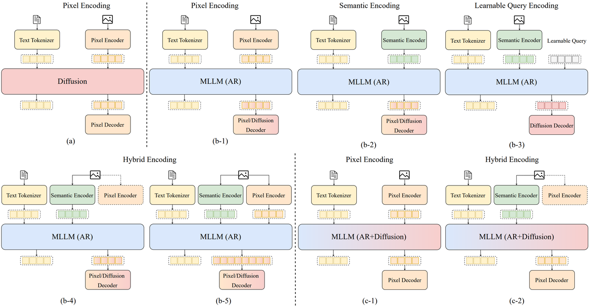

这一章主要聚焦于支持视觉-语言理解与生成的统一多模态模型，&#x5373;**同时接受图像和文本作为输入，并能生成文本或图像作为输出的模型**。现有的统一模型大致可分为三大类：扩散模型 **diffusion models `(a)`**、自回归模型 **autoregressive models `(b)`**&#x4EE5;及融合自回归+扩散模型 **fused AR + diffusion models `(c)`**。

对&#x4E8E;**自回归模型**，可以进一步根据其模态编码方法将其细分为四种子类型：基于像素的编码（pixel-based encoding）**`(b-1)`**、基于语义的编码（semantic-based encoding）**`(b-2)`**、基于可学习 Query 的编码（learnable query-based encoding）**`(b-3)`**以及混合编码（hybrid encoding）**`(b-4)` `(b-5)`**。这些不同的编码策略代表了处理视觉与文本数据的不同方式，从而在多模态表征的整合程度与灵活性方面表现出差异。

**融合自回归+扩散模型**&#x5219;根据模态编码方式分为两类：基于像素的编码 **`(c-1)`&#x20;**和混合编码 **`(c-2)`**。这类模型结合了自回归与扩散方法的优势，为实现更统一、高效的多模态生成提供了一种有前景的途径。

## 5.1 Diffusion-based

### 5.1.1 D-DiT

**D-DiT**（**D**ual **Di**ffusion **T**ransformer）采用统一的主干网络，联合建模图像与文本的分布。给定图像$$\mathbf{x}^{(\text{img})}$$和文本$$\mathbf{x}^{(\text{txt})}$$，建模条件分布$$p(\mathbf{x}^{(\text{img})} \mid \mathbf{x}^{(\text{txt})})$$与$$p(\mathbf{x}^{(\text{txt})} \mid \mathbf{x}^{(\text{img})})$$。前者为**文本到图像生成**，后者构成了多种**图像理解**任务的基础，如图像描述生成和视觉问答。

* **模型架构**

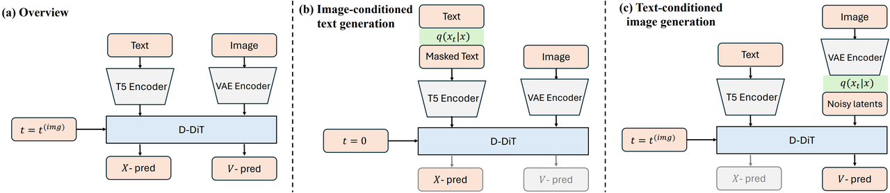

**D-DiT** 其实和 MM-DiT 比较像，是基于 Transformer 的模型，包含两个分支：一个用于**处理图像 token**，另一个用于**处理文本 token**。在每一层注意力机制中，图像 token 与文本 token 相互进行交叉注意力计算。

> * **图像分支**&#x7684;输出是在文本条件下的速度预测：
>
> $$\dot{\mathbf{x}}_t = \mathbf{v}(\mathbf{x}_t, t)$$
>
> 其中速度场$$\mathbf{v}(\mathbf{x}_t, t) = \dot{\alpha}_t \mathbf{x} + \dot{\sigma}_t \boldsymbol{\epsilon}$$。
>
> * **文本分支**&#x7684;输出则是在图像条件下的$$\mathbf{x}^{(\text{txt})}$$预测。标量时间步 Embedding 通&#x8FC7;**`AdaLN`**&#x63A7;制每一层的特征图。

> **注**：
>
> 1. 在图像生成过程中，仅将时间步信息$$t$$输入模型，因为$$\mathbf{x}^{(\text{txt})}_t$$已隐式编码了该信息，即序列中被掩码 token 的比例。
>
> 2. 在扩散模型的文本分支之上额外添加了一个带有双向注意力机制的文本编码器。虽然图像分支与文本分支之间的不对称性并非严格必需，但在 DiT 模型之上加入文本编码器能够将许多现有的文本到图像模型，如 SD3 和 FLUX，作为预训练主干适配到 D-DiT 模型中。并且这个文本编码器不应使用因果掩码，因为会破坏掩码扩散过程。
>
> 3. 为降低高分辨率图像建模带来的计算开销，和之前的一些工作一样，将原始像素空间的图像通过 VAE 编码至空间压缩的潜在空间，VAE 使用判别器损失与 KL 散度正则化进行训练。

* **训练**

作者提出了一种用于图像-文本联合建模的组合训练目标，本质上是一个结合了连续扩散与离散扩散的联合去噪目标。形式上使用**流匹配 **flow matching 来学习图像的条件分布，使用**掩码扩散 **masked diffusion 来学习文本的条件分布。

在训练过程中，从各自前向扰动过程$$q(\mathbf{x}_t \mid \mathbf{x})$$中采样得到被扰动的样本$$\mathbf{x}_t^{(\text{img})}$$和 $$\mathbf{x}_t^{(\text{txt})}$$。随后为每种模态分别计算扩散损失：

$$L_{\text{image}}=\mathbb{E}_{t,q^{(\text{img})}} \left\| \mathbf{v}_{\theta} \left( \mathbf{x}^{(\text{img})}_{t}, t, \mathbf{x}^{(\text{txt})} \right) - (\boldsymbol{\epsilon} - \mathbf{x}^{(\text{img})}) \right\|_2^2$$

$$L_{\text{text}}= \mathbb{E}_{q^{(\text{txt})}} \left[ -\frac{1}{K}\sum_{i=1}^{K} \log \left( \mathbf{x}_{\theta}(\mathbf{x}_{t_i}^{(\text{txt})}, \mathbf{x}^{(\text{img})}) \cdot \mathbf{x} \right) / t_i \right]$$

> * &#x5728;**文本扩散**&#x4E2D;，对时间步$$t_i$$采用**对偶采样**，将区间$$(\delta, 1]$$均匀离散化为$$K$$个点，其中$$\delta$$是一个很小的数，用于避免数值不稳定。
>
> * &#x5728;**图像扩散**&#x4E2D;，从对数正态分布中采样时间步$$t$$。训练过程中，**条件样本不被扰动**，即在预测文本分布时，图像扩散的时间步始终设为零，反之亦然。

综上所述，整体的双模态训练损失是上述单模态扩散损失的简单加权组合：

$$L_{\text{dual}} = L_{\text{image}} + \lambda_{\text{text}} L_{\text{text}}$$

其中$$\lambda_{\text{text}}$$是一个超参数。

* **推理**

引入三种基于采样的推理方式，可用于不同的视觉-语言任务：

1. **文本到图像生成**

为执行文本引导的图像生成，即$$\mathbf{x} \sim p(\mathbf{x}^{(\text{img})} \mid \mathbf{x}^{(\text{txt})})$$，采用**无分类器引导  CFG**（**C**lassifier-**F**ree **G**uidance） 从条件分布$$p(\mathbf{x}^{(\text{img})}_t \mid \mathbf{x}^{(\text{txt})})$$中采样。这相当于对速度预测进行重加权：

$$\tilde{\mathbf{v}}_t = s \, \mathbf{v}_{\theta} \left( \mathbf{x}^{(\text{img})}_{t}, t, \mathbf{x}^{(\text{txt})} \right) + (1 - s) \, \mathbf{v}_{\theta} \left( \mathbf{x}^{(\text{img})}_{t}, t, \emptyset \right)$$

其中$$s$$是控制引导强度的超参数，$$\emptyset$$是合适的空 Embedding，例如空文本的 Embedding。

* **图像到文本生成**

为从条件分布中采样文本，使&#x7528;**`ancestral sampling`**，通过代入预测$$\mathbf{x} \approx \mathbf{x}_\theta(\mathbf{x}^{(\text{txt})}_t, \mathbf{x}^{(\text{img})}; t = 0)$$来从后验分布$$q(\mathbf{x}_s \mid \mathbf{x}_t, \mathbf{x})$$中采样。

* **图像-文本填空**

在某些任务中，同时提供文本条件信息和图像条件信息，例如在**视觉问答&#x20;**&#x56;QA 任务中，系统会同时给出一张图像和一个相关问题。在此类场景下希望采样$$\mathbf{x} \sim p(\mathbf{x}^{(\text{answer})} \mid \mathbf{x}^{(\text{img})}, \mathbf{x}^{(\text{question})})$$。

为完成此任务，将问题的扩散先验初始化为掩码 token，并利用文本扩散模型强大的文本填空能力，通过对条件分布进行采样来补全文本序列。在整个采样过程中，问题文本 token 保持固定不变，如右图。

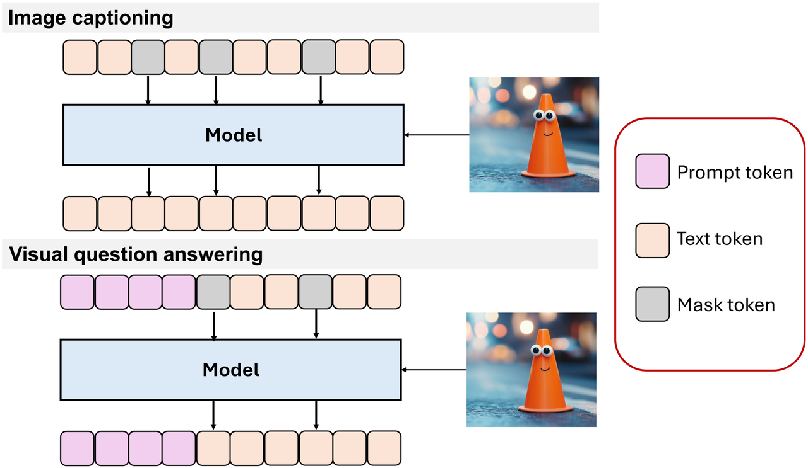

### 5.1.2 MMaDA

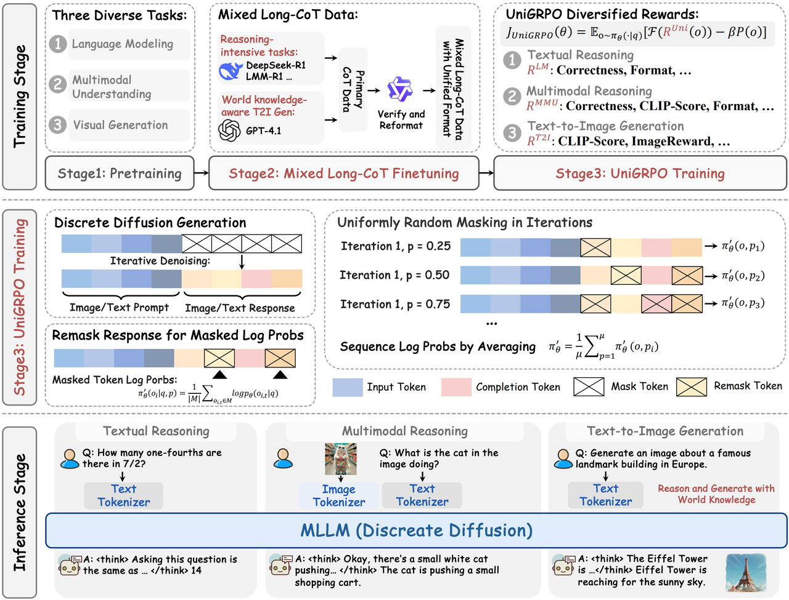

* **Stage 1：预训练**

1. **Tokenization 分词**

为构建一个能够同时处理文本与视觉数据的统一建模范式，**MMaDA&#x20;**在两种模态上采用一致的离散分词策略，使模型能够在单一建模目标下运行，即预测被掩码的离散 token。

> * 对&#x4E8E;**文本分词**，采&#x7528;**`LLaDA`**&#x7684; tokenizer
>
> * 对&#x4E8E;**图像分词**，利&#x7528;**`Show-o`**&#x4E2D;采用的预训练图像量化器，其基&#x4E8E;**`MAGVIT-v2`**&#x67B6;构，将原始图像像素转换为离散语义 token 序列：给定一个尺寸为$$H \times W$$的输入图像，编码器生成一个尺寸为$$\frac{H}{f} \times \frac{W}{f}$$的 token 映射，其中$$f$$表示下采样因子。在 MMaDA 中采用下采样因子$$f = 16$$和 Codebook 大&#x5C0F;**`8192`**，可以将一张$$512 \times 512$$像素的图像转换为长度为 $$32 \times 32 = 1024$$的离散 token 序列。这些转换后的离散图像 token 被用于理解和生成两类建模任务。

2. **目标函数**

近期的统一多模态框架一般会将多种建模目标，例如自回归生成和基于扩散模型的去噪整合到单一架构中，以支持联合理解与生成任务。但这些方法通常引入复杂的混合机制，阻碍了模型效率与一致性。**MMaDA&#x20;**&#x63D0;出一种简化的框架，不仅降低了架构复杂度，还引入了一个统一的扩散目标，在共享的概率建模公式下对视觉与文本模态进行联合建模。通过在不同模态间对齐噪声添加与语义恢复过程，在预训练阶段实现了更有效的跨模态交互，从而促进异构数据源的无缝融合。

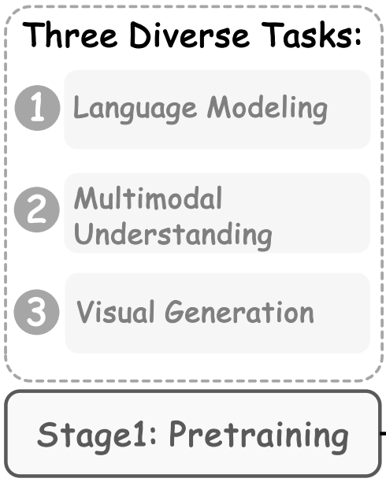

具体来说，**MMaDA&#x20;**&#x53EF;以表述为一&#x4E2A;**`mask token predictor`**，这里的 token 指图像和文本 token，即一个参数化模型$$p_\theta(\cdot \mid x_t)$$，它以$$x_t$$为输入，并同时预测所有被掩码的 token。**模型通过仅在被掩码的图像和文本 token 上计算的统一交叉熵损失进行训练**：

$$\mathcal{L}_{\text{unify}}(\theta) = -\mathbb{E}_{t, x_0, x_t} \left[ \frac{1}{t} \sum_{i=1}^{L} \mathbb{I}[x_t^i = \texttt{[MASK]}] \log p_\theta(x_0^i \mid x_t) \right]$$

其中$$x_0$$为真实值，时间步$$t$$在区间$$[0, 1]$$上均匀采样，$$x_t$$是通过对$$x_0$$应用前向扩散过程得到的。$$\mathbb{I}[\cdot]$$表示指示函数，确保损失仅在被掩码的 token 上计算。

* **Stage 2：混合长思维链微调**

1. **冷启动的长链思维数据构建**

**MMaDA **构建了一个涵盖三项核心任务的小型但高质量的长 CoT 轨迹数据集：**文本推理**、**多模态推理**以及**图像生成**，通过以下原则实现对预训练 MMaDA 模型的稳定后训练：

> * **统一的 CoT 格式**：多模态模型面临的一个关键挑战是不同任务输出格式不同，例如文本生成和图像生成，输出格式差异很大。MMaDA 提出一种任务无关的 CoT 格式：
>
> $$\texttt{|<special\_token>| <reasoning\_process> |<special\_token>| <result>}$$
>
> 其&#x4E2D;**`<reasoning_process>`**&#x7F16;码了最终输出前的逐步推理轨迹。这种统一结构填补了模态特定输出之间的鸿沟，并促进任务间知识迁移。例如，**增强的文本推理能力可通过将语义逻辑与视觉合成对齐，直接提升生成图像的真实感**。
>
> * **多样性、复杂性与准确性**：MMaDA 利用开源的 LLM 和 VLM 在各类任务中生成多样化的推理轨迹。为保证质量，使用 SOTA 模型作为验证器，过滤掉不准确或浅层的推理，仅保留高质量、长形式的 CoT 样本。这里明确面向以下两类任务：
>
>   1. 推理密集型任务，如数学问题求解
>
>   2. 具备世界知识感知的文生图生成，其中事实一致性至关重要

* **混合长链思维微调**

有了上面统一的扩散架构与概率建模，**MMaDA&#x20;**开发了一种**混合任务的长 CoT 微调策略**，以联合优化模型在异构任务上的表现。该方法不仅增强了任务特定能力，还为后续的强化学习（RL）阶段提供了强有力的初始化。训练过程包含以下步骤：

**Prompt 保留与 token 掩码**：保留原始 Prompt $$p_0$$，并对结果部分$$x_0$$中的 token 独立进行掩码，记为$$r_t$$。

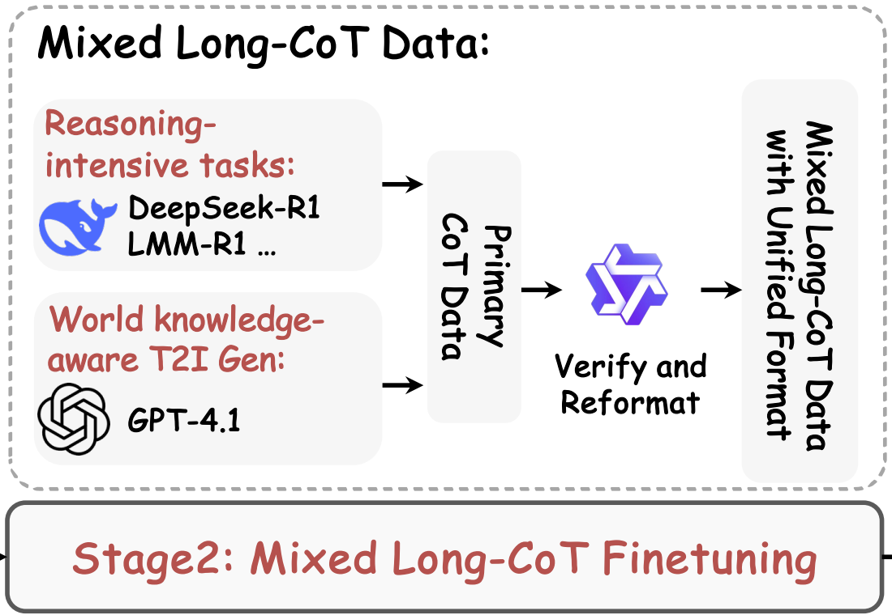

**输入拼接·与损失计算**：将拼接后的输入$$[p_0, r_t]$$输入到预训练的 mask predictor 中计算损失。这使得模型能够利用 prompt 和加噪结果中的上下文信息，重建被掩码区域$$r_0$$。

目标函数定义如下：

$$\mathcal{L}_{\text{Mixed-SFT}} = -\mathbb{E}_{t, p_0, r_0, r_t} \left[ \frac{1}{t} \sum_{i=1}^{L'} \mathbb{I}[r_t^i = \texttt{[MASK]}] \log p_\theta(r_0^i \mid p_0, r_t) \right]$$

其中$$L'$$表示序列长度。此处，$$[p_0, r_0]$$与$$[p_0, r_t]$$分别对应干净数据$$x_0$$及其含噪版本$$x_t$$。这个公式确保模型在恢复被掩码 token 的同时，保持与原始 prompt 及任务特定推理逻辑的一致性。

* **Stage 3：统一强化学习后训练**

1. **UniGRPO**

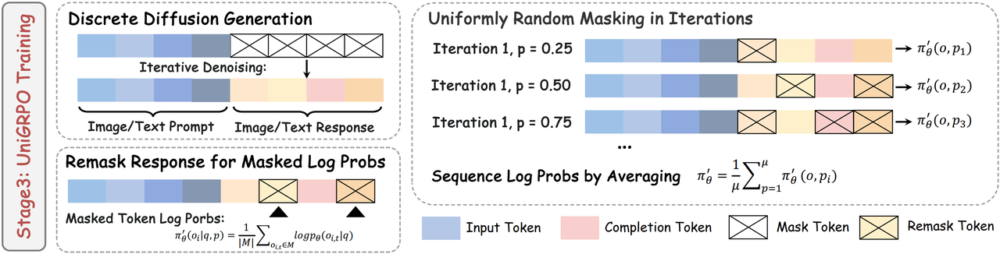

通过混合长链思维微调，MMaDA 已展现出在最终输出前生成统一且连贯推理链的能力。为进一步提升其在知识密集型任务及复杂推理/生成场景中的表现，作者提出 **UniGRPO**，专为扩散基础模型量身定制的新型基于策略梯度的强化学习算法。其构建了一个以扩散模型为核心的 RL 训练框架，能够跨不同模态与推理范式统一任务特定目标。该方法包含两个核心组成部分：

> * 基于扩散模型的 RL 的统一数学形式化
>
> * 多样化的奖励建模，以使策略梯度与任务特定奖励对齐

**将自回归 GRPO 适配到扩散模型的难点**

原始 GRPO 依赖于计算 token 级别的对数似然$$\pi_\theta(o_{i,t} \mid q, o_{i,<t})$$以及序列级别的概率$$\pi_\theta$$与$$\pi_{\text{ref}}$$。在自回归大语言模型中，这些指标可通过生成的链式法则高效推导。然而，扩散模型有三个关键的难点：

> * **局部掩码依赖性**：token 级别的对数似然$$\log \pi_\theta(o_{i,t} \mid q, o_{i,<t})$$仅在扩散过程中被掩码的区域有效，而 AR 模型中所有 token 均有效
>
> * **掩码比例敏感性**：为近似策略分布$$\pi_\theta$$，必须对回答段采样一个统一的掩码比例，因为扩散动态依赖于掩码模式
>
> * **非自回归的序列级似然**：由于扩散模型缺乏自回归链式法则，序列级对数似然无法直接由 token 级概率累加得到

现有方法采用次优策略应对上述问题：

> * **`LLaDA`**&#x901A;过对大量掩码比例进行蒙特卡洛采样，在 on-policy RL 中带来高昂计算开销
>
> * **`d1`**&#x56FA;定掩码比例并对问题部分随机掩码，降低了噪声多样性，并忽略了扩散模型多步去噪的本质

**扩散 GRPO 的统一形式化**

为克服上述限制，作者提出 **UniGRPO**，专为扩散架构设计的计算高效近似算法。给定一批针对Query $$q$$的回答$$\{o_i\}_{i=1}^G$$，每个回答在梯度更新期间保持固定，以确保策略评估的稳定性。UniGRPO 的三个关键设计如下：

> * **结构化加噪策略**
>
> 对每个$$o_i$$，从区间$$[0, 1]$$均匀采样一个掩码比例$$p_i$$，并通过将 token 替换&#x4E3A;**`[MASK]`**&#x6784;造扰动版本$$\tilde{o}_{i,p}$$。$$p_i$$的随机种子在不同梯度步之间变化。这个策略在保留随机性的同时，使模型暴露于扩散去噪过程的不同阶段，从几乎完全掩码到几乎完全去噪的答案。由此，UniGRPO 能从多步去噪信息中学习，这与扩散模型的传统训练方法一致，并充分利用其多步生成能力。
>
> * **高效的对数似然近似**
>
> 将扰动分布下的期望 token 级对数似然定义为：
>
> $$\pi'_\theta(o_{i,t} \mid q, o, \tilde{o}_i) = \mathbb{E}_{p_i \sim [0,1]} \left[ \mathbb{I}[o_{i,t,p} = \texttt{[MASK]}] \log p_\theta(o_{i,t,p} \mid q) \right]$$
>
> 序列级对数似然则通过对被掩码 token 取平均来近似：
>
> $$\pi'_\theta = \frac{1}{M} \sum_{o_{i,t} \in \mathcal{M}} \log p_\theta(o_{i,t} \mid q)$$
>
> 其中$$M$$表示被掩码 token 的数量。
>
> * **策略梯度目标**
>
> token 级奖励计算方法是当前策略与旧策略似然之比：
>
> $$r'_{i,t}(\theta) = \frac{\pi'_\theta(o_{i,t} \mid q, o, \tilde{o}_i)}{\pi'_{\text{old}}(o_{i,t} \mid q, o, \tilde{o}i)}$$
>
> 最终 UniGRPO 目标结合了裁剪的替代奖励与 KL 正则项：
>
> $$\begin{aligned}
> J_{\text{UniGRPO}}(\theta) = \mathbb{E}_{\substack{(q,a)\sim \mathcal{D}, \{o_i\}_{i=1}^G \sim \pi_{\theta_{\text{old}}}(\cdot|q), \{p_i \in [0,1]\}_{i=1}^G}} \Bigg[
> \frac{1}{G} \sum_{i=1}^G \frac{1}{|o_i|} \sum_{t=1}^{|o_i|}
> \min \Big( & r'_{i,t}(\theta) \hat{A}_{i,t}, \\
> & \text{clip}\big(r'_{i,t}(\theta), 1 - \varepsilon, 1 + \varepsilon\big) \hat{A}_{i,t} \Big) 
> \beta D_{\text{KL}}(\pi'_\theta \,\|\, \pi'_{\text{ref}})
>   \Bigg]
>   \end{aligned}$$
>
> 其中$$\hat{A}_{i,t}$$表示优势估计，$$\varepsilon$$控制裁剪范围，$$\beta$$平衡 KL 散度惩罚项。

通过这个设计，UniGRPO 捕捉了扩散模型本质的多步去噪动态。它允许模型在多样化的掩码条件下预测答案，同时保留输入的自然结构，从而避免了 LLaDA 的计算低效和 d1 的过度简化预测等问题。UniGRPO 的训练流程如下：

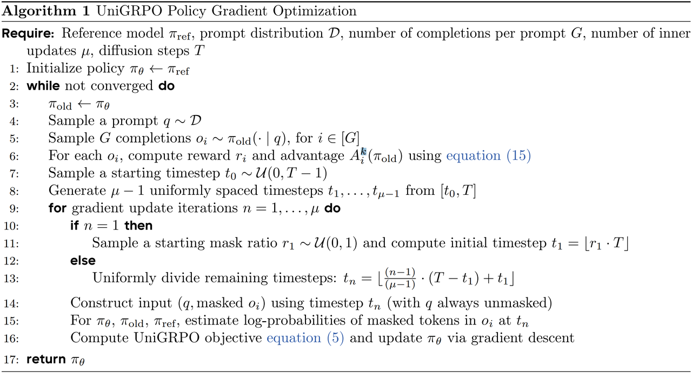

* **多样化奖励建模**

可以将 UniGRPO 的优化目标进一步简化为：

$$J_{\text{UniGRPO}}(\theta) = \mathbb{E}_{o \sim \pi_\theta(\cdot|q)} \left[ F(R^{\text{Uni}}(o)) - \beta P(o) \right]$$

其中$$R_{\text{Uni}}(o)$$表示模型生成回答$$o$$所获得的奖励，$$P(\cdot)$$为惩罚项，即 KL 散度。这是一个统一的基于规则的奖励系统，其中$$R_{\text{Uni}}(\cdot)$$可根据任务实例化为不同类型的奖励。为满足不同任务的多样化需求，在统一公式下定义了一系列奖励，为各任务分支提供定制化的 RL 优化方向。主要采用以下三类奖励：

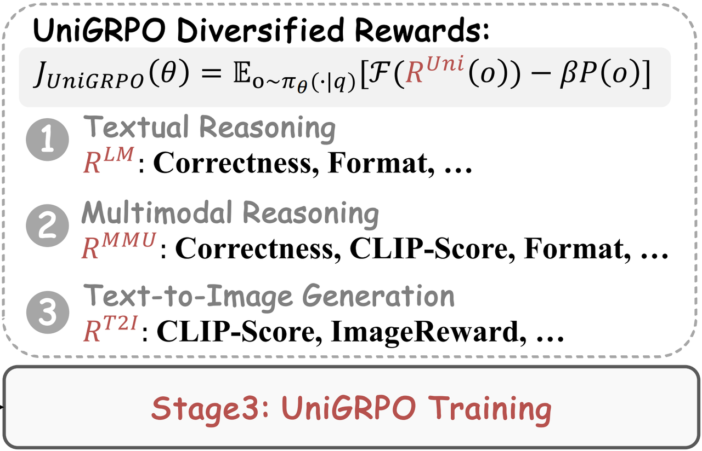

> * **文本推理奖励 Textual Reasoning Rewards**
>
> 在 GSM8K 数据集的训练集上应用 UniGRPO，并定义复合奖励：若答案正确，给&#x4E88;**正确性奖励 Correctness Reward&#x20;**$$2.0$$分；若回答符合预设格&#x5F0F;**`<think>...</think>`**，额外给&#x4E88;**格式奖励 Format Reward** $$0.5$$分。
>
> * **多模态推理奖励 Multimodal Reasoning Rewards**
>
> 对于 GeoQA 和 CLEVR 等数学任务，采用与文本推理相同的正确性与格式奖励。对于图像描述任务，引入 **CLIP Reward**：
>
> $$0.1 \cdot \text{CLIP}(\text{image}, \text{text})$$
>
> 将衡量图文对齐度的原始 CLIP 分数缩放$$0.1$$倍，以平衡其影响。
>
> * **文生图生成奖励 Text-to-Image Generation Rewards**
>
> 对于图像生成任务，同样使用 CLIP 奖励评估图文语义对齐，并加入反映人类偏好&#x7684;**图像奖励 Image Reward**。两类奖励均乘以$$0.1$$的缩放因子，以确保在优化过程中贡献均衡。

* **推理阶段**

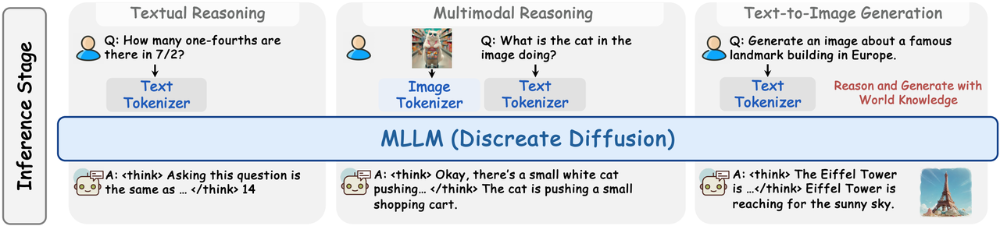

1. **文本生成的半自回归采样**

对于文本生成，采用 LLaDA 提出的半自回归去噪策略，将自回归解码与基于扩散的去噪相结合。即输出序列被划分为多个块，并从左至右依次生成。在每个块内，对所有被掩码位置计算 logits，并随机或基于置信度分数选择一部分 token 进行去噪。掩码调度采用线性计划，与 LLaDA 一致。该去噪过程重复若干步。

在评估中，将总序列长度设为$$N = 1024$$，执行$$N/2 = 512$$步去噪。序列被划分为每块$$64$$个 token。每一步中，在当前块内选择置信度最低的 2 个 token 进行去掩码，无论其位置如何。一旦某一块中所有 token 均被去噪，流程即进入下一块。

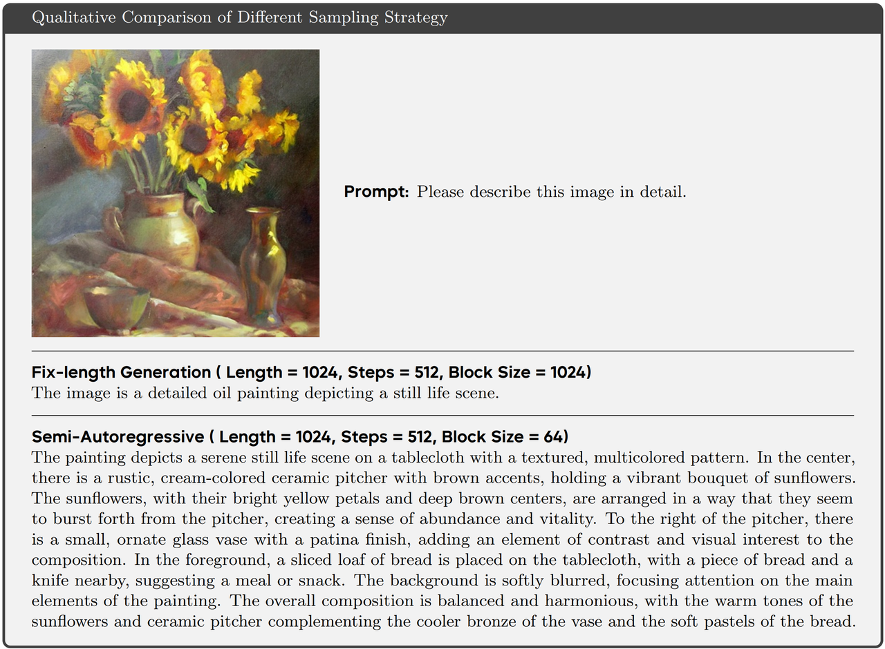

根据这个定性对比可以知道，半自回归去噪策略倾向于生成更复杂、细节更丰富的描述；而非自回归的固定长度生成往往产生极短的回答。这与 LLaDA 的结论是一致的。对于经过指令微调的模型，由于训练过程中包含大&#x91CF;**`|EOS|`** token，若不划分块而直接应用最低置信度重掩码策略，会导致生成句子&#x4E2D;**`|EOS|`**&#x51FA;现频率异常偏高。

* **图像生成的并行非自回归采样**

对于图像生成，采用低置信度重掩码策略，并遵循余弦噪声调度，与 MAGVIT-v2 的设置一致。与文本生成不同，这里不采用半自回归方式，而是将整个输出序列视为单一生成块。评估时，生成长度为$$1024$$的序列，对应$$512 \times 512$$分辨率的图像。去噪过程包含 50 个时间步，并应用无分类器引&#x5BFC;**`classifier-free guidance`**，引导尺度设为$$3.5$$。

### 5.1.3 **FUDOKI**

**FUDOKI&#x20;**&#x901A;过离散流匹配**`discrete flow matching`**&#x8FD9;一视角，统一了视觉与语言，能够在视觉和文本模态之间实现感知与生成的统一方法。

* **数学背景：离散流匹配**

一般来说，离散流匹配的目标是从一个已知的源分布$$p(x)$$出发，逼近目标真实数据分布$$q(x)$$，其中$$x = (x^1, x^2, \dots, x^D)$$属于离散空间$$\mathcal{S} = \mathcal{T}^D$$。这里$$D$$表示离散变量的数量，$$\mathcal{T} = [K] = \{1, 2, \dots, K\}$$表示每个变量可能取值的有限集合。

* **概率路径 Probability Paths**

给定定义在有限状态空间$$\mathcal{S}$$上的源分布$$p(x)$$和目标分布$$q(x)$$，离散流匹配引入一组以时间索引的概率分布$$\{p_t(x)\}_{t \in [0,1]}$$，用以描述从$$p$$到$$q$$的平滑变换过程，称为**概率路径**。每个$$p_t(x)$$构造如下：

$$p_t(x) \coloneqq \sum_{x_1 \in \mathcal{S}} p_t(x \mid x_1) \, q(x_1)$$

其中条件分布按维度分解为：

$$p_t(x \mid x_1) \coloneqq \prod_{i=1}^D p_t(x_i \mid x^i_1)$$

此处，每个$$p_t(x^i \mid x^i_1)$$定义了从基础分布$$p(x^i)$$到点质量分布$$\delta_{x^i_1}(x^i)$$的单变量插值，其中

$$\delta_{x^i_1}(x^i) = 
\begin{cases}
1, & \text{if } x^i = x^i_1 \\
0, & \text{otherwise}
\end{cases}$$

这种插值的一种常见设计是混合路径**`mixture path`**，通过一个依赖于时间的调度函数$$\kappa_t(x_i^1) \in [0, 1]$$定义：

$$p_t(x^i \mid x^i_1) = (1 - \kappa_t(x^i_1)) \, p(x^i) + \kappa_t(x^i_1) \, \delta_{x^i_1}(x^i)$$

其中满足边界条件$$\kappa_0(\cdot) = 0$$、$$\kappa_1(\cdot) = 1$$。当基础分布取为掩码 token 的点质量分布，即$$p(x_i) = \delta_m(x_i)$$，$$m$$表示掩码 token 时，这个路径退化为**掩码数据构造方式**。

* **概率速度 Probability Velocities**

为了模拟沿预设路径$$\{p_t(x)\}_{t \in [0,1]}$$演化的生成过程，考虑一个定义在离散空间$$\mathcal{S}$$上&#x7684;***连续时间马尔可夫链*`CTMC`**$$\{x_t\}_{t \in [0,1]}$$，使得$$x_t \sim p_t$$。再具体点就是，通过**概率速度**$$u_t^i(\cdot, x_t)$$ 来描述该 CTMC，它刻画了$$x_t$$在第$$i$$个 token 位置上的概率变化速率。这与连续流匹&#x914D;**`Flow Matching`**&#x4E2D;的速度场概念类似。离散流匹配中的形式化定义如下：

> **定义**：若对任意$$t \in [0, 1)$$及任意样本$$x_t \sim p_t$$，其更新后的样本$$x_{t+h}$$满足：对每个坐标$$i$$，有 &#x20;
>
> $$x^i_{t+h} \sim \delta_{x^i_t}(\cdot) + h \, u_t^i(\cdot, x_t)$$
>
> 且整体满足$$x_{t+h} \sim p_{t+h} + o(h)$$，即当$$h \to 0$$时，称概率速度$$u_t$$**生成**了概率路径$$p_t$$。

此外，概率速度$$u_t$$还需满足以下**速率条件**：

$$\sum_{x^i \in [K]} u_t^i(x^i, z) = 0, \quad u_t^i(x^i, z) \geq 0 \quad \forall i \in [D], \; x^i \neq z^i$$

以确保更新后的$$x^i_{t+h}$$可从一个合法的概率分布中采样。还有一个知识点是离散流匹配中的连续性方程**`Continuity Equation`**，或者称为 Kolmogorov 前向方程，用于描述状态概率的时间导数$$\dot{p}_t(x)$$，其中$$x \in \mathcal{S}$$：

$$\dot{p}_t(x) + \mathrm{div}_x (p_t u_t) = 0$$

其中散度项定义为：

$$\mathrm{div}_x (p_t u_t) = \sum_{z \in \mathcal{S}} \sum_{i=1}^D \delta_x(z^{i}) \left[ p_t(x) u_t^i(z^i, x) - p_t(z) u_t^i(x^i, z) \right]$$

它衡量了状态$$x$$的**总流出通量**$$x \to z$$减去**总流入通量**$$z \to x$$。此处，

$$\delta_x(z^i) = \prod_{j \neq i} \delta_{x_j}(z_j)$$

表示仅当$$x$$与$$z$$**仅在第**$$i$$**个坐标上不同**时，才计入该坐标的通量。

$$\dot{p}_t(x) + \mathrm{div}_x (p_t u_t) = 0$$表明：状态$$x$$处的概率变化率等于该处净剩余的概率通量$$p_t u_t$$。若连续性方程成立，则$$u_t$$即为按上述定义所述生成概率路径$$p_t$$的有效速度场。

* **FUDOKI 中的离散流匹配**

考虑由离散度量**`discrete metrics`**&#x6240;诱导的概率路径：

给定一个距离函数$$d : \mathcal{T} \times \mathcal{T} \to \mathbb{R}_{\geq 0}$$，满足$$d(x^i, x^i_1) = 0$$当且仅当$$x^i = x^i_1$$，可以通过以下方式定义条件分布路径：

$$p_t(x^i \mid x^i_1) = \mathrm{softmax}\left( -\beta_t \cdot d(x^i, x^i_1) \right)$$

其中$$\beta_t : [0, 1] \to \mathbb{R}_{\geq 0}$$是一个单调递增的时间调度函数，边界条件为$$\beta_0 = 0$$、$$\beta_1 = \infty$$。当$$t = 0$$时，该分布为均匀分布；当$$t \to 1$$时，分布收敛至以$$x^i_1$$为中心的狄拉克 delta 函数。与基于掩码的概率路径$$p_t(x^i \mid x^i_1) = (1 - \kappa_t(x^i_1)) \, p(x^i) + \kappa_t(x^i_1) \, \delta_{x^i_1}(x^i)$$相比，这种**度量诱导的概率路径**定义了一种语义上更有意义的变换：当将$$d(\cdot, \cdot)$$设为衡量 token Embedding 距离的函数时，随着$$t \to 1$$，不仅目标 token $$x^i_1$$的概率增加，与其语义相近的 tokens 的概率也会相应提升。

在定义了上述度量诱导的概率路径后，便可以通过最小化动&#x80FD;**`kinetic energy`**&#x6765;获得概率速度。也就是说希望最小化通量$$p_t u_t$$的大小，以确保沿概率路径的变换足够平滑。同时，所得到的速度还需满足若干约束条件，包括连续性方程$$\dot{p}_t(x) + \mathrm{div}_x (p_t u_t) = 0$$、不同状态间通量的非负性$$\sum_{x^i \in [K]} u_t^i(x^i, z) = 0$$，以及$$p$$和$$q$$的边界条件。由此，$$p_t(x^i \mid x^i_1) = \mathrm{softmax}\left( -\beta_t \cdot d(x^i, x^i_1) \right)$$对应的动能最优速度可表示为：

$$u_t^i(x^i, z \mid x_1) = p_t(x^i \mid x^i_1) \, \dot{\beta}_t \, \big[ d(z^i, x^i_1) - d(x^i, x^i_1) \big]_+$$

其中$$[\cdot]_+ = \max\{\cdot, 0\}$$为 ReLU 算子，$$\dot{\beta}_t$$是$$\beta_t$$对$$t$$的导数。对于第$$i$$个坐标$$z^i \in \mathcal{T}$$，该速度确保概率质量仅当 $$x^i$$比$$z^i$$更接近目标$$x^i_1$$，即$$d(x^i, x^i_1) < d(z^i, x^i_1)$$时，才从状态$$z^i$$流向$$x^i$$。因此，整个流过程单调地朝向$$x^i_1$$推进。

* **模型结构**

**FUDOKI** 基&#x4E8E;**`Janus-1.5B`**&#x67B6;构，并进行了少量适配以支持统一的视觉-语言离散流建模：

> 1. **采用全注意力掩码**&#x800C;非标准因果掩码，使所有 token 可相互关注，从而更好地捕捉全局上下文
>
> 2. **对输出 logits 应用位置偏移操作**，使模型尽可能继承自回归多模态大语言模型的下一 token 预测能力
>
> 3) **不引入显式的时间 Embedding 层**&#x6765;指示输入中的噪声水平，这与连续扩散模型不同。在所定义的度量诱导概率路径$$p_t(x^i \mid x^i_1) = \mathrm{softmax}\left( -\beta_t \cdot d(x^i, x^i_1) \right)$$下，模型可隐式地从含噪输入中推断时间步，从而在实验中实现更快的适应

其余架构与 Janus-1.5B 完全一致：

> * **文本模态**：使用词表大小&#x4E3A;**`102,400`**&#x7684; tokenizer
>
> * **图像模态**：理解与生成采用解耦的处理路径：
>
>   * **理解路径**：采用语义编码器 SigLIP 提取高维图像特征，并通过一个适配器 adaptor 将其重塑并映射到 LLM 的输入空间
>
>   * **生成路径**：按照 LlamaGen 的方法，使用像素编码器-解码器将图像转换为离散 token，图像 token 词表大小设&#x4E3A;**`16,384`**。每个图像 token 嵌入再经由一个生成适配器**&#x20;**&#x67;eneration adaptor 转换为输入特征后送入 LLM
>
> * **输出端**，使用两个输出头：文本头、图像头，二者将 Transformer 的输出分别转换为离散类别分布。推理时，根据目标模态选择相应的输出头。

与先前基于 AR 或 Diffusion 的多模态对比如下：

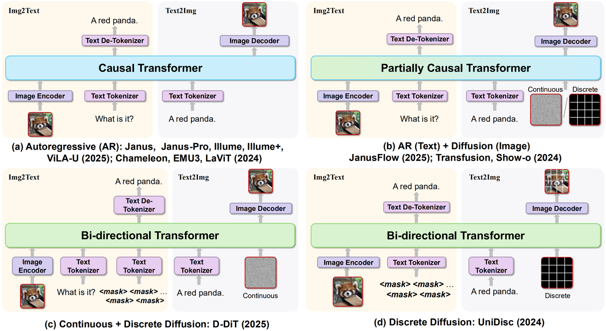

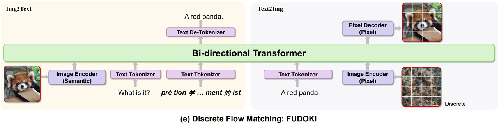

* **训练**

模型初始化自预训练的 Janus-1.5B 权重，并在收集的数据集上进一步微调，这个数据集包含文本到图像**`T2I`**的**生成任务**和图像到文本**`I2T`**的**理解任务**&#x4E24;类样本。**FUDOKI&#x20;**&#x7684;训练分为两个阶段：

> * **Stage 1**：主要目标是快速重新学习 AR 式 LLM，使其无缝支持离散流匹配范式。仅微调 Transformer 参数，冻结模型其他部分，包括语义编码器和嵌入适配器，以加速收敛并稳定训练
>
> * **Stage 2**：在第一阶段基础上，对整个模型进行端到端微调，以提升其在理解和生成任务上的整体性能

在每个训练阶段中，真实目标$$x_1$$从数据分布$$q(\cdot)$$中采样，条件为：

> * **T2I**：文本 prompt
>
> * **I2T**：图像-问题对

其中，**T2I** 的$$x_1$$为图像 token 序列，**I2T** 的$$x_1$$为文本 token 序列。每一步训练中，时间$$t \in [0, 1]$$从均匀分布采样，含噪序列$$x_t$$根据$$p_t(x^i \mid x^i_1) = \mathrm{softmax}\left( -\beta_t \cdot d(x^i, x^i_1) \right)$$定义的概率路径$$p_t(\cdot \mid x_1)$$采样。**FUDOKI** 将距离函数$$d(\cdot, \cdot)$$设为归一化 token Embedding 之间的 L2 距离，这有助于提高那些在 Embedding 空间中靠近真实 token $$x^i_1$$的 tokens 的采样概率，从而使加噪过程更具语义意义，促进学习。

模型以$$x_t$$为输入，预测$$x_1$$，并对每个位置输出 token 级别的 logits。训练损失定义为真实序列$$x_1$$与模型预测分布之间的期望交叉熵：

$$\mathcal{L}_{\mathrm{CE}}(\theta) = \mathbb{E}_{\substack{t \sim \mathcal{U}[0,1], x_1 \sim q(\cdot), x_t \sim p_t(\cdot \mid x_1)}} \left[ -\sum_{i=1}^{D} \log p^{\theta}_{1|t}(x^i_1 \mid x_t) \right]$$

其中$$p^{\theta}_{1|t}(\cdot \mid x_t)$$表示模型在给定输入$$x_t$$下对第$$i$$个位置预测的类别分布，参数为$$\theta$$。

* **推理**

推理阶段采用 **Euler 求解器**进行更鲁棒的采样。其模拟连续时间马尔可夫&#x94FE;**`CTMC`**&#x8FC7;程$$(x_t)_{0 \leq t \leq 1}$$。假设当前$$x_t \sim p_t$$，求解器按如下步骤将第$$i$$个坐标从时间$$t$$更新至$$t + h$$：

> 1. 从模型采样$$x^i_1 \sim p^i_{1|t}(\cdot \mid x_t)$$
>
> 2. 计算总条件转移速率：
>
> $$\lambda^i = \sum_{x^i \neq x^i_t} u_t^i(x^i, x^i_t \mid x^i_1)$$
>
> 3. 从均匀分布采样随机变量$$Z^i_{\text{change}} \sim \mathcal{U}[0, 1]$$
>
> 4. 按如下规则采样$$x^i_{t+h}$$：
>
>    * 若$$Z^i_{\text{change}} \leq 1 - e^{-h \lambda^i}$$，则从分布$$\frac{u_t^i(\cdot, x^i_t \mid x^i_1)}{\lambda^i} (1 - \delta_{x^i_t}(\cdot))$$中采样$$x^i_{t+h}$$
>
>    * 否则，令$$x^i_{t+h} = x^i_t$$，其中$$\delta_{x^i_t}(\cdot)$$为以$$x^i_t$$为中心的 delta 函数

这个推理过程可以这样理解：

> * 第二步中的$$\lambda^i$$可解释为：在当前位置$$x^i_t$$，概率质量流向其他状态$$x^i \neq x^i_t$$的**强度**
>
> * 当前 timestep 发生状态变化的概率由阈值$$1 - e^{-h \lambda^i}$$与随机变量$$Z^i_{\text{change}}$$比较决定：$$\lambda^i$$越大，发生跳变的可能性越高
>
> * 若发生跳变，则$$x^i_{t+h}$$从所有其他可能状态中按与$$u_t^i(\cdot, x^i_t \mid x^i_1)$$成正比的分布采样。这意味着更新倾向于将$$x^i_{t+h}$$移向更接近模型预测$$x^i_1$$的状态

总的来说，采样过程具备两大优势：

> 1. 沿概率路径持续优化预测
>
> 2. 在每个 timestep 灵活地将 token 调整为语义相近的替代项

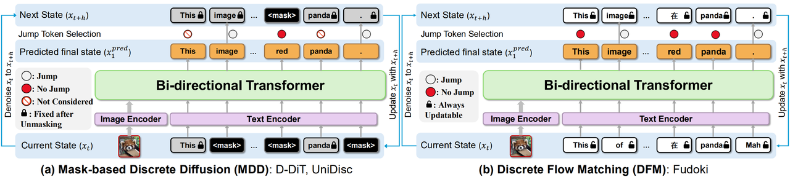

如上图，**FUDOKI** 与先前基于掩码的离散扩散模型形成鲜明对比：在那些模型中，一旦某个 token 被 unmasked，通常就无法再被修改，即使它包含错误。

## 5.2 Autoregressive-based

### 5.2.1 **Chameleon（b-1）**

* **模型架构**

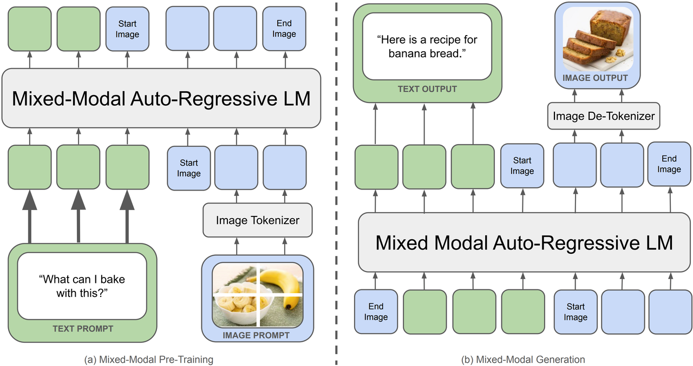

架构基本和 LLaMA-2 一致：

> * 使&#x7528;**`RMSNorm`**&#x8FDB;行归一化
>
> * 激活函数采&#x7528;**`SwiGLU`**
>
> * 位置编码采&#x7528;**`RoPE`**

但标准的 LLaMA 在训练中后期因范数缓慢增长而出现复杂发散，作者发现发散根源在于 softmax 操作在多模态训练中存在问题：由于 softmax 具有平移不变性，即$$\mathrm{softmax}(\mathbf{z}) = \mathrm{softmax}(\mathbf{z} + c)$$，当不同模态的熵差异显著时，softmax 输出会失衡。由于模型在所有模态间共享权重，各模态会通过略微增大自身范数竞争主导地位；虽然训练初期无碍，但一旦超出 BF16 的有效表示范围，就会导致发散。在单模态场景中，这个问题也被称&#x4E3A;**`logit drift`**。下图(a)展示了随着训练进行，最后一层 Transformer 输出范数的变化：尽管发散可能在训练进度&#x8FBE;**`20–30%`**&#x540E;才显现，但输出范数的失控增长与未来损失发散高度相关。

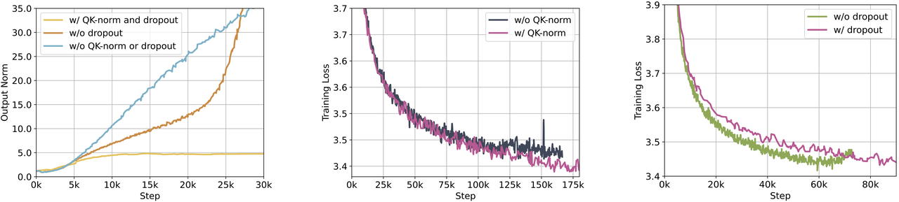

Transformer 中 softmax 出现在两个位置：注意力机制内部和最终 logits 的 softmax。作者修改 LLaMA 架构，引入**QK-Norm**。QK-Norm 通过对注意力中的 query 和 key 向量施加 LayerNorm，直接控制输入 softmax 的范数增长。上图(b)显示了 Chameleon-7B 在启用与禁用 QK-Norm 下的训练损失曲线，禁用 QK-Norm 在&#x7EA6;**`20%`**&#x8BAD;练周期后发散。

为稳定 Chameleon-7B，除 QK-Norm 外，还需在注意力层和前馈层后引入 dropout，如上图(c)所示。但这一策略不足以稳定 Chameleon-34B，还需对归一化顺序进行调整：在 Transformer 块内采用 Swin Transformer 的归一化策略，能约束前馈块的范数增长。设$$h$$为时间步$$t$$的隐藏向量，在对输入$$x$$应用自注意力后：

**LLaMA-2**

$$\begin{aligned}
h &= x + \text{attention}(\text{attention\_norm}(x))\\
\text{output} &= h + \text{feed\_forward}(\text{ffn\_norm}(h))
\end{aligned}$$

**Chameleon-34B**

$$\begin{aligned}
h &= x + \text{attention\_norm}(\text{attention}(x))\\
\text{output} &= h + \text{ffn\_norm}(\text{feed\_forward}(h))
\end{aligned}$$

> **注**：几点配置细节
>
> 1. 从头训练时，在 LLaMA-2 参数化发散前，两种归一化顺序在困惑度上无显著差异
>
> 2. 这种归一化与 dropout 组合效果不佳，因&#x6B64;**`Chameleon-34B`**不使用 dropout
>
> 3. 若采用归一化重排，**`Chameleon-7B`**&#x4E5F;可在无 dropout 下稳定训练，但 QK-Norm 在两种情况下均不可或缺

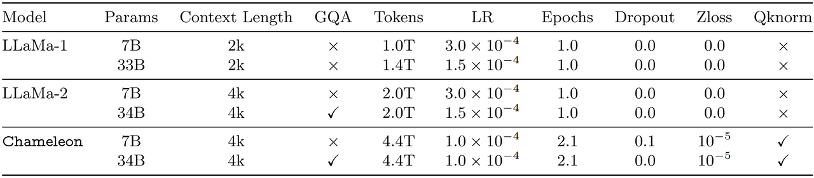

* **预训练**

**Chameleon&#x20;**&#x4E0D;仅处理文本，还将图像表示为一系列离散的 token，并利用自回归 Transformer 的缩放定律。在训练过程中采用任意顺序混合图像与文本，包括纯文本、单个图文对，以及完整的交错式图文文档。

1. **分词**

**图像分词**

基于 **[Make-A-Scene](https://arxiv.org/pdf/2203.13131)&#x20;**&#x7684;方法训练新的图像分词器，将$$512 \times 512$$的图像编码为$$1024$$个离散 token，这些 token 来自大小为$$8192$$的 codebook。

**文本分词**

使用 sentencepiece 库在训练数据的一个子集上训练了一个新的 BPE 分词器，其词汇表大小&#x4E3A;**`65,536`**，其中包括上&#x8FF0;**`8192`**&#x4E2A;图像 codebook token。

> 由于生成人脸比较重要，在预训练阶段将含有人脸的图像比例上采样 2 倍
>
> 图像分词器在重建包含大量文本的图像时表现不佳，限制了模型在 OCR 相关任务上的能力上限

* **数据**

将预训练阶段划分为两个独立阶段：第一阶段占总训练过程的前 80%，第二阶段占后 20%。对于所有图文对进行轮换，使得 50% 的情况下图在前、文在后。

**Stage 1**：使用大规模、完全无监督的数据集混合：

> * **纯文本**：使用多种文本数据集，包括用于训练 LLaMA-2 和 CodeLLaMA 的预训练数据组合，总计&#x7EA6;**`2.9T`**&#x7EAF;文本 token。
>
> * **图文对**：所有图像被调整大小并中心裁剪为$$512 \times 512$$以供分词。总计包&#x542B;**`1.4B`**&#x56FE;文对，产生&#x7EA6;**`1.5T`**&#x56FE;文 token。
>
> * **交错图文**：从公开网络来源获取数据，总计&#x7EA6;**`400B`**&#x4EA4;错图文 token，应用与 Text-to-Image 相同的过滤策略。

**Stage 2**：将第一阶段数据的权重降低 50%，同时混入更高质量的数据集，保持图文 token 的大致比例不变。并加入一组大规模指令微调数据集中经过筛选的训练子集。

* **训练设置 **

虽然 QK-Norm 有助于缓解 Transformer 内部 softmax 的问题，但无法解决最终 softmax &#x7684;**`logit shift`**&#x95EE;题，因此引入 z-loss 正则化：对 softmax 函数 $$\sigma(x)_i = \frac{e^{x_i}}{Z}$$ 的配分函数$$Z = \sum_i e^{x_i}$$，在损失函数中添加项 $$10^{-5} \log^2 Z$$。

训练使用 AdamW 优化器，其中$$\beta_1 = 0.9$$，$$\beta_2 = 0.95$$，$$\epsilon = 10^{-5}$$。学习率采用$$4000$$步线性 warm-up，随后指数衰减至$$0$$。权重衰减设为$$0.1$$，全局梯度裁剪阈值为$$1.0$$。在完整训练数据上训练$$2.1$$个 epoch，总计处&#x7406;**`9.2T`** token。

**Chameleon-7B**

使用 dropout 率$$0.1$$提高训练稳定性

同时使用 dropout 和 z-loss 实现稳定

使用全局 batch size 为$$2^{23}$$（约 8M）token

**Chameleon-34B**

不使用 dropout

仅需 z-loss 即可实现稳定

使用全局 batch size$$3 \times 2^{22}$$（约 12M）token

* **对齐**

采用轻量级对齐阶段，基于精心策划的高质量数据集进行 SFT。数据涵盖多个类型，以充分展现模型能力并提升安全性。

1. **数据**

将 SFT 数据集分为以下类别：**文本**、**代码**、**视觉对话**、**图像生成**、**交错图文生成** 和 **安全**。

**文本 SFT 数据**：继承自 LLaMA-2

**代码 SFT 数据**：继承自 CodeLLaMA

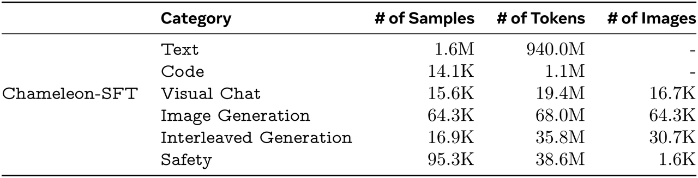

**安全数据**：一系列可能诱使模型生成不安全内容的 prompt，并搭配拒绝的回答，如`我无法协助此事`。这些 prompt 覆盖暴力、管制物质、隐私、色情内容等广泛敏感话题。

**图像生成数据**：使用 LAION-AI 的审美预测器 **[aesthetic-predictor](https://github.com/LAION-AI/aesthetic-predictor)&#x20;**&#x5BF9;图像进行筛选，选取评分至少为$$6$$的图像，并从中选出最接近$$512 \times 512$$尺寸与宽高比的前 64K 张图像。

* **微调方法**

在 SFT 阶段平衡各模态至关重要。若模态配对严重失衡，模型会学习到无条件生成该模态的先验，导致某一模态生成被抑制或过度放大。

SFT 采用余弦学习率调度，初始学习率为$$1 \times 10^{-5}$$，权重衰减为$$0.1$$。batch size 设为$$128$$，支持最长$$4096$$ token 的序列。每个训练样本由一个 prom 及其对应 response 组成。为提升效率，将多个 prompt-response 对打包进同一序列，并插入特殊 token 标记 prompt 结束与 response 开始。采用自回归训练目标，仅对回答 token 计算损失。这种针对性优化带来轻微整体增益。此外，使用 dropout 率$$0.05$$，并保留预训练阶段使用的 z-loss。

> **注**：在 SFT 中，**prompt 中的图像**通过边界填充调整大小，以保留全部信息；**response 中的图像**则采用中心裁剪，以确保生成图像的视觉质量。

* **推理**

自回归、多模态混合生成在推理时会存在很多问题，包括：

> * **每步数据依赖**：由于解码逻辑取决于当前步生成的是图像还是文本，每步都需检查 token 以引导控制流，即以阻塞方式从 GPU 复制到 CPU
>
> * **模态约束生成的 mask**：为支持单一模态生成，需对非目标模态的 token 进行掩码并在 de-tokenizing 时忽略
>
> * **固定大小的文本单元**：与可变长度的纯文本生成不同，基于 token 的图像生成产生固定大小的 token 块

**Chameleon&#x20;**&#x63A8;理实现支持文本与图像的流式生成。流式生成时，每步需执行 token 依赖的条件逻辑；非流式生成时，图像 token 块可融合生成，无需条件计算。在所有情况下，token 掩码消除了 GPU 上的分支。即使在非流式设置下，生成文本时仍需检查每个输出 token 是否为图像起始 token，以触发图像专用的解码增强。

### 5.2.2 **Emu3（b-1）**

Emu3 从零开始在语言、图像和视频数据的混合上进行训练。

* **数据**

**语言数据**：使用与 Aquila 相同的语言数据，包含中文和英文的高质量语料库。

**图像数据**：包含开源网络数据、AI 生成数据以及高质量的内部数据。过滤过程包括以下几个关键步骤： &#x20;

> 1. 应用分辨率过滤器，剔除分辨率低于$$512 \times 512$$像素的样本
>
> 2. 使用 LAION-AI 的审美预测器 [aesthetic-predictor](https://github.com/LAION-AI/aesthetic-predictor)**&#x20;**对每张图像的审美质量进行评估，剔除评分低于$$5.5$$的图像，以确保整体审美质量
>
> 3) 对于未通过审美过滤的图像，采用文本检测和颜色过滤，保留非单色且文本内容极少的图像，从而提升对开放世界图像的过滤召回率
>
> 4) 还为图像理解任务准备了补充数据。按照 DenseFusion 的数据处理流程，从多样化的开源网络数据中提取百万张具有代表性的图像，涵盖图表、表格、富含文本的内容等多种类别。

为标注过滤后的数据集，基于 Emu2 开发了一个图像描述模型，用于生成密集的合成 captions。利用 GPT-4V 并结合详细 prompt，生成约$$100$$万对图像-描述数据。这个标注数据集随后用于微调 Emu2-17B 模型，作为图像 captioner。使用 vLLM 加速标注过程。

**视频数据**：收集多种类别的视频，如风景、动物 、植物、游戏和动作等。这些视频通过一个复杂的预处理流程进行处理，包含以下四个阶段： &#x20;

> 1. 使用 [PySceneDetect](https://github.com/Breakthrough/PySceneDetect)**&#x20;**&#x5C06;视频分割为场景，其中 ContentDetector 用于识别内容变化，ThresholdDetector 用于检测淡入/淡出事件
>
> 2. 使用 [PaddleOCR](https://github.com/PaddlePaddle/PaddleOCR) 进行文本检测，并移除文本覆盖过多的片段。为降低计算开销，以 2 FPS 采样视频帧，并将短边缩放至 256 像素
>
> 3) 进一步计算光流以剔除运动过少或极端剧烈的片段。与上一步类似的，对视频帧进行采样和缩放以提高效率。光流得分定义为所有像素平均光流幅值与短边长度的比值，剔除光流得分超出可接受范围的片段； &#x20;
>
> 4) 使用 LAION-AI 审美预测器 [aesthetic-predictor](https://github.com/LAION-AI/aesthetic-predictor)**&#x20;**&#x8BC4;估每个片段的审美质量。对每个片段采样三帧并获得三个得分，若最低得分小于$$5$$，则丢弃该片段。

使用基于上述图像 captioner 训练得到的视频 captioner 对过滤后的视频片段进行标注。训练数据最初由 GPT-4V 标注：对每个视频片段采样$$8$$帧，并构造详细 prompt 让 GPT-4V 描述这些帧中的内容和运动。部分标注数据经过人工更正。随后在标注数据上微调图像 captioner，从而得到视频 captioner。为支持大规模部署，使用 vLLM 加速 captioning 生成：对于时长不足 20 秒的片段，使用 12 帧均匀采样进行描述；更长的片段则被分割为 10–20 秒的子片段，分别独立描述。

* **视觉分词器 Vision Tokenizer**

基于 [SBER-MoVQGAN](https://github.com/sberbank-ai/SBER-MoVQGAN) 训练视觉分词器，可将一段$$4 \times 512 \times 512$$的视频片段或一张$$512 \times 512$$的图像编码为$$4096$$个离散 token，这些 token 来自大小为$$32,768$$的 codebook。分词器在时间维度上实现$$4\times$$压缩，在空间维度上实现$$8\times8$$压缩，适用于任意时间和空间分辨率。在 MoVQGAN 架构的基础上，在编码器和解码器模块中均引入了两个带有 3D 卷积核的时间残差层，以增强视频分词能力。分词器在 [LAION-High-Resolution](https://laion.ai/blog/laion-high-resolution) 图像数据集和 InternVid 视频数据集上进行端到端训练，目标函数结合了$$L_2$$损失、LPIPS 感知损失、GAN 损失和 commitment 损失。

右表展示了在 [Pexels](https://www.pexels.com) 提供&#x7684;**`3,172`**&#x4E2A;视频构成的评估集上的 LPIPS、PSNR 和 SSIM 分数。视频重建时长为 5 秒，并保持原始宽高比。评估过程中，原始视频与重建视频均根据短边进行缩放和裁剪，并以 12 FPS 均匀采样 8 帧。

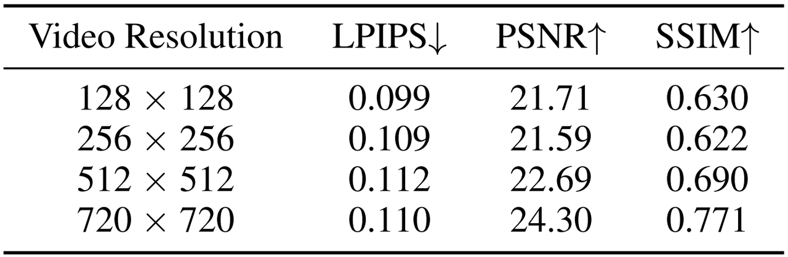

* **模型架构**

Emu3 保留了 LLaMA-2 的架构框架，主要改动：

> * 扩展 Embedding 层以容纳离散视觉 token
>
> * 使&#x7528;**`RMSNorm`**&#x8FDB;行归一化
>
> * 采&#x7528;**`GQA`**&#x4F5C;为注意力机制
>
> * 使&#x7528;**`SwiGLU`**&#x6FC0;活函数
>
> * 使用旋转位置编&#x7801;**`RoPE`**
>
> * 移除 QKV 投影层和线性投影层中的偏置项
>
> * 为提升训练稳定性，使用$$0.1$$的 dropout 率
>
> * 多语言文本使用 [QwenTokenizer](https://github.com/QwenLM/Qwen) 进行分词

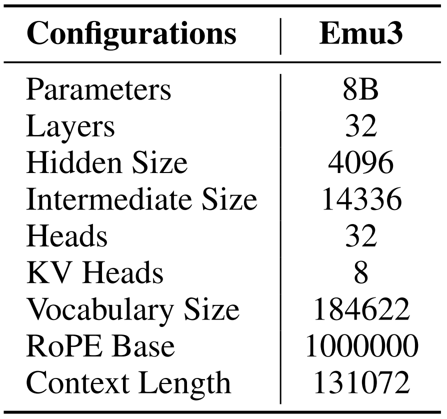

* **预训练**

- **训练数据**

首先需要定义多模态数据格式。Emu3 原生集成文本条件信息用于图像视频生成，将图像视频在保持宽高比的前提下缩放到面积接近$$512 \times 512$$的尺寸，然后使用视觉分词器生成视觉 token。接着引入五个特殊 token 来融合文本与视觉数据，构建类似文档的输入格式用于训练。最终训练数据结构如下：

$$[\text{BOS}]~\{\text{caption text}\}~[\text{SOV}]~\{\text{meta text}\}~[\text{SOT}]~\{\text{vision tokens}\}~[\text{EOV}]~[\text{EOS}]$$

> * **`[BOS]`**&#x548C;**`[EOS]`**&#x662F;文本分词器原有的特殊 token；**`[SOV]`**&#x6807;记视觉输入的开始；**`[SOT]`**&#x6807;记视觉 token 的开始；**`[EOV]`**&#x8868;示视觉输入的结束
>
> * 在视觉 token 中插&#x5165;**`[EOL]`**&#x548C;**`[EOF]`**&#x5206;别表示换行和帧边界
>
> * **`meta text`**&#x4EE5;纯文本形式包含图像的分辨率信息；对于视频，则还包括分辨率、帧率和时长
>
> * 将部分数据集中&#x7684;**`caption text`**&#x5B57;段移&#x81F3;**`[EOV]`**&#x4E4B;后，从而构建面向视觉理解任务的数据

* **训练细节**

由于 Emu3 中的视觉信号已完全转换为离散 token，仅&#x9700;**使用标准交叉熵损失进行 next-token 预测**&#x4EFB;务。为防止视觉 token 主导学习过程，对与视觉 token 相关的损失施加$$0.5$$的权重。

Emu3 在预训练中采用极长上下文长度以处理视频数据，结合**张量并行 TP**、**上下文并行 CP** 和**数据并行 DP**。将文本-图像数据打包至最大上下文长度以充分利用计算资源，同时确保完整图像在打包过程中不被分割。预训练分为两个阶段：

> * **Step 1**：不使用视频数据，从零开始&#x4EE5;**`5120`**&#x7684;上下文长度训练文本和图像数据
>
> * **Step 2**：引入视频数据，上下文长度提升&#x81F3;**`131072`**

两个阶段均使用$$5 \times 10^{-5}$$的初始学习率，并采用余弦退火策略将学习率降至零。

* **后训练**

- **视觉生成**

**质量微调 QFT（Quality Fine-Tuning）**

在预训练之后，针对视觉生成任务进行后训练以提升生成质量。使用高质量数据进行质量微调，模型继续使用标准交叉熵损失进行 next-token 预测，但仅对视觉 token 施加监督。对于 QFT 中的图像数据，选择多样化的高质量来源，并基于三种主流偏好评分的平均值进行筛选：**HPSv2.1**、**MPS&#x20;**&#x548C; **LAION** 审美评分。在 QFT 过程中，将训练数据分辨率从 512 像素提升至 720 像素以改善生成质量。对于视频数据，从高质量来源采样，并施加严格的分辨率和光流过滤以确保质量。在训练末期，采用退火策略将学习率线性衰减至零。

**直接偏好优化 DPO**

利用人类偏好数据提升模型性能。数据集构建分为三步： &#x20;

> 1. 对每个用户收集的 prompt $$p$$，使用 QFT 模型执行 8–10 次推理，构建初始数据池$$x$$ &#x20;
>
> 2. 由三位评审员对每个 prompt 的输出进行评估，重点关注视觉吸引力和与提示的一致性 &#x20;
>
> 3) 根据评分，选取最高分样本作&#x4E3A;**`chosen`**&#x6837;本，最低分作&#x4E3A;**`rejected`**&#x6837;本，形成三元组 $$(p_i, x^{\text{chosen}}_i, x^{\text{rejected}}_i)$$ 用于后续训练。
>
> > 这里直接存储数据构建过程中生成的 token，以便在后续训练中复用，从而避免因重新分词导致的重建差异。

Emu3-DPO 通过联合最小化 DPO 损失和 next-token 预测的交叉熵损失来微调 QFT 模型。

* **视觉-语言理解**

预训练模型还需经过两阶段后训练以提升视觉-语言理解能力： &#x20;

> 1. **图像到文本训练**：将图像理解数据与纯语言数据混合训练，且在纯文本预测任务中忽略与视觉 token 相关的损失。每张图像在保持原始宽高比的前提下缩放至约$$512 \times 512$$分辨率
>
> 2. **指令微调**：从 LLaVA-OneVision 中采样子集问答对，以增强模型遵循视觉指令的能力。对于分辨率低于$$512 \times 512$$或高于$$1024 \times 1024$$的图像，分别缩放至下限或上限分辨率并保持宽高比；其余图像则保留原始分辨率

### 5.2.3 OmniGen2（b-2）

* **模型结构**

在原始的 OmniGen 中，对文本采用自回归建模，对图像生成采用基于扩散的方法，二者均在 Transformer 架构中实现，并使&#x7528;**`phi-3`**&#x521D;始化。OmniGen2 进行了进一步的探索：

> 1. 将 phi-3 替换为 Qwen 模型，但使用了更强的 LLM 后，图像生成质量有所下降
>
> 2. 探索混合专家 MoE 策略，以独立路由文本和图像参数，类似于 LMfusion 中采用的方法。但是若将图像分支的参数初始化为从文本分支导出的参数，其性能反而不如直接对图像通路进行随机初始化

这些结果表明，**为文本优化的参数并不适用于图像建模**。因此在 OmniGen2 中，将扩散过程解耦，并对其参数进行随机初始化。

**`MetaQuery`**&#x548C;**`BLIP-3o`**&#x7B49;方法采用可学习的 Query token 来编码用于扩散生成的条件信息。这些方法将所有条件信息压缩为固定数量的 token，这不可避免地限制了表示能力并导致信息损失。并且这种基于 token 的压缩方式难以处理长文本渲染任务。因此，**OmniGen2 采用多模态交错条件在 MLLM 中产生的隐藏状态作为扩散解码器的输入**，而非依赖一组固定的可学习 Query token。

现有 MLLM 主要使用 ViT 进行图像建模，但 ViT 往往难以捕捉细粒度的视觉细节，从而在图像生成任务中降低图像保真度。虽然对 ViT 特征进行端到端训练可在一定程度上缓解这一限制，但会引入额外的复杂性，特别是在平衡图像理解与生成任务之间。近期的工作&#x5982;**`BAGEL`**&#x548C;**`Mogao`**&#x901A;过双重编码图像，在模型中同时引入 VAE 和 ViT 特征来解决这个问题。但这种双编码方法需要大量的架构修改以及复杂的注意力机制，从而显著增加了开发复杂度。此外，将模型适配到这种新架构还需要重新训练，以恢复其图像理解能力。因此 **OmniGen2 仅将 VAE 作为扩散解码器的输入，而没有将其集成到 MLLM 中**。该策略保留了 MLLM 的架构简洁性，并在无需大规模重训练的前提下维持其多模态理解能力。

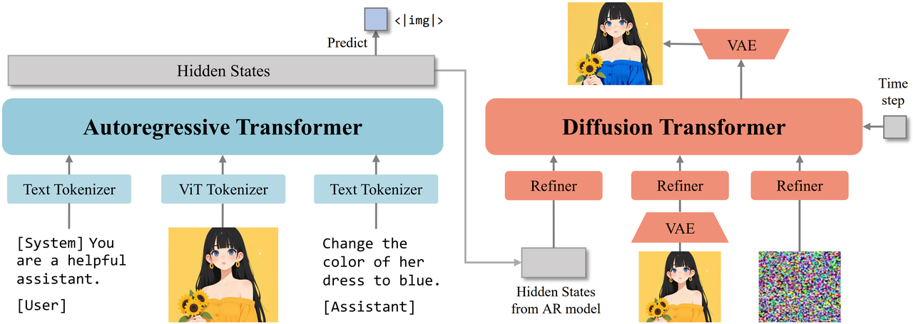

* **多模态大语言模型 MLLM**

OmniGen2 利用 MLLM Transformer 来处理文本和视觉输入。对于文本生成任务，采用自回归语言头；而图像生成则通过专用的扩散模块完成。Transformer 主干网络&#x4EE5;**`Qwen2.5-VL-3B`**&#x521D;始化，并引入一个特殊 token **`<|img|>`**，用于在输出序列中显式指示图像生成。当模型遇到该 token 时，将触发 Diffusion Decoder 合成对应的图像，MLLM 产生的隐藏状态作为扩散解码器的条件输入。但由于这些隐藏状态可能缺乏详细的视觉信息，进一步通过从输入图像中提取的 VAE 特征对解码器进行增强。随后，Diffusion Decoder 采&#x7528;**`Rectified Flow`**&#x751F;成图像。

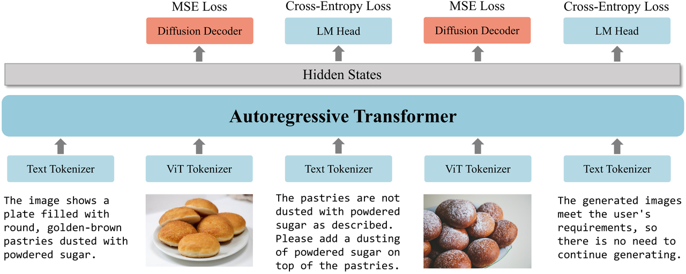

* **Diffusion Transformer**

OmniGen2 采用简单的 Diffusion Transformer 架构，直接拼接来自 MLLM、VAE 和噪声的特征，从而在这些模态上执行联合注意力机制。借鉴 Lumina-Image 2.0 的思想，多个输入条件首先通过一&#x4E2A;**`Refiner Network`**&#x8FDB;行处理，以确保对齐后再送入 Transformer 层。Diffusion Decoder 包&#x542B;**`32`**&#x5C42;，隐藏层维度&#x4E3A;**`2520`**，总参数量约&#x4E3A;**`4B`**。由于显式引入了 VAE 特征，MLLM 中对应图像的隐藏状态变得不那么关键。为降低计算开销，在 MLLM 中丢弃与图像相关的隐藏状态，仅保留与文本 token 相关的部分。此外在 Diffusion Transformer 中采用了 3D RoPE，是对 Qwen MRoPE 的改进。

* **多模态旋转位置编码 MRoPE**

OmniGen2 提出新的位置编码：Omni-RoPE，用于多样化且复杂的任务需求，尤其是图像编辑和上下文内生成。Omni-RoPE 被分解为三个独立模块：

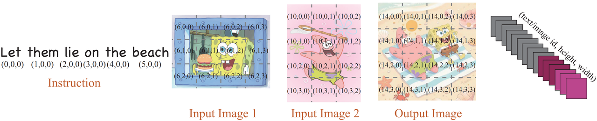

> 1. **序列与模态标识符**$$\text{id}_\text{seq}$$：主要作用是区分来自不同模态和序列的 token。关键在于将每张图像视为一个完整的语义单元，因此属于同一图像的所有 token 被赋予相同且恒定的 ID。对于文本 token，该 ID 随每个后续 token 单调递增，起到标准一维位置索引的作用以保留词序。这里等同于 Qwen2-VL 中原始的 MRoPE。
>
> 2. **二维空间高度坐标$$h$$**：表示图像 token 的归一化垂直位置。
>
> 3) **二维空间宽度坐标$$w$$**：表示图像 token 的归一化水平位置。对于所有非图像 token，两个空间坐标$$(h, w)$$均设为零。

这里的难点在于这些组件如何协同工作。对于每个图像实体，无论是源图像还是目标图像，其空间坐标$$(h, w)$$均从$$(0, 0)$$独立计算，确保了处于对应位置的 token 具有相同的空间 Embedding，从而在编辑过程中强烈鼓励一致性并保留未修改区域。尽管空间坐标是局部定义的，但唯一的序列与模态标识符 $$\text{id}_\text{seq}$$ 提供了一种明确机制，用以区分不同的图像实体。这种整体设计在纯文本输入时可自然退化为标准的一维位置编码，使 MRoPE 成为一个灵活且鲁棒的框架，能够有效支持全系的多模态操作。

* **训练数据**

> - **多模态理解**：直接采&#x7528;**`LLaVA-OneVision`**&#x7684;数据。
>
> - **文生图 T2I 训练**：整合&#x7EA6;**`140M`**&#x5F00;源图像（来自 Recap-DataComp、LAION-Aesthetic、BLIP3-o 等多个高质量来源）+ **`10M`**&#x81EA;采图像（使用 Qwen2.5-VL-72B 自动生成合成标注）
>
> - **图像编辑任务**：在现有公开编辑数据集（&#x5982;**`SEED-Edit`**、**`UltraEdit`**&#x7B49;）基础上，自建高质量、高多样性、指令精准的新编辑数据集，以弥补开源数据在质量、指令准确性和任务覆盖上的不足

* **上下文感知数据 In-Context Data**

支持模型从给定图像中提取视觉概念，如特定物体或人物，并在新图像中复现，即免微调的个性化生成

**上下文生成 In-Context Generation**

利用视频帧序列，同一主体在不同姿态、光照、视角下的自然变化，流程：

> 1. 从视频中抽取关键帧，选定基准帧
>
> 2. 用 Qwen2.5-VL 识别语义显著主体，结合 GroundingDINO 定位 + SAM2 跟踪
>
> 3) 选取外观差异最大的有效帧对，确保语义一致但视觉多样
>
> 4) 引入 VLM 过滤跟踪错误，用 FLUX.1-Fill-dev 更换背景以增强泛化
>
> 5. 基于 DINO 相似度和 VLM 质量评估筛选样本
>
> 6. 自动生成对象描述与自然语言指令

输出`(指令, 改写输入图, 原始目标图)`三元组，用于多主体上下文生成训练

**上下文编辑 In-Context Editing**

从上下文图像中提取元素，用于编辑另一张目标图像，构建方式：

> * 同一视频中选两帧：一作上下文，保留主体+新背景；一作目标，移除主体保留背景
>
> * 使用 FLUX.1-Fill-dev 分别做 outpainting（上下文）和 inpainting（目标）；
>
> * 由 Qwen2.5-VL-72B 生成描述“如何从输入图变为目标图”的自然语言指令，并融合上下文中的对象描述。

实现了**跨图像元素迁移+指令化编辑**的联合监督。

* **图像编辑数据**

**高质量 Inpainting 数据**

现有 inpainting 数据集存在图像质量差、指令与图像不匹配两大缺陷。解决方案：

> * 从高质量 T2I 图像出发，用 FLUX.1-Fill-dev **随机 inpaint（不输入指令）**，得到 (inpainted → original) 对；
>
> * 再用 MLLM（如 Qwen2.5-VL）**反向生成精准编辑指令**；
>
> * 结果：指令与图像高度对齐，构建出高精度编辑数据集。

**视频驱动的编辑对**

传统 inpainting 无法支持动作、表情、物体移动等动态编辑。方法：

> * 按场景分割视频，避免跨场景配对；
>
> * 利用 RGB/HSV 差异检测场景边界；
>
> * 在同场景内筛选**仅局部变化**的帧对（通过 DINOv2 + CLIP 过滤大/小变化对）；
>
> * 提出**分块颜色直方图比对法**：高效判断视角是否一致，过滤因摄像机运动导致的无效对；
>
> * 最终用 Qwen2.5-VL-72B 为保留的帧对生成精确编辑指令。

实现了**真实世界动态编辑**，如挥手、转头、物体位移的数据构建。

* **交错多模态序列数据 Interleaved Data**

**交错视频帧 Interleaved Frames**

从视频中提取**同场景内**或**跨场景**的最多5帧序列；用 MLLM（Qwen2.5-VL-7B-Instruct）为每对连续帧生成描述性 caption，涵盖：

> * 动作/行为变化
>
> * 环境/背景差异
>
> * 外观变化

构建 **800K 条**多模态交错序列，用于预训练模型处理连续视觉-语言流的能力。

**反思数据 Reflection Data**

借鉴 LLM 的 test-time scaling 与 self-reflection 机制。让多模态模型具备“自我批评-迭代优化”能力。构建流程：

> 1. 用当前模型生成 T2I 图像
>
> 2. 用强大多模态模型（如 Doubao-1.5-pro）评估图像是否符合指令
>
> 3) 若不符，生成结构化反思：① 指出缺陷；② 提出修改建议
>
> 4) 将 (原始指令, 生成图, 反思文本) 组成训练样本，微调模型
>
> 5. 迭代多轮，形成多阶反思数据

首次系统探索**反思机制在多模态生成中的应用**，为未来引入在线强化学习奠定基础。

* **训练策略**

MLLM 以 Qwen2.5-VL 初始化，训练过程中大部分参数保持冻结，以保留其多模态理解能力，仅更新新引入的特殊 token **`<|img|>`**。扩散模型从零开始训练，首先在文本到图像 T2I 生成任务上进行训练，随后采用混合任务训练策略以兼顾多个目标。在反思训练 reflection training 阶段，所有模型参数均被解冻，使模型能够生成反思性的文本描述，并迭代优化图像输出。

### 5.2.4 X-Omni（b-2）

* **模型结构**

**X-Omni** 基于一个自回归模型构建，包含一&#x4E2A;**`SigLIP-VQ tokenizer`**&#x4EE5;及用于图像生成的扩散解码&#x5668;**`Diffusion Decoder`**。这使图像和文本输入输出均可在统一的自回归框架内实现类文本的分词 Tokenization 与逆分词Detokenization，从而在统一的自回归架构中整合图像与文本的 token。

1. **图像分词 Image Tokenization**

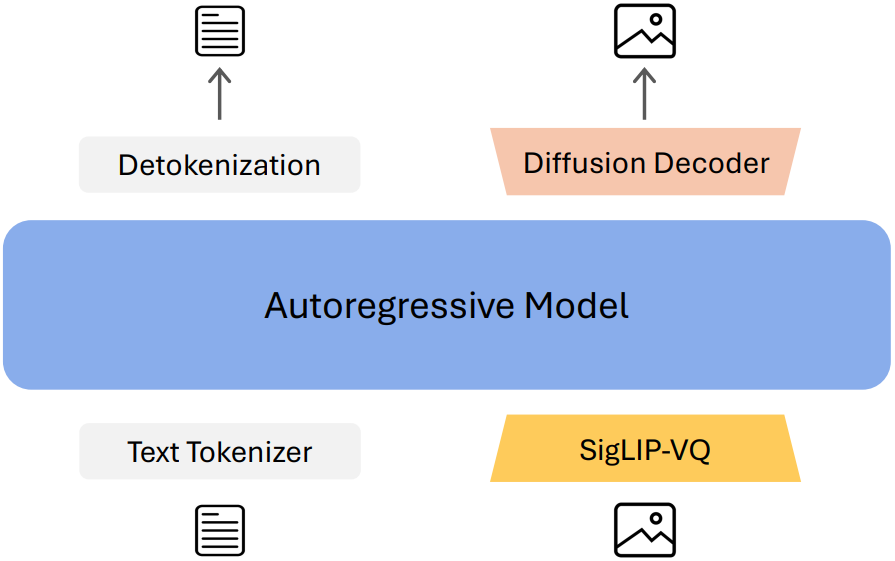

图像 tokenizer 是在视觉理解任务上进行训练的。为了将连续的图像转换为离散 token 的同时保留丰富的语义信息，作者选择预训练的**`SigLIP2-g ViT`**作为视觉语义提取器。在 ViT 编码器基础上，引入一个向量量化器作为图像 tokenizer，并将其在视觉理解任务上与预训练的**`Qwen2.5-1.5B`**对齐。该向量量化器采用大小&#x4E3A;**`16,384`**、维度&#x4E3A;**`2,048`**&#x7684; codebook，并在视觉 tokenizer 与 LLM 之间使用残差块作为适配器。视觉编码器与向量量化器共同构成 SigLIP-VQ 图像 tokenizer。在后续训练阶段中，这两个组件均保持冻结状态，以确保分词过程的稳定性与一致性。

* **自回归建模 Autoregressive Modeling**

将图像分词为离散 token 后，视觉 token 与语言 token 可在自回归架构下通过多模态建模自然地统一起来。作者采&#x7528;**`Qwen2.5-7B`**&#x4F5C;为基础预训练模型。为了将视觉感知能力融入纯文本的语言模型中，在原始 Transformer 层前后各插入四个**随机初始化的、专用于视觉的**模块。这些视觉专用模块采用与标准 Transformer 块相同的结构配置，仅对图像 token 进行操作，不影响文本 token。此外还为图像 token 引入了随机初始化的 Embedding 层和分类头。相比原始语言模型，这些架构的修改并未增加额外的基础设施复杂性，同时完全兼容张量并行、流水线并行和上下文并行等分布式训练策略。

对于视觉生成与理解任务，视觉 token 和语言 token 被拼接成一个统一的多模态序列，并输入自回归模型进行下一 token 预测训练。

> * &#x5728;**理解任务**&#x4E2D;，仅监督语言 token
>
> * &#x5728;**生成任务**&#x4E2D;，仅监督视觉 token

为支持任意图像分辨率，在视觉 token 前添加一个分辨率信息前缀，格式为：

$$\text{language tokens } \langle \text{SOM} \rangle\ \text{height width } \langle Image \rangle\ \text{visual tokens } \langle \text{EOM} \rangle\ \text{language tokens}$$

其中特殊 token $$\langle \text{SOM} \rangle$$和$$\langle \text{EOM} \rangle$$分别表示多模态序列中的起始与结束标记。**`height`**和**`width`**是代表二维图像 token 空间尺寸的文本 token。在特殊token$$\langle \text{Image} \rangle$$之后，提供展平后的图像 token，其长度为$$\text{height}\times\text{width}$$个 token。作者使用与原始语言模型一致的一维**`RoPE`**。

* **扩散解码器 Diffusion Decoder**

使用一个充分预训练的扩散模型作为视觉解码器，从离散的语义 token 中重建图像像素。具体来说就是添加一个线性层，将语义 token 映射到**`FLUX.1-dev`**的特征通道维度，并将其集成到中间层特征中。扩散解码器的训练目标是重建图像，以图像 tokenizer 提取的语义 token 作为输入。

* **GRPO 强化学习训练**

为了弥补训练过程中扩散解码器所使用的语义 token 与自回归模型生成的语义 token 之间的分布差异，采用强化学习训练自回归模型。这种贯穿整个采样过程的引导有助于缓解误差传播，同时确保自回归模型的输出分布符合扩散解码器的期望。强训练流程如下图：

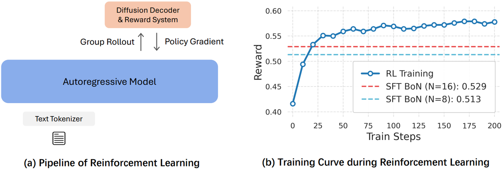

1. **RL 算法**

采用 GRPO 算法，对于每个文本 prompt$$p \sim D$$，使用旧策略$$  \pi_{\theta_{\text{old}}}  $$生成一组$$  G  $$条轨迹$$\{o_1, o_2, ..., o_G\}$$。这些轨迹随后由固定的扩散解码器解码，得到对应的图像$$\{I_1, I_2, ..., I_G\}$$，每幅图像通过奖励函数评分，获得标量值$$\{r_1, ..., r_G\}$$。作者按照原始 GRPO 流程对该组奖励进行归一化，计算优势值$$A_i$$。策略模型$$  \pi_\theta  $$通过最大化以下目标函数进行优化：

$$J_{\text{GRPO}}(\theta) = \mathbb{E}_{p \sim D,\ \{o_i\}_{i=1}^G \sim \pi_{\theta_{\text{old}}}(\cdot|p)} \left[ \frac{1}{G} \sum_{i=1}^{G} \left( \min \left( \frac{\pi_\theta(o_i|p)}{\pi_{\theta_{\text{old}}}(o_i|p)} A_i,\ \text{clip} \left( \frac{\pi_\theta(o_i|p)}{\pi_{\theta_{\text{old}}}(o_i|p)},\ 1 - \epsilon,\ 1 + \epsilon \right) A_i \right) - \beta D_{\text{KL}}(\pi_\theta \| \pi_{\theta_{\text{ref}}}) \right) \right]$$

其中$$  \epsilon  $$和$$  \beta  $$是超参数，$$\pi_{\theta_{\text{ref}}}$$是参考策略，$$D_{\text{KL}}$$使用无偏估计进行估算。这能够在最大化奖励的同时控制与稳定参考模型的偏离程度，从而高效地微调策略。

* **奖励函数设计**

奖励函数包含多个部分，每个部分可以监督图像生成质量的不同方面。这在强化学习过程中可以提供全面指导，涵盖**美学质量**、**图文对齐**、**文本渲染准确性**等关键维度。各个奖励信号通过加权聚合机制组合，形成最终的奖励分数，指导强化学习的优化过程。这种多维度的方法确保模型能够同时平衡多种质量标准，生成在多个维度上符合人类预期的高保真图像。

> * **人类偏好得分**：采用**`HPSv2`**来评估美学质量和人类偏好一致性。能有效预测人类对生成图像的偏好，并在不同图像分布上表现出强泛化能力，是朝向美观且符合人类审美方向优化的关键组件。
>
> * **统一奖励得分**：**`HPSv2`**&#x5728;**`224×224`**&#x5206;辨率下运行，但模型专注于高分辨率图像生成。为此引入统一奖励模型来进行人类对齐评估。将多个质量维度聚合为一个统一分数，为强化学习提供整体反馈。
>
> * **图文对齐得分**：为确保输入 prompt 与生成图像之间的语义一致性，利&#x7528;**`Qwen2.5-VL-32B`**&#x8BA1;算对齐奖励。借助其强大的图像理解能力，可以判断生成图像是否准确反映了 prompt 中描述的内容。这个对齐分数量化了文本描述与视觉内容之间的对应关系，鼓励生成上下文相关的图像，同时减少语义幻觉。
>
> * **OCR 准确率得分**：对于需要在图像中生成文字的场景，实现了基于 OCR 的奖励机制，用于量化渲染文本相对于真实标签的保真度。作者采用**`GOT-OCR2.0`**和**`PaddleOCR`**联合评估图像，并计算文本渲染的准确率得分。这为文本到图像合成提供了关键指导，能够可靠地生成清晰且精确的文本内容。

### 5.2.5 Qwen-Image（b-2）

* **动机**

图像生成模型，包括文本到图像生成 **T2I**（**T**ext-**to**-**I**mage generation）和图像编辑 **TI2I**（**T**ext-**I**mage-**to**-**I**mage）使计算机能够根据文本提示合成或修改视觉上精彩且语义连贯的内容。过去几年取得了显著进展，尤其是基于扩散模型的架构，能够在捕获细粒度语义细节的同时生成高分辨率图像。

尽管取得了这些进展，但仍存在两个关键挑战：

> 1. 对于文本到图像生成，将模型输出与复杂、多方面的提示对齐仍然是一个重大障碍。即使目前最好的模型，例&#x5982;**`GPT Image 1`**&#x548C;**`Seedream 3.0`**，在面对需要多行文本渲染、中文等非字母语言渲染、本地化文本插入或文本与视觉元素无缝集成的任务时，会遇到困难
>
> 2. 对于图像编辑，实现编辑输出与原始图像之间的精确对齐面临双重挑战：
>
>    1. 视觉一致性，仅修改目标区域，同时保留所有其他视觉细节，例如在不改变面部细节的情况下更改头发颜色
>
>    2. 语义一致性，在结构变化期间必须保留全局语义，例如在保持身份和场景一致性的同时修改人物的姿势

Qwen-Image 旨在处理复杂的文本提示并进行精确的图像编辑，通过以下关键技术实现卓越的性能：

> * **数据处理流程**：为了解决提示对齐的挑战，使用了一套先进的数据流程。通过课程学习策略，从简单的文本渲染任务逐步过渡到更复杂的段落和布局敏感的描述，增强了模型对多种语言，特别是中文的理解能力
>
> * **多任务学习框架**：Qwen-Image 采用了一个创新的多任务学习框架来应对图像配准问题。将**文本到图像`T2I`**、**图像到图像`I2I`**和**文本-图像到图像`TI2I`**三种任务无缝整合。通过将输入图像编码为**语义特征**和**重构特征**两种互补表示，结&#x5408;**`MMDiT`**&#x67B6;构，实现了同时保持语义连贯性和视觉一致性的能力。
>
> * **高效大规模训练**：为了确保训练的效率和稳定性，模型采用了一个**生产者-消费者框架**，并利用**`TensorPipe`**和**`Megatron`**进行分布式数据加载和模型训练。这套系统还配备了全面的监控工具，以确保大规模训练过程中的可靠收敛和调试。

* **模型架构**

Qwen-Image 架构基于三个核心组件构建，它们协同工作，实现高保真度的文本转图像生成：

1. **VLM** 是条件编码器，从文本输入中提取特征

2. **VAE** 是图像标记器，将输入图像压缩为紧凑的潜在表示，并在推理过程中将其解码回来

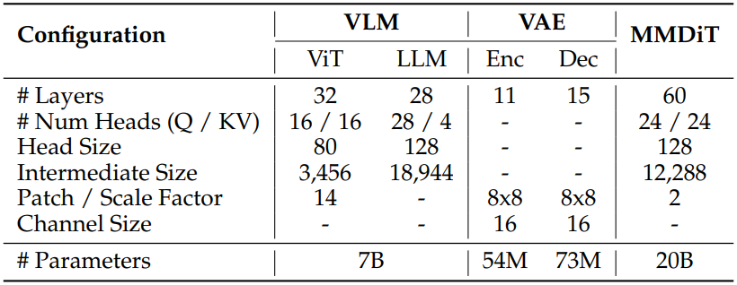

* **MMDiT** 充当主干扩散模型，在文本引导下对噪声和图像潜在特征之间的复杂联合分布进行建模

总参数量达到&#x4E86;**`27B`**（**`7B VLM`** + **`20B MMDiT`**），整体结构如下图：

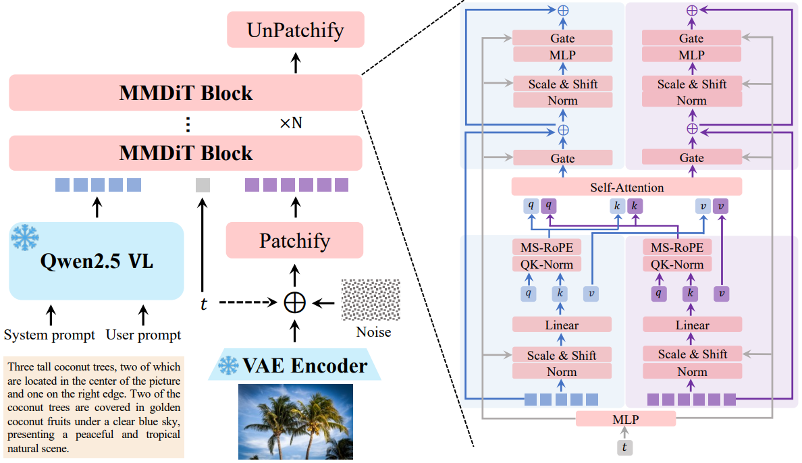

1. **条件编码器：`Qwen2.5-VL`**

负责理解用户的输入，包括纯文本提示和图文结合的复杂指令。选&#x7528;**`Qwen2.5-VL`**&#x4F5C;为文本和视觉特征提取器有三大优势：

> * 其语言和视觉空间已经预先对齐，天生适合图生文任务
>
> * 语言能力强大
>
> * 支持多模态输入，为图像编辑等高级功能奠定了基础

给定用户输入，例如提示和图像，采用 Qwen2.5-VL 来提取特征。为了更好地引导模型生成精细的潜在表征，同时兼顾不同任务中不同的输入模式，分别针对纯文本输入和文本与图像输入设计了不同的系统提示。最后利用 Qwen2.5-VL 主干网络最后一层隐藏状态的潜在表征作为用户输入的表征。

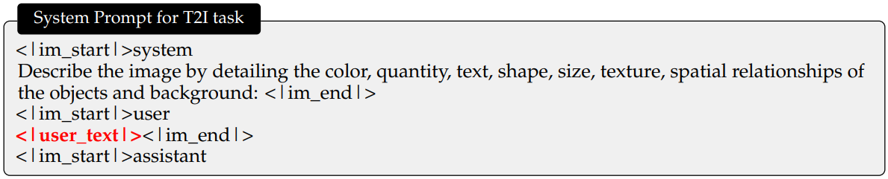

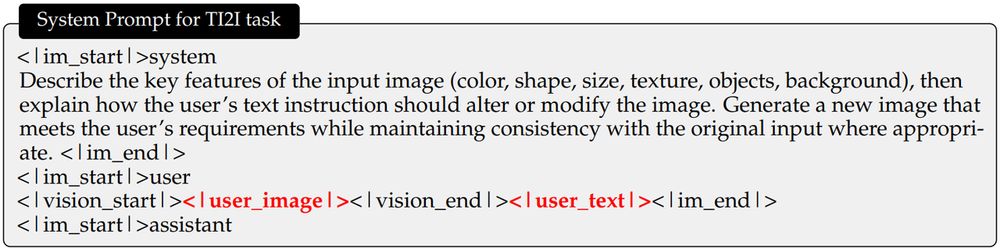

* **图像分词器：`VAE`**

将高清图像压缩成紧凑的潜在表示，并在生成过程结束时将其解码回高清图像。为了同时兼顾图像和未来视频应用，模型采用了一个独特的单编码器、双解码器的 VAE 架构，使用一个兼容图像和视频的共享编码器，以及针对每种模态的独立专用解码器，这可以作为视频模型的骨干网络。具体而言，采用&#x4E86;**`Wan-2.1-VAE`**&#x7684;架构，冻结了其编码器，并专门微调了图像解码器。

> 现有的联合图像-视频 VAE，例如 Wan-2.1-VAE，通常会牺牲性能，导致图像重建能力下降

同时，为了提升对微小文字和细节的重建保真度，团队在一个包含大量富文本文档（PDF、PPT等）的自建数据集上专门微调了图像解码器，最终在文本图像重建质量上取得了 SOTA 表现

> 在训练过程中：
>
> * 平衡重建损失和感知损失可以有效减少网格伪影，这种伪影通常出现在灌木丛等重复纹理中
>
> * 随着重建质量的提高，对抗损失变得无效，因为判别器无法提供有效的指导
>
> 基于以上两点，Qwen-Image 仅使用重建损失和感知损失，并在微调过程中动态调整它们的比例。并且仅微调解码器可以有效增强细节并改善小文本的渲染效果。

* **骨干扩散模型：`MMDiT`**

MMDiT 是一个拥&#x6709;**`60`**&#x5C42;、**`20B`**&#x53C2;数的庞大 Transformer 模型，负责在 VAE 的潜在空间中，根据 Qwen2.5-VL 提供的指引，从随机噪声中逐步生成目标图像。

Qwen-Image 设计了一种多模态可伸缩旋转位置编码 **MSRoPE**（**M**ultimodal **S**calable **RoPE**）。文本输入被视为二维张量，并在两个维度上应用相同的位置 ID，文本被概念化为沿图像对角线连接。这种设计使 MSRoPE 能够利用图像端的分辨率缩放优势，同时在文本端保持与 1D-RoPE 的功能等效，从而无需确定文本的最佳位置编码。

> * 在传统的 MMDiT 块中，文本标记在扁平化图像位置嵌入后直接连接
>
> * Seedream 3.0 引入了 Scaling RoPE，其中图像位置编码移至图像的中心区域，并且文本标记被视为形状为 **`[1, L]`**&#x7684;二维 token，然后使用 2D RoPE 进行图像-文本联合位置编码。虽然这种调整有助于分辨率缩放训练，但文本和图像的某些位置编码行会变得同构，使得模型更难区分文本标记和第 0 行中间行中的图像潜在 token

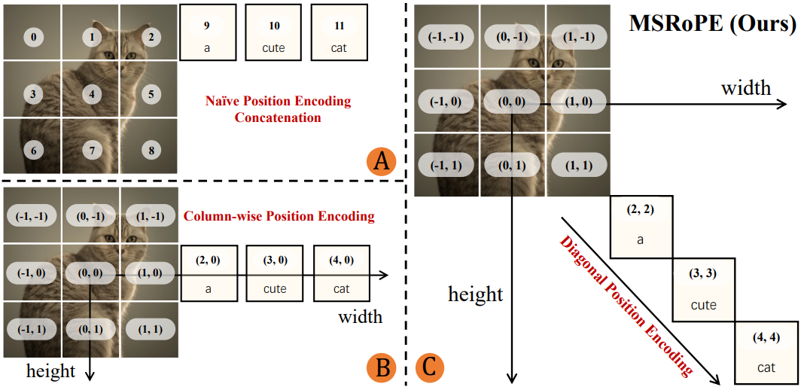

* **数据**

模型性能的飞跃离不开高质量的数据。Qwen-Image团队构建了一个包含数十亿图文对的庞大数据集，并实施了一套先进的数据处理流程。

**数据收集**

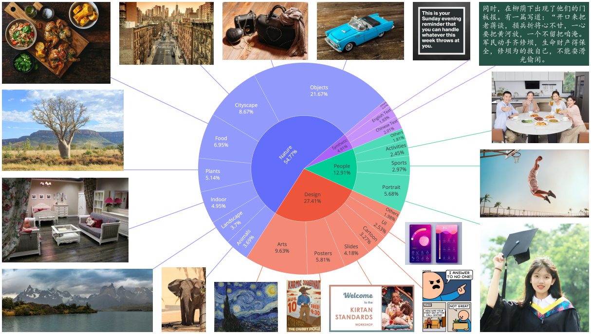

数据集被分为四大领域：

* **自然** (Nature)：占比&#x7EA6;**`55%`**，作为通用图像生成的基础

* **设计** (Design)：占比&#x7EA6;**`27%`**，包含海报、UI、艺术作品等，用于提升艺术风格和复杂布局的遵循能力

* **人物** (People)：占比&#x7EA6;**`13%`**，用于生成高质量、多样化的人物图像

* **合成数据** (Synthetic Data)：占比&#x7EA6;**`5%`**，专门用于强化文本渲染能力

**数据过滤**

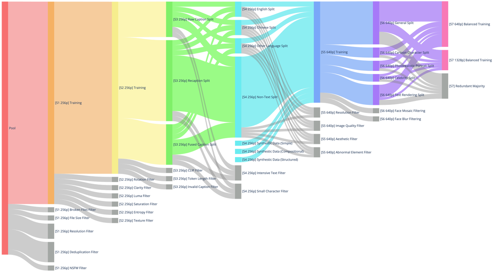

包含7个阶段的渐进式过滤流程，在模型训练的不同时期，对数据进行越来越严格的筛选，确保数据质量和分布的持续优化。

* **初期 S1-S2**：进行基础清洗，如去除损坏文件、低分辨率图像和重复数据

* **中期 S3-S4**：提升图文对齐性，并引入合成的文本渲染数据，专门攻克文本生成难题

* **后期 S5-S7**：聚焦高分辨率和美学质量，进行类别平衡和多尺度训练，确保模型在细节和泛化性上的卓越表现

**数据标注**

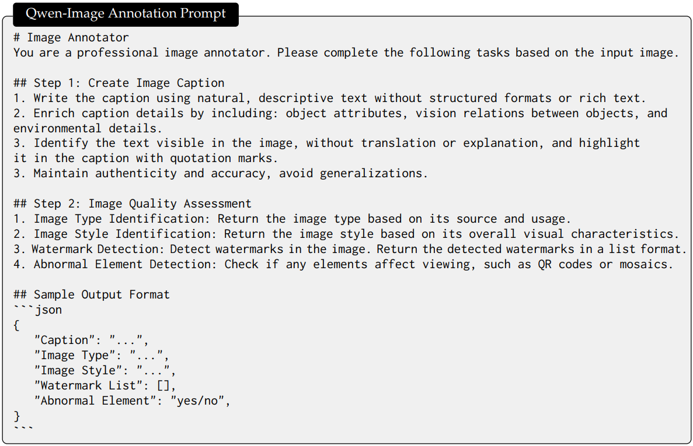

利用 Qwen2.5-VL 来同时执行两项任务：

1. **生成详细的图像描述**：字幕模型能够捕捉图像中的关键细节，包括对象属性、空间关系、上下文以及可见文本

2. **提取结构化元数据**：同时，模型以 JSON 等结构化格式输出关键信息，如图像类型、风格、是否存在水印或二维码等异常元素

这种方法将字幕生成和元数据提取合并为一个流程，大大提高了效率，并能够大规模处理数据集。此外还结合了专家规则和轻量级分类模型，以进一步完善水印验证和内容过滤等关键任务。

**数据合成**

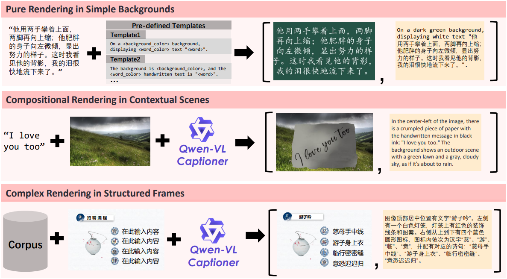

针对自然图像中文本稀疏且不均衡的问题，采用三种策略来“凭空创造”高质量的文本渲染训练数据（如图13所示）：

1. **纯净背景渲染**：在纯色背景上渲染文本，让模型首先学会认识字符本身

2. **情景组合渲染**：将合成文本无缝嵌入到真实场景图片中，如纸上、木板上，并用 Qwen-VL 生成描述性标题，教会模型理解在情景中的文字

3. **结构化模板渲染**：基于PPT、UI等预定义模板，程序化地填充内容，训练模型理解并执行复杂的布局指令

* **训练**

1. **预训练**

采用流匹配 flow matching 训练目标来预训练 Qwen-Image，它通过常微分方程 ODE 稳定学习过程，同时保持与最大似然目标的等价性。形式上，设$$x_0$$是输入图像的潜在向量 latent。潜在表示$$z$$是通过 VAE 编码器$$\mathcal{E}$$对$$x$$进行编码得到的，即$$z=\mathcal{E}(x)$$，其中$$\mathcal{E}:x↦z$$。接下来，从标准多元正态分布中采样一个随机噪声向量$$x_1$$，即 $$x_1∼N(0,I)$$。对于用户输入$$S$$，可能包含文本或提示词以及图像，引导潜在向量$$h$$通过 VLM $$ϕ$$获得，即 $$h=ϕ(S)$$，其中$$ϕ:S↦h$$。此外，扩散时间步长$$t$$从对数正态分布中采样，其中$$t∈[0,1]$$。根据 Rectified Flow 的思想，时间步长$$t$$处的中间潜在变量$$x_t$$及其对应的速度$$v_t$$可以计算为：

$$\begin{cases}
x_t = tx_0 + (1-t)x_1 \\
v_t = \frac{dx_t}{dt} = x_0 - x_1
\end{cases}$$

然后，训练模型来预测目标速度，损失函数定义为模型预测输出$$f_θ(x_t,t)$$与真实速度$$v_t$$之间的均方误差：

$$L=\mathbb{E}_{(x_0,h)∼\mathcal{D},x_1,t}∥v_θ(x_t,t,h)−v_t∥^2$$

其中，$$v_θ(x_t,t,h)$$是模型预测的速度，$$\mathcal{D}$$表示训练数据集。

**生产者-消费者框架**

为了在扩展到大规模 GPU 集群时确保高吞吐量和训练稳定性，采用了一个**生产者-消费者框架**，将数据预处理与模型训练解耦。这种设计使两个阶段能够异步且以最佳效率运行，同时还支持在不中断正在进行的训练过程的情况下对数据流水线进行即时更新。

> * **生产者**：原始图像-标题对首先根据预定义的标准进行过滤，如图像分辨率和检测操作符。然后，使用 Qwen2.5 VL 和 VAE 将筛选出的数据编码为潜在表示。处理后的图像按分辨率分组，放入快速访问缓存桶中，并存储在一个共享的、位置感知的存储区中，这使得消费者无需排队等待即可立即获取数据。生产者和消费者之间的连接通过一个特定的 HTTP 传输层实现，原生支持异步、零拷贝调度所需的 RPC 语义。
>
> * **消费者**：部署在 GPU 密集型集群上，专门用于模型训练。通过将所有数据处理卸载给生产者，消费者节点可以将其全部计算预算用于训练 MMDiT 模型。MMDiT 参数以 4 路张量并行布局分布在这些节点上，每个数据并行组直接从生产者异步拉取预处理的批次数据。

**分布式训练优化**

由于 Qwen-Image 庞大的参数量，仅使&#x7528;**`FSDP`**&#x4E0D;足以让模型适应每个 GPU。因此利&#x7528;**`Megatron-LM`**&#x8FDB;行训练

* **混合并行策略**：结合了数据并行和张量并行，以高效地扩展跨大型 GPU 集群的训练。为了实现张量并行，使用 Transformer-Engine 库构建了 MMDiT 模型，允许在不同程度的张量并行之间进行无缝和自动切换。对于多头自注意力块，采用**头级并行**（head-wise parallelism），以减少与沿头部维度的张量并行相比的同步和通信开销。

* **分布式优化器和激活检查点**：通过对 256 多分辨率图像训练设置的经验比较，作者发现启用激活检查点可以将每个 GPU 的内存消耗减&#x5C11;**`11.3%`**：&#x4ECE;**`71GB`**&#x964D;&#x81F3;**`63GB`**，但代价是将每次迭代时间增加了 **`3.75`** 倍：&#x4ECE;**`2`**&#x79D2;增加&#x5230;**`7.5`**&#x79D2;。基于这种权衡，禁用激活检查点，仅依赖分布式优化器。在训练期间，所有**`all-gather`**操作都以**`bfloat16`**格式执行**，`gradient reduce-scatter`**使用**`float32`**，这既确保了计算效率又提高了数值稳定性。

**训练策略**

采用多阶段预训练策略，旨在逐步提高数据质量、图像分辨率和模型性能：

> 1. **提升分辨率**：逐步提升多分辨率、多长宽比输入的尺寸，从初始&#x7684;**`256×256`**&#x50CF;素，包&#x542B;**`1:1`**、**`2:3`**、**`3:2`**、**`3:4`**、**`4:3`**、**`9:16`**、**`16:9`**、**`1:3`**&#x548C;**`3:1`**&#x591A;种长宽比，然后增加&#x5230;**`640×640`**&#x50CF;素，最后达&#x5230;**`1328×1328`**&#x50CF;素。通过提升图像分辨率，模型可以捕捉更精细的特征，从而获得更好的性能。更丰富的特征空间有助于提高对未见数据的泛化能力。例如，从低分辨率到高分辨率的花卉图像过渡，使模型能够辨别出花瓣纹理和颜色渐变等更精细的细节。
>
> 2. **融合文本渲染**：解决传统视觉数据集中文本内容有限以及由此导致的字形生成性能不佳的问题，特别是对于中文字符，逐步引入包含叠加在自然背景上的渲染文本的图像。这使模型能够首先学习通用的视觉表示，然后逐步获得文本渲染能力。
>
> 3. **细化数据质量**：在预训练早期，利用大规模数据集使模型获得基本的视觉生成能力。随着训练的进行，逐步采用越来越严格的数据过滤机制来选择更高质量的数据。这种渐进式的数据细化确保仅利用最相关和最高质量的样本，以保证训练效率和模型性能。
>
> 4. **平衡数据分布**：在整个训练过程中，逐步平衡数据集中域和图像分辨率的分布。这种调整降低了模型对特定域或分辨率过拟合的风险，否则这可能会损害在代表性不足的设置中生成图像的逼真度和精细细节。通过保持更均匀的数据分布，促进了模型在不同域和分辨率上的稳健泛化。
>
> 5. **通过合成数据增强**：某些数据在真实世界数据集中代表性不足甚至缺失，如超现实主义风格或包含大量文本内容的高分辨率图像。此外，一些高质量数据样本的可用性本身就有限。为了弥补这些差距，采用数据合成技术来生成补充样本，从而丰富数据集并确保更全面地覆盖不同的视觉域。这种增强策略提升了模型在更广泛场景中进行泛化和稳健表现的能力。

* **后训练**

**有监督微调 SFT**

构建了一个分层组织的语义类别数据集，并采用细致的人工标注来解决模型的特定缺陷。这里要求筛选出的图像清晰、细节丰富、明亮且具有逼真感。这种方法可以引导模型生成更具真实感和更精细细节的内容。

**强化学习 RL**

采用了两种不同的 **RL** 策略：

> **直接偏好优化 DPO**：DPO 擅长流匹配（一步）在线偏好建模，并且计算效率高
>
> **组相对策略优化 GRPO**：在训练期间执行 on-policy 采样并使用奖励模型评估每个轨迹

为了利用离线偏好学习的可扩展性优势，使用 DPO 进行相对大规模的 RL，并保留 GRPO 用于小规模的精细化 RL 改进

**直接偏好优化 DPO**：给定相同的 prompt，会使用不同的随机初始化种子生成多张图像。然后，人工标注员从这些候选中选择**最佳**和**最差**的图像。数据分为两类：

> **有参考图像的 prompt**：标注员首先将生成的输出与参考图像进行比较。如果存在显著差异，标注员会将最差的生成结果指定为被拒绝的样本。
>
> **没有参考图像的 prompt**：标注员需要从生成的图像中选择最佳和最差的样本，或者指出所有生成结果都不令人满意。

给定文本隐藏状态$$h$$、被选中的生成图像$$x_0^{win}$$和被拒绝的生成图像$$x_0^{lose}$$，采样时间步长$$t∼(0,1)$$，以此构建输入潜在变量$$x_t^{win}$$和$$x_t^{lose}$$及其对应的速度$$v_t^{win}$$和$$v_t^{lose}$$。然后基于流匹配训练准则构建 DPO 目标：

$$\begin{aligned}
\text{Diff}_{\text{policy}} &= \left( \left\| v_{\theta}(x_t^{\text{win}}, h, t) - v_t^{\text{win}} \right\|_2^2 - \left\| v_{\theta}(x_t^{\text{lose}}, h, t) - v_t^{\text{lose}} \right\|_2^2 \right) \\
\text{Diff}_{\text{ref}} &= \left( \left\| v_{\text{ref}}(x_t^{\text{win}}, h, t) - v_t^{\text{win}} \right\|_2^2 - \left\| v_{\text{ref}}(x_t^{\text{lose}}, h, t) - v_t^{\text{lose}} \right\|_2^2 \right) \\
\mathcal{L}_{\text{DPO}} &= -\mathbb{E}_{h, (x_0^{\text{win}}, x_0^{\text{lose}}) \sim \mathcal{D}, t \sim \mathcal{U}(0, 1)} \left[ \log \sigma \left( -\beta \left( \text{Diff}_{\text{policy}} - \text{Diff}_{\text{ref}} \right) \right) \right]
\end{aligned}$$

其中，$$\text{Diff}_\text{policy}$$和$$\text{Diff}_\text{ref}$$分别表示由策略模型和参考模型计算的偏好差异，$$β$$是一个缩放参数，$$σ(⋅)$$表示 sigmoid 函数。

**组相对策略优化 GRPO**：在使用 DPO 训练之后，按&#x7167;**`Flow-GRPO`**&#x6846;架进行进一步的精细化训练。给定文本隐藏状态$$h$$，流模型预测一组$$G$$张图像$$\{x_0^i\}_{i=1}^G$$和对应的轨迹$$\{x_T^i,x_{T−1}^i,\cdots,x_0^i\}_{i=1}^G$$。在每个组内，优势函数可以表述为：

$$A_i = \frac{R(x_0^i, h) - \text{mean}\left(\{R(x_0^j, h)\}_{j=1}^G\right)}{\text{std}\left(\{R(x_0^j, h)\}_{j=1}^G\right)}$$

其中$$R$$是奖励模型。然后，GRPO 的训练目标为：

$$\mathcal{L}_{\text{GRPO}}(\theta) = \mathbb{E}_{h \sim \mathcal{D}_h, \{x_0^i, \dots, x_T^i\}_{i=1}^G \sim \pi_{\theta}}$$

$$\frac{1}{G} \sum_{i=1}^G \frac{1}{T} \sum_{t=0}^{T-1} \left( \min(r_t^i(\theta) A_i, \text{clip}(r_t^i(\theta), 1-\epsilon, 1+\epsilon) A_i) - \beta D_{\text{KL}}(\pi_{\theta} \| \pi_{\text{ref}}) \right)$$

其中 $$r_t^i(\theta) = \frac{p_{\theta}(x_t^i | x_{t-1}^i, h)}{p_{\theta_{\text{old}}}(x_t^i | x_{t-1}^i, h)}$$

当采样轨迹$$\{x_T^i,\cdots,x_0^i\}_{i=1}^G∼π_θ$$时，有$$dx_t=v_td_t$$用于流匹配采样，其中$$v_t=v_θ(x_t,t,h)$$是预测的速度。然而这种采样策略没有随机性，不适合探索。因此将采样过程重新表述为随机微分方程过程，以增加随机性。SDE 采样过程可以写为：

$$\mathrm{d}x_t = \left( v_t + \frac{\sigma_t^2}{2t} \left( x_t + (1-t)v_t \right) \right) \mathrm{d}t + \sigma_t \, \mathrm{d}w$$

使用 Euler-Maruyama 离散化，得到：

$$x_{t+\Delta t} = x_t + \left[ v_{\theta}(x_t, t, h) + \frac{\sigma_t^2}{2t} \left( x_t + (1-t)v_{\theta}(x_t, t, h) \right) \right] \Delta t + \sigma_t \sqrt{\Delta t} \epsilon$$

使用上述方程来采样轨迹。公式 (5) 中的 KL 散度可以闭合形式求解：

$$D_{\text{KL}}(\pi_{\theta} \| \pi_{\text{ref}}) = \frac{\Delta t}{2} \left( \frac{\sigma_t (1-t)}{2t} + \frac{1}{\sigma_t} \right)^2 \| v_{\theta}(x_t, t, h) - v_{\text{ref}}(x_t, t, h) \|^2$$

**多任务训练**

除了文本到图像 T2I 生成，Qwen-Image 还包含文本和图像输入的多模态图像生成任务，包括基于指令的图像编辑、新视角合成和计算机视觉任务，如深度估计。可以将这些任务广义地视为通用图像编辑任务。

Qwen2.5-VL 原生支持图像输入：从用户提供的图像中提取的视觉块通过 ViT 进行编码，并与文本 token 拼接在一起，形成输入序列。然后提取输入图像和文本指令作为 Qwen-Image MMDiT 文本流的输入：

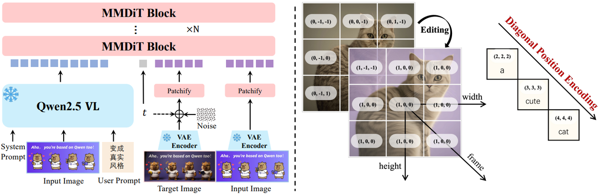

为了使模型能够区分多张图像，除了用于定位单个图像内图像块的高度和宽度之外，还引入一个额外的帧维度来扩展 MSRoPE。作者发现提供来自 VLM 的视觉语义嵌入能够更好地遵循指令，而引入像素级 VAE 嵌入则进一步增强了模型保持视觉保真度和与用户提供图像结构一致性的能力。

### 5.2.6 SEED（b-3）

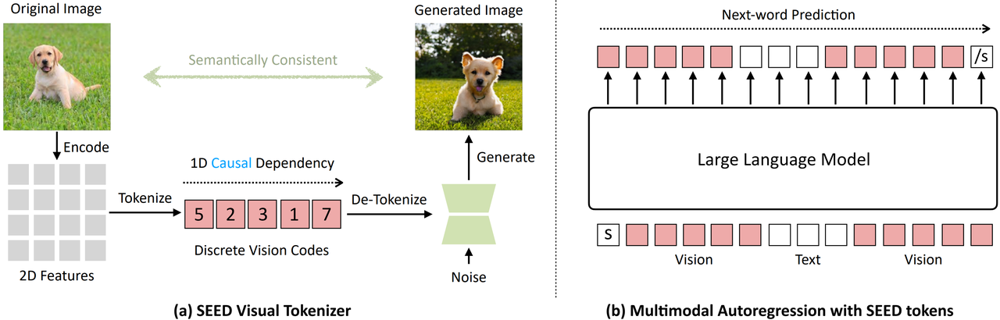

* **视觉分词**

视觉分词主要是将图像表示为一系列离散的 token，目前的一些工作比&#x5982;**`VQ-VAE`**通过重建图像像素来训练向量量化 **VAE；`BEiT v2`**提出了向量量化知识蒸馏 **VQ-KD**（**V**ector-**Q**uantized **K**nowledge **D**istillation），通过重建教师模型的高层特征来训练视觉分词器。

作者提出基于向量量化的图像分词器 **SEED**，用于生成具有**一维因果依赖性**和**高层语义**的离散视觉代码。其由以下模块组成：**ViT Encoder**、**Causal Q-Former**、**VQ Codebook**、**Reverse Q-Former **以及 **UNet Decoder**。其中，ViT Encoder 和 UNet Decoder 分别直接来自预训练&#x7684;**`BLIP-2`**&#x548C;**`Stable Diffusion`**。

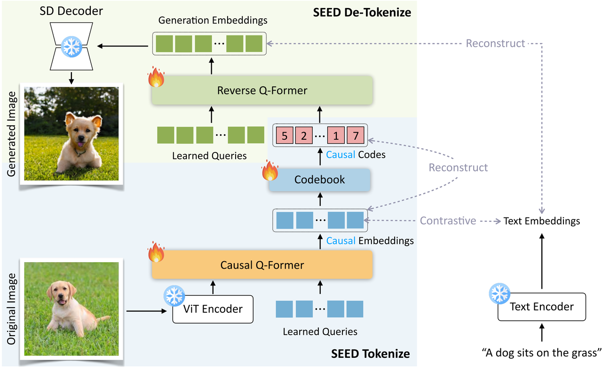

总的来说，训练主要有以下 3 步：

> 1. 训练一个 **Causal Q-Former**，将 ViT Encoder 输出的$$16 \times 16$$ 个 token 二维光栅顺序特征转换为一串具有因果依赖性的 32 个语义 Embedding
>
> 2. 训练一个视觉 **Codebook**，将这些 Casual Embedding 离散化为具有因果依赖的$$32$$个量化视觉代码
>
> 3. 使用 **Reverse Q-Former** 将这些视觉代码解码为$$77$$个生成 Embedding，使其与预训练 Stable Diffusion 模型的潜在空间对齐。

**训练阶段 1：Casual Q-Former**

首先一组$$32$$个可学习的 Query Embedding 与预训练 ViT 图像 Encoder 的特征被输入到 Casual Q-Former 中，用来编码输入图像的固定的$$32$$个 Casual Embedding。Query Embedding 仅能通过带 causal mask 的自注意力层与之前的 Query 交互，并通过交叉注意力层与冻结的图像特征交互。

这里采用对比学习策略，在包含 CC3M、Unsplash 和 COCO &#x7684;**`5M`**&#x56FE;像-文本对上，对 BLIP-2 中的 Q-Former 进行优化。**最大化最终 Casual Embedding 与对应图像描述文本特征之间的相似度，同时最小化其与其他批次中非匹配描述文本特征的相似度**。最终 Casual Q-Former 在综合指标 Recall@mean 上优于 BLIP-2，表明具有因果依赖的输出 Query Embedding 在性能上不比 BLIP-2 中使用双向注意力机制的输出 Embedding 差。

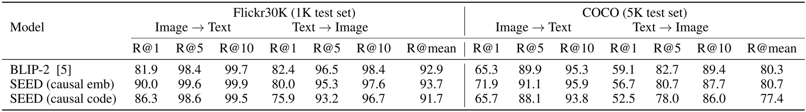

**训练阶段 2：De-tokenization**

在包含 CC3M、Unsplash 和 COCO &#x7684;**`5M`**&#x56FE;像-文本对上训练一个 VQ Codebook，将$$32$$个 Casual Embedding 离散化为$$32$$个量化视觉代码。Quantizer 为每个 Casual Embedding 在 Codebook 中查找最近邻并获取对应代码。这里采用一个多层 Transformer 作为解码器，从离散代码中重建连续的 Casual Embedding。训练过程中，**最大化解码器输出与原始 Casual Embedding 之间的余弦相似度**。

然后引入一个 Reverse Q-Former，从离散代码中重建冻结的 Stable Diffusion 模型的文本特征。一组$$77$$个可学习的 Query Embedding 被输入到 Reverse Q-Former 中。这些 Query Embedding 通过自注意力层相互交互，并通过交叉注意力层与$$32$$个 Casual code 交互，最终输出$$77$$个生成 Embedding。训练&#x65F6;**最小化生成 Embedding 与 SD 文本特征之间的均方误差 MSE 损失**。推理时，这些生成 Embedding 可直接输入 UNet 以解码出逼真的图像。如上表，离散的 SEED token 表现出与 BLIP-2 相当的效果。

如对于图像生成，按照 GILL 的做法，使用 CLIP 相似度作为评估语义一致性的指标，与理论上限 SD 相比，SEED 的性能仅有轻微下降，且在图像生成任务上优于 GILL。

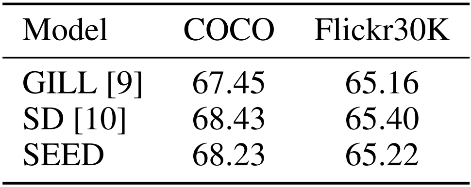

* **多模态自回归建模**

基于预训练的 SEED 分词器，通过在 OPT-2.7B 模型上 LoRA 微调，并使用包含 CC3M、Unsplash 和 COCO 的 5M 图像-文本对，构建了 SEED-OPT2.7B 模型。如图 4 所示，我们执行图像到文本和文本到图像的自回归预训练，以实现统一的多模态理解与生成。

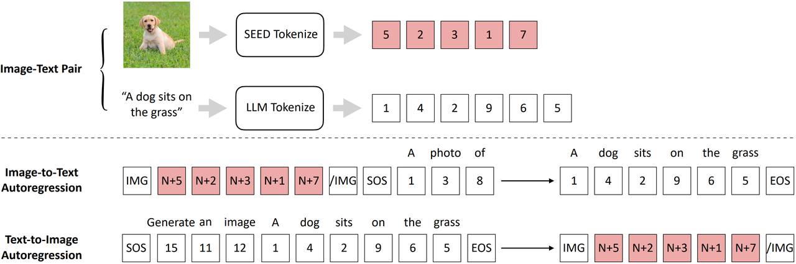

1. **图像到文本自回归**

这个阶段主要是对齐预训练 VQ Codebook 的词汇表与 OPT-2.7B，使用一个全连接层将视觉分词器输出的 Casual code 线性投影到与 OPT-2.7B Word Embedding 相同的维度。投影后的 Casual code 与前缀`A photo of`的 Word Embedding 拼接后作为 OPT-2.7B 的输入，对应图像描述的文本 token 作为生成目标。训练&#x65F6;**冻结 OPT-2.7B，进行 LoRA 微调，目标是预测下一个文本 token**。

* **文本到图像自回归**

联合执行图像到文本和文本到图像的自回归训练，使 LLM 不仅能生成文本 token，还能生成视觉 token。在文本到图像的自回归预训练中，前缀`Generate an image`与图像描述的 Word Embedding 被输入 OPT-2.7B，而来自预训练分词器对应图像的视觉 code 作为生成目标。同样，**OPT-2.7B 被冻结，进行 LoRA 微调，目标是预测下一个视觉 token**。推理时，给定 prompt `Generate an image`和一段文本描述，SEED-OPT2.7B 自回归地预测视觉 token。输出的视觉 token 被送入 Reverse Q-Former 以获得生成 Embedding，再通过 UNet 解码生成逼真图像。

* **性能**

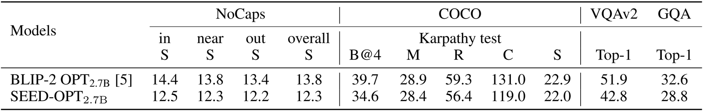

BLIP-2 &#x5728;**`129M`**&#x56FE;像-文本对上训练，SEED-OPT2.7B &#x5728;**`5M`**&#x56FE;像-文本对上训练，借助 SEED 离散视觉 token，取得了有竞争力的零样本图像描述和视觉问答结果。这里 SEED-OPT2.7B 仅通过前缀`A photo of`”的图像到文本自回归预训练，即可理解自由形式的问题并预测开放式答案，从而实现 Zero-Shot 视觉问答。

SEED 能有效促进视觉 token 与大语言模型之间的对齐。SEED-OPT2.7B 在经过 LoRA 微调后，已具备执行文本到图像和图像到文本生成任务的能力。

### 5.2.7 MiniGPT-5（b-3）

近年来，跨模态生成模型成为研究热点。在这一背景下，**MiniGPT-5** 产生，多模态生成领域迈入了一个全新的阶段。它不仅能够生成高质量的图像和文本，还能在两者之间实现无缝切换，为用户提供了更加自然、直观的交互体验。

**MiniGPT-5** 的设计灵感源自对人类视觉与语言处理机制的深刻理解。通过结合大规模语言模型 LLM 与扩散模型 Diffusion Model，该模型实现了从单一模态到多模态生成的跨越式发展。

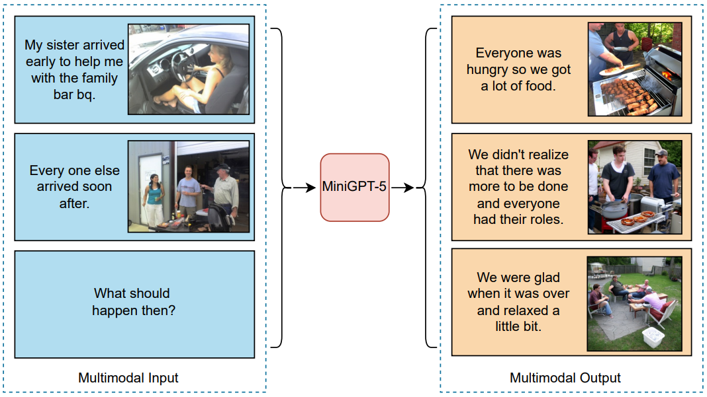

为了赋予大型语言模型多模态生成能力，**MiniGPT-5 **引入了一种新框架，该框架整合了预训练的多模态大语言模型和文本到图像生成模型。核心是引入**生成视觉标记 Generative Vokens**，这些特殊的视觉标记在训练过程中有效地连接了文本和视觉领域。此外，作者采用两阶段训练方法结&#x5408;**无分类器引导 Classifier-Free Guidance** 策略来提升生成输出的质量和连贯性。下图展示了模型结构概览。**MiniGPT-5** 主要由两个模块组成：

> 1. **视觉语言编码模块**，利用预训练的多模态大语言模&#x578B;**`MiniGPT-4`**&#x5904;理多模态输入
>
> 2. **多模态生成模块**，使&#x7528;**`Stable Diffusion`**&#x751F;成视觉输出

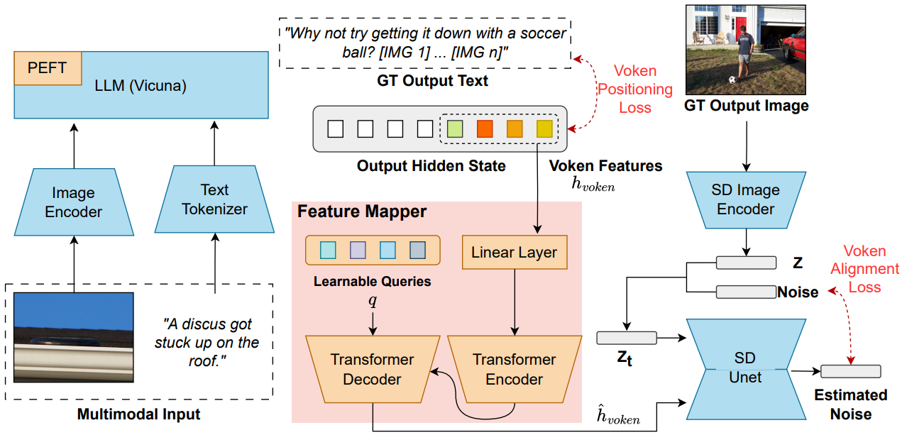

* **多模态理解模块**

近年来，多模态大语言模型的进步主要集中于多模态理解，&#x5982;**`MiniGPT-4`**，使模型能够将图像作为序列化输入进行处理。视觉-语言编码模块可以扩展大语言模型的能力，从单纯的多模态理解转向多模态上下文中的主动生成。生成视觉标记 Generative **Voken**s 在该模块中起着关键作用，它将原始视觉输入转换为大语言模型可以处理并用于后续生成任务的格式。

1. **多模态编码**

每个文本 Token 被嵌入为向量$$e_{\text{text}} \in \mathbb{R}^d$$，而预训练的视觉编码器将每个输入图像转换为特征$$e_{\text{img}} \in \mathbb{R}^{32 \times d}$$。这些 Embedding 被拼接以创建输入提示特征。

* **生成视觉标记 Generative Vokens**

由于原始大语言模型的词汇表$$  V  $$仅包含文本 Token，因此需要在大语言模型和生成模型之间构建桥梁：在大语言模型的词汇表$$  V  $$中引入一组特殊 Token $$V_{\text{img}} = \{\text{[IMG1]}, \text{[IMG2]}, \dots, \text{[IMGn]}\}$$(默认$$n = 8$$)作为生成视觉标记 Generative Vokens。这些 Voken 的输出隐藏状态被用于后续的图像生成，其位置可以表示插入交错图像的位置。在固定 **MiniGPT-4** 的所有预训练权重$$  \theta_{\text{pretrained}}  $$的情况下，可训练参数包括额外的输入 Embedding $$  \theta_{\text{voken\_input}}  $$和输出 Embedding $$\theta_{\text{voken\_output}}$$。

* **参数高效微调 PEFT**

PEFT 在训练 LLM 中至关重要，它被用来使大语言模型适应下游任务而无需大规模重新训练。在 PEFT 时，不是更新模型的所有参数，而是仅训练一小部分参数。这部分通常包括特定任务组件或添加到原始模型架构中的轻量级层。**MiniGPT-5** 将 PEFT 应用&#x4E8E;**`MiniGPT-4`**&#x7F16;码器，增强其基于给定指令或提示处理和生成多模态内容的能力。具体来说，是在整个语言编码&#x5668;**`Vicuna`**&#x4E0A;应&#x7528;**`Prefix Tuning`**&#x548C;**`LoRA`**。此外，在 Transformer 解码器的输入处实现可学习 Query，这是一种常见的序列到序列 Transformer 架构设置，以进一步提高模型的多模态生成能力。解码器中的可学习 Query 使模型能够拥有动态、自适应的表示，从而启动生成过程。当模型需要基于视觉和文本混合输入生成输出时，这种方法尤其有用。结合指令调优，它显著提升了模型在各种数据集上的多模态生成性能。

* **多模态生成模块**

为了将生成视觉标记 Generative Vokens 与文本到图像生成模型对齐，**MiniGPT-5** 设计了一个映射模块用于维度匹配，并引入了 voken 定位损失和 voken 对齐损失：

> **voken 定位损失**&#x5E2E;助模型学习 token 的正确位置
>
> **voken 对齐损失**&#x5219;直接将 voken 与扩散模型的适当条件生成特征对齐

由于 Generative Vokens 的特征梯度可以直接从图像中计算得出，因此不需要对图像进行详细描述，从而实现了无描述学习。

1. **Voken 定位**

首先通过自回归语言模型中的 Next Token Prediction 在文本空间中联合生成文本和 voken。在训练过程中，将 voken $$  V_{\text{img}}  $$ 添加到真实图像的位置，并训练模型在文本生成过程中预测这些 voken。具体来说，生成的 token 表示为：

$$W = \{w_1, w_2, \dots, w_m\}$$

其中$$w_i \in V \cup V_{\text{img}}$$。因果语言建模损失定义为：

$$L_{\text{text}} := -\sum_{i=1}^m \log p(w_i | e_{\text{text}}, e_{\text{img}}, w_1, \dots, w_{i-1}; \theta_{\text{pretrained}}, \theta_{\text{voken\_input}}, \theta_{\text{voken\_output}})$$

其中$$w_i \in V \cup V_{\text{img}}$$。

* **用于图像生成的 Voken 对齐**

接下来，将输出隐藏状态$$h_{\text{voken}}$$与文本到图像生成模型的条件特征空间对齐。为了将 voken 特征$$  h_{\text{voken}}  $$映射到可行的图像生成条件特征$$e_{\text{text\_encoder}} \in \mathbb{R}^{L \times \hat{d}}$$，其中$$  L  $$是文本到图像生成模型中文本编码器的最大输入长度，$$\hat{d}$$是该模型中编码器输出特征的维度，**MiniGPT-5** 构建了一个特征映射模块，包括一个两层多层感知机模型$$\theta_{\text{MLP}}$$、一个四层编码器-解码器 Transformer 模型$$  \theta_{\text{enc-dec}}  $$和一个可学习的解码器特征序列$$q$$。映射特征$$  \hat{h}_{\text{voken}}  $$定义为：

$$\hat{h}_{\text{voken}} := \theta_{\text{enc-dec}}(\theta_{\text{MLP}}(h_{\text{voken}}), q) \in \mathbb{R}^{L \times \hat{d}}$$

为了生成适当的图像，映射特征$$  \hat{h}_{\text{voken}}  $$被用作去噪过程中的条件输入。$$\hat{h}_{\text{voken}}$$应表示与扩散模型生成真实图像对应的条件特征。**MiniGPT-5** 采用潜在扩散模型**`LDM`**损失作为 voken 对齐损失来训练图像生成模块。在训练过程中，真实图像首先通过预训练的变分自编码器**`VAE`**转换为潜在特征$$z_0$$。然后，通过对$$  z_0  $$添加噪声$$  \epsilon  $$来获得带噪声的潜在特征$$z_t$$。使用预训练&#x7684;**`U-Net`**&#x6A21;型$$  \epsilon_\theta  $$计算条件 **LDM** 损失为：

$$L_{\text{LDM}} := \mathbb{E}_{\epsilon \sim \mathcal{N}(0,1), t} \left[ \|\epsilon - \epsilon_\theta(z_t, t, \hat{h}_{\text{voken}})\|_2^2 \right]$$

> 1. **Voken 定位损失**&#x4F7F;模型能够学习 Token 的精确定位。如果没有这一组件，模型将缺乏在推理过程中预测何时生成 Voken 的基本能力。
>
> 2. **Voken 对齐损失**&#x786E;保了 Voken 与扩散模型的适当条件生成特征之间的直接对应关系。如果没有这一损失，模型将无法直接从图像中学习语义 Voken。

这种综合方法利用了预训练模型、专用标记和创新的训练技术，确保了对文本和视觉元素的理解和生成的连贯性。

* **训练策略**

鉴于文本和图像领域之间不可忽视的领域差异，在有限的交错文本-图像数据集上直接训练会导致生成的文本和图像对齐不佳以及图像质量下降。因此，**MiniGPT-5** 采用两阶段训练策略：

> 1. 预训练阶段，专注于单模态生成的粗略特征对齐
>
> 2. 微调阶段，致力于多模态生成的复杂特征学习

此外，为了在整个扩散过程中增强生成 token 的有效性，在整个训练过程中引入了无分类器引导 **CFG**（**C**lassifier-**F**ree **G**uidance）技术。

**两阶段训练策略**

认识到纯文本生成与文本-图像生成之间的显著领域差异，作者提出了一种两阶段训练策略：预训练阶段和微调阶段。首先，在单文本-图像对数据集中，&#x5982;**`CC3M`**，将 voken 特征与图像生成特征对齐。这些数据集中每个样本仅包含一个文本和一个图像，且文本通常是图像的描述。在此阶段，利用描述作为 LLM 的输入，使 LLM 能够生成 voken。由于这些数据集包含图像描述信息，因此引入了一个辅助损失以帮助 voken 对齐，最小化生成特征$$  \hat{h}_{\text{voken}}  $$和文本到图像生成模型中文本编码器$$  \tau_\theta  $$的描述特征之间的距离：

$$L_{\text{CAP}} := \text{MSE}(\hat{h}_{\text{voken}}, \tau_\theta(c))$$

预训练阶段的总损失表示为：

$$L_{\text{Pretrain}} = \lambda_1 \cdot L_{\text{text}} + \lambda_2 \cdot L_{\text{LDM}} + \lambda_3 \cdot L_{\text{CAP}}$$

其中选择的权重值为$$\lambda_1 = 0.01$$、$$\lambda_2 = 1$$、$$\lambda_3 = 0.1$$，以将损失调整到相似的数值范围。

在预训练阶段之后，模型能够为单一文本描述生成图像，但在交错视觉-语言生成任务中表现不佳。这类任务包含多个文本-图像对，并需要复杂的推理来生成文本和图像。为了解决这一问题，在微调阶段，通过交错视觉-语言数据集进一步微调模型，&#x5982;**`VIST`**，使用 **PEFT&#x20;**&#x8FDB;行优化。在这些数据集中，每个样本包含多个步骤，并且文本和图像顺序相关。在此阶段，**MiniGPT-5** 从数据集中构建三种任务类型：

> 1. **仅文本生成**：给定下一张图像，生成相关文本
>
> 2. **仅图像生成**：给定下一个文本，生成相关图像
>
> 3. **多模态生成**：根据上下文生成文本-图像对

微调阶段的损失定义为：

$$L_{\text{Fine-tune}} = \lambda_1 \cdot L_{\text{text}} + \lambda_2 \cdot L_{\text{LDM}}$$

**无分类器引导 CFG**

为了增强生成文本和图像之间的一致性，首先利用无分类器引导的思想进行多模态生成。无分类器引导被引入到文本到图像的扩散过程中。该方法表明，通过对条件生成和无条件生成进行联合训练，生成模型$$  P_\theta  $$可以获得改进的条件结果。在这个场景中，我们希望模型直接关注来自 LLM 的输出特征$$h_{\text{voken}}$$。相比于原始的稳定扩散无条件分布，即丢弃$$\hat{h}_{\text{voken}}$$，在无条件过程中也需要包含整个特征映射模块。因此要突出可训练条件$$h_{\text{voken}}$$，并固定生成模型。在训练过程中，&#x4EE5;**`10%`**&#x7684;概率将$$  h_{\text{voken}}  $$替换为零特征$$h_0 \in \mathbb{R}^{n \times d}$$，从而获得无条件特征：

$$\hat{h}_0 = \theta_{\text{enc-dec}}(\theta_{\text{MLP}}(h_0), q)$$

在推理过程中，$$\hat{h}_0$$被用作负提示，改进后的去噪过程为：

$$\log\hat{P_\theta}(\epsilon_t | z_{t+1}, \hat{h}_{\text{voken}}, \hat{h}_0) = \log P_\theta(\epsilon_t | z_{t+1}, \hat{h}_0) + \gamma \left( \log P_\theta(\epsilon_t | z_{t+1}, \hat{h}_{\text{voken}}) - \log P_\theta(\epsilon_t | z_{t+1}, \hat{h}_0) \right)$$

其中$$  \gamma  $$是控制引导强度的超参数。

**总结**

**MiniGPT-5** 是一款创新的多模态生成模型，通过引入**生成式 Voken** 概念，成功构建了文本与图像特征空间的桥梁，实现了高质量的跨模态生成。其独特的两阶段训练方法显著提升了模型在数据稀缺场景下的表现，同时结合扩散模型和语言模型的优势，能够生成连贯且贴切的图文内容。无论是智能助手、创意设计还是教育领域，**MiniGPT-5** 展现了广泛的应用潜力，为多模态生成技术开辟了新方向。

### 5.2.8 BLIP3-o（b-3）

* **动机**

能够同时支持图像理解和生成的统一多模态架构已成为一个非常有前景的研究方向。**`Janus`**、**`Show-o`**、**`MetaMorph`** 、**`Janus-Pro`**&#x548C;**`LMFusion`**&#x7B49;模型进行了在单一框架内融合图像理解与生成能力的方法。**`GPT-4o`**&#x53C8;进一步，在图像生成和多模态理解方面均展现出很强的能力。

**推理与指令遵循**

将图像生成能力集成到多模态 Autoregressive Model 中，可以继承其预训练知识、推理能力以及指令遵循能力。传统图像生成模型难以达到很强的推理能力和世界知识水平，但当多模态大模型的指令遵循能力被整合进统一架构时，这些能力可能迁移到图像生成过程中。

**上下文学习**

同时支持图像理解和生成的统一模型天然具备上下文学习能力。多模态输出可作为后续生成的上下文，从而无缝支持迭代式图像编辑、视觉对话和逐步视觉推理。这避免了模式切换或对外部处理流程的依赖，使模型能够保持连贯性和任务连续性。

**通用人工智能**

未来的通用人工智能系统需超越纯文本能力，实现对多模态内容的无缝感知、解读与生成。实现这一目标要求从纯文本架构转向统一的多模态架构，使其能够在多种模态间进行推理与生成。此类模型对于构建能以整体性、类人方式与世界交互的通用智能至关重要。

目前用的比较多的统一多模态模型模式如下：

$$\text{Tokens} \longrightarrow [\text{Autoregressive Model}] \longrightarrow [\text{Diffusion Model}] \longrightarrow \text{Image Pixels}$$

有一些工作认为 GPT-4o 也用了这种模式，Autogress Model 与 Diffusion Model 联合利用，可以融合两者的优势。BLIP3-o 也采用这种**`Autoregressive + Diffusion`**的框架。但为了细化模型结构，还有两个关键问题需要解决：

> 1. 应使用 VAE 还是 CLIP 将图像编码为连续特征？
>
> 2. 如何对齐 Autoregressive Model 生成的视觉特征与真实图像特征？ 如何建模这些连续视觉特征的分布，采用简单的 MSE 损失，还是采用基于 Diffusion 的方法？

* **模型选型**

1. **图像编码与重建**

图像生成一般首先通过编码器将图像编码为连续潜在 Embedding ，再由解码器从该 Embedding 重建图像。这种**`Encoding-Decoding`**流程可有效降低图像生成中输入空间的维度，促进高效训练。一般有以下两&#x79CD;**`Encoder-Decoder`**&#x8303;式。

**VAE**

VAE 学习将图像编码到结构化的连续潜在空间中。Encoder 近似给定输入图像下潜在变量的后验分布，Decoder 则从该潜在分布中采样以重建图像。Latent Diffusion Model 在此框架基础上，学习建模压缩后的潜在表示分布，而非原始像素。通过在 VAE 潜在空间中操作，这些模型显著降低了输出空间维度，从而减少计算开销并提升训练效率。去噪步骤完成后，VAE 解码器将生成的潜在 Embedding 映射回原始图像像素。

**CLIP Encoder + Diffusion Decoder**

CLIP 是图像理解任务的基础编码器。但将其用于图像生成比较困难，因为 CLIP 不是为重建任务设计的。**`Emu2`**&#x5C06; CLIP Encoder 与 Diffusion Decoder 配对：使用 EVA-CLIP 将图像编码为连续视觉 Embedding，通过基于 SDXL-base 初始化的 Diffusion Model 进行重建。训练 Diffusion Decoder 时，以 EVA-CLIP 的视觉 Embedding 为条件，从高斯噪声中恢复原始图像，EVA-CLIP 保持冻结。这有效将 CLIP 与 Diffusion 结合为图像自编码器：CLIP Encoder 将图像压缩为语义丰富的潜在 Embedding ，Diffusion Decoder 从中重建图像。虽然 Deocder 基于 Diffusion，但训练采用重建损失而非概率采样目标，因此推理时执行确定性重建。

VAE 与 CLIP-Diffusion 这两种 Encoder-Deocder 架构代表了图像编码与重建的不同范式，各有优势与权衡。

> * **VAE** 将图像编码为低层像素特征，重建质量更优，且作为现成模型易于集成到图像生成训练流程中
>
> * **CLIP-Diffusion** 需额外训练以适配不同 CLIP Encoder，但在图像压缩率方面优势显著

> **例**：
>
> **`CLIP-Diffusion`**&#x67B6;构代&#x8868;**`Emu2`**&#x65E0;论分辨率如何，每张图像均可编码为固定长&#x5EA6;**`64`**&#x7684;连续向量，提供紧凑且语义丰富的潜在 Embedding 。
>
> **`VAE`** Encoder 对高分辨率输入通常生成更长的潜在 Embedding 序列，增加训练计算负担。

* **潜在图像表示**

获得连续图像 Embedding 后，BLIP3-o 使用 Autoregressive 架构对其进行建模。给定用户 prompt，首先通过 Autoregressive Model 的输入 Embedding 层将其编码为 Embedding 序列$$\mathbf{C}$$，并在其后附加一个可学习的 Query 向量$$\mathbf{Q}$$，$$\mathbf{Q}$$向量随机初始化并在训练中优化。当组合序列$$[\mathbf{C}; \mathbf{Q}]$$通过 Autoregressive Transformer 时，$$\mathbf{Q}$$学会关注并从 prompt $$\mathbf{C}$$中提取相关语义信息。最终得到的$$\mathbf{Q}$$为 Autoregressive Model 生成的中间视觉特征或潜在表示，并用来训练以逼近来自 VAE 或 CLIP 的真实图像特征$$\mathbf{X}$$。BLIP3-o 使用均方误差 MSE 和流匹配 Flow Matching 两个目标函数将$$\mathbf{Q}$$与真实图像 Embedding $$\mathbf{X}$$对齐。

**MSE 损失** &#x20;

给定 Autoregressive Model 预测的视觉特征$$\mathbf{Q}$$与真实图像特征$$\mathbf{X}$$，损失定义为：

$$\mathcal{L}_{\text{MSE}} = \|\mathbf{X} - \mathbf{W}\mathbf{Q}\|_2^2$$

其中$$\mathbf{W}$$为可学习投影矩阵，这里使用可学习的线性投影以对齐二者维度。

**流匹配 Flow Matching**  

MSE 损失仅将预测特征$$\mathbf{Q}$$与目标分布的均值对齐。理想的训练目标应建模连续图像表示的概率分布。BLIP3-o 采用流匹配，从先验分布迭代传输样本来采样目标连续分布。给定真实图像特征$$\mathbf{X}_1$$与 Autoregressive Model 编码的条件$$\mathbf{Q}$$，在每步训练中，采样时间步$$t \sim \mathcal{U}(0,1)$$和噪声$$\mathbf{X}_0 \sim \mathcal{N}(0,1)$$。 Diffusion Transformer 学习预测在时间步$$t$$、以$$\mathbf{Q}$$为条件、朝向$$\mathbf{X}_1$$方向的速度$$\mathbf{V}_t = \frac{d\mathbf{X}_t}{dt}$$。BLIP3-o 通过$$\mathbf{X}_0$$与$$\mathbf{X}_1$$的线性插值得到$$\mathbf{X}_t$$：

$$\mathbf{X}_t = t \mathbf{X}_1 + (1 - t) \mathbf{X}_0$$

其解析速度为：

$$\mathbf{V}_t = \frac{d\mathbf{X}_t}{dt} = \mathbf{X}_1 - \mathbf{X}_0$$

最终训练目标定义为：

$$\mathcal{L}_{\text{Flow}}(\theta) = \mathbb{E}_{(\mathbf{X}_1,\mathbf{Q}) \sim \mathcal{D},\, t \sim \mathcal{U}(0,1),\, \mathbf{X}_0 \sim \mathcal{N}(0,1)} \left[ \left\| \mathbf{V}_\theta(\mathbf{X}_t, \mathbf{Q}, t) - \mathbf{V}_t \right\|_2^2 \right]$$

其中$$\theta$$为 Diffusion Transformer 的参数，$$\mathbf{V}_\theta(\mathbf{X}_t, \mathbf{Q}, t)$$表示基于样本$$(\mathbf{X}_1, \mathbf{Q})$$、时间步$$t$$和噪声$$\mathbf{X}_0$$预测的速度。

> 与离散 token 不同，连续表示本身不支持基于采样的多样化生成路径探索。在 MSE 训练目标下，给定 prompt 的预测视觉特征$$\mathbf{Q}$$几乎是确定性的，导致无论视觉解码器基于 VAE 还是 CLIP+ Diffusion 架构，多次推理生成的图像几乎完全相同。这种确定性凸显了 MSE 目标的关键局限：它迫使模型对每个 prompt 仅生成单一固定输出，限制了生成多样性。
>
> Flow Matching 使模型继承 Diffusion 过程的随机性，从而在相同 prompt 条件下生成多样化的图像样本，促进对输出空间的更广探索。但此灵活性以增加模型复杂度为代价：流匹配引入了比 MSE 更多的可学习参数。
>
> 综上，BLIP3-o 采用 DiT，扩大其容量可显著提升性能。

* **组合设计选择**

不同图像 Encoder–Decoder 架构与训练目标的组合，产生了多种图像生成模型设计选择：

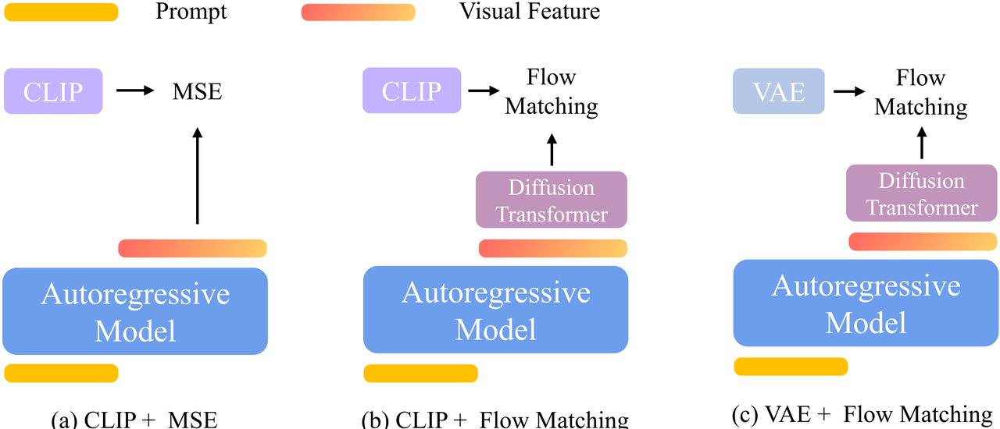

**CLIP + MSE** &#x20;

沿&#x7528;**`Emu2`**、**`Seed-X`**&#x548C; **`MetaMorph`**&#x7684;做法，使用 CLIP 将图像编码&#x4E3A;**`64`**&#x7EF4;固定长度、语义丰富的视觉 Embedding。训练自回归模型以最小化预测视觉特征$$\mathbf{Q}$$与真实 CLIP Embedding $$\mathbf{X}$$之间的 MSE 损失。推理时，给定文本 prompt $$\mathbf{C}$$，自回归模型预测潜在视觉特征$$\mathbf{Q}$$，随后传入基于 Diffusion 的视觉 Decoder 重建真实图像。

**CLIP + Flow Matching**

采用 Flow Matching 损失训练模型预测真实 CLIP Embedding。给定 prompt $$\mathbf{C}$$，自回归模型生成视觉特征序列$$\mathbf{Q}$$，用作 Diffusion 过程的条件，以逼近真实 CLIP 特征。推理流程包含两个 Diffusion 阶段：第一阶段以$$\mathbf{Q}$$为条件，迭代去噪生成 CLIP Embedding（支持随机采样，提升生成多样性）；第二阶段通过 Diffusion Decoder 将 CLIP Embedding 转换为真实图像。

**VAE + Flow Matching**

使用 Flow Matching 损失预测真实 VAE 特征，类似 **`MetaQuery`**。推理时，给定 prompt $$\mathbf{C}$$， 自回归模型生成$$\mathbf{Q}$$，随后以$$\mathbf{Q}$$为条件，通过 VAE 解码器迭代去噪生成真实图像。

为比较不同设计选择，BLIP3-o 采&#x7528;**`Llama-3.2-1B-Instruct`**&#x4F5C;为 Autoregressive Model。训练数据包括 **`CC12M`**、**`SA-1B`**&#x548C;**`JourneyDB`**，总计&#x7EA6;**`25M`**&#x6837;本。CC12M 与 SA-1B 使用 LLaVA 生成的详细描述，JourneyDB 使用原始描述。通过实验发现：**CLIP + Flow Matching** 在 GenEval 与 DPG-Bench 上取得最佳 prompt 对齐分数，**是最有效的设计选择**；**VAE + Flow Matching** 获得最优 FID，表明其美学质量更优。

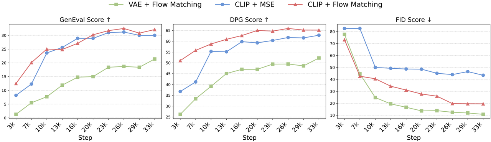

> **总结**
>
> 1. CLIP 特征比 VAE 特征更紧凑且语义更丰富，带来更高训练效率
>
> 2. 自回归模型在学习语义级特征 (CLIP) 方面比像素级特征 (VAE) 更有效
>
> 3. Flow Matching 作为训练目标能更好建模图像分布，提升样本多样性与视觉质量

* **训练策略**

在经过上面的探究之后，BLIP3-o 采&#x7528;**`CLIP + Flow Matching`**&#x4F5C;为图像生成模块。由于图像理解也在 CLIP Embedding 空间中操作，因此可以将这两项任务对齐至同一语义空间，实现统一。这里有两种训练策略可以选择：

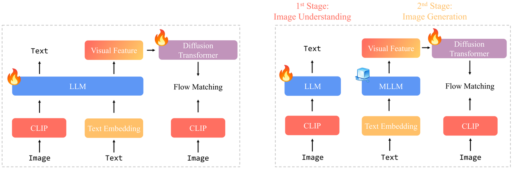

**联合训练**

最近一些工作的常见做法，&#x5982;**`MetaMorph`**、**`Janus-Pro`**、**`Show-o`**。虽然这些方法采用不同生成架构，但均通过混合图像理解与生成数据进行多任务学习。

**顺序训练** &#x20;

两阶段方法：第一阶段仅训练图像理解模块；第二阶段冻结 MLLM 主干，仅训练图像生成模块，类&#x4F3C;**`LMFusion`**&#x4E0E;**`MetaQuery`**。

在联合训练中，两项任务可能相互促进，这在MetaMorph中被证明，但其协同效应受两个关键因素影响：

> * 总数据量
>
> * 图像理解与生成数据的比例

相比之下，顺序训练更具灵活性：可冻结 Autoregressive 主干以保留图像理解能力，并将全部训练能力专注于图像生成，避免联合训练中的任务干扰。&#x4E0E;**`LMFusion`**&#x548C;**`MetaQuery`**&#x7C7B;似的，BLIP3-o 选择顺序训练构建统一多模态模型。

* **BLIP3-o 总体概览**

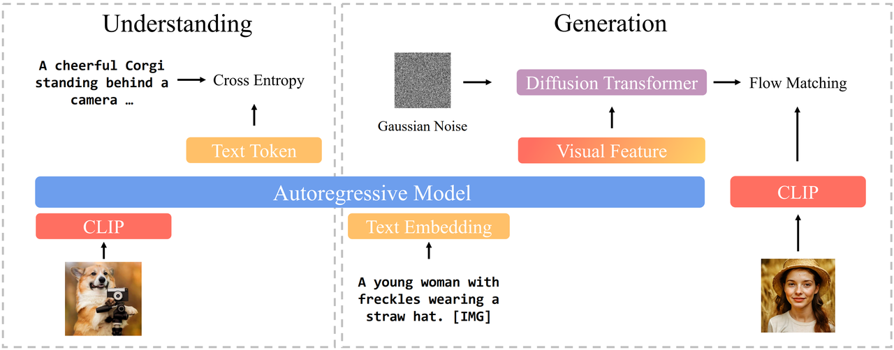

通过上面的探究，BLIP3-o 采&#x7528;**`CLIP + Flow Matching`**&#x4E0E;`顺序训练`，开发&#x4E86;**`4B`**&#x548C;**`8B`**&#x4E24;种规模模型。由于市面上已有强大开源图像理解模型，比&#x5982;**`Qwen2.5-VL`**，BLIP3-o 跳过图像理解训练阶段，直接在上面构建图像生成模块：

> * **8B 参数模型**：使用私有数据训练。冻结 Qwen2.5-VL-7B-Instruct 主干，仅训练 Diffusion Transformer，共 1.4B 可训练参数
>
> * **4B 参数模型**：仅使用开源数据。与 8B 采用相同生成架构，但主干为 Qwen2.5-VL-3B-Instruct。

1. **Diffusion Transformer 架构**  

采&#x7528;**`Lumina-Next`**&#x6A21;型架构，其基于改进&#x7684;**`Next-DiT`**&#x67B6;构，是可扩展、高效的 Diffusion Transformer，专为文本到图像及通用多模态生成设计。引入**`3D RoPE Embedding`**，在不依赖可学习位置 token 的情况下编码时间、高度、宽度上的时空结构。每个 Transformer 块采&#x7528;**`sandwich normalization`**，即注意力/MLP 前后均使用 RMSNorm，以及分组查询注意&#x529B;**`GQA`**，以提升稳定性并降低计算量。

* **训练方案**

**Step 1：图像生成预训练** &#x20;

> * **8B 模型**：结合&#x7EA6;**`25M`**&#x5F00;源数据与额&#x5916;**`30M`**&#x79C1;有图像。所有图像描述由 Qwen2.5-VL-7B-Instruct 生成，平均长度 120 tokens。为提升对不同 prompt 长度的泛化能力，额外加入约 10%（**`6M`**）来自 CC12M 的约 20 tokens 短描述。
>
> * **4B 模型**：使用同样&#x7684;**`25M`**&#x516C;开图像，配相同详细描述，并混合约 10%（**`3M`**）短描述。

**Step 2：图像生成指令微调** &#x20;

预训练后，模型在如下一些场景还存在一些缺陷：

> * 生成复杂人体姿态，如人射箭
>
> * 生成常见物体，如各类果蔬
>
> * 生成地标，如金门大桥
>
> * 生成简单文字

虽然预训练本应覆盖这些类别，但数据规模有限导致覆盖不足。为此，针对这些领域进行指令微调：对每类，使用 GPT-4o 生成约**`10K`**条 prompt–image** **对，构建针对性数据集。同时，从 JourneyDB 与 DALL·E 3 补充 prompt 以提升视觉美学质量，最终获得&#x7EA6;**`60k`**&#x6761;高质量 prompt–image 对。

> **注**：
>
> 1. 模型能快速适应 GPT-4o 风格，提升 prompt 对齐与视觉质量
>
> 2. 模型从 AI 生成图像中学到的效果优于从真实图像中学习

### 5.2.9 **Janus（b-4）**

* **架构  **

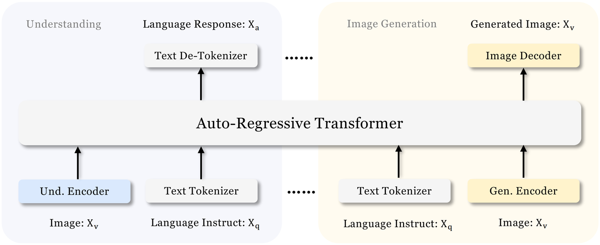

针对纯文本理解、多模态理解以及视觉生成任务，Janus 采用独立的编码方法将原始输入转换为特征，随后由一个统一的自回归 Transformer 进行处理：

> * **文本理解**：使用 LLM 内置的 Tokenizer 将文本转换为离散的 ID，并获取每个 ID 对应的特征表示
>
> * **多模态理解**：使用 SigLIP Encoder 从图像中提取高维语义特征。这些特征原本呈二维网格结构，被展平为一维序列后，通过**理解适配器 **understanding adaptor 映射到 LLM 的输入空间
>
> * **视觉生成**：使用 VQ Tokenizer 将图像转换为离散 ID。ID 序列被展平为一维后，通过**生成适配器 **generation adaptor 将每个 ID 对应的 Codebook Embedding 映射至 LLM 的输入空间 &#x20;

随后将这几类特征序列拼接成一个多模态特征序列，送入 LLM 进行处理。在纯文本理解和多模态理解任务中，使用 LLM 内置的 prediction head 进行文本预测；在视觉生成任务中，使用一个随机初始化的预测头进行图像预测。**整个模型使用自回归框架**，不需要设计特殊的注意力掩码。

> **注**：**Semantic Tokenizer 的探索**
>
> 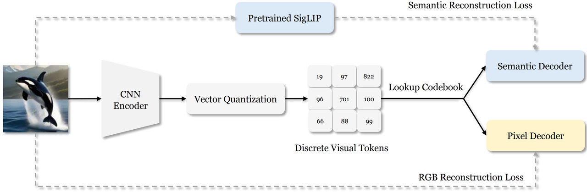
>
> 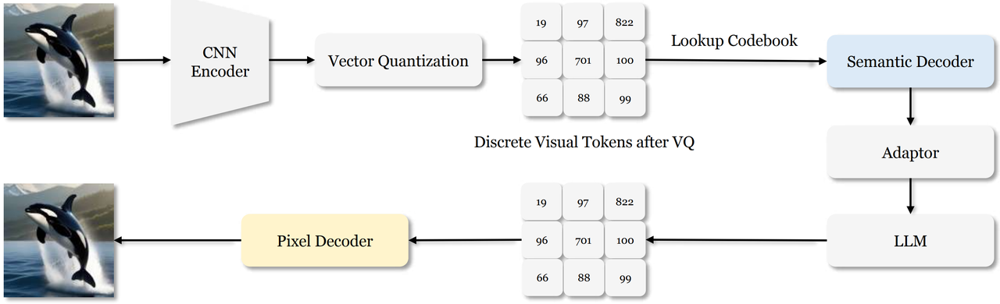
>
> 在 LlamaGen 的 Tokenizer 架构基础上构建了 Semantic Tokenizer，下采样率为$$16$$。除了原有&#x7684;**`CNN Pixel Decoder`**&#x5916;，在向量量化 **VQ**（**V**ector **Q**uantization）之后额外增加了一&#x4E2A;**`Semantic Decoder`**&#x5206;支，Semantic Decoder 是一个$$12$$层&#x7684;**`ViT`**，包含$$12$$个注意力头，隐藏维度为$$768$$。在将 Semantic Decoder 与 LLM 集成时，对其使用因果注意力掩码，以支持下一 token 的预测。
>
> 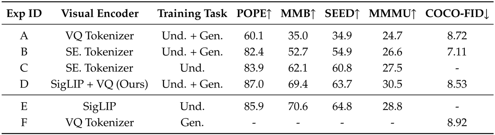
>
> 这里只是在消融实验中探索了 semantic tokenizer，实际并未真正采用

* **训练流程**

训练分为三个阶段：

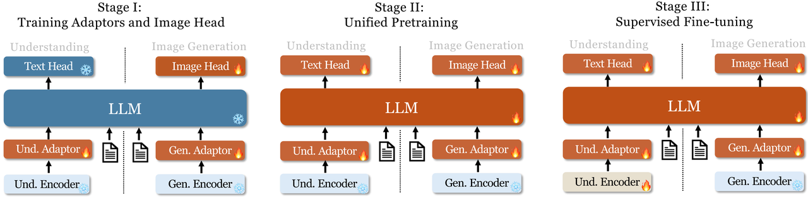

主要目标是在 Embedding 空间中建立视觉与语言元素之间的概念关联，使 LLM 能够理解图像中呈现的实体，并具备初步的视觉生成能力。其中视觉编码器和 LLM 保持冻结，仅更新理解适配器、生成适配器和图像预测头中的可训练参数。

利用多模态语料进行统一预训练，同时学习理解与生成能力。使用所有训练数据：纯文本、多模态理解和视觉生成数据。首先使用 ImageNet-1k 进行简单的视觉生成训练，掌握像素依赖关系；随后用文本到图像数据增强模型在开放域的视觉生成能力。

使用指令微调数据对预训练模型进行微调，提升其遵循指令和对话能力。除生成编码器 Gen. Encoder 外，其余所有参数均参与微调。重点监督回答部分，同时对系统 prompt 和用户 prompt 进行掩码处理。

> **注**：为确保在多模态理解与生成两方面均具备良好性能，Janus 并未为特定任务单独微调模型，而是混合使用纯文本对话数据、多模态理解数据和视觉生成数据，从而保证模型在各种场景下的通用性。

训练时直接采&#x7528;**交叉熵损失函数**： &#x20;

$$\mathcal{L} = -\sum_{i=1}^{N} \log P_{\theta}(x_i \mid x_{<i})$$

其中，$$P(\cdot \mid \cdot)$$表示由 Janus 模型参数$$\theta$$所建模的条件概率。 &#x20;

> * 对于纯文本理解和多模态理解，在文本序列上计算损失 &#x20;
>
> * 对于视觉生成，仅在图像序列上计算损失

> **注**：为保持设计简洁，未对不同任务分配不同的损失权重。

* **推理  **

采用下一 token 预测的方法： &#x20;

> * 对于纯文本理解和多模态理解，我们遵循标准做法，从预测分布中顺序采样 token
>
> * 对于图像生成，采用无分类器引导 **CFG**（**C**lassifier-**F**ree **G**uidance），每个 token 的 logits $$l_g$$按如下方式计算： &#x20;
>
> $$l_g = l_u + s(l_c - l_u)$$
>
> 其中，$$l_c$$为条件 logits，$$l_u$$为无条件 logits，$$s$$为 CFG 引导尺度。这里默认设置$$s = 5$$

### 5.2.10 **Janus-Pro（b-4）**

* **模型架构  **

Janus-Pro 的架构与 Janus 相同。整体架构的核心设计原则是**解耦用于多模态理解与视觉生成的视觉编码过程**。采用独立的编码方法将原始输入转换为特征，随后由一个统一的自回归 Transformer 进行处理。

> * **多模态理解**：使用 SigLIP 编码器从图像中提取高维语义特征。这些特征原本呈二维网格结构，被展平为一维序列后，通过一个**理解适配器&#x20;**&#x75;nderstanding adaptor 映射到 LLM 的输入空间 &#x20;
>
> * **视觉生成**：采用 VQ Tokenizer 将图像转换为离散 ID。ID 序列被展平为一维后，通过一个**生成适配器&#x20;**&#x67;eneration adaptor 将每个 ID 对应的 codebook embedding 映射至 LLM 的输入空间&#x20;

然后将上述特征序列拼接成一个多模态特征序列，送入 LLM 进行处理。除了 LLM 内置的预测头外，在视觉生成任务中还额外使用一个**随机初始化的预测头**用于图像预测。整个模型严格遵循自回归框架。

* **训练策略  **

Janus 采用三阶段训练流程： &#x20;

> * **Stage 1**：训练适配器和图像预测头
>
> * **Stage 2**：统一预训练，除理解编码器和生成编码器外，其余组件参数均参与更新
>
>   1. 在 ImageNet 数据上训练，使用图像类别名称作为 prompt，建模像素依赖关系
>
>   2. 在常规文本到图像数据上训练
>
> * **Stage 3**：监督微调，在阶段 2 的基础上进一步解冻理解编码器的参数进行训练

但这种策略存在若干问题：在 Stage 2 中，Janus 将文本到图像能力的训练分为两部分，**`66.67%`**的文本到图像训练步数分配给了第一部分，但该策略**次优且计算效率低下**。因此 Janus-Pro 进行了几项改进：

> * **延长 Stage 1 的训练**：增加 Stage 1 的训练步数，使其在 ImageNet 数据集上得到充分训练。实验表明即使 LLM 参数冻结，模型也能有效建模像素依赖关系，并基于类别名称生成合理的图像。 &#x20;
>
> * **聚焦 Stage 2 的训练**：Stage 2 **完全移除 ImageNet 数据**，直接使用常规文本到图像数据训练模型，使其能够基于密集描述生成图像。这使 Stage 2 能更高效地利用文本到图像数据，从而提升训练效率与整体性能。
>
> * **调整 Stage 3 的数据**：调整监督微调过程中不同类型数据的比例，将多模态数据、纯文本数据和文本到图像数据的比例从原先的$$7:3:10$$调整为$$5:1:4$$。通过略微降低文本到图像数据的比例，可以在**保持强大视觉生成能力的同时，显著提升了多模态理解性能**。

* **数据与模型扩展  **

在多模态理解和视觉生成两个方面对 Janus 的训练数据进行了大规模扩展：

> * **多模态理解**
>
>   * **Stage 2 预训练数据**：新增约**`90M`**样本，包括图像描述数据集以及面向表格、图表和文档理解的数据
>
>   * **Stage 3 监督微调数据**：引入 DeepSeek-VL2 中的额外数据集，例如 MEME 理解、中文对话数据以及旨在提升对话体验的数据集。显著增强了模型处理多样化任务的能力，并全面改善了对话体验。
>
> * **视觉生成**
>
>   先前版本 Janus 使用的真实世界数据质量较低且噪声较大，导致文本到图像生成不稳定，输出图像美学质量较差。在 Janus-Pro 中，引入约**`72M`**条合成的高质量美学数据，使统一预训练阶段中真实数据与合成数据的比例达到$$1:1$$。模型在合成数据上训练时收敛更快，生成的文本到图像结果不仅更稳定，美学质量也显著提升。

模型扩展：&#x20;

先前版本的 Janus 使用 1.5B 参数量的 LLM 验证了视觉编码解耦的有效性。在 Janus-Pro 中，将模型规模扩展至 **7B**。当使用更大规模的 LLM 时，**多模态理解与视觉生成任务的损失收敛速度均显著快于小模型**。这进一步验证 Janus-Pro 具有强大的可扩展性。

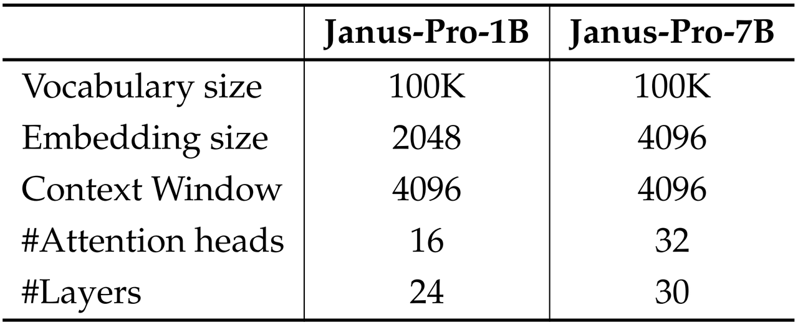

### 5.2.11 **S h o w-o2（b-5）**

* **模型框架**

整体模型结构图如下：

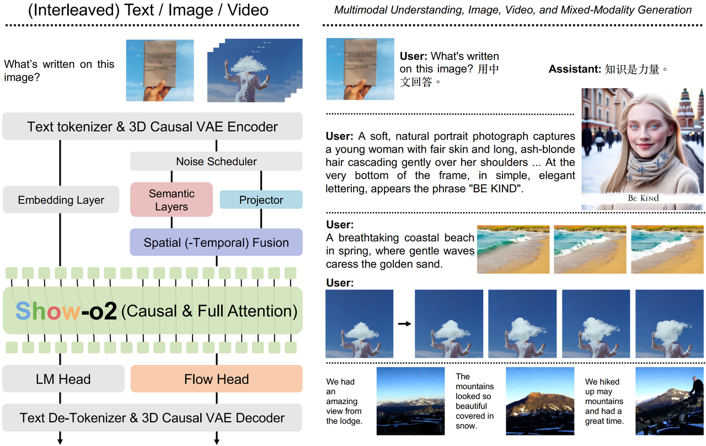

具体流程为：

> 1. 给定交错排列的文本、图像或视频，系统分别通过一个带有 Embedding 层的 text tokenizer 和一个 3D causal VAE encoder，将其处理为连续的文本 Embedding 和视觉潜在表征
>
> 2. 这些视觉潜在表征经过双路径提取，进行空间融合，以构建统一的视觉表征；对于视频还需要进行时间融合
>
> 3. 这些表征被组织成序列，并输入到一个带有 **language head** 和 **flow head** 的语言模型中，分别通过自回归建模和 flow matching 对序列进行建模
>
> 4. 利用 text de-tokenizer 与 3D causal VAE decoder 联合解码出最终输出

1. **统一视觉表征**

为了可扩展地支持图像和视频模态，Show-o2 采用 3D causal VAE encoder 提取图像或视频的潜在表示。由于多模态理解与生成在特征依赖性上存在差异，作者提出一种双路径架构：

> **语义层$$S(\cdot)$$用于提取富含语义上下文信息的高层表征**：$$S(\cdot)$$共&#x4EAB;**`SigLIP`**&#x7684;视觉 Transformer 模块，并引入一个新的$$2 \times 2$$ patch embedding 层。给定在噪声水平$$t$$下的$$n$$个视觉潜在变量$$\mathbf{x}_t = \{x_i\}_{i=1}^n$$：
>
> $$\mathbf{x}_t = t \cdot \mathbf{x}_1 + (1 - t) \cdot \mathbf{x}_0$$
>
> 其中$$\mathbf{x}_0 \sim \mathcal{N}(0, 1)$$且$$t \sim [0, 1]$$，Show-o2 加载 SigLIP 的预训练权重，并对$$S(\cdot)$$进行 pre-distill：
>
> $$\mathcal{L}_{\text{distill}} = -\frac{1}{n} \sum \log \operatorname{sim}\big(S(\mathbf{x}_t), \text{SigLIP}(X)\big)$$
>
> 其中$$X$$为输入图像，$$\text{SigLIP}(\cdot)$$提取图像 patch 特征，$$\operatorname{sim}(\cdot)$$表示余弦相似度计算函数。这样语义层$$S(\cdot)$$能够从干净或含噪的视觉潜在变量$$\mathbf{x}_t$$中模拟提取语义特征。

> **投影层$$P(\cdot)$$保留从视觉潜在表示中提取的完整底层信息**：$$P(\cdot)$$ 由一个二维 patch embedding 层构成。

> **Spatial (-Temporal) Fusion**：所提取的高、低层表征通过特征维度拼接，并由 RMSNorm 与两个 MLP 层进行空间融合，对视频还要进行时间融合，得到统一视觉表征$$\mathbf{u}$$：
>
> $$\mathbf{u} = \text{STF}\big(S(\mathbf{x}_t), P(\mathbf{x}_t)\big)$$
>
> 其中$$\text{STF}$$表示空间-时间融合机制。为支持生成建模，在统一视觉表征前添加时间步$$t$$的 Embedding，对于干净图像，设 $$t = 1.0$$ 以获得对应的 time step embedding。

然后将文本 Embedding 与统一视觉表征按交错图文格式组织成序列：

$$\texttt{[BOS] \{Text\} [BOI / BOV] \{Image / Video\} [EOI / EOV] \{Text\} \dots [EOS]}$$

这种序列格式灵活，可适配多种输入类型。这里依然采用全注意力机&#x5236;**`omni-attention`**，使序列建模保持因果性，同时在统一视觉表征内部允许全注意力交互。

* **Flow Head**

除用于文本 token 预测的 language head 外，Show-o2 还引入一个 flow head，用于通过 flow matching 预测定义的速度场$$\mathbf{v}_t = \frac{d\mathbf{x}_t}{dt}$$。flow head 由若干 Transformer 层构成，并通&#x8FC7;**`adaLN-Zero`**&#x6A21;块实现时间步控制。训练过程中，对 language head 应用下一 token 预测损失$$\mathcal{L}_{\text{NTP}}$$，对 flow head 应用 flow matching 损失$$\mathcal{L}_{\text{FM}}$$以预测速度：

$$\mathcal{L} = \alpha \mathcal{L}_{\text{NTP}} + \mathcal{L}_{\text{FM}}$$

* **训练**

现有的统一多模态模&#x578B;**`UMM`**，&#x5982;**`Show-o`**、**`JanusPro`**、**`Transfusion`**、**`Chameleon`**和**`Emu3`**，通常从大语言模型 LLM、大型多模态模型 LMM 或从零开始训练。这些方法都是在提升视觉生成建模能力的同时保留语言建模能力。但这个过程依赖于网络规模的高质量文本语料库，而此类语料的收集成本极高。因此缺乏此类资源可能导致语言知识和建模性能下降。

为了解决这个问题，Show-o2 采用两阶段训练方案，在无需大规模文本语料的前提下，有效保留语言知识并同步发展视觉生成能力。

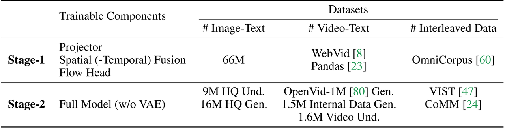

> * **Stage 1**：由于在之前已对语义层$$S(\cdot)$$进行了预蒸馏。第一阶段仅训练 **projector**、**spatial (-temporal) fusion** 和 **flow head**。使用&#x7EA6;**`66M`**&#x56FE;像-文本对，通过自回归建模与 flow matching 训练上述模块，并逐步引入交错数据和视频-文本对。
>
> * **Stage 2**：使&#x7528;**`9M`**&#x6761;高质量多模态理解指令数据、&#x4ECE;**`66M`**&#x4E07;图像-文本对中筛选出&#x7684;**`16M`**&#x6761;高质量视觉生成数据，以&#x53CA;**`1.6M`**&#x6761;视频理解数据，对整个模型进行微调。

在完成 1.5B LLM 参数的小模型训练后，将预训练的 flow head 迁移到 7B LLM 参数的大模型中，并引入一个轻量级 MLP 变换层以对齐隐藏维度，使其能快速适应更大模型并收敛。

## 5.3 AR + Diffusion

### 5.3.1 **Transfusion（c-1）**

Transfusion 主要创新在于证明：可以在共享数据和参数的基础上，对不同模态采用不同的损失函数，文本使用**语言建模损失**，图像使用**扩散损失**。

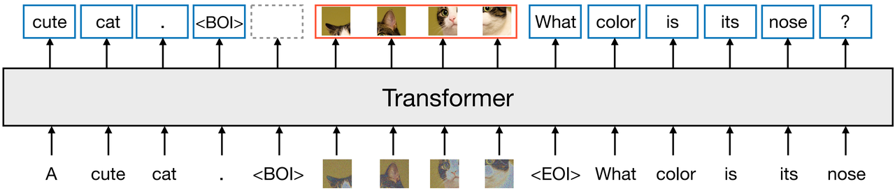

* **数据表示**

数据涵盖两种模态：**离散的文本和连续的图像**。

> * 使用 tokenizer 将文本分割为来自固定词汇表的一系列离散 token，每个 token 用一个整数表示
>
> * 图像通过 VAE 编码为潜在空间中的 patch 序列，其中每个 patch 表示为一个连续向量；这些 patch 按从左到右、从上到下的顺序排列，形成一个图像 patch 向量序列
>
> * 对于混合模态样本，在插入文本序列前，用特殊的图像开始**`BOI`**&#x548C;图像结束**`EOI`&#x20;**&#x74;oken 将图像序列包裹起来；由此得到一个同时包含文本 token 的离散元素和图像 patch 的连续元素的单一序列

* **模型架构**  

模型的绝大部分参数属于一个 Transformer，这个 Transformer 处理所有序列，接收一个$$\mathbb{R}^d$$中的高维向量序列作为输入，并输出类似维度的向量序列。为了将数据映射到该空间，使用轻量级的模态特定模块，这些模块的参数不共享。 &#x20;

> * **文本**：映射模块是 Embedding 矩阵，将每个输入整数映射到向量空间，并将每个输出向量转换为词汇表上的离散分布
>
> * **图像**：探索了两种方法，将$$k \times k$$的局部 patch 向量窗口压缩为单个 Transformer 向量及其逆过程：
>
>   * 一个简单的线性层
>
>   * U-Net 的上采样与下采样模块，如右图

**Attention 机制**

语言模型通常使用因果掩码 causal mask，以便在一次前向-后向传播中高效计算整个序列的损失和梯度，同时避免未来 token 的信息泄露。虽然文本天然具有顺序性，但图像通常不具备，因此图像建模常采用无限制的双向注意力。Transfusion 结合了这两种注意力模式：**对序列中所有元素施加因果注意力，同时在每个图像内部的 patch 元素之间启用双向注意力**。这使得同一图像内的每个 patch 都能关注其他所有 patch，但只能关注序列中先前出现的文本或其他图像的 patch。

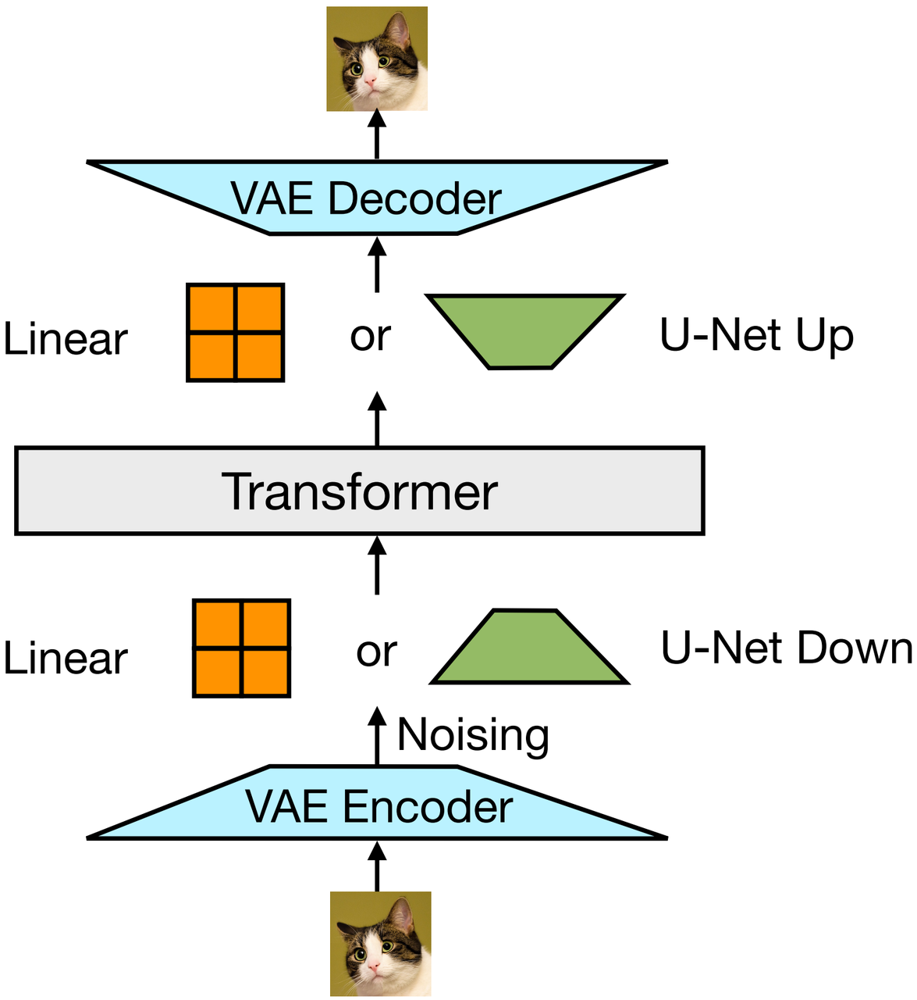

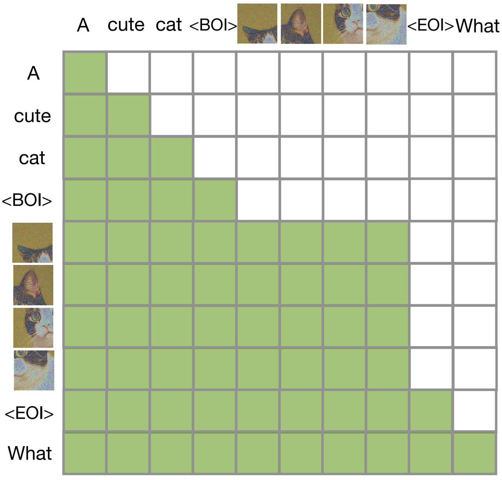

* **训练**

对文本 token 的预测应用**语言建模目标**$$\mathcal{L}_{\text{LM}}$$，对图像 patch 的预测应用** diffusion 目标**$$\mathcal{L}_{\text{DDPM}}$$。语言建模损失按 token 计算，而扩散损失按图像计算，一张图像可能对应序列中的多个 patch 元素。Transfusion 根据扩散过程向每个输入潜在图像$$x_0$$添加噪声$$\epsilon$$，生成$$x_t$$，然后进行 patch 化，并计算图像级别的扩散损失。然后将两个损失简单相加以平衡系数$$\lambda$$进行组合：

$$\mathcal{L}_{\text{Transfusion}} = \mathcal{L}_{\text{LM}} + \lambda \cdot \mathcal{L}_{\text{DDPM}}$$

将离散分布损失与连续分布损失结合，以优化同一个模型。

**VAE 训练**

VAE 训练目标如下：

$$\mathcal{L}_{\text{VAE}} = \mathcal{L}_1 + \mathcal{L}_{\text{LPIPS}} + 0.5\,\mathcal{L}_{\text{GAN}} + 0.2\,\mathcal{L}_{\text{ID}} + 0.000001\,\mathcal{L}_{\text{KL}}$$

其中$$\mathcal{L}_1$$ 是像素空间中的 L1 损失；$$\mathcal{L}_{\text{LPIPS}}$$ 是基于 LPIPS 相似度的感知损失；$$\mathcal{L}_{\text{GAN}}$$ 是基于 patch 的判别器损失；$$\mathcal{L}_{\text{ID}}$$ 是基于 MoCo v2 模型内部特征的感知损失；$$\mathcal{L}_{\text{KL}}$$ 是标准的 KL 正则化项，用于促使编码器输出接近标准正态分布。

Transfusion  将 GAN 训练的起始时间（即在损失函数中引入对抗损失）延迟至第 50,000 步，以确保 VAE 首先达到足够好的重建性能，使用的潜在空间维度为 8。

VQ-GAN 的训练目标与 VAE 基本一致，但有一个显著区别： &#x20;

将$$\mathcal{L}_{\text{KL}}$$替换为标准的 codebook commitment loss $$\mathcal{L}_{\text{codebook}}$$ ，该损失促使编码器输出与码本向量彼此靠近。这里设置$$\beta = 0.25$$，并采用损失权重为$$1.0$$。因此，VQ-VAE 的最终损失函数为：

$$\mathcal{L}_{\text{VQ-VAE}} = \mathcal{L}_1 + \mathcal{L}_{\text{LPIPS}} + 0.5\,\mathcal{L}_{\text{GAN}} + 0.2\,\mathcal{L}_{\text{ID}} + \mathcal{L}_{\text{codebook}}$$

向量量化层在将编码器输出投影到 8 维空间之后应用。

除了损失函数的变更和量化层的引入外，用于 Transfusion 的 VAE 与用于 Chameleon 的 VQ-VAE 在训练设置上完全相同，例如：相同的训练计算量、相同的训练数据，以及相同的编码器解码器架构。

* **推理**  

与训练目标一致，解码也在两种模式间切换：语言建模模式和 diffusion 模式。在 LM 模式下，遵循标准做法，逐 token 从预测分布中采样。当采样&#x5230;**`BOI`** token 时，解码算法切换至扩散模式，并遵循扩散模型的标准解码流程： &#x20;

在输入序列末尾追加一段纯噪声$$x_T$$，形式为$$n$$个图像 patch，取决于目标图像尺寸，并在$$T$$步内逐步去噪。在每一步$$t$$，利用模型预测的噪声生成$$x_{t-1}$$，并用其覆盖序列中的$$x_t$$；即模型始终以当前含噪图像的最新时间步为条件，无法访问之前的时间步。扩散过程结束后，在生成的图像后追&#x52A0;**`EOI`** token，并切换回 LM 模式。Transfusion 支持任意文本与图像模态的混合生成。

### 5.3.2 **S h o w-o（c-1）**

* **Tokenizer**

Show-o 基于预训练的 LLM，因此在离散空间中进行统一学习是一个很自然的想法，其维护一个统一的词汇表，同时包含离散的文本和图像 token。

1. **Text Tokenization**

Show-o 基于 LLM，因此直接使用原有的分词器对文本数据进行分词，不做任何修改。

* **Image Tokenization**

按照 MAGVIT-v2 的想法，使用大规模图像数据训练一个 lookup-free 的 Quantizer。这个 Quantizer 维护一个大小为$$K = 8192$$的 Codebook，并将$$256 \times 256$$分辨率的图像编码为$$16 \times 16$$的离散 token，如图(a)。

另一种方法是对理解和生成使用不同的 Tokenizer。这里作者也进行了探究，从预训练的 MAGVIT-v2 和 CLIP-ViT 编码器中提取连续图像表示作为输入，探索多模态理解能力的提升，如图(b)和(c)。以下默认的使用图(a)的离散图像 token 作为输入。

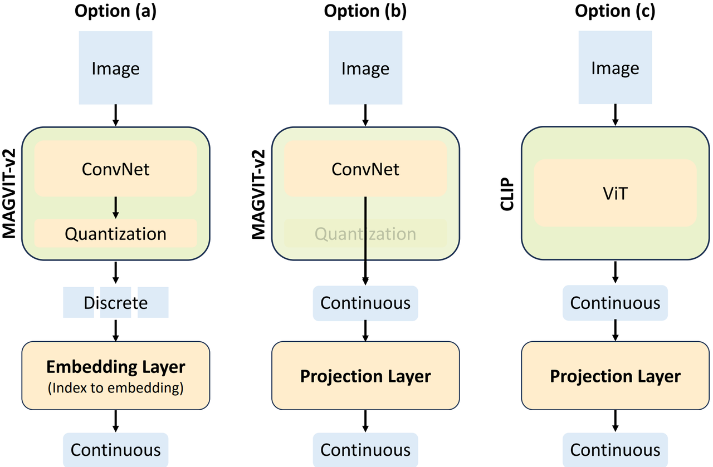

* **模型架构**

Show-o 继承 LLM 的架构，唯一的改动是在每个注意力层前添加了一个 QK-Norm 操作。使用预训练 LLM 的权重初始化 Show-o，并通过新增$$8192$$个可学习的 Embedding 来扩展 Embedding 层，以支持离散图像 tojken。与当前 SOTA 的扩散模型需要额外文本编码器不一样的是 Show-o 本身就可以编码文本条件信息，用于文生图任务。

1. **统一的 Prompt**

为在多模态理解和生成任务上实现统一学习，Show-o 设计了统一的 prompt 策略，用于格式化各类输入数据。给定一个图文对$$(x, y)$$，首先分别通过图像和文本 tokenizer 将其转换为$$M$$个图像 token $$\mathbf{u} = \{u_i\}_{i=1}^M$$和$$N$$个文本token $$\mathbf{v} = \{v_i\}_{i=1}^N$$。然后，根据任务类型将其组织为输入序列。**`[MMU]`**&#x548C;**`[T2I]`**&#x662F;预定义的任务 token，用于指示输入序列对应的学习任务；**`[SOT]`**&#x548C;**`[EOT]`**&#x662F;特殊 token，分别表示文本 token 的开始和结束；**`[SOI]`**&#x548C; **`[EOI]`**&#x662F;预定义的特殊 token，用于标记图像 token 的开始和结束。

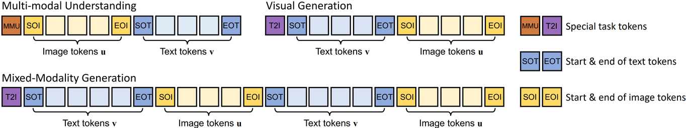

通过这种 prompt 设计，可以将多模态理解、文生图以及混合模态生成等多种任务的输入数据有效编码为序列数据，从而在不同任务间无缝实现统一学习。训练完成后，即可通过相应 prompt 引导 Show-o 处理多种视觉-语言任务，包括视觉问答和文生图：

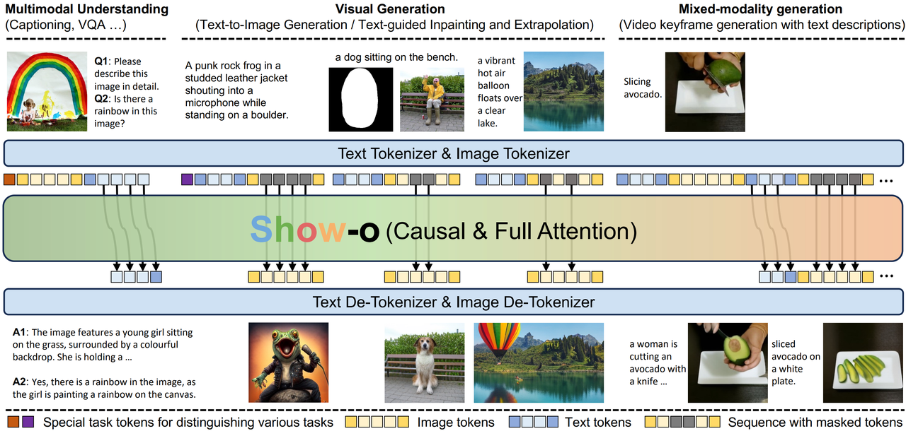

* **Omni-Attention 机制**

与目前使用的比较多的仅对序列进行自回归建模的方法不同的是，Show-o 提&#x51FA;**全向注意力机制`omni-attention mechanism`**，使 Show-o 能以不同方式建模各类信号。这是综合性的注意力机制，结合了因果注意力**`causal attention`**和全注意力**`full attention`**，并能根据输入序列的格式自适应地混合与切换：

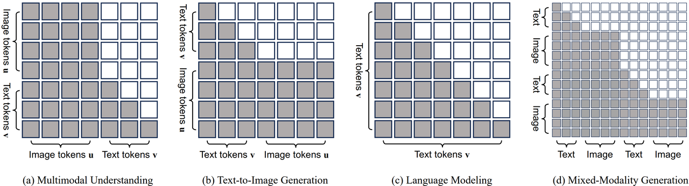

Show-o 对序列中的文本token $$\mathbf{v}$$使用因果注意力；对图像 token $$\mathbf{u}$$ 使用全注意力，使每个 token 都能与所有其他 token 充分交互。对于格式化的输入序列，在**多模态理解**任务(a)中，序列中的文本 token 可以关注所有先前的图像 token；在**文生图**任务(b)中，图像 token 能够与所有前置的文本 token 交互；当**输入仅为文本** token 时，退化为标准的因果注意力(c)。

* **训练目标**

为同时支持自回归建模和扩散建模，采用两个学习目标：

> 1. 下一 token 预测 **NTP**（**N**ext **T**oken **P**rediction）
>
> 2. 掩码 token 预测 **MTP**（**M**ask **T**oken **P**rediction）

**NTP**：对于多模态理解任务，给定包含$$M$$个图像 token $$\mathbf{u} = \{u_1, u_2, \dots, u_M\}$$和$$N$$个文本 token $$\mathbf{v} = \{v_1, v_2, \dots, v_N\}$$的序列，通过标准语言建模目标最大化文本 token 的似然：

$$\mathcal{L}_{\text{NTP}} = \sum_{i} \log p_\theta(v_i \mid v_1, \dots, v_{i-1}, u_1, \dots, u_M)$$

其中$$p(\cdot \mid \cdot)$$表示由 Show-o 的参数$$\theta$$建模的条件概率，模型通过随机梯度下降进行训练。

> **注**：若输入序列仅包含文本 token ，则条件中不包含图像 token $$\mathbf{u}$$

**MTP**：通过将掩码 token 预测作为学习目标，可以将简化的离散扩散建模无缝集成到 Show-o 中。对于建模输入序列中的图像 token $$\mathbf{u} = \{u_1, u_2, \dots, u_M\}$$，首先以时间步控制的某个随机比例将部分图像 token 替换为**`[MASK]`** token ，记为$$\mathbf{u}_*$$，从而构造掩码序列$$\mathbf{u}_* = \{u_*, u_2, \dots, u_*, u_M\}$$。然后通过最大化以下似然，从掩码 token 中重建原始图像 token ，条件为未掩码区域和前置文本 token：

$$\mathcal{L}_{\text{MTP}} = \sum_{j} \log p_\theta(u_j \mid u_*, u_2, \dots, u_*, u_M, v_1, \dots, v_N)$$

> **注**：
>
> 1. 损失仅作用于被掩码的 token
>
> 2. 使用 MaskGIT 采样策略对图像 token 进行掩码，并利用输入序列中所有文本 token 和未掩码图像 token 的信息进行重建
>
> 3. 使用无分类器引导 CFG 以一定概率将条件文本 token 随机替换为空文本。

**总损失**：给定一批输入序列，总体训练损失为$$\mathcal{L}_{\text{MTP}}$$与$$\mathcal{L}_{\text{NTP}}$$的加权组合：

$$\mathcal{L} = \mathcal{L}_{\text{MTP}} + \alpha \mathcal{L}_{\text{NTP}}$$

其中$$\alpha$$为超参数，用于调节$$\mathcal{L}_{\text{NTP}}$$项的权重。

* **训练**

由于图像 token 的 Embedding 是全新初始化的，因此需要大规模预训练，以实现多模态理解与生成之间的对齐。并且 Show-o 移除了用于文生图任务的独立文本编码器，这给在单一 Transformer 内部实现文本与图像内容的有效对齐带来了比较大的困难。Show-o 采用一种三阶段训练策以略渐进且高效地训练：

**Stage 1：图像 Token Embedding 训练**

使用 RefinedWeb 数据集训练 Show-o，以保持其语言建模能力。同时，分别采用 ImageNet-1K 数据集和大规模图文对数据，训练 Show-o 的**类别条件图像生成**和**图像描述生成**能力。这里直接利用 ImageNet-1K 中的类别名称作为文本输入，以学习类别条件图像生成。这个阶段的主要目标为：学习离散图像 token 的新增可学习 Embedding、建模图像生成中的像素依赖关系，以及在图像描述任务中实现图像与文本的初步对齐。

**Stage 2：多模态理解与生成的图文对齐**

使用通用图文对数据进行文生图训练。核心聚焦于在**图像描述**和**文生图**两项任务中，进一步强化图像与文本之间的语义对齐。

**Stage 3：高质量数据微调**

通过引入经过筛选的高质量图文对数据用于文生图生成，以及指令遵循数据用于多模态理解与混合模态生成，对预训练的 Show-o 进行进一步微调。

* **推理**

> 1. **多模态理解**：给定一张图像及其对应的视觉问题，Show-o 以自回归方式预测文本答案。
>
> 2. **视觉生成**：将所&#x6709;**`[MASK]`** token 作为 Show-o 的初始输入，并在$$T$$步内迭代地&#x5C06;**`[MASK]`** token 替换为预测的图像 token。

### 5.3.3 LMFusion（c-1）

Transfusion 的一个显著特点是，其架构与主流 LLM 相同，却能通过端到端训练$$\mathcal{L}_{\text{Transfusion}} = \mathcal{L}_{\text{LM}} + \lambda \cdot \mathcal{L}_{\text{DDPM}}$$同时实现文本生成、图像理解和图像生成。Transfusion 仅使用纯文本数据和图像-标题对数据训练，然而这种从零开始的训练需要大量计算资源，并且其在纯文本任务上的性能仍落后于经过预训练的 LLM。 &#x20;

LMFusion 的目标是有效地将预训练的纯文本 LLM 适配为能够处理图像理解与生成任务的多模态模型。其基于开源的 Llama-3，并继续以 Transfusion 的目标函数对其进行训练，使其能够处理两种模态。由于 Transfusion 在语言建模和图像扩散目标之间共享参数，关键难点在于：**在优化新引入的图像能力的同时，避免 Llama-3 强大的纯文本性能下降**。

* **模型结构**

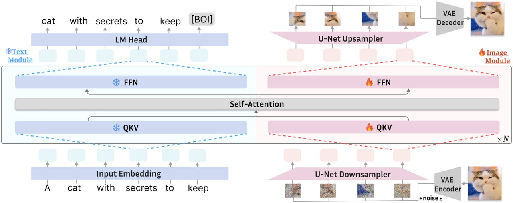

LMFusion 的解决办法是：**将一个预训练的纯文本 Llama 模型与一个专用的图像 Transformer 相结合，分别用于视觉生成与理解，使得每种模态可通过独立的参数进行处理**。通过冻结文本模块、仅微调视觉模块，在保留模型原有语言能力的同时，为视觉理解与生成的学习提供了一个良好的起点。

LMFusion 是一个仅含 Decoder 的模型，由$$N$$个 Transformer 层组成，核心设计&#x662F;**模态特定的注意力层**和**前馈网络FFN**，各自仅处理对应模态的数据。模型输入包括文本 token $$\mathbf{x}^{\text{txt}}$$和带噪图像表示：

$$\mathbf{x}^{\text{img}}_{t} = \sqrt{\bar{\alpha}_t}\, \mathbf{x}^{\text{img}} + \sqrt{1 - \bar{\alpha}_t}\, \boldsymbol{\epsilon}$$

1. **输入投影层**

输入文本 token $$\mathbf{x}^{\text{txt}}$$通过线性层投影为文本隐状态序列$$\mathbf{h}^{\text{txt}}_{\text{in}}$$；带噪图像 $$\mathbf{x}^{\text{img}}_{t}$$ 则通过 U-Net downsampler 投影为图像表示序列$$\mathbf{h}^{\text{img}}_{\text{in}}$$：

$$\begin{aligned}
\mathbf{h}^{\text{txt}}_{\text{in}} &= \textcolor{blue}{\mathrm{Proj}_{\text{text}}}(\mathbf{x}^{\text{txt}}) \\
\mathbf{h}^{\text{img}}_{\text{in}} &= \textcolor{red}{\mathrm{UNet\text{-}Down}_{\text{img}}}(\mathbf{x}^{\text{img}}_{t}, t)
\end{aligned}$$

随后，文本隐状态$$\mathbf{h}^{\text{txt}}_{\text{in}}$$和图像隐状态$$\mathbf{h}^{\text{img}}_{\text{in}}$$被送入后续的注意力层。

* **自注意力层**

为每种模态分别构建独立的注意力矩阵：文本隐状态$$\mathbf{h}^{\text{txt}}_{\text{in}}$$和图像隐状态$$\mathbf{h}^{\text{img}}_{\text{in}}$$分别通过各自的$$Q$$、$$K$$、$$V$$矩阵转换为对应的 query、 key 和 value。注意力前的层归一化也是模态特定的，并被融合进$$QKV$$函数中：

$$\begin{aligned}
\mathbf{h}^{\text{txt}}_{Q}, \mathbf{h}^{\text{txt}}_{K}, \mathbf{h}^{\text{txt}}_{V} &= \textcolor{blue}{\mathrm{QKV}_{\text{text}}}(\mathbf{h}^{\text{txt}}_{\text{in}})  \\
\mathbf{h}^{\text{img}}_{Q}, \mathbf{h}^{\text{img}}_{K}, \mathbf{h}^{\text{img}}_{V} &= \textcolor{red}{\mathrm{QKV}_{\text{img}}}(\mathbf{h}^{\text{img}}_{\text{in}}) 
\end{aligned}$$

为实现跨模态注意力，将图像和文本模态的 query、 key 和 value 拼接成统一序列。随后，在文本和图像 token 位置上的注意力加权值分别通过各自模态专属的输出投影矩阵 $$O$$ 映射回隐状态维度：

$$\begin{aligned}
\mathbf{h}^{\text{txt}}_{O} &= \textcolor{blue}{\mathrm{O}_{\text{text}}} \left( \mathrm{softmax}\left( \frac{\mathbf{h}^{\text{txt}}_{Q} [\mathbf{h}^{\text{img}}_{K} \circ \mathbf{h}^{\text{txt}}_{K}]^\top + \mathbf{M}}{\sqrt{d}} \right) [\mathbf{h}^{\text{img}}_{V} \circ \mathbf{h}^{\text{txt}}_{V}] \right)  \\
\mathbf{h}^{\text{img}}_{O} &= \textcolor{red}{\mathrm{O}_{\text{img}}} \left( \mathrm{softmax}\left( \frac{\mathbf{h}^{\text{img}}_{Q} [\mathbf{h}^{\text{txt}}_{K} \circ \mathbf{h}^{\text{img}}_{K}]^\top + \mathbf{M}}{\sqrt{d}} \right) [\mathbf{h}^{\text{txt}}_{V} \circ \mathbf{h}^{\text{img}}_{V}] \right) 
\end{aligned}$$

其中$$\circ$$表示拼接操作，$$\mathbf{M}$$为混合注意力掩码，与 Transfusion 中一致：对文本 token 应用因果掩码，对图像 token 应用双向掩码。这种设计支持模态内及跨模态的自注意力，促进多模态融合。

* **前馈网络 FFN**

在注意力层之后，采用模态特定的 FFN 分别处理文本和图像数据。FFN 前的层归一化同样是模态特定的，并被融合进 FFN 函数中：

$$\begin{aligned}
\mathbf{h}^{\text{txt}}_{\text{FFN}} &= \textcolor{blue}{\mathrm{FFN}_{\text{text}}}(\mathbf{h}^{\text{txt}}_{O})  \\
\mathbf{h}^{\text{img}}_{\text{FFN}} &= \textcolor{red}{\mathrm{FFN}_{\text{img}}}(\mathbf{h}^{\text{img}}_{O}) 
\end{aligned}$$

* **输出投影层**

在经过$$N$$层自注意力和 FFN 后，所得隐状态被分别投影为：通过语言模型输出头得到文本 logits，或通过 U-Net upsampler 得到图像噪声预测：

$$\begin{aligned}
\mathbf{p}_{\text{logits}} &= \textcolor{blue}{\mathrm{LM\text{-}Head}_{\text{text}}}(\mathbf{h}^{\text{txt}}_{\text{FFN}})  \\
\boldsymbol{\epsilon}_{\text{pred}} &= \textcolor{red}{\mathrm{UNet\text{-}Up}_{\text{img}}}(\mathbf{h}^{\text{img}}_{\text{FFN}}, t, \mathbf{h}^{\text{img}}_{\text{in}}) 
\end{aligned}$$

与 Transfusion 相同，输出$$\mathbf{p}_{\text{logits}}$$和$$\boldsymbol{\epsilon}_{\text{pred}}$$分别通过语言建模损失$$\mathcal{L}_{\mathrm{LM}} = \mathbb{E}_{x_i^{txt}} \left[ -\log P_\theta(x_i^{txt} \mid \boldsymbol{x}_{<i}^{txt}, \boldsymbol{x}^{img}) \right]$$和 DDPM 损失$$\mathcal{L}_{\mathrm{DDPM}} = \mathbb{E}_{\boldsymbol{x}^{img}, t, \epsilon} \left[ \left\| \epsilon - \epsilon_\theta(\boldsymbol{x}_t^{img}, t, \boldsymbol{x}^{txt}) \right\|_2^2 \right]$$进行优化。所有文本模块参数，以及图像模块中的自注意力和 FFN 参数，均从预训练的 Llama 模型初始化而来。

在优化过程中，对文本和图像参数组采用解耦的学习率：文本学习率$$\eta_{\text{text}}$$用于$$\{ \textcolor{blue}{\mathrm{Proj}_{\text{text}}, \mathrm{QKV}_{\text{text}}, \mathrm{O}_{\text{text}}, \mathrm{FFN}_{\text{text}}, \mathrm{LM\text{-}Head}_{\text{text}}} \}$$，图像学习率$$\eta_{\text{img}}$$用于$$\{ \textcolor{red}{\mathrm{UNet\text{-}Down}_{\text{img}}, \mathrm{QKV}_{\text{img}}, \mathrm{O}_{\text{img}}, \mathrm{FFN}_{\text{img}}, \mathrm{UNet\text{-}Up}_{\text{img}}} \}$$。为保留模型在纯文本基准上的性能，设置 $$\eta_{\text{text}} = 0$$，即冻结文本模块。

> **注**：为方便描述，上述流程将残差连接与层归一化直接融合进自注意力和 FFN 中。

### 5.3.4 **Janusflow（c-2）**

* **JanusFlow 用到的技术**

1. **多模态大模型 Multimodal LLM**

给定一个包含离散 token 序列的数据集$$\mathcal{D}$$，其中每个序列可表示为$$\mathbf{x} = (x_1, \dots, x_\ell)$$，LLM 以自回归方式建模该序列的分布：

$$\log P_{\theta_{\text{LLM}}}(\mathbf{x}) = \sum_{i=0}^{\ell-1} \log P_{\theta_{\text{LLM}}}(x_{i+1} \mid x_1, \dots, x_i)$$

其中$$\theta_{\text{LLM}}$$表示 LLM 的参数，$$\ell$$为序列长度。在大规模数据集上训练后，LLM 展现出跨任务泛化能力。为使这些模型能够处理视觉输入，通常添加一个视觉编码器，例如，LLaVA 通过一个投影层将预训练的 CLIP 图像编码器与 LLM 集成，将提取的图像特征映射到 LLM 可处理的 Word Embedding 联合空间中。

* **Rectified Flow**  

对于由连续$$d$$维数据点$$\mathbf{x} = (x_1, \dots, x_d)$$构成的数据集$$\mathcal{D}$$，服从未知数据分布$$\pi_1$$， rectified flow 通过学习一个定义在时间$$t \in [0, 1]$$上的常微分方程 ODE 来建模该分布：

$$\frac{d\mathbf{z}_t}{dt} = v_{\theta_{\text{NN}}}(\mathbf{z}_t, t), \quad \mathbf{z}_0 \sim \pi_0$$

其中$$\theta_{\text{NN}}$$表示速度神经网络的参数，$$\pi_0$$是一个简单分布，通常为标准高斯噪声$$\mathcal{N}(0, I)$$。这个网络通过最小化神经速度与从$$\pi_0$$和$$\pi_1$$中随机采样点之间线性路径方向的欧氏距离进行训练：

$$\min_{\theta} \mathbb{E}_{t \sim P(t), \mathbf{z}_0 \sim \pi_0, \mathbf{x} \sim \pi_1} \left[ \left\| v_{\theta_{\text{NN}}}(\mathbf{z}_t, t) - (\mathbf{x} - \mathbf{z}_0) \right\|^2 \right], \quad \mathbf{z}_t = t\mathbf{x} + (1 - t)\mathbf{z}_0$$

这里$$P(t)$$是时间$$t \in [0, 1]$$上的分布。当网络容量足够且目标函数被完美最小化时，最优速度场$$v_{\theta^*_{\text{NN}}}$$将基本分布$$\pi_0$$映射到真实数据分布$$\pi_1$$。若$$\mathbf{z}_0 \sim \pi_0$$，则$$\mathbf{z}_1 = \int_0^1 v_{\theta^*_{\text{NN}}}(\mathbf{z}_t, t) dt$$的分布服从$$\pi_1$$。

* **模型架构**

1. **多模态理解**

在多模态理解任务中，LLM 处理由交错排列的文本和图像数据组成的输入序列。文本被分词为离散 token，每个 token 被映射为维度为$$D_{\text{emb}}$$的 Embedding 向量。图像编码器$$f_{\text{enc}}$$将每张图像$$\mathbf{x}_{\text{im}}$$编码为形状为$$H_{\text{im}} \times W_{\text{im}} \times D_{\text{enc}}$$的特征图。然后特征图被展平并通过一个线性变换层投影为形状为$$H_{\text{im}} W_{\text{im}} \times D_{\text{emb}}$$的 Embedding 序列，其中$$H_{\text{im}}$$和$$W_{\text{im}}$$由图像编码器决定。文本与图像 Embedding 拼接后形成 LLM 的输入序列，LLM 基于此 Embedding 序列自回归地预测下一个 token。JanusFlow 在图像前添加特殊 token **`BOI`**，图像后添&#x52A0;**`EOI`**，以帮助模型定位序列中的图像 Embedding 位置。

* **图像生成**

LLM 以文本序列$$\mathbf{x}^{\text{con}}$$为条件，利用 rectified flow 生成对应图像。为提升计算效率，生成过程在潜在空间中进行，使用预训练&#x7684;**`SDXL-VAE`**。生成过程如下：

> 1. 首先在潜在空间中采样高斯噪声$$\mathbf{z}_0$$，其形状为$$H_{\text{latent}} \times W_{\text{latent}} \times D_{\text{latent}}$$
>
> 2. 通过生成编码器$$g_{\text{enc}}$$将其处理为形状为$$H_{\text{gen}} W_{\text{gen}} \times D_{\text{emb}}$$的 Embedding 序列
>
> 3. 这个序列与表示当前时间步$$t$$的时间 Embedding 拼接，形成长度为$$H_{\text{gen}} W_{\text{gen}} + 1$$的序列。这里作者发现因果注意力已足够有效，其他掩码方案未带来性能提升。LLM 对应于$$\mathbf{z}_0$$的输出通过生成解码器$$g_{\text{dec}}$$转换回潜在空间，得到形状为$$H_{\text{latent}} \times W_{\text{latent}} \times D_{\text{latent}}$$的速度向量。

状态通过标准欧拉求解器更新：

$$\mathbf{z}_{t+dt} = \mathbf{z}_t + v(\mathbf{z}_t, t) \, dt$$

$$dt$$为用户定义的步长。这里将输入中的$$\mathbf{z}_0$$替换为$$\mathbf{z}_{dt}$$，并迭代此过程直至获得$$\mathbf{z}_1$$，再通过 VAE 解码器将其解码为最终图像。为提升生成质量，在计算速度时采用无分类器引导 CFG：

$$v(\mathbf{z}_t, t) = w \, v(\mathbf{z}_t, t \mid \mathbf{x}^{\text{con}}) + (1 - w) \, v(\mathbf{z}_t, t \mid \emptyset)$$

其中$$v(\mathbf{z}_t, t \mid \emptyset)$$表示无文本条件下的速度，$$w \geq 1$$控制 CFG 的强度。增大$$w$$可提高语义对齐度。与多模态理解类似，在序列开头添加特殊 token **`BOI`**&#x4EE5;指示图像生成的起始位置。

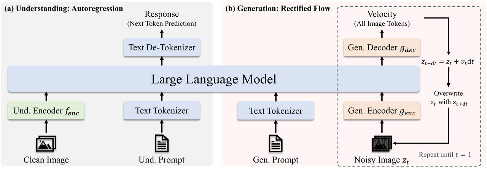

* **解耦编码器**

以往将自回归生成与扩散模型统一于联合 LLM 训练框架的方法通常对理解和生成任务使用相同的编码器，即$$f_{\text{enc}} = g_{\text{enc}}$$。例如，Transfusion 在同一 VAE 潜在空间中使用共享的 U-Net 或线性编码器执行两类任务，Show-o 利用 MAGVIT-v2 将图像块编码为离散 token 用于两类任务。

但这种共享编码器设计效果不是很好，尤其在通过向量量化 token 进行图像生成的模型中。JanusFlow 采&#x7528;**解耦编码器设计**：

> 使用预训练&#x7684;**`SigLIP-Large-Patch/16`**&#x6A21;型作为$$f_{\text{enc}}$$以提取用于多模态理解的语义连续特征
>
> 生成任务使用从零初始化的独&#x7ACB;**`ConvNeXt`**&#x6A21;块作为$$g_{\text{enc}}$$和$$g_{\text{dec}}$$，因为在生成任务中表现优异

> **注**：JanusFlow 在$$g_{\text{enc}}$$与$$g_{\text{dec}}$$之间引入长跳跃连接。

* **训练**

模型训练分为三个连续阶段：

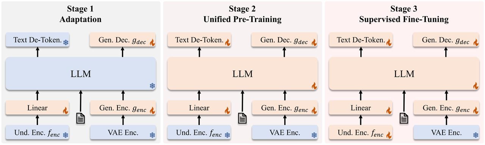

仅训练随机初始化的组件：线性层、生成编码器和生成解码器。目的是使这些新模块能与预训练的 LLM 和 SigLIP 编码器有效协同工作，本质上是为新引入模块提供初始化。

训练除视觉编码器外的整个模型，数据包含三类：多模态理解、图像生成和纯文本。初期分配较高比例的多模态理解数据增强理解能力；随后逐步增加图像生成数据，提升生成能力。

指令微调，数据包括对话、任务特定的交互以及高质量的文本条件图像生成样本。同时解冻 SigLIP 编码器的参数。微调过程使模型能有效回答用户在多模态理解与图像生成任务中的指令。

训练 JanusFlow 涉及两类数据：多模态理解数据与图像生成数据。两类数据均包含 condition 与 response 两部分。condition 指任务 prompt，如生成任务中的文本 prompt、理解任务中的图像，response 指对应任务的输出。数据可表示为$$\mathbf{x} = (\mathbf{x}^{\text{con}}, \mathbf{x}^{\text{res}})$$，其中上标$$\text{con}$$表示 condition，$$\text{res}$$表示 response。记整个序列 $$\mathbf{x}$$ 的长度为$$\ell$$，$$\mathbf{x}^{\text{con}}$$的长度为$$\ell_{\text{con}}$$，$$\mathbf{x}^{\text{res}}$$的长度为$$\ell_{\text{res}}$$。用$$\theta$$表示 JanusFlow 中所有可训练参数的集合，包括 LLM、$$f_{\text{enc}}$$、$$g_{\text{enc}}$$、$$g_{\text{dec}}$$以及线性层。

1. **自回归训练目标**

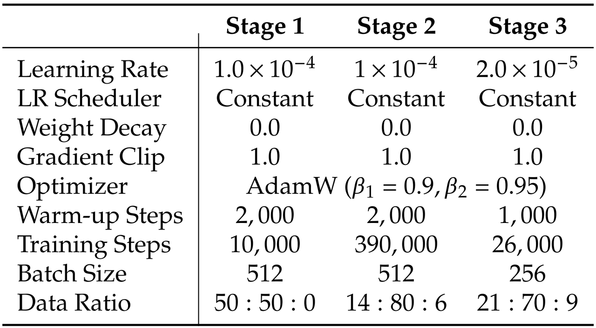

对于多模态理解任务，$$\mathbf{x}^{\text{res}}$$仅包含文本 token。JanusFlow 采用最大似然原则进行训练：

$$\mathcal{L}_{\text{AR}}(\theta) = -\mathbb{E}_{\mathbf{x} \sim \mathcal{D}_{\text{und}}} \left[ \sum_{i=\ell_{\text{con}}}^{\ell-1} \log P_{\theta}(x_{i+1} \mid x_1, \dots, x_i) \right]$$

其中期望取自多模态理解数据集$$\mathcal{D}_{\text{und}}$$中的所有$$(\mathbf{x}^{\text{con}}, \mathbf{x}^{\text{res}})$$对，且仅在$$\mathbf{x}^{\text{res}}$$的 token 上计算损失。

2. **Rectified Flow 训练目标**

对于图像生成任务，$$\mathbf{x}^{\text{con}}$$为文本 token，$$\mathbf{x}^{\text{res}}$$为对应图像。JanusFlow 采用 rectified flow 目标进行训练：

$$\mathcal{L}_{\text{RF}}(\theta) = \mathbb{E}_{\mathbf{x} \sim \mathcal{D}_{\text{gen}},\, t \sim P(t),\, \mathbf{z}_0 \sim \mathcal{N}(0, I)} \left[ \left\| v_{\theta}(\mathbf{z}_t, t \mid \mathbf{x}^{\text{con}}) - (\mathbf{x}^{\text{res}} - \mathbf{z}_0) \right\|^2 \right]$$

其中$$\mathbf{z}_t = t \mathbf{x}^{\text{res}} + (1 - t) \mathbf{z}_0$$。按照 SD3 的做法，将时间分布$$P(t)$$设为 logit-normal 分布。为支持 CFG 推理，在训练中随机丢&#x5F03;**`10%`**&#x7684;文本 prompt。

* **表征对齐正则化**

在 Diffusion Transformer 与语义编码器之间对齐中间表征可增强扩散模型的泛化能力。上述提到的解耦编码器设计使得对齐可高效实现为一个正则项。对于生成任务，将理解编码器$$f_{\text{enc}}$$的特征与 LLM 的中间特征对齐：

$$\mathcal{L}_{\text{REPA}}(\theta, \varphi) = -\mathbb{E}_{\mathbf{x} \sim \mathcal{D}_{\text{gen}}} \left[ \text{sim}\left( \text{stop\_grad}(f_{\text{enc}}(\mathbf{x}^{\text{res}})),\, h_{\varphi}(q_{\theta}(\mathbf{z}_t)) \right) \right]$$

其中$$q_{\theta}(\mathbf{z}_t)$$表示给定输入$$\mathbf{z}_t$$时 LLM 的中间表征，$$h_{\varphi}$$是一个小型可训练 MLP，将$$q_{\theta}(\mathbf{z}_t)$$投影至维度$$D_{\text{enc}}$$。函数$$\text{sim}(\cdot, \cdot)$$计算 Embedding 间逐元素余弦相似度的均值。在计算损失前，将$$h_{\varphi}(q_{\theta}(\mathbf{z}_t))$$重塑为$$H_{\text{gen}} \times W_{\text{gen}} \times D_{\text{enc}}$$。这里特意调整$$g_{\text{enc}}$$与$$g_{\text{dec}}$$的配置，确保$$H_{\text{gen}} = H_{\text{im}}$$且$$W_{\text{gen}} = W_{\text{im}}$$。$$\mathcal{L}_{\text{REPA}}$$的梯度不反向传播至理解编码器。对齐损失有助于 LLM 的内部特征空间在噪声输入$$\mathbf{z}_t$$下与理解编码器的语义特征空间对齐，从而在推理阶段从新随机噪声和文本条件生成图像时提升生成质量。

* **总损失**

上述三个目标在所有训练阶段均被应用：多模态理解任务使用$$\mathcal{L}_{\text{AR}}$$，图像生成任务使用联合损失$$\mathcal{L}_{\text{RF}} + \mathcal{L}_{\text{REPA}}$$。

### 5.3.5 Mogao（c-2）

VLM 通过建模条件分布$$P(x_{\text{txt}} \mid x_{\text{img}}, x_{\text{txt}})$$来实现视觉理解，而文本到图像 **T2I**（**T**ext-**to**-**I**mage）模型则利用$$P(x_{\text{img}} \mid x_{\text{txt}})$$进行图像生成。Mogao 使用统一的主干网络对图像与文本的联合分布进行建模，天然具备理解和图像生成的双重能力。此外进一步通过因果建模方法扩展生成能力，使 Mogao 能够执行更复杂的任务：**交错多模态生成**，即利用过去任意模态生成的信息作为条件，生成任意模态的新输出。

* **基础知识**

1. **多模态理解**

文本数据可表示为离散 token 序列$$\mathbf{z} = (z_0, \dots, z_L)$$，LLM 以因果方式对其联合分布进行建模。基于 LLM，VLM 通过增加视觉编码器将视觉特征转换为连续 token 序列以处理视觉输入。通过对大规模多模态数据集的训练，VLM 扩展了条件分布：

$$\log P_{\theta_{\text{VLM}}}(\mathbf{z} \mid \mathbf{x}) = \sum_{l=0}^{L} \log P_{\theta_{\text{VLM}}}(z_{l+1} \mid z_0, \dots, z_l, \mathbf{x})$$

其中$$\theta_{\text{VLM}}$$和$$\mathbf{x} = (x_0, \dots, x_N)$$分别表示 VLM 的参数和视觉输入的连续 token 序列，且$$\mathbf{x}$$可为空$$\emptyset$$。通常 LLM 和 VLM 仅输出文本 token $$z_i$$。因此可通过最小化$$P_\theta$$与数据分布之间的交叉熵来优化模型，即下一 token 预&#x6D4B;**&#x20;NTP**（**N**ext **T**oken **P**rediction）损失：

$$\mathcal{L}_{\text{NTP}} = \mathbb{E}_{z_i} \left[ -\log P_{\theta_{\text{VLM}}}(z_{l+1} \mid z_0, \dots, z_l, \mathbf{x}) \right]$$

* **视觉生成**

Mogao 采用 rectified flow matching 对图像分布进行建模，给定图像分布$$x \sim \pi$$和简单先验分布$$\epsilon \sim \mathcal{N}(0, 1)$$，构建一个关于时间$$t$$的线性轨迹：

$$x_t = t \cdot x + (1 - t) \cdot \epsilon, \quad t \in [0, 1]$$

由上式可导出如下 ODE 常微分方程：

$$\frac{dx_t}{dt} = v(x_t, t)$$

其中速度场$$v = x - \epsilon$$。为生成图像，可从$$x_0 \sim \mathcal{N}(0, 1)$$出发，对上式的 ODE 进行反向时间积分，即：

$$x_1 = \int_0^1 v(x_t, t) \, dt$$

因此，图像生成任务需训练参数为$$\theta$$的网络以逼近$$v$$，通过优化 flow matching 损失：

$$\mathcal{L}_{\text{flow}} = \mathbb{E}_{t, x \sim \pi, \epsilon \sim \mathcal{N}(0,1)} \left[ \| v_\theta(x_t, t) - (x - \epsilon) \|_2^2 \right]$$

* **交错多模态生成**

Mogao 以因果方式在**模态级别**上对序列分布进行建模：

$$\log P_\theta(\mathbf{x}) = \sum_{t=0}^{T} \log P_\theta(x_{t+1} \mid x_0, \dots, x_t), \quad x_t \in \{x_{\text{img}}, x_{\text{txt}}\}$$

其中$$\theta$$为模型参数；$$x_t$$表示视觉或文本模态，而非单个 token。一旦$$x_{t+1}$$生成，它将被加入历史信息作为后续生成的条件。因此，Mogao 能够基于任意混合模态的上下文，生成任意模态的输出，即实现**交错多模态生成**。

对于交错多模态生成任务，需要在同一交错图文样本中**同时计算**文本的 NTP 损失和带噪图像的 flow matching 损失。因此，总训练损失为两者的加权组合：

$$\mathcal{L}_{\text{total}} = \lambda \cdot \mathcal{L}_{\text{NTP}} + \mathcal{L}_{\text{flow}}$$

> **注**：在训练过程中，Mogao 使用两个特殊 token 来区分视觉与文本模态：所有图像序列前后分别插&#x5165;**``**&#x548C; **`</img>`**。在推理阶段，Mogao 根据上下文决定是否生成图像，当生&#x6210;**``**&#x65F6;切换至图像生成模式，生&#x6210;**`</img>`**&#x65F6;切换回文本生成模式。

* **模型架构**

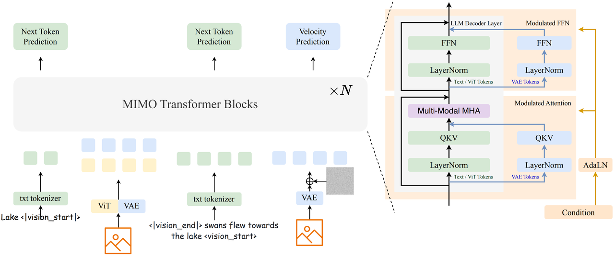

1. **双视觉编码器**

当前主流 T2I 模型在扩散过程前使用 VAE 将图像编码至低维潜在空间。但与 VLM 中 ViT 提供的预对齐语义视觉表征相比，VAE 生成的视觉表征在视觉理解任务中表现不足，这在 JanusFlow 等工作中也提到了：JanusFlow 在视觉生成时使用 VAE ，而在视觉理解时使用 ViT。在 Mogao 的交错多模态生成场景中进一步优化了这个策略：**当图像作为条件时，Mogao 同时提取 ViT 和 VAE 的视觉表征，并将其拼接到历史序列中**：

> * **多模态理解**：文本 token 仅关注历史序列中的 ViT token 和文本 token
>
> * **多模态生成**：带噪的 VAE token 会关注历史序列中的所有 token，包括 ViT、VAE 和文本 token

> **注**：这样做是因为 ViT 提供的视觉表征具有强语义性，有助于提升图像生成中的上下文对齐能力。

* **深度融合架构**

Mogao 基于预训练的 Qwen2.5，并借鉴 MMDiT 的设计以增强视觉生成能力，对每个 Transformer 块进行如下修改：

> 1. 使用统一的自注意力层同时处理视觉与文本序列
>
> 2. 考虑到视觉与文本模态的差异，在 FFN 中使用不同的** **MLP，并在注意力块中使用独立的线性层分别处理两种模态
>
> 3) 由于 ViT 提供的视觉表征具有与文本对齐的高层语义，将 ViT token 路由至文本分支
>
> 4) 由于 rectified flow 需要预测当前时间步的速度，因此通过 AdaLN 层将 timestep Embedding 融合到每个块的视觉特征图上

> **注**：Mogao 有几个优点
>
> 1. 无需依赖传统 T2I 模型中常用的 CLIP 或 T5 文本编码器即可实现高质量图像生成，这归功于 LLM 文本表征与图像特征在每一层的深度融合
>
> 2. 模型自然继承了 LLM 的长上下文能力，这对长序列交错多模态生成至关重要

3. **交错旋转位置编码 Interleaved RoPE**

Mogao 的输入与输出均为多模态，因此模型需捕捉三维位置关系：$$H$$和$$W$$表示图像的空间位置信息，$$T$$表示所有图像与文本 token 之间的时间位置关系。Mogao 在 RoPE 的基础上提出交错旋转位置编码** IL-RoPE**（**I**nter**l**eaved **RoPE**），针对同时生成文本与图像的场景，改进了各维度的频率分配与位置 ID 设置。

在位置 ID 设计上：

> * 对于图像，每个图像的$$H/W$$空间位置 ID 均从 0 开始计算，确保所有图像在空间上具有一致的位置信息，有利于图像编辑、多图生成等任务，因为这些任务需参考先前图像
>
> * 时间位置 ID 随每个 token 递增，但同一图像内所有 token 具有相同的时间位置 ID

在频率分配方面，M-RoPE 在$$d=128$$维中按如下方式分配：

$$\Theta_T = \left\{ \beta^{-\frac{2i}{d}} \mid i \in [0, 16) \right\}; \quad
\Theta_H = \left\{ \beta^{-\frac{2i}{d}} \mid i \in [16, 40) \right\}; \quad
\Theta_W = \left\{ \beta^{-\frac{2i}{d}} \mid i \in [40, 64) \right\}$$

其中$$\Theta$$表示应用于特定维度的旋转频率，$$\beta$$为基频。这说明时间维度$$T$$侧重捕捉局部关系，空间维度$$H/W$$侧重长程依赖。但图像合成高度依赖局部语义信息，显著损害图像生成性能，例如，$$256$$分辨率图像在$$H/W$$上仅含 16 个 token。因此 IL-RoPE 在$$d$$维中**交错分配**$$\{T, H, W\}$$的频率，以平衡各维度对长程与局部语义信息的捕捉能力：

$$\Theta_T = \left\{ \beta^{-\frac{2i}{d}} \mid i = 3j \right\}, \quad
\Theta_H = \left\{ \beta^{-\frac{2i}{d}} \mid i = 3j + 1 \right\}, \quad \\
\Theta_W = \left\{ \beta^{-\frac{2i}{d}} \mid i = 3j + 2 \right\}$$

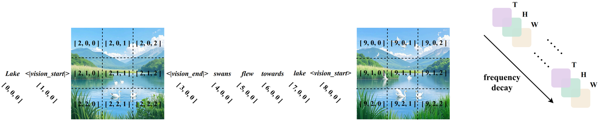

IL-RoPE 交替将前 48 个通道分配给$$T/H/W$$，并将剩余 16 个通道分配给$$T$$以建模长序列。

* **多模态无分类器引导**

Mogao 采用无分类器引导 CFG 提升生成质量，其通过结合条件预测与无条件预测，使结果更贴合指定条件：

$$\nabla_x \log p(x \mid c) = \gamma \left( \nabla_x \log p(x \mid c) - \nabla_x \log p(x) \right) + \nabla_x \log p(x)$$

其中$$c$$和$$\gamma$$分别表示条件和 CFG 系数。传统 T2I 模型的条件仅包含文本模态$$c_{\text{txt}}$$，但在本文的交错多模态生成场景中，条件$$c$$可分解为$$c_{\text{img}}$$和$$c_{\text{txt}}$$。但条件中的图像会成为模型生成后续图像的`捷径`，导致类似 **[STIV](https://arxiv.org/pdf/2412.07730)&#x20;**提到的**时间停滞 **temporal stagnation 的现象。类似 **[InstructPix2Pix](https://arxiv.org/pdf/2211.09800)&#x20;**&#x7684;思想，Mogao 引入不同的 CFG 系数$$\gamma$$和$$\gamma_{\text{img}}$$以分别控制不同模态的影响：

$$\begin{aligned}
\nabla_x \log p(x \mid c_{\text{img}}, c_{\text{txt}}) = &\ \gamma \left( \nabla_x \log p(x \mid c_{\text{img}}, c_{\text{txt}}) - \nabla_x \log p(x \mid c_{\text{img}}) \right) \\
&+ \gamma_{\text{img}} \left( \nabla_x \log p(x \mid c_{\text{img}}) - \nabla_x \log p(x) \right) + \nabla_x \log p(x)
\end{aligned}$$

> **注**：当$$\gamma_{\text{img}} = \gamma$$时，这个公式退化为$$\nabla_x \log p(x \mid c) = \gamma \left( \nabla_x \log p(x \mid c) - \nabla_x \log p(x) \right) + \nabla_x \log p(x)$$。常规跨模态 CFG 系数对模态内条件可能过大。但这样设计后可有效调节不同模态对图像生成的影响，作者使用$$\gamma = 7.5$$和$$\gamma_{\text{img}} = 1.5$$。

* **数据**

Mogao 混合使用纯文本、视觉理解、图像生成及交错多模态数据训练模型：

> * 纯文本与视觉理解数据继承自 DouBao LM 和 VLM 数据集
>
> * 图像生成数据采用 SeedDream 的训练数据以提升图像质量与多样性
>
> * 交错多模态数据从公开网站与视频中整理：
>
>   * 对于原生图文数据，训练时保留原始顺序
>
>   * 对于视频片段，训练了一个 VLM 为采样帧生成字幕，训练样本由帧与字幕交错组成

* **训练**

1. **原生分辨率**

将图像缩放至固定分辨率显然次优，因其同时降低训练推理效率并严重限制模型的视觉理解能力。因此，整个训练阶段均采用原生分辨率策略：将输入图像转换为可变数量的视觉 token，同时保持其宽高比。此外，为弥补视觉生成与理解之间的表征差异，Mogao 在这两项任务中一致采用该策略。

* **全局损失**

在多 GPU 上训练混合源多模态数据时，需谨慎平衡不同权重 token 的损失以实现任务间的良好权衡。设第$$n$$个 GPU 上第$$i$$个 token 的损失为$$L_i^n$$，权重为$$w_i^n$$，理想做法是将所有 GPU 的 token 视为一个全局批次，计算关于模型参数$$W$$的梯度：

$$\frac{\partial}{\partial W} \left( \frac{\sum_n \sum_i w_i^n L_i^n}{\sum_n \sum_i w_i^n} \right)$$

但这需要在所有 rank 间收集权重与损失，通信开销巨大，严重影响训练效率。常用近似方法是计算每卡损失后平均梯度：

$$\frac{1}{N} \sum_n \frac{\partial}{\partial W} \left( \frac{\sum_i w_i^n L_i^n}{\sum_i w_i^n} \right)$$

但该梯度存在偏差。Mogao 使用以下无偏代理：

$$\frac{1}{N} \sum_n \frac{\partial}{\partial W} \left( \frac{\sum_i w_i^n L_i^n}{\frac{1}{N} \sum_n \sum_i w_i^n} \right)$$

这可推导为无偏梯度。具体实现时先对每卡的权重求和并进行 **all-reduce**，再用归约后的总权重作为归一化项。由于仅需通信$$N$$个标量，开销可忽略，且实际中采用异步归约 async-reduce，不会引入训练效率损失。

* **ECTF（Efficient Complete Teacher Forcing）**

在交错多模态生成中，训练与推理存在显著差异：训练时所有视觉元素均需预测，图像经过多级高斯噪声扰动的扩散前向过程，后续文本或图像模态在此噪声条件下训练，导致训练与推理之间存在域偏移。Transfusion 通过约束噪声尺度缓解该问题，但仍保留训练时的迭代去噪与推理时的单次生成之间的不匹配。其他一些方法仅在最终图像上计算损失，虽理论上可行，但因重复计算前置项导致计算复杂度随序列长度平方增长，对长多模态序列不可行。

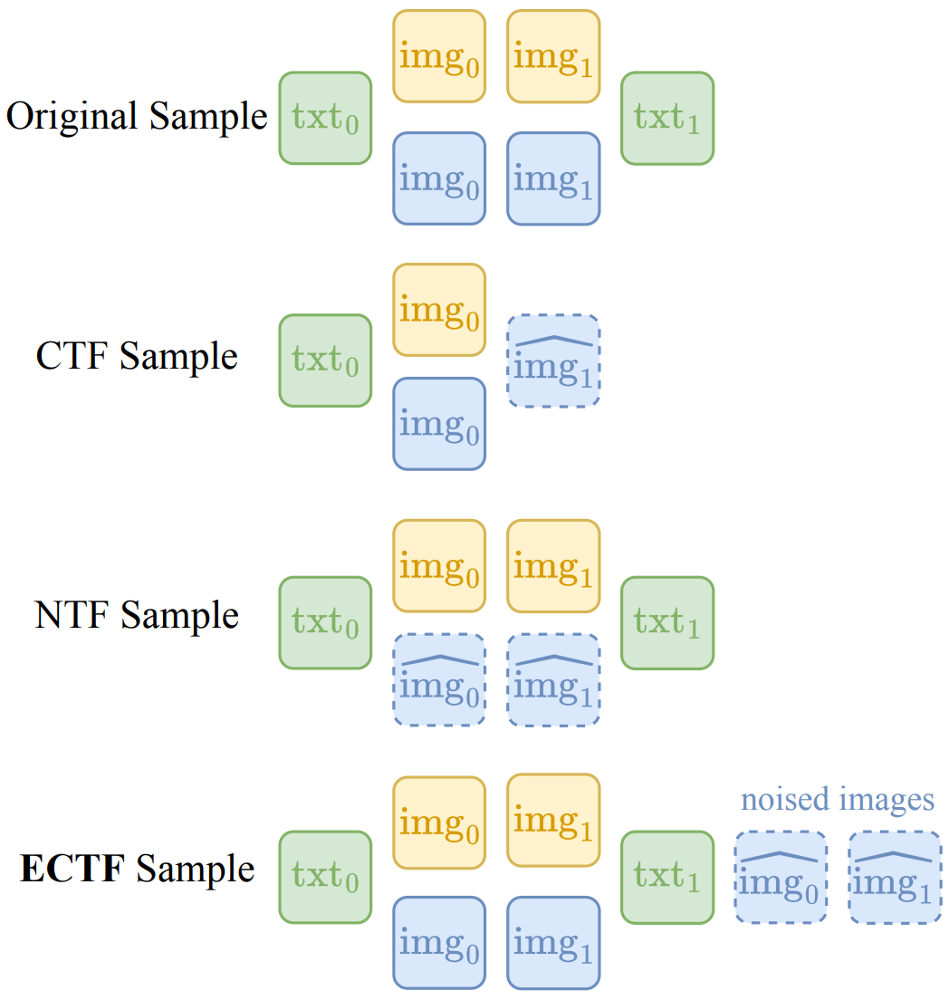

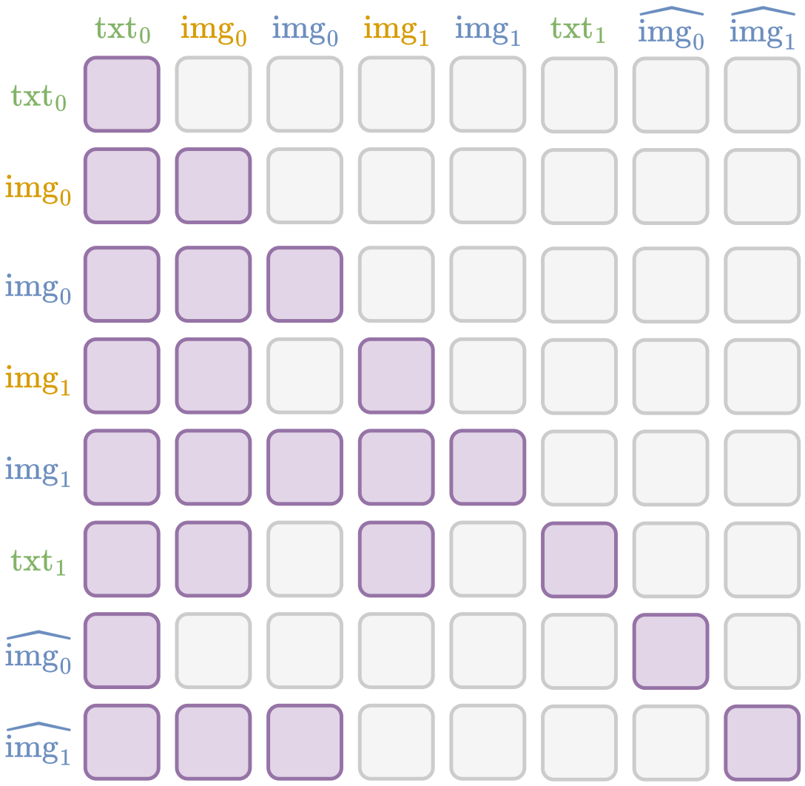

Mogao 提&#x51FA;**`ECTF`**，在计算效率与条件一致性间取得最优平衡。ECTF 引入 **clean-noise 解耦**：通过右图动态因果注意力掩码，将带交错句子的干净图像与噪声图像分离，避免了最后扰动方法中的冗余计算。

### 5.3.6 BAGEL（c-2）

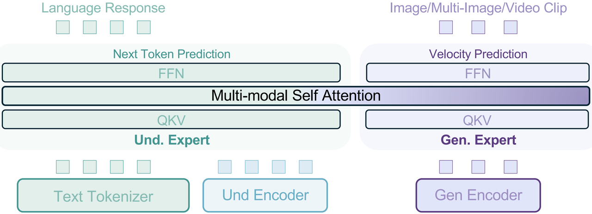

BAGEL 采用 **MoT**（**M**ixture-**o**f-**T**ransformers）架构，包含两个 Transformer 专家模块：一个专用于**多模态理解**，另一个专用于**多模态生成**。相应地，模型采用了两个独立的视觉编码器：一个面向理解的编码器和一个面向生成的编码器。这两个 Transformer 专家在每一层都通过共享的自注意力作用于相同的 token 序列。

> * 预测文本 token 时，BAGEL 使&#x7528;**下一 token 预测**范式，发挥自回归语言模型的优势
>
> * 预测视觉 token 时，BAGEL 采用 **Rectified Flow **方法，使用视觉生成比较成功的方法

统一的多模态生成与理解模型的三种设计范式的优缺点如下：

**自回归方法**

基于离散视觉 tokenizer 的自回归视觉生成方法。这类方法对文本和视觉 token 均采用下一 Token 预测范式，实现简单，可直接复用现有 LLM 基础设施。但自回归的视觉生成质量劣于扩散模型，且由于其顺序生成特性，推理延迟较高。

**外接扩散模型**

将 LLM 与外部扩散模块结合。通过轻量级、可训练的 adapter 连接预训练的 LLM/VLM 与扩散模型。LLM 自回归地生成一组潜在 token 作为语义条件信号，再由扩散模块用于图像生成。这种方法收敛迅速、数据消耗少，在多模态生成与理解能力上表现优异。主要缺点是将 LLM 上下文压缩为少量潜在 token，在理解与生成模块之间引入了显式瓶颈，可能导致信息损失，尤其在长上下文多模态推理中。

**集成 Transformer**

将 LLM 与扩散模型统一集成于单一 Transformer 中。受自回归 Transformer 强大的理解推理能力与扩散 Transformer 强大的视觉生成能力互补优势驱动，利用二者共有的模型架构实现范式间的无缝切换。相比外接扩散模型，它需要更高的训练算力，但关键优势在于在所有 Transformer 块中保持无瓶颈的上下文传递，从而实现生成与理解模块之间的无损交互，更易于扩展。

统一的集成模型有能力从大规模交错多模态数据中学习更丰富的多模态能力，这是其他范式无法捕捉的涌现能力。为此 BAGEL 选择无瓶颈的集&#x6210;**&#x20;Transformer** 方案，其在大规模训练场景中潜力更大，更适合作为长上下文多模态推理及强化学习的基础模型。

* **模型架构**

BAGEL 的主模型以 **Qwen2.5 LLM** 初始化，它采用**`RMSNorm`**进行归一化，**`SwiGLU`**作为激活函数，**`RoPE`**用于位置编码，**`GQA`**用于 KV Cache 压缩。在此基础上，BAGEL 在每个注意力块中加入**`QK-Norm`**，这也是是图像视频生成模型中的常见做法，可有效稳定训练过程。视觉信息从两个方面表示：

> * **视觉理解**：利用 **ViT** 编码器将原始像素转换为 token。采用固定分辨率$$384$$&#x7684;**`SigLIP2-so400m/14`**&#x4F5C;为 ViT 编码器的初始化。在此基础上，首先对位置编码进行插值，将最大输入尺寸设为$$980 \times 980$$，然后集成**`NaViT`**以支持原生宽高比图像处理。采用两层 MLP 将 ViT token 的特征维度与 LLM 隐藏状态对齐。
>
> * **视觉生成**：使&#x7528;**`FLUX`**&#x4E2D;的预训练 VAE 模型，在像素空间与潜在空间之间进行双向转换。潜在表示的下采样率为$$8$$，潜在通道数为$$16$$，随后通过$$2 \times 2$$的 patch embedding 层进一步降低空间尺寸并匹配 LLM 主干的隐藏维度。VAE 模型在训练期间冻结。

在将 ViT 和 VAE tokens 注入 LLM 前，添加 2D 位置编码。对于 timestep，直接将 timestep embedding 加到 VAE token 的初始隐藏状态上，而不是使用常规 DiT 中的 AdaLN。这在保持性能的同时简化了架构。在 LLM 内部，来自理解与生成任务的文本、ViT 和 VAE token 根据输入的模态结构交错排列。对于同一样本的 token，采用广义因果注意力**`generalized causal attention`**：首&#x5148;**将 token 划分为多个连续片段，每个片段仅包含单一模态**，如文本、ViT 或 VAE 。某一片段中的 token 可关注所有前序片段中的 token；在片段内部，文本 token 采用**因果注意力**，而视觉 tokens 保留**双向注意力**。

1. **广义因果注意力**

训练期间，一个交错多模态生成样本可能包含多张图像。对每张图像，准备三组视觉 token：

> * **带噪 VAE token**：经扩散噪声污染的 VAE 潜变量，仅用于 Rectified Flow 训练，MSE 损失在此集合上计算
>
> * **干净 VAE token**：原始潜变量，在生成后续图像或文本 token 时作为条件
>
> * **ViT token**：由 SigLIP2 编码器提取，有助于统一交错生成与理解数据的输入格式，并经验性地提升交错生成质量

在交错图像或文本生成中，后续图像或文本 token 可关注前序图像的干净 VAE tokens 和 ViT token，但不可关注其带噪 VAE token。

对于交错多图像生成，采用 **diffusion forcing 策略**，为不同图像添加独立的噪声水平，并以先前图像的带噪表示作为条件。此外，为增强生成一致性，随机将连续图像分组，并在组内应用 full attention，组内噪声水平相同。

这里使用 PyTorch **`FlexAttention`**&#x5B9E;现广义因果注意力，相比常规的缩放点积注意力提速约$$2\times$$。推理时广义因果注意力可以缓存生成的多模态上下文的键值对 ，从而加速多模态解码。仅缓存干净 VAE token 和 ViT token 的 KV 对；一旦图像完全生成，上下文中的对应带噪 VAE token 即被其干净版本替换。为在交错推理中启用无分类器引导 CFG，以概率$$0.1$$、$$0.5$$、$$0.1$$分别随机丢弃文本、ViT 和干净 VAE token。

* **Transformer 设计**

作者比较了三种 Transformer 变体：Dense Transformer、MoE Transformer 和 MoT 架构。

> * **MoE**：仅在每个 Qwen2.5 块中复制 FFN，作为生成专家的初始化
>
> * **MoT**：复制 Qwen2.5 的全部可训练参数，创建一个完整尺寸的生成专家

MoE 与 MoT 均采用硬路由：新复制的生成专家**仅处理 VAE token**，而原始参数的理解专家处理文本和 ViT token。尽管 MoE 与 MoT 使总参数量约为 Dense 的两倍，但这三者结构在训练与推理时的 FLOPs 完全相同。

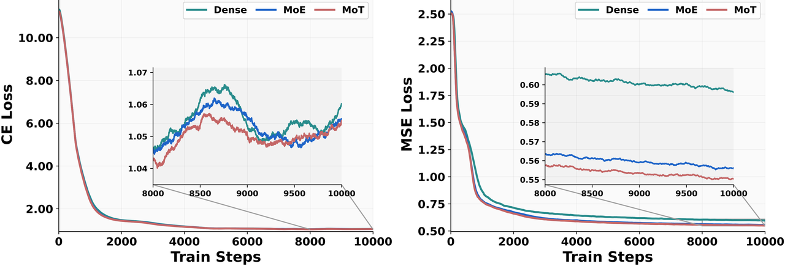

如上图，MoT 变体在所有任务上均优于 Dense 和 MoE 设计，尤其在多模态生成任务上差距最显著。生成任务的 MSE 损失呈现平滑单调下降趋势， MoT 不仅收敛最快，且最终损失最低 ，理解任务的 CE 损失因交错异构数据而波动较大，但  MoT 仍总体表现最佳。这说&#x660E;**将生成与理解任务的参数解耦**的明显优势，二者可能将模型引向参数空间的不同区域。也就是说为多模态理解与生成分配独立参数，可缓解由模态特定学习目标竞争引发的优化难题。

* **数据**

BAGEL 的训练数据覆盖语言、图像、视频和网页等多种模态，通过统一的多模态接口支持复杂的推理、上下文预测、物理建模与未来帧生成。除了常规的 VLM、文本到图像 T2I 和 LLM 数据外，还构建了大规模的**视觉-文本交错数据集**，以增强模型在长上下文、多轮交互场景下的多模态理解与生成能力。

1. **纯文本数据**

为维持底层 LLM 的语言能力，引入高质量纯文本语料，确保模型在通用任务中保持强推理与生成性能。

* **视觉-文本配对数据**

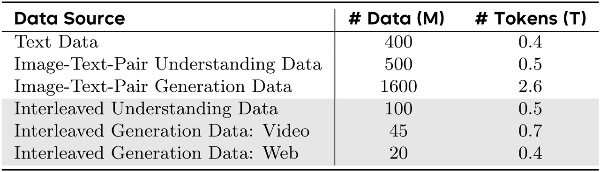

分为两个子集： &#x20;

> * **VLM 预训练数据**：来源于网络 alt-text 和图像标题，经过 CLIP 相似度过滤、分辨率/宽高比约束、文本长度限制及去重处理，并采用概念感知采样提升稀有类别覆盖。同时加入 OCR、图表和定位标注等结构化监督，强化空间与阅读理解能力。 &#x20;
>
> * **T2I 生成数据**：包含高质量图文对及少量合成数据，强调 caption 风格多样性，如艺术性、超现实描述和图像质量，清晰度、结构完整性、语义丰富性，以提升生成的视觉保真度与风格表现力。

* **视觉-文本交错数据**

配对数据难以建模多图像与中间文本的复杂交互，因此从**视频**和**网页**两大来源构建交错序列：

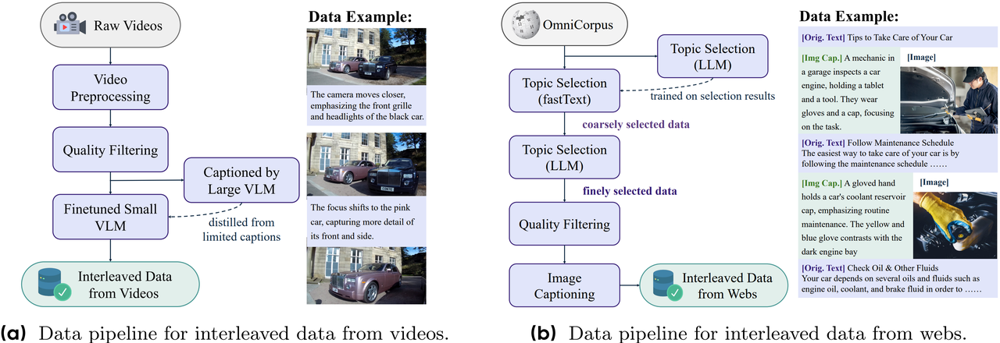

> * **视频数据**：利用公开视频资源（如 Koala36M、MVImgNet2.0）捕获真实世界的时空动态。通过轻量级 captioning 模型（基于 Qwen2.5-VL-7B 微调）生成连续帧间的视觉变化描述（如动作、物体移动、场景切换），每段视频平均采样 4 帧，共构建 **4500 万条时序接地的交错序列**。
>
> * **网页数据**：基于 OmniCorpus 等大规模网页语料，提取自然交错的图文文档（如教程、百科条目）。为提升图像生成的可控性，对每张图，先用 VLM 生成简洁描述并插入图前作为语义脚手架，引导模型在生成前形成概念预期；同时对过长的上下文文本进行 LLM 摘要压缩。最终构建 **2000 万条高质量交错网页文档**。

此外引入 **50 万条推理增强样本**，在 T2I 生成、自由图像编辑和概念性变换等任务中显式嵌入语言推理链（如“目标是什么 → 如何实现”），帮助模型将高层意图转化为具体视觉操作，显著提升生成的逻辑性与指令遵循能力。

* **训练**

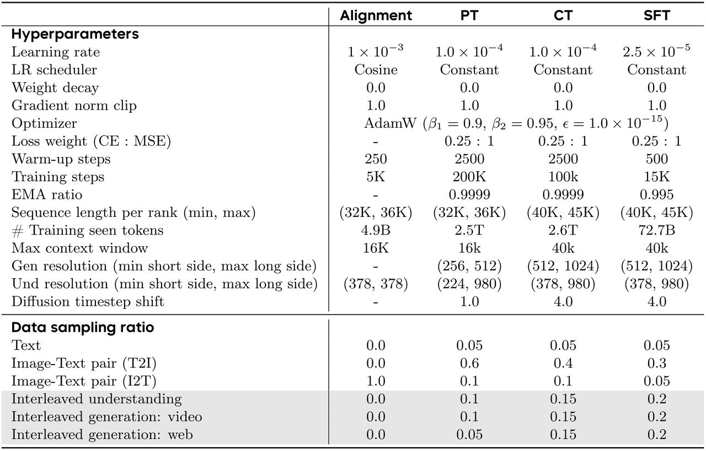

采用多阶段训练策略，动态混合上述数据，具体包括：**对齐阶段 **Alignment、**预训练阶段 PT**（Pre-training）、**持续训练阶段 CT**（Continued Training）和**监督微调阶段 **SFT：

> * **对齐**：仅训练 MLP，冻结视觉编码器与语言模型。仅使用图文对数据进行图像 captioning，每张图像调整为$$378 \times 378$$固定分辨率，匹配预训练 SigLIP2 输入尺寸。
>
> * **预训练**：向 LLM 添加 QK-Norm，除 VAE 外所有参数可训练。训练语料含 2.5T token，包括文本、图文对、多模态对话、网页交错与视频交错数据。对多模态理解与生成均采用原生分辨率策略，限制每张图像的最长边与最短边。
>
> * **持续训练**：相比预训练，提升视觉输入分辨率，这对生成与理解性能都比较重要，并提高交错数据采样比例，以强化跨模态推理学习，此时模型核心能力已更稳定。持续训练阶段消耗约 2.6T token。
>
> * **监督微调**：对多模态生成，从图文对与交错生成数据集中构建高质量子集；对多模态理解，从 LLaVA-OV与 Mammoth-VL 指令微调数据中筛选子集。总训练 token 为 72.7B。

所有训练阶段均使用 AdamW 优化器，$$\beta_1 = 0.9$$, $$\beta_2 = 0.95$$。设$$\epsilon = 1.0 \times 10^{-15}$$以抑制 loss 尖峰。提升生成分辨率时，同步将扩散 timestep 从$$1.0$$增至$$4.0$$，以确保噪声水平分布合理。PT、CT、SFT 阶段采用恒定学习率，便于在不重启训练的前提下轻松扩展数据规模。为保证各 rank 负载均衡，将每 rank 序列打包至窄长度范围：对齐与 PT 阶段：**`32K–36K`** token；CT 与 SFT 阶段：**`40K–45K`** token。

1. **数据采样比例**

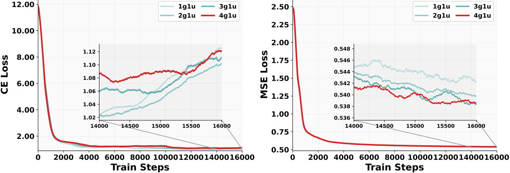

通过在 1.5B Qwen2.5 LLM 上调整多模态生成数据与理解数据的比例，进行系列控制实验。如上图，将生成数据采样比例从 50% **`1g1u`**&#x589E;至 80% **`4g1u`**，MSE 损失稳步下降，绝对值降低**`0.4%`**，这对 Rectified Flow 是显著提升。相比之下，交叉熵 CE 损失在不同比例下无一致规律；**`4g1u`**与**`2g1u`**在第 14000 步的最大差距**`0.07`**对下游基准影响可忽略。这些发现表明：**生成样本应远高于理解样本的采样频率**。

* **学习率**

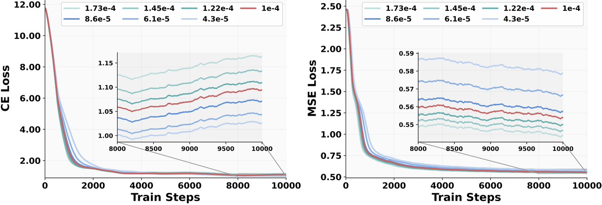

结果如上图，生成和理解数据比例1：1。较大学习率加速 MSE 损失收敛，较小学习率利于 CE 损失。为权衡此矛盾，为两个目标分配独立权重因子。

## 5.4 Any-to-Any（Omni 全模态）

### 5.4.1 AnyGPT

* **模型结构**

AnyGPT 是可统一训练的综合框架，由三个主要模块构成：

> 1. **多模态分词器 multimodal tokenizer**：将连续的非文本模态转换为离散的 token，随后这些 token 被组织成多模态交错序列
>
> 2. **多模态大语言模型**：通过 next token prediction 的目标对序列进行训练
>
> 3. **多模态反分词器 multimodal de-tokenizer**：在推理阶段，多模态 token 通过对应的反分词器被解码回其原始表示形式

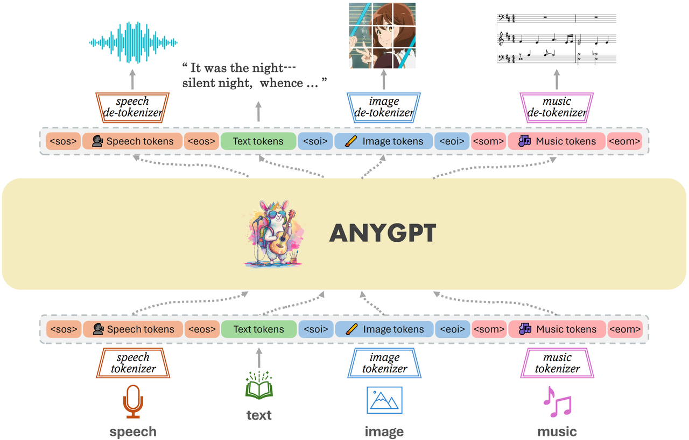

1. **分词**

**图像分词器 Image Tokenizer**

采用 SEED 分词器进行图像分词。其包含多个组件：ViT Encoder、Causal Q-Former、VQ Codebook、MLP 和 UNet Decoder。

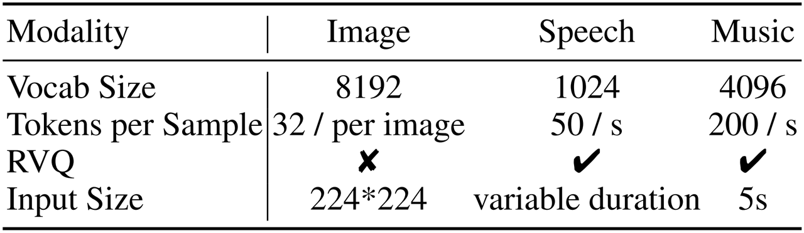

> 1. SEED 接收一张$$224 \times 224$$的 RGB 图像作为输入，ViT Encoder 将其编码为$$16 \times 16$$的图像 patch
>
> 2. Causal Q-Former 将这些块特征转换为$$32$$个 Causal Embedding
>
> 3. 一个包含$$8192$$个条目的 Codebook 将这些 Embedding 离散化为一串量化的 code
>
> 4. MLP 将视觉码解码为 Generation Embedding，该 Embedding 与预训练的 Stable Diffusion 的潜在空间对齐
>
> 5. UNet Decoder 将 Generation Embedding 还原为原始图像

**语音分词器 Speech Tokenizer**

AnyGPT 采用 SpeechTokenizer 作为语音分词器，其采用基于残差向量量化 **RVQ**（**R**esidual **V**ector **Q**uantization）的 Encoder-Decoder 架构。SpeechTokenizer 使用每层含 1024 个 Codebook 条目的 8 层分层量化器将单通道音频序列压缩为离散矩阵，并达到 50 Hz 的帧率。第一层量化器捕获语义内容，第 2 至第 8 层则编码 paralinguistic 细节。一段 10 秒的音频因此被转换为一个$$500 \times 8$$的矩阵，分为语义 token 和声学 token。AnyGPT 采用在 CommonVoice 和 LibriSpeech 数据集上预训练的 SpeechTokenizer 变体。

> **注**：在 AnyGPT 中，LLM 用于建模语义 token，而语音克隆模型则补充其余的副语言信息。因此，LLM 中语音词汇表的大小等于一个 Codebook 的大小，即$$1024$$。

**音乐分词器 Music Tokenizer**

语音与音乐具有相似的数据格式，但内容差异显著，因此 AnyGPT 将它们视为独立模态，并使用专用分词器。对于音乐，采用 Encodec 作为音乐分词器，其是使用 RVQ 对潜在空间进行量化的卷积自编码器。AnyGPT 使用一个在 20K 首音乐曲目上预训练的现成 Encodec 变体，处理 32 kHz 单声道音频，帧率为 50 Hz。其生成的 Embedding 通过 4 层 RVQ 进行量化，每层 Codebook 大小为$$2048$$，因此组合后的音乐词汇表大小为$$8192$$。AnyGPT 将 5 秒的音乐编码为$$250$$个潜在帧，最终生成一个$$250 \times 4$$的码矩阵。为使语言模型能够预测整段音乐片段，将这 4 层音乐码按帧逐帧展平为一个因果序列。语言模型首先预测第一帧的前 4 个 token，然后以类似方式继续预测后续帧。

* **LLM**

**扩展词汇表**

为将多模态离散表示融入预训练 LLM，在原有词汇表基础上新增模态专用 token，并相应扩展 Embedding 层和预测层。新引入的参数随机初始化。所有模态的 token 共同构成新的词汇表，各模态在语言模型中被训练以对齐到一个共享的表示空间。该增强词汇表的大小记为$$V$$，其为所有模态词汇表大小之和：

$$V = \sum_{i=1}^{n} V_i$$

其中 $$V_i$$ 表示第 $$i$$ 个模态的词汇表大小。

**统一多模态语言模型**

借助模态专用分词器，可以将多模态数据压缩为离散 token 序列，并通过下一个 token 预测损失对语言模型进行训练。这使得核心 LLM 能以自回归方式统一处理感知、理解、推理和生成等任务。AnyGPT 采&#x7528;**`LLaMA-2 7B`**&#x4F5C;为主干模型，其在 2 TB 文本 token 上进行了预训练。除 Embedding 矩阵和预测层的形状调整外，语言模型的其余部分保持不变。

* **多模态生成**

高质量多模态数据的生成是非常困难的，如高清图像和高保真音频。这类数据通常需要大量比特才能准确表示，导致序列长度过长，而语言模型的计算复杂度随序列长度呈指数增长。为了解决这个问题，AnyGPT 采用两阶段框架进行高保真生成：**语义信息建模**与**感知信息建模**。首先，语言模型负责生成在语义层面已完成融合与对齐的内容；随后，非自回归模型将多模态语义 token 转换为感知层面的高保真多模态内容，在性能与效率之间取得平衡。

> * **图像**：使用与扩散模型潜在空间对齐的 SEED token 进行视觉语言建模。语义级 SEED token 由扩散模型解码为高质量图像。
>
> * **语音**：采用非自回归的掩码语言模型 SoundStorm 从语义 token 生成 SpeechTokenizer 的声学 token。AnyGPT 训练了一个 SoundStorm 变体，其在 Multilingual LibriSpeech 数据集上使用 SpeechTokenizer 进行训练。随后，SpeechTokenizer 的解码器将所有语音 token 转换为原始音频数据。这种方法可以使 AnyGPT 能够仅凭 3 秒语音提示即可复现任意说话人的声音，同时显著缩短 LLM 所需处理的语音序列长度。
>
> * **音乐**：使用 Encodec token 滤除人耳无法感知的高频细节，再通过 Encodec 解码器将这些 token 重建为高保真音频数据。

* **多模态数据**

为支持任意模态到任意模态的生成，AnyGPT 构建了两类关键数据：**大规模对齐的预训练数据**和**高质量交错式指令微调数据**。

1. **预训练数据：以文本为中心的跨模态对齐**

由于天然对齐的多模态数据稀缺，采用以文本作为桥梁的策略，将所有模态分别与文本对齐，从而间接实现模态间对齐。

> * **图像–文本**：整合 LAION-2B、LAION-COCO、LAION-Aesthetics 和合成数据集 JourneyDB，经严格过滤后得到 3 亿高质量图文对；同时引入 MMC4 的 730 万交错文档，提升模型处理图文混合序列的能力。
>
> * **语音–文本**：融合 Gigaspeech、Common Voice 和 MLS，共 57000 小时语音-文本对，覆盖多样口音、场景和录音条件。
>
> * **音乐–文本**：爬取超百万音乐视频，通过 Spotify API 匹配歌曲并提取元数据；利用 GPT-4 将噪声元数据转化为高质量文本描述，构建大规模音乐-文本对。

所有模态数据按 token 数量统一量化，并对低资源模态进行过采样，确保训练批次中各模态均衡。

* **指令微调数据：合成多模态交错对话**

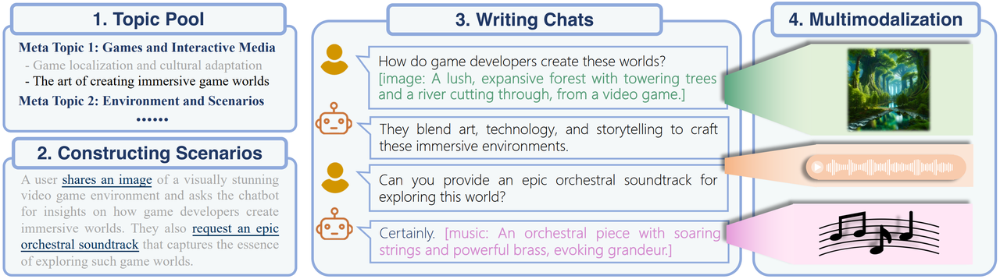

现有指令数据极少包含三种以上模态。因此 AnyGPT 提出两阶段合成方法，构建了 10.8 万条高质量多轮多模态对话：

> 1. **文本级对话生成**：用 GPT-4 生成包含图像、语音、音乐等模态描述的纯文本对话，共 100 个元主题 → 2 万具体主题 → 多轮对话。
>
> 2. **模态实例化**：将文本描述转换为真实模态：图像使用 DALL·E 3、音乐使用 MusicGen、语音使用 Azure TTS &#x20;

最终数据集包含约 20.5 万图像、50.3 万语音片段和 11.3 万音乐片段。此外，我们还将 10 万条纯文本指令对话通过 TTS 转为语音对话，进一步增强语音交互能力。

> 注：这种合成策略高效解决了多模态指令数据稀缺问题，为模型支持复杂、交错的多模态人机交互奠定基础。

* **训练**

1. **预训练**

采用多种模板构建多模态句子，以确保预训练数据的多样性。每种非文本模态内容，如图像、语音或音乐，均通过成对的特殊 token 标识其起始与结束位置。配对数据包含一个非文本模态$$X$$，例如图像、语音或音乐，及其对应的文本$$T$$，如标题或转录文本。这里利用 OpenAI GPT-4 生成数百条双向指令，涵盖$$X$$到文本和文本到$$X$$两类任务。

给定一个模态 token 序列$$S$$和相关文本$$T$$，从预定义的指令池中随机选择一个生成方向及对应指令$$I$$，构成三元组$$(I, S, T)$$。随后，根据生成方向，将该三元组按以下模板之一组织为训练序列：

> * **非文本 → 文本**
>
> $$\texttt{[Human]: } \{I\}.\{S\}\texttt{<eoh>. [AnyGPT]: } \{T\}\texttt{<eos>.}$$
>
> * **文本 → 非文本**
>
> $$\texttt{[Human]: } \{I\}. \text{This is input:}\{T\}\texttt{<eoh>. [AnyGPT]: } \{S\}\texttt{<eos>.}$$

对于图文交错的多模态数据,如网页文档中穿插的图像与文本，直接将非文本内容替换为其对应的 token 序列,因其天然构成连贯语句，无需额外模板。由于大部分图像和音乐数据源自网络，存在一定噪声，可能影响多模态生成质量。因此在初始预训练完成后，进一步采用高质量子集进行精调：

> * **文本到图像生成**：使用 **JourneyDB** 和 **LAION-Aesthetics**
>
> * **图像描述生成**：使用 **LAION-COCO**
>
> * **音乐任务**：引入 **AnyInstruct-108k** 数据集

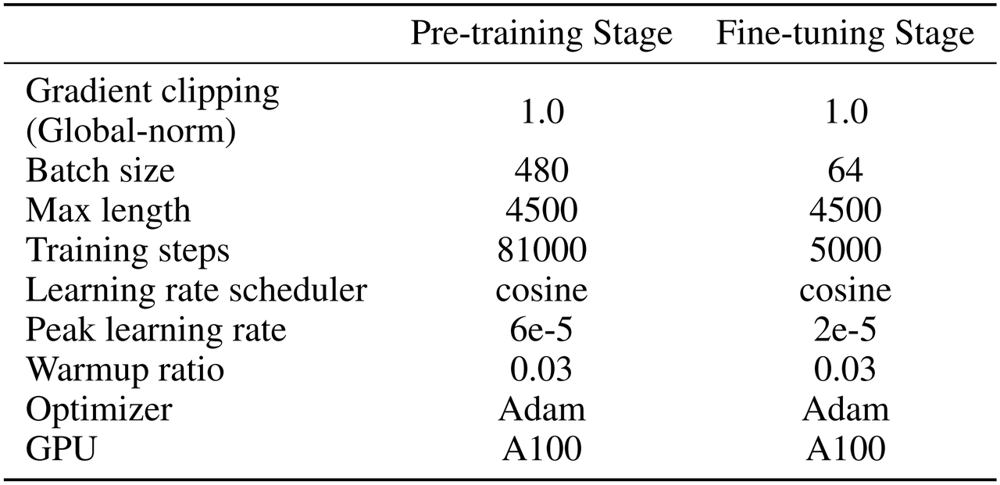

其余数据保持不变，模型在此基础上继续预训练 **4000 步**。详细训练超参数如上表。

* **指令微调**

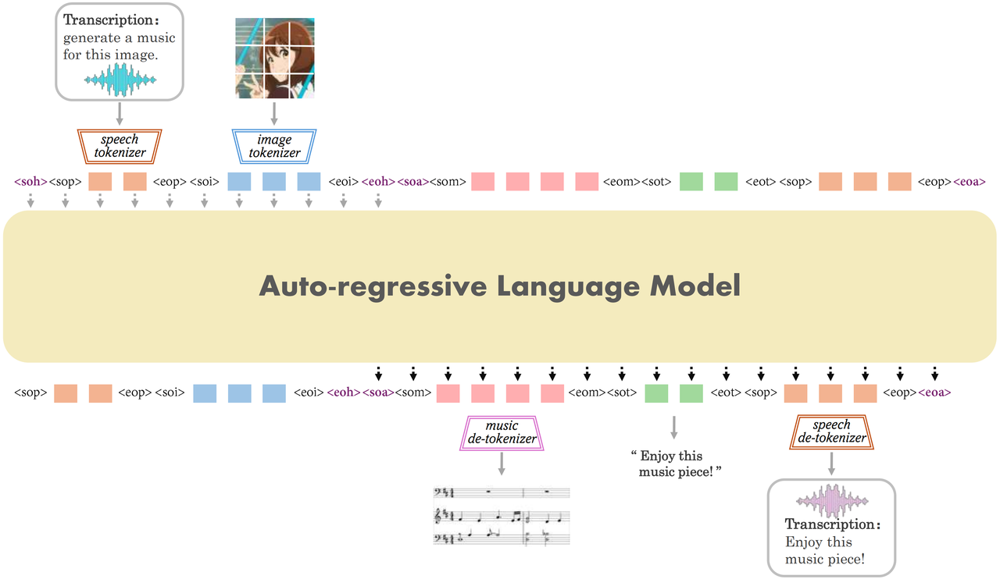

### 5.4.2 NExT-GPT

* **动机**

现有的 MLLM 大多只能处理多模态输入，而无法以多种模态生成内容，限制了其在实际应用中的灵活性和功能。人类在感知世界和与他人交流时会使用多种模态，因此开发能够接受和输出任何模态内容的 MLLM 对于实现类人水平的人工智能至关重要。尽管有一些工作尝试实现类似人类的任意模态转换，但它们要么缺乏 LLM 的核心推理和决策能力，要么受限于简单的配对内容生成。此外，一些系统由于完全基于管道架构，信息传递完全依赖于 LLM 产生的离散文本，这不可避免地会引入噪声并传播错误，且整个系统仅利用现有的预训练工具进行推理，缺乏整体的端到端训练，限制了内容理解和多模态生成的能力。为了克服上述局限性，需要构建一个能够处理任意模态输入和输出的端到端 MLLM，以实现更自然、更灵活的人机交互。

* **模型架构**

NExT-GPT 包含三个主要阶段：**编码**、**LLM 理解与推理**、**解码**。如下图：

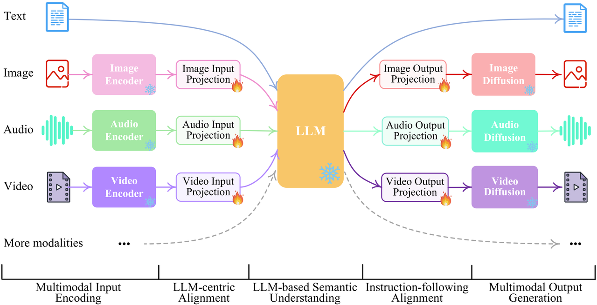

1. **多模态编码**

利用现有成熟模型对多种模态的输入进行编码。针对不同模态，有多种可选的编码器，例如视觉的**`CLIP`**、语音的**`HuBERT`**&#x7B49;。NExT-GPT 采&#x7528;**`ImageBind`**，一个统一的高性能编码器，支持六种模态。借助 ImageBind，可以不需要管理大量异构的模态专用编码器。随后，通过一个投影层将不同模态的输入表示映射为类语言表示，使其能被LLM理解。

* **LLM 理解与推理**

采用 Vicuna 7B，一个开源的 LLM，LLM接收来自不同模态的表示，并对其进行语义理解与推理。输出包括：

> * 直接生成的文本回答
>
> * 各模态的信号 token ，指示解码层是否生成多模态内容，以及在需要时生成何种内容

* **多模态生成**

在接收到 LLM 发出的带有特定指令的多模态信号后，基于 Transformer 的输出投影层将这些信号 token 的表示映射为后续多模态解码器可理解的形式。NExT-GPT 采用现成的、基于潜在空间条件的扩散模型进行不同模态的生成：

> * **图像合成**&#x4F7F;用 Stable Diffusion-v1.5
>
> * **视频合成**&#x4F7F;用 Zeroscope-v2
>
> * **音频合成**&#x4F7F;用 AudioLDM

经过一个投影层后，信号表示被送入条件扩散模型以生成内容。

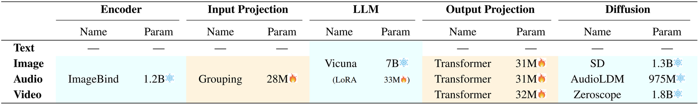

在整个系统中，仅需在后续学习过程中更新参数量较小的输入和输出投影层，其余所有编码器和解码器均保持冻结。需更新的参数量为**`155M`**（28+33+31+31+32），而总参数量为**`155M + 12.275B`**（1.2+7+1.3+1.8+0.975），即仅有约**`1%`**的参数需要更新。

* **多模态对齐学习**

NExT-GPT 设计的是一个松耦合的三层系统，仅需更新编码端和解码端的两个投影层。

1. **编码端对齐**

之前的一些多模态大模型采用基于 Transformer 架构的多模态编码器，生成网格状的块级特征，例如图像、音频或视频的 patch 特征，并通过线性层将其直接投影到文本特征空间，以使其能被 LLM 理解。但基于块的特征单元可能无法很好地契合复杂的文本 token 语义，因为语言 token 通常封装的是离散的概念。可能导致多模态大模型中的信息感知次优。因此 NExT-GPT 设计了一种可学习的概念 token，通过分组机制将网格级特征分层聚合为语义概念 token ，再将这种概念表示输入LLM。

为了实现对齐，在现有语料库和基准数据集上的**`X-caption pair`**数据上训练一个**`X-to-text`**生成任务，其中**`X`**代表图像、音频或视频：给定一个 X 的表示，使 LLM 生成对应的文本描述。使用三类 X-caption pair 数据：

> 1. **视频-描述对**：WebVid-2M，一个大规模短视频数据集，文本描述来源于素材网站
>
> 2. **图像-描述对**：CC3M，包含超过300万张图像，配有风格多样的自然语言描述
>
> 3) **音频-描述对**：AudioCaps，一个包含约4.6万条音频片段的数据集，每条配有人工撰写的文本描述，通过众包收集

训练流程如下：

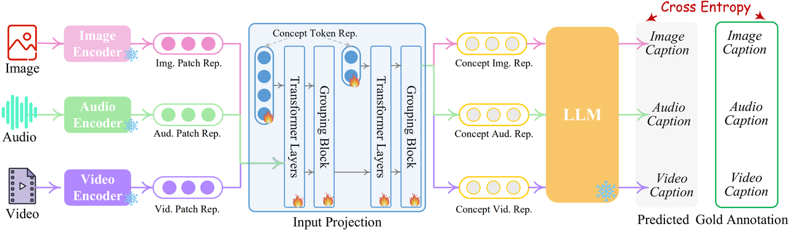

* **解码端对齐**

集成了来自外部的预训练条件扩散模型。主要目标是使扩散模型与 LLM 输出的指令对齐。若对每个扩散模型与 LLM 进行全面对齐，计算开销巨大。NExT-GPT 使用一种更高效的方法：**解码端指令跟随对齐**：

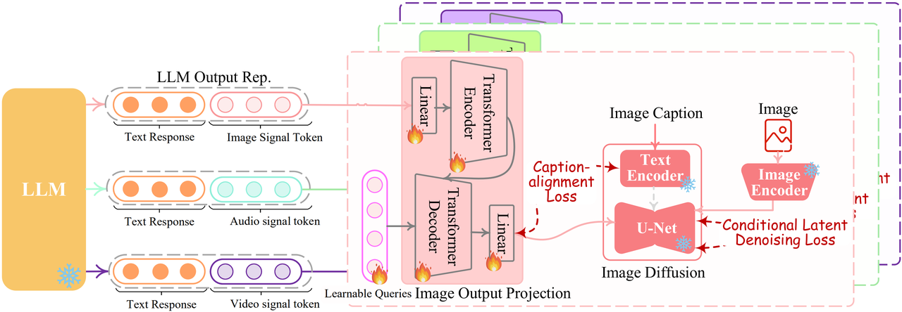

这里不直接输出纯文本指令，而是设计三类特殊 token：

> * **图像信号 token**：$$[\text{IMG}_i]$$（$$i = 0, \dots, 4$$）
>
> * **音频信号 token**：$$[\text{AUD}_i]$$（$$i = 0, \dots, 8$$）
>
> * **视频信号 token**：$$[\text{VID}_i]$$（$$i = 0, \dots, 24$$）

这些 token 隐式地携带丰富灵活的指令，用于指导下游扩散模型。目标是希望 LLM 能同时学习生成文本内容和模态信号 token：当 LLM 判断需生成某模态内容时，输出对应类型的特殊 token 以激活该模态；否则不输出该 token ，表示该模态未被激活。

一般来说扩散模型仅基于文本导向的文本编码器的表示进行条件生成。但这种以文本为中心的条件机制与 NExT-GPT 中 LLM 的模态信号 token 存在显著差异，导致扩散模型难以准确解读 LLM 的指令。因此一方面将 LLM 输出的经 Transformer 投影层后的模态信号 token 表示作为去噪过程中的条件输入，引导扩散模型生成合适的图像、视频或音频；另一方面最小化投影后的信号 token 表示与扩散模型中文本编码器生成的条件文本表示之间的距离，以加速对齐学习。所有 U-Net 扩散主干网络均保持冻结，从而确保训练极为轻量。

在对齐训练阶段，以 CC3M、WebVid 和 AudioCaps 中的描述文本作为输入，将其与信号 token 拼接作为输出。损失函数包含三个关键部分：

> 1. 生成信号 token 的负对数似然损失
>
> 2. 描述对齐损失：LLM 生成的信号 token 隐藏状态与扩散模型文本编码器生成的条件文本表示之间的$$\ell_2$$距离
>
> 3) 条件潜在去噪损失

* **模态切换指令微调**

1. **指令微调**

要使整个系统忠实理解并遵循用户指令、生成期望的多模态输出，仍存在差距。因此进一步进行指令微调 **IT**（ **I**nstruction **T**uning），以增强 LLM 的能力与可控性。IT 通过使&#x7528;**`(input, output) pair`**&#x5BF9;整个模型进行额外训练，采用 LoRA 训练，仅更新 NExT-GPT 中一小部分参数，并与两层投影层联合优化。

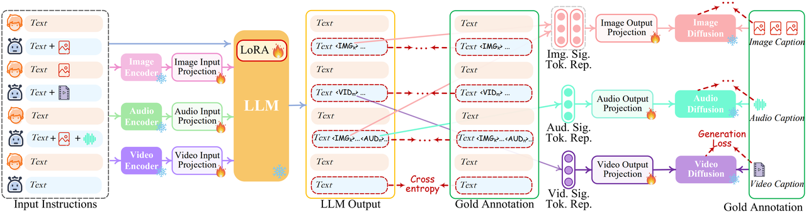

当一个样本输入系统时，LLM 重构并生成输入的文本内容，同时用多模态信号 token 表示多模态内容。将输出投影编码的模态信号 token 表示与扩散条件编码器编码的多模态标题表示进行对齐。除 LLM 微调外，我们还对 NExT-GPT 的解码端进行微调：将输出投影层编码的模态信号 token 表示与扩散条件编码器编码的标准多模态描述表示对齐。

* **指令数据集**

为支持 NExT-GPT 在 any-to-any 场景下的多模态生成能力，构建&#x4E86;**`Text→Text+X`**&#x6307;令数据集。基于现有大规&#x6A21;**`X-caption pair`**，如 CC3M、WebVid、AudioCaps 等，利用模板和 GPT-4 自动生成多样化的用户指令，将原始描述包装为符合交互场景的 Instruction-Output 对。

但现有 IT 数据集多局限于单模态输出且对话简短，难以满足动态多模态交互需求。为此，NExT-GPT 提出 **MosIT**（**Mo**dality-**s**witching **I**nstruction **T**uning）数据集：通过人工设&#x8BA1;**`Human–Machine`**&#x5BF9;话模板，引导 GPT-4 生成涵盖100+主题、3–7轮的多轮对话，要求模态在输入输出端交替切换，并包含感知、推理、规划等复杂行为。生成的图像、音频、视频多模态内容通过检索系统或 AIGC 工具（如 Stable-XL、Midjourney）匹配补充。经人工筛选后，最终获得5K条高质量、多模态、多轮交互样本，显著优于现有IT数据集的复杂性与真实性。

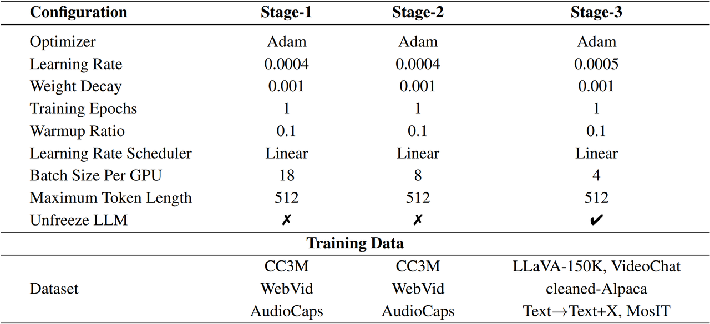

**优点**

**端到端的任意模态输入输出能力**：NExT-GPT 是首个端到端的通用 MLLM，能够处理文本、图像、视频和音频等模态的任意组合输入和输出，为实现更自然、更灵活的人机交互提供了可能。

**轻量级对齐学习技术**：通过编码端的 LLM 中心对齐和解码端的指令跟随对齐，仅需调整**`1%`**参数，即可实现有效的语义对齐，降低了训练成本，同时便于未来扩展到更多潜在模态。

**高质量的模态切换指令微调数据集**：人工收集和标注的 MosIT 数据集涵盖了各种模态组合的复杂指令，有助于增强 MLLM 的跨模态语义理解和内容生成能力，使其更接近人类水平的交互能力。

**缺点**

**模态生成质量的局限性**：尽管 NExT-GPT 在多模态生成方面表现出色，但在某些任务上，其生成质量可能受到扩散模型能力的限制，尤其是在文本条件下的模态编辑任务中，可能不如一些专门针对特定模态生成的模型。

**模态扩展的潜力**：目前系统仅支持四种模态：文本、图像、视频和音频，未来需要扩展到更多模态，如网页、3D视觉、热图、表格和图形等，以提高系统的通用性。

**LLM变体的多样性**：目前仅实现&#x4E86;**`7B`** Vicuna 版本的 LLM，未来可以考虑整合更多类型的 LLM 及其不同大小的变体，以满足不同用户的需求。

**多模态生成策略的改进空间**：可以探索将检索式方法与生成式方法相结合，以提高系统在多模态生成任务中的性能。

### 5.4.3 **Unified-IO 2**

* **统一的序列建模框架**

Unified-IO 2 使用一个 Encoder-Decoder Transformer 处理文本、图像、音频、视频历史、稀疏结构、稠密视觉预测与具身动作。所有任务都被改写为“多模态输入序列到多模态目标序列”的条件生成：Encoder 接收由不同模态表示拼接而成的输入，Decoder 逐 Token 生成文本 Token、图像码本索引、音频码本索引、坐标 Token 或动作 Token。模型不再为分类、检测、深度估计、音频生成分别设置任务头，任务差异由输入中的模态标记、训练范式标记和自然语言指令共同表达。

核心条件分布写成：

$$p_{\theta}(\mathbf{y}\mid\mathbf{x})=\prod_{t=1}^{T_y}p_{\theta}(y_t\mid y_{<t},\mathbf{x})$$

其中 $$\mathbf{x}$$ 可以同时包含文本、当前图像、音频以及历史图像/音频，$$\mathbf{y}$$ 可以是任何一种离散化目标。统一的不是原始数据形态，而是进入 Transformer 之后的 Token 接口与自回归预测接口。连续视觉和声学信号先经过预训练模态 Encoder，生成任务需要输出的信号再经过离散 Tokenizer 变成有限词表中的索引；稀疏几何结构和动作则直接量化为专用 Token。

* **Encoder-Decoder 主干**

主干由 **`24`** 层 Encoder 和 **`24`** 层 Decoder 组成，提供 L、XL、XXL 三个规模，参数量分别约为 **`1.1B`**、**`3.2B`** 和 **`6.8B`**。对应隐藏维度为 **`1024`**、**`2048`**、**`3072`**，注意力头数为 **`16`**、**`16`**、**`24`**。各模态输入都先投影到主干隐藏维度，Decoder 输出再通过共享输出投影映射到统一词表。

图像和音频历史最多各保留 **`4`** 个片段。每个片段先走与当前输入相同的 ViT 或 AST，再经 Perceiver Resampler 压缩为固定长度：每张历史图像压成 **`32`** 个潜在 Token，每段历史音频压成 **`16`** 个潜在 Token。固定长度重采样把多轮多模态上下文的开销从原始 Patch 数量中解耦，使历史信息可以直接拼入统一上下文。

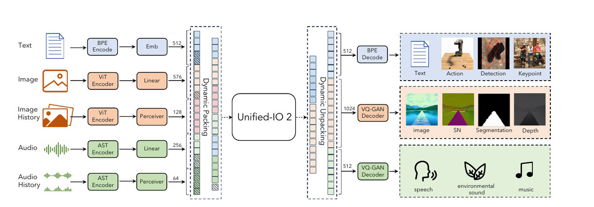

* **文本与结构化目标表示**

文本使用 LLaMA 的 SentencePiece BPE Tokenizer，基础词表为 **`32K`**。在此基础上增加 **`200`** 个 Span Mask Token，用于 UL2 风格的文本破坏与恢复；另设 **`10`** 个特殊 Token，指向输入中的图像、音频和历史片段。单个样本的文本输入与文本输出最长均为 **`512`** 个 Token。

点、边界框、相机位姿、三维包围盒等稀疏结构共享 **`1000`** 个位置 Token。二维点用两个量化坐标表示，二维框用四个坐标表示；三维包围盒使用 **`12`** 个离散量，依次编码投影中心、虚拟深度、对数归一化后的三维尺寸以及连续自我中心旋转。导航动作直接写成离散文本动作，机械臂操作把位置增量、旋转增量和夹爪状态分别量化到同一组位置 Token。这套表示让检测、关键点、三维理解和机器人控制都落入“生成一串结构 Token”的统一接口。

* **图像输入与图像输出**

图像输入由在 LAION-2B 上训练的 ViT-B 编码。为同时保留低层纹理和高层语义，取 ViT 第 **`2`** 层与倒数第 **`2`** 层特征，在通道维拼接后线性投影到主干维度。输入分辨率最高为 **`384×384`**，形成 **`24×24=576`** 个视觉 Token。

图像生成目标由 Dense VQ-GAN 离散化。**`256×256`** 图像按 **`8×8`** Patch 压成 **`32×32=1024`** 个索引，码本大小为 **`16512`**。深度、表面法线和分割等稠密预测也被转成 RGB 图像：深度先归一化为灰度图，法线的 $$x/y/z$$ 分量映射到 $$r/g/b$$，目标实例分割则输出由类别和框指定的二值掩码。这样，稠密视觉任务与普通图像生成共用同一个离散解码接口。

* **音频输入与音频输出**

每段音频最长为 **`4.08 s`**，以 **`16 kHz`** 采样。波形一次性变换为 log-Mel 频谱：FFT 窗长 **`1024`** 个采样点，Hop Length 为 **`256`**，频率范围 $$[0,8000]$$ Hz，最终得到 **`128×256`** 的频谱。音频输入由 AST 编码，同样拼接第 2 层和倒数第 2 层特征后投影到主干维度。

音频生成使用 ViT-VQGAN，把 **`256×128`** 频谱按 **`8×8`** Patch 量化为 **`512`** 个 Token，音频码本包含 **`8196`** 个离散码字；计入特殊符号后，音频输出词表为 **`8320`**。生成的码本索引先还原为频谱，再由 HiFi-GAN 声码器转换为波形。

* **训练样本的统一构造**

一个原始样本可能同时带有文本、图像帧、音轨、深度、框和动作，但训练时不会把全部字段机械地塞进输入。样本构造按五步执行：

> 1. **选择目标模态**：从当前样本真实存在的模态中随机选一个作为需要恢复或生成的目标。
>
> 2. **选择输入模态**：目标模态可以从输入中移除，也可以保留一个被破坏的版本；其他模态随机保留或屏蔽。
>
> 3. **选择训练范式**：根据目标类型选择 Span Corruption、因果生成、极端 Span Corruption 或模态去噪。
>
> 4. **生成输入 Mask**：为文本、图像或音频构造与当前训练范式匹配的掩码形状和掩码比例。
>
> 5. **添加前缀**：把目标模态 Token 与范式 Token 写到输入前缀，显式告诉模型要生成什么、按哪种规则生成。

目标模态、条件模态、破坏方式和前缀共同定义任务；自然语言指令负责描述语义要求，而不是独自承担任务路由。例如视频样本可提取连续帧、对应音频频谱与转写文本，把音频设为目标，保留文本和图像历史，选择音频掩码去噪，再以 `[Audio][R]` 前缀组成最终输入。

* **预训练数据混合**

预训练采样分布为：自然语言 **`33%`**，图文数据 **`40%`**，视频与音频 **`25%`**，三维与具身数据 **`1%`**，自动构造的增强数据 **`1%`**。增强数据主要补足稠密和稀疏标注：一类使用自动分割结果生成按点或框定位的分割任务，另一类在图像中合成几何形状，要求输出形状边界框或数量。

指令微调阶段覆盖 **`220`** 个任务，来自超过 **`120`** 个数据集。与预训练相比，这一阶段减少随机任务组合，改为使用明确 Prompt，把理解、生成、编辑、定位、三维和具身任务统一成可直接调用的指令格式。

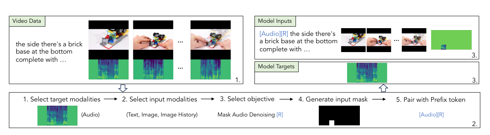

* **Multimodal Mixture of Denoisers**

训练目标扩展 UL2 的 Mixture of Denoisers。文本包含三种范式：`[R]` 表示标准 Span Corruption，`[S]` 表示从左到右的因果语言建模，`[X]` 表示掩码比例更高、跨度更长的 Extreme Span Corruption。图像与音频使用两种对应范式：`[R]` 随机遮挡输入 Patch 并重建完整目标，`[S]` 则完全移除目标模态，只根据其他输入模态从头生成。

所有范式仍最小化同一个自回归负对数似然：

$$\mathcal{L}_{\mathrm{NLL}}=-\sum_{t=1}^{T_y}\log p_{\theta}(y_t\mid y_{<t},\tilde{\mathbf{x}},m,o)$$

其中 $$\tilde{\mathbf{x}}$$ 是经过破坏或删减的输入，$$m$$ 表示目标模态，$$o$$ 表示训练范式。模态前缀和范式前缀使同一组参数能够区分“根据被遮挡图像做重建”与“根据文本从头生成图像”。

* **Decoder 动态 Mask**

图像和音频去噪若直接套用普通自回归 Teacher Forcing，会发生目标泄漏。设当前要预测第 $$t$$ 个目标 Token，Decoder 输入中通常包含右移后的真实序列；当目标模态的一部分同时出现在 Encoder 端时，Decoder 可能从历史输入中读到本应被遮挡的信息。完全屏蔽所有 Decoder 目标 Token 虽能消除泄漏，却会让生成范式与去噪范式相互冲突。

动态 Mask 只在“预测某个 Token 的那一步”开放该 Token 对应的 Decoder 输入，其余时间保持屏蔽。这样，当前位置仍能使用严格因果上下文，后续位置也不会提前看到被遮挡目标。对于二维图像和频谱，Decoder 还组合行形、列形与卷积邻域形状的稀疏 Mask，使可见上下文更贴近二维局部结构。

这套 Mask 在一个 Decoder 内兼容从头生成与掩码去噪，同时阻断由 Teacher Forcing 引入的信息捷径。

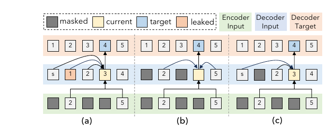

* **多模态稳定化设计**

普通一维 RoPE 只按序列位置旋转 Query 与 Key，无法区分二维 Patch 的行列关系。二维 RoPE 把每个注意力头的 Query/Key 通道均分为两半，分别使用行坐标和列坐标旋转：

$$\operatorname{RoPE}_{2D}(q_{h,w})=\left[\operatorname{RoPE}(q^{(1)}_{h,w},h);\operatorname{RoPE}(q^{(2)}_{h,w},w)\right]$$

当前图像和音频频谱使用二维坐标；历史片段把第一维换成时间片段索引，第二维表示 Perceiver 潜在位置。同一个位置编码算子因此同时表达图像空间、频谱时间-频率结构和多轮历史顺序。

不同模态混合后，注意力 Logit 容易出现极端值。主干在点积前对 Query 与 Key 分别做 LayerNorm，Perceiver Resampler 使用 Scaled Cosine Attention，注意力 Logit 统一以 FP32 计算。ViT 与 AST 在预训练阶段冻结，只在指令微调末段解冻。如果一开始同时更新模态 Encoder 与大规模主干，异质 Token 的尺度漂移会进一步放大训练不稳定。

* **动态 Packing 与训练日程**

样本经过 ViT、AST 和 Perceiver 后长度差异很大，因此 Packing 放在模态 Encoder 之后、主干 Transformer 之前执行。系统维护一个大小为 **`10`** 的候选池，为新样本寻找满足总长度约束且合并后利用率最高的已有 Pack；Pack 内使用 Block-Diagonal Attention Mask，禁止不同样本相互注意。预训练阶段 Encoder/Decoder 的 Pack 长度分别为 **`864`** 和 **`1280`**，单样本最大输入/目标长度分别为 **`1152`** 和 **`2048`**。

优化器为 Adafactor，前 **`5000`** 步线性 Warmup，之后学习率按 $$1/\sqrt{k}$$ 衰减；动量参数为 $$\beta_1=0.9$$、$$\beta_2=1-k^{-0.8}$$，梯度范数裁剪为 **`1.0`**。总训练 **`3M`** 步，其中预训练和指令微调各 **`1.5M`** 步。

### 5.4.4 M2-omni

* **模型架构**

M2-omni 构建了一个统一框架，同时支持多模态理解与生成任务，通过解耦的架构设计，最小化不同模态任务之间的相互干扰。这里的编码流程受到 Unified-IO2 的启发，其利用一个模态感知编码器，将图像、文本、音频和视频等多种输入映射到一个共享的 token 表示空间中。之前 Janus 说过，多模态理解与生成任务之间可能存在相互干扰，主要源于图像理解与生成所需的信息粒度存在显著差异。M2-Omni 与 Janus 采用独立视觉编码路径不同的是，在图像生成任务中以文本描述作为中间表示，有效避免了在潜在图像特征进行直接对齐。对于语音生成，采用基于离散 token 预测的方法，实现实时流式音频合成，同时最小化对其他模态分支性能的影响。模型结构如下：

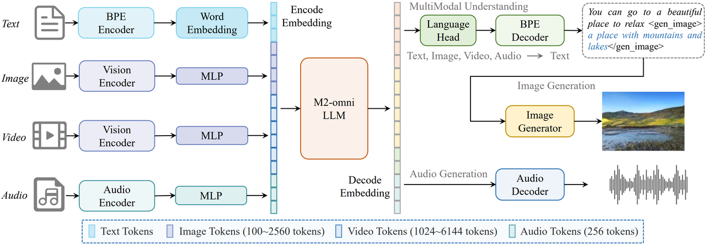

1. **视觉编码器 Vision Encoder**

在 M2-omni 中，视觉编码器从图像或完整视频中提取表示。采&#x7528;**`NaViT`**，能够处理任意分辨率的视频和图像。为减少视觉 token 的长度，将相邻的$$2 \times 2$$个 token 拼接为一个 token，并使用 MLP 将其维度压缩回原始维度，从而对视觉表示进行下采样。

* **音频编码器 Audio Encoder**

采&#x7528;**`SAN-M`**&#x7F16;码器提取音频 token。随后对音频编码器输出应用$$1 \times 3$$的平均池化操作，将每三个相邻 token 聚合为一个 token，从而减少音频 token 的总数。为适应音频 token 序列长度的可变性，使用特殊 token **`<audio_pad>`**对压缩后的音频序列进行填充，确保所有序列具有统一长度。

* **LLM**

M2-omni LLM 融合多模态信息，并输出用于统一多模态理解与生成的解码器 Embedding。这里以**`Llama3.1-8B`**和**`Llama3.3-70B`**的预训练权重初始化。为实现文本、图像、视频和音频模态的统一位置编码，在推理时能泛化至更长序列，将 Llama 中原有的 **1D-RoPE** 替换为**`M-RoPE`**。

* **图像生成器 Image Generator**

为解耦生成与理解的表示空间，在图像生成任务中使用文本描述作为中间表示。训练阶段，将图像标题用两个特殊 token **`<gen_image>`**和**`</gen_image>`**包裹，使模型能以灵活且无约束的方式生成用于图像生成的文本描述。推理阶段，M2-omni LLM 生成文本描述，被上述两个特殊 token 包围的生成标题将作为图像生成的文本条件，采用离线的 Stable Diffusion 模型 作为图像生成器。

* **音频解码器 Audio Decoder**

采用端到端方式，利用 M2-omni LLM 预测离散音频 token 用于语音生成。预测出的离散音频 token 随后输入预训练的 CosyVoice flow matching 与 vocoder 模型，以生成音频流。由于音频离散 token 与语言 token 在形式上的相似性，可以复用 M2-omni LLM 的模型结构来支持音频生成任务，从而与多模态理解任务兼容。

下表是 M2-omni 的详细模型配置：

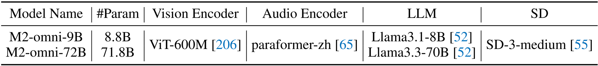

* **训练与对齐**

给定一个多模态数据集，采用模态感知编码器将包括图像、文本、音频和视频在内的多种模态输入投影到一个统一的 token 表示空间中。形式上，输入的多模态序列记为$$\mathbf{x} = (x_1, \dots, x_\ell)$$，其中$$\ell$$表示序列长度，每个$$x_i$$对应一个模态输入 token，如图像、文本、音频或视频。以自回归方式建模多模态序列的联合概率分布，即每个 token 以先前所有 token 为条件，如下式所示：

$$\log p_\theta(\mathbf{x}) = \sum_{i=s}^{\ell-1} \log p_\theta(x_{i+1} \mid x_0, \dots, x_i)$$

其中$$s$$表示离散输出 token 的起始索引，仅$$x_{>s}$$被视为建模目标，$$\theta$$表示模型参数。M2-omni 提出一种多阶段训练框架，通过逐步引入多模态知识，实现渐进式的模态对齐。整体训练流程包含三个主要阶段：**预训练 pre-training**、**指令微调 instruction tuning** 和**对齐微调 alignment tuning**。其中，预训练和指令微调阶段又进一步细分为三个子阶段，每个子阶段旨在逐步引入新的模态，每个阶段的详细参数如下：

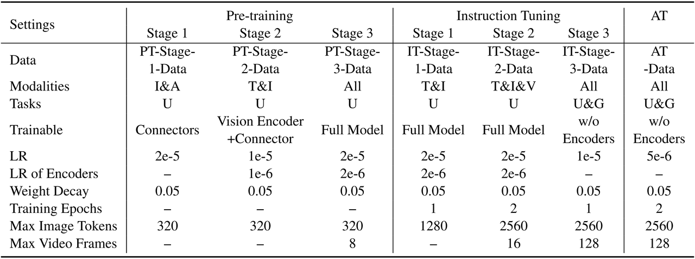

1. **预训练 Pre-training**

预训练阶段主要聚焦于将多种模态与 M2-omni LLM 对齐，使其能够捕获多模态概念表示并发展跨模态感知能力。

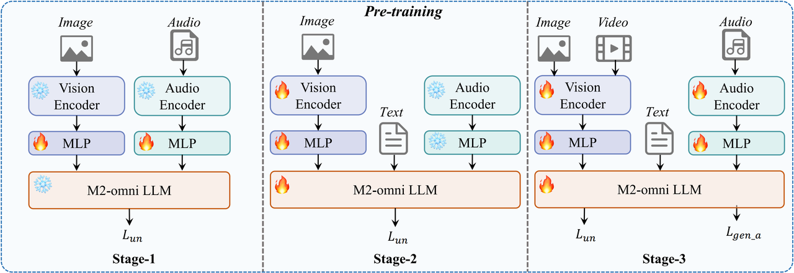

**编码器对齐**

利用图像-文本对、OCR 数据和音频-文本对进行训练，实现视觉和音频编码器与 M2-omni LLM 的对齐。通过将多个图像-文本对拼接为单一交错序列，增强上下文理解能力，并实现$$1.5$$倍的训练效率提升。

**图-文知识增强**

使用 Stage-1 中筛选的高质量图文对和 OCR 数据进行训练，提升图像-文本细粒度理解能力，为 Stage-3 的交错图文和视频理解任务奠定基础。同时引入纯文本数据以防止 M2-omni LLM 语言理解能力退化。

**多模态联合训练**

整合全模态知识，促进全模态对齐与统一表示学习。引入高质量图文对、视频-文本对、交错图文序列、音频-文本对及纯文本数据，进行端到端多模态预训练。采&#x7528;**`step balance strategy`**&#x5E73;衡不同模态的收敛速度

* **指令微调 Instruction Tuning**

指令微调使模型更好地理解用户指令并完成指定任务。

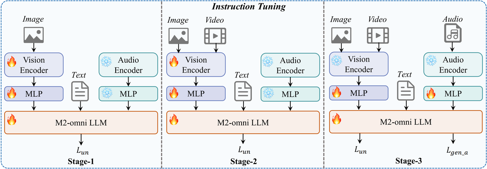

**图文指令微调**

提升模型在图像模态上的指令遵循能力，尤其针对科学、OCR、文档和图表等预训练阶段未充分学习的专项任务。

**视觉指令微调**

全面提升模型在视觉模态上的综合能力，包括图像-文本、视频-文本及交错图像-文本理解。

**全模态指令微调**

进一步整合音频模态与生成任务，使模型能够处理混合多模态序列的指令。提&#x51FA;**`dynamic adaptive balance strategy`**&#x4EE5;在所有模态上同时达到最优性能

* **对齐微调 Alignment Tuning**

聚焦于优化对话交互的质量与风格一致性，确保模型在所有模态上保持高水准表现。尽管指令微调阶段已赋予模型通用多模态对话能力，但其回复常存在简短、不流畅、无关、格式不当或幻觉等问题，影响用户体验。为缓解这些问题并进一步提升对话体验，在指令微调之后引入偏好对齐微调阶段。采用统一训练策略，融合 DPO 与指令微调，损失函数为：

$$\mathcal{L}_{\text{at}}(\mathbf{x}) = \mathcal{L}_{\text{dpo}}(\mathbf{x}_{\text{chosen}}, \mathbf{x}_{\text{rejected}}) + \lambda \cdot \mathcal{L}_{\text{it}}(\mathbf{x}_{\text{chosen}}, \mathbf{x}_{\text{it}})$$

其中$$\mathcal{L}_{\text{dpo}}$$和$$\mathcal{L}_{\text{it}}$$分别表示 DPO 损失和指令微调损失；$$\mathbf{x}_{\text{chosen}}$$与$$\mathbf{x}_{\text{rejected}}$$为偏好数据集中的优选与拒选样本；$$\mathbf{x}_{\text{it}}$$为指令数据集中的样本。这里将$$\lambda$$设为 0.3。此外采用 LoRA 微调 LLM 主干网络 5.0% 的权重，以防止灾难性遗忘。

* **任务平衡策略**

1. **步长平衡策略 Step Balance Strategy**

在预训练的多模态联合训练阶段，面临两大难点：**数据样本平衡**与**损失权重平衡**。一方面，各模态数据量差异显著，限制了数据稀缺模态的性能；另一方面，不同模态的损失不在同一量级，导致训练方向偏向损失更大的模态，造成次优收敛。为此，M2-omni 提出步长平衡策略，同时解决这两个难点。

**难点 1：数据样本平衡**

设$$\{D_1, D_2, \dots, D_M\}$$为$$M$$种不同模态的训练数据集合，$$L_i$$为第$$i$$个模态对应的损失函数。预训练阶段，作者探索不同模型更新方法，重点关注其在平衡多模态能力方面的有效性。所有方法均在每个小批量仅包含单一模态数据的约束下进行比较，以确保训练过程的平衡与高效。主要探索三种方法：

**随机采样**

从整个数据集中随机抽取 mini-batch，各模态采样概率与其数据量成正比：

$$\theta_{t+1} = \theta_t - \eta \nabla L_i(B_i)$$

其中$$i$$为随机选择的模态索引，$$B_i$$为来自模态$$i$$的 mini-batch，$$\theta_t$$和$$\eta$$分别表示时刻$$t$$的模型权重与学习率。

**轮询**

轮流使用各数据集的 mini-batch 更新参数，确保各模态迭代步数相等：

$$\theta_{t+1} = \theta_t - \eta \nabla L_{i_t}(B_{i_t})$$

其中$$i_t = (t \bmod M) + 1$$表示时刻$$t$$选择的模态。

**梯度累积**

轮流前向传播各模态的一个 batch，累积梯度后统一更新参数：

$$\theta_{t+1} = \theta_t - \eta \sum_{i=1}^{M} \nabla L_i(B_i)$$

梯度累积法始终优于其他两种方法，因为其更稳定的梯度和对各模态的充分训练。

**难点 2：损失权重平衡**  

采用一种简单而有效的方法确定模态特定的损失权重，步骤如下： &#x20;

> 1. 在子集$$D_i^{\text{sub}} \subset D_i$$上训练模型直至收敛
>
> 2. 记录收敛损失值$$L_i^*$$ &#x20;
>
> 3) 利用下式计算归一化权重$$w_i$$：
>
> $$w_i = \alpha \cdot \frac{1 / L_i^*}{\sum_{j=1}^{M} 1 / L_j^*}$$
>
> 这个权重随后用于参数梯度更新。对于采用梯度累积策略的数据样本平衡，设$$\alpha = 10$$，并按如下方式更新参数：
>
> $$\theta_{t+1} = \theta_t - \eta \sum_{i=1}^{M} w_i \nabla L_i(B_i)$$

完整的步长平衡策略算法流程为：

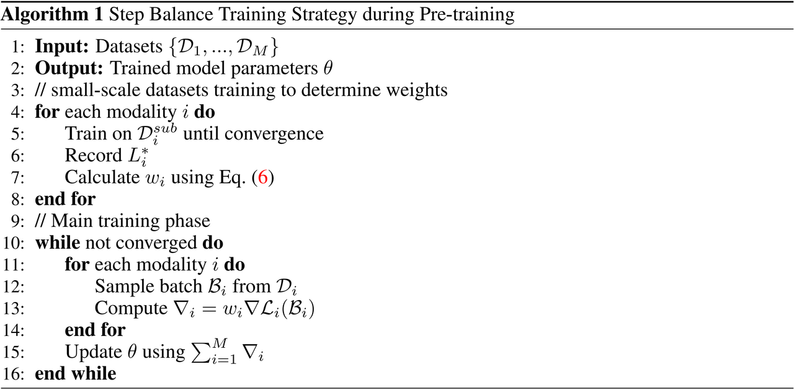

* **动态自适应平衡策略 Dynamic Adaptive Balance Strategy**

在全模态指令微调阶段，采用动态自适应平衡策略调节各模态的收敛速度。将每个模态视为独立训练任务，借鉴多任务学&#x4E60;**`MTL`**&#x539F;则平衡各任务的训练进度：对收敛曲线平缓的模态降低权重以防过拟合，对收敛陡峭的模态提高权重以加强学习。与传统 MTL 方法需在整个数据集上交替训练与验证不同，M2-omni 在训练过程中以固定间隔插入周期性验证片段，利用小型预设验证子集计算各模态的验证损失，从而在历史窗口内通过验证损失及其收敛斜率追踪各模态训练进度。这以极低计算开销实现模态权重的动态调整，提升全模态学习性能。

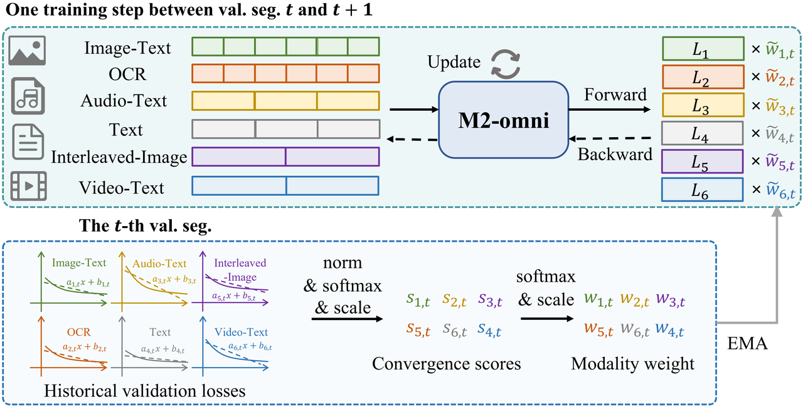

**数据划分**

从各模态训练数据中随机划分验证子集，共包含$$\sum_{i=1}^{M} S_i \cdot B_i$$个样本，其中$$S_i$$为第$$i$$个模态每次验证片段的验证步数，$$B_i$$为其验证 batch size，$$M$$为模态总数。该验证子集不参与模型训练。

**收敛斜率计算**

不同模态训练难度各异，损失数值范围不同。为公平分配权重，从归一化验证损失计算收敛斜率：

$$L^{\text{val}}_{i,t} = \frac{L^{\text{val}}_{i,t} - \min\left\{ \min\{L^{\text{val}}_{i,j}\}_{j=t-H+1}^{t}, \epsilon \right\}}{\max\{L^{\text{val}}_{i,j}\}_{j=t-H+1}^{t}  - \min\left\{ \min\{L^{\text{val}}_{i,j}\}_{j=t-H+1}^{t}, \epsilon \right\}}$$

其中$$L^{\text{val}}_{i,t}$$为第$$i$$个模态在第$$t$$个验证片段的验证损失，$$H$$为历史窗口大小，$$\epsilon = 10^{-6}$$防止除零。随后用线性回归模型$$a_{i,t} x + b_{i,t}$$拟合历史窗口内的验证损失，斜率系数$$a_{i,t}$$即为当前模态的收敛速率。

**权重分配调整**

为确保平衡初始化并缓解初始收敛轨迹的不准确性，前$$H$$个验证片段中所有模态损失权重$$\tilde{w}_{i,0}$$固定为 1。对于第$$t$$个验证片段$$t > H$$，首先计算第$$i$$个模态的归一化斜率$$\tilde{a}_{i,t}$$与收敛得分$$s_{i,t}$$：

$$\tilde{a}_{i,t} = \frac{M \cdot a_{i,t}}{\sum_{j=1}^{M} |a_{j,t}|}, \quad s_{i,t} = \text{softmax}(\tilde{a}_{i,t}) \cdot (-1 \cdot \tilde{a}_{i,t})$$

其中 softmax 沿模态维度进行。接着计算当前片段的模态权重分配：

$$w_{i,t} = M \cdot \text{softmax}(f \cdot s_{i,t})$$

其中$$f$$为调节权重分布的缩放因子，乘以$$M$$确保总权重和为$$M$$。为避免单步更新引起的剧烈波动，采用指数移动平均**`EMA`**机制平滑调整各模态训练权重：

$$\tilde{w}_{i,t} = \alpha \cdot \tilde{w}_{i,t-1} + (1 - \alpha) \cdot w_{i,t}$$

其中平滑因子$$\alpha = 0.9$$。调整后的模态特定损失权重$$\tilde{w}_{i,t}$$用于下一验证片段前的所有训练步。通过该动态自适应平衡策略，所有模态性能均优于对应单模态模型。

* **语言能力维持策略**

全模态 MLLM 应维持强大的语言能力，因为语言本身也是其支持的模态之一。在 M2-omni 的预训练与后训练阶段，若仅使用多模态数据解冻 M2-omni LLM，会导致语言能力显著下降，凸显引入纯文本数据的重要性。这是因为多模态数据中的文本往往缺乏纯文本数据的多样性与复杂性，易导致模型偏差。为此在每次解冻 M2-omni LLM 时，均引入受控比例的纯文本数据。当纯文本数据比例控制在约 25% 时，可有效防止多模态能力退化，同时维持稳健的语言能力。

当然可以。以下是简化后的 **第 4 节“数据配置”** 内容，保留关键信息，语言更简洁：

* **数据**

1. **预训练数据**

预训练数据围绕对齐不同模态和学习世界知识两个目标构建：

> * **图像-文本**：约 20 亿对，主要来自公开网络爬取数据，并在第二阶段加入高质量人工标注标题
>
> * **OCR**：包含多个英文 OCR 数据集及大规模中文内部 OCR 数据（涵盖文档与场景文本）
>
> * **音频-文本**：3000 万对，覆盖语音识别（ASR）、音频描述（AAC）和音频标签（AAT）三类任务
>
> * **交错图像-文本**：采用公开数据集 MMC4，包含图文交错的多图文档
>
> * **视频-文本**：来自 WebVid-10M 和 Youku-mPLUG，并补充了内部高清视频数据
>
> * **纯文本**：使用 Pile、Wudao 及内部语料，用于维持语言能力

预训练分三阶段逐步引入模态：

> * **Stage 1**：图像、OCR、音频 + 文本，共 21.7 亿样本
>
> * **Stage 2**：精选高质量图像-文本和 OCR 数据，并加入 15% 纯文本
>
> * **Stage 3**：全面融合所有模态，新增视频、音频和交错图文数据

* **指令微调数据**

结合开源与自建数据，覆盖图像、视频、音频及纯文本指令任务。为缓解长尾类别（如科学、数学）数据不足的问题，M2-omni 设计了一个自动数据生成流程：利用 GPT-4 生成主题，检索相关图像，再用 GPT-4V 生成图文问答对，从而扩充高质量指令数据。微调也分三阶段：

> * **Stage 1**：聚焦图像理解和基础对话，文本占比约 30%
>
> * **Stage 2**：加入视频和交错图文理解
>
> * **Stage 3**：引入音频问答和图像生成任务，支持全模态混合指令

* **对齐微调数据**

使用两类数据：

> * **偏好数据**：由真实用户提示出发，让 M2-omni 和 GPT-4o 分别生成回复，人工标注更优答案，构建偏好对
>
> * **指令数据**：从全模态指令微调数据中均衡采样，与偏好数据按 1:1 混合

### 5.4.5 **AR-Omni**

* **单主干 Any-to-Any 自回归建模**

AR-Omni 使用一个 **`7B`** 参数的 Decoder-only Transformer 统一处理文本、语音和图像。三种模态先被离散化，再并入联合词表：

$$\mathcal{V}=\mathcal{V}_{\mathrm{text}}\cup\mathcal{V}_{\mathrm{speech}}\cup\mathcal{V}_{\mathrm{image}}$$

模型接收交错的多模态 Token 序列，使用完全一致的 Next-Token Prediction 生成后续文本、语音或图像 Token：

$$p_{\theta}(\mathbf{x})=\prod_{t=1}^{T}p_{\theta}(x_t\mid x_{<t})$$

理解与生成共享同一个 Transformer、同一套注意力层和同一条自回归时间线。输出的非文本 Token 直接交给对应 Detokenizer 还原，不再通过额外扩散模型或模态专家生成像素与波形。文本、语音、图像可以出现在输入和输出的任意一侧，因此文本到图像、语音识别、语音合成、图像描述、语音到图像以及多轮语音对话都只是不同的序列边界配置。

* **三类离散 Tokenizer**

**文本**：沿用 Chameleon 初始化所使用的 SentencePiece BPE Tokenizer，使文本 Embedding 与已有语言模型权重直接对齐。

**语音**：使用单码本 WavTokenizer，把波形映射为纯声学 Token。它不先预测语义 Token、再用第二级模型补充声学细节，而是让统一主干一次性预测可解码的声学码。Detokenizer 在拿到少量 Token 后即可开始合成波形，因此同一自回归输出流可以自然支持流式播放。

**图像**：采用 Chameleon 的 Scene-Aware VQ Tokenizer，将图像编码成一维排列的离散视觉 Token。图像生成结束后直接用 VQ Detokenizer 还原像素，不调用扩散 UNet。一维因果顺序要求模型在生成早期就确定全局布局，后续 Token 只能在既有前缀条件下补充细节，不能像扩散过程那样反复全局修正。

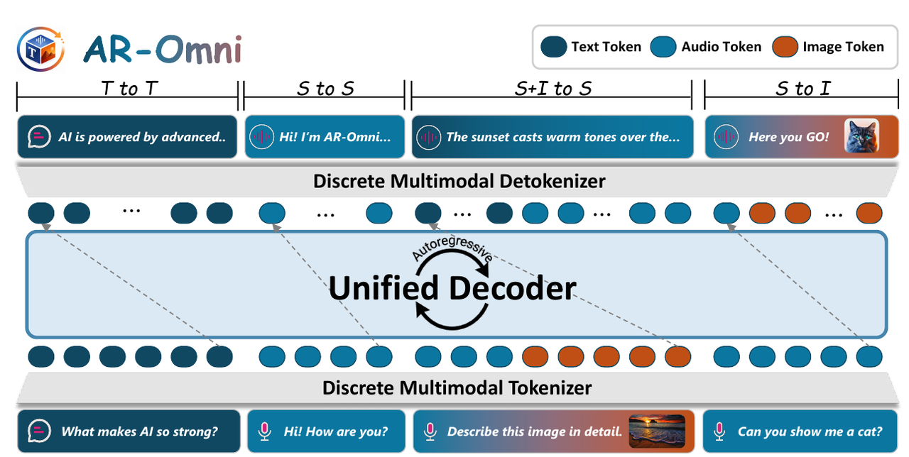

* **交错序列与模态边界**

每个用户轮次以 `<bos>` 开始，以 `<eoh>` 结束输入。语音 Token 包在 `<boa>...<eoa>` 中，图像 Token 包在 `<boi>...<eoi>` 中。单轮任务的 Assistant 输出以 `<eos>` 结束；多轮对话使用 `<eom>` 结束当前 Assistant 消息，再把后续历史按同一格式继续拼接。

文本在序列中承担模态桥接作用。例如语音到图像任务可以先输出转写文本，再输出图像 Token；图像与语音混合输入也可以先由文本说明当前意图，再进入目标模态。边界 Token 同时提供三类信息：模态起止位置、用户/助手轮次边界以及对话是否继续。

* **Task-Aware 有限状态解码**

解码器在联合词表上输出分布，但不同任务不采用完全相同的采样规则。ASR 和 TTS 的目标较确定，使用 Greedy Decoding；开放式文本生成、文本到图像以及其他创造性任务使用随机采样。有限状态控制器根据 Prompt 模板和已生成的边界 Token 限制下一个合法 Token 集合：进入语音区间后只允许语音词表与结束标记，进入图像区间后只允许图像词表与结束标记。

有限状态约束把“下一个 Token 属于哪种模态”从概率偏好提升为语法约束。这避免联合词表在长序列中混入错误模态 Token，也允许同一个主干在不同阶段切换 Greedy 与 Sampling 策略。

* **加权 Next-Token Prediction**

图像和语音序列通常远长于文本。如果对所有 Token 等权平均，长模态会占据主要梯度，短文本回答的学习信号被稀释。训练时为不同位置设置权重：

$$\mathcal{L}_{\mathrm{wNTP}}=-\frac{1}{T}\sum_{t=1}^{T}w_t\log p_{\theta}(x_t\mid x_{<t})$$

在图像到文本、语音到文本等 X2T 任务中，提高 Assistant 文本 Token 的 $$w_t$$；非响应区域与提示区域保持较低权重。这样，损失规模不再简单等同于每种模态的 Token 数量。

* **图像感知损失**

离散图像 Token 的交叉熵把所有错误码字视为同等错误，但相邻码字可能具有相似纹理或颜色。AR-Omni 使用固定图像码本 Embedding $$E$$ 作为感知目标，将主干隐藏状态 $$h_t$$ 通过可训练投影 $$W_h$$ 映射到码本空间：

$$\mathcal{L}_{\mathrm{perc}}=\frac{1}{|\mathcal{T}_{I}|}\sum_{t\in\mathcal{T}_{I}}\left\|W_hh_t-E[x_t]\right\|_2^2$$

$$\mathcal{L}=\mathcal{L}_{\mathrm{wNTP}}+\lambda_{\mathrm{perc}}\mathcal{L}_{\mathrm{perc}}$$

$$\mathcal{T}_{I}$$ 只包含目标图像位置，$$\lambda_{\mathrm{perc}}$$ 取较小值，使感知梯度与离散分类梯度保持同一量级。交叉熵负责预测正确码字，感知项进一步要求隐藏状态靠近目标码字的连续语义位置。

* **Residual-Post-Norm**

主干使用 Swin-Norm 风格的 Residual-Post-Norm，在注意力或 FFN 输出进入残差分支前做归一化：

$$h=x+\operatorname{Norm}(\operatorname{Attn}(x)),\qquad x'=h+\operatorname{Norm}(\operatorname{FFN}(h))$$

该结构限制每个残差更新的尺度，减少文本、语音和图像批次交替时激活分布的漂移。

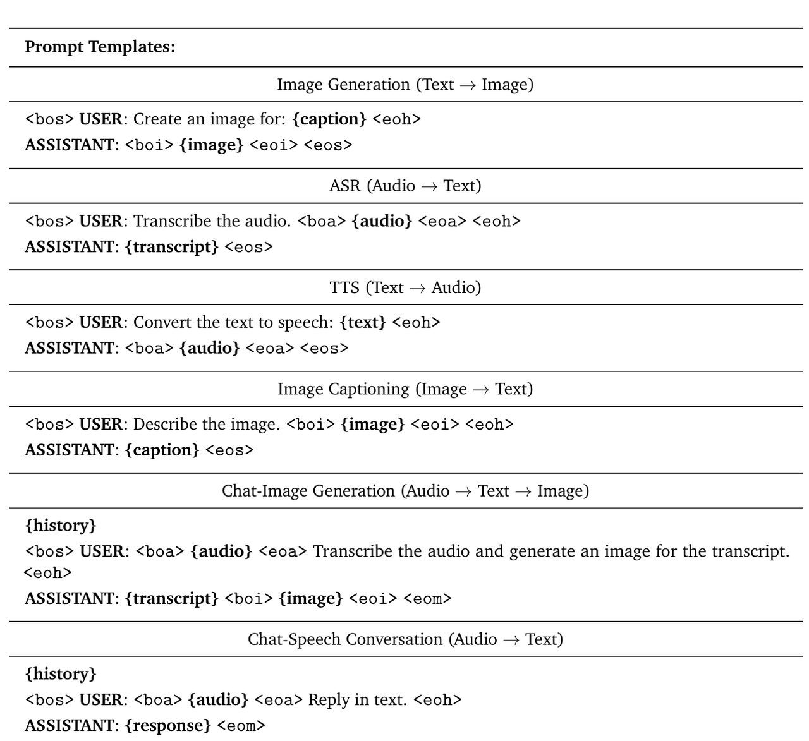

* **两阶段训练**

主干从 Anole 7B 初始化。第一阶段进行多模态预训练，联合优化加权 NTP 与图像感知损失；第二阶段进行指令微调，只在 Assistant 响应 Token 上计算损失，用户输入、历史上下文和系统 Prompt 仅作为条件。

预训练数据由三类子集混合：纯文本、图文和语音文本，采样比例为 **`0.5:1:2`**。各子集不做循环过采样，任一子集耗尽时结束该阶段。纯文本使用 Ultra-FineWeb；图文数据来自 LAION-2B、LAION-Aesthetics 与 JourneyDB；语音文本来自 GigaSpeech、Common Voice 与 MLS。

指令微调以 AnyInstruct 组织交错 Any-to-Any 样本。语音输入用 DEMAND 环境噪声增强；语音助手数据包含 VoiceAssistant-400K，并用 CosyVoice2 合成与上下文说话人音色对齐的 Assistant 语音；纯文本对话使用 UltraChat。训练模板覆盖文本到图像、ASR、TTS、图像描述、语音转写后生成图像以及多轮语音对话，使边界 Token 和有限状态解码在训练阶段就保持一致。

* **优化配置**

训练使用 **`8`** 张 NVIDIA A100，优化器为 Adam，学习率按线性日程变化，Warmup Ratio 为 **`0.05`**，全局梯度裁剪为 **`1.0`**。预训练最大序列长度 **`1300`**，全局 Batch Size **`480`**，训练 **`140K`** 步，峰值学习率 **`6×10^{-5}`**；指令微调最大长度 **`3456`**，Batch Size **`64`**，训练 **`18K`** 步，峰值学习率 **`2×10^{-5}`**。

联合词表并没有消除模态长度失衡、边界合法性与视觉码字距离缺失的问题。加权 NTP、有限状态解码和感知损失分别处理这三类问题，它们是单主干方案能够稳定工作的组成部分。

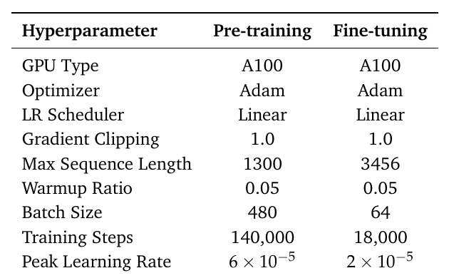

### 5.4.6 **NExT-OMNI**

* **统一表示、统一主干与统一生成过程**

NExT-OMNI 覆盖文本、图像、视频和音频，使用 Discrete Flow Matching 统一理解、生成与跨模态检索。图像/视频共享视觉 Encoder，音频使用音频 Encoder；同一个 Encoder 同时服务理解特征、生成离散码字和检索表示，不为理解与生成拆成两套视觉或声学分支。主干从 Qwen2.5-7B 初始化，保留文本 LM Head，并为视觉和音频各增加轻量模态 Head，新增 Head 总参数量约为 **`128M`**。

视觉、文本和音频 Token 在每一层双向自注意力中深度融合，而不是通过 Mixture-of-Experts 或 Mixture-of-Transformers 把不同模态分发到独立专家。生成端不外挂扩散模型或连续 Flow Head，图像、视频和音频都由主干直接预测离散码本索引，再由各自 Decoder 重建原始信号。

文本分支仍保留自回归语言模型的一位右移格式，使 Qwen2.5 的 Next-Token Prediction 权重可直接迁移；非文本响应则在 Discrete Flow Matching 中从噪声 Token 迭代校正。理解任务读取统一隐藏表示后由文本 LM Head 输出答案；生成任务由目标模态 Head 输出码本分布；检索任务对中间融合表示进行池化和相似度匹配。

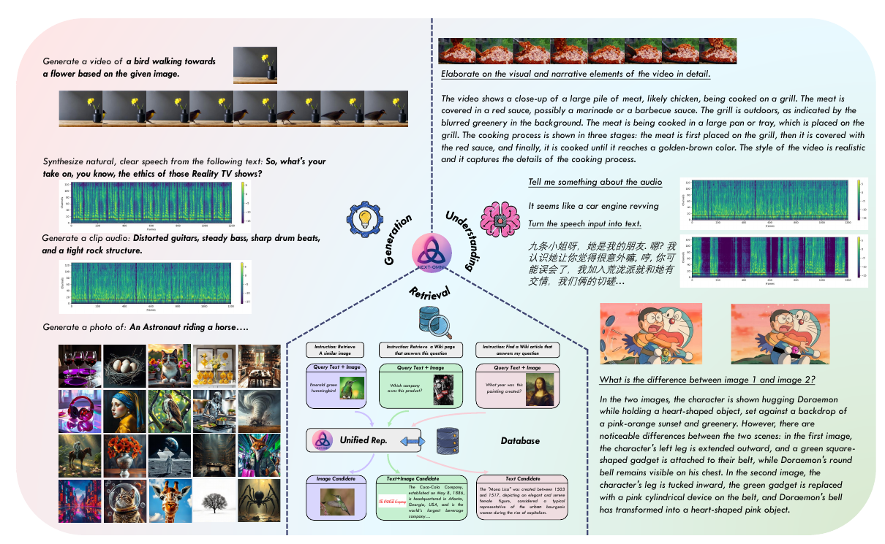

* **离散 Flow Matching 主流程**

设目标多模态序列为 $$\mathbf{x}_1=(x_1^1,\ldots,x_1^D)$$。训练时采样时间 $$t\sim\mathcal{U}(0,1)$$，再从条件路径 $$p_t(\mathbf{x}_t\mid\mathbf{x}_1)$$ 采样当前噪声状态 $$\mathbf{x}_t$$。当 $$t=0$$ 时响应区域接近随机 Token，当 $$t=1$$ 时接近真实目标。主干接收指令部分和当前响应状态，在每个响应位置预测最终干净 Token 的条件分布 $$p_{1\mid t}$$。

图像和音频位置不会把整数码本 ID 直接当作无序类别输入。对于码本索引 $$k$$，先取对应连续码字向量 $$c_k$$，再用模态投影映射到文本隐藏维度：

$$e_t^i=W_Mc_{x_t^i},\qquad M\in\{V,A\}$$

码本代表向量把离散 Token 之间的连续邻近关系带入主干，使跨模态注意力看到的是可比较的连续特征，而不是没有几何结构的整数编号。文本位置使用原始 Word Embedding，三类 Embedding 按交错序列拼接后进入同一 Transformer。

训练只对响应区进行去噪和校正，指令区始终保持干净。基本交叉熵为：

$$\mathcal{L}_{\mathrm{CE}}=\mathbb{E}_{t,\mathbf{x}_1,\mathbf{x}_t}\left[-\sum_{i\in\mathcal{T}_{\mathrm{resp}}}\log p_{1\mid t}(x_1^i\mid\mathbf{x}_t,t)\right]$$

推理从随机响应序列开始，在多个时间步上并行更新所有未固定位置；文本、图像、视频和音频只是使用不同 Tokenizer、码本 Embedding 与输出 Head，Flow 迭代规则保持一致。

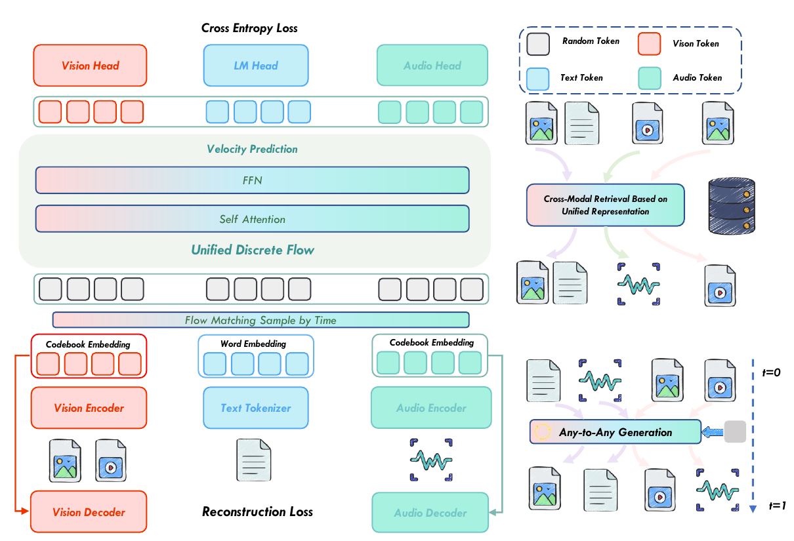

* **模态 Encoder Warmup**

视觉和音频 Encoder 在接入 7B 主干前先进行统一表示 Warmup。连续输入 $$X^M$$ 经过 Encoder 得到 $$z^M=E^M(X^M)$$，再在多码本中选择最近码字：

$$z_q^M=\operatorname*{arg\,min}_{c\in\mathcal{C}^M}\left\|z^M-c\right\|_2^2,\qquad M\in\{V,A\}$$

Warmup 同时优化重建与语义对齐：

$$\mathcal{L}_{\mathrm{warm}}^M=\mathcal{L}_{\mathrm{rec}}^M+\mathcal{L}_{\mathrm{sem}}^M$$

视觉重建项由像素重建、VQ 约束、LPIPS 感知损失和 GAN 判别损失组成；语义项使用句子级 CLIP 对比损失，使整图表示与对应文本描述对齐。视觉 Encoder 从 CLIP-ViT-Large 初始化，在约 **`70M`** 图文对上训练，使用 **`4×4096`** 的多码本量化。

音频重建项包含 Mel 频谱重建、VQ 约束、特征匹配的 L2 损失和 GAN 损失；语义项不是句子级对比，而是由文本 Decoder 逐 Token 预测音频描述。音频 Encoder 从 Whisper-Turbo 初始化，Warmup 数据约 **`102K`** 小时，使用 **`2×2048`** 多码本，并用 Qwen2.5-0.5B 作为音频描述 Decoder；单段音频最长 **`15 s`**。

重建让离散码字保留生成所需的细粒度信号，文本对齐让同一 Encoder 的中间表示可以直接服务理解与检索。只做语义对齐会丢失颜色、纹理和声学细节，只做重建则难以与语言主干建立稳定语义接口。

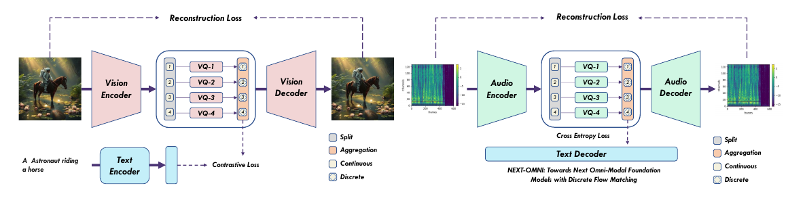

* **重建增强的 Flow 目标**

模态 Encoder 接入 DFM 主干后，训练仍保留视觉和音频重建项，避免大规模指令训练把码本推向只保留语义、忽略生成细节的方向：

$$\mathcal{L}_{\mathrm{overall}}=\lambda_1\mathcal{L}_{\mathrm{CE}}+\lambda_2\mathcal{L}_{\mathrm{rec}}^V+\lambda_3\mathcal{L}_{\mathrm{rec}}^A$$

三个系数不固定手调，而是用 GradNorm 根据各损失的梯度范数动态平衡。Flow 交叉熵负责把随机离散状态校正到目标 Token，重建项持续约束码本保真度，两部分在同一训练过程中共同更新。

* **多码本模态 Head**

多码本量化在每个时空位置产生多个子码本索引。若一个位置包含 $$K$$ 个子码本结果，模态 Head 需要从主干隐藏状态同时恢复 $$(c_1,\ldots,c_K)$$。NExT-OMNI 比较两种结构：

> 1. **并行 Multi-Token Head**：为每个子码本设置独立输出 Head，所有子码本同时预测。计算路径短，但各子码本只能共享主干状态，无法显式利用同一位置已预测的其他码字。
>
> 2. **自回归 Head**：把一个位置的子码本索引展开成局部短序列，依次预测后续子码字；Head 内使用注意力读取主干隐藏状态与前面子码本结果。

最终采用自回归 Head。主干仍在所有时空位置上并行执行 Flow 校正，只有单个位置内部的多个子码本按顺序解码。这种设计增加少量 Head 计算，但为子码本之间建立明确条件依赖，训练更稳定。

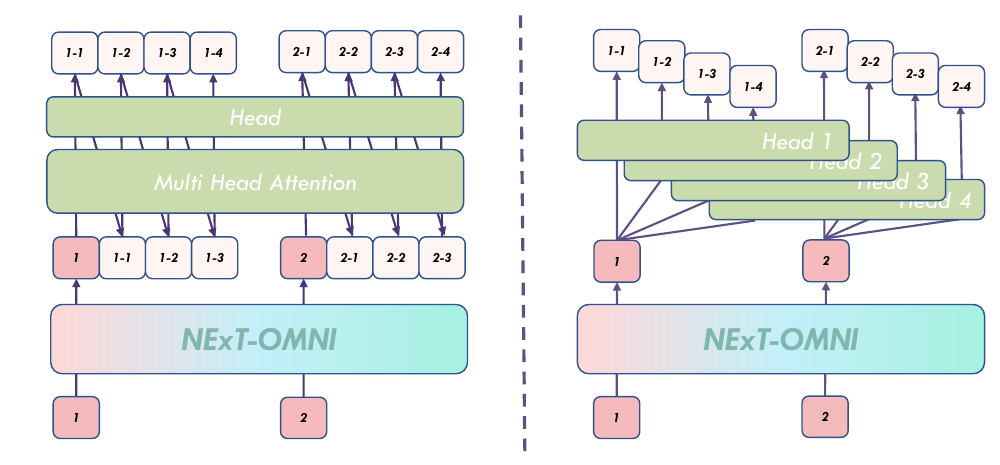

* **动态长度生成**

离散 Flow 一次更新整段响应，但生成前通常不知道目标长度。训练时先把响应补齐到 Block Size 的整数倍，并在真实结束位置放置 EOS，剩余位置填 PAD；默认 Block Size 为 **`64`**。推理从一个块开始，每轮根据尾部 EOS 置信度决定是否停止：若 EOS 置信度不足，则再扩展一个随机 Token 块继续去噪，直到置信度达到阈值或长度上限。

长度不由独立回归器一次性猜测，而是在 Flow 迭代中随内容逐块增长。短回答可以尽早结束，长图像/音频/视频序列也能按相同机制扩展，不需要为每种模态设计固定输出长度。

* **Adaptive Cache**

指令区在所有 Flow 时间步都保持不变，因此其 Key/Value Cache 只计算一次并全程复用。响应区会随迭代变化，但并非每个位置都需要每轮重算。系统比较当前 Value 特征与缓存 Value 特征的余弦相似度：

$$s_i^{(t)}=\frac{\left\langle v_i^{(t)},\hat v_i\right\rangle}{\left\|v_i^{(t)}\right\|_2\left\|\hat v_i\right\|_2}$$

相似度高于阈值的位置沿用缓存，变化明显的位置才更新对应 Cache。EOS 与新扩展块始终重新计算，避免缓存阻断长度决策。缓存策略利用 Flow 后期大量位置已趋于稳定这一事实，把计算集中到仍在变化的响应位置。

响应缓存不是永久冻结：若阈值过低，过期特征会阻碍后续迭代修正；若阈值过高，则退化为几乎每轮全量计算。

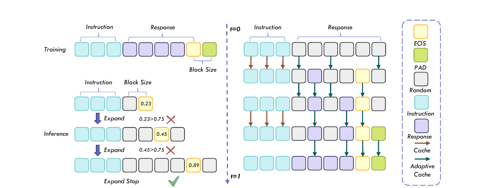

* **三阶段训练流程**

> **Stage 1：Pre-Training**
>
> 图像分辨率 **`256×256`**，视觉下采样率 **`16×`**，音频不超过 **`15 s`**，文本上下文不超过 **`2K`** Token。训练数据约 **`83M`** 对，迭代 **`10K`** 步；模态 Encoder/Decoder 学习率 **`2×10^{-5}`**，其他参数 **`1×10^{-4}`**，每 GPU Batch Size 为 **`16`**。
>
> **Stage 2：Continual Pre-Training**
>
> 图像提高到 **`384×384`**；长音频按不超过 **`15 s`** 的块切分；视频最多 **`8`** 帧；上下文扩展到 **`16K`**。约 **`52M`** 图文、音文和交错样本训练 **`18K`** 步；Encoder/Decoder 学习率降到 **`1×10^{-6}`**，其他参数 **`2×10^{-5}`**，每 GPU Batch Size 为 **`8`**。
>
> **Stage 3：Supervised Fine-Tuning**
>
> 保持 **`384×384`** 图像、最多 **`8`** 视频帧和 **`16K`** 上下文，使用约 **`18M`** 指令样本训练 **`25K`** 步，每 GPU Batch Size 为 **`4`**。指令数据覆盖全部 Any-to-Any 路径，并加入约 **`4M`** 推理指令和 **`5M`** 图像生成推理合成数据。

三个阶段都使用 AdamW 与 Cosine Learning Rate Scheduler，Weight Decay 为 **`0.05`**；Warmup 步数依次为 **`1000`**、**`500`**、**`500`**。生成任务以 **`0.1`** 的概率移除条件，训练 Classifier-Free Guidance。为了保持单批次张量结构整齐，每个 Batch 只放一种目标模态，不同任务在梯度累积窗口内交错。

完整路线是：先把视觉与音频 Encoder 训练成兼顾重建和语义的离散表示，再让 7B 主干学习跨模态 DFM，最后用 Any-to-Any 指令收紧输入输出协议；动态长度和自适应缓存只改变推理过程，不改变训练目标。

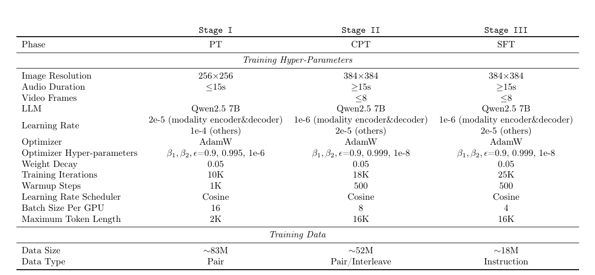

